# 2013高教社杯全国大学生数学建模竞赛

## 承 诺 书

我们仔细阅读了《全国大学生数学建模竞赛章程》和《全国大学生数学建模竞赛参赛规则》（以下简称为“竞赛章程和参赛规则”，可从全国大学生数学建模竞赛网站下载）。

我们完全明白，在竞赛开始后参赛队员不能以任何方式（包括电话、电子邮件、网上咨询等）与队外的任何人（包括指导教师）研究、讨论与赛题有关的问题。

我们知道，抄袭别人的成果是违反竞赛章程和参赛规则的，如果引用别人的成果或其他公开的资料（包括网上查到的资料），必须按照规定的参考文献的表述方式在正文引用处和参考文献中明确列出。

我们郑重承诺，严格遵守竞赛章程和参赛规则，以保证竞赛的公正、公平性。如有违反竞赛章程和参赛规则的行为，我们将受到严肃处理。

我们授权全国大学生数学建模竞赛组委会，可将我们的论文以任何形式进行公开展示（包括进行网上公示，在书籍、期刊和其他媒体进行正式或非正式发表等）。

我们参赛选择的题号是（从A/B/C/D中选择一项填写）： A

我们的参赛报名号为（如果赛区设置报名号的话）： 13241002

所属学校（请填写完整的全名）： 华中科技大学

参赛队员 (打印并签名) ：1. 黄小敏

2. 黄程

3. 王露

指导教师或指导教师组负责人 (打印并签名)： 指导教师组

（论文纸质版与电子版中的以上信息必须一致，只是电子版中无需签名。以上内容请仔细核对，提交后将不再允许做任何修改。如填写错误，论文可能被取消评奖资格。）

日期： 2013 年 9 月 16 日

赛区评阅编号（由赛区组委会评阅前进行编号）：

# 2013高教社杯全国大学生数学建模竞赛

## 编 号 专 用 页

赛区评阅编号（由赛区组委会评阅前进行编号）：

赛区评阅记录（可供赛区评阅时使用）：

<table><tr><td>评阅人</td><td></td><td></td><td></td><td></td><td></td><td></td><td></td><td></td><td></td><td></td></tr><tr><td>评分</td><td></td><td></td><td></td><td></td><td></td><td></td><td></td><td></td><td></td><td></td></tr><tr><td>备注</td><td></td><td></td><td></td><td></td><td></td><td></td><td></td><td></td><td></td><td></td></tr></table>

全国统一编号（由赛区组委会送交全国前编号）：

全国评阅编号（由全国组委会评阅前进行编号）：

# 车道占用对城市道路通行能力影响

## 摘要

车道占用将改变道路的通行能力，对城市交通秩序产生影响。本文建立数学模型，就事故发生车道、发生位置和堵车类型等因素定量分析车道占用对城市道路实际通行能力的影响。

针对第一问，首先统计上下游路段通行量并换算成标准车当量，并引入实际问题修正系数，建立横截面实际通行能力动态模型，利用 matlab编程计算，绘制交通事故横断面实际通行能力变化曲线，得到事故处理中事故点处通行能力为16.8pcu/min,事故发生3min后开始出现堵塞。然后对小区路口车流量和车道宽度进一步分析，得到小区路口车流量与横断面通行能力不相关，以及横向干扰和车道宽度增加一个等级，通行能力分别平均下降5.6%和28%。

针对第二问，用相同方法处理视频二中数据，定义实际通行能力差异度和稳定性差异度，建立基于差异度的不同占道横断面通行能力差异模型。求解得到占用2、3车道对实际通行能力的影响比占用1、2车道大6.9%。对车辆取向比较分析，得到公交车主要在2,3车道行驶，车道占用率为42%和58%，对车流速度分析，得到事故发生在2,3车道公交车速度减少量比事故发生在1,2车道速度减少量大1.21m/s,得出小轿车速度对发生事故的车道位置比公交车更敏感。

针对第三问，由守恒公式和交通波理论，推导 2种适应范围不同的排队长度估算公式构成道路拥堵排队长度估算模型。模型显示完全堵塞时，排队长度与上下游截面车流量之差对时间积分值成正比；不完全堵塞时，排队长度与上下游截面车流密度之和对时间积分值成正比。利用附件一中数据对模型进行检验，得到两公式估算值与实际值的关联度分别为0.79、0.68，模型估算结果良好。然后分析车道最优车流密度，得到该道路需将车流密度控制在44.9pcu/km以下，并对上游车流量作敏感性分析，得到当上游车流量增大10%时，平均队伍长度增加57%。

针对第四问，首先对第三问模型进行匹配修改，估算上游路口和事故截断面车流量随时间变化的函数关系式和相关参数，考虑红绿灯的周期性影响，得到排队长度预测模型。用matlab软件解得5min 33s后排队长度将到达上游路口，队伍长度平均增长速度为22m/min。然后对上游路口红绿灯周期进行敏感性分析，得到队伍长度达到140m的耗时与红绿灯周期负相关。

最后，给出了模型的优缺点和改进方案。

关键词： 实际通行能力 差异度 交通波 排队长度预测

## 1、问题重述

## 1.1 背景

车道占用发生的原因有很多，根据城市道路交通流密度大，连续性强的特点，一旦发生车道占用，将降低路段所有车道的通行能力，引起道路阻塞，影响居民的出行。正确估计车道占用对城市交通的影响程度将为交通管理部门的决策提供理论依据。

## 1.2需要解决的问题

根据附件所示的内容，考察处于同一路段同一横断面发生的两个交通事故，研究以下的问题：

（1）根据视频 1（附件 1），描述视频中交通事故发生至撤离期间，事故所处横断面实际通行能力变化过程。  
（2）根据问题 1 所得结论，结合视频 2（附件 2），分析说明同一横断面交通事故所占车道不同对该横断面实际通行能力影响的差异。  
（3）构建数学模型，分析视频1（附件1）中交通事故所影响的路段车辆排队长度与事故横断面实际通行能力，事故持续时间，路段上车流量之间的关系。  
（4）假如视频1（附件1）中的交通事故所处的横断面距离上游路口变为140米。路段下游方向需求不变，路段上游车流量为1500pcu/h,事故发生时车辆初始排队长度为零，且事故持续不撤离。请估算，从事故发生开始，经过多长时间，车辆排队长度将到达上游路口。

## 2、问题分析

这是车道被占用对城市道路通行能力的影响问题，需要分析实际通行能力，考虑排队长度、事故持续时间以及上游车流量之间的关系。问题的特点在于关系复杂，实际情况下受多种因素影响。解决问题的关键在于如何从视频中获取有用信息，找出之间的关系,得到确切的数学表达式。

## 2.1问题一的分析：

交通事故的发生将在一定时间内影响实际可通行的车道数量，从而引起车辆排队。要描述视频中交通事故发生至撤离期间,事故所处横断面实际通行能力的变化过程，需要定义指标，建立模型，计算实际通行能力表征横断面实际通行能力的大小。统计视频中各种类型车辆的数目，计算相应标准车当量数，分析影响交通能力的因素，查找文献确定引入系数值，得到相应的结果。

## 2.2问题二的分析：

由于视频1和2中的交通事故发生在同一路段，同一横断面的不同车道处，因此比较两个交通事故发生时横断面交通能力的大小可以反映同一横断面交通事故所占车道不同对该横断面实际通行能力影响的差异。采用和问题一相同的做法，对视频二中的信息进行处理，计算得到相应通行能力的大小，进行比较。同时，借助公交车通过同一路段的平均速度，公交车对于车道选择的趋势可以验证上述的结论。

## 2.3问题三的分析：

排队长度、上游车流量以及事故截断面通行能力信息均可由附件 1统计分析得到，这些数据可以作为所建立模型的检验数据。由于道路堵塞有不同的情形，可以针对不同的情形设计不同的分析公式，综合考虑多种影响因素，适当地使用极限条件下的近似关系以增加模型的适应性和简便性，最后对模型进行数据检验以判断模型是否能够准确反映真实情况。

## 2.4问题四的分析：

问题四实际上是问题三的一种特殊情形，需要对问题三中建立的模型细化，确定对应的参数。由于该问中并未给出上游车流量的密度特征，故需要自行预测，考虑到事故地点距离上游红绿灯很近，可以将上游车流量视为周期变化的，进而求解排队长度。

## 3、模型假设与符号系统

## 3.1模型的假设

（1）准确性假设：假设视频上的信息真实可靠，可以根据对车辆的计数得到相应的道路交通信息  
（2）排他性假设：假设道路拥堵只与交通事故有关，不考虑其他因素对交通状况的影响  
（3）合理性假设：假设问题中的司机是理性的，总是按照对自己最有利的方式行车。

## 3.2符号系统

<table><tr><td>符号</td><td>意义</td><td>单位</td></tr><tr><td> $C'$ </td><td>标准车当量数</td><td>pcu</td></tr><tr><td> $s_{i1}$ </td><td>小轿车数</td><td>辆</td></tr><tr><td> $s_{i2}$ </td><td>电动车数</td><td>辆</td></tr><tr><td> $s_{i3}$ </td><td>公交车数</td><td>辆</td></tr><tr><td>C</td><td>实际通行能力</td><td>pcu/h</td></tr><tr><td>n</td><td>可用车道数</td><td>个</td></tr><tr><td> $\eta$ </td><td>驾驶员总体特征影响修正系数</td><td></td></tr><tr><td>f</td><td>横向干扰修正系数</td><td></td></tr><tr><td> $C_P$ </td><td>可能通行能力</td><td></td></tr><tr><td> $f_l$ </td><td>事故发生处到路口距离修正系数</td><td></td></tr><tr><td> $\alpha$ </td><td>服务水平比值</td><td></td></tr><tr><td> $S_1$ </td><td>横向干扰系数影响力</td><td></td></tr><tr><td> $S_2$ </td><td>车道宽度影响力</td><td></td></tr><tr><td>V</td><td>临界速度</td><td></td></tr><tr><td> $\omega_i$ </td><td>稳定性</td><td></td></tr><tr><td>B</td><td>差异度</td><td></td></tr><tr><td>P</td><td>实际交通能力差异度</td><td></td></tr><tr><td>T</td><td>稳定性差异度</td><td></td></tr><tr><td>符号</td><td>意义</td><td>单位</td></tr><tr><td>P</td><td>车辆密度</td><td>pcu/m</td></tr><tr><td>L</td><td>排队长度</td><td>m</td></tr><tr><td>Q</td><td>通行量</td><td>pcu</td></tr><tr><td> $P_{\text{max}}$ </td><td>堵塞密度</td><td>pcu/km</td></tr><tr><td> $P^0_{\text{max}}$ </td><td>道路堵塞密度</td><td>pcu/km</td></tr><tr><td> $v_f$ </td><td>畅通速度</td><td>km/h</td></tr><tr><td>E(t)</td><td>两小区路口的综合车流量</td><td>pcu/h</td></tr><tr><td> $Q_U(t)$ </td><td>上游截面车流量</td><td>pcu/h</td></tr><tr><td> $Q_{D}(t)$ </td><td>拥堵处截面车流量</td><td>pcu/h</td></tr><tr><td> $N(t)$ </td><td>上下游流量差的累和</td><td>pcu/h</td></tr><tr><td> $\omega$ </td><td>扩散速度</td><td>km/h</td></tr><tr><td> $\eta$ </td><td>退化系数</td><td>—</td></tr></table>

注：未列出符号及重复的符号以出现处为准

## 4、问题一的建模与求解

## 4.1 问题分析

根据附件一视频，统计上游路口及事故发生横截面处小轿车，电瓶车，公交车的数量，查找车辆换算系数，计算得到道路基本交通能力，作为一个侧面，反映道路的实际通行能力大小。

实际通行能力不仅受到车道数量，道路基本交通能力的影响，还受到交通环境的影响，实际计算时，需要引入相应的修正系数反映交通环境的不同。根据统计得到的公交车出现的频数，计算重型车辆修正系数，通过查找参考文献，确定其他参数。

实际中，道路的服务水平也将影响实际通行能力，而这个水平是由最大服务量和实际通行能力的比值来确定的。查找相关的文献，确定比值应取为 1，最终，得到横截面实际通行能力动态模型，根据计算结果，分析交通事故发生和疏散时实际通行能力的变化状况，得出结论。

问题一的流程图如下所示：

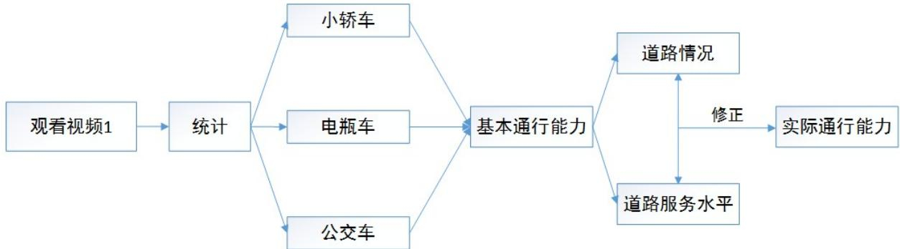

<details>
<summary>flowchart</summary>

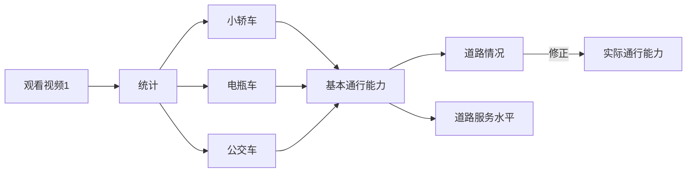
</details>

图 1：问题一流程图

## 4.2数据预处理

## 4.2.1视频1描述与数据统计规则

用播放器播放视频 1，可以知道视频 1 并不是连续的而是有间断的有重复的，视频1 上面显示的日期为 2013 年 2 月 26 日，时间为 16:38:39-17:03:50，对视频 1 的关键时间信息以及跳跃时间记录如下：

表1：视频1信息记录表

<table><tr><td colspan="2">事件</td><td colspan="2">时间或时间段</td></tr><tr><td colspan="2">视频1开始时刻</td><td colspan="2">16:38:39</td></tr><tr><td colspan="2">事故发生时刻</td><td colspan="2">16:42:32</td></tr><tr><td colspan="2">事故发生后有车到达时刻</td><td colspan="2">16:43:12</td></tr><tr><td colspan="2">事故发生后开始堵车时间</td><td colspan="2">16:46:27</td></tr><tr><td colspan="2">事故撤销时刻</td><td colspan="2">17:00:07</td></tr><tr><td colspan="2">视频1结束时刻</td><td colspan="2">17:03:50</td></tr><tr><td rowspan="3">视频跳跃时间段</td><td>1</td><td>16:49:38—16:50:04</td><td>26s</td></tr><tr><td>2</td><td>16:56:05—16:57:54</td><td>119s</td></tr><tr><td>3</td><td>16:58:18—16:59:07</td><td>49s</td></tr><tr><td rowspan="2"></td><td>4</td><td>17:00:07—17:00:23</td><td>16s</td></tr><tr><td>5</td><td>17:02:09—17:03:29</td><td>80s</td></tr></table>

根据事故发生时间和事故结束时间，知道事故发生期间有3 段时间没有信息可用，因此需要对缺失信息进行处理，为了简单起见，取平均值代替第 1 段缺失信息,16:56:00以后缺失时间较多，舍弃这些时间的数据。

对于统计数据的规则，取事故发生横断面中间为准线，作垂直于道路的直线（实际统计是用眼估计此直线位置），从 16:43:00开始每 30s 统计通过直线（车身一半经过此直线的车算通过此直线）的小轿车、电动车（包括自行车）、公交车的数量，到16:56:00结束，共26组数据。

## 4.2.2 标准车当量数

查阅相应参考文献[1]，得到小轿车，电动车，公交车转化成标准车当量系数为1,0.5,1.5.统计出现事故之后每隔30s 交通事故发生的横截面处出现的小轿车，电动车和公交车的数量，并根据如下所示的公式计算：

$$
C ^ {\prime} = s _ {i 1} + 0. 5 s _ {i 2} + 1. 5 s _ {i 3} \tag {4.1}
$$

式中 $C ^ { ' }$ 表示标准车当量数， $s _ { i 1 } , s _ { i 2 } , s _ { i 3 }$ 表示第i个时刻小轿车，电瓶车和公交车的数量得到标准车当量数如下所示：

表2：部分交通事故横截面各种车辆数及标准车当量数记录表

<table><tr><td>小轿车</td><td>电动车</td><td>公交车</td><td>标准车当量数</td></tr><tr><td>7</td><td>0</td><td>2</td><td>10</td></tr><tr><td>6</td><td>2</td><td>2</td><td>10</td></tr><tr><td> $\vdots$ </td><td> $\vdots$ </td><td> $\vdots$ </td><td> $\vdots$ </td></tr><tr><td>6</td><td>3</td><td>1</td><td>9</td></tr><tr><td>10</td><td>0</td><td>0</td><td>10</td></tr><tr><td>9</td><td>5</td><td>0</td><td>11.5</td></tr></table>

## 4.2.3交通事故发生前后横断面标准车当量数

统计事故发生前的道路的小轿车，电动车和公交车，并根据式（\*）计算相应的结果，得到如下所示的表格：

表3：事故前后基本通行能力记录表

<table><tr><td>事故前基本通行能力(pcu/30s)</td><td>9.5</td><td>9.7</td><td>9.8</td></tr><tr><td>事故后基本通行能力(pcu/30s)</td><td>18</td><td>18.1</td><td></td></tr></table>

## 4.3模型的建立

## 4.3.1 基本通行能力[2]

基本通行能力是在理想道路交通条件下通行能力，其理论值可以由如下所示的公式表达：

$$
C _ {B} = \frac {3 6 0 0}{t + 7 . 2 \sqrt {(l _ {a} + l _ {b}) / (2 5 4 \varphi)}} \tag {4.2}
$$

计算得到，其中的t为驾驶员反应时间， $\varphi$ 为轮胎与路面间的附着系数， $l _ { a }$ 为车辆间最小安全停车间隙， $l _ { b }$ 为车辆平均长度。由于按照以上公式得到的计算结果远小于实际观察得到的最大交通量，因此美国和日本关于基本通行能力的规定值来源于实际观测结果，因此，用实际交通事故发生处横断面上的单位时间通过的标准车辆数代替基本通行能力。

## 4.3.2 可能通行能力[2]

可能通行能力是在实际道路和交通能力条件下的通行能力，是道路的最大实际容量。实际条件与理想条件的差异将造成理论基本通行能力的折减，于是用下式确定可能通行能力。

$$
C _ {P} = C _ {B} \bullet n \bullet f _ {w} \bullet f _ {z} \bullet \eta \bullet f \bullet f _ {l} \tag {4.3}
$$

式中： $C _ { B }$ 为基本通行能力，n为可通行车道数， $f _ { w }$ 为车道宽度和侧向净宽对通行能力的比值， $f _ { z }$ 重型车辆修正系数， 为驾驶员总体特征影响修正系数，f为横向干扰影响修正系数， $f _ { l }$ 为事故发生地到路口的距离修正系数。

## 4.3.3 实际通行能力[2]

实际中的通行能力除了受到道路实际最大容量的限制之外，还受到最大服务交通量与基本通行能力的比值 $\alpha$ 的影响。 综合以上所述，得到横断面实际交通能力动态模型如下所示：

$$
C = \alpha \bullet C _ {P} = \alpha \bullet C _ {B} \bullet n \bullet f _ {w} \bullet f _ {z} \bullet \eta \bullet f \bullet f _ {l} \tag {4.4}
$$

式中的C为实际通行能力， $\alpha$ 为最大服务交通量与基本通行能力比值， $C _ { P }$ 为可能通行能力。

## 4.4 模型的求解

## 4.4.1 参数的确定

## （1）可用车道数n

在交通事故发生期间，道路发生拥堵，由于车辆堵塞了两个车道，可用的车道数为1，在事故发生之前与处理之后可用的车道数为 3.

（2）车道宽度的通行能力折减系数 $f _ { w }$

根据参考文献[3]中车道宽度的通行能力折减系数表（见附录），得到当道路的宽度为3.25m 时，车道宽度的通行能力折减系数取为0.94。

（3）重型车辆修正系数f

查阅参考文献，得到重型车辆的修正系数的定义如下所示：

$$
f _ {z} = \frac {1}{1 + P _ {z} (E _ {z} - 1)} \tag {4.5}
$$

式中， $E _ { z }$ 为大型车换算成小客车的车辆换算系数， $P _ { z }$ 为大型车交通量占总交通量的百分比。

查阅相关的参考文献[4]，得到参数 $E _ { z }$ 的取值表（见附录），因此 $E _ { z }$ 取为 1.7

根据附录中所示交通事故发生时横断面通过各种车辆的数量，记第i个时刻对应的小轿车，电动车，公交车的数量记为 $s _ { i 1 } , s _ { i 2 } , s _ { i 3 }$ ，则公交车出现的概率 $P _ { z }$ 为

$$
\frac {\sum_ {i = 1} ^ {2 6} s _ {i 3}}{\sum_ {i = 1} ^ {2 6} (s _ {i 1} + s _ {i 2} + s _ {i 3})} = \frac {1 2}{2 1 3 + 1 2 + 4 0} = 0. 0 4 5 \tag {4.6}
$$

（4）驾驶员总体特征影响修正系数<sub>η</sub>

根据文献[4]，驾驶员总体特征影响修正系数一般取为1

（5）横向干扰影响修正系数f

根据参考文献中横向干扰对通行能力的修正系数表（见附录），得到横向干扰对通

行能力的修正系数为0.95。

（6）事故发生地到路口距离修正系数 $f _ { l }$

由于视频 1中事故发生在路段中央，修正参数 $f _ { l }$ 取为1

（7）最大服务交通量与基本通行能力的比值 $\alpha$

查找城市内最大限速值为 $V _ { f } = 6 0 k m / h$ ,根据参考文献[5]中实验观测数据，对标准型客车，最小车头间距取为 $l = 8$ ，驾驶员的反映时间为 $t = 1 . 2 s$ ，根据 GREENSHIELD $K - V$ 模型，临界车速可以由如下表达式确定：

$$
V = \left\{ \begin{array}{l l} V _ {f} - 3. 6 \frac {l}{t} & V _ {f} > 7. 2 \frac {l}{t} \\ \frac {1}{2} V _ {f} & V _ {f} \leq 7. 2 \frac {l}{t} \end{array} \right. \tag {4.7}
$$

由于 $V _ { _ { f } } \ > 7 . 2 \frac { l } { t } = 4 8 , V = V _ { _ { f } } - 3 . 6 \frac { l } { t } = 3 6 k m / h$

根据视频中16时39分09秒时出现的黑色小轿车在16时39分24秒通过240米的距 离 ， 可 得 小 轿 车 的 发 生 事 故 前 自 由 行 驶 速 度 为 57.6 km h/$\left( V = 3 6 k m / h \times 5 7 . 6 k m / h \times 1 2 0 k m / h \right)$ ），因此根据理想条件下的服务水平划分标准（见附录），确定服务水平为 E级，对应的在60km h/ 自由车速下的α值为1

## 4.4.2实际通行能力

根据上述确定的参数，及统计数据，利用 matlab 软件，计算出交通事故发生时的横断面通行能力，得到如下表格（事故期间部分数据，具体见附录）：

表4：交通事故发生时实际通行能力记录表

<table><tr><td>时刻</td><td>16:45:30</td><td>16:46:00</td><td>16:46:30</td><td>16:47:00</td></tr><tr><td>实际通行能力</td><td>780</td><td>936</td><td>1044</td><td>984</td></tr><tr><td>时刻</td><td>16:47:40</td><td>16:48:00</td><td>16:48:30</td><td>16:49:00</td></tr><tr><td>实际通行能力</td><td>672</td><td>936</td><td>1248</td><td>1092</td></tr></table>

作出通行能力变化图如下所示：

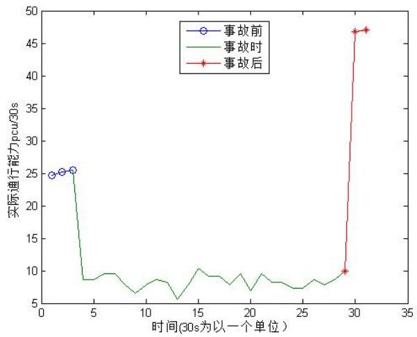

<details>
<summary>line</summary>

| 时间 (30s) | 事故前 (pcu/30s) | 事故时 (pcu/30s) | 事故后 (pcu/30s) |
| --- | --- | --- | --- |
| 1 | ~24.5 | — | — |
| 2 | ~25.2 | — | — |
| 3 | ~25.5 | ~25.5 | — |
| 4 | — | ~8.8 | — |
| 5 | — | ~8.8 | — |
| 6 | — | ~9.5 | — |
| 7 | — | ~9.6 | — |
| 8 | — | ~8.5 | — |
| 9 | — | ~6.5 | — |
| 10 | — | ~7.5 | — |
| 11 | — | ~8.8 | — |
| 12 | — | ~8.5 | — |
| 13 | — | ~5.5 | — |
| 14 | — | ~7.5 | — |
| 15 | — | ~10.2 | — |
| 16 | — | ~9.2 | — |
| 17 | — | ~9.2 | — |
| 18 | — | ~7.8 | — |
| 19 | — | ~9.5 | — |
| 20 | — | ~6.8 | — |
| 21 | — | ~9.5 | — |
| 22 | — | ~8.2 | — |
| 23 | — | ~8.2 | — |
| 24 | — | ~7.2 | — |
| 25 | — | ~7.2 | — |
| 26 | — | ~8.5 | — |
| 27 | — | ~7.8 | — |
| 28 | — | ~8.8 | — |
| 29 | — | ~9.8 | ~10.0 |
| 30 | — | — | ~46.8 |
| 31 | — | — | ~47.0 |
</details>

图 2：交通事故发生前，发生时，发生后实际通行能力图

根据以上图得到如下结论：

1.发生交通事故时，实际通行能力呈现波动状态，均值为 $1 6 . 8 \mathrm { { p c u / m i n } }$  
2.未发生交通事故和交通事故处理之后实际通行能力呈现出稳定的状态，事故前实际通行能力约为 $5 0 . 2 \mathrm { { p c u } / \mathrm { { m i n } } }$ ，事故后实际通行能力约为 $9 2 \mathrm { { p c u } / \mathrm { { m i n } } }$ C

3.实际堵车时间为16:46:27（对应图中 13），此后一段实际交通能力明显下降，说明堵车在一段时间内导致实际交通能力下降。

## 4.5影响横断面通行能力因素分析

## 4.5.1 小区路口进入车辆影响分析

根据公式(4.8)，知道实际交通能力不仅和道路服务水平，车道数以及车道宽度等因素有关，还和基本交通能力有关。基本交通能力是用单位时间通过的车辆数来表征。根据视频的路况，知道单位时间通过的车辆数不仅和上游车流量有关，还有小区路口的车流量有关。为了研究实际交通能力和小区路口车流量有没有关系已经强弱程度，我们对其作相关性检验。为了消除上游车流量的影响，作偏相关检验。利用 spss 软件检验结果如下：

表5：spss 相关性检验结果记录表  
相关性

<table><tr><td colspan="3">控制变量</td><td>小区车辆</td><td>实际通行能力</td></tr><tr><td rowspan="6">上游路口车辆</td><td rowspan="3">小区车辆</td><td>相关性</td><td>1.000</td><td>.272</td></tr><tr><td>显著性(双侧)</td><td></td><td>.448</td></tr><tr><td>df</td><td>0</td><td>8</td></tr><tr><td rowspan="3">实际通行能力</td><td>相关性</td><td>.272</td><td>1.000</td></tr><tr><td>显著性(双侧)</td><td>.448</td><td></td></tr><tr><td>df</td><td>8</td><td>0</td></tr></table>

由以上计算结果可以得到如下的结论：

相关系数为0.272，可以认为横断面实际通行能力对于小区路口进入车辆数不敏感，侧面反映了实际交通能力主要受上游车流量的影响。

## 4.5.2横向干扰和车道宽度对实际交通能力的影响

横向干扰（m）和车道宽度都作为实际通行能力的修正系数，与实际通行能力大小均成正比。定义横向干扰影响力，车道宽度影响力 $S _ { 1 } , S _ { 2 }$ 如下：

横向干扰影响力：

$$
S _ {1} = \frac {\left| f _ {1} - f _ {2} \right|}{n _ {1} - n _ {2}} \tag {4.9}
$$

车道宽度影响力：

$$
S _ {2} = \frac {\left| f _ {w 1} - f _ {w 2} \right|}{l _ {1} - l _ {2}} \tag {4.10}
$$

根据附录中所示横向干扰系数大小和车道宽度大小对应的修正系数，通过计算得到影响力如下：

表 $_ { 6 } { : }$ ：横向干扰，车道宽度影响力记录表

<table><tr><td></td><td>1</td><td>2</td><td>3</td><td>平均</td></tr><tr><td>横向干扰影响力</td><td>0.05</td><td>0.05</td><td>0.067</td><td>0.056</td></tr><tr><td>车道宽度影响力</td><td>0.24</td><td>0.30</td><td>0.31</td><td>0.28</td></tr></table>

相应的柱状图如下所示：

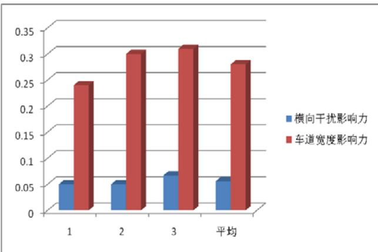

<details>
<summary>bar</summary>

| Category | 横向干扰影响力 | 车道宽度影响力 |
| --- | --- | --- |
| 1 | ~0.05 | ~0.24 |
| 2 | ~0.05 | ~0.30 |
| 3 | ~0.07 | ~0.31 |
| 平均 | ~0.06 | ~0.28 |
</details>

图 3：横向干扰系数和车道宽度大小修正系数影响力对比

由以上的图表可以得到如下所示的结论：

（1）车道宽度对实际通行能力的影响为0.056，而车道宽度对其影响为0.28  
（2）车道宽度对实际通行能力的影响远大于横向干扰，影响力差距约为0.22。

## 5、问题二的建模与求解

## 5.1问题分析

对于视频二中所示的交通事故，它与视频一中的事故发生地点在同一路段的同一横截面处，唯一的区别在于事故所处的车道不同，因此采用与第一问类似的方法，得到相应的道路通行能力的计算结果，定义实际通行能力差异度，稳定性差异度和总差异度，用 matlab 编程计算得到相应结果，比较之后可以得出结论。进一步统计并分析两个视频中公交车的行驶取向，计算两个视频中车辆通过120 米到达事故发生点的平均速度和时间，对上述的比较结果进行验证，得出结论。

问题二的流程图如下所示:

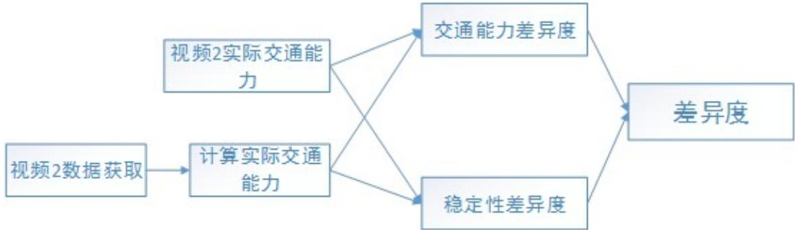

<details>
<summary>flowchart</summary>

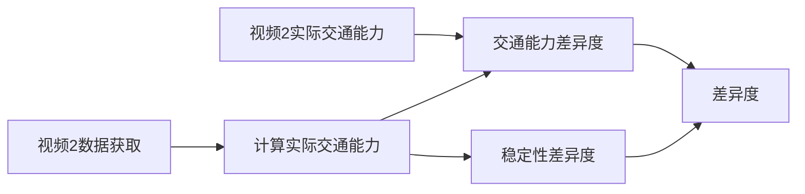
</details>

图 4：问题二分析流程图

## 5.2数据预处理

(1)对视频二的描述与数据统计规则：

表7：视频2数据统计表

<table><tr><td colspan="2">事件</td><td colspan="2">时间或时间段</td></tr><tr><td colspan="2">视频2开始时刻</td><td colspan="2">17:28:51</td></tr><tr><td colspan="2">事故发生时刻</td><td colspan="2">17:34:17</td></tr><tr><td colspan="2">事故发生后有车到达时刻</td><td colspan="2">17:34:40</td></tr><tr><td colspan="2">事故撤销时刻</td><td colspan="2">18:03:36</td></tr><tr><td colspan="2">视频2结束时刻</td><td colspan="2">18:04:12</td></tr><tr><td>视频跳跃时间段</td><td>1</td><td>17:31:07—17:34:17</td><td>190s</td></tr></table>

视频跳跃时间段在发生事故前的时刻，因此对事故发生时期进行分析时可以忽略这

段时间的信息。

数据统计规则和问题一一样，从 17:34:30 开始每 30s 统计通过直线（车身一半经过此直线的车算通过此直线）的小轿车、电动车（包括自行车）、公交车的数量，到18:03:30 结束，共 58 组数据。

## (2)事故发生期间基本通行能力

根据问题一计算公式(4.11)，计算得到如下事故时基本通行能力表，部分数据如下：

表8：事故发生阶段基本通行能力表

<table><tr><td>时间</td><td>小轿车</td><td>电瓶车</td><td>公交车</td><td>事故时基本通行能力</td></tr><tr><td>17:34:17~17:35:17</td><td>8</td><td>2</td><td>0</td><td>9</td></tr><tr><td>17:35:17~17:36:17</td><td>11</td><td>0</td><td>1</td><td>12.5</td></tr><tr><td>17:36:17~17:37:17</td><td>11</td><td>2</td><td>1</td><td>13.5</td></tr><tr><td>17:37:17~17:38:17</td><td>8</td><td>2</td><td>1</td><td>10.5</td></tr><tr><td>17:38:17~17:39:17</td><td>8</td><td>3</td><td>0</td><td>9.5</td></tr><tr><td>17:39:17~17:40:17</td><td>11</td><td>4</td><td>1</td><td>14.5</td></tr><tr><td>17:40:17~17:41:17</td><td>9</td><td>2</td><td>2</td><td>13</td></tr><tr><td>17:41:17~17:42:17</td><td>8</td><td>2</td><td>1</td><td>10.5</td></tr><tr><td>17:42:17~17:43:17</td><td>11</td><td>5</td><td>0</td><td>13.5</td></tr><tr><td>17:43:17~17:44:17</td><td>9</td><td>2</td><td>1</td><td>11.5</td></tr><tr><td>17:44:17~17:45:17</td><td>6</td><td>3</td><td>3</td><td>12</td></tr><tr><td>17:45:17~17:46:17</td><td>8</td><td>1</td><td>0</td><td>8.5</td></tr></table>

## (3)事故发生前后基本通行能力

表9：事故发生前后基本通行能力记录表

<table><tr><td>事故前基本通行能力</td><td>11.5</td><td>11</td><td>11</td></tr><tr><td>事故后基本通行能力</td><td>25.5</td><td>25.5</td><td></td></tr></table>

## (4)视频 2中事故发生时横断面的实际通行能力

表10：视频2事故发生横断面实际通行能力表

<table><tr><td>时刻</td><td>16:45:30</td><td>16:46:00</td><td>16:46:30</td><td>16:47:00</td></tr><tr><td>实际通行能力</td><td>1476</td><td>1323</td><td>1068</td><td>1374</td></tr><tr><td>时刻</td><td>16:47:40</td><td>16:48:00</td><td>16:48:30</td><td>16:49:00</td></tr><tr><td>实际通行能力</td><td>1171</td><td>1221</td><td>865</td><td>1476</td></tr></table>

其变换规律图如下所示：

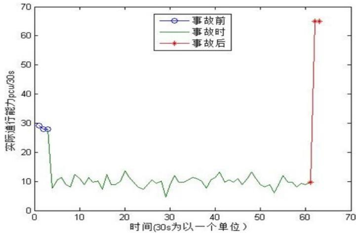

<details>
<summary>line</summary>

| 时间 (30s) | 事故前 (pcu/30s) | 事故时 (pcu/30s) | 事故后 (pcu/30s) |
| --- | --- | --- | --- |
| ~1 | ~29 | — | — |
| ~2 | ~28 | — | — |
| ~3 | ~28 | ~28 | — |
| ~61.5 | — | — | ~10 |
| ~62 | — | — | ~65 |
</details>

图 5：视频 2 横断面实际通行能力动态变化图

## 5.3模型的建立

## （1）实际交通能力正态性检验

从视频一和视频2的图像，可以看出交通事故期间，交通事故横截面出实际通行能力波动明显，且没有明显的线性或者其他类似规律，数据可能具有正态分布特性。因此，利用得到的实际通行能力数据，作正态检验。利用 spss 软件作正态检验 Q-Q 图，结果如下：

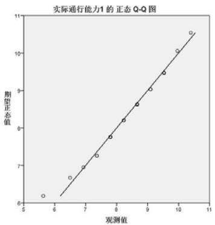

<details>
<summary>qq</summary>

| 观测值 | 期望正态值 |
| --- | --- |
| ~5.7 | ~6.2 |
| ~6.5 | ~6.7 |
| ~7.0 | ~7.0 |
| ~7.4 | ~7.3 |
| ~7.9 | ~7.8 |
| ~8.3 | ~8.2 |
| ~8.7 | ~8.6 |
| ~9.2 | ~9.0 |
| ~9.6 | ~9.5 |
| ~10.0 | ~10.1 |
| ~10.4 | ~10.6 |
</details>

图 6：视频 1 实际通行能力 QQ 图

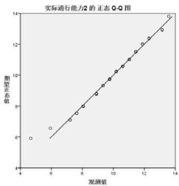

<details>
<summary>qq</summary>

| 观测值 | 期望正态值 |
| --- | --- |
| ~4.5 | ~6.0 |
| ~6.0 | ~6.7 |
| ~7.3 | ~7.1 |
| ~7.8 | ~7.6 |
| ~8.1 | ~8.0 |
| ~8.9 | ~8.8 |
| ~9.4 | ~9.3 |
| ~9.8 | ~9.7 |
| ~10.2 | ~10.2 |
| ~10.6 | ~10.5 |
| ~11.0 | ~10.9 |
| ~11.4 | ~11.5 |
| ~11.8 | ~12.0 |
| ~12.2 | ~12.4 |
| ~13.2 | ~13.0 |
| ~13.6 | ~13.8 |
</details>

图 7：视频 2 实际通行能力 QQ 图

图中的散点越接近直线，说明正态性越好，可以看出视频 1和视频2中的散点非常靠近直线，正态性明显。因此，可以认为题中交通事故横截面处实际交通能力服从正态分布。

## （2）实际交通能力差异度

以正态拟合得到的均值作为实际交通能力的大小，则下式成立：

$$
C _ {1} = \mu_ {1} (\mu_ {1}: \mathrm{N} (\mu_ {1}, \sigma)), C _ {2} = \mu_ {2} (\mu_ {2}: \mathrm{N} (\mu_ {2}, \sigma))
$$

定义实际交通能力的差异程度如下：

$$
P = \frac {C _ {1} - C _ {2}}{C _ {1} + C _ {2}} \tag {5.1}
$$

P 值越大反应发生事故的车道位置对实际交通能力的影响很大。

## （3）稳定性差异度

由于视频1和视频2的交通事故横截面实际交通能力具有波动性，则应该具有稳定程度，用稳定性 $\omega$ 这一量来反映，显然，稳定性越高越有利于车辆的通行。定义稳定性如下所示：

$$
\omega_ {1} = \frac {1}{\sigma_ {1}}, \quad \omega_ {2} = \frac {1}{\sigma_ {2}}
$$

则稳定性的差异程度如下：

$$
T = \frac {\omega_ {1} - \omega_ {2}}{\omega_ {1} + \omega_ {2}} \tag {5.2}
$$

正数说明交通事故发生在第2,3车道比交通事故发生在第1,2车道对应的通行能力更稳定。

## （4）差异度

为了说明事故处横断面实际交通能力总的影响差异，定义差异度B，如下所示：

$$
B = \lambda_ {1} P + \lambda_ {2} T \tag {5.3}
$$

式中的 $\lambda _ { 1 } , \lambda _ { 2 }$ 为实际交通能力和稳定性的偏好系数

综上所述，得到如下事故处横断面实际通行能力影响差异模型：

$$
\left\{ \begin{array}{l} B = \lambda_ {1} P + \lambda_ {2} T \\ P = \frac {C _ {1} - C _ {2}}{C _ {1} + C _ {2}} \\ T = \frac {w _ {1} - w _ {2}}{w _ {1} + w _ {2}} \end{array} \right. \tag {5.4}
$$

## 5.4模型的求解

## （1）确定实际交通能力和稳定性

由于交通事故横截面实际交通能力符合正态分布，则可以利用 k-s检验求解正态分布的均值。利用spss软件求解结果如下：

表11：实际通行能力正态分布检验结果记录表  
单样本 Kolmogorov-Smirnov 检验

<table><tr><td colspan="2"></td><td>实际通行能力1</td><td>实际通行能力2</td></tr><tr><td colspan="2">N</td><td>26</td><td>58</td></tr><tr><td rowspan="2">正态参数a,b</td><td>均值</td><td>8.3623</td><td>9.8511</td></tr><tr><td>标准差</td><td>1.10093</td><td>1.71712</td></tr><tr><td rowspan="3">最极端差别</td><td>绝对值</td><td>.111</td><td>.119</td></tr><tr><td>正</td><td>.085</td><td>.074</td></tr><tr><td>负</td><td>-.111</td><td>-.119</td></tr><tr><td colspan="2">Kolmogorov-Smirnov Z</td><td>.567</td><td>.906</td></tr><tr><td colspan="2">渐近显著性(双侧)</td><td>.905</td><td>.385</td></tr></table>

则：

$$
C _ {1} = 8. 3 6, \quad C _ {2} = 9. 8 5
$$

## （2）稳定性确定

根据稳定性定义以及正态分布的方差，得到：

$$
\omega_ {1} = 1 / 1. 1 0 = 0. 9 1, \quad \omega_ {2} = 1 / 1. 7 2 = 0. 5 8
$$

## (3)系数的确定

假设同等看待实际交通能力和稳定性，那么可取 $\lambda _ { 1 } ~ = \lambda _ { 2 } = 0 . 5$

## (4)差异度求解

根据上面的结果和公式，计算得到如下结果：

表12：差异度记录表

<table><tr><td>交通能力差异度</td><td>稳定性差异度</td><td>差异度</td></tr><tr><td>-8.2%</td><td>22.1%</td><td>6.95%</td></tr></table>

画出柱状图如下：

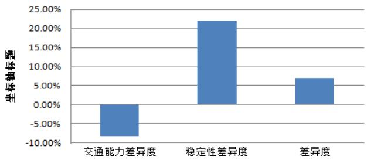

<details>
<summary>bar</summary>

| Category | Value (%) |
| --- | --- |
| 交通能力差异度 | ~-8.00% |
| 稳定性差异度 | ~22.00% |
| 差异度 | ~7.00% |
</details>

图 8：事故发生在不同路段对通行能力影响百分比

综合上述图表，可以得出如下所示的结论；

1. 从实际交通能力差异度看，交通事故发生在 2、3 车道（视频 1）对应实际交通能力比交通事故发生在 1、2车道（视频2）对应实际交通能力下降8.2%。  
2. 从稳定性差异度看，交通事故发生在 2、3 车道比交通事故在 1、2 车道实际交通能力稳定性影响增加 22.1%  
3. 对综合差异度，交通事故发生 2、3 车道比交通事故发生 1、2 车道对实际交通能力影响大 6.9%

## 5.5车辆取向和速度比较分析

## 5.5.1 交通事故位置不同对车辆取向影响分析

通过对视频的观察，发现公交车的取向有明显的不同，统计视频1和视频2的所有公交车到达事故横截面前所处的车道，如下表所示：

表13：公交车在事发路段行驶车道取向统计表

<table><tr><td></td><td>车道 1</td><td>车道 2</td><td>车道 3</td></tr><tr><td>视频 1</td><td>7</td><td>22</td><td>24</td></tr><tr><td>视频 2</td><td>0</td><td>14</td><td>10</td></tr></table>

设各车道公交车数量分别为 $N _ { 1 } , N _ { 2 } , N _ { 3 }$ ，则各车道公交占有率<sub>η</sub> 为：

$$
\eta = \frac {N (\mathrm{i})}{N _ {1} + N _ {2} + N _ {3}} \tag {5.5}
$$

计算出各车道占有率如下：

表14：各车道公交车占有率记录表

<table><tr><td></td><td>车道 1</td><td>车道 2</td><td>车道 3</td></tr><tr><td>视频 1 公交车占有率</td><td>0.13</td><td>0.42</td><td>0.45</td></tr><tr><td>视频 2 公交车占有率</td><td>0</td><td>0.58</td><td>0.42</td></tr></table>

画出饼图如下：

视频1公交车占有率  


<details>
<summary>pie</summary>

| Category | Value (%) |
| --- | --- |
| 车道1 | 13% |
| 车道2 | 42% |
| 车道3 | 45% |
</details>

图 9：视频 1中各车道公交车占有率示意图

视频2公交车占有率  
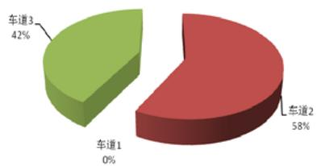

<details>
<summary>pie</summary>

| Category | Value (%) |
| --- | --- |
| 车道1 | 0% |
| 车道2 | 58% |
| 车道3 | 42% |
</details>

图 10：视频 2中各车道公交车占有率示意图

结论：

1. 2、3 车道发生事故（视频 1），公交车主要行驶在 3 车道，而 1、2 车道发生事故，公交车主要行驶在 2车道。占有率分别为45%，58%  
2. 2、3车道发生事故，各车道均有公交车行驶。而1、2车道发生事故，1车道没有公交车行驶。  
3. 不管哪个车道发生事故，公交车主要行驶在 2、3车道。

## 5.5.2 交通事故位置不同对车辆到达事故横截面速度影响分析

## （1）对于公交车

为了说明交通事故不同位置对车辆到达速度的影响，分别统计视频1和视频2公交车行驶120米到达事故发生横断面所需时间。而同一路段任无事故的时刻公交车的平均时速相同，同时认为所有的公交车行驶性能相同。为了减少时间间隔不同对行驶速度的影响，统计视频1和视频2中数据时刻取为从事故发生起等时间间距时刻，结果如下：

表15：公交车行驶120米到事发路口所需时间记录表

<table><tr><td>离事发时间(min)</td><td>1</td><td>3</td><td>5</td><td>7</td><td>9</td><td>11</td><td>13</td></tr><tr><td>视频1所需时间(s)</td><td>35</td><td>39</td><td>20</td><td>18</td><td>55</td><td>73</td><td>65</td></tr><tr><td>视频2所需时间(s)</td><td>15</td><td>20</td><td>15</td><td>25s</td><td>66</td><td>54</td><td>48</td></tr></table>

根据速度公式：

$$
v = \frac {l}{t}
$$

得到如下表格：

表16：公交车行驶120米平均速度记录表

<table><tr><td>离事发时间(min)</td><td>1</td><td>3</td><td>5</td><td>7</td><td>9</td><td>11</td><td>13</td><td>平均</td><td>方差</td></tr><tr><td>视频1速度(m/s)</td><td>3.43</td><td>3.08</td><td>6.00</td><td>6.67</td><td>2.18</td><td>1.64</td><td>1.85</td><td>3.55</td><td>3.48</td></tr><tr><td>视频2速度(m/s)</td><td>8.00</td><td>6.00</td><td>8.00</td><td>4.80</td><td>1.82</td><td>2.22</td><td>2.50</td><td>4.76</td><td>6.11</td></tr></table>

画出柱状图：

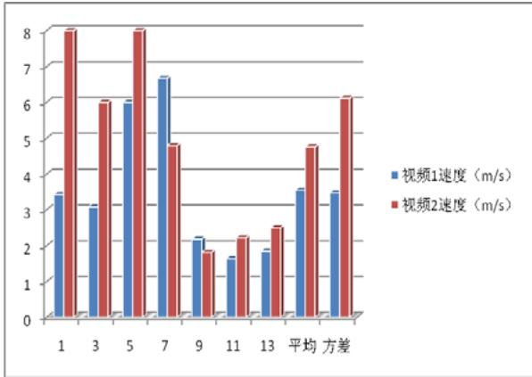

<details>
<summary>bar</summary>

| Category | 视频1速度 (m/s) | 视频2速度 (m/s) |
| --- | --- | --- |
| 1 | ~3.5 | ~8.1 |
| 3 | ~3.1 | ~6.0 |
| 5 | ~6.0 | ~8.1 |
| 7 | ~6.7 | ~4.8 |
| 9 | ~2.2 | ~1.9 |
| 11 | ~1.7 | ~2.3 |
| 13 | ~1.9 | ~2.5 |
| 平均 | ~3.6 | ~4.8 |
| 方差 | ~3.5 | ~6.1 |
</details>

图 11：公交车行驶 120 米至事发路口平均速度图

由上述图表，可以得出如下结论：

1. 事故发生后第1-5、11-13分钟视频 2（1、2车道堵车）公交车速度快于视频1（2、3 车道堵车），而第7-9分钟相反。  
2. 事故发生后，2、3车道堵车对公交车车速的影响比1、2车道堵车大，公交车辆平均减速多 1.21m/s。  
3. 2、3车道发生事故时公交车各时间段减速大小与1、2车道发生事故时相比波动小，两者方差差距为2.63。

为了比较小轿车和公交车，统计小轿车的相同指标的数据如下：

（2）对于小轿车

表 17：小轿车行驶120米到事发路口所需时间记录表

<table><tr><td>离事发时间(min)</td><td>1</td><td>3</td><td>5</td><td>7</td><td>9</td><td>11</td><td>13</td></tr><tr><td>视频1所需时间(s)</td><td>32</td><td>34</td><td>28</td><td>46</td><td>83</td><td>61</td><td>54</td></tr><tr><td>视频2所需时间(s)</td><td>13</td><td>9</td><td>15</td><td>20</td><td>13</td><td>16</td><td>21</td></tr></table>

根据上述的速度公式得到如下速度表：

表18：公交车行驶120米平均速度记录表

<table><tr><td>离事发时间(min)</td><td>1</td><td>3</td><td>5</td><td>7</td><td>9</td><td>11</td><td>13</td><td>平均</td><td>方差</td></tr><tr><td>视频1速度(m/s)</td><td>3.75</td><td>3.53</td><td>4.29</td><td>2.61</td><td>1.45</td><td>1.97</td><td>2.22</td><td>2.83</td><td>0.93</td></tr><tr><td>视频2速度(m/s)</td><td>9.23</td><td>13.33</td><td>8.00</td><td>6.00</td><td>9.23</td><td>7.50</td><td>5.71</td><td>8.43</td><td>5.67</td></tr></table>

画出柱状图：

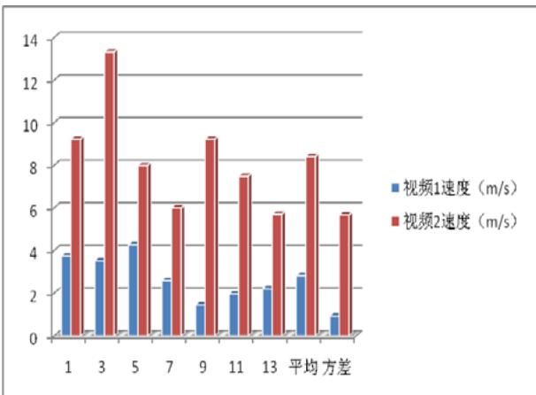

<details>
<summary>bar</summary>

| Category | 视频1速度 (m/s) | 视频2速度 (m/s) |
| --- | --- | --- |
| 1 | ~3.8 | ~9.3 |
| 3 | ~3.6 | ~13.4 |
| 5 | ~4.3 | ~8.0 |
| 7 | ~2.7 | ~6.0 |
| 9 | ~1.6 | ~9.3 |
| 11 | ~2.0 | ~7.5 |
| 13 | ~2.3 | ~5.7 |
| 平均 | ~2.9 | ~8.5 |
| 方差 | ~1.1 | ~5.7 |
</details>

图 12：小轿车行驶 120 米至事发路口平均速度图

对比得到如下结论：

1. 事故发生后，2、3车道堵车对小轿车车速的影响比1、2车道堵车大，小轿车平均速度减少值多 5.6m/s。  
2. 1、2车道发生事故和2、3车道发生事故对小轿车的影响比公交车的影响明显。即小轿车速度对发生事故的车道位置更敏感。  
3. 公交车各时间段速度波动对发生事故的车道位置更敏感。

## 6、问题三的建模与求解

## 6.1 问题分析

该问以路段车辆排队长度为因变量，分析排队长度和事故点通行能力、事故持续时间、上游车流量这三个自变量之间的关系。而车辆排队长度又与排队车辆数目和车辆密度直接相关：

1.）排队车辆数目m

进入排队队伍的车辆与驶离事故横断面车辆的差值。驶离事故横断面车辆就是堵塞处车流量 $Q _ { D } ( \mathfrak { t } )$ ，而由于排队长度是动态的，并不存在一个上游截面，使得该处车流量 $\mathrm { Q } _ { U } ( { \bf t } ) \equiv$ 驶入队伍的车辆数，只有队伍长度在较小范围内时，才能近似认为上游车流量 = 驶入队伍车辆数。

## 2.）车辆密度 P

车辆密度P就是堵塞车流的车流密度，由于堵塞车流的速度很低，其车流密度P接近于路段的车流密度极值，可近似认为是一常数。

基于以上两点的分析，在低速短距离情形下，可近似认为排队长度

L -∝上游累计车流量 事故点累计车流量

该近似公式在严重堵车情形下可以作良好的估计。

在道路的堵车情形不算严重、堵塞车流的速度与车流密度均距最差值有一定

差异时，上述公式不再适用，此时可由交通波理论求解。交通波理论将不同密度的车流视作不同的波，车流的运动视为波的传播，借用波的作用关系来求解不同密度车流之间的作用。

该问的流程图如下：


<details>
<summary>flowchart</summary>

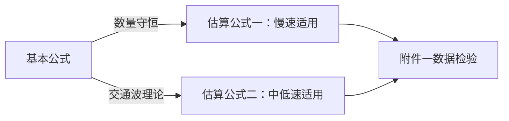
</details>

图 13：问题三流程图

推导出4个因子的理论关系后，再用附件 1中数据检验模型的有效性。

## 6.2数据预处理

## 6.2.1堵塞密度估计

堵塞密度 $P _ { \mathrm { m a x } }$ 指道路达到饱和时单位长度内的标准车当量数。可根据附件1视频中最大堵车长度附近处的数据来估计，统计此时堵车长度和各车型数量如下：

表19：视频1中堵车长度和各车型数量记录表

<table><tr><td rowspan="2">堵车长度(单位:m)</td><td colspan="3">各车型数量(单位:辆)</td></tr><tr><td>单节公共汽车</td><td>小汽车</td><td>二轮摩托</td></tr><tr><td>约100</td><td>2</td><td>34</td><td>1</td></tr></table>

根据参考文献[9]的标准车当量转换关系，得到道路堵塞密度

$$
P _ {\max} ^ {0} = 3 8 0 \mathrm{pcu/km}
$$

对应车道的堵塞密度为

$$
P _ {\max} = \frac {P _ {\max} ^ {0}}{3} = 1 2 6. 7 \mathrm{pcu/km}
$$

## 6.2.2畅通速度估计

畅通速度 $\nu _ { f }$ 指该路段的最大通行速度。附件中车流较密集无法直接估计，查阅文献[10]得知车道宽l m=3.25 时，设计时速一般为30km/h，用该值作为v 的估计值，即 $\nu _ { f }$

$$
v _ {f} = 3 0 k m / h
$$

## 6.2.3 小区路口综合车流量E(t)

E(t)为两小区路口对主车道的净进入车流量，下表中时间标识i表示发生事故后的第i分钟，对附件1中事故发生10min内的E(t)统计如下表所示。

表20：视频1事故发生10min内小区路口综合车流量记录表

<table><tr><td>时间/min</td><td>1</td><td>2</td><td>3</td><td>4</td><td>5</td></tr><tr><td>E(t)</td><td>0</td><td>1.5</td><td>3</td><td>2</td><td>3.5</td></tr><tr><td>时间/min</td><td>6</td><td>7</td><td>8</td><td>9</td><td>10</td></tr><tr><td>E(t)</td><td>3.5</td><td>3.5</td><td>2</td><td>0</td><td>4</td></tr></table>

## 6.2.4上游路段车流密度 $K _ { U }$ 统计

车流密度定义为： $P _ { \mathit { \Pi } _ { U } } = \frac { \mp \frac { \ddagger } { \ddagger } \frac { \ddagger } { \ddagger } \chi } { \operatorname { t } \gtrsim \frac { \ddagger } { \ddagger } }$ 。下表中时间标识i 表示开始拥堵后的第i 分钟，对附件1中上游车流密度 $K _ { U }$ 进行统计：

表21：视频中上游车流密度记录表

<table><tr><td>时间/min</td><td>1</td><td>2</td><td>3</td><td>4</td><td>5</td><td>6</td></tr><tr><td> $P_U$ /pcu</td><td>13</td><td>11.5</td><td>12.5</td><td>13</td><td>12.5</td><td>13.5</td></tr><tr><td>时间/min</td><td>7</td><td>8</td><td>9</td><td>10</td><td>11</td><td>12</td></tr><tr><td> $P_U$ /pcu</td><td>15</td><td>14.5</td><td>12</td><td>13</td><td>11</td><td>11.5</td></tr></table>

## 6.2.5 实际排队长度L

利用PDF编辑工具测量实际排队长度的图上距离，根据视知公式、视角与视觉大小成正比的理论，近似得到测量距离和实际距离的转化关系式为：

$$
x = \delta \arctan \frac {L}{L _ {0}} \tag {6.1}
$$

式中，x为距离的测量值，L为距离的实际值， $\delta , L _ { 0 }$ 为转化的常数。

根据附件视频中给出的 120m和240m长度的指示标度，结合二者图上长度的测量，利用待定系数法即可确定参数 $\delta , \ L _ { 0 }$ ，最终得到转换关系式如下：

$$
L = 5 6 5 \tan (\frac {x}{3 5}) \quad (\mathrm{x:cm}, \mathrm{L:m})
$$

## 6.3.排队长度估算模型的建立

## 6.3.1排队长度基本公式

拥堵处排队长度正比于排队车辆数目与车流密度，其基本计算公式为：

$$
L (\mathrm{t}) = \frac {m}{P} \tag {6.2}
$$

其中，L(t)为排队长度，m为排队车辆数目，P为车流密度。

## 6.3.2 速度-车流密度近似关系式

根据格林希尔茨的速度-密度v P− 关系模型[13]，得到速度v与道路密度P有如下关系：

$$
v = v _ {f} (1 - \frac {P}{P _ {\max}}) \tag {6.3}
$$

式中， $\nu _ { f }$ 为畅通速度， $P _ { \mathrm { m a x } }$ 为堵塞密度，该式反映了v和P的线性关系。

## 6.3.3低速近似估算公式的推导

## 1）初步关系式

由前面的分析，处于完全排队状态（堵车很严重）的车流速度 $\nu \to 0$ ，根据 $\nu - P$ 线性关系式，此时车流密度 $P \approx P _ { \mathrm { m a x } }$ ，故L(t)计算公式转化为

$$
L (\mathrm{t}) = \frac {m}{P _ {\max} ^ {0}} \tag {6.4}
$$

式中， $P _ { \operatorname* { m a x } } ^ { 0 }$ 为道路堵塞密度，该式表明排队长度正比于排队车辆数目。

记上游截面车流量为 $Q _ { U } ( \mathbf { t } )$ ，拥堵处截面车流量为 $Q _ { D } ( \mathfrak { t } )$ ，两小区路口的综合车流量为E(t) ，并记

$$
d N (\mathrm{t}) = (Q _ {U} (\mathrm{t}) - Q _ {D} (\mathrm{t}) + E (\mathrm{t})) \mathrm{dt} \tag {6.5}
$$

N(t) 为从 $t _ { 0 }$ 时刻起上下游流量差的累和，表示停留在中间路段的车辆数目。

当上下游截面距离不大时，近似认为N(t)中所有车辆均处于堵塞状态，即：

$$
L (\mathrm{t}) = \frac {1}{P _ {\max} ^ {0}} \cdot N (\mathrm{t}) = \frac {1}{P _ {\max} ^ {0}} \int_ {t _ {0}} ^ {t} (Q _ {U} (\mathrm{t}) - Q _ {D} (\mathrm{t}) + E (\mathrm{t})) \mathrm{dt} + N _ {0} \tag {6.6}
$$

其中 $N _ { 0 }$ 为初始排队长度。

## 2）下游截断面车流速度受车道的影响

下游截断面已发生拥堵： $P _ { t } = P _ { \operatorname* { m a x } } = 3 3 0$ 辆/km，根据 $\nu - P$ 关系式，此时 $\nu \to 0$ ，根据第一问所得信息，拥堵处车流量在固定值附近浮动，故假定堵塞处车流速度 $\nu _ { D }$ 为定值。

将统计得到的上游各车道车流分布于下游车道分布进行对比：

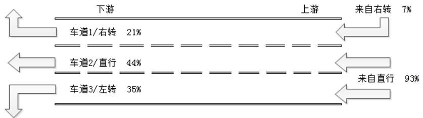

<details>
<summary>sankey</summary>

| Mode | Percentage |
| --- | --- |
| 车道1/右转 | 21% |
| 车道2/直行 | 44% |
| 车道3/左转 | 35% |
| 来自右转 | 7% |
| 来自直行 | 93% |
</details>

图 14：各车道车流比例分布图

上、下游之间各车道的车流比例明显不同，故该段道路上不同位置处各车道的车流比例不同。根据第二问的分析，各车道的车流分布不同会影响堵塞截面处的车流速度。为反映这一影响，按如下方式定义v ： $\nu _ { D }$

$$
v _ {D} = v _ {0} \sum_ {i} p _ {i} \tag {6.7}
$$

式中， $\nu _ { 0 }$ 代表基本速度，不随时间变化， $p _ { i }$ 为可通行车道i的车流比例，作为车流速度的折算系数。

将上式代入6.6式，得到排队长度的最终计算公式为：

$$
\begin{array}{l} L (t) = \frac {1}{P _ {\max} ^ {0}} \int_ {t _ {0}} ^ {t} (Q _ {U} (t) + E (t) - v _ {D} P _ {\max} ^ {0}) d t + N _ {0} \tag {6.8} \\ = \frac {1}{P _ {\max} ^ {0}} \int_ {t _ {0}} ^ {t} (Q _ {U} (t) + E (t)) d t - \alpha v _ {D} + N _ {0} \\ \end{array}
$$

## 6.3.4不完全堵车排队公式的推导

当上下游截面距离较大，通过上游截断面的车辆仍需行驶一段时间直至进入堵塞状态，且堵塞车流仍然具有不低的速度时，可借用交通波理论对排队长度进行分析。

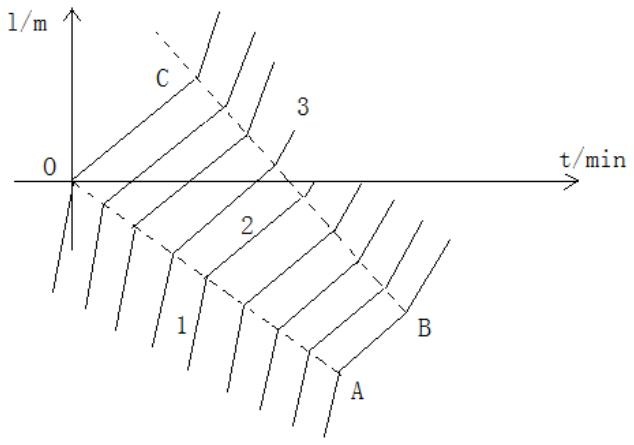

<details>
<summary>text_image</summary>

l/m
0
C
3
2
1
B
A
t/min
</details>

图15：交通波理论示意图

上图以道路直线距离作为纵轴，时间作为横轴，用以描述道路上车辆行驶规律。图中区域1、3为正常通行区域，区域 2为堵塞区域，曲线的斜率就是车流的速度。

交通波理论[14]将车流视为波的传输流动，不同密度的车流视作不同的波，道路堵塞问题可以视作高速低密度的车流波动向低速高密度车流处扩散的过程。扩散速度记为$\omega$ ，定义为车流量相对于车流密度的变化率：

$$
\omega = \frac {Q _ {U} - Q _ {D}}{P _ {U} - P _ {D}} \tag {6.9}
$$

式中， $\mathsf { Q }$ ，P分别为上、下游的车流量和车流密度，结合 $\nu - P$ 线性关系式，求得

$$
\omega = v _ {f} (1 - \frac {P _ {U} + P _ {D}}{P _ {\max} ^ {0}}) \tag {6.10}
$$

波速 $\omega$ 表征疏波界面的扩散速度，在道路中实际等价于堵塞长度的缩短速度，故由$- \omega$ 对t积分即可得到排队长度：

$$
L (\mathrm{t}) = \int_ {t _ {0}} ^ {t} - \omega d t = \int_ {t _ {0}} ^ {t} v _ {f} (\frac {P _ {U} + P _ {D}}{P _ {\max} ^ {0}} - 1) d t \tag {6.11}
$$

## 6.3.5 模型综述

综合以上分析，得到2个排队长度估算公式组成的排队长度估算模型

1、完全堵塞估算公式

$$
L (t) = \frac {1}{P _ {\max} ^ {0}} \int_ {t _ {0}} ^ {t} (Q _ {U} (t) - Q _ {D} (t) + E (t)) d t + N _ {0} \tag {6.12}
$$

2、非完全堵塞估算公式

$$
L (t) = \int_ {t _ {0}} ^ {t} v _ {f} (\frac {P _ {U} + P _ {D}}{P _ {\max} ^ {0}} - 1) d t \tag {6.13}
$$

以上2式从不同角度表明了排队长度与上下游车流量以及时间的关系：

公式1关系简洁，上下游车流量之差对时间积分即为排队长度；而由于车流密度与车流量为二次函数关系，公式 2描述的关系更加复杂。

## 6.4模型验证

上面建立的模型需要通过实际数据的检验才能证实其有效性。

## （1）公式一的验证

由附件一可判断，事故地点距离上游路口较近，故可以选用近似公式xx计算。

统计附件一中事故发生后 14min内上游车流量 $Q _ { U } ( t )$ 、事故截断面车流量 $Q _ { D } ( t )$ 和实际排队长度 $L _ { 0 } ( t )$ 数据，则模拟排队长度：

$$
L (t) = \frac {1}{P _ {\max} ^ {0}} \int_ {t _ {0}} ^ {t} (Q _ {U} (t) - Q _ {D} (t) + E (t)) d t = 2. 6 3 \sum_ {n = 1} (Q _ {U} (n) - Q _ {D} (n) + E (n)) \tag {6.14}
$$

其中， $\mathrm { n } { = } 1$ 代表第一个离散统计时间段（事故发生后2min），离散时间间隔 $\Delta T = 3 0 s$ 由问题一的结果知， $Q _ { D } ( \mathrm { t } ) = 2 1 . 0 p c u / m i n$ 为固定常数，再根据统计的 $Q _ { U }$ 和E(t)信息，与测量得到 $L _ { 0 } ( \mathfrak { t } )$ 信息比较如下表所示：

表22：实测与估算排队长度对比记录表

<table><tr><td>实测</td><td>41.0</td><td>0</td><td>0</td><td>0</td><td>59.1</td><td>39.1</td><td>26.1</td><td>56.3</td><td>54.4</td><td>56.0</td><td>71.4</td><td>32.8</td></tr><tr><td>估算</td><td>-5.5</td><td>-1.8</td><td>22.0</td><td>12.0</td><td>11.8</td><td>4.4</td><td>34.7</td><td>30.5</td><td>49.4</td><td>37.0</td><td>46.2</td><td>78.3</td></tr><tr><td>实测</td><td>49.8</td><td>62.7</td><td>43.8</td><td>101</td><td>111</td><td>77.8</td><td>98.9</td><td>92.6</td><td>120.7</td><td>95.4</td><td>86.7</td><td></td></tr><tr><td>估算</td><td>71.2</td><td>104.9</td><td>93.1</td><td>108</td><td>94.6</td><td>115.1</td><td>127.2</td><td>133.3</td><td>122.2</td><td>135.7</td><td>115</td><td></td></tr></table>

作出图像如下：

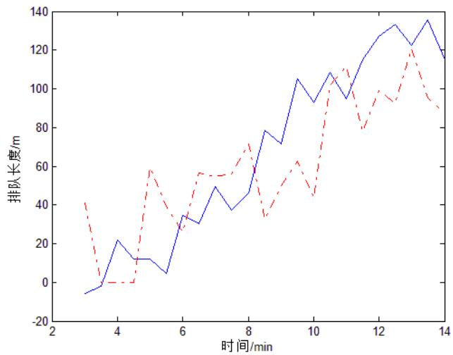

<details>
<summary>line</summary>

| 时间/min | 排队长度/m (Solid Blue) | 排队长度/m (Dashed Red) |
| --- | --- | --- |
| 3 | ~-6 | ~41 |
| 3.5 | ~-2 | ~0 |
| 4 | ~22 | ~0 |
| 4.5 | ~12 | ~0 |
| 5 | ~12 | ~58 |
| 5.5 | ~5 | ~35 |
| 6 | ~35 | ~27 |
| 6.5 | ~30 | ~56 |
| 7 | ~50 | ~55 |
| 7.5 | ~37 | ~56 |
| 8 | ~46 | ~71 |
| 8.5 | ~78 | ~34 |
| 9 | ~72 | ~48 |
| 9.5 | ~105 | ~63 |
| 10 | ~93 | ~45 |
| 10.5 | ~108 | ~103 |
| 11 | ~95 | ~110 |
| 11.5 | ~115 | ~80 |
| 12 | ~127 | ~99 |
| 12.5 | ~133 | ~94 |
| 13 | ~122 | ~120 |
| 13.5 | ~136 | ~95 |
| 14 | ~116 | ~90 |
</details>

图16：实测与估算排队长度比较图

对两列数据进行相关性检验，得到相关系数 $r _ { 1 } = 0 . 7 8$

## （2）公式2的验证

附件1中车流已完全停滞，公式 2不完全适用，其估算效果应该比公式1差。

和公式（1）的验证一样，可得到排队长度估算公式为

$$
L (t) = \sum_ {n = 1} (4 P _ {U} - 5 0 0)
$$

所选数据与前面一致，得到估算值与实际值的图像比较如下：

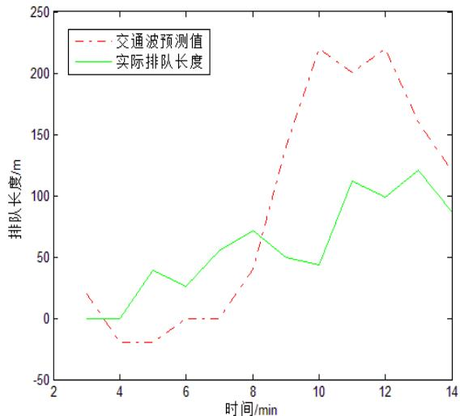

<details>
<summary>line</summary>

| 时间/min | 交通波预测值 (m) | 实际排队长度 (m) |
| --- | --- | --- |
| 3 | ~20 | 0 |
| 4 | ~-20 | 0 |
| 5 | ~-20 | ~40 |
| 6 | 0 | ~25 |
| 7 | 0 | ~55 |
| 8 | ~40 | ~70 |
| 9 | ~140 | ~50 |
| 10 | ~220 | ~45 |
| 11 | ~200 | ~110 |
| 12 | ~220 | ~100 |
| 13 | ~160 | ~120 |
| 14 | ~125 | ~85 |
</details>

图 17：公式 2验证图

对两列数据进行相关性检验，得到相关系数 $r _ { 2 } = 0 . 6 9$

有上述数据结果得到结论如下：

1、排队长度与上游车流量、事故点实际通行能力以及事故持续时间关系为：

$$
L \propto \int_ {t _ {0}} ^ {t} (Q _ {U} - Q _ {D}) d t \tag {6.15}
$$

2、排队长度与上游车流密度、事故点车流密度及事故持续时间关系为：

$$
L \propto \int_ {t _ {0}} ^ {t} (P _ {U} + P _ {D}) d t \tag {6.16}
$$

3、公式1对附件1估计结果的关联度为0.78，高于公式 2的0.69，公式1对低速堵塞状态的估计效果更好。

## 6.5 最佳车流密度估算[11]

最佳密度 $P _ { \mathrm { { m } } }$ 指一条道路理论上最好的车辆密度，超过该值时，道路通行能力下降。其与堵塞密度 $P _ { \mathrm { m a x } }$ 的关系如下：

$$
P _ {\mathrm{m}} = \frac {P _ {\mathrm{max}}}{\sqrt [ \pi ]{1 + (\mathrm{n} + 1) \pi}} \tag {6.17}
$$

式中， $P _ { \mathrm { m a x } }$ 为堵塞密度，π反映路网服务质量，n为道路交通服务质量参数。根据参考文献[12]确定 $n = 4$ ，代入上式求得

$$
P _ {\mathrm{m}} = 4 4. 9 \mathrm{pcu/km}
$$

由此得到结论：

该路段的理想车流密度为44.9pcu/km，应尽量保持车流密度不超过该值。

## 6.6上游车流量增大的影响

将上游车流量 $Q _ { U }$ 提升 10%：

$$
Q _ {U} ^ {\prime} = 1. 1 Q _ {U}
$$

重新计算事故发生后3-8min内排队长度 <sup>'</sup> L(t)的变化趋势，得到数据如下：

表23：排队长度对比记录表

<table><tr><td>时间/min</td><td>3</td><td>3.5</td><td>4</td><td>4.5</td><td>5</td></tr><tr><td>原始L(t)/m</td><td>22.09</td><td>12.09</td><td>11.83</td><td>4.47</td><td>34.71</td></tr><tr><td>更新L&#x27;(t)/m</td><td>30.56</td><td>21.61</td><td>23.61</td><td>17.67</td><td>52.41</td></tr><tr><td>时间/min</td><td>5.5</td><td>6</td><td>6.5</td><td>7</td><td>7.5</td></tr><tr><td>原始L(t)/m</td><td>30.50</td><td>49.44</td><td>37.08</td><td>46.28</td><td>78.37</td></tr><tr><td>更新L&#x27;(t)/m</td><td>49.83</td><td>73.40</td><td>62.19</td><td>74.71</td><td>112.06</td></tr></table>

绘制图像：

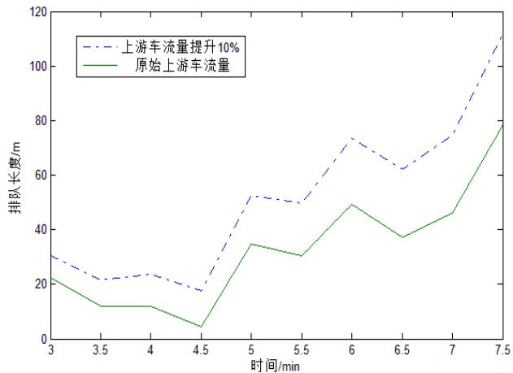

<details>
<summary>line</summary>

| 时间/min | 上游车流量提升10% (m) | 原始上游车流量 (m) |
| --- | --- | --- |
| 3 | ~30 | ~22 |
| 3.5 | ~22 | ~12 |
| 4 | ~24 | ~12 |
| 4.5 | ~18 | ~5 |
| 5 | ~52 | ~35 |
| 5.5 | ~50 | ~30 |
| 6 | ~74 | ~49 |
| 6.5 | ~62 | ~37 |
| 7 | ~75 | ~46 |
| 7.5 | ~110 | ~78 |
</details>

图 18：上游车流量的改变对排队长度的影响

由以上图表得到结论：

上游车流量增大10%时，平均队伍长度增加 57%。

## 7、问题四的建模与求解

## 7.1 问题分析

该问中，事故发生地点向上游移动至距离交叉路口 140m处，根据第三问的分析，使用公式 xx精度较高。上游车流量 $Q _ { U }$ 、事故截断面车流量 $Q _ { D }$ 与时间t的关系均未知，故需要从理论上作出估算来预测排队到达路口的时间。

1.）上游的车流量 $Q _ { U }$ 的均值为1500pcu/h，但其实际规律未知。由于事故发生点距交叉路口较近，可认为 $Q _ { U }$ 随时间呈规律周期变化。  
2.）事故截断面车流量 $Q _ { D }$ 未知。根据问题一的数据，单车道的通行量约为1000pcu/h，小于上游车流量 $Q _ { U }$ ，故事故处会发生堵塞。根据问题三知，在出现堵车时 $Q _ { D }$ 应为一常数，确定该截断面各车道的车流比例就可以求出 $Q _ { D }$

上游车流量与事故截断面车流量与时间的关系确定后，就可以估算排队所需时间。

## 7.2 模型建立

上游的车流量换算为 pcu/min是25pcu/min，由于事故地点靠近上游十字路口，车流的分布受红绿灯周期影响很大：绿灯时期车流密集，红灯时期车流稀疏。特别地，在上游路口处， $Q _ { U }$ 处于半周期通行、半周期停止的状态：

$$
Q _ {U} = \left\{ \begin{array}{l l} 5 0 p c u / \min & n T \leq t <   (\mathrm{n} + 0. 5) \mathrm{T} \\ 0 & (\mathrm{n} + 0. 5) \mathrm{T} \leq t <   (\mathrm{n} + 1) \mathrm{T} \end{array} \right.
$$

式中， $T = 6 0 s$ $Q _ { U }$ 的累计到达车辆数量曲线如下图所示：

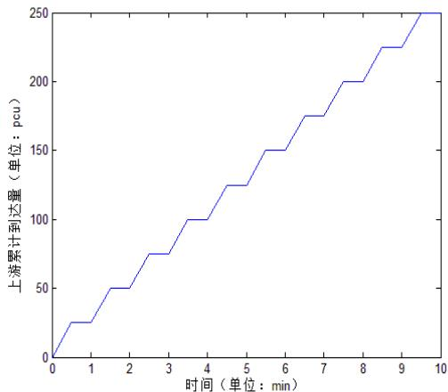

<details>
<summary>line</summary>

| 时间 (min) | 上游累计到达量 (pcu) |
| --- | --- |
| 0 | 0 |
| 0.5 | 25 |
| 1 | 25 |
| 1.5 | 50 |
| 2 | 50 |
| 2.5 | 75 |
| 3 | 75 |
| 3.5 | 100 |
| 4 | 100 |
| 4.5 | 125 |
| 5 | 125 |
| 5.5 | 150 |
| 6 | 150 |
| 6.5 | 175 |
| 7 | 175 |
| 7.5 | 200 |
| 8 | 200 |
| 8.5 | 225 |
| 9 | 225 |
| 9.5 | 250 |
</details>

图 19：上游车辆到达累积数量示意图

当车流稳定时，道路上车辆的到达规律服从泊松分布，故上述周期性车流会逐渐退化为平稳的泊松分布车流。该问中认为车流会渐趋于均匀分布，车流完全均匀分布后的累计到达量曲线如下图k2曲线所示：

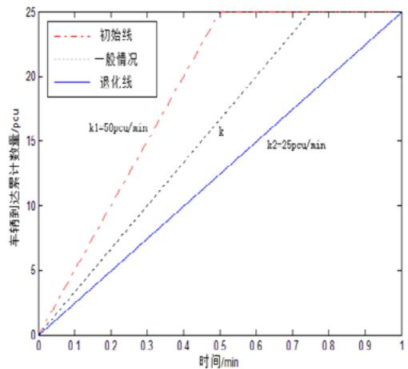

<details>
<summary>line</summary>

| 时间/min | 初始线 (pcu) | 一般情况 (pcu) | 退化线 (pcu) |
| --- | --- | --- | --- |
| 0 | 0 | 0 | 0 |
| 0.1 | ~5 | ~3 | ~2 |
| 0.2 | ~10 | ~6 | ~4 |
| 0.3 | ~15 | ~9 | ~6 |
| 0.4 | ~20 | ~12 | ~8 |
| 0.5 | 25 | ~15 | ~10 |
| 0.6 | 25 | ~18 | ~12 |
| 0.7 | 25 | ~21 | ~14 |
| 0.8 | 25 | 25 | ~16 |
| 0.9 | 25 | 25 | ~18 |
| 1 | 25 | 25 | 25 |
</details>

图 20：车辆到达累积分布示意图

记到达事故截断面车流的累计到达数量曲线第一部分斜率为k，如上图所示，定义退化系数：

$$
\eta = \frac {k - k _ {\min}}{k _ {\max} - k _ {\min}} \tag {7.1}
$$

则 $\eta$ 代表车流周期性的强度： $\eta = 1$ 时，为完全周期分布， $\eta = 0$ 时，车流无周期性。

退化系数为 $\eta$ 时对应的到达函数如下：

$$
Q _ {U} = \left\{ \begin{array}{l l} 2 5 (1 + \eta) & n T \leq t <   (\mathrm{n} + \frac {1}{1 + \eta}) \mathrm{T} \\ 0 & (\mathrm{n} + \frac {1}{1 + \eta}) \mathrm{T} \leq t <   (\mathrm{n} + 1) \mathrm{T} \end{array} \right. \tag {7.2}
$$

根据分析知，事故处通行能力小于上游车流量，故会发生堵塞，再根据第三问的分析，当道路发生堵塞时，堵塞点处车流速度为一定值，为：

$$
v = v _ {0} \sum_ {i} p _ {i}
$$

式中， $\nu _ { 0 }$ 代表基本拥堵速度， $p _ { i }$ 为畅通车道 i的车流比例，

排队长度与堵塞车辆数目呈线性关系：

$$
L _ {t} = a \int (Q _ {U} - Q _ {D}) d t \tag {7.3}
$$

式中， $a$ 为比例系数

至此，建立交通事故排队长度预测模型：

$$
\left\{ \begin{array}{l} L _ {t} = 2. 6 3 \int (Q _ {U} - Q _ {D}) d t \\ Q _ {U} = \left\{ \begin{array}{c c} 2 5 (1 + \eta) & n T \leq t <   (\mathrm{n} + \frac {1}{1 + \eta}) \mathrm{T} \\ 0 & (\mathrm{n} + \frac {1}{1 + \eta}) \mathrm{T} \leq t <   (\mathrm{n} + 1) \mathrm{T} \end{array} \right. \\ Q _ {D} = v P _ {\max} = v _ {0} P _ {\max} \sum_ {i} p _ {i} \end{array} \right. \tag {7.4}
$$

## 7.3模型求解

## 7.3.1 参数确定

## 1）事故发生点车流量 $Q _ { D }$

根据第三问的结果，取 $\nu _ { 0 } = 2 1$ .0pcu/min， $\sum _ { i } p _ { i } = 0 . 4 4 + 0 . 3 5 = 0 . 7 9$ ，求得

$$
Q _ {D} = v P _ {\max} = v _ {0} P _ {\max} \sum_ {i} p _ {i} = 1 6. 6 p c u / m i n
$$

## 2）比例系数a

根据第三问的结果，取

$$
a = \frac {1}{P _ {\max} ^ {0}} = 2. 6 3
$$

## 3）退化系数 $\eta$

题中未给定 $\eta$ ，求解中取 $\eta = 0 . 5$ ，则上游车流量具体变为：

$$
Q _ {U} = \left\{ \begin{array}{l l} 3 7. 5 & \quad 6 0 n \leq t <   6 0 n + 4 0 \\ 0 & \quad 6 0 n + 4 0 \mathrm{T} \leq t <   6 0 (\mathrm{n} + 1) \end{array} \right.
$$

## 7.3.2排队长度预测

排队长度计算公式为

$$
L _ {t} = 2. 6 3 \int (Q _ {U} - 1 6. 6) d t
$$

由 matlab解得，当 t=333s，即 5 分 33 秒时，排队长度达到 $L _ { \mathrm { m a x } } = 1 4 0 m$ 。排队长度图示如下：

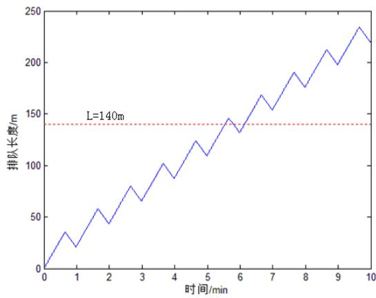

<details>
<summary>line</summary>

| 时间/min | 排队长度/m |
| --- | --- |
| 0 | 0 |
| 0.5 | ~35 |
| 1 | ~20 |
| 1.5 | ~58 |
| 2 | ~43 |
| 2.5 | ~80 |
| 3 | ~65 |
| 3.5 | ~102 |
| 4 | ~88 |
| 4.5 | ~125 |
| 5 | ~110 |
| 5.5 | ~145 |
| 6 | ~132 |
| 6.5 | ~168 |
| 7 | ~153 |
| 7.5 | ~190 |
| 8 | ~175 |
| 8.5 | ~212 |
| 9 | ~198 |
| 9.5 | ~235 |
| 10 | ~220 |
</details>

图 21：排队长度示意图

由此得到结论：

1、事故发生5分33秒后，排队长度将达到上游路口；  
2、排队长度呈锯齿状增长，平均每分钟增长 22m。

## 7.4.红绿灯周期对队伍增长的影响

当前红绿灯周期 $T = 6 0 s$ ，改变周期T之后，绿灯时段增长，高密度车流的持续时间增长，容易造成短时堵塞，使得排队长度迅速增加到140m。现改变T的取值，得到不同周期下排队长度达到路口处所需的时间如下：

表24：红绿灯周期与排队时间关系记录表

<table><tr><td>红绿灯周期 $T$ /s</td><td>30</td><td>60</td><td>90</td><td>120</td><td>150</td><td>180</td><td>210</td><td>240</td></tr><tr><td>排队时间/s</td><td>369</td><td>333</td><td>315</td><td>297</td><td>243</td><td>261</td><td>279</td><td>153</td></tr></table>

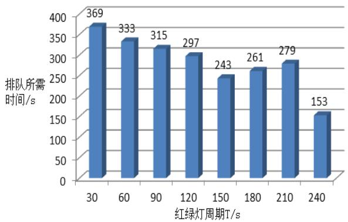

<details>
<summary>bar</summary>

| 红绿灯周期T/s | 排队所需时间/s |
| --- | --- |
| 30 | 369 |
| 60 | 333 |
| 90 | 315 |
| 120 | 297 |
| 150 | 243 |
| 180 | 261 |
| 210 | 279 |
| 240 | 153 |
</details>

图22：红绿灯周期对排队耗时的影响

由图表得到结论如下：

1、红绿灯周期的增长会加速车流堵塞  
2、队伍长度达到 140m的耗时与红绿灯周期负相关

## 8、模型的优缺点与改进

## 8.1问题一模型的优缺点

模型一

优点：

（1）计算简便，结果合理；

（2）具有适用性，可以推广至不同车道，不同道路的实际通行能力的计算；  
（3）考虑了各种因素对实际通行能力的影响，当有因素因进一步的研究导致特性改变时，能够及时的在模型中反映出来，体现前沿性。

缺点：

1. 没有具体的考虑事故发生的位置坐标对实际通行能力的影响，各参数的确定对前人的研究依赖程度大。  
2. 基于人工统计数据，误差相对较大。

## 问题一模型的改进与推广：

1. 介于人工统计可能带来较大的误差，考虑用计算机对图像的识别技术来编程读取车辆信息。根据文献[7]，可用车型Gabor 特征来确定一幅图像中某个位置有一辆车。确定车辆公式如下：

$$
\mathrm{Re} (\psi_ {j} (\vec {x})) = \frac {\left\| \vec {k} _ {j} \right\|}{\sigma^ {2}} \exp \Bigg (- \frac {\left\| \vec {k} _ {j} \right\| ^ {2} \left\| \vec {x} \right\| ^ {2}}{2 \sigma^ {2}} \Bigg) \Bigg [ \cos (i \vec {k} _ {j} \vec {x}) - \exp (- \frac {\sigma^ {2}}{2}) \Bigg ]
$$

$$
\mathrm{Im} (\psi_ {j} (\vec {x})) = \frac {\left\| \vec {k} _ {j} \right\|}{\sigma^ {2}} \exp \left(- \frac {\left\| \vec {k} _ {j} \right\| ^ {2} \left\| \vec {x} \right\| ^ {2}}{2 \sigma^ {2}}\right) [ \sin (\vec {k} _ {j} \vec {x}) ]
$$

$$
J (\vec {x}) = \int I (\vec {x} ^ {*}) \psi_ {n} (\vec {x} - \vec {x} ^ {*}) d ^ {2} \vec {x} ^ {*}
$$

根据上述公式，可以得到如下所示的基于程序统计车辆信息的算法步骤

Step1：用截图软件截取需要时刻的视频得到图片

Step2：用 matlab 读取所截的图片

Step3：根据以上公式，利用matlab编程确定J的值，对比车辆 J的值，从而确定图片中车辆的分布情况。

Step4：根据分布统计所需信息，导出信息到 excel。

Step5：判断图片是否读取完毕，否则返回 Step2

Step6：结束

2.可以将该公式推广到单车道以及其他情况，也可以推广到计算乡镇的公路实际通行能力。

## 8.2问题二模型的优缺点

优点：

（1）给出了差异的具体表达式，思路清晰明确，结果定量化便于对比。  
（2）同时考虑了事故发生车道的不同对实际通行能力以及其波动的影响差异，考虑周全。  
（3）利用控制变量法分析处理数据，所得结果可靠。

缺点：

（1）不能排除道路上人流不同可能对实际交通能力带来的影响  
（2）模型对特定路段的人们的对两种差异的偏好考虑不够。

## 8.3问题三模型的优缺点

优点：

1. 模型考虑到不同车道分流对排队长度的影响  
2. 模型清晰的反映了排队长度与实际交通能力、上游车流量以及排队时间的关系，与实际值接近。

3. 模型能够反映每个时间点的排队长度，具有普适性。

缺点：

1. 模型没有具体的考虑黄灯以及绿闪灯对排队长度的影响。  
2. 模型没有分别考虑各小区路口车辆数的影响。

## 8.4问题四模型的优缺点

优点：

1. 模型在第三问的基础上建立，进一步考虑红绿灯对排队长度的影响，充分利用现得规律，深入研究问题，更容易把握问题的核心。  
2. 模型具有预测功能，能够为交警提供一定的参考，具有实际意义。

缺点：

1. 没有足够的实际数据对模型进行检验，无法评估模型的准确性。  
2. 模型对车辆行驶过程中的变道行为考虑不足。

## 9、参考文献

[1]百度百科，车型的分类及折算系数http://baike.baidu.com/link?url=yGH7a4DJsZzuePu\_UfsRf9uKU\_3u5CAa-oMgJonCtu9QdMFsea-S6POjyItscKSOlMBU\_G2KVMM2ZqyjJKWg0a，2013,9,13

[2]周伟，王秉纲，路段通行能力的理论探讨，交通运输工程学报，Vol.1,No.2,P 92-98,2001,6,

[3]知识水坝论文，城市道路通行能力影响因素研究，P30,http://www.docin.com/p-162101605.html2013,9,13

[4]多车道公路路段通行能力分析，P7-11，http://wenku.baidu.com/view/97c5cc380912a216147929a2

[5]周伟，王秉纲,服务水平与服务交通量的确定原理与方法研究,中国公路学报，Vol.14,No.2, P 90-95,2001,4

[6]梅赛德斯-奔驰C级轿车技术数据http://www.mercedes-benz.com.cn/content/china/mpc/mpc\_china\_website/zhng/home\_mpc/passengercars/home/new\_cars/models/c-class/\_w204/facts\_/technical\_data.html ，2013,9,14

[7]盛卓，基于视频图像的车型识别技术的研究与实现，[D],哈尔滨，哈尔滨工程大学2012,3,P40

[8]杜强，贾丽艳，SPSS统计分析从入门到精通[M]，北京，人民邮电出版社，2009，P257-271，P503.

[9]城市道路设计规范，http://wenku.baidu.com/view/417c140e52ea551810a68766.html，P23，2013,9,13

[10]路线设计百问，http://wenku.baidu.com/view/b417122ded630b1c59eeb5f9.html，P3,2013,9,14

[11]姚荣涵，王殿海，曲昭伟，基于二流理论的拥挤交通流当量排队长度模型，东南大学学报（自然科学版），Vol.37,No.3,2007,5

[12]公路工程技术标准，JTG B01-2003，http://wenku.baidu.com/view/1e1b28fb910ef12d2af9e79a.html,2013，9，14

[13]马江平，交通事故中的交通波理论分析，交通世界，P99，2011,10

[14]孔惠惠，秦超，李新波，李引珍，交通事故引起的排队长度及消散时间的估算，铁道运输与经济(研究与建议)，Vol.27,No.5,P67

## 10、对交管部门的建议

根据以上问题的分析结论，给出对交通管理部门的建议：

1. 对视频 1和视频2实际交通能力变化过程的研究，知道3车道的畅通更有利于车辆行驶，因此审批占道施工时尽量建议施工单位占用1,2车道，停车位尽量设计在 1车道，保证3车道能够通行的宽度。  
2. 对事故发生车道对公交车和小轿车减速的研究，知道公交车减速幅度更大，因此事故发生时，尽量引导公交车绕道行驶。  
3. 对排队长度影响因素的关系研究，知道上游车流量和时间是很关键的因素，因此及时处理交通事故和减少上游车流量对于交通畅通至关重要。  
4. 对各路段分流研究，知道合理分配车道可较轻交通阻塞，因此发生事故时合理疏导车辆行驶车道，有必要对车流量大的 2车道设计减速带。

## 11、附录

## 附录一：

表 1：交通量调查车型划分及车辆折算系数记录表

<table><tr><td>车型</td><td>换算系数</td><td>荷载及功率</td><td>说明</td></tr><tr><td>小型客车</td><td>1.0</td><td>额定座位 $\leqslant 19$ </td><td></td></tr><tr><td>大型客车</td><td>1.5</td><td>额定座位&gt;19</td><td></td></tr><tr><td>电动车</td><td>0.4~0.6</td><td></td><td>包括电动车</td></tr></table>

每隔 30s统计视频中相应时刻的上游路口处出现的小轿车，公交车及电动车的数量（视频中记录的信息出现间断，因此统计的时刻出现了间断），做出如下所示的表格：

表2：交通事故横截面各种车辆数及基本通行能力记录表

<table><tr><td>小轿车</td><td>电动车</td><td>公交车</td><td>事故时基本通行能力</td></tr><tr><td>7</td><td>0</td><td>2</td><td>10</td></tr><tr><td>6</td><td>2</td><td>2</td><td>10</td></tr><tr><td>11</td><td>0</td><td>0</td><td>11</td></tr><tr><td>7</td><td>5</td><td>1</td><td>11</td></tr><tr><td>8</td><td>2</td><td>0</td><td>9</td></tr><tr><td>7</td><td>1</td><td>0</td><td>7.5</td></tr><tr><td>8</td><td>2</td><td>0</td><td>9</td></tr><tr><td>8</td><td>1</td><td>1</td><td>10</td></tr><tr><td>9</td><td>1</td><td>0</td><td>9.5</td></tr><tr><td>5</td><td>3</td><td>0</td><td>6.5</td></tr><tr><td>7</td><td>1</td><td>1</td><td>9</td></tr><tr><td>11</td><td>2</td><td>0</td><td>12</td></tr><tr><td>10</td><td>1</td><td>0</td><td>10.5</td></tr><tr><td>9</td><td>3</td><td>0</td><td>10.5</td></tr><tr><td>7</td><td>1</td><td>1</td><td>9</td></tr><tr><td>10</td><td>2</td><td>0</td><td>11</td></tr><tr><td>8</td><td>0</td><td>0</td><td>8</td></tr><tr><td>9</td><td>4</td><td>0</td><td>11</td></tr><tr><td>8</td><td>0</td><td>1</td><td>9.5</td></tr><tr><td>8</td><td>0</td><td>1</td><td>9.5</td></tr><tr><td>8</td><td>1</td><td>0</td><td>8.5</td></tr><tr><td>7</td><td>0</td><td>1</td><td>8.5</td></tr><tr><td>10</td><td>0</td><td>0</td><td>10</td></tr><tr><td>6</td><td>3</td><td>1</td><td>9</td></tr><tr><td>10</td><td>0</td><td>0</td><td>10</td></tr><tr><td>9</td><td>5</td><td>0</td><td>11.5</td></tr></table>

表3：理想条件下的服务水平划分标准

<table><tr><td>服务水平</td><td>A</td><td>B</td><td>C</td><td>D</td><td>E</td><td>F</td></tr><tr><td>速度</td><td>120</td><td>120</td><td>120</td><td>120</td><td> $\geq V_P$ </td><td> $<V_P$ </td></tr></table>

表4：不同自由车速情况下的服务交通量

<table><tr><td>自由车速</td><td colspan="5">60 km / h</td></tr><tr><td>服务水平</td><td>A</td><td>B</td><td>C</td><td>D</td><td>E</td></tr><tr><td>V/C比</td><td>0.22</td><td>0.31</td><td>0.44</td><td>0.58</td><td>1</td></tr></table>

表5：换算系数的取值表见附录：

<table><tr><td>车型</td><td>平原微丘</td><td>重丘</td><td>山岭</td></tr><tr><td>大型车</td><td>1.7</td><td>2.5</td><td>3.0</td></tr><tr><td>小客车</td><td>1.0</td><td>1.0</td><td>1.0</td></tr></table>

表6：横向干扰对通行能力的修正系数记录表

<table><tr><td>偏向干扰</td><td>偏向干扰等级</td><td>修正系数</td><td>典型情况描述</td></tr><tr><td>轻微</td><td>1</td><td>0.95</td><td>道路交通状况符合标准条件</td></tr><tr><td>较轻</td><td>2</td><td>0.9</td><td>两侧为农田,有少量行人和自行车</td></tr><tr><td>中等</td><td>3</td><td>0.85</td><td>穿过村镇,支路上有车辆进出或路侧停车</td></tr><tr><td>严重</td><td>4</td><td>0.75</td><td>有大量慢速车或拖拉机混合行驶</td></tr></table>

表7：车道宽度的通行能力折减系数记录表

<table><tr><td>车道宽度(m)</td><td>3.5</td><td>3.25</td><td>3.0</td><td>2.75</td></tr><tr><td>折减系数</td><td>1</td><td>0.94</td><td>0.85</td><td>0.77</td></tr></table>

表 8：视频中各时刻上游路口各种车辆数量记录表

<table><tr><td>时间</td><td>小轿车</td><td>公交车</td><td>电动车</td></tr><tr><td>16:44:15</td><td>5</td><td>2</td><td>0</td></tr><tr><td>16:44:45</td><td>8</td><td>1</td><td>0</td></tr><tr><td>16:45:15</td><td>12</td><td>3</td><td>0</td></tr><tr><td>16:45:45</td><td>4</td><td>0</td><td>0</td></tr><tr><td>16:46:15</td><td>5</td><td>3</td><td>0</td></tr><tr><td>16:46:45</td><td>3</td><td>2</td><td>0</td></tr><tr><td>16:47:15</td><td>13</td><td>3</td><td>1</td></tr><tr><td>16:47:45</td><td>5</td><td>1</td><td>0</td></tr><tr><td>16:48:15</td><td>14</td><td>3</td><td>0</td></tr><tr><td>16:48:45</td><td>2</td><td>2</td><td>0</td></tr><tr><td>16:49:15</td><td>9</td><td>3</td><td>0</td></tr><tr><td>16:50:15</td><td>20</td><td>0</td><td>0</td></tr><tr><td>16:50:45</td><td>2</td><td>4</td><td>0</td></tr><tr><td>16:51:15</td><td>18</td><td>1</td><td>1</td></tr><tr><td>16:51:45</td><td>5</td><td>0</td><td>0</td></tr><tr><td>16:52:15</td><td>13</td><td>0</td><td>2</td></tr><tr><td>16:52:45</td><td>3</td><td>0</td><td>0</td></tr><tr><td>16:53:15</td><td>13</td><td>1</td><td>2</td></tr><tr><td>16:53:45</td><td>6</td><td>5</td><td>0</td></tr><tr><td>16:54:15</td><td>11</td><td>0</td><td>0</td></tr><tr><td>16:54:45</td><td>0</td><td>3</td><td>0</td></tr><tr><td>16:55:15</td><td>9</td><td>4</td><td>0</td></tr><tr><td>16:55:45</td><td>1</td><td>1</td><td>0</td></tr><tr><td>16:57:45</td><td>1</td><td>0</td><td>0</td></tr><tr><td>16:59:15</td><td>9</td><td>3</td><td>1</td></tr><tr><td>总计</td><td>191</td><td>45</td><td>7</td></tr></table>

表9：视频2中事故发生时横断面通过各种车型数量及基本通行能力记录表

<table><tr><td>小轿车</td><td>电瓶车</td><td>公交车</td><td>横截面基本通行能力</td></tr><tr><td>8</td><td>2</td><td>0</td><td>9</td></tr><tr><td>11</td><td>0</td><td>1</td><td>12.5</td></tr><tr><td>11</td><td>2</td><td>1</td><td>13.5</td></tr><tr><td>8</td><td>2</td><td>1</td><td>10.5</td></tr><tr><td>8</td><td>3</td><td>0</td><td>9.5</td></tr><tr><td>11</td><td>4</td><td>1</td><td>14.5</td></tr><tr><td>9</td><td>2</td><td>2</td><td>13</td></tr><tr><td>8</td><td>2</td><td>1</td><td>10.5</td></tr><tr><td>11</td><td>5</td><td>0</td><td>13.5</td></tr><tr><td>9</td><td>2</td><td>1</td><td>11.5</td></tr><tr><td>6</td><td>3</td><td>3</td><td>12</td></tr><tr><td>8</td><td>1</td><td>0</td><td>8.5</td></tr><tr><td>9</td><td>5</td><td>2</td><td>14.5</td></tr><tr><td>9</td><td>3</td><td>0</td><td>10.5</td></tr><tr><td>10</td><td>1</td><td>0</td><td>10.5</td></tr><tr><td>10</td><td>1</td><td>1</td><td>12</td></tr><tr><td>14</td><td>4</td><td>0</td><td>16</td></tr><tr><td>9</td><td>6</td><td>1</td><td>13.5</td></tr><tr><td>10</td><td>3</td><td>0</td><td>11.5</td></tr><tr><td>5</td><td>3</td><td>2</td><td>9.5</td></tr><tr><td>8</td><td>1</td><td>0</td><td>8.5</td></tr><tr><td>8</td><td>2</td><td>1</td><td>10.5</td></tr><tr><td>11</td><td>3</td><td>0</td><td>12.5</td></tr><tr><td>10</td><td>2</td><td>0</td><td>11</td></tr><tr><td>8</td><td>2</td><td>2</td><td>12</td></tr><tr><td>4</td><td>3</td><td>0</td><td>5.5</td></tr><tr><td>5</td><td>5</td><td>2</td><td>10.5</td></tr><tr><td>9</td><td>4</td><td>2</td><td>14</td></tr><tr><td>10</td><td>3</td><td>0</td><td>11.5</td></tr><tr><td>9</td><td>2</td><td>1</td><td>11.5</td></tr><tr><td>11</td><td>3</td><td>0</td><td>12.5</td></tr><tr><td>11</td><td>2</td><td>1</td><td>13.5</td></tr><tr><td>10</td><td>3</td><td>1</td><td>13</td></tr><tr><td>11</td><td>2</td><td>0</td><td>12</td></tr><tr><td>7</td><td>1</td><td>1</td><td>9</td></tr><tr><td>10</td><td>5</td><td>0</td><td>12.5</td></tr><tr><td>9</td><td>6</td><td>1</td><td>13.5</td></tr><tr><td>11</td><td>6</td><td>1</td><td>15.5</td></tr><tr><td>7</td><td>3</td><td>2</td><td>11.5</td></tr><tr><td>11</td><td>3</td><td>0</td><td>12.5</td></tr><tr><td>9</td><td>2</td><td>1</td><td>11.5</td></tr><tr><td>11</td><td>4</td><td>0</td><td>13</td></tr><tr><td>6</td><td>3</td><td>2</td><td>10.5</td></tr><tr><td>8</td><td>7</td><td>1</td><td>13</td></tr><tr><td>9</td><td>7</td><td>2</td><td>15.5</td></tr><tr><td>10</td><td>3</td><td>1</td><td>13</td></tr><tr><td>8</td><td>2</td><td>1</td><td>10.5</td></tr><tr><td>8</td><td>0</td><td>1</td><td>9.5</td></tr><tr><td>7</td><td>1</td><td>2</td><td>10.5</td></tr><tr><td>4</td><td>3</td><td>1</td><td>7</td></tr><tr><td>7</td><td>1</td><td>2</td><td>10.5</td></tr><tr><td>10</td><td>2</td><td>2</td><td>14</td></tr><tr><td>9</td><td>2</td><td>1</td><td>11.5</td></tr><tr><td>8</td><td>4</td><td>1</td><td>11.5</td></tr><tr><td>9</td><td>1</td><td>0</td><td>9.5</td></tr><tr><td>9</td><td>1</td><td>1</td><td>11</td></tr><tr><td>9</td><td>0</td><td>1</td><td>10.5</td></tr><tr><td>9</td><td>2</td><td>1</td><td>11.5</td></tr></table>

表10：视频2公交车行驶120米通过事故发生横断面所需时间及平均速度记录表

<table><tr><td>公交车通过事发路段上游120米处时刻</td><td>公交车行驶120米到达事发横断面所需时间</td></tr><tr><td>17:34:34</td><td>18</td></tr><tr><td>17:34:40</td><td>28</td></tr><tr><td>17:35:25</td><td>15</td></tr><tr><td>17:35:39</td><td>21</td></tr><tr><td>17:36:38</td><td>12</td></tr><tr><td>17:37:21</td><td>20</td></tr><tr><td>17:38:36</td><td>15</td></tr><tr><td>17:49:35</td><td>25</td></tr><tr><td>17:50:35</td><td>65</td></tr><tr><td>17:51:26</td><td>66</td></tr><tr><td>17:52:36</td><td>65</td></tr><tr><td>17:53:30</td><td>54</td></tr><tr><td>17:54:32</td><td>49</td></tr><tr><td>17:55:34</td><td>48</td></tr><tr><td>17:56:38</td><td>67</td></tr><tr><td>17:58:37</td><td>104</td></tr><tr><td>18:00:36</td><td>104</td></tr></table>

表11：公交车在事发路段行驶车道取向统计表

<table><tr><td></td><td>车道 1</td><td>车道 2</td><td>车道 3</td></tr><tr><td>视频 1</td><td>7</td><td>22</td><td>24</td></tr><tr><td>视频 2</td><td>0</td><td>14</td><td>10</td></tr></table>

表12：视频1公交车行驶120米通过事故发生横断面所需时间及平均速度记录表

<table><tr><td>公交车通过事发路段上游120米处时刻</td><td>公交车行驶120米到达事发横断面所需时间</td></tr><tr><td>16:43:30</td><td>35</td></tr><tr><td>16:45:36</td><td>39</td></tr><tr><td>16:47:35</td><td>20</td></tr><tr><td>16:49:38</td><td>18</td></tr><tr><td>16:51:30</td><td>55</td></tr><tr><td>16:52:32</td><td>73</td></tr><tr><td>16:53:36</td><td>65</td></tr><tr><td>16:58:18</td><td>69</td></tr></table>

表13：视频2事故前后基本通行能力记录表

<table><tr><td>事故前基本通行能力</td><td>11.5</td><td>12</td><td>11</td></tr><tr><td>事故后基本通行能力</td><td>25.5</td><td>25</td><td></td></tr></table>

表14：问题一实际通行能力表：

<table><tr><td>时刻</td><td>16:41:30</td><td>16:42:00</td><td>16:42:30</td><td>16:43:00</td></tr><tr><td>实际通行能力</td><td>2964</td><td>3024</td><td>3060</td><td>1044</td></tr><tr><td>时刻</td><td>16:43:30</td><td>16:44:00</td><td>16:44:30</td><td>16:45:00</td></tr><tr><td>实际通行能力</td><td>1044</td><td>1140</td><td>1140</td><td>936</td></tr><tr><td>时刻</td><td>16:45:30</td><td>16:46:00</td><td>16:46:30</td><td>16:47:00</td></tr><tr><td>实际通行能力</td><td>780</td><td>936</td><td>1044</td><td>984</td></tr><tr><td>时刻</td><td>16:47:40</td><td>16:48:00</td><td>16:48:30</td><td>16:49:00</td></tr><tr><td>实际通行能力</td><td>672</td><td>936</td><td>1248</td><td>1092</td></tr><tr><td>时刻</td><td>16:49:30</td><td>16:50:00</td><td>16:50:30</td><td>16:51:00</td></tr><tr><td>实际通行能力</td><td>1092</td><td>936</td><td>1140</td><td>828</td></tr><tr><td>时刻</td><td>16:51:30</td><td>16:52:00</td><td>16:52:30</td><td>16:53:00</td></tr><tr><td>实际通行能力</td><td>1140</td><td>984</td><td>984</td><td>888</td></tr><tr><td>时刻</td><td>16:53:30</td><td>16:54:00</td><td>16:54:30</td><td>16:55:00</td></tr><tr><td>实际通行能力</td><td>888</td><td>1044</td><td>936</td><td>1044</td></tr><tr><td>时刻</td><td>16:55:30</td><td>16:56:00</td><td>16:56:30</td><td></td></tr><tr><td>实际通行能力</td><td>1200</td><td>5616</td><td>5640</td><td></td></tr></table>

## 附录二：

```matlab
%问题一程序：视频1实际通行能力计算
clear;
clc;
%原始统计数据（根据视频1统计的）；
x=[9.5 9.7 9.8 10 10 11 11 9 7.5 9 10 9.5 6.5 9 12 10.5...
    10.5 9 11 8 11 9.5 9.5 8.5 8.5 10 9 10 11.5 18 18.1];
%以下为视频1的道路参数情况（论文中有详细说明）
n=[3,1,3];%道路单行车道数目,分别对应事故前、中、后对应的实际能够同行的车道数目;
a1=0.94;%宽度对其的修正系数;
a2=0.95;%横向干扰影响修正系数;
a3=1;%驾驶员技术、道路熟悉情况对其的修正系数;
a4=0.97;%公交车等对其修正系数;
a5=1;%地理位置修正系数
%实际通行能力函数关系;
for i=1:3%事故的三个阶段
    if(i==1)
        y=x(1:3);
        f1=n(i)*a1*a2*a3*a4*a5*y;
    elseif(i==2)
        y=x(4:end-2);
        f2=[f1(3) n(i)*a1*a2*a3*a4*a5*y];
    else
        y=x(end-1:end);
        f3=[f2(end) n(i)*a1*a2*a3*a4*a5*y];
    end
end
%实际通行能力
f=[f1(1:2),f2,f3(end-1:end)];
%实际同行能力与时间的关系图
t1=1:length(f1);
t2=length(f1):length(f1)+length(f2)-1;
t3=length(f1)+length(f2)-1:length(x);
plot(t1,f1,'-o',t2,f2,'-',t3,f3,'-*');
xlabel('时间(30s为以一个单位)');ylabel('实际通行能力pcu/30s');
legend('事故前','事故时','事故后');
```

视频2实际通行能力计算

<div class="mineru-algorithm" style="white-space: pre-wrap; font-family:monospace;">
clear;
clc;
%原始统计数据（根据视频2统计的）；
x=[11.5 11 11 9 12.5 13.5 10.5 9.5 14.5 13 10.5 13.5 11.5 12 8.5 14.5 10.5...
    10.5 12 16 13.5 11.5 9.5 8.5 10.5 12.5 11 12 5.5 10.5 14 11.5 11.5 12.5...
    13.5 13 12 9 12.5 13.5 15.5 11.5 12.5 11.5 13 10.5 13 15.5 13 10.5 9.5...
    10.5 7 10.5 14 11.5 11.5 9.5 11 10.5 11.5 25.5 25.5];
%以下为视频1的道路参数情况（论文中有详细说明）
n=[3,1,3];%道路单行车道数目,分别对应事故前、中、后对应的实际能够同行的车道数目;
a1=0.94;%宽度对其的修正系数;
a2=0.95;%横向干扰影响修正系数;
a3=1;%驾驶员技术、道路熟悉情况对其的修正系数;
a4=0.95;%公交车等对其修正系数
a5=1;%地理位置修正系数
%实际通行能力函数关系;
for i=1:3%事故的三个阶段
    if(i==1)
        y=x(1:3);
        f1=n(i)*a1*a2*a3*a4*a5*y;
elseif(i==2)
        y=x(4:end-2);
        f2=[f1(3) n(i)*a1*a2*a3*a4*a5*y];
    else
        y=x(end-1:end);
        f3=[f2(end) n(i)*a1*a2*a3*a4*a5*y];
    end
end
%实际通行能力
f=[f1(1:2),f2,f3(2:3)];
%实际同行能力与时间的关系图
t1=1:length(f1);
t2=length(f1):length(f1)+length(f2)-1;
t3=length(f1)+length(f2)-1:length(x);
plot(t1,f1,'-o',t2,f2,'-',t3,f3,'-*');
xlabel('时间(30s为以一个单位)');ylabel('实际通行能力pcu/30s');
legend('事故前','事故时','事故后');
</div>

问题二深入分析程序：

<div class="mineru-algorithm" style="white-space: pre-wrap; font-family:monospace;">
%以下是公交车
%距离
l=120;
%时间
s1=[35 39 20 18 55 73 65];
s2=[15 20 15 25 66 54 48];
%速度
v1=l./s1;
v2=l./s2;
%平均速度
ave_v1=sum(v1)/length(v1);
ave_v2=sum(v2)/length(v2);
%方差
s_v1=sum((v1-ave_v1).^2)/length(v1);
s_v2=sum((v2-ave_v2).^2)/length(v2);
%公交车有关量计算结束
%以下是小轿车
cs1=[32 34 28 46 83 61 54];
cs2=[13 9 15 20 13 16 21];
%速度
cv1=l./cs1;
cv2=l./cs2;
%平均速度
cave_v1=sum(cv1)/length(cv1);
cave_v2=sum(cv2)/length(cv2);
%方差
cs_v1=sum((cv1-cave_v1).^2)/length(cv1);
cs_v2=sum((cv2-cave_v2).^2)/length(cv2);
</div>

%第三、四问程序

<div class="mineru-algorithm" style="white-space: pre-wrap; font-family:monospace;">
M=[41.074991169.5 7.4
    0     7.8 9.2
    0     6.5 15.6
    0     7.8 4
    59.13596208 8.7 8.6
    39.12808784 8.2 5.4
    26.17011991 5.6 17.1
    56.36300103 7.8 6.2
    54.40724183 10.4      17.6
    56.0369495 9.1 4.4
    71.40513254 9.1 12.6
    32.80679561 7.8 20
    49.8487427 9.5 6.8
    62.728707 6.9 19.7
    43.83477707 9.5 5
    101.6457895 8.2 14
    111.6769058 8.2 3
    77.81068828 7.4 15.2
    98.98150955 7.4 12
    92.67071184 8.7 11
    120.7630467 7.8 3.6
    95.49109401 8.7 13.8
    86.71278417 10 2.2];
M1=M(:,1);
M2=cumsum(M(:,2));
M3=cumsum(M(:,3));
M4=[13 11.5 12.5 13 12.5 13.5 15 14.5 12 13 11 11.5];
%%%%%%%%%%%%%%%%%%%%%%%%%%%%%%%%%%%%%%%%
%%%%%%%%%%%%%%%%%%
figure(1);
N=zeros(1,21);
N(1)=0;
t=0;
for i=2:21
    N(i)=t+25;
    if mod(i,2)~=0
        t=t+25;
    end
end

i=0:0.5:10
plot(i,N)
xlabel('时间（单位：min）'),ylabel('上游累计到达量（单位：pcu）')
%%%%%%%%%%%%%%%%%%%%%%%%%%%%%%
</div>

```matlab
j=0:0.01:1;
N0(1:51)=j(1:51)*50;
N1=25*ones(1,101);
N1(1:76)=j(1:76)*100/3;
plot(j,N0,'r-.',j,N1,'g:'),hold on;
plot([0,1],[0,25])
% % % % % % % % % % % % % % % % % % % % % % % % % % % % % % % % % %
% % % % % % % % % % % % % % % %
figure(3);
i=3:0.5:14;
plot(i,2.63*(M3-M2),i,M1,'r-.'),hold on,
xlabel('时间/min'),ylabel('排队长度/m')
% % % % % % % % % % % % % % % % % % % % % % % % % % % %
% % % % % % % % % % % % % % %
figure(4);
x=40*M4-500;
i=3:14;
R=M1([2,4,6,7,9,11,13,15,17,19,21,23]);
plot(i,cumsum(x),'r-.',i,R,'g'),xlabel('时间/min'),ylabel('排队长度/m')
```

```matlab
%%%问题 4 敏感分析
function pro4
for i=(1:8)
QQ(i)=prob4(30*i);
end
bar(QQ)
end

function Y=prob4(T)
c=5*T/12;
na=0.5;
Q1=zeros(1,600); %上游累计到达车辆数
Q2=zeros(1,600); %下游离开车辆
for t=1:600
    n=ceil(t/T);
    t0=rem(t,T)/T;
    k=c*(1+na);
    temp=c/k;
    if t0<temp;
        Q1(t)=k/T;
    else
        Q1(t)=0;
    end
    Q2(t)=16.6/60;
end
Q3=cumsum(Q1);
Q4=cumsum(Q2);

i=(1:600)/60;
S=2.63*(Q3-Q4);
%plot(i,S),hold on,
%plot([0,10],[140,140],'r:'),xlabel('时间/min'),ylabel('排队长度/m');
Z=find((Q3-Q4)>140/2.63);
Y=Z(1);
end
```