# 2013高教社杯全国大学生数学建模竞赛

## 编 号 专 用 页

赛区评阅编号（由赛区组委会评阅前进行编号）：

赛区评阅记录（可供赛区评阅时使用）：


<details>
<summary>natural_image</summary>

Blank grid with uniform white squares, no text or symbols present
</details>

全国统一编号（由赛区组委会送交全国前编号）：

全国评阅编号（由全国组委会评阅前进行编号）：

# 车道被占用对城市道路通行能力的影响

## 摘要

本文针对车道占用对城市交通能力影响的评估与预测问题，以题目所给视频为基础进行大量的数据挖掘，利用排队论、多元回归、元胞自动机为理论基础进行了完整的建模工作。首先，我们处理得到事故所处横断面实际最大通行能力，结合各方面因素分段描述了其变化情况；在此基础上结合视频 2，借鉴排队论模型，从本质上分析并说明了占用不同车道对实际通行能力的影响差异；建立了多元回归分析模型和元胞自动机模型来共同描述排队长度与其他指标的联系；最后对模型加以检验后应用于问题四，估算出了大约 5.5\~7.5min 后车辆排队长度将达到上游路口。

针对问题一，结合实际最大通行能力的本质，考虑到视频 1中事故横断面的交通绝大部分处于饱和的特点，将事故横断面处在车辆饱和状态下的单位时间车流量作为其实际最大通行能力。通过对视频数据的采集与分析，得到了实际最大通行能力的变化规律以及主要影响因素。以视频1中的6次车辆排队事故为分段，结合主要影响因素完备地描述了实际最大通行能力的变化。

针对问题二，基于问题 1得到的结论，我们采用单服务台多列的排队论模型，并用基于概率的最高响应比优先（HRRN）调度策略来模拟真实的情况，仿真计算出了视频 1、2 每 30s 的实际通行能力，并进行了显著性检验。最后，结合模型计算的数据我们对同一横断面交通事故所占车道不同对该横断面实际通行能力影响的差异进行了深入的剖析，得出了结论。

针对问题三，基于对视频中六次车辆排队事故的排队长度、上游车流量、事故持续时间、最大通行能力指标的统计数据，分析了排队长度与其他三个指标的关系，初步推导出排队长度与其他三个指标的联系，并引入贡献系数来处理不同车辆来源对排队长度影响不同的问题。为了更加真实、形象地描述指标间的关系模型，我们通过对视频中车流量变化及其分配、车辆种类、车速的建模，以元胞自动机理论为基础，为事故路段建立了较为真实的元胞自动机模型。随后运行元胞自动机模型进行多次仿真，将仿真结果与实际视频结果进行比对，验证了该模型的准确性和科学性。

针对问题四，首先利用视频 的车流量统计数据对车流量进行建模，利用该模型预测此问题中1500pcu/h的车流量在空间（不同车道）和时间上的分配情况，在问题三的元胞自动机模型基础上，得到真实反映问题四所述情况的元胞自动机模型，多次运行该模型后，估算得到一个合理的时间范围为 5.5min\~7.5min（330s\~450s）。

## 关键词：

数据统计

排队论

多元回归

元胞自动机

模型验证

## 一、问题重述

## 1.1 引言

交通对国民经济的发展具有重要的战略意义，一直是国家重点建设内容。随着各种交通工具数量增长迅速，交通阻塞日趋严重，不仅会引发一系列严峻的社会和环境问题，而且制约经济发展，所以交通问题引起了政府机关、科研机构和学术界，乃至城市居民的普遍重视。

由于城市道路具有交通流密度大、连续性强等特点，一条车道被占用，也可能降低路段所有车道的通行能力，即使时间短，也可能引起车辆排队，出现交通阻塞。如处理不当，甚至出现区域性拥堵。

而交通系统是一个具有严重非线性、强随机性、大时变性和不确定性的复杂系统，车道被占用的情况种类也极其繁多、复杂，要解决此类交通问题，除了要充分利用现有交通资源外，更重要的是要利用科学的理论来进行合理的交通规划、控制和管理。因此，正确估算车道被占用对城市道路通行能力的影响程度，将为交通管理部门正确引导车辆行驶、审批占道施工、设计道路渠化方案、设置路边停车位和设置非港湾式公交车站等提供理论依据。

## 1.2 问题的提出

为了更好地估算车道被占用对城市道路通行能力的影响程度，本文依次提出以下问题。

（1） 根据视频 1（附件 1），描述视频中交通事故发生至撤离期间,事故所处横断面实际通行能力的变化过程。  
（2） 根据问题 1所得结论，结合视频 2（附件 2），分析说明同一横断面交通事故所占车道不同对该横断面实际通行能力影响的差异。  
（3） 构建数学模型，分析视频 1（附件 1）中交通事故所影响的路段车辆排队长度与事故横断面实际通行能力、事故持续时间、路段上游车流量间的关系。  
（4） 假如视频 1（附件 1）中的交通事故所处横断面距离上游路口变为 140 米，路段下游方向需求不变，路段上游车流量为 1500pcu/h,事故发生时车辆初始排队长度为零，且事故持续不撤离。请估算，从事故发生开始，经过多长时间，车辆排队长度将到达上游路口。

## 二、问题分析

## 问题一：

问题要求描述视频 中从交通事故发生至撤离期间 事故所处横断面实际通行能力的变化过程。首先我们需要明确，什么是实际通行能力？在明确这个概念以后利用视频对车辆饱和状态时横断面车流量的计数来反映实际通行能力，同时分析出影响实际通行能力变化的因素，再结合视频中的六次车辆排队事故，分段

描述实际通行能力的变化。

## 问题二：

题目要求结合两个视频分析说明同一横断面交通事故所占车道不同对该横断面实际通行能力影响的差异。通过问题一中的分析，我们可以得出结论：之所以占用车道不同会导致实际通行能力的不同，是因为“车道”作为一个车辆的承载体，具有如下特征——车道上车流量的大小，车速的大小，该车道车辆的排队长度，不同车种类在该车道的分配等。而上述特征，均会影响横断面的实际通行能力。针对本题中车道被占用导致车辆排队而形成的交通阻塞的情况，我们决定使用排队论模型来进行问题二的初步探索。以排队论为基础对车辆排队情况进行建模，结合视频中的现象来共同分析并说明占用不同车道时对实际通行能力的影响差异。

## 问题三

问题三要求构建数学模型，分析视频 1（附件 1）中交通事故所影响的路段车辆排队长度与事故横断面实际通行能力、事故持续时间、路段上游车流量间的关系。视频1中一共可以提取出6次车辆排队事故，我们可以通过对这6 次事故的数据进行分析来初步推导出排队长度与其他三个指标的关系。为了更精确的描述该模型，可以利用元胞自动机理论进行建模。建模中明确车辆类别、车流量的变化、车流量在不同车道的分配、车速、路段下游方向需求等因素，建立起比较精确地模型，继而进行模型的验证即可。

## 问题四

问题四中给出了一种假定的事故发生情况，同时给定了车流量，要求预测多长时间达到预期的车辆排队长度。分析可知，问题中仅仅给定了总的上游车流量，并未对每个车道车流量进行详细的分配，因此我们需要根据在问题一中统计得到的车流量变化规律来预测题目中给的 1500pcu/h 在不同车道上的分配情况（包括车辆类型的分配情况）。在以上基础上，应用问题三中建立的模型，即可得到何时排队长度达到140m。

## 三、基本假设

（1）交通事故导致的交通阻塞不会影响上游路口的车流量；  
（2）不考虑该路段车辆路边临时停车对交通流的影响；  
（3）只考虑四轮及以上机动车、电瓶车的交通流量；  
（4）由于车本身具有宽度以及车道宽度限制，停车时不存在车辆之间的相互穿插；

## 四、符号说明

$L$ 车辆排队长度；

$L _ { 0 }$ 车辆排队时间开始时的排队长度；

L 车辆排队长度的变化；

Cross arrive\_ 每 10s 内上游十字路口车流量；

Apt arrive\_ 每 10s 内小区路口车流量；

Pass num\_ 每 10s 内事故横断面的车流量

Length一个标准车当量数占有的长度，包括小型车辆车长及车头距前一辆车的距离；

M 事故发生路段矩阵；

cell元胞单位；

T 视频中显示的时间；

t 从事故发生开始到当前所经过的时间；

tt 从事故发生后第一次信号灯变绿到当前所经过的时间；

$\mathfrak { t } _ { p }$ 1秒时间间隔

arrival 从事故发生后第一次信号灯变绿当前车辆到达该路段所经过的时间；

L L=i 表示第 i 条车道，i=1,2,3;

flux 车流量(pcu/h)

$c o u n t _ { t i m e }$ time时间段内上游路段通过的车辆数；

$p _ { L }$ 车道 L出现车辆的概率；

$p _ { a c }$ 车辆加速概率；

$p _ { d c }$ 车辆防止碰撞减速概率；

$p _ { r d }$ 车辆随机减速概率；

$\nu _ { i n i t }$ 车辆初始速度；

$\nu _ { \mathrm { m a x } }$ 车辆最大速度

$\nu _ { _ { n o w } }$ 车辆现有速度

## 五、模型的建立与求解

## 5.1 问题一的建模与解答

## 5.1.1 实际通行能力的定义与理解

通过查阅相关资料，可以得到对于通行能力有如下概念：

由于道路、交通和管制条件以及服务水平不同，通行能力分为：基本（理论）通行能力，可能（实际）通行能力和设计（规划）通行能力。

其中，实际通行能力是指在设计或评价某一具体路段时，根据该设施具体的公路几何构造、交通条件以及交通管理水平，对不同服务水平下的服务交通量（如基本通行能力或设计通行能力）按实际公路条件、交通条件等进行相应修正后的小时交通量。

可见，实际通行能力是对基本通行能力或设计通行能力根据具体情况进行修正的结果，换言之，实际通行能力是在实际情况下所能通行的最大小时交通量，它能够反映道路的真实通行能力。

通过视频可以看到，视频中车辆通过距离长短、花费时间长短都比较小，车辆在通过事故路段时并不是匀速，人工测量具有很大的相对误差，无法距离、时间、车速进行精确建模，无法利用常见的公式求得实际通行能力。然而，经过统计，将视频的时间做如下分类:

（1） 事故持续时间段：从事故发生到事故车辆撤离的时间段；  
（2） 车辆饱和状态：视频中大部分时间段内，相邻的两辆车在保证一定安全距离的条件下都是接连缓慢通过事故所处横断面的，也就是说车辆对事故所处横断面处的补充作用一直是饱和的，因此符合实际通行能力中的“最大小时通行量”的定义,可以利用该类时间内的横断面单位时间内的车流量来反映道路实际通行能力的大小；  
（3） 车辆短缺状态：两辆车之间的距离大于安全距离时，两辆车相继通过事故所处横断面的时间间隔较大，车辆的补充作用处于短缺状态，无法反映“最大小时通行量”的关键本质；  
（4） 视频跳跃段：实际视频中存在画面跳跃的情况，需要加以剔除：

表格 1 不同类别时间段的分配

<table><tr><td>时间段类别</td><td>对应时刻</td><td>总长度/s</td></tr><tr><td>事故持续时间段</td><td>16:42:33~17:00:09</td><td>1056</td></tr><tr><td rowspan="2">视频的跳跃</td><td>16:49:37~16:50:05</td><td rowspan="2">146</td></tr><tr><td>16:56:00~16:57:58</td></tr><tr><td rowspan="2">车辆短缺状态</td><td>16:42:33~16:42:40</td><td rowspan="2">78</td></tr><tr><td>16:44:16~16:44:32</td></tr><tr><td></td><td>16:44:51~16:45:46</td><td></td></tr></table>

由上表可知，整个视频中画面除去跳跃部分，一共有1056-146=910s的正常时间,其中车辆短缺状态时间为78s,占正常时间的91.43%，可以认为绝大部分时间内，事故所处横断面一直处于车辆饱和状态，即最大小时通行量状态，利用单位时间内的车流量即可作为最大通行能力。

## 5.1.2 根据视频采集横断面的车流量数据并计算最大通行能力

通过视频我们可以发现，事故路段的车流并不均匀，而是在一定的周期内进行波动。结合题目附件 与附件 可以看到，事故路段车流量受到上游路口处红绿灯的控制。经过上游十字路口到达事故路段的车流量分为三种：直行车辆、右转车辆，小区路口车辆。其中，直行车辆占有绝大部分比重，且受到红绿灯的控制，按照 $3 0 s$ 的周期进行周期性的变化；右转车辆占有小部分比重，而且不受红绿灯的控制；小区路口车辆比重较小，且具有随机性。此外，红绿灯在每个整分和每个半分时切换：

表格 2 上游路口交通灯及路段车辆来源变化

<table><tr><td>--:00---:30</td><td>直行绿灯,路段三类车辆均有</td></tr><tr><td>--:30---:60</td><td>直行红灯,路段仅右转车辆和小区路口车辆</td></tr></table>

因此我们以30s为单位时间，对事故横断面的车流量进行统计，统计时避开视频跳跃点和车辆短缺状态，记录到达事故横断面车辆的标准车当量数、到达时刻及车辆是否饱和。

另外，由于我们在下面问题中采用了元胞自动机模型，因此对标准车当量系数换算做如下规定，

小轿车，小型厢式货车标准车当量数为1；

大客车，公交车的标准车当量数为 2。

该规定参考了国家标准规定，所造成的误差可以通过对元胞自动机模型的精确建模来消除。详细统计表格见附件 1，此处给出每半分钟的统计量及最大通行能力的计算值：

表格 3 每半分钟内标准车当量数及最大通行能力

<table><tr><td>时间段长短/s</td><td>时间段位置</td><td>标准车当量数 /pcu</td><td>实际通行能力/ pcu•min-1</td></tr><tr><td>18</td><td>15</td><td>9</td><td>30</td></tr><tr><td>29</td><td>45</td><td>11</td><td>22.75862069</td></tr><tr><td>25</td><td>75</td><td>10</td><td>24</td></tr><tr><td>16</td><td>105</td><td>7</td><td>26.25</td></tr><tr><td>16</td><td>135</td><td>7</td><td>26.25</td></tr><tr><td>12</td><td>195</td><td>5</td><td>25</td></tr><tr><td>28</td><td>225</td><td>10</td><td>21.42857143</td></tr><tr><td>25</td><td>255</td><td>9</td><td>21.6</td></tr><tr><td>19</td><td>285</td><td>6</td><td>18.94736842</td></tr><tr><td>26</td><td>315</td><td>9</td><td>20.76923077</td></tr><tr><td>28</td><td>345</td><td>11</td><td>23.57142857</td></tr><tr><td>27</td><td>375</td><td>10</td><td>22.22222222</td></tr><tr><td>29</td><td>405</td><td>10</td><td>20.68965517</td></tr><tr><td>23</td><td>465</td><td>8</td><td>20.86956522</td></tr><tr><td>24</td><td>495</td><td>10</td><td>25</td></tr><tr><td>26</td><td>525</td><td>9</td><td>20.76923077</td></tr><tr><td>26</td><td>555</td><td>8</td><td>18.46153846</td></tr><tr><td>29</td><td>585</td><td>11</td><td>22.75862069</td></tr><tr><td>25</td><td>615</td><td>10</td><td>24</td></tr><tr><td>26</td><td>645</td><td>8</td><td>18.46153846</td></tr><tr><td>19</td><td>675</td><td>7</td><td>22.10526316</td></tr><tr><td>25</td><td>705</td><td>9</td><td>21.6</td></tr><tr><td>25</td><td>735</td><td>9</td><td>21.6</td></tr><tr><td>25</td><td>765</td><td>9</td><td>21.6</td></tr><tr><td>27</td><td>795</td><td>10</td><td>22.22222222</td></tr><tr><td>14</td><td>945</td><td>5</td><td>21.42857143</td></tr><tr><td>21</td><td>1005</td><td>10</td><td>28.57142857</td></tr><tr><td>15</td><td>1035</td><td>6</td><td>24</td></tr></table>

表中最大通行能力按如下公式计算：

$$
\text {最大通行能力} (\mathrm{pcu} / \min) = \frac {\text {标准车当量数} (\mathrm{pcu})}{\text {时间段长短} / 6 0} \tag {1}
$$

“所处时间段位置”表示：以事故发生时刻 16:42:33 为起点，以后每半分钟的中间时刻与起点相隔的时间长短。将其作为横坐标，实际通行能力作为纵坐标得到下图

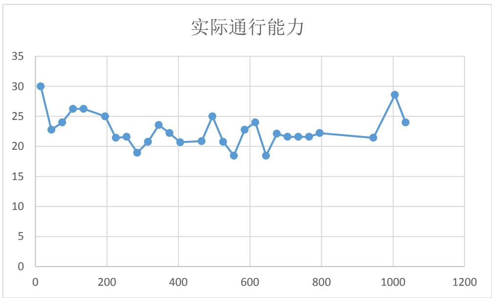

<details>
<summary>line</summary>

| X | Y |
| --- | --- |
| 0 | 30 |
| 50 | ~23 |
| 100 | ~24 |
| 150 | ~26 |
| 200 | ~26 |
| 250 | ~25 |
| 300 | ~21 |
| 350 | ~22 |
| 400 | ~19 |
| 450 | ~21 |
| 500 | ~24 |
| 550 | ~22 |
| 600 | ~21 |
| 650 | ~21 |
| 700 | ~25 |
| 750 | ~21 |
| 800 | ~19 |
| 850 | ~23 |
| 900 | ~24 |
| 950 | ~19 |
| 1000 | ~22 |
| 1050 | ~22 |
| 1100 | ~22 |
| 1150 | ~22 |
| 1200 | ~22 |
| 1250 | ~22 |
| 1300 | ~22 |
| 1350 | ~22 |
| 1400 | ~22 |
| 1450 | ~22 |
| 1500 | ~22 |
| 1550 | ~22 |
| 1600 | ~22 |
| 1650 | ~22 |
| 1700 | ~22 |
| 1750 | ~22 |
| 1800 | ~22 |
| 1850 | ~22 |
| 1900 | ~22 |
| 1950 | ~22 |
| 2000 | ~22 |
| 2050 | ~22 |
| 2100 | ~22 |
| 2150 | ~22 |
| 2200 | ~22 |
| 2250 | ~22 |
| 2300 | ~22 |
| 2350 | ~22 |
| 2400 | ~22 |
| 2450 | ~22 |
| 2500 | ~22 |
| 2550 | ~22 |
| 2600 | ~22 |
| 2650 | ~22 |
| 2700 | ~22 |
| 2750 | ~22 |
| 2800 | ~22 |
| 2850 | ~22 |
| 2900 | ~22 |
| 2950 | ~22 |
| 3000 | ~22 |
| 3050 | ~22 |
| 3100 | ~22 |
| 3150 | ~22 |
| 3200 | ~22 |
| 3250 | ~22 |
| 3300 | ~22 |
| 3350 | ~22 |
| 3400 | ~22 |
| 3450 | ~22 |
| 3500 | ~22 |
| 3550 | ~22 |
| 3600 | ~22 |
| 3650 | ~22 |
| 3700 | ~22 |
| 3750 | ~22 |
| 3800 | ~22 |
| 3850 | ~22 |
| 3900 | ~22 |
| 3950 | ~22 |
| 4000 | ~28.5 |
| 4050 | ~24 |
</details>

图 1实际通行能力的变化曲线

## 5.1.3 找出影响最大通行能力的因素

为了能够准确描述最大通行能力的变化，我们需要找出根据视频我们可以看出，影响最大通行能力的因素有：

（1） 不同车道车流量不同，车辆类型分配不同，且车流量再不断变化；  
（2） 大客车、公交车由于尺寸较大，其换道所需条件及时间较长，对最大通行能力影响较大，；  
（3） 事故横断面处的交通混乱程度很大程度上影响最大通行能力；

下面分别介绍三个因素的具体情况：

## 因素一、不同车道车流量不同，且随时间变化

我们将视频中的三条车道分为：外车道、中车道、内车道，如下图所示：

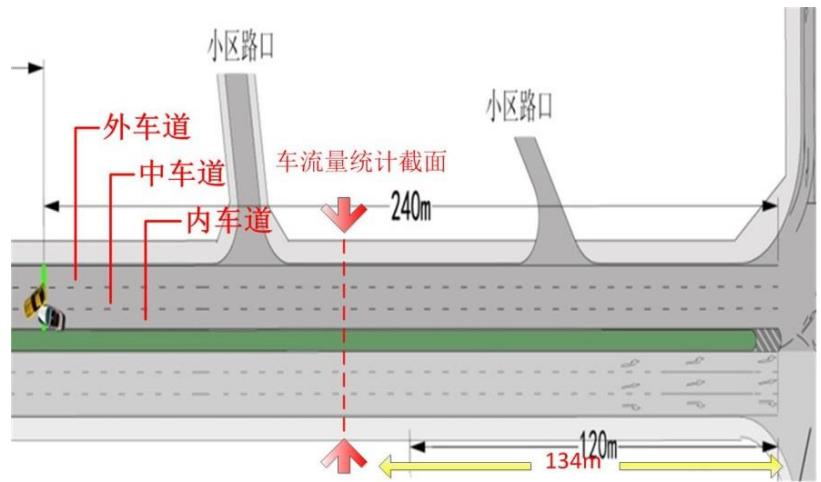

<details>
<summary>text_image</summary>

外车道
中车道
内车道
车流量统计截面
240m
小区路口
小区路口
120m
134m
</details>

图 2 车道划分标准及车流量统计截面

车道不同，车流量也不同，如上图，我们事故路段上游确定统计截面 C，该截面的选择标准为：在车辆排队最长的情况下也不会到达该截面，不会影响到该截面的车辆通过，否则若排队到达该截面，会造成车辆无法经过截面C，那么将无法统计车流量。

在 C 截面处，我们统计指标包括车辆的标准车当量数、车辆到达时刻、车辆所在车道，具体统计结果见附件2，此处给出不同车道的车流量分配情况：

表格 4 车流量的分配情况

<table><tr><td>车道</td><td>车辆数</td><td>大车数量</td><td>标准车当量数</td><td>车流量所占百分比%</td></tr><tr><td>外车道</td><td>24</td><td>0</td><td>24</td><td>9.338521401</td></tr><tr><td>中车道</td><td>130</td><td>13</td><td>143</td><td>55.64202335</td></tr><tr><td>内车道</td><td>87</td><td>3</td><td>90</td><td>35.01945525</td></tr><tr><td>合计</td><td>241</td><td>16</td><td>257</td><td>100</td></tr></table>

由于红绿灯的影响，事故路段车流量具有周期性变化的特点。和上文中介绍过的一样，每隔30s，车流量会发生一次变化，这对车辆排队情况和实际通行能力具有较大的影响。

## 因素二、大客车以及公交车的影响

视频中可以看出，当无大型车存在时，即使短时间内大量出现小型车车流，车辆排队长度也不会很长，而且会快速消失，当存在大型车辆时，很容易造成长距离排队情况。于是我们统计了大型车辆出现的时刻，如下表：

表格 5 大型车辆出现情况

<table><tr><td colspan="2">出现时刻</td><td>所在车道</td></tr><tr><td>16:42:36:</td><td>4</td><td>中</td></tr><tr><td>16:42:37</td><td>5</td><td>中</td></tr><tr><td>16:43:32</td><td>60</td><td>中</td></tr><tr><td>16:45:34</td><td>182</td><td>中</td></tr><tr><td>16:47:36</td><td>304</td><td>中</td></tr><tr><td>16:49:37</td><td>425</td><td>中</td></tr><tr><td>16:51:28</td><td>536</td><td>内</td></tr><tr><td>16:52:17</td><td>585</td><td>中</td></tr><tr><td>16:52:30</td><td>598</td><td>内</td></tr><tr><td>16:53:34</td><td>662</td><td>中</td></tr><tr><td>16:53:39</td><td>667</td><td>中</td></tr><tr><td>16:58:13</td><td>941</td><td>中</td></tr><tr><td>16:59:28</td><td>1016</td><td>中</td></tr><tr><td>17:01:27</td><td>1135</td><td>内</td></tr><tr><td>17:01:31</td><td>1139</td><td>中</td></tr></table>

## 因素三、事故横断面附近交通混乱度

在视频中可以明显观察到，即使后来车辆排队长度较长，而实际通行能力并未明显下降，主要原因在于事故横断面处交通秩序较好，能够保证车辆顺利通过。在此并不对该因素进行定量分析，仅作定性描述。

## 5.1.4 结合上述因素描述实际通行能力的变化

基于上述因素，按照视频中每次显示120m 的时刻为分界点，可以得到 6次排队事故发生（具体分析详见问题三的建模与求解），将排队事故发生时间段事故发生时间区间、大车到达的时刻（图中黑点表示）分别标记在图1中，得到下图，图中横坐标数字表示时间点相对于事故发生时刻经过的时间，单位为 s。下面针对改图对实际通行能力做如下描述：

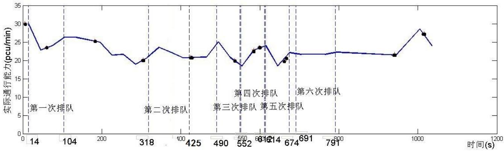

<details>
<summary>line</summary>

| Time (s) | Actual Transmission Capacity (pcu/min) |
| --- | --- |
| 0 | 30 |
| ~50 | ~23.5 |
| ~180 | ~25 |
| ~318 | 20 |
| ~425 | ~21 |
| ~552 | 20 |
| ~616 | ~22.5 |
| ~674 | ~23.5 |
| ~791 | ~19.5 |
| ~900 | ~20.5 |
| ~1000 | ~27 |
</details>

图 3 实际通行能力变化分析图

总的来说，事故所处横断面的实际通行能力会因为事故占用车道出现明显的下降。下降的程度与所占用车道的车流量、大型车辆的出现、事故横断面附近交通混乱度相关。

事故发生后，占用内车道和中车道，两车道的车流量占全部车流量的90.7%，在车道被堵住的情况下，两个车道的车流全部转移至外车道，由于大型车辆的存在，其换道时对交通的堵塞作用非常明显，同时造成交通混乱程度增加，以上共同引起了实际通行能力迅速由 30pcu/min迅速下降到 22.76pcu/min，同时第一次车辆排队事故出现（时间为16:42:46）。

在 16:42:46\~16:44:16（14s\~104s）时间段内，为第一次车辆排队事故。期间随着大型车辆的通过，实际通行能力有所上升，但是由于上游车流量的不断补充使事故横断面一直处于车辆排队状态，因此实际通行能力没有显著提高；

在 16:44:16\~16:47:50（104s\~318s）时间段内，由于上游车流量明显减少，事故横断面在部分时间并不是充分处于车辆饱和状态，因此用横断面的车流量来反映实际通行能力会偏小；实际情况下，在车辆不饱和或者短缺状态，车辆能够以更快的速度通过横断面，换道没有旁边车辆的影响，大型车辆的影响降低，交通秩序混乱度很低，因此实际通行能力会上升；

在 16:47:50\~16:49:37(318s\~425s)开始发生第二次排队事故，由于此次上游车流量并不是特别大，而且没有大型车辆出现，因此车辆排队长度较小，疏散速度也较快，所以实际通行能力会比上时间段的统计结果要高；

在 16:49:37\~16:50:42（425s\~490s）内，和上一时间段类似，车辆进行周期性补充，能够较好的满足“最大小时车流量”的要求，且无大车出现，交通混乱度低，实际通行能力较平稳且有上升；

16:50:42\~16:51:42（490s\~550s）时间段为第三次排队事故时间段，在一开始事故横断面交通比较混乱，同时总体车流量明显增加，小区路口处的车流量也有增加，这共同造成了实际通行能力的降低。

16:51:44\~16:52:44（552s\~612s）被定义为第四次车辆排队事故。在前一个时间段内由于车流量得到了一部分缓解，车辆混乱度降低，因此实际通行能力有所上升。

在第五次排队事故（16:52:46\~16:53:46，614s\~674s）中，由于大型车辆到达路口，对交通阻塞作用增加，实际通行能力降低，随后大型车辆通过，小型车辆陆续通过，实际通行能力维持不变。

在第六次排队事故中（16:54:03\~16:55:43，691s\~791s）中，和上一阶段一样，虽然排队车辆较多，但是事故横断面处交通秩序正常，小型车辆有序通过，因此实际通行能力保持稳定。

在随后的时间段内，由于视频不断发生跳跃，因此无法真实描述出实际统计能力的变化。

## 5.2 问题二模型的建立与解答

题目要求结合两个视频分析说明同一横断面交通事故所占车道不同对该横断面实际通行能力影响的差异。通过问题一中的分析，我们可以得出结论：之所以占用车道不同会导致实际通行能力的不同，是因为“车道”作为一个车辆的承载体，具有如下特征——车道上车流量的大小，车速的大小，该车道车辆的排队长度，不同车种类在该车道的分配等。而上述特征，均会影响横断面的实际通行能力。

针对本题中车道被占用导致车辆排队而形成的交通阻塞的情况，我们决定使用排队论模型来进行问题二的初步探索。排队是在日常生活中经常遇到的现象，此时要求服务的数量超过服务机构（服务台、服务员等）的容量。也就是说，到达的顾客不能立即得到服务，因而出现了排队现象。电话局的占线问题，车站、码头等交通枢纽的车船堵塞和疏导，故障机器的停机待修，水库的存贮调节等都是有形或无形的排队现象。

排队论（Queuing Theory）也称随机服务系统理论，就是为解决上述问题而发展的一门学科<sup>【3】</sup>。排队论研究的内容有3个方面：统计推断，根据资料建立模型；系统的性态，即和排队有关的数量指标的概率规律性；系统的优化问题。本题主要应用排队论来对事故横断面车流量、排队长度、排队等待时间等数据进行统计与推断。

## 5.2.1 模型假设

1、假设每辆车通过事故横截面所用时间与换道所用时间相同；

## 2、各个车辆行驶速度相同；

## 5.2.2 模型的建立与求解：

问题二属于单服务台多列排队模型，我们将各车道上的车辆看作“顾客”，事故横截面未被占用的车道看作“服务台”，视频1中内车道与中车道被占用，服务台为外车道，视频2中外车道与中车道被占用，服务台为内车道。排队规则为“等待制”，即当顾客到达时，所有的服务台均被占用，顾客就排队等待，直到接受完服务才离去。来自于外、中、内三个车道的车辆分别形成队列1、队列2、队列3，记为ri（i=1,2,3）

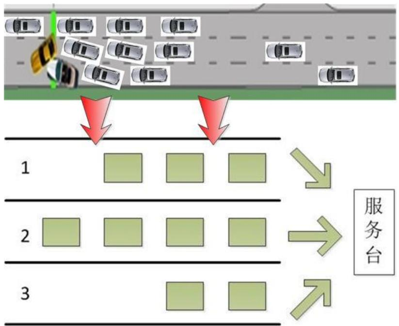

<details>
<summary>flowchart</summary>


</details>

图 4 排队论示意图

## （1） 服务时间 $t _ { s e r v i c e }$

由于汽车换道的影响，如图2所示，在视频1中，队列2和队列3的车辆分别需要通过一次或两次换道才能换到外车道上，才能通过事故横断面，换言之，在无需等待的情况下，不同队列的车辆通过事故横断面所用的时间是不同的。 由此我们可以给出视频1的服务时间的定义公式：

$$
t _ {\text {service}} = t _ {\text {pass}} + (i - 1) t _ {\text {change}} \tag {2}
$$

式中， $t _ { s e r v i c e }$ 表示服务时间， $t _ { p a s s }$ 表示车辆通过事故横断面所用的时间， $t _ { c h a n g e }$ 表示车辆换道所用时间，i表示队列编号。类比上式，我们可以给出视频2的服务时间的定义公式：

$$
t _ {\text {service}} = t _ {\text {pass}} + (3 - i) t _ {\text {change}} \tag {3}
$$

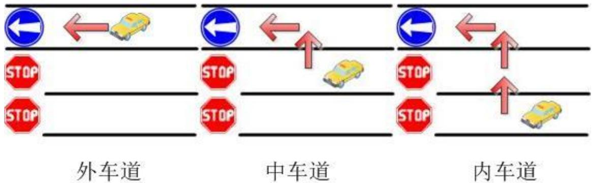

<details>
<summary>flowchart</summary>

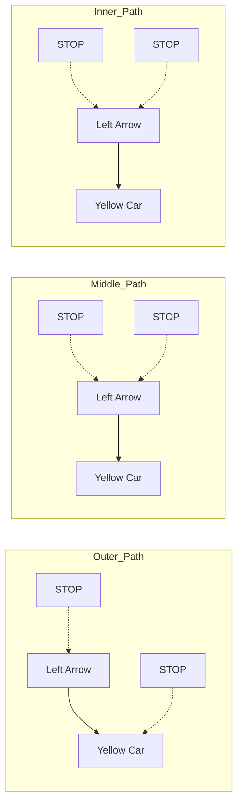
</details>

图 5 服务时间示意图

## （2） 服务规则

为了得到理想的城市交通阻塞排队模型，我们引入处理器调度中的最高响应比优先（HRRN）调度策略<sup>【7】</sup>。这是现代计算机操作系统中常用的调度算法，它很好地提高了系统的运行效率，是一种非常优秀的调度算法。在这种调度方式中，每个进程的优先级不仅取决于它的服务时间，还要取决于它花在等待服务的时间，是FCFS（先来先服务，Forst Come First Serve）和SJF（短进程优先，ShortestJob First）的折衷。动态优先级计算公式为

$$
\text {优先级} = \frac {\text {等待时间} + \text {服务时间}}{\text {服务时间}} \tag {4}
$$

由于服务时间做分母，所以较短的进程将被优先照顾；又由于等待时间在分子中出现，所以等待时间较长的进程也会得到合理的对待，从而防止了无限延期的情况出现。

我们将这一思想用于城市交通阻塞排队模型中，每辆车谁先能通过事故横断面，不仅取决于该车所处的车道（车道不同服务时间不同）有关系，还取决于该车的等待时间。根据统计，从事故发生到撤离时间段内，90%的时间都有排队现象（没有排队现象的时间在问题一中已得到了修正），所以我们可以认为，大多数情况下，同一时刻排队的所有车辆中，某车辆的等待时间越长，它就越靠近事故横断面。最终的优先级计算公式为

$$
R = 1 + \frac {t _ {w} ^ {i , j}}{t _ {\textit {s e r v}} ^ {i}} \tag {5}
$$

式中，R为某车辆的优先级， $t _ { _ { s e r v i c e } } ^ { i }$ 为队列i 对应的服务时间， $t _ { _ { w } } ^ { i , j }$ 为队列 i 的第j 辆车在某时刻的等待时间。

由于实际的交通模型不确定性非常大，于是我们在原有的 HRRN 调动策略的基础上，对调度算法进行了优化，即基于概率的动态优先级调度算法。该算法原是 IP 网络服务中先进的调度算法，我们将其改进后，用于我们的城市交通阻塞排队模型。

在等待通过事故横断面的三个队列中，先到的车辆排在队列的前面。队列中每个人的优先级计算方法同上文，队列 i 队头车辆的优先级记为 $p _ { i }$ 。当前一辆车通过事故横断面后，系统从三个队列的队头中随机挑选一个接受服务。队列 i 队头被挑中的概率为 $\hat { r } _ { i }$ 。计算前，要对 $p _ { i }$ 从大到小排序，记其顺序为 $P = \left[ p _ { l _ { 1 } } , p _ { l _ { 2 } } , p _ { l _ { 3 } } \right]$

下标为 $l _ { i }$ 。

下面说明 $\hat { r } _ { i }$ 的计算过程。

首先考虑队列 i 的相对权重，记为 $r _ { i }$ ，其定义如下：

$$
r _ {i} = \left\{ \begin{array}{c} p _ {l _ {i}}, i = 1 \\ p _ {l _ {i}} \prod_ {j = 1} ^ {i - 1} (1 - p _ {l _ {j}}), i > 1 \end{array} \right. \tag {6}
$$

对于非空队列 i，其标准化相对权重定义如下

$$
\hat {r} _ {i} = \frac {r _ {i}}{\sum_ {j \text {非空}} r _ {j}} \tag {7}
$$

因此，优先级越高的车辆、等待时间越长的车辆更容易被系统选中，但这种情况不是绝对的，它们只是概率高于其它车辆。

此算法的实现过程如下：

Step1：根据式 $^ { 6 }$ ，计算各队列队头的相对权重 $r _ { i }$ 和标准化相对权重 $\hat { r } _ { i }$ ；

Step2：利用随机数产生器获得一个服从均匀分布的随机数 $R N \in [ 0 , 1 ]$

Step3：计算 $b _ { i } = b _ { i - 1 } + \hat { r } _ { i }$ ；其中，i 为队列编号， $b _ { 0 } = 0$

Step4：查找第一个满足条件 $b _ { i } \geq R N$ 的队列 i；

Step5：调度队列 i 中的队头车辆通过事故横断面。

我们以视频 1、视频 2 中统计出的实际上游车流量为基础数据，通过MATLAB 编程求解，得到了事故横断面车流量、各车道排队长度等数据。后根据问题一中对实际通行能力的定义，以 30s 为一个时间段，求出了两视频从事故开始到结束的实际通行能力随时间的变化表，如下：

表格 6 视频1、2实际通行能力

<table><tr><td colspan="2">视频 1</td><td colspan="2">视频 2</td></tr><tr><td>时刻(秒)</td><td>实际通行能力</td><td>时刻(秒)</td><td>实际通行能力</td></tr><tr><td>15</td><td>30</td><td>15</td><td>23.68965517</td></tr><tr><td>45</td><td>22.75862069</td><td>45</td><td>30.69230769</td></tr><tr><td>75</td><td>24</td><td>75</td><td>29.89655172</td></tr><tr><td>105</td><td>26.25</td><td>105</td><td>27</td></tr><tr><td>135</td><td>26.25</td><td>135</td><td>25</td></tr><tr><td>195</td><td>25</td><td>195</td><td>27</td></tr><tr><td>225</td><td>21.42857143</td><td>225</td><td>19</td></tr><tr><td>255</td><td>21.6</td><td>255</td><td>25</td></tr><tr><td>285</td><td>18.94736842</td><td>285</td><td>21</td></tr><tr><td>315</td><td>20.76923077</td><td>315</td><td>23</td></tr><tr><td>345</td><td>23.57142857</td><td>345</td><td>25</td></tr><tr><td>375</td><td>22.22222222</td><td>375</td><td>29</td></tr><tr><td>405</td><td>20.68965517</td><td>405</td><td>23</td></tr><tr><td>465</td><td>20.86956522</td><td>465</td><td>25</td></tr><tr><td>495</td><td>25</td><td>495</td><td>25</td></tr><tr><td>525</td><td>20.76923077</td><td>525</td><td>27</td></tr><tr><td>555</td><td>18.46153846</td><td>555</td><td>25</td></tr><tr><td>585</td><td>22.75862069</td><td>585</td><td>23</td></tr><tr><td>615</td><td>24</td><td>615</td><td>25</td></tr><tr><td>645</td><td>18.46153846</td><td>645</td><td>19</td></tr><tr><td>675</td><td>22.10526316</td><td>675</td><td>19</td></tr><tr><td>705</td><td>21.6</td><td>705</td><td>23</td></tr><tr><td>735</td><td>21.6</td><td>735</td><td>25</td></tr><tr><td>765</td><td>21.6</td><td>765</td><td>25</td></tr><tr><td>795</td><td>22.22222222</td><td>795</td><td>27</td></tr><tr><td>945</td><td>21.42857143</td><td>945</td><td>23</td></tr><tr><td>1005</td><td>28.57142857</td><td>1005</td><td>27</td></tr></table>

## 5.2.3 数据的分析与说明：

首先我们运用SPSS软件对两起事故中横断面的实际通行能力进行了显著性检验。由于前后两次事故的样本是没有关联的，我们选择了独立样本 T 检验来进行数据的显著性检验。

我们假设“视频1与2中事故横断面处的实际通行能力不存在显著性差异。”运用 进行显著性检验后得到如下结果。

```txt
T-TEST GROUPS=VAR00002(0 1)
    /MISSING=LISTWISE
    /VARIABLES=VAR00001
    /CRITERIA=CI(.95).
```

## T-Test

[0000]

Group Statistics

<table><tr><td></td><td>VAR00002</td><td>N</td><td>Mean</td><td>Std. Deviation</td><td>Std. Error Mean</td></tr><tr><td rowspan="2">VAR00001</td><td>.00</td><td>27</td><td>22.7013</td><td>2.78345</td><td>.53567</td></tr><tr><td>1.00</td><td>27</td><td>24.6770</td><td>3.00818</td><td>.57893</td></tr></table>

Independent Samples Test

<table><tr><td rowspan="3" colspan="2"></td><td colspan="2">Levene&#x27;s Test for Equality of Variances</td><td colspan="7">t-test for Equality of Means</td></tr><tr><td rowspan="2">F</td><td rowspan="2">Sig.</td><td rowspan="2">t</td><td rowspan="2">df</td><td rowspan="2">Sig. (2-tailed)</td><td rowspan="2">Mean Difference</td><td rowspan="2">Std. Error Difference</td><td colspan="2">95% Confidence Interval of the Difference</td></tr><tr><td>Lower</td><td>Upper</td></tr><tr><td rowspan="2">VAR00001</td><td>Equal variances assumed</td><td>.056</td><td>.813</td><td>-2.505</td><td>52</td><td>.015</td><td>-1.97568</td><td>.78873</td><td>-3.55839</td><td>-.39297</td></tr><tr><td>Equal variances not assumed</td><td></td><td></td><td>-2.505</td><td>51.690</td><td>.015</td><td>-1.97568</td><td>.78873</td><td>-3.55862</td><td>-.39275</td></tr></table>

图 6 独立样本T 检验

结果显示，Sig.(2-tailed)<0.05，拒绝原假设，即二者存在着显著差异。并且视频2中实际通行能力均值明显高于视频 1。

之后我们将两视频的实际通行能力结合模型求解得到的其它几个数据进行了对比分析，得出了以下结论。

（1） 视频2中事故横断面实际通行能力显著高于视频1中的事故横断面实际通行能力。  
（2） 视频1中的车辆排队长度明显长于视频 2中的车辆排队长度。

原因分析如下：

（1） 根据问题一所得结论，中车道与内车道的车流量占到全部车流量的 90%，视频 1 中的中车道与内车道被占用导致 90%的车辆都要通过一次或两次换道才能通过事故横断面，其中需要两次换道的车辆占到总数的 35%，除去换道所用的时间外，由此造成的车辆减速和换道的等待也增加了车辆通过所需要的总时间。

结合我们在问题二中构建的排队论模型，这种现象大幅度地增加了车辆的服务时间和等待时间，从而导致了实际通行能力的低下。在视频 2 中，外车道与中车道被占用，这两个车道的车流量共占全部车流量的 65%，远小于视频 1 的90%，其中需要两次换道的车辆仅占总数的 9.34%。

综上，不同车道车流量的差别是导致视频 1事故横断面实际通行能力远低于视频 2的主要原因。

（2） 除去车流量外，不同车道车辆的类型也是导致两视频实际通行能力显著差异的原因之一。这里我们同样可以利用问题一中的结论，当没有大型车（大客车及公交车等）存在时，即使短时间内大量出现小型车车流，车辆排队长度也不会很长，而且会快速消失，当存在大型车辆时，很容易造成长距离排队情况。

而这一现象在两视频中的差别也尤为明显，根据问题一中的统计结果，81.25%的大型车来自于中车道，18.75%的大型车来自于内车道，当仅外车道可以通行（视频 1）的时候，几乎所有的大型车都需要一或两次的换道，而由于大型车的庞大的体积，当其换道时会大大增加其后小型车的等待时间。而内车道可以通行（视频 2）时，位于内车道的大型车可以以较高的速度通过事故横断面，对小型车的影响相对较小。

（3） 不同车道行车速度的不同也存在较大的影响。根据我国交通法规的规定和人们的驾驶习惯，外车道、中车道、内车道，行车速度依次增高，通过对两个视频进行观察分析可以发现，由于行人、非机动车辆等影响，外车道的行车速度远远小于中车道与内车道，内车道又快于中车道。因此，视频1 中的情况，中车道与内车道高速行驶的车辆接近事故横断面时不得不大幅度减速来换道和通行，而视频 2中内车道的车辆则不存在这个问题，由于内车道整体行车速度的影响，中车道车辆的减速幅度也小于视频 1中车辆的减速幅度。

## 5.3 问题三模型的建立与求解

## 符号规定

L 车辆排队长度；

$L _ { 0 }$ 车辆排队时间开始时的排队长度；

L 车辆排队长度的变化；

Cross arrive\_ 每 10s 内上游十字路口车流量；

Apt arrive\_ 每 10s 内小区路口车流量；

Pass num\_ 每 10s 内事故横断面的车流量

Length一个标准车当量数占有的长度，包括小型车辆车长及车头距前一辆车的距离；

题目中要求根据视频 1中提供的信息，找到车辆排队长度与事故横断面实际通行能力、事故持续时间、路段上游车流量的关系。我们初步考虑利用视频中提取的数据，考虑四项指标之间的关系，利用该关系自主构建排队长度其他三个指标的关系式，利用实测数据求解关系式中的未知系数，然后通过检验相关系数以及利用其他数据验证来确定模型的正确性

## 5.3.1 确定视频中事故发生的起止位置

首先，我们通过分析视频得到，在计算事故持续时间时，应考虑如下方面：事故持续时间的计算起点：事故时间的起点并不一定限制在车辆排队情况刚出现的时间点，只要是该时间点上，有车辆排队的情况出现，都可以认作是事故持续时间的计算起点；

从起点开始算起，到车辆排队情况首次结束的时刻为止，期间任何一个时间点相对于起点经过的时间即为事故持续时间。

根据以上定义，我们可以取视频中6次提到“120m”距离的时刻分别作为事故持续时间的计算起点，在车辆首次排队结束、遇到下一个计算起点或者视频发生跳跃时停止，由此我们可以得到 6次车辆排队事故，具体起止位置如下表所示：

表格 7 6次车辆排队事故的起止位置

<table><tr><td>排队事故序号</td><td>开始时刻</td><td>与事故发生相距/s</td><td>结束时刻</td><td>与事故发生相距/s</td></tr><tr><td>第一次排队</td><td>16:42:46</td><td>14</td><td>16:44:16</td><td>104</td></tr><tr><td>第二次排队</td><td>16:47:50</td><td>318</td><td>16:49:37</td><td>425</td></tr><tr><td>第三次排队</td><td>16:50:42</td><td>490</td><td>16:51:42</td><td>550</td></tr><tr><td>第四次排队</td><td>16:51:44</td><td>552</td><td>16:52:44</td><td>612</td></tr><tr><td>第五次排队</td><td>16:52:46</td><td>614</td><td>16:53:46</td><td>674</td></tr><tr><td>第六次排队</td><td>16:54:03</td><td>691</td><td>16:55:43</td><td>791</td></tr></table>

## 5.3.2 每次事故统计四项指标的变化

题目中要求给出车辆排队时间长短与事故横断面实际通行能力、事故持续时间、路段上游车流量。查阅相关资料后发现，传统的交通波、交通流的算法并不能很好地适用于本问题。我们考虑可以通过实际统计视频中6次事故中的各个指标的准确数据，根据实际数据的变化规律来初步确定一个关系式。接下来利用一部分统计数据作为已知量，利用 Matlab 求解一个非线性超定方程组从而得到关系式中的各个参数，再利用另一部分数据进行该关系式的检验。

下面以第一次车辆排队事故为例作如下说明：

第一次车辆排队事故发生在 16:42:46 时刻，结束时间为 16:44:16，持续时间80s，我们以10s 为周期，统计了如下指标：

不同时间节点的车辆排队长度L；

每个周期内经上游十字路口到达事故路段的标准车当量数Cross arrive\_ ，用来反映十字路口的车流量；

每个统计周期内在小区路口出现的标准车当量数 $A p t \_ a r r i \nu e$ ，用来反映小区路口处的车流量；

每个 10s 周期内经过事故横断面的标准车当量数Pass num\_ ，用来反映事故横断面处实际最大通行能力，该做法符合问题一中对实际最大通行能力的定义。

如下表所示：

表格 8 第一次车辆排队事故中的各个指标变化情况

<table><tr><td>第一次车辆排队时刻</td><td>16:42:46</td><td>16:42:56</td><td>16:43:06</td><td>16:43:16</td><td>16:43:26</td></tr><tr><td>事故持续长短</td><td>0</td><td>10</td><td>20</td><td>30</td><td>40</td></tr><tr><td>换算成排队长度</td><td>101.3793</td><td>86.89655</td><td>68.27586</td><td>47.58621</td><td>60</td></tr><tr><td>上游路口处车流量</td><td>0</td><td>2</td><td>2</td><td>2</td><td>7</td></tr><tr><td>小区路口车流量</td><td>0</td><td>0</td><td>2</td><td>2</td><td>0</td></tr><tr><td>实际通行能力</td><td>0</td><td>5</td><td>4</td><td>3</td><td>2</td></tr><tr><td>第一次车辆排队时刻</td><td>16:43:40</td><td>16:43:46</td><td>16:43:56</td><td>16:44:06</td><td>16:44:16</td></tr><tr><td>事故持续长短</td><td>54</td><td>60</td><td>70</td><td>80</td><td>90</td></tr><tr><td>换算成排队长度</td><td>93.10345</td><td>82.75862</td><td>51.72414</td><td>37.24138</td><td>0</td></tr><tr><td>上游路口处车流量</td><td>4</td><td>1</td><td>0</td><td>1</td><td>1</td></tr><tr><td>小区路口车流量</td><td>1</td><td>0</td><td>0</td><td>0</td><td>0</td></tr><tr><td>实际通行能力</td><td>6</td><td>2</td><td>2</td><td>4</td><td>4</td></tr></table>

## 5.3.3 根据统计数据逐步建立指标间的联系

## （1）初步模型的建立

由上表可以发现：某一时刻的排队长度是在前一刻的排队长度基础上变化的，长度变化量L与前一时间段内车流量（即车辆的流入量）与事故横断面处实际通行能力（即车辆的流出量）密切相关。显然，在一般情况下满足如下关系：

$$
\left\{ \begin{array}{l l} \Delta L > 0, & \text {车辆流入量} > \text {车辆流出量} \\ \Delta L <   0, & \text {车辆流入量} <   \text {车辆流出量} \end{array} \right. \tag {8}
$$

不难推出：

排队长度= +初始排队长度 （车辆流入量-车辆流出量）车辆所占长度（9）利用符号表达如下式：

$$
L = L _ {0} + \left(\text {Cross} s \quad \text {ar#ive\_Apt - arrive}\right) \text {Pass} \tag {10}
$$

继续分析视频及表中数据，我们可以看到，横断面处车辆的流出对车辆排队长度的减小作用是立刻的。同时，从小区路口进入的车辆在绝大部分时间都能够立刻加入到排队队伍中去，对队伍长度的增加作用也是立刻完成的。但是，由于车流量统计截面 与事故发生截面为 。而在一般情况下，截面 都会距离车辆排队队伍末端太远，通过 C 截面的车辆不能及时的到达队伍末端，也就无法及时的对车辆排队长度进行补偿。因此，我们引入对贡献系数 来衡量各个车辆的进入和流出对车辆排队长度的实际贡献程度大小。

具体的， 的赋值如下：

事故横断面处车辆流出贡献系数 $\lambda _ { \scriptscriptstyle P } = 1$

小区路口车辆流入贡献系数 $\lambda _ { \scriptscriptstyle A } = 1$

上游路口车辆流入贡献系数 $\lambda _ { C } = \frac { \lambda _ { 0 } } { 1 3 4 . 4 8 3 - L }$ ，因不确定 $\lambda _ { c }$ 的具体形式，但考虑到该系数与截面C 与队伍末尾的距离成负相关，故作此假定；

综上所述，加入贡献系数修正后的关系式如下：

$$
L = L _ {0} + \left(\text {Cross\_arrive} \times \lambda_ {C} + \text {Apt\_arrive} \times \lambda_ {A} - \text {Pass\_num} \times \lambda_ {P}\right) \times \text {Length} \tag {11}
$$

在得到上述关系式后，我们需要建立一个完备的数学模型来加以检验。

## 5.3.4 元胞自动机的引入

在问题二对城市交通阻塞问题的初步探索中，我们建立了单服务台多列的排队论模型，采用了基于概率的最高响应比优先（HRRN）调度策略来模拟真实的情况，并取得了良好的效果。但该模型仍然存在比较多的漏洞和局限性，主要表现在以下几个方面：

（1） 排队论模型中车辆的速度无法定义，只能认为所有车辆的速度是相同的，因此，也无法定义车辆的加减速机制。  
（2） 排队论模型对现实中复杂的换道、等待机制无法进行完备的仿真与模拟。  
（3） 排队论无法考虑路段下游的方向需求。

基于上述原因，我们需要寻找一种能够对复杂的现实状况进行仿真的离散化的模型来对问题进行更细致更深入的探索。而元胞自动机正是这种用简单的规则控制相互作用的元胞来模拟复杂世界的离散动力学系统。

## 模型综述：

车道被占用会导致车道或道路横断面通行能力在单位时间内降低。由于城市道路具有交通流密度大、连续性强等特点，一条车道被占用所导致的堵塞情况虽然有很多种，但由于车辆行驶具有一定的规律性、交通规则的限制等使得事故的影响程度有迹可循。因此我们利用这些规律在 matlab 上构建元胞自动机模型模拟交通流，从而较好地还原事故现场，并最终预计事故的影响程度。

模型的核心在于，将车流的运动看成离散的现象。虽然稳定的车流可以较好地被已知的公式来描述，但是在车道被占用的情况下，交通状况并不能被简单地计算出来。车距、车速、转向、四轮及以上机动车的类型和司机的反应时间等都应该应用到模型中，才能使模型对真实情况有较好的还原度。而我们将每辆车看成是独立的元胞来模拟便可以较好地解决事故现场的随机性，而这也是其优于传统公式计算模型之处。

我们利用建立好的 CA 模型也可以对该路段不同车道占用以及不同事故地点等多种事故影响情况进行仿真和预测。

## 符号定义：

M——事故发生路段矩阵；

cell——元胞单位；

T——视频中显示的时间；

t——从事故发生开始到当前所经过的时间；

tt——从事故发生后第一次信号灯变绿到当前所经过的时间；

$\mathfrak { t } _ { p }$ ——1秒时间间隔

arrival——从事故发生后第一次信号灯变绿当前车辆到达该路段所经过的

时间；

L——L=i 表示第 i 条车道，i=1,2,3;

flux——车流量(pcu/h)

$c o u n t _ { t i m e }$ ——time时间段内上游路段通过的车辆数；

$p _ { L }$ ——车道 L出现车辆的概率；

$p _ { a c }$ ——车辆加速概率；

$p _ { d c }$ ——车辆防止碰撞减速概率；

$p _ { r d }$ ——车辆随机减速概率；

$\nu _ { i n i t }$ ——车辆初始速度；

$\nu _ { \mathrm { m a x } }$ ——车辆最大速度

$\nu _ { n o w }$ ——车辆现有速度

$\nu _ { n e x t }$ ——下一时刻车辆速度

## 模型的准备：

## 1. 事故路段平面的矩阵化

在这个元胞自动机模型中，我们设置了一个 $\mathtt { m } ^ { \times _ { \mathtt { n } } } ( 1 2 0 ^ { \times _ { 5 } } )$ 的主矩阵 M 代表事故发生路段，其中：

m=120表示路段长所包含的元胞个数：每个元胞的长代表实际的 4米，路段总长480m，故需要120 个元胞。

n=5 表示路段宽所包含的元胞个数：三条车道+两条车道边界。

矩阵中的每点就是一个元胞，每点的数值代表当前元胞的状态。事故路段中有三种元胞：

被车辆占用的元胞——用1表示；

空元胞——用0 表示；

不可进入的元胞—— 用-1 表示。

其中，不可进入的元胞包括道路边界、事故汽车堵住的路段。

初始化的矩阵如下图所示：

$$
M = \left[ \begin{array}{c c c c c} - 1 & 0 & 0 & 0 & - 1 \\ - 1 & 0 & 0 & 0 & - 1 \\ \dots & \dots & \dots & \dots & \dots \\ - 1 & 0 & 0 & 0 & - 1 \\ - 1 & 0 & - 1 & - 1 & - 1 \\ - 1 & 0 & 0 & 0 & - 1 \\ \dots & \dots & \dots & \dots & \dots \\ - 1 & 0 & 0 & 0 & - 1 \\ - 1 & 0 & 0 & 0 & - 1 \end{array} \right] \tag {12}
$$

两侧路段的-1表示道路边界，中间路段中的-1 表示事故汽车堵塞位置。

用matlab可视化后如下图：

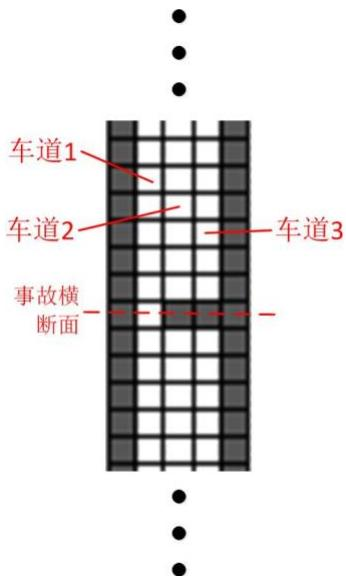

<details>
<summary>text_image</summary>

车道1
车道2
车道3
事故横断面
</details>

图 7 元胞自动机示意图

白色表示空车道，黑色表示不可通行的区域。

## 2. 车辆类别

车辆类别分为小轿车和公交车。小轿车占一个元胞，公交车纵向占两个元胞。

## 3. 车流量的分配模型

## 1）汽车的到达情况从视频中取得

对于问题三，我们从视频一中搜集数据，包括上游路段出现车辆的时间、类型及车道，部分数据如下所示：

<table><tr><td>时间(hh:mm:ss)</td><td>车辆类型 type</td><td>车道 L</td></tr><tr><td>16:42:34</td><td>小轿车</td><td>3</td></tr><tr><td>16:42:36</td><td>公交车</td><td>2</td></tr><tr><td>16:42:37</td><td>小轿车</td><td>3</td></tr><tr><td>16:42:37</td><td>公交车</td><td>2</td></tr><tr><td>16:42:46</td><td>小轿车</td><td>3</td></tr></table>

车辆出现时，矩阵变化公式设定为：

小汽车： ${ \cal M } _ { { \sf t } = a r r i \nu a l } ( 1 , { \bf L } ) = 1$ （13）

公交车： $\begin{array} { r } { \left\{ \begin{array} { l l } { M _ { { t } = a r r i \nu a l } \left( 1 , \mathrm { L } \right) = 1 } \\ { M _ { { t } = a r r i \nu a l } \left( 2 , \mathrm { L } \right) = 1 } \end{array} \right. } \end{array}$ （14）

在 T=16:42:46 时，可视化矩阵为：

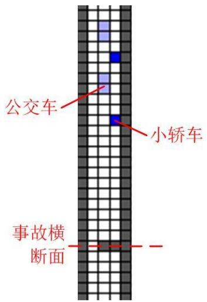

<details>
<summary>text_image</summary>

公交车
小轿车
事故横断面
</details>

图 8 元胞自动机的车辆模型

## 2）预测车流量变化后汽车的到达

a. 运用傅里叶变换估计视频 1中的车流量：

从视频中我们统计出事故发生后信号灯第一次变绿后每 10 秒通过的汽车数量 $c o u n t _ { 1 0 s }$ ，由于视频中时间会有跳变，为保证数据的准确性，我们采用 tt<400时的数据，并将其平均化得到每秒车流量：（小轿车汽车当量设定为 1，公交车汽车当量设定为2）

部分数据如下：

表格 9 每秒车流量

<table><tr><td>tt(s)</td><td>通过汽车数量</td><td>每秒车流量(pcu/s)</td></tr><tr><td>1~10</td><td>2</td><td>0.2</td></tr><tr><td>10~20</td><td>4</td><td>0.4</td></tr><tr><td>20~30</td><td>5</td><td>0.5</td></tr><tr><td>30~40</td><td>3</td><td>0.3</td></tr><tr><td>40~50</td><td>0</td><td>0</td></tr><tr><td>50~60</td><td>0</td><td>0</td></tr><tr><td>60~70</td><td>1</td><td>0.1</td></tr></table>

为了得到 1小时的车流量，我们用傅里叶变换拟合车流量(pcu/s)-时间变化，这样便可以预测到tt>400s 的数据：

运用傅里叶变换：

$$
F (\mathrm{t}) = \mathrm{a} _ {0} + \sum_ {i = 1} ^ {8} a _ {i} \cos (\mathrm{it} \omega) + \mathrm{b} _ {i} \sin (\mathrm{it} \omega) \tag {15}
$$

其中 $\omega = \frac { 2 \pi } { 2 4 } = 0 . 2 5 1 3$ （16）

傅里叶拟合结果如下：

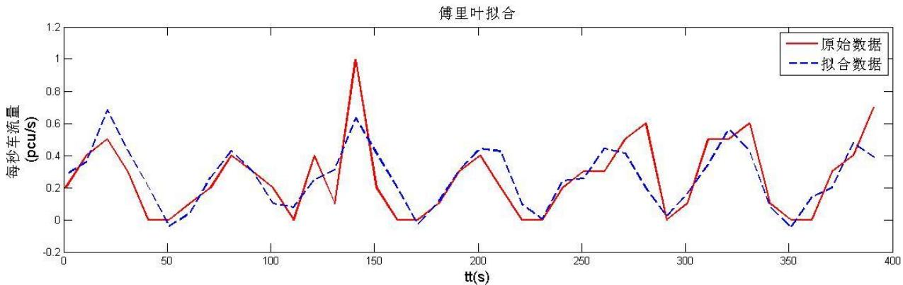

<details>
<summary>line</summary>

| tt(s) | 原始数据 (pcu/s) | 拟合数据 (pcu/s) |
| --- | --- | --- |
| 0 | 0.2 | 0.3 |
| 25 | 0.5 | 0.7 |
| 50 | 0 | -0.05 |
| 80 | 0.4 | 0.4 |
| 110 | 0 | 0.1 |
| 140 | 1 | 0.6 |
| 170 | 0 | 0 |
| 200 | 0.4 | 0.45 |
| 230 | 0 | 0.1 |
| 260 | 0.3 | 0.45 |
| 290 | 0 | 0.1 |
| 320 | 0.5 | 0.55 |
| 350 | 0 | -0.05 |
| 390 | 0.7 | 0.4 |
</details>

图 9 傅里叶拟合

可见，拟合效果很好。

运用傅里叶拟合出的函数得到视频一中路段上游车流量(pcu/h)：

$$
f l u x = \int_ {0} ^ {3 6 0 0} \mathrm{F(tt)dtt} \tag {17}
$$

计算得 flux=1014 pcu/h。

b. 分析车流量已知时车辆到达时间及车道

第四问中，车流量 $\mathrm { f l u x } ^ { \prime } { = } 1 5 0 0 \mathrm { p c u / h }$ 。与视频一车流量相比较，计算出相对车流量比率

$$
r a t \notin \frac {f l u x}{f l u ^ {\prime} x} = 0. 6 7 \tag {18}
$$

由视频一傅里叶变换得到的函数生成新的车流量(pcu/s)-时间变化函数：

$$
F ^ {\prime} (\mathrm{t} \neq \text {rate} \tag {19}
$$

由该函数即可得到每十秒内上游路段通过的车辆数 $c o u n t _ { 1 0 s }$ ，通过随机数产生这些车辆在这十秒内到达的时间，再由附件三中的流量比例得到 $p _ { 1 } = 2 1 \%$ $p _ { 2 } = 4 4 \%$ $p _ { 3 } = 3 5 \%$ ，由此概率分配车流量 $c o u n t _ { 1 0 s }$

## 4. 车辆行进规则

## 1）基本前进规则和换道规则

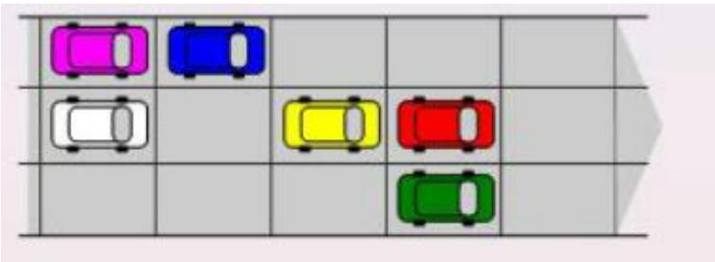

<details>
<summary>text_image</summary>

Diagram showing a grid with colored cars and directional arrows, likely representing a vehicle or transportation layout.
</details>

图 10 前进规则

当 $\nu { = } 1 \mathrm { c e l l / s }$ 时，

前进规则：如果 tt 时刻第i 位置状态是车，且 i+1位置为空，则t+1 时刻i 位置变为空，i+1位置变为车。

换道规则：如果 t 时刻第i 位置和i+1位置状态都为车，则 i 位置的车尝试换道，向左和向右换的几率相等。

## 2）速度设定

根据视频 1 中可得，道路通畅状态下，车辆行驶过 240m 平均需要大约22s 的时间，所以设定

$$
v _ {i n i t} = 2 \mathrm{cell/s} = 8 \mathrm{m/s};
$$

$$
v _ {\mathrm{max}} = 3 \mathrm{cell/s} = 1 2 \mathrm{m/s}
$$

## 3）进阶前进规则

找到当前汽车元胞 i 与它之前最近障碍物中间相隔的元胞个数 $g a p _ { i }$

## a.加速规则

当前时刻任一车辆，即对于 M(x, y)=1这一元胞，当

$g a p _ { i } > \nu _ { n o w } \cdot \mathbf { t } _ { p }$ 时，也即前方道路非常通畅，根据实际经验，司机此时倾向于加速，

于是生成0—1间的随机数如果小于 $p _ { a c } { = } 0 . 8$ ，则

$$
v _ {n e x t} = \min (v _ {n o w} + 1, v _ {\max})
$$

b.防止碰撞减速

当前时刻任一车辆，即对于 M(x, y)=1这一元胞，当

$g a p _ { i } < \nu _ { n o w } \cdot \mathbf { t } _ { p }$ 时，为避免碰撞，令 $p _ { d c } = 1$ ，而减速度也不应过大，则

$$
v _ {n e x t} = g a p _ {i} - 1
$$

c.随机减速

司机常常有可能因为非交通因素减速，这也会对交通状况产生一定影响，但相对防止碰撞而言，随机减速的可能性较小，令 $p _ { r d } = 0 . 3$

$$
v _ {n e x t} = v _ {n e x t} - 1
$$

4）进阶换道规则

根据视频，拥挤时车辆换道往往需要一定的时间延迟，所以我们规定在拥挤状态下车辆换道的时间延长。

## 模型仿真：

1. 行驶过程

对于每辆车而言，其行驶过程可分为上游段行驶、穿过事故横截面、下游段行驶。每段由路况不同，有不同的速度变化。其行驶流程图如下所示：

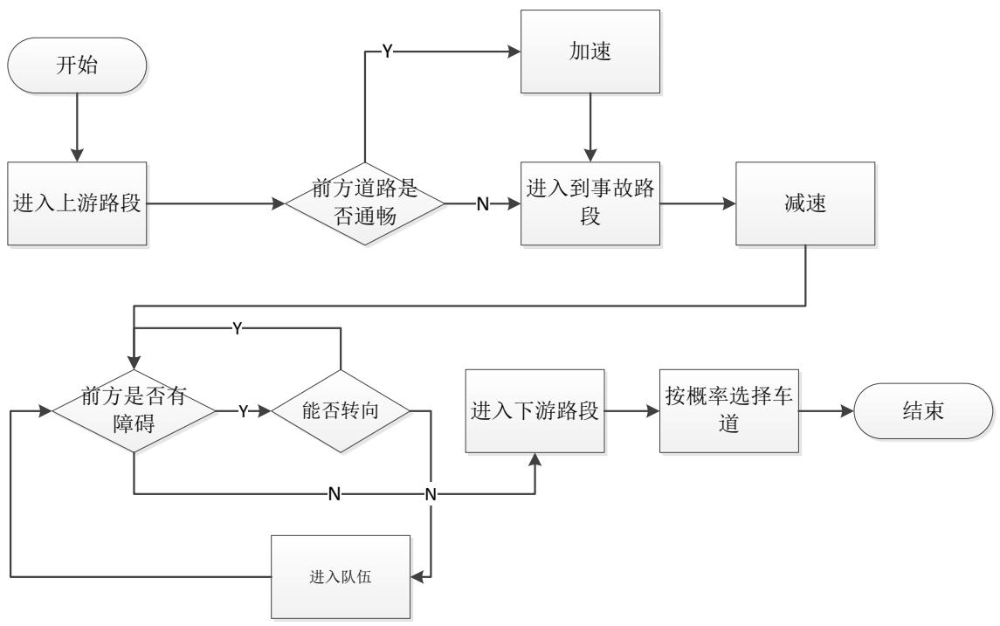

<details>
<summary>flowchart</summary>

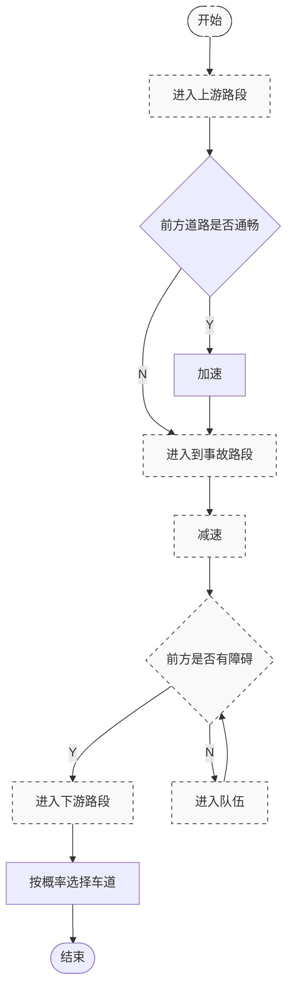
</details>

图 11 模型仿真行驶流程图

## 2. 视频1的仿真

我们利用视频 1 的车流量，运行仿真程序，得到最拥堵时的交通状况如下：可视化矩阵路面图：

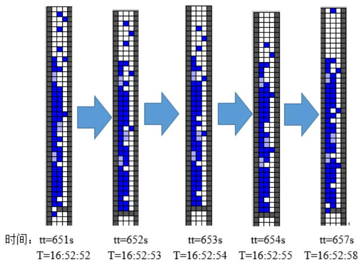

<details>
<summary>flowchart</summary>


</details>

图 12 最拥堵时的交通情况

队伍长31个元胞，即31cell×4m/cell=124m时间约在16：52：52。

仿真结果与视频 1结果的比较：

我们统计出视频 1中队伍最长的七个时间点为

表格 10 7个时间点

<table><tr><td>T</td><td>16:42:46</td><td>16:48:42</td><td>16:50:42</td><td>16:51:42</td></tr><tr><td>tt</td><td>14</td><td>370</td><td>490</td><td>550</td></tr><tr><td>T</td><td>16:52:34</td><td>16:53:46</td><td>16:54:23</td><td></td></tr><tr><td>tt</td><td>602</td><td>674</td><td>711</td><td></td></tr></table>

将这些时间点带入到元胞自动机模型中，得到如下结果：

表格 11

<table><tr><td>模型 tt</td><td>374</td><td>497</td><td>559</td><td>604</td><td>669</td></tr><tr><td>排队长度(m)</td><td>88</td><td>102</td><td>114</td><td>122</td><td>150</td></tr><tr><td>视频 1 tt</td><td>370</td><td>490</td><td>550</td><td>602</td><td>674</td></tr><tr><td>排队长度(m)</td><td>93</td><td>120</td><td>120</td><td>126</td><td>124</td></tr></table>

运用 SPSS 软件进行显著性分析，得 p=0.20, 接受原假设，两组数据不存在显著性差异，证明元胞自动机模型可行。

## 5.4 问题四的求解

我们主要运用问题三构建的元胞自动机的模型对问题四的情形进行模拟和预测。

我们将横断面与上游路口间的元胞个数设为 35，从而把横断面至上游路口距离更改为140m，汽车到达时间及车道如前文所述。

下图为第一次仿真过程中，车辆排队长度将到达上游路口时的情况：


<details>
<summary>natural_image</summary>

Vertical pixelated bar with blue and white blocks, no text or symbols present
</details>

图 13 排队长度到达上游路口

此时，tt=400s，既经过 6min36s 后，车辆排队长度到达上游路口。由于仿真过程具有一定的随机性，为保证结果的准确，我们多次测量取平均值，得到如下数据：

表格 12

<table><tr><td>仿真次数</td><td>1</td><td>2</td><td>3</td><td>4</td><td>5</td><td>6</td><td>7</td></tr><tr><td>到达上游路口 tt</td><td>400</td><td>376</td><td>409</td><td>401</td><td>348</td><td>394</td><td>410</td></tr></table>

$$
t t _ {\text {到达上游路口}} = 3 9 1 \mathrm{s} = 6 \min 3 0 \mathrm{s}, 5. 5 \min <   t t _ {\text {到达上游路口}} <   7. 5 \min
$$

综上，车辆排队长度将到达上游路口的时间范围在 5.5min 到 7.5min 之间。

## 6.模型的科学性分析

本文针对题目提出的各个问题的不同要求，分别做出了对于实际通行能力的定义；基于单服务台多列的排队模型的排队模型；研究车辆排队长度与事故横断面实际通行能力、事故持续时间、路段上游车流量间关系的多元回归分析以及模拟事故发生路段的元胞自动机模型，并通过与视频统计数据的反复检验保证了各模型的准确性。结合模型的建立过程和求解得到的结果，对各预测模型的科学性分析阐述如下：

## 6.1 对于实际通行能力定义的科学性分析

首先，我们定义了实际通行能力。实际通行能力是对基本通行能力或设计通行能力根据具体情况进行修正的结果，因此，实际通行能力是在实际情况下所能通行的最大小时交通量，它能够反映道路的真实通行能力。

由于视频中车辆通过距离长短、花费时间长短都比较小，车辆在通过事故路段时并不是匀速，人工测量具有很大的相对误差，无法距离、时间、车速进行精确建模，无法利用常见的公式求得实际通行能力，我们将视频中的时间分段进行统计，分别是：事故持续时间段、车辆饱和状态、车辆短缺状态、视频跳跃段。这就减小了视频中数据量小、时间不连续所带来的弊端，同时也展现出了车流量因信号灯变化而带来的周期性，使得模型具有较好的科学性和合理性。

## 6.2 基于单服务台多列的排队模型的科学性分析

排队论也称随机服务系统理论，就是为解决本类问题而发展的一门学科。我们主要应用排队论来对事故横断面车流量、排队长度、排队等待时间等数据进行初步统计与推断。

之后在统计视频 1和视频2的差异时，我们运用 SPSS 软件对两组数据进行了独立样本 检验来进行数据的显著性差异分析，发现两组数据有显著性差异并运用排队论的知识和相关资料对这种差异做出了较为合理的解释。

## 6.3 研究车辆排队长度与事故影响程度关系的多元回归分析的科学性分析

在这里我们根据视频 中提供的信息，找到车辆排队长度与事故横断面实际通行能力、事故持续时间、路段上游车流量的关系。我们初步考虑利用视频 1中提取的数据，考虑四项指标之间的关系，利用该关系自主构建排队长度其他三个指标的关系式，利用实测数据求解关系式中的未知系数，然后通过检验相关系数以及利用其他数据验证来确定模型的正确性

由于是利用了视频中的统计数据分析了各个指标间的联系，基础关系式具有很好的科学性和合理性，多元回归分析法对于各项系数的确定更进一步确定了该模型的精确性。

## 6.4 模拟事故发生路段的元胞自动机模型的科学性分析

元胞自动机模型将车流的运动看成离散的现象。虽然稳定的车流可以较好地被已知的公式来描述，但是在车道被占用的情况下，交通状况并不能被简单地计算出来。车距、车速、转向、四轮及以上机动车的类型和司机的反应时间等都应该应用到模型中，才能使模型对真实情况有较好的还原度。而我们将每辆车看成是独立的元胞来模拟便可以较好地解决事故现场的随机性，具有较强的科学性和合理性。

同时，我们充分利用了 matlab 软件对于矩阵的处理能力，将整个路段模拟成一个由元胞构成的大矩阵，通过每个元胞中的不同数值表示该位置在路段中的状态。通过对于矩阵的可视化显示，我们可以直观地事故路段的交通状态、队列长度等信息，为研究带来了很大的便利性。

## 7.模型的评价与改进

## 7.1 模型的优点

（1） 模型是在充分统计了视频中的各项数据信息后建立的，通过不断地分析、检验和完善使得模型具有较高的精确性，同时也确保了思维的科学性，和整体的模型结构的严谨性。  
（2） 对于模型得到的结果，并能联系全文不同模型所得结果，合理地分析，反复推测，最后验证模型的可行性。  
（3） 模型可以做到对事故地段的逼真还原，再现当时的情景，从而可以帮助进一步交通研究。同时，也可以对于未发生的事故做出科学且合理的预测，这样可以预估出占用车道对于交通状况的影响，从而采取完备的预防措施。  
（4） 数据处理及模型求解时充分运用了 MATLAB 等数学软件，较好地解决了问题，得到了较理想的结果。充分用了题目中的各种信息，并且较好地结合了对模型的检验。

## 7.2 模型的缺点

（1） 在运用排队论时，只是对数据进行了初步的分析，但其结果还不能做到深度的分析，而需要之后的元胞自动机模型对其进行定量的补充和扩展。

（2） 元胞自动机模型结果具有一定的随机性，且对预测出现的汽车较为局限地依赖于视频1中的信息，使得预测区间不够精确，还应通过对更多该路段发生事故的信息统计对其参数进行优化，使预测结果能够更加精确。

## 7.3 模型的可推广性分析

（1） 本文提出的车道被占用对城市道路通行能力的影响模型具有较高的使用推广价值，而且算法时间、空间复杂度都不高，很容易开发成事故路段路况预测的软件，较高效率地解决交通问题。  
（2） 本文提出的元胞自动机算法可以推广到更为复杂的路段，只需改变元胞矩阵的参数设置就可以模拟出不同路段的交通情况，汽车的加速、减速、换道等步骤也具有较强的普适性，使得模型有很强的灵活性和鲁棒性。  
（3） 问题一中对于实际通行能力的定义能够反映道路的真实通行能力，可以推广到复杂路段通行能力的判断。

## 参考文献

[1] 赵寿根. 事故地点对交通波的影响研究. 物理学报，2009，58（11）：7497-05.  
[2] 卓金武. MATLAB在数学建模中的应用. 北京：北京航空航天大学出版社，2011.  
[3] 田乃硕 等. 离散时间排队论. 北京：科学出版社，2008.  
[4] 雷功炎. 数学模型讲义. 北京：北京大学出版社，2004.  
[5] 姜启源，谢金星，叶俊. 数学模型. 第三版. 北京：高等教育出版社，2003.  
[6] 苏金明，阮沈勇. MATLAB 实用教程. 北京：电子工业出版社，2008.  
[7] 李雪，胡丁晟，徐铎. 眼科病床安排模型的评价及改进. 全国数学建模竞赛一等奖，2009.

附录：Matlab 源代码  
main 主程序

<div class="mineru-algorithm" style="white-space: pre-wrap; font-family:monospace;">
% main.m
%
% This is a main script to simulate the approach, service, and departure of
% vehicles passing through a toll plaza, , as governed by the parameters
% defined below
%
% iterations      = the maximal iterations of simulation
% B            = number booths
% L            = number lanes in highway before and after plaza
% Arrival       = the mean total number of cars that arrives
% plazalength   = length of the plaza
% Service       = Service rate of booth
% plaza        = plaza matrix
%                  1 = car, 0 = empty, -1 = forbid, -3 = empty&amp;booth
% v            = velocity matrix
% vmax       = max speed of car
% time       = time matrix, to trace the time that the car cost to
%                  pass the plaza.
% dt           = time step
% t_h          = time factor
% departurescount = number of cars that departure the plaza in the step
% departurestime  = time cost of the departure cars
% influx       = influx vector
% outflux     = outflux vector
% timecost    = time cost of all car
% h            = handle of the graphics

clear;clc
iterations = 1200; % the maximal iterations of simulation
B = 3; % number booths
L = 3; % number lanes in highway before and after plaza
Arrival=3; % the mean total number of cars that arrives

plazalength = 81; % length of the plaza
[plaza, v, time,buspla] = create_plaza(B, L, plazalength);
h = show_plaza(plaza,buspla, NaN, 0.01);

timeblock=5;
dt = 0.2; % time step
t_h = 1; % time factor
vmax = 2; % max speed
vinit=1;%initial speed

busstop=6*ones(plazalength,B+2);
carstop=3*ones(plazalength,B+2);

timecost = [];
sf=0;%switchflag
for i = 1:iterations
    if i==14
        ss=0;
    end
    if i==370
</div>

```matlab
ss=0;
end
if i==490
    ss=0;
end
if i==550
    ss=0;
end
if i==602
    ss=0;
end
if i==711
    ss=0;
end
% introduce new cars
[plaza, v, arrivalscount] = new_cars(Arrival, dt, plaza, v, vinit,i);
[plaza, v, buspla] = new_bus(plaza, v, vinit, i,buspla);

h = show_plaza(plaza,buspla, h, 0.02);

[timeblock,plaza] = carblock(timeblock,plaza,sf);%^aÌòµ¼Õ¶³µ
% update rules for lanes
r=rand();
if(r<0.3)
[plaza, v, time,buspla,busstop,carstop,sf] = switch_lanes(plaza, v, time,buspla,busstop,carstop,sf); % lane changes
[plaza, v, time,buspla] = move_forward(plaza, v, time, vmax,buspla); % move cars forward
else
[plaza, v, time,buspla] = move_forward(plaza, v, time, vmax,buspla); % move cars forward
[plaza, v, time,buspla,busstop,carstop,sf] = switch_lanes(plaza, v, time,buspla,busstop,carstop,sf); % lane changes
end
[plaza,buspla, v, time, departurescount, departurestime] = clear_boundary(plaza,buspla, v, time);

% flux calculations
influx(i) = arrivalscount;
outflux(i) = departurescount;
timecost = [timecost, departurestime];
end

h = show_plaza(plaza, h, 0.01);
xlabel({strcat('B = ',num2str(B)), ...
strcat('mean cost time = ', num2str(round(mean(timecost))))})
```

## 子程序 Carblock

```matlab
function [time,plaza] = carblock(time,plaza,sf)
if plaza(122)~=1
if sf==1
    plaza(122)=-1;
    time=5;
elseif time<3
    plaza(122)=0;
else
    time=time-1;
```

```txt
end
end
```

子程序 carpass  
```matlab
function [flag,plaza] = carpass(plaza,index,L,flag)
if(flag(index)==1)
plaza(index-L)=0;
flag(index)=0;
end
```

子程序 clear\_boundary  
```matlab
function [plaza,buspla, v, time, departurescount, departurestime] = clear_boundary(plaza, buspla,v, time)
%
% clear_boundary remove the cars of the exit cell
%
% USAGE: [plaza, v, time, departurescount, departurestime] = clear_boundary(plaza, v, time)
%     plaza = plaza matrix
%         1 = car, 0 = empty, -1 = forbid, -3 = empty&booth
%     v = velocity matrix
%     time = time matrix, to trace the time that the car cost to pass the plaza.
%
departurescount = 0;
departurestime = [];
[a,b] = size(plaza);
for i = 2:b-1
    if plaza(a,i) > 0
        departurescount = departurescount + 1;
        departurestime(departurescount) = time(a,i);
        buspla(a-1,i)=0;
        buspla(a,i)=0;
        plaza(a,i) = 0;
        v(a,i) = 0;
        v(a-1,i)=0;
        time(a,i) = 0;
    end
end
```

子程序 creat\_plaza  
```matlab
function [plaza, v, time,buspla] = create_plaza(B, L, plazalength)
%
% create_plaza     create the empty plaza matrix( no car ).
%             1 = car, 0 = empty, -1 = forbid, -3 = empty&booth
%
% USAGE: [plaza, v, time] = create_plaza(B, L, plazalength)
%       B = number booths
%       L = number lanes in highway before and after plaza
%       plazalength = length of the plaza
%

plaza = zeros(plazalength,B+2); % 1 = car, 0 = empty, -1 = forbid,
-3 = empty&booth
v = zeros(plazalength,B+2); % velocity of automata (i,j), if it exists
time = zeros(plazalength,B+2); % cost time of automata (i,j) if it
exists

plaza(1:plazalength,[1,2+B]) = -1;
```

```matlab
plaza(ceil(plazalength/2),[3:1+B]) =-1;
%left: angle of width decline for boundaries
toptheta = 1.3;
bottomtheta = 1.2;

for col = 2:ceil(B/2-L/2) + 1
    for row = 1:(plazalength-1)/2 - floor(tan(toptheta) * (col-1))
        plaza(row, col) = -1;
    end
    for row = 1:(plazalength-1)/2 - floor(tan(bottomtheta) * (col-1))
        plaza(plazalength+1-row, col) = -1;
    end
end

fac = ceil(B/2-L/2)/floor(B/2-L/2);
%right: angle of width decline for boundaries
toptheta = atan(fac*tan(toptheta));
bottomtheta = atan(fac*tan(bottomtheta));

for col = 2:floor(B/2-L/2) + 1
    for row = 1:(plazalength-1)/2 - floor(tan(toptheta) * (col-1))
        plaza(row,B+3-col) = -1;
    end
    for row = 1:(plazalength-1)/2 - floor(tan(bottomtheta) * (col-1))
        plaza(plazalength+1-row,B+3-col) = -1;
    end
end
buspla=plaza;
```

## 子程序 move\_forward

```matlab
function [plaza, v, time,buspla] = move_forward(plaza, v, time,
vmax,buspla)
%
% move_forward car move forward governed by NS algorithm:
%
% 1. Acceleration. If the vehicle can speed up without hitting the
speed limit
% vmax it will add one to its velocity, vn -> vn + 1. Otherwise, the
vehicle
% has constant speed, vn -> vn .
%
% 2. Collision prevention. If the distance between the vehicle and
the car ahead
% of it, dn , is less than or equal to vn , i.e. the nth vehicle will
collide
% if it doesn’t slow down, then vn -> dn â^?1.
%
% 3. Random slowing. Vehicles often slow for non-traffic reasons (cell
phones,
% coffee mugs, even laptops) and drivers occasionally make irrational
choices.
% With some probability pbrake , vn -> vn â^?1, presuming vn > 0.
%
% 4. Vehicle movement. The vehicles are deterministically moved by
their velocities,
% xn -> xn + vn.
%
% USAGE: [plaza, v, time] = move_forward(plaza, v, time, vmax)
% plaza = plaza matrix
% 1 = car, 0 = empty, -1 = forbid, -3 = empty&booth
```

```matlab
%       v = velocity matrix
%       time = time matrix, to trace the time that the car cost to pass
the plaza.
%       vmax = max speed of car
%
Service = 0.8; % Service rate
dt = 0.2; % time step

% Prob acceleration
probac = 0.7;
% Prob deceleration
probdc = 1;
% Prob of random deceleration
probrd = 0.3;
t_h = 1; % time factor

[L,W] = size(plaza);
%bus
% b=find(plaza==-3);
% bf=b(find(plaza(b-1)==-3));
% for i=2:length(bf)
%     if bf(i)-bf(i-1)==1
%         for k=i:length(bf)-1
%             bf(k)=bf(k+1);
%     end
%   end
% % end
% bb=bf-1;

% for i=1:length(bf)
% if plaza(bf(i)+1)==0
% if bf~=404&bf~=303
%    %no crushing
%    if plaza(bf(i)+1)==0
%         plaza(bf(i)+1)=-3;
%         plaza(bb(i))=0;
%         v(bf(i)+1)=v(bf(i));
%         v(bb(i)+1)=v(bb(i));
%    end
%    if plaza(bf(i)+1)~=0&&plaza((bf(i))-L)==0&&plaza((bb(i))-L)==0
%         plaza(bf(i))=0;
%         plaza(bb(i))=0;
%         plaza(bf(i)-L)=-3;
%         plaza(bb(i)-L)=-3;
%         v(bf(i))=0;
%         v(bb(i))=0;
%         v(bf(i)-L)=0;
%         v(bb(i)-L)=0;
%    elseif
plaza(bf(i)-L)~=0&(plaza(bf(i)+1)==1|plaza(bf(i)+1)==-3|plaza(bf(i)+1)
==-1)
%         v(bf(i))=0;
%         v(bb(i))=0;
%    end
% else
% plaza(b(bf))=0;
% plaza(b(bb))=0;
% v(b(bf))=0;
% v(b(bb))=0;
% end
% end
```

```matlab
% end

% gap measurement for car in (i,j)
gap = zeros(L,W);
f=find(plaza==1);

for k=1:length(f)
    d = plaza(:,ceil(f(k)/(L)));
    gap(f(k)) = min(find([d(rem(f(k),L)+1:end)~=0;1]))-1;
end
gap(end,:) = 0;

% update rules for speed:
% 1 Speed up, provided room
k = find((gap(f) > v(f)*t_h) & (v(f) + 1 <= vmax) & (rand(size(f)) <= probac));
v(f(k)) = v(f(k)) + 1;
% 2 No crashing
k = find((v(f)*t_h >(gap(f))) & (rand(size(f)) <= probdc));
for i=1:length(k)
if buspla(f(k(i)))~=2&&f(k(i))~=161&&f(k(i))~=242&&f(k(i))~=343
v(f(k))=gap(f(k));
end
end
% 3 Random decel
k = find((gap(f)<1) & (rand(size(f)) <= probdc));
for i=1:length(k)
if buspla(f(k(i)))~=2
v(f(k))=max(v(f(k)) - 1,0);
end
end
k=find(buspla(f)==2);
v(f(k))=v(f(k)+1);
% k=find((41-rem(f,L))<2);
% v(f(find(plaza(k+1)~=0)))=0;
% v(f(find(plaza(k+1)==0)))=2;
% 3 Random decel
% k = find(rand(size(f)) <= probrd);
% v(f(k)) = max(v(f(k)) - 1,0);

% % Service: enter and out the booths
% booth_row = ceil(L/2);
% for i = 2:W-1
%     if (plaza(booth_row,i) ~= 1)
%         if (plaza(booth_row-1,i) == 1)
%             v(booth_row - 1 ,i) = 1;% enter into booth
%         end
%         plaza(booth_row,i) = -3;
%     else % cars pass through service with exponential rate Service
%         if (plaza(booth_row+1,i) ~= 1)&(rand > exp(-Service*dt))
%             v(booth_row,i) = 1; % out booths
%         else
%             v(booth_row,i) = 0;
%         end
%     end
% end
```

```matlab
%3b March
for i=1:length(f)
if buspla(f(i))==0

plaza(f(i)) = 0;
plaza(f(i)+v(f(i))) = 1;

time(f(i) + v(f(i))) = time(f(i)) + 1;
time(plaza~=1) = 0;

v(f(i) + v(f(i))) = v(f(i));
v(plaza~=1)=0;
else
    if buspla(f(i))==1%³μÍ·
plaza(f(i))=0;
plaza(f(i)-1)=0;
plaza(f(i)+v(f(i)))=1;
plaza(f(i)+v(f(i))-1)=1;
buspla(f(i))=0;
buspla(f(i)-1)=0;
buspla(f(i)+v(f(i)))=1;
buspla(f(i)+v(f(i))-1)=2;

time(f(i) + v(f(i))) = time(f(i)) + 1;
time(f(i) + v(f(i))-1) = time(f(i)) + 1;
time(plaza~=1) = 0;

v(f(i) + v(f(i))) = v(f(i));
v(f(i) + v(f(i))-1) = v(f(i));
v(plaza~=1)=0;
    end
end
end
```

子程序 new\_bus  
```matlab
function [plaza, v,buspla] = new_bus(plaza, v, vmax,
iteration,buspla)
    newbusmerge=[4 5 60 182 304 425 536 585 598 662 667 941 1016 1080
1137 1147];
    newbuslane=[2 2 2 2 2 2 3 2 2 3 2 2 2 2 3 2
2];
    flag=find(newbusmerge==iteration);
    if flag~=0
        for i=1:length(flag)
            plaza(1,newbuslane(flag(i))+1)=1;
            plaza(2,newbuslane(flag(i))+1)=1;
            buspla(1,newbuslane(flag(i))+1)=2;
            buspla(2,newbuslane(flag(i))+1)=1;
        v(1,newbuslane(flag(i))+1)=vmax;
        v(2,newbuslane(flag(i))+1)=vmax;
    end
end
```

子程序 new\_cars  
```matlab
function [plaza, v, number_cars] = new_cars(Arrival, dt, plaza, v,
vmax, iteration)
%
```

```matlab
% new_cars introduce new cars. Cars arrive at the toll plaza uniformly in
% time (the interarrival distribution is exponential with rate Arrival?). 
% "rush hour" phenomena can be consider by varying the arrival rate.
%
% USAGE: [plaza, v, number_cars] = new_cars(Arrival, dt, plaza, v, vmax)
% Arrival = the mean total number of cars that arrives
% dt = time step
% plaza = plaza matrix
% 1 = car, 0 = empty, -1 = forbid, -3 = empty&booth
% v = velocity matrix
% vmax = max speed of car

% Find the empty lanes of the entrance where a new car can be add.
unoccupied = find(plaza(1,:) == 0);
n = length(unoccupied); % number of available lanes
% The number of vehicles must be integer and not exceeding the number of
% available lanes
number_cars =min( poissrnd(Arrival*dt,1), n);
% if number_cars > 0
% x = randperm(n);
% for i = 1:number_cars
% plaza(1, unoccupied(x(i))) = 1;
% v(1, unoccupied(i)) = vmax;
% end
% end
newcarmerge=[2 5 14 30 30 40 42 45 46 50 51 51 52 54 60 61 91 102 106 110 111 112 116 118 118 123 132 133 148 152 153 158 162 169 170 171 172 173 173 174 175 178 178 181 216 221 221 225 232 232 234 238 239 240 269 272 286 288 288 290 291 295 296 299 299 300 303 308 310 310 313 318 318 336 343 343 346 346 348 352 352 355 358 358 359 361 361 363 366 366 374 399 403 408 409 409 412 414 419 421 421 423 425 426 426 458 462 465 467 469 472 472 472 473 477 477 477 477 478 483 483 483 483 483 487 521 524 524 527 527 531 531 532 536 538 538 541 541 545 545 545 545 548 552 563 564 565 579 584 585 586 589 589 592 593 594 595 595 595 605 605 609 624 639 639 639 641 641 644 645 645 647 649 649 655 659 665 667
670 673 673 693 701 701 701 704 704 707 707 707<fcel>mergelane=[3<fcel>3<fcel>3<fcel>2<fcel>3<fcel>2<fcel>2<fcel>3<fcel>1<fcel>2<fcel>2<fcel>2<fcel>3<fcel>3<fcel>2<fcel>2<fcel>3<fcel>2<fcel>1<nl>3<fcel>3<fcel>2<fcel>3<fcel>3<fcel>2<fcel>2<fcel>3<fcel>3<fcel>1<fcel>2<fcel>2<fcel>2<fcel>2<fcel>3<fcel>3<fcel>2<fcel>2<fcel>3<fcel>2<fcel>3<nl>2<fcel>3<fcel>2<fcel>1<fcel>2<fcel>3<fcel>2<fcel>2<fcel>2<fcel>3<fcel>2<fcel>3<fcel>3<fcel>2<fcel>1<fcel>1<fcel>3<fcel>2<fcel>2<fcel>2<ecel><nl>2<fcel>3<fcel>2<fcel>3<fcel>2<fcel>2<fcel>2<fcel>3<fcel>3<fcel>3<fcel>2<fcel>2<fcel>3<fcel>1<fcel>2<fcel>3<fcel>1<fcel>3<fcel>2<fcel>2<ecel><nl>3<fcel>3<fcel>2<fcel>2<fcel>3<fcel>2<fcel>1<fcel>2<fcel>2<fcel>3<fcel>3<fcel>2<fcel>3<fcel>2<fcel>2<fcel>2<fcel>2<fcel>2<fcel>3<fcel>3<ecel><nl>2<fcel>3<fcel>3<fcel>3<fcel>3<fcel>2<fcel>1<fcel>1<fcel>1<fcel>3<fcel>2<fcel>3<fcel>2<fcel>2<fcel>2<fcel>3<fcel>3<fcel>2<fcel>2<fcel>2<ecel><nl>3<fcel>3<fcel>1<fcel>2<fcel>2<fcel>3<fcel>1<fcel>3<fcel>2<fcel>3<fcel>2<fcel>3<fcel>2<fcel>2<fcel>2<fcel>2<fcel>2<fcel>3<fcel>2<fcel>2<ecel><nl>2<fcel>2<fcel>1<fcel>3<fcel>3<fcel>1<fcel>1<fcel>2<fcel>2<fcel>3<fcel>3<fcel>3<fcel>3<fcel>2<fcel>3<fcel>2<fcel>2<fcel>2<fcel>3<fcel>1<ecel><nl>2<fcel>3<fcel>2<fcel>2<fcel>2<fcel>3<fcel>1<fcel>2<fcel>2<fcel>1<fcel>2<fcel>3<fcel>2<fcel>2<fcel>3<fcel>2<fcel>2<fcel>2<fcel>2<fcel>2<ecel><nl>2<fcel>2<fcel>1<fcel>2<fcel>2<fcel>2<fcel>3<fcel>2<fcel>3<fcel>2<fcel>2<fcel>3<fcel>3<fcel>2<fcel>2<fcel>3<fcel>2<fcel>3<fcel>2<fcel>3<ecel><nl>1<fcel>2<fcel>1<fcel>2<fcel>3<fcel>1<fcel>2<fcel>2<fcel>2<fcel>3<fcel>3<fcel>2<fcel>2<fcel>3<fcel>2<fcel>3<fcel>2<fcel>2<fcel>3<fcel>2<ecel><nl>3<fcel>3<fcel>2<fcel>3<fcel>3<fcel>2<fcel>3<ecel><ecel><ecel><ecel><ecel><ecel><ecel><ecel><ecel><ecel><ecel><ecel><ecel><ecel><nl>flag=find(newcarmerge==iteration);
if flag~=0
    for i=1:length(flag)
        plaza(1,mergelane(flag(i))+1)=1;
    v(1,mergelane(flag(i))+1)=vmax;
```

```matlab
end
    end
    else
        if r<0.6 && plaza(2,3)==0 && plaza(1,3)==0
            plaza(2,3)=-3;
            plaza(1,3)=-3;
            v(2,3)=vmax;
            v(1,3)=vmax;
        elseif plaza(2,4)==0 && plaza(1,4)==0
            plaza(2,4)=-3;
            plaza(1,4)=-3;
            v(2,4)=vmax;
            v(1,4)=vmax;
        end
```

end

子程序 show<sub>\_</sub>platza  
```matlab
function h = show_plaza(plaza,buspla, h, n)
%
% show_plaza  To show the plaza matrix as a image
%
% USAGE: h = show_plaza(plaza, h, n)
%     plaza = plaza matrix
%             1 = car, 0 = empty, -1 = forbid, -3 = empty&booth
%     h = handle of the graphics
%     n = pause time
%
```

```matlab
[L, W] = size(plaza); %get its dimensions
temp = plaza;
temp(temp==1) = 0;
```

```matlab
plaza_draw=plaza;
plaza_draw(find(buspla==2))=-3;
plaza_draw(find(buspla==2)+1)=-3;
```

```matlab
PLAZA(:,:,1) = plaza_draw;
PLAZA(:,:,2) = plaza_draw;
PLAZA(:,:,3) = temp;
```

```txt
PLAZA = 1-PLAZA;
PLAZA(PLAZA>1)=PLAZA(PLAZA>1)/6;
```

```matlab
if ishandle(h)
    set(h,'CData',PLAZA)
    pause(n)
else
    figure('position',[20,50,200,700])
    h = imagesc(PLAZA);
    hold on
    % draw the grid
    plot([[0:W]',[0:Wolds]+0.5,[0,L]+0.5,'k')
    plot([0,W]+0.5,[[0:L]',[0:Lolds]+0.5,'k')
    axis image
    set(gca, 'xtick', [], 'ytick', []);
    pause(n)
```

end

子程序 switch\_lanes  
```matlab
function [plaza, v, time,buspla,busstop,carstop,sf] = switch_lanes(plaza, v, time,buspla,busstop,carstop,sf)
%
% switch_lanes Merge to avoid obstacles.
%
% The vehicle will attempt to merge if its forward path is obstructed (dn = 0).
% The vehicle then randomly chooses an intended direction, right or left. If
% that intended direction is blocked, the car will move in the other direction
% unless both directions are blocked (the car is surrounded).
%
% USAGE: [plaza, v, time] = switch_lanes(plaza, v, time)
%     plaza = plaza matrix
%         1 = car, 0 = empty, -1 = forbid, -3 = empty&booth
%     v = velocity matrix
%     time = time matrix, to trace the time that the car cost to pass the plaza.
%
[L, W] = size(plaza);
found = find(plaza==1);
% if ~isempty(found)
%     found = found(randperm(length(found)));
% end
sf=0;
for k=1:length(found)
    if(buspla(found(k))==0)%car
        if (plaza(found(k)+1)~=0)%Ç°·½ÓDÕÍ°-
            if carstop(found(k))<=0 %תÏÒÇ°¼Æʱ

                if plaza(found(k)-L) == 0
                    plaza(found(k)-L) = 1;
                    plaza(found(k)) = 0;
                    v(found(k)-L) = 0;
                    v(found(k)) = 0;
                    time(found(k)-L) = time(found(k));
                    time(found(k)) = 0;
                    carstop(found(k))=3;
                    sf=1;
                end
            else
                carstop(found(k))=carstop(found(k))-1;%¼Æʱ
            end
        end
else%bus
    if buspla(found(k))==1%ÕÒµ½³ µÍ
        if plaza(found(k)+1)~=0
            if busstop(found(k)+1)<=0 %תÏÒÇ°¼Æʱ
                if plaza(found(k)-L)==0 && plaza(found(k)-L-1)==0
                    plaza(found(k)-L) = 1;
                    plaza(found(k)-L-1) = 1;
                    plaza(found(k)) = 0;
                    plaza(found(k)-1)=0;
                    buspla(found(k)-L) = 1;
                    buspla(found(k)-L-1) = 2;
```

```matlab
buspla(found(k)) = 0;
buspla(found(k)-1)=0;
v(found(k)-L) = 0;
v(found(k)-L-1)=0;
v(found(k)) = 0;
time(found(k)-L) = time(found(k));
time(found(k)-L-1)=time(found(k)-1);
time(found(k)) = 0;
time(found(k)-1)=0;
busstop(found(k)+1)=6;
sf=1;
end
else
busstop(found(k)+1)=busstop(found(k)+1)-1;
end
end
end
end
end
```

```matlab
elseif plaza(k+L) == 0
    plaza(k+L) = 1;
    plaza(k) = 0;
    v(k+L) = v(k);
    v(k) = 0;
    time(k+L) = time(k);
    time(k) = 0;
elseif plaza(k-1)==0
    plaza(k-1) = 1;
    plaza(k) = 0;
    v(k-1) = v(k);
    v(k) = 0;
    time(k-1) = time(k);
    time(k) = 0;
```

fourier 变换程序  
```matlab
T=[1:10:400]';
influx=[2 4 5 3 0 ...
    0 1 2 4 3 2 ...
    0 4 1 10 2 0 ...
    0 1 3 4 2 0 ...
    0 2 3 3 5 6 ...
    0 1 5 5 6 1 ...
    0 0 3 4 7]';
omega=2*pi/24; %all fourier coefficients
fc=zeros(40,8);fs=zeros(40,8);
for n=1:8
    fc(:,n)=cos(n*omega*T);
    fs(:,n)=sin(n*omega*T);
end
[B,BINT,R]=regress(influx,[ones(40,1),fc,fs],0.05);
t=1:10:3600;
a0=B(1);a=B(2:9);b=B(10:end);
inrate=a0;
```

```matlab
for n=1:8
    inrate=inrate+a(n)*cos(n*t.*omega)+b(n)*sin(n*t.*omega);
end
inrate1=a0;
for n=1:8
    inrate1=inrate1+a(n)*cos(n*T.*omega)+b(n)*sin(n*T.*omega);
end
inrate=inrate./10;
influx=influx./10;
inrate1=inrate1./10;
plot(T,influx,'r')
hold on
plot(T,inrate1,'b')

total=trapz(t,inrate);
rate=total/1500;
new_influx=ceil(influx/rate);
```