# 2013 高教社杯全国大学生数学建模竞赛

## 承 诺 书

我们仔细阅读了《全国大学生数学建模竞赛章程》和《全国大学生数学建模竞赛参赛规则》（以下简称为“竞赛章程和参赛规则”，可从全国大学生数学建模竞赛网站下载）。

我们完全明白，在竞赛开始后参赛队员不能以任何方式（包括电话、电子邮件、网上咨询等）与队外的任何人（包括指导教师）研究、讨论与赛题有关的问题。

我们知道，抄袭别人的成果是违反竞赛章程和参赛规则的，如果引用别人的成果或其他公开的资料（包括网上查到的资料），必须按照规定的参考文献的表述方式在正文引用处和参考文献中明确列出。

我们郑重承诺，严格遵守竞赛章程和参赛规则，以保证竞赛的公正、公平性。如有违反竞赛章程和参赛规则的行为，我们将受到严肃处理。

我们授权全国大学生数学建模竞赛组委会，可将我们的论文以任何形式进行公开展示（包括进行网上公示，在书籍、期刊和其他媒体进行正式或非正式发表等）。

我们参赛选择的题号是（从A/B/C/D中选择一项填写）： A

我们的参赛报名号为（如果赛区设置报名号的话）： 5486

所属学校（请填写完整的全名）： 华南理工大学

参赛队员 (打印并签名) ：1. 孙增辉

2. 李润铄

3. 彭玄

指导教师或指导教师组负责人 (打印并签名)： 刘清

（论文纸质版与电子版中的以上信息必须一致，只是电子版中无需签名。以上内容请仔细核对，提交后将不再允许做任何修改。如填写错误，论文可能被取消评奖资格。）

日期： 2013 年 9 月 16 日

赛区评阅编号（由赛区组委会评阅前进行编号）：

# 2013 高教社杯全国大学生数学建模竞赛

## 编 号 专 用 页

赛区评阅编号（由赛区组委会评阅前进行编号）：

赛区评阅记录（可供赛区评阅时使用）：

<table><tr><td>评阅人</td><td></td><td></td><td></td><td></td><td></td><td></td><td></td><td></td><td></td><td></td></tr><tr><td>评分</td><td></td><td></td><td></td><td></td><td></td><td></td><td></td><td></td><td></td><td></td></tr><tr><td>备注</td><td></td><td></td><td></td><td></td><td></td><td></td><td></td><td></td><td></td><td></td></tr></table>

全国统一编号（由赛区组委会送交全国前编号）：

全国评阅编号（由全国组委会评阅前进行编号）：

# 车道被占用对城市道路通行能力的影响

## 摘要

交通是城市的命脉。车道往往会因为交通事故等原因被占用，从而降低了道路的通行能力，严重的话会导致交通堵塞。为了帮助交通管理部门更好地管理城市交通，需要正确估算车道被占用对城市道路通行能力的影响程度。

为了更准确地计算视频中上流路口进入事发路段的车辆和通过交通事故所占车道的横断面的车辆情况，本文在使用了背景差分法为主，直方图均衡化、中值滤波法、、形态学滤波法和边缘检测算法为辅的图像处理方法得到检测运动车辆的视频，使计算更简便。

针对问题一，根据权威文献计算出事故发生期间事故所处横断面理论通行能力和实际通行能力，由两种通行能力随时间变化的图像可知实际通行能力在事故期间随时间在理论通行能力上下波动，而且这种波动符合正态分布。

针对问题二，在视频一和视频二的数据通过正态检验和方差齐次检验后，利用这些数据使用方差分析得到同一横断面交通事故所占车道不同对该横断面实际通行能力的影响无显著性差异的结论。为了得到这种影响的实际情况，本文又进一步使用了通径分析，得到的结果为同一横断面交通事故所占车道不同对横断面实际通行能力的影响决定于各车道的流量比例。

针对问题三，首先使用城市交通二流理论计算得到事发路段随事故持续时间增加而改变的排队长度，然后使用非线性比例尺改进算法统计视频的排队长度。然后用夹角余弦法对事故横断面实际通行能力、路段上游车流量分配权重统一为一个自变量，和事故持续时间一同作为 神经网络的输入样本，排队长度作为输出样本进行训练，得到一个拥挤交通流排队长度模型。最后用遗传算法对神经网络进行优化。模型的结果和样本数据拟合效果较好，显示排队长度会随着排队时间变大，路段上游车流量变大，事故横断面实际通行能力下降而不断增加。

针对问题四，将车看作元胞，根据所给的数据制定元胞运动规则，构造出基于元胞自动机的交通流预测模型。经过模拟仿真，得到的结果为：事故发生后，在上游车流量波动不大的情况下，经过8.3分钟到 9分钟之间的时间，车辆排队长度将到达上游路口。对模型进行改进，考虑红绿灯的情况，得到车辆排队长度达到上游路口的时间缩短为8分到 8.4分钟之间，平均时间为8.36分钟，且排队长度曲线的波动程度变大。

关键词：背景差分法 通径分析 二流理论 神经网络 遗传算法 元胞自动机

## 一、 问题重述

车道被占用是指因交通事故、路边停车、占道施工等因素，导致车道或道路横断面通行能力在单位时间内降低的现象。由于城市道路具有交通流密度大、连续性强等特点，一条车道被占用，也可能降低路段所有车道的通行能力，即使时间短，也可能引起车辆排队，出现交通阻塞。如处理不当，甚至出现区域性拥堵。

车道被占用的情况种类繁多、复杂，正确估算车道被占用对城市道路通行能力的影响程度，将为交通管理部门正确引导车辆行驶、审批占道施工、设计道路渠化方案、设置路边停车位和设置非港湾式公交车站等提供理论依据。

视频 1（附件1）和视频2（附件2）中的两个交通事故处于同一路段的同一横断面，且完全占用两条车道。请研究以下问题：

1. 根据视频 1（附件1），描述视频中交通事故发生至撤离期间,事故所处横断面实际通行能力的变化过程。  
2. 根据问题 1所得结论，结合视频2（附件2），分析说明同一横断面交通事故所占车道不同对该横断面实际通行能力影响的差异。  
3. 构建数学模型，分析视频1（附件1）中交通事故所影响的路段车辆排队长度与事故横断面实际通行能力、事故持续时间、路段上游车流量间的关系。  
4. 假如视频 1（附件1）中的交通事故所处横断面距离上游路口变为 140米，路段下游方向需求不变，路段上游车流量为1500pcu/h,事故发生时车辆初始排队长度为零，且事故持续不撤离。请估算，从事故发生开始，经过多长时间，车辆排队长度将到达上游路口。

## 二、 模型假设

1. 只考虑四轮及以上机动车、电瓶车的交通流量，且换算成标准车当量数。  
2. 车只分为小、中、大三种车型，小轿车、小型客货车为小型，中型客货车、轻型客货车为中型，大型货车、大型客车为大型，且同一车型的车大小相差不大。  
3. 上游车流量不受事故持续时间影响。

## 三、 符号说明

<table><tr><td>符号</td><td>意义</td></tr><tr><td> $P_b(k)$ </td><td>灰度级 k 在图像中出现的概率</td></tr><tr><td> $f_k$ </td><td>直方图均衡法的变换函数</td></tr><tr><td> $D(x, y, t_k)$ </td><td>差异积累背景建模法的差异动态矩阵</td></tr><tr><td> $N_{max}$ </td><td>基本通行能力</td></tr><tr><td> $\gamma_i (i = 1, 2, 3, 4, 5, 6)$ </td><td>修正系数</td></tr><tr><td> $N_t$ </td><td>理论通行能力</td></tr><tr><td> $N_x$ </td><td>实际通行能力</td></tr><tr><td> $S_0$ </td><td>初始时刻(t=0时)上、下游断面之间的车辆数</td></tr><tr><td> $\sum_{i=1}^{3} S_U(i, t)$ </td><td>t时刻通过上游断面的车辆累计数</td></tr><tr><td> $\sum_{i=1}^{3} S_D(i, t)$ </td><td>t时刻通过下游断面的车辆累计数</td></tr><tr><td> $\Delta S(t)$ </td><td>t时刻上、下游断面之间的车辆数</td></tr><tr><td>L</td><td>上、下游断面之间的距离</td></tr><tr><td> $\overline{k_m}$ </td><td>上、下游断面之间的交通流最佳密度</td></tr><tr><td> $\overline{k_j}$ </td><td>上、下游断面之间的交通流阻塞密度</td></tr><tr><td> $\overline{k}(t)$ </td><td>表示时刻t时刻上、下游断面之间的平均单车道交通流密度</td></tr><tr><td>ωf</td><td>横断面实际通行能力、路段上游车流量的权重</td></tr></table>

## 四、 数据获取与处理

## 4.1 数据获取

观看视频一和视频二，发现这些视频资料在采集过程中受到各种干扰，或者由于光照亮度、摄像机曝光不足的原因，从而导致图像质量下降，图像中车辆的特征信息模糊，给后续的分析计算带来困难。

为了更好地计算事故发生至撤离期间的车辆通行情况，这里运用Matlab图像处理的相关算法对视频中的车辆进行检测和定位。因为人的视觉特性是对亮度更敏感，因此要根据图像的亮度预先在处理前将视频里的所有图像转为灰度图像（灰度级取 ），而且节省了存储空间减少了后续算法的计算量。

图像处理的过程如下：

flowchart

图 1

其中图像增强使用了直方图均衡化，并用中值滤波法去噪，图像检测使用了背景差分法，后处理经过对比后使用了形态学滤波法，最后使用了边缘检测提取边缘。图 1的具体过程如下。

## 4.1.1 图像增强

图像增强的方法分为两大类：空域方法和频域方法。为了保证图像处理的实时性，这里使用了两种空域方法，直接对图像中灰度值进行运算处理。

如果一副图像的像素占有更多的灰度级并且分布均匀，那么这样的图像往往有高对比度和多变的灰度色调。直方图均衡化就是一种能仅靠输入图像直方图信息自动达到这种效果的变换函数。它的基本思想是对图像中像素个数多的灰度级进行展宽，而对图像中像素个数少的灰度进行压缩，从而扩展像元取值的动态范围，提高了对比度和灰度色调的变化，使图像更加清晰。

一幅图像中灰度级k出现的概率近似为：

$$
P _ {b} (k) = \frac {n _ {k}}{n} (k = 0, 1, 2, \dots , 2 5 5) \text {且} \sum_ {k = 0} ^ {2 5 5} P _ {b} (k) = 1 \tag {1}
$$

其中 n为图像像素的总和， $\mathsf { n } _ { \mathsf { k } }$ 为灰度级为k的像素个数。变换函数可表示为：

$$
f _ {k} = \sum_ {j = 0} ^ {k} P _ {b} (j) = \sum_ {j = 0} ^ {k} \frac {n _ {j}}{n} \tag {2}
$$

直方图均衡化的具体实现步奏如下：

1. 列出原图像的灰度级k，并统计原始直方图各灰度级像素个数 $\mathsf { n } _ { \mathsf { k } }$ ；  
2. 应用公式(1)计算各灰度级分布概率，并应用公式(2)计算各个灰度级的累积分布概率；  
3. 确定映射关系进行直方图均衡化计算，得到处理后图像的像素值为$2 5 5 \times f _ { _ k }$

使用 Matlab进行处理得到直方图均衡化的图像左下图，原图像如右下图：

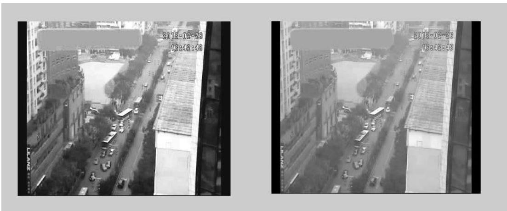

text_image

2013-02-23
18:48:48
2013-02-23
18:48:48

图 2

分析图 2可知直方图均衡化后的图像效果更佳，对比度更明显。

同时，考虑到图像出现的噪声，为了使图像更清晰，需要过滤这些噪声。抑制噪声常用的方法有领域平均法滤波和中值滤波。但是领域平均法滤波实际上是一种低通滤波器，可能会使带有高频信息的边界变得模糊。因此这里使用了中值滤波法，过滤噪声的同时，又能很好地保护边缘轮廓信息。

使用 Matlab的中值滤波函数medfilt2，得到的效果图如下：

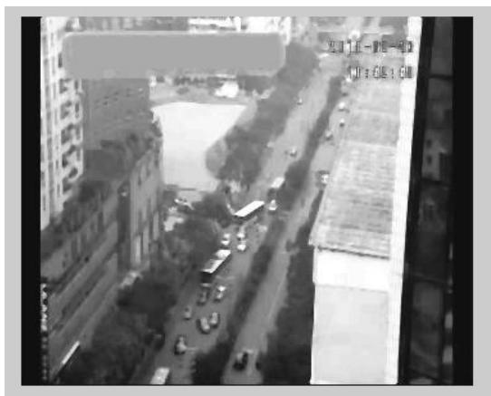

text_image

Street photo with visible store signboards and urban background, showing storefronts and vehicles

图 3

观察图 2右图和图 3可知此时色调变化更圆融了，有效地消除了噪声的干扰，同时边缘信息并没有消失，更有利于对交通情况的分析。

## 4.1.2 图像检测

图像检测是为了对视频中的运动目标进行检测和识别，进而描述运动目标的行为。这里使用背景差分法进行图像检测。背景差分法的基本思想是将当前图像与背景图像相减，通过选取合适的阈值进行二值化来检测运动目标。背景差分法最关键的步骤为背景建模。

背景建模的常用方法主要有直方图法、平均值法和差异积累背景建模法等。直方图法对于该视频交通阻塞或缓慢运动的车辆失效，而且比较浪费内存。由于视频中车流量有大有小，而平均值法在车流量较大时失效而且浪费存储空间，因此使用差异积累背景建模法最佳。

差异积累背景建模法的具体步骤如下：

1. 对于 N帧的视频图像 $I ( x , y , t )$ ，设 $I ( x , y , t _ { 1 } )$ 为基准图像。第k帧图像与基准图像差异记为 $F ( x , y , t _ { k } )$ ),差异动态矩阵记为 $D ( \boldsymbol { x } , \boldsymbol { y } , t _ { k } )$ ，变化阈值选为 T：

$$
F (x, y, t _ {k}) = \left\{ \begin{array}{l} 1, | I (x, y, t _ {k}) - I (x, y, t _ {k - 1}) | > T \\ 0 \end{array} \right. \tag {3}
$$

$$
D (x, y, t _ {k}) = \left\{ \begin{array}{l} D \left(x, y, t _ {k - 1}\right) + 1, F (x, y, t _ {k}) = 0 \text {且} D \left(x, y, t _ {k - 1}\right) <   m \\ 0 \end{array} \right. \tag {4}
$$

2. $D ( x , y , t _ { k } )$ 记录像素的变化，并进行实时更新。当 $D ( \boldsymbol { x } , \boldsymbol { y } , t _ { k } ) = m$ 时，可知该位置短时间灰度变化不大，将该位置的像素更新为背景。更新的背景模型记为 $B ( x , y , t _ { k } )$ )，背景更新公式为：

$$
B (x, y, t _ {k}) = \alpha I (x, y, t _ {k}) + (1 - \alpha) B (x, y, t _ {k - 1}) \tag {5}
$$

$\alpha$ 决定了背景缓存平滑滤波程度及更新速度，由经验取[0.05,0.1]。

使用 Matlab经过差异积累背景建模得到的部分图像如下：

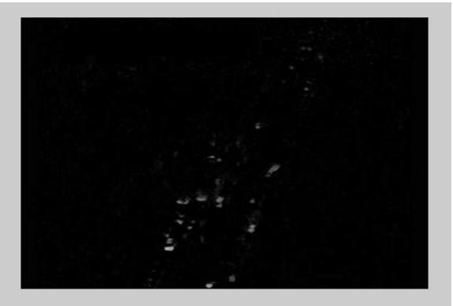

natural_image

Dark, low-contrast image with faint white specks and faint horizontal lines, no discernible text or symbols.

图 4

可见背景建模的效果基本理想，但仍需进一步改进。

背景建模后对运动前景进行检测和处理，这里分别使用了Otsu算法和形态学滤波法进行处理，发现形态学滤波方法最佳。形态学的基本思想是使用具有一定形态的结构元素来度量和提取图像中的对应形状，从而实现对图像进行分析和识别。这里使用了形态学滤波法的开操作，开操作主要是为了消除离散点和毛刺，即对图像进行平滑。其Otsu算法与形态学滤波法处理的图像如下：

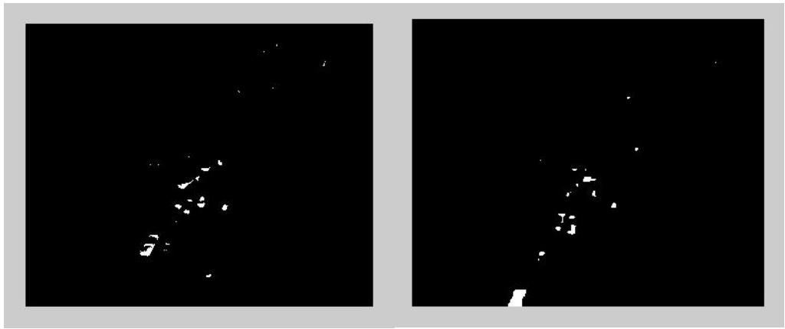

natural_image

Two black-and-white images showing abstract white shapes on a dark background, no text or symbols present.

图 5

比较二图可知形态学滤波效果更佳且运动目标从远处过来时会逐渐变大，这一点利于计算。

## 图像的后处理

为了更好标志图像的车辆，这里使用了边缘检测作为后处理的方法。它能剔除不相关的信息，保留图像重要的结构属性。边缘检测最常用的算子是Canny算子，其步骤如下：

1. 用高斯滤波器对图像进行滤波，去除图像中的部分噪声；  
用高斯算子的一阶微分对图像进行滤波，得到图像梯度的强度和方向；  
对梯度进行非抑制和滞后阈值处理，得到边缘图像。

边缘检测的最终图像如下：

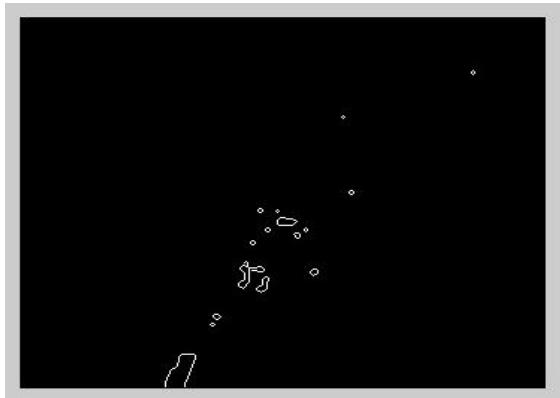

natural_image

Abstract white line drawing on black background with no text or symbols

图 6

观察图 6可知汽车轮廓比较明显，轮廓比较小的是小轿车，轮廓最大的是公交车。过轮廓对汽车的特征表现不够，这一点需要增强。

## 4.2 数据处理

对两个视频进行图像处理后，忽略前几秒不稳定显示的视频，开始计算视频一中每一分钟通过事故横断面和从上游路口涌现的大、中、小型机动车及电瓶车的数量及排队长度。之所以选择一分钟，是因为附件五显示上游路口信号周期为60秒，如果选取 30秒的话，上游路口会出现数量上升下降的周期性，不便于数据分析。为简化模型，将视频中车辆分为大中小三类，因为小轿车是该交通要段的主要交通工具，故作为标准车当量，中型车是小型客车等，其标准车当量为 1.5，大型车为公交，它的标准车当量为 。最后统计视频中事故的持续时间和排队长度。经过计算，得到每一分钟通过事故横断面和从上游路口涌现的各种车型的车辆数量见附录。

其中，由于视频中出现了一些卡顿、暂停、跳变、镜头拉伸的现象，这些现象是图像处理后的结果不稳定，需要对这部分视频信息进行剔除。

## 五、 问题一模型

## 5.1问题分析及模型选取

视频中交通事故发生至撤离期间，原本通畅的三车道变成拥挤的单车道。对于该横断面，通行能力受到严重限制，此时的理论通行能力迅速下降，实际通行能力也因此下降，易于导致交通堵塞。

为了正确估算车道被占用对城市道路通行能力的影响程度，为交通管理部门正确引导车辆行驶提供根据，需要建立事故期间事故所处横断面实际通行能力随时间变化的序列模型，并分析实际通行能力与理论通行能力之间的关系。

## 5.2模型建立及求解

由参考文献[1]可知通行能力分为理论通行能力、实际通行能力和规划通行能力。

## 5.2.1理论通行能力的计算

理论通行能力是以基本通行能力为基础考虑到实际的道路和交通状况，确定其修正系数，再依此修正系数乘以前述的基本通行能力，即得实际道路、交通与一定环境条件下的理论通行能力。

其中基本通行能力 $\Nu _ { \sf m a x }$ 为由参考文献[2]可知为 2000pcu/h。修正系数有：①车道宽度修正系数 $\gamma _ { _ 1 } = 0 . 9 4$ ； ②侧向净空的修正系数 $\gamma _ { _ 2 } ~ = ~ 1$ ； ③纵坡度修正系数 $\gamma _ { _ 3 } \ = 1$ ； ④视距不足修正系数 $\gamma _ { _ 4 } ~ = 1$ ； ⑤沿途条件修正系数 $\gamma _ { 5 } ~ = ~ 0 . 7$ ；⑥考虑到不同车型影响的交通条件修正系数 $\gamma _ { _ 6 }$ 。

交通条件修正系数 $\gamma _ { 6 }$ 由下面的公式计算，其中H 为大车占流量的比例：

$$
\gamma_ {6} = \left[ \frac {1 0 0}{1 0 0 - H} + 2 H \right] \tag {6}
$$

由上面的系数和下式理论通行能力便可计算得到：

$$
N _ {t k} = N _ {\max} \gamma_ {1} \gamma_ {2} \gamma_ {3} \gamma_ {4} \gamma_ {5} \gamma_ {6} \tag {7}
$$

计算得到的理论通行能力大约在1315pcu/h。

## 5.2.2实际通行能力的计算

实际通行能力有两种计算方法，第一种可由交通部《公路通行能力手册》的资料得到，即道路在特定时段内所能通过的最大车辆小时流率。其公式如下：

$$
N _ {p 1 k} = n _ {k} \times 6 0 \tag {8}
$$

$N _ { _ { p 1 k } }$ 为实际通行能力， $\mathsf { n } _ { \mathsf { k } }$ 为第 k分钟该道路通过的车当量数，之所以乘以60是因为 $\mathsf { n } _ { \mathsf { k } }$ 统计的是六十分之一小时的车当量数，需化为标准当量。计算出来的具体数值如下：

<table><tr><td>时间点(min)</td><td>1</td><td>2</td><td>3</td><td>4</td><td>5</td><td>6</td><td>7</td><td>8</td></tr><tr><td>实际通行能力(pcu/h)</td><td>1620</td><td>1290</td><td>1050</td><td>1260</td><td>1110</td><td>1320</td><td>1470</td><td>1140</td></tr><tr><td>时间点(min)</td><td>9</td><td>10</td><td>11</td><td>12</td><td>13</td><td>14</td><td>15</td><td></td></tr><tr><td>实际通行能力(pcu/h)</td><td>1440</td><td>1020</td><td>1080</td><td>1200</td><td>1050</td><td>1020</td><td>1350</td><td></td></tr></table>

表格 1

由表格 1可知实际通行能力具有比较大的波动，同时波动是在理论通行能力附近，其具体关系仍需进一步观察。

第二种方法是由参考文献[1]提供的公式计算得到实际通行能力：

$$
N _ {p 2 k} = N _ {t} \times x \times f w \times f H V \times f p \tag {9}
$$

其中 x 为车道数，事故发生后这里取1，fw是车道宽度和侧向净宽对通行能力的修正系数，fHV 是大型车对通行能力的修正系数，计算公式为：

$$
f H V = \frac {1}{\left[ 1 + p H V (E H V - 1) \right]} \tag {10}
$$

EHV 为大型车换算成小客车的车辆换算系数，PHV 为大型车交通量占总交通量的百分比。

计算得到的实际通行能力同样在理论通行能力附近波动，具体数值见附录。

## 5.2.3实际通行能力的变化过程的描述

由式(7)、(8)和(9)计算得到的理论通行能力和实际通行能力随时间变化的情况如下：

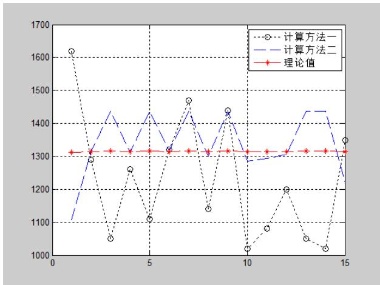

line

| X | 计算方法一 | 计算方法二 | 理论值 |
| --- | --- | --- | --- |
| 1 | ~1620 | ~1100 | ~1310 |
| 2 | ~1290 | ~1290 | ~1310 |
| 3 | ~1050 | ~1440 | ~1310 |
| 4 | ~1260 | ~1310 | ~1310 |
| 5 | ~1110 | ~1430 | ~1310 |
| 6 | ~1320 | ~1320 | ~1310 |
| 7 | ~1470 | ~1470 | ~1310 |
| 8 | ~1140 | ~1310 | ~1310 |
| 9 | ~1440 | ~1440 | ~1310 |
| 10 | ~1020 | ~1280 | ~1310 |
| 11 | ~1080 | ~1290 | ~1310 |
| 12 | ~1200 | ~1300 | ~1310 |
| 13 | ~1050 | ~1440 | ~1310 |
| 14 | ~1020 | ~1440 | ~1310 |
| 15 | ~1350 | ~1230 | ~1310 |

图 7

可以看到两种计算方法得到的实际通行能力都在理论通行能力附近波动，使用 对其进行正态检验，发现两者的 都大于 ，说明两者都服从正态分布。因此实际通行能力在事故期间是在理论通行能力附近随着时间波动且满足正态分布，即是说，实际通行能力本质上是由理论通行能力决定，受现实条件影响。

## 六、 问题二模型

## 6.1问题分析及模型选取

观察视频二事故发生地点横断面的实际通行能力与理论通行能力和事故持续时间变化的图像如下：

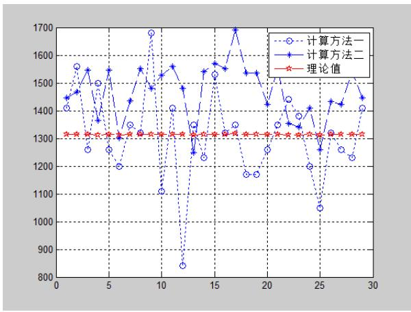

line

| X | 计算方法一 | 计算方法二 | 理论值 |
|---|---|---|---|
| 1 | ~1410 | ~1450 | ~1320 |
| 2 | ~1560 | ~1470 | ~1320 |
| 3 | ~1260 | ~1550 | ~1320 |
| 4 | ~1500 | ~1370 | ~1320 |
| 5 | ~1260 | ~1550 | ~1320 |
| 6 | ~1200 | ~1300 | ~1320 |
| 7 | ~1350 | ~1440 | ~1320 |
| 8 | ~1320 | ~1550 | ~1320 |
| 9 | ~1680 | ~1490 | ~1320 |
| 10 | ~1110 | ~1530 | ~1320 |
| 11 | ~1410 | ~1560 | ~1320 |
| 12 | ~840 | ~1480 | ~1320 |
| 13 | ~1350 | ~1250 | ~1320 |
| 14 | ~1230 | ~1540 | ~1320 |
| 15 | ~1530 | ~1570 | ~1320 |
| 16 | ~1350 | ~1550 | ~1320 |
| 17 | ~1350 | ~1690 | ~1320 |
| 18 | ~1170 | ~1540 | ~1320 |
| 19 | ~1170 | ~1540 | ~1320 |
| 20 | ~1260 | ~1430 | ~1320 |
| 21 | ~1350 | ~1540 | ~1320 |
| 22 | ~1440 | ~1350 | ~1320 |
| 23 | ~1380 | ~1340 | ~1320 |
| 24 | ~1200 | ~1410 | ~1320 |
| 25 | ~1050 | ~1260 | ~1320 |
| 26 | ~1320 | ~1440 | ~1320 |
| 27 | ~1260 | ~1430 | ~1320 |
| 28 | ~1230 | ~1520 | ~1320 |
| 29 | ~1410 | ~1450 | ~1320 |

图 8

其实际通行能力同样在理论通行能力上下变动，故总体特征与视频一的情况相似。

然而观察视频一和视频二交通事故发生的车道和附件三，可知视频一交通事故占用了车道二和车道三，视频二交通事故占用了车道一和车道二。由常识可知，当一辆车开进事故所处路段时，如果它需要右转，它会往车道一上开，如果想需要直行则往车道二上开，同理，如果需要左转则往车道三上开。又由附件三可知右转流量比例为 ，直行流量比例为 ，左转流量比例为 。因此可知实际上三条车道的实际通行能力是有差别的，因此交通事故所占车道不同可能对该横断面实际通行能力影响有差异。

分析说明同一横断面交通事故所占车道不同对该横断面实际通行能力影响的差异，实际上是要建立一个评价同一横断面的交通事故所占车道不同对通行能力影响的模型。要分析这种影响，先要分析视频一和视频二交通事故所占车道不同对该横断面通信能力的影响是否有显著性差异。分析显著性差异的常用方法为方差分析。不过方差分析需要通过正态检验和方差齐次检验，如果不通过这两种检验则需要进行非参数检验。

为了进一步分析同一横断面的交通事故所占车道不同对通行能力影响，可以通过分析该车道流通量与该横断面实际通行能力的关系。由于车道可能会相互作用，为了排除其它因素的影响，本文使用通径分析描述该车道流通量与该横断面实际通行能力的关系。

## 6.2模型建立及求解

先使用SPSS对视频一横断面实际通行能力进行正态性检验，使用的实际通行能力的数据由计算方法一(8)得到，正态性检验得到的结果如下：

Tests of Normality

<table><tr><td rowspan="2"></td><td colspan="3">Kolmogorov-Smirnova</td><td colspan="3">Shapiro-Wilk</td></tr><tr><td>Statistic</td><td>df</td><td>Sig.</td><td>Statistic</td><td>df</td><td>Sig.</td></tr><tr><td>视频1横截面通行能力</td><td>.149</td><td>15</td><td>.200*</td><td>.922</td><td>15</td><td>.206</td></tr></table>

\*. This is a lower bound of the true significance.  
a. Lilliefors Significance Correction

图 9

可知 sig>0.05，说明视频一横断面实际通行能力符合正态性。

接着对视频二横断面实际通行能力进行正态性检验，其计算方法同式(8)，检验的结果如下：

Tests of Normality

<table><tr><td rowspan="2"></td><td colspan="3">Kolmogorov-Smirnova</td><td colspan="3">Shapiro-Wilk</td></tr><tr><td>Statistic</td><td>df</td><td>Sig.</td><td>Statistic</td><td>df</td><td>Sig.</td></tr><tr><td>视频2横截面通行能力</td><td>.098</td><td>29</td><td>.200*</td><td>.970</td><td>29</td><td>.566</td></tr></table>

\*. This is a lower bound of the true significance  
a. Lilliefors Significance Correction

图 10

可知 sig>0.05，故视频二横断面实际通行能力也符合正态性。说明视频一和视频二的横断面实际通行能力都服从正态分布，接着进行方差齐次检验，使用SPSS检验的结果如下：

Test of Homogeneity of Variances  
横截面通行能力

<table><tr><td>Levene Statistic</td><td>df1</td><td>df2</td><td>Sig.</td></tr><tr><td>.969</td><td>1</td><td>42</td><td>.331</td></tr></table>

图 11

由图 11可知 sig>0.05，故服从齐次性检验，因此可以通过方差分析直接判断两者是否有显著性差异，使用Matlab得到的结果如下：

<table><tr><td>Source</td><td>SS</td><td>df</td><td>MS</td><td>F</td><td>Prob&gt;F</td></tr><tr><td>Groups</td><td>62619.9</td><td>1</td><td>62619.9</td><td>2.13</td><td>0.1522</td></tr><tr><td>Error</td><td>1236571</td><td>42</td><td>29442.2</td><td></td><td></td></tr><tr><td>Total</td><td>1299190.9</td><td>43</td><td></td><td></td><td></td></tr></table>

图 12

由图 12可 p>0.05，因此在置信水平为0.05的情况下两者的实际通行能力并没有什么显著性差异。对于这样的结果存在两种可能的解释，一是可能通道一和通道三的流量比例相差不大，事故又都占住通道二，因此实际通行能力差异不大；二是当只有一道车道时，所有车辆无法考虑之后的转向因而无法选择车道，因此被占住的车道是哪一道都没有影响。因此需要对这两种解释进行进一步的探讨。

为了进一步得到同一横断面的交通事故所占车道不同对通行能力的具体影响，需要进行通径分析，从而得到单个车道对同一横断面通行能力的影响。通径分析是相关分析的深入。在多元回归的基础上将相关系数分解，得到直接通径、间接通径及总通径系数。这些系数代表了某一变量对因变量的直接作用、通过其他变量对因变量的间接作用效果和综合作用效果。通径分析的步骤如下：

1. 以各个车道一分钟的交通量为自变量X(i=1,2,3)，X 计算公式为：

$$
X _ {i} = N _ {u} \eta_ {i} \tag {11}
$$

其中 $\mathsf { N } _ { \mathsf { u } }$ 是上游一分钟的总交通量，因为叉路口1、2的总交通量比较少故忽略不计。 为第i 个车道流量比例。以横断面的通行能力为因变量， $\eta _ { i }$ $\overline { { \boldsymbol X _ { \scriptscriptstyle j } } }$ 为 $\mathsf { X } _ { \mathrm { i } }$ 的平均值， $\overline { { Y } }$ 为因变量的平均值，进行一般的多元线性回归分析得：

$$
Y = \beta_ {0} + \beta_ {1} X _ {1} + \beta_ {2} X _ {2} + \beta_ {3} X _ {3} \tag {12}
$$

$$
\overline {{Y}} = \beta_ {0} + \beta_ {1} \overline {{X _ {1}}} + \beta_ {2} \overline {{X _ {2}}} + \beta_ {3} \overline {{X _ {3}}} \tag {13}
$$

2. 将(12)—(13)得：

$$
Y - \overline {{Y}} = \beta_ {1} (X _ {1} - \overline {{X _ {1}}}) + \beta_ {2} (X _ {2} - \overline {{X _ {2}}}) + \beta_ {3} (X _ {3} - \overline {{X _ {3}}}) \tag {14}
$$

3. 式(14)两边同时除以Y 的标准差 $\sigma _ { _ { y } }$ ：

$$
\frac {Y - \bar {Y}}{\sigma_ {y}} = \beta_ {1} \frac {\sigma_ {x 1}}{\sigma_ {y}} \frac {(X _ {1} - \overline {{X _ {1}}})}{\sigma_ {x 1}} + \beta_ {2} \frac {\sigma_ {x 2}}{\sigma_ {y}} \frac {(X _ {2} - \overline {{X _ {2}}})}{\sigma_ {x 2}} + \beta_ {3} \frac {\sigma_ {x 3}}{\sigma_ {y}} \frac {(X _ {3} - \overline {{X _ {3}}})}{\sigma_ {x 3}} \tag {15}
$$

4. 利用最小二乘法求出式(15)各自变量线性回归系数的求解模型，在此基础上，进行一定的数量变换，则可得出如下各简单相关系数的分解方程：

$$
\left\{ \begin{array}{l} P _ {1 Y} + r _ {1 2} P _ {2 Y} + r _ {1 3} P _ {3 Y} = r _ {1 Y} \\ r _ {2 1} P _ {1 Y} + P _ {2 Y} + r _ {2 3} P _ {3 Y} = r _ {2 Y} \\ r _ {3 1} P _ {1 Y} + r _ {3 2} P _ {2 Y} + P _ {3 Y} = r _ {3 Y} \end{array} \right. \tag {16}
$$

式(16)便是通径分析的基本模型了，其中 $\boldsymbol { \mathsf { r } } _ { \mathrm { i j } }$ 为 $\mathsf { X } _ { \mathrm { i } }$ 与 $\mathsf { X } _ { \mathrm { j } }$ 的简单相关系数， $\boldsymbol { \mathsf { r } } _ { \mathsf { i } \mathsf { Y } }$ 为$\mathsf { X } _ { \mathrm { i } }$ 与 Y 的简单相关系数， $\mathsf { P } _ { \mathsf { i } \mathsf { Y } }$ 为直接通径，即是 $\mathsf { X } _ { \mathrm { i } }$ 与 $\textsf { Y }$ 标准化后的偏相关系数，表示 X 对Y 的直接影响效应。

接着使用SPSS进行通径分析，得到的结果如下：

Coefficientsa

<table><tr><td rowspan="2" colspan="2">Model</td><td colspan="2">Unstandardized Coefficients</td><td>Standardized Coefficients</td><td rowspan="2">t</td><td rowspan="2">Sig.</td></tr><tr><td>B</td><td>Std. Error</td><td>Beta</td></tr><tr><td rowspan="2">1</td><td>(Constant)</td><td>1206.697</td><td>233.488</td><td></td><td>5.168</td><td>.000</td></tr><tr><td>视频1上游右流量</td><td>.099</td><td>1.059</td><td>.026</td><td>.093</td><td>.927</td></tr></table>

a. Dependent Variable: 视频1横截面通行能力

图 13  
Coefficientsª

<table><tr><td rowspan="2" colspan="2">Model</td><td colspan="2">Unstandardized Coefficients</td><td>Standardized Coefficients</td><td rowspan="2">t</td><td rowspan="2">Sig.</td></tr><tr><td>B</td><td>Std. Error</td><td>Beta</td></tr><tr><td rowspan="2">1</td><td>(Constant)</td><td>1360.506</td><td>156.936</td><td></td><td>8.669</td><td>.000</td></tr><tr><td>视频2上游右流量</td><td>-.220</td><td>.640</td><td>-.066</td><td>-.344</td><td>.734</td></tr></table>

a. Dependent Variable: 视频2横截面通行能力

图 14

由图 13可知上游右流量对横断面实际通行能力具有促进作用，这是因为视频一中交通事故所占的车道是车道二和车道三，因此对右转车道影响不大，因此上游路口右流量的增大有利于提高横断面的实际道路通行能力。

与此相反的是，图 显示上游路口右流量对横断面实际通行能力影响有抑制作用，这是因为视频二中交通事故所占的车道是车道一和车道二，即右转车道被占。右转车道被占后，上游路口右流量增大，车队后面的司机观察不到前面车道的情况，等到了事故发生地点已很难通过该横断面，因此横断面的实际通行能力下降。情况如视频二的某一截图：

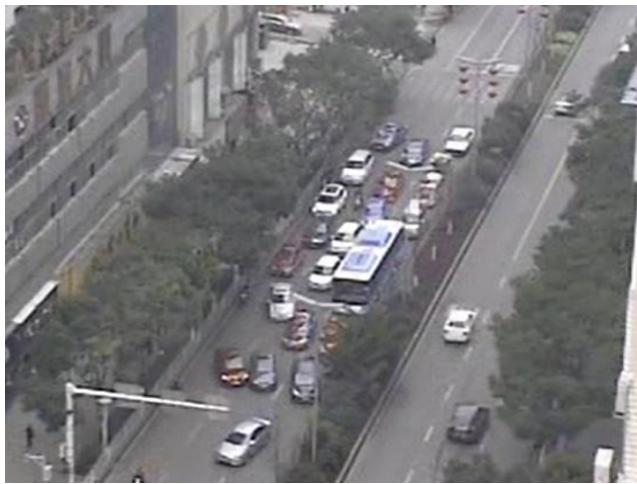

natural_image

Aerial view of a multi-lane highway with vehicles and trees, no visible text or signage.

图 15

综上所述，同一横断面交通事故所占车道不同对该横断面实际通行能力的影响由各通道的流量比例决定。当流量比例相差不大时，无论是哪个车道被占实际通行能力都差不多，当流量比例相差比较大时，如果流量比例比较大的通道被占时，横断面的实际通道能力下降的比较大，如果流量比例比较小的通道被占时结果则相反。

## 七、 问题三模型

## 7.1问题分析及模型选取

由题意可知，分析视频一交通事故所影响的路段车辆排队长度与事故横断面实际通行能力、事故持续时间、路段上游车流量间的关系，本质上就是要建立一个拥挤交通流排队长度模型。

对于交通流当量排队长度模型的分析，涉及了概率论、排队论、随机过程、累计曲线、冲击波、神经网络与微观模拟等方法。考虑到车辆排队长度与事故横断面实际通行能力、事故持续时间、路段上游车流量间的关系非常复杂，优先使用神经网络模型求解这种非线性关系。以事故横断面实际通行能力、事故持续时间、路段上游车流量为输入样本，车辆排队长度为输出样本对BP神经网络进行。

不过排队长度很难通过视频测出来，如果简单地用线性比例尺带来的误差必定因为角度问题而变得比较大，因此这里提出两种思路，一是使用Herman等人在1979年及 1984年提出的基于多车道交通的动力学理论的城市交通二流理论（见参考文献[3]），二是使用非线性比例尺，对这种计算方法进行比较再决定使用哪种。

## 7.2排队长度的计算

## 7.2.1基于二流理论的排队长度计算

城市交通二流理论把车辆分为运动车辆和停止车辆两种，其中运动车辆形成的交通流称为行驶交通流，停止车辆形成的交通流称为阻塞交通流。如图 16，将过渡状态 B 的不均匀交通流看作是均匀的A部分阻塞交通流和C 部分行驶交通流的某种加权和，即只含 种均匀交通流。因此，可把图 转化为图 ，即把交通流实际运行状态转化为二流运行状态。在转化过程中，把交通流B 受到排队减速行驶的影响和交通流A的排队长度一同等效为当量排队长度 ${ \mathsf { L } } _ { \mathsf { A } } ^ { \prime }$ ，即交通流二流运行状态中阻塞交通流的长度。

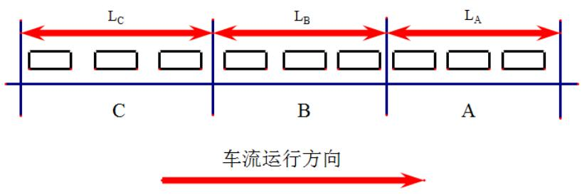

text_image

LC
LB
LA
C
B
A
车流运行方向

图 16：发生交通事件后路段上交通流实际运行状态

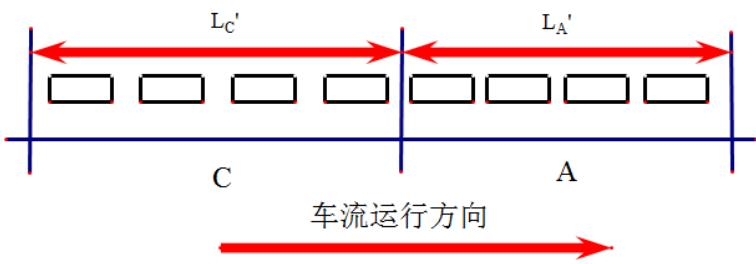

text_image

LC'
LA'
C
A
车流运行方向

图 17：发生交通事件后路段上交通流二流运行状态

对于单入口单出口的多车道路段，当其中一条车道队伍比起其它队伍过长时，该车道的车主往往会选择换道其它车道上，即车辆换道现象是存在的，使所有车道的车辆队伍会趋向于平均，故可用平均值来描述多车道路段整体上的当量排队长度。

通过交通流理论可知，流量-密度曲线为二次抛物线型，当密度取最佳值时，流量达到最大值，由此可把交通流状态分为非拥挤和拥挤2种状态，并把拥挤和非拥挤的临界状态作为行驶交通流的标准。

根据流量守恒定理，本题中单入口单出口三车道路段满足下面的关系：

$$
S _ {0} + \sum_ {i = 1} ^ {3} S _ {U} (i, t) = \sum_ {i = 1} ^ {3} S _ {D} (i, t) + \Delta S (t) \tag {17}
$$

在该式中， $S _ { 0 }$ 为初始时刻（t=0时）上、下游断面之间的车辆数； $\sum _ { i = 1 } ^ { 3 } S _ { \scriptscriptstyle U } ( i , t )$ 为 t时刻通过上游断面的车辆累计数； $\sum _ { i = 1 } ^ { 3 } S _ { \scriptscriptstyle D } ( i , t )$ 为t时刻通过下游断面的车辆累计数；St( )为 t时刻上、下游断面之间的车辆数。上游断面即是事故所占车道所在的横断面，下游断面是指视频中最长的排队长度最后一辆车所处的横断面，即离上游路口120米处，离事故所在横断面120米处。

根据二流理论， $\Delta S ( t )$ 由 t时刻上下游断面间平均当量排队长度 $\overline { { L _ { p } } } ( t )$ 计算得到：

$$
\Delta S (t) = \overline {{k _ {j}}} \overline {{L _ {D}}} (t) + \overline {{k _ {m}}} [ L - \overline {{L _ {D}}} (t) ] \tag {18}
$$

其中， 为上下游断面之间的距离，也是平均当量排队长度 $\overline { { L _ { p } } } ( t )$ 不能超过的数值（故 L 取视频中最大排队长度 120m）； $\overline { { k _ { _ m } } }$ 为上下游断面之间的平均单车道最佳密度，根据格林伯模型得 59pcu/km； $\overline { { k _ { j } } }$ 为上下游断面之间的平均单车道阻塞密度，查阅资料可知为160pcu/km。

由式(17)和(18)解得：

$$
\overline {{L _ {D}}} (t) = \frac {S _ {0} + \sum_ {i = 0} ^ {3} S _ {U} (i , t) - \sum_ {i = 3} ^ {3} S _ {D} (i , t) - 3 \overline {{k _ {m}}} L}{3 (\overline {{k _ {j}}} - \overline {{k _ {m}}})} \tag {19}
$$

这就是基于二流理论的多车道当量排队长度模型。

用 $\overline { { \mathrm { k } } } \left( \mathrm { t } \right)$ 表示时刻t时刻上、下游断面之间的平均单车道交通流密度，且满足$\overline { { k ( t ) } } = S _ { 0 } + \sum _ { i = 0 } ^ { 3 } S _ { \scriptscriptstyle U } ( i , t ) - \sum _ { i = 3 } ^ { 3 } S _ { \scriptscriptstyle D } ( i , t )$ 。故当 $0 \le \overline { { k } } ( t ) < \overline { { k _ { { \scriptscriptstyle m } } } }$ 时，上、下游之间的交通流处于非拥挤状态；当k $\left( \mathrm { t } \right) = \overline { { \mathrm { k } _ { \mathrm { m } } } }$ 时，上、下游之间交通流处于最佳行驶状态；当 $\overline { { k _ { _ m } } } < \overline { { k } } ( t ) \leq \overline { { k _ { _ j } } }$ 时，上、下游之间交通流处于拥挤状态。当 $S _ { 0 } + \sum _ { i = 0 } ^ { 3 } S _ { \scriptscriptstyle U } ( i , t ) -$ $\sum _ { i = 3 } ^ { 3 } S _ { \scriptscriptstyle D } ( i , t ) = 3 \overline { { k _ { \scriptscriptstyle m } } } L$ 时， $\overline { { L _ { \scriptscriptstyle D } } } ( t ) = 0$ ，此时当量排队长度取得最小值，即恰好没有排队，上、下游之间的交通流以最佳密度运行。这是式(19)的边界条件。

由于 $\sum _ { i = 0 } ^ { 3 } S _ { \scriptscriptstyle U } ( i , t )$ 和 $\sum _ { i = 0 } ^ { 3 } S _ { \scriptscriptstyle D } ( i , t )$ 分别满足

$$
\sum_ {i = 0} ^ {3} S _ {U} (i, t) = \sum_ {i = 0} ^ {3} S _ {U} (i, t - T) + Q _ {U} (t) \tag {20}
$$

$$
\sum_ {i = 0} ^ {3} S _ {D} (i, t) = \sum_ {i = 0} ^ {3} S _ {D} (i, t - T) + Q _ {D} (t) \tag {21}
$$

$\boldsymbol { \theta } _ { U } ( t )$ 为上个T 时间内通过上游断面的车辆数，T 在本文取10s， $Q _ { D } ( t )$ 为上个T时间内通过下游断面的车辆数。

因此可通过计算视频一初始时刻（t=0时）上、下游断面之间的车辆数 $S _ { 0 }$ ，再计算每个 10秒通过上游断面的车辆数 $\boldsymbol { \theta } _ { U } ( t )$ 和通过上游断面的车辆数 $Q _ { D } ( t )$ ，即可得到每隔10秒的排队长度。最后由式(19)计算得到排队长度随时间变化的图如下：

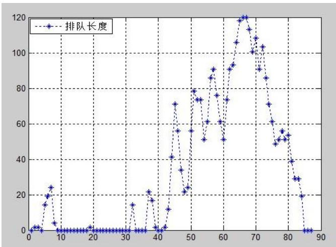

line

| X | 排队长度 |
| --- | --- |
| 1 | ~2 |
| 2 | ~3 |
| 3 | ~2 |
| 4 | ~15 |
| 5 | ~20 |
| 6 | ~25 |
| 7 | ~5 |
| 8 | ~1 |
| 9 | ~1 |
| 10 | ~1 |
| 11 | ~1 |
| 12 | ~1 |
| 13 | ~1 |
| 14 | ~1 |
| 15 | ~1 |
| 16 | ~1 |
| 17 | ~1 |
| 18 | ~1 |
| 19 | ~2 |
| 20 | ~1 |
| 21 | ~1 |
| 22 | ~1 |
| 23 | ~1 |
| 24 | ~1 |
| 25 | ~1 |
| 26 | ~1 |
| 27 | ~1 |
| 28 | ~1 |
| 29 | ~1 |
| 30 | ~1 |
| 31 | ~1 |
| 32 | ~15 |
| 33 | ~1 |
| 34 | ~1 |
| 35 | ~1 |
| 36 | ~1 |
| 37 | ~22 |
| 38 | ~17 |
| 39 | ~2 |
| 40 | ~2 |
| 41 | ~3 |
| 42 | ~12 |
| 43 | ~42 |
| 44 | ~72 |
| 45 | ~56 |
| 46 | ~35 |
| 47 | ~22 |
| 48 | ~24 |
| 49 | ~56 |
| 50 | ~79 |
| 51 | ~74 |
| 52 | ~74 |
| 53 | ~51 |
| 54 | ~61 |
| 55 | ~86 |
| 56 | ~91 |
| 57 | ~76 |
| 58 | ~61 |
| 59 | ~51 |
| 60 | ~74 |
| 61 | ~91 |
| 62 | ~94 |
| 63 | ~106 |
| 64 | ~118 |
| 65 | ~120 |
| 66 | ~113 |
| 67 | ~100 |
| 68 | ~108 |
| 69 | ~90 |
| 70 | ~86 |
| 71 | ~71 |
| 72 | ~61 |
| 73 | ~50 |
| 74 | ~52 |
| 75 | ~53 |
| 76 | ~56 |
| 77 | ~52 |
| 78 | ~54 |
| 79 | ~39 |
| 80 | ~29 |
| 81 | ~29 |
| 82 | ~19 |
| 83 | ~0 |
| 84 | ~0 |
| 85 | ~0 |
| 86 | ~0 |
| 87 | ~0 |
| 88 | ~0 |
| 89 | ~0 |

图 18

其中 2\~81为事故期间，故可知大体上排队长度随事故持续时间波动变长，后期略有下降。其中队长最大是在67左右，大约是在16点 54分左右，将该视频该时刻截屏得到：

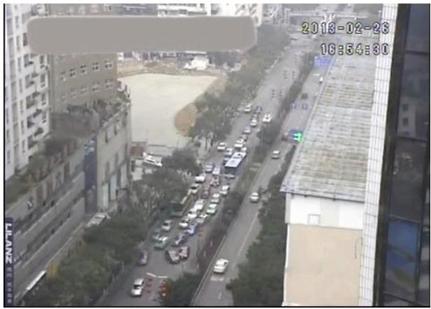

text_image

2013-02-23
18:54:30

图 19

此时排队长度达到了120米，故该模型符合事实。对于10\~30排队最短的时间，大概是16点 44分到16点 47分左右，这段时间截图如下：

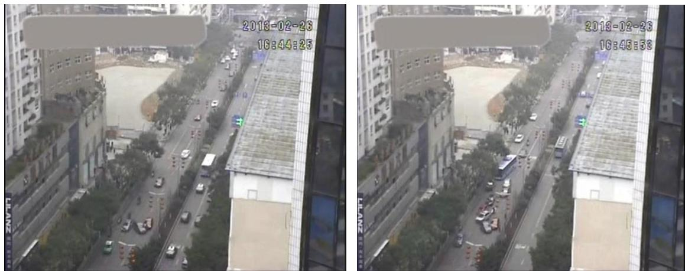

第一幅截图在44分的时候没有排队，但是第二幅截图在45分的时候出现了排队，而该模型却没有预测出该结果。这是因为使用二流理论本质上是对排队长度的预测。在进行预测时，是把10秒内车当量的变化平均化，根据上文提到的边界条件，可知式(19)的适用条件为 $\overline { { k _ { m } } } \leq \overline { { k } } ( t ) \leq \overline { { k _ { j } } }$ ，当实际的平均交通流密度是会小于 $\overline { { k _ { _ m } } }$ ，因此该模型在这种情况下会预测失败。

## 7.2.2基于非线性比例尺的排队长度计算改进

由问题分析可知，如果使用线性比例尺计算视频的排队长度会出现严重误差。见右图，尽管 $\mathsf { A G } = \mathsf { B G }$ ，但是从 D 点看来，由于视频是平面的，故看到CE 不等于EF。故无法用线性比例尺进行测量。因此考虑使用非线性比例尺。

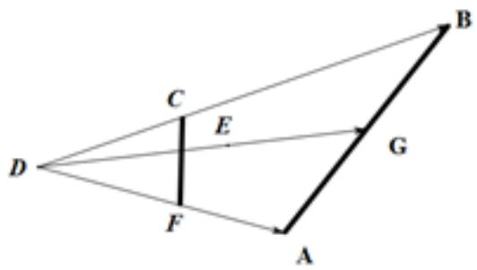

text_image

D
C
E
F
A
B
G

图 20

因为在视频中道路在接近下游路口时离摄像机比较近，故比例比较小，而在接近上游路口时，离摄像机比较远，故比例比较大。因此可知比例随着道路愈接近上游路口愈大，这里考虑两种非线性比例尺去模拟比例尺的非线性关系，一是幂数模型，即实际长度y与视频图像长度x 满足 $\boldsymbol { y } ^ { \mathrm { ~ ~ } } = \boldsymbol { \mathcal { C } } \boldsymbol { X } ^ { \alpha }$ 的关系；二是指数模型，实际长度 y与视频图像长度x 满足 $y \ : = \ : C e ^ { a x }$ 的关系。

先对幂数模型进行检验，以事故发生地点为坐标原点，将事故发生点(6,120)和(9,240)带入计算可得 $\alpha = 1 . 7 1 0$ $C = 9 . 5 8 4$ ，将叉路口1坐标带入计算得到y=55m，实际距离为60m，误差为 $1 / 1 2$ ，故拟合效果比较好。当用指数模型带入计算时发现拟合效果比较差，故用幂数模型作为非线性比例尺。

用非线性比例尺计算视频的排队长度，得到排队长度随时间变化情况如下：

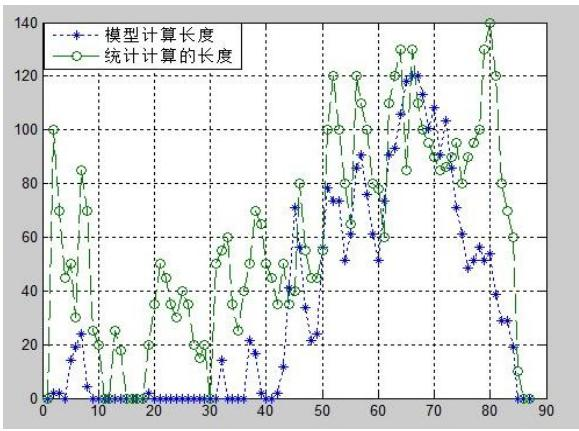

line

| X | 模型计算长度 | 统计计算的长度 |
| --- | --- | --- |
| 0 | ~1 | 100 |
| 2 | ~1 | ~70 |
| 4 | ~1 | ~50 |
| 6 | ~15 | ~85 |
| 8 | ~23 | ~70 |
| 10 | ~5 | ~25 |
| 12 | ~1 | ~20 |
| 14 | ~1 | ~25 |
| 16 | ~1 | ~18 |
| 18 | ~1 | ~20 |
| 20 | ~1 | ~35 |
| 22 | ~1 | ~50 |
| 24 | ~1 | ~45 |
| 26 | ~1 | ~35 |
| 28 | ~1 | ~40 |
| 30 | ~1 | ~20 |
| 32 | ~14 | ~50 |
| 34 | ~1 | ~60 |
| 36 | ~1 | ~40 |
| 38 | ~21 | ~50 |
| 40 | ~17 | ~70 |
| 42 | ~2 | ~65 |
| 44 | ~12 | ~45 |
| 46 | ~70 | ~50 |
| 48 | ~34 | ~80 |
| 50 | ~23 | ~45 |
| 52 | ~78 | ~100 |
| 54 | ~73 | ~120 |
| 56 | ~52 | ~80 |
| 58 | ~85 | ~120 |
| 60 | ~60 | ~80 |
| 62 | ~73 | ~60 |
| 64 | ~92 | ~110 |
| 66 | ~105 | ~130 |
| 68 | ~120 | ~130 |
| 70 | ~100 | ~95 |
| 72 | ~90 | ~95 |
| 74 | ~85 | ~85 |
| 76 | ~70 | ~95 |
| 78 | ~50 | ~80 |
| 80 | ~55 | ~130 |
| 82 | ~39 | ~140 |
| 84 | ~29 | ~80 |
| 86 | ~20 | ~70 |
| 88 | ~10 | ~60 |
| 90 | 0 | 0 |

图 21

与二流法得到的排队长度相对比，可知二流理论在事故前期和事故后期的排队长度预测误差比较大。因此作为训练样本时优先使用非线性比例尺统计计算得到的排队长度。为了简化计算，使用了图像处理后的视频测量排队长度，对比度更高，效果图如下：

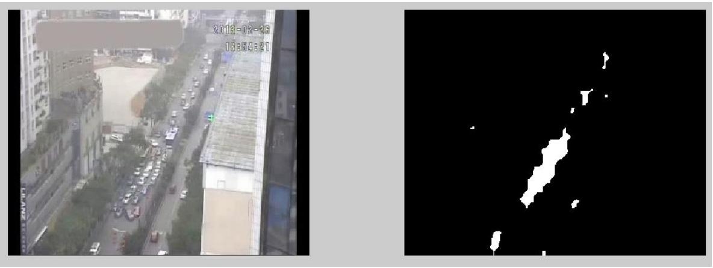

text_image

2013-02-23
16354121

图 22

## 7.3影响排队长度因素的神经网络模型求解

接着使用BP神经网络进行训练。BP神经网络，即前向反馈网络，它模拟人大脑神经元并行运行的过程，能从预测结果和真实结果的差值的反馈进行学习，从而得到越来越准确的预测值。它是由输入层，隐含层和输出层组成，层内的神经元之间没有连接，但是每一个神经元都和后面一层所有神经元都有连接，其联系是以带有权重的网络组成，权重代表了神经元连接的强度。当学习样本从输入层神经元输入进去后，通过层层隐含层神经元最后输出到输出层神经元，在输出层发生反应将预测值和实际值比较后的结果反向通过各层隐含层回到输入层，并在返回的过程中不断修正权值等因子，从而改善神经网络的预测值。这样反复进行的过程是预测的效果越来越好。 算法的核心依据是“负梯度下降”理论。

这里输入样本有事故横断面实际通行能力、事故持续时间、路段上游车流量三种，但是考虑到如果加入排队长度这个输出量，就有四个变量，使用神经网络得到的图像无法直观描述四个变量的关系。接着使用SPSS探究三个自变量和因变量的关系：

<table><tr><td colspan="7">Coefficientsa</td></tr><tr><td rowspan="2" colspan="2">Model</td><td colspan="2">Unstandardized Coefficients</td><td>Standardized 
Coefficients</td><td rowspan="2">t</td><td rowspan="2">Sig.</td></tr><tr><td>B</td><td>Std. Error</td><td>Beta</td></tr><tr><td rowspan="2">1</td><td>(Constant)</td><td>-8.244</td><td>6.461</td><td></td><td>-1.276</td><td>.206</td></tr><tr><td>事故持续时间</td><td>.099</td><td>.013</td><td>.637</td><td>7.570</td><td>.000</td></tr><tr><td rowspan="3">2</td><td>(Constant)</td><td>15.106</td><td>7.501</td><td></td><td>2.014</td><td>.047</td></tr><tr><td>事故持续时间</td><td>.131</td><td>.013</td><td>.844</td><td>9.797</td><td>.000</td></tr><tr><td>事故横断面实际通行能力</td><td>-.028</td><td>.006</td><td>-.417</td><td>-4.836</td><td>.000</td></tr><tr><td rowspan="4">3</td><td>(Constant)</td><td>12.090</td><td>7.747</td><td></td><td>1.561</td><td>.122</td></tr><tr><td>事故持续时间</td><td>.130</td><td>.013</td><td>.838</td><td>9.781</td><td>.000</td></tr><tr><td>事故横断面实际通行能力</td><td>-.030</td><td>.006</td><td>-.437</td><td>-5.037</td><td>.000</td></tr><tr><td>路段上游车流量</td><td>.004</td><td>.003</td><td>.109</td><td>1.430</td><td>.156</td></tr></table>

图 23：通径分析结果

使用通径分析后，发现事故持续时间对排队长度的影响程度远强于事故横断面实际通行能力和路段上游车流量，因此可以考虑使用客观赋权法将事故持续时间和路段上游车流量两个自变量统一，这样最后的 神经网络输入层细胞有两个，输出层细胞有一个。

夹角余弦法的步骤为：

1. 首先将两种分数组成指标矩阵J；  
2. 根据指标矩阵求出最佳方案和最劣方案；

最佳 U1=[ 10.5 1];最劣 U2=[0 11];

3. 由式和式求出效益型矩阵和相对偏差矩阵：

$$
R (i, j) = \frac {\left| U 1 (i) - J (i , j) \right|}{\max _ {j} \{J (i , j) \} - \min _ {j} \{J (i , j) \}} \tag {22}
$$

$$
\delta (i, j) = 1 - R (i, j) \tag {23}
$$

4. 由式和式得到各项的权重：

$$
c (i) = \frac {\sum_ {j = 1} ^ {n} R (i , j) \times \delta (i , j)}{\sqrt {\sum_ {j = 1} ^ {n} R (i , j) ^ {2}} \times \sqrt {\sum_ {j = 1} ^ {n} \delta (i , j) ^ {2}}} \tag {24}
$$

$$
\omega f (i) = \frac {c (i)}{\sum_ {i = 1} ^ {m} c _ {i}} \tag {25}
$$

最后求得 $\operatorname { \infty f } = [ 0 . 3 9 5 0 . 6 0 5 ]$ 。由此可知路段上游车流量的分配的权重是0.395，事故横断面实际通行能力分配的权重是0.605。

得到权重后，便可求得路段上游车流量与事故横断面实际通行能力统一的新的自变量。然后将该自变量和事故持续时间作为BP神经网络的输入样本，前面计算的两种排队长度作为BP神经网络的输出样本分别进行训练，其中隐含层细胞有3层。最后模拟得到的结果如下，并与样本进行对比：

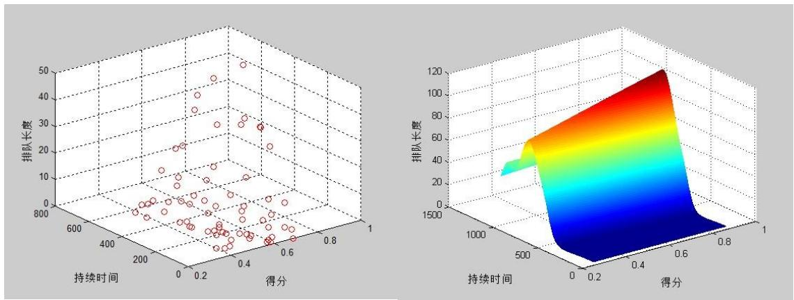

scatter_3d

| 持续时间 | 得分 | 排队长度 |
| --- | --- | --- |
| ~0.2 | ~0.1 | ~5 |
| ~0.2 | ~0.2 | ~8 |
| ~0.2 | ~0.3 | ~12 |
| ~0.2 | ~0.4 | ~15 |
| ~0.2 | ~0.5 | ~20 |
| ~0.2 | ~0.6 | ~25 |
| ~0.2 | ~0.7 | ~30 |
| ~0.2 | ~0.8 | ~35 |
| ~0.2 | ~0.9 | ~40 |
| ~0.2 | ~1.0 | ~45 |
| ~0.4 | ~0.1 | ~5 |
| ~0.4 | ~0.2 | ~8 |
| ~0.4 | ~0.3 | ~12 |
| ~0.4 | ~0.4 | ~15 |
| ~0.4 | ~0.5 | ~20 |
| ~0.4 | ~0.6 | ~25 |
| ~0.4 | ~0.7 | ~30 |
| ~0.4 | ~0.8 | ~35 |
| ~0.4 | ~0.9 | ~40 |
| ~0.4 | ~1.0 | ~45 |
| ~0.6 | ~0.1 | ~5 |
| ~0.6 | ~0.2 | ~8 |
| ~0.6 | ~0.3 | ~12 |
| ~0.6 | ~0.4 | ~15 |
| ~0.6 | ~0.5 | ~20 |
| ~0.6 | ~0.6 | ~25 |
| ~0.6 | ~0.7 | ~30 |
| ~0.6 | ~0.8 | ~35 |
| ~0.6 | ~0.9 | ~40 |
| ~0.6 | ~1.0 | ~45 |
| ~0.8 | ~0.1 | ~5 |
| ~0.8 | ~0.2 | ~8 |
| ~0.8 | ~0.3 | ~12 |
| ~0.8 | ~0.4 | ~15 |
| ~0.8 | ~0.5 | ~20 |
| ~0.8 | ~0.6 | ~25 |
| ~0.8 | ~0.7 | ~30 |
| ~0.8 | ~0.8 | ~35 |
| ~0.8 | ~0.9 | ~40 |
| ~1.0 | 0~1 | 0~120 (surface) |

图 24：二流法计算得到的排队长度作为输出样本得到的模型  
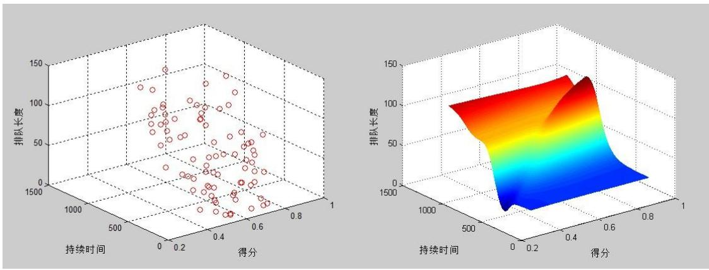

scatter_3d

| 持续时间 | 得分 | 排队长度 |
| --- | --- | --- |
| ~0.1 | ~0.2 | ~140 |
| ~0.1 | ~0.3 | ~120 |
| ~0.1 | ~0.4 | ~90 |
| ~0.1 | ~0.5 | ~80 |
| ~0.1 | ~0.6 | ~70 |
| ~0.1 | ~0.7 | ~60 |
| ~0.1 | ~0.8 | ~50 |
| ~0.1 | ~0.9 | ~40 |
| ~0.1 | ~1.0 | ~30 |
| ~0.2 | ~0.2 | ~130 |
| ~0.2 | ~0.3 | ~110 |
| ~0.2 | ~0.4 | ~90 |
| ~0.2 | ~0.5 | ~80 |
| ~0.2 | ~0.6 | ~70 |
| ~0.2 | ~0.7 | ~60 |
| ~0.2 | ~0.8 | ~50 |
| ~0.2 | ~0.9 | ~40 |
| ~0.2 | ~1.0 | ~30 |
| ~0.3 | ~0.2 | ~120 |
| ~0.3 | ~0.3 | ~100 |
| ~0.3 | ~0.4 | ~90 |
| ~0.3 | ~0.5 | ~80 |
| ~0.3 | ~0.6 | ~70 |
| ~0.3 | ~0.7 | ~60 |
| ~0.3 | ~0.8 | ~50 |
| ~0.3 | ~0.9 | ~40 |
| ~0.3 | ~1.0 | ~30 |
| ~0.4 | ~0.2 | ~110 |
| ~0.4 | ~0.3 | ~100 |
| ~0.4 | ~0.4 | ~90 |
| ~0.4 | ~0.5 | ~80 |
| ~0.4 | ~0.6 | ~70 |
| ~0.4 | ~0.7 | ~60 |
| ~0.4 | ~0.8 | ~50 |
| ~0.4 | ~0.9 | ~40 |
| ~0.4 | ~1.0 | ~30 |
| ~0.5 | ~0.2 | ~100 |
| ~0.5 | ~0.3 | ~90 |
| ~0.5 | ~0.4 | ~80 |
| ~0.5 | ~0.5 | ~70 |
| ~0.5 | ~0.6 | ~60 |
| ~0.5 | ~0.7 | ~50 |
| ~0.5 | ~0.8 | ~40 |
| ~0.5 | ~0.9 | ~30 |
| ~0.5 | ~1.0 | ~25 |
| ~0.6 | ~0.2 | ~90 |
| ~0.6 | ~0.3 | ~80 |
| ~0.6 | ~0.4 | ~70 |
| ~0.6 | ~0.5 | ~60 |
| ~0.6 | ~0.6 | ~50 |
| ~0.6 | ~0.7 | ~45 |
| ~0.6 | ~0.8 | ~45 |
| ~0.6 | ~0.9 | ~45 |
| ~0.6 | ~1.0 | ~45 |

图 25：非线性比例尺计算得到的排队长度作为输出样本得到的模型

与样本比对可知，神经网络模拟的结果大致符合样本的变化趋势，当事故持续时间越大；排队长度越大，当路段上游车流量越大事故横断面通行能力越差，排队长度也越大，这样的结果也比较符合常识。但模拟的过程中出现了不同程度的波动，这也是因为样本的波动性导致的。从根本上说，基本的BP神经网络收敛速度慢且容易陷入局部最优解。因此需要对基本的BP神经网络模型进行改进。

## 7.4基于遗传算法的神经网络模型改进

遗传算法是Holland教授于 1962年提出的模拟自然界遗传机制和生物进化论而成的一种并行随机搜索最优化方法。它的基本思想是把生物界“优胜劣汰”的进化原理引入优化参数形成的编码串联群体中，按照所选择的适应度函数并通过遗传中的选择、交叉和变异对个体进行筛选，使适应度好的个体被保留，适应度差的个体被淘汰，新的群体既继承上一代的信息，又优于上一代。这样反复循环，直至满足条件。它的基本步骤如下：

## 1. 随机初始化种群；

2. 计算种群适应度，从中找出最优个体；  
3. 依次进行选择操作、交叉操作和变异操作；  
4. 重复验算，达到预定的进化代数时为止。

遗传算法优化BP神经网络分为BP神经网络结构确定、遗传算法优化和BP神经网络预测3个部分。

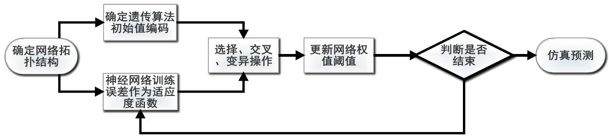

flowchart

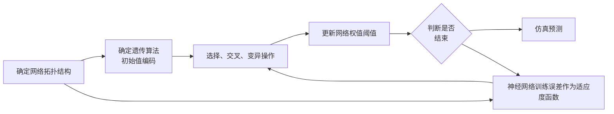

图 26

如上图，BP神经网络结构确定部分根据拟合函数输入输出参数个数确定BP神经网络结构，进而确定遗传算法个体的长度。遗传算法优化使用遗传算法优化BP神经网络的权值和阈值，种群中的每个个体都包含了一个网络所有权值和阈值，个体通过适应度函数计算个体适应度值，遗传算法通过选择、交叉和变异操作找到最优适应度值对应个体。BP神经网络预测用遗传算法得到最优个体对网络初始权值和阈值赋值，网络经训练后预测函数输出。

经过多次验算，遗传算法参数最后选定进化次数为11次，交叉概率为0.4，变异概率为0.2，样本量为81，BP神经网络参数同上，仿真预测的结果如图 27：

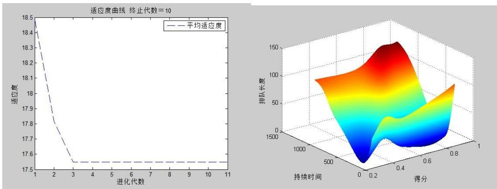  
图 27

将结果同图 25左图和图 21非线性比例尺计算得到的样本相比较，发现样本拟合效果较好，如初始状态的变动等信息也保留，仿真结果显示排队长度随着事故持续时间变大、横断面实际通行能力减弱、路段上游车流量增加而增长。

## 八、 问题四模型

## 8.1问题分析及模型选取

要知道从事故发生开始，经过多长时间车辆排队长度将到达上游路口，需要建立一个预测模型。关于交通流的预测模型主要分为两类，一类是以数理统计和微积分等传统数学和物理方法为基础的预测模型；一类是以现代科学技术和方法为主要研究手段而形成的预测模型。

和视频一视频二事故发生的地点相比，交通事故发生的横断面离上游路口更近了，路段上游车流量确定，事故发生时车辆初始排队长度确定为零，且事故持续不撤离。如果用传统的预测模型，如时间预测模型，神经网络模型等等，都需要数据样本支持，就算是数据要求最少的灰色预测模型也需要 个以上的样本，因此这些模型不适用。因此考虑使用仿真预测模型，比如元胞自动机。元胞自动机是一种非线性动力学系统，作为交通流预测模型非常适合。

## 8.2模型建立及求解

元胞自动机本质上是一种理想的离散动力学系统模型，其元胞在空间和时间上是离散有限的，元胞的状态也是有限的。

元胞是元胞自动机的基本单元。它具有记忆状态的功能，其状态由自身状态和邻近元胞的状态决定。通常，二维元胞自动机考虑两种邻居：一是Von Neumann邻居，由一个中心元胞（要演化的元胞）和4个位于其邻近东西南北方位的元胞组成；另一是 Moore 邻居，它另包括次邻近的位于东北、西北、东南和西南方位的 4个元胞，共9个元胞。这两种邻居如下：

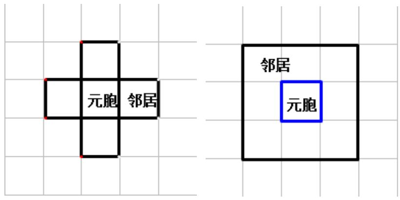

text_image

元胞 邻居
邻居
元胞

如果某元胞自动机是有边界的，则需要考虑元胞缺少规则所需要的邻居的情况。

元胞自动机在空间上可划分为一维，二维，三维元胞自动机，从概率上分为 概率机和非概率机。

根据题意，将小车看做元胞，本文构建的元胞自动机模型行为和规则如下：

1. 元胞位于二维网格，根据统计学数据，小轿车车头距平均为4.8米，故 140米相当于29个网格，因为有3个车道，因此元胞位于一个长29 个网格，宽3个网格的二维网格，如下图：

2. 元胞的状态考虑前、左、右三个邻居，边界条件取固定边界条件；

3. 元胞的前进规则：

（1）当前面一个网格没有车时，该元胞才考虑是否前进，否则选择不前进；  
（2）当元胞离事故地点所在横断面有5个网格以上的距离时，前进的概率为1，否则前进的概率取0.18 n，n为元胞离事故地点所在横断面的网格数，故前进概率最低为0.18；

4. 元胞的换道规则：

（1）当元胞无法前进时，才考虑换道；  
（2）50%的概率先考虑左边的网络，50%的概率先考虑右边的网格；  
（3）当先考虑左边的网格时，如果左边无车则换到左边的网格，否则考虑右边的网格，如果右边的网格无车则换到右边的网格，否则留在原来的网格，当先考虑右边的网格时同理；

5. 元胞的更新规则：

（1）使用圆盘赌法，当Matlab 生成的随机数小于一秒钟有车出现的概率时才增加新元胞；  
（2）当要增加新元胞时，根据视频的统计数据，小车的概率为0.9，使用圆盘赌法，当Matlab 生成的随机数小于0.9 时更新的元胞为小车，否则为大车；  
（3）当要增加新元胞时，元胞出现的车道按附件三的提供的三个车道的流量比例进行分配；  
（4）当元胞到达最右边的右转车道时，认为此时它已不再受事故影响，从二维网格上剔除；

6. 仿真结束的条件，即排队长度到达上游路口的条件：现实中一条车道往往还没有停满车就已经影响到上游路口，因此当一条车道的元胞达到27 个时就判定车辆排队长度到达上游路口。更新二维网格的时间为1s。

7. 该模型服从如下假设：

（1）只考虑小、大两种车型；  
（2）大型车拆分成两个小型车进行考虑；  
（3）车在事发路段的速度为匀速，因为事发路段比较拥挤，故时速比较低，时速大约为17.28km，不考虑加速过程。

按照以上的规则进行运行，运行的部分效果图如下：

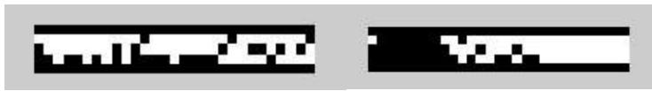

text_image

Two pixelated text blocks with black and white pixel patterns, possibly UI or interface elements

图 28

上图中上下两条黑线之间为边界，中间为事发道路，中间的小黑点代表元胞，车道中最左边那一列的两个元胞代表发生交通事故的两辆车。小黑点在最右边的前进速度比较快，随着越来越接近事故发生地点时，由于通道变窄并且车流变密，故前进速度变慢。

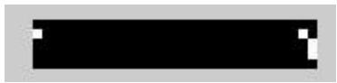  
图 29

上图代表排队长度达到上游路口时的情况，此时如果可能会进一步导致上游交叉路口发生交通堵塞，因此交通管理部门需要及时处理该堵塞现象。

经过 100次的仿真模拟，统计事故发生后车辆排队长度到达上游路口的时间在 8.3分钟到9分钟之间，平均时间为8.4分钟。

将仿真模拟过程中的排队长度记录下来，可以进一步得到排队长度随事故持续时间变化的图像：

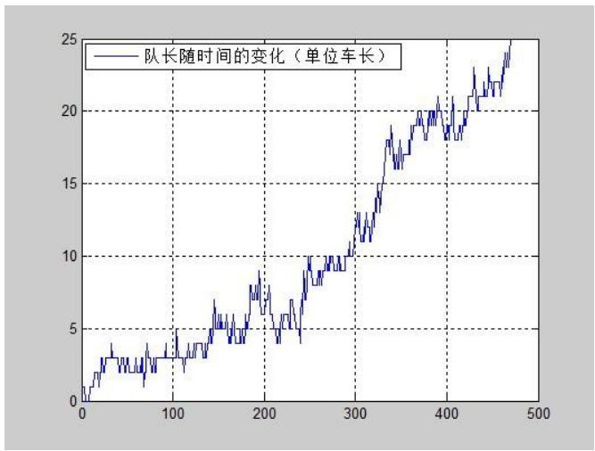

line

| X | 队长随时间的变化 (单位车长) |
| --- | --- |
| 0 | ~1 |
| 100 | ~3 |
| 200 | ~6 |
| 300 | ~10 |
| 400 | ~18 |
| 500 | ~25 |

图 30

图 30显示排队长度波动上升，这一点符合常识。但是其波动比起前面现实统计的现实数据相比波动幅度较小，这是因为没有考虑到红绿灯的影响，故上流车流量的变化比较平均，导致排队长度的波动较小。

## 7.3 模型的改进

考虑到红绿灯的影响，更改元胞的更新规则，不在每一秒都考虑元胞的更新。

如今每隔 30秒才考虑元胞的更新，并且连续考虑30秒，此时选择增加元胞的概率增加为原来的两倍p=0.83%。

经过改进后，进行100次仿真模拟，得到的排队长度到达上游路口的时间区间缩短为[8,8.4]（单位：分钟）。总体上比起改进前缩短了，这是因为考虑到红绿灯后，车队即将达到上游路口之前，下一波的车流量更密了，使车队的长度提前到达上游路口。

同样将仿真过程中排队长度的变化记录下来，得到的图像如下：

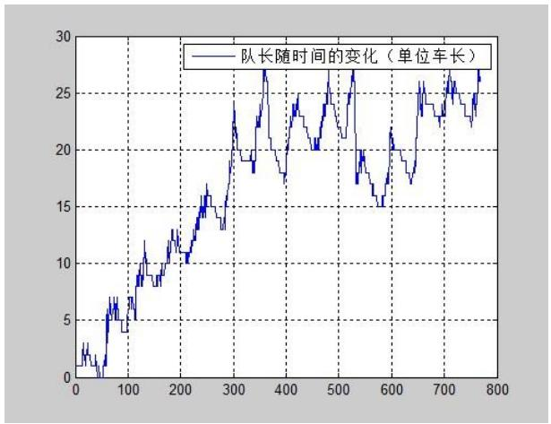

line

| X | 队长随时间的变化 (单位车长) |
| --- | --- |
| 0 | ~1.5 |
| 20 | ~3 |
| 40 | ~1.5 |
| 60 | ~6 |
| 80 | ~5 |
| 100 | ~9 |
| 120 | ~8 |
| 140 | ~11 |
| 160 | ~8 |
| 180 | ~12 |
| 200 | ~10 |
| 220 | ~13 |
| 240 | ~15 |
| 260 | ~16 |
| 280 | ~13 |
| 300 | ~22 |
| 320 | ~19 |
| 340 | ~27 |
| 360 | ~19 |
| 380 | ~18 |
| 400 | ~23 |
| 420 | ~24 |
| 440 | ~20 |
| 460 | ~24 |
| 480 | ~26 |
| 500 | ~21 |
| 520 | ~27 |
| 540 | ~17 |
| 560 | ~19 |
| 580 | ~15 |
| 600 | ~21 |
| 620 | ~19 |
| 640 | ~17 |
| 660 | ~25 |
| 680 | ~23 |
| 700 | ~26 |
| 720 | ~23 |
| 740 | ~25 |
| 760 | ~27 |

图 31

从图 31可知，此时排队长度的波动已经是非常剧烈的了，这更符合因红绿灯不断变化的上游车流量给排队长度带来的变动。

两个模型模拟的结果都不到10分钟。就是说当该处发生交通事故时，会在不到 10分钟的时间内影响到上游路口的交通，因此交通管理部门需要及时对这里的车流进行引导，防止变成区域性交通堵塞。

## 九、 模型评价及改进

问题一根据查到的文献，通行能力分为理论通行能力和实际通行能力，利用公式进行计算。分析实际通行能力时，发现实际通行能力随时间而变动，对这种变化进行正态性检验，发现这种变动满足正态分布。将实际通行能力与理论通行能力进行比较，发现实际通行能力在理论通行能力上下变动。说明实际通行能力由理论通行能力决定，受现实条件影响。不过该模型并没有进一步探究实际通行能力受到的现实条件的影响。

问题二在视频一和视频二的实际通行能力通过正态检验和方差齐次检验后进行方差分析，发现没有显著性差异。为了进一步分析同一横断面交通事故所占车道不同对该横断面实际通行能力的影响，分别对视频一和视频二的实际通行能力进行通径分析，得到同一横断面交通事故所占车道不同对横断面实际通行能力的影响决定于各车道的流量比例的结论。该模型清晰易懂，易于实行，便于推广。

问题三首先通过城市交通二流理论预测各个时间点的排队长度，发现它受边界条件的影响，故在一些时间段与现实不符合。于是构造非线性比例尺统计视频一的各个时间点的排队长度，再用夹角余弦法将因变量降为两个。接着使用 神经网络进行训练和仿真预测，发现效果不佳。为了增强仿真效果，使用遗传算法优化神经网络结构。该模型简单易行，且使用遗传算法优化神经网络结构克服了局部最优解。但是计算排队长度时仍然存在误差，需要更精确的算法计算视频各个时间点的排队长度。

问题四使用了离散动力学系统模型元胞自动机，该模型仿真能力强，能很好地模拟现实中城市交通流的某些规则。模拟的结果显示排队长度在不到10分钟的时间内就到达上游路口了。进一步考虑红绿灯的影响，更改元胞的更新规则，然后再进行仿真模拟，发现排队长度波动变大，且排队长度到达上游路口的时间总体上变短。

## 十、 参考资料

[1]王建军,《路网环境下高速公路交通事故影响传播分析与控制》,北京:科学出版社,2010  
[2]交调管理员, 《道路路段通行能力分析》,http://www.sdjd.net/Article/zhishi/200411/82.html, 2013/9/14  
[3]韩延玲, 《智能交通系统中视频车辆检测与定位技术研究》,http://d.g.wanfangdata.com.cn/Thesis\_Y1909086.aspx, 2013/9/13  
[4]Bastien Chopard, M. D.,《物理系统的元胞自动机模拟》,北京:清华大学出版社,2003  
[5]Matlab中文论坛,《Matlab神经网络 30个案例分析》,北京:北京航空航天大学出版社出版发行,2010  
[6]杜家菊等,《使用SPSS 线性回归实现通径分析的方法》,生物学通报,2010,45(2):4-6,2010

## 附录

问题一视频一获取的数据

<table><tr><td>时间</td><td>小型车</td><td>中型车</td><td>大型车</td><td></td><td></td><td></td></tr><tr><td>16:38:30</td><td>5</td><td>1</td><td>1</td><td></td><td></td><td></td></tr><tr><td>16:39:30</td><td>8</td><td>1</td><td>1</td><td></td><td></td><td></td></tr><tr><td>16:40:30</td><td>16</td><td>1</td><td>1</td><td></td><td></td><td></td></tr><tr><td>16:41:30</td><td>17</td><td>3</td><td>1</td><td></td><td></td><td></td></tr><tr><td colspan="2">事故发生时横断面</td><td></td><td></td><td></td><td></td><td></td></tr><tr><td>时间</td><td colspan="2">通过横截面的车</td><td></td><td colspan="2">上游路口过来的车</td><td></td></tr><tr><td></td><td>小型车</td><td>中型车</td><td>大型车</td><td>小型车</td><td>中型车</td><td>大型车</td></tr><tr><td>16:42:30</td><td>16</td><td>2</td><td>4</td><td>9</td><td>0</td><td>3</td></tr><tr><td>16:43:30</td><td>18</td><td>1</td><td>1</td><td>13</td><td>0</td><td>0</td></tr><tr><td>16:44:30</td><td>16</td><td>1</td><td>0</td><td>14</td><td>1</td><td>1</td></tr><tr><td>16:45:30</td><td>19</td><td>0</td><td>1</td><td>10</td><td>1</td><td>0</td></tr><tr><td>16:46:30</td><td>14</td><td>3</td><td>0</td><td>19</td><td>0</td><td>1</td></tr><tr><td>16:47:30</td><td>17</td><td>2</td><td>1</td><td>13</td><td>3</td><td>0</td></tr><tr><td>16:48:30</td><td>20</td><td>3</td><td>0</td><td>18</td><td>1</td><td>1</td></tr><tr><td>16:49:30</td><td>7</td><td>1</td><td>0</td><td>0</td><td></td><td>0</td></tr><tr><td>16:50:00</td><td>14</td><td>2</td><td>1</td><td>16</td><td>2</td><td>0</td></tr><tr><td>16:51:00</td><td>18</td><td>4</td><td>0</td><td>19</td><td>3</td><td>0</td></tr><tr><td>16:52:00</td><td>12</td><td>2</td><td>1</td><td>16</td><td>0</td><td>1</td></tr><tr><td>16:53:00</td><td>13</td><td>2</td><td>1</td><td>16</td><td>2</td><td>2</td></tr><tr><td>16:54:00</td><td>15</td><td>2</td><td>1</td><td>13</td><td>1</td><td>0</td></tr><tr><td>16:55:00</td><td>13</td><td>3</td><td>0</td><td>12</td><td>1</td><td>0</td></tr><tr><td>16:58:00</td><td>14</td><td>2</td><td>0</td><td>11</td><td>1</td><td>1</td></tr><tr><td>16:59:00</td><td>14</td><td>3</td><td>2</td><td>10</td><td>1</td><td>1</td></tr><tr><td>17:00:00</td><td></td><td></td><td></td><td></td><td></td><td></td></tr><tr><td>17:01:00</td><td>事故结束</td><td></td><td></td><td></td><td></td><td></td></tr><tr><td>时间</td><td>小型车</td><td>大型车</td><td></td><td></td><td></td><td></td></tr><tr><td>17:02:00</td><td>42</td><td>4</td><td></td><td></td><td></td><td></td></tr></table>

计算方法二得到的实际通行能力

<table><tr><td>时间点(min)</td><td>1</td><td>2</td><td>3</td><td>4</td><td>5</td><td>6</td><td>7</td><td>8</td></tr><tr><td>实际通行能力(pcu/h)</td><td>1108.1</td><td>1314.2</td><td>1436.4</td><td>1311.5</td><td>1436.4</td><td>1316.7</td><td>1436.4</td><td>1299.6</td></tr><tr><td>时间点(min)</td><td>9</td><td>10</td><td>11</td><td>12</td><td>13</td><td>14</td><td>15</td><td></td></tr><tr><td>实际通行能力(pcu/h)</td><td>1436.4</td><td>1285.2</td><td>1292.8</td><td>1305.8</td><td>1436.4</td><td>1436.4</td><td>1219.6</td><td></td></tr></table>

问题二视频二获取的数据

<table><tr><td></td><td></td><td></td><td>横截面</td><td></td><td></td><td>上游路口</td></tr><tr><td>时间</td><td>小型车</td><td>中型车</td><td>大型车</td><td>小型车</td><td>中型车</td><td>大型车</td></tr><tr><td>17:29:00</td><td>16</td><td>2</td><td>0</td><td>12</td><td>1</td><td>0</td></tr><tr><td>17:30:00</td><td>23</td><td>0</td><td>1</td><td>17</td><td>0</td><td>1</td></tr><tr><td>事故发生</td><td></td><td></td><td></td><td></td><td></td><td></td></tr><tr><td>17:34:17</td><td>18</td><td>1</td><td>2</td><td>16</td><td>1</td><td>3</td></tr><tr><td>17:35:17</td><td>19</td><td>2</td><td>2</td><td>12</td><td>2</td><td>1</td></tr><tr><td>17:36:17</td><td>16</td><td>2</td><td>1</td><td>18</td><td>0</td><td>1</td></tr><tr><td>17:37:17</td><td>16</td><td>2</td><td>3</td><td>11</td><td>0</td><td>3</td></tr><tr><td>17:38:17</td><td>19</td><td>0</td><td>1</td><td>12</td><td>0</td><td>2</td></tr><tr><td>17:39:17</td><td>14</td><td>0</td><td>3</td><td>19</td><td>0</td><td>3</td></tr><tr><td>17:40:17</td><td>17</td><td>1</td><td>2</td><td>13</td><td>1</td><td>2</td></tr><tr><td>17:41:17</td><td>20</td><td>0</td><td>1</td><td>11</td><td>0</td><td>2</td></tr><tr><td>17:42:17</td><td>21</td><td>2</td><td>2</td><td>13</td><td>1</td><td>1</td></tr><tr><td>17:43:17</td><td>15</td><td>1</td><td>1</td><td>15</td><td>0</td><td>1</td></tr><tr><td>17:44:17</td><td>20</td><td>1</td><td>1</td><td>15</td><td>1</td><td>1</td></tr><tr><td>17:45:17</td><td>12</td><td>0</td><td>1</td><td>10</td><td>1</td><td>2</td></tr><tr><td>17:46:17</td><td>13</td><td>1</td><td>4</td><td>10</td><td>1</td><td>2</td></tr><tr><td>17:47:17</td><td>17</td><td>1</td><td>1</td><td>17</td><td>1</td><td>1</td></tr><tr><td>17:48:17</td><td>22</td><td>1</td><td>1</td><td>19</td><td>0</td><td>1</td></tr><tr><td>17:49:17</td><td>17</td><td>2</td><td>1</td><td>23</td><td>1</td><td>1</td></tr><tr><td>17:50:17</td><td>18</td><td>3</td><td>0</td><td>23</td><td>1</td><td>1</td></tr><tr><td>17:51:17</td><td>16</td><td>1</td><td>1</td><td>13</td><td>0</td><td>1</td></tr><tr><td>17:52:17</td><td>16</td><td>1</td><td>1</td><td>11</td><td>0</td><td>2</td></tr><tr><td>17:53:17</td><td>17</td><td>0</td><td>2</td><td>19</td><td>1</td><td>1</td></tr><tr><td>17:54:17</td><td>19</td><td>1</td><td>1</td><td>7</td><td>0</td><td>2</td></tr><tr><td>17:55:17</td><td>15</td><td>2</td><td>3</td><td>11</td><td>0</td><td>4</td></tr><tr><td>17:56:17</td><td>17</td><td>0</td><td>3</td><td>15</td><td>0</td><td>2</td></tr><tr><td>17:57:17</td><td>16</td><td>0</td><td>2</td><td>12</td><td>1</td><td>5</td></tr><tr><td>17:58:17</td><td>10</td><td>1</td><td>3</td><td>22</td><td>0</td><td>1</td></tr><tr><td>17:59:17</td><td>15</td><td>2</td><td>2</td><td>17</td><td>0</td><td>2</td></tr><tr><td>18:00:17</td><td>17</td><td>0</td><td>2</td><td>15</td><td>0</td><td>2</td></tr><tr><td>18:01:17</td><td>17</td><td>1</td><td>1</td><td>17</td><td>1</td><td>1</td></tr><tr><td>18:02:17</td><td>18</td><td>1</td><td>2</td><td>10</td><td>0</td><td>2</td></tr><tr><td>18:03:28</td><td></td><td></td><td></td><td></td><td></td><td></td></tr></table>

问题二两个视频各个车道的流量

<table><tr><td>视频1横截面通行能力</td><td>上游流量</td><td>上游左流量</td><td>上游中流量</td><td>上游右流量</td></tr><tr><td>1620</td><td>900</td><td>315</td><td>396</td><td>189</td></tr><tr><td>1290</td><td>780</td><td>273</td><td>343.2</td><td>163.8</td></tr><tr><td>1050</td><td>1050</td><td>367.5</td><td>462</td><td>220.5</td></tr><tr><td>1260</td><td>690</td><td>241.5</td><td>303.6</td><td>144.9</td></tr><tr><td>1110</td><td>1260</td><td>441</td><td>554.4</td><td>264.6</td></tr><tr><td>1320</td><td>1050</td><td>367.5</td><td>462</td><td>220.5</td></tr><tr><td>1470</td><td>1290</td><td>451.5</td><td>567.6</td><td>270.9</td></tr><tr><td>1140</td><td>1140</td><td>399</td><td>501.6</td><td>239.4</td></tr><tr><td>1440</td><td>1410</td><td>493.5</td><td>620.4</td><td>296.1</td></tr><tr><td>1020</td><td>1080</td><td>378</td><td>475.2</td><td>226.8</td></tr><tr><td>1080</td><td>1380</td><td>483</td><td>607.2</td><td>289.8</td></tr><tr><td>1200</td><td>870</td><td>304.5</td><td>382.8</td><td>182.7</td></tr><tr><td>1050</td><td>810</td><td>283.5</td><td>356.4</td><td>170.1</td></tr><tr><td>1020</td><td>870</td><td>304.5</td><td>382.8</td><td>182.7</td></tr><tr><td>1350</td><td>810</td><td>283.5</td><td>356.4</td><td>170.1</td></tr></table>

<table><tr><td>视频2横截面通行能力</td><td>上游流量</td><td>上游左流量</td><td>上游中流量</td><td>上游右流量</td></tr><tr><td>1410</td><td>1410</td><td>493.5</td><td>620.4</td><td>296.1</td></tr><tr><td>1560</td><td>1020</td><td>357</td><td>448.8</td><td>214.2</td></tr><tr><td>1260</td><td>1200</td><td>420</td><td>528</td><td>252</td></tr><tr><td>1500</td><td>1020</td><td>357</td><td>448.8</td><td>214.2</td></tr><tr><td>1260</td><td>960</td><td>336</td><td>422.4</td><td>201.6</td></tr><tr><td>1200</td><td>1500</td><td>525</td><td>660</td><td>315</td></tr><tr><td>1350</td><td>1110</td><td>388.5</td><td>488.4</td><td>233.1</td></tr><tr><td>1320</td><td>900</td><td>315</td><td>396</td><td>189</td></tr><tr><td>1680</td><td>990</td><td>346.5</td><td>435.6</td><td>207.9</td></tr><tr><td>1110</td><td>1020</td><td>357</td><td>448.8</td><td>214.2</td></tr><tr><td>1410</td><td>1110</td><td>388.5</td><td>488.4</td><td>233.1</td></tr><tr><td>840</td><td>930</td><td>325.5</td><td>409.2</td><td>195.3</td></tr><tr><td>1350</td><td>930</td><td>325.5</td><td>409.2</td><td>195.3</td></tr><tr><td>1230</td><td>1230</td><td>430.5</td><td>541.2</td><td>258.3</td></tr><tr><td>1530</td><td>1260</td><td>441</td><td>554.4</td><td>264.6</td></tr><tr><td>1320</td><td>1590</td><td>556.5</td><td>699.6</td><td>333.9</td></tr><tr><td>1350</td><td>1590</td><td>556.5</td><td>699.6</td><td>333.9</td></tr><tr><td>1170</td><td>900</td><td>315</td><td>396</td><td>189</td></tr><tr><td>1170</td><td>900</td><td>315</td><td>396</td><td>189</td></tr><tr><td>1260</td><td>1350</td><td>472.5</td><td>594</td><td>283.5</td></tr><tr><td>1350</td><td>660</td><td>231</td><td>290.4</td><td>138.6</td></tr><tr><td>1440</td><td>1140</td><td>399</td><td>501.6</td><td>239.4</td></tr><tr><td>1380</td><td>1140</td><td>399</td><td>501.6</td><td>239.4</td></tr><tr><td>1200</td><td>1410</td><td>493.5</td><td>620.4</td><td>296.1</td></tr><tr><td>1050</td><td>1440</td><td>504</td><td>633.6</td><td>302.4</td></tr><tr><td>1320</td><td>1260</td><td>441</td><td>554.4</td><td>264.6</td></tr><tr><td>1260</td><td>1140</td><td>399</td><td>501.6</td><td>239.4</td></tr><tr><td>1230</td><td>1230</td><td>430.5</td><td>541.2</td><td>258.3</td></tr><tr><td>1410</td><td>840</td><td>294</td><td>369.6</td><td>176.4</td></tr></table>

问题三视频一的部分数据

<table><tr><td></td><td colspan="3">横截面</td><td colspan="3">中间</td><td colspan="3">叉路</td></tr><tr><td>时间</td><td>小型车</td><td>中型车</td><td>大型车</td><td>小型车</td><td>中型车</td><td>大型车</td><td>小型车</td><td>中型车</td><td>大型车</td></tr><tr><td>16:43:50</td><td>2</td><td>1</td><td></td><td>0</td><td></td><td></td><td>0</td><td></td><td></td></tr><tr><td>16:44:00</td><td>3</td><td></td><td>1</td><td>1</td><td></td><td></td><td>0</td><td></td><td></td></tr><tr><td>16:44:10</td><td>3</td><td></td><td></td><td>2</td><td></td><td></td><td>0</td><td></td><td></td></tr><tr><td>16:44:20</td><td>2</td><td></td><td></td><td>5</td><td></td><td></td><td>0</td><td></td><td></td></tr><tr><td>16:44:30</td><td>2</td><td></td><td></td><td>1</td><td></td><td></td><td>0</td><td></td><td></td></tr><tr><td>16:44:40</td><td>4</td><td></td><td></td><td>2</td><td></td><td></td><td>0</td><td></td><td></td></tr><tr><td>16:44:50</td><td>3</td><td></td><td></td><td>1</td><td></td><td></td><td></td><td>1</td><td></td></tr><tr><td>16:45:00</td><td></td><td>1</td><td></td><td>3</td><td></td><td></td><td>0</td><td></td><td></td></tr><tr><td>16:45:10</td><td>3</td><td></td><td></td><td>2</td><td></td><td></td><td>0</td><td></td><td></td></tr><tr><td>16:45:20</td><td>1</td><td>1</td><td></td><td>7</td><td></td><td></td><td>0</td><td></td><td></td></tr><tr><td>16:45:30</td><td>2</td><td>1</td><td></td><td>4</td><td></td><td>1</td><td>1</td><td></td><td></td></tr><tr><td>16:45:40</td><td>3</td><td></td><td></td><td>1</td><td></td><td></td><td>0</td><td></td><td></td></tr><tr><td>16:45:50</td><td>3</td><td></td><td></td><td>0</td><td></td><td></td><td>0</td><td></td><td></td></tr><tr><td>16:46:00</td><td>1</td><td></td><td>1</td><td>0</td><td></td><td></td><td>1</td><td></td><td></td></tr><tr><td>16:46:10</td><td>2</td><td></td><td></td><td>3</td><td>1</td><td></td><td>0</td><td></td><td></td></tr><tr><td>16:46:20</td><td>3</td><td></td><td></td><td>3</td><td></td><td></td><td>1</td><td></td><td></td></tr><tr><td>16:46:30</td><td>3</td><td>1</td><td></td><td>3</td><td></td><td></td><td>0</td><td></td><td></td></tr><tr><td>16:46:40</td><td>3</td><td></td><td></td><td>0</td><td></td><td></td><td>0</td><td></td><td></td></tr><tr><td>16:46:50</td><td>2</td><td></td><td></td><td>0</td><td></td><td></td><td>0</td><td></td><td></td></tr><tr><td>16:47:00</td><td>2</td><td></td><td></td><td>2</td><td></td><td></td><td>1</td><td></td><td></td></tr><tr><td>16:47:10</td><td>3</td><td></td><td></td><td>2</td><td></td><td></td><td>0</td><td></td><td></td></tr><tr><td>16:47:20</td><td>1</td><td></td><td></td><td>5</td><td></td><td></td><td>0</td><td></td><td></td></tr><tr><td>16:47:30</td><td>3</td><td></td><td></td><td>4</td><td>1</td><td>1</td><td>0</td><td></td><td></td></tr><tr><td>16:47:40</td><td>2</td><td></td><td></td><td>4</td><td></td><td></td><td>2</td><td></td><td></td></tr><tr><td>16:47:50</td><td>2</td><td></td><td>1</td><td>1</td><td></td><td></td><td>0</td><td></td><td></td></tr><tr><td>16:48:00</td><td>4</td><td></td><td></td><td>1</td><td></td><td></td><td>0</td><td></td><td></td></tr><tr><td>16:48:10</td><td>3</td><td></td><td></td><td>5</td><td></td><td></td><td>1</td><td></td><td></td></tr><tr><td>16:48:20</td><td>3</td><td></td><td></td><td>3</td><td></td><td></td><td>0</td><td></td><td></td></tr><tr><td>16:48:30</td><td>4</td><td></td><td></td><td>7</td><td>1</td><td></td><td>0</td><td></td><td></td></tr><tr><td>16:48:40</td><td>3</td><td></td><td></td><td>1</td><td></td><td></td><td>1</td><td></td><td></td></tr><tr><td>16:48:50</td><td>3</td><td></td><td></td><td>0</td><td></td><td></td><td>0</td><td></td><td></td></tr><tr><td>16:49:00</td><td>1</td><td>2</td><td></td><td>0</td><td></td><td></td><td>1</td><td></td><td></td></tr><tr><td>16:49:10</td><td>3</td><td></td><td></td><td>3</td><td></td><td></td><td>0</td><td></td><td></td></tr><tr><td>16:49:20</td><td>3</td><td></td><td></td><td>5</td><td></td><td></td><td>1</td><td></td><td></td></tr><tr><td>16:50:10</td><td>3</td><td></td><td></td><td>3</td><td></td><td></td><td>2</td><td></td><td></td></tr><tr><td>16:50:20</td><td>3</td><td></td><td></td><td>9</td><td></td><td></td><td>0</td><td></td><td></td></tr><tr><td>16:50:30</td><td>3</td><td></td><td></td><td>6</td><td>2</td><td></td><td>0</td><td></td><td></td></tr><tr><td>16:50:40</td><td>3</td><td></td><td></td><td>0</td><td></td><td></td><td>0</td><td></td><td></td></tr><tr><td>16:50:50</td><td>3</td><td>1</td><td></td><td>0</td><td></td><td></td><td>0</td><td></td><td></td></tr><tr><td>16:51:00</td><td>4</td><td></td><td></td><td>0</td><td></td><td></td><td></td><td>1</td><td></td></tr><tr><td>16:51:10</td><td>2</td><td>1</td><td></td><td>3</td><td></td><td></td><td>1</td><td></td><td></td></tr><tr><td>16:51:20</td><td>1</td><td>1</td><td></td><td>7</td><td></td><td>1</td><td>0</td><td></td><td></td></tr><tr><td>16:51:30</td><td>3</td><td>1</td><td></td><td>9</td><td></td><td></td><td>0</td><td></td><td></td></tr><tr><td>16:51:40</td><td>1</td><td>1</td><td></td><td>0</td><td>1</td><td></td><td>0</td><td></td><td></td></tr><tr><td>16:51:50</td><td>3</td><td></td><td></td><td>3</td><td></td><td></td><td>0</td><td></td><td></td></tr></table>

## 源程序引索

## 问题一源程序

problem1.m

problem1\_2.m

## 问题二源程序

problem2.m

ti2.m

ti21.m

ti2.sav

ti2\_1.sav

ti2\_2.sav

问题 2 结果.spv

## 问题三源程序

problem3.m

problem3\_2.m

ti3.m

ti31.m

ti3.sav

问题 3 结果.spv

## 问题四源程序

problem4.m

注：m 文件是 Matlab 程序，sav、spv 是 SPSS 文件