# 2013 高教社杯全国大学生数学建模竞赛

# 承诺书

我们仔细阅读了中国大学生数学建模竞赛的竞赛规则。

我们完全明白，在竞赛开始后参赛队员不能以任何方式（包括电话、电子邮件、网上咨询等）与队外的任何人（包括指导教师）研究、讨论与赛题有关的问题。

我们知道, 抄袭别人的成果是违反竞赛规则的, 如果引用别人的成果或其他公开的资料 (包括网上查到的资料), 必须按照规定的参考文献的表述方式在正文引用处和参考文献中明确列出。

我们郑重承诺，严格遵守竞赛规则，以保证竞赛的公正、公平性。如有违反竞赛规则的行为，我们将受到严肃处理。

我们参赛选择的题号是（从A/B/C/D中选择一项填写）：B题

我们的参赛报名号为（如果赛区设置报名号的话）：B0129

所属学校（请填写完整的全名）：\_\_\_\_ 厦门大学

参赛队员（打印并签名）：1、林质锐

2、江艺烨

3、陈孝蓉

指导教师或指导教师组负责人（打印并签名）：谭忠

日期：2013年9月16日

赛区评阅编号（由赛区组委会评阅前进行编号）：

# 2013 高教社杯全国大学生数学建模竞赛

# 编号专用页

赛区评阅编号（由赛区组委会评阅前进行编号）：

赛区评阅记录（可供赛区评阅时使用）：

<table><tr><td>评阅人</td><td></td><td></td><td></td><td></td><td></td><td></td><td></td><td></td><td></td><td></td></tr><tr><td>评分</td><td></td><td></td><td></td><td></td><td></td><td></td><td></td><td></td><td></td><td></td></tr><tr><td>备注</td><td></td><td></td><td></td><td></td><td></td><td></td><td></td><td></td><td></td><td></td></tr></table>

全国统一编号（由赛区组委会送交全国前编号）：

全国评阅编号（由全国组委会评阅前进行编号）：

# 碎纸片的拼接复原

## 摘 要

本文针对附件1至附件5中经过碎纸机破碎后的各类纸片，设计不同的模型和算法，复原碎片。主要利用碎片间差异度大的特征构造特征因子，来描述碎片的行列特征，用以比较、分类、匹配。

问题一，对仅纵切碎片提取左右边界差异。将碎片用矩阵表示，将边界列向量视为1980维空间中的点，在两点间定义绝对值距离用以描述碎片边缘的匹配程度。两点间的绝对值距离越大表示碎片匹配程度越低，两点间的绝对值距离越小表示碎片匹配程度越高。在此定义基础上建立最优化模型，寻找和待匹配碎片距离最小的碎片与之相邻。按照此法依次从左至右找到相邻碎片，最终复原碎片，并且不用人工干预。

问题二，经过横纵切后的碎片左右边界差异不如问题一明显，故构造新的特征因子记录碎片空白行的宽度和位置信息。先找出位于文章最左端的11个碎片，根据空白行的特征为余下碎片找到同行的18个碎片。从最左端的11个碎片开始利用图论中寻找权值最小哈密尔顿路径的相关理论以及最优化理论向右复原整行碎片，得到11条只有横切的碎片条。再根据上下端特征，利用与问题一相似方法，并配合少量的人工干预复原全文。

问题三，先对英文碎片进行预处理，抹掉每个字母的“长比划”，得到空白行较为规整的碎片，方便提取空白行特征信息。再定义四个行特征因子：

$\theta_{1}$ 为从碎片顶端像素开始向下连续白像素的个数。

$\theta_{2}$ 为从碎片底端像素开始向上连续白像素的个数。

$\eta_{1}$ 为从碎片顶端像素开始向下连续黑像素的个数。

$\eta_{2}$ 为从碎片底端像素开始向上连续黑像素的个数。

利用聚类分析分类, 每类中的绝大部分碎片同属一行, 人工将错误碎片调整, 得到各行碎片, 建立优化模型得到复原图, 复原图完整度为54.55%, 经过23次的人工干预得到最终的完整复原图。

在文章最后还提出了基于中英文字符不同特点的复原优化模型。

【关键字】碎纸片的拼接、特征因子、灰度矩阵、二值化矩阵、最大类间方差法、最优化、哈密尔顿路径、聚类分析

## I 问题重述

破碎文件的拼接在司法物证复原、历史文献修复以及军事情报获取等领域都有着重要的应用。传统上，拼接复原工作需由人工完成，准确率较高，但效率很低。特别是当碎片数量巨大，人工拼接很难在短时间内完成任务。随着计算机技术的发展，人们试图开发碎纸片的自动拼接技术，以提高拼接复原效率。我们需要讨论以下问题：

1. 对于给定的来自同一页印刷文字文件的碎纸机破碎纸片（仅纵切），建立碎纸片拼接复原模型和算法，并针对附件1、附件2给出的中、英文各一页文件的碎片数据进行拼接复原。如果复原过程需要人工干预，要求写出干预方式及干预的时间节点。  
2. 对于碎纸机既纵切又横切的情形，要求设计碎纸片拼接复原模型和算法，并针对附件3、附件4给出的中、英文各一页文件的碎片数据进行拼接复原。如果复原过程需要人工干预，要求写出干预方式及干预的时间节点。  
3. 上述所给碎片数据均为单面打印文件，从现实情形出发，还可能有双面打印文件的碎纸片拼接复原问题需要解决。附件5给出的是一页英文印刷文字双面打印文件的碎片数据。要求设计相应的碎纸片拼接复原模型与算法，并就附件5的碎片数据给出拼接复原结果。

## II 符号说明

## II.1 符号说明

问题一

- $A_{j}$ ...... 第j个碎片对应的二值化矩阵  
- $x_{1}^{j}, x_{2}^{j}$ ...... $A_{j}$ 的首、尾列的向量  
- $E$ ……用于存放依次匹配复原的图片的集合  
- $F$ ……用于存放碎片的集合  
- $dist(x_1^i, x_2^j)$ 两点 $x_1^i, x_2^j$ 间的绝对值距离  
- $x_{1}^{i}(m)$ ……向量 $x_{1}^{i}$ 的第m个元素  
- $x_{2}^{i}(m)$ ……向量 $x_{2}^{i}$ 的第m个元素  
- $b$ ……用于记录碎片相邻顺序的19列行向量  
- $b(m)$ ....b的第m列元素  
- $k$ 计数变量

问题二

- $c_{j}$ ……用于记录 $A_{j}$ 空白行位置的列向量，即空白行特征因子  
- $c_{j}(m)$ .... $c_{j}$ 第m个元素

- $l_{1}^{i}$ 灰度矩阵 $A_{i}$ 的向左最小边距  
- $l_2^i$ ...... 灰度矩阵 $A_i$ 的向右最小边距  
- $\varepsilon$ ....边界误差  
- $\alpha$ ...... 像素值的比例因子  
- $\beta$ ...... 像素值的偏离因子  
- $DH$ ....阈值  
- $TH$ ...... 原图片的文字间距

## 问题三

- $\omega$ ....每个空白行出现“长比划”的个数  
- $SH$ ……阈值  
- $A$ ......碎片二值矩阵  
- $A(k,j)$ ……二值矩阵中第k行，j列元素  
- $\theta_{1}$ ......从碎片顶端像素开始向下连续白像素的个数  
- $\theta_{2}$ ......从碎片底端像素开始向上连续白像素的个数  
- $\eta_{1}$ ...... 从碎片顶端像素开始向下连续黑像素的个数  
- $\eta_{2}$ ......从碎片底端像素开始向上连续黑像素的个数  
- $x_{i}$ ……残缺字母与第i个字母的模块矩阵中的0元素(黑像素)匹配上的对数  
- $x_{i}$ ....残缺字母与第p个字母配对的最大比率

## 模型优化

## III 模型的建立与求解

## III.1 问题一

对于给定的来自同一页印刷文字文件的碎纸机破碎纸片（仅纵切），建立碎纸片拼接复原模型和算法，并针对附件1、附件2给出的中、英文各一页文件的碎片数据进行拼接复原。如果复原过程需要人工干预，请写出干预方式及干预的时间节点。复原结果以图片形式及表格形式表达.

## III.1.1 问题一的分析

为了叙述以及编程的方便，在分析过程中给予附件图片新编号，附件的图片编号去除无效0位后统一加上1作为新编号，如bmp000的新编号为bmp1。

因为颜色在计算机中用数值表示，故将附件一、二中的每张bmp图片用一个矩阵来表示。又图片的颜色只有黑白灰三种，故建立的矩阵即为灰度矩阵。只要对每张图的灰度矩阵做处理比较即可。

问题一为一维复原问题，仅考虑碎片左右(x轴方向)端的特征即可。

首先找出文章的最左端，由于原文页边距一定大于相邻文字的左右间距，故最左端文字与图片左边缘的距离最大的那张碎片即为文章的最左端。

找出最左端的碎片，就能以此从左往右拼出全文。

不妨设碎片为1（左）、2（右）相邻。则1右边缘的所有残缺文字就可以与2左边缘的所有残缺文字组成一列完整的文字，若用灰度矩阵描述此现象，如下。

## 掌

<table><tr><td>255</td><td>255</td></tr><tr><td>255</td><td>255</td></tr><tr><td>255</td><td>255</td></tr><tr><td>255</td><td>255</td></tr><tr><td>255</td><td>255</td></tr><tr><td>255</td><td>255</td></tr><tr><td>255</td><td>250</td></tr><tr><td>76</td><td>195</td></tr><tr><td>0</td><td>195</td></tr><tr><td>0</td><td>195</td></tr><tr><td>240</td><td>195</td></tr><tr><td>255</td><td>195</td></tr><tr><td>97</td><td>195</td></tr><tr><td>0</td><td>195</td></tr><tr><td>0</td><td>195</td></tr><tr><td>254</td><td>237</td></tr><tr><td>255</td><td>255</td></tr><tr><td>182</td><td>255</td></tr><tr><td>0</td><td>255</td></tr><tr><td>0</td><td>255</td></tr><tr><td>203</td><td>255</td></tr><tr><td>255</td><td>255</td></tr><tr><td>149</td><td>255</td></tr><tr><td>0</td><td>255</td></tr><tr><td>0</td><td>255</td></tr><tr><td>235</td><td>255</td></tr><tr><td>255</td><td>255</td></tr><tr><td>137</td><td>255</td></tr><tr><td>0</td><td>255</td></tr><tr><td>13</td><td>255</td></tr><tr><td>255</td><td>255</td></tr><tr><td>255</td><td>225</td></tr><tr><td>37</td><td>83</td></tr><tr><td>0</td><td>83</td></tr><tr><td>63</td><td>83</td></tr><tr><td>255</td><td>243</td></tr><tr><td>255</td><td>255</td></tr><tr><td>191</td><td>255</td></tr><tr><td>0</td><td>255</td></tr><tr><td>0</td><td>255</td></tr><tr><td>0</td><td>255</td></tr><tr><td>193</td><td>255</td></tr></table>

将汉字“掌”劈开，得到两张图分别存放“掌”的左右两半。上图左列向量为左半“掌”最后一列像素的灰度值；上图右列向量为右半“掌”最前一列像素的灰度值。可由上述图例发现两张图相邻边缘像素列的灰度值存在高一一匹配度，即绝大部分行的灰度值相等。

根据以上思想建立最优化模型，寻找与被匹配图存在最多一一对应的图片，即可判定为被匹配图的相邻图片。

考虑到由于每个字边缘像素的灰度多种，会使相邻图的一一匹配对数下降，故将灰度矩阵二值化为只有0（黑色像素）和255（白色像素）的矩阵。我们所说的图像的二值化，就是将图像上的像素点的灰度值设置为0（黑色像素）或255（白色像素），也就是将本题中的灰色像素点转化为白色或者黑色像素点。

最常用的方法就是设定一个全局的阈值，用阈值将图像的数据分成两部分：大于阈值的像素群和小于阈值的像素群。将大于阈值的像素群设置为白色，小于阈值的像素群设置为黑色

根据阈值选取的不同，二值化的算法分为固定阈值和自适应阈值，比较常用的二值化方法有双峰法，P参数法，迭代法和最大类间方差法

最大类间方差法是一种自适应的阈值确定的方法，它是按图像的灰度特性，将图像分成背景和目标两个部分。背景和目标之间的类间方差越大，说明构成图像的两部分的差别越大，当部分目标错分为背景或部分背景错分为目标都会导致两部分差别变小。因此，使类间方差最大的分割意味着错分概率越小。

本题采用的阈值为0.5373的最大类间方差法

在此之后，我们引入绝对值距离来描述匹配程度，具体模型如下。

## III.1.2 问题一模型建立

## 特征因子的构建

碎片bmp1,bmp2,bmp3,...,bmp19对应的二值矩阵分别记为 $A_{1},A_{2},\ldots,A_{19}$ 。特征因子 $x_{1}^{j},x_{2}^{j}$ (j=1,2,...,19)分别为 $A_{j}$ 的左、右端列向量，可看做1980维空间内的点，则共有 $19\times2$ 个列向量。

## 绝对值距离的定义

在 $A_{i}$ (左), $A_{j}$ (右)(i,j=1,2,...,19,且 $i\neq j$ )的两点 $x_{1}^{i},x_{2}^{j}$ 间定义绝对值距离:

$$
d i s t (x _ {1} ^ {i}, x _ {2} ^ {j}) = \sum_ {m = 1} ^ {1 9 8 0} | x _ {2} ^ {i} (m) - x _ {1} ^ {j} (m) |
$$

$x_{1}^{i}(m)$ 表示向量 $x_{1}^{i}$ 的第 $\mathfrak{m}$ 个元素， $x_{2}^{i}(m)$ 表示向量 $x_{2}^{i}$ 的第 $\mathfrak{m}$ 个元素。

利用两点间距离的大小来判断相 $A_{i}$ (左), $A_{j}$ (右)边缘的匹配程度, 距离越大代表匹配程度越低, 距离越小代表匹配程度越高。

## 问题一复原模型以及算法

step1: 算出19张碎片左端的留白距离, 得到距离最大的图片即为原图最左端的碎片, 编号为left, 其二值矩阵为 $A_{left}$ 。

step2: 建立两个用于存放各图片二值矩阵的集合E,F。 $E = A_{left}, F = \{A_1, A_2, ..., A_{19}\} \setminus A_{left}$ ，建立19列的顺序行向量b，并将其初始化0向量，用于存放重新排列顺序（即复原）后的碎片对应的二值矩阵标号。 $b(1) = \text{left.k}$ 为计数变量，表示按照左右相邻顺序已排好k个二值矩阵（碎纸机图），初始化k=1。

step3: 利用最优化的方法为第k张图向右匹配第k+1张图。

$$
\left\{ \begin{array}{l} m i n = d i s t (x _ {2} ^ {b (k)}, x _ {1} ^ {j}) \\ A _ {j} \in F \end{array} \right.
$$

得最优解 $A_{ss}$ ,

$$
b (k + 1) = s s;
$$

$$
E = E \bigcup \{A _ {s s} \};
$$

$$
F = F \setminus A _ {s s};
$$

$$
\mathrm{k} = \mathrm{k} + 1;
$$

若k=19，终止；否则重新开始step3.

下面用算法流程图直观地表达该算法步骤

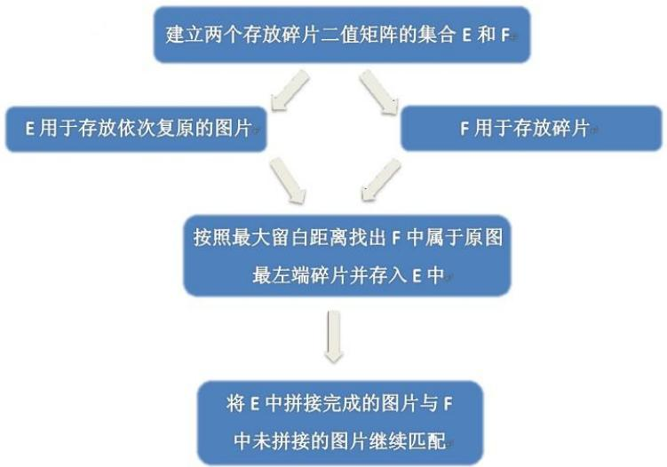

<details>
<summary>flowchart</summary>

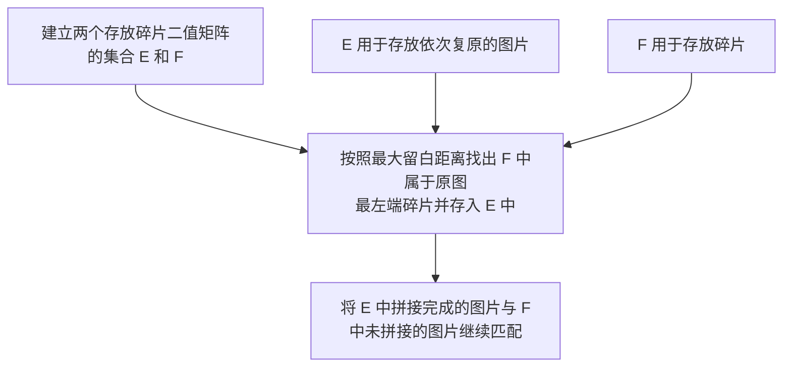
</details>

## III.1.3 问题一模型求解

利用Matlab编写程序求解得到:

问题1附件1图片拼接序号.

<table><tr><td>8</td><td>14</td><td>12</td><td>15</td><td>3</td><td>10</td><td>2</td><td>16</td><td>1</td><td>4</td><td>5</td><td>9</td><td>13</td><td>18</td><td>11</td><td>7</td><td>17</td><td>0</td><td>6</td></tr></table>

问题1附件2图片拼接序号.

<table><tr><td>3</td><td>6</td><td>2</td><td>7</td><td>15</td><td>18</td><td>11</td><td>0</td><td>5</td><td>1</td><td>9</td><td>13</td><td>10</td><td>8</td><td>12</td><td>14</td><td>17</td><td>16</td><td>4</td></tr></table>

## III.2 问题二

对于碎纸机既纵切又横切的情形，请设计碎片拼接复原模型和算法，并针对附件3、附件4给出的中、英文各一页文件的碎片数据进行拼接复原。如果复原过程需要人工干预，请写出干预方式及干预的时间节点。

## III.2.1 问题二的分析

问题二属于二维复原问题，不仅考虑碎片左右(x轴方向)端特征，还需考虑上下(y轴方向)端特征。使问题更加复杂化的主要原因有：

1. 碎片个数增多增加问题的需考虑因素。  
2. 文章首行文字与页面顶端（低端）的距离不会明显大于行距，故难以定位处于文章顶端和底端的碎片。

3. 部分碎片中的文字与页面上下左右中的某些边没有相交，导致某些图片无法依靠问题一中仅由图片边界的灰度值得出匹配。  
4. 段落间距较大和段首有空字对全篇的排序造成较大影响。

考虑到问题一中的特征因子难以满足本问题的要求，故增设两个特征因子——空白行和向左（向右）最小边距(具体定义见模型建立)。

先找出复原图最左端的11个头碎片，根据空白行特征因子为头碎片找到同行的剩余碎片，复原出只有横切的11条碎片，最后利用上下端的特征将11条碎片依上至下按顺序复原出最终图。

## III.2.2 问题二模型建立

本问用每张图的灰度矩阵处理以下问题。

## 空白行特征因子定义

对于碎片的灰度矩阵 $A_{j}(j=1,2,\ldots,19)$ ，构造1980行的列向量 $c_{j},c_{j}(m)$ 代表列向量第m行元素。

$$
c _ {j} (m) = \left\{ \begin{array}{l} 1, A _ {j} \text {的第} \mathrm{m} \text {行所有像素值之和为72} \\ 0, \text {否则} \end{array} \right.
$$

$c_{j}$ 用以记录 $A_{j}$ 的空白行位置。

下图以18行的像素矩阵解释说明上述定义。

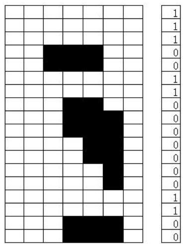

<details>
<summary>text_image</summary>

Grid-based puzzle or pattern recognition chart with black and white cells, showing a sequence of numbers from 0 to 1 on the right.
</details>

故最右边的列向量即为空白行特征因子 $c_{j}$ 。

## 向左（向右）最小边距特征因子定义

对于灰度矩阵 $A_{i}$ 的向左（向右）最小边距分别记为 $l_{1}^{i}, l_{2}^{i}$ 。向左（向右）最小边距为碎片最左端向右(最右端向左)数的空白像素列个数,如下图。

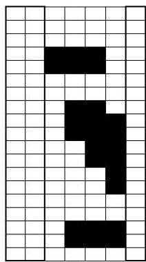

<details>
<summary>text_image</summary>

Pixelated black-and-white grid puzzle with a question mark, likely for pattern recognition or logic solving
</details>

如上图碎片最左端向右数的空白像素列个数2，碎片最右端向左的空白像素列个数1。故 $l_{1}^{i}=2, l_{2}^{i}=1$ 。

## 边界误差定义 $^{[1]}$

$A_{i}$ (左), $A_{j}$ (右)的边界误差用以描述两个灰度矩阵边缘的匹配程度, 作用类似于问题一中的绝对值距离。

图片 $A_{i}$ (左), $A_{j}$ (右)间的边界误差定义 $\varepsilon$ 为: $\varepsilon = \frac{1}{180} \sum_{m=1}^{180} (x_{2}^{i}(m) - \alpha x_{1}^{j}(m) - \beta)^{2}$

其中 $\alpha$ 为像素值的比例因子， $\beta$ 为像素值的偏离因子。这里 $\alpha=1,\beta=0$ 。

## 头碎片寻找同行剩余碎片的模型和算法

为头碎片 $A_{left1}$ 寻找同行剩余碎片。若碎片 $A_{j}$ 与 $A_{left1}$ 同行，在理论上有 $c_{left1}=c_{j}$ 。但由于本问题利用未二值化的灰度矩阵分析，故需要考虑字符边缘白噪声造成的误差。故给出一个阈值DH，若有 $|c_{left1}-c_{j}|<DH$ ，就认为 $A_{j}$ 与 $A_{left1}$ 同行。

程序框图如下:

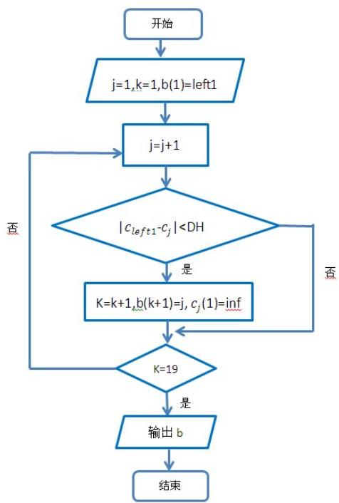

<details>
<summary>flowchart</summary>

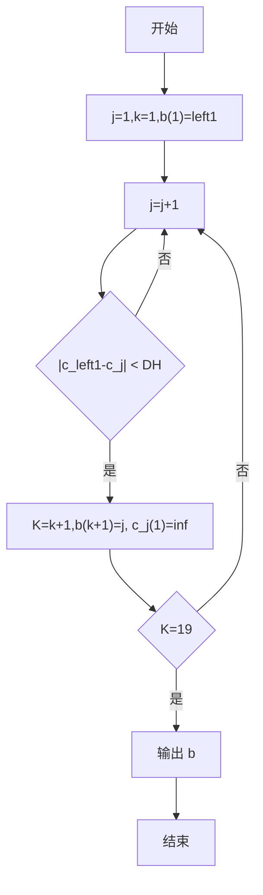
</details>

## 复原同行碎片的最优化模型

现为灰度矩阵 $A_{s}$ 寻找右相邻碎片。

目标为在可供匹配的所有灰度矩阵中找寻与灰度矩阵 $A_{s}$ 边缘匹配程度最大者，即边缘误差最小者。

为了严格塞选，增加约束条件，以图例说明含义。

为便于说明假设碎片为 $12 \times 6$ 像素，且只有黑白两色。一个 $5 \times 2$ 的像素矩阵代表一个完整字符，设Th为原图片的文字间距(单位：像素).在以下说明过程中设Th=2像素。

图1,图2为左右相邻的两张碎片。则图1，图2被碎纸机劈开时，劈开位置可分为两类分别对应情况一、情况二。

若为情况一，则图1的向右最小边距 $l_{2}^{1}=1$ ，图2的向左最小边距 $l_{1}^{2}=1$ 则有

$$
l _ {2} ^ {1} + l _ {1} ^ {2} = T h
$$

情况一：从两字符间留白部分劈开  
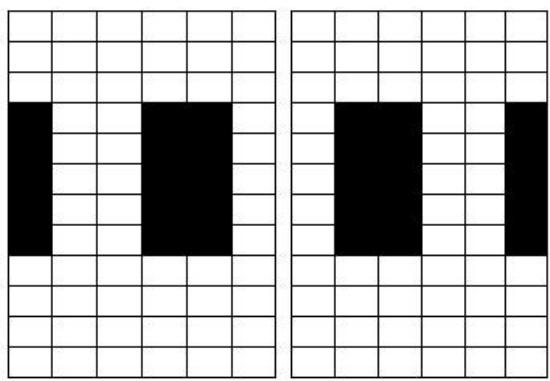  
1  
2

若为情况二，则图1的向右最小边距 $l_{2}^{1}=0$ ，图2的向左最小边距 $l_{1}^{2}=0$ 则有

$$
l _ {2} ^ {1} + l _ {1} ^ {2} <   T h
$$

情况二：从某字符中间劈开  
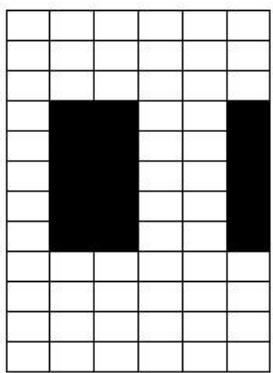

<details>
<summary>natural_image</summary>

Grid pattern with two black squares in the center (no text or symbols)
</details>

1

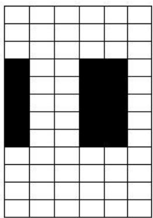

<details>
<summary>natural_image</summary>

Grid pattern with two black rectangles on a white background (no text or symbols)
</details>

2

可知若 $A_{s}$ (左)与 $A_{j}$ (右)相邻，则定有

$$
l _ {2} ^ {s} + l _ {1} ^ {j} \leq T h
$$

观察附件三、四的碎片，发现部分碎片的文字不与碎片左端或右端相交，对于此类图片无法根据边缘匹配程度来选择相邻图片，而这些难以配对的图片常常干扰其他图片的匹配过程。经过试用比较，可利用上述不等式排除此类图片的干扰。

$$
m i n \varepsilon = \frac {1}{1 8 0} \sum_ {m = 1} ^ {1 8 0} (x _ {2} ^ {s} (m) - \alpha x _ {1} ^ {j} (m) - \beta) ^ {2}
$$

$$
\left\{ \begin{array}{l} l _ {2} ^ {s} + l _ {1} ^ {j} \leq T h \\ A _ {j} \in \bar {F} \end{array} \right.
$$

Th为原图片的文字间距(单位：像素), $\bar{F}$ 为可供匹配的碎片灰度矩阵全体构成的集合。

## 复原同行碎片的图论模型

现为灰度矩阵 $A_{1}$ 寻找右相邻碎片。

将灰度矩阵 $A_{j}$ 的左右列向量 $x_{1}^{j}, x_{2}^{j}$ 都视为顶点。可按照如下图的建立规则得到非负有向图如下：

1. 若 $i = 1$ 且 $j \neq 1$ ，先在 $x_1^1, x_2^1$ 连边，其方向为 $x_1^1 \to x_2^1$ ，权为0. 再对 $x_2^s, x_1^j$ （ $j = 2, \dots, 19$ ）连边，其方向为 $x_2^s \to x_1^j$ ，权为两顶点的边界误差.  
2. 若 i, j ≠ 1 且 i ≠ j，在顶点 $x_{2}^{j}, x_{1}^{i}$ (i, j = 2, ..., 19) 连边，其方向为 $x_{2}^{j} \rightarrow x_{1}^{i}$ ，权为两顶点的边界误差。  
3. 若 i, j ≠ 1 且 i = j，在顶点 $x_{1}^{i}, x_{2}^{i}$ （i = 2, ..., 19）连边，其方向为 $x_{1}^{i} \rightarrow x_{2}^{i}$ ，权为 0.

则求问题转化为在非负有向图中寻找一条权值最小的哈密尔顿路径的问题。

## 问题二复原步骤

step1:计算每张碎片的向左最小距离，找出其中距离最大的11张碎片即为原图最左边的头碎片。其图片序号记为left1，left2,...,left11。

step2: 根据头碎片寻找同行剩余碎片的模型和算法对11个头碎片分别找出各自的同行碎片。

step3: 对每行碎片利用复原同行碎片的最优化模型复原，其中令s依次为left1，left2, ..., left11，F为各头碎片同行的灰度矩阵集合。

step4: 类比问题一的作法对11张横切行碎片根据上下端特征复原。

其中，在step2中也可以利用复原同行碎片的图论模型复原行碎片，将同行碎片重新编号，使其编号分别等于该图在b中所处的列号。

## 人工干预方式与时间节点

在step3中，对每行碎片利用复原同行碎片的最优化模型复原时，当两图片间的 $\varepsilon$ 值虽较其余的小，但图片实际上是不连续的，这时候就需要人工干预进行校正，以获得较好的图像还原结果。此外还可能发生多组合的 $\varepsilon$ 值相同且最优，这时候也需要人工干预获得连续的相邻图片组合。针对附件3的初次复原图，找出图片不连续的行进行人工干预，共有四行的图片不完全连续，人工干预方式为：从属于该行的不连续的图片中找出与不连续处左端相连续的图，经过人工统计的干预总次数为11次。针对附件4的初次复原图，找出图片不连续的行进行人工干预，共有六行的图片不完全连续，人工干预方式也为：从属于该行的不连续的图片中找出与不连续处左端相连续的图，经过人工统计的干预总次数为25次。

## III.2.3 问题二模型求解

由Matlab程序求解的:

问题2附件3图片拼接序号.

<table><tr><td>7</td><td>208</td><td>138</td><td>158</td><td>126</td><td>68</td><td>175</td><td>45</td><td>174</td><td>0</td><td>137</td><td>53</td><td>56</td><td>93</td><td>153</td><td>70</td><td>166</td><td>32</td><td>196</td></tr><tr><td>14</td><td>128</td><td>3</td><td>159</td><td>82</td><td>199</td><td>135</td><td>12</td><td>73</td><td>160</td><td>203</td><td>169</td><td>134</td><td>39</td><td>31</td><td>51</td><td>107</td><td>115</td><td>176</td></tr><tr><td>29</td><td>64</td><td>111</td><td>201</td><td>5</td><td>92</td><td>180</td><td>48</td><td>37</td><td>75</td><td>55</td><td>44</td><td>206</td><td>10</td><td>104</td><td>98</td><td>172</td><td>171</td><td>59</td></tr><tr><td>38</td><td>148</td><td>46</td><td>161</td><td>24</td><td>35</td><td>81</td><td>189</td><td>122</td><td>103</td><td>130</td><td>193</td><td>88</td><td>167</td><td>25</td><td>8</td><td>9</td><td>105</td><td>74</td></tr><tr><td>49</td><td>54</td><td>65</td><td>143</td><td>186</td><td>2</td><td>57</td><td>192</td><td>178</td><td>118</td><td>190</td><td>95</td><td>129</td><td>28</td><td>91</td><td>188</td><td>141</td><td>11</td><td>22</td></tr><tr><td>61</td><td>19</td><td>78</td><td>67</td><td>69</td><td>99</td><td>162</td><td>96</td><td>131</td><td>79</td><td>163</td><td>72</td><td>6</td><td>177</td><td>20</td><td>52</td><td>36</td><td>116</td><td>63</td></tr><tr><td>71</td><td>156</td><td>80</td><td>33</td><td>202</td><td>198</td><td>15</td><td>133</td><td>170</td><td>205</td><td>85</td><td>152</td><td>165</td><td>27</td><td>60</td><td>205</td><td>165</td><td>60</td><td>207</td></tr><tr><td>89</td><td>146</td><td>102</td><td>154</td><td>114</td><td>40</td><td>151</td><td>207</td><td>155</td><td>140</td><td>185</td><td>108</td><td>117</td><td>4</td><td>101</td><td>113</td><td>194</td><td>119</td><td>123</td></tr><tr><td>94</td><td>34</td><td>84</td><td>183</td><td>90</td><td>47</td><td>121</td><td>42</td><td>124</td><td>144</td><td>77</td><td>112</td><td>149</td><td>97</td><td>136</td><td>164</td><td>127</td><td>58</td><td>136</td></tr><tr><td>125</td><td>13</td><td>182</td><td>109</td><td>197</td><td>16</td><td>184</td><td>110</td><td>187</td><td>66</td><td>106</td><td>150</td><td>21</td><td>173</td><td>157</td><td>181</td><td>204</td><td>139</td><td>145</td></tr><tr><td>168</td><td>100</td><td>76</td><td>62</td><td>142</td><td>30</td><td>41</td><td>23</td><td>147</td><td>191</td><td>50</td><td>179</td><td>120</td><td>86</td><td>195</td><td>26</td><td>1</td><td>86</td><td>195</td></tr></table>

问题2附件4图片拼接序号.

<table><tr><td>191</td><td>75</td><td>11</td><td>154</td><td>190</td><td>184</td><td>2</td><td>104</td><td>180</td><td>64</td><td>106</td><td>4</td><td>149</td><td>32</td><td>204</td><td>65</td><td>39</td><td>67</td><td>147</td></tr><tr><td>201</td><td>148</td><td>170</td><td>196</td><td>198</td><td>94</td><td>113</td><td>164</td><td>78</td><td>103</td><td>91</td><td>80</td><td>101</td><td>26</td><td>100</td><td>6</td><td>17</td><td>28</td><td>146</td></tr><tr><td>86</td><td>51</td><td>107</td><td>29</td><td>40</td><td>158</td><td>186</td><td>98</td><td>24</td><td>117</td><td>150</td><td>5</td><td>59</td><td>58</td><td>92</td><td>30</td><td>37</td><td>46</td><td>127</td></tr><tr><td>19</td><td>194</td><td>93</td><td>141</td><td>88</td><td>121</td><td>126</td><td>105</td><td>155</td><td>114</td><td>176</td><td>182</td><td>151</td><td>22</td><td>57</td><td>202</td><td>71</td><td>165</td><td>82</td></tr><tr><td>159</td><td>139</td><td>1</td><td>129</td><td>63</td><td>138</td><td>153</td><td>53</td><td>38</td><td>123</td><td>120</td><td>175</td><td>85</td><td>50</td><td>160</td><td>187</td><td>97</td><td>203</td><td>31</td></tr><tr><td>20</td><td>41</td><td>108</td><td>116</td><td>136</td><td>73</td><td>36</td><td>207</td><td>135</td><td>15</td><td>76</td><td>43</td><td>199</td><td>45</td><td>173</td><td>79</td><td>161</td><td>179</td><td>143</td></tr><tr><td>208</td><td>21</td><td>7</td><td>49</td><td>61</td><td>119</td><td>33</td><td>142</td><td>168</td><td>62</td><td>169</td><td>54</td><td>192</td><td>133</td><td>118</td><td>189</td><td>162</td><td>197</td><td>112</td></tr><tr><td>70</td><td>84</td><td>60</td><td>14</td><td>68</td><td>174</td><td>137</td><td>195</td><td>8</td><td>47</td><td>172</td><td>156</td><td>96</td><td>23</td><td>99</td><td>122</td><td>90</td><td>185</td><td>109</td></tr><tr><td>132</td><td>181</td><td>95</td><td>69</td><td>167</td><td>163</td><td>166</td><td>188</td><td>111</td><td>144</td><td>206</td><td>3</td><td>130</td><td>34</td><td>13</td><td>110</td><td>25</td><td>27</td><td>178</td></tr><tr><td>171</td><td>42</td><td>66</td><td>205</td><td>10</td><td>157</td><td>74</td><td>145</td><td>83</td><td>134</td><td>55</td><td>18</td><td>56</td><td>35</td><td>16</td><td>9</td><td>183</td><td>152</td><td>44</td></tr><tr><td>81</td><td>77</td><td>128</td><td>200</td><td>131</td><td>52</td><td>125</td><td>140</td><td>193</td><td>87</td><td>89</td><td>48</td><td>72</td><td>12</td><td>177</td><td>124</td><td>0</td><td>102</td><td>115</td></tr></table>

## III.3 问题三

上述所给碎片数据均为单面打印文件，从现实情形出发，还可能有双面打印文件的碎纸片拼接复原问题需要解决。附件5给出的是一页英文印刷文字双面打印文件的碎片数据。请尝试设计相应的碎纸片拼接复原模型与算法，并就附件5的碎片数据给出拼接复原结果，结果表达要求同上。

## III.3.1 问题三的分析

本问考虑点如下:

1. 碎片内容为英文字母，由于英文字符本身长比划较多(例如，字母d,y,l,h)，而这些较长比划使行与行间的空白部分支离破碎，碎片图像的空白行特征不明显，如图。

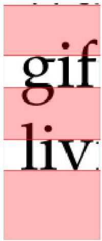

<details>
<summary>text_image</summary>

gif
liv
</details>

在上图中浅红色区域代表行间的空白部分，由图可发现空白部分被字母g、i、f、l分割，难以得到空白的准确位置，继而难以用空白位置描述两碎片的匹配程度。

2. 共418张图片，且涉及正反面，若按照问题一、二的方法两块碎片间比较匹配程度，处理时间就且匹配结果准确度将大大下降。  
3. 附件五中碎片的相似程度较大，沿用问题一二的特征因子已经不能解决本文。

应对方案如下:

1. 针对英文字符的较长比划多的特点，对碎片图像进行预处理，“抹去”长比划，使得行间空白更为完整。  
2. 针对碎片差异较为明显的行特征新设行特征因子组，使得行特征因子组能够“高效”反应碎片信息。利用聚类分析的方法将419张碎片聚为11类，同类的大部分碎片处于同行。

## III.3.2 问题三模型建立

## 英文碎片图像预处理方法

对拥有较长比划的字母全体做出本文的界定, 有以下字母:

b、d、f、g、h、i、j、k、l、p、q、t、y以及所有大写字母。

对附件五前20张碎片图中出现“长比划”的现象进行统计，结果如下。

$$
\omega = \frac {\text {本碎片空白行中“长比划”的出现总个数}}{\text {空白行数}}
$$

$\omega$ 为碎片每个空白行出现的“长比划”的个数。

前20张碎片中每个空白行出现的“长比划”的个数

<table><tr><td>碎片编号</td><td>1</td><td>2</td><td>3</td><td>4</td><td>5</td><td>6</td><td>7</td><td>8</td><td>9</td><td>10</td></tr><tr><td>ω</td><td>0.50</td><td>2.00</td><td>3.00</td><td>1.00</td><td>1.00</td><td>0.33</td><td>0.75</td><td>0.33</td><td>1.00</td><td>1.00</td></tr><tr><td>碎片编号</td><td>11</td><td>12</td><td>13</td><td>14</td><td>15</td><td>16</td><td>17</td><td>18</td><td>19</td><td>20</td></tr><tr><td>ω</td><td>0.67</td><td>2</td><td>0.33</td><td>1.00</td><td>1.25</td><td>0.45</td><td>1.00</td><td>1.67</td><td>1.25</td><td>0.75</td></tr></table>

碎片图像中每个空白行出现“长比划”个数的范围为0.33\~2.00。

为了让接下来的判断更为容易，二值化碎片的灰度矩阵，得到只有黑色和白色的碎片图。

抹去 “长比划” 基本思想：给定阈值SH,对碎片分别计算每行的黑像素总数。若总数小于给定阈值SH，即认为本像素行处于空白行中，且行中的黑像素全是“长比划”的一部分，继而重新设定该行的每个像素都为白像素，即抹去该长比划。

根据统计每个“长比划”在空白行中的平均宽度为5像素。若阈值设定太小，则不能抹掉大部分的“长比划”；若阈值设定太大，则会抹掉不是“长比划”的那些比划。为了较大程度的兼顾二者，根据上述统计数据，在反复调试后得到一个效果比较理想的阈值 $SH=5\times1.4=7$ （像素）。

上述思想的具体操作步骤见如下程序框图:

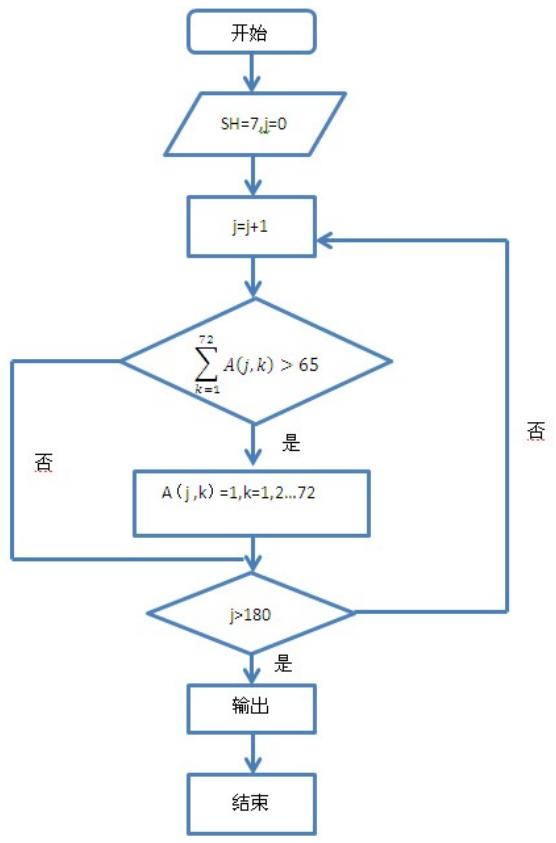

<details>
<summary>flowchart</summary>

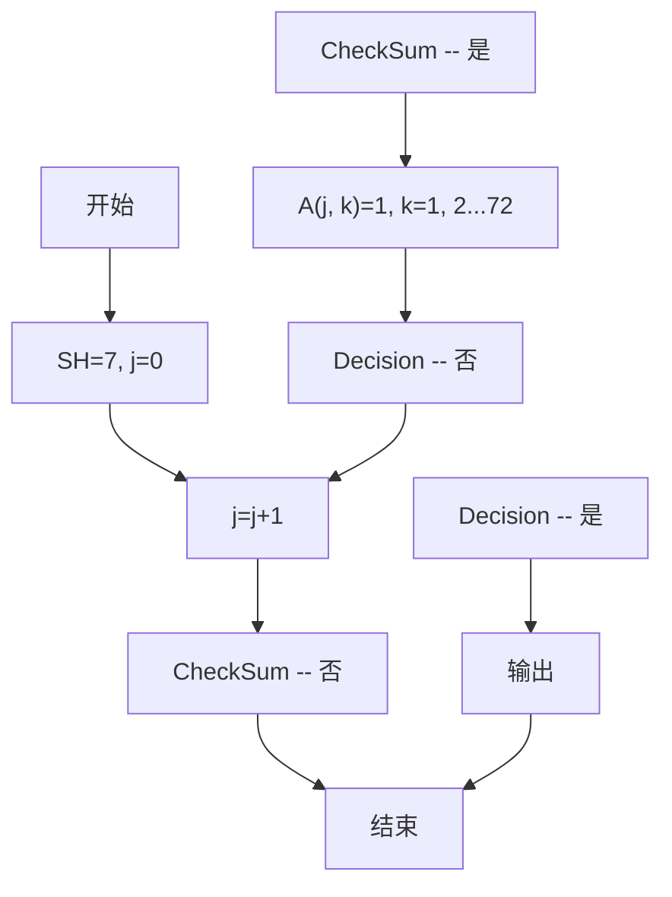
</details>

其中A代表碎片的二值矩阵， $A(k,j)$ 代表二值矩阵中第k行，j列元素。

碎片预处理前后图片比较如下:

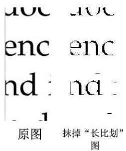

<details>
<summary>text_image</summary>

aoc aoc
enc enc
nd : nd :
- 1 -
原图 抹掉“长比划”
图
</details>

由图看出右端图片字母d的“长比划”被抹去。

## 行特征因子组定义

对于碎片定义行特征因子 $\theta_{1},\theta_{2},\eta_{1},\eta_{2}$

$\theta_{1}$ 为从碎片顶端像素开始向下连续白像素的个数。

$\theta_{2}$ 为从碎片底端像素开始向上连续白像素的个数。

$\eta_{1}$ 为从碎片顶端像素开始向下连续黑像素的个数。

$\eta_{2}$ 为从碎片底端像素开始向上连续黑像素的个数。

利用各碎片指标值的方差来描述各碎片此行特征的差异度，差异度越大，则利用该指标区分度越大，则指标的选取较优。

通过计算指标值 $\theta_{1},\theta_{2},\eta_{1},\eta_{2}$ 的方差分别为：583.9479、500.0132、71.7089、29.0768。可见 $\theta_{1},\theta_{2}$ 指标选取相当好， $\eta_{1},\eta_{2}$ 指标选取较优。

观察发现，每组碎片的a、b图的行特征都相同，可知文档正反面的页边距完全相同，所以若按行特征分类，任意组的a、b图都将分入同一行。

可根据四个指标利用聚类分析的方法将 $209\times2$ 张图分为11类，因为指标都描述的是行特征，故可认为同类的绝大部分碎片属于同行，有模型求解得到的结果可验证这一点。对聚类后的同行碎片进行人工干预，得到11类碎片，每类中有19个碎片，且每类中的19个碎片都属于同一行。故接下来只要先对同行碎片复原，再复原全文。

## 同行碎片复原模型与算法

根据观察图片可知，位于行首及行尾的图片位于左端的全空白部分宽度较大，可作为与其他图片相区别的重要特征。通过matlab编程调整限制条件左端全白列部分宽度及右端全白部分宽度，可以求出左端全空白部分18的图片个数有13个，右端全空白部分18的图片个数有11个，比较这两组数，取其公共部分（共11个）作为某一面的行首，得到11个行首编号为left1,left2,...,left11。

设立匹配指标函数，当两张图片是相邻的情况下，前一张正面的最后一列得与后一张正面的第一列的匹配值要比其它组合小，前一张反面的第一列得与后一张反面的最后一列的匹配值要比其它组合小。考虑到图片为灰度图，做如下匹配指标函数模型：

$$
W = \frac {w _ {1} + w _ {2} + w _ {3}}{1 8 0}
$$

其中，

$$
w _ {1} = \sum_ {i = 1} ^ {1 8 0} (a _ {i} - b (i)) ^ {2}
$$

。 $a_{i}, b_{i}$ 分别为前一张图灰度矩阵的最后一列的第i行数据和后一张图灰度矩阵的第一列的第i行数据。

$$
w _ {2} = \sum_ {i = 1} ^ {1 8 0} (c _ {i} - d (i)) ^ {2}
$$

。 $c_{i}, d_{i}$ 分别为前一张图的反面灰度矩阵的第一列的第i行数据和后一张图的反面灰度矩阵

的第一列的第i行数据。

$$
w _ {3} = (\theta_ {1} ^ {1} - \theta_ {1} ^ {2}) ^ {2}
$$

表示两矩阵特征因子 $\theta_{1}$ 相似程度。 $\theta_{1}^{1}$ 、 $\theta_{1}^{2}$ 分别表示前一张图和后一张图的特征因子 $\theta_{1}$ 值。

先以left1所在行为例给出同行复原模型与算法。为方便操作，可先将本行的图片重新编号令碎片left1的新编号为1，剩下碎片为编号2,...,19。

step1: 建立集合F用于存放未定顺序的碎片。

建立19列的顺序行向量b,并将其初始化0向量，用于存放正面重新排列顺序（即复原）后的碎片编号。 $b(1)=1$ .

k为计数变量，k=1。

step2:为b(k)碎片的正面匹配右相邻的碎片正面图。求解下述最优化模型。设QI代表前一张碎片，HO代表后一张碎片;qi代表前一张碎片编号，ho代表后一张碎片编号。

$$
\begin{array}{c} \text {minW} \\ \left\{ \begin{array}{l} q i = b (k) \\ H O \in F \end{array} \right. \end{array}
$$

得到碎片b(k)最优匹配HO $^{*}$ ，则

$$
\begin{array}{l} \mathrm{F} = \mathrm{F} \backslash H O ^ {*}; \\ \mathrm{k} = \mathrm{k} + 1; \\ \mathrm{b(k)=ho*}; \\ \end{array}
$$

若此时k=19，运算结束，否则重新开始step2。

11个行都复原了之后，同理问题二方法对11行进行排序，得到复原图。

## 人工干预方式与时间节点

在step2中，当两图片间的W值虽较其余的小，但图片实际上是不连续的，这时候就需要人工干预进行校正，以获得较好的图像还原结果。此外还可能发生多组合的W值相同且最优，这时候也需要人工干预获得连续的相邻图片组合。在用matlab求出每行的排序后，将行排序得到初步的图形，观察图形不连续的部分，之后就针对这些部分用人工干预的手段重新排序求得连续地图片组合。未经过人工干预之前得到的图片完整度为54.55%，经过23次的人工干预可得到原图。

## III.3.3 问题三模型求解

以下给出最短距离法聚类结果，由于大部分类的碎片个数均为30～60个，故每类只给出其中8个碎片编号，若某类中总碎片个数小于等于8个，则给出全部碎片编号。完全结果数据见附录。

## 数据格式说明

表中编号为Matlab中记录的图片编号，未还原为附件5中的编号格式。编号为i的碎片即为附件中按照 $000a \rightarrow 000b \rightarrow 001a \rightarrow 001b$ 顺序排列的第i张图。

## 最短距离法聚类结果

<table><tr><td>类别</td><td colspan="8"></td></tr><tr><td>1</td><td>1</td><td>7</td><td>8</td><td>15</td><td>16</td><td>56</td><td>61</td><td>62</td></tr><tr><td>2</td><td>11</td><td>22</td><td>29</td><td>30</td><td>33</td><td>39</td><td>43</td><td>52</td></tr><tr><td>3</td><td>9</td><td>92</td><td>124</td><td>170</td><td>276</td><td></td><td></td><td></td></tr><tr><td>4</td><td>250</td><td></td><td></td><td></td><td></td><td></td><td></td><td></td></tr><tr><td>5</td><td>3</td><td>4</td><td>5</td><td>6</td><td>10</td><td>17</td><td>18</td><td>19</td></tr><tr><td>6</td><td>325</td><td></td><td></td><td></td><td></td><td></td><td></td><td></td></tr><tr><td>7</td><td>23</td><td>31</td><td>47</td><td>48</td><td>67</td><td>70</td><td>80</td><td>98</td></tr><tr><td>8</td><td>2</td><td>55</td><td>162</td><td>211</td><td>254</td><td>272</td><td>283</td><td>353</td></tr><tr><td>9</td><td>13</td><td>14</td><td>27</td><td>28</td><td>49</td><td>53</td><td>54</td><td>87</td></tr><tr><td>10</td><td>12</td><td></td><td></td><td></td><td></td><td></td><td></td><td></td></tr><tr><td>11</td><td>273</td><td></td><td></td><td></td><td></td><td></td><td></td><td></td></tr></table>

聚类后，同类中的大部分碎片属于同行。例如，下图为表中展示的类别1的8个碎片，明显属于同一行。

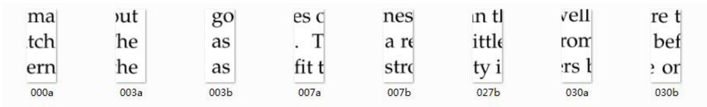

<details>
<summary>text_image</summary>

ma
tch
ern
000a
out
he
he
go
as
as
es c
. T
fit t
007a
nes
a re
stro
un tl
little
ty i
vell
rom
ers h
re t
bef
e or
027b
030a
030b
</details>

但是按照最小聚类法得到的分类方案，每类所拥有的碎片个数极不均衡，1～11类中的碎片数分别为61、51、5、1、61、1、32、10、46、1、1。故考虑用不同的聚类法对碎片聚类。

本问利用另外两种聚类方法——最长距离法和内平方距离法。聚类结果数据间附录。

比较上述聚类方法，应用内平方距离法后，每类所拥有的碎片个数均衡度是三种方法中最好的。故采用内平方距离法的结果数据进行人工干预，得到11类同行但未排序的碎片，数据如下表。

## 数据格式说明

1. 下表中每一行代表属于同行的但未排序的碎片编号。  
2. 下表中编号i代表附件5中ia、ib正反两张图。

<table><tr><td>18</td><td>20</td><td>29</td><td>47</td><td>66</td><td>78</td><td>81</td><td>108</td><td>110</td><td>111</td><td>125</td><td>136</td><td>140</td><td>150</td><td>155</td><td>164</td><td>174</td><td>183</td><td>189</td></tr><tr><td>5</td><td>10</td><td>14</td><td>22</td><td>25</td><td>36</td><td>44</td><td>59</td><td>60</td><td>76</td><td>79</td><td>89</td><td>120</td><td>124</td><td>144</td><td>147</td><td>152</td><td>178</td><td>192</td></tr><tr><td>30</td><td>38</td><td>42</td><td>45</td><td>56</td><td>61</td><td>84</td><td>86</td><td>94</td><td>98</td><td>121</td><td>131</td><td>137</td><td>138</td><td>143</td><td>153</td><td>186</td><td>187</td><td>200</td></tr><tr><td>11</td><td>33</td><td>34</td><td>39</td><td>72</td><td>87</td><td>93</td><td>97</td><td>132</td><td>156</td><td>161</td><td>169</td><td>173</td><td>175</td><td>181</td><td>194</td><td>198</td><td>199</td><td>206</td></tr><tr><td>1</td><td>2</td><td>37</td><td>41</td><td>65</td><td>70</td><td>88</td><td>90</td><td>107</td><td>115</td><td>139</td><td>149</td><td>151</td><td>162</td><td>166</td><td>170</td><td>180</td><td>191</td><td>203</td></tr><tr><td>12</td><td>13</td><td>17</td><td>24</td><td>28</td><td>57</td><td>58</td><td>64</td><td>102</td><td>114</td><td>116</td><td>142</td><td>154</td><td>158</td><td>179</td><td>184</td><td>197</td><td>207</td><td>208</td></tr><tr><td>16</td><td>19</td><td>21</td><td>31</td><td>35</td><td>50</td><td>53</td><td>73</td><td>92</td><td>130</td><td>146</td><td>159</td><td>163</td><td>171</td><td>177</td><td>190</td><td>193</td><td>201</td><td>202</td></tr><tr><td>8</td><td>40</td><td>46</td><td>63</td><td>67</td><td>68</td><td>75</td><td>117</td><td>122</td><td>127</td><td>128</td><td>157</td><td>165</td><td>167</td><td>168</td><td>172</td><td>182</td><td>188</td><td>195</td></tr><tr><td>0</td><td>3</td><td>4</td><td>7</td><td>27</td><td>32</td><td>69</td><td>74</td><td>77</td><td>80</td><td>85</td><td>105</td><td>126</td><td>135</td><td>141</td><td>148</td><td>176</td><td>185</td><td>204</td></tr><tr><td>9</td><td>15</td><td>23</td><td>33</td><td>48</td><td>51</td><td>52</td><td>62</td><td>71</td><td>82</td><td>95</td><td>101</td><td>118</td><td>119</td><td>129</td><td>133</td><td>145</td><td>160</td><td>205</td></tr><tr><td>6</td><td>26</td><td>43</td><td>49</td><td>54</td><td>55</td><td>91</td><td>96</td><td>99</td><td>100</td><td>103</td><td>104</td><td>106</td><td>109</td><td>112</td><td>113</td><td>123</td><td>134</td><td>196</td></tr></table>

最终复原图的碎片排序为:

<table><tr><td>78b</td><td>111b</td><td>125a</td><td>140a</td><td>155a</td><td>150a</td><td>183b</td><td>174b</td><td>110a</td><td>66a</td><td>108a</td><td>18b</td><td>29a</td><td>189b</td><td>81b</td><td>164b</td><td>20a</td></tr><tr><td>89a</td><td>10b</td><td>36a</td><td>76b</td><td>178a</td><td>44a</td><td>25b</td><td>192a</td><td>124b</td><td>22a</td><td>120b</td><td>144a</td><td>79a</td><td>14a</td><td>59a</td><td>60b</td><td>147a</td></tr><tr><td>186b</td><td>153a</td><td>84b</td><td>42b</td><td>30a</td><td>38a</td><td>121a</td><td>98a</td><td>94b</td><td>61b</td><td>137b</td><td>45a</td><td>138a</td><td>56b</td><td>131b</td><td>187b</td><td>86b</td></tr><tr><td>199b</td><td>11b</td><td>161a</td><td>169b</td><td>194b</td><td>173b</td><td>206b</td><td>156a</td><td>34a</td><td>181b</td><td>198b</td><td>87a</td><td>132b</td><td>93a</td><td>72b</td><td>175a</td><td>97a</td></tr><tr><td>88b</td><td>107a</td><td>149b</td><td>180a</td><td>37b</td><td>191a</td><td>65b</td><td>115b</td><td>166b</td><td>1b</td><td>151b</td><td>170b</td><td>41a</td><td>70b</td><td>139b</td><td>2a</td><td>162b</td></tr><tr><td>114a</td><td>184b</td><td>179b</td><td>116b</td><td>207a</td><td>58a</td><td>158a</td><td>197a</td><td>154b</td><td>28b</td><td>12a</td><td>17b</td><td>102b</td><td>64b</td><td>208a</td><td>142a</td><td>57a</td></tr><tr><td>146a</td><td>171b</td><td>31a</td><td>201a</td><td>50a</td><td>190b</td><td>92b</td><td>19b</td><td>16b</td><td>177b</td><td>53b</td><td>202a</td><td>21b</td><td>130a</td><td>163a</td><td>193b</td><td>73b</td></tr><tr><td>165b</td><td>195a</td><td>128a</td><td>157a</td><td>168a</td><td>46a</td><td>67a</td><td>63b</td><td>75b</td><td>167a</td><td>117b</td><td>8b</td><td>68b</td><td>188a</td><td>127a</td><td>40a</td><td>182b</td></tr><tr><td>3b</td><td>7b</td><td>85b</td><td>148b</td><td>77a</td><td>4a</td><td>69a</td><td>32a</td><td>74b</td><td>126b</td><td>176a</td><td>185a</td><td>0b</td><td>80b</td><td>27a</td><td>135b</td><td>141a</td></tr><tr><td>23b</td><td>133a</td><td>48a</td><td>51b</td><td>95a</td><td>160b</td><td>119a</td><td>33b</td><td>71b</td><td>52a</td><td>62a</td><td>129b</td><td>118b</td><td>101a</td><td>15b</td><td>205a</td><td>82b</td></tr><tr><td>99a</td><td>43a</td><td>96b</td><td>109a</td><td>123a</td><td>6a</td><td>104a</td><td>134a</td><td>113a</td><td>26b</td><td>49b</td><td>91a</td><td>106b</td><td>100b</td><td>55b</td><td>103a</td><td>112a</td></tr></table>

## IV 模型优化

## IV.1 基于汉字的拼接复原模型[11]

## IV.1.1 模型分析

根据文献【8】，汉字从书写形式看，是一种平面型方块体，汉字的所有笔画都有秩序地分布在平面的方框中，这是汉字从外观上最明显的特点，这也就是我们常说的汉字独特的“方块型”结构。通常认为，汉字的基本笔画是横，竖，撇，点，折。对汉字的各种笔画的出现频率进行统计，张性初等人在1965年《心理学报》“汉字的各种笔画的使用频率的估计”中统计结果为：横笔占31%，竖笔占16%，撇笔占15%，点笔占12%（如下图），而张静贤在2004年《汉字教程》中统计结果为：横笔占27.68%，竖笔占17.60%，撇笔占15.95%，点笔占13.62%（如下图）。通过比较我们可以发现汉字在横笔的出现的频率最高。同时根据”GB130001字符集汉字字序（笔画序）规范“中的相关统计，目前使用的汉字总共有20902个，平均每个字12.8画，其中12画的汉字最多，共有1957个，而在”现代汉语常用字表“中，常用汉字为3500个，平均每个字9.7画，其中9画的汉字最多，一共415个。基于上述的数据，可以推断出”GB130001字符集“中，平均每个汉字有3.54画的横笔，而常用汉字中，平均每个汉字有2.68画的横笔，可以说横笔在整个汉字结构中出现频次最高，占用重要的地位。

1965年汉字笔画使用频率  
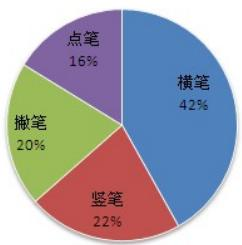

<details>
<summary>pie</summary>

| Category | Percentage |
| --- | --- |
| 横笔 | 42% |
| 竖笔 | 22% |
| 撇笔 | 20% |
| 点笔 | 16% |
</details>

2004年《汉字教程》统计结果  
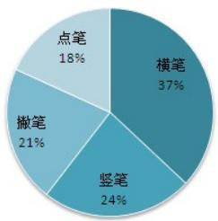

<details>
<summary>pie</summary>

| Category | Percentage |
| --- | --- |
| 点笔 | 18% |
| 撇笔 | 37% |
| 竖笔 | 24% |
| 撇笔 | 21% |
</details>

根据上述统计，结合实际的碎片的情况，在每张碎片中都会出现相当多的完整或不完整的汉字结构，而依照统计规律，每个完整或不完整的汉字结构中，都可能出现多个”横笔“的结构，利用其突出的特点，建立汉字内部不同结构之间的联系，匹配不同碎片的汉字结构，进而拼接整张图像，以达到恢复整张图片的目的。

## IV.1.2 模型建立

根据二值化矩阵沿着碎片的左右边缘向内进行搜索，准确记录碎片图像中各个汉字边缘处“横笔”的位置，根据碎片图像中左右边列处的汉字“横笔”位置，以两个图片之间的笔画匹配总数为依据，笔画匹配总数最大的两个图片就是相邻的图片

step1: 建立 $5 \times 3$ 的二值化矩阵M:

<table><tr><td>1</td><td>1</td><td>1</td></tr><tr><td>0</td><td>0</td><td>0</td></tr><tr><td>0</td><td>0</td><td>0</td></tr><tr><td>0</td><td>0</td><td>0</td></tr><tr><td>1</td><td>1</td><td>1</td></tr></table>

沿着各个碎片的左右边缘向内进行搜索，向内搜索的范围是三个像素点，判断汉字的像素点是否能够满足矩阵M，若满足条件，认为该汉字结构是一个“横笔”，则将其直接延伸至图像的最左边或者最右边，否则，汉字的结构保持不变；搜索整个碎片，并且准确记录碎片图像中各个汉字边缘处“横笔”的位置。

step2: 对比两个碎片图像中左右边列处的汉字“横笔”位置，若其中有“横笔”位置完全一致，则认为有一个汉字结构匹配上，并且记录两个碎片之间的总的笔画的匹配数；以当前碎片图像为基准，与其他碎片图像继续重复上述比较过程，最终，以两个碎片之间的笔画匹配总数为依据，笔画匹配总数最大的两个碎片就是相邻的碎片。同时，考虑到每个碎片图像中汉字个数，以及文章段落之间的结构特点等因素，设置了笔画匹配总数下限值，当至少有五个”横笔“位置一致时，认为两个碎片图像可能是邻近的，可以进行拼接处理。

step3: 为了避免出现多张碎片图像与同一张碎片图像相匹配的情况，根据最大相关性的原则，即匹配上”横笔“总数最多的碎片是相邻图像，此时将两张碎片图像拼接在一起。

step4: 通过以上步骤可以实现对中文碎片的拼接复原。

## IV.2 基于字母的拼接复原模型

## IV.2.1 模型分析

参考文献【7】，考虑到英文字母的特性，按照大写字母和小写字母，根据碎片图像的像素，可以做出52个字母的二值化矩阵模板，我们以小写字母n为例

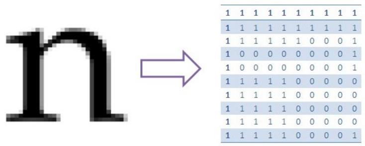

<details>
<summary>text_image</summary>

1 1 1 1 1 1 1 1 1 1
1 1 1 1 1 1 1 1 1 1
1 1 1 1 1 1 0 0 0 1
1 0 0 0 0 0 0 0 0 1
1 0 0 0 0 0 0 0 0 1
1 1 1 1 1 0 0 0 0 0
1 1 1 1 1 0 0 0 0 0
1 1 1 1 1 0 0 0 0 0
1 1 1 1 1 0 0 0 0 0
1 1 1 1 1 0 0 0 0 1
</details>

得到的n的模板是关于 $26 \times 30$ 的二值化矩阵，由于矩阵信息量大，我们只截取了其中的一部分，完整的矩阵见附录

对边缘进行52个字母模型的匹配处理，根据最大匹配原则，可以推测出边缘的字母原型，我们取180b碎片进行上述做法的论证

$$
\begin{array}{c} \text {net} \\ \text {ste} \\ \text {eeks} \end{array}
$$

按照上述原则，可以得到该碎片左边缘的补全字母为m和e，右边缘的补全字母为t和s，下边缘的补全字母为e,e,k,s,按照残缺字母像素所在的模板矩阵预测出相邻碎片的边缘像素的位置。

## IV.2.2 模型建立

step1: 设52个字母中第i个字母的模块矩阵中元素为0的个数为I，碎片中边缘残缺字母二值化矩阵的0元素与52个字母的模块矩阵的0元素(黑像素)进行匹配，令 $x_{i}$ 表示残缺字母与第i个字母的模块矩阵中的0元素(黑像素)匹配上的对数

目标函数:

$$
x _ {p} = \max \frac {x _ {i}}{I}, i = 1, 2, \dots , 5 2
$$

$x_{p}$ 表示残缺字母与第p个字母配对的最大比率，即认为该残缺字母为p字母

step2: 按照上述原则找出每个碎片的四条边残缺字母的原字母, 其中若某个边界为空, 则跳过此条边

step3:统计碎片j左右两边缘的补全字母的内容以及位置，将碎片j左边的补全字母的原形式与碎片i右边的补全字母的原形式按照所属模板矩阵进行匹配，先按照两边缘补全字母的内容进行匹配，若出现多个字母匹配的情况，再按照字母的位置进行配对。再结合问题二以及问题三中的方法，最终可得到，按行求解得到的最优匹配结果

step4:每行的最优匹配结果得到之后，按照上下边缘的字母的配对情况，最终得到完整的匹配图像

## IV.2.3 模型评价

本模型是针对英文单词由52个大写字母与小写字母独立构成的特征而建立边缘残缺字母补全之后再进行匹配的模型，这是区别于汉字字符的不同之处，再结合问题二以及问题三中的匹配方式，可让模型的匹配效率得以提高。

## 参考文献

[1] 王冬平, 王清贤, 罗军勇, 李炳龙, BMP图像碎片重组中的候选权重方法, 计算机应用, 27(12): 3062-3065, 2007.  
[2] 罗智中, 基于文字特征的文档碎纸片半自动拼接, 计算机工程与应用, 48(5): 207-210, 2012.  
[3] 黄永安, 李文成, 高小科, Matlab 7.0/Simulink 6.0 应用实例仿真与高校算法开发, 北京: 清华大学出版社, 2008年6月.  
[4] 王沫然, Matlab6.0与科学计算, 北京: 电子工业出版社, 2001年9月.  
[5] 罗智中, 基于文字特征的文档碎纸片半自动拼接, 计算机工程与应用, 48(5):207-P210,2012.  
[6] 李卓,邱慧娟,基于相关系数的快速图像匹配研究,北京理工大学学报,27(11):998-1000,2007.  
[7] 豆丁网, 基于BP神经网络的字母识别系统: [论文] http://www.docin.com/p-467961357.html, 访问时间(2013年9月14日).  
[8] 邢楠, 张婧等, 基于文字特征的碎纸机破碎文档的恢复方法: [发明专利] http://pan.baidu.com/share/link?shareid=1119097902&uk=152125572&app=zd, 访问时间(2013年9月14日).

## V 附录

本队用以参赛软件为Matlab（2010b）。

## V.1 图表数据结果

## 附件一复原图

城上层楼叠巘。城下清淮古汴。举手揖吴云，人与暮天俱远。魂断。魂断。后夜松江月满。簌簌衣巾莎枣花。村里村北响缲车。牛衣古柳卖黄瓜。海棠珠缀一重重。清晓近帘栊。胭脂谁与匀淡，偏向脸边浓。小郑非常强记，二南依旧能诗。更有鲈鱼堪切脍，儿辈莫教知。自古相从休务日，何妨低唱微吟。天垂云重作春阴。坐中人半醉，帘外雪将深。双鬟绿坠。娇眼横波眉黛翠。妙舞蹁跹。掌上身轻意态妍。碧雾轻笼两凤，寒烟淡拂双鸦。为谁流睇不归家。错认门前过马。

我劝髯张归去好，从来自己忘情。尘心消尽道心平。江南与塞北，何处不堪行。闲离阻。谁念萦损襄王，何曾梦云雨。旧恨前欢，心事两无据。要知欲见无由，痴心犹自，倩人道、一声传语。风卷珠帘自上钩。萧萧乱叶报新秋。独携纤手上高楼。临水纵横回晚鞗。归来转觉情怀动。梅笛烟中闻几弄。秋阴重。西山雪淡云凝冻。凭高眺远，见长空万里，云无留迹。桂魄飞来光射处，冷浸一天秋碧。玉宇琼楼，乘鸾来去，人在清凉国。江山如画，望中烟树历历。省可清言挥玉尘，真须保器全真。风流何似道家纯。不应同蜀客，惟爱卓文君。自惜风流云雨散。关山有限情无限。待君重见寻芳伴。为说相思，目断西楼燕。莫恨黄花未吐。且教红粉相扶。酒阑不必看茱萸。俯仰人间今古。玉骨那愁瘴雾，冰姿自有仙风。海仙时遣探芳丛。倒挂绿毛么凤。

俎豆庚桑真过矣，凭君说与南荣。愿闻吴越报丰登。君王如有问，结袜赖王生。师唱谁家曲，宗风嗣阿谁。借君拍板与门槌。我也逢场作戏、莫相疑。晕腮嫌枕印。印枕嫌腮晕。闲照晚妆残。残妆晚照闲。可恨相逢能几日，不知重会是何年。茱萸仔细更重看。午夜风翻幔，三更月到床。簟纹如水玉肌凉。何物与侬归去、有残妆。金炉犹暖麝煤残。惜香更把宝钗翻。重闻处，余熏在，这一番、气味胜从前。菊暗荷枯一夜霜。新苞绿叶照林光。竹篱茅舍出青黄。霜降水痕收。浅碧鳞鳞露远洲。酒力渐消风力软，飕飕。破帽多情却恋头。烛影摇风，一枕伤春绪。归不去。凤楼何处。芳草迷归路。汤发云腴酽白，盏浮花乳轻圆。人间谁敢更争妍。斗取红窗粉面。炙手无人傍屋头。萧萧晚雨脱梧楸。谁怜季子敝貂裘。

## 附件二复原图

fair of face.

The customer is always right. East, west, home's best. Life's not all beer and skittles. The devil looks after his own. Manners maketh man. Many a mickle makes a muckle. A man who is his own lawyer has a fool for his client.

You can't make a silk purse from a sow's ear. As thick as thieves. Clothes make the man. All that glisters is not gold. The pen is mightier than sword. Is fair and wise and good and gay. Make love not war. Devil take the hindmost. The female of the species is more deadly than the male. A place for everything and everything in its place. Hell hath no fury like a woman scorned. When in Rome, do as the Romans do. To err is human; to forgive divine. Enough is as good as a feast. People who live in glass houses shouldn't throw stones. Nature abhors a vacuum. Moderation in all things.

Everything comes to him who waits. Tomorrow is another day. Better to light a candle than to curse the darkness.

Two is company, but three's a crowd. It's the squeaky wheel that gets the grease. Please enjoy the pain which is unable to avoid. Don't teach your Grandma to suck eggs. He who lives by the sword shall die by the sword. Don't meet troubles half-way. Oil and water don't mix. All work and no play makes Jack a dull boy.

The best things in life are free. Finders keepers, losers weepers. There's no place like home. Speak softly and carry a big stick. Music has charms to soothe the savage breast. Ne'er cast a clout till May be out. There's no such thing as a free lunch. Nothing venture, nothing gain. He who can does, he who cannot, teaches. A stitch in time saves nine. The child is the father of the man. And a child that's born on the Sab-

## 附件三复原图

便邮。温香熟美。醉慢云鬟垂两耳。多谢春工。红是玉红。一颗樱 不是花桃樊素口。不爱黄金，只爱人长久。学画鸦儿 眉尖已作伤春皱。犹未就。清泪斑斑，挥断柔肠寸。嗔人问。背灯尽残妆粉。春事阑珊芳草 盖拭偷扶歇。客里风光，又过清明节。小院黄昏，落红处处闻啼鸠。岁云暮，别。人忆须早计，要褐裘。故乡归去千里，佳处 我醉歌时君和，醉倒须君留。辄迟扶我，惟酒可忘忧。一任刘玄德，相对卧高楼。记取西湖西畔，正取西湖西处，空翠烟霏。算诗人相得，如我与君稀。约他年、东还海道，愿谢东还海志莫相违。西州路，不应回首，为我沾衣。料峭春风吹酒醒。微冷风吹洒斜照却相迎。回首向来潇洒处。归去。也无风雨也无晴。紫陌寻春去，红尘拂面来。无人不道看花回。惟见石榴新蕊、一枝开。

九贪忙何处追游。三分春色一分愁。雨翻榆荚阵，风·分 Tunisia风且转柳花坐间。爱君才器两俱全。异乡风景却依然。团扇只乡风然。只相如堪题往行人。酒阑滋味似残春。

缺月向人舒窈窕，三星当户照绸缪。香生雾縠见纤柔。搔首赋归欤。自觉功名懒更疏。若问使君才与术，何如。占得人间一味愚。海东头，山尽处。自古空槎来去。槎有信，赴秋期。使君行不归。别酒劝君君一，清润潘郎，又是何郎婿。记取钗头新利市。莫将分付东邻子。西塞山边邻于鹭飞。散花洲外片帆微。桃花流水鳜鱼肥。主人瞋小。欲向东风先醉欲已属君家。且更从容等待他。愿我已无当世望，似君须向古人求。岁寒松柏肯惊秋。

水涵空，山照市。西汉二疏乡里。新白发，旧黄金。故人恩义深。谁道东阳都瘦损，凝然点漆精神。瑶林终自隔风尘。试看披鹤氅，仍是谪仙人。三过平山堂下，半生弹指声中。十年不见老仙翁。壁上龙蛇飞动。暖风不解留花住。片片著人无数。楼上望春归去。芳草迷归路。犀钱玉果。利市平分沾四坐。多谢无功。此事如何到得侬。元宵似是欢游好。何况公庭民讼少。万家游赏上春台，十里神仙迷海岛。

虽抱文章，开口谁亲。且陶陶、乐尽天真。几时归去，作个闲人。对一张琴，一壶酒，一溪云。相如未老。梁苑犹能陪俊少。莫惹闲愁。且折

## 附件四复原图

bath day. No news is good news.

Procrastination is the thief of time. Genius is an infinite capacity for taking pains. Nothing succeeds like success. If you can't beat em, join em. After a storm comes a calm. A good beginning makes a good ending.

One hand washes the other. Talk of the Devil, and he is bound to appear. Tuesday's child is full of grace. You can't judge a book by its cover. Now drips the saliva, will become tomorrow the tear. All that glitters is not gold. Discretion is the better part of valour. Little things please little minds. Time flies. Practice what you preach. Cheats never prosper.

The early bird catches the worm. It's the early bird that catches the worm. Don't count your chickens before they are hatched. One swallow does not make a summer. Every picture tells a story. Softly, softly, catchee monkey. Thought is already is late, exactly is the earliest time. Less is more.

A picture paints a thousand words. There's a time and a place for everything. History repeats itself. The more the merrier. Fair exchange is no robbery. A woman's work is never done. Time is money.

Nobody can casually succeed, it comes from the thorough self-control and the will. Not matter of the today will drag tomorrow. They that sow the wind, shall reap the whirlwind. Rob Peter to pay Paul. Every little helps. In for a penny, in for a pound. Never put off until tomorrow what you can do today. There's many a slip twixt cup and lip. The law is an ass. If you can't stand the heat get out of the kitchen. The boy is father to the man. A nod's as good as a wink to a blind horse. Practice makes perfect. Hard work never did anyone any harm. Only has compared to the others early, diligently

## 附件五复原图

What can't be cured must be endured. Bad money drives out good. Hard cases make bad law. Talk is cheap. See a pin and pick it up, all the day you'll have good luck; see a pin and let it lie, bad luck you'll have all day. If you pay peanuts, you get monkeys. If you can't be good, be careful. Share and share alike. All's well that ends well. Better late than never. Fish always stink from the head down. A new broom sweeps clean. April showers bring forth May flowers. It never rains but it pours. Never let the sun go down on your anger.

Pearls of wisdom. The proof of the pudding is in the ere thing. Parsley seed goes nine times to the Devil. Judge nwn that ye be not judged. The longest journey starts with a single step. Big fish eat little fish. Great minds think alike. The end justifies the means. Cowards may die many times before their death. You can't win them all. Do as I say, not as I do. Don't upset the apple-cart. Behind every great man there's a great woman. Pride goes before a fall.

You can lead a horse to water, but you can't make it drink. Two heads are better than one. March winds and April showers bring forth May flowers. A swarm in May is worth a load of hay; a swarm in June is worth a silver spoon; but a swarm in July is not worth a fly. Might is right. Let bygones be bygones. It takes all sorts to make a world. A change is as good as a rest. Into every life a little rain must fall. A chain is only as strong as its weakest link.

Don't look a gift horse in the mouth. Old soldiers never die, they just fade away. Seeing is believing. The opera ain't over till the fat lady sings. Silence is golden. Variety is the spice of life. Tomorrow never comes. If it ain't broke, don't fix it. Look before you leap. The road to hell is paved with good

问题三聚类分析结果

最长距离法

<table><tr><td>1</td><td>2</td><td>3</td><td>4</td><td>5</td><td>6</td><td>7</td><td>8</td><td>9</td><td>10</td><td>11</td></tr><tr><td>11</td><td>1</td><td>3</td><td>4</td><td>10</td><td>9</td><td>273</td><td>23</td><td>35</td><td>2</td><td>13</td></tr><tr><td>22</td><td>7</td><td>6</td><td>5</td><td>26</td><td>17</td><td></td><td>31</td><td>37</td><td>12</td><td>14</td></tr><tr><td>29</td><td>8</td><td>36</td><td>19</td><td>32</td><td>18</td><td></td><td>47</td><td>38</td><td>55</td><td>27</td></tr><tr><td>30</td><td>15</td><td>75</td><td>20</td><td>34</td><td>21</td><td></td><td>48</td><td>41</td><td>162</td><td>28</td></tr><tr><td>33</td><td>16</td><td>84</td><td>24</td><td>40</td><td>45</td><td></td><td>67</td><td>42</td><td>211</td><td>49</td></tr><tr><td>39</td><td>56</td><td>131</td><td>25</td><td>50</td><td>46</td><td></td><td>70</td><td>44</td><td>254</td><td>53</td></tr><tr><td>43</td><td>61</td><td>141</td><td>68</td><td>57</td><td>51</td><td></td><td>80</td><td>58</td><td>272</td><td>54</td></tr><tr><td>52</td><td>62</td><td>182</td><td>69</td><td>63</td><td>73</td><td></td><td>98</td><td>59</td><td>283</td><td>87</td></tr><tr><td>64</td><td>65</td><td>216</td><td>76</td><td>101</td><td>74</td><td></td><td>103</td><td>60</td><td>353</td><td>88</td></tr><tr><td>81</td><td>66</td><td>229</td><td>79</td><td>102</td><td>92</td><td></td><td>106</td><td>71</td><td>371</td><td>99</td></tr><tr><td>82</td><td>77</td><td>231</td><td>83</td><td>104</td><td>93</td><td></td><td>126</td><td>72</td><td>410</td><td>100</td></tr><tr><td>89</td><td>78</td><td>234</td><td>97</td><td>105</td><td>94</td><td></td><td>143</td><td>95</td><td></td><td>109</td></tr><tr><td>90</td><td>85</td><td>279</td><td>125</td><td>108</td><td>124</td><td></td><td>165</td><td>96</td><td></td><td>110</td></tr><tr><td>107</td><td>86</td><td>299</td><td>132</td><td>113</td><td>138</td><td></td><td>167</td><td>117</td><td></td><td>111</td></tr><tr><td>119</td><td>91</td><td>303</td><td>142</td><td>116</td><td>147</td><td></td><td>192</td><td>129</td><td></td><td>112</td></tr><tr><td>120</td><td>114</td><td>310</td><td>144</td><td>118</td><td>153</td><td></td><td>195</td><td>133</td><td></td><td>115</td></tr><tr><td>121</td><td>123</td><td>341</td><td>145</td><td>186</td><td>160</td><td></td><td>204</td><td>134</td><td></td><td>130</td></tr><tr><td>122</td><td>137</td><td>360</td><td>146</td><td>191</td><td>170</td><td></td><td>237</td><td>148</td><td></td><td>183</td></tr><tr><td>127</td><td>139</td><td>362</td><td>166</td><td>203</td><td>179</td><td></td><td>240</td><td>157</td><td></td><td>184</td></tr><tr><td>128</td><td>140</td><td>384</td><td>168</td><td>205</td><td>185</td><td></td><td>259</td><td>158</td><td></td><td>193</td></tr><tr><td>135</td><td>149</td><td>407</td><td>175</td><td>212</td><td>235</td><td></td><td>268</td><td>163</td><td></td><td>194</td></tr><tr><td>136</td><td>150</td><td>415</td><td>176</td><td>230</td><td>241</td><td></td><td>314</td><td>164</td><td></td><td>199</td></tr><tr><td>151</td><td>155</td><td></td><td>177</td><td>233</td><td>242</td><td></td><td>321</td><td>217</td><td></td><td>200</td></tr><tr><td>152</td><td>156</td><td></td><td>178</td><td>238</td><td>250</td><td></td><td>324</td><td>218</td><td></td><td>201</td></tr><tr><td>154</td><td>161</td><td></td><td>181</td><td>239</td><td>256</td><td></td><td>339</td><td>221</td><td></td><td>202</td></tr><tr><td>159</td><td>169</td><td></td><td>187</td><td>267</td><td>257</td><td></td><td>347</td><td>222</td><td></td><td>206</td></tr><tr><td>180</td><td>171</td><td></td><td>188</td><td>293</td><td>258</td><td></td><td>351</td><td>223</td><td></td><td>207</td></tr><tr><td>236</td><td>172</td><td></td><td>196</td><td>318</td><td>276</td><td></td><td>363</td><td>224</td><td></td><td>208</td></tr><tr><td>245</td><td>173</td><td></td><td>215</td><td>323</td><td>290</td><td></td><td>389</td><td>251</td><td></td><td>209</td></tr><tr><td>246</td><td>174</td><td></td><td>232</td><td>325</td><td>295</td><td></td><td>399</td><td>252</td><td></td><td>210</td></tr><tr><td>249</td><td>189</td><td></td><td>260</td><td>335</td><td>296</td><td></td><td>412</td><td>261</td><td></td><td>213</td></tr><tr><td>262</td><td>190</td><td></td><td>265</td><td>344</td><td>305</td><td></td><td>413</td><td>274</td><td></td><td>214</td></tr><tr><td>289</td><td>197</td><td></td><td>266</td><td>348</td><td>315</td><td></td><td></td><td>281</td><td></td><td>219</td></tr><tr><td>294</td><td>198</td><td></td><td>280</td><td>355</td><td>316</td><td></td><td></td><td>282</td><td></td><td>220</td></tr><tr><td>306</td><td>243</td><td></td><td>291</td><td>356</td><td>345</td><td></td><td></td><td>286</td><td></td><td>225</td></tr><tr><td>320</td><td>244</td><td></td><td>292</td><td>359</td><td>346</td><td></td><td></td><td>301</td><td></td><td>226</td></tr><tr><td>328</td><td>253</td><td></td><td>300</td><td>364</td><td>357</td><td></td><td></td><td>302</td><td></td><td>227</td></tr><tr><td>331</td><td>255</td><td></td><td>304</td><td>382</td><td>377</td><td></td><td></td><td>309</td><td></td><td>228</td></tr><tr><td>332</td><td>263</td><td></td><td>313</td><td>386</td><td>404</td><td></td><td></td><td>311</td><td></td><td>247</td></tr><tr><td>336</td><td>264</td><td></td><td>322</td><td>390</td><td></td><td></td><td></td><td>312</td><td></td><td>248</td></tr><tr><td>337</td><td>271</td><td></td><td>326</td><td>396</td><td></td><td></td><td></td><td>317</td><td></td><td>269</td></tr><tr><td>338</td><td>275</td><td></td><td>333</td><td>403</td><td></td><td></td><td></td><td>319</td><td></td><td>270</td></tr><tr><td>343</td><td>277</td><td></td><td>334</td><td>405</td><td></td><td></td><td></td><td>327</td><td></td><td>285</td></tr><tr><td>358</td><td>278</td><td></td><td>340</td><td>406</td><td></td><td></td><td></td><td>329</td><td></td><td>393</td></tr><tr><td>365</td><td>284</td><td></td><td>342</td><td>411</td><td></td><td></td><td></td><td>330</td><td></td><td>394</td></tr><tr><td>366</td><td>287</td><td></td><td>352</td><td>416</td><td></td><td></td><td></td><td>349</td><td></td><td>417</td></tr><tr><td>381</td><td>288</td><td></td><td>361</td><td></td><td></td><td></td><td></td><td>350</td><td></td><td></td></tr><tr><td>385</td><td>297</td><td></td><td>383</td><td></td><td></td><td></td><td></td><td>367</td><td></td><td></td></tr><tr><td>387</td><td>298</td><td></td><td>397</td><td></td><td></td><td></td><td></td><td>368</td><td></td><td></td></tr><tr><td>391</td><td>307</td><td></td><td>398</td><td></td><td></td><td></td><td></td><td>369</td><td></td><td></td></tr><tr><td>392</td><td>308</td><td></td><td>400</td><td></td><td></td><td></td><td></td><td>370</td><td></td><td></td></tr><tr><td></td><td>354</td><td></td><td>408</td><td></td><td></td><td></td><td></td><td>379</td><td></td><td></td></tr><tr><td></td><td>372</td><td></td><td>414</td><td></td><td></td><td></td><td></td><td>380</td><td></td><td></td></tr><tr><td></td><td>373</td><td></td><td></td><td></td><td></td><td></td><td></td><td>388</td><td></td><td></td></tr><tr><td></td><td>374</td><td></td><td></td><td></td><td></td><td></td><td></td><td>395</td><td></td><td></td></tr><tr><td></td><td>375</td><td></td><td></td><td></td><td></td><td></td><td></td><td>418</td><td></td><td></td></tr><tr><td></td><td>376</td><td></td><td></td><td></td><td></td><td></td><td></td><td></td><td></td><td></td></tr><tr><td></td><td>378</td><td></td><td></td><td></td><td></td><td></td><td></td><td></td><td></td><td></td></tr><tr><td></td><td>401</td><td></td><td></td><td></td><td></td><td></td><td></td><td></td><td></td><td></td></tr><tr><td></td><td>402</td><td></td><td></td><td></td><td></td><td></td><td></td><td></td><td></td><td></td></tr><tr><td></td><td>409</td><td></td><td></td><td></td><td></td><td></td><td></td><td></td><td></td><td></td></tr></table>

最短距离法

<table><tr><td>1</td><td>2</td><td>3</td><td>4</td><td>5</td><td>6</td><td>7</td><td>8</td><td>9</td><td>10</td><td>11</td></tr><tr><td>1</td><td>11</td><td>9</td><td>250</td><td>3</td><td>325</td><td>23</td><td>2</td><td>13</td><td>12</td><td>273</td></tr><tr><td>7</td><td>22</td><td>92</td><td></td><td>4</td><td></td><td>31</td><td>55</td><td>14</td><td></td><td></td></tr><tr><td>8</td><td>29</td><td>124</td><td></td><td>5</td><td></td><td>47</td><td>162</td><td>27</td><td></td><td></td></tr><tr><td>15</td><td>30</td><td>170</td><td></td><td>6</td><td></td><td>48</td><td>211</td><td>28</td><td></td><td></td></tr><tr><td>16</td><td>33</td><td>276</td><td></td><td>10</td><td></td><td>67</td><td>254</td><td>49</td><td></td><td></td></tr><tr><td>56</td><td>39</td><td></td><td></td><td>17</td><td></td><td>70</td><td>272</td><td>53</td><td></td><td></td></tr><tr><td>61</td><td>43</td><td></td><td></td><td>18</td><td></td><td>80</td><td>283</td><td>54</td><td></td><td></td></tr><tr><td>62</td><td>52</td><td></td><td></td><td>19</td><td></td><td>98</td><td>353</td><td>87</td><td></td><td></td></tr><tr><td>65</td><td>64</td><td></td><td></td><td>20</td><td></td><td>103</td><td>371</td><td>88</td><td></td><td></td></tr><tr><td>66</td><td>81</td><td></td><td></td><td>21</td><td></td><td>106</td><td>410</td><td>99</td><td></td><td></td></tr><tr><td>77</td><td>82</td><td></td><td></td><td>24</td><td></td><td>126</td><td></td><td>100</td><td></td><td></td></tr><tr><td>78</td><td>89</td><td></td><td></td><td>25</td><td></td><td>143</td><td></td><td>109</td><td></td><td></td></tr><tr><td>85</td><td>90</td><td></td><td></td><td>26</td><td></td><td>165</td><td></td><td>110</td><td></td><td></td></tr><tr><td>86</td><td>107</td><td></td><td></td><td>32</td><td></td><td>167</td><td></td><td>111</td><td></td><td></td></tr><tr><td>91</td><td>119</td><td></td><td></td><td>34</td><td></td><td>192</td><td></td><td>112</td><td></td><td></td></tr><tr><td>114</td><td>120</td><td></td><td></td><td>35</td><td></td><td>195</td><td></td><td>115</td><td></td><td></td></tr><tr><td>123</td><td>121</td><td></td><td></td><td>36</td><td></td><td>204</td><td></td><td>130</td><td></td><td></td></tr><tr><td>137</td><td>122</td><td></td><td></td><td>37</td><td></td><td>237</td><td></td><td>183</td><td></td><td></td></tr><tr><td>139</td><td>127</td><td></td><td></td><td>38</td><td></td><td>240</td><td></td><td>184</td><td></td><td></td></tr><tr><td>140</td><td>128</td><td></td><td></td><td>40</td><td></td><td>259</td><td></td><td>193</td><td></td><td></td></tr><tr><td>149</td><td>135</td><td></td><td></td><td>41</td><td></td><td>268</td><td></td><td>194</td><td></td><td></td></tr><tr><td>150</td><td>136</td><td></td><td></td><td>42</td><td></td><td>314</td><td></td><td>199</td><td></td><td></td></tr><tr><td>155</td><td>151</td><td></td><td></td><td>44</td><td></td><td>321</td><td></td><td>200</td><td></td><td></td></tr><tr><td>156</td><td>152</td><td></td><td></td><td>45</td><td></td><td>324</td><td></td><td>201</td><td></td><td></td></tr><tr><td>161</td><td>154</td><td></td><td></td><td>46</td><td></td><td>339</td><td></td><td>202</td><td></td><td></td></tr><tr><td>169</td><td>159</td><td></td><td></td><td>50</td><td></td><td>347</td><td></td><td>206</td><td></td><td></td></tr><tr><td>171</td><td>180</td><td></td><td></td><td>51</td><td></td><td>351</td><td></td><td>207</td><td></td><td></td></tr><tr><td>172</td><td>236</td><td></td><td></td><td>57</td><td></td><td>363</td><td></td><td>208</td><td></td><td></td></tr><tr><td>173</td><td>245</td><td></td><td></td><td>58</td><td></td><td>389</td><td></td><td>209</td><td></td><td></td></tr><tr><td>174</td><td>246</td><td></td><td></td><td>59</td><td></td><td>399</td><td></td><td>210</td><td></td><td></td></tr><tr><td>189</td><td>249</td><td></td><td></td><td>60</td><td></td><td>412</td><td></td><td>213</td><td></td><td></td></tr><tr><td>190</td><td>262</td><td></td><td></td><td>63</td><td></td><td>413</td><td></td><td>214</td><td></td><td></td></tr><tr><td>197</td><td>289</td><td></td><td></td><td>68</td><td></td><td></td><td></td><td>219</td><td></td><td></td></tr><tr><td>198</td><td>294</td><td></td><td></td><td>69</td><td></td><td></td><td></td><td>220</td><td></td><td></td></tr><tr><td>243</td><td>306</td><td></td><td></td><td>71</td><td></td><td></td><td></td><td>225</td><td></td><td></td></tr><tr><td>244</td><td>320</td><td></td><td></td><td>72</td><td></td><td></td><td></td><td>226</td><td></td><td></td></tr><tr><td>253</td><td>328</td><td></td><td></td><td>73</td><td></td><td></td><td></td><td>227</td><td></td><td></td></tr><tr><td>255</td><td>331</td><td></td><td></td><td>74</td><td></td><td></td><td></td><td>228</td><td></td><td></td></tr><tr><td>263</td><td>332</td><td></td><td></td><td>75</td><td></td><td></td><td></td><td>247</td><td></td><td></td></tr><tr><td>264</td><td>336</td><td></td><td></td><td>76</td><td></td><td></td><td></td><td>248</td><td></td><td></td></tr><tr><td>271</td><td>337</td><td></td><td></td><td>79</td><td></td><td></td><td></td><td>269</td><td></td><td></td></tr><tr><td>275</td><td>338</td><td></td><td></td><td>83</td><td></td><td></td><td></td><td>270</td><td></td><td></td></tr><tr><td>277</td><td>343</td><td></td><td></td><td>84</td><td></td><td></td><td></td><td>285</td><td></td><td></td></tr><tr><td>278</td><td>358</td><td></td><td></td><td>93</td><td></td><td></td><td></td><td>393</td><td></td><td></td></tr><tr><td>284</td><td>365</td><td></td><td></td><td>94</td><td></td><td></td><td></td><td>394</td><td></td><td></td></tr><tr><td>287</td><td>366</td><td></td><td></td><td>95</td><td></td><td></td><td></td><td>417</td><td></td><td></td></tr><tr><td>288</td><td>381</td><td></td><td></td><td>96</td><td></td><td></td><td></td><td></td><td></td><td></td></tr><tr><td>297</td><td>385</td><td></td><td></td><td>97</td><td></td><td></td><td></td><td></td><td></td><td></td></tr><tr><td>298</td><td>387</td><td></td><td></td><td>101</td><td></td><td></td><td></td><td></td><td></td><td></td></tr><tr><td>307</td><td>391</td><td></td><td></td><td>102</td><td></td><td></td><td></td><td></td><td></td><td></td></tr><tr><td>308</td><td>392</td><td></td><td></td><td>104</td><td></td><td></td><td></td><td></td><td></td><td></td></tr><tr><td>354</td><td></td><td></td><td></td><td>105</td><td></td><td></td><td></td><td></td><td></td><td></td></tr><tr><td>372</td><td></td><td></td><td></td><td>108</td><td></td><td></td><td></td><td></td><td></td><td></td></tr><tr><td>373</td><td></td><td></td><td></td><td>113</td><td></td><td></td><td></td><td></td><td></td><td></td></tr><tr><td>374</td><td></td><td></td><td></td><td>116</td><td></td><td></td><td></td><td></td><td></td><td></td></tr><tr><td>375</td><td></td><td></td><td></td><td>117</td><td></td><td></td><td></td><td></td><td></td><td></td></tr><tr><td>376</td><td></td><td></td><td></td><td>118</td><td></td><td></td><td></td><td></td><td></td><td></td></tr><tr><td>378</td><td></td><td></td><td></td><td>125</td><td></td><td></td><td></td><td></td><td></td><td></td></tr><tr><td>401</td><td></td><td></td><td></td><td>129</td><td></td><td></td><td></td><td></td><td></td><td></td></tr><tr><td>402</td><td></td><td></td><td></td><td>131</td><td></td><td></td><td></td><td></td><td></td><td></td></tr><tr><td>409</td><td></td><td></td><td></td><td>132</td><td></td><td></td><td></td><td></td><td></td><td></td></tr></table>

内平方距离法

<table><tr><td>1</td><td>2</td><td>3</td><td>4</td><td>5</td><td>6</td><td>7</td><td>8</td><td>9</td><td>10</td><td>11</td></tr><tr><td>37</td><td>4</td><td>17</td><td>26</td><td>1</td><td>10</td><td>3</td><td>2</td><td>13</td><td>9</td><td>23</td></tr><tr><td>38</td><td>5</td><td>18</td><td>34</td><td>7</td><td>19</td><td>6</td><td>12</td><td>14</td><td>11</td><td>31</td></tr><tr><td>42</td><td>25</td><td>21</td><td>40</td><td>8</td><td>20</td><td>36</td><td>55</td><td>27</td><td>22</td><td>47</td></tr><tr><td>44</td><td>35</td><td>45</td><td>50</td><td>15</td><td>24</td><td>75</td><td>162</td><td>28</td><td>29</td><td>48</td></tr><tr><td>95</td><td>41</td><td>46</td><td>57</td><td>16</td><td>32</td><td>84</td><td>211</td><td>49</td><td>30</td><td>67</td></tr><tr><td>133</td><td>58</td><td>51</td><td>63</td><td>56</td><td>68</td><td>131</td><td>254</td><td>53</td><td>33</td><td>70</td></tr><tr><td>134</td><td>59</td><td>73</td><td>101</td><td>61</td><td>69</td><td>141</td><td>272</td><td>54</td><td>39</td><td>80</td></tr><tr><td>148</td><td>60</td><td>74</td><td>102</td><td>62</td><td>79</td><td>182</td><td>283</td><td>87</td><td>43</td><td>98</td></tr><tr><td>157</td><td>71</td><td>93</td><td>108</td><td>65</td><td>97</td><td>216</td><td>353</td><td>88</td><td>52</td><td>103</td></tr><tr><td>163</td><td>72</td><td>94</td><td>116</td><td>66</td><td>104</td><td>229</td><td>371</td><td>99</td><td>64</td><td>106</td></tr><tr><td>164</td><td>76</td><td>138</td><td>118</td><td>77</td><td>105</td><td>231</td><td>410</td><td>100</td><td>81</td><td>126</td></tr><tr><td>217</td><td>83</td><td>153</td><td>147</td><td>78</td><td>113</td><td>234</td><td></td><td>109</td><td>82</td><td>143</td></tr><tr><td>218</td><td>96</td><td>160</td><td>185</td><td>85</td><td>125</td><td>279</td><td></td><td>110</td><td>89</td><td>165</td></tr><tr><td>221</td><td>117</td><td>179</td><td>186</td><td>86</td><td>132</td><td>299</td><td></td><td>111</td><td>90</td><td>167</td></tr><tr><td>222</td><td>129</td><td>235</td><td>205</td><td>91</td><td>144</td><td>303</td><td></td><td>112</td><td>92</td><td>192</td></tr><tr><td>223</td><td>142</td><td>241</td><td>230</td><td>114</td><td>145</td><td>310</td><td></td><td>115</td><td>107</td><td>195</td></tr><tr><td>224</td><td>158</td><td>242</td><td>233</td><td>123</td><td>146</td><td>341</td><td></td><td>130</td><td>119</td><td>204</td></tr><tr><td>251</td><td>181</td><td>256</td><td>293</td><td>137</td><td>166</td><td>360</td><td></td><td>183</td><td>120</td><td>237</td></tr><tr><td>261</td><td>215</td><td>257</td><td>318</td><td>139</td><td>168</td><td>362</td><td></td><td>184</td><td>121</td><td>240</td></tr><tr><td>274</td><td>252</td><td>258</td><td>325</td><td>140</td><td>175</td><td>384</td><td></td><td>193</td><td>122</td><td>259</td></tr><tr><td>282</td><td>281</td><td>290</td><td>344</td><td>149</td><td>176</td><td>407</td><td></td><td>194</td><td>124</td><td>268</td></tr><tr><td>301</td><td>286</td><td>295</td><td>355</td><td>150</td><td>177</td><td>415</td><td></td><td>199</td><td>127</td><td>273</td></tr><tr><td>311</td><td>302</td><td>296</td><td>356</td><td>155</td><td>178</td><td></td><td></td><td>200</td><td>128</td><td>314</td></tr><tr><td>312</td><td>304</td><td>305</td><td>359</td><td>156</td><td>187</td><td></td><td></td><td>201</td><td>135</td><td>321</td></tr><tr><td>327</td><td>309</td><td>315</td><td>382</td><td>161</td><td>188</td><td></td><td></td><td>202</td><td>136</td><td>324</td></tr><tr><td>329</td><td>317</td><td>316</td><td>396</td><td>169</td><td>191</td><td></td><td></td><td>206</td><td>151</td><td>339</td></tr><tr><td>330</td><td>319</td><td>345</td><td>403</td><td>171</td><td>196</td><td></td><td></td><td>207</td><td>152</td><td>347</td></tr><tr><td>349</td><td>333</td><td>346</td><td>404</td><td>172</td><td>203</td><td></td><td></td><td>208</td><td>154</td><td>351</td></tr><tr><td>350</td><td>342</td><td>357</td><td>405</td><td>173</td><td>212</td><td></td><td></td><td>209</td><td>159</td><td>363</td></tr><tr><td>368</td><td>361</td><td>377</td><td>406</td><td>174</td><td>232</td><td></td><td></td><td>210</td><td>170</td><td>389</td></tr><tr><td>379</td><td>367</td><td></td><td>416</td><td>189</td><td>238</td><td></td><td></td><td>213</td><td>180</td><td>399</td></tr><tr><td>380</td><td>369</td><td></td><td></td><td>190</td><td>239</td><td></td><td></td><td>214</td><td>236</td><td>412</td></tr><tr><td></td><td>370</td><td></td><td></td><td>197</td><td>260</td><td></td><td></td><td>219</td><td>245</td><td>413</td></tr><tr><td></td><td>388</td><td></td><td></td><td>198</td><td>265</td><td></td><td></td><td>220</td><td>246</td><td></td></tr><tr><td></td><td>395</td><td></td><td></td><td>243</td><td>266</td><td></td><td></td><td>225</td><td>249</td><td></td></tr><tr><td></td><td>408</td><td></td><td></td><td>244</td><td>267</td><td></td><td></td><td>226</td><td>250</td><td></td></tr><tr><td></td><td>418</td><td></td><td></td><td>253</td><td>280</td><td></td><td></td><td>227</td><td>262</td><td></td></tr><tr><td></td><td></td><td></td><td></td><td>255</td><td>291</td><td></td><td></td><td>228</td><td>276</td><td></td></tr><tr><td></td><td></td><td></td><td></td><td>263</td><td>292</td><td></td><td></td><td>247</td><td>289</td><td></td></tr><tr><td></td><td></td><td></td><td></td><td>264</td><td>300</td><td></td><td></td><td>248</td><td>294</td><td></td></tr><tr><td></td><td></td><td></td><td></td><td>271</td><td>313</td><td></td><td></td><td>269</td><td>306</td><td></td></tr><tr><td></td><td></td><td></td><td></td><td>275</td><td>322</td><td></td><td></td><td>270</td><td>320</td><td></td></tr><tr><td></td><td></td><td></td><td></td><td>277</td><td>323</td><td></td><td></td><td>285</td><td>328</td><td></td></tr><tr><td></td><td></td><td></td><td></td><td>278</td><td>326</td><td></td><td></td><td>393</td><td>331</td><td></td></tr><tr><td></td><td></td><td></td><td></td><td>284</td><td>334</td><td></td><td></td><td>394</td><td>332</td><td></td></tr><tr><td></td><td></td><td></td><td></td><td>287</td><td>335</td><td></td><td></td><td>417</td><td>336</td><td></td></tr><tr><td></td><td></td><td></td><td></td><td>288</td><td>340</td><td></td><td></td><td></td><td>337</td><td></td></tr><tr><td></td><td></td><td></td><td></td><td>297</td><td>348</td><td></td><td></td><td></td><td>338</td><td></td></tr><tr><td></td><td></td><td></td><td></td><td>298</td><td>352</td><td></td><td></td><td></td><td>343</td><td></td></tr><tr><td></td><td></td><td></td><td></td><td>307</td><td>364</td><td></td><td></td><td></td><td>358</td><td></td></tr><tr><td></td><td></td><td></td><td></td><td>308</td><td>383</td><td></td><td></td><td></td><td>365</td><td></td></tr><tr><td></td><td></td><td></td><td></td><td>354</td><td>386</td><td></td><td></td><td></td><td>366</td><td></td></tr><tr><td></td><td></td><td></td><td></td><td>372</td><td>390</td><td></td><td></td><td></td><td>381</td><td></td></tr><tr><td></td><td></td><td></td><td></td><td>373</td><td>397</td><td></td><td></td><td></td><td>385</td><td></td></tr><tr><td></td><td></td><td></td><td></td><td>374</td><td>398</td><td></td><td></td><td></td><td>387</td><td></td></tr><tr><td></td><td></td><td></td><td></td><td>375</td><td>400</td><td></td><td></td><td></td><td>391</td><td></td></tr><tr><td></td><td></td><td></td><td></td><td>376</td><td>411</td><td></td><td></td><td></td><td>392</td><td></td></tr><tr><td></td><td></td><td></td><td></td><td>378</td><td>414</td><td></td><td></td><td></td><td></td><td></td></tr><tr><td></td><td></td><td></td><td></td><td>401</td><td></td><td></td><td></td><td></td><td></td><td></td></tr><tr><td></td><td></td><td></td><td></td><td>402</td><td></td><td></td><td></td><td></td><td></td><td></td></tr><tr><td></td><td></td><td></td><td></td><td>409</td><td></td><td></td><td></td><td></td><td></td><td></td></tr></table>

## 模型优化字母n的模型矩阵

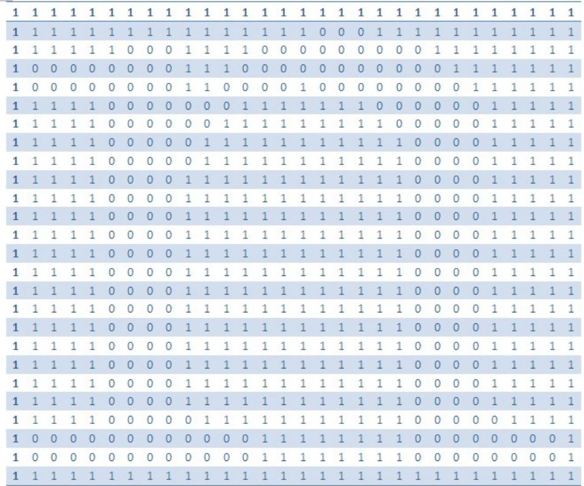

<details>
<summary>heatmap</summary>

| Row | 1 | 2 | 3 | 4 | 5 | 6 | 7 | 8 | 9 | 10 |
| --- | --- | --- | --- | --- | --- | --- | --- | --- | --- | --- |
| 1 | 1 | 1 | 1 | 1 | 1 | 1 | 1 | 1 | 1 | 1 |
| 2 | 1 | 1 | 1 | 1 | 1 | 1 | 1 | 1 | 1 | 1 |
| 3 | 1 | 1 | 1 | 1 | 0 | 0 | 0 | 1 | 1 | 1 |
| 4 | 0 | 0 | 0 | 0 | 0 | 0 | 0 | 1 | 1 | 0 |
| 5 | 0 | 0 | 0 | 0 | 0 | 0 | 0 | 1 | 1 | 0 |
| 6 | 0 | 0 | 0 | 0 | 0 | 0 | 0 | 1 | 1 | 0 |
| 7 | 1 | 1 | 1 | 0 | 0 | 0 | 0 | 0 | 0 | 1 |
| 8 | 1 | 1 | 1 | 0 | 0 | 0 | 0 | 0 | 0 | 1 |
| 9 | 1 | 1 | 1 | 0 | 0 | 0 | 0 | 0 | 1 | 1 |
| 10 | 1 | 1 | 1 | 0 | 0 | 0 | 0 | 0 | 1 | 1 |
</details>

## V.2 Matlab程序代码

本队用以参赛软件为Matlab（2010b）。

## 复原附件一

clear all;clc; % 导入附件1图像矩阵

cell{1,1}=imread('000.bmp');

cell{1,2}=imread('001.bmp');

cell{1,3}=imread('002.bmp');

cell{1,4}=imread('003.bmp');

cell{1,5}=imread('004.bmp');

cell{1,6}=imread('005.bmp');

cell{1,7}=imread('006.bmp');

cell{1,8}=imread('007.bmp');

cell{1,9}=imread('008.bmp');

cell{1,10}=imread('009.bmp');

cell{1,11}=imread('010.bmp');

cell{1,12}=imread('011.bmp');

cell{1,13}=imread('012.bmp');

cell{1,14}=imread('013.bmp');

cell{1,15}=imread('014.bmp');

cell{1,16}=imread('015.bmp');

```matlab
cell{1,17}=imread('016.bmp');
cell{1,18}=imread('017.bmp');
cell{1,19}=imread('018.bmp');
for i=1:19
level=graythresh(cell{1,i});
cell1{1,i}=im2bw(cell{1,i},level); %图像二值化处理
end
for i=1:19
for k=1:19
xs(i,k)=0;
for j=1:1980
if(cell1{1,i}(j,72)==cell1{1,k}(j,1)) %求相似度的矩阵
xs(i,k)=1+xs(i,k);
end
end
end
end
%load 'ti1.mat';
for i=1:19
xs(i,i)=0;
end
for i=1:19
da(i)=max(xs(i,:));
end
wei=find(da==max(da));
for i=1:19
k=find(xs(i,[1:19])==da(i)); %求出两两相邻的矩阵
lian(i,1)=i; %为前者
lian(i,2)=k; %为后者
end
lian(wei,1)=0;
tou=lian(wei,2);
xu(1)=tou;
for i=1:18
xu(i+1)=lian(xu(i),2); %正确的图像排序序列
end
%根据求出的序列xu画图
for i=1:19
I(:,[72*(i-1)+1:72*i])=cell1,xu(i); %将图复原
end
```

imwrite(I,'hanzi.jpg','quality',100);

imshow('hanzi.jpg') %输出图像

## 复原附件二

clear all;clc; %导入附件2图片矩阵

cell{1,1}=imread('000.bmp');

cell{1,2}=imread('001.bmp');

cell{1,3}=imread('002.bmp');

cell{1,4}=imread('003.bmp');

cell{1,5}=imread('004.bmp');

cell{1,6}=imread('005.bmp');

cell{1,7}=imread('006.bmp');

cell{1,8}=imread('007.bmp');

cell{1,9}=imread('008.bmp');

cell{1,10}=imread('009.bmp');

cell{1,11}=imread('010.bmp');

cell{1,12}=imread('011.bmp');

cell{1,13}=imread('012.bmp');

cell{1,14}=imread('013.bmp');

cell{1,15}=imread('014.bmp');

cell{1,16}=imread('015.bmp');

cell{1,17}=imread('016.bmp');

cell{1,18}=imread('017.bmp');

cell{1,19}=imread('018.bmp');

for i=1:19

level=graythresh(cell{1,i});

cell1{1,i}=im2bw(cell{1,i},level); %为方便求解先进行图像二值化处理

end

for i=1:19

for k=1:19

xs(i,k)=0;

for j=1:1980

if(cell1{1,i}(j,72)==cell1{1,k}(j,1)) %构造相似度矩阵

xs(i,k)=1+xs(i,k);

end

end

end

end

%load 'ti1.mat';

for i=1:19

xs(i,i)=0;

```matlab
end
for i=1:19
da(i)=max(xs(i,:));
end
wei=find(da==max(da));
for i=1:19
k=find(xs(i,[1:19])==da(i)); %求出两两相邻矩阵
lian(i,1)=i; %为前者
lian(i,2)=k; %为后者
end
lian(wei,1)=0;
lian(wei,1)=0;
tou=lian(wei,2);
xu(1)=tou;
for i=1:18
xu(i+1)=lian(xu(i),2); % 求出正确排序的序列
end
%load 'xu.mat';
%根据以上图片排序序列xu复原图片
for i=1:19
I(:,[72*(i-1)+1:72*i])=cell{1,xu(i)};
end
imwrite(I,'English.jpg','quality',100);
imshow('English.jpg') %输出图片
```

## 复原附件三

```matlab
%找每行的行首图片
clear all;clc;
load 't3.mat';
for i=1:209
level=graythresh(t3{i,1});
bm{i,1}=im2bw(t3{i,1},level); %图像二值化处理
end
k=0;
for i=1:209
b=0;
for j=1:9
b=b+sum(bm{i,1}(:,j));
end
if(b==180*9)
k=k+1;
```

```matlab
left(k)=i; %每行的行首
end
end
k=0;
for i=1:209
b=0;
for j=1:9
b=b+sum(bm{i,1}(:,j+63));
end
if(b==180*9)
k=k+1;
right(k)=i; %每行的行尾
end
end
k=0;
for i=1:209
b=0;
for j=1:38
b=b+sum(bm{i,1}(j,:));
end
if(b==72*38)
k=k+1;
up(k)=i; %第一行
end
end
k=0;
for i=1:209
b=0;
for j=1:61
b=b+sum(bm{i,1}(j+119,:));
end
if(b==72*61)
k=k+1;
down(k)=i; %最后一行
end
end
%搜寻每个行首的图片所在行的其余图片
k=0;
for i=1:209
b=0;
```

```matlab
for j=1:9
b=b+sum(bm{i,1}(:,j));
end
if(b==180*9)
k=k+1;
tou(k)=i; %每行第一个
end
end
hang=zeros(209,180);
for k=1:209
for i=1:180
if(sum(bm{k,1}(i,:))==72) %说明这行是空白的
hang(k,i)=0;
else
hang(k,i)=1;
end
end
end
for i=1:11
tu{tou(i),1}(:,1) = -1*ones(180,1);
end
for k=1:11
for i=1:209
for j=1:11
c(k,tou(j))=inf;
end
c(k,i)=sum(abs((hang(tou(k),:-hang(i,:)))));
end
end
for k=1:11
for p=1:18
xiao=min(c(k,:));
[i,j]=find(c(k,:)==xiao);
h(k,p)=j(1); %每行表示属于第k行除行首外的图片
c(k,j(1))=inf;
end
end
for i=1:18
for k=1:18
xs(i,k)=0;
```

```javascript
for j=1:180
if(bm{h(1,i),1}(j,72)==bm{h(1,k),1}(j,1))
xs(i,k)=1+xs(i,k);
end
end
end
end
h;%每行的元素个数
%求解每行的排序，以n=50和15为例：
clear all;clc;format short
load 't3.mat';
load 'hang.mat';
bm=t3;
%求解每行的排序以行首是50的为例：
n=50
d=[3 12 23 29 193 55 58 66 92 96 119 130 142 144 179 187 189 191];
afa=1;beta=0;
for ci=1:18
for i=1:18
ca(i)=0;
for j=1:180
w=(bm{n,1}(j,72)-afa*bm{d(i),1}(j,1)-beta)2/180;
ca(i)=w+ca(i);
end
end
k=find(ca==min(ca));
lo=length(k);
if(lo;1)
k
for i=1:lo
s(:,[1:72])=bm{n,1};
s(:,[73:144])=bm{d(k(i)),1};
imwrite(s,'lena.jpg','quality',100);
figure;
imshow('lena.jpg')
end
k=input('人工干预');
end
xu(ci)=d(k);
bm{d(k),1}(:,1)=-inf*ones(180,1);
```

```matlab
n=d(k);
end
xu %最终序列
%求解每行的排序以行首是50的为例:
n=15
d=[129,4,160,83,200,136,13,74,161,204,170,135,40,32,52,108,116,177];
afa=1;beta=0;
for ci=1:18
for i=1:18
ca(i)=0;
for j=1:180
w=(bm{n,1}(j,72)-afa*bm{d(i),1}(j,1)-beta)2/180;
ca(i)=w+ca(i);
end
end
k=find(ca==min(ca));
lo=length(k);
if(lo;i)
k
for i=1:lo
s(:,[1:72])=bm{n,1};
s(:,[73:144])=bm{d(k(i)),1};
imwrite(s,'lena.jpg','quality',100);
figure;
imshow('lena.jpg')
end
k=input('人工干预');
end
xu(ci)=d(k);
bm{d(k),1}(:,1)=-inf*ones(180,1);
n=d(k);
end
xu %最终序列
clear all;clc;
load 'ht.mat';
load 'BMP3.mat';
t3=BMPfile3;
bm=t3;
for i=1:11
for j=1:19
```

```matlab
AI([(1+(i-1)*180):(180*i)],[(1+(j-1)*72):(72*j)])=t3{ht(i,j),1};
end
end
for i=1:11
bmp{i,1}=AI(1+(i-1)*180:180*i,1:72*19);
end
d=[5 6 11 4 7 2 9 10 3 1 8]; %在这里人工干预调整行的排列顺序得到最终复原图
for i=1:11
AI([(1+(i-1)*180):(180*i)],:)=bmp{d(i),1};
end
imwrite(AI,'hangtu.jpg','quality',100);
imshow('hangtu.jpg')
复原附件四
clear all;clc;
load 't4.mat';
%求出误差矩阵
for i = 1:209
t4{i,1} = double(t4{i,1}); %转化为double型
end
bm=t4;
W=inf*ones(209,209); %W为误差矩阵
afa=1;beta=1;
for i=1:209
for j=1:209
W(i,j)=0;
for k=1:180
w=(bm{i,1}(k,72)-afa*bm{j,1}(k,1)-beta)ˆ2/180;
W(i,j)=W(i,j)+w;
end
end
end
%图像二值化处理
for i=1:209
level=graythresh(t4{i,1});
bm{i,1}=im2bw(t4{i,1},level);
end
%找出每一行的行首图片
k=0;
for i=1:209
b=0;
```

```matlab
for j=1:9
b=b+sum(bm{i,1}(:,j));
end
if(b==180*9)
k=k+1;
left(k)=i; %每行第一个
end
end
k=0;
for i=1:209
b=0;
for j=1:9
b=b+sum(bm{i,1}(:,j+63));
end
if(b==180*9)
k=k+1;
right(k)=i; %每行最后一个
end
end
k=0;
for i=1:209
b=0;
for j=1:38
b=b+sum(bm{i,1}(j,:));
end
if(b==72*38)
k=k+1;
up(k)=i; %第一行
end
end
k=0;
for i=1:209
b=0;
for j=1:61
b=b+sum(bm{i,1}(j+119,:));
end
if(b==72*61)
k=k+1;
down(k)=i; %最后一行
end
```

```matlab
end
%通过人工干预, 找出其中不属于行首的147
left=[20,21,71,82,87,133,'147',160,172,192,202,209];
load 'W.mat';
load 't4.mat';
for i = 1:209
t4{i,1} = double(t4{i,1}); %转化为double型
end
bm=t4;
left=[20,21,71,82,87,133,'147',160,172,192,202,209];
%以21为行首的其余图片矩阵为例:
n=21;
for ci=1:18
k=find(W(n,:)==min(W(n,:)));
lo=length(k);
if(lo;1)
k
for i=1:lo
s(:,[1:72])=bm{n,1};
s(:,[73:144])=bm{k(i),1};
imwrite(s,'lena.jpg','quality',100);
figure;
imshow('lena.jpg')
end
b=input('人工干预'); %当出现多个可与当前匹配项时进行人工干预, 输入b为人认为
较符合匹配的序号
if(b==0)
for i=1:lo
W(n,k)=inf;
end
close all;
else
k=k(b);
end
end
k=k;
W(n,k)=inf;
be(ci)=k;
n=k;
close all; end
```

```matlab
be %输出以21为行首的其余图片矩阵
%将n变为71得到以71为行首的其余图片矩阵:
n=71;
for ci=1:18
k=find(W(n,:)==min(W(n,:)));
lo=length(k);
if(lo;1)
k
for i=1:lo
s(:,[1:72])=bm{n,1};
s(:,[73:144])=bm{k(i),1};
imwrite(s,'lena.jpg','quality',100);
figure;
imshow('lena.jpg')
end
b=input('人工干预'); %当出现多个可与当前匹配项时进行人工干预，输入b为人认为较符合匹配的序号
```

```matlab
if(b==0)
for i=1:lo
W(n,k)=inf;
end
close all;
else
k=k(b);
end
end
k=k;
W(n,k)=inf;
be(ci)=k;
n=k;
close all;
end
be %输出以71为行首的其余图片矩阵
clear all;clc;
ht=load('ht.txt');
load 't4.mat';
bm=t4;
for i=1:11
for j=1:19
AI([(1+(i-1)*180):(180*i)],[(1+(j-1)*72):(72*j)])=bm{ht(i,j),1};
```

```matlab
end
end
for i=1:11
bmp{i,1}=AI(1+(i-1)*180:180*i,1:72*19);
end
d=[1 2 3 4 5 6 7 8 9 10 11]; %此为通过人工干预调整行的排序得到的正确行排序
for i=1:11
AI([(1+(i-1)*180):(180*i)],:)=bmp{d(i),1};
end
imwrite(AI,'hangtu.jpg','quality',100);
imshow('hangtu.jpg')
复原附件五
%求出每行的排序（见Tfive.m）clear all;clc;
load 'hang1.mat';
load 'hang2.mat';
load 'tu.mat';
hang=load('hang.txt');
for i = 1:418
tu{i,1} = double(tu{i,1}); %×a?^- ?adoubleDí
end
bm=tu;
for r=1:11
if(r==6)
continue; % μ
end
ju=hang(r,:);
n=length(ju);
W=inf*ones(n,n);
afa=1;beta=1;
for i=1:n
for j=1:n
W(i,j)=0;
w3=(hang1(i)-hang1(j))^2/180;
w4=(hang2(i)-hang2(j))^2/180;
for k=1:180
w1=(bm{ju(i),1}(k,72)-afa*bm{ju(j),1}(k,1)-beta)2/180; %?ó2????ó
if((mod(ju(i),2)==1)&(mod(ju(j),2)==1))
w2=(bm{ju(j)+1,1}(k,72)-afa*bm{ju(i)+1+1,1}(k,1)-beta)2/180;
elseif((mod(ju(i),2)==1)&(mod(ju(j),2)==0))
w2=(bm{ju(j)-1,1}(k,72)-afa*bm{ju(i)+1,1}(k,1)-beta)2/180;
```

```matlab
elseif((mod(ju(i),2)==0)&(mod(ju(j),2)==1))
w2=(bm{ju(j)+1,1}(k,72)-afa*bm{ju(i)-1,1}(k,1)-beta)2/180;
elseif((mod(ju(i),2)==0)&(mod(ju(j),2)==0))
w2=(bm{ju(j)-1,1}(k,72)-afa*bm{ju(i)-1,1}(k,1)-beta)2/180;
end
W(i,j)=W(i,j)+w1+w2+w3+w4;
end
end
end
n=1;
for ci=1:18
k=find(W(n,:)==min(W(n,:)));
if(k==n)
W(n,k)=inf;
k=find(W(n,:)==min(W(n,:)));
end
k=k(1);
be(r,ci)=ju(k);
W(n,k)=inf;
n=k;
for i=1:19
W(i,n)=inf;
end
end
end
%未人工干预前求得的复原图（见yuanben.m）
clear all;clc;
ht=load('chubu.txt');
load 'tu.mat';
bm=tu;
for i=1:11
for j=1:19
AI([(1+(i-1)*180):(180*i)],[(1+(j-1)*72):(72*j)])=bm{ht(i,j),1};
end
end
for i=1:11
bmp{i,1}=AI(1+(i-1)*180:180*i,1:72*19);
end
d=[1 2 3 4 5 6 7 8 9 10 11]; %此为通过人工干预调整行的排序得到的正确行排序
for i=1:11
```

```matlab
AI([(1+(i-1)*180):(180*i)],:)=bmp{d(i),1};
end
figure(1)
imwrite(AI,'hangtu.jpg','quality',100); %输出图像
imshow('hangtu.jpg')
%用长方体圈出需要人工干预进行重新匹配的位置
% Create rectangle
annotation(figure(1),'rectangle',...
[0.364836017569546 0.844854070660522 0.152733528550512 0.0384024577572965],...
'FaceColor','flat');
% Create rectangle
annotation(figure(1),'rectangle',...
[0.523693997071742 0.660522273425499 0.113202049780381 0.0322580645161289],...
'FaceColor','flat');
% Create rectangle
annotation(figure(1),'rectangle',...
[0.364103953147877 0.466973886328725 0.272060029282577 0.0368663594470047],...
'FaceColor','flat');
% Create rectangle
annotation(figure(1),'rectangle',...
[0.363371888726208 0.359447004608295 0.0517086383601757 0.0291858678955454],...
'FaceColor','flat');
% Create rectangle
annotation(figure(1),'rectangle',...
[0.494411420204978 0.248847926267281 0.0626896046852123 0.032258064516129],...
'FaceColor','flat');
% Create rectangle
annotation(figure(1),'rectangle',...
[0.580062957540264 0.112135176651306 0.0553689604685211 0.0291858678955453],...
'FaceColor','flat');
title('用长方体圈出需要人工干预进行重新匹配的位置');
fprintf('完整度为百分之54.55n')
fprintf('所需人工干预次数为')
ci=ceil(1980*1368*0.5455/(180*72*5))
%输出正确图像（fuyuan.m）clear all;clc;
load 'ht.mat';
load 'tu.mat';
bm=tu;
for i=1:11
for j=1:19
```

```matlab
AI([(1+(i-1)*180):(180*i)],[(1+(j-1)*72):(72*j)])=bm{ht(i,j),1};
end
end
for i=1:11
bmp{i,1}=AI(1+(i-1)*180:180*i,1:72*19);
end
d=[1 2 3 4 5 6 7 8 9 10 11]; %此为通过人工干预调整行的排序得到的正确行排序
for i=1:11
AI([(1+(i-1)*180):(180*i)],:)=bmp{d(i),1};
end
imwrite(AI,'hangtu.jpg','quality',100); %输出图像
imshow('hangtu.jpg')
%求反面图片(fuyuanfan.m)
clear all;clc;
load 'ht.mat';
load 'tu.mat';
bm=tu;
for i=1:11
for j=1:19
if(mod(ht(i,j),2)==1 )
ht(i,j)=ht(i,j)+1;
else
ht(i,j)=ht(i,j)-1;
end
end
end
ht=fliplr(ht); %求反面矩阵
for i=1:11
for j=1:19
AI([(1+(i-1)*180):(180*i)],[(1+(j-1)*72):(72*j)])=bm{ht(i,j),1};
end
end
for i=1:11
bmp{i,1}=AI(1+(i-1)*180:180*i,1:72*19);
end
d=[1 2 3 4 5 6 6 7 8 9 10 11]; %此为通过人工干预调整行的排序得到的正确行排序
for i=1:11
AI([(1+(i-1)*180):(180*i)],:)=bmp{d(i),1};
end
imwrite(AI,'fantu.jpg','quality',100); %输出图像
```

imshow('fantu.jpg')

%此为功能函数，用于识别两个图像是否满足连续相邻，可共同目录下调用但不能单独运行

```matlab
function [k]=panbie1(W,bm,n)
k=find(W(n,:)==min(W(n,:)));
lo=length(k);
if(lo;1) %当出现多个较优的可行解时
k
for i=1:lo
s(:,[1:72])=bm{n,1};
s(:,[73:144])=bm{k(i),1};
imwrite(s,'lena.jpg','quality',100);
figure;
imshow('lena.jpg')
end
b=input('人工干预'); %判断是否有满足连续的邻接图
if(b==0)
for i=1:lo
W(n,k)=inf; %将这些不满足的情况剔除
end
close all;
[k]=panbie(W,bm,n); %循环调用函数
else
k=k(b);
end
end
s(:,[1:72])=bm{n,1};
s(:,[73:144])=bm{k,1};
imwrite(s,'lena.jpg','quality',100);
figure;
imshow('lena.jpg')
b=input('识别');
if(b==0)
W(n,k)=inf;
close all;
[k]=panbie(W,bm,n);
else
k=k;
W(n,k)=inf;
End
```

%此为功能函数，用于识别两个图像是否满足连续相邻，可共同目录下调用但不能单独运行

```matlab
function [k]=shibie(W,bm,ju,n)
k=find(W(n,:)==min(W(n,:)));
lo=length(k);
if(lo;1) %当出现多个较优的可行解时
k
for i=1:lo
s(:,[1:72])=bm{ju(n),1};
s(:,[73:144])=bm{ju(k(i)),1};
imwrite(s,'lena.jpg','quality',100);
figure;
imshow('lena.jpg')
end
b=input('人工干预'); %判断是否有满足连续的邻接图
if(b==0)
for i=1:lo
W(n,k)=inf; %将这些不满足的情况剔除
end
close all;
[k]=shibie(W,bm,ju,n); %循环调用函数
else
k=k(b);
end
end
s(:,[1:72])=bm{ju(n),1};
s(:,[73:144])=bm{ju(k),1};
imwrite(s,'lena.jpg','quality',100);
figure;
imshow('lena.jpg')
b=input('识别');
if(b==0)
W(n,k)=inf;
close all;
[k]=shibie(W,bm,ju,n);
else
k=k;
W(n,k)=inf;
end
```