# 2013高教社杯全国大学生数学建模竞赛

## 承 诺 书

我们仔细阅读了《全国大学生数学建模竞赛章程》和《全国大学生数学建模竞赛参赛规则》（以下简称为“竞赛章程和参赛规则”，可从全国大学生数学建模竞赛网站下载）。

我们完全明白，在竞赛开始后参赛队员不能以任何方式（包括电话、电子邮件、网上咨询等）与队外的任何人（包括指导教师）研究、讨论与赛题有关的问题。

我们知道，抄袭别人的成果是违反竞赛章程和参赛规则的，如果引用别人的成果或其他公开的资料（包括网上查到的资料），必须按照规定的参考文献的表述方式在正文引用处和参考文献中明确列出。

我们郑重承诺，严格遵守竞赛章程和参赛规则，以保证竞赛的公正、公平性。如有违反竞赛章程和参赛规则的行为，我们将受到严肃处理。

我们授权全国大学生数学建模竞赛组委会，可将我们的论文以任何形式进行公开展示（包括进行网上公示，在书籍、期刊和其他媒体进行正式或非正式发表等）。

我们参赛选择的题号是（从 A/B/C/D 中选择一项填写）： B

我们的参赛报名号为（如果赛区设置报名号的话）： 20001040

所属学校（请填写完整的全名）： 国防科学技术大学

参赛队员 (打印并签名) ：1. 向航

2. 王帆

3. 郭树璇

指导教师或指导教师组负责人 (打印并签名)：

（论文纸质版与电子版中的以上信息必须一致，只是电子版中无需签名。以上内容请仔细核对，提交后将不再允许做任何修改。如填写错误，论文可能被取消评奖资格。）

日期： 2013 年 9 月 16 日

赛区评阅编号（由赛区组委会评阅前进行编号）：

# 2013高教社杯全国大学生数学建模竞赛

## 编 号 专 用 页

赛区评阅编号（由赛区组委会评阅前进行编号）：

赛区评阅记录（可供赛区评阅时使用）：

<table><tr><td>评阅人</td><td></td><td></td><td></td><td></td><td></td><td></td><td></td><td></td><td></td><td></td></tr><tr><td>评分</td><td></td><td></td><td></td><td></td><td></td><td></td><td></td><td></td><td></td><td></td></tr><tr><td>备注</td><td></td><td></td><td></td><td></td><td></td><td></td><td></td><td></td><td></td><td></td></tr></table>

全国统一编号（由赛区组委会送交全国前编号）：

全国评阅编号（由全国组委会评阅前进行编号）：

# 基于旅行商规划模型的碎纸片拼接复原问题研究

## 摘要

本文分别针对 RSSTD(Reconstruction of Strip Shredded Text Document）、RCCSTD(Reconstruction of cross-cut Shredded Text Document)和 Two-SidesRCCSTD 三种类型的碎纸片拼接复原问题进行了建模与求解算法设计。首先我们对于RSSTD问题，建立了基于二值匹配度的 TSP 模型，并将其转化为线性规划模型，利用贪心策略复原了该问题的中文和英文碎片；然后对于 RCCSTD 问题，由于中英文字的差别，我们分别建立了基于改进误差评估的汉字拼接模型和基于文字基线的误差评估的英文字拼接模型，并利用误差评估匹配算法，复原了该问题的中文和英文碎片；随后我们针对正反两面的 RCCSTD 问题，利用基线的概念将正反两面分行，转化为RCCSTD 问题，并复原了该问题的英文碎片。最后，我们对模型的算法和结果进行了检验和分析。

◎问题一：我们针对仅纵切的情况，首先将图像进行数字化处理，转换为了二值图像，然后得到各图像的边缘，并计算所有碎片与其他碎片边缘的匹配程度。然后，根据两两碎片之间的匹配程度建立了 TSP 模型，并将其划归为线性规划模型。最终，我们根据左边距的信息确定了左边第一碎片，随后设计了基于匹配度的贪心算法从左向右得到了所有碎片的拼接复原结果。结果表明我们的方法对于中英文两种情况适用性均较好，且该过程不需要人工干预。

◎问题二：我们针对既纵切又横切的情况，由于中英文的差异性，我们在进行分行聚类时应采用不同的标准。首先根据左右边距的信息确定了左边和右边的碎片，随后分别利用基于改进误差评估的汉字拼接模型和基于文字基线的误差评估模型，将剩余的碎片进行分行聚类，然后再利用基于误差评估的行内匹配算法对行内进行了拼接，最终利用行间匹配算法对行间的碎片进行了再拼接，最终得到了拼接复原结果。对于拼接过程中可能出现误判的情况，我们利用GUI编写了人机交互的人工干预界面，用人的直觉判断提高匹配的成功率和完整性。

◎问题三：我们针对正反两面的情况，首先根据正反基线信息，分别确定了左右两边的碎片，然后利用基线差值将其两两聚类，聚类以后其正反方向也一并确定，随后我们将其与剩余碎片进行分行聚类，最终又利用行内匹配和行间匹配算法得到了最终拼接复原结果。其中，对于可能出现的误判情况，我们同样在匹配算法中使用了基于 GUI的人机交互干预方式，利用人的直觉提高了结果的可靠性和完整性。

关键字：碎片复原、TSP、误差评估匹配、基线误差、人工干预

## 一、问题重述

破碎文件的拼接复原工作在传统上主要需由人工完成，准确率较高，但效率很低。特别是当碎片数量巨大，人工拼接很难在短时间内完成任务。随着计算机技术的发展，人们试图开发碎纸片的自动拼接技术，以提高拼接复原效率。请讨论以下问题：

1. 对于给定的来自同一页印刷文字文件的碎纸机破碎纸片（仅纵切），建立碎纸片拼接复原模型和算法，并针对附件 1、附件2给出的中、英文各一页文件的碎片数据进行拼接复原。如果复原过程需要人工干预，请写出干预方式及干预的时间节点。复原结果以图片形式及表格形式表达。  
2. 对于碎纸机既纵切又横切的情形，请设计碎纸片拼接复原模型和算法，并针对附件3、附件 4给出的中、英文各一页文件的碎片数据进行拼接复原。如果复原过程需要人工干预，请写出干预方式及干预的时间节点。  
3. 上述所给碎片数据均为单面打印文件，从现实情形出发，还可能有双面打印文件的碎纸片拼接复原问题需要解决。请尝试设计相应的碎纸片拼接复原模型与算法，并就附件 5的碎片数据给出拼接复原结果。

## 二、问题分析

破碎文件的拼接复原工作，传统人工处理准确率高，但是效率低。随着计算机技术的发展，本问题试图寻找碎纸片的自动拼接方法。本文的碎片均为矩形，且大小一样，这就给碎片的拼接带来了困难，因为难以利用碎片的轮廓信息，从而只能利用碎片边缘的图像像素信息来进行拼接。

对于问题一，给出了纵切的 条碎纸片，碎片为 ，总切线的像素点较多，并且碎纸片的数量较少，从效率出发，可以直接考虑纵切条上的像素统计信息。为了衡量匹配程度，需要建立误差评估函数。本文考虑采用 TSP 模型，将碎纸片作为节点，将误差评估函数的值作为节点之间的权值，寻找最优解。在本问题的情况下，中英文的差别并无太大影响。

对于问题二，由于给出的数据是横纵切的中英文碎片，碎片大小为 ，各 张。因为碎纸片的数量较多，直接匹配则为 问题中的无法用多项式解决的问题，所以先将行分组匹配完成后再把各行拼接起来。本问题主要解决：）如何正确高效分组； ）如何准确高效拼接。考虑到中文和英文在字形和印刷结构上的不同，需要定义不同的特征向量去描述中文和英文的碎纸片上的信息。文字各行的位置和间距将作为重要的分组依据。在问题一的基础上，由于每个碎纸片的边缘像素较少，为了充分利用包含信息，误差评估函数的定义将会比问题一中更加细化。行之间的拼接将会利用边缘像素和间距匹配。在本问题中，中英文

的基线选择方法将会有很大不同。

对于问题三，在问题二的基础上，加入了正反面信息，碎纸片的形状并没有改变。因此，需要在问题二的误差评估函数的基础上，综合考虑正反面的匹配误差。分组的方法与行间的拼接方式与问题二基本相同。

综上所述，本问题可以看做是 TSP 问题，碎纸片为节点，误差评估函数值为边的权值，寻求最优解的问题。

## 三、模型假设

1. 假设需要复原的碎片是来自同一张纸，且对于该张纸具有完备性。  
2. 假设同一页中，文字的种类、行间距和段落分布情况是相同的。

## 四、符号说明

<table><tr><td> $m_{ijk}$ </td><td>碎片i和碎片j第k行之间的匹配度</td></tr><tr><td> $M_{ij}$ </td><td>碎片i和碎片j之间的匹配度</td></tr><tr><td> $d_{tb}$ </td><td>由上边缘向下像素点由黑过度到白的距离</td></tr><tr><td> $d_{bb}$ </td><td>由下边缘向上像素点由黑过度到白的距离</td></tr><tr><td> $d_{tw}$ </td><td>由上边缘向下像素点由白过度到黑的距离</td></tr><tr><td> $d_{bw}$ </td><td>由下边缘向上像素点由白过度到黑的距离</td></tr><tr><td> $c_h(i,j)$ </td><td>碎片i和碎片j之间左右边缘误差评估值</td></tr><tr><td> $c'_h(i,j)$ </td><td>碎片i和碎片j之间左右边缘相对误差评估值</td></tr><tr><td> $c_w(p,q)$ </td><td>行片段之间上下边缘的误差评估值</td></tr></table>

## 五、模型建立与求解

文件碎片拼接主要有两类不同的技术标准：

（1）Reconstruction of Strip Shredded Text Documents(RSSTD)

碎片的长度和原始文件的长度相等，同时所有碎纸片都是等宽的长方形。

（2）Reconstruction of Cross-cut Shredded Text Document(RCCSTD)

所有的文件碎片都是长方形且大小相等，但其长度小于原始文件的长度。

问题一为典型的 RSSTD 问题，我们通过分析碎纸片文字的行特征，建立了一种基于匹配度的求解模型，下面就对该模型的建立进行详细的讨论。

## 5.1 问题 1——基于匹配度的 RSSTD问题研究

为了便于对图像数据进行分析，我们首先需要对其进行数字化处理以及文字行特征的提取，而后再建立基于匹配度的模型。

## 5.1.1图像数字化处理

图像的数字化处理主要包括以下几个方面：

## （1）二值化处理

由于纵切碎纸片的长度特征（碎片长度与原始文件长度相等），其边缘像素点信息量丰富。因此我们采取二值化而非灰度对图像进行了处理，进一步简化了算法的复杂度，得到每条碎片像素大小为 721980（长宽），像素点值取{0,1}，其中0和 1分别表示颜色的黑与白。

## （2）edge矩阵的建立

edge[i,j]为192的矩阵，储存每一条碎片的边缘像素点信息。其中 i表示碎片的编号，j=0表示左侧边缘像素点信息，j=1表示右侧边缘像素点信息。例如，edge[0,0]储存001 号碎片左侧边缘像素点信息。

## （3）count 矩阵的建立

根据 edge[i,j]矩阵，我们可以计算得到一个 192 的 count[i,j]矩阵，该矩阵储存每一条碎片边缘取值为 0的像素点的数量。例如，count[0,0]=350 表示001号碎片左侧边缘共有 350个黑色像素点。

## （4）shred with blank left 的选取

根据 count 矩阵，若 edge[i,0]=0，那么我们就认为该碎片在原始文件中处于

最左端，即为选取的 shred with blank left。

## （5）碎片行特征的提取

由于原始文件文字行特征明显，因此我们需要提取碎片的行特征（其具体的原因见匹配度的定义）。首先确定碎片顶端取值为 0的像素点的位置，以此作水平线为上边界，依次向下取 w为行宽（这里取 w=40 pixels 以保证能容纳每一个文字）直至下边缘，得到每条碎片的行数为 $\{ \mathfrak { n } _ { 1 } , \mathfrak { n } _ { 2 } , . . . , \mathfrak { n } _ { 1 9 } \}$ ；然后取 $\mathfrak { n } { = } \mathfrak { m a x } \{ \mathtt { n } _ { 1 } , \mathtt { n } _ { 2 } , . . . ,$ $\mathbf { n } _ { 1 9 } \}$ 作为最终确定的行数，并以该条碎片的行化方式为标准对每一条碎片进行行化；最终每一条碎片被划分为 28行。

每条碎片维护着以下的特征数据表：

表 1 碎片 i特征数据表

<table><tr><td>k</td><td>1</td><td>2</td><td>3</td><td> $\cdots$ </td><td>27</td><td>28</td></tr><tr><td> $\mathbf{n}_{\mathrm{kl}}$ </td><td> $n_{i1l}$ </td><td> $n_{i2l}$ </td><td> $n_{i3l}$ </td><td> $\cdots$ </td><td> $n_{i27l}$ </td><td> $n_{i28l}$ </td></tr><tr><td> $\mathbf{n}_{\mathrm{kr}}$ </td><td> $n_{i1r}$ </td><td> $n_{i2r}$ </td><td> $n_{i3r}$ </td><td> $\cdots$ </td><td> $n_{i27r}$ </td><td> $n_{i28r}$ </td></tr></table>

其中，k为行号； $\mathrm { n } _ { \mathrm { k l } }$ 为第k行左侧边缘取值为 0的像素点的数量， $\mathbf { n } _ { \mathrm { k r } }$ 为第k行右侧边缘取值为 0的像素点的数量；n 为第i 条碎片第k行左侧边缘取值为 0 $\bf \Pi _ { n ; \mathrm { k l } }$ 的像素点的数量。

## 5.1.2匹配度的定义

为了衡量两个碎片之间的匹配程度，我们定义匹配度 $M _ { i j }$ 作为评价的标准，其计算公式如下：

$$
m _ {i j k} = \frac {\min (n _ {i k r} , n _ {j k l})}{\max (n _ {i k r} , n _ {j k l})}
$$

$$
M _ {i j} = \sum_ {k = 1} ^ {n} m _ {i j k}
$$

其中，n为总的行数（如 $n = 2 8 \mathrm { ~ ) }$ $m _ { i j k }$ 表示碎片 $i$ 和碎片j第k行之间的匹配度； $M _ { i j }$ 表示碎片i和碎片j之间的匹配度。

这里我们不选择通过统计碎片边缘总黑色像素点的数量来计算两碎片之间的匹配度，而是通过计算两碎片行匹配度来间接计算其匹配度，原因在于：

① 若以总的边缘黑色像素点计算匹配度，行与行之间的差异性无法体现，匹配结果误差过大；  
② 通过行匹配度计算碎片之间的匹配程度，更加充分的挖掘了碎片边缘的信息，更为精确。

## 5.1.3基于 TSP问题的模型建立与求解

## 5.1.3.1 模型的建立

根据匹配度的定义，我们可以计算得到 19个碎片两两之间边缘的匹配度，现可将问题化简为：已知起始碎片和其他碎片之间的匹配度，寻找一序列使得碎片之间总的匹配度达到最大。如右图所示：

（1）为简化问题，我们引入空白碎片 0，同样可计算得到空白碎片与其他碎片的匹配度；  
（2）其中节点表示碎片，有向线段长度表示费用 $w _ { i j } ,$ ，且 $w _ { i j } { = } I { - } M _ { i j }$ ，箭头所指方向表示前一条碎片右侧边缘到后一条碎片左侧边缘。如①→②表示 1号的碎片右侧边缘与 2号碎片左侧边缘的费用；

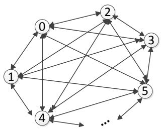

<details>
<summary>flowchart</summary>

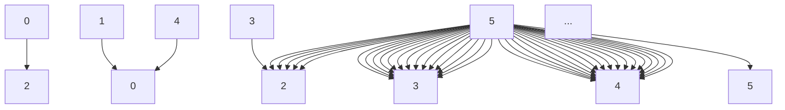
</details>

图 1 问题示意图

（3）现要求寻找一条回路遍历所有的节点使得费用达到最小。

通过分析，可以发现这是一典型的 TSP 问题。为解决上述问题，我们建立模型如下：

假设图中存在 Hamilton 回路，有n 个节点，图中 $( i , j )$ 边的权重为 $w _ { i j } { . }$ ，设决策变量为 $x _ { i j } { = } I$ 说明弧 $( i , j )$ 进入到Hamilton 回路中，则线性规划模型可表达<sup>[6]</sup>为：

$$
\begin{array}{l} \min \sum_ {(i, j) \in E} w _ {i j} x _ {i j} \\ \left\{ \begin{array}{l} \sum_ {(i, j) \in E} x _ {i j} = 1 \\ \sum_ {(j, i) \in E} x _ {j i} = 1 \\ x _ {i j} \in \{0, 1 \}, (i, j) \in E \\ \text {Only One Circle} \end{array} \right. \end{array}
$$

求解该问题就是求解该线性规划问题的最优解。

## 5.1.3.2 模型的求解

为了进一步求解上述模型，我们设计的算法如右图所示：

（1）将所有碎片放入地址池中；  
（2）选出左侧全为白色像素点的碎片作为基准碎片，记为si，并将其从碎片池中剔除；

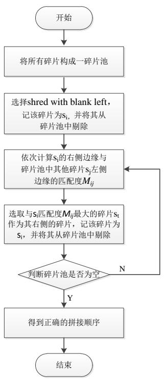

<details>
<summary>flowchart</summary>

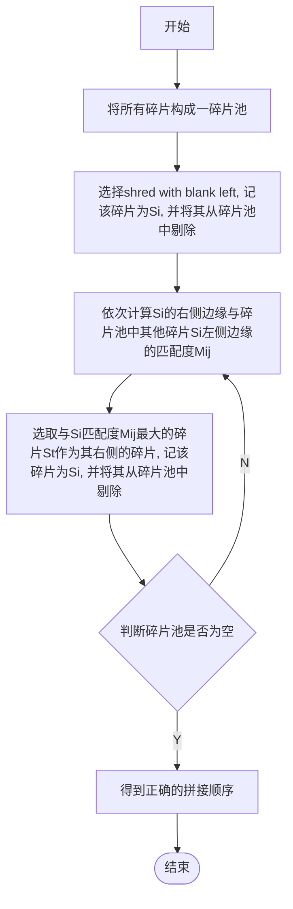
</details>

图 2 算法流程图

（3）依次计算 $s _ { i }$ 右侧边缘与地址池中其他碎片 $s _ { j }$ 左侧边缘的匹配度 $M _ { i j } ,$  
（4）选择匹配度最大的碎片 $s _ { t }$ 作为碎片 $s _ { i }$ 的右侧碎片，并将其记为 $s _ { i }$ ，从碎片池中剔除该碎片；  
（5）重复（3）\~（4）步直至碎片池为空。

由于该算法使用统计量构建匹配度，很好的避免了中英文之间的差异性，适用性较好，在实际的应用中都收到了很好的效果。最终可以得到附件 1与附件2中碎片的正确序列如下所示：

表 2 附件 1排序后碎片序列表

<table><tr><td>序号</td><td>1</td><td>2</td><td>3</td><td>4</td><td>5</td><td>6</td><td>7</td><td>8</td><td>9</td><td>10</td><td>11</td><td>12</td><td>13</td><td>14</td><td>15</td><td>16</td><td>17</td><td>18</td><td>19</td></tr><tr><td>碎片编号</td><td>8</td><td>14</td><td>12</td><td>15</td><td>3</td><td>10</td><td>2</td><td>16</td><td>1</td><td>4</td><td>5</td><td>9</td><td>13</td><td>18</td><td>11</td><td>7</td><td>17</td><td>0</td><td>6</td></tr></table>

表 3 附件 2排序后碎片序列表

<table><tr><td>序号</td><td>1</td><td>2</td><td>3</td><td>4</td><td>5</td><td>6</td><td>7</td><td>8</td><td>9</td><td>10</td><td>11</td><td>12</td><td>13</td><td>14</td><td>15</td><td>16</td><td>17</td><td>18</td><td>19</td></tr><tr><td>碎片编号</td><td>3</td><td>6</td><td>2</td><td>7</td><td>15</td><td>18</td><td>11</td><td>0</td><td>5</td><td>1</td><td>9</td><td>13</td><td>10</td><td>8</td><td>12</td><td>14</td><td>17</td><td>16</td><td>4</td></tr></table>

通过求解结果发现，我们利用贪心策略求解得到了全局最优解，原因在于匹配度的定义较好。同时由于碎片两侧提供的信息量大，很好的避免了中英文之间的差异性。若碎片规格变小，信息量减少，中英文之间差异性的讨论显得十分有必要。

## 5.2 问题 2——基于误差评估的 RCCSTD问题研究

由于中英文的字存在显著的差异性，对算法的设计有很大影响，因此我们需要对它们进行具体的讨论。

如右图所示，我们可以分析得到如下的差异性特征：

（1）中英文的字行存在显著的差异性，中文字结构复杂，笔画繁多，无法确定固定的基准线；  
（2）英文字印刷格式固定，一般为“四线三格”的形式，容易通过基准线来确定具体字母的位置信息。

基于以上分析，我们需要针对中英文设计不同的模型进行碎纸片的拼接复原。下面首先建立文字的拼接复原模型。

  
图 3 中英文字对比图

## 5.2.1基于误差评估的汉字拼接模型

## 5.2.1.1 碎片的逐行分组

## （1）逐行分组原因分析

首先参考问题一中的算法提取位于原始文件左右边界位置的 22块碎片，以此为基础将所有碎片分为 22组，而非按列分组或分为 11组，主要原因如下：

①若按列分组，由于碎片上下边缘信息量少，分组误差较大，不可取；  
②若以原始文件左侧边缘的 11 块碎片为基础将所有碎片分为 11 组，可能存

在以下的问题：如右图所示，014块碎片为原始文件的左侧边缘碎片，128 块碎片为其右侧碎片。但由于 014块碎片处于一自然段的开始位置，上半部分基本为空白，而128块碎片上半部分信息丰富，两者匹配失败率高，很可能导致该组元素个数为 0。因此我们将碎片分为 22组，同时考虑左侧边缘与右侧边缘的信息，分组效率高且准确率高。

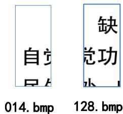

<details>
<summary>text_image</summary>

自觉
014.bmp
缺
觉功
小
128.bmp
</details>

图 4 匹配示意图

## （2）分组标准的确定

我们确立四个参数 $d _ { t b } , d _ { b b } , d _ { t w } , d _ { b w }$ 其意义如右图所示。其中 $d _ { t b } , \ d _ { b b }$ 代表由上下边缘至中间像素点由黑过度到白的距离； $d _ { t w }$ ， $d _ { b w }$ 代表上下边缘至中间像素点由白过度到黑的距离。

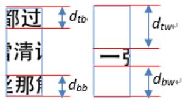

<details>
<summary>text_image</summary>

都过
↑dtb
↑
清记
↑
那角
↓dbb
一引
↑dtw^L
↓
dBw^L
</details>

图 5 参数示意图

根据上述定义，对于每一幅图像，首先判断其上下边缘的过度情况，由此可以确定上下边缘的两个参数。那么我们认为若两个碎片具有相同的参数，如同样为 $d _ { t b }$ 和 $d _ { b w }$ ，同时相同参数之间的差值不超过 4pixels，即：

$$
\mid d _ {t b} - d _ {t b} ^ {\prime} \mid \leq 4 \text {pixels} \quad \text {且} \quad \mid d _ {b w} - d _ {b w} ^ {\prime} \mid \leq 4 \text {pixels}
$$

那么，我们认为两碎片在同一组内。最终可以得到分组情况如下表所示：

表 4 分组情况表

<table><tr><td>组号</td><td>组内成员编号</td><td>组号</td><td>组内成员编号</td></tr><tr><td>1</td><td>{7, 68, 175, 0, 126, 174, 56, 53, 208, 158, 138, 137, 45}</td><td>12</td><td>{18, 195}</td></tr><tr><td>2</td><td>{14}</td><td>13</td><td>{36}</td></tr><tr><td>3</td><td>{29}</td><td>14</td><td>{43}</td></tr><tr><td>4</td><td>{38, 189, 88, 103, 35, 24, 148, 167, 161, 46, 122, 130, 193}</td><td>15</td><td>{59, 37, 98, 104, 10, 75, 48, 171, 207, 92, 111, 55, 180, 5, 172, 64, 44, 201}</td></tr><tr><td>5</td><td>{49, 54, 28, 192, 22, 129, 190, 186, 118, 143, 65, 57, 2, 91}</td><td>16</td><td>{60, 205, 85, 152}</td></tr><tr><td>6</td><td>{61, 116, 67, 162, 79, 99, 63, 20, 72, 6,</td><td>17</td><td>{74, 8, 25, 9}</td></tr><tr><td></td><td>69, 96, 131, 78, 163, 52, 19, 177}</td><td></td><td></td></tr><tr><td>7</td><td>{71}</td><td>18</td><td>{123, 152, 194, 207, 154, 119, 146, 108, 185, 4, 155, 40, 102, 101, 140, 113}</td></tr><tr><td>8</td><td>{89}</td><td>19</td><td>{141, 188, 12}</td></tr><tr><td>9</td><td>{94, 42, 144, 97, 34, 77, 127, 90, 84, 121, 136, 47, 149, 164, 183, 112, 124}</td><td>20</td><td>{145, 181, 204, 182, 16, 110, 66, 184, 13, 106, 109, 150, 139, 187, 197, 157, 21, 173}</td></tr><tr><td>10</td><td>{125}</td><td>21</td><td>{176, 115, 12, 3, 134, 135, 82, 39, 169, 31, 203, 199, 51, 159, 128, 107, 73, 160}</td></tr><tr><td>11</td><td>{168, 142, 147, 76, 50, 23, 120, 87, 179, 62, 100, 191, 41, 26}</td><td>22</td><td>{196, 32, 93, 153, 70, 166}</td></tr></table>

由上表可知，由于某些碎片的特殊性，仍不能归入任何一组。这些碎片有 1，15，17，27，30，33，58，80，81，83，86，95，105，114，117，132，133，156，165，170，178，198，200，202。我们可以将他们放入碎片池中，这一部分碎片后续将进行单独的处理。

## 5.2.1.2 组内碎片匹配算法的设计

评价两块碎片拼接的好坏程度，我们用误差评估函数来描述。

由题可知，每页被分为了 $1 1 \times 1 9$ 个碎片，每个碎片具有同样的规格。那么，就有 $h _ { \scriptscriptstyle i } = h _ { \scriptscriptstyle j }$ ，表示两碎片的高度相等。我们定义误差评估函数 $c _ { h } ( i , j )$ 为：

$$
c _ {h} (i, j) = \sum_ {y = 3} ^ {h - 2} e _ {h} (i, j, y)
$$

$$
e _ {h} (i, j, y) = \left\{ \begin{array}{l l} 1 & \text {if} \quad e _ {h} ^ {\prime} (i, j, y) \geq \tau \\ 0 & \text {otherwise} \end{array} \right.
$$

$$
\begin{array}{l} e _ {h} ^ {\prime} (i, j, y) = | 0. 7 \cdot (v _ {r} (i, y) - v _ {l} (j, y)) \\ + 0. 1 \cdot (v _ {r} (i, y + 1) - v _ {l} (j, y + 1)) \\ + 0. 1 \cdot (v _ {r} (i, y - 1) - v _ {l} (j, y - 1)) \\ + 0. 0 5 \cdot (v _ {r} (i, y + 2) - v _ {l} (j, y + 2)) \\ + 0. 0 5 \cdot (v _ {r} (i, y - 2) - v _ {l} (j, y - 2)) | \\ \end{array}
$$

其中，每个像素点以 8位数值表示，有：

$$
v _ {l} (j, y), v _ {r} (i, y) \in \{0, \dots , 2 5 5 \} \text {with} 1 \leq y \leq h \text {for the left and right edge}
$$

如上图所示，我们将一碎片边缘等分为三分。在考虑像素点y时，对其邻域y+1 y+2 y-1 y-2共 5个像素点进行分析，并赋予不同的权重，那么可以分别计算得到三段的误差评估函数为 $c _ { h _ { 1 } } ( i , j ) , c _ { h _ { 2 } } ( i , j ) , c _ { h _ { 3 } } ( i , j )$ 。

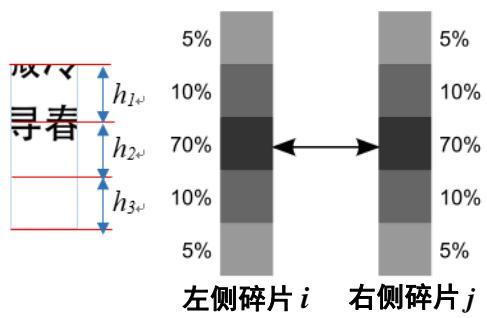

<details>
<summary>text_image</summary>

段冷
寻春
h₁
h₂
h₃
5%
10%
70%
10%
5%
左侧碎片 i
右侧碎片 j
5%
10%
70%
10%
5%
</details>

图 6 评估函数参数示意图

参考问题一，设计组内匹配算法如下：

（1）将组内碎片以及剩余未分组的碎片放入碎片池中；  
（2）以左侧全为白色像素点的碎片为基准碎片，记为 $s _ { i } .$ ，并将其从碎片池中剔除；  
（3）依次计算 $s _ { i }$ 右侧边缘与地址池中其他碎片 $s _ { j }$ 左侧边缘的误差评估值$c _ { h _ { 1 } } ( i , j ) , c _ { h _ { 2 } } ( i , j ) , c _ { h _ { 3 } } ( i , j )$  
（4）依次计算碎片 $s _ { i }$ 与池中其他碎片 $s _ { j }$ 的相对误差:<sup>[1]</sup>

$$
c _ {h} ^ {\prime} (i, j) = \sum_ {k = 1} ^ {3} \frac {| c _ {h _ {k}} (i , j) - \min c _ {h _ {k}} (i , j ^ {\prime}) |}{c _ {h _ {k}} (i , j)}
$$

其中， $j$ 表示当前比较的碎片， $j ^ { \prime }$ 为碎片池中其他的碎片，k表示上下三段，如 $h _ { 1 } , h _ { 2 } , h _ { 3 }$

（5）选取相对偏差最小的碎片，且 $c _ { h } ^ { \prime } ( i , j ) \leq \xi$ 时，将该碎片作为碎片 $s _ { i }$ 的右侧碎片，并记该碎片为 $s _ { i } .$ ，将其从碎片池中删除；  
（6）重复（3）\~（5）步18次直至结束。

12\~22组可以根据同样的算法进行碎片的拼接复原。在此过程中由于最小相对误差的碎片存在多个，计算机很难进行取舍。因此，在程序中，我们设计了人机交互的界面，当遇到此类情况时，通过人工干预的方式来选择最佳的碎片。最后，可以得到22 个拼接好的片段。

## 5.2.1.3 组间片段的匹配

组间片段的匹配，我们主要依据以下两点原则：

（1）若两个片段在同一行，那么两个片段内碎片的数量应当互补（和为 19）；  
（ ）以一个片段为基础，计算其与右侧片段的相对偏差，相对偏差越小，匹配程度越高。

根据以上原则，最终可以得到左右两侧片段按行匹配的结果如下图所示：

表 5 22组片段按行匹配情况表

<table><tr><td>行号</td><td>1</td><td>2</td><td>3</td><td>4</td><td>5</td><td>6</td><td>7</td><td>8</td><td>9</td><td>10</td><td>11</td></tr><tr><td>左侧片段组号</td><td>1</td><td>2</td><td>3</td><td>4</td><td>5</td><td>6</td><td>7</td><td>8</td><td>9</td><td>10</td><td>11</td></tr><tr><td>右侧片段组号</td><td>22</td><td>21</td><td>15</td><td>74</td><td>19</td><td>13</td><td>16</td><td>18</td><td>14</td><td>20</td><td>12</td></tr></table>

注：这里行号不表示该行在原始文件中的顺序。

## 5.2.1.4 行间匹配

类似于组内碎片匹配的算法，通过计算行片段之间上下边缘的误差评估值$c _ { \scriptscriptstyle w } ( p , q )$ ，最终可以得到行片段的正确序列。行误差评估值<sup>[2]</sup>的计算公式如下：

$$
c _ {w} (p, q) = \sum_ {x = 3} ^ {w - 2} e _ {w} (p, q, x)
$$

其中，<sup>p q,</sup> 表示行片段号，w表示行像素点的数量。

根据上述模型及算法，最终可得到 1119个碎片在原始文件中的序列如下表所示：

表 6 附件 3排序后碎片序列表

<table><tr><td></td><td>1</td><td>2</td><td>3</td><td>4</td><td>5</td><td>6</td><td>7</td><td>8</td><td>9</td><td>10</td><td>11</td><td>12</td><td>13</td><td>14</td><td>15</td><td>16</td><td>17</td><td>18</td><td>19</td></tr><tr><td>1</td><td>49</td><td>54</td><td>65</td><td>143</td><td>186</td><td>2</td><td>57</td><td>192</td><td>178</td><td>118</td><td>190</td><td>95</td><td>11</td><td>22</td><td>129</td><td>28</td><td>91</td><td>188</td><td>141</td></tr><tr><td>2</td><td>61</td><td>19</td><td>78</td><td>67</td><td>69</td><td>99</td><td>162</td><td>96</td><td>131</td><td>79</td><td>63</td><td>116</td><td>163</td><td>72</td><td>6</td><td>177</td><td>20</td><td>52</td><td>36</td></tr><tr><td>3</td><td>168</td><td>100</td><td>76</td><td>62</td><td>142</td><td>30</td><td>41</td><td>23</td><td>147</td><td>191</td><td>50</td><td>179</td><td>120</td><td>86</td><td>195</td><td>26</td><td>1</td><td>87</td><td>18</td></tr><tr><td>4</td><td>38</td><td>148</td><td>46</td><td>161</td><td>24</td><td>35</td><td>81</td><td>189</td><td>122</td><td>103</td><td>130</td><td>193</td><td>88</td><td>167</td><td>25</td><td>8</td><td>9</td><td>105</td><td>74</td></tr><tr><td>5</td><td>71</td><td>156</td><td>83</td><td>132</td><td>200</td><td>17</td><td>80</td><td>33</td><td>202</td><td>198</td><td>15</td><td>133</td><td>170</td><td>205</td><td>85</td><td>152</td><td>165</td><td>27</td><td>60</td></tr><tr><td>6</td><td>14</td><td>128</td><td>3</td><td>159</td><td>82</td><td>199</td><td>135</td><td>12</td><td>73</td><td>160</td><td>203</td><td>169</td><td>134</td><td>39</td><td>31</td><td>51</td><td>107</td><td>115</td><td>176</td></tr><tr><td>7</td><td>94</td><td>34</td><td>84</td><td>183</td><td>90</td><td>47</td><td>121</td><td>42</td><td>124</td><td>144</td><td>77</td><td>112</td><td>149</td><td>97</td><td>136</td><td>164</td><td>127</td><td>58</td><td>43</td></tr><tr><td>8</td><td>125</td><td>13</td><td>182</td><td>109</td><td>197</td><td>16</td><td>184</td><td>110</td><td>187</td><td>66</td><td>106</td><td>150</td><td>21</td><td>173</td><td>157</td><td>181</td><td>204</td><td>139</td><td>145</td></tr><tr><td>9</td><td>29</td><td>64</td><td>111</td><td>201</td><td>5</td><td>92</td><td>180</td><td>48</td><td>37</td><td>75</td><td>55</td><td>44</td><td>206</td><td>10</td><td>104</td><td>98</td><td>172</td><td>171</td><td>59</td></tr><tr><td>10</td><td>7</td><td>208</td><td>138</td><td>158</td><td>126</td><td>68</td><td>175</td><td>45</td><td>174</td><td>0</td><td>137</td><td>53</td><td>56</td><td>93</td><td>153</td><td>70</td><td>166</td><td>32</td><td>196</td></tr><tr><td>11</td><td>89</td><td>146</td><td>102</td><td>154</td><td>114</td><td>40</td><td>151</td><td>207</td><td>155</td><td>140</td><td>185</td><td>108</td><td>117</td><td>4</td><td>101</td><td>113</td><td>194</td><td>119</td><td>123</td></tr></table>

## 5.2.2基于基线的英文字拼接模型

由上文的分析可以知道，英文与中文在字形、行分布等方面存在着很大的不同。在英文的印刷排版中对应字体均有比较严格的基准线，基线是排成一行的西文字符主体上的一条不可见的假想线。对于英文段落上完整的一行，一定存在至少四条基准线，将整行英文分布在三个格子中，即英文的“四线三格”。本问题中给出的是衬线体（serif字体）示意图如下：

## Tayhblgp

图 7 “三线四格”示意图

根据上述特征，我们建立了基于基线的碎片拼接模型。同中文字体，我们首先需要对1119 个碎片进行。

## 5.2.2.1 按行分组

按行分组的重要依据是每一块碎片的基准线，因此首先需要确定每一个碎片基准线的具体位置。通过观察发现，基准线是黑白像素点的分水岭，因此通过统

计黑白渐变处黑色像素点的数量，可以确定基准线的位置。

具体方法如下所示：

如右图所示，由上到下，由左到右按列统计从白色像素点到第一个黑色像素点的距离 $l _ { x } ,$ ，那么可以得到 72个$l _ { x }$ 的数据，取众数即为第一条基准线的位置 $l i n e _ { I }$ ，同样，从下到上统计2得到第二条基准线 $l i n e _ { 2 }$ 。这样，每个碎片可得到至少2条基准线以及他们的位置信息。

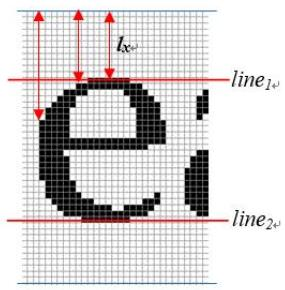

<details>
<summary>text_image</summary>

lₓ
line₁₊
e
line₂₊
</details>

图 8 基线示意图

同样，按行分组时：

（1）选取左侧留白的碎片作为标准碎片，以基准线为依据，若碎片 i 和碎片j 满足： $\mid l i n e _ { 1 i } - l i n e _ { 1 j } \mid < 2 p i x e l s$ 。那么，我们认为这两个碎片处于同一行。  
（2）若该碎片的基准线不和任何一行的标准碎片相吻合，那么将该碎片放入碎片池中。

最终可以得到 11个组以及碎片池中少量的碎片。

## 5.2.2.2 组内匹配算法设计

由于在组内，英文碎片的边缘信息与汉字类似，因此我们同样采用误差评估函数 $c _ { h } ( i , j )$ 来衡量两个碎片之间匹配程度。不同的是由于相对误差最小的碎片不一定是该碎片右侧的碎片。因此，我们做了如下的处理：

当两碎片的相对误差 $c _ { h } ^ { \prime } ( i , j ) < 0 . 5$ 时，接受碎片j作为碎片i的右侧碎片，相反，则加入人工干预的方式，帮助判断是否为右侧碎片。

## 5.2.2.3 行间匹配

增加人工干预的方式，最终可以得到 11组完整的碎片片段。同样利用行碎片上下边缘的信息，计算行片段之间上下边缘的误差评估值 $c _ { w } ( p , q )$ ，最终可以得到行片段的正确序列。

根据上述模型及算法，最终可得到 1119个碎片在原始文件中的序列如下表所示：

表 7 附件 4排序后碎片序列表

<table><tr><td></td><td>1</td><td>2</td><td>3</td><td>4</td><td>5</td><td>6</td><td>7</td><td>8</td><td>9</td><td>10</td><td>11</td><td>12</td><td>13</td><td>14</td><td>15</td><td>16</td><td>17</td><td>18</td><td>19</td></tr><tr><td>1</td><td>191</td><td>75</td><td>11</td><td>154</td><td>190</td><td>184</td><td>2</td><td>104</td><td>180</td><td>64</td><td>106</td><td>4</td><td>149</td><td>32</td><td>204</td><td>65</td><td>39</td><td>67</td><td>147</td></tr><tr><td>2</td><td>201</td><td>148</td><td>170</td><td>196</td><td>198</td><td>94</td><td>113</td><td>164</td><td>78</td><td>103</td><td>91</td><td>80</td><td>101</td><td>26</td><td>100</td><td>6</td><td>17</td><td>28</td><td>146</td></tr><tr><td>3</td><td>86</td><td>51</td><td>107</td><td>29</td><td>40</td><td>158</td><td>186</td><td>98</td><td>24</td><td>117</td><td>150</td><td>5</td><td>59</td><td>58</td><td>92</td><td>30</td><td>37</td><td>46</td><td>127</td></tr><tr><td>4</td><td>19</td><td>194</td><td>93</td><td>141</td><td>88</td><td>121</td><td>126</td><td>105</td><td>155</td><td>114</td><td>176</td><td>182</td><td>151</td><td>22</td><td>57</td><td>202</td><td>71</td><td>165</td><td>82</td></tr><tr><td>5</td><td>159</td><td>139</td><td>1</td><td>129</td><td>63</td><td>138</td><td>153</td><td>53</td><td>38</td><td>123</td><td>120</td><td>175</td><td>85</td><td>50</td><td>160</td><td>187</td><td>97</td><td>203</td><td>31</td></tr><tr><td>6</td><td>20</td><td>41</td><td>108</td><td>116</td><td>136</td><td>73</td><td>36</td><td>207</td><td>135</td><td>15</td><td>76</td><td>43</td><td>199</td><td>45</td><td>173</td><td>79</td><td>161</td><td>179</td><td>143</td></tr><tr><td>7</td><td>208</td><td>21</td><td>7</td><td>49</td><td>61</td><td>119</td><td>33</td><td>142</td><td>168</td><td>62</td><td>169</td><td>54</td><td>192</td><td>133</td><td>118</td><td>189</td><td>162</td><td>197</td><td>112</td></tr><tr><td>8</td><td>70</td><td>84</td><td>60</td><td>14</td><td>68</td><td>174</td><td>137</td><td>195</td><td>8</td><td>47</td><td>172</td><td>156</td><td>96</td><td>23</td><td>99</td><td>122</td><td>90</td><td>185</td><td>109</td></tr><tr><td>9</td><td>132</td><td>181</td><td>95</td><td>69</td><td>167</td><td>163</td><td>166</td><td>188</td><td>111</td><td>144</td><td>206</td><td>3</td><td>130</td><td>34</td><td>13</td><td>110</td><td>25</td><td>27</td><td>178</td></tr><tr><td>10</td><td>171</td><td>42</td><td>66</td><td>205</td><td>10</td><td>157</td><td>74</td><td>145</td><td>83</td><td>134</td><td>55</td><td>18</td><td>56</td><td>35</td><td>16</td><td>9</td><td>183</td><td>152</td><td>44</td></tr><tr><td>11</td><td>81</td><td>77</td><td>128</td><td>200</td><td>131</td><td>52</td><td>125</td><td>140</td><td>193</td><td>87</td><td>89</td><td>48</td><td>72</td><td>12</td><td>177</td><td>124</td><td>0</td><td>102</td><td>115</td></tr></table>

## 5.3 问题三——Two-Sides RCCSTD 问题研究

通过对问题三的分析，发现问题的解决方案基本与问题二类似，但针对正反碎片的特点，对问题二中的算法做了进一步的改进。

## 5.3.1基于问题二算法的改进

（1）边缘基准碎片的选择。由于一个碎片存在正反面的信息，因此在选择边缘基准碎片时，需要考虑正反面两侧边缘留白的情况。若某一碎片正反面两侧均有留白，说明该碎片为边缘基准碎片；相反则不是。这样可以选取到 22组边缘基准碎片对（即一碎片的正反面）。  
（ ）分组标准的确定。在问题二中，我们通过分析不同碎片基准线之间的差异性来判断两块碎片是否在同一行。而对于正反的碎片，可获取的信息更多。因此采取下述标准进行分组：

若 $( \mathbf { a } _ { 1 } , \mathbf { b } _ { 1 } )$ 为左侧基准碎片， $( \mathbf { a } _ { 2 } , \mathbf { b } _ { 2 } )$ 为右侧比较碎片，那么有右图所示的两种比较方式。同问题二的基准线误差计算方式，可以得到两组数据：

$$
((l _ {t 1}, l _ {b 1}), (l _ {t 2}, l _ {b 2}))
$$

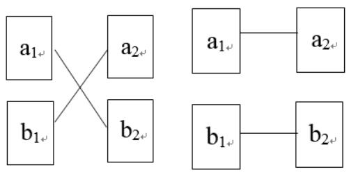

<details>
<summary>flowchart</summary>

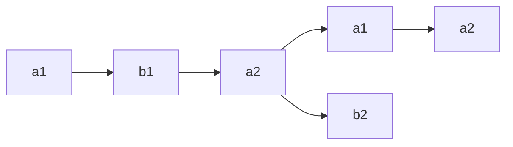
</details>

图 9 碎片的两种匹配方式示意图

其中， $( l _ { t 1 } , l _ { b 1 } )$ 表示在第一种情况下匹配，

上下面基准线的差值； $( l _ { t 2 } , l _ { b 2 } )$ 表示在第二种情况下匹配，上下面基准线的差值。为了便于比较，我们作如下的简化：对于每一次匹配可以得到一组数据 $( l _ { 1 } , l _ { 2 } )$ 其中， $l _ { 1 } = l _ { t 1 } + l _ { b 1 } , l _ { 2 } = l _ { t 2 } + l _ { b 2 }$

那么，在分组过程中，依次取碎片分别与 22组边缘基准碎片做匹配，得到22组共 44 个数据： $( l _ { \mathrm { 1 } , 1 } , l _ { 2 , 1 } ; \ l _ { \mathrm { 1 } , 2 } , l _ { \mathrm { 2 } , 2 } \  \ l _ { \mathrm { 1 } , 2 2 } , l _ { \mathrm { 2 } , 2 2 } )$ ，取其中的最小值对应的碎片即可将其归入相应的组。同时可判断匹配的方式，即：选取 $l _ { 1 i }$ 表示为第一种匹配方式，选取 $l _ { 2 i }$ 表示为第二种匹配方式。这样可以将所有碎片分为 22组，一些未归入任何组的碎片可放入地址池中。

（3）组内匹配算法的改进。对于同一组内的碎片，我们同样可以以误差评估函数 $c _ { h } ( i , j )$ 来衡量两个碎片之间匹配程度。不同的是在匹配的过程中，我们可以计算得到上下两面的误差值分别为 $c _ { h 1 } ( i , j )$ 和 $c _ { h 2 } ( i , j )$ ，为了便于比较，同样以$c _ { h } ( i , j ) = c _ { h 1 } ( i , j ) + c _ { h 2 } ( i , j )$ 来作为衡量匹配程度的标准。 $c _ { h } ( i , j )$ 越小，匹配度越好，即可作为被匹配碎片的右侧碎片。这样，可以得到 22组碎片片段。

（4）行间匹配的改进。利用问题二中行间匹配的算法，计算上下面的误差评估值的综合指标，即 $c _ { \scriptscriptstyle w } ( i , j ) = c _ { \scriptscriptstyle w 1 } ( i , j ) + c _ { \scriptscriptstyle w 2 } ( i , j )$ 。最终可以拼接复原得到原始文件。

## 5.3.2模型计算结果

由上述改进后的算法，最终可以计算得到附件 5排序后碎片的序列如下两表所示：

表 8 附件 5排序后一面碎片序列表

<table><tr><td></td><td>1</td><td>2</td><td>3</td><td>4</td><td>5</td><td>6</td><td>7</td><td>8</td><td>9</td><td>10</td><td>11</td><td>12</td><td>13</td><td>14</td><td>15</td><td>16</td><td>17</td><td>18</td><td>19</td></tr><tr><td>1</td><td>136a</td><td>047b</td><td>020b</td><td>164a</td><td>081a</td><td>189a</td><td>029b</td><td>018a</td><td>108b</td><td>066b</td><td>110b</td><td>174a</td><td>183a</td><td>150b</td><td>155b</td><td>140b</td><td>125b</td><td>111a</td><td>078a</td></tr><tr><td>2</td><td>005b</td><td>152b</td><td>147b</td><td>060a</td><td>059b</td><td>014b</td><td>079b</td><td>144b</td><td>120a</td><td>022b</td><td>124a</td><td>192b</td><td>025a</td><td>044b</td><td>178b</td><td>076a</td><td>036b</td><td>010a</td><td>089b</td></tr><tr><td>3</td><td>143a</td><td>200a</td><td>086a</td><td>187a</td><td>131a</td><td>056a</td><td>138b</td><td>045b</td><td>137a</td><td>061a</td><td>094a</td><td>098b</td><td>121b</td><td>038b</td><td>030b</td><td>042a</td><td>084a</td><td>153b</td><td>186a</td></tr><tr><td>4</td><td>083b</td><td>039a</td><td>097b</td><td>175b</td><td>072a</td><td>093b</td><td>132a</td><td>087b</td><td>198a</td><td>181a</td><td>034b</td><td>156b</td><td>206a</td><td>173a</td><td>194a</td><td>169a</td><td>161b</td><td>011a</td><td>199a</td></tr><tr><td>5</td><td>090b</td><td>203a</td><td>162a</td><td>002b</td><td>139a</td><td>070a</td><td>041b</td><td>170a</td><td>151a</td><td>001a</td><td>166a</td><td>115a</td><td>065a</td><td>191b</td><td>037a</td><td>180b</td><td>149a</td><td>107b</td><td>088a</td></tr><tr><td>6</td><td>013b</td><td>024b</td><td>057b</td><td>142b</td><td>208b</td><td>064a</td><td>102a</td><td>017a</td><td>012b</td><td>028a</td><td>154a</td><td>197b</td><td>158b</td><td>058b</td><td>207b</td><td>116a</td><td>179a</td><td>184a</td><td>114b</td></tr><tr><td>7</td><td>035b</td><td>159b</td><td>073a</td><td>193a</td><td>163b</td><td>130b</td><td>021a</td><td>202b</td><td>053a</td><td>177a</td><td>016a</td><td>019a</td><td>092a</td><td>190a</td><td>050b</td><td>201b</td><td>031b</td><td>171a</td><td>146b</td></tr><tr><td>8</td><td>172b</td><td>122b</td><td>182a</td><td>040b</td><td>127b</td><td>188b</td><td>068a</td><td>008a</td><td>117a</td><td>167b</td><td>075a</td><td>063a</td><td>067b</td><td>046b</td><td>168b</td><td>157b</td><td>128b</td><td>195b</td><td>165a</td></tr><tr><td>9</td><td>105b</td><td>204a</td><td>141b</td><td>135a</td><td>027b</td><td>080a</td><td>000a</td><td>185b</td><td>176b</td><td>126a</td><td>074a</td><td>032b</td><td>069b</td><td>004b</td><td>077b</td><td>148a</td><td>085a</td><td>007a</td><td>003a</td></tr><tr><td>10</td><td>009a</td><td>145b</td><td>082a</td><td>205b</td><td>015a</td><td>101b</td><td>118a</td><td>129a</td><td>062b</td><td>052b</td><td>071a</td><td>033a</td><td>119b</td><td>160a</td><td>095b</td><td>051a</td><td>048b</td><td>133b</td><td>023a</td></tr><tr><td>11</td><td>054a</td><td>196a</td><td>112b</td><td>103b</td><td>055a</td><td>100a</td><td>106a</td><td>091b</td><td>049a</td><td>026a</td><td>113b</td><td>134b</td><td>104b</td><td>006b</td><td>123b</td><td>109b</td><td>096a</td><td>043b</td><td>099b</td></tr></table>

表 9 附件 5 排序后另一面碎片序列表

<table><tr><td></td><td>1</td><td>2</td><td>3</td><td>4</td><td>5</td><td>6</td><td>7</td><td>8</td><td>9</td><td>10</td><td>11</td><td>12</td><td>13</td><td>14</td><td>15</td><td>16</td><td>17</td><td>18</td><td>19</td></tr><tr><td>1</td><td>078b</td><td>111b</td><td>125a</td><td>140a</td><td>155a</td><td>150a</td><td>183b</td><td>174b</td><td>110a</td><td>066a</td><td>108a</td><td>018b</td><td>029a</td><td>189b</td><td>081b</td><td>164b</td><td>020a</td><td>047a</td><td>136b</td></tr><tr><td>2</td><td>089a</td><td>010b</td><td>036a</td><td>076b</td><td>178a</td><td>044a</td><td>025b</td><td>192a</td><td>124b</td><td>022a</td><td>120b</td><td>144a</td><td>079a</td><td>014a</td><td>059a</td><td>060b</td><td>147a</td><td>152a</td><td>005a</td></tr><tr><td>3</td><td>186b</td><td>153a</td><td>084b</td><td>042b</td><td>030a</td><td>038a</td><td>121a</td><td>098a</td><td>094b</td><td>061b</td><td>137b</td><td>045a</td><td>138a</td><td>056b</td><td>131b</td><td>187b</td><td>086b</td><td>200b</td><td>143b</td></tr><tr><td>4</td><td>199b</td><td>011b</td><td>161a</td><td>169b</td><td>194b</td><td>173b</td><td>206b</td><td>156a</td><td>034a</td><td>181b</td><td>198b</td><td>087a</td><td>132b</td><td>093a</td><td>072b</td><td>175a</td><td>097a</td><td>039b</td><td>083a</td></tr><tr><td>5</td><td>088b</td><td>107a</td><td>149b</td><td>180a</td><td>037b</td><td>191a</td><td>065b</td><td>115b</td><td>166b</td><td>001b</td><td>151b</td><td>170b</td><td>041a</td><td>070b</td><td>139b</td><td>002a</td><td>162b</td><td>203b</td><td>090a</td></tr><tr><td>6</td><td>114a</td><td>184b</td><td>179b</td><td>116b</td><td>207a</td><td>058a</td><td>158a</td><td>197a</td><td>154b</td><td>028b</td><td>012a</td><td>017b</td><td>102b</td><td>064b</td><td>208a</td><td>142a</td><td>057a</td><td>024a</td><td>013a</td></tr><tr><td>7</td><td>146a</td><td>171b</td><td>031a</td><td>201a</td><td>050a</td><td>190b</td><td>092b</td><td>019b</td><td>016b</td><td>177b</td><td>053b</td><td>202a</td><td>021b</td><td>130a</td><td>163a</td><td>193b</td><td>073b</td><td>159a</td><td>035a</td></tr><tr><td>8</td><td>165b</td><td>195a</td><td>128a</td><td>157a</td><td>168a</td><td>046a</td><td>067a</td><td>063b</td><td>075b</td><td>167a</td><td>117b</td><td>008b</td><td>068b</td><td>188a</td><td>127a</td><td>040a</td><td>182b</td><td>122a</td><td>172a</td></tr><tr><td>9</td><td>003b</td><td>007b</td><td>085b</td><td>148b</td><td>077a</td><td>004a</td><td>069a</td><td>032a</td><td>074b</td><td>126b</td><td>176a</td><td>185a</td><td>000b</td><td>080b</td><td>027a</td><td>135b</td><td>141a</td><td>204b</td><td>105a</td></tr><tr><td>10</td><td>023b</td><td>133a</td><td>048a</td><td>051b</td><td>095a</td><td>160b</td><td>119a</td><td>033b</td><td>071b</td><td>052a</td><td>062a</td><td>129b</td><td>118b</td><td>101a</td><td>015b</td><td>205a</td><td>082b</td><td>145a</td><td>009b</td></tr><tr><td>11</td><td>099a</td><td>043a</td><td>096b</td><td>109a</td><td>123a</td><td>006a</td><td>104a</td><td>134a</td><td>113a</td><td>026b</td><td>049b</td><td>091a</td><td>106b</td><td>100b</td><td>055b</td><td>103a</td><td>112a</td><td>196b</td><td>054b</td></tr></table>

## 5.4关于人工干预的说明

由于算法的局限性，碎纸片在 cross-cut的情况下需要人工参与决策。在我们的算法中，有两种情况需要进行人工干预。

情况一：在组内进行匹配时，我们选取误差值最小的碎片作为匹配的碎片，但在实际中误差值最小的碎片不一定为正确的匹配对象。因此，在问题二中，我们设计为：当最小的误差值小于 0.5时，该碎片被完全接受；相反，当其大于 0.5时，该碎片需要人工干预判断其是否被接受。

干预方式：如下图所示：

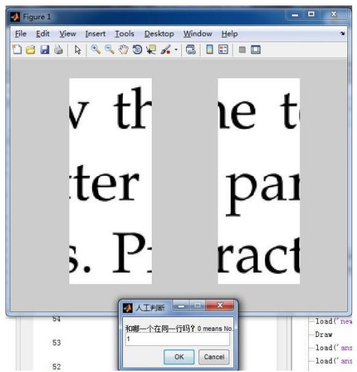

<details>
<summary>text_image</summary>

v th
ter
s. P:
the t
pa
ract
和哪一个在同一行吗？0 means No.
1
OK Cancel
</details>

案例一：误差值大于 0.5但匹配成功

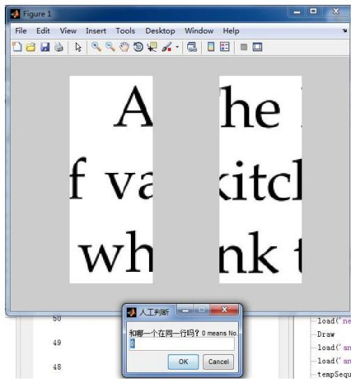

<details>
<summary>text_image</summary>

A
f va
wh
he
kitcl
nk t
50
49
48
人工判断
和哪一个在同一行吗？0 means No.
1
load('ne
Draw
load('an
load('an
tempSequ
OK
Cancel)
</details>

案例二：误差值大于 0.5但匹配失败

当人工匹配接受时，输入 1；相反，人工匹配拒绝时，输入 0。

情况二：当组内匹配成功后，组间匹配失败的碎片片段，通过人工干预的方式完成组间的匹配。

干预方式：由于碎片片段数量有限，可通过观察直接获得位于同一行的两片段的序号。

## 六、模型检验与结果分析

## 6.1 碎纸片复原中文算法的检验

为了检验我们的模型是否具有较强的适用性，我们利用现有文档，将其裁剪后打乱顺序，随后利用复原算法对其进行复原，以此来检验算法。其步骤如下：

我们首先利用 PDF XChange Viewer 软件将下列所示 PDF 文档转换为 bmp 图像，然后利用 Photoshop 图像处理软件利用基准线和裁剪工具，将其划分为196\*2145 像素点的10个碎纸片，然后随机编码这些碎纸片，利用碎纸片复原的中文算法对这些随机编码的碎纸片进行复原，以此来检验算法的正确性。

黄金有价，青春无价。青春的辞典里没有失收的字眼、草道韶华镇长在，发白面皱专相待。题诗寄汝非无意，莫负青春取自惭。滥用青春，胜于虚度青春。青春一去不复返，事业一纵永无成。青春之所以幸福，就因为它有前途。青春是美妙的：挥霍青春就是犯罪。—(英国)兼伯纳只要人心中有了春气、秋风是不会引人愁里的、百余买\*马、于余买美人。万金买高爵，何处买青春？青春是诗歌丰收的季节，而老年则更适宜哲学上的收获。青春的实质是充实：青春的诗意是浪漫；青春的证明是无悔。假如青春是一种缺陷的话，那也是我们太快就会失去的缺陷。有了金钱可以在这个世界做很多事，唯有青春却无法用钱购买。我始终记住：青春是美丽的东西，而且对我来说，它永远是鼓舞的源泉。青春是奇异的；我看到少女们浪费青春，就替她们伤心，实在是无比的罪恶。这就是青春：充满着力量，充满着期待、志愿，充满着求知和斗争的志向，充满着希望、信心的青春。青春啊，永远是美好的，可是真正的青春，只属于这些永远力争上游的人，永远忘我劳动的人，永远谦虚的人。青春是一个不可思议的伟大力量，它催发着青年人的躯体，启迪着他们的智慧。同时它也灌输差热烈的感情和坚强的理智。青春——人的一生中最美好年岁。它是一个人的生命含苞待放的时期，生机勃发、朝气蓬勃：它意味着进取，意味着上升，蕴含着巨大希望的未知数。为世界进文明，为人类造幸福，以青年之我，创建青春之家适青春之国家，青春之民族，青春寄之人类，青春之地球，青春之宇审，资以乐其无涯生。青春应该怎样度过？有的如同烈火，永远照耀别人，有的却像荧光，其至也照不亮自己！不同的生活理想，不同的生活态度，决定一个人在战斗中站的位置。青春不仅仅是月亮、林荫、交谊舞，也不仅仅是为了使地球一个高等动物。假如你能让青春放逐出自己的思维。让它驰骋在大自然纷繁的境地，回旋在物质的深层结构，奔波在宇审无限的区域，那么你会为之迷恋，为之振奋，为之倾注出自已的全部热血。青春并不像一袭新衣，好像我们仔细少穿一点就可以保持簇新似的。青春，当我们有它的时候我们一定要每天穿用它，而它则很快就会消逝。少年人不会抱怨自己如花似锦的青春，美丽的年华对他们说来是珍贵的，哪怕它带着各式各样的风暴。人世间，比青春再可宝贵的东西实在没有，然而青春也最容易消逝。最可贵的东西却不其为人所爱惜，最易消逝的东西却在促进它的消逝。谁能保持得永远的青春的，便是伟大的人。

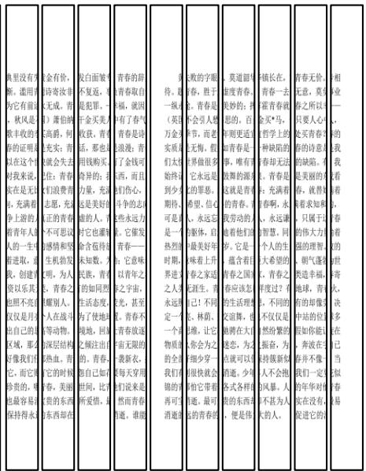

<details>
<summary>text_image</summary>

千里没有死，徒用有之有言。秋风是衰丰收的。原证明又在这个时候对我来说，实在是无比、充满和争上游的看青年人的一生而进取，意，创建欣赏以乐其。他照不亮且只是月月出自己的区域，那么好像我们而已，它则贵的，他最容易保持得永。
金有价，青春汝非无成。秋风是衰丰收的。原证明又在这个时候来说，实在是无比、充满和争上游的看青年人的一生而进取，意，创建欣赏以乐其。他照不亮且只是月月出自己的区域，那么好像我们而已，它则贵的，他最容易保持得永。
金有价，青春汝非无成。秋风是衰丰收的。原证明又在这个时候来说，实在是无比、充满和争上游的看青年人的一生而进取，意，创建欣赏以音乐。他照不亮且是一只不可提议感情和生机勃发明，为人，青春之爱耀别人。深结构深为热血。青年的时候春，宝贵的东西却在
没白面貌不复返，更是犯罪了。千金买美人收获，青春生活，那也是用钱购买奇异的；力量，充满还是自由的雄人。青春之爱耀别人，它也灯灌生命负担待救未知数，为民族，青年的如人的心力独出的人。青春，总是自己地位，比所听惜惜，是
青春的弱青春取自福，就因中有了春气青春是诗读被；青春了金钱可西，而且们伤心，斗争的志远永远力为心，它意味着青年之一。你更是一条热烈时期，界进之人来永远而一个一个物质的全部我们背诵的青铜再可？消道道
败的字眼胜，胜于余。青春是不会引人情节，而假，想非常很多的人太始终过少女时期。可是是一大热烈时期，界进之人来永远而一个热烈时期，界进之人来永远而一个热烈时期，界进之人来永远而一个热烈时期，界进之人来永远而一个热烈时期，界进之人来永远而一个热烈时期，界进之人来永远而一个热烈时期，界进之人来永远而一个热烈时期，界进之人来永远而一个热烈时期，界进之人来永远而一个热烈时期，界进之人来永远而一个热烈时期，界进之人来永远而一品不等。<nl>我待。是一张《英万金实质我们太始终过少女时期》可是是一条热烈时期，界进之人来永远而一个热烈时期，界进之人来永远而一个热烈时期，界进之人来永远而一个热烈时期，界进之人来永远而一个热烈时期，界进之人来永远而一个热烈时期，界进之人来永远而一个热烈时期，界进之人来永远而一个热烈时期，界进之人来永远而一个热烈时期，界进之人来永远而一个热烈时期，界进之人来永远而是一个热烈时期，界进之人来永远而一个热烈时期，界进之人来永远而一个热烈时期，界进之人来永远而一个热烈时期，界进之人来永远而一个热烈时期，界进之人来永远而一个热烈时期，界进之人来永远而一个热烈时期，界进之人来永远而一个热烈时期，界进之人来永远而一个热烈时期，界进之人来永远而一个热烈时期，界进之人来永远而个自然性不等。<nl>莫道题情度青春，美妙的：百年则更返回青春是一个事，唯有做我的潮汐就是青春的青春。我劳动的人也有他们岁，它是一篇蕴含着青春之固春应该怎么生。自己！不同、林荫、道德、让它你会为之细细穿穿的全部我们背诵的青铜再可？消道道
镇长在。青春一去霍青春就买*“当？哲学上的神阳的春却无法。青春是春？充满着春啊，水头远谦智慧。同个人的生大希望的青春之所以看过？有不仅仅是然纷繁的振荡，为我持簇新躯而不会抱风暴人。人不甚为人大的人。
青春无价，无意。青春之所以只要人心处买青春的诗意的缺陷。是不是美丽的春也。就替青春求知都只属于你的伟大力强的理智、朝气蓬光地造幸福、青春之物感、地球的悲奇，并像我们一定时年的年年对外实在没有中的。
相业——
我的自我看着春着的世奇人，快多在已当似春易
</details>

（a）  
（b）  
图 10 恢复后（b）分割前（a）的文档

经过与原文进行比较，可以得出我们的模型算法对于普遍的情况具有一定的适用性。

## 6.2 结果分析

利用我们的中文或英文复原算法可以将一堆碎纸片复原，但如何知道复原后的结果的正确性，我们上面是通过人工观察的方法，这对于复原大量碎纸片是效率很低的。为此我们利用OCR技术对复原得到后的图片进行文字提取。

如果复原结果很好，那么就会提取出文字，否则就会提取出大量乱码，如下所示：

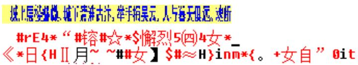

<details>
<summary>text_image</summary>

#rE4* " #容#☆*$懈烈5(四)4女*
«*日{HII月~ ~##女】$#≈H}inm*{。+女自" 0it
</details>

图 11OCR提取复原程度较差的碎纸片后得到的文本

如果复原的很好，我们可以直接利用互联网上的搜索引擎提供的 API，将文本在互联网上进行搜索，若果搜索到很多相关结果，那么就可以基本证明我们的复原是可靠的，这一过程完全可以实现全自动化，而不需要人进行干预。

## 七、模型的进一步讨论

（1）模型中缺乏对于中英文混合的碎纸片复原算法的设计，可以考虑自动生成具有中英文混合的碎纸片，考察它们的特点，并针对它们的特点进行算法的改进和优化。（2）模型中可以考虑将适当的语料库加入，利用 OCR 工具将局部结果进行文字转化然后与语料库进行匹配，以提高模型的准确性，减少人工干预量。（3）现有模型的算法对于相关参数比较敏感，为了提高算法的适用性，可以尝试引入模拟退火算法、遗传算法、蚁群算法等智能算法。（4）模型中针对的碎纸片形状都是规则的矩形，而实际情况的碎纸片往往是不规则的，为了提高模型的适用性，可以考虑将形状的匹配纳入我们的模型。（5）模型中没有考虑实际情况中可能存在彩色字体，在碎纸片拼接的实际应用中可以考虑将颜色作为匹配的依据，这样能够适当提高模型的准确性。

## 八、模型优缺点

表 10 模型的优缺点

<table><tr><td>优点</td><td>缺点</td></tr><tr><td>(1)模型中针对不同碎片类型和尺寸,具体问题具体分析,为每种情况设计了不同的算法实现了碎纸片的复原。</td><td>(1)模型中仅针对中文和英文的字符特点进行了匹配算法的设计,缺乏对中英文混合以及阿拉伯字符等更一般情况的考虑。</td></tr><tr><td>(2)为了能够结合计算机进行人工干预,我们专门在计算机很难分辨的特殊情况下设计了人工干预GUI界面,使得人工干预与机器复原巧妙地结合到了一起。</td><td>(2)算法的匹配准确率对于相关参数比较敏感,因此应用于不同碎纸片对象时需重新设定。</td></tr><tr><td>(3)模型中对于中文和英文的字符特点进行了充分挖掘,使得模型对于中文和英文的匹配准确度较高。</td><td>(3)模型中缺乏针对碎纸片的语义分析,人工干预量还有待进一步减少。</td></tr></table>

## 九、参考文献

[1] Christian Schauer, Matthias Prandtstetter, and Günther R.Raidl. A Memetic Algorithm for Reconstructing Cross-Cut Shredded Text Documents. Institute of Computer Graphics and Algorithms Vienna University of Technology, Vienna, Austria.  
[2] Johannes Perl, Markus Diem, Florian Kleber, and Robert Sablatnig. Strip Shredded Document Reconstruction Using Optical Character Recognition. In Imaging for Crime Detection and Prevention 2011 (ICDP 2011), 4th International Conference on, pages 1 –6, nov. 2011.  
[3] 罗智中。.基于文字特征的文档碎纸片半自动拼接，计算机工程与应用。2012，48(5) ：207---210。  
[4] 刘金根，吴志鹏。一种基于特征区域分割的图像拼接算法[J]。西安电子科技大学学报，2002，29（6）：768-771。  
[5] Prim, R.C.: Shortest Connection Networks and Some Generalizations. The Bell System Technical Journal 3,1389—1401(1957).  
[6] 王剑文，戴光明，谢柏桥，张全元。求解TSP 问题算法综述[J]。计算机工程与科学.2008(02)。  
[7] 张辉,赵正德,杨立朝,赵郁亮. TSP 问题的算法与应用的研究[J]。 计算机应用与软件. 2009(04)。

## 十、附录

## 10.1 程序运行环境

本文题的解决主要在 Mathwork matlab中完成代码的编写和编译。计算机操作系统：32 位 Win7 操作系统。软件环境：Matlab R2012b。

## 10.2 碎片拼接复原结果

## （1）附件 1 复原图

城上层楼叠幟：城下清淮古汴。举手揖吴云，人与蓉天俱远。魂断。魂断。后夜松江月满、繁繁衣巾莎枣花。村里村北响深车。牛衣古柳卖酋瓜、海常珠级一更平，清近突线、肌脂谁与匀淡，编向啥边浓、小郑非常强记、二南依旧能诗，更有触鲁堪切除、几聖总教知 自古相从休且，何妨低唱减吟，天垂云王作卷阴，坐中人半醉，帘外雪将深，双发练队 运眼端波眉黛翌 妙耕踪既 掌上身轻意态妍 费死轻笑两凤 写级谈拂双鸦，为谁清联不归家，错认门前过马

我劝需张归去好，从来自己忘情，尘心消尽道心平，江南与案北，何处不堪行，闲离阻、谁念萦损王，何曾梦云雨，旧恨前欢，心事两无据要知欲见无电 痴心犹白，债人道一声传语 风券珠究白上钩 兼兼乱叶报新秋，独挑纤手上高楼，临水纵横回晚获、归来转觉情怀动，拖笛级中闻几弄，秋阴重，西山曹浅云都冻，凭高眺远，见长空万半，云无留迹桂牌飞来光射处，冷漫一天秋碧。玉宇琼楼，乘蛮来去，人在清凉国。江山如画 望中翅树历历 省可清言挥玉尘 直须保类合直风流何似谅家纯。不应同蜀客，惟爱卓文君。自惜风流云雨散。关山有限情无限。待君重见寻芳伴、为说相思，日断西楼燕、墓恨黄花未叶，日救红粉桓扶、酒闲不必看英茁 俯仰人间今古，玉骨那染疮雾 冰资自有仙风 海仙时造探芳丛，倒挂绿毛么凤。

俎豆庚桑真过矣，凭君说与南荣.，愿闻吴越报丰登，君王如有问，结袜赖王生。师唱谁家曲，宗风鼠阿谁.借君拍板与门捐，我译汤作戏草坦疑曼胛烘粉印印效拼理闲照晚妆硝 励池晚照园可恨担连能Ⅱ日不知重会呈何年 美草仔细更重看 午夜风翅幅 三豆月到床曾纹如水玉肌凉，何验与依归去，有残妆。金炉狱暖赋烷残，惜香更把宝钗释、重闻处，金承在，这一香、气味胜从前。菊暗荷枯一夜霜，新苞续叶照林光，竹繁茅含出吉黄。霜降水痕收。浅碧鳞鳞露远洲、酒力渐消风力软，喝&、破唱多情却恋头。烛影摇风，一枕伤春绪，归不去，凤楼何外，芳草迷归路，汤发云鹏白，盖浮获乳经|例，人间谁敢更争如，斗取红窗汾面，炙手无人傍屈头，萧萧晚雨脱栖派，谁怜季子敝貂秀

## 附图 1

## （2）附件 2 复原图

fair of face.

The customer is always right. East, west, home's best Life's not all beer and skittles. The devil looks after his own. Manners maketh man. Many à mickle makes a muckle. Δ man who is his own lawver has a fool for his client.

Yow can't make a silk nurse from a sowé’s ear, As thick as thieves. Clothes make the man. All that glisters is not gold. The pen is mightier than sword. Is fair and wise and good and gav. Make love not war. Devil take the hindmost. The female of the species is mnore deadly than the mnale. A place for everything and everything in its place. Hell hath no fury like a woman scorned." When in Rome, do as the Romans do. To err is human: to forgive divine. Enough is as good as a feast. People who live in glass houses shouldn't throw stones. Nature ablors a vacuum. Moderation in all things

Everything comes to bim who waits Tomorrow is another day, Better to light a candle than to curse the darkess

Two is company, but thrs's a crowd It's the saucaky wheel that gets the grease. Please enjoy the pain which is unable to avoid. Don't teach vour Grandma to suck eggs. I1e who lives by the sword shall die by the sword. Don't meet troubles halí-way, Oil and water don't mix. All work and no play makes Jack a dull boy.

The best things in life are free. Finders keepers, losers weepers. There's no place like home. Speak softly and carry a big stick. Music has charms to soothe the savage breast. Ne'er cast a clout till Mav be out. There's no such thing as a free lunch. Nothing venture, nothing gain. Ile who can does, he whosannot, teaches, A stitch in time saves nine, 'The child is the father of the man. And a child that's born on the Sab-

## 附图 2

## （3）附件 3复原图

便邮。温否熟美。醉懂云垂两耳。多谢春工：不是花红是玉红。一颗楼桃素口。不爱黄金，只爱人长久。学画鸦儿犹未就：眉尖已作伤春皱清泪斑斑，挥断季肠寸，响人问，背灯偷温拭尽残妆毁 寿率闭现考草歌、客星风光、又过清明节。小院黄昏人忆别、落红处处闻啼，岁云须早计，要褐裘，故乡归去千里，佳处短迟留 我弊歌时君和，醉倒须看结我 惟酒可京优 一任刘玄德 担对卧楼 记即西游西正异山好处，空翼烟军、算诗人相得、如我与君稀，约他年、东还海道、愿谢公，雅志莫相违。西州路，不应回首，为我沾衣。料峭春风吹酒盂，微冷，山头斜照却相迎。回首向来潇洒处。归去。也无风雨也无暗。紫陌寻春去，红尘桃面来，无人不道卷花回惟见石魏新落一林开

九十日春都过了，贪忙何处追游。三分春色一分愁。雨稍榆荚阵，风转柳花球：白雪清词出坐间。爱君才器两俱全。异乡风景却依然。团扇只埃题往事，新丝那解系行人、酒阑滋味似残春。

缺且向人舒窈窕，三星当自眼绸缀，香生光制见纤柔，插首颗归欤自觉功名慌更疏，若问使君才与术 何如：占得人间一睹崇，海东头山尽处。自古空磋来去：槎有信，赴秋期、使君行不归。别酒劝君君一醉。清润澤郎，又号何郎版 记取疑头新利市克络分付车邻子丽赛山边白飞、款花洲外片帆微，挑花流水滑角吧 丰人顺小欲向车风先繁乳已属君家 且更从容等待他愿我已无当世望，似君须向古人求 岁寒松和肯惊秋

水涵空，山照市，西汉二疏乡里 新自发，旧黄金，故人恩义深，询道东阳都瘦损，凝然点漆枯神，瑶林终自隔风尘，试看披鹤第，仍是谪仙人。三过平山堂下，半生弹指声中。十年不见老仙翁。壁上龙蛇飞动，暖风不能留花住，片片著人无数，楼上望春归去、芳草迷归路，犀钱玉果利市平分沾四坐。多谢无功，此事如何到得侬。元宵似是欢游好、何况公应民讼少。万家游党上春台，十里神仙迷海岛。

虽抱文章，开口谁亲。且陶陶、乐尽天真：几时归去，作个闲人。对一张疑，一壶酒，一函云，担如未考，梁苑犹能陪俊少，莫莹闲愁，且析

## 附图 3

## （4）复原 4 复原图

bath day. No news is good news.

Procrastination is the thief of time. Genius is an infinite capacity for taking pains. Nothing succeeds like success. If you can't beat em, join em. After a storm comes a calm. A good beginning makes a good ending.

One hand washes the other. 'Talk of the Devil, and he is bound to appear. Tuesday's child is full of grace. You can't judge a book by its cover. Now drips the saliva, will become tomorrow the tear. All that glitters is not gold. Discretion is the better part of valour. Little things please little mninds Time flies, l’ractice what vou preach, Cheats never prosper.

The early bird catches the wom. It's the early bird that catches the worm. Don't count your chickens before they are hatched. One swallow does not make a summer. Every picture tells a story. Soítly, soítly, catchee monkey. Thought is almady is late, exactly is the carliest time. Less is more

A picture paints a thousand words. There's à time and a place for everything. History repeats itself. The more the merrier. Fair exchange is no robbery. A woman's work is never done. Time is money,

Nobody can casually succced, it comes from the thoroueh self-control and the will. Not matter of the today will drag tomorrow. They that sow the wind, shall reap the whirlwind. Rob l’eter to pay l’aul. Iivery little helps. In for a penny, in for a pound. Never put olf until tomorrow what vou san do today. There's many a slip twixt cup and lip. The law is an ass. If you can't stand the heat get out of the kitchen. The boy is father to the man. A nod's as good as a wink to a blind horse. l’ractice makes perfect. Hard work never did anvone any harm. Only has compared to the others early, diligentls

## 附图 4

## （5）复原 5复原图

## ①其中一面

What can't be cured must be endured. Bad money drives out good. Hard cases make bad law. Talk is cheap. See a pin and pick it up, all the dav vou'll have good luck; see a pin and let it lie, bad luck you'll have all day, If vou pay peanuts, vou get monkeys. lf you can't be good, be careful. Share and share alike. All's well that ends well. Better late than never. Fish al wavs stink from the head down. A new broom sweeps clean April showers bring forth May flowers. It never rains but i pours. Never let the sun go down on vour anger

Pearls of wisdom. The proof of the pudding is in the eat. ing. Parsley seed goes nine times to the Devil. Judge not that ye be not judged. The longest journey starts with a sin gle step. Big fislı eat little fish. Great minds think alike. The end justifies the means. Cowards may die many tines before their death. You can't win them all. Do as I say, not as I do Don't upset the apple-cart. Behind every great man there's ¿ great woman. Pride goes before a fall

You can lead a horse to water but vou can't make it drink Two heads are better than one, March winds and April show ers bring forth May flowers. A swarm in May is worth a load of hav; a swarm in June is worth a silver spoon; but a swarn in July is not worth a fly Might is right. Let bvgones be by gones. It takes all sorts to make a world. A change is as good as a rest. lnto every life a little rain must fall. A chain is only as strong as its weakest link

Don't look a gift horse in the mouth. Old soldiers never die, they just fade away, Seeing is believing. The opera ain'l over till the fat lady sings. Silence is golden. Variety is the spice of life. Tomorrow never comes. If it ain't broke, don't fi» it. Look befor vou leap. The road to hell is paved with good

## 附图 5

## ②另外一面

He who laughs last laughs longest. Red sky at night shep herd's delight; red sky in the morning, shepherd's warning. Don't burn your bridges behind you. Don't cross the bridge till you come to it. I Iindsight is always twenty-twenty,

Never go to bed on an argument. The course of true lovo pever did run smooth. When the oak is before the ash. then vou will only get a splasl: when the ash is before the oak theu you may expect a soak. What you lose on the swiugs vou gain on the roundabouts

Love thy neighbour as thyself. Worrving never did anyone any gond. There's powt so queer as folk, Dou't try ts walk before xou san crawt. Tell the truthuand shame the Devil From the sublime to the ridiculous is only one step. Don't wash your dirty linen in public. Beware of Greeks bearing gifts. Horses for courses. Saturday's child works hard for its lixing

Life begins at forty, An apple a day keeps the doctor away Thursday’s child bas far to go. Take care of the pence and the pounds will take care of themselves. The husband is always the last to know. lt's all grist to the mill. Let the dead burv the dead. Count vour blessings. Revenge is a dish best served cold, All's for the best in the best of all possible worlds, It's the empty can that makes the most poise, Never tell tales out of school. Little pitchers have big ears, Love is blind. The price of liberty is eternal vigilance. Let the punishment fit the crime.

The more things chauge the pore they stay the same The bread always falls buttered side down. Blood is thicker than water. He who fights and runs away, may live to fight another day. Fat, drink and be merry, for tomorrow we die.

## 附图 6

## 10.3 运行程序

10.3.1 main.m

tic

n=19;

[Edge,row]=match(n);

rowNumber=length(row);

%% Find the number of pixal of each line left and right edge in picture. % count is a cell for storage of each line left and right edge pixal % number.  
```matlab
for i=1:n
    temp=zeros;
    tempEdge=Edge{i};
    for j=1:rowNumber
        temp(j,1)=length(find(tempEdge(row(j):row(j)+40,1)==0));
        temp(j,2)=length(find(tempEdge(row(j):row(j)+40,2)==0));
    end
    count{i}=temp;
end
```

%% First step is to find the shred with blank left.  
```matlab
result=zeros(19);
for j=1:n
    if sum(count{1,j}(:,1))==0
        result(1)=j;
    end
end
```  
%% Second step is to find the proper picture for the shred with blank left.

```matlab
start=count{1,result(1)};
picturePool=dropPool([1:19],result(1));
pairA=result(1);
number=2;
tempSimilarity=zeros;
while (~isempty(picturePool))

    tempSimilarity=[];
    for k=1:length(picturePool)
        pairB=picturePool(k);
        tempPic=count{1,picturePool(k)};
        similarity=similar(start,tempPic);
        tempSimilarity=[tempSimilarity;pairA,pairB,similarity];
    end

result(number)=tempSimilarity(find(tempSimilarity(:,3)==max(tempSimilarity(:,3))),2);
    start=count{1,result(number)};
    picturePool=dropPool(picturePool,result(number));
    pairA=result(number);
    number=number+1;
```

```matlab
end
toc

10.3.2 main.m
clc,clear
tic
n=209;
[image,I,Edge,Distance,grayEdge]=match(n);
countLeft=1;
countRight=1;
for i=1:n
    tempEdge=Edge{i};
    if length(find(tempEdge(:,1))==1)==180 && Distance(i,1)>5
        leftHemp(countLeft)=i;
        countLeft=countLeft+1;
        continue;
    end

    if length(find(tempEdge(:,2))==1)==180 && Distance(i,2)>5
        rightHemp(countRight)=i;
        countRight=countRight+1;
        continue;
    end
end

%% Find the number of pixal of each line left and right edge in picture.
% count is a cell for storage of each line left and right edge pixal
% number.

picType=[];
picDistance=[];
for i=1:n

    [A,B]=pictureAttribute(I{i});
    picType=[picType;A];
    picDistance=[picDistance;B];

end

%%
```

```matlab
%Create the remaining pool
picturePool=[1:209];
nleft=length(leftHemp);
nright=length(rightHemp);
totalHemp=nleft+nright;
for i=1:totalHemp
    if i<=length(leftHemp)
        picturePool=dropPool(picturePool,leftHemp(i));
    else
        picturePool=dropPool(picturePool,rightHemp(i-nleft));
    end
end

%
totalPool=length(picturePool);
pictureHemp=zeros(22,19);
pictureCount=zeros(22,1)+1;
count=totalPool*30;
while (count~=0)
    tic
    i=ceil(length(picturePool)*rand());
    for j=1:totalHemp
        if j<=length(leftHemp)
            if picType(leftHemp(j),1)==picType(picturePool(i),1) &&
picType(leftHemp(j),2)==picType(picturePool(i),2)
        if
abs(picDistance(leftHemp(j),1)-picDistance(picturePool(i),1))<3 &&
abs(picDistance(leftHemp(j),2)-picDistance(picturePool(i),2))<3
        pictureHemp(j,pictureCount(j,1))=picturePool(i);
        pictureCount(j,1)=pictureCount(j,1)+1;
        picturePool=dropPool(picturePool,picturePool(i));
        break;
    elseif
abs(picDistance(leftHemp(j),1)-picDistance(picturePool(i),1))<8 &&
abs(picDistance(leftHemp(j),2)-picDistance(picturePool(i),2))<8
        subplot(1,2,1),imshow(image{leftHemp(j)};
        subplot(1,2,2),imshow(image{picturePool(i)})
        prompt = {'Á¿ÕßÔÚÍ-Ò»ĐĐÂÕ£¿0 is '²»ÔÚ£-1 is ÔÚ¡£'};
        dlg_title = 'È˹¤ÅÐØÏ';
        num_lines = 1;
        def = {'0'};
        answer = inputdlg(prompt,dlg_title,num_lines,def);
        flag=str2num(answer{1,1});
        if flag==1
```

```matlab
pictureHemp(j,pictureCount(j,1))=picturePool(i);
pictureCount(j,1)=pictureCount(j,1)+1;
picturePool=dropPool(picturePool,picturePool(i));
break;
end
end

end

else

if picType(rightHemp(j-nleft),1)==picType(picturePool(i),1) &&
picType(rightHemp(j-nleft),2)==picType(picturePool(i),2)
    if
abs(picDistance(rightHemp(j-nleft),1)-picDistance(picturePool(i),1))<3 &&
abs(picDistance(rightHemp(j-nleft),2)-picDistance(picturePool(i),2))<3
    pictureHemp(j,pictureCount(j,1))=picturePool(i);
    pictureCount(j,1)=pictureCount(j,1)+1;
    picturePool=dropPool(picturePool,picturePool(i));
    break;
    elseif
abs(picDistance(rightHemp(j-nleft),1)-picDistance(picturePool(i),1))<3 &&
abs(picDistance(rightHemp(j-nleft),2)-picDistance(picturePool(i),2))<3

    subplot(1,2,1),imshow(image{picturePool(i)};
    subplot(1,2,2),imshow(image{rightHemp(j-nleft)});
    prompt = {'Á¿ÕßÓÚͬһĐĐÂÕ£¿0 is '²»ÔÚ£¬1 is ÔÚ¡£'};
    dlg_title = 'È˹¤ÅÐØÏ';
    num_lines = 1;
    def = {'0'};
    answer = inputdlg(prompt,dlg_title,num_lines,def);
    flag=str2num(answer{1,1});
    if flag==1
        pictureHemp(j,pictureCount(j,1))=picturePool(i);
        pictureCount(j,1)=pictureCount(j,1)+1;
        picturePool=dropPool(picturePool,picturePool(i));
        break;
    end
end
end
```

```matlab
end

end
toc
count=count-1;

end

%% First step is to find the shred with blank left.
leftHeadPool=leftHemp;
RightHeadPool=leftHemp;

for i=1:totalHemp
    if i<=nleft
        Head=leftHemp(i);
        sequence=pictureHemp(i,:);

        [result,leftHeadPool,RightHeadPool,picturePool] = LeftToRightMatch( Head,grayEdge,sequence,leftHeadPool,RightHeadPool,picturePool,pictureHemp,rightHemp,picType,picDistance);
        leftResult{i}=result;
    else
        Head=rightHemp(i-nleft);
        sequence=pictureHemp(i,:);

        [result,leftHeadPool,RightHeadPool,picturePool] = RightToLeftMatch( Head,grayEdge,sequence,leftHeadPool,RightHeadPool,picturePool,pictureHemp,leftHemp,picType,picDistance);
        rightResult{i-nleft}=result;
    end
end

%% Second step is to find the proper picture for the shred with blank left.

start=count{1,result(1)};
picturePool=dropPool([1:19],result(1));
pairA=result(1);
number=2;
tempSimilarity=zeros;
while (~isempty(picturePool))

    tempSimilarity=[];
    for k=1:length(picturePool)
```

```matlab
pairB=picturePool(k);
tempPic=count{1,picturePool(k)};
similarity=similar(start,tempPic);
tempSimilarity=[tempSimilarity;pairA,pairB,similarity];
end

result(number)=tempSimilarity(find(tempSimilarity(:,3)==max(tempSimilarity(:,3))),2);
start=count{1,result(number)};
picturePool=dropPool(picturePool,result(number));
pairA=result(number);
number=number+1;
end
toc

10.3.3 main.m
clc,clear
tic
n=209;
[image,I,Edge,Distance,grayEdge]=match(n);
%% Find the picture with left and right blank.
%
countLeft=1;

for i=1:n
flag=0;

tempEdge=Edge{1,i};
if (length(find(tempEdge(:,1)==1))==180 && Distance(i,1)>4) ||
(length(find(tempEdge(:,2)==1))==180 && Distance(i,2)>4)

tempEdge=Edge{2,i};
if (length(find(tempEdge(:,1)==1))==180 &&
Distance(209+i,1)>4) || (length(find(tempEdge(:,2)==1))==180 &&
Distance(209+i,2)>4)

leftHemp(countLeft)=i;
countLeft=countLeft+1;
continue;

end

end
```

end

%% Find the number of pixal of each line left and right edge in picture. % count is a cell for storage of each line left and right edge pixal % number.

```matlab
picType=[];
picDistance=[];
for i=1:n
    tempA=[];
    tempB=[];
    for row=1:2
        [A,B]=pictureAttribute(I{row,i});
        tempA=[tempA A];
        tempB=[tempB B];
    end
    picType=[picType;tempA];
    picDistance=[picDistance;tempB];
end
```

```matlab
picturePool=[1:209];
picturePool=[picturePool;picturePool];
nleft=length(leftHemp);
for i=1:nleft
    tempPool1=dropPool(picturePool(1,:),leftHemp(i));
    tempPool2=dropPool(picturePool(2,:),leftHemp(i));
    picturePool=[tempPool1;tempPool2];
end
```

```matlab
%
totalPool=length(picturePool);
pictureHemp=zeros(11,19);
pictureCount=zeros(11,1)+1;
count=totalPool*60;
while (count~=0)
    tic
    i=ceil(length(picturePool)*rand());
    error=[];
    for j=1:nleft
        error=[error;leftHemp(j) picturePool(i)
```

```matlab
(picType(leftHemp(j),1)==picType(picturePool(i),1) &&
picType(leftHemp(j),2)==picType(picturePool(i),2))
abs(picDistance(leftHemp(j),1)-picDistance(picturePool(i),1))+abs(pic
Distance(leftHemp(j),2)-picDistance(picturePool(i),2))];
    end

    temp=(find(error(:,4)==min(error(:,4))));
    ti=length(temp);

    for k=1:ti
    % for j=1:nleft
        if error(temp(k,1),3)==1

pictureHemp(temp(k,1),pictureCount(temp(k,1),1))=picturePool(i);
            pictureCount(temp(k,1),1)=pictureCount(temp(k,1),1)+1;
            picturePool=dropPool(picturePool,picturePool(i));
            break;
        end
    %end
end
toc
count=count-1;
end
```

%% First step is to find the shred with blank left. leftHeadPool=leftHemp;  
```matlab
for i=1:nleft

    Head=leftHemp(i);
    sequence=pictureHemp(i,:);

    [result,leftHeadPool,picturePool] =
LeftToRightMatch( Head,image,grayEdge,sequence,leftHeadPool,picturePool,picType,picDistance);
    leftResult{i}=result;

end
```  
%% Second step is to find the proper picture for the shred with blank left. start=count{1,result(1)}; picturePool=dropPool([1:19],result(1)); pairA=result(1);

```matlab
number=2;
tempSimilarity=zeros;
while (~isempty(picturePool))

    tempSimilarity=[];
    for k=1:length(picturePool)
        pairB=picturePool(k);
        tempPic=count{1,picturePool(k)};
        similarity=similar(start,tempPic);
        tempSimilarity=[tempSimilarity;pairA,pairB,similarity];
    end

result(number)=tempSimilarity(find(tempSimilarity(:,3)==max(tempSimilarity(:,3))),2);
    start=count{1,result(number)};
    picturePool=dropPool(picturePool,result(number));
    pairA=result(number);
    number=number+1;
end
toc
```