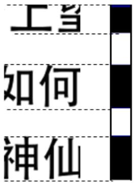
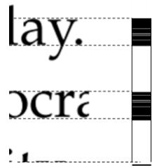
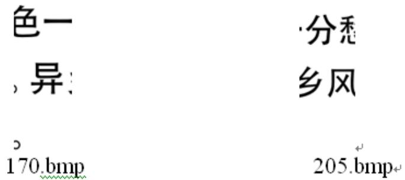
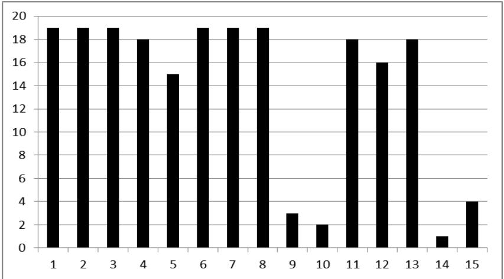

# 2013高教社杯全国大学生数学建模竞赛

## 承 诺 书

我们仔细阅读了《全国大学生数学建模竞赛章程》和《全国大学生数学建模竞赛参赛规则》（以下简称为“竞赛章程和参赛规则”，可从全国大学生数学建模竞赛网站下载）。

我们完全明白，在竞赛开始后参赛队员不能以任何方式（包括电话、电子邮件、网上咨询等）与队外的任何人（包括指导教师）研究、讨论与赛题有关的问题。

我们知道，抄袭别人的成果是违反竞赛章程和参赛规则的，如果引用别人的成果或其他公开的资料（包括网上查到的资料），必须按照规定的参考文献的表述方式在正文引用处和参考文献中明确列出。

我们郑重承诺，严格遵守竞赛章程和参赛规则，以保证竞赛的公正、公平性。如有违反竞赛章程和参赛规则的行为，我们将受到严肃处理。

我们授权全国大学生数学建模竞赛组委会，可将我们的论文以任何形式进行公开展示（包括进行网上公示，在书籍、期刊和其他媒体进行正式或非正式发表等）。

我们参赛选择的题号是（从 A/B/C/D 中选择一项填写）： B

我们的参赛报名号为（如果赛区设置报名号的话）：

所属学校（请填写完整的全名）： 西南交通大学

参赛队员 (打印并签名) ：1. 唐隽玉

2. 胡文伟

3. 孙雪清

指导教师或指导教师组负责人 (打印并签名)： 徐跃良

（论文纸质版与电子版中的以上信息必须一致，只是电子版中无需签名。以上内容请仔细核对，提交后将不再允许做任何修改。如填写错误，论文可能被取消评奖资格。）

日期： 2013 年 9 月 16 日

赛区评阅编号（由赛区组委会评阅前进行编号）：

# 2013高教社杯全国大学生数学建模竞赛

## 编 号 专 用 页

赛区评阅编号（由赛区组委会评阅前进行编号）：

赛区评阅记录（可供赛区评阅时使用）：

<table><tr><td>评阅人</td><td></td><td></td><td></td><td></td><td></td><td></td><td></td><td></td><td></td><td></td></tr><tr><td>评分</td><td></td><td></td><td></td><td></td><td></td><td></td><td></td><td></td><td></td><td></td></tr><tr><td>备注</td><td></td><td></td><td></td><td></td><td></td><td></td><td></td><td></td><td></td><td></td></tr></table>

全国统一编号（由赛区组委会送交全国前编号）：

全国评阅编号（由全国组委会评阅前进行编号）：

# 碎纸片的拼接复原

摘 要

本文运用左右边界匹配、图片特征匹配、上下边界匹配等方法研究单页打印纵切纸片、单页打印横、纵切纸片以及双页打印横、纵切纸片的拼接与复原问题。

针对问题一，首先对图像进行数据处理，读取图片的灰度信息，构建灰度矩阵，并将灰度矩阵转化为 0-1 矩阵，从而将二维图片数值化。接着，提取出 0-1 矩阵的第一列与最后一列，存储在图片的左右边界矩阵中，通过建立两张图片的左右边界匹配度模型，探究图片的左右邻接关系。计算结果为：汉字图片从左到右依次为： 、 、 、015、003、010、002、016、001、004、005、009、013、018、011、007、017、000、006，英文的排序结果为：003、006、002、007、015、018、011、000、005、001、009、013、010、008、012、014、017、016、004。

问题二，采用二层筛选的方法，第一层做行位置筛选，读取图片的前 个像素行，存入图片的特征列向量中，并将此列向量作为行特征的唯一标识，建立图片的特征匹配模型，将列向量元素差异最小的图片聚类，中文确定出 类，英文归为 类。然后通过人为干预，实现类的合并，使每类中的图片个数相同，将中英文都聚成 11 类，每一类包含 19 张图片。构建行内图片的左右边界匹配模型，最终确定出每类内部图片的排序；第二层做列位置筛选，建立每行上下边界匹配模型，得出在各行的上下位置序列，经过两层筛选，得出原文件图片序列。最后，视人工干预后的最终结果为正确答案，检验未加入人工干预计算机排序结果，得到中文的拼接正确率为 ，英文的拼接正确率为 65.1%。

对于问题三，建立两次特征匹配模型将图片聚类，即首先任取一碎片的一面依次与其他碎片的两个面分别作第一次特征匹配，寻得与该面特征匹配程度高的另一碎片的一面，再将这两个碎片的另一面做第二次特征匹配，在两者匹配很好的前提下，探求出两碎片的确定面属于同一类。加入人工干预，对类的个数降维，并保证每类中图片的数量相同。再利用问题二中的模型构建方法，通过左右边界匹配模型的求解、上下边界匹配模型的构建方法，完成了本问的研究。最后，我们从问题二的模型多增加一层特征匹配约束可得到问题三的模型这一角度出发，得出了模型三的拼接精度更高这一结论。

本文综合各种匹配方法，根据问题的深入，对匹配模型加以不断的改进，结合 matlab编程、word 拼图等手段，对碎纸片的拼接复原做了逐步深入分析，并给出了基于边界灰度、图片行特征灰度的匹配模型。在文章的最后对模型的适用范围做出了推广，在实际应用中有较大的参考价值。

关键词：左右边界匹配 特征匹配 上下边界匹配 matlab 两层筛选

## 一、问题重述

破碎文件的拼接在司法物证复原、历史文献修复以及军事情报获取等领域都有着重要的应用。传统上，拼接复原工作需由人工完成，准确率较高，但效率很低。特别是当碎片数量巨大，人工拼接很难在短时间内完成任务。随着计算机技术的发展，人们试图开发碎纸片的自动拼接技术，以提高拼接复原效率。请讨论以下问题：

1. 对于给定的来自同一页印刷文字文件的碎纸机破碎纸片（仅纵切），建立碎纸片拼接复原模型和算法，并针对附件 、附件 给出的中、英文各一页文件的碎片数据进行拼接复原。如果复原过程需要人工干预，请写出干预方式及干预的时间节点。复原结果以图片形式及规定的表格形式表达。  
对于碎纸机既纵切又横切的情形，请设计碎纸片拼接复原模型和算法，并针对附件 3、附件 4 给出的中、英文各一页文件的碎片数据进行拼接复原。如果复原过程需要人工干预，请写出干预方式及干预的时间节点。复原结果表达要求同上。  
上述所给碎片数据均为单面打印文件，从现实情形出发，还可能有双面打印文件的碎纸片拼接复原问题需要解决。附件 5给出的是一页英文印刷文字双面打印文件的碎片数据。请尝试设计相应的碎纸片拼接复原模型与算法，并就附件 5的碎片数据给出拼接复原结果，结果表达要求同上。

## 二、问题分析

碎片的拼接复原，通常的做法是人工识别碎片边缘的字迹断线、和理解碎片内文字含义，这样利用人工智能的方法虽然准确度高，但是当碎片的数量很大时，人工的效率就显得低，而且出错率会明显提高；而计算机拼接与复原图像，虽不及人工识别智能，但能充分发挥其运算量大，运算速度快的特点。

故本问题的目标就是利用附件中给的碎片数据，分单页纵切，单页横纵切，双页打印横纵切三种情况，把拼接复原问题抽象成一个明确完整的数学模型，利用计算机，并加以人工干预，复原出原图表。

## 问题一的分析

问题一要求仅考虑单面纵切，建立来自同一页印刷文字文件的碎纸机破碎的纵切纸片拼接复原模型和算法。通过对附件1和附件2 给出的碎片数据图的观察，发现本题的碎片图像具有相对文字（汉字、英文）方向纵向规则剪开的特征，所以不适合基于碎片的边缘线建模，也不适合基于两幅图片的重合度建模。我们可以根据打印文件的每行文件具有前后连续性，考虑先从读取文件数据入手，存储每幅图片对应的灰度值矩阵。依靠得到的灰度值矩阵转化为 二值矩阵，并利用相邻接左右边界差异不大这一特性作为依据来建立左右边界匹配模型，来解决此问题，复原出图片的原始序列。

## 问题二的分析

此题加入了横向切割，使得切割方式更加多样化和更接近实际。它相对于第一问而言，图片的信息量更小，图片的个数增多了一倍。图片总体不仅在纵向具有无序性，而且在横向也具有无序性。若仅采用问题一中的方法，定位约束太少，可能会出现一个图片与多个图片最小差异度相等，导致该图片与多个图片相联系，从而增加问题求解的难度。通过观察图片的平行切割特点，发现来自原文件同一行的文字切割后的图片一般在相同的行位置上。所以可以考虑，先进行行位置筛选，通过构建图片的特征列向量作为唯一标识，建立特征匹配模型，得到具有相同行特征的图片，聚成同一类。考虑到每类包含的图片个数不一致，可加入人工干预，对类的个数降维，使得行集合包含的碎片个数一致。而利用左右边界匹配模型可以确定同一行的图片的序列；可采用相同的原理，建立上下边界匹配模型来解决纵向图片的定序问题。这样一来，可以拼接出本问的原文件，完成问题二的求解。

## 问题三的分析

问题三在前两问的基础上，加入了双面打印这一条件。本问中图片的个数相较于问题二增大了一倍，达 $2 \times 1 1 \times 1 9 = 4 1 8$ 个，较前两问复杂度最高。由于从单面看问题二和问题三没有任何区别，所以可以采取相似的方法对问题三求解。但我们思考总结出如下两方面：一方面不能思维定势，也就是说所有编号中带有 a的图不一定都来自同一面，即有可能是碎纸片的正面也有可能是碎纸片的反面。另一方面如果采用问题二中相同的处理方法对附件 中所有的图片排序的话，可能会发生一个图片的匹配图片过多，或者出现将一个碎纸片的正反面归为同一类的错误。综合以上两方面的思考，问题三的求解过程的特点在于：先对一张碎纸片构建其对应的特征匹配模型，若得到另外一张碎纸片与这张碎纸片匹配，则随后对它们的反面进行匹配以检验。

## 三、模型假设

1.假设附件中每张碎纸片都是大小相等的矩形，切割边缘光滑；  
假设附件中编号为 的图片为第一张图片，编号为 的图片为第二张图片，依此类推；  
3.假设附件中每张图片无倾斜，即底边水平；  
4.假设附件中的每张图片是无噪的，仅考虑图像的拼接无须考虑图像的修补；  
5.假设每一附件为同一页纸的碎片数据；  
6.假设包含000a图片的那页为原文件的正面

## 四、符号说明与名称解释

## 4.1 符号说明

$A ^ { ( k ) }$ ：第k张图片的灰度值矩阵  
$a _ { i , j } ^ { ( k ) }$ ：第k张图片的灰度值矩阵的第i行第j列的元素  
$C ^ { ( k ) }$ ：第k张图片的灰度值矩阵转化的0-1矩阵  
$c _ { i , j } ^ { ( k ) }$ ：第k张图片0-1矩阵的第i行第j列的元素  
$B ^ { ( k ) }$ ：第k张图片左、右边界线上的 0-1边界矩阵  
$P _ { k , s } ^ { r }$ ：第k张图片右边界与第s张图片的左边界的边界匹配值  
$P _ { k , s } ^ { l }$ ：第 张图片左边界与第 张图片的右边界的边界匹配值  
$\boldsymbol { P } _ { k } ^ { * }$ ：第k张图片左右边界匹配时最优的匹配值  
$D ^ { ( k ) }$ ：存入特征灰度信息的的特征列向量  
$d _ { i } ^ { ( k ) }$ ：第k张图片灰度信息特征列向量  
$W _ { k , s }$ ：反映图片k及图片s的特征信息吻合程度的特征值

## 4.2 名称解释

1.原文件：每个附件中所有图片拼接复原图；

2.图片行：以附件中各个图片为单位组成的行；  
3.文字行：以图片内部文字为单位组成的行；  
4.像素行：图片内部像素矩阵的行；  
5.行集合：具有相同行特征的碎片组成的图片行。

## 五、模型的建立与求解

## 5.1 问题一的模型建立与求解

问题一要求拼接复原来自同一页纵切的破碎纸片。这个问题仅在纵向的维度对碎纸片的拼接复原提出了要求，对此本文从以下三个步骤进行回答：

步骤一：读取每张图片文件的数据，其目的是将附件中给的 bmp 格式的碎纸片图以灰度值矩阵的形式存储。再将灰度值矩阵转化为 矩阵，来得到模型的数据基础；

步骤二：基于上述 0-1 矩阵，提取每幅图片左右边界的 0-1 值，建立左右边界匹配模型，确定出图片的序列；

步骤三：根据上面的步骤，将附件图片拼接，以图片和表格形式展现。

## 5.1.1 图像的数据处理

Step1.灰度值矩阵的获取<sup>[1]</sup>

附件中无论印有汉字还是英文的碎纸片均以 bmp 格式的图片形式给出。先将附件中的图片以元胞矩阵的形式存入 matlab中

为建立模型，必须得到数字依据。

所以用 matlab 的 imread 函数读取图片的灰度信息，将第k张图片的灰度信息分别存入灰度值矩阵 $A ^ { ( k ) }$ 中(k =1,2…19) :

$$
A ^ {(k)} = \left[ \begin{array}{c c c c} a _ {1, 1} ^ {(k)} & a _ {1, 2} ^ {(k)} & \dots & a _ {1, 7 2} ^ {(k)} \\ a _ {2, 1} ^ {(k)} & a _ {2, 2} ^ {(k)} & \dots & a _ {2, 7 2} ^ {(k)} \\ \vdots & \vdots & \ddots & \vdots \\ a _ {m, 1} ^ {(k)} & a _ {m, 2} ^ {(k)} & \dots & a _ {m, n} ^ {(k)} \end{array} \right]
$$

其中，第k个图片的灰度信息以 0\~255 的灰度值存储在矩阵 $A ^ { ( k ) }$ 中，颜色越深，灰度值越大。

Step2. 0-1 矩阵的建立

由于matlab在计算时，为防止灰度值溢出，会将值限制在0\~255的范围内。在此模型的计算中，为保证灰度匹配模型中绝对值的和不受这个约束的影响，同时简便计算，需将灰度值矩阵 $A ^ { ( k ) }$ 进行转化为0-1 矩阵 ${ C ^ { ( k ) } \left( { k = 1 , 2 \cdots 1 9 } \right) }$ ，具体转化操作如下：

若 $A ^ { ( k ) }$ 中某个元素灰度值 $a _ { i , j } ^ { ( k ) }$ 小于255，则 $C ^ { ( k ) }$ 中相同位置的元素值 $c _ { i , j } ^ { ( k ) }$ 记为0，否则记为1。即：

$$
c _ {i, j} ^ {(k)} = \left\{ \begin{array}{l l} 0, & a _ {i, j} ^ {(k)} <   2 5 5 \\ 1, & a _ {i, j} ^ {(k)} = 2 5 5 \end{array} \right. \tag {5.1}
$$

于是，建立了0-1矩阵 $C ^ { ( k ) }$ ：

$$
C ^ {(k)} = \left[ \begin{array}{c c c c} c _ {1, 1} ^ {(k)} & c _ {1, 2} ^ {(k)} & \dots & c _ {1, n} ^ {(k)} \\ c _ {2, 1} ^ {(k)} & c _ {2, 2} ^ {(k)} & \dots & c _ {2, n} ^ {(k)} \\ \vdots & \vdots & \ddots & \vdots \\ c _ {m, 1} ^ {(k)} & c _ {m, 2} ^ {(k)} & \dots & c _ {m, n} ^ {(k)} \end{array} \right]
$$

Step3：获取左、右边界矩阵

根据0-1矩阵 $C ^ { ( k ) }$ ，将第k张图片的左、右边界处的元素分别存于 $\boldsymbol { B } ^ { ( k ) } \left( \boldsymbol { k } = 1 , 2 \cdots 1 9 \right)$ 矩阵的第一列、第二列中。得到保存左、右边界线上的 0-1值的 $B ^ { ( k ) }$ 边界矩阵；

$$
\boldsymbol {B} ^ {(k)} = \left[ \begin{array}{c c} c _ {1, 1} ^ {(k)} & c _ {1, n} ^ {(k)} \\ c _ {2, 1} ^ {(k)} & c _ {2, n} ^ {(k)} \\ \vdots & \vdots \\ c _ {m, 1} ^ {(k)} & c _ {m, n} ^ {(k)} \end{array} \right]
$$

## 5.1.2 边界匹配模型的建立

为了得到每个附件中各幅图片的邻接关系，采用边界匹配法。它是基于纵向规则切割特性：两相邻图片中第一幅图片的右边界上的文字和第二幅图片左边界上文字多数来自同一个汉字或英文字母，即两邻接图片的边界的差异度小。

边界匹配模型的建立具体步骤如下：

## 1.右边界匹配模型的构建

将第k个图片的右边界与第s张 $( s = 1 , 2 \cdots 1 9 \boxed { \mathrm { H } s \neq k } )$ 图片的左边界进行右边界匹配，即求第k个图片边界矩阵的第二列与第s张边界矩阵的第一列对应行元素的差，再求差的绝对值的和—— $P _ { k , s } ^ { r }$

$$
P _ {k, s} ^ {r} = \sum_ {i = 1} ^ {m} \left| c _ {i, n} ^ {(k)} - c _ {i, 1} ^ {(s)} \right| \tag {5.2}
$$

将第k个图片的右边界依次与其余的任意一张图片的左边界进行右边界匹配，得到n个值： $P _ { k , 1 } ^ { r } , P _ { k , 2 } ^ { r } , \cdots , P _ { k , n } ^ { r }$ 。通过比较，取这 个值中最小值，作为右边界匹配值。

$$
P _ {k, s} ^ {r} = \min \{P _ {k, 1} ^ {r}, P _ {k, 2} ^ {r}, \dots , P _ {k, n} ^ {r} \} \tag {5.3}
$$

## 2.左边界匹配模型的构建

将第k个图片的左边界分别与第s张 $( s = 1 , 2 \cdots 1 9$ 且 $s \neq k )$ 图片的右边界进行左边界匹配，即求第k个图片边界矩阵的第一列与第s张边界矩阵的第二列对应行元素的差，再求差的绝对值的和— $P _ { k , s } ^ { l }$ ：

$$
P _ {k, s} ^ {l} = \sum_ {i = 1} ^ {m} \left| c _ {i, 1} ^ {(k)} - c _ {i, n} ^ {(s)} \right| \tag {5.4}
$$

将第k个图片的左边界依次与其余的任意一张图片的右边界进行左边界匹配，得到n个值： $P _ { k , 1 } ^ { l } , P _ { k , 2 } ^ { l } , \cdots , P _ { k , n } ^ { l }$ 。通过比较，取这n个值中最小值，作为左边界匹配值。

$$
P _ {k, s} ^ {l} = \min \{P _ {k, 1} ^ {l}, P _ {k, 2} ^ {l}, \dots , P _ {k, n} ^ {l} \} \tag {5.5}
$$

## 3.最佳边界匹配模型的建立

取第k个图片，先与任意一张图片s(s =1,2…19且 $s \neq k )$ 图片依次进行右边界匹配，求得 $P _ { k , s } ^ { r }$ ，再与任意一张图片 $s ~ ( s = 1 , 2 \cdot \cdot \cdot 1 9 \boxed { \mathrm { H } s \neq k } )$ 图片依次进行左边界匹配，得 $P _ { k , s } ^ { l }$ 取两值之间的最小值：

$$
P _ {k} ^ {*} = \min \{P _ {k, s} ^ {l}, P _ {k, s} ^ {r} \} \tag {5.6}
$$

$\boldsymbol { P } _ { k } ^ { * }$ 对应的匹配方式即为第k张图片与第s张图片的最佳匹配方式。若 $P _ { k } ^ { ^ { * } } = P _ { k , s } ^ { r }$ ，则说明第k张图片的右边接于第s张图片的左边，记做 $k \to s$ ； $\boldsymbol { P } _ { k } ^ { * } = \boldsymbol { P } _ { k , i } ^ { l }$ 时，说明第k张图片的左边与第s张图片的右边相连，记做 $s \to k$ 。

综上，我们的左右边界匹配模型可以总结为：

$$
P _ {k} ^ {*} = \min \{P _ {k, s} ^ {l}, P _ {k, s} ^ {r} \}
$$

$$
\left\{ \begin{array}{c} P _ {k, s} ^ {r} = \min \left\{P _ {k, 1} ^ {r}, P _ {k, 2} ^ {r}, \dots , P _ {k, n} ^ {r} \right\} \\ P _ {k, s} ^ {r} = \sum_ {i = 1} ^ {m} \left| c _ {i, n} ^ {(k)} - c _ {i, 1} ^ {(s)} \right| \\ P _ {k, s} ^ {l} = \min \left\{P _ {k, 1} ^ {l}, P _ {k, 2} ^ {l}, \dots , P _ {k, n} ^ {l} \right\} \\ P _ {k, s} ^ {l} = \sum_ {i = 1} ^ {m} \left| c _ {i, 1} ^ {(k)} - c _ {i, n} ^ {(s)} \right| \end{array} \right. \tag {5.7}
$$

## 5.1.4 模型的求解

## 1.求解算法

Step1 取附件中第i张碎片，将其依次与第1 张碎片，第2张碎片，第i1张碎片，…，第i1张碎片，…，第 n张碎片进行右边界匹配，得到右边界匹配值；

Step2 取附件中第i张碎片，将其依次与第1 张碎片，第2张碎片，第i1张碎片，…，第i1张碎片，…，第 n张碎片进行左边界匹配，得到左边界匹配值；

Step3 比较右边界匹配值与左边界匹配值的大小，选择两者之间的最小值对应的匹配方式，将两张图片按匹配方式结合，视为一体。

Step4 重复进行Step1→Step3，直至确定出附件原文件的图片序列。

## 2.编程实现

我们利用matlab求解（具体程序见附录），得到如下：

附件1,2分别包含了 19张图片，通过matlab中“imread”命令，得到灰度值矩阵 $A ^ { ( k ) }$ 考虑到本题中 $A ^ { ( k ) }$ 的维度为 1980×72，且这是中间过程的结果，故不予以展示。

同样地，由于 0-1 矩阵 $C ^ { ( k ) }$ 的大小为 1980×72，边界矩阵 $B ^ { ( k ) }$ 的维度为本题中它的维数为 $1 9 8 0 \times 2$ ，不在正文中显示矩阵的具体值。

本文仅列举右边界匹配值 $P _ { k , s } ^ { \mathcal { \mathrm { E } } }$ 与邻接关系，附件 1、2的情况一并显示在表 1中：

表1 问题一的邻接关系与 $\boldsymbol { P } _ { k , s } ^ { * }$ 值

<table><tr><td colspan="2">附件1(汉字)</td><td colspan="2">附件2(英文)</td></tr><tr><td>邻接关系</td><td> $P_{k,s}^{\text{右}}$ 值</td><td>邻接关系</td><td> $P_{k,s}^{\text{右}}$ 值</td></tr><tr><td>000→006</td><td>282</td><td>000→005</td><td>281</td></tr><tr><td>001→004</td><td>284</td><td>001→009</td><td>228</td></tr><tr><td>002→016</td><td>333</td><td>002→007</td><td>135</td></tr><tr><td>003→010</td><td>332</td><td>003→006</td><td>172</td></tr><tr><td>004→005</td><td>279</td><td>004→003</td><td>101</td></tr><tr><td>005→009</td><td>296</td><td>005→001</td><td>185</td></tr><tr><td>006→008</td><td>169</td><td>006→002</td><td>185</td></tr><tr><td>007→017</td><td>318</td><td>007→015</td><td>212</td></tr><tr><td>008→014</td><td>238</td><td>008→012</td><td>180</td></tr><tr><td>009→013</td><td>375</td><td>009→013</td><td>200</td></tr><tr><td>010→002</td><td>330</td><td>010→008</td><td>198</td></tr><tr><td>011→007</td><td>259</td><td>011→000</td><td>145</td></tr><tr><td>012→015</td><td>212</td><td>012→014</td><td>230</td></tr><tr><td>013→018</td><td>71</td><td>013→010</td><td>178</td></tr><tr><td>014→012</td><td>262</td><td>014→017</td><td>169</td></tr><tr><td>015→003</td><td>372</td><td>015→018</td><td>46</td></tr><tr><td>016→001</td><td>336</td><td>016→004</td><td>143</td></tr><tr><td>017→000</td><td>322</td><td>017→016</td><td>195</td></tr><tr><td>018→011</td><td>327</td><td>018→011</td><td>192</td></tr></table>

复原结果：附件1对应的复原表格见表 2，附件 2对应的复原表格见表 3。按照表2、3 的序列，把图片设置成相同的高和宽的统一大小，将图片复制，粘贴进 word，即用word拼图，得到复原图，依次见附录 1.4、1.5。.

表2 附件1（汉字）复原的碎片序号

<table><tr><td>008</td><td>014</td><td>012</td><td>015</td><td>003</td><td>010</td><td>002</td><td>016</td><td>001</td><td>004</td><td>005</td><td>009</td><td>013</td><td>018</td><td>011</td><td>007</td><td>017</td><td>000</td><td>006</td></tr><tr><td colspan="19">表3 附件2(英文)复原的碎片序号</td></tr><tr><td>003</td><td>006</td><td>002</td><td>007</td><td>015</td><td>018</td><td>011</td><td>000</td><td>005</td><td>001</td><td>009</td><td>013</td><td>010</td><td>008</td><td>012</td><td>014</td><td>017</td><td>016</td><td>004</td></tr></table>

## 5.1.4 模型结果的分析

本问中，建立边界匹配模型，利用 matlab编程进行求解，可以得到附件 1（汉字）、附件2（英文）的图片排列顺序，在 word中拼出图片见附录 2.1、2.2。观察图片，通过观察碎片边缘的字迹断线的连接、理解碎片内文字含义，检验了拼接复原结果正确性。也说明边界匹配模型在不需要人工干预的情况下很好地解决了问题一。

## 5.2 问题二的模型建立与求解

问题二要求在碎纸机既纵切又横切的情形下，对碎纸片进行拼接复原。我们认为由以下四个步骤组成：

步骤一：进行模型的准备，用问题一的方法对图像进行预处理，分别构建反映中英文文章行特征的特征向量以及确定需要扫描像素行的行数；

步骤二：通过分别建立特征匹配模型，左右边界匹配模型，上下边界匹配模型三个模型，完成单页打印横纵切纸片匹配模型的构建；

步骤三：对模型进行求解。特别的，特征匹配模型求解后加入人工干预；

步骤四：对求解结果进行分析。

## 5.2.1 模型的准备

## 1.图像的预处理

对于图像的预处理，我们采用问题一中的方法，首先用 matlab读取每张图片的灰度信息，再将灰度信息转换为 0-1矩阵。

## 2.构建特征灰度条向量

## （1）构建中文特征灰度条向量

特征灰度条是指记录图片中文字的行方向信息的列向量 $D ^ { ( k ) }$ ，建造特征灰度条的方法为：对于预处理后的图像，建造一个与碎片的图像行数一致的列向量 $D ^ { ( k ) }$ 。对图像中像素行进行扫描，若此行中有像素值为 0的点，则将列向量 $D ^ { ( k ) }$ 中相同行处的值设为 0，否则设为1。图000.bmp 的特征灰度条如图2所示



<details>
<summary>text_image</summary>

工当
如何
神仙
</details>

图 2 图 000.bmp 及其灰度条

$$
d _ {i} ^ {(k)} = \left\{ \begin{array}{l l} 0, & \text {第} k \text {张图片中第} i \text {行出现了} 0 \\ 1, & \text {第} k \text {张图片中第} i \text {行全为} 1 \end{array} \right. \tag {5.8}
$$

特征灰度条的列向量 $D ^ { ( k ) }$ 为：

$$
D ^ {(k)} = (d _ {1} ^ {(k)}, d _ {2} ^ {(k)}, \dots , d _ {m} ^ {(k)}) ^ {T}
$$

根据此法，便可得到每张碎纸片的特征灰度条。若某两张碎片的灰度条相似程度达到精度要求，则它们就具有相同的图像行特征，位于原文件的同一行。

## （2）构建英文特征灰度条向量

英文与汉字的结构不同。各个英文字母在上、中、下三格的分布情况不同。有些图片中的某一行只含有中格字母，如附件四中的 011.bmp 图片第二行只含有 o、c、r和a，而与它相邻图片的对应行同时含有中上格、中下格字母，例如位于 011.bmp 图片右边的154.bmp 图片第二行含有中上格字母“t”。如果用汉字特征灰度条的构建方法来制作这两个英文图片的特征灰度条，则 154.bmp 的特征灰度条在文字第二行区域的黑色段会比011.bmp 的要长。在第一轮筛选过程中，会因为这个黑色段长度的差异而将两者归入不同的行集合中。为了使第一轮筛选结果尽量准确，必须要避免这种情况。通过分析英文字母的结构特性，发现所有的英文字母的主体部分都在中格，所以在构建特征灰度条时，可以只考虑每行英文字母的中格部分，这样就规避了因字母在上、中、下三格分布情况不同而造成筛选不准确的情况。具体方法如下：

将预处理后的附件四图像，建造一个与碎片 0-1 矩阵行数相同的列向量 。逐次扫描图像的像素行。若某行元素之和小于M ，说明该像素行中黑点较多，是英文字母的主体部分，位于此文字行的中格，则在列向量 中相同行处的元素记为0，否则记为1。多次试验后，我们选取合适的值为 56。以 011.bmp 图片为例构建的特征灰度条如图 3所示：



<details>
<summary>text_image</summary>

lay.
ocra
</details>

图 3 图 011.bmp 及其灰度条

$$
d _ {i} ^ {(k)} = \left\{ \begin{array}{l l} 0, & \text {第} k \text {张图片中第} i \text {行元素之和} <   M \\ 1, & \text {第} k \text {张图片中第} i \text {行元素之和} \geq M \end{array} \right. \tag {5.9}
$$

特征灰度条的列向量 $D ^ { ( k ) }$ 为：

$$
D ^ {(k)} = (d _ {1} ^ {(k)}, d _ {2} ^ {(k)}, \dots , d _ {m} ^ {(k)}) ^ {T}
$$

根据此法，便可得到附件四中每张碎纸片的特征灰度条。若某两张碎片的灰度条相似程度达到精度要求，则它们就具有相同的图像行特征，位于原文件的同一行。

## 3. 确定扫描像素行的行数<sup>[1]</sup>

扫描一幅图片的像素点，其自然的思路就是对第k张图像的每一行进行扫描，得到每行的像素值。但在构造特征灰度条矩阵的时候，发现了一些特殊情况，如下图所示：



<details>
<summary>text_image</summary>

色一
，异：
170.bmp
·分懸
乡风
205.bmp
</details>

图1 特殊情况举例

编号为 和编号为 的图片人为可以判断他们是左右相邻的，两幅图刚好位于一篇文章的最后三行文字的位置，其中编号为 170 的图片位置靠前，所以图片截到了第三行末尾的句号，但编号为 205的图片位置靠后，图中第三文字行已经到了换行符之后，是空白的。两者的特征灰度条会在下边界处出现明显偏差，原本应归入同一集合的两张碎片会被分开。

这种情况的出现，会加重计算的复杂度，而且造成结果冗余而不准确。为了得到准确的结果，必须要削弱这种情况所带来的干扰。结合附件中图片特征，发现文字大多集中在图片三分之二高度的区域内，所以，构建特征灰度条时，没必要每一行都扫描到。为了得到合适的扫描行数，分别试验了扫描前 100 行、前120行和前140 行的方案，得到的效果如下（附件三和附件四中每张图片总共有 180个像素行）：

表4 关于图像扫描行数确定的几次尝试

<table><tr><td>扫描像素行数</td><td>行集合的个数</td></tr><tr><td>100</td><td>15</td></tr><tr><td>120</td><td>16</td></tr><tr><td>140</td><td>19</td></tr></table>

通过观察结果可以看出，扫描前 100行得到的碎片总行数是最少的，很接近题目中切割源文件的行数11。所以，本文仅对每张图像的前 100个像素行进行扫描，并提高匹配的精度要求，这样更有利于解决问题。

## 5.2.2 建立横纵切纸片匹配模型

## （1）建立特征匹配模型

将碎片k 与碎片s进行特征比较 $( s = 0 , 1 \cdots 2 0 8 \mathbb { H } s \neq k )$ ，即求碎片k 的特征列向量$D ^ { ( k ) }$ 与碎片s的特征列向量 $D ^ { ( s ) }$ 对应元素的差的绝对值，再求和，得到特征值 $W _ { k , s }$ ：

$$
W _ {k, s} = \sum_ {i = 1} ^ {m} \left| d _ {i} ^ {(k)} - d _ {i} ^ {(s)} \right| \tag {5.10}
$$

考虑到每个汉字或者每个英文字母结构的差异性，位于同一行文字的高度可能会出现微小的偏差，很难出现特征灰度条相同（即 $W _ { k , s } = 0 )$ 的情况，若取 $W _ { k , s } = 0$ 作为判断原则，那么原本位于同一行的两张图片可能因为这微小的偏差而归于不同的行集合中。

取一个合适小的置信区间[a,b]，若 $W _ { k , s } \in [ a , b ]$ ，则认为碎片k与碎片s来自原文件的同一行。

## （2）建立左右边界匹配模型

本问中的左右边界匹配模型相对于第一问中的边界匹配模型而言，差异性在于问题一中的边界匹配模型是 19个纵向大长条，信息量大；而本问中是 19个纵向小长条，信息量小。

也就是说，问题一中的左右边界矩阵为

$$
\boldsymbol {B} ^ {(k)} = \left[ \begin{array}{c c} c _ {1, 1} ^ {(k)} & c _ {1, 7 2} ^ {(k)} \\ c _ {2, 1} ^ {(k)} & c _ {2, 7 2} ^ {(k)} \\ \vdots & \vdots \\ c _ {1 9 8 0 1} ^ {(k)} & c _ {1 9 8 0 7 2} ^ {(k)} \end{array} \right]
$$

而问题二中的左右边界矩阵为

$$
\boldsymbol {B} ^ {(k)} = \left[ \begin{array}{c c} c _ {1, 1} ^ {(k)} & c _ {1, 7 2} ^ {(k)} \\ c _ {2, 1} ^ {(k)} & c _ {2, 7 2} ^ {(k)} \\ \vdots & \vdots \\ c _ {1 8 0, 1} ^ {(k)} & c _ {1 8 0, 7 2} ^ {(k)} \end{array} \right]
$$

其余模型的建立步骤同问题一，即：

1. 构建右边界匹配模型；  
2. 构建左边界匹配模型；  
3. 构建最佳匹配模型。

## （3）建立上下边界匹配模型

本模型的基本思路与第一问中边界匹配模型的构建一致，因为问题一中是一长列的边界匹配，是纵向的边界匹配，本模型是一长行的边界匹配，是横向的边界匹配。但是不同之处在于：问题一中匹配的 19 条纵列的左右边界匹配模型，而本模型为 11条行的上下边界匹配模型。将第k张图片的上、下边界处的元素分别存于 $E ^ { ( k ) } \left( k = 1 , 2 \cdots 1 1 \right)$ 矩阵的第一行、第二行中。即上下边界匹配模型中第k行的上下边界矩阵为：

$$
E ^ {(k)} = \left[ \begin{array}{c c c c} c _ {1, 1} ^ {(k)} & c _ {1, 2} ^ {(k)} & \dots & c _ {1, n} ^ {(k)} \\ c _ {m, 1} ^ {(k)} & c _ {m, 2} ^ {(k)} & \dots & c _ {m, n} ^ {(k)} \end{array} \right]
$$

故模型的构建如下：

## 1.上边界匹配模型的构建

将第k行的上边界与第 $s ~ ( s = 1 , 2 \cdots 1 1 \mathbb { H } s \neq k )$ 行的下边界进行上边界匹配，即求第k行的边界矩阵的第一行与第s行的边界矩阵的第二行对应列元素的差，再求差的绝对值的和— $Q _ { k , s } ^ { u }$

$$
Q _ {k, s} ^ {u} = \sum_ {j = 1} ^ {n} \left| c _ {1, j} ^ {(k)} - c _ {m, j} ^ {(s)} \right| \tag {5.11}
$$

将第k行的上边界依次与其余的任意一行的下边界进行上边界匹配，得到 n个值：$\mathcal { Q } _ { k , 1 } ^ { u } , \mathcal { Q } _ { k , 2 } ^ { u } , \cdots , \mathcal { Q } _ { k , 2 } ^ { u }$ 。通过比较，取这 n个值中最小值，作为上边界匹配值。

$$
Q _ {k, s} ^ {u} = \min \{Q _ {k, 1} ^ {u}, Q _ {k, 2} ^ {u}, \dots , Q _ {k, n} ^ {u} \} \tag {5.12}
$$

## 2.下边界匹配模型的构建

将第k行的下边界与第 $\begin{array} { r l } { s } & { { } ( s = 1 , 2 \cdots 1 1 \boxed { \mathrm { H } s } \neq k ) } \end{array}$ 行的上边界进行下边界匹配，即求第k行边界矩阵的第二行与第s行边界矩阵的第一列对应列元素的差，再求差的绝对值的和$\mathcal { Q } _ { k , s } ^ { d }$

$$
Q _ {k, s} ^ {d} = \sum_ {j = 1} ^ {n} \left| c _ {m, j} ^ {(k)} - c _ {1, j} ^ {(s)} \right| \tag {5.13}
$$

将第k个行的下边界依次与其余的任意一行的上边界进行下边界匹配，得到n个值：$\boldsymbol { Q } _ { k , 1 } ^ { d } , \boldsymbol { Q } _ { k , 2 } ^ { d } , \cdots , \boldsymbol { Q } _ { k , 2 } ^ { d }$ 。通过比较，取这 n个值中最小值，作为下边界匹配值。

$$
Q _ {k, s} ^ {d} = \min \{Q _ {k, 1} ^ {d}, Q _ {k, 2} ^ {d}, \dots , Q _ {k, 3} ^ {d} \} \tag {5.14}
$$

## 3.最佳边界匹配模型的建立

取第k行，先与任意一行 $s ~ ( s = 1 , 2 \cdots 1 1 \mathbb { H } s \neq k )$ 依次进行上匹配，求得 $Q _ { k , s } ^ { u }$ ，再与任意一行s (s =1,2…11且 $s \neq k )$ 依次进行下匹配， $Q _ { k , s } ^ { d }$ ，取两值之间的最小值：

$$
Q _ {k} ^ {*} = \min \{Q _ {k, s} ^ {u}, Q _ {k, s} ^ {d} \} \tag {5.15}
$$

${ Q } _ { k } ^ { * }$ 对应的匹配方式即为第k行与第s行的最佳匹配方式。若 $Q _ { k } ^ { * } = Q _ { k , s } ^ { u }$ ，则说明第k行上边接于第s行的下边； $Q _ { k } ^ { * } = Q _ { k , s } ^ { d }$ 时，说明第k行的下边与第s行的上边相连。

综上，我们构建的横纵切纸片匹配模型为：

$$
Q _ {k} ^ {*} = \min \{Q _ {k, s} ^ {u}, Q _ {k, s} ^ {d} \}
$$

$$
\left\{ \begin{array}{l} W _ {k, s} = \sum_ {i = 1} ^ {m} \left| d _ {i} ^ {(k)} - d _ {i} ^ {(s)} \right| \in [ a, b ] \\ Q _ {k, s} ^ {u} = \min \left\{Q _ {k, 1} ^ {u}, Q _ {k, 2} ^ {u}, \dots , Q _ {k, n} ^ {u} \right\} \\ Q _ {k, s} ^ {u} = \sum_ {j = 1} ^ {n} \left| c _ {1, j} ^ {(k)} - c _ {m, j} ^ {(s)} \right| \\ Q _ {k, s} ^ {d} = \min \left\{Q _ {k, 1} ^ {d}, Q _ {k, 2} ^ {d}, \dots , Q _ {k, n} ^ {d} \right\} \\ Q _ {k, s} ^ {d} = \sum_ {j = 1} ^ {n} \left| c _ {m, j} ^ {(k)} - c _ {1, j} ^ {(s)} \right| \end{array} \right. \tag {5.16}
$$

## 5.2.3 模型的求解

## 1.求解步骤

Step1 取附件中第i张碎片，将其依次与第1 张碎片，第2张碎片，第i1张碎片，…，第i1张碎片，…，第 n张碎片进行特征匹配，将匹配成功的碎片存入同一行；

Step2 重复Step1，得到具有相同行特征的行集合；

Step3 人工识别碎片边缘的字迹断线、理解碎片内文字含义的方式对相邻接的图片，即加入人工干预，将得到的类的个数降维；

Step4 取同一行中第i张碎片，将其依次与第 1 张碎片，第 2 张碎片，第i1张碎片，…，第i1张碎片，…，第 n张碎片先进行右边界匹配，得到右边界匹配值，再依次进行左边界匹配，得到左边界匹配值。比较右边界匹配值与左边界匹配值的大小，选择两者之间的最小值对应的匹配方式，将两张图片按匹配方式结合，视为一体。

Step5 重复进行Step4，直至确定出每行内部图片的排列顺序。

Step6 取第i行，将其依次与第 1 行，第 2 行，第i1行，…，第i1行，…，第 n行先进行上边界匹配，得到上边界匹配值，再依次进行下边界匹配，得到下边界匹配值。比较上边界匹配值与下边界匹配值的大小，选择两者之间的最小值对应的匹配方式，将两张图片按匹配方式结合，视为一体。

Step7 重复进行Step6，直至确定出每行的上下位置，从而得到图片的原始序列。

## 2．算法实现

（1）结合特征匹配模型，利用matlab编程（见附录），得到每行集合的碎片个数，附件3(中文)对应的15 个行集合中碎片个数，如表 5所示：

表5 15 行中每行的碎片个数

<table><tr><td>行集合的编号</td><td>1</td><td>2</td><td>3</td><td>4</td><td>5</td><td>6</td><td>7</td><td>8</td><td>9</td><td>10</td><td>11</td><td>12</td><td>13</td><td>14</td><td>15</td></tr><tr><td>碎图片的个数</td><td>19</td><td>19</td><td>19</td><td>18</td><td>15</td><td>19</td><td>19</td><td>19</td><td>3</td><td>2</td><td>18</td><td>16</td><td>18</td><td>1</td><td>4</td></tr></table>

为了直观表现，我们将表 5的数据绘制成条形图：



<details>
<summary>bar</summary>

| Category | Value |
| --- | --- |
| 1 | ~19 |
| 2 | ~19 |
| 3 | ~19 |
| 4 | ~18 |
| 5 | ~15 |
| 6 | ~19 |
| 7 | ~19 |
| 8 | ~19 |
| 9 | ~3 |
| 10 | ~2 |
| 11 | ~18 |
| 12 | ~16 |
| 13 | ~18 |
| 14 | ~1 |
| 15 | ~4 |
</details>

图2 15 行包含的碎纸图个数

由表5、图2知道：包含19个碎图片行集合的个数有6个，编号分别为：1、2、3、6、7、8，这 6 个可以唯一对应原文件的 6 个图像行；行集合的包含的图片个数大于 10且小于19的行的个数有 5，分别的标号为：4、5、11、12、13。该列行集合中包含于原文件中图片行。而行集合中元素个数小于 10的行的个数有 4个，行集合编号分别为：9、10、14、15。

由于附件3中的图片是 11×19个，所以需要将 4个行集合中的图片分配到 5个行集合中去。

（2）此外还得到了每行所包含的图片编号，考虑到数据过多，本文仅列举其中三行，见表6。

表6 特征匹配模型求解结果示例

<table><tr><td></td><td colspan="3">行集合1</td><td colspan="3">行集合2</td><td colspan="3">行集合3</td></tr><tr><td rowspan="7">碎图片的编号</td><td>0</td><td>7</td><td>32</td><td>1</td><td>18</td><td>23</td><td>2</td><td>11</td><td>22</td></tr><tr><td>45</td><td>53</td><td>56</td><td>26</td><td>30</td><td>41</td><td>28</td><td>49</td><td>54</td></tr><tr><td>68</td><td>70</td><td>93</td><td>50</td><td>62</td><td>76</td><td>57</td><td>65</td><td>91</td></tr><tr><td>126</td><td>137</td><td>138</td><td>86</td><td>87</td><td>100</td><td>95</td><td>118</td><td>129</td></tr><tr><td>153</td><td>158</td><td>166</td><td>120</td><td>142</td><td>147</td><td>141</td><td>143</td><td>178</td></tr><tr><td>174</td><td>175</td><td>196</td><td>168</td><td>179</td><td>191</td><td>186</td><td>188</td><td>190</td></tr><tr><td>208</td><td></td><td></td><td>195</td><td></td><td></td><td>192</td><td></td><td></td></tr></table>

## (3) 人工干预

由上文且结合附件 3、4 是 11×19 规模的文件，在特征匹配模型求解完成后加入第一次人工干预，即将表 5中4个行集合中的图片元素通过与对应的 5个行集合的图片进行人工配对，来人为生成与原文件相同的 11个行集合。具体的人工配对方法如下：

Step1.按行集合编号的顺序选择 9 集合中的一个图片，通过文义匹配和边缘断线匹配的方法，将其与集合 4、5、11、12、13 中各抽取出一个图片共 5 张图片，进行依次比较，如果与某行集合中的那个图片匹配成功，就将这个图片存入该行集合中；

Step2：循环进行 Step1 步骤，直至将集合 9、10、14、15 中共计 10 个图片分别归于各自的行集合中。

在最不利的情况下，需要匹配5×5+5+4+3+2=39次，而在最有利的情况下只需配对9次。可以见得人工干预的复杂度不高，从而充分发挥了人工智能的准确度高的优点，而且很好的规避了人效率不高的缺点。

通过人工干预，将未分配的图片归入对应的行中之后，利用左右边界匹配模型对附件三中每一行图片进行横向排序，使行内图片排列固定下来。附件3中的各类图片的排列顺序如表7：

表7 附件3各类图片的排列顺序

<table><tr><td>类1</td><td>168</td><td>100</td><td>076</td><td>062</td><td>142</td><td>030</td><td>041</td><td>023</td><td>147</td><td>191</td><td>050</td><td>179</td><td>120</td><td>086</td><td>195</td><td>026</td><td>001</td><td>087</td><td>018</td></tr><tr><td>类2</td><td>125</td><td>013</td><td>182</td><td>109</td><td>197</td><td>016</td><td>184</td><td>110</td><td>187</td><td>066</td><td>106</td><td>150</td><td>021</td><td>173</td><td>157</td><td>181</td><td>204</td><td>139</td><td>145</td></tr><tr><td>类3</td><td>061</td><td>019</td><td>078</td><td>067</td><td>069</td><td>099</td><td>162</td><td>096</td><td>131</td><td>079</td><td>063</td><td>116</td><td>163</td><td>072</td><td>006</td><td>177</td><td>020</td><td>052</td><td>036</td></tr><tr><td>类4</td><td>094</td><td>034</td><td>084</td><td>183</td><td>090</td><td>047</td><td>121</td><td>042</td><td>124</td><td>144</td><td>077</td><td>112</td><td>149</td><td>097</td><td>136</td><td>164</td><td>127</td><td>058</td><td>043</td></tr><tr><td>类5</td><td>007</td><td>208</td><td>138</td><td>158</td><td>126</td><td>068</td><td>175</td><td>045</td><td>174</td><td>000</td><td>137</td><td>053</td><td>056</td><td>093</td><td>153</td><td>070</td><td>166</td><td>032</td><td>196</td></tr><tr><td>类6</td><td>038</td><td>148</td><td>046</td><td>161</td><td>024</td><td>035</td><td>081</td><td>189</td><td>122</td><td>103</td><td>130</td><td>193</td><td>088</td><td>167</td><td>025</td><td>008</td><td>009</td><td>105</td><td>074</td></tr><tr><td>类7</td><td>014</td><td>128</td><td>003</td><td>159</td><td>082</td><td>199</td><td>135</td><td>012</td><td>073</td><td>160</td><td>203</td><td>169</td><td>134</td><td>039</td><td>031</td><td>051</td><td>107</td><td>115</td><td>176</td></tr><tr><td>类8</td><td>029</td><td>064</td><td>111</td><td>201</td><td>005</td><td>092</td><td>180</td><td>048</td><td>037</td><td>075</td><td>055</td><td>044</td><td>206</td><td>010</td><td>104</td><td>098</td><td>172</td><td>171</td><td>059</td></tr><tr><td>类9</td><td>089</td><td>146</td><td>102</td><td>154</td><td>114</td><td>040</td><td>151</td><td>207</td><td>155</td><td>140</td><td>185</td><td>108</td><td>117</td><td>004</td><td>101</td><td>113</td><td>194</td><td>119</td><td>123</td></tr><tr><td>类10</td><td>049</td><td>054</td><td>065</td><td>143</td><td>186</td><td>002</td><td>057</td><td>192</td><td>178</td><td>118</td><td>190</td><td>095</td><td>011</td><td>022</td><td>129</td><td>028</td><td>091</td><td>188</td><td>141</td></tr><tr><td>类11</td><td>071</td><td>156</td><td>083</td><td>132</td><td>200</td><td>017</td><td>080</td><td>033</td><td>202</td><td>198</td><td>015</td><td>133</td><td>170</td><td>205</td><td>85</td><td>152</td><td>165</td><td>027</td><td>060</td></tr></table>

再根据上、下匹配模型，得到行与行之间的邻接关系为：8→5；1→6；6→11；7→4；10→3；2→8；3→1；11→7；4→2；5→9。进而便可得到行的排列顺序为：10→3→1→6→11→7→4→2→8→5→9。

同理，对于附件四采用相同的办法得到行内图片的排列如表 8所示：

表8 附件4各行内图片的排列顺序

<table><tr><td>类1</td><td>020</td><td>041</td><td>108</td><td>116</td><td>136</td><td>073</td><td>036</td><td>207</td><td>135</td><td>015</td><td>076</td><td>043</td><td>199</td><td>045</td><td>173</td><td>079</td><td>161</td><td>179</td><td>143</td></tr><tr><td>类2</td><td>132</td><td>181</td><td>095</td><td>069</td><td>167</td><td>163</td><td>166</td><td>188</td><td>111</td><td>144</td><td>206</td><td>003</td><td>130</td><td>034</td><td>013</td><td>110</td><td>025</td><td>027</td><td>178</td></tr><tr><td>类3</td><td>086</td><td>051</td><td>107</td><td>029</td><td>040</td><td>158</td><td>186</td><td>098</td><td>024</td><td>117</td><td>150</td><td>005</td><td>059</td><td>058</td><td>092</td><td>030</td><td>037</td><td>046</td><td>127</td></tr><tr><td>类4</td><td>208</td><td>021</td><td>007</td><td>049</td><td>061</td><td>119</td><td>033</td><td>142</td><td>168</td><td>062</td><td>169</td><td>054</td><td>192</td><td>133</td><td>118</td><td>189</td><td>162</td><td>197</td><td>112</td></tr><tr><td>类5</td><td>171</td><td>042</td><td>066</td><td>205</td><td>010</td><td>157</td><td>074</td><td>145</td><td>083</td><td>134</td><td>055</td><td>018</td><td>056</td><td>035</td><td>016</td><td>009</td><td>183</td><td>152</td><td>044</td></tr><tr><td>类6</td><td>159</td><td>139</td><td>001</td><td>129</td><td>063</td><td>138</td><td>153</td><td>053</td><td>038</td><td>123</td><td>120</td><td>175</td><td>085</td><td>050</td><td>160</td><td>187</td><td>097</td><td>203</td><td>031</td></tr><tr><td>类7</td><td>191</td><td>075</td><td>011</td><td>154</td><td>190</td><td>184</td><td>002</td><td>104</td><td>180</td><td>064</td><td>106</td><td>004</td><td>149</td><td>032</td><td>204</td><td>065</td><td>039</td><td>067</td><td>147</td></tr><tr><td>类8</td><td>070</td><td>084</td><td>060</td><td>014</td><td>068</td><td>174</td><td>137</td><td>195</td><td>008</td><td>047</td><td>172</td><td>156</td><td>096</td><td>023</td><td>099</td><td>122</td><td>090</td><td>185</td><td>109</td></tr><tr><td>类9</td><td>081</td><td>077</td><td>128</td><td>200</td><td>131</td><td>052</td><td>125</td><td>140</td><td>193</td><td>087</td><td>089</td><td>048</td><td>072</td><td>012</td><td>177</td><td>124</td><td>000</td><td>102</td><td>115</td></tr><tr><td>类10</td><td>019</td><td>194</td><td>093</td><td>141</td><td>088</td><td>121</td><td>126</td><td>105</td><td>155</td><td>114</td><td>176</td><td>182</td><td>151</td><td>022</td><td>057</td><td>202</td><td>071</td><td>165</td><td>082</td></tr><tr><td>类11</td><td>201</td><td>148</td><td>170</td><td>196</td><td>198</td><td>094</td><td>113</td><td>164</td><td>078</td><td>103</td><td>091</td><td>080</td><td>101</td><td>026</td><td>100</td><td>006</td><td>017</td><td>028</td><td>146</td></tr></table>

根据上、下匹配模型，得到行与行之间的邻接关系为：5→9；7→11；10→6；8→2；11→3；6→1；4→8；1→4；2→5；3→10；由此得到行与行之间的排列顺序：7→11→3→10→6→1→4→8→2→5→9。

## 3.复原结果

将已经得到的行内图片排列顺序以及行与行之间的排列顺序相结合，便可以得到各个碎图片在原文件中的位置，从而将原文件复原。结合用 word 拼图，使复原的结果分别以表格和图像的形式表现。其中附件三的复原表格见表 9，复原图见附录 2.7，附件四的复原表见表10，复原图见附录2.8。

表9 附件3（汉字）复原的碎片序号

<table><tr><td>049</td><td>054</td><td>065</td><td>143</td><td>186</td><td>002</td><td>057</td><td>192</td><td>178</td><td>118</td><td>190</td><td>095</td><td>011</td><td>022</td><td>129</td><td>028</td><td>091</td><td>188</td><td>141</td></tr><tr><td>061</td><td>019</td><td>078</td><td>067</td><td>069</td><td>099</td><td>162</td><td>096</td><td>131</td><td>079</td><td>063</td><td>116</td><td>163</td><td>072</td><td>006</td><td>177</td><td>020</td><td>052</td><td>036</td></tr><tr><td>168</td><td>100</td><td>076</td><td>062</td><td>142</td><td>030</td><td>041</td><td>023</td><td>147</td><td>191</td><td>050</td><td>179</td><td>120</td><td>086</td><td>195</td><td>026</td><td>001</td><td>087</td><td>018</td></tr><tr><td>038</td><td>148</td><td>046</td><td>161</td><td>024</td><td>035</td><td>081</td><td>189</td><td>122</td><td>103</td><td>130</td><td>193</td><td>088</td><td>167</td><td>025</td><td>008</td><td>009</td><td>105</td><td>074</td></tr><tr><td>071</td><td>156</td><td>083</td><td>132</td><td>200</td><td>017</td><td>080</td><td>033</td><td>202</td><td>198</td><td>015</td><td>133</td><td>170</td><td>205</td><td>085</td><td>152</td><td>165</td><td>027</td><td>060</td></tr><tr><td>014</td><td>128</td><td>003</td><td>159</td><td>082</td><td>199</td><td>135</td><td>012</td><td>073</td><td>160</td><td>203</td><td>169</td><td>134</td><td>039</td><td>031</td><td>051</td><td>107</td><td>115</td><td>176</td></tr><tr><td>094</td><td>034</td><td>084</td><td>183</td><td>090</td><td>047</td><td>121</td><td>042</td><td>124</td><td>144</td><td>077</td><td>112</td><td>149</td><td>097</td><td>136</td><td>164</td><td>127</td><td>058</td><td>043</td></tr><tr><td>125</td><td>013</td><td>182</td><td>109</td><td>197</td><td>016</td><td>184</td><td>110</td><td>187</td><td>066</td><td>106</td><td>150</td><td>021</td><td>173</td><td>157</td><td>181</td><td>204</td><td>139</td><td>145</td></tr><tr><td>029</td><td>064</td><td>111</td><td>201</td><td>005</td><td>092</td><td>180</td><td>048</td><td>037</td><td>075</td><td>055</td><td>044</td><td>206</td><td>010</td><td>104</td><td>098</td><td>172</td><td>171</td><td>059</td></tr><tr><td>007</td><td>208</td><td>138</td><td>158</td><td>126</td><td>068</td><td>175</td><td>045</td><td>174</td><td>000</td><td>137</td><td>053</td><td>056</td><td>093</td><td>153</td><td>070</td><td>166</td><td>032</td><td>196</td></tr><tr><td>089</td><td>146</td><td>102</td><td>154</td><td>114</td><td>040</td><td>151</td><td>207</td><td>155</td><td>140</td><td>185</td><td>108</td><td>117</td><td>004</td><td>101</td><td>113</td><td>194</td><td>119</td><td>123</td></tr></table>

表10附件4（英文）复原的碎片序号

<table><tr><td>191</td><td>075</td><td>011</td><td>154</td><td>190</td><td>184</td><td>002</td><td>104</td><td>180</td><td>064</td><td>106</td><td>004</td><td>149</td><td>032</td><td>204</td><td>065</td><td>039</td><td>067</td><td>147</td></tr><tr><td>201</td><td>148</td><td>170</td><td>196</td><td>198</td><td>094</td><td>113</td><td>164</td><td>078</td><td>103</td><td>091</td><td>080</td><td>101</td><td>026</td><td>100</td><td>006</td><td>017</td><td>028</td><td>146</td></tr><tr><td>086</td><td>051</td><td>107</td><td>029</td><td>040</td><td>158</td><td>186</td><td>098</td><td>024</td><td>117</td><td>150</td><td>005</td><td>059</td><td>058</td><td>092</td><td>030</td><td>037</td><td>046</td><td>127</td></tr><tr><td>019</td><td>194</td><td>093</td><td>141</td><td>088</td><td>121</td><td>126</td><td>105</td><td>155</td><td>114</td><td>176</td><td>182</td><td>151</td><td>022</td><td>057</td><td>202</td><td>071</td><td>165</td><td>082</td></tr><tr><td>159</td><td>139</td><td>001</td><td>129</td><td>063</td><td>138</td><td>153</td><td>053</td><td>038</td><td>123</td><td>120</td><td>175</td><td>085</td><td>050</td><td>160</td><td>187</td><td>097</td><td>203</td><td>031</td></tr><tr><td>020</td><td>041</td><td>108</td><td>116</td><td>136</td><td>073</td><td>036</td><td>207</td><td>135</td><td>015</td><td>076</td><td>043</td><td>199</td><td>045</td><td>173</td><td>079</td><td>161</td><td>179</td><td>143</td></tr><tr><td>208</td><td>021</td><td>007</td><td>049</td><td>061</td><td>119</td><td>033</td><td>142</td><td>168</td><td>062</td><td>169</td><td>054</td><td>192</td><td>133</td><td>118</td><td>189</td><td>162</td><td>197</td><td>112</td></tr><tr><td>070</td><td>084</td><td>060</td><td>014</td><td>068</td><td>174</td><td>137</td><td>195</td><td>008</td><td>047</td><td>172</td><td>156</td><td>096</td><td>023</td><td>099</td><td>122</td><td>090</td><td>185</td><td>109</td></tr><tr><td>132</td><td>181</td><td>095</td><td>069</td><td>167</td><td>163</td><td>166</td><td>188</td><td>111</td><td>144</td><td>206</td><td>003</td><td>130</td><td>034</td><td>013</td><td>110</td><td>025</td><td>27</td><td>178</td></tr><tr><td>171</td><td>042</td><td>066</td><td>205</td><td>010</td><td>157</td><td>074</td><td>145</td><td>083</td><td>134</td><td>055</td><td>018</td><td>056</td><td>035</td><td>016</td><td>009</td><td>183</td><td>152</td><td>044</td></tr><tr><td>081</td><td>077</td><td>128</td><td>200</td><td>131</td><td>052</td><td>125</td><td>140</td><td>193</td><td>087</td><td>089</td><td>048</td><td>072</td><td>012</td><td>177</td><td>124</td><td>000</td><td>102</td><td>115</td></tr></table>

## 5.2.4 结果分析

同理，视人工干预后的最终结果为正确答案，检验未加入人工干预计算机排序结果。因为本问中人工干预只选择图片的首序列，对图片的排列顺序没有任何影响，所以附件3（中文）的排序正确率为90.4%，附件4（英文）的排序正确率为65.1%。

由此可得，三模型两筛选的方法能很好的解决中文单页打印横纵切纸片的拼接复原问题，而对于英文单页打印横纵切纸片的拼接复原效果不理想。

## 5.3 问题三的模型建立与求解

问题三要求在双面打印横纵切割的情况下，对碎纸片进行拼接复原。由于问题三相较于问题二，仅加入了双面打印一个新的条件，故可知问题三的基本求解思路与问题二一致。

## 5.3.1 模型的准备

## 1.图像的数据处理

利用 读取每张图片的灰度信息，再将灰度信息转换为 矩阵。

## 2.构建正、反面特征矩阵

利用问题二中英文灰度条的构建方法，先得到图片 k 的 a 面特征灰度条，再扫描特征灰度条，得到a面的特征列向量：

$$
D _ {a} ^ {(k)} = (d _ {1, a} ^ {(k)}, d _ {2, a} ^ {(k)}, \dots , d _ {m, a} ^ {(k)}) ^ {T}
$$

$d _ { i , a } ^ { ( k ) } = \left\{ { 0 , \atop 1 } \right.$ k i M第 张图片中第 行元素之和其中k i M第 张图片中第 行元素之和

同理，得到b面的特征列向量：

$$
D _ {b} ^ {(k)} = (d _ {1, b} ^ {(k)}, d _ {2, b} ^ {(k)}, \dots , d _ {m, b} ^ {(k)}) ^ {T}
$$

$d _ { i , b } ^ { ( k ) } = \left\{ { 0 , \atop 1 } \right.$ k i第 张图片中第 行元素之和 $< M$ 其中k i第 张图片中第 行元素之和 $\geq M$

## 5.3.3建立双面横纵切纸片匹配模型

## （1）建立两次特征匹配模型

参考问题二的求解思路，需要进行两次特征匹配：

第一次特征匹配：

将碎片k的a面与碎片 $\mathrm { ~ s ~ } ( s = 0 , 1 \cdots 2 0 8 .$ 且 $s \neq k )$ 的a面进行特征比较，即求碎片 k的面特征列向量 $D _ { a } ^ { ( k ) }$ 与碎片 的 面特征列向量 $D _ { a } ^ { ( s ) }$ 的对应元素之差，再对差的绝对值求和，得到特征值 $R _ { k , s } ^ { a , a }$ ：

$$
R _ {k, s} ^ {a, a} = \sum_ {i = 1} ^ {m} \left| d _ {i, a} ^ {(k)} - d _ {i, a} ^ {(s)} \right| \tag {5.17}
$$

再将碎片 k 的 a 面与碎片 $\mathrm { ~ s ~ } ( s = 0 , 1 \cdots 2 0 8 .$ 且 $s \neq k )$ 的 b 面进行特征比较，即求碎片 k的 a 面特征列向量 $D _ { b } ^ { ( k ) }$ 与碎片 s 的 b 面特征列向量 $D _ { b } ^ { ( s ) }$ 的对应元素之差，再对差的绝对值求和，得到特征值 $R _ { k , s } ^ { a , b }$ ：

$$
R _ {k, s} ^ {a, b} = \sum_ {i = 1} ^ {m} \left| d _ {i, a} ^ {(k)} - d _ {i, b} ^ {(s)} \right| \tag {5.18}
$$

$$
R _ {k} ^ {1} = \min \{R _ {k, s} ^ {a, a}, R _ {k, s} ^ {a, b} \} \tag {5.19}
$$

取一个合适小的置信区间 $[ c , d ]$ ，若 $R _ { k } ^ { 1 } \in [ c , d ]$ ，则进行第二次特征匹配：

情况一（ $R _ { k } ^ { 1 } = R _ { k , s } ^ { a , a } ~ )$ ）：将碎片 k 的 b 面与碎片 $\mathrm { s } \left( s = 0 , 1 \cdots 2 0 8 \mathrm { \textmu } s \neq k \right)$ 的 b 面进行特征比较，即求碎片 k 的 b 面特征列向量 $D _ { b } ^ { ( k ) }$ 与碎片 s 的 b 面特征列向量 $D _ { b } ^ { ( s ) }$ 的对应元素之差，再对差的绝对值求和，得到特征值 $R _ { k , s } ^ { b , b }$

$$
R _ {k, s} ^ {b, b} = \sum_ {i = 1} ^ {m} \left| d _ {i, b} ^ {(k)} - d _ {i, b} ^ {(s)} \right| \tag {5.20}
$$

若取一个合适小的置信区间 $[ e , f ]$ ，若 $R _ { k , s } ^ { b , b } \in [ e , f ]$ ，则认为碎片k与碎片 s 的匹配方式为k的a面与s 的a面处于一面的同一行，k的b面与 s 的b面处于另一面的同一行。

情况二（ $( R _ { k } ^ { 1 } = R _ { k , s } ^ { a , b } )$ ）：将碎片k 的b面与碎片 $\mathrm { ~ s ~ } ( s = 0 , 1 \cdots 2 0 8 .$ 且 $s \neq k )$ 的a面进行特征比较，即求碎片 k 的 b 面特征列向量 $D _ { b } ^ { ( k ) }$ 与碎片 s 的 a 面特征列向量 $D _ { b } ^ { ( s ) }$ 的对应元素之差，再对差的绝对值求和，得到特征值 $R _ { k , s } ^ { b , a }$

$$
R _ {k, s} ^ {b, a} = \sum_ {i = 1} ^ {m} \left| d _ {i, b} ^ {(k)} - d _ {i, a} ^ {(k)} \right| \tag {5.21}
$$

若取一个合适小的置信区间 $[ e , f ]$ ，若 $R _ { k , s } ^ { b , a } \in [ e , f ]$ ，则认为碎片 k 与碎片 s 的匹配方式为k的b面与s 的a面处于一面的同一行，k的 a面与s 的b面处于另一面的同一行。

(2)建立左右边界匹配模型

本问中此模型的构建方式同于问题二的思路。

(3)建立上下边界匹配模型

本问中上下边界匹配模型的建立与问题二的构建过程类似。

## 5.3.4 模型的求解

## （1）算法

Step1 读取图片数据，构建 0-1矩阵；

Step2 任取碎片i依次与其他碎片s进行二次特征匹配，确定出i与s的特定面来自原文件的同一行；

Step3 重复Step2，将附件中的图片聚类，将相同特征的图片放入同一行；

Step4 加入同问题二中的人工干预方式，将类的个数降维，并使得每类的图片个数相同。

Step5取同一行中第i张碎片，将其依次与第1张碎片，第2张碎片，第i1张碎片，…，第i1张碎片，…，第 n张碎片先进行右边界匹配，得到右边界匹配值，再依次进行左边界匹配，得到左边界匹配值。比较右边界匹配值与左边界匹配值的大小，选择两者之间的最小值对应的匹配方式，将两张图片按匹配方式结合，视为一个整体。

Step6 重复进行Step5，直至确定出每行内部图片的排列顺序。

Step7 取第i行，将其依次与第 1 行，第 2 行，第i1行，…，第i1行，…，第 n行先进行上边界匹配，得到上边界匹配值，再依次进行下边界匹配，得到下边界匹配值。比较上边界匹配值与下边界匹配值的大小，选择两者之间的最小值对应的匹配方式，将两张图片按匹配方式结合，视为一体。

Step8 重复进行Step7，直至确定出每行的上下位置，从而得到图片的原始序列。

## （2）算法的实现

根据上述模型的分类原则，通过 matlab编程(见附录)，将附件五中的 2×209张图片进行了归类。程序计算出来的结果中总共含有 36 类，由于数据太多，这里只选取其中三类的元素展示在表11 中：

表 11 特征匹配后的聚类结果

<table><tr><td colspan="5">类1</td><td colspan="5">类2</td><td colspan="5">类3</td></tr><tr><td>0</td><td>7</td><td>30</td><td>45</td><td>69</td><td>1</td><td>2</td><td>37</td><td>65</td><td>70</td><td>6</td><td>24</td><td>26</td><td>57</td><td>91</td></tr><tr><td>84</td><td>85</td><td>86</td><td>105</td><td>121</td><td>88</td><td>107</td><td>115</td><td>139</td><td>151</td><td>96</td><td>99</td><td>100</td><td>103</td><td>106</td></tr><tr><td>135</td><td>141</td><td>148</td><td>176</td><td>185</td><td>162</td><td>166</td><td>170</td><td>180</td><td>191</td><td>109</td><td>112</td><td>113</td><td>134</td><td>196</td></tr><tr><td>204</td><td>80</td><td>126</td><td>187</td><td></td><td>203</td><td></td><td></td><td></td><td></td><td></td><td></td><td></td><td></td><td></td></tr></table>

在这 类中，每一类的元素个数参差不齐。这时需要加入人工干预，先从元素较少的类中挑出元素与其他类的图片进行比较，通过对比图中文字到上边界的距离、文字含义等特征来将这些图片归入其他元素较多的类别，直至使正、反两面都有 11 类，每类19个元素。

利用左右边界匹配模型，对每一类中各个碎片进行横向排序，得到各类中图片的排列顺序。再利用上下边界匹配模型，求出类与类之间的排列顺序。结合碎片在行内的排列顺序以及类与类之间的排列顺序，就可以得到每个碎片的正反面在原文件中的位置，进而复原出原文件。

为了结果表述的方便，而且由于正反面的地位相同，也就是一张纸既可以说正面的后面是反面，也可以说反面的后面是正面。设包含 000a的那一页为原图片的正面。

本文结合word拼图方式，将复原出的正反两面的信息分别以表格和图片的形式给出，其中正面的碎片序列表格见表 12，其图片见附录 3.3，反面的碎片序列表格见表 13，其图片见附录3.4。

表12 附件五正面的复原的碎片序号

<table><tr><td>136a</td><td>047b</td><td>020b</td><td>164a</td><td>081a</td><td>189a</td><td>029b</td><td>018a</td><td>108b</td><td>066b</td><td>110b</td><td>174a</td><td>183a</td><td>150b</td><td>155b</td><td>140b</td><td>125b</td><td>111a</td><td>078a</td></tr><tr><td>005b</td><td>152b</td><td>147b</td><td>060a</td><td>059b</td><td>014b</td><td>079b</td><td>144b</td><td>120a</td><td>022b</td><td>124a</td><td>192b</td><td>025a</td><td>044b</td><td>178b</td><td>076a</td><td>036b</td><td>010a</td><td>089b</td></tr><tr><td>143a</td><td>200a</td><td>086a</td><td>187a</td><td>131a</td><td>056a</td><td>138b</td><td>045b</td><td>137a</td><td>061a</td><td>094a</td><td>098b</td><td>121b</td><td>038b</td><td>030b</td><td>042a</td><td>084a</td><td>153b</td><td>186a</td></tr><tr><td>083b</td><td>039a</td><td>097b</td><td>175b</td><td>072a</td><td>093b</td><td>132a</td><td>087b</td><td>198a</td><td>181a</td><td>034b</td><td>156b</td><td>206a</td><td>173a</td><td>194a</td><td>169a</td><td>161b</td><td>011a</td><td>199a</td></tr><tr><td>090b</td><td>203a</td><td>162a</td><td>002b</td><td>139a</td><td>070a</td><td>041b</td><td>170a</td><td>151a</td><td>001a</td><td>166a</td><td>115a</td><td>065a</td><td>191b</td><td>037a</td><td>180b</td><td>149a</td><td>107b</td><td>088a</td></tr><tr><td>013b</td><td>024b</td><td>057b</td><td>142b</td><td>208b</td><td>064a</td><td>102a</td><td>017a</td><td>012b</td><td>028a</td><td>154a</td><td>197b</td><td>158b</td><td>058b</td><td>207b</td><td>116a</td><td>179a</td><td>184a</td><td>114b</td></tr><tr><td>035b</td><td>159b</td><td>073a</td><td>193a</td><td>163b</td><td>130b</td><td>021a</td><td>202b</td><td>053a</td><td>177a</td><td>016a</td><td>019a</td><td>092a</td><td>190a</td><td>050b</td><td>201b</td><td>031b</td><td>171a</td><td>146b</td></tr><tr><td>172b</td><td>122b</td><td>182a</td><td>040b</td><td>127b</td><td>188b</td><td>068a</td><td>008a</td><td>117a</td><td>167b</td><td>075a</td><td>063a</td><td>067b</td><td>046b</td><td>168b</td><td>157b</td><td>128b</td><td>195b</td><td>165a</td></tr><tr><td>105b</td><td>204a</td><td>141b</td><td>135a</td><td>027b</td><td>080a</td><td>000a</td><td>185b</td><td>176b</td><td>126a</td><td>074a</td><td>032b</td><td>069b</td><td>004b</td><td>077b</td><td>148a</td><td>085a</td><td>007a</td><td>003a</td></tr><tr><td>009a</td><td>145b</td><td>082a</td><td>205b</td><td>015a</td><td>101b</td><td>118a</td><td>129a</td><td>062b</td><td>052b</td><td>071a</td><td>033a</td><td>119b</td><td>160a</td><td>095b</td><td>051a</td><td>048b</td><td>133b</td><td>023a</td></tr><tr><td>054a</td><td>196a</td><td>112b</td><td>103b</td><td>055a</td><td>100a</td><td>106a</td><td>091b</td><td>049a</td><td>026a</td><td>113b</td><td>134b</td><td>104b</td><td>006b</td><td>123b</td><td>109b</td><td>096a</td><td>043b</td><td>099b</td></tr></table>

表13 附件五反面的复原的碎片序号

<table><tr><td>078b</td><td>111b</td><td>125a</td><td>140a</td><td>155a</td><td>150a</td><td>183b</td><td>174b</td><td>110a</td><td>066a</td><td>108a</td><td>018b</td><td>029a</td><td>189b</td><td>081b</td><td>164b</td><td>020a</td><td>047a</td><td>136b</td></tr><tr><td>089a</td><td>010b</td><td>036a</td><td>076b</td><td>178a</td><td>044a</td><td>025b</td><td>192a</td><td>124b</td><td>022a</td><td>120b</td><td>144a</td><td>079a</td><td>014a</td><td>059a</td><td>060b</td><td>147a</td><td>152a</td><td>005a</td></tr><tr><td>186b</td><td>153a</td><td>084b</td><td>042b</td><td>030a</td><td>038a</td><td>121a</td><td>098a</td><td>094b</td><td>061b</td><td>137b</td><td>045a</td><td>138a</td><td>056b</td><td>131b</td><td>187b</td><td>086b</td><td>200b</td><td>143b</td></tr><tr><td>199b</td><td>011b</td><td>161a</td><td>169b</td><td>194b</td><td>173b</td><td>206b</td><td>156a</td><td>034a</td><td>181b</td><td>198b</td><td>087a</td><td>132b</td><td>093a</td><td>072b</td><td>175a</td><td>097a</td><td>039b</td><td>083a</td></tr><tr><td>088b</td><td>107a</td><td>149b</td><td>180a</td><td>037b</td><td>191a</td><td>065b</td><td>115b</td><td>166b</td><td>001b</td><td>151b</td><td>170b</td><td>041a</td><td>070b</td><td>139b</td><td>002a</td><td>162b</td><td>203b</td><td>090a</td></tr><tr><td>114a</td><td>184b</td><td>179b</td><td>116b</td><td>207a</td><td>058a</td><td>158a</td><td>197a</td><td>154b</td><td>028b</td><td>012a</td><td>017b</td><td>102b</td><td>064b</td><td>208a</td><td>142a</td><td>057a</td><td>024a</td><td>013a</td></tr><tr><td>146a</td><td>171b</td><td>031a</td><td>201a</td><td>050a</td><td>190b</td><td>092b</td><td>019b</td><td>016b</td><td>177b</td><td>053b</td><td>202a</td><td>021b</td><td>130a</td><td>163a</td><td>193b</td><td>073b</td><td>159a</td><td>035a</td></tr><tr><td>165b</td><td>195a</td><td>128a</td><td>157a</td><td>168a</td><td>046a</td><td>067a</td><td>063b</td><td>075b</td><td>167a</td><td>117b</td><td>008b</td><td>068b</td><td>188a</td><td>127a</td><td>040a</td><td>182b</td><td>122a</td><td>172a</td></tr><tr><td>003b</td><td>007b</td><td>085b</td><td>148b</td><td>077a</td><td>004a</td><td>069a</td><td>032a</td><td>074b</td><td>126b</td><td>176a</td><td>185a</td><td>000b</td><td>080b</td><td>027a</td><td>135b</td><td>141a</td><td>204b</td><td>105a</td></tr><tr><td>023b</td><td>133a</td><td>048a</td><td>051b</td><td>095a</td><td>160b</td><td>119a</td><td>033b</td><td>071b</td><td>052a</td><td>062a</td><td>129b</td><td>118b</td><td>101a</td><td>015b</td><td>205a</td><td>082b</td><td>145a</td><td>009b</td></tr><tr><td>099a</td><td>043a</td><td>096b</td><td>109a</td><td>123a</td><td>006a</td><td>104a</td><td>134a</td><td>113a</td><td>026b</td><td>049b</td><td>091a</td><td>106b</td><td>100b</td><td>055b</td><td>103a</td><td>112a</td><td>196b</td><td>054b</td></tr></table>

## 5.4.4 模型的分析

从模型的构建过程及算法的实现过程来看，问题三的双面横纵切纸片匹配模型实质就是对问题二的横纵切纸片匹配模型增加了一层特征匹配程度约束。从而可知使得问题三的模型的精确度比问题二中模型的精确度高。

## 六、模型的评价与推广

## 6.1模型的评价

本文建立的模型简单易懂，建立过程自然，流畅。并随着问题的深入，而不断加以改进，通过对结果进行分析，可知本文的模型精确度较高，可以合理的解决规则边缘碎纸片的拼接复原问题。

但也存在缺点：对于灰度匹配模型，是以两图像左右对应的边界矩阵的相应元素的差异值越小为原则，此模型计算简单，运算时间复杂度低。但是，带来了两种可能对最终造成不利的影响。第一种：存在两张不相邻的碎片，一张图片的右边界上没有任何文字，另一幅碎纸片左边界上也空白，没有任何文字。通过灰度匹配模型计算，两张图片的配对指标值 $\boldsymbol { P } _ { k , s } ^ { * }$ 特别小，于是会犯将这两张图片归为相邻图片的错误；第二种不利影响是基于附件图片的观测得到，直接忽略了如下情况：存在四张图片A,B,C,D，A,B图片邻接， 邻接且 与 它们的碎片边缘字迹断线是一模一样的，这样会出现与D邻接的误判断。

总体来说，本文建立的模型层层深入，可以很好的解决这类精确度要求不高的题目。

## 6.2 模型的推广<sup>[2]</sup>

本文解决的平行或垂直规则切割的碎纸片拼接复原问题。但现实生活中，在扫描文档碎片的时候，会不是水平而是倾斜的扫描、或者切割文档文件的时候，倾斜切割，导致得到的碎纸片是倾斜的碎纸片。为了解决这类更为贴近现实的问题，我们对模型做了推广。我们可先将碎纸片方向进行调整，再利用本文建立的模型完成碎纸片的重构。故我们设计算法如下：

Step1 找到平行于碎片中文字的直线的斜率：找到图片1x列，每一列最上面像素值为0的点，从x个点中选出最上面的点。同理得到(mx)m（m为碎片图片的宽度）列中处于最上面像素值为 0的点。使用这两个点得到平行于碎片中文字方向的直线；

Step2 根据找到直线的斜率对碎片进行碎片角度的调整；

Step3 根据本文建立的模型拼接复原碎纸片；

## 参考文献

[1] 作者不详，matlab批量读入数据文件的方法，http://hi.baidu.com/ben\_wf/item/57196ac8671f7c1db77a2424，访问时间（2013.9.13）  
[2] 张 翠 ， 基 于 点 线 的 文 档 图 片 数 字 水 印 与 碎 片 拼 接 ，http://www.cnki.net/KCMS/detail/detail.aspx?QueryID=1&CurRec=1&recid=&filename=1011229650.nh&dbname=CMFDLAST2012&dbcode=CMFD&pr=&urlid=&yx=&uid=WEEvREcwSlJHSldTTGJhYlJWelhJSFpId0xaa3FJQzBSb1VxYWtGa0dRMEJnL1pWcXBnY1pubVZqZ1REcEJQVQ==&v=MTY1MTJyNUViUElSOGVYMUx1eFlTN0RoMVQzcVRyV00xRnJDVVJMbWZidWRyRnl2Z1c3L0xWRjI2SDdHNkY5Zko=，访问时间（2013.9.13）。

## 附录

## 附录清单：

1.问题一

将灰度值矩阵转换成 矩阵的函数  
1.2 提取左右边界处0-1 值的程序  
对每张图片进行灰度匹配并排序的程序  
附件 的复原图片  
1.5 附件2的复原图片

2.问题二

对附件三提取数据以及构造图片边界矩阵的程序  
将附件三中各图片做行归类的程序  
将附件三中人工干预后得到的横条做行排序的程序  
2.4 将附件四提取数据以及构造图片边界矩阵的程序  
将附件四中各图片做行归类的程序  
将附件四中人工干预后得到的横条做行排序的程序  
2.7 附件3的复原图片  
2.8 附件4的复原图片

3.问题三

3.1 针对附件五提取数据的程序  
对附件五中各图片做行归类的程序  
3.3 附件5正面的复原图片  
附件五反面的复原图片

1.问题一：

注：首先应该对应附件中的图片复制到 MATLAB 的当前目录下。

1.1将灰度值矩阵转换成0-1矩阵的函数

文件名：jz01zh.m

function B=jz01zh(A)

%将灰度值矩阵A转换为0-1矩阵

[rows cols]=size(A);

for i=1:rows

for j=1:cols if A(i,j)<255 B(i,j)=0;

end if A(i,j)==255 B(i,j)=1; end

end

1.2 提取左右边界处0-1 值的程序

文件名：boundary.m

clear;clc

m=1;n=1;

for k=0:18

if k>=10 t=strcat('0',int2str(k),'.bmp'); a1{m}=jz01zh((imread(t))); m=m+1;

end

if k<10 t=strcat('00',int2str(k),'.bmp'); a2{n}=jz01zh((imread(t))); n=n+1;

end

a=[a2,a1];

for k=1:19

temp=a{k}; [row col]=size(temp); br=temp(:,col); bl=temp(:,1); bound{k}=[bl,br];

end

对每张图片进行灰度匹配并排序的程序

文件名：sortpicture.m

org=bound{1};ord=[1];

while length(ord)<19

```matlab
pfh1=10000;pfh2=10000;
[raw,col]=size(org);
for i=2:19
    temp1=bound{i};
    p1=sum(abs(org(:,col)-temp1(:,1)));%right
    if p1<pfh1
        pfh1=p1;
        cn1=i;
    end
end
for j=2:19
    temp2=bound{j};
    p2=sum(abs(org(:,1)-temp2(:,2))); %left
    if p2<pfh2
        pfh2=p2;
        cn2=j;
    end
end
if p1<=p2
    org=[org,bound{cn1}];ord=[ord,cn1];
end
if p1>p2
    org=[bound{cn2},org];ord=[cn2,ord];
end
end
ord-1
```

附录 对应的复原图片

城上层楼叠幟。城下清淮古汴。举手揖吴云，人与暮天俱远。魂断。魂断。后夜松江月满。簌簌衣巾莎枣花。村里村北响缲车。牛衣古柳卖黄瓜。海棠珠缀一重重。清晓近帘栊。胭脂谁与匀淡，偏向脸边浓。小郑非常强记，二南依旧能诗。更有鲈鱼堪切脍，儿辈莫教知。自古相从休务日，何妨低唱微吟。天垂云重作春阴。坐中人半醉，帘外雪将深。双鬟绿坠。娇眼横波眉黛翠。妙舞骗趾。掌上身轻意态妍。碧雾轻笼两凤，寒烟淡拂双鸦。为谁流睇不归家。错认门前过马。

我劝髯张归去好，从来自己忘情。尘心消尽道心平。江南与塞北，何 处不堪行。闲离阻。谁念萦损襄王，何曾梦云。旧恨前欢，心事两无据。 要知欲见无由，痴心犹自，倩人道、一声传语。风卷珠帘自上钩。萧萧乱 叶报新秋。独携纤手上高楼。临水纵横回晚鞍。归来转觉情怀动。梅笛烟 中闻几弄。秋阴重。西山雪淡云凝冻。凭高眺远，见长空万里，云无留迹。 桂魄飞来光射处，冷浸一天秋碧。玉宇琼楼，乘鸾来去，人在清凉国。江 山如画，望中烟树历历。省可清言挥玉尘，真须保器全真。风流何似道家 纯。不应同蜀客，惟爱卓文君。自惜风流云雨散。关山有限情无限。待君 重见寻芳伴。为说相思，目断西楼燕。莫恨黄花未吐。且教红粉相扶。酒 阑不必看茱萸。俯仰人间今古。玉骨那愁瘴雾，冰姿自有仙风。海仙时遣 探芳丛。倒挂绿毛么凤。

俎豆庚桑真过矣，凭君说与南荣。愿闻吴越报丰登。君王如有问，结袜赖王生。师唱谁家曲，宗风嗣阿谁。借君拍板与门槌。我也逢场作戏莫相疑。晕腮嫌枕印。印枕嫌腮晕。闲照晚妆残。残妆晚照闲。可恨相逢能几日，不知重会是何年。茱萸仔细更重看。午夜风翻幔，三更月到床。簟纹如水玉肌凉。何物与侬归去、有残妆。金炉犹暖麝煤残。惜香更把宝钗翻。重闻处，余熏在，这一番、气味胜从前。菊暗荷枯一夜霜。新苞绿叶照林光。竹篱茅舍出青黄。霜降水痕收。浅碧鳞鳞露远洲。酒力渐消风力软，飕飕。破帽多情却恋头。烛影摇风，一枕伤春绪。归不去。凤楼何处。芳草迷归路。汤发云腴琶白，盏浮花乳轻圆。人间谁敢更争妍。斗取红窗粉面。炙手无人傍屋头。萧萧晚雨脱梧楸，谁怜季子敞貂裘。

1.5 附录2对应的复原图片

fair of face.

The customer is always right. East, west, home's best Life's not all beer and skittles. The devil looks after his own. Manners maketh man. Many a mickle makes a muckle.A man who is his own lawyer has a fool for his client.

You can't make a silk purse from a sow's ear. As thick as thieves. Clothes make the man. All that glisters is not gold. The pen is mightier than sword. Is fair and wise and good and gay. Make love not war. Devil take the hindmost. The female of the species is more deadly than the male. A place for everything and everything in its place. Hell hath no fury like a woman scorned. When in Rome, do as the Romans do. To err is human; to forgive divine. Enough is as good as a feast. People who live in glass houses shouldn't throw stones. Nature abhors a vacuum. Moderation in all things.

Everything comes to him who waits. Tomorrow is another day. Better to light a candle than to curse the darkness.

Two is company, but three's a crowd. It's the squeaky wheel that gets the grease. Please enjoy the pain which is unable to avoid. Don't teach your Grandma to suck eggs. He who lives by the sword shall die by the sword. Don't meet troubles half-way. Oil and water don't mix. All work and no play makes Jack a dull boy.

The best things in life are free. Finders keepers, losers weepers. There's no place like home. Speak softly and carry a big stick. Music has charms to soothe the savage breast. Ne'er cast a clout till May be out. There's no such thing as a free lunch. Nothing venture, nothing gain. He who can does, he who cannot, teaches. A stitch in time saves nine. The child is the father of the man. And a child that's born on the Sab-

2.问题

对附件三提取数据以及构造图片边界矩阵的程序

文件名：tiqushuju.m

```matlab
clear;clc
m=1;n=1;q=1;
for k=0:208
    if k<10
        t=strcat('00',int2str(k),'.bmp');
        a1{m}=jz01zh((imread(t)));
        m=m+1;
    end
    if k>=10 && k<=99
        t=strcat('0',int2str(k),'.bmp');
        a2{n}=jz01zh((imread(t)));
        n=n+1;
    end
    if k>=100
        t=strcat(int2str(k),'.bmp');
        a3{q}=jz01zh((imread(t)));
        q=q+1;
    end
end
a=[a1,a2,a3];
for k=1:209
    temp=a{k};
    [row col]=size(temp);
    br=temp(:,col);
    bl=temp(:,1);
    bu=temp(1,:);
    bd=temp(row,:);
    bound1{k}=[bl,br];
    bound2{k}=[bu',bd'];
```

end

将附件三中各图片做行归类的程序

文件名：jl.m  
```matlab
clc
jd=[];
for k=1:209
    temp=a{k};
    for i=1:180
        if sum(temp(i,:))^-=72
            jd1(i)=0;
        end
        if sum(temp(i,:))==72
            jd1(i)=1;
        end
    end
    jd=[jd jd1'];
end

tp=[];m=1;
for i=1:209
    temp=[];
    temp(i)=10000;
    for j=1:209
        if j~=i
            temp(j)=sum(abs.jd(1:100,i)-jd(1:100,j)));
        end
    end
    jm=min(temp);
    pipei1=find(temp>=jm-5);
    pipei2=find(temp<=jm+5);
    pipei3=intersect(pipei1,pipei2);
    tp=[tp,pipei3];
    if isempty(find(tp==i))
        pipei3=[i,pipei3];
        julei{m}=pipei3;
        m=m+1;
    end
end
```

将附件三中人工干预后得到的横条做行排序的程序：  
文件名：hangpaixu.m  
```lisp
AA=[168 100 76 62 142 30 41 23 147 191 50 179 120 86 195 26 1 87 18
125 13 182 109 197 16 184 110 187 66 106 150 21 173 157 181 204 139 145
61 19 78 67 69 99 162 96 131 79 63 116 163 72 6 177 20 52 36
94 34 84 183 90 47 121 42 124 144 77 112 149 97 136 164 127 58 43
7 208 138 158 126 68 175 45 174 0 137 53 56 93 153 70 166 32 196
38 148 46 161 24 35 81 189 122 103 130 193 88 167 25 8 9 105 74
14 128 3 159 82 199 135 12 73 160 203 169 134 39 31 51 107 115 176
29 64 111 201 5 92 180 48 37 75 55 44 206 10 104 98 172 171 59
89 146 102 154 114 40 151 207 155 140 185 108 117 4 101 113 194 119 123
49 54 65 143 186 2 57 192 178 118 190 95 11 22 129 28 91 188 141
71 156 83 132 200 17 80 33 202 198 15 133 170 205 85 152 165 27 60
];
```

```matlab
for i=1:11
    tp1=[];
    for j=1:19
        tt=AA(i, j);
        tp1=[tp1 a{tt}];
    end
    hang{i}=tp1;
end
%for i=1:11
%   tp1=[];
%   for j=1:19
%       tp1=[tp1 a{AA(i, j)}];
%   end
%   hang{i}=tp1;
%end
%tp1=hang{1};
%for i=1:180
%   if sum(tp1(i, :))<=56
```

```matlab
%       AB(i)=0;
%   else AB(i)=1;
%   end
swxw=[];syxy=[];swxy=[];syxw=[];
for i=1:11
    temp=hang{i};
    sh=sum(temp(1,:));xh=sum(temp(180,:));
    if sh==1368
        if xh==1368
            swxw=[swxw i];
        end
    end
    if sh==1368
        if xh<1368
            swxy=[swxy i];
        end
    end
    if sh<1368
        if xh==1368
            syxw=[syxw i];
        end
    end
    if sh<1368
        if xh<1368
            syxy=[syxy i];
        end
    end
end

for i=1:3
    org=hang{swxy(i)};pfh=10000000;
    for j=1:11
        temp=hang{j};
        p=sum(abs(org(180,:-temp(1,:)));
        if p<pfh
            pfh=p;
            cn=j;
        end
    end
    [swxy(i),cn,p]
end

for i=1:3
    org=hang{syxw(i)};pfh=10000000;
    for j=1:11
        temp=hang{j};
        p=sum(abs(org(1,:-temp(180,:)));
        if p<pfh
            pfh=p;
            cn=j;
        end
    end
    [cn, syxw(i),p]
end

for i=1:5
    org=hang{syxy(i)};pfh=10000000;
    for j=1:11
        temp=hang{j};
        p=sum(abs(org(180,:-temp(1,:)));
        if p<pfh
            pfh=p;
            cn=j;
        end
    end
    [syxy(i),cn,p]
end
```

将附件四提取数据以及构造图片边界矩阵的程序

文件名：tiqushuju\_4.m

clear;clc

m=1;n=1;q=1;

for k=0:208

```matlab
if k<10
        t=strcat('00',int2str(k),'.bmp');
        a1{m}=jz01zh((imread(t)));
        m=m+1;
    end
    if k>=10 && k<=99
        t=strcat('0',int2str(k),'.bmp');
        a2{n}=jz01zh((imread(t)));
        n=n+1;
    end
    if k>=100
        t=strcat(int2str(k),'.bmp');
        a3{q}=jz01zh((imread(t)));
        q=q+1;
    end
end
a=[a1,a2,a3];
for k=1:209
    temp=a{k};
    [row col]=size(temp);
    br=temp(:,col);
    bl=temp(:,1);
    bu=temp(1,:);
    bd=temp(row,:);
    bound1{k}=[bl,br];
    bound2{k}=[bu',bd'];
end
```

将附件四中各图片做行归类的程序

文件名：jl\_4.m

clc

jd=[];

for k=1:209

```matlab
temp=a{k};
for i=1:180
    if sum(temp(i,:))<=56
        jd1(i)=0;
    end
    if sum(temp(i,:))>56
        jd1(i)=1;
    end
end
jd=[jd jd1'];
end
clear julei
tp=[];m=1;
for i=1:209
    temp=[];
    temp(i)=10000;
    for j=1:209
        if j~=i
            temp(j)=sum(abs.jd(1:100,i)-jd(1:100,j)));
    end
end
jm=min(temp);
pipei1=find(temp>=jm-8);
pipei2=find(temp<=jm+8);
pipei3=intersect(pipei1,pipei2);

    for q=1:length(tp)
        AAA=find(pipei3==tp(q));
        pipei3(AAA)=[];
    end
    tp=[tp,pipei3];
if isempty(find(tp==i))
    pipei3=[i,pipei3];
    julei{m}=pipei3;
    tp=[tp,julei{m}];
    m=m+1;
end
```

end

2.6将附件四中人工干预后得到的横条做行排序的程序

文件名：hangpaixu\_4.m

```txt
AA=[21 42 109 117 137 74 37 208 136 16 77 44 200 46 174 80 162 180 144
133 182 96 70 168 164 167 189 112 145 207 4 131 35 14 111 26 28 179
87 52 108 30 41 159 187 99 25 118 151 6 60 59 93 31 38 47 128
209 22 8 50 62 120 34 143 169 63 170 55 193 134 119 190 163 198 113
172 43 67 206 11 158 75 146 84 135 56 19 57 36 17 10 184 153 45
160 140 2 130 64 139 154 54 39 124 121 176 86 51 161 188 98 204 32
192 76 12 155 191 185 3 105 181 65 107 5 150 33 205 66 40 68 148
71 85 61 15 69 175 138 196 9 48 173 157 97 24 100 123 91 186 110
82 78 129 201 132 53 126 141 194 88 90 49 73 13 178 125 1  103 116
```

```txt
20 195 94 142 89 122 127 106 156 115 177 183 152 23 58 203 72 166 83
202 149 171 197 199 95 114 165 79 104 92 81 102 27 101 7 18 29 147];
```

```matlab
for i=1:11
    tp1=[];
    for j=1:19
        tp1=[tp1 a{AA(i,j)}];
    end
    hang{i}=tp1;
end
%tp1=hang{1};
%for i=1:180
%   if sum(tp1(i,:))<=56
%       AB(i)=0;
%   else AB(i)=1;
%   end
swxw=[];syxy=[];swxy=[];syxw=[];
for i=1:11
    temp=hang{i};
    sh=sum(temp(1,:));xh=sum(temp(180,:));
    if sh==1368
        if xh==1368
            swxw=[swxw i];
        end
    end
    if sh==1368
        if xh<1368
            swxy=[swxy i];
        end
    end
    if sh<1368
        if xh==1368
            syxw=[syxw i];
        end
    end
    if sh<1368
        if xh<1368
            syxy=[syxy i];
        end
    end
end

for i=1:3
    org=hang{swxy(i)};pfh=10000000;
    for j=1:11
        temp=hang{j};
        p=sum(abs(org(180,:)-temp(1,:)));
        if p<pfh
            pfh=p;
            cn=j;
        end
    end
    [swxy(i),cn,p]
end

for i=1:3
    org=hang{syxw(i)};pfh=10000000;
    for j=1:11
        temp=hang{j};
        p=sum(abs(org(1,:)-temp(180,:)));
        if p<pfh
            pfh=p;
            cn=j;
        end
    end
    [cn,syxw(i),p]
end

for i=1:5
    org=hang{syxy(i)};pfh=10000000;
    for j=1:11
        temp=hang{j};
        p=sum(abs(org(180,:)-temp(1,:)));
        if p<pfh
            pfh=p;
            cn=j;
        end
    end
    [syxy(i),cn,p]
end
```

## 2.7附录3 对应的复原图片

便邮。温香熟美。醉慢云鬟垂两耳。多谢春工。不是花红是玉红。一颗樱桃樊素口。不爱黄金，只爱人长久。学画鸦儿犹未就。眉尖已作伤春皱。清泪斑斑，挥断柔肠寸。嗔人问。背灯偷温拭尽残妆粉。春事阑珊芳草歇。客里风光，又过清明节。小院黄昏人忆别。落红处处闻啼鳩。岁云暮须早计，要褐裘。故乡归去千里，佳处辄迟留。我醉歌时君和，醉倒须君扶我，惟酒可忘忧。一任刘玄德，相对卧高楼。记取西湖西畔，正暮山好处，空翠烟霏。算诗人相得，如我与君稀。约他年、东还海道，愿谢公、雅志莫相违。西州路，不应回首，为我沾衣。料峭春风吹酒醒。微冷。山头斜照却相迎。回首向来潇洒处。归去。也无风雨也无晴。紫陌寻春去，红尘拂面来。无人不道看花回。惟见石榴新蕊、一枝开。

九十日春都过了，贪忙何处追游。三分春色一分愁。雨翻榆荚阵，风 转柳花球。白雪清词出坐间。爱君才器两俱全。异乡风景却依然。团扇只 堪题往事，新丝那解系行人。酒阑滋味似残春。

缺月向人舒窈窕，三星当户照绸缪。香生雾縠见纤柔。搔首赋归欤。自觉功名懒更疏。若问使君才与术，何如。占得人间一味愚。海东头，山尽处。自古空槎来去。槎有信，赴秋期。使君行不归。别酒劝君君一醉。清润潘郎，又是何郎婿。记取钗头新利市。莫将分付东邻子。西塞山边白鹭飞。散花洲外片帆微。桃花流水鳜鱼肥。主人瞋小。欲向东风先醉倒。已属君家。且更从容等待他。愿我已无当世望，似君须向古人求。岁寒松柏肯惊秋。

水涵空，山照市。西汉二疏乡里。新白发，旧黄金。故人恩义深。谁道东阳都瘦损，凝然点漆精神。瑶林终自隔风尘。试看披鹤擎，仍是谪仙人。三过平山堂下，半生弹指声中。十年不见老仙翁。壁上龙蛇飞动。暖风不解留花住。片片著人无数。楼上望春归去。芳草迷归路。犀钱玉果。利市平分沾四坐。多谢无功。此事如何到得侬。元宵似是欢游好。何况公庭民讼少。万家游赏上春台，十里神仙迷海岛。

虽抱文章，开口谁亲。且陶陶、乐尽天真。几时归去，作个闲人。对一张琴，一壶酒，一溪云。相如未老。梁苑犹能陪俊少。莫惹闲愁。且折

## 附录 对应的复原图片

bath day. No news is good news.

Procrastination is the thief of time. Genius is an infinite capacity for taking pains. Nothing succeeds like success. If you can't beat em, join em. After a storm comes a calm. A good beginningmakes a good ending.

One hand washes the other. Talk of the Devil, and he is bound to appear. Tuesday's child is full of grace. You can't judge a book by its cover. Now drips the saliva, will become tomorrow the tear. All that glitters is not gold. Discretion is the better part of valour. Little things please little minds. Time flies. Practice what you preach. Cheats never prosper.

The early bird catches the worm. It's the early bird that catches the worm. Don't count your chickens before they are hatched. One swallow does not make a summer. Every picture tells a story. Softly, softly, catchee monkey. Thought is already is late, exactly is the earliest time. Less is more.

A picture paints a thousand words. There's a time and a place for everything. History repeats itself. The more the merrier. Fair exchange is no robbery. A woman's work is never done. Time is money.

Nobody can casually succeed, it comes from the thorough self-control and the will. Not matter of the today will drag tomorrow. They that sow the wind, shall reap the whirlwind. Rob Peter to pay Paul. Every little helps. In for a penny, in for a pound. Never put off until tomorrow what you can do today. There's many a slip twixt cup and lip. The law is an ass. If you can't stand the heat get out of the kitchen. The boy is father to the man. A nod's as good as a wink to a blind horse. Practice makes perfect. Hard work never did anyone any harm. Only has compared to the others early, diligently

```matlab
3.问题三
3.1针对附件五提取数据的程序
文件名: tiquushuju_5.m
clear;clc
m=1;n=1;q=1;
for k=0:208
    if k<10
        t=strcat('00',int2str(k),'a.bmp');
        a1{m}=jz01zh((imread(t)));
        m=m+1;
    end
    if k>=10 && k<=99
        t=strcat('0',int2str(k),'a.bmp');
        a2{n}=jz01zh((imread(t)));
        n=n+1;
    end
    if k>=100
        t=strcat(int2str(k),'a.bmp');
        a3{q}=jz01zh((imread(t)));
        q=q+1;
    end
end
a=[a1,a2,a3];
m=1;n=1;q=1;
for k=0:208
    if k<10
        t=strcat('00',int2str(k),'b.bmp');
        b1{m}=jz01zh((imread(t)));
        m=m+1;
    end
    if k>=10 && k<=99
        t=strcat('0',int2str(k),'b.bmp');
        b2{n}=jz01zh((imread(t)));
        n=n+1;
    end
    if k>=100
        t=strcat(int2str(k),'b.bmp');
        b3{q}=jz01zh((imread(t)));
        q=q+1;
    end
end
b=[b1,b2,b3];
for k=1:209
    temp=a{k};
    [row col]=size(temp);
```

```matlab
br=temp(:,col);
bl=temp(:,1);
bu=temp(1,:);
bd=temp(row,:);
boundal{k}=[bl,br];
bounda2{k}=[bu',bd'];
end
for k=1:209
    temp=b{k};
    [row col]=size(temp);
    br=temp(:,col);
    bl=temp(:,1);
    bu=temp(1,:);
    bd=temp(row,:);
    boundb1{k}=[bl,br];
    boundb2{k}=[bu',bd'];
end
3.2对附件五中各图片做行归类的程序
文件名: fenhang.m
clc;clear glei
jda=[];jdb=[];
jd=[];
for k=1:209
    temp=a{k};
    for i=1:180
        if sum(temp(i,:))~=72
            jd(i)=0;
        end
        if sum(temp(i,:))==72
            jd(i)=1;
        end
    end
    jda=[jda jd'];
end
jd=[];
for k=1:209
    temp=b{k};
    for i=1:180
        if sum(temp(i,:))~=72
            jd(i)=0;
        end
        if sum(temp(i,:))==72
            jd(i)=1;
        end
    end
    jdb=[jdb jd'];
end
nm=1;tep=[];
for j=1:209
tl=[];xu=j;
for i=1:209
    if i~=xu && isempty(find(tep==i))
        ch1=sum(abs(jda(:,xu)-jda(:,i)));ch2=sum(abs(jda(:,xu)-jdb(:,i)));
        ch3=sum(abs(jdb(:,xu)-jda(:,i)));ch4=sum(abs(jdb(:,xu)-jdb(:,i)));
        [chm,ind]=min([ch1,ch2,ch3,ch4]);
        if chm<=18
            if ind(1)==1
                chch=abs(jdb(:,1)-jdb(:,i));
        end
        if ind(1)==2
            chch=abs(jdb(:,1)-jda(:,i));
        end
        if ind(1)==3
            chch=abs(jda(:,1)-jdb(:,i));
        end
        if ind(1)==4
            chch=abs(jda(:,1)-jda(:,i));
        end
        if chch<=1
            tl=[tl i];
        end
    end
end
tep=[];
if nm>1
for tt=1:nm-1
    tep=[tep,glei{tt}];
end
end
if isempty(find(tep==xu))
glei{nm}=[xu tl];
```

## 3.3 附录5一面的复原图片

He who laughs last laughs longest. Red sky at night shepherd's delight; red sky in the morning, shepherd's warning. Don't burn your bridges behind you. Don't cross the bridge till you come to it. Hindsight is always twenty-twenty.

Never go to bed on an argument. The course of true love never did run smooth. When the oak is before the ash, then you will only get a splash; when the ash is before the oak, then you may expect a soak. What you lose on the swings you gain on the roundabouts.

Love thy neighbour as thyself. Worrying never did anyone any good. There's nowt so queer as folk. Don't try to walk before you can crawl. Tell the truth and shame the Devil. From the sublime to the ridiculous is only one step. Don't wash your dirty linen in public. Beware of Greeks bearing gifts. Horses for courses. Saturday's child works hard for its living.

Life begins at forty. An apple a day keeps the doctor away. Thursday's child has far to go. Take care of the pence and the pounds will take care of themselves. The husband is always the last to know. It's all grist to the mill. Let the dead bury the dead. Count your blessings. Revenge is a dish best served cold. All's for the best in the best of all possible worlds. It's the empty can that makes the most noise. Never tell tales out of school. Little pitchers have big ears. Love is blind. The price of liberty is eternal vigilance. Let the punishment fit the crime.

The more things change, the more they stay the same. The bread always falls buttered side down. Blood is thicker than water. He who fights and runs away, may live to fight another day. Eat, drink and be merry, for tomorrow we die.

## 3.4 附录五反面的复原图片

What can't be cured must be endured. Bad money drives out good. Hard cases make bad law. Talk is cheap. See a pin and pick it up, all the day you'll have good luck; see a pin and let it lie, bad luck you'll have all day. If you pay peanuts, you get monkeys. If you can't be good, be careful. Share and share alike. All's well that ends well. Better late than never. Fish always stink from the head down. A new broom sweeps clean. April showers bring forth May flowers. It never rains but it pours. Never let the sun go down on your anger.

Pearls of wisdom. The proof of the pudding is in the eating. Parsley seed goes nine times to the Devil. Judge not, that ye be not judged. The longest journey starts with a single step. Big fish eat little fish. Great minds think alike. The end justifies the means. Cowards may die many times before their death. You can't win them all. Do as I say, not as I do. Don't upset the apple-cart. Behind every great man there's a great woman. Pride goes before a fall.

You can lead a horse to water, but you can't make it drink. Two heads are better than one. March winds and April showers bring forth May flowers. A swarm in May is worth a load of hay; a swarm in June is worth a silver spoon; but a swarm in July is not worth a fly. Might is right. Let bygones be bygones. It takes all sorts to make a world. A change is as good as a rest. Into every life a little rain must fall. A chain is only as strong as its weakest link.

Don't look a gift horse in the mouth. Old soldiers never die, they just fade away. Seeing is believing. The opera ain't over till the fat lady sings. Silence is golden. Variety is the spice of life. Tomorrow never comes. If it ain't broke, don't fix it. Look before you leap. The road to hell is paved with good