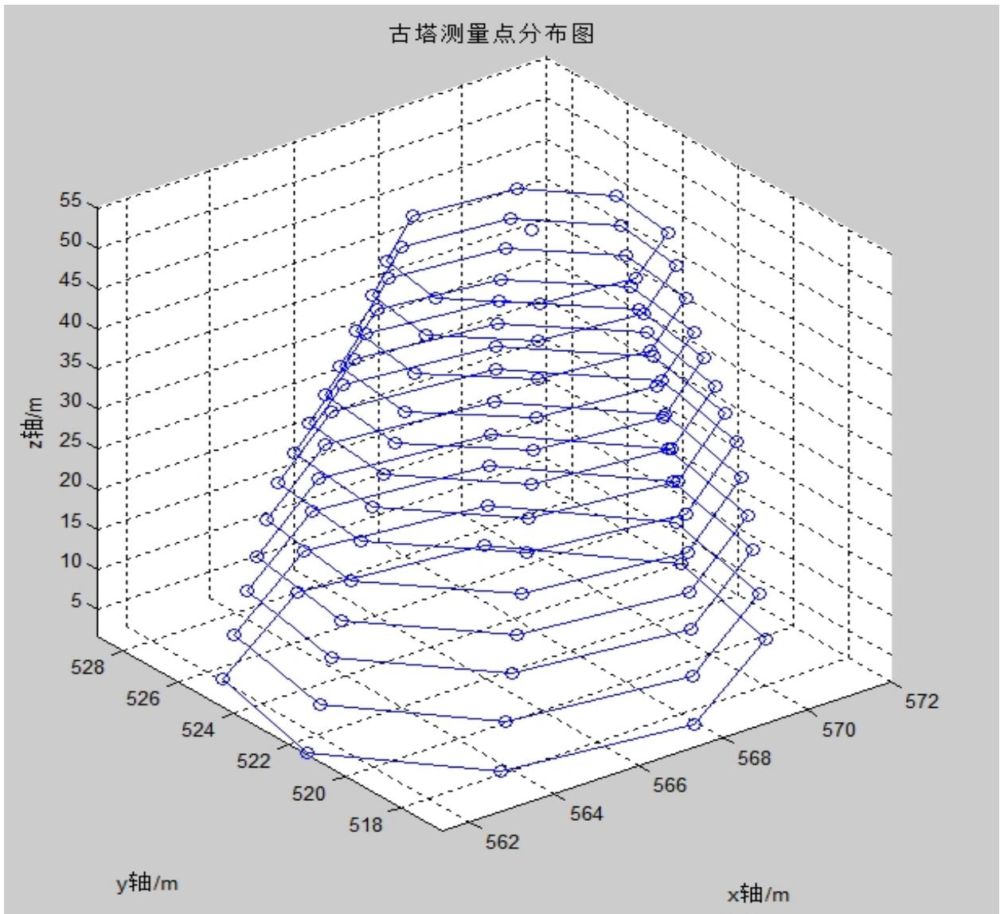
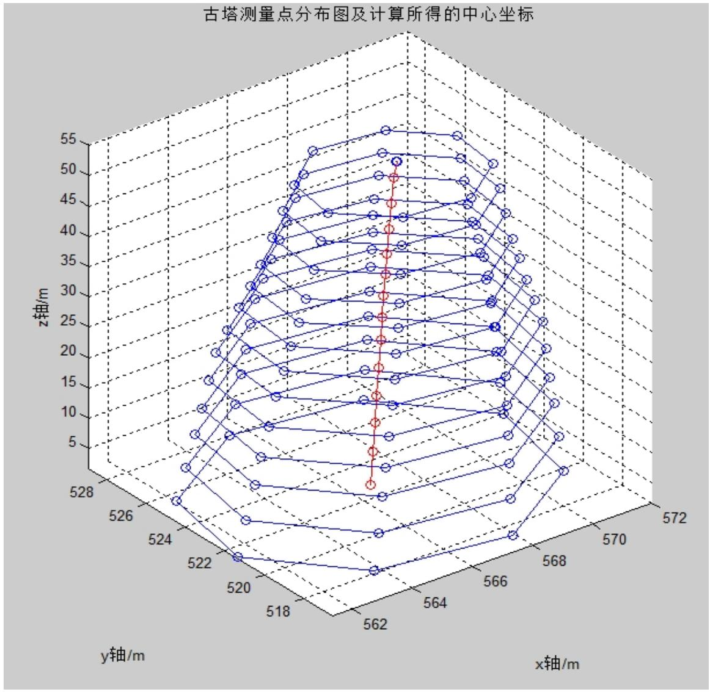

# 2013高教社杯全国大学生数学建模竞赛

## 承 诺 书

我们仔细阅读了《全国大学生数学建模竞赛章程》和《全国大学生数学建模竞赛参赛规则》（以下简称为“竞赛章程和参赛规则”，可从全国大学生数学建模竞赛网站下载）。

我们完全明白，在竞赛开始后参赛队员不能以任何方式（包括电话、电子邮件、网上咨询等）与队外的任何人（包括指导教师）研究、讨论与赛题有关的问题。

我们知道，抄袭别人的成果是违反竞赛章程和参赛规则的，如果引用别人的成果或其他公开的资料（包括网上查到的资料），必须按照规定的参考文献的表述方式在正文引用处和参考文献中明确列出。

我们郑重承诺，严格遵守竞赛章程和参赛规则，以保证竞赛的公正、公平性。如有违反竞赛章程和参赛规则的行为，我们将受到严肃处理。

我们授权全国大学生数学建模竞赛组委会，可将我们的论文以任何形式进行公开展示（包括进行网上公示，在书籍、期刊和其他媒体进行正式或非正式发表等）。

我们参赛选择的题号是（从A/B/C/D中选择一项填写）： C

我们的参赛报名号为（如果赛区设置报名号的话）：

所属学校（请填写完整的全名）： 成都工业学院

参赛队员 (打印并签名) ：1. 肖渝琳

2. 刘新燕

3. 黄龙

指导教师或指导教师组负责人 (打印并签名)： 任大源

（论文纸质版与电子版中的以上信息必须一致，只是电子版中无需签名。以上内容请仔细核对，提交后将不再允许做任何修改。如填写错误，论文可能被取消评奖资格。）

日期： 年 月 日

# 2013高教社杯全国大学生数学建模竞赛

## 编 号 专 用 页

赛区评阅编号（由赛区组委会评阅前进行编号）：

赛区评阅记录（可供赛区评阅时使用）：

<table><tr><td>评阅人</td><td></td><td></td><td></td><td></td><td></td><td></td><td></td><td></td><td></td><td></td></tr><tr><td>评分</td><td></td><td></td><td></td><td></td><td></td><td></td><td></td><td></td><td></td><td></td></tr><tr><td>备注</td><td></td><td></td><td></td><td></td><td></td><td></td><td></td><td></td><td></td><td></td></tr></table>

全国统一编号（由赛区组委会送交全国前编号）：

全国评阅编号（由全国组委会评阅前进行编号）：

# 古塔的变形

## 摘要

本文要求根据测绘公司对古塔的4次测量数据，给出确定古塔各层中心位置的通用方法，并分析古塔的变形情况及其变形趋势。为了计算的精度，我们首先对各变形量进行了合理的数学定义，并对附录的缺失数据进行合理的赋值。

对于问题一，我们通过最小二乘法拟合出观测点所在平面，再建立优化模型，在拟合平面上寻找到各观测点距离的平方和最小的点作为古塔该层的中心点。利用MATLAB编程求解，得到了每次观测古塔各层中心坐标的通用方法及各层的中心点坐标。

对于问题二，我们将古塔的倾斜、弯曲和扭曲等变形情况，分别给予合理的数学描述。对于倾斜变形，我们定义了倾斜角，即塔尖与底层中心的水平距离与塔高的比值；对于弯曲变形，我们定义了弯曲率K，即用中心点所拟合出的空间曲线的曲率来描述古塔各处弯曲率；对于扭曲变形，我们定义了相对扭曲度，利用坐标的旋转变换角度描述古塔的扭曲变形情况。利用空间曲线拟合、坐标变换等方法以及 MATLAB 程序，分别求出了三个变形刻画量的量化指标。

对于问题三，我们考虑通过古塔的倾斜、弯曲及扭曲程度来分析古塔的变形趋势。由于数据量较少，我们建立灰色预测模型分析这三种变形因素的变化趋势，利用相应的MATLAB 程序，得到了倾斜角、弯曲率以及相对扭曲度的预测函数和误差检验，验证了模型的可靠性，并继而分析古塔的变形趋势。

本文巧妙地将各种变形量给予了合理的数学描述及模型，并运用最小二乘法、曲线投影拟合、坐标变换等数学方法实现了求解，并利用灰色预测对未来变形趋势进行了预测，具有较好的实用性和可推广性。

关键词：古塔变形；最小二乘拟合；空间曲线曲率；坐标矩阵变换；灰色预测；

## 1、问题重述

由于长时间承受自重、气温、风力等各种作用，偶然还要受地震、飓风的影响，古塔产生各种变形，诸如倾斜、弯曲、扭曲等。为保护古塔，文物部门需适时对古塔进行观测，了解各种变形量，以制定必要的保护措施。

某古塔已有上千年历史，是我国重点保护文物。管理部门委托测绘公司先后于 1986年7月、1996年8月、2009年3月和 2011年3月对该塔进行了 4次观测。

请你们根据附件1提供的4次观测数据，讨论以下问题：

1. 给出确定古塔各层中心位置的通用方法，并列表给出各次测量的古塔各层中心坐标。  
2. 分析该塔倾斜、弯曲、扭曲等变形情况。  
3. 分析该塔的变形趋势。

## 2、模型的假设

1. 由于中国古代建筑物多为对称图形，假设古塔是对称的。  
2. 假设每次古塔的测量点选取是固定的。  
3. 假设测量数据都是准确可靠的。  
4. 假设古塔的变形只由倾斜、弯曲和扭曲变形造成，不考虑其他因素。

## 3、变量说明

$( x _ { i j } ( k ) , \mathrm { y } _ { i j } ( k ) , \mathrm { z } _ { i j } ( k ) )$ ：第k次测量时第i层第j个观测点的观测坐标

$$
(i = 1, 2, \dots , 1 3, j = 1, 2, \dots , 8, k = 1, 2, 3, 4);
$$

$( { x _ { i } ^ { * } ( k ) } , { y _ { i } ^ { * } ( k ) } , { z _ { i } ^ { * } ( k ) } )$ ：第k次测量时第i层中心点坐标 $( \ i = 1 , 2 , \cdots , 1 3 \ , k = 1 , 2 , 3 , 4 \ )$  
$( { x _ { j } } ^ { \wedge } ( k ) , { y _ { j } } ^ { \wedge } ( k ) , { z _ { j } } ^ { \wedge } ( k ) )$ ：第k次测量时塔尖第j个观测点的观测坐标

$$
(j = 1, 2, \dots , 4, k = 1, 2, 3, 4)
$$

$( x ^ { * } ( k ) , y ^ { * } ( k ) , z ^ { * } ( k ) )$ ：第k次测量时塔尖的中心点坐标 $\left( \ k = 1 , 2 , 3 , 4 \right)$

$d _ { i j } ( k )$ ：第k次测量时第i层第j个观测点与该层中心点的距离

$$
(i = 1, 2, \dots , 1 3, j = 1, 2, \dots , 8, k = 1, 2, 3, 4);
$$

$z = A _ { i } ( k ) x + B _ { i } ( k ) y + C _ { i } ( k )$ ：第k次测量时第i层观测点的拟合平面方程

$$
(i = 1, 2, \dots 1 3, k = 1, 2, 3, 4);
$$

H k( )：第k次测量时古塔的塔高（k 1,2,3,4）；

d k( )：第k次测量时古塔的塔尖与塔的底层中心的水平距离 $\left( \ k = 1 , 2 , 3 , 4 \right)$

( )k ：第k次测量时古塔的倾斜角 $\left( \ k = 1 , 2 , 3 , 4 \right)$

$\left\{ \begin{array} { c } { x _ { \boldsymbol { k } } ( t ) = a _ { 1 } ( \boldsymbol { k } ) t ^ { 2 } + b _ { 1 } ( \boldsymbol { k } ) t + c _ { 1 } ( \boldsymbol { k } ) } \\ { y _ { \boldsymbol { k } } ( t ) = a _ { 2 } ( \boldsymbol { k } ) t ^ { 2 } + b _ { 2 } ( \boldsymbol { k } ) t + c _ { 2 } ( \boldsymbol { k } ) } \\ { z _ { \boldsymbol { k } } ( t ) = t } \end{array} \right.$ ：第k次测量时古塔各层中心点的拟合曲线

$$
(k = 1, 2, 3, 4);
$$

$K _ { k }$ ：第k次测量时古塔的弯曲率 $\left( \ k = 1 , 2 , 3 , 4 \right)$

$\theta _ { i j } ( k )$ ：第k次测量时古塔第i层第j个观测点相对于上次测量的扭曲度

$$
(i = 1, 2, \dots , 1 3, j = 1, 2, \dots , 8, k = 2, 3, 4);
$$

$\overline { { \theta } } _ { i } ( k )$ ：第k次测量时古塔第i层相对于上次测量的平均扭曲度

$$
(i = 1, 2, \dots , 1 3, k = 2, 3, 4);
$$

$( p _ { i } ( k ) , q _ { i } ( k ) )$ ：第k次测量时古塔第i层相对于上次测量的水平坐标平移量

$$
(i = 1, 2, \dots , 1 3, k = 2, 3, 4)
$$

$x ^ { ( 0 ) }$ ：灰色系统原始数据序列；

$\boldsymbol { x } ^ { ( 1 ) }$ ：灰色系统原始数据一次累加序列；

$\alpha ^ { ( 1 ) } x ^ { ( 0 ) }$ ：灰色系统原始数据一次累减序列；

$z ^ { ( 1 ) }$ ：灰色系统原始数据一次累加序列的均值序列；

## 4、模型准备

## 4.1 对建筑物变形、倾斜、弯曲、扭曲的理解

根据《中华人民共和国行业标准建筑变形测量规范(JGJ8—2007)》<sup>[1]</sup>,我们对以下关键概念进行了定义，并给出合理的数学解释：

建筑变形 ：建筑的地基、基础、上部结构及其场地受各种作用力而产生的形状或位置变化现象。在本文中，我们认为建筑变形主要由建筑物的倾斜、弯曲、扭曲以及沉降等现象共同造成。

倾斜：建筑中心线或其墙、柱等，在不同高度的点对其相应底部点的偏移现象。在本文中，我们定义倾斜角 $\alpha$ ，其正切值即塔尖与底层中心的水平距离与塔高的比值，即 $\tan \alpha = { \frac { d } { H } }$

弯曲：当杆件受到与杆轴线垂直的外力或在轴线平面内的力偶作用时，杆的轴线由原来的直线变成弯曲，这种变形叫弯曲变形。在本文中，我们利用古塔各层中心位置所在空间曲线的曲率定义了古塔的弯曲率K。

扭曲：建筑产生的非竖向变形。由于扭曲为非竖向的变形，讨论古塔扭曲时只需考虑水平方向的坐标变化，即x y, 坐标的水平旋转，因此我们用古塔水平旋转角度的扭曲度来描述。

## 4.2 缺失数据的预处理：

第十三层的缺失数据：由于在第一次和第二次的观测数据中，第十三层缺少一个点的观测数据，使得在寻找第十三层中心点时产生较大误差。因此，我们结合十二层与十一层第5个观测点坐标的相对变化情况，对第十三层的缺失数据进行了合理地赋值。根据对古塔各观测点散点图观察可见，古塔相邻两层的对应观测点坐标之间具有类似的关系。通过计算可得第一次测量中第十二层第5个观测点相对于第十一层第5 个点的坐标变化值为( 0.055,0.173, 4.271)  ，从而由第十二层第5 个观测点坐标加上相对变化值可将第十三层的缺失数据赋值为(567.984,519.588,52.984)。同理可将第二次测量中第十三层的缺失数据赋值为 (567.99,519.5816,52.983) 。

塔尖的数据：在后两次测量中，塔尖仅有一个观测数据。由于塔尖各点坐标变化很小，所以对于只有一个测量点的塔尖数据，我们将其近似处理为塔尖中心点坐标。

## 5、模型的建立与求解

## 5.1 问题1模型建立与求解

## 5.1.1 建模思路

问题一要求确定古塔各层中心位置的通用方法。根据建筑变形测量规范，在建筑物变形测量中，为更好地测量出建筑物变形程度的各个指标，我们假设每次测量应选取固定的测量点，且在同一层所选取的测量点在未变形前处于同一个水平面上。而经过对各层观测点三维散点图（如图 1所示）的绘制发现，各层的八个点近似对称地分布在一个平面上，只是因为年代久远发生变形导致了些许偏差。因此为了更准确地找出各层中心点，我们考虑先利用最小二乘法拟合出各层观测点所在的平面方程，再建立优化模型在该平面上寻找一点使其到各观测点距离的平方和最小，以此确立古塔各层中心坐标。

图1：各层观测点三维图  


<details>
<summary>scatter_3d</summary>

| x轴/m | y轴/m | z轴/m |
| --- | --- | --- |
| 562 | 520 | ~10 |
| 562 | 522 | ~15 |
| 562 | 524 | ~20 |
| 562 | 526 | ~25 |
| 562 | 528 | ~30 |
| 564 | 520 | ~15 |
| 564 | 522 | ~20 |
| 564 | 524 | ~25 |
| 564 | 526 | ~30 |
| 564 | 528 | ~35 |
| 566 | 520 | ~20 |
| 566 | 522 | ~25 |
| 566 | 524 | ~30 |
| 566 | 526 | ~35 |
| 566 | 528 | ~40 |
| 568 | 520 | ~25 |
| 568 | 522 | ~30 |
| 568 | 524 | ~35 |
| 568 | 526 | ~40 |
| 568 | 528 | ~45 |
| 570 | 520 | ~30 |
| 570 | 522 | ~35 |
| 570 | 524 | ~40 |
| 570 | 526 | ~45 |
| 570 | 528 | ~50 |
| 572 | 520 | ~35 |
| 572 | 522 | ~40 |
| 572 | 524 | ~45 |
| 572 | 526 | ~50 |
| 572 | 528 | ~55 |
</details>

## 5.1.2 平面拟合

## (1)模型分析与建立

根据假设，在变形前，同层的观测点应处于同一平面上，而由于该层各点发生的变形程度的不同使其与该平面有微小的偏差，因此我们首先根据各层的观测值通过最小二乘法<sup>[2]</sup>拟合所在平面。

平面方程的一般表达式为：

$$
\begin{array}{l} A x + B y + C z + D = 0 (C \neq 0) \\ \Rightarrow z = - \frac {A}{C} x - \frac {B}{C} y - \frac {D}{C} \\ \end{array}
$$

因此可设第k次测量时第i层观测点的拟合平面方程为

$$
z = A _ {i} (k) x + B _ {i} (k) y + C _ {i} (k)
$$

利用最小二乘法的思想，建立如下优化模型

$$
\min \sum_ {j = 1} ^ {8} \left(A _ {i} (k) x _ {i j} (k) + B _ {i} (k) y _ {i j} (k) + C _ {i} (k) - z _ {i j} (k)\right) ^ {2} (\mathrm{i} = 1, 2, \dots , 1 3; k = 1, 2, 3, 4)
$$

寻找与各层观测点最接近的平面方程。

## (2)模型求解

该问题为无条件极值问题，函数

$$
f (A _ {i} (k), B _ {i} (k), C _ {i} (k)) = \sum_ {j = 1} ^ {8} \left(A _ {i} (k) x _ {i j} (k) + B _ {i} (k) y _ {i j} (k) + C _ {i} (k) - z _ {i j} (k)\right) ^ {2}
$$

取得极小值的必要条件是三个偏导数应满足：

$$
\frac {\partial f}{\partial A} = \frac {\partial f}{\partial B} = \frac {\partial f}{\partial C} = 0,
$$

即

$$
\left\{ \begin{array}{l} \sum_ {j = 1} ^ {8} 2 [ A _ {i} (k) x _ {i j} (k) + B _ {i} (k) y _ {i j} (k) + C _ {i} (k) - z _ {i j} (k) ] x _ {i j} (k) = 0 \\ \sum_ {j = 1} ^ {8} 2 [ A _ {i} (k) x _ {i j} (k) + B _ {i} (k) y _ {i j} (k) + C _ {i} (k) - z _ {i j} (k) ] y _ {i j} (k) = 0 \\ \sum_ {j = 1} ^ {8} 2 [ A _ {i} (k) x _ {i j} (k) + B _ {i} (k) y _ {i j} (k) + C _ {i} (k) - z _ {i j} (k) ] z _ {i j} (k) = 0 \end{array} \right.
$$

整理可得

$$
\left\{ \begin{array}{l} A _ {i} (k) \sum_ {j = 1} ^ {8} x _ {i j} ^ {2} (k) + B _ {i} (k) \sum_ {j = 1} ^ {8} [ x _ {i j} (k) y _ {i j} (k) ] + C _ {i} (k) \sum_ {j = 1} ^ {8} x _ {i j} (k) = \sum_ {j = 1} ^ {8} [ x _ {i j} (k) z _ {i j} (k) ] \\ A _ {i} (k) \sum_ {j = 1} ^ {8} [ x _ {i j} (k) y _ {i j} (k) ] + B _ {i} (k) \sum_ {j = 1} ^ {8} y _ {i j} ^ {2} (k) + C _ {i} (k) \sum_ {j = 1} ^ {8} y _ {i j} (k) = \sum_ {j = 1} ^ {8} [ y _ {i j} (k) z _ {i j} (k) ] \\ A _ {i} (k) \sum_ {j = 1} ^ {8} [ x _ {i j} (k) z _ {i j} (k) ] + B _ {i} (k) \sum_ {j = 1} ^ {8} [ y _ {i j} (k) z _ {i j} (k) ] + C _ {i} (k) \sum_ {j = 1} ^ {8} z _ {i j} (k) = \sum_ {j = 1} ^ {8} z _ {i j} ^ {2} (k) \end{array} \right.
$$

将各层观测值 $x _ { i j } ( k ) , y _ { i j } ( k )$ 带入上式，利用 MATLAB 编程（程序见附录 1）解上述线性方程组，解得每次测量各层的拟合平面系数 $A _ { i } ( k ) , B _ { i } ( k ) , C _ { i } ( k )$ 如表 1所示。

表1：拟合后各层的系数

<table><tr><td rowspan="2">第i层</td><td colspan="3">第一次测量拟合平面系数</td><td rowspan="2">第i层</td><td colspan="3">第二次测量拟合平面系数</td></tr><tr><td>A</td><td>B</td><td>C</td><td>A</td><td>B</td><td>C</td></tr><tr><td>1</td><td>-0.00083</td><td>0.003417</td><td>0.471956</td><td>1</td><td>-0.00149</td><td>0.003715</td><td>0.6844</td></tr><tr><td>2</td><td>-0.00082</td><td>0.003629</td><td>5.887189</td><td>2</td><td>-0.00049</td><td>0.003782</td><td>5.617203</td></tr><tr><td>3</td><td>-0.10353</td><td>-0.1706</td><td>160.1073</td><td>3</td><td>-0.10388</td><td>-0.1706</td><td>160.2976</td></tr><tr><td>4</td><td>-0.08443</td><td>-0.13913</td><td>137.2556</td><td>4</td><td>-0.0829</td><td>-0.13916</td><td>136.4015</td></tr><tr><td>5</td><td>-0.09317</td><td>-0.15634</td><td>155.8157</td><td>5</td><td>-0.09355</td><td>-0.15634</td><td>156.0257</td></tr><tr><td>6</td><td>-0.10906</td><td>-0.15576</td><td>169.0503</td><td>6</td><td>-0.1087</td><td>-0.15562</td><td>168.7628</td></tr><tr><td>7</td><td>-0.09725</td><td>-0.13291</td><td>154.098</td><td>7</td><td>-0.09689</td><td>-0.13279</td><td>153.8289</td></tr><tr><td>8</td><td>-0.10094</td><td>-0.13874</td><td>162.7653</td><td>8</td><td>-0.10135</td><td>-0.13866</td><td>162.9446</td></tr><tr><td>9</td><td>-0.10708</td><td>-0.14904</td><td>175.1284</td><td>9</td><td>-0.10664</td><td>-0.14886</td><td>174.7784</td></tr><tr><td>10</td><td>-0.10713</td><td>-0.15624</td><td>182.2592</td><td>10</td><td>-0.10768</td><td>-0.15628</td><td>182.591</td></tr><tr><td>11</td><td>-0.13503</td><td>-0.21748</td><td>234.2576</td><td>11</td><td>-0.13553</td><td>-0.21745</td><td>234.5202</td></tr><tr><td>12</td><td>-0.14529</td><td>-0.23331</td><td>252.6149</td><td>12</td><td>-0.14591</td><td>-0.23338</td><td>252.9946</td></tr><tr><td>13</td><td>-0.14784</td><td>-0.25395</td><td>268.9965</td><td>13</td><td>-0.14817</td><td>-0.25401</td><td>269.2087</td></tr><tr><td>塔尖</td><td>1.1448</td><td>0.7035</td><td>-961.701</td><td>塔尖</td><td>1.269504</td><td>0.641135</td><td>-999.836</td></tr><tr><td rowspan="2">第i层</td><td colspan="3">第三次测量拟合平面系数</td><td rowspan="2">第i层</td><td colspan="3">第四次测量拟合平面系数</td></tr><tr><td>A</td><td>B</td><td>C</td><td>A</td><td>B</td><td>C</td></tr><tr><td>1</td><td>-0.00237</td><td>-0.00377</td><td>5.079985</td><td>1</td><td>-0.00233</td><td>-0.00374</td><td>5.040576</td></tr><tr><td>2</td><td>-0.00397</td><td>-0.00019</td><td>9.661222</td><td>2</td><td>-0.00255</td><td>-0.00253</td><td>10.06101</td></tr><tr><td>3</td><td>0.17178</td><td>-0.10499</td><td>-30.2461</td><td>3</td><td>0.172475</td><td>-0.10626</td><td>-29.9822</td></tr><tr><td>4</td><td>0.140823</td><td>-0.08276</td><td>-19.8928</td><td>4</td><td>0.140913</td><td>-0.08503</td><td>-18.7722</td></tr><tr><td>5</td><td>0.157628</td><td>-0.0909</td><td>-20.5583</td><td>5</td><td>0.158721</td><td>-0.09192</td><td>-20.6534</td></tr><tr><td>6</td><td>0.168466</td><td>-0.11876</td><td>-7.63286</td><td>6</td><td>0.168404</td><td>-0.11917</td><td>-7.39017</td></tr><tr><td>7</td><td>0.134088</td><td>-0.0953</td><td>3.269996</td><td>7</td><td>0.133926</td><td>-0.09493</td><td>3.161969</td></tr><tr><td>8</td><td>0.139157</td><td>-0.10075</td><td>6.766714</td><td>8</td><td>0.139362</td><td>-0.10079</td><td>6.667407</td></tr><tr><td>9</td><td>0.147529</td><td>-0.10482</td><td>7.636402</td><td>9</td><td>0.148239</td><td>-0.10721</td><td>8.463752</td></tr><tr><td>10</td><td>0.152723</td><td>-0.10346</td><td>7.301055</td><td>10</td><td>0.15518</td><td>-0.10713</td><td>7.808521</td></tr><tr><td>11</td><td>0.215153</td><td>-0.13588</td><td>-6.99514</td><td>11</td><td>0.216632</td><td>-0.13885</td><td>-6.29511</td></tr><tr><td>12</td><td>0.232414</td><td>-0.14731</td><td>-6.56117</td><td>12</td><td>0.231244</td><td>-0.14226</td><td>-8.55393</td></tr><tr><td>13</td><td>0.241372</td><td>-0.15773</td><td>-2.08825</td><td>13</td><td>0.241593</td><td>-0.15841</td><td>-1.86442</td></tr></table>

## 5.1.3 中心点的确定

## (1)模型分析与建立

中心点即与四周距离相等的点。根据各层实际观测点近似对称地分布在一个平面的特征，我们在5.1.2 中所求得的各层拟合平面中寻找一点，使其到该层各观测点距离的平方和最小，建立如下优化模型：

目标函数：

到该层各观测点距离的平方和最小，即

$$
\min \sum_ {j = 1} ^ {8} d _ {i j} (k) = \sum_ {j = 1} ^ {8} [ (x _ {i j} (k) - x _ {i} ^ {*} (k)) ^ {2} + (y _ {i j} (k) - y _ {i} ^ {*} (k)) ^ {2} + (z _ {i j} (k) + z _ {i} ^ {*} (k)) ^ {2} ]
$$

约束条件：

该中心点在拟合平面上，即

$$
z _ {i} ^ {*} (k) = A _ {i} (k) x _ {i} ^ {*} (k) + B _ {i} (k) y _ {i} ^ {*} (k) + C _ {i} (k)
$$

## (2)模型求解

该问题为条件极值问题，将约束条件 $z _ { i } ^ { * } ( k ) = A _ { i } ( k ) x _ { i } ^ { * } ( k ) + B _ { i } ( k ) y _ { i } ^ { * } ( k ) + C _ { i } ( k )$ 带入目标函数可将其转换为无条件极值问题：

$$
\min \sum_ {j = 1} ^ {8} d _ {i j} (k) = \sum_ {j = 1} ^ {8} [ (x _ {i j} (k) - x _ {i} ^ {*} (k)) ^ {2} + (y _ {i j} (k) - y _ {i} ^ {*} (k)) ^ {2} + (z _ {i j} (k) - A _ {i} (k) x _ {i} ^ {*} (k) - B _ {i} (k) y _ {i} ^ {*} (k) - C _ {i} (k)) ^ {2} ]
$$

利用 MATLAB 编程（程序见附录 2）求解该无条件极值问题，求得每次各层中心点坐标如表2所示，将其绘成三维图如图 2所示。

表2：各次各层中心点坐标

<table><tr><td rowspan="2">第i层</td><td colspan="3">第一次测量各层的中心坐标</td><td rowspan="2">第i层</td><td colspan="3">第二次测量各层的中心坐标</td></tr><tr><td>x</td><td>y</td><td>z</td><td>x</td><td>y</td><td>z</td></tr><tr><td>1</td><td>566.6647</td><td>522.7105</td><td>1.787375</td><td>1</td><td>566.665</td><td>522.7102</td><td>1.783001</td></tr><tr><td>2</td><td>566.7196</td><td>522.6683</td><td>7.32025</td><td>2</td><td>566.7205</td><td>522.6675</td><td>7.314628</td></tr><tr><td>3</td><td>566.7251</td><td>522.5475</td><td>12.28766</td><td>3</td><td>566.7265</td><td>522.5459</td><td>12.28297</td></tr><tr><td>4</td><td>566.7842</td><td>522.5418</td><td>16.70028</td><td>4</td><td>566.787</td><td>522.5395</td><td>16.69614</td></tr><tr><td>5</td><td>566.8246</td><td>522.4962</td><td>21.31765</td><td>5</td><td>566.8273</td><td>522.4933</td><td>21.31278</td></tr><tr><td>6</td><td>566.866</td><td>522.4639</td><td>25.84712</td><td>6</td><td>566.8696</td><td>522.4606</td><td>25.84084</td></tr><tr><td>7</td><td>566.9167</td><td>522.467</td><td>29.52712</td><td>7</td><td>566.9206</td><td>522.463</td><td>29.52177</td></tr><tr><td>8</td><td>566.9538</td><td>522.4506</td><td>33.0495</td><td>8</td><td>566.9579</td><td>522.4463</td><td>33.04364</td></tr><tr><td>9</td><td>566.9897</td><td>522.4318</td><td>36.55586</td><td>9</td><td>566.9946</td><td>522.4268</td><td>36.54837</td></tr><tr><td>10</td><td>567.0267</td><td>522.4184</td><td>39.89099</td><td>10</td><td>567.0317</td><td>522.4132</td><td>39.88566</td></tr><tr><td>11</td><td>567.0565</td><td>522.3456</td><td>44.08503</td><td>11</td><td>567.062</td><td>522.3399</td><td>44.07846</td></tr><tr><td>12</td><td>567.1007</td><td>522.3017</td><td>48.36058</td><td>12</td><td>567.1065</td><td>522.2955</td><td>48.35469</td></tr><tr><td>13</td><td>567.148</td><td>522.2615</td><td>52.51921</td><td>13</td><td>567.154</td><td>522.2552</td><td>52.51373</td></tr><tr><td>塔尖</td><td>567.2641</td><td>522.2541</td><td>55.10855</td><td>塔尖</td><td>567.2543</td><td>522.2366</td><td>55.11965</td></tr><tr><td rowspan="2">第i层</td><td colspan="3">第三次测量各层的中心坐标</td><td rowspan="2">第i层</td><td colspan="3">第四次测量各层的中心坐标</td></tr><tr><td>x</td><td>y</td><td>z</td><td>x</td><td>y</td><td>z</td></tr><tr><td>1</td><td>566.7268</td><td>522.7015</td><td>1.7645</td><td>1</td><td>566.7269</td><td>522.7014</td><td>1.76325</td></tr><tr><td>2</td><td>566.764</td><td>522.6693</td><td>7.309</td><td>2</td><td>566.7642</td><td>522.669</td><td>7.2905</td></tr><tr><td>3</td><td>566.8798</td><td>522.5896</td><td>12.26776</td><td>3</td><td>566.8809</td><td>522.5891</td><td>12.25993</td></tr><tr><td>4</td><td>566.8829</td><td>522.5817</td><td>16.68898</td><td>4</td><td>566.883</td><td>522.5805</td><td>16.67334</td></tr><tr><td>5</td><td>566.9238</td><td>522.55</td><td>21.30717</td><td>5</td><td>566.9252</td><td>522.5488</td><td>21.29916</td></tr><tr><td>6</td><td>567.0101</td><td>522.4898</td><td>25.8372</td><td>6</td><td>567.0107</td><td>522.4889</td><td>25.83086</td></tr><tr><td>7</td><td>567.0214</td><td>522.4823</td><td>29.50962</td><td>7</td><td>567.0222</td><td>522.4816</td><td>29.50188</td></tr><tr><td>8</td><td>567.0722</td><td>522.4494</td><td>33.03954</td><td>8</td><td>567.0732</td><td>522.4486</td><td>33.03601</td></tr><tr><td>9</td><td>567.1256</td><td>522.4153</td><td>36.54536</td><td>9</td><td>567.1263</td><td>522.414</td><td>36.52683</td></tr><tr><td>10</td><td>567.1797</td><td>522.3647</td><td>39.88097</td><td>10</td><td>567.1816</td><td>522.3625</td><td>39.86353</td></tr><tr><td>11</td><td>567.2556</td><td>522.3069</td><td>44.08065</td><td>11</td><td>567.2575</td><td>522.3045</td><td>44.07157</td></tr><tr><td>12</td><td>567.3032</td><td>522.2649</td><td>48.35264</td><td>12</td><td>567.3044</td><td>522.2652</td><td>48.33555</td></tr><tr><td>13</td><td>567.3515</td><td>522.219</td><td>52.48581</td><td>13</td><td>567.3529</td><td>522.2174</td><td>52.48076</td></tr><tr><td>塔尖</td><td>567.336</td><td>522.2148</td><td>55.091</td><td>塔尖</td><td>567.3375</td><td>522.2135</td><td>55.087</td></tr></table>

图2：中心点的三维图  


<details>
<summary>scatter_3d</summary>

| Series | x轴/m (range) | y轴/m (range) | z轴/m (range) |
| --- | --- | --- | --- |
| Blue points | 562~572 | 520~528 | 0~55 |
| Red line | ~562.5 | ~521.5 | ~5 ~49 |
</details>

## 5.1.4 模型的结果分析

通过模型求出的古塔的各层中心点的坐标，给出了确定古塔各层中心点的通用方法，达到了建立本模型的目的。且该模型可以到各种对称物体的中心点位置的确定。

## 5.2 问题 2模型建立与求解

## 5.2.1 建模思路

问题二要求分析古塔的各种变形情况。根据《中华人民共和国行业标准建筑变形测量规范(JGJ8—2007)》<sup>[1]</sup>知，变形是建筑的地基、基础、上部结构及其场地受各种作用力而产生的形状或位置变化现象。在本问中，我们主要分析古塔三种主要的变形情况：倾斜、弯曲、扭曲。

对于倾斜变形，我们定义倾斜角进行描述 ，其正切值等于塔尖与底层中心的水平距离与塔高的比值，即 $\tan \alpha = { \frac { d } { H } }$ ；对于弯曲变形，我们首先通过投影法拟合出古塔各层中心点所在空间曲线的参数方程，再利用空间曲线的曲率来刻画古塔的弯曲度K；对于扭曲变形，考虑到扭曲变形实际为古塔水平面的旋转产生，因此我们采用二维坐标( , )x y 旋转的矩阵变换，通过各观测量点前后的坐标确定古塔的旋转角度，以此刻画古塔的扭曲度。但是，实际中水平面坐标( , ) x y 不仅发生了旋转变换，还受到倾斜弯曲变形等所引起的平移变化的影响，因此我们在考虑坐标变换的时候加入了平移量 $( p , q )$ 使其更加准确合理。

## 5.2.2 倾斜变形

## （1）模型分析与建立

古塔的倾斜变形可用其倾斜角来描述 ，其正切值等于塔尖与底层中心的水平距离与塔高的比值，即

$$
\tan \alpha = \frac {d}{H}
$$

因此，第k次测量的倾斜角可以用如下式子表示：

$$
\alpha (k) = \arctan \frac {d (k)}{H (k)}
$$

其中，塔尖与底层中心的水平距离

$$
d (k) = \sqrt {\left[ x ^ {*} (k) - x _ {1} ^ {*} (k) \right] ^ {2} + \left[ y ^ {*} (k) - y _ {1} ^ {*} (k) \right]} \quad ,
$$

塔高即塔尖与底层中心的纵坐标之差

$$
H (k) = z ^ {*} (k) - z _ {1} ^ {*} (k)
$$

## （2）模型求解

根据问题1 所求出的塔尖与底层的中心坐标，利用距离公式可计算出d k( )，H k( )的值，其计算方法如下：

$$
d (k) = \sqrt {\left[ x ^ {*} (k) - x _ {1} ^ {*} (k) \right] ^ {2} + \left[ y ^ {*} (k) - y _ {1} ^ {*} (k) \right]}, \quad H (k) = z ^ {*} (k) - z _ {1} ^ {*} (k)
$$

再将所得d k( )，H k( )的值代入

$$
\alpha (k) = \arctan \frac {d (k)}{H (k)},
$$

利用MATLAB 编程（程序见附录3）求解出( )k 的值如表3所示。

表3：各次测量的倾斜角

<table><tr><td>测量次数</td><td>倾斜角</td></tr><tr><td>第1次</td><td>0.0141</td></tr><tr><td>第2次</td><td>0.0142</td></tr><tr><td>第3次</td><td>0.0146</td></tr><tr><td>第4次</td><td>0.0147</td></tr></table>

## （3）模型结果的分析

根据求解古塔的倾斜模型，我们得到古塔4次观测的倾斜角分别为 0.0141，0.0142，0.0146，0.0147。根据数据我们可以发现古塔倾斜变化的变化趋势，以制定相应的保护措施，具有较强的参考依据。

## 5.2.3 弯曲变形

## （1）模型分析与建立

古塔的弯曲变形是指当杆件受到与杆轴线垂直的外力或在轴线平面内的力偶作用时，杆的轴线由原来的直线变成弯曲。因此，古塔的弯曲率即因为变形致使古塔轴线弯

曲的程度。

在本文中，我们把古塔各层中心点拟合出的空间曲线作为古塔的轴线。首先将问题1所得到的各层中心点的坐标分别投影到 $z O x$ 平面和 $y O z$ 平面，利用投影法拟合出轴线的参数方程，然后利用拟合出的空间曲线曲率来刻画古塔在各层的弯曲率K。

① 空间曲线拟合

将第k次测量时各层中心点分别投影到 $z O x$ 平面和 $y O z$ 平面，得到其投影点坐标

$$
(x _ {i} ^ {*} (k), 0, z _ {i} ^ {*} (k)), (0, y _ {i} ^ {*} (k), z _ {i} ^ {*} (k)) (\mathrm{i} = 1, 2, \dots , 1 3), (x ^ {*} (k), 0, z ^ {*} (k)), (0, y ^ {*} (k), z ^ {*} (k))
$$

利用投影点坐标对 $x , z$ 坐标及 $y , z$ 坐标分别进行二次拟合得空间曲线 $l _ { k }$ 的参数方程如下

$$
\left\{ \begin{array}{c} x _ {k} (t) = a _ {1} (k) t ^ {2} + b _ {1} (k) t + c _ {1} (k) \\ y _ {k} (t) = a _ {2} (k) t ^ {2} + b _ {2} (k) t + c _ {2} (k) \\ z _ {k} (t) = t \end{array} \right.
$$

② 曲率计算

根据拟合得到的空间曲线的参数方程 $\left\{ \begin{array} { c } { x _ { k } ( t ) = a _ { 1 } ( k ) t ^ { 2 } + b _ { 1 } ( k ) t + c _ { 1 } ( k ) } \\ { y _ { k } ( t ) = a _ { 2 } ( k ) t ^ { 2 } + b _ { 2 } ( k ) t + c _ { 2 } ( k ) } \\ { z _ { k } ( t ) = t } \end{array} \right.$ 以及空间曲线的曲率公式<sup>[3]</sup>

$$
K _ {k} = \frac {\sqrt {\left| \begin{array}{c c} x _ {k} ^ {\prime} (t) & y _ {k} ^ {\prime} (t) \\ x _ {k} ^ {\prime \prime} (t) & y _ {k} ^ {\prime \prime} (t) \end{array} \right| ^ {2} + \left| \begin{array}{c c} y _ {k} ^ {\prime} (t) & z _ {k} ^ {\prime} (t) \\ y _ {k} ^ {\prime \prime} (t) & z _ {k} ^ {\prime \prime} (t) \end{array} \right| ^ {2} + \left| \begin{array}{c c} z _ {k} ^ {\prime} (t) & x _ {k} ^ {\prime} (t) \\ z _ {k} ^ {\prime \prime} (t) & x _ {k} ^ {\prime \prime} (t) \end{array} \right| ^ {2}}}{\left\{\left[ x _ {k} ^ {\prime} (t) \right] ^ {2} + \left[ y _ {k} ^ {\prime} (t) \right] ^ {2} + \left[ z _ {k} ^ {\prime} (t) \right] ^ {2} \right\} ^ {3 / 2}},
$$

即得到第k次测量时古塔的弯曲率函数 $K _ { k } ( t )$ 2

（2）模型求解

① 空间曲线拟合

根据问题1得到各层中心点的坐标在 $z O x$ 平面和 $y O z$ 平面的投影坐标如附录所示。通过投影坐标对 $x , z$ 及 $y , z$ 坐标分别进行二次拟合，设拟合出的空间曲线参数方程为

$$
\left\{ \begin{array}{c} x _ {k} (t) = a _ {1} (k) t ^ {2} + b _ {1} (k) t + c _ {1} (k) \\ y _ {k} (t) = a _ {2} (k) t ^ {2} + b _ {2} (k) t + c _ {2} (k), \\ z _ {k} (t) = t \end{array} \right.
$$

利用MATLAB 编程（程序见附录4），可计算得到拟合空间曲线系数 $a _ { i } ( k ) , b _ { i } ( k ) , c _ { i } ( k )$ $( i = 1 , 2 ; k = 1 , 2 , 3 , 4 )$ 如表4所示。

表4：中心点拟合得到的空间曲线的系数值

<table><tr><td></td><td> $a_i(k)$ </td><td> $b_i(k)$ </td><td> $c_i(k)$ </td></tr><tr><td> $x_1(t)$ </td><td>0.00007</td><td>0.00640</td><td>566.65624</td></tr><tr><td> $y_1(t)$ </td><td>0.00001</td><td>-0.00863</td><td>522.70188</td></tr><tr><td> $x_2(t)$ </td><td>0.00006</td><td>0.00690</td><td>566.65375</td></tr><tr><td> $y_2(t)$ </td><td>0.00001</td><td>-0.00856</td><td>522.70036</td></tr><tr><td> $x_3(t)$ </td><td>0.00002</td><td>0.01078</td><td>566.70341</td></tr><tr><td> $y_3(t)$ </td><td>-0.00004</td><td>-0.00682</td><td>522.70905</td></tr><tr><td> $x_4(t)$ </td><td>0.00002</td><td>0.01083</td><td>566.70353</td></tr><tr><td> $y_4(t)$ </td><td>0.00002</td><td>0.01083</td><td>566.70353</td></tr></table>

## ② 曲率计算

对拟合空间曲线参数方程 $\left\{ \begin{array} { c } { x _ { k } ( t ) = a _ { 1 } ( k ) t ^ { 2 } + b _ { 1 } ( k ) t + c _ { 1 } ( k ) } \\ { y _ { k } ( t ) = a _ { 2 } ( k ) t ^ { 2 } + b _ { 2 } ( k ) t + c _ { 2 } ( k ) } \\ { z _ { k } ( t ) = t } \end{array} \right.$ 各式对t求一阶导数可得

$$
\left\{ \begin{array}{c} x _ {k} ^ {\prime} (t) = 2 a _ {1} (k) t + b _ {1} (k) \\ y _ {k} ^ {\prime} (t) = 2 a _ {2} (k) t + b _ {2} (k), \\ z _ {k} ^ {\prime} (t) = 1 \end{array} \right.
$$

求二阶导数可得

$$
\left\{ \begin{array}{c} x _ {k} ^ {\prime \prime} (t) = 2 a _ {1} (k) \\ y _ {k} ^ {\prime \prime} (t) = 2 a _ {2} (k), \\ z _ {k} ^ {\prime \prime} (t) = 0 \end{array} \right.
$$

将表 4 所求得的系数 $a _ { i } ( k ) , b _ { i } ( k ) , c _ { i } ( k ) ~ ( i = 1 , 2 ; k = 1 , 2 , 3 , 4 )$ 代入参数方程 $x , y ,$ z分别对t的一阶导数和二阶导数，再利用空间曲线的曲率公式<sup>[3]</sup>

$$
K _ {k} = \frac {\sqrt {\left| \begin{array}{c c} x _ {k} ^ {\prime} (t) & y _ {k} ^ {\prime} (t) \\ x _ {k} ^ {\prime \prime} (t) & y _ {k} ^ {\prime \prime} (t) \end{array} \right| ^ {2} + \left| \begin{array}{c c} y _ {k} ^ {\prime} (t) & z _ {k} ^ {\prime} (t) \\ y _ {k} ^ {\prime \prime} (t) & z _ {k} ^ {\prime \prime} (t) \end{array} \right| ^ {2} + \left| \begin{array}{c c} z _ {k} ^ {\prime} (t) & x _ {k} ^ {\prime} (t) \\ z _ {k} ^ {\prime \prime} (t) & x _ {k} ^ {\prime \prime} (t) \end{array} \right| ^ {2}}}{\left\{\left[ x _ {k} ^ {\prime} (t) \right] ^ {2} + \left[ y _ {k} ^ {\prime} (t) \right] ^ {2} + \left[ z _ {k} ^ {\prime} (t) \right] ^ {2} \right\} ^ {3 / 2}},
$$

通过MATLAB 编程（程序见附录5），求解得到 $K _ { k }$ 的值如表5所示。

表5： $K _ { k }$ 的值

<table><tr><td>第i层\年份</td><td>1989</td><td>1999</td><td>2009</td><td>2011</td></tr><tr><td>1</td><td>0.000141404</td><td>0.000121639</td><td>0.000089860</td><td>0.000056555</td></tr><tr><td>2</td><td>0.000141405</td><td>0.000121641</td><td>0.000089920</td><td>0.000056556</td></tr><tr><td>3</td><td>0.000141406</td><td>0.000121642</td><td>0.000089977</td><td>0.000056556</td></tr><tr><td>4</td><td>0.000141407</td><td>0.000121643</td><td>0.000090030</td><td>0.000056557</td></tr><tr><td>5</td><td>0.000141408</td><td>0.000121644</td><td>0.000090089</td><td>0.000056557</td></tr><tr><td>6</td><td>0.000141408</td><td>0.000121645</td><td>0.000090149</td><td>0.000056558</td></tr><tr><td>7</td><td>0.000141409</td><td>0.000121646</td><td>0.000090200</td><td>0.000056558</td></tr><tr><td>8</td><td>0.000141409</td><td>0.000121646</td><td>0.000090250</td><td>0.000056558</td></tr><tr><td>9</td><td>0.000141409</td><td>0.000121647</td><td>0.000090301</td><td>0.000056559</td></tr><tr><td>10</td><td>0.000141409</td><td>0.000121647</td><td>0.000090352</td><td>0.000056559</td></tr><tr><td>11</td><td>0.000141408</td><td>0.000121648</td><td>0.000090417</td><td>0.000056559</td></tr><tr><td>12</td><td>0.000141408</td><td>0.000121648</td><td>0.000090486</td><td>0.000056560</td></tr><tr><td>13</td><td>0.000141408</td><td>0.000121648</td><td>0.000090555</td><td>0.000056560</td></tr><tr><td>塔尖</td><td>0.000141407</td><td>0.000121648</td><td>0.000090599</td><td>0.000056560</td></tr></table>

## （3）模型结果的分析

根据上表数据可知，古塔在各层的弯曲率差距不大，且最近两次观测弯曲现象有“矫正”倾向，可能是因为古塔的修复引起。

## 5.2.4 扭曲变形

## （1）模型分析与建立

扭曲变形是建筑产生的非竖向变形，实际上是由水平坐标( , )x y 的旋转变换所致。因此我们考虑对古塔各观测点的水平坐标进行坐标旋转，通过计算其旋转角度来描述该点相对于上次测量的扭曲度，并对每层各观测点的扭曲度取平均值得到该层相对于上次测量的平均扭曲度。

由于古塔的水平坐标变换不仅由扭曲所导致的旋转变换决定，还与倾斜和弯曲所引起的平移变换有关，因此为了更准确地描述实际的变换规律，我们引入逆时针变换的相对扭曲度和水平坐标的相对平移量 $( p , q )$ ，综合考虑水平坐标的旋转变换和平移变换，建立如下代数模型：

$$
(x _ {i j} (k - 1), y _ {i j} (k - 1)) \cdot \left( \begin{array}{c c} \cos \theta_ {i j} (k) & - \sin \theta_ {i j} (k) \\ \sin \theta_ {i j} (k) & \cos \theta_ {i j} (k) \end{array} \right) + (p _ {i} (k), q _ {i} (k)) = (x _ {i j} (k), y _ {i j} (k))
$$

即可求得第k次测量时每层各观测点的相对扭曲度 $\theta _ { i j } ( k )$ ，再对同一层的 $\theta _ { i j } ( k )$ 取平均值

$$
\overline {{\theta}} _ {i} (k) = \frac {\sum_ {j = 1} ^ {8} \theta_ {i j} (k)}{8},
$$

则可求得第k次测量时每层的平均相对扭曲度。

## （2）模型求解

上述代数模型通过矩阵乘法得到如下形式：

$$
\begin{array}{l} (x _ {i j} (k - 1) \cos \theta_ {i j} (k) + y _ {i j} (k - 1) \sin \theta_ {i j} (k), - x _ {i j} (k - 1) \sin \theta_ {i j} (k) + y _ {i j} (k - 1) \cos \theta_ {i j} (k)) \\ + (p _ {i} (k), q _ {i} (k)) = (x _ {i j} (k), y _ {i j} (k)) \\ \end{array}
$$

即

$$
\left\{ \begin{array}{l} x _ {i j} (k - 1) \cos \theta_ {i j} (k) + y _ {i j} (k - 1) \sin \theta_ {i j} (k) = x _ {i j} (k) - p _ {i} (k) \\ - x _ {i j} (k - 1) \sin \theta_ {i j} (k) + y _ {i j} (k - 1) \cos \theta_ {i j} (k) = y _ {i j} (k) - q _ {i} (k) \end{array} \right.
$$

但考虑到实际中其他因素也可能导致水平坐标的改变以及计算误差所带来的影响，上述

两个方程不可能同时满足，因此，我们考虑最小二乘的思想，寻找一个 $\theta _ { i j } ( k )$ 使得

$$
\left. \left\{x _ {i j} (k - 1) \cos \theta_ {i j} (k) + y _ {i j} (k - 1) \sin \theta_ {i j} (k) - [ x _ {i j} (k) - p _ {i} (k) ] \right\} ^ {2} + \right.
$$

$$
\left\{- x _ {i j} (k - 1) \sin \theta_ {i j} (k) + y _ {i j} (k - 1) \cos \theta_ {i j} (k) - [ y _ {i j} (k) - q _ {i} (k) ] \right\} ^ {2}
$$

最小，即求解优化模型

$$
\min \quad \left\{x _ {i j} (k - 1) \cos \theta_ {i j} (k) + y _ {i j} (k - 1) \sin \theta_ {i j} (k) - \left[ x _ {i j} (k) - p _ {i} (k) \right] \right\} ^ {2} +
$$

$$
\left\{- x _ {i j} (k - 1) \sin \theta_ {i j} (k) + y _ {i j} (k - 1) \cos \theta_ {i j} (k) - \left[ y _ {i j} (k) - q _ {i} (k) \right] \right\} ^ {2}
$$

为简化该无条件极值的计算，我们令 $x = \sin \theta , { \sqrt { 1 - x ^ { 2 } } } = \cos \theta$ ，将其转换为关于x的无条件极值问题，并利用MATLAB编程（程序见附录6）计算出 $\theta _ { i j } ( k )$ 从而得到 $\theta _ { i } ( k )$ 的值如表6所示。

图6：各层的平均相对扭曲度

<table><tr><td rowspan="2">第i层</td><td colspan="3">各层的平均相对扭曲度 $\overline{\theta}_{i}(k)$ </td></tr><tr><td>1999</td><td>2009</td><td>2011</td></tr><tr><td>1</td><td>-7.16E-08</td><td>-3.95E-06</td><td>2.80E-09</td></tr><tr><td>2</td><td>1.05E-08</td><td>-3.48E-06</td><td>-5.58E-08</td></tr><tr><td>3</td><td>1.83E-07</td><td>-4.40E-05</td><td>-1.44E-06</td></tr><tr><td>4</td><td>-6.65E-07</td><td>-3.05E-05</td><td>-3.83E-07</td></tr><tr><td>5</td><td>3.09E-08</td><td>-3.50E-05</td><td>-1.34E-06</td></tr><tr><td>6</td><td>-1.21E-07</td><td>-4.12E-05</td><td>-4.87E-08</td></tr><tr><td>7</td><td>-8.74E-08</td><td>-2.59E-05</td><td>1.32E-07</td></tr><tr><td>8</td><td>7.86E-08</td><td>-2.32E-05</td><td>-1.56E-07</td></tr><tr><td>9</td><td>-5.02E-08</td><td>-2.10E-05</td><td>-1.62E-07</td></tr><tr><td>10</td><td>1.18E-07</td><td>-1.84E-05</td><td>-1.76E-06</td></tr><tr><td>11</td><td>1.76E-07</td><td>-3.68E-05</td><td>-1.96E-06</td></tr><tr><td>12</td><td>1.98E-07</td><td>-4.70E-05</td><td>1.66E-06</td></tr><tr><td>13</td><td>1.59E-07</td><td>-7.17E-05</td><td>-2.39E-07</td></tr></table>

## （3）模型结果的分析：

由上表数据可知古塔在1999年到 2009年期间发生了较大的扭曲变形。

## 5.3 问题三模型的建立与求解

## 5.3.1 模型的分析与建立

本题是分析古塔的变形情况。本文中，我们认为建筑物变形由建筑物的倾斜、弯曲、扭曲等因素共同造成。由于附录只给出了四次统计的数据，而我们的目标是分析古塔未来多年的变化趋势，因此我们采用信息不完全、不充分的预测系统——灰色预测对古塔未来的变形趋势进行预测。我们建立灰色预测模型GM（2.1）模型4

$$
\frac {d ^ {2} x ^ {(1)}}{d t ^ {2}} + a \frac {d x ^ {(1)}}{d t} = b
$$

分别从古塔的倾斜、弯曲、扭曲三个方面来研究古塔的变形趋势。

## 5.3.2 模型求解

由5.2所得到的数据结果可知三种变形情况的原始数据序列，记为

$$
x ^ {(0)} = (x ^ {(0)} (1), x ^ {(0)} (2), x ^ {(0)} (3), x ^ {(0)} (4)),
$$

对其序列做一次累加得到的累加序列记为

$$
x ^ {(1)} = (x ^ {(1)} (1), x ^ {(1)} (2), x ^ {(1)} (3), x ^ {(1)} (4)),
$$

对 $\boldsymbol { x } ^ { ( 1 ) }$ 求均值得到均值序列记为

$$
\alpha^ {(1)} x ^ {(0)} = (\alpha^ {(1)} x ^ {0} (1), \alpha^ {(1)} x ^ {0} (2), \alpha^ {(1)} x ^ {(0)} (3), \alpha^ {(1)} x ^ {(0)} (4)),
$$

即可建立得到古塔三种变形情况的变化趋势的白化微分方程为：

$$
\frac {d ^ {2} x ^ {(1)}}{d t ^ {2}} + a \frac {d x ^ {(1)}}{d t} = b
$$

由于 DGM(2.1)模型 $\frac { d ^ { 2 } x ^ { ( 1 ) } } { d t ^ { 2 } } + a \frac { d x ^ { ( 1 ) } } { d t } = b$ 中参数的最小二乘估计满足：

$$
\hat {u} = \left[ \hat {a}, \hat {b} \right] ^ {T} (B ^ {T} B) ^ {- 1} B ^ {T} Y
$$

其中

$$
B = \left[ \begin{array}{c c c} - x ^ {(0)} (2) & - z ^ {(1)} (2) & 1 \\ - x ^ {(0)} (3) & - z ^ {(1)} (3) & 1 \\ \mathrm{M} & \mathrm{M} & \mathrm{M} \\ - x ^ {(0)} (n) & - z ^ {(1)} (n) & 1 \end{array} \right]
$$

$$
Y = \left[ \begin{array}{c} \alpha^ {(1)} x ^ {(0)} (1) \\ \alpha^ {(1)} x ^ {(0)} (2) \\ \mathrm{M} \\ \alpha^ {(1)} x ^ {(0)} (n) \end{array} \right] = \left[ \begin{array}{c} x ^ {(0)} (2) - x ^ {(0)} (1) \\ x ^ {(0)} (3) - x ^ {(0)} (2) \\ \mathrm{M} \\ x ^ {(0)} (n) - x ^ {(0)} (n - 1) \end{array} \right]
$$

利用MATLAB 编程（程序见附录7），即可得倾斜角的预测函数

$$
\alpha = 0. 0 1 3 5 6 6 7 \mathrm{t} + 0. 0 0 2 4 8 8 8 9 \mathrm{e} ^ {0. 2 1 4 2 8 6 t} + 0. 0 1 1 6 1 1 1
$$

以及倾斜角的误差检验如表7所示。

表7：倾斜角的误差检验表

<table><tr><td>序号</td><td>原始数据</td><td>预测数据</td><td>残差</td><td>相对误差</td></tr><tr><td>2</td><td>0.0142</td><td>0.0142</td><td>0.0000385</td><td>0.27%</td></tr><tr><td>3</td><td>0.0146</td><td>0.0143</td><td>0.0002964</td><td>2.03%</td></tr><tr><td>4</td><td>0.0147</td><td>0.0145</td><td>0.0002203</td><td>1.50%</td></tr></table>

弯曲率的预测函数

$$
\left\{ \begin{array}{l} K _ {1} = 0. 0 0 0 2 2 6 1 5 5 t - 0. 0 0 0 4 0 9 9 3 7 e ^ {0. 2 0 6 7 4 2 t} + 0. 0 0 0 5 5 1 3 4 1 \\ K _ {2} = 0. 0 0 0 2 2 5 6 2 3 t - 0. 0 0 0 4 0 5 7 1 6 e ^ {0. 2 0 7 5 8 t} + 0. 0 0 0 5 4 7 1 2 1 \\ K _ {3} = 0. 0 0 0 2 2 5 1 2 3 t - 0. 0 0 0 4 0 1 7 5 5 e ^ {0. 2 0 8 3 7 8 t} + 0. 0 0 0 5 4 3 1 6 1 \\ K _ {4} = 0. 0 0 0 2 2 4 6 6 6 t - 0. 0 0 0 3 9 8 1 5 7 e ^ {0. 2 0 9 1 1 t} + 0. 0 0 0 5 3 9 5 6 4 \\ K _ {5} = 0. 0 0 0 2 2 4 1 5 2 t - 0. 0 0 0 3 9 4 1 3 e ^ {0. 2 0 9 9 4 1 t} + 0. 0 0 0 5 3 5 5 3 8 \\ K _ {6} = 0. 0 0 0 2 2 3 6 2 7 t - 0. 0 0 0 3 9 0 0 4 6 e ^ {0. 2 1 0 7 9 3 t} + 0. 0 0 0 5 3 1 4 5 4 \\ K _ {7} = 0. 0 0 0 2 2 3 1 8 7 t - 0. 0 0 0 3 8 6 6 3 2 e ^ {0. 2 1 1 5 1 5 t} + 0. 0 0 0 5 2 8 0 4 \\ K _ {8} = \text {   } \begin{array}{l} \text {   } \text {   } \text {   } \text {   } \text {   } \text {   } \text {   } \text {   } \text {   } \text {   } \text {   } \text {   } \text {   } \text {   } \text {   } \text {   } \text {   } \text {   } \text {   } \text {   } \text {   }\end{array} \\ K _ {9} = \text {   } \begin{array}{l} \text {   } \text {   } \text {   } \text {   } \text {   } \text {   } \text {   } \text {   } \text {   } \text {   } \text {   } \text {   } \text {   } \text {   } \text {   } \text {   } \text {   } \\ K _ {1} = \text {   } \begin{array}{l} \text {   } \text {   } \text {   } \text {   } \text {   } \text {   } \text {   } \text {   } \text {   } \text {   } \text {   } \text {   } \text {   } \text {   } \text {   } \text {   } \text {   } & + \\ K _ {1} = \begin{array}{l} \text {   } \text {   } \text {   } \text {   } \text {   } \text {   } \text {   } \text {   } \text {   } \text {   } \text {   } \text {   } \text {   } \text {   } \text {   } \text {   } \\ K _ {1} = \begin{array}{l} \text {   } \text {   } \text {   } \text {   } \text {   } \text {   } \text {   } \text {   } \text {   } \text {   } \text {   } \text {   } \text {   } \text {   } \\ K _ {1} = \begin{array}{l} \text {   } \text {   } \text {   } \\ K _ {1} = \begin{array}{l} \text {   } \text {   } \\ K _ {1} = \begin{array}{l} \text {   } \\ K _ {1} = \begin{array}{l} \text {   } \\ K _ {1} = \begin{array}{l} \text {   } \\ K _ {1} = \begin{array}{l} \text {   } \\ K _ {1} = \begin{array}{l} \text {   } \\ K _ {1} = \begin{array}{l} \text {   } \\ K _ {1} = \begin{array}{l} \text {   } \\ K _ {1} = \begin{array}{l} \text {   } \\ K _ {1} = \begin{array}{l} \text {   } \\ K _ {1} = \begin{array}{l} \text {   } \\ K _ {1} = \begin{array}{l} \text {   } \\ K _ {2} = K _ {\mathrm{B}} / K _ {\mathrm{B}} / K _ {\mathrm{B}} / K _ {\mathrm{B}} / K _ {\mathrm{B}} / K _ {\mathrm{B}} / K _ {\mathrm{B}} / K _ {\mathrm{B}} / K _ {\mathrm{B}} / K _ {\mathrm{B}} / K _ {\mathrm{B}} / K _ {\mathrm{B}} / K _ {\mathrm{B}} / K _ {\infty} / K _ {\infty} / K _ {\infty} / K _ {\infty} / K _ {\infty} / K _ {\infty} / K _ {\infty} / K _ {\infty} / K _ {\infty} / K _ {\infty} / K _ {\infty} / K _ {\infty} / K _ {\infty} / K _ {\infty} / K _ {\infty} / M \\ K _ {\mathrm{B}} = (K _ {\mathrm{B}}) ^ {- k _ {\mathrm{B}}} (K _ {\mathrm{B}}) ^ {- k _ {\mathrm{B}}} (K _ {\mathrm{B}}) ^ {- k _ {\mathrm{B}}} (K _ {\mathrm{B}}) ^ {- k _ {\mathrm{B}}} (K _ {\mathrm{B}}) ^ {- k _ {\mathrm{B}}} (K _ {\mathrm{B}}) ^ {- k _ {\mathrm{B}}} (K _ {\mathrm{B}}) \\ K _ {\mathrm{B}} = (K _ {\mathrm{B}}) ^ {- k _ {\mathrm{B}}} (K _ {\mathrm{B}}) ^ {- k _ {\mathrm{B}}} (K _ {\mathrm{B}}) ^ {- k _ {\mathrm{B}}} (K _ {\mathrm{B}}) ^ {- k _ {\mathrm{B}}} (K _ {\mathrm{B}}) ^ {- k _ {\mathrm{B}}} (\end{array}\right) \\ [ ]
$$

以及弯曲率K的误差检验如表8 所示。

表8：弯曲率K的误差检验表

<table><tr><td rowspan="2">1</td><td>序号</td><td>原始数据</td><td>预测数据</td><td>残差</td><td>相对误差</td></tr><tr><td>2</td><td>0.00012164</td><td>0.00013201</td><td>-1.04E-05</td><td>0.08523536</td></tr><tr><td rowspan="2"></td><td>3</td><td>8.99E-05</td><td>0.00011038</td><td>-2.05E-05</td><td>0.22840483</td></tr><tr><td>4</td><td>5.66E-05</td><td>8.38E-05</td><td>-2.72E-05</td><td>0.48167361</td></tr><tr><td rowspan="4">2</td><td>序号</td><td>原始数据</td><td>预测数据</td><td>残差</td><td>相对误差</td></tr><tr><td>2</td><td>0.00012164</td><td>0.00013203</td><td>-1.04E-05</td><td>0.08537756</td></tr><tr><td>3</td><td>8.99E-05</td><td>0.00011043</td><td>-2.05E-05</td><td>0.22813545</td></tr><tr><td>4</td><td>5.66E-05</td><td>8.39E-05</td><td>-2.73E-05</td><td>0.4827811</td></tr><tr><td rowspan="4">3</td><td>序号</td><td>原始数据</td><td>预测数据</td><td>残差</td><td>相对误差</td></tr><tr><td>2</td><td>0.00012164</td><td>0.00013204</td><td>-1.04E-05</td><td>0.08552043</td></tr><tr><td>3</td><td>9.00E-05</td><td>0.00011048</td><td>-2.05E-05</td><td>0.2278777</td></tr><tr><td>4</td><td>5.66E-05</td><td>8.39E-05</td><td>-2.74E-05</td><td>0.48385119</td></tr><tr><td rowspan="4">4</td><td>序号</td><td>原始数据</td><td>预测数据</td><td>残差</td><td>相对误差</td></tr><tr><td>2</td><td>0.00012164</td><td>0.00013206</td><td>-1.04E-05</td><td>0.08565237</td></tr><tr><td>3</td><td>9.00E-05</td><td>0.00011052</td><td>-2.05E-05</td><td>0.22763725</td></tr><tr><td>4</td><td>5.66E-05</td><td>8.40E-05</td><td>-2.74E-05</td><td>0.48482181</td></tr><tr><td rowspan="4">5</td><td>序号</td><td>原始数据</td><td>预测数据</td><td>残差</td><td>相对误差</td></tr><tr><td>2</td><td>0.00012164</td><td>0.00013208</td><td>-1.04E-05</td><td>0.08580125</td></tr><tr><td>3</td><td>9.01E-05</td><td>0.00011057</td><td>-2.05E-05</td><td>0.22737505</td></tr><tr><td>4</td><td>5.66E-05</td><td>8.40E-05</td><td>-2.75E-05</td><td>0.48594058</td></tr><tr><td rowspan="4">6</td><td>序号</td><td>原始数据</td><td>预测数据</td><td>残差</td><td>相对误差</td></tr><tr><td>2</td><td>0.00012165</td><td>0.0001321</td><td>-1.05E-05</td><td>0.08594743</td></tr><tr><td>3</td><td>9.01E-05</td><td>0.00011062</td><td>-2.05E-05</td><td>0.2271102</td></tr><tr><td>4</td><td>5.66E-05</td><td>8.41E-05</td><td>-2.75E-05</td><td>0.48706908</td></tr><tr><td rowspan="4">7</td><td>序号</td><td>原始数据</td><td>预测数据</td><td>残差</td><td>相对误差</td></tr><tr><td>2</td><td>0.00012165</td><td>0.00013212</td><td>-1.05E-05</td><td>0.08607666</td></tr><tr><td>3</td><td>9.02E-05</td><td>0.00011067</td><td>-2.05E-05</td><td>0.22688853</td></tr><tr><td>4</td><td>5.66E-05</td><td>8.42E-05</td><td>-2.76E-05</td><td>0.48804652</td></tr><tr><td rowspan="2">8</td><td>序号</td><td>原始数据</td><td>预测数据</td><td>残差</td><td>相对误差</td></tr><tr><td>2</td><td>0.00012165</td><td>0.00013213</td><td>-1.05E-05</td><td>0.08620579</td></tr><tr><td rowspan="2"></td><td>3</td><td>9.03E-05</td><td>0.00011071</td><td>-2.05E-05</td><td>0.22666792</td></tr><tr><td>4</td><td>5.66E-05</td><td>8.42E-05</td><td>-2.77E-05</td><td>0.48900734</td></tr><tr><td rowspan="4">9</td><td>序号</td><td>原始数据</td><td>预测数据</td><td>残差</td><td>相对误差</td></tr><tr><td>2</td><td>0.00012165</td><td>0.00013215</td><td>-1.05E-05</td><td>0.08632996</td></tr><tr><td>3</td><td>9.03E-05</td><td>0.00011075</td><td>-2.04E-05</td><td>0.22644922</td></tr><tr><td>4</td><td>5.66E-05</td><td>8.43E-05</td><td>-2.77E-05</td><td>0.48997823</td></tr><tr><td rowspan="4">10</td><td>序号</td><td>原始数据</td><td>预测数据</td><td>残差</td><td>相对误差</td></tr><tr><td>2</td><td>0.00012165</td><td>0.00013216</td><td>-1.05E-05</td><td>0.08646241</td></tr><tr><td>3</td><td>9.04E-05</td><td>0.00011079</td><td>-2.04E-05</td><td>0.22622799</td></tr><tr><td>4</td><td>5.66E-05</td><td>8.43E-05</td><td>-2.78E-05</td><td>0.49096737</td></tr><tr><td rowspan="4">11</td><td>序号</td><td>原始数据</td><td>预测数据</td><td>残差</td><td>相对误差</td></tr><tr><td>2</td><td>0.00012165</td><td>0.00013219</td><td>-1.05E-05</td><td>0.08662038</td></tr><tr><td>3</td><td>9.04E-05</td><td>0.00011085</td><td>-2.04E-05</td><td>0.22595906</td></tr><tr><td>4</td><td>5.66E-05</td><td>8.44E-05</td><td>-2.78E-05</td><td>0.49226508</td></tr><tr><td rowspan="4">12</td><td>序号</td><td>原始数据</td><td>预测数据</td><td>残差</td><td>相对误差</td></tr><tr><td>2</td><td>0.00012165</td><td>0.00013221</td><td>-1.06E-05</td><td>0.08679961</td></tr><tr><td>3</td><td>9.05E-05</td><td>0.00011091</td><td>-2.04E-05</td><td>0.22566269</td></tr><tr><td>4</td><td>5.66E-05</td><td>8.45E-05</td><td>-2.79E-05</td><td>0.49358866</td></tr><tr><td rowspan="4">13</td><td>序号</td><td>原始数据</td><td>预测数据</td><td>残差</td><td>相对误差</td></tr><tr><td>2</td><td>0.00012165</td><td>0.00013223</td><td>-1.06E-05</td><td>0.0869807</td></tr><tr><td>3</td><td>9.06E-05</td><td>0.00011096</td><td>-2.04E-05</td><td>0.22537323</td></tr><tr><td>4</td><td>5.66E-05</td><td>8.46E-05</td><td>-2.80E-05</td><td>0.49495082</td></tr><tr><td rowspan="4">14</td><td>序号</td><td>原始数据</td><td>预测数据</td><td>残差</td><td>相对误差</td></tr><tr><td>2</td><td>0.00012165</td><td>0.00013224</td><td>-1.06E-05</td><td>0.0870919</td></tr><tr><td>3</td><td>9.06E-05</td><td>0.000111</td><td>-2.04E-05</td><td>0.22519297</td></tr><tr><td>4</td><td>5.66E-05</td><td>8.46E-05</td><td>-2.80E-05</td><td>0.49583821</td></tr></table>

相对扭曲度的预测函数

$$
\left\{ \begin{array}{c} \theta_ {1} = 9. 6 9 5 1 2 1 0 ^ {- 7} e ^ {1. 9 8 1 1 8 t} - 0. 0 0 0 0 0 1 9 9 2 3 8 t - 0. 0 0 0 0 0 1 0 4 1 1 1 \\ \theta_ {2} = 8. 7 2 5 4 5 1 0 ^ {- 7} e ^ {2. 0 1 9 3 6 t} - 0. 0 0 0 0 0 1 7 5 1 4 8 t - 8. 6 2 0 4 5 1 0 ^ {- 7} \\ \theta_ {3} = 0. 0 0 0 0 1 1 0 4 1 9 e ^ {2. 0 3 8 1 3 t} - 0. 0 0 0 0 2 2 3 2 1 8 t - 0. 0 0 0 0 1 0 8 5 8 9 \\ \theta_ {4} = 0. 0 0 0 0 0 7 4 5 8 5 8 e ^ {1. 9 9 0 6 4 t} - 0. 0 0 0 0 1 5 5 1 2 3 t - 0. 0 0 0 0 0 8 1 2 3 5 8 \\ \theta_ {5} = 0. 0 0 0 0 0 8 7 5 4 2 4 e ^ {2. 0 4 0 7 3 t} - 0. 0 0 0 0 1 7 8 3 4 t - 0. 0 0 0 0 0 8 7 2 3 3 \\ \theta_ {6} = \text {   } \text {   } \text {   } \text {   } \text {   } \text {   } \text {   } \text {   } \text {   } \text {   } \text {   } \text {   } \text {   } \text {   } \text {   } \text {   } \text {   } \text {   } \text {   } \text {   } \text {   }\right) \\ \theta_ {7} = \text {   } \text {   } \text {   } \text {   } \text {   } \text {   } \text {   } \text {   } \text {   } \text {   } \text {   } \text {   } \text {   } \text {   } \text {   } \text {   } \text {   } \text {   } \text {   } \text {(} \\ \theta_ {8} = \text {   } \text {   } \text {   } \text {   } \text {   } \text {   } \text {   } \text {   } \text {   } \text {   } \text {   } \text {   } \text {   } \text {   } \text {   } \text {   } \text {   } \text {(} \\ \theta_ {9} = \text {   } \text {   } \text {   } \text {   } \text {   } \text {   } \text {   } \text {   } \text {   } \text {   } \text {   } \text {(} \\ \theta_ {1 _ {0}} = \text {   } \text {   } \text {   } \text {   } \text {   } \text {   } \text {   } \text {   } \text {(} \\ \theta_ {1 _ {1}} = \text {   } \text {   } \text {   } \text {   } \text {   } \text {   } \text {(} \\ \theta_ {1 _ {2}} = \text {   } \text {   } \text{\\[}
$$

以及相对扭曲度的误差检验如表9所示。

表9：相对扭曲度的误差检验表

<table><tr><td rowspan="4">1</td><td>序号</td><td>原始数据</td><td>预测数据</td><td>残差</td><td>相对误差</td></tr><tr><td>2</td><td>-7.16E-08</td><td>-7.16E-08</td><td>7.94E-23</td><td>1.11E-15</td></tr><tr><td>3</td><td>-3.95E-06</td><td>4.07E-06</td><td>-8.02E-06</td><td>2.02995356</td></tr><tr><td>4</td><td>2.80E-09</td><td>4.20E-05</td><td>-4.20E-05</td><td>14983.0723</td></tr><tr><td rowspan="4">2</td><td>序号</td><td>原始数据</td><td>预测数据</td><td>残差</td><td>相对误差</td></tr><tr><td>2</td><td>1.05E-08</td><td>1.05E-08</td><td>1.64E-22</td><td>1.56E-14</td></tr><tr><td>3</td><td>-3.48E-06</td><td>3.95E-06</td><td>-7.43E-06</td><td>2.13485731</td></tr><tr><td>4</td><td>-5.58E-08</td><td>4.12E-05</td><td>-4.13E-05</td><td>739.270658</td></tr><tr><td rowspan="4">3</td><td>序号</td><td>原始数据</td><td>预测数据</td><td>残差</td><td>相对误差</td></tr><tr><td>2</td><td>1.83E-07</td><td>1.83E-07</td><td>2.38E-22</td><td>1.30E-15</td></tr><tr><td>3</td><td>-4.40E-05</td><td>5.14E-05</td><td>-9.54E-05</td><td>2.16810922</td></tr><tr><td>4</td><td>-1.44E-06</td><td>0.00054356</td><td>-0.000545</td><td>378.474144</td></tr><tr><td rowspan="3">4</td><td>序号</td><td>原始数据</td><td>预测数据</td><td>残差</td><td>相对误差</td></tr><tr><td>2</td><td>-6.65E-07</td><td>-6.65E-07</td><td>4.24E-22</td><td>6.37E-16</td></tr><tr><td>3</td><td>-3.05E-05</td><td>3.16E-05</td><td>-6.21E-05</td><td>2.03696247</td></tr><tr><td></td><td>4</td><td>-3.83E-07</td><td>0.00032956</td><td>-0.0003299</td><td>861.467921</td></tr><tr><td rowspan="4">5</td><td>序号</td><td>原始数据</td><td>预测数据</td><td>残差</td><td>相对误差</td></tr><tr><td>2</td><td>3.09E-08</td><td>3.09E-08</td><td>1.70E-21</td><td>5.50E-14</td></tr><tr><td>3</td><td>-3.50E-05</td><td>4.08E-05</td><td>-7.58E-05</td><td>2.16531668</td></tr><tr><td>4</td><td>-1.34E-06</td><td>0.00043332</td><td>-0.0004347</td><td>324.372527</td></tr><tr><td rowspan="4">6</td><td>序号</td><td>原始数据</td><td>预测数据</td><td>残差</td><td>相对误差</td></tr><tr><td>2</td><td>-1.21E-07</td><td>-1.21E-07</td><td>1.03E-21</td><td>8.53E-15</td></tr><tr><td>3</td><td>-4.12E-05</td><td>4.48E-05</td><td>-8.60E-05</td><td>2.08830854</td></tr><tr><td>4</td><td>-4.87E-08</td><td>0.00046235</td><td>-0.0004624</td><td>9494.82312</td></tr><tr><td rowspan="4">7</td><td>序号</td><td>原始数据</td><td>预测数据</td><td>残差</td><td>相对误差</td></tr><tr><td>2</td><td>-8.74E-08</td><td>-8.74E-08</td><td>2.12E-22</td><td>2.42E-15</td></tr><tr><td>3</td><td>-2.59E-05</td><td>2.79E-05</td><td>-5.38E-05</td><td>2.07681617</td></tr><tr><td>4</td><td>1.32E-07</td><td>0.00028621</td><td>-0.0002861</td><td>2167.28747</td></tr><tr><td rowspan="4">8</td><td>序号</td><td>原始数据</td><td>预测数据</td><td>残差</td><td>相对误差</td></tr><tr><td>2</td><td>7.86E-08</td><td>7.86E-08</td><td>-3.97E-22</td><td>5.05E-15</td></tr><tr><td>3</td><td>-2.32E-05</td><td>2.60E-05</td><td>-4.92E-05</td><td>2.12075321</td></tr><tr><td>4</td><td>-1.56E-07</td><td>0.00026921</td><td>-0.0002694</td><td>1726.70136</td></tr><tr><td rowspan="4">9</td><td>序号</td><td>原始数据</td><td>预测数据</td><td>残差</td><td>相对误差</td></tr><tr><td>2</td><td>-5.02E-08</td><td>-5.02E-08</td><td>-3.97E-23</td><td>7.91E-16</td></tr><tr><td>3</td><td>-2.10E-05</td><td>2.31E-05</td><td>-4.41E-05</td><td>2.10081839</td></tr><tr><td>4</td><td>-1.62E-07</td><td>0.00023958</td><td>-0.0002397</td><td>1479.87097</td></tr><tr><td rowspan="4">10</td><td>序号</td><td>原始数据</td><td>预测数据</td><td>残差</td><td>相对误差</td></tr><tr><td>2</td><td>1.18E-07</td><td>1.18E-07</td><td>4.50E-22</td><td>3.81E-15</td></tr><tr><td>3</td><td>-1.84E-05</td><td>2.39E-05</td><td>-4.23E-05</td><td>2.30073297</td></tr><tr><td>4</td><td>-1.76E-06</td><td>0.00026804</td><td>-0.0002698</td><td>153.297364</td></tr><tr><td rowspan="3">11</td><td>序号</td><td>原始数据</td><td>预测数据</td><td>残差</td><td>相对误差</td></tr><tr><td>2</td><td>1.76E-07</td><td>1.76E-07</td><td>3.18E-22</td><td>1.80E-15</td></tr><tr><td>3</td><td>-3.68E-05</td><td>4.45E-05</td><td>-8.13E-05</td><td>2.20818439</td></tr><tr><td></td><td>4</td><td>-1.96E-06</td><td>0.00047862</td><td>-0.0004806</td><td>245.193722</td></tr><tr><td rowspan="4">12</td><td>序号</td><td>原始数据</td><td>预测数据</td><td>残差</td><td>相对误差</td></tr><tr><td>2</td><td>1.98E-07</td><td>1.98E-07</td><td>-4.76E-22</td><td>2.41E-15</td></tr><tr><td>3</td><td>-4.70E-05</td><td>4.97E-05</td><td>-9.67E-05</td><td>2.05849067</td></tr><tr><td>4</td><td>1.66E-06</td><td>0.00049889</td><td>-0.0004972</td><td>299.53605</td></tr><tr><td rowspan="4">13</td><td>序号</td><td>原始数据</td><td>预测数据</td><td>残差</td><td>相对误差</td></tr><tr><td>2</td><td>1.59E-07</td><td>1.59E-07</td><td>3.44E-22</td><td>2.16E-15</td></tr><tr><td>3</td><td>-7.17E-05</td><td>7.96E-05</td><td>-0.0001513</td><td>2.11085072</td></tr><tr><td>4</td><td>-2.39E-07</td><td>0.00082247</td><td>-0.0008227</td><td>3442.2884</td></tr></table>

## 6、模型的分析、推广与改进

本文中讨论了古塔的变形特征，围绕着中心点刻画了三种不同变形情况的数学描述，能够较为合理准确地刻画各种变形量，所得结果对于古塔保护的相关部门制定必要的保护措施具有一定的指导意义，具有较强的实用性。

本文题目给出的确定古塔各层中心点位置的通用方法可以推广至其他建筑物及测量方式。由于问题三建立的灰色预测模型相对误差值较大，可以考虑建立更合理的灰色预测模型或差分方程模型解决。本模型仍然存在一些不足之处，比如在各步骤上，由于数据本身和算法实现都可能对结果产生一定的误差，因此确定古塔中心及古塔变形量也可考虑用其他模型进行刻画，从而尽可能减少误差。

## 7、参考文献

[1] 《中华人民共和国行业标准建筑变形测量规范(JGJ8—2007)》  
[2] 百度文库. http://wenku.baidu.com/view/c9d0713710661ed9ac51f305.html.  
[3] 褚宝增，齐良平，平面曲线与空间曲线曲率及其算法[J].德州学院学报，2013.4，第 92卷第 2 期.  
[4] 司守奎，孙玺菁，数学建模算法与应用[M].北京国防工业出版社，2011.  
[5] Frank R.Giordano,Maurice D.Weir,William P.Fox，数学建模(第 3 版)[M]. 北京：机械工业出版社，2005.  
[6] 韩中庚，数学建模实用教程[M].高等教育出版社，2011.

## 8、附录

程序一：（平面拟合）  
```matlab
m=数据一.xls;
a=m(:,1:3);
a1=m(:,4:6);
a2=m(:,7:9);
a3=m(:,10:12);
hold on;
c=[1,8;9,16;16,24;24,32;32,40;40,48;48,56;56,64;64,72;72,80;80,88;88,96;
96,104 Haiti;
b=zeros(3,13);
for k=1:13
x=a([c(k,1):c(k,2)],1);
y=a([c(k,1):c(k,2)],2);
z=a([c(k,1):c(k,2)],3);
Xcolv = x(:);
Ycolv = y(:);
Zcolv = z(:);
Const = ones(size(Xcolv));
Coefficients1(:,k) = [Xcolv Ycolv Const]\Zcolv;
XCoeff = Coefficients1(1);
YCoeff = Coefficients1(2);
CCoeff = Coefficients1(3);
L=plot3(x,y,z,'ro'); % 绘制三维图形
set(L,'Markersize',2*get(L,'Markersize'))
set(L,'Markerfacecolor','r')
hold on;
grid on;
[xx, yy]=meshgrid(0:0.1:1,0:0.1:1);
zz = XCoeff * xx + YCoeff * yy + CCoeff;
surf(xx,yy,zz)
title(sprintf('Plotting plane z=(%f)*x+(%f)*y+(%f)',XCoeff, YCoeff,
CCoeff))
end
Coefficients1%由程序计算所得的系数
```

```matlab
for k=1:13
x=a1([c(k,1):c(k,2)],1);
y=a1([c(k,1):c(k,2)],2);
z=a1([c(k,1):c(k,2)],3);
Xcolv = x(:);
Ycolv = y(:);
Zcolv = z(:);
Const = ones(size(Xcolv));
Coefficients2(:,k) = [Xcolv Ycolv Const]\Zcolv;
```

```matlab
XCoeff = Coefficients2(1);
YCoeff = Coefficients2(2);
CCoeff = Coefficients2(3);
L=plot3(x,y,z,'ro'); % 绘制三维图形
set(L,'Markersize',2*get(L,'Markersize'))
set(L,'Markerfacecolor','r')
hold on;
grid on;
[xx, yy]=meshgrid(0:0.1:1,0:0.1:1);
zz = XCoeff * xx + YCoeff * yy + CCoeff;
surf(xx,yy,zz)
title(sprintf('Plotting plane z=(%f)*x+(%f)*y+(%f)',XCoeff, YCoeff,
CCoeff))
end
Coefficients2%由程序计算所得的系数
```

```matlab
for k=1:13
x=a2([c(k,1):c(k,2)],1);
y=a2([c(k,1):c(k,2)],2);
z=a2([c(k,1):c(k,2)],3);
Xcolv = x(:);
Ycolv = y(:);
Zcolv = z(:);
Const = ones(size(Xcolv));
Coefficients3(:,k) = [Xcolv Ycolv Const]\Zcolv;
XCoeff = Coefficients3(1);
YCoeff = Coefficients3(2);
CCoeff = Coefficients3(3);
L=plot3(x,y,z,'ro'); % 绘制三维图形
set(L,'Markersize',2*get(L,'Markersize'))
set(L,'Markerfacecolor','r')
hold on;
grid on;
[xx, yy]=meshgrid(0:0.1:1,0:0.1:1);
zz = XCoeff * xx + YCoeff * yy + CCoeff;
surf(xx,yy,zz)
title(sprintf('Plotting plane z=(%f)*x+(%f)*y+(%f)',XCoeff, YCoeff,
CCoeff))
end
Coefficients3%由程序计算所得的系数
```

m=数据一.xls;

<div class="mineru-algorithm" style="white-space: pre-wrap; font-family:monospace;">
$\mathrm{a = m(:,1:3);\% 1989}$ 年观测数据  
$\mathrm{a1 = m(:,4:6);\% 1999}$ 年观测数据  
$\mathrm{a2 = m(:,7:9);\% 2009}$ 年观测数据
</div>

```matlab
a3=m(:,10:12);%2011年观测数据
for k=1:13
x=a3([c(k,1):c(k,2)],1);
y=a3([c(k,1):c(k,2)],2);
z=a3([c(k,1):c(k,2)],3);
Xcolv = x(:);
Ycolv = y(:);
Zcolv = z(:);
Const = ones(size(Xcolv));
Coefficients4(:,k) = [Xcolv Ycolv Const]\Zcolv;
XCoeff = Coefficients4(1);
YCoeff = Coefficients4(2);
CCoeff = Coefficients4(3);
L=plot3(x,y,z,'ro'); % 绘制三维图形
set(L,'Markersize',2*get(L,'Markersize'))
set(L,'Markerfacecolor','r')
hold on;
grid on;
[xx, yy]=meshgrid(0:0.1:1,0:0.1:1);
zz = XCoeff * xx + YCoeff * yy + CCoeff;
surf(xx,yy,zz)
title(sprintf('Plotting plane z=(%f)*x+(%f)*y+(%f)',XCoeff, YCoeff,
CCoeff))
end
Coefficients4%由程序计算所得的系数
```

## 程序二：（中心点坐标的确定）

首先应用matlab建立ff2.m文件：

```matlab
function f=ff2(x,A,B)
x1=A(:,1);y=A(:,2);z=A(:,3);
f=sum((x1-x(1)).^2+(y-x(2)).^2+(z-(B(1)*x(1)+B(2)*x(2)+B(3))).^2);
```

然后，再运行如下程序：

m=数据一.xls;

F1=m(:,1:3);%1989 年观测数据

F2=m(:,4:6);%1999 年观测数据

F3=m(:,7:9);%2009 年观测数据

F4=m(:,10:12);%2011 年观测数据

```csv
P1=[-0.000830978 0.003417388 0.471956284
-0.000817778 0.003628518 5.887189422
-0.103531579 -0.170598336 160.1073406
-0.084434924 -0.139125499 137.2555526
-0.093172538 -0.156337182 155.8157108
-0.10905983 -0.155763638 169.0503192
```

```csv
-0.097249562 -0.132905095 154.0980362
-0.100944809 -0.138739994 162.7653381
-0.107075519 -0.14903722 175.1283597
-0.107132219 -0.156237569 182.2592083
-0.135031497 -0.217484619 234.2576489
-0.145292163 -0.233311605 252.6149174
-0.147842995 -0.253950265 268.9965036
```

];  
```txt
P2=[-0.001487998 0.003714862 0.684399642
-0.000492827 0.003781979 5.617202869
-0.103877083 -0.170596425 160.2976036
-0.082898692 -0.139164862 136.4014982
-0.093547416 -0.156341154 156.0256571
-0.108695055 -0.155620482 168.7628486
-0.096893482 -0.132785851 153.8288996
-0.101347724 -0.138656209 162.9445585
-0.106635181 -0.148858581 174.7784003
-0.107683182 -0.156283925 182.5910487
-0.135533438 -0.21745348 234.5201978
-0.14590835 -0.233379092 252.9945534
-0.148170132 -0.254010047 269.2086747
```

];  
```csv
P3=[-0.002373299 -0.003769787 5.079985167
-0.003971777 -0.000193548 9.66122192
0.171779992 -0.104986237 -30.24613939
0.140823091 -0.082759129 -19.89282395
0.157627698 -0.09089535 -20.55834552
0.168465935 -0.118761803 -7.632855986
0.134087929 -0.095297204 3.269995936
0.139156581 -0.100754259 6.766714304
0.147528599 -0.104817538 7.636402368
0.15272301 -0.103455455 7.301054717
0.215152629 -0.135879385 -6.995143348
0.232413579 -0.147310618 -6.561167274
0.2413723 -0.157728579 -2.08825351
```

];  
```csv
P4=[-0.002333174 -0.003740287 5.040576042
-0.002554701 -0.002530475 10.06101404
0.172474839 -0.106260378 -29.98224837
0.14091257 -0.085030797 -18.77216725
0.158721438 -0.09191605 -20.65340477
0.168403679 -0.119171259 -7.390169205
0.133926192 -0.094930062 3.161969153
0.139361927 -0.100794271 6.667407016
```

```matlab
0.148239426 -0.107208857 8.463752307
0.155180017 -0.107129134 7.808521389
0.216632193 -0.138845389 -6.295107563
0.231243928 -0.142257642 -8.553926047
0.241592539 -0.158407287 -1.864415599
];
c=[1,8;9,16;17,24;25,32;33,40;41,48;49,56;57,64;65,72;73,80;81,88;89,96;97,104;];
b1=zeros(3,13);
for k=1:13
A = F1([c(k,1):c(k,2)],:);%1986 年观测数据
a=P1(k,:);
b1(1:2,k) = fminsearch(@(x)ff2(x,A,a),[1,2]);
b1(3,k)=b1(1,k)*P1(k,1)+b1(2,k)*P1(k,2)+P1(k,3);
end
b2=zeros(3,13);
for k=1:13
A = F2([c(k,1):c(k,2)],:);%1996 年观测数据
a=P2(k,:);
b2(1:2,k) = fminsearch(@(x)ff2(x,A,a),[1,2]);
b2(3,k)=b2(1,k)*P2(k,1)+b1(2,k)*P2(k,2)+P2(k,3);
end
b3=zeros(3,13);
for k=1:13
A = F3([c(k,1):c(k,2)],:);%2009 年观测数据
a=P3(k,:);
b3(1:2,k) = fminsearch(@(x)ff2(x,A,a),[1,2]);
b3(3,k)=b3(1,k)*P3(k,1)+b3(2,k)*P3(k,2)+P3(k,3);
end
b4=zeros(3,13);
for k=1:13
A = F4([c(k,1):c(k,2)],:);%2011 年观测数据
a=P4(k,:);
b4(1:2,k) = fminsearch(@(x)ff2(x,A,a),[1,2]);
b4(3,k)=b4(1,k)*P4(k,1)+b4(2,k)*P4(k,2)+P4(k,3);
end
b1 ,b2,b3,b4
```

程序三：（倾斜角的计算）  
```txt
clear
clc
a=[566.664741    567.2640516
522.7105282 522.2540994
1.787375037 55.10854517
566.6649707 567.2543
```

```matlab
522.7101805 522.2366
1.783000777 55.11965447
566.7268041 567.336
522.7014735 522.2148
1.76449979 55.091
566.7269181 567.3375
522.7013548 522.2135
1.763250449 55.087
];%各次底层中心点及塔尖中心点的坐标值
b=zeros(4,1);
for i=1:4
b(i,1)=atan(sqrt((a(3*i-2,1)-a(3*i-2,2))^2+(a(3*i-1,1)-a(3*i-1,2))^2)/(a(3*i,2)-a(3*i,1)));
end
b

程序四：（空间曲线方程的拟合）
clear
clc
a1=[566.664741 566.7196032 566.7251066 566.7841861 566.824563 566.8660307
    566.9166678 566.9538279 566.9897481 567.0267344 567.0564911 567.1007311 567.148014
    567.2640516
522.7105282 522.668344 522.5474854 522.5418216 522.4961758 522.4639359 522.4669521
    522.4505947 522.4317649 522.4184393 522.3456014 522.3016699 522.2614503
    522.2540994
1.787375037 7.320250093 12.28766395 16.70028124 21.31764794 25.84712287 29.52711866
    33.04949985 36.55586028 39.89098906 44.08502791 48.36058464 52.5192089
    55.10854517
];
x=a1(1,:);
y=a1(2,:);
z=a1(3,:);
x1=polyfit(z,x,2)%z为自变量，x为因变量
y1=polyfit(z,y,2)%z为自变量，y为因变量
a2=[566.6649707 566.7205451 566.7265463 566.7869552 566.827267 566.8696053
    566.9205503 566.9579355 566.9946391 567.0317229 567.0620474 567.1064981
    567.1540086 567.2543
522.7101805 522.6674562 522.5459168 522.5394603 522.4932815 522.4605572 522.4630366
    522.4463037 522.4268193 522.4132488 522.3398815 522.2955148 522.2552224 522.2366
1.783000777 7.314628384 12.2829702 16.69614048 21.31277587 25.84083613 29.52177461
    33.04364328 36.54837315 39.88566431 44.07846016 48.35469052 52.51373486
    55.11965447
];
x=a2(1,:);
y=a2(2,:);
```

```matlab
z=a2(3,:);
x2=polyfit(z,x,2)%z 为自变量，x 为因变量
y2=polyfit(z,y,2)%z 为自变量，y 为因变量
a3=[566.7268041 566.763964 566.8798373 566.8829498 566.9237686 567.0100817
    567.0214421 567.0722482 567.1256312 567.1797278 567.2555827 567.3031922
    567.3514709 567.336
522.7014735 522.6692942 522.5896155 522.5816831 522.5500444 522.4897794 522.482311
    522.449441 522.4153258 522.3647064 522.3068783 522.2648641 522.2190398 522.2148
1.76449979 7.309000247 12.2677573 16.68898035 21.30717388 25.83719934 29.50962342
    33.03954325 36.54536393 39.88097158 44.08064918 48.35263811 52.48580886 55.091
];
x=a3(1,:);
y=a3(2,:);
z=a3(3,:);
x3=polyfit(z,x,2)%z 为自变量，x 为因变量
y3=polyfit(z,y,2)%z 为自变量，y 为因变量
a4=[566.7269181 566.7641741 566.8809476 566.8830262 566.9252064 567.0107413
    567.0222307 567.0732454 567.1263284 567.1816335 567.257516 567.3043501
    567.3528621 567.3375
522.7013548 522.6689947 522.5891489 522.5805209 522.5487839 522.4889408 522.4816388
    522.44856 522.4139989 522.3625187 522.3044631 522.2651696 522.2174357 522.2135
1.763250449 7.290500213 12.2599313 16.67333868 21.29915907 25.83086076 29.50188293
    33.03600551 36.52682599 39.86353266 44.07156577 48.33554872 52.48075565 55.087
];
x=a4(1,:);
y=a4(2,:);
z=a4(3,:);
x4=polyfit(z,x,2)%z 为自变量，x 为因变量
y4=polyfit(z,y,2)%z 为自变量，y 为因变量
```

程序五：（曲率K值的计算）  
```matlab
clear
clc
syms x1 y1 x2 y2 x3 y3 x4 y4 z;
x1=-0.00007*z^2+0.0064*z+566.65624;
y1=-0.00001*z^2-0.00863*z+522.71088;
x2=-0.00006*z^2+0.0069*z+566.65375;
y2=0.00001*z^2+0.00856*z+522.70036;
x3=0.00002*z^2+0.01078*z+566.70374;
y3=-0.00004*z^2-0.00682*z+522.70905;
x4=0.00002*z^2-0.01083*z+566.70353;
y4=-0.00002*z^2+0.01083*z+566.70353;
dx1=diff(x1,z,1)
ddx1=diff(x1,z,2)
```

```matlab
dy1=diff(y1,z,1)
ddy1=diff(y1,z,2)
dx2=diff(x2,z,1)
ddx2=diff(x2,z,2)
dy2=diff(y2,z,1)
ddy2=diff(y2,z,2)
dx3=diff(x3,z,1)
ddx3=diff(x3,z,2)
dy3=diff(y3,z,1)
ddy3=diff(y3,z,2)
dx4=diff(x4,z,1)
ddx4=diff(x4,z,2)
dy4=diff(y4,z,1)
ddy4=diff(y4,z,2)
n=[1.787375037 7.320250093 12.28766395 16.70028124 21.31764794 25.84712287
        29.52711866 33.04949985 36.55586028 39.89098906 44.08502791 48.36058464 52.5192089
        55.10854517
1.783000777 7.314628384 12.2829702 16.69614048 21.31277587 25.84083613 29.52177461
        33.04364328 36.54837315 39.88566431 44.07846016 48.35469052 52.51373486
        55.11965447
1.76449979 7.309000247 12.2677573 16.68898035 21.30717388 25.83719934 29.50962342
        33.03954325 36.54536393 39.88097158 44.08064918 48.35263811 52.48580886 55.091
1.763250449 7.290500213 12.2599313 16.67333868 21.29915907 25.83086076 29.50188293
        33.03600551 36.52682599 39.86353266 44.07156577 48.33554872 52.48075565 55.087
];
%中心点的 z 轴数据
for k=1:length(n)

a(k,1)=sqrt(((4/625-(7*n(1,k))/50000)*(-1/50000)-(-863/100000-n(1,k)/50000)*(-7/50000))^2+(-7/50000)^2+(-1/50000)^2)/sqrt(((4/625-(7*n(1,k))/50000)^2+(-863/100000-n(1,k)/50000)^2+1)^3);

b(k,1)=sqrt(((69/10000-(3*n(2,k))/25000)*(1/50000)-(107/12500-n(2,k)/50000)*(-3/25000))^2+(-3/25000)^2+(1/50000)^2)/sqrt(((69/10000-(3*n(2,k))/25000)^2+(107/12500-n(2,k)/50000)^2+1)^3);

c(k,1)=sqrt(((n(3,k))/25000+539/50000)*(-1/12500)-(-341/50000-n(3,k)/12500)*(7/5000))^2+(1/12500)^2+(-1/25000)^2)/sqrt(((n(3,k)/25000+539/50000)^2+(-341/50000-n(3,k)/12500)^2+1)^3);

d(k,1)=sqrt(((n(4,k)/25000-1083/100000)*(-1/25000)-(1083/100000-n(4,k)/25000)*(-1/25000))^2+(-1/250
()^2+(-1/2500))^2)/sqrt(((n(4,k)/25000-1083/100000)^2+(1083/100000-n(4,k)/25000)^2+1)^3);
end
a,b,c,d%各次测量的的曲率值
```

程序六：（扭转量的计算）

首次应建立 niuqv1.m 文件

```txt
function f=niuqv1(x,A,B)
```

```javascript
x1=A(1);y=A(2);z=A(3);k=A(4);m=B(1);n=B(2);
f=(x1*x+y*x-(z-m))^2+(-x1*x+y*sqrt(1-x^2)-(k-n))^2;
```

再运行下列程序：

F=数据二.xls;

<table><tr><td colspan="5">P=[566.664741 522.7105282 566.6649707 522.7101805 566.7268041</td></tr><tr><td>522.7014735</td><td>566.7269181</td><td>522.7013548</td><td></td><td></td></tr><tr><td>566.7196032</td><td>522.668344</td><td>566.7205451</td><td>522.6674562</td><td>566.763964 522.6692942</td></tr><tr><td>566.7641741</td><td>522.6689947</td><td></td><td></td><td></td></tr><tr><td>566.7251066</td><td>522.5474854</td><td>566.7265463</td><td>522.5459168</td><td>566.8798373 522.5896155</td></tr><tr><td>566.8809476</td><td>522.5891489</td><td></td><td></td><td></td></tr><tr><td>566.7841861</td><td>522.5418216</td><td>566.7869552</td><td>522.5394603</td><td>566.8829498 522.5816831</td></tr><tr><td>566.8830262</td><td>522.5805209</td><td></td><td></td><td></td></tr><tr><td>566.824563</td><td>522.4961758</td><td>566.827267</td><td>522.4932815</td><td>566.9237686 522.5500444</td></tr><tr><td>566.9252064</td><td>522.5487839</td><td></td><td></td><td></td></tr><tr><td>566.8660307</td><td>522.4639359</td><td>566.8696053</td><td>522.4605572</td><td>567.0100817 522.4897794</td></tr><tr><td>567.0107413</td><td>522.4889408</td><td></td><td></td><td></td></tr><tr><td>566.9166678</td><td>522.4669521</td><td>566.9205503</td><td>522.4630366</td><td>567.0214421 522.482311</td></tr><tr><td>567.0222307</td><td>522.4816388</td><td></td><td></td><td></td></tr><tr><td>566.9538279</td><td>522.4505947</td><td>566.9579355</td><td>522.4463037</td><td>567.0722482 522.449441</td></tr><tr><td>567.0732454</td><td>522.44856</td><td></td><td></td><td></td></tr><tr><td>566.9897481</td><td>522.4317649</td><td>566.9946391</td><td>522.4268193</td><td>567.1256312 522.4153258</td></tr><tr><td>567.1263284</td><td>522.4139989</td><td></td><td></td><td></td></tr><tr><td>567.0267344</td><td>522.4184393</td><td>567.0317229</td><td>522.4132488</td><td>567.1797278 522.3647064</td></tr><tr><td>567.1816335</td><td>522.3625187</td><td></td><td></td><td></td></tr><tr><td>567.0564911</td><td>522.3456014</td><td>567.0620474</td><td>522.3398815</td><td>567.2555827 522.3068783</td></tr><tr><td>567.257516</td><td>522.3044631</td><td></td><td></td><td></td></tr><tr><td>567.1007311</td><td>522.3016699</td><td>567.1064981</td><td>522.2955148</td><td>567.3031922 522.2648641</td></tr><tr><td>567.3043501</td><td>522.2651696</td><td></td><td></td><td></td></tr><tr><td>567.148014</td><td>522.2614503</td><td>567.1540086</td><td>522.2552224</td><td>567.3514709 522.2190398</td></tr><tr><td>567.3528621</td><td>522.2174357</td><td></td><td></td><td></td></tr><tr><td colspan="5">];</td></tr><tr><td colspan="5">A1=F(:,[1:4]);</td></tr><tr><td colspan="5">A2=F(:,[3:6]);</td></tr><tr><td colspan="5">A3=F(:,[5:8]);</td></tr><tr><td colspan="5">B1(:,1)=P(:,3)-P(:,1);</td></tr><tr><td colspan="5">B1(:,2)=P(:,4)-P(:,2);</td></tr><tr><td colspan="5">B2(:,1)=P(:,5)-P(:,3);</td></tr><tr><td colspan="5">B2(:,2)=P(:,6)-P(:,4);</td></tr><tr><td colspan="5">B3(:,1)=P(:,7)-P(:,5);</td></tr><tr><td colspan="5">B3(:,2)=P(:,8)-P(:,6);</td></tr><tr><td colspan="5">for m=1:8</td></tr><tr><td colspan="5">x(m,1)=fminbnd(@(x)niuqv1(x,A1(m,:),B1(1,:)),-0.005,0.005);</td></tr><tr><td colspan="5">end</td></tr></table>

```txt
for m=9:16
x(m,2)=fminbnd(@(x)niuqv1(x,A1(m,:),B1(2,:)),-0.005,0.005);
end
for m=17:24
x(m,3)=fminbnd(@(x)niuqv1(x,A1(m,:),B1(3,:)),-0.005,0.005);
end
for m=25:32
x(m,4)=fminbnd(@(x)niuqv1(x,A1(m,:),B1(4,:)),-0.005,0.005);
end
for m=33:40
x(m,5)=fminbnd(@(x)niuqv1(x,A1(m,:),B1(5,:)),-0.005,0.005);
end
for m=41:48
x(m,6)=fminbnd(@(x)niuqv1(x,A1(m,:),B1(6,:)),-0.005,0.005);
end
for m=49:56
x(m,7)=fminbnd(@(x)niuqv1(x,A1(m,:),B1(7,:)),-0.005,0.005);
end
for m=57:64
x(m,8)=fminbnd(@(x)niuqv1(x,A1(m,:),B1(8,:)),-0.005,0.005);
end
for m=65:72
x(m,9)=fminbnd(@(x)niuqv1(x,A1(m,:),B1(9,:)),-0.005,0.005);
end
for m=73:80
x(m,10)=fminbnd(@(x)niuqv1(x,A1(m,:),B1(10,:)),-0.005,0.005);
end
for m=81:88
x(m,11)=fminbnd(@(x)niuqv1(x,A1(m,:),B1(11,:)),-0.005,0.005);
end
for m=89:96
x(m,12)=fminbnd(@(x)niuqv1(x,A1(m,:),B1(12,:)),-0.005,0.005);
end
for m=97:104
x(m,13)=fminbnd(@(x)niuqv1(x,A1(m,:),B1(13,:)),-0.005,0.005);
end
a1(:,1)=asin(sum(x)/8);
for m=1:8
x(m,1)=fminbnd(@(x)niuqv1(x,A2(m,:),B2(1,:)),-0.005,0.005);
end
for m=9:16
x(m,2)=fminbnd(@(x)niuqv1(x,A2(m,:),B2(2,:)),-0.005,0.005);
end
for m=17:24
```

```matlab
x(m,3)=fminbnd(@(x)niuqv1(x,A2(m,:),B2(3,:)),-0.005,0.005);
end
for m=25:32
x(m,4)=fminbnd(@(x)niuqv1(x,A2(m,:),B2(4,:)),-0.005,0.005);
end
for m=33:40
x(m,5)=fminbnd(@(x)niuqv1(x,A2(m,:),B2(5,:)),-0.005,0.005);
end
for m=41:48
x(m,6)=fminbnd(@(x)niuqv1(x,A2(m,:),B2(6,:)),-0.005,0.005);
end
for m=49:56
x(m,7)=fminbnd(@(x)niuqv1(x,A2(m,:),B2(7,:)),-0.005,0.005);
end
for m=57:64
x(m,8)=fminbnd(@(x)niuqv1(x,A2(m,:),B2(8,:)),-0.005,0.005);
end
for m=65:72
x(m,9)=fminbnd(@(x)niuqv1(x,A2(m,:),B2(9,:)),-0.005,0.005);
end
for m=73:80
x(m,10)=fminbnd(@(x)niuqv1(x,A2(m,:),B2(10,:)),-0.005,0.005);
end
for m=81:88
x(m,11)=fminbnd(@(x)niuqv1(x,A2(m,:),B2(11,:)),-0.005,0.005);
end
for m=89:96
x(m,12)=fminbnd(@(x)niuqv1(x,A2(m,:),B2(12,:)),-0.005,0.005);
end
for m=97:104
x(m,13)=fminbnd(@(x)niuqv1(x,A2(m,:),B2(13,:)),-0.005,0.005);
end
a1(:,2)=asin(sum(x)/8);
for m=1:8
x(m,1)=fminbnd(@(x)niuqv1(x,A3(m,:),B3(1,:)),-0.005,0.005);
end
for m=9:16
x(m,2)=fminbnd(@(x)niuqv1(x,A3(m,:),B3(2,:)),-0.005,0.005);
end
for m=17:24
x(m,3)=fminbnd(@(x)niuqv1(x,A3(m,:),B3(3,:)),-0.005,0.005);
end
for m=25:32
x(m,4)=fminbnd(@(x)niuqv1(x,A3(m,:),B3(4,:)),-0.005,0.005);
```

```matlab
end
for m=33:40
x(m,5)=fminbnd(@(x)niuqv1(x,A3(m,:),B3(5,:)),-0.005,0.005);
end
for m=41:48
x(m,6)=fminbnd(@(x)niuqv1(x,A3(m,:),B3(6,:)),-0.005,0.005);
end
for m=49:56
x(m,7)=fminbnd(@(x)niuqv1(x,A3(m,:),B3(7,:)),-0.005,0.005);
end
for m=57:64
x(m,8)=fminbnd(@(x)niuqv1(x,A3(m,:),B3(8,:)),-0.005,0.005);
end
for m=65:72
x(m,9)=fminbnd(@(x)niuqv1(x,A3(m,:),B3(9,:)),-0.005,0.005);
end
for m=73:80
x(m,10)=fminbnd(@(x)niuqv1(x,A3(m,:),B3(10,:)),-0.005,0.005);
end
for m=81:88
x(m,11)=fminbnd(@(x)niuqv1(x,A3(m,:),B3(11,:)),-0.005,0.005);
end
for m=89:96
x(m,12)=fminbnd(@(x)niuqv1(x,A3(m,:),B3(12,:)),-0.005,0.005);
end
for m=97:104
x(m,13)=fminbnd(@(x)niuqv1(x,A3(m,:),B3(13,:)),-0.005,0.005);
end
a1(:,3)=asin(sum(x)/8);
```

程序七：（灰色模型求值）

clc,clear

x0=[0.0141,0.0142,0.0146,0.0147];%原始数据序列

n=length(x0);

a\_x0=diff(x0)';%求 1 次累减序列，即 1 阶向前差分

B=[-x0(2:end)',ones(n-1,1)];

u=B\a\_x0%最小二乘拟合参数

x=dsolve('D2x+a\*Dx=b','x(0)=c1,Dx(0)=c2');%求二阶微分方程的符号解

x=subs(x,{'a','b','c1','c2'},{u(1),u(2),x0(1),x0(1)});

yuce=subs(x,'t',0:n-1)%求已知数据点 1 次累加序列的预测值

x=vpa(x,6)

x0\_hat=[yuce(1),diff(yuce)]%求已知数据点的预测值

epsilon=x0-x0\_hat%求残差

delta=abs(epsilon./x0)%求相对误差