# 基于统计分析的公共自行车服务系统评价模型研究

## 摘要

本文针对温州市鹿城区公共自行车管理中心提供的数据，首先对所给数据进行预处理，建立了相关统计模型，运用SPSS20.0、matlab等软件进行统计分析，最后应用关联度分析法对系统进行评价，并提出改进建议。

针对问题一：在已处理好的数据基础上，建立了频率与频数、用车时长的统计模型，利用SPSS软件分别统计各站点20天中每天及累计的借车及还车频次，得到每天和累计的借车和还车频次（见表五和表六）；并对所有站点按累计的借车和还车频次排序（见表七和表八）；对每次用车时长的分布情况进行统计分析，画出其分布图（见图一和图二），由图可知：每天用车时长分布形状非常相似且近似服从 $\chi ^ { 2 }$ 分布。

针对问题二：在已处理好的数据基础上，建立了使用公用自行车的不同借车卡数量的统计模型,利用 SPSS 统计 20 天中每天使用不同借车卡数量，其中最大的为第20天的19885；统计了每张借车卡累计借车次数的分布图（见图三），对图形分析可得：借车次数在 10 次以内的占54.86%，借车次数在 10 至 30 次占，借车次数在 30 至 50次占 ，借车次数在 50以上占1.75%，最大借车次数高达 次。

针对问题三：根据问题一的分析，已给站点累计所用公共自行车次数最大的一天是第20天。对于第一小问：利用第 20 天数据，运用floyd算法求得两站点间最短时间，将站与站间的距离定义为两站间的最短时间与自行车速度之积，同时考虑到了速度和时间的随机误差影响；利用距离的定义，通过 matlab 计算得两站点最长距离为： ，最短距离为: 。利用问题一中的频数模型,对借还车是同一站点且使用时间在1分钟以上的借还车情况进行统计，得借车频次表（见表十一）和用车时间分布图（见图四）。对于第二小问:根据问题一的统计，第20天的借车和还车频次最高的站点分别为 42（街心公园）和56（五马美食林），利用 SPSS 统计出两站点借、还车时刻和用车时长的分布图（见图五，图六，图七），由图形分析可知：借还车的高峰期与人们上下班的时间非常吻合，在借还车时间上大体都在一小时以内。第三小问:将第 20 天数据从6点到 22 点每半小时作为一时段，分别统计各站点各时段借还车频数，利用 matlab 编程求出借还车高峰时段（见表十二），并对具有借车高峰时段与还车高峰时段的站点进行归类。（见表十四）

针对问题四：根据前三个问题的统计结果，结合公共自行车服务指南，确定评价公共自行车服务系统站点设置和锁桩数量的配置的主要指标有：借车频数、还车频数、可借比例、可还比例、锁桩数目，建立了基于灰色关联分析法和聚类分析的公共自行车服务评价模型，得到评价结果：180个站点分成有优劣之分的三个类（见表十五）。

针对问题五：通过查阅相关资料知：公共自行车的其他运行规律主要是借还车时间有限制，用车时间集中在短时间内等。针对此问题提出了相关建议。

关键词：公共自行车服务系统 统计分析 灰色关联度分析 聚类分析

## 一、问题重述

## 1.1 问题背景

公共自行车作为一种低碳、环保、节能、健康的出行方式，正在全国许多城市迅速推广与普及。在公共自行车服务系统中，自行车租赁的站点位置及各站点自行车锁桩和自行车数量的配置，对系统的运行效率与用户的满意度有重要的影响。

## 1.2问题提出

了解公共自行车服务模式和使用规则的基础上，根据附件提供的数据，建立数学模型，讨论以下问题：

1. 分别统计各站点 20 天中每天及累计的借车频次和还车频次,并对所有站点按累计的借车频次和还车频次分别给出它们的排序。另外，试统计分析每次用车时长的分布情况。  
2. 试统计20 天中各天使用公共自行车的不同借车卡（即借车人）数量，并统计数据中出现过的每张借车卡累计借车次数的分布情况。  
3. 找出所有已给站点合计使用公共自行车次数最大的一天，并讨论以下问题：

（1）请定义两站点之间的距离，并找出自行车用车的借还车站点之间（非零）最短距离与最长距离。对借还车是同一站点且使用时间在1分钟以上的借还车情况进行统计。  
（2）选择借车频次最高和还车频次最高的站点，分别统计分析其借、还车时刻的分布及用车时长的分布。  
（3）找出各站点的借车高峰时段和还车高峰时段，在地图上标注或列表给出高峰时段各站点的借车频次和还车频次，并对具有共同借车高峰时段和还车高峰时段的站点分别进行归类。  
4. 请说明上述统计结果携带了哪些有用的信息，由此对目前公共自行车服务系统站点设置和锁桩数量的配置做出评价。  
5. 找出公共自行车服务系统的其他运行规律，提出改进建议。

## 二、问题分析

题目提供了 20 天公共自行车借车和还车等原始数据，本文的关键就是通过分析处理所给数据，建立数学模型来研究公共自行车服务系统，并对公共自行车服务系统进行评级及提出改进建议。

## 2.1问题一分析

要统计各站点 20 天中每天和累计的借车和还车频次，查阅资料知 ，频数为频率和频数，对于借车与还车频数，可引入 0-1 变量表示各站第i天借车和还车在 次记录中出现的频数，各站每天和累计的借车频数就是借出车站号在每天出现的次数和总天数的借车频数和，各站每天的借车频率是借出车站号在每天出现的次数与每天的有效数据，累计的借车频率是累计借车的频数比上总有效数据，对于借车每天及累计的频数类似，从而可建立相应的统计模型。根据以上分析，可统计出各站点 20 天中每天和累计的借车和还车频次，进而可对所有站点累计的借车和还车频次排序。分析每次用车时长的分布情况，可运用相关软件将分布情况作出。

## 2.2 问题二分析

要统计 20 天每天使用公共自行车的不同借车卡的数量，对于各天的借车人数相当多，为此先用相关软件对有效数据进行处理，即将重复的借车卡，累计到不同借车卡的一行中，可得到没有重复的不同借车卡数据，引入 0-1 变量表示第张卡第 个数据中出现的情况，累计求和，就可得到各天不同借车卡的数量，即得相应统计模型，再运用相关软件分析每张借车卡累计次数的分布情况。

## 2.3问题三分析

（1）由于站点之间的实际距离很难得到，且城市里人流量较大，自行车行驶速度不可能很大，应比较均匀，所以定义两站点之间的距离，可根据物理中距离与时间和速度的关系定义距离，其中时间的获取可通过数据中所给的站与站之间的用时加以处理后得到。该定义的距离会应不同的骑车速度和时间，导致两站点距离不同，因此速度和时间需要引进误差，且将两相同站点的距离定义为 0，为此可得到距离的定义。对于借还车是同一站点且用时一分钟以上的借还车情况直接利用SPSS进行统计即可得出相应结果。  
（2）根据问题一得到结果，可找到所有站点使用自行车次数最大一天，借车频次高和还车频次最高的站点，根据相应站点的数据，可应用相关软件将各站点的借、还车时刻的分布及用车时长的分布求出。  
(3)题中给出数据的借车还车时间段为 ，要求各站点借车还车的高峰时段，可对总的时间段进行划分，考虑到数据量以及统计的精确度，可采用一定时间间隔作为一个时间段，分别统计各个站点在每个事件段内的借车频数以及还车频数，则最高借还车频数对应的时间段即为高峰时段，进而能得出高峰时段各站点的借车频次和还车频次，此处统计工作量可能较大。再对其整体分析，即能得到具有共同借车高峰时段和还车高峰时段的站点的归类情况

## 2.4问题四分析

要对目前公共自行车服务系统站点设置和数量的配置做出评价，要根据前几问统计的数据，找出相应的指标，根据问题一，可让借车频数和还车频数作为其中指标，从数据的初步分析来看，借车、与还车频数可能大，说明车流量比较多，从这方面，也可根据题目所提供的站点地理位置，可以知道各个站台的得可借比例（可借车位比上总车位）和可还比例（可借车位比上总车位），作为其中指标，对于数量的配置，根据各站锁桩的数量等作为其中指标，为此可得到相应指标对自行车服务系统进行评价，运用灰色关联分析法，求出各个站点的关联度，进行排序，可再用 SPSS 聚类分析分成三类，求出每一类的均值，从而进一步确定出类别间的优劣。

## 2.5问题五分析

要找出自行车服务系统的其他运行规律并提出改进意见，要先对问题中所有数据的一个时间分布情况、借车高峰、还车高峰、以及站点中桩位设置的合理性，进行改进。而改进的方法可能从现有数据和系统流程不能解决，因此可通过查找其他服务系统中号的服务规则进行改进。

## 三、符号说明

<table><tr><td> $y_{i} (i=1\cdots181)$ </td><td>第 $i$ 个站的频数</td></tr><tr><td> $N_{k} (k=1,2\cdots20)$ </td><td>第 $k$ 天数据记录的有效总数(剔除后的数据)</td></tr><tr><td> $Z_{ij}$ </td><td>第 $t_{i}$ 个时间在第 $j$ 次记录中的出现次数</td></tr><tr><td> $H_{i}$ </td><td>第 $i$ 张卡出现的频数</td></tr><tr><td> $d_{ij}$ </td><td>第 $i$ 个站到第 $j$ 个站的距离</td></tr><tr><td> $t_{ij}$ </td><td>第 $i$ 个站到第 $j$ 个站的所用最短时间</td></tr><tr><td> $\xi_{1}$ </td><td>时间合成误差</td></tr><tr><td> $\xi_{2}$ </td><td>速度随机误差</td></tr><tr><td> $p_{i}$ </td><td>第 $i$ 个站点的频率</td></tr><tr><td> $Z_{k}$ </td><td>第 $k$ 天借记卡总数</td></tr><tr><td> $n_{k} (k=1,2\cdots C_{181}^{2})$ </td><td>第 $i$ 个站到第 $j$ 个站在数据中出现的次数</td></tr><tr><td> $v$ </td><td>人骑自行车的平均速度</td></tr><tr><td> $t_{ij}'$ </td><td>第 $i$ 个站到第 $j$ 个站的时间集中数据</td></tr><tr><td> $t_{ji}'$ </td><td>第 $j$ 站到第 $i$ 个站的时间集中数据</td></tr><tr><td> $A, B$ </td><td>测量数据时的不确定度</td></tr></table>

## 四、模型假设

1、以自行车车站号做为借车车站的唯一标识  
2、附件中所给的数据能准确描述公共自行车系统管理与运营状况  
3、自行车行驶的过程中，以匀速行驶，行驶过程中不会停留  
4、异常数据的剔除，不影响数据的整体性

## 五、数据预处理

观察整个数据发现有许多异常数据，对任意一天的数据统计发现共提供了181个站点，但是108 号站点是空缺值。根据用车时间、用车方式、换车锁桩号、温州鹿城公共自行车服务指南等信息剔除一些不合理数据。

## ◼ 剔除部分用车时间在 分钟：

对于数据中用车时间 0的，借车者从用一车站借出、同一车站还回，而且借还车桩号基本相同，其可能原因是车辆发现自行车有问题就立即还回和在借车成功后20秒内自行车未推出，则20秒后自动锁上（温州鹿城公共自行车服务指南），这样的情况自行车都属于没有使用；对于数据用车时间1和2的，可剔除同一车站提出同一车站还回，可能原因为车有问题立即还回，车是没有使用的，系统有计算出了该类车的用车时间，因此可以剔除这样的情况的数据，但该数据中有借还车地点不一样不能剔除，因为可能两站之间距离很小能在 分钟左右完成。以下表（表一）为例：

表一：用车时间为 的数据

<table><tr><td>借出车站号</td><td>借车锁</td><td>还车车站号</td><td>还车锁</td><td>用车时间</td><td>用车方式</td></tr><tr><td>94</td><td>9</td><td>94</td><td>18</td><td>0</td><td>会员卡借车</td></tr><tr><td>169</td><td>8</td><td>169</td><td>8</td><td>0</td><td>会员卡借车</td></tr><tr><td>13</td><td>5</td><td>13</td><td>4</td><td>1</td><td>会员卡借车</td></tr><tr><td>42</td><td>4</td><td>42</td><td>10</td><td>1</td><td>会员卡借车</td></tr><tr><td>19</td><td>19</td><td>19</td><td>19</td><td>2</td><td>会员卡借车</td></tr><tr><td>55</td><td>1</td><td>55</td><td>1</td><td>2</td><td>会员卡借车</td></tr></table>

## ◼ 剔除部分用车时间在 分钟：

根据温州鹿城公共自行车服务指南无法借、还车处理办法第四条，即借车时听到语音提示“通讯故障暂停使用”，请等待 分钟后，换桩借车。可以知道在同一车站提出同一车站还回借还车桩一样的，且用车时间在 分钟内这样的数据，自行车可能是无法使用，但系统又在计算用车计时，对于这样的数据可以剔除。以下表（表二）为例：

表二：用车时间为 的数据

<table><tr><td>借出车站号</td><td>借车锁</td><td>还车车站号</td><td>还车锁</td><td>用车时间</td><td>用车方式</td></tr><tr><td>13</td><td>1</td><td>13</td><td>1</td><td>3</td><td>会员卡借车</td></tr><tr><td>181</td><td>20</td><td>181</td><td>20</td><td>3</td><td>会员卡借车</td></tr><tr><td>49</td><td>20</td><td>49</td><td>20</td><td>4</td><td>会员卡借车</td></tr><tr><td>70</td><td>20</td><td>70</td><td>20</td><td>4</td><td>会员卡借车</td></tr><tr><td>1</td><td>1</td><td>1</td><td>1</td><td>5</td><td>会员卡借车</td></tr><tr><td>64</td><td>1</td><td>64</td><td>1</td><td>5</td><td>会员卡借车</td></tr></table>

## ◼ 剔除还车桩桩号为 0的数据：

数据中有极少数的车桩号为 0，而且车桩号为 0 的同时，用车时间也为 0，该原因可能为借车者没有还车而导致或该桩号的车被盗，这样的数据是没有意义的，理应剔除。以下表（表三）为例：

表三：还车桩桩号为 0的数据

<table><tr><td>借出车站号</td><td>借车锁</td><td>还车车站号</td><td>还车锁</td><td>用车时间</td><td>用车方式</td></tr><tr><td>82</td><td>11</td><td>0</td><td>0</td><td>0</td><td>会员卡借车</td></tr><tr><td>99</td><td>14</td><td>0</td><td>0</td><td>0</td><td>会员卡借车</td></tr></table>

## ◼ 剔除用车方式为还车故障的数据：

在所有数据中有极少的数据借车时间和还车时间差值并不等于用车时间，在用车方式上写了还车故障，这一部分数据也会影响结果因当剔除，以下表（表四）

为例：

表四： 用车方式为还车故障统计表

<table><tr><td>借出车站号</td><td>借车锁</td><td>还车车站号</td><td>还车锁</td><td>用车时间</td><td>用车方式</td></tr><tr><td>4</td><td>4</td><td>47</td><td>8</td><td>0</td><td>还车故障</td></tr><tr><td>71</td><td>14</td><td>44</td><td>19</td><td>0</td><td>还车故障</td></tr></table>

## ◼ 剔除数据还车车站号不存在的数据：

根据温州鹿城公共自行车站点地图可以知站号最大号为 6055，但有些数据还车车站号不存在，该类数据有 2个分别是在第 5天中的借出车站号为 9，还车车站号为29999（不存在）和第 7天中借出站号为 43，还车车站号为 29999的，这一类型的数据对研究没有意义应当剔除。

## ◼ 剔除调试站的数据

在 20 天的数据整理中，发现有 4 天中出现了调试站，这些调试站分别在第8,9,15,16天中。调试站借车桩位和还车桩位都为 1000，而且一直都在桩位上用车时间为0，因此对数据的研究没有意义应当剔除。

剔除的所有数据详见附录 1。

## 六、模型的建立与求解

## 6.1问题一的解答

## 6.1.1模型一的建立

需要统计各站点 20 天中每天和累计的借车频次，查阅资料知频次为频率和频数 ，分别建立频率与频数的模型。设 为0-1变量，即 $x _ { i j }$

$$
x _ {i j} = \left\{ \begin{array}{l l} 1 & \text {第} \mathrm{i} \text {站在第} \mathrm{j} \text {次记录中出现} \\ 0 & \text {第} \mathrm{i} \text {站在第} \mathrm{j} \text {次记录中不出现} \end{array} \right.
$$

$Z _ { i j }$ 为第 $t _ { i }$ 个时间在第j次记录中的出现次数， $f _ { i j }$ 为 0-1 变量

$$
f _ {t _ {i} j} = \left\{ \begin{array}{l l} 1 & \text {用车时间为} t _ {i} \text {在第j次记录中出现} \\ 0 & \text {用车时间为} t _ {i} \text {在第j次记录中不出现} \end{array} \right.
$$

建立模型一：

n Nk ( 1 2 0 ) 每天各站的频数： yi = ∑∑ x 曰曰

20 n ∑Nk 20 各站累计的频数： y′ =∑∑ xij i=1.n,j=1..ΣNk i=1 j=1 k=1

每天各站的频率： pi = i ( 1 2 0 <sub>,</sub> 1 ) Nk

各站累计的频率： pi yi ( ) 20 ∑ Nk k=1

用车时长： z = ΣΣf 曰1j曰1

## 6.1.2模型一的求解

## ◼ 借、还车频次的计算

根据题目所给数据，代入以上模型，利用 SPSS进行求解，得各站 20天中每天及累计的借车和还车频次，部分数据见下表（表五，表六），具体数据见附录2。

表五：20天中每天和累计的借车频次

<table><tr><td rowspan="2">站点编号</td><td colspan="2">借车频次</td><td>...</td><td colspan="2">借车频次</td><td colspan="2">借车累计频次</td></tr><tr><td>第1天频数</td><td>第1天频率</td><td>...</td><td>第20天频数</td><td>第20天频率</td><td>累计频数</td><td>累计频率</td></tr><tr><td>1</td><td>85</td><td>0.00253</td><td>...</td><td>84</td><td>0.00214</td><td>376</td><td>0.00064</td></tr><tr><td>2</td><td>102</td><td>0.00303</td><td>...</td><td>106</td><td>0.002701</td><td>415</td><td>0.00070</td></tr><tr><td>3</td><td>170</td><td>0.00505</td><td>...</td><td>177</td><td>0.00451</td><td>704</td><td>0.00119</td></tr><tr><td>4</td><td>227</td><td>0.00674</td><td>...</td><td>278</td><td>0.00708</td><td>1085</td><td>0.00184</td></tr><tr><td>5</td><td>129</td><td>0.00383</td><td>...</td><td>136</td><td>0.00346</td><td>545</td><td>0.00092</td></tr><tr><td>...</td><td>...</td><td></td><td>...</td><td>...</td><td>...</td><td>...</td><td></td></tr><tr><td>177</td><td>123</td><td>0.00365</td><td>...</td><td>259</td><td>0.00659</td><td>3306</td><td>0.00559</td></tr><tr><td>178</td><td>52</td><td>0.00154</td><td>...</td><td>101</td><td>0.00257</td><td>1284</td><td>0.00217</td></tr><tr><td>179</td><td>284</td><td>0.00843</td><td>...</td><td>370</td><td>0.00943</td><td>5092</td><td>0.0086</td></tr><tr><td>180</td><td>48</td><td>0.00143</td><td>...</td><td>149</td><td>0.00379</td><td>1945</td><td>0.00329</td></tr><tr><td>181</td><td>59</td><td>0.00175</td><td>...</td><td>170</td><td>0.0043</td><td>2131</td><td>0.00361</td></tr></table>

表六：20天中每天和累计的还车频次

<table><tr><td rowspan="2">站点编号</td><td colspan="2">还车频次</td><td>...</td><td colspan="2">还车频次</td><td colspan="2">还车累计频次</td></tr><tr><td>第1天频数</td><td>第1天频率</td><td>...</td><td>第20天频数</td><td>第20天频率</td><td>累计频数</td><td>累计频率</td></tr><tr><td>1</td><td>87</td><td>0.00258</td><td>...</td><td>80</td><td>0.00204</td><td>1563</td><td>0.00265</td></tr><tr><td>2</td><td>105</td><td>0.00312</td><td>...</td><td>101</td><td>0.00257</td><td>1592</td><td>0.00269</td></tr><tr><td>3</td><td>167</td><td>0.00496</td><td>...</td><td>171</td><td>0.00436</td><td>2674</td><td>0.00453</td></tr><tr><td>4</td><td>216</td><td>0.00641</td><td>...</td><td>288</td><td>0.00734</td><td>5170</td><td>0.00875</td></tr><tr><td>5</td><td>144</td><td>0.00428</td><td>...</td><td>139</td><td>0.00354</td><td>2421</td><td>0.00410</td></tr><tr><td>...</td><td>...</td><td></td><td>...</td><td></td><td>...</td><td>...</td><td>...</td></tr><tr><td>177</td><td>123</td><td>0.00365</td><td>...</td><td>259</td><td>0.00660</td><td>3306</td><td>0.00560</td></tr><tr><td>178</td><td>52</td><td>0.00154</td><td>...</td><td>101</td><td>0.00257</td><td>1284</td><td>0.00217</td></tr><tr><td>179</td><td>284</td><td>0.00843</td><td>...</td><td>370</td><td>0.00943</td><td>5092</td><td>0.00862</td></tr><tr><td>180</td><td>48</td><td>0.00143</td><td>...</td><td>149</td><td>0.00380</td><td>1945</td><td>0.00329</td></tr><tr><td>181</td><td>59</td><td>0.00175</td><td>...</td><td>170</td><td>0.00433</td><td>2131</td><td>0.00361</td></tr></table>

## ◼ 累计频次的排序

对以上统计的所有站点累计的借车频次与还车频次，根据频率或频数中的其中一个进行排序，因为频率的计算会有小数的误差，为了方便统计，用频数进行排序，排序结果见下表（表七，表八），具体见附录 2。

表七：累计借车频次的排序

<table><tr><td>序号</td><td>站点号</td><td>借出车站</td><td>频数</td></tr><tr><td>1</td><td>42</td><td>街心公园</td><td>11513</td></tr><tr><td>2</td><td>56</td><td>五马美食林</td><td>11151</td></tr><tr><td>3</td><td>19</td><td>开太百货</td><td>9192</td></tr><tr><td>4</td><td>63</td><td>体育中心西</td><td>9031</td></tr><tr><td>...</td><td>...</td><td>...</td><td>...</td></tr><tr><td>177</td><td>90</td><td>拉菲度假酒店</td><td>542</td></tr><tr><td>178</td><td>86</td><td>测试点</td><td>391</td></tr><tr><td>179</td><td>162</td><td>望江路广化桥路口</td><td>282</td></tr><tr><td>180</td><td>153</td><td>妇女儿童中心</td><td>254</td></tr></table>

由上表可知，累计借车频数最大的站点号为 42（街心公园），借车频数为11513，最小的站点为 153（妇女儿童中心），借车频数为254。其差异原因主要是由于地理位置的不同，街心公园在地图中明显位于交易繁华的位置，周围有商场有酒店，借车数相对较多，而妇女儿童中心周围比较空旷人流活动少。

表八：累计还车频次的排序

<table><tr><td>序号</td><td>站点号</td><td>借出车站</td><td>频数</td></tr><tr><td>1</td><td>56</td><td>五马美食林</td><td>11509</td></tr><tr><td>2</td><td>42</td><td>街心公园</td><td>11375</td></tr><tr><td>3</td><td>19</td><td>开太百货</td><td>9313</td></tr><tr><td>4</td><td>63</td><td>体育中心西</td><td>9306</td></tr><tr><td>...</td><td>...</td><td>...</td><td>...</td></tr><tr><td>178</td><td>90</td><td>拉菲度假酒店</td><td>568</td></tr><tr><td>179</td><td>162</td><td>望江路广化桥路口</td><td>299</td></tr><tr><td>180</td><td>153</td><td>妇女儿童中心</td><td>272</td></tr></table>

由上表可知，累计还车频次最高的站点号为 56（五马美食林），还车频数为11509，最小的站点为 153（妇女儿童中心）还车频数为 272。其差异原因主要是地理位置的不同，五马美食林在地图中查看可知，其周围是社区和商城人流密集。

## ◼ 每次用车时长的分布

对于每次用车时长的分布情况，根据题目中数据，用 spss 统计出分布时间对应的频数可画出用车时长的分布直方图。随机抽取 20 天中某几天用车时间与20 天累积数据用车时间的分布对比图（图一，图二）。（20 天每天的分布图及累计分布图详见附录 3）

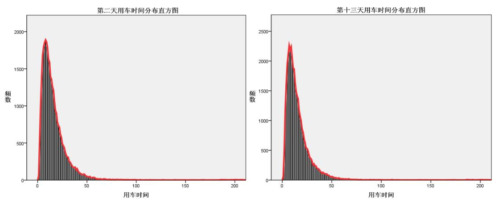  
图一：第二天，第十三天时间分布图

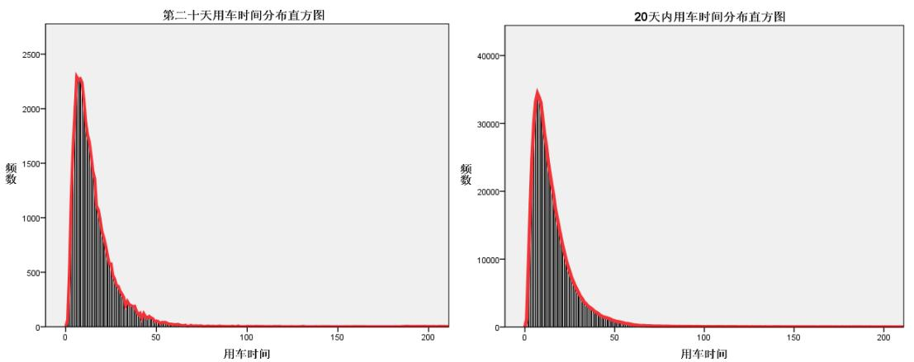  
图二：第20天，20天累积时间分布图

由图形分布情况可以看出：每一天和20 天内用车时长的分布情况基本相同，而且作出 20 天所有用车时长的分布情况，其状况也相同。因此分析用车时长可以用20 天内累计的数据。通过查找分布图可知，用车时长的分布近似服从 $\chi ^ { 2 }$ 分布。对分布情况观察发现时间基本集中在 内，而超过1小时的用车时间却很少。

## 6.2问题二的解答

## 6.2.1模型二的建立

对于统计 20 天中各天不同借车卡的数量，将公共自行车每天的数据按借卡号顺序排列，且将同种借卡号出现的次数累积起来，其累积的次数就是借记卡的数量。

假设 $H _ { i }$ 为第 张卡出现的频数， $Z _ { k }$ 为第 天借记卡总数， $q _ { i j }$ 为 0-1变量，

$$
q _ {i j} = \left\{ \begin{array}{l l} 1 & \text {第} \mathrm{i} \text {张卡在第} \mathrm{j} \text {次记录中出现} \\ 0 & \text {第} \mathrm{i} \text {张卡在第} \mathrm{j} \text {次记录中不出现} \end{array} \right.
$$

建立模型二：

$$
H _ {i} = \sum_ {i = 1} ^ {Z _ {k}} \sum_ {j = 1} ^ {N _ {k}} q _ {i j} \quad \left(i = 1 \dots n, j = 1 \dots N _ {k (k = 1 \dots n)}\right)
$$

## 6.2.2 模型二的求解

根据题目所给数据，运用 SPSS将20天数据中出现的每张借车卡累计借卡次数统计出来，如下表九

表九：不同借车卡数量

<table><tr><td>天数</td><td>不同借车卡数量</td><td>使用自行车数量</td><td>天数</td><td>不同借车卡数量</td><td>使用自行车数量</td></tr><tr><td>1</td><td>16657</td><td>33640</td><td>11</td><td>14921</td><td>30039</td></tr><tr><td>2</td><td>17284</td><td>34648</td><td>12</td><td>18070</td><td>35555</td></tr><tr><td>3</td><td>9501</td><td>15584</td><td>13</td><td>19359</td><td>38726</td></tr><tr><td>4</td><td>14486</td><td>29780</td><td>14</td><td>19334</td><td>38723</td></tr><tr><td>5</td><td>17819</td><td>35739</td><td>15</td><td>18521</td><td>36061</td></tr><tr><td>6</td><td>18541</td><td>37415</td><td>16</td><td>11202</td><td>17802</td></tr><tr><td>7</td><td>18747</td><td>37649</td><td>17</td><td>15243</td><td>29652</td></tr><tr><td>8</td><td>10462</td><td>15551</td><td>18</td><td>15144</td><td>29635</td></tr><tr><td>9</td><td>6918</td><td>10278</td><td>19</td><td>19047</td><td>37692</td></tr><tr><td>10</td><td>4029</td><td>6357</td><td>20</td><td>19885</td><td>39140</td></tr></table>

由上表（表九）可知，第 20 天借车人最多，且自行车使用次数也最多，第3天借车人最少，但是自行车使用次数最少的一天是第 10天，根据题目中数据，运用SPSS，将20天每张借车卡累计使用次数画出，其分布情况如下（图三）。

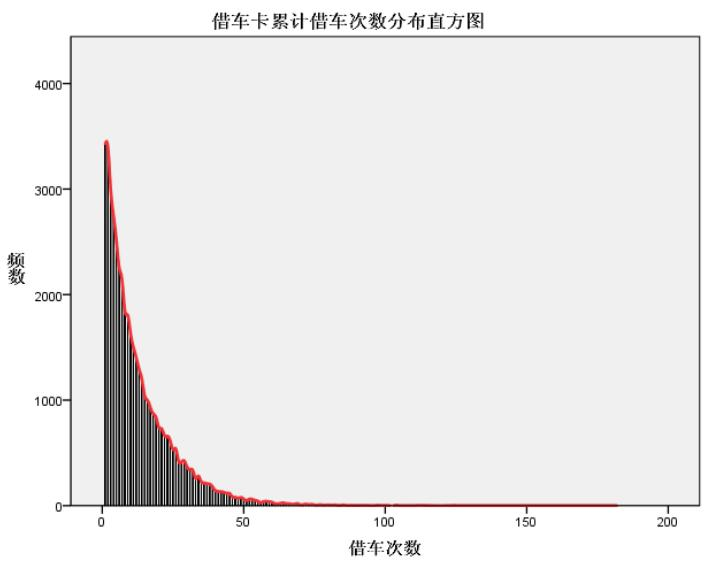

<details>
<summary>histogram</summary>

| 借车次数 (Bin) | 频数 |
| --- | --- |
| 0~5 | ~3400 |
| 5~10 | ~2200 |
| 10~15 | ~1600 |
| 15~20 | ~1100 |
| 20~25 | ~800 |
| 25~30 | ~600 |
| 30~35 | ~400 |
| 35~40 | ~300 |
| 40~45 | ~200 |
| 45~50 | ~150 |
| 50~55 | ~100 |
| 55~60 | ~80 |
| 60~65 | ~60 |
| 65~70 | ~50 |
| 70~75 | ~40 |
| 75~80 | ~30 |
| 80~85 | ~20 |
| 85~90 | ~15 |
| 90~95 | ~10 |
| 95~100 | ~8 |
| 100~105 | ~6 |
| 105~110 | ~5 |
| 110~115 | ~4 |
| 115~120 | ~3 |
| 120~125 | ~2 |
| 125~130 | ~2 |
| 130~135 | ~1 |
| 135~140 | ~1 |
| 140~145 | ~1 |
| 145~150 | ~1 |
| 150~155 | ~1 |
| 155~160 | ~1 |
| 160~165 | ~1 |
| 165~170 | ~1 |
| 170~175 | ~1 |
| 175~180 | ~1 |
| 180~185 | ~1 |
| 185~190 | ~1 |
| 190~195 | ~1 |
| 195~200 | ~1 |
</details>

图三：借车卡累计借车次数分布图

由上图（图三）以及统计的数据可知借车次数在 10 次以内的人最多，而大部分的人借车次数都在 30次以内。借车次数在 50次以上的人数非常少。对此进行统计得到如下结论：借车次数在 10 次以内的人占 ，借车次数都在 10至30次占 以内，借车次数都在 30至 50次占 以内，借车次数在 50次以上的占 ，最大借车次数高达 次.

## 6.3问题三的解答

该问要解决的 3个小问题，解决问题的数据是根据所有已给站点累计使用公共自行车次数最大一天进行求解，根据（表九）中使用自行车数量可以知道第20天的自行车使用次数最多，因此要根据第 20天中的数据，来求解问题三。

## 6.3.1模型三的建立

## 1）距离模型的建立

该问需定义两站点之间的距离，要求自行车借换车站点之间的最短（非零）和最长距离，若从地图中逐个测量工作量非常大，因此可根据数据定义出一个表达式用来表示距离。

设无向图 $D = ( V , E )$ ，其中， $V = \left\{ \nu _ { 1 } , \nu _ { 2 } , \cdots \nu _ { 1 8 0 } \right\}$ $E = \{ t _ { 1 1 } , t _ { 1 2 } \cdots t _ { 1 8 0 , 1 8 0 } \}$ ，两点间的距离当两车站号不同时应与速度和时间有关，当两站号相同时距离应为 0，则两站点之间的距离可定义为表达式：

$$
d _ {i j} = \left\{ \begin{array}{c c} (\min (t _ {i j}, t _ {j i}) \pm \xi_ {1}) \cdot (v \pm \xi_ {2}) & \quad (i \neq j) \\ 0 & \quad (i = j) \end{array} \right.
$$

对上述表达式解释：由于距离应和速度和时间有关，因此应得到两点骑自行车的时间和速度，对于时间由于同一条路两点间是无向的，而且用车时间也有所不同，对两点间距离的描述应当取最小的一个用于衡量距离，因此有 $\operatorname* { m i n } ( t _ { i j } , t _ { j i } )$ 对数据的测量和记录都存在误差因此要有 $\xi _ { 1 }$ 。时间的长短说明行驶的距离长短，由于人在行驶过程中会有速度的差异。因此也因有误差项 $\boldsymbol { \xi } _ { 2 }$ 。

对于测量时间的误差可能是由于测量人或测量仪器导致的误差。其原因是在观察有些数据时，发现还车时刻与借车时刻的差值，与对应的用车时间不相等，如还车与借车差值为 1 50 时，用车时间却向下取整为 1 ，而测量仪器本身也会有误差。

测量仪器误差的原因可用不确定度 表示测量人统计时的误差：

$$
A = \sqrt {\frac {\sum_ {i = 1} ^ {n _ {k}} \left(\left(t _ {i j} ^ {\prime} , t _ {j i} ^ {\prime}\right) - \overline {{t}} _ {i j} ^ {\prime}\right)}{n _ {k} \left(n _ {k} - 1\right)}}
$$

而测量仪器的误差用不确定度 表示：

$$
B = \frac {\sigma}{\sqrt {3}}
$$

其中 $\sigma$ 为仪器的精度，查资料知 $[ 2 ]$ 为 $\sigma = 0 . 4 p p m$

从而得到 平方和的根为不确定度作为测量时间误差 $\xi _ { 1 }$

$$
\xi_ {1} = \sqrt {A ^ {2} + B ^ {2}}
$$

对于速度误差，是因为骑车人的不同而导致的速度差异为 $\boldsymbol { \xi } _ { 2 }$ ，查找资料 $\left[ 3 \right]$ 得到人在骑自行车时， 为慢速 为中速 为快速，则取为人骑自行车的平均速度，对于 $\boldsymbol { \xi } _ { 2 }$ 取 内的一个随机数。

因此两站点间的距离最终定义为如下表达式：

$$
d _ {i j} = \left\{ \begin{array}{c c} \min (t _ {i j}, t _ {j i}) \pm \sqrt {\left(\sqrt {\frac {\sum_ {i = 1} ^ {n _ {k}} \left((t _ {i j} ^ {\prime} , t _ {j i} ^ {\prime}) - \bar {t} _ {i j} ^ {\prime}\right)}{n _ {k} (n _ {k} - 1)}}\right) ^ {2} + \left(\frac {\sigma}{\sqrt {3}}\right) ^ {2}} \cdot (v \pm \xi_ {2}) & (i \neq j) \\ d _ {i j} = 0 & (i = j) \end{array} \right.
$$

## 6.3.2 模型三的求解

## ◼ 两站点间的最短距离和最长距离

要求两站点的最短和最长的距离，可根据模型三的定义，来求解两站点的距离，首先通过matlab（程序见附件4），筛选出第 20天两站点间的最短时间，但是在数据中从第 站到第 站没有多条记录，如果存在绕路的情况， $t _ { i j }$ 会不准确，所以用 floyd 算法，得到任意两站点间最短时间（见附件），同时得到站点的连通图，该连通图的权值就是为两站点的最短时间（见附件）。

对于求最短时间与最长时间，为减少运算复杂程度，提取第20天用时为和 的数据，进而用模型三距离表达式，进行多次计算取得一个均值，得到两站点最短和最长的距离。最长距离为 675.0004，最短距离为 0.08。具体借还车站号见下表（表十）

表十:两站点最长距离（第一行）和最短距离（第二行）

<table><tr><td>借车站号</td><td>借出车站</td><td>还车站号</td><td>归还车站</td><td>时间</td><td>距离</td></tr><tr><td>156</td><td>三桥下</td><td>113</td><td>黎明街道卫生中心</td><td>45</td><td>675.0004</td></tr><tr><td>18</td><td>区政府东</td><td>17</td><td>区政府西</td><td>0</td><td>0.08000</td></tr></table>

## ◼ 借还车是同一站点且时间在 1分钟以上的借车数据的统计

对借还车情况的统计可用模型一统计，统计借车还车频次，最大最小值，均值，用车时间分布图。由于统计的是同一站点的借还车数据，因此借车和还车频次是一样的所以可只统计借车频次。得到如下表（表十一）结果。详细数据见附录5。

表十一：借车数据

<table><tr><td>站点</td><td>借车频数</td><td>借车频率</td></tr><tr><td>1</td><td>6</td><td>0.002621</td></tr><tr><td>2</td><td>7</td><td>0.003058</td></tr><tr><td>3</td><td>5</td><td>0.002184</td></tr><tr><td>4</td><td>12</td><td>0.005242</td></tr><tr><td>...</td><td>...</td><td>...</td></tr><tr><td>178</td><td>9</td><td>0.003932</td></tr><tr><td>179</td><td>13</td><td>0.005679</td></tr><tr><td>180</td><td>10</td><td>0.004369</td></tr><tr><td>181</td><td>13</td><td>0.005679</td></tr></table>

有借车数据可知借车最大站点为 52 号站点借车 51，借车最小站点为 153、142和116 均为2，借车均值为 29。

对于第二十天的数据，用 spss统计出该天用车时间和频数的分布图（图四）

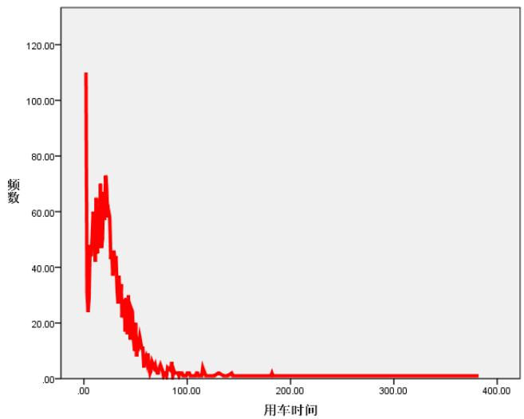

<details>
<summary>line</summary>

| 用车时间 | 频数 |
| --- | --- |
| ~5 | ~110 |
| ~10 | ~25 |
| ~15 | ~60 |
| ~20 | ~73 |
| ~25 | ~45 |
| ~30 | ~30 |
| ~40 | ~15 |
| ~50 | ~8 |
| ~60 | ~5 |
| ~70 | ~3 |
| ~80 | ~2 |
| ~90 | ~1 |
| ~100 | ~1 |
| ~110 | ~1 |
| ~120 | ~1 |
| ~130 | ~1 |
| ~140 | ~1 |
| ~150 | ~1 |
| ~160 | ~1 |
| ~170 | ~1 |
| ~180 | ~1 |
| ~190 | ~1 |
| ~200 | ~1 |
| ~210 | ~1 |
| ~220 | ~1 |
| ~230 | ~1 |
| ~240 | ~1 |
| ~250 | ~1 |
| ~260 | ~1 |
| ~270 | ~1 |
| ~280 | ~1 |
| ~290 | ~1 |
| ~300 | ~1 |
| ~310 | ~1 |
| ~320 | ~1 |
| ~330 | ~1 |
| ~340 | ~1 |
| ~350 | ~1 |
| ~360 | ~1 |
| ~370 | ~1 |
| ~380 | ~1 |
| ~390 | ~1 |
</details>

图四：第二十天用车时间大于一分钟用时分布图

对第二十天用车时间大于一分钟分布图可知，用车时间在 2 到 10 左右频数最多，而数据集中在 10到30之间。

## 6.3.3 问题三（2）求解

根据问题一中，所统计第 20 天的借车与还车频次，可以知道借车频次最高的站点为42（街心公园）和还车的频次最高的站点为 56（五马美食林），对此可运用相应站点的数据画出相应的借、还车时刻和用车分布，对应图像见下图（图五，图六，图七）。

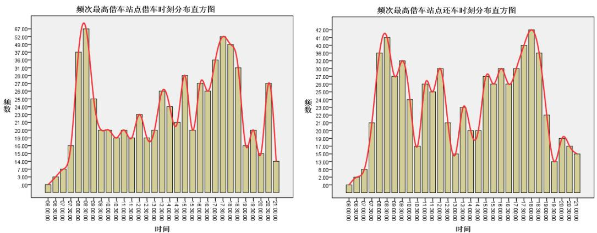  
图五：42号站点借车时刻与还车分布对比

由上图可知，借车频次最高的借车时刻与还车时刻主要集中在点和 之间，了解到该时段属于上下班时期，因此上下班时刻有很大可能对该站点借还车频次造成较大影响。

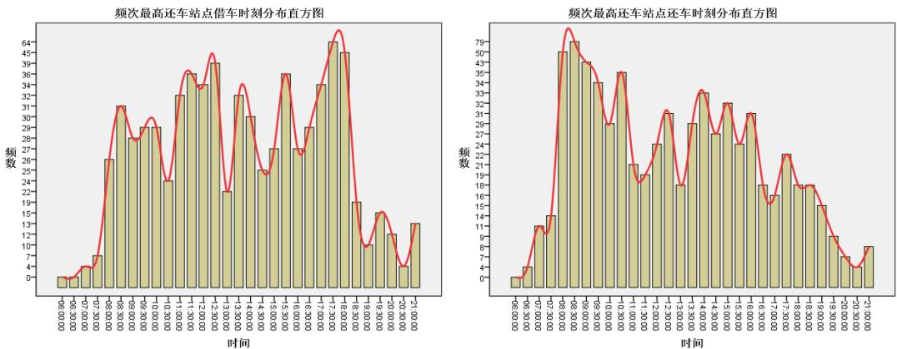

图六： 56号站点借车时刻与还车分布直方图对比  
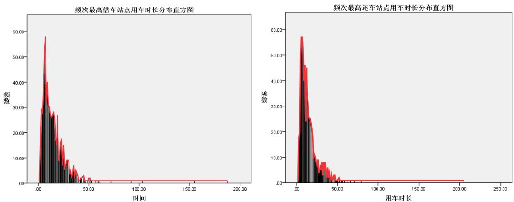  
图七：42站点与56站点用车时长的对比

从图形上来看，用车时长的大概分布在 分钟之内的数量比较多，超过1小时的数量相对较少，根据温州鹿城公共自行车的服务指南，可知 1小时内是车辆的使用是免费的，大于 1小时是按阶梯收费的，说明该城市在自行车收入中，处于低收入状态。

## 6.3.4 问题三中（3）求解

## ◼ 借车高峰时段与还车时段

要统计各站点借车、还车高峰时段，可将时间间隔取为 30 分钟，借车时刻满足该时间段的，划分到区域中，再将区域中所借车的总数，统计出来，根据该总数，可得到各车站高峰时段，通过 matlab 计算（程序见附录 6），得到数据见下表（表十二）（具体表格见附件7），对于还车的高峰时段类似。

表十二：各站点借、还车高峰时段

<table><tr><td>站点</td><td>借车高峰</td><td>还车高峰</td></tr><tr><td>1</td><td>20:30-21:00</td><td>19:00-19:30</td></tr><tr><td>2</td><td>16:00-16:30</td><td>8:00-8:30</td></tr><tr><td>3</td><td>17:00-17:30</td><td>8:00-8:30</td></tr><tr><td>4</td><td>17:30-18:00</td><td>9:00-9:30</td></tr><tr><td>5</td><td>17:00-17:30</td><td>18:00-18:30</td></tr><tr><td>...</td><td>...</td><td>...</td></tr><tr><td>177</td><td>7:30-8:00</td><td>8:00-8:30</td></tr><tr><td>178</td><td>17:00-17:30</td><td>8:00-8:30</td></tr><tr><td>179</td><td>17:00-17:30</td><td>8:00-8:30</td></tr><tr><td>180</td><td>7:30-8:00</td><td>16:30-17:00</td></tr><tr><td>181</td><td>17:00-17:30</td><td>8:30-9:00</td></tr></table>

由上表可看到，高峰时段基本处于早上和晚上的上班期，对于这样的情况可考虑增加该时间段的借车费用.

## ◼ 统计高峰时段各站点的借车和还车的频次

设 $Y _ { i j }$ 为 从 $t _ { i 1 } ^ { \prime }$ 时 刻 到 $t _ { i 2 } ^ { \prime }$ 时 刻 时 间 段 内 的 频 数 $t _ { i 1 } ^ { \prime } \in \left( 6 : 0 0 , 2 1 : 0 0 \right)$ $t _ { i 2 } ^ { \prime } \in \left( 6 : 0 0 , 2 1 : 0 0 \right)$ 去时间间隔为 分钟

$$
r _ {i j} = \left\{ \begin{array}{l l} 1 & \text {从} t _ {i 1} ^ {\prime} \text {到} t _ {i 2} ^ {\prime} \text {这一时间段内在第j次记录中出现} \\ 0 & \text {从} t _ {i 1} ^ {\prime} \text {到} t _ {i 2} ^ {\prime} \text {这一时间段内在第j次记录中不出现} \end{array} \right.
$$

$$
Y _ {i j} = \sum_ {i = 1} ^ {n} \sum_ {j = 1} ^ {N} r _ {i j}
$$

根据 1）可以统计到高峰段借车频次和还车频次，进而可得到如以下表格（表十三）（具体见附件 8）

表十三：高峰段各站点的借车和还车频次

<table><tr><td>站点</td><td>借车高峰</td><td>借车频次</td><td>还车高峰</td><td>还车频次</td></tr><tr><td>1</td><td>20:30-21:00</td><td>16</td><td>19:00-19:30</td><td>13</td></tr><tr><td>2</td><td>16:00-16:30</td><td>11</td><td>8:00-8:30</td><td>13</td></tr><tr><td>3</td><td>17:00-17:30</td><td>40</td><td>8:00-8:30</td><td>36</td></tr><tr><td>4</td><td>17:30-18:00</td><td>20</td><td>9:00-9:30</td><td>21</td></tr><tr><td>5</td><td>17:00-17:30</td><td>13</td><td>18:00-18:30</td><td>11</td></tr><tr><td>...</td><td>...</td><td>...</td><td>...</td><td>...</td></tr><tr><td>178</td><td>17:00-17:30</td><td>13</td><td>8:00-8:30</td><td>17</td></tr><tr><td>179</td><td>17:00-17:30</td><td>44</td><td>8:00-8:30</td><td>56</td></tr><tr><td>180</td><td>7:30-8:00</td><td>14</td><td>16:30-17:00</td><td>12</td></tr><tr><td>181</td><td>17:00-17:30</td><td>18</td><td>8:30-9:00</td><td>14</td></tr></table>

## ◼ 共同借车和还车高峰时段的站点

对具有共同借车高峰时段和还车高峰时段的站点进行统计，得到 20 类情况见表十四（具体表格见附录 9）。

表十四：借还车高峰时间表

<table><tr><td colspan="7">借车高峰为7:30-8:00与还车高峰为7:30-8:00的站点</td></tr><tr><td>站点</td><td>借车频次</td><td>借车高峰</td><td>对应借车高峰时段</td><td>还车频次</td><td>还车高峰</td><td>对应还车高峰时段</td></tr><tr><td>14</td><td>34</td><td>4</td><td>7:30-8:00</td><td>40</td><td>4</td><td>7:30-8:00</td></tr><tr><td>74</td><td>17</td><td>4</td><td>7:30-8:00</td><td>13</td><td>4</td><td>7:30-8:00</td></tr><tr><td>82</td><td>16</td><td>4</td><td>7:30-8:00</td><td>21</td><td>4</td><td>7:30-8:00</td></tr><tr><td>83</td><td>19</td><td>4</td><td>7:30-8:00</td><td>15</td><td>4</td><td>7:30-8:00</td></tr><tr><td colspan="7">... ... ... ... ... ... ... ...</td></tr><tr><td colspan="7">借车高峰为20:30-21:00与还车高峰为19:00-19:30的站点</td></tr><tr><td>站点</td><td>借车频次</td><td>借车高峰</td><td>对应借车高峰时段</td><td>还车频次</td><td>还车高峰</td><td>对应还车高峰时段</td></tr><tr><td>1</td><td>16</td><td>30</td><td>20:30-21:00</td><td>13</td><td>27</td><td>19:00-19:30</td></tr><tr><td>37</td><td>32</td><td>30</td><td>20:30-21:00</td><td>20</td><td>27</td><td>19:00-19:30</td></tr><tr><td>93</td><td>8</td><td>30</td><td>20:30-21:00</td><td>5</td><td>27</td><td>19:00-19:30</td></tr></table>

通过对具有共同借车高峰时段和还车高峰时段的站点的归类，可为公共自行车站点的管理提供参考，以能得到更好的管理效果，增大自行车站点的利用率。

## 6.4问题四的解答

要对公共自行车服务系统的站点设置和锁桩数量的配置做出评价，根据第一个问题统计的数据，、可用还车频数、借车频数作为其中指标，根据题目所给站点的地理位置中可以知道各站点的借车车位和可停车位，即可用可借比例（借车车位与总车位的比值）和可还比例作为其中的指标，以及锁桩数量可以作为一个站台的评价的指标。因此用上面 5个指标来对服务系统作出评价，因此可运用灰色关联分析法和聚类分析进行求解.

## 6.4.1模型四的建立：

## 1．确定最优指标集 $X _ { 0 } ^ { \prime }$

设

$$
X _ {0} ^ {\prime} = \left(x _ {0} ^ {\prime} (1), x _ {0} ^ {\prime} (2), \dots , x _ {0} ^ {\prime} (k)\right)
$$

式中 $x _ { 0 } ^ { \prime } ( k ) \left( k = 1 , 2 \cdots 5 \right)$ 为第 个指标的最优值。此最优值可是诸方案中最优值(若某一指标取大值为好,则取该指标在各个方案中的最大值;若取小值为好,则取各个方案中的最小值),也可以是评估者公认的最优值。不过在定最优值时,既要考虑到先进性,又要考虑到可行性。若最优标志的过高,则不现实,不能实现,评价的结果也就不可能正确。

选定最优指标集后,可构造矩阵 ：

$$
D = \left( \begin{array}{c c c c} x _ {1} ^ {\prime} (0) & x _ {2} ^ {\prime} (0) & \dots & x _ {5} ^ {\prime} (0) \\ x _ {1} ^ {\prime} (1) & x _ {2} ^ {\prime} (1) & \dots & x _ {5} ^ {\prime} (1) \\ \vdots & \vdots & \vdots & \vdots \\ x _ {1} ^ {\prime} (1 8 0) & x _ {2} ^ {\prime} (1 8 0) & \dots & x _ {5} ^ {\prime} (1 8 0) \end{array} \right)
$$

式中： $x _ { k } ^ { \prime } ( m ) \left( k = 1 , 2 \cdots 5 \right)$ 为第 个方案中第 个指标的原始数值。

## 2. 指标值的规范化处理

由于批判指标间通常是有不同的量纲和数量级,故不能直接进行比较,为了保证结果的可靠性,因此要对原始指标值进行规范化处理。在这采用均值化法,得到如下公式:

$$
x _ {k} (m) = \frac {x _ {k} ^ {\prime} (m)}{\frac {1}{5} \sum_ {k = 1} ^ {5} x _ {k} ^ {\prime} (m)}
$$

得到无量纲化矩阵

$$
C = \left( \begin{array}{c c c c} x _ {1} (1) & x _ {2} (1) & \dots & x _ {5} (1) \\ x _ {1} (2) & x _ {2} (2) & \dots & x _ {5} (2) \\ \vdots & \vdots & \vdots & \vdots \\ x _ {1} (1 8 0) & x _ {2} (1 8 0) & \dots & x _ {5} (1 8 0) \end{array} \right)
$$

## 3. 计算关联序

根据灰色系统理论,用关联分析法分别求得第 个方案第 个指标与第 个最优指标的关联系数 $\zeta _ { k } ( m )$ ,即：

$$
\zeta_ {k} (m) = \frac {\min _ {k} \min _ {m} \left| x _ {0} (m) - x _ {k} (m) \right| + \rho \cdot \max _ {k} \max _ {m} \left| x _ {0} (m) - x _ {k} (m) \right|}{\left| x _ {0} (m) - x _ {k} (m) \right| + \rho \cdot \max _ {k} \max _ {m} \left| x _ {0} (m) - x _ {k} (m) \right|}
$$

式子中 $\rho$ 为分辨系数且在（0,1）内取值，取的 $\rho$ 越小，区分能力越强，通常取 $\rho$ 为 0.5。

从而计算出各指标安排的优劣。

$$
r _ {m} = \frac {1}{n} \sum_ {k = 1} ^ {n} \zeta_ {k} (m)
$$

若关联度 $r _ { m }$ 最大,则说明 $\left\{ C ^ { i } \right\}$ 与最优指标 $\left\{ C ^ { * } \right\}$ 最接近,亦即第 个方案优于其他方案,据此,可以排出各方案的优劣次序。

有了各个方案的排名，可再用 SPSS 聚类分析分成三类，求出每一类的关联度均值，从而进一步确定出类别间的优劣。

## 6.4.2模型四的求解

考虑到现实的可行性，用取均值的方法确定指标一（借车频数）、指标二（还车频数）、指标五（锁桩数量）的最优指标值，对于确定指标三（可借比例）、指标四（可还比例），这样的指数越大越好，最优指标均为可取 1，因此得到最优指标集为： $X _ { \scriptscriptstyle 0 } ^ { \prime } = \left( 3 2 8 2 , 3 2 8 1 . 9 , 1 , 1 , 2 5 \right)$

根据题目中数据，可以统计到每站的相应指标数，为此可以矩阵 （具体见附件）

$$
\text {得到构造矩阵} D = \left[ \begin{array}{c c c c c} 3 2 8 2 & 3 2 8 2 & 1 & 1 & 2 5 \\ 1 5 0 2 & 1 5 6 3 & 0. 3 7 & 0. 0 1 & 3 0 \\ \vdots & \vdots & \vdots & \vdots & \vdots \\ 1 9 4 5 & 1 8 0 1 & 0. 6 5 & 0. 3 5 & 2 0 \\ 2 1 3 1 & 2 0 5 8 & 0. 4 & 0. 6 & 2 0 \end{array} \right]
$$

对于指标的规划处理和计算关联序，运用 matlab（程序见附录 10）得到各指标对各站点的关联度矩阵为： $\left( 0 . 7 9 \quad 0 . 8 1 \quad 0 . 7 6 \quad \cdots \quad 0 . 8 6 \quad 0 . 7 7 \quad 0 . 8 5 \right)$ ，对应于第1站到第 181 站点，运用SPSS将各站用系统聚类，聚类方法 ward 法分成三类，再求出每一类中包含数据的关联度均值，最终结果为： $\alpha _ { 1 } = 0 . 8 3 9 \quad \ \alpha _ { 2 } = 0 . 8 5 5$ $\alpha _ { 3 } = 0 . 8 7 6$ ，从而判断出类别的优劣，即第三类好于第二类，第二类好于第一类，类别及站点如下表（表十五），详细数据见附录 11。

表十五：每个站号对应的类别表

<table><tr><td>站号</td><td>类别</td><td>站号</td><td>类别</td><td>站号</td><td>类别</td></tr><tr><td>153</td><td>1</td><td>162</td><td>2</td><td>90</td><td>3</td></tr><tr><td>158</td><td>1</td><td>120</td><td>2</td><td>142</td><td>3</td></tr><tr><td>13</td><td>1</td><td>143</td><td>2</td><td>94</td><td>3</td></tr><tr><td>72</td><td>1</td><td>116</td><td>2</td><td>127</td><td>3</td></tr><tr><td>...</td><td>...</td><td>...</td><td>...</td><td>...</td><td>...</td></tr><tr><td>104</td><td>1</td><td>139</td><td>2</td><td>15</td><td>3</td></tr><tr><td>47</td><td>1</td><td>55</td><td>2</td><td>65</td><td>3</td></tr><tr><td>38</td><td>1</td><td>23</td><td>2</td><td>175</td><td>3</td></tr><tr><td>48</td><td>1</td><td>78</td><td>2</td><td>141</td><td>3</td></tr></table>

## 6.5问题五的解答

观察数据可以发现目前公共自行车服务系统存在的问题主要有：

1. 原数据中存在还车锁桩号为 0的记录，有很大可能该自行车已遗失  
2. 在借车高峰时段，可能会存在无车可借，无桩可还的情况  
3. 该服务系统将公共自行车的租赁时间限于 6：00-22：00，可能会对市民的夜间出行带来影响  
4. 各站点借还车高峰时段有所不同，应区别管理  
5. 存在用车时间非常长的借车人  
6. 原数据中存在不少用车时间小于一分钟的记录，不排除自行车损坏的情况

针对以上问题，我们提出以下改进方案：

1. 加强自行车管理，对借车人进行身份认证等  
2. 在条件允许的情况下，增加站点或借还车锁桩号  
3. 对自行车租赁实行分时付费制度，实行24小时的租车服务，如在晚间租车较白天更为优惠  
4. 对借车高峰时段及还车高峰时段进行适当归类，并安排符合各站点情况

的管理模式，以为借车人提供更多的便利

5. 对于用车时间非常长的情况，可制定惩罚措施，根据实际情况，对于用车时间超过一定程度的借车人进行警告等惩罚。  
6. 增加巡检及服务人员，及时了解各站点情况，保证站点的正常运行。

## 七、模型评价与推广

## 7.1模型的优点

1、问题三中，定义的距离比较接近实际  
2、对大数据的筛选统计分析比较合理  
3、运用灰色关联分析对原有公共自行车服务系统做出评价，更具有合理性  
4、采用 SPSS软件处理数据，具有速度快、效率高、准确度高的优点

## 7.2模型的缺点

1、处理数据时可能存在些数据的遗失，可能计算出来的结果没有达到最佳值

## 7.3 模型的推广

此模型属于数据分析模型，针对问题四的模型可用于水环境质量综合评价研究、绿色施工的评价及上市公司信用风险评价等等。

## 八、参考文献

[1]姜启源等，数学模型[M]，高等教育出版社，2009  
[2]王佳生等，应用概率统计[M]，科学出版社，2003  
[3] 张文彤等，SPSS 统计分析基础教程[M],高等教育出版社，2004  
[4]傅家良，运筹学方法与模型[M]，复旦大学出版社，2005  
[5]吴赣昌，概率论与数理统计[M]，中国人民大学出版社，2006  
[6] 频次，http://baike.baidu.com/view/8091347.htm  
[7] QWA-3B 电脑主板时钟测试仪,  
http://www.17baba.com/webs/ep277607/show\_product.asp?id=681437  
[8] 正常人骑车的正常速度  
http://wenda.tianya.cn/question/4c356e74f76175d4

## 附录

## 附录1：剔除的异常数据

详见文件夹中文件：“附录1：异常数据.xls”。

## 附录2：各站点20天中每天及累计的借车频次和还车频次

详见文件夹中文件：“附录2：各站点20天中每天及累计的借车频次和还车频次.xls”。

## 附录3：各天及累计用车时长频次分布图

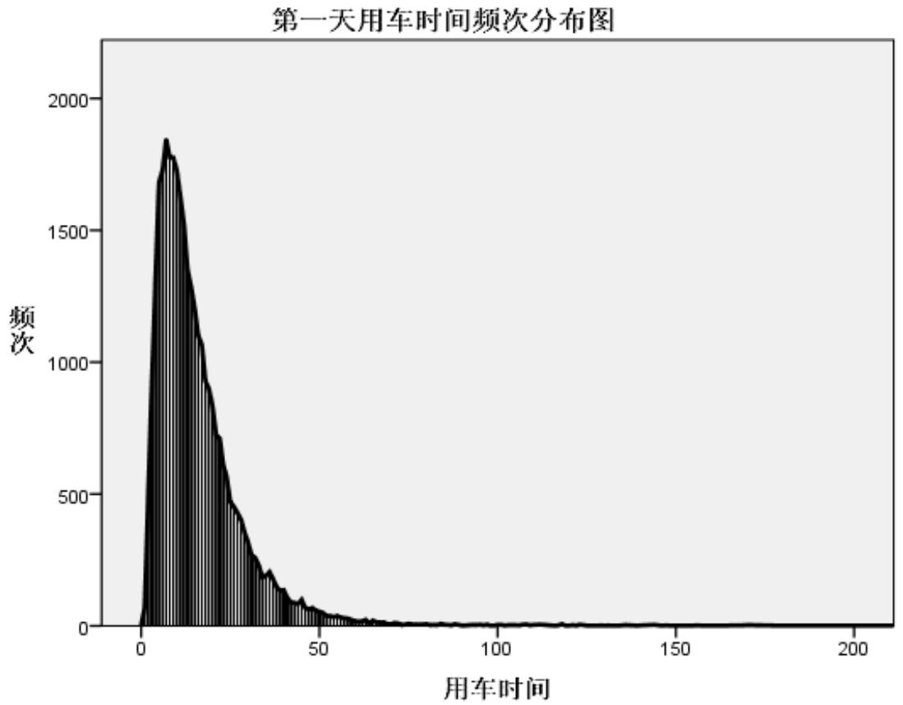

<details>
<summary>histogram</summary>

| 用车时间 (Bin) | 频次 |
| --- | --- |
| 0~10 | ~1850 |
| 10~20 | ~1750 |
| 20~30 | ~900 |
| 30~40 | ~450 |
| 40~50 | ~200 |
| 50~60 | ~100 |
| 60~70 | ~50 |
| 70~80 | ~20 |
| 80~90 | ~10 |
| 90~100 | ~5 |
| 100~200 | ~0 |
</details>

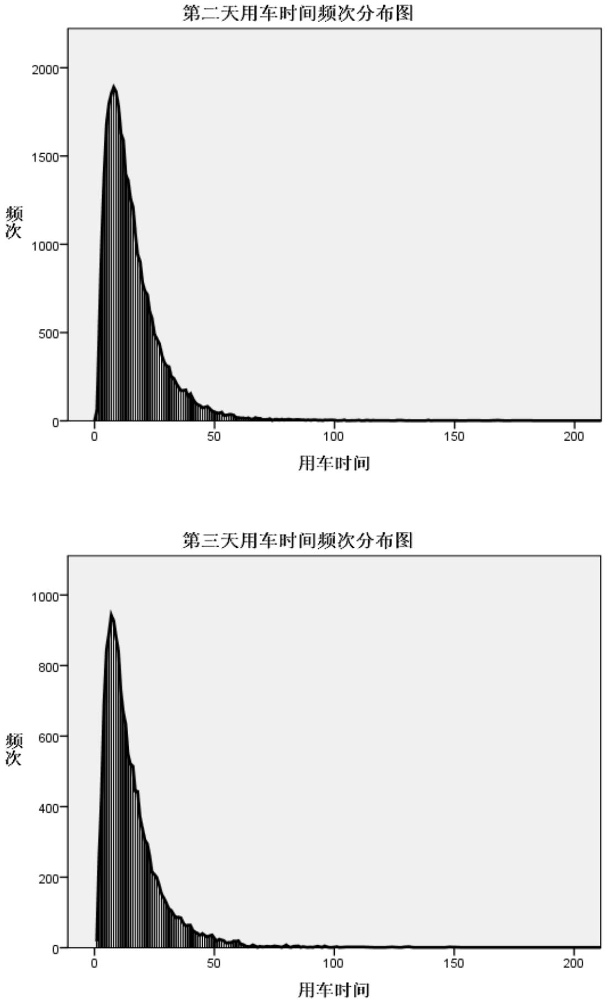

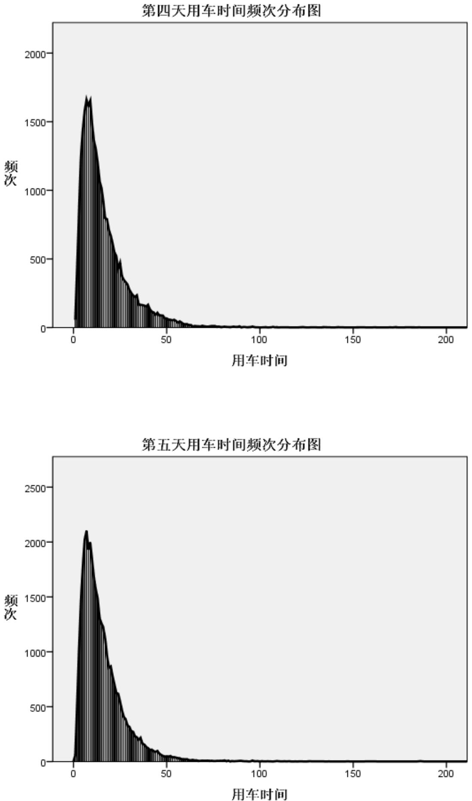

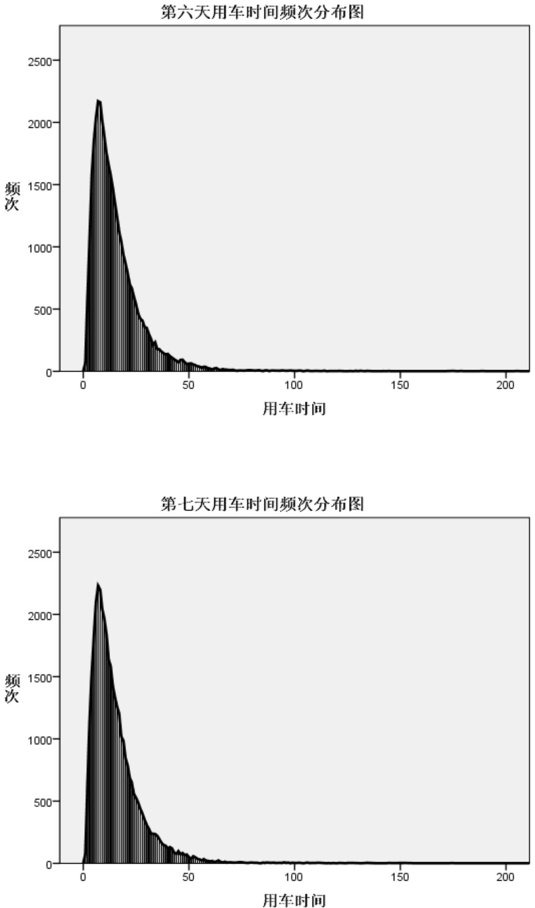

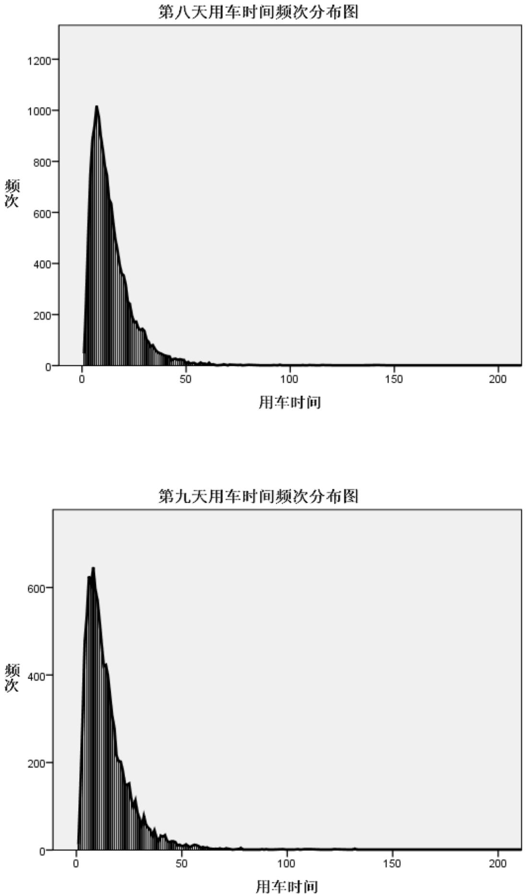

第十天用车时间频次分布图  
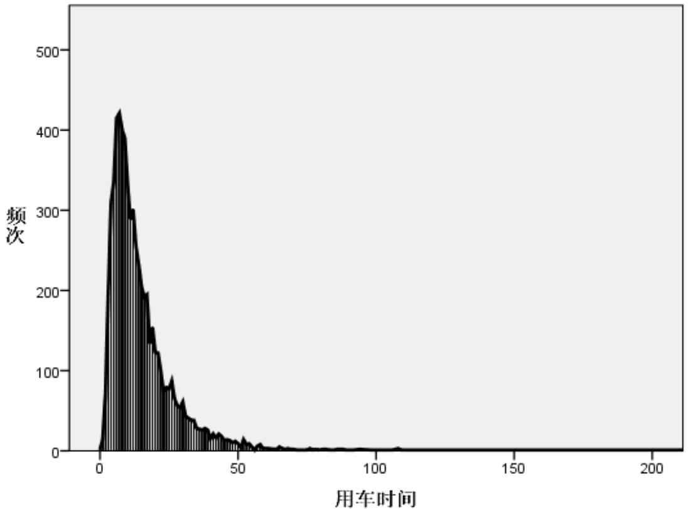

<details>
<summary>histogram</summary>

| 用车时间 (Bin) | 频次 |
| --- | --- |
| 0~10 | ~420 |
| 10~20 | ~300 |
| 20~30 | ~150 |
| 30~40 | ~80 |
| 40~50 | ~30 |
| 50~60 | ~10 |
| 60~70 | ~5 |
| 70~80 | ~2 |
| 80~90 | ~1 |
| 90~100 | ~1 |
| 100~110 | ~1 |
| 110~120 | ~1 |
| 120~130 | ~1 |
| 130~140 | ~1 |
| 140~150 | ~1 |
| 150~160 | ~1 |
| 160~170 | ~1 |
| 170~180 | ~1 |
| 180~190 | ~1 |
| 190~200 | ~1 |
</details>

第十一天用车时间频次分布图  
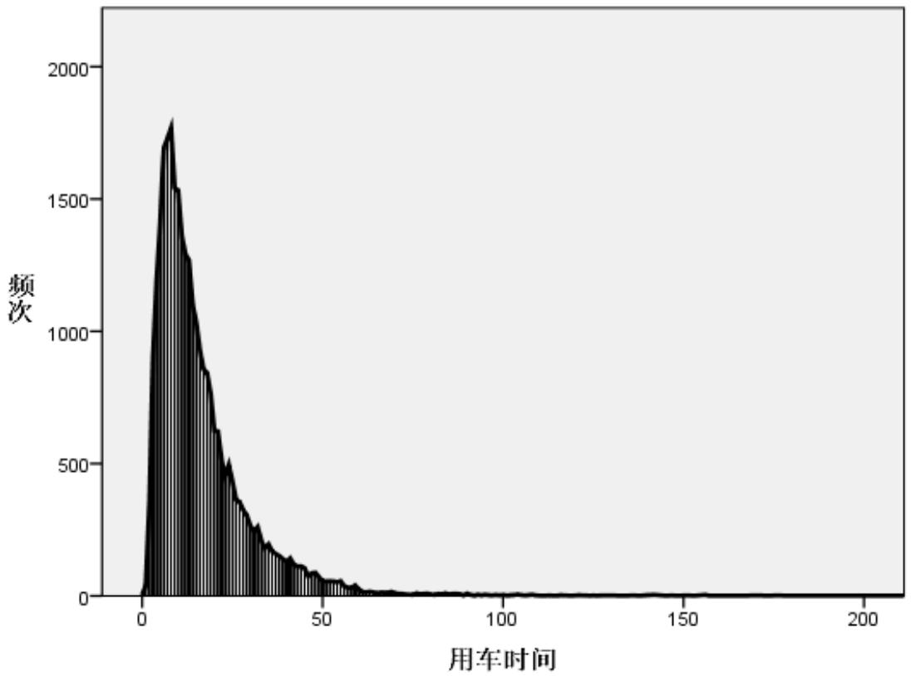

<details>
<summary>histogram</summary>

| 用车时间 (Bin) | 频次 |
| --- | --- |
| 0~10 | ~1750 |
| 10~20 | ~1300 |
| 20~30 | ~600 |
| 30~40 | ~300 |
| 40~50 | ~150 |
| 50~60 | ~50 |
| 60~70 | ~20 |
| 70~80 | ~10 |
| 80~90 | ~5 |
| 90~100 | ~2 |
| 100~110 | ~1 |
| 110~120 | ~1 |
| 120~130 | ~1 |
| 130~140 | ~1 |
| 140~150 | ~1 |
| 150~160 | ~1 |
| 160~170 | ~1 |
| 170~180 | ~1 |
| 180~190 | ~1 |
| 190~200 | ~1 |
</details>

第十二天用车时间频次分布图  


<details>
<summary>histogram</summary>

| 用车时间 (Bin) | 频次 (Frequency) |
| --- | --- |
| 0~10 | ~2100 |
| 10~20 | ~1000 |
| 20~30 | ~400 |
| 30~40 | ~200 |
| 40~50 | ~100 |
| 50~60 | ~50 |
| 60~70 | ~20 |
| 70~80 | ~10 |
| 80~90 | ~5 |
| 90~100 | ~2 |
| 100~200 | ~1 |
</details>

第十三天用车时间频次分布图  
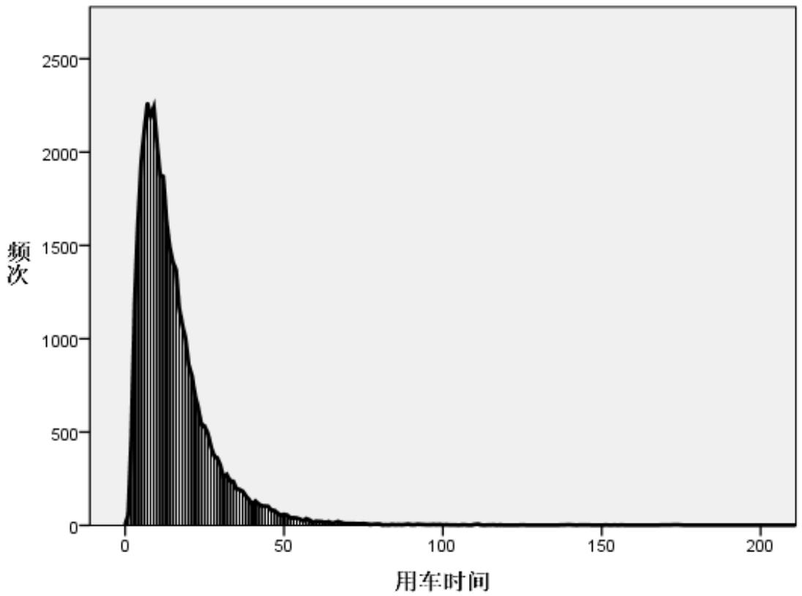

<details>
<summary>histogram</summary>

| 用车时间 (Bin) | 频次 (Frequency) |
| --- | --- |
| 0~10 | ~2300 |
| 10~20 | ~1900 |
| 20~30 | ~800 |
| 30~40 | ~400 |
| 40~50 | ~200 |
| 50~60 | ~100 |
| 60~70 | ~50 |
| 70~80 | ~20 |
| 80~90 | ~10 |
| 90~100 | ~5 |
| 100~200 | ~0 |
</details>

第十四天用车时间频次分布图  


<details>
<summary>histogram</summary>

| 用车时间 (Bin) | 频次 |
| --- | --- |
| 0~10 | ~2400 |
| 10~20 | ~1500 |
| 20~30 | ~500 |
| 30~40 | ~200 |
| 40~50 | ~100 |
| 50~60 | ~50 |
| 60~70 | ~20 |
| 70~80 | ~10 |
| 80~90 | ~5 |
| 90~100 | ~2 |
| 100~110 | ~1 |
| 110~120 | ~1 |
| 120~130 | ~1 |
| 130~140 | ~1 |
| 140~150 | ~1 |
| 150~160 | ~1 |
| 160~170 | ~1 |
| 170~180 | ~1 |
| 180~190 | ~1 |
| 190~200 | ~1 |
</details>

第十五天用车时间频次分布图  
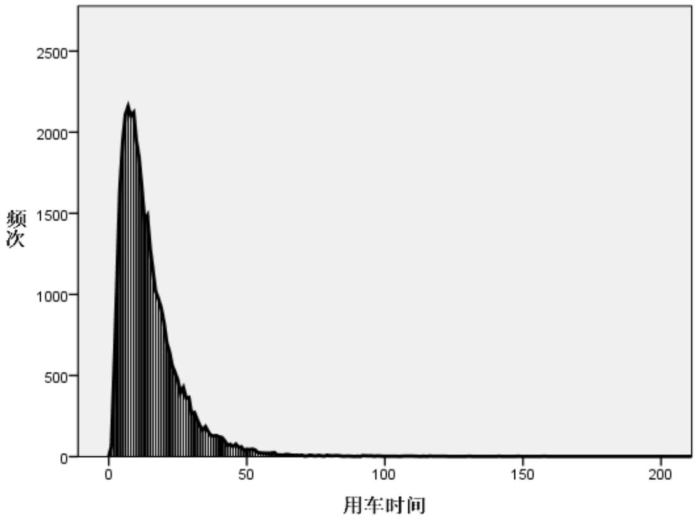

<details>
<summary>histogram</summary>

| 用车时间 (Bin) | 频次 |
| --- | --- |
| 0~10 | ~2200 |
| 10~20 | ~1500 |
| 20~30 | ~400 |
| 30~40 | ~200 |
| 40~50 | ~100 |
| 50~60 | ~50 |
| 60~70 | ~20 |
| 70~80 | ~10 |
| 80~90 | ~5 |
| 90~100 | ~2 |
| 100~110 | ~1 |
| 110~120 | ~1 |
| 120~130 | ~1 |
| 130~140 | ~1 |
| 140~150 | ~1 |
| 150~160 | ~1 |
| 160~170 | ~1 |
| 170~180 | ~1 |
| 180~190 | ~1 |
| 190~200 | ~1 |
</details>

第十六天用车时间频次分布图  
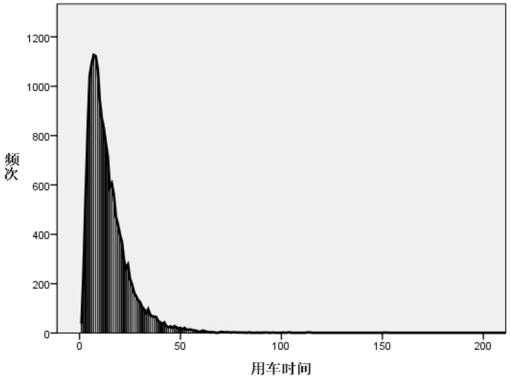

<details>
<summary>histogram</summary>

| 用车时间 (Bin) | 频次 (Frequency) |
| --- | --- |
| 0~10 | ~1150 |
| 10~20 | ~600 |
| 20~30 | ~200 |
| 30~40 | ~80 |
| 40~50 | ~30 |
| 50~60 | ~10 |
| 60~70 | ~5 |
| 70~80 | ~2 |
| 80~90 | ~1 |
| 90~100 | ~1 |
| 100~110 | ~1 |
| 110~120 | ~1 |
| 120~130 | ~1 |
| 130~140 | ~1 |
| 140~150 | ~1 |
| 150~160 | ~1 |
| 160~170 | ~1 |
| 170~180 | ~1 |
| 180~190 | ~1 |
| 190~200 | ~1 |
</details>

第十七天用车时间频次分布图  
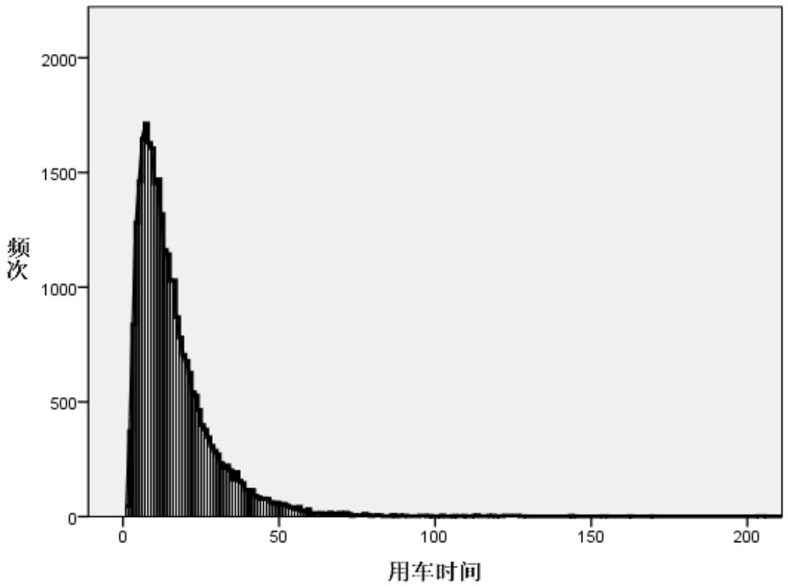

<details>
<summary>histogram</summary>

| 用车时间 (Bin) | 频次 |
| --- | --- |
| 0~5 | ~1750 |
| 5~10 | ~1600 |
| 10~15 | ~1400 |
| 15~20 | ~1100 |
| 20~25 | ~800 |
| 25~30 | ~600 |
| 30~35 | ~400 |
| 35~40 | ~300 |
| 40~45 | ~200 |
| 45~50 | ~150 |
| 50~55 | ~100 |
| 55~60 | ~80 |
| 60~65 | ~60 |
| 65~70 | ~50 |
| 70~75 | ~40 |
| 75~80 | ~30 |
| 80~85 | ~25 |
| 85~90 | ~20 |
| 90~95 | ~15 |
| 95~100 | ~10 |
| 100~105 | ~8 |
| 105~110 | ~6 |
| 110~115 | ~5 |
| 115~120 | ~4 |
| 120~125 | ~3 |
| 125~130 | ~2 |
| 130~135 | ~2 |
| 135~140 | ~1 |
| 140~145 | ~1 |
| 145~150 | ~1 |
| 150~155 | ~1 |
| 155~160 | ~1 |
| 160~165 | ~1 |
| 165~170 | ~1 |
| 170~175 | ~1 |
| 175~180 | ~1 |
| 180~185 | ~1 |
| 185~190 | ~1 |
| 190~195 | ~1 |
| 195~200 | ~1 |
</details>

第十八天用车时间频次分布图  


<details>
<summary>histogram</summary>

| 用车时间 (Bin) | 频次 (Frequency) |
| --- | --- |
| 0~10 | ~1750 |
| 10~20 | ~1000 |
| 20~30 | ~400 |
| 30~40 | ~200 |
| 40~50 | ~100 |
| 50~60 | ~50 |
| 60~70 | ~20 |
| 70~80 | ~10 |
| 80~90 | ~5 |
| 90~100 | ~2 |
| 100~200 | ~1 |
</details>

第十九天用车时间频次分布图  


<details>
<summary>histogram</summary>

| 用车时间 (Bin) | 频次 |
| --- | --- |
| 0~10 | ~2250 |
| 10~20 | ~1100 |
| 20~30 | ~400 |
| 30~40 | ~150 |
| 40~50 | ~80 |
| 50~60 | ~20 |
</details>

第二十天用车时间频次分布图  


<details>
<summary>histogram</summary>

| 用车时间 (Bin) | 频次 |
| --- | --- |
| 0~10 | ~2300 |
| 10~20 | ~1500 |
| 20~30 | ~600 |
| 30~40 | ~200 |
| 40~50 | ~100 |
| 50~60 | ~50 |
| 60~70 | ~20 |
| 70~80 | ~10 |
| 80~90 | ~5 |
| 90~100 | ~2 |
| 100~200 | ~1 |
</details>

二十天内用车时间累计频次分布图  
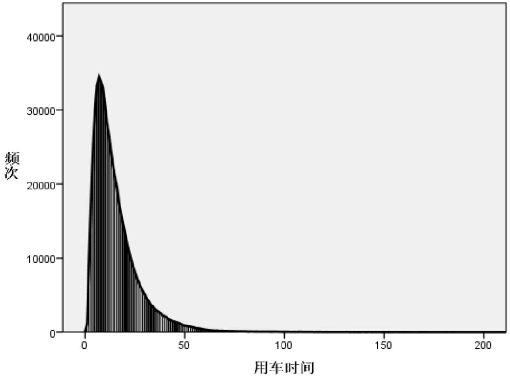

<details>
<summary>histogram</summary>

| 用车时间 (range) | 频次 |
| --- | --- |
| 0~10 | ~35000 |
| 10~20 | ~20000 |
| 20~30 | ~8000 |
| 30~40 | ~3000 |
| 40~50 | ~1000 |
| 50~60 | ~500 |
| 60~70 | ~200 |
| 70~80 | ~100 |
| 80~90 | ~50 |
| 90~100 | ~20 |
| 100~200 | ~10 |
</details>

附录4：计算两站点之间的最小时间（程序 3\_1）  
```matlab
%timeuse_min.m
clc;clear;
data=xlsread('day_20.xls');%第一列是借车站号；第二列是还车站号；第三列是用车时长
%P 为任意两点间的最小时间
min_time=ones(181)*inf;
for i=1:size(data,1)-1
    if min_time(data(i,1),data(i,2))==inf
        min_time(data(i,1),data(i,2))=data(i,3);
    end
end
min_time;
for i=1:181
    for j=i:181
        min_time(i,j)=min(min_time(i,j),min_time(j,i));
        min_time(j,i)=min(min_time(i,j),min_time(j,i));
    end
end
P=floyd(min_time)
xlswrite('day_20_P.xls',P)

%floyd.m
function D=floyd(w)
D=w;
n=length(w);
path=zeros(n);
for i=1:n
    for j=1:n
        if D(i,j)~=inf
            path(i,j)=j;
        end
    end
end
for k=1:n
    for i=1:n
        for j=1:n
            if D(i,k)+D(k,j)<D(i,j)
                D(i,j)=D(i,k)+D(k,j);
                path(i,j)=path(i,k);
            end
        end
    end
end
```

end  
附录5：借还车是同一站点且使用时间在一分钟以上的借还车情况统计

<table><tr><td>站点编号</td><td>站点名称</td><td>借车频数</td><td>借车频率</td></tr><tr><td>1</td><td>科技馆</td><td>6</td><td>0.0026212</td></tr><tr><td>2</td><td>温州大剧院</td><td>7</td><td>0.0030581</td></tr><tr><td>3</td><td>吴桥路加油站</td><td>5</td><td>0.0021844</td></tr><tr><td>4</td><td>银泰百货</td><td>12</td><td>0.0052425</td></tr><tr><td>5</td><td>星河广场</td><td>10</td><td>0.0043687</td></tr><tr><td>6</td><td>绣山卫生院</td><td>11</td><td>0.0048056</td></tr><tr><td>7</td><td>市政府西</td><td>3</td><td>0.0013106</td></tr><tr><td>9</td><td>小南门立交桥</td><td>22</td><td>0.0096112</td></tr><tr><td>10</td><td>市九中</td><td>19</td><td>0.0083006</td></tr><tr><td>11</td><td>鹿城区审批中心</td><td>10</td><td>0.0043687</td></tr><tr><td>12</td><td>桥儿头公交站</td><td>18</td><td>0.0078637</td></tr><tr><td>13</td><td>公共自行车中心</td><td>3</td><td>0.0013106</td></tr><tr><td>14</td><td>南浦医院</td><td>12</td><td>0.0052425</td></tr><tr><td>15</td><td>温州建国医院对面</td><td>7</td><td>0.0030581</td></tr><tr><td>16</td><td>金色家园</td><td>15</td><td>0.0065531</td></tr><tr><td>17</td><td>区政府西</td><td>24</td><td>0.0104849</td></tr><tr><td>18</td><td>区政府东</td><td>13</td><td>0.0056793</td></tr><tr><td>19</td><td>开太百货</td><td>27</td><td>0.0117955</td></tr><tr><td>20</td><td>南浦桥</td><td>11</td><td>0.0048056</td></tr><tr><td>21</td><td>东阿外楼</td><td>18</td><td>0.0078637</td></tr><tr><td>22</td><td>鱼鳞浃</td><td>10</td><td>0.0043687</td></tr><tr><td>23</td><td>温迪路农贸市场</td><td>14</td><td>0.0061162</td></tr><tr><td>24</td><td>春晖路口</td><td>16</td><td>0.00699</td></tr><tr><td>25</td><td>鹿城法院</td><td>7</td><td>0.0030581</td></tr><tr><td>26</td><td>南浦小区</td><td>17</td><td>0.0074268</td></tr><tr><td>27</td><td>锦江家园</td><td>20</td><td>0.0087374</td></tr><tr><td>28</td><td>上田菜场</td><td>4</td><td>0.0017475</td></tr><tr><td>29</td><td>市审批中心</td><td>5</td><td>0.0021844</td></tr><tr><td>30</td><td>绣山中学</td><td>7</td><td>0.0030581</td></tr><tr><td>31</td><td>云锦大厦</td><td>11</td><td>0.0048056</td></tr><tr><td>32</td><td>数码广场</td><td>26</td><td>0.0113587</td></tr><tr><td>33</td><td>国光大厦</td><td>23</td><td>0.0100481</td></tr><tr><td>34</td><td>广信大厦</td><td>18</td><td>0.0078637</td></tr><tr><td>35</td><td>安平大厦</td><td>20</td><td>0.0087374</td></tr><tr><td>36</td><td>工人文化宫</td><td>11</td><td>0.0048056</td></tr><tr><td>37</td><td>松台广场</td><td>9</td><td>0.0039318</td></tr><tr><td>38</td><td>市二医院</td><td>22</td><td>0.0096112</td></tr><tr><td>39</td><td>墨斗小区</td><td>28</td><td>0.0122324</td></tr><tr><td>40</td><td>海悦名邸酒店</td><td>8</td><td>0.003495</td></tr><tr><td>41</td><td>安澜轮渡码头</td><td>12</td><td>0.0052425</td></tr><tr><td>42</td><td>街心公园</td><td>34</td><td>0.0148536</td></tr><tr><td>43</td><td>群艺大楼</td><td>8</td><td>0.003495</td></tr><tr><td>44</td><td>公园路新华书店</td><td>25</td><td>0.0109218</td></tr><tr><td>45</td><td>白鹿洲公园</td><td>8</td><td>0.003495</td></tr><tr><td>46</td><td>巽山公园</td><td>13</td><td>0.0056793</td></tr><tr><td>47</td><td>阳光花苑</td><td>28</td><td>0.0122324</td></tr><tr><td>48</td><td>沃尔玛(欧洲城)</td><td>25</td><td>0.0109218</td></tr><tr><td>49</td><td>医学院</td><td>22</td><td>0.0096112</td></tr><tr><td>50</td><td>中西医结合医院</td><td>8</td><td>0.003495</td></tr><tr><td>51</td><td>新城车站</td><td>8</td><td>0.003495</td></tr><tr><td>52</td><td>裕达大厦农业银行</td><td>12</td><td>0.0052425</td></tr><tr><td>53</td><td>马鞍池公园北</td><td>19</td><td>0.0083006</td></tr><tr><td>54</td><td>吴桥路观松楼</td><td>19</td><td>0.0083006</td></tr><tr><td>55</td><td>中山公园北</td><td>12</td><td>0.0052425</td></tr><tr><td>56</td><td>五马美食林</td><td>51</td><td>0.0222805</td></tr><tr><td>57</td><td>建设大厦</td><td>17</td><td>0.0074268</td></tr><tr><td>58</td><td>新城大道体检中心</td><td>5</td><td>0.0021844</td></tr><tr><td>59</td><td>文景花苑东</td><td>22</td><td>0.0096112</td></tr><tr><td>60</td><td>公园路去茶去</td><td>6</td><td>0.0026212</td></tr><tr><td>61</td><td>丽都大厦</td><td>10</td><td>0.0043687</td></tr><tr><td>62</td><td>大南门农贸</td><td>22</td><td>0.0096112</td></tr><tr><td>63</td><td>体育中心西</td><td>36</td><td>0.0157274</td></tr><tr><td>64</td><td>县前头</td><td>45</td><td>0.0196592</td></tr><tr><td>65</td><td>小南门电力局</td><td>18</td><td>0.0078637</td></tr><tr><td>66</td><td>体育中心南</td><td>9</td><td>0.0039318</td></tr><tr><td>67</td><td>大自然家园</td><td>12</td><td>0.0052425</td></tr><tr><td>68</td><td>站前东小区</td><td>15</td><td>0.0065531</td></tr><tr><td>69</td><td>时代广场</td><td>18</td><td>0.0078637</td></tr><tr><td>70</td><td>区地税局</td><td>10</td><td>0.0043687</td></tr><tr><td>71</td><td>国际大酒店</td><td>26</td><td>0.0113587</td></tr><tr><td>72</td><td>质量监督局</td><td>6</td><td>0.0026212</td></tr><tr><td>73</td><td>汤家桥路英豪花园</td><td>4</td><td>0.0017475</td></tr><tr><td>74</td><td>方正大厦</td><td>5</td><td>0.0021844</td></tr><tr><td>75</td><td>龙方家园</td><td>7</td><td>0.0030581</td></tr><tr><td>76</td><td>宏源路数码大厦</td><td>12</td><td>0.0052425</td></tr><tr><td>77</td><td>喜来登酒店</td><td>4</td><td>0.0017475</td></tr><tr><td>78</td><td>桥儿头交运国旅</td><td>20</td><td>0.0087374</td></tr><tr><td>79</td><td>世纪联华</td><td>27</td><td>0.0117955</td></tr><tr><td>80</td><td>牛山北路文杰酒业</td><td>7</td><td>0.0030581</td></tr><tr><td>81</td><td>火车站对面</td><td>4</td><td>0.0017475</td></tr><tr><td>82</td><td>海港大厦</td><td>11</td><td>0.0048056</td></tr><tr><td>83</td><td>南塘一组团</td><td>10</td><td>0.0043687</td></tr><tr><td>84</td><td>南浦街道</td><td>12</td><td>0.0052425</td></tr><tr><td>85</td><td>市图书馆</td><td>12</td><td>0.0052425</td></tr><tr><td>86</td><td>测试点</td><td>1</td><td>0.0004369</td></tr><tr><td>87</td><td>雪山路-勤奋路口</td><td>9</td><td>0.0039318</td></tr><tr><td>88</td><td>鹿城路旅集散中心</td><td>11</td><td>0.0048056</td></tr><tr><td>89</td><td>妙果寺</td><td>8</td><td>0.003495</td></tr><tr><td>90</td><td>拉菲度假酒店</td><td>5</td><td>0.0021844</td></tr><tr><td>91</td><td>中瑞曼哈顿</td><td>15</td><td>0.0065531</td></tr><tr><td>92</td><td>十四中学</td><td>10</td><td>0.0043687</td></tr><tr><td>93</td><td>瓯江路鹿城广场</td><td>6</td><td>0.0026212</td></tr><tr><td>94</td><td>惠民路与航标路口</td><td>6</td><td>0.0026212</td></tr><tr><td>95</td><td>特警支队</td><td>29</td><td>0.0126693</td></tr><tr><td>96</td><td>鹿城实验中学</td><td>5</td><td>0.0021844</td></tr><tr><td>97</td><td>江滨路府东路口</td><td>7</td><td>0.0030581</td></tr><tr><td>98</td><td>市公安局</td><td>12</td><td>0.0052425</td></tr><tr><td>99</td><td>公交上徒门始发站</td><td>8</td><td>0.003495</td></tr><tr><td>100</td><td>蒲鞋街道卫生中心</td><td>20</td><td>0.0087374</td></tr><tr><td>101</td><td>洪殿奥康</td><td>35</td><td>0.0152905</td></tr><tr><td>102</td><td>府东家园公交站</td><td>8</td><td>0.003495</td></tr><tr><td>103</td><td>新南亚大酒店</td><td>11</td><td>0.0048056</td></tr><tr><td>104</td><td>东门商业步行街</td><td>18</td><td>0.0078637</td></tr><tr><td>105</td><td>温州十九中</td><td>9</td><td>0.0039318</td></tr><tr><td>106</td><td>金桥路桃源居</td><td>13</td><td>0.0056793</td></tr><tr><td>107</td><td>远东大酒店</td><td>9</td><td>0.0039318</td></tr><tr><td>109</td><td>浙江工贸学院</td><td>10</td><td>0.0043687</td></tr><tr><td>110</td><td>杨府山公园停车场</td><td>3</td><td>0.0013106</td></tr><tr><td>111</td><td>巨一花苑</td><td>8</td><td>0.003495</td></tr><tr><td>112</td><td>绿洲花园农行外</td><td>17</td><td>0.0074268</td></tr><tr><td>113</td><td>黎明街道卫生中心</td><td>6</td><td>0.0026212</td></tr><tr><td>114</td><td>新田园人本超市</td><td>13</td><td>0.0056793</td></tr><tr><td>115</td><td>汤家桥北云中花园</td><td>10</td><td>0.0043687</td></tr><tr><td>116</td><td>汤家桥北路新田路</td><td>2</td><td>0.0008737</td></tr><tr><td>117</td><td>江滨路车站大道</td><td>13</td><td>0.0056793</td></tr><tr><td>118</td><td>上陡门住宅公交站</td><td>11</td><td>0.0048056</td></tr><tr><td>119</td><td>学院东路丰源路口</td><td>4</td><td>0.0017475</td></tr><tr><td>120</td><td>会展中心</td><td>1</td><td>0.0004369</td></tr><tr><td>121</td><td>市电力局</td><td>9</td><td>0.0039318</td></tr><tr><td>122</td><td>温八医</td><td>5</td><td>0.0021844</td></tr><tr><td>123</td><td>杏花路十七中路口</td><td>13</td><td>0.0056793</td></tr><tr><td>124</td><td>马鞍池路杏花路口</td><td>16</td><td>0.00699</td></tr><tr><td>125</td><td>东南剧院</td><td>6</td><td>0.0026212</td></tr><tr><td>126</td><td>学院大厦</td><td>7</td><td>0.0030581</td></tr><tr><td>127</td><td>人力资源社保局</td><td>5</td><td>0.0021844</td></tr><tr><td>128</td><td>马鞍池吴桥路口</td><td>21</td><td>0.0091743</td></tr><tr><td>129</td><td>马鞍池西路89号</td><td>4</td><td>0.0017475</td></tr><tr><td>130</td><td>水心邮电</td><td>21</td><td>0.0091743</td></tr><tr><td>131</td><td>水心汇昌路口</td><td>14</td><td>0.0061162</td></tr><tr><td>132</td><td>浙南农贸市场对面</td><td>9</td><td>0.0039318</td></tr><tr><td>133</td><td>清明桥站</td><td>15</td><td>0.0065531</td></tr><tr><td>134</td><td>杏花路水心菜场</td><td>13</td><td>0.0056793</td></tr><tr><td>135</td><td>温州大厦</td><td>11</td><td>0.0048056</td></tr><tr><td>136</td><td>瓯昌饭店</td><td>15</td><td>0.0065531</td></tr><tr><td>137</td><td>大世界超市</td><td>8</td><td>0.003495</td></tr><tr><td>138</td><td>西城菜场</td><td>6</td><td>0.0026212</td></tr><tr><td>139</td><td>瓯海二高</td><td>15</td><td>0.0065531</td></tr><tr><td>140</td><td>水心过境路口</td><td>14</td><td>0.0061162</td></tr><tr><td>141</td><td>勤奋路花坦小区</td><td>16</td><td>0.00699</td></tr><tr><td>142</td><td>勤奋路市财政局</td><td>2</td><td>0.0008737</td></tr><tr><td>143</td><td>粗糠桥公交站</td><td>4</td><td>0.0017475</td></tr><tr><td>144</td><td>粗糠桥</td><td>7</td><td>0.0030581</td></tr><tr><td>145</td><td>百里路勤奋路口</td><td>16</td><td>0.00699</td></tr><tr><td>146</td><td>人才大厦</td><td>21</td><td>0.0091743</td></tr><tr><td>147</td><td>杨府山南大门</td><td>6</td><td>0.0026212</td></tr><tr><td>148</td><td>物华天宝</td><td>11</td><td>0.0048056</td></tr><tr><td>149</td><td>均瑶宾馆对面</td><td>27</td><td>0.0117955</td></tr><tr><td>150</td><td>滨江街道办事处</td><td>4</td><td>0.0017475</td></tr><tr><td>151</td><td>金迅达大厦</td><td>5</td><td>0.0021844</td></tr><tr><td>152</td><td>迎潮大厦</td><td>9</td><td>0.0039318</td></tr><tr><td>153</td><td>妇女儿童中心</td><td>2</td><td>0.0008737</td></tr><tr><td>154</td><td>黎明路电信大厦</td><td>18</td><td>0.0078637</td></tr><tr><td>155</td><td>时代海景</td><td>8</td><td>0.003495</td></tr><tr><td>156</td><td>三桥下</td><td>5</td><td>0.0021844</td></tr><tr><td>157</td><td>广化街道</td><td>16</td><td>0.00699</td></tr><tr><td>158</td><td>过境路黄龙商贸城</td><td>15</td><td>0.0065531</td></tr><tr><td>159</td><td>公交集团</td><td>7</td><td>0.0030581</td></tr><tr><td>160</td><td>温州石化总公司</td><td>14</td><td>0.0061162</td></tr><tr><td>161</td><td>黄龙商贸城北</td><td>7</td><td>0.0030581</td></tr><tr><td>162</td><td>望江路广化桥路口</td><td>1</td><td>0.0004369</td></tr><tr><td>163</td><td>九山公园</td><td>12</td><td>0.0052425</td></tr><tr><td>164</td><td>温四中</td><td>12</td><td>0.0052425</td></tr><tr><td>165</td><td>过境路宽带路口</td><td>15</td><td>0.0065531</td></tr><tr><td>166</td><td>南郊派出所</td><td>7</td><td>0.0030581</td></tr><tr><td>167</td><td>双龙路王子花苑</td><td>11</td><td>0.0048056</td></tr><tr><td>168</td><td>上村小区</td><td>9</td><td>0.0039318</td></tr><tr><td>169</td><td>帆影广场对面</td><td>18</td><td>0.0078637</td></tr><tr><td>170</td><td>银都花园</td><td>12</td><td>0.0052425</td></tr><tr><td>171</td><td>大士门石坦小学</td><td>13</td><td>0.0056793</td></tr><tr><td>172</td><td>东方灯具市场</td><td>33</td><td>0.0144168</td></tr><tr><td>173</td><td>滨江美景园</td><td>13</td><td>0.0056793</td></tr><tr><td>174</td><td>信河嘉会里路口</td><td>10</td><td>0.0043687</td></tr><tr><td>175</td><td>百里小学</td><td>13</td><td>0.0056793</td></tr><tr><td>176</td><td>马鞍池南</td><td>11</td><td>0.0048056</td></tr><tr><td>177</td><td>都市花园</td><td>9</td><td>0.0039318</td></tr><tr><td>178</td><td>鹿城区公安局</td><td>9</td><td>0.0039318</td></tr><tr><td>179</td><td>国际贸易中心</td><td>13</td><td>0.0056793</td></tr><tr><td>180</td><td>繁华公寓</td><td>10</td><td>0.0043687</td></tr><tr><td>181</td><td>鹿城路嘉乐迪</td><td>13</td><td>0.0056793</td></tr><tr><td>合计</td><td></td><td>2289</td><td></td></tr><tr><td colspan="4">最大借车频数</td></tr><tr><td>56</td><td>五马美食林</td><td>51</td><td>0.02228</td></tr><tr><td colspan="4">最小借车频数</td></tr><tr><td>86</td><td>测试点</td><td>1</td><td>0.0004369</td></tr><tr><td>120</td><td>会展中心</td><td>1</td><td>0.0004369</td></tr><tr><td>162</td><td>望江路广化桥路口</td><td>1</td><td>0.0004369</td></tr><tr><td></td><td></td><td></td><td></td></tr><tr><td>借车频数均值</td><td>13</td><td></td><td></td></tr></table>

## 附录6：计算各站点借车高峰时段与还车高峰时段（程序 3\_3）

%sbusy.m

clc;clear;

x1=xlsread('每时间段各站点的借车频次.xls','Sheet1','B3:BI182');%各时 段各站点借车频次

x2=xlsread('每时间段各站点的还车频次.xls','Sheet1','B3:BI182');%各时段各站点还车频次

y1=duiqi(x1);

gaofeng1=gaofengqi(y1);

y2=duiqi(x2);

gaofeng2=gaofengqi(y2);

%第一列为站号，第二列为最大值，第三列为最大值对应时段，

%第四列为次大值，第五列为次大值对应时段，

%各时段对应值为：1、6-6:30；2、6：30-7 点；3、7-7：30点；。。。。依次类推。。。

30、20-21 点；16：21-22 点

xlswrite('day\_20\_gaofeng\_jie',gaofeng1);

xlswrite('day\_20\_gaofeng\_huan',gaofeng2);

%duiqi.m

function y=duiqi(x)

m=[1:181]';%m的第一列为站号,以后各列为各情况下各站统计量

for i=1:size(x,1)

for j=1:size(x,2)/2

```matlab
if x(i, j*2-1)~=0
m(x(i, j*2-1), j+1)=x(i, j*2);
end
end
end
y=m;

%gaofengqi.m
function gaofeng=gaofengqi(y)
x=zeros(size(y, 1), size(y, 1)-1);
x=y(:, 2:end);
gaofeng=[];
for i=1:size(x, 1)
    [max1, index1]=max(x(i, :));
    [max2, index2]=max([setdiff(x(i, :), x(i, index1)), 0]);
    gaofeng=[gaofeng; i, max1, index1, max2, index2];
end
```

附录7：各站点的借车高峰时段和还车高峰时段

<table><tr><td>站点</td><td>借车高峰</td><td>借车次高峰</td><td>还车高峰</td><td>还车次高峰</td></tr><tr><td>1</td><td>20:30-21:00</td><td>9:30-10:00</td><td>19:00-19:30</td><td>9:00-9:30</td></tr><tr><td>2</td><td>16:00-16:30</td><td>9:30-10:00</td><td>8:00-8:30</td><td>9:30-10:00</td></tr><tr><td>3</td><td>17:00-17:30</td><td>11:30-12:00</td><td>8:00-8:30</td><td>11:30-12:00</td></tr><tr><td>4</td><td>17:30-18:00</td><td>13:30-14:00</td><td>9:00-9:30</td><td>14:00-14:30</td></tr><tr><td>5</td><td>17:00-17:30</td><td>11:00-11:30</td><td>18:00-18:30</td><td>10:00-10:30</td></tr><tr><td>6</td><td>8:00-8:30</td><td>11:00-11:30</td><td>17:00-17:30</td><td>10:00-10:30</td></tr><tr><td>7</td><td>17:30-18:00</td><td>10:30-11:00</td><td>8:00-8:30</td><td>9:30-10:00</td></tr><tr><td>8</td><td>17:30-18:00</td><td>10:00-10:30</td><td>8:00-8:30</td><td>10:00-10:30</td></tr><tr><td>9</td><td>8:00-8:30</td><td>14:00-14:30</td><td>8:00-8:30</td><td>15:00-15:30</td></tr><tr><td>10</td><td>7:30-8:00</td><td>13:30-14:00</td><td>17:30-18:00</td><td>13:00-13:30</td></tr><tr><td>11</td><td>17:00-17:30</td><td>10:30-11:00</td><td>8:00-8:30</td><td>10:30-11:00</td></tr><tr><td>12</td><td>7:30-8:00</td><td>13:00-13:30</td><td>17:30-18:00</td><td>12:00-12:30</td></tr><tr><td>13</td><td>10:00-10:30</td><td>10:00-10:30</td><td>8:00-8:30</td><td>9:00-9:30</td></tr><tr><td>14</td><td>7:30-8:00</td><td>12:30-13:00</td><td>7:30-8:00</td><td>12:00-12:30</td></tr><tr><td>15</td><td>17:00-17:30</td><td>9:00-9:30</td><td>8:00-8:30</td><td>9:30-10:00</td></tr><tr><td>16</td><td>17:00-17:30</td><td>11:30-12:00</td><td>18:00-18:30</td><td>12:30-13:00</td></tr><tr><td>17</td><td>17:00-17:30</td><td>12:00-12:30</td><td>8:00-8:30</td><td>14:30-15:00</td></tr><tr><td>18</td><td>17:00-17:30</td><td>11:30-12:00</td><td>8:00-8:30</td><td>12:30-13:00</td></tr><tr><td>19</td><td>17:00-17:30</td><td>15:00-15:30</td><td>17:00-17:30</td><td>14:00-14:30</td></tr><tr><td>20</td><td>8:00-8:30</td><td>12:00-12:30</td><td>17:30-18:00</td><td>12:30-13:00</td></tr><tr><td>21</td><td>7:30-8:00</td><td>12:30-13:00</td><td>17:00-17:30</td><td>13:00-13:30</td></tr><tr><td>22</td><td>17:00-17:30</td><td>11:00-11:30</td><td>8:30-9:00</td><td>10:30-11:00</td></tr><tr><td>23</td><td>7:30-8:00</td><td>12:30-13:00</td><td>17:30-18:00</td><td>12:00-12:30</td></tr><tr><td>24</td><td>7:30-8:00</td><td>12:00-12:30</td><td>17:00-17:30</td><td>11:30-12:00</td></tr><tr><td>25</td><td>7:30-8:00</td><td>10:30-11:00</td><td>8:00-8:30</td><td>11:30-12:00</td></tr><tr><td>26</td><td>7:30-8:00</td><td>13:00-13:30</td><td>17:30-18:00</td><td>12:00-12:30</td></tr><tr><td>27</td><td>7:30-8:00</td><td>11:30-12:00</td><td>17:30-18:00</td><td>12:00-12:30</td></tr><tr><td>28</td><td>19:00-19:30</td><td>7:30-8:00</td><td>7:30-8:00</td><td>8:00-8:30</td></tr><tr><td>29</td><td>17:00-17:30</td><td>10:30-11:00</td><td>7:30-8:00</td><td>9:30-10:00</td></tr><tr><td>30</td><td>8:00-8:30</td><td>9:30-10:00</td><td>17:30-18:00</td><td>9:30-10:00</td></tr><tr><td>31</td><td>7:30-8:00</td><td>13:00-13:30</td><td>8:00-8:30</td><td>11:00-11:30</td></tr><tr><td>32</td><td>17:00-17:30</td><td>14:30-15:00</td><td>8:30-9:00</td><td>15:30-16:00</td></tr><tr><td>33</td><td>10:30-11:00</td><td>14:30-15:00</td><td>7:30-8:00</td><td>15:30-16:00</td></tr><tr><td>34</td><td>7:30-8:00</td><td>11:30-12:00</td><td>8:00-8:30</td><td>11:30-12:00</td></tr><tr><td>35</td><td>7:30-8:00</td><td>12:00-12:30</td><td>17:00-17:30</td><td>11:30-12:00</td></tr><tr><td>36</td><td>8:00-8:30</td><td>11:30-12:00</td><td>17:30-18:00</td><td>12:00-12:30</td></tr><tr><td>37</td><td>20:30-21:00</td><td>13:00-13:30</td><td>19:00-19:30</td><td>11:30-12:00</td></tr><tr><td>38</td><td>17:00-17:30</td><td>15:00-15:30</td><td>7:30-8:00</td><td>14:30-15:00</td></tr><tr><td>39</td><td>8:00-8:30</td><td>12:30-13:00</td><td>17:30-18:00</td><td>14:30-15:00</td></tr><tr><td>40</td><td>7:30-8:00</td><td>11:00-11:30</td><td>17:00-17:30</td><td>11:00-11:30</td></tr><tr><td>41</td><td>8:00-8:30</td><td>10:30-11:00</td><td>8:00-8:30</td><td>9:30-10:00</td></tr><tr><td>42</td><td>17:00-17:30</td><td>16:30-17:00</td><td>8:00-8:30</td><td>17:00-17:30</td></tr><tr><td>43</td><td>16:30-17:00</td><td>11:30-12:00</td><td>18:00-18:30</td><td>11:30-12:00</td></tr><tr><td>44</td><td>17:00-17:30</td><td>13:00-13:30</td><td>8:00-8:30</td><td>13:30-14:00</td></tr><tr><td>45</td><td>8:00-8:30</td><td>11:00-11:30</td><td>17:30-18:00</td><td>9:30-10:00</td></tr><tr><td>46</td><td>7:30-8:00</td><td>12:30-13:00</td><td>11:00-11:30</td><td>11:30-12:00</td></tr><tr><td>47</td><td>8:00-8:30</td><td>14:00-14:30</td><td>8:00-8:30</td><td>15:00-15:30</td></tr><tr><td>48</td><td>17:30-18:00</td><td>13:00-13:30</td><td>17:30-18:00</td><td>13:30-14:00</td></tr><tr><td>49</td><td>17:00-17:30</td><td>15:00-15:30</td><td>7:30-8:00</td><td>14:30-15:00</td></tr><tr><td>50</td><td>8:00-8:30</td><td>15:00-15:30</td><td>7:30-8:00</td><td>13:30-14:00</td></tr><tr><td>51</td><td>17:00-17:30</td><td>11:30-12:00</td><td>8:00-8:30</td><td>12:30-13:00</td></tr><tr><td>52</td><td>17:00-17:30</td><td>13:00-13:30</td><td>8:00-8:30</td><td>14:00-14:30</td></tr><tr><td>53</td><td>7:30-8:00</td><td>13:30-14:00</td><td>17:30-18:00</td><td>13:00-13:30</td></tr><tr><td>54</td><td>17:30-18:00</td><td>12:30-13:00</td><td>17:30-18:00</td><td>13:30-14:00</td></tr><tr><td>55</td><td>9:30-10:00</td><td>15:30-16:00</td><td>7:30-8:00</td><td>14:30-15:00</td></tr><tr><td>56</td><td>17:00-17:30</td><td>15:00-15:30</td><td>17:30-18:00</td><td>15:00-15:30</td></tr><tr><td>57</td><td>17:00-17:30</td><td>14:30-15:00</td><td>8:00-8:30</td><td>14:30-15:00</td></tr><tr><td>58</td><td>17:00-17:30</td><td>9:30-10:00</td><td>7:30-8:00</td><td>9:30-10:00</td></tr><tr><td>59</td><td>17:00-17:30</td><td>13:30-14:00</td><td>17:00-17:30</td><td>13:00-13:30</td></tr><tr><td>60</td><td>17:00-17:30</td><td>12:30-13:00</td><td>8:00-8:30</td><td>12:00-12:30</td></tr><tr><td>61</td><td>8:00-8:30</td><td>12:00-12:30</td><td>17:30-18:00</td><td>11:30-12:00</td></tr><tr><td>62</td><td>17:30-18:00</td><td>13:00-13:30</td><td>17:00-17:30</td><td>14:00-14:30</td></tr><tr><td>63</td><td>7:30-8:00</td><td>15:00-15:30</td><td>17:30-18:00</td><td>15:00-15:30</td></tr><tr><td>64</td><td>17:00-17:30</td><td>14:30-15:00</td><td>8:00-8:30</td><td>14:00-14:30</td></tr><tr><td>65</td><td>17:00-17:30</td><td>13:00-13:30</td><td>8:00-8:30</td><td>14:30-15:00</td></tr><tr><td>66</td><td>17:00-17:30</td><td>11:00-11:30</td><td>17:30-18:00</td><td>11:30-12:00</td></tr><tr><td>67</td><td>17:00-17:30</td><td>10:30-11:00</td><td>8:00-8:30</td><td>10:30-11:00</td></tr><tr><td>68</td><td>17:00-17:30</td><td>12:00-12:30</td><td>8:00-8:30</td><td>12:30-13:00</td></tr><tr><td>69</td><td>8:00-8:30</td><td>12:30-13:00</td><td>8:00-8:30</td><td>14:30-15:00</td></tr><tr><td>70</td><td>17:30-18:00</td><td>13:30-14:00</td><td>8:00-8:30</td><td>12:30-13:00</td></tr><tr><td>71</td><td>17:00-17:30</td><td>15:00-15:30</td><td>8:30-9:00</td><td>14:30-15:00</td></tr><tr><td>72</td><td>17:00-17:30</td><td>9:30-10:00</td><td>17:30-18:00</td><td>10:00-10:30</td></tr><tr><td>73</td><td>17:30-18:00</td><td>8:00-8:30</td><td>8:00-8:30</td><td>8:00-8:30</td></tr><tr><td>74</td><td>7:30-8:00</td><td>10:30-11:00</td><td>7:30-8:00</td><td>10:00-10:30</td></tr><tr><td>75</td><td>17:00-17:30</td><td>9:30-10:00</td><td>8:00-8:30</td><td>9:00-9:30</td></tr><tr><td>76</td><td>17:30-18:00</td><td>10:00-10:30</td><td>8:00-8:30</td><td>10:00-10:30</td></tr><tr><td>77</td><td>17:30-18:00</td><td>10:30-11:00</td><td>8:00-8:30</td><td>11:00-11:30</td></tr><tr><td>78</td><td>8:00-8:30</td><td>13:00-13:30</td><td>17:30-18:00</td><td>13:30-14:00</td></tr><tr><td>79</td><td>7:30-8:00</td><td>13:00-13:30</td><td>17:00-17:30</td><td>13:30-14:00</td></tr><tr><td>80</td><td>17:00-17:30</td><td>13:00-13:30</td><td>7:30-8:00</td><td>11:30-12:00</td></tr><tr><td>81</td><td>16:30-17:00</td><td>10:30-11:00</td><td>8:00-8:30</td><td>10:30-11:00</td></tr><tr><td>82</td><td>7:30-8:00</td><td>11:30-12:00</td><td>7:30-8:00</td><td>11:30-12:00</td></tr><tr><td>83</td><td>7:30-8:00</td><td>10:30-11:00</td><td>7:30-8:00</td><td>10:00-10:30</td></tr><tr><td>84</td><td>7:30-8:00</td><td>11:30-12:00</td><td>17:30-18:00</td><td>10:00-10:30</td></tr><tr><td>85</td><td>17:00-17:30</td><td>12:30-13:00</td><td>8:00-8:30</td><td>13:00-13:30</td></tr><tr><td>86</td><td>17:30-18:00</td><td>8:00-8:30</td><td>7:30-8:00</td><td>7:30-8:00</td></tr><tr><td>87</td><td>7:30-8:00</td><td>12:00-12:30</td><td>8:00-8:30</td><td>12:30-13:00</td></tr><tr><td>88</td><td>7:30-8:00</td><td>11:00-11:30</td><td>8:00-8:30</td><td>12:00-12:30</td></tr><tr><td>89</td><td>8:00-8:30</td><td>11:00-11:30</td><td>8:00-8:30</td><td>12:00-12:30</td></tr><tr><td>90</td><td>7:30-8:00</td><td>7:30-8:00</td><td>17:30-18:00</td><td>7:30-8:00</td></tr><tr><td>91</td><td>20:30-21:00</td><td>9:30-10:00</td><td>19:30-20:00</td><td>9:00-9:30</td></tr><tr><td>92</td><td>7:30-8:00</td><td>13:00-13:30</td><td>17:00-17:30</td><td>11:30-12:00</td></tr><tr><td>93</td><td>20:30-21:00</td><td>7:30-8:00</td><td>19:00-19:30</td><td>8:00-8:30</td></tr><tr><td>94</td><td>17:30-18:00</td><td>9:30-10:00</td><td>8:00-8:30</td><td>9:30-10:00</td></tr><tr><td>95</td><td>7:30-8:00</td><td>12:00-12:30</td><td>17:30-18:00</td><td>12:00-12:30</td></tr><tr><td>96</td><td>16:30-17:00</td><td>8:00-8:30</td><td>17:30-18:00</td><td>8:00-8:30</td></tr><tr><td>97</td><td>8:30-9:00</td><td>8:00-8:30</td><td>17:00-17:30</td><td>8:30-9:00</td></tr><tr><td>98</td><td>17:00-17:30</td><td>12:00-12:30</td><td>8:00-8:30</td><td>13:30-14:00</td></tr><tr><td>99</td><td>7:30-8:00</td><td>10:30-11:00</td><td>17:30-18:00</td><td>12:00-12:30</td></tr><tr><td>100</td><td>8:00-8:30</td><td>12:30-13:00</td><td>17:30-18:00</td><td>11:00-11:30</td></tr><tr><td>101</td><td>8:00-8:30</td><td>14:30-15:00</td><td>17:30-18:00</td><td>14:30-15:00</td></tr><tr><td>102</td><td>8:00-8:30</td><td>10:00-10:30</td><td>7:30-8:00</td><td>9:30-10:00</td></tr><tr><td>103</td><td>8:00-8:30</td><td>11:30-12:00</td><td>8:00-8:30</td><td>13:30-14:00</td></tr><tr><td>104</td><td>7:30-8:00</td><td>12:00-12:30</td><td>17:30-18:00</td><td>11:00-11:30</td></tr><tr><td>105</td><td>20:30-21:00</td><td>12:30-13:00</td><td>18:00-18:30</td><td>14:30-15:00</td></tr><tr><td>106</td><td>7:30-8:00</td><td>12:00-12:30</td><td>17:30-18:00</td><td>12:30-13:00</td></tr><tr><td>107</td><td>17:30-18:00</td><td>10:30-11:00</td><td>8:00-8:30</td><td>11:00-11:30</td></tr><tr><td>109</td><td>8:00-8:30</td><td>10:30-11:00</td><td>7:30-8:00</td><td>10:30-11:00</td></tr><tr><td>110</td><td>7:00-7:30</td><td>9:30-10:00</td><td>19:00-19:30</td><td>10:00-10:30</td></tr><tr><td>111</td><td>7:30-8:00</td><td>10:30-11:00</td><td>18:00-18:30</td><td>10:30-11:00</td></tr><tr><td>112</td><td>7:30-8:00</td><td>9:00-9:30</td><td>17:30-18:00</td><td>10:00-10:30</td></tr><tr><td>113</td><td>7:30-8:00</td><td>9:00-9:30</td><td>17:30-18:00</td><td>8:00-8:30</td></tr><tr><td>114</td><td>7:30-8:00</td><td>11:00-11:30</td><td>17:30-18:00</td><td>9:30-10:00</td></tr><tr><td>115</td><td>7:30-8:00</td><td>10:00-10:30</td><td>17:30-18:00</td><td>10:30-11:00</td></tr><tr><td>116</td><td>8:00-8:30</td><td>8:30-9:00</td><td>19:00-19:30</td><td>7:30-8:00</td></tr><tr><td>117</td><td>17:30-18:00</td><td>10:30-11:00</td><td>17:30-18:00</td><td>10:00-10:30</td></tr><tr><td>118</td><td>7:30-8:00</td><td>13:00-13:30</td><td>17:30-18:00</td><td>14:00-14:30</td></tr><tr><td>119</td><td>7:30-8:00</td><td>8:00-8:30</td><td>17:30-18:00</td><td>8:00-8:30</td></tr><tr><td>120</td><td>14:00-14:30</td><td>10:30-11:00</td><td>9:30-10:00</td><td>11:00-11:30</td></tr><tr><td>121</td><td>8:00-8:30</td><td>11:00-11:30</td><td>7:30-8:00</td><td>11:30-12:00</td></tr><tr><td>122</td><td>9:00-9:30</td><td>10:00-10:30</td><td>8:00-8:30</td><td>10:30-11:00</td></tr><tr><td>123</td><td>7:30-8:00</td><td>11:30-12:00</td><td>17:30-18:00</td><td>12:00-12:30</td></tr><tr><td>124</td><td>7:30-8:00</td><td>11:30-12:00</td><td>17:00-17:30</td><td>12:30-13:00</td></tr><tr><td>125</td><td>8:00-8:30</td><td>11:00-11:30</td><td>8:00-8:30</td><td>10:30-11:00</td></tr><tr><td>126</td><td>17:00-17:30</td><td>12:30-13:00</td><td>8:00-8:30</td><td>12:30-13:00</td></tr><tr><td>127</td><td>8:00-8:30</td><td>11:30-12:00</td><td>8:00-8:30</td><td>12:00-12:30</td></tr><tr><td>128</td><td>17:00-17:30</td><td>13:30-14:00</td><td>17:30-18:00</td><td>13:00-13:30</td></tr><tr><td>129</td><td>17:00-17:30</td><td>11:00-11:30</td><td>17:00-17:30</td><td>12:00-12:30</td></tr><tr><td>130</td><td>8:00-8:30</td><td>12:30-13:00</td><td>17:30-18:00</td><td>14:00-14:30</td></tr><tr><td>131</td><td>7:30-8:00</td><td>13:00-13:30</td><td>17:30-18:00</td><td>12:30-13:00</td></tr><tr><td>132</td><td>7:00-7:30</td><td>10:00-10:30</td><td>16:30-17:00</td><td>10:00-10:30</td></tr><tr><td>133</td><td>17:30-18:00</td><td>11:30-12:00</td><td>17:30-18:00</td><td>12:00-12:30</td></tr><tr><td>134</td><td>7:30-8:00</td><td>12:30-13:00</td><td>17:00-17:30</td><td>11:30-12:00</td></tr><tr><td>135</td><td>17:00-17:30</td><td>14:00-14:30</td><td>8:30-9:00</td><td>11:00-11:30</td></tr><tr><td>136</td><td>8:00-8:30</td><td>11:30-12:00</td><td>17:30-18:00</td><td>12:30-13:00</td></tr><tr><td>137</td><td>8:00-8:30</td><td>11:00-11:30</td><td>17:30-18:00</td><td>11:30-12:00</td></tr><tr><td>138</td><td>7:00-7:30</td><td>11:30-12:00</td><td>17:00-17:30</td><td>10:30-11:00</td></tr><tr><td>139</td><td>7:30-8:00</td><td>10:00-10:30</td><td>17:00-17:30</td><td>10:00-10:30</td></tr><tr><td>140</td><td>8:00-8:30</td><td>10:00-10:30</td><td>17:30-18:00</td><td>11:30-12:00</td></tr><tr><td>141</td><td>17:00-17:30</td><td>11:30-12:00</td><td>8:00-8:30</td><td>13:00-13:30</td></tr><tr><td>142</td><td>17:30-18:00</td><td>9:30-10:00</td><td>8:00-8:30</td><td>9:30-10:00</td></tr><tr><td>143</td><td>7:30-8:00</td><td>8:30-9:00</td><td>17:30-18:00</td><td>8:30-9:00</td></tr><tr><td>144</td><td>7:30-8:00</td><td>10:30-11:00</td><td>17:30-18:00</td><td>11:00-11:30</td></tr><tr><td>145</td><td>8:00-8:30</td><td>10:00-10:30</td><td>17:30-18:00</td><td>9:00-9:30</td></tr><tr><td>146</td><td>19:00-19:30</td><td>10:30-11:00</td><td>17:00-17:30</td><td>12:00-12:30</td></tr><tr><td>147</td><td>19:30-20:00</td><td>11:00-11:30</td><td>19:00-19:30</td><td>9:30-10:00</td></tr><tr><td>148</td><td>17:00-17:30</td><td>13:00-13:30</td><td>8:00-8:30</td><td>13:00-13:30</td></tr><tr><td>149</td><td>17:00-17:30</td><td>13:30-14:00</td><td>8:00-8:30</td><td>14:30-15:00</td></tr><tr><td>150</td><td>8:00-8:30</td><td>10:30-11:00</td><td>8:00-8:30</td><td>11:00-11:30</td></tr><tr><td>151</td><td>7:30-8:00</td><td>9:30-10:00</td><td>17:30-18:00</td><td>9:30-10:00</td></tr><tr><td>152</td><td>17:00-17:30</td><td>10:00-10:30</td><td>17:00-17:30</td><td>10:00-10:30</td></tr><tr><td>153</td><td>19:00-19:30</td><td>7:00-7:30</td><td>19:00-19:30</td><td>7:00-7:30</td></tr><tr><td>154</td><td>17:30-18:00</td><td>13:30-14:00</td><td>8:00-8:30</td><td>13:00-13:30</td></tr><tr><td>155</td><td>15:00-15:30</td><td>8:00-8:30</td><td>15:00-15:30</td><td>7:30-8:00</td></tr><tr><td>156</td><td>7:30-8:00</td><td>7:30-8:00</td><td>10:00-10:30</td><td>7:30-8:00</td></tr><tr><td>157</td><td>7:30-8:00</td><td>10:30-11:00</td><td>10:00-10:30</td><td>10:30-11:00</td></tr><tr><td>158</td><td>17:00-17:30</td><td>9:00-9:30</td><td>8:00-8:30</td><td>9:30-10:00</td></tr><tr><td>159</td><td>7:30-8:00</td><td>9:30-10:00</td><td>8:00-8:30</td><td>9:30-10:00</td></tr><tr><td>160</td><td>16:30-17:00</td><td>11:30-12:00</td><td>8:00-8:30</td><td>11:00-11:30</td></tr><tr><td>161</td><td>17:00-17:30</td><td>9:30-10:00</td><td>8:30-9:00</td><td>9:30-10:00</td></tr><tr><td>162</td><td>10:00-10:30</td><td>7:00-7:30</td><td>10:00-10:30</td><td>7:00-7:30</td></tr><tr><td>163</td><td>8:00-8:30</td><td>11:00-11:30</td><td>7:30-8:00</td><td>9:30-10:00</td></tr><tr><td>164</td><td>16:30-17:00</td><td>10:30-11:00</td><td>7:00-7:30</td><td>12:00-12:30</td></tr><tr><td>165</td><td>17:30-18:00</td><td>10:00-10:30</td><td>8:00-8:30</td><td>9:00-9:30</td></tr><tr><td>166</td><td>7:30-8:00</td><td>9:30-10:00</td><td>8:00-8:30</td><td>9:30-10:00</td></tr><tr><td>167</td><td>7:30-8:00</td><td>10:30-11:00</td><td>8:00-8:30</td><td>10:30-11:00</td></tr><tr><td>168</td><td>8:00-8:30</td><td>14:00-14:30</td><td>17:30-18:00</td><td>13:00-13:30</td></tr><tr><td>169</td><td>7:30-8:00</td><td>12:00-12:30</td><td>18:00-18:30</td><td>11:00-11:30</td></tr><tr><td>170</td><td>7:00-7:30</td><td>10:00-10:30</td><td>17:30-18:00</td><td>11:00-11:30</td></tr><tr><td>171</td><td>8:00-8:30</td><td>12:30-13:00</td><td>8:00-8:30</td><td>12:00-12:30</td></tr><tr><td>172</td><td>17:00-17:30</td><td>11:30-12:00</td><td>8:00-8:30</td><td>13:30-14:00</td></tr><tr><td>173</td><td>17:00-17:30</td><td>10:00-10:30</td><td>8:00-8:30</td><td>10:00-10:30</td></tr><tr><td>174</td><td>7:00-7:30</td><td>11:00-11:30</td><td>8:00-8:30</td><td>11:00-11:30</td></tr><tr><td>175</td><td>8:00-8:30</td><td>10:30-11:00</td><td>17:00-17:30</td><td>11:00-11:30</td></tr><tr><td>176</td><td>7:30-8:00</td><td>10:00-10:30</td><td>17:00-17:30</td><td>10:00-10:30</td></tr><tr><td>177</td><td>7:30-8:00</td><td>12:00-12:30</td><td>8:00-8:30</td><td>11:00-11:30</td></tr><tr><td>178</td><td>17:00-17:30</td><td>9:00-9:30</td><td>8:00-8:30</td><td>10:00-10:30</td></tr><tr><td>179</td><td>17:00-17:30</td><td>14:00-14:30</td><td>8:00-8:30</td><td>13:00-13:30</td></tr><tr><td>180</td><td>7:30-8:00</td><td>11:00-11:30</td><td>16:30-17:00</td><td>11:00-11:30</td></tr><tr><td>181</td><td>17:00-17:30</td><td>12:00-12:30</td><td>8:30-9:00</td><td>11:30-12:00</td></tr></table>

附录8：高峰时段各站点的借车频次和还车频次

<table><tr><td>站点</td><td>借车高峰</td><td>借车频数</td><td>借车频率</td><td>还车高峰</td><td>还车频数</td><td>还车频率</td></tr><tr><td>1</td><td>20:30-21:00</td><td>16</td><td>0.192771084</td><td>19:00-19:30</td><td>13</td><td>0.168831169</td></tr><tr><td>2</td><td>16:00-16:30</td><td>11</td><td>0.103773585</td><td>8:00-8:30</td><td>13</td><td>0.128712871</td></tr><tr><td>3</td><td>17:00-17:30</td><td>40</td><td>0.225988701</td><td>8:00-8:30</td><td>36</td><td>0.211764706</td></tr><tr><td>4</td><td>17:30-18:00</td><td>20</td><td>0.071942446</td><td>9:00-9:30</td><td>21</td><td>0.073170732</td></tr><tr><td>5</td><td>17:00-17:30</td><td>13</td><td>0.097744361</td><td>18:00-18:30</td><td>11</td><td>0.080291971</td></tr><tr><td>6</td><td>8:00-8:30</td><td>14</td><td>0.125</td><td>17:00-17:30</td><td>12</td><td>0.101694915</td></tr><tr><td>7</td><td>17:30-18:00</td><td>21</td><td>0.1875</td><td>8:00-8:30</td><td>34</td><td>0.283333333</td></tr><tr><td>8</td><td>17:30-18:00</td><td>24</td><td>0.212389381</td><td>8:00-8:30</td><td>24</td><td>0.214285714</td></tr><tr><td>9</td><td>8:00-8:30</td><td>34</td><td>0.075723831</td><td>8:00-8:30</td><td>37</td><td>0.086046512</td></tr><tr><td>10</td><td>7:30-8:00</td><td>24</td><td>0.077669903</td><td>17:30-18:00</td><td>24</td><td>0.076923077</td></tr><tr><td>11</td><td>17:00-17:30</td><td>38</td><td>0.296875</td><td>8:00-8:30</td><td>30</td><td>0.241935484</td></tr><tr><td>12</td><td>7:30-8:00</td><td>35</td><td>0.145833333</td><td>17:30-18:00</td><td>30</td><td>0.13215859</td></tr><tr><td>13</td><td>10:00-10:30</td><td>15</td><td>0.164835165</td><td>8:00-8:30</td><td>11</td><td>0.255813953</td></tr><tr><td>14</td><td>7:30-8:00</td><td>34</td><td>0.11971831</td><td>7:30-8:00</td><td>40</td><td>0.135135135</td></tr><tr><td>15</td><td>17:00-17:30</td><td>15</td><td>0.161290323</td><td>8:00-8:30</td><td>11</td><td>0.113402062</td></tr><tr><td>16</td><td>17:00-17:30</td><td>17</td><td>0.087628866</td><td>18:00-18:30</td><td>18</td><td>0.097826087</td></tr><tr><td>17</td><td>17:00-17:30</td><td>26</td><td>0.090592334</td><td>8:00-8:30</td><td>27</td><td>0.100371747</td></tr><tr><td>18</td><td>17:00-17:30</td><td>22</td><td>0.088709677</td><td>8:00-8:30</td><td>28</td><td>0.108527132</td></tr><tr><td>19</td><td>17:00-17:30</td><td>33</td><td>0.058098592</td><td>17:00-17:30</td><td>41</td><td>0.070325901</td></tr><tr><td>20</td><td>8:00-8:30</td><td>22</td><td>0.093220339</td><td>17:30-18:00</td><td>30</td><td>0.132743363</td></tr><tr><td>21</td><td>7:30-8:00</td><td>29</td><td>0.069879518</td><td>17:00-17:30</td><td>32</td><td>0.081632653</td></tr><tr><td>22</td><td>17:00-17:30</td><td>14</td><td>0.106870229</td><td>8:30-9:00</td><td>13</td><td>0.087248322</td></tr><tr><td>23</td><td>7:30-8:00</td><td>35</td><td>0.120274914</td><td>17:30-18:00</td><td>28</td><td>0.106060606</td></tr><tr><td>24</td><td>7:30-8:00</td><td>27</td><td>0.11440678</td><td>17:00-17:30</td><td>27</td><td>0.1125</td></tr><tr><td>25</td><td>7:30-8:00</td><td>19</td><td>0.120253165</td><td>8:00-8:30</td><td>22</td><td>0.127906977</td></tr><tr><td>26</td><td>7:30-8:00</td><td>27</td><td>0.101886792</td><td>17:30-18:00</td><td>47</td><td>0.180769231</td></tr><tr><td>27</td><td>7:30-8:00</td><td>30</td><td>0.158730159</td><td>17:30-18:00</td><td>26</td><td>0.140540541</td></tr><tr><td>28</td><td>19:00-19:30</td><td>7</td><td>0.170731707</td><td>7:30-8:00</td><td>5</td><td>0.11627907</td></tr><tr><td>29</td><td>17:00-17:30</td><td>11</td><td>0.112244898</td><td>7:30-8:00</td><td>12</td><td>0.10619469</td></tr><tr><td>30</td><td>8:00-8:30</td><td>14</td><td>0.125</td><td>17:30-18:00</td><td>13</td><td>0.134020619</td></tr><tr><td>31</td><td>7:30-8:00</td><td>23</td><td>0.101321586</td><td>8:00-8:30</td><td>26</td><td>0.118181818</td></tr><tr><td>32</td><td>17:00-17:30</td><td>31</td><td>0.085399449</td><td>8:30-9:00</td><td>32</td><td>0.090651558</td></tr><tr><td>33</td><td>10:30-11:00</td><td>31</td><td>0.059961315</td><td>7:30-8:00</td><td>49</td><td>0.093690249</td></tr><tr><td>34</td><td>7:30-8:00</td><td>16</td><td>0.076923077</td><td>8:00-8:30</td><td>18</td><td>0.095238095</td></tr><tr><td>35</td><td>7:30-8:00</td><td>29</td><td>0.097643098</td><td>17:00-17:30</td><td>30</td><td>0.1</td></tr><tr><td>36</td><td>8:00-8:30</td><td>18</td><td>0.063829787</td><td>17:30-18:00</td><td>24</td><td>0.086021505</td></tr><tr><td>37</td><td>20:30-21:00</td><td>32</td><td>0.135021097</td><td>19:00-19:30</td><td>20</td><td>0.082987552</td></tr><tr><td>38</td><td>17:00-17:30</td><td>30</td><td>0.070257611</td><td>7:30-8:00</td><td>42</td><td>0.100478469</td></tr><tr><td>39</td><td>8:00-8:30</td><td>39</td><td>0.094430993</td><td>17:30-18:00</td><td>36</td><td>0.091603053</td></tr><tr><td>40</td><td>7:30-8:00</td><td>12</td><td>0.071856287</td><td>17:00-17:30</td><td>16</td><td>0.086486486</td></tr><tr><td>41</td><td>8:00-8:30</td><td>14</td><td>0.076502732</td><td>8:00-8:30</td><td>10</td><td>0.068493151</td></tr><tr><td>42</td><td>17:00-17:30</td><td>64</td><td>0.083879423</td><td>8:00-8:30</td><td>80</td><td>0.110650069</td></tr><tr><td>43</td><td>16:30-17:00</td><td>20</td><td>0.087719298</td><td>18:00-18:30</td><td>15</td><td>0.067264574</td></tr><tr><td>44</td><td>17:00-17:30</td><td>38</td><td>0.087557604</td><td>8:00-8:30</td><td>26</td><td>0.060465116</td></tr><tr><td>45</td><td>8:00-8:30</td><td>20</td><td>0.13986014</td><td>17:30-18:00</td><td>11</td><td>0.082706767</td></tr><tr><td>46</td><td>7:30-8:00</td><td>20</td><td>0.09478673</td><td>11:00-11:30</td><td>14</td><td>0.064220183</td></tr><tr><td>47</td><td>8:00-8:30</td><td>35</td><td>0.072164948</td><td>8:00-8:30</td><td>47</td><td>0.097308489</td></tr><tr><td>48</td><td>17:30-18:00</td><td>27</td><td>0.07012987</td><td>17:30-18:00</td><td>40</td><td>0.106951872</td></tr><tr><td>49</td><td>17:00-17:30</td><td>55</td><td>0.090609555</td><td>7:30-8:00</td><td>69</td><td>0.110932476</td></tr><tr><td>50</td><td>8:00-8:30</td><td>27</td><td>0.084375</td><td>7:30-8:00</td><td>27</td><td>0.085443038</td></tr><tr><td>51</td><td>17:00-17:30</td><td>18</td><td>0.099447514</td><td>8:00-8:30</td><td>22</td><td>0.109452736</td></tr><tr><td>52</td><td>17:00-17:30</td><td>34</td><td>0.09631728</td><td>8:00-8:30</td><td>47</td><td>0.129476584</td></tr><tr><td>53</td><td>7:30-8:00</td><td>34</td><td>0.092643052</td><td>17:30-18:00</td><td>27</td><td>0.081570997</td></tr><tr><td>54</td><td>17:30-18:00</td><td>28</td><td>0.087227414</td><td>17:30-18:00</td><td>30</td><td>0.09375</td></tr><tr><td>55</td><td>9:30-10:00</td><td>33</td><td>0.079326923</td><td>7:30-8:00</td><td>42</td><td>0.099526066</td></tr><tr><td>56</td><td>17:00-17:30</td><td>55</td><td>0.076177285</td><td>17:30-18:00</td><td>42</td><td>0.05745554</td></tr><tr><td>57</td><td>17:00-17:30</td><td>32</td><td>0.084880637</td><td>8:00-8:30</td><td>45</td><td>0.120967742</td></tr><tr><td>58</td><td>17:00-17:30</td><td>12</td><td>0.12371134</td><td>7:30-8:00</td><td>14</td><td>0.157303371</td></tr><tr><td>59</td><td>17:00-17:30</td><td>24</td><td>0.074303406</td><td>17:00-17:30</td><td>23</td><td>0.080985915</td></tr><tr><td>60</td><td>17:00-17:30</td><td>21</td><td>0.071917808</td><td>8:00-8:30</td><td>24</td><td>0.081632653</td></tr><tr><td>61</td><td>8:00-8:30</td><td>21</td><td>0.088235294</td><td>17:30-18:00</td><td>24</td><td>0.102564103</td></tr><tr><td>62</td><td>17:30-18:00</td><td>27</td><td>0.072386059</td><td>17:00-17:30</td><td>32</td><td>0.07748184</td></tr><tr><td>63</td><td>7:30-8:00</td><td>48</td><td>0.080536913</td><td>17:30-18:00</td><td>53</td><td>0.090598291</td></tr><tr><td>64</td><td>17:00-17:30</td><td>40</td><td>0.081799591</td><td>8:00-8:30</td><td>41</td><td>0.087794433</td></tr><tr><td>65</td><td>17:00-17:30</td><td>35</td><td>0.086206897</td><td>8:00-8:30</td><td>49</td><td>0.115566038</td></tr><tr><td>66</td><td>17:00-17:30</td><td>16</td><td>0.094674556</td><td>17:30-18:00</td><td>20</td><td>0.120481928</td></tr><tr><td>67</td><td>17:00-17:30</td><td>20</td><td>0.163934426</td><td>8:00-8:30</td><td>18</td><td>0.136363636</td></tr><tr><td>68</td><td>17:00-17:30</td><td>27</td><td>0.11790393</td><td>8:00-8:30</td><td>22</td><td>0.092436975</td></tr><tr><td>69</td><td>8:00-8:30</td><td>38</td><td>0.082969432</td><td>8:00-8:30</td><td>54</td><td>0.114164905</td></tr><tr><td>70</td><td>17:30-18:00</td><td>34</td><td>0.111842105</td><td>8:00-8:30</td><td>40</td><td>0.134680135</td></tr><tr><td>71</td><td>17:00-17:30</td><td>41</td><td>0.102244389</td><td>8:30-9:00</td><td>24</td><td>0.057971014</td></tr><tr><td>72</td><td>17:00-17:30</td><td>10</td><td>0.097087379</td><td>17:30-18:00</td><td>14</td><td>0.114754098</td></tr><tr><td>73</td><td>17:30-18:00</td><td>7</td><td>0.175</td><td>8:00-8:30</td><td>5</td><td>0.125</td></tr><tr><td>74</td><td>7:30-8:00</td><td>17</td><td>0.131782946</td><td>7:30-8:00</td><td>13</td><td>0.112068966</td></tr><tr><td>75</td><td>17:00-17:30</td><td>12</td><td>0.139534884</td><td>8:00-8:30</td><td>8</td><td>0.096385542</td></tr><tr><td>76</td><td>17:30-18:00</td><td>18</td><td>0.138461538</td><td>8:00-8:30</td><td>17</td><td>0.147826087</td></tr><tr><td>77</td><td>17:30-18:00</td><td>20</td><td>0.153846154</td><td>8:00-8:30</td><td>12</td><td>0.1</td></tr><tr><td>78</td><td>8:00-8:30</td><td>50</td><td>0.151515152</td><td>17:30-18:00</td><td>32</td><td>0.104234528</td></tr><tr><td>79</td><td>7:30-8:00</td><td>22</td><td>0.070063694</td><td>17:00-17:30</td><td>28</td><td>0.091503268</td></tr><tr><td>80</td><td>17:00-17:30</td><td>21</td><td>0.115384615</td><td>7:30-8:00</td><td>16</td><td>0.08988764</td></tr><tr><td>81</td><td>16:30-17:00</td><td>11</td><td>0.089430894</td><td>8:00-8:30</td><td>14</td><td>0.106870229</td></tr><tr><td>82</td><td>7:30-8:00</td><td>16</td><td>0.077669903</td><td>7:30-8:00</td><td>21</td><td>0.102941176</td></tr><tr><td>83</td><td>7:30-8:00</td><td>19</td><td>0.128378378</td><td>7:30-8:00</td><td>15</td><td>0.098684211</td></tr><tr><td>84</td><td>7:30-8:00</td><td>20</td><td>0.131578947</td><td>17:30-18:00</td><td>23</td><td>0.164285714</td></tr><tr><td>85</td><td>17:00-17:30</td><td>22</td><td>0.087649402</td><td>8:00-8:30</td><td>23</td><td>0.099137931</td></tr><tr><td>86</td><td>17:30-18:00</td><td>8</td><td>0.258064516</td><td>7:30-8:00</td><td>10</td><td>0.322580645</td></tr><tr><td>87</td><td>7:30-8:00</td><td>21</td><td>0.085714286</td><td>8:00-8:30</td><td>24</td><td>0.098360656</td></tr><tr><td>88</td><td>7:30-8:00</td><td>18</td><td>0.075949367</td><td>8:00-8:30</td><td>19</td><td>0.078838174</td></tr><tr><td>89</td><td>8:00-8:30</td><td>15</td><td>0.079787234</td><td>8:00-8:30</td><td>19</td><td>0.102702703</td></tr><tr><td>90</td><td>7:30-8:00</td><td>4</td><td>0.105263158</td><td>17:30-18:00</td><td>4</td><td>0.137931034</td></tr><tr><td>91</td><td>20:30-21:00</td><td>12</td><td>0.144578313</td><td>19:30-20:00</td><td>9</td><td>0.116883117</td></tr><tr><td>92</td><td>7:30-8:00</td><td>30</td><td>0.129310345</td><td>17:00-17:30</td><td>19</td><td>0.089622642</td></tr><tr><td>93</td><td>20:30-21:00</td><td>8</td><td>0.186046512</td><td>19:00-19:30</td><td>5</td><td>0.151515152</td></tr><tr><td>94</td><td>17:30-18:00</td><td>9</td><td>0.081818182</td><td>8:00-8:30</td><td>10</td><td>0.096153846</td></tr><tr><td>95</td><td>7:30-8:00</td><td>26</td><td>0.115044248</td><td>17:30-18:00</td><td>24</td><td>0.104803493</td></tr><tr><td>96</td><td>16:30-17:00</td><td>8</td><td>0.137931034</td><td>17:30-18:00</td><td>6</td><td>0.098360656</td></tr><tr><td>97</td><td>8:30-9:00</td><td>6</td><td>0.088235294</td><td>17:00-17:30</td><td>9</td><td>0.118421053</td></tr><tr><td>98</td><td>17:00-17:30</td><td>32</td><td>0.096969697</td><td>8:00-8:30</td><td>47</td><td>0.144615385</td></tr><tr><td>99</td><td>7:30-8:00</td><td>19</td><td>0.123376623</td><td>17:30-18:00</td><td>16</td><td>0.094674556</td></tr><tr><td>100</td><td>8:00-8:30</td><td>24</td><td>0.111111111</td><td>17:30-18:00</td><td>26</td><td>0.115555556</td></tr><tr><td>101</td><td>8:00-8:30</td><td>40</td><td>0.086021505</td><td>17:30-18:00</td><td>38</td><td>0.083700441</td></tr><tr><td>102</td><td>8:00-8:30</td><td>12</td><td>0.105263158</td><td>7:30-8:00</td><td>11</td><td>0.0859375</td></tr><tr><td>103</td><td>8:00-8:30</td><td>31</td><td>0.109540636</td><td>8:00-8:30</td><td>31</td><td>0.110320285</td></tr><tr><td>104</td><td>7:30-8:00</td><td>14</td><td>0.07486631</td><td>17:30-18:00</td><td>21</td><td>0.103448276</td></tr><tr><td>105</td><td>20:30-21:00</td><td>25</td><td>0.081967213</td><td>18:00-18:30</td><td>20</td><td>0.075757576</td></tr><tr><td>106</td><td>7:30-8:00</td><td>23</td><td>0.116161616</td><td>17:30-18:00</td><td>24</td><td>0.105726872</td></tr><tr><td>107</td><td>17:30-18:00</td><td>28</td><td>0.150537634</td><td>8:00-8:30</td><td>24</td><td>0.12972973</td></tr><tr><td>109</td><td>8:00-8:30</td><td>14</td><td>0.100719424</td><td>7:30-8:00</td><td>16</td><td>0.123076923</td></tr><tr><td>110</td><td>7:00-7:30</td><td>9</td><td>0.101123596</td><td>19:00-19:30</td><td>10</td><td>0.106382979</td></tr><tr><td>111</td><td>7:30-8:00</td><td>12</td><td>0.118811881</td><td>18:00-18:30</td><td>12</td><td>0.108108108</td></tr><tr><td>112</td><td>7:30-8:00</td><td>9</td><td>0.088235294</td><td>17:30-18:00</td><td>10</td><td>0.097087379</td></tr><tr><td>113</td><td>7:30-8:00</td><td>8</td><td>0.133333333</td><td>17:30-18:00</td><td>7</td><td>0.12962963</td></tr><tr><td>114</td><td>7:30-8:00</td><td>14</td><td>0.118644068</td><td>17:30-18:00</td><td>16</td><td>0.13559322</td></tr><tr><td>115</td><td>7:30-8:00</td><td>12</td><td>0.115384615</td><td>17:30-18:00</td><td>19</td><td>0.179245283</td></tr><tr><td>116</td><td>8:00-8:30</td><td>7</td><td>0.134615385</td><td>19:00-19:30</td><td>4</td><td>0.090909091</td></tr><tr><td>117</td><td>17:30-18:00</td><td>14</td><td>0.083333333</td><td>17:30-18:00</td><td>17</td><td>0.108280255</td></tr><tr><td>118</td><td>7:30-8:00</td><td>38</td><td>0.104395604</td><td>17:30-18:00</td><td>43</td><td>0.115902965</td></tr><tr><td>119</td><td>7:30-8:00</td><td>6</td><td>0.113207547</td><td>17:30-18:00</td><td>5</td><td>0.090909091</td></tr><tr><td>120</td><td>14:00-14:30</td><td>17</td><td>0.140495868</td><td>9:30-10:00</td><td>18</td><td>0.151260504</td></tr><tr><td>121</td><td>8:00-8:30</td><td>22</td><td>0.1375</td><td>7:30-8:00</td><td>18</td><td>0.120805369</td></tr><tr><td>122</td><td>9:00-9:30</td><td>9</td><td>0.078947368</td><td>8:00-8:30</td><td>13</td><td>0.106557377</td></tr><tr><td>123</td><td>7:30-8:00</td><td>18</td><td>0.074688797</td><td>17:30-18:00</td><td>22</td><td>0.1</td></tr><tr><td>124</td><td>7:30-8:00</td><td>27</td><td>0.113924051</td><td>17:00-17:30</td><td>19</td><td>0.084070796</td></tr><tr><td>125</td><td>8:00-8:30</td><td>15</td><td>0.113636364</td><td>8:00-8:30</td><td>17</td><td>0.141666667</td></tr><tr><td>126</td><td>17:00-17:30</td><td>24</td><td>0.087591241</td><td>8:00-8:30</td><td>52</td><td>0.186379928</td></tr><tr><td>127</td><td>8:00-8:30</td><td>17</td><td>0.097142857</td><td>8:00-8:30</td><td>24</td><td>0.142857143</td></tr><tr><td>128</td><td>17:00-17:30</td><td>36</td><td>0.074844075</td><td>17:30-18:00</td><td>33</td><td>0.07173913</td></tr><tr><td>129</td><td>17:00-17:30</td><td>15</td><td>0.083798883</td><td>17:00-17:30</td><td>18</td><td>0.096256684</td></tr><tr><td>130</td><td>8:00-8:30</td><td>35</td><td>0.104477612</td><td>17:30-18:00</td><td>28</td><td>0.091205212</td></tr><tr><td>131</td><td>7:30-8:00</td><td>23</td><td>0.09623431</td><td>17:30-18:00</td><td>26</td><td>0.117647059</td></tr><tr><td>132</td><td>7:00-7:30</td><td>11</td><td>0.094017094</td><td>16:30-17:00</td><td>11</td><td>0.090909091</td></tr><tr><td>133</td><td>17:30-18:00</td><td>16</td><td>0.071428571</td><td>17:30-18:00</td><td>19</td><td>0.095477387</td></tr><tr><td>134</td><td>7:30-8:00</td><td>20</td><td>0.076045627</td><td>17:00-17:30</td><td>26</td><td>0.102766798</td></tr><tr><td>135</td><td>17:00-17:30</td><td>18</td><td>0.065454545</td><td>8:30-9:00</td><td>19</td><td>0.070110701</td></tr><tr><td>136</td><td>8:00-8:30</td><td>18</td><td>0.074380165</td><td>17:30-18:00</td><td>24</td><td>0.114285714</td></tr><tr><td>137</td><td>8:00-8:30</td><td>16</td><td>0.082051282</td><td>17:30-18:00</td><td>21</td><td>0.112299465</td></tr><tr><td>138</td><td>7:00-7:30</td><td>14</td><td>0.083333333</td><td>17:00-17:30</td><td>12</td><td>0.076923077</td></tr><tr><td>139</td><td>7:30-8:00</td><td>18</td><td>0.151260504</td><td>17:00-17:30</td><td>13</td><td>0.103174603</td></tr><tr><td>140</td><td>8:00-8:30</td><td>14</td><td>0.094594595</td><td>17:30-18:00</td><td>15</td><td>0.101351351</td></tr><tr><td>141</td><td>17:00-17:30</td><td>22</td><td>0.104265403</td><td>8:00-8:30</td><td>29</td><td>0.123931624</td></tr><tr><td>142</td><td>17:30-18:00</td><td>9</td><td>0.115384615</td><td>8:00-8:30</td><td>9</td><td>0.111111111</td></tr><tr><td>143</td><td>7:30-8:00</td><td>6</td><td>0.096774194</td><td>17:30-18:00</td><td>11</td><td>0.192982456</td></tr><tr><td>144</td><td>7:30-8:00</td><td>19</td><td>0.113095238</td><td>17:30-18:00</td><td>27</td><td>0.164634146</td></tr><tr><td>145</td><td>8:00-8:30</td><td>10</td><td>0.086206897</td><td>17:30-18:00</td><td>11</td><td>0.094017094</td></tr><tr><td>146</td><td>19:00-19:30</td><td>16</td><td>0.071428571</td><td>17:00-17:30</td><td>23</td><td>0.107476636</td></tr><tr><td>147</td><td>19:30-20:00</td><td>14</td><td>0.12173913</td><td>19:00-19:30</td><td>18</td><td>0.165137615</td></tr><tr><td>148</td><td>17:00-17:30</td><td>23</td><td>0.080985915</td><td>8:00-8:30</td><td>45</td><td>0.15</td></tr><tr><td>149</td><td>17:00-17:30</td><td>35</td><td>0.106382979</td><td>8:00-8:30</td><td>31</td><td>0.096273292</td></tr><tr><td>150</td><td>8:00-8:30</td><td>14</td><td>0.08</td><td>8:00-8:30</td><td>21</td><td>0.125748503</td></tr><tr><td>151</td><td>7:30-8:00</td><td>12</td><td>0.086330935</td><td>17:30-18:00</td><td>9</td><td>0.082568807</td></tr><tr><td>152</td><td>17:00-17:30</td><td>10</td><td>0.086956522</td><td>17:00-17:30</td><td>13</td><td>0.112068966</td></tr><tr><td>153</td><td>19:00-19:30</td><td>3</td><td>0.272727273</td><td>19:00-19:30</td><td>4</td><td>0.307692308</td></tr><tr><td>154</td><td>17:30-18:00</td><td>49</td><td>0.138810198</td><td>8:00-8:30</td><td>30</td><td>0.087463557</td></tr><tr><td>155</td><td>15:00-15:30</td><td>5</td><td>0.102040816</td><td>15:00-15:30</td><td>5</td><td>0.12195122</td></tr><tr><td>156</td><td>7:30-8:00</td><td>7</td><td>0.2</td><td>10:00-10:30</td><td>4</td><td>0.125</td></tr><tr><td>157</td><td>7:30-8:00</td><td>12</td><td>0.101694915</td><td>10:00-10:30</td><td>11</td><td>0.089430894</td></tr><tr><td>158</td><td>17:00-17:30</td><td>15</td><td>0.163043478</td><td>8:00-8:30</td><td>12</td><td>0.107142857</td></tr><tr><td>159</td><td>7:30-8:00</td><td>9</td><td>0.07826087</td><td>8:00-8:30</td><td>11</td><td>0.094017094</td></tr><tr><td>160</td><td>16:30-17:00</td><td>13</td><td>0.070652174</td><td>8:00-8:30</td><td>18</td><td>0.097826087</td></tr><tr><td>161</td><td>17:00-17:30</td><td>15</td><td>0.153061224</td><td>8:30-9:00</td><td>12</td><td>0.131868132</td></tr><tr><td>162</td><td>10:00-10:30</td><td>3</td><td>0.230769231</td><td>10:00-10:30</td><td>3</td><td>0.2</td></tr><tr><td>163</td><td>8:00-8:30</td><td>19</td><td>0.10982659</td><td>7:30-8:00</td><td>13</td><td>0.069518717</td></tr><tr><td>164</td><td>16:30-17:00</td><td>13</td><td>0.087248322</td><td>7:00-7:30</td><td>14</td><td>0.085889571</td></tr><tr><td>165</td><td>17:30-18:00</td><td>10</td><td>0.083333333</td><td>8:00-8:30</td><td>14</td><td>0.117647059</td></tr><tr><td>166</td><td>7:30-8:00</td><td>16</td><td>0.142857143</td><td>8:00-8:30</td><td>14</td><td>0.141414141</td></tr><tr><td>167</td><td>7:30-8:00</td><td>16</td><td>0.108108108</td><td>8:00-8:30</td><td>12</td><td>0.087591241</td></tr><tr><td>168</td><td>8:00-8:30</td><td>26</td><td>0.093862816</td><td>17:30-18:00</td><td>23</td><td>0.084249084</td></tr><tr><td>169</td><td>7:30-8:00</td><td>16</td><td>0.083333333</td><td>18:00-18:30</td><td>15</td><td>0.082417582</td></tr><tr><td>170</td><td>7:00-7:30</td><td>16</td><td>0.105263158</td><td>17:30-18:00</td><td>14</td><td>0.093959732</td></tr><tr><td>171</td><td>8:00-8:30</td><td>31</td><td>0.104026846</td><td>8:00-8:30</td><td>20</td><td>0.075757576</td></tr><tr><td>172</td><td>17:00-17:30</td><td>33</td><td>0.105769231</td><td>8:00-8:30</td><td>30</td><td>0.088495575</td></tr><tr><td>173</td><td>17:00-17:30</td><td>13</td><td>0.111111111</td><td>8:00-8:30</td><td>11</td><td>0.106796117</td></tr><tr><td>174</td><td>7:00-7:30</td><td>11</td><td>0.0625</td><td>8:00-8:30</td><td>13</td><td>0.073446328</td></tr><tr><td>175</td><td>8:00-8:30</td><td>13</td><td>0.08125</td><td>17:00-17:30</td><td>15</td><td>0.083798883</td></tr><tr><td>176</td><td>7:30-8:00</td><td>28</td><td>0.152173913</td><td>17:00-17:30</td><td>12</td><td>0.068965517</td></tr><tr><td>177</td><td>7:30-8:00</td><td>20</td><td>0.078431373</td><td>8:00-8:30</td><td>29</td><td>0.131818182</td></tr><tr><td>178</td><td>17:00-17:30</td><td>13</td><td>0.128712871</td><td>8:00-8:30</td><td>17</td><td>0.157407407</td></tr><tr><td>179</td><td>17:00-17:30</td><td>44</td><td>0.118918919</td><td>8:00-8:30</td><td>56</td><td>0.143222506</td></tr><tr><td>180</td><td>7:30-8:00</td><td>14</td><td>0.093959732</td><td>16:30-17:00</td><td>12</td><td>0.081632653</td></tr><tr><td>181</td><td>17:00-17:30</td><td>18</td><td>0.106508876</td><td>8:30-9:00</td><td>14</td><td>0.084337349</td></tr></table>

附录9：具有共同借车高峰时段和还车高峰时段的站点的分类

<table><tr><td>站点</td><td>借车频次</td><td>借车高峰</td><td>对应借车高峰时段</td><td>还车频次</td><td>还车高峰</td><td>对应还车高峰时段</td></tr><tr><td colspan="7"></td></tr><tr><td colspan="7">借车高峰为7:30-8:00与还车高峰为7:30-8:00的站点</td></tr><tr><td>14</td><td>34</td><td>4</td><td>7:30-8:00</td><td>40</td><td>4</td><td>7:30-8:00</td></tr><tr><td>74</td><td>17</td><td>4</td><td>7:30-8:00</td><td>13</td><td>4</td><td>7:30-8:00</td></tr><tr><td>82</td><td>16</td><td>4</td><td>7:30-8:00</td><td>21</td><td>4</td><td>7:30-8:00</td></tr><tr><td>83</td><td>19</td><td>4</td><td>7:30-8:00</td><td>15</td><td>4</td><td>7:30-8:00</td></tr><tr><td colspan="7"></td></tr><tr><td colspan="7">借车高峰为7:30-8:00与还车高峰为8:00-8:30的站点</td></tr><tr><td>25</td><td>19</td><td>4</td><td>7:30-8:00</td><td>22</td><td>5</td><td>8:00-8:30</td></tr><tr><td>31</td><td>23</td><td>4</td><td>7:30-8:00</td><td>26</td><td>5</td><td>8:00-8:30</td></tr><tr><td>34</td><td>16</td><td>4</td><td>7:30-8:00</td><td>18</td><td>5</td><td>8:00-8:30</td></tr><tr><td>87</td><td>21</td><td>4</td><td>7:30-8:00</td><td>24</td><td>5</td><td>8:00-8:30</td></tr><tr><td>88</td><td>18</td><td>4</td><td>7:30-8:00</td><td>19</td><td>5</td><td>8:00-8:30</td></tr><tr><td>159</td><td>9</td><td>4</td><td>7:30-8:00</td><td>11</td><td>5</td><td>8:00-8:30</td></tr><tr><td>166</td><td>16</td><td>4</td><td>7:30-8:00</td><td>14</td><td>5</td><td>8:00-8:30</td></tr><tr><td>167</td><td>16</td><td>4</td><td>7:30-8:00</td><td>12</td><td>5</td><td>8:00-8:30</td></tr><tr><td>177</td><td>20</td><td>4</td><td>7:30-8:00</td><td>29</td><td>5</td><td>8:00-8:30</td></tr><tr><td colspan="7"></td></tr><tr><td colspan="7">借车高峰为7:30-8:00与还车高峰为10:00-10:30的站点</td></tr><tr><td>156</td><td>7</td><td>4</td><td>7:30-8:00</td><td>4</td><td>9</td><td>10:00-10:30</td></tr><tr><td>157</td><td>12</td><td>4</td><td>7:30-8:00</td><td>11</td><td>9</td><td>10:00-10:30</td></tr><tr><td colspan="7"></td></tr><tr><td colspan="7">借车高峰为7:30-8:00与还车高峰为17:00-17:30的站点</td></tr><tr><td>21</td><td>29</td><td>4</td><td>7:30-8:00</td><td>32</td><td>23</td><td>17:00-17:30</td></tr><tr><td>24</td><td>27</td><td>4</td><td>7:30-8:00</td><td>27</td><td>23</td><td>17:00-17:30</td></tr><tr><td>35</td><td>29</td><td>4</td><td>7:30-8:00</td><td>30</td><td>23</td><td>17:00-17:30</td></tr><tr><td>40</td><td>12</td><td>4</td><td>7:30-8:00</td><td>16</td><td>23</td><td>17:00-17:30</td></tr><tr><td>79</td><td>22</td><td>4</td><td>7:30-8:00</td><td>28</td><td>23</td><td>17:00-17:30</td></tr><tr><td>92</td><td>30</td><td>4</td><td>7:30-8:00</td><td>19</td><td>23</td><td>17:00-17:30</td></tr><tr><td>124</td><td>27</td><td>4</td><td>7:30-8:00</td><td>19</td><td>23</td><td>17:00-17:30</td></tr><tr><td>134</td><td>20</td><td>4</td><td>7:30-8:00</td><td>26</td><td>23</td><td>17:00-17:30</td></tr><tr><td>139</td><td>18</td><td>4</td><td>7:30-8:00</td><td>13</td><td>23</td><td>17:00-17:30</td></tr><tr><td>176</td><td>28</td><td>4</td><td>7:30-8:00</td><td>12</td><td>23</td><td>17:00-17:30</td></tr><tr><td colspan="7"></td></tr><tr><td colspan="7">借车高峰为7:30-8:00与还车高峰为17:30-18:00的站点</td></tr><tr><td>10</td><td>24</td><td>4</td><td>7:30-8:00</td><td>24</td><td>24</td><td>17:30-18:00</td></tr><tr><td>12</td><td>35</td><td>4</td><td>7:30-8:00</td><td>30</td><td>24</td><td>17:30-18:00</td></tr><tr><td>23</td><td>35</td><td>4</td><td>7:30-8:00</td><td>28</td><td>24</td><td>17:30-18:00</td></tr><tr><td>26</td><td>27</td><td>4</td><td>7:30-8:00</td><td>47</td><td>24</td><td>17:30-18:00</td></tr><tr><td>27</td><td>30</td><td>4</td><td>7:30-8:00</td><td>26</td><td>24</td><td>17:30-18:00</td></tr><tr><td>53</td><td>34</td><td>4</td><td>7:30-8:00</td><td>27</td><td>24</td><td>17:30-18:00</td></tr><tr><td>63</td><td>48</td><td>4</td><td>7:30-8:00</td><td>53</td><td>24</td><td>17:30-18:00</td></tr><tr><td>84</td><td>20</td><td>4</td><td>7:30-8:00</td><td>23</td><td>24</td><td>17:30-18:00</td></tr><tr><td>90</td><td>4</td><td>4</td><td>7:30-8:00</td><td>4</td><td>24</td><td>17:30-18:00</td></tr><tr><td>99</td><td>19</td><td>4</td><td>7:30-8:00</td><td>16</td><td>24</td><td>17:30-18:00</td></tr><tr><td>104</td><td>14</td><td>4</td><td>7:30-8:00</td><td>21</td><td>24</td><td>17:30-18:00</td></tr><tr><td>106</td><td>23</td><td>4</td><td>7:30-8:00</td><td>24</td><td>24</td><td>17:30-18:00</td></tr><tr><td>112</td><td>9</td><td>4</td><td>7:30-8:00</td><td>10</td><td>24</td><td>17:30-18:00</td></tr><tr><td>113</td><td>8</td><td>4</td><td>7:30-8:00</td><td>7</td><td>24</td><td>17:30-18:00</td></tr><tr><td>114</td><td>14</td><td>4</td><td>7:30-8:00</td><td>16</td><td>24</td><td>17:30-18:00</td></tr><tr><td>115</td><td>12</td><td>4</td><td>7:30-8:00</td><td>19</td><td>24</td><td>17:30-18:00</td></tr><tr><td>118</td><td>38</td><td>4</td><td>7:30-8:00</td><td>43</td><td>24</td><td>17:30-18:00</td></tr><tr><td>119</td><td>6</td><td>4</td><td>7:30-8:00</td><td>5</td><td>24</td><td>17:30-18:00</td></tr><tr><td>123</td><td>18</td><td>4</td><td>7:30-8:00</td><td>22</td><td>24</td><td>17:30-18:00</td></tr><tr><td>131</td><td>23</td><td>4</td><td>7:30-8:00</td><td>26</td><td>24</td><td>17:30-18:00</td></tr><tr><td>143</td><td>6</td><td>4</td><td>7:30-8:00</td><td>11</td><td>24</td><td>17:30-18:00</td></tr><tr><td>144</td><td>19</td><td>4</td><td>7:30-8:00</td><td>27</td><td>24</td><td>17:30-18:00</td></tr><tr><td>151</td><td>12</td><td>4</td><td>7:30-8:00</td><td>9</td><td>24</td><td>17:30-18:00</td></tr><tr><td colspan="7"></td></tr><tr><td colspan="7">借车高峰为7:30-8:00与还车高峰为18:00-18:30的站点</td></tr><tr><td>111</td><td>12</td><td>4</td><td>7:30-8:00</td><td>12</td><td>25</td><td>18:00-18:30</td></tr><tr><td>169</td><td>16</td><td>4</td><td>7:30-8:00</td><td>15</td><td>25</td><td>18:00-18:30</td></tr><tr><td colspan="7"></td></tr><tr><td colspan="7">借车高峰为8:00-8:30与还车高峰为7:30-8:30的站点</td></tr><tr><td>50</td><td>27</td><td>5</td><td>8:00-8:30</td><td>27</td><td>4</td><td>7:30-8:00</td></tr><tr><td>102</td><td>12</td><td>5</td><td>8:00-8:30</td><td>11</td><td>4</td><td>7:30-8:00</td></tr><tr><td>109</td><td>14</td><td>5</td><td>8:00-8:30</td><td>16</td><td>4</td><td>7:30-8:00</td></tr><tr><td>121</td><td>22</td><td>5</td><td>8:00-8:30</td><td>18</td><td>4</td><td>7:30-8:00</td></tr><tr><td>163</td><td>19</td><td>5</td><td>8:00-8:30</td><td>13</td><td>4</td><td>7:30-8:00</td></tr><tr><td colspan="7"></td></tr><tr><td colspan="7">借车高峰为8:00-8:30与还车高峰为8:00-8:30的站点</td></tr><tr><td>9</td><td>34</td><td>5</td><td>8:00-8:30</td><td>37</td><td>5</td><td>8:00-8:30</td></tr><tr><td>41</td><td>14</td><td>5</td><td>8:00-8:30</td><td>10</td><td>5</td><td>8:00-8:30</td></tr><tr><td>47</td><td>35</td><td>5</td><td>8:00-8:30</td><td>47</td><td>5</td><td>8:00-8:30</td></tr><tr><td>69</td><td>38</td><td>5</td><td>8:00-8:30</td><td>54</td><td>5</td><td>8:00-8:30</td></tr><tr><td>89</td><td>15</td><td>5</td><td>8:00-8:30</td><td>19</td><td>5</td><td>8:00-8:30</td></tr><tr><td>103</td><td>31</td><td>5</td><td>8:00-8:30</td><td>31</td><td>5</td><td>8:00-8:30</td></tr><tr><td>125</td><td>15</td><td>5</td><td>8:00-8:30</td><td>17</td><td>5</td><td>8:00-8:30</td></tr><tr><td>127</td><td>17</td><td>5</td><td>8:00-8:30</td><td>24</td><td>5</td><td>8:00-8:30</td></tr><tr><td>150</td><td>14</td><td>5</td><td>8:00-8:30</td><td>21</td><td>5</td><td>8:00-8:30</td></tr><tr><td>171</td><td>31</td><td>5</td><td>8:00-8:30</td><td>20</td><td>5</td><td>8:00-8:30</td></tr><tr><td colspan="7"></td></tr><tr><td colspan="7">借车高峰为8:00-8:30与还车高峰为17:00-17:30的站点</td></tr><tr><td>6</td><td>14</td><td>5</td><td>8:00-8:30</td><td>12</td><td>23</td><td>17:00-17:30</td></tr><tr><td>175</td><td>13</td><td>5</td><td>8:00-8:30</td><td>15</td><td>23</td><td>17:00-17:30</td></tr><tr><td colspan="7"></td></tr><tr><td colspan="7">借车高峰为8:00-8:30与还车高峰为17:30-18:00的站点</td></tr><tr><td>20</td><td>22</td><td>5</td><td>8:00-8:30</td><td>30</td><td>24</td><td>17:30-18:00</td></tr><tr><td>30</td><td>14</td><td>5</td><td>8:00-8:30</td><td>13</td><td>24</td><td>17:30-18:00</td></tr><tr><td>36</td><td>18</td><td>5</td><td>8:00-8:30</td><td>24</td><td>24</td><td>17:30-18:00</td></tr><tr><td>39</td><td>39</td><td>5</td><td>8:00-8:30</td><td>36</td><td>24</td><td>17:30-18:00</td></tr><tr><td>45</td><td>20</td><td>5</td><td>8:00-8:30</td><td>11</td><td>24</td><td>17:30-18:00</td></tr><tr><td>61</td><td>21</td><td>5</td><td>8:00-8:30</td><td>24</td><td>24</td><td>17:30-18:00</td></tr><tr><td>78</td><td>50</td><td>5</td><td>8:00-8:30</td><td>32</td><td>24</td><td>17:30-18:00</td></tr><tr><td>95</td><td>26</td><td>5</td><td>7:30-8:00</td><td>24</td><td>24</td><td>17:30-18:00</td></tr><tr><td>100</td><td>24</td><td>5</td><td>8:00-8:30</td><td>26</td><td>24</td><td>17:30-18:00</td></tr><tr><td>101</td><td>40</td><td>5</td><td>8:00-8:30</td><td>38</td><td>24</td><td>17:30-18:00</td></tr><tr><td>130</td><td>35</td><td>5</td><td>8:00-8:30</td><td>28</td><td>24</td><td>17:30-18:00</td></tr><tr><td>136</td><td>18</td><td>5</td><td>8:00-8:30</td><td>24</td><td>24</td><td>17:30-18:00</td></tr><tr><td>137</td><td>16</td><td>5</td><td>8:00-8:30</td><td>21</td><td>24</td><td>17:30-18:00</td></tr><tr><td>140</td><td>14</td><td>5</td><td>8:00-8:30</td><td>15</td><td>24</td><td>17:30-18:00</td></tr><tr><td>145</td><td>10</td><td>5</td><td>8:00-8:30</td><td>11</td><td>24</td><td>17:30-18:00</td></tr><tr><td>168</td><td>26</td><td>5</td><td>8:00-8:30</td><td>23</td><td>24</td><td>17:30-18:00</td></tr><tr><td colspan="7"></td></tr><tr><td colspan="7">借车高峰为16:30-17:00与还车高峰为8:00-8:30的站点</td></tr><tr><td>81</td><td>11</td><td>22</td><td>16:30-17:00</td><td>14</td><td>5</td><td>8:00-8:30</td></tr><tr><td>160</td><td>13</td><td>22</td><td>16:30-17:00</td><td>18</td><td>5</td><td>8:00-8:30</td></tr><tr><td colspan="7"></td></tr><tr><td colspan="7">借车高峰为17:00-17:30与还车高峰为7:30-8:00的站点</td></tr><tr><td>29</td><td>11</td><td>23</td><td>17:00-17:30</td><td>12</td><td>4</td><td>7:30-8:00</td></tr><tr><td>38</td><td>30</td><td>23</td><td>17:00-17:30</td><td>42</td><td>4</td><td>7:30-8:00</td></tr><tr><td>49</td><td>55</td><td>23</td><td>17:00-17:30</td><td>69</td><td>4</td><td>7:30-8:00</td></tr><tr><td>58</td><td>12</td><td>23</td><td>17:00-17:30</td><td>14</td><td>4</td><td>7:30-8:00</td></tr><tr><td>80</td><td>21</td><td>23</td><td>17:00-17:30</td><td>16</td><td>4</td><td>7:30-8:00</td></tr><tr><td colspan="7"></td></tr><tr><td colspan="7">借车高峰为17:00-17:30与还车高峰为8:00-8:30的站点</td></tr><tr><td>3</td><td>40</td><td>23</td><td>17:00-17:30</td><td>36</td><td>5</td><td>8:00-8:30</td></tr><tr><td>11</td><td>38</td><td>23</td><td>17:00-17:30</td><td>30</td><td>5</td><td>8:00-8:30</td></tr><tr><td>15</td><td>15</td><td>23</td><td>17:00-17:30</td><td>11</td><td>5</td><td>8:00-8:30</td></tr><tr><td>17</td><td>26</td><td>23</td><td>17:00-17:30</td><td>27</td><td>5</td><td>8:00-8:30</td></tr><tr><td>18</td><td>22</td><td>23</td><td>17:00-17:30</td><td>28</td><td>5</td><td>8:00-8:30</td></tr><tr><td>42</td><td>64</td><td>23</td><td>17:00-17:30</td><td>80</td><td>5</td><td>8:00-8:30</td></tr><tr><td>44</td><td>38</td><td>23</td><td>17:00-17:30</td><td>26</td><td>5</td><td>8:00-8:30</td></tr><tr><td>51</td><td>18</td><td>23</td><td>17:00-17:30</td><td>22</td><td>5</td><td>8:00-8:30</td></tr><tr><td>52</td><td>34</td><td>23</td><td>17:00-17:30</td><td>47</td><td>5</td><td>8:00-8:30</td></tr><tr><td>57</td><td>32</td><td>23</td><td>17:00-17:30</td><td>45</td><td>5</td><td>8:00-8:30</td></tr><tr><td>60</td><td>21</td><td>23</td><td>17:00-17:30</td><td>24</td><td>5</td><td>8:00-8:30</td></tr><tr><td>64</td><td>40</td><td>23</td><td>17:00-17:30</td><td>41</td><td>5</td><td>8:00-8:30</td></tr><tr><td>65</td><td>35</td><td>23</td><td>17:00-17:30</td><td>49</td><td>5</td><td>8:00-8:30</td></tr><tr><td>67</td><td>20</td><td>23</td><td>17:00-17:30</td><td>18</td><td>5</td><td>8:00-8:30</td></tr><tr><td>68</td><td>27</td><td>23</td><td>17:00-17:30</td><td>22</td><td>5</td><td>8:00-8:30</td></tr><tr><td>75</td><td>12</td><td>23</td><td>17:00-17:30</td><td>8</td><td>5</td><td>8:00-8:30</td></tr><tr><td>85</td><td>22</td><td>23</td><td>17:00-17:30</td><td>23</td><td>5</td><td>8:00-8:30</td></tr><tr><td>98</td><td>32</td><td>23</td><td>17:00-17:30</td><td>47</td><td>5</td><td>8:00-8:30</td></tr><tr><td>126</td><td>24</td><td>23</td><td>17:00-17:30</td><td>52</td><td>5</td><td>8:00-8:30</td></tr><tr><td>141</td><td>22</td><td>23</td><td>17:00-17:30</td><td>29</td><td>5</td><td>8:00-8:30</td></tr><tr><td>148</td><td>23</td><td>23</td><td>17:00-17:30</td><td>45</td><td>5</td><td>8:00-8:30</td></tr><tr><td>149</td><td>35</td><td>23</td><td>17:00-17:30</td><td>31</td><td>5</td><td>8:00-8:30</td></tr><tr><td>158</td><td>15</td><td>23</td><td>17:00-17:30</td><td>12</td><td>5</td><td>8:00-8:30</td></tr><tr><td>172</td><td>33</td><td>23</td><td>17:00-17:30</td><td>30</td><td>5</td><td>8:00-8:30</td></tr><tr><td>173</td><td>13</td><td>23</td><td>17:00-17:30</td><td>11</td><td>5</td><td>8:00-8:30</td></tr><tr><td>178</td><td>13</td><td>23</td><td>17:00-17:30</td><td>17</td><td>5</td><td>8:00-8:30</td></tr><tr><td>179</td><td>44</td><td>23</td><td>17:00-17:30</td><td>56</td><td>5</td><td>8:00-8:30</td></tr><tr><td colspan="7"></td></tr><tr><td colspan="7">借车高峰为17:00-17:30与还车高峰为8:30-9:00的站点</td></tr><tr><td>22</td><td>14</td><td>23</td><td>17:00-17:30</td><td>13</td><td>6</td><td>8:30-9:00</td></tr><tr><td>32</td><td>31</td><td>23</td><td>17:00-17:30</td><td>32</td><td>6</td><td>8:30-9:00</td></tr><tr><td>71</td><td>41</td><td>23</td><td>17:00-17:30</td><td>24</td><td>6</td><td>8:30-9:00</td></tr><tr><td>135</td><td>18</td><td>23</td><td>17:00-17:30</td><td>19</td><td>6</td><td>8:30-9:00</td></tr><tr><td>161</td><td>15</td><td>23</td><td>17:00-17:30</td><td>12</td><td>6</td><td>8:30-9:00</td></tr><tr><td>181</td><td>18</td><td>23</td><td>17:00-17:30</td><td>14</td><td>6</td><td>8:30-9:00</td></tr><tr><td colspan="7"></td></tr><tr><td colspan="7">借车高峰为17:00-17:30与还车高峰为17:00-17:30的站点</td></tr><tr><td>19</td><td>33</td><td>23</td><td>17:00-17:30</td><td>41</td><td>23</td><td>17:00-17:30</td></tr><tr><td>59</td><td>24</td><td>23</td><td>17:00-17:30</td><td>23</td><td>23</td><td>17:00-17:30</td></tr><tr><td>129</td><td>15</td><td>23</td><td>17:00-17:30</td><td>18</td><td>23</td><td>17:00-17:30</td></tr><tr><td>152</td><td>10</td><td>23</td><td>17:00-17:30</td><td>13</td><td>23</td><td>17:00-17:30</td></tr><tr><td colspan="7"></td></tr><tr><td colspan="7">借车高峰为17:00-17:30与还车高峰为17:30-18:00的站点</td></tr><tr><td>56</td><td>55</td><td>23</td><td>17:00-17:30</td><td>42</td><td>24</td><td>17:30-18:00</td></tr><tr><td>66</td><td>16</td><td>23</td><td>17:00-17:30</td><td>20</td><td>24</td><td>17:30-18:00</td></tr><tr><td>72</td><td>10</td><td>23</td><td>17:00-17:30</td><td>14</td><td>24</td><td>17:30-18:00</td></tr><tr><td>128</td><td>36</td><td>23</td><td>17:00-17:30</td><td>33</td><td>24</td><td>17:30-18:00</td></tr><tr><td colspan="7"></td></tr><tr><td colspan="7">借车高峰为17:00-17:30与还车高峰为18:00-18:30的站点</td></tr><tr><td>5</td><td>13</td><td>23</td><td>17:00-17:30</td><td>11</td><td>25</td><td>18:00-18:30</td></tr><tr><td>16</td><td>17</td><td>23</td><td>17:00-17:30</td><td>18</td><td>25</td><td>18:00-18:30</td></tr><tr><td colspan="7"></td></tr><tr><td colspan="7">借车高峰为17:30-18:00与还车高峰为8:00-8:30的站点</td></tr><tr><td>7</td><td>21</td><td>24</td><td>17:30-18:00</td><td>34</td><td>5</td><td>8:00-8:30</td></tr><tr><td>8</td><td>24</td><td>24</td><td>17:30-18:00</td><td>24</td><td>5</td><td>8:00-8:30</td></tr><tr><td>70</td><td>34</td><td>24</td><td>17:30-18:00</td><td>40</td><td>5</td><td>8:00-8:30</td></tr><tr><td>73</td><td>7</td><td>24</td><td>17:30-18:00</td><td>5</td><td>5</td><td>8:00-8:30</td></tr><tr><td>76</td><td>18</td><td>24</td><td>17:30-18:00</td><td>17</td><td>5</td><td>8:00-8:30</td></tr><tr><td>77</td><td>20</td><td>24</td><td>17:30-18:00</td><td>12</td><td>5</td><td>8:00-8:30</td></tr><tr><td>94</td><td>9</td><td>24</td><td>17:30-18:00</td><td>10</td><td>5</td><td>8:00-8:30</td></tr><tr><td>107</td><td>28</td><td>24</td><td>17:30-18:00</td><td>24</td><td>5</td><td>8:00-8:30</td></tr><tr><td>142</td><td>9</td><td>24</td><td>17:30-18:00</td><td>9</td><td>5</td><td>8:00-8:30</td></tr><tr><td>154</td><td>49</td><td>24</td><td>17:30-18:00</td><td>30</td><td>5</td><td>8:00-8:30</td></tr><tr><td>165</td><td>10</td><td>24</td><td>17:30-18:00</td><td>14</td><td>5</td><td>8:00-8:30</td></tr><tr><td colspan="7"></td></tr><tr><td colspan="7">借车高峰为17:30-18:00与还车高峰为17:30-18:00的站点</td></tr><tr><td>48</td><td>27</td><td>24</td><td>17:30-18:00</td><td>40</td><td>24</td><td>17:30-18:00</td></tr><tr><td>54</td><td>28</td><td>24</td><td>17:30-18:00</td><td>30</td><td>24</td><td>17:30-18:00</td></tr><tr><td>117</td><td>14</td><td>24</td><td>17:30-18:00</td><td>17</td><td>24</td><td>17:30-18:00</td></tr><tr><td>133</td><td>16</td><td>24</td><td>17:30-18:00</td><td>19</td><td>24</td><td>17:30-18:00</td></tr><tr><td colspan="7"></td></tr><tr><td colspan="7">借车高峰为20:30-21:00与还车高峰为19:00-19:30的站点</td></tr><tr><td>1</td><td>16</td><td>30</td><td>20:30-21:00</td><td>13</td><td>27</td><td>19:00-19:30</td></tr><tr><td>37</td><td>32</td><td>30</td><td>20:30-21:00</td><td>20</td><td>27</td><td>19:00-19:30</td></tr><tr><td>93</td><td>8</td><td>30</td><td>20:30-21:00</td><td>5</td><td>27</td><td>19:00-19:30</td></tr></table>

附录10：灰色关联系数的计算（程序 4\_0）  
%grayrela.m

```txt
function output=grayrela
x0=xlsread('参考因子与比较因子.xls','Sheet1','B2:F182')'
%计算灰色关联系数
%参考因子与比较因子共同存储在一个矩阵 x0 中, 参考因子位于第一列
```

%斜率序列  
```matlab
for i=2:length(x0(:,1))
    x1(i,:)=x0(i,:) - x0(i-1,:);
end
%标准化
m=length(x1(1,:));
for i=1:m
x2(:,i)=x1(:,i)/std(x1(:,i));
end
```

%排序  
```javascript
[y, pos]=sort(x2(:,1));
x2_sorted=x2(pos,:);
```

% 判定关联性质  
```matlab
n=length(x1(:,1));
k=[1:n]';
for j=1:m
sig_j(j)=qiuhe(k.*x2_sorted(:,j))-qiuhe(x2_sorted(:,j))*qiuhe(k)/n;
end
%caculation of distantion
for j=2:m

dist_0i(:,j)=abs(sign(sig_j(:,j)./sig_j(:,1)).*x2_sorted(:,j)-x2_sorted(:,1));
end
```

%计算关联系数  
```matlab
for i=1:n
    for j=1:m

coef_rela(i, j)=(min(dist_0i)+0.5*max(dist_0i))/(dist_0i(i, j)+0.5*max(dist_0i));
    end
end
for j=1:m
    output(j)=qiuhe(coef_rela(:, j))/n;
end
xlswrite('day_20_Coef', output);
```

```matlab
%qiuhe.m
function output=qiuhe(input)
output=0;
for i=1:length(input)
    output=output+input(i);
end
```

附录11：灰色聚类结果

<table><tr><td>站号</td><td>类别</td><td>站号</td><td>类别</td><td>站号</td><td>类别</td></tr><tr><td>153</td><td>1</td><td>174</td><td>1</td><td>36</td><td>2</td></tr><tr><td>158</td><td>1</td><td>9</td><td>1</td><td>97</td><td>2</td></tr><tr><td>13</td><td>1</td><td>145</td><td>1</td><td>10</td><td>2</td></tr><tr><td>72</td><td>1</td><td>76</td><td>1</td><td>109</td><td>2</td></tr><tr><td>93</td><td>1</td><td>46</td><td>1</td><td>132</td><td>2</td></tr><tr><td>58</td><td>1</td><td>157</td><td>1</td><td>71</td><td>2</td></tr><tr><td>7</td><td>1</td><td>122</td><td>1</td><td>85</td><td>2</td></tr><tr><td>121</td><td>1</td><td>64</td><td>1</td><td>117</td><td>2</td></tr><tr><td>5</td><td>1</td><td>159</td><td>1</td><td>139</td><td>2</td></tr><tr><td>3</td><td>1</td><td>104</td><td>1</td><td>55</td><td>2</td></tr><tr><td>73</td><td>1</td><td>47</td><td>1</td><td>23</td><td>2</td></tr><tr><td>60</td><td>1</td><td>38</td><td>1</td><td>78</td><td>2</td></tr><tr><td>180</td><td>1</td><td>48</td><td>1</td><td>90</td><td>3</td></tr><tr><td>129</td><td>1</td><td>162</td><td>2</td><td>142</td><td>3</td></tr><tr><td>4</td><td>1</td><td>120</td><td>2</td><td>94</td><td>3</td></tr><tr><td>52</td><td>1</td><td>143</td><td>2</td><td>127</td><td>3</td></tr><tr><td>1</td><td>1</td><td>116</td><td>2</td><td>18</td><td>3</td></tr><tr><td>37</td><td>1</td><td>67</td><td>2</td><td>131</td><td>3</td></tr><tr><td>170</td><td>1</td><td>11</td><td>2</td><td>83</td><td>3</td></tr><tr><td>86</td><td>1</td><td>112</td><td>2</td><td>77</td><td>3</td></tr><tr><td>34</td><td>1</td><td>126</td><td>2</td><td>123</td><td>3</td></tr><tr><td>2</td><td>1</td><td>40</td><td>2</td><td>151</td><td>3</td></tr><tr><td>20</td><td>1</td><td>51</td><td>2</td><td>178</td><td>3</td></tr><tr><td>31</td><td>1</td><td>155</td><td>2</td><td>92</td><td>3</td></tr><tr><td>8</td><td>1</td><td>150</td><td>2</td><td>133</td><td>3</td></tr><tr><td>114</td><td>1</td><td>91</td><td>2</td><td>74</td><td>3</td></tr><tr><td>30</td><td>1</td><td>16</td><td>2</td><td>147</td><td>3</td></tr><tr><td>6</td><td>1</td><td>125</td><td>2</td><td>119</td><td>3</td></tr><tr><td>166</td><td>1</td><td>95</td><td>2</td><td>164</td><td>3</td></tr><tr><td>28</td><td>1</td><td>98</td><td>2</td><td>135</td><td>3</td></tr><tr><td>41</td><td>1</td><td>43</td><td>2</td><td>177</td><td>3</td></tr><tr><td>79</td><td>1</td><td>22</td><td>2</td><td>167</td><td>3</td></tr><tr><td>179</td><td>1</td><td>105</td><td>2</td><td>61</td><td>3</td></tr><tr><td>89</td><td>1</td><td>33</td><td>2</td><td>148</td><td>3</td></tr><tr><td>35</td><td>1</td><td>102</td><td>2</td><td>69</td><td>3</td></tr><tr><td>62</td><td>1</td><td>87</td><td>2</td><td>88</td><td>3</td></tr><tr><td>59</td><td>1</td><td>154</td><td>2</td><td>115</td><td>3</td></tr><tr><td>156</td><td>1</td><td>54</td><td>2</td><td>25</td><td>3</td></tr><tr><td>12</td><td>1</td><td>161</td><td>2</td><td>56</td><td>3</td></tr><tr><td>111</td><td>1</td><td>44</td><td>2</td><td>181</td><td>3</td></tr><tr><td>103</td><td>1</td><td>124</td><td>2</td><td>100</td><td>3</td></tr><tr><td>138</td><td>1</td><td>172</td><td>2</td><td>171</td><td>3</td></tr><tr><td>140</td><td>1</td><td>134</td><td>2</td><td>152</td><td>3</td></tr><tr><td>113</td><td>1</td><td>63</td><td>2</td><td>163</td><td>3</td></tr><tr><td>82</td><td>1</td><td>128</td><td>2</td><td>84</td><td>3</td></tr><tr><td>96</td><td>1</td><td>137</td><td>2</td><td>149</td><td>3</td></tr><tr><td>107</td><td>1</td><td>45</td><td>2</td><td>144</td><td>3</td></tr><tr><td>26</td><td>1</td><td>75</td><td>2</td><td>66</td><td>3</td></tr><tr><td>24</td><td>1</td><td>165</td><td>2</td><td>146</td><td>3</td></tr><tr><td>68</td><td>1</td><td>32</td><td>2</td><td>176</td><td>3</td></tr><tr><td>168</td><td>1</td><td>21</td><td>2</td><td>130</td><td>3</td></tr><tr><td>110</td><td>1</td><td>101</td><td>2</td><td>50</td><td>3</td></tr><tr><td>118</td><td>1</td><td>106</td><td>2</td><td>173</td><td>3</td></tr><tr><td>17</td><td>1</td><td>99</td><td>2</td><td>81</td><td>3</td></tr><tr><td>29</td><td>1</td><td>27</td><td>2</td><td>169</td><td>3</td></tr><tr><td>19</td><td>1</td><td>80</td><td>2</td><td>136</td><td>3</td></tr><tr><td>160</td><td>1</td><td>70</td><td>2</td><td>15</td><td>3</td></tr><tr><td>53</td><td>1</td><td>57</td><td>2</td><td>65</td><td>3</td></tr><tr><td>14</td><td>1</td><td>49</td><td>2</td><td>175</td><td>3</td></tr><tr><td>39</td><td>1</td><td>42</td><td>2</td><td>141</td><td>3</td></tr></table>