# 城市公共自行车服务系统运行状况和效率分析

## 基于温州市鹿城区公共自行车系统运营实践的研究

## 摘 要

本文基于温州市鹿城区公共自行车系统的 20 天内借车和还车原始数据，构建模型对公共自行车的使用频次分布、供求状况和自行车租赁的站点位置特征进行了分析，进而探讨了公共自行车系统的有效性，挖掘其背后的系统运行规律和机理，并分析了这一系统的其他特征，如潮汐现象等，最终建立在长期可持续发展的基础上提出解决方案。

针对累计借还车频次、各日借车卡数量和累计借车次数分布的计算，我们主要采用MATLAB 遍历过所有数据并进行统计运算，得到累积分布结果的二维直方图，采用拟合的方法得到其近似分布。我们还构建了自行车用户群体的效用函数模型，探讨高于某一保留效用阈值的城市居民采用公共自行车出行偏好程度。发现用户选择公共自行车出行的效用函数关于出行时间的变化近似为一个矩形脉冲函数，其拐点约为 分钟。当出行时间少于28分钟时，用户更倾向于选择公共自行车出行；在 28分钟之后，用户倾向于选择其他的交通工具，仅在随机因素的作用下选择公共自行车。

在公共自行车服务系统站点设置和锁桩数量的配置的分析中，我们在鹿城区公共自行车管理中心网站上找到每个自行车站点的位置，在电子地图服务提供商网站上查询出该站点位置的坐标。对于距离的界定，我们采用欧氏距离、直角距离和地图实际距离三种方法度量站点间距。第三种方法较为精确，我们采用颜色替换，形态学处理，道路生长细化的方法客服了第三种方法的度量困难，最终获得城市道路信息，用于两地之间的实际道路路径求取。

我们将一天中的24 小时划分成以0.2小时为间隔的若干时段，分别统计落入每个时段的借还车频次，即可用来反映借还车频次时刻分布，我们发现许多站点都存在较明显的早晚高峰现象，反推出的效用函数具有稳定性和可靠性，表明我们的研究是可信的。在峰值的搜寻中，我们借助MATLAB使用均值滤波的方法减弱随机因素造成的影响, 对站点的借还车高峰时刻进行统计。通过计算等效时间峰值统一不同站点的时间峰值维数，然后采用 K-means 算法进行聚类分析，从而根据借还车高峰时刻对站点进行了归类。

基于上述初步结果，我们提取了数据中蕴含的信息，进而对鹿城区的公共自行车系统配置效率和运营状况进行分析和评价。我们发现，公共自行车系统存在明显的“潮汐现象”，在高峰时段可能有供不应求的问题，亟需建立良好的调度系统已平衡供求关系。我们拓展了前面的研究，从站点选址的社会福利优化问题以及合理的配套调度机制设计几个角度进一步分析了公共自行车服务系统的运行规律，并提出了相应的改进建议。

关键词：公共自行车 效用函数 分布估计 统计分析 聚类分析

## 一 问题提出

## 1.1 题目背景与研究意义

在倡导健康、节能、环保的生活理念的今天，公共自行车得到了越来越多城市居民的青睐，在国内掀起了一场“绿色革命”<sup>[1]</sup>。作为同城短区间非机动载人设备，公共自行车是具有可持续发展性的重要代步手段，日益成为人们生活中不可或缺和替代的主要交通工具之一。作为公共交通末端交通工具的公共自行车不仅弥补了公共交通线网密度不足的缺陷，而且向公共交通提供客源，如图1所示。我国现已有众多城市主动将自行车纳入公共交通领域，意图让公共自行车交通与公共交通实现无缝对接，破解交通末端 最后一公里“难题，实现低碳出行，美化城市。

随着公共自行车的普及使用， 如何构建合理、高效的公共自行车服务系统是一个非常关键的问题。自行车租赁的站点位置及各站点自行车锁桩和自行车数量的配置，对系统的运行效率与用户的满意度有重要的影响。浙江省温州市鹿城区公共自行车系统的数据能够为我们的机制设计提供参考。根据温州市鹿城区公共自行车管理中心网站（http://www.wzbicycle.com）提供的数据，鹿城公共自行车的投放量约为 5000 辆，设立180个服务网点。启动当天，首先在五马街区和新城街区推出 80个服务网点，其余 100个服务网点计划在 10 月设立。服务网点主要位于机关、企事业单位、商业楼宇、公共场所、住宅小区等人员密集地区，间距一般在 300米至500米<sup>[2]</sup>。

本文试图基于温州市的地形环境和公共自行车站点建设的现有情况，构建数学模型探讨温州市市民公共自行车的使用水平和分布规律，并对城市自行车服务系统进行评价。目前，我国公共自行车的系统建设尚处于初步阶段，我们的研究不仅针对特定城市的公共自行车系统进行了系统性分析，而且能够为全国其他城市的公共自行车系统优化建设提供参考。

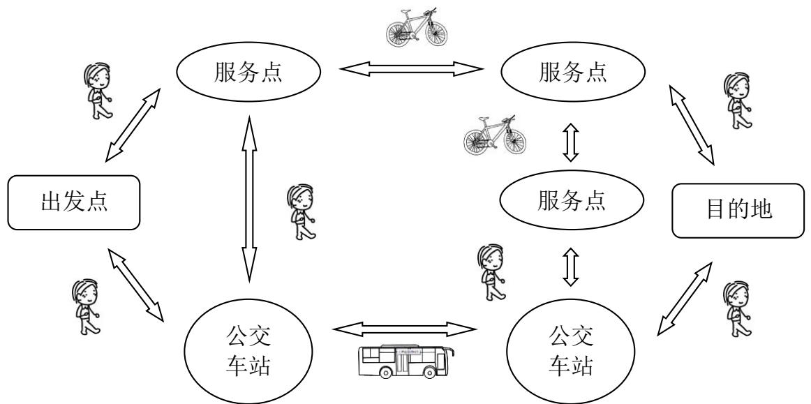

<details>
<summary>flowchart</summary>

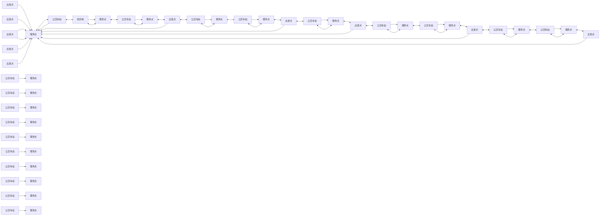
</details>

图1：城市公共自行车系统

## 1.2 问题重述

借助鹿城区公共自行车客流数据和站点分布图，本文试图解决以下几个问题：

首先，分析公共自行车的使用频度和每次使用的时长：我们统计各站点 20 天中每天及累计的借车频次和还车频次,并对所有站点按累计的借车频次和还车频次分别给出它们的排序，并统计分析每次用车时长的分布情况。

其次，基于借车卡数据对使用主体区分，统计 20 天中各天使用公共自行车的不同借车卡（即借车人）数量，并统计数据中出现过的每张借车卡累计借车次数的分布情况。

然后，我们试图寻找所有已给站点合计使用公共自行车次数最多的一天，并按照以下几个角度探讨站点客流量特点和规律：

1) 我们合理界定两站点之间的距离，在此基础上找出自行车用车的借还车站点之间（非零）最短距离与最长距离，对借还车是同一站点且使用时间在 1 分钟以上的借还车情况进行统计。  
2) 我们选择借车频次最高和还车频次最高的站点，分别统计分析其借、还车时刻的分布及用车时长的分布。  
3) 寻找各站点的借车高峰时段和还车高峰时段，在给出的温州市鹿城区地图上标注或列表给出高峰时段各站点的借车频次和还车频次，并对具有共同借车高峰时段和还车高峰时段的站点分别进行归类。

进而建立在前面分析的基础上，我们探讨上述统计结果携带了哪些有用的信息，并由此对目前公共自行车服务系统站点设置和锁桩数量的配置做出评价。

最后，我们试图找出公共自行车服务系统的其他运行规律，提出改进建议。

## 二 问题分析

城市公共自行车系统是一个复杂的系统，“牵一发而动全身”，其机制的设计和模式的优化是城市公共基础设施建设服务的核心。在这一部分中，我们对要解决的问题进行梳理整合，为后文的研究构建逻辑架构。

## 2.1 基本思路

针对本文的几个关键问题点，我们首先从数据出发，通过对公共自行车使用频率和时长的数据观察统计，分析其中规律，进而采用效用函数合理刻画用户需求和选择模式，合理预测出行时间，建立模型刻画用户偏好。然后我们采用题目中给定的地图，借助电子地图寻找借还车频次高峰，并基于数据和初步结论探索最后的开放式问题——公共自行车系统的运行规律和政策建议。

## 2.2 具体分析

我们首先进行数据的预处理，利用 Matlab 导入数据，对数据进行整合，剔除异常值和缺漏值，得到用于分析的样本数据。我们分以下几个步骤解决：

1) 针对问题一，即计算公共自行车的使用频度和每次使用的时长，我们遍历过所有数据之后，即可以得到各站点每天的借车还车频次的统计数据。对每个站点的全部 天的借车与还车数据分别求和，既可以得到每个站点的累计借车与还车频次。用还车时间减去借车时间可以得到用户的用车时间，精确到秒。

2) 利用用户效用函数来刻画用户的选择行为，建立自行车出行时间分布的效用函数模型。求解效用函数模型的具体形式，对用户群体的偏好特征进行分析。  
3) 针对问题二，我们按照借车卡区分不同用户个体，对用户群体的需求模式进行探索，方法类同问题一。通过累计各个借车人在 20日中累计借车次数，我们做出频率分布图，拟合得到借车频次的近似分布特征。  
4) 针对问题三，共有三种方法界定站点距离——欧式距离，直角距离和实际地图距离，我们可以分别用三种方法求解。第三种方法最为精确，但实现难度较大，我们尝试采用 MATLAB 画图的方法，利用题目给出的地图计算实际距离。在此基础上，寻找借还车频次高峰，并对站点位置、锁桩数量的优劣进行评价。  
5) 第四、第五问要求我们发散思维，寻找数据背后的运行规律，我们建立在数据特征的基础上，进一步挖掘公共自行车系统的运行特点，并回顾和借鉴了一些现有研究的方法，最终提出政策建议。

## 三 基本假设

H3.1：假设该城区所有的用户都是同质的，即有相同的效用函数。由于生活地理位置和风俗人情接近，影响出行状况的外界不可抗因素相近，这一假设比较合理，并可以简化我们的分析。当用户同质时，我们可以采用代表性用户的效用函数完成推导过程。  
H3.2：不同用户出行需求不同，我们假设用户需要出行的时长（ ）近似服从指数分布。  
H3.3：假设公共自行车站点设置在研究时间区间内没有明显变更，借车站点序号没有较大的变化，我们可以在一个相对静态的公共自行车硬件系统环境下进行分析。

## 四 符号说明

<table><tr><td>符号</td><td>意义</td></tr><tr><td> $\mathbf{A}_{m\times n} = [a_{ij}]$ </td><td>第i个站点第j天的借车次数</td></tr><tr><td> $\mathbf{B}_{m\times n} = [b_{ij}]$ </td><td>第i个站点第j天的还车次数</td></tr><tr><td>m</td><td>站点数目的最大值</td></tr><tr><td>n</td><td>天数的最大值</td></tr><tr><td> $a_{i0}$ </td><td>第i个站点的累计借车频次</td></tr><tr><td> $b_{i0}$ </td><td>第i个站点的累计还车频次</td></tr><tr><td>T</td><td>用户需要出行的时长</td></tr><tr><td>U(t)</td><td>用户自行车出行的效用</td></tr><tr><td>Q(x)</td><td>标准正态分布的累计分布函数</td></tr></table>

## 五 数据预处理

分析发现公共自行车系统的数据记录中存在错误的数据记录。因此，在对系统使用情况进行统计分析之前，首先要对数据进行预处理，以去除这些错误数据。分析发现，数据记录错误的形式包括以下几种：

1) 借车站点序号错误，例如 2012 年 11 月 8 日的序号为No.16548 的记录，借车站点为“调试站1”，站点序号为 1000；  
2) 还车站点序号错误，例如 2012 年 11 月 8 日的序号为No.30983 的记录，还车站点名称为空白，站点序号为 29999；  
3) 借还车时间错误，例如 2012 年 11 月 8 日的序号为 No.30983 的记录，借车时间为“2012/11/5 17:50:07”，还车时间为“2012/11/5”，还车时间只有日期没有时刻；  
4) 用车时间间隔错误，例如 2012 年 11 月 5 日的序号为No.19436 的记录，借车时间为“2012/11/5 14:24:43”，还车时间“2012/11/5 14:31:23”，实际用车时间为6分 40秒，记录用车时间为 0分钟。

综上所述，制定筛选条件对错误数据进行滤除。正确的数据需要满足的条件为:

1) 借车站点序号小于 1000；  
2) 还车站点序号小于 1000；  
3) 借还车时间格式正确，且还车时间晚于借车时间；  
4) 还车时间减去借车时间所得到的时间间隔（精确到秒）与记录中的时间间隔的误差小于 2分钟。

我们使用MATLAB 导入数据，并编写程序根据上述条件对全部 20 天的数据记录进行筛选，最终得到一共 637336 条记录，其中借车时间范围为 2012/11/1 5:59:38 至2012/11/20 21:33:57，还车时间范围为 2012/11/1 6:02:12 至 2012/11/21 7:37:20。数据一共有180个借车站点，站点序号分别为 ；180个还车站点，序号范围和借车站点相同。

## 六 公共自行车总体使用情况统计分析

## 6.1借车还车频次统计

针对导入的数据，使用 MATLAB 编写程序对各站点每天的借车还车频次进行统计，并分别使用矩阵 ${ \bf A } _ { m \times n } = [ a _ { i j } ] , { \bf B } _ { m \times n } = [ b _ { i j } ] , i = 1 , 2 , \cdots , m , j = 1 , 2 , \cdots , n$ 来表示借车频次和还车频次的统计结果。其中 $a _ { i j }$ 表示第 个站点第 天的借车次数， $b _ { i j }$ 表示第i个站点第j天的还车次数。 和 分别表示站点数目的最大值和天数的最大值，根据数据记录的范围，分别取 $m = 1 8 1 , n = 2 0$ 0

程序初始化后建立 $\mathbf { A } _ { m \times n }$ 和 $\mathbf { A } _ { m \times n }$ 两个矩阵并把它们置为零矩阵。程序遍历所有数据记录，读取每一条数据记录之后，都对该条数据记录中借车日期、借车站点、还车日期、还车站点所对应的矩阵中的元素加 1。遍历过所有数据，即得到各站点每天的借车还车频次的统计数据。对每个站点的全部 天的借车与还车数据分别求和，可得每个站点的累计与还车频次，第i个站点的累计借车与还车频次分别用 $a _ { i 0 }$ 和 $b _ { i 0 }$ 来表示，显然有：

$$
\begin{array}{l} a _ {i 0} = \sum_ {j = 1} ^ {n} a _ {i j} \tag {6.1} \\ b _ {i 0} = \sum_ {j = 1} ^ {n} b _ {i j} \\ \end{array}
$$

各个站点的每天与累计借车与还车频次如表 1和表 2 所示，限于篇幅，表 1 和表 2中仅列出了前10个站点前 10天的借还车频次以及累计频次，完整的数据请参见附录。

表 1：各个站点的每天与累计借车频次（部分）

<table><tr><td>站点</td><td> $a_{i1}$ </td><td> $a_{i2}$ </td><td> $a_{i3}$ </td><td> $a_{i4}$ </td><td> $a_{i5}$ </td><td> $a_{i6}$ </td><td> $a_{i7}$ </td><td> $a_{i8}$ </td><td> $a_{i9}$ </td><td> $a_{i10}$ </td><td>累计</td></tr><tr><td>1</td><td>91</td><td>148</td><td>35</td><td>152</td><td>124</td><td>107</td><td>88</td><td>15</td><td>9</td><td>6</td><td>1760</td></tr><tr><td>2</td><td>114</td><td>112</td><td>25</td><td>82</td><td>135</td><td>135</td><td>120</td><td>41</td><td>21</td><td>15</td><td>1744</td></tr><tr><td>3</td><td>179</td><td>188</td><td>47</td><td>60</td><td>194</td><td>189</td><td>189</td><td>73</td><td>65</td><td>13</td><td>2672</td></tr><tr><td>4</td><td>235</td><td>286</td><td>86</td><td>255</td><td>243</td><td>322</td><td>259</td><td>112</td><td>65</td><td>66</td><td>5232</td></tr><tr><td>5</td><td>139</td><td>165</td><td>67</td><td>167</td><td>161</td><td>164</td><td>168</td><td>53</td><td>33</td><td>16</td><td>2412</td></tr><tr><td>6</td><td>105</td><td>100</td><td>50</td><td>102</td><td>117</td><td>118</td><td>134</td><td>47</td><td>19</td><td>13</td><td>1760</td></tr><tr><td>7</td><td>106</td><td>109</td><td>14</td><td>55</td><td>143</td><td>137</td><td>157</td><td>34</td><td>35</td><td>5</td><td>1675</td></tr><tr><td>8</td><td>95</td><td>80</td><td>15</td><td>47</td><td>106</td><td>116</td><td>114</td><td>36</td><td>41</td><td>10</td><td>1533</td></tr><tr><td>9</td><td>353</td><td>365</td><td>177</td><td>303</td><td>400</td><td>460</td><td>393</td><td>167</td><td>124</td><td>86</td><td>6483</td></tr><tr><td>10</td><td>354</td><td>359</td><td>198</td><td>311</td><td>366</td><td>334</td><td>376</td><td>165</td><td>82</td><td>53</td><td>5821</td></tr></table>

表 2：各个站点的每天与累计还车频次（部分）

<table><tr><td>站点</td><td> $a_{i1}$ </td><td> $a_{i2}$ </td><td> $a_{i3}$ </td><td> $a_{i4}$ </td><td> $a_{i5}$ </td><td> $a_{i6}$ </td><td> $a_{i7}$ </td><td> $a_{i8}$ </td><td> $a_{i9}$ </td><td> $a_{i10}$ </td><td>累计</td></tr><tr><td>1</td><td>93</td><td>145</td><td>48</td><td>167</td><td>116</td><td>103</td><td>98</td><td>23</td><td>11</td><td>4</td><td>1821</td></tr><tr><td>2</td><td>117</td><td>110</td><td>27</td><td>88</td><td>125</td><td>136</td><td>127</td><td>53</td><td>22</td><td>16</td><td>1811</td></tr><tr><td>3</td><td>176</td><td>193</td><td>65</td><td>74</td><td>199</td><td>187</td><td>219</td><td>115</td><td>54</td><td>9</td><td>2915</td></tr><tr><td>4</td><td>224</td><td>297</td><td>108</td><td>283</td><td>242</td><td>310</td><td>297</td><td>115</td><td>87</td><td>61</td><td>5582</td></tr><tr><td>5</td><td>154</td><td>153</td><td>80</td><td>166</td><td>182</td><td>176</td><td>190</td><td>61</td><td>49</td><td>16</td><td>2613</td></tr><tr><td>6</td><td>112</td><td>97</td><td>41</td><td>116</td><td>119</td><td>119</td><td>132</td><td>56</td><td>33</td><td>15</td><td>1829</td></tr><tr><td>7</td><td>106</td><td>106</td><td>23</td><td>59</td><td>140</td><td>134</td><td>157</td><td>67</td><td>19</td><td>3</td><td>1798</td></tr><tr><td>8</td><td>89</td><td>89</td><td>15</td><td>41</td><td>101</td><td>110</td><td>110</td><td>54</td><td>23</td><td>4</td><td>1478</td></tr><tr><td>9</td><td>334</td><td>351</td><td>171</td><td>315</td><td>408</td><td>447</td><td>400</td><td>178</td><td>121</td><td>72</td><td>6416</td></tr><tr><td>10</td><td>341</td><td>332</td><td>216</td><td>314</td><td>361</td><td>326</td><td>347</td><td>150</td><td>84</td><td>52</td><td>5741</td></tr></table>

对累计借车频次和还车频次进行排序，得到的结果如表 3所示，表 3中仅给出借车与还车频次最高的前10 名站点，完整的排序结果见附录。

表3：站点的借还车频次排序

<table><tr><td colspan="3">借车站点累计频次排序</td><td colspan="3">还车站点累计频次排序</td></tr><tr><td>排名</td><td>站点序号</td><td>累计借车频次</td><td>排名</td><td>站点序号</td><td>累计还车频次</td></tr><tr><td>1</td><td>42</td><td>12286</td><td>1</td><td>56</td><td>12308</td></tr><tr><td>2</td><td>56</td><td>11950</td><td>2</td><td>42</td><td>12148</td></tr><tr><td>3</td><td>19</td><td>9864</td><td>3</td><td>19</td><td>9985</td></tr><tr><td>4</td><td>63</td><td>9670</td><td>4</td><td>63</td><td>9945</td></tr><tr><td>5</td><td>49</td><td>9270</td><td>5</td><td>49</td><td>9398</td></tr><tr><td>6</td><td>33</td><td>8068</td><td>6</td><td>33</td><td>8392</td></tr><tr><td>7</td><td>47</td><td>7747</td><td>7</td><td>69</td><td>7848</td></tr><tr><td>8</td><td>64</td><td>7607</td><td>8</td><td>47</td><td>7731</td></tr><tr><td>9</td><td>69</td><td>7567</td><td>9</td><td>101</td><td>7683</td></tr><tr><td>10</td><td>101</td><td>7525</td><td>10</td><td>64</td><td>7558</td></tr></table>

## 6.2用车时间的区间频次统计

用还车时间减去借车时间可以得到用户的用车时间，精确到秒。

我们首先分析用车时间的范围，通过统计全部 637336 条记录，发现最短用车时间为2秒，最长用车时间为 6601.5分钟，即4天 14小时1分30秒。我们采用 来表示用户的用车时间，以 100 分钟为间隔首先初步统计各用车时间区间内的用车频次，如表 4所示。

表4:用车时间的区间频次统计

<table><tr><td>t区间</td><td>[0,100)</td><td>[100,200)</td><td>[200,300)</td><td>[300,400)</td><td>...</td><td>[6500,6600)</td><td>[6600,+∞)</td></tr><tr><td>频率</td><td>0.9967</td><td>0.9992</td><td>0.9996</td><td>0.9998</td><td>...</td><td>1.0000</td><td>1</td></tr></table>

从表4中可以看出，虽然用车时间的范围较大，但是 所占的比例为 0.9992，说明绝大多数用车时间小于 200分钟。因此我们只对用车时间小于 200 分钟的情况进行统计。此外，用车时间小于 1分钟的情况通常为用户在同一站点迅速借车并还车，和用户真正使用公共自行车的情况不同，因此 的情况也不予统计。

统计用户用车的时间得到用户用车时间的均值为 15.5907 分钟，标准差为 11.6429分钟。以 1 分钟为单位统计用户用车时间的频次，得到图 2。观察图 2 可以发现，当用车时间较短的时候，用户用车的频次随时间的增长而增长，在约 8分钟左右达到最大值，20天内约有3.5万次借车时间为 8分钟，之后用户用车的频次随时间的增加而减少。为了定量刻画用户用车时间的分布以及分布产生的机理，我们构建了一个效用函数模型，如6.3节所示。

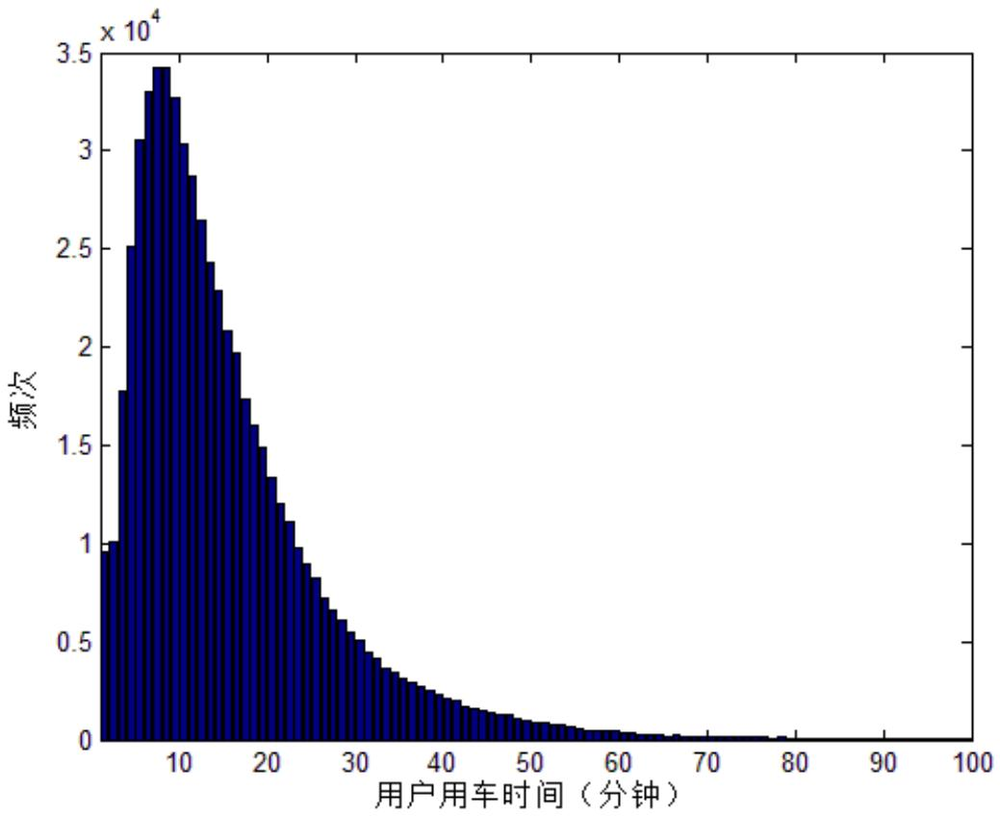

<details>
<summary>histogram</summary>

| 用户用车时间 (分钟) | 频次 (x 10^4) |
| --- | --- |
| 0~2 | ~1.0 |
| 2~4 | ~1.8 |
| 4~6 | ~3.05 |
| 6~8 | ~3.3 |
| 8~10 | ~3.45 |
| 10~12 | ~3.25 |
| 12~14 | ~3.05 |
| 14~16 | ~2.85 |
| 16~18 | ~2.65 |
| 18~20 | ~2.4 |
| 20~22 | ~2.1 |
| 22~24 | ~1.95 |
| 24~26 | ~1.75 |
| 26~28 | ~1.5 |
| 28~30 | ~1.35 |
| 30~32 | ~1.2 |
| 32~34 | ~1.05 |
| 34~36 | ~0.95 |
| 36~38 | ~0.85 |
| 38~40 | ~0.75 |
| 40~42 | ~0.65 |
| 42~44 | ~0.55 |
| 44~46 | ~0.5 |
| 46~48 | ~0.45 |
| 48~50 | ~0.4 |
| 50~52 | ~0.35 |
| 52~54 | ~0.3 |
| 54~56 | ~0.25 |
| 56~58 | ~0.2 |
| 58~60 | ~0.18 |
| 60~62 | ~0.15 |
| 62~64 | ~0.12 |
| 64~66 | ~0.1 |
| 66~68 | ~0.08 |
| 68~70 | ~0.07 |
| 70~72 | ~0.06 |
| 72~74 | ~0.05 |
| 74~76 | ~0.04 |
| 76~78 | ~0.03 |
| 78~80 | ~0.02 |
| 80~82 | ~0.01 |
| 82~84 | ~0.01 |
| 84~86 | ~0.01 |
| 86~88 | ~0.01 |
| 88~90 | ~0.01 |
| 90~92 | ~0.01 |
| 92~94 | ~0.01 |
| 94~96 | ~0.01 |
| 96~98 | ~0.01 |
| 98~100 | ~0.01 |
</details>

图2：用户用车时间的频次分布

## 6.3效用函数模型

公共自行车的推广主要针对的人群有三类：短距离出行者、长距离换乘出行者和非常规目的出行者等。短距离出行者具体是指在自行车的出行适宜的范围（5km）内，用公共自行车的单一交通方式完成的出行的，包括通勤、购物以及娱乐为目的的交通出行者。长距离换乘出行者指使用公共自行车作为公共交通的一个换乘工具的日常通勤者或者节假日出门娱乐、探访亲友或者购物的人群。非常规目的出行者是指以健身或者旅游为目的的出行者。

用户使用公共自行车出行与否显然和出行的时间相关，出行时间间接反映了出行距离的远近，自行车是一种人力驱动的出行交通工具 在短时间条件下 出行者体力充沛 其速度优势得到体现,但是在时间超过一定的程度,其速度优势就完全暴露。因此出行时间是自行车方式选择的重要因素。表 8反映了统计资料中披露的部分城市自行车出行时耗分布。从表 8 来看自行车交通的出行时间大部分都控制在在 30 分钟以内。绝大部分城市自行车出行时间控制在 20分钟以内的比例达到了 60%以上，时间控制在 30分钟以内的比例都达到了85%左右（郑州除外），出行时间超 30分钟的出行比例较小，我们可以认为自行车的最佳出行时耗在 分钟以内。<sup>[3]</sup>

表8：部分城市自行车出行时耗分布（%）<sup>1</sup>

<table><tr><td>出行时耗</td><td>&lt;10min</td><td>&lt;20min</td><td>&lt;30min</td><td>&lt;40min</td><td>&lt;50min</td><td>统计年份</td></tr><tr><td>郑州</td><td>4.2</td><td>42.5</td><td>62.3</td><td>89.2</td><td>93.8</td><td>2000</td></tr><tr><td>苏州</td><td>18.4</td><td>62.7</td><td>81</td><td>87</td><td>94</td><td>2000</td></tr><tr><td>无锡</td><td>28.1</td><td>65.9</td><td>87.1</td><td>93.3</td><td>96.9</td><td>1996</td></tr><tr><td>常熟</td><td>40.2</td><td>80.8</td><td>95.6</td><td>96.8</td><td>97.7</td><td>2001</td></tr><tr><td>昆山</td><td>7.4</td><td>62.4</td><td>84.8</td><td>96.5</td><td>97.4</td><td>2001</td></tr></table>

我们构建了一个模型来描述用户用车时长的分布规律。我们假设用户需要出行的时长是一个随机变量，用 来表示，并用 $p ( T = t )$ 表示 的概率密度函数。用户根据自己的出行需求选择要采用的交通工具。显然，用户选择出行交通工具需要考虑一些因素，例如出发起点、出发终点、出行距离、出行用时、出行时段以及交通路况、天气等一系列因素。用户会综合考虑这些因素以确定出行所采用的交通工具。

我们引入效用函数来描述用户选择自行车出行的偏好。效用函数是对用户使用公共自行车获得的综合收益的量化，显然，当收益较高的时候，用户更倾向于使用公共自行车。设用户采用公共自行车出行的效用函数为 $U ( t )$ ，则可以设用户使用公共自行车的条件 $S _ { 1 }$ 为效用函数大于某一阈值 $\delta$ ，这一阈值可以视为用户选择出行方式的保留效用。如式(6.2)所示:

$$
S _ {1}: U (t) > \delta \tag {6.2}
$$

由于除了t之外其他因素也可能影响用户使用公共自行车的效用，所以 $U ( t )$ 应该是以 为参数的随机变量。为了简化起见，设效用函数是和距离相关的确定部分 $u ( t )$ 与一随机变量的和，即

$$
U (t) = u (t) + n \tag {6.3}
$$

式(6.3)中， $u ( t )$ 为 的函数，n是一个随机变量，用以刻画影响用户选择的随机因素。由于随机因素可以看成许多正、负的随机分布的综合效应，根据中心极限定理，我们可以假定 服从正态分布，即 $n \sim N ( \mu , \sigma ^ { 2 } )$ 。

将式(6.3)代入式(6.2)中可得

$$
\begin{array}{l} S _ {1}: U (t) > \delta \\ \Leftrightarrow S _ {1}: u (t) + n > \delta \\ \Leftrightarrow S _ {1}: \frac {u (t) - \delta + \mu}{\sigma} + \frac {n - \mu}{\sigma} > 0 \tag {6.4} \\ \Leftrightarrow S _ {1}: u _ {0} (t) + n _ {0} > 0 \\ \end{array}
$$

其中， $u _ { 0 } ( t )$ 和 $n _ { 0 }$ 分别为归一化之后的确定效用函数分量和随机效用函数分量，并且有 $n _ { 0 } \sim N ( 0 , 1 )$ 。用随机变量 来表示用户使用公共自行车出行的用时。用户选用公共自行车出行需要满足两个条件，第一，用户需要出行的时间达到一定水平；第二，在此基础上，并综合各种其他因素，用户最终选用公共自行车。因此， 的密度函数可以表示为:

$$
p (Y = t) = p (S _ {1}) p (T = t) \tag {6.5}
$$

由于 $n _ { 0 } \sim N ( 0 , 1 )$ ，故 $n _ { 0 }$ 的概率密度函数为:

$$
p (n _ {0} = x) = \frac {1}{2 \pi} e ^ {- \frac {x ^ {2}}{2}} \tag {6.6}
$$

把式(6.6)代入式(6.5)可得

$$
p (Y = t) = p (T = t) \cdot \int_ {- u _ {0} (d)} ^ {+ \infty} \frac {1}{2 \pi} e ^ {- \frac {x ^ {2}}{2}} \mathrm{d} x \tag {6.7}
$$

式(6.7)为使用公共自行车出行时间分布的效用函数模型。

## 6.4出行时间的效用函数模型求解

下面我们求解用户出行时间的效用函数模型，通过求解模型，可以解出效用函数的表达形式和用户出行时间的分布。设 为标准正态分布的累计分布函数，即

$$
Q (x) = \int_ {- \infty} ^ {x} \frac {1}{2 \pi} e ^ {- \frac {s ^ {2}}{2}} \mathrm{d} s
$$

根据对对称性我们可知 $\int \limits _ { - u _ { 0 } ( d ) } ^ { + \infty } \frac { 1 } { 2 \pi } e ^ { - \frac { x ^ { 2 } } { 2 } } \mathrm { d } x = \mathcal { Q } ( u _ { 0 } ( t ) )$ ，则有：

$$
p (Y = t) = p (T = t) \cdot Q (u _ {0} (t)) \tag {6.8}
$$

解出 $Q ( u _ { 0 } ( t ) )$ 可以表示为：

$$
Q (u _ {0} (t)) = \frac {p (Y = t)}{p (T = t)} \tag {6.9}
$$

由于 $Q ( u _ { 0 } ( t ) )$ 为单调非减连续函数，我们必可以求解其反函数，从而解出用户的效用函数表达式：

$$
u _ {0} (t) = Q ^ {- 1} \left(\frac {p (Y = t)}{p (T = t)}\right) \tag {6.10}
$$

我们可以利用样本数据的统计结果近似代替 的分布，即用样本的出现的频率分布来代替随机变量的密度函数,如图1所示。因为数学期望在样本趋近于无穷大的时候收敛于数学期望，因此这种近似是有效的。

对于用户需要出行的时间 ，其分布是独立于该问题的，并且只要任给一个 的分布就可以解出一个效用函数的表达式， 分布的具体形式并不影响解决问题的方法的一般性。因此我们可以假设一种 的分布。常识性的知识表明用户需要出行某一时间的概率随时间的增加而下降，即用户有更大的可能在更近的范围内活动。因此不妨设 服从指数分布，即 的密度函数为：

$$
p (T = t) = \lambda e ^ {- \lambda t} \tag {6.11}
$$

可以设 $\lambda { = } 1 / 1 0 0$ 。由于仅统计 100分钟以内的出行时间，因此需要对 的概率密度函数进行归一化，归一化之后概率密度函数如图 3所示。

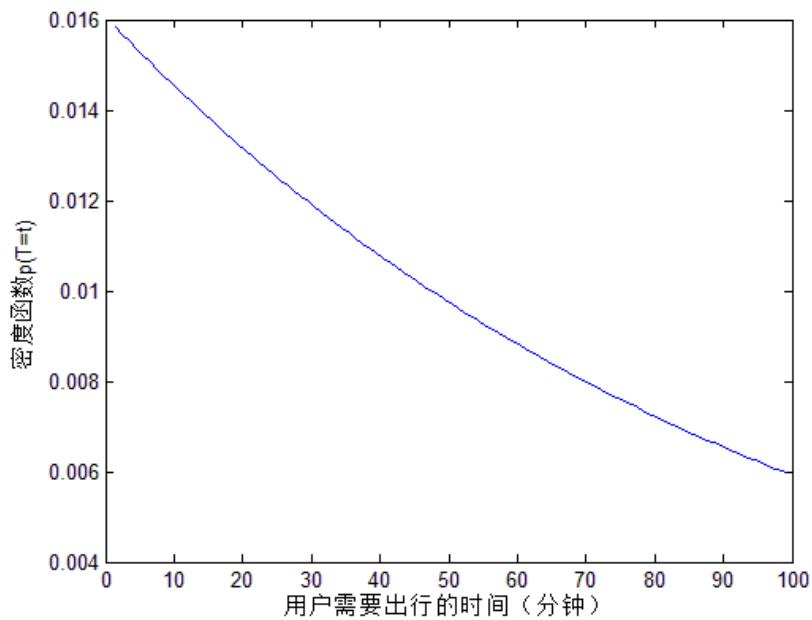

<details>
<summary>line</summary>

| 用户需要出行的时间 (分钟) | 密度函数 p(T=t) |
| --- | --- |
| 0 | ~0.0158 |
| 10 | ~0.0146 |
| 20 | ~0.0133 |
| 30 | ~0.0121 |
| 40 | ~0.0110 |
| 50 | ~0.0099 |
| 60 | ~0.0088 |
| 70 | ~0.0078 |
| 80 | ~0.0071 |
| 90 | ~0.0065 |
| 100 | ~0.0060 |
</details>

图3：用户需要出行的时间 的密度函数

$Q ^ { - 1 } ( x )$ 没有解析解，但是正态分布的累积分布函数有使用数值方法计算出的函数值表，可以使用反查该表的方法来得到 $Q ^ { - 1 } ( x )$ ，其函数图象如图 4所示。

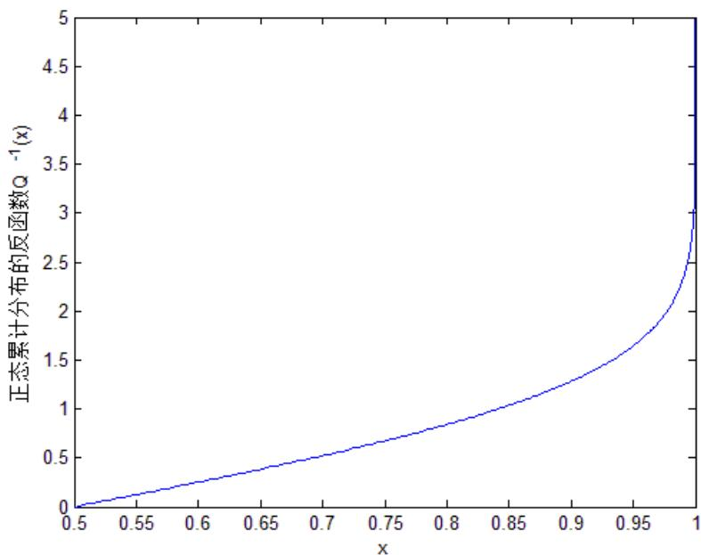

<details>
<summary>line</summary>

| x | 正态累计分布的反函数 \(Q^{-1}(x)\) |
| --- | --- |
| 0.5 | 0 |
| 0.55 | ~0.1 |
| 0.6 | ~0.2 |
| 0.65 | ~0.3 |
| 0.7 | ~0.4 |
| 0.75 | ~0.6 |
| 0.8 | ~0.8 |
| 0.85 | ~1.0 |
| 0.9 | ~1.3 |
| 0.95 | ~1.8 |
| 1 | 5 |
</details>

图 4：正态累计分布的反函数 $Q ^ { - 1 } ( x )$ 的函数图象。

综上所述，将 $p ( Y = t )$ $p ( T = t )$ 和 $Q ^ { - 1 } ( x )$ 的值代入式 6.10，即可解得效用函数 $u _ { 0 } ( t )$ $u _ { 0 } ( t )$ 的函数图象如图5 所示。

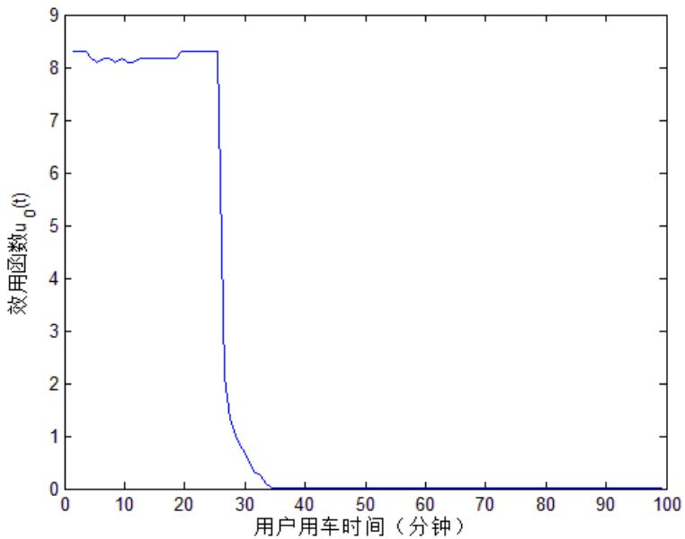

<details>
<summary>line</summary>

| 用户用车时间 (分钟) | 效用函数 \(u_{0}(t)\) |
| --- | --- |
| 0 | ~8.3 |
| 25 | ~8.3 |
| 26 | ~7.5 |
| 27 | ~4.0 |
| 28 | ~2.0 |
| 29 | ~1.0 |
| 30 | ~0.8 |
| 31 | ~0.5 |
| 32 | ~0.3 |
| 33 | ~0.1 |
| 34 | 0 |
| 100 | 0 |
</details>

图5：效用函数 $u _ { 0 } ( t )$ 的函数图象

从图5中可以看出，用户选择公共自行车出行的效用函数近似为一个矩形脉冲函数，其拐点约为 分钟。当出行时间小于 分钟时，用户更倾向于选择公共自行车出行；在 28 分钟之后，用户倾向于选择其他的交通工具，仅在随机因素的作用下选择公共自行车。

综上，即可用效用函数 $u _ { 0 } ( t )$ 以及式6.7来描述用户选择公共自行车出行时间的分布。

## 6.5 借车卡累计借车次数统计分析

在这一部分的分析中，我们按照借车卡区分不同用户个体，对用户群体的需求模式进行探索。根据温州市鹿城区借车卡办理方法规定，办卡采用实名制，一张借车卡，只能借一辆公共自行车。<sup>[2]</sup>因此我们假定用户和借车卡之间是一一对应的关系，即各位用户各采用一张借车卡。通过计算 20天中各天使用公共自行车的不同借车卡（即借车人）数量，计算统计数据中出现过的每张借车卡累计借车次数的分布情况，我们可以看出借车人的偏好规律。

类似 6.1 部分中的分析，我们采用 MATLAB 统计每日使用公共自行车的借车人数量，如表9所示：

表9：各天使用公共自行车的借车人数量

<table><tr><td>天数j</td><td>1</td><td>2</td><td>3</td><td>4</td><td>5</td><td>6</td><td>7</td><td>8</td><td>9</td><td>10</td></tr><tr><td>借车人数量</td><td>16840</td><td>17462</td><td>9671</td><td>14677</td><td>17985</td><td>18708</td><td>18887</td><td>10600</td><td>7038</td><td>4152</td></tr><tr><td>天数j</td><td>11</td><td>12</td><td>13</td><td>14</td><td>15</td><td>16</td><td>17</td><td>18</td><td>19</td><td>20</td></tr><tr><td>借车人数量</td><td>15097</td><td>18194</td><td>19531</td><td>19462</td><td>18673</td><td>11335</td><td>15412</td><td>15311</td><td>19188</td><td>20020</td></tr></table>

通过累计各个借车人在 20日中累计借车次数，我们做出如下频率分布图：

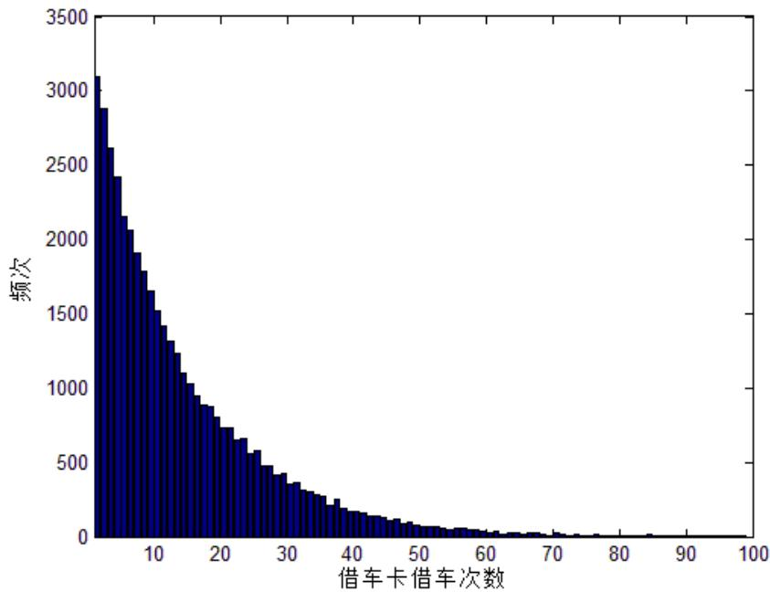

<details>
<summary>histogram</summary>

| 借车卡借车次数 (Bin) | 频次 (Frequency) |
| --- | --- |
| 0~1 | ~3100 |
| 1~2 | ~2900 |
| 2~3 | ~2600 |
| 3~4 | ~2400 |
| 4~5 | ~2150 |
| 5~6 | ~2050 |
| 6~7 | ~1900 |
| 7~8 | ~1750 |
| 8~9 | ~1650 |
| 9~10 | ~1500 |
| 10~11 | ~1400 |
| 11~12 | ~1300 |
| 12~13 | ~1200 |
| 13~14 | ~1100 |
| 14~15 | ~1000 |
| 15~16 | ~950 |
| 16~17 | ~900 |
| 17~18 | ~850 |
| 18~19 | ~800 |
| 19~20 | ~750 |
| 20~21 | ~700 |
| 21~22 | ~650 |
| 22~23 | ~650 |
| 23~24 | ~600 |
| 24~25 | ~550 |
| 25~26 | ~550 |
| 26~27 | ~500 |
| 27~28 | ~450 |
| 28~29 | ~450 |
| 29~30 | ~400 |
| 30~31 | ~350 |
| 31~32 | ~350 |
| 32~33 | ~300 |
| 33~34 | ~300 |
| 34~35 | ~250 |
| 35~36 | ~250 |
| 36~37 | ~250 |
| 37~38 | ~200 |
| 38~39 | ~200 |
| 39~40 | ~150 |
| 40~41 | ~150 |
| 41~42 | ~150 |
| 42~43 | ~150 |
| 43~44 | ~150 |
| 44~45 | ~150 |
| 45~46 | ~150 |
| 46~47 | ~150 |
| 47~48 | ~150 |
| 48~49 | ~150 |
| 49~50 | ~150 |
| 50~51 | ~150 |
| 51~52 | ~150 |
| 52~53 | ~150 |
| 53~54 | ~150 |
| 54~55 | ~150 |
| 55~56 | ~150 |
| 56~57 | ~150 |
| 57~58 | ~150 |
| 58~59 | ~150 |
| 59~60 | ~150 |
| 60~61 | ~150 |
| 61~62 | ~150 |
| 62~63 | ~150 |
| 63~64 | ~150 |
| 64~65 | ~150 |
| 65~66 | ~150 |
| 66~67 | ~150 |
| 67~68 | ~150 |
| 68~69 | ~150 |
| 69~70 | ~150 |
| 70~71 | ~150 |
| 71~72 | ~150 |
| 72~73 | ~150 |
| 73~74 | ~150 |
| 74~75 | ~150 |
| 75~76 | ~150 |
| 76~77 | ~150 |
| 77~78 | ~150 |
| 78~79 | ~150 |
| 79~80 | ~150 |
| 80~81 | ~150 |
| 81~82 | ~150 |
| 82~83 | ~150 |
| 83~84 | ~150 |
| 84~85 | ~150 |
| 85~86 | ~150 |
| 86~87 | ~150 |
| 87~88 | ~150 |
| 88~89 | ~150 |
| 89~90 | ~150 |
| 90~91 | ~150 |
| 91~92 | ~150 |
| 92~93 | ~150 |
| 93~94 | ~150 |
| 94~95 | ~150 |
| 95~96 | ~150 |
| 96~97 | ~150 |
| 97~98 | ~150 |
| 98~99 | ~150 |
| 99~100 | ~150 |
</details>

图6：累计借车次数

横坐标表示各个借车卡累计借车次数，纵坐标表示各个次数出现的频数。从图6中我们可以看到，大多数借车人的借车次数在 30 次以下，随着借车次数的逐渐增加，相应借车次数的借车人数逐渐下降。我们依然采用简单统计方法分析各用车频次：

表10：累计借车次数的区间频次统计

<table><tr><td>次数区间</td><td>[0,50)</td><td>[50,100)</td><td>[100,150)</td><td>[150,200)</td><td>[200,250)</td><td>[250,300)</td><td>[300,350)</td></tr><tr><td>累计频率</td><td>0.978202</td><td>0.999295</td><td>0.99989</td><td>0.999956</td><td>0.999956</td><td>0.999978</td><td>0.999978</td></tr><tr><td>次数区间</td><td>[350,400)</td><td>[400,450)</td><td>[450,500)</td><td>[500,550)</td><td>[550,600)</td><td>[600,+∞)</td><td></td></tr><tr><td>累计频率</td><td>0.999978</td><td>0.999978</td><td>0.999978</td><td>0.999978</td><td>0.999978</td><td>1</td><td></td></tr></table>

我们发现有离群值的存在，样本点 99.2%的用户的借车次数都在 100 次以下，只有极少数人超过100次，根据常识判断这些值可能是统计错误，我们作为异常值去除。观察频数直方图，我们发现其分布近似于指数分布。基于这一假设，我们利用 MATLAB拟合，得到拟合图如图 7所示：

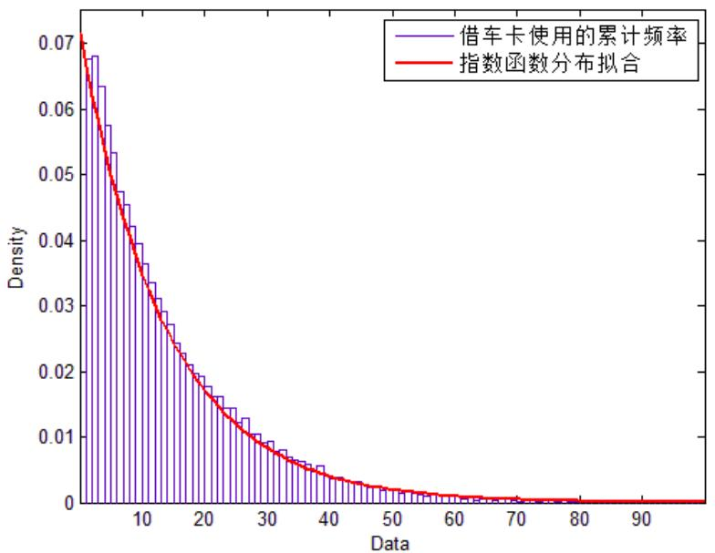

<details>
<summary>histogram</summary>

| Data | 借车卡使用的累计频率 (Density) | 指数函数分布拟合 (Density) |
| --- | --- | --- |
| 0 | ~0.071 | ~0.071 |
| 5 | ~0.068 | ~0.062 |
| 10 | ~0.045 | ~0.043 |
| 15 | ~0.032 | ~0.031 |
| 20 | ~0.022 | ~0.021 |
| 25 | ~0.015 | ~0.014 |
| 30 | ~0.010 | ~0.009 |
| 35 | ~0.007 | ~0.006 |
| 40 | ~0.005 | ~0.004 |
| 45 | ~0.003 | ~0.003 |
| 50 | ~0.002 | ~0.002 |
| 55 | ~0.001 | ~0.001 |
| 60 | ~0.001 | ~0.001 |
| 65 | ~0.001 | ~0.001 |
| 70 | ~0.001 | ~0.001 |
| 75 | ~0.001 | ~0.001 |
| 80 | ~0.001 | ~0.001 |
| 85 | ~0.001 | ~0.001 |
| 90 | ~0.001 | ~0.001 |
</details>

图7：指数分布拟合图

从表11 中可以看到，拟合结果良好，标准差 0.065，表明指数分布能够较好地拟合该借车频数的累计概率分布。

表11：拟合结果

<table><tr><td colspan="4">分布(Distribution):指数分布(Exponential)</td></tr><tr><td colspan="4">对数似然率(Log likelihood):-164938</td></tr><tr><td colspan="4">区间(Domain):0 &lt;= y &lt; Inf</td></tr><tr><td colspan="4">均值(Mean):13.9364</td></tr><tr><td colspan="4">方差(Variance):194.225</td></tr><tr><td colspan="4">参数估计</td></tr><tr><td></td><td>系数</td><td>估计值</td><td>标准差</td></tr><tr><td></td><td>Parameter</td><td>Estimate</td><td>Std. Err.</td></tr><tr><td></td><td>mu</td><td>13.9364</td><td>0.0654207</td></tr><tr><td colspan="4">参数估计协方差</td></tr><tr><td colspan="4">Estimated covariance of parameter estimates:</td></tr><tr><td colspan="4">mu 0.00427987</td></tr></table>

## 七 地理信息数据的获取

## 7.1公共自行车站点的坐标信息

对城市公共自行车的空间使用情况进行统计，需要已知城市地理信息以及公共自行车站点的地理位置信息。题目附件 2中给出的鹿城区公共自行车站点分布图，仅描述了自行车站点的分布，并没有每个自行车站点的具体坐标。我们在温州市鹿城区公共自行车管理中心网站上找到每个自行车站点的位置，再在电子地图服务提供商（例如谷歌地图）网站上查询出该站点位置的坐标<sup>[4]</sup>。为了表示方便，我们定义北纬 28°2’17.68”，东经120°38’19.13”，以正南为 y轴正方形，以正东为 x轴正方形，以 1m 为单位建立直角坐标系。由于鹿城区面积较小，故可以不考虑地球曲率。将各站点的地理坐标映射到直角坐标系下，得到站点的坐标如表 12所示，完整的表格参加附录中。

表12：公共自行车站点的坐标（部分）

<table><tr><td>站点序号</td><td>站点名称</td><td>y刻度</td><td>x刻度</td></tr><tr><td>1</td><td>科技馆</td><td>8114.064</td><td>4378.759</td></tr><tr><td>2</td><td>温州大剧院</td><td>8255.842</td><td>4209.716</td></tr><tr><td>3</td><td>吴桥路加油站</td><td>3838.912</td><td>3882.536</td></tr><tr><td>4</td><td>银泰百货</td><td>4515.084</td><td>2475.662</td></tr><tr><td>5</td><td>星河广场</td><td>2453.85</td><td>916.104</td></tr><tr><td>6</td><td>绣山卫生院</td><td>8539.398</td><td>3735.305</td></tr><tr><td>7</td><td>市政府西</td><td>7972.286</td><td>3713.493</td></tr><tr><td>8</td><td>市政府东</td><td>8217.671</td><td>3697.134</td></tr><tr><td>9</td><td>小南门立交桥</td><td>3718.946</td><td>2333.884</td></tr><tr><td>10</td><td>市九中</td><td>4340.588</td><td>1134.224</td></tr><tr><td>11</td><td>鹿城区审批中心</td><td>3528.091</td><td>3909.801</td></tr><tr><td>12</td><td>桥儿头公交站</td><td>5414.829</td><td>3511.732</td></tr><tr><td>13</td><td>公共自行车中心</td><td>3757.117</td><td>3740.758</td></tr><tr><td>14</td><td>南浦医院</td><td>5453</td><td>4209.716</td></tr><tr><td>15</td><td>温州建国医院对面</td><td>4596.879</td><td>5005.854</td></tr><tr><td>16</td><td>金色家园</td><td>4580.52</td><td>4187.904</td></tr><tr><td>17</td><td>区政府西</td><td>3549.903</td><td>1706.789</td></tr><tr><td>18</td><td>区政府东</td><td>3626.245</td><td>1706.789</td></tr><tr><td>19</td><td>开太百货</td><td>4324.229</td><td>2044.875</td></tr><tr><td>20</td><td>南浦桥</td><td>5529.342</td><td>3762.57</td></tr></table>

将这些公共自行车站点的坐标标记在地图上，如图 8所示。

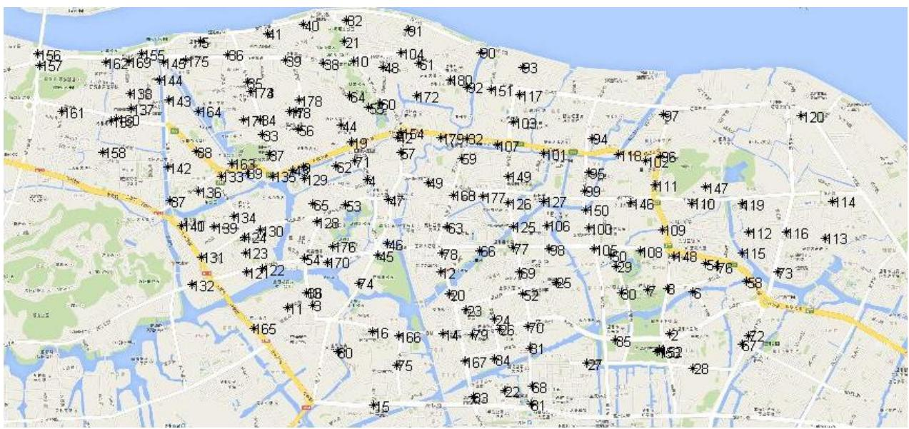

<details>
<summary>geo</summary>

| Location ID | Type |
| --- | --- |
| 156 | City |
| 157 | City |
| 162 | City |
| 169 | City |
| 145 | City |
| 175 | City |
| 86 | City |
| 89 | City |
| 88 | City |
| 10 | City |
| 40 | City |
| 62 | City |
| 21 | City |
| 91 | City |
| 104 | City |
| 61 | City |
| 80 | City |
| 92 | City |
| 51 | City |
| 17 | City |
| 103 | City |
| 94 | City |
| 118 | City |
| 96 | City |
| 111 | City |
| 147 | City |
| 19 | City |
| 12 | City |
| 16 | City |
| 13 | City |
| 15 | City |
| 73 | City |
| 178 | City |
| 78 | City |
| 64 | City |
| 50 | City |
| 172 | City |
| 154 | City |
| 179 | City |
| 62 | City |
| 107 | City |
| 101 | City |
| 95 | City |
| 99 | City |
| 150 | City |
| 46 | City |
| 109 | City |
| 105 | City |
| 108 | City |
| 48 | City |
| 57 | City |
| 76 | City |
| 58 | City |
| 72 | City |
| 67 | City |
| 28 | City |
| 65 | City |
| 53 | City |
| 59 | City |
| 149 | City |
| 127 | City |
| 63 | City |
| 26 | City |
| 125 | City |
| 106 | City |
| 98 | City |
| 78 | City |
| 66 | City |
| 77 | City |
| 59 | City |
| 25 | City |
| 60 | City |
| 78 | City |
| 20 | City |
| 23 | City |
| 24 | City |
| 70 | City |
| 61 | City |
| 65 | City |
| 60 | City |
| 144 | City |
| 138 | City |
| 143 | City |
| 164 | City |
| 1784 | City |
| 83 | City |
| 56 | City |
| 144 | City |
| 19 | City |
| 57 | City |
| 71 | City |
| 62 | City |
| 29 | City |
| 54 | City |
| 170 | City |
| 54 | City |
| 70 | City |
| 54 | City |
| 74 | City |
| 68 | City |
| 11 | City |
| 83 | City |
| 22 | City |
| 68 | City |
| 61 | City |
| 75 | City |
| 155 | City |
| 67 | City |
| 84 | City |
| 63 | City |
| 23 | City |
| 79 | City |
| 66 | City |
| 81 | City |
| 27 | City |
| 65 | City |
| 22 | City |
| 68 | City |
| 61 | City |
</details>

图8：公共自行车站点的在地图上的位置

## 7.2 城市道路地理信息

计算两个公共自行车站点时将会使用到城市道路信息。城市道路信息可以使用由现有的GIS 信息，也可以通过图片格式的地图获得，使用图片格式的地图获得道路信息的方法主要包括颜色替换，形态学处理，道路生长细化等等，最终获得城市道路信息，用于两地之间的实际道路路径求取。颜色替换之后的城市地图如图 9所示。

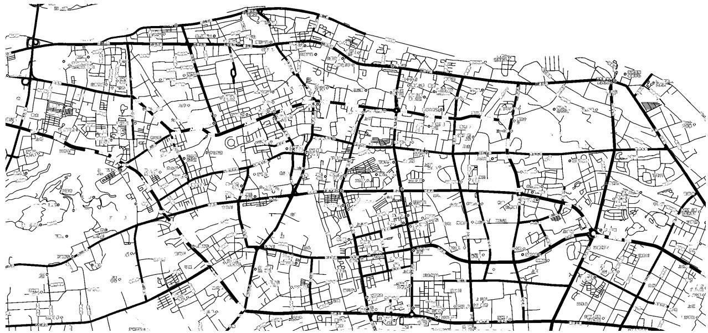

<details>
<summary>text_image</summary>

Scanned map or layout diagram with labeled streets, buildings, and geographic markers in Chinese
</details>

图9：经过颜色替换得到的包含道路信息的城市地图

## 八 公共自行车时间、空间使用情况统计分析

## 8.1 站点距离的界定

对公共自行车站点的空间规划研究是建立在合理界定站点距离的基础上的。在本研究中，我们主要采用三种方法来对公用自行车站点间的距离进行刻画。

## 1）欧氏距离

度量地理空间中的距离最简单的方法是欧氏距离（Euclid Distance），也称欧几里得度量、欧几里得距离，它是在 m 维空间中两个点之间的真实距离。本研究基于鹿城区的城市交通地图，属于二维空间中的欧氏距离，即为两点之间的直线段距离。

## 2）直角边距离

我们注意到，欧氏距离虽然计算方法简单，但是不符合公共交通的一般特点。在城市规划和道路建设中，两个站点往往不能通过直线连接相互连通，因此，采用近似直角边距离和的方式近似求距离对现实的拟合度更高。但是，这种方法假设道路全部是“横平竖直”的，这也与实际有一定的差异，会存在计算偏差。

## 3）城市道路实际距离

这一方法建立在实际的城区道路网络基础上，衡量的是站点之间城市道路的真实距离，因此是最为精确的。其优点是对空间距离的衡量拟合度最高，但缺点是操作难度较大。

## 8.2 借/还车的最短距离和最长距离

分别统计每天所有站点的借车和还车频次，并将两者的加和最大的一天作为公共自行车使用最大的一天。经统计发现，2012年11 月20日公共自行车的使用次数最大，借还总频次为84441次。本章以下问题均针对此日的数据进行讨论。

根据8.1节定义的距离计算方法，分别采用欧式距离法和直角边距离法计算各站点之间的距离。根据数据记录，有的站点之间没有连接，将这些没有连接站点之间的距离视为0。分别统计不同站点之间距离的最大距离，并对其进行排序，即可得到用车借还站点之间的最短距离和最长距离（非零距离，并且只统计时间在 1分钟以上的借还车情况），如表13所示，完整的表格参见附录。

表13：借车站点的最近与最远还车站点及距离（部分）

<table><tr><td colspan="5">欧式距离</td><td colspan="4">直角边距离</td></tr><tr><td>借车站点</td><td>最近还车站点</td><td>最近还车距离(米)</td><td>最远还车站点</td><td>最远还车距离(米)</td><td>最近还车站点</td><td>最近还车距离(米)</td><td>最远还车站点</td><td>最远还车距离(米)</td></tr><tr><td>1</td><td>2</td><td>220.6</td><td>123</td><td>5223.4</td><td>2</td><td>310.8</td><td>18</td><td>7159.8</td></tr><tr><td>2</td><td>28</td><td>472.3</td><td>142</td><td>6482.8</td><td>8</td><td>550.8</td><td>142</td><td>8081.3</td></tr><tr><td>3</td><td>11</td><td>312.0</td><td>148</td><td>4499.8</td><td>11</td><td>338.1</td><td>111</td><td>5578.4</td></tr><tr><td>4</td><td>71</td><td>269.4</td><td>72</td><td>5026.0</td><td>71</td><td>376.3</td><td>67</td><td>6472.7</td></tr><tr><td>5</td><td>175</td><td>282.1</td><td>114</td><td>8008.0</td><td>175</td><td>398.1</td><td>114</td><td>9602.7</td></tr><tr><td>6</td><td>8</td><td>324.0</td><td>140</td><td>6364.0</td><td>8</td><td>359.9</td><td>140</td><td>7067.1</td></tr><tr><td>7</td><td>8</td><td>245.9</td><td>131</td><td>5520.0</td><td>8</td><td>261.7</td><td>38</td><td>6549.1</td></tr><tr><td>8</td><td>7</td><td>245.9</td><td>133</td><td>5656.3</td><td>7</td><td>261.7</td><td>133</td><td>6778.1</td></tr><tr><td>9</td><td>43</td><td>123.0</td><td>73</td><td>5979.1</td><td>129</td><td>141.8</td><td>72</td><td>7399.7</td></tr><tr><td>10</td><td>21</td><td>239.0</td><td>115</td><td>5272.1</td><td>21</td><td>321.7</td><td>1</td><td>7018.0</td></tr><tr><td>11</td><td>3</td><td>312.0</td><td>116</td><td>6214.2</td><td>3</td><td>338.1</td><td>116</td><td>7001.7</td></tr><tr><td>12</td><td>78</td><td>208.4</td><td>160</td><td>4352.7</td><td>78</td><td>229.0</td><td>160</td><td>5720.2</td></tr><tr><td>13</td><td>11</td><td>284.7</td><td>72</td><td>5490.8</td><td>11</td><td>398.1</td><td>72</td><td>5954.7</td></tr><tr><td>14</td><td>79</td><td>359.9</td><td>157</td><td>5830.9</td><td>79</td><td>365.4</td><td>157</td><td>8010.5</td></tr><tr><td>15</td><td>75</td><td>531.2</td><td>144</td><td>4517.9</td><td>75</td><td>730.7</td><td>144</td><td>6309.1</td></tr><tr><td>16</td><td>166</td><td>319.3</td><td>58</td><td>4653.4</td><td>166</td><td>359.9</td><td>138</td><td>5692.9</td></tr><tr><td>17</td><td>18</td><td>76.3</td><td>76</td><td>5564.6</td><td>18</td><td>76.3</td><td>76</td><td>7028.9</td></tr><tr><td>18</td><td>17</td><td>76.3</td><td>114</td><td>6707.1</td><td>17</td><td>76.3</td><td>114</td><td>7639.7</td></tr><tr><td>19</td><td>71</td><td>215.2</td><td>113</td><td>5940.1</td><td>71</td><td>245.4</td><td>113</td><td>6925.3</td></tr><tr><td>20</td><td>23</td><td>270.9</td><td>160</td><td>4560.9</td><td>12</td><td>365.4</td><td>160</td><td>6085.5</td></tr></table>

## 8.3 借/还车频次最高站点

通过统计可知，2012 年11月20日的借车频次最高的站点为 42号站点，还车频次最高的站点为56号站点。对这两个站点统计借还车时刻分布以及用车时长分布。对于用车时刻，将一天中的 24小时划分成以0.2小时为间隔的若干时段，分别统计落入每个时段的借还车频次，即可用来反映借还车的时刻分布，统计的结果如图 10所示。

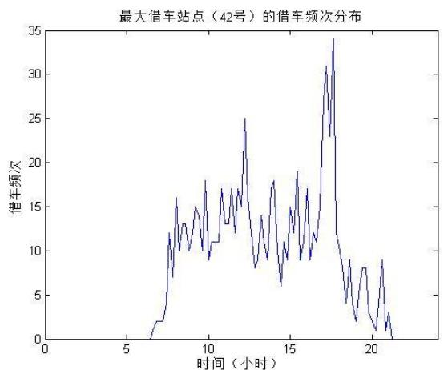

<details>
<summary>line</summary>

| 时间 (小时) | 借车频次 |
| --- | --- |
| ~6.5 | 0 |
| ~7.0 | ~2 |
| ~7.5 | ~12 |
| ~8.0 | ~16 |
| ~9.0 | ~13 |
| ~10.0 | ~18 |
| ~11.0 | ~17 |
| ~12.0 | ~25 |
| ~13.0 | ~18 |
| ~14.0 | ~18 |
| ~15.0 | ~19 |
| ~16.0 | ~17 |
| ~17.0 | ~31 |
| ~17.5 | ~34 |
| ~18.0 | ~12 |
| ~19.0 | ~8 |
| ~20.0 | ~8 |
| ~21.0 | ~9 |
| ~21.5 | 0 |
</details>

（a）

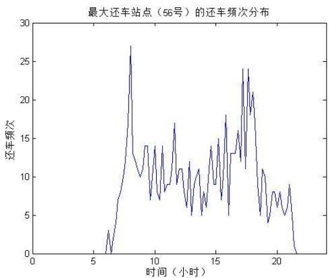

<details>
<summary>line</summary>

| 时间 (小时) | 还车频次 |
| --- | --- |
| ~6 | 0 |
| ~7 | ~3 |
| ~8 | ~27 |
| ~9 | ~14 |
| ~10 | ~14 |
| ~11 | ~17 |
| ~12 | ~11 |
| ~13 | ~12 |
| ~14 | ~14 |
| ~15 | ~18 |
| ~16 | ~13 |
| ~17 | ~24 |
| ~18 | ~24 |
| ~19 | ~11 |
| ~20 | ~8 |
| ~21 | ~9 |
| ~22 | 0 |
</details>

（b）  
图 10：最大借还车站点的借还车频次时刻分布

通过观察可以发现，借还车的时刻分布呈现一定的分布规律，例如 42号站点的借车频次在17:30 分左右出现峰值，在峰值左右的频次大于其他部分的频次，说明在该时刻前后借车行为比较集中；56号站点的还车频次有两个峰值，分别出现在 8:00 和17:30左右，说明该站点在早晨和晚上都出现了还车比较集中的现象。

按照6.2节的方法来统计两个站点的用车时长，得到用车时长的分布如图 11 所示。根据6.3和6.4节的方法求解效用函数分布模型，得到的效用函数的图象如图 12所示。

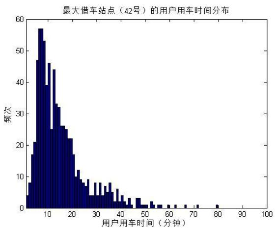

<details>
<summary>histogram</summary>

| 用户用车时间 (分钟) | 频次 |
| --- | --- |
| 5~6 | ~4 |
| 6~7 | ~8 |
| 7~8 | ~17 |
| 8~9 | ~21 |
| 9~10 | ~47 |
| 10~11 | ~57 |
| 11~12 | ~53 |
| 12~13 | ~39 |
| 13~14 | ~46 |
| 14~15 | ~44 |
| 15~16 | ~25 |
| 16~17 | ~33 |
| 17~18 | ~32 |
| 18~19 | ~26 |
| 19~20 | ~25 |
| 20~21 | ~22 |
| 21~22 | ~17 |
| 22~23 | ~10 |
| 23~24 | ~9 |
| 24~25 | ~8 |
| 25~26 | ~9 |
| 26~27 | ~4 |
| 27~28 | ~4 |
| 28~29 | ~4 |
| 29~30 | ~8 |
| 30~31 | ~4 |
| 31~32 | ~8 |
| 32~33 | ~4 |
| 33~34 | ~5 |
| 34~35 | ~8 |
| 35~36 | ~5 |
| 36~37 | ~6 |
| 37~38 | ~2 |
| 38~39 | ~2 |
| 39~40 | ~4 |
| 40~41 | ~3 |
| 41~42 | ~1 |
| 42~43 | ~3 |
| 43~44 | ~1 |
| 44~45 | ~1 |
| 45~46 | ~1 |
| 46~47 | ~1 |
| 47~48 | ~1 |
| 48~49 | ~1 |
| 49~50 | ~1 |
| 50~51 | ~1 |
| 51~52 | ~1 |
| 52~53 | ~1 |
| 53~54 | ~1 |
| 54~55 | ~1 |
| 55~56 | ~1 |
| 56~57 | ~1 |
| 57~58 | ~1 |
| 58~59 | ~1 |
| 59~60 | ~1 |
| 60~61 | ~1 |
| 61~62 | ~1 |
| 62~63 | ~1 |
| 63~64 | ~1 |
| 64~65 | ~1 |
| 65~66 | ~1 |
| 66~67 | ~1 |
| 67~68 | ~1 |
| 68~69 | ~1 |
| 69~70 | ~1 |
| 70~71 | ~1 |
| 71~72 | ~1 |
| 72~73 | ~1 |
| 73~74 | ~1 |
| 74~75 | ~1 |
| 75~76 | ~1 |
| 76~77 | ~1 |
| 77~78 | ~1 |
| 78~79 | ~1 |
| 79~80 | ~1 |
| 80~81 | ~1 |
| 81~82 | ~1 |
| 82~83 | ~1 |
| 83~84 | ~1 |
| 84~85 | ~1 |
| 85~86 | ~1 |
| 86~87 | ~1 |
| 87~88 | ~1 |
| 88~89 | ~1 |
| 89~90 | ~1 |
| 90~91 | ~1 |
| 91~92 | ~1 |
| 92~93 | ~1 |
| 93~94 | ~1 |
| 94~95 | ~1 |
| 95~96 | ~1 |
| 96~97 | ~1 |
| 97~98 | ~1 |
| 98~99 | ~1 |
| 99~100 | ~1 |
</details>

（a）

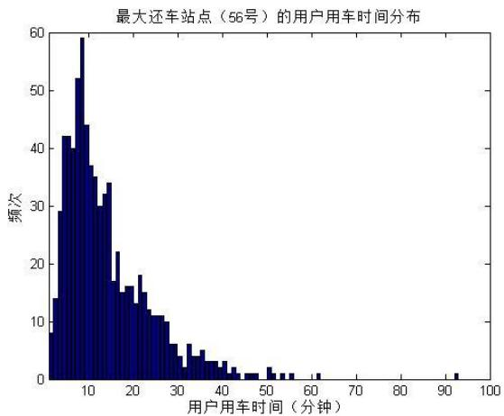

<details>
<summary>histogram</summary>

| 用户用车时间 (分钟) | 频次 |
| --- | --- |
| 0~2 | ~8 |
| 2~4 | ~14 |
| 4~6 | ~29 |
| 6~8 | ~42 |
| 8~10 | ~52 |
| 10~12 | ~59 |
| 12~14 | ~44 |
| 14~16 | ~37 |
| 16~18 | ~30 |
| 18~20 | ~34 |
| 20~22 | ~22 |
| 22~24 | ~17 |
| 24~26 | ~16 |
| 26~28 | ~18 |
| 28~30 | ~15 |
| 30~32 | ~11 |
| 32~34 | ~6 |
| 34~36 | ~6 |
| 36~38 | ~4 |
| 38~40 | ~5 |
| 40~42 | ~3 |
| 42~44 | ~3 |
| 44~46 | ~2 |
| 46~48 | ~1 |
| 48~50 | ~1 |
| 50~52 | ~2 |
| 52~54 | ~1 |
| 54~56 | ~1 |
| 56~58 | ~1 |
| 58~60 | ~1 |
| 60~62 | ~1 |
| 62~64 | ~1 |
| 64~66 | ~1 |
| 66~68 | ~1 |
| 68~70 | ~1 |
| 70~72 | ~1 |
| 72~74 | ~1 |
| 74~76 | ~1 |
| 76~78 | ~1 |
| 78~80 | ~1 |
| 80~82 | ~1 |
| 82~84 | ~1 |
| 84~86 | ~1 |
| 86~88 | ~1 |
| 88~90 | ~1 |
| 90~92 | ~1 |
| 92~94 | ~1 |
| 94~96 | ~1 |
| 96~98 | ~1 |
| 98~100 | ~1 |
</details>

（b）  
图 11：最大借还车站点的用户用车时长分布

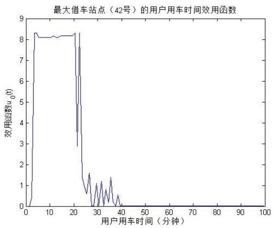

<details>
<summary>line</summary>

| 用户用车时间 (分钟) | 效用函数 u0(t) |
| --- | --- |
| 0 | 0 |
| ~2 | ~8.3 |
| ~10 | ~8.1 |
| ~20 | ~8.2 |
| ~21 | ~6.3 |
| ~22 | ~3.5 |
| ~23 | ~8.3 |
| ~24 | ~6.3 |
| ~25 | ~3.5 |
| ~26 | ~1.3 |
| ~27 | ~0.6 |
| ~28 | ~1.6 |
| ~29 | ~0.6 |
| ~30 | 0 |
| ~31 | ~1.1 |
| ~32 | 0 |
| ~33 | ~1.2 |
| ~34 | 0 |
| ~35 | ~0.7 |
| ~36 | 0 |
| ~37 | ~1.4 |
| ~38 | 0 |
| ~39 | ~0.5 |
| ~40 | 0 |
</details>

（a）

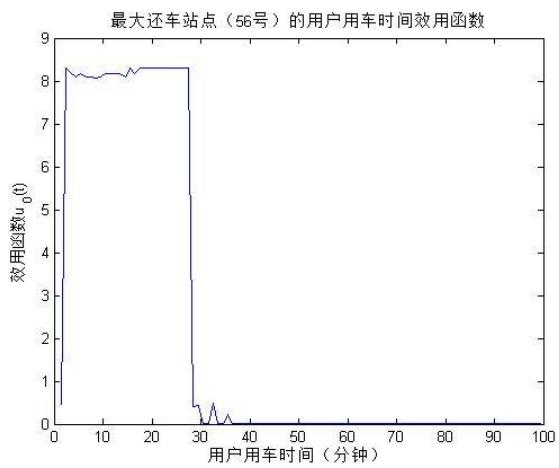

<details>
<summary>line</summary>

| 用户用车时间 (分钟) | 效用函数 u0(t) |
| --- | --- |
| 0 | ~0.5 |
| 1 | ~7.2 |
| 2 | ~8.3 |
| 3 | ~8.1 |
| 4 | ~8.2 |
| 5 | ~8.1 |
| 6 | ~8.1 |
| 7 | ~8.1 |
| 8 | ~8.1 |
| 9 | ~8.1 |
| 10 | ~8.1 |
| 11 | ~8.1 |
| 12 | ~8.1 |
| 13 | ~8.1 |
| 14 | ~8.1 |
| 15 | ~8.1 |
| 16 | ~8.2 |
| 17 | ~8.3 |
| 18 | ~8.2 |
| 19 | ~8.3 |
| 20 | ~8.3 |
| 21 | ~8.3 |
| 22 | ~8.3 |
| 23 | ~8.3 |
| 24 | ~8.3 |
| 25 | ~8.3 |
| 26 | ~8.3 |
| 27 | ~8.3 |
| 28 | ~8.3 |
| 29 | ~0.4 |
| 30 | ~0.5 |
| 31 | ~0.1 |
| 32 | ~0.5 |
| 33 | ~0.1 |
| 34 | ~0.2 |
| 35 | ~0.1 |
| 36 | ~0.2 |
| 37 | ~0.1 |
| 38 | ~0.1 |
| 39 | ~0.1 |
| 40~100 | 0 |
</details>

（b）  
图 12：最大借还车站点的用户用车效用函数

从图11 和图12可以看出，42号和56号站点的用车时长分布以及用户选择公共自行车的效用函数与6.2 和6.4节中的总体情况大致相同，说明效用函数模型具有较好的稳定性。

## 8.4 峰值搜索算法

由8.3的分析可知，图 10中的借车与还车时刻分布具有一定的规律，表现为存在一定的显著高于平均值的高峰时段。我们希望找到每个站点的这些峰值的位置，用来评价公共自行车系统的运行状况。

峰值一定是频率密度函数的极大值，但是极大值并不一定是峰值。随机因素造成的波动同样可能在频率密度函数中产生极大值。可以使用均值滤波的方法减弱随机因素造成的影响。均值滤波即使用某一点附近的一个小区间内的点的平均值来代替这个点的数值。图13为借还车时刻频率密度函数均值滤波的效果。

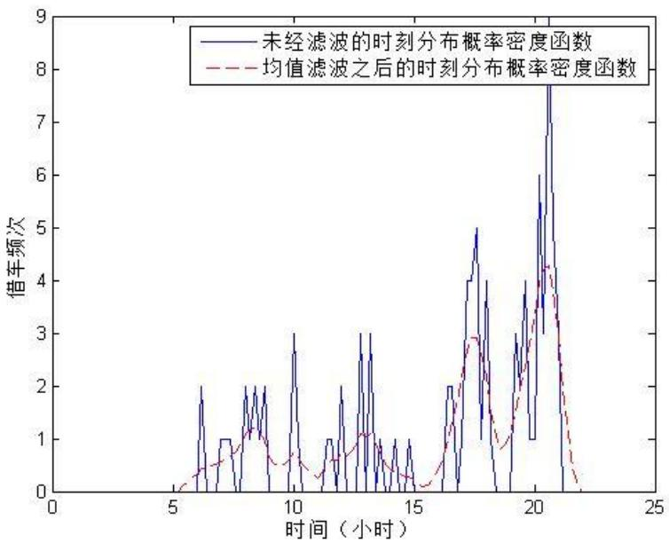

<details>
<summary>line</summary>

| 时间 (小时) | 未经滤波的时刻分布概率密度函数 | 均值滤波之后的时刻分布概率密度函数 |
| --- | --- | --- |
| 5 | 0 | 0 |
| 6 | ~1.8 | ~0.4 |
| 7 | ~1.0 | ~0.6 |
| 8 | ~2.0 | ~1.2 |
| 9 | ~1.8 | ~0.8 |
| 10 | ~3.0 | ~0.6 |
| 11 | ~1.0 | ~0.4 |
| 12 | ~2.0 | ~0.8 |
| 13 | ~3.0 | ~1.1 |
| 14 | ~1.0 | ~0.6 |
| 15 | ~1.0 | ~0.3 |
| 16 | ~2.0 | ~0.8 |
| 17 | ~5.0 | ~2.8 |
| 18 | ~3.5 | ~2.0 |
| 19 | ~3.0 | ~2.5 |
| 20 | ~6.0 | ~3.5 |
| 21 | ~7.8 | ~4.2 |
| 22 | 0 | ~0.5 |
</details>

图 用车时刻分布频率密度函数的均值滤波效果

经过均值滤波之后，频率分布函数变得平滑了。对滤波之后的结果求极大值，定义当极大值大于整个取值范围的 60%才为峰值时刻。当多个峰值之间的距离小于 2个小时的时候，将它们视为同一个峰值，并用平均的时间代替峰值时间。使用 MATLAB 实现峰值搜素算法，其结果如图 14所示。

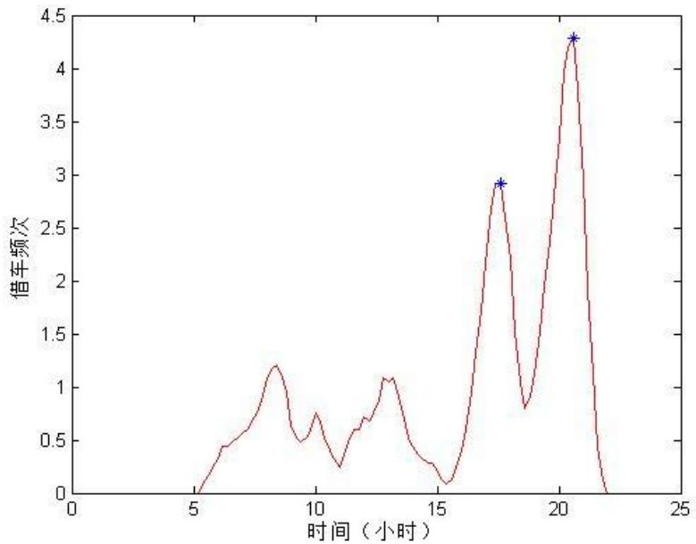

<details>
<summary>line</summary>

| 时间 (小时) | 借车频次 |
| --- | --- |
| ~17.5 | ~2.9 |
| ~20.5 | ~4.3 |
</details>

图14：峰值搜索算法的运行结果

## 8.5用车高峰时段统计与归类

根据 8.4 节所述的峰值搜索算法对站点的借还车高峰时刻进行统计。得到各个站点的借车和还车高峰数据如表 14所示，完整的表格见附表。

表14：各站点的借车和还车高峰时间表

<table><tr><td>站点序号</td><td>借车高峰</td><td>还车高峰</td></tr><tr><td>1</td><td>17:36, 20:36</td><td>19:23</td></tr><tr><td>2</td><td>8:12, 16:23</td><td>8:12, 15:35</td></tr><tr><td>3</td><td>17:11</td><td>8:12</td></tr><tr><td>4</td><td>7:48, 13:35, 14:23, 17:11, 19:11</td><td>9:12, 11:24, 12:47, 16:00, 17:36</td></tr><tr><td>5</td><td>17:11</td><td>10:12, 10:48, 18:00, 19:11, 19:48</td></tr><tr><td>6</td><td>8:12, 17:36, 18:36</td><td>17:23, 20:23</td></tr><tr><td>7</td><td>17:48</td><td>8:12</td></tr><tr><td>8</td><td>17:36</td><td>8:24</td></tr><tr><td>9</td><td>8:00, 13:47, 16:11, 17:48</td><td>8:24, 11:00, 15:47, 17:48</td></tr><tr><td>10</td><td>8:00, 15:24, 17:11</td><td>8:24, 17:23</td></tr><tr><td>11</td><td>17:11</td><td>8:12</td></tr><tr><td>12</td><td>7:48, 17:23</td><td>17:36</td></tr><tr><td>13</td><td>10:00</td><td>8:24, 10:00</td></tr><tr><td>14</td><td>7:48</td><td>7:48, 17:23</td></tr><tr><td>15</td><td>8:00, 10:36, 17:11</td><td>8:12, 17:23, 18:00</td></tr><tr><td>16</td><td>7:24, 12:35, 17:23</td><td>17:48</td></tr><tr><td>17</td><td>9:36, 17:23</td><td>8:12, 17:23</td></tr><tr><td>18</td><td>17:23</td><td>8:24, 17:23</td></tr><tr><td>19</td><td>8:00, 13:00, 15:35, 17:23, 19:23</td><td>8:24, 11:36, 12:23, 13:00, 15:47, 17:23, 19:11</td></tr><tr><td>20</td><td>8:00, 17:36</td><td>17:48</td></tr></table>

（续表）

## 8.6 高峰时段的聚类分析

可以使用聚类分析的方法对不同站点的高峰时段特征进行分类。聚类分析的思路是将参数空间中的点分成若干类，使得每类中的点的差异最小。经典的聚类方法如K-means算法，通过构造一个类中心，通过不断迭代的方法改变类中心的距离以及分类结构，使得同一类中的点距离类中心的距离之和最小。

由于不同的站点具有的峰值数目不同，即所在的空间的维数不同，因而无法直接使用K-means 算法进行聚类，此时可以将不同峰值数目的点折算成具有相同数目的等效峰值的点。例如，设等效峰值数目为 20个，对于不足20个峰值的站点，需要将一些峰值时间复制成若干个。峰值时间复制的数目与峰值频次的大小成正比。

经过折算之后，即可使用 算法对 维等效峰值时刻空间进行聚类，使用欧式距离作为空间中点的距离，设置类数目为 5个。得到结果后将同类的站点使用相同的颜色标记在地图上。借车站点高峰时刻聚类分析的结果如图 15所示，还车站点高峰时刻聚类分析的结果如图 16所示。

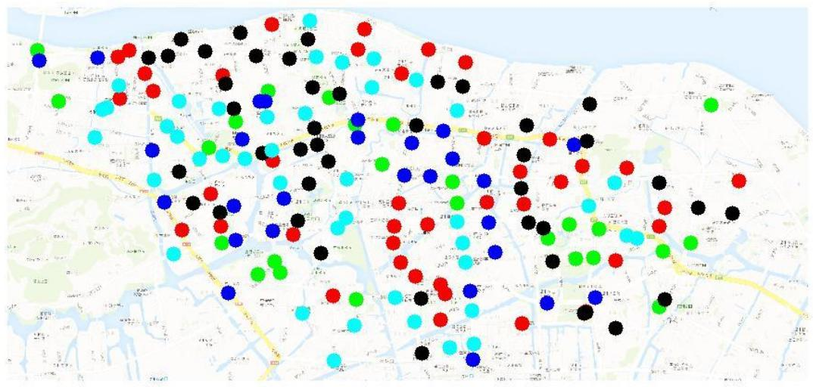

<details>
<summary>scatter</summary>

| Category | X (range) | Y (range) |
| --- | --- | --- |
| Black | 0~100 | 0~100 |
| Red | 0~100 | 0~100 |
| Blue | 0~100 | 0~100 |
| Green | 0~100 | 0~100 |
| Cyan | 0~100 | 0~100 |
</details>

图15：借车站点高峰时刻聚类分析的结果

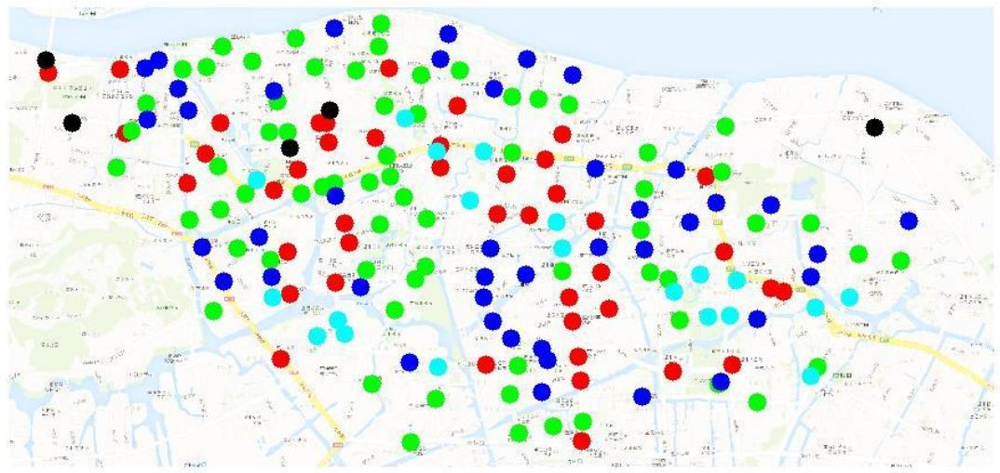

<details>
<summary>bubble</summary>

| Category | X (range) | Y (range) |
| --- | --- | --- |
| Black | 0~100 | 0~100 |
| Red | 0~100 | 0~100 |
| Blue | 0~100 | 0~100 |
| Green | 0~100 | 0~100 |
| Cyan | 0~100 | 0~100 |
</details>

图16：站点高峰时刻聚类分析的结果

## 九 其他信息和公共自行车系统设置评价

## 9.1 潮汐现象

我们观察上面的计算和统计结果，注意到最大借还车站点的借还车频次时刻分布（即图10）显示，42号站点的借车频次在 17:30 分左右出现峰值，高于最大自行车提供量即30辆，出现供给不足的“晚高峰”，而56 号站点公共自行车也存在早高峰和晚高峰两个较为明显的峰值，供给非常紧张，这一现象也符合自行车交通的基本规律。而其他时段则不同程度出现低谷（例如，用户需求量低于 5辆）等现象。不同的时间区间用户的用车需求波动较大，体现出“潮汐现象”的特征。<sup>[1]</sup>

潮汐现象主要是指租车或还车不能持衡，出现“供不应求”或者“供过于求”的不均衡现象，在一定时间段内租车量持续高于或者低于还车量，并且以一定时间为循环周期重复出现，严重影响了系统的运行效率。一系列新闻报道已经从侧面证实了这一困难，潮汐现象是自行车系统的设计和运行中普遍存在的规律。<sup>1</sup>从我们的统计分析来看，部分地段服务点的公共自行车在使用过程中有明显的峰值和低谷，基于用户的频率分布也有显著的差异，有较为明显的自行车需求和潮汐现象。表明鹿城市的公共自行车系统的效率依然有提高空间。

## 9.2 潮汐现象的表现

潮汐现象主要表现为：①租赁点还车数大于借车数，造成停车桩已满而无法还车的现象；②租赁点的借车数大于还车数，造成自行车全空，没有自行车可以租借的现象<sup>[5][6]</sup>。这两种情况均影响了公共自行车的可持续使用。潮汐现象有一个特点就是当天内出现借还逆转，并且以日为周期重复出现。

城市边远地带的大型居住区、大型的工业园区、公交枢纽站或转运站、商务集中区等类型的服务点更容易出现潮汐现象，这些地区的用地功能复合度较低，城市居民出行需求趋同，出行时间集中，短时间内对车辆的需求量大而波动频繁是潮汐现象形成的主要原因。在本文的研究框架下，温州市鹿城区位于浙江省东南部、温州市中部，是温州市的政治、经济、文化中心，潮汐现象相对较弱；而城市公共自行车系统在其他城市的推行中，不可避免地会遇到不同程度的潮汐问题。

## 9.3 潮汐现象的解决

解决潮汐现象的最好方法是实现自行车的高效率、低成本调度，提高公共自行车流转量，减少因空架或满架造成的阻碍使用的情况，及时满足供给、需求的相对均衡，保证市民的正常使用。目前我国公共自行车系统的应用尚处于初级阶段，调度模式落后，主要利用人工巡查的方式对服务点进行监控。目前的调度主要是静态调度，一般选就近的原则进行服务点间的调配，未形成系统科学、结构清晰的调度模式。这也是亟待解决的问题。在10.2部分中我们会有进一步的阐释。

## 十 公共自行车服务系统的其他运行规律和政策建议

在前面的研究中，我们从公共自行车的需求规律、用户的效用水平和站点的地理空间配置等几个角度对公共自行车服务系统的规律进行了分析和评价。除这些方面之外，公共自行车服务系统作为一个复杂、庞大的体系，还涉及许多其他方面，体现出一些独特的运行规律。我们选取有代表性的两个方面简要分析。

## 10.1 站点选址的社会福利最大化问题

城市公共自行车系统建设不仅是解决城市交通问题的重要手段，而且作为基础设施建设的重要组成部分，这一系统的平稳、可持续运行还有赖于良好的运营商业模式和策划。鹿城新闻网显示，鹿城要推行公共自行车系统，鹿城捷信小额贷款公司 20 名股东经过商议，决定承担前期建设的所需全部资金 1200万元，并出资500万元设立“公共自行车发展专项基金”，用于下阶段的扩建、维护和管理等后续费用。<sup>1</sup>政府项目的市场化运作已经成为当今社会公共品提供的主流趋势。作为公共物品，公共自行车的站点设置应当建立在政府财政预算的基础上实现收益和社会福利最大化。我们构建简单的社会福利模型对这一问题进行分析。

社会福利最大化模型受制于政府的财政预算约束，最大化社会收益和投资公共自行车企业收益。相关的文献研究参见何博（2009）<sup>[6]</sup>的站点选址模型：

$$
\begin{array}{l} \max \mathrm{W} = \sum_ {i = 1} ^ {s} \left(\frac {3 6 5 P _ {i}}{\gamma} N\right) + \sum_ {j = 1} ^ {l} \left(g _ {j} Y _ {j} N + q _ {j} Y _ {j} N \sigma\right) - \sum_ {j = 1} ^ {l} \left(t _ {1} X _ {j} + t _ {2} Y _ {j} + t _ {3} Y _ {j} N\right) \\ s. t. \sum_ {j = 1} ^ {l} w _ {i j} Y _ {i j} \geq 1 \tag {10.1} \\ \sum_ {j = 1} ^ {l} w _ {i j} Y _ {i j} \leq T \\ Y _ {j} \in \{0, 1 \} \\ \end{array}
$$

, 分别为需求点的数目、备选租赁点的数目；

$g _ { j } , q _ { j }$ 分别为备选租赁点 每年的商业收入、每年的政府补贴；

$t _ { 1 } , t _ { 2 } , t _ { 3 }$ 分别为基础设施单价、每个租赁点建设费用以及运营费用；

$\sigma$ 为运营模式分类系数哑变量,完全将市场化模式取 0,其他模式取 1；

$\gamma$ 为公共自行车高峰小时系数；

为租赁点个数的最大规模；

$X _ { j }$ 为备选租赁点 的基础设施数量；

$Y _ { j }$ 如果在 处建设租赁,取值为1,否则取值为 0；

$P$ 为需求点 的出行者所需要支付的租赁费用；

$w _ { i j }$ 如果需求点与备选租赁点的距离小于最大值则取1，否则取0；

对于基于预算约束的规划模型求解可以得出社会福利最优解。更广泛经济意义上来说，该机制的设置存在两个维度的问题：①权衡问题（trade off）：建立更为广泛的自行车站点的福利增进、经济利益与建造租赁地点成本和财政补贴、预算约束的权衡。这一机制设计可以用行为博弈论的方法求解。②委托-代理问题：以政府为主导的城市公共自行车系统建设市场化，面临作为委托方（principle）的政府与作为代理方（agent）的承建企业之间的利益分歧，政府的目标是社会福利最大化，而企业是以股东利益最大化为目标的组织，其主要目标是利润最大化，这可能与社会最优的目标之间存在一定冲突。

## 10.2 公共自行车系统运行的调度机制

公共自行车“想借时难还亦难”问题可以通过有效的自行车调度来解决。在推广城市公共自行车服务系统的同时，必须建立起配套的调度系统。公共自行车行车系统主要通过后台控制中心和区域调度中心来完成车辆调配。通过各服务点自行车停放情况的跟踪统计,当车辆数低于某一个阈值时，启动调度，并对站点实行实时监控，保证调度最优化。调度系统主要包括两个方面的作用：①日内调度：每个服务点的公共自行车租赁需求存在季节差异和日内时间段差异；②需求低谷期的车辆入库：当出现极端恶劣天气时，将多余的车辆进行入库管理能够提高车辆的使用寿命。<sup>[5]</sup>区域调度的层级实现方法如下图：

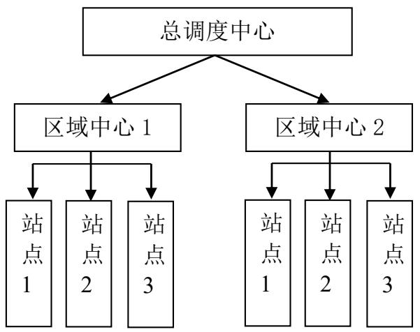

<details>
<summary>flowchart</summary>

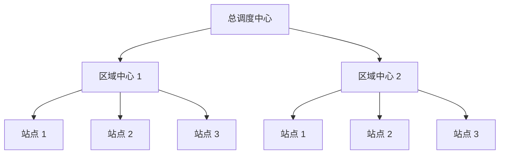
</details>

图17：自行车区域调度系统

通过构建基于模糊时间窗的用户满意度函数、惩罚函数，叶丽霞（2013）<sup>[5]</sup>系统地采用了基于A-Priori 优化的方法和实时再优化方法计算最优调度方式和规模。另外，节约算法、插入算法、遗传算法、模拟退火算法等方法都可以用于解决最优调度问题。

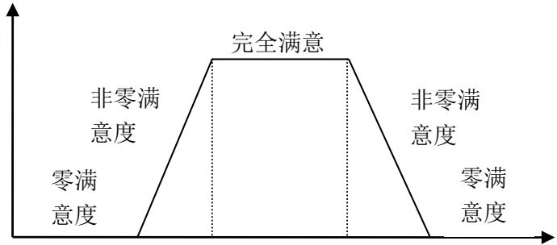

<details>
<summary>funnel</summary>

| Category | Description |
| --- | --- |
| Top | 零满意度 |
| Middle-Top | 非零满意度 |
| Middle-Bottom | 完全满意 |
| Bottom | 零满意度 |
</details>

图18：模糊时间窗的用户满意度区间图

## 十一 结论

城市公共自行车为代表的新型公共交通计划实施后，城市交通拥堵现象带来了有效的缓解，为 最后一公里现象 找到了行之有效的解答<sup>[7]</sup>。良好的公共自行车服务系统设计有助于这一举措的顺利实施和可持续发展。本文建立在温州市鹿城区的公交系统基础上对于城市公共自行车系统的客流量、供求关系和分布规律进行了研究，在总结数据的基础上对公共自行车系统一般规律进行探索，并提出了一些问题和可行的解决方法。本文的结论主要揭示了以下几个方面的问题：

1）通过原始数据的初步整合处理、剔除异常值，我们求出了借还车频率、借车人分布，并通过拟合方法发现，借车人的借车次数普遍在 30 次以下，并且群体的借车次数的近似服从指数分布。  
）通过建立用户效用函数，我们可以求解城市居民采用公共自行车出行的偏好程度随出行时间的变化规律。我们发现，用户选择公共自行车出行的效用函数关于出行时间的变化近似为一个矩形脉冲函数，当出行时间少于 28 分钟时，用户更倾向于选择公共自行车出行；在 28 分钟之后，用户倾向于选择其他的交通工具，仅在随机因素的作用下选择公共自行车。  
3）我们采用了三种方法界定站点距离——欧式距离，直角距离和实际地图距离，我们借助于温州市实际电子地图通过 MATLAB 进行相应处理，获得市级道路信息，从

而成功解决了距离的度量问题。

4）我们的统计分析来看，部分地段服务点的公共自行车在使用过程中有明显的峰值和低谷，基于用户的频率分布也有显著的差异，有较为明显的自行车需求和潮汐现象。另外，站点设置的社会福利经济学分析以及配套的调度机制设计也是公共自行车系统运营中需要解决的重要问题。

本文的研究对政府建设城市公共自行车租赁系统具有一定的参考价值。公共自行车系统是一个复杂的系统,在城市的运用过程中会涉及到多个角色的相互作用，包括政府、企业、出行者,也会涉及到地理、政治、经济、交通等非常广泛的领域<sup>[8]</sup>。而我们的这一研究尚粗浅，还有许多没有涵盖的部分，建立在社会福利、用户需求等多方权衡下的最优化的公共自行车系统的构建将是未来可以继续探索的方向。

## 参考文献

[1] 鲍娜，城市公共自行车租赁点选址决策及调度模型研究，长安大学硕士学位论文，2012。  
[2] 温州市鹿城区公共自行车管理中心网站，http://www.wzbicycle.com，2013.09。  
[3] 单晓峰，城市自行车交通合理方式分担率及其路段资源配置研究，东南大学博士论文，2007。  
[4] 谷歌(google)地图，http://ditu.google.cn/maps?hl=zh-CN&tab=wl，2013.09。  
[5] 叶丽霞，城市公共自行车调度系统研究，南京理工大学硕士学位论文，2013。  
[6] 何博，城市公共自行车系统的应用硏究，西南交通大学硕士学位论文，2012。  
[7] 李正浩，城市公共自行车租赁站远期发展规模分析 [J][J] ，交通节能与环保，2010, 2：015。  
[8] 王志高，孔喆，谢建华等，欧洲第三代公共自行车系统案例及启示[J] ，城市交通，2009，7(4)。

## 附录

## 附录一：

1）6.1章节中各个站点的每天与累计借车频次

<table><tr><td>站点</td><td>1</td><td>2</td><td>3</td><td>4</td><td>5</td><td>6</td><td>7</td><td>8</td><td>9</td><td>10</td><td>11</td></tr><tr><td>1</td><td>91</td><td>148</td><td>35</td><td>152</td><td>124</td><td>107</td><td>88</td><td>15</td><td>9</td><td>6</td><td>169</td></tr><tr><td>2</td><td>114</td><td>112</td><td>25</td><td>82</td><td>135</td><td>135</td><td>120</td><td>41</td><td>21</td><td>15</td><td>70</td></tr><tr><td>3</td><td>179</td><td>188</td><td>47</td><td>60</td><td>194</td><td>189</td><td>189</td><td>73</td><td>65</td><td>13</td><td>84</td></tr><tr><td>4</td><td>235</td><td>286</td><td>86</td><td>255</td><td>243</td><td>322</td><td>259</td><td>112</td><td>65</td><td>66</td><td>315</td></tr><tr><td>5</td><td>139</td><td>165</td><td>67</td><td>167</td><td>161</td><td>164</td><td>168</td><td>53</td><td>33</td><td>16</td><td>158</td></tr><tr><td>6</td><td>105</td><td>100</td><td>50</td><td>102</td><td>117</td><td>118</td><td>134</td><td>47</td><td>19</td><td>13</td><td>89</td></tr><tr><td>7</td><td>106</td><td>109</td><td>14</td><td>55</td><td>143</td><td>137</td><td>157</td><td>34</td><td>35</td><td>5</td><td>49</td></tr><tr><td>8</td><td>95</td><td>80</td><td>15</td><td>47</td><td>106</td><td>116</td><td>114</td><td>36</td><td>41</td><td>10</td><td>39</td></tr><tr><td>9</td><td>353</td><td>365</td><td>177</td><td>303</td><td>400</td><td>460</td><td>393</td><td>167</td><td>124</td><td>86</td><td>325</td></tr><tr><td>10</td><td>354</td><td>359</td><td>198</td><td>311</td><td>366</td><td>334</td><td>376</td><td>165</td><td>82</td><td>53</td><td>323</td></tr><tr><td>11</td><td>122</td><td>132</td><td>33</td><td>36</td><td>141</td><td>130</td><td>131</td><td>45</td><td>36</td><td>16</td><td>63</td></tr><tr><td>12</td><td>252</td><td>249</td><td>131</td><td>235</td><td>210</td><td>226</td><td>282</td><td>108</td><td>56</td><td>33</td><td>223</td></tr><tr><td>13</td><td>161</td><td>145</td><td>62</td><td>100</td><td>116</td><td>126</td><td>109</td><td>73</td><td>98</td><td>53</td><td>46</td></tr><tr><td>14</td><td>285</td><td>333</td><td>121</td><td>252</td><td>333</td><td>306</td><td>300</td><td>154</td><td>71</td><td>53</td><td>230</td></tr><tr><td>15</td><td>111</td><td>98</td><td>46</td><td>64</td><td>118</td><td>104</td><td>99</td><td>35</td><td>32</td><td>17</td><td>74</td></tr><tr><td>16</td><td>214</td><td>232</td><td>106</td><td>203</td><td>203</td><td>223</td><td>189</td><td>65</td><td>64</td><td>30</td><td>190</td></tr><tr><td>17</td><td>272</td><td>273</td><td>114</td><td>197</td><td>286</td><td>343</td><td>300</td><td>124</td><td>83</td><td>43</td><td>208</td></tr><tr><td>18</td><td>247</td><td>238</td><td>74</td><td>181</td><td>237</td><td>309</td><td>287</td><td>106</td><td>78</td><td>43</td><td>168</td></tr><tr><td>19</td><td>563</td><td>522</td><td>254</td><td>552</td><td>528</td><td>618</td><td>573</td><td>211</td><td>172</td><td>133</td><td>571</td></tr><tr><td>20</td><td>221</td><td>229</td><td>96</td><td>177</td><td>213</td><td>230</td><td>219</td><td>96</td><td>56</td><td>47</td><td>175</td></tr><tr><td>21</td><td>356</td><td>359</td><td>207</td><td>339</td><td>402</td><td>423</td><td>397</td><td>154</td><td>107</td><td>63</td><td>341</td></tr><tr><td>22</td><td>127</td><td>132</td><td>47</td><td>100</td><td>123</td><td>148</td><td>130</td><td>62</td><td>37</td><td>27</td><td>88</td></tr><tr><td>23</td><td>269</td><td>276</td><td>151</td><td>264</td><td>272</td><td>290</td><td>290</td><td>111</td><td>86</td><td>55</td><td>315</td></tr><tr><td>24</td><td>275</td><td>315</td><td>144</td><td>296</td><td>285</td><td>277</td><td>305</td><td>110</td><td>71</td><td>46</td><td>289</td></tr><tr><td>25</td><td>165</td><td>152</td><td>72</td><td>122</td><td>159</td><td>163</td><td>153</td><td>65</td><td>39</td><td>15</td><td>121</td></tr><tr><td>26</td><td>254</td><td>250</td><td>129</td><td>247</td><td>261</td><td>254</td><td>255</td><td>111</td><td>59</td><td>39</td><td>244</td></tr><tr><td>27</td><td>154</td><td>166</td><td>91</td><td>160</td><td>161</td><td>160</td><td>169</td><td>92</td><td>47</td><td>31</td><td>173</td></tr><tr><td>28</td><td>46</td><td>41</td><td>25</td><td>37</td><td>40</td><td>44</td><td>46</td><td>21</td><td>15</td><td>4</td><td>36</td></tr><tr><td>29</td><td>121</td><td>118</td><td>44</td><td>80</td><td>90</td><td>103</td><td>149</td><td>38</td><td>31</td><td>18</td><td>64</td></tr><tr><td>30</td><td>119</td><td>129</td><td>60</td><td>108</td><td>123</td><td>133</td><td>105</td><td>58</td><td>32</td><td>22</td><td>103</td></tr><tr><td>31</td><td>175</td><td>192</td><td>102</td><td>170</td><td>205</td><td>233</td><td>203</td><td>84</td><td>63</td><td>46</td><td>169</td></tr><tr><td>32</td><td>411</td><td>374</td><td>129</td><td>301</td><td>346</td><td>364</td><td>406</td><td>152</td><td>113</td><td>72</td><td>248</td></tr><tr><td>33</td><td>500</td><td>474</td><td>253</td><td>353</td><td>478</td><td>510</td><td>494</td><td>235</td><td>140</td><td>120</td><td>392</td></tr><tr><td>34</td><td>271</td><td>324</td><td>102</td><td>225</td><td>248</td><td>234</td><td>243</td><td>88</td><td>74</td><td>47</td><td>186</td></tr><tr><td>35</td><td>271</td><td>278</td><td>152</td><td>251</td><td>272</td><td>279</td><td>296</td><td>125</td><td>111</td><td>37</td><td>240</td></tr><tr><td>36</td><td>304</td><td>294</td><td>163</td><td>275</td><td>291</td><td>337</td><td>314</td><td>135</td><td>74</td><td>46</td><td>265</td></tr><tr><td>37</td><td>230</td><td>233</td><td>113</td><td>230</td><td>246</td><td>237</td><td>269</td><td>84</td><td>47</td><td>33</td><td>198</td></tr><tr><td>38</td><td>392</td><td>371</td><td>235</td><td>312</td><td>380</td><td>400</td><td>426</td><td>170</td><td>121</td><td>69</td><td>282</td></tr><tr><td>39</td><td>387</td><td>450</td><td>212</td><td>373</td><td>461</td><td>432</td><td>455</td><td>227</td><td>139</td><td>90</td><td>409</td></tr><tr><td>40</td><td>226</td><td>206</td><td>98</td><td>208</td><td>212</td><td>226</td><td>206</td><td>111</td><td>68</td><td>40</td><td>199</td></tr><tr><td>41</td><td>248</td><td>237</td><td>104</td><td>215</td><td>212</td><td>229</td><td>237</td><td>84</td><td>59</td><td>48</td><td>174</td></tr><tr><td>42</td><td>798</td><td>807</td><td>267</td><td>597</td><td>772</td><td>850</td><td>831</td><td>306</td><td>271</td><td>143</td><td>526</td></tr><tr><td>43</td><td>277</td><td>263</td><td>124</td><td>215</td><td>283</td><td>271</td><td>274</td><td>132</td><td>87</td><td>60</td><td>223</td></tr><tr><td>44</td><td>394</td><td>382</td><td>200</td><td>388</td><td>395</td><td>427</td><td>483</td><td>185</td><td>133</td><td>105</td><td>387</td></tr><tr><td>45</td><td>190</td><td>214</td><td>99</td><td>235</td><td>217</td><td>206</td><td>197</td><td>75</td><td>37</td><td>23</td><td>253</td></tr><tr><td>46</td><td>206</td><td>248</td><td>107</td><td>191</td><td>316</td><td>252</td><td>239</td><td>105</td><td>76</td><td>39</td><td>191</td></tr><tr><td>47</td><td>497</td><td>457</td><td>206</td><td>382</td><td>499</td><td>488</td><td>494</td><td>201</td><td>165</td><td>95</td><td>338</td></tr><tr><td>48</td><td>399</td><td>419</td><td>131</td><td>372</td><td>423</td><td>424</td><td>456</td><td>189</td><td>139</td><td>80</td><td>347</td></tr><tr><td>49</td><td>546</td><td>552</td><td>268</td><td>398</td><td>609</td><td>606</td><td>598</td><td>248</td><td>172</td><td>109</td><td>372</td></tr><tr><td>50</td><td>342</td><td>321</td><td>133</td><td>260</td><td>364</td><td>366</td><td>370</td><td>144</td><td>104</td><td>50</td><td>261</td></tr><tr><td>51</td><td>148</td><td>163</td><td>66</td><td>129</td><td>172</td><td>190</td><td>199</td><td>60</td><td>51</td><td>28</td><td>114</td></tr><tr><td>52</td><td>325</td><td>394</td><td>111</td><td>242</td><td>333</td><td>332</td><td>356</td><td>110</td><td>100</td><td>37</td><td>213</td></tr><tr><td>53</td><td>398</td><td>379</td><td>199</td><td>352</td><td>398</td><td>480</td><td>398</td><td>190</td><td>106</td><td>87</td><td>385</td></tr><tr><td>54</td><td>359</td><td>321</td><td>130</td><td>280</td><td>353</td><td>366</td><td>394</td><td>141</td><td>92</td><td>96</td><td>293</td></tr><tr><td>55</td><td>354</td><td>366</td><td>241</td><td>349</td><td>394</td><td>464</td><td>395</td><td>229</td><td>92</td><td>72</td><td>366</td></tr><tr><td>56</td><td>645</td><td>711</td><td>286</td><td>589</td><td>734</td><td>818</td><td>760</td><td>267</td><td>253</td><td>168</td><td>653</td></tr><tr><td>57</td><td>413</td><td>414</td><td>147</td><td>296</td><td>436</td><td>415</td><td>431</td><td>146</td><td>116</td><td>91</td><td>277</td></tr><tr><td>58</td><td>91</td><td>100</td><td>21</td><td>53</td><td>112</td><td>94</td><td>90</td><td>25</td><td>24</td><td>10</td><td>42</td></tr><tr><td>59</td><td>342</td><td>318</td><td>105</td><td>231</td><td>323</td><td>348</td><td>378</td><td>145</td><td>106</td><td>64</td><td>240</td></tr><tr><td>60</td><td>292</td><td>312</td><td>175</td><td>278</td><td>319</td><td>302</td><td>326</td><td>146</td><td>88</td><td>68</td><td>253</td></tr><tr><td>61</td><td>263</td><td>230</td><td>98</td><td>204</td><td>248</td><td>255</td><td>288</td><td>120</td><td>69</td><td>45</td><td>206</td></tr><tr><td>62</td><td>393</td><td>383</td><td>184</td><td>370</td><td>455</td><td>436</td><td>450</td><td>156</td><td>125</td><td>77</td><td>369</td></tr><tr><td>63</td><td>601</td><td>635</td><td>280</td><td>549</td><td>556</td><td>633</td><td>560</td><td>245</td><td>172</td><td>129</td><td>539</td></tr><tr><td>64</td><td>428</td><td>420</td><td>222</td><td>365</td><td>428</td><td>484</td><td>500</td><td>232</td><td>140</td><td>82</td><td>347</td></tr><tr><td>65</td><td>362</td><td>350</td><td>127</td><td>255</td><td>412</td><td>422</td><td>403</td><td>168</td><td>124</td><td>48</td><td>275</td></tr><tr><td>66</td><td>179</td><td>205</td><td>75</td><td>198</td><td>183</td><td>163</td><td>196</td><td>69</td><td>73</td><td>33</td><td>198</td></tr><tr><td>67</td><td>127</td><td>147</td><td>32</td><td>82</td><td>139</td><td>140</td><td>154</td><td>47</td><td>43</td><td>9</td><td>83</td></tr><tr><td>68</td><td>246</td><td>245</td><td>71</td><td>197</td><td>252</td><td>258</td><td>251</td><td>67</td><td>49</td><td>20</td><td>171</td></tr><tr><td>69</td><td>550</td><td>423</td><td>169</td><td>333</td><td>478</td><td>475</td><td>509</td><td>170</td><td>125</td><td>78</td><td>346</td></tr><tr><td>70</td><td>406</td><td>363</td><td>116</td><td>202</td><td>361</td><td>349</td><td>391</td><td>137</td><td>102</td><td>45</td><td>216</td></tr><tr><td>71</td><td>369</td><td>373</td><td>149</td><td>368</td><td>441</td><td>459</td><td>460</td><td>156</td><td>116</td><td>86</td><td>323</td></tr><tr><td>72</td><td>105</td><td>114</td><td>41</td><td>99</td><td>137</td><td>144</td><td>123</td><td>49</td><td>24</td><td>17</td><td>73</td></tr><tr><td>73</td><td>49</td><td>63</td><td>18</td><td>50</td><td>58</td><td>52</td><td>51</td><td>23</td><td>13</td><td>10</td><td>57</td></tr><tr><td>74</td><td>126</td><td>129</td><td>58</td><td>112</td><td>126</td><td>121</td><td>123</td><td>60</td><td>44</td><td>18</td><td>103</td></tr><tr><td>75</td><td>84</td><td>84</td><td>42</td><td>61</td><td>101</td><td>103</td><td>107</td><td>40</td><td>22</td><td>16</td><td>61</td></tr><tr><td>76</td><td>153</td><td>146</td><td>55</td><td>120</td><td>139</td><td>144</td><td>138</td><td>55</td><td>47</td><td>20</td><td>116</td></tr><tr><td>77</td><td>171</td><td>150</td><td>45</td><td>96</td><td>141</td><td>146</td><td>175</td><td>74</td><td>44</td><td>24</td><td>135</td></tr><tr><td>78</td><td>294</td><td>268</td><td>169</td><td>264</td><td>282</td><td>298</td><td>335</td><td>165</td><td>90</td><td>44</td><td>298</td></tr><tr><td>79</td><td>341</td><td>326</td><td>192</td><td>388</td><td>321</td><td>321</td><td>328</td><td>130</td><td>86</td><td>64</td><td>360</td></tr><tr><td>80</td><td>182</td><td>193</td><td>61</td><td>136</td><td>183</td><td>177</td><td>200</td><td>86</td><td>47</td><td>23</td><td>113</td></tr><tr><td>81</td><td>134</td><td>151</td><td>52</td><td>88</td><td>136</td><td>136</td><td>151</td><td>46</td><td>40</td><td>10</td><td>74</td></tr><tr><td>82</td><td>183</td><td>205</td><td>74</td><td>156</td><td>212</td><td>219</td><td>239</td><td>106</td><td>53</td><td>31</td><td>144</td></tr><tr><td>83</td><td>136</td><td>136</td><td>60</td><td>108</td><td>135</td><td>116</td><td>135</td><td>64</td><td>36</td><td>34</td><td>115</td></tr><tr><td>84</td><td>162</td><td>161</td><td>86</td><td>180</td><td>176</td><td>188</td><td>176</td><td>94</td><td>39</td><td>28</td><td>180</td></tr><tr><td>85</td><td>224</td><td>259</td><td>111</td><td>295</td><td>213</td><td>215</td><td>258</td><td>71</td><td>59</td><td>53</td><td>339</td></tr><tr><td>86</td><td>25</td><td>28</td><td>5</td><td>7</td><td>30</td><td>31</td><td>30</td><td>23</td><td>9</td><td>2</td><td>8</td></tr><tr><td>87</td><td>253</td><td>276</td><td>137</td><td>302</td><td>274</td><td>294</td><td>256</td><td>117</td><td>69</td><td>32</td><td>284</td></tr><tr><td>88</td><td>269</td><td>230</td><td>124</td><td>236</td><td>228</td><td>275</td><td>265</td><td>106</td><td>58</td><td>51</td><td>187</td></tr><tr><td>89</td><td>163</td><td>194</td><td>123</td><td>181</td><td>191</td><td>237</td><td>182</td><td>74</td><td>52</td><td>36</td><td>184</td></tr><tr><td>90</td><td>28</td><td>35</td><td>14</td><td>36</td><td>41</td><td>49</td><td>48</td><td>20</td><td>5</td><td>4</td><td>29</td></tr><tr><td>91</td><td>90</td><td>89</td><td>28</td><td>108</td><td>87</td><td>85</td><td>88</td><td>30</td><td>16</td><td>3</td><td>96</td></tr><tr><td>92</td><td>223</td><td>236</td><td>85</td><td>152</td><td>184</td><td>253</td><td>219</td><td>102</td><td>72</td><td>25</td><td>158</td></tr><tr><td>93</td><td>25</td><td>66</td><td>12</td><td>91</td><td>40</td><td>44</td><td>31</td><td>12</td><td>6</td><td>7</td><td>46</td></tr><tr><td>94</td><td>93</td><td>93</td><td>62</td><td>80</td><td>115</td><td>120</td><td>120</td><td>55</td><td>27</td><td>25</td><td>89</td></tr><tr><td>95</td><td>231</td><td>252</td><td>124</td><td>195</td><td>202</td><td>248</td><td>253</td><td>122</td><td>51</td><td>38</td><td>199</td></tr><tr><td>96</td><td>70</td><td>73</td><td>22</td><td>48</td><td>56</td><td>69</td><td>78</td><td>25</td><td>9</td><td>12</td><td>40</td></tr><tr><td>97</td><td>90</td><td>81</td><td>43</td><td>42</td><td>71</td><td>72</td><td>73</td><td>29</td><td>23</td><td>24</td><td>55</td></tr><tr><td>98</td><td>268</td><td>263</td><td>71</td><td>153</td><td>290</td><td>265</td><td>261</td><td>130</td><td>86</td><td>23</td><td>190</td></tr><tr><td>99</td><td>122</td><td>159</td><td>85</td><td>118</td><td>162</td><td>156</td><td>158</td><td>70</td><td>26</td><td>17</td><td>117</td></tr><tr><td>100</td><td>206</td><td>208</td><td>92</td><td>180</td><td>173</td><td>233</td><td>203</td><td>96</td><td>55</td><td>35</td><td>188</td></tr><tr><td>101</td><td>432</td><td>481</td><td>233</td><td>432</td><td>441</td><td>482</td><td>429</td><td>196</td><td>146</td><td>71</td><td>420</td></tr><tr><td>102</td><td>116</td><td>125</td><td>61</td><td>117</td><td>117</td><td>141</td><td>106</td><td>55</td><td>23</td><td>21</td><td>118</td></tr><tr><td>103</td><td>270</td><td>270</td><td>100</td><td>160</td><td>264</td><td>309</td><td>300</td><td>116</td><td>75</td><td>42</td><td>144</td></tr><tr><td>104</td><td>175</td><td>166</td><td>75</td><td>155</td><td>149</td><td>199</td><td>197</td><td>72</td><td>49</td><td>31</td><td>165</td></tr><tr><td>105</td><td>292</td><td>314</td><td>114</td><td>241</td><td>289</td><td>332</td><td>290</td><td>95</td><td>95</td><td>48</td><td>259</td></tr><tr><td>106</td><td>196</td><td>171</td><td>120</td><td>232</td><td>209</td><td>190</td><td>194</td><td>81</td><td>64</td><td>57</td><td>228</td></tr><tr><td>107</td><td>158</td><td>217</td><td>67</td><td>165</td><td>196</td><td>169</td><td>179</td><td>89</td><td>39</td><td>29</td><td>140</td></tr><tr><td>108</td><td>0</td><td>0</td><td>0</td><td>0</td><td>0</td><td>0</td><td>0</td><td>0</td><td>0</td><td>0</td><td>0</td></tr><tr><td>109</td><td>134</td><td>140</td><td>57</td><td>102</td><td>145</td><td>151</td><td>159</td><td>54</td><td>33</td><td>15</td><td>108</td></tr><tr><td>110</td><td>97</td><td>131</td><td>71</td><td>145</td><td>107</td><td>97</td><td>101</td><td>68</td><td>11</td><td>6</td><td>165</td></tr><tr><td>111</td><td>61</td><td>70</td><td>46</td><td>57</td><td>75</td><td>78</td><td>86</td><td>36</td><td>26</td><td>15</td><td>69</td></tr><tr><td>112</td><td>114</td><td>83</td><td>44</td><td>111</td><td>96</td><td>96</td><td>100</td><td>41</td><td>22</td><td>8</td><td>92</td></tr><tr><td>113</td><td>77</td><td>83</td><td>33</td><td>76</td><td>76</td><td>86</td><td>93</td><td>40</td><td>19</td><td>14</td><td>78</td></tr><tr><td>114</td><td>118</td><td>112</td><td>73</td><td>143</td><td>94</td><td>114</td><td>142</td><td>48</td><td>30</td><td>20</td><td>131</td></tr><tr><td>115</td><td>104</td><td>107</td><td>43</td><td>117</td><td>90</td><td>111</td><td>106</td><td>44</td><td>23</td><td>15</td><td>103</td></tr><tr><td>116</td><td>74</td><td>75</td><td>27</td><td>52</td><td>52</td><td>51</td><td>59</td><td>34</td><td>17</td><td>9</td><td>55</td></tr><tr><td>117</td><td>145</td><td>201</td><td>76</td><td>160</td><td>167</td><td>188</td><td>180</td><td>79</td><td>35</td><td>29</td><td>151</td></tr><tr><td>118</td><td>365</td><td>355</td><td>193</td><td>389</td><td>357</td><td>386</td><td>380</td><td>183</td><td>113</td><td>69</td><td>405</td></tr><tr><td>119</td><td>49</td><td>63</td><td>34</td><td>49</td><td>67</td><td>62</td><td>55</td><td>23</td><td>20</td><td>15</td><td>59</td></tr><tr><td>120</td><td>30</td><td>25</td><td>10</td><td>34</td><td>36</td><td>28</td><td>24</td><td>11</td><td>8</td><td>3</td><td>53</td></tr><tr><td>121</td><td>100</td><td>91</td><td>82</td><td>116</td><td>145</td><td>162</td><td>144</td><td>76</td><td>36</td><td>27</td><td>120</td></tr><tr><td>122</td><td>123</td><td>119</td><td>50</td><td>105</td><td>117</td><td>135</td><td>113</td><td>64</td><td>41</td><td>23</td><td>73</td></tr><tr><td>123</td><td>193</td><td>194</td><td>118</td><td>265</td><td>211</td><td>194</td><td>267</td><td>119</td><td>67</td><td>46</td><td>222</td></tr><tr><td>124</td><td>219</td><td>256</td><td>119</td><td>243</td><td>238</td><td>247</td><td>237</td><td>91</td><td>68</td><td>55</td><td>242</td></tr><tr><td>125</td><td>108</td><td>101</td><td>35</td><td>82</td><td>138</td><td>158</td><td>109</td><td>43</td><td>36</td><td>28</td><td>93</td></tr><tr><td>126</td><td>282</td><td>290</td><td>97</td><td>188</td><td>245</td><td>293</td><td>277</td><td>103</td><td>71</td><td>39</td><td>170</td></tr><tr><td>127</td><td>171</td><td>133</td><td>40</td><td>92</td><td>148</td><td>157</td><td>171</td><td>82</td><td>46</td><td>15</td><td>79</td></tr><tr><td>128</td><td>379</td><td>380</td><td>157</td><td>304</td><td>423</td><td>413</td><td>454</td><td>190</td><td>149</td><td>80</td><td>338</td></tr><tr><td>129</td><td>201</td><td>212</td><td>97</td><td>206</td><td>212</td><td>207</td><td>199</td><td>75</td><td>67</td><td>38</td><td>163</td></tr><tr><td>130</td><td>285</td><td>319</td><td>202</td><td>321</td><td>377</td><td>322</td><td>376</td><td>149</td><td>104</td><td>72</td><td>313</td></tr><tr><td>131</td><td>213</td><td>209</td><td>146</td><td>227</td><td>221</td><td>224</td><td>253</td><td>113</td><td>90</td><td>67</td><td>279</td></tr><tr><td>132</td><td>88</td><td>90</td><td>56</td><td>97</td><td>107</td><td>138</td><td>106</td><td>46</td><td>27</td><td>25</td><td>88</td></tr><tr><td>133</td><td>237</td><td>243</td><td>93</td><td>222</td><td>245</td><td>238</td><td>195</td><td>97</td><td>63</td><td>51</td><td>214</td></tr><tr><td>134</td><td>270</td><td>252</td><td>132</td><td>206</td><td>256</td><td>282</td><td>270</td><td>133</td><td>98</td><td>56</td><td>213</td></tr><tr><td>135</td><td>267</td><td>266</td><td>115</td><td>290</td><td>295</td><td>321</td><td>305</td><td>117</td><td>90</td><td>70</td><td>280</td></tr><tr><td>136</td><td>197</td><td>168</td><td>116</td><td>186</td><td>255</td><td>221</td><td>244</td><td>81</td><td>76</td><td>28</td><td>200</td></tr><tr><td>137</td><td>142</td><td>164</td><td>93</td><td>162</td><td>171</td><td>177</td><td>172</td><td>72</td><td>43</td><td>28</td><td>197</td></tr><tr><td>138</td><td>133</td><td>114</td><td>93</td><td>162</td><td>140</td><td>152</td><td>149</td><td>71</td><td>49</td><td>45</td><td>169</td></tr><tr><td>139</td><td>123</td><td>116</td><td>65</td><td>132</td><td>141</td><td>139</td><td>144</td><td>67</td><td>28</td><td>24</td><td>106</td></tr><tr><td>140</td><td>131</td><td>116</td><td>65</td><td>101</td><td>99</td><td>114</td><td>126</td><td>52</td><td>39</td><td>21</td><td>120</td></tr><tr><td>141</td><td>175</td><td>143</td><td>66</td><td>104</td><td>174</td><td>217</td><td>198</td><td>66</td><td>56</td><td>22</td><td>143</td></tr><tr><td>142</td><td>76</td><td>73</td><td>29</td><td>41</td><td>75</td><td>92</td><td>88</td><td>39</td><td>21</td><td>14</td><td>48</td></tr><tr><td>143</td><td>47</td><td>50</td><td>35</td><td>64</td><td>69</td><td>73</td><td>59</td><td>28</td><td>21</td><td>14</td><td>65</td></tr><tr><td>144</td><td>93</td><td>127</td><td>59</td><td>129</td><td>107</td><td>127</td><td>154</td><td>69</td><td>40</td><td>29</td><td>144</td></tr><tr><td>145</td><td>87</td><td>92</td><td>63</td><td>104</td><td>95</td><td>109</td><td>136</td><td>57</td><td>33</td><td>26</td><td>113</td></tr><tr><td>146</td><td>168</td><td>182</td><td>110</td><td>213</td><td>163</td><td>200</td><td>215</td><td>102</td><td>68</td><td>37</td><td>206</td></tr><tr><td>147</td><td>113</td><td>145</td><td>71</td><td>172</td><td>131</td><td>150</td><td>143</td><td>41</td><td>20</td><td>16</td><td>169</td></tr><tr><td>148</td><td>203</td><td>209</td><td>79</td><td>144</td><td>229</td><td>232</td><td>214</td><td>80</td><td>71</td><td>19</td><td>157</td></tr><tr><td>149</td><td>268</td><td>308</td><td>115</td><td>164</td><td>277</td><td>292</td><td>290</td><td>112</td><td>87</td><td>49</td><td>183</td></tr><tr><td>150</td><td>118</td><td>126</td><td>38</td><td>105</td><td>174</td><td>172</td><td>169</td><td>74</td><td>37</td><td>20</td><td>102</td></tr><tr><td>151</td><td>81</td><td>81</td><td>56</td><td>86</td><td>102</td><td>96</td><td>111</td><td>37</td><td>28</td><td>26</td><td>102</td></tr><tr><td>152</td><td>82</td><td>83</td><td>50</td><td>75</td><td>100</td><td>102</td><td>117</td><td>42</td><td>24</td><td>26</td><td>87</td></tr><tr><td>153</td><td>9</td><td>22</td><td>17</td><td>18</td><td>20</td><td>12</td><td>20</td><td>6</td><td>1</td><td>1</td><td>22</td></tr><tr><td>154</td><td>293</td><td>236</td><td>102</td><td>166</td><td>323</td><td>325</td><td>273</td><td>119</td><td>99</td><td>50</td><td>171</td></tr><tr><td>155</td><td>45</td><td>32</td><td>22</td><td>43</td><td>39</td><td>37</td><td>52</td><td>13</td><td>4</td><td>4</td><td>53</td></tr><tr><td>156</td><td>29</td><td>31</td><td>27</td><td>30</td><td>43</td><td>32</td><td>40</td><td>28</td><td>4</td><td>7</td><td>31</td></tr><tr><td>157</td><td>72</td><td>85</td><td>48</td><td>64</td><td>97</td><td>101</td><td>113</td><td>46</td><td>41</td><td>20</td><td>88</td></tr><tr><td>158</td><td>46</td><td>59</td><td>33</td><td>65</td><td>74</td><td>71</td><td>90</td><td>25</td><td>20</td><td>3</td><td>73</td></tr><tr><td>159</td><td>71</td><td>77</td><td>27</td><td>46</td><td>79</td><td>88</td><td>89</td><td>41</td><td>23</td><td>11</td><td>83</td></tr><tr><td>160</td><td>111</td><td>129</td><td>70</td><td>124</td><td>134</td><td>145</td><td>155</td><td>62</td><td>31</td><td>34</td><td>168</td></tr><tr><td>161</td><td>54</td><td>75</td><td>30</td><td>77</td><td>94</td><td>86</td><td>79</td><td>29</td><td>16</td><td>11</td><td>85</td></tr><tr><td>162</td><td>14</td><td>18</td><td>9</td><td>23</td><td>15</td><td>20</td><td>21</td><td>5</td><td>8</td><td>2</td><td>9</td></tr><tr><td>163</td><td>127</td><td>141</td><td>86</td><td>227</td><td>166</td><td>199</td><td>164</td><td>74</td><td>51</td><td>31</td><td>205</td></tr><tr><td>164</td><td>93</td><td>114</td><td>72</td><td>138</td><td>118</td><td>121</td><td>152</td><td>76</td><td>36</td><td>37</td><td>117</td></tr><tr><td>165</td><td>85</td><td>83</td><td>31</td><td>69</td><td>117</td><td>108</td><td>105</td><td>42</td><td>41</td><td>15</td><td>106</td></tr><tr><td>166</td><td>79</td><td>86</td><td>24</td><td>74</td><td>107</td><td>112</td><td>107</td><td>48</td><td>24</td><td>10</td><td>63</td></tr><tr><td>167</td><td>95</td><td>109</td><td>65</td><td>109</td><td>112</td><td>129</td><td>141</td><td>54</td><td>39</td><td>18</td><td>122</td></tr><tr><td>168</td><td>152</td><td>207</td><td>109</td><td>130</td><td>204</td><td>192</td><td>221</td><td>92</td><td>64</td><td>46</td><td>209</td></tr><tr><td>169</td><td>134</td><td>171</td><td>87</td><td>159</td><td>137</td><td>186</td><td>183</td><td>76</td><td>37</td><td>30</td><td>169</td></tr><tr><td>170</td><td>138</td><td>146</td><td>80</td><td>143</td><td>146</td><td>166</td><td>188</td><td>90</td><td>65</td><td>44</td><td>167</td></tr><tr><td>171</td><td>165</td><td>187</td><td>102</td><td>186</td><td>231</td><td>255</td><td>252</td><td>129</td><td>85</td><td>67</td><td>206</td></tr><tr><td>172</td><td>192</td><td>187</td><td>76</td><td>179</td><td>208</td><td>251</td><td>289</td><td>123</td><td>80</td><td>56</td><td>189</td></tr><tr><td>173</td><td>106</td><td>100</td><td>36</td><td>102</td><td>116</td><td>110</td><td>116</td><td>42</td><td>27</td><td>14</td><td>106</td></tr><tr><td>174</td><td>91</td><td>112</td><td>62</td><td>99</td><td>130</td><td>130</td><td>134</td><td>71</td><td>36</td><td>28</td><td>106</td></tr><tr><td>175</td><td>94</td><td>123</td><td>47</td><td>125</td><td>127</td><td>141</td><td>133</td><td>82</td><td>47</td><td>38</td><td>151</td></tr><tr><td>176</td><td>140</td><td>142</td><td>92</td><td>160</td><td>142</td><td>174</td><td>193</td><td>69</td><td>44</td><td>36</td><td>187</td></tr><tr><td>177</td><td>139</td><td>189</td><td>88</td><td>158</td><td>213</td><td>214</td><td>255</td><td>121</td><td>70</td><td>59</td><td>219</td></tr><tr><td>178</td><td>55</td><td>68</td><td>18</td><td>31</td><td>93</td><td>106</td><td>91</td><td>37</td><td>35</td><td>11</td><td>44</td></tr><tr><td>179</td><td>308</td><td>322</td><td>106</td><td>211</td><td>320</td><td>349</td><td>374</td><td>124</td><td>105</td><td>52</td><td>227</td></tr><tr><td>180</td><td>50</td><td>94</td><td>57</td><td>94</td><td>111</td><td>128</td><td>117</td><td>54</td><td>44</td><td>35</td><td>142</td></tr><tr><td>181</td><td>66</td><td>104</td><td>54</td><td>92</td><td>124</td><td>148</td><td>152</td><td>52</td><td>48</td><td>32</td><td>104</td></tr><tr><td>站点</td><td>12</td><td>13</td><td>14</td><td>15</td><td>16</td><td>17</td><td>18</td><td>19</td><td>20</td><td>总数</td><td></td></tr><tr><td>1</td><td>75</td><td>86</td><td>96</td><td>59</td><td>37</td><td>107</td><td>159</td><td>106</td><td>91</td><td>1760</td><td></td></tr><tr><td>2</td><td>108</td><td>102</td><td>87</td><td>118</td><td>64</td><td>72</td><td>91</td><td>118</td><td>114</td><td>1744</td><td></td></tr><tr><td>3</td><td>189</td><td>184</td><td>210</td><td>173</td><td>78</td><td>108</td><td>78</td><td>189</td><td>182</td><td>2672</td><td></td></tr><tr><td>4</td><td>261</td><td>281</td><td>319</td><td>437</td><td>172</td><td>417</td><td>447</td><td>359</td><td>295</td><td>5232</td><td></td></tr><tr><td>5</td><td>130</td><td>157</td><td>154</td><td>119</td><td>45</td><td>113</td><td>121</td><td>136</td><td>146</td><td>2412</td><td></td></tr><tr><td>6</td><td>97</td><td>98</td><td>134</td><td>91</td><td>41</td><td>91</td><td>86</td><td>104</td><td>124</td><td>1760</td><td></td></tr></table>

<table><tr><td>7</td><td>116</td><td>135</td><td>121</td><td>108</td><td>41</td><td>37</td><td>37</td><td>120</td><td>116</td><td>1675</td></tr><tr><td>8</td><td>106</td><td>115</td><td>137</td><td>111</td><td>42</td><td>48</td><td>35</td><td>122</td><td>118</td><td>1533</td></tr><tr><td>9</td><td>392</td><td>407</td><td>416</td><td>408</td><td>204</td><td>309</td><td>296</td><td>409</td><td>489</td><td>6483</td></tr><tr><td>10</td><td>321</td><td>369</td><td>372</td><td>345</td><td>149</td><td>346</td><td>300</td><td>347</td><td>351</td><td>5821</td></tr><tr><td>11</td><td>138</td><td>148</td><td>143</td><td>157</td><td>69</td><td>38</td><td>53</td><td>134</td><td>136</td><td>1901</td></tr><tr><td>12</td><td>223</td><td>320</td><td>222</td><td>246</td><td>135</td><td>225</td><td>195</td><td>249</td><td>255</td><td>4075</td></tr><tr><td>13</td><td>115</td><td>153</td><td>130</td><td>115</td><td>51</td><td>59</td><td>69</td><td>97</td><td>127</td><td>2005</td></tr><tr><td>14</td><td>268</td><td>317</td><td>319</td><td>323</td><td>175</td><td>193</td><td>230</td><td>278</td><td>315</td><td>4856</td></tr><tr><td>15</td><td>93</td><td>130</td><td>105</td><td>102</td><td>53</td><td>72</td><td>70</td><td>119</td><td>102</td><td>1644</td></tr><tr><td>16</td><td>194</td><td>276</td><td>180</td><td>169</td><td>109</td><td>178</td><td>169</td><td>189</td><td>214</td><td>3397</td></tr><tr><td>17</td><td>310</td><td>298</td><td>315</td><td>269</td><td>109</td><td>208</td><td>180</td><td>278</td><td>298</td><td>4508</td></tr><tr><td>18</td><td>238</td><td>241</td><td>251</td><td>250</td><td>113</td><td>152</td><td>155</td><td>253</td><td>271</td><td>3892</td></tr><tr><td>19</td><td>632</td><td>641</td><td>640</td><td>601</td><td>252</td><td>593</td><td>551</td><td>644</td><td>613</td><td>9864</td></tr><tr><td>20</td><td>211</td><td>295</td><td>276</td><td>264</td><td>132</td><td>196</td><td>208</td><td>274</td><td>255</td><td>3870</td></tr><tr><td>21</td><td>409</td><td>388</td><td>489</td><td>392</td><td>174</td><td>309</td><td>357</td><td>413</td><td>440</td><td>6519</td></tr><tr><td>22</td><td>122</td><td>147</td><td>123</td><td>124</td><td>74</td><td>85</td><td>106</td><td>128</td><td>146</td><td>2076</td></tr><tr><td>23</td><td>257</td><td>283</td><td>322</td><td>266</td><td>134</td><td>252</td><td>320</td><td>263</td><td>333</td><td>4809</td></tr><tr><td>24</td><td>258</td><td>296</td><td>317</td><td>268</td><td>128</td><td>277</td><td>264</td><td>267</td><td>261</td><td>4749</td></tr><tr><td>25</td><td>194</td><td>190</td><td>177</td><td>153</td><td>71</td><td>113</td><td>118</td><td>173</td><td>168</td><td>2583</td></tr><tr><td>26</td><td>226</td><td>255</td><td>257</td><td>240</td><td>118</td><td>203</td><td>209</td><td>244</td><td>281</td><td>4136</td></tr><tr><td>27</td><td>138</td><td>147</td><td>178</td><td>163</td><td>90</td><td>147</td><td>142</td><td>176</td><td>203</td><td>2788</td></tr><tr><td>28</td><td>36</td><td>54</td><td>42</td><td>36</td><td>23</td><td>47</td><td>37</td><td>51</td><td>41</td><td>722</td></tr><tr><td>29</td><td>145</td><td>120</td><td>127</td><td>88</td><td>55</td><td>47</td><td>50</td><td>127</td><td>103</td><td>1718</td></tr><tr><td>30</td><td>114</td><td>110</td><td>121</td><td>118</td><td>72</td><td>111</td><td>108</td><td>121</td><td>124</td><td>1991</td></tr><tr><td>31</td><td>197</td><td>217</td><td>217</td><td>207</td><td>113</td><td>143</td><td>165</td><td>199</td><td>243</td><td>3343</td></tr><tr><td>32</td><td>350</td><td>423</td><td>377</td><td>337</td><td>153</td><td>285</td><td>237</td><td>383</td><td>386</td><td>5847</td></tr><tr><td>33</td><td>480</td><td>547</td><td>522</td><td>482</td><td>204</td><td>424</td><td>408</td><td>504</td><td>548</td><td>8068</td></tr><tr><td>34</td><td>239</td><td>223</td><td>211</td><td>177</td><td>97</td><td>183</td><td>174</td><td>210</td><td>224</td><td>3780</td></tr><tr><td>35</td><td>256</td><td>295</td><td>283</td><td>289</td><td>135</td><td>246</td><td>228</td><td>293</td><td>305</td><td>4642</td></tr><tr><td>36</td><td>323</td><td>325</td><td>306</td><td>296</td><td>113</td><td>236</td><td>237</td><td>322</td><td>324</td><td>4980</td></tr><tr><td>37</td><td>237</td><td>242</td><td>256</td><td>211</td><td>87</td><td>163</td><td>200</td><td>231</td><td>246</td><td>3793</td></tr><tr><td>38</td><td>420</td><td>428</td><td>406</td><td>439</td><td>184</td><td>347</td><td>302</td><td>402</td><td>447</td><td>6533</td></tr><tr><td>39</td><td>458</td><td>465</td><td>487</td><td>467</td><td>236</td><td>369</td><td>363</td><td>456</td><td>458</td><td>7394</td></tr><tr><td>40</td><td>188</td><td>210</td><td>223</td><td>173</td><td>94</td><td>168</td><td>174</td><td>165</td><td>174</td><td>3369</td></tr><tr><td>41</td><td>185</td><td>207</td><td>225</td><td>146</td><td>92</td><td>155</td><td>167</td><td>156</td><td>191</td><td>3371</td></tr><tr><td>42</td><td>770</td><td>815</td><td>793</td><td>735</td><td>323</td><td>523</td><td>518</td><td>820</td><td>821</td><td>12286</td></tr><tr><td>43</td><td>290</td><td>278</td><td>273</td><td>256</td><td>150</td><td>259</td><td>181</td><td>289</td><td>235</td><td>4420</td></tr><tr><td>44</td><td>432</td><td>439</td><td>456</td><td>406</td><td>191</td><td>330</td><td>369</td><td>451</td><td>487</td><td>7040</td></tr><tr><td>45</td><td>218</td><td>230</td><td>166</td><td>205</td><td>87</td><td>195</td><td>224</td><td>185</td><td>166</td><td>3422</td></tr><tr><td>46</td><td>227</td><td>252</td><td>245</td><td>239</td><td>116</td><td>188</td><td>207</td><td>244</td><td>227</td><td>3915</td></tr><tr><td>47</td><td>486</td><td>498</td><td>520</td><td>449</td><td>244</td><td>372</td><td>332</td><td>487</td><td>537</td><td>7747</td></tr><tr><td>48</td><td>395</td><td>413</td><td>429</td><td>387</td><td>175</td><td>361</td><td>308</td><td>403</td><td>407</td><td>6657</td></tr><tr><td>49</td><td>576</td><td>656</td><td>631</td><td>631</td><td>255</td><td>419</td><td>379</td><td>593</td><td>652</td><td>9270</td></tr><tr><td>50</td><td>325</td><td>394</td><td>386</td><td>356</td><td>167</td><td>274</td><td>225</td><td>385</td><td>336</td><td>5563</td></tr><tr><td>51</td><td>175</td><td>187</td><td>194</td><td>157</td><td>75</td><td>117</td><td>117</td><td>134</td><td>193</td><td>2669</td></tr><tr><td>52</td><td>343</td><td>360</td><td>342</td><td>317</td><td>128</td><td>237</td><td>233</td><td>343</td><td>379</td><td>5235</td></tr><tr><td>53</td><td>358</td><td>352</td><td>448</td><td>373</td><td>228</td><td>350</td><td>352</td><td>430</td><td>419</td><td>6682</td></tr><tr><td>54</td><td>363</td><td>374</td><td>349</td><td>326</td><td>196</td><td>288</td><td>312</td><td>350</td><td>337</td><td>5720</td></tr><tr><td>55</td><td>407</td><td>392</td><td>436</td><td>398</td><td>174</td><td>358</td><td>374</td><td>434</td><td>442</td><td>6737</td></tr><tr><td>56</td><td>685</td><td>846</td><td>798</td><td>742</td><td>343</td><td>592</td><td>550</td><td>744</td><td>766</td><td>11950</td></tr><tr><td>57</td><td>393</td><td>423</td><td>425</td><td>423</td><td>164</td><td>241</td><td>275</td><td>400</td><td>399</td><td>6325</td></tr><tr><td>58</td><td>108</td><td>100</td><td>100</td><td>86</td><td>37</td><td>56</td><td>34</td><td>101</td><td>104</td><td>1388</td></tr><tr><td>59</td><td>322</td><td>363</td><td>338</td><td>362</td><td>168</td><td>245</td><td>256</td><td>368</td><td>349</td><td>5371</td></tr><tr><td>60</td><td>346</td><td>360</td><td>317</td><td>270</td><td>148</td><td>236</td><td>252</td><td>308</td><td>302</td><td>5098</td></tr><tr><td>61</td><td>230</td><td>299</td><td>309</td><td>240</td><td>132</td><td>192</td><td>180</td><td>259</td><td>257</td><td>4124</td></tr><tr><td>62</td><td>431</td><td>405</td><td>402</td><td>398</td><td>216</td><td>333</td><td>350</td><td>430</td><td>395</td><td>6758</td></tr><tr><td>63</td><td>550</td><td>600</td><td>583</td><td>552</td><td>282</td><td>473</td><td>500</td><td>587</td><td>644</td><td>9670</td></tr><tr><td>64</td><td>458</td><td>497</td><td>514</td><td>497</td><td>283</td><td>354</td><td>378</td><td>458</td><td>520</td><td>7607</td></tr><tr><td>65</td><td>329</td><td>400</td><td>429</td><td>356</td><td>187</td><td>252</td><td>244</td><td>376</td><td>439</td><td>5958</td></tr><tr><td>66</td><td>208</td><td>184</td><td>167</td><td>185</td><td>60</td><td>166</td><td>181</td><td>168</td><td>173</td><td>3064</td></tr><tr><td>67</td><td>113</td><td>149</td><td>145</td><td>120</td><td>48</td><td>95</td><td>83</td><td>130</td><td>128</td><td>2014</td></tr><tr><td>68</td><td>245</td><td>250</td><td>281</td><td>252</td><td>121</td><td>154</td><td>160</td><td>252</td><td>245</td><td>3787</td></tr><tr><td>69</td><td>485</td><td>547</td><td>525</td><td>502</td><td>220</td><td>341</td><td>331</td><td>476</td><td>484</td><td>7567</td></tr><tr><td>70</td><td>322</td><td>391</td><td>446</td><td>357</td><td>154</td><td>209</td><td>238</td><td>387</td><td>331</td><td>5523</td></tr><tr><td>71</td><td>427</td><td>426</td><td>430</td><td>398</td><td>180</td><td>381</td><td>360</td><td>424</td><td>456</td><td>6782</td></tr><tr><td>72</td><td>115</td><td>134</td><td>126</td><td>108</td><td>49</td><td>88</td><td>69</td><td>117</td><td>110</td><td>1842</td></tr><tr><td>73</td><td>39</td><td>64</td><td>63</td><td>74</td><td>25</td><td>38</td><td>49</td><td>49</td><td>40</td><td>885</td></tr><tr><td>74</td><td>132</td><td>147</td><td>130</td><td>133</td><td>62</td><td>107</td><td>110</td><td>140</td><td>156</td><td>2137</td></tr><tr><td>75</td><td>106</td><td>79</td><td>107</td><td>81</td><td>50</td><td>66</td><td>64</td><td>95</td><td>95</td><td>1464</td></tr><tr><td>76</td><td>141</td><td>153</td><td>156</td><td>137</td><td>63</td><td>103</td><td>89</td><td>141</td><td>141</td><td>2257</td></tr><tr><td>77</td><td>175</td><td>126</td><td>148</td><td>134</td><td>60</td><td>117</td><td>98</td><td>139</td><td>149</td><td>2347</td></tr><tr><td>78</td><td>299</td><td>384</td><td>306</td><td>324</td><td>180</td><td>288</td><td>308</td><td>323</td><td>352</td><td>5271</td></tr><tr><td>79</td><td>302</td><td>313</td><td>367</td><td>296</td><td>165</td><td>340</td><td>292</td><td>275</td><td>334</td><td>5541</td></tr><tr><td>80</td><td>183</td><td>251</td><td>196</td><td>186</td><td>95</td><td>136</td><td>132</td><td>209</td><td>198</td><td>2987</td></tr><tr><td>81</td><td>128</td><td>148</td><td>136</td><td>141</td><td>65</td><td>85</td><td>98</td><td>121</td><td>133</td><td>2073</td></tr><tr><td>82</td><td>192</td><td>214</td><td>213</td><td>176</td><td>75</td><td>118</td><td>131</td><td>203</td><td>217</td><td>3161</td></tr><tr><td>83</td><td>128</td><td>123</td><td>155</td><td>119</td><td>89</td><td>119</td><td>109</td><td>150</td><td>156</td><td>2223</td></tr><tr><td>84</td><td>152</td><td>187</td><td>163</td><td>175</td><td>92</td><td>145</td><td>165</td><td>175</td><td>172</td><td>2896</td></tr><tr><td>85</td><td>196</td><td>228</td><td>204</td><td>207</td><td>98</td><td>256</td><td>290</td><td>220</td><td>275</td><td>4071</td></tr><tr><td>86</td><td>40</td><td>27</td><td>32</td><td>23</td><td>21</td><td>7</td><td>6</td><td>31</td><td>33</td><td>418</td></tr><tr><td>87</td><td>264</td><td>267</td><td>289</td><td>258</td><td>130</td><td>199</td><td>289</td><td>256</td><td>254</td><td>4500</td></tr><tr><td>88</td><td>264</td><td>271</td><td>224</td><td>223</td><td>109</td><td>202</td><td>198</td><td>283</td><td>252</td><td>4055</td></tr><tr><td>89</td><td>193</td><td>216</td><td>362</td><td>181</td><td>103</td><td>189</td><td>199</td><td>235</td><td>223</td><td>3518</td></tr><tr><td>90</td><td>27</td><td>57</td><td>40</td><td>27</td><td>7</td><td>29</td><td>30</td><td>34</td><td>45</td><td>605</td></tr><tr><td>91</td><td>82</td><td>106</td><td>88</td><td>100</td><td>25</td><td>66</td><td>69</td><td>83</td><td>94</td><td>1433</td></tr><tr><td>92</td><td>198</td><td>250</td><td>199</td><td>234</td><td>127</td><td>163</td><td>150</td><td>207</td><td>246</td><td>3483</td></tr><tr><td>93</td><td>42</td><td>47</td><td>44</td><td>23</td><td>9</td><td>58</td><td>52</td><td>27</td><td>44</td><td>726</td></tr><tr><td>94</td><td>107</td><td>107</td><td>121</td><td>90</td><td>67</td><td>89</td><td>108</td><td>121</td><td>119</td><td>1808</td></tr><tr><td>95</td><td>245</td><td>220</td><td>253</td><td>237</td><td>153</td><td>180</td><td>210</td><td>202</td><td>250</td><td>3865</td></tr><tr><td>96</td><td>69</td><td>74</td><td>71</td><td>62</td><td>17</td><td>35</td><td>51</td><td>59</td><td>61</td><td>1001</td></tr><tr><td>97</td><td>81</td><td>70</td><td>73</td><td>49</td><td>27</td><td>62</td><td>56</td><td>100</td><td>78</td><td>1199</td></tr><tr><td>98</td><td>289</td><td>306</td><td>266</td><td>307</td><td>187</td><td>200</td><td>199</td><td>338</td><td>359</td><td>4451</td></tr><tr><td>99</td><td>149</td><td>160</td><td>195</td><td>170</td><td>91</td><td>146</td><td>128</td><td>158</td><td>164</td><td>2551</td></tr><tr><td>100</td><td>212</td><td>233</td><td>225</td><td>203</td><td>118</td><td>150</td><td>186</td><td>205</td><td>238</td><td>3439</td></tr><tr><td>101</td><td>465</td><td>474</td><td>465</td><td>423</td><td>223</td><td>393</td><td>359</td><td>473</td><td>487</td><td>7525</td></tr><tr><td>102</td><td>123</td><td>125</td><td>136</td><td>116</td><td>58</td><td>106</td><td>95</td><td>125</td><td>117</td><td>2001</td></tr><tr><td>103</td><td>289</td><td>330</td><td>310</td><td>311</td><td>132</td><td>224</td><td>184</td><td>287</td><td>292</td><td>4409</td></tr><tr><td>104</td><td>207</td><td>213</td><td>230</td><td>227</td><td>110</td><td>160</td><td>194</td><td>219</td><td>197</td><td>3190</td></tr><tr><td>105</td><td>268</td><td>295</td><td>266</td><td>304</td><td>134</td><td>253</td><td>264</td><td>312</td><td>326</td><td>4791</td></tr><tr><td>106</td><td>204</td><td>227</td><td>208</td><td>224</td><td>126</td><td>200</td><td>222</td><td>260</td><td>224</td><td>3637</td></tr><tr><td>107</td><td>190</td><td>171</td><td>184</td><td>174</td><td>95</td><td>127</td><td>109</td><td>205</td><td>195</td><td>2898</td></tr><tr><td>108</td><td>0</td><td>0</td><td>0</td><td>0</td><td>0</td><td>0</td><td>0</td><td>0</td><td>0</td><td>0</td></tr><tr><td>109</td><td>130</td><td>162</td><td>170</td><td>125</td><td>78</td><td>115</td><td>97</td><td>145</td><td>157</td><td>2277</td></tr><tr><td>110</td><td>113</td><td>130</td><td>126</td><td>103</td><td>36</td><td>73</td><td>137</td><td>83</td><td>98</td><td>1898</td></tr><tr><td>111</td><td>58</td><td>69</td><td>106</td><td>79</td><td>50</td><td>65</td><td>92</td><td>81</td><td>117</td><td>1336</td></tr><tr><td>112</td><td>82</td><td>86</td><td>100</td><td>91</td><td>38</td><td>85</td><td>98</td><td>98</td><td>107</td><td>1592</td></tr><tr><td>113</td><td>70</td><td>81</td><td>84</td><td>85</td><td>35</td><td>61</td><td>61</td><td>73</td><td>63</td><td>1288</td></tr><tr><td>114</td><td>114</td><td>121</td><td>130</td><td>105</td><td>56</td><td>133</td><td>115</td><td>118</td><td>112</td><td>2029</td></tr><tr><td>115</td><td>90</td><td>113</td><td>94</td><td>109</td><td>57</td><td>104</td><td>98</td><td>94</td><td>118</td><td>1740</td></tr><tr><td>116</td><td>65</td><td>59</td><td>61</td><td>57</td><td>30</td><td>46</td><td>57</td><td>60</td><td>62</td><td>1002</td></tr><tr><td>117</td><td>181</td><td>176</td><td>157</td><td>159</td><td>64</td><td>129</td><td>139</td><td>169</td><td>181</td><td>2766</td></tr><tr><td>118</td><td>360</td><td>430</td><td>390</td><td>412</td><td>224</td><td>365</td><td>363</td><td>394</td><td>379</td><td>6512</td></tr><tr><td>119</td><td>65</td><td>74</td><td>69</td><td>60</td><td>27</td><td>55</td><td>66</td><td>70</td><td>61</td><td>1043</td></tr><tr><td>120</td><td>26</td><td>31</td><td>27</td><td>17</td><td>6</td><td>78</td><td>107</td><td>101</td><td>123</td><td>778</td></tr><tr><td>121</td><td>140</td><td>196</td><td>172</td><td>143</td><td>88</td><td>135</td><td>133</td><td>147</td><td>169</td><td>2422</td></tr><tr><td>122</td><td>123</td><td>146</td><td>129</td><td>121</td><td>62</td><td>127</td><td>95</td><td>109</td><td>123</td><td>1998</td></tr><tr><td>123</td><td>228</td><td>229</td><td>232</td><td>241</td><td>115</td><td>218</td><td>244</td><td>231</td><td>254</td><td>3888</td></tr><tr><td>124</td><td>209</td><td>241</td><td>257</td><td>239</td><td>146</td><td>230</td><td>256</td><td>246</td><td>248</td><td>4087</td></tr><tr><td>125</td><td>112</td><td>159</td><td>136</td><td>108</td><td>56</td><td>77</td><td>91</td><td>123</td><td>137</td><td>1930</td></tr><tr><td>126</td><td>274</td><td>308</td><td>322</td><td>279</td><td>106</td><td>206</td><td>160</td><td>290</td><td>289</td><td>4289</td></tr><tr><td>127</td><td>167</td><td>171</td><td>188</td><td>181</td><td>92</td><td>113</td><td>80</td><td>229</td><td>212</td><td>2567</td></tr><tr><td>128</td><td>401</td><td>468</td><td>493</td><td>423</td><td>222</td><td>432</td><td>401</td><td>484</td><td>524</td><td>7115</td></tr><tr><td>129</td><td>205</td><td>193</td><td>235</td><td>223</td><td>126</td><td>201</td><td>180</td><td>208</td><td>196</td><td>3444</td></tr><tr><td>130</td><td>340</td><td>378</td><td>340</td><td>315</td><td>189</td><td>271</td><td>297</td><td>324</td><td>368</td><td>5662</td></tr><tr><td>131</td><td>253</td><td>256</td><td>241</td><td>239</td><td>131</td><td>267</td><td>262</td><td>257</td><td>263</td><td>4211</td></tr><tr><td>132</td><td>114</td><td>119</td><td>125</td><td>103</td><td>62</td><td>133</td><td>96</td><td>113</td><td>123</td><td>1856</td></tr><tr><td>133</td><td>262</td><td>228</td><td>260</td><td>255</td><td>130</td><td>202</td><td>201</td><td>249</td><td>235</td><td>3920</td></tr><tr><td>134</td><td>254</td><td>258</td><td>268</td><td>263</td><td>143</td><td>241</td><td>238</td><td>218</td><td>287</td><td>4338</td></tr><tr><td>135</td><td>313</td><td>342</td><td>322</td><td>262</td><td>139</td><td>272</td><td>283</td><td>348</td><td>314</td><td>5011</td></tr><tr><td>136</td><td>263</td><td>253</td><td>234</td><td>229</td><td>101</td><td>206</td><td>193</td><td>263</td><td>270</td><td>3784</td></tr><tr><td>137</td><td>165</td><td>165</td><td>158</td><td>155</td><td>65</td><td>170</td><td>191</td><td>175</td><td>220</td><td>2885</td></tr><tr><td>138</td><td>112</td><td>167</td><td>170</td><td>213</td><td>99</td><td>171</td><td>173</td><td>170</td><td>186</td><td>2738</td></tr></table>

<table><tr><td>139</td><td>114</td><td>111</td><td>131</td><td>128</td><td>67</td><td>100</td><td>134</td><td>126</td><td>124</td><td>2120</td></tr><tr><td>140</td><td>119</td><td>150</td><td>118</td><td>130</td><td>68</td><td>139</td><td>139</td><td>139</td><td>170</td><td>2156</td></tr><tr><td>141</td><td>198</td><td>240</td><td>223</td><td>187</td><td>98</td><td>147</td><td>140</td><td>232</td><td>225</td><td>3054</td></tr><tr><td>142</td><td>87</td><td>111</td><td>93</td><td>66</td><td>34</td><td>65</td><td>57</td><td>87</td><td>85</td><td>1281</td></tr><tr><td>143</td><td>73</td><td>74</td><td>92</td><td>84</td><td>40</td><td>47</td><td>57</td><td>70</td><td>66</td><td>1128</td></tr><tr><td>144</td><td>127</td><td>147</td><td>151</td><td>137</td><td>105</td><td>149</td><td>167</td><td>152</td><td>181</td><td>2394</td></tr><tr><td>145</td><td>117</td><td>135</td><td>139</td><td>138</td><td>52</td><td>129</td><td>95</td><td>147</td><td>137</td><td>2004</td></tr><tr><td>146</td><td>192</td><td>254</td><td>246</td><td>240</td><td>133</td><td>199</td><td>192</td><td>204</td><td>234</td><td>3558</td></tr><tr><td>147</td><td>110</td><td>120</td><td>121</td><td>114</td><td>33</td><td>122</td><td>168</td><td>162</td><td>129</td><td>2250</td></tr><tr><td>148</td><td>232</td><td>275</td><td>280</td><td>258</td><td>121</td><td>175</td><td>157</td><td>285</td><td>302</td><td>3722</td></tr><tr><td>149</td><td>293</td><td>321</td><td>344</td><td>295</td><td>151</td><td>224</td><td>208</td><td>326</td><td>340</td><td>4647</td></tr><tr><td>150</td><td>119</td><td>224</td><td>161</td><td>160</td><td>78</td><td>129</td><td>92</td><td>208</td><td>188</td><td>2494</td></tr><tr><td>151</td><td>129</td><td>128</td><td>135</td><td>133</td><td>52</td><td>120</td><td>111</td><td>131</td><td>154</td><td>1899</td></tr><tr><td>152</td><td>103</td><td>147</td><td>134</td><td>115</td><td>48</td><td>99</td><td>100</td><td>138</td><td>129</td><td>1801</td></tr><tr><td>153</td><td>14</td><td>24</td><td>13</td><td>32</td><td>1</td><td>23</td><td>19</td><td>13</td><td>12</td><td>299</td></tr><tr><td>154</td><td>272</td><td>319</td><td>301</td><td>317</td><td>153</td><td>204</td><td>206</td><td>377</td><td>371</td><td>4677</td></tr><tr><td>155</td><td>33</td><td>41</td><td>46</td><td>79</td><td>11</td><td>36</td><td>45</td><td>37</td><td>58</td><td>730</td></tr><tr><td>156</td><td>40</td><td>40</td><td>34</td><td>62</td><td>14</td><td>59</td><td>34</td><td>45</td><td>36</td><td>666</td></tr><tr><td>157</td><td>103</td><td>102</td><td>120</td><td>87</td><td>63</td><td>96</td><td>109</td><td>103</td><td>125</td><td>1683</td></tr><tr><td>158</td><td>89</td><td>98</td><td>91</td><td>100</td><td>45</td><td>65</td><td>64</td><td>89</td><td>100</td><td>1300</td></tr><tr><td>159</td><td>89</td><td>97</td><td>103</td><td>90</td><td>51</td><td>84</td><td>68</td><td>112</td><td>121</td><td>1450</td></tr><tr><td>160</td><td>164</td><td>181</td><td>211</td><td>163</td><td>87</td><td>155</td><td>156</td><td>184</td><td>193</td><td>2657</td></tr><tr><td>161</td><td>87</td><td>97</td><td>105</td><td>90</td><td>40</td><td>87</td><td>79</td><td>107</td><td>101</td><td>1429</td></tr><tr><td>162</td><td>20</td><td>20</td><td>21</td><td>38</td><td>7</td><td>27</td><td>16</td><td>19</td><td>16</td><td>328</td></tr><tr><td>163</td><td>167</td><td>195</td><td>205</td><td>153</td><td>74</td><td>194</td><td>193</td><td>189</td><td>177</td><td>3018</td></tr><tr><td>164</td><td>151</td><td>161</td><td>159</td><td>141</td><td>69</td><td>134</td><td>123</td><td>165</td><td>163</td><td>2340</td></tr><tr><td>165</td><td>109</td><td>136</td><td>127</td><td>107</td><td>69</td><td>106</td><td>69</td><td>124</td><td>129</td><td>1778</td></tr><tr><td>166</td><td>124</td><td>149</td><td>121</td><td>119</td><td>67</td><td>54</td><td>63</td><td>100</td><td>129</td><td>1660</td></tr><tr><td>167</td><td>160</td><td>168</td><td>244</td><td>187</td><td>81</td><td>124</td><td>146</td><td>161</td><td>161</td><td>2425</td></tr><tr><td>168</td><td>232</td><td>270</td><td>275</td><td>269</td><td>133</td><td>204</td><td>192</td><td>303</td><td>301</td><td>3805</td></tr><tr><td>169</td><td>147</td><td>144</td><td>148</td><td>195</td><td>72</td><td>168</td><td>166</td><td>166</td><td>218</td><td>2793</td></tr><tr><td>170</td><td>197</td><td>178</td><td>182</td><td>173</td><td>119</td><td>176</td><td>152</td><td>155</td><td>166</td><td>2871</td></tr><tr><td>171</td><td>256</td><td>302</td><td>289</td><td>286</td><td>170</td><td>281</td><td>273</td><td>301</td><td>318</td><td>4341</td></tr><tr><td>172</td><td>265</td><td>300</td><td>272</td><td>321</td><td>144</td><td>249</td><td>228</td><td>305</td><td>333</td><td>4247</td></tr><tr><td>173</td><td>100</td><td>129</td><td>119</td><td>113</td><td>37</td><td>108</td><td>110</td><td>122</td><td>123</td><td>1836</td></tr><tr><td>174</td><td>164</td><td>147</td><td>153</td><td>143</td><td>70</td><td>114</td><td>148</td><td>191</td><td>187</td><td>2316</td></tr><tr><td>175</td><td>144</td><td>177</td><td>166</td><td>143</td><td>78</td><td>133</td><td>146</td><td>162</td><td>168</td><td>2425</td></tr><tr><td>176</td><td>166</td><td>211</td><td>210</td><td>194</td><td>123</td><td>190</td><td>214</td><td>209</td><td>205</td><td>3101</td></tr><tr><td>177</td><td>215</td><td>219</td><td>216</td><td>213</td><td>129</td><td>210</td><td>237</td><td>254</td><td>276</td><td>3694</td></tr><tr><td>178</td><td>85</td><td>100</td><td>110</td><td>113</td><td>59</td><td>59</td><td>52</td><td>96</td><td>107</td><td>1370</td></tr><tr><td>179</td><td>379</td><td>367</td><td>387</td><td>351</td><td>149</td><td>250</td><td>257</td><td>401</td><td>405</td><td>5444</td></tr><tr><td>180</td><td>121</td><td>119</td><td>127</td><td>132</td><td>74</td><td>135</td><td>163</td><td>136</td><td>160</td><td>2093</td></tr><tr><td>181</td><td>156</td><td>160</td><td>177</td><td>166</td><td>76</td><td>134</td><td>121</td><td>173</td><td>185</td><td>2324</td></tr></table>

2）6.1章节中各个站点的每天与累计还车频次

<table><tr><td>站点</td><td>1</td><td>2</td><td>3</td><td>4</td><td>5</td><td>6</td><td>7</td><td>8</td><td>9</td><td>10</td><td>11</td></tr><tr><td>1</td><td>93</td><td>145</td><td>48</td><td>167</td><td>116</td><td>103</td><td>98</td><td>23</td><td>11</td><td>4</td><td>167</td></tr><tr><td>2</td><td>117</td><td>110</td><td>27</td><td>88</td><td>125</td><td>136</td><td>127</td><td>53</td><td>22</td><td>16</td><td>87</td></tr><tr><td>3</td><td>176</td><td>193</td><td>65</td><td>74</td><td>199</td><td>187</td><td>219</td><td>115</td><td>54</td><td>9</td><td>103</td></tr><tr><td>4</td><td>224</td><td>297</td><td>108</td><td>283</td><td>242</td><td>310</td><td>297</td><td>115</td><td>87</td><td>61</td><td>304</td></tr><tr><td>5</td><td>154</td><td>153</td><td>80</td><td>166</td><td>182</td><td>176</td><td>190</td><td>61</td><td>49</td><td>16</td><td>161</td></tr><tr><td>6</td><td>112</td><td>97</td><td>41</td><td>116</td><td>119</td><td>119</td><td>132</td><td>56</td><td>33</td><td>15</td><td>80</td></tr><tr><td>7</td><td>106</td><td>106</td><td>23</td><td>59</td><td>140</td><td>134</td><td>157</td><td>67</td><td>19</td><td>3</td><td>50</td></tr><tr><td>8</td><td>89</td><td>89</td><td>15</td><td>41</td><td>101</td><td>110</td><td>110</td><td>54</td><td>23</td><td>4</td><td>31</td></tr><tr><td>9</td><td>334</td><td>351</td><td>171</td><td>315</td><td>408</td><td>447</td><td>400</td><td>178</td><td>121</td><td>72</td><td>348</td></tr><tr><td>10</td><td>341</td><td>332</td><td>216</td><td>314</td><td>361</td><td>326</td><td>347</td><td>150</td><td>84</td><td>52</td><td>331</td></tr><tr><td>11</td><td>120</td><td>134</td><td>47</td><td>34</td><td>149</td><td>147</td><td>147</td><td>90</td><td>18</td><td>17</td><td>63</td></tr><tr><td>12</td><td>263</td><td>243</td><td>118</td><td>211</td><td>218</td><td>236</td><td>266</td><td>78</td><td>83</td><td>32</td><td>204</td></tr><tr><td>13</td><td>122</td><td>87</td><td>56</td><td>60</td><td>70</td><td>104</td><td>98</td><td>70</td><td>71</td><td>43</td><td>35</td></tr><tr><td>14</td><td>292</td><td>327</td><td>121</td><td>253</td><td>312</td><td>311</td><td>308</td><td>144</td><td>69</td><td>56</td><td>223</td></tr><tr><td>15</td><td>99</td><td>98</td><td>45</td><td>71</td><td>101</td><td>110</td><td>103</td><td>45</td><td>24</td><td>13</td><td>67</td></tr><tr><td>16</td><td>206</td><td>223</td><td>88</td><td>194</td><td>190</td><td>199</td><td>178</td><td>56</td><td>59</td><td>34</td><td>178</td></tr><tr><td>17</td><td>295</td><td>274</td><td>119</td><td>195</td><td>296</td><td>342</td><td>311</td><td>148</td><td>70</td><td>51</td><td>208</td></tr><tr><td>18</td><td>247</td><td>242</td><td>89</td><td>184</td><td>258</td><td>323</td><td>309</td><td>129</td><td>81</td><td>51</td><td>171</td></tr><tr><td>19</td><td>583</td><td>544</td><td>252</td><td>567</td><td>523</td><td>605</td><td>588</td><td>218</td><td>187</td><td>137</td><td>628</td></tr><tr><td>20</td><td>206</td><td>205</td><td>89</td><td>172</td><td>223</td><td>215</td><td>204</td><td>84</td><td>59</td><td>46</td><td>160</td></tr><tr><td>21</td><td>361</td><td>364</td><td>204</td><td>349</td><td>390</td><td>413</td><td>383</td><td>143</td><td>103</td><td>69</td><td>331</td></tr><tr><td>22</td><td>140</td><td>127</td><td>58</td><td>89</td><td>128</td><td>156</td><td>126</td><td>78</td><td>42</td><td>32</td><td>86</td></tr><tr><td>23</td><td>255</td><td>294</td><td>141</td><td>261</td><td>272</td><td>310</td><td>307</td><td>92</td><td>102</td><td>60</td><td>307</td></tr><tr><td>24</td><td>277</td><td>287</td><td>133</td><td>293</td><td>301</td><td>279</td><td>298</td><td>84</td><td>84</td><td>49</td><td>264</td></tr><tr><td>25</td><td>168</td><td>167</td><td>63</td><td>118</td><td>157</td><td>163</td><td>162</td><td>78</td><td>39</td><td>25</td><td>126</td></tr><tr><td>26</td><td>255</td><td>259</td><td>108</td><td>230</td><td>294</td><td>228</td><td>250</td><td>98</td><td>65</td><td>36</td><td>228</td></tr><tr><td>27</td><td>177</td><td>188</td><td>84</td><td>151</td><td>169</td><td>166</td><td>175</td><td>80</td><td>55</td><td>28</td><td>168</td></tr><tr><td>28</td><td>55</td><td>40</td><td>22</td><td>41</td><td>46</td><td>56</td><td>45</td><td>18</td><td>9</td><td>3</td><td>35</td></tr><tr><td>29</td><td>128</td><td>114</td><td>42</td><td>66</td><td>96</td><td>113</td><td>147</td><td>54</td><td>29</td><td>15</td><td>56</td></tr><tr><td>30</td><td>125</td><td>127</td><td>57</td><td>114</td><td>105</td><td>127</td><td>107</td><td>43</td><td>41</td><td>27</td><td>110</td></tr><tr><td>31</td><td>168</td><td>195</td><td>106</td><td>157</td><td>185</td><td>220</td><td>204</td><td>84</td><td>53</td><td>30</td><td>166</td></tr><tr><td>32</td><td>390</td><td>368</td><td>124</td><td>269</td><td>349</td><td>368</td><td>410</td><td>180</td><td>95</td><td>53</td><td>243</td></tr><tr><td>33</td><td>518</td><td>502</td><td>263</td><td>390</td><td>502</td><td>512</td><td>552</td><td>257</td><td>134</td><td>106</td><td>423</td></tr><tr><td>34</td><td>251</td><td>304</td><td>98</td><td>209</td><td>217</td><td>227</td><td>228</td><td>101</td><td>67</td><td>37</td><td>190</td></tr><tr><td>35</td><td>289</td><td>297</td><td>138</td><td>273</td><td>302</td><td>285</td><td>297</td><td>116</td><td>100</td><td>45</td><td>242</td></tr><tr><td>36</td><td>287</td><td>300</td><td>140</td><td>284</td><td>289</td><td>326</td><td>329</td><td>130</td><td>92</td><td>50</td><td>272</td></tr><tr><td>37</td><td>235</td><td>242</td><td>133</td><td>246</td><td>258</td><td>232</td><td>276</td><td>93</td><td>59</td><td>31</td><td>228</td></tr><tr><td>38</td><td>385</td><td>372</td><td>236</td><td>293</td><td>380</td><td>394</td><td>437</td><td>189</td><td>128</td><td>70</td><td>277</td></tr><tr><td>39</td><td>402</td><td>424</td><td>193</td><td>384</td><td>485</td><td>454</td><td>462</td><td>190</td><td>138</td><td>85</td><td>397</td></tr><tr><td>40</td><td>246</td><td>210</td><td>86</td><td>193</td><td>229</td><td>234</td><td>225</td><td>98</td><td>64</td><td>49</td><td>213</td></tr><tr><td>41</td><td>233</td><td>215</td><td>99</td><td>216</td><td>213</td><td>216</td><td>210</td><td>81</td><td>64</td><td>45</td><td>174</td></tr><tr><td>42</td><td>800</td><td>788</td><td>310</td><td>543</td><td>774</td><td>852</td><td>813</td><td>372</td><td>213</td><td>129</td><td>507</td></tr><tr><td>43</td><td>271</td><td>250</td><td>110</td><td>210</td><td>271</td><td>258</td><td>268</td><td>131</td><td>77</td><td>58</td><td>203</td></tr><tr><td>44</td><td>414</td><td>405</td><td>222</td><td>399</td><td>424</td><td>422</td><td>498</td><td>197</td><td>131</td><td>95</td><td>414</td></tr><tr><td>45</td><td>189</td><td>234</td><td>82</td><td>250</td><td>213</td><td>194</td><td>188</td><td>75</td><td>31</td><td>24</td><td>246</td></tr><tr><td>46</td><td>221</td><td>236</td><td>106</td><td>188</td><td>315</td><td>226</td><td>248</td><td>95</td><td>75</td><td>33</td><td>188</td></tr><tr><td>47</td><td>492</td><td>453</td><td>213</td><td>390</td><td>477</td><td>487</td><td>459</td><td>218</td><td>180</td><td>89</td><td>364</td></tr><tr><td>48</td><td>389</td><td>433</td><td>145</td><td>368</td><td>412</td><td>432</td><td>445</td><td>173</td><td>143</td><td>71</td><td>352</td></tr><tr><td>49</td><td>532</td><td>578</td><td>271</td><td>399</td><td>609</td><td>613</td><td>596</td><td>255</td><td>186</td><td>112</td><td>386</td></tr><tr><td>50</td><td>357</td><td>323</td><td>127</td><td>271</td><td>348</td><td>365</td><td>355</td><td>133</td><td>101</td><td>54</td><td>252</td></tr><tr><td>51</td><td>163</td><td>177</td><td>74</td><td>120</td><td>182</td><td>186</td><td>199</td><td>92</td><td>46</td><td>33</td><td>118</td></tr><tr><td>52</td><td>328</td><td>411</td><td>129</td><td>268</td><td>331</td><td>374</td><td>365</td><td>131</td><td>91</td><td>53</td><td>240</td></tr><tr><td>53</td><td>388</td><td>386</td><td>202</td><td>368</td><td>385</td><td>475</td><td>403</td><td>164</td><td>122</td><td>77</td><td>383</td></tr><tr><td>54</td><td>339</td><td>294</td><td>147</td><td>278</td><td>340</td><td>356</td><td>376</td><td>139</td><td>78</td><td>84</td><td>313</td></tr><tr><td>55</td><td>356</td><td>354</td><td>230</td><td>335</td><td>392</td><td>468</td><td>400</td><td>231</td><td>90</td><td>78</td><td>355</td></tr><tr><td>56</td><td>682</td><td>714</td><td>334</td><td>616</td><td>722</td><td>833</td><td>792</td><td>275</td><td>271</td><td>157</td><td>660</td></tr><tr><td>57</td><td>394</td><td>415</td><td>156</td><td>300</td><td>434</td><td>440</td><td>459</td><td>192</td><td>95</td><td>84</td><td>272</td></tr><tr><td>58</td><td>109</td><td>108</td><td>30</td><td>46</td><td>119</td><td>104</td><td>112</td><td>43</td><td>19</td><td>7</td><td>54</td></tr><tr><td>59</td><td>335</td><td>316</td><td>112</td><td>241</td><td>316</td><td>347</td><td>354</td><td>146</td><td>97</td><td>71</td><td>231</td></tr><tr><td>60</td><td>295</td><td>338</td><td>213</td><td>319</td><td>331</td><td>333</td><td>353</td><td>164</td><td>91</td><td>77</td><td>303</td></tr><tr><td>61</td><td>298</td><td>246</td><td>119</td><td>204</td><td>260</td><td>282</td><td>280</td><td>119</td><td>76</td><td>42</td><td>206</td></tr><tr><td>62</td><td>400</td><td>402</td><td>194</td><td>361</td><td>456</td><td>465</td><td>482</td><td>164</td><td>131</td><td>66</td><td>380</td></tr><tr><td>63</td><td>629</td><td>641</td><td>279</td><td>556</td><td>613</td><td>620</td><td>577</td><td>249</td><td>189</td><td>122</td><td>549</td></tr><tr><td>64</td><td>433</td><td>407</td><td>223</td><td>371</td><td>418</td><td>479</td><td>488</td><td>234</td><td>124</td><td>77</td><td>343</td></tr><tr><td>65</td><td>361</td><td>339</td><td>118</td><td>256</td><td>403</td><td>412</td><td>399</td><td>176</td><td>98</td><td>57</td><td>261</td></tr><tr><td>66</td><td>174</td><td>188</td><td>79</td><td>206</td><td>176</td><td>169</td><td>188</td><td>57</td><td>79</td><td>37</td><td>208</td></tr><tr><td>67</td><td>148</td><td>152</td><td>49</td><td>93</td><td>147</td><td>155</td><td>163</td><td>74</td><td>25</td><td>7</td><td>86</td></tr><tr><td>68</td><td>244</td><td>259</td><td>85</td><td>198</td><td>250</td><td>254</td><td>262</td><td>79</td><td>57</td><td>26</td><td>169</td></tr><tr><td>69</td><td>540</td><td>466</td><td>166</td><td>359</td><td>483</td><td>491</td><td>524</td><td>190</td><td>134</td><td>73</td><td>359</td></tr><tr><td>70</td><td>382</td><td>360</td><td>121</td><td>194</td><td>364</td><td>355</td><td>366</td><td>150</td><td>85</td><td>54</td><td>210</td></tr><tr><td>71</td><td>368</td><td>382</td><td>170</td><td>363</td><td>429</td><td>457</td><td>440</td><td>165</td><td>123</td><td>82</td><td>346</td></tr><tr><td>72</td><td>131</td><td>138</td><td>54</td><td>99</td><td>139</td><td>152</td><td>154</td><td>58</td><td>28</td><td>20</td><td>78</td></tr><tr><td>73</td><td>52</td><td>64</td><td>14</td><td>51</td><td>56</td><td>46</td><td>54</td><td>22</td><td>12</td><td>9</td><td>55</td></tr><tr><td>74</td><td>109</td><td>124</td><td>57</td><td>104</td><td>130</td><td>126</td><td>105</td><td>50</td><td>37</td><td>17</td><td>93</td></tr><tr><td>75</td><td>82</td><td>89</td><td>40</td><td>68</td><td>89</td><td>111</td><td>109</td><td>53</td><td>29</td><td>10</td><td>60</td></tr><tr><td>76</td><td>142</td><td>156</td><td>58</td><td>131</td><td>147</td><td>150</td><td>142</td><td>56</td><td>39</td><td>16</td><td>118</td></tr><tr><td>77</td><td>147</td><td>137</td><td>47</td><td>96</td><td>137</td><td>146</td><td>161</td><td>74</td><td>36</td><td>23</td><td>125</td></tr><tr><td>78</td><td>290</td><td>285</td><td>151</td><td>270</td><td>300</td><td>301</td><td>335</td><td>116</td><td>103</td><td>54</td><td>294</td></tr><tr><td>79</td><td>324</td><td>311</td><td>177</td><td>375</td><td>307</td><td>325</td><td>334</td><td>109</td><td>101</td><td>58</td><td>342</td></tr><tr><td>80</td><td>185</td><td>207</td><td>90</td><td>134</td><td>170</td><td>180</td><td>194</td><td>93</td><td>50</td><td>18</td><td>109</td></tr><tr><td>81</td><td>124</td><td>145</td><td>59</td><td>75</td><td>139</td><td>134</td><td>139</td><td>52</td><td>29</td><td>15</td><td>77</td></tr><tr><td>82</td><td>208</td><td>240</td><td>73</td><td>160</td><td>190</td><td>220</td><td>225</td><td>111</td><td>51</td><td>27</td><td>165</td></tr><tr><td>83</td><td>142</td><td>154</td><td>70</td><td>119</td><td>153</td><td>130</td><td>142</td><td>73</td><td>35</td><td>37</td><td>114</td></tr><tr><td>84</td><td>175</td><td>158</td><td>78</td><td>178</td><td>177</td><td>184</td><td>187</td><td>53</td><td>45</td><td>27</td><td>183</td></tr><tr><td>85</td><td>230</td><td>257</td><td>130</td><td>289</td><td>208</td><td>209</td><td>250</td><td>90</td><td>53</td><td>48</td><td>330</td></tr><tr><td>86</td><td>26</td><td>27</td><td>13</td><td>6</td><td>25</td><td>34</td><td>29</td><td>23</td><td>9</td><td>3</td><td>9</td></tr><tr><td>87</td><td>261</td><td>285</td><td>150</td><td>330</td><td>270</td><td>290</td><td>284</td><td>133</td><td>85</td><td>47</td><td>300</td></tr><tr><td>88</td><td>272</td><td>253</td><td>134</td><td>248</td><td>239</td><td>291</td><td>274</td><td>98</td><td>72</td><td>55</td><td>202</td></tr><tr><td>89</td><td>155</td><td>193</td><td>121</td><td>167</td><td>180</td><td>228</td><td>163</td><td>76</td><td>50</td><td>38</td><td>176</td></tr><tr><td>90</td><td>36</td><td>38</td><td>19</td><td>34</td><td>43</td><td>48</td><td>43</td><td>20</td><td>5</td><td>5</td><td>33</td></tr><tr><td>91</td><td>84</td><td>96</td><td>24</td><td>119</td><td>76</td><td>95</td><td>108</td><td>25</td><td>20</td><td>6</td><td>93</td></tr><tr><td>92</td><td>218</td><td>217</td><td>86</td><td>150</td><td>164</td><td>248</td><td>203</td><td>76</td><td>60</td><td>29</td><td>167</td></tr><tr><td>93</td><td>31</td><td>66</td><td>13</td><td>96</td><td>46</td><td>36</td><td>31</td><td>8</td><td>6</td><td>7</td><td>53</td></tr><tr><td>94</td><td>85</td><td>98</td><td>55</td><td>87</td><td>109</td><td>112</td><td>120</td><td>44</td><td>17</td><td>23</td><td>71</td></tr><tr><td>95</td><td>212</td><td>225</td><td>102</td><td>183</td><td>200</td><td>236</td><td>239</td><td>87</td><td>77</td><td>34</td><td>186</td></tr><tr><td>96</td><td>76</td><td>68</td><td>22</td><td>46</td><td>60</td><td>78</td><td>85</td><td>21</td><td>10</td><td>8</td><td>39</td></tr><tr><td>97</td><td>84</td><td>84</td><td>34</td><td>49</td><td>68</td><td>75</td><td>66</td><td>30</td><td>21</td><td>21</td><td>58</td></tr><tr><td>98</td><td>252</td><td>237</td><td>72</td><td>145</td><td>264</td><td>244</td><td>247</td><td>114</td><td>81</td><td>23</td><td>185</td></tr><tr><td>99</td><td>142</td><td>163</td><td>89</td><td>115</td><td>177</td><td>166</td><td>144</td><td>48</td><td>31</td><td>22</td><td>127</td></tr><tr><td>100</td><td>199</td><td>194</td><td>79</td><td>178</td><td>175</td><td>214</td><td>204</td><td>80</td><td>68</td><td>30</td><td>189</td></tr><tr><td>101</td><td>432</td><td>499</td><td>208</td><td>396</td><td>431</td><td>485</td><td>456</td><td>186</td><td>167</td><td>81</td><td>451</td></tr><tr><td>102</td><td>125</td><td>124</td><td>66</td><td>122</td><td>124</td><td>131</td><td>129</td><td>41</td><td>33</td><td>25</td><td>107</td></tr><tr><td>103</td><td>259</td><td>283</td><td>106</td><td>163</td><td>261</td><td>296</td><td>302</td><td>118</td><td>71</td><td>53</td><td>176</td></tr><tr><td>104</td><td>171</td><td>170</td><td>78</td><td>171</td><td>156</td><td>198</td><td>194</td><td>82</td><td>60</td><td>32</td><td>164</td></tr><tr><td>105</td><td>274</td><td>295</td><td>115</td><td>219</td><td>291</td><td>299</td><td>277</td><td>97</td><td>100</td><td>64</td><td>250</td></tr><tr><td>106</td><td>204</td><td>197</td><td>101</td><td>235</td><td>208</td><td>205</td><td>202</td><td>88</td><td>72</td><td>58</td><td>225</td></tr><tr><td>107</td><td>172</td><td>202</td><td>77</td><td>169</td><td>183</td><td>159</td><td>178</td><td>93</td><td>38</td><td>34</td><td>113</td></tr><tr><td>108</td><td>0</td><td>0</td><td>0</td><td>0</td><td>0</td><td>0</td><td>0</td><td>0</td><td>0</td><td>0</td><td>0</td></tr><tr><td>109</td><td>125</td><td>149</td><td>56</td><td>86</td><td>137</td><td>148</td><td>167</td><td>59</td><td>35</td><td>20</td><td>110</td></tr><tr><td>110</td><td>105</td><td>119</td><td>75</td><td>149</td><td>109</td><td>117</td><td>101</td><td>46</td><td>16</td><td>7</td><td>176</td></tr><tr><td>111</td><td>60</td><td>69</td><td>33</td><td>59</td><td>80</td><td>78</td><td>83</td><td>32</td><td>27</td><td>11</td><td>66</td></tr><tr><td>112</td><td>100</td><td>65</td><td>36</td><td>104</td><td>91</td><td>93</td><td>95</td><td>36</td><td>23</td><td>10</td><td>79</td></tr><tr><td>113</td><td>77</td><td>74</td><td>22</td><td>70</td><td>77</td><td>94</td><td>102</td><td>35</td><td>38</td><td>18</td><td>72</td></tr><tr><td>114</td><td>131</td><td>120</td><td>54</td><td>144</td><td>109</td><td>121</td><td>114</td><td>41</td><td>34</td><td>21</td><td>132</td></tr><tr><td>115</td><td>98</td><td>109</td><td>48</td><td>111</td><td>95</td><td>95</td><td>95</td><td>37</td><td>22</td><td>14</td><td>101</td></tr><tr><td>116</td><td>64</td><td>68</td><td>18</td><td>54</td><td>51</td><td>49</td><td>50</td><td>22</td><td>20</td><td>6</td><td>59</td></tr><tr><td>117</td><td>153</td><td>208</td><td>63</td><td>150</td><td>186</td><td>187</td><td>183</td><td>73</td><td>47</td><td>31</td><td>149</td></tr><tr><td>118</td><td>372</td><td>323</td><td>184</td><td>359</td><td>369</td><td>412</td><td>362</td><td>137</td><td>118</td><td>69</td><td>387</td></tr><tr><td>119</td><td>45</td><td>55</td><td>28</td><td>52</td><td>70</td><td>59</td><td>53</td><td>25</td><td>13</td><td>19</td><td>52</td></tr><tr><td>120</td><td>40</td><td>31</td><td>22</td><td>33</td><td>36</td><td>30</td><td>25</td><td>12</td><td>7</td><td>12</td><td>64</td></tr><tr><td>121</td><td>94</td><td>90</td><td>81</td><td>110</td><td>121</td><td>140</td><td>134</td><td>79</td><td>29</td><td>27</td><td>110</td></tr><tr><td>122</td><td>125</td><td>111</td><td>55</td><td>95</td><td>116</td><td>124</td><td>117</td><td>72</td><td>34</td><td>26</td><td>81</td></tr><tr><td>123</td><td>178</td><td>203</td><td>101</td><td>241</td><td>211</td><td>215</td><td>244</td><td>93</td><td>68</td><td>45</td><td>204</td></tr><tr><td>124</td><td>221</td><td>236</td><td>106</td><td>230</td><td>234</td><td>242</td><td>225</td><td>85</td><td>79</td><td>44</td><td>242</td></tr><tr><td>125</td><td>121</td><td>94</td><td>40</td><td>88</td><td>124</td><td>145</td><td>107</td><td>49</td><td>29</td><td>24</td><td>79</td></tr><tr><td>126</td><td>298</td><td>333</td><td>107</td><td>178</td><td>284</td><td>296</td><td>302</td><td>139</td><td>64</td><td>38</td><td>188</td></tr><tr><td>127</td><td>169</td><td>128</td><td>41</td><td>89</td><td>124</td><td>153</td><td>158</td><td>55</td><td>34</td><td>10</td><td>77</td></tr><tr><td>128</td><td>366</td><td>367</td><td>170</td><td>305</td><td>399</td><td>396</td><td>438</td><td>157</td><td>157</td><td>87</td><td>321</td></tr><tr><td>129</td><td>194</td><td>202</td><td>88</td><td>190</td><td>191</td><td>204</td><td>199</td><td>54</td><td>52</td><td>46</td><td>154</td></tr><tr><td>130</td><td>295</td><td>315</td><td>178</td><td>309</td><td>394</td><td>325</td><td>361</td><td>130</td><td>124</td><td>80</td><td>308</td></tr><tr><td>131</td><td>191</td><td>226</td><td>125</td><td>218</td><td>232</td><td>214</td><td>241</td><td>86</td><td>68</td><td>57</td><td>248</td></tr><tr><td>132</td><td>86</td><td>92</td><td>55</td><td>102</td><td>107</td><td>118</td><td>118</td><td>42</td><td>25</td><td>23</td><td>99</td></tr><tr><td>133</td><td>238</td><td>229</td><td>93</td><td>218</td><td>215</td><td>222</td><td>193</td><td>93</td><td>68</td><td>42</td><td>181</td></tr><tr><td>134</td><td>261</td><td>246</td><td>125</td><td>211</td><td>253</td><td>266</td><td>278</td><td>102</td><td>97</td><td>50</td><td>214</td></tr><tr><td>135</td><td>253</td><td>258</td><td>123</td><td>293</td><td>285</td><td>297</td><td>281</td><td>105</td><td>98</td><td>65</td><td>288</td></tr><tr><td>136</td><td>205</td><td>172</td><td>105</td><td>187</td><td>248</td><td>218</td><td>246</td><td>84</td><td>70</td><td>40</td><td>205</td></tr><tr><td>137</td><td>134</td><td>165</td><td>89</td><td>178</td><td>161</td><td>176</td><td>179</td><td>70</td><td>53</td><td>24</td><td>203</td></tr><tr><td>138</td><td>129</td><td>121</td><td>88</td><td>157</td><td>145</td><td>148</td><td>162</td><td>59</td><td>51</td><td>38</td><td>150</td></tr><tr><td>139</td><td>126</td><td>125</td><td>65</td><td>131</td><td>139</td><td>135</td><td>147</td><td>54</td><td>28</td><td>30</td><td>97</td></tr><tr><td>140</td><td>136</td><td>114</td><td>55</td><td>97</td><td>102</td><td>111</td><td>115</td><td>51</td><td>43</td><td>22</td><td>113</td></tr><tr><td>141</td><td>171</td><td>145</td><td>50</td><td>104</td><td>173</td><td>205</td><td>195</td><td>89</td><td>48</td><td>25</td><td>141</td></tr><tr><td>142</td><td>73</td><td>54</td><td>36</td><td>47</td><td>69</td><td>85</td><td>78</td><td>40</td><td>22</td><td>12</td><td>53</td></tr><tr><td>143</td><td>45</td><td>37</td><td>27</td><td>59</td><td>59</td><td>64</td><td>51</td><td>28</td><td>22</td><td>14</td><td>67</td></tr><tr><td>144</td><td>100</td><td>118</td><td>60</td><td>124</td><td>121</td><td>135</td><td>142</td><td>72</td><td>36</td><td>27</td><td>132</td></tr><tr><td>145</td><td>94</td><td>111</td><td>47</td><td>105</td><td>103</td><td>101</td><td>131</td><td>42</td><td>42</td><td>24</td><td>107</td></tr><tr><td>146</td><td>163</td><td>170</td><td>108</td><td>199</td><td>197</td><td>177</td><td>210</td><td>75</td><td>65</td><td>35</td><td>230</td></tr><tr><td>147</td><td>106</td><td>150</td><td>66</td><td>171</td><td>130</td><td>130</td><td>133</td><td>35</td><td>19</td><td>9</td><td>160</td></tr><tr><td>148</td><td>215</td><td>213</td><td>80</td><td>152</td><td>240</td><td>254</td><td>246</td><td>117</td><td>57</td><td>22</td><td>146</td></tr><tr><td>149</td><td>263</td><td>303</td><td>120</td><td>171</td><td>314</td><td>294</td><td>303</td><td>148</td><td>75</td><td>45</td><td>192</td></tr><tr><td>150</td><td>128</td><td>107</td><td>43</td><td>99</td><td>174</td><td>169</td><td>153</td><td>52</td><td>40</td><td>17</td><td>88</td></tr><tr><td>151</td><td>79</td><td>77</td><td>49</td><td>105</td><td>86</td><td>95</td><td>107</td><td>40</td><td>30</td><td>22</td><td>107</td></tr><tr><td>152</td><td>83</td><td>95</td><td>41</td><td>83</td><td>93</td><td>105</td><td>114</td><td>41</td><td>40</td><td>18</td><td>74</td></tr><tr><td>153</td><td>15</td><td>23</td><td>15</td><td>21</td><td>12</td><td>24</td><td>18</td><td>7</td><td>1</td><td>0</td><td>17</td></tr><tr><td>154</td><td>293</td><td>267</td><td>100</td><td>205</td><td>315</td><td>336</td><td>268</td><td>139</td><td>94</td><td>65</td><td>213</td></tr><tr><td>155</td><td>35</td><td>36</td><td>26</td><td>51</td><td>38</td><td>44</td><td>44</td><td>13</td><td>3</td><td>5</td><td>50</td></tr><tr><td>156</td><td>20</td><td>37</td><td>25</td><td>28</td><td>45</td><td>33</td><td>40</td><td>25</td><td>6</td><td>14</td><td>31</td></tr><tr><td>157</td><td>74</td><td>86</td><td>41</td><td>63</td><td>94</td><td>106</td><td>118</td><td>38</td><td>32</td><td>18</td><td>92</td></tr><tr><td>158</td><td>54</td><td>68</td><td>36</td><td>83</td><td>86</td><td>94</td><td>107</td><td>37</td><td>21</td><td>9</td><td>86</td></tr><tr><td>159</td><td>75</td><td>67</td><td>31</td><td>36</td><td>85</td><td>98</td><td>85</td><td>49</td><td>28</td><td>13</td><td>76</td></tr><tr><td>160</td><td>115</td><td>123</td><td>66</td><td>129</td><td>133</td><td>136</td><td>158</td><td>55</td><td>29</td><td>38</td><td>156</td></tr><tr><td>161</td><td>61</td><td>74</td><td>46</td><td>76</td><td>91</td><td>90</td><td>83</td><td>46</td><td>15</td><td>10</td><td>91</td></tr><tr><td>162</td><td>15</td><td>18</td><td>5</td><td>24</td><td>20</td><td>18</td><td>19</td><td>8</td><td>3</td><td>3</td><td>16</td></tr><tr><td>163</td><td>132</td><td>150</td><td>89</td><td>220</td><td>175</td><td>175</td><td>170</td><td>85</td><td>57</td><td>36</td><td>213</td></tr><tr><td>164</td><td>97</td><td>113</td><td>70</td><td>135</td><td>130</td><td>140</td><td>150</td><td>83</td><td>38</td><td>39</td><td>132</td></tr><tr><td>165</td><td>84</td><td>87</td><td>41</td><td>70</td><td>106</td><td>110</td><td>94</td><td>61</td><td>37</td><td>22</td><td>104</td></tr><tr><td>166</td><td>72</td><td>75</td><td>35</td><td>62</td><td>101</td><td>116</td><td>93</td><td>49</td><td>23</td><td>13</td><td>63</td></tr><tr><td>167</td><td>89</td><td>112</td><td>55</td><td>105</td><td>117</td><td>141</td><td>129</td><td>41</td><td>41</td><td>31</td><td>118</td></tr><tr><td>168</td><td>150</td><td>214</td><td>87</td><td>145</td><td>194</td><td>188</td><td>218</td><td>86</td><td>53</td><td>57</td><td>191</td></tr><tr><td>169</td><td>135</td><td>174</td><td>71</td><td>158</td><td>154</td><td>188</td><td>172</td><td>57</td><td>40</td><td>32</td><td>171</td></tr><tr><td>170</td><td>144</td><td>149</td><td>66</td><td>138</td><td>135</td><td>165</td><td>174</td><td>84</td><td>55</td><td>43</td><td>156</td></tr><tr><td>171</td><td>166</td><td>176</td><td>97</td><td>198</td><td>228</td><td>256</td><td>245</td><td>105</td><td>83</td><td>60</td><td>185</td></tr><tr><td>172</td><td>183</td><td>188</td><td>83</td><td>181</td><td>235</td><td>274</td><td>285</td><td>108</td><td>80</td><td>66</td><td>191</td></tr><tr><td>173</td><td>101</td><td>98</td><td>32</td><td>96</td><td>125</td><td>117</td><td>123</td><td>43</td><td>27</td><td>13</td><td>98</td></tr><tr><td>174</td><td>94</td><td>96</td><td>59</td><td>107</td><td>126</td><td>136</td><td>137</td><td>65</td><td>46</td><td>30</td><td>100</td></tr><tr><td>175</td><td>95</td><td>122</td><td>53</td><td>114</td><td>124</td><td>156</td><td>157</td><td>63</td><td>42</td><td>44</td><td>134</td></tr><tr><td>176</td><td>124</td><td>148</td><td>80</td><td>148</td><td>144</td><td>174</td><td>183</td><td>61</td><td>58</td><td>33</td><td>187</td></tr><tr><td>177</td><td>125</td><td>180</td><td>80</td><td>150</td><td>201</td><td>210</td><td>245</td><td>114</td><td>69</td><td>53</td><td>216</td></tr><tr><td>178</td><td>54</td><td>61</td><td>22</td><td>33</td><td>98</td><td>111</td><td>86</td><td>59</td><td>22</td><td>10</td><td>57</td></tr><tr><td>179</td><td>305</td><td>322</td><td>111</td><td>212</td><td>325</td><td>359</td><td>390</td><td>167</td><td>95</td><td>56</td><td>227</td></tr><tr><td>180</td><td>36</td><td>81</td><td>53</td><td>90</td><td>103</td><td>123</td><td>113</td><td>50</td><td>43</td><td>32</td><td>118</td></tr><tr><td>181</td><td>66</td><td>83</td><td>59</td><td>92</td><td>122</td><td>143</td><td>138</td><td>57</td><td>43</td><td>23</td><td>109</td></tr><tr><td>站点</td><td>12</td><td>13</td><td>14</td><td>15</td><td>16</td><td>17</td><td>18</td><td>19</td><td>20</td><td>总数</td><td></td></tr><tr><td>1</td><td>82</td><td>93</td><td>94</td><td>60</td><td>31</td><td>120</td><td>163</td><td>116</td><td>87</td><td>1821</td><td></td></tr><tr><td>2</td><td>124</td><td>105</td><td>88</td><td>119</td><td>69</td><td>75</td><td>94</td><td>120</td><td>109</td><td>1811</td><td></td></tr><tr><td>3</td><td>186</td><td>208</td><td>225</td><td>205</td><td>94</td><td>124</td><td>106</td><td>197</td><td>176</td><td>2915</td><td></td></tr><tr><td>4</td><td>278</td><td>303</td><td>335</td><td>502</td><td>201</td><td>490</td><td>469</td><td>371</td><td>305</td><td>5582</td><td></td></tr><tr><td>5</td><td>140</td><td>161</td><td>167</td><td>135</td><td>70</td><td>132</td><td>131</td><td>140</td><td>149</td><td>2613</td><td></td></tr><tr><td>6</td><td>105</td><td>103</td><td>146</td><td>97</td><td>45</td><td>96</td><td>77</td><td>108</td><td>132</td><td>1829</td><td></td></tr><tr><td>7</td><td>126</td><td>125</td><td>137</td><td>113</td><td>79</td><td>54</td><td>56</td><td>120</td><td>124</td><td>1798</td><td></td></tr><tr><td>8</td><td>102</td><td>103</td><td>121</td><td>104</td><td>57</td><td>43</td><td>40</td><td>124</td><td>117</td><td>1478</td><td></td></tr><tr><td>9</td><td>394</td><td>395</td><td>427</td><td>397</td><td>166</td><td>285</td><td>306</td><td>427</td><td>474</td><td>6416</td><td></td></tr><tr><td>10</td><td>307</td><td>367</td><td>378</td><td>329</td><td>152</td><td>328</td><td>322</td><td>343</td><td>361</td><td>5741</td><td></td></tr><tr><td>11</td><td>153</td><td>155</td><td>140</td><td>161</td><td>89</td><td>41</td><td>44</td><td>134</td><td>134</td><td>2017</td><td></td></tr><tr><td>12</td><td>248</td><td>281</td><td>246</td><td>225</td><td>140</td><td>213</td><td>186</td><td>226</td><td>250</td><td>3967</td><td></td></tr><tr><td>13</td><td>92</td><td>110</td><td>98</td><td>89</td><td>40</td><td>40</td><td>56</td><td>74</td><td>79</td><td>1494</td><td></td></tr><tr><td>14</td><td>262</td><td>302</td><td>307</td><td>324</td><td>163</td><td>209</td><td>228</td><td>272</td><td>330</td><td>4813</td><td></td></tr><tr><td>15</td><td>102</td><td>129</td><td>113</td><td>109</td><td>57</td><td>72</td><td>70</td><td>108</td><td>108</td><td>1644</td><td></td></tr><tr><td>16</td><td>201</td><td>241</td><td>178</td><td>178</td><td>95</td><td>166</td><td>170</td><td>191</td><td>207</td><td>3232</td><td></td></tr><tr><td>17</td><td>318</td><td>313</td><td>312</td><td>261</td><td>128</td><td>200</td><td>191</td><td>264</td><td>282</td><td>4578</td><td></td></tr><tr><td>18</td><td>253</td><td>259</td><td>259</td><td>281</td><td>136</td><td>153</td><td>163</td><td>271</td><td>283</td><td>4142</td><td></td></tr><tr><td>19</td><td>633</td><td>655</td><td>630</td><td>597</td><td>241</td><td>590</td><td>540</td><td>627</td><td>640</td><td>9985</td><td></td></tr><tr><td>20</td><td>225</td><td>276</td><td>269</td><td>244</td><td>120</td><td>210</td><td>170</td><td>264</td><td>249</td><td>3690</td><td></td></tr><tr><td>21</td><td>385</td><td>397</td><td>463</td><td>383</td><td>153</td><td>290</td><td>365</td><td>415</td><td>420</td><td>6381</td><td></td></tr><tr><td>22</td><td>136</td><td>147</td><td>137</td><td>117</td><td>68</td><td>98</td><td>98</td><td>147</td><td>164</td><td>2174</td><td></td></tr><tr><td>23</td><td>267</td><td>305</td><td>322</td><td>244</td><td>145</td><td>245</td><td>299</td><td>278</td><td>315</td><td>4821</td><td></td></tr><tr><td>24</td><td>278</td><td>317</td><td>281</td><td>266</td><td>124</td><td>256</td><td>241</td><td>279</td><td>273</td><td>4664</td><td></td></tr><tr><td>25</td><td>188</td><td>186</td><td>182</td><td>171</td><td>78</td><td>118</td><td>120</td><td>184</td><td>183</td><td>2676</td><td></td></tr><tr><td>26</td><td>236</td><td>223</td><td>263</td><td>227</td><td>99</td><td>205</td><td>200</td><td>266</td><td>279</td><td>4049</td><td></td></tr><tr><td>27</td><td>149</td><td>174</td><td>166</td><td>157</td><td>85</td><td>129</td><td>147</td><td>191</td><td>203</td><td>2842</td><td></td></tr><tr><td>28</td><td>40</td><td>52</td><td>42</td><td>29</td><td>24</td><td>41</td><td>31</td><td>36</td><td>43</td><td>708</td><td></td></tr><tr><td>29</td><td>137</td><td>125</td><td>130</td><td>94</td><td>56</td><td>49</td><td>48</td><td>121</td><td>118</td><td>1738</td><td></td></tr><tr><td>30</td><td>101</td><td>114</td><td>106</td><td>109</td><td>56</td><td>100</td><td>110</td><td>115</td><td>115</td><td>1909</td><td></td></tr><tr><td>31</td><td>180</td><td>191</td><td>209</td><td>195</td><td>93</td><td>140</td><td>170</td><td>196</td><td>236</td><td>3178</td><td></td></tr><tr><td>32</td><td>336</td><td>412</td><td>368</td><td>337</td><td>149</td><td>277</td><td>223</td><td>378</td><td>377</td><td>5706</td><td></td></tr><tr><td>33</td><td>512</td><td>540</td><td>514</td><td>506</td><td>251</td><td>429</td><td>431</td><td>495</td><td>555</td><td>8392</td><td></td></tr><tr><td>34</td><td>206</td><td>211</td><td>189</td><td>174</td><td>114</td><td>181</td><td>167</td><td>205</td><td>208</td><td>3584</td><td></td></tr><tr><td>35</td><td>278</td><td>319</td><td>291</td><td>312</td><td>140</td><td>232</td><td>229</td><td>307</td><td>311</td><td>4803</td><td></td></tr><tr><td>36</td><td>314</td><td>322</td><td>328</td><td>314</td><td>139</td><td>268</td><td>221</td><td>319</td><td>325</td><td>5049</td><td></td></tr></table>

<table><tr><td>37</td><td>229</td><td>239</td><td>274</td><td>218</td><td>94</td><td>208</td><td>237</td><td>248</td><td>250</td><td>4030</td></tr><tr><td>38</td><td>425</td><td>424</td><td>427</td><td>435</td><td>188</td><td>323</td><td>283</td><td>408</td><td>442</td><td>6516</td></tr><tr><td>39</td><td>422</td><td>480</td><td>473</td><td>466</td><td>228</td><td>372</td><td>352</td><td>470</td><td>443</td><td>7320</td></tr><tr><td>40</td><td>203</td><td>235</td><td>213</td><td>211</td><td>100</td><td>172</td><td>193</td><td>182</td><td>198</td><td>3554</td></tr><tr><td>41</td><td>200</td><td>205</td><td>214</td><td>159</td><td>84</td><td>147</td><td>156</td><td>172</td><td>158</td><td>3261</td></tr><tr><td>42</td><td>770</td><td>823</td><td>791</td><td>732</td><td>341</td><td>511</td><td>488</td><td>806</td><td>785</td><td>12148</td></tr><tr><td>43</td><td>277</td><td>259</td><td>261</td><td>261</td><td>120</td><td>241</td><td>161</td><td>278</td><td>236</td><td>4201</td></tr><tr><td>44</td><td>406</td><td>435</td><td>484</td><td>418</td><td>188</td><td>383</td><td>397</td><td>450</td><td>483</td><td>7265</td></tr><tr><td>45</td><td>217</td><td>226</td><td>178</td><td>190</td><td>75</td><td>171</td><td>239</td><td>168</td><td>157</td><td>3347</td></tr><tr><td>46</td><td>231</td><td>241</td><td>245</td><td>233</td><td>115</td><td>185</td><td>221</td><td>240</td><td>236</td><td>3878</td></tr><tr><td>47</td><td>460</td><td>500</td><td>532</td><td>435</td><td>244</td><td>384</td><td>330</td><td>481</td><td>543</td><td>7731</td></tr><tr><td>48</td><td>398</td><td>414</td><td>421</td><td>399</td><td>178</td><td>347</td><td>300</td><td>422</td><td>400</td><td>6642</td></tr><tr><td>49</td><td>591</td><td>642</td><td>629</td><td>645</td><td>272</td><td>424</td><td>392</td><td>594</td><td>672</td><td>9398</td></tr><tr><td>50</td><td>321</td><td>376</td><td>391</td><td>334</td><td>171</td><td>268</td><td>224</td><td>370</td><td>333</td><td>5474</td></tr><tr><td>51</td><td>191</td><td>214</td><td>205</td><td>177</td><td>78</td><td>128</td><td>121</td><td>130</td><td>214</td><td>2848</td></tr><tr><td>52</td><td>332</td><td>384</td><td>362</td><td>346</td><td>151</td><td>260</td><td>251</td><td>351</td><td>391</td><td>5549</td></tr><tr><td>53</td><td>359</td><td>370</td><td>445</td><td>374</td><td>204</td><td>340</td><td>356</td><td>428</td><td>388</td><td>6617</td></tr><tr><td>54</td><td>336</td><td>367</td><td>352</td><td>316</td><td>193</td><td>275</td><td>298</td><td>320</td><td>340</td><td>5541</td></tr><tr><td>55</td><td>406</td><td>415</td><td>437</td><td>388</td><td>184</td><td>339</td><td>357</td><td>427</td><td>451</td><td>6693</td></tr><tr><td>56</td><td>736</td><td>876</td><td>800</td><td>757</td><td>375</td><td>570</td><td>563</td><td>788</td><td>787</td><td>12308</td></tr><tr><td>57</td><td>389</td><td>419</td><td>427</td><td>415</td><td>189</td><td>259</td><td>277</td><td>403</td><td>395</td><td>6414</td></tr><tr><td>58</td><td>98</td><td>105</td><td>120</td><td>90</td><td>47</td><td>60</td><td>38</td><td>110</td><td>99</td><td>1518</td></tr><tr><td>59</td><td>309</td><td>349</td><td>334</td><td>334</td><td>164</td><td>239</td><td>257</td><td>339</td><td>314</td><td>5205</td></tr><tr><td>60</td><td>347</td><td>358</td><td>360</td><td>297</td><td>178</td><td>239</td><td>292</td><td>309</td><td>309</td><td>5506</td></tr><tr><td>61</td><td>241</td><td>293</td><td>305</td><td>254</td><td>129</td><td>210</td><td>193</td><td>269</td><td>260</td><td>4286</td></tr><tr><td>62</td><td>417</td><td>442</td><td>403</td><td>460</td><td>203</td><td>349</td><td>326</td><td>439</td><td>438</td><td>6978</td></tr><tr><td>63</td><td>562</td><td>625</td><td>619</td><td>557</td><td>285</td><td>512</td><td>537</td><td>582</td><td>642</td><td>9945</td></tr><tr><td>64</td><td>449</td><td>522</td><td>495</td><td>498</td><td>275</td><td>367</td><td>369</td><td>481</td><td>505</td><td>7558</td></tr><tr><td>65</td><td>364</td><td>391</td><td>433</td><td>355</td><td>186</td><td>255</td><td>270</td><td>381</td><td>463</td><td>5978</td></tr><tr><td>66</td><td>206</td><td>179</td><td>162</td><td>194</td><td>77</td><td>169</td><td>204</td><td>188</td><td>172</td><td>3112</td></tr><tr><td>67</td><td>115</td><td>156</td><td>164</td><td>127</td><td>50</td><td>94</td><td>94</td><td>137</td><td>143</td><td>2179</td></tr><tr><td>68</td><td>233</td><td>255</td><td>287</td><td>250</td><td>135</td><td>153</td><td>170</td><td>240</td><td>257</td><td>3863</td></tr><tr><td>69</td><td>489</td><td>564</td><td>546</td><td>550</td><td>233</td><td>377</td><td>328</td><td>473</td><td>503</td><td>7848</td></tr><tr><td>70</td><td>326</td><td>378</td><td>443</td><td>350</td><td>155</td><td>218</td><td>214</td><td>381</td><td>330</td><td>5436</td></tr><tr><td>71</td><td>410</td><td>440</td><td>425</td><td>415</td><td>186</td><td>378</td><td>370</td><td>408</td><td>476</td><td>6833</td></tr><tr><td>72</td><td>131</td><td>148</td><td>125</td><td>108</td><td>49</td><td>107</td><td>76</td><td>119</td><td>134</td><td>2048</td></tr><tr><td>73</td><td>36</td><td>63</td><td>57</td><td>64</td><td>23</td><td>34</td><td>44</td><td>41</td><td>42</td><td>839</td></tr><tr><td>74</td><td>136</td><td>149</td><td>132</td><td>123</td><td>53</td><td>99</td><td>102</td><td>146</td><td>146</td><td>2038</td></tr><tr><td>75</td><td>108</td><td>92</td><td>102</td><td>92</td><td>49</td><td>72</td><td>53</td><td>89</td><td>92</td><td>1489</td></tr><tr><td>76</td><td>150</td><td>144</td><td>142</td><td>128</td><td>79</td><td>101</td><td>102</td><td>146</td><td>130</td><td>2277</td></tr><tr><td>77</td><td>164</td><td>126</td><td>143</td><td>127</td><td>59</td><td>111</td><td>103</td><td>135</td><td>140</td><td>2237</td></tr><tr><td>78</td><td>319</td><td>366</td><td>332</td><td>335</td><td>178</td><td>281</td><td>285</td><td>348</td><td>340</td><td>5283</td></tr><tr><td>79</td><td>280</td><td>351</td><td>322</td><td>285</td><td>141</td><td>314</td><td>296</td><td>273</td><td>331</td><td>5356</td></tr><tr><td>80</td><td>184</td><td>263</td><td>218</td><td>179</td><td>96</td><td>150</td><td>118</td><td>198</td><td>198</td><td>3034</td></tr><tr><td>81</td><td>115</td><td>140</td><td>141</td><td>135</td><td>73</td><td>99</td><td>88</td><td>123</td><td>143</td><td>2045</td></tr><tr><td>82</td><td>212</td><td>199</td><td>222</td><td>171</td><td>90</td><td>136</td><td>136</td><td>184</td><td>218</td><td>3238</td></tr><tr><td>83</td><td>147</td><td>124</td><td>156</td><td>124</td><td>73</td><td>113</td><td>135</td><td>156</td><td>163</td><td>2360</td></tr><tr><td>84</td><td>165</td><td>180</td><td>172</td><td>150</td><td>77</td><td>134</td><td>162</td><td>171</td><td>166</td><td>2822</td></tr><tr><td>85</td><td>187</td><td>224</td><td>198</td><td>211</td><td>98</td><td>253</td><td>288</td><td>224</td><td>257</td><td>4034</td></tr><tr><td>86</td><td>38</td><td>27</td><td>34</td><td>28</td><td>21</td><td>13</td><td>4</td><td>19</td><td>33</td><td>421</td></tr><tr><td>87</td><td>270</td><td>261</td><td>269</td><td>250</td><td>118</td><td>212</td><td>312</td><td>280</td><td>259</td><td>4666</td></tr><tr><td>88</td><td>246</td><td>279</td><td>232</td><td>229</td><td>107</td><td>230</td><td>217</td><td>267</td><td>260</td><td>4205</td></tr><tr><td>89</td><td>190</td><td>204</td><td>344</td><td>189</td><td>100</td><td>190</td><td>202</td><td>223</td><td>221</td><td>3410</td></tr><tr><td>90</td><td>31</td><td>49</td><td>35</td><td>34</td><td>11</td><td>44</td><td>30</td><td>35</td><td>38</td><td>631</td></tr><tr><td>91</td><td>84</td><td>111</td><td>96</td><td>98</td><td>21</td><td>85</td><td>88</td><td>87</td><td>90</td><td>1506</td></tr><tr><td>92</td><td>199</td><td>227</td><td>200</td><td>221</td><td>105</td><td>160</td><td>156</td><td>199</td><td>232</td><td>3317</td></tr><tr><td>93</td><td>40</td><td>47</td><td>49</td><td>34</td><td>10</td><td>65</td><td>50</td><td>40</td><td>36</td><td>764</td></tr><tr><td>94</td><td>103</td><td>114</td><td>103</td><td>84</td><td>52</td><td>85</td><td>95</td><td>117</td><td>115</td><td>1689</td></tr><tr><td>95</td><td>253</td><td>234</td><td>234</td><td>232</td><td>95</td><td>172</td><td>199</td><td>223</td><td>258</td><td>3681</td></tr><tr><td>96</td><td>59</td><td>69</td><td>76</td><td>58</td><td>23</td><td>42</td><td>49</td><td>59</td><td>65</td><td>1013</td></tr><tr><td>97</td><td>77</td><td>74</td><td>64</td><td>48</td><td>30</td><td>65</td><td>55</td><td>100</td><td>88</td><td>1191</td></tr><tr><td>98</td><td>273</td><td>277</td><td>268</td><td>306</td><td>174</td><td>191</td><td>199</td><td>336</td><td>354</td><td>4242</td></tr><tr><td>99</td><td>139</td><td>172</td><td>200</td><td>166</td><td>95</td><td>126</td><td>125</td><td>172</td><td>182</td><td>2601</td></tr><tr><td>100</td><td>211</td><td>217</td><td>223</td><td>192</td><td>85</td><td>153</td><td>190</td><td>199</td><td>252</td><td>3332</td></tr><tr><td>101</td><td>483</td><td>504</td><td>475</td><td>445</td><td>242</td><td>399</td><td>355</td><td>503</td><td>485</td><td>7683</td></tr><tr><td>102</td><td>118</td><td>127</td><td>142</td><td>128</td><td>66</td><td>102</td><td>102</td><td>128</td><td>133</td><td>2073</td></tr><tr><td>103</td><td>300</td><td>329</td><td>318</td><td>324</td><td>162</td><td>244</td><td>192</td><td>285</td><td>293</td><td>4535</td></tr><tr><td>104</td><td>216</td><td>200</td><td>237</td><td>203</td><td>104</td><td>159</td><td>197</td><td>202</td><td>216</td><td>3210</td></tr><tr><td>105</td><td>258</td><td>282</td><td>261</td><td>278</td><td>137</td><td>256</td><td>235</td><td>303</td><td>293</td><td>4584</td></tr><tr><td>106</td><td>215</td><td>233</td><td>195</td><td>217</td><td>128</td><td>198</td><td>213</td><td>263</td><td>253</td><td>3710</td></tr><tr><td>107</td><td>185</td><td>158</td><td>192</td><td>169</td><td>91</td><td>113</td><td>124</td><td>184</td><td>197</td><td>2831</td></tr><tr><td>108</td><td>0</td><td>0</td><td>0</td><td>0</td><td>0</td><td>0</td><td>0</td><td>0</td><td>0</td><td>0</td></tr><tr><td>109</td><td>122</td><td>160</td><td>149</td><td>120</td><td>82</td><td>123</td><td>103</td><td>149</td><td>149</td><td>2249</td></tr><tr><td>110</td><td>106</td><td>133</td><td>115</td><td>91</td><td>30</td><td>71</td><td>159</td><td>92</td><td>108</td><td>1925</td></tr><tr><td>111</td><td>71</td><td>70</td><td>97</td><td>72</td><td>40</td><td>63</td><td>93</td><td>80</td><td>123</td><td>1307</td></tr><tr><td>112</td><td>74</td><td>82</td><td>89</td><td>96</td><td>36</td><td>77</td><td>89</td><td>99</td><td>108</td><td>1482</td></tr><tr><td>113</td><td>82</td><td>92</td><td>90</td><td>75</td><td>33</td><td>57</td><td>58</td><td>85</td><td>58</td><td>1309</td></tr><tr><td>114</td><td>127</td><td>140</td><td>154</td><td>109</td><td>67</td><td>130</td><td>114</td><td>130</td><td>129</td><td>2121</td></tr><tr><td>115</td><td>89</td><td>108</td><td>99</td><td>103</td><td>49</td><td>101</td><td>100</td><td>100</td><td>113</td><td>1687</td></tr><tr><td>116</td><td>56</td><td>64</td><td>50</td><td>61</td><td>19</td><td>46</td><td>58</td><td>59</td><td>57</td><td>931</td></tr><tr><td>117</td><td>192</td><td>170</td><td>163</td><td>155</td><td>62</td><td>136</td><td>142</td><td>169</td><td>171</td><td>2790</td></tr><tr><td>118</td><td>370</td><td>419</td><td>375</td><td>410</td><td>213</td><td>365</td><td>383</td><td>408</td><td>390</td><td>6425</td></tr><tr><td>119</td><td>62</td><td>74</td><td>74</td><td>64</td><td>33</td><td>52</td><td>54</td><td>62</td><td>64</td><td>1010</td></tr><tr><td>120</td><td>45</td><td>29</td><td>32</td><td>30</td><td>14</td><td>77</td><td>97</td><td>109</td><td>122</td><td>867</td></tr><tr><td>121</td><td>123</td><td>186</td><td>154</td><td>128</td><td>82</td><td>117</td><td>125</td><td>128</td><td>159</td><td>2217</td></tr><tr><td>122</td><td>119</td><td>143</td><td>119</td><td>122</td><td>68</td><td>120</td><td>121</td><td>102</td><td>131</td><td>2001</td></tr><tr><td>123</td><td>208</td><td>230</td><td>223</td><td>233</td><td>102</td><td>195</td><td>223</td><td>233</td><td>237</td><td>3687</td></tr><tr><td>124</td><td>208</td><td>241</td><td>246</td><td>251</td><td>124</td><td>216</td><td>248</td><td>241</td><td>241</td><td>3960</td></tr><tr><td>125</td><td>108</td><td>148</td><td>127</td><td>108</td><td>49</td><td>77</td><td>81</td><td>115</td><td>126</td><td>1839</td></tr><tr><td>126</td><td>297</td><td>329</td><td>369</td><td>300</td><td>143</td><td>196</td><td>164</td><td>292</td><td>294</td><td>4611</td></tr><tr><td>127</td><td>140</td><td>149</td><td>188</td><td>184</td><td>84</td><td>107</td><td>81</td><td>214</td><td>210</td><td>2395</td></tr><tr><td>128</td><td>409</td><td>462</td><td>458</td><td>407</td><td>246</td><td>428</td><td>370</td><td>473</td><td>509</td><td>6925</td></tr><tr><td>129</td><td>194</td><td>167</td><td>212</td><td>203</td><td>124</td><td>184</td><td>167</td><td>190</td><td>208</td><td>3223</td></tr><tr><td>130</td><td>355</td><td>362</td><td>337</td><td>299</td><td>170</td><td>263</td><td>293</td><td>349</td><td>345</td><td>5592</td></tr><tr><td>131</td><td>243</td><td>246</td><td>230</td><td>229</td><td>109</td><td>244</td><td>238</td><td>259</td><td>247</td><td>3951</td></tr><tr><td>132</td><td>106</td><td>121</td><td>129</td><td>108</td><td>58</td><td>144</td><td>88</td><td>120</td><td>129</td><td>1870</td></tr><tr><td>133</td><td>247</td><td>242</td><td>252</td><td>242</td><td>125</td><td>188</td><td>192</td><td>241</td><td>213</td><td>3734</td></tr><tr><td>134</td><td>247</td><td>264</td><td>271</td><td>239</td><td>126</td><td>240</td><td>226</td><td>219</td><td>283</td><td>4218</td></tr><tr><td>135</td><td>294</td><td>317</td><td>312</td><td>253</td><td>124</td><td>263</td><td>287</td><td>298</td><td>313</td><td>4807</td></tr><tr><td>136</td><td>237</td><td>239</td><td>243</td><td>235</td><td>115</td><td>196</td><td>202</td><td>264</td><td>243</td><td>3754</td></tr><tr><td>137</td><td>152</td><td>157</td><td>194</td><td>180</td><td>75</td><td>177</td><td>200</td><td>180</td><td>215</td><td>2962</td></tr><tr><td>138</td><td>121</td><td>176</td><td>176</td><td>186</td><td>85</td><td>153</td><td>166</td><td>175</td><td>176</td><td>2662</td></tr><tr><td>139</td><td>114</td><td>119</td><td>122</td><td>111</td><td>78</td><td>96</td><td>117</td><td>135</td><td>135</td><td>2104</td></tr><tr><td>140</td><td>107</td><td>135</td><td>117</td><td>125</td><td>82</td><td>130</td><td>139</td><td>132</td><td>174</td><td>2100</td></tr><tr><td>141</td><td>206</td><td>245</td><td>213</td><td>193</td><td>80</td><td>136</td><td>150</td><td>230</td><td>250</td><td>3049</td></tr><tr><td>142</td><td>85</td><td>106</td><td>86</td><td>75</td><td>28</td><td>51</td><td>45</td><td>77</td><td>88</td><td>1210</td></tr><tr><td>143</td><td>70</td><td>66</td><td>91</td><td>83</td><td>30</td><td>54</td><td>44</td><td>67</td><td>61</td><td>1039</td></tr><tr><td>144</td><td>125</td><td>135</td><td>154</td><td>144</td><td>93</td><td>148</td><td>150</td><td>157</td><td>178</td><td>2351</td></tr><tr><td>145</td><td>104</td><td>149</td><td>135</td><td>141</td><td>47</td><td>127</td><td>101</td><td>134</td><td>142</td><td>1987</td></tr><tr><td>146</td><td>213</td><td>255</td><td>253</td><td>205</td><td>135</td><td>210</td><td>171</td><td>208</td><td>229</td><td>3508</td></tr><tr><td>147</td><td>102</td><td>109</td><td>127</td><td>103</td><td>40</td><td>139</td><td>155</td><td>141</td><td>128</td><td>2153</td></tr><tr><td>148</td><td>245</td><td>285</td><td>280</td><td>255</td><td>142</td><td>163</td><td>159</td><td>290</td><td>323</td><td>3884</td></tr><tr><td>149</td><td>303</td><td>319</td><td>334</td><td>318</td><td>143</td><td>227</td><td>210</td><td>330</td><td>339</td><td>4751</td></tr><tr><td>150</td><td>122</td><td>188</td><td>150</td><td>145</td><td>66</td><td>109</td><td>111</td><td>182</td><td>181</td><td>2324</td></tr><tr><td>151</td><td>121</td><td>123</td><td>133</td><td>117</td><td>57</td><td>110</td><td>101</td><td>120</td><td>127</td><td>1806</td></tr><tr><td>152</td><td>116</td><td>145</td><td>116</td><td>119</td><td>42</td><td>93</td><td>94</td><td>112</td><td>131</td><td>1755</td></tr><tr><td>153</td><td>16</td><td>27</td><td>15</td><td>36</td><td>2</td><td>25</td><td>11</td><td>18</td><td>14</td><td>317</td></tr><tr><td>154</td><td>277</td><td>329</td><td>296</td><td>314</td><td>150</td><td>244</td><td>216</td><td>367</td><td>362</td><td>4850</td></tr><tr><td>155</td><td>30</td><td>41</td><td>35</td><td>70</td><td>14</td><td>39</td><td>41</td><td>36</td><td>51</td><td>702</td></tr><tr><td>156</td><td>37</td><td>39</td><td>37</td><td>59</td><td>21</td><td>51</td><td>35</td><td>52</td><td>34</td><td>669</td></tr><tr><td>157</td><td>97</td><td>106</td><td>125</td><td>99</td><td>57</td><td>88</td><td>102</td><td>104</td><td>131</td><td>1671</td></tr><tr><td>158</td><td>94</td><td>109</td><td>106</td><td>104</td><td>50</td><td>79</td><td>74</td><td>106</td><td>122</td><td>1525</td></tr><tr><td>159</td><td>90</td><td>95</td><td>95</td><td>89</td><td>48</td><td>77</td><td>61</td><td>124</td><td>124</td><td>1446</td></tr><tr><td>160</td><td>157</td><td>178</td><td>198</td><td>177</td><td>88</td><td>159</td><td>157</td><td>176</td><td>196</td><td>2624</td></tr><tr><td>161</td><td>89</td><td>91</td><td>111</td><td>82</td><td>43</td><td>89</td><td>84</td><td>99</td><td>95</td><td>1466</td></tr><tr><td>162</td><td>26</td><td>17</td><td>20</td><td>34</td><td>8</td><td>29</td><td>23</td><td>20</td><td>19</td><td>345</td></tr><tr><td>163</td><td>168</td><td>202</td><td>212</td><td>167</td><td>70</td><td>185</td><td>192</td><td>211</td><td>193</td><td>3102</td></tr><tr><td>164</td><td>149</td><td>181</td><td>159</td><td>148</td><td>77</td><td>125</td><td>138</td><td>165</td><td>180</td><td>2449</td></tr><tr><td>165</td><td>108</td><td>142</td><td>126</td><td>115</td><td>73</td><td>94</td><td>89</td><td>120</td><td>130</td><td>1813</td></tr><tr><td>166</td><td>111</td><td>151</td><td>109</td><td>123</td><td>67</td><td>63</td><td>59</td><td>103</td><td>117</td><td>1605</td></tr><tr><td>167</td><td>138</td><td>167</td><td>240</td><td>175</td><td>86</td><td>134</td><td>112</td><td>139</td><td>153</td><td>2323</td></tr><tr><td>168</td><td>230</td><td>253</td><td>280</td><td>246</td><td>156</td><td>190</td><td>204</td><td>295</td><td>303</td><td>3740</td></tr><tr><td>169</td><td>165</td><td>153</td><td>156</td><td>192</td><td>65</td><td>177</td><td>160</td><td>187</td><td>212</td><td>2819</td></tr><tr><td>170</td><td>184</td><td>169</td><td>168</td><td>174</td><td>91</td><td>159</td><td>137</td><td>160</td><td>167</td><td>2718</td></tr><tr><td>171</td><td>260</td><td>301</td><td>300</td><td>261</td><td>168</td><td>266</td><td>269</td><td>314</td><td>289</td><td>4227</td></tr><tr><td>172</td><td>269</td><td>298</td><td>300</td><td>326</td><td>135</td><td>257</td><td>244</td><td>313</td><td>363</td><td>4379</td></tr><tr><td>173</td><td>119</td><td>127</td><td>118</td><td>117</td><td>35</td><td>107</td><td>126</td><td>120</td><td>113</td><td>1855</td></tr><tr><td>174</td><td>160</td><td>141</td><td>149</td><td>139</td><td>85</td><td>109</td><td>140</td><td>183</td><td>191</td><td>2293</td></tr><tr><td>175</td><td>158</td><td>168</td><td>166</td><td>136</td><td>71</td><td>123</td><td>150</td><td>163</td><td>189</td><td>2428</td></tr><tr><td>176</td><td>170</td><td>205</td><td>205</td><td>197</td><td>109</td><td>203</td><td>206</td><td>222</td><td>197</td><td>3054</td></tr><tr><td>177</td><td>197</td><td>219</td><td>212</td><td>203</td><td>127</td><td>200</td><td>229</td><td>258</td><td>247</td><td>3535</td></tr><tr><td>178</td><td>91</td><td>103</td><td>100</td><td>93</td><td>63</td><td>68</td><td>65</td><td>95</td><td>116</td><td>1407</td></tr><tr><td>179</td><td>377</td><td>427</td><td>414</td><td>360</td><td>146</td><td>240</td><td>267</td><td>398</td><td>427</td><td>5625</td></tr><tr><td>180</td><td>115</td><td>111</td><td>134</td><td>126</td><td>57</td><td>127</td><td>144</td><td>135</td><td>158</td><td>1949</td></tr><tr><td>181</td><td>130</td><td>166</td><td>166</td><td>166</td><td>78</td><td>145</td><td>117</td><td>162</td><td>186</td><td>2251</td></tr></table>

3）6.1中的站点的借还车频次排序

<table><tr><td colspan="3">借车站点累计频次排序</td><td colspan="3">还车站点累计频次排序</td></tr><tr><td>排名</td><td>站点序号</td><td>累计借车频次</td><td>排名</td><td>站点序号</td><td>累计还车频次</td></tr><tr><td>1</td><td>42</td><td>12286</td><td>1</td><td>56</td><td>12308</td></tr><tr><td>2</td><td>56</td><td>11950</td><td>2</td><td>42</td><td>12148</td></tr><tr><td>3</td><td>19</td><td>9864</td><td>3</td><td>19</td><td>9985</td></tr><tr><td>4</td><td>63</td><td>9670</td><td>4</td><td>63</td><td>9945</td></tr><tr><td>5</td><td>49</td><td>9270</td><td>5</td><td>49</td><td>9398</td></tr><tr><td>6</td><td>33</td><td>8068</td><td>6</td><td>33</td><td>8392</td></tr><tr><td>7</td><td>47</td><td>7747</td><td>7</td><td>69</td><td>7848</td></tr><tr><td>8</td><td>64</td><td>7607</td><td>8</td><td>47</td><td>7731</td></tr><tr><td>9</td><td>69</td><td>7567</td><td>9</td><td>101</td><td>7683</td></tr><tr><td>10</td><td>101</td><td>7525</td><td>10</td><td>64</td><td>7558</td></tr><tr><td>11</td><td>39</td><td>7394</td><td>11</td><td>39</td><td>7320</td></tr><tr><td>12</td><td>128</td><td>7115</td><td>12</td><td>44</td><td>7265</td></tr><tr><td>13</td><td>44</td><td>7040</td><td>13</td><td>62</td><td>6978</td></tr><tr><td>14</td><td>71</td><td>6782</td><td>14</td><td>128</td><td>6925</td></tr><tr><td>15</td><td>62</td><td>6758</td><td>15</td><td>71</td><td>6833</td></tr><tr><td>16</td><td>55</td><td>6737</td><td>16</td><td>55</td><td>6693</td></tr><tr><td>17</td><td>53</td><td>6682</td><td>17</td><td>48</td><td>6642</td></tr><tr><td>18</td><td>48</td><td>6657</td><td>18</td><td>53</td><td>6617</td></tr><tr><td>19</td><td>38</td><td>6533</td><td>19</td><td>38</td><td>6516</td></tr><tr><td>20</td><td>21</td><td>6519</td><td>20</td><td>118</td><td>6425</td></tr><tr><td>21</td><td>118</td><td>6512</td><td>21</td><td>9</td><td>6416</td></tr><tr><td>22</td><td>9</td><td>6483</td><td>22</td><td>57</td><td>6414</td></tr><tr><td>23</td><td>57</td><td>6325</td><td>23</td><td>21</td><td>6381</td></tr><tr><td>24</td><td>65</td><td>5958</td><td>24</td><td>65</td><td>5978</td></tr><tr><td>25</td><td>32</td><td>5847</td><td>25</td><td>10</td><td>5741</td></tr><tr><td>26</td><td>10</td><td>5821</td><td>26</td><td>32</td><td>5706</td></tr><tr><td>27</td><td>54</td><td>5720</td><td>27</td><td>179</td><td>5625</td></tr></table>

<table><tr><td>28</td><td>130</td><td>5662</td><td>28</td><td>130</td><td>5592</td></tr><tr><td>29</td><td>50</td><td>5563</td><td>29</td><td>4</td><td>5582</td></tr><tr><td>30</td><td>79</td><td>5541</td><td>30</td><td>52</td><td>5549</td></tr><tr><td>31</td><td>70</td><td>5523</td><td>31</td><td>54</td><td>5541</td></tr><tr><td>32</td><td>179</td><td>5444</td><td>32</td><td>60</td><td>5506</td></tr><tr><td>33</td><td>59</td><td>5371</td><td>33</td><td>50</td><td>5474</td></tr><tr><td>34</td><td>78</td><td>5271</td><td>34</td><td>70</td><td>5436</td></tr><tr><td>35</td><td>52</td><td>5235</td><td>35</td><td>79</td><td>5356</td></tr><tr><td>36</td><td>4</td><td>5232</td><td>36</td><td>78</td><td>5283</td></tr><tr><td>37</td><td>60</td><td>5098</td><td>37</td><td>59</td><td>5205</td></tr><tr><td>38</td><td>135</td><td>5011</td><td>38</td><td>36</td><td>5049</td></tr><tr><td>39</td><td>36</td><td>4980</td><td>39</td><td>154</td><td>4850</td></tr><tr><td>40</td><td>14</td><td>4856</td><td>40</td><td>23</td><td>4821</td></tr><tr><td>41</td><td>23</td><td>4809</td><td>41</td><td>14</td><td>4813</td></tr><tr><td>42</td><td>105</td><td>4791</td><td>42</td><td>135</td><td>4807</td></tr><tr><td>43</td><td>24</td><td>4749</td><td>43</td><td>35</td><td>4803</td></tr><tr><td>44</td><td>154</td><td>4677</td><td>44</td><td>149</td><td>4751</td></tr><tr><td>45</td><td>149</td><td>4647</td><td>45</td><td>87</td><td>4666</td></tr><tr><td>46</td><td>35</td><td>4642</td><td>46</td><td>24</td><td>4664</td></tr><tr><td>47</td><td>17</td><td>4508</td><td>47</td><td>126</td><td>4611</td></tr><tr><td>48</td><td>87</td><td>4500</td><td>48</td><td>105</td><td>4584</td></tr><tr><td>49</td><td>98</td><td>4451</td><td>49</td><td>17</td><td>4578</td></tr><tr><td>50</td><td>43</td><td>4420</td><td>50</td><td>103</td><td>4535</td></tr><tr><td>51</td><td>103</td><td>4409</td><td>51</td><td>172</td><td>4379</td></tr><tr><td>52</td><td>171</td><td>4341</td><td>52</td><td>61</td><td>4286</td></tr><tr><td>53</td><td>134</td><td>4338</td><td>53</td><td>98</td><td>4242</td></tr><tr><td>54</td><td>126</td><td>4289</td><td>54</td><td>171</td><td>4227</td></tr><tr><td>55</td><td>172</td><td>4247</td><td>55</td><td>134</td><td>4218</td></tr><tr><td>56</td><td>131</td><td>4211</td><td>56</td><td>88</td><td>4205</td></tr><tr><td>57</td><td>26</td><td>4136</td><td>57</td><td>43</td><td>4201</td></tr><tr><td>58</td><td>61</td><td>4124</td><td>58</td><td>18</td><td>4142</td></tr><tr><td>59</td><td>124</td><td>4087</td><td>59</td><td>26</td><td>4049</td></tr><tr><td>60</td><td>12</td><td>4075</td><td>60</td><td>85</td><td>4034</td></tr><tr><td>61</td><td>85</td><td>4071</td><td>61</td><td>37</td><td>4030</td></tr><tr><td>62</td><td>88</td><td>4055</td><td>62</td><td>12</td><td>3967</td></tr><tr><td>63</td><td>133</td><td>3920</td><td>63</td><td>124</td><td>3960</td></tr><tr><td>64</td><td>46</td><td>3915</td><td>64</td><td>131</td><td>3951</td></tr><tr><td>65</td><td>18</td><td>3892</td><td>65</td><td>148</td><td>3884</td></tr><tr><td>66</td><td>123</td><td>3888</td><td>66</td><td>46</td><td>3878</td></tr><tr><td>67</td><td>20</td><td>3870</td><td>67</td><td>68</td><td>3863</td></tr><tr><td>68</td><td>95</td><td>3865</td><td>68</td><td>136</td><td>3754</td></tr><tr><td>69</td><td>168</td><td>3805</td><td>69</td><td>168</td><td>3740</td></tr><tr><td>70</td><td>37</td><td>3793</td><td>70</td><td>133</td><td>3734</td></tr><tr><td>71</td><td>68</td><td>3787</td><td>71</td><td>106</td><td>3710</td></tr><tr><td>72</td><td>136</td><td>3784</td><td>72</td><td>20</td><td>3690</td></tr><tr><td>73</td><td>34</td><td>3780</td><td>73</td><td>123</td><td>3687</td></tr><tr><td>74</td><td>148</td><td>3722</td><td>74</td><td>95</td><td>3681</td></tr><tr><td>75</td><td>177</td><td>3694</td><td>75</td><td>34</td><td>3584</td></tr><tr><td>76</td><td>106</td><td>3637</td><td>76</td><td>40</td><td>3554</td></tr><tr><td>77</td><td>146</td><td>3558</td><td>77</td><td>177</td><td>3535</td></tr><tr><td>78</td><td>89</td><td>3518</td><td>78</td><td>146</td><td>3508</td></tr><tr><td>79</td><td>92</td><td>3483</td><td>79</td><td>89</td><td>3410</td></tr><tr><td>80</td><td>129</td><td>3444</td><td>80</td><td>45</td><td>3347</td></tr><tr><td>81</td><td>100</td><td>3439</td><td>81</td><td>100</td><td>3332</td></tr><tr><td>82</td><td>45</td><td>3422</td><td>82</td><td>92</td><td>3317</td></tr><tr><td>83</td><td>16</td><td>3397</td><td>83</td><td>41</td><td>3261</td></tr><tr><td>84</td><td>41</td><td>3371</td><td>84</td><td>82</td><td>3238</td></tr><tr><td>85</td><td>40</td><td>3369</td><td>85</td><td>16</td><td>3232</td></tr><tr><td>86</td><td>31</td><td>3343</td><td>86</td><td>129</td><td>3223</td></tr><tr><td>87</td><td>104</td><td>3190</td><td>87</td><td>104</td><td>3210</td></tr><tr><td>88</td><td>82</td><td>3161</td><td>88</td><td>31</td><td>3178</td></tr><tr><td>89</td><td>176</td><td>3101</td><td>89</td><td>66</td><td>3112</td></tr><tr><td>90</td><td>66</td><td>3064</td><td>90</td><td>163</td><td>3102</td></tr><tr><td>91</td><td>141</td><td>3054</td><td>91</td><td>176</td><td>3054</td></tr><tr><td>92</td><td>163</td><td>3018</td><td>92</td><td>141</td><td>3049</td></tr><tr><td>93</td><td>80</td><td>2987</td><td>93</td><td>80</td><td>3034</td></tr><tr><td>94</td><td>107</td><td>2898</td><td>94</td><td>137</td><td>2962</td></tr><tr><td>95</td><td>84</td><td>2896</td><td>95</td><td>3</td><td>2915</td></tr><tr><td>96</td><td>137</td><td>2885</td><td>96</td><td>51</td><td>2848</td></tr><tr><td>97</td><td>170</td><td>2871</td><td>97</td><td>27</td><td>2842</td></tr><tr><td>98</td><td>169</td><td>2793</td><td>98</td><td>107</td><td>2831</td></tr><tr><td>99</td><td>27</td><td>2788</td><td>99</td><td>84</td><td>2822</td></tr><tr><td>100</td><td>117</td><td>2766</td><td>100</td><td>169</td><td>2819</td></tr><tr><td>101</td><td>138</td><td>2738</td><td>101</td><td>117</td><td>2790</td></tr><tr><td>102</td><td>3</td><td>2672</td><td>102</td><td>170</td><td>2718</td></tr><tr><td>103</td><td>51</td><td>2669</td><td>103</td><td>25</td><td>2676</td></tr><tr><td>104</td><td>160</td><td>2657</td><td>104</td><td>138</td><td>2662</td></tr><tr><td>105</td><td>25</td><td>2583</td><td>105</td><td>160</td><td>2624</td></tr><tr><td>106</td><td>127</td><td>2567</td><td>106</td><td>5</td><td>2613</td></tr><tr><td>107</td><td>99</td><td>2551</td><td>107</td><td>99</td><td>2601</td></tr><tr><td>108</td><td>150</td><td>2494</td><td>108</td><td>164</td><td>2449</td></tr><tr><td>109</td><td>167</td><td>2425</td><td>109</td><td>175</td><td>2428</td></tr><tr><td>110</td><td>175</td><td>2425</td><td>110</td><td>127</td><td>2395</td></tr><tr><td>111</td><td>121</td><td>2422</td><td>111</td><td>83</td><td>2360</td></tr><tr><td>112</td><td>5</td><td>2412</td><td>112</td><td>144</td><td>2351</td></tr><tr><td>113</td><td>144</td><td>2394</td><td>113</td><td>150</td><td>2324</td></tr><tr><td>114</td><td>77</td><td>2347</td><td>114</td><td>167</td><td>2323</td></tr><tr><td>115</td><td>164</td><td>2340</td><td>115</td><td>174</td><td>2293</td></tr><tr><td>116</td><td>181</td><td>2324</td><td>116</td><td>76</td><td>2277</td></tr><tr><td>117</td><td>174</td><td>2316</td><td>117</td><td>181</td><td>2251</td></tr><tr><td>118</td><td>109</td><td>2277</td><td>118</td><td>109</td><td>2249</td></tr><tr><td>119</td><td>76</td><td>2257</td><td>119</td><td>77</td><td>2237</td></tr><tr><td>120</td><td>147</td><td>2250</td><td>120</td><td>121</td><td>2217</td></tr><tr><td>121</td><td>83</td><td>2223</td><td>121</td><td>67</td><td>2179</td></tr><tr><td>122</td><td>140</td><td>2156</td><td>122</td><td>22</td><td>2174</td></tr><tr><td>123</td><td>74</td><td>2137</td><td>123</td><td>147</td><td>2153</td></tr><tr><td>124</td><td>139</td><td>2120</td><td>124</td><td>114</td><td>2121</td></tr><tr><td>125</td><td>180</td><td>2093</td><td>125</td><td>139</td><td>2104</td></tr><tr><td>126</td><td>22</td><td>2076</td><td>126</td><td>140</td><td>2100</td></tr><tr><td>127</td><td>81</td><td>2073</td><td>127</td><td>102</td><td>2073</td></tr><tr><td>128</td><td>114</td><td>2029</td><td>128</td><td>72</td><td>2048</td></tr><tr><td>129</td><td>67</td><td>2014</td><td>129</td><td>81</td><td>2045</td></tr><tr><td>130</td><td>13</td><td>2005</td><td>130</td><td>74</td><td>2038</td></tr><tr><td>131</td><td>145</td><td>2004</td><td>131</td><td>11</td><td>2017</td></tr><tr><td>132</td><td>102</td><td>2001</td><td>132</td><td>122</td><td>2001</td></tr><tr><td>133</td><td>122</td><td>1998</td><td>133</td><td>145</td><td>1987</td></tr><tr><td>134</td><td>30</td><td>1991</td><td>134</td><td>180</td><td>1949</td></tr><tr><td>135</td><td>125</td><td>1930</td><td>135</td><td>110</td><td>1925</td></tr><tr><td>136</td><td>11</td><td>1901</td><td>136</td><td>30</td><td>1909</td></tr><tr><td>137</td><td>151</td><td>1899</td><td>137</td><td>132</td><td>1870</td></tr><tr><td>138</td><td>110</td><td>1898</td><td>138</td><td>173</td><td>1855</td></tr><tr><td>139</td><td>132</td><td>1856</td><td>139</td><td>125</td><td>1839</td></tr><tr><td>140</td><td>72</td><td>1842</td><td>140</td><td>6</td><td>1829</td></tr><tr><td>141</td><td>173</td><td>1836</td><td>141</td><td>1</td><td>1821</td></tr><tr><td>142</td><td>94</td><td>1808</td><td>142</td><td>165</td><td>1813</td></tr><tr><td>143</td><td>152</td><td>1801</td><td>143</td><td>2</td><td>1811</td></tr><tr><td>144</td><td>165</td><td>1778</td><td>144</td><td>151</td><td>1806</td></tr><tr><td>145</td><td>1</td><td>1760</td><td>145</td><td>7</td><td>1798</td></tr><tr><td>146</td><td>6</td><td>1760</td><td>146</td><td>152</td><td>1755</td></tr><tr><td>147</td><td>2</td><td>1744</td><td>147</td><td>29</td><td>1738</td></tr><tr><td>148</td><td>115</td><td>1740</td><td>148</td><td>94</td><td>1689</td></tr><tr><td>149</td><td>29</td><td>1718</td><td>149</td><td>115</td><td>1687</td></tr><tr><td>150</td><td>157</td><td>1683</td><td>150</td><td>157</td><td>1671</td></tr><tr><td>151</td><td>7</td><td>1675</td><td>151</td><td>15</td><td>1644</td></tr><tr><td>152</td><td>166</td><td>1660</td><td>152</td><td>166</td><td>1605</td></tr><tr><td>153</td><td>15</td><td>1644</td><td>153</td><td>158</td><td>1525</td></tr><tr><td>154</td><td>112</td><td>1592</td><td>154</td><td>58</td><td>1518</td></tr><tr><td>155</td><td>8</td><td>1533</td><td>155</td><td>91</td><td>1506</td></tr><tr><td>156</td><td>75</td><td>1464</td><td>156</td><td>13</td><td>1494</td></tr><tr><td>157</td><td>159</td><td>1450</td><td>157</td><td>75</td><td>1489</td></tr><tr><td>158</td><td>91</td><td>1433</td><td>158</td><td>112</td><td>1482</td></tr><tr><td>159</td><td>161</td><td>1429</td><td>159</td><td>8</td><td>1478</td></tr></table>

<table><tr><td>160</td><td>58</td><td>1388</td><td>160</td><td>161</td><td>1466</td></tr><tr><td>161</td><td>178</td><td>1370</td><td>161</td><td>159</td><td>1446</td></tr><tr><td>162</td><td>111</td><td>1336</td><td>162</td><td>178</td><td>1407</td></tr><tr><td>163</td><td>158</td><td>1300</td><td>163</td><td>113</td><td>1309</td></tr><tr><td>164</td><td>113</td><td>1288</td><td>164</td><td>111</td><td>1307</td></tr><tr><td>165</td><td>142</td><td>1281</td><td>165</td><td>142</td><td>1210</td></tr><tr><td>166</td><td>97</td><td>1199</td><td>166</td><td>97</td><td>1191</td></tr><tr><td>167</td><td>143</td><td>1128</td><td>167</td><td>143</td><td>1039</td></tr><tr><td>168</td><td>119</td><td>1043</td><td>168</td><td>96</td><td>1013</td></tr><tr><td>169</td><td>116</td><td>1002</td><td>169</td><td>119</td><td>1010</td></tr><tr><td>170</td><td>96</td><td>1001</td><td>170</td><td>116</td><td>931</td></tr><tr><td>171</td><td>73</td><td>885</td><td>171</td><td>120</td><td>867</td></tr><tr><td>172</td><td>120</td><td>778</td><td>172</td><td>73</td><td>839</td></tr><tr><td>173</td><td>155</td><td>730</td><td>173</td><td>93</td><td>764</td></tr><tr><td>174</td><td>93</td><td>726</td><td>174</td><td>28</td><td>708</td></tr><tr><td>175</td><td>28</td><td>722</td><td>175</td><td>155</td><td>702</td></tr><tr><td>176</td><td>156</td><td>666</td><td>176</td><td>156</td><td>669</td></tr><tr><td>177</td><td>90</td><td>605</td><td>177</td><td>90</td><td>631</td></tr><tr><td>178</td><td>86</td><td>418</td><td>178</td><td>86</td><td>421</td></tr><tr><td>179</td><td>162</td><td>328</td><td>179</td><td>162</td><td>345</td></tr><tr><td>180</td><td>153</td><td>299</td><td>180</td><td>153</td><td>317</td></tr><tr><td>181</td><td>108</td><td>0</td><td>181</td><td>108</td><td>0</td></tr></table>

4）自行车租车站点坐标

<table><tr><td>站点序号</td><td>站点名称</td><td>y刻度</td><td>x刻度</td></tr><tr><td>1</td><td>科技馆</td><td>8114.064</td><td>4378.759</td></tr><tr><td>2</td><td>温州大剧院</td><td>8255.842</td><td>4209.716</td></tr><tr><td>3</td><td>吴桥路加油站</td><td>3838.912</td><td>3882.536</td></tr><tr><td>4</td><td>银泰百货</td><td>4515.084</td><td>2475.662</td></tr><tr><td>5</td><td>星河广场</td><td>2453.85</td><td>916.104</td></tr><tr><td>6</td><td>绣山卫生院</td><td>8539.398</td><td>3735.305</td></tr><tr><td>7</td><td>市政府西</td><td>7972.286</td><td>3713.493</td></tr><tr><td>8</td><td>市政府东</td><td>8217.671</td><td>3697.134</td></tr><tr><td>9</td><td>小南门立交桥</td><td>3718.946</td><td>2333.884</td></tr><tr><td>10</td><td>市九中</td><td>4340.588</td><td>1134.224</td></tr><tr><td>11</td><td>鹿城区审批中心</td><td>3528.091</td><td>3909.801</td></tr><tr><td>12</td><td>桥儿头公交站</td><td>5414.829</td><td>3511.732</td></tr><tr><td>13</td><td>公共自行车中心</td><td>3757.117</td><td>3740.758</td></tr><tr><td>14</td><td>南浦医院</td><td>5453</td><td>4209.716</td></tr><tr><td>15</td><td>温州建国医院对面</td><td>4596.879</td><td>5005.854</td></tr><tr><td>16</td><td>金色家园</td><td>4580.52</td><td>4187.904</td></tr><tr><td>17</td><td>区政府西</td><td>3549.903</td><td>1706.789</td></tr><tr><td>18</td><td>区政府东</td><td>3626.245</td><td>1706.789</td></tr><tr><td>19</td><td>开太百货</td><td>4324.229</td><td>2044.875</td></tr><tr><td>20</td><td>南浦桥</td><td>5529.342</td><td>3762.57</td></tr><tr><td>21</td><td>东阿外楼</td><td>4231.528</td><td>921.557</td></tr><tr><td>22</td><td>鱼鳞浃</td><td>6205.514</td><td>4842.264</td></tr><tr><td>23</td><td>温迪路农贸市场</td><td>5736.556</td><td>3937.066</td></tr><tr><td>24</td><td>春晖路口</td><td>6080.095</td><td>4040.673</td></tr><tr><td>25</td><td>鹿城法院</td><td>6843.515</td><td>3626.245</td></tr><tr><td>26</td><td>南浦小区</td><td>6140.078</td><td>4155.186</td></tr><tr><td>27</td><td>绵江家园</td><td>7225.225</td><td>4536.896</td></tr><tr><td>28</td><td>上田菜场</td><td>8533.945</td><td>4591.426</td></tr><tr><td>29</td><td>市审批中心</td><td>7590.576</td><td>3446.296</td></tr><tr><td>30</td><td>秀山中学</td><td>7645.106</td><td>3751.664</td></tr><tr><td>31</td><td>云锦大厦</td><td>6516.335</td><td>4367.853</td></tr><tr><td>32</td><td>数码广场</td><td>5747.462</td><td>2006.704</td></tr><tr><td>33</td><td>国光大厦</td><td>3222.723</td><td>1968.533</td></tr><tr><td>34</td><td>广信大厦</td><td>3195.458</td><td>1794.037</td></tr><tr><td>35</td><td>安平大厦</td><td>3031.868</td><td>1374.156</td></tr><tr><td>36</td><td>工人文化宫</td><td>2791.936</td><td>1063.335</td></tr><tr><td>37</td><td>松台广场</td><td>3304.518</td><td>2186.653</td></tr><tr><td>38</td><td>市二医院</td><td>3975.237</td><td>1161.489</td></tr><tr><td>39</td><td>墨斗小区</td><td>3500.826</td><td>1128.771</td></tr><tr><td>40</td><td>海悦名邸酒店</td><td>3724.399</td><td>730.702</td></tr><tr><td>41</td><td>安澜轮渡码头</td><td>3277.253</td><td>828.856</td></tr><tr><td>42</td><td>街心公园</td><td>4885.888</td><td>1995.798</td></tr><tr><td>43</td><td>群艺大楼</td><td>3598.98</td><td>2361.149</td></tr><tr><td>44</td><td>东瓯智库</td><td>4193.357</td><td>1859.473</td></tr><tr><td>45</td><td>白鹿州公园</td><td>4645.956</td><td>3326.33</td></tr><tr><td>46</td><td>巽山公园</td><td>4760.469</td><td>3195.458</td></tr><tr><td>47</td><td>阳光花苑</td><td>4776.828</td><td>2699.235</td></tr><tr><td>48</td><td>沃尔玛(欧洲城)</td><td>4711.392</td><td>1205.113</td></tr><tr><td>49</td><td>医学院</td><td>5262.145</td><td>2502.927</td></tr><tr><td>50</td><td>中西医结合医院</td><td>7525.14</td><td>3320.877</td></tr><tr><td>51</td><td>新城车站</td><td>8692.082</td><td>3419.031</td></tr><tr><td>52</td><td>裕达大厦农业银行</td><td>6434.54</td><td>3762.57</td></tr><tr><td>53</td><td>马鞍池公园北</td><td>4242.434</td><td>2753.765</td></tr><tr><td>54</td><td>吴桥路观松楼</td><td>3735.305</td><td>3359.048</td></tr><tr><td>55</td><td>中山公园北</td><td>4531.443</td><td>1663.165</td></tr><tr><td>56</td><td>五马美食林</td><td>3658.963</td><td>1903.097</td></tr><tr><td>57</td><td>建设大厦</td><td>4924.059</td><td>2164.841</td></tr><tr><td>58</td><td>新城大道体检中心</td><td>9199.211</td><td>3620.792</td></tr><tr><td>59</td><td>文景花苑东</td><td>5676.573</td><td>2230.277</td></tr><tr><td>60</td><td>公园路去茶去</td><td>4667.768</td><td>1614.088</td></tr><tr><td>61</td><td>丽都大厦</td><td>5153.085</td><td>1161.489</td></tr><tr><td>62</td><td>大南门农贸</td><td>4127.921</td><td>2322.978</td></tr><tr><td>63</td><td>体育中心西</td><td>5502.077</td><td>3010.056</td></tr><tr><td>64</td><td>县前头</td><td>4296.964</td><td>1532.293</td></tr><tr><td>65</td><td>小南门电力局</td><td>3838.912</td><td>2742.859</td></tr><tr><td>66</td><td>体育中心南</td><td>5905.599</td><td>3271.8</td></tr><tr><td>67</td><td>大自然家园</td><td>9139.228</td><td>4324.229</td></tr><tr><td>68</td><td>站前东小区</td><td>6543.6</td><td>4793.187</td></tr><tr><td>69</td><td>时代广场</td><td>6396.369</td><td>3511.732</td></tr><tr><td>70</td><td>区地税局</td><td>6499.976</td><td>4122.468</td></tr><tr><td>71</td><td>江滨东杨府山路口</td><td>4356.947</td><td>2257.542</td></tr><tr><td>72</td><td>质量监督局</td><td>9226.476</td><td>4226.075</td></tr><tr><td>73</td><td>汤家桥路英豪花园</td><td>9580.921</td><td>3511.732</td></tr><tr><td>74</td><td>方正大厦</td><td>4406.024</td><td>3637.151</td></tr><tr><td>75</td><td>龙方家园</td><td>4874.982</td><td>4553.255</td></tr><tr><td>76</td><td>宏源路数码大厦</td><td>8833.86</td><td>3451.749</td></tr><tr><td>77</td><td>喜来登酒店</td><td>6314.574</td><td>3244.535</td></tr><tr><td>78</td><td>桥儿头交运国旅</td><td>5436.641</td><td>3304.518</td></tr><tr><td>79</td><td>世纪联华</td><td>5812.898</td><td>4215.169</td></tr><tr><td>80</td><td>牛山北路文杰酒业</td><td>4144.28</td><td>4406.024</td></tr><tr><td>81</td><td>火车站对面</td><td>6532.694</td><td>5000.401</td></tr><tr><td>82</td><td>海港大厦</td><td>4258.793</td><td>676.172</td></tr><tr><td>83</td><td>南塘一组团</td><td>5818.351</td><td>4913.153</td></tr><tr><td>84</td><td>南浦街道</td><td>6085.548</td><td>4493.272</td></tr><tr><td>85</td><td>市图书馆</td><td>7574.217</td><td>4275.152</td></tr><tr><td>86</td><td>测试点</td><td>3768.023</td><td>3740.758</td></tr><tr><td>87</td><td>雪山路-勤奋路口</td><td>2077.593</td><td>2704.688</td></tr><tr><td>88</td><td>鹿城路旅集散中心</td><td>2399.32</td><td>2153.935</td></tr><tr><td>89</td><td>妙果寺</td><td>3031.868</td><td>2393.867</td></tr><tr><td>90</td><td>拉菲度假酒店</td><td>5911.052</td><td>1041.523</td></tr><tr><td>91</td><td>中瑞曼哈顿</td><td>5016.76</td><td>790.685</td></tr><tr><td>92</td><td>十四中学</td><td>5747.462</td><td>1428.686</td></tr><tr><td>93</td><td>瓯江路鹿城广场</td><td>6429.087</td><td>1205.113</td></tr><tr><td>94</td><td>惠民路与航标路口</td><td>7285.208</td><td>2006.704</td></tr><tr><td>95</td><td>特警支队</td><td>7252.49</td><td>2388.414</td></tr><tr><td>96</td><td>鹿城实验中学</td><td>8130.423</td><td>2208.465</td></tr><tr><td>97</td><td>江滨路府东路口</td><td>8174.047</td><td>1744.96</td></tr><tr><td>98</td><td>市公安局</td><td>6761.72</td><td>3249.988</td></tr><tr><td>99</td><td>公交上徒门始发站</td><td>7197.96</td><td>2595.628</td></tr><tr><td>100</td><td>蒲鞋街道卫生中心</td><td>7247.037</td><td>3015.509</td></tr><tr><td>101</td><td>洪殿奥康</td><td>6696.284</td><td>2175.747</td></tr><tr><td>102</td><td>府东家园公交站</td><td>7950.474</td><td>2262.995</td></tr><tr><td>103</td><td>新南亚大酒店</td><td>6320.027</td><td>1821.302</td></tr><tr><td>104</td><td>东门商业步行街</td><td>4929.512</td><td>1046.976</td></tr><tr><td>105</td><td>温州十九中</td><td>7317.926</td><td>3249.988</td></tr><tr><td>106</td><td>金桥路桃源居</td><td>6729.002</td><td>2988.244</td></tr><tr><td>107</td><td>远东大酒店</td><td>6118.266</td><td>2083.046</td></tr><tr><td>108</td><td>秀山公园北门</td><td>7879.585</td><td>3277.253</td></tr><tr><td>109</td><td>浙江工贸学院</td><td>8157.688</td><td>3037.321</td></tr><tr><td>110</td><td>杨府山公园停车场</td><td>8528.492</td><td>2737.406</td></tr><tr><td>111</td><td>巨一花园</td><td>8064.987</td><td>2530.192</td></tr><tr><td>112</td><td>绿洲花园农行外</td><td>9226.476</td><td>3064.586</td></tr><tr><td>113</td><td>黎明街道卫生中心</td><td>10164.39</td><td>3130.022</td></tr><tr><td>114</td><td>新田园人本超市</td><td>10257.09</td><td>2715.594</td></tr><tr><td>115</td><td>汤家桥北云中花园</td><td>9150.134</td><td>3293.612</td></tr><tr><td>116</td><td>汤家桥北路新田路</td><td>9684.528</td><td>3064.586</td></tr><tr><td>117</td><td>江滨路车站大道</td><td>6390.916</td><td>1521.387</td></tr><tr><td>118</td><td>上陡门住宅公交站</td><td>7612.388</td><td>2192.106</td></tr><tr><td>119</td><td>学院东路丰源路口</td><td>9139.228</td><td>2742.859</td></tr><tr><td>120</td><td>会展中心</td><td>9875.383</td><td>1750.413</td></tr><tr><td>121</td><td>市电力局</td><td>3026.415</td><td>3511.732</td></tr><tr><td>122</td><td>温八医</td><td>3211.817</td><td>3479.014</td></tr><tr><td>123</td><td>杏花路十七中路口</td><td>3004.603</td><td>3293.612</td></tr><tr><td>124</td><td>马鞍池路杏花路口</td><td>2988.244</td><td>3119.116</td></tr><tr><td>125</td><td>东南剧场</td><td>6309.121</td><td>2999.15</td></tr><tr><td>126</td><td>学院大厦</td><td>6254.591</td><td>2731.953</td></tr><tr><td>127</td><td>人力资源社保局</td><td>6696.284</td><td>2715.594</td></tr><tr><td>128</td><td>马鞍池吴桥路口</td><td>3887.989</td><td>2944.62</td></tr><tr><td>129</td><td>马鞍池西路89号</td><td>3735.305</td><td>2459.303</td></tr><tr><td>130</td><td>水心邮电</td><td>3190.005</td><td>3042.774</td></tr><tr><td>131</td><td>水心汇昌路口</td><td>2464.756</td><td>3342.689</td></tr><tr><td>132</td><td>浙南农贸市场对面</td><td>2339.337</td><td>3653.51</td></tr><tr><td>133</td><td>清明桥站</td><td>2704.688</td><td>2432.038</td></tr><tr><td>134</td><td>杏花路水心菜场</td><td>2857.372</td><td>2890.09</td></tr><tr><td>135</td><td>温州大厦</td><td>3348.142</td><td>2432.038</td></tr><tr><td>136</td><td>瓯昌饭店</td><td>2426.585</td><td>2601.081</td></tr><tr><td>137</td><td>大世界超市</td><td>1597.729</td><td>1674.071</td></tr><tr><td>138</td><td>西城菜场</td><td>1575.917</td><td>1499.575</td></tr><tr><td>139</td><td>瓯海二高</td><td>2622.893</td><td>3004.603</td></tr><tr><td>140</td><td>水心过境路口</td><td>2219.371</td><td>2988.244</td></tr><tr><td>141</td><td>勤奋路花坦小区</td><td>2219.371</td><td>2988.244</td></tr><tr><td>142</td><td>勤奋路财政局</td><td>2050.328</td><td>2333.884</td></tr><tr><td>143</td><td>粗康桥公交站</td><td>2055.781</td><td>1575.917</td></tr><tr><td>144</td><td>粗康桥</td><td>1946.721</td><td>1346.891</td></tr><tr><td>145</td><td>百里路勤奋路口</td><td>1990.345</td><td>1150.583</td></tr><tr><td>146</td><td>人才大厦</td><td>7770.525</td><td>2731.953</td></tr><tr><td>147</td><td>杨府山南大门</td><td>8692.082</td><td>2557.457</td></tr><tr><td>148</td><td>物华天宝</td><td>8304.919</td><td>3331.783</td></tr><tr><td>149</td><td>均瑶宾馆对面</td><td>6249.138</td><td>2432.038</td></tr><tr><td>150</td><td>滨江街道办事处</td><td>7208.866</td><td>2808.295</td></tr><tr><td>151</td><td>金讯达大厦</td><td>6036.471</td><td>1461.404</td></tr><tr><td>152</td><td>迎潮大厦</td><td>8119.517</td><td>4395.118</td></tr><tr><td>153</td><td>妇女儿童中心</td><td>8092.252</td><td>4406.024</td></tr><tr><td>154</td><td>黎明路电信大厦</td><td>4929.512</td><td>1941.268</td></tr><tr><td>155</td><td>时代海景</td><td>1723.148</td><td>1057.882</td></tr><tr><td>156</td><td>三桥下</td><td>441.693</td><td>1057.882</td></tr><tr><td>157</td><td>广化街道</td><td>468.958</td><td>1183.301</td></tr><tr><td>158</td><td>过境路黄龙</td><td>1248.737</td><td>2159.388</td></tr><tr><td>159</td><td>公交集团</td><td>1352.344</td><td>1810.396</td></tr><tr><td>160</td><td>半腰桥特陶市场</td><td>1417.78</td><td>1788.584</td></tr><tr><td>161</td><td>黄龙商贸城北</td><td>736.155</td><td>1706.789</td></tr><tr><td>162</td><td>望江路广化桥路口</td><td>1276.002</td><td>1156.036</td></tr><tr><td>163</td><td>九山公园</td><td>2835.56</td><td>2290.26</td></tr><tr><td>164</td><td>温四中</td><td>2421.132</td><td>1701.336</td></tr><tr><td>165</td><td>过境路宽带路口</td><td>3108.21</td><td>4144.28</td></tr><tr><td>166</td><td>南郊派出所</td><td>4896.794</td><td>4231.528</td></tr><tr><td>167</td><td>双龙路王子花苑</td><td>5714.744</td><td>4515.084</td></tr><tr><td>168</td><td>上村小区</td><td>5572.966</td><td>2644.705</td></tr><tr><td>169</td><td>帆影广场对面</td><td>1565.011</td><td>1145.13</td></tr><tr><td>170</td><td>银都花苑</td><td>4018.861</td><td>3402.672</td></tr><tr><td>171</td><td>大士门石坦小学</td><td>2982.791</td><td>1799.49</td></tr><tr><td>172</td><td>东方灯具市场</td><td>5120.367</td><td>1526.84</td></tr><tr><td>173</td><td>渡江美景园</td><td>3075.492</td><td>1483.216</td></tr><tr><td>174</td><td>信河嘉会里路口</td><td>3075.492</td><td>1483.216</td></tr><tr><td>175</td><td>百里小学</td><td>2268.448</td><td>1128.771</td></tr><tr><td>176</td><td>马鞍池南</td><td>4084.297</td><td>3222.723</td></tr><tr><td>177</td><td>都市花苑</td><td>5938.317</td><td>2661.064</td></tr><tr><td>178</td><td>鹿城区公安局</td><td>3669.869</td><td>1575.917</td></tr><tr><td>179</td><td>国际贸易中心</td><td>5420.282</td><td>2001.251</td></tr><tr><td>180</td><td>繁华公寓</td><td>5534.795</td><td>1346.891</td></tr><tr><td>181</td><td>鹿城路嘉乐迪</td><td>2252.089</td><td>2028.516</td></tr></table>

4）借车站点的最近与最远车站点及距离

<table><tr><td colspan="5">欧式距离</td><td colspan="4">直角边距离</td></tr><tr><td>借车站点</td><td>最近还车站点</td><td>最近还车距离(米)</td><td>最远还车站点</td><td>最远还车距离(米)</td><td>最近还车站点</td><td>最近还车距离(米)</td><td>最远还车站点</td><td>最远还车距离(米)</td></tr><tr><td>1</td><td>2</td><td>220.6</td><td>123</td><td>5223.4</td><td>2</td><td>310.8</td><td>18</td><td>7159.8</td></tr><tr><td>2</td><td>28</td><td>472.3</td><td>142</td><td>6482.8</td><td>8</td><td>550.8</td><td>142</td><td>8081.3</td></tr><tr><td>3</td><td>11</td><td>312.0</td><td>148</td><td>4499.8</td><td>11</td><td>338.1</td><td>111</td><td>5578.4</td></tr><tr><td>4</td><td>71</td><td>269.4</td><td>72</td><td>5026.0</td><td>71</td><td>376.3</td><td>67</td><td>6472.7</td></tr><tr><td>5</td><td>175</td><td>282.1</td><td>114</td><td>8008.0</td><td>175</td><td>398.1</td><td>114</td><td>9602.7</td></tr><tr><td>6</td><td>8</td><td>324.0</td><td>140</td><td>6364.0</td><td>8</td><td>359.9</td><td>140</td><td>7067.1</td></tr><tr><td>7</td><td>8</td><td>245.9</td><td>131</td><td>5520.0</td><td>8</td><td>261.7</td><td>38</td><td>6549.1</td></tr><tr><td>8</td><td>7</td><td>245.9</td><td>133</td><td>5656.3</td><td>7</td><td>261.7</td><td>133</td><td>6778.1</td></tr><tr><td>9</td><td>43</td><td>123.0</td><td>73</td><td>5979.1</td><td>129</td><td>141.8</td><td>72</td><td>7399.7</td></tr><tr><td>10</td><td>21</td><td>239.0</td><td>115</td><td>5272.1</td><td>21</td><td>321.7</td><td>1</td><td>7018.0</td></tr><tr><td>11</td><td>3</td><td>312.0</td><td>116</td><td>6214.2</td><td>3</td><td>338.1</td><td>116</td><td>7001.7</td></tr><tr><td>12</td><td>78</td><td>208.4</td><td>160</td><td>4352.7</td><td>78</td><td>229.0</td><td>160</td><td>5720.2</td></tr><tr><td>13</td><td>11</td><td>284.7</td><td>72</td><td>5490.8</td><td>11</td><td>398.1</td><td>72</td><td>5954.7</td></tr><tr><td>14</td><td>79</td><td>359.9</td><td>157</td><td>5830.9</td><td>79</td><td>365.4</td><td>157</td><td>8010.5</td></tr><tr><td>15</td><td>75</td><td>531.2</td><td>144</td><td>4517.9</td><td>75</td><td>730.7</td><td>144</td><td>6309.1</td></tr><tr><td>16</td><td>166</td><td>319.3</td><td>58</td><td>4653.4</td><td>166</td><td>359.9</td><td>138</td><td>5692.9</td></tr><tr><td>17</td><td>18</td><td>76.3</td><td>76</td><td>5564.6</td><td>18</td><td>76.3</td><td>76</td><td>7028.9</td></tr><tr><td>18</td><td>17</td><td>76.3</td><td>114</td><td>6707.1</td><td>17</td><td>76.3</td><td>114</td><td>7639.7</td></tr><tr><td>19</td><td>71</td><td>215.2</td><td>113</td><td>5940.1</td><td>71</td><td>245.4</td><td>113</td><td>6925.3</td></tr><tr><td>20</td><td>23</td><td>270.9</td><td>160</td><td>4560.9</td><td>12</td><td>365.4</td><td>160</td><td>6085.5</td></tr><tr><td>21</td><td>10</td><td>239.0</td><td>116</td><td>5859.0</td><td>82</td><td>272.7</td><td>58</td><td>7666.9</td></tr><tr><td>22</td><td>68</td><td>341.6</td><td>137</td><td>5591.9</td><td>68</td><td>387.2</td><td>137</td><td>7776.0</td></tr><tr><td>23</td><td>20</td><td>270.9</td><td>159</td><td>4872.8</td><td>79</td><td>354.4</td><td>159</td><td>6510.9</td></tr><tr><td>24</td><td>26</td><td>129.3</td><td>157</td><td>6296.8</td><td>26</td><td>174.5</td><td>157</td><td>8468.5</td></tr><tr><td>25</td><td>98</td><td>385.0</td><td>181</td><td>4861.5</td><td>98</td><td>458.1</td><td>36</td><td>6614.5</td></tr><tr><td>26</td><td>24</td><td>129.3</td><td>175</td><td>4914.1</td><td>24</td><td>174.5</td><td>175</td><td>6898.0</td></tr><tr><td>27</td><td>85</td><td>436.2</td><td>160</td><td>6424.9</td><td>85</td><td>610.7</td><td>160</td><td>8555.8</td></tr><tr><td>28</td><td>2</td><td>472.3</td><td>33</td><td>5923.6</td><td>2</td><td>659.8</td><td>33</td><td>7934.1</td></tr><tr><td>29</td><td>50</td><td>141.5</td><td>36</td><td>5357.7</td><td>50</td><td>190.9</td><td>36</td><td>7181.6</td></tr><tr><td>30</td><td>29</td><td>310.2</td><td>5</td><td>5915.2</td><td>29</td><td>359.9</td><td>5</td><td>8026.8</td></tr><tr><td>31</td><td>70</td><td>245.9</td><td>36</td><td>4979.1</td><td>70</td><td>261.7</td><td>36</td><td>7028.9</td></tr><tr><td>32</td><td>59</td><td>234.5</td><td>157</td><td>5342.3</td><td>59</td><td>294.5</td><td>157</td><td>6101.9</td></tr><tr><td>33</td><td>34</td><td>176.6</td><td>72</td><td>6414.2</td><td>34</td><td>201.8</td><td>72</td><td>8261.3</td></tr><tr><td>34</td><td>33</td><td>176.6</td><td>1</td><td>5556.4</td><td>33</td><td>201.8</td><td>1</td><td>7503.3</td></tr><tr><td>35</td><td>174</td><td>117.5</td><td>152</td><td>5917.0</td><td>174</td><td>152.7</td><td>152</td><td>8108.6</td></tr><tr><td>36</td><td>5</td><td>368.8</td><td>119</td><td>6565.7</td><td>5</td><td>485.3</td><td>152</td><td>8659.4</td></tr><tr><td>37</td><td>33</td><td>233.0</td><td>150</td><td>3953.5</td><td>135</td><td>289.0</td><td>22</td><td>5556.6</td></tr><tr><td>38</td><td>21</td><td>351.1</td><td>114</td><td>6471.2</td><td>10</td><td>392.6</td><td>114</td><td>7836.0</td></tr><tr><td>39</td><td>40</td><td>456.6</td><td>120</td><td>6404.8</td><td>38</td><td>507.1</td><td>152</td><td>7885.0</td></tr><tr><td>40</td><td>39</td><td>456.6</td><td>120</td><td>6234.9</td><td>41</td><td>545.3</td><td>112</td><td>7836.0</td></tr><tr><td>41</td><td>39</td><td>374.1</td><td>152</td><td>6013.8</td><td>39</td><td>523.5</td><td>152</td><td>8408.5</td></tr><tr><td>42</td><td>154</td><td>69.8</td><td>114</td><td>5419.2</td><td>154</td><td>98.2</td><td>114</td><td>6091.0</td></tr><tr><td>43</td><td>9</td><td>123.0</td><td>152</td><td>4957.0</td><td>9</td><td>147.2</td><td>152</td><td>6554.5</td></tr><tr><td>44</td><td>19</td><td>226.9</td><td>120</td><td>5683.1</td><td>19</td><td>316.3</td><td>72</td><td>7399.7</td></tr><tr><td>45</td><td>46</td><td>173.9</td><td>67</td><td>4602.7</td><td>46</td><td>245.4</td><td>67</td><td>5491.2</td></tr><tr><td>46</td><td>47</td><td>496.5</td><td>72</td><td>4583.4</td><td>47</td><td>512.6</td><td>72</td><td>5496.6</td></tr><tr><td>47</td><td>4</td><td>344.2</td><td>114</td><td>5480.3</td><td>4</td><td>485.3</td><td>114</td><td>5496.6</td></tr><tr><td>48</td><td>104</td><td>269.4</td><td>152</td><td>4668.1</td><td>104</td><td>376.3</td><td>152</td><td>6598.1</td></tr><tr><td>49</td><td>168</td><td>341.6</td><td>114</td><td>4999.5</td><td>168</td><td>452.6</td><td>113</td><td>5529.3</td></tr><tr><td>50</td><td>29</td><td>141.5</td><td>87</td><td>5482.3</td><td>29</td><td>190.9</td><td>87</td><td>6063.7</td></tr><tr><td>51</td><td>76</td><td>145.5</td><td>141</td><td>6487.0</td><td>76</td><td>174.5</td><td>36</td><td>8255.8</td></tr><tr><td>52</td><td>69</td><td>253.7</td><td>160</td><td>5391.2</td><td>69</td><td>289.0</td><td>160</td><td>6990.7</td></tr><tr><td>53</td><td>4</td><td>389.5</td><td>112</td><td>4993.7</td><td>65</td><td>414.4</td><td>152</td><td>5518.4</td></tr><tr><td>54</td><td>170</td><td>286.9</td><td>72</td><td>5559.2</td><td>170</td><td>327.2</td><td>67</td><td>6369.1</td></tr><tr><td>55</td><td>60</td><td>144.9</td><td>72</td><td>5349.0</td><td>60</td><td>185.4</td><td>72</td><td>7257.9</td></tr><tr><td>56</td><td>18</td><td>199.0</td><td>73</td><td>6136.6</td><td>18</td><td>229.0</td><td>28</td><td>7563.3</td></tr><tr><td>57</td><td>42</td><td>173.3</td><td>120</td><td>4968.6</td><td>42</td><td>207.2</td><td>120</td><td>5365.8</td></tr><tr><td>58</td><td>73</td><td>397.0</td><td>131</td><td>6740.2</td><td>73</td><td>490.8</td><td>131</td><td>7012.6</td></tr><tr><td>59</td><td>32</td><td>234.5</td><td>161</td><td>4968.1</td><td>32</td><td>294.5</td><td>67</td><td>5556.6</td></tr><tr><td>60</td><td>55</td><td>144.9</td><td>120</td><td>5209.4</td><td>55</td><td>185.4</td><td>112</td><td>6009.2</td></tr><tr><td>61</td><td>104</td><td>251.2</td><td>120</td><td>4758.9</td><td>104</td><td>338.1</td><td>152</td><td>6200.1</td></tr><tr><td>62</td><td>71</td><td>238.2</td><td>76</td><td>4839.4</td><td>71</td><td>294.5</td><td>76</td><td>5834.7</td></tr><tr><td>63</td><td>78</td><td>301.6</td><td>157</td><td>5354.4</td><td>78</td><td>359.9</td><td>157</td><td>6859.9</td></tr><tr><td>64</td><td>55</td><td>268.5</td><td>120</td><td>5582.7</td><td>55</td><td>365.4</td><td>148</td><td>5807.4</td></tr><tr><td>65</td><td>128</td><td>207.6</td><td>120</td><td>6117.5</td><td>128</td><td>250.8</td><td>120</td><td>7028.9</td></tr><tr><td>66</td><td>77</td><td>409.9</td><td>144</td><td>4402.0</td><td>77</td><td>436.2</td><td>144</td><td>5883.8</td></tr><tr><td>67</td><td>72</td><td>131.3</td><td>165</td><td>6033.7</td><td>72</td><td>185.4</td><td>154</td><td>6592.7</td></tr><tr><td>68</td><td>81</td><td>207.5</td><td>158</td><td>5913.8</td><td>81</td><td>218.1</td><td>158</td><td>7928.7</td></tr><tr><td>69</td><td>52</td><td>253.7</td><td>87</td><td>4393.5</td><td>52</td><td>289.0</td><td>40</td><td>5453.0</td></tr><tr><td>70</td><td>31</td><td>245.9</td><td>162</td><td>6007.5</td><td>31</td><td>261.7</td><td>162</td><td>8190.4</td></tr><tr><td>71</td><td>19</td><td>215.2</td><td>58</td><td>5030.5</td><td>19</td><td>245.4</td><td>58</td><td>6205.5</td></tr><tr><td>72</td><td>67</td><td>131.3</td><td>130</td><td>6151.4</td><td>67</td><td>185.4</td><td>9</td><td>7399.7</td></tr><tr><td>73</td><td>58</td><td>397.0</td><td>4</td><td>5170.7</td><td>58</td><td>490.8</td><td>4</td><td>6101.9</td></tr><tr><td>74</td><td>45</td><td>392.7</td><td>76</td><td>4431.7</td><td>45</td><td>550.8</td><td>96</td><td>5153.1</td></tr><tr><td>75</td><td>166</td><td>322.5</td><td>144</td><td>4342.3</td><td>166</td><td>343.5</td><td>144</td><td>6134.6</td></tr><tr><td>76</td><td>51</td><td>145.5</td><td>140</td><td>6630.7</td><td>51</td><td>174.5</td><td>35</td><td>7879.6</td></tr><tr><td>77</td><td>69</td><td>279.4</td><td>169</td><td>5192.9</td><td>69</td><td>349.0</td><td>169</td><td>6849.0</td></tr><tr><td>78</td><td>12</td><td>208.4</td><td>120</td><td>4702.9</td><td>12</td><td>229.0</td><td>120</td><td>5992.8</td></tr><tr><td>79</td><td>23</td><td>288.4</td><td>120</td><td>4751.7</td><td>23</td><td>354.4</td><td>175</td><td>6630.8</td></tr><tr><td>80</td><td>16</td><td>487.7</td><td>116</td><td>5700.3</td><td>16</td><td>654.4</td><td>157</td><td>6898.0</td></tr><tr><td>81</td><td>68</td><td>207.5</td><td>174</td><td>4931.8</td><td>68</td><td>218.1</td><td>174</td><td>6974.4</td></tr><tr><td>82</td><td>21</td><td>246.9</td><td>73</td><td>6030.4</td><td>21</td><td>272.7</td><td>73</td><td>8157.7</td></tr><tr><td>83</td><td>167</td><td>411.3</td><td>113</td><td>4697.6</td><td>167</td><td>501.7</td><td>35</td><td>6325.5</td></tr><tr><td>84</td><td>26</td><td>342.5</td><td>141</td><td>4148.8</td><td>26</td><td>392.6</td><td>34</td><td>5589.3</td></tr><tr><td>85</td><td>27</td><td>436.2</td><td>173</td><td>5294.7</td><td>30</td><td>594.4</td><td>40</td><td>7394.3</td></tr><tr><td>86</td><td>80</td><td>764.3</td><td>67</td><td>5402.8</td><td>80</td><td>1041.5</td><td>67</td><td>5954.7</td></tr><tr><td>87</td><td>140</td><td>317.0</td><td>148</td><td>6258.8</td><td>142</td><td>398.1</td><td>148</td><td>6854.4</td></tr><tr><td>88</td><td>181</td><td>193.4</td><td>51</td><td>6418.7</td><td>181</td><td>272.7</td><td>152</td><td>7961.4</td></tr><tr><td>89</td><td>163</td><td>222.0</td><td>70</td><td>3875.0</td><td>163</td><td>299.9</td><td>70</td><td>5196.7</td></tr><tr><td>90</td><td>92</td><td>420.3</td><td>164</td><td>3551.7</td><td>151</td><td>545.3</td><td>7</td><td>4733.2</td></tr><tr><td>91</td><td>104</td><td>270.7</td><td>112</td><td>4784.6</td><td>104</td><td>343.5</td><td>112</td><td>6483.6</td></tr><tr><td>92</td><td>180</td><td>227.9</td><td>156</td><td>5318.7</td><td>180</td><td>294.5</td><td>67</td><td>6287.3</td></tr><tr><td>93</td><td>117</td><td>318.6</td><td>137</td><td>4854.1</td><td>117</td><td>354.4</td><td>136</td><td>5398.5</td></tr><tr><td>94</td><td>118</td><td>376.1</td><td>138</td><td>5731.8</td><td>95</td><td>414.4</td><td>138</td><td>6216.4</td></tr><tr><td>95</td><td>99</td><td>214.3</td><td>87</td><td>5184.6</td><td>99</td><td>261.7</td><td>141</td><td>5632.9</td></tr><tr><td>96</td><td>102</td><td>188.0</td><td>87</td><td>6073.1</td><td>102</td><td>234.5</td><td>87</td><td>6549.1</td></tr><tr><td>97</td><td>96</td><td>465.6</td><td>35</td><td>5155.5</td><td>96</td><td>507.1</td><td>35</td><td>5513.0</td></tr><tr><td>98</td><td>106</td><td>263.8</td><td>169</td><td>5606.8</td><td>106</td><td>294.5</td><td>169</td><td>7301.6</td></tr><tr><td>99</td><td>95</td><td>214.3</td><td>88</td><td>4818.9</td><td>95</td><td>261.7</td><td>88</td><td>5240.3</td></tr><tr><td>100</td><td>150</td><td>210.7</td><td>159</td><td>6016.6</td><td>150</td><td>245.4</td><td>159</td><td>7099.8</td></tr><tr><td>101</td><td>149</td><td>515.4</td><td>156</td><td>6353.7</td><td>127</td><td>539.8</td><td>156</td><td>7372.5</td></tr><tr><td>102</td><td>96</td><td>188.0</td><td>160</td><td>6549.9</td><td>96</td><td>234.5</td><td>145</td><td>7072.5</td></tr><tr><td>103</td><td>117</td><td>308.2</td><td>157</td><td>5885.8</td><td>117</td><td>370.8</td><td>157</td><td>6489.1</td></tr><tr><td>104</td><td>61</td><td>251.2</td><td>72</td><td>5345.1</td><td>61</td><td>338.1</td><td>72</td><td>7476.1</td></tr><tr><td>105</td><td>50</td><td>219.0</td><td>173</td><td>4595.6</td><td>50</td><td>278.1</td><td>173</td><td>6009.2</td></tr><tr><td>106</td><td>98</td><td>263.8</td><td>159</td><td>5504.2</td><td>98</td><td>294.5</td><td>159</td><td>6554.5</td></tr><tr><td>107</td><td>103</td><td>330.5</td><td>158</td><td>4870.1</td><td>32</td><td>447.1</td><td>165</td><td>5071.3</td></tr><tr><td>108</td><td>0</td><td>0.0</td><td>1</td><td>0.0</td><td>0</td><td>0.0</td><td>1</td><td>0.0</td></tr><tr><td>109</td><td>148</td><td>329.2</td><td>87</td><td>6089.2</td><td>148</td><td>441.7</td><td>88</td><td>6641.8</td></tr><tr><td>110</td><td>147</td><td>243.2</td><td>82</td><td>4741.2</td><td>147</td><td>343.5</td><td>82</td><td>6330.9</td></tr><tr><td>111</td><td>102</td><td>290.7</td><td>124</td><td>5110.8</td><td>102</td><td>381.7</td><td>40</td><td>6140.1</td></tr><tr><td>112</td><td>115</td><td>241.4</td><td>33</td><td>6103.0</td><td>115</td><td>305.4</td><td>82</td><td>7356.1</td></tr><tr><td>113</td><td>114</td><td>424.7</td><td>56</td><td>6620.1</td><td>114</td><td>507.1</td><td>56</td><td>7732.4</td></tr><tr><td>114</td><td>116</td><td>670.5</td><td>130</td><td>7074.7</td><td>116</td><td>921.6</td><td>86</td><td>7514.2</td></tr><tr><td>115</td><td>112</td><td>241.4</td><td>158</td><td>7982.4</td><td>112</td><td>305.4</td><td>158</td><td>9035.6</td></tr><tr><td>116</td><td>112</td><td>458.1</td><td>143</td><td>7772.6</td><td>112</td><td>458.1</td><td>143</td><td>9117.4</td></tr><tr><td>117</td><td>103</td><td>308.2</td><td>138</td><td>4815.0</td><td>103</td><td>370.8</td><td>67</td><td>5551.2</td></tr><tr><td>118</td><td>102</td><td>345.4</td><td>158</td><td>6363.7</td><td>102</td><td>409.0</td><td>165</td><td>6456.4</td></tr><tr><td>119</td><td>112</td><td>333.3</td><td>65</td><td>5300.3</td><td>112</td><td>409.0</td><td>65</td><td>5300.3</td></tr><tr><td>120</td><td>114</td><td>1037.9</td><td>155</td><td>8181.6</td><td>114</td><td>1346.9</td><td>155</td><td>8844.8</td></tr><tr><td>121</td><td>122</td><td>188.3</td><td>6</td><td>5517.5</td><td>122</td><td>218.1</td><td>6</td><td>5736.6</td></tr><tr><td>122</td><td>121</td><td>188.3</td><td>72</td><td>6060.9</td><td>121</td><td>218.1</td><td>67</td><td>6772.6</td></tr><tr><td>123</td><td>124</td><td>175.3</td><td>51</td><td>5688.9</td><td>124</td><td>190.9</td><td>152</td><td>6216.4</td></tr><tr><td>124</td><td>123</td><td>175.3</td><td>51</td><td>5711.7</td><td>123</td><td>190.9</td><td>51</td><td>6003.8</td></tr><tr><td>125</td><td>126</td><td>272.7</td><td>89</td><td>3332.7</td><td>126</td><td>321.7</td><td>82</td><td>4373.3</td></tr><tr><td>126</td><td>125</td><td>272.7</td><td>142</td><td>4223.1</td><td>149</td><td>305.4</td><td>142</td><td>4602.3</td></tr><tr><td>127</td><td>106</td><td>274.6</td><td>159</td><td>5420.1</td><td>106</td><td>305.4</td><td>159</td><td>6249.1</td></tr><tr><td>128</td><td>65</td><td>207.6</td><td>112</td><td>5339.8</td><td>65</td><td>250.8</td><td>152</td><td>5682.0</td></tr><tr><td>129</td><td>9</td><td>126.5</td><td>81</td><td>3779.2</td><td>9</td><td>141.8</td><td>81</td><td>5338.5</td></tr><tr><td>130</td><td>124</td><td>215.7</td><td>114</td><td>7074.7</td><td>124</td><td>278.1</td><td>114</td><td>7394.3</td></tr><tr><td>131</td><td>132</td><td>335.2</td><td>110</td><td>6093.9</td><td>132</td><td>436.2</td><td>152</td><td>6707.2</td></tr><tr><td>132</td><td>131</td><td>335.2</td><td>114</td><td>7973.1</td><td>131</td><td>436.2</td><td>114</td><td>8855.7</td></tr><tr><td>133</td><td>163</td><td>192.9</td><td>152</td><td>5759.7</td><td>163</td><td>272.7</td><td>152</td><td>7377.9</td></tr><tr><td>134</td><td>139</td><td>260.9</td><td>120</td><td>7109.9</td><td>139</td><td>349.0</td><td>120</td><td>8157.7</td></tr><tr><td>135</td><td>37</td><td>249.2</td><td>152</td><td>5159.4</td><td>37</td><td>289.0</td><td>152</td><td>6734.5</td></tr><tr><td>136</td><td>133</td><td>325.4</td><td>148</td><td>5923.6</td><td>133</td><td>447.1</td><td>148</td><td>6609.0</td></tr><tr><td>137</td><td>138</td><td>175.9</td><td>152</td><td>7066.7</td><td>138</td><td>196.3</td><td>152</td><td>9242.8</td></tr><tr><td>138</td><td>137</td><td>175.9</td><td>152</td><td>7155.6</td><td>137</td><td>196.3</td><td>152</td><td>9439.1</td></tr><tr><td>139</td><td>134</td><td>260.9</td><td>58</td><td>6605.1</td><td>134</td><td>349.0</td><td>58</td><td>7192.5</td></tr><tr><td>140</td><td>87</td><td>317.0</td><td>102</td><td>5776.8</td><td>139</td><td>419.9</td><td>102</td><td>6456.4</td></tr><tr><td>141</td><td>87</td><td>317.0</td><td>51</td><td>6487.0</td><td>139</td><td>419.9</td><td>152</td><td>7307.0</td></tr><tr><td>142</td><td>181</td><td>366.0</td><td>115</td><td>7164.4</td><td>87</td><td>398.1</td><td>152</td><td>8130.4</td></tr><tr><td>143</td><td>144</td><td>253.7</td><td>152</td><td>6687.1</td><td>144</td><td>338.1</td><td>152</td><td>8882.9</td></tr><tr><td>144</td><td>145</td><td>201.1</td><td>152</td><td>6884.4</td><td>145</td><td>239.9</td><td>152</td><td>9221.0</td></tr><tr><td>145</td><td>144</td><td>201.1</td><td>120</td><td>7907.8</td><td>144</td><td>239.9</td><td>152</td><td>9373.7</td></tr><tr><td>146</td><td>111</td><td>357.0</td><td>140</td><td>5557.1</td><td>111</td><td>496.2</td><td>40</td><td>6047.4</td></tr><tr><td>147</td><td>110</td><td>243.2</td><td>164</td><td>6329.1</td><td>110</td><td>343.5</td><td>164</td><td>7127.1</td></tr><tr><td>148</td><td>109</td><td>329.2</td><td>34</td><td>5335.8</td><td>109</td><td>441.7</td><td>39</td><td>7007.1</td></tr><tr><td>149</td><td>126</td><td>300.0</td><td>157</td><td>5913.5</td><td>126</td><td>305.4</td><td>157</td><td>7028.9</td></tr><tr><td>150</td><td>100</td><td>210.7</td><td>134</td><td>4352.3</td><td>99</td><td>223.6</td><td>82</td><td>5082.2</td></tr><tr><td>151</td><td>92</td><td>290.9</td><td>169</td><td>4482.6</td><td>92</td><td>321.7</td><td>67</td><td>5965.6</td></tr><tr><td>152</td><td>100</td><td>1632.3</td><td>156</td><td>8371.7</td><td>100</td><td>2252.1</td><td>156</td><td>11015.1</td></tr><tr><td>153</td><td>117</td><td>3349.0</td><td>161</td><td>7835.7</td><td>117</td><td>4586.0</td><td>161</td><td>10055.3</td></tr><tr><td>154</td><td>42</td><td>69.8</td><td>72</td><td>4866.6</td><td>42</td><td>98.2</td><td>72</td><td>6581.8</td></tr><tr><td>155</td><td>169</td><td>180.6</td><td>152</td><td>7214.6</td><td>169</td><td>245.4</td><td>152</td><td>9733.6</td></tr><tr><td>156</td><td>162</td><td>840.1</td><td>153</td><td>8351.1</td><td>162</td><td>932.5</td><td>153</td><td>10998.7</td></tr><tr><td>157</td><td>161</td><td>587.7</td><td>152</td><td>8297.4</td><td>161</td><td>790.7</td><td>152</td><td>10862.4</td></tr><tr><td>158</td><td>159</td><td>364.0</td><td>115</td><td>7982.4</td><td>159</td><td>452.6</td><td>115</td><td>9035.6</td></tr><tr><td>159</td><td>160</td><td>69.0</td><td>152</td><td>7244.0</td><td>160</td><td>87.2</td><td>152</td><td>9351.9</td></tr><tr><td>160</td><td>159</td><td>69.0</td><td>152</td><td>7190.8</td><td>159</td><td>87.2</td><td>152</td><td>9308.3</td></tr><tr><td>161</td><td>157</td><td>587.7</td><td>152</td><td>7857.6</td><td>159</td><td>719.8</td><td>152</td><td>10071.7</td></tr><tr><td>162</td><td>138</td><td>456.0</td><td>52</td><td>5779.7</td><td>155</td><td>545.3</td><td>52</td><td>7765.1</td></tr><tr><td>163</td><td>133</td><td>192.9</td><td>152</td><td>5687.8</td><td>133</td><td>272.7</td><td>152</td><td>7388.8</td></tr><tr><td>164</td><td>181</td><td>368.3</td><td>152</td><td>6303.0</td><td>88</td><td>474.4</td><td>152</td><td>8392.2</td></tr><tr><td>165</td><td>11</td><td>480.9</td><td>67</td><td>6033.7</td><td>11</td><td>654.4</td><td>67</td><td>6211.0</td></tr><tr><td>166</td><td>16</td><td>319.3</td><td>143</td><td>3888.9</td><td>75</td><td>343.5</td><td>143</td><td>5496.6</td></tr><tr><td>167</td><td>79</td><td>315.6</td><td>137</td><td>5002.1</td><td>84</td><td>392.6</td><td>137</td><td>6958.0</td></tr><tr><td>168</td><td>49</td><td>341.6</td><td>120</td><td>4394.4</td><td>177</td><td>381.7</td><td>72</td><td>5234.9</td></tr><tr><td>169</td><td>155</td><td>180.6</td><td>120</td><td>8332.4</td><td>155</td><td>245.4</td><td>152</td><td>9804.5</td></tr><tr><td>170</td><td>54</td><td>286.9</td><td>115</td><td>5132.4</td><td>54</td><td>327.2</td><td>115</td><td>5240.3</td></tr><tr><td>171</td><td>34</td><td>212.7</td><td>152</td><td>5755.3</td><td>34</td><td>218.1</td><td>152</td><td>7732.4</td></tr><tr><td>172</td><td>61</td><td>366.8</td><td>161</td><td>4387.9</td><td>61</td><td>398.1</td><td>152</td><td>5867.4</td></tr><tr><td>173</td><td>39</td><td>553.7</td><td>120</td><td>6805.1</td><td>178</td><td>687.1</td><td>152</td><td>7955.9</td></tr><tr><td>174</td><td>35</td><td>117.5</td><td>51</td><td>5940.8</td><td>35</td><td>152.7</td><td>152</td><td>7955.9</td></tr><tr><td>175</td><td>145</td><td>279.0</td><td>51</td><td>6819.7</td><td>145</td><td>299.9</td><td>152</td><td>9117.4</td></tr><tr><td>176</td><td>128</td><td>340.4</td><td>51</td><td>4612.0</td><td>128</td><td>474.4</td><td>6</td><td>4967.7</td></tr><tr><td>177</td><td>126</td><td>324.1</td><td>160</td><td>4604.0</td><td>168</td><td>381.7</td><td>160</td><td>5393.0</td></tr><tr><td>178</td><td>17</td><td>177.5</td><td>8</td><td>5018.2</td><td>17</td><td>250.8</td><td>8</td><td>6669.0</td></tr><tr><td>179</td><td>32</td><td>327.2</td><td>114</td><td>4889.3</td><td>32</td><td>332.6</td><td>113</td><td>5872.9</td></tr><tr><td>180</td><td>92</td><td>227.9</td><td>157</td><td>5068.5</td><td>92</td><td>294.5</td><td>76</td><td>5403.9</td></tr><tr><td>181</td><td>88</td><td>193.4</td><td>51</td><td>6588.4</td><td>88</td><td>272.7</td><td>152</td><td>8234.0</td></tr></table>

5）各站点的借车和还车高峰时间表

<table><tr><td>站点</td><td>借车高峰</td><td>还车高峰</td></tr><tr><td>1</td><td>17:36, 20:36</td><td>19:23</td></tr><tr><td>2</td><td>8:12, 16:23</td><td>8:12, 15:35</td></tr><tr><td>3</td><td>17:11</td><td>8:12</td></tr><tr><td>4</td><td>7:48, 13:35, 14:23, 17:11, 19:11</td><td>9:12, 11:24, 12:47, 16:00, 17:36</td></tr><tr><td>5</td><td>17:11</td><td>10:12, 10:48, 18:00, 19:11, 19:48</td></tr><tr><td>6</td><td>8:12, 17:36, 18:36</td><td>17:23, 20:23</td></tr><tr><td>7</td><td>17:48</td><td>8:12</td></tr><tr><td>8</td><td>17:36</td><td>8:24</td></tr><tr><td>9</td><td>8:00, 13:47, 16:11, 17:48</td><td>8:24, 11:00, 15:47, 17:48</td></tr><tr><td>10</td><td>8:00, 15:24, 17:11</td><td>8:24, 17:23</td></tr><tr><td>11</td><td>17:11</td><td>8:12</td></tr><tr><td>12</td><td>7:48, 17:23</td><td>17:36</td></tr><tr><td>13</td><td>10:00</td><td>8:24, 10:00</td></tr><tr><td>14</td><td>7:48</td><td>7:48, 17:23</td></tr><tr><td>15</td><td>8:00, 10:36, 17:11</td><td>8:12, 17:23, 18:00</td></tr><tr><td>16</td><td>7:24, 12:35, 17:23</td><td>17:48</td></tr><tr><td>17</td><td>9:36, 17:23</td><td>8:12, 17:23</td></tr><tr><td>18</td><td>17:23</td><td>8:24, 17:23</td></tr><tr><td>19</td><td>8:00, 13:00, 15:35, 17:23, 19:23</td><td>8:24, 11:36, 12:23, 13:00, 15:47, 17:23, 19:11</td></tr><tr><td>20</td><td>8:00, 17:36</td><td>17:48</td></tr><tr><td>21</td><td>8:00, 9:48, 17:11</td><td>8:35, 17:23</td></tr><tr><td>22</td><td>8:12, 17:36</td><td>8:24, 17:23</td></tr><tr><td>23</td><td>8:00</td><td>17:23</td></tr><tr><td>24</td><td>7:48</td><td>17:23</td></tr><tr><td>25</td><td>8:00, 17:48</td><td>8:24, 17:00</td></tr><tr><td>26</td><td>7:48, 17:48</td><td>17:48</td></tr><tr><td>27</td><td>7:48</td><td>17:36</td></tr><tr><td>28</td><td>8:00, 17:00, 19:23</td><td>7:36, 17:48</td></tr><tr><td>29</td><td>16:36</td><td>7:48</td></tr><tr><td>30</td><td>8:12, 17:36</td><td>8:00, 16:36, 17:48, 20:11</td></tr><tr><td>31</td><td>7:48, 17:11</td><td>8:24, 17:11</td></tr><tr><td>32</td><td>11:12, 13:47, 15:47, 17:11</td><td>9:00, 10:36, 13:35, 15:35, 17:36</td></tr><tr><td>33</td><td>8:24, 10:36, 16:48</td><td>8:00, 10:00</td></tr><tr><td>34</td><td>7:48, 17:23, 19:23</td><td>8:12, 17:23, 19:23</td></tr><tr><td>35</td><td>8:00</td><td>17:23</td></tr><tr><td></td><td>8:00, 9:48, 11:36, 13:47, 14:35,</td><td></td></tr><tr><td>36</td><td>16:48, 18:11</td><td>8:24, 12:35, 13:23, 14:35, 17:48</td></tr><tr><td>37</td><td>8:24, 10:00, 20:36</td><td>8:12, 9:00, 19:23</td></tr><tr><td></td><td>8:00, 9:36, 10:12, 11:12, 15:24,</td><td></td></tr><tr><td>38</td><td>17:00</td><td>8:00, 14:47, 15:24, 17:11</td></tr><tr><td>39</td><td>8:12, 17:23</td><td>8:00, 17:36</td></tr><tr><td>40</td><td>8:00, 9:24, 10:12, 16:11, 17:48</td><td>17:23, 19:00</td></tr><tr><td></td><td></td><td>8:12, 11:00, 11:48, 12:23, 14:23, 15:24, 16:23, 17:00,</td></tr><tr><td>41</td><td>7:48, 10:24, 14:11, 19:11</td><td>17:36, 18:36, 19:11, 20:00, 20:36</td></tr><tr><td>42</td><td>12:00, 17:11</td><td>8:24</td></tr><tr><td>43</td><td>14:00, 17:00</td><td>10:24, 11:12, 14:11, 15:24, 17:48, 20:48</td></tr></table>

<table><tr><td>44</td><td>11:12, 17:11</td><td>8:24, 11:24, 13:35, 17:23</td></tr><tr><td>45</td><td>8:12</td><td>8:00, 8:35, 17:36, 19:23</td></tr><tr><td>46</td><td>8:00, 17:36</td><td>8:00, 11:48, 14:35, 17:36</td></tr><tr><td>47</td><td>8:12, 16:11, 17:23</td><td>8:24, 17:48</td></tr><tr><td>48</td><td>8:12, 12:00, 17:36</td><td>8:35, 17:48</td></tr><tr><td>49</td><td>8:00, 11:24, 17:00</td><td>7:48</td></tr><tr><td>50</td><td>8:12, 11:12, 17:00</td><td>8:00, 9:36, 14:00, 16:11, 17:48, 19:00</td></tr><tr><td>51</td><td>17:11</td><td>8:12, 12:47, 17:48</td></tr><tr><td>52</td><td>17:36</td><td>8:24, 17:36</td></tr><tr><td>53</td><td>8:00, 17:11, 20:23</td><td>8:35, 10:36, 17:36, 19:11</td></tr><tr><td>54</td><td>8:00, 15:47, 17:23</td><td>8:12, 11:12, 17:36</td></tr><tr><td>55</td><td>8:00, 9:48, 15:11, 17:00</td><td>8:12</td></tr><tr><td>56</td><td>8:00, 17:23</td><td>8:00, 9:12, 11:36, 15:11, 17:36</td></tr><tr><td>57</td><td>8:12, 17:23</td><td>8:24, 17:23</td></tr><tr><td>58</td><td>11:36, 17:11</td><td>8:00</td></tr><tr><td>59</td><td>8:00, 11:48, 17:23</td><td>8:48, 11:48, 17:23</td></tr><tr><td>60</td><td>8:12, 9:24, 10:48, 17:23</td><td>8:12, 14:47, 17:36</td></tr><tr><td>61</td><td>8:00, 17:23, 20:11</td><td>8:48, 17:48</td></tr><tr><td>62</td><td>8:35, 17:23</td><td>8:35, 17:23</td></tr><tr><td>63</td><td>8:00, 17:11, 18:48</td><td>17:36</td></tr><tr><td>64</td><td>7:36, 8:12, 17:00</td><td>8:12, 15:00, 17:23</td></tr><tr><td>65</td><td>8:12, 17:23</td><td>8:24, 17:36</td></tr><tr><td>66</td><td>8:00, 17:11, 19:48</td><td>17:48, 20:00</td></tr><tr><td>67</td><td>17:11</td><td>8:12</td></tr><tr><td>68</td><td>17:23</td><td>8:24, 17:36</td></tr><tr><td>69</td><td>8:12, 17:11</td><td>8:24, 17:36</td></tr><tr><td>70</td><td>8:00, 17:23</td><td>8:12, 17:23</td></tr><tr><td>71</td><td>17:23</td><td>8:24, 15:24, 17:48</td></tr><tr><td>72</td><td>17:11, 18:00</td><td>8:24, 9:12, 17:48, 20:23</td></tr><tr><td>73</td><td>8:12, 17:36</td><td>8:00</td></tr><tr><td>74</td><td>8:00, 17:11</td><td>8:00, 17:23</td></tr><tr><td>75</td><td>7:48, 17:00</td><td>8:00, 17:36</td></tr><tr><td>76</td><td>8:12, 17:36</td><td>8:24, 17:48</td></tr><tr><td>77</td><td>17:48</td><td>8:24, 17:36</td></tr><tr><td>78</td><td>8:00</td><td>17:48</td></tr><tr><td>79</td><td>8:00, 17:00</td><td>8:00, 17:11</td></tr><tr><td>80</td><td>17:00</td><td>7:48, 18:00</td></tr><tr><td>81</td><td>8:00, 17:11</td><td>8:12, 17:48</td></tr><tr><td>82</td><td>7:48, 17:11</td><td>7:48, 17:36</td></tr><tr><td>83</td><td>8:00, 17:11</td><td>7:48, 14:11, 17:48</td></tr><tr><td>84</td><td>7:48</td><td>17:36</td></tr><tr><td>85</td><td>11:12, 17:11, 19:48</td><td>8:12, 19:11</td></tr><tr><td>86</td><td>17:36</td><td>7:48</td></tr><tr><td>87</td><td>7:48, 17:36</td><td>8:00, 18:00</td></tr></table>

<table><tr><td>88</td><td>8:00, 17:11</td><td>8:24, 17:23</td></tr><tr><td>89</td><td>8:12, 10:36, 17:00</td><td>8:24, 13:47, 17:11</td></tr><tr><td>90</td><td>7:36, 13:35, 17:11, 19:36</td><td>13:35, 15:11, 18:00, 19:36</td></tr><tr><td>91</td><td>16:00, 17:00, 19:23, 20:36</td><td>19:48</td></tr><tr><td>92</td><td>8:00, 17:00</td><td>8:12, 17:36</td></tr><tr><td>93</td><td>17:23, 20:48</td><td>19:23</td></tr><tr><td>94</td><td>8:00, 17:48</td><td>8:35, 17:36</td></tr><tr><td>95</td><td>8:00</td><td>8:12, 16:36, 17:48</td></tr><tr><td>96</td><td>7:48, 17:00</td><td>7:12, 17:36</td></tr><tr><td>97</td><td>7:12, 8:48, 12:47, 17:00</td><td>8:12, 17:11</td></tr><tr><td>98</td><td>8:12, 17:23</td><td>8:12, 17:23</td></tr><tr><td>99</td><td>8:00</td><td>16:00, 17:36</td></tr><tr><td>100</td><td>8:00</td><td>17:48</td></tr><tr><td>101</td><td>8:12, 17:23</td><td>17:36</td></tr><tr><td>102</td><td>8:00</td><td>8:00, 11:12, 17:48</td></tr><tr><td>103</td><td>8:12, 17:11</td><td>8:24, 17:23</td></tr><tr><td>104</td><td>7:48, 17:48</td><td>17:48</td></tr><tr><td>105</td><td>8:00, 17:23, 20:48</td><td>8:12, 17:48</td></tr><tr><td>106</td><td>8:00</td><td>17:23</td></tr><tr><td>107</td><td>7:48, 17:36</td><td>8:12, 17:36</td></tr><tr><td>108</td><td></td><td></td></tr><tr><td>109</td><td>8:12, 16:36, 17:48, 18:23, 19:48</td><td>8:00, 18:00</td></tr><tr><td>110</td><td>7:36</td><td>7:00, 7:36, 19:00, 20:36</td></tr><tr><td>111</td><td>8:00, 17:23, 19:00</td><td>18:00, 19:23</td></tr><tr><td>112</td><td>7:48, 10:48, 13:47, 16:11</td><td>13:47, 17:23</td></tr><tr><td>113</td><td>7:48, 19:23</td><td>8:00, 17:48</td></tr><tr><td>114</td><td>7:36</td><td>17:48</td></tr><tr><td>115</td><td>8:00, 17:36</td><td>17:48</td></tr><tr><td>116</td><td>8:00</td><td>8:00, 10:12, 17:00, 17:48, 20:48</td></tr><tr><td>117</td><td>8:35, 17:36</td><td>8:24, 17:48</td></tr><tr><td>118</td><td>7:48</td><td>17:48</td></tr><tr><td>119</td><td>7:48, 14:00, 15:11, 17:11</td><td>8:24, 12:35, 15:11, 16:48, 18:00, 19:11</td></tr><tr><td>120</td><td>11:24, 14:00</td><td>9:36</td></tr><tr><td>121</td><td>8:00</td><td>8:00</td></tr><tr><td>122</td><td>9:00, 11:12, 16:48</td><td>8:12, 16:36</td></tr><tr><td>123</td><td>8:00, 17:36</td><td>17:36</td></tr><tr><td>124</td><td>7:48</td><td>11:36, 15:47, 17:23</td></tr><tr><td>125</td><td>8:12, 13:47, 17:36</td><td>8:12</td></tr><tr><td>126</td><td>17:00</td><td>8:12</td></tr><tr><td>127</td><td>8:12, 17:23</td><td>8:00, 17:23</td></tr><tr><td>128</td><td>8:24, 11:24, 15:24, 17:23</td><td>8:24, 10:00, 17:23</td></tr><tr><td></td><td>7:36, 8:12, 10:36, 12:23, 13:00,</td><td></td></tr><tr><td>129</td><td>13:35, 15:35, 17:11, 20:00</td><td>17:23</td></tr><tr><td>130</td><td>8:12</td><td>8:12, 11:12, 17:36</td></tr></table>

<table><tr><td>131</td><td>7:48</td><td>17:36</td></tr><tr><td>132</td><td>7:36, 17:23</td><td>8:00, 12:11, 17:11</td></tr><tr><td>133</td><td>10:24, 14:47, 17:00</td><td>8:35, 9:48, 16:11, 17:36</td></tr><tr><td>134</td><td>7:48, 9:48, 16:11, 17:36, 19:00</td><td>17:36</td></tr><tr><td>135</td><td>8:00, 9:00, 17:23</td><td>8:35, 17:36</td></tr><tr><td></td><td>8:00, 10:00, 11:12, 13:47, 17:23,</td><td></td></tr><tr><td>136</td><td>19:23</td><td>8:12, 17:36</td></tr><tr><td>137</td><td>7:48, 17:23, 19:00</td><td>17:36</td></tr><tr><td>138</td><td>7:36</td><td>7:48, 10:00, 15:47, 17:48</td></tr><tr><td>139</td><td>7:48</td><td>11:00, 17:23, 20:23</td></tr><tr><td>140</td><td>8:24, 10:00, 18:00</td><td>15:47, 17:36</td></tr><tr><td>141</td><td>8:00, 17:11</td><td>8:12, 17:36</td></tr><tr><td>142</td><td>17:36</td><td>8:24, 17:23</td></tr><tr><td>143</td><td>7:36, 14:47, 17:11</td><td>17:36</td></tr><tr><td>144</td><td>7:48, 17:36</td><td>17:36</td></tr><tr><td>145</td><td>8:00, 19:11</td><td>8:12, 11:36, 17:36, 20:00</td></tr><tr><td></td><td>7:36, 13:47, 16:00, 16:36, 17:11,</td><td></td></tr><tr><td>146</td><td>19:11</td><td>17:23</td></tr><tr><td>147</td><td>20:00</td><td>19:00</td></tr><tr><td>148</td><td>17:36</td><td>8:12</td></tr><tr><td>149</td><td>15:35, 17:11</td><td>8:24, 17:36</td></tr><tr><td>150</td><td>8:24, 12:00, 17:11</td><td>8:12, 16:00, 17:36</td></tr><tr><td>151</td><td>8:00</td><td>8:12, 16:48, 17:36</td></tr><tr><td>152</td><td>7:48, 10:00, 14:35, 17:11, 19:00</td><td>8:35, 17:11</td></tr><tr><td>153</td><td>18:00, 19:23</td><td>8:24, 19:11</td></tr><tr><td>154</td><td>17:36</td><td>8:24, 17:48</td></tr><tr><td>155</td><td>7:00, 8:12, 15:35, 19:11</td><td>15:35, 19:11</td></tr><tr><td>156</td><td>7:48, 15:35, 16:23, 17:00</td><td>10:36</td></tr><tr><td>157</td><td>8:00, 10:12, 14:35, 17:11</td><td>8:00, 10:12, 18:11</td></tr><tr><td>158</td><td>17:11</td><td>8:24, 17:36</td></tr><tr><td>159</td><td>8:12, 9:00, 15:00, 17:23</td><td>8:12, 17:23</td></tr><tr><td>160</td><td>8:24, 17:23</td><td>8:24, 17:36</td></tr><tr><td>161</td><td>17:00</td><td>9:12</td></tr><tr><td>162</td><td>10:12, 14:47, 15:47, 16:23</td><td>10:00, 16:11</td></tr><tr><td>163</td><td>8:24, 10:00, 17:23</td><td>8:12</td></tr><tr><td>164</td><td>8:35, 16:48</td><td>7:12, 17:11</td></tr><tr><td>165</td><td>8:00, 10:00, 16:48, 17:36</td><td>8:12, 17:36</td></tr><tr><td>166</td><td>8:12</td><td>8:12</td></tr><tr><td>167</td><td>7:36, 17:23</td><td>8:24, 17:48</td></tr><tr><td>168</td><td>8:00, 17:36</td><td>8:00, 11:00, 17:36</td></tr><tr><td>169</td><td>8:00, 13:00, 15:00, 17:00</td><td>17:36</td></tr><tr><td>170</td><td>7:24, 17:23</td><td>17:48</td></tr><tr><td>171</td><td>8:00, 17:00</td><td>8:12, 11:12, 15:35, 17:23</td></tr><tr><td>172</td><td>7:48, 17:23</td><td>8:24, 17:23</td></tr></table>

<table><tr><td>173</td><td>7:48, 17:00</td><td>8:24, 9:48, 17:00, 18:36, 19:11, 19:48</td></tr><tr><td></td><td>7:24, 8:00, 8:35, 9:12, 9:48, 13:35,</td><td></td></tr><tr><td>174</td><td>16:48, 17:23</td><td>8:24, 13:47, 17:48</td></tr><tr><td>175</td><td>8:24, 11:36, 17:11</td><td>9:36, 17:23</td></tr><tr><td>176</td><td>7:48</td><td>8:48, 15:24, 17:23, 19:00, 19:48</td></tr><tr><td>177</td><td>8:00, 17:11</td><td>8:12, 17:23</td></tr><tr><td>178</td><td>17:23</td><td>8:12, 11:48</td></tr><tr><td>179</td><td>17:00</td><td>8:24</td></tr><tr><td>180</td><td>7:36, 9:00, 13:47</td><td>17:00, 17:36</td></tr><tr><td>181</td><td>8:00, 9:48, 17:11</td><td>8:24, 17:23</td></tr></table>

## 附录二1：

本论文中采用的 MATLAB 代码如下：  
```matlab
% function csv_data_load
%csv_data_load
day_no_vec = 1:20;
bike_record = zeros(1000000,10);
bike_item_cnt = 0;
for i_day = day_no_vec
    filename = sprintf('day%02d.csv',i_day);
    fid = fopen(filename,'r');
    tline = fgetl(fid);
    while(~feof(fid))
        tline = fgetl(fid);
        comma_index = find(tline == ',');
        line_item{1} = tline(1:comma_index(1)-1);
        line_item{15} = tline(comma_index(14)+1:end);
        for i_line_item = 2:14
            line_item{i_line_item} =
tline(comma_index(i_line_item-1)+1:comma_index(i_line_item)-1);
        end
        item_no = str2num(line_item{1});
        item_no = i_day * le5 + item_no
        bike_sn = str2num(line_item{3});
        start_station = str2num(line_item{5});
        start_time = datenum(line_item{7});
        end_station = str2num(line_item{9});
        end_time = datenum(line_item{11});
        duration = str2num(line_item{12});
        user_sn = str2num(line_item{15});
        start_pos = str2num(line_item{6});
        end_pos = str2num(line_item{10});
        if ~isempty(start_time) && ...
            ~isempty(end_time) %&& ...
%             start_time - datenum([2012 11 i_day]) < 1 && ...
%             end_time - datenum([2012 11 i_day]) < 20
            bike_item_cnt = bike_item_cnt + 1;
            bike_record(bike_item_cnt,:) = [
                item_no,
                bike_sn,
                start_station,
                start_time,
```

```matlab
end_station,
        end_time,
        duration,
        user_sn,
        start_pos,
        end_pos,
    ];
end
end
fclose(fid);
end
bike_record = bike_record(1:bike_item_cnt,:);
save bike_record.mat bike_record

% load data & pre-process
% load data
clear all;
load('bike_record.mat');
n_item = size(bike_record,1);
item_no = bike_record(:,1);
bike_sn = bike_record(:,2);
start_station = bike_record(:,3);
start_time = bike_record(:,4);
end_station = bike_record(:,5);
end_time = bike_record(:,6);
duration = bike_record(:,7);
user_sn = bike_record(:,8);
start_pos = bike_record(:,9);
end_pos = bike_record(:,10);

% error analyze
% time
min_start_time = datevec(min(start_time));
max_start_time = datevec(max(start_time));
min_end_time = datevec(min(end_time));
max_end_time = datevec(max(end_time));

% duration
duration_float = (end_time - start_time) * 24 * 60;
duration_float_max = max(duration_float);
time_error_index = find(duration_float < 0);
time_error_item_no = item_no(time_error_index);
duration_error = abs(duration_float - duration);
duration_error_max = max(duration_error);
```

```matlab
duration_error_index = find(duration_error > 2);
duration_error_item_no = item_no(duration_error_index);
duration_unique = unique(duration);
duration_too_long_index = find(duration > 1000);
duration_too_long_item_no = item_no(duration_too_long_index);
```

```matlab
% station
start_station_unique = unique(start_station);
end_station_unique = unique(end_station);
start_station_error_index = find(start_station > 181);
start_station_error_item_no = item_no(start_station_error_index);
end_station_error_index = find(end_station > 181);
end_station_error_item_no = item_no(end_station_error_index);
```

```matlab
% position
start_pos_unique = unique(start_pos);
end_pos_unique = unique(end_pos);
```

```matlab
% error data delete
correct_index = find(...
    duration_float > 0 & ...
    duration_error < 2 & ...
    start_station <= 181 & ...
    end_station <= 181);
```

```matlab
% save data
item_no = item_no(correct_index);
bike_sn = bike_sn(correct_index);
start_station = start_station(correct_index);
start_time = start_time(correct_index);
end_station = end_station(correct_index);
end_time = end_time(correct_index);
duration = duration(correct_index);
user_sn = user_sn(correct_index);
start_pos = start_pos(correct_index);
end_pos = end_pos(correct_index);
duration_float = duration_float(correct_index);
```

save bike\_record\_corrected.mat item\_no bike\_sn start\_station start\_time end\_station end\_time duration user\_sn start\_pos end\_pos duration\_float

```txt
clear all;
load bike_record_corrected;
```

```matlab
start_time_vec = datevec(start_time);
start_day = start_time_vec(:,3);
end_time_vec = datevec(end_time);
end_day = end_time_vec(:,3);
start_station_day_freq = zeros(181,20);
end_station_day_freq = zeros(181,20);
for i_day = 1:20
    day_start_station = start_station(find(start_day == i_day));
    day_end_station = end_station(find(end_day == i_day));
    for i_station = 1:181
        start_station_day_freq(i_station,i_day) = sum(day_start_station == i_station);
        end_station_day_freq(i_station,i_day) = sum(day_end_station == i_station);
    end
end
start_station_total_freq = sum(start_station_day_freq,2);
end_station_total_freq = sum(end_station_day_freq,2);

[start_sort_freq start_sort_index] = sort(start_station_total_freq,'descend');
[end_sort_freq end_sort_index] = sort(end_station_total_freq,'descend');

save frequency_anlyz.mat start_station_day_freq end_station_day_freq
start_station_total_freq ...
    end_station_total_freq start_sort_freq start_sort_index end_sort_freq
end_sort_index

fid = fopen('freq_outcome.txt','w');
fprintf(fid,'站点 & ');
for j = 1:10
    fprintf(fid,'$a_{i%d}$ & ',j);
end
fprintf(fid,'累计 \\\\r\n');
for i = 1:20
    fprintf(fid,'%d & ',i);
    for j = 1:10
        fprintf(fid,'%d & ',start_station_day_freq(i,j));
    end
    fprintf(fid,'%d \\\\r\n',start_station_total_freq(i));
end

fprintf(fid,'\r\n\r\n\r\n');
fprintf(fid,'站点 & ');
for j = 1:10
    fprintf(fid,'$b_{i%d}$ & ',j);
```

```matlab
end
fprintf(fid,'累计 \\\\ \r\n');
for i = 1:20
    fprintf(fid,'%d & ',i);
    for j = 1:10
        fprintf(fid,'%d & ',end_station_day_freq(i,j));
    end
    fprintf(fid,'%d \\\\ \r\n',end_station_total_freq(i));
end

fprintf(fid,'\r\n\r\n\r\n');

fprintf(fid,'排序 & 借车站点 & 借车频次 & 排序 & 还车站点 & 还车频次 \\\\r\n');
for i = 1:20
    fprintf(fid,'%d & %d & %d & %d & %d & %d \\\\r\n',...
        i, start_sort_index(i), start_sort_freq(i)，...
        i, end_sort_index(i), end_sort_freq(i));
end

fclose(fid);

% duration_distribution_anlyz
clear all;
load bike_record_corrected.mat
min_duration = min(duration_float);
max_duration = max(duration_float);
min_duration_sec = min_duration * 60;
max_duration_sec = max_duration * 60;
max_duration_day = floor(max_duration_sec / 24 / 3600);
max_duration_sec = mod(max_duration_sec, 24 * 3600);
max_duration_hour = floor(max_duration_sec / 3600);
max_duration_sec = mod(max_duration_sec, 3600);
max_duration_min = floor(max_duration_sec / 60);
max_duration_sec = mod(max_duration_sec, 60);
coarse_x = 50:100:max_duration;
coarse_hist = hist(duration_float, coarse_x);
coarse_hist_freq = coarse_hist / length(duration);
coarse_hist_freq_cum = cumsum(coarse_hist_freq);

duration2 = duration_float(find(duration_float < 100 & duration_float >= 1));
fine_x = 1.5:1:100;
fine_hist = hist(duration2,fine_x);
fine_hist_freq = fine_hist / length(duration2);
```

```matlab
duration2_std = std(duration2);
mean_duration2 = mean(duration2);

figure;
bar(fine_x, fine_hist);
xlabel('用户用车时间（分钟）');
xlim([1 100]);
ylabel('频次');

lambda = 1/100;
d = fine_x;
pdf_d = lambda * exp( - lambda * d);
pdf_d = pdf_d / sum(pdf_d);
figure;
plot(d, pdf_d);
xlabel('用户需要出行的时间（分钟）');
ylabel('密度函数p(T=t)');

pdf_y = fine_hist_freq;
pdf_y_d = pdf_y ./ pdf_d;
% figure;
% plot(d, pdf_y_d);

n = 0.01:0.01:1000;
% n = 0:0.01:5;
cdf_n = normcdf(n);
figure;
plot(cdf_n,n);
xlabel('x');
ylabel('正态累计分布的反函数Q^{-1}(x)');
u_d = zeros(1,99);

for i = 1:99;
    [min_error index] = min(abs(cdf_n - pdf_y_d(i)));
    u_d(i) = index / 100;
end
figure;
plot(d,u_d);
xlabel('用户用车时间（分钟）');
ylabel('效用函数u_0(t)');
% indv_freq_anlyz
clear all;
```

```matlab
load bike_record_corrected.mat

start_time_vec = datevec(start_time);
start_day = start_time_vec(:,3);
end_time_vec = datevec(end_time);
end_day = end_time_vec(:,3);

day_user_amount = zeros(1,20);
for i = 1:20;
    user_sn_day = [user_sn(find(start_day == i))
        user_sn(find(end_day == i))];
    day_user_amount(i) = length(unique(user_sn_day));
end

user_sn_sort = sort(user_sn);
user_sn_sort_diff = diff(user_sn_sort);
change_i = find(user_sn_sort_diff~=0);
indv_freq = diff([0;change_i]);
coarse_x = 25:50:639;
coarse_hist = hist(indv_freq, coarse_x);
coarse_hist_freq = coarse_hist / length(indv_freq);
coarse_hist_freq_cum = cumsum(coarse_hist_freq);

indv_freq2 = indv_freq(find(indv_freq<100));
fine_x = 0.5:1:100;
fine_hist = hist(indv_freq2, fine_x);
fine_hist_freq = fine_hist / length(indv_freq2);

figure;
bar(fine_x, fine_hist);
xlabel('借车卡借车次数');
xlim([1 100]);
ylabel('频次');

station_coor = [
    1488    803
    1514    772
    704 712
    828 454
    450 168
    1566    685
    1462    681
    1507    678
```

<table><tr><td>682</td><td>428</td><td></td></tr><tr><td>796</td><td>208</td><td></td></tr><tr><td>647</td><td>717</td><td></td></tr><tr><td>993</td><td>644</td><td></td></tr><tr><td>689</td><td>686</td><td></td></tr><tr><td>1000</td><td></td><td>772</td></tr><tr><td>843</td><td>918</td><td></td></tr><tr><td>840</td><td>768</td><td></td></tr><tr><td>651</td><td>313</td><td></td></tr><tr><td>665</td><td>313</td><td></td></tr><tr><td>793</td><td>375</td><td></td></tr><tr><td>1014</td><td></td><td>690</td></tr><tr><td>776</td><td>169</td><td></td></tr><tr><td>1138</td><td></td><td>888</td></tr><tr><td>1052</td><td></td><td>722</td></tr><tr><td>1115</td><td></td><td>741</td></tr><tr><td>1255</td><td></td><td>665</td></tr><tr><td>1126</td><td></td><td>762</td></tr><tr><td>1325</td><td></td><td>832</td></tr><tr><td>1565</td><td></td><td>842</td></tr><tr><td>1392</td><td></td><td>632</td></tr><tr><td>1402</td><td></td><td>688</td></tr><tr><td>1195</td><td></td><td>801</td></tr><tr><td>1054</td><td></td><td>368</td></tr><tr><td>591</td><td>361</td><td></td></tr><tr><td>586</td><td>329</td><td></td></tr><tr><td>556</td><td>252</td><td></td></tr><tr><td>512</td><td>195</td><td></td></tr><tr><td>606</td><td>401</td><td></td></tr><tr><td>729</td><td>213</td><td></td></tr><tr><td>642</td><td>207</td><td></td></tr><tr><td>683</td><td>134</td><td></td></tr><tr><td>601</td><td>152</td><td></td></tr><tr><td>896</td><td>366</td><td></td></tr><tr><td>660</td><td>433</td><td></td></tr><tr><td>769</td><td>341</td><td></td></tr><tr><td>852</td><td>610</td><td></td></tr><tr><td>873</td><td>586</td><td></td></tr><tr><td>876</td><td>495</td><td></td></tr><tr><td>864</td><td>221</td><td></td></tr><tr><td>965</td><td>459</td><td></td></tr><tr><td>1380</td><td></td><td>609</td></tr><tr><td>1594</td><td></td><td>627</td></tr><tr><td>1180</td><td></td><td>690</td></tr></table>

778 505  
685 616  
831 305  
671 349  
903 397  
1687 664  
1041 409  
856 296  
945 213  
757 426  
1009 552  
788 281  
704 503  
1083 600  
1676 793  
1200 879  
1173 644  
1192 756  
799 414  
1692 775  
1757 644  
808 667  
894 835  
1620 633  
1158 595  
997 606  
1066 773  
760 808  
1198 917  
781 124  
1067 901  
1116 824  
1389 784  
691 686  
381 496  
440 395  
556 439  
1084 191  
920 145  
1054 262  
1179 221  
1336 368  
1330 438  
1491 405

1499 320  
1240 596  
1320 476  
1329 553  
1228 399  
1458 415  
1159 334  
904 192  
1342 596  
1234 548  
1122 382  
1445 601  
1496 557  
1564 502  
1479 464  
1692 562  
1864 574  
1881 498  
1678 604  
1776 562  
1172 279  
1396 402  
1676 503  
1811 321  
555 644  
589 638  
551 604  
548 572  
1157 550  
1147 501  
1228 498  
713 540  
685 451  
585 558  
452 613  
429 670  
496 446  
524 530  
614 446  
445 477  
293 307  
289 275  
481 551  
407 548

```c
407 548
376 428
377 289
357 247
365 211
1425    501
1594    469
1523    611
1146    446
1322    515
1107    268
1489    806
1484    808
904 356
316 194
81   194
86   217
229 396
248 332
260 328
135 313
234 212
520 420
444 312
570 760
898 776
1048    828
1022    485
287 210
737 624
547 330
939 280
564 272
564 272
416 207
749 591
1089    488
673 289
994 367
1015    247
413 372];
```

station\_coor\_m = station\_coor \* 5.4530;

station\_coor\_g = station\_coor;

```matlab
station_coor_g(:,1) = 1.2623 * (station_coor(:,1) - 373) + 468;
station_coor_g(:,2) = 1.3890 * (station_coor(:,2) - 340) + 343;
station_coor_g = round(station_coor_g);
station_coor_f2 = station_coor;

save station_coor.mat station_coor_f2 station_coor_m station_coor_g

load station_coor.mat
% station_coor(:,1)=station_coor(:,1)-1000;
station_coor = station_coor_g;

map_google = imread('lucheng_map.bmp');
figure;
imshow(map_google);

% map_cdata = imread('map.jpg');
% figure;
% imshow(map_cdata);

% imshow(map_cdata(:,1000:end,:));
fontsize = 10;
hold on
for i = 1:180
%     switch(mod(i,4))
%         case 0,
%         plot(station_coor(i,1),station_coor(i,2),'r*');
%
text(station_coor(i,1)+5,station_coor(i,2)+5,num2str(i),'FontSize',fontsize,'Color','red');
%         case 1,
%         plot(station_coor(i,1),station_coor(i,2),'b*');
%
text(station_coor(i,1)+5,station_coor(i,2)+5,num2str(i),'FontSize',fontsize,'Color','blue');
%         case 2,
%         plot(station_coor(i,1),station_coor(i,2),'g*');
%
text(station_coor(i,1)+5,station_coor(i,2)+5,num2str(i),'FontSize',fontsize,'Color','green');
%         case 3,
%         plot(station_coor(i,1),station_coor(i,2),'k*');
%
text(station_coor(i,1)+5,station_coor(i,2)+5,num2str(i),'FontSize',fontsize,'Color
```

```matlab
','black');
%     end
    plot(station_coor(i,1),station_coor(i,2),'k*');

text(station_coor(i,1)+5,station_coor(i,2)+5,num2str(i),'FontSize',fontsize,'Color','black');
end
hold off

% busy_day_data
clear all;
load bike_record_corrected.mat
load frequency_anlyz.mat
ss_station_sum = sum(start_station_day_freq,1);
es_station_sum = sum(end_station_day_freq,1);
day_data = ss_station_sum + es_station_sum;
[day_data_sort index] = sort(day_data,'descend');
busy_day = index(1);

start_time_vec = datevec(start_time);
start_day = start_time_vec(:,3);
end_time_vec = datevec(end_time);
end_day = end_time_vec(:,3);
start_station_day_freq = zeros(181,20);
end_station_day_freq = zeros(181,20);
```

```matlab
item_no = item_no(find(start_day == busy_day & end_day == busy_day));
bike_sn = bike_sn(find(start_day == busy_day & end_day == busy_day));
start_station = start_station(find(start_day == busy_day & end_day == busy_day));
start_time = start_time(find(start_day == busy_day & end_day == busy_day));
end_station = end_station(find(start_day == busy_day & end_day == busy_day));
end_time = end_time(find(start_day == busy_day & end_day == busy_day));
duration = duration(find(start_day == busy_day & end_day == busy_day));
user_sn = user_sn(find(start_day == busy_day & end_day == busy_day));
start_pos = start_pos(find(start_day == busy_day & end_day == busy_day));
end_pos = end_pos(find(start_day == busy_day & end_day == busy_day));
duration_float = duration_float(find(start_day == busy_day & end_day == busy_day));
```

```python
save bike_record_busy_day.mat item_no bike_sn start_station ...
    start_time end_station end_time duration user_sn ...
    start_pos end_pos duration_float
```

```matlab
% distance_calc
clear all;
load bike_record_busy_day.mat
load station_coor.mat

station_coor = station_coor_m;

distance_mat_norm2 = zeros(181,181);
distance_mat_norm1 = zeros(181,181);
for i = 1:181
    for j = 1:181
        distance_mat_norm2(i,j) = norm(station_coor(i,:)-station_coor(j,:));
        distance_mat_norm1(i,j) = norm(station_coor(i,:)-station_coor(j,:),1);
    end
end

distance_mat = distance_mat_norm1;
[farest_0 farest_index] = max(distance_mat);

start_station0 = start_station(find(duration_float >=1));
end_station0 = end_station(find(duration_float >=1));
item_length = length(start_station0);

station_connected = zeros(181,181);
for i = 1:item_length
    i_start = start_station0(i);
    i_end = end_station0(i);
    station_connected(i_start,i_end) = station_connected(i_start,i_end) + 1;
end

distance_mat_path = distance_mat .*(station_connected>0);
[farest_real farest_real_index] = max(distance_mat_path, [],2);
nearest_real = zeros(181,1);
nearest_real_index = zeros(181,1);
for i = 1:181
    distance_mat_path_row = distance_mat_path(i,:);
    i_nz = find(distance_mat_path_row~=0);
    nz = distance_mat_path_row(i_nz);
    [nearest_real0 nearest_real_index0] = min(nz);
    if ~isempty(nearest_real0)
        nearest_real(i) = nearest_real0;
        nearest_real_index(i) = i_nz(nearest_real_index0);
    end
```

end

```txt
% time_distribution_anlyz
clear all;
load bike_record_busy_day.mat
load frequency_anlyz.mat
```

```matlab
start_station_total_freq = start_station_day_freq(:,20);
end_station_total_freq = end_station_day_freq(:,20);
```

```matlab
[start_sort_freq start_sort_index] = sort(start_station_total_freq,'descend');
[end_sort_freq end_sort_index] = sort(end_station_total_freq,'descend');
```

```matlab
max_start = start_sort_index(1);
max_end = end_sort_index(1);
```

```txt
start_time0 = start_time(find(start_station == max_start));
duration_ms = duration_float(find(start_station == max_start));
```

```txt
end_time0 = end_time(find(end_station == max_end));
duration_me = duration_float(find(end_station == max_end));
```

```matlab
start_time0 = mod(start_time0,1) * 24;
time_x = 0:0.2:24;
start_time_hist = hist(start_time0,time_x);
figure;
plot(time_x,start_time_hist);
xlim([0 24]);
xlabel('时间（小时）');
ylabel('借车频次');
title('最大借车站点（42号）的借车频次分布')
```

```matlab
end_time0 = mod(end_time0,1) * 24;
time_x = 0:0.2:24;
end_time_hist = hist(end_time0,time_x);
figure;
plot(time_x,end_time_hist);
xlim([0 24]);
xlabel('时间（小时）');
ylabel('还车频次');
title('最大还车站点（56号）的还车频次分
```

```txt
duration_ms0 = duration_ms(find(duration_ms<100 & duration_ms>=1));
```

```javascript
duration_x = 1.5:1:100;
duration_ms0_hist = hist(duration_ms0,duration_x);
duration_ms0_hist_freq = duration_ms0_hist / length(duration_ms0);
figure;
bar(duration_x,duration_ms0_hist);
xlabel('用户用车时间（分钟）');
xlim([1 100]);
ylabel('频次');
title('最大借车站点（42号）的用户用车时间分布');
```

```matlab
duration_me0 = duration_me(find(duration_me<100 & duration_me>=1));
duration_x = 1.5:1:100;
duration_me0_hist = hist(duration_me0,duration_x);
duration_me0_hist_freq = duration_me0_hist / length(duration_me0);
figure;
bar(duration_x,duration_me0_hist);
xlabel('用户用车时间（分钟）');
xlim([1 100]);
ylabel('频次');
title('最大还车站点（56号）的用户用车时间分布');
```

```matlab
% start ud calc
lambda = 1/100;
d = duration_x;
pdf_d = lambda * exp( - lambda * d);
pdf_d = pdf_d / sum(pdf_d);
% figure;
% plot(d, pdf_d);

pdf_y = duration_ms0_hist_freq;
pdf_y_d = pdf_y ./ pdf_d;
% figure;
% plot(d, pdf_y_d);

n = 0.01:0.01:100;
cdf_n = normcdf(n);
% figure;
% plot(n, cdf_n);

u_d = zeros(1,99);
```

```matlab
for i = 1:99;
    [min_error index] = min(abs(cdf_n - pdf_y_d(i)));
```

```matlab
u_d(i) = index / 100;
end
figure;
plot(d, u_d);
xlabel('用户用车时间（分钟）');
ylabel('效用函数u_0(t)');
title('最大借车站点（42号）的用户用车时间效用函数');
```

```matlab
% end ud calc
lambda = 1/100;
d = duration_x;
pdf_d = lambda * exp( - lambda * d);
pdf_d = pdf_d / sum(pdf_d);
% figure;
% plot(d, pdf_d);
```

```matlab
pdf_y = duration_me0_hist_freq;
pdf_y_d = pdf_y ./ pdf_d;
% figure;
% plot(d, pdf_y_d);
```

```matlab
n = 0.01:0.01:100;
cdf_n = normcdf(n);
% figure;
% plot(n, cdf_n);
```

```matlab
u_d = zeros(1,99);

for i = 1:99;
    [min_error index] = min(abs(cdf_n - pdf_y_d(i)));
    u_d(i) = index / 100;
end
figure;
plot(d,u_d);
xlabel('用户用车时间（分钟）');
ylabel('效用函数u_0(t)');
title('最大还车站点（56号）的用户用车时间效用函数');
```

```batch
% peak_cluster
clear all
load busy_peak.mat
```

% 计算等效峰值向量

```matlab
n_epeak = 20;
s_epeak_mat = zeros(181, n_epeak);
% e_epeak_mat = zeros(181, n_epeak);
for i = 1:181
    peak_time = s_peak_time{i};
    peak_index = s_peak_index{i};
    st_hist_mean_f = start_time_hist_mat(i,:);
    if length(peak_time) ~= 0
        peak_x = st_hist_mean_f(peak_index);
        peak_x = peak_x /sum(peak_x) * n_epeak;
        peak_x_cum = cumsum(peak_x);
        peak_x_cum = round(peak_x_cum);
        i_peak = 1;
        for j = 1:n_epeak
            if j <= peak_x_cum(i_peak)
                s_epeak_mat(i, j) = peak_time(i_peak);
            else
                i_peak = i_peak + 1;
                s_epeak_mat(i, j) = peak_time(i_peak);
            end
        end
    end
end

e_epeak_mat = zeros(181, n_epeak);
for i = 1:181
    peak_time = e_peak_time{i};
    peak_index = e_peak_index{i};
    et_hist_mean_f = end_time_hist_mat(i, :);
    if length(peak_time) ~= 0
        peak_x = et_hist_mean_f(peak_index);
        peak_x = peak_x /sum(peak_x) * n_epeak;
        peak_x_cum = cumsum(peak_x);
        peak_x_cum = round(peak_x_cum);
        i_peak = 1;
        for j = 1:n_epeak
            if j <= peak_x_cum(i_peak)
                e_epeak_mat(i, j) = peak_time(i_peak);
            else
                i_peak = i_peak + 1;
                e_epeak_mat(i, j) = peak_time(i_peak);
            end
        end
    end
```

end

```txt
idx = kmeans(s_epeak_mat,5);
load station_coor.mat
station_coor = station_coor_g;
```

```txt
map_google = imread('lucheng_map_light.bmp');
figure;
imshow(map_google);
MarkerSize = 40;
```

hold on

```matlab
plot(station_coor(idx==1, 1), station_coor(idx==1, 2),'r.', 'MarkerSize', MarkerSize);
plot(station_coor(idx==2, 1), station_coor(idx==2, 2),'g.', 'MarkerSize', MarkerSize);
plot(station_coor(idx==3, 1), station_coor(idx==3, 2),'b.', 'MarkerSize', MarkerSize);
plot(station_coor(idx==4, 1), station_coor(idx==4, 2),'k.', 'MarkerSize', MarkerSize);
plot(station_coor(idx==5, 1), station_coor(idx==5, 2),'c.', 'MarkerSize', MarkerSize);
hold off
```

```txt
idx = kmeans(e_epeak_mat,5);
load station_coor.mat
station_coor = station_coor_g;
```

```txt
map_google = imread('lucheng_map_light.bmp');
figure;
imshow(map_google);
MarkerSize = 40;
```

```matlab
hold on
plot(station_coor(idx==1, 1), station_coor(idx==1, 2),'r.', 'MarkerSize', MarkerSize);
plot(station_coor(idx==2, 1), station_coor(idx==2, 2),'g.', 'MarkerSize', MarkerSize);
plot(station_coor(idx==3, 1), station_coor(idx==3, 2),'b.', 'MarkerSize', MarkerSize);
plot(station_coor(idx==4, 1), station_coor(idx==4, 2),'k.', 'MarkerSize', MarkerSize);
plot(station_coor(idx==5, 1), station_coor(idx==5, 2),'c.', 'MarkerSize', MarkerSize);
hold off
% peak_display
clear all
load busy_peak.mat
fid = fopen('peak_display.txt','w');
for i=1:181
    peak_time = s_peak_time{i};
    if s_peak_amount(i) == 0
        fprintf(fid,'\r\n');
    end
```

```matlab
for j = 1:s_peak_amount(i)
    fprintf(fid,'%d:%02d',floor(peak_time(j)),floor(60 * mod(peak_time(j),1)));
    if j == s_peak_amount(i)
        fprintf(fid,'\r\n');
    else
        fprintf(fid,' ', ');
    end
end
fprintf(fid,'\r\n');
fprintf(fid,'\r\n');

for i=1:181
    peak_time = e_peak_time{i};
    if e_peak_amount(i) == 0
        fprintf(fid,'\r\n');
    end
    for j = 1:e_peak_amount(i)
        fprintf(fid,'%d:%02d',floor(peak_time(j)),floor(60 * mod(peak_time(j),1)));
        if j == e_peak_amount(i)
            fprintf(fid,'\r\n');
            break;
        else
            fprintf(fid,' ', ');
    end
end
end

fclose(fid);

function st_hist_mean_f = mean_filter(start_time_hist,mean_filter_radius)

st_hist_mean_f = start_time_hist;
% mean_filter_radius = 1;
for j = 1:length(start_time_hist)
    if j-mean_filter_radius <1
        mean_range = 1:j+mean_filter_radius;
    elseif j+mean_filter_radius > length(start_time_hist)
        mean_range = j-mean_filter_radius:length(start_time_hist);
    else
        mean_range = j-mean_filter_radius:j+mean_filter_radius;
    end
    st_hist_mean_f(j) = mean(start_time_hist(mean_range));
end
```

```matlab
function peak = find_peak(x)
peak0 = [];
peak_cnt = 0;
x_diff = diff(x);
n = length(x);
x_mid = min(x) + 0.6 * (max(x)-min(x));
for i = 2:n-1
    if x_diff(i-1) >= 0 && x_diff(i) <= 0 && ...
        x_diff(i-1)^2 + x_diff(i)^2 ~=0 && x(i) > x_mid
    peak_cnt = peak_cnt + 1;
    peak0 = [peak0, i];
end
end
if peak_cnt <= 1
    peak = peak0;
else
    peak_actual_cnt = 1;
    peak = peak0(1);
    peak_set_cnt = 1;
%     new_peak_flag = 0;
    i_peak = 2;
    while i_peak <= peak_cnt
        if abs(peak0(i_peak) - peak(peak_actual_cnt)) < 3
            peak(peak_actual_cnt) = (peak_set_cnt * peak(peak_actual_cnt) + peak0(i_peak)) / (peak_set_cnt + 1);
            peak_set_cnt = peak_set_cnt + 1;
        else
            peak_actual_cnt = peak_actual_cnt + 1;
            peak(peak_actual_cnt) = peak0(i_peak);
            peak_set_cnt = 1;
        end
        i_peak = i_peak + 1;
    end
    peak = round(peak);
end
```