# 2014高教社杯全国大学生数学建模竞赛

## 承 诺 书

我们仔细阅读了《全国大学生数学建模竞赛章程》和《全国大学生数学建模竞赛参赛规则》（以下简称为“竞赛章程和参赛规则”，可从全国大学生数学建模竞赛网站下载）。

我们完全明白，在竞赛开始后参赛队员不能以任何方式（包括电话、电子邮件、网上咨询等）与队外的任何人（包括指导教师）研究、讨论与赛题有关的问题。

我们知道，抄袭别人的成果是违反竞赛章程和参赛规则的，如果引用别人的成果或其他公开的资料（包括网上查到的资料），必须按照规定的参考文献的表述方式在正文引用处和参考文献中明确列出。

我们郑重承诺，严格遵守竞赛章程和参赛规则，以保证竞赛的公正、公平性。如有违反竞赛章程和参赛规则的行为，我们将受到严肃处理。

我们授权全国大学生数学建模竞赛组委会，可将我们的论文以任何形式进行公开展示（包括进行网上公示，在书籍、期刊和其他媒体进行正式或非正式发表等）。

我们参赛选择的题号是（从 A/B/C/D 中选择一项填写）： A

我们的报名参赛队号为（8 位数字组成的编号）： 10009072

所属学校（请填写完整的全名）： 东南大学

参赛队员 (打印并签名) ：1. 吉张鹤轩

2. 杨升

3. 陈同广

指导教师或指导教师组负责人 (打印并签名)：

（论文纸质版与电子版中的以上信息必须一致，只是电子版中无需签名。以上内容请仔细核对，提交后将不再允许做任何修改。如填写错误，论文可能被取消评奖资格。）

日期： 2014 年 09 月 15 日

赛区评阅编号（由赛区组委会评阅前进行编号）：

# 2014高教社杯全国大学生数学建模竞赛

## 编 号 专 用 页

赛区评阅编号（由赛区组委会评阅前进行编号）：

赛区评阅记录（可供赛区评阅时使用）：

<table><tr><td>评阅人</td><td></td><td></td><td></td><td></td><td></td><td></td><td></td><td></td><td></td><td></td></tr><tr><td>评分</td><td></td><td></td><td></td><td></td><td></td><td></td><td></td><td></td><td></td><td></td></tr><tr><td>备注</td><td></td><td></td><td></td><td></td><td></td><td></td><td></td><td></td><td></td><td></td></tr></table>

全国统一编号（由赛区组委会送交全国前编号）：

全国评阅编号（由全国组委会评阅前进行编号）：

# 嫦娥三号软着陆轨道设计与控制策略

## 摘要

本题要求我们以嫦娥三号登月为背景，分析登月轨道参数，重点探讨了登月过程最具难度的着陆轨道设计优化，并对所使用的优化方案进一步作出了误差分析与灵敏度分析。

对于第一问，由于正面求解条件有限，难以从已有的条件中得到近月点和远月点的位置以及准备轨道参数，因此巧妙的使用了逆推思路，通过已知条件求解主减速阶段运动过程，通过水平位移量反推近月点位置。首先，我们由已知的端点约束条件，结合所学物理知识，并查阅相关资料，通过线性正切制导率等工程经验判断减速过程中推力控制方案应为推力大小始终为最大值，推力与速度反方向夹角也为恒量，由此建立微分方程模型。但在求解的过程中我们发现，正面求解难度十分大，于是对微分方程离散化，转化为差分方程组，继而通过计算机模拟行为，拟合出最接近解的轨迹，求得水平位移量为 385.21m，由此得到近月点位置为 ， ，距月面 ，速度为 ，平行月面指向预期落点方位；远月点位置为 160.49°E，31.50°S，距月面 100km，速度为 1612.15m/s，方向与近日点反相平行。

对于第二问，依据题意将其分为五个阶段。对于前两个阶段，建立天体力学分析中常用的二体模型及力学方程组，并对约束条件进行归一化处理。为了后续优化，列出全部归一化约束条件并建立目标函数，从而获得非线性规划模型。之后采用了序列化遗传算法对其进行筛选，从而逼近该阶段全局最优解，最终此阶段燃耗为 1055.39kg。第二阶段同样属于复杂多变量优化问题，同阶段一建立优化模型并通过遗传算法求解该段全局最优解，最终燃耗为26.71kg。第三第四阶段主要在于图像处理与统计，第三阶段，通过对高程图进行 K 均值聚类分析，将图中像素点分为安全点与危险点，在对地图栅格化，并对方格内点类型统计取整，对方格二元化为安全格与危险格，在通过扩大寻找最大安全半径，综合考虑水平偏移量，建立合理的落点评价体系，最终找出最优点坐标（1275,1000），燃耗为86.97kg。第四阶段同样做聚类分析，并根据嫦娥三号实际体积选取合适的栅格大小，并对栅格通过最小二乘法对空间进行线性统计回归，求出平均坡面与平均坡度，结合最大安全半径建立最优落点评价体系，最终获得最优落点坐标为（88,56），燃耗为 20.68kg。第五阶段最优燃耗为 8.09kg。最后还讨论了简单运动的局部最优模型，简化了后几个阶段的运动学分析与计算。最终综合各段最优解，获得最优着陆轨道与控制策略。

对于第三问，首先总结了优化模型中引入的一些误差因素，并针对主要因素做了数值上的相对误差分析，证明了误差对于优化方案并未产生很大影响。其次从初始变量和约束条件入手，分析了这些变量的波动对于结果产生的影响，最终发现角度控制向量的灵敏性较高，而其他因素的灵敏性普遍处在较低水平，侧面说明了优化方案的对于初值的不敏感性与方案对于全局最优解的逼近程度较高。

关键词：非线性规划模型 序列化遗传算法 K均值聚类 空间线性回归 二体模型

## 一．问题的提出

## 1.1 背景介绍

根据计划，嫦娥三号将在北京时间 12月14号在月球表面实施软着陆。嫦娥三号如何实现软着陆以及能否成功成为外界关注焦点。目前，全球仅有美国、前苏联成功实施了 13 次无人月球表面软着陆。

北京时间12月10 日晚，嫦娥三号已经成功降轨进入预定的月面着陆准备轨道，这是嫦娥三号“落月”前最后一次轨道调整。在实施软着陆之前，嫦娥三号还将在椭圆轨道上继续飞行，做最后准备。

嫦娥三号着陆地点选在较为平坦的虹湾区。但由于月球地形的不确定性，最终 落月 地点的选择仍存在一定难度。在整个“落月”过程中，“动力下降”被业内形容为最惊心动魄的环节。在这个阶段，嫦娥三号要完全依靠自主导航控制，完成降低高度、确定着陆点、实施软着陆等一系列关键动作，人工干预的可能性几乎为零。在距月面 100米处时，嫦娥三号要进行短暂的悬停，扫描月面地形，避开障碍物，寻找着陆点。

## 1.2 问题重述

嫦娥三号在着陆准备轨道上的运行质量为2.4t，其安装在下部的主减速发动机能够产生的推力可调节，变化范围为 1500N 到 7500N，其比冲为 2940m/s，可以满足调整速度的控制要求。在四周安装有姿态调整发动机，能够自动通过多个发动机的脉冲组合实现各种姿态的调整控制。嫦娥三号的预定着陆点为19.51W，44.12N，海拔为-2641m。

嫦娥三号在高速飞行的情况下，要保证准确地在月球预定区域内实现软着陆，关键问题是着陆轨道与控制策略的设计。其着陆轨道设计的基本要求：着陆准备轨道为近月点 15km，远月点 100km 的椭圆形轨道；着陆轨道为从近月点至着陆点，其软着陆过程共分为 6 个阶段，要求满足每个阶段在关键点所处的状态，尽量减少软着陆过程的燃料消耗。

根据上述的基本要求，建立数学模型解决下面的问题：

（1）确定着陆准备轨道近月点和远月点的位置，以及嫦娥三号相应速度的大小与方向。  
（2）确定嫦娥三号的着陆轨道和在 6个阶段的最优控制策略。  
（3）对设计的着陆轨道和控制策略做相应的误差分析和敏感性分析。

## 二．问题的分析

## 2.1 问题一

由于题目已经明确给出准备轨道的形状参数，可以通过已有的物理知识与几何关系明确计算出近月点与远月点处速度大小和相对于月面的速度方向。为了预期落点与着陆轨道在同一个平面内，且准备轨道过月心，可以大致确定轨道所在平面有无数多个，无法确定近月点和远月点的位置，因此需要其他条件来推测。本题现有的条件下，只有通过着陆轨道逆推近月点，并结合地月轨道制动的实际情况综合考虑，才能得到。对于着陆过程一，由相关报道以及 在 年提出的线性正切制导率[1]，得知主减速阶段通常都是恒推力作用在轨道切线上，且嫦娥三号主减速阶段实际也是保持着最大推力依照这一定律进行制导。我们由此出发，通过二体模型，结合已知条件，建立微分方程组，通过计算机模拟降落轨迹即可求出降落弧线距离，从而反推近月点，对称得出远月点。

## 2.2 问题二

由问题一已经得出近月点，即开始降落点位置，也知道每一阶段的状态，因此，降落轨道大致范围基本确定，但六个过程的精确路径是要通过策略优化来控制的。由于燃料消耗表现在推力在时间上的积累量，即减小推力作用的冲量，即可优化燃料消耗。

对第一个过程，由于推力很大且历时较长，因此燃料消耗主要体现在这一阶段，对应的，优化策略也应重点体现，由于有二体模型，建立微分方程模型，并由初值条件以及阶段限定条件，可以写出非线性约束条件，本问题及转化为轨道优化中的非线性规划问题，一般可通过成熟的 SQP 算法可以得到全局最优解，但本题采用了更为常见也相对传统的遗传算法，逼近全局最优解，得出最优方案。

对于第二阶段，仅仅是为了是水平速度将为 0，且推力迅速减小，由上一阶段的优化结果，得出末速度水平分量，由于冲量可分解，则此阶段分为水平方向和竖直方向分别优化，即分为了两个变速直线运动模型，简化了优化模型，可以由这两个局部最优解加和得到该阶段的全局最优解。

第三个阶段水平速度初始为 0，经过对月面成像分析，制定平坦度评价体系，选择距离中心点最近且满足平坦度要求的区域中心为粗调整目标降落点。由于这一段终点悬停，速度减为0，因此可以对该段推力进行优化，从而局部燃料最优。

第四阶段悬停，精细成像并分析，同样制定平坦度评价体系并选择距离中心点最近且满足平坦度要求的区域中心作为最终目标降落点，修正轨道。结束时水平速度依然为 0，因此同样存在优化过程。

第五阶段与第六阶段是减速至 0然后自由落体的过程，针对减速阶段也可考虑优化，可经过简单讨论得到结果。

最后根据各个阶段的最优方案，模拟出嫦娥三号着陆轨道即可。

## 2.3 问题三

为了分析设计轨道和控制策略的误差与敏感性，有必要制定误差指标并考虑各部分误差对于结果的最大影响，敏感性也同样需要这一思路，各个阶段的细微变化会对结果产生影响的衡量。另一方面，或许还有必要寻找参考物以显示该方案的好坏。

## 三．模型假设

1. 由于月球自转速度为 27.3d，十分缓慢，而着陆过程仅有十几分钟，因此在本题中月球不考虑自转；

2. 由于月球扁率很小，可认为月球为球体，半径以平均半径为准，并且引力场分布均匀；

3. 由于侧面姿态调整喷射装置对燃料影响很小，为简化模型，认为飞行器变换姿态的过程不消耗燃料；

认为飞行器变换姿态是瞬间完成的；

5. 由于着陆时间较短，所以诸如月球引力非球项、日月引力摄动等影响因素均可忽略不计；

6. 推力大小可瞬间改变；

7. 燃料除供给推力外，无任何其他耗散方式；

8. 月球空气稀薄，不考虑任何摩擦力；

9. 由于预定着陆点海拔-2641m，因此在着陆过程中所使用的高度均不应是海拔高度，而是相对于着陆点海拔的高度。

## 四．符号说明

<table><tr><td>符号</td><td>符号意义</td></tr><tr><td>G</td><td>引力常量</td></tr><tr><td>M</td><td>月球质量</td></tr><tr><td>m</td><td>嫦娥三号质量</td></tr><tr><td>ν</td><td>比冲</td></tr><tr><td>gm</td><td>月球表面重力加速度</td></tr><tr><td>F</td><td>推力</td></tr><tr><td>J</td><td>燃耗</td></tr><tr><td> $\hat{P}$ </td><td>平坦度评价指标</td></tr><tr><td> $\hat{H}$ </td><td>综合评价指标</td></tr><tr><td> $\hat{\Phi}$ </td><td>平均坡度评价指标</td></tr></table>

## 五．模型建立与求解

## 5.1 问题一

## 5.1.1 模型建立

为了确定近月点和远月点，正常的思路是求出椭圆轨道所在平面以及椭圆长轴在空间中的位置，但本题仅给出了轨道两点的高度信息以及平均半径，还有根据常识推断出的预定着陆点在椭圆平面内，除此之外并无其他信息，因此从现有条件准确判断两点的位置是不可能的。因此，本题应采用逆推思路，由着陆轨道的第一个阶段反推近月点。

先对轨道参数进行分析，已知近月点高度 $\mathrm { H } _ { \mathrm { c } } { = } 1 5 \mathrm { k m }$ ，远月点高度 $_ { \mathrm { H } _ { \mathrm { f } } = 1 0 0 \mathrm { k m } }$ ，月球平均半径为 $\mathrm { R = } 1 7 3 7 . 0 1 3 \mathrm { k m }$ ，轨道为椭圆。如图 5.1.1.1.

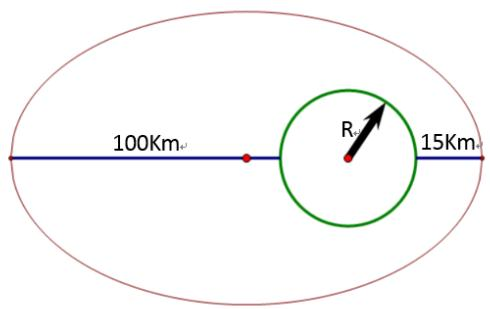

<details>
<summary>text_image</summary>

100Km
R
15Km
</details>

图 5.1.1.1 近月轨道示意图（为了方便示意，本图不符合比例）

由开普勒定律，任何椭圆天体轨道的中心天体一定在椭圆的一个焦点上。则由椭圆几何性质，可以近似得出方程：

$$
a + c = H _ {f} + R \quad a - c = H _ {c} + R
$$

联系万有引力定律与牛顿第二定律，可以列出嫦娥三号在近月点和远月点的运动学方程：

$$
\left\{ \begin{array}{l} G \frac {M m _ {0}}{(\mathrm{a} + \mathrm{c}) ^ {2}} = m _ {0} \frac {v _ {f} ^ {2}}{\rho_ {f}} \\ G \frac {M m _ {0}}{(\mathrm{a} - \mathrm{c}) ^ {2}} = m _ {0} \frac {v _ {c} ^ {2}}{\rho_ {c}} \end{array} \right.
$$

其中 $M = 7 . 3 4 7 7 \times 1 0 ^ { 2 2 } k g$ 为月球质量， $G { = } 6 . 6 7 2 { \times } 1 0 ^ { - 1 1 }$ 为引力常量， $m _ { 0 } = 2 . 4 t$ 为在近月轨道 上飞行器的质量， $\rho _ { f } \varTheta \rho _ { c }$ 为远月点和近月点的曲率半径。

由椭圆的几何性质，在长轴两端点处的曲率半径分别为：

$$
\left\{ \begin{array}{l} \rho_ {c} = \frac {b ^ {2}}{a} = (a - c) (1 + e) \\ \rho_ {f} = \frac {a ^ {2}}{b} = (a + c) (1 - e) \end{array} \right.
$$

联立以上各式，带入参数，得：

近月点速度大小 ；

远月点速度大小 。

由假设2，月球视为球体，则近月点处速度方向方向应平行于月面且为了着陆方便，方向指向预定着陆点所在方向，远月点处同样平行月面但速度方向与之相反。

下面开始研究主减速过程，该过程由近月点开始，切向速度 $\nu _ { \theta } \left( 0 \right) = \nu _ { c }$ ，径向速度 $\nu _ { r }$ 等于0，由切线正切制导率及相关报道可知，该阶段推力始终保持最大推力，且始终调整使推力与速度方向相反，即 $F \equiv 7 5 0 0 N , \ : \ : \stackrel {  } { F } \parallel \stackrel {  } { \nu }$ ，最终应大致达到预定着陆点目标上空，且竖直方向速度为 57m/s，高度共下降 12000m。由于有端点限制条件，可以通过物理知识建立微分方程组，即采用微分方程模型进行分析求解。

由于飞行器绕月球表面飞行，且切向速度较大，在月心极坐标系下必须考虑向心力和科里奥利力，且涉及转动变量，较为复杂。这里采用参考系转化，将极坐标系转化为非惯性参考系，并对该系中所有质点提供一个向上的离心力，大小由水平速度与质点到月心距离决定：

$$
F _ {d} = m \frac {v _ {x} ^ {2}}{r}
$$

这样，问题就转化到了平面直角坐标系下，并且可以对速度和受力进行正交分解，如图5.1.1.2。

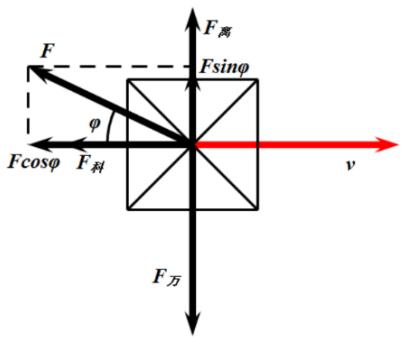

<details>
<summary>text_image</summary>

F
Fcosφ
F科
φ
F万
F离
Fsinφ
v
</details>

图 5.1.1.2 非惯性系下力学分析图示

由此可得微分方程模型：

$$
\left\{ \begin{array}{c} \frac {d v _ {y}}{d t} = - \frac {G M}{r ^ {2}} + \frac {v _ {x} ^ {2}}{r} + a \cdot \sin \beta \\ \frac {d v _ {x}}{d t} = a \cdot \cos \beta - \frac {v _ {x} v _ {y}}{r} \\ \frac {d r}{d t} = v _ {y} \\ a = \frac {F}{m _ {0} - \dot {m} t} \\ \frac {v _ {y}}{v _ {x}} = \tan \beta \end{array} \right.
$$

其中 r 为飞行器到月心的距离，β 为推力与水平方向的夹角，a 为推力产生的加速度，整个过程中质量是匀速减少的，减少系数由比冲与推力定义，即 $F = \nu \dot { m }$ ，本题中 $\scriptstyle \nu = 2 9 4 0 N / k g$ 0

至此，本问题已经完全抽象为数学语言，并且有初始参数：

$$
v _ {y} = 0, \quad v _ {x} = 1 6 9 2. 4 6 m / s, \quad r = 1 7 4 9. 3 7 k m, \quad \beta = 0
$$

理论上可求得当高度下降12000m时速度方向大小以及飞行距离，但这个方程组要想解出一个描述运动轨迹的函数是十分困难的，因此，需要另寻它路，逼近它的解。

## 5.1.2 模型求解

本题由方程组反推运动方程是十分困难的，但这类问题就像是解决 NP 难题一样，无法由问题得到结论，但可以“猜测”结论从而验证问题的正确性，继而得到想要的数据。

回顾本题，之所以无法解决是因为微分方程的连续性，这种连续性计算机很难求解，但若是让该组方程做某种近似，使之转化为差分方程，从而利用差分方程的离散型导出差分方程组。输入初始条件，使用计算机模拟其运动过程，最后打点画出折线图。由微元思想可知，当时间被微分成足够小的时候，模拟的运动轨迹可认为无限逼近真实运动轨迹。

微元化后的差分方程依然可以有运动学规律得出：

$$
\left\{ \begin{array}{c} v _ {x n + 1} = v _ {x n} - (a _ {n} \cdot \cos \beta_ {n} + \frac {v _ {x n} v _ {y n}}{r _ {n}}) \cdot \dot {t} \\ v _ {y n + 1} = v _ {y n} + (\frac {G M}{r _ {n} ^ {2}} - a _ {n} \cdot \sin \beta_ {n} - \frac {v _ {x n} ^ {2}}{r _ {n}}) \cdot \dot {t} \\ a _ {n} = \frac {F}{m _ {n}} \\ m _ {n + 1} = m _ {n} - \dot {m} \cdot \dot {t} \\ r _ {n + 1} = r _ {n} - y _ {n} \\ x _ {n + 1} = x _ {n} + v _ {x n} \cdot \dot {t} - \frac {1}{2} a _ {n} \cos \beta_ {n} \cdot \dot {t} ^ {2} \\ y _ {n + 1} = y _ {n} + v _ {y n} \cdot \dot {t} - \frac {1}{2} a _ {n} \sin \beta_ {n} \cdot \dot {t} ^ {2} \end{array} \right.
$$

其中 为时间微元小量，由于减速段大约几百秒，为了精确描绘运动曲线， 一般取0.1s。带入初始条件：

$$
F = 7 5 0 0 N, \quad m _ {0} = 2 4 0 0 k g, \quad \beta_ {0} = 0, \quad x _ {0} = 0, \quad y _ {0} = 0, \quad v _ {x 0} = 1 6 9 2. 4 6 m / s, \quad v _ {y 0} = 0
$$

即可通过迭代法，求出在 y=3000m 时的 x 的值，该值即为飞行器转过的角度所对应的月面弧长。但是仿真结果表明，当高度降至3000m时，速度并不为57m/s，而且远大于这一数值，显然，是我们采用的控制方案不合题意。

重新考虑这一过程，应该是竖直方向分力不够，导致竖直速度分量增加过快。之后在了解了嫦娥三号实际登月过程后，我们发现这一过程中推力并非与速度方向相反，而是始终与速度反方向保持一个角度θ，并向曲线内侧倾斜。

于是我们通过改变 θ 的大小，试图输出大量运动轨迹簇，这一过程由计算机模拟生成。

通过计算机仿真模拟，得到非惯性参考系下的运动轨迹簇。

其中可以发现，在 θ 取时，高度 3000m 处竖直方向速度为，在误差允许的范围内可以接受，由此得出符合题意的主减速阶段飞行轨迹图，如图 5.1.1.4.

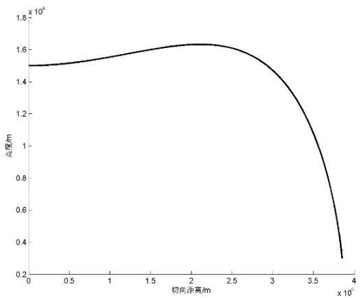

<details>
<summary>line</summary>

| 切向偏高/m (x 10^6) | 高度/m (x 10^4) |
| --- | --- |
| 0 | ~1.50 |
| 2.0 | ~1.63 |
| 3.8 | ~0.30 |
</details>

图 5.1.1.4 主减速阶段飞行轨迹图（非惯性参考系）

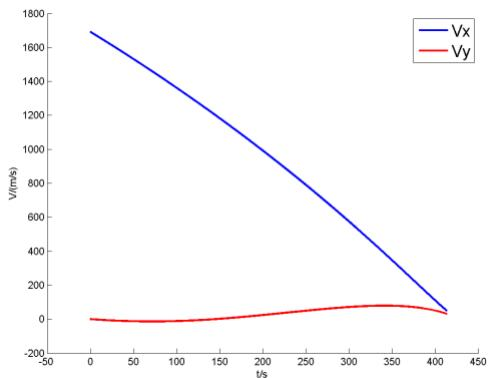

<details>
<summary>line</summary>

| t/s | Vx (m/s) | Vy (m/s) |
| --- | --- | --- |
| 0 | ~1680 | ~0 |
| 50 | ~1520 | ~-10 |
| 100 | ~1360 | ~-10 |
| 150 | ~1190 | ~0 |
| 200 | ~1030 | ~20 |
| 250 | ~870 | ~40 |
| 300 | ~710 | ~60 |
| 350 | ~550 | ~70 |
| 400 | ~390 | ~50 |
| 415 | ~350 | ~30 |
</details>

图 5.1.1.5 水平与竖直速度变化示意图

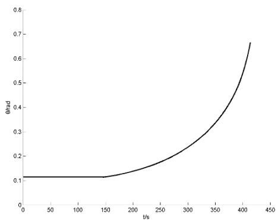

<details>
<summary>line</summary>

| t/s | \(\theta/\)rad |
| --- | --- |
| 0 | ~0.12 |
| 150 | ~0.12 |
| 415 | ~0.67 |
</details>

图 5.1.1.6 夹角变化示意图

得到弧长为，对应转过角度为，所用时间为。由于推力大小不变，由时间即可得出此阶段燃耗。该阶段内水平方向与竖直方向速度变化如图 5.1.1.5.

可以看出，水平速度不断下降，而竖直方向速度先增大后减小，合速度57.12m/s，符合题意。水平总位移为385.21km。

虽然该阶段末并不是准确到达预定着陆点上空，需要经过快速调整阶段才能准确到达，但题目表述中明确指出该处以基本到达目标上空，再加之段末水平速度分量相比初始速度已经十分小，快速调整阶段又很迅速，即快速调整阶段对到目标点上空距离的影响十分小，相比主减速段弧长可以忽略，即认为主减速末段已经到达目标上空。

由此，我们结合弧长与转角可以计算近月点所在范围。由于该角度可在以预定落点为圆心的球面圆上任意选取，考虑到当天月球月面范围，降落过程应基本暴露在有光月面一侧，以便拍摄或信息收集，并且一般选择轨道时为了方便计算控制，轨道平面会与落点所在经线平面基本重合，即近月点经度也为 19.51°W，纬度应更加靠近赤道，从而保证降落过程全程在光侧面，最终确定纬度位置为 31.50°N。

由月球的球对称性，远月点纬度南北对调，经度东西对调，角度互补。

最终结论，近月点位置为 19.51°W，31.50°N，距月面 15km，速度为 1692.46m/s；远月点位置为 160.49°E，31.50°S，距月面 100km，速度为 1612.15m/s。

## 5.2 问题二

本题为典型的多因素优化问题，优化目标是减少燃料损耗，并且通过图像分析选择最为平坦的地区着陆。

由于燃料损耗直接与推力有关，即 $F = \nu \dot { m }$ ，其中 $\nu { = } 2 9 4 0 m / s$ 为燃料比冲，也就有

$$
\int F d t = \nu \int \dot {m} d t
$$

该式左边为推力对时间的积累量，即推力所做的冲量；右边为燃料损耗对时间的积累，即一定时间内的燃料损耗总量。由于比冲为常数，因此推力冲量与燃耗成正比例关系，从而使优化目标与力学量直接联系，便于分析。

另外，由动量定理 $m d \nu = F d t$ ，在近似处理下，也可将燃耗与速度变化联系在一起。

## 5.2.1 过程一模型建立与求解

由 5.1计算过程可知，主减速段是着陆过程用时最长，燃耗最多的阶段。该阶段的主要任务是消除较大的初始水平速度, 因此推进剂消耗优化是该阶段优化的主要设计目标，也是整个着陆轨道燃耗优化的重中之重。

嫦娥三号的主减速阶段是从近月点开始下降到距离预定地点 3 处，这一过程的时间比较短，仅有几百秒的时间，所以可以不考虑月球引力摄动。月球自转速度比较小 , 也可忽略 。所以，可以仅仅对月球和嫦娥三号进行分析，将问题转化为二体模型，如图

5.2.1.1。以月心为原点，建立平面直角坐标系，设嫦娥三号的月心距为 ，极角为 ，角速度为 ，质量为 ；又设 为嫦娥三号沿 方向上的速度， 为主减速发动机的推力（在本题中为固定值），发动机推力与当地水平线的夹角即为推力的方向 $\varphi$ ，比冲为 $I _ { S P }$ ；设月球的引力常数为 $\mu$ 。

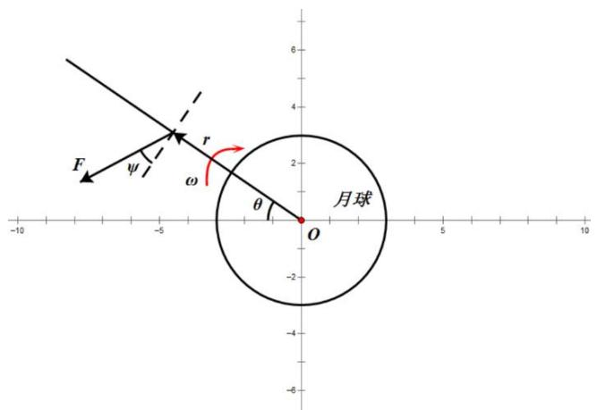

<details>
<summary>text_image</summary>

F
ψ
r
ω
θ
O
月球
</details>

图 5.2.1.1 二体模型力学分析示意图

首先，从运动学角度进行分析。由动力学基本方程可得 $d r = t d \nu$ ，所以 $\frac { d r } { d t } = \nu$ ①

同理，可以得到角度变化的关系式为 $\frac { d \theta } { d t } = \omega$ ②

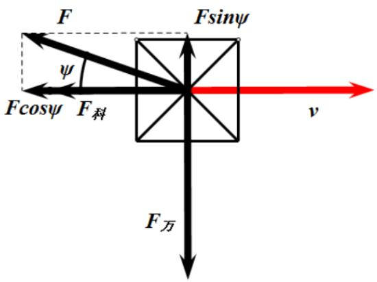

<details>
<summary>text_image</summary>

F
Fsinψ
ψ
Fcosψ F_π
v
F_π
F万
</details>

图 5.2.1.2 受力分析示意图

再从动力学角度进行分析。如图，对嫦娥三号进行受力分析可知。

在径向上，受到万有引力 $F _ { _ { \vec { 5 } | } } { = } \frac { \mathbf { G } \mathbf { M } _ { _ { \vec { \mathrm { H } } } } m } { r ^ { 2 } } { = } \frac { \mu m } { r ^ { 2 } }$ 以及主减速发动机在径向上的分力 ${ \mathrm { F s i n } } \varphi$ 由此，根据牛顿第二定律可以得到：

$$
\left\{ \begin{array}{l} \frac {\mu m}{r ^ {2}} = \frac {m v ^ {2}}{r} \quad ③ \\ \mathrm{F} \sin \varphi = m \frac {d v}{d t} \quad ④ \end{array} \right.
$$

联立③，④可得 ${ \frac { \mu m } { r ^ { 2 } } } - \mathrm { F s i n } \varphi = { \frac { m \nu ^ { 2 } } { r } } - m { \frac { d \nu } { d t } }$ ，利用公式 $\nu = r \omega$ 化简该式可得：

$$
\frac {d v}{d t} = \frac {F}{m} \sin \varphi - \frac {\mu}{r ^ {2}} + r \omega^ {2} \quad ⑤
$$

再对切向上的受力进行分析，此处需要注意到我们选择参考系月球自身的自转，是一个非惯性参考系。因此，嫦娥三号除了受到主减速发动机推动力的分量 的作用，还需要计入大小为 $2 \nu \omega$ 的科里奥利力，根据右手定则可以确定其方向为切向。由牛顿运动学第二定律可以得到 $\operatorname { F c o s } \varphi + 2 \nu \omega = - m \frac { d \nu _ { y } } { d t }$ 。同样，利用 $\nu _ { \mathrm { v } } = r \omega$ 化简可以得到：

$$
\frac {d \omega}{d t} = - \frac {\frac {F}{m} * \cos \varphi + 2 * v * \omega}{r} \quad ⑥.
$$

由于飞船在运行过程利用燃料反冲制动，因此飞船得而质量是不断变化的。考虑比冲的定义为 火箭发动机单位质量推进剂产生的冲量 可得：

$$
\frac {d m}{d t} = - \frac {F}{I _ {S P}} \quad ⑦ 。
$$

综上所述，联立式①，②，⑤，⑥，⑦即可得到完整的描述嫦娥三号与月球这一二体运动模型的方程组：

$$
\left\{ \begin{array}{l} \frac {d r}{d t} = v \\ \frac {d v}{d t} = \frac {F}{m} \sin \varphi - \frac {\mu}{r ^ {2}} + r \omega^ {2} \\ \frac {d \theta}{d t} = \omega \\ \frac {d \omega}{d t} = - \frac {\frac {F}{m} \cos \varphi + 2 v \omega}{r} \\ \frac {d m}{d t} = - \frac {F}{I _ {S P}} \end{array} \right.
$$

对于嫦娥三号燃料使用指标的衡量，我们可以反映到其动量上去，即将动量作为衡量燃料消耗的性能指标。由质量变化的推导，我们可以得到 $J = \int _ { t _ { 0 } } ^ { t _ { f } } \frac { F } { I _ { S P } } d t$

在轨道优化过程中 , 由于各状态变量的量级相差较大 , 寻优过程中可能会导致有效位数的丢失[2]。归一化处理可以克服这一缺点，提高计算精度。另外，由于对轨道的优化也要求优化变量尽可能地保持在相同的量级，故作以下处理：

令： $r _ { r e f } = r _ { 0 } , m _ { r e f } = m _ { 0 }$

则： r , ν = ν , 二 μ , = ISP A rref , F , m re  Vef , m = m rej Vrej ref re μ F ref rref mref

$$
\overline {{\omega}} = \omega \sqrt {\frac {r _ {r e f} ^ {3}}{\mu}}, \bar {t} = \frac {t}{t _ {r e f}}, t _ {r e f} = \frac {r _ {r e f}}{v _ {r e f}}, \overline {{\theta}} = \theta .
$$

那么，嫦娥三号的动力学方程可改写为：

$$
\left\{ \begin{array}{l} \frac {d \bar {r}}{d \bar {t}} = \bar {v} \\ \frac {d \bar {v}}{d \bar {t}} = \frac {\overline {{F}}}{m} \sin \varphi - \frac {1}{\overline {{r ^ {2}}}} + \bar {r} \overline {{\omega^ {2}}} \\ \frac {d \bar {\theta}}{d \bar {t}} = \bar {\omega} \\ \frac {d \bar {\omega}}{d \bar {t}} = - \frac {\frac {\overline {{F}}}{m} \cos \varphi + 2 \bar {v} \bar {\omega}}{\bar {r}} \\ \frac {d \bar {m}}{d \bar {t}} = - \frac {\overline {{F}}}{I _ {S P}} \end{array} \right.
$$

又由第一问可以得到飞行器的初始条件和终端条件分别为:

$$
\left\{ \begin{array}{l} v _ {r 0} = 0 \\ v _ {\theta 0} = 1 6 9 2. 4 6 m / s \\ r _ {0} = 1 7 4 9. 3 7 2 k m \end{array} \right. \quad \left\{ \begin{array}{l} v _ {r f} = 0 \\ v _ {\theta f} = 5 7 m / s \end{array} \right.
$$

注：此处的终端条件中，径向速度和切向速度为理想情况下的结果，实际只能得到最优

化的值。

使用归一化条件可以得到初始条件和终端条件分别变为：

$$
\left\{ \begin{array}{l} \overline {{v _ {r 0}}} = 0 \\ \overline {{v _ {\theta 0}}} = \frac {1 6 9 2 . 4 6}{v _ {r e f}} m / s \\ \overline {{r _ {0}}} = \frac {1 7 4 9 . 3 7 2}{r _ {r e f}} k m \end{array} \right. \quad \left\{ \begin{array}{l} v _ {r f} = 0 \\ v _ {\theta f} = \frac {5 7}{v _ {r e f}} m / s \end{array} \right.
$$

在考虑燃料最优的情况，并要保障水平速度几乎减到 $0 m / s$ 的前提下，可以选择推力较大的发动机完成软着陆任务，即 $F = 7 5 0 0 N$ 。由此可以得到优化的目标函数为：

$$
J = \int_ {t _ {0}} ^ {t _ {f}} \frac {F}{I _ {S P}} d t = \frac {F}{I _ {S P}} t _ {f}
$$

其中，推力 和比冲 $I _ { s P }$ 都是定值，所以即要求时间最短的方案。

最优控制问题的数值方法主要包括直接法和间接法，对上述最优控制问题，使用一种直接方法参数化方法进行求解[3]。即作如下的假设：推力方向角 $\theta$ 可以表示成一个多项式的形式：

$$
\theta = \sum_ {i = 0} ^ {6} a _ {i} t ^ {i}
$$

由此，对于所描述的问题可由一个有约束条件的非线性规划问题描述。由于确定了嫦娥三号的推力，那么在确定变量为 $a _ { 0 }$ 到 $a _ { 6 }$ 七个变量后，根据所建立的二体模型方程即可确定运行的轨迹，所以此处需要优化的参数为 $a _ { 0 }$ 到 $a _ { 6 }$ 七个变量，问题的约束条件为归一化后的动力学方程以及初值条件和终端条件。由此需要求出燃料最优化方案，即性能指标 $J { = } \frac { F } { I _ { { S P } } } t _ { f }$ 的最小值。

对以上转化出来的问题，我们利用浮点数编码的遗传算法（FGA）进行求解。其步骤如下：

1. 将 7 个取值范围给定的优化参量按一定的浮点数编码排列在一起成为一个个体，随机产生2000个这样的个体作为初始种群；  
通过编写的适应函数计算每一个个体的性能指标；  
3. 使用轮盘赌法作为选择算子并对这N个个体进行排序；  
4. 选择出若干个性能指标取值较优的个体保留，并将其遗传到下一代；  
将个体随机两两配对，按照既定的交叉概率进行交叉操作；  
6. 对每一个个体中的每一个参数，按照既定的变异概率进行编译操作；  
7. 若满足收敛条件则输出最优解，否则继续进行编码、评价、选择、交叉和变异等操作。

通过对约束条件的分析，可以选择交叉概率为0.6，变异概率为0.05。

通过计算机仿真模拟，由遗传算法规划出的角度随时间控制函数参数向量的取值为：

$$
\left(a _ {0} \quad \dots \quad a _ {6}\right) = \left(7. 5 8 \times 1 0 ^ {- 2} \quad 7. 0 1 \times 1 0 ^ {- 5} \quad 4. 3 0 \times 1 0 ^ {- 6} \quad - 8. 1 2 \times 1 0 ^ {- 8} \quad 6. 0 3 \times 1 0 ^ {- 1 0} \quad - 1. 6 0 \times 1 0 ^ {- 1 2} \quad 1. 4 0 \times 1 0 ^ {- 1 5}\right)
$$

运动轨迹见图 5.2.1.2.

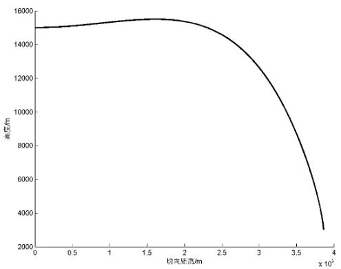

<details>
<summary>line</summary>

| 切向距离/m (x 10^4) | 高度/m |
| --- | --- |
| 0 | ~15000 |
| 0.5 | ~15100 |
| 1.0 | ~15300 |
| 1.5 | ~15500 |
| 2.0 | ~15400 |
| 2.5 | ~14800 |
| 3.0 | ~12800 |
| 3.5 | ~9200 |
| 3.8 | ~3000 |
</details>

图 5.2.1.3 运动轨迹图

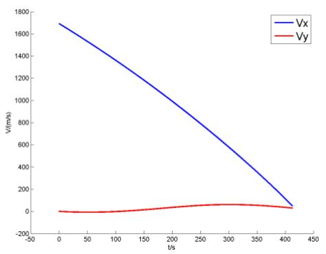

<details>
<summary>line</summary>

| t/s | Vx (m/s) | Vy (m/s) |
| --- | --- | --- |
| 0 | ~1700 | ~0 |
| 50 | ~1500 | ~-10 |
| 100 | ~1300 | ~0 |
| 150 | ~1100 | ~20 |
| 200 | ~900 | ~40 |
| 250 | ~700 | ~60 |
| 300 | ~500 | ~60 |
| 350 | ~300 | ~50 |
| 415 | ~50 | ~30 |
</details>

图 5.2.1.4 速度对比图

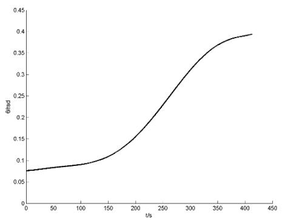

<details>
<summary>line</summary>

| t/s | \(\theta/\)msd |
| --- | --- |
| 0 | ~0.075 |
| 100 | ~0.09 |
| 200 | ~0.16 |
| 300 | ~0.31 |
| 400 | ~0.38 |
</details>

图 5.2.1.5 角度变化图

当下降 12000m 时速度 v=57.12m/s，水平方向与垂直方向分别为 $\nu _ { _ { x } } = 4 8 . 6 3 m / s$ $\nu _ { \mathrm { { y } } } = 2 9 . 9 6 m / s$ ，符合题意。

整个过程耗时 413.2s，由于推力 F 恒为 7500N，因此该阶段燃料消耗为$J _ { _ { 1 } } = \frac { F t } { \nu } = 1 0 5 5 . 3 9 k g$ ，剩余质量 1344.61kg，水平位移为 385.21km。

## 5.2.2 过程二模型建立与求解

快速调整阶段主要任务有两个：一是在主减速阶段完成的基础上，将嫦娥三号水平方向的速度减到 ；二是快速调整嫦娥三号的姿态，使推力方向和所收到的引力方向基本一致。在该阶段，考虑让 的方向逐渐调整到竖直方向，并且在调整的过程中（即下落的 距离内），将水平方向的速度减少到 。

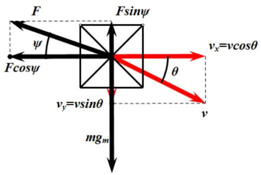

<details>
<summary>text_image</summary>

F
ψ
Fcosψ
Fsinψ
v_x=vcosθ
θ
v_y=vsinθ
mg_m
v
</details>

图 <sub>5.2.1.6</sub> 受力分析示意图

由此，首先进行运动学分析。在水平方向上，速度最终减小为有 $0 m / s$ ，所以有

$$
\frac {d v _ {x}}{d t} = a _ {x} \quad ①
$$

在竖直方向上，由加速度的定义，有这样的关系：

$$
\frac {d v _ {y}}{d t} = a _ {y} \quad ②
$$

然后，在进行动力学分析。在水平方向上，根据牛顿第二定律可以得到：

$$
F \cos \varphi = m a _ {x} \quad ③
$$

在竖直方向上，不妨设月球的重力加速度为 $g _ { m }$ ，其值由黄金代换公式 $G M = g _ { m } R ^ { 2 }$ 可以确定。那么同理可以得到：

$$
m g _ {m} - F \sin \varphi = m a _ {y} \quad ④
$$

至此，受力分析完毕。而另一方面，考虑到减速过程中燃料的消耗对质量产生影响，有：

$$
\frac {d m}{d t} = - \frac {F}{I _ {S P}} \quad ⑤
$$

综合①，②，③，④，⑤式可以得到描述该阶段运行的方程：

$$
\left\{ \begin{array}{l} F \cos \varphi = m \frac {d v _ {x}}{d t} \\ m g _ {m} - F \sin \varphi = m \frac {d v _ {y}}{d t} \\ \frac {d m}{d t} = - \frac {F}{I _ {S P}} \end{array} \right. \tag {⑥}
$$

由主减速阶段的终值以及快速调整阶段的要求可以得到该方程初始条件和终端条件分别为：

$$
\left\{ \begin{array}{l} v _ {x 0} = 4 8. 6 3 m / s \\ v _ {y 0} = 2 9. 9 6 m / s \\ m _ {0} = 1 3 4 4. 6 1 k g \end{array} \right. \quad ⑦ \quad \left\{ \begin{array}{l} v _ {x f} = 0 m / s \\ \varphi_ {f} = 9 0 ^ {o} \\ \theta_ {f} = 9 0 ^ {o} \end{array} \right. \tag {⑧}
$$

而力 的取值范围为 $1 5 0 0 N { < } = F { < } = 7 5 0 0 N$ 。

最优控制问题的数值方法主要包括直接法和间接法，对上述最优控制问题，使用一种直接方法参数化方法进行求解[3]。即作如下的假设：推力 可以表示成一个多项式的形式：

$F = \sum _ { i = 0 } ^ { 6 } a _ { i } t ^ { i }$ 。另外，在快速调整阶段，燃料的性能指标同样为 $J = \int _ { t _ { 0 } } ^ { t _ { f } } \frac { F } { I _ { S P } } d t$ 。

综上所述，即可将求解快速调整阶段的问题转换成这样的一个非线性规划问题：需要优化的参数为 到a 以及 $a _ { 0 }$ $a _ { 6 }$ $\varphi$ 、 九个变量，问题的约束条件为方程组⑥以及初值条件⑦和终端条件⑧。由此需要求出燃料最优化方案，即性能指标 的最小值。

同样使用浮点数编码的遗传算法来解决该非线性规划问题，由于具体步骤与主减速阶段基本一致，故此处不再赘述。在这样的算法下，求得的最优解为：

$$
\left\{ \begin{array}{l} v _ {x} = 0 m / s \\ v _ {y} = 2 9. 9 6 m / s \\ \varphi = 9 0 ^ {\circ} \\ \theta = 9 0 ^ {\circ} \\ F = 3 9 2 8. 1 1 5 N \\ t = 2 0. 0 2 7 s \\ J _ {2} = 2 6. 7 1 k g \end{array} \right.
$$

## 5.2.3 过程三模型建立与求解

粗避障段的范围是距离月面 2.4km到 100m区间，其主要是要求避开大的陨石坑，实现在设计着陆点上方100m处悬停，并初步确定落月地点。嫦娥三号在距离月面2.4km处对正下方月面2300×2300m的范围进行拍照，获得数字高程，嫦娥三号在月面的垂直投影位于预定着陆区域的中心位置。该高程图的水平分辨率是1m/像素，其数值的单位是1m。

由附件3所提供的灰度图，获取各像素点高程，统计各高程数据出现的个数，绘制高程数量分布曲线图，如图 5.2.3.1。

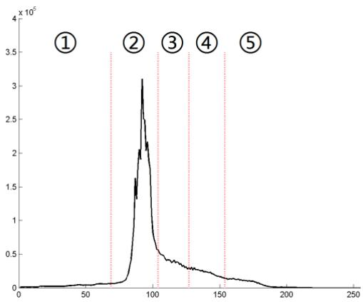

<details>
<summary>line</summary>

| X | Y (x 10^5) |
| --- | --- |
| ~70 | ~0.1 |
| ~90 | ~3.1 |
| ~100 | ~0.6 |
| ~125 | ~0.3 |
| ~155 | ~0.15 |
</details>

图 5.2.3.1 高程数量分布曲线图

由高程图大致可以发现，在高程约为 95m 时有最高点，120m 以上或 80m 以下数量明显下降，据观测可以认为平坦的区域的高程大致在 80m 到 120m 之间，于是应大致将高程划分为三个组，低于80m的区域较暗，高于120m的区域较亮，输出的图像上大致可以分辨出较大的陨石坑，但是小陨石坑仍然无法与平地区分，因此需要从统计学角度合理划分。

通过对全部高程数据进行 均值聚类分析，并设置聚落数，经过尝试发现当聚落数为时，可以较为清楚的区分出陨石坑与平地，如图5.2.3.2。

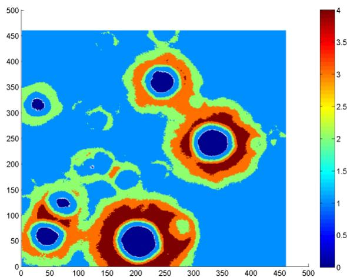

<details>
<summary>heatmap</summary>

| X Range | Y Range | Value (Color Scale) |
| --- | --- | --- |
| 0~450 | 0~500 | 0~4 |
</details>

图 5.2.3.2 聚落色阶图

聚类中心值分别为 92.4595，113.8753，138.4552，168.0559，44.6447，平坦区域聚类编号为 1。

图中可以发现，对于平坦度造成影响的障碍地形大致分为三类：过高障碍区域，过低障碍区域，条纹障碍区域。通过排除1以外的聚类编号，可以准确排除前两种障碍区域，但是第三种条纹障碍区域无法去除，地图上会留下数个环形地带。

至此为止，图像分析基本完成，但由于此处降落点的调整同时受制于落点平坦度与落点偏移量，即落点到图像中心的直线距离，因为这一距离会导致飞行器水平冲量的积累，燃耗增加，偏离最优解。因此，有必要制定数字评价手段，通过地图中现有参数，对平坦度以及偏移量做出数字化的评价，综合权重分配即可得出落点的综合评价指标。

下面先制定平坦度评价指标 $\hat { P }$ 。由图像聚类结果，可以粗略将图中像素点分为安全点与危险点。但考虑到2300×2300点数量实在太大，为了减少数据处理量，对地图进行栅格化，每5m×5m，即25像素点作为一个栅格单元，根据格内安全点与危险点数量的多少定义该格为安全格或危险格，这样，地图便被分为了460×460 格的二元化栅格网络。

以任意一个安全格为中心，搜索其外围8个方格，确认其中无危险格后，继续扩大一周考察范围，如此循环，直到出现危险格停止，记录无危险格的最大安全半径 $\hat { R } _ { s }$ （以格数衡量，若第一圈就出现危险格，则认为半径为 0 格）。 $\hat { R } _ { s }$ 越大，则认为该格所在区域越安全，$\hat { P }$ 越高。由于平坦度仅与该因素有关，因此，若要将 $\hat { R } _ { s }$ 转化为实际距离长度，正比例系数应取5m，即 $\hat { P } = 5 \hat { R } _ { s }$ 。条纹障碍由于 $\hat { P }$ 非常小，可以有效排除。

接下来考虑落点对中心的偏移量的评估指标。由于最终优化目标是燃耗最小，因此有必要先确定粗调整阶段下落规则。由于该阶段推力不算很大，时间较短，可在分析阶段忽略质量变化。假设水平偏移量为X，下降高度 $H _ { 3 } { = } 3 2 0 0 m$ 已知，在忽略质量变化的前提下，水平方向运动可以与竖直方向运动在满足 $F _ { \mathrm { m i n } } ^ { 2 } \leq F _ { x } ^ { 2 } + F _ { y } ^ { 2 } \leq F _ { \mathrm { m a x } } ^ { 2 }$ 的约束下完全独立，为了进一步简化水平方向运动优化过程，认为竖直方向为匀速下降过程，这样，下落时间变为定值。

由于动量定理我们知道，水平方向动量的变化就是该阶段水平运动消耗的燃料，m一定，则速度 变化越小，冲量越小，燃耗越小，若在下面的 图像5.2.3.3中，可以很明确的 $\nu _ { x }$ 知道，速度曲线2要比速度曲线 1燃耗小，由此，可以建立这样的局部优化策略。

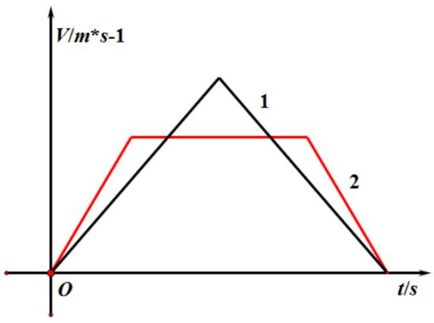

<details>
<summary>line</summary>

| Time (s) | Velocity (m*s-1)::1 | Velocity (m*s-1)::2 |
| --- | --- | --- |
| 0 | 0 | 0 |
| ~0.5 | ~0.8 | ~0.6 |
| ~1.5 | ~0.8 | ~0.6 |
| ~2.5 | 0 | 0 |
</details>

图 5.2.3.3 速度曲线对比图

通过该阶段的始末速度限制可知，初始水平速度为 0，竖直速度 $\nu _ { y 0 }$ 由上一阶段得出；段末悬停，速度为 0。由此可见，要节省水平方向的燃耗，应最快的增大 $\nu _ { x }$ ，接着匀速运动，最后对应最快的减小 $\nu _ { x }$ 至 0，从而完成该偏移过程。

因此在水平加速与减速阶段所受推力应有 $F _ { _ x } = \sqrt { F _ { \operatorname* { m a x } } ^ { 2 } - F _ { y } ^ { 2 } } = m a$ ，同时，竖直方向匀减速运动，应有 $F _ { y }$ 为常数，水平方向位移与速度关系为 $X = \nu _ { x } t - \frac { \nu _ { x } ^ { 2 } } { a }$ ，同时 $t = { \frac { H _ { 3 } } { \nu _ { _ { y } } } }$ ，冲量变化即可表示燃耗变化，有 $J _ { _ { 3 } } = \frac { 2 m \nu _ { _ { x } } } { \nu }$ ，基本认为 $J _ { 3 } \propto \nu _ { x }$ 且联立前面各式可以发现 $\nu _ { x }$ 与X有以下关系：

$$
\frac {H _ {3}}{v _ {y}} v _ {x} - \frac {v _ {x} ^ {2}}{a} = X
$$

即 $\nu _ { x }$ 与 X 有过原点的二次曲线递增关系，X 在 500m 以内较为平缓，可认为是线性关系，但随着 继续增大， $\nu _ { x }$ 将明显增大，付出的燃耗代价也会加速上升。因此，对于水平偏移量的评估权重应为非线性加权。

设偏移量评估指标为 $\hat { \lambda }$ ，则为了尽量淡化边缘区域的影响，应以偏移中心的距离 X 为自变量建立指数递减模型，即 $\hat { \lambda } = A - B e ^ { p X }$ ，其中 A 决定了中心点指标大小，B 决定了指标衰减幅度，p 决定了指标靠近边缘时的衰减速度。经过与平坦度评价指标的具体值相比较，最终决定，A 取 200，B 取 2.4，p 取 0.0027， $\hat { \lambda } = 2 0 0 - 2 . 4 e ^ { 0 . 0 0 2 7 X }$ ，方程曲线如图 5.2.3.4.

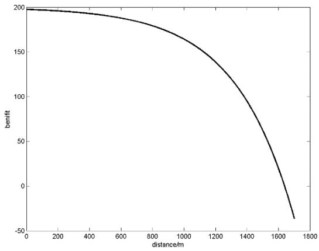

<details>
<summary>line</summary>

| distance/m | benefit |
| --- | --- |
| 0 | ~198 |
| 200 | ~196 |
| 400 | ~193 |
| 600 | ~188 |
| 800 | ~178 |
| 1000 | ~162 |
| 1200 | ~135 |
| 1400 | ~95 |
| 1600 | ~35 |
| 1700 | ~-35 |
</details>

图 5.2.3.4 偏移量评价函数曲线图

最终制定综合评估指标 $\hat { H } = \hat { P } + \hat { \lambda }$ ，作为一个方格对于降落点优先级的考量，指标评估值越高，则该方格作为最佳着陆点的优先级越高。

对栅格化地图遍历并计算后得到如图 5.2.3.5的结果。

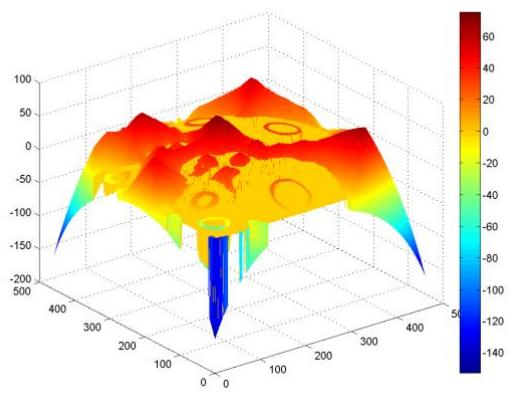

<details>
<summary>surface_3d</summary>

| X | Y | Z (Value) |
| --- | --- | --- |
| ~100 | ~200 | -140 |
| ~200 | ~200 | -100 |
| ~300 | ~200 | -60 |
| ~400 | ~200 | 0 |
| ~50 | ~200 | 60 |
| ~100 | ~300 | 0 |
| ~200 | ~300 | 40 |
| ~300 | ~300 | 20 |
| ~400 | ~300 | 0 |
| ~50 | ~400 | -80 |
| ~100 | ~400 | -40 |
| ~200 | ~400 | 20 |
| ~300 | ~400 | 40 |
| ~400 | ~400 | 20 |
| ~50 | ~500 | -20 |
| ~100 | ~500 | 20 |
| ~200 | ~500 | 40 |
| ~300 | ~500 | 20 |
| ~400 | ~500 | 0 |
| ~50 | ~600 | 20 |
| ~100 | ~600 | 40 |
| ~200 | ~600 | 60 |
| ~300 | ~600 | 40 |
| ~400 | ~600 | 20 |
| ~50 | ~700 | 20 |
| ~100 | ~700 | 40 |
| ~200 | ~700 | 60 |
| ~300 | ~700 | 40 |
| ~400 | ~700 | 20 |
| ~50 | ~800 | 20 |
| ~100 | ~800 | 40 |
| ~200 | ~800 | 60 |
| ~300 | ~800 | 40 |
| ~400 | ~800 | 20 |
| ~50 | ~900 | 20 |
| ~100 | ~900 | 40 |
| ~200 | ~900 | 60 |
| ~300 | ~900 | 40 |
| ~400 | ~900 | 20 |
| ~50 | ~1000 | 20 |
| ~100 | ~1000 | 40 |
| ~200 | ~1000 | 60 |
| ~300 | ~1000 | 40 |
| ~400 | ~1000 | 20 |
| ~50 | ~1100 | 20 |
| ~100 | ~1100 | 40 |
| ~200 | ~1100 | 60 |
| ~300 | ~1100 | 40 |
| ~400 | ~1100 | 20 |
| ~50 | ~1200 | 20 |
| ~100 | ~1200 | 40 |
| ~200 | ~1200 | 60 |
| ~300 | ~1200 | 40 |
| ~400 | ~1200 | 20 |
| ~50 | ~1300 | 20 |
| ~155.5 (Peak) | N/A | -145 (Min) (Blue) |
</details>

图 5.2.3.5 综合评估地图

可以发现，图中靠近中央有一峰值明显比周围峰值高，参照图 5.2.3.3 中坐标，该最优方格的坐标为（1275m，1000m），水平偏移量X 为195.26m，由之前公式可以粗略计算出水平方向最大速度 $\nu _ { x } { = } 1 . 8 7 \mathrm { m / s }$ ，用时 $t _ { 3 } = 1 0 2 . 5 1 \mathrm { s }$ ，燃耗 $J _ { _ { 3 } } \approx 8 6 . 9 7 \mathrm { k g }$ 。

## 5.2.4 过程四模型建立与求解

精细避障段的区间是距离月面 到 。要求嫦娥三号悬停在距离月面 处，对着陆点附近区域 100m 范围内拍摄图像，并获得三维数字高程图。分析三维数字高程图，避开较大的陨石坑，确定最佳着陆地点，实现在着陆点上方 30m 处水平方向速度为 0m/s。该数字高程的水平分辨率为 0.1m/像素，高度数值的单位是 0.1m。

此阶段由于地图仅有 100m×100m的大小，水平偏移量最大也只是71m，对燃耗的影响实在太小，作为最终综合评估指标中所占的权值实在太小，可忽略不计，但由于要精确降落，对于地图平坦度的分析所要考虑的因素不仅有安全半径大小 $\hat { R } _ { s }$ ，而且还要同时考虑到安全格内的平均坡度 $\hat { \varphi }$ 。由于在过程三中我们已经详细讨论了最大安全半径的获得方法，这里不再赘述。

本次栅格化考虑到像素为 0.1m，而飞行器本身体积较大，为了综合考虑，应将单元格大小取为 5m×5m，即 50×50.

聚类分析结果如图 5.2.4.1.

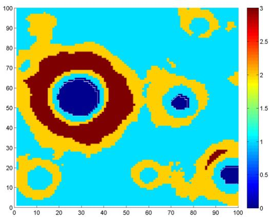

<details>
<summary>heatmap</summary>

| X Range | Y Range | Value (Color Scale) |
| --- | --- | --- |
| 0~100 | 0~100 | 0~3 |
</details>

图 5.2.4.1 聚类色阶图

本次五类聚落中心值按照编号由小到大分别为 41.2624，111.6007，90.2679，157.2982，图中3表示平坦地区，即安全格。

最大安全半径分析计算，结果如图 5.2.4.2.

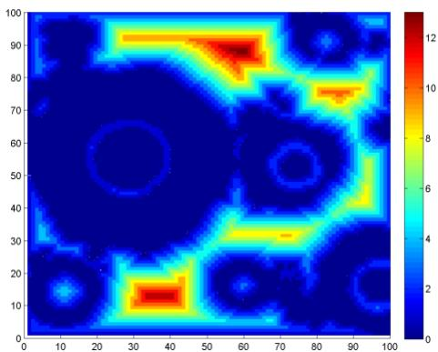

<details>
<summary>heatmap</summary>

| X Range | Y Range | Value (approx.) |
| --- | --- | --- |
| 0~100 | 0~100 | 0~12 |
</details>

图 5.2.4.2 最大安全半径色阶图

下面重点探讨如何得到栅格内的平均坡度。

首先，需要通过一定方法拟合出每一个方格内平均坡面，再由该坡面法向量方向计算出该坡面法向量与竖直方向的夹角（弧度制）作为衡量该坡面平均坡度的标准。对图像做如此处理后得到的坡度分析如图 5.2.4.3.

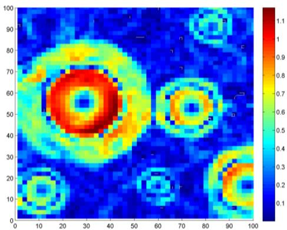

<details>
<summary>heatmap</summary>

| X | Y | Intensity |
| --- | --- | --- |
| ~25 | ~60 | >1.1 |
| ~70 | ~55 | ~0.8 |
| ~90 | ~90 | ~0.4 |
| ~10 | ~15 | ~0.3 |
| ~60 | ~20 | ~0.3 |
| ~90 | ~20 | ~0.8 |
</details>

图 5.2.4.3 平均坡度色阶图

下面制定坡度评价指标 $\hat { \Phi }$ 。由于代表平均坡度的夹角越小越好，并且应突出小坡度的比重，因此，依然考虑非线性加权法，本次加权可直接对弧度进行统计归一，找出上下界，并将下界作为 0，上界作为 1，然后进行数值翻转，即可得到弧度由小到大对应指标由 0 到 1的坡度评价指标，即 $\hat { \Phi } = 1 - \frac { \hat { \varphi } } { \varphi _ { \mathrm { m a x } } - \varphi _ { \mathrm { m i n } } } \in \left( 0 , 1 \right)$ ，然后将其作为优化系数与平坦度评价指标相耦合即可完成非线性加权，最终所得到的综合评价指标 $\hat { H } = \hat { \Phi } \cdot \hat { P }$ 作为着陆点优先级的评估指标，得到的结果如图5.2.4.4.

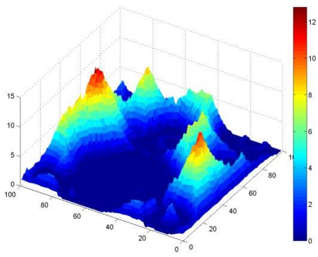

<details>
<summary>surface_3d</summary>

| X-axis | Y-axis | Value (Color Scale) |
| --- | --- | --- |
| 0~100 | 0~15 | 0~12 |
</details>

图 5.2.4.4 综合评价指标色阶图

可以看到，图中有两部分区域明显高于其他区域，最终选择指标最大值，以图 5.2.4.2中坐标系参考坐标位于（88m，56m）的方格作为最终着陆点，水平偏移 $X = 3 8 . 4 7 \mathrm { m }$

为了获得此阶段最优策略，各方向应按照先尽快加速至匀速在尽快减速，力学方程和限制条件如下：

$$
\left\{ \begin{array}{c} v _ {x} t - \frac {v _ {x} ^ {2}}{a _ {x}} = X \\ v _ {y} t - \frac {v _ {y} ^ {2}}{2 \left(a _ {y} - g _ {m}\right)} = H \\ \sqrt {\left(a _ {x} ^ {2} + a _ {y} ^ {2}\right)} = \frac {F _ {\max}}{m _ {4}} \end{array} \right.
$$

目标函数为 $J _ { 4 } = 2 m \nu _ { { x } } + m \nu _ { { y } } + m g _ { { m } } t$ 要尽可能小。

在该动态规划下可以得出最佳数值分配为：

竖直缓速下降所用时间 25.65s，水平最大速度为 $\nu _ { _ { x } } = 1 . 4 4 \mathrm { { m } / \mathrm { { s } } }$ ，燃耗 $J _ { \it 4 } = 2 0 . 6 8 \mathrm { k g }$ ，段末质量 $m _ { 4 } = 1 2 1 0 . 2 5 \mathrm { k g }$ 。

## 5.2.5 过程五模型建立与求解

缓速下降阶段的区间是距离月面 30m到 4m。该阶段的主要任务是控制着陆器在距离月面4m处的速度为0m/s，即实现在距离月面 4m处相对月面静止，之后关闭发动机，使嫦娥三号自由落体到精确落点。

由上一个阶段末状态可知，飞行器水平速度分量已减为 0，则显然本次运动为一个减速运动，为了保障安全性，应将速度和加速度减至 ，则该阶段应设计为匀减速直线运动。

由于此阶段时间较短，推力不大，质量减少（几十kg）相比飞行器本身质量（1t）来说

可以忽略不计，则由动量定理，设此阶段初始状态竖直速度分量为 $\nu _ { 5 }$ ，质量为 $m _ { 5 }$ ，则

$$
\int F d t = m _ {5} v _ {5} + m _ {5} g _ {m} t
$$

即此阶段冲量一定，则燃耗也一定，仅优化时间即可，为了加快下落时间，应尽量保持速度不变，此过程月面重力加速度可认为是常量，忽略质量变化后，可列出运动学方程：

$$
\left\{ \begin{array}{c} a = \frac {F _ {\max}}{m _ {5}} - g _ {m} \\ F _ {\max} = \nu \mu \\ H _ {5} = v _ {5} t - \frac {v _ {5} ^ {2}}{2 a} \end{array} \right.
$$

其中 $H _ { 5 } = 3 0 m - 4 m$ ，即降落高度； $g _ { m } = \frac { G M } { R ^ { 2 } } = 1 . 6 3 m / s ^ { 2 }$ 为月面重力加速度；由上一阶段得出 $\nu _ { 5 }$ ， $m _ { 5 }$ ，带入函数，再由动量变化或F对时间的积分均可算出此阶段燃耗 $J _ { \it 5 } = 8 . 0 9 \mathrm { k g }$ 由初始速度和加速度可算出所用时间 $t _ { \varsigma } = 1 0 . 4 2 \mathrm { s }$ 。

由于自由下落阶段不消耗燃料，至此，我们已计算出全部燃耗与着陆轨迹参数，见表 5.2：

表5.2 着陆轨道相关参数与燃耗

<table><tr><td>着陆轨道阶段</td><td>最优控制策略</td><td>燃耗</td></tr><tr><td>主减速阶段</td><td>该阶段按照5.2.1中提到的推力角度变化规律,并且全程以最大推力作用。</td><td>1055.39kg</td></tr><tr><td>快速调整阶段</td><td>竖直方向基本以匀速运动,水平方向开始以较大推力减速,之后迅速变小,直到水平速度减到0.</td><td>26.71kg</td></tr><tr><td>粗避障阶段</td><td>竖直方向先匀速,在合适的时机开始减速至0,减速推力前期较小,后期较大;水平方向先以能提供的最大加速度加速,中间匀速移动,最后在以能提供的最大加速度减速至0,段末悬空。</td><td>86.97kg</td></tr><tr><td>精避障阶段</td><td>水平方向制动方案与粗避障阶段方案基本一致;竖直方向也是同样,先以优化得出的加速度加速,达到预期速度后匀速下降,最后在迅速减速至0.</td><td>20.68kg</td></tr><tr><td>缓速下降阶段</td><td>该阶段先匀速下降,在最后一段在全力减速至0.</td><td>8.09kg</td></tr></table>

## 5.3 问题三

## 5.3.1 误差分析

本模型包含众多近似处理和理想化模型，还有部分拟合优化算法，近似计算，这些都会带来各种或大或小的误差来源。其中主要包括理想化假设中的忽略月球扁率与地球的引力摄动，忽略姿态调整的燃耗，忽略调整姿势和推力大小改变所用时间以及月球自转，还有快速调整阶段的水平位移并未作为计算近月点的依据，二体问题的微分方程转化为差分方程所带来的误差，遗传算法对于全局最优解的逼近，从调整阶段开始质量变化在分析优化条件和计算时常被忽略，悬空时间忽略，栅格化网络划分格线上的考虑不足，使用最小二乘法计算格内平均坡度时的统计误差等。下面重点对会带来较大误差的几个影响因素进行考察。

（1）月球自转速度为27.3d，整个下落过程大约500s，月球转过的角度为0.0763°，即近月点实际经度约为19.43°，用1°来衡量相对误差为0.39%，但实际上这个度数对应的弧长有2313.14m，可以说误差数值本身还是很大的。  
（2）快速调整阶段水平位移大约 600m，对应月面弧度为 0.0198°，因此实际近月点纬

度约为31.47°，相对误差为 0.06%，并不算大，也证实了快速调整阶段水平位移对于主减速阶段可忽略。

（3）关于推力大小的突变假设，若按照实际情况来讲，燃料提供的推力一定伴随着一个渐变的过程。设推力均匀减小，假如推力由7500N 变为 1500N 需要 1s过渡时间，若质量为2000kg的飞行器，质量不变，直线运动，则：

$$
\left\{ \begin{array}{l} \int F d t = \int m d v \\ F = 7 5 0 0 - 6 0 0 0 t \end{array} \right.
$$

可求出末速度 2.25m/s。若改为前 0.5s 中推力为 7500N，后 0.5s 中推力为 1500N，则可算出末速度为 2m/s。对比可知，忽略变化时间会导致的最大相对误差为 11%，这个误差确实不小，不过所幸的是，整个过程中，推力基本都在小范围内波动，即使在快速调整阶段，推力变化为不超过4000N，因此，相对误差可控制在较低水平（5%左右）。

（4）栅格单元格内部由于采用了过半取整的方法，会造成对全体考虑的信息不全。例如当两个方格交界处数值较高，而其余部分均较低，这时，两个格都会被认定是安全格，但实际上存在一小部分凸起，若将两方格位置同步左移半格，会发现出现了一个危险格。

这类误差会定量影响到一些安全格的最大安全半径，导致综合评价指标倍放大，但由于格点数量众多，在统计角度是可以忽略这一问题的。

（5）微分方程离散化所造成的误差，由于取时间微元非常小（小于 0.1s），因此基本符合微元思想，再加之由拉格朗日中值估算法的存在，可以证明带来的误差远小于 1%，忽略不计。  
（6）忽略质量变化产生的影响，可以使用简单的运动过程来解释，假设质量为 1000kg的飞行器向下匀速运动 10s，则可知道加速度为 0，重力与推力相同。忽略质量变化，得到这一段燃耗为5.51kg；若考虑质量变化，则：

Fdt = vdm , $F = m g _ { m }$ ，其中 F与m均为t的函数，解得 $m ( t ) = 1 0 0 0 e ^ { - 5 . 5 1 \times 1 0 ^ { - 4 } t }$ ，燃耗为 5.49kg.

可知，实际燃耗比忽略质量的燃耗小，相对误差为 0.36%，十分小，由于忽略质量变化主要被用到后续阶段分析中，但这些阶段均比较快，因此误差不会超过5%以上，可以接受。

## 5.3.2 敏感性分析

由于本题初始条件十分少，再加上还有许多常数，可认为是定值，不会产生敏感性波动，因此对优化策略的敏感性分析限制在个别初始条件上：

若最大推力加减1N，仿真结果毫无变化，曲线基本拟合。实际上，变化10N甚至100N，落点位置或速度均无明显变化，可以看出，最大推力对于轨道的影响十分不敏感，允许波动范围至少1.3%。

对于角度方案的 个多项式系数，监视遗传算法中间个体，发现即使这些参数波动范围不足1%，结果也可能有较为明显的变化；特别是高次项系数，简单的波动都会被高次幂放大，使飞船偏离轨道，因此，对于本优化模型角度规划方案，不能出现甚至1%的偏差，否则将会造成严重后果，敏感性十分强。

至于近月点的位置，由于遗传算法对于初值不是特别敏感，即使其实位置发生较大变化，它总能从众多代中逐渐筛选出优良个体，满足终止条件。可以说，遗传算法本身的自适应性保证了优化策略对于近月点的选取不敏感性。

## 六. 模型优缺点

## 6.1 问题一的模型评价

该问题采用了逆推的思路，基本的微分方程模型进行拟合，凭借航天学经验计算出近月点。微分方程模型本身是无误差的，虽然难解，但离散化后，采用了拟合曲线的方式逼近，误差依然很小，但这个模型并不是正常设计的过程，如果条件足够，应该可以建立从地球出发，加上制动，变轨等一系列因素，结合当天月球位置和月面方向综合建立航空力学模型，模拟登月过程，从而顺势解出近月点。但此模型过于复杂，并且条件需求量太大，实际操作性应该不大。

## 6.2 问题二的模型评价

此问题主要有两类模型组成，第一类是二体模型，这是经典天体模型，没有误差，但由于十分难解，只能采用遗传算法进行筛选，逼近全局最优解；第二类是地形分析模型，制定了平坦度，偏移量，平均坡度的相关评估参数，综合使用了各类统计算法完成图像分析。可以发现，两类模型均无理论最优解，只能通过筛选或统计等方法逼近最优，但由于数量庞大，合理选择参数和权值，是可以无限逼近全局最优解的。但这部分由六个小段组成，每个分段由不同的约束条件，由存在一定联系，通常应该将六个状态联立，获得完整的全局模型，从而再进行全局优化，得到的结果被认为是全局最优解，而本题则将问题分解，每个阶段由不同的优化方案，从而获得六个局部最优解，即该模型不能证明该最优策略一定是全局最优策略。

## 七. 参考文献

[1] 李茂登，月球软着陆自主导航、制导与控制问题研究，哈尔滨工业大学，2011.09.  
[2] Chuang C H, Goodson T D, Hanson J. Fuel-optimal, low-and-medium-thrust or bit transfers in large numbers of burns [R]. AIAA 9423650, 1994, 158-166.  
[3] Noton M. 现代控制理论[M]. 北京：科学出版社，1979.  
[4] 王劼等. 登月飞行器软着陆轨道的遗传算法优化. 清华大学学报（自然科学版）2003 年第 43 卷第 8 期.

## 八. 附录

%

%calc\_proc.m 计算第一问

%

T = 0.1;

t = 0;

x = 0; y = 0;

x2 = 0; y2 = 0;

Q = 6.5044;

sita = 0 + Q/180\*pi;

vx = 1692;

vy = 0;

m0 = 2400;

m = 2400;

N = 7500 / m0;

G = 3844.6 / m0;

r = 1749372;

H = 15000;

ax = N - vy\*vx/r;

ay = G - vx^2/r;

hold on

xlabel '切向距离/m

ylabel '高度/m'

history = [];

i = 0;

while (y>-12000 && m>1000)

x2 = x + vx\*T - 0.5\*ax\*T;

y2 = y - vy\*T - 0.5\*ay\*T;

vx = vx - ax\*T;

vy = vy + ay\*T;

r2 = 1749372 + y2;

G = 3844.6/m0/(r^2)\*(r2^2);

m = m - 2.55\*T;

t = t + T;

N = 7500 / m;

if (vx == 0)

if vy <= 0

sita = pi/2;

else

sita = - pi / 2;

end

```matlab
else
    sita = atan(vy/vx);
end
if (sita) <= 0
    sita = Q/180*pi;
else
    if (sita + Q/180*pi) < pi/2
        sita = sita + Q/180*pi;
    else
        sita = pi / 2;
    end
end
ax = N * cos(sita) - vy*vx/r2;
ay = G - N * sin(sita) - vx^2/r2;
plot([x,x2],[H+y,H+y2],'black','LineWidth',2);
x = x2; y = y2; r = r2;
history = [history; (i-1)*T y vx vy sita];
i = i + 1;
end
```

```txt
%
```

```txt
%calc_proc2.m 模拟第二问最优解情况
%
```

```matlab
fit = [1.40416918137980e-15 -1.60164160878453e-12 6.03243487525863e-10 -8.11660304591008e-08 4.29538060831470e-06 7.00969042524411e-05
T = 0.1;
t = 0;
x = 0; y = 0;
x2 = 0; y2 = 0;
Q = 6.4;
sita = fit(7);
vx = 1692;
vy = 0;
m0 = 2400;
m = 2400;
N = 7500 / m0;
G = 3844.6 / m0;
r = 1749372;
H = 15000;
ax = N - vy*vx/r;
ay = G - vx^2/r;
hold on
```

```matlab
xlabel '切向距离/m'
ylabel '高度/m'
history = [];
i = 0;
while (y>-12000 && m>1000)
    x2 = x + vx*T - 0.5*ax*T;
    y2 = y - vy*T - 0.5*ay*T;
    vx = vx - ax*T;
    vy = vy + ay*T;
    r2 = 1749372 + y2;
    G = 3844.6/m0/(r^2)*(r2^2);
    m = m - 2.55*T;
    t = t + T;
    N = 7500 / m;
    sita = fit(1)*t.^6+fit(2)*t.^5+fit(3)*t.^4+fit(4)*t.^3+fit(5)*t.^2+fit(6)*t+fit(7);
    ax = N * cos(sita) - vy*vx/r2;
    ay = G - N * sin(sita) - vx^2/r2;
    plot([x,x2],[H + y,H + y2],'black', 'LineWidth',2);
    x = x2; y = y2; r = r2;
    history = [history; (i-1)*T y vx vy sita];
    i = i + 1;
end
if (m<=500)
    differ = 200000;
else
    differ = t;
end
if (abs(vx) > 10)
    differ = 200000;
end
if (abs(vy - 57) > 1)
    differ = 300000;
end

%___________________________
_%calc1.m 函数，用以使用遗传算法求解
%___________________________
_function [ differ ] = calc1( Q )
T = 0.1;
t = 0;
x = 0; y = 0;
x2 = 0; y2 = 0;
```

```matlab
sita = Q*t;
vx = 1692;
vy = 0;
m0 = 2400;
m = 2400;
N = 7500 / m0;
G = 3844.6 / m0;
r = 1749372;
H = 15000;
ax = N - vy*vx/r;
ay = G - vx^2/r;
i = 0;
while (y>-12000 && m>1000)
    x2 = x + vx*T - 0.5*ax*T;
    y2 = y - vy*T - 0.5*ay*T;
    vx = vx - ax*T;
    vy = vy + ay*T;
    r2 = 1749372 + y2;
    G = 3844.6/m0/(r^2)*(r2^2);
    m = m - 2.55*T;
    t = t + T;
    N = 7500 / m;
    if (vx == 0)
        if vy <= 0
            sita = pi/2;
        else
            sita = - pi / 2;
        end
    else
        sita = atan(vy/vx);
    end
    if (sita) <= 0
        sita = Q/180*pi;
    else
        if (sita + Q/180*pi) < pi/2
            sita = sita + Q/180*pi;
        else
            sita = pi / 2;
        end
    end
    sita = Q*t;
    ax = N * cos(sita) - vy*vx/r2;
    ay = G - N * sin(sita) - vx^2/r2;
    x = x2; y = y2; r = r2;
```

```matlab
i = i + 1;
end

if (m<=500)
    differ = 200000;
end
differ = abs(sqrt(vy^2+vx^2) - 57);

%___________________________
%calc2.m 函数，用以使用遗传算法求解
%___________________________
function differ = calc2(fit)
T = 0.1;
t = 0;
x = 0; y = 0;
x2 = 0; y2 = 0;
Q = 6.4;
sita = fit(7);
vx = 1692;
vy = 0;
m0 = 2400;
m = 2400;
N_altered = 7500;
N = N_altered / m0;
G = 3844.6 / m0;
r = 1749372;
H = 15000;
ax = N - vy*vx/r;
ay = G - vx^2/r;
i = 0;
while (y>-12000 && m>1000)
    x2 = x + vx*T - 0.5*ax*T;
    y2 = y - vy*T - 0.5*ay*T;
    vx = vx - ax*T;
    vy = vy + ay*T;
    r2 = 1749372 + y2;
    G = 3844.6/m0/(r^2)*(r2^2);
    m = m - 2.55/7500*N_altered*T;
    t = t + T;
    N = N_altered / m;
    sita = fit(1)*t.^6+fit(2)*t.^5+fit(3)*t.^4+fit(4)*t.^3+fit(5)*t.^2+fit(6)*t+fit(7);
    ax = N * cos(sita) - vy*vx/r2;
```

```matlab
ay = G - N * sin(sita) - vx^2/r2;
x = x2; y = y2; r = r2;
i = i + 1;
end
if (m<=500)
    differ = 200000;
else
    differ = m0 - m;
end
if (abs(sqrt(vx^2+vy^2) - 57) > 1)
    differ = 300000;
end

%___________________________
%deal1.m 函数，用以处理 2400m 处的俯拍相片
%___________________________
cd('./');
A = imread('附件3 距2400m处的数字高程图.tif');
N = 460;
n = 2300 / N;
data = zeros(N,N);
[height, length] = size(data);
for i = 1:1:height
    for j = 1:1:length
        data(i,j) = sum(sum(A(round(n*(i-1)+1):round(n*i)-(round(n*i)>2300), round(n*(j-1)+1):round(n*j)-(round(n*j)>2300)))/ round(n*n);
    end
end
data = uint8(round(data));
%imshow(data);
%第二个阶段，聚落分析平面
data3 = [];
for i = 1:1: N
    for j = 1:1:N
        data3 = [data3; data(i,j)];
    end
end
[Idx,C,sumD,D]=kmeans(double(data3),5);
C(1,3) = sum(C(:,1) < C(1,1)); C(1,2) = sum(Idx == 1);
C(2,3) = sum(C(:,1) < C(2,1)); C(2,2) = sum(Idx == 2);
C(3,3) = sum(C(:,1) < C(3,1)); C(3,2) = sum(Idx == 3);
C(4,3) = sum(C(:,1) < C(4,1)); C(4,2) = sum(Idx == 4);
```

```matlab
C(5,3) = sum(C(:,1) < C(5,1)); C(5,2) = sum(Idx == 5);
GND = sum(C(:,3) .* (C(:,2) == max(C(:,2))));
data4 = zeros(N, N);
for i = 1:1:N
    for j = 1:1:N
        data4(i,j) = C(Idx((i-1)*N + j), 3);
    end
end
%surface(data4,'EdgeColor','none');
%第三个阶段选择合适区域
data2 = 1- (data4 == GND);
score = zeros(N, N);
for i = 1:1:height
    for j = 1:1:length
        if (data2(i,j) == 0)
            tmp = 1;
            while (tmp<=i && tmp<=N-i+1 && tmp<=j && tmp<= N-j+1 &&
sum(sum(data2(i-tmp+1:i+tmp-1, j-tmp+1:j+tmp-1))) == 0)
            tmp = tmp + 1;
        end
        tmp = tmp - 1;
        score(i,j) = tmp + 50 - exp(0.0027*sqrt((i-N/2)^2 + (j-N/2)^2)*n);
    end
end
end
%surface(score,'EdgeColor','none');

%__________________________
_______
%deal2.m 函数，用以处理 100m 处的俯拍相片
%__________________________
_______
cd('./');
A = imread('附件4 距月面100m处的数字高程图.tif');
N = 100;
n = 1000 / N;
data = zeros(N,N);
[height, length] = size(data);
for i = 1:1:height
    for j = 1:1:length
        data(i,j) = sum(sum(A(round(n*(i-1)+1):round(n*i)-(round(n*i)>2300), round(n*(j-1)+1):round(n*j)-(round(n*j)>2300)))/ round(n*n);
    end
end
```

```matlab
data = uint8(round(data));
%imshow(data);
%第二阶段
%分析斜度
yuzumi = double(zeros(N,N));
N2 = 50;
n2 = 1000/N2;
ana_width = n2+10;
for i = 1:1:N2
    for j = 1:1:N2
        X = [];
        z = [];
        for x = max((i-1)*n2+1-(ana_width-n2), 1):1:min(i*n2+(ana_width-n2), 1000)
            for y = max((j-1)*n2+1-(ana_width-n2), 1):1:min(j*n2+(ana_width-n2), 1000)
                X = [X; 1, x, y];
                z = [z; double(A(x,y))];
            end
        end
        b = regress(z,X);
        arc = [b(2), b(3), 1];
        sita = acos(dot(arc,[0 0 1])/sqrt(dot(arc,arc)));
        yuzumi((i-1)*(N/N2)+1:i*(N/N2), (j-1)*(N/N2)+1:j*(N/N2)) = sita;
    end
end
heion = (max(max(yuzumi)) - yuzumi)/max(max(yuzumi));
%surface(heion,'EdgeColor','none');
%聚类分析
data3 = [];
for i = 1:1:N
    for j = 1:1:N
        data3 = [data3; data(i,j)];
    end
end
[Idx,C,sumD,D]=kmeans(double(data3),4);
C(1,3) = sum(C(:,1) < C(1,1)); C(1,2) = sum(Idx == 1);
C(2,3) = sum(C(:,1) < C(2,1)); C(2,2) = sum(Idx == 2);
C(3,3) = sum(C(:,1) < C(3,1)); C(3,2) = sum(Idx == 3);
C(4,3) = sum(C(:,1) < C(4,1)); C(4,2) = sum(Idx == 4);
GND = sum(C(:,3) .* (C(:,2) == max(C(:,2))));
data4 = zeros(N, N);
for i = 1:1:N
    for j = 1:1:N
        data4(i,j) = C(Idx((i-1)*N + j), 3);
    end
```

```matlab
end
%surface(data4,'EdgeColor','none');
%第三个阶段选择合适区域
data2 = 1- (data4 == GND);
score = zeros(N, N);
for i = 1:1:length
    for j = 1:1:length
        if (data2(i,j) == 0)
            tmp = 1;
            while (tmp<=i && tmp<=N-i+1 && tmp<=j && tmp<= N-j+1 &&
sum(sum(data2(i-tmp+1:i+tmp-1, j-tmp+1:j+tmp-1))) == 0)
            tmp = tmp + 1;
        end
        tmp = tmp - 1;
        score(i,j) = tmp; %. * heion(i,j);
    end
end
end
%surface(score,'EdgeColor','none');

%_________________________
_______
% genpics.m 各种画图指令的汇总
%_________________________
_______
cd('./');
clear;
load('2400m处分析数据.mat');
%聚落分析
figure;
cla;
surface(data4,'EdgeColor','none');
colorbar;
saveas(gcf,'2400m处聚落分析.png');
%合适区域
cla;
surf(score,'EdgeColor','none');
colorbar;
saveas(gcf,'2400m处落点评价.png');

clear;
load('100m处分析数据.mat');
%聚落分析
cla;
```

```matlab
surface(data4,'EdgeColor','none');
colorbar;
saveas(gcf,'100m处聚落分析.png');
%合适区域
cla;
surf(score,'EdgeColor','none');
colorbar;
saveas(gcf,'100m处落点评价.png');
```

```txt
clear;
cla;
calc_proc2;
saveas(gcf,'第一阶段降落y-x轨迹.png');
```

```matlab
cla;
hold on;
plot(history(:,1), history(:,3), 'b', 'LineWidth',2);
plot(history(:,1), history(:,4), 'red', 'LineWidth',2);
legend ('\fontsize {17}Vx', '\fontsize {17}Vy');
xlabel 't/s';
ylabel 'V/(m/s)';
saveas(gcf,'第一阶段降落Vx、Vy-t轨迹.png');
```

```matlab
cla;
hold on;
plot(history(:,1), history(:,5), 'black', 'LineWidth',2);
axis([0, 450, 0, 0.45]);
xlabel 't/s';
ylabel 'θ/rad';
saveas(gcf,'第一阶段降落sita-t轨迹.png');
```

```matlab
clear;
cla;
calc_proc;
saveas(gcf,'问题一降落y-x轨迹.png');
```

```matlab
cla;
hold on;
plot(history(:,1), history(:,3), 'b', 'LineWidth',2);
plot(history(:,1), history(:,4), 'red', 'LineWidth',2);
legend ('\fontsize {17}Vx', '\fontsize {17}Vy');
xlabel 't/s';
ylabel 'V/(m/s)';
saveas(gcf,'问题一降落Vx、Vy-t轨迹.png');
```

```matlab
cla;
hold on;
plot(history(:,1), history(:,5), 'black', 'LineWidth',2);
axis([0, 450, 0, 0.8]);
xlabel 't/s';
ylabel 'θ/rad';
saveas(gcf,'问题一降落sita-t轨迹.png');

% 杂类
clear;
load('2400m处分析数据.mat');
plotdata = [];
for i = 1:1:255
    plotdata = [plotdata; i, sum(sum(A == i))];
end
max0=0; max1=0; max2=0; max3=0;
for i = 1:1:460
    for j = 1:1:460
        if(data4(i,j)==0)
            if(data(i,j) > max0)
                max0 = data(i,j);
            end
        end
        if(data4(i,j)==1)
            if(data(i,j) > max1)
                max1 = data(i,j);
            end
        end
        if(data4(i,j)==2)
            if(data(i,j) > max2)
                max2 = data(i,j);
            end
        end
        if(data4(i,j)==3)
            if(data(i,j) > max3)
                max3 = data(i,j);
            end
        end
    end
end
hold on
plot(plotdata(:,1), plotdata(:,2), 'black', 'LineWidth',1.5);
plot([max3+0.5 max3+0.5], [0, 3.5e5], 'red', 'LineWidth',2,'linestyle','');
```

plot([max2+0.5 max2+0.5], [0, 3.5e5], 'red', 'LineWidth',2,'linestyle',':');

plot([max1+0.5 max1+0.5], [0, 3.5e5], 'red', 'LineWidth',2,'linestyle',':');

plot([max0+0.5 max0+0.5], [0, 3.5e5], 'red', 'LineWidth',2,'linestyle',':');

axis([0 255 0 400000])

saveas(gcf,'灰阶分布.png');