# 2014 高教社杯全国大学生数学建模竞赛

## 承 诺 书

我们仔细阅读了《全国大学生数学建模竞赛章程》和《全国大学生数学建模竞赛参赛规则》（以下简称为“竞赛章程和参赛规则”，可从全国大学生数学建模竞赛网站下载）。

我们完全明白，在竞赛开始后参赛队员不能以任何方式（包括电话、电子邮件、网上咨询等）与队外的任何人（包括指导教师）研究、讨论与赛题有关的问题。

我们知道，抄袭别人的成果是违反竞赛章程和参赛规则的，如果引用别人的成果或其他公开的资料（包括网上查到的资料），必须按照规定的参考文献的表述方式在正文引用处和参考文献中明确列出。

我们郑重承诺，严格遵守竞赛章程和参赛规则，以保证竞赛的公正、公平性。如有违反竞赛章程和参赛规则的行为，我们将受到严肃处理。

我们授权全国大学生数学建模竞赛组委会，可将我们的论文以任何形式进行公开展示（包括进行网上公示，在书籍、期刊和其他媒体进行正式或非正式发表等）。

我们参赛选择的题号是（从A/B/C/D中选择一项填写）： A

我们的报名参赛队号为（8 位数字组成的编号）： 11141001

所属学校（请填写完整的全名）： 浙江工业大学

参赛队员 (打印并签名) ：1. 陈超

2. 唐梦珏

3. 杨克宇

指导教师或指导教师组负责人 (打印并签名)： 宋军全

（论文纸质版与电子版中的以上信息必须一致，只是电子版中无需签名。以上内容请仔细核对，提交后将不再允许做任何修改。如填写错误，论文可能被取消评奖资格。）

日期： 2014 年 9 月 15 日

赛区评阅编号（由赛区组委会评阅前进行编号）：

# 2014 高教社杯全国大学生数学建模竞赛

## 编 号 专 用 页

赛区评阅编号（由赛区组委会评阅前进行编号）：

赛区评阅记录（可供赛区评阅时使用）：

<table><tr><td>评阅人</td><td></td><td></td><td></td><td></td><td></td><td></td><td></td><td></td><td></td><td></td></tr><tr><td>评分</td><td></td><td></td><td></td><td></td><td></td><td></td><td></td><td></td><td></td><td></td></tr><tr><td>备注</td><td></td><td></td><td></td><td></td><td></td><td></td><td></td><td></td><td></td><td></td></tr></table>

全国统一编号（由赛区组委会送交全国前编号）：

全国评阅编号（由全国组委会评阅前进行编号）：

# 嫦娥三号软着陆轨道设计与控制策略摘要

本文研究的是嫦娥三号探测器在月球表面的软着陆问题。分析着陆轨道的特点，设计探测器的着陆轨道与各阶段的控制策略，对我国太空探测计划具有重要意义。本文主要采用微分动力学方程、最优控制策略等方法对问题进行分析和解决。

针对问题一，首先根据近月点和远月点的已知高度，利用角动量守恒和机械能守恒定律求得嫦娥三号在两点处的速度大小及方向。其次，由于嫦娥三号的着陆轨迹尚未确定，仅根据题给的着陆点信息无法确定近月点的精确位置，故通过构造假设：（1）嫦娥三号在着陆过程中近似于沿着一条经线着陆，运动中仅改变纬度大小；（2）主减速阶段的水平路程近似为软着陆全程的水平路程。从而求出近月点在理想状态下的近似位置。最后通过问题二设计的轨道控制策略，进一步修正近月点和远月点的精确位置。得到嫦娥三号在近月点和远月点处的速度及位置如下表所示：

<table><tr><td>地点</td><td>经度</td><td>纬度</td><td>高度</td><td>速度大小</td><td>速度方向</td></tr><tr><td>近月点</td><td>19.51W</td><td>29.08N</td><td>15 km</td><td>1.6927 km/s</td><td>逆时针沿切线方向</td></tr><tr><td>远月点</td><td>160.49E</td><td>29.08S</td><td>100 km</td><td>1.6144 km/s</td><td>逆时针沿切线方向</td></tr></table>

针对问题二，忽略月球自转及摄动因素，将嫦娥三号的着陆过程近似为在一个平面内的运动，构建二维坐标系对嫦娥三号6个阶段进行控制策略设计。结果如下：

对于着陆准备轨道阶段，以变轨时间最短为目标函数，采用推力最大策略变轨进入椭圆轨道，得到最短变轨时间为 21.07s。

对于主减速阶段，引入二维极坐标下的微分动力学方程描述运动过程，以燃耗最小为优化目标，采用推力大小恒为最大值7500N 且角度线性变化的控制策略，求得推进剂质量消耗的最小值为 1242.3kg；对于快速调整阶段，以最小燃耗为目标，以在降至 高度前水平速度达到零为约束条件，建立非线性规划模型，采用与水平速度反向的变推力为控制策略，得到推进剂质量消耗为20kg。

对于粗避障阶段，将着陆的控制策略分为最优着陆区域的查找和着陆过程的控制两方面。在着陆区域的查找阶段，通过图像高程值众数4高程值定义平地，将高程图划分为若干个1010像素的单元格，以各单元格高程方差最小，平移距离最近为目标函数，以 7：3 的权重对每个单元格求加权得分，从而选取最优着陆区。在着陆过程的控制阶段，对着陆过程进行动力学分析，给出沿直线方向到达着陆区域的控制策略。

对于精避障阶段，控制策略与粗避障相似，但对月面的识别精度及对落地区域的平稳程度要求远高于粗避障阶段。故将高程图划分为5050 像素进行讨论，同时定义每个像素点与其周围8 个点的差值平方和为其坡度，用以反映平面的平稳程度，从而更精确求出最佳落地区域。精避障在着陆过程的控制方案与粗避障相同。

对于缓速下降阶段，由于其时间较短，故认为探测器质量不发生变化。在此基础上，利用动力学知识，推导出发动机推力与初始速度的关系式即控制策略。

针对问题三，从着陆的初始条件、可调节推力的延时及月球自转三方面考虑误差。对于初始条件，从月球半径的选取、初始高度的不确定及初始速度的理想计算三个角度分析系统误差，得到它们对主减速阶段的角速度、线速度及水平路程的影响结果。对于推力延时误差，通过控制频率及单步推力分辨率，求得推力从0增大至 7500N 需要 时间。对于月球自转误差，求得近月点经度的相对误差达 。其次，针对嫦娥三号的运行高度、径向速度及水平速度，通过推力、近月点高度和比冲三个变量以5%变动进行灵敏度分析，同时联系实际进行稳定性说明。

关键词：最优控制 微分方程 避障规划 灵敏度分析

## 1 问题重述

嫦娥三号在北京时间2013 年 12月 14 号在月球表面实施软着陆，其如何实现软着陆成为外界关注的焦点。嫦娥三号在高速飞行的情况下，要保证准确地在月球预定区域内实现软着陆，关键问题是着陆轨道与控制策略的设计。由于月球上没有大气，嫦娥三号无法依靠降落伞着陆，只能靠变推力发动机，才能完成软着陆的相关任务。据了解，嫦娥三号主发动机能够产生从1500 牛到7500 牛的可调节推力，进而对嫦娥三号实现精准控制。

嫦娥三号着陆轨道设计的基本要求为着陆准备轨道为近月点15km，远月点 100km的椭圆形轨道；着陆轨道为从近月点至着陆点，其软着陆过程共分为主减速、快速调整、粗避障、精避障、缓速下降和自由落体6 个阶段，要求满足每个阶段在关键点所处的状态；尽量减少软着陆过程的燃料消耗。

请建立数学模型研究下列问题：

（1）确定着陆准备轨道近月点和远月点的位置以及嫦娥三号相应速度的大小与方向。  
（2）确定嫦娥三号的着陆轨道以及在6个阶段的最优控制策略。  
（3）对设计的着陆轨道和控制策略进行相应的的误差分析和敏感性分析。

## 2 问题分析

## 2.1 问题一

本小题要求确定嫦娥三号着陆准备轨道的近月点和远月点的位置及嫦娥三号相应的速度大小与方向。

对于嫦娥三号在近月点和远月点处的速度大小及方向，在近月点和远月点高度已知的情况下，可依据机械能守恒和角动量守恒定律求解得到，并与题给附件中的近月点制动速度对比验证。

对于近月点和远月点的位置，可以用点在月球表面投影点的经纬度及点的高度进行描述。近月点在月心坐标系的位置和软着陆轨道形态共同决定了着陆点的位置，由于着陆轨道的具体轨迹尚未确定，仅根据着陆点的位置并不能确定近月点和远月点的精确方位。因此，考虑能量消耗最小的基准上，可以通过设定以下理想状态对模型进行简化：

（1）假设嫦娥三号准备软着陆轨道沿月球经线绕行，软着陆过程近似于沿经线运动，运动过程中仅改变纬度大小。  
（2）假设主减速阶段的水平路程近似为软着陆的水平路程。

由以上两条假设及查阅文献获取主减速阶段航程，并由此初步确定近月点和远月点的近似位置。当问题二中设计出了软着陆控制策略及着陆轨道后，通过求解在该控制策略下的水平路程，对近月点和远月点的位置进行修正，从而得到近月点和远月点的精确位置。

## 2.2 问题二

本小题要求确定嫦娥三号的着陆轨道以及在以燃料消耗、安全性等目标下，6 个阶段的最优控制策略。

对于控制策略的目标，由于不同着陆阶段的目的与末态约束不同，其控制目标也有所区别。在着陆准备轨道阶段，嫦娥三号在远月点从霍曼转移轨道变轨进入椭圆轨道。从安全性的角度考虑，为使变轨时间最短，采用推力最大策略进行变轨。

在主减速阶段，引入二维极坐标下的微分动力学方程来描述运动过程，该阶段控制目标是使燃耗最小，而该阶段主要使探测器减速，当主减速发动机的推力达到最大时，探测器的减速最快。因此可以通过固定推力大小为最大，寻找使燃耗最小的推力方向。

对于快速调整阶段，为通过主减速发动机使水平速度迅速减小为零，采用与水平速度反向的变推力作为控制策略，同时借助姿态发动机调节位姿至推力朝向向下；同时需要在速度和降落高度上满足相关约束条件。因此以最小燃耗为目标，建立非线性规划模型设计控制策略。

粗避障阶段和精避障阶段的控制策略相似，皆以着陆安全性为主要目标，适当考虑燃耗最小，可通过寻找着陆区域和着陆区控制策略两个方面对着陆过程进行设计。但精避障阶段在寻找着陆区域时，对落月点的安全性以及精确度要求显然更高。可通过分析嫦娥三号尺寸大小将悬停状态拍到的数字高程图区域网格化，将区域划分为若干网格，寻找符合着陆条件的危害性小并使平移距离尽量小的地区。选定地区后，通过直线移动使得能量消耗较小的控制策略进行控制。

对于缓速下降阶段，其控制时间较短，考虑视探测器质量不变以简化求解。在此假设下，问题就转化为求一使得探测器满足缓速下降至月面 4m处速度为 0 约束的推力的简单动力学问题。

## 2.3 问题三

本小题要求对问题二中的控制策略及着陆轨道设计进行误差及灵敏度分析。对于误差，将其分为初始条件误差、可调节推力的延时误差及月球自转引起的误差三部分。对初始条件，从月球半径的选取、初始高度的不确定及初始速度的理想计算三方面进行系统误差讨论分析其对主减速阶段的各参量的影响；对推力延时系统误差，通过查阅控制频率及单步推力分辨率进行分析，发现其推力变动存在一定滞后延时性。对月球自转误差，结合近月点的经度误差进行分析说明。对于敏感性，对嫦娥三号高度、径向速度及水平速度，通过推力，近月点高度，比冲的5%变动进行灵敏度分析，并联系实际讨论其灵敏意义及稳定性。

## 3 模型假设

1. 假设月球自转和公转对嫦娥三号运动的影响可以忽略。  
2. 假设嫦娥三号的尺寸远小于它和月球的距离，可视为质点。  
3. 假设嫦娥三号始终正常工作，在控制过程中不发生任何故障。  
4. 假设姿态调整发动机对嫦娥三号质量及速度大小产生的影响可以忽略。  
5. 假设嫦娥三号在椭圆轨道上运动时，月球对其引力远大于地球及其他星体引力，可忽略地球和其他星球引力的摄动因素。

## 4 符号说明

<table><tr><td>符号</td><td>含义</td></tr><tr><td> $v_A$ </td><td>嫦娥三号在近月点的瞬时速度</td></tr><tr><td> $v_B$ </td><td>嫦娥三号在远月点的瞬时速度</td></tr><tr><td> $\dot{m}$ </td><td>单位时间燃料消耗的公斤数</td></tr><tr><td>F</td><td>主减速发动机的推力</td></tr><tr><td> $v_e$ </td><td>主减速发动机的比冲</td></tr><tr><td> $g_m$ </td><td>月球引力加速度</td></tr><tr><td>ω</td><td>嫦娥三号绕月运动的角速度</td></tr><tr><td> $I_{ij}$ </td><td>坐标为(i,j)的像素的高程值</td></tr><tr><td> $p_{ij}$ </td><td>坐标为(i,j)的像素的坡度值</td></tr><tr><td> $W_k$ </td><td>第k个单元格的坡度大小</td></tr></table>

## 5 模型的建立与求解

## 5.1 问题一

## 5.1.1 近月点和远月点处速度的确定

嫦娥三号的落月过程主要分为以下几个阶段：嫦娥三号在接近月球后进行减速，被月球引力捕获后进入距月面 高度的环月圆轨道中；接着在环月圆轨道上运行数天后，再次减速，进入 100km15km的椭圆轨道中；然后于15km高度的近月点制动，沿类抛物线的轨迹向月面进行软着陆。软着陆过程包括着陆准备轨道、主减速段、快速调整段、粗避障段、精避障段和缓速下降6 个过程。落月过程如图所示：

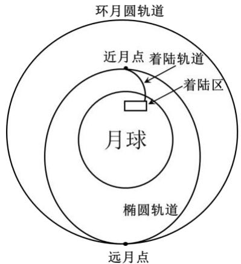

<details>
<summary>text_image</summary>

环月圆轨道
近月点 着陆轨道
着陆区
月球
椭圆轨道
远月点
</details>

图 1 落月过程示意图

嫦娥三号在椭圆轨道上运动时，由于其自身尺寸远小于其与月球之间的距离，故此时可将嫦娥三号视为一个质点。同时，由于月球近似为一个球形，就引力效果而言，可将月球看作一个质量集中在月心的质点。由此可将问题简化，便于后面讨论。

当嫦娥三号在沿着近月点高度 15 公里、远月点高度100 公里的椭圆轨道绕月运动时，可以将其看成一个绕月球公转的行星，假设嫦娥三号沿如图轨道逆时针运行，近月点远月点如图所 $\textstyle { \overline { { \overline { { \prime } } } } } 5$ ：

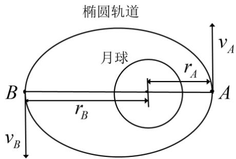

<details>
<summary>text_image</summary>

椭圆轨道
月球
rA
rB
vA
vB
A
</details>

图 嫦娥三号在椭圆轨道的运动示意图

机械能等于其动能和引力势能之和，当分别经过近月点A和远月点B时，嫦娥三号探测器的机械能分别为：

$$
E _ {A} = \frac {1}{2} m v _ {A} ^ {2} - \frac {G M m}{r _ {A}} \tag {1}
$$

$$
E _ {B} = \frac {1}{2} m v _ {B} ^ {2} - \frac {G M m}{r _ {B}} \tag {2}
$$

其中，v ，v 分别是嫦娥三号在近月点和远月点的瞬时速度，G为万有引力常 $\nu _ { _ A }$ $\nu _ { B }$ 量，M 为月球质量，m为嫦娥三号总质量，r ，r 分别为近月点和远月点到月心的距 $r _ { A }$ $r _ { B }$ 离。

嫦娥三号探测器在椭圆轨道上运动时，只受月球的引力作用，不受主减速发动机推力的影响，因此该阶段发动机处于关闭状态。所以嫦娥三号在椭圆轨道的运动过程中遵循机械能守恒定律，满足：

$$
E _ {A} = E _ {B} \tag {3}
$$

根据行星在围绕天体公转时，处于有心力场仅受万有引力的作用，合外力矩为零，满足角动量守恒定律。故嫦娥三号在近月点和远月点的角动量守恒，设近月点的速度大小v 和远月点的速度大小 $\nu _ { _ A }$ $\nu _ { { } _ { B } }$ ，其关系满足：

$$
m r _ {A} v _ {A} = m r _ {B} v _ {B} \tag {4}
$$

综上，根据机械能守恒定理和角动量守恒定律联立嫦娥三号在近月点和远月点的运动方程如下：

$$
\left\{ \begin{array}{l} m r _ {A} v _ {A} = m r _ {B} v _ {B} \\ \frac {1}{2} m v _ {A} ^ {2} - \frac {G M m}{r _ {A}} = \frac {1}{2} m v _ {B} ^ {2} - \frac {G M m}{r _ {B}} \end{array} \right. \tag {5}
$$

解得嫦娥三号在近月点的速度大小 $\nu _ { _ A }$ 和远月点的速度大小 $\nu _ { B }$ 分别为：

$$
\left\{ \begin{array}{l} v _ {A} = \sqrt {\frac {2 G M r _ {B}}{\left(r _ {A} + r _ {B}\right) \cdot r _ {A}}} \approx 1. 6 9 2 7 k m / s \\ v _ {B} = \sqrt {\frac {2 G M r _ {A}}{\left(r _ {A} + r _ {B}\right) \cdot r _ {B}}} \approx 1. 6 1 4 4 k m / s \end{array} \right. \tag {6}
$$

根据求解结果，显然 $\nu _ { { } _ { A } } > \nu _ { { } _ { B } }$ ，符合我们对近月点和远月点速度大小关系的认知。根据附件 所给问题背景与资料：嫦娥三号将在近月点 公里处以抛物线下降，相对速度从每秒1.7 公里逐渐降为零的信息，验证结果较为准确。

对于速度方向，由天体力学可知，嫦娥三号在近月点和远月点仅受到指向月心的月球引力作用，不受到其他方向上的力，且受到的月球引力完全用于维持它的椭圆运动。故在近月点和远月点，嫦娥三号探测仪的速度方向为逆时针沿切线方向。

## 5.1.2 近月点和远月点的位置的近似确定

近月点和远月点的位置可由其在月球表面投影点的经纬度，以及该点的海拔进行描述。

已知嫦娥三号的着陆点为（19.51W，44.12N），若知道着陆轨迹，则可根据着陆点和着陆轨迹在月面的投影路程求出近月点的位置。

近月点在月心坐标系的位置和软着陆轨道形态共同决定了着陆点的位置。但是，着陆控制策略及轨迹尚未确定，无法直接求出近月点或远月点的精确位置。因此，可以对模型在一定的假设上进行理想状态的化简，从而求得近月点和远月点的近似空间位置，再利用问题二中的控制策略及轨道设计，对近月点及远月点的位置进行修正。

## 近月点位置的确定

理想状态的相关假设如下：

（1）假设嫦娥三号探测器近似沿着一条经线着陆，软着陆过程仅改变纬度大小。

在实际情况中，嫦娥三号近似沿着经线着陆可以减少着陆过程在水平方向的推力和做功，同时能避免因此作出的相关姿态调整，从而减少能源的消耗。因此，认为在理想条件下，嫦娥三号探测器的着陆轨迹是近似沿着一条经线运动的，其软着陆改变的主要是纬度位置。

（2）假设主减速阶段的水平路程近似为软着陆的水平路程。

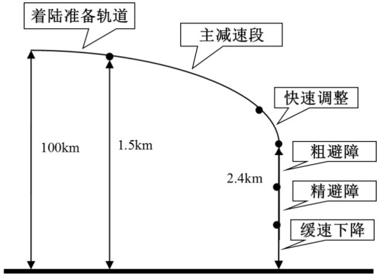

<details>
<summary>text_image</summary>

着陆准备轨道
主减速段
100km 1.5km
快速调整
粗避障
精避障
缓速下降
2.4km
</details>

图 3 软着陆过程示意图

由嫦娥三号的 个着陆阶段可知，在主减速阶段，探测器在近月点 公里处以类抛物线下降至月面 3公里，始末位置相对于月面的水平路程较大。而在快速调整阶段、粗避障、精避障等阶段，嫦娥三号基本位于着落点上方，水平移动幅度较小，可以忽略。在缓慢下降和自由落体阶段，嫦娥三号基本保持垂直下降，不考虑水平路程。

因此，嫦娥三号软着陆过程中，主减速阶段的水平路程可近似视为整个软着陆过程的水平路程。本小题中无法确定具体的着陆轨道，故通过查阅文献<sup>[1]</sup>获取相关信息，查得嫦娥三号在主减速阶段的轨迹航程大约430 km。

（3）假设着陆过程的实际航程等于月球表面的水平路程。

嫦娥三号的软着陆轨迹主要为一个抛物线，由于主减速阶段的航程AC约为430km，而近月点的高度<sub>AB</sub>为 15km，远小于着陆轨道实际路程。因此认为着陆轨迹的水平路程BC的大小近似等于实际路程AC的大小，即 $A C \approx B C$ ，故嫦娥三号在月球表面的水平路程BC约为430km。

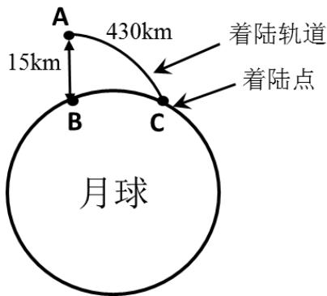

<details>
<summary>text_image</summary>

A
15km
430km
着陆轨道
着陆点
B
C
月球
</details>

图4 软着陆轨迹示意图

根据以上理想状态的设定，可以求出月球近月点的空间位置。已知嫦娥三号最终着陆点的位置为(19.51W，44.12N)，则根据假设（1），可得近月点的经度约为19.51W；根据假设（3），已知着陆轨迹的月面水平距离为430km，则将水平距离折算成纬度差，即可得到近月点的纬度位置可能为两处：

$$
4 4. 1 2 - \frac {4 3 0}{2 \pi R} \times 3 6 0 = 2 9. 9 4 N \tag {7}
$$

$$
\text {或} 4 4. 1 2 + \frac {4 3 0}{2 \pi R} \times 3 6 0 = 5 8. 3 0 N \tag {8}
$$

通过查阅文献<sup>[2]</sup>，嫦娥三号实际的着陆轨迹为自南向北移动，因此确定近月点的纬度位置为 29.94N。

## 远月点位置的确定

根据天体物理知识，近月点、月心和远月点同处于同一条直线上，满足三点共线的特点，故远月点的经纬度可用对跖点<sup>[3]</sup>的方法确定。

对跖点为天体表面上关于球心对称的位于天体直径两端的点，二者的经度相差180°，纬度值相等，而南北半球相反。近月点在月面的投影点与远月点在月面的投影点即为一对典型的对跖点。

由此解得远月点的经纬度为（160.49E，29.94S）。根据题意可知，近月点和远月点的高度分别为 15km和 100km。

综上，着陆准备轨道的近月点、远月点的近似位置，嫦娥三号在该处的速度大小及方向如下表所示：

表 1 近月点、远月点的位置及速度信息

<table><tr><td>地点</td><td>经度</td><td>纬度</td><td>高度</td><td>速度大小</td><td>速度方向</td></tr><tr><td>近月点</td><td>19.51W</td><td>29.94N</td><td>15 km</td><td>1.6927 km/s</td><td>逆时针沿速度切线</td></tr><tr><td>远月点</td><td>160.49E</td><td>29.94S</td><td>100 km</td><td>1.6144 km/s</td><td>逆时针沿速度切线</td></tr></table>

## 5.2 问题二

## 5.2.1 着陆准备轨道的控制策略

嫦娥三号首先在100km100km的霍曼转移轨道上运行，为使得其进入100km15km的椭圆着陆准备轨道，至远月点开启发动机减速使其进入着陆准备轨道运行。

在霍曼转移圆形轨道上，嫦娥三号仅受月球引力的作用，进行匀速圆周运动，其线速度 $\nu _ { 1 }$ 满足：

$$
\frac {G M m}{r ^ {2}} = m \frac {v _ {1} ^ {2}}{r} \tag {9}
$$

由于在远日点进行变轨，其速度较小比较容易控制。处于椭圆着陆准备轨道时，远日点处其线速度 $\nu _ { { } _ { 2 } } = \nu _ { { } _ { B } }$ 。变轨时，需要主减速发动机进行推力F减速做功，使得嫦娥三号进行向心运动进入椭圆轨道。根据动量守恒

$$
\int_ {0} ^ {T} F \mathrm{d} t = m v _ {1} - m v _ {2} \tag {10}
$$

其中，T为变轨所需时间。

从安全性角度考虑，为使变轨迅速完成进入预定轨道，设定目标函数为minT。

为了使得变轨时间最短，即需要每一时刻推力尽可能大，故我们采用以下控制策略进行变轨：采用 $F = F _ { \mathrm { m a x } } = 7 5 0 0 N$ 的最大恒推力进行减速，计算得到变轨最短时间$T = 2 1 . 0 7 2 \mathrm { s }$ o

## 5.2.2 主减速阶段的控制策略

嫦娥三号探测器在月球表面实现软着陆，由于月球表面没有大气，嫦娥三号不能依靠空气阻力减速，必须依靠主减速发动机的制动减速和姿态调整发动机来实现安全软着陆。为了研究嫦娥三号在主减速阶段的运动规律，需要确定软着陆坐标系，构造动力学方程，以燃耗最低为目标确定最优控制策略。

## 建立软着陆二维极坐标系

由于嫦娥三号探测器的软着陆过程是从 的近月点开始，整个下降过程时间较短，一般在几百秒的范围内，因此可以不考虑其他行星引力的摄动；同时，由于月球的自转速度较小，只有地球角速度的二十九分之一左右，故可以忽略月球自转的影响；再次，为了满足嫦娥三号能耗最小的要求，软着陆过程中应沿经线运动，故不考虑侧向纬线上的运动。发动机的推力方向，故发动机的推力方向，初始速度方向以及月球引力产生的速度方向应在同一经线平面内。

因此，引入二体模型描述嫦娥三号探测器的运动，构造如下二维坐标系 $O - X Y$ 以月心O为坐标原点， 轴指向近月点， 轴垂直近月点与月心的连线， 为嫦娥三号的月心距，θ 为OY和Or之间的夹角，F为发动机推力的大小，ψ为发动机推力方向与Or垂线的夹角。

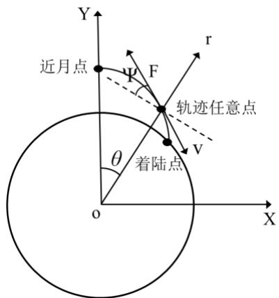

<details>
<summary>text_image</summary>

近月点
轨迹任意点
着陆点
θ
r
F
V
X
Y
O
</details>

图 5 软着陆二维极坐标系

## 动力学微分模型的建立

根据主减速阶段的运动过程，查阅文献，可得到嫦娥三号的微分动力学方程<sup>[4]</sup>：

$$
\left\{ \begin{array}{l} \dot {r} = v \\ \dot {v} = \frac {F}{m} \sin \psi - \frac {\mu}{r ^ {2}} + r \omega^ {2} \\ \dot {\theta} = \omega \\ \dot {\omega} = - \frac {1}{r} \left(\frac {F}{m} \cos \psi + 2 v \omega\right) \\ \dot {m} = - \frac {F}{v _ {e}} \end{array} \right. \tag {11}
$$

式中，v代表嫦娥三号沿r方向上的径向速度， $\omega$ 代表绕月角速度， $m$ 代表嫦娥三号探测器的质量，m代表单位时间燃料消耗的公斤数， $\nu _ { e }$ 代表发动机比冲，题中已知为 $2 9 4 0 m / s$ $\mu = G M$ 代表月球引力常数。

## 主减速阶段的控制策略

在主减速阶段，嫦娥三号在距离月面 的近月点点火下降，其轨迹大致上为一条抛物线。设计主减速段的控制策略，应在满足初始条件和末态速度为 57m/s的前提下，调整发动机推力F的大小和方向，并使得燃料消耗最少： $\operatorname* { m i n } J = \int _ { 0 } ^ { T } \dot { m } d t$ 。

由于主减速阶段的主要目的是使探测器减速，而当主减速发动机的大小达到最大时，探测器的减速最快。因此我们考虑在该阶段发动机的推力 $F$ 为一个恒力，且力的大小始终保持最大值7500N。接下来需要确定推力 $F$ 的方向。

整个主减速过程可以归结成为一个以燃料消耗最小为目标，以嫦娥三号初始条件和末端条件为约束的优化问题：

$$
\min J = \int_ {0} ^ {T} \dot {m} d t \tag {12}
$$

$$
s. t \left\{ \begin{array}{l} r (0) = r _ {0}, v (0) = 0, \theta (0) = 0, \omega (0) = \omega_ {0}, m (0) = m _ {0}; \\ r (T) = r _ {T}, \sqrt {v (T) ^ {2} + (\omega (T) * r _ {T}) ^ {2}} = 5 7 m / s \end{array} \right. \tag {13}
$$

根据上述分析，保持推力<sub>F</sub>的大小恒定为7500N，通过<sub>MATLAB</sub>编程（代码见附录），用遍历算法求解出满足约束条件且使燃耗最小的推力方向控制策略。

整个过程推力<sub>F</sub>的控制策略如下图所示：

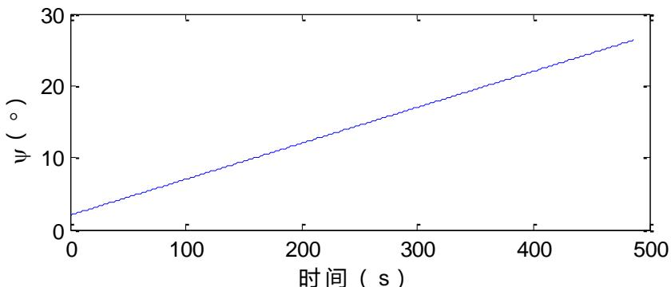

<details>
<summary>line</summary>

| 时间 (s) | \(\psi ({}^{\circ})\) |
| --- | --- |
| 0 | ~2.5 |
| 100 | ~7.5 |
| 200 | ~12.5 |
| 300 | ~17.5 |
| 400 | ~22.5 |
| 480 | ~26.5 |
</details>

图 6 主减速段最优推力方向角变化曲线图

由上图可知，推力方向角与时间呈一次函数关系。在该控制策略下，嫦娥三号在主减速阶段的各个状态变化如下图所示：

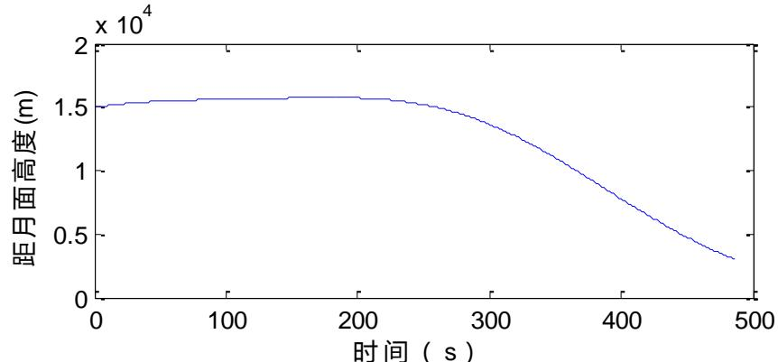

<details>
<summary>line</summary>

| 时间 (s) | 距月面高度 (m) |
| --- | --- |
| 0 | ~15000 |
| 100 | ~15800 |
| 200 | ~16000 |
| 300 | ~14000 |
| 400 | ~8000 |
| 500 | ~3500 |
</details>

图 7 主减速段最优高度变化曲线图  
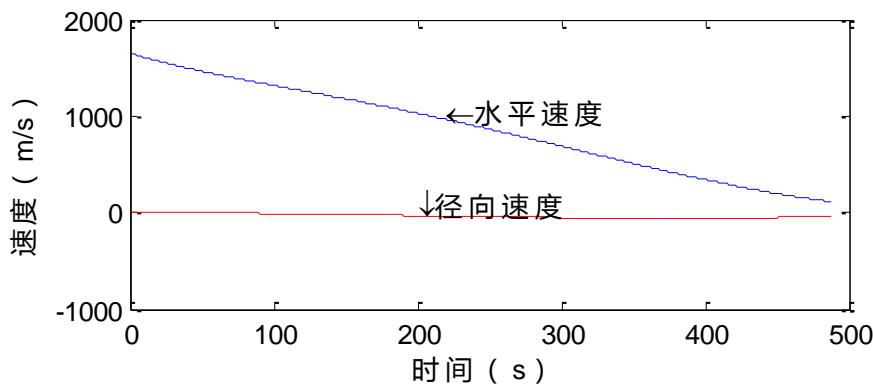

<details>
<summary>line</summary>

| 时间 (s) | 水平速度 (m/s) | 径向速度 (m/s) |
| --- | --- | --- |
| 0 | ~1650 | 0 |
| 100 | ~1350 | 0 |
| 200 | ~1050 | 0 |
| 300 | ~750 | 0 |
| 400 | ~450 | 0 |
| 500 | ~150 | 0 |
</details>

图 8 主减速段最优速度变化曲线图

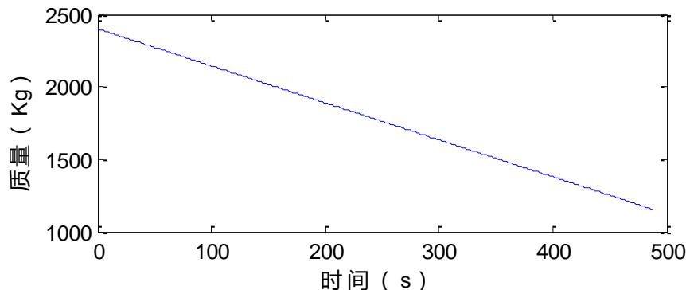

<details>
<summary>line</summary>

| 时间 (s) | 质量 (Kg) |
| --- | --- |
| 0 | ~2400 |
| 100 | ~2150 |
| 200 | ~1900 |
| 300 | ~1650 |
| 400 | ~1400 |
| 480 | ~1150 |
</details>

图 9 主减速阶段嫦娥三号质量变化曲线图

嫦娥三号在该阶段的最优控制策略下，达到的末态为：速度大小为56.83 /m s，方向向下，与竖直方向所成夹角为32.3，剩余质量为1157.7kg，即消耗的推进剂质量为1242.3kg。

## 修正问题一的近月点及远月点位置

主减速阶段航程为： $L = \int _ { 0 } ^ { T } ( \vec { w } \cdot \vec { r } + \vec { \nu } ) d t$ ，通过计算求解，得到了精确的月面水平位移 $L = 4 5 6 . 3 2 k m$ ，故修正后的纬度坐标应为：

$$
4 4. 1 2 - \frac {4 5 6 . 3 2}{2 \pi R} \times 3 6 0 = 2 9. 0 7 9 N \tag {14}
$$

因此，修正后的近月点经纬坐标为（19.51W，29.08N）；远月点可通过对跖法求出位置为（160.49E，29.08S）。

## 5.2.3 快速调整阶段的控制策略

快速调整阶段的时间较短，目标是在短时间内调整嫦娥三号的姿态，使其在降至2.4km高度前的水平速度达到 0，该阶段相较主减速阶段的燃料消耗较少。

由图8 可知，在快速调整阶段初期时，探测器的合速度方向仍接近于水平，而在快速调整阶段末期，探测器水平速度达到0，探测器姿态调整成竖直向下，如下图所示：

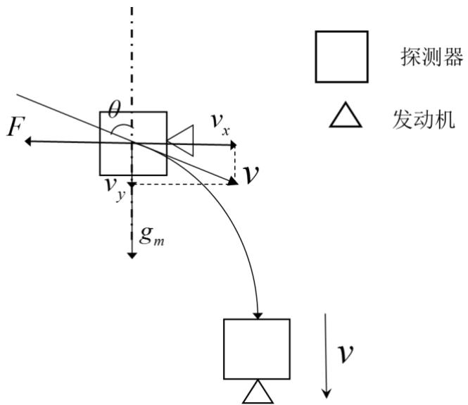

<details>
<summary>text_image</summary>

F
θ
v_x
v_y
g_m
V
探测器
发动机
v
</details>

图 10 快速调整阶段的轨道及受力示意图

对上图进一步分析，此时嫦娥三号以处于3000m处，高度较低，其万有引力可以近似等于重力，故将向心加速度简化为恒定重力加速度 $g _ { m }$ 。同时，快速调整阶段需要满足以下约束条件：

## （1）水平速度约束

在初始阶段，探测器受到一个竖直向下的重力和一个水平反方向的发动机推力F。嫦娥三号的速度可分解为一个月球引力方向的分量 $\nu _ { y }$ 和一个与推力方向相反的分量 $\nu _ { x }$ 。由于在快速调整末期要求探测器的水平速度 $\nu _ { x }$ 为 0，则要求嫦娥三号在水平方向上做变减速运动至速度为0，,即 $\int _ { 0 } ^ { T } \frac { F } { m ( t ) } d t = \nu \sin \theta$ C

## （2）竖直高度约束

在探测器抵达快速调整状态最终位置 2.4km时，需要满足水平速度减小为 0，若在此之前水平速度已降至0，则接下来可调整位姿发动机使其主发动机朝下，直至降至2.4km高度。因此，满足不等式 ${ \nu t } \cos \theta + 0 . 5 { \cdot } g _ { m } T ^ { 2 } < h _ { 1 } - h _ { 2 }$ ，其中 $h _ { 1 }$ 和 $h _ { 2 }$ 分别为主减速阶段和快速调整阶段的初始高度， $h _ { 1 } - h _ { 2 }$ 即为快速调整阶段的竖直高度差 600m。在此基础上，考虑燃油量的最优性，令目标为最小燃油耗能J 。

综上，该非线性规划的模型如下：

$$
\min J = \int_ {0} ^ {T} \dot {m} d t \tag {15}
$$

$$
\left\{ \begin{array}{l} \int_ {0} ^ {T} \frac {F}{m (t)} d t = v \sin \theta \\ v T \cos \theta + \frac {1}{2} g _ {m} T ^ {2} <   h _ {1} - h _ {2} \end{array} \right. \tag {16}
$$

在此控制策略下，最优推力的变化图与嫦娥三号的质量变化图如下所示：

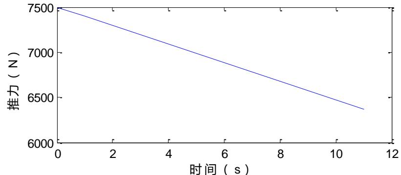

<details>
<summary>line</summary>

| 时间 (s) | 推力 (N) |
| --- | --- |
| 0 | 7500 |
| 11 | ~6380 |
</details>

图 快速调整阶段最优推力变化曲线图

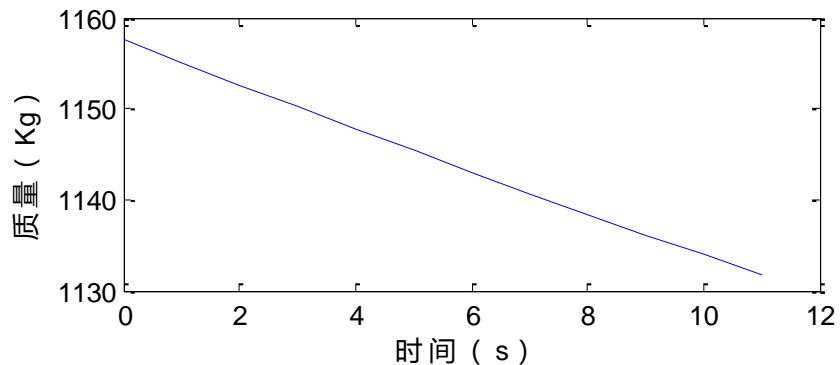

<details>
<summary>line</summary>

| 时间 (s) | 质量 (Kg) |
| --- | --- |
| 0 | ~1158 |
| 11 | ~1132 |
</details>

图 12 快速调整阶段嫦娥三号质量变化曲线图

对该模型进行求解，得到在快速调整阶段，达到末态时嫦娥三号径向速度大小为65.16 /m s，水平速度降为0，质量减为1137.7kg ，即本阶段消耗的推进剂质量为20kg 。

## 5.2.4 粗避障阶段的控制策略

粗避障阶段主要是在较大的着陆范围内，剔除明显具有着陆危险的大陨石坑，防止精避障阶段由于距离太近而出现无法避开的障碍，提高着陆的整体安全性。

在粗避障阶段，嫦娥三号相较于之前的着陆阶段速度变化较小，消耗的能源也相对较小。因此，该阶段主要考虑着陆安全性，同时适当考虑发动机能耗设计最优控制策略。该阶段的控制策略可以分为（1）着陆区域的选择策略（2）着陆阶段的控制策略。

## 着陆区域的选择策略

粗避障段的范围是距离月面2.4km到 100m的区间，探测器在末态位置100m处于悬停状态，相对于月面速度为0。粗避障阶段在选择最优着陆区域时策略步骤如下：

（1）数据预处理。读取数字高程图，得到每个像素点的高程值 $a _ { i j }$ ，并统计频数。  
（2）区域网格化。查阅文献<sup>[1]</sup>，查得嫦娥三号的尺寸大小：直径不大于3.65m，高度不大于3.3m，为了其安全着陆，故考虑以 $1 0 \times 1 0$ 个像素（10 10 m）为一个单元格，将高程图划分为由若干个单元格构成的图像。  
（3）平地区域的筛选。引入变量 $x _ { i j }$ 描述该高程点是否可看做着陆平地。记频数最大的高程值为A，将高程A上下幅度 4米范围内的地区为平地，即：

$$
x _ {i j} = \left\{ \begin{array}{l l} 0 & a _ {i j} \notin [ A - 4, A + 4 ] \\ 1 & a _ {i j} \in [ A - 4, A + 4 ] \end{array} \right. \tag {17}
$$

视平地像素数量大于80%的单元格为平地单元格，落地区域在平地单元格中筛选。

（4）坡度计算。在粗避障段，以每个平地单元格中像素的高程方差作为衡量其坡度大小的标准，视坡度为判断该单元格落地安全性的依据。  
（5）危险系数I的确定。将每个平地单元格的坡度大小0-1标准化，所得值即为该单元格的危险系数。坡度越小，危险系数越小。  
（6）确定着陆区域。由于嫦娥三号离地的竖直距离相近，故仅仅考虑探测器的水平距离D，将燃料目标最优转化为水平距离D最小。同时由于粗避障阶段以下落的安全性为主要目标，能耗方面较少，故赋予两者权值为3:7。将水平距离D大小0-1标准化，计算每个平地单元格的加权分数f ，即

$$
f = 0. 3 D + 0. 7 I \tag {18}
$$

取分数f 最小的平地单元格为初步落月地点。

根据该策略，对附件 3距 2400m处的数字高程图的着陆区域进行选择（代码见附录），得到该数字高程图中十个最优的平地单元格中心坐标及得分如下。表中x，y表示以高程图左下角为原点，自左向右为x轴，自下往上为y轴的坐标轴中的一个像素点，嫦娥三号位于坐标着陆区域中心坐标（1150，1150）的正上方：

表 2 十个最优的粗避障阶段着陆平地单元格

<table><tr><td>排名</td><td>x</td><td>y</td><td>f</td><td>排名</td><td>x</td><td>y</td><td>f</td></tr><tr><td>1</td><td>1135</td><td>1185</td><td>0.0231</td><td>6</td><td>1215</td><td>1095</td><td>0.0422</td></tr><tr><td>2</td><td>1195</td><td>1155</td><td>0.0278</td><td>7</td><td>1225</td><td>1065</td><td>0.0430</td></tr><tr><td>3</td><td>1085</td><td>1155</td><td>0.0347</td><td>8</td><td>1105</td><td>1155</td><td>0.0443</td></tr><tr><td>4</td><td>1205</td><td>1125</td><td>0.0397</td><td>9</td><td>1235</td><td>1135</td><td>0.0447</td></tr><tr><td>5</td><td>1055</td><td>1175</td><td>0.0417</td><td>10</td><td>1105</td><td>1175</td><td>0.0451</td></tr></table>

根据平地单元格的排名，确定嫦娥三号在粗避障阶段的落月地点坐标应为（1135，1185），在数字高程图中的位置如图所示：

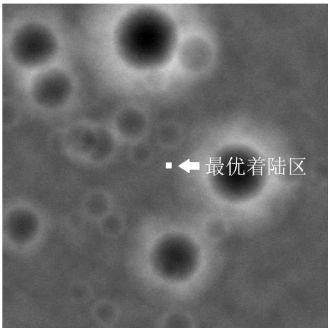

<details>
<summary>text_image</summary>

最优着陆区
</details>

图13 粗避障阶段的最优着陆区

观察模型所选定的最优着陆区，与我们认知的平坦区域即安全着陆区较为符合，且距离图像中心比较近，可以兼顾到探测器的平移距离和优化指标。嫦娥三号在该处着落的可能性很大，故模型的准确度和实用性高。

## 着陆过程的控制策略

在初步确定着陆阶段后，这个阶段控制策略的目标，是准确到达着陆区域，同时满足末速度为0 的约束条件。在此基础上，考虑发动机的耗能情况设计控制策略。

分析可知，当粗避障段的着陆轨迹为一条直线时，轨迹长度最小，着落时间最省，则在移动中发生意外情况的可能性较小，发动机耗能也较小。因此，认为探测器从初始点沿直线运动到着陆区域为最优运动轨迹。

为了使着陆轨迹为一条直线，探测器的合加速度与速度方向必须相反。因此，发动机推力、月球重力加速度和速度需要满足一定的几何关系，如下图所示。

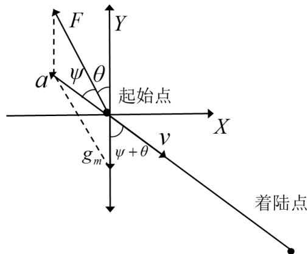

<details>
<summary>text_image</summary>

F
Y
a
ψ θ
起始点
X
v
gm
ψ + θ
着陆点
</details>

图 14 推力、加速度与速度的几何关系

根据该几何关系，对探测器的运动状态和受力进一步分析，可以确定推力F大小、方向等满足以下约束关系：

$$
\left\{ \begin{array}{l} m g _ {m} \sin (\theta + \psi) = F \sin \psi \\ F \cos \psi - m g _ {m} \cos (\theta + \psi) = m a \\ v = \int_ {0} ^ {t} a d t \\ F = \dot {m} v _ {e} \\ m = m _ {0} - \int_ {0} ^ {t} \dot {m} d t \end{array} \right. \tag {19}
$$

其中， $g _ { m }$ 为月球重力加速度，a为合加速度，θ为推力与重力的夹角，<sub>ψ</sub>为合力与推力的夹角，m为嫦娥三号的质量， $m _ { 0 }$ 为嫦娥三号飞到粗避障阶段初始时刻的质量，m为燃料的秒耗量。

## 5.2.5 精避障阶段的控制策略

精避障阶段主要是在粗避障段确定的着陆区域内进行精确的障碍检测，识别并剔除危及安全的小尺度障碍，从而确保嫦娥三号的落点安全。该阶段相对于粗避障段的识别精确度和对落月区域的要求更高。精避障段的目标同样是以落地安全和准确性为主，同时兼顾燃料消耗。

## 着陆区域的选择策略

精避障阶段的着陆区域选择策略与 5.2.4 中粗避障阶段的策略相似，即先对区域网格化，再根据像素高程的频数确定图中的平地区域，最后依据每个平地区域的坡度大小和着陆所需的平移距离确定最佳着陆地点。

由于精避障阶段的识别精度更高，故其着陆策略的主要步骤如下：

（1）数据预处理。读取数字高程图，得到每个像素点的高程值，并统计频数。  
（2）单元格的划分。相对于粗避障阶段，精避障阶段的识别阶段需更加精确，因此取每个5m×5m（即50×50像素）区域为一个单元格，从而缩小了单元格的大小，使对每个单元格月面情况的讨论更加详细充分。  
（3）平地单元格的判断。由于单元格的面积减小，故对每个单元格内的平地点数量要求也相应改变，令含平地点数量大于 60%的单元格为平地单元格。  
（4）坡度计算。计算每个平地单元格的坡度大小，由于精避障阶段对落月面的平稳度和安全性要求更高，故对每个像素点的坡度进行如下精确计算。

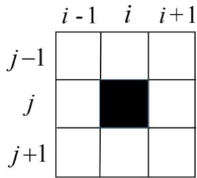

<details>
<summary>text_image</summary>

i - 1   i   i + 1
j-1
j
j+1
</details>

图 15 像素坡度计算示意图

如上图所示，除单元格内的最外圈像素外，每个像素周围均有与其相邻的8个像素，计算该像素与周围8个像素的高程方差之和，记为该点的坡度 $p _ { i j }$ ：

$$
p _ {i j} = \sum_ {m = i - 1} ^ {i + 1} \sum_ {n = j - 1} ^ {j + 1} (I _ {m n} - I _ {i j}) ^ {2} \tag {20}
$$

其中， $I _ { i j }$ 为单元格中每个像素的高程值。平地单元格的坡度大小为其包含的所有像素的坡度大小之和，则第k 个平地单元格的坡度值 $W _ { k }$ 为：

$$
W _ {k} = \sum_ {j = 2} ^ {4 9} \sum_ {i = 2} ^ {4 9} p _ {i j} \tag {21}
$$

（5）危险系数的确定。将每个平地单元格的坡度大小0-1标准化，所得结果即为该单元格的危险系数。  
（6）确定着陆区域。以探测器的平移距离最小和危险系数最小为目标，赋权3：7，计算每个平地单元格的加权得分f ，取分数f 最小的平地单元格为落月地点。

根据该策略，对附件4距月面 100m处的数字高程图的着陆区域进行选择（代码见附录）。由此得到精避障阶段前十最优的着陆单元格的中心坐标及得分如下：

表 3 十个最优的精避障阶段着陆平地单元格

<table><tr><td>排名</td><td>x</td><td>y</td><td>f</td><td>排名</td><td>x</td><td>y</td><td>f</td></tr><tr><td>1</td><td>33</td><td>53</td><td>0.0919</td><td>6</td><td>18</td><td>48</td><td>0.1962</td></tr><tr><td>2</td><td>23</td><td>48</td><td>0.1143</td><td>7</td><td>78</td><td>63</td><td>0.1974</td></tr><tr><td>3</td><td>28</td><td>53</td><td>0.1205</td><td>8</td><td>53</td><td>93</td><td>0.2031</td></tr><tr><td>4</td><td>28</td><td>58</td><td>0.1665</td><td>9</td><td>18</td><td>28</td><td>0.2191</td></tr><tr><td>5</td><td>18</td><td>33</td><td>0.1836</td><td>10</td><td>33</td><td>63</td><td>0.2250</td></tr></table>

根据上表可得，精避障阶段最终选择的着陆区域坐标为(33，53)，在数字高程图中的位置如下图：

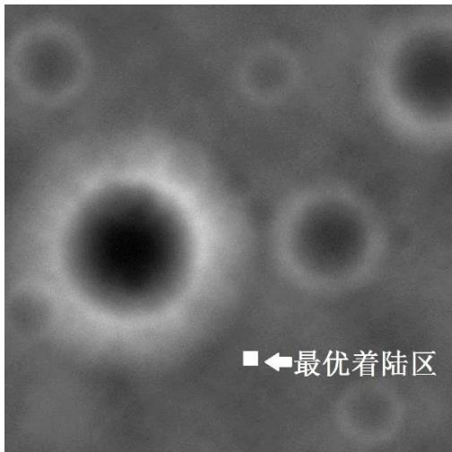

<details>
<summary>text_image</summary>

■←最优着陆区
</details>

图 16 精避障阶段的最优着陆区

观察图像，该选定的最优着陆区符合我们对平坦区域和着落安全区域的认知，且着陆区域与视野中心即嫦娥三号的水平距离较小，故嫦娥三号在该区域的着陆的可行性较高，模型的准确度较高。

## 着陆过程的控制策略

精避障阶段下嫦娥三号的控制策略与粗避障阶段相同，即在选择了着陆区域以后，沿精避障初始点与着落点的连线直线下落，其中发动机推力F的方向始终与速度方向相反，且发动机的推力、月球重力加速度和速度满足一定的几何规律，此处不再重复阐述。

## 5.2.6 缓速下降阶段的控制策略

缓速下降阶段是嫦娥三号软着陆最后阶段。该阶段的主要控制实现探测器在距离月面4m处相对月面静止，之后关闭发动机，使嫦娥三号自由落体到精确的落月点。

此阶段控制探测器由距离月面 处（速度竖直向下）运动到距离月面 处，并且实现速度为0m/s。经分析易知，此阶段的控制策略为发动机提供一个竖直向上的推力 ，使得探测器减速下降至距离月面 处，并满足末态速度为 。考虑到此阶段控制过程较短，为了便于求解，不妨假定探测器质量m在此过程中恒定不变，则有：

$$
\left\{ \begin{array}{l} v ^ {2} - 0 = 2 a \Delta h \\ F - m g _ {m} = m a \end{array} \right. \tag {22}
$$

其中，v为探测器在距离月面30m出竖直向下的速度，h为本阶段控制高度$\Delta h = 2 6 m$

解上述方程组得， $F = \frac { 2 m \nu ^ { 2 } } { h } + m g _ { { \scriptscriptstyle m } }$ 。

故该阶段中，发动机提供方向竖直向上，大小为 ${ \frac { 2 m \nu ^ { 2 } } { h } } + m g _ { m }$ 的推力F实现对探测器的控制。

## 5.3 问题三

## 5.3.1 误差分析

## 初始条件误差

初始条件的选取决定了嫦娥三号软着陆6 个阶段在控制策略下计算所得数据的准确性。我们从月球半径、初始高度和初始速度三个角度分析初始条件带来的系统误差。

月球半径：本文将月球视为球体，取月球半径 $R = 1 7 3 7 . 0 1 3 k m$ ，实际上月球应为椭球体，其赤道平均半径和极区半径分别为1737.646km和1735.843km，形状扁率为1/963.7256。由 5.2 中建立的二维动力学微分方程（公式）分析，角加速度 、线加速度v及水平路程d 均取决于月球半径R的大小。

初始高度：由于无法得知近月点的真实初始高度，只能采用 $r = 1 5 k m$ 近似计算，该高度的选取与嫦娥三号真实制动时有略微差异，其影响范围同月球半径，包括 、v及水平路程d 。

初始速度：本文假设不考虑其他星体摄动，同时也不考虑月球自转、公转的影响情况下，由角动量及机械能守恒计算所得的初始近月点速度 $\nu _ { _ { A } } = 1 . 6 9 2 7 k m / s$ C

## 可调节推力延时误差

本文假设主减速发动机产生的推力F可以在瞬时内增大减小到任意值，实际上推力大小F是一个连续变化的量。查阅文献<sup>[1]</sup>可知，嫦娥三号为了提高 7500N 发动机的精确度和快速推力调节性能，采用两细分、高频率闭环控制。其控制频率达到1000Hz，单步推力分辨率达到 $f = 6 . 2 5 N /$ 步的水平。

在主减速阶段的控制中，采用的控制方案是 $F = 7 5 0 0 N$ 的变方向的恒力。但在嫦娥三号由 100km-15km椭圆轨道近月点（该轨道上主减速发动机推力 $F = 0 )$ 开始制动减速时，忽略了推力<sub>F</sub>增大至F N7500 所需的时间：

$$
t ^ {\prime} = \frac {F _ {\max}}{f} = 1 2 0 0 (m s) = 1. 2 (s) \tag {23}
$$

占总时间 $t _ { 1 }$ 引起的误差：

$$
\varepsilon_ {1} = \frac {t ^ {\prime}}{t} \times 100 \% = 0.26 \% \tag {24}
$$

## 月球自转引起的误差

由于5.2 主减速阶段中建立的是极坐标下软着陆二维动力学模型，其假设出发点即是嫦娥三号的主减速着陆运动在同一个平面内。但实际登月过程中，存在月球自转及各种摄动因素影响，嫦娥三号降落过程并不能保持在同一平面内，由题知，嫦娥三号的最终着陆点位置为19.51 ,44.12W N。查阅文献资料可知，嫦娥三号的实际近月点经度位置大约为：19.05W，此偏差即是由月球自转造成，计算得到经度误差：

$$
\varepsilon = \frac{19.51 - 19.05}{19.05}\times 100\% = 2.415\% \tag{25}
$$

## 5.3.2 敏感性分析

## 推力F的灵敏度分析

在主减速阶段，采用 $F = F _ { \operatorname* { m a x } }$ 进行减速控制，考虑到由于随机误差会造成F并不能维持在恒定值，故这里分析对高度r下降，径向速度 $\nu _ { r }$ 以及法向速度 $\nu _ { \varphi }$ 造成的影响。取 $F ^ { \prime } { = } F _ { \mathrm { m a x } } { \pm } 5 \%$ 进行模拟，得到结果如下图所示：

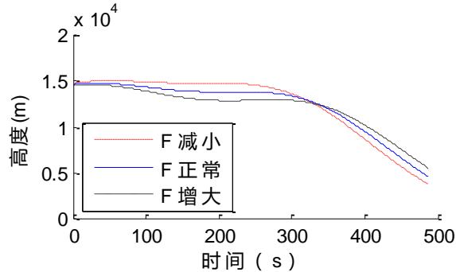

<details>
<summary>line</summary>

| 时间 (s) | F减小 (m) | F正常 (m) | F增大 (m) |
| --- | --- | --- | --- |
| 0 | ~1.5e4 | ~1.5e4 | ~1.5e4 |
| 100 | ~1.5e4 | ~1.45e4 | ~1.4e4 |
| 200 | ~1.5e4 | ~1.4e4 | ~1.35e4 |
| 300 | ~1.4e4 | ~1.35e4 | ~1.3e4 |
| 400 | ~0.9e4 | ~0.85e4 | ~0.95e4 |
| 500 | ~0.4e4 | ~0.5e4 | ~0.6e4 |
</details>

图 高度对推力的敏感程度图

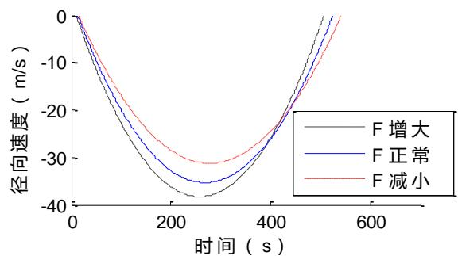

<details>
<summary>line</summary>

| 时间 (s) | F 增大 (m/s) | F 正常 (m/s) | F 减小 (m/s) |
| --- | --- | --- | --- |
| 0 | 0 | 0 | 0 |
| ~250 | ~-38 | ~-35 | ~-31 |
| ~400 | ~-25 | ~-25 | ~-25 |
| ~550 | 0 | 0 | 0 |
</details>

图 径向速度对推力的敏感程度图

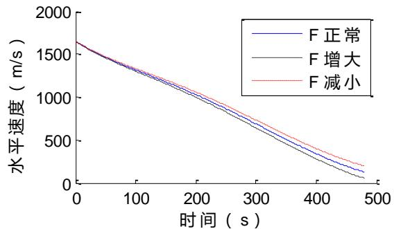

<details>
<summary>line</summary>

| 时间 (s) | F正常 (m/s) | F增大 (m/s) | F减小 (m/s) |
| --- | --- | --- | --- |
| 0 | ~1650 | ~1650 | ~1650 |
| 100 | ~1350 | ~1350 | ~1380 |
| 200 | ~1050 | ~1000 | ~1100 |
| 300 | ~750 | ~650 | ~800 |
| 400 | ~400 | ~300 | ~450 |
| 480 | ~150 | ~80 | ~220 |
</details>

图 水平速度对推力的敏感程度图

由结果分析可知，水平速度 $\nu _ { \varphi }$ 对推力<sub>F</sub>不敏感，高度<sub>r</sub>径向速度 $\nu _ { r }$ 对推力 $F$ 较为敏感。随着推力 的增大，高度 起先呈现加速减小，后有增大趋势，径向速度 $\nu _ { r }$ 明显反向增大，水平速度 $\nu _ { \varphi }$ 在前 200s内与正常状况下一致；随着推力<sub>F</sub>的减小，高度<sub>r</sub>降低速度减缓，至300s以后加快下降，径向速度 $\nu _ { r }$ 明显反向增大减缓，水平速度 $\nu _ { \varphi }$ 基本不产生影响。联系实际，若制动时推力F增大，相应的，燃油量也将增大，对高度的下降起了明显作用，但对水平速度的减速作用得不到体现，故可认为7500N 是最适合的推力，在该基础行增大F并不能起到提升总体效果的作用。

## 初始高度 $r _ { 0 }$ 的灵敏度分析

下面针对高度r（包括月球半径的影响）对径向速度 $\nu _ { r }$ 以及法向速度 $\nu _ { \varphi }$ 做灵敏度分析，取 $r ^ { \prime } = r _ { 0 } \pm 5 \%$ 结果如下图所示

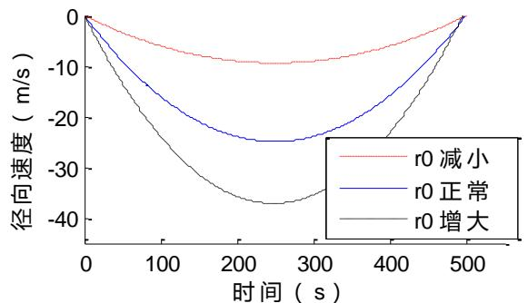

<details>
<summary>line</summary>

| 时间 (s) | r0 减小 (m/s) | r0 正常 (m/s) | r0 增大 (m/s) |
| --- | --- | --- | --- |
| 0 | 0 | 0 | 0 |
| 100 | ~-6 | ~-15 | ~-25 |
| 200 | ~-9 | ~-23 | ~-35 |
| 300 | ~-9 | ~-24 | ~-37 |
| 400 | ~-6 | ~-18 | ~-25 |
| 500 | 0 | 0 | 0 |
</details>

图 20 径向速度对初始高度的敏感程度图

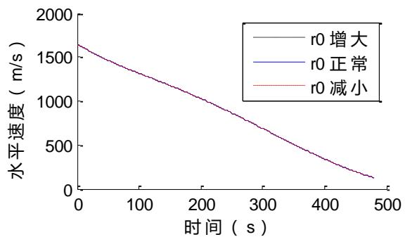

<details>
<summary>line</summary>

| 时间 (s) | r0 增大 (m/s) | r0 正常 (m/s) | r0 减小 (m/s) |
| --- | --- | --- | --- |
| 0 | ~1650 | ~1650 | ~1650 |
| 100 | ~1350 | ~1350 | ~1350 |
| 200 | ~1050 | ~1050 | ~1050 |
| 300 | ~750 | ~750 | ~750 |
| 400 | ~400 | ~400 | ~400 |
| 480 | ~150 | ~150 | ~150 |
</details>

图 21 水平速度对初始高度的敏感程度图

由结果分析可知，径向速度 $\nu _ { r }$ 对初始高度 的变化极为敏感，水平速度对初始高度的变化不敏感。随着高度的增加，径向速度反向增大极为明显，水平速度无明显变化；随着高度的减小，径向速度反向增大急速减缓，水平速度无明显变化。联合实际，若近月点高度选取大于15km，则会使得径向速度增大较为明显，朝月面下降过快，其落入 3km处合速度将明显大于57m/s，耗费了更多的燃油量；若近月点高度选取小于 15km，则使得反向径向速度过小，类似于做圆周运动，嫦娥三号在制动过程中靠近月面3km处需要花费更长的时间，也会增加燃油量的耗费。

## 比冲 $\nu _ { e }$ 的灵敏度分析

本题中所给的比冲 $\nu _ { e } = 2 9 4 0 m / s$ 为恒定值，现考虑比冲对于高度r，水平速度及径向速度的影响因素，同样地，取 $\nu _ { e } ^ { \prime } = \nu _ { e } \pm 5 \%$ 进行仿真，得到如下结果：

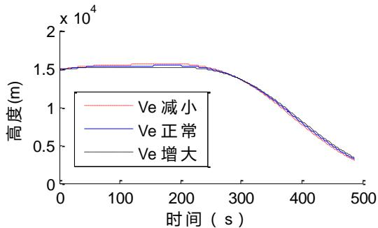

<details>
<summary>line</summary>

| 时间 (s) | Ve 减小 (m) | Ve 正常 (m) | Ve 增大 (m) |
| --- | --- | --- | --- |
| 0 | ~15000 | ~15000 | ~15000 |
| 100 | ~15500 | ~15300 | ~15200 |
| 200 | ~15800 | ~15400 | ~15300 |
| 300 | ~14000 | ~14000 | ~14000 |
| 400 | ~7500 | ~7500 | ~7500 |
| 500 | ~3500 | ~3500 | ~3500 |
</details>

图 22 高度对比冲的敏感程度图

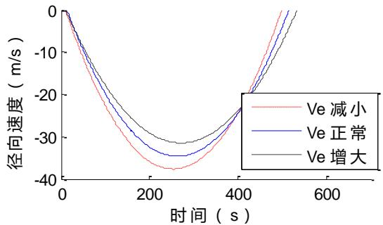

<details>
<summary>line</summary>

| 时间 (s) | Ve 减小 (m/s) | Ve 正常 (m/s) | Ve 增大 (m/s) |
| --- | --- | --- | --- |
| 0 | 0 | 0 | 0 |
| ~250 | ~-37 | ~-34 | ~-31 |
| ~400 | ~-23 | ~-23 | ~-23 |
| ~500 | ~0 | ~0 | ~0 |
</details>

图 23 径向速度对比冲的敏感程度图

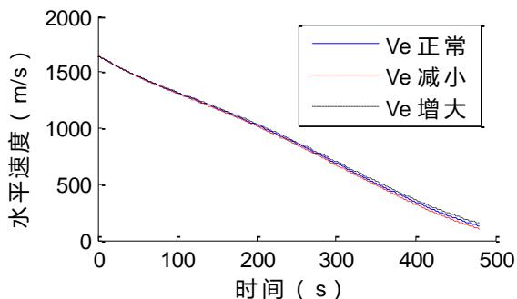

<details>
<summary>line</summary>

| 时间 (s) | Ve 正常 (m/s) | Ve 减小 (m/s) | Ve 增大 (m/s) |
| --- | --- | --- | --- |
| 0 | ~1650 | ~1650 | ~1650 |
| 100 | ~1350 | ~1350 | ~1350 |
| 200 | ~1050 | ~1050 | ~1050 |
| 300 | ~750 | ~750 | ~750 |
| 400 | ~400 | ~350 | ~450 |
| 480 | ~150 | ~120 | ~200 |
</details>

图 24 水平速度对比冲的敏感程度图

由结果分析可知，径向速度对比冲较为敏感，高度及水平速度对比冲不敏感。观察结果发现，无论比冲增大还是减小，在现有的控制策略下，水平速度及实时高度的稳定性较强；当比冲增大时，径向速度反向增大趋势明显减缓，反之，当比冲减小时，径向速度反向增大趋势明显加剧。联系实际，在该控制策略下，对比冲的鲁棒性较强，即控制策略充分通过外界环境及内部传感器信息来弥补比冲过大或过小的不足，调整自己的位姿与软着陆时间。

## 6 应用与推广

## 6.1 模型的优点分析

## 6.1.1 问题一的优点

1．在着陆轨迹尚未确定的情况下，灵活建立合理假设简化问题，使能够在理想情况下求出近月点和远月点的近似位置，同时利用第二问所得的着陆轨迹和控制策略对近月点和远月点的位置进一步确定，从而提高了所得位置的准确性和精度。将所得结果与嫦娥三号的实际运动情况和实际近月点位置比较，发现与实际值吻合性高，说明模型的准确度较高。  
2．根据近月点和远月点的已知高度，利用角动量定律和机械守恒定理确定嫦娥三号在近月点和远月点的速度，该方法对于确定空间内一定高度的运动物体速度具有一定的普适性。

## 6.1.2 问题二的优点

1．在合理考虑相关假设的情况下，将嫦娥三号的着陆过程视为沿着一条经线在一个平面内的运动，并构建二维极坐标描述其运动过程，使模型简化且便于计算的同时，保持结果的客观性和准确度。  
2．在确定粗避障和精避障阶段的着陆区域时，对数字高程图进行了网格区域化，并根据高程频数确定了图像内的平地区域，通过对每个平地单元格的坡度大小及平移距离进行讨论，从而确定最优落地区域。该模型的实用性和推广性较强，可广泛应用于物体着陆于天体时的着陆区域评价。

## 6.1.3 问题三的优点

从初始条件、可调节推力延时、月球的自转三个方面考虑着陆轨迹和控制策略的系统误差，不仅分析了误差原因，还给出了误差的具体计算方法和大小，便于今后模型的改进和进一步优化。

## 6.2 模型的缺点分析

1．在问题二中建立的微分方程模型不易求解，我们在具体求解时对模型中的条件做了一定的近似简化，可能会使最后结果与实际值存在一定的误差。  
2．在相应假设的条件下，我们建立了二维极坐标系描述嫦娥三号的运动，但在实际着陆过程中嫦娥三号不可能完全在一个平面上运动，建立三维坐标系对其着陆过程分析的准确度可能会更高。

## 6.3 模型的推广方向

软着陆在人类对宇宙星球探测中具有重要作用，而软着陆时的轨道、控制策略又是软着陆的一个关键性技术。通过应用最优控制策略、燃耗最优目标等方法对探测器的软着陆制导问题进行深入研究，可以使其广泛应用于人类对月球的进一步探测，或探测器对火星等其他星球的软着陆问题中，为人们的宇宙探测计划提供关键技术。

## 7 参考文献

[1] 孙泽洲, 张廷新, 张熇, 等. 嫦娥三号探测器的技术设计与成就[J]. 中国科学: 技术科学, 2014, 4: 001.  
[2] 郭敏华. 月球软着陆的建模与控制[D]. 哈尔滨: 哈尔滨工业大学, 2007.  
[3] 徐成龙. 有趣的地理现象—我们脚下地球的那一边是什么地方[J]. 中学地理教学参考, 1981, 4: 010.  
[4] 张建辉, 张峰. 月球软着陆轨道优化方法比较研究[J]. 工程数学学报, 2012, 29(3):355-365.

## 8 附录

附录一 主减速阶段遍历搜索控制策略  
```matlab
(1) 文件名: soujie.m(遍历搜索控制策略)
clc,clear all;
% tic
global F;                      % 推力
global beta;                    % 力的角度
global mu;                     % 月球引力常数
global c;                    % 比冲
mu=4.903737416799999e+12;    % 月球引力常数
c=2940;                       % 比冲
vf=zeros(401,360);
for li=1500:7500
    F=li;
    for ja=1:3600
        beta=pi/180*ja*0.1;          % 力的角度
        [t,x]=ode45(@func,[0:1:400],[1753000;0;0;1692/1753000;2400]);
        h=x(:,1)-1738000;
        [n,m]=size(h);
        for i=1:n
```

```matlab
vf(i,ja)=sqrt((x(i,4)*(h(i)+1737000))^2+x(i,2)^2);
    if h(i)>2900 & h(i)<3100
        if vf(i,ja)>47 & vf(i,ja)<67
            ja
        end
    end
end
end
end

% toc
%
% figure,plot(t,h);title('h');
% figure,plot(t,x(:,2));title('v');
% figure,plot(t,x(:,3));title('cta');
% figure,plot(t,x(:,4));title('omg');
% figure,plot(t,x(:,5));title('m');
```

(2)文件名：func.m（主减速阶段动力学方程）  
```matlab
function dx = func(t,x)
global F;                      % 推力
global beta;                   % 力的角度
global mu;                    % 月球引力常数
global c;                    % 比冲
dx=zeros(5,1);
dx(1) = x(2);
dx(2) = F/x(5)*sin(beta)-mu/(x(1)*x(1)) + x(1)*x(4)*x(4);
dx(3) = x(4);
dx(4) = -1/x(1)*(F/x(5)*cos(beta)+2*x(2)*x(4));
dx(5) = -F/c;
end
```

## 附录二 粗、精避障阶段求附件 、 高程图中最优着陆区

（1）文件名：pingdi.m（标记附件高程图中的平地）

% 找出两图的平地

clc,clear all

f1=imread('附件 3 距 2400m 处的数字高程图.tif');

f2=imread('附件 4 距月面 100m 处的数字高程图.tif');

```matlab
[n,m]=size(f1);
count=zeros(max(max(f1))+1,1);
for i=1:n
    for j=1:m
        count(fl(i,j)+1) = count(fl(i,j)+1)+1;
    end
end
[m,h]=max(count);
[n,m] = size(fl);
for i=1:n
    for j=1:m
```

```matlab
if f1(i,j)>h-1+4 || f1(i,j)<h-1-4
    f1(i,j)=-1;
end
end
end
x=1:m;
y=1:n;
mesh(x', y', double(f1));

[n,m]=size(f2);
count=zeros(max(max(f2))+1,1);
for i=1:n
    for j=1:m
        count(f2(i,j)+1) = count(f2(i,j)+1)+1;
    end
end
[m,h]=max(count);
[n,m] = size(f2);
for i=1:n
    for j=1:m
        if f2(i,j)>h-1+4 || f2(i,j)<h-1-4
            f2(i,j)=-1;
    end
end
end
x=1:m;
y=1:n;
figure,mesh(x', y', double(f2));
save('pingdif4.mat','f1','f2');
```

（2）文件名：bizhang.m（计算粗避障高程图网格的安全信息）

% 避障优化

clc,clear all

load('pingdif4.mat');

% 粗避障

x=5:10:2295;

y=5:10:2295;

q=zeros(230,230);

qu=zeros(10,10);

f1=double(f1);

for i=1:230

for j=1:230

qu=f1((x(i)-4):(x(i)+5),(y(j)-4):(y(j)+5));

count=0;

fls=[];

for k=1:10

for l=1:10

if qu(k,l)==0

count=count+1;

else

```matlab
fls=[fls,qu(k,l)];
        end
    end
end
if count>20
    q(i,j)=-1;
else
    q(i,j)=var(fls);
end
end
end
save('q1','q');
```

（3）文件名：jbzpd.m（计算精避障高程图网格的坡度信息）

```matlab
clc,clear;
load q2;% 导入计算好的精避障照片网格信息
load yf2;% 导入原始精避障照片信息
for p=1:20
    for q=1:20
        E=zeros(50,50);
        if q2(p,q)~=-1
            for i=2:49
                for j=2:49
                    a=50*(p-1)+i;
                    b=50*(q-1)+j;
                    E(i,j)=(yf2(a-1,b-1)-yf2(a,b))^2+(yf2(a-1,b)-yf2(a,b))^2+...
                        (yf2(a-1,b+1)-yf2(a,b))^2+(yf2(a,b-1)-yf2(a,b))^2+...
                        (yf2(a,b+1)-yf2(a,b))^2+(yf2(a+1,b-1)-yf2(a,b))^2+...
                        (yf2(a+1,b)-yf2(a,b))^2+(yf2(a+1,b+1)-yf2(a,b))^2;
                end
            end
            w(p,q)=sum(sum(E(i,j)));
        end
    end
end
```

（4）文件名：myMin.m（函数：求出矩阵的最小值，及其对应下标）

function [ mn,mm,mdata ] = myMin( a )

%求出矩阵的最小值，及其对应下标

```matlab
mdata=inf;
[n,m] = size(a);
for i=1:n
    for j=1:m
        if(a(i,j)<mdata)
            mdata = a(i,j);
            mn = i;
            mm = j;
        end
    end
end
```

end

（5）文件名：defen.m（计算避障阶段两高程图的得分，求出最优着陆区）

clc,clear;

load('q1.mat'); % 导入先前算好的粗避障的网格信息

load('w.mat'); % 导入先前算好的精避障的安全得分信息

% 精避障计算得分

mymax = 255;

mymin = 1;

for i=1:20

```matlab
for j=1:20
    if w(i,j)~=0
        w(i,j)=(w(i,j)-mymin)/(mymax-mymin);
    end
end
```

end

d=zeros(20,20);

for i=1:20

```matlab
for j=1:20
    d(i,j)=sqrt((i-10)^2+(j-10)^2);
end
```

end

dmax=max(max(d));

d=d/dmax;

for i=1:20

```matlab
for j=1:20
    if w(i,j)~=0
        f(i,j)=0.7*w(i,j)+0.3*d(i,j);
    else
        f(i,j)=1111;
    end
end
```

end

x=30:50:980;

y=30:50:980;

rank=zeros(10,3);

for i=1:10

[rank(i,1),rank(i,2),rank(i,3)]=myMin(f);

f(rank(i,1),rank(i,2))=2222;

rank(i,1)=x(rank(i,1))/10;% 单位转换

rank(i,2)=y(rank(i,2))/10;% 单位转换

end

% 粗避障计算得分

% mymax = 11.3696;

% mymin = 0.0247;

% for i=1:230

```matlab
%       for j=1:230
%           if q1(i,j)~=-1
%                q1(i,j)=(q1(i,j)-mymin)/(mymax-mymin);
%       end
%   end
% end
%
% d=zeros(230,230);
% for i=1:230
%       for j=1:230
%             d(i,j)=sqrt((i-115)^2+(j-115)^2);
%     end
% end
%
% dmax=max(max(d));
% d=d/dmax;
% for i=1:230
%       for j=1:230
%           if q1(i,j)~=-1
%                 f(i,j)=0.7*q1(i,j)+0.3*d(i,j);
%           else
%                 f(i,j)=1111;
%           end
%       end
% end
% x=5:10:2295;
% y=5:10:2295;
% rank=zeros(10,3);
% for i=1:10
%       [rank(i,1),rank(i,2),rank(i,3)]=myMin(f);
%       f(rank(i,1),rank(i,2))=2222;
%       rank(i,1)=x(rank(i,1));
%       rank(i,2)=y(rank(i,2));
% end
```