# 2014高教社杯全国大学生数学建模竞赛

## 承 诺 书

我们仔细阅读了《全国大学生数学建模竞赛章程》和《全国大学生数学建模竞赛参赛规则》（以下简称为“竞赛章程和参赛规则”，可从全国大学生数学建模竞赛网站下载）。

我们完全明白，在竞赛开始后参赛队员不能以任何方式（包括电话、电子邮件、网上咨询等）与队外的任何人（包括指导教师）研究、讨论与赛题有关的问题。

我们知道，抄袭别人的成果是违反竞赛章程和参赛规则的，如果引用别人的成果或其他公开的资料（包括网上查到的资料），必须按照规定的参考文献的表述方式在正文引用处和参考文献中明确列出。

我们郑重承诺，严格遵守竞赛章程和参赛规则，以保证竞赛的公正、公平性。如有违反竞赛章程和参赛规则的行为，我们将受到严肃处理。

我们授权全国大学生数学建模竞赛组委会，可将我们的论文以任何形式进行公开展示（包括进行网上公示，在书籍、期刊和其他媒体进行正式或非正式发表等）。

我们参赛选择的题号是（从A/B/C/D中选择一项填写）： A

我们的报名参赛队号为（8位数字组成的编号）： 11168020

所属学校（请填写完整的全名）： 中国计量学院

参赛队员 (打印并签名) ：1. 郑建国

2. 陶禹诺

3. 严洒洒

指导教师或指导教师组负责人 (打印并签名)： 数模组

（论文纸质版与电子版中的以上信息必须一致，只是电子版中无需签名。以上内容请仔细核对，提交后将不再允许做任何修改。如填写错误，论文可能被取消评奖资格。）

日期： 2014 年 9 月 15 日

赛区评阅编号（由赛区组委会评阅前进行编号）：

# 2014高教社杯全国大学生数学建模竞赛

## 编 号 专 用 页

赛区评阅编号（由赛区组委会评阅前进行编号）：

赛区评阅记录（可供赛区评阅时使用）：

<table><tr><td>评阅人</td><td></td><td></td><td></td><td></td><td></td><td></td><td></td><td></td><td></td><td></td></tr><tr><td>评分</td><td></td><td></td><td></td><td></td><td></td><td></td><td></td><td></td><td></td><td></td></tr><tr><td>备注</td><td></td><td></td><td></td><td></td><td></td><td></td><td></td><td></td><td></td><td></td></tr></table>

全国统一编号（由赛区组委会送交全国前编号）：

全国评阅编号（由全国组委会评阅前进行编号）：

# 嫦娥三号软着陆轨道设计与控制策略

## 摘要

本文研究的是嫦娥三号软着陆轨道设计与最优控制策略问题，根据动力学相关原理，建立了嫦娥三号软着陆轨迹模型，以燃料消耗量最小为目标，得到软着陆过程中各阶段的最优控制策略。

针对问题 1，首先确定通过嫦娥三号着陆准备轨道位于其着陆点所在经线与月心构成的平面内，然后对嫦娥三号在主减速段进行受力分析，以近月点在月球表面的投影点为原点，以着陆轨道参考系纵向平面为xoy面，以初始飞行方向为 x 轴，以原点与近月点的连线方向为 轴，建立平面直角坐标系，根据牛顿第二定律，建立嫦娥三号主减速段轨迹模型，以燃料消耗量最小为目标，通过轨迹离散化，逐步迭代求得该阶段的水平位移，再依据地理学经纬度计算规则，建立地表距离与经纬度转化模型，最终得到近月点在月球表面的投影位置为19.51°W.31.68°N，距离月球表面高度为15km，远月点在月球表面的投影位置为160.49°E,31.68°S，距离月球表面高度为100km。利用机械能守恒定理和开普勒第二定律，最终得到近月点与远月点速度的大小分别为为1.692 /km s ，1.614 /km s 。

针对问题 2，根据牛顿第二定律，以每个阶段初始点和终值点的状态为约束，以燃料消耗最小为目标，建立全局最优模型，通过轨迹离散化，逐步迭代求得每个阶段的水平位移，分别得到软着陆过程6个阶段着陆轨迹方程及其对应的最优控制策略；在粗避障段和精避障段，我们将所给数字高程图均分成9块，综合相对高程差与标准差定义平坦度指标来衡量每一块区域，从而选取最佳着陆点；在粗避障段，分别从两种运动状态：其一是先把主减速发动机关闭，在进行一段时间匀加速直线运动后，再次打开发动机，进行减速直线运动，其二是整个阶段都进行匀速直线运动，以燃料消耗最小为目标，确定前者更优从而确定该阶段最优控制策略。

针对问题 3，从改变近月点离月球表面的距离和主减速发动机提供的推力两个方面，对嫦娥三号在该段的水平位移、燃料消耗等参数进行灵敏度分析，发现近月点离月球表面的距离与该段的水平位移和燃料消耗呈线性正相关，发现主减速发动机提供的推力与该段的水平位移呈线性负相关，与该段的燃料消耗呈线性正相关。由于嫦娥三号在主减速段水平位移最大，选取该段从对近月点离月球表面的距离变化和主减速发动机提供的推力变化两个角度对模型进行局部阶段误差分析，通过计算每个阶段时间的相对误差对模型进行整体误差分析。

最后，对模型的优缺点进行评价，并提出改进的方向。

关键词：逐步迭代 最优控制 微分方程模型

## 一、 问题的背景与重述

## 1.1 问题的背景

随着科学技术的进步和发展,了解太空、探索地球以外的物质,一直是人类不懈追求的目标。我国月球探测工程的展开，促进了我国航天技术的创新与发展。嫦娥三号成功登月，对提升中国大陆制造业整体水平和向高附加值产品转化有着积极的影响，因此，探究嫦娥三号软着陆轨道及其控制策略具有重大意义。

## 1.2问题的重述

嫦娥三号在着陆准备轨道上的运行质量为 2.4t，其主减速发动机能够产生1500N 到7500N 的可调节推力，其比冲为2940m/s，可以满足调整速度的控制要求。在其四周安装有姿态调整发动机，可自动通过多个发动机的脉冲组合实现各种姿态的调整控制。嫦娥三号的预定着陆点为 19.51W，44.12N，海拔为-2641m。

嫦娥三号在高速飞行的情况下，其软着陆轨道设计的基本要求：

①着陆准备轨道为近月点15km，远月点100km的椭圆形轨道；  
②着陆轨道为从近月点至着陆点，其软着陆过程共分为6个阶段，要求满足每个阶段在关键点所处的状态；  
③尽量减少软着陆过程的燃料消耗。

根据上述的基本要求，请你们建立数学模型解决下面的问题：

（1）确定着陆准备轨道近月点和远月点的位置、嫦娥三号相应速度大小与方向。  
（2）确定嫦娥三号的着陆轨道和在 6个阶段的最优控制策略。  
（3）对所设计的着陆轨道和控制策略做相应的误差分析和敏感性分析。

## 二、 问题的分析

嫦娥三号从实施近月制动到成功着陆主要经历了环月轨道→椭圆轨道→着陆轨道三个变轨过程，从环月轨道下降到着陆点的过程，称为软着陆过程，其包括着陆准备轨道、主减速段、快速调整段、粗避障段、精避障段、缓速下降阶段六个阶段（如图 2-1所示）：

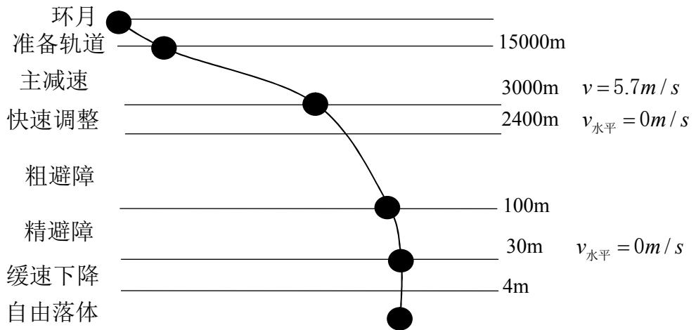

<details>
<summary>line</summary>

| Phase | Start Distance (m) | End Distance (m) |
| :--- | :--- | :--- |
| 环月 | 0 | 15000 |
| 准备轨道 | 15000 | 3000 |
| 主减速 | 3000 | 2400 |
| 快速调整 | 2400 | 100 |
| 粗避障 | 100 | 30 |
| 精避障 | 30 | 4 |
| 缓速下降 | 30 | — |
| 自由落体 | 4 | — |
</details>

图2-1：嫦娥三号软着陆的六个阶段示意图

## 2.1 名词分析

软着陆：指嫦娥三号以相对月球较小的速度着陆，速度一般为几米/每秒；

比冲：火箭发动机单位质量推进剂产生的冲量，或单位流量的推进剂产生的推力；

## 2.2软着陆轨道设计与控制策略问题分析

针对问题 1，首先对软着陆过程进行简化分析，可知主减速段终点已基本位于着陆点上方，其空间坐标在月面上投影即为着陆点坐标，仅考虑主减速段着陆过程，可利用主减速段终点逆推出近月点位置。因此，可取嫦娥三号处于主减速段终点时在月球表面的投影点作为原点，软着陆运动轨迹所在平面建立二维坐标系。结合动力学知识，建立最优主减速轨迹模型，并需满足主减速段燃料消耗最小，得到其着陆轨迹微分方程，利用仿真求解得到近月点坐标，运用地表距离与经纬度转化关系，最终得到近月点与远月点地理位置。结合开普勒第二定律和机械能守恒定律，建立两个相关等式，求得近月点、远月点处速度大小，基于最优主减速段轨迹模型求解结果，便可根据近月点运动方向与坐标轴夹角得到速度方向。

针对问题 2，确定嫦娥三号着陆轨道及 6 个阶段的最优控制策略时，始终要满足燃料消耗最小原则。在问题1中已经对近月点及对主减速段的运动情况进行求解，近月点和主减速段终值点的位置、速度及发动机推力大小均已知，在此基础上，给定准备轨道、主减速段最优控制策略。快速调整段主要是对探测器姿态进行调整，采取与主减速同样的建模方法，得到该段质心动力学方程，在满足约束条件及阶段要求下给出具体最优控制策略。对于粗避障段，首先对其数字高程图进行划分，对每个区域的平坦程度进行分析，取最平坦区域作为着陆大致范围。同样需建立动力学模型对运动轨迹进行描述，考虑到可能存在匀速直线运动和先匀加速后又在恒定推力下减速至0两种情况，在可行情况下，选择燃料消耗最少的方案作为最优策略。

针对问题 3，从改变近月点离月球表面的距离和主减速发动机提供的推力两个方面，对嫦娥三号在该段的水平位移、燃料消耗等参数进行灵敏度分析，进而求得近月点离月球表面的距离与该段的水平位移和燃料消耗之间的关系、主减速发动机提供的推力与该段的水平位移及该段的燃料消耗之间的关系；由于嫦娥三号在主减速段水平位移最大，选取该段从对近月点离月球表面的距离变化和主减速发动机提供的推力变化两个角度对模型进行局部阶段误差分析，通过计算每个阶段时间的相对误差对模型进行整体误差分析。

## 三、模型的假设

## 3.1模型的假设

（1）假设月球引力场为垂直于月面的均匀引力场；  
（2）假设在几百秒范围内的下降时间里，月球引力非球项、日月引力摄动和月球自转均可以忽略；  
（3）假设只考虑惯性和引力作用下的稳定的椭圆运动状态，而对于“嫦娥三号”的变轨状态，情况过于复杂，不予以考虑；  
（4）制动发动机的最大推力与初始质量之比大于月面引力加速度,并且制动推进系统能够在一定的初始条件下将探测器停于月面上。

## 四、符号说明

<table><tr><td>符号</td><td>表示含义</td><td>单位</td></tr><tr><td>A点</td><td>表示近月点</td><td></td></tr><tr><td>B点</td><td>表示远月点</td><td></td></tr><tr><td>G</td><td>表示万有引力引力常量</td><td> $N \cdot m^{2} / kg^{2}$ </td></tr><tr><td>R</td><td>表示卫星与其所环绕运行星球几何中心的距离</td><td>m</td></tr><tr><td>r</td><td>表示月球平均半径</td><td>m</td></tr><tr><td>M</td><td>表示月球的质量</td><td>kg</td></tr><tr><td>m</td><td>表示嫦娥三号的质量</td><td>kg</td></tr><tr><td> $R_{A}$ </td><td>表示嫦娥三号在近地点距离月球表面的距离</td><td>m</td></tr><tr><td> $R_{B}$ </td><td>表示嫦娥三号在远地点距离月球表面的距离</td><td>m</td></tr><tr><td> $v_{A}$ </td><td>表示嫦娥三号在近地点的运行速度大小</td><td>m/s</td></tr><tr><td> $v_{B}$ </td><td>表示嫦娥三号在远地点的运行速度大小</td><td>m/s</td></tr><tr><td> $g_{月}$ </td><td>表示月球上的重力加速度</td><td> $m/s^{2}$ </td></tr><tr><td> $F_{推}$ </td><td>表示主减速发动机产生的推力</td><td>N</td></tr><tr><td> $v_{e}$ </td><td>表示比冲</td><td>m/s</td></tr><tr><td>h</td><td>表示嫦娥三号着陆过程中的海拔高度</td><td>m</td></tr><tr><td>v</td><td>表示嫦娥三号着陆过程中的合速度大小</td><td>m/s</td></tr><tr><td>t</td><td>表示嫦娥三号着陆过程中的所用时间</td><td>s</td></tr><tr><td>x</td><td>表示嫦娥三号向着陆点方向上的水平位移</td><td>m</td></tr></table>

## 五、模型的建立与求解

## 5.1近月点与远月点的位置及速度

为使得软着陆过程易于理解，可将其六个阶段大致简化为如下三个阶段（如图5-1所示）：

①霍曼转移段：根据预先选定的着陆位置，在环月轨道上进行变轨，转入一条椭圆过渡轨道；  
②主减速段：起始点在椭圆过渡轨道的近月点，是一个全推力制动过程，这个阶段的主要任务在于消除探测器速度的水平分量；  
③垂直下降段：在嫦娥三号水平速度减小为零后，调整姿态使其保持垂直向下软着陆到月面。

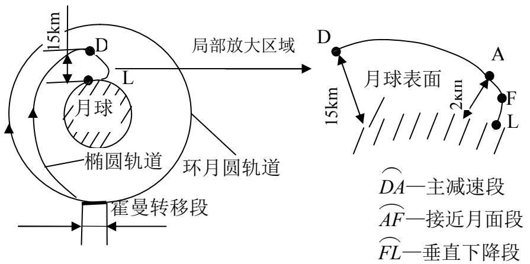

<details>
<summary>text_image</summary>

15km
D
L
月球
局部放大区域
椭圆轨道
环月圆轨道
霍曼转移段
D
15km
月球表面
A
2km
F
L
DA—主减速段
AF—接近月面段
FL—垂直下降段
</details>

图5-1：软着落过程主要变化阶段示意图

 在主减速阶段制动发动机点火工作用以抵消初始速度,所带燃料的大部分将用于此阶段。所以设计主制动段的制导控制策略时，需满足如下条件：

①在轨道终值点状态满足下一阶段要求的前提下,根据燃料消耗最小的原则进行设计。  
②主减速阶段后，嫦娥三号基本位于着陆点上方，即可认为主减速后嫦娥三号在月面上投影坐标与着陆点相同。

## 5.1.1近月点和远月点位置模型

在虹湾着陆区内，嫦娥三号着陆点所在经线与月心共同确定了着陆准备轨道所在平面，即椭圆轨道位于该平面内。

设原点o 为嫦娥三号处于主减速段末位置时在月球表面的投影点，以着陆轨道参考系纵向平面为xoy面，月心与近月点在月球表面投影点的连线方向为y轴，取与近月点在月球表面投影点经度与着陆点经度相同，纬度大于着陆点的方向为x轴，建立直角坐标系，嫦娥三号的着陆轨道位于此平面内。如图5-2所示：

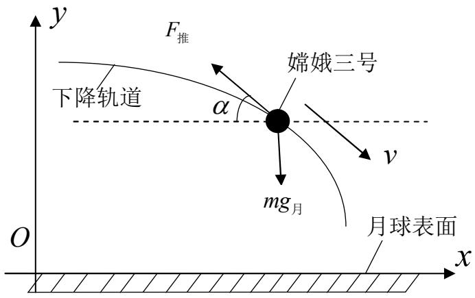

<details>
<summary>text_image</summary>

y
F推
下降轨道
α
嫦娥三号
v
mg月
O
x
月球表面
</details>

图5-2：月球平面直角坐标系

## 1）主减速段最优控制模型

①设计主减速段的控制策略时，需根据燃料消耗最小原则进行设计，为此，定义燃料消耗的性能指标<sup>[1]</sup>：

$$
\min \Delta m = \int_ {0} ^ {t} \dot {m} (t) \times d t \tag {1}
$$

其中， $\dot { m }$ —为单位时间燃料消耗的公斤数；

m—由燃料消耗所导致的嫦娥三号的减少质量。

dm 由题可知比冲的关系式为： <sub>推</sub>F =mv = νe （2） dt

嫦娥三号在着陆过程中的质量变化：

$$
m = m _ {0} - \Delta m \tag {3}
$$

其中：m —嫦娥三号的质量（是时间t的函数），在短时间内可视为常量；

$m _ { 0 }$ —嫦娥三号初始质量。

②基于以上嫦娥三号软着落过程主要变化阶段及着陆过程中的受力分析可知，其着陆方式符合重力转弯软着陆<sup>[1]</sup>的情况，即推力 $F _ { \sharp \sharp }$ 的方向与下降速度方向相反， $\alpha$ 为发动机推力方向在xoy平面的投影与x 轴的夹角。

将推力 $F _ { \sharp \sharp }$ 沿x方向分解为 $F _ { \mathrm { f f } } \mathrm { c o s } \alpha$ ，沿y方向分解为 $F _ { \# } \sin \alpha$ ，根据牛顿第二定律可得：

$$
- F _ {\text {推}} \cos \alpha = m a _ {x} \tag {4}
$$

$$
m g _ {\text {月}} - F _ {\text {推}} \sin \alpha = m a _ {y} \tag {5}
$$

其中， $g _ { \mathrm { \scriptscriptstyle H } }$ —为月球表面的重力加速度。

将（2）式、（3）式联立后，分别代入（4）式和（5）式可得：

$$
a _ {x} = \frac {- F _ {\text {推}} \cos \alpha}{m _ {0} - \Delta m} \tag {6}
$$

$$
a _ {y} = g _ {\text {月}} - \frac {F _ {\text {推}} \sin \alpha}{m _ {0} - \Delta m} \tag {7}
$$

利用（6）、（7）式结合加速度关于质点运动的微分方程， 最终得到嫦娥三号软着陆主减速段轨迹的微分方程：

$$
\left\{ \begin{array}{l} \frac {d ^ {2} x}{d t ^ {2}} = \frac {- F _ {\text {推}} \cos \alpha}{m _ {0} - \Delta m} \\ \frac {d ^ {2} y}{d t ^ {2}} = g _ {\text {月}} - \frac {F _ {\text {推}} \sin \alpha}{m _ {0} - \Delta m} \end{array} \right. \tag {8}
$$

其约束条件为： $\left. \frac { d x } { d t } \right| _ { t = 0 } = \nu _ { A } , \left. \frac { d y } { d t } \right| _ { t = 0 } = 0 , \left. \frac { d s } { d t } \right| _ { t = t _ { 1 } } = \nu _ { 1 }$

## 2）近月点和远月点位置坐标求解

由题可知，着陆准备轨道为近月点15km，远月点 100km的椭圆轨道，则近月点的位置距月球表面距离为15km，远月点的位置距月球表面距离为100km。

由于（8）式微分方程不易求解析解，因而假设推力 $F _ { \sharp \sharp }$ 大小恒定，则可得：

$$
\Delta m = \int_ {0} ^ {t} \frac {F _ {\text {推}}}{v _ {e}} d t = \frac {F _ {\text {推}}}{v _ {e}} t \tag {9}
$$

将（8）、（9）式代入（7）式后，发现若要满足燃料消耗量最少，则当 $F _ { \sharp \sharp }$ 及 确定时，下落时间便易于求得，但由于初始 角度的不确定性，针对上述最优控制问题,首先把月球软着陆过程进行离散化，整个主减速运动时间等分割为N段，假定每个小段近似为匀变速直线运动过程，可利用第k1段的运动状态对第k段的运动状态进行近似求解，以此步骤进行迭代递推，进而通过 MATLAB 软件对主减速段进行仿真迭代运算（程序详见附录1），多次试验 值后，发现当的初始值为 <sup>o</sup>时，可令主减速末状态满足题目要求，此时 $F _ { \# } { = } 7 5 0 0 N$ ，求得下落时间为421.3s ，得到如下运动轨迹示意图：

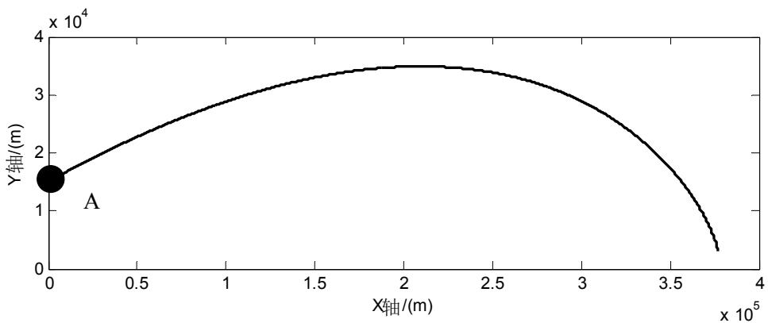

<details>
<summary>line</summary>

| X轴 (m) | Y轴 (m) |
| --- | --- |
| 0 | ~1.6e4 |
| ~3.8e5 | ~0.3e4 |
</details>

图5-3:主减速段嫦娥三号运动轨迹图

结合图5-3能够较为直观的观察主减速段运动轨迹，图中A点即为所求近月点位置，其水平方向上的位移为377095.38m。

3）近月点在月球的投影经纬度计算

①由于绕月轨道所在平面包含预着陆点，因此，近月点、远月点与主减速段末位置均处于同一经线上，经度同为 $1 9 . 5 1 ^ { \circ } W$ ；  
②由已知条件可知，月球平均半径 $R = 1 7 3 7 . 0 1 3 k m$ ，圆周率为。

同一经线上，纬度每变化一度对应的地表距离为： $\frac { \pi R } { 1 8 0 } { = } 3 0 . 3 1 7 \big ( k m \big )$

由此可得，a点的纬度： $\varphi _ { a } = \varphi _ { b } - \frac { L _ { S N } } { \pi R } { \times } 1 8 0 \approx \varphi _ { b } - \frac { L _ { x } } { \pi R } { \times } 1 8 0$ 。

其中：a点—卫星在近月点处，沿着Z轴方向投影至月球表面的地点；

b点—卫星预着陆点所在的月球表面上空3000米；

$L _ { x }$ —在x轴方向上的飞行距离，此处为377095.38米；

$L _ { S N }$ —A地和B地之间的在南北方向上的地表距离；

$\varphi$ —纬度值，此处纬度为19.51W；

基于以上经纬度转化公式，最终得到： $\varphi _ { a } = 3 1 . 6 8 ^ { \circ } N$ C

综上所述，近月点在月球表面的投影点处位置为 $\left( 1 9 . 5 1 ^ { \circ } W , 3 1 . 8 6 ^ { \circ } N \right)$ ，高度 15000米，根据近月点、远月点经纬度对称原则，远月点在月球表面的投影点处位置为$\left( 1 6 0 . 4 9 ^ { \circ } E , 3 1 . 6 8 ^ { \circ } S \right)$ ，高度 100000 米。

## 5.1.2近月点和远月点的速度求解<sup>[1]</sup>

## 1）速度大小

设月球平均半径为r，万有引力引力常量为G ，月球质量为M，嫦娥三号在近月点距离月球表面的距离为 $R _ { \mathit { A } }$ ，嫦娥三号在远月点距离月球表面的距离 $R _ { B }$

①由于嫦娥三号在运动过程中只受万有引力作用，所以遵循机械能守恒定律。

从远日点运动到近日点的过程中，根据机械能守恒定律得：

$$
\frac {1}{2} m v _ {A} ^ {2} - \frac {G M m}{R _ {A} + r} = \frac {1}{2} m v _ {B} ^ {2} - \frac {G M m}{R _ {B} + r} \tag {10}
$$

②根据开普勒第二定律及引出的推论可知，其不仅适用绕太阳运转的所有行星，还适用于卫星沿椭圆轨道运行的情况。为此，由开普勒第二定律可得：

$$
\frac {1}{2} \big (R _ {_ A} + r \big) v _ {_ A} \Delta t = \frac {1}{2} \big (R _ {_ B} + r \big) v _ {_ B} \Delta t \tag {11}
$$

将（2）式与（1）式联立可得：

$$
v _ {A} = \sqrt {\frac {2 (R _ {B} + r) G M}{(R _ {A} + r) (R _ {A} + R _ {B} + 2 r)}} \tag {12}
$$

$$
v _ {B} = \sqrt {\frac {2 (R _ {A} + r) G M}{(R _ {B} + r) (R _ {A} + R _ {B} + 2 r)}} \tag {13}
$$

其中， $r = 1 7 3 7 . 0 1 3 \times 1 0 ^ { 3 } m \ , \ G = 6 . 6 7 \times 1 0 ^ { - 1 1 } N \cdot m ^ { 2 } / k g ^ { 2 } \ , \ M = 7 . 3 4 7 7 \times 1 0 ^ { 2 2 } k g \ , \ R _ { 4 } = 1 5 \times 1 0 ^ { 3 } m$ $R _ { _ B } = 1 0 0 \times 1 0 ^ { 3 } m$

综上求得：近月点速度大小 $\nu _ { _ A } = 1 6 9 2 m / s$ ， 远月点速度大小 $\nu _ { _ { B } } = 1 6 1 4 m / s$

## 2） 速度方向

由最优主减速轨迹模型的求解结果可知，近月点速度方向与x轴正方向成9654. <sup>o</sup> ，且切于近月点所在经纬度。可以容易推断远月点速度方向与x轴负方向成9654. <sup>o</sup> ，且切于远月点所在经纬度。

##  综上所述：

近月点位置为19.51°W,31.68°N，海拔高度为15000m，速度为1692m/s，与x轴正方向成9654. <sup>o</sup> ，且切于近月点所在经纬度。

远月点位置为19.51°E,31.68°S，海拔高度为100000m，速度为1614m/s，与x轴负方向成9654. <sup>o</sup> ，且切于远月点所在经纬度。

## 5.2不同阶段着陆轨道及最优控制方案

## 5.2.1着陆准备轨道段

嫦娥三号在着陆准备轨道上绕月球做椭圆运动，当且仅当其处于近月点时，恰好刚刚进入着陆轨迹。基于问题1中最优主减速轨迹模型求解结果可知，在该模型坐标系下，以最小燃料消耗为目标，嫦娥三号在近月点处的飞行状态如下表所示：

表5-1：嫦娥三号在近月点处飞行状态数据表

<table><tr><td>推力方向</td><td>速度大小</td><td>速度方向</td><td>位置坐标</td></tr><tr><td> $v_A$ 的反向</td><td>1692m/s</td><td>切于A点且 $\alpha = 9.654^\circ$ </td><td>19.51°W 31.68°N</td></tr></table>

根据 5-1 相应数据，对嫦娥三号的着陆轨道初始点位置进行选定，其着陆准备轨道必然在近月点与远月点经纬度及着陆点位置三点所构成的平面之内，且由已知条件近月点海拔 15 千米、远月点海拔 100 千米和月球形状扁率1 963 7256/ . ，可以完全确定着陆准备的椭圆轨道，在该轨道近月点处，按照表中飞行状态数据作为最优控制策略，对嫦娥三号进行控制。

## 5.2.2主减速段最优轨迹控制模型——模型1

## 1.模型的建立

1）根据问题1所建最优主减速轨迹模型，得到如（8）式嫦娥三号软着陆主减速段轨迹的质心动力学方程。

## 2）约束条件：

①边值约束条件：

初始约束： $y \big | _ { t = 0 } = h _ { 1 } , \left. \frac { d x } { d t } \right| _ { t = 0 } = \nu _ { A } , \left. \frac { d y } { d t } \right| _ { t = 0 } = 0$

终值约束： $y \big | _ { t = t _ { 1 } } = h _ { 2 } , \frac { d s } { d t } = \nu _ { 1 }$

其中： $h _ { \scriptscriptstyle 1 }$ —为嫦娥三号在主减速阶段初始点的高度；

$h _ { 2 }$ —为嫦娥三号在主减速阶段终值点的高度；

$\nu _ { \mathrm { 1 } }$ —表示嫦娥三号在主减速阶段终值点的速度；

$t _ { 1 }$ —表示嫦娥三号在主减速段下落时间。

②过程约束条件：

嫦娥三号在整个软着陆过程中，某些参数应当满足一定的实际约束:

控制约束： $0 \leq F _ { \mathrm { f f } } \left( t \right) \leq F _ { \mathrm { m a x } }$

高度约束： $h { \big ( } t { \big ) } \geq r$

质量约束： $m _ { n e t } \leq m ( t ) \leq m _ { 0 }$

其中： $F _ { \mathrm { m a x } }$ —为发动机的推力上限；r—为月球半径； $m _ { n e t }$ —嫦娥三号净质量 。

3）燃料消耗最小原则： $\Delta m = \int _ { 0 } ^ { t _ { 1 } } \frac { F _ { \astrosun } } { \nu _ { e } } d t$ 最小。

2.模型的求解：

最终求解结果，即为问题1中最优主减速轨迹模型求解结果，主减速段着陆轨道见图5-3，最优控制策略则为：

表5-2：主减速段最优控制策略

<table><tr><td>推力大小</td><td>推力方向</td><td>燃料消耗量</td><td>运动时间</td><td>水平位移</td><td>末速度</td></tr><tr><td>7500N</td><td>v的反向</td><td>1075kg</td><td>421.3s</td><td>377095.3m</td><td>57.15m/s</td></tr></table>

## 5.2.3快速调整段最优轨迹控制模型——模型2

1.模型的建立：

1）采取模型 1同样的建模方法，同理可得嫦娥三号快速调整段质心动力学方程：

$$
\left\{ \begin{array}{l} \frac {d ^ {2} x}{d t ^ {2}} = \frac {- F _ {\text {推}} \cos \alpha}{m _ {1} - \Delta m} \\ \frac {d ^ {2} y}{d t ^ {2}} = g _ {\text {月}} - \frac {F _ {\text {推}} \sin \alpha}{m _ {1} - \Delta m} \end{array} \right. \tag {14}
$$

其中： $m _ { \mathrm { l } }$ —为主减速段终值点嫦娥三号的质量

$\alpha _ { \mathrm { 1 } }$ —为主减速段终值点嫦娥三号速度方向与x轴的夹角

2）约束条件：

①边值约束条件：

初始约束： $y \big | _ { t = t _ { 1 } } = h _ { 2 } , \quad x \big | _ { t = t _ { 1 } } = x _ { 1 } , \left. \frac { d x } { d t } \right| _ { t = t _ { 1 } } = \nu _ { x 1 } , \left. \frac { d y } { d t } \right| _ { t = t _ { 1 } } = \nu _ { y 1 } , \left. \alpha \big | _ { t = t _ { 1 } } = \alpha _ { 1 } \right.$

终值约束： $\left. \frac { d x } { d t } \right| _ { t = t _ { 1 } + t _ { 2 } } = 0 , \left. \alpha \right| _ { t = t _ { 1 } + t _ { 2 } } = 9 0 ^ { \circ } , \left. y \right| _ { t = t _ { 1 } + t _ { 2 } } = h _ { 3 }$

其中： $h _ { 3 } - .$ 为嫦娥三号在快速调整段终值点的高度

$t _ { 2 }$ —表示嫦娥三号在快速调整段下落时间

$x _ { 1 }$ —表示嫦娥三号在快速调整段向x轴方向上的水平位移

$\nu _ { x 1 } \cdot \mathrm  ~ \} \nu _ { y 1 }$ —分别表示嫦娥三号在主减速阶段终值点的速度在x轴和y轴的分量

②过程约束条件：在整个软着陆过程约束条件均保持一致，即与模型1相同。

3）燃料消耗最小原则： $\Delta m = \int _ { t _ { 1 } } ^ { t _ { 1 } + t _ { 2 } } \frac { F _ { \ddagger d t } } { \nu _ { e } } d t$ 最小

## 2.模型求解：

基于模型1相同的求解方法，运用仿真迭代运算，由于初始角度 $\alpha \big | _ { t = t _ { 1 } } = \alpha _ { 1 }$ 现已确定，通过改变推力 $F _ { \sharp \sharp }$ 的大小，观察燃料消耗量m的变化，利用 MATLAB 软件（程序详见附录2），得到快速调整段推力 $F _ { \sharp \sharp }$ 与各相关变量的关系图如下：

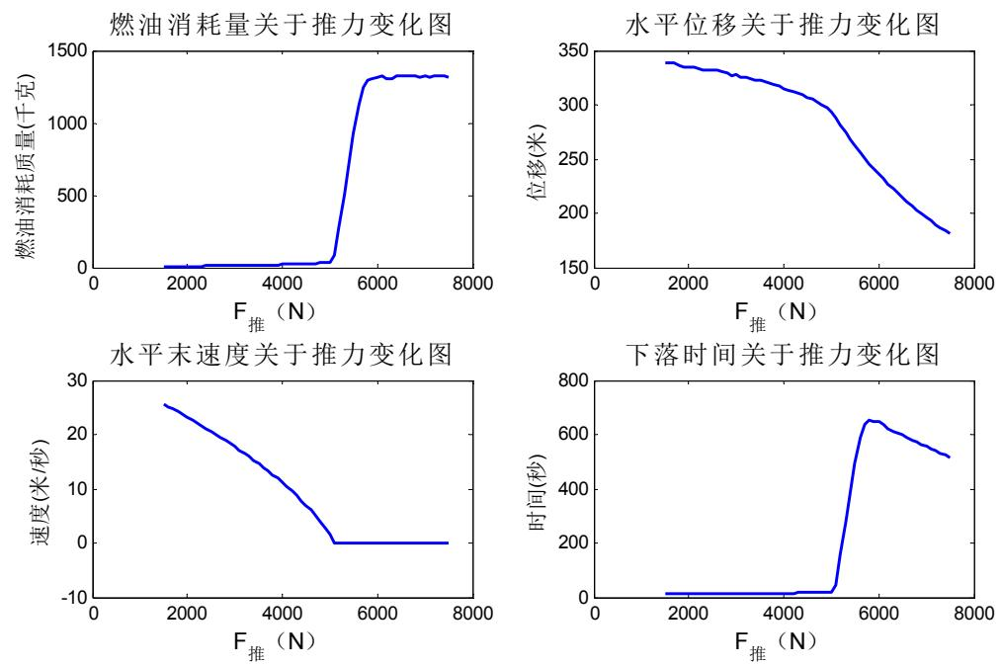  
图5-4：快速调整段推力与各变量关系图

由题可知，在快速调整段需满足水平末速度为0,发动机推力方向向下的条件，观察图5-4中推力与水平末速度趋势图可以发现，推力至少要大于5000N才能够保证水平末速度为0，而推力大致在5000 ～6000 之间时，燃油消耗量成明显快速上升趋势，此推力阶段，下落时间变化也与燃料消耗趋势基本一致，水平位移变化量也近似最大。

基于变化趋势的大致分析能够确定在 4500N～5500N之间将存在一个最小推力，使得水平末速度恰好为0，此时燃料消耗量即为最小值，现利用燃料消耗最小原则，利用 MATLAB 软件对 $F _ { \sharp \sharp }$ 进行具体数值确定（程序详见附录2）：

表 5-3：发动机推力与各变量之间的数值变化

<table><tr><td>推力值</td><td>燃料消耗量</td><td>末速度</td><td>水平末速度</td><td>运行时间</td><td>水平位移</td></tr><tr><td>4500</td><td>25.87</td><td>23.93</td><td>6.97</td><td>16.9</td><td>307.19</td></tr><tr><td>4501</td><td>25.87</td><td>23.92</td><td>6.96</td><td>16.9</td><td>307.14</td></tr><tr><td>...</td><td>...</td><td>...</td><td>...</td><td>...</td><td>...</td></tr><tr><td>5081</td><td>40.44</td><td>1.31</td><td>0.06</td><td>23.4</td><td>289.20</td></tr><tr><td>5082</td><td>40.79</td><td>0.84</td><td>0.02</td><td>23.6</td><td>289.13</td></tr><tr><td>5083</td><td>42.19</td><td>0.54</td><td>0</td><td>24.4</td><td>289.06</td></tr><tr><td>5084</td><td>44.79</td><td>0.20</td><td>0</td><td>25.9</td><td>289.00</td></tr><tr><td>...</td><td>...</td><td>...</td><td>...</td><td>...</td><td>...</td></tr><tr><td>5500</td><td>925.83</td><td>1.17</td><td>0.00</td><td>494.9</td><td>262.07</td></tr><tr><td>5501</td><td>929.37</td><td>1.13</td><td>0.00</td><td>496.7</td><td>262.08</td></tr></table>

 由表中数据可知，当推力值为 5083N时，水平末速度首次达到 0m s/ ，此时燃料消耗量为42.19kg，末状态合速度大小为0.554m s/ ，水平位移 289.06m，此阶段运行时间为24.4s，且在重力转弯软着陆情况下，主减速发动机产生的可调节推力方向始终与

合速度方向相反。

根据以上轨迹动力方程及所求合理变量数值，利用 MATLAB 软件画出快速调整阶段的运动轨迹图（程序详见附录2）：

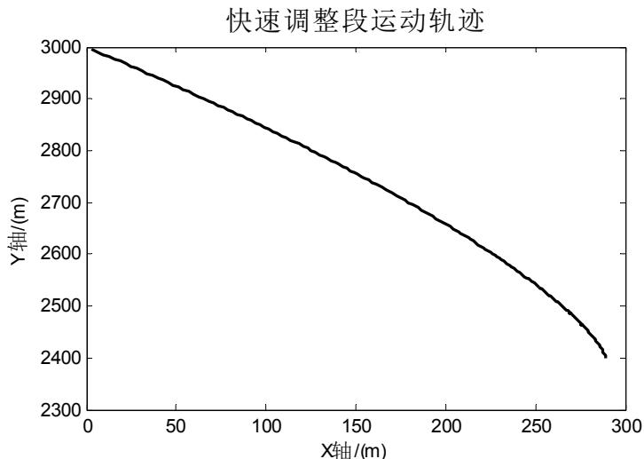

<details>
<summary>line</summary>

| X轴 (m) | Y轴 (m) |
| --- | --- |
| 0 | 3000 |
| ~285 | 2400 |
</details>

图5-5：快速调整段着陆轨迹图

根据快速调整段运动轨迹特征及最优控制条件下嫦娥三号的运动状态，则可确定快速调整段最优控制策略为：

表5-4：快速调整段最优控制策略

<table><tr><td>推力大小(N)</td><td>燃料消耗(kg)</td><td>运动时间(s)</td><td>水平位移(m)</td><td>末速度(m/s)</td></tr><tr><td>5083</td><td>42.19</td><td>24.4</td><td>289.06</td><td>0.554</td></tr></table>

## 5.2.4粗避障段最优轨迹控制模型——模型3

## 1.距月球表面2400米处高程图分析

①由于粗避障阶段主要是对大致着陆方位进行初步确定，所以可将原始图片分割成九块小区域，以便于嫦娥三号进一步缩小着陆范围，分割区域及编号如下图所示：

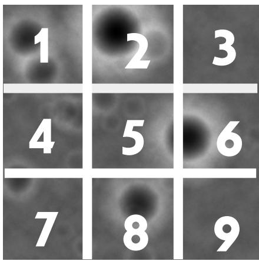

<details>
<summary>text_image</summary>

1
2
3
4
5
6
7
8
9
</details>

图5-6：距月面2400米处高程图区域划分

②为衡量各区域高程差相对于整体区域的分布情况，定义相对高程差作为评价指标：

$$
\text {相对高程} = \frac {\left| \text {该区域高程均值} - \text {总体高程均值} \right|}{\text {总体高程均值}}
$$

③嫦娥三号对着陆区域的筛选目的是为了避开大的陨石坑，而对于陨石坑存在与否的判定，主要是通过所拍照片的各区域高程差的大小来反映，因此，需利用 MATLAB 软件来计算每一块区域关于高程差的相关统计量（程序详见附录3）：

表5-5：高程差不同区域的相关统计量

<table><tr><td>区域序号</td><td>1</td><td>2</td><td>3</td><td>4</td><td>5</td><td>6</td><td>7</td><td>8</td><td>9</td></tr><tr><td>均值</td><td>117.67</td><td>117.76</td><td>94.13</td><td>96.39</td><td>106.08</td><td>115.33</td><td>92.69</td><td>108.84</td><td>95.87</td></tr><tr><td>极差</td><td>158.00</td><td>218.00</td><td>60.00</td><td>76.00</td><td>110.00</td><td>173.00</td><td>75.00</td><td>126.00</td><td>76.00</td></tr><tr><td>标准差</td><td>30.39</td><td>45.49</td><td>5.63</td><td>10.12</td><td>20.12</td><td>37.47</td><td>8.88</td><td>24.59</td><td>11.37</td></tr><tr><td>相对高程</td><td>0.121</td><td>0.122</td><td>0.103</td><td>0.082</td><td>0.011</td><td>0.099</td><td>0.117</td><td>0.037</td><td>0.087</td></tr></table>

针对以上相关统计量的结果进行分析：

i.均值能够反应各个区域平均的高程差情况，但是对于凹凸差异较大的区域而言，不能够作为月面情况的描述指标；  
ii.极差能够直观反映出各区域陨石坑凹凸高度变化范围，但是不能对区域整体平滑程度做出判断。  
iii.标准差刻画的是高程波动情况，即该区域高程值的波动；  
iv.相对高程刻画的是高程的平均程度。

后两个指标都能很好描述该区域是否适合着陆。

④由于这两个指标本身表征的含义不具有统一性，但对比标准统一，都是为了反映各区域高程的整体情况，因此，需把这两个指标进行归一化，采取线性加权的方式，综合成一个平坦度指标。且平坦度越小，就越适合作为着陆点。

※归一化模型:

$$
n _ {i} ^ {*} = \frac {n _ {i} - n _ {\min}}{n _ {\max} - n _ {\min}}
$$

其中： $n _ { i }$ 、 $n _ { i } ^ { * }$ —分别表示数据归一化前后的值

$n _ { \mathrm { m a x } }$ $n _ { \mathrm { m i n } }$ —分别表示样本数据中的最小、最大值。

经过归一化处理之后，得到如下结果：

表5-6：粗避障段归一化处理后各指标的数值

<table><tr><td>区域序号</td><td>1</td><td>2</td><td>3</td><td>4</td><td>5</td><td>6</td><td>7</td><td>8</td><td>9</td></tr><tr><td>标准差</td><td>0.62</td><td>1.00</td><td>0.00</td><td>0.11</td><td>0.36</td><td>0.80</td><td>0.08</td><td>0.48</td><td>0.14</td></tr><tr><td>相对高程</td><td>0.99</td><td>1.00</td><td>0.83</td><td>0.64</td><td>0.00</td><td>0.79</td><td>0.96</td><td>0.24</td><td>0.68</td></tr><tr><td>平坦度</td><td>1.61</td><td>2.00</td><td>0.83</td><td>0.75</td><td>0.36</td><td>1.59</td><td>1.04</td><td>0.71</td><td>0.82</td></tr></table>

 由表中平坦度大小可知，区域5 的平坦度最小，则表明区域5最适合最为着陆点所在范围。因此，取区域5的中心位置作为粗避障段终值点坐标，由题中所给附件3可知，区域5中心点位置坐标为（1150,1150），与整个区域中心点重合，因此，粗避障阶段总的水平位移为0。区域5具体等高线信息如下图所示：

距月面2400m处的等高线图  
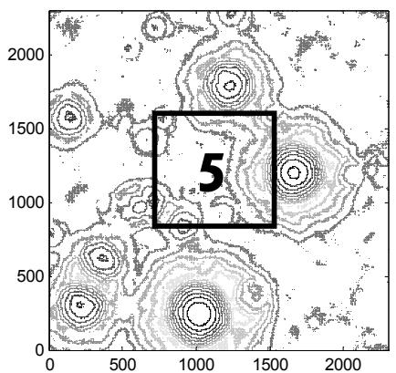

<details>
<summary>contour</summary>

| Feature | Description |
| --- | --- |
| Highlighted Region | 5 (Value) |
| Contour Lines | Spatial distribution of data points across the coordinate space |
</details>

5号区域等高线图  
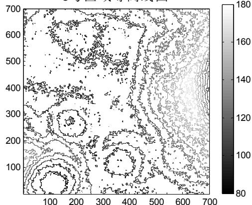

<details>
<summary>contour</summary>

| X | Y | Value |
| --- | --- | --- |
| 0~700 | 0~700 | 80~180 |
</details>

图7：区域5具体等高线示图

## 2.模型建立：

1）嫦娥三号在粗避障段受力分析

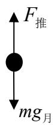  
图5-8：嫦娥三号在粗避障段受力情况

根据嫦娥三号在粗避障段的受力分析可知，在发动机推力对嫦娥三号的作用方式存在两种可能粗避障段软着陆方案：

方案 1：嫦娥三号始终受到推力作用，一直做匀速直线运动，在距月面 100 米高度处速度瞬间变为0，满足悬停状态要求。

方案 2：嫦娥三号先在一段时间内做匀加速直线运动，然后再受到推力作用，使得在粗避障段终值点处合速度为0，悬停于目标上方。

2）采取模型 1同样的建模方法，同理可得嫦娥三号粗避障段质心动力学方程如下：

$$
\left\{ \begin{array}{l} \frac {d ^ {2} x}{d t ^ {2}} = \frac {- F _ {\text {推}} \cos \alpha}{m _ {2} - \Delta m} \\ \frac {d ^ {2} y}{d t ^ {2}} = g _ {\text {月}} - \frac {F _ {\text {推}} \sin \alpha}{m _ {2} - \Delta m} \end{array} \right. \tag {15}
$$

其中： $m _ { 2 }$ —为快速调整段结束后嫦娥三号的质量

$x _ { 2 }$ —为嫦娥三号在快速调整段水平方向的位移

$h _ { 4 }$ —为嫦娥三号在粗避障段终值点的高度

$\nu _ { y 2 }$ —为快速调整阶段结束后嫦娥三号在y轴方向的速度

 由于在粗避障段初始点时，要满足发动机推力方向向下，即初始角度 $\alpha \big | _ { t = t _ { 1 } + t _ { 2 } } = 9 0 ^ { \circ }$ 因此，可以针对（15）式模型进行简化，简化模型如下：

$$
\frac {d ^ {2} y}{d t ^ {2}} = g _ {\text {月}} - \frac {F _ {\text {推}}}{m _ {2} - \Delta m} \tag {16}
$$

## 3）约束条件：

①边值约束条件：

初始约束： $y \Big | _ { t = t _ { 1 } + t _ { 2 } } = h _ { 3 } , \frac { d y } { d t } \Bigg | _ { t = t _ { 1 } + t _ { 2 } } = \nu _ { y 2 }$

终值约束： $\frac { d y } { d t } \bigg | _ { t = t _ { 1 } + t _ { 2 } + t _ { 3 } } = 0 , y \big | _ { t = t _ { 1 } + t _ { 2 } + t _ { 3 } } = h _ { 4 }$

其中： $t _ { 3 } -$ 为嫦娥三号在粗避障段下落时间

②过程约束条件：在整个软着陆过程约束条件均保持一致，即与模型1相同

4） 燃料消耗最小原则： $\Delta m = \int _ { t _ { 1 } + t _ { 2 } } ^ { t _ { 1 } + t _ { 2 } + t _ { 3 } } \frac { F _ { \# } } { \nu _ { e } } d t$ 最小

## 3.模型求解：

1）方案 1的求解

①求解步骤：

Step1：利用匀速直线运动的性质，计算出下落所需时间。

Step2：运用仿真迭代运算，将时间 $t _ { 3 }$ 等分成N段，且每段的推力 $F _ { \sharp \sharp }$ 当成恒力。

Step3：利用第 k 1段 $F _ { \oplus \tt G } = m g _ { \tt H }$ ，推得此段内燃料消耗量为m，则第k段内嫦娥三号的质量为 $m _ { 2 } - \Delta m$ 0

以此步骤进行迭代类推，得到方案1 燃料的总消耗量及下落所用时间，如下表所示：

表5-7：方案1运动过程中燃料消耗量

<table><tr><td>方案</td><td>总运动时间</td><td>嫦娥剩余质量</td><td>燃料消耗</td></tr><tr><td>粗避障匀速运动情况</td><td>10417 s</td><td>3.92 kg</td><td>1274.81 kg</td></tr></table>

## 2）方案 2的求解

①在此情况下，匀加速直线运动阶段无燃料损失，仅当启动发动机推力时，才会产生燃料的消耗。由于匀加速直线运动的时间存在不确定性，因此，需根据相关文献<sup>【2】</sup>中粗避障段下落时间的理论值，对均加速直线运动时间进行大致设定，进而得到匀加速直线运动的末状态。  
②采用模型1相同的求解方法，在假设推力为恒力的条件下，通过计算机迭代仿真求得该情况下燃料的总消耗量及下落总时间。  
③选取不同的匀加速直线运动时间，进而得到各种情况下的最小燃料消耗量，从而近似确定最小的燃料消耗量及下落时间。

利用 MATLAB软件（程序详见附录4）在选取不同匀加速直线运动时间的情况下，观察燃料消耗量、恒定推力等运动过程描述量的变化情况，得到如下表格：

表5-8：方案2运动过程描述量随匀加速运动时间变化情况

<table><tr><td>匀加速运动时间</td><td>总运动时间</td><td>末速度</td><td>嫦娥剩余质量</td><td>燃料消耗</td><td>恒定推力</td></tr><tr><td>25</td><td>108.3</td><td>0.014</td><td>1203.99</td><td>74.740</td><td>2637.90</td></tr><tr><td>26</td><td>104.5</td><td>0.057</td><td>1206.55</td><td>72.178</td><td>2703.26</td></tr><tr><td>30</td><td>91.7</td><td>0.034</td><td>1215.15</td><td>63.579</td><td>3029.56</td></tr><tr><td>35</td><td>79.3</td><td>0.002</td><td>1223.53</td><td>55.195</td><td>3663.04</td></tr><tr><td>40</td><td>69.7</td><td>0.036</td><td>1230.09</td><td>48.639</td><td>4814.79</td></tr><tr><td>45</td><td>62.1</td><td>0.173</td><td>1235.35</td><td>43.380</td><td>7458.25</td></tr></table>

##  两方案结果对比：

方案 1过程燃料消耗量高达1274.81kg，由模型1与模型 2的求解结果可知，前两个阶段燃料消耗总量为 1117.19kg，而嫦娥三号总质量为 2400kg，所以采取方案 1 之后，嫦娥三号的质量仅剩余8kg，显然与实际情况不符，由此断定方案1为非最优策略。

方案2在不断改变均加速直线运动时间的情况下，匀加速度直线运动时间取45s时，燃料消耗量最少为 43.380kg ，此时运动总时间最少为 62.1s，推力最大为 7458.25N。根据以上变化规律进行推断，若增加匀加速直线运动时间不断，恒定推力的取值也随之增加，而运动总时间不断减少，同时消耗燃料质量也有所下降。

综上所述，粗避障段最优控制策略为：

表5-9：粗避障段最优控制策略

<table><tr><td>时间段</td><td>运动状态</td><td>推力大小</td><td>推力方向</td></tr><tr><td>0~45s</td><td>匀速直线运动</td><td>0</td><td>不存在</td></tr><tr><td>45~62.1s</td><td>减速直线运动</td><td>7458.25N</td><td>v的反向</td></tr></table>

在此最优控制策略下，燃料消耗量最小为 43.380kg。

## 5.2.5精避障段最优轨迹控制模型——模型4

精避障段是在粗避障段所确定的着陆区域基础上，进行再次更为精确的陨石坑排查，在满足燃料消耗量最少的条件下，确定最佳着陆点。

## 1.距月球表面100米处高程图分析

①同粗避障区域划分方式相同，首先将其分割成 9个小区域：

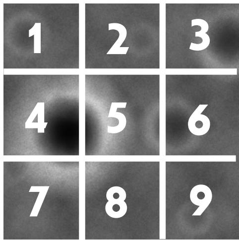

<details>
<summary>text_image</summary>

1
2
3
4
5
6
7
8
9
</details>

图5-9：距月球表面100米处高程图的区域划分

②评价指标的归一化处理

表5-10：精避障段归一化处理后各指标数值

<table><tr><td>区域序号</td><td>1</td><td>2</td><td>3</td><td>4</td><td>5</td><td>6</td><td>7</td><td>8</td><td>9</td></tr><tr><td>标准差</td><td>0.161</td><td>0.047</td><td>0.183</td><td>1.000</td><td>0.589</td><td>0.137</td><td>0.455</td><td>0.262</td><td>0.000</td></tr><tr><td>相对高程</td><td>0.052</td><td>0.250</td><td>0.075</td><td>0.000</td><td>1.000</td><td>0.385</td><td>0.497</td><td>0.210</td><td>0.415</td></tr><tr><td>平坦度</td><td>0.214</td><td>0.297</td><td>0.258</td><td>1.000</td><td>1.589</td><td>0.521</td><td>0.952</td><td>0.472</td><td>0.415</td></tr></table>

③由表中平坦度大小可知，区域1的平坦度最小，则表明区域1最适合最为着陆点所在范围。因此，取区域1的中心位置作为精避障段终值点坐标，由题中所给附件4中高程图可知，区域1中心点位置坐标为（200,800），整个区域中心点坐标为（500,500）。  
④以区域 1 的中心点和整个区域中心点之间的距离作为粗避障阶段总的水平位移，根据两中心点坐标，利用两点间距离公式得到两点在高程图上的距离为 424.3，由题可知，该高程的水平分辨率为01. /m 像素，则可得实际距离4243. m。

## 2）模型的建立

1.受力分析：精避障段嫦娥三号运动状态可分为两部分

①前一部分推力促使其向目标着陆点的方向前进，受力分析如下图：

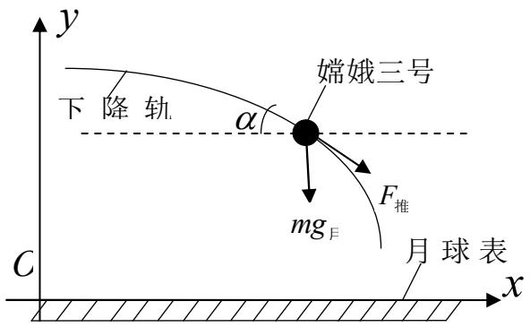

<details>
<summary>text_image</summary>

y
下降轨
α
嫦娥三号
F推
mgJ
C
月球表
x
</details>

图5-10：精避障段前一部分受力分析

②后一部分推力促使其在水平方向上的速度减小为 0，受力情况与主减速段一致，如图5-2 所示。

2. 采取模型 1同样的建模方法，同理可得嫦娥三号精避障段质心动力学方程如下：

$$
\left\{ \begin{array}{l} \frac {d ^ {2} x}{d t ^ {2}} = \frac {- F _ {\text {推}} \cos \alpha}{m _ {3} - \Delta m} \\ \frac {d ^ {2} y}{d t ^ {2}} = g _ {\text {月}} - \frac {F _ {\text {推}} \sin \alpha}{m _ {3} - \Delta m} \end{array} \right. \tag {17}
$$

其中： $m _ { 3 }$ —为粗避障阶段结束后嫦娥三号的质量

$h _ { 5 }$ —为嫦娥三号在精避障阶段终值点的高度

3.约束条件：

①边值约束条件：

初始约束： $y \big | _ { t = t _ { 1 } + t _ { 2 } + t _ { 3 } } = h _ { 4 } , x \big | _ { t = t _ { 1 } + t _ { 2 } + t _ { 3 } } = x _ { 1 } + x _ { 2 } , \ \frac { d x } { d t } \bigg | _ { t = t _ { 1 } + t _ { 2 } + t _ { 3 } } = 0 , \ \frac { d y } { d t } \bigg | _ { t = t _ { 1 } + t _ { 2 } + t _ { 3 } } = 0 , \ \alpha \big | _ { t = t _ { 1 } + t _ { 2 } + t _ { 3 } } = 9 0 ^ { \circ }$

终值约束： $\left. \frac { d x } { d t } \right| _ { t = t _ { 1 } + t _ { 2 } + t _ { 3 } + t _ { 4 } } = 0 \ , \quad \left. y \right| _ { t = t _ { 1 } + t _ { 2 } + t _ { 3 } + t _ { 4 } } = h _ { 5 } \ , \quad \left. x \right| _ { t = t _ { 1 } + t _ { 2 } + t _ { 3 } + t _ { 4 } } = x _ { 1 } + x _ { 2 } + x _ { 4 }$

②过程约束条件：

嫦娥三号控制约束： $0 \leq F _ { \mathrm { f f } } \left( t \right) \leq F _ { \mathrm { m a x } }$

嫦娥三号质量约束： $m _ { n e t } \leq m ( t ) \leq m _ { 0 }$

其中， $F _ { \mathrm { m a x } }$ 为推力器所能提供的推力上限， $m _ { n e t }$ 为着陆器净质量， $m _ { 0 }$ 为着陆器初始质量。

4.燃料消耗最小原则： $\Delta m = \int _ { t _ { 1 } + t _ { 2 } + t _ { 3 } } ^ { t _ { 1 } + t _ { 2 } + t _ { 3 } + t _ { 4 } } \frac { F _ { \ddagger d t } } { \nu _ { e } } d t$ 最小

3）模型求解：

①采用模型1相同的求解方法，在假设推力为恒力的条件下，通过计算机迭代仿真求对该情况下燃料的总消耗量进行求解，但由于精避障阶段运动的距离较小，从而可以忽略由于燃料消耗而导致嫦娥三号质量的减少，即假设其在该阶段的质量保持不变，从而对模型进行进一步化简。  
②设定该阶段前一部分的运行时间，改变推力 $F _ { \sharp \sharp }$ 的大小，找到满足精避障段结束后水平速度为0的参数，进而确定前一部分运动结束后的状态。选取不同的前一部分运行时间，分别求得到各自满足要求的推力 $F _ { \# \sharp }$ 大小，根据相关文献<sup>【2】</sup>中粗避障段下落时间的理论值大致为22s，从而近似确定推力 $F _ { \sharp \sharp }$ 大小及其运动状态，得到精避障阶段运动轨迹图：

精避障运动轨迹图  
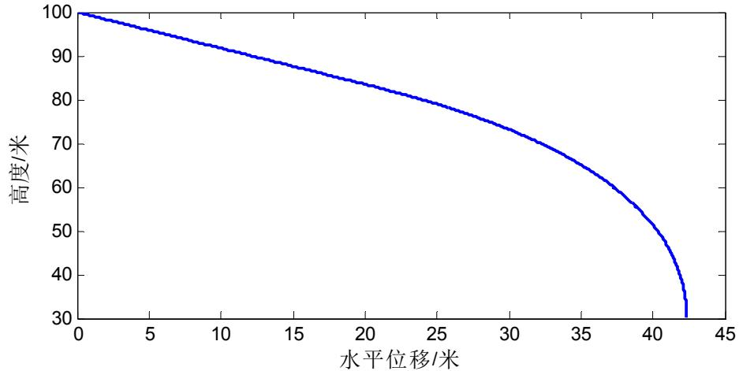

<details>
<summary>line</summary>

| 水平位移/米 | 高度/米 |
| --- | --- |
| 0 | 100 |
| 5 | ~96 |
| 10 | ~92 |
| 15 | ~88 |
| 20 | ~84 |
| 25 | ~79 |
| 30 | ~73 |
| 35 | ~64 |
| 40 | ~50 |
| 42 | ~30 |
</details>

图5-11：精避障段运动轨迹图

综上所述，最优控制策略为：

表5-11：精避段最优控制策略

<table><tr><td>分段情况</td><td>推力方向</td><td>推力大小</td><td>下落时间</td><td>总时间</td></tr><tr><td>前一部分</td><td>v的同向</td><td>2445.37N</td><td>4.63s</td><td rowspan="2">9.26s</td></tr><tr><td>后一部分</td><td>v的反向</td><td>2445.37N</td><td>4.63s</td></tr></table>

## 5.2.6缓速下降段最优轨迹控制模型——模型5

 缓速下降段最优轨迹控制模型与粗避障阶段的化简模型相同

1.受力分析：同模型3中受力情况一致。

2.模型的建立：

1）由于缓速下降段 $\alpha = 9 0 ^ { \circ }$ ，因此，可根据粗避障段的化简模型，同理可得嫦娥三号质心动力学方程：

$$
\frac {d ^ {2} y}{d t ^ {2}} = g _ {\text {月}} - \frac {F _ {\text {推}}}{m _ {4} - \Delta m} \tag {18}
$$

其中： $m _ { 4 }$ —表示精避障阶段结束后嫦娥三号的质量

2）约束条件：

①边值约束条件：

初始约束： $y \big | _ { t = t _ { 1 } + t _ { 2 } + t _ { 3 } + t _ { 4 } } = h _ { 5 } , \quad \left. \frac { d y } { d t } \right| _ { t = t _ { 1 } + t _ { 2 } + t _ { 3 } + t _ { 4 } } = \nu _ { y 4 }$

终值约束： $\left. \frac { d y } { d t } \right| _ { t = t _ { 1 } + t _ { 2 } + t _ { 3 } + t _ { 4 } + t _ { 5 } } = 0 , \left. y \right| _ { t = t _ { 1 } + t _ { 2 } + t _ { 3 } + t _ { 4 } + t _ { 5 } } = h _ { 6 }$

②过程约束条件：与模型4中约束条件一致

3）燃料消耗最小原则： $\Delta m = \int _ { t _ { 1 } + t _ { 2 } + t _ { 3 } + t _ { 4 } } ^ { t _ { 1 } + t _ { 2 } + t _ { 3 } + t _ { 4 } + t _ { 5 } } \frac { F _ { \ddagger d t } } { \nu _ { e } } d t$ 最小

3．模型求解：

同粗避障阶段的化简模型求解方法相同，可得到缓速下降段过程最优控制策略：

表5-12：缓速下降段过程最优控制策略

<table><tr><td>下落时间</td><td>推力大小</td><td>推力方向</td></tr><tr><td>3.44s</td><td>5416.77N</td><td>方向竖直向上</td></tr></table>

## 5.3软着陆过程整体分析

综合以上对软着陆过程6个阶段的分析：

①利用MATLAB软件作出如下完整软着陆过程轨迹图（程序详见附录6）：

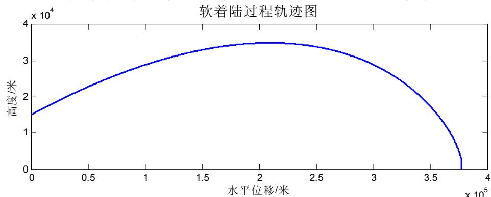

<details>
<summary>line</summary>

| 水平位移/米 (x 10^5) | 高度/米 (x 10^4) |
| --- | --- |
| 0 | ~1.5 |
| 0.5 | ~2.3 |
| 1.0 | ~2.9 |
| 1.5 | ~3.3 |
| 2.0 | ~3.5 |
| 2.5 | ~3.4 |
| 3.0 | ~2.9 |
| 3.5 | ~1.8 |
| 3.75 | 0 |
</details>

图5-12：软着陆过程轨迹图

软着陆轨迹能够很直观的反映出嫦娥三号着陆大致曲线，但是对于后面四个阶段具体运动轨迹的描述不够清晰，为此，利用 MATLAB 软件对后四个阶段着陆轨迹进行作图（程序详见附录 6）：

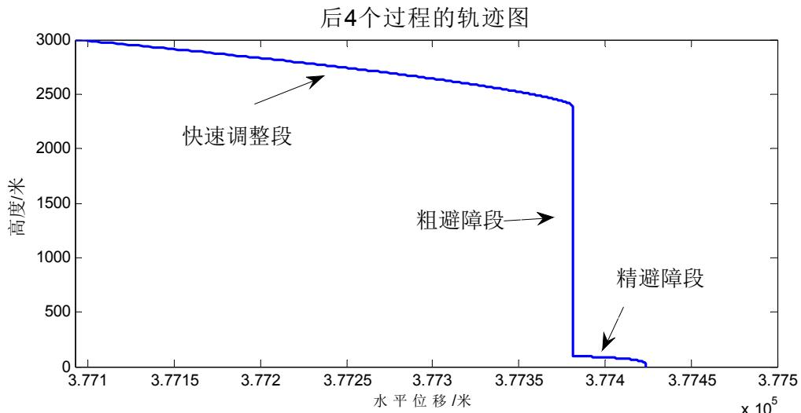

<details>
<summary>line</summary>

| 水平位移 (x 10^5 米) | 高度 (米) |
| --- | --- |
| 3.771 | 3000 |
| 3.772 | ~2850 |
| 3.773 | ~2650 |
| 3.774 | ~100 |
| 3.775 | 0 |
</details>

图5-13：软着陆过程后四个阶段着陆轨迹

②整个软着陆过程中燃料消耗情况：

表5-13：软着陆过程各阶段燃料消耗量（kg）

<table><tr><td>6个阶段消耗量</td><td>着陆准备轨道0</td><td>主减速段1075</td><td>快速调整段42.19</td><td>粗屏障段43.38</td><td>精屏障段0</td><td>缓速下降段0</td></tr><tr><td>总消耗量</td><td></td><td></td><td>1160.57</td><td></td><td></td><td></td></tr><tr><td>剩余质量</td><td></td><td></td><td>1239.43</td><td></td><td></td><td></td></tr></table>

根据燃料消耗情况进行分析，主减速段消耗量最大，对于准备着陆轨道、精屏障段及缓速下降段而言，几乎不产生燃料的损耗。

## 5.4 问题四

## 5.4.1 敏感性分析

①在软着陆过程中，下落高度与嫦娥三号的运动状态及姿态调整之间存在着密切的关联性，因此，以主减速段为例，通过改变下落高度，进而观察其他变量的情况：

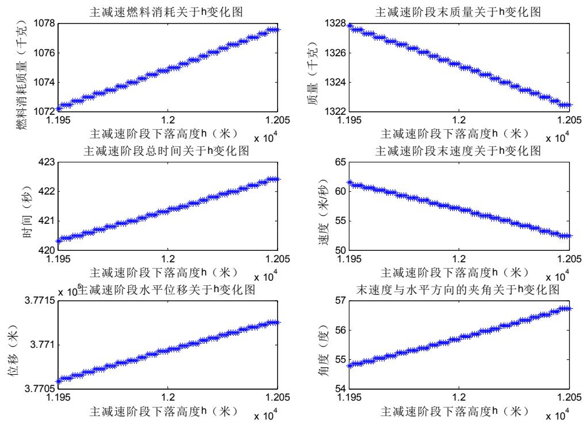  
图5-14：下落高度与各个变量之间的关系

由图可知，当下落高度不断增大时，燃料消耗量、下落时间、水平位移及末速度与水平方向的夹角也基本呈线性增大趋势，终值点的质量和末速度与下落高度呈明显负相关趋势，则可以说明下落高度的改变对各个变量数值均会产生较大影响。

②发动机推力是控制嫦娥三号下落高度及飞行状态的重要影响因素，因此，现以主减速段为例，通过改变F，观察其他变量的变化情况：

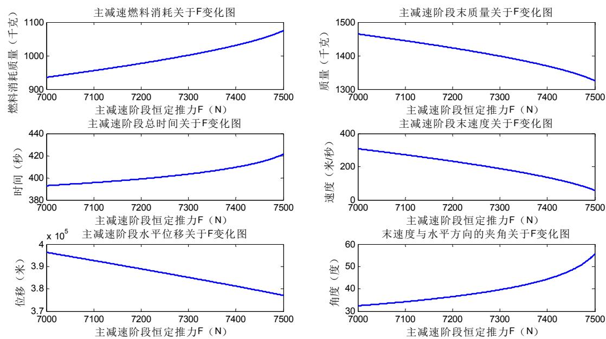  
图5-15:推力的改变对其他变量的影响关系

由图可以较为直观的看出，各个变量与推力之间存在着较强关联性，推力的变化能够明显影响其余变量的数值。

## 5.4.2 误差分析

## 1）时间相对误差

表 5-14：实际值与模型值的各阶段时间相对误差

<table><tr><td>阶段</td><td>主减速阶段</td><td>快速调整阶段</td><td>粗避障段</td><td>精避障</td><td>缓冲阶段</td></tr><tr><td>实际值</td><td>487</td><td>16</td><td>125</td><td>22</td><td>19</td></tr><tr><td>模型值</td><td>421.3</td><td>24.4</td><td>62.1</td><td>9.26</td><td>3.44</td></tr><tr><td>相对误差</td><td>0.135</td><td>0.525</td><td>0.503</td><td>0.579</td><td>0.819</td></tr></table>

由上表中相对误差值大小可知，主减速段相对误差最小为0.135，而缓冲阶段相对误差最大达到0.819，基于敏感性分析可知，由于各阶段下落时间在软着陆过程是一个变量，且会受到推力及下落高度的影响，同时，在实际过程中，存在较多外界影响因素会对下落时间造成影响，在本模型求解过程中，考虑因素较少，模型过于理想化将导致后面三个阶段下落时间远小于实际值。

## 2）推力的改变对于水平位移产生的相对误差

在主减速段，为便于求得最优控制策略取推力为固定值进行计算，为检验推力对于嫦娥三号水平位移的影响程度，利用MATLAB 软件对其相对误差进行求解：

表 5-15：主减速阶段推力改变时水平位移的相对误差

<table><tr><td>推力</td><td>7000</td><td>7010</td><td>7020</td><td>7030</td><td>7040</td><td>7050</td></tr><tr><td>相对误差</td><td>0.0511</td><td>0.0501</td><td>0.0491</td><td>0.0481</td><td>0.0472</td><td>0.0462</td></tr></table>

为了更为直观的反映出主减速阶段推力改变对水平位移产生的影响程度，作出如下趋势图：

主减速阶段F 改变时水平位移的相对误差趋势图推  
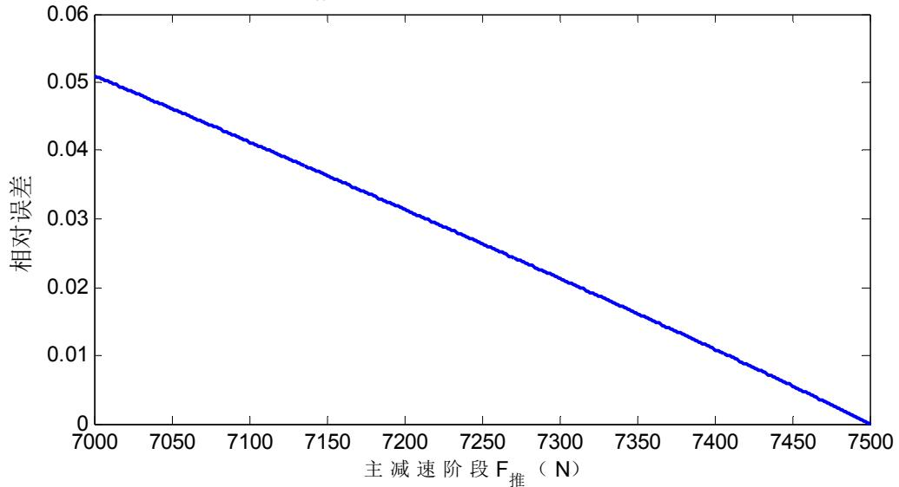

<details>
<summary>line</summary>

| 主减速阶段 F推 (N) | 相对误差 |
| --- | --- |
| 7000 | 0.05 |
| 7500 | 0 |
</details>

图5-16：主减速阶段推力变化对水平位移的相对误差图

从图中可以明显看出，当主减速段推力逐渐增大时，相对误差逐渐减少，基本呈负相关趋势，在主减速段最优策略模型中，取推力为7500N，此时对于位移的相对误差为0，由此可以得出结论，问题1中所建立的主减速最优控制模型，取推力为7500N，对水平位移基本无影响，则取值具有合理性。

## 4）下落高度的改变对水平位移的影响

表5-16：主减速阶段h改变时水平位移的相对误差

<table><tr><td>下落距离</td><td>11985</td><td>11990</td><td>11995</td><td>12000</td><td>12005</td><td>12010</td><td>12015</td></tr><tr><td>相对误差</td><td>0.00002</td><td>0.00002</td><td>0.00001</td><td>0.00000</td><td>0.00001</td><td>0.00003</td><td>0.00003</td></tr></table>

由表中相对误差数值大小可以看出，主减速阶段下落高度改变时对水平位移的相对误差影响非常小，而且随着下落距离的增加，相对误差变化规律具有波动性。为此，作出相对误差趋势图来寻找下落高度对水平位移的相对误差影响趋势：

主减速阶段h改变时水平位移的相对误差趋势图  
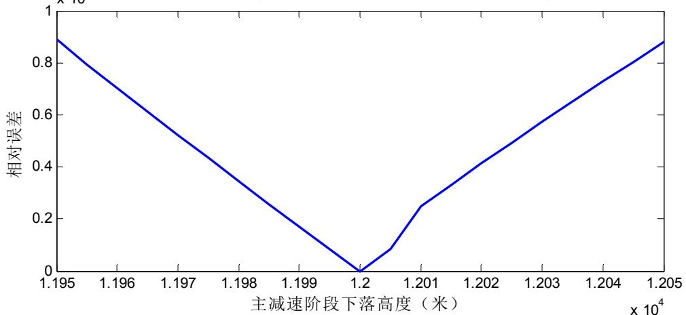

<details>
<summary>line</summary>

| 主减速阶段下落高度 (米) | 相对误差 |
| --- | --- |
| 1.195 | ~0.88 |
| 1.2 | 0 |
| 1.201 | ~0.24 |
| 1.205 | ~0.88 |
</details>

图5-17：主减速段下落高度的改变对水平位移相对误差的影响趋势

由上图中曲线趋势可知：

①当下落高度小于 $1 . 2 \times 1 0 ^ { 4 }$ 米时，相对误差与下落高度呈负相关趋势  
②当下落高度大于 $1 . 2 \times 1 0 ^ { 4 }$ 米时，相对误差与下落高度呈正相关趋势

## 六、模型的评价与改进

## 6.1模型的评价

## 6.1.1 模型的优点

1、本文采用动力学模型对嫦娥三号软着陆过程轨迹进行描述，具有严谨的推导过程，且模型具有普适性。  
2、在仿真模型过程中，模型参数能够根据要求通过计算机程序随时进行调整，修改或补充，使得能够快速掌握各种可能性的仿真结果，为进一步完善研究方案提供了极大的方便。

## 6.1.2 模型的缺点

1、迭代仿真计算方法求解过程略微繁琐，结果不够精确  
2、考虑的影响因素较少，在处理问题时可能存在一些误差。

## 6.2模型的改进

由于本文采用逐步迭代的方法，近似求得最优控制策略，但由于每小段都近似看成匀变速直线运动，对结果会产生较大误差，因此，需要寻求更优的算法对模型进行求解，例如，蚁群算法、遗传算法等对模型进行改进。

## 七、模型的应用与推广

本文主要运用到动力学相关知识以及仿真迭代求解方法，动力学模型在宏观经济和微观经济，飞行模拟，射击模拟，汽车驾驶训练，危险工种行动训练，军事训练等都有广泛的应用，可以将该方法推广到各种不同情况下的宇宙探测问题中，动力学模型，能够解决对事物的控制问题，没有动力学，就没有控制理论发展的空间，具有很强的推广意义。

## 八、参考文献

[1]王鹏基, 张熇, 曲广吉. 月球软着陆重力转弯轨道设计与分析[C]. //中国宇航学会深空探测技术专业委员会第二届学术会议. 2005.  
[2] 张洪华, 关轶峰, 黄翔宇, 等. 嫦娥三号着陆器动力下降的制导导航与控制[J].中国科学: 技术科学, 2014, 4: 006.  
[3]和兴锁, 林胜勇, 张亚锋. 月球探测器直接软着陆最优轨道设计[J]. 宇航学报,2007, (2).  
[4]王建伟, 李兴. 近日点和远日点速度的两种典型解法[J]. 物理教师, 2013, 34(6).  
[5] 田晓岑. 由“嫦娥一号”引起的思考[J]. 大学物理, 2008, (12):18-20.  
[6] 刘浩敏, 冯军华, 崔祜涛, 等. 月球软着陆制导律设计及其误差分析[J]. 系统仿真学报, 2009 (4): 936-938.

## 附录

## 附录 1

MATLAB R2012b软件求解问题1中主减速段下落轨迹及关键点状态%% 主减速阶段的数值近似求解

clc;clear;close all;

g=1.633; %月球重力加速度

m0=2.4\*10^3;%卫星初始质量

Ve=2940; %比冲

theta=9.654\*pi/180;%初速度与水平方向的夹角

F=7500; %推力

V0=1692.464; %近日点初速度

t=0; %初始时间

T=0.1; %时间步长

Vx0=V0\*cos(-theta); %水平初速度

Vy0=V0\*sin(-theta); %竖直初速度

Ay0=g-F\*sin(-theta)/(m0-F/Ve\*t);%竖直初加速度

Ax0=-F\*cos(-theta)/(m0-F/Ve\*t);%水平初加速度

count=0;

X\_res=Vx0\*t+0.5\*Ax0\*t^2;

Y\_res=Vy0\*t+0.5\*Ax0\*t^2;

Result=[];

h=12000;%主减速阶段的下落距离

%% 迭代求 分解速度和分解位移

while (Y\_res<h ).................

count=count+1;

Vx=Vx0+Ax0\*T;

Vy=Vy0+Ay0\*T;

V\_res=sqrt(Vx^2+Vy^2);

Vx0=Vx;

Vy0=Vy;

X=Vx0\*T+0.5\*Ax0\*T^2;

Y=Vy0\*T+0.5\*Ay0\*T^2;

X\_res=X\_res+X;

Y\_res=Y\_res+Y;

Time=count\*T;

Result=[Result;X\_res,Y\_res,V\_res,Time];

SIN=Vy/sqrt(Vy^2+Vx^2);

COS=Vx/sqrt(Vy^2+Vx^2);

Ay=g-F\*SIN/(m0-F/Ve\*Time);

Ax=-F\*COS/(m0-F/Ve\*Time);

Ax0=Ax;

Ay0=Ay;

end

M=m0-F/Ve\*Time;%该阶段的末质量。

```matlab
X_res %水平位移
Time=count*T %运动时间
V_res=sqrt(Vx^2+Vy^2) %合速度
jiaodu=atan(Vy/Vx)*180/pi %末速度角度。
F/Ve*Time%燃料消耗量
%% 作图
plot(Result(:,1),15000-Result(:,2),'k','LineWidth',2);
title('主减速段嫦娥三号运动轨迹图','FontSize',15);
xlabel('X轴/(m)');
ylabel('Y轴/(m)');
%% 经纬度的近似计算
R=1737.013; %平均半径
weidu=44.12-X_res/((2*pi*R)/4/90)/1000 %近月点纬度
```

## 附录 2

MATLAB R2012b软件求解问题2中快速调整段下落轨迹及关键点状态%% 快速调整阶段的数值迭代求解。

```csv
clc;clear;close all;
Ve=2940;%比冲
```

g=1.633; %月球重力加速度

h=600;%该阶段的下落距离

t=0; %初始时间

T=0.1; %时间步长

```matlab
M_temp=[];
V_temp=[];
shijian=[];
X_temp=[];
lisan=1500:100:7500;
%lisan=5000:5100;
for i = lisan
F=i;  %推力
```

%主减速阶段的末状态量作为快速调整阶段的初状态量

theta=55.6708\*pi/180;%初速度与水平面的夹角

Vx0=32.23327;%水平初速度

Vy0=47.2005; %竖直初速度

m0=1325.255;%初始质量

Ay0=g-F\*sin(theta)/(m0-F/Ve\*t);%竖直初加速度

Ax0=-F\*cos(theta)/(m0-F/Ve\*t);%水平初加速度

count=0; %计数器

X\_res=Vx0\*t+0.5\*Ax0\*t^2;

Y\_res=Vy0\*t+0.5\*Ax0\*t^2;

Result=[];

%% 迭代求 分解速度和分解位移

while (Y\_res<h )

count=count+1;

```matlab
Vx=Vx0+Ax0*T;
Vy=Vy0+Ay0*T;
Vx0=Vx;
Vy0=Vy;
X=Vx0*T+0.5*Ax0*T^2;
Y=Vy0*T+0.5*Ay0*T^2;
X_res=X_res+X;
Y_res=Y_res+Y;
Time=count*T;
SIN=Vy/sqrt(Vy^2+Vx^2);
COS=Vx/sqrt(Vy^2+Vx^2);
Ay=g-F*SIN/(m0-F/Ve*Time);
Ax=-F*COS/(m0-F/Ve*Time);
Ax0=Ax;
Ay0=Ay;
end
M=m0-F/Ve*Time;%该阶段的末质量。
X_res; %水平位移
Time=count*T; %运动时间
V_res=sqrt(Vx^2+Vy^2);%合速度
jiaodu=atan(Vy/Vx)*180/pi; %末速度角度
%Vx %水平速度
M_temp=[M_temp;F/Ve*Time];
V_temp=[V_temp;V_res,Vx];
shijian=[shijian;Time];%记录运行时间
X_temp=[X_temp;X_res];
end
Answer=[lisan',M_temp,V_temp,shijian,X_temp];%结果总结在这里
subplot(221);
plot(lisan,M_temp,'LineWidth',2);
title('燃油消耗量关于推力变化图','FontSize',14);
xlabel('F 推/N','FontSize',12);
ylabel('燃油消耗质量(千克)');
subplot(222);
plot(lisan,X_temp,'LineWidth',2);
title('水平位移关于推力变化图','FontSize',14);
xlabel('F 推/N','FontSize',12);
ylabel('位移(米)');
subplot(223);
plot(lisan,V_temp(:,2),'LineWidth',2);
title('水平末速度关于推力变化图','FontSize',14);
xlabel('F 推/N','FontSize',12);
ylabel('速度(米/秒)');
```

```matlab
subplot(224);
plot(lisan, shijian,'LineWidth', 2);
title('下落时间关于推力变化图','FontSize', 14);
xlabel('F 推/N','FontSize', 12);
ylabel('时间(秒)');
%% 数据表格的写入。
```

```txt
M_temp=[];
V_temp=[];
shijian=[];
X_temp=[];
lisan=1500:7500;
for i = lisan
```  
F=i; %推力

```txt
%主减速阶段的末状态量作为快速调整阶段的初状态量theta=55.6708*pi/180;%初速度与水平面的夹角
```

Vx0=32.23327;%水平初速度

<div class="mineru-algorithm" style="white-space: pre-wrap; font-family:monospace;">
$\mathrm{Vy0 = 47.2005}$；%竖直初速度  
$\mathrm{m0 = 1325.255}$；%初始质量
</div>

Ay0=g-F\*sin(theta)/(m0-F/Ve\*t);%竖直初加速度

<div class="mineru-algorithm" style="white-space: pre-wrap; font-family:monospace;">
$A_{x}0=-F*\cos(\text{theta})/(m0-F/Ve*t)$ ; %水平初加速度
count=0; %计数器
</div>

```javascript
X_res=Vx0*t+0.5*Ax0*t^2;
Y_res=Vy0*t+0.5*Ax0*t^2;
Result=[];
```  
%% 迭代求 分解速度和分解位移

```matlab
while (Y_res<h )
count=count+1;
Vx=Vx0+Ax0*T;
Vy=Vy0+Ay0*T;
Vx0=Vx;
Vy0=Vy;
X=Vx0*T+0.5*Ax0*T^2;
Y=Vy0*T+0.5*Ay0*T^2;
X_res=X_res+X;
Y_res=Y_res+Y;
  Time=count*T;
SIN=Vy/sqrt(Vy^2+Vx^2);
COS=Vx/sqrt(Vy^2+Vx^2);
Ay=g-F*SIN/(m0-F/Ve*Time);
Ax=-F*COS/(m0-F/Ve*Time);
Ax0=Ax;
Ay0=Ay;
end
```  
M=m0-F/Ve\*Time;%该阶段的末质量。

```matlab
X_res; %水平位移
Time=count*T; %运动时间
V_res=sqrt(Vx^2+Vy^2);%合速度
jiaodu=atan(Vy/Vx)*180/pi; %末速度角度
%Vx %水平速度
M_temp=[M_temp;F/Ve*Time];
V_temp=[V_temp;V_res,Vx];
shijian=[shijian;Time];%记录运行时间
X_temp=[X_temp;X_res];
end
Answer=[lisan',M_temp,V_temp,shijian,X_temp];
%xlswrite('快速调整阶段各参数数据.xls',Answer);
%第一列是推力值
%第二列是燃料消耗量
%第三列是快速调整段末速度
%第四列是快速调整段的水平末速度
%第五列是运行时间
%第六列是水平位移
%% 最优轨迹图的绘制
figure;
M_temp=[];
V_temp=[];
shijian=[];
F=5085; %推力
%主减速阶段的末状态量作为快速调整阶段的初状态量
theta=55.6708*pi/180;%初速度与水平面的夹角
Vx0=32.23327;%水平初速度
Vy0=47.2005; %竖直初速度
m0=1325.255; %初始质量
Ay0=g-F*sin(theta)/(m0-F/Ve*t);%竖直初加速度
Ax0=-F*cos(theta)/(m0-F/Ve*t); %水平初加速度
count=0; %计数器
X_res=Vx0*t+0.5*Ax0*t^2;
Y_res=Vy0*t+0.5*Ax0*t^2;
Result=[];
G=[];
%% 迭代求 分解速度和分解位移
while (Y_res<h )
count=count+1;
Vx=Vx0+Ax0*T;
Vy=Vy0+Ay0*T;
Vx0=Vx;
Vy0=Vy;
X=Vx0*T+0.5*Ax0*T^2;
```

```matlab
Y=Vy0*T+0.5*Ay0*T^2;
X_res=X_res+X;
Y_res=Y_res+Y;
Time=count*T;
G=[G;X_res,Y_res,V_res,Time];
SIN=Vy/sqrt(Vy^2+Vx^2);
COS=Vx/sqrt(Vy^2+Vx^2);
Ay=g-F*SIN/(m0-F/Ve*Time);
Ax=-F*COS/(m0-F/Ve*Time);
Ax0=Ax;
Ay0=Ay;
end
% M=m0-F/Ve*Time;%该阶段的末质量。
% X_res; %水平位移
% Time=count*T; %运动时间
% V_res=sqrt(Vx^2+Vy^2);%合速度
% jiaodu=atan(Vy/Vx)*180/pi; %末速度角度
% %Vx %水平速度
% M_temp=[M_temp;F/Ve*Time];
% V_temp=[V_temp;V_res,Vx];
% shijian=[shijian;Time];%记录运行时间
plot(G(:,1),3000-G(:,2),'k','LineWidth',2);
title('快速调整段运动轨迹','FontSize',15);
xlabel('X轴/(m)');
ylabel('Y轴/(m)');
```

## 附录 3

MATLAB R2012b软件处理问题2中距月表面 2400米处的数字高程图的处理

%% 第一张数字高程图的处理

clc;clear;close all;tic;z=imread('附件 3 距 2400m 处的数字高程图.tif');

%% 划分区域

temp=z(101:2200,101:2200);%转化为可均分的 2100X2100 九宫格矩阵

```matlab
for i=1:9
    switch i
        case  {1,2,3}
    G{i}=temp(1:700,1+(i-1)*700:i*700);
        case  {4,5,6}
    G{i}=temp(701:1400,1+(i-4)*700:(i-3)*700);
        case  {7,8,9}
    G{i}=temp(1401:end,1+(i-7)*700:(i-6)*700);
end
end
for i=1:9
    b=i;
```

```matlab
a=330+i;
subplot(a);
imshow(G{1,i});
end
%% 9个区域的各个统计量计算
MEAN=[]; %高程均值
JICHA=[]; %高程极差
STD=[]; %高程标准差
XD=[]; %区域均值相对于总体均值的“相对高程”
ZT=mean(temp(:));%总体均值
for i=1:9
    TEMP=G{1,i};
    TEMP=double(TEMP(:));
    MEAN=[MEAN, mean(TEMP)];
    MAX=max(TEMP);
    MIN=min(TEMP);
    JICHA=[JICHA, MAX-MIN];
    STD=[STD, std(TEMP)];
    XD=[XD, abs(MEAN(i)-ZT)/ZT];
end
result=[MEAN;JICHA;STD;XD];%未归一化结果
toc;
%% STD XD 的归一化
m1=max(STD);
m2=min(STD);
m3=max(XD);
m4=min(XD);
STD2=(STD-m2)/(m1-m2);
XD2=(XD-m4)/(m3-m4);
%归一化结果。
RESULT=[MEAN;JICHA;STD2;XD2;STD2+XD2];
%% 等高线图的绘制
figure;
z=double(z);
x=1:length(z);
y=x;
[X2,Y2]=meshgrid(x,y);
subplot(121);
[C,h]=contour(X2,Y2,z);
axis([0 2300 0 2300 ]);
title('距月面2400m处的等高线图','FontSize',14);
colormap(gray);
z1=G{5};
x=1:length(z1);
```

```matlab
y=x;
[X2, Y2]=meshgrid(x, y);
subplot(122);
contour(X2, Y2, double(z1));
colormap(gray);colorbar;
title('5号区域等高线图','FontSize', 14);
toc;
```

## 附录 4

MATLAB R2012b软件求解问题2中两种方案粗避障段下落轨迹及关键点状态%% 粗避障阶段求解

%策略一：近似匀速直线运动

clc;clear;close all;

Ve=2940;%比冲

g=1.633; %月球重力加速度

h=2300; %该阶段的下落距离

t=0; %初始时间

T=0.1; %时间步长

%快速调整阶段的末状态量作为粗避障阶段的初状态量

Vy0=0.2208059; %竖直初速度

m0=1278.72898;%初始质量

count=0; %计数器

Y\_res=Vy0\*t;

TIME=h/Vy0;%总运行时间。

Result=[];

%% 迭代求 分解速度和分解位移

M=m0;

consume=0;

while (Y\_res<h )

count=count+1;

Y\_res=Y\_res+Vy0\*T;

Time=count\*T;

F=M\*g; %推力

consume=consume+F/Ve\*T;

M=M-F/Ve\*T;

end

M%该阶段的末质量。

Time %运动时间

consume %总燃料消耗

% 策略二 先无推力落体，再F推是恒力。

clc;clear;close all;tic;

Ve=2940;%比冲

g=1.633; %月球重力加速度

h=2300;%该阶段的下落距离

```matlab
t=0; %初始时间
T=0.1;   %时间步长
lisan=7458:0.001:7460;
TIME=[];
M=[];
V_res=[];
Result=[];
F_res=[];
for j=lisan
%快速调整阶段的末状态量作为粗避障阶段的初状态量
V0=0.2208059;  %竖直初速度
m0=1278.72898;%初始质量
count=0; %计数器
Y_res=V0*t;
Time=0;
%无推力落体下落最大时间 T_max=52.9394466022199;
t1=45;%无推力落体下落时间 t1
h1=V0*t1+0.5*g*t1^2;%无推力落体距离 h1
h2=h-h1;%恒定推力制动距离 h2
F=j;%恒定推力 F
F_res=[F_res;F];
A0=g-F/(m0-F/Ve*t);%初始时刻加速度
V0=V0+g*t1; %推力段初速度
while (Y_res<h2 )
count=count+1;
Y=V0*T+0.5*A0*T^2;
V=V0+A0*T;
V0=V;
Y_res=Y_res+Y;
Time=count*T;
Ay=g-F/(m0-F/Ve*Time);
A0=Ay;
end
M=[M;m0-F/Ve*Time,F/Ve*Time];  %该阶段的末质量
TIME=[TIME;Time+t1];  %总运动时间
V_res=[V_res;V];
end
Result=[Result;TIME,V_res,M,F_res];
toc;
```

## 附录 5

```txt
MATLAB R2012b 软件处理问题 2 中距月表面 100 米处的数字高程图的处理
%% 第二张数字高程图的处理
clc;clear;close all;tic;
z=imread('附件 4 距月面 100m 处的数字高程图.tif');
```

%% 划分区域  
temp=z(51:950,51:950);%转化为可均分的 900X900 九宫格矩阵  
```matlab
for i=1:9
    switch i
        case    {1,2,3}
    G{i}=temp(1:300, 1+(i-1)*300:i*300);
        case    {4,5,6}
    G{i}=temp(301:600, 1+(i-4)*300:(i-3)*300);
        case    {7,8,9}
    G{i}=temp(601:end, 1+(i-7)*300:(i-6)*300);
end
end
for i=1:9
    b=i;
    a=330+i;
    subplot(a);
    imshow(G{1,i});
end
```  
%% 9个区域的各个统计量计算

MEAN=[]; %高程均值  
```txt
JICHA=[];    %高程极差
STD=[];      %高程标准差
XD=[];        %区域均值相对于总体均值的“相对高程”
```  
ZT=mean(temp(:));%总体均值

```matlab
for i=1:9
    TEMP=G{1, i};
    TEMP=double(TEMP(:));
    MEAN=[MEAN, mean(TEMP)];
    MAX=max(TEMP);
    MIN=min(TEMP);
    JICHA=[JICHA, MAX-MIN];
    STD=[STD, std(TEMP)];
    XD=[XD, abs(MEAN(i)-ZT)/ZT];
end
result=[MEAN;JICHA;STD;XD];
```

```matlab
%% STD XD 的归一化
m1=max(STD);
m2=min(STD);
m3=max(XD);
m4=min(XD);
STD2=(STD-m2)/(m1-m2);
XD2=(XD-m4)/(m3-m4);
RESULT=[MEAN;JICHA;STD2;XD2;STD2+XD2];
```

toc;

## 附录 6

MATLAB R2011b 软件绘制软着落全过程轨迹图

%% 整个软着陆过程的运动轨迹

clc;clear;close all;

g=1.633; %月球重力加速度

m0=2.4\*10^3;%卫星初始质量

Ve=2940; %比冲

theta=9.654\*pi/180;%初速度与水平方向的夹角

F=7500; %推力

V0=1692.464; %近日点初速度

t=0; %初始时间

T=0.1; %时间步长

Vx0=V0\*cos(-theta); %水平初速度

Vy0=V0\*sin(-theta); %竖直初速度

Ay0=g-F\*sin(-theta)/(m0-F/Ve\*t);%竖直初加速度

Ax0=-F\*cos(-theta)/(m0-F/Ve\*t);%水平初加速度

count=0;

X\_res=Vx0\*t+0.5\*Ax0\*t^2;

Y\_res=Vy0\*t+0.5\*Ax0\*t^2;

Result=[];

h=12000;%主减速阶段的下落距离

%% 迭代求 分解速度和分解位移

while (Y\_res<h )

count=count+1;

Vx=Vx0+Ax0\*T;

Vy=Vy0+Ay0\*T;

V\_res=sqrt(Vx^2+Vy^2);

Vx0=Vx;

Vy0=Vy;

X=Vx0\*T+0.5\*Ax0\*T^2;

Y=Vy0\*T+0.5\*Ay0\*T^2;

X\_res=X\_res+X;

Y\_res=Y\_res+Y;

Time=count\*T;

Result=[Result;X\_res,Y\_res,V\_res,Time];

SIN=Vy/sqrt(Vy^2+Vx^2);

COS=Vx/sqrt(Vy^2+Vx^2);

Ay=g-F\*SIN/(m0-F/Ve\*Time);

Ax=-F\*COS/(m0-F/Ve\*Time);

Ax0=Ax;

Ay0=Ay;

end

GJ=[Result(:,1),15000-Result(:,2)];

```matlab
%% clc;close all;
Ve=2940;%比冲
g=1.633; %月球重力加速度
h=600;%该阶段的下落距离
t=0; %初始时间
T=0.1; %时间步长
M_temp=[];
V_temp=[];
shijian=[];
X_temp=[];
lisan=1500:100:7500;
%lisan=5000:5100;
for i = lisan
F=i; %推力
%主减速阶段的末状态量作为快速调整阶段的初状态量
theta=55.6708*pi/180;%初速度与水平面的夹角
Vx0=32.23327;%水平初速度
Vy0=47.2005; %竖直初速度
m0=1325.255;%初始质量
Ay0=g-F*sin(theta)/(m0-F/Ve*t);%竖直初加速度
Ax0=-F*cos(theta)/(m0-F/Ve*t);%水平初加速度
count=0; %计数器
X_res=Vx0*t+0.5*Ax0*t^2;
Y_res=Vy0*t+0.5*Ax0*t^2;
Result=[];
```

%% 迭代求 分解速度和分解位移  
```javascript
while (Y_res<h )
count=count+1;
Vx=Vx0+Ax0*T;
Vy=Vy0+Ay0*T;
Vx0=Vx;
Vy0=Vy;
X=Vx0*T+0.5*Ax0*T^2;
Y=Vy0*T+0.5*Ay0*T^2;
X_res=X_res+X;
Y_res=Y_res+Y;
Time=count*T;
SIN=Vy/sqrt(Vy^2+Vx^2);
COS=Vx/sqrt(Vy^2+Vx^2);
Ay=g-F*SIN/(m0-F/Ve*Time);
Ax=-F*COS/(m0-F/Ve*Time);
Ax0=Ax;
```

```txt
Ay0=Ay;
end
M=m0-F/Ve*Time;%该阶段的末质量。
X_res; %水平位移
  Time=count*T;  %运动时间
  V_res=sqrt(Vx^2+Vy^2);%合速度
  jiaodu=atan(Vy/Vx)*180/pi; %末速度角度
  %Vx  %水平速度
M_temp=[M_temp;F/Ve*Time];
V_temp=[V_temp;V_res,Vx];
shijian=[shijian;Time];%记录运行时间
X_temp=[X_temp;X_res];
end
Answer=[lisan',M_temp,V_temp,shijian,X_temp];%结果总结在这里
M_temp=[];
V_temp=[];
shijian=[];
F=5085;  %推力
%主减速阶段的末状态量作为快速调整阶段的初状态量
theta=55.6708*pi/180;%初速度与水平面的夹角
Vx0=32.23327;%水平初速度
Vy0=47.2005;  %竖直初速度
m0=1325.255; %初始质量
Ay0=g-F*sin(theta)/(m0-F/Ve*t);%竖直初加速度
Ax0=-F*cos(theta)/(m0-F/Ve*t); %水平初加速度
count=0; %计数器
X_res=Vx0*t+0.5*Ax0*t^2;
Y_res=Vy0*t+0.5*Ax0*t^2;
Result=[];
G=[];
%% 迭代求 分解速度和分解位移
while (Y_res<h )
count=count+1;
Vx=Vx0+Ax0*T;
Vy=Vy0+Ay0*T;
Vx0=Vx;
Vy0=Vy;
X=Vx0*T+0.5*Ax0*T^2;
Y=Vy0*T+0.5*Ay0*T^2;
X_res=X_res+X;
Y_res=Y_res+Y;
  Time=count*T;
G=[G;X_res,Y_res,V_res,Time];
SIN=Vy/sqrt(Vy^2+Vx^2);
```

```matlab
COS=Vx/sqrt(Vy^2+Vx^2);
Ay=g-F*SIN/(m0-F/Ve*Time);
Ax=-F*COS/(m0-F/Ve*Time);
Ax0=Ax;
Ay0=Ay;
end
GJ2=[G(:,1)+GJ(end,1),3000-G(:,2)];
flag1=[377092.173014911,2999.65005894814];%主减速段结束点
flag2=[377381.089941517,2399.99226916603];%快速调整段结束点
GJ3=[GJ;GJ2];
%plot(GJ3(:,1),GJ3(:,2));
hold on;
%plot(flag1(1,1),flag1(1,2),'o','MarkerSize',20);
%plot(flag2(1,1),flag2(1,2),'o','MarkerSize',20);
ttm=2399:-1:100;
CUBI=[zeros(2300,1)+flag2(1,1),ttm'];
GJ4=[GJ3;CUBI];
%plot(GJ4(:,1),GJ4(:,2));
flag3=[377381.089941517,100];%粗避障段结束点
%%
h=70;
aaa=1.98;
T=sqrt(2*h/g);
t1=0.5*T;
t2=t1;
x3=[];
y3=[];
x33=[];

for i=0:0.01:t1
x3=[x3;0.5*1.98*i^2];
end
temp5=x3(end,1);
vvv=aaa*t1;

for i=0:0.01:t2
x33=[x33;temp5+vvv*i-0.5*aaa*i^2];
end
X3=[x3;x33];
for i=0:0.01:T
y3=[y3;100-0.5*g*i^2];
end
x5=[GJ4(end,1)+X3];
GJ5=[GJ4;x5,y3];
```

```matlab
%plot(GJ5(:,1),GJ5(:,2));
ttn=29:-1:0;
TT5=[zeros(30,1)+GJ5(end,1),ttn'];
GJ6=[GJ5;TT5];
plot(GJ6(:,1),GJ6(:,2),'LineWidth',2);
title('后4个过程的轨迹图','FontSize',14);
xlabel('水平位移/米');
ylabel('高度/米');
%axis([377092.173014911,377500,0 3000])
```