# 嫦娥三号软着陆轨道设计与控制策略

## 摘要

嫦娥三号是中国发射的第一个地外软着陆探测器和巡视器(月球车)。它的发射对我国航天事业具有重要意义。为解决嫦娥三号软着陆的轨道设计与控制策略问题，本文首先分析各项因素对嫦娥三号轨道的影响，基于合理假设简化模型，建立以月心为坐标原点的球极坐标系，为分析后续问题奠定基础。

针对问题 1：考虑到探测器在着陆预备轨道上时距离月面距离较远，此时可将月球与探测器两者组成的系统问题视为两体问题。首先分析系统受力，建立着陆器的归一化质心运动方程，将着陆点满足的约束条件视为终端条件，近日点的约束条件作为初始条件，通过求解运动方程得到近日点与远日点的位置坐标。轨道确定后，根据开普勒第一定律与万有引力定律建立方程组，求得近日点和远日点速度分别为 $v_{0}=1692.30m/s$ 和 $v_{1}=1614.01m/s$ （其余轨道参数见表 1）。

针对问题 2：为了满足主减速阶段燃料消耗最小的要求，首先将问题 1 中的运动方程表示为状态方程的形式，按照耗燃最小为优化目标构造哈密顿函数，根据 Pontryagin 极大值原理求出该阶段的最优推力进而确定最优制导率。根据初始条件与终端约束，将最优轨道问题转化成两点边值问题，使用计算机仿真求解，得到主减速阶段各项参数值随时间的变化（图 4）。考虑到快速调整阶段时间很短这一事实，基于该阶段的动力学方程，经过论证，可用主减速阶段的轨道参数计算方法求解这一阶段的轨道参数值。

考虑到粗避障段探测器距离月面距离较近，因此重新建立月球平面直角坐标系。为简化问题，将此阶段的探测器的运动分解为垂直月面方向的运动与水平方向的避障运动，垂直方向运动可由动力学方程结合初始条件与终端约束解出；而对于水平方向的避障运动，应用附件3、4中的高程图，使用算法找出符合着陆条件的平坦区域（图10、图12），为满足匹配跟踪的需要，基于Lommel-Seeliger光照反射模型，采用Shape-from-Shading方法找出大陨石坑坐标并作为特征点，以实现软着陆模拟（图11）。通过综合计算仿真两个方向上的探测器运动规律，最终得出后三个阶段的着陆轨道与控制策略。

针对问题 3: 由于在前两问建模过程中忽略月球引力摄动、月球自转等因素，而这些因素可能对轨道参数产生影响，因此，首先从理论上分析这些因素的影响，明确误差产生机理；其次，采用基于自适应模拟退火遗传算法对月球探测器软着陆轨道进行优化，并将其结果与使用 Pontryagin 极大值原理求得的结果进行相互验证，以确定各种方法的误差。最后，使用蒙特卡洛法对嫦娥三号探测器着陆点进行模拟打靶，确定各种扰动因素对探测器着陆点的影响，并使用 SPSS 19.0 软件对着陆点偏差进行统计分析（图 16、图 17），得出在考虑月球和地球引力摄动的情况下，着陆点偏差符合正态分布的结论。

对于灵敏度检验，考虑到实际情况，探测器质量偏差，轨道高度、经纬度等偏差都有可能对着陆点产生影响，本文假定其中某项因素改变某一微小值，通过对最终模拟结果的影响，综合判定本文中设计的模型具有较强的鲁棒性。

关键词：嫦娥三号；软着陆；轨道设计；Pontryagin 极大值原理；自适应模拟退火遗传算法；蒙特卡洛模拟

## 一、问题重述

## 1.1 问题背景

嫦娥三号是中国发射的第一个地外软着陆探测器和巡视器(月球车)，也是阿波罗计划结束后重返月球的第一个软着陆探测器，是探月工程二期（落）的关键任务，起承上启下的作用。嫦娥三号探测器将突破月球软着陆、月面巡视勘察、月面生存、深空探测通信与遥控操作、运载火箭直接进入地月转移轨道等关键技术。

## 1.2 问题提出

嫦娥三号于 2013 年 12 月 2 日 1 时 30 分成功发射, 12 月 6 日抵达月球轨道。嫦娥三号在着陆准备轨道上的运行质量为 2.4t，其安装在下部的主减速发动机能够产生 1500N 到 7500N 的可调节推力，其比冲（即单位质量的推进剂产生的推力）为 2940m/s，可以满足调整速度的控制要求。在四周安装有姿态调整发动机，在给定主减速发动机的推力方向后，能够自动通过多个发动机的脉冲组合实现各种姿态的调整控制。嫦娥三号的预定着陆点为 19.51W，44.12N，海拔为 -2641m（见附件 1）。

嫦娥三号在高速飞行的情况下，要保证准确地在月球预定区域内实现软着陆，关键问题是着陆轨道与控制策略的设计。其着陆轨道设计的基本要求：着陆准备-轨道为近月点15km，远月点100km的椭圆形轨道；着陆轨道为从近月点至着陆点，其软着陆过程共分为6个阶段（见附件2），要求满足每个阶段在关键点所处的状态；尽量减少软着陆过程的燃料消耗。

根据上述的基本要求，建立数学模型解决下面的问题:

（1）确定着陆准备轨道近月点和远月点的位置，以及嫦娥三号相应速度的大小与方向。  
(2) 确定嫦娥三号的着陆轨道和在 6 个阶段的最优控制策略。  
(3) 对于设计的着陆轨道和控制策略做相应的误差分析和敏感性分析。

## 二、问题分析

## 2.1 问题的整体分析

由于月球表面附近没有大气，所以在飞行器的动力学模型中没有大气阻力项。而且从15km左右的轨道高度软着陆到非常接近月球表面的时间比较短，一般在几百秒的范围内，所以月球引力非球项、日月引力摄动等影响因素均可忽略不计。因此，可以使用较为简单的二体模型就可以很好地描述这一问题。

## 2.2 问题一的分析

根据题意，本文建立以月球为中心的球坐标系，在这一坐标系中，假设月球静止，不考虑月球相对其他天体的相对运动，由于近月点和远月点的高度已经确定，因此，只需要求出近月点和远月点在球坐标系中的方位角和仰角（即这两点的经纬度），这两点便可唯一确定。基于本文的假设，着陆预备轨道和着陆轨道在同一平面上，且该平面通过月球南北两极，因此，近月点和远月点的经度已经确定，因此只需要确定两点的纬度值。

由于近月点与远月点的高度确定，因此，探测器的绕月轨道固定，若只考虑月球引力对探测器的影响，则只需求出探测器在椭圆轨道远月点和近月点的曲率半径便可求出嫦娥三号在两点的大小和方向。基于动力学方程，将初始条件和终端条件代入，便可由着陆点反推出轨道的近月点和远月点等数据。

## 2.3 问题二的分析

由附件中资料可知，嫦娥三号探测器软着陆过程分为6个阶段，其中第一阶段，即着陆准备轨道阶段为固定轨道，其参数值可以在问题一中求解。该轨道近月点的状态即为软着陆第二阶段的初始状态。软着陆第二阶段可以根据动力学方程，将探测器于月球的相对运动看成两体问题，以耗燃最小为目标，构建哈密顿函数，并基于Pontryagin极大值原理，求得最优制导率。将初始条件和终端条件代入最优制导率方程和共轭方程，便可以求解该问题。

由分析可知，快速调整阶段时间较短，起到衔接作用，因此，此阶段可用主减速阶段的制导率求解仿真。在粗避障阶段之后的几个阶段，由于月球探测器距离月面距离较近，因此可以建立月面平面坐标系。考虑到嫦娥三号探测器的运动可视为刚体运动，可将其运动分解为质心的平动与探测器绕质心的转动，以简化问题。同时，假设引起探测器的速度变化的力仅由主发动机提供，可将嫦娥三号的平动分解为平行于月面的避障运动与垂直于月面的运动，并根据相应情况求解。

## 2.4 问题三的分析

根据模型设计，可从三个方面进行误差分析：①由于建模过程中忽略了月球引力摄动，月球表面形状等因素，因此可以从理论上分析这些因素对实际情况产生的影响；②可以使用基于自适应模拟退火遗传算法的轨道优化算法对Pontryagin极大值原理法得到的结果进行相互验证，从而对比误差；③使用蒙特卡洛方法进行模拟打靶实验，确定不同扰动因素对探测器软着陆点的影响，从而得出各项因素产生偏差的分布。

对于灵敏度检验，考虑到实际情况，探测器质量偏差，轨道高度、经纬度等偏差都有可能产生影响，可以假定其中某项因素改变某一微小值，通过对最终模拟结果的影响判定模型的鲁棒性。

三、基本符号说明

<table><tr><td>符号</td><td>说明</td></tr><tr><td>M</td><td>月球质量</td></tr><tr><td>r</td><td>椭圆的曲率半径</td></tr><tr><td>G</td><td>万有引力常量</td></tr><tr><td> $r_0$ </td><td>月球的平均半径</td></tr><tr><td> $h_1$ </td><td>探测器近地点高度</td></tr><tr><td> $h_2$ </td><td>探测器远地点高度</td></tr></table>

## 四、模型假设

(1) 在探测器距月面较远时, 假设月球为一均匀球体;  
（2）假设着陆预备轨道和着陆轨道在同一平面上，且该平面通过月球南北两极 $^{[1]}$ ;  
(3) 以月球中心为原点建立球坐标系, 不考虑月球相对于地球与太阳的运动;  
（4）假设月球引力场均匀，忽略月球自转 $^{[2]}$ ;  
(5) 假设月球表面为近似真空环境, 不考虑空间中尘埃对探测器的阻力作用;  
(6) 不考虑探测器故障等因素。

## 五、模型建立与求解

## 5.1 着陆坐标系的建立

由分析可知，着陆器的动力下降段一般从15km左右的轨道高度开始，下降到月球表面的时间比较短，在几百秒范围内，所以可以不考虑月球引力摄动、月球引力非球项和月球自转速度等，可以利用二体模型描述系统的运动，因此可以建立以月球为中心的球坐标系。由于本文假设着陆预备轨道和着陆轨道在同一平面上，因此可以在该平面上建立着陆极坐标系 $^{[3]}$ ，使问题简化（所建坐标系如图1所示）。在图1中，月心O为坐标原点，Oy指向动力下降段的开始制动点，Ox指向着陆器的开始运动方向。

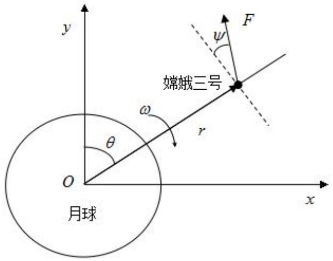

<details>
<summary>text_image</summary>

y
F
ψ
ω
r
θ
O
嫦娥三号
x
月球
</details>

## 图1 月球软着陆的极坐标系

## 5.2 问题一的建模与求解

## 5.2.1 探测器主减速阶段系统模型的建立

根据题目分析可知，由于嫦娥三号的预定着陆地点确定，因此，着陆预备轨道的近月点应由预定着陆地点确定。嫦娥三号的着陆过程可分为六个阶段，其中主减速阶段结束后，探测器已基本位于目标（预定着陆地点）正上方，因此，近月点可由主减速阶段的轨道方程与预定着陆地点反推得出。在5.2.1中建立的极坐标系下，设 $r\in R^{+}$ 为探测器到月心的距离， $\theta$ 是Ox与Oy的夹角， $\psi(t)$ 是推力方向与Or垂线的夹角；F为制动火箭的推力的大小，则着陆器质心运动方程为 $^{[4,5]}$ ：

$$
\left\{ \begin{array}{l} \dot {r} = v \\ \dot {v} = \frac {F}{m} \sin \psi - \frac {\mu}{r ^ {2}} + r \omega^ {2} \\ \dot {\theta} = \omega \\ \dot {\omega} = - \frac {1}{r} \left(\frac {F}{m} \cos \psi + 2 v \omega\right) \\ \dot {m} = \frac {F}{C} \end{array} \right. \tag {1}
$$

本文用上式表示嫦娥三号主减速阶段的运动规律，假设初始时刻 $t_{0}=0$ ，终端时刻 $t_{f}$ 为任意值。软着陆的初始条件由近月点处的状态确定：

$$
r (0) = r _ {0} + h _ {1}, v (0) = v _ {0}, \theta (0) = \theta_ {0}, \omega (0) = \omega_ {0}, m (0) = m _ {0}
$$

为了在主减速阶段结束的关键点达到所应处的状态，应该满足下列终端条件：

$$
r (t _ {f}) = r _ {f}, v (t _ {f}) = v _ {f}, \omega (t _ {f}) = \omega_ {f}
$$

其中， $v_{0}$ 表示主减速阶段的初始速度，可由万有引力定律算出； $r_{f}$ 表示主加速阶段结束的关键点探测器距离月心的距离， $v_{f}=57m/s$ 。

在数值计算当中由于状态变化的量级相差较大，在轨道积分的过程中会导致有效位数的损失，通常采取归一化处理来提高计算精度，同时这样处理也令优化变量保持在相同的量级。因此，本文令状态变量 $^{[4]}$ ：

$$
\left\{ \begin{array}{l} \bar {r} = r / r _ {0} \\ \bar {v} = v / \hat {v}, \hat {v} = \sqrt {\mu / r _ {0}} \\ \bar {\theta} = \theta \\ \overline {{\omega}} = \omega r _ {0} / \hat {v} \\ \overline {{m}} = m / m _ {0} = - F / I _ {S P} \end{array} \right. \tag {2}
$$

其中， $I_{SP}$ 为比冲，并且：

$$
\left\{ \begin{array}{l} \bar {t} = t / \hat {t}, \hat {t} = r _ {0} / \hat {v} \\ \overline {{F}} = F / \hat {F}, \hat {F} = m _ {0} \hat {v} ^ {2} / r _ {0} \end{array} \right. \tag {3}
$$

则运动方程可以改写为 $^{[4]}$ :

$$
\left\{ \begin{array}{l} \dot {\bar {r}} = \bar {v} \\ \dot {\bar {v}} = \frac {\bar {F}}{\bar {m}} \sin \psi - \frac {1}{\bar {r} ^ {2}} + \bar {r} \bar {\omega} ^ {2} \\ \dot {\theta} = \bar {\omega} \\ \dot {\bar {\omega}} = - \frac {1}{\bar {r}} \left(\frac {\bar {F}}{\bar {m}} \cos \psi + 2 \bar {v} \bar {\omega}\right) \\ \dot {\bar {m}} = - \frac {\bar {F}}{C} \sqrt {\frac {\mu}{r _ {0}}} = - \bar {F} / \bar {I} _ {S P} \end{array} \right. \tag {4}
$$

则相应的终端约束条件为:

$$
\left\{ \begin{array}{l} \overline {{r}} _ {f} = r _ {f} / r _ {0} \\ \overline {{v}} _ {f} = v _ {f} / \hat {v} \\ \omega_ {0} = 0 \end{array} \right. \tag {5}
$$

## 5.2.2 着陆准备轨道速度的建模与求解

根据开普勒第一定律，月球的质心位于探测器椭圆轨道的一个焦点上，设a,b分别为椭圆轨道的长半轴长和短半轴长（如图2所示）。

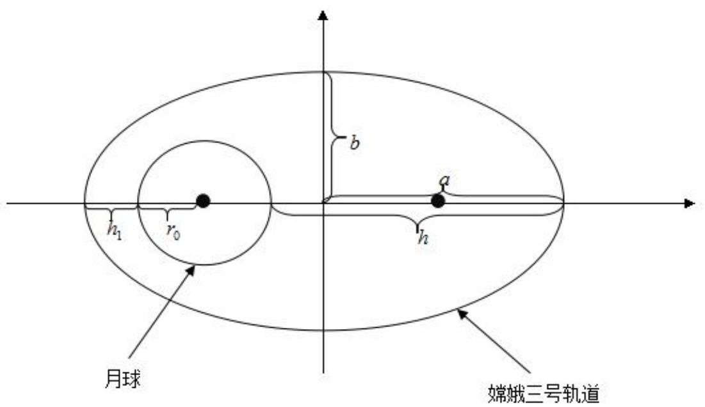

<details>
<summary>text_image</summary>

b
a
h
r₀
h₁
月球
嫦娥三号轨道
</details>

图 2 着陆预备轨道示意图

可以证明，若把月球看成一个均匀球体，则月球对探测器的引力可以等效成一个位于月球中心的与月球质量相同的质点对探测器的引力 $^{[6]}$ 。由牛顿运动定律和几何关系可得以下方程组：

$$
\text {近月点:} \quad \left\{ \begin{array}{l} G \frac {M m}{\left(r _ {0} + h _ {1}\right) ^ {2}} = m \frac {v _ {0} ^ {2}}{r} \\ r = \frac {b ^ {2}}{a} \\ b ^ {2} = a ^ {2} - c ^ {2} \\ 2 a = 2 r _ {0} + h _ {1} + h _ {2} \end{array} \right. \tag {6}
$$

$$
\text {远月点:} \quad \left\{ \begin{array}{l} G \frac {M m}{\left(r _ {0} + h _ {2}\right) ^ {2}} = m \frac {v _ {1} ^ {2}}{r} \\ r = \frac {b ^ {2}}{a} \\ b ^ {2} = a ^ {2} - c ^ {2} \\ 2 a = 2 r _ {0} + h _ {1} + h _ {2} \end{array} \right. \tag {7}
$$

G 为万有引力常量，其值 $G = 6.672 \times 10^{-11} N \cdot m^{2} / kg^{2}$ [7]，M 为月球的质量，其值 $M = 7.349 \times 10^{22} kg$ ， $r_{0}$ 为月球半径，其值 $r_{0} = 1.7374 \times 10^{3}$ ，r 为近月点和远月点椭圆轨道的曲率半径， $h_{1}, h_{2}$ 表示近月点和远月点探测器距月面的距离。

将已知数据分别代入近月点和远月点满足的方程组, 可以求得近月点的速度 $v_{0}=1692.30m/s$ ，远月点速度 $v_{1}=1614.01m/s$ 。

## 5.2.3 近、远月点位置的确定

通过文献[1]可知，软着陆下降轨迹设计有一通用结论：软着陆下降轨迹平面在环月停泊轨道平面内。因此，前文关于着陆预备轨道和着陆轨道在同一平面内的假设成立。首先考虑该轨道平面过月球南北两极的情况，再由该情况推出一般情况下的着陆准备轨道的近、远月点位置。

首先考虑一般情况下的月球坐标系，坐标系以月球的中心为圆心，可分别建立月心赤道坐标系 OXYZ 和月心惯性坐标系 $OX_{r}Y_{r}Z_{r}$ ，从月心赤道坐标系变换到月心惯性坐标系要经过 4 次旋转： $Z(\Omega+180^{\circ})\rightarrow X(-i_{0})\rightarrow Z(\rho)\rightarrow X(90^{\circ})$ 。因此，两者之间的变换矩阵为 $^{[1]}$ ：

$$
\mathbf {C} _ {I} ^ {r} = C _ {X} (9 0 ^ {\circ}) C _ {z} (\rho) C _ {X} (- i _ {0}) C _ {Z} (\Omega + 1 8 0 ^ {\circ}) \tag {8}
$$

上式中， $i_{0}$ 为着陆预备轨道的轨道倾角，着陆轨道在着陆预备轨道内。 $\Omega$ 为环月预备轨道的升交点赤经， $\rho$ 为旋转角，可由式（9）得出。

$$
\rho = 9 0 ^ {\circ} - \beta - \tau = 9 0 ^ {\circ} - \beta - \sin^ {- 1} (\sin \delta \sin i _ {0}) \tag {9}
$$

在（9）式中， $\delta$ 为着陆点 $L$ 的赤经， $\beta$ 为着陆器经过的月心角。月心赤道惯性系下的位置可以表示为

$$
\left[ \begin{array}{l l l} X & Y & Z \end{array} \right] ^ {T} = (\mathbf {C} _ {I} ^ {r}) ^ {T} \left[ \begin{array}{l l l} X _ {r} & Y _ {r} & Z _ {r} \end{array} \right] ^ {T}. \tag {10}
$$

因此，月心惯性参考系下位置可以表示为:

$$
X _ {r} = r \sin \beta \cos \alpha , Y _ {r} = r \sin \beta \sin \alpha , Z _ {r} = r \cos \beta \tag {11}
$$

由（11）式，可以得出月心赤道惯性系下探测器位置的表示：

$$
X = \mathbf {r} \sin \beta_ {L} \cos \alpha_ {L}, Y = \mathbf {r} \sin \beta_ {L} \sin \alpha_ {L}, Z = \mathbf {r} \cos \beta_ {L} \tag {12}
$$

其中，r 为探测器矢径， $\alpha_{L}$ 为探测器的赤经；探测器的赤纬为 $90^{\circ}-\beta_{L}$ ，因此， $\alpha_{L},\beta_{L}$ 的表达式为 $^{[1]}$ ：

$$
\alpha_ {L} = \left\{ \begin{array}{l l} \tan^ {- 1} (Y / X) & X > 0, Y > 0 \\ \tan^ {- 1} (Y / X) + \pi & X <   0 \\ \tan^ {- 1} (Y / X) + 2 \pi & X > 0, Y <   0 \end{array} \right. \tag {13}
$$

$$
\beta_ {L} = \cos^ {- 1} (Z / r) \tag {14}
$$

由（14）式可求得赤经和赤纬的变化量，计算公式

$$
\Delta \alpha_ {L} = \alpha_ {L f} - \alpha_ {L 0} \tag {15}
$$

$$
\Delta \beta_ {L} = \beta_ {L f} - \beta_ {L 0}
$$

设软着陆下降点的经纬度为 $^{[1]}$ :

$$
\left\{ \begin{array}{l} \lambda_ {L 0} = \lambda_ {L f} - \Delta \alpha_ {L} + \omega_ {m} \Delta t \\ \varphi_ {L 0} = \varphi_ {L f} - \Delta \beta_ {L} \end{array} \right. \tag {16}
$$

其中， $\Delta \alpha_{L}$ 和 $\Delta \beta_{L}$ 由（16）式确定， $\Delta t$ 为软着陆过程所需的时间。

由于在本文的假设中，设着陆预备轨道与着陆轨道在同一平面上，且该平面通过月球的南北两极，因此，若不考虑轨道临时修正，则有 $\Delta\alpha_{L}=0^{\circ}$ 。将终端约束条件（5）及初始速度等条件代入方程（4）、（14）可得： $\Delta\beta_{L}=15.16^{\circ}$ ，由（15）式可知近日点纬度（N）：

$$
\varphi_ {L 0} = \varphi_ {L f} - \Delta \beta_ {L} = 2 8. 9 6 ^ {\circ} \tag {17}
$$

同理可知，远日点的纬度值(S):

$$
\varphi_ {L 1} = \varphi_ {L 0} = 2 8. 9 6 ^ {\circ} \tag {18}
$$

由于在着陆准备轨道上，探测器速度方向应与轨道相切，因此，在近月点，探测器速度方向与月球极轴（正方向指向月球北极）的夹角 $\phi_{0}=28.96^{\circ}$ ，在远月点，探测器速度方向与月球极轴的夹角 $\phi_{1}=151.04^{\circ}$ 。

综上计算分析，嫦娥三号探测器着陆预备轨道的参数值如表 1 所示。

表 1 嫦娥三号探测器着陆预备轨道参数值

<table><tr><td>嫦娥三号轨道参数值名称</td><td>嫦娥三号轨道参数值</td></tr><tr><td>近月点经纬度</td><td>(19.51W, 28.96N)</td></tr><tr><td>远月点经纬度</td><td>(160.49 E, 28.96S)</td></tr><tr><td>近月点高度</td><td>15 km</td></tr><tr><td>远月点高度</td><td>100 km</td></tr><tr><td>近月点速度大小</td><td>1692.30 m/s</td></tr><tr><td>远月点速度大小</td><td>1614.01 m/s</td></tr><tr><td>近月点速度方向(与极轴夹角)</td><td>28.96°</td></tr><tr><td>近月点速度方向(与极轴夹角)</td><td>151.04°</td></tr></table>

嫦娥三号着陆准备轨道在月球表面的位置投影如图 3 所示(基于 STK 软件绘制，月球表面采用墨卡托投影)。图 3 中红色标记为嫦娥三号着陆准备轨道的近日点和远日点，卫星所在位置为预定着陆点。

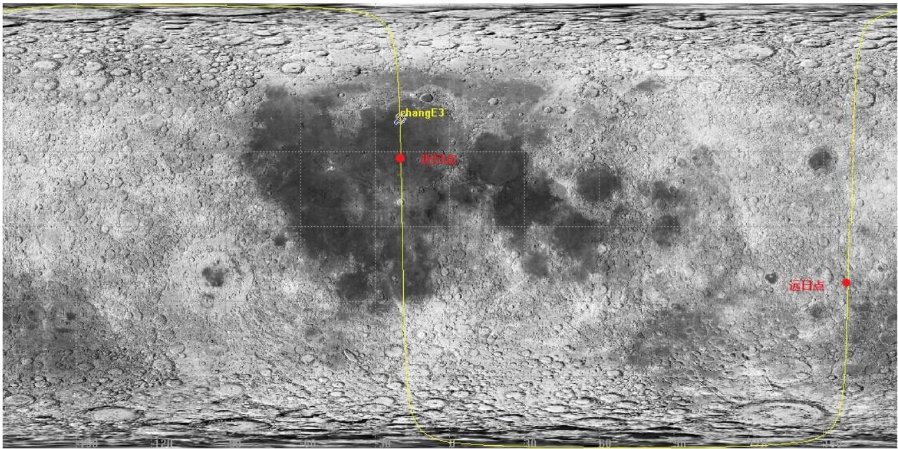

<details>
<summary>text_image</summary>

changE3
近日点
远日点
</details>

图3嫦娥三号着陆准备轨道在月球表面的位置投影

## 5.3 问题二的建模与求解

## 5.3.1 主减速阶段的轨道与控制策略

由资料分析可知，主减速阶段的持续时间与经过月面时间最长，着陆过程中的绝大多数燃耗都发生在下降段，若只考虑月球非球引力摄动以及地球和太阳的引力摄动，则月球软着陆动力学模型的矢量式可写为 $^{[1,8]}$

$$
\ddot {r} = F - \frac {\mu_ {m}}{r ^ {3}} \cdot r + F _ {\varepsilon} \cdot \left(\frac {1}{r _ {e} ^ {3}} \cdot r _ {e} + \frac {1}{\Delta_ {e} ^ {3}} \cdot \Delta_ {e}\right) - \mu_ {s} \cdot \left(\frac {1}{r _ {s} ^ {3}} \cdot r _ {s} + \frac {1}{\Delta_ {s} ^ {3}} \cdot \Delta_ {s}\right), \tag {19}
$$

（17）式中，右边第一项 $F$ 为推进系统的主动制动力，第二项为月球的中心引力，第三项为月球的非球形引力摄动，第四项和第五项分别为地球和太阳的引力摄动。 $\mu_{m}, \mu_{e}, \mu_{s}$ 分别为月心、地心和日心的引力常数。

由于月球、地球和太阳的引力摄动影响较小（在误差分析中会证明），因此，为了简便起见，在此忽略这一因素。由于在主减速阶段不能将月面看成平面，故将运动方程（1）表示为状态方程的形式：

$$
\dot {\bar {x}} = f (\bar {x}, u), \tag {20}
$$

（18）式中，系统的状态变量为 $\bar{x}=\left[\bar{r},\bar{v},\bar{\theta},\bar{\omega},\bar{m}\right]^{T}$ ，控制变量 $u=\left[F,\psi\right]^{T}$ 。主减速阶段是消耗燃料最多的阶段，因此，可以以耗燃最小为目标，取终端性能指标为 $^{[4]}$ ：

$$
J = \varphi \big [ \overline {{x}} \big (\bar {t} _ {f} \big) \big ] = \overline {{m}} (0) - \overline {{m}} (\bar {t} _ {f}) = 1 - \overline {{m}} (\bar {t} _ {f}) \tag {21}
$$

构造哈密顿函数为:

$$
H (\overline {{x}}, \lambda , u) = \lambda^ {T} f (\overline {{x}}, u) \tag {22}
$$

其中 $\lambda=\left[\lambda_{r},\lambda_{v},\lambda_{\theta},\lambda_{\omega},\lambda_{m}\right]^{T}$ ，满足：

$$
\dot {\lambda} = - \frac {\partial H (\overline {{x}} , \lambda , u)}{\partial x}, \tag {23}
$$

即 $^{[4,9]}$ :

$$
\left\{ \begin{array}{l} \dot {\lambda} _ {r} = - \frac {2 \lambda_ {v}}{r ^ {3}} - \lambda_ {v} \overline {{\omega}} ^ {2} - \frac {\lambda_ {\omega} \overline {{F}} \cos \psi}{\overline {{m}} \overline {{r}} ^ {2}} - \frac {2 \lambda_ {\omega} \overline {{v}} \overline {{\omega}}}{\overline {{r}} ^ {2}} \\ \dot {\lambda} _ {v} = - \lambda_ {r} + 2 \lambda_ {\omega} \frac {\overline {{\omega}}}{\overline {{r}}} \\ \dot {\lambda} _ {\theta} = 0 \\ \dot {\lambda} _ {\omega} = - 2 \lambda_ {v} \overline {{r}} \overline {{\omega}} - \lambda_ {\theta} + 2 \lambda_ {\omega} \frac {\overline {{v}}}{\overline {{r}}} \\ \dot {\lambda} _ {m} = \lambda_ {v} \frac {\overline {{F}}}{\overline {{m}} ^ {2}} \sin \psi - \lambda_ {\omega} \frac {\overline {{F}}}{\overline {{m}} ^ {2} \overline {{r}}} \cos \psi \end{array} \right. \tag {24}
$$

由（5）式可推出：

$$
G = \left\{ \begin{array}{l} \bar {r} (t _ {f}) - r _ {f} / r _ {0} \\ \bar {v} (t _ {f}) - v _ {f} / \hat {v} \\ \overline {{\omega}} (t _ {f}) \end{array} \right\} = 0 \tag {25}
$$

横截条件为:

$$
\lambda (t _ {f}) = \left[ \frac {\partial \varphi}{\partial \overline {{x}}} + \frac {\partial G}{\partial \overline {{x}}} \gamma \right] _ {t = t _ {f}} \tag {26}
$$

其中 $\gamma$ 为拉格朗日乘子。

根据式（22）、（24）可知，若探测器沿着最优轨迹飞行，则 $\lambda_{\theta} \equiv 0$ 。将式（1）和式（20）联立，并结合 $\lambda_{\theta} \equiv 0$ ，可以得出：

$$
H = \lambda_ {r} \overline {{v}} - \lambda_ {v} \frac {\mu}{\bar {r} ^ {2}} + \lambda_ {v} \bar {r} \overline {{\omega}} ^ {2} - \lambda_ {\omega} \frac {2 \overline {{v}} \overline {{\omega}}}{\bar {r}} + \left(\frac {\lambda_ {v}}{m} \sin \psi - \frac {\lambda_ {\omega}}{\bar {m} \bar {r}} \cos \psi - \frac {\lambda_ {m}}{C}\right) \overline {{F}} \tag {27}
$$

根据 Pontryagin 极大值原理，最优化推力为 $^{[4,10]}$ :

$$
F ^ {*} = \left\{ \begin{array}{l} \frac {F _ {\max}}{\hat {F}}, \frac {\lambda_ {v}}{\overline {{m}}} \sin \psi - \frac {\lambda_ {\omega}}{\overline {{m}} \bar {r}} \cos \psi - \frac {\lambda_ {m}}{C} > 0 \\ 0, \frac {\lambda_ {v}}{\overline {{m}}} \sin \psi - \frac {\lambda_ {\omega}}{\overline {{m}} \bar {r}} \cos \psi - \frac {\lambda_ {m}}{C} <   0 \end{array} \right. \tag {28}
$$

由于 $\psi$ 不受约束，根据变分法极值条件 $\frac{\partial H}{\partial \psi} = 0$ ，可得 $^{[4,11]}$ :

$$
\psi^ {*} = - \arctan \left(\frac {\lambda_ {0} \bar {r}}{\lambda_ {\omega}}\right) \tag {29}
$$

综上所述，最优制导律 $u^{*} = \left[F^{*}, \psi^{*}\right]^{T}$ 。将最优控制率（29）代入状态方程和共轭方程（24），利用初始条件和终端约束条件对状态方程和共轭方程积分，便可求出主减速阶段的最优轨道，因此，该问题可以转化成两点边值问题的求解。

代入初始条件和终端条件，使用计算机仿真得到下列结果：

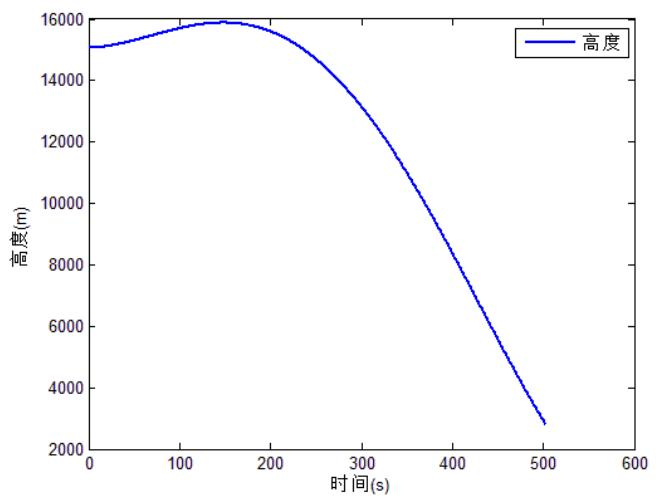

<details>
<summary>line</summary>

| 时间(s) | 高度(m) |
| --- | --- |
| 0 | ~15000 |
| 100 | ~15600 |
| 200 | ~15800 |
| 300 | ~13500 |
| 400 | ~8500 |
| 500 | ~2800 |
</details>

(a) 高度

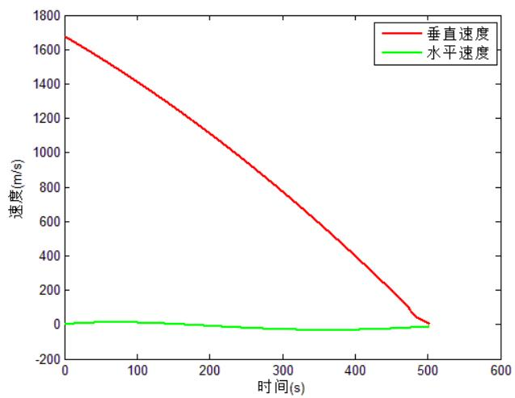

<details>
<summary>line</summary>

| 时间(s) | 垂直速度 (m/s) | 水平速度 (m/s) |
| --- | --- | --- |
| 0 | ~1670 | ~0 |
| 50 | ~1550 | ~10 |
| 100 | ~1420 | ~10 |
| 150 | ~1280 | ~5 |
| 200 | ~1130 | ~-5 |
| 250 | ~980 | ~-15 |
| 300 | ~830 | ~-25 |
| 350 | ~680 | ~-35 |
| 400 | ~530 | ~-35 |
| 450 | ~380 | ~-30 |
| 500 | ~10 | ~-10 |
</details>

(b) 速度

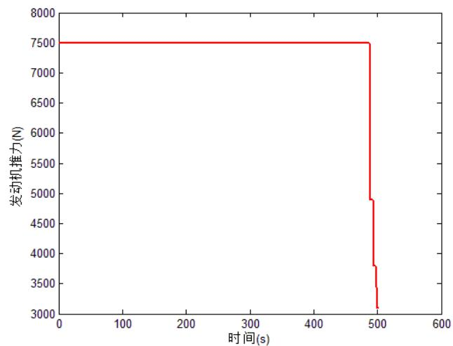

<details>
<summary>line</summary>

| 时间(s) | 发动机推力(N) |
| --- | --- |
| 0 | 7500 |
| ~490 | 7500 |
| ~492 | 4900 |
| ~493 | 3800 |
| ~494 | 3400 |
| ~495 | 3100 |
</details>

(c) 发动机推力

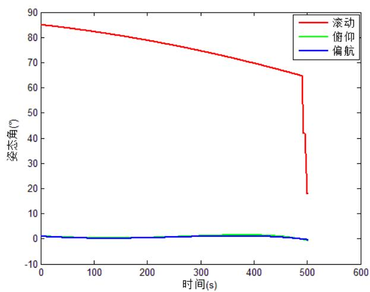

<details>
<summary>line</summary>

| 时间(s) | 滚动 \(({}^{\circ})\) | 俯仰 \(({}^{\circ})\) | 偏航 \(({}^{\circ})\) |
| --- | --- | --- | --- |
| 0 | ~85 | ~1 | ~1 |
| 100 | ~82 | ~0 | ~0 |
| 200 | ~79 | ~0 | ~0 |
| 300 | ~75 | ~1 | ~1 |
| 400 | ~69 | ~1.5 | ~1 |
| 500 | ~18 | ~-1 | ~-1 |
</details>

(d) 姿态角  
图 4 主减速阶段各参数值随时间变化

## 5.3.2 快速调整阶段的轨道与控制策略

快速调整阶段是连接主减速阶段和接近段（粗避障阶段）的一个重要阶段，在该阶段主要完成探测器的姿态调整，以便进入粗避障阶段。在主减速段末期，着陆器姿态接近水平，主发动机推力接近其最大值，因此，推力加速度也最大；但后续的接近段则要求着陆器姿态接近垂直，主发动机在低推力水平工作。因此，主减速段的末端状态与接近段的初始状态很难以衔接上，为了平缓地从主减速阶段过渡到接近段，需要快速调整着陆器的姿态和推力，以保证接近段初始要求。

在快速调整阶段，基于刚体运动的物理学理论，将探测器视为一不可变形的刚体，可以将探测器的运动分解为平动和转动，平动主要是由主发动机提供推力，而转动是靠装载在嫦娥三号四周的16个小型调姿发动机控制。由于调姿发动机产生的推力较小，因此可以忽略其对探测器平动速度的影响。在该段中，着陆器距离月面距离已经较近，因此可以将月面看作一个平面而建立月球平面直角坐标系。如图5所示。

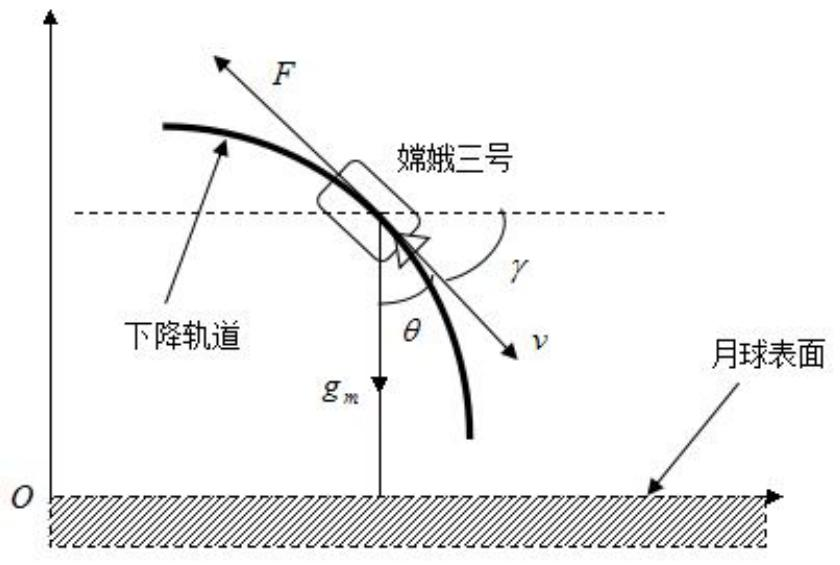

<details>
<summary>text_image</summary>

F
嫦娥三号
下降轨道
γ
v
θ
gm
O
月球表面
</details>

图 5 月球平面直角坐标系

在如图所示的月球平面直角坐标系中，为了满足快速转换的需要，可以假设反推力的方向与下降速度一直相反。由此可以列出两坐标轴方向的动力学方程[1]：

$$
\left\{ \begin{array}{l} \ddot {x} _ {o} = \dot {U} = - (F \cos \gamma) / m = - (F U) / (m v) \\ \ddot {y} _ {o} = \dot {W} = - (F \sin \gamma) / m - g _ {m} = - (F W) / (m v) - g _ {m} \end{array} \right. \tag {30}
$$

在式（30）中，m 为探测器的质量，由于在此阶段功率较小且时间较短，因此，可视为常值； $g_{m}$ 为月球表面的重力加速度， $\gamma$ 为飞行路径角，即下降速度矢量与 $x_{o}$ 轴的夹角，有 $v=\sqrt{U^{2}+W^{2}}$ 。

在下降速度 v 和垂直于下降速度 v 的两个方向建立动力学方程 $^{[1]}$ :

$$
\left\{ \begin{array}{l} \dot {h} = - v \cos \vartheta \\ \dot {v} = - (F / m) \cdot u + g _ {m} \cos \vartheta \\ \gamma = - (g _ {m} \sin \vartheta) / v \\ \dot {m} = - c \cdot u \end{array} \right. \tag {31}
$$

在式（31）中， $\vartheta$ 为垂直方向与速度的夹角；常数 $c$ 为燃料秒消耗量； $u$ 为制动力开关量。

根据式（31）所示的动力学模型，本文采用开关切换并引入质量不变假设，可得关于切换时间 $\bar{t}$ 的二次方程

$$
\bar {t} ^ {2} + \frac {2 v _ {0 a}}{g _ {m}} \bar {t} - \frac {2 (a _ {F a} - g _ {m}) (h _ {0 a} - h _ {f a}) (v _ {0 a} - v _ {f a}) ^ {2}}{a _ {F a} - g _ {m}} = 0 \tag {32}
$$

其中， $h_{0a}, v_{0a}$ 和 $h_{fa}, v_{fa}$ 分别表示该段下降的初始高度与初始速度。

通过上述分析可知，在该段实质上是推力大小和方向线性变化的制导率，制导参数可以利用实际的主减速段末端状态和接近段初始状态约束确定。由于主减速段预测快速调整过程时使用的制导率相同，因此快速调整阶段实际上与主减速阶段的轨道预测基本一致，并满足接入端入口状态的约束。因此，可以使用5.3.1中的运行轨道代替快速调整阶段的运行轨道。

## 5.3.3 接近段（粗避障段）的轨道与控制策略

此阶段从距离月面 2400 m 到距离月面 100 m，主要任务是对着陆区进行成像并进行粗避障，以避开大的陨石坑，此阶段终端相对于月面速度接近于 0 m/s。由于此阶段需要保证光学成像敏感器能够对着陆区成像并完成避障，因此接近段知道需要满足制导目标位置、速度、姿态、初始高度和速度等多项约束。

## (1) 垂直方向轨道与控制策略

由于粗避障短探测器距离月面很近，因此仍可以使用 5.3.2 中建立的月球平面直角坐标系（图 6）。

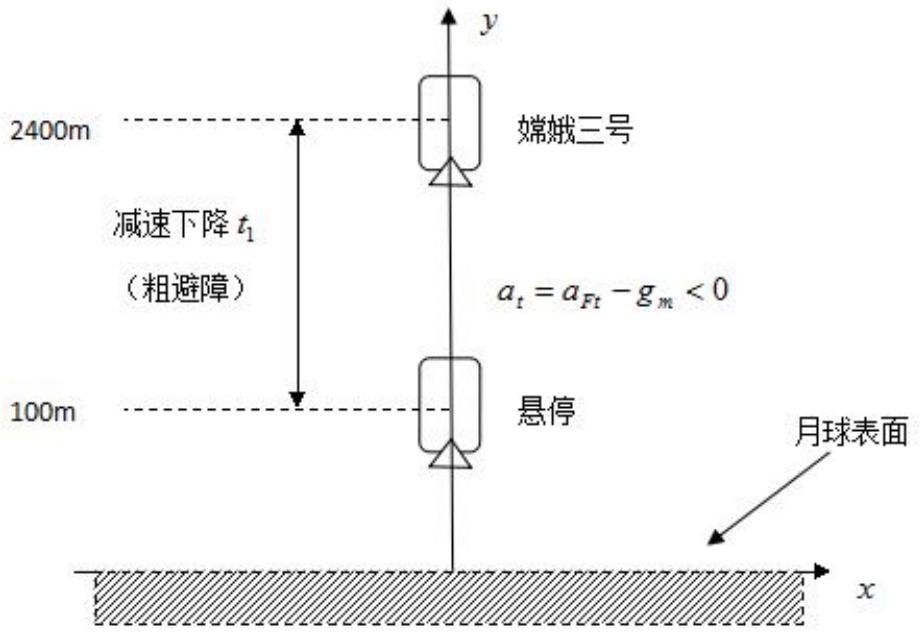

<details>
<summary>text_image</summary>

2400m
减速下降t₁
(粗避障)
100m
嫦娥三号
aₜ = a_Ft - gₘ < 0
悬停
月球表面
x
</details>

图 6 粗避障段月球平面坐标示意图

基于 5.3.2 中对着陆器运动的分析，可将嫦娥三号探测器的运动分解为垂直向下的平动和水平方向的平动与转动。其中垂直方向由主发动机提供减速动力，该运动过程符合牛顿运动定律。而水平方向由调姿发动机提供动力，符合刚体转动的物理规律。

在理想状态下（不考虑月球引力摄动等因素），竖直方向探测器只受到月球引力与主发动机向上的推力，由于水平方向的运动不会对探测器垂直方向的运动产生影响，因此，垂直方向的运动方程可表达为 $^{[1,11]}$ ：

$$
\ddot {y} = \dot {W} = F \cdot u / m - g _ {m} \tag {33}
$$

在上式中，u 是制动推力 F 的开关控制量，考虑探测器着陆的实际情况，着陆时间很短，因此必须保证着陆器平稳下落，二制动发动机开关对探测器影响很大，所以垂直方向的运动方程改写为：

$$
\ddot {y} = \dot {W} = F (t) / m - g _ {m} \tag {34}
$$

上式中， $F(t)$ 为主发动机推力随时间的变化，代入初始条件与终端条件，通过计算可以得到垂直方向探测器的运行规律（见下图），该阶段持续时间约在 $120 \, s \sim 130 \, s$ 之间。

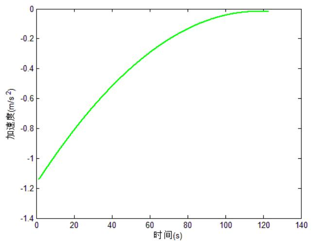

<details>
<summary>line</summary>

| 时间(s) | \(加速度(m/s^{2})\) |
| --- | --- |
| 0 | ~-1.14 |
| 20 | ~-0.82 |
| 40 | ~-0.56 |
| 60 | ~-0.34 |
| 80 | ~-0.16 |
| 100 | ~-0.06 |
| 120 | ~-0.01 |
</details>

(a) 加速度

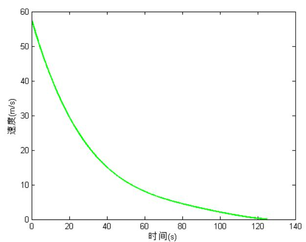

<details>
<summary>line</summary>

| 时间(s) | 速度(m/s) |
| --- | --- |
| 0 | ~57 |
| 20 | ~31 |
| 40 | ~16 |
| 60 | ~8 |
| 80 | ~4 |
| 100 | ~2 |
| 120 | ~0.5 |
</details>

(b) 速度  
图 7 粗避障段垂直方向运动规律仿真图

## (2) 水平方向避障策略

水平方向避障和安全着陆的前提是发现障碍和确定安全区，首先，需要对下降中相机拍摄的高程图进行处理，以确定一个平坦的目标着陆区。由于附件中给出的图像的灰度值代表该处的高度，因此，可以使用算法编程找出相对平坦的区域，并在月面找到一个特征点（大陨石坑等）。

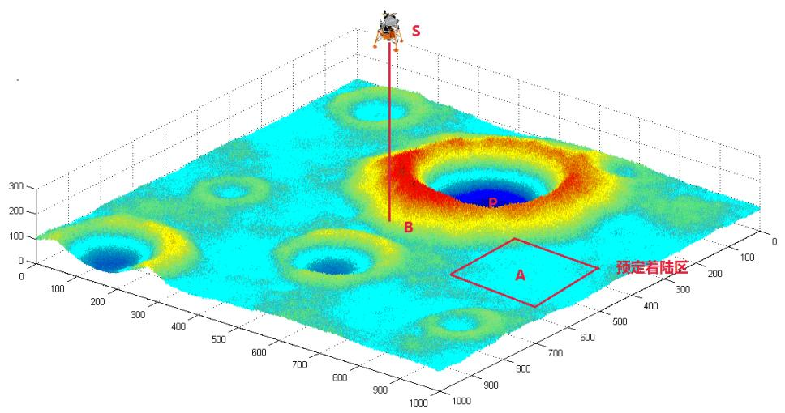

<details>
<summary>surface_3d</summary>

| Feature | Description |
| --- | --- |
| Point A | Blue diamond-shaped region in the bottom-right corner |
| Point B | Red vertical line indicating a feature on the surface |
| Point P | Dark blue circular feature located near coordinates (600, 200) |
| Point S | Top-left satellite marker |
</details>

图 8 嫦娥三号着陆区与特征点三维示意图

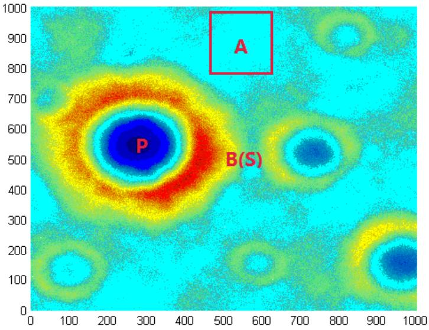

<details>
<summary>heatmap</summary>

| Feature | Description |
| --- | --- |
| P | Central peak (Blue) |
| B(S) | Secondary feature (Red) |
| A | Inset box containing two distinct regions (Red Box) |
</details>

图 9 嫦娥三号着陆区与特征点平面示意图

如图 8、图 9 所示，在 $t_{0}$ 时刻，嫦娥三号探测器的位置为点 S，B 点为嫦娥三号探测器在月面的投影，安全着陆区的中心点为 A，它在相机成像的坐标系中的坐标为 $(u_{A0}, v_{A0})$ ，相机的焦距为 f。那么 A 点在相机坐标系中方向矢量为 $^{[12]}$ ：

$$
r _ {S A, c a m e r a} ^ {c} (t _ {0}) = \frac {1}{\sqrt {u _ {A 0} ^ {2} + v _ {A 0} ^ {2} + f ^ {2}}} \left[ \begin{array}{l} u _ {A 0} \\ v _ {A 0} \\ f \end{array} \right] \tag {35}
$$

上式中下标 camera 表示相机获得的测量值。

设 $h_0$ 为激光测高器给出的当前高度，而根据探测器姿态矩阵 $C_n^b$ 和相机安装矩阵 $C_b^c$ 可以计算出主光轴与月面铅垂线的夹角 $\theta_0$ 。则探测器（记为 $S$ ）到 $A$ 点的位置矢量在相机系下可表示为[12]：

$$
R _ {S A, c a m e r a} ^ {c} (t _ {0}) = \frac {h _ {0}}{\cos (\theta_ {0})} r _ {S A, c a m e r a} ^ {c} (t _ {0}) \tag {36}
$$

设姿态阵 $C_{n}^{b}$ 的逆矩阵为 $C_{b}^{n}$ ，相机安装矩阵 $C_{b}^{c}$ 的逆矩阵为 $C_{c}^{b}$ ，则可以将该矢量转化到 n 系下为：

$$
R _ {S A, \text {camera}} ^ {n} (t _ {0}) = C _ {b} ^ {n} C _ {c} ^ {b} R _ {S A, \text {camera}} ^ {c} (t _ {0}) \tag {37}
$$

要使嫦娥三号安全着陆，首先要确定安全着陆区 A 的坐标，根据附件中给出的高程图，使用以下步骤寻找安全着陆区。

## 算法 1 安全着陆区坐标搜索

STEP1: 将嫦娥三号在距离月面 2.4km 处对正下方月面 $2300m \times 2300m$ 的范围拍摄的照片（附件三）转化成灰度值矩阵（灰度值为该点的高程值）；

STEP2: 将上述灰度值矩阵网格化, 分成 529 个 $100 \mathrm{~m} \times 100 \mathrm{~m}$ 方阵;

STEP3：将上述 529 个方阵中含有灰度值小于 50 的元素的方阵剔除（避开陨石坑），并将含有灰度值大于 200 的元素的方阵剔除（避开环形山）；

STEP4: 在剩余方阵中，分别计算每个方阵中灰度值最大与最小元素点的极差，设定阈值为 12，将灰度值极差小于 12 的方阵选出，并对应到相应区域。

根据算法 1 编程，可以在正下方月面 $2300 \, m \times 2300 \, m$ 的范围内搜索到 13 个合适的安全着陆区，使用 A1\~A13 表示（图 10）。

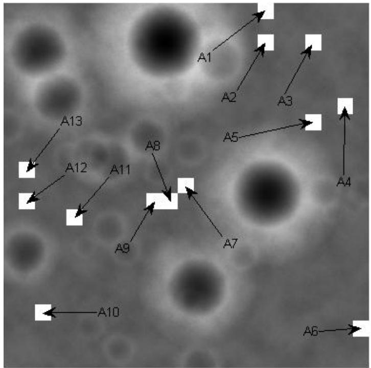

<details>
<summary>text_image</summary>

A1
A2
A3
A5
A4
A6
A7
A8
A9
A10
A13
A12
A11
</details>

图 10 月面 $2300m \times 2300m$ 范围内安全着陆区域

如图 10 所示，图中示出 13 个安全降落区域，这些区域均符合粗避障条件，因此可以随机选定一个区域作为安全降落区域。由于在降落过程中，需要满足后续匹配跟踪的需要，因此还需要在安全着陆区附近选择一个特征点作为路标，该路标即为图 6、图 7 中所示的 P 点，为了更方便地识别这一路标，P 点一般是月面上较为明显的陨石坑，而陨石坑的坐标位置可以使用 Shape-from-Shading 方法（SFS 方法）确定，该方法是求解探测器拍摄图像的反射图方程 $^{[12\cdot13]}$ ：

$$
I (x, y) = R \big (p (x, y), q (x, y) \big) \tag {38}
$$

式中： $I(x,y)$ 是归一化的灰度图像， $R(p,q)$ 是反射模型确定的反射图。假设太阳光为点光源，基于 Lommel-Seeliger 光照反射模型 $^{[12]}$ ，月球表面的反射图方程为：

$$
I (x, y) = \frac {2 \cos (i)}{\cos (i) + \cos (e)} \tag {39}
$$

上式中:

$$
\cos (i) = \frac {p p _ {0} + q q _ {0} + 1}{\left(p ^ {2} + q ^ {2} + 1\right) ^ {1 / 2} \left(p _ {0} ^ {2} + q _ {0} ^ {2} + 1\right) ^ {1 / 2}} \tag {40}
$$

$$
\cos (e) = \frac {p p _ {c} + q q _ {c} + 1}{\left(p ^ {2} + q ^ {2} + 1\right) ^ {1 / 2} \left(p _ {c} ^ {2} + q _ {c} ^ {2} + 1\right) ^ {1 / 2}} \tag {41}
$$

使用 Shape-from-Shading 方法确定 P 点坐标，假设 $t_{0}$ 时刻 P 在相机成像坐标系中的像点为 $(p_{P0}, l_{P0})$ ，则探测器到 P 位置在 n 系下表示 $R_{SB,camera}^{n}(t_{0})$ 可使用上述方法类似得到，因此，特征点 P 到目标着陆点 A 的位置矢量为 $^{[12, 13]}$ ：

$$
R _ {P A, \text {camera}} ^ {n} = R _ {S A, \text {camera}} ^ {n} \left(t _ {0}\right) - R _ {S B, \text {camera}} ^ {n} \left(t _ {0}\right) \tag {42}
$$

在确定着陆区域 A 与特征点 P 之后，可以使用光学匹配跟踪数据对制导过程进行不断修正，并通过卡尔曼滤波法矫正制导过程的误差。水平方向的着陆过程模拟图如下所示。

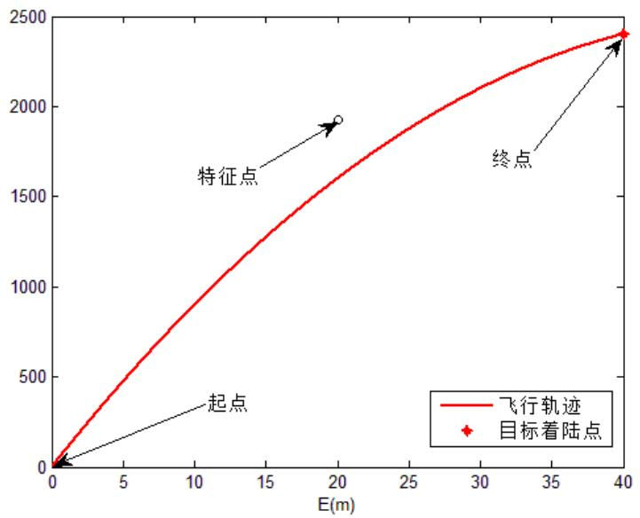

<details>
<summary>line</summary>

| E(m) | Value |
| --- | --- |
| 0 | 0 |
| 40 | ~2400 |
</details>

图 11 水平方向着陆模拟图

## 5.3.4 精避障段的轨道与控制策略

悬停段主要使用三维成像敏感器对着陆区域进行精障碍检测，给出安全着陆点相对城乡时刻着陆器下点位置。在 5.3.3 中，将探测器的垂直方向和水平方向运动分解，在悬停段，由于探测器水平方向和垂直方向速度均为 0，因此，只需要使用类似于 5.3.3 中的方法，首先确定月面的目标着陆点 A 和特征点 P，在使用光学匹配跟踪数据对制导过程进行修正，最终确定下落轨道。

## (1) 水平方向避障策略

基于 5.3.3 中的算法 1，调整相应参数与阈值，在距离月面 100m 的位置拍摄的月面图像中，找出 6 个合适的目标着陆区域，分别用 B1\~B6 表示（图 12）。

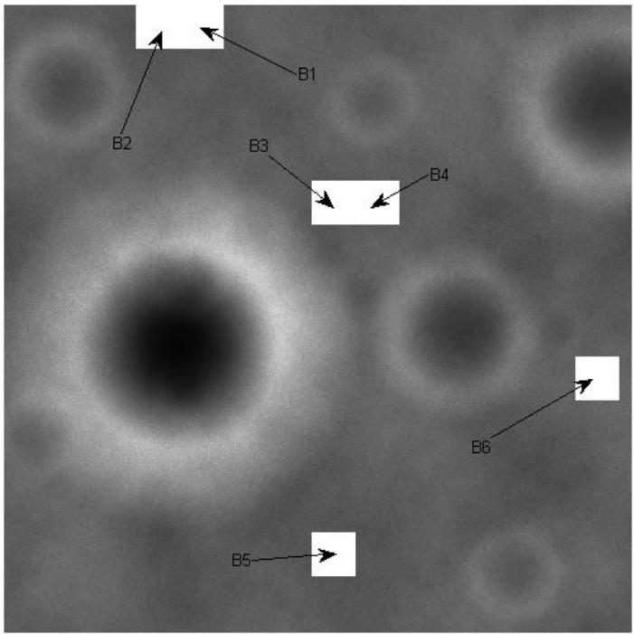

<details>
<summary>text_image</summary>

B1
B2
B3
B4
B6
B5
</details>

图 12 月面 $100m \times 100m$ 范围内安全着陆区域

## (2) 垂直方向和水平方向运动分析

在精细避障段，垂直方向和水平方向的初始速度为 0，水平方向终端速度为 0，以保证在最后一个阶段探测器垂直降落。在竖直方向，若加速度恒定，则发动机先关后开是最简单的方式，但由于要保证探测器的平稳降落，因此，要使发动机推力缓慢变化。垂直方向的运动方程为：

$$
\ddot {y} _ {1} = \dot {W} = F (t) / m - g _ {m} \tag {43}
$$

方程（43）可由 5.3.3 中类似的方法解出，本文将最后两阶段垂直方向的轨道统一在 5.3.5 中进行讨论。

## 5.3.5 缓速下降段的轨道与控制策略

由题目分析可知，在该阶段终端点垂直方向速度为 0，而在上一阶段初始垂直速度为 0，因此，本文将这两阶段合并考虑。由于在垂直方向只考虑月球对探测器的引力和探测器主发动机的推力，根据式（33），结合牛顿运动定律，可得开关切换高度：

$$
h _ {1 l} = \frac {v _ {0 l} ^ {2} - v _ {2 l} ^ {2} + 2 (a _ {2 l} h _ {2 l} - a _ {1 l} h _ {0 l})}{2 (a _ {2 l} - a _ {1 l})}. \tag {44}
$$

将初始条件和中断条件代入式（33）并结合式（44），可以得出下列仿真结果：

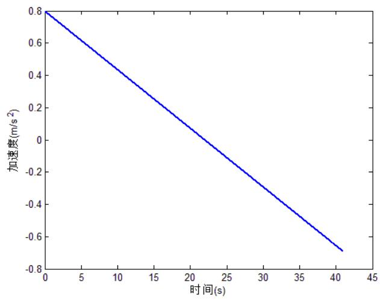

<details>
<summary>line</summary>

| 时间(s) | 加速度(m/s^2) |
| --- | --- |
| 0 | 0.8 |
| 41 | ~-0.7 |
</details>

(a) 加速度

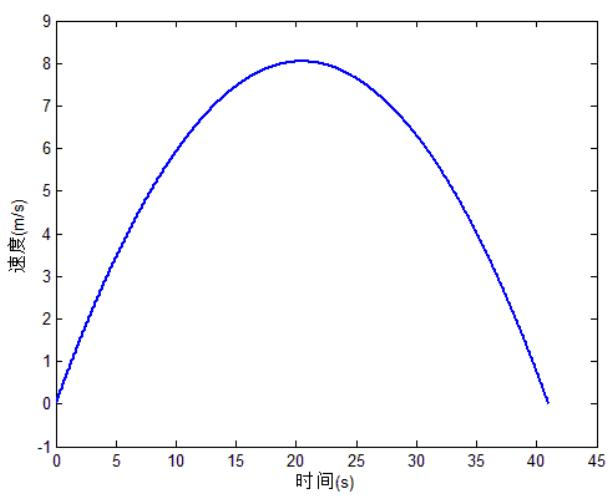

<details>
<summary>line</summary>

| 时间(s) | 速度(m/s) |
| --- | --- |
| 0 | 0 |
| ~10 | ~5.8 |
| ~20 | ~8.1 |
| ~30 | ~6.2 |
| ~40 | ~0.2 |
</details>

(b) 速度  
图 13 缓速下降段垂直方向运动规律仿真图

## 5.4 问题三的建模与求解

## 5.4.1 模型的误差分析

## (1) 嫦娥三号探测器轨道误差理论分析

由于嫦娥三号探测器的着陆准备轨道较低, 因此对各摄动源的摄动量级进行分析具有十分重要的实际意义。本文在之前的探讨中对月球引力摄动等因素进行了简化, 在此重新考虑这些因素的影响。为了便于分析, 与地球卫星情况类似, 分别采用如下长度, 质量和时间单位:

$$
\left\{ \begin{array}{l} [ L ] = R _ {e} = 1 7 3 8. 0 0 0 k m \text {月球赤道半径} \\ [ M ] = M _ {0} \text {月球质量，对应月心引理常数} G M _ {0} \\ [ T ] = (R _ {e} ^ {3} / G M _ {0}) ^ {1 / 2} \approx 1 7. 2 4 6 5 \min (1 0 3 4. 7 9 0 6 s) \end{array} \right. \tag {45}
$$

在历元（J2000.0）月球天球坐标系中，卫星运动方程如下：

$$
\left\{ \begin{array}{l} \bar {r} = F _ {0} (r) + F _ {e} (r, \dot {r}, t: \varepsilon) \\ t _ {0}: r (t _ {0}) = r _ {0}, \dot {r} (t _ {0}) = \dot {r} _ {0} \end{array} \right. \tag {46}
$$

其中 $r, \dot{r}, \ddot{r}$ 分别为卫星的月心位置矢量、速度矢量和加速度矢量，而 $\sigma = (a, e, i, \Omega, \omega, M)^{T}$ 是 6 个开普勒轨道根数。

上述方程中的摄动加速度为 $F_{\varepsilon}$ 。 $F_{0}$ 和 $F_{\varepsilon}$ 分别为 $^{[8]}$

$$
F _ {0} = - \frac {\mu}{r ^ {3}} \mathbf {r} = - \frac {1}{r ^ {3}} \mathbf {r} \tag {47}
$$

$$
F _ {\varepsilon} = \sum_ {j = 1} ^ {N} F _ {j} (r, \dot {r}, t; \varepsilon_ {j}) \tag {48}
$$

摄动加速度 $F_{\varepsilon}$ 求和中 $j=1,2,\cdots,N$ 即对应各种摄动源。摄动源包含 10 类（现列举其主要三类） $^{[8]}$ :

月球非球形引力摄动—— $(J_{2};C_{2,2},S_{2,2};C_{lm},S_{lm},l\geq3)F_{1}$ ;

地球引力摄动—— $(m_{1}^{\prime})F_{2}(m_{1}^{\prime})$ ;

太阳引力摄动—— $(m_{2}^{\prime})F_{3}(m_{2}^{\prime})$ ;

对于嫦娥三号探测器，上述各摄动源对应的摄动量级 $\varepsilon_{j}(j=1,\cdots10)$ 分别为 [8]:

① $\varepsilon_{1}(J_{2}) = O(10^{-4}),\varepsilon_{1}(J_{22}) = O(10^{-5}),\varepsilon_{1}(C_{lm},S_{lm},l\geq 3) = O(10^{-6}\sim 10^{-5})$  
② $\varepsilon_{2}=O(10^{-5})$ ;  
③ $\varepsilon_{3}=O(10^{-7})$ 。

根据以上量级分析，对于嫦娥三号探测器，一般只要考虑月球非球形引力和地球引力摄动即可。

根据上述分析，在月心球坐标系中，嫦娥三号探测器的摄动运动方程为:

$$
\dot {\sigma} = f _ {0} (a) + f _ {\varepsilon} (\sigma , t; \varepsilon), \tag {49}
$$

上式中:

$$
\left\{ \begin{array}{l} f _ {0} = \delta n, \\ \delta = \left( \begin{array}{c c c c c c} 0 & 0 & 0 & 0 & 0 & 1 \end{array} \right) ^ {T}, n = a ^ {- 3 / 2} \end{array} \right. \tag {50}
$$

其中的摄动项 $f_{\varepsilon}$ 包含多种摄动因素。根据摄动方程，可以求出月球引力摄动对轨道求解的影响。

(2) 基于自适应模拟退火遗传算法 (ASAGA) 对嫦娥三号轨道与控制策略的验证

本文 5.3.1 和 5.3.2 分别基于月球探测器软着陆的动力学方程，以耗燃最小为目标，基于 Pontryagin 极大值原理，得到了嫦娥三号探测器在着陆前两个阶段的轨道与最优控制策略。由于月球软着陆的优化搜索空间是个泛函空间，不能直接用优化算法处理，因此必须将变量参数化。本文利用极大值原理模拟仿真出嫦娥三号的运行过程，得到不同阶段的状态，但是发现准确的解需要有一个较好的初始条件。考虑到这种情况，本文利用遗传算法和退火模拟算法对原过程进行模拟优化，同时分析这两种方法的误差。

遗传算法是模拟生物在自然环境中的遗传和进化过程而形成的一种自适应全局优化随机搜索算法。考虑到它不要求搜索空间是光滑，也不要求处处可微，因此可以在飞行器轨道优化中使用。由于要尽可能的提高轨道优化的精度，本文采用动态罚函数法对终端约束进行处理，则适应度函数可表示成如下形式[14]：

$$
f (X) = - \sigma_ {1} [ (v (t _ {f}) - v _ {f}) ^ {2} + (\omega (t _ {f}) r (t _ {f}) - \omega_ {f} r _ {f}) ^ {2} ] ^ {1 / 2} - \sigma_ {2} | r (t _ {f}) - r _ {f} | \tag {51}
$$

在遗传操作中，交叉操作是产生新个体的主要方法，他决定着遗传算法的全局搜索能力；而变异操作只是产生新个体的辅助方法，它决定着遗传算法的局部搜索能力。交叉与变异相互结合，共同完成对搜索空间的全局搜索和局部搜索。

模拟退火算法是基于金属退火的机理而建立起的一种随机算法，它能够通过控制温度的变化过程来实现大范围的粗略搜索与局部精细搜索。本文采用指数降温策略对温度的变化进行控制，即[14]：

$$
T _ {i} = T _ {0} (k) ^ {T - 1} \tag {52}
$$

式中： $T_{i}$ 为当前控制温度； $T_{0}$ 为初始设定；k 为温度下降系数。在模拟退火算法进行时，解的变化即新解的产生，是发生在当前解的邻域内，采用如下公式进行解的变换 $^{[14]}$ ：

$$
Y ^ {\prime} = \left\{ \begin{array}{l l} Y + (R - Y) \delta (T _ {i}) \xi & U (0, 1) = 0 \\ Y - (Y - L) \delta (T _ {i}) \xi & U (0, 1) = 1 \end{array} \right. \tag {53}
$$

式中：Y 和 $Y'$ 分别为当前解和新解，为种群的个体； $\delta(T_{0})$ 为随 $T_{i}$ 减小而减小的扰动值，当 $T_{i}$ 为 $T_{0}$ 时， $\delta(T_{0})<0$ ，保证了最大扰动值不会使新解 $Y'$ 越界，当 $T_{i}\rightarrow0$ 时， $\delta(T_{i})\rightarrow0$ ，满足算法收敛的条件； $\xi$ 为区间 $(0,1)$ 上的均匀分布随机数。

通过以上原理, 使用自适应模拟退火遗传算法对嫦娥三号轨道与控制策略的优化算法如下:

算法2基于自适应模拟退火遗传算法对嫦娥三号轨道优化算法

<table><tr><td>算法输入:初始半径 $r_0$ ,初始速度 $v_0$ ,初始角速度 $\omega_0$ ,速度方向与水平方向夹角 $\theta_0$ ,初始质量 $m_0$ 。算法输出:每一代的速度 $v$ ,角速度 $\omega$ ,夹角 $\theta$ 随时间的变化</td></tr><tr><td>STEP1:设置初始参数,随机产生初始种群。STEP2:计算种群中各个个体的适应度值,记录最优个体,并采用如下的方式进行适度的拉伸: $f' = \exp[-(f_{\max} - f)/T_i]$ 。采用轮盘选择策略进行个体选择,并将选择的个体进行随机的两两匹配。1用A,B和A&#x27;,B&#x27;分别表示父代和子代的个体,利用如下方式进行交叉操作: $\begin{cases} A' = (1 - \alpha)A + \beta B \\ B' = (1 - \beta)B + \alpha A \end{cases}$ </td></tr></table>

如果 $A'(B') < L$ ，则 $A'(B') = L$ ；如果 $A'(B') > R$ ，则 $A'(B') = R$ 。

②设交叉概率为 $P_{c}$ ，交叉系数为r，则利用如下公式进行自适应调整：

$$
\begin{array}{l} P _ {c} = \left\{ \begin{array}{c l} P _ {c 1} - P _ {c 2} (f _ {c} - f _ {\text {avg}}) / (f _ {\max} - f _ {\text {avg}}) & \quad f _ {c} \geq f _ {\text {avg}} \\ P _ {c 1} & \quad f _ {c} <   f _ {\text {avg}} \end{array} \right. \\ r = \left\{ \begin{array}{c l} r _ {1} + r _ {2} (f _ {\max} - f _ {c}) / (f _ {\max} - f _ {a v g}) & \quad f _ {c} \geq f _ {a v g} \\ r _ {1} + r _ {2} & \quad f _ {c} <   f _ {a v g} \end{array} \right. \\ \end{array}
$$

③用 $C, C'$ 分别表示父代和子代的个体， $\gamma$ 为 $(0,1)$ 区间上均匀分布随机数， $k \in (0,1]$ 为变异系数， $U(0,1)$ 为随机产生的整数 0 或 1。利用如下方式进行变异操作：

$$
C ^ {\prime} = \left\{ \begin{array}{l l} C + k \gamma (R - C) & \quad U (0, 1) = 0 \\ C + k \gamma (C - L) & \quad U (0, 1) = 1 \end{array} \right.
$$

④设变异概率为 $P_{m}$ ，则利用如下公式进行自适应调整：

$$
\begin{array}{l} P _ {m} = \left\{ \begin{array}{c c} P _ {m 1} - P _ {m 2} \left(f _ {m} - f _ {\text {avg}}\right) / (f _ {\max} - f _ {\text {avg}}) & \quad f _ {m} \geq f _ {\text {avg}} \\ P _ {m 1} & \quad f _ {m} <   f _ {\text {avg}} \end{array} \right. \\ k = \left\{ \begin{array}{c c} k _ {1} + k _ {2} (f _ {\max} - f _ {m}) / (f _ {\max} - f _ {a v g}) & \quad f _ {m} \geq f _ {a v g} \\ k _ {1} + k _ {2} & \quad f _ {m} <   f _ {a v g} \end{array} \right. \\ \end{array}
$$

STEP3: 令新解接受次数 $n_{a} = 0$ ，内循环次数 $n_{c} = 0$ 。对遗传操作后的子代个体计算适应度值，选择前 $n_{0}$ 个优秀的个体，并进行如下的模拟退火工作：

计算 $\delta(T_{i})$ ，分别对个体的每一个参数按式进行解的变换，并按照如下准则来

判断是否接受新解为新的当前解:

$$
p = \left\{ \begin{array}{c l} 1 & f (Y ^ {\prime}) \geq f (Y) \\ \exp [ - (f (Y) - f (Y ^ {\prime})) / T _ {i} ] & f (Y ^ {\prime}) <   f (Y) \end{array} \right.
$$

如果接受则 $n_a = n_a + 1$ ；反之 $n_a$ 不变；

② 如果 $n_a < N_{\min}$ ，且 $n_c < C_{\max}$ ，则 $n_c = n_c + 1$ ，并返回①；否则跳出循环，并将群体中适应度最差的 $n_0$ 个个体替换成退火操作后的个体，进入步骤4；

STEP4：删除子代种群中的任意一个个体，并替换成步骤2记录的最优个体。

STEP5：如果当前遗传代数 $T < T_{\max}$ ，则按 $T_{i} = T_{0}(k)^{T - 1}$ 进行降温， $T_{0}$ 为初始设定温度， $k$ 为温度下降系数， $T = T + 1$ ，并返回步骤2；否则结束整个优化过程。

基于上述算法编程，进行仿真求解，得出该算法与 Pontryagin 极大值原理法的结果对比如下图所示。

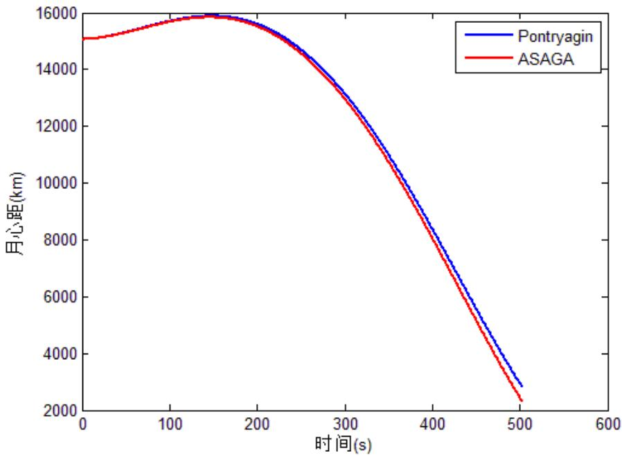

<details>
<summary>line</summary>

| 时间(s) | Pontryagin (km) | ASAGA (km) |
| --- | --- | --- |
| 0 | ~15100 | ~15100 |
| 100 | ~15600 | ~15600 |
| 200 | ~15800 | ~15800 |
| 300 | ~13500 | ~13400 |
| 400 | ~8500 | ~8200 |
| 500 | ~2900 | ~2400 |
</details>

图 14 ASAGA 算法与 Pontryagin 法仿真对比图

从上图分析可知，使用 ASAGA 法和 Pontryagin 极大值原理法得到的轨道参数非常接近，两种方法结果相互印证，说明两种方法的误差均较小。

## (3) 基于蒙特卡洛打靶法的误差研究

蒙特卡洛模拟法是一种有效的随机模拟方法,本文分别考虑月球引力摄动和地球引力摄动对着陆点的影响,运用蒙特卡洛方法进行模拟打靶,从而分析由此产生的误差。

采用蒙特卡洛法进行探测器着陆模拟打靶的基本步骤如下 $^{[15]}$ :

STEP1：根据探测器的运动特性以及典型的目标运动规律，建立探测器的六自由度弹道仿真模型；

STEP2: 确定探测器飞行过程中受到的主要随机干扰因素及其分布规律;

STEP3：根据各种随机扰动因素的分布律，构造相应的数学概率模型；

STEP4：将随机扰动的抽样值加载到探测器六自由度轨道仿真模型，进行计算机模拟打靶，得到扰动弹道参数以及弹着点参数；

STEP5: 重复进行步骤 4, 进行多次模拟打靶，获得多个随机着陆点参数字样；

STEP6：对模拟打靶的结果进行处理，得到着陆点参数的统计特征值。

计算机蒙特卡洛模拟打靶结果如下:

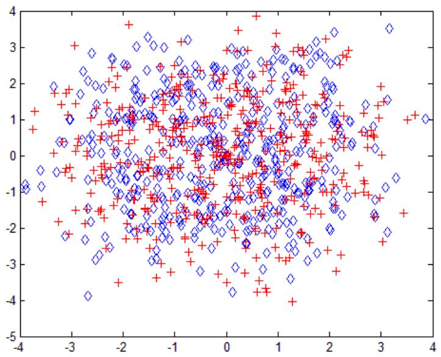

<details>
<summary>scatter</summary>

| Series | X (range) | Y (range) |
| --- | --- | --- |
| Blue (diamonds) | -4~4 | -4~4 |
| Red (plus signs) | -3.5~3.5 | -4~4 |
</details>

图 15 嫦娥三号着陆点的蒙特卡洛打靶模拟

上图中，红色十字点表示的是月球引力摄动对着陆点的打靶结果，蓝色菱形点表示地球引力摄动对着陆点的打靶结果，计算两种扰动对着陆点的偏差，并使用 SPSS 19.0 软件得出偏差分布直方图如下：

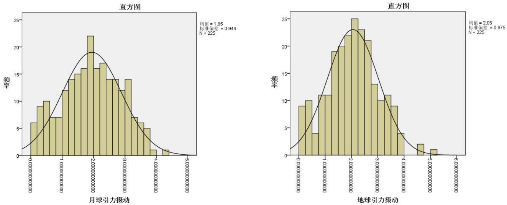  
图 16 摄动对着陆点影响的偏差分布

从上图中可以大致看出月球引力摄动与地球引力摄动引起的偏差均近似呈正态分布，且月球引力摄动产生的偏差更大，这符合之前5.4.1（1）中的理论分析。为了进一步分析偏差的正态性，使用SPSS 19.0软件作出各个打靶点偏差数据的Q-Q图。

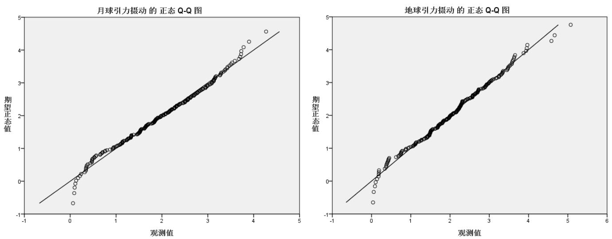  
图 17 摄动对着陆点影响的偏差 Q-Q 图

通过分析各个打靶点偏差数据的 Q-Q 图，可见各个打靶点的偏差均在一条直线附近，因此，可以得出结论：月球引力摄动与地球引力摄动引起的偏差均近似呈正态分布。

## 5.4.2 模型的灵敏度分析

考虑到嫦娥三号轨道飞行器在设计、制造过程中的工艺误差，以及火箭控制系统在运行中所受到的干扰，飞船在降落过程中有三方面的不确定性因素。

①飞船制造过程中，总质量偏差 $\Delta m$ ;  
②飞船在送至预定降落轨道过程中, 各方面误差造成的降落轨道实际位置误差。由于在轨运行的飞船, 其速度与位置满足开普勒第三定律, 因此在本文中主要考虑其近地点高度位置误差 $\Delta r$ 和近地点在月球坐标系下的经纬度位置误差  
③飞船在降落过程中, 控制系统的控制指令与实际控制器动作时间存在一定的延时, 在分析过程中, 需要考虑其延时 $\Delta t$ 。

$$
\Delta \varphi , \quad \Delta \theta ;
$$

飞船控制系统的设计采用最优控制设计思路。该种方法基于 Pontryagin 极大值原理，其理论成熟，控制策略和控制轨迹均可达到最优。但控制器对于参数精度的要求很高，鲁棒性较差。因此，在控制器设计完成之后需要进行参数灵敏度分析。由于飞船动力学方程的非线性特性，考虑到可能出现混沌现象，灵敏度分析无法用理论分析的方法进行推导。因此，本文通过数值仿真的方法，对所设定的控制系统进行灵敏度测试。

## (1) 飞船质量变化对第一阶段落点的影响

飞行器设计质量为 2.4 t，在制造过程中，由于测量和工艺的误差，实际初始质量可能会在 $2.4 \, t \pm 1\%$ 波动。因此，根据动力学方程、近月点位置以及最优控制率，可通过数值积分的方法，计算飞行器前两个阶段最终落点位置。其中，数值积分方法采用四阶龙格库塔法。该方法具有较高的数值稳定性，可保证结果的精确性。

经仿真计算，若探测器的初始质量增加 1%，则前两个阶段结束后高度仍为 3000m，经纬度坐标 19.51W，44.03N。 $\Delta\theta=0.09^{\circ}$ 。因此，若飞行器质量增大，经纬度坐标基本不变。可以得出结论，本文的最优控制模型中，最终下落点位置对飞行器质量偏差具有较强的鲁棒性。

## (2) 近月点高度位置变化的影响

飞行器在运行过程中，由于月球表面高度不均匀，近月点实际轨道高度可能会在 $15000 \, m \pm 0.1\%$ 波动。因此，根据动力学方程、近月点位置以及最优控制率，可通过同样的数值积分方法，计算最终落点位置。

经仿真计算，当近月点实际高度增加 0.1%时，前两个阶段结束后高度仍为 3000m 左右，经纬度坐标 19.51W，44.05N， $\Delta\theta=0.07^{\circ}$ ，因此，若近月点高度变化（增大），经纬度坐标基本不变。可以得出结论，本文的最优控制模型中，最终下落点位置对近月点高度偏差具有较强的鲁棒性。

## (3) 近月点经度变化的影响

由于考虑到最优控制策略及降落轨迹与近月点轨道在同一平面内，因此，控制规律设计过程中并未考虑到经度的变化。若是经度发生变化，由于最优控制率中不存在对轨道经度的修正，因此近月点经度方向上的变化将直接影响最终落点的经度位置，即近月点经度与落点经度相同。此处理论明确，故省略计算分析。

## (4) 飞船控制延时对第一阶段落点的影响

飞行器在降落过程中，控制系统的控制延时可能会在 100ms 至 1s 之间。因此，根据动力学方程、近月点位置以及带延时的最优控制率，可通过数值积分的方法，计算飞行器第一阶段最终落点位置。

通过使用前文中的程序方法进行计算可知，当控制系统的控制延时为 100ms 时，前两个阶段结束后高度仍为 3000m 左右，但经纬度坐标变为 19.51W, 43.69N, $\Delta\theta = 0.43^{\circ}$ ，因此，在本文的最优控制模型中，飞行器控制延时对飞行器的终端位置影响较大。

通过上述分析，探测器最终着陆位置对探测器质量偏差、轨道偏差具有较强的鲁棒性，但对探测器控制的延时比较敏感。

## 六、模型评价

## 6.1 模型与论文的优点

（1）合理的假设：本文通过大量阅读文献，建立了一系列科学的假设，忽略对结果影响较小的因素，在大大简化了模型与算法的情况下得到了较好的建模效果。  
(2) 建模的科学性: 本文以耗燃最小为优化目标, 根据 Pontryagin 极大值原理求出各阶段最优推力进而确定最优制导率。该模型物理机制明确, 科学可靠。  
(3) 仿真的准确性: 本文根据已建立的模型, 使用仿真的方法, 准确模拟出嫦娥三号飞船在软着陆轨道上的各种参数, 达到了很高的精度。  
（4）方法的创新性：本文创新地应用了基于自适应模拟退火遗传算法的轨道优化算法，将其模拟结果与 Pontryagin 法得到的结果进行对比，验证了模型的准确性。此外，使用蒙特卡洛法对着陆轨道偏差进行模拟打靶，并使用 SPSS 软件对着陆偏差进行统计分析，使模型更加可靠。  
（5）可视化：本文使用 STK 软件，对着陆准备轨道进行可视化展示，使轨道图像更加直观。

## 6.2 模型缺点与不足

（1）文章中对月球引力摄动等因素可能引起误差的探讨停留在定性探讨与定量探讨之间，没有达到准确的定量探讨。  
（2）本文采用 Pontryagin 法得到的结果与基于自适应模拟退火遗传算法的轨道优化算法得出的结果进行对比，并不能完全说明两模型的准确性（存在两模型均有较大偏差的可能性）。

## 七、参考文献

[1] 王鹏基, 张熵, 曲广吉. 月球软着陆飞行动力学和制导控制建模与仿真[J]. 中国科学: E 辑, 2009, (3):521-527.  
[2] 高崇伊. 地球和月球的公转周期与自转周期[J]. 物理通报, 2003, (7).  
[3] 李金岭, 郭丽, 钱志瀚等. 嫦娥一号卫星受控撞月轨迹测量与落月点坐标分析[J]. 科学通报, 2010, (9).  
[4] 单永正, 段广仁, 吕世良. 月球探测器软着陆的最优控制[J]. 光学精密工程, 2009, (9).  
[5] 王大轶, 263.net, 李铁寿等. 月球探测器重力转弯软着陆的最优制导[J]. 自动化学报, 2002, (3).  
[6] 卢山, 徐世杰. 椭圆轨道卫星编队飞行的最优控制研究[J]. 中国空间科学技术, 2008, (1).  
[7] 罗俊, 胡忠坤, 傅湘辉等. 扭秤周期法测量万有引力常数 G[J]. 中国科学(A辑), 1998, (9).  
[8] 刘林, 王歆. 月球卫星轨道力学综述[J]. 天文学进展, 2003, (4).  
[9] 黄国强. 月球探测器垂直软着陆 4D 轨道全局优化[J]. 空间科学学报 ISTIC PKU, 2014, 34(3). DOI:10.11728/cjss2014.03.313.  
[10] 孙军伟, 乔栋, 崔平远. 基于 SQP 方法的常推力月球软着陆轨道优化方法[J]. 宇航学报, 2006, (1).  
[11] 王大轶, 李铁寿, 马兴瑞. 月球最优软着陆两点边值问题的数值解法[J]. 航天控制, 2000, (3).  
[12] 杨磊等. 基于 Shape—from—Shading 的月球表面三维形状恢复算法研究[J]. 宇航学报, 2008, (1).  
[13] 李冀等，基于光学匹配跟踪的月球软着陆避障算法[J].  
[14] 朱建丰等，基于自适应模拟退火遗传算法的月球软着陆轨道优化[J].航空学报,2004,(4).  
[15] 耿斌斌等，快速仿真方法在蒙特卡洛打靶中的应用[J].飞行力学,2005(4)

## 八、附录

## 一、查找着陆点

A = imread('picture1.tif');%将附件中的图片更名为 picture1

[m,n]=size(A);

count1=1;

```matlab
for i=1:100:(m-99)
    for j=1:100:(n-99)
        B=A(i:i+99,j:j+99);
        num1=max(max(B));
        num2=min(min(B));
        num3=num1-num2;
        if num3<=12
            C(1,count1)=i;
            C(2,count1)=j;
            count1=count1+1;
        %%else disp('!');
        end
    end
end
C;
[mm,nn]=size(C);
for t=1:1:nn
    hzb=C(1,t);%%横坐标开始
    zzb=C(2,t);%%纵坐标开始
    for i=hzb:1:(hzb+99)
        for j=zzb:1:(zzb+99)
            A(i,j)=255;
        end
    end
end
%%subplot A
imshow(A);
```

A = imread('picture2.tif'); % 将附件中的图片 2 更名为 picture2

[m,n]=size(A);

count1=1;

```matlab
for i=1:70:(m-20-69)
    for j=1:70:(n-20-69)
        B=A(i:i+69,j:j+69);
        num1=max(max(B));
        num2=min(min(B));
        num3=num1-num2;
```

```matlab
if num3<=26
    C(1,count1)=i;
    C(2,count1)=j;
    count1=count1+1;
    %%else disp('');
end
end
end
[mm,nn]=size(C);
for t=1:1:nn
    hzb=C(1,t);%%横坐标开始
    zzb=C(2,t);%%纵坐标开始
    for i=hzb:1:(hzb+69)
        for j=zzb:1:(zzb+69)
            A(i,j)=255;
    End
```

## 二、Monte-Calor 模拟

```matlab
A=2+sqrt(1)*randn(15);
B=A;
t=0;
for i=1:1:15
    for j=1:1:15
        if A(i,j)<=0;
            t=A(i,j);
            B(i,j)=-t;
        else

        end
    end
end
for i=1:1:15
    for j=1:1:15
        r=B(i,j);
        x=(rand().*2-1)*r;
        c=rand();
        if c>=0.5
            c=1;
        else
            c=-1;
    end
    y=sqrt(r.^2-x.^2)*c;
    plot(x,y,'+ r');%plot(x,y,'d b')
    hold on
```

```matlab
end
end
for i=1:1:15
    for j=1:1:15
        r=A(i,j);
        yy=(rand().*2-1)*r;
        c=rand();
        if c>=0.5
            c=1;
        else
            c=-1;
        end
        xx=sqrt(r.^2-yy.^2)*c;
        plot(xx,yy,'+ r');%plot(xx,yy,'d b')
        hold on
    end
end
xlswrite('rrrr.xls',A,'sheet1','A1');%xlswrite('bbbb.xls',A,'sheet1','A1');
```

## 三、正态分布验证

```matlab
minx=1;
maxx=100;
n=100000;
data= round((minx+maxx)/2 + 10*randn(1,n));
plotx=1:5:101;
p=hist(data,plotx)/n;
sump=cumsum(p);
axis([1 100 0 0.2]);
subplot(1,2,1)
bar(plotx,p);
axis([1 100 0 0.2]);
title('概率密度')
subplot(1,2,2)
plot(plotx,sump);
title('累积概率密度')
```

## 四、嫦娥三号着陆预备轨道动画演示（演示视频见附件）

## 截图:

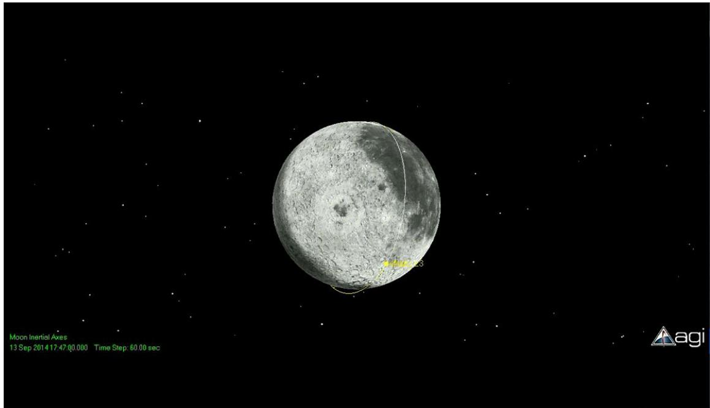

<details>
<summary>text_image</summary>

Moon Inertial Axes
13 Sep 2014 17:47:00.000 Time Step: 60.00 sec
Agi
</details>

注：其他源程序见附件