# 2014高教社杯全国大学生数学建模竞赛

## 承 诺 书

我们仔细阅读了《全国大学生数学建模竞赛章程》和《全国大学生数学建模竞赛参赛规则》（以下简称为“竞赛章程和参赛规则”，可从全国大学生数学建模竞赛网站下载）。

我们完全明白，在竞赛开始后参赛队员不能以任何方式（包括电话、电子邮件、网上咨询等）与队外的任何人（包括指导教师）研究、讨论与赛题有关的问题。

我们知道，抄袭别人的成果是违反竞赛章程和参赛规则的，如果引用别人的成果或其他公开的资料（包括网上查到的资料），必须按照规定的参考文献的表述方式在正文引用处和参考文献中明确列出。

我们郑重承诺，严格遵守竞赛章程和参赛规则，以保证竞赛的公正、公平性。如有违反竞赛章程和参赛规则的行为，我们将受到严肃处理。

我们授权全国大学生数学建模竞赛组委会，可将我们的论文以任何形式进行公开展示（包括进行网上公示，在书籍、期刊和其他媒体进行正式或非正式发表等）。

我们参赛选择的题号是（从 A/B/C/D 中选择一项填写）： A

我们的报名参赛队号为（8 位数字组成的编号）： 19004009

所属学校（请填写完整的全名）： 华南农业大学

参赛队员 (打印并签名) ：1. 吴国斌

2. 方荧荧

3. 严格格

指导教师或指导教师组负责人 (打印并签名)： 张胜祥

（论文纸质版与电子版中的以上信息必须一致，只是电子版中无需签名。以上内容请仔细核对，提交后将不再允许做任何修改。如填写错误，论文可能被取消评奖资格。）

日期：2014 年 9 月 14 日

# 2014高教社杯全国大学生数学建模竞赛

## 编 号 专 用 页

赛区评阅编号（由赛区组委会评阅前进行编号）：

赛区评阅记录（可供赛区评阅时使用）：

<table><tr><td>评阅人</td><td></td><td></td><td></td><td></td><td></td><td></td><td></td><td></td><td></td><td></td></tr><tr><td>评分</td><td></td><td></td><td></td><td></td><td></td><td></td><td></td><td></td><td></td><td></td></tr><tr><td>备注</td><td></td><td></td><td></td><td></td><td></td><td></td><td></td><td></td><td></td><td></td></tr></table>

全国统一编号（由赛区组委会送交全国前编号）：

全国评阅编号（由全国组委会评阅前进行编号）：

# 嫦娥三号软着陆轨道设计与控制策略摘要

本文对嫦娥三号软着陆轨道设计与控制策略问题进行了探讨。

对于问题一，本文建立了模型I—轨道定位模型。模型对月球软着陆全过程下降轨迹进行了设计研究,建立了下降轨道参考系和月心赤道惯性系两个三维坐标系，根据它们之间的关系使用 matlab软件求得出转换矩阵。并通过软着陆动力学模型得出近月点经纬度的表达式。从远月点至近月点运动过程符合霍曼转移，直接运用轨道能量守衡方程式，即可求得该阶段终点即近月点和起点及远月点的速度分别为 $\nu _ { _ { A } } { = } 1 6 9 2 . 2 1 9 m / s$ $\nu _ { { _ B } } \mathrm { = } 1 6 1 3 . 9 1 8 m / s$ 。在合理的假设下，若轨道倾角 $i _ { 0 }$ 为 $6 0 ^ { \circ }$ ，环月停泊轨道的升交点赤经 为 $1 5 ^ { \circ }$ ， 的值为 ，则可求得近月点的位置为 的正上方15km处，远月点的位置为的正上方 处。

针对问题二，本文建立了模型II—控制策略最优模型。模型分别对 6个软着陆阶段进行了研究，基于动力学模型，着重对主减速段进行了优化设计。该段考虑到该段燃料消耗很大,以燃料最优为设计指标，建立最优化方程。由于接近段距离月面较近，且经姿态调整后接近垂直下降,拟采用平面月球模型，对轨道进行离散化处理，并通过函数迭代和数值逼近的方法，得到了燃料最优的软着陆轨道，模拟仿真结果见图8、9。针对粗避障阶段和精避障阶段，进行了同类分析，运用matlab程序求解对应着陆点不同精度的位置确定来划分区域，寻找最优着陆区域，同时运用角度分析，求得其轨道偏转大小和方向，结果可见图 13。

针对问题三，本文建立了模型Ⅲ—误差和敏感性分析模型。基于问题二中设计的着陆轨道和控制策略，本文针对模型中的重要变量和参数，设计出合理的变化区间，首先采取控制变量法的思想，对单一的变量和参数分别进行误差分析和敏感性分析，然后结果整体，联合多个变量做误差分析，结果表明模型具有较强的稳定性。

本文的亮点在于：在对月球软着陆轨道离散化时，利用离散点处状态连续作为约束条件,把常推力月球软着陆轨道优化问题归结为一个非线性规划问题,对于此问题的求解,其初值均为有物理意义的状态和控制量,从而避免了采用传统优化方法在解决此优化问题时对没有物理意义变量初值的猜测。

关键词：嫦娥三号 动力学模型 最优控制策略 误差分析 敏感性分析

## 1 问题重述

## 1.1 问题的背景

嫦娥三号于2013年12月2日1时30分成功发射，12月6日抵达月球轨道。嫦娥三号在着陆准备轨道上的运行质量为 ，其安装在下部的主减速发动机能够产生 到 的可调节推力，其比冲（即单位质量的推进剂产生的推力）为 ，可以满足调整速度的控制要求。在四周安装有姿态调整发动机，在给定主减速发动机的推力方向后，能够自动通过多个发动机的脉冲组合实现各种姿态的调整控制。嫦娥三号的预定着陆点为 ， ，海拔为-2641m。

嫦娥三号在高速飞行的情况下，要保证准确地在月球预定区域内实现软着陆，关键问题是着陆轨道与控制策略的设计。其着陆轨道设计的基本要求：着陆准备轨道为近月点 15km，远月点 100km 的椭圆形轨道；着陆轨道为从近月点至着陆点，其软着陆过程共分为 6个阶段，要求满足每个阶段在关键点所处的状态；尽量减少软着陆过程的燃料消耗。

## 1.2要解决的问题

(1) 确定着陆准备轨道近月点和远月点的位置，以及嫦娥三号相应速度的大小与方向。  
(2) 确定嫦娥三号的着陆轨道和在6个阶段的最优控制策略。  
(3) 对于设计出的着陆轨道和控制策略做相应的误差分析和敏感性分析。

## 2 问题分析

## 2.1 问题一的分析

为简化问题，先假设软着陆下降轨迹平面在环月停泊轨道平面内。要描述确定的近月点和远月点的位置，需要用到经纬度。我们在问题基础上建立下降轨道参考系和月心赤道惯性系，通过这两个坐标系之间的转换关系求出近月点和着陆点在月心赤道惯性系下的坐标，再通过软着陆动力学模型求出近月点的经纬度，根据远月点和近月点之间的对称关系即可得到远月点的位置。针对确定速度大小与方向的问题，可利用霍曼转移的计算公式得到。

## 2.2 问题二的分析

对嫦娥三号着陆轨道的确定需要将六个阶段分开考虑，因为每个阶段运动的状态和时间都不同。因此对该题的求解需要我们分别分析描述着陆轨道的每个阶段的运动情况，针对不同的运动状态，找到影响其着陆轨道的具体因素。对于最优控制策略，属于优化问题，需要针对不同阶段，分别找到其优化的目标条件和约束因子等，构构建优化模型，进而求得最优结果。

## 2.3 问题三的分析

要对设计的着陆轨道和控制策略做出相应的误差分析和敏感性分析，本文针对模型中的重要变量和参数，设计出合理的变化趋势，采取控制变量的方法，分别对单个变量做误差分析和单个参数做敏感性分析，再结果整体，联合多个变量做误差分析，然后根据结果对建立的模型进行评价。

## 3 模型假设

(1)假设软着陆下降轨迹平面在环月停泊轨道平面内；  
(2)假设嫦娥三号只受重力影响，不考虑科氏加速度；

(3)假设月球引力非球项、日月引力摄动等影响因素均可忽略不计；  
(4)假设忽略月球自转。

4 符号说明

<table><tr><td> $i_0$ </td><td>环月停泊轨道的轨道倾角</td></tr><tr><td> $\Omega$ </td><td>环月停泊轨道的升交点赤经</td></tr><tr><td> $\beta$ </td><td>嫦娥三号经过的月心角</td></tr><tr><td> $\Delta\alpha_L$ </td><td>嫦娥三号的赤经的变化量</td></tr><tr><td> $\Delta\beta_L$ </td><td>嫦娥三号的赤纬的变化量</td></tr><tr><td> $\lambda_{L0}$ </td><td>近月点的经度</td></tr><tr><td> $\varphi_{L0}$ </td><td>近月点的纬度</td></tr><tr><td> $v_A$ </td><td>近月点速度</td></tr><tr><td> $v_B$ </td><td>远月点速度</td></tr><tr><td> $v_{li}$ </td><td>经历第i阶段所用时间(i=1,2,3,4,5)</td></tr></table>

## 5 模型的建立与求解

## 5.1模型I—轨道定位模型

## 5.1.1近月点与远月点位置的确定

嫦娥三号从环月轨道离轨进入霍曼转移轨道后,自近月点开始下降。月球软着陆通常需要经历制动段、 接近段和着陆段三个阶段 。自近月点开始到距离月面几公里高度的一段制动下降过程称为制动段，也叫动力下降段。其主要目的是通过制动发动机抵消近月点处较大的初始速度。因此，制动段应以燃料优化为首要目标。接近段介于制动段和着陆段之间，该段将引入较为精确的导航设备,主要目的是修正制动段的较大偏差，使其满足着陆段下降要求，同时兼顾燃料优化。着陆段从距离月面几百米甚至更近处开始下降，以着陆器的安全性为首要目的。

在制动段中，嫦娥三号距离月面相对较高，且嫦娥三号走过的月面距离比较长，将月球视为平面建立模型会带来较大的偏差。因此，制动段有必要将月球视为球体来建立均匀球体下的三维软着陆模型。为方便软着陆过程下降轨迹各参数的分析，需要将模型建立在合适的参考坐标系下。

首先定义几个坐标系:

（1）月心惯性参考坐标系 $O X , Y , Z _ { r }$ : 该坐标系原点 位于月心, $Z _ { r }$ 轴由月 $\therefore L ^ { \prime }$ 指向初始软着陆点, $X _ { r }$ 轴位于环月轨道平面内且指向前进方向, $Y _ { r }$ 轴与 $X _ { r }$ 和$Z _ { r }$ 构成直角坐标系，如图 1 所示。该坐标系仅用于软着陆下降轨迹和制导律设计中。

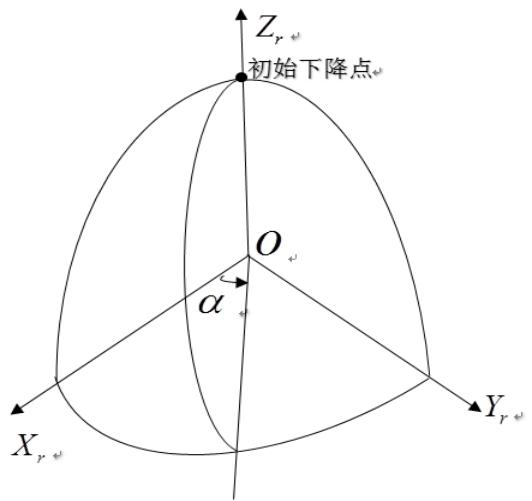

<details>
<summary>text_image</summary>

Z_{r\omega}
初始下降点\omega
O\omega
\alpha
X_{r\omega}
Y_{r\omega}
</details>

图 1 月心惯性参考坐标系

（2）月心赤道惯性系 的定义:原点 位于月球中心 , $X Y$ 平面在月球赤道平面内，其中，X 轴指向 平春分点在月球赤道上的投影 ,Z轴指向月球北极 ,Y轴与X 和 轴构成直角坐标系 。

要考察着陆器在月心赤道惯性坐标系下的运动规律，需要得到月心赤道惯性系与月心惯性参考系之间的变换关系。以降轨着陆为例，两坐标系的关系如图 2所示。

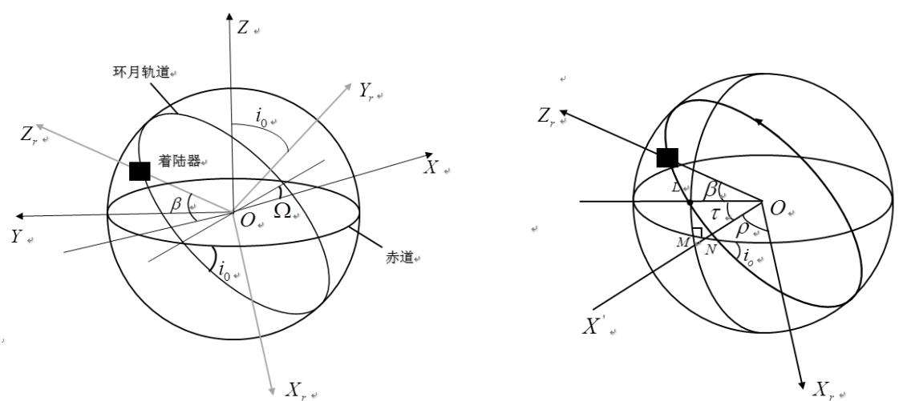  
图 2 月心赤道惯性系

可以看出，由月心赤道惯性系OXYZ变换到月心惯性参考系 $O X , Y , Z _ { r }$ 需经过4 次旋转: $Z ( \Omega + 1 8 0 ^ { \circ } )  X ( - i _ { 0 } )  Z ( \rho )  X ( 9 0 ^ { \circ } )$ ，即先绕Z轴旋转 $\Omega + 1 8 0 ^ { \circ }$ 再绕 轴旋转 $- i _ { 0 }$ ，再绕 轴旋转 $\rho$ ，最后再绕X 轴旋转 $9 0 ^ { \circ }$ 。由此可以得出它们之间的坐标变换矩阵

$$
C = C _ {X} (9 0 ^ {\circ}) C _ {Z} (\rho) C _ {X} (- i _ {0}) C _ {Z} (\Omega + 1 8 0 ^ {\circ}) \tag {1.1}
$$

其中 , $i _ { 0 }$ 为环月停泊轨道的轨道倾角,为环月停泊轨道的升交点赤经；旋转角 $\rho$ 可利用式子 $\rho = 9 0 ^ { \circ } - \beta - \tau$ 求得。

其中， $\beta$ 为嫦娥三号经过的月心角，角 如图所示，图中 为着陆点位置，

$N ^ { \prime }$ 为环月轨道降交点。

于是，月心赤道惯性系下的位置可表示为

$$
\left[ \begin{array}{l l l} X & Y & Z \end{array} \right] ^ {T} = C ^ {T} \left[ \begin{array}{l l l} X _ {r} & Y _ {r} & Z _ {r} \end{array} \right] ^ {T} \tag {1.2}
$$

为了求得近月点和着陆点在月心赤道惯性系的具体坐标，我们需要把变换矩阵 求出，然后根据式（1.2）求出具体坐标。坐标旋转转换矩阵 $\alpha$ 的计算方法如下：

在讨论绕不同的坐标轴旋转所对应的坐标旋转转换矩阵时,旋转角度的符号由以下方法确定：当由旋转角按右手法则确定的旋转方向和旋转轴正方向一致时，取正号；相反则取负号。

设仅绕 轴旋转 $\gamma$ 角度的坐标旋转转换矩阵为 $\alpha ^ { x }$ ，仅绕 $y$ 轴旋转 $\beta$ 角度的坐标旋转转换矩阵为 $\alpha ^ { y }$ ，仅绕 $z$ 轴旋转 $\theta$ 角度的坐标旋转转换矩阵为 $\alpha ^ { z }$ ，它们的成分分别如下：

$$
\alpha_ {i j} ^ {x} = \left( \begin{array}{c c c} 1 & 0 & 0 \\ 0 & \cos \gamma & \sin \gamma \\ 0 & - \sin \gamma & \cos \gamma \end{array} \right)
$$

$$
\alpha_ {i j} ^ {y} = \left( \begin{array}{c c c} \cos \beta & 0 & - \sin \beta \\ 0 & 1 & 0 \\ \sin \beta & 0 & \cos \beta \end{array} \right)
$$

$$
\alpha_ {i j} ^ {z} = \left( \begin{array}{c c c} \cos \theta & \sin \theta & 0 \\ - \sin \theta & \cos \theta & 0 \\ 0 & 0 & 1 \end{array} \right)
$$

则有：

$$
C _ {z} (\Omega + 1 8 0 ^ {\circ}) = \left( \begin{array}{c c c} - \cos \Omega & - \sin \Omega & 0 \\ \sin \Omega & - \cos \Omega & 0 \\ 0 & 0 & 1 \end{array} \right) \qquad C _ {x} (- i _ {0}) = \left( \begin{array}{c c c} 1 & 0 & 0 \\ 0 & \cos i _ {0} & - \sin i _ {0} \\ 0 & \sin i _ {0} & \cos i _ {0} \end{array} \right)
$$

$$
C _ {Z} (\rho) = \left( \begin{array}{c c c} \cos \rho & \sin \rho & 0 \\ - \sin \rho & \cos \rho & 0 \\ 0 & 0 & 1 \end{array} \right) \quad C _ {X} (9 0 ^ {\circ}) = \left( \begin{array}{c c c} 1 & 0 & 0 \\ 0 & 0 & 1 \\ 0 & - 1 & 0 \end{array} \right)
$$

利用Matlab软件即可求得矩阵 的具体表达为

$$
C = \left( \begin{array}{c c c} \cos i _ {0} \sin \Omega \sin \rho - \cos \Omega \cos \rho & - \cos \rho \sin \Omega - \cos i _ {0} \cos \Omega \sin \rho & - \sin i _ {0} \sin \rho \\ \sin i _ {0} \sin \Omega & - \cos \Omega \sin i _ {0} & \cos i _ {0} \\ - \cos \Omega \sin \rho - \cos i _ {0} \cos \rho \sin \Omega & \cos i _ {0} \cos \Omega \cos \rho - \sin \Omega \sin \rho & \cos \rho \sin i _ {0} \end{array} \right)
$$

其中，环月停泊轨道的轨道倾角 $i _ { 0 }$ 、环月停泊轨道的升交点赤经 、旋转角$\rho$ 都是未知参数， $\rho$ 是由嫦娥三号经过的月心角 $\beta$ 和角 所决定。而 $i _ { 0 } \setminus \rho \setminus \tau$ 的大小与嫦娥三号的环月停泊轨道的选取有关，由于环月停泊轨道的选取不能完全确定下来，所以 $i _ { 0 } \setminus \rho \setminus \tau$ 的取值只能依实际情况而定。着嫦娥三号过的月心角 $\beta$ 与轨道面并无太大关系，可依据下面所述方法求出。

近月点到月球表面的距离相对于月球半径其实是相当小的，因而经过的月面可近似看成是直线。此段可将月球视为平面来建立月球平面直角坐标系

将月球视为平面，建立月球平面直角坐标系，如图3所示。

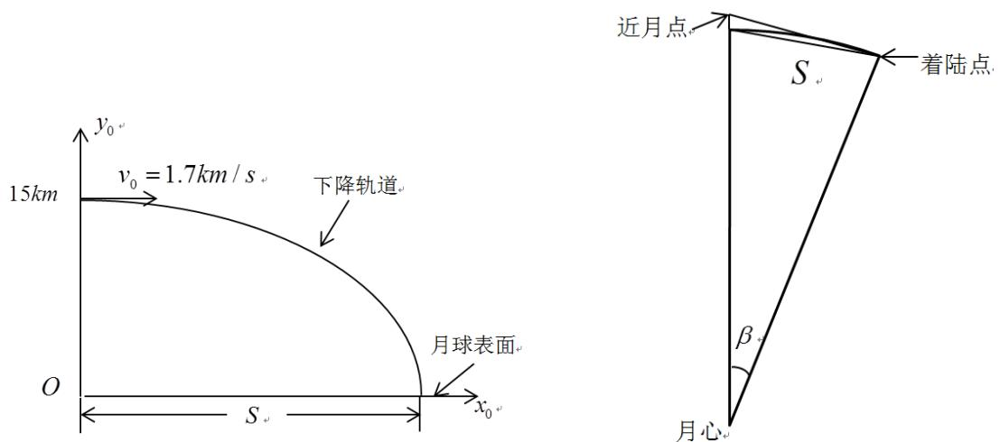  
图 3 月球表面直角坐标系

嫦娥三号将在近月点 15 公里处以抛物线下降，相对速度从每秒 1.7 公里逐渐降为零，即水平方向的速度由原来的每秒 1.7 公里逐渐降为零。假设水平方向为匀减速运动，则其满足运动学公式：

$$
v _ {t} = v _ {0} + a t
$$

$$
v _ {t} ^ {2} - v _ {0} ^ {2} = 2 a S
$$

其中， $\nu _ { t } = 1 7 0 0 m / s , \nu _ { 0 } = 0 , t = 7 5 0 s$ （由附件一得到），则由此可求得水平位移 的值，所求得的 $S = 6 3 7 5 0 0 m$ 。由图 3 可看出，近月点到月球表面的距离相对于月球半径其实是相当小的。由图中的几何关系结合三角函数可得：

$$
\beta = 2 \arcsin (S / 2 R)
$$

其中，R为月球的半径，其值为 ，则可求得 $\beta = 0 . 3 6 9 1 0 1$ ，转换为度数为 $\beta = 0 . 3 6 9 1 0 1 \times 5 7 . 2 9 5 7 8 { = } 2 1 . 1 4 7 9 ^ { \circ }$

求出了嫦娥三号经过的月心角 的具体值，则由式（1.2）可分别得出嫦娥三号和着陆点在月心赤道惯性系下的坐标得表达式。首先需要获得软着陆过程赤经赤纬的变化。这里需要利用软着陆下降轨迹设计的一个结论：软着陆下降轨迹平面在环月停泊轨道平面内。

月心赤道惯性系下的嫦娥三号位置可表示如下

$$
X = r \sin \beta_ {L} \cos \alpha_ {L}, Y = r \sin \beta_ {L} \sin \alpha_ {L}, Z = r \cos \beta_ {L}
$$

其中 ,<sub>r</sub>为嫦娥三号矢径； $\alpha _ { _ L }$ 为嫦娥三号的赤经；嫦娥三号的赤纬等于$9 0 - \beta _ { L }$

于是，容易得出 $\alpha _ { L }$ ， $\beta _ { \iota }$ 的表达式：

$$
\alpha_ {L} = \left\{ \begin{array}{l l} \arctan (Y / X), & X > 0, Y > 0 \\ \arctan (Y / X) + \pi , & X <   0 \\ \arctan (Y / X) + 2 \pi , & X > 0, Y <   0 \end{array} \right. \tag {1.3}
$$

$$
\beta_ {L} = \arccos (Z / r)
$$

由(1.3)式即可求得赤经和赤纬的变化量 : $\Delta \alpha _ { { \scriptscriptstyle L } } = \alpha _ { { \scriptscriptstyle L f } } - \alpha _ { { \scriptscriptstyle L 0 } } , \Delta \beta _ { { \scriptscriptstyle L } } = \beta _ { { \scriptscriptstyle L f } } - \beta _ { { \scriptscriptstyle L 0 } }$ 。于是，由下式即得软着陆初始下降点（即近月点）的经纬度 $\lambda _ { \scriptscriptstyle L 0 }$ 和 $\varphi _ { L 0 }$ ,如下：

$$
\left\{ \begin{array}{l} \lambda_ {L 0} = \lambda_ {L f} - \Delta \alpha_ {L} \\ \varphi_ {L 0} = \varphi_ {L f} + \Delta \beta_ {L} \end{array} \right. \tag {1.4}
$$

由于嫦娥三号的停泊轨道没能确定，故经计算得出的近月点具体位置为含参数的表达式，将之前算出的嫦娥三号和着陆点在月心赤道惯性系下的坐标代入式（1.4），则可求出近月点的位置。由地理知识远月点与近月点都是在同一个椭圆轨道上面，并且连接两点的直线经过月心，则远月点的经纬度与近月点的经纬度是关于月心对称的。

例如，假设环月停泊轨道的轨道倾角 $i _ { 0 }$ 为 $6 0 ^ { \circ }$ ，环月停泊轨道的升交点赤经为 $1 5 ^ { \circ }$ ， 的值为 ，则可利用matlab编程得到近月点的经纬度为

$$
\left\{ \begin{array}{l} \lambda_ {L 0} = 1 2 3. 9 0 ^ {\circ} E \\ \varphi_ {L 0} = 8 4. 4 5 ^ {\circ} N \end{array} \right.
$$

则相应的远月点的经纬度为

$$
\left\{ \begin{array}{l} \lambda_ {L y} = 5 6. 1 0 ^ {\circ} W \\ \varphi_ {L y} = 8 4. 4 5 ^ {\circ} S \end{array} \right.
$$

即近月点的位置为 $1 2 3 . 9 0 ^ { \circ } E , 8 4 . 4 5 ^ { \circ } N$ 的正上方15km处，远月点的位置为$5 6 . 1 0 ^ { \circ } W , 8 4 . 4 5 ^ { \circ } S$ 的正上方 处。

## 5.1.2近月点与远月点速度大小和方向的确定

下图为嫦娥三号卫星实施近月制动进入环月轨道，从高轨道 制动进入较低轨道 的霍曼转移轨道。嫦娥三号在其预先轨道瞬间制动减速后，进入一个椭圆形的转移轨道。由此椭圆轨道的远月点开始，抵达近月点后再开始制动，进入主减速阶段，开始实施降落。

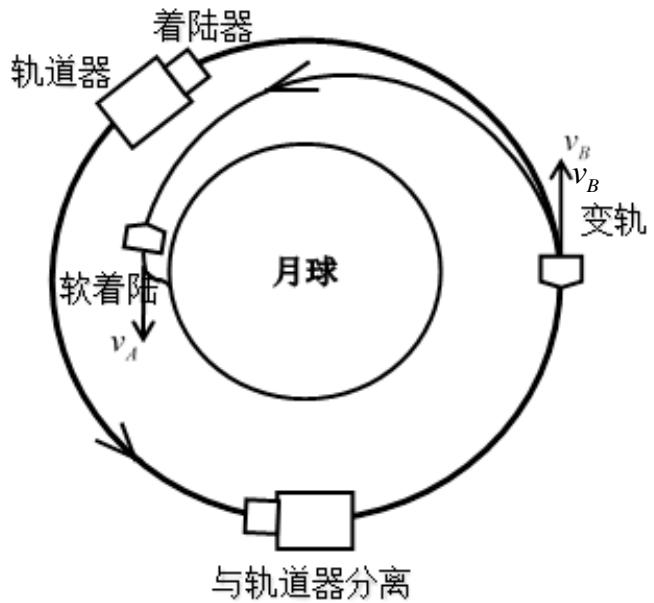

<details>
<summary>flowchart</summary>

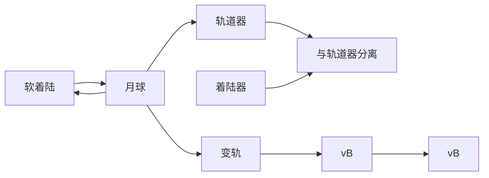
</details>

图 4 霍曼转移示意图

霍曼转移轨道为一种变更发射卫星轨道的方法，途中需要两次引擎推荐，具体变化方式如图4所示。嫦娥三号在实施制动进入环月轨道在远月点紧急制动减速经历霍曼转移轨道到达近月点。霍曼轨道上物体的总能等于动能与重力位能的和，而总能又等于重力位能（轨道半径为轨道半长轴 时的重力位能）的一半，公式表示即为：

$$
E = \frac {1}{2} m v ^ {2} - \frac {G M m}{r} = - \frac {G M m}{2 a}
$$

将上式进行变换，以v为未知解方程式，得到如下计算公式：

$$
v ^ {2} = \mu (\frac {2}{r} - \frac {1}{a}) \tag {1.5}
$$

其中：

为物体的速度；

$\scriptstyle { \mu = G M }$ 为中央物体的标准重力参数；

为物体至中央物体中心的距离；

为物体轨道的半长轴；

嫦娥三号卫星进入实施制动进入绕月轨道经历霍曼转移过程中，取月球平均半径为 ，则可求得其近月点 $r _ { _ A } = 1 7 5 2 . 0 1 3 k m$ 和远月点 $r _ { B } = 1 8 3 7 . 0 1 3 k m$ C已知月球的质量 $M = 7 . 3 4 7 7 \times 1 0 ^ { 2 2 } k g$ ，万有引力常量 $G = 6 . 6 7 { \times } 1 0 ^ { - 1 1 } N m ^ { 2 } / k g ^ { 2 }$ 0

将已知数据代入式子（1.5），计算可得嫦娥三号卫星在近月点和远月点的速度分别为：

$$
v _ {A} = 1 6 9 2. 2 1 9 m / s
$$

$$
v _ {B} = 1 6 1 3. 9 1 8 m / s
$$

方向如图4中所示，近月点与远月点的方向相反，近月点沿轨道切线方向向下，远月点沿轨道切线方向向上。

## 5.2模型II—控制策略最优模型

## 5.2.1 6个阶段的最优控制

软着陆过程的任务概貌如图 4所示。图中软着陆任务由轨道器和着陆器共同完成, 着陆器由轨道器送入一条高度为 100km 的环月圆轨道,在此轨道上,着陆器与轨道器分离。然后,着陆器调整姿态准备开始软着陆。按经环月轨道的着陆方式, 软着陆可分为如下 6 个阶段( 如图 5)，本文中所指的软着陆就是假定按这种方式进行从着陆准备轨道近月点开始的过程, 研究用于着陆月面的制导控制方法。

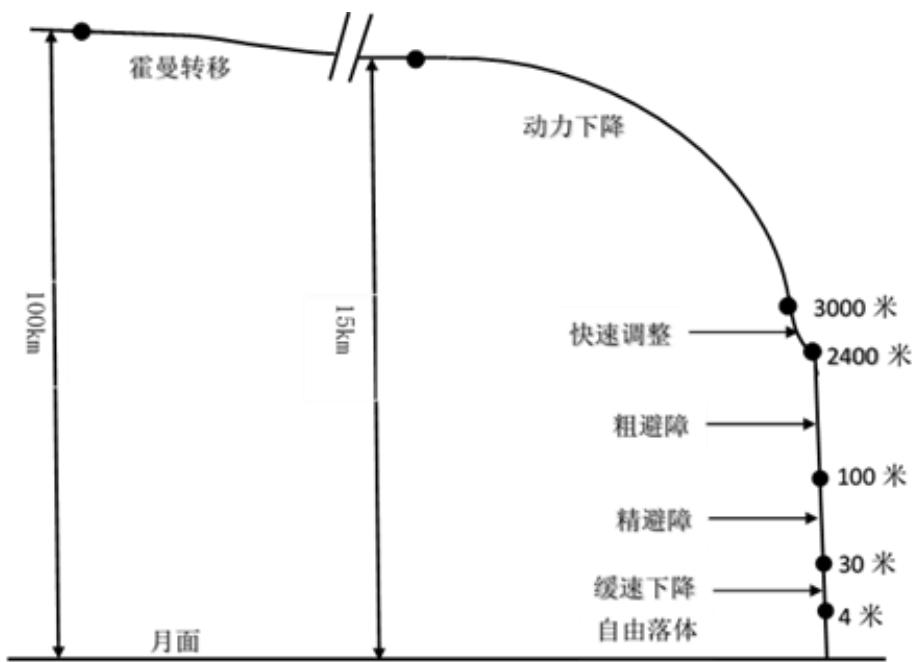

<details>
<summary>text_image</summary>

霍曼转移
100km
月面
15km
动力下降
3000米
2400米
快速调整
粗避障
100米
精避障
30米
缓速下降
自由落体
4米
</details>

图 5 软着陆各阶段示意图

## 5.2.1.1 着陆准备轨道

## 5.2.1.1 分析思路

分析着陆准备轨道我们主要着手三方面进行开展，首先是速度，该段的起始点和终止点分别为嫦娥三号着陆器在该运行轨道中的远月点以及近月点，可直接利用轨道能量守恒方程式进行计算。其次，求解该段的运动时间，结合开普勒第三定律，推导可得公式求得答案。最后分析其轨道形状，由假设可知，着陆准备轨道与软着陆轨道处于同一平面内，且其运行轨道为半椭圆形。

## 5.2.1.2 模型推导

开普勒第一定律阐明，行星环绕太阳的轨道是椭圆形的。椭圆的面积是 ab，其中 $^ { a }$ 与 分别为椭圆轨道的半长轴与半短轴。由开普勒第二定律推导可得，行星-太阳连线扫过区域速度 $\frac { d A } { d t }$ 为

$$
\frac {d A}{d t} = \frac {l}{2 m}
$$

所以，行星公转周期 为

$$
T = \frac {2 m \pi a b}{l} \tag {2.1}
$$

关于此行星环绕太阳，椭圆的半周长 $^ { a }$ ，半短轴 与近拱距 $r _ { \scriptscriptstyle A }$ （近拱点 与引力中心之间的距离），远拱距 $r _ { B }$ （近拱点 与引力中心之间的距离）的关系分别为

$$
a = (r _ {A} + r _ {B}) / 2 \tag {2.2}
$$

$$
b = \sqrt {r _ {A} r _ {B}} \tag {2.3}
$$

欲知道半长轴与半短轴，必须先求得近拱距与远拱距。依据能量守恒定律，

$$
E = \frac {1}{2} m r ^ {2} \theta^ {2} - G \frac {M m}{r} = \frac {l ^ {2}}{2 m r ^ {2}} - G \frac {M m}{r}
$$

稍微加以编排即可以得到 的一元二次方程：

$$
r ^ {2} + \frac {G M m}{E} r - \frac {l ^ {2}}{2 m E} = 0
$$

运用公式法求解上式一元二次方程可得两个跟分别为椭圆轨道的近拱距 $r _ { \scriptscriptstyle A }$ 与远拱距 $r _ { B }$ ：

$$
\begin{array}{l} r _ {A} = (- \frac {G M m}{E} - \sqrt {(\frac {G M m}{E}) ^ {2} + \frac {2 l ^ {2}}{m E}}) / 2 \\ r _ {B} = (- \frac {G M m}{E} + \sqrt {(\frac {G M m}{E}) ^ {2} + \frac {2 l ^ {2}}{m E}}) / 2 \\ \end{array}
$$

代入方程（2.2）与（2.3），可得

$$
a = - \frac {G M m}{2 E}
$$

$$
b = \frac {l}{\sqrt {- 2 m E}} = \frac {l}{m} \frac {\sqrt {a}}{\sqrt {G M}}
$$

将 $^ { a }$ 和 的表达式代入方程（2.1），即可得该椭圆轨道周期方程为

$$
T = \frac {2 \pi a ^ {3 / 2}}{\sqrt {G M}}
$$

由图4可得霍曼转移轨道为椭圆轨道的一半，因此霍曼转移所花的时间为

$$
t _ {H} = \frac {1}{2} \sqrt {\frac {4 \pi^ {2} a ^ {3}}{\mu}} = \pi \sqrt {\frac {(r _ {A} + r _ {B}) ^ {3}}{8 \mu}} \tag {2.4}
$$

其中 $\scriptstyle \mu = \mathbf { G } \mathbf { M }$

## 5.2.1.3 模型求解

嫦娥三号卫星进入实施制动进入绕月轨道经历霍曼转移过程中，取月球平均 半 径 为 ， 则 可 求 得 其 近 月 点 $r _ { _ A } = 1 7 5 2 . 0 1 3 k m$ 和 远 月 点$r _ { B } = 1 \ 8 \ 3 \ 7 \ . \ \alpha { \bf { k } }$ 。 已 知 月 球 的 质 量 $M = 7 . 3 4 7 7 \times 1 0 ^ { 2 2 } k g$ ， 万 有 引 力 常 量$G = 6 . 6 7 { \times } 1 0 ^ { - 1 1 } N m ^ { 2 } / k g ^ { 2 }$ 0

将已知数据代入式子（2.4），计算可得嫦娥三号卫星在蒙曼转移轨道的运行时间为：

$$
t = 3 4 1 1. 3 8 8 s
$$

## 5.2.1.2 主减速段

主减速段的区间是距离月面 15km 到 3km。该阶段的主要是减速，实现到距离3公里处嫦娥三号的速度降到 $5 7 \mathrm { m / s }$

## 5.2.1.2.1 系统模型

由于月球表面附近没有大气, 所以在飞行器的动力学模型中没有大气阻力项。而且从 15km左右的轨道高度软着陆到非常接近月球表面的时间比较短, 一般在几百秒的范围内, 所以诸如月球引力非球项、日月引力摄动等影响因素均可忽略不计。

如图所示,在惯性坐标系中,假设发动机的推力 总与推进速度 方向完全相反，以月心为原点的坐标形式受控飞行器动力学方程为：

$$
a _ {n} = \frac {F \cdot \cos \beta}{m - \dot {m}}
$$

$$
a _ {r} = g _ {m} - \frac {F \cdot \sin \beta}{m - \dot {m}}
$$

$$
v _ {n} (t) = v _ {n} (t - \triangle t) - a _ {n} \cdot \triangle t
$$

$$
v _ {r} (t) = v _ {r} (t - \triangle t) - a _ {r} \cdot \triangle t
$$

 初始条件为:

$$
\left\{ \begin{array}{l} v _ {n} (t _ {0}) = 1 7 0 0 m / s \\ v _ {r} (t _ {0}) = 0 m / s \\ h (t _ {0}) = 1 5 0 0 \mathrm{m} \end{array} \right. \tag {2.5}
$$

 终端条件为:

$$
\left\{ \begin{array}{l} v _ {n} (t _ {f}) = 0 m / s \\ v _ {r} (t _ {f}) = 5 7 m / s \\ h (t _ {f}) = 3 0 0 0 \mathrm{m} \end{array} \right. \tag {2.6}
$$

 约束条件为：

$$
h = \int_ {0} ^ {t} \frac {v _ {t} ^ {2} - v _ {t - 1} ^ {2}}{2 a _ {t - 1}} \leq 1 2 0 0 0 m \tag {2.7}
$$

 目标函数

对于推力幅值恒定飞行器, 性能指标可以表达为燃料消耗达到极小, 即

$$
J = \int_ {0} ^ {t _ {f}} m d t = \int_ {0} ^ {t _ {f}} \frac {F}{v _ {e} g _ {m}} d t = \frac {F}{v _ {e} g _ {m}} t f \rightarrow \min \tag {2.8}
$$

由式（2.8）可以看出，燃耗最优问题就是时间最优问题 。

## 5.2.1.2.2 轨道离散化

针对上述最优控制问题,首先把月球软着陆轨道进行离散化,整个的轨道可分割为 个小段,每段的节点设一个推力方向,如图6所示

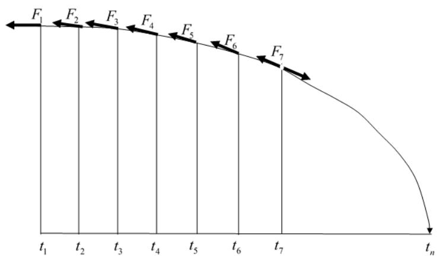

<details>
<summary>line</summary>

| Time | Force (F) |
| --- | --- |
| t1 | F1 |
| t2 | F2 |
| t3 | F3 |
| t4 | F4 |
| t5 | F5 |
| t6 | F6 |
| t7 | F7 |
| tn | — |
</details>

图 6 各推力方向示意图

为了能够反映推力方向角随时间的变化趋势，作如下假设, 推力方向角 $\beta$ 可以表示成一个多项式的形式,

即

$$
\beta = \sum_ {i = 0} ^ {2} a _ {i} t ^ {i} \tag {2.9}
$$

其中， $a _ { 0 }$ 是常数， $a _ { 1 }$ 是 的系数， $a _ { 2 }$ 是 的系数。

## 5.2.1.2.3 算法思想

对上述问题，我们利用 Matlab 进行迭代算法和数值逼近的方法进行求解，步骤如下：

Step1：初始速度、时间的赋值，建立加速度随时间的变化函数关系；

Step2：对时间进行数值逼近处理；

Step3：迭代计算横向速度和纵向速度的数值；

Step4：观察速度的时间序列末端值是否符合题目要求的终端条件，并检验是否满足约束条件；

Step5：若满足 Step3的条件，输出时间 ，否则返回 $\mathrm { S t e p 2 }$ C

## 5.2.1.2.4 仿真结果

初始时刻的飞行器质量 $m = 2 . 4 t$ ，发动机比冲为 $\nu _ { e } = 2 9 4 0 m / s$ ，飞行器轨道高度 $h = 1 5 k m$ , 切向速度为 $\nu _ { _ { H 0 } } = 1 . 7 k m / s$ , 法向速度 $\nu _ { { } _ { r 0 } } = 0$ 。末端时刻,飞行器降落在月面, $r _ { { t } } = a _ { { L } } = 1 7 3 8 k m$ , 速度 $\nu _ { { } _ { r f } } = 0 , \quad \nu _ { { } _ { H f } } = 0$ C

由上计算结果可知,着陆器的下降时间约为 秒,最终燃料消耗$1 5 8 4 . 1 8 3 7 k g$ 0

我们对cos和时间 进行曲线拟合，利用 Matlab软件得到拟合方程:

$$
\cos \beta = - 2. 0 9 7 8 \times 1 0 ^ {- 6} x ^ {2} - 3. 7 3 7 4 \times 1 0 ^ {- 4} x + 1. 0 1 8 3
$$

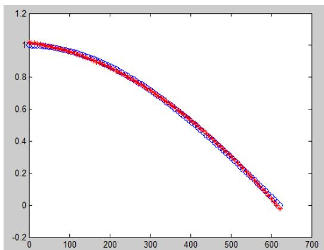

<details>
<summary>line</summary>

| X | Red Series | Blue Series |
| --- | --- | --- |
| 0 | ~1.02 | ~0.99 |
| 100 | ~0.95 | ~0.94 |
| 200 | ~0.86 | ~0.87 |
| 300 | ~0.73 | ~0.74 |
| 400 | ~0.56 | ~0.57 |
| 500 | ~0.36 | ~0.37 |
| 600 | ~0.11 | ~0.12 |
| 625 | ~-0.03 | ~-0.01 |
</details>

图 7 曲线拟合图

图7为推力方向角随时间的变化趋势，由图可以看出，推力方向角由水平与地面的 0 度逐渐变为与地面的垂直（90 度）。着陆器水平速度随时间变化如图：

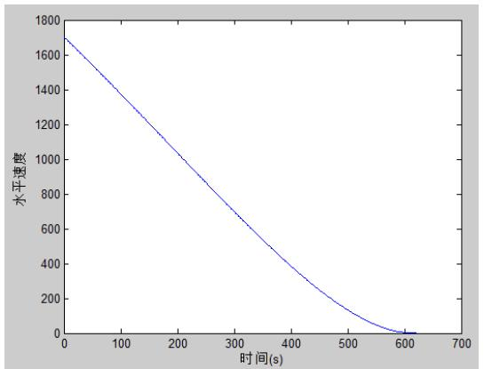

<details>
<summary>line</summary>

| 时间(s) | 水平速度 |
| --- | --- |
| 0 | ~1700 |
| 100 | ~1350 |
| 200 | ~1050 |
| 300 | ~750 |
| 400 | ~450 |
| 500 | ~150 |
| 600 | ~0 |
</details>

图 8 水平速度变化趋势图

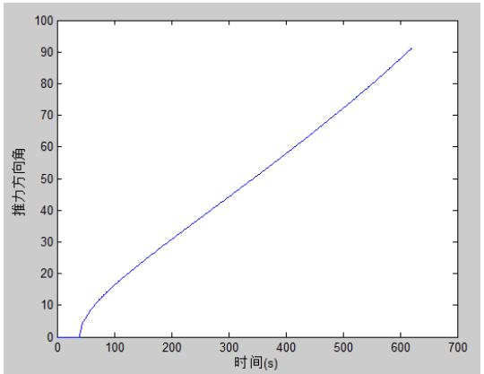

<details>
<summary>line</summary>

| 时间(s) | 推力方向角 |
| --- | --- |
| 0 | 0 |
| ~50 | ~2 |
| ~100 | ~15 |
| ~200 | ~30 |
| ~300 | ~45 |
| ~400 | ~60 |
| ~500 | ~75 |
| ~600 | ~90 |
</details>

图 9 推力方向角变化趋势图

## 5.2.1.3 快速调整段

快速调整段的主要是调整探测器姿态，需要从距离月面 到 处将水平速度减为 $0 \mathrm { m / s }$ ，即使主减速发动机的推力竖直向下，之后进入粗避障阶段。由此可知在快速调整阶段嫦娥三号在竖直方向上的位移为 $h _ { 2 } = 6 0 0 m$ ，水平位移基本为0，在距离月球表面 处的速度为 $\nu _ { 0 } = 5 7 m / s$ ，而在距离月球表面时速度 $\nu _ { { } _ { t } } = 0$ 。因此可以将这一段的运动看成是减速直线运动。考虑到要使得燃料消耗尽量少，若此阶段为匀减速直线运动，则推力保持不变，由公式

$$
F _ {t h r u s t} = v _ {e} \dot {m} \tag {2.10}
$$

可知单位时间内燃料消耗的公斤数保持不变。此时消耗的燃料量最小。

由主减速段的分析可求得该阶段燃料所消耗的公斤数，其值为 ，嫦娥三号在着陆准备轨道上的运行质量为 ，经过了主减

速段后，其质量减少为 $m = 2 4 0 0 - 1 5 8 4 . 1 8 = 8 1 5 . 8 2 k g$ ，对嫦娥三号进行受力分析右图所示，则在快速调解阶段嫦娥三号做匀减速运动的满足

$$
m a = F _ {l 1} - m g _ {m}
$$

其中， $F _ { l 1 }$ 为此阶段发动机产生的推力， $g _ { m }$ 为月球表面的重力加速度。

由运动学公式 $\nu _ { t } ^ { 2 } - \nu _ { 0 } ^ { 2 } = 2 a S$ ，可得到匀减速运动时的加速度为

$$
a = \frac {v _ {0} ^ {2} - v _ {t} ^ {2}}{2 S} = 2. 7 1 m / s ^ {2}
$$

因此，嫦娥三号在此阶段所经历的时间为

$$
t _ {l 2} = \frac {v _ {0} - v _ {t}}{a} = 2 1. 0 3 s
$$

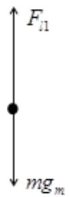  
图 10 受力分析图a

发动机所产生的推力为 $F _ { l 1 } = m a + m g _ { m } { = } 3 5 4 0 . 6 4 N$ ，单位时间内燃料消耗的公斤数为 $\dot { m } = \frac { F _ { _ { l 1 } } } { \nu _ { e } } { = } 1 . 2 0 4$ ，其中 $\nu _ { e }$ 为以米/秒为单位的比冲。由此可得到快速调解阶段所消耗的燃料为 $m ^ { \prime } = \dot { m } t _ { l 2 } = 2 5 . 3 3 k g$ ，则在距离月球表面 时，嫦娥三号的质量为 $8 6 9 . 3 9 - 2 6 . 9 9 = 8 4 4 . 0 6 k g$

## 5.2.1.4 粗避障段

## 5.2.1.4.1 分析思路

粗避障阶段主要因素就是如何躲避陨石坑，因此在分析其运行轨迹时首要考虑的问题就是要确定陨石坑的位置，根据其的大致分布来考虑该阶段的着陆轨迹该如何改变。跟据附件 3数据可求得距月面2400m 处高程图（如图11），该高程图是以其预着落点为中心进行测量绘制所得，通过观察，可以划出在该区域内适合降落即无陨石坑分布的区域，其横向长度为 1000\~1500m 和纵向长度为1000\~1500m 的预计着落时范畴，为得到存在陨石坑的精确点，可通过编写 matlab程序求解，尽管由于该阶段着陆器距月球表面高度较大而所得数据精确度不高，但依旧可以较为准确的避开较大陨石坑所在区域。

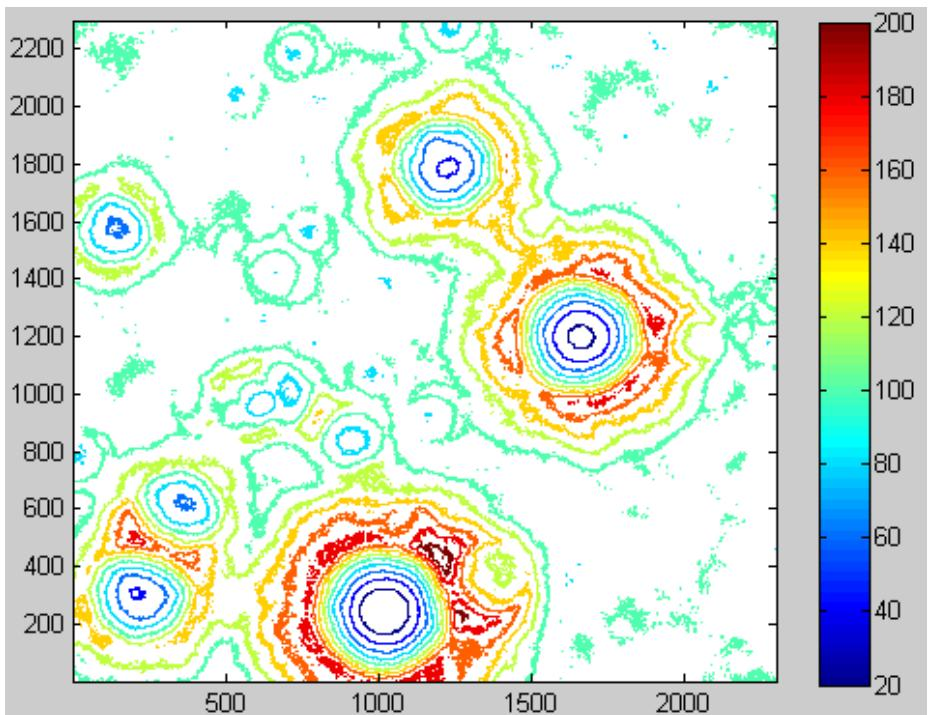

<details>
<summary>heatmap</summary>

| X | Y | Value (Range) |
| --- | --- | --- |
| ~300 ~1500 | ~100 ~2200 | 20~200 |
</details>

图 11 距月面2400m处的高程图

## 5.2.1.4.1 算法思想

为求得其陨石坑所在位置具体的区域分布图，我们需要进一步的指导该陨石坑的具体位置。我们假设某地海拔高度与其周围一点高度大于 10m 时，即可认定该地存在较大陨石坑，基于此假设，将观测所划出的区域分为 $5 0 0 \times 5 0 0$ 部分，命令从 点开始：

Step1：计算各点与其都成九宫格的周围 的八个点求差值；

Step2：若所得差值大于 10，返回其所在位置的横纵坐标；若所得差值小于等于 10，即返回 Step1。

## 5.2.1.4.3 结果分析

通过运行改程序可以得到表1 数据，为了更加形象的展示其陨石坑的具体位置分布，建立网格图（如图 12 所示，图中白色部分表示没有较大陨石坑）， 将表中数据标记在网格图中，有色网格即为存在陨石坑点的区域。

表 1 粗略估计较大陨石坑结果输出表

<table><tr><td>x</td><td>y</td><td>h</td><td>x</td><td>y</td><td>h</td></tr><tr><td>1036</td><td>1492</td><td>10</td><td>1199</td><td>1378</td><td>10</td></tr><tr><td>1036</td><td>1493</td><td>10</td><td>1199</td><td>1379</td><td>10</td></tr><tr><td>1037</td><td>1493</td><td>10</td><td>1218</td><td>1408</td><td>10</td></tr><tr><td>1080</td><td>1470</td><td>10</td><td>1224</td><td>1377</td><td>10</td></tr><tr><td>1037</td><td>1494</td><td>10</td><td>1245</td><td>1347</td><td>11</td></tr><tr><td>1156</td><td>1394</td><td>11</td><td>1309</td><td>1433</td><td>10</td></tr><tr><td>1156</td><td>1452</td><td>10</td><td>1323</td><td>1482</td><td>10</td></tr><tr><td>1157</td><td>1451</td><td>10</td><td>1323</td><td>1483</td><td>10</td></tr><tr><td>1157</td><td>1453</td><td>10</td><td>1324</td><td>1483</td><td>11</td></tr><tr><td>1158</td><td>1452</td><td>11</td><td>1324</td><td>1484</td><td>10</td></tr><tr><td>1158</td><td>1453</td><td>10</td><td>1325</td><td>1484</td><td>11</td></tr><tr><td>1159</td><td>1452</td><td>10</td><td></td><td></td><td></td></tr></table>

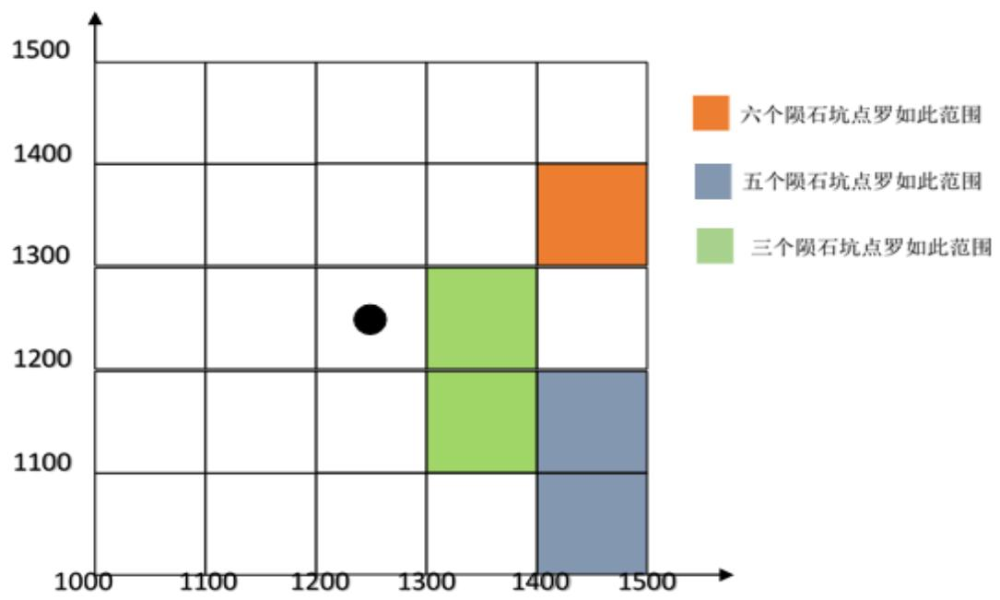

<details>
<summary>scatter</summary>

| Category | X Range | Y Range |
| --- | --- | --- |
| 六个陨石坑点罗如此范围 | 1400~1500 | 1300~1400 |
| 五个陨石坑点罗如此范围 | 1400~1500 | 1100~1200 |
| 三个陨石坑点罗如此范围 | 1300~1400 | 1100~1300 |
| Black dot | ~1250 | ~1240 |
</details>

图 12 较大陨石坑数量分布图

为保证该着陆器顺利下降至下一阶段, 在粗避障阶段，嫦娥三号需在其原预计着落点的左方区域与偏移即可保证避开较大陨石坑。另一方面，为保证嫦娥三号落在其预定着落点附近，因此偏移距离应控制在合理范围内。假设其最大合理偏差距离为 800m，如图 13 所示 为嫦娥三号着陆器进入粗避障和精避障其运行轨迹偏转示意图。

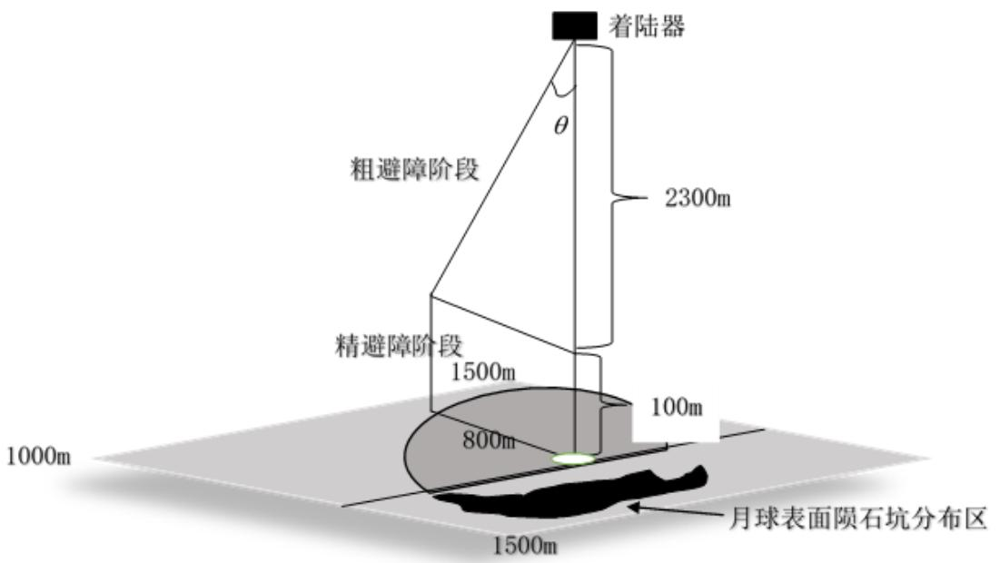

<details>
<summary>text_image</summary>

着陆器
粗避障阶段
2300m
1500m
精避障阶段
100m
800m
1000m
1500m
月球表面陨石坑分布区
</details>

图 13 着陆器偏移范围

存在下列关系式，

$$
\tan \theta = \frac {A B}{B C}
$$

其中 $A B = 2 4 0 0 m , B C = 8 0 0 m$

代入上式求解可得 $\theta = 1 9 . 1 7 6 7 ^ { \circ }$ 。因此可得在粗避障轨道为使得其顺利降落，避开较大陨石坑，在该区间应将嫦娥三号着陆器在其原竖直下降轨道方向向图中左方偏移角度少于 $\theta = 1 9 . 1 7 6 7 ^ { \circ }$ ，即可顺利进入下一轨道进行降落，允许下落范围如图阴影部分所示。

## 5.2.1.5 精避障段

## 5.2.1.5.1 建模思路

同粗避障分析类似，我们需要确定陨石坑的分布来分析其在该段的着陆轨迹偏移，找到优化控制策略，但为了精确的找到陨石坑所在位置，我们引进一种新的方法进行求解。我们在描述一组数据的稳定性大小时，常会通过计算其标准差。标准差一般用 $\sigma$ 表示, 它反应了一组数值中某一数值与其平均值的差异程度,经常被用来评估一组数值变化或波动程度 具体的数学定义如 $\sf { F }$ 。

设有一组数值 $x _ { 1 } \cdot \phantom { \frac { 1 } { 2 } } x _ { 2 } \circ \cdots \phantom { \frac { 1 } { 2 } } x _ { n }$ ( 均为实数) , 其平均值为:

$$
x = \frac {1}{N} \sum_ {i = 1} ^ {N} x _ {i}
$$

$$
\sigma = \sqrt {\frac {1}{N} \sum_ {i = 1} ^ {N} (x _ {i} - \bar {x}) ^ {2}}
$$

延伸至测量学中,标准差也经常用于衡量误差分布的离散程度。因此,推广至地理学中，如果将 $x _ { i }$ 换成某一区域的高程值,标准差就成为“高程标准差”。同理，高程标准差的值越大, 高程波动的范围就越大,地形也就越不平坦,这样就可以用高程标准差来衡量地形的起伏程度。因此我们选择矩形窗口通过高程图来计算距月面 100m 处所处区域范围这一区域内的高程标准差,编写 matlab 程序在该数据区域内以一定的步长和方向移动,这样就可以计算出整个数据区的高程标准差分布图,从而表达地形的起伏状况。计算高程标准差用到了这一区域内所有点的高程值,而最大高程值和最小高程值之差的方法,仅仅用到两个点的高程值,因此标准差方法更能综合反映这一区域的地形起伏状况,同时能够反映出地形的局部起伏变化。

## 5.2.1.5.2 算法思想

选择矩形窗口通过高程图来计算距月面 100m 处所处区域范围这一区域内的高程标准差, 在该数据区域内以一定的步长和方向移动,逐点计算，并逐一输出。

## 5.2.1.5.2 结果分析

运行 matlab 程序后输出结果同时输出高程标准值分布图，值越小，表面其地区越平缓，说明陨石坑存在的可能性也越小。

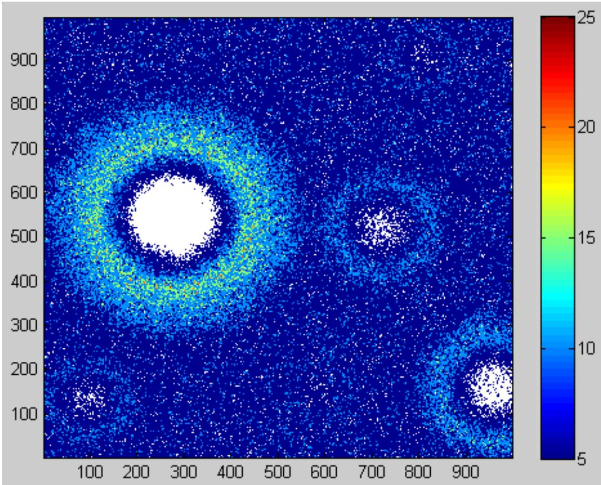

<details>
<summary>heatmap</summary>

| X (range) | Y (range) | Intensity (range) |
| --- | --- | --- |
| 100~950 | 100~950 | 5~25 |
</details>

图 14 高程标准值示意图

假设进入精避障区段时，嫦娥三号着落器的预计着落点位于图中心位置，该图中心位置左右两边均有较明显陨石坑分布，通过编程即可得到较平缓表面分布区域，主要聚集在横向区域 50\~56m 之间及纵向区域 24\~31m 之间，部分数据如表 2 所示（由于数据较多，全部表格见附录），因此此时为保证着落器的顺利安全着落，可使用嫦娥三号的姿态调整发动机，通过平移避开陨石坑口到达该区域范围内的平缓地带上空再进而进行下一步的着陆。

表 2 平缓区域分布图

<table><tr><td>x</td><td>y</td><td>x</td><td>y</td></tr><tr><td>548</td><td>245</td><td>537</td><td>253</td></tr><tr><td>544</td><td>248</td><td>538</td><td>253</td></tr><tr><td>545</td><td>248</td><td>535</td><td>254</td></tr><tr><td>547</td><td>251</td><td>536</td><td>254</td></tr><tr><td>548</td><td>251</td><td>534</td><td>255</td></tr><tr><td>539</td><td>252</td><td>537</td><td>257</td></tr><tr><td>547</td><td>252</td><td>530</td><td>258</td></tr><tr><td>567</td><td>252</td><td>526</td><td>262</td></tr><tr><td>537</td><td>253</td><td>530</td><td>262</td></tr><tr><td>538</td><td>253</td><td>529</td><td>263</td></tr></table>

## 5.2.2 燃料最少计算

粗避障阶段：

粗避障段的范围是距离月面 到 区间，其主要是要求避开大的陨石坑，实现在设计着陆点上方处悬停，并初步确定落月地点。由此可知，嫦娥三号在距离月面 到 的时候速度均为零。在该阶段的运动可分为两个部分，第一部分为自由落体运动，第二部分为匀减速直线运动，且此时的推力为最大推力，以减少燃料的消耗。这两个过程嫦娥三号的受力示意图如图所示：

在整个过程中，满足：

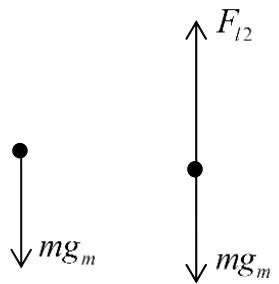

<details>
<summary>chemical</summary>

Diagram showing two force vectors F_l2 and mg_m acting on a point, likely representing gravitational forces or moment of inertia.
</details>

$$
\left\{ \begin{array}{l} v = g _ {m} t _ {1} \\ v = a t _ {2} \\ h = \overline {{v}} (t _ {1} + t _ {2}) \\ v = 2 \overline {{v}} \\ m a = F _ {l 2} - m g _ {m} \end{array} \right. \tag {2.11}
$$

其中： 为此阶段最大的速度，即加速过程的最大速度；

$F _ { l 2 }$ 为此阶段发动机产生的推力；

$g _ { m }$ 为月球表面的重力加速度。

为匀减速运动是的加速度大小；

为此阶段竖直方向的位移；

$\overline { { \nu } }$ 为此阶段的平均速度；

$t _ { 1 }$ 为做自由落体阶段的时间；

$t _ { 2 }$ 为做匀减速直线运动的时间。

解得：

$$
\left\{ \begin{array}{l} a = 7. 2 5 6 m / s ^ {2} \\ t _ {1} = 7 9. 0 5 1 s \\ t _ {2} = 1 7. 7 5 8 s \end{array} \right.
$$

可得出精避障阶段和缓速下降阶段所用的时间为 $t _ { l 2 } = t _ { 1 } + t _ { 2 } = 9 6 . 8 0 9 s$ ，单位时间内所耗燃料公斤数为 $\dot { m } = \frac { F _ { l 3 } } { \nu _ { e } } = 2 . 5 5$ 。则粗避障阶段所消耗的燃料为$m ^ { \prime } = \dot { m } t _ { l 3 } = 4 5 . 2 8 3 k g$ ， 在 距 离 月 球 表 面 时 ， 嫦 娥 三 号 的 质 量 为$8 4 4 . 0 6 - 4 5 . 2 8 3 = 7 9 8 . 7 7 7 k g$

精避障阶段与缓速下降阶段：

精细避障段的区间是距离月面 到 。要求嫦娥三号悬停在距离月面处，对着陆点附近区域 范围内拍摄图像，并获得三维数字高程图。分析三维数字高程图，避开较大的陨石坑，确定最佳着陆地点，实现在着陆点上方处水平方向速度为 。缓速下降阶段的区间是距离月面 到 。该阶段的主要任务控制着陆器在距离月面 处的速度为 $0 m / s$ ，即实现在距离月面 处相对月面静止。由此可知，嫦娥三号在距离月面 到 的时候速度均为零。从距离月面 到 的运动过程与粗避障阶段的运动过程一样，即分为自由落体运动和匀减速直线运动两个部分。

由式子（2.10）可求得

$$
\left\{ \begin{array}{l} a = 7. 7 5 9 m / s ^ {2} \\ t _ {1} = 1 5. 6 0 2 s \\ t _ {2} = 3. 2 7 7 s \end{array} \right.
$$

则精避障阶段和缓速下降阶段所用的时间为 $t _ { l 4 } = t _ { 1 } + t _ { 2 } = 1 8 . 8 7 9 s$ ，单位时间内所耗燃料公斤数为 $\dot { m } = \frac { F _ { l 3 } } { \nu _ { e } } { = } 2 . 5 5 1$ 。则粗避障阶段所消耗的燃料为$m ^ { \prime } = \dot { m } t _ { l 4 } = 8 . 3 5 6 k g$ ， 在 距 离 月 球 表 面 时 ， 嫦 娥 三 号 的 质 量 为$7 9 8 . 7 7 7 - 8 . 3 5 6 = 7 9 0 . 4 2 1 k g$

自由落体阶段：

$$
t _ {l 5} = \sqrt {\frac {2 h}{g _ {m}}} = 2. 2 2 s
$$

则六个阶段的总时间为 $t = t _ { l 1 } + t _ { l 2 } + t _ { l 3 } + t _ { l 4 } + t _ { l 5 } = 7 5 9 . 9 3 8 s$ 。而在这 6 个阶段中燃料的消耗量为嫦娥三号质量的减少量，即 $2 4 0 0 - 7 9 0 . 4 2 1 = 1 6 0 9 . 5 7 9 k g$

## 5.3模型Ⅲ—误差和敏感性分析模型

## 5.3.1 误差分析

主减速段被业内形容为最惊心动魄的环节。在这个阶段，嫦娥三号要完全依靠自主导航控制，完成降低高度、确定着陆点、实施软着陆等一系列关键动作，人工干预的可能性几乎为零，因此此阶段对精度要求比较高。

基于问题二中建立的最优目标方程，我们采用控制变量的方法，进行主要影响因素对模型的误差分析。

在模型 II 中，我们设定一系列条件，在允许误差范围内最优解为 $t = 6 2 1 s$ 如图所示。为了让后面阶段能够在预测的轨道上正常运行，基于问题二中的算法，本文可以通过在适当的范围内改变变量的大小来推测模型的稳定性。

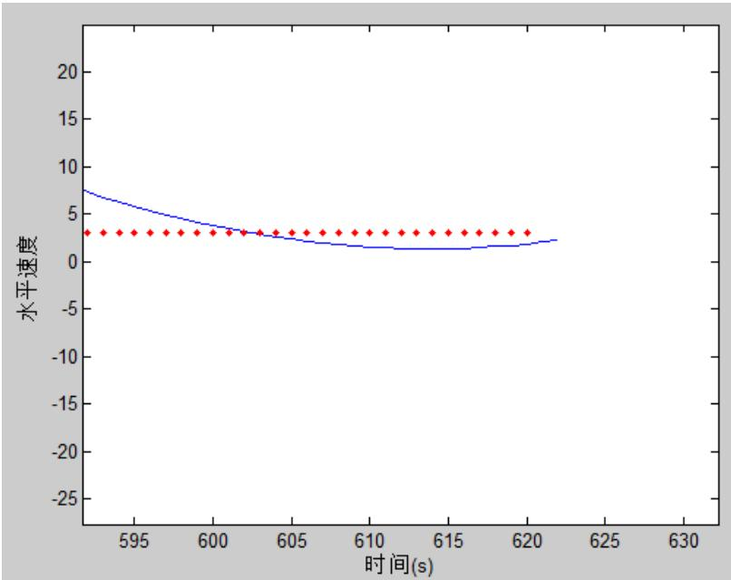

<details>
<summary>line</summary>

| 时间(s) | 水平速度 (Blue Line) | 水平速度 (Red Diamonds) |
| --- | --- | --- |
| 593 | ~7.5 | 3 |
| 594 | ~6.8 | 3 |
| 595 | ~6.2 | 3 |
| 596 | ~5.7 | 3 |
| 597 | ~5.2 | 3 |
| 598 | ~4.8 | 3 |
| 599 | ~4.4 | 3 |
| 600 | ~4.1 | 3 |
| 601 | ~3.8 | 3 |
| 602 | ~3.5 | 3 |
| 603 | ~3.2 | 3 |
| 604 | ~2.9 | 3 |
| 605 | ~2.6 | 3 |
| 606 | ~2.3 | 3 |
| 607 | ~2.1 | 3 |
| 608 | ~1.9 | 3 |
| 609 | ~1.8 | 3 |
| 610 | ~1.7 | 3 |
| 611 | ~1.6 | 3 |
| 612 | ~1.5 | 3 |
| 613 | ~1.5 | 3 |
| 614 | ~1.5 | 3 |
| 615 | ~1.5 | 3 |
| 616 | ~1.5 | 3 |
| 617 | ~1.6 | 3 |
| 618 | ~1.7 | 3 |
| 619 | ~1.8 | 3 |
| 620 | ~1.9 | 3 |
| 621 | ~2.1 | — |
</details>

图 15 水平速度变化趋势图

这里，我们主要考虑的因素是常推力 、飞行器质量m和初速度 $\nu _ { 0 }$ 。

我们保持其他变量不变，只改变常推力 的值，在 间隔内每改变20N运算一次，运行结果如下表所示：

表 3 经历时间随推力变化

<table><tr><td>F(N)</td><td>t(s)</td><td>F(N)</td><td>t(s)</td></tr><tr><td>7400</td><td>630</td><td>7520</td><td>620</td></tr><tr><td>7420</td><td>628</td><td>7540</td><td>618</td></tr><tr><td>7440</td><td>626</td><td>7560</td><td>616</td></tr><tr><td>7460</td><td>625</td><td>7580</td><td>615</td></tr><tr><td>7480</td><td>623</td><td>7600</td><td>613</td></tr><tr><td>7500</td><td>621</td><td>7620</td><td>612</td></tr></table>

由表中的数据可得，常推力 每改变 20N，该阶段的时间最优解改变 1 或 2秒，即 改变1%，时间 大约改变1.1%，从而可得模型可靠性非常高。

我们保持其他变量不变，只改变飞行器质量 的值，在 间隔内每改变20kg运算一次，运行结果如下表所示：

表 4 经历时间随飞行器质量变化

<table><tr><td>m(kg)</td><td>t(s)</td><td>m(kg)</td><td>t(s)</td></tr><tr><td>2300</td><td>595</td><td>2420</td><td>626</td></tr><tr><td>2320</td><td>601</td><td>2440</td><td>632</td></tr><tr><td>2340</td><td>606</td><td>2460</td><td>637</td></tr><tr><td>2360</td><td>611</td><td>2480</td><td>642</td></tr><tr><td>2380</td><td>616</td><td>2500</td><td>647</td></tr><tr><td>2400</td><td>621</td><td>2520</td><td>752</td></tr></table>

由表中的数据可得，飞行器质量 每改变 20kg，该阶段的时间最优解改变 5或6秒，即 改变1%，时间 大约改变0.9%，从而可得模型可靠性非常高。

我们保持其他变量不变，，只改变初速度 $\nu _ { 0 }$ 的值，在 间隔内每改变20m/s运算一次，运行结果如下表所示：

表 5 经历时间随初速度变化

<table><tr><td> $v_0(m/s)$ </td><td>t(s)</td><td> $v_0(m/s)$ </td><td>t(s)</td></tr><tr><td>1600</td><td>596</td><td>1720</td><td>626</td></tr><tr><td>1620</td><td>601</td><td>1740</td><td>631</td></tr><tr><td>1640</td><td>606</td><td>1760</td><td>636</td></tr><tr><td>1660</td><td>611</td><td>1780</td><td>641</td></tr><tr><td>1680</td><td>616</td><td>1800</td><td>646</td></tr><tr><td>1700</td><td>621</td><td>1820</td><td>650</td></tr></table>

我们保持其他变量不变，同时改变常推力 和飞行器质量m。由式（2.10）可得时间最优解不变。

我们保持其他变量不变，同时改变常推力 和初速度 $\nu _ { 0 }$ 的 1%，t s( ) 改变 0.7%结果如表所示。

表 6 经历时间随推力与速度百分比变化

<table><tr><td>改变百分比</td><td>t(s)</td></tr><tr><td>-0.03</td><td>627</td></tr><tr><td>-0.02</td><td>625</td></tr><tr><td>-0.01</td><td>623</td></tr><tr><td>0.01</td><td>619</td></tr><tr><td>0.02</td><td>617</td></tr><tr><td>0.03</td><td>615</td></tr></table>

同理，可以同时只改变飞行器质量 和初速度 $\nu _ { 0 }$ ，或是同时只改变飞行器质量 、初速度 $\nu _ { 0 }$ 和飞行器质量 。

综合以上分析，我们可以认为设计的模型具有较高的稳定性。

## 5.3.1.1 敏感性分析

敏感性分析分参数逐个进行，一次仅进行一个参数的敏感性分析。将当前进行敏感性分析的参数称为分析参数，其它参数称为非分析参数。敏感性分析的具体方法是，固定所有非分析参数的值不变，对分析参数，以其现值为中心，上、下各取若干个值分别进行模拟计算，求出模拟结果的变化随参数值变化的规律，以此判断参数是否敏感，原则上，当参数的值变化时，模拟过程有剧烈变化或较大变化时，该参数为高度敏感参数；当参数的值变化时，模拟的过程有明显变化时，该参数为敏感参数；当参数的值变化时，模拟的过程有一定变化，但不明显时，该参数为不敏感参数。

本文中主要对参数 进行敏感性分析，主要研究部分依旧是主减速段，结果 $\nu _ { e }$ 以时间 展示。

表 7 速度变化率与时间关系表

<table><tr><td> $v_e(m/s)$ </td><td> $t(s)$ </td></tr><tr><td>-0.03</td><td>615</td></tr><tr><td>-0.02</td><td>617</td></tr><tr><td>-0.01</td><td>619</td></tr><tr><td>0.01</td><td>623</td></tr><tr><td>0.02</td><td>625</td></tr><tr><td>0.03</td><td>627</td></tr></table>

结果如表7所示。从表中可以看出，每增加或减少 1个百分比，时间 t减少或增减2s，大概0.03%，即参数 为不敏感参数。 $\nu _ { e }$

## 6 模型的讨论

## 6.1 模型的优点

(1) 分别建立了下降轨道参考系和月心赤道惯性系下的两种均匀球体模型，便于飞行轨迹的计算分析。  
(2) 模型II针对主减速阶段建立的最优化方程模型，对轨道进行离散处理，避免了采用传统优化方法在解决此优化问题时对没有物理意义变量初值的猜测，使模型结论更具有准确性。  
(3) 模型II中分析精避障阶段，为求得更加精确地陨石坑分布位置，引入的“高程标准差”概念，相较于粗避障阶段该方法不仅新颖而且求解方式更精确，利于得出结论。

## 6.2 模型的局限性

(1) 模型I只适用于霍曼转移轨道与软着陆轨道处于同一平面的情况，使用范围有限。  
(2) 针对精避障阶段分析所建模型，由于没有用高程标准差方法表达地形起伏度的参考案例, 计算结果也是在特定地区的地形数据上计算得出的, 因而结论可能具有局限性。窗口的大小、栅格单元的大小、标准差的分级等都有待于通过更多的实验数据来验证, 以便发现规律, 制定标准,促进应用。

## 参考文献

[1] 姜启源，谢金星，叶俊，数学模型（第四版）[M]，北京：高等教育出版社，2011.1。  
[2] 马莉，MATLAB 数学实验与建模[M]，北京：清华大学出版社，2010。  
[3] 王鹏基, 张熇, 曲广吉，月球软着陆飞行动力学和制导控制建模与仿真，中国科学（E辑：技术科学），2009  
[4] 王鹏基, 张熇, 曲广吉，月球软着陆下降轨迹与制导律优化设计研究，宇航学报，2007  
[5] 王大轶，月球软着陆的一种燃耗次优制导方法，宇航学报，第 21卷，第 4期，北京控制工程研究所

## 附录:

matlab 程序 1：  
```matlab
clc,clear;
q=pi*22.62/180;
b=pi*150/180;
c=pi*25/180;
x=0;
y=0;
z=1752013;
r0=15000;
A=[1,0,0;0,0,1;0,-1,0];
B=[cos(q),sin(q),0;-sin(q),cos(q),0;0,0,1];
C=[1,0,0;0,cos(b),-sin(b);0,sin(b),cos(b)];
D=[-cos(c),-sin(c),0;sin(c),-cos(c),0;0,0,1];
E=A*B*C*D;
F=E';
X=F*[x,y,z]';
Q=X(1,1)/X(2,1);
if X(1,1)>0
    if X(2,1)>0
        a=atan(Q)*57.2957795131
    else
        a=atan(Q)*57.2957795131+360
    end
else
    a=atan(Q)*57.2957795131+180
    end
r=r0+1737013;
W=X(3,1)/r;
p=acos(W)*57.2957795131
q=pi*22.62/180;
b=pi*30/180;
c=pi*25/180;
x=1209430;
y=0;
z=1246800;
r0=0;
A=[1,0,0;0,0,1;0,-1,0];
B=[cos(q),sin(q),0;-sin(q),cos(q),0;0,0,1];
C=[1,0,0;0,cos(b),-sin(b);0,sin(b),cos(b)];
D=[-cos(c),-sin(c),0;sin(c),-cos(c),0;0,0,1];
E*A*B*C*D;
F=E';
X=F*[x,y,z]';
Q=X(1,1)/X(2,1);
if X(1,1)>0
    if X(2,1)>0
        a1=atan(Q)*57.2957795131
    else
```

```matlab
a1=atan(Q)*57.2957795131+360
end
else
    a1=atan(Q)*57.2957795131+180
end
r=r0+1737013;
W=X(3,1)/r;
p1=acos(W)*57.2957795131
i=a1-a;
j=p1-p;
I=19.51-i
J=44.12+j
```

程序 2：  
```matlab
clc;clear;
m=imread('C:\Users\Princess\Desktop\A',14p3
34à2400m';μÄÊý×Ö,ß³Ìͼ.tif');

for i=800:1500
    for j=800:1100

a=[m(i-1,j-1),m(i-1,j),m(i-1,j+1),m(i,j-1),m(i,j),m(i,j+1),m(i+1,j-1),m(i+1,j),m(i+1,j+1)];
    b=max(a)-min(a);
    if b>=10
        c(1)=i;
        c(2)=j;
        c(3)=b;
        c
    end
end
end
```

程序 3：  
```matlab
clc;clear;
n=imread('C:\Users\Princess\Desktop\A,\124p4
34àÔÂÃæ100m' | μÄÊý×Ö, β³Ìͼ.tif');
for i=2:999
    for j=2:999

d=[n(i-1,j-1),n(i-1,j),n(i-1,j+1),n(i,j-1),n(i,j),n(i,j+1),n(i+1,j-1),n(i+1,j),n(i+1,j+1)];
    d=num2str(d);
    d=str2num(d);
    for k=1:9
        e(k)=(d(k)-d(5))^2;
        f(i-1,j-1)=sqrt((sum(e)/9));
    end
end
```

end

程序 4：  
```matlab
clc;clear;
t0=500;
b=1:90;
vh=[];vh(t0)=1000;
vr=[];vr(t0)=1000;
q=3;
while 1
if abs(vh(t0)-0)>q
ydata1=cos(pi*b/180);
xdata=linspace(0,t0,90);
for i=1:5
    a1=polyfit(xdata,ydata1,i);
    A1=polyval(a1,xdata);%计算拟合函数在xdata处的值
    if sum((A1-ydata1).^2)<0.1
        c1=i;
        break;
    end
end
F=7500;m=2400;a=F/m;g=1.63;
vh(1)=1700;
vr(1)=0;
for t=1:1:t0
    vh(t+1)=vh(t)-F/(m-F/(2940*(1+0.03))*t)*polyval(a1,t);
    ss=polyval(a1,t);
    s(t)=acos(ss)*180/pi;
    s=s';
    s=real(s);
end
t0=t0+1;
else break
end
end
figure
plot(vh);
xlabel('时间(s)');ylabel('水平速度');hold on
plot(0:620,q,'r.');
figure
plot(s);
xlabel('时间(s)');ylabel('推力方向角');
t0-1
```

表格 1：

<table><tr><td>x</td><td>y</td><td>x</td><td>y</td><td>x</td><td>y</td><td>x</td><td>y</td><td>x</td><td>y</td></tr><tr><td>548</td><td>245</td><td>549</td><td>267</td><td>523</td><td>275</td><td>526</td><td>280</td><td>523</td><td>288</td></tr><tr><td>544</td><td>248</td><td>530</td><td>268</td><td>537</td><td>275</td><td>537</td><td>280</td><td>549</td><td>288</td></tr><tr><td>545</td><td>248</td><td>531</td><td>268</td><td>522</td><td>276</td><td>538</td><td>280</td><td>524</td><td>289</td></tr><tr><td>547</td><td>251</td><td>532</td><td>268</td><td>523</td><td>276</td><td>554</td><td>280</td><td>536</td><td>289</td></tr><tr><td>548</td><td>251</td><td>533</td><td>268</td><td>526</td><td>276</td><td>568</td><td>280</td><td>545</td><td>290</td></tr><tr><td>539</td><td>252</td><td>548</td><td>268</td><td>534</td><td>276</td><td>526</td><td>281</td><td>555</td><td>290</td></tr><tr><td>547</td><td>252</td><td>525</td><td>269</td><td>535</td><td>276</td><td>537</td><td>281</td><td>525</td><td>291</td></tr><tr><td>567</td><td>252</td><td>530</td><td>269</td><td>564</td><td>276</td><td>538</td><td>281</td><td>545</td><td>291</td></tr><tr><td>537</td><td>253</td><td>548</td><td>269</td><td>576</td><td>276</td><td>539</td><td>281</td><td>555</td><td>291</td></tr><tr><td>538</td><td>253</td><td>524</td><td>270</td><td>522</td><td>277</td><td>554</td><td>281</td><td>556</td><td>291</td></tr><tr><td>535</td><td>254</td><td>525</td><td>270</td><td>523</td><td>277</td><td>539</td><td>282</td><td>535</td><td>292</td></tr><tr><td>536</td><td>254</td><td>548</td><td>270</td><td>535</td><td>277</td><td>540</td><td>282</td><td>556</td><td>292</td></tr><tr><td>534</td><td>255</td><td>568</td><td>270</td><td>552</td><td>277</td><td>541</td><td>282</td><td>526</td><td>293</td></tr><tr><td>537</td><td>257</td><td>524</td><td>271</td><td>553</td><td>277</td><td>554</td><td>282</td><td>523</td><td>294</td></tr><tr><td>530</td><td>258</td><td>548</td><td>271</td><td>571</td><td>277</td><td>555</td><td>282</td><td>545</td><td>294</td></tr><tr><td>526</td><td>262</td><td>549</td><td>271</td><td>522</td><td>278</td><td>556</td><td>282</td><td>546</td><td>294</td></tr><tr><td>530</td><td>262</td><td>523</td><td>272</td><td>523</td><td>278</td><td>565</td><td>282</td><td>559</td><td>294</td></tr><tr><td>529</td><td>263</td><td>524</td><td>272</td><td>535</td><td>278</td><td>539</td><td>283</td><td>523</td><td>295</td></tr><tr><td>530</td><td>263</td><td>549</td><td>272</td><td>552</td><td>278</td><td>540</td><td>283</td><td>559</td><td>295</td></tr><tr><td>535</td><td>263</td><td>562</td><td>272</td><td>553</td><td>278</td><td>541</td><td>283</td><td>527</td><td>298</td></tr><tr><td>529</td><td>264</td><td>523</td><td>273</td><td>554</td><td>278</td><td>556</td><td>283</td><td>531</td><td>298</td></tr><tr><td>530</td><td>264</td><td>524</td><td>273</td><td>555</td><td>278</td><td>557</td><td>283</td><td>537</td><td>302</td></tr><tr><td>534</td><td>264</td><td>527</td><td>273</td><td>522</td><td>279</td><td>565</td><td>283</td><td>530</td><td>305</td></tr><tr><td>554</td><td>264</td><td>528</td><td>273</td><td>523</td><td>279</td><td>522</td><td>284</td><td>541</td><td>305</td></tr><tr><td>566</td><td>264</td><td>529</td><td>273</td><td>537</td><td>279</td><td>523</td><td>284</td><td>532</td><td>306</td></tr><tr><td>528</td><td>265</td><td>519</td><td>274</td><td>553</td><td>279</td><td>523</td><td>285</td><td>553</td><td>307</td></tr><tr><td>534</td><td>265</td><td>523</td><td>274</td><td>554</td><td>279</td><td>551</td><td>285</td><td>543</td><td>310</td></tr><tr><td>566</td><td>265</td><td>527</td><td>274</td><td>568</td><td>279</td><td>552</td><td>285</td><td>544</td><td>310</td></tr><tr><td>523</td><td>266</td><td>542</td><td>274</td><td>522</td><td>280</td><td>523</td><td>286</td><td>545</td><td>310</td></tr><tr><td>522</td><td>267</td><td>522</td><td>275</td><td>523</td><td>280</td><td>523</td><td>287</td><td>546</td><td>310</td></tr></table>