# 嫦娥三号软着陆轨道设计与控制策略

## 摘要

本文针对嫦娥三号软着陆轨道设计与控制问题，建立了三维动力学模型、二维动力学模型、区域选择模型、悬停模型、采用参数优化，对软着陆轨道的设计提供了方案，并提出控制策略，经检验模型的受干扰能力强，可靠性高。

问题一中，要求我们确定准备着陆轨道近月点和远月点的位置以及嫦娥三号在该点的速度。为使得轨道最优，本文先通过简化的抛物线模型初步对近月点的空间范围 $(55.30^{\circ}W;16.56^{\circ}W,15km)$ ， $(55.30^{\circ}N;40.50^{\circ}N,15km)$ ，通过高斯-克吕格坐标将地面坐标转化为经纬坐标，为找到准备着陆轨道近月点和远月点的位置，假设嫦娥三号在近月点、着陆点和月心所确定的平面上运动，由此建立了二维动力学模型，以燃料消耗最少为目标，采用参数优化算法。求得近月点的坐标为 $(20.08^{\circ}W,30.1^{\circ}N)$ ，远月点的坐标为 $(160.49^{\circ}E,22.45^{\circ}S)$ ，近月点速度为1.692km/s，远月点速度为1.639km/s

问题二中，要求确定嫦娥三号的着陆轨道和在6个阶段的最优控制策略。因此本文先确定嫦娥三号的着陆轨道，由于实际过程嫦娥三号受多种因素的干扰，该着陆轨道并非在一定的平面内，因此先建立月心惯性坐标系，以各阶段不同目标为约束条件，燃料消耗最少为目标，建立三维动力学模型，采用参数优化算法，求得各阶段控制策略如下：①着陆准备轨道阶段：根据能量守恒和开普勒第二定律确定近月点的速度大小②主减速阶段：得到该阶段控制函数 $u_{1}=[F_{1}\ \theta_{1}\ \psi_{1}]^{T}$ ③快速调整阶段：为使得嫦娥三号快速调整，以嫦娥三号下降过程飞行距离距离最短为目标，得到该阶段控制函数 $u_{2}=[F_{2}\ \theta_{2}\ \psi_{2}]^{T}$ ④粗避障阶段：分析数字高程图，为确保嫦娥三号避开大陨石坑，我们由参考文献 $^{[3]}$ 得知，将高度h大于50m的像素点列为危险像素点，采用边缘检测模型，以螺旋前进搜索方法，对着陆点进行初步修正，得到安全区域中心点坐标为 $(19.51^{\circ}W,35.12^{\circ}N)$ ⑤精避障阶段：为确保避开月面的障碍物，建立了安全坡度筛选模型，采用螺旋式前进搜索方法，对着陆点进行精确修正。得到目标着陆点为 $(18.4^{\circ}W,33.7^{\circ}N)$ ⑥缓速下降阶段：在指向月心方向做竖直匀减速运动，速度降为0 m/s

问题三中, 要求我们对设计的着陆轨道和控制策略做相应的误差分析和敏感性分析。首先进行误差分析, 通过误差转移矩阵, 检验误差影响后, 确定的着陆点位置误差在同一数量级之后, 我们对近月点的初始状态进行 $5\%$ 的波动, 检测得知在波动为 $5\%$ 内着陆点能够较好地满足要求。对于敏感行分析我们提取了模型中的部分参数嫦娥三号的开始 $m_0$ 、 $v_e$ 、 $F_{\max}$ , 经过作发动机推力和角度图像发现 $m_0$ 、 $v_e$ 对模型的较为明显, $F_{\max}$ 在不低 4900N 时对模型对模型的影响不明显。

本文最大的特色，第一问中，先通过简化的抛物线模型求解出备选的近月点范围，缩小了优化模型的搜索范围；第二问中，通过边缘检测和安全坡度筛选的方法对粗避障和精避障过程进行描述，较为准确的确定了安全着陆点；第三问中，以误差转移矩阵，验证了在不同条件下，误差所导致的影响在同一数量级，便于下文准确的误差分析。

关键词：轨道设计与控制、三维动力学模型、参数优化算法、坡度筛选、边缘检测

## 一、问题提出

嫦娥三号在着陆准备轨道上的运行质量为 2.4t，其安装在下部的主减速发动机能够产生 1500N 到 7500N 的可调节推力，其比冲（即单位质量的推进剂产生的推力）为 2940m/s，可以满足调整速度的控制要求。在四周安装有姿态调整发动机，在给定主减速发动机的推力方向后，能够自动通过多个发动机的脉冲组合实现各种姿态的调整控制。嫦娥三号的预定着陆点为 19.51W，44.12N，海拔为 -2641m（见附件 1）。

嫦娥三号在高速飞行的情况下，要保证准确地在月球预定区域内实现软着陆，关键问题是着陆轨道与控制策略的设计。其着陆轨道设计的基本要求：着陆准备轨道为近月点15km，远月点100km的椭圆形轨道；着陆轨道为从近月点至着陆点，其软着陆过程共分为6个阶段（见附件2），要求满足每个阶段在关键点所处的状态；尽量减少软着陆过程的燃料消耗。

根据上述的基本要求，请你们建立数学模型解决下面的问题：

（1）确定着陆准备轨道近月点和远月点的位置，以及嫦娥三号相应速度的大小与方向。  
(2) 确定嫦娥三号的着陆轨道和在 6 个阶段的最优控制策略。  
(3) 对于你们设计的着陆轨道和控制策略做相应的误差分析和敏感性分析。

## 二、基本假设

1、月球为密度均匀的球体；  
2、不考虑地球引力对探测器的影响；  
3、不考虑探测器内部间的摩擦损耗

## 三、符号说明

<table><tr><td>符号</td><td>意义</td><td>符号</td><td>意义</td></tr><tr><td>a</td><td>长半轴</td><td> $v_1$ </td><td>近月点的速度</td></tr><tr><td>b</td><td>短半轴</td><td> $v_2$ </td><td>远月点的速度</td></tr><tr><td> $φ / λ$ </td><td>分别为坐标的经度和纬度</td><td> $m_0$ </td><td>探测器初始质量</td></tr><tr><td>h</td><td>相对月球面的高度</td><td> $ω$ </td><td>探测器围绕月心的角速度</td></tr><tr><td>c</td><td>椭球第一偏心率</td><td> $Δh_i$ </td><td>相对高程</td></tr></table>

## 四、问题分析

问题一要求，确定着陆准备轨道近月点和远月点的位置，以及嫦娥三号相应速度的大小与方向。经初步分析，如果将月球假想为一个均匀的球体，那么能到达预着陆点，该近月点应该有无数个，所以无法求得近月点的具体位置。为设计最优的着陆轨道，这里我们考虑到最优的轨道应当消耗燃料最少，因此初步应该选择在虹湾着落区域上方的点作为近月点。

为在该区域找到最优着陆准备轨道，并确定近月点的位置，我们可以采用以燃料消耗最少为优化目标，建立嫦娥三号的动力学模型，从而得到最优的近月点位置。

问题二要求，确定嫦娥三号的着陆轨道和在6个阶段的最优控制策略。为确定6个阶段的最优控制策略，在第一问确定了最优近月点的基础上。对6个阶段分析如下

<table><tr><td>准备着陆轨道</td><td>主减速</td><td>快速调整</td><td>粗避障</td><td>精避障</td><td>缓速下降</td></tr><tr><td>近月点速度确定</td><td>以57m/s,基本位于目标上方</td><td>使得水平速度为0m/s</td><td>避开大陨石坑</td><td>精细避开月面障碍物</td><td>缓速下降</td></tr></table>

因此需要对各阶段轨道进行修正，使得嫦娥三号满足每个阶段在关键点所处的状态，并准确安全到达着陆点附近。

问题三要求，对于本文设计的着陆轨道和控制策略做相应的误差分析和敏感性分析。问题三的实质是为了验证问题二提出的策略是否在拥有误差的情况下能依旧保持较为准确降落，验证该策略是否可靠。

误差分析，首先我们可以考虑运用误差转移矩阵对该三维动力学模型进行最数量级的验证，初步判断误差存在时，对着陆点的影响是否在同一同一数量级内，否则不需要进行下一步精确的验证。如在同一数量级内，可以对近月点的坐标和速度进行一个误差区域的处理，再通过第二问的模型计算出相应的着陆点误差区域，如果较为准确地着陆在理想着落点附近，那么就能说明该模型有较好的适应能力，可靠性高。

敏感度分析，为验证该策略的敏感性，我们可以选择模型中一部分参数，比如嫦娥三号的质量、嫦娥三号的推力等，判断在这些参数变化时模型所确定的各量是否具有明显变化。

## 五、模型的建立与求解

## 5.1 问题一模型建立与求解

## 5.1.1 问题一的分析

问题一要求我们确定着陆准备轨道近月点和远月点的位置，以及嫦娥三号相应速度的大小与方向。通过查阅文献得知，嫦娥三号在达到月球表面之前并非唯一确定，而是尽量使得其在近月点的位置附近。

本文先假设嫦娥三号的运动轨迹为平面的抛物线，根据近月点和着陆点上方位置确定该抛物线的解析式。由该解析式能确定近月点的位置为在着陆点上方 15km 的一条圆曲线，由此可确定近月点的范围，然后通过优化模型，确定最优近月点位置，通过近月点远月点几何关系再确定远月点位置。

为确定近月点远月点速度，我们将绕月轨道看成椭圆，再考虑在月球万有引力作用下求解出近月点远月点速度的大小。再通过坐标系转化，将月球经纬坐标系转化为月心惯性坐标系，由于在轨道平面内近月点速度的方向为轨道圆的切线方向，并且垂直于月心、近月点、着陆点所定平面的法向量，由此可确定该近月点远月点速度方向。

## 5.1.2 问题一模型的建立

## (1) 嫦娥三号运动轨迹的确定

由于在嫦娥三号接近月球表面的过程中，从着陆准备轨道开始下降，为了使得能量消耗地最少该下降路径一般是一个平面内，也即是与近月点和远月点共面的平面，该路径近似于一条抛物线，如右图所示：

由于初始点和终点的速度和位置确定。本文根据初始点坐标 $A(0,15000)$ 、速度 $v_{A}=17000km/s$ 和主减速结束点 $B(0,3000)$ 和 $v_{B}=57m/s$ 。将该过程简化为抛物线运动，在 x 轴方向做匀减速运动，在 y 轴方向嫦娥三号在月球引力的作用下做匀加速运动。因此可以求得嫦娥三号（5.1）的水平移动距离 s

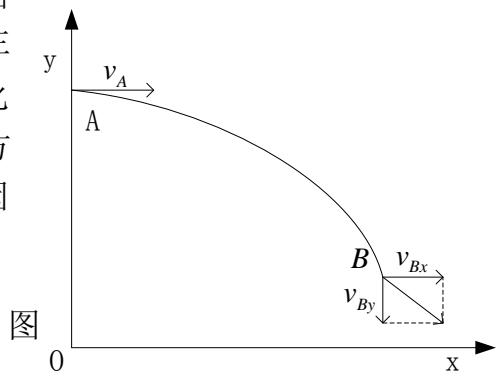

<details>
<summary>text_image</summary>

y
vA
A
B
vBy
vBx
O
x
</details>

图 1 下降路线示意图

1 简化抛物线图

$$
\left\{ \begin{array}{l l} 2 g h = v _ {B y} & a _ {x} = \frac {v _ {A} - v _ {B x}}{t} \\ t = \frac {v _ {B y}}{g} & s = v _ {A} t - \frac {1}{2} a t ^ {2} \end{array} \right. \quad \text {图1下降路线示意图} \tag {5.1}
$$

## (2) 着陆区域的确定

嫦娥三号为了到达着陆点，首先需要接近着陆点的上方，并且以抛物线的形式下降。

由上文近月点到着陆点上方抛物线假设可知，近月点投影在月球表面应是以着陆点为圆心嫦娥三号到达着陆点上方水平位移长度为半径的全曲线。在虹湾着陆区绘制该圆曲线如图所示。

虹湾着陆区在月球表面的投影为长356千米、宽91千米的矩形区域。因此根据大地坐标转换成高斯-克吕格坐标 $^{[5]}$ 的算法，将该平面上的点坐标转化为经纬坐标。转化公式如下：

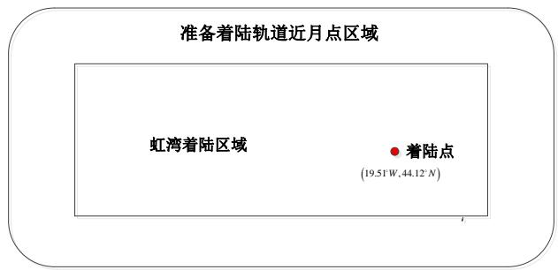

<details>
<summary>text_image</summary>

准备着陆轨道近月点区域
虹湾着陆区域
● 着陆点
(19.51°W, 44.12°N)
</details>

图 2 着陆区域示意图

$$
x = X + \frac {1}{2} N \sin B \cos B (\triangle L) ^ {2} \left[ 1 + \frac {1}{1 2} (\triangle L) ^ {2} \cos^ {2} B \times \left(5 - t ^ {2} + 9 \eta^ {2} + 4 \eta^ {4}\right) + \right. \tag {5.2}
$$

$$
\frac {1}{3 6 0} \bigl (\triangle L \bigr) ^ {4} \cos^ {4} B \times \bigl (6 1 - 5 8 t ^ {2} + t ^ {4} \bigr) ]
$$

$$
y = N \cos B (\triangle L) \left[ 1 + \frac {1}{6} (\triangle L) ^ {2} \cos^ {2} B \times \left(1 - t ^ {2} + \eta^ {2}\right) + \frac {1}{1 2 0} (\triangle L) ^ {4} \times \cos^ {4} B \times \right. \tag {5.3}
$$

$$
\left(5 - 1 8 t ^ {2} + t ^ {4} - 1 4 \eta^ {2} - 5 8 \eta^ {2} t ^ {2}\right) ]
$$

$$
X = a \Big (1 - e ^ {2} \Big) \Bigg (C _ {1} B - \frac {1}{2} C _ {2} \sin 2 B + \frac {1}{4} C _ {3} \sin 4 B - \frac {1}{6} C _ {4} \sin 6 B + C _ {5} \sin 8 B \Bigg) \tag {5.4}
$$

$$
N = \frac {a}{\sqrt {\triangle L - e ^ {2} \sin^ {2} B}}
$$

$$
C _ {1} = 1 + \frac {3}{4} e ^ {2} + \frac {4 5}{6 4} e ^ {4} + \frac {1 7 5}{2 5 6} e ^ {6} + \frac {1 1 0 2 5}{1 6 3 8 4} e ^ {8}; C _ {2} = \frac {3}{4} e ^ {2} + \frac {1 5}{1 6} e ^ {4} + \frac {5 2 5}{5 1 2} e ^ {6} + \frac {2 2 0 5}{2 4 0 8} e ^ {8};
$$

$$
C _ {3} = \frac {4 5}{6 4} e ^ {4} + \frac {1 0 5}{2 5 6} e ^ {6} + \frac {2 2 0 5}{2 4 0 8} e ^ {8}; C _ {4} = \frac {3 5}{5 1 2} e ^ {6} + \frac {3 1 5}{2 4 0 8} e ^ {8};
$$

式中，月球经纬度 $(\varphi,\lambda)$ 、中央经线 $L_{0}$ 单位均为弧度(rad)；X是从赤道沿子午线到该点的一段弧长；a为椭球长半轴 $(m)$ ；e、 $e'$ 分别为地球参考椭球的第一、第二偏心率；N是该点的卯酉曲率半径； $\Delta L=L-L_{0}$ ； $t=\tan B$ ； $\eta^{2}=(e')^{2}\cos^{2}B$ ；x和y是相对于本带原点的高斯平面坐标，单位为m。

## (2) 准备轨道近月点区域的确定

上文以确定了着陆点的范围，因此可以通过嫦娥三号的运动轨迹来确定准备着陆的空间区域。空间区域示意图如下：

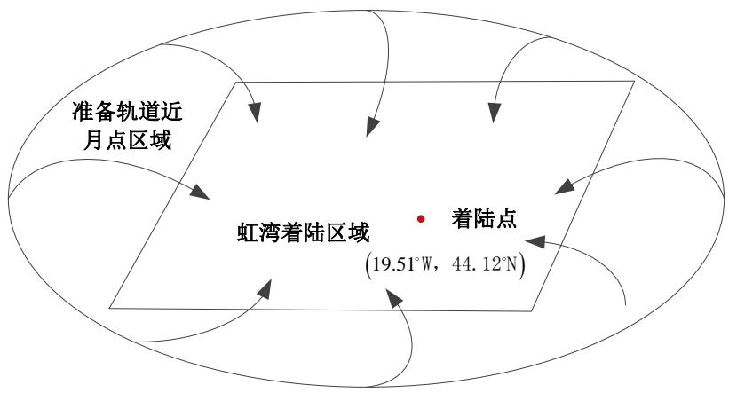

<details>
<summary>text_image</summary>

准备轨道近
月点区域
虹湾着陆区域
着陆点
(19.51°W, 44.12°N)
</details>

图3 空间区域示意图

由于在着陆区域内接近着陆点的近月点有无数，由上文确定的嫦娥三号水平的位移 s，可以在月球上表面 15000m 处确定确定准备轨道近月点区域，由此可以通过优化模型在该区域确定最后的近月点。

## （3）最优近月点的确定

①坐标的转化

为了便于计算我们参考地心惯性坐标系与地球经纬坐标系，建立了月心惯性坐标系与月球经纬坐标系的转化公式。大地经纬坐标（纬度 $\varphi$ ，经度 $\lambda$ ）可以用地心直角坐标X、Y、Z系表示，其中直角坐标系原点位于月心；Z为极轴，向北为正；X轴穿过本初子午线赤道的交点；Y轴穿过赤道与东经90°的交点。由于月球并不是一个均匀的球体，为了使得坐标的转化更为精确，本文考虑椭球的偏心率，得到如下转化公式：

设月球的长半轴为a，短半轴为b

$$
X = (v + h) \cos \varphi \cos \lambda , Y = (v + h) \cos \varphi \sin \lambda , Z = \left[ \left(1 - e ^ {2}\right) v + h \right] \sin \varphi
$$

式中：v 为纬度 $\varphi$ 处的卯酉圈经纬半径， $a/\left(1-e^{2}\sin^{2}\varphi\right)^{0.5}$ ， $\varphi$ 和 $\lambda$ 分别为坐标的经度和纬度，h 为相对月球面的高度，c 为椭球第一偏心率， $e^{2}=\left(a^{2}-b^{2}\right)/a^{2}$ 。

②二维动力学模型的建立

，我们假设对于从近月点到预着陆点在一个平面内，如图建立极坐标系取月心 $o$ 为坐标原点， $oy$ 指向着陆转移轨道的近月点 $A$ ； $r$ 为探测器到月心的距离； $\theta$ 是 $oy$ 和 $or$ 的夹角； $\psi$ 为推力方向与垂线的夹角； $F$ 为制动的推力。

可得动力学模型:

$$
\left\{ \begin{array}{l} \dot {r} = v \\ \dot {v} = \frac {F}{m} \sin \psi - \frac {\mu}{r ^ {2}} + r \omega^ {2} \\ \dot {\theta} = \omega \\ \dot {\omega} = - \frac {F}{m r} \cos \psi + \frac {2 v \omega}{r} \\ \dot {m} = - \frac {F}{C} \end{array} \right. \tag {5.5}
$$

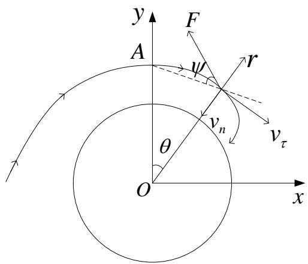

<details>
<summary>text_image</summary>

y
F
A
ψ
r
vₙ
θ
O
x
vₜ
</details>

图4 月心极坐标系

其中 v 为 or 方向上的速度， $\omega$ 为探测器围绕月心的角速度，C 为制动发动机比冲。
③初始条件的确定

探测器在近月点处开始软着陆，即近月点为系统初始点。根据近月点处飞行器的状态可知系统的初值为：

$$
r (0) = r _ {0}, \quad v (0) = 0, \quad \theta (0) = 0, \quad \omega (0) = \omega_ {0}, \quad m (0) = m _ {0} \tag {5.6}
$$

其中 $r_0$ 是月心到近月点的距离即 $r_0 = R + 15km$ ， $m_0$ 为探测器初始质量

④终端状态的确定

假定终端时刻 $t_{f}$ 自由，考虑到软着陆的目的，系统终端状态应满足如下要求：

$$
r (t _ {f}) = r _ {f}, \quad 0 \leq v (t _ {f}) \leq v _ {f}, \quad \omega (t _ {f}) = 0 \tag {5.7}
$$

其中 $r_{f}$ 是月球半径，， $v_{f}$ 为探测器到到达月球表面所允许的最大速度。此外，整个软着陆过程还应有 $r(t_{f}) \geq r_{f}$ ， $t \in [0, t_{f}]$

⑤目标函数的确定

探测器的剩余质量 $J = m(0) - m(t_{f}) = m_{0} - m(t_{f})$

⑥ 基于燃料消耗的最优近月点选取模型

因此对于主制动阶段最优控制策略模型可以归纳如下：求解初始条件为（5.6）的系统的控制函数 $u = [F\psi ]^T$ ，使 $\min J = m(0) - m(t_f) = m_0 - m(t_f)$ ，且满足终端约束（5.7）

(4) 近月点与远月点的速度大小确定

根据能量守恒、开普勒第二定律（面积定律），建立以下模型

$$
\left\{ \begin{array}{c} r _ {1} v _ {1} = r _ {2} v _ {2} \\ \frac {1}{2} m v _ {1} ^ {2} + m g h = \frac {1}{2} m v _ {2} ^ {2} + m g H \end{array} \right. \tag {5.8}
$$

则近月点的速度，近月点的速度：

$$
v _ {1} = \sqrt {\frac {2 g (H - h) r _ {2} ^ {2}}{r _ {2} ^ {2} - r _ {1} ^ {2}}}, v _ {2} = \sqrt {\frac {2 g (H - h) r _ {1} ^ {2}}{r _ {2} ^ {2} - r _ {1} ^ {2}}} \tag {5.9}
$$

其中：m 为卫星的质量， $h_{1}$ 为海拔高度，h 近月点距月球表面的距离；

$r_{1}=h+r_{0}+h_{1},\quad r_{2}=H+r_{0}+h_{1},\quad r_{0}$ 月球半径，H远月点距月球表面的距离，g月球重力加速度， $v_{1}$ 近月点的速度， $v_{2}$ 近月点的速度。

## (5) 近月点远月点几何关系

设近月点的坐标坐标为 $(x_{0},y_{0},z_{0})$ ，则根据几何关系推导出远月点的坐标 $(x_{0}^{\prime},y_{0}^{\prime},z_{0}^{\prime})$ ，为：

$$
(x _ {0} ^ {\prime}, y _ {0} ^ {\prime}, z _ {0} ^ {\prime}) = - \frac {a + c}{a - c} (x _ {0}, y _ {0}, z _ {0})
$$

其中 a 为椭圆轨道的长轴，c 为焦点长.

## 5.1.3 问题一模型的求解

## (1) 近月点速度的求解

由 $m_0 = 2400kg$ ， $R = 1737.013km$ ， $r_1 = R + 15km$ ， $r_2 = R + 100km$

$$
\left\{ \begin{array}{c} r _ {1} v _ {1} = r _ {2} v _ {2} \\ \frac {1}{2} m v _ {1} ^ {2} + m g h = \frac {1}{2} m v _ {2} ^ {2} + m g H \end{array} \right.
$$

$$
v _ {1} = \sqrt {\frac {2 g (H - h) r _ {2} ^ {2}}{r _ {2} ^ {2} - r _ {1} ^ {2}}} = 1 6 9 2 m / s
$$

## (2) 嫦娥三号运动轨迹的确定

由简化的抛物线坐标，根据 A 点初始状态 $A(0,15000)$ ， $v_{A}=1692m/s$ ；根据 B 点初始状态 $B(0,3000)$ ， $v_{B}=57m/s$ ；

$$
\left\{ \begin{array}{l} 2 g h = v _ {B y} \quad a _ {x} = \frac {v _ {A} - v _ {B x}}{t} \\ t = \frac {v _ {B y}}{g} \quad s = v _ {A} t - \frac {1}{2} a t ^ {2} \end{array} \right.
$$

将 A、B 点状态带入求得

$$
\left\{ \begin{array}{l} v _ {B y} = 1 9 7. 9 8 9 9 m / s \quad a _ {x} = 1 2. 3 0 8 5 m / s ^ {2} \\ t = 1 2 1. 2 1 8 3 s \quad s = 1 1. 4 4 3 k m \end{array} \right.
$$

## (3) 准备轨道近月点区域的求解

通过抛物线平行移动的距离 s 求得近月点区域在月球表面的投影范围，由此确定该范围为 $\left(p_{x}, p_{y}\right)$ 。

$$
\left(p _ {x} = 5 8 4. 8 5 8 9 k m, p _ {y} = 3 1 9. 8 5 8 9 k m\right)
$$

已知月球的椭球长半轴 $a = 384339km; e = 1 / 963.7256$ ； $N = \frac{a}{(1 - e^2\sin^2\varphi)^{1/2}}$ 是该点的卯酉曲率半径。再根据高斯-克吕格坐标转化算法算法：

$$
x = X + \frac {1}{2} N \sin B \cos B (\triangle L) ^ {2} \left[ 1 + \frac {1}{1 2} (\triangle L) ^ {2} \cos^ {2} B \times \left(5 - t ^ {2} + 9 \eta^ {2} + 4 \eta^ {4}\right) + \right.
$$

$$
\frac {1}{3 6 0} \big (\triangle L \big) ^ {4} \cos^ {4} B \times \big (6 1 - 5 8 t ^ {2} + t ^ {4} \big) ]
$$

$$
\begin{array}{l} y = N \cos B (\triangle L) \left[ 1 + \frac {1}{6} (\triangle L) ^ {2} \cos^ {2} B \times \left(1 - t ^ {2} + \eta^ {2}\right) + \frac {1}{1 2 0} (\triangle L) ^ {4} \times \cos^ {4} B \times \right. \\ \left(5 - 1 8 t ^ {2} + t ^ {4} - 1 4 \eta^ {2} - 5 8 \eta^ {2} t ^ {2}\right) ] \\ \end{array}
$$

求准备轨道近月点范围为

$$
\left(5 5. 3 0 ^ {\circ} W; 1 6. 5 6 ^ {\circ} w; 1 5 k m\right), \left(5 5. 3 0 ^ {\circ} N; 4 0. 5 0 ^ {\circ} N; 1 5 k m\right)
$$

## (4) 最优近月点的求解

运用参数化控制的方法，其主要思想是用若干个分段常值函数逼近最优解，将最优控制问题转化为参数优化问题。将动态的月球探测器软着陆燃料消耗最优控制问题转化成静态的参数优化问题，利用经典的参数优化算法即可求出登月飞行器的软着陆最优控制的一组逼近解。利用此算法，增加时间的分段个数 p 重新进行优化。经过多次优化即可得到满意精度的最优解。具体求解算法步骤如下：

step1 给出分点个数 $n_p$ ，约束变换技术中参数 $\varepsilon$ 和 $\tau$ ，选定序列[0,1]区间上的单调序列 $\{\xi_k^p\}_{k=0}^{n_p}$ ;

step2 任意选取一组参数 $\{\sigma_{F,j}^{p}\}_{i=0}^{n_{p}}$ ， $\{\sigma_{\psi,j}^{p}\}_{i=1}^{n_{p}}$ 和 $\{\delta_{\psi,j}^{p}\}_{i=1}^{n_{p}}$ ;

step3 将参数代入给定系统和终端状态约束与不等式约束，并求取指标函数关于参数的梯度

step4 利用经典的优化算法更新 $\{\sigma_{F,j}^{p}\}_{i=0}^{n_{p}}$ ， $\{\sigma_{\psi,j}^{p}\}_{i=1}^{n_{p}}$ 和 $\{\delta_{\psi,j}^{p}\}_{i=1}^{n_{p}}$ ;

step5 判断更新后的参数是否满足终端状态约束和不等式约束，同时指标泛函的值是否满足要求；满足则程序退出，给出结果，否则转回步骤 step2。

给定参数 $\varepsilon=0.01,\quad\tau=0.0025,\quad n_{p}=30,\quad\zeta_{k}^{p}=\frac{k}{n_{p}},\quad k=0,1,\cdots n_{p}$

<table><tr><td>地点</td><td>经度</td><td>纬度</td></tr><tr><td>近月点</td><td>20.08°W</td><td>30.1°N</td></tr><tr><td>远月点</td><td>160.49°E</td><td>22.45°S</td></tr></table>

## 5.2 问题二模型建立与求解

## 5.2.1 问题二的分析

## (1) 解决思路

问题二要求，确定嫦娥三号的着陆轨道和在6个阶段的最优控制策略。为确定6个阶段的最优控制策略，在第一问确定了最优近月点的基础上。因此需要对各阶段轨道进行修正，使得嫦娥三号满足每个阶段在关键点所处的状态，并准确安全到达着陆点附近。

## (2) 高程图信息的读取

表 1 距月面 2400m 处的数字高程图信息表

<table><tr><td></td><td>1</td><td>2</td><td>3</td><td>4</td><td>5</td><td>6</td><td>7</td><td>...</td></tr><tr><td>1</td><td>102</td><td>99</td><td>98</td><td>96</td><td>97</td><td>97</td><td>96</td><td>...</td></tr><tr><td>2</td><td>99</td><td>98</td><td>97</td><td>96</td><td>97</td><td>97</td><td>97</td><td>...</td></tr><tr><td>3</td><td>98</td><td>97</td><td>96</td><td>96</td><td>97</td><td>98</td><td>98</td><td>...</td></tr></table>

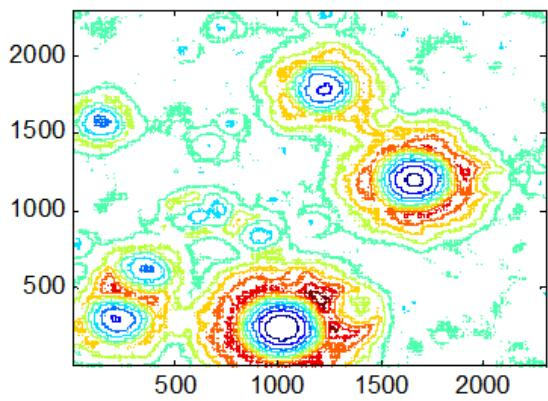

<details>
<summary>contour</summary>

| X (range) | Y (range) | Intensity Level |
| --- | --- | --- |
| 0~2500 | 0~2500 | Low to High (Color Gradient) |
</details>

图 5 高程信息图

## 5.2.2 问题二模型的建立

## (1) 三维动力学模型的建立

首先我们建立月心惯性坐标系 $oxyz$ 和月固坐标系 $ox_{L}y_{L}z_{L}$

  
图 6 月心惯性坐标系

在月固坐标系中探测器的动力学模型可表示如下:

$$
\left\{ \begin{array}{l l} \dot {x} _ {L} = V _ {x L} & \dot {V} _ {x L} = O F / m - g _ {x L} - 2 \omega_ {L} V _ {z L} \\ \dot {y} _ {L} = V _ {y L} & \dot {V} _ {y L} = P F / m - g _ {y L} \\ \dot {z} _ {L} = V _ {z L} & \dot {V} _ {z L} = Q F / m - g _ {z L} + 2 \omega_ {L} V _ {x L} \\ \dot {m} = - F _ {\text {thrust}} / v _ {e} \end{array} \right. \tag {5.10}
$$

其中 $V_{xL}$ , $V_{yL}$ 和 $V_{zL}$ 为探测器速度矢量在月固坐标系各轴上的投影， $g_{xL}$ , $g_{yL}$ 和 $g_{zL}$ 为该高度月球重力加速度在月固坐标系各轴上的投影， $\omega_{L}$ 为月球自转角速度。 $F_{thrust}$ 是发动机的推力，单位是牛顿； $v_{e}$ 是以米/秒为单位的比冲； $\dot{m}$ 是单位时间燃料消耗的公斤数。

## (2) 着陆准备轨道

由第一问近月点速度的计算模型，可以确定近点速度 $v_{A}$ 的表达式为

$$
v _ {A} = \frac {b}{a - c} \cdot \sqrt {\frac {G M}{a}}
$$

## (3) 主减速阶段

## ①初始条件确定

假设仅仅已知探测器在软着陆起始点到月心的距离 $r_{0}$ 和探测器初始质量 $m_{0}$ ，而软着陆起始点另两个空间位置信息角 $\alpha$ 与 $\beta$ 角的初始值与未知，因而令 $\alpha_{0}$ 与 $\beta_{0}$ 为系统待定参数，则系统初始状况可以表示为：

$$
\left\{ \begin{array}{l l} x _ {L} (0) = r _ {0} \cos \alpha_ {0} \sin \beta_ {0} & v _ {x L} (0) = v _ {0} \cos \alpha_ {0} \sin \beta_ {0} \\ y _ {L} (0) = r _ {0} \cos \beta_ {0} & v _ {y L} (t _ {f}) = v _ {0} \sin \beta_ {0} \\ z _ {L} (0) = r _ {0} \sin \alpha_ {0} \cos \beta_ {0} & v _ {z L} (t _ {f}) = v _ {0} \sin \alpha_ {0} \cos \beta_ {0} \\ m (0) = m _ {0} \end{array} \right. \tag {5.11}
$$

其中 $v_{0}$ 为探测器的初始速率

由于探测器是经过无动力下降的霍曼转移段来到软着陆初始点（亦即霍曼转椭圆轨道的近月点），因而初始速率 $v_{0}$ 可由下式给出

$$
v _ {0} = \sqrt {\frac {2 \mu r _ {a}}{r _ {0} (r _ {a} + r _ {0})}} \tag {5.12}
$$

其中 $r_{0}$ 为已知的远月点到月心的距离。

## ②终端状态确定

假定终端时刻 $t_f$ 自由，探测器定点软着陆的主制动段结束点位置坐标信息 $(x_{Lf}, y_{Lf}, z_{Lf})$ 已知。主减速段将基本位于着陆点正上方 $3\mathrm{km}$ 处，此时探测器速度为 $57\mathrm{m/s}$ ，进入最终着陆段，因而系统(2-15)终端状态应当满足如下要求：

$$
\left\{ \begin{array}{l l} x _ {L} (t _ {f}) = x _ {L f} & \sqrt {v _ {x L} (t _ {f}) ^ {2} + v _ {y L} (t _ {f}) ^ {2} + v _ {z L} (t _ {f}) ^ {2}} = 5 7 m / s \\ y _ {L} (t _ {f}) = y _ {L f} & h = \sqrt {x _ {L} ^ {2} + y _ {L} ^ {2} + z _ {L} ^ {2}} - r _ {f} \geq 0 \\ z _ {L} (t _ {f}) = 3 0 0 0 \end{array} \right. \tag {5.13}
$$

其中 $r_{f}$ 是主制动段结束点到月心距离，在本文等于月球半径再加上 3km。

## ③目标函数确定

探测器的剩余质量为 $J = m(0) - m(t_{f}) = m_{0} - m(t_{f})$

## ④基于燃料的消耗最优控制策略模型

因此对于主制动阶段最优控制策略模型可以归纳如下：求解初始条件下的三维动力学系统的控制函数 $u = [F\theta \psi ]^T$ ，使 $\min J = m(0) - m(t_f) = m_0 - m(t_f)$ ，且满足终端约束条件

## (3) 快速调整

为使嫦娥三号进行快速的调整，使得水平速度变为0m/s，并且要达到距离月球表面 $r=R+2400m$ 的过程中嫦娥三号通过的路径最短。也即是

$$
\min S _ {1} = \int_ {t _ {0}} ^ {t _ {f}} \Big (v _ {x} + v _ {y} + v _ {z} \Big) d t \tag {5.14}
$$

我们以着陆点上方 $(x, y, 2400)$ 作为预着陆点，求解系统的控制函数 $u_{2} = [F_{2} \theta_{2} \psi_{2}]^{T}$ ，使 $\min S_{1} = \int_{t_{0}}^{t_{f}} (v_{x} + v_{y} + v_{z}) dt$ ，且满足终端约束

$$
\left\{ \begin{array}{l} x _ {L} (t _ {f}) = x _ {L c} \quad v _ {x L} (t _ {f}) = 0 \\ y _ {L} (t _ {f}) = y _ {L c} \quad v _ {y L} (t _ {f}) = v \\ z _ {L} (t _ {f}) = 2 4 0 0 v _ {z L} (t _ {f}) = 0 \end{array} \right. \tag {5.15}
$$

## (4) 粗避障

①安全着陆区域确定

step1 最佳着陆区平面拟合

首先定义备选着陆区坐标系。由于着陆区域尺寸远小月球半径，所以可以将着陆区域近似为平面。将着陆区域原点定义为着陆区坐标系的原点，x轴正向指向正东，y轴正向指向正北，z轴与x，y轴组成右手系。附件提供了离散的数据点的高程信息，每一个数据点视为一个网格点，在着陆区坐标心中可以用三维坐标 $x_{i}=[x_{i},y_{i},z_{i}]^{T}$ 表示，每一个网格点周围的数据点可以用一系列坐标点表示

$$
N = \{x _ {1}, x _ {2}, \dots , x _ {m} \}
$$

随机选取地表高程图中 N 个数据点中三个不共线的样本点 $\{x_{a}, x_{b}, x_{c}\}$ ，可以唯一确定平面

$$
n \bullet x + d = 0
$$

其中 $n$ 为着陆区平面的法向量

$$
n = (x _ {b} - x _ {a}) (x _ {c} - x _ {a})
$$

d 为平面偏移量

$$
d = - n \bullet x _ {a}
$$

利用上述计算得到的平面，计算 $N$ 中其他数据点 $x_{j}$ 相对于该平面的残差值

$$
r _ {j} = (n \bullet x _ {j} + d) ^ {2}
$$

从而可以得到残差 $r_{j}$ 的中值 $r_{M}$

经过次迭代计算，选取残差中值 $r_{M}$ 中最小的一项 $r_{med}$ ，所对应的最小中值平面参数 $\{n_{best}, d_{best}\}$ 。另外，标准偏差值定义为

$$
\sigma_ {r} ^ {2} = [ 1. 4 8 2 6 (1 + \frac {5}{t - 3}) ] ^ {2} r _ {m e d}
$$

则 $x_{k}$ 属于内点。

利用得到的所有内点 $(x_{in},y_{in},z_{in})$ ，最佳着陆区平面方程为

$$
a x + b y + c = z
$$

定义 $A = \begin{bmatrix} x_{i1} & y_{i1} & 1 \\ \vdots & \vdots & \vdots \\ x_{in} & y_{in} & 1 \end{bmatrix}$ , $b = \begin{bmatrix} z_{i1} \\ \vdots \\ z_{in} \end{bmatrix}$ , $X = \begin{bmatrix} a \\ b \\ c \end{bmatrix}$ , 则最佳着陆平面参数可以通过最小二乘法拟合得到。

$$
X = (A ^ {T} A) ^ {- 1} (A ^ {T} b)
$$

step2 着陆区域相对高程计算

通过数字高程信息与最佳着陆平面之间的相对高程信息，可以对着陆区内的地形进行分类，并计算各类地形所占的比例。对于着陆区域内的点 $x_{i}=\left[x_{i},y_{i},z_{i}\right]^{T}$ ，其对应的最佳着陆平面点为 $x_{i}=[x_{i},y_{i},\hat{z}_{i}]^{T}$ ，其中 $\hat{z}_{i}=ax_{i}+by_{i}+c$ ，相对高程为 $\Delta h_{i}=\left|z_{i}-\hat{z}_{i}\right|$ 。

step3 安全着陆区域的选取

安全着陆区选取，采用从着陆器中心开始顺时针螺旋前进搜索的方法，直至找到符合安全着陆要求的着陆区域为止

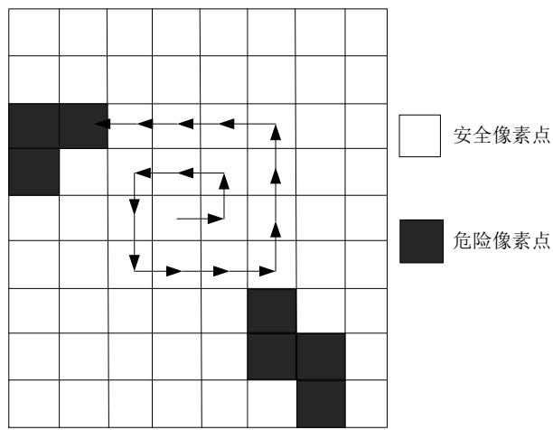

<details>
<summary>flowchart</summary>

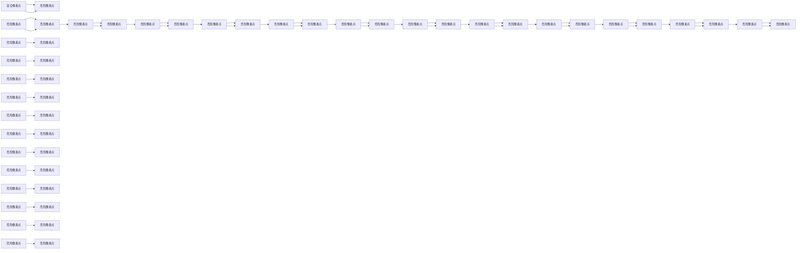
</details>

图 7 安全着陆区域

通过相对高程信息，可以将相对高程小于 50m 的区域设定为安全着陆区域。

②着陆状态粗调整

我们将安全着陆区域的中心 $(x_{Lc}, y_{Lc}, 100)$ 作为预着陆中心，求解系统(2-15)的控制函数 $u_{3} = [F_{3} \theta_{3} \psi_{3}]^{T}$ ，使 $\min J_{2} = m(0) - m(t_{f}) = m_{0} - m(t_{f})$ ，且满足终端约束

$$
\left\{ \begin{array}{l l} x _ {L} (t _ {f}) = x _ {L c} & v _ {x L} (t _ {f}) = 0 \\ y _ {L} (t _ {f}) = y _ {L c} & v _ {y L} (t _ {f}) = 0 \\ z _ {L} (t _ {f}) = 1 0 0 & v _ {z L} (t _ {f}) = 0 \end{array} \right. \tag {5.16}
$$

③悬停的定义

本文对航天器悬停的定义，是指通过对嫦娥三号进行控制，使嫦娥三号相对着陆点上方的位置始终保持不变，在着陆点上方的当地轨道坐标系 $T - xyz$ 中，嫦娥三号相对于着陆点上方仿佛是静止“悬停”于某个固定点上。其实质是，在悬停的过程中，在此坐标系内嫦娥三号相对于着陆点上方是静止不动的，相对位置不变，相对速度为零。

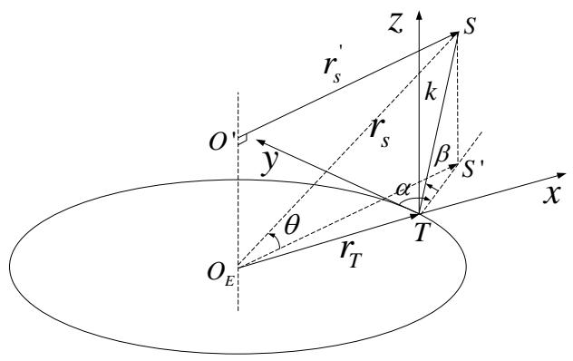

<details>
<summary>text_image</summary>

O'
y
θ
r_s
r_s
k
S
z
β
S'
α
T
x
O_E
r_T
</details>

图 8 悬停的过程示意图

为了使得嫦娥三号 C 与目标点相对静止，因此嫦娥三号 C 应该与着陆点围绕同一轴线进行旋转，其轨道中心为 $O'$ ，显然嫦娥三号的运行轨道为非开普勒轨道，并且嫦娥三号 C 的轨道平面与着陆点 T 的轨道平面平行，两轨道之间的距离 d 保持不变，记为：

$$
d = O _ {E} O ^ {\prime} = k \times \sin \beta
$$

由悬停定义知，嫦娥三号和着陆点的轨道平面法矢量方向重合且轨道角速度大小始终保持相等方可实现悬停飞行。令着陆点 $T$ 的运行速度为 $\nu_{T}$ ，嫦娥三号 $C$ 的速度表示 $\nu_{c}$

$$
r _ {T} \times v _ {T} = r _ {C} ^ {\prime} \times v _ {1} ^ {\prime}
$$

$$
\omega_ {T} = \omega_ {C} = \frac {v _ {T}}{r _ {T}} = \frac {\dot {v _ {C}}}{\dot {r _ {C}}} = \sqrt {\frac {\mu}{r _ {T} ^ {3}}}
$$

式中： $\mu$ 为月球引力常数。由于 $r_{T} \perp v_{T}$ 、 $r_{C}^{\prime} \perp v_{C}^{\prime}$ ，因此 $v_{T}$ 和 $v_{C}$ 矢量之间的夹角角应当当等于 $\angle S^{\prime} O_{E} T$ ，即：

$$
\varphi = \arccos \frac {v _ {T} \cdot v _ {C} ^ {\prime}}{v _ {T} v _ {C} ^ {\prime}} = \arctan \frac {k \cos \beta \cos \alpha}{r _ {T} + k \cos \beta \sin \alpha} \tag {5.17}
$$

如图 2.7 所示, $\varphi$ 以目标地心矢径方向为基准,顺时针为正逆时针为负。即 $\alpha\in[-90^{\circ},90^{\circ}]$ 时, $\varphi\geq0$ , 否则 $\varphi<0$ , 图中的 $\varphi$ 为正值。

嫦娥三号 C 的轨道半径 $r_{c}$ 可以写为

$$
r _ {C} ^ {\prime} = \sqrt {r _ {T} ^ {2} + (k \cos \beta) ^ {2} + 2 r _ {T} \cos \beta \cos \left(\frac {\pi}{2} \alpha\right)} \tag {5.18}
$$

则嫦娥三号 C 的月心距可表示为:

$$
r _ {C} = \sqrt {\left(r _ {C} ^ {\prime}\right) ^ {2} + \left(k \sin \beta\right) ^ {2}} \tag {5.19}
$$

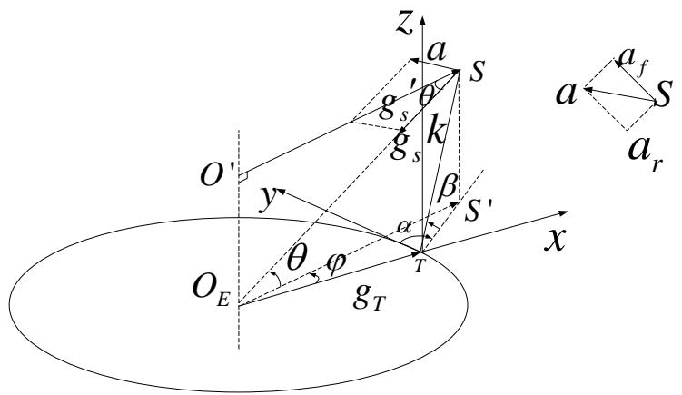

<details>
<summary>text_image</summary>

z
a
S
g′s
θ
k
g′s
β
y
α
S′
O′
O′E
θ
φ
T
x
g′T
a′f
a
S
a′r
</details>

图 9 悬停的过程示意图

着陆点 $T$ 和嫦娥三号 $C$ 的受力分析如图所示。嫦娥三号 $C$ 本身受到月球的万有引力作用，其万有引力加速度为 $g_{C}$ ，嫦娥三号 $C$ 的向心加速度 $g_{C}^{\prime}$ 与 $r_C^{\prime}$ 方向相反。 $a_r$ 方向由 $C$ 指向月心 $O_E$ ， $SS'O_E$ 平面内 $a_r$ 顺时针旋转 $90^\circ$ 为 $a_f$ 的指向。嫦娥三号 $C$ 所需的控制加速度 $a$ 采用下式计算得到

$$
a = g _ {c} ^ {\prime} - g _ {c}
$$

$g_{c}^{\prime}$ 和 $g_{c}$ 之间的夹角为 $\theta$ :

则任务器需要施加的径向、切向标称控制加速度 $a_{r}$ 、 $a_{f}$ 分别表示将为：

$$
\left\{ \begin{array}{l l} a _ {r} = g _ {C} ^ {\prime} \cos \theta - g _ {C} & g _ {C} = \frac {\mu}{r _ {S} ^ {2}} \\ a _ {f} = g _ {C} ^ {\prime} \sin \theta & g _ {C} ^ {\prime} = r _ {C} ^ {\prime} \omega_ {C} ^ {2} = r _ {C} ^ {\prime} \frac {\mu}{r _ {T} ^ {3}} \end{array} \right. \tag {5.20}
$$

## (5) 精避障

## ①区域最优点确定

通过粗避障阶段探测器已经确定了安全着陆区域，因此在该区域内探测器需要选择一个最优着陆点，对于该着陆点的选择应该考虑一下原则：1. 坡度必须小于一定的角度，以避免着陆器接触月面时发生倾覆；2. 突起的石块高度和凹坑陷入的深度都不能超过一定值，以避免磕碰和翻倒；3. 安全着陆区尽可能接近当前着陆器位置，以避免出现过多的推进剂消耗。

step1 着陆点坡度计算

由于高程数据只能提供离散的数据点信息，需要通过网格点周围多个临近数据点计算得到网格点的坡度。

对于网格点 $x_{i}$ ，如果数据点 $x$ 满足 $\sqrt{(x - x_i)^2 + (y - y_i)^2} < \rho$ 则 $x$ 属于网格点 $x_{i}$ 的临近数据点，式中 $\rho$ 为指定的距离容限。

网格点 $x_{i}$ 的临近数据点可用集合

$$
M = \{x _ {1}, x _ {2}, \dots , x _ {l} \}
$$

表示，在集合 M 中任取两个数据点 $x_{d}$ ， $x_{e}$ ，计算地理法向量

$$
n _ {g} = (x _ {d} - x _ {i}) \times (x _ {e} - x _ {i})
$$

网格点的坡度定义为最佳着陆区平面法向量 $n_{best}$ 与地理法向量 $n_g$ 之间的夹角

$$
\alpha_ {i} = a \cos (n _ {\text {best}} \cdot n _ {g} / \| n _ {\text {best}} \| \| n _ {g} \|)
$$

最终将 $\alpha_{i}$ 的中值定义为该网格点的坡度值。

$$
\alpha = M e d (\alpha_ {i})
$$

step2 着陆点相对高程计算 $\Delta h_{i}=\left|z_{i}-\hat{z}_{i}\right|$

step3 最优着陆点的选择

采用从着陆器中心开始顺时针螺旋前进搜索的方法，直至找到符合安全着陆要求的着陆点为止

将相对高程小于 50m，并且坡度值小于 $2^{\circ}$ 的区域设定为安全着陆点

②着陆状态精调整

我们将安全着陆点 $(x_{L b e s t}, y_{L b e s t} 30$ 作为预着陆中心，求解系统(2-15)的控制函数 $u_4 = [F_4 \theta_4 \psi]^T$ ，使 $\min J_4 = m(0) - m(t_f) = m_0 - m(t_f)$ ，且满足终端约束

$$
\left\{ \begin{array}{l l} x _ {L} (t _ {f}) = x _ {L b e s t} & v _ {x L} (t _ {f}) = 0 \\ y _ {L} (t _ {f}) = y _ {L b e s t} & v _ {y L} (t _ {f}) = v \\ z _ {L} (t _ {f}) = 3 0 & v _ {z L} (t _ {f}) = 0 \end{array} \right. \tag {5.22}
$$

## (6) 缓速下降

我们将安全着陆点 $(x_{Lb es}, y_{Lb es})^4$ 作为预着陆中心，求解系统的控制函数 $u_5 = [F_5, \theta_5, \psi_5]^T$ ，使 $\min J = m(0) - m(t_f) = m_0 - m(t_f)$ ，且满足终端约束

$$
\left\{ \begin{array}{l l} x _ {L} (t _ {f}) = x _ {L b e s t} & v _ {x L} (t _ {f}) = 0 \\ y _ {L} (t _ {f}) = y _ {L b e s t} & v _ {y L} (t _ {f}) = 0 \\ z _ {L} (t _ {f}) = 4 & v _ {z L} (t _ {f}) = 0 \end{array} \right. \tag {5.23}
$$

## 5.2.3 问题二模型的求解

由于每个阶段都是求解已知初始条件的动力学模型系统的控制函数 $u = [F\theta \psi ]^T$ ，使 $\min J = m(0) - m(t_f) = m_0 - m(t_f)$ ，且满足终端约束。因此我们在此仅将主减速阶段作为示范进行求解，其余阶段求解方法类似。

同样我们引入参数化控制的方法, 利用参数化控制器和强化技术以及约束变换技术, 问题转化为如下

给定系统

$$
\left\{ \begin{array}{l l} d x _ {L} / d s = v ^ {p} (s) \hat {v} _ {x L} & d \hat {v} _ {x L} / d s = v ^ {p} (s) \left(O F ^ {p} / m - g _ {x L} + 2 \omega_ {L} \hat {v} _ {z L}\right) \\ d y _ {L} / d s = v ^ {p} \hat {v} _ {y L} & d \hat {v} _ {y L} / d s = v ^ {p} \left(P F ^ {p} / m - g _ {y L}\right) \\ d \hat {z} _ {L} / d s = v ^ {p} \hat {v} _ {z L} & d \hat {v} _ {z L} / d s = - v ^ {p} F ^ {p} / v _ {e} \\ d t / d s = v ^ {p} \end{array} \right. \tag {5.24}
$$

及初始条件

$$
\left\{ \begin{array}{l l} x _ {L} (0) = r _ {0} \cos \alpha_ {0} \sin \beta_ {0} & \hat {v} _ {x L} (0) = v _ {0} \cos \alpha_ {0} \sin \beta_ {0} \\ y _ {L} (0) = r _ {0} \cos \beta_ {0} & \hat {v} _ {y L} (t _ {f}) = v _ {0} \sin \beta_ {0} \\ \hat {z} _ {L} (0) = r _ {0} \sin \alpha_ {0} \cos \beta_ {0} & \hat {v} _ {z L} (t _ {f}) = v _ {0} \sin \alpha_ {0} \cos \beta_ {0} \\ m (0) = m _ {0} \end{array} \right. \tag {5.25}
$$

约束条件变为

$$
\left\{ \begin{array}{l l} g _ {1} = x _ {L} (1) - x _ {L f} = 0 & g _ {4} = \int_ {0} ^ {1} v ^ {p} G _ {\varepsilon} d s + \tau \geq 0 \\ g _ {2} = y _ {L} (1) - y _ {L f} = 0 & g _ {5} = t (1) - t _ {f} = 0 \\ g _ {3} = \hat {z} _ {L} (1) - z _ {L f} = 0 \end{array} \right. \tag {5.26}
$$

其中 $L_{\varepsilon}(h) = \begin{cases} h, & \text{if } h \geq \varepsilon \\ (h - \varepsilon)^2 / 4\varepsilon, & \text{if } -\varepsilon < h < \varepsilon; \\ 0, & \text{if } h \leq -\varepsilon \end{cases}$ $h(s) = h(t(s)) = \sqrt{x_L^2 + y_L^2 + z_L^2} - r_f$

控制器

$$
u (s) = \left[ \begin{array}{l} \theta^ {p} (s) = \sum_ {i} ^ {n _ {p}} \sigma_ {\theta , i} ^ {p} \chi_ {[ \xi_ {i - 1} ^ {p}, \xi_ {i} ^ {p})} (s) \\ \psi^ {p} (s) = \sum_ {i} ^ {n _ {p}} \sigma_ {\psi , i} ^ {p} \chi_ {[ \xi_ {i - 1} ^ {p}, \xi_ {i} ^ {p})} (s) \\ F ^ {p} (s) = \sum_ {i} ^ {n _ {p}} \sigma_ {F, i} ^ {p} \chi_ {[ \xi_ {i - 1} ^ {p}, \xi_ {i} ^ {p})} (s) \\ v ^ {p} (s) = \sum_ {i} ^ {n _ {p}} \delta_ {i} ^ {p} \chi_ {[ \xi_ {i - 1} ^ {p}, \xi_ {i} ^ {p})} (s) \end{array} \right] \tag {5.27}
$$

给定系统以及含有系统参数的初始条件，选取适当的控制参数 $\{\sigma_{\theta,i}^{p}\}_{i=1}^{n_{p}}$ ， $\{\sigma_{\psi,i}^{p}\}_{i=1}^{n_{p}}$ 和 $\{\sigma_{i}^{p}\}_{i=1}^{n_{p}}$ ， $\{\delta_{i}^{p}\}_{i=1}^{n_{p}}$ 以及系统参数 $\alpha_{0}$ 与 $\beta_{0}$ ，最小化指标函数且满足约束

将动态的月球探测器软着陆燃料消耗最优控制问题转化成静态的参数优化问题，利用经典的参数优化算法即可求出登月飞行器的软着陆最优控制的一组逼近解。利用此算法，增加时间的分段个数 p 重新进行优化。经过多次优化即可得到满意精度的最优解。具体求解算法步骤如下：

step1 给出分点个数 $n_p$ ，约束变换技术中参数 $\varepsilon$ 和 $\tau$ ，选定序列[0,1]区间上的单调序列 $\{\xi_k^p\}_{k=0}^{n_p}$ ;

step2 任意选取一组参数 $\{\sigma_{\theta,i}^{p}\}_{i=1}^{n_{p}}$ ， $\{\sigma_{\psi,i}^{p}\}_{i=1}^{n_{p}}$ 和 $\{\sigma_{i}^{p}\}_{i=1}^{n_{p}}$ ， $\{\delta_{i}^{p}\}_{i=1}^{n_{p}}$ 以及系统参数 $\alpha_{0}$ 和 $\beta_{0}$ ;

step3 将参数代入给定系统和终端状态约束与不等式约束，并求取指标函数关于参数的梯度

step4 利用经典的优化算法更新 $\{\sigma_{\theta,i}^{p}\}_{i=1}^{n_{p}}$ ， $\{\sigma_{\psi,i}^{p}\}_{i=1}^{n_{p}}$ 和 $\{\sigma_{i}^{p}\}_{i=1}^{n_{p}}$ ， $\{\delta_{i}^{p}\}_{i=1}^{n_{p}}$ 以及系统参数 $\alpha_{0}$ 和 $\beta_{0}$ ;

step5 判断更新后的参数是否满足终端状态约束和不等式约束，同时指标泛函的值是否满足要求；满足则程序退出，给出结果，否则转回步骤 step2。

求解结果

给定参数 $\varepsilon=0.01,\quad\tau=0.0025,\quad n_{p}=30,\quad\zeta_{k}^{p}=\frac{k}{n_{p}},\quad k=0,1,\cdots n_{p}$ ，最终利用本文的参数化控制得到主减速末时刻 $t_{f}=450s$ ，下图分别为参数化控制所得的最优推力大小变化曲线和参数化控制所得的最优推力方向角变化曲线

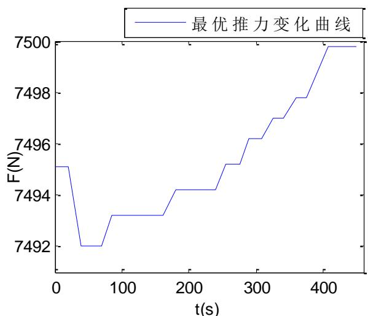

<details>
<summary>line</summary>

| t(s) | F(N) |
| --- | --- |
| 0 | 7495.1 |
| 25 | 7495.1 |
| 35 | 7492.0 |
| 65 | 7492.0 |
| 80 | 7493.2 |
| 160 | 7493.2 |
| 180 | 7494.2 |
| 240 | 7494.2 |
| 260 | 7495.2 |
| 280 | 7495.2 |
| 290 | 7496.2 |
| 310 | 7496.2 |
| 330 | 7497.0 |
| 360 | 7497.8 |
| 380 | 7497.8 |
| 410 | 7499.8 |
| 450 | 7499.8 |
</details>

图 10 最优推力变化曲线

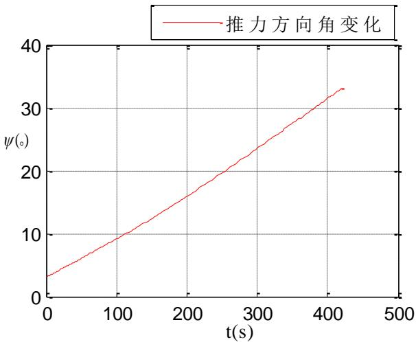

<details>
<summary>line</summary>

| t(s) | \(\psi({}^{\circ})\) |
| --- | --- |
| 0 | ~3.5 |
| 100 | ~9.5 |
| 200 | ~16.0 |
| 300 | ~24.0 |
| 400 | ~31.5 |
</details>

图 11 最优推力方向变化

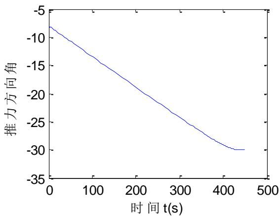

<details>
<summary>line</summary>

| 时间 t(s) | 推力方向角 |
| --- | --- |
| 0 | ~-8 |
| 100 | ~-13 |
| 200 | ~-19 |
| 300 | ~-24 |
| 400 | ~-29 |
| 450 | -30 |
</details>

图 12 推力方向角 $\theta$ 变化曲线

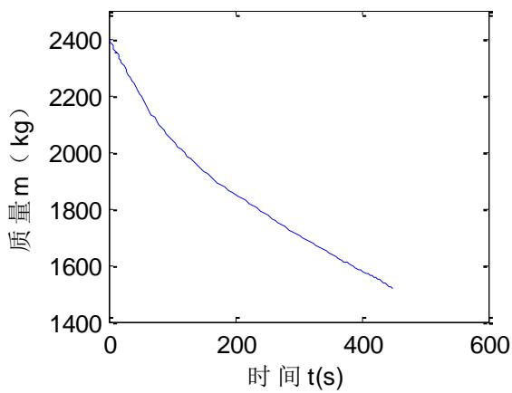

<details>
<summary>line</summary>

| 时间 t(s) | 质量 m (kg) |
| --- | --- |
| 0 | ~2400 |
| 100 | ~2050 |
| 200 | ~1880 |
| 300 | ~1750 |
| 400 | ~1620 |
| 450 | ~1530 |
</details>

图 13 质量变化曲线

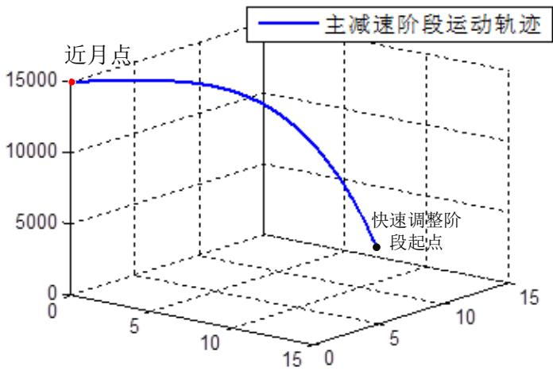

<details>
<summary>line</summary>

| X | Y | 运动轨迹 |
| --- | --- | --- |
| 0 | 0 | 15000 |
| ~12 | ~12 | ~3000 |
</details>

图 14 月球探测器主减速阶段的三维轨迹

## 5.2.2 问题二结果的分析及验证

同理我们可以求解出来粗避障和精避障阶段运动轨迹，并且我们还做出了为避障时的运动轨迹，从下图我们可以看出粗避障和精避障阶段确实是对探测器的运动轨迹产生了影响，即有效的避开了月面的障碍物，确保了探测器软着陆的安全性。

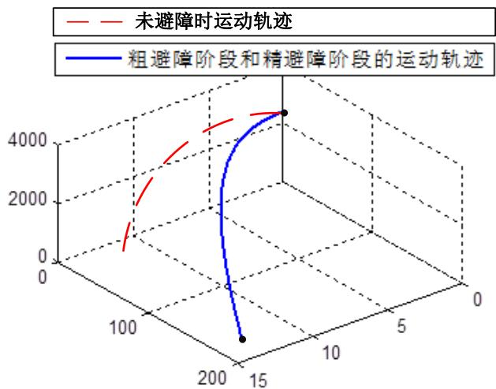

<details>
<summary>line</summary>

| Series | X (range) | Y (range) | Z (range) |
| --- | --- | --- | --- |
| 未避障时运动轨迹 | 0~15 | 0~4500 | 0~4500 |
| 粗避障阶段和精避障阶段的运动轨迹 | 15~200 | 0~4500 | 0~4500 |
</details>

图 15 月球探测器粗避障阶段和精避障阶段的三维轨迹

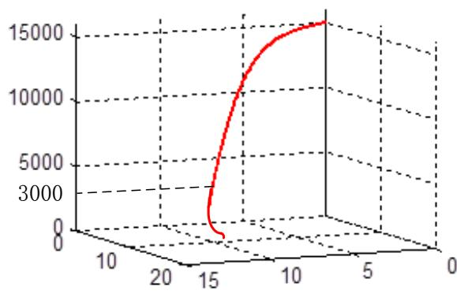

<details>
<summary>surface_3d</summary>

| X | Y | Z |
| --- | --- | --- |
| ~15 | ~8 | ~0 |
| ~16 | ~10 | ~3000 |
| ~17 | ~12 | ~6000 |
| ~18 | ~14 | ~9000 |
| ~19 | ~16 | ~12000 |
| ~20 | ~18 | ~15000 |
</details>

图 16 着陆轨道三维轨迹

## 5.3 问题三模型建立与求解

## 5.3.1 误差分析模型的分析

问题二要求，对于我们设计的着陆轨道和控制策略做相应的误差分析和敏感性分析。对于软着陆轨道而言，误差的来源主要有两部分一部分是系统误差（主要为力学模型误差），另一部分为入轨、测轨误差与轨道控制误差，由此导致了实际近月点在理想近月点坐标波动。

首先需要判断误差传播过程中，误差导致的偏移是否为同一数量级，否则不需要再判断。如果误差在同一数量级，则考虑当近月点坐标在一定误差范围内波动的时候，按照该模型计算出理想着陆点与实际着陆点的偏差。

## 5.3.2 误差分析模型的建立

## (1) 误差偏移特性的确定

考虑该系统误差为力学模型系统的误差，设嫦娥三号轨道的力学模型为

$$
\dot {T} = F \left(T _ {0}, t _ {0}; t\right) = F (T, t) \tag {5.28}
$$

式中： $T=(x,y,z,\dot{x},\dot{y},\dot{z})$ 为嫦娥三号的状态量，使用一阶泰勒级数将式（5.28）中的非线性函数展开成多项式

$$
\Delta \dot {T} = \frac {\partial F}{\partial T (t _ {0})} \Delta T (t _ {0}) + o (T (t _ {0})) \tag {5.29}
$$

忽略高阶无穷小 $o\big(T(t_0)\big)$ ，对上式子积分可以得到误差传播的线性传播公式为

$$
\left\{ \begin{array}{l} \Delta T (t) = A (t _ {0}, t) \Delta T (t _ {0}) \\ \dot {A} (t _ {0}, t) = \frac {\partial F}{\partial T} \end{array} \right. \tag {5.30}
$$

式中： $\Delta T(t_{0})$ 和 $\Delta X(t)$ 表示初始时刻 $t_{0}$ 和其后某时刻 t 嫦娥三号的实际状态量相对标称转移轨道偏移量； $A(t_{0},t)$ 为状态转移矩阵，即本文中提到的误差传递矩阵。由此可确定初始误差 $\Delta T(t_{0})$ 引起的最终误差 $\Delta T(t)$ 的变化。

对于嫦娥三号转移轨道，由于不同的量纲不具有可比性，因此本文均采用无量纲归一化单位，归一化量纲分别为

$$
\begin{array}{l} \left[ P \right] = m _ {m} + m _ {0}, \\ \left[ Q \right] = d, \\ \left[ R \right] = \left[ d ^ {3} / \left[ G (m _ {m} + m _ {c}) \right] \right] ^ {1 / 2} = 1 / \omega \\ \end{array}
$$

其中： $m_{m}$ 和 $m_{0}$ 分别为月球和嫦娥三号的质量，d 为嫦娥三号到月球的平均距离， $\omega$ 为嫦娥三号与月球相对运动的角速度。将式中给出的状态量 $T = (x, y, z, \dot{x}, \dot{y}, \dot{z})^{T}$ 中的为位置分量和速度分量分别记为 $r = (x, y, z)^{T}$ 和 $\dot{r} = (\dot{x}, \dot{y}, \dot{z})^{T}$ ，则误差传播矩阵 T 可以写成下面的形式：

$$
A _ {t _ {0}, t _ {0}} = \frac {\partial T (t)}{\partial T (t _ {0})} = \left( \begin{array}{l l} A _ {1} & A _ {2} \\ A _ {3} & A _ {4} \end{array} \right) = \left( \begin{array}{c c} \frac {\partial r (t)}{\partial r (t _ {0})} & \frac {\partial r (t)}{\partial \dot {r} (t)} \\ \frac {\partial \dot {r} (t)}{\partial r (t _ {0})} & \frac {\partial \dot {r} (t)}{\partial \dot {r} (t _ {0})} \end{array} \right) \tag {5.31}
$$

式中：4 个矩阵都是 $3 \times 3$ 的矩阵，一般而言对于不同约束条件下的大推力转移轨道数量级大致相同，其数量级如下：

$$
\left(\begin{array}{l l}\frac {\partial r (t)}{\partial r (t _ {0})}&\frac {\partial r (t)}{\partial \dot {r} (t)}\\\frac {\partial \dot {r} (t)}{\partial r (t _ {0})}&\frac {\partial \dot {r} (t)}{\partial \dot {r} (t _ {0})}\end{array}\right)\rightarrow \left(\begin{array}{l l}1 0 ^ {2}&1 0 ^ {0}\\1 0 ^ {4}&1 0 ^ {2}\end{array}\right) \tag {5.32}
$$

由该矩阵可以看出，相同量级的初始误差引起的位置偏移量比速度偏移量传播得要慢,而同样量级的初始误差,位置引起的偏移量比速度引起的偏移量传播要快(归一化单位。由此我们初步找到位置的偏移和速度偏移的特征。

## (2) 近月点误差区域的设定

由上文可知，一般而言对于不同约束条件下的大推力转移轨道数量级大致相同，因此为验证模型区近月点存在误差情况下的处理能力，是否能够尽可能准确地到达着陆点，因此本文选择让近月点坐标的位置和方向在95%\~105%波动。误差区域示意图如下：

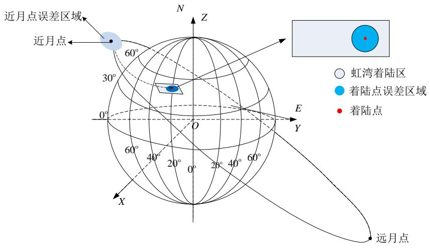

<details>
<summary>text_image</summary>

近月点误差区域
近月点
60°
30°
0°
60°
40°
20°
0°
28°
40°
60°
E
Y
N
Z
X
远月点
○ 虹湾着陆区
● 着陆点误差区域
● 着陆点
</details>

图 17 近月点误差区域

$$
\begin{array}{l} r _ {t _ {0}} = \left(x _ {t _ {0}}, y _ {t _ {0}}, z _ {t _ {0}}\right) ^ {T} = \left(x _ {0}, y _ {0}, z _ {0}\right) ^ {T} \times (1 0 0 \% \pm 5 \%) \\ \dot {r} _ {t _ {0}} = \left(\dot {x} _ {t _ {0}}, \dot {y} _ {t _ {0}}, \dot {z} _ {t _ {0}}\right) ^ {T} = \left(\dot {x} _ {0}, \dot {y} _ {0}, \dot {z} _ {0}\right) ^ {T} \times (1 0 0 \% \pm 5 \%) \\ \end{array}
$$

式中： $\left(x_{t_{0}},y_{t_{0}},z_{t_{0}}\right)$ 为近月点坐标， $\left(\dot{x}_{t_{0}},\dot{y}_{t_{0}},\dot{z}_{t_{0}}\right)$ 为近月点速度

## (3) 着陆点误差区域的求解

由问题二嫦娥三号优化控制模型 $F(T_{0},t_{0};t)$ 确定如下转移工程

$$
\begin{array}{l} F \left(T _ {t _ {0}}, t _ {0}\right)\rightarrow F \left(T _ {t _ {f}}, t _ {f}\right) \\ r _ {t _ {f}} = \left(x _ {t _ {f}}, y _ {t _ {f}}, z _ {t _ {f}}\right) ^ {T} \\ \dot {\boldsymbol {r}} _ {t _ {f}} = \left(\dot {x} _ {t _ {f}}, \dot {y} _ {t _ {f}}, \dot {z} _ {t _ {f}}\right) ^ {T} \\ \end{array}
$$

式中： $T=\left(x,y,z,\dot{x},\dot{y},\dot{z}\right)$ 为嫦娥三号的状态量， $\left(x_{t_{f}},y_{t_{f}},z_{t_{f}}\right)$ 为实际着陆点坐标， $\left(\dot{x}_{t_{f}},\dot{y}_{t_{f}},\dot{z}_{t_{f}}\right)$ 为实际着陆点速度。

## 5.3.3 误差分析模型的求解

运用问题二模型求解结果如下:

<table><tr><td colspan="2">误差</td><td>初值</td><td>误差值</td><td>相对误差</td></tr><tr><td rowspan="3">1%</td><td>θ</td><td>30.30</td><td>32.22</td><td>1.39%</td></tr><tr><td>ψ</td><td>181.80</td><td>192.30</td><td>1.83%</td></tr><tr><td>F</td><td>7676.00</td><td>7743.49</td><td>1.89%</td></tr><tr><td rowspan="3">2%</td><td>θ</td><td>30.60</td><td>30.89</td><td>2.97%</td></tr><tr><td>ψ</td><td>183.60</td><td>189.48</td><td>3.27%</td></tr><tr><td>F</td><td>7752.00</td><td>8154.88</td><td>2.30%</td></tr><tr><td rowspan="3">3%</td><td>θ</td><td>30.90</td><td>32.62</td><td>3.73%</td></tr><tr><td>ψ</td><td>185.40</td><td>198.13</td><td>3.07%</td></tr><tr><td>F</td><td>7828.00</td><td>7934.57</td><td>3.40%</td></tr><tr><td rowspan="3">4%</td><td>θ</td><td>31.20</td><td>31.03</td><td>4.43%</td></tr><tr><td>ψ</td><td>187.20</td><td>198.77</td><td>5.43%</td></tr><tr><td>F</td><td>7904.00</td><td>8148.62</td><td>7.22%</td></tr><tr><td rowspan="3">5%</td><td>θ</td><td>31.50</td><td>33.24</td><td>5.81%</td></tr><tr><td>ψ</td><td>189.00</td><td>195.29</td><td>8.49%</td></tr><tr><td>F</td><td>7980.00</td><td>8147.60</td><td>7.21%</td></tr></table>

以最大推力为例，误差分析图如下:

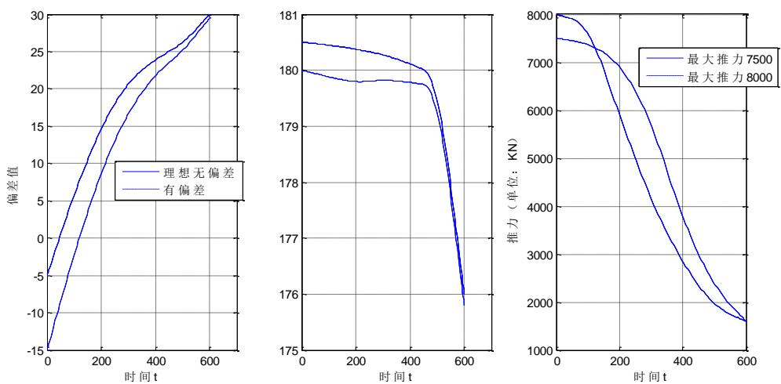  
图 18 误差分析图

由此可判断出在 5% 误差设定范围内，模型有较好的自适应性，该模型准确可靠

## 5.3.4 敏感分析模型的分析

对于模型敏感性的分析，由于在整个控制过程中存在很多参数，列如 $m_{0}$ 、 $v_{e}$ 、 $F_{max}$ 嫦娥三号的尺寸等等，这里我们考虑当这些尺寸变化是是否对着陆点的变化有着明显的

<table><tr><td>参数</td><td>初值</td><td>误差值</td><td>相对误差</td></tr></table>

影响。

## 5.3.5 敏感分析模型的建立

对于问题二建立的三维动力学方程，我们用 U, V 和 $U_{f}, V_{f}$ 分别表示探测器在当地水平方向当前时刻和终端时刻两个速度分量； $a_{H}$ 为当前时刻推力加速度的当地水平分量。因此我们易得推力方位角控制量 $\psi^{*}$ 和推力仰角控制量 $\theta^{*}$ 的表达式

$$
\psi^ {*} = \psi_ {0} = \tan^ {- 1} ((V _ {f} - V) / (U _ {f} - U))
$$

$$
\theta^ {*} = \sin^ {- 1} [ (a _ {r} + \frac {\mu_ {m}}{r ^ {2}} - \frac {U ^ {2} + V ^ {2}}{r}) / a _ {F} ]
$$

其中， $a_{F}=F/m$ ，为当前时刻的推力加速度

上两式表示的推力角制导律与初始位置和速度无关，并不能纠正由初始条件带来的偏差。而实际飞行中，初始位置和速度偏差的存在将对着陆点水平方向的位置精度产生较大的影响。因此，考虑在制动段下降之前，对于上两式推力角控制量的基础上分别引入前馈项，用于消除初始偏差对着陆精度的影响。

推力方位角 $\psi$ 和推力仰角 $\theta$ 分别控制当地水平面内横向和纵向的位置和速度。因此，根据初始位置和速度偏差的正负和大小，便可以给出两个控制量的前馈项。不妨将前馈项表示成如下形式：

$$
\Delta \psi (^ {\circ}) = K _ {y} \cdot \alpha_ {e r r} (^ {\circ}) + K _ {v} \cdot V _ {e r r} \quad \Delta \theta (^ {\circ}) = K _ {x} \cdot \beta_ {e r r} (^ {\circ}) + K _ {U} \cdot U _ {e r r}
$$

其中， $(\bullet)_{err} = (\bullet)_{do} - (\bullet)_{ro}$ ，(·)分别表示 $\alpha$ ， $\beta$ ，U，V；下标 $(\bullet)_{do}$ 和 $(\bullet)_{ro}$ 分别表示理想和偏差情况下的初始变量； $K_{x}$ ， $K_{y}$ ， $K_{V}$ ，为推力角控制量的前馈项系数，可通过仿真得到；U，V分别是纵向和横向的速度分量； $\alpha$ ， $\beta$ 是与探测器位置有关的参数，以制动下降初始为起点，则探测器经过的纵向和横向的月面距离可表示为

$$
L = R _ {m} (\beta - \beta_ {0}), \quad S = R _ {m} (\alpha - \alpha_ {0}) \sin \beta
$$

于是，综上，即可得到软着陆制动段的燃料次优解析+前馈制导律：

$$
\psi = \psi^ {*} + \Delta \psi , \theta = \theta^ {*} + \Delta \theta
$$

问题二中的模型中运用了以下参数:

<table><tr><td>参数意义</td><td>符号</td></tr><tr><td> $m_0$ </td><td>嫦娥三号的初始质量</td></tr><tr><td> $F_{\text{max}}$ </td><td>发动机推力</td></tr><tr><td> $v_e$ </td><td>比冲</td></tr></table>

运动的轨迹与上述各参数的敏感性不同，我们考虑适当改变参数的大小，来观察是否对着陆点的位置有明显影响。

## 5.3.6 敏感分析模型的求解

以 $m_{0}$ 、 $v_{e}$ 、 $F_{max}$ 为参数，运用问题二模型求解结果如下：

<table><tr><td rowspan="3"> $F_{\text{max}}$ </td><td>θ</td><td>30. 34</td><td>35. 56</td><td>16.67%</td></tr><tr><td>ψ</td><td>180. 78</td><td>178.56</td><td>1.11%</td></tr><tr><td>F</td><td>1500.53</td><td>3800. 89</td><td>153.33%</td></tr><tr><td rowspan="3"> $v_e$ </td><td>θ</td><td>51.65</td><td>40.84</td><td>20.92%</td></tr><tr><td>ψ</td><td>265.05</td><td>309.81</td><td>16.89%</td></tr><tr><td>F</td><td>2926.15</td><td>6620.20</td><td>126.24%</td></tr><tr><td rowspan="3"> $m_o$ </td><td>θ</td><td>30.70</td><td>48.31</td><td>57.37%</td></tr><tr><td>ψ</td><td>231.85</td><td>287.10</td><td>23.83%</td></tr><tr><td>F</td><td>2065.74</td><td>6419.71</td><td>210.77%</td></tr></table>

通过参数的调整，敏感性分析图如下：

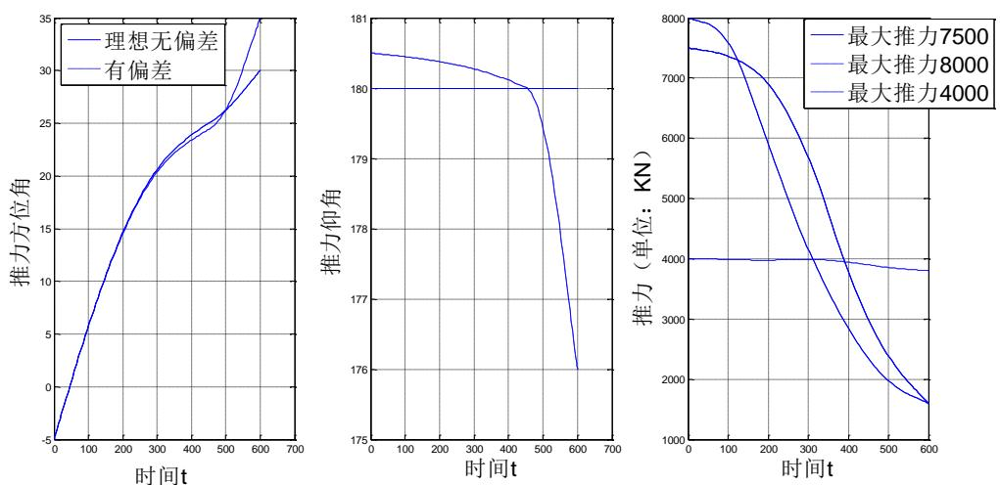  
图 19 敏感度分析图

有敏感分析图可知， $m_{0}$ 、 $v_{e}$ 、 $F_{max}$ ，经过作发动机推力和角度图像发现 $m_{0}$ 、 $v_{e}$ 对模型的较为明显， $F_{max}$ 在不低4900N时对模型对模型的影响不明显。

## 六、模型的评价与推广

## 6.1 模型的评价

## (1) 模型的优点

本文最大的特色，第一问中，先通过简化的抛物线模型求解出备选的近月点范围，缩小了优化模型的搜索范围；第二问中，通过边缘检测和安全坡度筛选的方法对粗避障和精避障过程进行描述，较为准确的确定了安全着陆点；第三问中，以误差转移矩阵，验证了在不同条件下，误差所导致的影响在同一数量级，便于下文准确的误差分析。

## (2) 模型的缺点

问题二目标函数的确定只考虑到使得燃料消耗最少，并未考虑时间的消耗，因此计算结果可能导致，嫦娥三号运行的时间过长。

问题二边缘检测模型，像素点的选择并未考虑嫦娥三号的尺寸，可以根据嫦娥三号的尺寸，选择整合后的最佳像素点区域。

## 6.2 模型的推广

本文研究了嫦娥三号软着陆轨道设计与控制策略，文中所建立的以燃料节省作为优化目标的动力学模型可以很好的选择探测器软着陆最优轨道，例如可以推广应用到火星探测的最优轨道选择。

## 七、参考文献

[1] 姜启源等. 数学模型（第四版）. 北京：高等教育出版社，2003年8月  
[2] 司守奎，孙玺箐. 数学建模算法与应用. 北京：国防工业出版社，2012.  
[3]单永正, 段广仁, 张烽. 月球精确定点软着陆轨道设计及初始点选取[J]. 宇航学报, 2009, 06:2099-2104.  
[4] 郗晓宁．月球探测器轨道动力学及其设计[D]. 中国科学院上海天文台, 2000.  
[5]于正湜, 朱圣英, 崔平远. 基于LIDAR的月球着陆区评估与选择方法[A]. 中国宇航学会深空探测技术专业委员会、飞行器动力学与控制教育部重点实验室、国家重点基础研究发展计划项目（深空973）办公室. 中国宇航学会深空探测技术专业委员会第九届学术年会论文集（上册）[C]. 中国宇航学会深空探测技术专业委员会、飞行器动力学与控制教育部重点实验室、国家重点基础研究发展计划项目（深空973）办公室:, 2012:8.  
[6] 张洪华, 梁俊, 黄翔宇, 赵宇, 王立, 关轶峰, 程铭, 李骥, 王鹏基, 于洁, 袁利. 嫦娥三号自主避障软着陆控制技术 [J]. 中国科学: 技术科学, 2014, 06: 559-568.  
[7]周杰, 刘付成, 张树瑜. 火星探测器地火转移轨道误差分析与控制策略研究[A]. 中国宇航学会深空探测技术专业委员会. 中国宇航学会深空探测技术专业委员会第八届学术年会论文集（上篇）[C]. 中国宇航学会深空探测技术专业委员会:, 2011:11.  
[8]刘建军．大地坐标转换成高斯-克吕格坐标的算法研究[A]. 中国航海学会船舶机电与通信导航专业委员会. 中国航海学会船舶机电与通信导航专业委员会2002年学术年会论文集（通信导航分册）[C]. 中国航海学会船舶机电与通信导航专业委员会:, 2002:3.  
[9] 王建伟, 李兴. 近日点和远日点速度的两种典型解法 [J]. 物理教师, 2013, 06: 58.  
[10] 王鹏基, 张熵, 曲广吉. 月球软着陆制动段飞行轨迹与制导律研究 [J]. 飞行力学, 2007, 03: 62-66。

## 八、附录

## 8.1 附录清单

附录 1：月球坐标系定义

附录 2：读取高程图的 Matlab 程序

附录 3: 求解问题一的 Matlab 程序

附录 4：求解问题二的 Matlab 程序

附录 5：求解问题三的 Matlab 程序

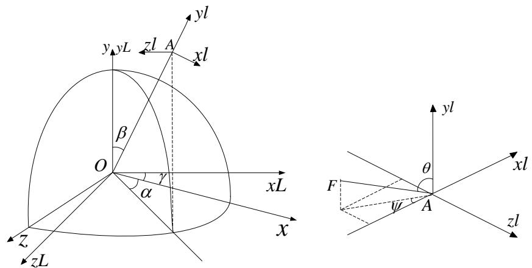

如图所示，参考地心惯性坐标系 $^{[5]}$ 的定义，引入月心惯性坐标系 $^{[6]}$ oxyz，原点在月心，参考平面是月球赤道面，ox轴指向月球赤道相对于白道的升交点，oy轴指向月球自转角速度方向，oz轴按右手坐标系确定。再定义月固坐标系 $ox_{L}y_{L}z_{L}$ ，坐标原点同样在月心，以月球赤道面为参考平面， $ox_{L}$ 轴指向赤道面与起始子午面的交线方向， $oy_{L}$ 指向月球自转角速度方向， $oz_{L}$ 轴按右手坐标系确定。

$Ax_{l}y_{l}z_{l}$ 为原点在探测器质心的轨道坐标系， $Ay_{1}$ 指向从月心到着陆器的延伸线方向， $Ax_{1}$ 垂直 $Ay_{1}$ 指向运动方向， $Az_{1}$ 按右手坐标系确定。制动发动机推力 F 的方向与探测器纵轴重合， $\theta$ 为 F 与 $Ay_{1}$ 轴正向所成夹角， $\psi$ 为 F 在 $x_{1}Az_{1}$ 平面上的投影与 $Ax_{1}$ 轴负向所成夹角。 $\beta$ 为 $Ay_{1}$ 与 oy 所成夹角， $\alpha$ 为 $Ax_{1}$ 在 xoz 平面上的投影与 ox 轴正向所成夹角。 $\gamma$ 为由于月球自转而产生的月固坐标系相对惯性坐标系的转角，不妨假设初始时刻月固坐标系与惯性坐标系重合。

## 附录 2：求解问题一的 Matlab 程序

①读图程序:

```matlab
A=double(imread('附件3距2400m处的数字高程图.tif'));
[m n]=size(A);
subplot(1,2,1);
[X Y]=meshgrid(1:m,1:n);
mesh(X,Y,A)
%%
B=double(imread('附件4距月面100m处的数字高程图.tif'));
[m n]=size(B);
subplot(1,2,2);
[X Y]=meshgrid(1:m,1:n);
mesh(X,Y,B)
```

```javascript
clear
clc
w0=pi/4; k1=0.1;k2=35;v=50;
syms t x y k g v0 sinwcosw;
X=dsolve('D2x=-Dx';'x(0)=0,
Dx(0)=v0*cosw';'t');
X=simplify(X)
```

```matlab
X=subs(X, cosw, cos(w0));
X=subs(X, v0, v);
T=finverse(X);
T=subs(T' t' x);
Y=dsolve('D2y=-Dy-g'' y(0)=0, Dy(0)=v0*sinw''' t');
Y=subs(Y, t, T);
Y=simplify(Y);
Y=subs(Y;g;9.8);
Y=subs(Y;v0;v);
Y=subs(Y;sinw;sin(w0));
Y=subs(Y;cosw;cos(w0));

%% 
V0=5;theta=pi/3;
A=v0*cos(theta);
b=v0*sin(theta);
g=9.8/6;
t=0:0.01:3;
x =a-a*exp(-t);
y =-exp(-t)*(g+b)-g*t+g+b;
plot(x, y);
grid
```

## 附录 3：求解问题二的 Matlab 程序

## 边缘检测程序

```matlab
I=imread('附件3距2400m处的数字高程图.tif');
BW22= edge(I,'Canny',0.4); %edge 调用 Canny 为检测算子判别阈值为 0.4
%figure,
imshow(BW22);
title('阈值为0.4的Canny算子边缘检测图像(2400m处)');
%% 
I=imread('附件4距月面100m处的数字高程图.tif');
BW22= edge(I,'Canny',0.4); %edge 调用 Canny 为检测算子判别阈值为 0.4
figure,imshow(BW22);
title('阈值为0.4的Canny算子边缘检测图像(100m处)');
```

阈值为 0.4 的 Canny 算子边缘检测图像 (2400m 处) 阈值为 0.4 的 Canny 算子边缘检测图像 (100m 处)

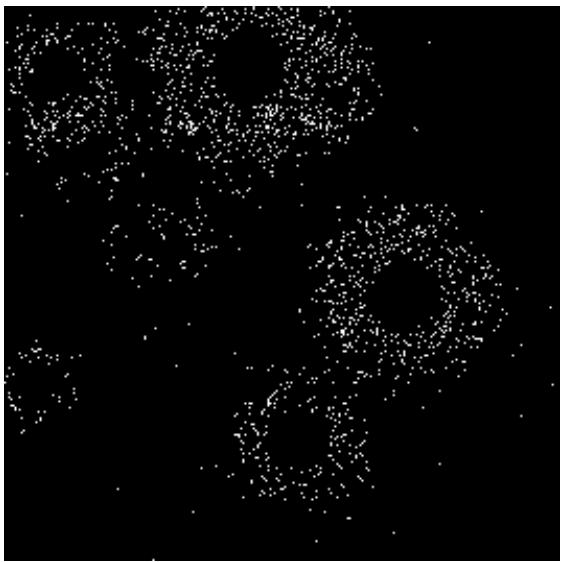

<details>
<summary>natural_image</summary>

Abstract pattern of white dots on black background, no text or symbols present
</details>

图 8.1 阈值为 0.4 的 Canny 算子边缘检测图像 (2400m 处)

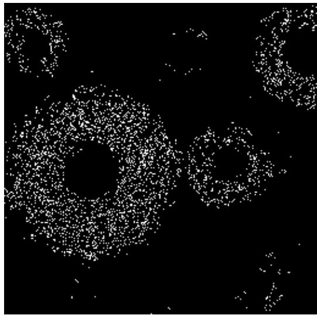

<details>
<summary>natural_image</summary>

Abstract pattern of white dots on black background, resembling a stylized ring or cloud formation (no text or symbols)
</details>

图 8.2 阈值为 0.4 的 Canny 算子边缘检测图像 （100m 处）

```matlab
function [x, y, z, vx, vy, vz] = rv_moon(a, e, incl, raan, argp, M)
mu_e =4.902793455e3; % unit in km^3/s^2
d2r = pi/180;
% transform to proper units
a = a;
incl = incl*d2r;
raan = raan*d2r;
argp = argp*d2r;
M = M*d2r;
    E0 = M;
    for i=1:100
        MO = E0 - e*sin(E0);
        % check for convergence
        error = M - MO;
        if abs(error) < 1e-15
            E=E0;
            break
        end
        % Newton iteration step
        E = E0 + error/(1 - e*cos(E0));
        E0 = E;
    end
```

```matlab
%%
temp = tan(E/2)/sqrt((1-e)/(1+e));
theta = atan(temp)*2;

% orbital radius and velocity
r = a*(1-e^2)/(1+e*cos(theta));
v = sqrt(2*mu_e/r - mu_e/a);

% flight-path angle
gamma = atan(e*sin(theta)/(1+e*cos(theta)));

% compute position and velocity vector
w = theta + argp;
x = r* (cos(w)*cos(raan) - sin(w)*cos(incl)*sin(raan));
y = r* (cos(w)*sin(raan) + sin(w)*cos(incl)*cos(raan));
z = r* (sin(w)*sin(incl));
vx = v*(-sin(w - gamma)*cos(raan) - cos(w - gamma)*cos(incl)*sin(raan));
vy = v*(-sin(w - gamma)*sin(raan) + cos(w - gamma)*cos(incl)*cos(raan));
vz = v*(cos(w-gamma)*sin(incl));

fid = fopen(fname, 'r');
A = fscanf(fid,'%13c%s',1);
B = fscanf(fid,'%d%6d*c%5d*3c%2d%f%f%5d*c%d%5d*c%d%5d',[1,10]);
C = fscanf(fid,'%d%6d%f%f%f%f%f',[1,8]);
fclose(fid);
satname=A;
% The value of mu is for the earth
mu = 3.986004415e5;
% Calculate 2-digit year (Oh no!, look out for Y2K bug!)
yr = B(1,4);
% Calculate epoch in julian days
epoch = B(1,5);
%ndot = B(1,6);
% n2dot = B(1,7);
% Assign variables to the orbital elements
i = C(1,3)*pi/180;          % inclination
Om = C(1,4)*pi/180;          % Right Ascension of the Ascending Node
e = C(1,5)/1e7;            % Eccentricity
om = C(1,6)*pi/180;          % Argument of periapsis
M = C(1,7)*pi/180;          % Mean anomaly
n = C(1,8)*2*pi/(24*3600);  % Mean motion
% Calculate the semi-major axis
a = (mu/n^2)^(1/3);
```

```matlab
% Calculate the eccentric anomaly using mean anomaly
E = EofMe(M, e, 1e-10);
% Calculate true anomaly from eccentric anomaly
cosnu = (e-cos(E)) / (e*cos(E)-1);
sinnu = ((a*sqrt(1-e*e)) / (a*(1-e*cos(E))))*sin(E);
nu = atan2(sinnu, cosnu);
if (nu<0), nu=nu+2*pi; end
% Return the orbital elements in a 1x6 matrix
oe = [a e i 0m om nu];
```