# 创意平板折叠桌的优化设计

## 摘要

本文主要讨论了平板折叠桌的动态变化过程及最优加工参数的设计问题。

在问题一中，本文将折叠桌的动态变化过程简化为杆件的定轴转动，先利用空间解析几何与平面几何的知识计算出各桌脚的长度及开槽深度，从而计算出各桌脚的位置与高度的函数关系来描述了折叠桌的动态变化过程，并使用 MATLAB 画出三维动态图形，进一步直观地展示了其动态变化过程。最后据构建的模型给出了最优加工参数，并用参数方程的形式描述了理想的桌脚边缘线，且与实际桌脚边缘的连线进行了对比。

在问题二中，本文从结构的稳固性、节省材料和加工方便几个角度出发，考虑了几何约束、运动约束、静力学平衡约束，而从建立了一个关于重心位置与材料用量的多目标优化模型（MOP）。此模型为非线性规划模型，在求解时，本文利用 MATLAB 采用图像法确定模型的可行域，而从得出木板尺寸与钢筋位置最佳选择。对于题目中桌高 70cm、桌面直径 80cm 的情形，文中给出了最优加工参数，板长为 170cm，钢筋位于最外侧木条上距桌面中心线 53cm 处，各桌腿长度及其滑槽长度见文中表格。

在问题三中, 首先根据客户给出的桌面边缘线和桌脚边缘线对应点之间的距离作为桌腿木条的长度, 然后根据问题一中计算出的运动约束关系计算出实际桌脚边缘的坐标, 计算出实际桌脚边缘线与客户提供的桌脚边缘线之间距离的平方和作为目标函数, 得到使其取最小值的钢筋位置, 验证问题二中约束条件, 进而计算出其他设计参数。最后, 本文设计出了两种创意平板折叠桌, 并给出了相应的加工参数及动态变化过程示意图。

关键词： MOP 非线性规划 平板折叠桌

## 一、问题重述

某公司生产一种可折叠的桌子，桌面呈圆形，桌腿随着铰链的活动可以平摊成一张平板。桌腿由若干根木条组成，分成两组，每组各用一根钢筋将木条连接，钢筋两端分别固定在桌腿各组最外侧的两根木条上，并且沿木条有空槽以保证滑动的自由度。桌子外形由直纹曲面构成，造型美观。

试建立数学模型讨论下列问题:

1. 给定长方形平板尺寸为 $120 \mathrm{~cm} \times 50 \mathrm{~cm} \times 3 \mathrm{~cm}$ , 每根木条宽 $2.5 \mathrm{~cm}$ , 连接桌腿木条的钢筋固定在桌腿最外侧木条的中心位置, 折叠后桌子的高度为 $53 \mathrm{~cm}$ 。试建立模型描述此折叠桌的动态变化过程, 在此基础上给出此折叠桌的设计加工参数 (例如, 桌腿木条开槽的长度等) 和桌脚边缘线 (图 4 中红色曲线) 的数学描述。  
2. 折叠桌的设计应做到产品稳固性好、加工方便、用材最少。对于任意给定的折叠桌高度和圆形桌面直径的设计要求，讨论长方形平板材料和折叠桌的最优设计加工参数，例如，平板尺寸、钢筋位置、开槽长度等。对于桌高 $70~\mathrm{cm}$ ，桌面直径 $80~\mathrm{cm}$ 的情形，确定最优设计加工参数。  
3. 公司计划开发一种折叠桌设计软件，根据客户任意设定的折叠桌高度、桌面边缘线的形状大小和桌脚边缘线的大致形状，给出所需平板材料的形状尺寸和切实可行的最优设计加工参数，使得生产的折叠桌尽可能接近客户所期望的形状。你们团队的任务是帮助给出这一软件设计的数学模型，并根据所建立的模型给出几个你们自己设计的创意平板折叠桌。要求给出相应的设计加工参数，画出至少8张动态变化过程的示意图。

## 二、问题分析

## 2.1 问题一

对于问题一，在考虑长方形平板材料尺寸、折叠后桌子高度要求和桌腿木条与钢筋的运动约束条件等目标要求的情况下，主要解决三个问题：描述折叠桌动态变化过程、给出折叠桌设计加工参数、给出桌脚边缘线的数学描述。

首先假设桌面圆形的直径为 50cm，根据长方形平板尺寸及木条宽度确定剪裁方案。根据钢筋固定在桌腿最外侧木条的中心位置和运动过程中的几何关系，可以计算出钢筋在每根桌腿木条中的初始位置和最终位置，两者作差即可求出每根桌腿木条所需要的的开槽长度，结合剪裁方案，给出设计加工参数。

由于每组桌腿中的钢筋固定在最外侧的两根木条上，且钢筋在每组桌腿木条的空槽中自由滑动，故每组中最外侧的两条桌腿木条的运动状态决定了本组中间所有桌腿木条的运动状态。首先建立空间直角坐标系，用木条边缘点的坐标（由于桌腿木条有一定宽度和厚度，故取边缘截面中心点为边缘点）描述桌腿木条的运动状态，根据运动过程中的几何关系，通过数学计算得出每条桌腿木条边缘点的坐标随最外侧桌腿木条边缘点高度变化的函数关系。再由此计算出运动过程中每条桌腿木条的倾斜角度、距桌面的高度及钢筋在滑槽中的位置等参数，并用matlab画三维图仿真，给出动态过程的中间步骤图，结合以上参数共同描述折

叠桌的动态变化过程。

利用前面求出的桌腿木条边缘点的坐标随最外侧桌腿木条边缘点高度变化的函数关系，可以求出折叠后各桌腿木条边缘点的坐标，列表或画成散点图描述桌脚边缘线；另外可以令桌腿木条宽度趋于零，使桌脚边缘线变成连续曲线，进而求出解析表达式，近似描述真实的桌脚边缘线。

## 2.2 问题二

对于给定折叠桌高度 h 和桌面直径 2R，我们主要从结构的稳固性和节省材料、及加工方便几个角度考虑来给出其优化设计方案。我们需要设计的有平板尺寸、钢筋的位置、开槽深度，其中开槽深度可以由前两者及运动过程决定。

（1）对于稳固性，我们主要从三方面考虑，一方面，我们以桌子的重心来衡量其稳定性，重心的相对位置越低，其稳定性越强；另一方面，我通过选取合理的桌脚截面来增加其抗压及抗弯矩的强度 $^{[1]}$ ；另外，我们保证四条桌腿的倾角在其摩擦角的范围内。  
(2) 对于材料用量, 我们在保证一定稳固性和运动约束的前提下, 尽量让用料最少, 即木板体积尽可能小。  
（3）对于加工方便，我们认为桌腿的数量不宜过多，过多会导致桌腿间距变小，一方面结构的强度难以保证，另一方面加工难度变大。

这样，我们可以建立关于设计的一个优化模型

## 2.3 问题三

首先根据桌面边缘线和桌脚边缘线对应点之间的距离计算出桌腿木条的长度，再根据前面计算出的运动约束关系计算出实际桌脚边缘的坐标，计算出实际桌脚边缘线与客户提供的桌脚边缘线之间距离的平方和作为目标函数，得到使其取最小值的钢筋位置，进而计算出其他设计参数。

## 三、模型假设

1. 木板匀质，密度为常数且厚度均匀；  
2. 忽略钢筋与滑槽的摩擦力，及相邻桌腿之间的摩擦力  
3.剪裁时忽略桌腿木条之间的剪裁缝隙，且每条桌腿等宽；  
4.各桌腿都在相互平行的平面内做圆周运动,;  
5. 设计时所用平板材料的厚度不变，为 3cm。

## 四、符号说明

a 长方形平板的长，单位 cm。

b 长方形平板的宽，单位 cm。

$l_{i}$ 第 i 根桌腿木条的长度，单位 cm。

$d_{i}$ 第 i 根桌腿木条中滑槽的长度，单位 cm。

p 钢筋的位置比，即钢筋的转动半径占整个最外侧木条长度的比例。

## 五、模型的建立与求解

## 5.1 问题一

## 5.1.1 折叠桌设计加工参数的求解

以长方形平板的中心为坐标原点，建立如图 1 所示的空间直角坐标系。

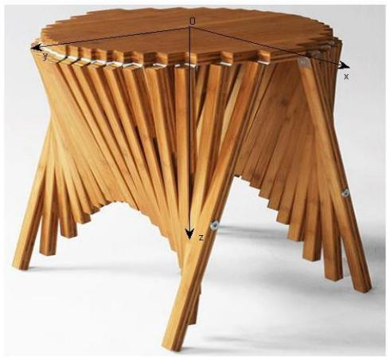

natural_image

Wooden table with ribbed legs and a circular base, showing x, y, z coordinate axes (no text or symbols on the structure itself)

图 1  
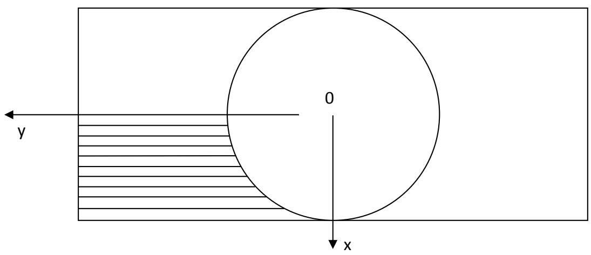

text_image

y
0
x

图 2

根据假设2，以长方形平板中心为圆心做相切于长方形平板长边的圆，根据假设1，将长方形平板的宽以 $2.5\mathrm{cm}$ 为单位平分成20份，由于对称性，只需考虑 $\frac{1}{4}$ 部分的桌腿木条，如图2所示。平行于长边的分割线与圆周共同形成了10个曲边梯形，考虑到桌面图形的美观和桌腿木条长度适中，取每个曲边梯形上下底边的平均值作为桌腿木条的长度，桌腿木条由外侧向内依次编号为1-10，长度分别记为 $l_{i}$ ，经计算得 $l_{i}$ 见表1：

<table><tr><td>i</td><td>1</td><td>2</td><td>3</td><td>4</td><td>5</td><td>6</td><td>7</td><td>8</td><td>9</td><td>10</td></tr><tr><td> $l_i$ (cm)</td><td>54.55</td><td>47.05</td><td>43.57</td><td>41.07</td><td>39.17</td><td>37.72</td><td>36.62</td><td>35.83</td><td>35.32</td><td>35.06</td></tr></table>

表 1

下面计算每根桌腿木条中的滑槽长度。由于桌腿木条有一定宽度和厚度，故取边缘截面中心点为边缘点，转轴截面中心点为转轴点。设第 $i$ 根桌腿木条转轴点为 $A_{i}$ ，边缘点为 $B_{i}$ ，钢筋所在点为 $C_{i}$ 。折叠过程中的 yoz 投影图如图 3 所示，其中 $A_{1}$ 、 $B_{1}$ 即为最外侧木条的转轴点和边缘点，钢筋初始位置在 $C$ 点，木条边缘点初始位置在 $B$ 点。

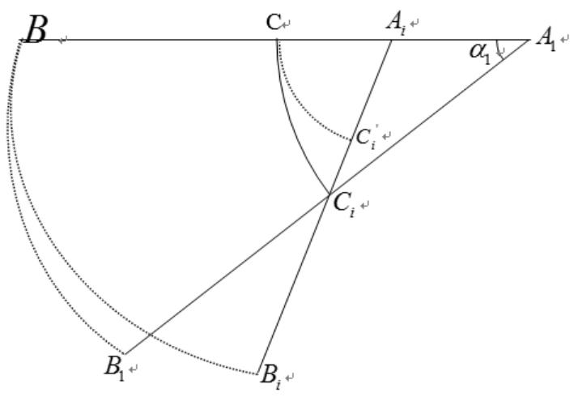

text_image

B
C
A_i
α_1
A_1
C'_i
C_i
B_1
B_i

图 3  
$\alpha$ 为桌子折叠高度达到 $H = 53\mathrm{cm}$ 时最外侧木条与水平方向的夹角， $\alpha = \arcsin \left(\frac{H}{l_1}\right) = 76.3^\circ$ 。 $A_{i}C = A_{i}B - BC = l_{i} - \frac{l_{1}}{2}$ ，钢筋最终位置 $C_i$ 与转轴点为 $A_{i}$ 的距离为 $A_{i}C_{i}$ ，在 $\Delta A_{1}A_{i}C_{i}$ 中应用余弦定理，有

$$
A _ {i} C _ {i} = \sqrt {A _ {1} C _ {i} ^ {2} + A _ {1} A _ {i} ^ {2} - 2 A _ {1} C _ {i} \cdot A _ {1} A _ {i} \cdot \cos \alpha} = \sqrt {\left(\frac {l _ {1}}{2}\right) ^ {2} + \left(l _ {1} - l _ {i}\right) ^ {2} - 2 \cdot \frac {l _ {1}}{2} \cdot \left(l _ {1} - l _ {i}\right) \cdot \cos 7 6 . 3 ^ {\circ}}
$$

由公式可以看出，随着 $\alpha$ 的增大， $A_{i}C_{i}$ 逐渐增大，故可以判断钢筋在滑槽内始终沿一个方向运动，不会出现往复运动的现象，故第 i 根桌腿木条的开槽长度 $d_{i}=A_{i}C_{i}-A_{i}C_{i}^{'}$ 。代入数据计算得到各桌腿木条的开槽长度 $d_{i}$ 见表 2:

<table><tr><td>i</td><td>1</td><td>2</td><td>3</td><td>4</td><td>5</td><td>6</td><td>7</td><td>8</td><td>9</td><td>10</td></tr><tr><td> $d_i$ (cm)</td><td>0</td><td>6.74</td><td>10.59</td><td>13.62</td><td>16.06</td><td>18.02</td><td>19.53</td><td>20.65</td><td>21.38</td><td>21.74</td></tr></table>

表 2

据此可以得到这长方形平板的设计加工的尺寸，由于桌子的对称性，我们只给出了 $\frac{1}{4}$ 木板的加工示意图，见图4。

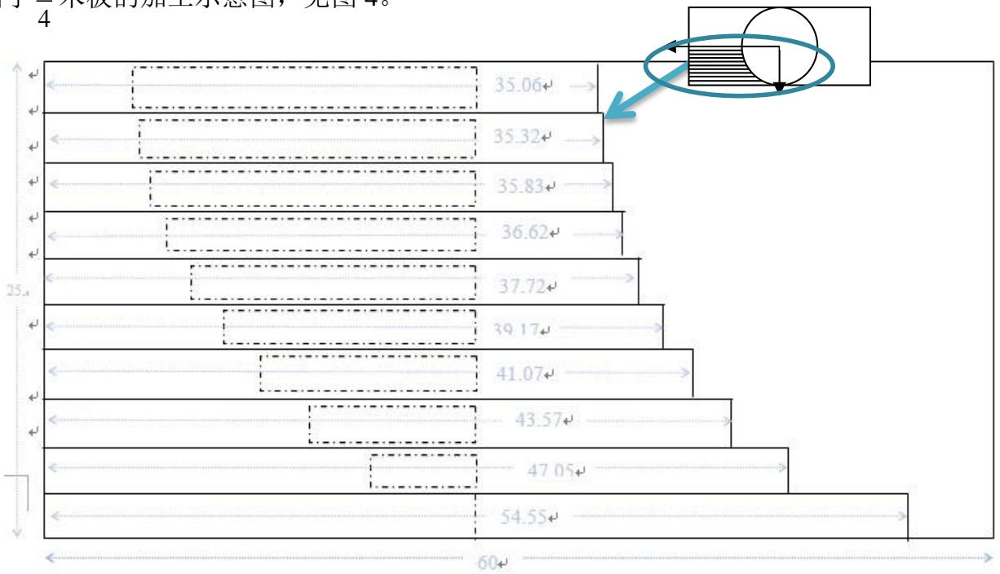

funnel

| Category | Value |
| --- | --- |
| 1 | 35.06 |
| 2 | 35.32 |
| 3 | 35.83 |
| 4 | 36.62 |
| 5 | 37.72 |
| 6 | 39.17 |
| 7 | 41.07 |
| 8 | 43.57 |
| 9 | 47.05 |
| 10 | 54.55 |

图 4

## 5.1.2 折叠桌动态变化过程的求解与描述

坐标系如图 2 所示，用木条边缘点的坐标（如前所述，取边缘截面中心点为边缘点）描述桌腿木条的运动状态。

每组桌腿中的钢筋固定在最外侧的两根木条上，且钢筋在每组桌腿木条的空槽中自由滑动，故每组中最外侧的两条桌腿木条的运动状态决定了本组中间所有桌腿木条的运动状态。设最外侧桌腿边缘点距桌面的距离为h，反映了最外侧桌腿的运动状态。

下面求解第 i 根木条边缘点的坐标 $(x_{i}, y_{i}, z_{i})$ 随 h 变化的函数关系。折叠过程的侧面投影图如图 5 所示，

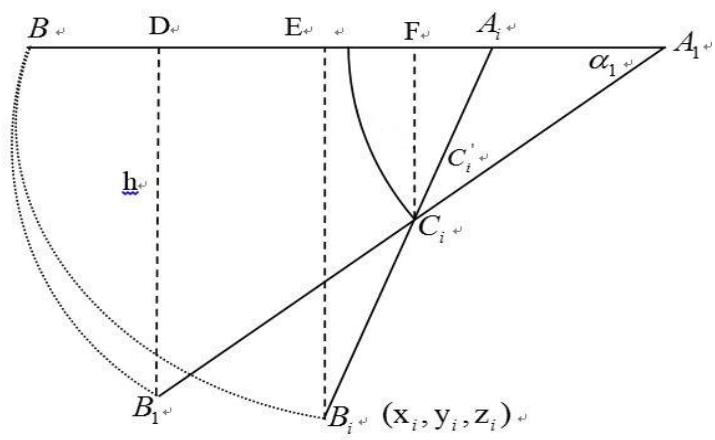

text_image

B
D
E
F
A₁
α₁
h
C₁
C₁
A₁
B₁
B₁ (xᵢ,yᵢ,zᵢ)

图 5

其中第 $i$ 根桌腿木条转轴点为 $A_{i}$ ，边缘点为 $B_{i}$ ，钢筋所在点为 $C_{i}$ ，则 $x_{i} = (25 - 1.25) - 2.5 \times (i - 1) = 26.25 - 2.5i$ ， $A_{i}B_{i} = l_{i}$ ， $A_{1}A_{i} = l_{1} - l_{i}$ ， $A_{1}$ 、 $B_{1}$ 即为最外侧木条的转轴点和边缘点， $A_{1}B_{1} = l_{1}$ ，图中 $B_{1}D \perp A_{1}B$ ， $B_{i}E \perp A_{1}B$ ， $C_{i}F \perp A_{1}B$ ， $B_{1}D = h$ 。长方形平板长 $a = 120cm$ ，钢筋位置 $p = \frac{1}{2}$ 。

$$
A _ {1} C _ {i} = p \cdot A _ {1} B _ {1} = p \cdot l _ {1}, \quad C _ {i} F = p \cdot h
$$

在 $\triangle A_{1}C_{i}F$ 中应用勾股定理，得：

$$
A _ {1} F = \sqrt {A _ {1} C _ {i} ^ {2} - C _ {i} F ^ {2}} = p \sqrt {l _ {1} ^ {2} - h ^ {2}},
$$

$$
A _ {i} F = A _ {1} F - A _ {1} A _ {i} = p \sqrt {l _ {1} ^ {2} - h ^ {2}} - \left(l _ {1} - l _ {i}\right) 。
$$

在 $\triangle A_{i}C_{i}F$ 中应用勾股定理，得：

$$
A _ {i} C _ {i} = \sqrt {A _ {i} F ^ {2} + C _ {i} F ^ {2}} = \sqrt {\left(p l _ {1}\right) ^ {2} + \left(l _ {1} - l _ {i}\right) ^ {2} - 2 p \sqrt {l _ {1} ^ {2} - h ^ {2}} \left(l _ {1} - l _ {i}\right)}
$$

$$
\because \frac {A _ {i} E}{A _ {i} B _ {i}} = \frac {A _ {i} F}{A _ {i} C _ {i}} \therefore A _ {i} E = \frac {A _ {i} F}{A _ {i} C _ {i}} \cdot A _ {i} B _ {i} = \frac {p \sqrt {l _ {1} ^ {2} - h ^ {2}} - \left(l _ {1} - l _ {i}\right)}{\sqrt {\left(p l _ {1}\right) ^ {2} + \left(l _ {1} - l _ {i}\right) ^ {2} - 2 p \sqrt {l _ {1} ^ {2} - h ^ {2}} \left(l _ {1} - l _ {i}\right)}} \cdot l _ {i}
$$

$$
\therefore y _ {i} = A _ {1} E = A _ {i} E + A _ {1} A _ {i} = \frac {p \sqrt {l _ {1} ^ {2} - h ^ {2}} - \left(l _ {1} - l _ {i}\right)}{\sqrt {\left(p l _ {1}\right) ^ {2} + \left(l _ {1} - l _ {i}\right) ^ {2} - 2 p \sqrt {l _ {1} ^ {2} - h ^ {2}} \left(l _ {1} - l _ {i}\right)}} \cdot l _ {i} + l _ {1} - l _ {i}
$$

又∵ $\frac{B_{i}E}{A_{i}B_{i}}=\frac{C_{i}F}{A_{i}C_{i}}$

$$
\therefore z _ {i} = B _ {i} E = \frac {C _ {i} F}{A _ {i} C _ {i}} \cdot A _ {i} B _ {i} = \frac {p h}{\sqrt {\left(p l _ {1}\right) ^ {2} + \left(l _ {1} - l _ {i}\right) ^ {2} - 2 p \sqrt {l _ {1} ^ {2} - h ^ {2}} \left(l _ {1} - l _ {i}\right)}} \cdot l _ {i}
$$

最终得出第 $i$ 根木条边缘点的坐标 $\left(x_{i},y_{i},z_{i}\right)$ 随 $h$ 变化的函数关系为

$$
\left\{ \begin{array}{l} x _ {i} = 2 6. 2 5 - 2. 5 i \\ y _ {i} = \frac {p \sqrt {l _ {1} ^ {2} - h ^ {2}} - \left(l _ {1} - l _ {i}\right)}{\sqrt {\left(p l _ {1}\right) ^ {2} + \left(l _ {1} - l _ {i}\right) ^ {2} - 2 p \sqrt {l _ {1} ^ {2} - h ^ {2}} \left(l _ {1} - l _ {i}\right)}} \cdot l _ {i} + l _ {1} - l _ {i} \\ z _ {i} = \frac {p h}{\sqrt {\left(p l _ {1}\right) ^ {2} + \left(l _ {1} - l _ {i}\right) ^ {2} - 2 p \sqrt {l _ {1} ^ {2} - h ^ {2}} \left(l _ {1} - l _ {i}\right)}} \cdot l _ {i} \end{array} \right.
$$

其中 $p = \frac{1}{2}, a = 120$ ， $l_i$ 是 $i$ 的函数，其值见表1， $i = 1, 2, 3...10$

利用对称性求出所有桌腿木条边缘点的坐标, 用 matlab 画出三维动态图形, 见图 6—图 11。

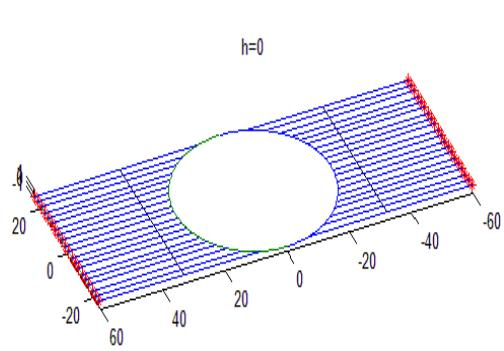

surface_3d

| X | Y | Z |
| --- | --- | --- |
| -60~60 | -20~20 | -4~4 |

图 6

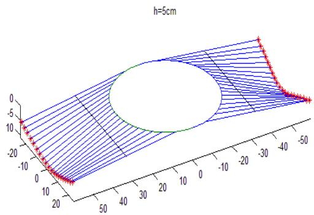

surface_3d

| X | Y | Z |
| --- | --- | --- |
| -10 | -20 | ~-8 |
| -5 | -15 | ~-12 |
| 0 | -10 | ~-18 |
| 5 | -5 | ~-22 |
| 10 | 0 | ~-25 |
| 15 | 5 | ~-28 |
| 20 | 10 | ~-30 |
| 25 | 15 | ~-32 |
| 30 | 20 | ~-34 |
| 35 | 25 | ~-36 |
| 40 | 30 | ~-38 |
| 45 | 35 | ~-40 |
| 50 | 40 | ~-42 |
| 55 | 45 | ~-44 |
| 60 | 50 | ~-46 |
| 65 | 55 | ~-48 |
| 70 | 60 | ~-50 |
| 75 | 65 | ~-52 |
| 80 | 70 | ~-54 |
| 85 | 75 | ~-56 |
| 90 | 80 | ~-58 |
| 95 | 85 | ~-60 |
| 100 | 90 | ~-62 |
| 105 | 95 | ~-64 |
| 110 | 100 | ~-66 |
| 115 | 105 | ~-68 |
| 120 | 110 | ~-70 |
| 125 | 115 | ~-72 |
| 130 | 120 | ~-74 |
| 135 | 125 | ~-76 |
| 140 | 130 | ~-78 |
| 145 | 135 | ~-80 |
| 150 | 140 | ~-82 |
| 155 | 145 | ~-84 |
| 160 | 150 | ~-86 |
| 165 | 155 | ~-88 |
| 170 | 160 | ~-90 |
| 175 | 165 | ~-92 |
| 180 | 170 | ~-94 |
| 185 | 175 | ~-96 |
| 190 | 180 | ~-98 |
| 195 | 185 | ~-100 |
| 200 | 190 | ~-102 |
| 205 | 195 | ~-104 |
| 210 | 200 | ~-106 |
| 215 | 205 | ~-108 |
| 220 | 210 | ~-110 |
| 225 | 215 | ~-112 |
| 230 | 220 | ~-114 |
| 235 | 225 | ~-116 |
| 240 | 230 | ~-118 |
| 245 | 235 | ~-120 |
| 250 | 240 | ~-122 |
| 255 | 245 | ~-124 |
| 260 | 250 | ~-126 |
| 265 | 255 | ~-128 |
| 270 | 260 | ~-130 |
| 275 | 265 | ~-132 |
| 280 | 270 | ~-134 |
| 285 | 275 | ~-136 |
| 290 | 280 | ~-138 |
| 295 | 285 | ~-140 |
| 300 | 290 | ~-142 |
| 305 | 295 | ~-144 |
| 310 | 300 | ~-146 |
| 315 | 305 | ~-148 |
| 320 | 310 | ~-150 |
| 325 | 315 | ~-152 |
| 330 | 320 | ~-154 |
| 335 | 325 | ~-156 |
| 340 | 330 | ~-158 |
| 345 | 335 | ~-160 |
| 350 | 340 | ~-162 |
| 355 | 345 | ~-164 |
| 360 | 350 | ~-166 |
| 365 | 355 | ~-168 |
| 370 | 360 | ~-170 |
| 375 | 365 | ~-172 |
| 380 | 370 | ~-174 |
| 385 | 375 | ~-176 |
| 390 | 380 | ~-178 |
| 395 | 385 | ~-180 |
| 400 | 390 | ~-182 |
| 405 | 395 | ~-184 |
| 410 | 400 | ~-186 |
| 415 | 405 | ~-188 |
| 420 | 410 | ~-190 |
| 425 | 415 | ~-192 |
| 430 | 420 | ~-194 |
| 435 | 425 | ~-196 |
| 440 | 430 | ~-198 |
| 445 | 435 | ~-200 |
| 450 | 440 | ~-202 |
| 455 | 445 | ~-204 |
| 460 | 450 | ~-206 |
| 465 | 455 | ~-208 |
| 470 | 460 | ~-210 |
| 475 | 465 | ~-212 |
| 480 | 470 | ~-214 |
| 485 | 475 | ~-216 |
| 490 | 480 | ~-218 |
| 495 | 485 | ~-220 |
| -6.7e+9 to -6.7e+9 to -6.7e+9 to -6.7e+9 to -6.7e+9 to -6.7e+9 to -6.7e+9 to -6.7e+9 to -6.7e+9 to -6.7e+9 to -6.7e+9 to -6.7e+9 to -6.7e+9 to -6.<ecel>

图 7

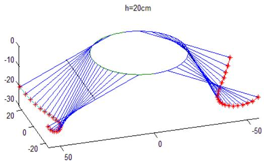

surface_3d

| X | Y | Z |
| --- | --- | --- |
| ~-50 | ~-10 | ~-9 |
| ~-40 | ~-10 | ~-12 |
| ~-30 | ~-10 | ~-15 |
| ~-20 | ~-10 | ~-18 |
| ~-10 | ~-10 | ~-20 |
| 0 | ~-10 | ~-22 |
| 10 | ~-10 | ~-24 |
| 20 | ~-10 | ~-26 |
| 30 | ~-10 | ~-28 |
| 40 | ~-10 | ~-30 |
| 50 | ~-10 | ~-32 |
| -50 | 0 | ~-29 |
| -40 | 0 | ~-27 |
| -30 | 0 | ~-24 |
| -20 | 0 | ~-20 |
| -10 | 0 | ~-15 |
| 0 | 0 | ~-10 |
| 10 | 0 | ~-5 |
| 20 | 0 | 0 |
| 30 | 0 | 5 |
| 40 | 0 | 10 |
| 50 | 0 | 15 |
| -50 | -50 | ~-29 |
| -40 | -50 | ~-32 |
| -30 | -50 | ~-34 |
| -20 | -50 | ~-36 |
| -10 | -50 | ~-38 |
| 0 | -50 | ~-40 |
| 10 | -50 | ~-42 |
| 20 | -50 | ~-44 |
| 30 | -50 | ~-46 |
| 40 | -50 | ~-48 |
| 50 | -50 | ~-50 |

图8

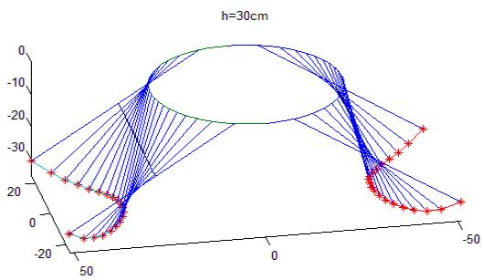

surface_3d

| Series | X (range) | Y (range) | Z (range) |
| --- | --- | --- | --- |
| Blue lines | -50~50 | -20~0 | -20~0 |
| Red stars | -50~50 | -20~20 | -20~20 |

图 9

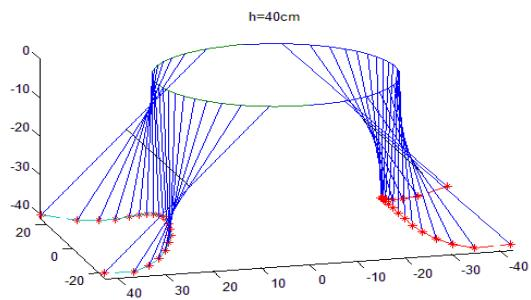

scatter_3d

| Series | X (range) | Y (range) | Z (range) |
| --- | --- | --- | --- |
| Blue Lines | -40~40 | -40~0 | -40~0 |
| Red Points | -40~-10 | -20~20 | -40~-10 |

图 10

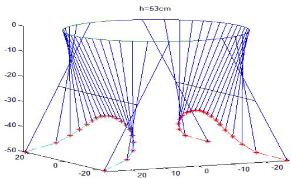

surface_3d

| X | Y | Z |
| --- | --- | --- |
| ~-20 | ~-20 | -50 |
| ~-15 | ~-15 | -48 |
| ~-10 | ~-10 | -46 |
| ~-5 | ~-5 | -44 |
| 0 | 0 | -42 |
| 5 | 5 | -40 |
| 10 | 10 | -38 |
| 15 | 15 | -36 |
| 20 | 20 | -34 |
| ~-20 | ~-20 | -50 |
| ~-15 | ~-15 | -48 |
| ~-10 | ~-10 | -46 |
| ~-5 | ~-5 | -44 |
| 0 | 0 | -42 |
| 5 | 5 | -40 |
| 10 | 10 | -38 |
| 15 | ~-15 | -48 |
| 20 | ~-20 | -50 |
| ~-20 | ~-20 | -50 |
| ~-15 | ~-15 | -48 |
| ~-10 | ~-10 | -46 |
| ~-5 | ~-5 | -44 |
| 0 | 0 | -42 |
| 5 | 5 | -40 |
| 10 | 10 | -38 |
| 15 | -15 | -48 |
| 20 | ~-20 | -50 |
| ~-20 | ~-20 | -50 |
| ~-15 | ~-15 | -48 |
| ~-10 | ~-10 | -46 |
| ~-5 | ~-5 | -44 |
| 0 | 0 | -42 |
| 5 | 5 | -46 |
| 10 | 10 | -48 |
| 15 | -15 | -48 |
| 20 | ~-20 | -50 |
| ~-20 | ~-20 | -50 |
| ~-15 | ~-15 | -48 |
| ~-10 | ~-10 | -46 |
| ~-5 | ~-5 | -44 |
| 0 | 0 | -42 |
| ~5 | ~5 | -46 |
| 10 | 10 | -48 |
| 15 | -15 | -48 |
| 20 | ~-20 | -50 |
| ~-20 | ~-20 | -50 |
| ~-15 | ~-15 | -48 |
| ~-10 | ~-10 | -46 |

图 11

通过坐标解析表达式、结果数据列表和动态图形展示三种途径，我们可以多角度、多层次地了解折叠桌变化过程中的不同侧面，从而对其动态变化过程有了系统深入的了解。

## 5.1.3 桌脚边缘线的数学描述

在 5.1.2 中得出的桌腿木条边缘点坐标的解析表达式中，取 h=53cm，可得到折叠后各桌腿木条边缘点的坐标。

在三维坐标系中画出这些散点，并用直线连接，得到描述桌脚边缘线的近似曲线，见图 12 中虚线。

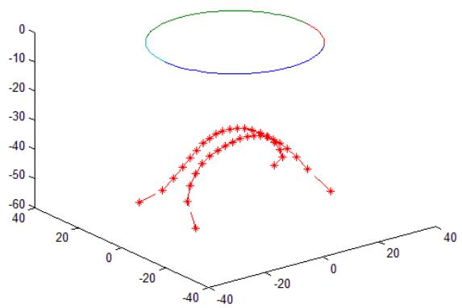

scatter_3d

| Series | X (range) | Y (range) | Z (range) |
| --- | --- | --- | --- |
| Red | -40~0 | -40~-10 | -60~-35 |
| Blue | -40~0 | -15~0 | -5~5 |

图 12

另外，还可以令桌腿木条宽度趋于零，这样桌腿木条就变成直线，桌脚边缘线就变成连续曲线，下面求解此理想桌脚边缘线的解析表达式。

首先求出 “桌腿木条” 直线的边缘点坐标 $(x,y,z)$ 随最外侧 “桌腿木条” 高度 h 变化的函数关系。

折叠过程的侧面投影图如图 10 所示，俯视图如图 11 所示，其中桌面圆周半径 $R=\frac{b}{2}=25cm,\quad x=OA_{1}$ 。

则 $A_{1}A_{i} = \sqrt{R^{2} - x^{2}}$ ， $A_{1}B_{1} = \frac{a}{2}$ ， $B_{1}D = h$ ， $A_{1}C_{i} = p\cdot A_{1}B_{1} = p\cdot \frac{a}{2}$ ， $C_iF = p\cdot h$ 经过与5.1.2中类似的计算，可以得到边缘点坐标 $(x,y,z)$ 随 $h$ 变化的函数关系如下：

$$
\left\{ \begin{array}{l} x = x \\ y = \frac {\left(p \sqrt {\left(\frac {a}{2}\right) ^ {2} - h ^ {2}} - \sqrt {R ^ {2} - x ^ {2}}\right) \cdot \left(\frac {a}{2} - \sqrt {R ^ {2} - x ^ {2}}\right)}{\sqrt {\left(p \cdot \frac {a}{2}\right) ^ {2} + R ^ {2} - x ^ {2} - 2 p \sqrt {\left(\frac {a}{2}\right) ^ {2} - h ^ {2}} \cdot \sqrt {R ^ {2} - x ^ {2}}}} + \sqrt {R ^ {2} - x ^ {2}} \\ z = \frac {p h \cdot \left(\frac {a}{2} - \sqrt {R ^ {2} - x ^ {2}}\right)}{\sqrt {\left(p \cdot \frac {a}{2}\right) ^ {2} + R ^ {2} - x ^ {2} - 2 p \sqrt {\left(\frac {a}{2}\right) ^ {2} - h ^ {2}} \cdot \sqrt {R ^ {2} - X ^ {2}}}} \end{array} \right.
$$

其中 $p = \frac{1}{2}, a = 120, R = 25$ ，令 $h = H = 53$ ，即可得到理想桌脚边缘线的参数方程：

$$
\left\{ \begin{array}{l} x = x \\ y = \frac {\left(1 4 . 0 6 - \sqrt {6 2 5 - x ^ {2}}\right) \cdot \left(6 0 - \sqrt {6 2 5 - x ^ {2}}\right)}{\sqrt {1 5 2 5 - x ^ {2} - 2 8 . 1 2 \sqrt {6 2 5 - x ^ {2}}}} + \sqrt {6 2 5 - x ^ {2}} \\ z = \frac {2 6 . 5 \left(6 0 - \sqrt {6 2 5 - x ^ {2}}\right)}{\sqrt {1 5 2 5 - x ^ {2} - 2 8 . 1 2 \sqrt {6 2 5 - x ^ {2}}}} \end{array} \right.
$$

其中 $x \in [-25, 25]$

用 matlab 画出理想桌脚边缘线与实际桌脚边缘点，如图 13，符合的相当好。

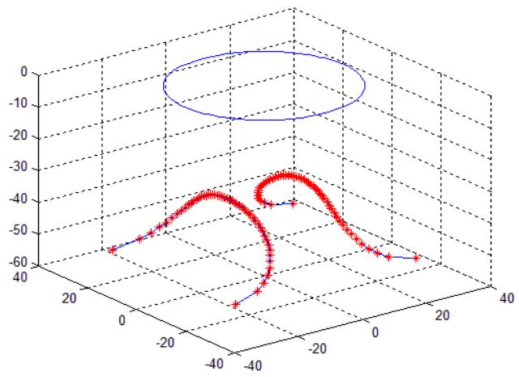

scatter_3d

| Series | X (range) | Y (range) | Z (range) |
| --- | --- | --- | --- |
| Red | -40~20 | -60~-10 | -60~-10 |
| Blue | -40~20 | -15~5 | -15~5 |

图 13

## 5.2 问题二

## 5.2.1 问题二附加假设

(1) 折叠桌的桌面直径即为原长方形木板材料的宽度, 为已知量;  
(2) 桌子仅以最外侧的四条腿接触地面;  
(3) 不计钢筋质量及桌腿因滑槽而损失的质量  
(4) 忽略钢筋与滑槽的摩擦力  
(5) 地面与桌子之间的最大静摩擦因素 $\mu_{\mathrm{s}}$

## 5.2.2 优化参数的设计

由于桌子关于 x 轴，y 轴对称，我们仅考虑在第一卦限中的运动情况：如下图所示：

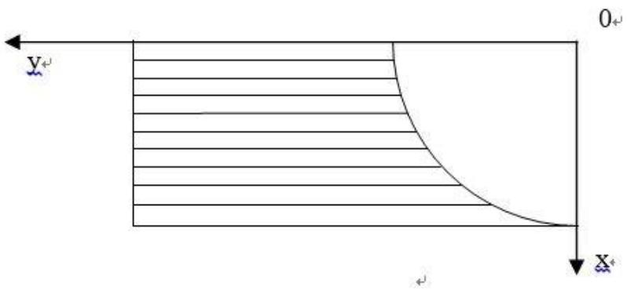

text_image

Y+
0+
X+

图 14

我们认为圆桌直径即为所用长方形木料的宽 b，即 2R=b 图中所示 n 条腿（从长到短）的总宽度为 b/2，那么每条桌腿宽度 $\Delta=\frac{b}{2n}$ 。每条桌腿的运动都在一个平面内，我们用 $x_{i}(i=1,2,3\ldots n)$ 来表示每条桌腿所处平面的位置，我们记第 i 条腿所处的位置为 $x_{i}=\frac{1}{2}b-\Delta\times(i-1)$ 。为了便于计算我们取第 i 条腿的长度 $l_{i}$ 为该曲边梯形的下底长，则有：

$$
l _ {i} = \frac {1}{2} a - \sqrt {\left(\frac {1}{2} b\right) ^ {2} - x _ {i} ^ {2}}
$$

桌子运动过程中，钢筋在每条腿中单向运动（问题一中已证明），且越靠中间的桌腿，钢筋在滑槽内经过的距离越长，即对应的滑槽长度越长。证明如下：

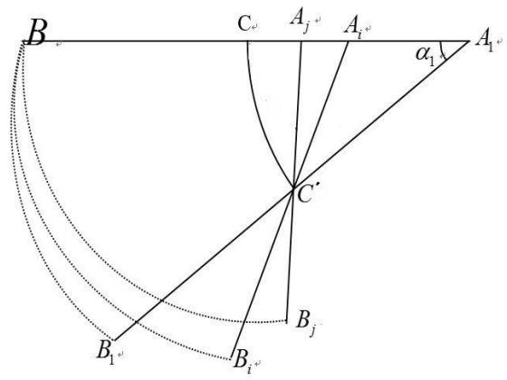

text_image

B
C
A_j
A_i
α_1
A_1
C'
B_j
B_1
B_i

图 15

如图 15, $A_{i}B_{i}$ 与 $A_{j}B_{j}$ 分别为第 i 与第 j 条桌腿, 圆弧 $CC'$ 为钢筋走过的轨迹, 对于长方形木板, 有:

$$
A _ {1} A _ {j} + A _ {j} B _ {j} = A _ {1} A _ {i} + A _ {i} B _ {i}
$$

移项合并得:

$$
A _ {i} A _ {j} + A _ {j} B _ {\overline {{j}}} \quad A _ {i}
$$

在 $\Delta A_{j}A_{i}C^{'}$ 中有： $A_{j}A_{i} + A_{j}C^{'} > A_{i}C^{'}$

故可得:

$$
C ^ {\prime} B _ {\mathrm{j}} <   C ^ {\prime} B _ {i}
$$

即对于靠近中间，编号较大的 j 号桌腿，其剩余长度要小于 i 号桌腿，故滑槽长度应该是中间长，靠近边缘逐渐减短。证毕。

我们首先将各条腿的运动抽象为均质细杆的定轴转动, 转动半径分别为其腿长 $l_{i}$ , 钢筋也做定轴转动, 转动半径为 $\frac{a}{2} \times p$ 。运动到最终状态时, 我们记第 i 条桌脚顶点的坐标为 $(x_{i}, y_{i}, z_{i})$ , $x_{i}$ 已由前述计算给出, $y_{i}$ 、 $z_{i}$ 则由问题一中的公式:

$$
\left\{ \begin{array}{l} y _ {\mathrm{i}} = \frac {\left(p \sqrt {\left(\frac {a}{2}\right) ^ {2} - h ^ {2}} - \sqrt {\left(\frac {b}{2}\right) ^ {2} - x _ {i}}\right) \cdot \left(\frac {a}{2} - \sqrt {\left(\frac {b}{2}\right) ^ {2} - x _ {i}}\right) ^ {2}}{\sqrt {\left(p \cdot \frac {a}{2}\right) ^ {2} + \left(\frac {b}{2}\right) ^ {2} - x _ {i} ^ {2}} - 2 p \sqrt {\left(\frac {a}{2}\right) ^ {2} - h ^ {2}} \cdot \sqrt {\left(\frac {b}{2}\right) ^ {2} - x _ {i} ^ {2}}} + \sqrt {\left(\frac {b}{2}\right) ^ {2} - x _ {i} ^ {2}} \\ z _ {i} = \frac {p h \cdot \left(\frac {a}{2} - \sqrt {\left(\frac {b}{2}\right) ^ {2} - x _ {i} ^ {2}}\right)}{\sqrt {\left(p \cdot \frac {a}{2}\right) ^ {2} + \left(\frac {b}{2}\right) ^ {2} - x _ {i} ^ {2}} - 2 p \sqrt {\left(\frac {a}{2}\right) ^ {2} - h ^ {2}} \cdot \sqrt {\left(\frac {b}{2}\right) ^ {2} - x _ {i} ^ {\prime 2}}} \end{array} \right.
$$

下面我们考虑桌子在运动过程中的约束条件:

1. 钢筋在每条桌腿滑槽内滑动时，不能超过桌腿长度的限制，由于中间桌腿钢筋移动范围最大，只需考虑中间的桌腿的限制即可；

数学表达式即为： $d_{n}+\frac{a}{2}\times p<\frac{a}{2}$ （槽长 $d_{n}$ 的计算方法与问题一相同）

II. 桌子在从木板展开的过程不能出现干涉,即关于 x 轴对称的两条木腿不能出现相交的情况;

数学表达式即为： $y_{i}>0(i=1,2,3\ldots n)$

III. 桌子展成最终形态时要保证最外侧的桌脚着地

数学表达式即为： $z_{1}=\max\{z_{1},z_{2}\ldots z_{n}\}=h$ （h为桌子高度）

下面我们考虑目标函数的数学表达式:

(1) 对于桌子重心位置, 我们记为 $Z_{G}$ (由对称性易知 1/4 桌子的重心也为

$Z_{G}$ ），则 $1-\frac{Z_{G}}{h}$ 代表了重心的相对位置，相对位置越低，稳定性越强，h可当做常数，故 $Z_{G}$ 越大，稳定性越高。又密度为常数且厚度均一，故可用面积来表示质量，计算如下：

$$
Z _ {G} = \frac {\sum m _ {\mathrm{i}} \times (0 . 5 \times z _ {i})}{m} = \frac {\sum (\rho \times \Delta \times l _ {i}) \times (0 . 5 \times z _ {i})}{\rho \times 0 . 5 a \times 0 . 5 b} = \frac {2 \Delta \times \sum_ {\mathrm{i}} ^ {n} z _ {i} \times l _ {i}}{a b}
$$

（2）对于桌脚的倾角 $\alpha$ ，如图所示，我们做简单的受力分析 $^{[2]}$ ：

对于底端未着地的杆件，若看做二力杆件，那么只受铰链约束力与钢筋约束力，达到二力平衡。即 $F_{i,1}=F_{i,2}$ ，从钢筋受力平衡易分析得出，钢筋对最外端桌脚的作用力使桌脚有顺时针转动趋势，故要使桌脚受力平衡，地面给桌脚的作用力需使桌脚有逆时针转动趋势，那么桌腿的倾斜方位必须得在摩擦角的范围内，又因为摩擦力小于最大静摩擦力，即 $f<f_{max}$ ，故桌腿的倾角应该小于摩擦角。即可表述成： $\arccos\left(\frac{h}{a/2}\right)<\varphi\leq\arctan\mu_{s}$

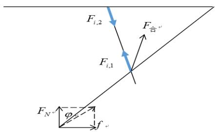

text_image

F_{i,2}
F_{i,1}
F_{合}
F_{N}
\varphi
f

图 16

（3）对于材料用量，尽可能减少材料用量，且能保证满足运动约束和重心相对位置达到一个较低值。材料用量直接取决于体积，而长方形木板宽度 b 已知，厚度与 $\Delta$ 成正比，故材料用量仅与桌腿宽度 $\Delta$ 与长度 a 乘积有关，记

$$
S = \Delta \times \mathbf {a} = \frac {\mathbf {a} \times \mathbf {b}}{2 n}
$$

（4）对于加工方便，我们在此仅考虑 1/4 桌腿的数量 n，在桌腿数量能满足其截面要求时，我们尽可能选取较小值。

故我们得到了如下的一个优化问题:

$$
\max = Z _ {G}, \min = n, \min = S
$$

$$
\left\{ \begin{array}{l} \mathrm{d} _ {n} + \frac {a}{2} \times \mathrm{p} <   \frac {a}{2} \\ y _ {\mathrm{i}} > 0 (i = 1, 2, 3 \dots n) \\ z _ {1} = \max \left\{\mathrm{z} _ {1}, \mathrm{z} _ {2} \dots \mathrm{z} _ {n} \right\} = \mathrm{h} \\ \frac {b}{2} <   \frac {a}{2} \times p <   \frac {a}{2} \\ \arccos (\frac {h}{a / 2}) <   \arctan \mu_ {s} \\ h <   \frac {a}{2} \\ 0 <   p <   1 \\ \frac {1}{2} <   \frac {b}{2 n \times 3} <   2 \end{array} \right.
$$

这是一个非线性的规划问题,将之前坐标带入，变量仅有 n, a, p, (b, h 为常数) 故我们给出优化设计方案的步骤如下:

（1）对于给定的高度 h 和圆桌直径即木板宽度 b，首先我们利用截面强度要求对 n 的限制（即最后一式），求出 n 的最小值，同时还要保证 n 为整数，故 n 的选取比例灵活；  
(2) 这样确定 $n$ 之后, 变量就只有 $a$ 与 $p$ (板长与钢筋位置), 问题得到了简化。考虑到 $S$ 表达式简洁且与目标函数 $Z_{G}$ 之间存在相互制约的关系, 我们进一步做如下处理;  
(3) 采用局部优化的方法且优先考虑目标函数 S，即优先考虑部分约束条件，然后验证是否满足其他的约束条件，若满足，则是我们需要的解，若不满足，重新选择约束条件，这样可以算出一系列的 a, p 值，再利用目标函数 $Z_{G}$ 选出最合理的解，从而得出最终的板长和钢筋位置；  
（4）最后再利用问题一中同样的方法算出槽长，从而给出最优的设计参数。

## 5.2.3 具体实例的设计

当所给高度 h=70cm，木板宽度 b=80cm 时，首先确定 n，由 $\frac{1}{2}<\frac{b}{2n\times3}<2$ ，可解得 $\frac{20}{3}<n<\frac{80}{3}$ ，为了使 n 取较小整数且便于计算，我们取 n=10。

为了便于计算我们记 $y = \frac{a}{2} \times p$ 即为钢筋初始位置的坐标，取 $\mu_{\mathrm{s}} = 0.7^{[2]}$ ，这样变量仅有 $a$ 与 $y$ ，我们将所有已知数据代入约束条件并化简可得 $a$ 与 $y$ 的约束关系如下：

$$
\left\{ \begin{array}{l} 2 y \times 4 0 \times \sqrt {1 - \frac {4 \times 4 9 0 0}{a ^ {2}}} - y ^ {\wedge} 2 - 4 0 \times a + \frac {a ^ {2}}{4} > 0 \\ \sqrt {1 6 0 0 - (4 4 - 4 \mathrm{i}) ^ {2}} - \frac {\left(\sqrt {1 6 0 0 - (4 4 - 4 \mathrm{i}) ^ {2}} - y \times \sqrt {1 - \frac {4 \times 4 9 0 0}{a ^ {2}}}\right) \left(\frac {a}{2} - \sqrt {1 6 0 0 - (4 4 - 4 \mathrm{i}) ^ {2}}\right)}{\sqrt {y ^ {2} + 1 6 0 0 - (4 4 - 4 \mathrm{i}) ^ {2}} - 2 y \sqrt {1 - \frac {4 \times 4 9 0 0}{a ^ {2}}} \times \sqrt {1 6 0 0 - (4 4 - 4 \mathrm{i}) ^ {2}}} > 0 (\mathrm{i} = 1, 2, 3 \dots 1 0) \\ \sqrt {y ^ {2} + (1 6 0 0 - (4 4 - 4 \mathrm{i}) ^ {2}) - 2 y \sqrt {1 6 0 0 - (4 4 - 4 \mathrm{i}) ^ {2}} \sqrt {1 - \frac {4 \times 4 9 0 0}{a ^ {2}}}} - \frac {2 y \times \left(\frac {a}{2} - \sqrt {1 6 0 0 - (4 4 - 4 \mathrm{i}) ^ {2}}\right)}{a} > 0 (\mathrm{i} = 1, 2, 3 \dots 1 0) \\ 4 0 <   y <   \frac {a}{2} \\ 1 4 0 = 2 h <   a <   1 4 0 \times \sqrt {1 + \mu_ {s} ^ {2}} = 1 7 0. 8 9 \end{array} \right.
$$

容易看出前三个为非线性约束，后两个为线性约束。直接利用现成优化软件求解十分困难，且计算量大。故我们采取作图法求其可行域：首先我们在利用matlab取约束条件对应的二元函数，作图如下：

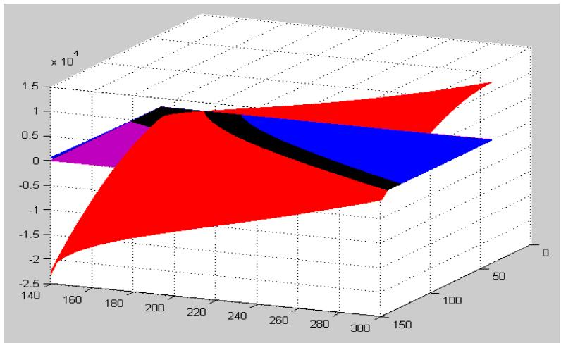

surface_3d

| X | Y | Value (x 10^4) |
| --- | --- | --- |
| 150~300 | 140~300 | -2.5~1.5 |

图 17

其中黑色平面为 z=0，红色曲面为约束条件 1，蓝色曲面簇对应约束条件 3，紫色曲面对应约束条件 4，在黑色平面上方对应的区域交集即为可行域。从下往上看，如图所示

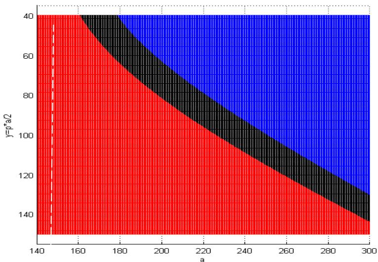

area_stacked

| a | y=p*a/2 (Red Region Boundary) | y=p*a/2 (Black Region Boundary) | y=p*a/2 (Blue Region Boundary) |
| --- | --- | --- | --- |
| 140~300 | 135~40 | 135~40 | 135~40 |

图 18

现在我们加上条件 $140 < a < 170.9$ 则可得出可行域，即为图中左上角的曲边三角形。首先考虑用材的约束，即要求a尽可能小，故我们从左边界线开始取值，并且取整数解：（161，40）、（162，41）、（162，42）、（163，43）、（164，44）、（164，45）、（165，46）、（166，47）、（166，48）、（167，49）、（168，50）、（169，51）、（169，52）、（170，53）、接下来我们利用重心相对位置公式 $1 - \frac{Z_G}{h}$ 来计算并作图如下：

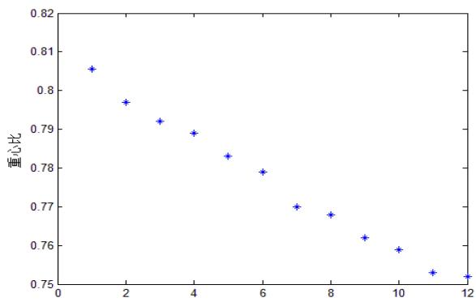

scatter

| X | 重心比 |
| --- | --- |
| 1 | ~0.805 |
| 2 | ~0.797 |
| 3 | ~0.792 |
| 4 | ~0.789 |
| 5 | ~0.783 |
| 6 | ~0.779 |
| 7 | ~0.770 |
| 8 | ~0.768 |
| 9 | ~0.762 |
| 10 | ~0.759 |
| 11 | ~0.753 |
| 12 | ~0.752 |

图 19

可以看出重心呈下降趋势，故我们最终取（170，53）即板长 170cm，钢筋位置距中心线 53cm。桌脚长、槽长设计如下：

<table><tr><td>桌腿编号i</td><td>1</td><td>2</td><td>3</td><td>4</td><td>5</td><td>6</td><td>7</td><td>8</td><td>9</td><td>10</td></tr><tr><td>桌腿长度 $l_i$ (cm)</td><td>85</td><td>67.56</td><td>61</td><td>56.43</td><td>53</td><td>50.36</td><td>48.34</td><td>46.84</td><td>45.81</td><td>45.2</td></tr><tr><td>槽长 $d_i$ (cm)</td><td>0</td><td>9.87</td><td>15.07</td><td>19.24</td><td>22.69</td><td>25.53</td><td>27.80</td><td>29.55</td><td>30.78</td><td>31.52</td></tr></table>

## 5.3 问题三

## 5.3.1 折叠桌设计软件的数学模型

首先明确折叠桌设计软件的输入和输出内容。

坐标系与 5.1.1 中相同。

输入：1. 折叠桌高度 $H(cm)$ ;

2. 桌面边缘线的方程，xOy 平面内的闭合曲线方程 $\left\{\begin{aligned} y &= f(x) \\ z &= 0 \end{aligned}\right.$ ，且关于 x 轴和 y 轴轴对称；

3. 桌脚边缘线方程，关于 $xOz$ 平面对称的曲线段方程 $\left\{ \begin{array}{l} y = g_1(x) \\ z = g_2(x) \end{array} \right.$ ，最

低点与 xOy 平面的距离为 H。

输出：1. 所需平板材料形状，即加工示意图；

2. 每根木条的长度;

3.钢筋位置;

4. 开槽长度。

由于桌子关于 x 轴，y 轴对称，我们仅考虑在第一卦象中的运动情况。

假定桌面边缘线沿 x 轴方向的最大宽度为 b，沿 y 轴方向的最大宽度为 c，所用平板材料的形状为 “曲边长方形”，其宽取为 b。根据加工难易程度选定每一侧有 n 条桌腿，由外向内记为第 $i(i=1,2,3\ldots n)$ 条桌腿，那么每条桌腿宽度 $\Delta=\frac{b}{2n}$ 。我们用 $x_{i}(i=1,2,3\ldots n)$ 来表示每条桌腿运动平面的 x 坐标，我们记第 i 条腿所处的位置为 $x_{i}=\frac{1}{2}b-\Delta\times(i-1)$ 。桌腿长度为 $l_{i}$ 。

程序流程如下:

步骤一：确定桌腿木条长度。取桌腿木条长度为桌面边缘线与桌脚边缘线上对应两点间的距离。即对于第i条桌腿，其对应的桌面边缘上的转轴点为 $(x_{i},y1_{i},0)$ ，其中 $y1_{i}=f(x_{i})$ ；对应的桌脚边缘线上的点为 $(x_{i},y2_{i},z2_{i})$ ，其中 $y2_{i}=g_{1}(x_{i}),z2_{i}=g_{2}(x_{i})$ ；则取 $l_{i}=\sqrt{(y1_{i}-y2_{i})^{2}+(0-z2_{i})^{2}}$ 。由此可以保证折叠后的实际桌脚边缘线与客户提供的桌脚边缘线粗略一致。

步骤二：确定桌脚木条边缘点坐标 $(x_{i},y_{i},z_{i})$ 随最外侧木条高度h变化的函数关系，函数中含有参量：钢筋位置p。根据运动过程中钢筋对中间桌腿木条的几何约束关系，用类似于5.1.2中的方法可以得到：

$$
\left\{ \begin{array}{l} x _ {i} = \frac {1}{2} b - \Delta \times (\mathrm{i} - 1) \\ y _ {i} (h) = \frac {p \sqrt {l _ {1} ^ {2} - h ^ {2}} - y 1 _ {i}}{\sqrt {\left(p l _ {1}\right) ^ {2} + y 1 _ {i} ^ {2} - 2 p \cdot y 1 _ {i} \sqrt {l _ {1} ^ {2} - h ^ {2}}}} \cdot l _ {i} + y 1 _ {i} \\ z _ {i} (h) = \frac {p h}{\sqrt {\left(p l _ {1}\right) ^ {2} + y 1 _ {i} ^ {2} - 2 p \cdot y 1 _ {i} \sqrt {l _ {1} ^ {2} - h ^ {2}}}} \cdot l _ {i} \end{array} \right.
$$

其中 h 是自变量，p 是参量，其余均为关于 i 的已知量。

步骤三: 求解最优的 p 使实际桌脚边缘线尽可能接近客户提供的桌脚边缘线。为此, 定义折叠后的桌脚边缘点与对应的客户期望的桌脚边缘线上的点之间距离的平方和函数 $Q(p)=\sum_{i=1}^{10}\sqrt{\left(y_{i}(H)-y2_{i}\right)^{2}+\left(z_{i}(H)-z2_{i}\right)^{2}}$ ，用以描述实际桌脚边缘线与客户提供的桌脚边缘线的接近程度。将 $Q(p)$ 作为目标函数，在 $p>\frac{c}{l_{1}}$ （保证钢筋初始位置在桌面边缘线以外）的范围内求出目标函数的最小值，得到取最小值时的 p 值，即为所求。

步骤四：验证问题二中所列约束条件，保证设计的可行性。p 值确定后，可以计算出 $y_{i}(H), z_{i}(H)$ ，代入问题二中约束条件，检验钢筋在桌腿滑槽内滑动时，不能超过桌腿长度限制，展开过程不出现干涉，展开后最外侧的桌脚着地等约束条件，若存在不满足的情况，水平移动调整客户提供的桌脚边缘线，再重复步骤一，直至结果满足所有约束条件。

步骤五：计算在最优 p 值下的开槽长度。程序结束。

## 5.3.2 创意平板折叠桌设计实例

以下是两个设计实例。

设计一：桌面边缘线在第一卦限内的方程 $\frac{y}{35} +\frac{x}{25} = 1,x\in [0,25]$ ，桌脚边缘线在第一卦限内的方程 $\left\{ \begin{array}{l}\frac{y}{20} -\frac{x}{20} = 1\\ \frac{z}{40} -\frac{y}{90} = 1 \end{array} \right.$ $x\in [0,25]$ ，折叠桌高度 $H = 60cm$ ，即桌面为菱形，桌脚边缘线为直线。

钢筋位置 p = 0.59

桌腿木条长度见下表

<table><tr><td>i</td><td>1</td><td>2</td><td>3</td><td>4</td><td>5</td><td>6</td><td>7</td><td>8</td><td>9</td><td>10</td></tr><tr><td> $l_i$ </td><td>75</td><td>70.63</td><td>66.54</td><td>62.77</td><td>59.39</td><td>56.47</td><td>54.09</td><td>52.31</td><td>51.20</td><td>50.80</td></tr></table>

表 3

开槽长度见下表:

<table><tr><td>i</td><td>1</td><td>2</td><td>3</td><td>4</td><td>5</td><td>6</td><td>7</td><td>8</td><td>9</td><td>10</td></tr><tr><td> $d_i$ </td><td>0</td><td>1.49</td><td>3.19</td><td>5.12</td><td>7.31</td><td>9.79</td><td>12.58</td><td>15.71</td><td>19.18</td><td>23.00</td></tr></table>

表 4

动态变化过程示意图如下:

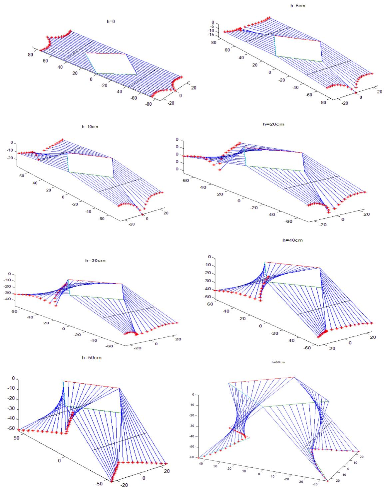

设计二：桌面边缘线在第一卦限内的方程 $y=\left\{\begin{aligned}&30,x\in[0,15]\\ &75-3x,x\in(15,25)\end{aligned}\right.$ ，桌脚边缘线在第一卦限内的方程 $\left\{\begin{aligned}x^{2}+\left(y-40\right)^{2}&=25^{2}\\ y-z+20&=0\end{aligned}\right.$ $x\in[0,25],y\leq40$ ，折叠桌高度 H=60cm，即桌面为梯形，桌脚边缘线为半个椭圆。

钢筋位置 p = 0.50

桌腿木条长度见下表

<table><tr><td>i</td><td>1</td><td>2</td><td>3</td><td>4</td><td>5</td><td>6</td><td>7</td><td>8</td><td>9</td><td>10</td></tr><tr><td> $l_i$ </td><td>72.11</td><td>53.64</td><td>46.098</td><td>42.15</td><td>41.23</td><td>40.08</td><td>39.27</td><td>38.71</td><td>38.35</td><td>38.15</td></tr></table>

表 5

开槽长度见下表:

<table><tr><td>i</td><td>1</td><td>2</td><td>3</td><td>4</td><td>5</td><td>6</td><td>7</td><td>8</td><td>9</td><td>10</td></tr><tr><td> $d_i$ </td><td>0</td><td>3.94</td><td>9.36</td><td>16.55</td><td>25.57</td><td>25.57</td><td>25.57</td><td>25.57</td><td>25.57</td><td>25.57</td></tr></table>

表 6

动态变化过程示意图如下:

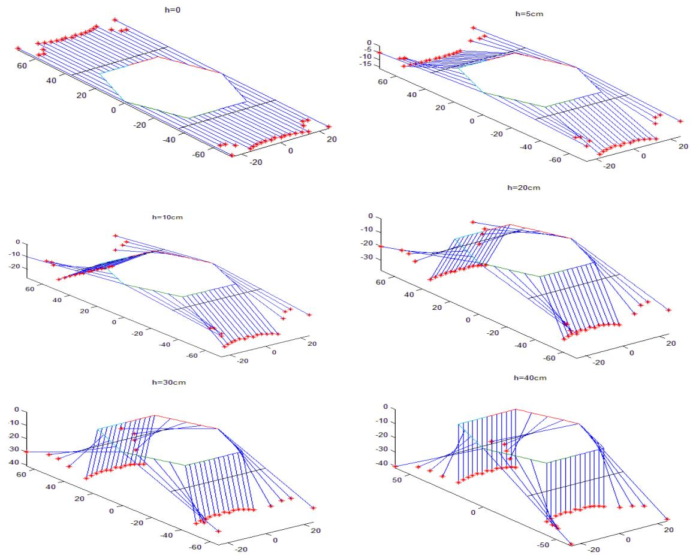

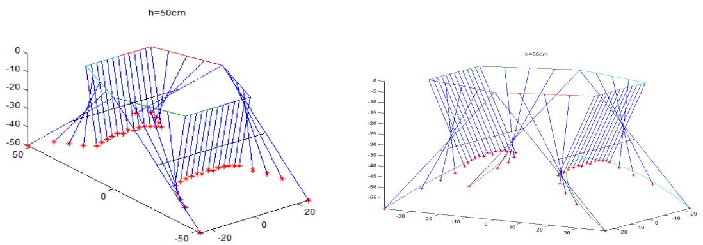

## 六、模型的评价、应用及推广

## 6.1 模型的评价

模型的优点如下:

1. 从几何约束、力学、运动学、材料等多角度考虑折叠桌的设计优化问题，考虑问题比较全面，使模型更加接近实际情况，增强了模型的可行性与应用性。  
2. 对于问题二中含有复杂约束条件的非线性规划问题, 本模型没有采用复杂的遗传算法等算法求解, 而是通过 matlab 画出约束条件方程表示的曲面, 找到可行域, 最终确定使目标函数最优的最优解, 操作简便, 形象直观。  
3. 对于问题一和问题三中的设计方案，都用 matlab 画出动态仿真图，可以清晰地描述每种设计下折叠桌的动态变化过程，使折叠桌动态变化过程中桌腿木条和钢筋等的运动制约关系更加明确，也直观地验证了设计方案的可行性。  
4. 对于桌脚边缘线的描述，建立了令桌腿木条宽度趋于零，从而计算出连续曲线解析表达式的方法，近似程度高，表现力强。  
5. 对于问题三，通过定义距离平方和函数 $Q(p)$ 很好地度量了所得桌脚边缘线与客户提供的桌脚边缘线之间的近似程度，作为目标函数求出使其取最小值的 p，很好地解决了使得生产的折叠桌尽可能接近客户所期望的形状这一问题。

## 6.2 模型的应用与推广

本模型不仅可以用来解决给定尺寸的平板折叠桌的设计参数的计算问题，还可以根据给定的任意形状给出设计方案，并直接为相关软件的编写做了基础性的建模工作。

另外，本模型还可以推广到其他折叠家具的设计生产过程中，在工业中类似的折叠机构的设计制造过程中也有应用。

## 七、参考文献

[1] 单辉组，材料力学，北京，高等教育出版社，2008  
[2] 谢传锋，王琪，理论力学，北京，高等教育出版社，2009  
[3] 刘来福 黄海洋 曾文艺，数学模型与数学建模，北京：北京师范大学出版社，1997  
[4] 姜启源 谢金星 叶俊，数学模型，北京：高等教育出版社，2003