( “

( )

( )

( 体 ).

( A/B/C/D ) B

(8 字) 16046004

( ) \_\_\_\_

( ) 1.\_

2.\_\_\_\_

3.

( ) \_\_\_\_

(论文纸质版与电子版中的以上信息必须一致，只是电子版中无需签名。以上内容请仔细核对，提交后将不再允许做任何修改。如填写错误，论文可能被取消评奖资格。)

2014 9 14

( )

( )

<table><tr><td></td><td></td><td></td><td></td><td></td><td></td><td></td><td></td><td></td><td></td><td></td></tr><tr><td></td><td></td><td></td><td></td><td></td><td></td><td></td><td></td><td></td><td></td><td></td></tr><tr><td></td><td></td><td></td><td></td><td></td><td></td><td></td><td></td><td></td><td></td><td></td></tr></table>

( )

( )

$$
d \left(y - \sqrt {r ^ {2} - x ^ {2}}\right) \sin \theta = z \left(d \cos \theta + w - \sqrt {r ^ {2} - x ^ {2}}\right).
$$

(5-12) (5-13).

20.09 19.60 18.77 17.59 16.06 14.14 11.81 9.00

5.53(cm).

( )

( )

$\theta$ 1.0605( ) $L$ 158.56cm.

Matlab

s 43.80cm

8字

体

$$
1 2 0 \mathrm{cm} \times 5 0 \mathrm{cm} \times 3 \mathrm{cm}
$$

$$
y O z
$$

$$
\overrightarrow {O P} = \overrightarrow {O C} + \overrightarrow {C P}
$$

( ).

Matlab

S ( )

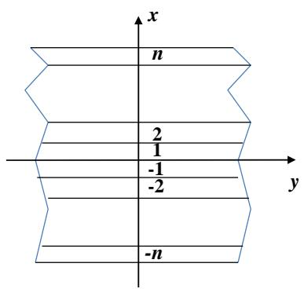  
5-1

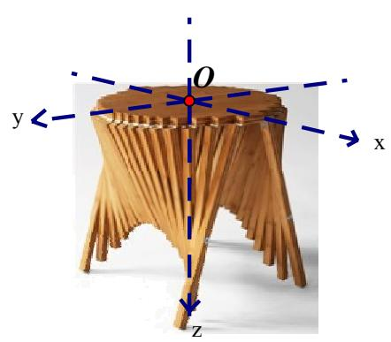  
5-2

( )
5.1 $P = (x, y, z) \quad u \quad P$ $xOz \quad v \quad P \quad yOz \quad .$ $\overrightarrow{OP} = \overrightarrow{OC} + \overrightarrow{CP} \ .$

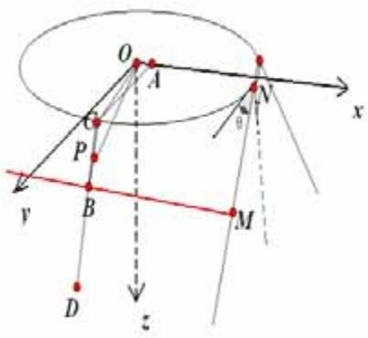  
5-3  
C P  
(1)  
O

r ，

W w

$$
\overrightarrow {O C} \quad \overrightarrow {C P}
$$

yOz x = v

$$
\left\{ \begin{array}{c} x ^ {2} + y ^ {2} = r ^ {2} \\ z = 0 \end{array} \right.\tag{5-1}
$$

$$
r = \sqrt {\left(\frac {W}{2}\right) ^ {2} + w ^ {2}}\tag{5-2}
$$

$$
\begin{array}{c} x O z \\ C \Big (v, \sqrt {r ^ {2} - v ^ {2}}, 0 \Big) \end{array}
$$

$$
\overrightarrow {O C} = \left(v, \sqrt {r ^ {2} - v ^ {2}}, 0\right).\tag{5-3}
$$

$$
\left| \overrightarrow {C P} \right| = u - \sqrt {r ^ {2} - v ^ {2}}.
$$

$$
M \left(v, d \cos \theta + w, d \sin \theta\right)
$$

θ.  
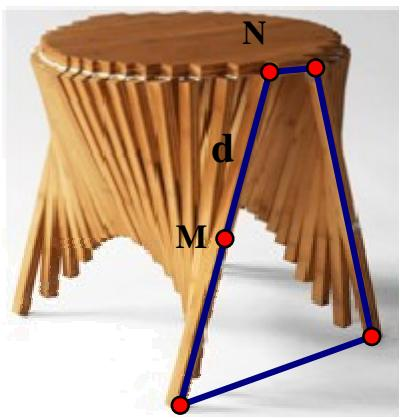  
5-4

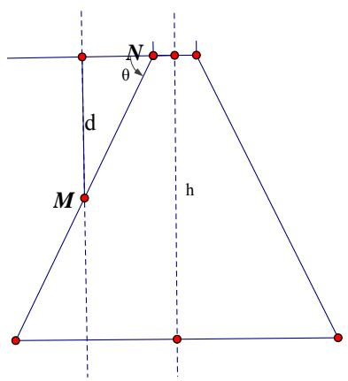  
5-5

5-1

$$
B = (v, d \cos \theta + w, d \sin \theta).
$$

$$
\overrightarrow {C B} = \overrightarrow {O B} - \overrightarrow {O C} = \left(0, d \cos \theta + w - \sqrt {r ^ {2} - v ^ {2}}, d \sin \theta\right).
$$

B

$$
\begin{array}{r l} \left| \overrightarrow {C B} \right| & = \sqrt {\left(d \cos \theta + w - \sqrt {r ^ {2} - v ^ {2}}\right) ^ {2} + \left(d \sin \theta\right) ^ {2}} \\ & = \sqrt {d ^ {2} + w ^ {2} + r ^ {2} - v ^ {2} - 2 (d \cos \theta + w) \sqrt {r ^ {2} - v ^ {2}} \cos \theta + 2 d w \cos \theta} \end{array}
$$

$$
\overrightarrow {C P} = \frac {\overrightarrow {C B}}{\left| \overrightarrow {C B} \right|} \left| \overrightarrow {C P} \right| = \frac {\left(0 , d \cos \theta + w - \sqrt {r ^ {2} - v ^ {2}} , d \sin \theta\right)}{\sqrt {\left(d \cos \theta + w - \sqrt {r ^ {2} - v ^ {2}}\right) ^ {2} + \left(d \sin \theta\right) ^ {2}}} \left(u - \sqrt {r ^ {2} - v ^ {2}}\right)
$$

$$
\overrightarrow {C P} = \frac {\left(0 , d \cos \theta + w - \sqrt {r ^ {2} - v ^ {2}} , d \sin \theta\right)}\sqrt {d ^ {2} + w ^ {2} + r ^ {2} - v ^ {2} - 2 (d \cos \theta + w) \sqrt {r ^ {2} - v ^ {2}} + 2 d w \cos \theta} \left(u - \sqrt {r ^ {2} - v ^ {2}}\right)\tag{5-4}
$$

(3)

$$
\overrightarrow {O P} = \overrightarrow {O C} + \overrightarrow {C P} = \left(v, \sqrt {r ^ {2} - v ^ {2}}, 0\right) + \frac {\left(0 , d \cos \theta + w - \sqrt {r ^ {2} - v ^ {2}} , d \sin \theta\right)}{\sqrt {d ^ {2} + w ^ {2} + r ^ {2} - v ^ {2} - 2 (d \cos \theta + w) \sqrt {r ^ {2} - v ^ {2}} + 2 d w \cos \theta}} \left(u - \sqrt {r ^ {2} - v ^ {2}}\right)\tag{5-5}
$$

$$
\left\{ \begin{array}{l} x = v, \\ y = \sqrt {r ^ {2} - v ^ {2}} + \frac {\left(d \cos \theta + w - \sqrt {r ^ {2} - v ^ {2}}\right) \cdot \left(u - \sqrt {r ^ {2} - v ^ {2}}\right)}{\sqrt {d ^ {2} + w ^ {2} + r ^ {2} - v ^ {2} - 2 (d \cos \theta + w) \sqrt {r ^ {2} - v ^ {2}} + 2 d w \cos \theta}} \\ z = \frac {d \sin \theta \left(u - \sqrt {r ^ {2} - v ^ {2}}\right)}{\sqrt {d ^ {2} + w ^ {2} + r ^ {2} - v ^ {2} - 2 (d \cos \theta + w) \sqrt {r ^ {2} - v ^ {2}} + 2 d w \cos \theta}}, \\ (u, v \quad .) \end{array} \right.\tag{5-6}
$$

$$
y - \sqrt {r ^ {2} - v ^ {2}} \quad z\tag{4}
$$

$$
\frac {y - \sqrt {r ^ {2} - v ^ {2}}}{z} = \frac {d \cos \theta + w - \sqrt {r ^ {2} - v ^ {2}}}{d \sin \theta}
$$

$x = \nu$

$$
z = \frac {d \left(y - \sqrt {r ^ {2} - x ^ {2}}\right) \sin \theta}{d \cos \theta + w - \sqrt {r ^ {2} - x ^ {2}}}\tag{5-7}
$$

2n

n

$$
y
$$

x

i

$$
v = w i, C \Big (w i, \sqrt {r ^ {2} - v ^ {2}}, 0 \Big) \quad B = (w i, d \cos \theta + w, d \sin \theta),
$$

$$
\left| \overrightarrow {B C} \right| = \sqrt {d ^ {2} + w ^ {2} + r ^ {2} - (w i) ^ {2} - 2 (d \cos \theta + w) \sqrt {r ^ {2} - (w i) ^ {2}} + 2 d w \cos \theta}.
$$

$$
l e n (x _ {i}) = \left| \overrightarrow {B C} \right| - \left(d + w - \frac {l}{2}\right) \quad l \quad i
$$

$$
l e n (x _ {i}) = \sqrt {d ^ {2} + w ^ {2} + r ^ {2} - x ^ {2} - 2 (d \cos \theta + w) \sqrt {r ^ {2} - x ^ {2}} + 2 d w \cos \theta} + \sqrt {r ^ {2} - x ^ {2}} - d - w\tag{5-8}
$$

$$
\frac {l}{2} = \sqrt {r ^ {2} - (w i) ^ {2}}\tag{5-9}
$$

$$
l e n (x _ {i}) = \sqrt {d ^ {2} + w ^ {2} + r ^ {2} - (w i) ^ {2} - 2 (d \cos \theta + w) \sqrt {r ^ {2} - (w i) ^ {2}} + 2 d w \cos \theta} + \sqrt {r ^ {2} - (w i) ^ {2}} - d - w\tag{5-10}
$$

$$
= \frac {L - l}{2}\tag{5-11}
$$

L

$$
= \frac {\frac {L}{2} - w}{2} - l e n (i) = \frac {L}{4} - \frac {w}{2} - l e n (i)\tag{5-12}
$$

5.4

L

$$
(x \quad) \quad \frac {L}{2}.
$$

( )

$$
u = \frac {L}{2}\tag{5-6}
$$

$$
\left\{ \begin{array}{l} x = v, \\ y = \sqrt {r ^ {2} - v ^ {2}} + \frac {\left(d \cos \theta + w - \sqrt {r ^ {2} - v ^ {2}}\right) \left(\frac {L}{2} - \sqrt {r ^ {2} - v ^ {2}}\right)}{\sqrt {d ^ {2} + w ^ {2} + r ^ {2} - v ^ {2} - 2 (d \cos \theta + w) \sqrt {r ^ {2} - v ^ {2}} + 2 d w \cos \theta}}, \\ z = \frac {d \sin \theta \left(\frac {L}{2} - \sqrt {r ^ {2} - v ^ {2}}\right)}{\sqrt {d ^ {2} + w ^ {2} + r ^ {2} - v ^ {2} - 2 (d \cos \theta + w) \sqrt {r ^ {2} - v ^ {2}} + 2 d w \cos \theta}}, \\ (v \quad .) \end{array} \right.\tag{5-13}
$$

$$
\left\{ \begin{array}{l} d \left(y - \sqrt {r ^ {2} - x ^ {2}}\right) \sin \theta = z \left(d \cos \theta + w - \sqrt {r ^ {2} - x ^ {2}}\right) \\ d \sin \theta \left(\frac {L}{2} - \sqrt {r ^ {2} - x ^ {2}}\right) = z \sqrt {d ^ {2} + w ^ {2} + r ^ {2} - x ^ {2} - 2 (d \cos \theta + w) \sqrt {r ^ {2} - x ^ {2}} + 2 d w \cos \theta} \end{array} \right.\tag{5-14}
$$

5.5

$$
\begin{array}{c} W = 5 0 \quad w = 2. 5 \quad (5 - 2) \\ r = \sqrt {\left(\frac {W}{2}\right) ^ {2} + w ^ {2}} = \sqrt {6 3 1 . 2 5} = 2 5. 1 2 5. \end{array}\tag{5.5.1}
$$

$$
\begin{array}{l} d = \frac {1}{2} \left(\frac {L}{2} - w\right) = 2 8. 7 5. \\ h = 5 3 - 3 = 5 0 \quad 2 d = 5 7. 5 \end{array}
$$

$$
\begin{array}{c} \sin \theta = \frac {h}{2 d} = \frac {5 0}{5 7 . 5} \\ \theta = \arcsin \left(\frac {h}{2 d}\right) = \arcsin (0. 8 6 9 6) = 1. 0 5 4 3. \end{array}\tag{5-7}
$$

$$
z = \frac {2 5 \left(y - \sqrt {6 3 1 . 2 5 - x ^ {2}}\right)}{1 6 . 7 0 - \sqrt {6 3 1 . 2 5 - x ^ {2}}}\tag{5-15}
$$

5.5.2

$$
\begin{array}{r l} r ^ {2} = 6 3 1. 2 5 \quad w & = 2. 5 \quad (5 - 9) \quad (5 - 1 1) \\ \frac {l}{2} & = \sqrt {6 3 1 . 2 5 - 6 . 2 5 i ^ {2}}, \quad i = 1 \quad \dots \dots 1 0. \\ & = 6 0 - \frac {l}{2}. \end{array}\tag{1}
$$

$$
\begin{array}{c} d = 2 8. 7 5, r ^ {2} = 6 3 1. 2 5, \sin \theta = \frac {5 0}{5 7 . 5} \quad (5 - 1 0) \\ l e n (x _ {i}) = \sqrt {1 4 6 4 . 0 6 - 6 . 2 5 i ^ {2} - 3 3 . 4 \sqrt {6 3 1 . 2 5 - 6 . 2 5 i ^ {2}} + 7 0 . 9 9} + \sqrt {6 3 1 . 2 5 - 6 . 2 5 i ^ {2}} - 3 1. 2 5 \\ L = 1 2 0 c m, w = 2. 5 c m \quad (5 - 1 2) \quad = 2 8. 7 5 - l e n (i). \end{array}\tag{5-16}
$$

<table><tr><td rowspan="2">i</td><td colspan="4">2</td><td colspan="6">(cm)</td></tr><tr><td>1</td><td>2</td><td>3</td><td>4</td><td>5</td><td>6</td><td>7</td><td>8</td><td>9</td><td>10</td></tr><tr><td></td><td>8.66</td><td>9.15</td><td>9.98</td><td>11.16</td><td>12.69</td><td>14.61</td><td>16.94</td><td>19.75</td><td>23.22</td><td>28.75</td></tr><tr><td></td><td>20.09</td><td>19.60</td><td>18.77</td><td>17.59</td><td>16.06</td><td>14.14</td><td>11.81</td><td>9.00</td><td>5.53</td><td>0</td></tr></table>

5.5.3

$$
\begin{array}{l} d = 2 8. 7 5, r ^ {2} = 6 3 1. 2 5 \quad w = 2. 5 \quad \sin \theta = \frac {5 0}{5 7 . 5} \quad (5 - 1 4) \\ \left\{ \begin{array}{l} 2 5 \left(y - \sqrt {6 3 1 . 2 5 - x ^ {2}}\right) = z \left(1 6. 7 - \sqrt {6 3 1 . 2 5 - x ^ {2}}\right) \\ 2 5 \left(6 0 - \sqrt {6 3 1 . 2 5 - x ^ {2}}\right) = z \sqrt {1 5 3 5 . 0 6 - x ^ {2} - 3 3 . 4 \sqrt {r ^ {2} - x ^ {2}}} \end{array} \right. \\ \text {Matlab} \end{array}\tag{5-17}
$$

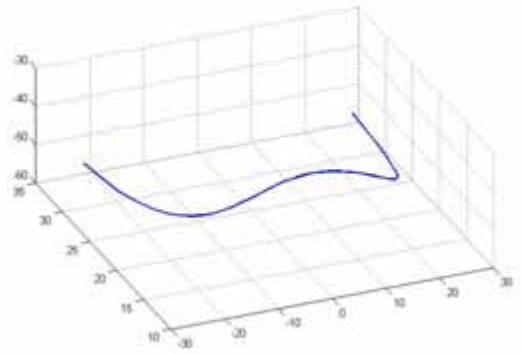

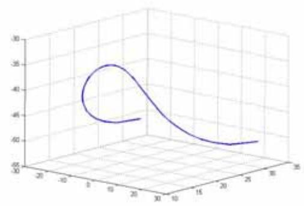

5-6

( )

$$
r ^ {2} = 6 3 1. 2 5\tag{5.5.4}
$$

$$
\begin{array}{r l} x = w i \quad & (5 - 1) \\ & \left\{ \begin{array}{l} w ^ {2} i ^ {2} + y ^ {2} = 6 3 1. 2 5 \\ z = 0 \end{array} \right. \end{array}
$$

BM

$$
i = - 1 0, \dots , 0, 1, 2, \dots , 1 0
$$

$$
\left\{ \begin{array}{c} x = w i \\ y = d \cos \theta + w \\ z = d \sin \theta \\ x > 0 \end{array} \right.
$$

D

$$
\begin{array}{c} C _ {i} (x _ {c _ {i}}, y _ {c _ {i}}, z _ {c _ {i}}) \quad B _ {i} (x _ {b _ {i}}, y _ {b _ {i}}, z _ {b _ {i}}), i = - 1 0, \dots , 0, 1, 2, \dots , 1 0 \\ C \quad B \quad . \\ , \quad D _ {i} (x _ {d _ {i}}, y _ {d _ {i}}, z _ {d _ {i}}), i = - 1 0, \dots , 0, 1, 2, \dots , 1 0 \end{array} .
$$

B

$$
\left| \overrightarrow {B D} \right| = l - \left| \overrightarrow {C A} \right| - \left| \overrightarrow {B C} \right|
$$

$$
A _ {i} = (w i, 0, 0) \quad i = - 1 0, \dots , 0, 1, 2, \dots , 1 0.
$$

$$
k = \frac {\frac {L}{2} - \left| \overrightarrow {A C} \right|}{\left| \overrightarrow {B C} \right|}
$$

$$
\frac {x _ {d _ {i}} - x _ {c _ {i}}}{x _ {b _ {i}} - x _ {c _ {i}}} = \frac {y _ {d _ {i}} - y _ {c _ {i}}}{y _ {b _ {i}} - y _ {c _ {i}}} = \frac {z _ {d _ {i}} - z _ {c _ {i}}}{z _ {b _ {i}} - z _ {c _ {i}}} = k
$$

$$
\begin{array}{c} \left\{ \begin{array}{l} x _ {d _ {i}} = x _ {c _ {i}} + k \left(x _ {b _ {i}} - x _ {c _ {i}}\right) \\ y _ {d _ {i}} = y _ {c _ {i}} + k \left(y _ {b _ {i}} - y _ {c _ {i}}\right) \\ z _ {d _ {i}} = z _ {c _ {i}} + k \left(z _ {b _ {i}} - z _ {c _ {i}}\right) \end{array} \right. \\ D \qquad \qquad B \\ \theta \qquad \qquad \theta \end{array}
$$

$$
\begin{array}{c} \theta = \frac {1}{6} \times 1. 0 5 4 3, \frac {2}{6} \times 1. 0 5 4 3, \frac {3}{6} \times 1. 0 5 4 3, \frac {4}{6} \times 1. 0 5 4 3, \frac {5}{6} \times 1. 0 5 4 3, 1. 0 5 4 3, \\ 5 - 7 ( \begin{array}{c c} & 2) \end{array} \end{array}
$$

matlab

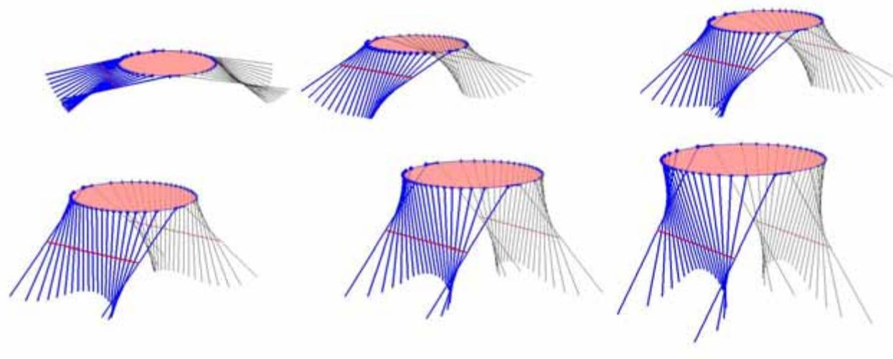  
5-7

## 6.1

6.1.1

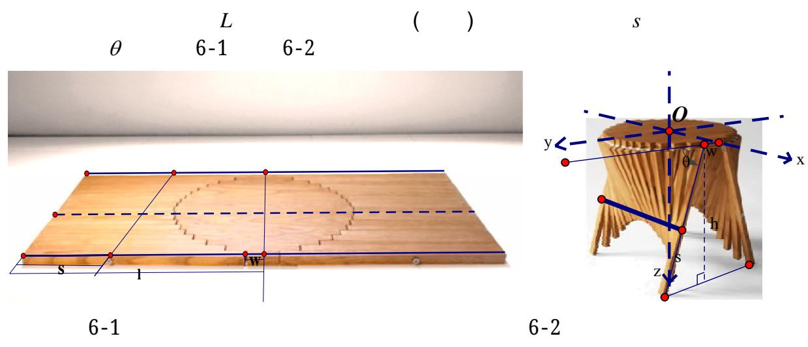

6.1.2

(1)

( )

$$
\min \frac {h}{\sin \theta} \quad \max \sin \theta\tag{6-1}
$$

(2)

$$
\begin{array}{l} W \quad w \quad 2 n = \frac {W}{w} \\ \quad 4 n \quad . \\ \quad . \quad \text {小} \quad . \\ \quad \min \sum_ {i = 1} ^ {n} \operatorname{len} (x _ {i}) \\ x _ {i} = w i \quad i \quad (5 - 9) \\ \operatorname{len} (x _ {i}) = \sqrt {d ^ {2} + w ^ {2} + r ^ {2} - (w i) ^ {2} - 2 (d \cos \theta + w) \sqrt {r ^ {2} - (w i) ^ {2}} + 2 d w \cos \theta} + \sqrt {r ^ {2} - (w i) ^ {2}} - d - w \\ d = \frac {h}{\sin \theta} - s. \end{array}\tag{6-2}
$$

6.1.3

(1)

S.

λ

$$
l e n \big (x _ {i} \big) <   s - \lambda , i = 1, 2, \dots , n\tag{6-3}
$$

(2)

$$
\begin{array}{c} y \quad y _ {D} (x _ {i}) \\ y _ {D} (x _ {i}) \geq 0, i = 1, 2, \dots , n \\ y _ {D} (x) = \sqrt {r ^ {2} - x ^ {2}} + \frac {\left(d \cos \theta + w - \sqrt {r ^ {2} - x ^ {2}}\right) \left(d + w - \sqrt {r ^ {2} - x ^ {2}}\right)}{\sqrt {d ^ {2} + w ^ {2} + r ^ {2} - x ^ {2}} - 2 \left(d \cos \theta + w\right) \sqrt {r ^ {2} - x ^ {2}} + 2 d w \cdot \cos \theta} \end{array} \tag {5-12}\tag{6-4}
$$

(3)

$$
\begin{array}{c} W \quad a \quad , \\ 2 (w + h \cot \theta) \geq a W \end{array}\tag{6-5}
$$

(4)

4

( h).

$$
z _ {D} (x _ {i}) \text {小}
$$

$$
z _ {D} (x _ {i}) \leq h, i = 1, 2, \dots , n - 1\tag{6-6}
$$

$$
z _ {D} (x) = \frac {d \sin \theta \left(\frac {L}{2} - \sqrt {r ^ {2} - x ^ {2}}\right)}{\sqrt {d ^ {2} + w ^ {2} + r ^ {2} - x ^ {2} - 2 (d \cos \theta + w) \sqrt {r ^ {2} - x ^ {2}} + 2 d w \cos \theta}}\tag{6.1.4}
$$

(6-3)(6-4)(6-5)(6-6)

$$
\begin{array}{l} \min h / \sin \theta \\ \min \sum_ {i = 1} ^ {n} l e n (x _ {i}) \\ s. t. \left\{ \begin{array}{l} l e n (x _ {i}) <   s - \lambda , i = 1, 2, \dots , n \\ y _ {D} (x _ {i}) \geq 0, i = 1, 2, \dots , n \\ 2 (w + h \cot \theta) \geq a W \\ z _ {D} (x _ {i}) \leq h, i = 1, 2, \dots , n - 1 \end{array} \right. \\ (\quad) \quad s \end{array}\tag{6-7}
$$

$$
\begin{array}{c} \text {len} (x _ {i}) = \sqrt {d ^ {2} + w ^ {2} + r ^ {2} - x _ {i} ^ {2} - 2 (d \cos \theta + w) \sqrt {r ^ {2} - x _ {i} ^ {2}} + 2 d \cos \theta \cdot w} + \sqrt {r ^ {2} - x _ {i} ^ {2}} - d - w \\ y _ {D} (x _ {i}) = \sqrt {r ^ {2} - x ^ {2}} + \frac {(d \cos \theta + w - \sqrt {r ^ {2} - x _ {i} ^ {2}}) (d + w - \sqrt {r ^ {2} - x _ {i} ^ {2}})}{\sqrt {d ^ {2} + w ^ {2} + r ^ {2} - x _ {i} ^ {2} - 2 (d \cos \theta + w) \sqrt {r ^ {2} - x _ {i} ^ {2}} + 2 d w \cdot \cos \theta}} \\ z _ {D} (x _ {i}) = \frac {d \sin \theta \left(\frac {L}{2} - \sqrt {r ^ {2} - x _ {i} ^ {2}}\right)}{\sqrt {d ^ {2} + w ^ {2} + r ^ {2} - x _ {i} ^ {2} - 2 (d \cos \theta + w) \sqrt {r ^ {2} - x _ {i} ^ {2}} + 2 d w \cos \theta}} \\ x _ {i} = w i \quad d = \frac {h}{\sin \theta} - s. \end{array}\tag{6.1.5}
$$

6-2

L

$$
\begin{array}{c} L = 2 (w + \frac {h}{\sin \theta}) \\ \qquad = s - l e n (i). \end{array}
$$

6.2

6.2.1

$$
h = 7 0 c m \quad w = 2. 5 \quad W = 8 0 c m.
$$

$$
\begin{array}{c c c c} \lambda = 5 & a & 1 & 0. 6 1 8 \\ (6 - 6) \end{array}
$$

Matlab

(3).

$\theta = 1.0605$

$$
\begin{array}{l} \min 7 0 / \sin \theta \\ s. t. \left\{ \begin{array}{l} l e n (x _ {i}) <   s - 5, i = 1, 2, \dots , n \\ y _ {D} (x _ {i}) \geq 0, i = 1, 2, \dots , n \\ 5 + 1 4 0 \cot \theta \geq 8 0 \\ z _ {D} (x _ {i}) \leq h, i = 1, 2, \dots , n - 1 \end{array} \right. \\ L = 1 5 8. 5 6. \quad \theta = 1. 0 6 0 5 \end{array}
$$

$$
\begin{array}{c} \min \sum_ {i = 1} ^ {n} l e n (x _ {i}) \\ s. t. \left\{ \begin{array}{l} l e n \big (x _ {i} \big) <   s - 5, i = 1, 2, \dots , n \\ y _ {D} (x _ {i}) \geq 0, i = 1, 2, \dots , n \\ 5 + 1 4 0 \cot \theta \geq 8 0 \\ z _ {D} (x _ {i}) \leq h, i = 1, 2, \dots , n - 1 \end{array} \right. \end{array}
$$

s 43.80cm

$$
\begin{array}{c} s = 4 3. 8 0. \\ \theta \quad 1. 0 6 0 5 (\quad) \\ L \quad 1 5 8. 5 6 \mathrm{cm}. \end{array}
$$

6.2.2

$$
\begin{array}{c} d = \frac {L}{2} - s - 2. 5 = 3 2. 9 8 \\ W = 8 0 \quad w = 2. 5 \quad (5 - 2) \\ r ^ {2} = \left(\frac {W}{2}\right) ^ {2} + w ^ {2} = 1 6 0 6. 2 5 c m. \\ d = 3 2. 9 8 \quad r ^ {2} = 1 6 0 6. 2 5 \quad \theta = 1. 0 6 0 5 \quad (5 - 1 0) \\ l e n (i) = \sqrt {2 2 1 5 . 8 3 - 6 . 2 5 i ^ {2} - 4 9 . 3 7 \sqrt {1 6 0 6 . 2 5 - 6 . 2 5 i ^ {2}}} + \sqrt {1 6 0 6 . 2 5 - 6 . 2 5 i ^ {2}} - 2 4. 6 5 \\ s = 5 8. 8 3 \quad = s - l e n (i) \\ 3. \\ \hline i & 1 & 2 & 3 & 4 & 5 & 6 & 7 & 8 \\ \hline & 4. 8 3 & 5. 1 9 & 5. 8 0 & 6. 6 6 & 7. 7 6 & 9. 1 3 & 1 0. 7 7 & 1 2. 6 9 \\ \hline & 3 8. 9 7 & 3 8. 6 1 & 3 8. 0 0 & 3 7. 1 5 & 3 6. 0 4 & 3 4. 6 7 & 3 3. 0 3 & 3 1. 1 1 \\ \hline \\ \hline i & 9 & 1 0 & 1 1 & 1 2 & 1 3 & 1 4 & 1 5 & 1 6 \\ \hline & 1 4. 9 1 & 1 7. 4 3 & 2 0. 2 9 & 2 3. 5 2 & 2 7. 1 6 & 3 1. 3 0 & 3 6. 1 6 & - \\ \hline & 2 8. 9 0 & 2 6. 3 7 & 2 3. 5 1 & 2 0. 2 8 & 1 6. 6 4 & 1 2. 5 1 & 7. 6 4 & - \end{array}\tag{1}
$$

(2)

$$
\begin{array}{r l} r ^ {2} = 1 6 0 6. 2 5 \quad w = 2. 5 & (5 - 9) \\ \frac {l}{2} = \sqrt {r ^ {2} - \left(w i\right) ^ {2}} = \sqrt {1 6 0 6 . 2 5 - 6 . 2 5 i ^ {2}}. \end{array}
$$

<table><tr><td>i</td><td>1</td><td>2</td><td>3</td><td>4</td><td>5</td><td>6</td><td>7</td><td>8</td></tr><tr><td></td><td>80</td><td>79.52</td><td>78.74</td><td>77.62</td><td>76.16</td><td>74.34</td><td>72.12</td><td>69.46</td></tr><tr><td></td><td>39.28</td><td>39.52</td><td>39.91</td><td>40.47</td><td>41.2</td><td>42.11</td><td>43.22</td><td>44.55</td></tr><tr><td>i</td><td>9</td><td>10</td><td>11</td><td>12</td><td>13</td><td>14</td><td>15</td><td>16</td></tr><tr><td></td><td>66.34</td><td>62.64</td><td>58.3</td><td>53.16</td><td>46.9</td><td>39.06</td><td>28.28</td><td>5</td></tr><tr><td></td><td>46.11</td><td>47.96</td><td>50.13</td><td>52.7</td><td>55.83</td><td>59.75</td><td>65.14</td><td>76.78</td></tr></table>

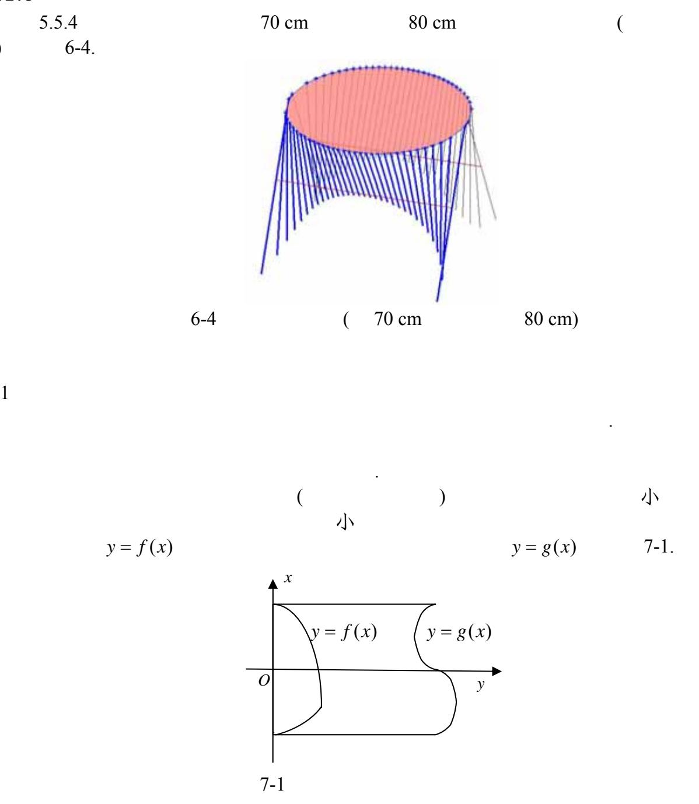

$f(x)$

$$
\begin{array}{c c c c c} {f (x)} & {\sqrt {r ^ {2} - x ^ {2}}} \\ & {\text {体}} \\ & {\sqrt {r ^ {2} - x ^ {2}} (\quad f (v) \quad \sqrt {r ^ {2} - v ^ {2}})} \end{array} . \tag {5-6} \tag {5 - 7}
$$

$$
\left\{ \begin{array}{l} x = v, \\ y = f (v) + \frac {\left(d \cos \theta + w - f (v)\right) \cdot \left(u - f (v)\right)}{\sqrt {d ^ {2} + w ^ {2} + f ^ {2} (v) - 2 (d \cos \theta + w) f (v) + 2 d w \cos \theta}}, \\ z = \frac {d \sin \theta \big (u - f (v) \big)}{\sqrt {d ^ {2} + w ^ {2} + f ^ {2} (v) - 2 (d \cos \theta + w) f (v) + 2 d w \cos \theta}}, \\ (u, v \quad .) \end{array} \right.\tag{7-1}
$$

$$
z = \frac {d (y - f (x)) \sin \theta}{d \cos \theta + w - f (x)}   d\tag{7-2}
$$

$\theta$

w

$$
(x, y) = (x, g (x)) \quad (x \quad) \quad u = g (x)
$$

$$
\left\{ \begin{array}{l} x = v, \\ y = f (v) + \frac {\left(d \cos \theta + w - \sqrt {r ^ {2} - v ^ {2}}\right) \cdot \left(g (v) - f (v)\right)}{\sqrt {d ^ {2} + w ^ {2} + f ^ {2} (v) - 2 (d \cos \theta + w) f (v) + 2 d w \cos \theta}}, \\ z = \frac {d \sin \theta \big (g (v) - f (v) \big)}{\sqrt {d ^ {2} + w ^ {2} + f ^ {2} (v) - 2 (d \cos \theta + w) f (v) + 2 d w \cos \theta}}, \\ (v \quad ,) \end{array} \right.\tag{7-3}
$$

$$
\left\{ \begin{array}{l} d (y - f (x)) \sin \theta = z (d \cos \theta + w - f (x)) \\ d (g (x) - f (x)) \sin \theta = z \sqrt {d ^ {2} + w ^ {2} + f ^ {2} (x) - 2 (d \cos \theta + w) f (x) + 2 d w \cos \theta} \end{array} \right.\tag{7-4}
$$

$$
l e n (x _ {i}) = \sqrt {d ^ {2} + w ^ {2} + f ^ {2} (x _ {i}) - 2 (d \cos \theta + w) f (x _ {i}) + 2 d w \cos \theta} + f (x _ {i}) - d - w\tag{7-5}
$$

h

$$
\begin{array}{c} y = f (x) \\ 2 \end{array}\tag{\(y = g(x)\}
$$

$$
\begin{array}{l} \min h / \sin \theta \\ \min \sum_ {i = 1} ^ {n} \operatorname{len} \left(x _ {i}\right) \\ s. t. \left\{ \begin{array}{l} \operatorname{len} \left(x _ {i}\right) <   s - \lambda , i = 1, 2, \dots , n \\ y _ {D} \left(x _ {i}\right) \geq 0, i = 1, 2, \dots , n \\ 2 (w + h \cot \theta) \geq a W \\ z _ {D} \left(x _ {i}\right) \leq h, i = 1, 2, \dots , n - 1 \end{array} \right. \\ s \quad (\quad) \quad \theta \\ a \quad \lambda \quad \text {小}. s \quad \theta \\ \operatorname{len} \left(x _ {i}\right) = \sqrt {d ^ {2} + w ^ {2} + f ^ {2} \left(x _ {i}\right) - 2 (d \cos \theta + w) f \left(x _ {i}\right) + 2 d \cos \theta \cdot w} + f \left(x _ {i}\right) - d - w \\ y _ {D} \left(x _ {i}\right) = f \left(x _ {i}\right) + \frac {(d \cos \theta + w - f \left(x _ {i}\right)) (d + w - f \left(x _ {i}\right))}{\sqrt {d ^ {2} + w ^ {2} + f ^ {2} \left(x _ {i}\right) - 2 (d \cos \theta + w) f \left(x _ {i}\right) + 2 d w \cdot \cos \theta}} \\ z _ {D} \left(x _ {i}\right) = \frac {d \sin \theta (g (x _ {i}) - f (x _ {i}))}{\sqrt {d ^ {2} + w ^ {2} + f ^ {2} (x _ {i}) - 2 (d \cos \theta + w) f (x _ {i}) + 2 d w \cos \theta}} \\ x _ {i} = w i \quad d = \frac {h}{\sin \theta} - s. \end{array}\tag{7-6}
$$

7.3.1

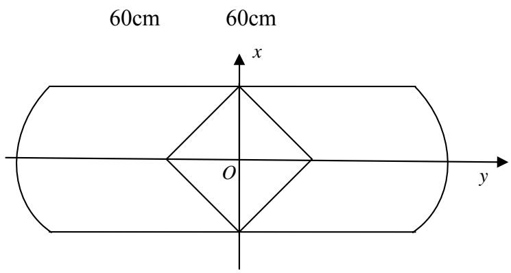

(7-2).

(1)

6.2.1

$$
\begin{array}{c c c c c} h = 5 7 & w = 2. 5 & W = 6 0. & \lambda = 5 & a = 1 \\ & (\quad 5) \\ & & \theta = 1. 0 4 7 2 & s = 3 2. \end{array}\tag{7-6}
$$

$$
\begin{array}{c} d = \frac {h}{\sin \theta} - s = 3 6. 3 1 8 \quad w = 2. 5 \quad \theta = 1. 0 4 7 2 \\ l e n \left(x _ {i}\right) = \sqrt {d ^ {2} + w ^ {2} + f ^ {2} \left(x _ {i}\right) - 2 \left(d \cos \theta + w\right) f \left(x _ {i}\right) + 2 d \cos \theta \cdot w} + f \left(x _ {i}\right) - d - w \\ 5. \end{array}\tag{2}
$$

<table><tr><td></td><td colspan="7">5</td><td colspan="4">( cm )</td><td></td></tr><tr><td>i</td><td>1</td><td>2</td><td>3</td><td>4</td><td>5</td><td>6</td><td>7</td><td>8</td><td>9</td><td>10</td><td>11</td><td>12</td></tr><tr><td></td><td>137.07</td><td>137.30</td><td>137.74</td><td>138.38</td><td>139.20</td><td>140.19</td><td>141.31</td><td>142.53</td><td>143.81</td><td>145.07</td><td>146.28</td><td>147.36</td></tr><tr><td></td><td>29.50</td><td>29.23</td><td>28.71</td><td>27.93</td><td>26.89</td><td>25.58</td><td>23.98</td><td>22.10</td><td>19.94</td><td>17.49</td><td>14.76</td><td>11.766</td></tr><tr><td></td><td>2.50</td><td>2.77</td><td>3.297</td><td>4.07</td><td>5.11</td><td>6.42</td><td>8.02</td><td>9.90</td><td>12.061</td><td>14.511</td><td>17.244</td><td>20.24</td></tr><tr><td></td><td>60</td><td>55</td><td>50</td><td>45</td><td>40</td><td>35</td><td>30</td><td>25</td><td>20</td><td>15</td><td>10</td><td>5</td></tr><tr><td></td><td>44.57</td><td>46.95</td><td>49.24</td><td>51.44</td><td>53.56</td><td>55.59</td><td>57.53</td><td>59.38</td><td>61.14</td><td>62.80</td><td>64.36</td><td>65.82</td></tr></table>

$\theta = 0, 0.1496, 0.2992, 0.4488, 0.5984, 0.7480, 0.8976, 1.0472$ 7-3 7-4. (

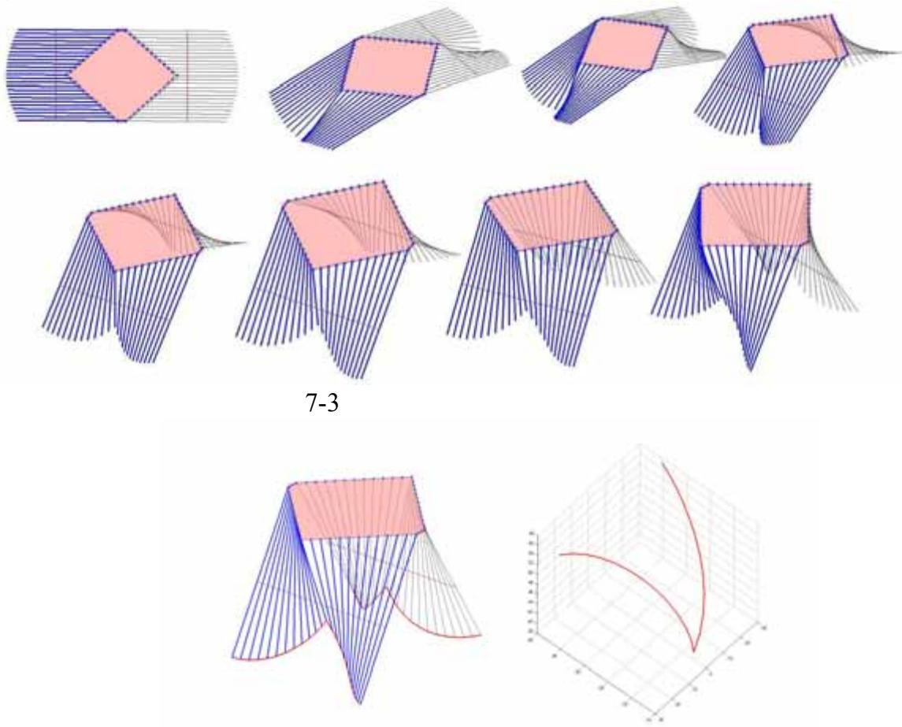

## 7.3.2 8字

70cm

8 字 (7-5)

60cm  
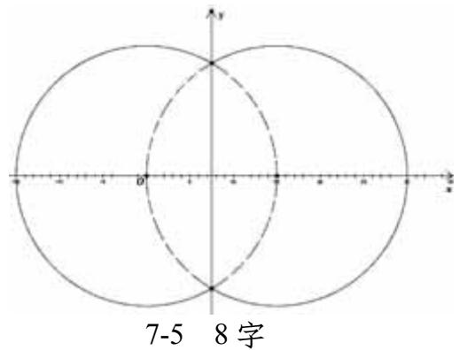

6.

<table><tr><td>i</td><td>1</td><td>2</td><td>3</td><td>4</td><td>5</td><td>6</td><td>7</td><td>8</td><td>9</td></tr><tr><td></td><td>149.2</td><td>149.1</td><td>148.9</td><td>148.5</td><td>147.9</td><td>147.1</td><td>146.2</td><td>145.1</td><td>143.8</td></tr><tr><td></td><td>30.28</td><td>26.02</td><td>22.69</td><td>19.94</td><td>17.64</td><td>15.72</td><td>14.14</td><td>12.87</td><td>11.90</td></tr><tr><td></td><td>9.72</td><td>13.98</td><td>17.31</td><td>20.06</td><td>22.36</td><td>24.28</td><td>25.86</td><td>27.13</td><td>28.10</td></tr><tr><td></td><td>106.03</td><td>114.54</td><td>121.20</td><td>126.70</td><td>131.31</td><td>135.15</td><td>138.31</td><td>140.84</td><td>142.77</td></tr><tr><td></td><td>106.03</td><td>114.54</td><td>121.20</td><td>126.70</td><td>131.31</td><td>135.15</td><td>138.31</td><td>140.84</td><td>59.4</td></tr><tr><td>i</td><td>10</td><td>11</td><td>12</td><td>13</td><td>14</td><td>15</td><td>16</td><td>17</td><td></td></tr><tr><td></td><td>23.81</td><td>22.44</td><td>21.62</td><td>21.35</td><td>21.62</td><td>22.44</td><td>23.81</td><td>25.74</td><td></td></tr><tr><td></td><td>11.22</td><td>10.81</td><td>10.68</td><td>10.81</td><td>11.22</td><td>11.90</td><td>12.87</td><td>14.14</td><td></td></tr><tr><td></td><td>28.78</td><td>29.19</td><td>29.32</td><td>29.19</td><td>28.78</td><td>28.10</td><td>27.13</td><td>25.86</td><td></td></tr><tr><td></td><td>23.81</td><td>22.44</td><td>21.62</td><td>21.35</td><td>21.62</td><td>22.44</td><td>23.81</td><td>25.74</td><td></td></tr><tr><td></td><td>144.14</td><td>144.96</td><td>145.23</td><td>144.96</td><td>144.14</td><td>142.77</td><td>140.84</td><td>138.31</td><td></td></tr></table>

7)

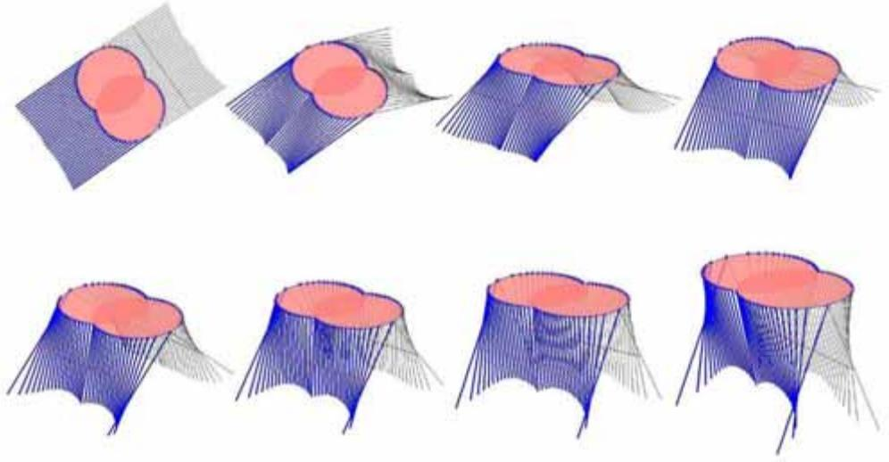  
7-6 8字

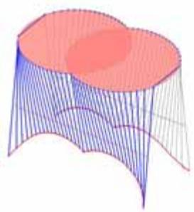  
7-7 8字

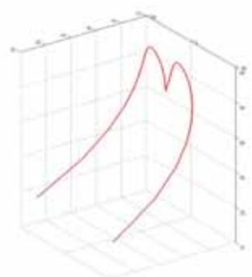  
$\theta(x_{i})$  
$\theta(x_{i})$  
8.3  
$f(x)$

$\psi (x)$

$f(x)$

$\psi (x)$

$\psi (x)$

$\psi (x)$

( )

2006.
2007.

```matlab
1
%canshu
w=2.5;
r=sqrt(100+1)*w;
l=60-w;
d=l/2;
h=53-3;
theta=asin(h/l);
%shengcheng canshu
v=-25:25;
u=25:60;
[u,v]=meshgrid(u,v);
%qumian canshu fangcheng
x=v;
y=sqrt(r^2-v.^2)+(d*cos(theta)+w-sqrt(r^2-v.^2)).
*(u-sqrt(r^2-v.^2))./sqrt(d^2+w^2+r^2-v.^2-2*(d*cos(theta)+w)*sqrt(r^2-v.^2)+2*d*w*cos(theta));
z=d*sin(theta)*(u-sqrt(r^2-v.^2))./sqrt(d^2+w^2+r^2-v.^2-2*(d*cos(theta)+w)*sqrt(r^2-v.^2)+2*d*w*cos(theta));
z=-z;
%cemian tuxiang
figure(1);
mesh(x,y,z);
%zhuojiao bianyuanxian
u=60;
v=-25:25;
x=v;
y=sqrt(r^2-v.^2)+(d*cos(theta)+w-sqrt(r^2-v.^2)).
*(u-sqrt(r^2-v.^2))./sqrt(d^2+w^2+r^2-v.^2-2*(d*cos(theta)+w)*sqrt(r^2-v.^2)+2*d*w*cos(theta));
z=d*sin(theta)*(u-sqrt(r^2-v.^2))./sqrt(d^2+w^2+r_²-v.^2-2*(d*cos(theta)+w)*sqrt(r^2-v.^2)+2*d*w*cos(theta));
z=-z;
figure(2);
plot3(x,y,z,'LineWidth',2);
grid on;
2
%canshu
w=2.5;
r=sqrt(100+1)*w;
l=60-w;
d=l/2;
h=53-3;
theta=asin(h/l);
%zhuobian dian zuobiao
xc=-10:10;
xc=xc*w;
yc=sqrt(r^2-xc.^2);
zc=zeros(1,21);
```

```txt
3 ( 2)
global w h a W r x lamda;
w=2.5;h=70-3;a=1;W=80;lamda=1.5;r=sqrt(40*40+2.5*2.5);
x=[2.5:2.5:40]';
ts0=[pi/4,h/2];
lb=[0,0];
ub=[pi/2,h];
ts=fmincon(@objfun,ts0,[],[],[],[],lb,ub,@confun)
```

```matlab
objfun.m
function f=objfun(ts)
f=-sin(ts(1));
%di er mubiao
%l=w+h/sin(ts(1));
%d=l-ts(2);
%q=32.5-abs(x);
%len=sqrt(d^2-+w^2+q^2-2*(d*cos(ts(1))+w)*q+
2*d*w*cos(ts(1))+q-d-w
%f=sum(len);

confun.m
function [c,ceq]=confun(ts)
%ts=[theta,s];

global w h a W r x lamda;
l=w+h/sin(ts(1));
d=l-ts(2);
q=sqrt(r^2-x.^2);
len=sqrt(d^2-+w^2+r^2-x.^2-2*(d*cos(ts(1))+w)*
q+2*d*w*cos(ts(1))+q-d-w;

c=[a*W-2*(w+h*cot(ts(1)));

-(q+(d*cos(ts(1))+w-q).*(l-q)./sqrt(d^2-+w^2+r^2-
x.^2-2*(d*cos(ts(1))+w)*q+2*d*w*cos(ts(1))));
    len-ts(2)+lamda
];
ceq=[];
```

```matlab
4       2
%canshu
global w h a W r x lamda n;
w=2.5;h=70-3;a=1;W=80;lamda=5;r=sqrt(40*40+
2.5*2.5);

%youhua qiujie
x=[2.5:2.5:40]';
ts0=[pi/4,h/2];
lb=[0,0];
```

```matlab
ub=[pi/2,h];
ts=fmincon(@objfun,ts0,[],[],[],[],lb,ub,@confun)

theta=ts(1);          %youhua jieguo
s=ts(2);                  %youhua jieguo
l=w+h/sin(theta);
d=l-s;
n=80/2.5+1;

%zhuobian dian zuobiao
xc=-40:2.5:40;
yc=sqrt(r^2-xc.^2);
zc=zeros(1,n);

%gangjin dian zuobiao
xg=-40:2.5:40;
yg=d*cos(theta)*ones(1,n)+w;
zg=d*sin(theta)*ones(1,n);

%zhuobian dao gangjin de juli:
for i=1:n

dis(i)=norm([xc(i),yc(i),zc(i)]-[xg(i),yg(i),zg(i)]);
end

%kaicang dao banbian de juli:
for i=1:n
    margin(i)=l-yc(i)-dis(i);
end

%muban dingdian zuobiao
for i=1:n
    k=(margin(i)+dis(i))/dis(i);
    xd(i)=xc(i)+k*(xg(i)-xc(i));
    yd(i)=yc(i)+k*(yg(i)-yc(i));
    zd(i)=zc(i)+k*(zg(i)-zc(i));
end

figure(1); hold on;
plot3(xc,yc,zc,'*');
plot3(xg,yg,zg,'r');
for i=1:n

line([xc(i),xg(i),[yc(i),yg(i),[zc(i),zg(i)],'LineWidth',2);

line([xd(i),xg(i),[yd(i),yg(i),[zd(i),zg(i)],'LineWidth',2);
end

figure(1); hold on;
plot3(xc,-yc,zc,'*');
plot3(xg,-yg,zg,'r');
for i=1:n

line([xc(i),xg(i),[-yc(i),-yg(i),[zc(i),zg(i)],'LineWidth',1,'Color',[.2 .2 .2]);
```

```matlab
line([xd(i),xg(i)],[-yd(i),-yg(i)],[zd(i),zg(i)],'LineWidth',1,'Color',[.2 .2 .2]);
end

plot3(xc,yc,zc);plot3(xc,-yc,zc);
line([xc(1),xc(1)],[yc(1),-yc(1)],[zc(1),zc(1)],'LineWidth',2);
line([xc(n),xc(n)],[yc(n),-yc(n)],[zc(n),zc(n)],'LineWidth',2);
view(3)

[X,Y,Z]=sphere(30);
X=l*X/2;Y=l*Y/2;Z=zeros(31);
surf(X,Y,Z);
colormap(spring);
alpha(.5)
shading interp; axis equal; axis off;
```

```matlab
global w h a W x lamda;
w=2.5;h=60-3;a=1;W=60;lamda=5;
x=[2.5:2.5:30]';
%8xing, gaiwei:
%w=2.5;h=70-3;a=1;W=90;lamda=5;
%x=[2.5:2.5:45]';
ts0=[pi/4,h/2];
lb=[0,0];
ub=[pi/2,h];
ts=fmincon(@objfun,ts0,[],[],[],[],lb,ub,@confun)

confun.m:
function [c,ceq]=confun(ts)
%ts=[theta,s];

global w h a W x lamda;
l=w+h/sin(ts(1));
d=l-ts(2);
q=32.5-abs(x);          %8xing, gaiwei:
q=sqrt(30^2-(x-15)^2);
len=sqrt(d^2-+w^2+q^2-2*(d*cos(ts(1))+w)*q+2*
d*w*cos(ts(1))+q-d-w;

c=[a*W-2*(w+h*cot(ts(1)));

-(q+(d*cos(ts(1))+w-q).*(l-q)./sqrt(d^2-+w^2+r^2-
x.^2-2*(d*cos(ts(1))+w)*q+2*d*w*cos(ts(1))));
    len-ts(2)+lamda
  ];
ceq=[];

objfun.m
function f=objfun(ts)
f=-sin(ts(1));
%di er mubiao
%l=w+h/sin(ts(1));
```

```matlab
%d=1-ts(2);
%q=32.5-abs(x);
%len=sqrt(d^2-+w^2+q^2-2*(d*cos(ts(1))+w)*q+
2*d*w*cos(ts(1))+q-d-w
%f=sum(len);

6
clear;
%canshu
w=2.5;h=60-3;a=1;W=60; n=W/2.5+1;s=32;
t=pi/3;
l=w+h/sin(t);
R=sqrt(l^2+30^2);

%zhuobian dian zuobiao
xc=-30:2.5:30;
yc=32.5-abs(xc);
zc=zeros(1,n);

xd=xc;xg=xc;
ll=sqrt(R^2-xc.^2);
d=l-s;

for m=1:8
    tt=linspace(0,8,8);
    theta=tt(m)*t/8;

    %gangjin dian zuobiao
    yg=d*cos(theta)*ones(1,n)+w;
    zg=d*sin(theta)*ones(1,n);

    %zhuobian dao gangjin de juli:
    for i=1:n

dis(i)=norm([xc(i),yc(i),zc(i)]-[xg(i),yg(i),zg(i)]);
    end

    %kaicang dao banbian de juli:
    margin=ll-yc-dis;

    %muban dingdian zuobiao
    for i=1:n
        k=(margin(i)+dis(i))/dis(i);
        yd(i)=yc(i)+k*(yg(i)-yc(i));
        zd(i)=zc(i)+k*(zg(i)-zc(i));
    end

    subplot(2,4,m)
    figure(1); hold on;
    plot3(xc,yc,zc,'*');
    plot3(xg,yg,zg,'r');
    for i=1:n

line([xc(i),xg(i)],[yc(i),yg(i),[zc(i),zg(i)],'LineWidth',2);

line([xd(i),xg(i)],[yd(i),yg(i),[zd(i),zg(i)],'LineWi
```

```matlab
dth',2);
    end

    plot3(xc,-yc,zc,'*');
    plot3(xg,-yg,zg,'r');
    for i=1:n

line([xc(i),xg(i)],[-yc(i),-yg(i)],[zc(i),zg(i)],'LineWidth',1,'Color',[.2 .2 .2]);

line([xd(i),xg(i)],[-yd(i),-yg(i)],[zd(i),zg(i)],'LineWidth',1,'Color',[.2 .2 .2]);
    end

    plot3(xc,yc,zc);plot3(xc,-yc,zc);

line([xc(1),xc(1)],[yc(1),-yc(1)],[zc(1),zc(1)],'LineWidth',2);

line([xc(n),xc(n)],[yc(n),-yc(n)],[zc(n),zc(n)],'LineWidth',2);
    view(3)

    X=[0 0;-1 1;0 0];Y=[1 1;0 0;-1 -1];
    X=32.5*X;Y=32.5*Y;Z=zeros(3,2);
    surf(X,Y,Z);
    colormap(spring);
    alpha(.5)
    shading interp; axis equal; axis off;
end
figure(2);
plot3(xd,yd,zd);plot3(xd,-yd,zd);

7 8
clear;
%canshu
w=2.5;h=70-3;W=90; n=W/2.5-1;s=40;
t=pi*70/180;

%zhuobian dian zuobiao
xc=-42.5:2.5:42.5;
yc=sqrt(30^2-(abs(xc)-15).^2);
zc=zeros(1,n);

l=yc(1)+h/sin(t);
xd=xc;xg=xc;
d=l-s;

for m=1:8
    theta=m*t/8;

    %gangjin dian zuobiao
    yg=d*cos(theta)*ones(1,n)+w;
    zg=d*sin(theta)*ones(1,n);

    %zhuobian dao gangjin de juli:
    for i=1:n
```

```matlab
dis(i)=norm([xc(i),yc(i),zc(i)]-[xg(i),yg(i),zg(i)]);
    end

    %kaicang dao banbian de juli:
    margin=l-yc-dis;

    %muban dingdian zuobiao
    for i=1:n
        k=(margin(i)+dis(i))/dis(i);
        yd(i)=yc(i)+k*(yg(i)-yc(i));
        zd(i)=zc(i)+k*(zg(i)-zc(i));
    end

    subplot(2,4,m)
    figure(1); hold on;
    plot3(xc,yc,zc,'*');
    plot3(xg,yg,zg,'r');
    for i=1:n

    line([xc(i),xg(i)],[yc(i),yg(i)],[zc(i),zg(i)],'LineWidth',2);

    line([xd(i),xg(i)],[yd(i),yg(i)],[zd(i),zg(i)],'LineWidth',2);
    end

    plot3(xc,-yc,zc,'*');
    plot3(xg,-yg,zg,'r');
    for i=1:n

    line([xc(i),xg(i)],[-yc(i),-yg(i)],[zc(i),zg(i)],'LineWidth',1,'Color',[.2 .2 .2]);

    line([xd(i),xg(i)],[-yd(i),-yg(i)],[zd(i),zg(i)],'LineWidth',1,'Color',[.2 .2 .2]);
    end

    plot3(xc,yc,zc);plot3(xc,-yc,zc);

    line([xc(1),xc(1)],[yc(1),-yc(1)],[zc(1),zc(1)],'LineWidth',2);

    line([xc(n),xc(n)],[yc(n),-yc(n)],[zc(n),zc(n)],'LineWidth',2);
    view(3)

    [X,Y,Z]=sphere(30);
    X=30*X;Y=30*Y;Z=zeros(31);
    X=X+15;      surf(X,Y,Z);
    X=X-30;      surf(X,Y,Z);
    colormap(spring);
    alpha(.5)
    shading interp; axis equal; axis off;
end
figure(2);
plot3(xd,yd,zd);plot3(xd,-yd,zd);
```