( “ ” ).

(

) ( )

( )

( 体 ).

( A/B/C/D ) B

(8 字) 16046004

( ) \_\_\_\_

( ) 1.\_

2.\_\_\_\_

3.

( ) \_\_\_\_

(论文纸质版与电子版中的以上信息必须一致，只是电子版中无需签名．以上内容请仔细核对，提交后将不再允许做任何修改．如填写错误，论文可能被取消评奖资格.)

2014 9 14

( )

( )

( )

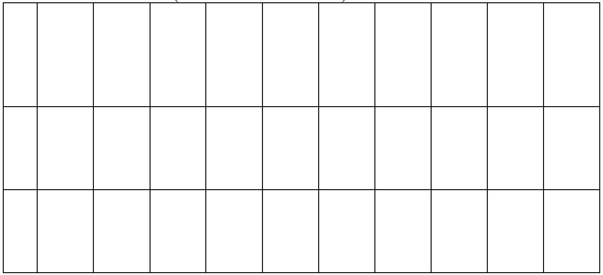

<details>
<summary>natural_image</summary>

Blank grid with uniform white squares, no text or symbols present
</details>

( )

( )

$$
\begin{array}{c c c c c c c c} & & y & \text {小} & z \\ & u & & P & & x \\ v & P & y o z & & P \\ & . & & & \\ & & d \left(y - \sqrt {r ^ {2} - x ^ {2}}\right) \sin \theta = z \left(d \cos \theta + w - \sqrt {r ^ {2} - x ^ {2}}\right). \\ u = L / 2 & & (5 - 1 2) & (5 - 1 3). \\ & & 2 0. 0 9 & 1 9. 6 0 & 1 8. 7 7 & 1 7. 5 9 & 1 6. 0 6 & 1 4. 1 4 & 1 1. 8 1 & 9. 0 0 \\ 5. 5 3 (\mathrm{cm}). \end{array}
$$

$$
\begin{array}{c c c} & \text {.} & \text {Matlab} \\ \theta & 1. 0 6 0 5 (\quad) & s \quad 4 3. 8 0 \mathrm{cm} \\ L & 1 5 8. 5 6 \mathrm{cm}. \end{array}
$$

8 字

体

1. $120 \, cm \times 50 \, cm \times 3 \, cm$ $2.5 \, cm$ $53 \, cm.$  
2. . 70 cm 80 cm  
3.
小

8

u, v u x v
yOz . $\overrightarrow{OP} = \overrightarrow{OC} + \overrightarrow{CP}$ $\overrightarrow{OC}$ $\overrightarrow{CP}$ $\overrightarrow{OP}$ l

( ). ( )

. u
Matlab

$\theta$ $s$ $L,$

Matlab

8 字

体

5.1

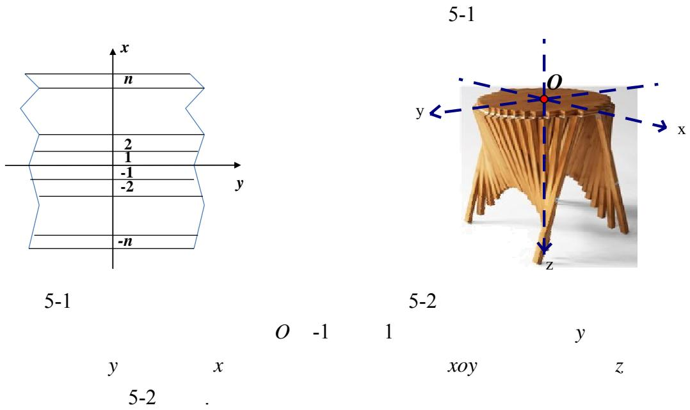

5.2 ( )

5.1

$$
P = (x, y, z) \quad u \quad P
$$

$$
\begin{array}{c} x O z \\ \overrightarrow {O P} = \overrightarrow {O C} + \overrightarrow {C P} \end{array} . \qquad v \qquad P \qquad y O z \qquad .
$$

5-3

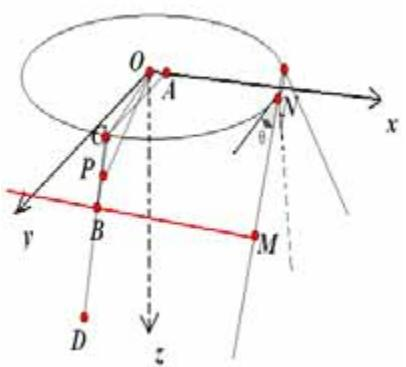

<details>
<summary>text_image</summary>

O
A
C
P
B
M
D
x
θ
z
</details>

5-3

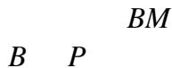  
(1)

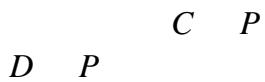  
O

$$
\left\{ \begin{array}{c} x ^ {2} + y ^ {2} = r ^ {2} \\ z = 0 \end{array} \right. \tag {5-1}
$$

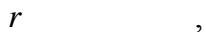

$$
r = \sqrt {\left(\frac {W}{2}\right) ^ {2} + w ^ {2}} \tag {5-2}
$$

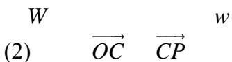  
C P

C xOz A. CA  
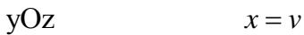

$$
C \Big (v, \sqrt {r ^ {2} - v ^ {2}}, 0 \Big)
$$

$$
\overrightarrow {O C} = \left(v, \sqrt {r ^ {2} - v ^ {2}}, 0\right). \tag {5-3}
$$

$$
C \quad \left| \overrightarrow {C P} \right| = u - \sqrt {r ^ {2} - v ^ {2}}.
$$

5-4 5-5

$$
M \left(v, d \cos \theta + w, d \sin \theta\right)
$$

$$
\left| \overrightarrow {N M} \right|
$$

d

θ.  
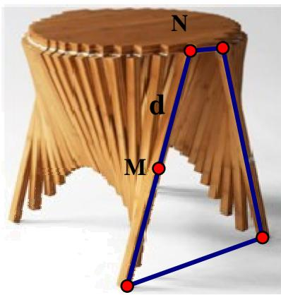

<details>
<summary>text_image</summary>

N
d
M
</details>

5-4

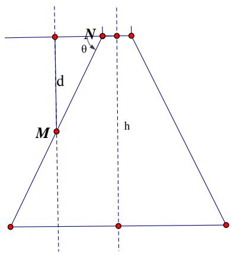

<details>
<summary>text_image</summary>

N
θ
d
M
h
</details>

5-5

x

$$
\overrightarrow {C B} = \overrightarrow {O B} - \overrightarrow {O C} = \left(0, d \cos \theta + w - \sqrt {r ^ {2} - v ^ {2}}, d \sin \theta\right).
$$

B

$$
\begin{array}{l} \left| \overrightarrow {C B} \right| = \sqrt {\left(d \cos \theta + w - \sqrt {r ^ {2} - v ^ {2}}\right) ^ {2} + \left(d \sin \theta\right) ^ {2}} \\ = \sqrt {d ^ {2} + w ^ {2} + r ^ {2} - v ^ {2} - 2 (d \cos \theta + w) \sqrt {r ^ {2} - v ^ {2}} \cos \theta + 2 d w \cos \theta} \\ \end{array}
$$

$$
\overrightarrow {C P} = \frac {\overrightarrow {C B}}{\left| \overrightarrow {C B} \right|} \left| \overrightarrow {C P} \right| = \frac {\left(0 , d \cos \theta + w - \sqrt {r ^ {2} - v ^ {2}} , d \sin \theta\right)}{\sqrt {\left(d \cos \theta + w - \sqrt {r ^ {2} - v ^ {2}}\right) ^ {2} + \left(d \sin \theta\right) ^ {2}}} \left(u - \sqrt {r ^ {2} - v ^ {2}}\right)
$$

$$
\overrightarrow {C P} = \frac {\left(0 , d \cos \theta + w - \sqrt {r ^ {2} - v ^ {2}} , d \sin \theta\right)}{\sqrt {d ^ {2} + w ^ {2} + r ^ {2} - v ^ {2} - 2 (d \cos \theta + w) \sqrt {r ^ {2} - v ^ {2}} + 2 d w \cos \theta}} \left(u - \sqrt {r ^ {2} - v ^ {2}}\right) \tag {5-4}
$$

(3)

$$
\overrightarrow {O P} = \overrightarrow {O C} + \overrightarrow {C P} = \left(v, \sqrt {r ^ {2} - v ^ {2}}, 0\right) + \frac {\left(0 , d \cos \theta + w - \sqrt {r ^ {2} - v ^ {2}} , d \sin \theta\right)}{\sqrt {d ^ {2} + w ^ {2} + r ^ {2} - v ^ {2} - 2 (d \cos \theta + w) \sqrt {r ^ {2} - v ^ {2}} + 2 d w \cos \theta}} \left(u - \sqrt {r ^ {2} - v ^ {2}}\right) \tag {5-5}
$$

$$
\left\{ \begin{array}{l} x = v, \\ y = \sqrt {r ^ {2} - v ^ {2}} + \frac {\left(d \cos \theta + w - \sqrt {r ^ {2} - v ^ {2}}\right) \cdot \left(u - \sqrt {r ^ {2} - v ^ {2}}\right)}{\sqrt {d ^ {2} + w ^ {2} + r ^ {2} - v ^ {2} - 2 (d \cos \theta + w) \sqrt {r ^ {2} - v ^ {2}} + 2 d w \cos \theta}}, \\ z = \frac {d \sin \theta \left(u - \sqrt {r ^ {2} - v ^ {2}}\right)}{\sqrt {d ^ {2} + w ^ {2} + r ^ {2} - v ^ {2} - 2 (d \cos \theta + w) \sqrt {r ^ {2} - v ^ {2}} + 2 d w \cos \theta}}, \\ (u, v \quad .) \end{array} \right. \tag {5-6}
$$

(4)

$$
y - \sqrt {r ^ {2} - v ^ {2}} \quad z
$$

$$
\frac {y - \sqrt {r ^ {2} - v ^ {2}}}{z} = \frac {d \cos \theta + w - \sqrt {r ^ {2} - v ^ {2}}}{d \sin \theta}
$$

$$
x = \nu
$$

$$
z = \frac {d \left(y - \sqrt {r ^ {2} - x ^ {2}}\right) \sin \theta}{d \cos \theta + w - \sqrt {r ^ {2} - x ^ {2}}} \tag {5-7}
$$

5.3

2n

y

5-1

x

n

i

$$
v = w i, C \Big (w i, \sqrt {r ^ {2} - v ^ {2}}, 0 \Big) \quad B = (w i, d \cos \theta + w, d \sin \theta),
$$

$$
\left| \overrightarrow {B C} \right| = \sqrt {d ^ {2} + w ^ {2} + r ^ {2} - (w i) ^ {2} - 2 (d \cos \theta + w) \sqrt {r ^ {2} - (w i) ^ {2}} + 2 d w \cos \theta}.
$$

$$
l e n (x _ {i}) = \left| \overrightarrow {B C} \right| - \left(d + w - \frac {l}{2}\right) \quad l \quad i
$$

$$
l e n (x _ {i}) = \sqrt {d ^ {2} + w ^ {2} + r ^ {2} - x ^ {2} - 2 (d \cos \theta + w) \sqrt {r ^ {2} - x ^ {2}} + 2 d w \cos \theta} + \sqrt {r ^ {2} - x ^ {2}} - d - w \tag {5-8}
$$

:

$$
\frac {l}{2} = \sqrt {r ^ {2} - (w i) ^ {2}} \tag {5-9}
$$

$$
l e n (x _ {i}) = \sqrt {d ^ {2} + w ^ {2} + r ^ {2} - (w i) ^ {2} - 2 (d \cos \theta + w) \sqrt {r ^ {2} - (w i) ^ {2}} + 2 d w \cos \theta} + \sqrt {r ^ {2} - (w i) ^ {2}} - d - w \tag {5-10}
$$

$$
= \frac {L - l}{2} \tag {5-11}
$$

L

$$
= \frac {\frac {L}{2} - w}{2} - l e n (i) = \frac {L}{4} - \frac {w}{2} - l e n (i) \tag {5-12}
$$

5.4

L

( )

$$
(x \quad) \quad \frac {L}{2}. \tag {5-6} \quad u = \frac {L}{2}
$$

$$
\left\{ \begin{array}{l} x = v, \\ y = \sqrt {r ^ {2} - v ^ {2}} + \frac {\left(d \cos \theta + w - \sqrt {r ^ {2} - v ^ {2}}\right) \left(\frac {L}{2} - \sqrt {r ^ {2} - v ^ {2}}\right)}{\sqrt {d ^ {2} + w ^ {2} + r ^ {2} - v ^ {2} - 2 (d \cos \theta + w) \sqrt {r ^ {2} - v ^ {2}} + 2 d w \cos \theta}}, \\ z = \frac {d \sin \theta \left(\frac {L}{2} - \sqrt {r ^ {2} - v ^ {2}}\right)}{\sqrt {d ^ {2} + w ^ {2} + r ^ {2} - v ^ {2} - 2 (d \cos \theta + w) \sqrt {r ^ {2} - v ^ {2}} + 2 d w \cos \theta}}, \\ (v,.) \end{array} \right. \tag {5-13}
$$

$$
\left\{ \begin{array}{l} d \left(y - \sqrt {r ^ {2} - x ^ {2}}\right) \sin \theta = z \left(d \cos \theta + w - \sqrt {r ^ {2} - x ^ {2}}\right) \\ d \sin \theta \left(\frac {L}{2} - \sqrt {r ^ {2} - x ^ {2}}\right) = z \sqrt {d ^ {2} + w ^ {2} + r ^ {2} - x ^ {2} - 2 (d \cos \theta + w) \sqrt {r ^ {2} - x ^ {2}} + 2 d w \cos \theta} \end{array} \right. \tag {5-14}
$$

5.5

5.5.1

$$
W = 5 0 \quad w = 2. 5 \tag {5-2}
$$

$$
r = \sqrt {\left(\frac {W}{2}\right) ^ {2} + w ^ {2}} = \sqrt {6 3 1 . 2 5} = 2 5. 1 2 5.
$$

$$
d = \frac {1}{2} \left(\frac {L}{2} - w\right) = 2 8. 7 5.
$$

$$
h = 5 3 - 3 = 5 0 \quad 2 d = 5 7. 5
$$

$$
\sin \theta = \frac {h}{2 d} = \frac {5 0}{5 7 . 5}
$$

$$
\theta = \arcsin \left(\frac {h}{2 d}\right) = \arcsin (0. 8 6 9 6) = 1. 0 5 4 3.
$$

(5-7)

$$
z = \frac {2 5 \left(y - \sqrt {6 3 1 . 2 5 - x ^ {2}}\right)}{1 6 . 7 0 - \sqrt {6 3 1 . 2 5 - x ^ {2}}} \tag {5-15}
$$

5.5.2

(1)

$$
r ^ {2} = 6 3 1. 2 5 \quad w = 2. 5 \tag {5-9} \tag {5-11}
$$

$$
\frac {l}{2} = \sqrt {6 3 1 . 2 5 - 6 . 2 5 i ^ {2}}, \quad i = 1 \quad \dots \dots 1 0.
$$

$$
= 6 0 - \frac {l}{2}.
$$

<table><tr><td colspan="5">1</td><td colspan="6">( cm )</td></tr><tr><td>i</td><td>1</td><td>2</td><td>3</td><td>4</td><td>5</td><td>6</td><td>7</td><td>8</td><td>9</td><td>10</td></tr><tr><td></td><td>50</td><td>49.24</td><td>47.96</td><td>46.1</td><td>43.58</td><td>40.32</td><td>36.06</td><td>30.42</td><td>22.36</td><td>5</td></tr><tr><td></td><td>32.5</td><td>32.88</td><td>33.52</td><td>34.45</td><td>35.71</td><td>37.34</td><td>39.47</td><td>42.29</td><td>46.32</td><td>55</td></tr></table>

(2)

$$
d = 2 8. 7 5, r ^ {2} = 6 3 1. 2 5, \sin \theta = \frac {5 0}{5 7 . 5} \tag {5-10}
$$

$$
l e n \left(x _ {i}\right) = \sqrt {1 4 6 4 . 0 6 - 6 . 2 5 i ^ {2} - 3 3 . 4 \sqrt {6 3 1 . 2 5 - 6 . 2 5 i ^ {2}} + 7 0 . 9 9} + \sqrt {6 3 1 . 2 5 - 6 . 2 5 i ^ {2}} - 3 1. 2 5 \tag {5-16}
$$

$$
L = 1 2 0 c m, w = 2. 5 c m \quad (5 - 1 2) \quad = 2 8. 7 5 - l e n (i).
$$

<table><tr><td></td><td colspan="4">2</td><td colspan="6">( cm )</td></tr><tr><td>i</td><td>1</td><td>2</td><td>3</td><td>4</td><td>5</td><td>6</td><td>7</td><td>8</td><td>9</td><td>10</td></tr><tr><td></td><td>8.66</td><td>9.15</td><td>9.98</td><td>11.16</td><td>12.69</td><td>14.61</td><td>16.94</td><td>19.75</td><td>23.22</td><td>28.75</td></tr><tr><td></td><td>20.09</td><td>19.60</td><td>18.77</td><td>17.59</td><td>16.06</td><td>14.14</td><td>11.81</td><td>9.00</td><td>5.53</td><td>0</td></tr></table>

5.5.3

$$
d = 2 8. 7 5, r ^ {2} = 6 3 1. 2 5 \quad w = 2. 5 \quad \sin \theta = \frac {5 0}{5 7 . 5} \tag {5-14}
$$

$$
\left\{ \begin{array}{l} 2 5 \left(y - \sqrt {6 3 1 . 2 5 - x ^ {2}}\right) = z \left(1 6. 7 - \sqrt {6 3 1 . 2 5 - x ^ {2}}\right) \\ 2 5 \left(6 0 - \sqrt {6 3 1 . 2 5 - x ^ {2}}\right) = z \sqrt {1 5 3 5 . 0 6 - x ^ {2} - 3 3 . 4 \sqrt {r ^ {2} - x ^ {2}}} \end{array} \right. \tag {5-17}
$$

Matlab

5-6(

1)

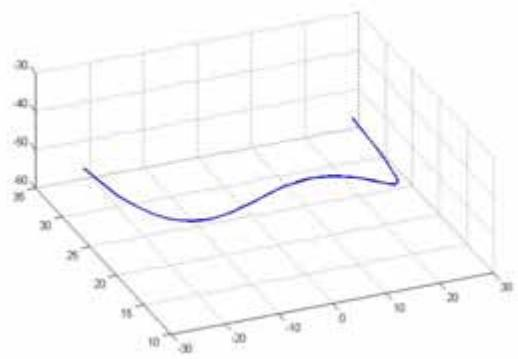

<details>
<summary>surface_3d</summary>

| X | Y | Z |
| --- | --- | --- |
| ~-25 | ~10 | ~-57 |
| ~-15 | ~15 | ~-60 |
| ~0 | ~20 | ~-59 |
| ~10 | ~25 | ~-60 |
| ~10 | ~30 | ~-45 |
</details>

5-6

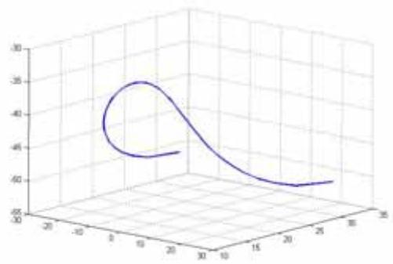

<details>
<summary>surface_3d</summary>

| X | Y | Z |
| --- | --- | --- |
| ~10 | ~25 | ~-0.60 |
| ~20 | ~15 | ~-0.45 |
| ~30 | ~5 | ~-0.35 |
| ~25 | ~10 | ~-0.45 |
| ~15 | ~15 | ~-0.48 |
| ~5 | ~10 | ~-0.45 |
| ~-5 | ~5 | ~-0.42 |
| ~-15 | ~-5 | ~-0.40 |
| ~-25 | ~-15 | ~-0.38 |
| ~-20 | ~-20 | ~-0.37 |
| ~-10 | ~-25 | ~-0.36 |
| ~5 | ~-20 | ~-0.35 |
| ~15 | ~-15 | ~-0.36 |
| ~25 | ~-10 | ~-0.38 |
| ~30 | ~-5 | ~-0.40 |
| ~25 | ~5 | ~-0.42 |
| ~15 | ~10 | ~-0.45 |
| ~5 | ~15 | ~-0.48 |
| ~-5 | ~20 | ~-0.49 |
| ~-15 | ~25 | ~-0.50 |
| ~-25 | ~30 | ~-0.51 |
| ~-20 | ~35 | ~-0.52 |
| ~-10 | ~30 | ~-0.53 |
| ~5 | ~25 | ~-0.54 |
| ~15 | ~20 | ~-0.55 |
| ~25 | ~15 | ~-0.56 |
| ~30 | ~10 | ~-0.57 |
| ~25 | ~5 | ~-0.58 |
| ~15 | ~-5 | ~-0.59 |
| ~5 | ~-10 | ~-0.60 |
| ~-5 | ~-15 | ~-0.61 |
| ~-15 | ~-20 | ~-0.62 |
| ~-25 | ~-25 | ~-0.63 |
| ~-30 | ~-30 | ~-0.64 |
| ~-25 | ~-35 | ~-0.65 |
| ~-15 | ~-40 | ~-0.66 |
| ~-5 | ~-45 | ~-0.67 |
| ~5 | ~-48 | ~-0.68 |
| ~15 | -50 | -6.6 |
| ~25 | -48 | -6.6 |
| ~30 | -46 | -6.6 |
| ~28 | -44 | -6.6 |
| ~22 | -42 | -6.6 |
| ~18 | -40 | -6.6 |
| ~12 | -38 | -6.6 |
| ~8 | -36 | -6.6 |
| ~3 | -34 | -6.6 |
| -2 | -32 | -6.6 |
| -8 | -30 | -6.6 |
| -12 | -28 | -6.6 |
| -18 | -26 | -6.6 |
| -22 | -24 | -6.6 |
| -28 | -22 | -6.6 |
| -32 | -20 | -6.6 |
| -38 | -18 | -6.6 |
| -42 | -16 | -6.6 |
| -48 | -14 | -6.6 |
| -52 | -12 | -6.6 |
| -58 | -10 | -6.6 |
| -62 | -8 | -6.6 |
| -68 | -6 | -6.6 |
| -72 | -4 | -6.6 |
| -78 | -2 | -6.6 |
| -82 | 0 | -6.6 |
| -88 | 2 | -6.6 |
| -92 | 4 | -6.6 |
| -98 | 6 | -6.6 |
| -102 | 8 | -6.6 |
| -108 | 10 | -6.6 |
| -112 | 12 | -6.6 |
| -118 | 14 | -6.6 |
| -122 | 16 | -6.6 |
| -128 | 18 | -6.6 |
| -132 | 20 | -6.6 |
| -138 | 22 | -6.6 |
| -142 | 24 | -6.6 |
| -148 | 26 | -6.6 |
| -152 | 28 | -6.6 |
| -158 | 30 | -6.6 |
| -162 | 32 | -6.6 |
| -168 | 34 | -6.6 |
| -172 | 36 | -6.6 |
| -178 | 38 | -6.6 |
| -182 | 40 | -6.6 |
| -188 | 42 | -6.6 |
| -192 | 44 | -6.6 |
| -198 | 46 | -6.6 |
| -202 | 48 | -6.6 |
| -208 | 50 | -6.6 |
| -212 | 52 | -6.6 |
| -218 | 54 | -6.6 |
| -222 | 56 | -6.6 |
| -228 | 58 | -6.6 |
| -232 | 60 | -6.6 |
| -238 | 62 | -6.6 |
| -242 | 64 | -6.6 |
| -248 | 66 | -6.6 |
| -252 | 68 | -6.6 |
| -258 | 70 | -6.6 |
| -262 | 72 | -6.6 |
| -268 | 74 | -6.6 |
| -272 | 76 | -6.6 |
| -278 | 78 | -6.6 |
| -282 | 80 | -6.6 |
| -288 | 82 | -6.6 |
| -292 | 84 | -6.6 |
| -298 | 86 | -6.6 |
| -302 | 88 | -6.6 |
| -308 | 90 | -6.6 |
| -312 | 92 | -6.6 |
| -318 | 94 | -6.6 |
| -322 | 96 | -6.6 |
| -328 | 98 | -6.6 |
| -332 | 100 | -6.6 |
| -338 | 102 | -6.7 |
| -342 | 104 | -7.0 |
</details>

( )

5.5.4

$$
r ^ {2} = 6 3 1. 2 5
$$

$$
x = w i
$$

$$
(5 - 1)
$$

$$
\left\{ \begin{array}{c} w ^ {2} i ^ {2} + y ^ {2} = 6 3 1. 2 5 \\ z = 0 \end{array} \right.
$$

BM

$$
\left\{ \begin{array}{c} x = w i \\ y = d \cos \theta + w \\ z = d \sin \theta \end{array} \right.
$$

$$
i = - 1 0, \dots , 0, 1, 2, \dots , 1 0
$$

$$
x > 0
$$

$$
20
$$

$$
C _ {i} (x _ {c _ {i}}, y _ {c _ {i}}, z _ {c _ {i}}) \quad B _ {i} (x _ {b _ {i}}, y _ {b _ {i}}, z _ {b _ {i}}), i = - 1 0, \dots , 0, 1, 2, \dots , 1 0.
$$

C

B

$D\qquad,\qquad D_{i}\left(x_{d_{i}},y_{d_{i}},z_{d_{i}}\right),i=-10,\cdots,0,1,2,\cdots,10.$

$B\quad \left|\overrightarrow{BD}\right| = l - \left|\overrightarrow{CA}\right| - \left|\overrightarrow{BC}\right|$

$$
A _ {i} = (w i, 0, 0) \quad i = - 1 0, \dots , 0, 1, 2, \dots , 1 0.
$$

$$
k = \frac {\frac {L}{2} - \left| \overrightarrow {A C} \right|}{\left| \overrightarrow {B C} \right|}
$$

$$
\frac {x _ {d _ {i}} - x _ {c _ {i}}}{x _ {b _ {i}} - x _ {c _ {i}}} = \frac {y _ {d _ {i}} - y _ {c _ {i}}}{y _ {b _ {i}} - y _ {c _ {i}}} = \frac {z _ {d _ {i}} - z _ {c _ {i}}}{z _ {b _ {i}} - z _ {c _ {i}}} = k
$$

$$
\left\{ \begin{array}{l} x _ {d _ {i}} = x _ {c _ {i}} + k \left(x _ {b _ {i}} - x _ {c _ {i}}\right) \\ y _ {d _ {i}} = y _ {c _ {i}} + k \left(y _ {b _ {i}} - y _ {c _ {i}}\right) \\ z _ {d _ {i}} = z _ {c _ {i}} + k \left(z _ {b _ {i}} - z _ {c _ {i}}\right) \end{array} \right.
$$

D

B

θ

θ

$$
\theta = \frac {1}{6} \times 1. 0 5 4 3, \frac {2}{6} \times 1. 0 5 4 3, \frac {3}{6} \times 1. 0 5 4 3, \frac {4}{6} \times 1. 0 5 4 3, \frac {5}{6} \times 1. 0 5 4 3, 1. 0 5 4 3, \quad \text {matlab}   5 - 7 (2)
$$

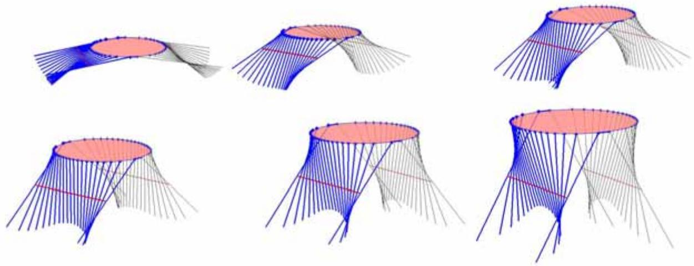

<details>
<summary>natural_image</summary>

Six 3D geometric diagrams showing intersecting blue and red curved surfaces with grid lines, no text or symbols present.
</details>

5-7

6.1  
6.1.1

$\begin{array}{ccc} & & L\\ \theta & & 6 - 1 & & 6 - 2 \end{array}$  
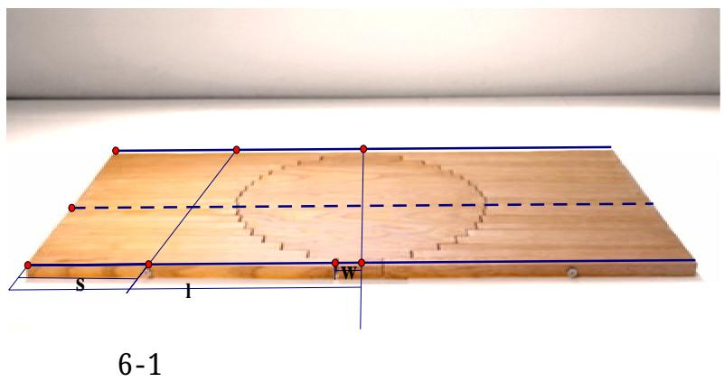

<details>
<summary>text_image</summary>

S
I
W
6-1
</details>

( )

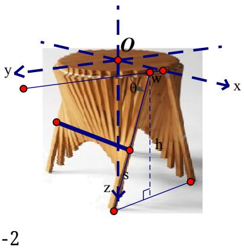

<details>
<summary>text_image</summary>

y
O
θ
w
x
h
z
-2
</details>

6.1.2

(1)

( )

$$
\min \frac {h}{\sin \theta} \quad \max \sin \theta \tag {6-1}
$$

(2)

W w

$$
2 n = \frac {W}{w}
$$

4n

小

$$
\min \sum_ {i = 1} ^ {n} l e n (x _ {i}) \tag {6-2}
$$

$$
x _ {i} = w i \quad i \tag {5-9}
$$

$$
l e n (x _ {i}) = \sqrt {d ^ {2} + w ^ {2} + r ^ {2} - (w i) ^ {2} - 2 (d \cos \theta + w) \sqrt {r ^ {2} - (w i) ^ {2}} + 2 d w \cos \theta} + \sqrt {r ^ {2} - (w i) ^ {2}} - d - w
$$

$$
d = \frac {h}{\sin \theta} - s.
$$

6.1.3

(1)

θ

S.

λ

$$
l e n \big (x _ {i} \big) <   s - \lambda , \quad i = 1, 2, \dots , n \tag {6-3}
$$

(2)

$$
y \qquad y _ {D} (x _ {i})
$$

$$
y _ {D} (x _ {i}) \geq 0, i = 1, 2, \dots , n \tag {6-4}
$$

(5-12)

$$
y _ {D} (x) = \sqrt {r ^ {2} - x ^ {2}} + \frac {\Big (d \cos \theta + w - \sqrt {r ^ {2} - x ^ {2}} \Big) \Big (d + w - \sqrt {r ^ {2} - x ^ {2}} \Big)}{\sqrt {d ^ {2} + w ^ {2} + r ^ {2} - x ^ {2} - 2 \big (d \cos \theta + w \big) \sqrt {r ^ {2} - x ^ {2}} + 2 d w \cdot \cos \theta}}
$$

(3)

$$
\begin{array}{c c} W & a \end{array} ,
$$

$$
2 (w + h \cot \theta) \geq a W \tag {6-5}
$$

(4)

4

4 (h). z $z_{D}(x_{i})$ 小 h

$$
z _ {D} (x _ {i}) \leq h, i = 1, 2, \dots , n - 1 \tag {6-6}
$$

Z

$$
z _ {D} (x) = \frac {d \sin \theta \left(\frac {L}{2} - \sqrt {r ^ {2} - x ^ {2}}\right)}{\sqrt {d ^ {2} + w ^ {2} + r ^ {2} - x ^ {2} - 2 (d \cos \theta + w) \sqrt {r ^ {2} - x ^ {2}} + 2 d w \cos \theta}}
$$

6.1.4

$$
(6 - 1) \quad (6 - 2) \quad (6 - 3) (6 - 4) (6 - 5) (6 - 6)
$$

$$
\min h / \sin \theta
$$

$$
\min \sum_ {i = 1} ^ {n} l e n (x _ {i}) \tag {6-7}
$$

$$
s. t. \left\{ \begin{array}{l} \operatorname{len} \big (x _ {i} \big) <   s - \lambda , i = 1, 2, \dots , n \\ y _ {D} (x _ {i}) \geq 0, i = 1, 2, \dots , n \\ 2 \big (w + h \cot \theta \big) \geq a W \\ z _ {D} (x _ {i}) \leq h, i = 1, 2, \dots , n - 1 \end{array} \right.
$$

$$
(\quad) \quad s \quad \theta
$$

$$
\text {len} \left(x _ {i}\right) = \sqrt {d ^ {2} + w ^ {2} + r ^ {2} - x _ {i} ^ {2} - 2 (d \cos \theta + w) \sqrt {r ^ {2} - x _ {i} ^ {2}} + 2 d \cos \theta \cdot w} + \sqrt {r ^ {2} - x _ {i} ^ {2}} - d - w
$$

$$
y _ {D} (x _ {i}) = \sqrt {r ^ {2} - x ^ {2}} + \frac {\left(d \cos \theta + w - \sqrt {r ^ {2} - x _ {i} ^ {2}}\right) \left(d + w - \sqrt {r ^ {2} - x _ {i} ^ {2}}\right)}{\sqrt {d ^ {2} + w ^ {2} + r ^ {2} - x _ {i} ^ {2} - 2 \left(d \cos \theta + w\right) \sqrt {r ^ {2} - x _ {i} ^ {2}} + 2 d w \cdot \cos \theta}}
$$

$$
z _ {D} (x _ {i}) = \frac {d \sin \theta \left(\frac {L}{2} - \sqrt {r ^ {2} - x _ {i} ^ {2}}\right)}{\sqrt {d ^ {2} + w ^ {2} + r ^ {2} - x _ {i} ^ {2} - 2 (d \cos \theta + w) \sqrt {r ^ {2} - x _ {i} ^ {2}} + 2 d w \cos \theta}}
$$

$$
x _ {i} = w i \quad d = \frac {h}{\sin \theta} - s.
$$

6.1.5

6-2 L

$$
\begin{array}{l} L = 2 (w + \frac {h}{\sin \theta}) \\ = s - l e n (i). \\ \end{array}
$$

6.2  
6.2.1

a 1 . (6-6)

Matlab (3).

$$
\begin{array}{l} \min 7 0 / \sin \theta \\ s. t. \left\{ \begin{array}{l} l e n (x _ {i}) <   s - 5, i = 1, 2, \dots , n \\ y _ {D} (x _ {i}) \geq 0, i = 1, 2, \dots , n \\ 5 + 1 4 0 \cot \theta \geq 8 0 \\ z _ {D} (x _ {i}) \leq h, i = 1, 2, \dots , n - 1 \end{array} \right. \end{array}
$$

$$
\theta = 1. 0 6 0 5 \quad L = 1 5 8. 5 6. \quad \theta = 1. 0 6 0 5
$$

$$
\min \sum_ {i = 1} ^ {n} \text {len} (x _ {i})
$$

$$
s. t. \left\{ \begin{array}{l} l e n \big (x _ {i} \big) <   s - 5, i = 1, 2, \dots , n \\ y _ {D} (x _ {i}) \geq 0, i = 1, 2, \dots , n \\ 5 + 1 4 0 \cot \theta \geq 8 0 \\ z _ {D} (x _ {i}) \leq h, i = 1, 2, \dots , n - 1 \end{array} \right.
$$

$$
s = 4 3. 8 0.
$$

$$
\theta \quad 1. 0 6 0 5 (\quad)
$$

s 43.80cm L 158.56cm.

6.2.2

(1)

$$
d = \frac {L}{2} - s - 2. 5 = 3 2. 9 8
$$

$$
W = 8 0 \quad w = 2. 5 \tag {5-2}
$$

$$
r ^ {2} = \left(\frac {W}{2}\right) ^ {2} + w ^ {2} = 1 6 0 6. 2 5 c m.
$$

$$
d = 3 2. 9 8 \quad r ^ {2} = 1 6 0 6. 2 5 \quad \theta = 1. 0 6 0 5 \tag {5-10}
$$

$$
l e n (i) = \sqrt {2 2 1 5 . 8 3 - 6 . 2 5 i ^ {2} - 4 9 . 3 7 \sqrt {1 6 0 6 . 2 5 - 6 . 2 5 i ^ {2}}} + \sqrt {1 6 0 6 . 2 5 - 6 . 2 5 i ^ {2}} - 2 4. 6 5
$$

$$
s = 5 8. 8 3 \quad = s - l e n (i)
$$

3.

<table><tr><td></td><td colspan="3">3</td><td colspan="5">( cm )</td></tr><tr><td>i</td><td>1</td><td>2</td><td>3</td><td>4</td><td>5</td><td>6</td><td>7</td><td>8</td></tr><tr><td></td><td>4.83</td><td>5.19</td><td>5.80</td><td>6.66</td><td>7.76</td><td>9.13</td><td>10.77</td><td>12.69</td></tr><tr><td></td><td>38.97</td><td>38.61</td><td>38.00</td><td>37.15</td><td>36.04</td><td>34.67</td><td>33.03</td><td>31.11</td></tr><tr><td>i</td><td>9</td><td>10</td><td>11</td><td>12</td><td>13</td><td>14</td><td>15</td><td>16</td></tr><tr><td></td><td>14.91</td><td>17.43</td><td>20.29</td><td>23.52</td><td>27.16</td><td>31.30</td><td>36.16</td><td>-</td></tr><tr><td></td><td>28.90</td><td>26.37</td><td>23.51</td><td>20.28</td><td>16.64</td><td>12.51</td><td>7.64</td><td>-</td></tr></table>

(2)

$$
r ^ {2} = 1 6 0 6. 2 5 \quad w = 2. 5 \tag {5-9}
$$

$$
\frac {l}{2} = \sqrt {r ^ {2} - (w i) ^ {2}} = \sqrt {1 6 0 6 . 2 5 - 6 . 2 5 i ^ {2}}.
$$

$$
L = 1 5 8. 5 6 \quad w = 2. 5 \tag {5-11} = 7 9. 2 8 - \frac {l}{2}
$$

4.

<table><tr><td colspan="5">4</td><td colspan="4">( cm )</td></tr><tr><td>i</td><td>1</td><td>2</td><td>3</td><td>4</td><td>5</td><td>6</td><td>7</td><td>8</td></tr><tr><td></td><td>80</td><td>79.52</td><td>78.74</td><td>77.62</td><td>76.16</td><td>74.34</td><td>72.12</td><td>69.46</td></tr><tr><td></td><td>39.28</td><td>39.52</td><td>39.91</td><td>40.47</td><td>41.2</td><td>42.11</td><td>43.22</td><td>44.55</td></tr><tr><td>i</td><td>9</td><td>10</td><td>11</td><td>12</td><td>13</td><td>14</td><td>15</td><td>16</td></tr><tr><td></td><td>66.34</td><td>62.64</td><td>58.3</td><td>53.16</td><td>46.9</td><td>39.06</td><td>28.28</td><td>5</td></tr><tr><td></td><td>46.11</td><td>47.96</td><td>50.13</td><td>52.7</td><td>55.83</td><td>59.75</td><td>65.14</td><td>76.78</td></tr></table>

6.2.3

5.5.4 70 cm 80 cm (4) 6-4.

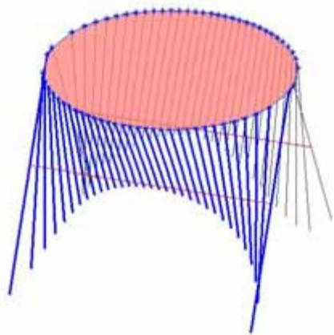

<details>
<summary>natural_image</summary>

3D diagram of a round table with blue vertical lines and a pink top surface, no text or symbols present.
</details>

6-4 (70 cm 80 cm)

7.1

( ) 小 .

小

$$
y = f (x) \quad y = g (x) \quad 7 - 1.
$$

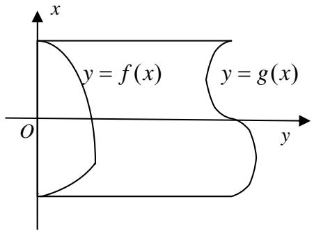

<details>
<summary>text_image</summary>

x
y = f(x)
O
y = g(x)
y
</details>

7-1

$$
f (x) \quad \sqrt {r ^ {2} - x ^ {2}}
$$

体

$$
f (x) \quad \sqrt {r ^ {2} - x ^ {2}} (\quad f (v) \quad \sqrt {r ^ {2} - v ^ {2}}) \quad (5 - 6) \tag {5-7}
$$

$$
\left\{ \begin{array}{l} x = v, \\ y = f (v) + \frac {\left(d \cos \theta + w - f (v)\right) \cdot \left(u - f (v)\right)}{\sqrt {d ^ {2} + w ^ {2} + f ^ {2} (v) - 2 (d \cos \theta + w) f (v) + 2 d w \cos \theta}}, \\ z = \frac {d \sin \theta \big (u - f (v) \big)}{\sqrt {d ^ {2} + w ^ {2} + f ^ {2} (v) - 2 (d \cos \theta + w) f (v) + 2 d w \cos \theta}}, \\ (u, v \quad .) \end{array} \right. \tag {7-1}
$$

$$
z = \frac {d (y - f (x)) \sin \theta}{d \cos \theta + w - f (x)} \tag {7-2}
$$

$\theta$ $d$

w

$$
(x, y) = (x, g (x)) \quad (x \quad) \quad u = g (x)
$$

$$
\left\{ \begin{array}{l} x = v, \\ y = f (v) + \frac {\left(d \cos \theta + w - \sqrt {r ^ {2} - v ^ {2}}\right) \cdot \left(g (v) - f (v)\right)}{\sqrt {d ^ {2} + w ^ {2} + f ^ {2} (v) - 2 (d \cos \theta + w) f (v) + 2 d w \cos \theta}}, \\ z = \frac {d \sin \theta \big (g (v) - f (v) \big)}{\sqrt {d ^ {2} + w ^ {2} + f ^ {2} (v) - 2 (d \cos \theta + w) f (v) + 2 d w \cos \theta}}, \\ (v \quad .) \end{array} \right. \tag {7-3}
$$

$$
\left\{ \begin{array}{l} d (y - f (x)) \sin \theta = z (d \cos \theta + w - f (x)) \\ d (g (x) - f (x)) \sin \theta = z \sqrt {d ^ {2} + w ^ {2} + f ^ {2} (x) - 2 (d \cos \theta + w) f (x) + 2 d w \cos \theta} \end{array} \right. \tag {7-4}
$$

$$
l e n (x _ {i}) = \sqrt {d ^ {2} + w ^ {2} + f ^ {2} (x _ {i}) - 2 (d \cos \theta + w) f (x _ {i}) + 2 d w \cos \theta} + f (x _ {i}) - d - w \tag {7-5}
$$

7.2

$$
y = f (x) \quad y = g (x)
$$

h 2

$$
\min h / \sin \theta
$$

$$
\min \sum_ {i = 1} ^ {n} l e n (x _ {i}) \tag {7-6}
$$

$$
s. t. \left\{ \begin{array}{l} l e n \big (x _ {i} \big) <   s - \lambda , i = 1, 2, \dots , n \\ y _ {D} (x _ {i}) \geq 0, i = 1, 2, \dots , n \\ 2 \big (w + h \cot \theta \big) \geq a W \\ z _ {D} (x _ {i}) \leq h, i = 1, 2, \dots , n - 1 \end{array} \right.
$$

s ( ) θ

a λ 小 . s θ

$$
\text {len} \left(x _ {i}\right) = \sqrt {d ^ {2} + w ^ {2} + f ^ {2} \left(x _ {i}\right) - 2 (d \cos \theta + w) f \left(x _ {i}\right) + 2 d \cos \theta \cdot w} + f \left(x _ {i}\right) - d - w
$$

$$
y _ {D} (x _ {i}) = f (x _ {i}) + \frac {(d \cos \theta + w - f (x _ {i})) (d + w - f (x _ {i}))}{\sqrt {d ^ {2} + w ^ {2} + f ^ {2} (x _ {i}) - 2 (d \cos \theta + w) f (x _ {i}) + 2 d w \cdot \cos \theta}}
$$

$$
z _ {D} (x _ {i}) = \frac {d \sin \theta \big (g (x _ {i}) - f (x _ {i}) \big)}{\sqrt {d ^ {2} + w ^ {2} + f ^ {2} (x _ {i}) - 2 (d \cos \theta + w) f (x _ {i}) + 2 d w \cos \theta}}
$$

$$
x _ {i} = w i \quad d = \frac {h}{\sin \theta} - s.
$$

7.3

7.3.1

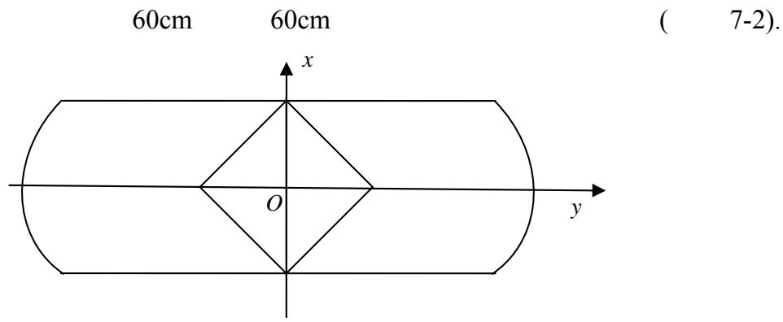

<details>
<summary>text_image</summary>

60cm 60cm
x
O
y
( 7-2).
</details>

7-2

(1)

$h = 57$ $w = 2.5$ $W = 60$ . $\lambda = 5$ $a = 1$ (7-6)

6.2.1 (5)

$$
\theta = 1. 0 4 7 2 \quad s = 3 2.
$$

(2)

$$
d = \frac {h}{\sin \theta} - s = 3 6. 3 1 8 \quad w = 2. 5 \quad \theta = 1. 0 4 7 2
$$

$$
\text {len} \left(x _ {i}\right) = \sqrt {d ^ {2} + w ^ {2} + f ^ {2} \left(x _ {i}\right) - 2 \left(d \cos \theta + w\right) f \left(x _ {i}\right) + 2 d \cos \theta \cdot w} + f \left(x _ {i}\right) - d - w
$$

5.

体 5.

<table><tr><td colspan="13">5 (cm)</td></tr><tr><td>i</td><td>1</td><td>2</td><td>3</td><td>4</td><td>5</td><td>6</td><td>7</td><td>8</td><td>9</td><td>10</td><td>11</td><td>12</td></tr><tr><td></td><td>137.07</td><td>137.30</td><td>137.74</td><td>138.38</td><td>139.20</td><td>140.19</td><td>141.31</td><td>142.53</td><td>143.81</td><td>145.07</td><td>146.28</td><td>147.36</td></tr><tr><td></td><td>29.50</td><td>29.23</td><td>28.71</td><td>27.93</td><td>26.89</td><td>25.58</td><td>23.98</td><td>22.10</td><td>19.94</td><td>17.49</td><td>14.76</td><td>11.766</td></tr><tr><td></td><td>2.50</td><td>2.77</td><td>3.297</td><td>4.07</td><td>5.11</td><td>6.42</td><td>8.02</td><td>9.90</td><td>12.061</td><td>14.511</td><td>17.244</td><td>20.24</td></tr><tr><td></td><td>60</td><td>55</td><td>50</td><td>45</td><td>40</td><td>35</td><td>30</td><td>25</td><td>20</td><td>15</td><td>10</td><td>5</td></tr><tr><td></td><td>44.57</td><td>46.95</td><td>49.24</td><td>51.44</td><td>53.56</td><td>55.59</td><td>57.53</td><td>59.38</td><td>61.14</td><td>62.80</td><td>64.36</td><td>65.82</td></tr></table>

(3)

θ

θ

$$
\theta = 0, 0. 1 4 9 6, 0. 2 9 9 2, 0. 4 4 8 8, 0. 5 9 8 4, 0. 7 4 8 0, 0. 8 9 7 6, 1. 0 4 7 2
$$

matlab

7-3 7-4. (

6)

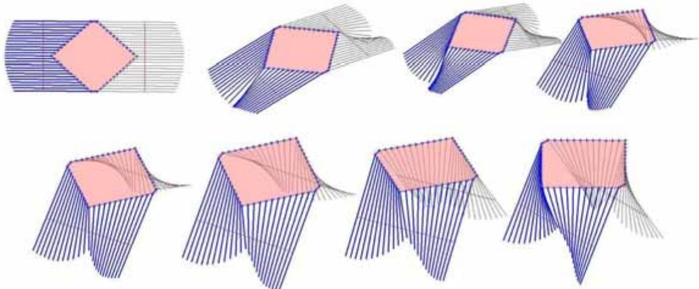  
7-3

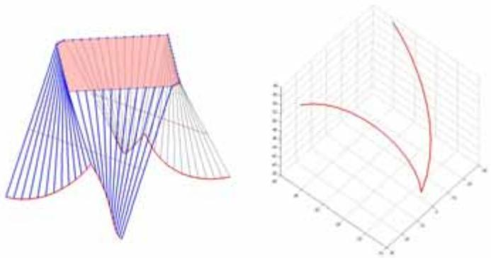

## 7.3.2 8 字

8 字 (7-5)

60cm

70cm

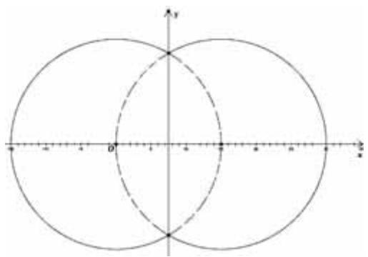

<details>
<summary>text_image</summary>

Diagram showing two intersecting circles on a Cartesian coordinate system with labeled axes and origin point O.
</details>

7-5 8字

$$
\begin{array}{c} h = 6 7 \quad w = 2. 5 \quad W = 9 0. \quad \lambda = 5 \quad a = 1 \\ 7) \quad \theta = 1. 2 2 1 7 \end{array} \quad (7 - 6) \quad s = 4 0.
$$

6.

6 8字  
( cm )

<table><tr><td>i</td><td>1</td><td>2</td><td>3</td><td>4</td><td>5</td><td>6</td><td>7</td><td>8</td><td>9</td></tr><tr><td></td><td>149.2</td><td>149.1</td><td>148.9</td><td>148.5</td><td>147.9</td><td>147.1</td><td>146.2</td><td>145.1</td><td>143.8</td></tr><tr><td></td><td>30.28</td><td>26.02</td><td>22.69</td><td>19.94</td><td>17.64</td><td>15.72</td><td>14.14</td><td>12.87</td><td>11.90</td></tr><tr><td></td><td>9.72</td><td>13.98</td><td>17.31</td><td>20.06</td><td>22.36</td><td>24.28</td><td>25.86</td><td>27.13</td><td>28.10</td></tr><tr><td></td><td>106.03</td><td>114.54</td><td>121.20</td><td>126.70</td><td>131.31</td><td>135.15</td><td>138.31</td><td>140.84</td><td>142.77</td></tr><tr><td></td><td>106.03</td><td>114.54</td><td>121.20</td><td>126.70</td><td>131.31</td><td>135.15</td><td>138.31</td><td>140.84</td><td>59.4</td></tr><tr><td>i</td><td>10</td><td>11</td><td>12</td><td>13</td><td>14</td><td>15</td><td>16</td><td>17</td><td></td></tr><tr><td></td><td>23.81</td><td>22.44</td><td>21.62</td><td>21.35</td><td>21.62</td><td>22.44</td><td>23.81</td><td>25.74</td><td></td></tr><tr><td></td><td>11.22</td><td>10.81</td><td>10.68</td><td>10.81</td><td>11.22</td><td>11.90</td><td>12.87</td><td>14.14</td><td></td></tr><tr><td></td><td>28.78</td><td>29.19</td><td>29.32</td><td>29.19</td><td>28.78</td><td>28.10</td><td>27.13</td><td>25.86</td><td></td></tr><tr><td></td><td>23.81</td><td>22.44</td><td>21.62</td><td>21.35</td><td>21.62</td><td>22.44</td><td>23.81</td><td>25.74</td><td></td></tr><tr><td></td><td>144.14</td><td>144.96</td><td>145.23</td><td>144.96</td><td>144.14</td><td>142.77</td><td>140.84</td><td>138.31</td><td></td></tr></table>

matlab

7-6 7-7. (

7)

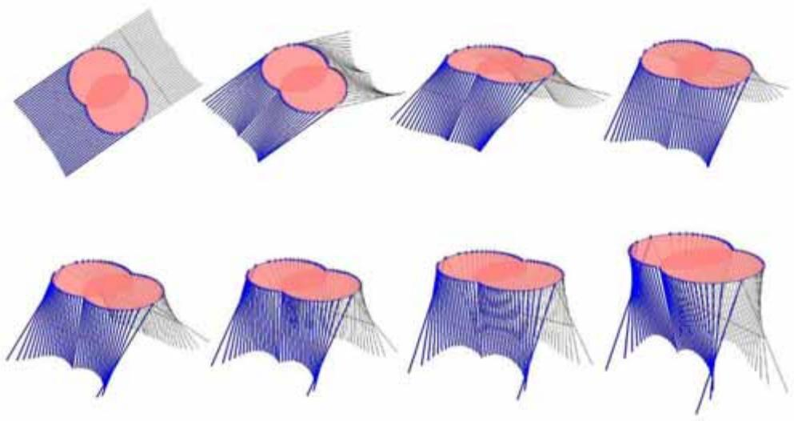

<details>
<summary>natural_image</summary>

Sequence of 3D geometric illustrations showing a red circular cutout on blue pyramids, with no text or symbols present.
</details>

7-6 8字  
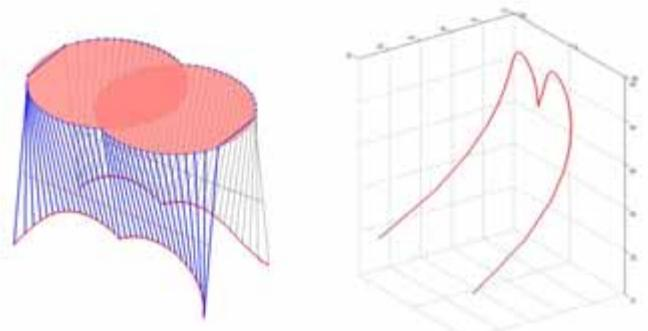

<details>
<summary>natural_image</summary>

3D geometric shapes: a blue frustum with internal curves and a red curved surface, alongside a wireframe cube in 3D space (no text or symbols)
</details>

7-7 8字

8.1  
8.2  
8.3

d

$\theta(x_{i})$

$\theta(x_{i})$

$f(x)$

<table><tr><td></td><td>ψ(x)</td><td></td><td></td></tr><tr><td></td><td>ψ(x)</td><td></td><td>ψ(x)</td></tr><tr><td>f(x)</td><td></td><td>ψ(x)</td><td></td></tr><tr><td>.</td><td></td><td></td><td></td></tr><tr><td>[1]</td><td>( )</td><td></td><td>2006.</td></tr><tr><td>[1]</td><td></td><td></td><td>2007.</td></tr></table>

%canshu

w=2.5;

r=sqrt(100+1)\*w;

l=60-w;

d=1/2;

h=53-3;

theta=asin(h/l);

%shengcheng canshu

v=-25:25;

u=25:60;

[u,v]=meshgrid(u,v);

% qumian canshu fangcheng

X=v;

y=sqrt(r^2-v.^2)+(d\*cos(theta)+w-sqrt(r^2-v.^2)).

\*(u-sqrt(r^2-v.^2))./sqrt(d^2-+w^2+r^2-v.^2-2\*(d\*

cos(theta)+w)\*sqrt(r^2-v.^2)+2\*d\*w\*cos(theta));

z=d\*sin(theta)\*(u-sqrt(r^2-v.^2))./sqrt(d^2-+w^2+

r^2-v.^2-2\*(d\*cos(theta)+w)\*sqrt(r^2-v.^2)+2\*d\*

w\*cos(theta));

Z=-Z;

%cemian tuxiang

figure(1);

mesh(x,y,z);

%zhuojiao bianyuanxian

u=60;

v=-25:25;

X=v;

y=sqrt(r^2-v.^2)+(d\*cos(theta)+w-sqrt(r^2-v.^2)).

\*(u-sqrt(r^2-v.^2))./sqrt(d^2-+w^2+r^2-v.^2-2\*(d\*

cos(theta)+w)\*sqrt(r^2-v.^2)+2\*d\*w\*cos(theta));

z=d\*sin(theta)\*(u-sqrt(r^2-v.^2))./sqrt(d^2-+w^2+

$\mathrm{r}^{\wedge}2 - \mathrm{v}.^{\wedge}2 - 2^{*}(\mathrm{d}^{*}\cos (\mathrm{theta}) + \mathrm{w})^{*}\mathrm{sqrt}(\mathrm{r}^{\wedge}2 - \mathrm{v}.^{\wedge}2) + 2^{*}\mathrm{d}^{*}$

w\*cos(theta));

Z=-Z;

figure(2);

plot3(x,y,z,'LineWidth',2);

grid on;

% canshu

w=2.5;

r=sqrt(100+1)\*w;

1=60-w;

d=1/2;

h=53-3;

theta=asin(h/l);

%zhuobian dian zuobiao

xc=-10:10;

$xc=xc*w;$

yc=sqrt(r^2-xc.^2);

zc=zeros(1,21);

%gangjin dian zuobiao

xg=-10:10;

$xg=xg*w;$

$yg=d*cos(theta)*ones(1,21)+w;$

zg=d\*sin(theta)\*ones(1,21);

%zhuobian dao gangjin de juli:

for i=1:21

dis(i)=norm([xc(i),yc(i),zc(i)]-[xg(i),yg(i),zg(i)]);

end

%kaicang dao banbian de juli:

for i=1:21

margin(i)=60-yc(i)-dis(i);

end

%muban dingdian zuobiao

for i=1:21

k=(margin(i)+dis(i))/dis(i);

$\mathrm{xd(i) = xc(i) + k^{*}(xg(i) - xc(i))}$ ;

yd(i)=yc(i)+k\*(yg(i)-yc(i));

$\mathrm{zd(i)=zc(i)+k^{*}(zg(i)-zc(i));}$

end

figure(1); hold on;

plot3(xc,yc,zc,'\*','LineWidth',2);

plot3(xg,yg,zg,'r','LineWidth',2);

for i=1:21

line([xc(i),xg(i)],[yc(i),yg(i)],[zc(i),zg(i)],'LineWid

th',2);

line([xd(i),xg(i)],[yd(i),yg(i)],[zd(i),zg(i)],'LineWi

dth',2);

end

figure(1); hold on;

plot3(xc,-yc,zc,'\*');

plot3(xg,-yg,zg,'r');

for i=1:21

line([xc(i),xg(i)],[-yc(i),-yg(i)],[zc(i),zg(i)],'LineW

idth',1,'Color',[.2 .2 .2]);

line([xd(i),xg(i)],[-yd(i),-yg(i)],[zd(i),zg(i)],'LineW

idth',1,'Color',[.2 .2 .2]);

end

plot3(xc,yc,zc);plot3(xc,-yc,zc);

line([xc(1),xc(1)],[yc(1),-yc(1)],[zc(1),zc(1)],'Line

Width',2);

line([xc(21),xc(21)],[yc(21),-yc(21)],[zc(21),zc(21

)],'LineWidth',2);

view(3)

[X,Y,Z]=sphere(30);

$\mathrm{X} = 25^{*}\mathrm{X};\mathrm{Y} = 25^{*}\mathrm{Y};\mathrm{Z} = \text{zeros}(31);$

surf(X,Y,Z);

colormap(spring);

alpha(.5)

shading interp; axis equal; axis off;

## 3 (2)

global w h a W r x lamda;

w=2.5;h=70-3;a=1;W=80;lamda=1.5;r=sqrt(40\*40

+2.5\*2.5);

x=[2.5:2.5:40]';

ts0=[pi/4,h/2];

lb=[0,0];

ub=[pi/2,h];

ts=fmincon(@objfun,ts0,[],[],[],[],lb,ub,@confun)

## objfun.m

function f=objfun(ts)

f=-sin(ts(1));

%di er mubiao

%l=w+h/sin(ts(1));

%d=1-ts(2);

$\% \mathrm{q} = 32.5 - \mathrm{abs(x)};$

%len=sqrt(d^2-+w^2+q^2-2\*(d\*cos(ts(1))+w)\*q+

$2*d*w*cos(ts(1)))+q-d-w$

$\% \mathrm{f} = \text{sum}(\text{len});$

## confun.m

function [c,ceq]=confun(ts)

%ts=[theta,s];

global w h a W r x lamda;

l=w+h/sin(ts(1));

d=l-ts(2);

q=sqrt(r^2-x.^2);

len=sqrt(d^2-+w^2+r^2-x.^2-2\*(d\*cos(ts(1))+w)\*

$q+2*d*w*cos(ts(1)))+q-d-w;$

c=[a\*W-2\*(w+h\*cot(ts(1)));

$-(q + (d^{*}\cos(ts(1)) + w - q).^{*}(1 - q). / \sqrt{2} (d^{\wedge}2 - + w^{\wedge}2 + r^{\wedge}2 -$

x.^2-2\*(d\*cos(ts(1))+w)\*q+2\*d\*w\*cos(ts(1)));

len-ts(2)+lamda

];

ceq=[];

## 4 2

% canshu

global w h a W r x lamda n;

w=2.5;h=70-3;a=1;W=80;lamda=5;r=sqrt(40\*40+

2.5\*2.5);

%youhua qiujie

x=[2.5:2.5:40]';

ts0=[pi/4,h/2];

lb=[0,0];

ub=[pi/2,h];

ts=fmincon(@objfun,ts0,[],[],[],[],lb,ub,@confun)

theta=ts(1);          %youhua jieguo
s=ts(2);                  %youhua jieguo

$l=w+h/\sin(\text{theta});$

d=l-s;

n=80/2.5+1;

%zhuobian dian zuobiao

xc=-40:2.5:40;

yc=sqrt(r^2-xc.^2);

zc=zeros(1,n);

%gangjin dian zuobiao

xg=-40:2.5:40;

$\mathrm{yg} = \mathrm{d}^{*}\cos (\mathrm{theta})^{*}\mathrm{ones}(1,\mathrm{n}) + \mathrm{w};$

zg=d\*sin(theta)\*ones(1,n);

%zhuobian dao gangjin de juli:

for i=1:n

dis(i)=norm([xc(i),yc(i),zc(i)]-[xg(i),yg(i),zg(i)]);

end

%kaicang dao banbian de juli:

for i=1:n

margin(i)=l-yc(i)-dis(i);

end

%muban dingdian zuobiao

for i=1:n

k=(margin(i)+dis(i))/dis(i);

$\mathrm{xd(i)=xc(i)+k*(xg(i)-xc(i));}$

yd(i)=yc(i)+k\*(yg(i)-yc(i));

$zd(i)=zc(i)+k*(zg(i)-zc(i));$

end

figure(1); hold on;

plot3(xc,yc,zc,'\*');

plot3(xg,yg,zg,'r');

for i=1:n

line([xc(i),xg(i)],[yc(i),yg(i)],[zc(i),zg(i)],'LineWid

th',2);

line([xd(i),xg(i)],[yd(i),yg(i)],[zd(i),zg(i)],'LineWi

dth',2);

end

figure(1); hold on;

plot3(xc,-yc,zc,'\*');

plot3(xg,-yg,zg,'r');

for i=1:n

line([xc(i),xg(i)],[-yc(i),-yg(i)],[zc(i),zg(i)],'LineW

idth',1,'Color',[.2 .2 .2]);

```matlab
line([xd(i),xg(i)],[-yd(i),-yg(i)],[zd(i),zg(i)],'LineWidth',1,'Color',[.2 .2 .2]);
end
```

```matlab
plot3(xc,yc,zc);plot3(xc,-yc,zc);
line([xc(1),xc(1)],[yc(1),-yc(1)],[zc(1),zc(1)],'Line Width',2);
line([xc(n),xc(n)],[yc(n),-yc(n)],[zc(n),zc(n)],'Line Width',2);
view(3)
```

```matlab
[X,Y,Z]=sphere(30);
X=1*X/2;Y=1*Y/2;Z=zeros(31);
surf(X,Y,Z);
colormap(spring);
alpha(.5)
shading interp; axis equal; axis off;
```

5 (3)  
```matlab
global w h a W x lamda;
w=2.5;h=60-3;a=1;W=60;lamda=5;
x=[2.5:2.5:30]';
%8xing, gaiwei:
%w=2.5;h=70-3;a=1;W=90;lamda=5;
%x=[2.5:2.5:45]';
ts0=[pi/4,h/2];
lb=[0,0];
ub=[pi/2,h];
ts=fmincon(@objfun,ts0,[],[],[],[],lb,ub,@confun)
```

```matlab
confun.m:
function [c,ceq]=confun(ts)
%ts=[theta,s];
```

```matlab
global w h a W x lamda;
l=w+h/sin(ts(1));
d=l-ts(2);
q=32.5-abs(x);          %8xing, gaiwei:
q=sqrt(30^2-(x-15)^2);
len=sqrt(d^2-+w^2+q^2-2*(d*cos(ts(1))+w)*q+2*
d*w*cos(ts(1))+q-d-w;
```

```javascript
c=[a*W-2*(w+h*cot(ts(1)));
-(q+(d*cos(ts(1))+w-q).*(l-q)./sqrt(d^2-+w^2+r^2-x.^2-2*(d*cos(ts(1))+w)*q+2*d*w*cos(ts(1))));
    len-ts(2)+lamda
  ];
ceq=[];
```

```matlab
objfun.m
function f=objfun(ts)
f=-sin(ts(1));
%di er mubiao
%l=w+h/sin(ts(1));
```

```matlab
%d=l-ts(2);
%q=32.5-abs(x);
%len=sqrt(d^2-+w^2+q^2-2*(d*cos(ts(1))+w)*q+
2*d*w*cos(ts(1)))+q-d-w
%f=sum(len);
```

6  
```matlab
clear;
%canshu
w=2.5;h=60-3;a=1;W=60; n=W/2.5+1;s=32;
t=pi/3;
l=w+h/sin(t);
R=sqrt(l^2+30^2);
```

```matlab
%zhuobian dian zuobiao
xc=-30:2.5:30;
yc=32.5-abs(xc);
zc=zeros(1,n);
```

```matlab
xd=xc;xg=xc;
ll=sqrt(R^2-xc.^2);
d=l-s;
```

```matlab
for m=1:8
    tt=linspace(0,8,8);
    theta=tt(m)*t/8;
```

```matlab
%gangjin dian zuobiao
yg=d*cos(theta)*ones(1,n)+w;
zg=d*sin(theta)*ones(1,n);
```

```txt
%zhuobian dao gangjin de juli:
for i=1:n
```

```matlab
dis(i)=norm([xc(i),yc(i),zc(i)]-[xg(i),yg(i),zg(i)]);
end
```

```matlab
%kaicang dao banbian de juli:
margin=ll-yc-dis;
```

```matlab
%muban dingdian zuobiao
for i=1:n
    k=(margin(i)+dis(i))/dis(i);
    yd(i)=yc(i)+k*(yg(i)-yc(i));
    zd(i)=zc(i)+k*(zg(i)-zc(i));
end
```

```matlab
subplot(2,4,m)
figure(1); hold on;
plot3(xc,yc,zc,'*');
plot3(xg,yg,zg,'r');
for i=1:n
```

```javascript
line([xc(i),xg(i)],[yc(i),yg(i)],[zc(i),zg(i)],'LineWidth',2);
```

```javascript
line([xd(i),xg(i)],[yd(i),yg(i)],[zd(i),zg(i)],'LineWi
```

dth',2);

end

plot3(xc,-yc,zc,'\*');

plot3(xg,-yg,zg,'r');

for i=1:n

line([xc(i),xg(i)],[-yc(i),-yg(i)],[zc(i),zg(i)],'LineWidth',1,'Color',[.2 .2 .2]);

line([xd(i),xg(i)],[-yd(i),-yg(i)],[zd(i),zg(i)],'LineWidth',1,'Color',[.2 .2 .2]);

end

plot3(xc,yc,zc);plot3(xc,-yc,zc);

line([xc(1),xc(1)],[yc(1),-yc(1)],[zc(1),zc(1)],'Line Width',2);

line([xc(n),xc(n)],[yc(n),-yc(n)],[zc(n),zc(n)],'Line Width',2);

view(3)

$\mathrm{X} = [00; -11; 00]; \mathrm{Y} = [11; 00; -1-1]$ ;

X=32.5\*X;Y=32.5\*Y;Z=zeros(3,2);

surf(X,Y,Z);

colormap(spring);

alpha(.5)

shading interp; axis equal; axis off;

end

figure(2);

plot3(xd,yd,zd);plot3(xd,-yd,zd);

## 7 8

clear;

% canshu

w=2.5;h=70-3;W=90; n=W/2.5-1;s=40;

t=pi\*70/180;

%zhuobian dian zuobiao

xc=-42.5:2.5:42.5;

yc=sqrt(30^2-(abs(xc)-15).^2);

zc=zeros(1,n);

$l=yc(1)+h/\sin(t);$

xd=xc;xg=xc;

d=1-s;

for m=1:8

theta=m\*t/8;

%gangjin dian zuobiao

$\mathrm{yg = d^{*}cos(theta)^{*}ones(1,n) + w;}$

zg=d\*sin(theta)\*ones(1,n);

%zhuobian dao gangjin de juli:

for i=1:n

dis(i)=norm([xc(i),yc(i),zc(i)]-[xg(i),yg(i),zg(i)]);
end

%kaicang dao banbian de juli:

margin=l-yc-dis;

%muban dingdian zuobiao

for i=1:n

k=(margin(i)+dis(i))/dis(i);

yd(i)=yc(i)+k\*(yg(i)-yc(i));

$\mathrm{zd(i)=zc(i)+k^{*}(zg(i)-zc(i));}$

end

subplot(2,4,m)

figure(1); hold on;

plot3(xc,yc,zc,'\*');

plot3(xg,yg,zg,'r');

for i=1:n

line([xc(i),xg(i)],[yc(i),yg(i)],[zc(i),zg(i)],'LineWidth',2);

line([xd(i),xg(i)],[yd(i),yg(i)],[zd(i),zg(i)],'LineWidth',2);

end

plot3(xc,-yc,zc,'\*');

plot3(xg,-yg,zg,'r');

for i=1:n

line([xc(i),xg(i)],[-yc(i),-yg(i)],[zc(i),zg(i)],'LineWidth',1,'Color',[.2 .2 .2]);

line([xd(i),xg(i)],[-yd(i),-yg(i)],[zd(i),zg(i)],'LineWidth',1,'Color',[.2 .2 .2]);

end

plot3(xc,yc,zc);plot3(xc,-yc,zc);

line([xc(1),xc(1)],[yc(1),-yc(1)],[zc(1),zc(1)],'Line Width',2);

line([xc(n),xc(n)],[yc(n),-yc(n)],[zc(n),zc(n)],'Line Width',2);

view(3)

[X,Y,Z]=sphere(30);

X=30\*X;Y=30\*Y;Z=zeros(31);

X=X+15; surf(X,Y,Z);

X=X-30;      surf(X,Y,Z);

colormap(spring);

alpha(.5)

shading interp; axis equal; axis off;

end

figure(2);

plot3(xd,yd,zd);plot3(xd,-yd,zd);