# 2014高教社杯全国大学生数学建模竞赛

## 承 诺 书

我们仔细阅读了《全国大学生数学建模竞赛章程》和《全国大学生数学建模竞赛参赛规则》（以下简称为“竞赛章程和参赛规则”，可从全国大学生数学建模竞赛网站下载）。

我们完全明白，在竞赛开始后参赛队员不能以任何方式（包括电话、电子邮件、网上咨询等）与队外的任何人（包括指导教师）研究、讨论与赛题有关的问题。

我们知道，抄袭别人的成果是违反竞赛章程和参赛规则的，如果引用别人的成果或其他公开的资料（包括网上查到的资料），必须按照规定的参考文献的表述方式在正文引用处和参考文献中明确列出。

我们郑重承诺，严格遵守竞赛章程和参赛规则，以保证竞赛的公正、公平性。如有违反竞赛章程和参赛规则的行为，我们将受到严肃处理。

我们授权全国大学生数学建模竞赛组委会，可将我们的论文以任何形式进行公开展示（包括进行网上公示，在书籍、期刊和其他媒体进行正式或非正式发表等）。

我们参赛选择的题号是（从A/B/C/D 中选择一项填写）： B

我们的报名参赛队号为（8 位数字组成的编号）： 18013004

所属学校（请填写完整的全名）： 湖南理工学院

参赛队员 (打印并签名) ：1. 邓敏娜

2. 宁 凯

3. 董婷婷

指导教师或指导教师组负责人 (打印并签名)： 万 力

（论文纸质版与电子版中的以上信息必须一致，只是电子版中无需签名。以上内容请仔细核对，提交后将不再允许做任何修改。如填写错误，论文可能被取消评奖资格。）

日期： 2014 年 9 月 15 日

赛区评阅编号（由赛区组委会评阅前进行编号）：

# 2014高教社杯全国大学生数学建模竞赛

## 编 号 专 用 页

赛区评阅编号（由赛区组委会评阅前进行编号）：

赛区评阅记录（可供赛区评阅时使用）：

<table><tr><td>评阅人</td><td></td><td></td><td></td><td></td><td></td><td></td><td></td><td></td><td></td><td></td></tr><tr><td>评分</td><td></td><td></td><td></td><td></td><td></td><td></td><td></td><td></td><td></td><td></td></tr><tr><td>备注</td><td></td><td></td><td></td><td></td><td></td><td></td><td></td><td></td><td></td><td></td></tr></table>

全国统一编号（由赛区组委会送交全国前编号）：

全国评阅编号（由全国组委会评阅前进行编号）：

# 创意平板折叠桌

## 摘要

本文研究了平板折叠桌在折叠过程中，桌脚边缘线和固定钢筋的变化过程，得到了它们的空间曲线方程，给出了在满足牢固性和稳定性前提下的最优解，并将圆形桌面的平板桌推广到了一般桌面的情况。

对于问题一，将空间中的平板桌投影到两个平面坐标系当中，利用三角形关系，

建立了桌脚边缘线的参数方程： $\left\{ \begin{array} { l l } { \displaystyle x _ { i } ^ { * } = \frac { x _ { 0 } - x _ { i } } { d _ { i } } ( L _ { i } - d _ { i } ) + x _ { 0 } } \\ { \displaystyle y _ { i } ^ { * } = 2 . 5 i } \\ { \displaystyle z _ { i } ^ { * } = \frac { z _ { 0 } } { d _ { i } } ( L _ { i } - d _ { i } ) + z _ { 0 } } \end{array} \right.$ ,计算出了每条木条上的

开槽坐标点，在给定其他参数的情况下给出了平板折叠桌的木条开槽加工参数，并将平板桌从折叠到打开的过程动态用图形给出了分步说明。

<table><tr><td></td><td>1</td><td>2</td><td>3</td><td>4</td><td>5</td><td>6</td><td>7</td><td>8</td><td>9</td><td>10</td></tr><tr><td>木条长度</td><td>57</td><td>49.103</td><td>45</td><td>42.146</td><td>40</td><td>38.349</td><td>37.087</td><td>36.152</td><td>35.505</td><td>35.125</td></tr><tr><td>开口位置1</td><td>-31.5</td><td>-36.558</td><td>-40.057</td><td>-42.881</td><td>-45.219</td><td>-47.139</td><td>-48.677</td><td>-49.855</td><td>-50.687</td><td>-51.182</td></tr><tr><td>开口位置2</td><td>-31.5</td><td>-31.5</td><td>-31.5</td><td>-31.5</td><td>-31.5</td><td>-31.5</td><td>-31.5</td><td>-31.5</td><td>-31.5</td><td>-31.5</td></tr><tr><td>开口长度</td><td>0</td><td>5.0582</td><td>8.5566</td><td>11.381</td><td>13.719</td><td>15.639</td><td>17.177</td><td>18.355</td><td>19.187</td><td>19.682</td></tr><tr><td>木板横坐标</td><td>-30.368</td><td>-21.97</td><td>-18.024</td><td>-15.884</td><td>-14.74</td><td>-14.178</td><td>-13.946</td><td>-13.889</td><td>-13.907</td><td>-13.939</td></tr><tr><td>钢条横坐标</td><td>-16.684</td><td>-16.684</td><td>-16.684</td><td>-16.684</td><td>-16.684</td><td>-16.684</td><td>-16.684</td><td>-16.684</td><td>-16.684</td><td>-16.684</td></tr></table>

对于问题二，我们采用非线性约束优化求解。将木板的设计参数归结到两个影响因子α和k，其中α为最外侧木条与垂直方向的夹角，k为钢筋位置与最外侧木条长度之间的比例系数。考虑桌子的牢固性和平衡性，以及加工工艺的限制，建立约

$$
\text {束方程:} s. t. \left\{ \begin{array}{l} 0. 9 R - h \cdot \tan \alpha <   0 \\ h \cdot \tan \alpha - 1. 1 R <   0 \\ h \cdot k \cdot \tan \alpha <   \sqrt {R ^ {2} - \left(\frac {R}{2}\right) ^ {2}} \\ \frac {h}{\cos \alpha} \cdot k + x _ {1} > R \\ \sqrt {\left(x _ {o} - x _ {n}\right) ^ {2} + z _ {o} ^ {2}} + \left| x _ {n} \right| <   \left| \frac {h}{\cos \alpha} \right| + \left| x _ {1} \right| \\ \left| \frac {\left(\frac {h}{\cos \alpha}\right) - x _ {2}}{\sqrt {\left(x _ {0} - x _ {2}\right) ^ {2} + z _ {0} ^ {2}}} \cdot z _ {0} \right| <   h \\ x _ {n} ^ {*} = \frac {n / \cos \alpha - x _ {1}}{\sqrt {\left(x _ {0} - x _ {n}\right) ^ {2} + z _ {0} ^ {2}}} \cdot \frac {x _ {n} - x _ {0}}{x _ {n}} \leq 0 \end{array} \text {。首先，以min } \quad \frac {h}{\cos \alpha} \text {为目标函数，} \right.
$$

使得整个木材在满足设计要求的情况下用料最省。然后，当固定以后，调整k的取值范围，选取 $\quad \operatorname* { m i n } \quad \sum _ { i = 1 } ^ { n } d _ { i } + \left| x _ { i } \right| - k \cdot L _ { \operatorname* { m a x } }$ 为目标函数，使得加工的木条开槽最短，加工最简单。

对于问题三，在满足平板桌稳固和平衡的条件下，可调整桌面的边缘线为任意外凸曲线，只要建立曲线方程，代入问题二所建立的模型中，即可求取满足要求的平板桌设计样式的最优设计参数。我们给出了三种基本情况下的参数计算和平板桌打开过程的动态演示，均符合设计要求。

关键词：折叠平板桌；空间参数曲线；非线性约束优化；模糊数学模型

## 一、问题重述

某公司生产一种可折叠的桌子，桌面呈圆形，桌腿随着铰链的活动可以平摊成一张平板。桌腿由若干根木条组成，分成两组，每组各用一根钢筋将木条连接，钢筋两端分别固定在桌腿各组最外侧的两根木条上，并且沿木条有空槽以保证滑动的自由度。桌子外形由直纹曲面构成，造型美观。附件视频展示了折叠桌的动态变化过程。

试建立数学模型讨论下列问题：

1. 给定长方形平板尺寸为 $1 2 0 \ \mathrm { c m } \times 5 0 \ \mathrm { c m } \times 3 \ \mathrm { c m }$ ，每根木条宽2.5 cm，连接桌腿木条的钢筋固定在桌腿最外侧木条的中心位置，折叠后桌子的高度为 53 cm。试建立模型描述此折叠桌的动态变化过程，在此基础上给出此折叠桌的设计加工参数（例如，桌腿木条开槽的长度等）和桌脚边缘线的数学描述。  
2. 折叠桌的设计应做到产品稳固性好、加工方便、用材最少。对于任意给定的折叠桌高度和圆形桌面直径的设计要求，讨论长方形平板材料和折叠桌的最优设计加工参数，例如，平板尺寸、钢筋位置、开槽长度等。对于桌高 70 cm，桌面直径80cm 的情形，确定最优设计加工参数。  
3. 公司计划开发一种折叠桌设计软件，根据客户任意设定的折叠桌高度、桌面边缘线的形状大小和桌脚边缘线的大致形状，给出所需平板材料的形状尺寸和切实可行的最优设计加工参数，使得生产的折叠桌尽可能接近客户所期望的形状。你们团队的任务是帮助给出这一软件设计的数学模型，并根据所建立的模型给出几个你们自己设计的创意平板折叠桌。要求给出相应的设计加工参数，画出至少8 张动态变化过程的示意图。

## 二、问题分析

## 2.1 问题一的分析

针对问题一我们以折叠桌桌面中心为原点建立三维直角坐标系，通过计算每个特征点的坐标得到加工参数和桌脚边缘线的数学描述。为方便计算，我们将三维的立体图形转换到两个直角坐标系进行分析。

## 2.2对问题二的分析

针对问题二，我们采用非线性约束优化求解。将木板的设计参数归结到两个影响因子α和k，其中α为最外侧木条与垂直方向的夹角，k为钢筋位置与最外侧木条长度之间的比例系数。考虑桌子的牢固性和平衡性，以及加工工艺的限制，建立约束方程，首先以 $\operatorname* { m i n } \quad { \frac { h } { \cos \alpha } }$ 为目标函数，使得整个木材在满足设计要求的情况下用料最省。然后，当固定以后，调整k的取值范围，选取 $\quad \operatorname* { m i n } \quad \sum _ { i = 1 } ^ { n } d _ { i } + \left| x _ { i } \right| - k \cdot L _ { \operatorname* { m a x } }$ 为目标函数，使得加工的木条开槽最短，加工最简单。

## 2.3对问题三的分析

针对问题三，在满足平板桌稳固和平衡的条件下，可调整桌面的边缘线为任意外凸曲线，只要建立曲线方程，代入问题二所建立的模型中，即可求取满足要求的平板桌设计样式的最优设计参数。我们给出了三种基本情况下的参数计算和平板桌打开过程的动态演示，均符合设计要求。

## 三、模型假设

本文研究的平板具有如下的特征：

 每条木条都是均匀分割的；  
 折叠之前每根木条之间的缝隙忽略不计  
 桌子只考虑在水平面平放的情况下  
 料性能对设计不影响  
 实际加工误差对设计无影响  
 木条与圆桌面之间的交接无缝隙  
 钢筋尺寸不计

## 四、符号说明

本文中，用到的符号说明见表1。

表1 符号说明表

<table><tr><td>符号</td><td>说明</td></tr><tr><td> $(x_i, y_i)$ </td><td>圆桌平面上各点的坐标</td></tr><tr><td> $(x_i^*, y_i^*, z_i^*)$ </td><td>每条桌腿边缘的空间坐标</td></tr><tr><td> $(x_0, y_i, z_0)$ </td><td>钢筋各点的空间坐标</td></tr><tr><td> $L_i$ </td><td>每根桌腿长度</td></tr><tr><td> $d_i$ </td><td>桌面到钢筋的长度</td></tr><tr><td> $c_i$ </td><td>每条桌腿的开槽长度</td></tr><tr><td>w</td><td>每根木条的宽度</td></tr><tr><td>R</td><td>圆桌半径</td></tr><tr><td>k</td><td>钢筋位置与最外侧木条长度之间的比例系数</td></tr><tr><td>α</td><td>最外侧木条与垂直方向的夹角</td></tr></table>

## 五、模型建立与求解

## 5.1 问题一的求解

以桌面的几何中心为坐标原点，建立如图5.1.1所示的空间坐标系。再将其分解成x-y,x-z 2个平面坐标系，如图5.1.2、 图5.1.3所示

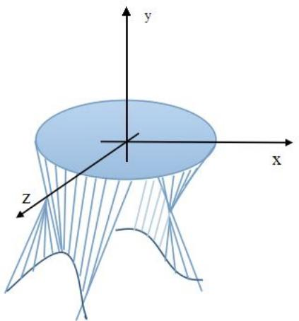

natural_image

3D mathematical surface plot with x, y, z axes labeled (no numerical data or symbols beyond axis labels)

图 5.1. $^ 1 { } _ { 5 }$ 桌子空间图

由于平板桌的对称性，我们仅对xy平面的第三象限进行计算。

##  每根木条的长度

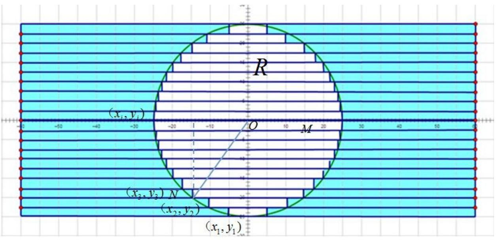

text_image

R
(x_i, y_i)
O
M
(x_2, y_2) N
(x_2, y_3)
(x_1, y_1)

图5.1.2 桌面俯视图

如图5.1.2所示， $( x _ { 1 } , y _ { 1 } )$ 是圆桌面边缘点的坐标，在此我们取与木板厚度相同，$x _ { 1 } = - 3 , y _ { 1 } = - 2 5 , ( x _ { i } , y _ { i } )$ 为第i根木条与圆桌面相交的点的坐标 $( ~ 2 \leq i \leq n ~ ) ~ , ~ L _ { i }$ 为每根桌腿长度。

在ONM 中，根据勾股定理

$$
O N ^ {2} = O M ^ {2} + N M ^ {2}, O M = \sqrt {O N ^ {2} - M N ^ {2}}
$$

其中， $O N = R , O M = x _ { 2 } , N M = y _ { 2 }$

可得，

$$
x _ {2} = \sqrt {R ^ {2} - y _ {2} ^ {2}}
$$

同理，

$$
x _ {i} = \sqrt {R ^ {2} - y _ {i} ^ {2}}
$$

那么桌腿的长度等于平板长度的一半减去圆桌面所截的距离，即

$$
L _ {\mathrm{i}} = 1 2 0 / 2 - x _ {i} = 6 0 - \sqrt {R ^ {2} - y _ {i + 1} ^ {2}}
$$

表5.1.1 各木条长度

<table><tr><td></td><td>1</td><td>2</td><td>3</td><td>4</td><td>5</td><td>6</td><td>7</td><td>8</td><td>9</td><td>10</td></tr><tr><td>木条长度(cm)</td><td>57.000</td><td>49.103</td><td>45.000</td><td>42.146</td><td>40.000</td><td>38.349</td><td>37.087</td><td>36.152</td><td>35.505</td><td>35.125</td></tr></table>

##  求解钢筋的位置

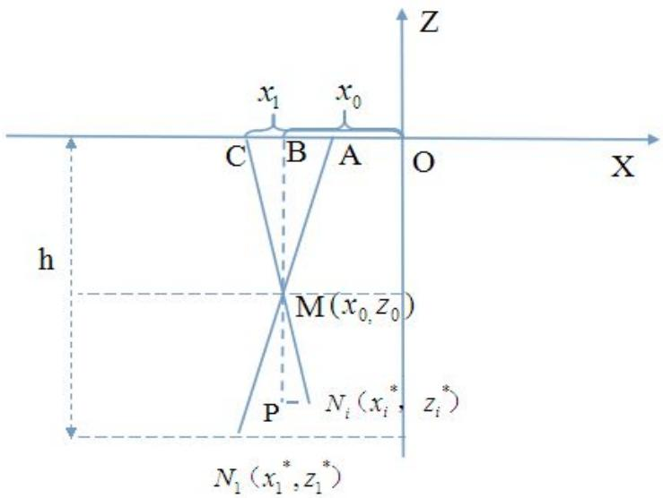

text_image

z
x₁ x₀
C B A O X
h
M(x₀, z₀)
P Nᵢ(xᵢ*, zᵢ*)
N₁(x₁*, z₁*)

图5.1.3 折叠桌的截面图

图 5.1.3是折叠桌的截面图， $A N _ { 1 }$ 为第一根桌腿的长度为 $L _ { 1 }$ ， $C N _ { i }$ 为从第二根以后任意一个木条的长度为 $L _ { \phantom { } _ { i } }$ ，桌面的高度为h。

在 $\Delta A M B$ 中，根据勾股定理有

$$
A B = \sqrt {A M ^ {2} - B M ^ {2}}
$$

其中， $A M = \frac { L _ { 1 } } { 2 } , B M = \frac { h } { 2 }$ ，则

$$
A B = \sqrt {(\frac {L _ {1}}{2}) ^ {2} - (\frac {h}{2}) ^ {2}}
$$

钢筋处到桌面中心的水平距离为 $x _ { 0 }$ ，则

$$
x _ {o} = \sqrt {(\frac {L _ {1}}{2}) ^ {2} - (\frac {h}{2}) ^ {2}} + x _ {1}
$$

其中

$$
z _ {0} = \frac {h}{2}
$$

求得的 $( \sqrt { ( \frac { L _ { 1 } } { 2 } ) ^ { 2 } - ( \frac { h } { 2 } ) ^ { 2 } } + x _ { 1 } , \frac { h } { 2 } )$ 即为所求钢筋处 M的坐标。

##  桌脚的边缘线

如图5.1.3所示，假设 $( { x _ { i } ^ { * } } , { y _ { i } ^ { * } } , { z _ { i } ^ { * } } )$ 为桌角边缘线上的任意一点，AM为形成圆桌后桌面到钢筋处的长度为 $d _ { 1 } , \subset M _ { i }$ 为任意一个桌腿到钢筋处的长度为 $d _ { i }$ ，根据相似三角形定理，可得 $\Delta M N _ { i } p \sim \Delta M C B$ ,则

$$
\frac {P N _ {i}}{M N _ {i}} = \frac {B C}{M C}, \quad \frac {M P}{M N _ {i}} = \frac {B M}{C M}
$$

其中， $P N _ { i } = x _ { 1 } - x _ { 0 } , M N _ { i } = L _ { i } - d _ { i } , B C = x _ { 1 } - x _ { 0 } , M C = d _ { i }$

$$
M P = x _ {i} ^ {*} - x _ {0}, M N _ {i} = L _ {i} - d _ {i}, B C = x _ {0} - x _ {i}, M C = d _ {i}
$$

则

$$
\frac {x _ {i} ^ {*} - x _ {0}}{L _ {i} - d _ {i}} = \frac {x _ {0} - x _ {i}}{d _ {i}}
$$

$$
\frac {z _ {i} ^ {*} - z _ {0}}{L _ {i} - d _ {i}} = \frac {z _ {0} - o}{d _ {i}}
$$

联立上式，得

$$
\left\{ \begin{array}{l} x _ {i} ^ {*} = \frac {x _ {0} - x _ {i}}{d _ {i}} (L _ {i} - d _ {i}) + x _ {0} \\ y _ {i} ^ {*} = 2. 5 i \\ z _ {i} ^ {*} = \frac {z _ {0}}{d _ {i}} (L _ {i} - d _ {i}) + z _ {0} \end{array} \right.
$$

上式为桌脚边缘线的参数方程。

针对问题一，在建立了桌脚边缘线的参数方程和钢筋位置的方程，我们选择平板桌在打开过程中的八个不同位置，分别作出了在这些位置的钢筋以及桌脚边缘线的立体图、俯视图和截面图，可以看到桌脚边缘线和钢筋都在向右移动，当桌脚边缘线超过钢筋后，桌子拥有固定的条件直到到达卡槽位置稳固下来。

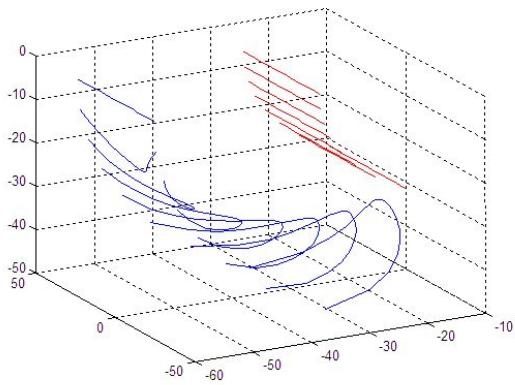

surface_3d

| Series | X (range) | Y (range) | Z (range) |
| --- | --- | --- | --- |
| Blue | -60~-10 | -50~-5 | -5~0 |
| Red | -40~-10 | -20~-5 | -10~-5 |

图 5.1.4 立体图

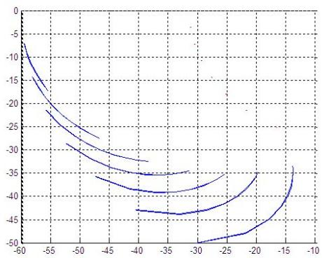

contour

| X | Y (Curve 1) | Y (Curve 2) | Y (Curve 3) | Y (Curve 4) |
| --- | --- | --- | --- | --- |
| -60 | ~-7 | — | — | — |
| -55 | ~-20 | ~-22 | — | — |
| -50 | ~-25 | ~-28 | — | — |
| -45 | ~-30 | ~-33 | ~-36 | — |
| -40 | ~-32 | ~-35 | ~-39 | ~-43 |
| -35 | — | ~-35.5 | ~-39.5 | ~-44 |
| -30 | — | ~-35 | ~-38.5 | ~-43.5 |
| -25 | — | — | ~-35.5 | ~-41 |
| -20 | — | — | — | ~-36 |
| -15 | — | — | — | ~-41 |
| -10 | — | — | — | ~-34 |

图 5.1.5 截面图

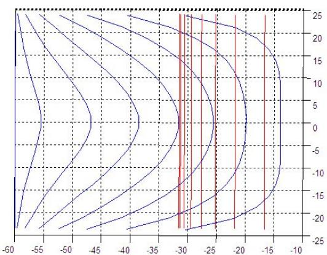

contour

| Y | X (approx) |
| --- | --- |
| 25 | ~-13.5 |
| 20 | ~-14.5 |
| 15 | ~-15.5 |
| 10 | ~-16.5 |
| 5 | ~-17.5 |
| 0 | ~-18.5 |
| -5 | ~-19.5 |
| -10 | ~-20.5 |
| -15 | ~-21.5 |
| -20 | ~-22.5 |
| -25 | ~-23.5 |

图 5.1.6 俯视图

整个桌子的打开过程可分解为如下的八个动态图来表示

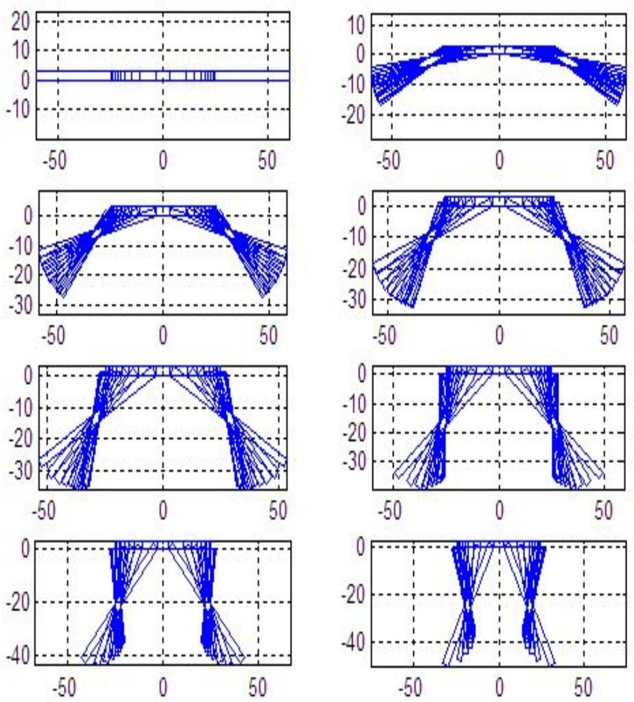  
图 5.1.7 木板展开动态图

##  开槽的长度

根据图5.1.3所示，木条中开槽的最低点与木条目短的长度为 $q _ { i }$ ，每根木条的开槽长度为 $c _ { i }$ 。

根据相似三角形定理，在 $\Delta C N _ { i } B \sim \Delta M N _ { i } P$

$$
\frac {M N _ {i}}{C N _ {i}} = \frac {M P}{B P}
$$

其中 $M N _ { i } = z _ { i } ^ { * } - z _ { 0 } , C N _ { i } = z _ { i } ^ { * } , M P = q _ { i } , B P = L _ { i }$

可得

$$
\frac {z _ {i} ^ {*} - z _ {0}}{z _ {i} ^ {*}} = \frac {q _ {i}}{L _ {i}}
$$

开槽的最低点与木条末端的距离

$$
q _ {i} = \frac {z _ {i} ^ {*} - z _ {0}}{z _ {i} ^ {*}} \cdot L _ {i}
$$

每根木条的开槽长度为

$$
c _ {i} = \frac {L}{2} - q _ {i}
$$

带入数据得到以下表格

表5.1.2 折叠桌的设计参数表

<table><tr><td></td><td>1</td><td>2</td><td>3</td><td>4</td><td>5</td><td>6</td><td>7</td><td>8</td><td>9</td><td>10</td></tr><tr><td>木条长度</td><td>57</td><td>49.103</td><td>45</td><td>42.146</td><td>40</td><td>38.349</td><td>37.087</td><td>36.152</td><td>35.505</td><td>35.125</td></tr><tr><td>开口位置1</td><td>-31.5</td><td>-36.558</td><td>-40.057</td><td>-42.881</td><td>-45.219</td><td>-47.139</td><td>-48.677</td><td>-49.855</td><td>-50.687</td><td>-51.182</td></tr><tr><td>开口位置2</td><td>-31.5</td><td>-31.5</td><td>-31.5</td><td>-31.5</td><td>-31.5</td><td>-31.5</td><td>-31.5</td><td>-31.5</td><td>-31.5</td><td>-31.5</td></tr><tr><td>开口长度</td><td>0</td><td>5.0582</td><td>8.5566</td><td>11.381</td><td>13.719</td><td>15.639</td><td>17.177</td><td>18.355</td><td>19.187</td><td>19.682</td></tr><tr><td>木板横坐标</td><td>-30.368</td><td>-21.97</td><td>-18.024</td><td>-15.884</td><td>-14.74</td><td>-14.178</td><td>-13.946</td><td>-13.889</td><td>-13.907</td><td>-13.939</td></tr><tr><td>钢条横坐标</td><td>-16.684</td><td>-16.684</td><td>-16.684</td><td>-16.684</td><td>-16.684</td><td>-16.684</td><td>-16.684</td><td>-16.684</td><td>-16.684</td><td>-16.684</td></tr></table>

图5.1.8为木板的加工图，红色区域为木条的开槽区间。

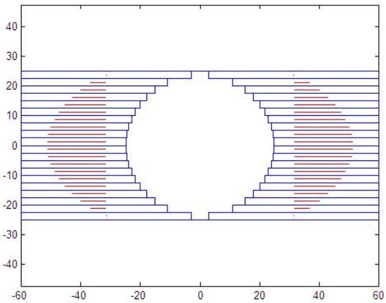

funnel

| X | Y (Range) |
| --- | --- |
| -35~60 | -25~25 |

图5.1.8 桌面俯视图

## 5.2 问题二的求解

本问题归结为求非线性规划问题：

其一，必须满足桌子的牢固性和稳定性；

其二，要求木材用料最省，即所用木板面积最小，而木板宽度就等于桌面圆直径，当桌面高度固定时，木板的长度与最长桌角与桌面垂直方向形成的夹角α有关；

其三，尽量让加工过程更加简单、方便（开槽长度短）。

##  约束条件的分析

## （1）桌子的平衡分析

桌子的平衡关系即桌脚与桌面的关系。如图所示，

在满足牢固性的条件下，如果桌脚打开的角度过小 $( r < < R )$ ，则桌面边缘上的受力点受力时，桌子会失去平衡侧翻。而当桌脚打开的角度过大 $( r > > R )$ ，则会带来材料的浪费和整个桌子占地面积加大，桌脚影响人腿活动的情况。此时，我们认为桌子满足平衡必需满足下面的不等式： $0 . 9 R < r < 1 . 1 R$

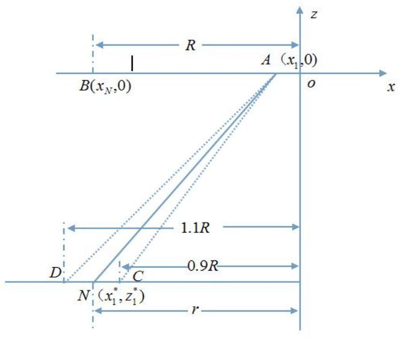

text_image

B(xN,0)
A (x1,0)
O
x
z
R
1.1R
D
C
0.9R
N (x1*, z1*)
r

图 5.2.1 桌子 图

## （2）桌子的受力分析

当平板折叠成桌子以后，只有最长的四条木条作为桌脚接触地面，下面以一条桌脚为例进行受力分析，其它的木条与它可能会形成下面两种关系，如图5.2.2（a）、图 5.2.2（b）所示。

在图 5.2.2（a）中，短木条最长方位于钢筋的左侧，即 $x ^ { * } < x _ { o }$ ，当桌子上方有一个向下的力F作用时，着地的桌脚与地面接触点会有一个向斜上方的力 $F _ { 1 }$ ，将这个力平移到钢筋位置，将其沿着水平和垂直方向进行分解，分别叫做 $F _ { 1 x }$ 和 $F _ { 1 y }$ ，我们可以看到 $F _ { 1 x }$ 是水平向右的。钢筋若要水平平衡需要向左的一个水平力，图 5.2.2（a）短木条到了卡口位置对钢筋提供的力 $F _ { 2 }$ 沿着水平方向分解所得到力 $F _ { 2 x }$ 也是水平向右的，故此时钢筋不能平衡。而在图 5.2.2（b）中，短木条最长方位于钢筋的右侧，即 $x ^ { * } > x _ { o }$ ，短木条到了卡口位置对钢筋提供的力 $F _ { 2 }$ 沿着水平方向分解所得到力 $F _ { 2 x }$ 是水平向左的，此时钢筋有了左右平衡的条件。

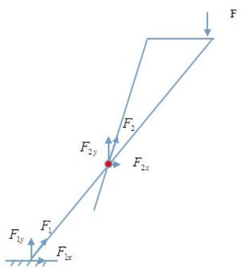

text_image

F
F₂
F₂ᵧ
F₂ₓ
F₁ᵧ
F₁
F₁ₓ

（a）

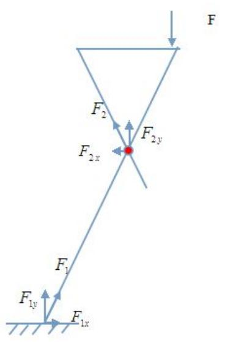

text_image

F
F₂
F₂ₓ
F₂ᵧ
F₁
F₁ᵧ
F₁ₓ

（b）  
图 5.2.2 受力分析

由此得出结论：必需要有短木条与桌脚形成图 5.2.2（b）所示的关系 $( \boldsymbol { x } ^ { * } > \boldsymbol { x } _ { o } )$ 桌子才可以稳定，而在实际使用中这种短木条越多则受力点就越多，桌子就应该越牢固。以左半部分桌子为例，桌脚边缘线与钢筋形成的关系如图 5.2.3 所示，通过查询工程力学的资料可知，则必需满足不等式：

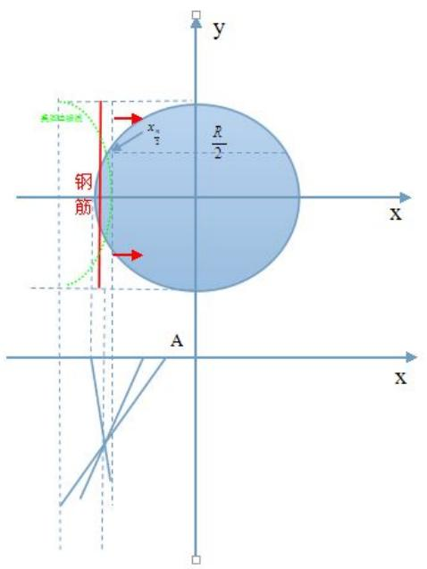

text_image

y
R/2
x_n
钢筋
A
X
X

图 5.2.3 桌脚边缘线与钢筋关系图

$$
h \cdot k \cdot \tan \alpha <   \sqrt {R ^ {2} - (\frac {R}{2}) ^ {2}}
$$

## （3）开槽长度和开槽位置的分析

对于所有的木条来说，左侧开槽的位置不能超出木板的长度，右侧开槽的位置不能大于桌面半径的范围，则开槽位置应该满足如下的不等式：

$$
\left\{ \begin{array}{l} \frac {h}{\cos \alpha} \cdot k + x _ {1} > R \\ \sqrt {\left(x _ {o} - x _ {n}\right) ^ {2} + z _ {o} ^ {2}} + \left| x _ {n} \right| <   \left| \frac {h}{\cos \alpha} \right| + \left| x _ {1} \right| \end{array} \right.
$$

对于工艺加工来说，在满足上述条件的情况下，如何让开槽的距离最短也是我们需要考虑的。

## （4）木板支撑高度的分析

除了最外侧的两根木板落地在地面进行支撑外，其他的木条均应该落在地面上，所以所有的木条最低高度必需大于等于最外侧木条的最低高度，即

$$
\left| \frac {(\frac {h}{\cos \alpha}) - x _ {2}}{\sqrt {\left(x _ {0} - x _ {2}\right) ^ {2} + z _ {0} ^ {2}}} \cdot z _ {0} \right| <   h 。
$$

## （5）左右两边木条互不影响

在平板桌撑开过程中，左边的所有木条与右边的所有木条不能相撞，否则影响撑开过程，由问题一的分析我们可以看到左边桌脚的边缘线在打开过程中是从左向右移动的，我们讨论极限情况，当桌子完全撑开后，所有左半平面的所有桌脚都应落在左半平面内，即

$$
x _ {n} ^ {*} = \frac {n / \cos \alpha - x _ {1}}{\sqrt {\left(x _ {0} - x _ {n}\right) ^ {2} + z _ {0} ^ {2}}} \cdot \frac {x _ {n} - x _ {0}}{x _ {n}} \leq 0
$$

##  建立非线性规划模型

在一组等式或不等式的约束下，求一个函数的最大值（或最小值）问题，其中至少有一个非线性函数，这类问题称之为非线性规划问题。可概括为一般形式：

$$
\min f (x)
$$

$$
h _ {j} (x) \leq 0, j = 1, \dots , q
$$

$$
g _ {i} (x) = 0, i = 1, \dots , p
$$

其中 $\boldsymbol { x } = \left[ x _ { 1 } \cdots x _ { n } \right] ^ { T }$ 称为模型（NP）的决策变量，f称为目标函数， $g _ { i } ( i = 1 , \cdots , p )$ 和 $h _ { { \scriptscriptstyle j } } ( { j = } 1 , \cdots , p )$ 称 为 约 束 函 数 。 另 外 ， $g _ { i } ( x ) = 0 ( i = 1 , \cdots , p )$ 称 为 等 式 约 束 ，$h _ { j } ( x ) \leq 0 ( j = 1 , \cdots , q )$ 称为不等式的约束。

## （1）目标函数的选取

在满足桌子牢固和平衡的条件下尽量让木板材料最省，则得到第一个目标函数：

$$
\min \quad \frac {h}{\cos \alpha}
$$

在满足条件下，调整钢筋在第一根木板上的位置，使得加工工艺最简单，建立第二个目标函数：

$$
\min \quad \sum_ {i = 1} ^ {n} d _ {i} + \left| x _ {i} \right| - k \cdot L _ {\max}
$$

其中，k为钢筋在第一根木条上所处位置占第一根木条总长度的比例系数

## （2）约束条件的选取

$$
\text {由前面对约束条件的分析总结为:} \quad s. t. \left\{ \begin{array}{l} 0. 9 R - h \cdot \tan \alpha <   0 \\ h \cdot \tan \alpha - 1. 1 R <   0 \\ h \cdot k \cdot \tan \alpha <   \sqrt {R ^ {2} - \left(\frac {R}{2}\right) ^ {2}} \\ \frac {h}{\cos \alpha} \cdot k + x _ {1} > R \\ \sqrt {\left(x _ {o} - x _ {n}\right) ^ {2} + z _ {o} ^ {2}} + \left| x _ {n} \right| <   \left| \frac {h}{\cos \alpha} \right| + \left| x _ {1} \right| \\ \left| \frac {\left(\frac {h}{\cos \alpha}\right) - x _ {2}}{\sqrt {\left(x _ {0} - x _ {2}\right) ^ {2} + z _ {0} ^ {2}}} \cdot z _ {0} \right| <   h \\ x _ {n} ^ {*} = \frac {n / \cos \alpha - x _ {1}}{\sqrt {\left(x _ {0} - x _ {n}\right) ^ {2} + z _ {0} ^ {2}}} \cdot \frac {x _ {n} - x _ {0}}{x _ {n}} \leq 0 \end{array} \right.
$$

利用Matlab求解，在n10的情况下，解得 $\alpha = 2 7 . 2 1 6 1 ^ { \circ }$ $k = 0 . 5 7 6 5$ 0

尝试改变n的值，得到如下的参数表格:

表5.2.1 约束条件参数表

<table><tr><td></td><td>n=10</td><td>n=11</td><td>n=12</td><td>n=13</td><td>n=14</td><td>n=15</td><td>n=16</td><td>N=17</td><td>n=18</td><td>n=19</td><td>n=20</td></tr><tr><td> $\alpha$ </td><td>0.4750</td><td>0.4755</td><td>0.4760</td><td>0.4764</td><td>0.4767</td><td>0.4770</td><td>0.4772</td><td>0.4773</td><td>0.4775</td><td>0.4776</td><td>0.4777</td></tr><tr><td>k</td><td>0.5465</td><td>0.5461</td><td>0.5460</td><td>0.5459</td><td>0.5458</td><td>0.5458</td><td>0.5457</td><td>0.5456</td><td>0.5456</td><td>0.5456</td><td>0.5455</td></tr><tr><td> $l_{\max}$ </td><td>78.7147</td><td>78.7345</td><td>78.7550</td><td>78.7708</td><td>78.7835</td><td>78.7936</td><td>78.8020</td><td>78.8089</td><td>78.8146</td><td>78.8195</td><td>78.8237</td></tr></table>

由表格可知改变木条的数目对和k基本无影响，增加数目会增加加工难度，但木条数目太少会影响桌面边缘线的平滑度。为保证桌面边缘线的平滑度且有一定的美观度，我们可选取n=10，即整个桌面每边的木条数为20。

选取n=10,带入问题一的模型求解的结果如表5.2.2所示：

表5.2.2 木板加工参数表

<table><tr><td></td><td>1</td><td>2</td><td>3</td><td>4</td><td>5</td><td>6</td><td>7</td><td>8</td><td>9</td><td>10</td></tr><tr><td>木条长度</td><td>78.715</td><td>64.279</td><td>57.715</td><td>53.149</td><td>49.715</td><td>47.074</td><td>45.054</td><td>43.557</td><td>42.523</td><td>41.915</td></tr><tr><td>开口位置1</td><td>-43.932</td><td>-54.087</td><td>-60.471</td><td>-65.604</td><td>-69.824</td><td>-73.266</td><td>-76.008</td><td>-78.097</td><td>-79.568</td><td>-80.442</td></tr><tr><td>开口位置2</td><td>-43.932</td><td>-43.932</td><td>-43.932</td><td>-43.932</td><td>-43.932</td><td>-43.932</td><td>-43.932</td><td>-43.932</td><td>-43.932</td><td>-43.932</td></tr><tr><td>开口长度</td><td>0</td><td>10.155</td><td>16.54</td><td>21.672</td><td>25.892</td><td>29.335</td><td>32.076</td><td>34.165</td><td>35.636</td><td>36.511</td></tr><tr><td>木板横坐标</td><td>-39</td><td>-24.95</td><td>-20.392</td><td>-18.742</td><td>-18.488</td><td>-18.894</td><td>-19.553</td><td>-20.231</td><td>-20.791</td><td>-21.154</td></tr><tr><td>钢条横坐标</td><td>-21.72</td><td>-21.72</td><td>-21.72</td><td>-21.72</td><td>-21.72</td><td>-21.72</td><td>-21.72</td><td>-21.72</td><td>-21.72</td><td>-21.72</td></tr></table>

图5.2.3为木板的加工图，红色区域为木条的开槽区间。

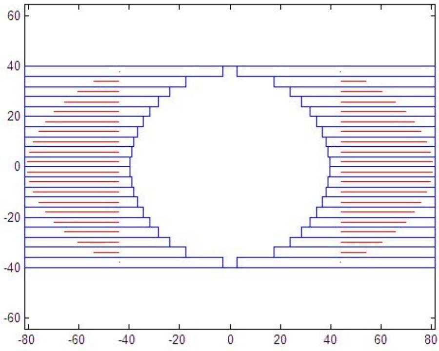

funnel

| Layer | X Range | Y Range |
| --- | --- | --- |
| Top | ~-45 ~-15 | ~35 ~40 |
| Upper Middle | ~-45 ~-15 | ~25 ~35 |
| Middle | ~-45 ~-15 | ~15 ~25 |
| Lower Middle | ~-45 ~-15 | ~0 ~15 |
| Bottom | ~-45 ~-15 | ~-35 ~-15 |

图 5.2.3 木板加工图

## 5.3 问题三的求解

当桌面边缘线为任意外凸曲线，即可满足平板折叠后的稳固性要求，可直接用问题二建立的模型进行优化求解。现给定桌面边缘线的三种基本情况：

（1）桌面边缘线的形状为圆，桌面大小由R决定，如图5.3.1 所示

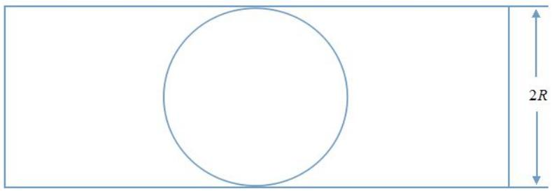

text_image

2R

图5.3.1 桌面俯视简图

（2）桌面边缘线的形状由直线和弧线组成，桌面大小由b 和R决定，如图5.3.2所示

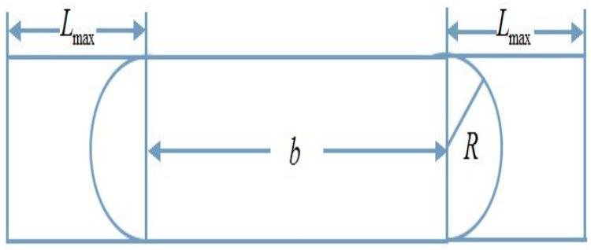

text_image

Lmax
b
R
Lmax

图5.3.2 桌面俯视简图

（3）桌面边缘线的形状由直线组成，桌面大小由R决定 ，如图5.3.3所示

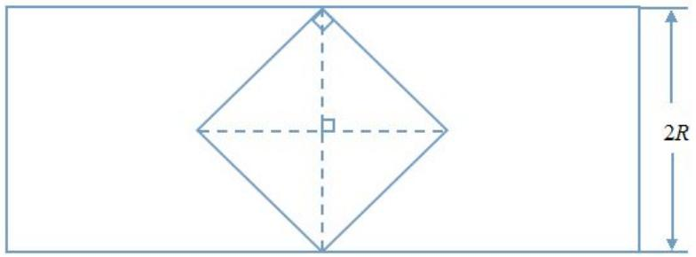

text_image

2R

图5.3.3 桌面俯视简图

桌脚边缘线的大致形状可在得出最优设计加工参数后，通过改变木板边缘形状进行调整。

调用问题二的数学模型可得出最优设计加工参数，根据参数可画出每种设计的动态变化过程。

下面分别把三种情况带入问题二模型中进行求解，例如要求桌面形状（1）所示的样式，其中 $R = 5 0 , h = 7 5$ 带入求解可得 $\alpha = 3 5 . 8 3 2 8 ^ { \mathrm { o } }$ $k = 0 . 5 7 2 9$

计算加工参数如表5.3.1所示

表5.3.1 加工参数表

<table><tr><td></td><td>1</td><td>2</td><td>3</td><td>4</td><td>5</td><td>6</td><td>7</td><td>8</td><td>9</td><td>10</td></tr><tr><td>木条长度</td><td>92.506</td><td>73.712</td><td>65.506</td><td>59.799</td><td>55.506</td><td>52.205</td><td>49.68</td><td>47.809</td><td>46.516</td><td>45.757</td></tr><tr><td>开口位置1</td><td>-80.266</td><td>-90.782</td><td>-97.527</td><td>-103.13</td><td>-107.86</td><td>-111.77</td><td>-114.93</td><td>-117.36</td><td>-119.07</td><td>-120.1</td></tr><tr><td>开口位置2</td><td>-80.266</td><td>-80.266</td><td>-80.266</td><td>-80.266</td><td>-80.266</td><td>-80.266</td><td>-80.266</td><td>-80.266</td><td>-80.266</td><td>-80.266</td></tr><tr><td>开口长度</td><td>0</td><td>10.516</td><td>17.261</td><td>22.869</td><td>27.59</td><td>31.508</td><td>34.664</td><td>37.091</td><td>38.808</td><td>39.833</td></tr><tr><td>木板横坐标</td><td>-82.151</td><td>-66.57</td><td>-60.538</td><td>-57.731</td><td>-56.705</td><td>-56.646</td><td>-57.049</td><td>-57.601</td><td>-58.107</td><td>-58.451</td></tr><tr><td>钢条横坐标</td><td>-58.596</td><td>-58.596</td><td>-58.596</td><td>-58.596</td><td>-58.596</td><td>-58.596</td><td>-58.596</td><td>-58.596</td><td>-58.596</td><td>-58.596</td></tr></table>

根据5.3.1加工参数表，运用MATALB描述动态变化过程如图5.3.4所示

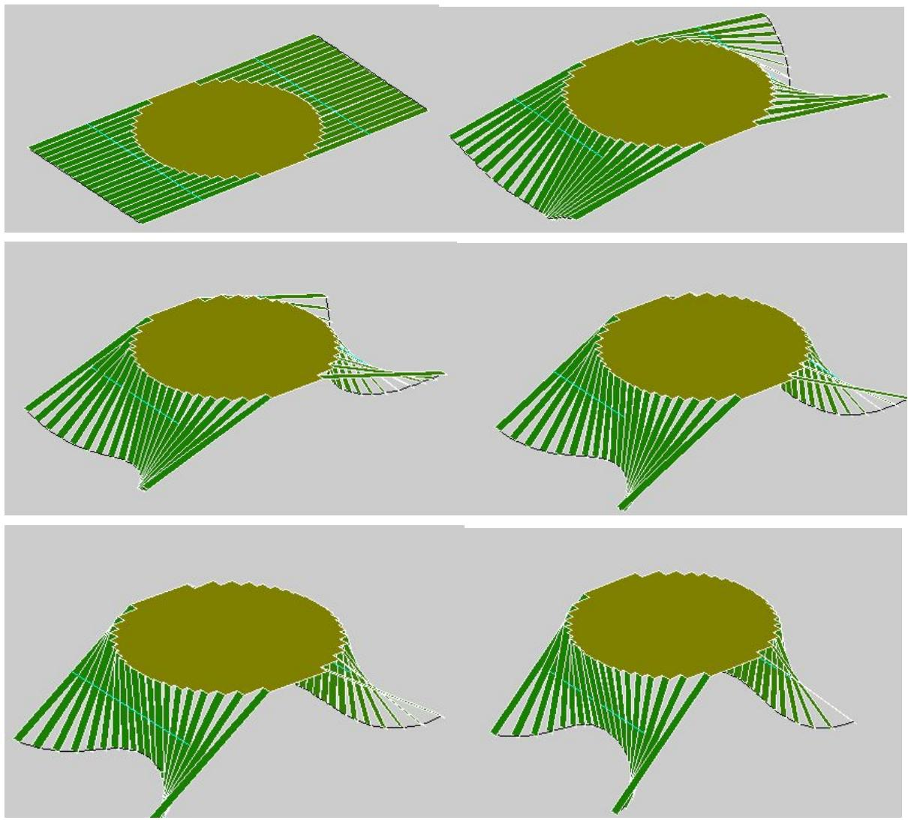

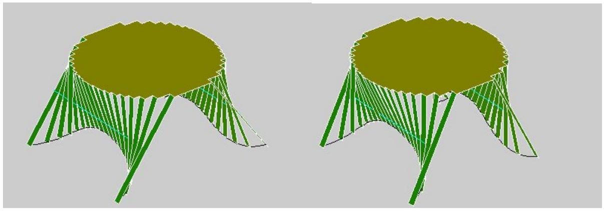

natural_image

Two identical 3D-rendered abstract diagrams with green geometric lines and a central olive shape, no text or symbols present.

图5.3.4 动态过程变化图

根据桌面形状（2）所示的样式，其中 $R = 5 0 , h = 7 5 , b = 5 0$ ,带入求解可得

$$
\alpha = 3 5. 8 3 2 8 ^ {\circ}, \quad k = 0. 5 7 2 9 。
$$

计算加工参数如表5.3.2所示

表5.3.2 加工参数表

<table><tr><td></td><td>1</td><td>2</td><td>3</td><td>4</td><td>5</td><td>6</td><td>7</td><td>8</td><td>9</td><td>10</td></tr><tr><td>木条长度</td><td>92.506</td><td>73.712</td><td>65.506</td><td>59.799</td><td>55.506</td><td>52.205</td><td>49.68</td><td>47.809</td><td>46.516</td><td>45.757</td></tr><tr><td>开口位置1</td><td>-80.266</td><td>-90.782</td><td>-97.527</td><td>-103.13</td><td>-107.86</td><td>-111.77</td><td>-114.93</td><td>-117.36</td><td>-119.07</td><td>-120.1</td></tr><tr><td>开口位置2</td><td>-80.266</td><td>-80.266</td><td>-80.266</td><td>-80.266</td><td>-80.266</td><td>-80.266</td><td>-80.266</td><td>-80.266</td><td>-80.266</td><td>-80.266</td></tr><tr><td>开口长度</td><td>0</td><td>10.516</td><td>17.261</td><td>22.869</td><td>27.59</td><td>31.508</td><td>34.664</td><td>37.091</td><td>38.808</td><td>39.833</td></tr><tr><td>木板横坐标</td><td>-82.151</td><td>-66.57</td><td>-60.538</td><td>-57.731</td><td>-56.705</td><td>-56.646</td><td>-57.049</td><td>-57.601</td><td>-58.107</td><td>-58.451</td></tr><tr><td>钢条横坐标</td><td>-58.596</td><td>-58.596</td><td>-58.596</td><td>-58.596</td><td>-58.596</td><td>-58.596</td><td>-58.596</td><td>-58.596</td><td>-58.596</td><td>-58.596</td></tr></table>

根据加工参数表5.3.2，运用MATALB描述动态变化过程如图5.3.5所示

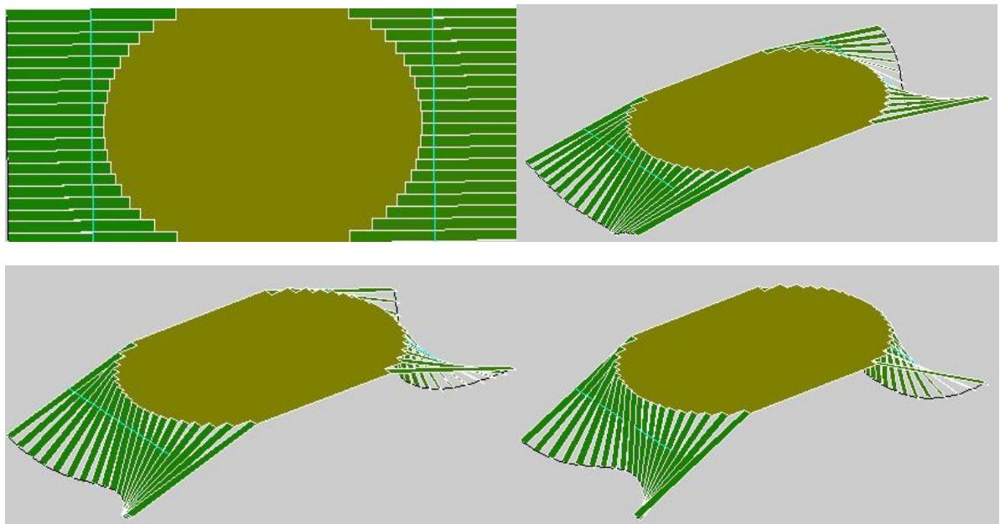

natural_image

Four 3D wireframe diagrams showing layered structures with green and olive green patterns, no text or symbols present.

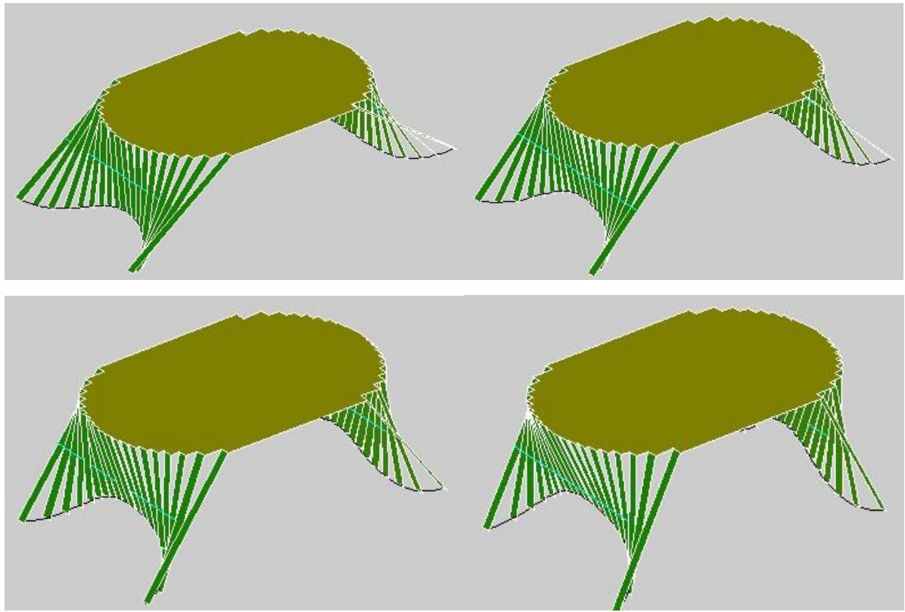  
图 5.3.5 动态过程变化图

根据桌面形状（3）所示的样式，其中 $R = 8 0 , h = 6 0$ ,带入求解可得 $\alpha = 3 3 . 0 1 3 8 ^ { \mathrm { o } }$ $k = 0 . 5 7 6 2$

计算加工参数如表5.3.3所示

表5.3.3 加工参数表

<table><tr><td></td><td>1</td><td>2</td><td>3</td><td>4</td><td>5</td><td>6</td><td>7</td><td>8</td><td>9</td><td>10</td></tr><tr><td>木条长度</td><td>69.5</td><td>67.5</td><td>63.5</td><td>59.5</td><td>55.5</td><td>51.5</td><td>47.5</td><td>43.5</td><td>39.5</td><td>35.5</td></tr><tr><td>开口位置1</td><td>-40.675</td><td>-41.705</td><td>-44.021</td><td>-46.719</td><td>-49.841</td><td>-53.423</td><td>-57.481</td><td>-62.012</td><td>-66.995</td><td>-72.394</td></tr><tr><td>开口位置2</td><td>-40.675</td><td>-40.675</td><td>-40.675</td><td>-40.675</td><td>-40.675</td><td>-40.675</td><td>-40.675</td><td>-40.675</td><td>-40.675</td><td>-40.675</td></tr><tr><td>开口长度</td><td>0</td><td>1.0302</td><td>3.3463</td><td>6.0437</td><td>9.1664</td><td>12.748</td><td>16.806</td><td>21.337</td><td>26.32</td><td>31.719</td></tr><tr><td>木板横坐标</td><td>-37.075</td><td>-35.361</td><td>-31.831</td><td>-28.312</td><td>-25.05</td><td>-22.339</td><td>-20.479</td><td>-19.71</td><td>-20.169</td><td>-21.874</td></tr><tr><td>钢条横坐标</td><td>-21.518</td><td>-21.518</td><td>-21.518</td><td>-21.518</td><td>-21.518</td><td>-21.518</td><td>-21.518</td><td>-21.518</td><td>-21.518</td><td>-21.518</td></tr></table>

根据加工参数表5.3.3，运用MATALB描述动态变化过程如图5.3.6所示

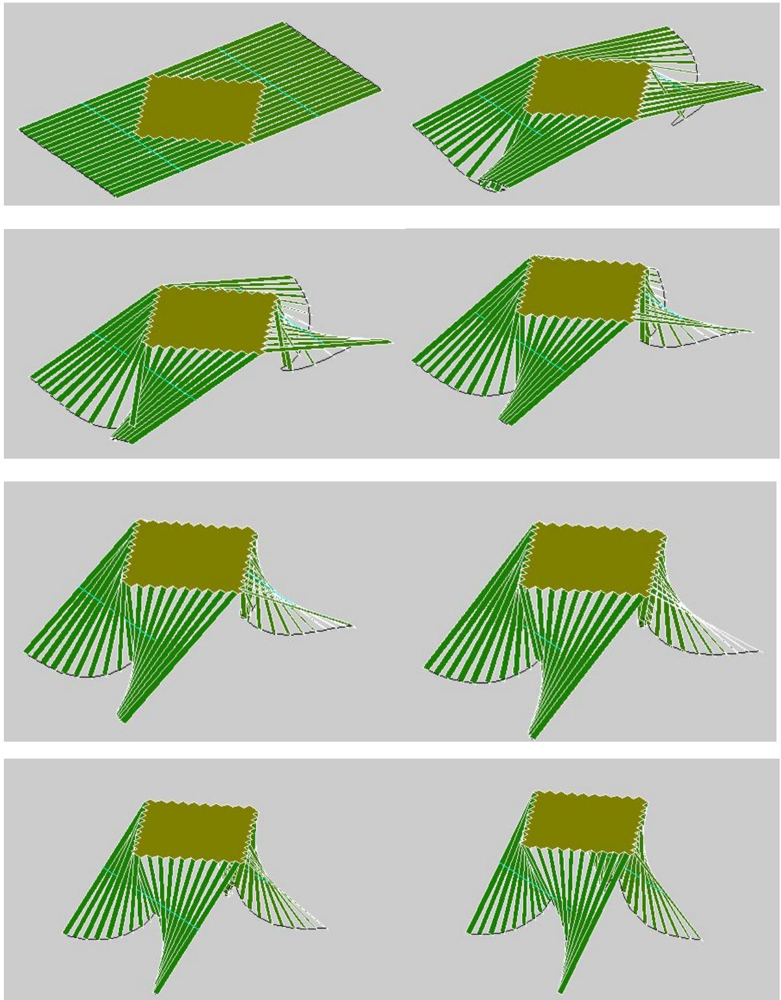  
图5.3.6 动态过程变化图

## 六、模型评价与推广

本文建立了平板折叠桌在折叠过程中，桌脚边缘线和固定钢筋的变化参数方程，利用非线性优化方法，给出了在满足牢固性和稳定性前提下的最优解，通过带入实际数据验证了模型的可用性。在已有优化模型的基础上，将模型推广到了桌面边缘线为任意外凸曲线的情况中，也用数据检验了模型的可用性。

## 七、参考文献

【1】闫周，柳泉潇潇，一体化折叠式工程制图桌椅的设计，金田，2014年第8期  
【2】唐冲，基于matlab的非线性规划问题的求解，计算机与数字工程，2013年  
【3】封希媛，数学建模的应用，西安科技大学学报，2006年第3期  
【4】姜启源，谢金星，叶俊，数学模型，高等教育出版社，1987年4 月  
【5】曾建军，李世航，等，MATLAB语言与数学建模，安徽大学出版社，2005年