# 2014 高教社杯全国大学生数学建模竞赛

## 承诺书

我们仔细阅读了《全国大学生数学建模竞赛章程》和《全国大学生数学建模竞赛参赛规则》(以下简称为“竞赛章程和参赛规则”，可从全国大学生数学建模竞赛网站下载)。

我们完全明白，在竞赛开始后参赛队员不能以任何方式（包括电话、电子邮件、网上咨询等）与队外的任何人（包括指导教师）研究、讨论与赛题有关的问题。

我们知道，抄袭别人的成果是违反竞赛章程和参赛规则的，如果引用别人的成果或其他公开的资料（包括网上查到的资料），必须按照规定的参考文献的表述方式在正文引用处和参考文献中明确列出。

我们郑重承诺，严格遵守竞赛章程和参赛规则，以保证竞赛的公正、公平性。如有违反竞赛章程和参赛规则的行为，我们将受到严肃处理。

我们授权全国大学生数学建模竞赛组委会，可将我们的论文以任何形式进行公开展示（包括进行网上公示，在书籍、期刊和其他媒体进行正式或非正式发表等）。

我们参赛选择的题号是（从 A/B/C/D 中选择一项填写）：\_\_\_\_ B

我们的报名参赛队号为（8位数字组成的编号）：\_\_\_\_ 27042017

所属学校（请填写完整的全名）：\_\_\_\_ 空军工程大学

参赛队员 (打印并签名) : 1. \_\_\_\_ 庄 重 \_\_\_\_

2. 吴俊锋

3. 谭翔飞

指导教师或指导教师组负责人 (打印并签名): \_\_\_\_ 安芹力 \_\_\_\_

（论文纸质版与电子版中的以上信息必须一致，只是电子版中无需签名。以上内容请仔细核对，提交后将不再允许做任何修改。如填写错误，论文可能被取消评奖资格。）

日期：\_\_\_\_ 2014 年 \_\_\_\_ 9 月 \_\_\_\_ 15 日

赛区评阅编号（由赛区组委会评阅前进行编号）：

# 2014 高教社杯全国大学生数学建模竞赛

## 编号专用页

赛区评阅编号（由赛区组委会评阅前进行编号）：

赛区评阅记录（可供赛区评阅时使用）：

<table><tr><td>评阅人</td><td></td><td></td><td></td><td></td><td></td><td></td><td></td><td></td><td></td><td></td></tr><tr><td>评分</td><td></td><td></td><td></td><td></td><td></td><td></td><td></td><td></td><td></td><td></td></tr><tr><td>备注</td><td></td><td></td><td></td><td></td><td></td><td></td><td></td><td></td><td></td><td></td></tr></table>

全国统一编号（由赛区组委会送交全国前编号）：

全国评阅编号（由全国组委会评阅前进行编号）：

# B 题 创意平板折叠桌

## 摘要

本文通过建立数学模型，对平板折叠桌进行优化设计，旨在设计出产品稳固性好、加工方便、用材最少的平板折叠桌。同时根据折叠桌桌面边缘线的演化，建立了任意桌型的优化设计模型，并结合实际，设计、仿真出具有创意的平板折叠桌。

对于问题一，本文建立了桌面边缘线为圆形的折叠桌离散型动态描述模型和连续型动态描述模型。离散模型实现了对产品设计参数的精确描述，结合已知尺寸，计算出此折叠桌的加工参数（滑槽位置及长度），并得出最长滑槽为17.87cm。同时，分析了每根木条随桌腿的运动情况并仿真展示。在连续模型中，将木条的运动抽象成线的运动，以此实现了桌脚边缘线的连续描述，结合运动过程仿真模拟，清晰的展示了桌脚边缘线的动态过程。

对于问题二，本文建立了桌面边缘线为圆形的折叠桌优化设计模型。通过对折叠桌的稳定性，设计尺寸，滑槽长度的综合优化，得出最优设计尺寸和加工参数。在稳定性分析过程中，首先对立置折叠桌进行受力分析，得出只有桌腿承力，因此可进行折叠桌简化分析，确定单侧木桌重心的位置，求解力的平衡方程得出稳定条件。在尺寸设计过程中，根据稳定时的桌腿位置与高度的关系，得出平板的设计尺寸。在滑槽设计过程中，因滑槽的长短和加工位置是影响系统稳定性及木板设计尺寸的关键，同时从易于加工的角度考虑，得出符合产品设计的约束条件。根据题设折叠桌参数，结合优化设计模型得出，在地面摩擦系数为0.4和0.5，权重值为0.5的情况下，最佳木板长度均为159cm，滑槽长度为34.64cm。

对于问题三, 本文建立了任意桌形折叠桌优化设计模型。由于桌面形状的不确定性, 需要抽象描述桌形。分析发现, 任意桌形的设计必须满足沿桌长方向对称, 桌宽方向桌形可不对称, 这就需要根据折叠桌桌面的对称情况考虑是否需要分别优化通过重力作用点的 yoz 平面两侧桌型。为了表示通用的数学模型, 仅对一侧建立优化模型, 结合实际采用离散的优化模型, 对折叠桌的稳定性, 设计尺寸, 滑槽长度进行分析。考虑到客户期望的桌脚边缘线是连续的, 建立连续的设计桌脚边缘线方程, 通过空间曲线间距离的积分来描述两边缘线的接近程度。综合上述条件, 可以设计出稳定性好、加工方便、用材最少的任意桌形的折叠桌并得出最优设计尺寸和加工参数。结合实际, 设计出具有创意的心形和菱形的平板折叠桌, 并用 3D MAX 进行动画展示。

本文脉络清晰，层层递进，分析合理，描述准确，所建立的任意桌形优化设计模型具有很强的通用性，为折叠桌软件设计提供了有力的理论支撑。

关键词：折叠桌 受力分析 优化 仿真 3DMAX MATLAB

## 一、问题重述

## 1.1 问题背景

某公司生产一种可折叠的桌子，桌面呈圆形，桌腿随着铰链的活动可以平摊成一张平板。桌腿由若干根木条组成，分成两组，每组各用一根钢筋将木条连接，钢筋两端分别固定在桌腿各组最外侧的两根木条上，并且沿木条有空槽以保证滑动的自由度。桌子外形由直纹曲面构成，造型美观。附件视频展示了折叠桌的动态变化过程。

## 1.2 目标任务

问题一：给定长方形平板尺寸为 $120 \, cm \times 50 \, cm \times 3 \, cm$ ，每根木条宽 $2.5 \, cm$ ，连接桌腿木条的钢筋固定在桌腿最外侧木条的中心位置，折叠后桌子的高度为 $53 \, cm$ 。试建立模型描述此折叠桌的动态变化过程，在此基础上给出此折叠桌的设计加工参数和桌脚边缘线的数学描述。

问题二：折叠桌的设计应做到产品稳固性好、加工方便、用材最少。对于任意给定的折叠桌高度和圆形桌面直径的设计要求，讨论长方形平板材料和折叠桌的最优设计加工参数。对于桌高 70 cm，桌面直径 80 cm 的情形，确定最优设计加工参数。

问题三：开发一种折叠桌设计软件，根据客户任意设定的折叠桌高度、桌面边缘线的形状大小和桌脚边缘线的大致形状，给出所需平板材料的形状尺寸和切实可行的最优设计加工参数，使得生产的折叠桌尽可能接近客户所期望的形状。

## 二、问题分析

非创意，不生活！创意不仅是一种生活态度，更是对更高生活品质的追求。创意平板折叠桌不仅可以表达木制品的优雅和设计师所想要强调的自动化与功能性，还可以最大程度的节省空间。

题目介绍了一种新型的平板折叠桌，桌腿上固定有钢筋，钢筋贯穿桌腿之间的所有木条，钢筋沿木条内部的空槽运动，以保证该折叠桌可通过桌腿绕铰链活动平摊成一张平板。

对于问题一，题目中给出平板折叠桌的高度、平面尺寸、板厚、木条宽度及钢筋位置等具体数据，由立体几何中的相关知识可以建立坐标系，将已知数据代入得到空间数学模型中，即可解得此折叠桌的设计参数及桌脚边缘线的数学描述，可以通过仿真得到折叠桌桌角的动态变化过程。

对于问题二，题目要求折叠桌的设计应做到稳固性好、加工方便、用材最少，本文将建立多目标优化模型，研究长方形平板材料制作折叠桌时的设计参数。首先，利用立体几何关系建立折叠桌设计参数；然后，鉴于到折叠桌这种艺术品实际使用过程中不会承受较大重物，因而只考虑折叠桌本身重力对其稳定性的影响，并且根据折叠桌材料选取适当的地面摩擦系数建立稳定性方程；最后，在稳定的基础上从加工方便及耗材最少的角度出发，建立优化设计的模型，确定最优解。

对于问题三，为了满足客户需求，本文将原先的圆形桌面推广成任意形状（只要关于 x 轴对称）的桌面，结合第二问中的目标函数及约束建立数学模型，用范数描述实际桌脚边缘线与用户需求的桌脚边缘线相近的相近程度。然后，以此模型为背景，设计几种构造合理、实用价值相对较高的折叠桌，并利用一、二问的结果求出设计参数并画出动态特性图。

平板折叠桌通过最边缘的两根位置固定的钢筋和具有滑槽可运动的木条组成，本文通过建立数学模型，分析其折叠过程中的动态变化过程，从设计加工参数着手，建立多目标优化模型，旨在设计出符合客户需求，产品稳定性好，加工方便，用材最少的平板折叠桌。

## 三、模型假设

1、桌面圆与每根木条的始端相交于木条宽度的中心位置；  
2、为了不改变产品的美观，设计折叠桌时木条宽度保持不变；  
3、折叠桌板在平置时不会因桌面设计产生中空部分；  
4、木条间缝隙尺寸为零；  
5、木条与圆桌面之间的交接处间隙很小，可忽略不记；  
6、材料均匀，木条在加工过程中不会变形或折断；  
7、实际加工误差对设计影响很小，可忽略不记；  
8、不计钢筋尺寸；  
9、钢筋每次运动到最大滑槽的极限位置，且折叠桌缓慢放置于地面之上；  
10、折叠桌桌面设计要满足桌面关于x轴对称。

## 四、符号说明

<table><tr><td>序号</td><td>符号</td><td>说明</td></tr><tr><td>1</td><td>L</td><td>木板的长度</td></tr><tr><td>2</td><td>R</td><td>桌面圆半径</td></tr><tr><td>3</td><td>D</td><td>木板的厚度</td></tr><tr><td>4</td><td>B</td><td>木板的宽度</td></tr><tr><td>5</td><td>H</td><td>木板的高度</td></tr><tr><td>6</td><td>W</td><td>木条的宽度</td></tr><tr><td>7</td><td> $l_i(i=1,2,...,N)$ </td><td>木条i的长度(i=1时表示桌腿)</td></tr><tr><td>8</td><td> $\theta_i(i=1,2,...,N)$ </td><td>木条i移动过程中与桌面的夹角</td></tr><tr><td>9</td><td> $\theta_{end}$ </td><td>最终位置时桌腿与桌面的夹角</td></tr><tr><td>10</td><td> $b_{i(x,y)}(i=1,2,...,N)$ </td><td>桌面圆内与木条i连接部分的位置</td></tr><tr><td>11</td><td> $x_i(y_i,z_i)$ </td><td>木条i在末端坐标系内的坐标</td></tr><tr><td>12</td><td> $d_x(d_y,d_z)$ </td><td>钢筋在 $O_{xyz}$ 坐标系内的坐标</td></tr></table>

## 五、模型的建立与求解

## 5.1 圆面折叠桌的动态描述

在本问中，为了充分描述创意平板折叠桌的动态变化过程，首先要确定静态折叠桌各个参量的数学表达式，然后从折叠过程中运动的每根木条入手，假定折叠桌腿以匀角速运动，根据木条与桌腿之间的运动关系得出木条运动角速度以及角加速度，同时，钢筋在木条内部运动，通过求解其在不同木条中的始末位置求解滑槽长度，最后确定木条末端的运动过程中的位置，确定桌角边缘线的形状及变化过程。

## 5.1.1 圆面折叠桌的离散型动态描述

初始状态时，折叠桌处于平放位置，在上面建立坐标系，并表达出各个参量的位置如下图所示，其中 z 轴垂直于 xoy 平面向内：

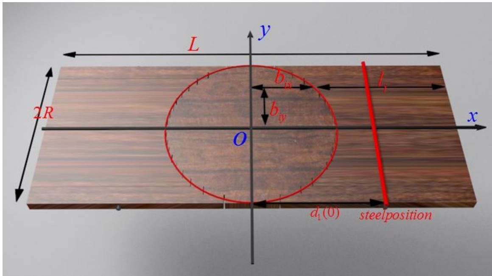

text_image

L
y
2R
bix
bxy
O
x
l1
d1(0)
steelposition

图 1 折叠桌示意图

根据示意图，可以表示出木条i的长度为：

$$
l _ {i} = \frac {1}{2} L - \sqrt {R ^ {2} - (R - (i - \frac {1}{2}) \times W) ^ {2}} \quad (i = 1, 2, \dots , \text {BarNumber}) \tag {1}
$$

其中当木条运动到末态位置，滑槽与钢筋卡紧时，桌腿与桌面的夹角为：

$$
\theta_ {e n d} = \arcsin (\frac {H - D}{l _ {1}}) \tag {2}
$$

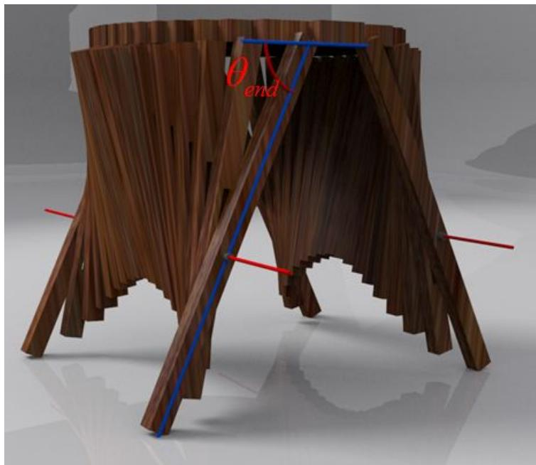

natural_image

3D model of a wooden structure with blue and red lines, no visible text or symbols

图 2 末态位置桌腿位置示意图

运动过程中，桌面圆内与木条 i 连接部位到 yoz 平面的长度不变，根据假设桌面圆相交于桌腿的中心位置为，可以确定木条 i 连接部位到 yoz 平面的长度：

$$
b _ {i x} = \frac {1}{2} L - l _ {i} = \sqrt {R ^ {2} - (R - (i - \frac {1}{2}) \times W) ^ {2}} \quad (i = 1, 2 \dots , \text {BarNumber}) \tag {3}
$$

在图示 $O_{xyz}$ 坐标系内，桌面圆内与木条i连接部分y坐标可以用下式表示：

$$
b _ {i y} = (\frac {\text {BarNumber}}{2} - i + \frac {1}{2}) W _ {i} \quad (i = 1, 2, \dots , \text {BarNumber}) \tag {4}
$$

桌腿运动过程中，设钢筋位置固接在桌腿的位置到桌边的长度与桌腿总长的比值为 $\alpha \left(\frac{2R}{L} < \alpha < 1\right)$ ，之所以 $\frac{2R}{L} < \alpha < 1$ ，是因为桌面处于平放位置时，钢筋位置不能穿过桌面，而桌面立置时，钢筋不能穿过桌面边缘，由此钢筋所在位置可以表示为：

$$
d _ {x} = b _ {1 x} + \alpha l _ {1} \cos \theta_ {1} \quad (0 \leq \theta_ {1} \leq \theta_ {\text {end}}) \tag {5}
$$

$$
d _ {z} = \alpha l _ {1} \sin \theta_ {1} \quad (0 \leq \theta_ {1} \leq \theta_ {\text {end}}) \tag {6}
$$

木条运动过程中，滑槽时刻与钢筋保持接触，利用几何关系可以确定每根木条与桌面的夹角为：

$$
\theta_ {i} = \arctan \frac {d _ {z}}{d _ {x} - b _ {i x}} \quad (i = 1, 2, \dots , B a r N u m b e r) \tag {7}
$$

将式（5）和式（6）带入式(7)得:

$$
\theta_ {i} = \arctan \frac {\alpha l _ {1} \sin \theta_ {1}}{\alpha l _ {1} \cos \theta_ {1} + b _ {1 x} - b _ {i x}} \quad (i = 1, 2, \dots , B a r N u m b e r) \tag {8}
$$

假设桌腿匀角速度运动，即 $\theta_{1}=\omega t$ ，每根木条运动的角速度可以表示为：

$$
\omega_ {i} (t) = \frac {d \theta_ {i}}{d t} = \frac {\omega \alpha^ {2} l _ {1} ^ {2} + \omega \alpha l _ {1} \left(b _ {1 x} - b _ {i x}\right) \cos \omega t}{\left(\alpha l _ {1} \cos \omega t + b _ {1 x} - b _ {i x}\right) ^ {2} + \left(\alpha l _ {1} \sin \omega t\right) ^ {2}} \tag {9}
$$

同样，每根木条运动的角加速度可以表示为:

$$
\alpha_ {i} (t) = \frac {d \omega_ {i}}{d t} = - \frac {\omega^ {2} \alpha l _ {1} \left(b _ {1 x} - b _ {i x}\right) \sin \omega t \left[ \left(b _ {1 x} - b _ {i x}\right) ^ {2} + 3 \alpha^ {2} l _ {1} ^ {2} \right]}{\left[ \left(\alpha l _ {1} \cos \omega t + b _ {1 x} - b _ {i x}\right) ^ {2} + \left(\alpha l _ {1} \sin \omega t\right) ^ {2} \right] ^ {2}} \tag {10}
$$

在每根木条的运动状态确定之后，钢筋在木条内部的运动也可以随相对位置而确定，钢筋与每根木条接触的位置到桌面圆边缘的距离可以用下式表示：

$$
d _ {i} (\theta) = \sqrt {\left(\alpha L \sin \theta\right) ^ {2} + \left[ b _ {1 x} - b _ {i x} + \alpha L \cos \theta \right] ^ {2}} \quad (0 \leq \theta \leq \theta_ {\text {end}}) \tag {11}
$$

$$
d _ {i} (\theta) = \sqrt {\alpha^ {2} L ^ {2} + (b _ {1 x} - b _ {i x}) ^ {2} + 2 \alpha L (b _ {1 x} - b _ {i x}) \cos \theta} \quad \left(0 \leq \theta \leq \theta_ {e n d}\right)
$$

从整理后的公式可以分析得出，钢筋在没根木条滑槽内部的位置仅与 $\cos \theta$ 的大小有关，而 $\cos \theta$ 在 $0 \leq \theta \leq \theta_{end}$ 范围内逐渐减小，因而 $d_i(\theta)$ 在对应区间内单调递增。即随着桌腿的移动，钢筋在每根木条中的位置逐渐向木条末端（背离桌面的方向）延伸，能够延伸的距离即为木条内部开槽长度，为：

$$
D _ {c a o i} = d _ {i} \big (\theta_ {e n d} \big) - d _ {i} (0) \tag {12}
$$

为了确定桌角边缘线的形状及变化过程，本文将每根木条的末端坐标如下：

$$
\left\{ \begin{array}{c} x _ {i} = b _ {i x} + \frac {l _ {i}}{2} \cos \theta_ {i} \\ y _ {i} = b _ {i y} = (\frac {N}{2} - i + \frac {1}{2}) W _ {i} \\ z _ {i} = \frac {l _ {i}}{2} \sin \theta \end{array} \right. \tag {13}
$$

## 5.1.2 圆面折叠桌的连续型动态描述模型

为了形象的描述木条运动过程中桌角边缘线的形状及变化过程，由离散型动态描述，本文利用每个时刻木条末端坐标来描绘边角线时，末端坐标离散，绘制曲线不连续，尽管可以通过插值拟合的方式把所有末端坐标用以连续曲线绘出，但是此曲线只是为了近似而近似，不具有明确的物理含义。为了更准确地描绘边角线，本文设计了折叠桌连续型动态描述模型，将每根木条无限细化，宽度无限减小，桌子立置时，可以得出无穷多的木条末端坐标，其中相邻的两木条末端坐标无限接近，此时将所有末端连接起来，可以得到更为精确的边角线描述。

此时，因木条宽度忽略不计，每根木条的长度可以表示为：

$$
l _ {i} = \frac {1}{2} L - \sqrt {R ^ {2} - b _ {i y} ^ {2}} \quad (0 \leq b _ {i y} \leq R - \frac {1}{2} W \approx R) \tag {14}
$$

桌面圆内与桌腿连接部分的长度近似为 0:

$$
b _ {1 x} = \sqrt {R ^ {2} - (R - \frac {1}{2} W) ^ {2}} \approx 0 \tag {15}
$$

桌腿的长度近似为木板总长度的一半:

$$
l _ {1} = \frac {1}{2} L - b _ {1 x} = \frac {1}{2} L \tag {16}
$$

任意一根木条与桌面圆内连接部分的长度可表示为:

$$
b _ {x} = \sqrt {R ^ {2} - b _ {y} ^ {2}} \quad (0 \leq b _ {y} \leq R - \frac {1}{2} W \approx R) \tag {17}
$$

此时，钢筋的位置到桌面边缘的距离的坐标为：

$$
\left\{ \begin{array}{l} d _ {1 x} (\theta) = b _ {1 x} + \alpha \frac {L - W}{2} \cos (\theta) \approx b _ {1 x} + \alpha \frac {L}{2} \cos (\theta) \quad (0 \leq \theta \leq \theta_ {\text {end}}) \\ d _ {1 z} (\theta) = \alpha \frac {L - W}{2} \sin (\theta) \approx \alpha \frac {L}{2} \sin (\theta) \quad (0 \leq \theta \leq \theta_ {\text {end}}) \end{array} \right. \tag {18}
$$

对于每根木条，运动过程中滑槽内部钢筋到桌面边缘的距离为:

$$
\begin{array}{l} D _ {i} (\theta) = \sqrt {\left(\alpha \frac {L - W}{2} \sin \theta\right) ^ {2} + \left(\alpha \frac {L - W}{2} \cos \theta + b _ {1 x} - b _ {i x}\right) ^ {2}} \quad \left(0 \leq \theta \leq \theta_ {e n d}\right) \\ \approx \sqrt {\left(\alpha \frac {L}{2} \sin \theta\right) ^ {2} + \left(\alpha \frac {L}{2} \cos \theta - b _ {x}\right) ^ {2}} \quad \left(0 \leq \theta \leq \theta_ {e n d}\right) \tag {19} \\ \end{array}
$$

每根木条，运动过程中与桌面（xoy 平面）的夹角为:

$$
\theta = \arctan \frac {\alpha l _ {1} \sin \theta_ {e n d}}{\alpha l _ {1} \cos \theta_ {e n d} + b _ {1 x} - b _ {x}} \approx \arctan \frac {\alpha \frac {L}{2} \sin \theta_ {e n d}}{\alpha \frac {L}{2} \cos \theta_ {e n d} - b _ {x}} \tag {20}
$$

综上，可以确定每根木条的末端坐标如下：

$$
\left\{ \begin{array}{c} x = b _ {x} + \frac {l _ {x}}{2} \cos \theta \\ y = b _ {y} \\ z = \frac {l _ {x}}{2} \sin \theta \end{array} \right. \tag {21}
$$

## 5.1.3 模型的求解

根据题目条件，给定长方形平板尺寸为 $120cm\times50cm\times3cm$ ，每根木条宽2.5cm，连接桌腿木条的钢筋固定在桌腿最外侧木条的中心位置，折叠后桌子的高度为53cm。

## 5.1.3.1 设计加工参数的确定

桌子关于 xoz 和 yoz 平面对称，所以只需要考虑四分之一桌面内具体参数的情况。当桌板水平放置时，根据假设桌面圆相交于桌腿木条的中心位置，运用 MATLAB 进行数值计算，可以得出四分之一桌面内木条的长度如下：

表 1 四分之一桌面内每根木条长度

<table><tr><td>木条编号</td><td>1</td><td>2</td><td>3</td><td>4</td><td>5</td></tr><tr><td>木条长度(cm)</td><td>52.19</td><td>46.83</td><td>43.46</td><td>41.00</td><td>39.12</td></tr><tr><td>木条编号</td><td>6</td><td>7</td><td>8</td><td>9</td><td>10</td></tr><tr><td>木条长度(cm)</td><td>37.67</td><td>36.58</td><td>35.79</td><td>35.28</td><td>35.03</td></tr></table>

木条长度确定后，可以算出桌腿运动的最终位置：

$$
\theta_ {e n d} = \arcsin (\frac {H - D}{l _ {1}}) = 7 3. 4 3 ^ {\circ}
$$

木条运动过程的同时，钢筋在滑槽内部运动，始末位置确定后根据式（12）可确定滑槽长度如下表：

表 2 钢筋位置及滑槽长度表

<table><tr><td>木条编号</td><td>1</td><td>2</td><td>3</td><td>4</td><td>5</td></tr><tr><td>钢筋初始位置(cm)</td><td>33.90</td><td>33.90</td><td>33.90</td><td>33.90</td><td>33.90</td></tr><tr><td>钢筋最终位置(cm)</td><td>33.90</td><td>38.25</td><td>41.56</td><td>44.27</td><td>46.49</td></tr><tr><td>滑槽长度(cm)</td><td>0.00</td><td>4.35</td><td>7.66</td><td>10.36</td><td>12.59</td></tr><tr><td>木条编号</td><td>6</td><td>7</td><td>8</td><td>9</td><td>10</td></tr><tr><td>钢筋初始位置(cm)</td><td>33.90</td><td>33.90</td><td>33.90</td><td>33.90</td><td>33.90</td></tr><tr><td>钢筋最终位置(cm)</td><td>48.29</td><td>49.70</td><td>50.74</td><td>51.43</td><td>51.77</td></tr><tr><td>滑槽长度(cm)</td><td>14.39</td><td>15.80</td><td>16.84</td><td>17.53</td><td>17.87</td></tr></table>

分析表中数据，可以分析得出，钢筋从相同的初始状态开始移动， $b_{ix}$ 越大的木条，即木条起点距离 yoz 平面越远的木条，其滑槽长度越长。

## 5.1.3.2 动态变化过程的描述

根据式（8）（9）（10），确定每根木条角度、角速度、角加速度变化情况。

起始位置桌面平置时，所有木条与桌面所在平面夹角 $\theta_{i}=0$ ，角加速度 $\alpha_{1}=0$ ，假定第一根杆（桌腿）以恒定的角速度进行折叠折叠运动，为了反映每根杆角速度的变化情况，用 MATLAB 编程求解所有木条角加速度并表示如下：

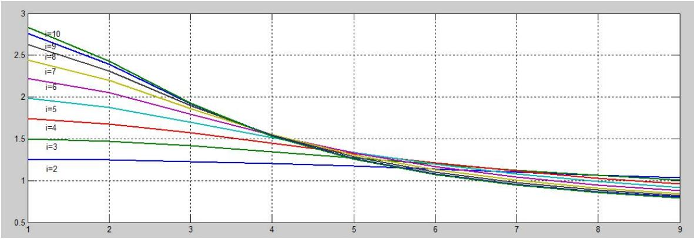

line

| X | i=2 | i=3 | i=4 | i=5 | i=6 | i=7 | i=8 | i=9 | i=10 |
|---|---|---|---|---|---|---|---|---|---|
| 1 | ~1.25 | ~1.5 | ~1.75 | ~2.0 | ~2.25 | ~2.45 | ~2.65 | ~2.8 | ~2.85 |
| 2 | ~1.25 | ~1.45 | ~1.7 | ~1.9 | ~2.1 | ~2.3 | ~2.45 | ~2.55 | ~2.6 |
| 3 | ~1.25 | ~1.4 | ~1.65 | ~1.8 | ~1.95 | ~2.1 | ~2.25 | ~2.35 | ~2.4 |
| 4 | ~1.25 | ~1.35 | ~1.6 | ~1.75 | ~1.85 | ~1.95 | ~2.05 | ~2.15 | ~2.2 |
| 5 | ~1.25 | ~1.3 | ~1.55 | ~1.65 | ~1.75 | ~1.85 | ~1.95 | ~2.05 | ~2.1 |
| 6 | ~1.25 | ~1.25 | ~1.45 | ~1.55 | ~1.65 | ~1.75 | ~1.85 | ~1.95 | ~2.0 |
| 7 | ~1.25 | ~1.2 | ~1.35 | ~1.45 | ~1.55 | ~1.65 | ~1.75 | ~1.85 | ~1.9 |
| 8 | ~1.25 | ~1.15 | ~1.3 | ~1.4 | ~1.5 | ~1.6 | ~1.7 | ~1.8 | ~1.9 |
| 9 | ~1.25 | ~1.1 | ~1.25 | ~1.35 | ~1.45 | ~1.55 | ~1.65 | ~1.75 | ~1.85 |

图 3 木条角加速度的变化情况

从角加速度变化过程可以分析得出，始端距离 yoz 平面越远的木条，角速度变化越快，这与所有杆转过角度的大小一致，距离 yoz 平面越远的木条自始至终转过的角度越大；但到了中后期，其角速度变化最小，距离 yoz 平面近的木条角速度变化更快。

## 5.1.3.3 桌脚边缘线的数学描述:

根据圆面折叠桌的连续型动态描述模型，带入已经确定的设计加工参数，运用MATLAB描点作图即可得出连续的光滑的桌角边缘线：

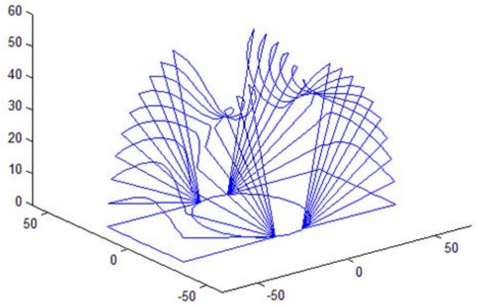

surface_3d

| X | Y | Z |
| --- | --- | --- |
| -50~50 | -50~50 | 0~60 |

图 4 桌角边缘线动态过程示意图

由桌角边缘线的变化情况可以分析得出，随着 $\theta$ 从初始状态到极限位置的变化，桌角边缘线弯曲程度逐渐增大，最终形成一道三维曲线。

## 5.1.4 折叠桌动态过程仿真

运用 MATLAB 对折叠桌运动进行模拟，得运动过程示意图如下：

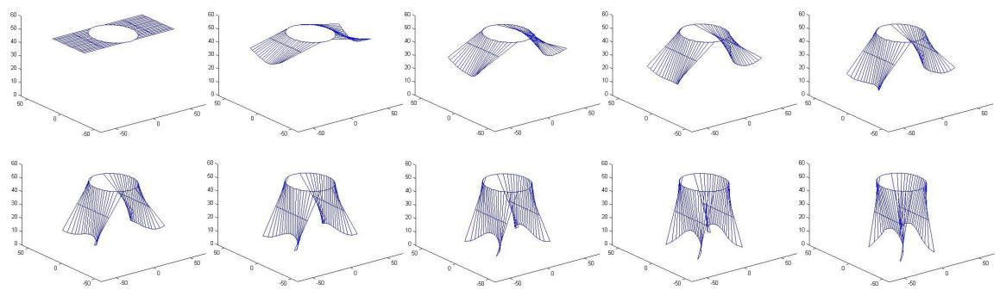

surface_3d

| Plot | X Range | Y Range | Z Range |
| --- | --- | --- | --- |
| Top-Left | -50~50 | 0~60 | 0~60 |
| Top-Middle-Left | -50~50 | 0~60 | 0~60 |
| Top-Middle-Right | -50~50 | 0~60 | 0~60 |
| Top-Right | -50~50 | 0~60 | 0~60 |
| Bottom-Left | -50~50 | 0~60 | 0~60 |
| Bottom-Middle-Left | -50~50 | 0~60 | 0~60 |
| Bottom-Middle-Right | -50~50 | 0~60 | 0~60 |
| Bottom-Right | -50~50 | 0~60 | 0~60 |

图 5 折叠桌 MATLAB 动态变化示意图的

此外，运用 3D MAX 进行设计三维建模，可得到更为逼真的运动过程示意图如下：

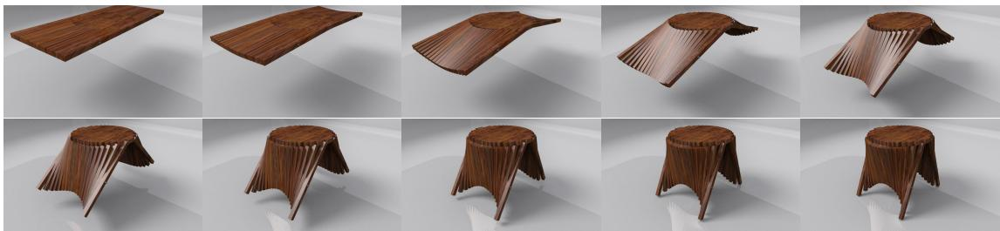

natural_image

12-panel sequence of wooden folding or casting models showing various geometric and structural designs (no text or symbols visible)

图 6 折叠桌 3D MAX 动态变化示意图

## 5.2 圆面折叠桌设计的优化模型及实例分析

## 5.2.1 折叠桌的优化设计模型

折叠桌的设计应做到稳固性好、加工方便、用材最少，所以折叠桌设计优化模型的建立应从三个方面入手，分别是折叠桌稳定性设计，尺寸设计，以及滑槽设计。

## 5.2.1.1 折叠桌的稳定型设计

在优化设计折叠桌的过程中，首先应满足稳定性条件，为了研究折叠桌的稳定性，本文决定分析其受力情况，如下图所示：

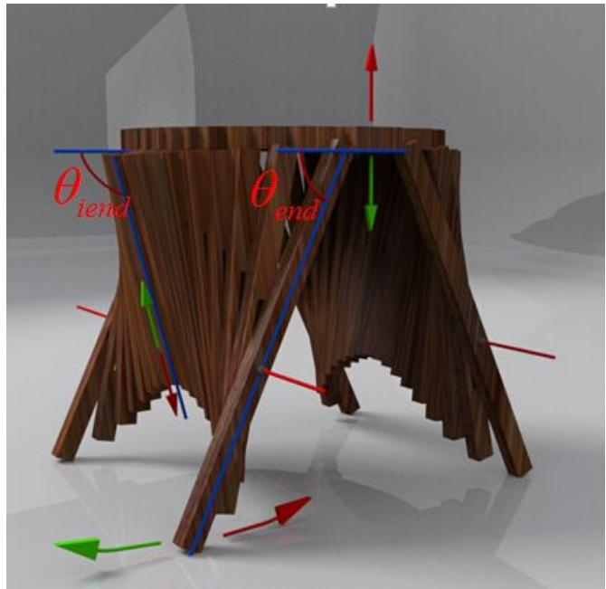

text_image

θ_iend
θ_end

图 7 折叠桌运动趋势示意图

每根木条的滑槽在整个系统运动到最后时刻时会达到终点，被卡住，假设桌腿达到极限位置 $\theta_{end}$ 时，所有木条的滑槽末端均与钢筋接触。如视频展示，将折叠桌缓慢放置于地面之上（只考虑自身结构特点，忽略人为因素影响），在桌子使用过程中，不论桌面是否承担重物，桌腿只会有上图绿色箭头方向的运动趋势，此时对于第 i 根木条，钢筋在滑槽内部只有向上的运动趋势（绿色箭头方向），从滑槽末端向内运动。那么，在折叠桌放置于地面并趋于稳定的过程中，桌腿延绿箭头方向的微小扰动会使两桌腿之间任意一根木条的滑槽末端离开钢筋，即所有的木条都不是紧绷的，对钢筋没有拉力（沿绿箭头方向）的作用，此时，只有四条桌腿承受整个系统的全部重力。如下图所示：

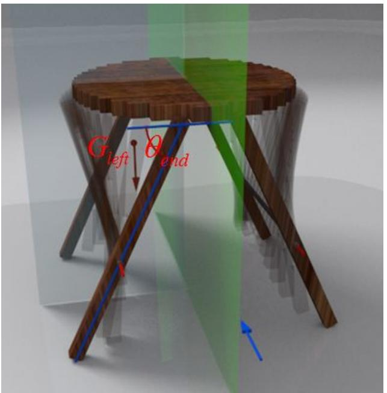

text_image

G left
θ end

图 8 折叠桌受力情况简化图

经上述受力分析，可以将系统的承力结构剥离出来，如上图所示，从蓝色箭头方向观察，系统关于 yoz 平面对称，若分析左侧部分，整个系统的重心位置如红色箭头所示（不可将一条桌腿剥离出来分析，因为桌腿与桌腿之间有钢条连接，内部力的大小及作用方向未知，地面给每条桌腿提供的摩擦力在沿 y 轴方向的分量难以确定），整个系统分成左右两部分进行简化，将大大减少了运算难度，并保持了严密的物理过程。此时，钢条对每条桌腿的力是内力，地面对两条桌腿的摩擦力在 y 轴方向的分量相互抵消，只存在沿 x 轴方向的分量。

所以可以精确地确定半张桌子在直立状态下的重心的位置，因为桌高很小，重力加速度近似保持不变，求系统重心位置即是求系统质心位置。系统关于 yoz 平面对称， $m_{iy}=0$ ，计算杆的总质心位置如下：

$$
\left\{ \begin{array}{c} m _ {l x} = \frac {\sum m _ {i} x _ {i}}{\sum m _ {i}} = \frac {\sum_ {i = 1} ^ {N} \rho D W l _ {i} \left(b _ {i x} + \frac {1}{2} l _ {i} \cos \theta_ {i}\right)}{\sum m _ {i}} \\ m _ {i y} = 0 \\ m _ {l z} = \frac {\sum m _ {i} z _ {i}}{\sum m _ {i}} = \frac {\sum_ {i = 1} ^ {N} \rho D W l _ {i} \left(\frac {1}{2} l _ {i} \sin \theta_ {i} + D\right)}{\sum m _ {i}} \end{array} \right. \tag {22}
$$

其中 $N=\frac{2R}{W}$ ，此外，半圆板质量 $m_{c}=\rho\frac{1}{2}\pi R^{2}D$ ，根据巴普斯定理，可得半圆板的重心位置距离圆心 $x_{c}=\frac{4R}{3\pi}$ 。

综上，可以算出系统质心位置：

$$
\left\{ \begin{array}{c} m _ {x} = \frac {\sum m _ {i} x _ {i} + \rho \frac {1}{2} \pi R ^ {2} \frac {4 R}{3 \pi} D}{\rho R L D} \\ m _ {y} = 0 \\ m _ {z} = H - \frac {\sum m _ {i} z _ {i} + \rho \frac {1}{2} \pi R ^ {2} \frac {D}{2}}{\rho R L D} \end{array} \right. \tag {23}
$$

在计算过程中，为了简化计算难度，将杆的宽度无限减小，使用连续型杆重心确定方法代替离散型杆重心确定方法，建立极坐标系，运用微元法确定质心的 x 方向坐标和 z 方向坐标，运用微积分的方法对坐标进行求解：

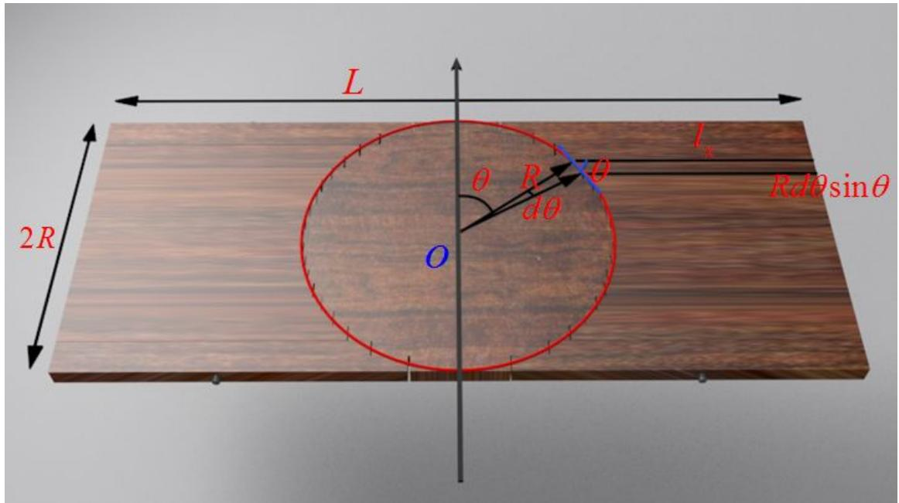

text_image

L
θ R θ
dθ
O
2R
Ix
Rdθsinθ

图 9 极坐标系

所以，桌子立置时，木条整体的质心位置可确定如下：

$$
\left\{ \begin{array}{c} m _ {l x} = \frac {\sum m _ {i} x _ {i}}{\sum m _ {i}} = \frac {\int_ {0} ^ {\pi} D \rho (\frac {L}{2} - R \sin \varphi) R \sin \varphi [ \frac {1}{2} (\frac {L}{2} L - R \sin \varphi) \cos \theta + R \sin \varphi ] d \varphi}{\sum m _ {i}} \\ m _ {i y} = 0 \\ m _ {l z} = \frac {\sum m _ {i} z _ {i}}{\sum m _ {i}} = \frac {\int_ {0} ^ {\pi} D \rho (\frac {L}{2} - R \sin \varphi) R \sin \varphi [ D + \frac {1}{2} (\frac {L}{2} - R \sin \varphi) \sin \theta ] d \varphi}{\sum m _ {i}} \end{array} \right. \tag {24}
$$

其中， $\theta$ 与 $\varphi$ 的关系表示如下：

$$
\tan \theta = \frac {\alpha \frac {1}{2} L \sin \theta_ {e n d}}{\alpha \frac {1}{2} L \cos \theta_ {e n d} - R \sin \varphi} \tag {25}
$$

综上，半张桌子的质心位置确定如下：

$$
\left\{ \begin{array}{c} m _ {x} = \frac {\sum m _ {i} x _ {i} + \rho \frac {1}{2} \pi R ^ {2} \frac {4 R}{3 \pi} D}{\rho R L D} \\ m _ {y} = 0 \\ m _ {z} = H - \frac {\sum m _ {i} z _ {i} + \rho \frac {1}{2} \pi R ^ {2} \frac {D}{2}}{\rho R L D} \end{array} \right. \tag {26}
$$

当系统质心（即重心）位置确定之后，对系统进行受力分析，如下图所示：

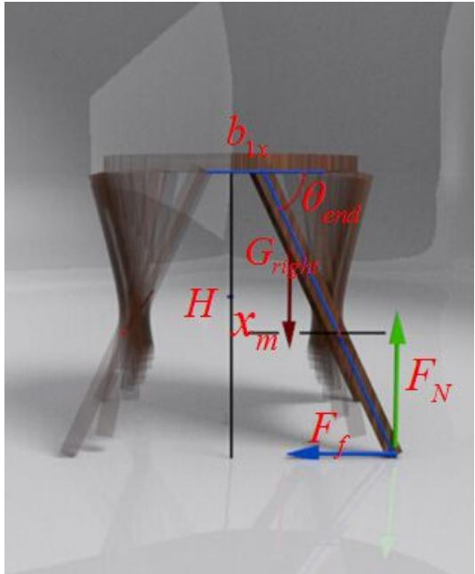

text_image

b₁ₓ
θₐₙₙ
Gₐₙₙ
H
xₘ
Fₙ
Fₖ

图 10 折叠桌简化系统受力分析示意图

以 yoz 平面对称的两部分在接触位置不会存在剪力, 故研究的右侧系统重力等于两条桌腿提供的支持力:

$$
F _ {N} = G _ {\text {right}}
$$

对 y 轴取矩，根据稳定状态力矩平衡，

$$
\sum M _ {y} = 0
$$

$$
\mu F _ {N} H \geq G _ {\text {right}} \left(\frac {H}{\tan \theta_ {\text {end}}} - x _ {m}\right)
$$

整理得:

$$
\mu \geq \frac {1}{\tan \theta} - \frac {x _ {m}}{H} \tag {27}
$$

在折叠桌设计过程中，这是必须满足的条件。

## 5.2.1.2 折叠桌的尺寸设计

当设计折叠桌尺寸时，考虑桌腿与桌面所在平面的夹角，在桌面高度一定时，将桌腿长度表示出来，与此同时，将桌腿与桌面连接部分到 yoz 平面的长度 $b_{ix}$ 表示出来，二者之和即为桌子平置时桌长的一半。由示意图可以清晰的看出几何关系。

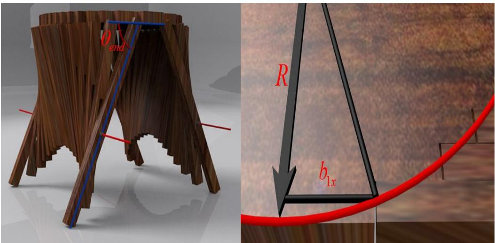  
图 11 折叠桌尺寸设计示意图

计算桌子长度如下:

$$
L = 2 \left[ \frac {H}{\sin \theta_ {e n d}} + \sqrt {R ^ {2} - (R - \frac {1}{2} W) ^ {2}} \right] \tag {28}
$$

## 5.2.1.3 折叠桌的滑槽设计

当设计折叠桌滑槽的时候，由第一问实例分析可以得出结论：钢筋从相同的初始状态开始移动， $b_{ix}$ 越大的木条，即木条起点距离 yoz 平面越远的木条，其滑槽长度越长，确定每一根木条滑槽的末端位置，并用红色的曲线连接起来，为了加工方便，我们将所有滑槽按最大槽长设计（蓝线所在位置），如下图所示：

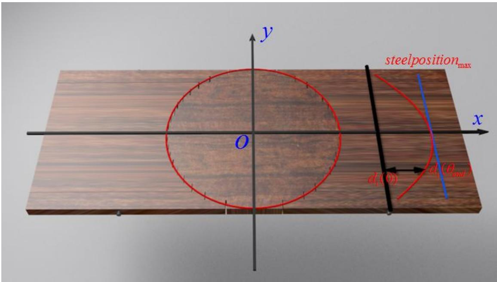

text_image

steelposition_max
x
y
O
d₁(θ)
d₁(θ_end)

图 12 折叠桌滑槽位置示意图

其中，桌腿始端到 yoz 平面的距离可以表示为:

$$
b _ {1 x} = \sqrt {R ^ {2} - (R - \frac {1}{2} W) ^ {2}} \tag {29}
$$

距 yoz 平面最远的木条的始端与 yoz 平面的距离可以表示为:

$$
b _ {n x} = \sqrt {R ^ {2} - (\frac {1}{2} W) ^ {2}} \tag {30}
$$

初始位置桌面平置时，滑槽位置，如图黑线表示在坐标系 xoy 内的 x 坐标为：

$$
d _ {n} (0) = \alpha \times \frac {L}{2} \tag {31}
$$

移动木条到最终位置时，钢筋在滑槽内运动到极限位置卡住，此刻滑槽位置在桌面平置时的位置可以表达为：

$$
d _ {n} \left(\theta_ {\text {end}}\right) = b _ {n x} + \sqrt {\left[ \alpha \left(\frac {1}{2} L - b _ {1 x}\right) \sin \theta \right] ^ {2} + \left[ b _ {1 x} + \alpha \left(\frac {1}{2} L - b _ {1 x}\right) \cos \theta - b _ {n x} \right] ^ {2}} \tag {32}
$$

因此，滑槽长度可以表示为:

$$
D _ {c a o} = d _ {n} \big (\theta_ {e n d} \big) - d _ {n} (0) \tag {33}
$$

为了滑槽设计的约束条件，本文研究钢筋在其内部的运动情况，初始位置时，钢筋位置不能超过距离 y 轴最远的的第 n 根杆对应的桌面圆边界，即为：

$$
d _ {n} (0) \geq b _ {n x} \tag {34}
$$

此时，在折叠桌腿运动到极限位置时，钢筋位置不能超过距离 y 轴最远的的第 n 根杆对应的桌面边界，即为：

$$
d _ {n} (\theta_ {e n d}) \leq \frac {1}{2} L \tag {35}
$$

其中， $0 \leq \theta \leq \theta_{end}$ ， $\frac{2R}{L} < \alpha < 1$ 。

## 5.2.1.4 折叠桌的优化设计模型

为了满足优化设计条件, 必须全面考虑上述三方面的优化设计指标, 建立优化模型。综合考虑桌子的稳定性, 加工复杂程度, 用材量及桌脚边缘线吻合程度, 确定平板尺寸, 钢筋位置, 开槽长度, 得到最优设计。

目标函数:

$$
f = \min \bigl [ u L (\theta) + (1 - u) D _ {c a o} (\theta) \bigr ] \tag {36}
$$

其中 $u \in [0,1]$ 。

约束条件:

$$
\text {s.t.} \left\{ \begin{array}{c} \mu \geq \frac {d (\theta)}{H} = \frac {\frac {H}{\tan \theta} - x _ {m}}{H} = \frac {1}{\tan \theta} - \frac {x _ {m}}{H} \\ L = 2 \left[ \frac {H}{\sin \theta} + \sqrt {R ^ {2} - (R - \frac {1}{2} W) ^ {2}} \right] \\ D _ {\text {cao}} = d _ {n} \left(\theta_ {\text {end}}\right) - d _ {n} (0) \\ d _ {n} (0) \geq b _ {n x} \\ d _ {n} \left(\theta_ {\text {end}}\right) \leq \frac {1}{2} L \\ 0 \leq \theta \leq \theta_ {\text {end}} \\ \frac {2 R}{L} <   \alpha <   1 \end{array} \right. \tag {28}
$$

## 5.2.2 折叠桌优化设计的实例分析

题设已知桌高 70 cm，桌面直径 80 cm，确定最优设计加工参数，使产品稳固性好、加工方便、用材最少。查阅相关资料可知，木材与地面之间摩擦系数为 0.4\~0.5，由上述优化模型，通过 MATLAB 计算可得最优设计尺寸和加工参数如下。

表 3 不同 $\mu$ 值下折叠桌的优化设计参数

<table><tr><td rowspan="6">μ=0.4</td><td>u值</td><td>0.00</td><td>0.10</td><td>0.20</td><td>0.30</td><td>0.40</td><td>0.50</td><td>0.60</td><td>0.70</td><td>0.80</td><td>0.90</td><td>1.00</td></tr><tr><td>板长</td><td>159.0</td><td>159.0</td><td>159.0</td><td>159.0</td><td>159.0</td><td>159.0</td><td>160.0</td><td>164.0</td><td>164.0</td><td>164.0</td><td>164.0</td></tr><tr><td>钢筋位置</td><td>0.50</td><td>0.50</td><td>0.50</td><td>0.50</td><td>0.50</td><td>0.50</td><td>0.50</td><td>0.50</td><td>0.50</td><td>0.50</td><td>0.50</td></tr><tr><td>滑槽起始位置</td><td>44.71</td><td>44.71</td><td>44.71</td><td>44.71</td><td>44.71</td><td>44.71</td><td>44.96</td><td>45.96</td><td>45.96</td><td>45.96</td><td>45.96</td></tr><tr><td>滑槽末端位置</td><td>79.35</td><td>79.35</td><td>79.35</td><td>79.35</td><td>79.35</td><td>79.35</td><td>78.89</td><td>77.44</td><td>77.44</td><td>77.44</td><td>77.44</td></tr><tr><td>滑槽长度</td><td>34.64</td><td>34.64</td><td>34.64</td><td>34.64</td><td>34.64</td><td>34.64</td><td>33.93</td><td>31.48</td><td>31.48</td><td>31.48</td><td>31.48</td></tr><tr><td rowspan="6">μ=0.5</td><td>u值</td><td>0.00</td><td>0.10</td><td>0.20</td><td>0.30</td><td>0.40</td><td>0.50</td><td>0.60</td><td>0.70</td><td>0.80</td><td>0.90</td><td>1.00</td></tr><tr><td>板长</td><td>159.0</td><td>159.0</td><td>159.0</td><td>159.0</td><td>159.0</td><td>159. 0</td><td>165.0</td><td>169.0</td><td>169.0</td><td>169.0</td><td>169.0</td></tr><tr><td>钢筋位置</td><td>0.50</td><td>0.50</td><td>0.50</td><td>0.50</td><td>0.50</td><td>0.50</td><td>0.60</td><td>0.60</td><td>0.60</td><td>0.60</td><td>0.60</td></tr><tr><td>滑槽起始位置</td><td>44.71</td><td>44.71</td><td>44.71</td><td>44.71</td><td>44.71</td><td>44.71</td><td>53.47</td><td>54.67</td><td>54.67</td><td>54.67</td><td>54.67</td></tr><tr><td>滑槽末端位置</td><td>79.35</td><td>79.35</td><td>79.35</td><td>79.35</td><td>79.35</td><td>79.35</td><td>82.33</td><td>81.51</td><td>81.51</td><td>81.51</td><td>81.51</td></tr><tr><td>滑槽长度</td><td>34.64</td><td>34.64</td><td>34.64</td><td>34.64</td><td>34.64</td><td>34.64</td><td>28.86</td><td>26.84</td><td>26.84</td><td>26.84</td><td>26.84</td></tr></table>

## 结论:

当u值在0到1范围内变化时，全局最优解在集中于几个值，分析可确定全局最优解。用户可根据自身情况对最优解进行选择。

## 5.3 折叠桌任意桌型的优化设计方案

在第二问中，圆形折叠桌的优化方案从稳定性、加工参数、圆桌用材三个方面进行设计。在第三问中，根据题设可知，桌面的边缘线形状及桌面大小、高度由客户给定，同时客户会给出桌角边缘线的大致形状。为了得到设计合理，结构优化，具有较好稳定性的创意平板折叠桌，本文将在第二问的基础上，建立任意桌型的优化设计方案，并结合实际情况展示出设计产品。

## 5.3.1 任意桌型的数学假设

在条件假设中，桌面的设计必须满足关于 $x$ 轴对称，因为按照这种设计理念，可设计的桌面形状更多更复杂，满足客户需求，关于 $x$ 轴对称木条以对称的方式折叠，满足美学设计理念，且按这种方式折叠，系统质量关于 $x$ 的对称，稳定性更加优异，设计过程中，还要保证在同一坐标系内，给定一个 $x$ 值，只对应一个 $y$ 值，否则折叠桌平置时桌面会有空洞。建立坐标系于所设计桌面的中心位置，因桌型的不确定性，可以分别优化两侧折叠桌，所得的总体最优设计即是最佳结果。

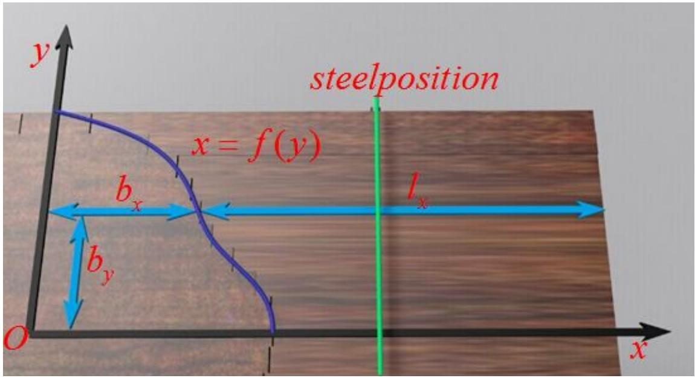

text_image

steelposition
x = f(y)
bₓ
lₓ
bᵧ
O
x

图 12 任意桌型参变量示意图

因客户的桌面边缘线关于 x 的对称，取桌面坐标的一、四象限或者二、三象限进行分析等价，此处选取一、四象限分析，假定桌面边缘线为：

$$
x = f (y), y \in (0, \frac {B}{2}) \tag {29}
$$

因桌面的实际切割情况是离散的，单边的木条数为 $N=\frac{B}{2W}$ ，曲线与木条的交点为木条宽度的中心位置，该点到 yoz 平面的距离：

$$
b _ {i x} = f (\frac {B}{2} - (i - \frac {1}{2}) W) \quad i \in (1, 2,..., N) \tag {30}
$$

木条的长度可表示为:

$$
l _ {i} = \frac {L}{2} - b _ {i x} \quad i \in (1, 2, 3... N) \tag {31}
$$

分析单侧桌面，最长可活动木条（桌腿）记为 $l_{k}$ ：

$$
l _ {k} = \max _ {1 \leq i \leq N} (\frac {L}{2} - b _ {i x}) \tag {32}
$$

其始端到到 yoz 平面的距离为 $b_{k}$ :

$$
b _ {k} = \frac {L}{2} - l _ {k} \tag {33}
$$

最短可活动木条记为 $l_{j}$ :

$$
l _ {j} = \min _ {1 \leq i \leq N} (\frac {L}{2} - b _ {i x}) \tag {34}
$$

其始端到到 yoz 平面的距离为 $b_{j}$ :

$$
b _ {j} = \frac {L}{2} - l _ {j} \tag {35}
$$

为满足稳定性需求和美观设计理念，最长可活动木条在最短木条的外侧，即

$$
y _ {k} > y _ {j} \tag {37}
$$

因为桌腿四点组成的支撑面积越大，稳定性越好，同样的，如果最长可活动木条不在最外侧，钢筋难以固定增加工艺复杂程度。

钢筋的初始位置位置为:

$$
d _ {0} (0) = \alpha l _ {k} + b _ {k} \tag {38}
$$

其中 $\frac{2b_{j}}{L}\leq\alpha\leq1$ ，说明钢筋位置不能破坏桌面且不能脱离桌腿。

以上参数设定了任意桌型的基本参数及相关约束。

## 5.3.2 任意桌型的稳定性分析

在第二问，由圆形桌面稳定性分析可知，折叠桌的受力杆为可活动的最长杆，且钢筋的位置固定在此杆上，其余杆均不受力。本问中，滑槽及钢筋相对位置保持一致时，稳定性条件依旧成立，即：

$$
\mu \geq \frac {1}{\tan \theta_ {e n d}} - \frac {x _ {m}}{H}
$$

由于桌形的改变，导致质心 $x_{m}$ 发生变化，为了适用于任何设计合理的桌形，根据桌面边缘线方程，对质心重新计算。实际情况下，木条始端、终端是参差不齐的，即离散分布的，为了便于计算，此处假设木条宽度无限小，用连续型模型处理木条质心。

由示意图可知，半桌面部分的质心 $x_{1}$ 为：

$$
x _ {1} = \frac {\int_ {- B / 2} ^ {B / 2} \frac {1}{2} \rho f (y) ^ {2} d y}{\int_ {- B / 2} ^ {B / 2} f (y) d y} \tag {39}
$$

木条部分质心 $x_{2}$ 为:

$$
x _ {2} = \frac {\int_ {- B / 2} ^ {B / 2} \rho (b _ {x} + \frac {1}{2} l _ {x} \tan \varphi) l _ {x} d _ {y}}{\frac {1}{2} L _ {h a l f} B - \int_ {- B / 2} ^ {B / 2} f (y) d y} \tag {40}
$$

综合以上两部分质心，则总质心 $x_{m}$ 位置为：

$$
x _ {m} = \frac {\int_ {- B / 2} ^ {B / 2} \frac {1}{2} \rho f (y) ^ {2} d y + \int_ {- B / 2} ^ {B / 2} \rho (b _ {x} + \frac {1}{2} l _ {x} \tan \varphi) l _ {x} d _ {y}}{L _ {\text {half}} B} \tag {41}
$$

对于任意桌面边缘线的折叠桌，设计其 $\theta_{end}$ 时应满足

$$
\mu \geq \frac {1}{\tan \theta_ {e n d}} - \frac {x _ {m}}{H}
$$

在此条件下，设计出的折叠桌在 $\theta_{end}$ 的取值范围内满足稳定性。

## 5.3.3 任意桌型的尺寸设计

在桌型的尺寸设计过程中，结合实际，采用离散型的数学模型。

从桌的结构上可以知道，最长的木条（桌腿）与地面相接，在折叠桌立置的情况下，该木条与桌面的夹角为 $\theta_{end}$ ，因高度 H 是客户给定的，则可以得出桌腿长度为 $l_{k}=H/\sin\theta_{end}$ 。则半个平板桌的长度 $L_{half}$ 为：

$$
L _ {h a l f} = \frac {H}{\sin \theta_ {e n d}} + b _ {k} \tag {42}
$$

因此可以给出单侧折叠桌设计所需木材：

$$
S = B L _ {h a l f} \tag {43}
$$

其中，半个平板桌的长度并非实际半个木板的长度，而是简化模型中可以一分为二的任意一部分，一分为二的界限在桌子重力作用点的 yoz 平面，此时两部分之间无剪力作用，符合力的简化模型。

## 5.3.4 任意桌型的滑槽设计

滑槽的长度受到钢筋位置的影响，而钢筋在木条滑槽内部的运动仅受最大滑槽长度的限制，最大滑槽长度受到最短木条长度的限制。为了易于加工，降低加工成本，将所有需要加工的滑槽按最大滑槽加工。此时，只需确定最大滑槽的最短长度。

滑槽的初始位置为:

$$
d _ {k} (o) = \alpha l _ {k} + b _ {k} \tag {44}
$$

滑槽的末端最大位置为:

$$
d _ {j} (\theta_ {e n d}) = b _ {j} + \sqrt {(l _ {k} \sin \theta_ {e n d}) ^ {2} + (l _ {k} \cos \theta_ {e n d} + b _ {k} - b _ {j}) ^ {2}} \tag {45}
$$

则滑槽设计长度为:

$$
d _ {c a o} = d _ {j} (\theta_ {e n d}) - d _ {k} (o) \tag {46}
$$

滑槽长度受到钢筋位置的限制，即钢筋初始位置不能嵌入桌面，钢筋末端最大位置不能超过桌板边缘：

$$
\left\{ \begin{array}{c} d _ {k} (o) > b _ {j} \\ d _ {j} (\theta_ {\text {end}}) <   b _ {j} + l _ {j} \end{array} \right. \tag {47}
$$

## 5.3.5 任意桌型的桌脚边缘线优化

为了直观可靠地描述设计的桌脚边缘线与客户期望的桌脚边缘线的关系，从极限的角度出发，采用连续的桌脚边缘线刻画。

桌脚边缘线 $\Gamma_{desgin}(x,y,z)$ 为:

$$
\Gamma_ {d e s g i n} (x, y, z) = \left\{ \begin{array}{l} x = b _ {x} + l _ {x} \cos \varphi \\ y = y \\ z = l _ {x} \sin \varphi \end{array} \right. \tag {48}
$$

客户期望桌脚边缘线 $\Gamma_{wish}(x,y,z)$ 为

$$
\Gamma_ {w i s h} (x, y, z) = \left\{ \begin{array}{l} y = y \\ x = x (y, z) \\ z = z (x, y) \end{array} \right. \tag {49}
$$

为了刻画设计桌脚边缘线与期望桌脚边缘线的接近程度，此处建立误差模型：

$$
\Delta \Gamma = \int_ {0} ^ {B / 2} \sqrt {\left(x _ {\text {design}} - x _ {\text {wish}}\right) ^ {2} + \left(z _ {\text {design}} - z _ {\text {wish}}\right) ^ {2}} d y \tag {50}
$$

## 5.3.6 折叠桌任意桌型的优化设计模型

建立任意折叠桌型优化模型，综合考虑桌子的稳定性，加工复杂程度，用材量及桌脚边缘线吻合程度，给出在任意桌型（符合设计规则）的最优设计加工参数，如平板尺寸，钢筋位置，开槽长度等。

目标函数为:

$$
f = \min (u L _ {l e f t} + v d _ {c a o} + w \Delta \Gamma) \tag {51}
$$

其中， $u \in (0,1), v \in (0,1), w \in (0,1), u + v + w = 1$ 。

约束条件为:

$$
s. t. \left\{ \begin{array}{l} \mu \geq \frac {1}{\tan \theta_ {e n d}} - \frac {x _ {m}}{H} \\ \frac {2 b _ {j}}{L} \leq \alpha \leq 1 \\ l _ {k} = \max _ {1 \leq i \leq N} \left(\frac {L}{2} - b _ {i x}\right) \\ l _ {j} = \min _ {1 \leq i \leq N} \left(\frac {L}{2} - b _ {i x}\right) \\ y _ {k} > y _ {j} \\ d _ {k} (o) > b _ {j} \quad d _ {j} \left(\theta_ {e n d}\right) <   L _ {\text {half}} \end{array} \right. \tag {52}
$$

## 5.3.7 折叠桌任意桌型的优化设计实例

修改相关参数，得出给定桌面边缘线的最优桌型，本文结合实际情况，分别设计桌面为菱形和心形的折叠桌，运用 MATLAB 对新生成的典型折叠桌的运动进行模拟，得运动过程示意图如下：

## 5.3.7.1 菱形桌面折叠桌的设计参数及仿真

表 4 菱形桌面折叠桌的设计参数

<table><tr><td>板长</td><td>板宽</td><td>木条数</td><td>滑槽初始位置</td><td>滑槽末端位置</td><td>桌高</td></tr><tr><td>98.08</td><td>40.96</td><td>19</td><td>19.04</td><td>3.65</td><td>41.54</td></tr></table>

<table><tr><td>木条编号</td><td>1</td><td>2</td><td>3</td><td>4</td><td>5</td></tr><tr><td>木条长度</td><td>48.29</td><td>45.98</td><td>43.85</td><td>41.71</td><td>39.63</td></tr><tr><td>木条编号</td><td>6</td><td>7</td><td>8</td><td>9</td><td>10</td></tr><tr><td>木条长度</td><td>37.5035.</td><td>35.37</td><td>33.06</td><td>31.15</td><td>29.02</td></tr></table>

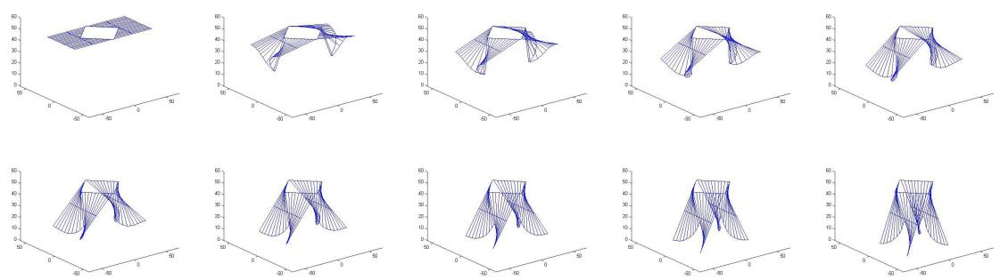  
图 13 桌面为正方形时折叠桌的运动过程示意图

此外，运用 3D MAX 软件对给定桌面边缘线的最优桌型进行建模，对其运动状态进行模拟，得不同桌型运动过程示意图如下：

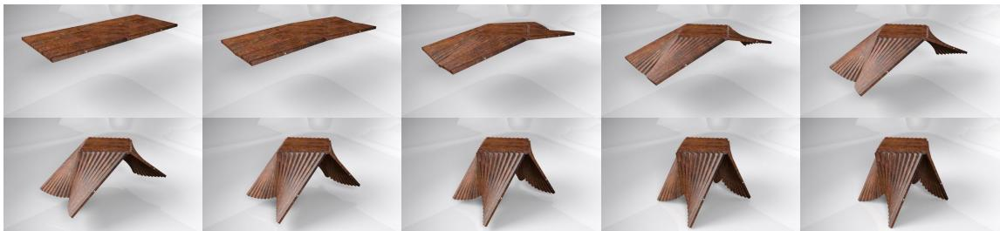

natural_image

Grid of nine wooden structural diagrams showing various angles and orientations, no text or symbols present.

图 14 桌面为正方形时折叠桌的运动过程示意图

## 5.3.7.2 心形桌面折叠桌的设计参数及仿真

表 5 心形桌面折叠桌的设计参数

<table><tr><td>板长</td><td>板宽</td><td>木条数</td><td>左侧滑槽起点</td></tr><tr><td>127.50</td><td>45.00</td><td>18</td><td>17.31</td></tr><tr><td>左侧滑槽终点</td><td>右侧滑槽起点</td><td>右侧滑槽终点</td><td>桌高</td></tr><tr><td>2.02</td><td>30.17</td><td>24.23</td><td>49.04</td></tr></table>

<table><tr><td>木条编号</td><td>1</td><td>2</td><td>3</td><td>4</td><td>5</td></tr><tr><td>木条长度左</td><td>61.44</td><td>57.98</td><td>54.81</td><td>51.92</td><td>49.21</td></tr><tr><td>木条长度右</td><td>56.71</td><td>52.10</td><td>50.13</td><td>48.81</td><td>48.23</td></tr><tr><td>木条编号</td><td>6</td><td>7</td><td>8</td><td>9</td><td rowspan="3">注:为了使心尖更明显,取奇数根杆。</td></tr><tr><td>木条长度左</td><td>46.33</td><td>43.27</td><td>40.38</td><td>37.5</td></tr><tr><td>木条长度右</td><td>48.12</td><td>48.00</td><td>48.69</td><td>50.37</td></tr></table>

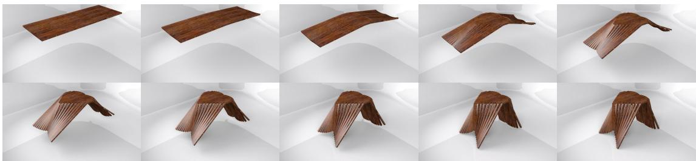

natural_image

Grid of 12 wooden bird wing cutouts in various angles, arranged in two rows (no text or symbols visible)

图 15 桌面为心形时折叠桌的运动过程示意图

桌面为心型的折叠桌美观大方，满足设计要求并佐证了假设的正确性，整个桌型关于 yoz 平面对称，xoz 平面两侧桌型虽然不对称，但可通过受力分析简化，使其满足稳定性的需求，综合两侧对于桌面大小和滑槽长度的需求，确定最佳加工参数。

## 参考文献

[1] 许丽佳, 穆炯. MATLAB 程序设计及应用. 清华大学出版社, 2011。

附录  
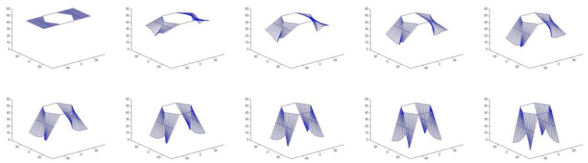

surface_3d

| Plot | X Range | Y Range | Z Range |
| --- | --- | --- | --- |
| 1 | -60~60 | 0~60 | 0~60 |
| 2 | -60~60 | 0~60 | 0~60 |
| 3 | -60~60 | 0~60 | 0~60 |
| 4 | -60~60 | 0~60 | 0~60 |
| 5 | -60~60 | 0~60 | 0~60 |
| 6 | -60~60 | 0~60 | 0~60 |
| 7 | -60~60 | 0~60 | 0~60 |
| 8 | -60~60 | 0~60 | 0~60 |
| 9 | -60~60 | 0~60 | 0~60 |
| 10 | -60~60 | 0~60 | 0~60 |
| 11 | -60~60 | 0~60 | 0~60 |
| 12 | -60~60 | 0~60 | 0~60 |

图 16 桌面为正六边形时折叠桌的运动过程示意图

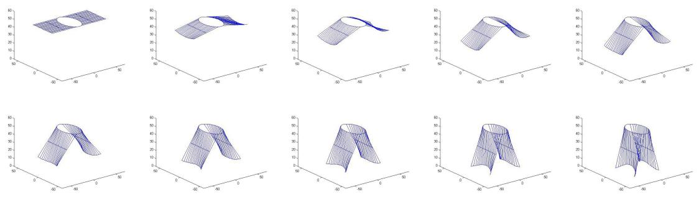

surface_3d

| Plot | X Range | Y Range | Z Range |
| --- | --- | --- | --- |
| 1 | -60~80 | -60~60 | 40~50 |
| 2 | -60~80 | -60~60 | 30~50 |
| 3 | -60~80 | -60~60 | 20~50 |
| 4 | -60~80 | -60~60 | 10~50 |
| 5 | -60~80 | -60~60 | 10~50 |
| 6 | -60~80 | -60~60 | 10~50 |
| 7 | -60~80 | -60~60 | 10~50 |
| 8 | -60~80 | -60~60 | 10~50 |
| 9 | -60~80 | -60~60 | 10~50 |
| 10 | -60~80 | -60~60 | 10~50 |
| 11 | -60~80 | -60~60 | 10~50 |
| 12 | -60~80 | -60~60 | 10~50 |

图 17 桌面为椭圆形时折叠桌的运动过程示意图