# 2014 高教社杯全国大学生数学建模竞赛

## 编 号 专 用 页

赛区评阅编号（由赛区组委会评阅前进行编号）：

赛区评阅记录（可供赛区评阅时使用）：

评阅人

评分

备注

全国统一编号（由赛区组委会送交全国前编号）：

全国评阅编号（由全国组委会评阅前进行编号）：

# 关于生猪养殖场经营管理的研究

## 【摘 要】

本文主要研究的是生猪养殖场的优化经营管理问题，通过考虑留种数量、配种时间、存栏规模以及所给出的价格预测等因素，结合所收集的数据，给出该养猪场的最佳经营策略。

在问题一中，以达到或超过盈亏平衡点为条件，研究每头母猪的平均年产仔量。结合盈亏平衡方程，以种猪养殖成本、肉猪养殖成本及变动成本的总和与所卖肉猪的总收入相等为目标，运用多元函数建立计算模型，求解得到在 2014年市场价格的情况下不存在盈亏平衡，而在 2012、2013 年要达到盈亏平衡，养殖周期为三年的母猪在人工授精条件下平均年产仔量为7头（其他数据见正文）。

在问题二中，为了得到养殖场养殖规模达到饱和时，小猪选为种猪的比例和母猪的存栏数。以种猪、肉猪、后备种猪总数量最大为目标，以总数量不大于10000 头，所有母猪的产仔总数等于后备种猪和肉猪数量的总和，种猪中的公、母猪符合配比为约束条件，建立优化模型，利用lingo 软件求得养殖场养殖规模达到饱和时的各类猪的数量（见正文），通过引入淘汰率建立计算模型进行计算，得到人工授精条件下的小猪选为种猪比例为1.81%，母猪存栏数（包括后备母猪）为 1444头（其他数据见正文）。

在问题三中，通过调查，运用最小二乘法对猪肉价格与粮食价格的关系进行拟合，得到两者间的函数关系。结合问题二中的数据，以总盈利最大为目标，以两次生产间隔不少于180 天，两次肉猪出栏的间隔不少于 150天，同一批肉猪生产与出栏的时间间隔不少于150 天为约束条件，建立优化模型，利用lingo 软件求得在母猪数量不发生变化情况下的生产时间和出栏时间（见正文）。

在上一步模型的基础上，将结果转换为条件，以母猪数量作为未知量，添加母猪数量上限以及数量变化规律两个约束条件，建立优化模型，利用lingo软件求得三年内的平均年利润为833.4287万元（经营策略、母猪及肉猪存栏数曲线见正文）。

关键词： 盈亏平衡方程 多远函数 拟合 优化模型 lingo

## 1.问题重述

## 1.1问题背景

现有一养猪场，最多能养10000头猪，该养猪场利用自己的种猪进行繁育。养猪的一般过程是：母猪配种后怀孕约114天产下乳猪，经过哺乳期后乳猪成为小猪。小猪的一部分将被选为种猪（其中公猪母猪的比例因配种方式而异），长大以后承担养猪场的繁殖任务；有时也会将一部分小猪作为猪苗出售以控制养殖规模；而大部分小猪经阉割后养成肉猪出栏（见图 1）。母猪的生育期一般为 3～5 年，失去生育能力的公猪和母猪将被无害化处理掉。种猪和肉猪每天都要消耗饲料，但种猪的饲料成本更高一些。养殖场根据市场情况通过决定留种数量、配种时间、存栏规模等优化经营策略以提高盈利水平。

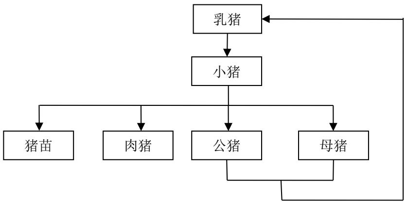

<details>
<summary>flowchart</summary>

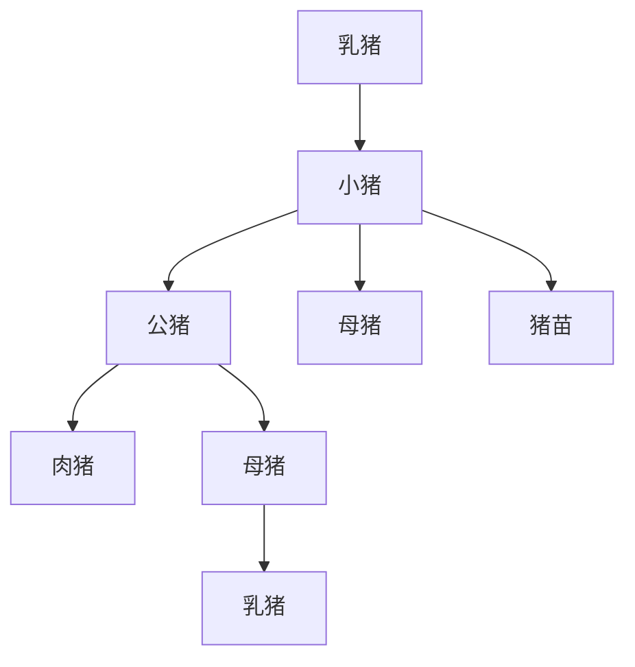
</details>

图 1. 猪的繁殖过程

## 1.2问题提出

由上述的问题背景，请收集相关数据，建立数学模型回答以下问题：

（1）假设生猪养殖成本及生猪价格保持不变，且不出售猪苗，小猪全部转为种猪与肉猪，要达到或超过盈亏平衡点，每头母猪每年平均产仔量要达到多少？  
（2）生育期母猪每头年产 2 胎左右，每胎成活 9 头左右。求使得该养殖场养殖规模达到饱和时，小猪选为种猪的比例和母猪的存栏数，并结合所收集到的数据给出具体的结果。  
（3）已知从母猪配种到所产的猪仔长成肉猪出栏需要约 9 个月时间。假设该养猪场估计 9 个月后三年内生猪价格变化的预测曲线如图 2 所示，请根据此价格预测确定该养猪场的最佳经营策略，计算这三年内的平均年利润，并给出在此策略下的母猪及肉猪存栏数曲线。

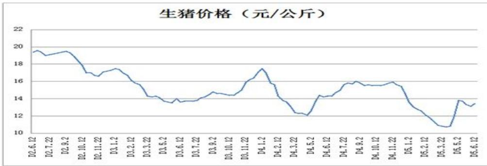

<details>
<summary>line</summary>

| Date | Price (元/公斤) |
| :--- | :--- |
| D0.6.12 | ~19.3 |
| D0.7.22 | ~19.5 |
| D0.9.2 | ~18.9 |
| D0.10.12 | ~19.4 |
| D0.11.22 | ~19.4 |
| D3.1.2 | ~18.0 |
| D3.2.12 | ~17.0 |
| D3.3.22 | ~16.9 |
| D3.5.2 | ~16.6 |
| D3.6.12 | ~17.0 |
| D3.7.22 | ~17.4 |
| D3.9.2 | ~16.8 |
| D3.10.12 | ~15.8 |
| D3.11.22 | ~14.3 |
| D4.1.2 | ~14.3 |
| D4.2.12 | ~13.8 |
| D4.3.22 | ~13.6 |
| D4.5.2 | ~13.8 |
| D4.6.12 | ~13.7 |
| D4.7.22 | ~14.0 |
| D4.9.2 | ~14.7 |
| D4.10.12 | ~14.5 |
| D4.11.22 | ~14.4 |
| D5.1.2 | ~14.9 |
| D5.2.12 | ~16.0 |
| D5.3.22 | ~16.5 |
| D5.5.2 | ~17.4 |
| D5.6.12 | ~15.6 |
| D5.7.22 | ~14.0 |
| D5.8.12 | ~13.5 |
| D5.9.2 | ~12.4 |
| D6.0.12 | ~12.3 |
| D6.1.2 | ~12.0 |
| D6.2.12 | ~14.3 |
| D6.3.22 | ~14.3 |
| D6.4.12 | ~14.8 |
| D6.5.2 | ~15.6 |
| D6.6.12 | ~15.8 |
| D6.7.22 | ~15.9 |
| D6.8.12 | ~15.5 |
| D6.9.2 | ~15.5 |
| D7.0.12 | ~15.5 |
| D7.1.2 | ~15.8 |
| D7.2.12 | ~15.4 |
| D7.3.2 | ~13.8 |
| D7.4.12 | ~13.0 |
| D7.5.2 | ~12.5 |
| D7.6.12 | ~11.8 |
| D7.7.2 | ~10.8 |
| D7.8.12 | ~10.7 |
| D7.9.2 | ~10.7 |
| D8.0.12 | ~13.8 |
| D8.1.2 | ~13.5 |
| D8.2.12 | ~13.0 |
| D8.3.2 | ~13.3 |
</details>

图 2 三年价格预测曲线

## 2 问题分析

根据题目要求，该养殖场的最大养殖规模为 10000头猪，并且用自己的种猪进行繁育配种。我们需要查阅相关资料，根据查阅到的数据对问题进行求解。

在第一问中，要求解该养殖场达到或超过盈亏平衡点时每头母猪的年均产仔量。通过分析题目，首先，我们对解题过程中可能会用到的相关数据进行了准备，包括根据题目要求确定养殖周期，搜集有关当前形势下种猪生猪的饲养费用，生猪的销售价格和公种猪、母种猪的配种比例等数据。其次对该养殖场的总支出和总收入分别进行计算并利用盈亏平衡分析法求解盈亏平衡点，再根据盈亏平衡点确定该养殖场每头母猪的年均产仔量。考虑到实际情况，由于我们搜集的是当前（2014年）猪市行情下的数据，因此我们认为在解题过程中可能会存在没有盈亏平衡点的现象，即养殖厂一直处于亏损状态。因此我们分别对这两种情况进行分析，若存在平衡点，则根据平衡点求解母猪的年均产仔量；若不存在盈亏平衡点，再对前两年的市场行情进行调查，根据前两年的相关数据对盈亏平衡点进行计算，最终求解母猪的年均产仔量。最后，根据市场行情对生猪养殖行业提出一些合理性的建议。

在第二问中，题目规定每头母猪每年可以产两胎，每胎可以成活 9只小猪，求使得该养殖场养殖规模达到饱和时，小猪选为种猪的比例和母猪的存栏数。首先我们通过查阅相关资料得知，种猪每年都有淘汰率，因此我们首先确定了种猪的淘汰率，并沿用了问题一中的两种配种方式下公母种猪的数量比例。其次我们以该养殖场猪的数量最大为目标，并根据题目要求建立约束条件，利用lingo软件对问题进行求解便可得到两种配种方式下公母种猪数量和后备种猪数量以及小猪选为种猪的比例和母猪的存栏数等数据。

在第三问中，结合题目所给的三年内的生猪价格预测曲线，通过考虑肉猪的生长周期及母猪的配种、生产时间，为求得母猪及肉猪的存栏数量和最佳经营策略。通过查阅相关资料得到2002&#8212;2013年的猪肉价格和饲料价格，运用最小二乘法对猪肉价格与饲料价格的关系进行拟合，得到两者间的函数关系。结合第二问的结果进行分析，引入该时间是否生产和该时间是否卖出两个&#8220;0&#8212;1&#8221;变量，以总盈利最大为目标，并根据题目要求建立约束条件，建立优化模型，利用lingo软件求得在母猪数量不发生变化情况下的生产时间和出栏时间。在上一步模型的基础上，将结果转换为条件，以母猪数量作为未知量，添加相关约束条件，建立优化模型，利用lingo软件求得三年内的平均年利润、经营策略及母猪及肉猪存栏数曲线。

## 3 问题假设

为了简化计算，给出生猪养殖过程中的合理假设：

假设一：在养殖过程中，不存在导致猪数量减少的外在因素；

假设二：在销售过程中，所有达到出栏标准的猪体重相等且皆可卖完；

假设三：在养殖过程中不会发生猪流感等特大疫情。

4 符号说明

<table><tr><td>符号</td><td>描述</td></tr><tr><td> $v_{ij}$ </td><td>不同配种方式下每个养殖周期每头母猪的年均产仔量</td></tr><tr><td> $a_{ij}$ </td><td>不同配种方式下一头公猪对应的母猪数量</td></tr><tr><td> $A_{ij}$ </td><td>不同配种方式下每个养殖周期的总成本</td></tr><tr><td> $B_{ij}$ </td><td>不同配种方式下每个养殖周期的总收入</td></tr><tr><td> $f_{mn}$ 、 $g_{mn}$ </td><td>“0-1”变量</td></tr></table>

## 5 问题求解

## 5.1求解母猪年均产仔量以达到或超过盈亏平衡点（问题一）

在问题一中，为了求解每头母猪的年均产仔量，我们需要求解该养殖场的总支出和总收入，并根据题目要求搜集相关数据利用盈亏平衡分析法求解盈亏平衡点即可求出每只母猪年均产仔量。

## 5.1.1 数据准备

通过对题目的分析，首先我们需要查阅相关资料以确定不同类型猪的饲养成本和生猪的销售价格等相关数据，为下一步求解盈亏平衡点做数据上的准备。

## 1.搜集相关数据

根据题目要求，我们对解题过程中可能用到的数据进行了查询，将当前形势下（2014年）的相关行情进行了整理，整理后的数据如下表<sup>[2]</sup>：

<table><tr><td>单头种猪年饲养费用(P)</td><td>耗料(78.8 kg/月)×饲料(3.2元/kg)×12(月)=3024(元/年·头)</td></tr><tr><td>单头生猪饲养成本(F)</td><td>重量(100kg)×单位饲养成本(7元/kg)=700(元/头)</td></tr><tr><td>变动成本(疫苗费等)(E)</td><td>61(元)/头</td></tr><tr><td>单头生猪销售价格(C)</td><td>重量(100kg)×单位价格(13元/公斤)=1300(元/头)</td></tr><tr><td>种猪年淘汰率(G)</td><td>公种猪年淘汰率 $G_1=45\%$ 母种猪年淘汰率 $G_2=30\%$ </td></tr><tr><td>单头公猪对应的母猪数量( $a_i$ )</td><td>自然配种 $a_1=24$ 人工授精 $a_2=224$ </td></tr></table>

## 2.确定养殖周期

根据题目要求，母猪的生育期一般为 3～5 年，失去生育能力的公猪和母猪将被无害化处理掉，因此我们根据母猪的生育期将养殖周期分为 3年、4 年和 5年三种情况，在此我们引用 $b _ { _ i }$ 作为养殖周期，分别对三种养殖周期下养殖场的盈亏情况进行求解，模型表示如下：

$$
b _ {j} = \left\{ \begin{array}{l l} 3 & \quad (j = 1) \\ 4 & \quad (j = 2) \\ 5 & \quad (j = 3) \end{array} \right.
$$

## 5.1.2利用盈亏平衡分析法确定产仔量

通过分析，生猪养殖成本及生猪价格保持不变，生猪产量由母猪数量决定，而母猪数量与公猪数量成比例，因此我们只需对一个比例的公猪和母猪数量的盈亏情况进行分析，即可求得该养殖场的总盈亏情况。在此我们引用 $h _ { i j }$ 作为两种配种方式下各养殖周期中所有母猪的年产仔量，通过分析，养殖场的盈亏情况由该养殖场的养猪总成本和总销售收入决定，因此我们根据养殖周期对总成本和总收入分别进行求解。

## 1.求解养殖总成本

通过以上查阅的相关资料和对问题进行分析，我们认为总成本包括种猪的饲养成本、后备种猪饲养成本、生猪饲养成本和变动成本（包括养猪过程中的人工费用和养猪疫苗费用等其他额外支出）。因此我们需要对各项成本分别进行计算。

## （1）种猪饲养成本

通过分析，养殖场中一头公种猪在不同配种方式下可以对应 $a _ { i }$ 头母种猪，因此一个比例下有 $\left( 1 + a _ { i } \right)$ 头种猪，根据以上数据准备中的种猪年饲养费用和饲养时间，我们对不同配种方式中各饲养周期下种猪的饲养成本（T）建立以下计算模型：

$$
T _ {i j} = \left(1 + a _ {i}\right) * P * b _ {j} \quad (i = 1, 2; j = 1.. 3)
$$

结合以上查询的相关数据，我们求解出了不同配种方式中各饲养周期下种猪的饲养成本：

<table><tr><td rowspan="2">养殖周期</td><td colspan="2">种猪饲养成本(万元)</td></tr><tr><td>自然配种</td><td>人工授精</td></tr><tr><td>3年</td><td>22.68</td><td>204.12</td></tr><tr><td>4年</td><td>30.24</td><td>272.16</td></tr><tr><td>5年</td><td>37.8</td><td>340.2</td></tr></table>

## （2）后备种猪饲养成本

经查阅相关资料，我们得知养殖场中原有的公母种猪在生育期最后阶段会被淘汰掉，根据资料显示公种猪年淘汰率为 45%，母种猪年淘汰率为 30%，因此每年还需从母猪产下的小猪中选取一部分作为种猪饲养，且种猪数量以整数形式存在。因此我们对后备种猪的饲养成本建立以下计算模型：

$$
R _ {i j} = \left\lceil \left(1 \times G _ {1}\right) + G _ {2} * a _ {i} \right\rceil * P * b _ {j} \quad (i = 1, 2; j = 1.. 3)
$$

利用计算模型并带入相关数据，最后求解的不同配种方式中各饲养周期下后备种猪饲养成本为：

<table><tr><td rowspan="2">养殖周期</td><td colspan="2">后备种猪饲养成本(万元)</td></tr><tr><td>自然配种</td><td>人工授精</td></tr><tr><td>3年</td><td>7.2576</td><td>61.6896</td></tr><tr><td>4年</td><td>9.6768</td><td>82.2528</td></tr><tr><td>5年</td><td>12.0960</td><td>102.8160</td></tr></table>

## （3）生猪饲养成本

在以上分析中，我们引用了未知量 $h _ { i j }$ 作为两种配种方式下各养殖周期中所有母猪的年产仔量，在产下的所有小猪中要有一部分作为后备种猪，其余的小猪将按照生猪饲养。结合搜集到的生猪饲养成本数据，对于生猪饲养成本我们建立以下计算模型：

$$
S _ {i j} = \left(h _ {i j} - \left\lceil 1 \times G _ {1} + G _ {2} * a _ {i} \right\rceil\right) * b _ {j} * F \quad (i = 1, 2; j = 1.. 3)
$$

## （4）变动成本

根据资料显示，每头猪的变动成本为61元/头，该养殖场中包括原有种猪、后备种猪和母猪产下的小猪，而后备种猪是从母猪产下的小猪中选取的，因此该养殖场中猪的总数量包括原有种猪数量和母猪产下的小猪数量，因此我们对该养殖场养猪的总变动成本建立以下计算模型：

$$
H _ {i j} = \left(h _ {i j} * b _ {j} + \left(1 + a _ {i j}\right)\right) * E \quad (i = 1. 2; j = 1.. 3)
$$

## （5）总成本

由于总成本包括原有种猪、后备种猪的饲养成本、成猪饲养成本和总变动成本，通过以上建立的各个成本的计算模型，我们对该养殖场的饲养总成本建立以下计算模型：

$$
A _ {i j} = T _ {i j} + R _ {i j} + S _ {i j} + H _ {i j} \quad (i = 1, 2; j = 1.. 3)
$$

## 2.求解总收入

经过分析，养殖场总收入即小猪长成生猪后销售的收入，在以上对总成本的计算过程中，我们分析了所有母猪每年产下的小猪数量中还包括一部分后备种猪，其余的小猪数量就是生猪数量。因此我们对该养殖场不同配种方式下每个养殖周期的总收入建立以下计算模型：

$$
B _ {i j} = \left(h _ {i j} - \left\lceil 1 \times G _ {1} + G _ {2} * a _ {i} \right\rceil\right) * b _ {j} * C \quad (i = 1, 2; j = 1.. 3)
$$

## 3.根据盈亏平衡点求解产仔量

根据盈亏平衡分析法和以上建立的总成本总收入计算模型，我们对盈亏情况进行分析，列出盈亏平衡：

$$
A _ {i j} = B _ {i j} \quad (i = 1, 2)
$$

通过平衡方程，我们对达到盈亏平衡点时两种配种方式下各养殖周期的母猪年产仔量进行求解：

$$
h _ {i j} = \frac {\left(1 + a _ {i}\right) * \left(P * b _ {j} + E\right) + \left\lceil G _ {1} + G _ {2} * a _ {i} \right\rceil * b _ {j} * (P + C - F)}{b _ {j} * (C - F - E)} \quad (i = 1, 2; j = 1.. 3)
$$

最后通过母猪的数量和母猪年均产仔量对不同配种方式下每头母猪每年平均产仔量 $( \nu _ { i j } )$ 进行计算，建立以下计算模型：

$$
v _ {i j} = \frac {h _ {i j}}{a _ {i}} \quad (i = 1, 2; j = 1.. 3)
$$

根据搜集到的当前（2014 年）养猪的相关数据和以上建立的总收支方程，我们对该养殖场的收支情况进行了计算并根据结果画出了收支情况示意图：

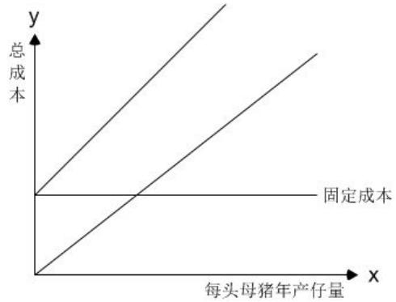

<details>
<summary>line</summary>

| 每头母猪年产量 | 固定成本 (y) | 未命名成本 (y) |
| --- | --- | --- |
| 0 | ~固定成本 | 0 |
| 中间点 | ~固定成本 | ~固定成本 + x |
| 高中点 | ~固定成本 | ~固定成本 + y |
</details>

通过收支情况示意图，不难看出，饲养成本线和销售收入线没有交点，即根据当前（2014年）的市场行情来看，该养殖场一直处于亏损状态，无法达到盈亏平衡，因此不论母猪年产仔量为多少，该养殖场均无法达到盈亏平衡。

## 5.1.3 结果分析

从以上对盈亏平衡点的求解情况来看，在 2014年养猪行情下，不论采取何种配种方式和养殖周期该养殖场均无法达到盈亏平衡，因此我们分析，若该养殖场在前两年的猪市行情下进行养殖可能会达到盈亏平衡。所以我们又对2013年和2012年的猪市行情进行了调查，利用这两年的养殖成本和销售价格等数据对该养殖场的盈亏平衡点和母猪年均产仔量进行求解，以下是经过调查后的相关数据<sup>[3]</sup>：

<table><tr><td>相关费用</td><td>2012年</td><td>2013年</td></tr><tr><td>种猪年饲养费用(P)</td><td>2268元/年·头</td><td>2646元/年·头</td></tr><tr><td>生猪饲养成本(F)</td><td>738元/头</td><td>721元/头</td></tr><tr><td>变动成本(疫苗费等)(E)</td><td>60.5元/头</td><td>63元/头</td></tr><tr><td>生猪销售价格(C)</td><td>1600元/头</td><td>1400元/头</td></tr></table>

利用以上建立的总成本模型和总收入模型，我们分别对2012年和2013 年猪市行情下该养殖场的盈亏平衡点进行求解，求解后的每头母猪年产仔量情况如下表：

<table><tr><td rowspan="2">年份</td><td rowspan="2">养殖周期</td><td colspan="2">达到盈亏平衡时每头母猪的年均产仔量(头)</td></tr><tr><td>自然配种</td><td>人工授精</td></tr><tr><td rowspan="3">2012年</td><td>3年</td><td>7</td><td>7</td></tr><tr><td>4年</td><td>6</td><td>6</td></tr><tr><td>5年</td><td>6</td><td>6</td></tr><tr><td rowspan="3">2013年</td><td>3年</td><td>28</td><td>28</td></tr><tr><td>4年</td><td>27</td><td>27</td></tr><tr><td>5年</td><td>27</td><td>26</td></tr></table>

通过以上计算，我们分别求出了不同情况下该养殖场达到盈亏平衡时每头母猪的年均产仔量，并选取了以2012年行情和养殖周期为 3年的总收支情况绘制如下：

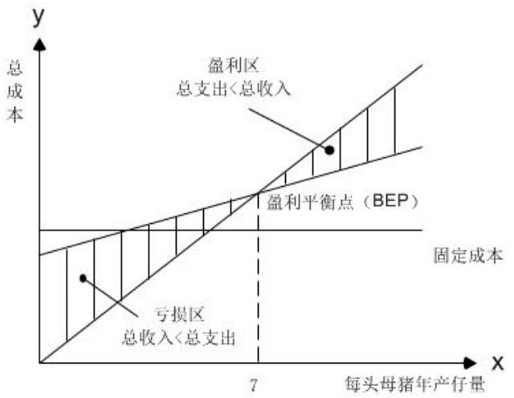

<details>
<summary>area</summary>

| Category | Description |
| --- | --- |
| Y-axis | 总成本 |
| X-axis | 每头母猪年产仔量 |
| Point 1 | 盈利区总支出<总收入 |
| Point 2 | 盈利平衡点 (BEP) |
| Line 1 | 固定成本 |
| Line 2 | 亏损区总收入<总支出 |
</details>

根据盈亏平衡点图分析，当养殖场在 2012 年猪市行情下并以 3 年为养殖周期，每头母猪年均产仔量为 7头时便可达到盈亏平衡，当年均产仔量超过7头时，该养殖场便开始盈利。

## 5.1.4 相关建议

通过以上对问题的求解并结合猪市行情，我们给出当前形势下生猪养殖产业的一些相关建议：

（1）以当前（2014年）猪市行情来看，无论采取何种配种方式和养殖周期，养殖场都处于亏损状态，并且亏损数额与母猪年产量成正比例关系，产量越大亏损越多。因此就当前形势来讲，我们建议养殖场尽可能减小养殖规模，以便减小亏损数额，建议对猪市持观望态度的投资人员暂不投资。

（2）通过对近三年生猪价格调查，不难看出生猪价格变动幅度较大，因此我们建议养殖者在规模养殖或销售生猪前对市场情况进行充分的调查，并对未来的猪市行情进行合理的预测，掌握实时信息，以便在较好的时机内对生猪进行销售。  
（3）根据盈亏情况示意图，当盈亏平衡点出现较早时，我们建议在养殖场规模允许的前提下尽量扩大养殖规模，延长养殖周期，以便增加收益。但养殖过程中需要对小猪数量进行合理的控制，防止超过养殖场的最大养殖规模。

## 5.2求解小猪选为种猪的比例和母猪的存栏数（问题二）

根据题目要求，母猪每年可以产两胎，每胎可以成活9只小猪，求使得该养殖场养殖规模达到饱和时，小猪选为种猪的比例和母猪的存栏数。

## 5.2.1 数据准备

根据题目要求，我们需要确定养殖周期（即种猪孕育周期）和种猪的淘汰率，为求解小猪选为种猪的比例和母猪存栏数做数据上的准备。

## 1.种猪淘汰率

通过研究，在养殖期间，种猪在孕育期结束后将被进行无害化处理，因此在种猪淘汰之前需要从小猪中挑选一部分作为种猪饲养，通过查阅到的相关资料显示：公种猪的淘汰率为45%，母种猪的淘汰率为30%。

## 2.公母种猪比例

在问题一中，我们通过查阅资料确定了种猪有两种配种方式：自然配种和人工受精，两种配种所对应的公猪母猪比例分别为 1:24和1:224。在问题二的求解过程中，我们继续沿用这一比例数据。

## 5.2.2求解比例和存栏数

## 1.模型准备

首先根据题意，在建立目标前，我们对问题进行了分析，由于肉猪和猪苗的数量由小猪数量决定，因此在养殖场中猪的数量由小猪、公猪和母猪决定，考虑到公猪和母猪的淘汰率，需要根据淘汰率对小猪进行一定数量的预留以便饲养成种猪。此外题目中规定母猪怀孕期为114天，一年可以产两胎，养殖场可能会出现有两批小猪的现象，此时养殖场猪的数量是最大的。

## 1）目标建立

根据题意，养殖场中猪的数量由小猪、公猪和母猪数量决定，并且猪的数量以整数形式存在，因此我们对小猪(z)、母猪(t)和公猪(w)数量建立整数规划：

$$
w \in N l \in N z \in N
$$

在养殖过程中，根据种猪的淘汰率会从小猪中挑选一定数量的猪作为种猪饲养，因此养殖场中猪的种类有小猪、后备种猪和公母种猪。通过对以上情况的分析，我们以该养殖场猪的数量最大为目标，建立目标函数：

$$
M a x \quad u = w + \lceil 0. 4 5 * w \rceil + l + \lceil 0. 3 * l \rceil + 2 * z
$$

## 2）条件约束

## （1）养殖场最大养殖规模约束

根据题目要求，该养殖场最多可以养 10000头猪，因此该养殖场养猪的最大数量，不得超过这一养殖限度，根据这一要求，我们建立以下约束条件：

$$
w + \left\lceil 0. 4 5 * w \right\rceil + l + \left\lceil 0. 3 * l \right\rceil + 2 * z \leq 1 0 0 0 0
$$

## （2）小猪数量约束约束

题目中规定，母猪一胎可以存活 9头猪，其中包括纯小猪和选为后备种猪的小猪，因此我们对于该养殖场所有母猪生一胎的小猪数量建立以下约束条件：

$$
9 * l = z + \left\lceil 0. 4 5 * w \right\rceil + \left\lceil 0. 3 * l \right\rceil
$$

## （3）公猪母猪比例约束

通过以上的数据准备，我们确定了两种配种方式下公猪和母猪的数量比例，根据这一分析，我们分自然配种时的数量比例和人工授精时的数量比例两种情况对问题进行求解，分别建立以下约束条件：

$$
\left\{ \begin{array}{l l} w = \frac {1}{2 4} * l & (\text {自然配种}) \\ w = \frac {1}{2 2 4} * l & (\text {人工授精}) \end{array} \right.
$$

## 2.模型建立

根据上述分析，我们以两种配种方式下养殖场猪的数量最大为目标，建立以下模型：

目标函数： Max u = w+[0.45\*w]+l +[0.3\*l]+2\*z

w+[0.45\*w]+l +[0.3\*l]+2\*z≤10000 9\*l = z+[0.45\*w]+[0.3\*l] 约束条件： s t. w 1 \*l或w= 1 l 24 224 w,l, z ∈ N

## 3.模型求解

根据以上所搜集的数据和建立的模型，利用ling软件进行求解，最终得到两种配种方式下养殖场养殖规模尽可能达到饱和状态时小猪选为母猪的比例和母猪存栏数等相

关数据，具体如下表：

<table><tr><td>猪的数量</td><td>自然配种情况下</td><td>人工授精情况下</td></tr><tr><td>总养殖数量</td><td>9632</td><td>9995</td></tr><tr><td>公猪数量</td><td>24</td><td>5</td></tr><tr><td>母猪数量</td><td>576</td><td>1110</td></tr><tr><td>所有母猪生一胎的小猪数量</td><td>4424</td><td>8543</td></tr><tr><td>后备母种猪数量</td><td>173</td><td>334</td></tr><tr><td>后备公种猪数量</td><td>11</td><td>3</td></tr><tr><td>母猪存栏数</td><td>749</td><td>1444</td></tr><tr><td>小猪选为种猪的比例</td><td>1.92%</td><td>1.70%</td></tr></table>

## 5.3确定最佳经营策略，计算年均利润（问题三）

题目中给出了未来三年内生猪价格变化曲线，根据价格曲线可以计算出未来三年内养殖场销售生猪的总收入，在求解年利润时，我们还需要养猪的饲料价格以便求解饲养所有猪的总成本。我们首先根据往年的数据将猪的饲料价格和销售价格利用最小二乘法进行数据拟合，得到两者的关系后再根据未来三年的销售价格曲线求解饲料价格曲线，最后利用所求得数据对问题进行求解。

## 5.3.1拟合饲料价格与销售价格关系

根据以上对问题的分析，我们首先对猪的饲料价格和销售价格利用最小二乘法进行拟合，以便根据题目中给出的未来三年的销售价格求解饲料价格。

## 1.建立函数关系

通过对相关资料的查询，我们对 2002 年至 2013 年这 12 年间的饲料价格和销售价格进行了统计，详细数据如下表<sup>[4]</sup>：

<table><tr><td>年份</td><td>2002</td><td>2003</td><td>2004</td><td>2005</td><td>2006</td><td>2007</td></tr><tr><td>饲料价(元/公斤)</td><td>1.54</td><td>1.57</td><td>1.86</td><td>1.88</td><td>1.86</td><td>2.12</td></tr><tr><td>猪肉价(元/公斤)</td><td>9.6</td><td>10.4</td><td>11.4</td><td>12.4</td><td>13</td><td>13.6</td></tr><tr><td>年份</td><td>2008</td><td>2009</td><td>2010</td><td>2011</td><td>2012</td><td>2013</td></tr><tr><td>饲料价(元/公斤)</td><td>2.61</td><td>2.54</td><td>2.75</td><td>2.92</td><td>3.22</td><td>3.41</td></tr><tr><td>猪肉价(元/公斤)</td><td>14.6</td><td>12.8</td><td>13.4</td><td>14.4</td><td>16</td><td>14</td></tr></table>

通过对以上数据的分析，我们得出结论：当某一年猪的饲料价格上升时，该年猪的销售价格随之上升；饲料价格下降，则销售价格随之下降。因此我们对饲料价格（x）

和销售价格（y）建立正比例函数关系：

$$
y = k * x + b
$$

## 2.利用最小二乘法拟合

经过分析，我们决定采用最小二乘法并以差值平方和最小为目标建立模型对饲料价格和销售价格两组数据进行拟合。

## （1）模型准备

## ①目标建立

通过分析，我们使用最小二乘法对饲料价格和销售价格进行拟合，我们以差值平方和最小为目标，建立目标函数：

$$
\text {Min} u = \sum_ {i = 1} ^ {1 2} \left(y _ {i} - k * x _ {i} - b\right) ^ {2}
$$

## ②约束条件

根据模型分析，我们无法对模型中的未知量范围进行准确的预判，因此我们在此不建立约束条件，利用 $l i n g o$ 软件进行全局求解。

## （2）模型建立

根据上述分析，我们以差值平方和最小为目标，建立以下模型：

目标函数：

$$
\text {Min} u = \sum_ {i = 1} ^ {1 2} \left(y _ {i} - k * x _ {i} - b\right) ^ {2}
$$

## （3）模型求解

根据以上建立的模型，利用lingo软件进行全局求解，最终求得 $k = 2 . 3 9$ $b = 7 . 3 4$ C因此饲料价格与销售价格的函数关系为：

$$
y = 2. 3 9 * x + 7. 3 4
$$

拟合前后的点线效果图如下：

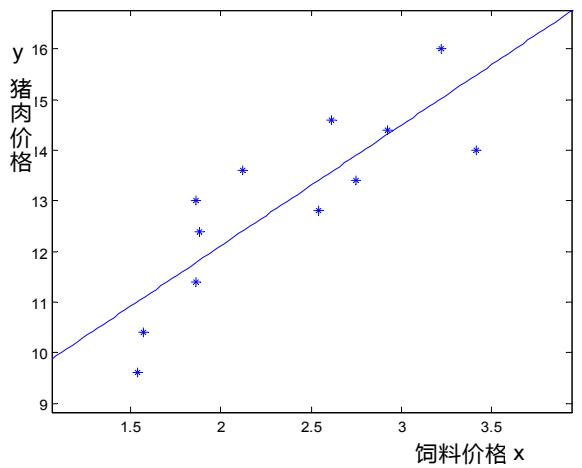

<details>
<summary>scatter</summary>

| 饲料价格 x | 猪肉价格 y |
| --- | --- |
| ~1.55 | ~9.6 |
| ~1.55 | ~10.4 |
| ~1.85 | ~11.4 |
| ~1.85 | ~12.4 |
| ~1.85 | ~13.0 |
| ~2.15 | ~13.6 |
| ~2.55 | ~12.8 |
| ~2.60 | ~14.6 |
| ~2.75 | ~13.4 |
| ~2.90 | ~14.4 |
| ~3.20 | ~16.0 |
| ~3.40 | ~14.0 |
</details>

## 5.3.2确定未来三年饲料价格

通过以上对饲料价格和销售价格关系的拟合，我们得到了两者的函数关系，再根据题目中给出的未来三年生猪销售价格和拟合关系式，求解未来三年的饲料价格。

根据题目中给出的未来三年生猪销售价格变化曲线，曲线中包含了 109个时间点对应的销售价格数值，因此我们对这109 个点进行了提取，具体数值见附表。根据饲料价格和销售价格关系式，我们对这109个销售价格对应的饲料价格进行了求解（详细结果见附表），并根据求解后的数据画出了未来三年饲料价格变化的预测曲线：

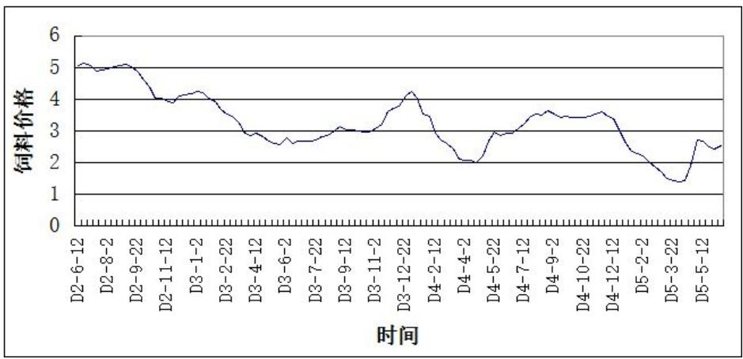

<details>
<summary>line</summary>

| 时间 | 饲料价格 |
| --- | --- |
| D2-6-12 | ~5.0 |
| D2-8-2 | ~5.0 |
| D2-9-22 | ~5.0 |
| D2-11-12 | ~4.0 |
| D3-1-2 | ~4.2 |
| D3-2-22 | ~3.8 |
| D3-4-12 | ~2.9 |
| D3-6-2 | ~2.7 |
| D3-7-22 | ~2.7 |
| D3-9-12 | ~3.0 |
| D3-11-2 | ~3.0 |
| D3-12-22 | ~4.2 |
| D4-2-12 | ~3.5 |
| D4-4-2 | ~2.1 |
| D4-5-22 | ~2.9 |
| D4-7-12 | ~3.5 |
| D4-9-2 | ~3.6 |
| D4-10-22 | ~3.4 |
| D4-12-12 | ~3.6 |
| D5-2-2 | ~2.3 |
| D5-3-22 | ~1.4 |
| D5-5-12 | ~2.5 |
</details>

## 5.3.3养殖场三年时间流程图

从题目中提供的数据和搜集到的相关数据来看，母猪怀孕时间为114 天，哺乳时间为2 个月，小猪成长为肉猪的时间为5个月，根据以上数据，我们将该养殖场未来三年的产猪及销售等情况的流程图绘制如下：

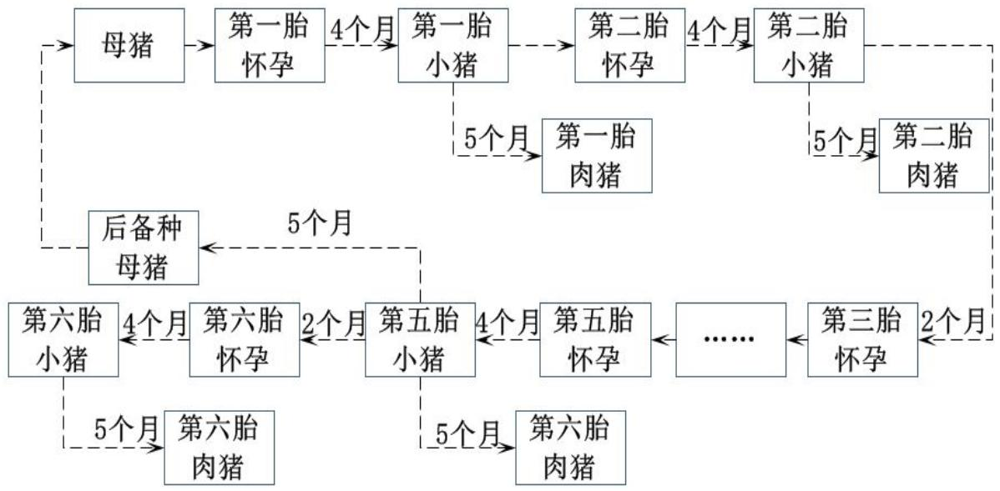

<details>
<summary>flowchart</summary>

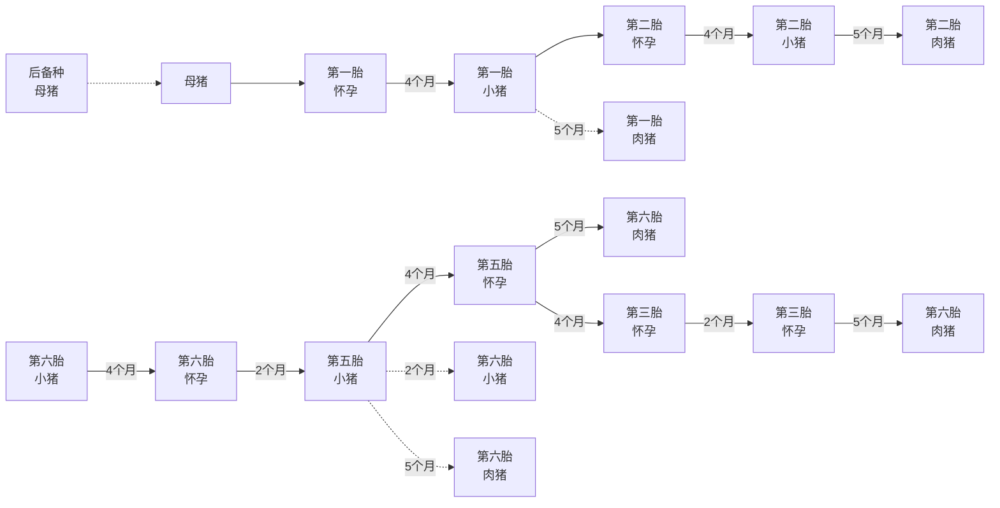
</details>

## 5.3.4确定最佳经营策略和年均利润

通过以上对未来三年饲料价格的预测，我们需要根据预测数据和其他相关数据确定该养殖场的总收支情况，以便求解该养殖场的最大利润。

## 1.数据准备

通过分析题目，首先我们需要确定生猪数量、肉猪的食量和饲料价格以及未来三年内的时间间隔等数据，因此我们通过查阅资料和分析未来三年生猪价格变化曲线并结合前两问的数值对相关数据进行了整理，具体如下表：

<table><tr><td>生猪数量</td><td>自然配种:8479头;人工授精:8543头</td></tr><tr><td>肉猪一天的饲料粮</td><td>2kg</td></tr><tr><td>肉猪饲料价格</td><td>3元/kg</td></tr><tr><td>时间间隔</td><td>10天</td></tr><tr><td>变动成本</td><td>64元</td></tr><tr><td>种猪数量</td><td>自然配种:1503头;人工授精:1452头</td></tr><tr><td>小猪哺乳时常</td><td>2个月</td></tr></table>

## 2.模型准备

通过以上的数据准备，我们对该养殖场的总收支情况进行求解。考虑到母猪产仔具有同步性，并且为了防止出现爆棚现象，一次出售将卖掉所有肉猪，因此在建立目标前我们对第m批肉猪是否在第n个时间点出售和第m批小猪是否在第n个时间点出生分别建立“0-1”变量：

$$
f _ {m n} = \left\{ \begin{array}{l l} 0 & \text {第} m \text {批肉猪不在第} n \text {个时间点出售} \\ 1 & \text {第} m \text {批肉猪在第} n \text {个时间点出售} \end{array} \quad g _ {m n} = \left\{ \begin{array}{l l} 0 & \text {第} m \text {批小猪不在第} n \text {个时间点出生} \\ 1 & \text {第} m \text {批小猪在第} n \text {个时间点出生} \end{array} \right. \right.
$$

通过分析，该养殖场的利润由总收支情况决定，总收入为肉猪的销售收入，我们引用 $C _ { n }$ 代表题目中预测的每个时间点肉猪每公斤销售价格，由于目前该养殖场已经养成了一批肉猪，通过分析肉猪价格变化曲线，不难看出在第二个时间点上肉猪销售价格高，因此我们将原有的这一批肉猪在第二个时间点进行销售，因此在问题二求解出的人工授精的情况下该养殖场的总收入为：

$$
B = \sum_ {m = 1} ^ {6} \sum_ {n = 1} ^ {1 0 9} \left(C _ {n} * f _ {m n} * 1 0 0 * 8 5 4 3\right) + 8 5 4 3 * C _ {2}
$$

在问题一中，我们分析出养殖场的总成本包括种猪的饲养成本、生猪饲养成本和变动成本，我们根据问题二中人工授精情况下的种猪数量和查阅到的资料中种猪的日饲料消耗量和饲料价格确定种猪养殖成本：

$$
Q = \sum_ {m = 1} ^ {6} \sum_ {n = 1} ^ {1 0 9} \left(c _ {n} * f _ {m n} - c _ {n} * g _ {m n}\right) * 8 5 4 3 * 1. 5 * 3 + 8 5 4 3 * 1 3 0 * 1. 5 * 3
$$

对于生猪饲养成本，我们根据对生猪销售价格和拟合关系式求解生猪饲料价格，再根据饲料价格和问题二中求解的人工授精情况下的生猪数量确定该养殖场生猪养殖成

本：

$$
M = \sum_ {n = 1} ^ {1 0 9} 1 4 5 2 * \frac {C _ {n} - 7 . 3 3 7 1}{2 . 3 8 8 8} * 2. 5 * 1 0
$$

最后，再根据数据准备中每头猪的变动成本和养殖场中猪的总数量确定该养殖场的总变动成本：

$$
d = \sum_ {m = 1} ^ {6} \sum_ {n = 1} ^ {1 0 9} \left(f _ {m n} * 8 5 4 3 * E _ {n}\right) + 1 4 5 2 * 1 2 0
$$

## 1）目标建立

根据对问题的分析和以上的数据准备，在人工授精的前提下我们以养殖场未来三年养殖利润最大为目标，建立目标函数：

$$
M a x = B - Q - M - d
$$

## 2）条件约束

根据题目要求，我们在求解最大利润中建立以下约束条件。

## （1）肉猪生长时间约束

由于题目中规定，母猪的怀孕时间为114 天约为 4个月时间，从母猪配种到所产的猪仔长成肉猪出栏需要约9个月时间，因此期间有5 个月的时间是小猪长为肉猪的成长时间，在这段时间内肉猪没有达到可以出售的条件。根据这一要求，我们建立以下约束条件：

$$
\sum_ {n = 1} ^ {1 0 9} e _ {n} * f _ {m n} - e _ {n} * g _ {m n} \geq 1 5 0 (m = 1.. 6)
$$

## （2）两次销售时间间隔约束

通过分析题目要求，母猪在怀孕4 个月后产下小猪，哺乳两个月后再经过 3个月小猪成长为肉猪便可以进行出售，母猪在哺乳完小猪后可以再次怀孕，经过4 个月后产下第二批小猪（详细流程可见附图），因此两次销售之间最少需要间隔 5个月时间，因此我们建立以下约束条件：

$$
\sum_ {n = 1} ^ {1 0 9} f _ {(m + 1, n)} * e _ {n} - f _ {m n} * e _ {n} \geq 1 8 0 (m = 1.. 5)
$$

## （3）两次产仔时间间隔约束

通过以上的流程图，不难看出母猪两次产仔的时间间隔至少为 6个月时间，根据这一要求，我们对母猪两次的产仔时间建立以下约束条件：

$$
\sum_ {n = 1} ^ {1 0 9} g _ {(m + 1, n)} * e _ {n} - g _ {m n} * e _ {n} \geq 1 8 0 (m = 1.. 5)
$$

## （4）同一批肉猪的销售时间约束

经过研究，为了防止养殖场出现爆棚现象，在下一批小猪出生前上一批肉猪要一次性全部销售完毕，所以同一批肉猪要在一个时间点上全部进行销售。因此我们建立以下约束条件：

$$
\sum_ {n = 1} ^ {1 0 9} f _ {m n} \leq 1 (m = 1.. 6)
$$

## （5）同一批小猪的出生时间约束

我们根据以上对同一批肉猪销售时间的约束，考虑到所有母猪怀孕后会在同一时间产仔，因此我们对同一批小猪的出生时间建立约束：

$$
\sum_ {n = 1} ^ {1 0 9} g _ {m n} \leq 1 (m = 1.. 6)
$$

## 3.模型建立

根据上述分析，我们以该养殖场利润最大值为目标，建立了以下模型：

目标函数： Max = B -Q − M − d

约束条件：

$$
\left\{ \begin{array}{l} Q = \sum_ {m = 1} ^ {6} \sum_ {n = 1} ^ {1 0 9} \left(c _ {n} * f _ {m n} - c _ {n} * g _ {m n}\right) * 8 5 4 3 * 1. 5 * 3 + 8 5 4 3 * 1 3 0 * 1. 5 * 3 \\ B = \sum_ {m = 1} ^ {6} \sum_ {n = 1} ^ {1 0 9} \left(C _ {n} * f _ {m n} * 1 0 0 * 8 5 4 3\right) + 8 5 4 3 * C _ {2} \\ M = \sum_ {n = 1} ^ {1 0 9} 1 4 5 2 * \frac {C _ {n} - 7 . 3 3 7 1}{2 . 3 8 8 8} * 2. 5 * 1 0 \\ d = \sum_ {m = 1} ^ {6} \sum_ {n = 1} ^ {1 0 9} \left(f _ {m n} * 8 5 4 3 * E _ {n}\right) + 1 4 5 2 * 1 2 0 \\ \sum_ {n = 1} ^ {1 0 9} e _ {n} * f _ {m n} - e _ {n} * g _ {m n} \geq 1 5 0 \quad (m = 1.. 6) \\ \sum_ {n = 1} ^ {1 0 9} f _ {(m + 1, n)} * e _ {n} - f _ {m n} * e _ {n} \geq 1 8 0 \quad (m = 1.. 5) \\ \sum_ {n = 1} ^ {1 0 9} g _ {(m + 1, n)} * e _ {n} - g _ {m n} * e _ {n} \geq 1 8 0 \quad (m = 1.. 5) \\ \sum_ {n = 1} ^ {1 0 9} f _ {m n} \leq 1 \quad (m = 1.. 6) \\ \sum_ {n = 1} ^ {1 0 9} g _ {m n} \leq 1 \quad (m = 1.. 6) \\ f _ {m n} \in \{0, 1 \} \quad g _ {m n} \in \{0, 1 \} \quad (m = 1.. 6, n = 1.. 1 0 9) \end{array} \right.
$$

## 4.模型求解

根据以上建立的模型，利用lingo软件进行求解，最终得到该养殖场在人工授精方式下未来三年的最大利润为1887.9360 万元，年均利润为629.312万元，根据计算结果和未来三年肉猪售价变化曲线给出的时间，我们将具体经营策略表示如下：

<table><tr><td>出售批次</td><td>配种日期</td><td>产仔日期</td><td>出售日期</td><td>销售价格</td></tr><tr><td>1</td><td>D1-05-18</td><td>D1-09-12</td><td>D2-06-12</td><td>19.6元/kg</td></tr><tr><td>2</td><td>D2-03-08</td><td>D2-07-02</td><td>D2-12-02</td><td>17.1元/kg</td></tr><tr><td>3</td><td>D2-09-08</td><td>D3-01-02</td><td>D3-06-02</td><td>14.0元/kg</td></tr><tr><td>4</td><td>D3-03-18</td><td>D3-07-12</td><td>D3-12-12</td><td>17.1元/kg</td></tr><tr><td>5</td><td>D3-09-18</td><td>D4-01-12</td><td>D4-06-22</td><td>14.3元/kg</td></tr><tr><td>6</td><td>D4-03-18</td><td>D4-07-12</td><td>D4-12-12</td><td>15.4元/kg</td></tr><tr><td>7</td><td>D4-09-18</td><td>D5-01-12</td><td>D5-06-12</td><td>13.4元/kg</td></tr></table>

## 5.结果分析

以上问题是在以人工授精情况下的各项数据基础上进行求解的，考虑到实际情况中会存在自然配种的情况，因此我们又利用自然配种情况下的有关数据在以上建立的模型基础上对该养殖场最大利润进行了求解，最终得出自然配种情况下该养殖场的最大利润为 1818.2480万元，年均利润 606.0827 万元。可见自然配种情况下的年均利润小于人工配种情况下的年均利润，因此该养殖场应选用人工配种进行养殖。

## 5.3.4求解母猪数量及肉猪存栏数

以上对问题的求解，是在母猪数量固定的情况下的最大利润，在实际情况中母猪的数量会发生变化，因此我们根据以上求解出的销售时间，将不同时间点下的母猪数量设为未知量 $\cdot \boldsymbol { l } _ { n }$ ，在利润最大的情况下根据销售时间对母猪数量进行求解。

## 1.模型准备

通过分析，在母猪产仔第一批小猪前该养殖场已经存在了一批小猪，我们将第二问中人工授精下的小猪数量作为原有的这一批小猪数量，将未来三年内每个时间点下的母猪数量设置为未知变量 $l _ { n }$ ，并在利润最大化的前提下对母猪数量进行求解。

在求解母猪数量时，我们沿用以上建立的“0-1”变量，由于该养殖场在开始阶段可以销售一批肉猪，并且在第二个时间点销售利润最大，在问题二中我们求解出小猪选为种猪的比例，因此对于总收入，我们建立以下模型：

$$
B = \sum_ {m = 1} ^ {6} \sum_ {n = 1} ^ {1 0 9} \left(C _ {n} * f _ {m n} * 1 0 0 * 9 * l _ {n} * 0. 9 8\right) + 8 4 7 9 * C _ {2}
$$

对于种猪饲养成本、肉猪饲养成本和总变动成本，根据以上求解最大利润时建立的模型，将母猪数量由固定值变为了未知量 $\cdot \boldsymbol { l } _ { n }$ ，因此种猪饲养成本、肉猪饲养成本和变动成本分别为：

种猪饲养成本： $Q = \sum _ { m = 1 } ^ { 6 } \sum _ { n = 1 } ^ { 1 0 9 } \bigl ( e _ { n } * f _ { m n } - e _ { n } * g _ { m n } \bigr ) * 9 * l _ { n } * 0 . 9 8 * 2 * 3 + 8 4 7 9 * 1 3 0 * 2 * 3$

肉猪饲养成本： $M = \sum _ { n = 1 } ^ { 1 0 9 } \frac { l _ { n } } { 0 . 9 6 } * \frac { C _ { n } - 7 . 3 3 7 1 } { 2 . 3 8 8 8 } * 3 * 1 0$

总变动成本： $d = \sum _ { m = 1 } ^ { 6 } \sum _ { n = 1 } ^ { 1 0 9 } f _ { m n } * 9 * l _ { n } * 0 . 9 8 * E _ { n } + \sum _ { n = 1 } ^ { 1 0 9 } { \frac { l _ { n } } { 0 . 9 6 } } * { \frac { 1 2 0 } { 1 0 9 } }$

## 1）目标建立

根据以上分析，我们以利润最大值为目标，建立目标函数：

$$
M a x = B - Q - M - d
$$

## 2）条件约束

## （1）养殖场原有母猪数量约束

在问题二中，我们求解出了该养殖场母猪的最大数量为 1110 头，当母猪数量最大时，产仔数量也是最大的，因此在养殖场原有一批肉猪的前提下，为了是利润最大化，我们将原有的母猪数量定为1110头，即在第一个时间段下，母猪数量为1110 头，这样便使得肉猪数量最大，因此我们建立以下约束条件：

$$
l _ {1} = 1 1 1 0
$$

## （2）三年内母猪数量约束

通过分析第二问的结果，该养殖场母猪的最大数量为 1110 头，母猪数量不能超过这一最大数量，根据不同配种方式下公母种猪的比例可知，养殖场中的母猪数量不得少于24 头，因此我们对养殖场原有的母猪数量建立以下约束条件：

$$
2 4 \leq l _ {n} \leq 1 1 1 0 \quad (n = 1.. 1 0 9)
$$

## （2）母猪淘汰率约束

在问题二中，我们确定了母猪的淘汰率为 30%，因此在未来三年内母猪的淘汰率为1%,根据这一要求，我们建立以下约束条件：

$$
\left| l _ {n} - l _ {n + 1} \right| \leq l _ {n} * 0. 0 1 \quad (n = 1.. 1 0 8)
$$

## （3）种猪数量约束

在问题二中，我们对公种猪和母种猪数量分别用(1)和(w)进行了表示，结合种猪的淘汰率，我们对该养殖场中所有种猪的数量建立以下约束条件：

$$
l _ {n} * 1. 3 = (l + w) _ {n} \quad (n = 1.. 1 0 9)
$$

## 2.模型建立

根据上述分析，我们以养殖场三年内利润最大值为目标，建立了以下模型：

目标函数： Max = B-Q−M −d

$$
\text {约束条件:} \left\{ \begin{array}{l} Q = \sum_ {m = 1} ^ {6} \sum_ {n = 1} ^ {1 0 9} \left(e _ {n} * f _ {m n} - e _ {n} * g _ {m n}\right) * 9 * l _ {n} * 0. 9 8 * 2 * 3 + 8 4 7 9 * 1 3 0 * 2 * 3 \\ B = \sum_ {m = 1} ^ {6} \sum_ {n = 1} ^ {1 0 9} \left(C _ {n} * f _ {m n} * 1 0 0 * 9 * l _ {n} * 0. 9 8\right) + 8 4 7 9 * C _ {2} \\ d = \sum_ {m = 1} ^ {6} \sum_ {n = 1} ^ {1 0 9} f _ {m n} * 9 * l _ {n} * E _ {n} + \sum_ {n = 1} ^ {1 0 9} \frac {l _ {n}}{0 . 9 6} * \frac {1 2 0}{1 0 9} \\ M = \sum_ {n = 1} ^ {1 0 9} \frac {l _ {n}}{0 . 9 6} * \frac {C _ {n} - 7 . 3 3 7 1}{2 . 3 8 8 8} * 3 * 1 0 \\ \left| l _ {n} - l _ {n + 1} \right| \leq l _ {n} * 0. 0 1 & (n = 1.. 1 0 8) \\ l _ {n} * 1. 3 = (l + w) _ {n} & (n = 1.. 1 0 9) \\ l _ {n} \leq 1 1 1 0 & (n = 1.. 1 0 9) \\ l _ {n} \geq 2 4 & (n = 1.. 1 0 9) \\ l _ {1} = 1 1 1 0 \\ f _ {m n} \in \{0, 1 \} \quad g _ {m n} \in \{0, 1 \} & (m = 1.. 6, n = 1.. 1 0 9) \end{array} \right.
$$

## 3.模型求解

根据以上建立的模型，利用lingo软件进行求解，最终我们得出在改变母猪数量的情况下未来三年利润为2500.2860万元，年均利润为833.4287 万元。

通过比较，不难看出在母猪数量变动的情况下，养殖场获得的利润最大，最大年均利润为 833.4287 万元。

## 4.绘制母猪及肉猪存栏数曲线

通过以上对最大利润的求解，我们将各时间点下的母猪数量进行了计算（具体数据见附表），通过求解出的母猪数量和肉猪数量，我们将母猪及肉猪存栏数曲线绘制如下：

母猪存栏数曲线：

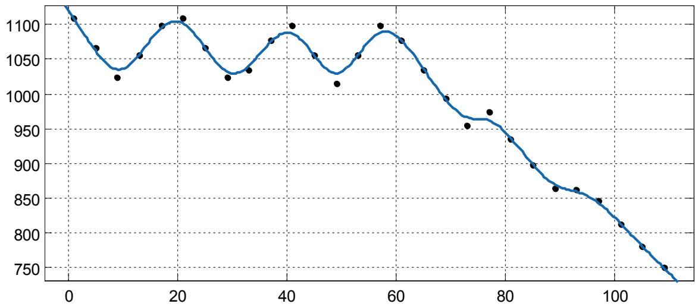

<details>
<summary>line</summary>

| X | Y |
| --- | --- |
| 0 | ~1125 |
| 2 | ~1110 |
| 6 | ~1065 |
| 9 | ~1025 |
| 13 | ~1055 |
| 17 | ~1100 |
| 21 | ~1110 |
| 25 | ~1065 |
| 29 | ~1025 |
| 33 | ~1035 |
| 37 | ~1075 |
| 41 | ~1100 |
| 45 | ~1055 |
| 49 | ~1015 |
| 53 | ~1055 |
| 57 | ~1100 |
| 61 | ~1075 |
| 65 | ~1035 |
| 69 | ~995 |
| 73 | ~955 |
| 77 | ~975 |
| 81 | ~935 |
| 85 | ~900 |
| 89 | ~865 |
| 93 | ~865 |
| 97 | ~845 |
| 101 | ~815 |
| 105 | ~780 |
| 109 | ~750 |
</details>

肉猪存栏数曲线：

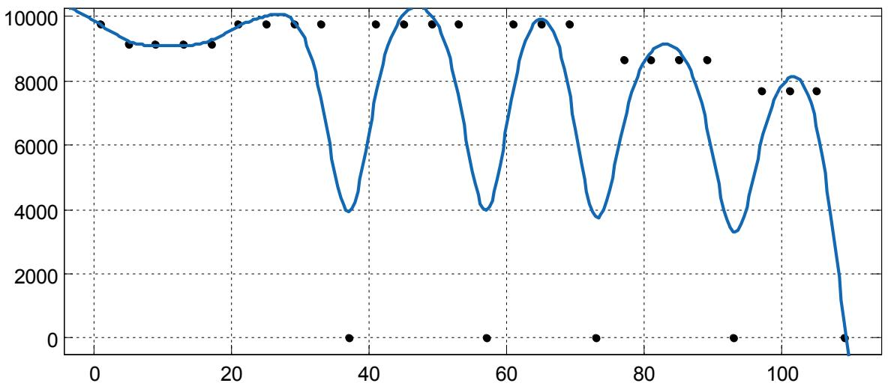

<details>
<summary>line</summary>

| X | Line Value | Data Points |
| --- | --- | --- |
| 0 | ~10200 | — |
| 5 | ~9800 | ~9800 |
| 10 | ~9200 | ~9200 |
| 15 | ~9200 | ~9200 |
| 20 | ~9300 | ~9300 |
| 25 | ~9800 | ~9800 |
| 30 | ~10100 | ~9800 |
| 35 | ~9800 | ~9800 |
| 40 | ~4000 | 0 |
| 45 | ~6500 | ~9800 |
| 50 | ~9800 | ~9800 |
| 55 | ~9800 | ~9800 |
| 60 | ~4100 | 0 |
| 65 | ~7500 | ~9800 |
| 70 | ~9800 | ~9800 |
| 75 | ~4500 | 0 |
| 80 | ~7500 | ~8700 |
| 85 | ~9200 | ~8700 |
| 90 | ~8700 | ~8700 |
| 95 | ~3400 | 0 |
| 100 | ~7500 | ~7700 |
| 105 | ~8100 | ~7700 |
| 110 | ~-500 | 0 |
</details>

## 6 模型评价与推广

## 1.模型评价

## 好的方面：

1.对所收集来的数据进行整理，并对其进行筛选，将合理数据用于计算中；  
2.利用拟合最小二乘法来分析预测数据，更加具有说服力和理论性；  
3.结合不同种实际情况，使所建立的模型更加科学、合理。

## 有待改进的地方：

1.本模型所收集的数据有限，计算精度不高，得到的结果可能同实际情况有所出入。

## 2.模型推广

所建立的模型考虑到的因素比较全面，并详细的给出了经营策略，可以应用到实际规划中。

根据文中所建立的模型，依据近几年市场价格涨跌趋势，预测未来几年市场营销情况，即可以提前做出预判。

## 7 参考文献

[1]姜启源，谢金星，叶俊.数学模型.北京:高等教育出版社，2013。  
[2]辛占军 曹更生，种公猪的合理利用，http://www.doc88.com/p-91799233606.html，2014年 9 月 12 日。  
[3]张道中 刘元英，养猪经营智慧，http://epub.cnki.net/kns/brief/default\_result.aspx，2014 年 9 月 12 日。

[4]贾虹杨，种猪的利用与淘汰，http://epub.cnki.net/kns/brief/default\_result.aspx，2014年 9 月 12 日。

## 8 附录

## 8.1 Lingo 程序

## 8.1.1 问题二

```matlab
max=x+@floor(x*0.45)+1+y+@floor(y*0.3)+1+z;
x+@floor(x*0.45)+1+y+@floor(y*0.3)+1+z<=10000;
x=(1/24)*y;
@gin(x);
@gin(y);
@gin(z);
 @floor(y*0.3)+1=a;
 @floor(x*0.45)+1=b;
 (a+b)/((2*z+@floor(x*0.45)+1+y+@floor(y*0.3)+1))*100=p;
 y*9=z+@floor(x*0.45)+1+y+@floor(y*0.3)+1;
```

## 8.1.2问题三

## 第一步：

```matlab
sets:
bb/1..109/:a,b,c;
aa/1..6/: ;
cc(aa,bb):f,p;
endsets
data:
a=@text('D:\roujia.txt');
b=@text('D:\biandongfeiyong.txt');
c=@text('D:\tianshujiange.txt');
enddata
max=n-q-e-w;
n=@sum(cc(i,j):a(j)*f(i,j)*100*8543)+8543*a(2);
q=@sum(cc(i,j):(c(j)*f(i,j)-c(j)*p(i,j)))*8543*1.5*3+8543*130*1.5*3;
e=@sum(bb(j):1452*(a(j)-7.3371)/2.3888*2.5*10);
w=@sum(cc(i,j):f(i,j)*8543*b(j))+1452*120;
@for(aa(i):@sum(bb(j):c(j)*f(i,j)-c(j)*p(i,j))>=150);
@for(aa(i) | (i#le#5):@sum(bb(j):f(i+1,j)*c(j)-f(i,j)*c(j))>=150);
@for(aa(i) | (i#le#5):@sum(bb(j):p(i+1,j)*c(j)-p(i,j)*c(j))>=180);
@for(aa(i):@sum(bb(j):f(i,j))<=1);
@for(aa(i):@sum(bb(j):p(i,j))<=1);
```

```matlab
@for(cc(i,j):@bin(f(i,j)));
@for(cc(i,j):@bin(p(i,j)));
```

## 第二步：

```matlab
sets:
bb/1..109/:a, b, c, x, y, z;
aa/1..6/:;
cc (aa, bb):f, p;
endsets
data:
a=@text('D:\roujia.txt');
b=@text('D:\biandongfeiyong.txt');
c=@text('D:\tianshujiange.txt');
f=@text('D:\f.txt');
p=@text('D:\p.txt');
enddata
max=n-q-e-w;
n=@sum(cc(i, j):a(j)*f(i, j)*100*9*x(j)*0.98)+8479*a(2);
q=@sum(cc(i, j):(c(j)*f(i, j)-c(j)*p(i, j))*9*x(j)*0.98*1.5*3)+8479*130*1.5*3;
e=@sum(bb(j):x(j)/0.96*(a(j)-7.3371)/2.3888*2.5*10);
w=@sum(cc(i, j):f(i, j)*9*x(j)*0.98*b(j))+@sum(bb(j):x(j)/0.96)/109*120;
@for(bb(j):x(j)<=1110);
@for(bb(j):x(j)>=24);
@for(bb(j) | (j#1e#108):@abs(x(j)-x(j+1))<=x(j)*0.01);
x(1)=1110;
@for(cc(i, j):@bin(f(i, j)));
@for(cc(i, j):@bin(p(i, j)));
@for(bb(j):x(j)*1.3=y(j));
```

## 8.2附表

附表1：各时间对应的猪肉价格

<table><tr><td>时间</td><td>猪肉价格</td><td>饲料价格</td><td>时间</td><td>猪肉价格</td><td>饲料价格</td></tr><tr><td>D2-6-12</td><td>19.4</td><td>5.0498</td><td>D3-12-22</td><td>17.1</td><td>4.087</td></tr><tr><td>D2-6-22</td><td>19.6</td><td>5.1335</td><td>D4-1-2</td><td>17.5</td><td>4.2544</td></tr><tr><td>D2-7-2</td><td>19.4</td><td>5.0498</td><td>D4-1-12</td><td>17</td><td>4.0451</td></tr><tr><td>D2-7-12</td><td>19</td><td>4.8824</td><td>D4-1-22</td><td>15.8</td><td>3.5428</td></tr><tr><td>D2-7-22</td><td>19.1</td><td>4.9242</td><td>D4-2-2</td><td>15.6</td><td>3.459</td></tr><tr><td>D2-8-2</td><td>19.2</td><td>4.9661</td><td>D4-2-12</td><td>14.3</td><td>2.9148</td></tr><tr><td>D2-8-12</td><td>19.3</td><td>5.0079</td><td>D4-2-22</td><td>13.8</td><td>2.7055</td></tr><tr><td>D2-8-22</td><td>19.4</td><td>5.0498</td><td>D4-3-2</td><td>13.6</td><td>2.6218</td></tr><tr><td>D2-9-2</td><td>19.5</td><td>5.0917</td><td>D4-3-12</td><td>13.1</td><td>2.4125</td></tr><tr><td>D2-9-12</td><td>19.3</td><td>5.0079</td><td>D4-3-22</td><td>12.4</td><td>2.1194</td></tr><tr><td>D2-9-22</td><td>18.9</td><td>4.8405</td><td>D4-4-2</td><td>12.3</td><td>2.0776</td></tr><tr><td>D2-10-2</td><td>18.3</td><td>4.5893</td><td>D4-4-12</td><td>12.3</td><td>2.0776</td></tr><tr><td>D2-10-12</td><td>17.8</td><td>4.38</td><td>D4-4-22</td><td>12.1</td><td>1.9939</td></tr><tr><td>D2-10-22</td><td>17</td><td>4.0451</td><td>D4-5-2</td><td>12.6</td><td>2.2032</td></tr><tr><td>D2-11-2</td><td>17</td><td>4.0451</td><td>D4-5-12</td><td>13.7</td><td>2.6637</td></tr><tr><td>D2-11-12</td><td>16.7</td><td>3.9195</td><td>D4-5-22</td><td>14.4</td><td>2.9567</td></tr><tr><td>D2-11-22</td><td>16.6</td><td>3.8777</td><td>D4-6-2</td><td>14.2</td><td>2.873</td></tr><tr><td>D2-12-2</td><td>17.1</td><td>4.087</td><td>D4-6-12</td><td>14.3</td><td>2.9148</td></tr><tr><td>D2-12-12</td><td>17.2</td><td>4.1288</td><td>D4-6-22</td><td>14.3</td><td>2.9148</td></tr><tr><td>D2-12-22</td><td>17.3</td><td>4.1707</td><td>D4-7-2</td><td>14.7</td><td>3.0823</td></tr><tr><td>D3-1-2</td><td>17.5</td><td>4.2544</td><td>D4-7-12</td><td>15</td><td>3.2079</td></tr><tr><td>D3-1-12</td><td>17.4</td><td>4.2126</td><td>D4-7-22</td><td>15.6</td><td>3.459</td></tr><tr><td>D3-1-22</td><td>17</td><td>4.0451</td><td>D4-8-2</td><td>15.8</td><td>3.5428</td></tr><tr><td>D3-2-2</td><td>16.7</td><td>3.9195</td><td>D4-8-12</td><td>15.7</td><td>3.5009</td></tr><tr><td>D3-2-12</td><td>16.1</td><td>3.6683</td><td>D4-8-22</td><td>16</td><td>3.6265</td></tr><tr><td>D3-2-22</td><td>15.8</td><td>3.5428</td><td>D4-9-2</td><td>15.8</td><td>3.5428</td></tr><tr><td>D3-3-2</td><td>15.6</td><td>3.459</td><td>D4-9-12</td><td>15.5</td><td>3.4172</td></tr><tr><td>D3-3-12</td><td>15.1</td><td>3.2497</td><td>D4-9-22</td><td>15.6</td><td>3.459</td></tr><tr><td>D3-3-22</td><td>14.3</td><td>2.9148</td><td>D4-10-2</td><td>15.5</td><td>3.4172</td></tr><tr><td>D3-4-2</td><td>14.2</td><td>2.873</td><td>D4-10-12</td><td>15.5</td><td>3.4172</td></tr><tr><td>D3-4-12</td><td>14.3</td><td>2.9148</td><td>D4-10-22</td><td>15.5</td><td>3.4172</td></tr><tr><td>D3-4-22</td><td>14.1</td><td>2.8311</td><td>D4-11-2</td><td>15.6</td><td>3.459</td></tr><tr><td>D3-5-2</td><td>13.7</td><td>2.6637</td><td>D4-11-12</td><td>15.8</td><td>3.5428</td></tr><tr><td>D3-5-12</td><td>13.6</td><td>2.6218</td><td>D4-11-22</td><td>15.9</td><td>3.5846</td></tr><tr><td>D3-5-22</td><td>13.5</td><td>2.5799</td><td>D4-12-2</td><td>15.6</td><td>3.459</td></tr><tr><td>D3-6-2</td><td>14</td><td>2.7892</td><td>D4-12-12</td><td>15.4</td><td>3.3753</td></tr><tr><td>D3-6-12</td><td>13.6</td><td>2.6218</td><td>D4-12-22</td><td>14.6</td><td>3.0404</td></tr><tr><td>D3-6-22</td><td>13.7</td><td>2.6637</td><td>D5-1-2</td><td>13.6</td><td>2.6218</td></tr><tr><td>D3-7-2</td><td>13.7</td><td>2.6637</td><td>D5-1-12</td><td>13</td><td>2.3706</td></tr><tr><td>D3-7-12</td><td>13.7</td><td>2.6637</td><td>D5-1-22</td><td>12.8</td><td>2.2869</td></tr><tr><td>D3-7-22</td><td>13.8</td><td>2.7055</td><td>D5-2-2</td><td>12.6</td><td>2.2032</td></tr><tr><td>D3-8-2</td><td>14.1</td><td>2.8311</td><td>D5-2-12</td><td>12.1</td><td>1.9939</td></tr><tr><td>D3-8-12</td><td>14.2</td><td>2.873</td><td>D5-2-22</td><td>11.8</td><td>1.8683</td></tr><tr><td>D3-8-22</td><td>14.5</td><td>2.9986</td><td>D5-3-2</td><td>11.4</td><td>1.7008</td></tr><tr><td>D3-9-2</td><td>14.8</td><td>3.1241</td><td>D5-3-12</td><td>10.9</td><td>1.4915</td></tr><tr><td>D3-9-12</td><td>14.6</td><td>3.0404</td><td>D5-3-22</td><td>10.8</td><td>1.4497</td></tr><tr><td>D3-9-22</td><td>14.6</td><td>3.0404</td><td>D5-4-2</td><td>10.7</td><td>1.4078</td></tr><tr><td>D3-10-2</td><td>14.5</td><td>2.9986</td><td>D5-4-12</td><td>10.8</td><td>1.4497</td></tr><tr><td>D3-10-12</td><td>14.4</td><td>2.9567</td><td>D5-4-22</td><td>11.9</td><td>1.9101</td></tr><tr><td>D3-10-22</td><td>14.4</td><td>2.9567</td><td>D5-5-2</td><td>13.8</td><td>2.7055</td></tr><tr><td>D3-11-2</td><td>14.7</td><td>3.0823</td><td>D5-5-12</td><td>13.7</td><td>2.6637</td></tr><tr><td>D3-11-12</td><td>15</td><td>3.2079</td><td>D5-5-22</td><td>13.3</td><td>2.4962</td></tr><tr><td>D3-11-22</td><td>15.9</td><td>3.5846</td><td>D5-6-2</td><td>13.1</td><td>2.4125</td></tr><tr><td>D3-12-2</td><td>16.2</td><td>3.7102</td><td>D5-6-12</td><td>13.4</td><td>2.5381</td></tr><tr><td>D3-12-12</td><td>16.4</td><td>3.7939</td><td></td><td></td><td></td></tr></table>

附表2：各时间对应的母猪存栏数

<table><tr><td>日期</td><td>母猪存栏数</td><td>日期</td><td>母猪存栏数</td><td>日期</td><td>母猪存栏数</td></tr><tr><td>D2-6-12</td><td>1110</td><td>D3-6-22</td><td>1088.129</td><td>D4-7-2</td><td>973.8535</td></tr><tr><td>D2-6-22</td><td>1098.9</td><td>D3-7-2</td><td>1099.01</td><td>D4-7-12</td><td>983.5921</td></tr><tr><td>D2-7-2</td><td>1087.911</td><td>D3-7-12</td><td>1110</td><td>D4-7-22</td><td>973.7562</td></tr><tr><td>D2-7-12</td><td>1077.032</td><td>D3-7-22</td><td>1098.9</td><td>D4-8-2</td><td>964.0186</td></tr><tr><td>D2-7-22</td><td>1066.262</td><td>D3-8-2</td><td>1087.911</td><td>D4-8-12</td><td>954.3784</td></tr><tr><td>D2-8-2</td><td>1055.599</td><td>D3-8-12</td><td>1077.032</td><td>D4-8-22</td><td>944.8346</td></tr><tr><td>D2-8-12</td><td>1045.043</td><td>D3-8-22</td><td>1066.262</td><td>D4-9-2</td><td>935.3863</td></tr><tr><td>D2-8-22</td><td>1034.593</td><td>D3-9-2</td><td>1055.599</td><td>D4-9-12</td><td>926.0324</td></tr><tr><td>D2-9-2</td><td>1024.247</td><td>D3-9-12</td><td>1045.043</td><td>D4-9-22</td><td>916.7721</td></tr><tr><td>D2-9-12</td><td>1025.066</td><td>D3-9-22</td><td>1034.593</td><td>D4-10-2</td><td>907.6044</td></tr><tr><td>D2-9-22</td><td>1035.317</td><td>D3-10-2</td><td>1024.247</td><td>D4-10-12</td><td>898.5283</td></tr><tr><td>D2-10-2</td><td>1045.67</td><td>D3-10-12</td><td>1014.917</td><td>D4-10-22</td><td>889.543</td></tr><tr><td>D2-10-12</td><td>1056.127</td><td>D3-10-22</td><td>1025.066</td><td>D4-11-2</td><td>880.6476</td></tr><tr><td>D2-10-22</td><td>1066.688</td><td>D3-11-2</td><td>1035.317</td><td>D4-11-12</td><td>871.8411</td></tr><tr><td>D2-11-2</td><td>1077.355</td><td>D3-11-12</td><td>1045.67</td><td>D4-11-22</td><td>863.1227</td></tr><tr><td>D2-11-12</td><td>1088.129</td><td>D3-11-22</td><td>1056.127</td><td>D4-12-2</td><td>854.4915</td></tr><tr><td>D2-11-22</td><td>1099.01</td><td>D3-12-2</td><td>1066.688</td><td>D4-12-12</td><td>845.9466</td></tr><tr><td>D2-12-2</td><td>1110</td><td>D3-12-12</td><td>1077.355</td><td>D4-12-22</td><td>854.406</td></tr><tr><td>D2-12-12</td><td>1098.9</td><td>D3-12-22</td><td>1088.129</td><td>D5-1-2</td><td>862.9501</td></tr><tr><td>D2-12-22</td><td>1099.01</td><td>D4-1-2</td><td>1099.01</td><td>D5-1-12</td><td>871.5796</td></tr><tr><td>D3-1-2</td><td>1110</td><td>D4-1-12</td><td>1110</td><td>D5-1-22</td><td>862.8638</td></tr><tr><td>D3-1-12</td><td>1098.9</td><td>D4-1-22</td><td>1098.9</td><td>D5-2-2</td><td>854.2352</td></tr><tr><td>D3-1-22</td><td>1087.911</td><td>D4-2-2</td><td>1087.911</td><td>D5-2-12</td><td>845.6928</td></tr><tr><td>D3-2-2</td><td>1077.032</td><td>D4-2-12</td><td>1077.032</td><td>D5-2-22</td><td>837.2359</td></tr><tr><td>D3-2-12</td><td>1066.262</td><td>D4-2-22</td><td>1066.262</td><td>D5-3-2</td><td>828.8635</td></tr><tr><td>D3-2-22</td><td>1055.599</td><td>D4-3-2</td><td>1055.599</td><td>D5-3-12</td><td>820.5749</td></tr><tr><td>D3-3-2</td><td>1045.043</td><td>D4-3-12</td><td>1045.043</td><td>D5-3-22</td><td>812.3691</td></tr><tr><td>D3-3-12</td><td>1034.593</td><td>D4-3-22</td><td>1034.593</td><td>D5-4-2</td><td>804.2455</td></tr><tr><td>D3-3-22</td><td>1024.247</td><td>D4-4-2</td><td>1024.247</td><td>D5-4-12</td><td>796.203</td></tr><tr><td>D3-4-2</td><td>1014.004</td><td>D4-4-12</td><td>1014.004</td><td>D5-4-22</td><td>788.241</td></tr><tr><td>D3-4-12</td><td>1014.917</td><td>D4-4-22</td><td>1003.864</td><td>D5-5-2</td><td>780.3586</td></tr><tr><td>D3-4-22</td><td>1025.066</td><td>D4-5-2</td><td>993.8255</td><td>D5-5-12</td><td>772.555</td></tr><tr><td>D3-5-2</td><td>1035.317</td><td>D4-5-12</td><td>983.8872</td><td>D5-5-22</td><td>764.8294</td></tr><tr><td>D3-5-12</td><td>1045.67</td><td>D4-5-22</td><td>974.0483</td><td>D5-6-2</td><td>757.1811</td></tr><tr><td>D3-5-22</td><td>1056.127</td><td>D4-6-2</td><td>964.3079</td><td>D5-6-12</td><td>749.6093</td></tr><tr><td>D3-6-2</td><td>1066.688</td><td>D4-6-12</td><td>954.6648</td><td></td><td></td></tr><tr><td>D3-6-12</td><td>1077.355</td><td>D4-6-22</td><td>964.2114</td><td></td><td></td></tr></table>

附表3：各时间对应的肉猪存栏数

<table><tr><td>日期</td><td>肉猪存栏数</td><td>日期</td><td>肉猪存栏数</td><td>日期</td><td>肉猪存栏数</td></tr><tr><td>D2-6-12</td><td>9790</td><td>D3-6-22</td><td>0</td><td>D4-7-2</td><td>0</td></tr><tr><td>D2-6-22</td><td>0</td><td>D3-7-2</td><td>0</td><td>D4-7-12</td><td>8675</td></tr><tr><td>D2-7-2</td><td>9135</td><td>D3-7-12</td><td>9790</td><td>D4-7-22</td><td>8675</td></tr><tr><td>D2-7-12</td><td>9135</td><td>D3-7-22</td><td>9790</td><td>D4-8-2</td><td>8675</td></tr><tr><td>D2-7-22</td><td>9135</td><td>D3-8-2</td><td>9790</td><td>D4-8-12</td><td>8675</td></tr><tr><td>D2-8-2</td><td>9135</td><td>D3-8-12</td><td>9790</td><td>D4-8-22</td><td>8675</td></tr><tr><td>D2-8-12</td><td>9135</td><td>D3-8-22</td><td>9790</td><td>D4-9-2</td><td>8675</td></tr><tr><td>D2-8-22</td><td>9135</td><td>D3-9-2</td><td>9790</td><td>D4-9-12</td><td>8675</td></tr><tr><td>D2-9-2</td><td>9135</td><td>D3-9-12</td><td>9790</td><td>D4-9-22</td><td>8675</td></tr><tr><td>D2-9-12</td><td>9135</td><td>D3-9-22</td><td>9790</td><td>D4-10-2</td><td>8675</td></tr><tr><td>D2-9-22</td><td>9135</td><td>D3-10-2</td><td>9790</td><td>D4-10-12</td><td>8675</td></tr><tr><td>D2-10-2</td><td>9135</td><td>D3-10-12</td><td>9790</td><td>D4-10-22</td><td>8675</td></tr><tr><td>D2-10-12</td><td>9135</td><td>D3-10-22</td><td>9790</td><td>D4-11-2</td><td>8675</td></tr><tr><td>D2-10-22</td><td>9135</td><td>D3-11-2</td><td>9790</td><td>D4-11-12</td><td>8675</td></tr><tr><td>D2-11-2</td><td>9135</td><td>D3-11-12</td><td>9790</td><td>D4-11-22</td><td>8675</td></tr><tr><td>D2-11-12</td><td>9135</td><td>D3-11-22</td><td>9790</td><td>D4-12-2</td><td>8675</td></tr><tr><td>D2-11-22</td><td>9135</td><td>D3-12-2</td><td>9790</td><td>D4-12-12</td><td>0</td></tr><tr><td>D2-12-2</td><td>0</td><td>D3-12-12</td><td>0</td><td>D4-12-22</td><td>0</td></tr><tr><td>D2-12-12</td><td>0</td><td>D3-12-22</td><td>0</td><td>D5-1-2</td><td>0</td></tr><tr><td>D2-12-22</td><td>0</td><td>D4-1-2</td><td>0</td><td>D5-1-12</td><td>7687</td></tr><tr><td>D3-1-2</td><td>9790</td><td>D4-1-12</td><td>9790</td><td>D5-1-22</td><td>7687</td></tr><tr><td>D3-1-12</td><td>9790</td><td>D4-1-22</td><td>9790</td><td>D5-2-2</td><td>7687</td></tr><tr><td>D3-1-22</td><td>9790</td><td>D4-2-2</td><td>9790</td><td>D5-2-12</td><td>7687</td></tr><tr><td>D3-2-2</td><td>9790</td><td>D4-2-12</td><td>9790</td><td>D5-2-22</td><td>7687</td></tr><tr><td>D3-2-12</td><td>9790</td><td>D4-2-22</td><td>9790</td><td>D5-3-2</td><td>7687</td></tr><tr><td>D3-2-22</td><td>9790</td><td>D4-3-2</td><td>9790</td><td>D5-3-12</td><td>7687</td></tr><tr><td>D3-3-2</td><td>9790</td><td>D4-3-12</td><td>9790</td><td>D5-3-22</td><td>7687</td></tr><tr><td>D3-3-12</td><td>9790</td><td>D4-3-22</td><td>9790</td><td>D5-4-2</td><td>7687</td></tr><tr><td>D3-3-22</td><td>9790</td><td>D4-4-2</td><td>9790</td><td>D5-4-12</td><td>7687</td></tr><tr><td>D3-4-2</td><td>9790</td><td>D4-4-12</td><td>9790</td><td>D5-4-22</td><td>7687</td></tr><tr><td>D3-4-12</td><td>9790</td><td>D4-4-22</td><td>9790</td><td>D5-5-2</td><td>7687</td></tr><tr><td>D3-4-22</td><td>9790</td><td>D4-5-2</td><td>9790</td><td>D5-5-12</td><td>7687</td></tr><tr><td>D3-5-2</td><td>9790</td><td>D4-5-12</td><td>9790</td><td>D5-5-22</td><td>7687</td></tr><tr><td>D3-5-12</td><td>9790</td><td>D4-5-22</td><td>9790</td><td>D5-6-2</td><td>7687</td></tr><tr><td>D3-5-22</td><td>9790</td><td>D4-6-2</td><td>9790</td><td>D5-6-12</td><td>0</td></tr><tr><td>D3-6-2</td><td>0</td><td>D4-6-12</td><td>0</td><td></td><td></td></tr><tr><td>D3-6-12</td><td>0</td><td>D4-6-22</td><td>0</td><td></td><td></td></tr></table>