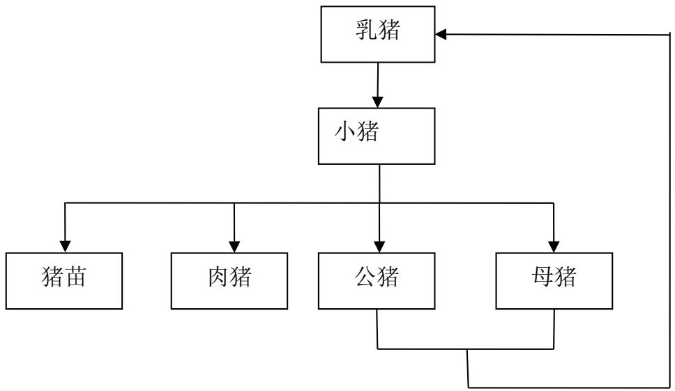
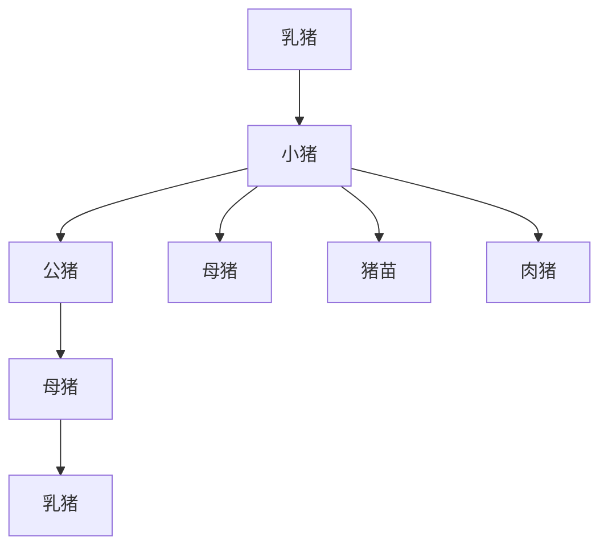
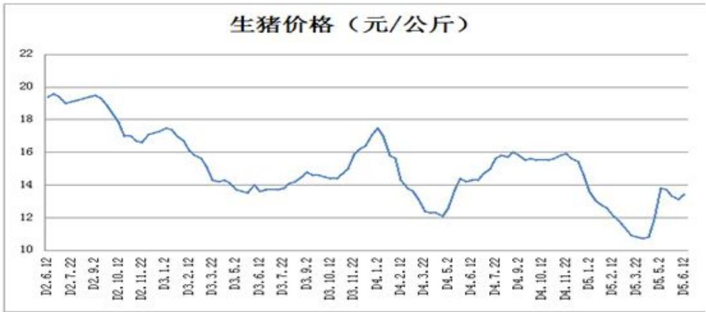
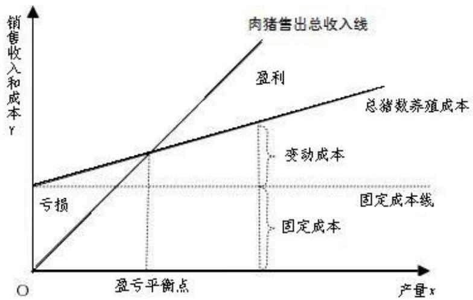
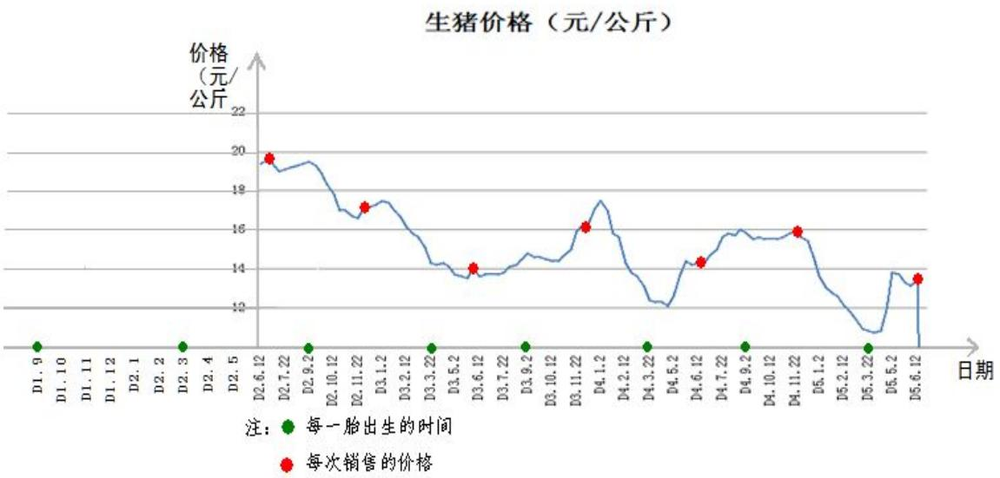
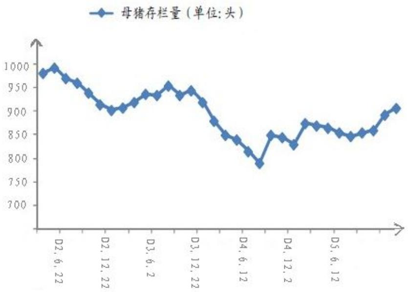
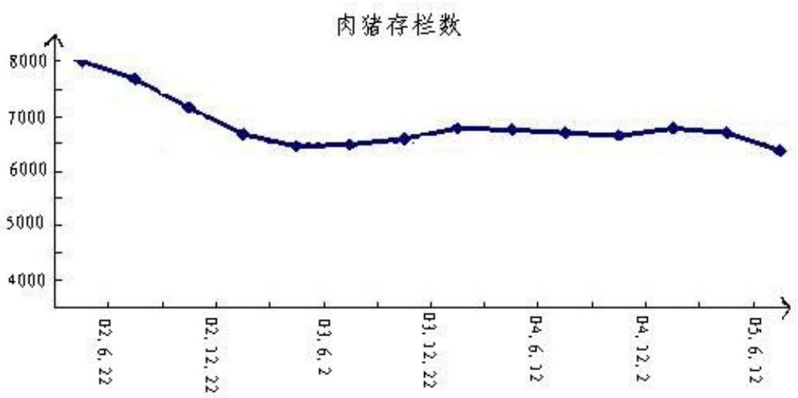

# 2014 高教社杯全国大学生数学建模竞赛

## 承 诺 书

我们仔细阅读了《全国大学生数学建模竞赛章程》和《全国大学生数学建模竞赛参赛规则》（以下简称为“竞赛章程和参赛规则”，可从全国大学生数学建模竞赛网站下载）。

我们完全明白，在竞赛开始后参赛队员不能以任何方式（包括电话、电子邮件、网上咨询等）与队外的任何人（包括指导教师）研究、讨论与赛题有关的问题。

我们知道，抄袭别人的成果是违反竞赛章程和参赛规则的，如果引用别人的成果或其他公开的资料（包括网上查到的资料），必须按照规定的参考文献的表述方式在正文引用处和参考文献中明确列出。

我们郑重承诺，严格遵守竞赛章程和参赛规则，以保证竞赛的公正、公平性。如有违反竞赛章程和参赛规则的行为，我们将受到严肃处理。

我们授权全国大学生数学建模竞赛组委会，可将我们的论文以任何形式进行公开展示（包括进行网上公示，在书籍、期刊和其他媒体进行正式或非正式发表等）。

我们参赛选择的题号是（从A/B/C/D中选择一项填写）： C

我们的报名参赛队号为（8位数字组成的编号）： 19510015

所属学校（请填写完整的全名）：广东科学技术职业学院

参赛队员 (打印并签名) ：1. 杨金洪

2. 洪嘉远

3. 谢思霞

指导教师或指导教师组负责人 (打印并签名)： 李广

（论文纸质版与电子版中的以上信息必须一致，只是电子版中无需签名。以上内容请仔细核对，提交后将不再允许做任何修改。如填写错误，论文可能被取消评奖资格。）

日期： 2014 年 9 月 15 日

赛区评阅编号（由赛区组委会评阅前进行编号）：

# 2014高教社杯全国大学生数学建模竞赛

## 编 号 专 用 页

赛区评阅编号（由赛区组委会评阅前进行编号）：

赛区评阅记录（可供赛区评阅时使用）：

<table><tr><td>评阅人</td><td></td><td></td><td></td><td></td><td></td><td></td><td></td><td></td><td></td><td></td></tr><tr><td>评分</td><td></td><td></td><td></td><td></td><td></td><td></td><td></td><td></td><td></td><td></td></tr><tr><td>备注</td><td></td><td></td><td></td><td></td><td></td><td></td><td></td><td></td><td></td><td></td></tr></table>

全国统一编号（由赛区组委会送交全国前编号）：

全国评阅编号（由全国组委会评阅前进行编号）：

# 生猪养殖场的经营管理

## 【摘要】

随着近几年中国生猪饲养产业的增加，2014 年中国猪肉市场上涌现全国性的供给大于需求的现象，导致生猪市场价格低迷，且饲料价格居高不下、人工成本费用增加，这些因素对农民饲养生猪的主动性有一定影响，因此有必要建立生猪的生产模型来指导养殖户的生产与销售以提高收益。

对于问题一，要求求出当生猪养殖成本及生猪价格保持不变，且不出售猪苗时，小猪全部转为种猪与肉猪，要达到或超过盈亏平衡点时的每头母猪每年平均产仔量。我们利用经济学中盈亏平衡点分析的思想，列出肉猪销售后获得的收入与饲养猪群过程中的饲养成本，并逐步增加考虑的因素以优化模型，最终得出模型Ⅲ：

$$
[ m x - \frac {1}{4} (1 + \frac {1}{2 0}) m ] p - (1 + \frac {1}{2 0}) m c - [ m x - \frac {1}{4} (1 + \frac {1}{2 0}) m ] k _ {a} - \frac {1}{4} (1 + \frac {1}{2 0}) m k _ {b} \geq 0
$$

再通过查找文献资料获得相应参数值，运用Mathematica软件求解出 $x \ge 1 3 . 3 6 9 8$ 即每头母猪每年平均产仔量大于或等于14头时，可以超过盈亏平衡点。

对于问题二，求使得该养殖场养殖规模达到饱和时，小猪选为种猪的比例和母猪的存栏数。利用该养殖场猪群结构的数学关系列出方程求解，其中对于母猪的存栏数还需考虑多每年淘汰的失去生育能力的母猪。最终得出模型 IV：

$$
\begin{array}{l} m + \frac {1}{2 0} m + 9 m = 1 0 0 0 0 + \frac {1}{8} (1 + \frac {1}{2 0}) \mathrm{m} \\ \frac {m \times \frac {1}{8} (1 + \frac {1}{2 0})}{9 m} = a \\ \end{array}
$$

运用 Mathematica软件求解出存栏母猪头数 $m = 1 0 0 8 . 1 9$ 和小猪选为种猪的比例$a = 0 . 0 1 4 5 8$ 。

对于问题三，要求根据该养猪场对未来3 年的生猪价格变化的预测曲线，确定该养猪场的最佳经营策略，求出三年内的平均年利润，并给出在此策略下的母猪及肉猪存栏数曲线。根据题目给定的小猪长成肉猪出栏需要9个月，而母猪一年两胎，得出养殖场一年可以卖7 次猪。比较每次出售猪苗与出售肉猪的获利大小，制定出经营策略。按此经营策略养殖厂在三年内的平均年利润是 8.8402百万元，其相应的母猪及肉猪存栏数曲线见正文。

养猪企业是一个劳动集约型和技术密集型的行业，同时又是一个高风险的行业。它同时具有投资小、建设周期短、技术要求高、社会效益大于经济效益，市场竟争激烈、企业数目多等特点。本文各个问题的模型在建立过程中运用了经济学中的盈亏平衡分析思想，结合生物的自然生长周期考虑影响因素，具有一定的科学性。另外，模型在实际生活中还可以推广运用到其他牲畜的养殖生产。

关键词 生猪养殖成本 盈亏平衡点 经营策略 Mathematica

## 一、问题重述

某养猪场最多能养10000 头猪，该养猪场利用自己的种猪进行繁育。养猪的一般过程是：母猪配种后怀孕约114天产下乳猪，经过哺乳期后乳猪成为小猪。小猪的一部分将被选为种猪（其中公猪母猪的比例因配种方式而异），长大以后承担养猪场的繁殖任务；有时也会将一部分小猪作为猪苗出售以控制养殖规模；而大部分小猪经阉割后养成肉猪出栏（见图1）。母猪的生育期一般为3～5 年，失去生育能力的公猪和母猪将被无害化处理掉。种猪和肉猪每天都要消耗饲料，但种猪的饲料成本更高一些。养殖场根据市场情况通过决定留种数量、配种时间、存栏规模等优化经营策略以提高盈利水平。请收集相关数据，建立数学模型回答以下问题：

flowchart

图 1 猪的繁殖过程

1. 假设生猪养殖成本及生猪价格保持不变，且不出售猪苗，小猪全部转为种猪与肉猪，要达到或超过盈亏平衡点，每头母猪每年平均产仔量要达到多少？  
2. 生育期母猪每头年产 2胎左右，每胎成活9 头左右。求使得该养殖场养殖规模达到饱和时，小猪选为种猪的比例和母猪的存栏数，并结合所收集到的数据给出具体的结果。  
3. 已知从母猪配种到所产的猪仔长成肉猪出栏需要约 9个月时间。假设该养猪场估计9个月后三年内生猪价格变化的预测曲线如图 2 所示，请根据此价格预测确定该养猪场的最佳经营策略，计算这三年内的平均年利润，并给出在此策略下的母猪及肉猪存栏数曲线。

line

| Date | Price (元/公斤) |
| :--- | :--- |
| D2.6.12 | ~19.3 |
| D2.7.22 | ~19.5 |
| D2.9.2 | ~18.9 |
| D2.10.12 | ~19.4 |
| D2.11.22 | ~19.4 |
| D3.1.2 | ~17.0 |
| D3.2.12 | ~16.6 |
| D3.3.22 | ~17.0 |
| D3.5.2 | ~17.4 |
| D3.6.12 | ~16.6 |
| D3.7.22 | ~15.6 |
| D3.9.2 | ~14.3 |
| D3.10.12 | ~14.3 |
| D3.11.22 | ~13.8 |
| D4.1.2 | ~13.5 |
| D4.2.12 | ~13.8 |
| D4.3.22 | ~13.7 |
| D4.5.2 | ~13.7 |
| D4.6.12 | ~14.0 |
| D4.7.22 | ~14.7 |
| D4.9.2 | ~14.5 |
| D4.10.12 | ~14.4 |
| D4.11.22 | ~14.4 |
| D5.1.2 | ~15.0 |
| D5.2.12 | ~16.0 |
| D5.3.22 | ~16.4 |
| D5.5.2 | ~17.4 |
| D5.6.12 | ~15.6 |
| D5.7.22 | ~14.0 |
| D5.8.12 | ~13.5 |
| D5.9.2 | ~12.3 |
| D6.0.12 | ~12.3 |
| D6.1.2 | ~12.0 |
| D6.2.12 | ~14.3 |
| D6.3.22 | ~14.3 |
| D6.4.12 | ~14.3 |
| D6.5.2 | ~14.8 |
| D6.6.12 | ~15.6 |
| D6.7.22 | ~15.8 |
| D6.8.12 | ~15.9 |
| D6.9.2 | ~15.5 |
| D7.0.12 | ~15.5 |
| D7.1.2 | ~15.5 |
| D7.2.12 | ~15.8 |
| D7.3.2 | ~15.4 |
| D7.4.12 | ~13.5 |
| D7.5.2 | ~13.0 |
| D7.6.12 | ~12.5 |
| D7.7.22 | ~12.0 |
| D7.8.12 | ~11.5 |
| D7.9.2 | ~10.8 |
| D8.0.12 | ~10.7 |
| D8.1.2 | ~10.7 |
| D8.2.12 | ~13.8 |
| D8.3.2 | ~13.0 |
| D8.4.12 | ~13.3 |

图 2 三年价格预测曲线

横坐标说明：以开始预测时为第一年，D2表示第二年，依次类推

## 二、问题分析

对于问题 1，由问题知道母猪生产出来的小猪可以转化为种猪和肉猪，而不考虑作为猪苗出售，其中种猪包括公猪和母猪，按一定的配种比例生产下一代，不出售且需要养殖成本；肉猪则可以出售获得收入，本身也需要养殖成本。题目要求求出达到或超出盈亏平衡点时，平均每头母猪的产仔量。根据经济学的定义知该问题求的是：当肉猪出售获得的收入恰好抵消掉所有养殖成本时的每头母猪产仔量。针对此，我们逐步增加考虑的因素优化建立的模型，最终得出模型III。又由于模型的求解涉及一些经验数据（参数），如种猪养殖成本、肉猪养殖成本等，我们通过相应的具有一定权威性的网站查得数据。

对于问题 2，是求当养殖场养殖规模达到 10000头时的小猪选为种猪的比例和母猪的存栏数。可以假定养殖场已经达到饱和，且后继续维持在养猪场的猪头数为 10000头这一平衡点，并考虑母猪的淘汰率，则可分析养殖场的猪群结构：母猪、公猪、猪仔和被淘汰的母猪数之间的数学关系，构造出数学模型。

对于问题 3，要求根据该养猪场对未来3 年的生猪价格变化的预测曲线，确定该养猪场的最佳经营策略，求出三年内的平均年利润，并给出在此策略下的母猪及肉猪存栏数曲线。根据题目给定的猪仔长成肉猪出栏需要9个月，而母猪一年两胎，得出养殖场一年可以卖7 次猪。从题目提供的猪群结构图可以知道每一次卖的猪可以是肉猪，也可以是猪苗，且每一次销售获得的收入还要扣除养殖成熟种猪的成本、养殖肉猪的成本（如果小猪全作为猪苗出售，则不考虑肉猪成本）。在这样的分析基础上，来确定每一胎产下的小猪是留为肉猪还是作为猪苗出售，作为经营策略的依据。在根据猪群结构的数学关系，确定出母猪及肉猪在每一胎过后的数目，做出曲线图。

## 三、模型的假设

为简化模型的建立，我们做出如下假设：

【1】假设公猪与母猪的饲料成本相等；  
【2】假设所有种猪短期内的饲养成本都是一样；

【3】假设所有肉猪都能出售，短期内出售价格一样；  
【4】假设所有出售的肉猪重量一样且养殖成本一样；  
【5】假设在相关范围内，猪数量是影响收入和成本的唯一因素；  
【6】假设在相关范围内，收入和总成本与产量的关系都是线性的；  
【7】假设在养殖种猪与肉猪的过程中，不存在猪苗死亡或丢失的问题；  
【8】假设所有种猪都是以本交配种，公猪：母猪为1：20的配比进行交配；

注：在各个模型的建立中，我们会补充具体假设

四、符号的说明

<table><tr><td>符号</td><td>说明</td><td>单位</td></tr><tr><td>P</td><td>每头肉猪出售价</td><td>元/头</td></tr><tr><td> $p_i$ </td><td>第I次出售肉猪时的生猪肉价</td><td>元/kg</td></tr><tr><td>X</td><td>每头母猪每年平均产仔量</td><td>头</td></tr><tr><td>W</td><td>所有的猪的养殖总成本</td><td>元</td></tr><tr><td>Q</td><td>所有肉猪销售出去的收入</td><td>元</td></tr><tr><td> $k_a$ </td><td>为肉猪养殖过程中的成本</td><td>元</td></tr><tr><td> $k_b$ </td><td>为种猪养殖过程中的成本</td><td>元</td></tr><tr><td>c</td><td>每头母猪养殖成本</td><td>元</td></tr><tr><td>m</td><td>成年母猪的头数</td><td>头</td></tr><tr><td>a</td><td>为小猪选为种猪的比例</td><td></td></tr><tr><td>L</td><td>为母猪的存栏数</td><td>头</td></tr><tr><td> $R_i$ </td><td>每一次售猪的利润</td><td>元</td></tr><tr><td> $\bar{R}$ </td><td>三年内的年平均利润</td><td>元</td></tr></table>

## 五、数据的援引与说明

1、对于肉猪的养殖成本1503.6元，我们是在参考了北京市农业科学院农业经济与发展研究所发表的文章《2011年7月生猪养殖成本收益分析》[1]里的生猪养殖总成本1450.79 元的基础上，结合国内物价上涨的经济现象，采用了中国养猪网《生猪价格汇总:2014下半年生猪出售价格及养殖成本方向估量》[2]里的2014 年上半年平均每头出栏生猪主产品产值1503.6元的结论。由于种猪的饲料成本比肉猪的饲料成本更高一些，由经验数据得种猪饲料成本1600 元。

2、对与本交配种的比例1：20，是在参照了辽宁省畜牧兽医局[3]的《猪人工授精和本交配种的效果调查》中本交配种公猪每头每年只能担负25—30头母猪的配种任务的结论基础上，结合专业养猪网站[4}得出商品猪养殖场以本交 1:20來計算。  
3、每头肉猪以240斤出售，每斤以市场价 7.5元/斤计算，每头肉猪 1800元。  
4、中小型猪场以一头母猪年产 20头小猪的保守估计来计算成本，一头母猪年消耗饲料1100 千克，母猪养殖成本主要为妊娠母猪饲料和哺乳母猪饲料，平均一下价格为：2.56元/千克，所以，一头母猪年饲料成本：1100×2.56=2816元，加上药物免疫和人工成本 484元，则一共为3300 元[5]。  
5、后备母猪中地方品种的初配年龄是在6\~8 月龄，这是在参照了《上海畜牧兽医通讯》[6]里的文献和中国养猪网的资料得出的。从长期考虑，后备母猪与成熟母猪的配种时间取平均是在6 月龄。  
6、在援引 4中的文献还可以得出猪苗价格455.1元。

表 1 参数与其数值表

<table><tr><td>描述</td><td>参考数据</td><td>备注</td></tr><tr><td>肉猪的养殖成本</td><td>1503.5元</td><td></td></tr><tr><td>本交配种的比例</td><td>1:20</td><td>公猪:母猪</td></tr><tr><td>每头肉猪的出售价格</td><td>1800元</td><td>每头肉猪以240斤出售,每斤以市场价7.5计算</td></tr><tr><td>一头母猪年饲料成本</td><td>3300元</td><td></td></tr><tr><td>后备母猪的初配年龄</td><td>6月龄</td><td></td></tr><tr><td>猪苗价格</td><td>455.1元</td><td></td></tr><tr><td>种猪饲料价格</td><td>1600元</td><td></td></tr></table>

## 六、模型的建立与求解

## 6.1 问题 1的模型

## 6.11 模型Ⅰ的建立与求解

根据相关资料知：盈亏平衡点是指全部销售收入等于全部成本时（销售收入线与总成本线的交点）的产量。从图3可以看出当产量大于盈亏平衡点时，肉猪售出总收入线对应的y 值高于总猪数养殖成本线对应的y值，也就是大于该平衡点后，养猪户能保证获利。

由盈亏平衡点的定义可知盈亏平衡点的出栏数，按照一般情况下的公式满足：

总收入=总成本

而：

$$
\text {总收入} = \text {商品猪销售头数} \times \text {商品猪出栏单价}
$$

即：

总成本=商品猪销售头数×单位商品猪养殖成本+种猪的饲养成本×种猪头数

line

| 项目 | 描述 |
| --- | --- |
| Y轴 | 销售收入和成本 (Y) |
| X轴 | 产量 (x) |
| 线 | 肉猪售出总收入线 |
| 线 | 总猪数养殖成本 |
| 关键点 | 盈亏平衡点 (对应盈亏平衡点) |
| 变动成本 | 指向总猪数养殖成本曲线的变动 |
| 固定成本 | 指向固定成本曲线的固定成本曲线 |
| 备注 | 亏损、固定成本、变动成本 |

图 3 肉猪销售的盈亏平衡点分析图

假设所有小猪都只转化为肉猪，则应考虑肉猪与母猪的养殖成本、肉猪的销售收入。设每头肉猪售价为P，每头母猪每年平均产仔量X,肉猪养殖过程中的成本Ka,每头母猪养殖成本C，则依前述有：

$$
Q = m p x
$$

$$
W = m x k _ {a} + m c
$$

$$
Q - W \geq 0
$$

利用 Mathematica 软件，代入数据求解得 x 11.1336

结果表明，在所有小猪都只转化为肉猪的情况下，当每头母猪每年平均产仔量12头时，可以达到或超过盈亏平衡点。

然而模型1的建立忽略了养殖场中与母猪配比的公猪的养殖成本，所以在改进的模型中必须考虑多公猪的养殖成本。

## 6.12 模型Ⅱ的建立与求解

由数据的援引与说明知，以本交配种方式生产猪仔，公猪与母猪以 1：20的配比进行交配，则在模型I 的基础上有:

$$
Q = m p x
$$

$$
W = m x k _ {a} + m (1 + \frac {1}{2 0}) c
$$

$$
Q - W \geq 0
$$

利用 Mathematica 软件，代入数据求解得 x 11.6903 ,

结果表明，在所有小猪都只转化为肉猪的情况下，当每头母猪每年平均产仔量12头时，可以达到或超过盈亏平衡点。

从数值结果上我们可以看出模型I与模型II的数值相差不大，原因是公猪的饲料成本影响小。事实上模型I与模型II的建立都忽略了养殖场需要留下一定的种猪进行后续的养殖规模发展，且忽略了母猪在经过一定的时间后需要被淘汰，因此这两个模型都不符合实际应用，据此我们引入模型Ⅲ。

## 6.13 模型Ⅲ的建立与求解

我们假定猪场规模不扩大，即每年作为种猪的数目一定，又由问题重述知，母猪的生育期一般为3～5年，失去生育能力的公猪和母猪将被无害化处理掉，我们取其生育期为4年，则平均每年淘汰 1/4的种猪，补进1/4的种猪。

因此有:

$$
\begin{array}{l} Q - W \geq 0 \\ Q = [ m x - \frac {1}{4} (1 + \frac {1}{2 0}) m ] p \\ W = (1 + \frac {1}{2 0}) m c + [ m x - \frac {1}{4} (1 + \frac {1}{2 0}) m ] \mathrm{k} _ {a} + \frac {1}{4} (1 + \frac {1}{2 0}) m k _ {b} \\ \end{array}
$$

其中 $k _ { b }$ 为种猪的饲养成本，代入数据求解得： $x \ge 1 3 . 3 6 9 8$

即当每头母猪每年平均产仔量14 头时，可以达到或超过盈亏平衡点

## 6.2 问题 2的模型

## 6.21 模型IV的建立与求解

结合问题 2和题目陈述，可以知道该养殖场养殖规模达到饱和时的总猪数目是10000头，那么可以理解为当达到饱和时养殖场实现的平衡是每一胎出生后都维持在10000头。根据模型III的分析知平均每年淘汰1/4 的成熟母猪，更新1/4母猪种，等价于母猪不变，同理知公猪也等价于不变。在不考虑猪苗出售的情况下，可知10000 头猪中由母猪、公猪、猪仔组成，而小猪中选为猪种的比例等于成熟猪种更新补进的数目比小猪数，故有：

$$
\begin{array}{l} m + \frac {1}{2 0} m + 1 8 m = 1 0 0 0 0 \\ \frac {m \times \frac {1}{4} (1 + \frac {1}{2 0})}{1 8 m} = a \\ \end{array}
$$

求解上述模型求得 $m = 5 2 4 . 9 3 , a = 0 . 0 1 4 5 8$ ，即存栏母猪 524头，小猪选为种猪的比例是1.46%。事实上模型IV没有考虑到养殖场一年两胎，它可能在第一胎就已经达到饱和值，因此模型建立时的设立周期应为0.5年，另外也没有考虑到母猪生完一胎后需要淘汰的母猪。在这些考虑的前提下，我们修正模型 IV得出模型V。

## 6.22 模型V的建立与求解

因为模型建立时设立的周期为0.5 年则每半年淘汰 $1 / 8$ 。由于肉猪在 $6 ^ { \sim } 1 2$ 月龄即可售出，为简化模型，我们在这一问题上做出下述具体假设：

假设没有猪苗出售；

假设肉猪在每个半年期的时间点上并没有立即售出。

那么我们以半年为计算周期，母猪生一胎9头，即 $9 m$ 。值得注意的是母猪的平均配种时间在6月龄，因此不必考虑母猪数中包括更新的 1/8 后备母猪不满足生育月龄。当第一胎母猪生产后，养殖场达到的猪数总数目扣除掉没有生育能力的母猪数目，就剩下 10000头猪。根据猪群结构的数学关系，我们可以列出下式：

公猪数+母猪数+第一胎的小猪数=10000+淘汰的母猪数

存栏母猪数=m

因此有：

$$
m + \frac {1}{2 0} m + 9 m = 1 0 0 0 0 + \frac {1}{8} (1 + \frac {1}{2 0}) \mathrm{m}
$$

$$
\frac {m \times \frac {1}{8} (1 + \frac {1}{2 0})}{9 m} = a
$$

$$
L = m
$$

运用 Mathematica 软件分别求解出 $m = 1 0 0 8 . 1 9 , a = 0 . 0 1 4 5 8$ ，即存栏母猪数1008头，小猪选为种猪的比例是1.45%。

## 6.3问题 3的模型

## 6.31 模型VI的建立与求解

问题 3中指出从母猪配种到所产的小猪长成肉猪出栏需要约9 个月时间，并给出该养猪场所估计的 9个月后三年内生猪价格变化的预测曲线,对题目所提供预测曲线进行数据转化处理，得出关于三年内每一月份的市场生猪价格表2由此可知每胎从产下到出栏销售需要九个月时间，由问题2 知母猪平均六个月 1胎，则在三年里可以销售7 次，如下图4 与表3所示：

表 2 每一月份的市场生猪价格表

<table><tr><td>日期</td><td>价格(元/公斤)</td><td>日期</td><td>价格(元/公斤)</td><td>日期</td><td>价格(元/公斤)</td><td>日期</td><td>价格(元/公斤)</td></tr><tr><td>D2.6.12</td><td>19.4</td><td>D3.3.12</td><td>15.1</td><td>D3.12.12</td><td>16.4</td><td>D4.9.12</td><td>15.5</td></tr><tr><td>D2.6.22</td><td>19.6</td><td>D3.3.22</td><td>14.3</td><td>D3.12.22</td><td>17.1</td><td>D4.9.22</td><td>15.6</td></tr><tr><td>D2.7.2</td><td>19.4</td><td>D3.4.2</td><td>14.2</td><td>D4.1.2</td><td>17.5</td><td>D4.10.2</td><td>15.5</td></tr><tr><td>D2.7.12</td><td>19</td><td>D3.4.12</td><td>14.3</td><td>D4.1.12</td><td>17</td><td>D4.10.12</td><td>15.5</td></tr><tr><td>D2.7.22</td><td>19.1</td><td>D3.4.22</td><td>14.1</td><td>D4.1.22</td><td>15.8</td><td>D4.10.22</td><td>15.5</td></tr><tr><td>D2.8.2</td><td>19.2</td><td>D3.5.2</td><td>13.7</td><td>D4.2.2</td><td>15.6</td><td>D4.11.2</td><td>15.6</td></tr><tr><td>D2.8.12</td><td>19.3</td><td>D3.5.12</td><td>13.6</td><td>D4.2.12</td><td>14.3</td><td>D4.11.12</td><td>15.8</td></tr><tr><td>D2.8.22</td><td>19.4</td><td>D3.5.22</td><td>13.5</td><td>D4.2.22</td><td>13.8</td><td>D4.11.22</td><td>15.9</td></tr><tr><td>D2.9.2</td><td>19.5</td><td>D3.6.2</td><td>14</td><td>D4.3.2</td><td>13.6</td><td>D4.12.2</td><td>15.6</td></tr><tr><td>D2.9.12</td><td>19.3</td><td>D3.6.12</td><td>13.6</td><td>D4.3.12</td><td>13.1</td><td>D4.12.12</td><td>15.4</td></tr><tr><td>D2. 9. 22</td><td>18. 9</td><td>D3. 6. 22</td><td>13. 7</td><td>D4. 3. 22</td><td>12. 4</td><td>D4. 12. 22</td><td>14. 6</td></tr><tr><td>D2. 10. 2</td><td>18. 3</td><td>D3. 7. 2</td><td>13. 7</td><td>D4. 4. 2</td><td>12. 3</td><td>D5. 1. 2</td><td>13. 6</td></tr><tr><td>D2. 10. 12</td><td>17. 8</td><td>D3. 7. 12</td><td>13. 7</td><td>D4. 4. 12</td><td>12. 3</td><td>D5. 1. 12</td><td>13</td></tr><tr><td>D2. 10. 22</td><td>17</td><td>D3. 7. 22</td><td>13. 8</td><td>D4. 4. 22</td><td>12. 1</td><td>D5. 1. 22</td><td>12. 8</td></tr><tr><td>D2. 11. 2</td><td>17</td><td>D3. 8. 2</td><td>14. 1</td><td>D4. 5. 2</td><td>12. 6</td><td>D5. 2. 2</td><td>12. 6</td></tr><tr><td>D2. 11. 12</td><td>16. 7</td><td>D3. 8. 12</td><td>14. 2</td><td>D4. 5. 12</td><td>13. 7</td><td>D5. 2. 12</td><td>12. 1</td></tr><tr><td>D2. 11. 22</td><td>16. 6</td><td>D3. 8. 22</td><td>14. 5</td><td>D4. 5. 22</td><td>14. 4</td><td>D5. 2. 22</td><td>11. 8</td></tr><tr><td>D2. 12. 2</td><td>17. 1</td><td>D3. 9. 2</td><td>14. 8</td><td>D4. 6. 2</td><td>14. 2</td><td>D5. 3. 2</td><td>11. 4</td></tr><tr><td>D2. 12. 12</td><td>17. 2</td><td>D3. 9. 12</td><td>14. 6</td><td>D4. 6. 12</td><td>14. 3</td><td>D5. 3. 12</td><td>10. 9</td></tr><tr><td>D2. 12. 22</td><td>17. 3</td><td>D3. 9. 22</td><td>14. 6</td><td>D4. 6. 22</td><td>14. 3</td><td>D5. 3. 22</td><td>10. 8</td></tr><tr><td>D3. 1. 2</td><td>17. 5</td><td>D3. 10. 2</td><td>14. 5</td><td>D4. 7. 2</td><td>14. 7</td><td>D5. 4. 2</td><td>10. 7</td></tr><tr><td>D3. 1. 12</td><td>17. 4</td><td>D3. 10. 12</td><td>14. 4</td><td>D4. 7. 12</td><td>15</td><td>D5. 4. 12</td><td>10. 8</td></tr><tr><td>D3. 1. 22</td><td>17</td><td>D3. 10. 22</td><td>14. 4</td><td>D4. 7. 22</td><td>15. 6</td><td>D5. 4. 22</td><td>11. 9</td></tr><tr><td>D3. 2. 2</td><td>16. 7</td><td>D3. 11. 2</td><td>14. 7</td><td>D4. 8. 2</td><td>15. 8</td><td>D5. 5. 2</td><td>13. 8</td></tr><tr><td>D3. 2. 12</td><td>16. 1</td><td>D3. 11. 12</td><td>15</td><td>D4. 8. 12</td><td>15. 7</td><td>D5. 5. 12</td><td>13. 7</td></tr><tr><td>D3. 2. 22</td><td>15. 8</td><td>D3. 11. 22</td><td>15. 9</td><td>D4. 8. 22</td><td>16</td><td>D5. 6. 2</td><td>13. 1</td></tr><tr><td>D3. 3. 2</td><td>15. 6</td><td>D3. 12. 2</td><td>16. 2</td><td>D4. 9. 2</td><td>15. 8</td><td>D5. 6. 12</td><td>13. 4</td></tr></table>

line

| 日期 | 每次销售的价格 (元/公斤) |
| --- | --- |
| D2.6.12 | ~19.6 |
| D2.11.22 | ~17.1 |
| D3.6.12 | ~14.0 |
| D3.11.22 | ~16.1 |
| D4.6.12 | ~14.3 |
| D4.11.22 | ~15.8 |
| D5.6.12 | ~13.5 |

图 4 （绿点表示的每一胎出生的时间，红点表示每次销售的价格）  
表 3 生猪出售时间与对应生猪价格

<table><tr><td>日期</td><td>D2.6.22</td><td>D2.12.22</td><td>D3.6.2</td><td>D3.12.22</td><td>D4.6.12</td><td>D4.12.2</td><td>D5.6.12</td></tr><tr><td>价格(元/公斤)</td><td>19.6</td><td>17.3</td><td>14</td><td>17.1</td><td>14.3</td><td>15.6</td><td>13.4</td></tr></table>

在建立模型过程中，考虑到能使养殖厂获利的主要是肉猪销售的收入，而成本来自于肉猪的养殖成本和成熟种猪的养殖成本。为了便利于本模型的建立，我们作出如下假设：

假设没有猪苗的出售；

假设养殖场规模达到饱和，维持在10000头；

由于该养殖场所做的预测曲线是在3年期，而母猪的生育年限是在 $3 ^ { \sim } 5$ 年，所以不考虑成熟母猪的淘汰，又根据养殖场规模维持在 10000头的假设，结合第二问，我们知成熟母猪头数为1008 头，即每一胎产下的猪仔都不考虑留做种猪。因此肉猪售出获得的收入、养殖猪群过程中的养殖成本、和其销售利润R之间满足下式：

$$
\begin{array}{l} Q - W = R _ {i} \\ Q = 1 2 0 \times P _ {1} \times 9 m \\ W = 9 m \times k _ {a} + m (1 + \frac {1}{2 0}) c \\ \bar {R} = \frac {R _ {1} + R _ {2} + R _ {3} + R _ {4} + R _ {5} + R _ {6} + R _ {7}}{3} \\ \end{array}
$$

代入数据，求得每一次出售的收益，绘制成表4。

表 4 每一次售猪的利润

<table><tr><td></td><td>R1</td><td>R2</td><td>R3</td><td>R4</td><td>R5</td><td>R6</td><td>R7</td><td>ΣR</td><td> $\overline{R}$ </td></tr><tr><td>利润(百万)</td><td>5.077</td><td>2.570</td><td>-1.350</td><td>2.360</td><td>-0.693</td><td>0.723</td><td>-1.672</td><td>7.018</td><td>2.339</td></tr></table>

## 6.32 模型 VI 的优化

由表 4看出，第3次、第5次、第7次销售肉猪后都是亏损，那么是不是每一次的单位肉猪销售后获得的利润都高于单位猪苗销售后获得的利润，对此，分别求出每一次销售时两者的数值，选取猪苗获得的利润高于肉猪获得的利润时的次数，绘制成表5。具体求法如下（依照问题一，每只猪以240 斤，即120公斤计算）：

单位猪价\*每只肉猪重量-肉猪养殖成本=肉猪销售利润

代入参数肉猪养殖成本 1503.6a k  ，将求得数据绘制成表 4

表 5 单位肉猪与单位猪苗的销售利润对比

<table><tr><td>类型\次数</td><td>R3</td><td>R5</td><td>R6</td><td>R7</td></tr><tr><td>肉猪销售利润</td><td>140.4</td><td>212.4</td><td>368.4</td><td>104.4</td></tr><tr><td>猪苗销售利润</td><td>450</td><td>450</td><td>450</td><td>450</td></tr></table>

由上表 4知，如果在第 3次、第5次、第7次出售的是肉猪则会亏损，而在第6次出售的是肉猪则会降低收益而不会亏损。据此，在前面的经营策略上我们做出调整，使养殖场在第3次、第5次、第6次、第7 次时只将母猪产下的猪仔作为猪苗出售，而不留做肉猪，计算求得的数据如表6。

表 6 每一次售猪的利润

<table><tr><td></td><td>R1</td><td>R2</td><td>R3</td><td>R4</td><td>R5</td><td>R6</td><td>R7</td><td> $\Sigma R$ </td><td> $\overline{R}$ </td></tr><tr><td>利润(百万)</td><td>5.077</td><td>2.570</td><td>4.128</td><td>2.360</td><td>4.128</td><td>0.723</td><td>4.128</td><td>26.52</td><td>8.840</td></tr></table>

即最终总收入26.52百万，这三年内的平均年利润为 8.840百万。其经营策略为：

第一次在D2.6.22时出售肉猪；

第二次在D2.12.22时出售肉猪；

第三次在D3.6.2时出售猪苗；

第四次在D3.12.22出售肉猪；

第五次在D4.6.12出售猪苗；

第六次在D4.12.12出售猪苗；

第七次在D5.6.12出售肉猪。

在此策略下，根据生猪价格变化曲线可得，母猪存栏数曲线如图5，肉猪存栏数曲线如图6所示

line

| Category | 母猪存栏量 (头) |
| --- | --- |
| D2, 6, 22 | ~980 |
| D2, 6, 22 | ~1000 |
| D2, 6, 22 | ~970 |
| D2, 6, 22 | ~960 |
| D2, 6, 22 | ~940 |
| D2, 6, 22 | ~915 |
| D2, 6, 22 | ~900 |
| D3, 6, 2 | ~910 |
| D3, 6, 2 | ~920 |
| D3, 6, 2 | ~935 |
| D3, 6, 2 | ~935 |
| D3, 6, 2 | ~955 |
| D3, 6, 2 | ~935 |
| D3, 6, 2 | ~945 |
| D3, 6, 2 | ~920 |
| D4, 6, 12 | ~880 |
| D4, 6, 12 | ~850 |
| D4, 6, 12 | ~840 |
| D4, 6, 12 | ~815 |
| D4, 6, 12 | ~790 |
| D4, 6, 12 | ~850 |
| D4, 6, 12 | ~845 |
| D4, 6, 12 | ~830 |
| D5, 6, 12 | ~875 |
| D5, 6, 12 | ~870 |
| D5, 6, 12 | ~865 |
| D5, 6, 12 | ~855 |
| D5, 6, 12 | ~845 |
| D5, 6, 12 | ~855 |
| D5, 6, 12 | ~860 |
| D5, 6, 12 | ~890 |
| D5, 6, 12 | ~910 |

图 5 母猪存栏数曲线图  

line

| Date | 存栏数 |
| --- | --- |
| 02.6.22 | ~8000 |
| 02.12.22 | ~7700 |
| 03.6.2 | ~7200 |
| 03.12.22 | ~6700 |
| 04.6.12 | ~6500 |
| 04.12.2 | ~6500 |
| 05.6.12 | ~6600 |
| 05.12.12 | ~6800 |
| 06.6.12 | ~6800 |
| 07.12.12 | ~6700 |
| 08.6.12 | ~6800 |
| 09.12.12 | ~6700 |
| 10.6.12 | ~6400 |

图 6 肉猪存栏数曲线图

事实上，作为养猪企业投资决策中的投资经济分析，是建立在分析人员对未来事件所作的预测与判断的基础之上的。由于影响方案经济效果的政治、经济形势，外部环境条件，技术发展情况等因素的未来的变化带有不确定性，加上预测方法和工作条件的局限性，对养猪企业投资方案经济效果评价中使用的投资、成本、饲养头数或销售价格等基础数据的估算与预测结果不可避免地会有误差，这就使得方案经济效果的实际值可能偏离其预期值，从而给投资者和经营者带来风险。例如，投资超支，生产能力达不到设计要求，饲料价格上涨，人工费增加等都可能使一个养猪投资项目达不到预期的经济效果，甚至发生亏损。因此在题目给出的信息太少的前提下，本问中制定的经营策略的收益距离实际收益有所出入。

## 七、模型的评估与推广

盈亏平衡分析是一种无论在理论上还是实践上都极有价值的模型。由于盈亏平衡分析的基础模型需要一系列的假设条件，而在现实的养猪企业生产经营中这些条件很难达到，所以建立更为复杂及考虑全面的数学模型，而本论文的模型建立无论从深度广度都还是不够的，由于篇幅所限本文所作的仅仅是一些较粗略的探讨，文中的不足及有待深入研究的方面还有很多。下面是对本文所建的模型的一个简单评估与推广。

## 7.1 模型的优点

1、论文的各个模型基于一定的经济学理论建立，比如问题1模型的建立是在盈亏平衡点分析的理论知识上得出的，有其科学基础  
2、本论文建立的各个模型中援引到的数据以及知识，都是通过查找大量文献资料，结合权威数据与养殖户的经验数据得出的，有一定可靠性。  
3、模型的建立思路简洁，适用于猪场养殖户在实际生产生活中的运用，以便于通过控制猪群结构影响肉猪数量与猪苗数量，使得经济效益最大化。

## 7.2 模型的缺点

1、模型在建立的过程中所做的一些假设在实际生产运用中，并不能忽略。  
2、问题 3模型建立时，没有考虑到养殖场总猪数目不一定一直维持在10000，而应该是随着市场价格而调整总猪数。  
3、论文引用到的参数数值与实际上的计算结果往往有出入，因为每个猪场的先进程度和生产水平不一样，生产指标不尽相同，所以在设计现代化猪场计算猪群结构时，应根据自己可能达到的水平，拟定工艺参数，如母猪繁殖周期、窝平产仔数、各个时期的成活率等等。

## 7.3模型的推广

本文针对各个问题建立的数学模型架构不单适用于解决生猪养殖场的经营管理时遇到的诸如使养猪户保本的单位母猪平均产仔量，还可运用到相类似的牲畜养殖模型中，其中论文运用到的盈亏平衡点分析思想在实际生产生活中主要有以下几方面的运用：

①根据市场状况制定竟争策略

通过盈亏平衡点销售量的预测，再根据企业实际销售量并结合市场竟争状况使企业可在价格、销售量等方面作出相应的决策。

②选择恰当的营销渠道

企业的销售渠道不同，企业的销售成本和管理成本也不同，产品的定价也不同。通过盈亏平衡点的销售量的计算，并根据企业对潜在市场的广泛分析和研究之后，再结合企业的实际情况，对多种销售渠道进行筛选，最后选出最优方案。

③制定合理的价格决策

根据盈亏平衡点基础模型公式，企业可以评价不同的价格水平对盈亏平衡点所起的各种作用，从而估计到按这些价格计算的高于盈亏平衡点的销售额概率。

④劳动用工决策

企业利用平衡点基础模型通过几种不同的用工形式的成本进行比较，来确定哪种用工形式有得于节约成本。

⑤制定产品决策

在激烈的市场竞争中，企业取消一种产品，就如同新增一种产品一样，是十分重要的，一种失去了吸引力的产品很可能还被继续生产，使产量超过它那小而无利可图的定单的数量，这种产品需要短而费资金的生产周期，还要耗费过多的管理时间，并冻结了可以用到别的更有利的产品上去的资金。如果一种产品按当前的售价，补偿了可变成本，而且正在为补偿固定成本而生产着，那么短期内，虽然没有盈利，也应该继续保留这种产品。

## 八、参考文献

[1] 王祖力，王济民，《中国猪业》，北京市农业科学院农业经济与发展研究所：2011 年 08 期，www.cnki,net,中国知网  
[2] 《生猪价格汇总:2014 下半年生猪出售价格及养殖成本方向估量》，  
出自【中国养猪网】：http://www.zhuwang.cc/zzxjgfx/201409/195281\_2.html  
[3] 辽宁省畜牧兽局  
http://www.cnaho.com/gyfw/syjs/201209/t20120929\_966035.html  
[4] 畜牧人网站，http://www.xumuren.com  
[5] 畜牧人网站,http://www.xumuren.com/article-105597-1.html  
[6] 谷夏先，文章，《母猪初配年龄》，《上海畜牧兽医通讯》1989 年05期，http://wuxizazhi.cnki.net/Search/SYTX198905013.html  
[7] 姜启源，谢金星，叶俊,《数学模型》，高等教育出版社，2011年 1月第 4版。  
[8] 周凯，宋军全，邬学军，《数学建模竞赛入门与提高》，浙江大学出版社，2013 年1月第二次印刷。  
[9] 杨景培，徐仲仁，刘伯宗，《现代养猪技术问答》，广东科技出版社，1999年9月第一次印刷

## 附录

模型一：

$$
\text {Reduce} [ 1 8 0 0 ^ {*} \mathrm{x} - (\mathrm{x} ^ {*} 1 5 0 3. 6 + 3 3 0 0) > = 0, \mathrm{x} ]
$$

模型二（1）：

$$
\text {Reduce} [ 1 8 0 0 ^ {*} \mathrm{x} - (\mathrm{x} ^ {*} 1 5 0 3. 6 + (1 + 1 / 2 0) ^ {*} 3 3 0 0) > = 0, \mathrm{x} ]
$$

模型二（2）：

$$
\begin{array}{r l} \text {Reduce} & [ (\mathrm{x} - \\ & 0. 2 5 (1 + 1 / 2 0)) ^ {*} 1 8 0 0 - ((1 + 1 / 2 0) ^ {*} 3 3 0 0 + (\mathrm{x} - \\ & 0. 2 5 (1 + 1 / 2 0)) ^ {*} 1 5 0 3. 6 + 0. 2 5 ^ {*} (1 + 1 / 2 0) ^ {*} 1 6 0 0) > = 0, \mathrm{x} ] \end{array}
$$