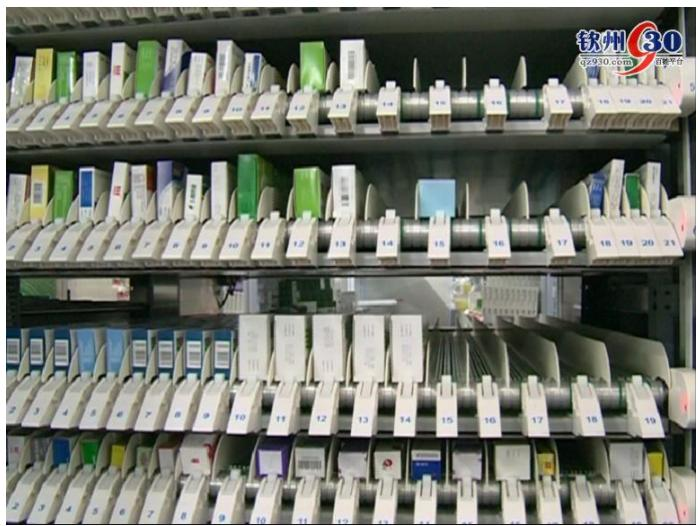
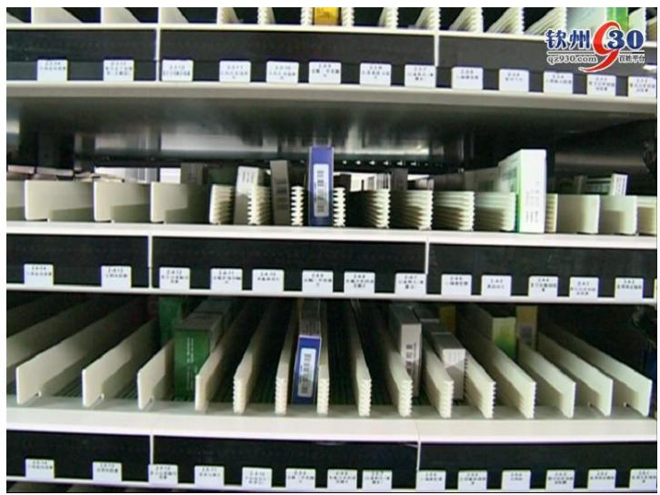
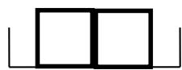
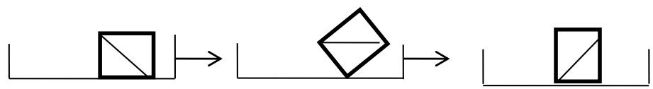
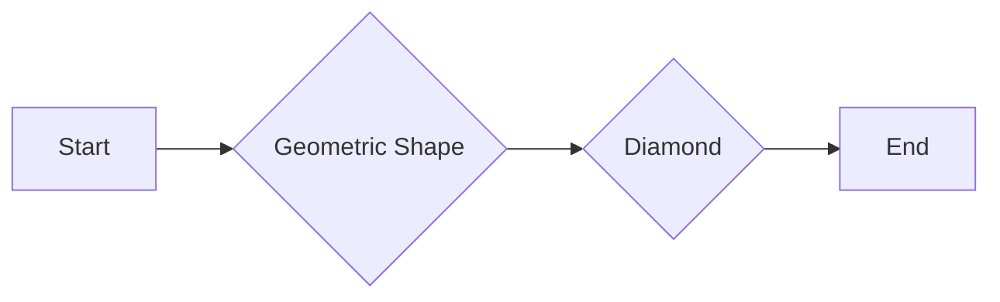
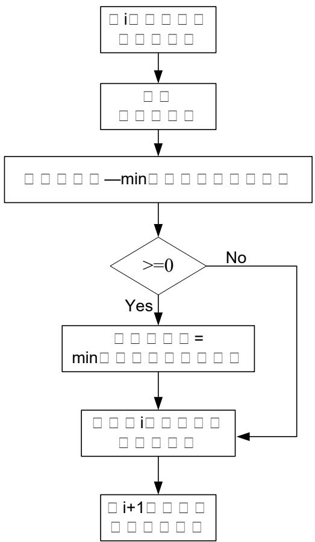
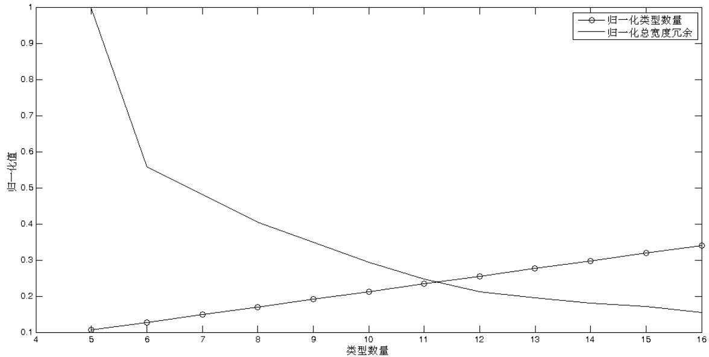
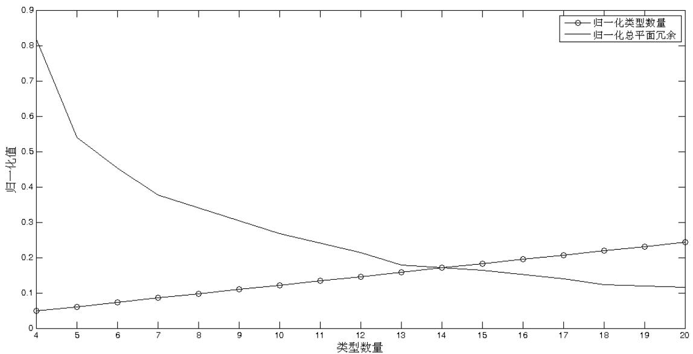
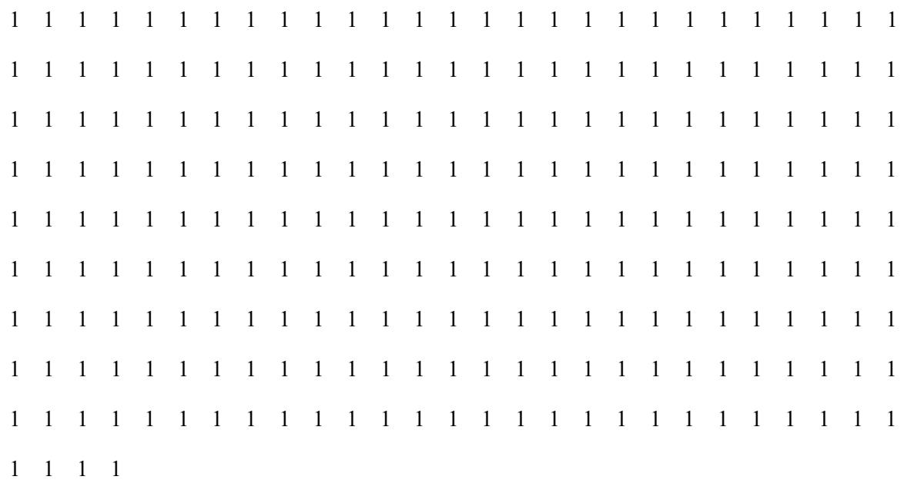

# 2014高教社杯全国大学生数学建模竞赛

## 承 诺 书

我们仔细阅读了《全国大学生数学建模竞赛章程》和《全国大学生数学建模竞赛参赛规则》（以下简称为“竞赛章程和参赛规则”，可从全国大学生数学建模竞赛网站下载）。

我们完全明白，在竞赛开始后参赛队员不能以任何方式（包括电话、电子邮件、网上咨询等）与队外的任何人（包括指导教师）研究、讨论与赛题有关的问题。

我们知道，抄袭别人的成果是违反竞赛章程和参赛规则的，如果引用别人的成果或其他公开的资料（包括网上查到的资料），必须按照规定的参考文献的表述方式在正文引用处和参考文献中明确列出。

我们郑重承诺，严格遵守竞赛章程和参赛规则，以保证竞赛的公正、公平性。如有违反竞赛章程和参赛规则的行为，我们将受到严肃处理。

我们授权全国大学生数学建模竞赛组委会，可将我们的论文以任何形式进行公开展示（包括进行网上公示，在书籍、期刊和其他媒体进行正式或非正式发表等）。

我们参赛选择的题号是（从 A/B/C/D 中选择一项填写）： D

我们的参赛报名号为（如果赛区设置报名号的话）： 19534017

所属学校（请填写完整的全名）： 深圳信息职业技术学院

参赛队员 (打印并签名) ：1. 陈志伟

2. 卢金星

3. 杨崇联

指导教师或指导教师组负责人 (打印并签名)：

（论文纸质版与电子版中的以上信息必须一致，只是电子版中无需签名。以上内容请仔细核对，提交后将不再允许做任何修改。如填写错误，论文可能被取消评奖资格。）

日期： 年 月 日

赛区评阅编号（由赛区组委会评阅前进行编号）：

# 2014高教社杯全国大学生数学建模竞赛

## 编 号 专 用 页

赛区评阅编号（由赛区组委会评阅前进行编号）：

赛区评阅记录（可供赛区评阅时使用）：

<table><tr><td>评阅人</td><td></td><td></td><td></td><td></td><td></td><td></td><td></td><td></td><td></td><td></td></tr><tr><td>评分</td><td></td><td></td><td></td><td></td><td></td><td></td><td></td><td></td><td></td><td></td></tr><tr><td>备注</td><td></td><td></td><td></td><td></td><td></td><td></td><td></td><td></td><td></td><td></td></tr></table>

全国统一编号（由赛区组委会送交全国前编号）：

全国评阅编号（由全国组委会评阅前进行编号）：

# 储药槽的设计

## 一、 摘 要

通过分析储药柜的设计和使用要求，本文对储药柜的结构以及储药槽的规格进行了设计，主要解决了以下几个问题：

1.为避免推送药盒时出现并排重叠、侧翻和水平旋转的情况，分析出储药槽的宽度必须小于其中最小药盒宽度的 2倍，也必须小于其中药盒的最小长宽对角线长度和最小高宽对角线长度；  
2.在考虑应留间隙的前提下，利用 matlab 程序逐步推导，设计出竖向隔板间 距 类 型 （ 即 储 药 槽 宽 度 类 型 ） 最 少 的 方 案 ： 5 种 类 型 分 别 为19mm,31mm,39mm,50mm,60mm；  
3.在类型最少方案的基础上，采用逐步分裂的迭代算法，将可获得大幅宽度冗余降低率的竖向隔板间距类型进行拆分，以增加间距类型并减少总宽度冗余，计算出不同间距类型数量下的总宽度冗余值，并给出合理的竖向隔板间距类型数量为12 种，其对应的宽度分别为 19，22，24，25，28，31，35，39，45，50，55，60（单位 mm）。此外，也给出了每种类型对应的药品编号；  
4.进一步考虑平面冗余，采用逐步分裂的迭代算法，将可获得大幅平面冗余降低率的横向隔板间距类型进行拆分，以增加间距类型并减少总平面冗余，计算出合理的横向隔板间距类型数量为 13种，其对应的宽度分别为42，48，53，63，68，72，76，80，84，88，96，104，129（单位 mm）；  
5.根据药品的需求量计算出每种药品所需的储药槽个数，并利用 matlab 程序实现穷举，给出储药槽在储药柜中的摆放方案，计算出最少需要的储药柜数量为2个。此外，本文方法还能给出具体的摆放情况，即输出每个储药柜中每一排药品的编号及其储药槽数量。

关键词：储药柜，宽度冗余，平面冗余，matlab

## 二、问题重述

目前，自动发药系统正在我国医院推广使用，它主要用来解决现在西药房管理混乱问题，例如药房日处理处方量大，药师工作时间长、取药易出错等。其中，储药柜的作用十分重要，它必须将药品集中摆放，能顺利推送，便于取药和放药。同时，储药柜的体积和数量还不能过多，影响系统的运行和购置成本。基于上述要求，储药柜中的储药槽必须精心设计和使用：为保证药品分拣的准确率，防止发药错误，一个储药槽内只能摆放同一种药品；为保证药品在储药槽内顺利出入，要求药盒与两侧竖向隔板之间、与上下两层横向隔板之间应留 2mm的间隙；药盒在储药槽内推送过程中不会出现并排重叠、侧翻或水平旋转。为了设计出合理的储药柜，必须解决以下几个问题：

1. 在忽略储药槽横向和竖向隔板厚度的前提下，根据所给的药盒规格，设计出竖向隔板间距类型最少的储药柜方案，给出相应类型的数量和每种类型所对应的药盒规格。  
2. 为有效地减少宽度冗余，需适当增加竖向隔板间距类型的数量，但这也会增加储药柜的加工成本，降低储药槽的适应能力。因此，需要设计出合理的竖向隔板间距类型的数量，使总宽度冗余尽可能小，同时类型数量也尽可能少。  
3. 进一步考虑平面冗余的计算，根据前述问题的结果，确定合理的储药柜横向隔板间距的类型数量，使得储药柜的总平面冗余量尽可能地小，且横向隔板间距的类型数量也尽可能地少。  
4. 根据每一种药品编号对应的最大日需求量，计算出每一种药品所需要的储药槽个数，并将所有药品的储药槽摆放到储药柜中以满足药房储药的需求。同时，根据单个储药柜的规格，计算最少需要多少个储药柜。

## 三、 问题的分析

本题的主要问题是设计储药柜的储药槽，使得槽内的药盒能够顺利推送并不会发生并排重叠、侧翻和水平旋转，这需要根据附件所给的药盒规格，设计出符合要求的储药槽宽度和高度。参考在互联网上收索到的自动送药机及其储药柜，如图3.1 和图3.2 所示，可以得出药品在储药槽中一般是侧面摆放，将高和宽的一面朝外，使得所需储药槽的宽度最小。此外，图中所示没有竖向支撑板影响储药槽的放置，这点与题目所给的图不同，本文将参照图 3.1和图3.2 的实际情况求解，忽略竖向支撑板，简化问题。



<details>
<summary>text_image</summary>

钦州 30
qz930.com
抖音平台
</details>

图3.1 自动送药机的储药柜



<details>
<summary>text_image</summary>

锦州 30
q=910.com 京东书店
</details>

图3.2 自动送药机的储药柜

对于问题 1，可采用 matlab 程序从最小宽度规格的药盒开始，分段设置储药槽宽度及其对应的药盒规格，使药槽能装最多的药盒并避免药盒的并排重叠、侧翻和水平旋转。问题 2引入了宽度冗余的概念，宽度冗余会随着储药槽宽度类型增加而降低，随着类型的减少而提高。为了在宽度冗余和类型数量之间寻找合理点，需要计算每种类型数量下的宽度冗余值，并绘制变化曲线，通过曲线寻找合理的类型数量。问题 3 则进一步引入了平面冗余的概念，这需要利用问题 2的结论，在确定所有药品储药槽宽度及其类型的基础上，计算出每种高度类型下的平面冗余值，并寻找合理的类型数量。问题 3的优化目标虽然变为了平面冗余值，但其解题方法与问题 2相似。在问题4 中，需要根据储药柜的规格尺寸，将所有药品所需的储药槽放入储药柜，并确定储药柜的最小数量。由于问题 2和3的目标是使得总平面冗余尽可能小，这与储药槽占储药柜空间尽可能小一致，也即所需储药柜数量少一致。因此，问题 4必须根据药品的需求量计算出每种药品所需的储药槽个数，然后利用问题2和3的结论得到每种药品的储药槽的规格（包括高度和宽度），最后在实用的前提下将储药槽摆放到储药柜中。

## 四、模型的假设

1.假设储药柜的横向和竖向隔板的厚度忽略不计；  
2.假设只考虑药槽的横向和竖向隔板，不考虑储药柜的竖向支撑板；  
3.假设储药柜的横向和竖向隔板不会影响药品的放入和取出；  
4.储药柜药槽的放置参考医院的实际情况，以方便实用为优先；  
5.假设药盒在药槽内移动时不会发生阻塞、挤扁和变形的情况；  
6.假设药盒都为符合长、高、宽描述的方形；  
7.假设药盒在药槽中露出的盒面不会影响药的取出和放入，即药盒在药槽中可以侧放、平放或竖向放置；

## 五、符号定义及说明

<table><tr><td>符号</td><td>含义</td><td>单位</td></tr><tr><td>K_min</td><td>药盒型号的最小宽度</td><td>mm</td></tr><tr><td>K_max</td><td>药盒型号的最大宽度</td><td>mm</td></tr><tr><td>C_K</td><td>药槽的竖向隔板间距类型数量</td><td>种</td></tr><tr><td>C_G</td><td>药槽的横向隔板间距类型数量</td><td>种</td></tr><tr><td>S_j</td><td>第j种储药槽中所有药品的宽度冗余之和</td><td>mm</td></tr><tr><td>W_j</td><td>第j种储药槽的宽度</td><td>mm</td></tr><tr><td>D_i</td><td>编号为i的药盒的宽度</td><td>mm</td></tr><tr><td>h_j</td><td>宽度冗余降低率</td><td></td></tr><tr><td>H</td><td>宽度冗余降低率门限值</td><td></td></tr><tr><td>S_0</td><td>所有竖向隔板间距类型中所有药盒的总宽度冗余</td><td>mm</td></tr><tr><td>G_j</td><td>第j种储药槽中所有药品的高度冗余之和</td><td>mm</td></tr><tr><td>T_j</td><td>第j种储药槽的宽度</td><td>mm</td></tr><tr><td>DT_i</td><td>编号为i的药盒的高度</td><td>mm</td></tr><tr><td>A_0</td><td>总平面冗余</td><td> $mm^2$ </td></tr><tr><td>k_j</td><td>平面冗余降低率</td><td></td></tr><tr><td>P</td><td>平面冗余降低率的门限值</td><td></td></tr><tr><td>n_i</td><td>编号为i的药盒在一个储药槽中数量</td><td>个</td></tr><tr><td>L_i</td><td>编号为i的药盒的长度</td><td>mm</td></tr><tr><td>C_N_i</td><td>编号为i的药盒所需的储药槽个数</td><td>个</td></tr><tr><td>num_i</td><td>编号为i的药品的最大日需求量</td><td>盒</td></tr></table>

## 六、模型的建立与求解

参考实际情况，由于药盒的侧面一般宽度较小，因此选择药盒侧放在储药槽中，露出其高和宽的一面，所需储药槽的宽度较小，可以在一定空间内放更多的药品。在忽略横向和竖向隔板厚度、忽略隔板对放药与取药的影响的前提下，药盒与两侧竖向隔板之间、与上下两层隔板之间应留 2mm 的间隙，则药盒在药槽中至少要比储药槽宽度（即竖向隔板类型）和高度要小 4mm 才能顺利出入。为了使药盒在储药槽内推送时不会出现并排重叠、侧翻和水平旋转的情况，储药槽宽度必须满足一定尺寸要求：

## 1. 并排重叠情况

为防止并排重叠，储药槽宽度应小于2 倍药盒宽度，具体原理如图 6.1所示。假设药盒宽度为 D，储药槽宽度如果不小于 2D，则槽内药盒会发生并排重叠；当储药槽宽度为2D-1 时，就能避免这种情况。

  
图6.1 药盒的并排重叠

## 2. 侧翻情况

为防止侧翻情况，储药槽宽度（即竖向隔板类型）应大于药盒高和宽的对角线，具体原理如图 6.2所示。当储药槽宽度大于药盒型号高和宽的对角线时，药盒就可能发生侧翻。



<details>
<summary>flowchart</summary>


</details>

图6.2 药盒的侧翻

## 3. 水平旋转情况

与防止侧翻的原理相同，为防止水平旋转情况，储药槽宽度应大于药盒长和宽的对角线。

## 6.1 问题 1

分析附件 1 中药盒的规格数据，可得药盒规格的最小宽度为 K\_min=10mm，最大宽度为K\_max=56mm。为了避免并排重叠的情况，储药槽宽度应小于 2倍其中药盒宽度。考虑到与两侧竖向隔板应留2mm 的间隙，储药槽宽度应比其中药盒宽度至少大 4mm。假设此储药槽中所放的药盒的最小宽度为 $ { \mathrm { D } } _ { \mathrm { m i n } }$ ，最大宽度为$\mathrm { D } _ { \mathrm { m a x } }$ ，则储药槽宽度W存在以下关系：

$$
W = 2 * D _ {\min} - 1 \tag {1}
$$

$$
W = D _ {\max} + 4 \tag {2}
$$

为了使储药槽宽度（竖向隔板间距）类型最少，必须使储药槽在满足上述要求的情景下尽量放最多的药盒。因此，可以从最小宽度药盒开始推导，到最大宽度药盒结束，得出以下几种类型：

1.类型 1： $W _ { 1 } = 2 ^ { * } 1 0 \small { - } 1 = 1 9 \mathrm { m m }$ ，所放药盒宽度最大为 $W _ { 1 } { - } 4 { = } 1 5 \mathrm { m m }$ ，即所放药盒宽度的规格为 10mm\~15mm；  
2.类型2：参考类型 1，所放药盒宽度最小应为 16mm，则 $W _ { \gamma } = 2 ^ { * } 1 6 \small { - } 1 = 3 1 \mathrm { m m }$ 所放药盒宽度最大为 $W _ { 2 } - 4 { = } 2 7 \mathrm { m m }$ ，则所放药盒宽度规格为 16mm\~27mm；  
3.类型3：参考类型 2，所放药盒宽度最小应为 28mm，则 $W _ { 3 } = 2 ^ { * } 2 8 – 1 { = } 5 5 \mathrm { m m }$ 所放药盒宽度最大为 $W _ { 3 } { - } 4 { = } 5 1 \mathrm { m m }$ ，则所放药盒宽度规格为 28mm\~51mm；  
4.类型4：参考类型3，所放药盒宽度最小应为52mm，则 $W _ { 4 } = 2 ^ { * } 5 2 \small { - 1 } = 1 0 3 \mathrm { m m }$ 但药盒 K\_max=56mm，即所放药盒宽度最大为 56mm，因此 $W _ { 4 } = 5 6 + 4 = 6 0$ ，所放药盒宽度规格为 52mm\~56mm；

在上述推导过程中，还必须考虑避免侧翻和水平旋转的情况，因此储药槽宽度 还必须与药盒高宽对角线、长宽对角线长度进行对比，具体流程如图 6.3所示，其 matlab 程序见附录 1.1。程序运行后，最后得出共有 5 种竖向隔板类型（储药槽宽度类型），这 5 种竖向隔板类型对应的药盒型号数量和药盒规格如表6.1 所示。

表6.1 竖向隔板间距类型最少时的情况

<table><tr><td>序号</td><td>竖向隔板类型(储药槽宽度 mm)</td><td>对应存放的药盒数量</td><td>规格(mm)</td></tr><tr><td>1</td><td>19</td><td>123</td><td>10~15</td></tr><tr><td>2</td><td>31</td><td>1078</td><td>16~27</td></tr><tr><td>3</td><td>39</td><td>303</td><td>28~35</td></tr><tr><td>4</td><td>50</td><td>297</td><td>36~46</td></tr><tr><td>5</td><td>60</td><td>118</td><td>47~56</td></tr></table>



<details>
<summary>flowchart</summary>

```mermaid
graph TD
  A["i"] --> B[""]
  B --> C["-min"]
  C --> D{">=0"}
  D -->|Yes| E["min ="]
  D -->|No| F["i"]
  E --> F
  F --> G["i+1"]
```
</details>

图 6.3 竖向隔板间距类型最少的计算流程图

## 6.2 问题 2

由于药盒与两侧竖向隔板之间的间隙超出 2mm的部分被视为宽度冗余，则储药槽宽度与所放药盒宽度之差大于 4mm即为此药盒在此储药槽中的宽度冗余。即第j个药槽类型中第 i种药盒的宽度冗余为：

$$
S _ {j i} = W _ {j} - D _ {j i} - 4 \tag {3}
$$

其中 $W _ { j }$ 为第 j 个药槽类型的宽度， $D _ { j i }$ 为其中第 i 种药盒的宽度。因此，可计算得到每种类型储药槽中的总宽度冗余为：

$$
S _ {j} = \sum_ {i} S _ {j i} = \sum_ {i} [ W _ {j} - D _ {j i} - 4 ] \tag {4}
$$

根据问题一的情况，可计算得到问题一中竖向隔板间距类型最少时，每个类型所对应的总宽度冗余及其所占比例，如表6.2所示。其matlab程序见附录1.1。

表 6.2 竖向隔板间距类型最少时的宽度冗余情况

<table><tr><td>储药槽宽度类型(mm)</td><td>存放的药盒数量</td><td>规格(mm)</td><td>冗余(mm)</td><td>冗余比例</td></tr><tr><td>19</td><td>123</td><td>10~15</td><td>95</td><td>0.97%</td></tr><tr><td>31</td><td>1078</td><td>16~27</td><td>6653</td><td>67.96%</td></tr><tr><td>39</td><td>303</td><td>28~35</td><td>1013</td><td>10.35%</td></tr><tr><td>50</td><td>297</td><td>36~46</td><td>1310</td><td>13.38%</td></tr><tr><td>60</td><td>118</td><td>47~56</td><td>718</td><td>7.33%</td></tr></table>

根据优化目标，问题 2可以用模型描述为：

$$
\left\{ \begin{array}{l} \min \sum_ {j} S _ {j} \\ \min \mathrm{C} _ {-} \mathrm{K} \end{array} \right. \tag {5}
$$

其中，C\_K 为药槽的竖向隔板间距类型数量。竖向隔板间距类型最少时，5 种类型的宽度冗余总量为 9789mm。为了减少冗余，必须增加储药槽的类型，即增加竖向隔板间距类型数量。在问题一的基础上，可以选择将每种储药槽的类型拆分为 2 个，即将其对应的药盒规格由 1 段拆分为 2 段，例如 16～27mm 可以均匀拆分为16～21mm和22～27mm两段。根据此原理，将冗余较大的类型进行拆分，具体步骤如下：

1.对于第 j 种类型的储药槽，根据公式（4）计算其中所有药品的宽度冗余为 $S _ { j }$ ；

2.对于所有类型的储药槽，计算总的宽度冗余为

$$
S _ {0} = \sum_ {j} S _ {j}
$$

3.将第 j种类型的储药槽按药品规格拆分为 2段，拆分后的宽度冗余分别为$S _ { j 1 }$ 和 $S _ { j 2 }$ ，设置拆分后的宽度冗余降低率为

$$
h _ {j} = \left\lfloor S _ {j} - (S _ {j 1} + S _ {j 2}) \right\rfloor / S _ {0} \tag {6}
$$

4.当宽度冗余降低率 $h _ { j }$ >H 时，其中 H 为预先设置的阈值，表示拆分所增加的储药槽类型会引起宽度冗余的大幅降低，必须保留此拆分的结果，即增加 1个类型；  
5.当宽度冗余降低率 $h _ { j } < = \mathtt { H }$ 时，表示拆分所增加的储药槽类型仅会引起宽度冗余的小幅降低，不必保留此拆分的结果，即此储药槽类型不变；  
6.按上述步骤，将所有的储药槽类型都进行拆分，最后得到更新后的储药槽类型，其数量的增加会引起总宽度冗余的降低。如果预先设置的阈值 H越小，则拆分出的类型越多，总的宽度冗余越小；H 值设置越大，则拆分出的类型越少，

总的宽度冗余越大。

根据上述方法，可分别设置不同的 H值，获得不同数量的储药槽类型（竖向隔板间距类型），其 matlab程序见附录1.2。经程序处理，可发现由 5种类型增加到 6 种类型时，储药槽类型由（19,31,39,50,60）变为了（19,25，31,39,50,60），这与 31mm 类型储药槽的宽度冗余最大（占总量的 67.96%），必须优先拆分为 2类，会大幅降低宽度冗余的事实相符合。

通过调解阈值 H，增加储药槽宽度类型，可得不同类型数量下的总宽度冗余值如表6.3所示。

表6.3 不同类型数量下的总宽度冗余

<table><tr><td>储药槽宽度类型数量</td><td>总的宽度冗余(mm)</td></tr><tr><td>5</td><td>9789</td></tr><tr><td>6</td><td>5475</td></tr><tr><td>10</td><td>2882</td></tr><tr><td>11</td><td>2417</td></tr><tr><td>12</td><td>2084</td></tr><tr><td>13</td><td>1919</td></tr><tr><td>14</td><td>1771</td></tr><tr><td>15</td><td>1671</td></tr><tr><td>16</td><td>1513</td></tr><tr><td>17</td><td>1362</td></tr><tr><td>20</td><td>1089</td></tr><tr><td>21</td><td>1035</td></tr><tr><td>23</td><td>953</td></tr><tr><td>26</td><td>782</td></tr></table>

将表 6.3中的数据按下式进行归一化处理，将类型数量归一化为：

$$
\text {norm} _ {-} N = \frac {\text {类型数量}}{\text {最多的类型数量}} \tag {7}
$$

其中47 为最多的类型（药盒类型共有 47种）。再将总宽度冗余归一化为：

$$
\text {norm} _ {-} S = \frac {\text {不同类型数量下的总宽度冗余}}{\text {最大的总宽度冗余}} \tag {8}
$$

其中类型数量最少时的总宽度冗余最大，即类型数量为 5时的总宽度冗余 9789。利用上述归一化的数据，画出以下曲线图。

由曲线图可以看出，随着类型数量的增加，总宽度冗余一直在降低，且降低幅度越来越小。两线相交的位置即为合理的竖向隔板间距类型（储药槽宽度类型）

的数量，为12种类型（相交点的类型数量大于 11，即取为12），此时总宽度冗余和类型数量都较小。



<details>
<summary>line</summary>

| 类型数量 | 归一化类型数量 | 归一化总宽度冗余 |
| --- | --- | --- |
| 5 | 0.1 | 1.0 |
| 6 | ~0.13 | ~0.56 |
| 7 | ~0.15 | ~0.48 |
| 8 | ~0.17 | ~0.40 |
| 9 | ~0.19 | ~0.35 |
| 10 | ~0.21 | ~0.29 |
| 11 | ~0.23 | ~0.24 |
| 12 | ~0.25 | ~0.21 |
| 13 | ~0.28 | ~0.19 |
| 14 | ~0.30 | ~0.18 |
| 15 | ~0.32 | ~0.17 |
| 16 | ~0.34 | ~0.15 |
</details>

图 6.4 归一化总宽度冗余和类型数量曲线图

12 种类型为合理的类型数量，其对应的储药槽宽度分别为19，22，24，25，28，31，35，39，45，50，55，60（单位mm）。每种类型所对应的药品编号分别为：

## （1）规格19mm 储药槽：

<table><tr><td>4</td><td>61</td><td>80</td><td>84</td><td>87</td><td>99</td><td>107</td><td>120</td><td>122</td><td>128</td><td>151</td><td>184</td><td>197</td><td>252</td><td>253</td><td>254</td><td>255</td></tr><tr><td>274</td><td>303</td><td>318</td><td>332</td><td>348</td><td>372</td><td>398</td><td>405</td><td>412</td><td>456</td><td>471</td><td>476</td><td>505</td><td>520</td><td>527</td><td>539</td><td></td></tr><tr><td>557</td><td>570</td><td>571</td><td>572</td><td>603</td><td>609</td><td>612</td><td>620</td><td>668</td><td>669</td><td>686</td><td>687</td><td>699</td><td>702</td><td>723</td><td>731</td><td></td></tr><tr><td>774</td><td>775</td><td>828</td><td>834</td><td>872</td><td>875</td><td>881</td><td>909</td><td>923</td><td>928</td><td>934</td><td>962</td><td>975</td><td>1016</td><td>1022</td><td></td><td></td></tr><tr><td>1030</td><td>1032</td><td>1051</td><td>1070</td><td>1071</td><td>1079</td><td>1080</td><td>1081</td><td>1082</td><td>1083</td><td>1092</td><td>1097</td><td>1100</td><td></td><td></td><td></td><td></td></tr><tr><td>1133</td><td>1153</td><td>1169</td><td>1177</td><td>1179</td><td>1200</td><td>1297</td><td>1300</td><td>1307</td><td>1321</td><td>1335</td><td>1336</td><td>1352</td><td></td><td></td><td></td><td></td></tr><tr><td>1367</td><td>1370</td><td>1423</td><td>1449</td><td>1455</td><td>1464</td><td>1465</td><td>1466</td><td>1471</td><td>1482</td><td>1486</td><td>1490</td><td>1519</td><td></td><td></td><td></td><td></td></tr><tr><td>1535</td><td>1540</td><td>1547</td><td>1565</td><td>1591</td><td>1594</td><td>1603</td><td>1604</td><td>1612</td><td>1635</td><td>1751</td><td>1785</td><td>1791</td><td></td><td></td><td></td><td></td></tr><tr><td>1792</td><td>1807</td><td>1815</td><td>1827</td><td>1887</td><td>1908</td><td>1917</td><td></td><td></td><td></td><td></td><td></td><td></td><td></td><td></td><td></td><td></td></tr></table>

## （2）规格22mm 储药槽：

<table><tr><td>18</td><td>25</td><td>34</td><td>48</td><td>50</td><td>57</td><td>62</td><td>67</td><td>70</td><td>91</td><td>93</td><td>97</td><td>111</td><td>112</td><td>116</td><td>117</td><td>123</td><td>130</td></tr><tr><td>133</td><td>140</td><td>141</td><td>145</td><td>168</td><td>169</td><td>177</td><td>185</td><td>196</td><td>198</td><td>199</td><td>209</td><td>230</td><td>233</td><td>236</td><td>240</td><td></td><td></td></tr><tr><td>241</td><td>260</td><td>262</td><td>263</td><td>264</td><td>265</td><td>269</td><td>272</td><td>278</td><td>279</td><td>280</td><td>287</td><td>298</td><td>299</td><td>302</td><td>308</td><td></td><td></td></tr><tr><td>309</td><td>310</td><td>312</td><td>313</td><td>317</td><td>319</td><td>333</td><td>334</td><td>335</td><td>354</td><td>360</td><td>361</td><td>362</td><td>368</td><td>371</td><td>384</td><td></td><td></td></tr><tr><td>392</td><td>396</td><td>406</td><td>424</td><td>434</td><td>453</td><td>454</td><td>461</td><td>472</td><td>485</td><td>490</td><td>512</td><td>513</td><td>515</td><td>518</td><td>521</td><td></td><td></td></tr><tr><td>525</td><td>546</td><td>555</td><td>576</td><td>577</td><td>596</td><td>601</td><td>606</td><td>619</td><td>641</td><td>673</td><td>679</td><td>680</td><td>684</td><td>685</td><td>696</td><td></td><td></td></tr><tr><td>697</td><td>700</td><td>717</td><td>718</td><td>724</td><td>725</td><td>733</td><td>734</td><td>743</td><td>758</td><td>769</td><td>773</td><td>779</td><td>780</td><td>784</td><td>792</td><td></td><td></td></tr><tr><td>794</td><td>797</td><td>798</td><td>801</td><td>806</td><td>821</td><td>826</td><td>832</td><td>833</td><td>835</td><td>840</td><td>848</td><td>851</td><td>853</td><td>855</td><td>857</td><td></td><td></td></tr><tr><td>862</td><td>866</td><td>869</td><td>870</td><td>871</td><td>877</td><td>879</td><td>880</td><td>890</td><td>891</td><td>899</td><td>902</td><td>911</td><td>921</td><td>922</td><td>927</td><td></td><td></td></tr><tr><td>936</td><td>950</td><td>953</td><td>954</td><td>971</td><td>990</td><td>998</td><td>1004</td><td>1012</td><td>1018</td><td>1023</td><td>1049</td><td>1052</td><td>1053</td><td></td><td></td><td></td><td></td></tr></table>

<table><tr><td>1060</td><td>1065</td><td>1069</td><td>1072</td><td>1076</td><td>1085</td><td>1087</td><td>1111</td><td>1132</td><td>1135</td><td>1142</td><td>1152</td><td>1168</td></tr><tr><td>1170</td><td>1171</td><td>1172</td><td>1173</td><td>1175</td><td>1176</td><td>1185</td><td>1187</td><td>1188</td><td>1195</td><td>1198</td><td>1204</td><td>1209</td></tr><tr><td>1212</td><td>1227</td><td>1256</td><td>1258</td><td>1272</td><td>1277</td><td>1278</td><td>1279</td><td>1290</td><td>1291</td><td>1292</td><td>1293</td><td>1296</td></tr><tr><td>1298</td><td>1302</td><td>1318</td><td>1322</td><td>1333</td><td>1343</td><td>1353</td><td>1364</td><td>1369</td><td>1380</td><td>1402</td><td>1409</td><td>1412</td></tr><tr><td>1416</td><td>1424</td><td>1432</td><td>1433</td><td>1439</td><td>1441</td><td>1459</td><td>1460</td><td>1470</td><td>1476</td><td>1480</td><td>1511</td><td>1536</td></tr><tr><td>1537</td><td>1538</td><td>1553</td><td>1566</td><td>1592</td><td>1600</td><td>1610</td><td>1618</td><td>1620</td><td>1627</td><td>1628</td><td>1629</td><td>1631</td></tr><tr><td>1643</td><td>1644</td><td>1652</td><td>1680</td><td>1698</td><td>1702</td><td>1710</td><td>1717</td><td>1737</td><td>1750</td><td>1754</td><td>1771</td><td>1781</td></tr><tr><td>1797</td><td>1830</td><td>1868</td><td>1891</td><td>1894</td><td>1918</td><td></td><td></td><td></td><td></td><td></td><td></td><td></td></tr></table>

（3）规格24mm储药槽：

<table><tr><td>2</td><td>6</td><td>8</td><td>9</td><td>21</td><td>23</td><td>24</td><td>26</td><td>27</td><td>31</td><td>32</td><td>38</td><td>40</td><td>42</td><td>52</td><td>68</td><td>71</td><td>75</td><td>78</td><td>79</td><td>103</td></tr><tr><td>108</td><td></td><td>113</td><td>115</td><td>118</td><td>121</td><td>125</td><td>126</td><td>131</td><td>132</td><td>135</td><td>136</td><td>147</td><td>163</td><td>165</td><td>186</td><td>203</td><td></td><td></td><td></td><td></td></tr><tr><td>205</td><td></td><td>210</td><td>214</td><td>215</td><td>216</td><td>217</td><td>221</td><td>225</td><td>226</td><td>228</td><td>244</td><td>268</td><td>270</td><td>275</td><td>277</td><td>283</td><td></td><td></td><td></td><td></td></tr><tr><td>285</td><td></td><td>288</td><td>292</td><td>304</td><td>320</td><td>324</td><td>325</td><td>336</td><td>340</td><td>342</td><td>344</td><td>345</td><td>347</td><td>351</td><td>357</td><td>363</td><td></td><td></td><td></td><td></td></tr><tr><td>366</td><td></td><td>390</td><td>394</td><td>401</td><td>402</td><td>413</td><td>420</td><td>425</td><td>426</td><td>428</td><td>436</td><td>439</td><td>440</td><td>449</td><td>464</td><td>473</td><td></td><td></td><td></td><td></td></tr><tr><td>494</td><td></td><td>496</td><td>507</td><td>516</td><td>517</td><td>523</td><td>526</td><td>530</td><td>538</td><td>542</td><td>543</td><td>548</td><td>552</td><td>569</td><td>593</td><td>595</td><td></td><td></td><td></td><td></td></tr><tr><td>607</td><td></td><td>617</td><td>624</td><td>631</td><td>633</td><td>637</td><td>638</td><td>647</td><td>650</td><td>662</td><td>665</td><td>674</td><td>683</td><td>691</td><td>692</td><td>693</td><td></td><td></td><td></td><td></td></tr><tr><td>694</td><td></td><td>695</td><td>698</td><td>704</td><td>707</td><td>712</td><td>713</td><td>714</td><td>735</td><td>737</td><td>742</td><td>745</td><td>753</td><td>761</td><td>765</td><td>766</td><td></td><td></td><td></td><td></td></tr><tr><td>770</td><td></td><td>771</td><td>786</td><td>787</td><td>788</td><td>790</td><td>791</td><td>815</td><td>816</td><td>823</td><td>831</td><td>838</td><td>846</td><td>849</td><td>852</td><td>861</td><td></td><td></td><td></td><td></td></tr><tr><td>878</td><td></td><td>886</td><td>910</td><td>912</td><td>913</td><td>942</td><td>943</td><td>967</td><td>969</td><td>977</td><td>987</td><td>999</td><td>1001</td><td>1002</td><td>1009</td><td></td><td></td><td></td><td></td><td></td></tr><tr><td>1019</td><td></td><td>1020</td><td>1027</td><td>1029</td><td>1033</td><td>1036</td><td>1055</td><td>1059</td><td>1062</td><td>1067</td><td>1074</td><td>1088</td><td>1095</td><td></td><td></td><td></td><td></td><td></td><td></td><td></td></tr><tr><td>1099</td><td></td><td>1103</td><td>1104</td><td>1116</td><td>1118</td><td>1119</td><td>1120</td><td>1122</td><td>1123</td><td>1125</td><td>1126</td><td>1131</td><td>1146</td><td></td><td></td><td></td><td></td><td></td><td></td><td></td></tr><tr><td>1149</td><td></td><td>1151</td><td>1156</td><td>1199</td><td>1214</td><td>1217</td><td>1225</td><td>1226</td><td>1241</td><td>1254</td><td>1257</td><td>1260</td><td>1262</td><td></td><td></td><td></td><td></td><td></td><td></td><td></td></tr><tr><td>1263</td><td></td><td>1280</td><td>1281</td><td>1309</td><td>1314</td><td>1315</td><td>1320</td><td>1331</td><td>1332</td><td>1337</td><td>1342</td><td>1355</td><td>1357</td><td></td><td></td><td></td><td></td><td></td><td></td><td></td></tr><tr><td>1360</td><td></td><td>1361</td><td>1372</td><td>1374</td><td>1376</td><td>1377</td><td>1378</td><td>1379</td><td>1383</td><td>1384</td><td>1389</td><td>1391</td><td>1394</td><td></td><td></td><td></td><td></td><td></td><td></td><td></td></tr><tr><td>1397</td><td></td><td>1400</td><td>1401</td><td>1404</td><td>1405</td><td>1406</td><td>1415</td><td>1417</td><td>1418</td><td>1425</td><td>1426</td><td>1428</td><td>1430</td><td></td><td></td><td></td><td></td><td></td><td></td><td></td></tr><tr><td>1437</td><td></td><td>1444</td><td>1450</td><td>1451</td><td>1452</td><td>1453</td><td>1456</td><td>1457</td><td>1458</td><td>1461</td><td>1463</td><td>1472</td><td>1473</td><td></td><td></td><td></td><td></td><td></td><td></td><td></td></tr><tr><td>1477</td><td></td><td>1483</td><td>1491</td><td>1507</td><td>1509</td><td>1510</td><td>1512</td><td>1524</td><td>1525</td><td>1530</td><td>1546</td><td>1550</td><td>1554</td><td></td><td></td><td></td><td></td><td></td><td></td><td></td></tr><tr><td>1556</td><td></td><td>1571</td><td>1573</td><td>1574</td><td>1584</td><td>1590</td><td>1602</td><td>1608</td><td>1614</td><td>1617</td><td>1624</td><td>1626</td><td>1630</td><td></td><td></td><td></td><td></td><td></td><td></td><td></td></tr><tr><td>1632</td><td></td><td>1636</td><td>1637</td><td>1648</td><td>1650</td><td>1651</td><td>1653</td><td>1656</td><td>1661</td><td>1664</td><td>1665</td><td>1699</td><td>1701</td><td></td><td></td><td></td><td></td><td></td><td></td><td></td></tr><tr><td>1703</td><td></td><td>1707</td><td>1711</td><td>1712</td><td>1718</td><td>1719</td><td>1720</td><td>1725</td><td>1729</td><td>1731</td><td>1736</td><td>1738</td><td>1739</td><td></td><td></td><td></td><td></td><td></td><td></td><td></td></tr><tr><td>1741</td><td></td><td>1749</td><td>1758</td><td>1759</td><td>1760</td><td>1768</td><td>1770</td><td>1782</td><td>1783</td><td>1800</td><td>1802</td><td>1803</td><td>1805</td><td></td><td></td><td></td><td></td><td></td><td></td><td></td></tr><tr><td>1828</td><td></td><td>1833</td><td>1836</td><td>1837</td><td>1864</td><td>1865</td><td>1867</td><td>1872</td><td>1883</td><td>1884</td><td>1885</td><td>1890</td><td>1909</td><td></td><td></td><td></td><td></td><td></td><td></td><td></td></tr></table>

（4）规格 25mm 储药槽：

<table><tr><td>3</td><td>5</td><td>33</td><td>51</td><td>58</td><td>63</td><td>77</td><td>88</td><td>104</td><td>105</td><td>110</td><td>124</td><td>137</td><td>164</td><td>166</td><td>192</td><td>195</td><td>219</td></tr><tr><td>237</td><td></td><td>247</td><td>290</td><td>293</td><td>305</td><td>327</td><td>338</td><td>364</td><td>367</td><td>369</td><td>370</td><td>380</td><td>415</td><td>416</td><td>459</td><td>475</td><td></td></tr><tr><td>498</td><td></td><td>502</td><td>524</td><td>537</td><td>540</td><td>541</td><td>544</td><td>549</td><td>551</td><td>564</td><td>582</td><td>605</td><td>610</td><td>625</td><td>632</td><td>661</td><td></td></tr><tr><td>670</td><td></td><td>682</td><td>710</td><td>752</td><td>757</td><td>827</td><td>839</td><td>856</td><td>863</td><td>894</td><td>905</td><td>939</td><td>951</td><td>952</td><td>976</td><td>991</td><td></td></tr><tr><td>1015</td><td></td><td>1031</td><td>1046</td><td>1048</td><td>1061</td><td>1064</td><td>1075</td><td>1094</td><td>1108</td><td>1117</td><td>1174</td><td>1184</td><td>1186</td><td></td><td></td><td></td><td></td></tr><tr><td>1220</td><td></td><td>1222</td><td>1232</td><td>1244</td><td>1259</td><td>1264</td><td>1282</td><td>1295</td><td>1304</td><td>1338</td><td>1354</td><td>1359</td><td>1371</td><td></td><td></td><td></td><td></td></tr><tr><td>1385</td><td></td><td>1393</td><td>1399</td><td>1411</td><td>1474</td><td>1475</td><td>1478</td><td>1484</td><td>1513</td><td>1515</td><td>1520</td><td>1521</td><td>1522</td><td></td><td></td><td></td><td></td></tr><tr><td>1526</td><td></td><td>1527</td><td>1567</td><td>1580</td><td>1593</td><td>1611</td><td>1615</td><td>1623</td><td>1673</td><td>1682</td><td>1684</td><td>1685</td><td>1714</td><td></td><td></td><td></td><td></td></tr><tr><td>1721</td><td></td><td>1723</td><td>1730</td><td>1735</td><td>1744</td><td>1745</td><td>1769</td><td>1775</td><td>1804</td><td>1835</td><td>1879</td><td></td><td></td><td></td><td></td><td></td><td></td></tr></table>

（5）规格28mm 储药槽：

<table><tr><td>1</td><td>19</td><td>30</td><td>35</td><td>44</td><td>66</td><td>73</td><td>94</td><td>98</td><td>100</td><td>101</td><td>119</td><td>179</td><td>193</td><td>222</td><td>248</td><td>250</td><td>271</td></tr></table>

<table><tr><td>284</td><td>314</td><td>326</td><td>337</td><td>352</td><td>353</td><td>358</td><td>377</td><td>378</td><td>379</td><td>386</td><td>407</td><td>408</td><td>414</td><td>478</td><td>506</td></tr><tr><td>510</td><td>528</td><td>550</td><td>580</td><td>583</td><td>616</td><td>618</td><td>652</td><td>653</td><td>664</td><td>675</td><td>681</td><td>705</td><td>706</td><td>715</td><td>716</td></tr><tr><td>721</td><td>722</td><td>726</td><td>727</td><td>728</td><td>729</td><td>730</td><td>751</td><td>754</td><td>762</td><td>764</td><td>767</td><td>768</td><td>778</td><td>781</td><td>793</td></tr><tr><td>795</td><td>796</td><td>802</td><td>813</td><td>829</td><td>864</td><td>876</td><td>917</td><td>949</td><td>1006</td><td>1010</td><td>1021</td><td>1047</td><td>1050</td><td>1066</td><td></td></tr><tr><td>1090</td><td>1109</td><td>1136</td><td>1138</td><td>1155</td><td>1157</td><td>1159</td><td>1161</td><td>1164</td><td>1178</td><td>1180</td><td>1181</td><td>1191</td><td></td><td></td><td></td></tr><tr><td>1207</td><td>1228</td><td>1240</td><td>1247</td><td>1316</td><td>1325</td><td>1330</td><td>1344</td><td>1347</td><td>1363</td><td>1365</td><td>1386</td><td>1413</td><td></td><td></td><td></td></tr><tr><td>1421</td><td>1440</td><td>1445</td><td>1446</td><td>1448</td><td>1462</td><td>1467</td><td>1492</td><td>1497</td><td>1523</td><td>1532</td><td>1533</td><td>1539</td><td></td><td></td><td></td></tr><tr><td>1542</td><td>1548</td><td>1551</td><td>1558</td><td>1561</td><td>1562</td><td>1569</td><td>1575</td><td>1583</td><td>1601</td><td>1625</td><td>1649</td><td>1660</td><td></td><td></td><td></td></tr><tr><td>1666</td><td>1674</td><td>1681</td><td>1686</td><td>1694</td><td>1697</td><td>1708</td><td>1748</td><td>1763</td><td>1764</td><td>1765</td><td>1780</td><td>1789</td><td></td><td></td><td></td></tr><tr><td>1795</td><td>1831</td><td>1875</td><td>1876</td><td>1877</td><td>1880</td><td>1886</td><td>1889</td><td>1896</td><td></td><td></td><td></td><td></td><td></td><td></td><td></td></tr></table>

## （6）规格31mm 储药槽：

<table><tr><td>7</td><td>55</td><td>56</td><td>69</td><td>76</td><td>106</td><td>114</td><td>134</td><td>144</td><td>146</td><td>175</td><td>178</td><td>194</td><td>213</td><td>218</td><td>239</td><td>246</td></tr><tr><td>249</td><td>251</td><td>267</td><td>281</td><td>282</td><td>286</td><td>289</td><td>301</td><td>311</td><td>315</td><td>329</td><td>331</td><td>339</td><td>343</td><td>356</td><td>381</td><td></td></tr><tr><td>393</td><td>427</td><td>435</td><td>451</td><td>460</td><td>469</td><td>483</td><td>486</td><td>489</td><td>493</td><td>503</td><td>522</td><td>531</td><td>532</td><td>533</td><td>534</td><td></td></tr><tr><td>535</td><td>536</td><td>554</td><td>565</td><td>574</td><td>590</td><td>592</td><td>597</td><td>626</td><td>627</td><td>635</td><td>654</td><td>663</td><td>667</td><td>689</td><td>708</td><td></td></tr><tr><td>738</td><td>740</td><td>741</td><td>748</td><td>756</td><td>776</td><td>782</td><td>804</td><td>809</td><td>810</td><td>811</td><td>837</td><td>844</td><td>868</td><td>883</td><td>887</td><td></td></tr><tr><td>926</td><td>946</td><td>961</td><td>978</td><td>980</td><td>992</td><td>993</td><td>1008</td><td>1014</td><td>1024</td><td>1025</td><td>1035</td><td>1037</td><td>1038</td><td></td><td></td><td></td></tr><tr><td>1068</td><td>1139</td><td>1140</td><td>1162</td><td>1163</td><td>1189</td><td>1210</td><td>1216</td><td>1231</td><td>1242</td><td>1243</td><td>1245</td><td>1246</td><td></td><td></td><td></td><td></td></tr><tr><td>1261</td><td>1267</td><td>1268</td><td>1269</td><td>1270</td><td>1308</td><td>1324</td><td>1341</td><td>1356</td><td>1366</td><td>1368</td><td>1375</td><td>1381</td><td></td><td></td><td></td><td></td></tr><tr><td>1387</td><td>1388</td><td>1390</td><td>1392</td><td>1396</td><td>1410</td><td>1431</td><td>1434</td><td>1435</td><td>1436</td><td>1443</td><td>1447</td><td>1479</td><td></td><td></td><td></td><td></td></tr><tr><td>1481</td><td>1487</td><td>1488</td><td>1489</td><td>1493</td><td>1495</td><td>1500</td><td>1501</td><td>1505</td><td>1516</td><td>1528</td><td>1534</td><td>1544</td><td></td><td></td><td></td><td></td></tr><tr><td>1545</td><td>1552</td><td>1570</td><td>1572</td><td>1576</td><td>1577</td><td>1581</td><td>1582</td><td>1587</td><td>1588</td><td>1589</td><td>1598</td><td>1609</td><td></td><td></td><td></td><td></td></tr><tr><td>1633</td><td>1641</td><td>1646</td><td>1654</td><td>1655</td><td>1657</td><td>1658</td><td>1659</td><td>1662</td><td>1663</td><td>1667</td><td>1668</td><td>1669</td><td></td><td></td><td></td><td></td></tr><tr><td>1671</td><td>1679</td><td>1688</td><td>1716</td><td>1726</td><td>1740</td><td>1746</td><td>1747</td><td>1755</td><td>1756</td><td>1761</td><td>1766</td><td>1774</td><td></td><td></td><td></td><td></td></tr><tr><td>1790</td><td>1796</td><td>1798</td><td>1801</td><td>1810</td><td>1812</td><td>1813</td><td>1817</td><td>1819</td><td>1820</td><td>1829</td><td>1870</td><td>1871</td><td></td><td></td><td></td><td></td></tr><tr><td>1874</td><td>1878</td><td>1892</td><td>1893</td><td>1919</td><td></td><td></td><td></td><td></td><td></td><td></td><td></td><td></td><td></td><td></td><td></td><td></td></tr></table>

## （7）规格35mm 储药槽：

<table><tr><td>22</td><td>28</td><td>29</td><td>36</td><td>37</td><td>59</td><td>81</td><td>82</td><td>96</td><td>102</td><td>127</td><td>174</td><td>227</td><td>234</td><td>291</td><td>297</td><td>322</td><td>349</td></tr><tr><td>359</td><td>365</td><td>373</td><td>374</td><td>382</td><td>385</td><td>387</td><td>391</td><td>409</td><td>410</td><td>446</td><td>448</td><td>463</td><td>466</td><td>480</td><td>481</td><td></td><td></td></tr><tr><td>488</td><td>495</td><td>504</td><td>545</td><td>558</td><td>559</td><td>560</td><td>561</td><td>562</td><td>563</td><td>567</td><td>575</td><td>579</td><td>594</td><td>604</td><td>621</td><td></td><td></td></tr><tr><td>644</td><td>651</td><td>656</td><td>676</td><td>677</td><td>732</td><td>746</td><td>777</td><td>783</td><td>812</td><td>841</td><td>850</td><td>874</td><td>882</td><td>892</td><td>919</td><td></td><td></td></tr><tr><td>924</td><td>929</td><td>931</td><td>960</td><td>963</td><td>970</td><td>984</td><td>986</td><td>994</td><td>1005</td><td>1073</td><td>1098</td><td>1112</td><td>1124</td><td>1143</td><td></td><td></td><td></td></tr><tr><td>1147</td><td>1148</td><td>1154</td><td>1193</td><td>1213</td><td>1221</td><td>1235</td><td>1239</td><td>1248</td><td>1252</td><td>1253</td><td>1255</td><td>1271</td><td></td><td></td><td></td><td></td><td></td></tr><tr><td>1276</td><td>1283</td><td>1288</td><td>1289</td><td>1301</td><td>1312</td><td>1313</td><td>1340</td><td>1345</td><td>1358</td><td>1373</td><td>1382</td><td>1407</td><td></td><td></td><td></td><td></td><td></td></tr><tr><td>1414</td><td>1427</td><td>1442</td><td>1454</td><td>1485</td><td>1496</td><td>1498</td><td>1503</td><td>1504</td><td>1506</td><td>1514</td><td>1531</td><td>1555</td><td></td><td></td><td></td><td></td><td></td></tr><tr><td>1563</td><td>1578</td><td>1595</td><td>1607</td><td>1619</td><td>1621</td><td>1622</td><td>1670</td><td>1675</td><td>1676</td><td>1689</td><td>1704</td><td>1705</td><td></td><td></td><td></td><td></td><td></td></tr><tr><td>1706</td><td>1732</td><td>1734</td><td>1752</td><td>1753</td><td>1773</td><td>1776</td><td>1779</td><td>1794</td><td>1806</td><td>1811</td><td>1856</td><td>1858</td><td></td><td></td><td></td><td></td><td></td></tr><tr><td>1859</td><td>1861</td><td>1863</td><td>1866</td><td>1888</td><td>1898</td><td>1900</td><td>1901</td><td>1903</td><td>1904</td><td>1913</td><td>1916</td><td></td><td></td><td></td><td></td><td></td><td></td></tr></table>

## （8）规格39mm 储药槽：

<table><tr><td>10</td><td>11</td><td>12</td><td>13</td><td>14</td><td>15</td><td>16</td><td>17</td><td>39</td><td>60</td><td>74</td><td>85</td><td>139</td><td>149</td><td>156</td><td>157</td><td>160</td><td>171</td></tr><tr><td>176</td><td>188</td><td>212</td><td>256</td><td>257</td><td>258</td><td>259</td><td>261</td><td>295</td><td>323</td><td>328</td><td>403</td><td>447</td><td>468</td><td>474</td><td>482</td><td></td><td></td></tr><tr><td>497</td><td>566</td><td>578</td><td>581</td><td>586</td><td>587</td><td>591</td><td>622</td><td>630</td><td>657</td><td>659</td><td>666</td><td>701</td><td>720</td><td>739</td><td>760</td><td></td><td></td></tr><tr><td>803</td><td>845</td><td>867</td><td>873</td><td>888</td><td>906</td><td>915</td><td>925</td><td>938</td><td>968</td><td>982</td><td>983</td><td>988</td><td>996</td><td>997</td><td>1003</td><td></td><td></td></tr><tr><td>1011</td><td>1013</td><td>1028</td><td>1039</td><td>1040</td><td>1041</td><td>1042</td><td>1043</td><td>1044</td><td>1045</td><td>1089</td><td>1106</td><td>1129</td><td></td><td></td><td></td><td></td><td></td></tr></table>

<table><tr><td>1130</td><td>1150</td><td>1202</td><td>1205</td><td>1208</td><td>1215</td><td>1223</td><td>1224</td><td>1266</td><td>1284</td><td>1285</td><td>1286</td><td>1287</td></tr><tr><td>1326</td><td>1334</td><td>1349</td><td>1350</td><td>1398</td><td>1420</td><td>1422</td><td>1468</td><td>1499</td><td>1517</td><td>1518</td><td>1529</td><td>1541</td></tr><tr><td>1549</td><td>1557</td><td>1585</td><td>1672</td><td>1691</td><td>1692</td><td>1693</td><td>1722</td><td>1727</td><td>1788</td><td>1793</td><td>1814</td><td>1818</td></tr><tr><td>1824</td><td>1825</td><td>1826</td><td>1840</td><td>1841</td><td>1842</td><td>1843</td><td>1844</td><td>1845</td><td>1846</td><td>1847</td><td>1848</td><td>1849</td></tr><tr><td>1850</td><td>1851</td><td>1852</td><td>1853</td><td>1854</td><td>1855</td><td>1860</td><td>1862</td><td>1869</td><td>1882</td><td>1897</td><td>1899</td><td>1910</td></tr><tr><td>1915</td><td></td><td></td><td></td><td></td><td></td><td></td><td></td><td></td><td></td><td></td><td></td><td></td></tr></table>

## （9）规格45mm 储药槽：

<table><tr><td>20</td><td>41</td><td>46</td><td>64</td><td>65</td><td>72</td><td>86</td><td>89</td><td>90</td><td>95</td><td>129</td><td>148</td><td>152</td><td>158</td><td>159</td><td>162</td><td>167</td><td>172</td></tr><tr><td>180</td><td>189</td><td>200</td><td>202</td><td>207</td><td>224</td><td>242</td><td>242</td><td>245</td><td>273</td><td>276</td><td>296</td><td>300</td><td>316</td><td>330</td><td>341</td><td>383</td><td></td></tr><tr><td>397</td><td>421</td><td>423</td><td>429</td><td>430</td><td>452</td><td>462</td><td>465</td><td>470</td><td>500</td><td>568</td><td>584</td><td>585</td><td>588</td><td>589</td><td>598</td><td></td><td></td></tr><tr><td>600</td><td>611</td><td>613</td><td>614</td><td>629</td><td>642</td><td>658</td><td>660</td><td>671</td><td>672</td><td>678</td><td>688</td><td>719</td><td>747</td><td>750</td><td>817</td><td></td><td></td></tr><tr><td>818</td><td>819</td><td>820</td><td>824</td><td>854</td><td>858</td><td>859</td><td>860</td><td>885</td><td>893</td><td>896</td><td>904</td><td>907</td><td>916</td><td>930</td><td>941</td><td></td><td></td></tr><tr><td>957</td><td>958</td><td>964</td><td>966</td><td>979</td><td>981</td><td>985</td><td>989</td><td>1007</td><td>1034</td><td>1056</td><td>1058</td><td>1096</td><td>1102</td><td></td><td></td><td></td><td></td></tr><tr><td>1105</td><td>1113</td><td>1121</td><td>1128</td><td>1158</td><td>1166</td><td>1182</td><td>1183</td><td>1190</td><td>1196</td><td>1201</td><td>1230</td><td>1236</td><td></td><td></td><td></td><td></td><td></td></tr><tr><td>1273</td><td>1294</td><td>1303</td><td>1306</td><td>1323</td><td>1346</td><td>1348</td><td>1351</td><td>1395</td><td>1403</td><td>1429</td><td>1494</td><td>1564</td><td></td><td></td><td></td><td></td><td></td></tr><tr><td>1586</td><td>1647</td><td>1677</td><td>1696</td><td>1700</td><td>1713</td><td>1728</td><td>1733</td><td>1743</td><td>1762</td><td>1767</td><td>1784</td><td>1786</td><td></td><td></td><td></td><td></td><td></td></tr><tr><td>1816</td><td>1821</td><td>1822</td><td>1823</td><td>1834</td><td>1839</td><td>1857</td><td>1905</td><td>1906</td><td>1907</td><td>1911</td><td></td><td></td><td></td><td></td><td></td><td></td><td></td></tr></table>

## （10）规格 50mm 储药槽：

<table><tr><td>45</td><td>53</td><td>83</td><td>92</td><td>109</td><td>138</td><td>142</td><td>150</td><td>154</td><td>155</td><td>161</td><td>170</td><td>173</td><td>181</td><td>191</td><td>201</td><td>204</td></tr><tr><td>206</td><td>208</td><td>211</td><td>220</td><td>229</td><td>235</td><td>238</td><td>266</td><td>307</td><td>321</td><td>375</td><td>376</td><td>389</td><td>399</td><td>400</td><td>417</td><td></td></tr><tr><td>418</td><td>419</td><td>431</td><td>432</td><td>433</td><td>437</td><td>438</td><td>442</td><td>455</td><td>457</td><td>458</td><td>484</td><td>487</td><td>491</td><td>492</td><td>499</td><td></td></tr><tr><td>501</td><td>514</td><td>529</td><td>553</td><td>573</td><td>599</td><td>608</td><td>615</td><td>628</td><td>634</td><td>640</td><td>645</td><td>646</td><td>648</td><td>649</td><td>655</td><td></td></tr><tr><td>703</td><td>749</td><td>755</td><td>759</td><td>772</td><td>785</td><td>789</td><td>799</td><td>800</td><td>805</td><td>814</td><td>822</td><td>825</td><td>836</td><td>842</td><td>847</td><td></td></tr><tr><td>865</td><td>889</td><td>897</td><td>898</td><td>900</td><td>932</td><td>933</td><td>935</td><td>937</td><td>945</td><td>948</td><td>956</td><td>965</td><td>995</td><td>1000</td><td></td><td></td></tr><tr><td>1054</td><td>1057</td><td>1077</td><td>1078</td><td>1084</td><td>1086</td><td>1107</td><td>1114</td><td>1115</td><td>1127</td><td>1137</td><td>1144</td><td>1167</td><td></td><td></td><td></td><td></td></tr><tr><td>1194</td><td>1197</td><td>1203</td><td>1229</td><td>1237</td><td>1249</td><td>1250</td><td>1251</td><td>1274</td><td>1275</td><td>1310</td><td>1317</td><td>1319</td><td></td><td></td><td></td><td></td></tr><tr><td>1329</td><td>1339</td><td>1362</td><td>1438</td><td>1502</td><td>1543</td><td>1559</td><td>1560</td><td>1597</td><td>1599</td><td>1605</td><td>1640</td><td>1678</td><td></td><td></td><td></td><td></td></tr><tr><td>1683</td><td>1690</td><td>1695</td><td>1709</td><td>1715</td><td>1724</td><td>1742</td><td>1778</td><td>1787</td><td>1799</td><td>1808</td><td>1838</td><td>1873</td><td></td><td></td><td></td><td></td></tr><tr><td>1881</td><td>1895</td><td>1912</td><td></td><td></td><td></td><td></td><td></td><td></td><td></td><td></td><td></td><td></td><td></td><td></td><td></td><td></td></tr></table>

## （11）规格 55mm 储药槽：

<table><tr><td>43</td><td>47</td><td>49</td><td>54</td><td>143</td><td>153</td><td>182</td><td>183</td><td>187</td><td>190</td><td>223</td><td>231</td><td>232</td><td>243</td><td>294</td><td>306</td><td>346</td></tr><tr><td>350</td><td>355</td><td>395</td><td>404</td><td>411</td><td>422</td><td>450</td><td>467</td><td>477</td><td>479</td><td>508</td><td>511</td><td>519</td><td>547</td><td>602</td><td>623</td><td></td></tr><tr><td>636</td><td>643</td><td>690</td><td>709</td><td>736</td><td>763</td><td>807</td><td>808</td><td>830</td><td>843</td><td>884</td><td>895</td><td>901</td><td>903</td><td>908</td><td>914</td><td></td></tr><tr><td>918</td><td>920</td><td>944</td><td>955</td><td>959</td><td>973</td><td>974</td><td>1017</td><td>1063</td><td>1091</td><td>1093</td><td>1101</td><td>1141</td><td>1145</td><td></td><td></td><td></td></tr><tr><td>1165</td><td>1192</td><td>1206</td><td>1219</td><td>1233</td><td>1234</td><td>1265</td><td>1299</td><td>1305</td><td>1311</td><td>1327</td><td>1328</td><td>1469</td><td></td><td></td><td></td><td></td></tr><tr><td>1508</td><td>1568</td><td>1579</td><td>1596</td><td>1613</td><td>1616</td><td>1634</td><td>1638</td><td>1645</td><td>1687</td><td>1757</td><td>1772</td><td>1777</td><td></td><td></td><td></td><td></td></tr><tr><td>1809</td><td>1902</td><td>1914</td><td></td><td></td><td></td><td></td><td></td><td></td><td></td><td></td><td></td><td></td><td></td><td></td><td></td><td></td></tr></table>

## （12）规格 60mm 储药槽：

<table><tr><td>388</td><td>441</td><td>443</td><td>444</td><td>445</td><td>509</td><td>556</td><td>639</td><td>711</td><td>744</td><td>940</td><td>947</td><td>972</td><td>1026</td><td>1110</td></tr><tr><td>1134</td><td>1160</td><td>1211</td><td>1218</td><td>1238</td><td>1408</td><td>1419</td><td>1606</td><td>1639</td><td>1642</td><td>1832</td><td></td><td></td><td></td><td></td></tr></table>

## 6.3 问题 3

根据问题一，同理可计算得到横向隔板间距类型最少时为4类（不发生竖向重叠和旋转），高度分别为 53，72，104，129（单位mm），相应的matlab 程序见附录 1.3.1。

由于药盒与两侧横向隔板之间的间隙超出 2mm的部分被视为高度冗余，则储药槽高度（即储药槽横向隔板间距）与所放药盒高度之差大于4mm即为此药盒在此储药槽中的高度冗余。即第 j个药槽类型中第 i种药盒的高度冗余为：

$$
G _ {j i} = T _ {j} - D T _ {j i} - 4 \tag {9}
$$

其中 $T _ { j }$ 为第j个药槽类型的高度， $D T _ { j i }$ 为其中第 i种药盒的高度。因此，可计算得到每种类型储药槽中的总宽度冗余为：

$$
G _ {j} = \sum_ {i} G _ {j i} = \sum_ {i} [ T _ {j} - D T _ {j i} - 4 ] \tag {10}
$$

由于平面冗余定义为高度冗余与宽度冗余的乘积，因此第 j个药槽类型中第i种药盒的平面冗余为：

$$
A _ {j i} = G _ {j i} * S _ {j i} \tag {11}
$$

其中 $S _ { j i }$ 为其宽度冗余，已在问题 2 中确定了每种药盒的储药槽宽度类型，在此可直接计算得到。由此，可计算得到第j个类型储药槽中的总平面冗余为：

$$
A _ {j} = \sum_ {i} A _ {j i} = \sum_ {i} [ G _ {j i} * S _ {j i} ] \tag {12}
$$

根据优化目标，问题 3可以用模型描述为：

$$
\left\{ \begin{array}{l} \min \sum_ {j} A _ {j} \\ \min \mathrm{C} _ {-} \mathrm{G} \end{array} \right. \tag {13}
$$

其中，C\_G为药槽的横向隔板间距类型数量。参照问题2的解题原理，仍然对平面冗余较大的类型进行拆分，具体步骤如下：

1.对于第 j种类型的储药槽，根据公式（12）计算其中所有药品的平面冗余为 $A _ { j }$ ；

2.对于所有类型的储药槽，计算总的平面冗余为

$$
A _ {0} = \sum_ {j} A _ {j}
$$

3.将第 j 种类型的储药槽在高度上（横向隔板间距）按药品规格拆分为 2段，拆分后的平面冗余分别为 $A _ { j 1 }$ 和 $A _ { j 2 }$ ，设置拆分后的平面冗余降低率为

$$
k _ {j} = \left\lfloor A _ {j} - (A _ {j 1} + A _ {j 2}) \right\rfloor / A _ {0} \tag {14}
$$

4.当平面冗余降低率 $k _ { j } \mathrm { > P }$ 时，其中 P 为预先设置的阈值，表示拆分所增加的储药槽类型会引起平面冗余的大幅降低，必须保留此拆分的结果，即增加 1个高度类型（横向隔板间距类型）；  
5.当平面冗余降低率 $h _ { j } \langle = \mathrm { P }$ 时，表示拆分所增加的储药槽类型仅会引起平面冗余的小幅降低，不必保留此拆分的结果，即此储药槽高度类型不变；  
6.按上述步骤，将所有的储药槽类型都进行拆分，最后得到更新后的储药槽类型，其数量的增加会引起总平面冗余的降低。如果预先设置的阈值 P越小，则拆分出的高度类型越多，总的平面冗余越小；P值设置越大，则拆分出的类型越少，总的平面冗余越大。

根据上述方法，可分别设置不同的 P值，获得不同数量的储药槽高度类型（横向隔板间距类型）下的总平面冗余值如表6.4 所示，其matlab程序见附录1.3。

表6.4不同高度类型数量下的总平面冗余

<table><tr><td>横向隔板间距类型数量(储药槽高度类型数量)</td><td>总的平面冗余( $mm^{2}$ )</td></tr><tr><td>4</td><td>25619</td></tr><tr><td>5</td><td>16915</td></tr><tr><td>6</td><td>14171</td></tr><tr><td>7</td><td>11817</td></tr><tr><td>10</td><td>8397</td></tr><tr><td>12</td><td>6721</td></tr><tr><td>13</td><td>5581</td></tr><tr><td>15</td><td>5159</td></tr><tr><td>17</td><td>4394</td></tr><tr><td>18</td><td>3878</td></tr><tr><td>19</td><td>3752</td></tr><tr><td>20</td><td>3638</td></tr></table>



<details>
<summary>line</summary>

| 类型数量 | 归一化类型数量 | 归一化总平面冗余 |
| --- | --- | --- |
| 4 | ~0.05 | ~0.81 |
| 5 | ~0.06 | ~0.54 |
| 6 | ~0.07 | ~0.45 |
| 7 | ~0.08 | ~0.38 |
| 8 | ~0.10 | ~0.34 |
| 9 | ~0.11 | ~0.31 |
| 10 | ~0.12 | ~0.27 |
| 11 | ~0.13 | ~0.24 |
| 12 | ~0.15 | ~0.21 |
| 13 | ~0.16 | ~0.18 |
| 14 | ~0.17 | ~0.17 |
| 15 | ~0.18 | ~0.16 |
| 16 | ~0.20 | ~0.15 |
| 17 | ~0.21 | ~0.14 |
| 18 | ~0.22 | ~0.12 |
| 19 | ~0.23 | ~0.12 |
| 20 | ~0.24 | ~0.12 |
</details>

图 6.5 归一化总宽度冗余和类型数量曲线图

将表 6.4 中的数据按（7）（8）公式进行归一化处理，画出曲线图，如图6.5所示。由曲线图可以看出，随着类型数量的增加，总平面冗余一直在降低，且降低幅度越来越小。两线相交的位置即为合理的竖向隔板间距类型（储药槽宽度类型）的数量，为 13种类型（由于相交点与13、14的平面冗余值都比较接近，取数量最少的，即为13），此时总平面冗余和横向隔板间距的类型数量都较小。13种类型为合理的类型数量，其对应的储药槽高度分别为 42，48，53，63，68，72，76，80，84，88，96，104，129（单位 mm）。

## 6.4 问题 4

根据每一种药品的最大日需求量和储药槽长度（1.5m），在每天仅集中补药一次的情况下，可计算出编号为i 的药盒在一条储药槽中的数量为：

$$
n _ {i} = \text {floor} (1 5 0 0 / L _ {i}) \tag {15}
$$

其中 $L _ { i }$ 编号为i的药盒的长度。则第i种药品所需要的储药槽个数为：

$$
C \_ N _ {i} = \text {ceil} (n u m _ {i} / n _ {i}) \tag {16}
$$

其中 $n u m _ { i }$ 为编号为i的药品的最大日需求量。计算所用的matlab程序见附录1.4，得到每一种药品需要的储药槽个数为（以下数据从编号为 1的药品开始）：

$$
\begin{array}{ccccccccccccccccccccc}2 3 & 1 3 & 1 2 & 8 & 1 0 & 9 & 9 & 5 & 7 & 6 & 6 & 6 & 6 & 6 & 6 & 6 & 6 & 7 & 7 & 6 & 7 & 7 & 5 & 7 & 6 & 7 \\ 5 & 6 & 6 & 6 & 6 & 5 & 5 & 6 & 5 & 5 & 4 & 5 & 4 & 5 & 5 & 3 & 4 & 4 & 5 & 4 & 4 & 4 & 4 & 3 & 4 & 3 & 4 \end{array}
$$

<table><tr><td>3</td><td>3</td><td>4</td><td>4</td><td>4</td><td>3</td><td>3</td><td>2</td><td>2</td><td>3</td><td>4</td><td>4</td><td>2</td><td>4</td><td>3</td><td>4</td><td>4</td><td>3</td><td>3</td><td>2</td><td>4</td><td>4</td><td>3</td><td>4</td><td>4</td><td>3</td><td>3</td></tr><tr><td>3</td><td>4</td><td>2</td><td>2</td><td>3</td><td>2</td><td>1</td><td>4</td><td>3</td><td>3</td><td>2</td><td>3</td><td>2</td><td>3</td><td>3</td><td>3</td><td>3</td><td>3</td><td>3</td><td>2</td><td>3</td><td>3</td><td>3</td><td>3</td><td>3</td><td>3</td><td>2</td></tr><tr><td>3</td><td>3</td><td>3</td><td>3</td><td>3</td><td>2</td><td>3</td><td>3</td><td>3</td><td>2</td><td>3</td><td>2</td><td>3</td><td>2</td><td>3</td><td>2</td><td>3</td><td>3</td><td>2</td><td>2</td><td>2</td><td>3</td><td>2</td><td>3</td><td>2</td><td>2</td><td>2</td></tr><tr><td>3</td><td>2</td><td>2</td><td>3</td><td>2</td><td>2</td><td>2</td><td>2</td><td>2</td><td>2</td><td>2</td><td>2</td><td>2</td><td>2</td><td>1</td><td>1</td><td>2</td><td>2</td><td>2</td><td>2</td><td>2</td><td>2</td><td>1</td><td>1</td><td>1</td><td>1</td><td>1</td></tr><tr><td>2</td><td>1</td><td>2</td><td>2</td><td>2</td><td>2</td><td>1</td><td>2</td><td>2</td><td>1</td><td>1</td><td>2</td><td>2</td><td>2</td><td>2</td><td>2</td><td>2</td><td>1</td><td>2</td><td>1</td><td>1</td><td>2</td><td>1</td><td>2</td><td>2</td><td>2</td><td>2</td></tr><tr><td>2</td><td>2</td><td>2</td><td>1</td><td>2</td><td>2</td><td>2</td><td>2</td><td>2</td><td>2</td><td>2</td><td>2</td><td>2</td><td>1</td><td>1</td><td>2</td><td>1</td><td>2</td><td>1</td><td>2</td><td>2</td><td>2</td><td>2</td><td>1</td><td>2</td><td>1</td><td>1</td></tr><tr><td>1</td><td>1</td><td>1</td><td>1</td><td>1</td><td>1</td><td>1</td><td>2</td><td>1</td><td>2</td><td>2</td><td>2</td><td>1</td><td>2</td><td>1</td><td>2</td><td>1</td><td>1</td><td>2</td><td>1</td><td>1</td><td>2</td><td>2</td><td>2</td><td>2</td><td>1</td><td>2</td></tr><tr><td>1</td><td>1</td><td>2</td><td>1</td><td>2</td><td>2</td><td>2</td><td>1</td><td>2</td><td>2</td><td>1</td><td>2</td><td>2</td><td>2</td><td>2</td><td>2</td><td>2</td><td>2</td><td>1</td><td>2</td><td>1</td><td>1</td><td>1</td><td>1</td><td>1</td><td>1</td><td>2</td></tr><tr><td>2</td><td>2</td><td>2</td><td>2</td><td>1</td><td>2</td><td>2</td><td>1</td><td>2</td><td>2</td><td>2</td><td>2</td><td>2</td><td>2</td><td>2</td><td>2</td><td>1</td><td>1</td><td>1</td><td>1</td><td>1</td><td>2</td><td>1</td><td>2</td><td>1</td><td>1</td><td>1</td></tr><tr><td>2</td><td>1</td><td>1</td><td>2</td><td>1</td><td>2</td><td>2</td><td>2</td><td>2</td><td>2</td><td>1</td><td>1</td><td>1</td><td>1</td><td>2</td><td>1</td><td>2</td><td>1</td><td>1</td><td>2</td><td>1</td><td>2</td><td>1</td><td>1</td><td>1</td><td>1</td><td>1</td></tr><tr><td>1</td><td>1</td><td>2</td><td>1</td><td>1</td><td>1</td><td>2</td><td>1</td><td>1</td><td>1</td><td>1</td><td>1</td><td>1</td><td>1</td><td>1</td><td>1</td><td>1</td><td>1</td><td>1</td><td>1</td><td>1</td><td>1</td><td>1</td><td>1</td><td>1</td><td>1</td><td>1</td></tr><tr><td>1</td><td>2</td><td>2</td><td>1</td><td>1</td><td>1</td><td>1</td><td>1</td><td>1</td><td>1</td><td>1</td><td>1</td><td>1</td><td>1</td><td>1</td><td>1</td><td>1</td><td>1</td><td>1</td><td>1</td><td>1</td><td>1</td><td>1</td><td>1</td><td>1</td><td>1</td><td>1</td></tr><tr><td>1</td><td>1</td><td>1</td><td>1</td><td>1</td><td>1</td><td>1</td><td>1</td><td>1</td><td>1</td><td>1</td><td>1</td><td>1</td><td>1</td><td>1</td><td>1</td><td>1</td><td>1</td><td>1</td><td>1</td><td>1</td><td>1</td><td>1</td><td>1</td><td>1</td><td>1</td><td>1</td></tr><tr><td>1</td><td>1</td><td>1</td><td>1</td><td>1</td><td>1</td><td>1</td><td>1</td><td>1</td><td>1</td><td>1</td><td>1</td><td>1</td><td>1</td><td>1</td><td>1</td><td>1</td><td>1</td><td>1</td><td>1</td><td>1</td><td>1</td><td>1</td><td>1</td><td>0</td><td>1</td><td>1</td></tr><tr><td>1</td><td>1</td><td>1</td><td>1</td><td>1</td><td>1</td><td>1</td><td>1</td><td>1</td><td>1</td><td>1</td><td>1</td><td>1</td><td>1</td><td>1</td><td>1</td><td>1</td><td>1</td><td>1</td><td>1</td><td>1</td><td>1</td><td>1</td><td>1</td><td>1</td><td>1</td><td>1</td></tr><tr><td>1</td><td>1</td><td>1</td><td>1</td><td>1</td><td>1</td><td>1</td><td>1</td><td>1</td><td>1</td><td>1</td><td>1</td><td>1</td><td>1</td><td>1</td><td>1</td><td>1</td><td>1</td><td>0</td><td>1</td><td>1</td><td>1</td><td>1</td><td>1</td><td>1</td><td>1</td><td>1</td></tr><tr><td>1</td><td>1</td><td>1</td><td>1</td><td>1</td><td>1</td><td>1</td><td>1</td><td>1</td><td>1</td><td>1</td><td>1</td><td>1</td><td>1</td><td>1</td><td>1</td><td>1</td><td>1</td><td>1</td><td>1</td><td>1</td><td>1</td><td>1</td><td>1</td><td>1</td><td>1</td><td>1</td></tr><tr><td>1</td><td>1</td><td>1</td><td>1</td><td>1</td><td>1</td><td>1</td><td>1</td><td>1</td><td>1</td><td>1</td><td>1</td><td>0</td><td>1</td><td>1</td><td>1</td><td>1</td><td>1</td><td>1</td><td>1</td><td>1</td><td>1</td><td>1</td><td>1</td><td>1</td><td>1</td><td>1</td></tr></table>

<table><tr><td>1</td><td>1</td><td>1</td><td>1</td><td>1</td><td>1</td><td>1</td><td>1</td><td>1</td><td>1</td><td>1</td><td>1</td><td>1</td><td>1</td><td>1</td><td>1</td><td>1</td><td>1</td><td>1</td><td>1</td><td>1</td><td>1</td></tr><tr><td>1</td><td>1</td><td>1</td><td>1</td><td>1</td><td>1</td><td>1</td><td>1</td><td>1</td><td>1</td><td>1</td><td>1</td><td>1</td><td>1</td><td>1</td><td>1</td><td>1</td><td>1</td><td>1</td><td>1</td><td>1</td><td>1</td></tr><tr><td>1</td><td>1</td><td>1</td><td>1</td><td>1</td><td>1</td><td>1</td><td>1</td><td>1</td><td>1</td><td>1</td><td>1</td><td>1</td><td>1</td><td>1</td><td>1</td><td>1</td><td>1</td><td>1</td><td>1</td><td>1</td><td>1</td></tr><tr><td>1</td><td>1</td><td>1</td><td>0</td><td>1</td><td>1</td><td>1</td><td>1</td><td>1</td><td>1</td><td>1</td><td>1</td><td>1</td><td>1</td><td>1</td><td>1</td><td>1</td><td>1</td><td>1</td><td>1</td><td>1</td><td>1</td></tr><tr><td>1</td><td>1</td><td>1</td><td>1</td><td>1</td><td>1</td><td>1</td><td>1</td><td>1</td><td>1</td><td>1</td><td>1</td><td>1</td><td>1</td><td>1</td><td>1</td><td>1</td><td>1</td><td>1</td><td>1</td><td>1</td><td>1</td></tr><tr><td>1</td><td>1</td><td>1</td><td>1</td><td>1</td><td>1</td><td>1</td><td>0</td><td>1</td><td>1</td><td>1</td><td>1</td><td>1</td><td>1</td><td>1</td><td>1</td><td>1</td><td>1</td><td>1</td><td>1</td><td>1</td><td>1</td></tr><tr><td>1</td><td>1</td><td>1</td><td>1</td><td>1</td><td>1</td><td>1</td><td>1</td><td>1</td><td>1</td><td>1</td><td>1</td><td>1</td><td>1</td><td>1</td><td>1</td><td>1</td><td>1</td><td>1</td><td>1</td><td>1</td><td>1</td></tr><tr><td>1</td><td>1</td><td>1</td><td>1</td><td>1</td><td>1</td><td>1</td><td>1</td><td>1</td><td>1</td><td>1</td><td>0</td><td>1</td><td>1</td><td>1</td><td>1</td><td>1</td><td>1</td><td>1</td><td>1</td><td>1</td><td>1</td></tr><tr><td>1</td><td>1</td><td>1</td><td>1</td><td>1</td><td>1</td><td>1</td><td>1</td><td>1</td><td>1</td><td>1</td><td>1</td><td>1</td><td>1</td><td>1</td><td>1</td><td>1</td><td>1</td><td>1</td><td>1</td><td>1</td><td>1</td></tr><tr><td>1</td><td>1</td><td>1</td><td>1</td><td>1</td><td>1</td><td>1</td><td>1</td><td>1</td><td>1</td><td>1</td><td>1</td><td>1</td><td>1</td><td>1</td><td>0</td><td>1</td><td>1</td><td>1</td><td>1</td><td>1</td><td>1</td></tr><tr><td>1</td><td>1</td><td>1</td><td>1</td><td>1</td><td>1</td><td>1</td><td>1</td><td>1</td><td>1</td><td>1</td><td>1</td><td>1</td><td>1</td><td>1</td><td>1</td><td>1</td><td>1</td><td>1</td><td>1</td><td>1</td><td>1</td></tr><tr><td>1</td><td>1</td><td>1</td><td>1</td><td>1</td><td>1</td><td>1</td><td>1</td><td>1</td><td>1</td><td>1</td><td>1</td><td>1</td><td>1</td><td>1</td><td>1</td><td>1</td><td>1</td><td>1</td><td>0</td><td>1</td><td>1</td></tr><tr><td>1</td><td>1</td><td>1</td><td>1</td><td>1</td><td>1</td><td>1</td><td>1</td><td>1</td><td>1</td><td>1</td><td>1</td><td>1</td><td>1</td><td>1</td><td>1</td><td>1</td><td>1</td><td>1</td><td>1</td><td>1</td><td>1</td></tr><tr><td>1</td><td>1</td><td>1</td><td>1</td><td>1</td><td>1</td><td>1</td><td>1</td><td>1</td><td>1</td><td>1</td><td>1</td><td>1</td><td>1</td><td>1</td><td>1</td><td>1</td><td>1</td><td>1</td><td>1</td><td>1</td><td>1</td></tr><tr><td>2</td><td>1</td><td>1</td><td>1</td><td>1</td><td>1</td><td>1</td><td>1</td><td>1</td><td>1</td><td>1</td><td>1</td><td>1</td><td>1</td><td>1</td><td>1</td><td>1</td><td>1</td><td>1</td><td>1</td><td>1</td><td>1</td></tr><tr><td>2</td><td>1</td><td>1</td><td>1</td><td>1</td><td>1</td><td>1</td><td>1</td><td>1</td><td>1</td><td>1</td><td>1</td><td>1</td><td>1</td><td>1</td><td>1</td><td>1</td><td>1</td><td>1</td><td>1</td><td>1</td><td>1</td></tr></table>



<details>
<summary>text_image</summary>

1 1 1 1 1 1 1 1 1 1 1 1 1 1 1 1 1 1 1 1 1 1 1 1
1 1 1 1 1 1 1 1 1 1 1 1 1 1 1 1 1 1 1 1 1
1 1 1 1 1 1 1 1 1 1 1 1 1 1 1 1 1 1 1 1
1 1 1 1 1 1 1 1 1 1 1 1 1 1 1 1 1 1
1 1 1 1 1 1 1 1 1 1 1 1 1 1 1 1
1 1 1 1 1 1 1 1 1 1 1 1
1 1 1 1 1 1 1 1
1 1 1 1
1 1 1
1
1
1
2
3
4
5
6
7
8
9
0
0
0
0
0
0
0
0
0
0
0
0
0
0
0
0
0
0
0
0
0
0
0
0
0
0
0
0
0
0
0
0
0
0
0
0
0
0
0
0
0
0
0
0
0
0
0
0
0
0
</details>

为满足药房储药的需求，必须将上述每一种药品所需的储药槽放置到储药柜中，每一种药品所需的储药槽数量达到上述数量要求。同时，为方便取药和放药，相同的药品必须摆在同一排作集中摆放（同一横向隔板上），避免放错药品和便于寻找药品。已知储药柜的有效高度为 1500mm，宽度为2500mm，放置储药槽的方案如下：

（1）由于编号越小的药品需求量越大，因此从编号 1 的药品开始摆放，之后再摆编号更大的药品；  
（2）相同编号的药品的储药槽必须在同一行相邻摆放，即摆在同一排上；  
（3）当同一排药槽没有摆满（累计宽度小于 2500mm），则继续摆放同一药槽高度的药品，且这一药品的药槽能完全摆在这一排，否则摆放另一种能满足此要求的药品直至放空；  
（4）当一排摆满时（累计宽度Sum\_K大于等于2500mm），开始摆放新的一排，并从没有摆放的药品中编号最小的开始。累计宽度的计算如下式：

$$
\text {Sum} _ {-} K = \sum_ {i} [ C _ {-} N _ {i} * \mathrm{W} _ {\mathrm{i}} ] \tag {17}
$$

其中 $W _ { i }$ 为同一排中第i 种药对应的储药槽的宽度。

（5）当摆满的排的累计高度大于等于 15mm 时，开始摆放到新的储药柜中，方法同上，直至所有药品的储药槽摆放完毕；  
（ ）每一种药品的储药槽类型在问题 和 中已确定，即储药槽宽度和高

度按照问题2和3 的结果。

按照上述方法，编写 matlab 程序实现穷举，得到储药槽在储药柜中的摆放方案，程序代码见附录1.4，程序可输出每个储药柜中每一排药品的编号及其储药槽数量。最后，可计算得出摆放完所有 1919 种药品的储药槽所需要的储药槽高度为2710mm，最少需要2个储药柜。

## 七、模型的分析

本文提出的方法有效地解决了储药槽的最优化设计问题，可有效减少储药槽宽度与平面冗余的同时，保持较少的类型数量，提高了储药槽的适应能力。尤其是问题中，本文方法对较多需求量的药品优先摆放，将同一种药集中摆放，都可提高医院工作人员的发药效率和药品分拣的准确率。但是，本文提出的方法也存在一些问题，例如 matlab 程序在计算不同类型数量下的冗余值时，有些类型数量的情况无法计算得到，这主要跟算法控制的步长有关系。采用逐步分裂的迭代算法增加类型数量时，得到的冗余值不是相同类型数量下的最小冗余值，有所偏差。此外，本文对问题的求解忽略了横向和竖向隔板的厚度，忽略了储药柜竖向支撑板对储药槽的影响，这些对于实际应用都会导致一些问题，需要在实践中继续改善。

## 参考文献：

[1] 韩中庚，数学建模方法及其应用，北京：高等教育出版社，2005。  
[2] 张斐，药房全自动发药系统，物流技术(装备版)，2013（5）：1-3，2013。  
[3] 曹卫华，郭正编,最优化技术方法及MATLAB 的实现，北京：化学工业出版社2005。  
[4] 阮沈勇,MATLAB 程序设计，北京：电子工业出版社,2004。

## 附录:

附录 1.1 “问题 1”的 MATLAB 程序  
```matlab
load xinghao.txt
N=size(xinghao);
data=zeros(N(1),5);
for i=1:N(1)
    data(i,1)= xinghao(i,1);
    data(i,2)= xinghao(i,2);
    data(i,3)= xinghao(i,3);
    data(i,4)= ceil(sqrt(xinghao(i,2)^2+xinghao(i,3)^2));
    data(i,5)= ceil(sqrt(xinghao(i,1)^2+xinghao(i,3)^2));
end
K_min=min(xinghao(:,3));
K_max=max(xinghao(:,3));
C_min=K_min;
C_K=2*C_min-1;
C_max=C_K-4;

while(C_max<K_max)
    index=[];
    data_temp=[];
    for i=1:N(1)
        if (data(i,3)<=C_max) && (data(i,3)>=C_min)
            index=[index i];
            data_temp=[data_temp;data(i,4:5)];
        end
    end
    DJ=min(min(data_temp());

    if (C_K > DJ)
        C_K=DJ-1;
        C_max=C_K-4;
    else
        index%输出药槽宽度对应的药盒编号
        num=size(index) %输出药槽宽度对应药盒的数量
        C_K %输出药槽宽度
        %计算宽度冗余
        rongyu=0;
        for k=1:num(2)
            if ((C_K-data(index(k),3))>4 )
                rongyu=rongyu+(C_K-data(index(k),3)-4);
            end
        end
```

```matlab
rongyu

C_min=C_max+1;
C_K=2*C_min-1;
if(C_K>56+4)
    C_K=60;
    C_max=56;
    index=[];
    data_temp=[];
    for i=1:N(1)
        if (data(i,3)<=C_max) && (data(i,3)>=C_min)
            index=[index i];
            data_temp=[data_temp;data(i,4:5)];
        end
    end
    DJ=min(min(data_temp()));
    if (C_K > DJ)
        C_K=DJ-1;
        C_max=C_K-4;
    else
        index%输出药槽宽度对应的药盒编号
        num=size(index) %输出药槽宽度对应药盒的数量
        C_K %输出药槽宽度
        %计算宽度冗余
        rongyu=0;
        for k=1:num(2)
            if ((C_K-data(index(k),3))>4 )
                rongyu=rongyu+(C_K-data(index(k),3)-4);
            end
        end
        rongyu
    end
else
    C_max=C_K-4;
end

end
end
```

附录 1.2 “问题 2”的 MATLAB 程序

附录 1.3.1 “问题 3 中确定高度冗余最小时的横向隔板间距类型”的 MATLAB程序

```prolog
load xinghao.txt
N=size(xinghao);
```

```matlab
data=zeros(N(1),5);
for i=1:N(1)
    data(i,1)= xinghao(i,1);
    data(i,2)= xinghao(i,2);
    data(i,3)= xinghao(i,3);
    data(i,4)= ceil(sqrt(xinghao(i,2)^2+xinghao(i,3)^2));%高宽对角线
    data(i,5)= ceil(sqrt(xinghao(i,1)^2+xinghao(i,2)^2));%长高对角线
end
Kg_min=min(xinghao(:,2));
Kg_max=max(xinghao(:,2));
Cg_min=Kg_min;
C_G=2*Cg_min-1;
Cg_max=C_G-4;

while(Cg_max<Kg_max)
    index=[];
    data_temp=[];
    for i=1:N(1)
        if (data(i,2)<=Cg_max) && (data(i,2)>=Cg_min)
            index=[index i];
            data_temp=[data_temp;data(i,5)];%只计算长高对角线
        end
    end
    DJ=min(data_temp());

    if (C_G > DJ)
        C_G=DJ-1;
        Cg_max=C_G-4;
    else
        index%输出药槽宽度对应的药盒编号
        num=size(index) %输出药槽宽度对应药盒的数量
        C_G %输出药槽宽度
        %计算宽度冗余
        rongyu=0;
        for k=1:num(2)
            if ((C_G-data(index(k),2))>4 )
                rongyu=rongyu+(C_G-data(index(k),2)-4);
            end
        end
        rongyu

        Cg_min=Cg_max+1;
        C_G=2*Cg_min-1;
        if(C_G>Kg_max+4)
```

```matlab
C_G=Kg_max+4;
Cg_max=Kg_max;
index=[];
data_temp=[];
    for i=1:N(1)
        if (data(i,2)<=Cg_max) && (data(i,2)>=Cg_min)
            index=[index i];
            data_temp=[data_temp;data(i,5)];
        end
    end
    DJ=min(data_temp());
    if (C_G > DJ)
        C_G=DJ-1;
        Cg_max=C_G-4;
    else
        index%输出药槽宽度对应的药盒编号
        num=size(index) %输出药槽宽度对应药盒的数量
        C_G %输出药槽宽度
        %计算宽度冗余
        rongyu=0;
        for k=1:num(2)
            if ((C_G-data(index(k),2))>4 )
                rongyu=rongyu+(C_G-data(index(k),2)-4);
            end
        end
        rongyu
    end
else
    Cg_max=C_G-4;
end

end
```

附录 1.3 “问题 3”的 MATLAB 程序  
```matlab
load xinghao.txt
load data_CK
N=size(xinghao);
data=zeros(N(1),5);
for i=1:N(1)
    data(i,1)= xinghao(i,1);
    data(i,2)= xinghao(i,2);
    data(i,3)= xinghao(i,3);
    data(i,4)= ceil(sqrt(xinghao(i,2)^2+xinghao(i,3)^2));%高宽对角线
```

```matlab
data(i,5)=ceil(sqrt(xinghao(i,1)^2+xinghao(i,2)^2));%长高对角线
end
Kg_min=min(xinghao(:,2));
Kg_max=max(xinghao(:,2));

sum_rongyu=0;
C_G=[53 72 104 129];

num_C=4;
j=1;
while( j<=num_C)
    if(j==1)
        Cg_min=Kg_min;
    else
        Cg_min=Cg_max+1;
    end
    Cg_max=C_G(j)-4;
    index=[];
    for i=1:N(1)
        if (data(i,2)<=Cg_max) && (data(i,2)>=Cg_min)
            index=[index i];
        end
    end
%     index%输出药槽宽度对应的药盒编号
    num=size(index) %输出药槽宽度对应药盒的数量
    C_G(j) %输出药槽高度
    %计算平面冗余
    rongyu=0;
    for k=1:num(2)
        if          (      (C_G(j)-data(index(k),2))>4       )          &&
((data_CK(index(k),1)-data(index(k),3))>4 )

rongyu=rongyu+(C_G(j)-data(index(k),2)-4)*(data_CK(index(k),1)-data(index(k),3)-4);
        end
    end
    rongyu
```

%分裂为2，均分

temp=floor((Cg\_max-Cg\_min)/2);

Cg\_min\_1=Cg\_min;

Cg\_max\_1=Cg\_min\_1+temp;

C\_G\_1=Cg\_max\_1+4;

```matlab
Cg_min_2=Cg_max_1+1;
Cg_max_2=Cg_max;
C_G_2=Cg_max_2+4;
index_1=[];
for i=1:N(1)
    if (data(i,2)<=Cg_max_1) && (data(i,2)>=Cg_min_1)
        index_1=[index_1 i];
    end
end
%   index_1%输出药槽宽度对应的药盒编号
num=size(index_1) %输出药槽宽度对应药盒的数量
C_G_1 %输出药槽宽度
%计算平面冗余
rongyu_1=0;
for k=1:num(2)
    if ( (C_G_1-data(index_1(k),2))>4 ) && ((data_CK(index_1(k),1)-data(index_1(k),3))>4 )

rongyu_1=rongyu_1+(C_G_1-data(index_1(k),2)-4)*(data_CK(index_1(k),1)-data(index_1(k),3)-4);
    end
end
rongyu_1
index_2=[];
for i=1:N(1)
    if (data(i,2)<=Cg_max_2) && (data(i,2)>=Cg_min_2)
        index_2=[index_2 i];
    end
end
%   index_1%输出药槽宽度对应的药盒编号
num=size(index_2) %输出药槽宽度对应药盒的数量
C_G_2 %输出药槽高度
%计算平面冗余
rongyu_2=0;
for k=1:num(2)
    if ( (C_G_2-data(index_2(k),2))>4 ) && ((data_CK(index_2(k),1)-data(index_2(k),3))>4 )

rongyu_2=rongyu_2+(C_G_2-data(index_2(k),2)-4)*(data_CK(index_2(k),1)-data(index_2(k),3)-4);
    end
end
rongyu_2
```

```matlab
%计算总冗余
sum_rongyu=0;
num_CC=size(C_G);
for p=1:num_CC(2)
    if(p==1)
        Cg_min_S=Kg_min;
    else
        Cg_min_S=Cg_max_S+1;
    end
    Cg_max_S=C_G(p)-4;
    index=[];
    for i=1:N(1)
        if (data(i,2)<=Cg_max_S) && (data(i,2)>=Cg_min_S)
            index=[index i];
        end
    end
%   index%输出药槽宽度对应的药盒编号
    num=size(index) %输出药槽宽度对应药盒的数量
    C_G(p) %输出药槽宽度
    %计算平面冗余
    rongyu_t=0;
    for k=1:num(2)
        if ( ( (C_G(p)-data(index(k),2))>4 )&& ((data_CK(index(k),1)-data(index(k),3))>4 )

rongyu_t=rongyu_t+(C_G(p)-data(index(k),2)-4)*(data_CK(index(k),1)-data(index(k),3)-4);
    end
    end
    sum_rongyu=sum_rongyu+rongyu_t;%总冗余
end

dec_rongyu=rongyu-(rongyu_1+rongyu_2);
if (dec_rongyu/sum_rongyu)>0.04%冗余降低超过 10%，保持分裂
    C_G=[C_G(1:j-1) C_G_1 C_G(j:num_C)]
    num_C=num_C+1;
    j=j-1;
    if(j>=1)
        Cg_max=C_G(j)-4;
    end
end
j=j+1;
end
```

```matlab
%分裂完成，计算总冗余
sum_rongyu=0;
num_C=size(C_G);
for j=1:num_C(2)
    if(j==1)
        Cg_min=Kg_min;
    else
        Cg_min=Cg_max+1;
    end
    Cg_max=C_G(j)-4;
    index=[];
    for i=1:N(1)
        if (data(i,2)<=Cg_max) && (data(i,2)>=Cg_min)
            index=[index i];
        end
    end
%     index%输出药槽宽度对应的药盒编号
    num=size(index) %输出药槽宽度对应药盒的数量
    C_G(j) %输出药槽宽度
    %计算宽度冗余
    rongyu=0;
    for k=1:num(2)
        if          ( (C_G(j)-data(index(k),2))>4 )&&
((data_CK(index(k),1)-data(index(k),3))>4 )

rongyu=rongyu+(C_G(j)-data(index(k),2)-4)*(data_CK(index(k),1)-data(index(k),3)-4);
        end
    end
    rongyu
    sum_rongyu=sum_rongyu+rongyu;
    %保存每种药品的储药槽高
    for k=1:num(2)
        data_CG(index(k),1)=C_G(j);

    end
end
sum_rongyu
save data_CG;%保存每种药品的储药槽宽
```

## 附录 1.4 “问题 4”的 MATLAB 程序

load xinghao.txt load data\_CK%每种药的储药槽宽 12 类

load data\_CG%每种药的储药槽高 13 类  
```matlab
N=size(xinghao);
data=zeros(N(1),5);
C_number=zeros(N(1),1);
num_Yaogui=1;
% ***************************
for i=1:N(1)
    data(i,1)= xinghao(i,1);%长
    data(i,2)= xinghao(i,2);%高
    data(i,3)= xinghao(i,3);%宽
    data(i,4)= ceil(sqrt(xinghao(i,2)^2+xinghao(i,3)^2));%高宽对角线
    data(i,5)= ceil(sqrt(xinghao(i,1)^2+xinghao(i,3)^2));%长宽对角线
end

load liang.txt
for i=1:N(1)
    n=floor(1500/data(i,1));%长
    C_number(i)=ceil(liang(i)/n);%每种药品的药槽数量
end
```

%需求量大的药优先摆放，同一种药的药槽放在一起（同一行相邻摆放），同样高的药槽放在同一行  
```matlab
sum_CK=zeros(N(1),1);
for i=1:N(1)
    sum_CK(i)=data_CK(i)*C_number(i);%编号 i 的药的药槽总宽
end
index_already=[];
i=1;
num_already=0;
CG_all=0;%计算药槽高度累加
CG_sum=0;%计算所有药槽累计的总高度
while(num_already<N(1))%从最小编号的药开始（编号越小需求量越大）
    index_sameline=[];
    index_sameline=[index_sameline i];
    sum_long=0;
    num_line=1;
    if sum_CK(i)<2500%储药柜宽度为 2500mm
        sum_long=sum_CK(i);
        CG_temp=data_CG(i);
        data_CG(i)=0;
        for j=2:N(1)
            if CG_temp==data_CG(j);%寻找相同槽高的最小编号的药（最小编号的药需求量最大）
```

```matlab
sum_long=sum_long+sum_CK(j);
if sum_long<=2500%储药柜宽度为2500mm
    index_sameline=[index_sameline j];
    num_line=num_line+1;%这一行增加一种药
    data_CG(j)=0;%清除为0，不参与下一次摆放
else
    sum_long=sum_long-sum_CK(j);
end
end
end
end
index_sameline %输出一行药的编号
CG_temp%输出一行的高度
index_already=[index_already index_sameline];
num_already=size(index_already);
data_CG(i)=0;%清除为0，不参与下一次摆放;
k=1;
while(k<num_already(2))
    for k=1:num_already(2)
        if i==index_already(k)
            i=i+1;
            break;
        end
    end
end

CG_sum=CG_sum+CG_temp;
CG_all=CG_all+CG_temp;
if CG_all>1500%储药柜有效高度为1500mm
    CG_all=CG_temp;
    num_Yaogui=num_Yaogui+1;
end
if CG_all==1500
    CG_all=0;
    num_Yaogui=num_Yaogui+1;
end
```

end

CG\_sum%输出药槽摆放后的总高度

num\_Yaogui%输出储药柜数量