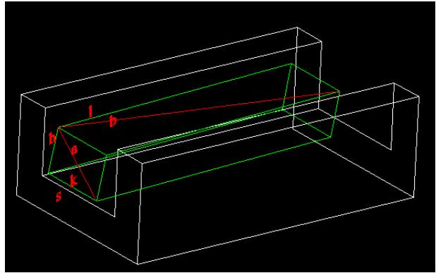
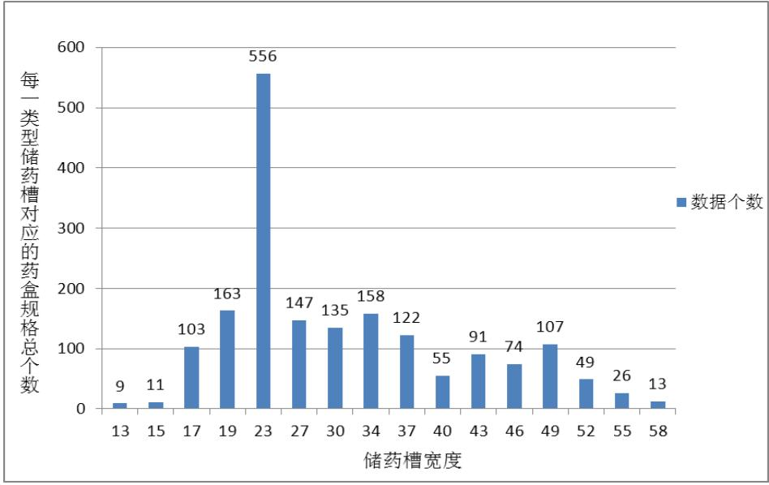
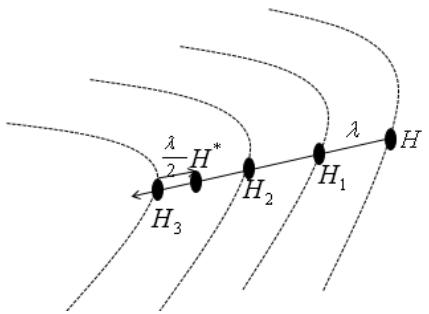
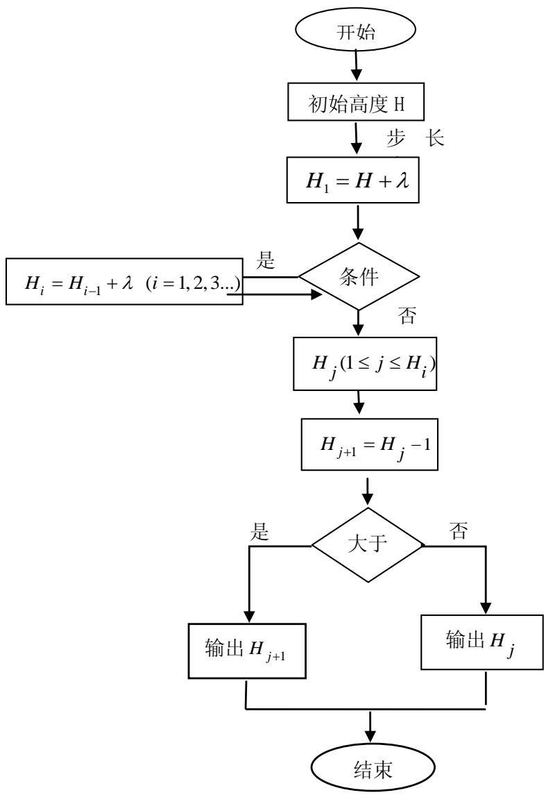
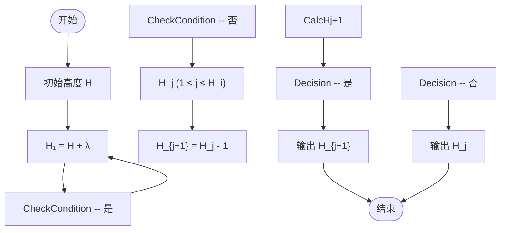

# 2014高教社杯全国大学生数学建模竞赛

## 承 诺 书

我们仔细阅读了《全国大学生数学建模竞赛章程》和《全国大学生数学建模竞赛参赛规则》（以下简称为“竞赛章程和参赛规则”，可从全国大学生数学建模竞赛网站下载）。

我们完全明白，在竞赛开始后参赛队员不能以任何方式（包括电话、电子邮件、网上咨询等）与队外的任何人（包括指导教师）研究、讨论与赛题有关的问题。

我们知道，抄袭别人的成果是违反竞赛章程和参赛规则的，如果引用别人的成果或其他公开的资料（包括网上查到的资料），必须按照规定的参考文献的表述方式在正文引用处和参考文献中明确列出。

我们郑重承诺，严格遵守竞赛章程和参赛规则，以保证竞赛的公正、公平性。如有违反竞赛章程和参赛规则的行为，我们将受到严肃处理。

我们授权全国大学生数学建模竞赛组委会，可将我们的论文以任何形式进行公开展示（包括进行网上公示，在书籍、期刊和其他媒体进行正式或非正式发表等）。

我们参赛选择的题号是（从 A/B/C/D 中选择一项填写）： D

我们的报名参赛队号为（8位数字组成的编号）：

所属学校（请填写完整的全名）： 重庆建筑工程职业学院

参赛队员 (打印并签名) ：1. 阎发静

2. 周 靖

3. 杨 峰

指导教师或指导教师组负责人 (打印并签名)： 向丽娜

（论文纸质版与电子版中的以上信息必须一致，只是电子版中无需签名。以上内容请仔细核对，提交后将不再允许做任何修改。如填写错误，论文可能被取消评奖资格。）

日期： 2014 年 09 月 15 日

赛区评阅编号（由赛区组委会评阅前进行编号）：

# 2014高教社杯全国大学生数学建模竞赛

## 编 号 专 用 页

赛区评阅编号（由赛区组委会评阅前进行编号）：

赛区评阅记录（可供赛区评阅时使用）：

<table><tr><td>评阅人</td><td></td><td></td><td></td><td></td><td></td><td></td><td></td><td></td><td></td><td></td></tr><tr><td>评分</td><td></td><td></td><td></td><td></td><td></td><td></td><td></td><td></td><td></td><td></td></tr><tr><td>备注</td><td></td><td></td><td></td><td></td><td></td><td></td><td></td><td></td><td></td><td></td></tr></table>

全国统一编号（由赛区组委会送交全国前编号）：

全国评阅编号（由全国组委会评阅前进行编号）：

# 储药柜的设计

## 摘要

随着医药行业的发展，医药行业是我国国民经济的重要组成部分，医药仪器也越来越智能化、科学化。目前，储药柜行业在我国迅猛发展，储药柜高效、快速、精确的出药特征，是当今乃至今后更长时间医学领域中不可或缺和代替的。

针对问题一，根据药盒在储药槽内推动过程中不会出现并排重叠、侧翻或水平旋转等约束条件，建立优化模型，求得最少的竖向隔板间距类型数为 4，其对应的药盒规格如下表所示。

<table><tr><td>类型</td><td>类型1</td><td>类型2</td><td>类型3</td><td>类型4</td></tr><tr><td>对应的储药槽宽度s(mm)</td><td>19</td><td>34</td><td>46</td><td>58</td></tr><tr><td>对应药盒规格宽度k(mm)</td><td>10-17</td><td>18-32</td><td>33-44</td><td>45-56</td></tr></table>

针对问题二，该问既要满足问题一中存在的约束条件，同时也要使得总宽度冗余尽可能少和竖向隔板间距类型数少，因此首先建立多目标规划模型，又因为总宽度冗余和竖向隔板间距类型数之间呈反比关系，因此只能在总宽度冗余和竖向隔板间距类型数之间取得一个平衡值，建立快速最优分割法模型。运用 EXCEL 和 SPSS 软件求解，得到合理的竖向隔板间距类型为 12，其对应的药盒规格如表 7所示。

针对问题三，该问在问题二的基础上，对横向隔板进行划分，使储药柜的总平面冗余量尽可能小、横向隔板间隔类型数量尽可能少，并且还要满足储药柜的最大允许有效高度 1.5m，建立等步距下降迭代模型，通过求解，得到横向隔板间距类型为 13，其对应的药盒规格如表12 所示。

针对问题四，根据每一种药品的最大日需求量、药盒的长度以及储药槽的长度，求得每一种药品需要的储药槽个数(如附录A-7 所示)；根据问题二和问题三求得的每一种药品所放置的储药槽宽度和高度，求得每一种药品在满足最大日需求量时所需的正面面积，同时，单个储药柜的正面面积已知，借助 MATLAB 工具，求解得最少需要的储药柜的个数为2。

关键词：多目标规划模型，快速最优化分割模型，等步距下降迭代模型，冗余数，隔板类型数

## 一、问题重述

储药柜的结构类似于书橱，通常由若干个横向隔板和竖向隔板将储药柜分割成若干个储药槽(如图1所示)。为保证药品分拣的准确率，防止发药错误，一个储药槽内只能摆放同一种药品。药品在储药槽中的排列方式如图2所示。药品从后端放入，从前端取出。一个实际储药柜中药品的摆放情况如图3所示。

为保证药品在储药槽内顺利出入，要求药盒与两侧竖向隔板之间、与上下两层横向隔板之间应留2mm 的间隙，同时还要求药盒在储药槽内推送过程中不会出现并排重叠、侧翻或水平旋转。在忽略横向和竖向隔板厚度的情况下，建立数学模型，给出下面几个问题的解决方案。

药房内的盒装药品种类繁多，药盒尺寸规格差异较大，附件 中给出了一些药盒的规格。请利用附件 1的数据，给出竖向隔板间距类型最少的储药柜设计方案，包括类型的数量和每种类型所对应的药盒规格。  
2. 药盒与两侧竖向隔板之间的间隙超出 2mm 的部分可视为宽度冗余。增加竖向隔板的间距类型数量可以有效地减少宽度冗余，但会增加储药柜的加工成本，同时降低了储药槽的适应能力。设计时希望总宽度冗余尽可能小，同时也希望间距的类型数量尽可能少。仍利用附件1的数据，给出合理的竖向隔板间距类型的数量以及每种类型对应的药品编号。  
考虑补药的便利性，储药柜的宽度不超过 、高度不超过 ，传送装置占用的高度为 0.5m，即储药柜的最大允许有效高度为 1.5m。药盒与两层横向隔板之间的间隙超出2mm 的部分可视为高度冗余，平面冗余＝高度冗余×宽度冗余。在问题2计算结果的基础上，确定储药柜横向隔板间距的类型数量，使得储药柜的总平面冗余量尽可能地小，且横向隔板间距的类型数量也尽可能地少。  
附件 给出了每一种药品编号对应的最大日需求量。在储药槽的长度为 、每天仅集中补药一次的情况下，请计算每一种药品需要的储药槽个数。为保证药房储药满足需求，根据问题3 中单个储药柜的规格，计算最少需要多少个储药柜。

## 二、问题分析

目前储药柜行业在我国迅猛发展，储药柜逐渐的智能化、科学化。越来越多的开始运用到各大医学领域。储药柜高效、快速、精确的出药特征，是当今乃至今后更长时间医学领域中不可或缺和代替的。

## 2.1针对问题一的分析

针对问题一，要使竖向隔板之间的间距类型最少，只有将宽度小的药盒规格放置在宽度大的储药槽里面（例如宽度为 10mm 的药盒既能放在宽度为 12mm 的储药槽内，也能放在宽度为 25mm 的储药槽内），这种方法使得多种药盒尺寸规格都能放在该储药槽内，从而使得竖向隔板之间的间距类型最少。但是为了满足药盒在储药槽内推动过程中不会出现并排重叠、侧翻或水平旋转，因此必须将此因素作为约束条件，例如宽度为10mm 的药盒放在宽度为 25mm 的储药槽内，药盒在储药槽内的推动过程中可能会出现并排重叠的情况，因此也不能将所有药盒规格放在一个最大宽度的储药槽内，只能放在一个宽度尽可能大的储药槽内。因此，只有将宽度小的药盒规格放置在宽度尽可能大的储药槽里面，才能使得竖向隔板之间的间距类型最少。

## 2.2 针对问题二的分析

针对问题二，实际上是在问题一的基础上增加了一个目标，即总宽度冗余尽可能少，但同时也要满足竖向隔板之间的类型数量尽可能少。总宽度的冗余数量和竖向隔板之间的类型数量是呈反比关系的，也就是说，当每一种宽度的药品刚好放在对应的储药槽里面时，冗余数最小，但是这样会增加竖向隔板之间的类型数量，同时也会增加储药柜的加工成本和减少储药槽的适应能力。因此，解决此问题，必须在总宽度冗余数量和竖向隔板之间的类型数量之间取得一个平衡值，使得总宽度冗余尽可能少，同时满足竖向隔板之间的类型数量也尽可能少

## 2.3 针对问题三的分析

针对问题三，该问题要使总平面冗余量少，同时对储药柜的宽度和高度也有了限制。问题二已经在总宽度冗余和竖向隔板间距类型之间取得了一个平衡点，求得了合理的竖向隔板间距类型数量。根据平面冗余的计算公式，以及问题二的计算结果，问题三应从储药柜的高度出发，在总平面冗余尽可能小的情况下，确定尽可能少的竖向隔板间距类型数，而且还应满足储药柜的最大允许有效高度为1.5m。问题三中也存在总平面冗余和横向隔板间距类型数目之间呈反比关系。因此，该问必须在满足问题一、问题二的约束条件和储药柜的最大允许有效高度为 1.5m 的情况下，在总平面冗余和横向隔板间距类型数目之间求得一个平衡值，使得总平面冗余尽可能少，同时满足横向隔板间距的类型数量也尽可能少。

## 2.4 针对问题四的分析

针对问题四，已知储药槽的长度和每一种药品的长度，因此两者相除，可以得到每个药槽的放药数，再根据每一种药品需要的最大日需求量，可以求得每一种药品需要的储药槽个数；在求最少需要的储药柜个数时，应考虑将单个储药柜可能的装满，不浪费储药槽，才能使得需要的储药柜个数最少，将药盒放在储药柜中应是一个三维问题，但三维问题较复杂，因此将三维问题映射到二维（即正面面积），降低解题难度。在求最少需要的储药柜个数时，将每一种药品的最大日需求量转换为每一种药品所需要的最大正面面积，与单个储药柜的正面面积之比，即为最少需要的储药柜个数。

## 三、模型假设及符号说明

## 3.1 基本假设

1.假设药盒的外观均为规则的长方体或正方体；  
2.假设附件中所给的数据均真实有效；  
3.假设机器运行正常，不会出现故障；  
4.假设药盒在传输前后都完好无损，无变形；

## 3.2 基本定义

侧翻：定义药盒在储药槽内倾斜角为 90 度，称为侧翻；

水平旋转：定义药盒在储药槽内旋转角度大于 90度，称为水平旋转。

## 3.3 符号说明

<table><tr><td>符号</td><td>说明</td></tr><tr><td>l</td><td>表示药盒规格的长(单位:mm)</td></tr><tr><td>k</td><td>表示药盒规格的宽(单位:mm)</td></tr><tr><td>h</td><td>表示药盒规格的高(单位:mm)</td></tr><tr><td>a</td><td>表示药盒正面对角线的长( $a = \sqrt{h^{2} + k^{2}}$ )(单位:mm)</td></tr><tr><td>b</td><td>表示药盒底面对角线的长( $b = \sqrt{l^{2} + k^{2}}$ )(单位:mm)</td></tr><tr><td>s</td><td>表示储药槽的宽度(2mm的间距包含在内)(单位:mm)</td></tr><tr><td>n</td><td>表示竖向隔板间距类型数</td></tr><tr><td> $m_{i}$ </td><td>表示第i种储药槽里面的药盒规格总数(0≤i≤n)</td></tr><tr><td>N</td><td>表示最少竖向隔板间距类型数</td></tr><tr><td>H</td><td>表示储药槽的高度</td></tr><tr><td>M</td><td>表示最小的总宽度冗余</td></tr><tr><td>Q</td><td>表示最少横向隔板间距类型数</td></tr><tr><td> $R_{i}$ </td><td>表示第i种药品的最大日需求量(1≤i≤1919)</td></tr><tr><td>K</td><td>表示储药柜的宽</td></tr><tr><td>W</td><td>表示储药柜的高</td></tr><tr><td> $\beta_{i}$ </td><td>表示第i种药品需要的储药槽个数。</td></tr><tr><td> $T_{i}$ </td><td>表示每一种药品在储药柜内所占的正面面积(1≤i≤1919)</td></tr><tr><td>S</td><td>表示单个储药柜的正面面积</td></tr><tr><td>G</td><td>最少需要的储药柜个数</td></tr></table>

## 四、模型建立及求解

## 4.1.针对问题一的模型建立及求解

## 4.1.1 问题一模型的建立

通过对问题一的分析，在使得竖向隔板之间的间距类型最少的情况下，满足药盒在储药槽内推动过程中不会出现并排重叠、侧翻或水平旋转。为了使药盒在储药槽内推动过程中不会出现并排重叠、侧翻或水平旋转，因此药槽宽度必须小于药盒宽度的两倍，药槽宽度必须小于药盒正面和底面的对角线（如图 1所示）。



<details>
<summary>text_image</summary>

1
b
h
a
k
s
</details>

图1 药盒在储药槽内的放置图

建立优化模型，如式 1所示。

$$
\begin{array}{l} N = \min n \\ \text {s. t} \left\{ \begin{array}{l} s <   2 k \\ s <   \sqrt {k ^ {2} + l ^ {2}} \\ s <   \sqrt {k ^ {2} + h ^ {2}} \\ 1 \leq n \leq 4 7, \text {且} n \text {为正整数} \end{array} \right. \end{array} \tag {式1}
$$

其中，N 表示最少的储药槽类型数量，n表示竖向隔板间距类型数，s表示储药槽的宽度，l、k 、h分别表示药盒的长、宽和高。

## 4.1.2 问题一模型的求解

通过对问题一模型进行求解，可以得到放置每一种药盒所对应的最小储药槽宽度$( h _ { \operatorname* { m i n } } )$ 和最大储药槽宽度 $( h _ { \operatorname* { m a x } } )$ ，如附录 所示，因此，为了使竖向隔板之间的间距类型最少，将每一种药盒放置在自身对应的最大储药槽宽度内，求得竖向隔板间距类型最少的类型数量N  4，对应的储药槽宽度如表 所示。

表 竖向隔板间距类型所对应的储药槽宽度和药盒宽度

<table><tr><td>类型</td><td>类型1</td><td>类型2</td><td>类型3</td><td>类型4</td></tr><tr><td>对应的储药槽宽度 $s$ (mm)</td><td>19</td><td>34</td><td>46</td><td>58</td></tr><tr><td>对应药盒规格宽度 $k$ (mm)</td><td>10-17</td><td>18-32</td><td>33-44</td><td>45-56</td></tr></table>

划分的4种竖向隔板间距类型，每种类型所对应的药盒规格（包括药盒规格编号，

药盒的长、宽和高）如表 2所示(整个统计表见附录 A-2)。

表2 4种竖向隔板间距类型所对应的药盒规格（包括药盒规格编号，药盒的长、宽和高）

<table><tr><td colspan="4">类型1(19mm)</td><td colspan="4">类型2(34mm)</td><td colspan="4">类型3(46mm)</td><td colspan="4">类型4(58mm)</td></tr><tr><td colspan="4">药盒规格</td><td colspan="4">药盒规格</td><td colspan="4">药盒规格</td><td colspan="4">药盒规格</td></tr><tr><td>编号</td><td>长(mm)</td><td>高(mm)</td><td>宽(mm)</td><td>编号</td><td>长(mm)</td><td>高(mm)</td><td>宽(mm)</td><td>编号</td><td>长(mm)</td><td>高(mm)</td><td>宽(mm)</td><td>编号</td><td>长(mm)</td><td>高(mm)</td><td>宽(mm)</td></tr><tr><td>669</td><td>100</td><td>100</td><td>10</td><td>48</td><td>125</td><td>73</td><td>18</td><td>10</td><td>95</td><td>55</td><td>33</td><td>45</td><td>105</td><td>72</td><td>45</td></tr><tr><td>774</td><td>100</td><td>100</td><td>10</td><td>50</td><td>126</td><td>72</td><td>18</td><td>11</td><td>95</td><td>55</td><td>33</td><td>83</td><td>75</td><td>47</td><td>45</td></tr><tr><td>1352</td><td>100</td><td>100</td><td>10</td><td>57</td><td>110</td><td>74</td><td>18</td><td>12</td><td>95</td><td>55</td><td>33</td><td>92</td><td>75</td><td>45</td><td>45</td></tr><tr><td>1471</td><td>110</td><td>60</td><td>10</td><td>70</td><td>97</td><td>40</td><td>18</td><td>13</td><td>95</td><td>55</td><td>33</td><td>138</td><td>78</td><td>47</td><td>45</td></tr><tr><td>1482</td><td>110</td><td>80</td><td>10</td><td>116</td><td>96</td><td>52</td><td>18</td><td>14</td><td>95</td><td>55</td><td>33</td><td>142</td><td>77</td><td>45</td><td>45</td></tr><tr><td>1908</td><td>100</td><td>70</td><td>10</td><td>130</td><td>120</td><td>70</td><td>18</td><td>15</td><td>95</td><td>55</td><td>33</td><td>154</td><td>78</td><td>45</td><td>45</td></tr><tr><td>909</td><td>80</td><td>61</td><td>11</td><td>133</td><td>115</td><td>75</td><td>18</td><td>16</td><td>95</td><td>55</td><td>33</td><td>201</td><td>78</td><td>45</td><td>45</td></tr><tr><td>1083</td><td>115</td><td>56</td><td>11</td><td>140</td><td>81</td><td>45</td><td>18</td><td>17</td><td>125</td><td>75</td><td>33</td><td>211</td><td>71</td><td>45</td><td>45</td></tr><tr><td>1785</td><td>112</td><td>62</td><td>11</td><td>145</td><td>96</td><td>30</td><td>18</td><td>188</td><td>110</td><td>91</td><td>33</td><td>220</td><td>70</td><td>45</td><td>45</td></tr><tr><td>332</td><td>110</td><td>63</td><td>12</td><td>169</td><td>114</td><td>63</td><td>18</td><td>256</td><td>120</td><td>60</td><td>33</td><td>229</td><td>75</td><td>45</td><td>45</td></tr><tr><td>405</td><td>102</td><td>57</td><td>12</td><td>198</td><td>121</td><td>62</td><td>18</td><td>257</td><td>120</td><td>60</td><td>33</td><td>235</td><td>67</td><td>45</td><td>45</td></tr><tr><td>668</td><td>100</td><td>100</td><td>12</td><td>209</td><td>105</td><td>68</td><td>18</td><td>258</td><td>120</td><td>60</td><td>33</td><td>238</td><td>126</td><td>86</td><td>45</td></tr><tr><td>107</td><td>116</td><td>58</td><td>13</td><td>233</td><td>97</td><td>67</td><td>18</td><td>261</td><td>120</td><td>60</td><td>33</td><td>375</td><td>80</td><td>45</td><td>45</td></tr><tr><td>253</td><td>120</td><td>72</td><td>13</td><td>236</td><td>110</td><td>71</td><td>18</td><td>328</td><td>60</td><td>33</td><td>33</td><td>376</td><td>75</td><td>48</td><td>45</td></tr><tr><td>254</td><td>120</td><td>70</td><td>13</td><td>240</td><td>85</td><td>55</td><td>18</td><td>468</td><td>60</td><td>33</td><td>33</td><td>399</td><td>85</td><td>45</td><td>45</td></tr><tr><td>255</td><td>120</td><td>71</td><td>13</td><td>260</td><td>65</td><td>62</td><td>18</td><td>657</td><td>60</td><td>33</td><td>33</td><td>417</td><td>95</td><td>45</td><td>45</td></tr><tr><td>471</td><td>127</td><td>64</td><td>13</td><td>262</td><td>63</td><td>60</td><td>18</td><td>925</td><td>124</td><td>83</td><td>33</td><td>442</td><td>80</td><td>46</td><td>45</td></tr><tr><td>975</td><td>100</td><td>60</td><td>13</td><td>263</td><td>63</td><td>60</td><td>18</td><td>996</td><td>57</td><td>34</td><td>33</td><td>492</td><td>69</td><td>45</td><td>45</td></tr><tr><td>1032</td><td>94</td><td>53</td><td>13</td><td>264</td><td>65</td><td>62</td><td>18</td><td>1039</td><td>120</td><td>60</td><td>33</td><td>499</td><td>133</td><td>90</td><td>45</td></tr><tr><td>1465</td><td>122</td><td>62</td><td>13</td><td>265</td><td>65</td><td>62</td><td>18</td><td>1040</td><td>120</td><td>60</td><td>33</td><td>501</td><td>80</td><td>45</td><td>45</td></tr></table>

注：整个统计表见附录A-2

## 4.2.针对问题二的模型建立及求解

## 4.2.1 问题二的模型建立

通过对问题二进行分析，在问题一的基础上，增加了一个目标函数，即总宽度冗余尽可能小，因此建立了多目标规划模型。但在问题二的分析里面已经提及到，在总宽度冗余数量和竖向隔板之间的类型数量之间取得一个平衡值，同时为了提高模型的处理效率，因此在最优分割法模型的基础上建立了快速最优分割法模型。

## 一、多目标规划模型<sup>[4],[8]</sup>

当竖向隔板间隔类型数为N 时，每一种类型对应相应的药盒规格数，依次为 $m _ { i }$ $( 1 \leq i \leq N )$ ，通过对所给附件 中数据进行分析，所有药盒的宽度从 到 中间没有出现断点，因此，每种类型数目所对应的冗余宽度依次为一个等差数列，计算过程如表3所示。

表3 宽容冗余的计算思想

<table><tr><td>类型数</td><td>类型1</td><td>类型2</td><td>......</td><td>类型N</td></tr><tr><td>药盒规格数</td><td> $m_{1}$ </td><td> $m_{2}$ </td><td>......</td><td> $m_{N}$ </td></tr><tr><td>宽度冗余</td><td> $\underbrace{m_{1}-1,\cdots,2,1,0}_{\text{ }}$ </td><td> $\underbrace{m_{2}-1,\cdots,2,1,0}_{\text{ }}$ </td><td>......</td><td> $\underbrace{m_{N}-1,\cdots,2,1,0}_{\text{ }}$ </td></tr><tr><td>宽度冗余之和</td><td> $\frac{\mathrm {m}_{1}(m_{1}-1)}{2}$ </td><td> $\frac{\mathrm {m}_{2}(m_{2}-1)}{2}$ </td><td>......</td><td> $\frac{\mathrm {m}_{N}(m_{N}-1)}{2}$ </td></tr><tr><td>总宽度冗余</td><td colspan="4"> $\sum_{i=1}^{N} \frac{\mathrm {m}_{i}(m_{i}-1)}{2}$ </td></tr></table>

在满足总宽度冗余尽可能小时，同时使得竖向隔板的间距类型尽可能少。该模型还必须满足药盒在储药槽内推送过程中不会出现并排重叠、侧翻或水平旋转，即建立多目标规划模型<sup>[7]</sup>，如式 2所示。

$$
\text {目标函数} \left\{ \begin{array}{l} M = \min \sum_ {i = 1} ^ {N} \frac {m _ {i} \left(m _ {i} - 1\right)}{2} \\ N = \min n \end{array} \right. \tag {式2}
$$

$$
\text {s. t} \left\{ \begin{array}{l} s <   2 k \\ s <   \sqrt {k ^ {2} + l ^ {2}} \\ s <   \sqrt {k ^ {2} + h ^ {2}} \\ 4 \leq n \leq 4 7, \text {且} n \text {为正整数} \\ m _ {i} \text {为正整数}, i = 1, \dots , N \end{array} \right.
$$

其中， 表示最小的总宽度冗余， $m _ { i }$ 表示第 种储药槽里面的药盒规格总数，N 表示最少的竖向隔板间距类型数，n表示竖向隔板间距类型数，s表示储药槽的宽度，l、k 、h分别表示药盒的长、宽和高。 $i = 0 , \cdots , N$

## 二、快速最优分割法模型<sup>[5],[10]</sup>

正如问题二的分析里面所说，由于总宽度冗余数量和竖向隔板之间的类型数量之间存在一个矛盾的关系，因此在总宽度冗余数量和竖向隔板之间的类型数量之间应取得一个平衡值，同时为了提高模型的处理效率，建立快速最优分割法模型。

对 n 种类型的药盒类型 $x _ { 1 } , x _ { 2 } , \cdots , x _ { n }$ ，分割成两段 $( x _ { 1 } , \cdots , x _ { a } )$ 和 $\vert ( x _ { a + 1 } , \cdots , x _ { n } )$ ，其中$a = \left[ { \frac { n } { 2 } } \right]$ （但是为了提高模型的处理效率，因此每次分割都取一个段的中点进行分割，即二分法分割）。

第一段的均值和方差 ：

$$
\left\{ \begin{array}{l} x (1, a) = \frac {1}{a} \sum_ {i = 1} ^ {a} x _ {i} \\ S ^ {2} (1, a) = \frac {1}{a} \sum_ {i = 1} ^ {a} \left(x _ {i} - x (1, a)\right) ^ {2} \end{array} \right. \tag {式3}
$$

第二段的均值和方差 ：

$$
\left\{ \begin{array}{l} x (a + 1, n) = \frac {1}{n - a} \sum_ {i = a + 1} ^ {n} x _ {i} \\ S ^ {2} (a + 1, n) = \frac {1}{n - a} \sum_ {i = a + 1} ^ {n} \left(x _ {i} - x (a + 1, n)\right) ^ {2} \end{array} \right. \tag {式4}
$$

最优分割法是对有序样本进行最优分类或分组，当总变差V 达到最小时，分类最优。

$$
V = \min \sum_ {i, j = 1, i \neq j} ^ {n} V _ {i, j} \tag {式5}
$$

其中 $V _ { i , j } = ( j - i + 1 ) S ^ { 2 } ( i , j ) \quad 1 \leq i \leq j \leq n$

## 4.2.1 问题二的模型求解

根据问题二所建立的模型，运用 工具和 计算总变差 ，从而求解得到竖向隔板的间隔类型数量为N 16，对应的储药槽宽度和药盒宽度（区间）如表4所示。

表 4 竖向隔板间距类型所对应的储药槽宽度和药盒宽度

<table><tr><td>类型</td><td>对应的储药槽宽度s(mm)</td><td>对应药盒宽度k(mm)</td><td>类型</td><td>对应的储药槽宽度s(mm)</td><td>对应药盒宽度k(mm)</td></tr><tr><td>类型1</td><td>13</td><td>10-11</td><td>类型9</td><td>37</td><td>33-35</td></tr><tr><td>类型2</td><td>15</td><td>12-13</td><td>类型10</td><td>40</td><td>36-38</td></tr><tr><td>类型3</td><td>17</td><td>14-15</td><td>类型11</td><td>43</td><td>39-41</td></tr><tr><td>类型4</td><td>19</td><td>16-17</td><td>类型12</td><td>46</td><td>42-44</td></tr><tr><td>类型5</td><td>23</td><td>18-21</td><td>类型13</td><td>49</td><td>45-47</td></tr><tr><td>类型6</td><td>27</td><td>22-25</td><td>类型14</td><td>52</td><td>48-50</td></tr><tr><td>类型7</td><td>30</td><td>26-28</td><td>类型15</td><td>55</td><td>51-53</td></tr><tr><td>类型8</td><td>34</td><td>29-32</td><td>类型16</td><td>58</td><td>54-56</td></tr></table>

根据划分的 16 种竖向隔板间距类型，每种类型所对应的药盒规格（包括药盒规格编号，药盒的长、宽和高），如表5所示(整个统计表见附录 A-3)。

表5 16种竖向隔板间距类型所对应的药盒规格（包括药盒规格编号，药盒的长、宽和高）

<table><tr><td colspan="4">类型1(13mm)</td><td colspan="4">类型2(15mm)</td><td></td><td colspan="4">类型16(58mm)</td></tr><tr><td colspan="4">药盒规格</td><td colspan="4">药盒规格</td><td></td><td colspan="4">药盒规格</td></tr><tr><td>编号</td><td>长(mm)</td><td>高(mm)</td><td>宽(mm)</td><td>编号</td><td>长(mm)</td><td>宽(mm)</td><td>高(mm)</td><td></td><td>编号</td><td>长(mm)</td><td>高(mm)</td><td>宽(mm)</td></tr><tr><td>669</td><td>100</td><td>100</td><td>10</td><td>332</td><td>110</td><td>63</td><td>12</td><td></td><td>744</td><td>96</td><td>75</td><td>54</td></tr><tr><td>774</td><td>100</td><td>100</td><td>10</td><td>405</td><td>102</td><td>57</td><td>12</td><td></td><td>443</td><td>100</td><td>65</td><td>55</td></tr><tr><td>1352</td><td>100</td><td>100</td><td>10</td><td>668</td><td>100</td><td>100</td><td>12</td><td></td><td>509</td><td>95</td><td>77</td><td>55</td></tr><tr><td>1471</td><td>110</td><td>60</td><td>10</td><td>107</td><td>116</td><td>58</td><td>13</td><td></td><td>556</td><td>76</td><td>72</td><td>55</td></tr><tr><td>1908</td><td>100</td><td>70</td><td>10</td><td>253</td><td>120</td><td>72</td><td>13</td><td>......</td><td>1211</td><td>95</td><td>55</td><td>55</td></tr><tr><td>909</td><td>80</td><td>61</td><td>11</td><td>254</td><td>120</td><td>70</td><td>13</td><td></td><td>1238</td><td>102</td><td>65</td><td>55</td></tr><tr><td>1083</td><td>115</td><td>56</td><td>11</td><td>255</td><td>120</td><td>71</td><td>13</td><td></td><td>1642</td><td>110</td><td>55</td><td>55</td></tr><tr><td>1785</td><td>112</td><td>62</td><td>11</td><td>471</td><td>127</td><td>64</td><td>13</td><td></td><td>441</td><td>75</td><td>65</td><td>56</td></tr><tr><td>1482</td><td>110</td><td>80</td><td>10</td><td>975</td><td>100</td><td>60</td><td>13</td><td></td><td>444</td><td>101</td><td>67</td><td>56</td></tr></table>

注：整个统计表见附录A-3

## 4.2.2 问题二的模型求解结果的优化

运用问题二所建立的模型，求解得到划分的竖向隔板间距类型为 种时，满足总宽度冗余尽可能小，同时竖向隔板间距类型尽可能少。通过对每一竖向隔板间距类型所放置的药盒规格总数进行统计，统计的结果如表 所示。

表6 每一种储药槽所对应的药盒规格总数

<table><tr><td>类型</td><td>储药槽宽度s(mm)</td><td>对应的药盒规格总数</td><td>类型</td><td>储药槽宽度s(mm)</td><td>对应的药盒规格总数</td></tr><tr><td>类型1</td><td>13</td><td>9</td><td>类型9</td><td>37</td><td>122</td></tr><tr><td>类型2</td><td>15</td><td>11</td><td>类型10</td><td>40</td><td>55</td></tr><tr><td>类型3</td><td>17</td><td>103</td><td>类型11</td><td>43</td><td>91</td></tr><tr><td>类型4</td><td>19</td><td>163</td><td>类型12</td><td>46</td><td>74</td></tr><tr><td>类型5</td><td>23</td><td>556</td><td>类型13</td><td>49</td><td>107</td></tr><tr><td>类型6</td><td>27</td><td>147</td><td>类型14</td><td>52</td><td>49</td></tr><tr><td>类型7</td><td>30</td><td>135</td><td>类型15</td><td>55</td><td>26</td></tr><tr><td>类型8</td><td>34</td><td>158</td><td>类型16</td><td>58</td><td>13</td></tr></table>

根据表6中，每一种储药槽所对应的药盒规格总数，画出直方图，如图2所示。



<details>
<summary>bar</summary>

| 储药槽宽度 | 数据个数 |
| --- | --- |
| 13 | 9 |
| 15 | 11 |
| 17 | 103 |
| 19 | 163 |
| 23 | 556 |
| 27 | 147 |
| 30 | 135 |
| 34 | 158 |
| 37 | 122 |
| 40 | 55 |
| 43 | 91 |
| 46 | 74 |
| 49 | 107 |
| 52 | 49 |
| 55 | 26 |
| 58 | 13 |
</details>

图2 每一类型储药槽对应的药盒规格总个数

从直方图2中可看出，某种类的储药槽对应的药盒规格总数较少，如储药槽宽度为时，对应的药盒规格总数为 ，因此为了减少储药柜的加工成本，同时提高储药槽的适应能力，对 16 种储药槽类型进行优化，将对应的药盒规格总数较少的储药槽合并到邻近的储药槽类型中，该思想类似于聚类的思想，在保证宽度冗余数不会大幅度增加的前提下，减少竖向隔板间距类型，提高储药槽的适应能力，减少开支。优化后竖向隔板间距类型N 12，其对应的储药槽宽度和药盒宽度（区间）如表 7所示。

表 7 竖向隔板间距类型所对应的储药槽宽度和药盒宽度

<table><tr><td>类型</td><td>对应的储药槽宽度s(mm)</td><td>对应药盒宽度k(mm)</td><td>类型</td><td>对应的储药槽宽度s(mm)</td><td>对应药盒宽度k(mm)</td></tr><tr><td>类型1</td><td>17</td><td>10-15</td><td>类型7</td><td>37</td><td>33-35</td></tr><tr><td>类型2</td><td>19</td><td>16-17</td><td>类型8</td><td>40</td><td>36-38</td></tr><tr><td>类型3</td><td>23</td><td>18-21</td><td>类型9</td><td>43</td><td>39-41</td></tr><tr><td>类型4</td><td>27</td><td>22-25</td><td>类型10</td><td>46</td><td>42-44</td></tr><tr><td>类型5</td><td>30</td><td>26-28</td><td>类型11</td><td>49</td><td>45-47</td></tr><tr><td>类型6</td><td>34</td><td>19-32</td><td>类型12</td><td>58</td><td>48-56</td></tr></table>

根据优化思想，将优化后的 12种竖向隔板间距类型，每种类型所对应的药盒规格（包括药盒规格编号，药盒的长、宽和高）进行列表，如表8所示(整个统计表见附录 A-4)。

表8 12种竖向隔板间距类型所对应的药盒规格（包括药盒规格编号，药盒的长、宽和高）

<table><tr><td colspan="4">类型1(17mm)</td><td colspan="4">类型2(19mm)</td><td></td><td colspan="4">类型12(58mm)</td></tr><tr><td colspan="4">药盒规格</td><td colspan="4">药盒规格</td><td></td><td colspan="4">药盒规格</td></tr><tr><td>编号</td><td>长(mm)</td><td>高(mm)</td><td>宽(mm)</td><td>编号</td><td>长(mm)</td><td>高(mm)</td><td>宽(mm)</td><td></td><td>编号</td><td>长(mm)</td><td>高(mm)</td><td>宽(mm)</td></tr><tr><td>669</td><td>100</td><td>100</td><td>10</td><td>18</td><td>116</td><td>76</td><td>16</td><td></td><td>54</td><td>80</td><td>50</td><td>48</td></tr><tr><td>774</td><td>100</td><td>100</td><td>10</td><td>34</td><td>120</td><td>69</td><td>16</td><td></td><td>232</td><td>80</td><td>48</td><td>48</td></tr><tr><td>1352</td><td>100</td><td>100</td><td>10</td><td>62</td><td>106</td><td>48</td><td>16</td><td></td><td>404</td><td>90</td><td>48</td><td>48</td></tr><tr><td>1471</td><td>110</td><td>60</td><td>10</td><td>67</td><td>91</td><td>71</td><td>16</td><td></td><td>477</td><td>74</td><td>49</td><td>48</td></tr><tr><td>1908</td><td>100</td><td>70</td><td>10</td><td>91</td><td>133</td><td>71</td><td>16</td><td></td><td>690</td><td>98</td><td>48</td><td>48</td></tr><tr><td>909</td><td>80</td><td>61</td><td>11</td><td>97</td><td>94</td><td>65</td><td>16</td><td>......</td><td>736</td><td>84</td><td>48</td><td>48</td></tr><tr><td>1083</td><td>115</td><td>56</td><td>11</td><td>111</td><td>106</td><td>66</td><td>16</td><td></td><td>830</td><td>83</td><td>47</td><td>48</td></tr><tr><td>1785</td><td>112</td><td>62</td><td>11</td><td>112</td><td>106</td><td>65</td><td>16</td><td></td><td>918</td><td>85</td><td>48</td><td>48</td></tr><tr><td>1482</td><td>110</td><td>80</td><td>10</td><td>117</td><td>110</td><td>52</td><td>16</td><td></td><td>959</td><td>75</td><td>45</td><td>48</td></tr><tr><td>332</td><td>110</td><td>63</td><td>12</td><td>123</td><td>126</td><td>82</td><td>16</td><td></td><td>974</td><td>82</td><td>48</td><td>48</td></tr><tr><td>405</td><td>102</td><td>57</td><td>12</td><td>230</td><td>120</td><td>42</td><td>16</td><td></td><td>1141</td><td>92</td><td>48</td><td>48</td></tr><tr><td>668</td><td>100</td><td>100</td><td>12</td><td>241</td><td>120</td><td>66</td><td>16</td><td></td><td>1206</td><td>72</td><td>48</td><td>48</td></tr><tr><td>107</td><td>116</td><td>58</td><td>13</td><td>269</td><td>120</td><td>72</td><td>16</td><td></td><td>1299</td><td>130</td><td>49</td><td>48</td></tr><tr><td>253</td><td>120</td><td>72</td><td>13</td><td>298</td><td>107</td><td>50</td><td>16</td><td></td><td>1305</td><td>100</td><td>50</td><td>48</td></tr><tr><td>254</td><td>120</td><td>70</td><td>13</td><td>309</td><td>92</td><td>72</td><td>16</td><td></td><td>187</td><td>111</td><td>91</td><td>49</td></tr><tr><td>255</td><td>120</td><td>71</td><td>13</td><td>310</td><td>116</td><td>77</td><td>16</td><td></td><td>479</td><td>65</td><td>49</td><td>49</td></tr><tr><td>471</td><td>127</td><td>64</td><td>13</td><td>312</td><td>124</td><td>67</td><td>16</td><td></td><td>508</td><td>86</td><td>49</td><td>49</td></tr><tr><td>975</td><td>100</td><td>60</td><td>13</td><td>317</td><td>138</td><td>68</td><td>16</td><td></td><td>547</td><td>100</td><td>49</td><td>49</td></tr><tr><td>1032</td><td>94</td><td>53</td><td>13</td><td>333</td><td>110</td><td>73</td><td>16</td><td></td><td>1091</td><td>86</td><td>49</td><td>49</td></tr><tr><td>1465</td><td>122</td><td>62</td><td>13</td><td>334</td><td>111</td><td>74</td><td>16</td><td></td><td>1327</td><td>113</td><td>56</td><td>49</td></tr><tr><td>61</td><td>65</td><td>43</td><td>14</td><td>335</td><td>110</td><td>74</td><td>16</td><td></td><td>43</td><td>92</td><td>65</td><td>50</td></tr><tr><td>84</td><td>110</td><td>62</td><td>14</td><td>354</td><td>116</td><td>78</td><td>16</td><td></td><td>143</td><td>95</td><td>50</td><td>50</td></tr></table>

注：整个统计表见附录A-4

## 4.3 针对问题三的模型建立及求解

## 4.3.1 问题三模型的建立-——等步距下降迭代模型

在问题二中，通过建立的多目标优化模型和快速最优分割法模型，再将所求得的结果进行优化，求得合理的竖向隔板间距类型为 ，以及每种类型对应的药品编号。在每种竖向隔板间距类型中的药品都具有一个最大高度 $h _ { \operatorname* { m a x } }$ 和最小高度 $h _ { \mathrm { m i n } }$ ，只有将高度小的药盒规格放置在高度大的储药槽中，才能将横向隔板的间距类型数减少，但并不是设计的储药槽高度越高，类型越少越好，因为相对于低药盒规格来说，储药槽高度越高，高度冗余越大，且降低储药槽的适用能力。因此，必须在横向隔板的间距类型数和平面冗余之间取得一个平衡点，同时使其满足储药柜的有效高度。

等步距下降迭代模型<sup>[3]</sup>的基本思想是：



<details>
<summary>text_image</summary>

λ/2 H*
H₃ H₂ H₁ λ H
</details>

图 3 等步距下降迭代模型的基本思想（注： $H ^ { * }$ 为求解值）

等步距下降迭代模型的基本步骤是：

(1) 为了求得最优解，首先选择步长 $\lambda = 2 m m$ (因为药盒与上下两层横向隔板之间至少应留 2 mm的间隙)，将药盒的高度加上步长 划分横向隔板间距的类型，即$H _ { 1 } = H + \lambda$ ，因此按照高度划分的横向隔板类型此时冗余数最小，但是该分割方法使得储药柜的高度为 2573mm，大于储药柜的最大允许有效高度 1.5m，且横向隔板间距的类型数量最多，因此不满足。  
(2) 同样选择步长 $\lambda = 2 m m$ ，即 $H _ { 2 } = H _ { 1 } + \lambda = H + 2 \lambda$ ，随着高度的增加，以此划分的横向隔板类型减少，但冗余数增加，同时，该分割方法使得储药柜的高度为1588mm，也大于储药柜的最大允许有效高度 1.5m，因此不满足。  
(3) 同样选择步长 $\lambda = 2 m m$ ，即 $H _ { 3 } = H _ { 2 } + \lambda = H + 3 \lambda$ ，算得该分割方法使得储药柜的高度为 1113，小于储药柜的最大允许有效高度 1.5m，满足条件。但是随着高度的增加，以此划分的横向隔板类型减少，但冗余数增加，因此，需要检验该分割高度是否为极小值。  
(4) 在第(3)步的基础上，选择 $H _ { 4 } = H + 5$ ，算得该分割方法的储药柜高度为1373mm，小于储药柜的最大允许有效高度 1.5m，满足条件，且横向隔板类型数和冗余数介入2λ和3λ之间，因此在满足储药柜最大允许有效高度的前提下，在横向隔板类型数和冗余数之间取得了一个平衡，因此，将 $\Delta \lambda = 5$ 作为横向隔板划分的高度。

该模型的基本步骤可以流程图进行概括，如图 4所示。



<details>
<summary>flowchart</summary>


</details>

图4 等步距下降迭代模型的基本步骤  
注：条件为判断分割后计算得到储药槽高度是否大于储药槽的最大允许有效高度

## 4.3.2 问题三模型的求解

根据问题三所建立的模型，运用 EXCEL 工具，从而求解得到横向隔板的间隔类型数量为Q17，对应的储药槽高度和药盒高度（区间）如表9所示。

表9 横向隔板间距类型所对应的储药槽高度和药盒高度

<table><tr><td>类型</td><td>储药槽高度H(mm)</td><td>对应的药盒高度h(mm)</td><td>类型</td><td>储药槽高度H(mm)</td><td>对应的药盒高度h(mm)</td></tr><tr><td>类型1</td><td>35</td><td>28-33</td><td>类型10</td><td>89</td><td>82-87</td></tr><tr><td>类型2</td><td>41</td><td>34-39</td><td>类型11</td><td>95</td><td>88-93</td></tr><tr><td>类型3</td><td>47</td><td>40-45</td><td>类型12</td><td>101</td><td>94-99</td></tr><tr><td>类型4</td><td>53</td><td>46-51</td><td>类型13</td><td>107</td><td>100-105</td></tr><tr><td>类型5</td><td>59</td><td>52-57</td><td>类型14</td><td>113</td><td>106-111</td></tr><tr><td>类型6</td><td>65</td><td>58-63</td><td>类型15</td><td>119</td><td>112-117</td></tr><tr><td>类型 7</td><td>71</td><td>64-69</td><td>类型 16</td><td>125</td><td>118-123</td></tr><tr><td>类型 8</td><td>77</td><td>70-75</td><td>类型 17</td><td>127</td><td>124-125</td></tr><tr><td>类型 9</td><td>83</td><td>76-81</td><td></td><td></td><td></td></tr></table>

根据划分的 17 种横向隔板间距类型，每种类型所对应的药盒规格（包括药盒规格编号，药盒的长、宽和高），如表10所示(整个统计表见附录 A-5)。

表10 17种横向隔板间距类型所对应的药盒规格（包括药盒规格编号，药盒的长、宽和高）

<table><tr><td colspan="4">类型1(35mm)</td><td colspan="4">类型2(41mm)</td><td></td><td colspan="4">类型17(127mm)</td></tr><tr><td colspan="4">药盒规格</td><td colspan="4">药盒规格</td><td></td><td colspan="4">药盒规格</td></tr><tr><td>药品编号</td><td>长(mm)l</td><td>高(mm)h</td><td>宽(mm)k</td><td>药品编号</td><td>长(mm)l</td><td>高(mm)h</td><td>宽(mm)k</td><td></td><td>药品编号</td><td>长(mm)l</td><td>高(mm)h</td><td>宽(mm)k</td></tr><tr><td>145</td><td>96</td><td>30</td><td>18</td><td>1067</td><td>107</td><td>34</td><td>20</td><td></td><td>1897</td><td>135</td><td>125</td><td>33</td></tr><tr><td>911</td><td>108</td><td>30</td><td>18</td><td>607</td><td>135</td><td>35</td><td>20</td><td></td><td></td><td></td><td></td><td></td></tr><tr><td>1830</td><td>107</td><td>30</td><td>18</td><td>849</td><td>110</td><td>35</td><td>20</td><td></td><td></td><td></td><td></td><td></td></tr><tr><td>513</td><td>108</td><td>31</td><td>18</td><td>103</td><td>135</td><td>36</td><td>20......</td><td></td><td></td><td></td><td></td><td></td></tr><tr><td>1065</td><td>108</td><td>31</td><td>18</td><td>325</td><td>135</td><td>36</td><td>20</td><td></td><td></td><td></td><td></td><td></td></tr><tr><td>313</td><td>107</td><td>32</td><td>18</td><td>538</td><td>135</td><td>36</td><td>20</td><td></td><td></td><td></td><td></td><td></td></tr><tr><td>453</td><td>108</td><td>32</td><td>18</td><td>1126</td><td>121</td><td>36</td><td>20</td><td></td><td></td><td></td><td></td><td></td></tr></table>

注：整个统计表见附录A-5

## 4.3.2 问题三模型的求解结果优化

运用问题三所建立的模型，求解得到划分的横向隔板间距类型为 17种时，满足总平面冗余尽可能小，同时横向隔板间距类型尽可能少。通过对每一横向隔板间距类型所放置的药盒规格总数进行统计，统计的结果如表 11 所示。

表11每一种储药槽所对应的药盒规格总数

<table><tr><td>槽宽(mm)槽高(mm)</td><td>17</td><td>19</td><td>23</td><td>27</td><td>30</td><td>34</td><td>37</td><td>40</td><td>43</td><td>46</td><td>49</td><td>58</td></tr><tr><td>35</td><td></td><td></td><td>35</td><td>7</td><td>3</td><td>15</td><td>5</td><td></td><td></td><td></td><td></td><td></td></tr><tr><td>41</td><td></td><td></td><td>14</td><td>24</td><td>15</td><td>4</td><td>27</td><td>23</td><td>10</td><td></td><td></td><td></td></tr><tr><td>47</td><td>7</td><td>6</td><td>6</td><td>12</td><td>5</td><td>6</td><td>1</td><td></td><td>47</td><td>50</td><td>32</td><td>1</td></tr><tr><td>53</td><td>12</td><td>12</td><td>9</td><td>13</td><td>11</td><td>7</td><td>7</td><td>1</td><td>3</td><td></td><td>55</td><td>48</td></tr><tr><td>59</td><td>15</td><td>10</td><td>28</td><td>12</td><td>8</td><td>12</td><td>12</td><td>2</td><td>1</td><td>2</td><td>1</td><td>13</td></tr><tr><td>65</td><td>24</td><td>24</td><td>76</td><td>17</td><td>9</td><td>13</td><td>36</td><td>13</td><td>6</td><td>6</td><td>5</td><td>3</td></tr><tr><td>71</td><td>25</td><td>35</td><td>102</td><td>22</td><td>11</td><td>33</td><td>7</td><td>2</td><td>7</td><td>6</td><td>3</td><td>12</td></tr><tr><td>77</td><td>30</td><td>53</td><td>181</td><td>55</td><td>25</td><td>25</td><td>7</td><td>1</td><td>7</td><td>2</td><td>5</td><td>5</td></tr><tr><td>83</td><td>5</td><td>13</td><td>68</td><td>59</td><td>27</td><td>27</td><td>4</td><td>3</td><td>1</td><td>2</td><td>2</td><td>1</td></tr><tr><td>89</td><td>1</td><td>2</td><td>24</td><td>22</td><td>9</td><td>10</td><td>2</td><td>3</td><td>3</td><td>5</td><td>3</td><td>2</td></tr><tr><td>95</td><td></td><td>2</td><td>4</td><td>4</td><td>10</td><td>2</td><td>9</td><td>6</td><td>2</td><td>1</td><td>1</td><td>2</td></tr><tr><td>101</td><td></td><td>2</td><td>2</td><td></td><td>1</td><td>2</td><td>2</td><td></td><td>2</td><td></td><td></td><td></td></tr><tr><td>107</td><td>4</td><td></td><td>2</td><td></td><td></td><td></td><td>1</td><td>1</td><td>1</td><td></td><td></td><td>1</td></tr><tr><td>113</td><td></td><td>3</td><td>4</td><td></td><td></td><td>1</td><td></td><td></td><td></td><td></td><td></td><td></td></tr><tr><td>119</td><td></td><td>1</td><td>1</td><td></td><td>1</td><td></td><td></td><td></td><td></td><td></td><td></td><td></td></tr><tr><td>125</td><td></td><td></td><td></td><td></td><td></td><td>1</td><td>1</td><td></td><td>1</td><td></td><td></td><td></td></tr><tr><td>127</td><td></td><td></td><td></td><td></td><td></td><td></td><td>1</td><td></td><td></td><td></td><td></td><td></td></tr></table>

从表 11 中可看出，某种类的储药槽对应的药盒规格总数较少，如储药槽高度为时，对应的药盒规格总数为 ，因此为了减少储药柜的加工成本，同时提高储药槽的适应能力，对 17 种储药槽类型进行优化，将对应的药盒规格总数较少的储药槽合并到邻近的储药槽类型中，在保证高度冗余数不会大幅度增加的前提下，减少横向隔板间距类型，提高储药槽的适应能力，减少开支。优化后横向隔板间距类型N 13，其对应的储药槽宽度和药盒宽度（区间）如表12 所示。

表 12 横向隔板间距类型所对应的储药槽高度及药盒高度

<table><tr><td>类型</td><td>储药槽高度H(mm)</td><td>对应的药盒高度h(mm)</td><td>类型</td><td>储药槽高度H(mm)</td><td>对应的药盒高度h(mm)</td></tr><tr><td>类型1</td><td>35</td><td>28-33</td><td>类型8</td><td>77</td><td>70-75</td></tr><tr><td>类型2</td><td>41</td><td>34-39</td><td>类型9</td><td>83</td><td>76-81</td></tr><tr><td>类型3</td><td>47</td><td>40-45</td><td>类型10</td><td>89</td><td>82-87</td></tr><tr><td>类型4</td><td>53</td><td>46-51</td><td>类型11</td><td>95</td><td>88-93</td></tr><tr><td>类型5</td><td>59</td><td>52-57</td><td>类型12</td><td>113</td><td>94-111</td></tr><tr><td>类型6</td><td>65</td><td>58-63</td><td>类型13</td><td>127</td><td>112-125</td></tr><tr><td>类型7</td><td>71</td><td>64-69</td><td></td><td></td><td></td></tr></table>

根据划分的 13 种横向隔板间距类型，每种类型所对应的药盒规格（包括药盒规格编号，药盒的长、宽和高），如表13所示(整个统计表见附录 A-6)。

表13 13种横向隔板间距类型所对应的药盒规格（包括药盒规格编号，药盒的长、宽和高）

<table><tr><td colspan="4">类型1(35mm)</td><td colspan="4">类型2(41mm)</td><td></td><td colspan="4">类型13(127mm)</td></tr><tr><td colspan="4">药盒规格</td><td colspan="4">药盒规格</td><td></td><td colspan="4">药盒规格</td></tr><tr><td>药品编号</td><td>长(mm)l</td><td>高(mm)h</td><td>宽(mm)k</td><td>药品编号</td><td>长(mm)l</td><td>高(mm)h</td><td>宽(mm)k</td><td></td><td>药品编号</td><td>长(mm)l</td><td>高(mm)h</td><td>宽(mm)k</td></tr><tr><td>145</td><td>96</td><td>30</td><td>18</td><td>1067</td><td>107</td><td>34</td><td>20</td><td></td><td>862</td><td>127</td><td>112</td><td>16</td></tr><tr><td>911</td><td>108</td><td>30</td><td>18</td><td>607</td><td>135</td><td>35</td><td>20</td><td></td><td>1758</td><td>132</td><td>112</td><td>20</td></tr><tr><td>1830</td><td>107</td><td>30</td><td>18</td><td>849</td><td>110</td><td>35</td><td>20</td><td></td><td>592</td><td>131</td><td>112</td><td>26</td></tr><tr><td>513</td><td>108</td><td>31</td><td>18</td><td>103</td><td>135</td><td>36</td><td>20</td><td>......</td><td>1898</td><td>133</td><td>120</td><td>30</td></tr><tr><td>1065</td><td>108</td><td>31</td><td>18</td><td>325</td><td>135</td><td>36</td><td>20</td><td></td><td>915</td><td>132</td><td>120</td><td>35</td></tr><tr><td>313</td><td>107</td><td>32</td><td>18</td><td>538</td><td>135</td><td>36</td><td>20</td><td></td><td>750</td><td>125</td><td>121</td><td>40</td></tr><tr><td>453</td><td>108</td><td>32</td><td>18</td><td>1126</td><td>121</td><td>36</td><td>20</td><td></td><td>1897</td><td>135</td><td>125</td><td>33</td></tr><tr><td>606</td><td>108</td><td>32</td><td>18</td><td>1636</td><td>135</td><td>36</td><td>20</td><td></td><td></td><td></td><td></td><td></td></tr></table>

注：整个统计表见附录A-6

## 4.4 针对问题四的模型建立及求解

## 4.4.1 问题四模型的建立

## 第一小问的模型：

通过对问题四进行分析可知，将储药槽的长度除以每一种药品的长度，可以得到每个药槽的放药数，再根据每一种药品需要的最大日需求量，可以求得每一种药品需要的储药槽个数，表达式如式 所示。

$$
\beta_ {i} = \left\lceil \frac {R _ {i} * l _ {i}}{1 5 0 0} \right\rceil , 1 \leq i \leq 1 9 1 9 \tag {式6}
$$

其中， $\beta _ { i }$ 表示第i种药品需要的储药槽个数， $R _ { i }$ 表示第i种药品对应的最大日需求量， $l _ { i }$ 表示第i种药品的长度， $1 { \le } i { \le } 1 9 1 9$ 。数学符号]表示向上取整，如 $\left\lceil 2 . 5 \right\rceil { = } 3$

## 第二小问的模型：

根据问题二和问题三，计算出每一种药品所在的储药槽的宽度 $x _ { i }$ 和高度 $y _ { i }$ $( 1 \leq i \leq 1 9 1 9 )$ ，因此得到每一种药品在储药柜内所占的正面面积 $T _ { i }$ 。

$$
T _ {i} = x _ {i} * y _ {i} (1 \leq i \leq 1 9 1 9) \tag {式7}
$$

将每一种药品需要的储药槽个数乘以对应的所占的正面面积 $T _ { i }$ ，得到每一种药品所占正面面积之和，再将每一种药品的正面面积之和相加，得到满足最大日需求量所需的

正面面积Z。

$$
Z = \sum_ {i = 1} ^ {1 9 1 9} \sum_ {j = 1} ^ {\beta_ {i}} x _ {i} y _ {i} (1 \leq i \leq 1 9 1 9) \tag {式8}
$$

其中， $x _ { i }$ 和 $y _ { i }$ 分别表示每一种药品所在的储药槽的宽度和高度， $\beta _ { i }$ 表示第i种药品需要的储药槽个数。

由于问题三中，给出了单个储药柜的规格，因此可以求得单个储药柜的正面面积S 。

$$
S = K * W \tag {式9}
$$

其中，K表示储药柜的宽度，W表示储药柜的高度。

将满足最大日需求量所需的正面面积Z与单个储药柜的正面面积S 相除，得到最少需要的储药柜个数G ，且能够保证药房储药的需要。

$$
G = Z / S \tag {式10}
$$

## 4.4.2 问题四模型的求解

## 第一小问所建模型的求解：

根据所列表达式 6，在附件 2 中，使用 EXCEL 表中的向上取整函数 ROUNDUP，求解得到每一种药品需要的储药槽个数，如表 14所示。

表14 每一种药品需要的储药槽个数（部分数据）

<table><tr><td colspan="2">G7</td><td colspan="2"> ${f}_{x}$ </td><td colspan="4">=ROUNDUP(F7,0)</td></tr><tr><td></td><td>A</td><td>B</td><td>C</td><td>D</td><td>E</td><td>F</td><td>G</td></tr><tr><td>1</td><td>药品编号</td><td>长(mm)</td><td>高(mm)</td><td>宽(mm)</td><td>日最大需求量(单位:盒)</td><td>需要药槽数</td><td>向上取整</td></tr><tr><td>2</td><td>1</td><td>120</td><td>76</td><td>24</td><td>273</td><td>21.84</td><td>22</td></tr><tr><td>3</td><td>2</td><td>125</td><td>72</td><td>20</td><td>155</td><td>12.9166667</td><td>13</td></tr><tr><td>4</td><td>3</td><td>125</td><td>76</td><td>21</td><td>139</td><td>11.5833333</td><td>12</td></tr><tr><td>5</td><td>4</td><td>91</td><td>71</td><td>15</td><td>124</td><td>7.52266667</td><td>8</td></tr><tr><td>6</td><td>5</td><td>125</td><td>72</td><td>21</td><td>110</td><td>9.16666667</td><td>10</td></tr><tr><td>7</td><td>6</td><td>120</td><td>85</td><td>20</td><td>108</td><td>8.64</td><td>9</td></tr><tr><td>8</td><td>7</td><td>117</td><td>37</td><td>26</td><td>103</td><td>8.034</td><td>9</td></tr><tr><td>9</td><td>8</td><td>78</td><td>65</td><td>20</td><td>93</td><td>4.836</td><td>5</td></tr><tr><td>10</td><td>9</td><td>103</td><td>64</td><td>20</td><td>90</td><td>6.18</td><td>7</td></tr><tr><td>11</td><td>10</td><td>95</td><td>55</td><td>33</td><td>88</td><td>5.57333333</td><td>6</td></tr><tr><td>12</td><td>11</td><td>95</td><td>55</td><td>33</td><td>85</td><td>5.38333333</td><td>6</td></tr><tr><td>13</td><td>12</td><td>95</td><td>55</td><td>33</td><td>85</td><td>5.38333333</td><td>6</td></tr></table>

注：整个统计表见附录A-7

## 第二小问所建模型的求解：

根据表达式 7-10，在 $\mathbf { M A T L A B } ^ { [ 9 ] } \sharp$ 编程求解（具体的程序详见附录 A-8），求得需要的储药柜个数 $G = 1 . 6 5 1 6$ ，因此，得到在保证药房储药满足需要的情况下，最少需要的储药柜个数为2个。

## 五、模型检验

通过对华康大药房的储药柜规格的查看，对本文划分的横向和竖向隔板类型数进

行检验，模型求得的值合理，与现实生活中的储药柜类型基本吻合。

## 六、模型评价

## 6.1 模型优点

1、本文模型借助 EXCEL，SPSS 和MATLAB 等数据处理工具，提高了处理的效率，同时将处理结果以表格、图形的形式呈现，直观易懂、提高查询效率；  
2、论文在求解问题二时，建立了快速最优分割法模型，提高了模型处理的效率；  
3、论文在求解问题四时，将三维空间映射到二维(即平面)，降低了问题的处理难度；  
4、论文给出的模型推理严谨、深入浅出，结果准确，模型的可操作性强，具有推广使用的价值。

## 6.2 模型缺点与改进

1、本文在求解问题三时，使用了等步距迭代下降算法，该算法在一定程度上，速度较慢，因此可以将此方法进一步的优化。  
2、本建模在处理的过程中，使用的数据可能受到过其它因素的影响，因而得到的结果可能与现实情况具有一定程度上的差距。

## 七、模型的改进及推广

## 7.1 模型改进

在用快速最优分割法模型对储药槽进行划分的时候，可以用有序样品的的聚类方法进行改进。将n个储药槽分割为 L段，使同一类储药槽中的离差平方和最小。

## 7.2 推广及应用

本模型可应用于市场货物管理及销售铺货补货程序，大力节约劳动成本及提高资源利用率，对于调查分析市场销售情况也有一定帮助。本模型还可利用于集装箱装箱，图书馆摆放书籍，超市摆放货物还可应用于地质灾害分析预测等数据分类分析处理领域。

## 参考文献

[1] 杜强, 贾丽艳. SPSS 统计分析从入门到精通. 北京：人民邮电出版社, 2011.  
[2] 袁新生, 邵大宏, 郁时炼. LINGO和Excel 在数学建模中的应用. 北京：科学出版社，2012.  
[3] 甘应爱, 田丰, 李维铮等. 运筹学（第三版）. 北京：清华大学出版社, 2012.  
[4] 王丽颖, 赵连丽, 赵连忠.多目标规划模型的应用研究.白城师范学院学报, 2010,  
24(6): 7-9  
[5] 张强. 最优分割法. 统计方法讲座, 2010, 1(1): 26-29.  
[6] 张德富, 彭熤, 朱文兴.求解三维装箱问题的混合模拟退火算法. 计算机学报, 2009,32(11): 18-32.  
[7] 林锉云, 董加礼. 多目标优化的方法与理论.吉林：长春吉林教育出版社, 1992.  
[8] 宋业新, 胡伟文, 张建军. 具有模糊系数约束的多目标线性规划. 海军工程大学学报,2004, 16(1): 40-44.  
[9] 龚纯, 王正林. 精通 MATLAB 最优化计算. 北京：电子工业出版社, 2009.  
[10] 王嫣, 张志宏. 模糊线性规划的最优解分析. 北京工商大学学报(自然科学版) 2007,25(5): 67-69.

## 附录 A 部分重要数据表和程序（注：整个数据表在文件夹中）

附录A-1 每一种药盒所对应的最小储药槽宽度和最大储药槽宽度

<table><tr><td>药品编号</td><td>长(mm)1</td><td>高(mm)h</td><td>宽(mm)k</td><td>h(min)</td><td>h(max)</td><td>2倍宽</td><td>正面对角线a=sqrt(k^2+h^2)</td><td>正面对角线b=sqrt(k^2+1^2)</td></tr><tr><td>669</td><td>100</td><td>100</td><td>10</td><td>12</td><td>20</td><td>20</td><td>100.4987562</td><td>100.4987562</td></tr><tr><td>774</td><td>100</td><td>100</td><td>10</td><td>12</td><td>20</td><td>20</td><td>100.4987562</td><td>100.4987562</td></tr><tr><td>1352</td><td>100</td><td>100</td><td>10</td><td>12</td><td>20</td><td>20</td><td>100.4987562</td><td>100.4987562</td></tr><tr><td>1471</td><td>110</td><td>60</td><td>10</td><td>12</td><td>20</td><td>20</td><td>60.8276253</td><td>110.4536102</td></tr><tr><td>1482</td><td>110</td><td>80</td><td>10</td><td>12</td><td>20</td><td>20</td><td>80.62257748</td><td>110.4536102</td></tr><tr><td>1908</td><td>100</td><td>70</td><td>10</td><td>12</td><td>20</td><td>20</td><td>70.71067812</td><td>100.4987562</td></tr><tr><td>909</td><td>80</td><td>61</td><td>11</td><td>13</td><td>22</td><td>22</td><td>61.98386887</td><td>80.75270893</td></tr><tr><td>1083</td><td>115</td><td>56</td><td>11</td><td>13</td><td>22</td><td>22</td><td>57.07013229</td><td>115.5248891</td></tr><tr><td>1785</td><td>112</td><td>62</td><td>11</td><td>13</td><td>22</td><td>22</td><td>62.96824597</td><td>112.5388822</td></tr><tr><td>332</td><td>110</td><td>63</td><td>12</td><td>14</td><td>24</td><td>24</td><td>64.13267498</td><td>110.6526095</td></tr><tr><td>405</td><td>102</td><td>57</td><td>12</td><td>14</td><td>24</td><td>24</td><td>58.24946352</td><td>102.7034566</td></tr><tr><td>668</td><td>100</td><td>100</td><td>12</td><td>14</td><td>24</td><td>24</td><td>100.7174265</td><td>100.7174265</td></tr><tr><td>107</td><td>116</td><td>58</td><td>13</td><td>15</td><td>26</td><td>26</td><td>59.43904441</td><td>116.7261753</td></tr><tr><td>253</td><td>120</td><td>72</td><td>13</td><td>15</td><td>26</td><td>26</td><td>73.1641989</td><td>120.7021127</td></tr><tr><td>254</td><td>120</td><td>70</td><td>13</td><td>15</td><td>26</td><td>26</td><td>71.19691005</td><td>120.7021127</td></tr><tr><td>255</td><td>120</td><td>71</td><td>13</td><td>15</td><td>26</td><td>26</td><td>72.18032973</td><td>120.7021127</td></tr><tr><td>471</td><td>127</td><td>64</td><td>13</td><td>15</td><td>26</td><td>26</td><td>65.30696747</td><td>127.6636205</td></tr><tr><td>975</td><td>100</td><td>60</td><td>13</td><td>15</td><td>26</td><td>26</td><td>61.39218191</td><td>100.8414597</td></tr><tr><td>1032</td><td>94</td><td>53</td><td>13</td><td>15</td><td>26</td><td>26</td><td>54.5710546</td><td>94.89467846</td></tr></table>

附录 A-2 4种竖向隔板间距类型对应的药盒规格

<table><tr><td colspan="4">类型1(19mm)</td><td colspan="4">类型2(34mm)</td><td colspan="4">类型3(46mm)</td><td colspan="4">类型4(58mm)</td></tr><tr><td colspan="4">药盒规格</td><td colspan="4">药盒规格</td><td colspan="4">药盒规格</td><td colspan="4">药盒规格</td></tr><tr><td>编号</td><td>长(mm)</td><td>高(mm)</td><td>宽(mm)</td><td>编号</td><td>长(mm)</td><td>高(mm)</td><td>宽(mm)</td><td>编号</td><td>长(mm)</td><td>高(mm)</td><td>宽(mm)</td><td>编号</td><td>长(mm)</td><td>高(mm)</td><td>宽(mm)</td></tr><tr><td>669</td><td>100</td><td>100</td><td>10</td><td>48</td><td>125</td><td>73</td><td>18</td><td>10</td><td>95</td><td>55</td><td>33</td><td>45</td><td>105</td><td>72</td><td>45</td></tr><tr><td>774</td><td>100</td><td>100</td><td>10</td><td>50</td><td>126</td><td>72</td><td>18</td><td>11</td><td>95</td><td>55</td><td>33</td><td>83</td><td>75</td><td>47</td><td>45</td></tr><tr><td>1352</td><td>100</td><td>100</td><td>10</td><td>57</td><td>110</td><td>74</td><td>18</td><td>12</td><td>95</td><td>55</td><td>33</td><td>92</td><td>75</td><td>45</td><td>45</td></tr><tr><td>1471</td><td>110</td><td>60</td><td>10</td><td>70</td><td>97</td><td>40</td><td>18</td><td>13</td><td>95</td><td>55</td><td>33</td><td>138</td><td>78</td><td>47</td><td>45</td></tr><tr><td>1482</td><td>110</td><td>80</td><td>10</td><td>116</td><td>96</td><td>52</td><td>18</td><td>14</td><td>95</td><td>55</td><td>33</td><td>142</td><td>77</td><td>45</td><td>45</td></tr><tr><td>1908</td><td>100</td><td>70</td><td>10</td><td>130</td><td>120</td><td>70</td><td>18</td><td>15</td><td>95</td><td>55</td><td>33</td><td>154</td><td>78</td><td>45</td><td>45</td></tr><tr><td>909</td><td>80</td><td>61</td><td>11</td><td>133</td><td>115</td><td>75</td><td>18</td><td>16</td><td>95</td><td>55</td><td>33</td><td>201</td><td>78</td><td>45</td><td>45</td></tr><tr><td>1083</td><td>115</td><td>56</td><td>11</td><td>140</td><td>81</td><td>45</td><td>18</td><td>17</td><td>125</td><td>75</td><td>33</td><td>211</td><td>71</td><td>45</td><td>45</td></tr><tr><td>1785</td><td>112</td><td>62</td><td>11</td><td>145</td><td>96</td><td>30</td><td>18</td><td>188</td><td>110</td><td>91</td><td>33</td><td>220</td><td>70</td><td>45</td><td>45</td></tr><tr><td>332</td><td>110</td><td>63</td><td>12</td><td>169</td><td>114</td><td>63</td><td>18</td><td>256</td><td>120</td><td>60</td><td>33</td><td>229</td><td>75</td><td>45</td><td>45</td></tr><tr><td>405</td><td>102</td><td>57</td><td>12</td><td>198</td><td>121</td><td>62</td><td>18</td><td>257</td><td>120</td><td>60</td><td>33</td><td>235</td><td>67</td><td>45</td><td>45</td></tr><tr><td>668</td><td>100</td><td>100</td><td>12</td><td>209</td><td>105</td><td>68</td><td>18</td><td>258</td><td>120</td><td>60</td><td>33</td><td>238</td><td>126</td><td>86</td><td>45</td></tr><tr><td>107</td><td>116</td><td>58</td><td>13</td><td>233</td><td>97</td><td>67</td><td>18</td><td>261</td><td>120</td><td>60</td><td>33</td><td>375</td><td>80</td><td>45</td><td>45</td></tr><tr><td>253</td><td>120</td><td>72</td><td>13</td><td>236</td><td>110</td><td>71</td><td>18</td><td>328</td><td>60</td><td>33</td><td>33</td><td>376</td><td>75</td><td>48</td><td>45</td></tr><tr><td>254</td><td>120</td><td>70</td><td>13</td><td>240</td><td>85</td><td>55</td><td>18</td><td>468</td><td>60</td><td>33</td><td>33</td><td>399</td><td>85</td><td>45</td><td>45</td></tr><tr><td>255</td><td>120</td><td>71</td><td>13</td><td>260</td><td>65</td><td>62</td><td>18</td><td>657</td><td>60</td><td>33</td><td>33</td><td>417</td><td>95</td><td>45</td><td>45</td></tr></table>

附录 A-3 16种竖向隔板间距类型所对应的药盒规格

<table><tr><td colspan="4">类型1(13mm)</td><td colspan="4">类型2(15mm)</td><td></td><td colspan="4">类型16(58mm)</td></tr><tr><td colspan="4">药盒规格</td><td colspan="4">药盒规格</td><td></td><td colspan="4">药盒规格</td></tr><tr><td>编号</td><td>长(mm)</td><td>高(mm)</td><td>宽(mm)</td><td>编号</td><td>长(mm)</td><td>宽(mm)</td><td>高(mm)</td><td></td><td>编号</td><td>长(mm)</td><td>高(mm)</td><td>宽(mm)</td></tr><tr><td>669</td><td>100</td><td>100</td><td>10</td><td>332</td><td>110</td><td>63</td><td>12</td><td></td><td>744</td><td>96</td><td>75</td><td>54</td></tr><tr><td>774</td><td>100</td><td>100</td><td>10</td><td>405</td><td>102</td><td>57</td><td>12</td><td></td><td>443</td><td>100</td><td>65</td><td>55</td></tr><tr><td>1352</td><td>100</td><td>100</td><td>10</td><td>668</td><td>100</td><td>100</td><td>12</td><td></td><td>509</td><td>95</td><td>77</td><td>55</td></tr><tr><td>1471</td><td>110</td><td>60</td><td>10</td><td>107</td><td>116</td><td>58</td><td>13</td><td></td><td>556</td><td>76</td><td>72</td><td>55</td></tr><tr><td>1908</td><td>100</td><td>70</td><td>10</td><td>253</td><td>120</td><td>72</td><td>13</td><td>......</td><td>1211</td><td>95</td><td>55</td><td>55</td></tr><tr><td>909</td><td>80</td><td>61</td><td>11</td><td>254</td><td>120</td><td>70</td><td>13</td><td></td><td>1238</td><td>102</td><td>65</td><td>55</td></tr><tr><td>1083</td><td>115</td><td>56</td><td>11</td><td>255</td><td>120</td><td>71</td><td>13</td><td></td><td>1642</td><td>110</td><td>55</td><td>55</td></tr><tr><td>1785</td><td>112</td><td>62</td><td>11</td><td>471</td><td>127</td><td>64</td><td>13</td><td></td><td>441</td><td>75</td><td>65</td><td>56</td></tr><tr><td>1482</td><td>110</td><td>80</td><td>10</td><td>975</td><td>100</td><td>60</td><td>13</td><td></td><td>444</td><td>101</td><td>67</td><td>56</td></tr></table>

附录 A-4 12种竖向隔板间距类型所对应的药盒规格

<table><tr><td colspan="4">类型1(17mm)</td><td colspan="4">类型2(19mm)</td><td></td><td colspan="4">类型12(58mm)</td></tr><tr><td colspan="4">药盒规格</td><td colspan="4">药盒规格</td><td></td><td colspan="4">药盒规格</td></tr><tr><td>编号</td><td>长(mm)</td><td>高(mm)</td><td>宽(mm)</td><td>编号</td><td>长(mm)</td><td>高(mm)</td><td>宽(mm)</td><td></td><td>编号</td><td>长(mm)</td><td>高(mm)</td><td>宽(mm)</td></tr><tr><td>669</td><td>100</td><td>100</td><td>10</td><td>18</td><td>116</td><td>76</td><td>16</td><td></td><td>54</td><td>80</td><td>50</td><td>48</td></tr><tr><td>774</td><td>100</td><td>100</td><td>10</td><td>34</td><td>120</td><td>69</td><td>16</td><td></td><td>232</td><td>80</td><td>48</td><td>48</td></tr><tr><td>1352</td><td>100</td><td>100</td><td>10</td><td>62</td><td>106</td><td>48</td><td>16</td><td></td><td>404</td><td>90</td><td>48</td><td>48</td></tr><tr><td>1471</td><td>110</td><td>60</td><td>10</td><td>67</td><td>91</td><td>71</td><td>16</td><td></td><td>477</td><td>74</td><td>49</td><td>48</td></tr><tr><td>1908</td><td>100</td><td>70</td><td>10</td><td>91</td><td>133</td><td>71</td><td>16</td><td></td><td>690</td><td>98</td><td>48</td><td>48</td></tr><tr><td>909</td><td>80</td><td>61</td><td>11</td><td>97</td><td>94</td><td>65</td><td>16</td><td>......</td><td>736</td><td>84</td><td>48</td><td>48</td></tr><tr><td>1083</td><td>115</td><td>56</td><td>11</td><td>111</td><td>106</td><td>66</td><td>16</td><td></td><td>830</td><td>83</td><td>47</td><td>48</td></tr><tr><td>1785</td><td>112</td><td>62</td><td>11</td><td>112</td><td>106</td><td>65</td><td>16</td><td></td><td>918</td><td>85</td><td>48</td><td>48</td></tr><tr><td>1482</td><td>110</td><td>80</td><td>10</td><td>117</td><td>110</td><td>52</td><td>16</td><td></td><td>959</td><td>75</td><td>45</td><td>48</td></tr><tr><td>332</td><td>110</td><td>63</td><td>12</td><td>123</td><td>126</td><td>82</td><td>16</td><td></td><td>974</td><td>82</td><td>48</td><td>48</td></tr><tr><td>405</td><td>102</td><td>57</td><td>12</td><td>230</td><td>120</td><td>42</td><td>16</td><td></td><td>1141</td><td>92</td><td>48</td><td>48</td></tr></table>

附录 A-5 17种横向隔板间距类型所对应的药盒规格

<table><tr><td colspan="4">类型1(35mm)</td><td colspan="4">类型2(41mm)</td><td></td><td colspan="4">类型17(127mm)</td></tr><tr><td colspan="4">药盒规格</td><td colspan="4">药盒规格</td><td></td><td colspan="4">药盒规格</td></tr><tr><td>药品编号</td><td>长(mm)l</td><td>高(mm)h</td><td>宽(mm)k</td><td>药品编号</td><td>长(mm)l</td><td>高(mm)h</td><td>宽(mm)k</td><td></td><td>药品编号</td><td>长(mm)l</td><td>高(mm)h</td><td>宽(mm)k</td></tr><tr><td>145</td><td>96</td><td>30</td><td>18</td><td>1067</td><td>107</td><td>34</td><td>20</td><td></td><td>1897</td><td>135</td><td>125</td><td>33</td></tr><tr><td>911</td><td>108</td><td>30</td><td>18</td><td>607</td><td>135</td><td>35</td><td>20</td><td></td><td></td><td></td><td></td><td></td></tr><tr><td>1830</td><td>107</td><td>30</td><td>18</td><td>849</td><td>110</td><td>35</td><td>20</td><td></td><td></td><td></td><td></td><td></td></tr><tr><td>513</td><td>108</td><td>31</td><td>18</td><td>103</td><td>135</td><td>36</td><td>20......</td><td></td><td></td><td></td><td></td><td></td></tr><tr><td>1065</td><td>108</td><td>31</td><td>18</td><td>325</td><td>135</td><td>36</td><td>20</td><td></td><td></td><td></td><td></td><td></td></tr><tr><td>313</td><td>107</td><td>32</td><td>18</td><td>538</td><td>135</td><td>36</td><td>20</td><td></td><td></td><td></td><td></td><td></td></tr><tr><td>453</td><td>108</td><td>32</td><td>18</td><td>1126</td><td>121</td><td>36</td><td>20</td><td></td><td></td><td></td><td></td><td></td></tr></table>

附录 A-6 13种横向隔板间距类型所对应的药盒规格

<table><tr><td colspan="4">类型1(35mm)</td><td colspan="4">类型2(41mm)</td><td></td><td colspan="4">类型13(127mm)</td></tr><tr><td colspan="4">药盒规格</td><td colspan="4">药盒规格</td><td></td><td colspan="4">药盒规格</td></tr><tr><td>药品编号</td><td>长(mm)l</td><td>高(mm)h</td><td>宽(mm)k</td><td>药品编号</td><td>长(mm)l</td><td>高(mm)h</td><td>宽(mm)k</td><td></td><td>药品编号</td><td>长(mm)l</td><td>高(mm)h</td><td>宽(mm)k</td></tr><tr><td>145</td><td>96</td><td>30</td><td>18</td><td>1067</td><td>107</td><td>34</td><td>20</td><td></td><td>862</td><td>127</td><td>112</td><td>16</td></tr><tr><td>911</td><td>108</td><td>30</td><td>18</td><td>607</td><td>135</td><td>35</td><td>20</td><td></td><td>1758</td><td>132</td><td>112</td><td>20</td></tr><tr><td>1830</td><td>107</td><td>30</td><td>18</td><td>849</td><td>110</td><td>35</td><td>20</td><td></td><td>592</td><td>131</td><td>112</td><td>26</td></tr><tr><td>513</td><td>108</td><td>31</td><td>18</td><td>103</td><td>135</td><td>36</td><td>20</td><td>......</td><td>1898</td><td>133</td><td>120</td><td>30</td></tr><tr><td>1065</td><td>108</td><td>31</td><td>18</td><td>325</td><td>135</td><td>36</td><td>20</td><td></td><td>915</td><td>132</td><td>120</td><td>35</td></tr><tr><td>313</td><td>107</td><td>32</td><td>18</td><td>538</td><td>135</td><td>36</td><td>20</td><td></td><td>750</td><td>125</td><td>121</td><td>40</td></tr><tr><td>453</td><td>108</td><td>32</td><td>18</td><td>1126</td><td>121</td><td>36</td><td>20</td><td></td><td>1897</td><td>135</td><td>125</td><td>33</td></tr><tr><td>606</td><td>108</td><td>32</td><td>18</td><td>1636</td><td>135</td><td>36</td><td>20</td><td></td><td></td><td></td><td></td><td></td></tr></table>

附录 A-7 每一种药品需要的储药槽个数

<table><tr><td>药品编号</td><td>长(mm)</td><td>高(mm)</td><td>宽(mm)</td><td>日最大需求量(单位:盒)</td><td>需要药槽数</td><td>向上取整</td></tr><tr><td>1</td><td>120</td><td>76</td><td>24</td><td>273</td><td>21.84</td><td>22</td></tr><tr><td>2</td><td>125</td><td>72</td><td>20</td><td>155</td><td>12.91666667</td><td>13</td></tr><tr><td>3</td><td>125</td><td>76</td><td>21</td><td>139</td><td>11.58333333</td><td>12</td></tr><tr><td>4</td><td>91</td><td>71</td><td>15</td><td>124</td><td>7.522666667</td><td>8</td></tr><tr><td>5</td><td>125</td><td>72</td><td>21</td><td>110</td><td>9.166666667</td><td>10</td></tr><tr><td>6</td><td>120</td><td>85</td><td>20</td><td>108</td><td>8.64</td><td>9</td></tr><tr><td>7</td><td>117</td><td>37</td><td>26</td><td>103</td><td>8.034</td><td>9</td></tr><tr><td>8</td><td>78</td><td>65</td><td>20</td><td>93</td><td>4.836</td><td>5</td></tr><tr><td>9</td><td>103</td><td>64</td><td>20</td><td>90</td><td>6.18</td><td>7</td></tr><tr><td>10</td><td>95</td><td>55</td><td>33</td><td>88</td><td>5.573333333</td><td>6</td></tr><tr><td>11</td><td>95</td><td>55</td><td>33</td><td>85</td><td>5.383333333</td><td>6</td></tr><tr><td>12</td><td>95</td><td>55</td><td>33</td><td>85</td><td>5.383333333</td><td>6</td></tr><tr><td>13</td><td>95</td><td>55</td><td>33</td><td>83</td><td>5.256666667</td><td>6</td></tr><tr><td>14</td><td>95</td><td>55</td><td>33</td><td>83</td><td>5.256666667</td><td>6</td></tr><tr><td>15</td><td>95</td><td>55</td><td>33</td><td>82</td><td>5.193333333</td><td>6</td></tr><tr><td>16</td><td>95</td><td>55</td><td>33</td><td>81</td><td>5.13</td><td>6</td></tr><tr><td>17</td><td>125</td><td>75</td><td>33</td><td>77</td><td>6.416666667</td><td>7</td></tr></table>

附录 A-8（问题四第二小问的 MATLAB求解程序）  
```matlab
l=data(:,1);  %药盒规格长度
h=data(:,2);  %药盒规格高度
k=data(:,3);  %药盒规格宽度
for i=1:1919
    h(i)=h(i)+2;  %药盒所需槽高度最小值
    k(i)=k(i)+2;  %药盒所需槽宽度最大值
end
g1=[35 41 47 53 59 65 71 77 83 89 95 113 127];
s1=[ 17 19 23 27 30 34 37 40 43 46 49 58];
for i=1:1919
    for j=1:12
        if k(i)>s1(j)
            j=j+1;

        else
            k1(i)=s1(j);
            breas;
        end
    end
end
for i=1:1919
    for j=1:11
        if h(i)>g1(j)
            j=j+1;

        else
            h1(i)=g1(j);
            breas;
        end
    end
end
for i=1:1919
    s(i)=k1(i)*h1(i);
```

```matlab
end
a=0;
for i=1:1919          %求出每天最大需求量下，所有药槽所占的面积
    ys(i)=cs(i)*s(i);
    a=a+ys(i);
end
s=fix(a/3000000)+1;      %储药柜的数量
b1=a/3000000;
```