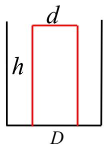
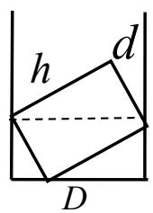
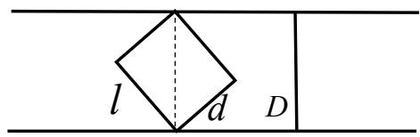
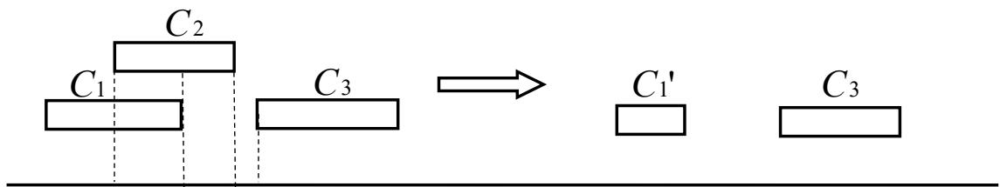

# 2014高教社杯全国大学生数学建模竞赛

## 承 诺 书

我们仔细阅读了《全国大学生数学建模竞赛章程》和《全国大学生数学建模竞赛参赛规则》（以下简称为“竞赛章程和参赛规则”，可从全国大学生数学建模竞赛网站下载）。

我们完全明白，在竞赛开始后参赛队员不能以任何方式（包括电话、电子邮件、网上咨询等）与队外的任何人（包括指导教师）研究、讨论与赛题有关的问题。

我们知道，抄袭别人的成果是违反竞赛章程和参赛规则的，如果引用别人的成果或其他公开的资料（包括网上查到的资料），必须按照规定的参考文献的表述方式在正文引用处和参考文献中明确列出。

我们郑重承诺，严格遵守竞赛章程和参赛规则，以保证竞赛的公正、公平性。如有违反竞赛章程和参赛规则的行为，我们将受到严肃处理。

我们授权全国大学生数学建模竞赛组委会，可将我们的论文以任何形式进行公开展示（包括进行网上公示，在书籍、期刊和其他媒体进行正式或非正式发表等）。

我们参赛选择的题号是（从 A/B/C/D 中选择一项填写）： D

我们的报名参赛队号为（8位数字组成的编号）： 23068006

所属学校（请填写完整的全名）： 四川建筑职业技术学院

参赛队员 (打印并签名) ：1. 王磊

2. 蔡姗姗

3. 蒋国辉

指导教师或指导教师组负责人 (打印并签名)： 黄磊

（论文纸质版与电子版中的以上信息必须一致，只是电子版中无需签名。以上内容请仔细核对，提交后将不再允许做任何修改。如填写错误，论文可能被取消评奖资格。）

日期： 2014 年 9 月 15 日

# 2014高教社杯全国大学生数学建模竞赛

## 编 号 专 用 页

赛区评阅编号（由赛区组委会评阅前进行编号）：

赛区评阅记录（可供赛区评阅时使用）：

<table><tr><td>评阅人</td><td></td><td></td><td></td><td></td><td></td><td></td><td></td><td></td><td></td><td></td></tr><tr><td>评分</td><td></td><td></td><td></td><td></td><td></td><td></td><td></td><td></td><td></td><td></td></tr><tr><td>备注</td><td></td><td></td><td></td><td></td><td></td><td></td><td></td><td></td><td></td><td></td></tr></table>

全国统一编号（由赛区组委会送交全国前编号）：

全国评阅编号（由全国组委会评阅前进行编号）：

# 储药柜的设计

## 摘要

本文针对自动补药药柜的设计进行研究。

针对问题一，在只考虑储药柜竖向隔板的最小间距种类，在满足安全送药的四个条件，即侧间距 2mm,无并排，无侧翻，无水平旋转下，建立单目标优化模型，并设计区间无重叠聚类算法，实现最少间距种类的求解，由程序得到最少四类列宽的分类，分别为

19mm，34mm，46mm，58mm

针对问题二，我们将总宽度冗余，与列间距类型数量作为目标，建立双目标规划模型。基于分层求解多目标规划模型方法，我们在问题一得到的 4个不同类型的基础上，首先建立冗余权重模型，首先计算出各中药盒宽度在原始 4种分类基础上的加权冗余，并按照其加权冗余累积贡献率排序，根据累积贡献率，我们讨论了 90%和 95%下，根据列宽优化算法，计算出新的列宽分类，经过加权冗余度和列宽类数的分析，我们确定在新增 3类情况下的最优解。列宽分别为

19mm，22mm，34mm，37mm，46mm，47mm，58mm

并且给出相应的药盒编号。

针对问题三，我们将平面总冗余度，与行间距类型最小作为目标，在以药柜给定规格为约束条件下，建立双目标规划模型。在问题二的基础上，我们通过对分布分析法，先按照比列均衡的思想确定药柜一行放置 76个药槽，在此基础上为了尽量减少平面冗余，我们按照高相近归类方法，得到药柜至少需要 26行，并且计算出高大致需要以下 9类。

34mm，41mm，47mm，54mm，60mm，72mm，85mm，101mm，125mm

针对问题四，在药槽长度1.5 米的条件下，我们首先计算出每一种药盒在药槽长度方向上能的个数。因此确定同一种要需要的药槽数量。又因为每天仅集中补药一次，所以设计的储药槽个数一次性能放药盒的个数大于该需求量的最大值才能满足。

关键词：双目标规划 区间无重叠聚类 分层法

## 一．问题重述

药柜的结构与书柜相似，若干个横向隔板和竖向隔板将储药柜分割成若干个储药槽，横向隔板决定所放药品的高度，竖向隔板决定所放药品的宽度，为了方便使用和保证药品分拣的准确率，防止发药错误，一个储药槽内只能摆放同一种药品，要求药盒与两侧竖向隔板之间、与上下两层横向隔板之间应留 2mm的间隙，同时还要求药盒在储药槽内推送过程中不会出现并排重叠、侧翻或水平旋转。为了更好的在实际中运用，在忽略横向和竖向隔板厚度的情况下，建立数学优化模型，给出下面几个问题的解决方案。

问题一：因为药盒尺寸规格差异较大，根据提供的数据，设计药柜的竖向隔板间距类型最小种类数的数量和每种类型所对应的药盒规格。

问题二：宽度冗余是药盒与两侧竖向隔板之间的间隙超出 2mm的部分，当适当增加竖向隔板间距类型的数量可以减少宽度冗余，但增加竖向隔板间距类型会增加储药柜的加工成本，通过对问题一中的最佳设计求解方案，设计出合理的竖向隔板间距类型数量以及每种类型对应的药盒编号，使得总宽度冗余尽可能小，同时也希望间距的类型数量尽可能少。

问题三：为了考虑拿药的方便性和补药的便利性，储药柜的尺寸要具有合理性和可行性，规定储药柜的宽度不超过 2.5m，高度不超过 2m，储药柜允许的最大有效高度为1.5m。药盒与两层横向隔板之间的间隙超过 2mm的部分叫做高度冗余，可以得出平面冗余=高度冗余×宽度冗余，在问题二中计算结果的基础上，确定储药柜横向隔板间距的类型数量，使得储药柜的总平面余量尽可能地小，且横向隔板间距的类型数量也尽可能地少。

问题四：由附件2可得每一种药品编号对应的最大日需求量。已知储药槽的宽度不超过2.5m，有效高度不超过 1.5m，长度为 1.5m，每天补药仅一次，请计算每一种药品需要的储药槽个数。为了保证药房储药满足需求，计算稀少需要多少个储药柜。

## 二．模型假设

1.假设每次从后端放入的药品都正立平稳放入；  
2.假设药盒水平旋转时中心点在一条直线上；  
3.假设药盒旋转角度超过 90°时才为水平旋转；  
4.假设每个药槽都有药盒放入；  
5.假设一天中仅有的一次药品补给是在药店下班前或者下班后一次性补给完成；

## 三．变量说明

：表示竖向隔板的间距；

：表示第 个型号药盒的长度；

：表示第 个型号药盒的宽度；

：表示第 个型号药盒的高度；

：表示竖向隔板间距类型数；

$C _ { j }$ ：表示定义域为 $[ x _ { j } , x _ { j } ^ { \setminus } )$ 的有效区间集合；

$K _ { i }$ ：表示冗余权重系数；

$\mathcal { Q } _ { i }$ ：表示冗余率；

：表示各药盒尺寸的频数；

：表示药盒尺寸出现的总频次；

$L _ { i }$ ：表示列宽冗余度；

$H _ { j }$ ：表示第 个药盒放入的药槽可能高度；

$R L _ { i }$ ：表示每个药盒放入对应药槽时的宽度冗余；

$R L _ { i }$ :表示每个药盒放入对应药槽时的宽度冗余；

$R P _ { i }$ :表示第i个药盒产生的平面冗余；

$x _ { i }$ :表示一排横向同类型列的药槽个数；

$y _ { i }$ :表示同类型高的在一列纵向中药槽个数；

## 四．模型的建立与求解

## 4.1 问题一的模型建立与求解

## 4.1.1 基于药盒安全推出下的最小列分类规划模型

## 模型分析

药盒为了能顺利推送过程，且不出现并排重叠、侧翻或水平旋转， 因此每个药盒存在对应的药槽列宽区间，下面根据三个条件我们分别讨论。

设 表示药槽的宽度， $l i \ , d _ { i } \ , h _ { i }$ ,表示药盒的长，宽，高。

(a) 顺利推出

根据题目，每个药盒与左右两侧间距 2mm，因此，为了能顺利推出，则

$$
d + 2 <   D \tag {1}
$$

(b) 无并排现象

为了不发生并排现象，则药槽的宽度不能大于两倍药盒的宽度，如图 1所示，因此，药槽宽度和药盒宽度之间满足：

$$
2 d <   D \tag {2}
$$

(c) 无侧翻现象

如图 2所示，我们定义当药盒在药槽内侧倒至药槽内时称为侧翻。考虑药盒在侧翻过程中，横向最大距离为宽与高的对角线，因此，为避免侧翻，则药槽的宽度应该大于此对角线长度，即：

$$
D <   \sqrt {d ^ {2} + h ^ {2}} \tag {3}
$$

## (d) 无水平旋转现象

如图 3所示，我们定义当药盒在药槽内平面旋转 90度时为水平旋转。同样考虑药盒在水平旋转过程中，横向最大距离为宽与长的对角线，因此，为避免水平旋转，则药槽的宽度应该大于此对角线长度，即：

$$
D <   \sqrt {d ^ {2} + l ^ {2}} \tag {4}
$$



<details>
<summary>text_image</summary>

d
h
D
</details>

图 1



<details>
<summary>text_image</summary>

h
d
D
</details>

图 2



<details>
<summary>text_image</summary>

l
d
D
</details>

图 3

## 模型建立

问题一即在满足以上四条的情况下，计算最小列宽分类，我们设N为药槽按照列宽的分类数，根据模型分析，建立最小列宽分类规划模型:

$$
\min N \tag {5}
$$

$$
s. t \left\{ \begin{array}{l} d _ {i} + 2 \leq D _ {i} <   2 d _ {i} \\ D _ {i} \leq \sqrt {d _ {i} ^ {2} + l _ {i} ^ {2}} \\ D _ {i} \leq \sqrt {d _ {i} ^ {2} + h _ {i} ^ {2}} \end{array} (i \in [ 1, 1 9 1 9 ], \text {且} i \in N (\text {整数})\right) \tag {6}
$$

## 4.1.2 基于区间无重叠下最小聚类法的模型求解

要求解 4.1.1中的模型，我们首先根据约束条件，根据附表 1中的原始数据算出每个药盒的宽度容许区间。以每个药盒尺寸的第一个区间为例，如下表：（程序见附录1）

表1.药盒的列宽容许度区间表

<table><tr><td>宽度</td><td>有效区间</td><td>宽度</td><td>有效区间</td><td>宽度</td><td>有效区间</td><td>宽度</td><td>有效区间</td><td>宽度</td><td>有效区间</td></tr><tr><td>10</td><td>[12, 20)</td><td>20</td><td>[22, 40)</td><td>30</td><td>[32, 60)</td><td>40</td><td>[42, 80)</td><td>50</td><td>[52, 82)</td></tr><tr><td>11</td><td>[13, 22)</td><td>21</td><td>[23, 42)</td><td>31</td><td>[33, 43. 8)</td><td>41</td><td>[43, 58)</td><td>51</td><td>[53, 72. 8)</td></tr><tr><td>12</td><td>[14, 24)</td><td>22</td><td>[24, 38. 8)</td><td>32</td><td>[34, 51. 2)</td><td>42</td><td>[44, 60)</td><td>52</td><td>[54, 73. 5)</td></tr></table>

为了将所有药盒用最少的药槽规格来放置，等价于对 个区间，我们寻找 个区间，使得这 个区间之间交集为空，且这 个区间每一个都至少完全属于原始区间中的某一个。

## 区间无重叠聚类算法

第一步，将所有区间，按照区间下限从小到大排列，记排序好的区间为

$$
[ C _ {i -}, C _ {i +} ]
$$

第二步，从第一个区间开始,比对 的上限与 $C _ { 2 }$ 的下限，

若当 $C _ { 1 } \cap C _ { 2 } = 0$ 时，则 $C _ { 1 }$ 为单独一类，并从分析中暂时剔除，对 $C _ { 2 . . . } C _ { M }$ 继续聚类

当 $C _ { 1 } \cap C _ { 2 } \neq 0$ 时，交集为 $C _ { 1 } ^ { \prime }$ ，则将 $C _ { 1 } ^ { \prime }$ 代替 $C _ { 1 } , C _ { 2 }$ ，对 $C _ { 1 } ^ { \prime } . . . C _ { 3 . . . } C _ { M }$ 继续聚类。

第三步，重复第二步，直至所有原始区间聚类完毕。

聚类过程示意图如图 4所示：



<details>
<summary>text_image</summary>

C₁
C₂
C₃
C₁'
C₃
</details>

图4区间无重叠聚类示意图

按照上述聚类过程，显然最后得到的 个区间相互间无重叠，且每个区间一定完全包含于原始的某个区间中，即所有的药盒一定能放置于某个聚类后的药槽中,根据算法编制程序见附录 2。

最后聚类得到的区间见表 2

表2：规格聚类分析表

<table><tr><td>规格种类序号</td><td>聚类区间</td></tr><tr><td>1</td><td>[19, 20)</td></tr><tr><td>2</td><td>[34, 34. 9857113690718)</td></tr><tr><td>3</td><td>[46, 46. 6690475583121)</td></tr><tr><td>4</td><td>[58, 63. 6396103067893)</td></tr></table>

考虑到空间节约，药槽宽度取每个区间下限即可，即最少的药槽列宽规格为19mm,34mm，46mm，58mm 每个规格下可放置的药品规格如下表:

表3：药盒宽度的最佳取值表

<table><tr><td>药槽规格D/mm</td><td>对应的药盒规格宽度最佳取值范围d/mm</td></tr><tr><td>19</td><td>10~17</td></tr><tr><td>34</td><td>18~32</td></tr><tr><td>46</td><td>33~44</td></tr><tr><td>58</td><td>45~56</td></tr></table>

所以综上所述，竖向隔板间距类型最少的储药规格有 4种，每种类型所对应的药盒规格如上表。

## 模型二的建立(列宽冗余双目标规划)

## 4.2.1 模型分析与建立

列宽对于超过规定尺寸以外的距离，称为宽度冗余。根据题目，列宽冗余的计算公式为：

$$
L _ {i} = D _ {i} - d _ {i} - 2 \tag {7}
$$

整个药槽的总列宽冗余为 $\sum L _ { i }$

问题二即在列分类较少的情况下使得总列宽冗余最小。

将列宽冗余的最小作为目标，我们在模型一的基础上建立列宽冗余双目标规划模型如下：

$$
\begin{array}{l l} \min & \sum L _ {i} \\ \min & N \end{array} \tag {8}
$$

$$
\left\{ \begin{array}{l} d _ {i} + 2 \leq D _ {i} <   2 d _ {i} \\ D _ {i} \leq \sqrt {d _ {i} ^ {2} + l _ {i} ^ {2}} \\ D _ {i} \leq \sqrt {d _ {i} ^ {2} + h _ {i} ^ {2}} \end{array} \right.
$$

## 4.2.2 基于分层法求解双目标规划

由于模型二是双目标规划，我们根据分层法进行求解，将冗余度尽可能小作为主要目标，先求解列分类较少这一目标。这一步我们直接应用问题一的结论，在此基础上进行冗余度最小的求解。

为了减少冗余度，我们首先将问题一结论中放置方案的每个药盒的冗余度计算出来，见表4(程序见附件 3)

表4：问题一结论基础上每个药盒的冗余度表

<table><tr><td>药品编号</td><td>药品规格 d/mm</td><td>药槽规格 D/mm</td><td>冗余度  $S_i$ /mm</td></tr><tr><td>669</td><td>10</td><td>19</td><td>7</td></tr><tr><td>774</td><td>10</td><td>19</td><td>7</td></tr><tr><td>1352</td><td>10</td><td>19</td><td>7</td></tr><tr><td>1471</td><td>10</td><td>19</td><td>7</td></tr></table>

为下面说明方便，我们定义：

冗余权重：将同宽的药盒归类，考虑每一类在总药盒数中的比例，即

$$
A _ {i} = \frac {m _ {i}}{M} \tag {9}
$$

分类加权冗余度：同宽药盒的冗余度乘以冗余权重，即

$$
K _ {i} = S _ {i \times} A _ {i} \tag {10}
$$

分权贡献率： 将分类加权冗余度求和，考虑每一类在总加权冗余的比列，即

$$
Q _ {i} = \frac {K _ {i}}{\sum K _ {i}} \tag {11}
$$

在此基础上我们计算出分类加权冗余度表，并按升序排列，加权冗余度 $K _ { i }$ 和分权贡献率 $\mathcal { Q } _ { i }$ 的具体值如下表 5（程序见附录 4和附录5）

表5：各种列宽加权冗余权度和分权贡献率

<table><tr><td>D</td><td> $K_i$ </td><td> $Q_i$ </td></tr><tr><td>32</td><td>0</td><td>0</td></tr><tr><td>17</td><td>0</td><td>0</td></tr><tr><td>54</td><td>0.104220948</td><td>0.000144248</td></tr><tr><td>55</td><td>0.312662845</td><td>0.0004327744</td></tr></table>

因此，要最尽量减少冗余度，我们首要减少在加权冗余度较高的那些列。即对此类列增加相应规格的药槽。

我们取 0.9 作为基准，和表 5 反序，从大到小排列，认为 $\sum Q _ { i } > 9 0 \%$ 中的各个药盒，对宽度冗余和竖向隔板间距数量有较大的影响。因此我们对此考虑优化。

## 基于问题一基础上合并优化列宽冗余度步骤

第一步：从列分类中找到 $\mathcal { Q } _ { i }$ 最大的开始，单独为其设置一个无冗余的规格，同时在此规格里，在其前面的药盒规格同样可以放入这个规格。

第二步：从剩下的列中重复第一步，直至 90%之前的列宽都放入新设置的规格中。

根据上述步骤，我们很容易找到在 90%的基准下，产生7个竖向隔板类型数时，分别是：19mm，22mm，34mm，37mm，46mm，47mm，58mm。每种药盒所对应的最佳宽度范围如下表 6：

表6：冗余度最佳取值范围表

<table><tr><td>竖向隔板间距单位(mm)</td><td>对应的药盒规格宽度d的最佳取值范围单位(mm)</td></tr><tr><td>19</td><td>[10, 17]</td></tr><tr><td>22</td><td>[18, 20]</td></tr><tr><td>34</td><td>[21, 32]</td></tr><tr><td>37</td><td>[33, 35]</td></tr><tr><td>46</td><td>[36, 44]</td></tr><tr><td>47</td><td>45</td></tr><tr><td>58</td><td>[46, 56]</td></tr></table>

用EXCEL 将7种不同的隔板间距分别求出对应的编号如表 7（全部数据见附件 7）

表7：19mm对应的药品编号（部分）

<table><tr><td>药品编号</td><td>药品编号</td><td>药品编号</td><td>药品编号</td></tr><tr><td>669</td><td>471</td><td>197</td><td>1297</td></tr><tr><td>1908</td><td>61</td><td>476</td><td>87</td></tr></table>

在新的分列下，加权冗余度和分权贡献率如表 8：

表 8：新的各种列宽加权冗余权度和分权贡献率

<table><tr><td>D</td><td> $K_i$ </td><td> $Q_i$ </td></tr><tr><td>17</td><td>0</td><td>0</td></tr><tr><td>18</td><td>0</td><td>0</td></tr><tr><td>54</td><td>0.104220948</td><td>0.0002</td></tr><tr><td>55</td><td>0.312662845</td><td>0.0006</td></tr></table>

灵敏度分析，我们适当修改选取比例由 90%变为95%，我们取0.95 作为基准，和表 5 反序，从大到小排列，认为 $\sum Q _ { i } > 9 5 \%$ 中的各个药盒，对宽度冗余和竖向隔板间距数量有较大的影响。因此我们对此考虑优化。同理计算出一个新冗余度，如表 9

表9：冗余度的最佳取值范围

<table><tr><td>竖向隔板间距单位(mm)</td><td>对应的药盒规格宽度d的最佳取值范围单位(mm)</td></tr><tr><td>19</td><td>[10, 17]</td></tr><tr><td>22</td><td>[18, 20]</td></tr><tr><td>27</td><td>[21, 25]</td></tr><tr><td>34</td><td>[26, 32]</td></tr><tr><td>37</td><td>[33, 35]</td></tr><tr><td>46</td><td>[36, 44]</td></tr><tr><td>47</td><td>45</td></tr><tr><td>49</td><td>[46, 47]</td></tr><tr><td>58</td><td>[48, 56]</td></tr></table>

对比分析减少90%与 95%时，冗余度与隔板类型的差别，如表 10。

表10：隔板数量与加权冗余度比较

<table><tr><td>合并累积贡献度</td><td>隔板数量</td><td>加权冗余度</td></tr><tr><td>90%</td><td>7</td><td>205.3</td></tr><tr><td>95%</td><td>9</td><td>367.3</td></tr><tr><td>原始</td><td>4</td><td>722.58</td></tr></table>

从表 10 中看到，我们以设计的竖向隔板宽度在 90%的基准下，产生 7 个竖向隔板类型数时，冗余度减少与隔板类型较优，分别是：

19mm，22mm，34mm，37mm，46mm，47mm，58mm

## 4.3 问题三的模型建立与求解

## 4.3.1 平面冗余度最小多目标规划模型

## 模型的分析

问题二我们已经求得 7个最优列宽分类，在此基础上考虑高度上的冗余。记$H _ { j }$ 表示可能的高度，其中 $j = 1 , . . . , N _ { h }$

根据题意，首先得到高度冗余计算公式

$$
R H _ {j} = H _ {(j)} - h _ {j} - 2, \quad j = 1,..., 1 9 1 9 \tag {12}
$$

$H _ { ( j ) }$ 表示第 个药盒放入的药槽可能高度。

$R L _ { i }$ 表示每个药盒放入对应药槽时的宽度冗余。因此，每个药盒产生的平面冗余为

$$
R P _ {i} = R H _ {i} \cdot R L _ {i} \tag {13}
$$

总平面冗余为

$$
R P = \sum_ {i = 1} ^ {1 9 1 9} R P _ {i} \tag {14}
$$

同时根据，根据题意，药柜的设计要满足药柜的宽度和高度的要求，同时要将1919种药品放入柜中，因此满足一下三个约束条件。

横向约束：设每类列宽在 2.5 米规格的药柜里， $x _ { i }$ 表示一排横向同类型列的药槽个数，因此有

$$
\sum_ {i = 1} ^ {7} x _ {i} L _ {i} \leq 2 5 0 0 \tag {15}
$$

纵向约束：同时，高度不能超过 1.5米，因此有

$$
\sum_ {i = 1} ^ {N _ {h}} y _ {i} H _ {i} \leq 1 5 0 0 \tag {16}
$$

其中 $y _ { i }$ 表示同类型高的在一列纵向中药槽个数。

药品种类约束：

$$
\sum_ {i = 1} ^ {N _ {h}} y _ {i} \sum_ {i = 1} ^ {7} x _ {i} > 1 9 1 9 \tag {17}
$$

## 模型的建立

根据上述分析，在冗余度最小的情况下，同时兼顾横向隔板类型最小，因此建立双目标规划模型如下

1919 目标： min RP = ∑RP1 (18) min Nh

$$
s. t \quad \left\{ \begin{array}{l} \sum_ {i = 1} ^ {7} x _ {i} L _ {i} \leq 2 5 0 0 \\ \sum_ {i = 1} ^ {N _ {h}} y _ {i} H _ {i} \leq 1 5 0 0 \\ \sum_ {i = 1} ^ {N _ {h}} y _ {i} \sum_ {i = 1} ^ {7} x _ {i} > 1 9 1 9 \\ H _ {(j)} - h _ {j} \geq 2 \\ j = 1, \dots , 1 9 1 9 \end{array} \right. \tag {19}
$$

## 模型的求解

模型也属于多目标优化，对此我们将减少隔板类型作为主要目标，同时兼顾平面冗余度。由于模型在平面横向，纵向两方向都存在未知量 $x _ { i } , y _ { i }$ ，因此我们可以先将列项优先考虑，然后再考虑横向隔板划分。

首先我们，在问题二基础上统计 7类中，每一类所包含的药品的高度分布表，（程序7）得到表 11

表11：高度分布表

<table><tr><td>列宽\高度</td><td>28</td><td>29</td><td>30</td><td>31</td><td>32</td></tr><tr><td>22</td><td>0</td><td>0</td><td>4</td><td>8</td><td>12</td></tr><tr><td>34</td><td>2</td><td>2</td><td>2</td><td>12</td><td>8</td></tr><tr><td>37</td><td>0</td><td>0</td><td>0</td><td>0</td><td>0</td></tr></table>

并且统计出按列每一类的包含的药的数量如表 12

表 12

<table><tr><td>列</td><td>19</td><td>22</td><td>34</td><td>37</td><td>46</td><td>47</td><td>58</td></tr><tr><td>包含药品数  $yp_i$ </td><td>286</td><td>427</td><td>669</td><td>122</td><td>220</td><td>54</td><td>141</td></tr></table>

因为药柜设计时为横列矩形格子，所以，在考虑 $x _ { i }$ 的个数时，应当尽可能满足

$$
\frac {x _ {i}}{y p _ {i}} = \frac {x _ {j}}{y p _ {j}}, i, j = 1, 2,..., 7 \tag {20}
$$

因此根据表13可算出， $x _ { i }$ 之间的比例关系大致为

表 13： $x _ { i }$ 的比例关系表

<table><tr><td> $x_{i}$ </td><td> $x_{1}$ </td><td> $x_{2}$ </td><td> $x_{3}$ </td><td> $x_{4}$ </td><td> $x_{5}$ </td><td> $x_{6}$ </td><td> $x_{7}$ </td></tr><tr><td>比例关系</td><td>5.29</td><td>7.9</td><td>12.4</td><td>2.3</td><td>4.1</td><td>1</td><td>2.6</td></tr></table>

根据约束条件 $\sum _ { i = 1 } ^ { 7 } x _ { i } L _ { i } \leq 2 5 0 0$ ，为了节约空间，尽可能达到 2500，并且药槽列宽大的可以放置部分药盒列宽较小药盒，而反过来不行，因此，根据此原则，上述比例适当修正可以得到表 1

表 14： $\underline { { x } } _ { i }$ 对应的个数表

<table><tr><td> $x_{i}$ </td><td> $x_{1}$ </td><td> $x_{2}$ </td><td> $x_{3}$ </td><td> $x_{4}$ </td><td> $x_{5}$ </td><td> $x_{6}$ </td><td> $x_{7}$ </td></tr><tr><td>个数</td><td>11</td><td>17</td><td>28</td><td>5</td><td>7</td><td>2</td><td>6</td></tr></table>

此时，长度上满足

$$
\sum_ {i = 1} ^ {7} x _ {i} L _ {i} = 2 4 8 4 \leq 2 5 0 0 \tag {21}
$$

根据列的个数确定，我们估算行的个数。通过 的数量与 $y p _ { i }$ $x _ { i }$ 的比值我们得到，横向隔板大致数量。

表 15： $x _ { i }$ 对应的 ${ \underline { { y p } } } _ { i }$ 的数量表

<table><tr><td>列的类型</td><td>19</td><td>22</td><td>34</td><td>37</td><td>46</td><td>47</td><td>58</td></tr><tr><td> $\frac{yp_i}{x_i}$ </td><td>26</td><td>25.1</td><td>23.8</td><td>24.4</td><td>31.426</td><td>27</td><td>23.5</td></tr></table>

从上面数据中可以看出，数据越小表明此类格子行上比较空闲，例如 34 列宽的药槽，在药柜中按照原始药盒的放置会有较多剩余。因此可以考虑将 22 中部分放入34 中，同时将 19中部分放入22中达到平衡，同理 46，47中部分可以放入58 中。

还可以估计上述的平均值为 25.4,因此横向隔板的数量为 26。此时也满足条件约束

$$
\sum_ {i = 1} ^ {N _ {h}} y _ {i} \sum_ {i = 1} ^ {7} x _ {i} = 2 6 \times 7 6 = 1 9 7 6 > 1 9 1 9 \tag {22}
$$

最后，为了尽量控制平面冗余，在实际设计时，同行的高度需要尽可能的相等，因此，我们根据已经确定好的一行 76 个药槽，对高度进行划分。我们可以将所有药盒按照高度排列，同时考虑按列宽分类统计。

通过程序（见附录 8）算出76节点处的高度，为每一行高度的基本值。

36 39 43 46 48 51 53 57 62 63 64 67 68 69 71 72 73 74 75 77 78 82 83 87 102 127

计算可知该基准值值和大于 1500，分析发现其中部分为最后个别高度所限制，所以可以将该药品放入下一行中，从而调节该行高度，计算出高大致需要以下9 类。

34mm，41mm，47mm，54mm，60mm，72mm，85mm，101mm，125mm

## 4.4 问题 4的模型建立与求解

## 4.4.1 最小槽数规划模型

模型分析：设 为不同药盒的长度，对应的日需求量为 $W _ { i }$ ，在每天补药一次的情况下，保证药房储药满足的需求。首先找出 1.5m 长的药槽每一个槽最多放多少个药盒，设计出 个药槽，使得一次性能放此药盒的个数必须要大于总需求量的最大需求量，建立最小槽数模型找出满足条件最小的储药槽个数。

模型建立如下：

目标： m<sup>i</sup>n ni （23）

$$
s. t \quad \left\{ \begin{array}{c} \frac {1 5 0 0}{l _ {i}} = C _ {i} (\text {小数部分舍去}) \\ n _ {i} \times C _ {i} \geq W _ {i} \end{array} \right. \tag {24}
$$

## 4.4.2

模型的求解：根据最小槽数规划模型，分别找出每一种药品在储药柜长度方向上最多能放的个数，用 MATLAB编程得出各个药品对应的最小储药槽个数，如表 16（全部数据见附录 8，程序见附录第四题程序 6）

表16：不同药品对应的药槽个数

<table><tr><td>药品编号</td><td>药槽个数</td><td>药品编号</td><td>药槽个数</td></tr><tr><td>120</td><td>22</td><td>125</td><td>9</td></tr><tr><td>125</td><td>13</td><td>120</td><td>9</td></tr><tr><td>125</td><td>12</td><td>117</td><td>8</td></tr><tr><td>91</td><td>8</td><td>78</td><td>5</td></tr></table>

## 4.4.3

## 模型的建立

药店药品的需求量能够满足第一天在销售中不补给，则需在第二天在销售药品之前补药一次。假设每个药槽都放有药盒，则需储药柜最少个数个数

目标： (进一取整)

同时应满足

$$
s. t \left\{ \begin{array}{l} A _ {i} = \frac {R _ {i} \times l _ {i}}{L} \\ D _ {i} \geq \mathrm{d} _ {i} + 2 \\ \mathrm{H} _ {i} \geq \mathrm{h} _ {i} + 2 \\ \sum H _ {i} \leq 1 5 0 0 \\ \sum \mathrm{D} _ {i} \leq 2 5 0 0 \\ \sum D _ {i} \times H _ {i} \times A _ {i} \leq L \times H \\ \sum H _ {j} \times D _ {j} \times A _ {j} \leq \mathrm{n} \times L \times H \\ 1 \leq i <   1 9 1 9 \\ j = (1, 2, 3 \dots , 1 9 1 9) \end{array} \right. \tag {25}
$$

## 模型的求解

求每种药盒装入药槽中所需要的药槽个数，在 EXCEL中用ROUNDUP命令，得到进1取整后的个数，再求出药槽面积乘以该槽的个数，对所求乘积进行求和，再对得到总和除以药柜最大面积，从而得到最少的药柜数为 2个。

## 五．模型的评价与推广

优点：

在问题一中通过题目已知条件，建立的最小列宽分类规划模型方便有效的找出了不同型号对应的列宽容许度的范围，区间无重叠聚类算法方便的找出了有共同区域的区间，简单的剔除了独立区间。

在问题二中建立的列宽冗余度双目标规划模型和分层法，根据分层法进行求解，将冗余度尽可能小作为主要目标，先求解列分类较少这一目标。这一步我们直接应用问题一的结论，在此基础上进行冗余度最小的求解。

缺点：

最后找出的是一个区间，达不到是一个数的目的，我们根据累计贡献度的大小，将一些有效的数据剔除掉了，从而在所剩下的数据中找出最大值来作为所要求得值。

## 参考文献

[1]张秀兰，林峰，数学建模与实验，北京：化学工业出版社，2013  
[2]周品，赵新芬，MATLAB 数理统计分析，北京：国防工业出版社，2009  
[3]任玉杰，数值分析及 MATLAB 实现，北京：高等出版社，2007  
[4]丁世飞，靲奉祥，赵相伟，现代数据分析与信息模式识别，北京：科学出版社，2012

## 附录

附录 1：  
```matlab
function A=qujian(B) %%%%求每一个药品的容许列区间
[m,n]=size(B);
for i=1:m
    k=B(i,4); %%%宽
    c=B(i,2); %%%长
    g=B(i,3); %%%高
    dkg=sqrt(k^2+g^2); %%%宽高对角线
    dck=sqrt(c^2+k^2); %%%宽长对角线
    A(i,1)=B(i,1); %%%编号
    A(i,2)=k+4;%%下限
    A(i,3)=min([2*k,dkg,dck]);%%上限
End
```  
附录 2：

function K=julei(B)%%%K 类 和具体编号  
```matlab
[m,n]=size(B);

C=sortrows(B,2);

K={};
t=1;
K{t,2}=[];
for i=1:m-1
    if C(i,3)<=C(i+1,2)
        K{t,1}=[C(i,2),C(i,3)];
        K{t,2}=[K{t,2},C(i,1)];
        t=t+1;
        K{t,2}=[];
    else
        C(i+1,3)=min(C(i,3),C(i+1,3));
        K{t,1}=[C(i+1,2),C(i,3)];
        K{t,2}=[K{t,2},C(i,1)];
    end

end
```

附录3：求冗余  
```matlab
function A=rongyu(B,C)
[m,n]=size(B)
```

```matlab
t=1;
for i=1:m
    xia=min(B{i,1});
    BH=B{i,2};
    [m1,n1]=size(BH);
    for j=1:n1
        A(t,1)=BH(j);
        A(t,2)=C(C(:,1)==BH(j),4);
        A(t,3)=xia;
        A(t,4)=xia-A(t,2)-2;
        t=t+1;
    end
end
```

附录4：求冗余权重系数  
```matlab
function [dd,d]=rl(B)
[m,n]=size(B);

d=tabulate(B(:,2));
d=d(10:end,:);          %%%%累计贡献率数据

dd=sortrows(d,3);
```

附录5：程序3：求分类加权冗余度  
```matlab
function B = jryl( A )
%UNTITLED5 Summary of this function goes here
%    Detailed explanation goes here
[m,n]=size(A);

for i=1:m
```

```matlab
if A(i,1)<=17&A(i,1)>=10
    B(i,2)=(19-A(i,1)-2)*A(i,3);
    B(i,1)=A(i,1);
elseif A(i,1)<=31&A(i,1)>=18
    B(i,2)=(34-A(i,1)-2)*A(i,3);
    B(i,1)=A(i,1);
elseif A(i,1)<=44&A(i,1)>=33
    B(i,2)=(46-A(i,1)-2)*A(i,3);
    B(i,1)=A(i,1);
```

```matlab
elseif A(i,1)<=56&A(i,1)>=45
    B(i,2)=(58-A(i,1)-2)*A(i,3);
B(i,1)=A(i,1);

end
end
end
```

附件 6：

function n=cs(x)

%UNTITLED2 Summary of this function goes here

% Detailed explanation goes here

n=x(:,3)./(1500./x(:,2))

end

附件 7：

function [c,JUG,R]=lkjulei(A,B) %%%%A 表示原始数据，B 表示列宽类别,分类，构造按列的高度统计表程序

[m,n]=size(A);

[m1,n1]=size(B);

for i=1:m

p=0;

t=1;

while p==0

if A(i,4)<=B(t)-2

b=B(t);

R(i,1)=A(i,1);

R(i,2)=A(i,4);

R(i,3)=A(i,3);

R(i,4)=b;

p=1;

else

t=t+1;

end

end

end

for i=1:n1

```matlab
JUG{i,1}=R(R(:,4)==B(1,i),3);
end
```

```matlab
for i=1:7
    a=JUG{i,1};
    b=tabulate(a);
    b=b(b(:,2)~=0,:);
    [m,n]=size(b);
        for   j=1:m
            c(i,b(j))=b(j,2);
        end
end
c=c(:,28:end);
c=[c;28:125];
c=[[B';0],c];
```

附件 8：

function t=gfl(C)%%%%高分类程序

```matlab
[m,n]=size(C);
t=0;
i=2;
while i<=99
    p=1;
    a=zeros(7,1);
while p==1|i>99
    a=a+C(1:7,i);
    bb=sum(a.*C(1:7,1));
    if sum(a.*C(1:7,1))<=2500
        i=i+1;
    else

        t=t+1;
        g(t)=C(8,i-1);
        p=0;
    end
end
End
```

附录 7：

<table><tr><td>药槽规格</td><td>编号</td><td>药槽规格</td><td>编号</td><td>药槽规格</td><td>编号</td><td>药槽规格</td><td>编号</td><td>药槽规格</td><td>编号</td><td>药槽规格</td><td>编号</td><td>药槽规格</td><td>编号</td><td>药槽规格</td></tr><tr><td>19</td><td>4</td><td>19</td><td>927</td><td>22</td><td>42</td><td>22</td><td>707</td><td>22</td><td>1430</td><td>34</td><td>105</td><td>34</td><td>580</td><td>34</td></tr><tr><td>19</td><td>18</td><td>19</td><td>928</td><td>22</td><td>48</td><td>22</td><td>712</td><td>22</td><td>1432</td><td>34</td><td>106</td><td>34</td><td>582</td><td>34</td></tr><tr><td>19</td><td>25</td><td>19</td><td>934</td><td>22</td><td>50</td><td>22</td><td>713</td><td>22</td><td>1433</td><td>34</td><td>110</td><td>34</td><td>583</td><td>34</td></tr><tr><td>19</td><td>34</td><td>19</td><td>936</td><td>22</td><td>52</td><td>22</td><td>714</td><td>22</td><td>1437</td><td>34</td><td>114</td><td>34</td><td>586</td><td>34</td></tr><tr><td>19</td><td>61</td><td>19</td><td>950</td><td>22</td><td>57</td><td>22</td><td>733</td><td>22</td><td>1444</td><td>34</td><td>119</td><td>34</td><td>587</td><td>34</td></tr><tr><td>19</td><td>62</td><td>19</td><td>953</td><td>22</td><td>68</td><td>22</td><td>735</td><td>22</td><td>1450</td><td>34</td><td>124</td><td>34</td><td>590</td><td>34</td></tr><tr><td>19</td><td>67</td><td>19</td><td>954</td><td>22</td><td>70</td><td>22</td><td>737</td><td>22</td><td>1451</td><td>34</td><td>127</td><td>34</td><td>592</td><td>34</td></tr><tr><td>19</td><td>80</td><td>19</td><td>962</td><td>22</td><td>71</td><td>22</td><td>742</td><td>22</td><td>1452</td><td>34</td><td>134</td><td>34</td><td>594</td><td>34</td></tr><tr><td>19</td><td>84</td><td>19</td><td>971</td><td>22</td><td>75</td><td>22</td><td>745</td><td>22</td><td>1453</td><td>34</td><td>137</td><td>34</td><td>597</td><td>34</td></tr><tr><td>19</td><td>87</td><td>19</td><td>975</td><td>22</td><td>78</td><td>22</td><td>753</td><td>22</td><td>1456</td><td>34</td><td>144</td><td>34</td><td>604</td><td>34</td></tr><tr><td>19</td><td>91</td><td>19</td><td>990</td><td>22</td><td>79</td><td>22</td><td>758</td><td>22</td><td>1457</td><td>34</td><td>146</td><td>34</td><td>605</td><td>34</td></tr><tr><td>19</td><td>93</td><td>19</td><td>1004</td><td>22</td><td>103</td><td>22</td><td>761</td><td>22</td><td>1458</td><td>34</td><td>164</td><td>34</td><td>610</td><td>34</td></tr><tr><td>19</td><td>97</td><td>19</td><td>1012</td><td>22</td><td>108</td><td>22</td><td>765</td><td>22</td><td>1460</td><td>34</td><td>166</td><td>34</td><td>616</td><td>34</td></tr><tr><td>19</td><td>99</td><td>19</td><td>1016</td><td>22</td><td>113</td><td>22</td><td>766</td><td>22</td><td>1461</td><td>34</td><td>174</td><td>34</td><td>618</td><td>34</td></tr><tr><td>19</td><td>107</td><td>19</td><td>1018</td><td>22</td><td>115</td><td>22</td><td>769</td><td>22</td><td>1463</td><td>34</td><td>175</td><td>34</td><td>621</td><td>34</td></tr><tr><td>19</td><td>111</td><td>19</td><td>1022</td><td>22</td><td>116</td><td>22</td><td>770</td><td>22</td><td>1472</td><td>34</td><td>178</td><td>34</td><td>625</td><td>34</td></tr><tr><td>19</td><td>112</td><td>19</td><td>1023</td><td>22</td><td>118</td><td>22</td><td>771</td><td>22</td><td>1473</td><td>34</td><td>179</td><td>34</td><td>626</td><td>34</td></tr><tr><td>19</td><td>117</td><td>19</td><td>1030</td><td>22</td><td>121</td><td>22</td><td>779</td><td>22</td><td>1476</td><td>34</td><td>192</td><td>34</td><td>627</td><td>34</td></tr><tr><td>19</td><td>120</td><td>19</td><td>1032</td><td>22</td><td>125</td><td>22</td><td>786</td><td>22</td><td>1477</td><td>34</td><td>193</td><td>34</td><td>632</td><td>34</td></tr><tr><td>19</td><td>122</td><td>19</td><td>1049</td><td>22</td><td>126</td><td>22</td><td>787</td><td>22</td><td>1483</td><td>34</td><td>194</td><td>34</td><td>635</td><td>34</td></tr><tr><td>19</td><td>123</td><td>19</td><td>1051</td><td>22</td><td>130</td><td>22</td><td>788</td><td>22</td><td>1491</td><td>34</td><td>195</td><td>34</td><td>644</td><td>34</td></tr><tr><td>19</td><td>128</td><td>19</td><td>1053</td><td>22</td><td>131</td><td>22</td><td>790</td><td>22</td><td>1507</td><td>34</td><td>213</td><td>34</td><td>651</td><td>34</td></tr><tr><td>19</td><td>141</td><td>19</td><td>1069</td><td>22</td><td>132</td><td>22</td><td>791</td><td>22</td><td>1509</td><td>34</td><td>218</td><td>34</td><td>652</td><td>34</td></tr><tr><td>19</td><td>151</td><td>19</td><td>1070</td><td>22</td><td>133</td><td>22</td><td>792</td><td>22</td><td>1510</td><td>34</td><td>219</td><td>34</td><td>653</td><td>34</td></tr><tr><td>19</td><td>168</td><td>19</td><td>1071</td><td>22</td><td>135</td><td>22</td><td>797</td><td>22</td><td>1511</td><td>34</td><td>222</td><td>34</td><td>654</td><td>34</td></tr><tr><td>19</td><td>177</td><td>19</td><td>1072</td><td>22</td><td>136</td><td>22</td><td>798</td><td>22</td><td>1512</td><td>34</td><td>227</td><td>34</td><td>656</td><td>34</td></tr><tr><td>19</td><td>184</td><td>19</td><td>1076</td><td>22</td><td>140</td><td>22</td><td>815</td><td>22</td><td>1524</td><td>34</td><td>234</td><td>34</td><td>659</td><td>34</td></tr><tr><td>19</td><td>185</td><td>19</td><td>1079</td><td>22</td><td>145</td><td>22</td><td>816</td><td>22</td><td>1525</td><td>34</td><td>237</td><td>34</td><td>661</td><td>34</td></tr><tr><td>19</td><td>196</td><td>19</td><td>1080</td><td>22</td><td>147</td><td>22</td><td>823</td><td>22</td><td>1530</td><td>34</td><td>239</td><td>34</td><td>663</td><td>34</td></tr><tr><td>19</td><td>197</td><td>19</td><td>1081</td><td>22</td><td>163</td><td>22</td><td>826</td><td>22</td><td>1538</td><td>34</td><td>246</td><td>34</td><td>664</td><td>34</td></tr><tr><td>19</td><td>199</td><td>19</td><td>1082</td><td>22</td><td>165</td><td>22</td><td>831</td><td>22</td><td>1546</td><td>34</td><td>247</td><td>34</td><td>667</td><td>34</td></tr><tr><td>19</td><td>230</td><td>19</td><td>1083</td><td>22</td><td>169</td><td>22</td><td>832</td><td>22</td><td>1550</td><td>34</td><td>248</td><td>34</td><td>670</td><td>34</td></tr><tr><td>19</td><td>241</td><td>19</td><td>1085</td><td>22</td><td>186</td><td>22</td><td>838</td><td>22</td><td>1554</td><td>34</td><td>249</td><td>34</td><td>675</td><td>34</td></tr><tr><td>19</td><td>252</td><td>19</td><td>1092</td><td>22</td><td>198</td><td>22</td><td>846</td><td>22</td><td>1556</td><td>34</td><td>250</td><td>34</td><td>676</td><td>34</td></tr><tr><td>19</td><td>253</td><td>19</td><td>1097</td><td>22</td><td>203</td><td>22</td><td>848</td><td>22</td><td>1571</td><td>34</td><td>251</td><td>34</td><td>677</td><td>34</td></tr><tr><td>19</td><td>254</td><td>19</td><td>1100</td><td>22</td><td>205</td><td>22</td><td>849</td><td>22</td><td>1573</td><td>34</td><td>259</td><td>34</td><td>681</td><td>34</td></tr><tr><td>19</td><td>255</td><td>19</td><td>1111</td><td>22</td><td>209</td><td>22</td><td>852</td><td>22</td><td>1574</td><td>34</td><td>267</td><td>34</td><td>682</td><td>34</td></tr><tr><td>19</td><td>269</td><td>19</td><td>1132</td><td>22</td><td>210</td><td>22</td><td>861</td><td>22</td><td>1584</td><td>34</td><td>271</td><td>34</td><td>689</td><td>34</td></tr><tr><td>19</td><td>274</td><td>19</td><td>1133</td><td>22</td><td>214</td><td>22</td><td>869</td><td>22</td><td>1590</td><td>34</td><td>281</td><td>34</td><td>705</td><td>34</td></tr><tr><td>19</td><td>278</td><td>19</td><td>1135</td><td>22</td><td>215</td><td>22</td><td>877</td><td>22</td><td>1600</td><td>34</td><td>282</td><td>34</td><td>706</td><td>34</td></tr><tr><td>19</td><td>287</td><td>19</td><td>1152</td><td>22</td><td>216</td><td>22</td><td>878</td><td>22</td><td>1602</td><td>34</td><td>284</td><td>34</td><td>708</td><td>34</td></tr><tr><td>19</td><td>298</td><td>19</td><td>1153</td><td>22</td><td>217</td><td>22</td><td>886</td><td>22</td><td>1608</td><td>34</td><td>286</td><td>34</td><td>710</td><td>34</td></tr><tr><td>19</td><td>303</td><td>19</td><td>1169</td><td>22</td><td>221</td><td>22</td><td>910</td><td>22</td><td>1610</td><td>34</td><td>289</td><td>34</td><td>715</td><td>34</td></tr><tr><td>19</td><td>308</td><td>19</td><td>1171</td><td>22</td><td>225</td><td>22</td><td>911</td><td>22</td><td>1614</td><td>34</td><td>290</td><td>34</td><td>716</td><td>34</td></tr><tr><td>19</td><td>309</td><td>19</td><td>1172</td><td>22</td><td>226</td><td>22</td><td>912</td><td>22</td><td>1617</td><td>34</td><td>291</td><td>34</td><td>720</td><td>34</td></tr><tr><td>19</td><td>310</td><td>19</td><td>1173</td><td>22</td><td>228</td><td>22</td><td>913</td><td>22</td><td>1620</td><td>34</td><td>293</td><td>34</td><td>721</td><td>34</td></tr><tr><td>19</td><td>312</td><td>19</td><td>1176</td><td>22</td><td>233</td><td>22</td><td>942</td><td>22</td><td>1624</td><td>34</td><td>295</td><td>34</td><td>722</td><td>34</td></tr><tr><td>19</td><td>317</td><td>19</td><td>1177</td><td>22</td><td>236</td><td>22</td><td>943</td><td>22</td><td>1626</td><td>34</td><td>297</td><td>34</td><td>726</td><td>34</td></tr><tr><td>19</td><td>318</td><td>19</td><td>1179</td><td>22</td><td>240</td><td>22</td><td>967</td><td>22</td><td>1628</td><td>34</td><td>301</td><td>34</td><td>727</td><td>34</td></tr><tr><td>19</td><td>332</td><td>19</td><td>1185</td><td>22</td><td>244</td><td>22</td><td>969</td><td>22</td><td>1630</td><td>34</td><td>305</td><td>34</td><td>728</td><td>34</td></tr><tr><td>19</td><td>333</td><td>19</td><td>1188</td><td>22</td><td>260</td><td>22</td><td>977</td><td>22</td><td>1631</td><td>34</td><td>311</td><td>34</td><td>729</td><td>34</td></tr><tr><td>19</td><td>334</td><td>19</td><td>1195</td><td>22</td><td>262</td><td>22</td><td>987</td><td>22</td><td>1632</td><td>34</td><td>314</td><td>34</td><td>730</td><td>34</td></tr><tr><td>19</td><td>335</td><td>19</td><td>1200</td><td>22</td><td>263</td><td>22</td><td>998</td><td>22</td><td>1636</td><td>34</td><td>315</td><td>34</td><td>732</td><td>34</td></tr><tr><td>19</td><td>348</td><td>19</td><td>1204</td><td>22</td><td>264</td><td>22</td><td>999</td><td>22</td><td>1637</td><td>34</td><td>322</td><td>34</td><td>738</td><td>34</td></tr><tr><td>19</td><td>354</td><td>19</td><td>1209</td><td>22</td><td>265</td><td>22</td><td>1001</td><td>22</td><td>1643</td><td>34</td><td>326</td><td>34</td><td>740</td><td>34</td></tr><tr><td>19</td><td>360</td><td>19</td><td>1212</td><td>22</td><td>268</td><td>22</td><td>1002</td><td>22</td><td>1644</td><td>34</td><td>327</td><td>34</td><td>741</td><td>34</td></tr><tr><td>19</td><td>361</td><td>19</td><td>1256</td><td>22</td><td>270</td><td>22</td><td>1009</td><td>22</td><td>1648</td><td>34</td><td>329</td><td>34</td><td>746</td><td>34</td></tr><tr><td>19</td><td>371</td><td>19</td><td>1258</td><td>22</td><td>272</td><td>22</td><td>1019</td><td>22</td><td>1650</td><td>34</td><td>331</td><td>34</td><td>748</td><td>34</td></tr><tr><td>19</td><td>372</td><td>19</td><td>1272</td><td>22</td><td>275</td><td>22</td><td>1020</td><td>22</td><td>1651</td><td>34</td><td>337</td><td>34</td><td>751</td><td>34</td></tr><tr><td>19</td><td>384</td><td>19</td><td>1278</td><td>22</td><td>277</td><td>22</td><td>1027</td><td>22</td><td>1653</td><td>34</td><td>338</td><td>34</td><td>752</td><td>34</td></tr><tr><td>19</td><td>392</td><td>19</td><td>1279</td><td>22</td><td>279</td><td>22</td><td>1029</td><td>22</td><td>1656</td><td>34</td><td>339</td><td>34</td><td>754</td><td>34</td></tr><tr><td>19</td><td>396</td><td>19</td><td>1290</td><td>22</td><td>280</td><td>22</td><td>1033</td><td>22</td><td>1661</td><td>34</td><td>343</td><td>34</td><td>756</td><td>34</td></tr><tr><td>19</td><td>398</td><td>19</td><td>1291</td><td>22</td><td>283</td><td>22</td><td>1036</td><td>22</td><td>1664</td><td>34</td><td>349</td><td>34</td><td>757</td><td>34</td></tr><tr><td>19</td><td>405</td><td>19</td><td>1292</td><td>22</td><td>285</td><td>22</td><td>1052</td><td>22</td><td>1665</td><td>34</td><td>352</td><td>34</td><td>762</td><td>34</td></tr><tr><td>19</td><td>406</td><td>19</td><td>1293</td><td>22</td><td>288</td><td>22</td><td>1055</td><td>22</td><td>1699</td><td>34</td><td>353</td><td>34</td><td>764</td><td>34</td></tr><tr><td>19</td><td>412</td><td>19</td><td>1296</td><td>22</td><td>292</td><td>22</td><td>1059</td><td>22</td><td>1701</td><td>34</td><td>356</td><td>34</td><td>767</td><td>34</td></tr><tr><td>19</td><td>424</td><td>19</td><td>1297</td><td>22</td><td>299</td><td>22</td><td>1060</td><td>22</td><td>1702</td><td>34</td><td>358</td><td>34</td><td>768</td><td>34</td></tr><tr><td>19</td><td>434</td><td>19</td><td>1298</td><td>22</td><td>302</td><td>22</td><td>1062</td><td>22</td><td>1703</td><td>34</td><td>359</td><td>34</td><td>776</td><td>34</td></tr><tr><td>19</td><td>456</td><td>19</td><td>1300</td><td>22</td><td>304</td><td>22</td><td>1065</td><td>22</td><td>1707</td><td>34</td><td>364</td><td>34</td><td>777</td><td>34</td></tr><tr><td>19</td><td>461</td><td>19</td><td>1302</td><td>22</td><td>313</td><td>22</td><td>1067</td><td>22</td><td>1711</td><td>34</td><td>365</td><td>34</td><td>778</td><td>34</td></tr><tr><td>19</td><td>471</td><td>19</td><td>1307</td><td>22</td><td>319</td><td>22</td><td>1074</td><td>22</td><td>1712</td><td>34</td><td>367</td><td>34</td><td>781</td><td>34</td></tr><tr><td>19</td><td>472</td><td>19</td><td>1321</td><td>22</td><td>320</td><td>22</td><td>1087</td><td>22</td><td>1718</td><td>34</td><td>369</td><td>34</td><td>782</td><td>34</td></tr><tr><td>19</td><td>476</td><td>19</td><td>1322</td><td>22</td><td>324</td><td>22</td><td>1088</td><td>22</td><td>1719</td><td>34</td><td>370</td><td>34</td><td>783</td><td>34</td></tr><tr><td>19</td><td>505</td><td>19</td><td>1333</td><td>22</td><td>325</td><td>22</td><td>1095</td><td>22</td><td>1720</td><td>34</td><td>373</td><td>34</td><td>793</td><td>34</td></tr><tr><td>19</td><td>512</td><td>19</td><td>1335</td><td>22</td><td>336</td><td>22</td><td>1099</td><td>22</td><td>1725</td><td>34</td><td>374</td><td>34</td><td>795</td><td>34</td></tr><tr><td>19</td><td>515</td><td>19</td><td>1336</td><td>22</td><td>340</td><td>22</td><td>1103</td><td>22</td><td>1729</td><td>34</td><td>377</td><td>34</td><td>796</td><td>34</td></tr><tr><td>19</td><td>518</td><td>19</td><td>1343</td><td>22</td><td>342</td><td>22</td><td>1104</td><td>22</td><td>1731</td><td>34</td><td>378</td><td>34</td><td>802</td><td>34</td></tr><tr><td>19</td><td>520</td><td>19</td><td>1352</td><td>22</td><td>344</td><td>22</td><td>1116</td><td>22</td><td>1736</td><td>34</td><td>379</td><td>34</td><td>803</td><td>34</td></tr><tr><td>19</td><td>521</td><td>19</td><td>1353</td><td>22</td><td>345</td><td>22</td><td>1118</td><td>22</td><td>1737</td><td>34</td><td>380</td><td>34</td><td>804</td><td>34</td></tr><tr><td>19</td><td>525</td><td>19</td><td>1364</td><td>22</td><td>347</td><td>22</td><td>1119</td><td>22</td><td>1738</td><td>34</td><td>381</td><td>34</td><td>809</td><td>34</td></tr><tr><td>19</td><td>527</td><td>19</td><td>1367</td><td>22</td><td>351</td><td>22</td><td>1120</td><td>22</td><td>1739</td><td>34</td><td>382</td><td>34</td><td>810</td><td>34</td></tr><tr><td>19</td><td>539</td><td>19</td><td>1369</td><td>22</td><td>357</td><td>22</td><td>1122</td><td>22</td><td>1741</td><td>34</td><td>385</td><td>34</td><td>811</td><td>34</td></tr><tr><td>19</td><td>557</td><td>19</td><td>1370</td><td>22</td><td>362</td><td>22</td><td>1123</td><td>22</td><td>1749</td><td>34</td><td>386</td><td>34</td><td>812</td><td>34</td></tr><tr><td>19</td><td>570</td><td>19</td><td>1402</td><td>22</td><td>363</td><td>22</td><td>1125</td><td>22</td><td>1750</td><td>34</td><td>387</td><td>34</td><td>813</td><td>34</td></tr><tr><td>19</td><td>571</td><td>19</td><td>1423</td><td>22</td><td>366</td><td>22</td><td>1126</td><td>22</td><td>1758</td><td>34</td><td>391</td><td>34</td><td>827</td><td>34</td></tr><tr><td>19</td><td>572</td><td>19</td><td>1424</td><td>22</td><td>368</td><td>22</td><td>1131</td><td>22</td><td>1759</td><td>34</td><td>393</td><td>34</td><td>829</td><td>34</td></tr><tr><td>19</td><td>576</td><td>19</td><td>1439</td><td>22</td><td>390</td><td>22</td><td>1142</td><td>22</td><td>1760</td><td>34</td><td>407</td><td>34</td><td>837</td><td>34</td></tr><tr><td>19</td><td>596</td><td>19</td><td>1441</td><td>22</td><td>394</td><td>22</td><td>1146</td><td>22</td><td>1768</td><td>34</td><td>408</td><td>34</td><td>839</td><td>34</td></tr><tr><td>19</td><td>603</td><td>19</td><td>1449</td><td>22</td><td>401</td><td>22</td><td>1149</td><td>22</td><td>1770</td><td>34</td><td>409</td><td>34</td><td>841</td><td>34</td></tr><tr><td>19</td><td>609</td><td>19</td><td>1455</td><td>22</td><td>402</td><td>22</td><td>1151</td><td>22</td><td>1771</td><td>34</td><td>410</td><td>34</td><td>844</td><td>34</td></tr><tr><td>19</td><td>612</td><td>19</td><td>1459</td><td>22</td><td>413</td><td>22</td><td>1156</td><td>22</td><td>1781</td><td>34</td><td>414</td><td>34</td><td>850</td><td>34</td></tr><tr><td>19</td><td>619</td><td>19</td><td>1464</td><td>22</td><td>420</td><td>22</td><td>1168</td><td>22</td><td>1782</td><td>34</td><td>415</td><td>34</td><td>856</td><td>34</td></tr><tr><td>19</td><td>620</td><td>19</td><td>1465</td><td>22</td><td>425</td><td>22</td><td>1170</td><td>22</td><td>1783</td><td>34</td><td>416</td><td>34</td><td>863</td><td>34</td></tr><tr><td>19</td><td>641</td><td>19</td><td>1466</td><td>22</td><td>426</td><td>22</td><td>1175</td><td>22</td><td>1800</td><td>34</td><td>427</td><td>34</td><td>864</td><td>34</td></tr><tr><td>19</td><td>668</td><td>19</td><td>1470</td><td>22</td><td>428</td><td>22</td><td>1187</td><td>22</td><td>1802</td><td>34</td><td>435</td><td>34</td><td>868</td><td>34</td></tr><tr><td>19</td><td>669</td><td>19</td><td>1471</td><td>22</td><td>436</td><td>22</td><td>1198</td><td>22</td><td>1803</td><td>34</td><td>446</td><td>34</td><td>874</td><td>34</td></tr><tr><td>19</td><td>684</td><td>19</td><td>1480</td><td>22</td><td>439</td><td>22</td><td>1199</td><td>22</td><td>1805</td><td>34</td><td>448</td><td>34</td><td>876</td><td>34</td></tr><tr><td>19</td><td>685</td><td>19</td><td>1482</td><td>22</td><td>440</td><td>22</td><td>1214</td><td>22</td><td>1828</td><td>34</td><td>451</td><td>34</td><td>882</td><td>34</td></tr><tr><td>19</td><td>686</td><td>19</td><td>1486</td><td>22</td><td>449</td><td>22</td><td>1217</td><td>22</td><td>1830</td><td>34</td><td>459</td><td>34</td><td>883</td><td>34</td></tr><tr><td>19</td><td>687</td><td>19</td><td>1490</td><td>22</td><td>453</td><td>22</td><td>1225</td><td>22</td><td>1833</td><td>34</td><td>460</td><td>34</td><td>887</td><td>34</td></tr><tr><td>19</td><td>696</td><td>19</td><td>1519</td><td>22</td><td>454</td><td>22</td><td>1226</td><td>22</td><td>1836</td><td>34</td><td>463</td><td>34</td><td>892</td><td>34</td></tr><tr><td>19</td><td>697</td><td>19</td><td>1535</td><td>22</td><td>464</td><td>22</td><td>1227</td><td>22</td><td>1837</td><td>34</td><td>466</td><td>34</td><td>894</td><td>34</td></tr><tr><td>19</td><td>699</td><td>19</td><td>1536</td><td>22</td><td>473</td><td>22</td><td>1241</td><td>22</td><td>1864</td><td>34</td><td>469</td><td>34</td><td>905</td><td>34</td></tr><tr><td>19</td><td>700</td><td>19</td><td>1537</td><td>22</td><td>485</td><td>22</td><td>1254</td><td>22</td><td>1865</td><td>34</td><td>474</td><td>34</td><td>917</td><td>34</td></tr><tr><td>19</td><td>702</td><td>19</td><td>1540</td><td>22</td><td>490</td><td>22</td><td>1257</td><td>22</td><td>1867</td><td>34</td><td>475</td><td>34</td><td>919</td><td>34</td></tr><tr><td>19</td><td>717</td><td>19</td><td>1547</td><td>22</td><td>494</td><td>22</td><td>1260</td><td>22</td><td>1868</td><td>34</td><td>478</td><td>34</td><td>924</td><td>34</td></tr><tr><td>19</td><td>718</td><td>19</td><td>1553</td><td>22</td><td>496</td><td>22</td><td>1262</td><td>22</td><td>1872</td><td>34</td><td>480</td><td>34</td><td>926</td><td>34</td></tr><tr><td>19</td><td>723</td><td>19</td><td>1565</td><td>22</td><td>507</td><td>22</td><td>1263</td><td>22</td><td>1883</td><td>34</td><td>481</td><td>34</td><td>929</td><td>34</td></tr><tr><td>19</td><td>724</td><td>19</td><td>1566</td><td>22</td><td>513</td><td>22</td><td>1277</td><td>22</td><td>1884</td><td>34</td><td>483</td><td>34</td><td>931</td><td>34</td></tr><tr><td>19</td><td>725</td><td>19</td><td>1591</td><td>22</td><td>516</td><td>22</td><td>1280</td><td>22</td><td>1885</td><td>34</td><td>486</td><td>34</td><td>939</td><td>34</td></tr><tr><td>19</td><td>731</td><td>19</td><td>1592</td><td>22</td><td>517</td><td>22</td><td>1281</td><td>22</td><td>1890</td><td>34</td><td>488</td><td>34</td><td>946</td><td>34</td></tr><tr><td>19</td><td>734</td><td>19</td><td>1594</td><td>22</td><td>523</td><td>22</td><td>1309</td><td>22</td><td>1891</td><td>34</td><td>489</td><td>34</td><td>949</td><td>34</td></tr><tr><td>19</td><td>743</td><td>19</td><td>1603</td><td>22</td><td>526</td><td>22</td><td>1314</td><td>22</td><td>1909</td><td>34</td><td>493</td><td>34</td><td>951</td><td>34</td></tr><tr><td>19</td><td>773</td><td>19</td><td>1604</td><td>22</td><td>530</td><td>22</td><td>1315</td><td>34</td><td>1</td><td>34</td><td>495</td><td>34</td><td>952</td><td>34</td></tr><tr><td>19</td><td>774</td><td>19</td><td>1612</td><td>22</td><td>538</td><td>22</td><td>1318</td><td>34</td><td>3</td><td>34</td><td>498</td><td>34</td><td>960</td><td>34</td></tr><tr><td>19</td><td>775</td><td>19</td><td>1618</td><td>22</td><td>542</td><td>22</td><td>1320</td><td>34</td><td>5</td><td>34</td><td>502</td><td>34</td><td>961</td><td>34</td></tr><tr><td>19</td><td>780</td><td>19</td><td>1627</td><td>22</td><td>543</td><td>22</td><td>1331</td><td>34</td><td>7</td><td>34</td><td>503</td><td>34</td><td>963</td><td>34</td></tr><tr><td>19</td><td>784</td><td>19</td><td>1629</td><td>22</td><td>546</td><td>22</td><td>1332</td><td>34</td><td>19</td><td>34</td><td>504</td><td>34</td><td>970</td><td>34</td></tr><tr><td>19</td><td>794</td><td>19</td><td>1635</td><td>22</td><td>548</td><td>22</td><td>1337</td><td>34</td><td>22</td><td>34</td><td>506</td><td>34</td><td>976</td><td>34</td></tr><tr><td>19</td><td>801</td><td>19</td><td>1652</td><td>22</td><td>552</td><td>22</td><td>1342</td><td>34</td><td>28</td><td>34</td><td>510</td><td>34</td><td>978</td><td>34</td></tr><tr><td>19</td><td>806</td><td>19</td><td>1680</td><td>22</td><td>555</td><td>22</td><td>1355</td><td>34</td><td>29</td><td>34</td><td>522</td><td>34</td><td>980</td><td>34</td></tr><tr><td>19</td><td>821</td><td>19</td><td>1698</td><td>22</td><td>569</td><td>22</td><td>1357</td><td>34</td><td>30</td><td>34</td><td>524</td><td>34</td><td>984</td><td>34</td></tr><tr><td>19</td><td>828</td><td>19</td><td>1710</td><td>22</td><td>577</td><td>22</td><td>1360</td><td>34</td><td>33</td><td>34</td><td>528</td><td>34</td><td>986</td><td>34</td></tr><tr><td>19</td><td>833</td><td>19</td><td>1717</td><td>22</td><td>593</td><td>22</td><td>1361</td><td>34</td><td>35</td><td>34</td><td>531</td><td>34</td><td>991</td><td>34</td></tr><tr><td>19</td><td>834</td><td>19</td><td>1751</td><td>22</td><td>595</td><td>22</td><td>1372</td><td>34</td><td>36</td><td>34</td><td>532</td><td>34</td><td>992</td><td>34</td></tr><tr><td>19</td><td>835</td><td>19</td><td>1754</td><td>22</td><td>601</td><td>22</td><td>1374</td><td>34</td><td>37</td><td>34</td><td>533</td><td>34</td><td>993</td><td>34</td></tr><tr><td>19</td><td>840</td><td>19</td><td>1785</td><td>22</td><td>606</td><td>22</td><td>1376</td><td>34</td><td>44</td><td>34</td><td>534</td><td>34</td><td>994</td><td>34</td></tr><tr><td>19</td><td>851</td><td>19</td><td>1791</td><td>22</td><td>607</td><td>22</td><td>1377</td><td>34</td><td>51</td><td>34</td><td>535</td><td>34</td><td>997</td><td>34</td></tr><tr><td>19</td><td>853</td><td>19</td><td>1792</td><td>22</td><td>617</td><td>22</td><td>1378</td><td>34</td><td>55</td><td>34</td><td>536</td><td>34</td><td>1005</td><td>34</td></tr><tr><td>19</td><td>855</td><td>19</td><td>1797</td><td>22</td><td>624</td><td>22</td><td>1379</td><td>34</td><td>56</td><td>34</td><td>537</td><td>34</td><td>1006</td><td>34</td></tr><tr><td>19</td><td>857</td><td>19</td><td>1807</td><td>22</td><td>631</td><td>22</td><td>1380</td><td>34</td><td>58</td><td>34</td><td>540</td><td>34</td><td>1008</td><td>34</td></tr><tr><td>19</td><td>862</td><td>19</td><td>1815</td><td>22</td><td>633</td><td>22</td><td>1383</td><td>34</td><td>59</td><td>34</td><td>541</td><td>34</td><td>1010</td><td>34</td></tr><tr><td>19</td><td>866</td><td>19</td><td>1827</td><td>22</td><td>637</td><td>22</td><td>1384</td><td>34</td><td>63</td><td>34</td><td>544</td><td>34</td><td>1014</td><td>34</td></tr><tr><td>19</td><td>870</td><td>19</td><td>1887</td><td>22</td><td>638</td><td>22</td><td>1389</td><td>34</td><td>66</td><td>34</td><td>545</td><td>34</td><td>1015</td><td>34</td></tr><tr><td>19</td><td>871</td><td>19</td><td>1894</td><td>22</td><td>647</td><td>22</td><td>1391</td><td>34</td><td>69</td><td>34</td><td>549</td><td>34</td><td>1021</td><td>34</td></tr><tr><td>19</td><td>872</td><td>19</td><td>1908</td><td>22</td><td>650</td><td>22</td><td>1394</td><td>34</td><td>73</td><td>34</td><td>550</td><td>34</td><td>1024</td><td>34</td></tr><tr><td>19</td><td>875</td><td>19</td><td>1917</td><td>22</td><td>662</td><td>22</td><td>1397</td><td>34</td><td>74</td><td>34</td><td>551</td><td>34</td><td>1025</td><td>34</td></tr><tr><td>19</td><td>879</td><td>19</td><td>1918</td><td>22</td><td>665</td><td>22</td><td>1400</td><td>34</td><td>76</td><td>34</td><td>554</td><td>34</td><td>1028</td><td>34</td></tr><tr><td>19</td><td>880</td><td>22</td><td>2</td><td>22</td><td>673</td><td>22</td><td>1401</td><td>34</td><td>77</td><td>34</td><td>558</td><td>34</td><td>1031</td><td>34</td></tr><tr><td>19</td><td>881</td><td>22</td><td>6</td><td>22</td><td>674</td><td>22</td><td>1404</td><td>34</td><td>81</td><td>34</td><td>559</td><td>34</td><td>1035</td><td>34</td></tr><tr><td>19</td><td>890</td><td>22</td><td>8</td><td>22</td><td>679</td><td>22</td><td>1405</td><td>34</td><td>82</td><td>34</td><td>560</td><td>34</td><td>1037</td><td>34</td></tr><tr><td>19</td><td>891</td><td>22</td><td>9</td><td>22</td><td>680</td><td>22</td><td>1406</td><td>34</td><td>88</td><td>34</td><td>561</td><td>34</td><td>1038</td><td>34</td></tr><tr><td>19</td><td>899</td><td>22</td><td>21</td><td>22</td><td>683</td><td>22</td><td>1409</td><td>34</td><td>94</td><td>34</td><td>562</td><td>34</td><td>1046</td><td>34</td></tr><tr><td>19</td><td>902</td><td>22</td><td>23</td><td>22</td><td>691</td><td>22</td><td>1412</td><td>34</td><td>96</td><td>34</td><td>563</td><td>34</td><td>1047</td><td>34</td></tr><tr><td>19</td><td>909</td><td>22</td><td>24</td><td>22</td><td>692</td><td>22</td><td>1415</td><td>34</td><td>98</td><td>34</td><td>564</td><td>34</td><td>1048</td><td>34</td></tr><tr><td>19</td><td>921</td><td>22</td><td>26</td><td>22</td><td>693</td><td>22</td><td>1416</td><td>34</td><td>100</td><td>34</td><td>565</td><td>34</td><td>1050</td><td>34</td></tr><tr><td>19</td><td>922</td><td>22</td><td>27</td><td>22</td><td>694</td><td>22</td><td>1417</td><td>34</td><td>101</td><td>34</td><td>567</td><td>34</td><td>1061</td><td>34</td></tr><tr><td>19</td><td>923</td><td>22</td><td>31</td><td>22</td><td>695</td><td>22</td><td>1418</td><td>34</td><td>102</td><td>34</td><td>574</td><td>34</td><td>1064</td><td>34</td></tr><tr><td>34</td><td>1539</td><td>22</td><td>32</td><td>22</td><td>698</td><td>22</td><td>1425</td><td>34</td><td>104</td><td>34</td><td>575</td><td>34</td><td>1066</td><td>34</td></tr><tr><td>34</td><td>1541</td><td>22</td><td>38</td><td>22</td><td>704</td><td>22</td><td>1426</td><td></td><td></td><td>34</td><td>579</td><td>34</td><td>1068</td><td>34</td></tr><tr><td>34</td><td>1542</td><td>22</td><td>40</td><td>46</td><td>1502</td><td>22</td><td>1428</td><td>58</td><td>1419</td><td>47</td><td>235</td><td>37</td><td>1915</td><td>34</td></tr><tr><td>34</td><td>1544</td><td>37</td><td>11</td><td>46</td><td>1543</td><td>46</td><td>1107</td><td>58</td><td>1469</td><td>47</td><td>238</td><td>46</td><td>20</td><td>34</td></tr><tr><td>34</td><td>1545</td><td>37</td><td>12</td><td>46</td><td>1559</td><td>46</td><td>1113</td><td>58</td><td>1508</td><td>47</td><td>375</td><td>46</td><td>41</td><td>34</td></tr><tr><td>34</td><td>1548</td><td>37</td><td>13</td><td>46</td><td>1560</td><td>46</td><td>1115</td><td>58</td><td>1568</td><td>47</td><td>376</td><td>46</td><td>46</td><td>34</td></tr><tr><td>34</td><td>1551</td><td>37</td><td>14</td><td>46</td><td>1564</td><td>46</td><td>1121</td><td>58</td><td>1579</td><td>47</td><td>399</td><td>46</td><td>53</td><td>34</td></tr><tr><td>34</td><td>1552</td><td>37</td><td>15</td><td>46</td><td>1586</td><td>46</td><td>1128</td><td>58</td><td>1596</td><td>47</td><td>417</td><td>46</td><td>64</td><td>34</td></tr><tr><td>34</td><td>1555</td><td>37</td><td>16</td><td>46</td><td>1599</td><td>46</td><td>1144</td><td>58</td><td>1606</td><td>47</td><td>442</td><td>46</td><td>65</td><td>34</td></tr><tr><td>34</td><td>1558</td><td>37</td><td>17</td><td>46</td><td>1605</td><td>46</td><td>1158</td><td>58</td><td>1613</td><td>47</td><td>492</td><td>46</td><td>72</td><td>34</td></tr></table>

<table><tr><td>34</td><td>1561 37</td><td>39</td><td>46</td><td>1640 46</td><td>1166 58</td><td>1616 47</td><td>499</td><td>46</td><td>86</td><td>34</td></tr><tr><td>34</td><td>1562 37</td><td>60</td><td>46</td><td>1647 46</td><td>1182 58</td><td>1634 47</td><td>501</td><td>46</td><td>89</td><td>34</td></tr><tr><td>34</td><td>1563 37</td><td>85</td><td>46</td><td>1677 46</td><td>1183 58</td><td>1638 47</td><td>529</td><td>46</td><td>90</td><td>34</td></tr><tr><td>34</td><td>1567 37</td><td>139</td><td>46</td><td>1683 46</td><td>1190 58</td><td>1639 47</td><td>573</td><td>46</td><td>95</td><td>34</td></tr><tr><td>34</td><td>1569 37</td><td>149</td><td>46</td><td>1696 46</td><td>1196 58</td><td>1642 47</td><td>599</td><td>46</td><td>129</td><td>34</td></tr><tr><td>34</td><td>1570 37</td><td>156</td><td>46</td><td>1700 46</td><td>1201 58</td><td>1645 47</td><td>640</td><td>46</td><td>148</td><td>34</td></tr><tr><td>34</td><td>1572 37</td><td>157</td><td>46</td><td>1709 46</td><td>1203 58</td><td>1678 47</td><td>648</td><td>46</td><td>150</td><td>34</td></tr><tr><td>34</td><td>1575 37</td><td>160</td><td>46</td><td>1713 46</td><td>1230 58</td><td>1687 47</td><td>655</td><td>46</td><td>152</td><td>34</td></tr><tr><td>34</td><td>1576 37</td><td>171</td><td>46</td><td>1715 46</td><td>1236 58</td><td>1695 47</td><td>703</td><td>46</td><td>155</td><td>34</td></tr><tr><td>34</td><td>1577 37</td><td>176</td><td>46</td><td>1724 46</td><td>1273 58</td><td>1742 47</td><td>759</td><td>46</td><td>158</td><td>34</td></tr><tr><td>34</td><td>1578 37</td><td>188</td><td>46</td><td>1728 46</td><td>1274 58</td><td>1757 47</td><td>789</td><td>46</td><td>159</td><td>34</td></tr><tr><td>34</td><td>1580 37</td><td>212</td><td>46</td><td>1733 46</td><td>1275 58</td><td>1772 47</td><td>800</td><td>46</td><td>161</td><td>34</td></tr><tr><td>34</td><td>1581 37</td><td>256</td><td>46</td><td>1743 46</td><td>1294 58</td><td>1777 47</td><td>805</td><td>46</td><td>162</td><td></td></tr><tr><td>34</td><td>1582 37</td><td>257</td><td>46</td><td>1762 46</td><td>1303 58</td><td>1778 47</td><td>865</td><td>46</td><td>167</td><td></td></tr><tr><td>34</td><td>1583 37</td><td>258</td><td>46</td><td>1767 46</td><td>1306 58</td><td>1809 47</td><td>935</td><td>46</td><td>170</td><td></td></tr><tr><td>34</td><td>1587 37</td><td>261</td><td>46</td><td>1784 46</td><td>1317 58</td><td>1832 47</td><td>937</td><td>46</td><td>172</td><td></td></tr><tr><td>34</td><td>1588 37</td><td>323</td><td>46</td><td>1786 46</td><td>1323 58</td><td>1895 47</td><td>948</td><td>46</td><td>180</td><td></td></tr><tr><td>34</td><td>1589 37</td><td>328</td><td>46</td><td>1787 46</td><td>1339 58</td><td>1902 47</td><td>956</td><td>46</td><td>181</td><td></td></tr><tr><td>34</td><td>1593 37</td><td>403</td><td>46</td><td>1816 46</td><td>1346 58</td><td>1914 47</td><td>995</td><td>46</td><td>189</td><td></td></tr><tr><td>34</td><td>1595 37</td><td>447</td><td>46</td><td>1821 46</td><td>1348 58</td><td>1063 47</td><td>1057</td><td>46</td><td>191</td><td></td></tr><tr><td>34</td><td>1598 37</td><td>468</td><td>46</td><td>1822 46</td><td>1351 58</td><td>1086 47</td><td>1078</td><td>46</td><td>200</td><td></td></tr><tr><td>34</td><td>1601 37</td><td>482</td><td>46</td><td>1823 46</td><td>1362 58</td><td>1091 47</td><td>1114</td><td>46</td><td>202</td><td></td></tr><tr><td>34</td><td>1607 37</td><td>497</td><td>46</td><td>1834 46</td><td>1395 58</td><td>1093 47</td><td>1127</td><td>46</td><td>204</td><td></td></tr><tr><td>34</td><td>1609 37</td><td>566</td><td>46</td><td>1838 46</td><td>1403 58</td><td>1101 47</td><td>1137</td><td>46</td><td>206</td><td></td></tr><tr><td>34</td><td>1611 37</td><td>578</td><td>46</td><td>1839 46</td><td>1429 58</td><td>1110 47</td><td>1167</td><td>46</td><td>207</td><td></td></tr><tr><td>34</td><td>1615 37</td><td>581</td><td>46</td><td>1857 46</td><td>1438 58</td><td>1134 47</td><td>1194</td><td>46</td><td>208</td><td></td></tr><tr><td>34</td><td>1619 37</td><td>591</td><td>46</td><td>1873 46</td><td>1494 58</td><td>1141 47</td><td>1197</td><td>46</td><td>224</td><td></td></tr><tr><td>34</td><td>1621 37</td><td>622</td><td>46</td><td>1881 46</td><td>965 58</td><td>1145 47</td><td>1229</td><td>46</td><td>242</td><td></td></tr><tr><td>34</td><td>1622 37</td><td>630</td><td>46</td><td>1905 46</td><td>966 58</td><td>1160 47</td><td>1237</td><td>46</td><td>245</td><td></td></tr><tr><td>34</td><td>1623 37</td><td>657</td><td>46</td><td>1906 46</td><td>979 58</td><td>1165 47</td><td>1249</td><td>46</td><td>273</td><td></td></tr><tr><td>34</td><td>1625 37</td><td>666</td><td>46</td><td>1907 46</td><td>981 58</td><td>1192 47</td><td>1250</td><td>46</td><td>276</td><td></td></tr><tr><td>34</td><td>1633 37</td><td>701</td><td>46</td><td>1911 46</td><td>985 58</td><td>1206 47</td><td>1251</td><td>46</td><td>296</td><td></td></tr><tr><td>34</td><td>1641 37</td><td>739</td><td>46</td><td>1912 46</td><td>989 58</td><td>1211 47</td><td>1597</td><td>46</td><td>300</td><td></td></tr><tr><td>34</td><td>1646 37</td><td>760</td><td>47</td><td>45 46</td><td>1000 58</td><td>1218 47</td><td>1690</td><td>46</td><td>307</td><td></td></tr><tr><td>34</td><td>1649 37</td><td>845</td><td>47</td><td>83 46</td><td>1007 58</td><td>1219 47</td><td>1799</td><td>46</td><td>316</td><td></td></tr><tr><td>34</td><td>1654 37</td><td>867</td><td>47</td><td>92 46</td><td>1034 58</td><td>1233 47</td><td>1808</td><td>46</td><td>321</td><td></td></tr><tr><td>34</td><td>1655 37</td><td>873</td><td>47</td><td>138 46</td><td>1054 58</td><td>1234 58</td><td>43</td><td>46</td><td>330</td><td></td></tr><tr><td>34</td><td>1657 37</td><td>888</td><td>47</td><td>142 46</td><td>1056 58</td><td>1238 58</td><td>47</td><td>46</td><td>341</td><td></td></tr><tr><td>34</td><td>1658 37</td><td>906</td><td>47</td><td>154 46</td><td>1058 58</td><td>1265 58</td><td>49</td><td>46</td><td>383</td><td></td></tr><tr><td>34</td><td>1659 37</td><td>915</td><td>47</td><td>201 46</td><td>1077 58</td><td>1299 58</td><td>54</td><td>46</td><td>389</td><td></td></tr></table>

<table><tr><td>34</td><td>1660 37</td><td>925 47</td><td>211 46</td><td>1084 58</td><td>1305 58</td><td>109 46</td><td>397</td></tr><tr><td>34</td><td>1662 37</td><td>938 47</td><td>220 46</td><td>1096 58</td><td>1310 58</td><td>143 46</td><td>400</td></tr><tr><td>34</td><td>1663 37</td><td>968 47</td><td>229 46</td><td>1102 58</td><td>1311 58</td><td>153 46</td><td>419</td></tr><tr><td>34</td><td>1666 37</td><td>982 37</td><td>1824 46</td><td>1105 58</td><td>1319 58</td><td>173 46</td><td>421</td></tr><tr><td>34</td><td>1667 37</td><td>983 58</td><td>895 46</td><td>822 58</td><td>1327 58</td><td>182 46</td><td>423</td></tr><tr><td>34</td><td>1668 37</td><td>988 58</td><td>900 46</td><td>824 58</td><td>1328 58</td><td>183 46</td><td>429</td></tr><tr><td>34</td><td>1669 37</td><td>996 58</td><td>901 46</td><td>825 58</td><td>1329 58</td><td>187 46</td><td>430</td></tr><tr><td>34</td><td>1670 37</td><td>1003 58</td><td>903 46</td><td>836 58</td><td>1408 58</td><td>190 46</td><td>431</td></tr><tr><td>34</td><td>1671 37</td><td>1011 58</td><td>908 46</td><td>842 34</td><td>1819 58</td><td>223 46</td><td>432</td></tr><tr><td>34</td><td>1673 37</td><td>1013 58</td><td>914 46</td><td>847 34</td><td>1820 58</td><td>231 46</td><td>433</td></tr><tr><td>34</td><td>1674 37</td><td>1039 58</td><td>918 46</td><td>854 34</td><td>1829 58</td><td>232 46</td><td>452</td></tr><tr><td>34</td><td>1675 37</td><td>1040 58</td><td>920 46</td><td>858 34</td><td>1831 58</td><td>243 46</td><td>455</td></tr><tr><td>34</td><td>1676 37</td><td>1041 58</td><td>940 46</td><td>859 34</td><td>1835 58</td><td>266 46</td><td>457</td></tr><tr><td>34</td><td>1679 37</td><td>1042 58</td><td>944 46</td><td>860 34</td><td>1845 58</td><td>294 46</td><td>458</td></tr><tr><td>34</td><td>1681 37</td><td>1043 58</td><td>945 46</td><td>885 34</td><td>1854 58</td><td>306 46</td><td>462</td></tr><tr><td>34</td><td>1682 37</td><td>1044 58</td><td>947 46</td><td>893 34</td><td>1855 58</td><td>346 46</td><td>465</td></tr><tr><td>34</td><td>1684 37</td><td>1045 58</td><td>955 46</td><td>896 34</td><td>1856 58</td><td>350 46</td><td>470</td></tr><tr><td>34</td><td>1685 37</td><td>1089 58</td><td>959 46</td><td>897 34</td><td>1858 58</td><td>355 46</td><td>484</td></tr><tr><td>34</td><td>1686 37</td><td>1106 58</td><td>972 46</td><td>898 34</td><td>1859 58</td><td>388 46</td><td>487</td></tr><tr><td>34</td><td>1688 37</td><td>1130 58</td><td>973 46</td><td>904 34</td><td>1860 58</td><td>395 46</td><td>500</td></tr><tr><td>34</td><td>1689 37</td><td>1150 58</td><td>974 46</td><td>907 34</td><td>1861 58</td><td>404 46</td><td>553</td></tr><tr><td>34</td><td>1694 37</td><td>1205 58</td><td>1017 46</td><td>916 34</td><td>1862 58</td><td>411 46</td><td>568</td></tr><tr><td>34</td><td>1697 37</td><td>1208 58</td><td>1026 46</td><td>930 34</td><td>1863 58</td><td>418 46</td><td>584</td></tr><tr><td>34</td><td>1704 37</td><td>1215 34</td><td>1870 46</td><td>932 34</td><td>1866 58</td><td>422 46</td><td>585</td></tr><tr><td>34</td><td>1705 37</td><td>1223 34</td><td>1871 46</td><td>933 34</td><td>1869 58</td><td>437 46</td><td>588</td></tr><tr><td>34</td><td>1706 37</td><td>1224 34</td><td>1874 46</td><td>941 37</td><td>1843 58</td><td>438 46</td><td>589</td></tr><tr><td>34</td><td>1708 37</td><td>1266 34</td><td>1875 46</td><td>957 37</td><td>1844 58</td><td>441 46</td><td>598</td></tr><tr><td>34</td><td>1714 37</td><td>1284 34</td><td>1876 46</td><td>958 37</td><td>1846 58</td><td>443 46</td><td>600</td></tr><tr><td>34</td><td>1716 37</td><td>1285 34</td><td>1877 46</td><td>964 37</td><td>1847 58</td><td>444 46</td><td>608</td></tr><tr><td>34</td><td>1721 37</td><td>1326 34</td><td>1878 34</td><td>1796 37</td><td>1848 58</td><td>445 46</td><td>611</td></tr><tr><td>34</td><td>1723 37</td><td>1334 34</td><td>1879 34</td><td>1798 37</td><td>1849 58</td><td>450 46</td><td>613</td></tr><tr><td>34</td><td>1726 37</td><td>1349 34</td><td>1880 34</td><td>1801 37</td><td>1850 58</td><td>467 46</td><td>614</td></tr><tr><td>34</td><td>1730 37</td><td>1350 34</td><td>1886 34</td><td>1804 37</td><td>1851 58</td><td>477 46</td><td>615</td></tr><tr><td>34</td><td>1732 37</td><td>1398 34</td><td>1888 34</td><td>1806 37</td><td>1852 58</td><td>479 46</td><td>628</td></tr><tr><td>34</td><td>1734 37</td><td>1420 34</td><td>1889 34</td><td>1810 37</td><td>1853 58</td><td>491 46</td><td>629</td></tr><tr><td>34</td><td>1735 37</td><td>1422 34</td><td>1892 34</td><td>1811 37</td><td>1882 58</td><td>508 46</td><td>634</td></tr><tr><td>34</td><td>1740 37</td><td>1468 34</td><td>1893 34</td><td>1812 37</td><td>1897 58</td><td>509 46</td><td>642</td></tr><tr><td>34</td><td>1744 37</td><td>1499 34</td><td>1896 34</td><td>1813 37</td><td>1910 58</td><td>511 46</td><td>645</td></tr><tr><td>34</td><td>1745 37</td><td>1517 34</td><td>1898 34</td><td>1817 58</td><td>807 58</td><td>514 46</td><td>646</td></tr><tr><td>34</td><td>1746 37</td><td>1518 34</td><td>1899 34</td><td>1775 58</td><td>808 58</td><td>519 46</td><td>649</td></tr></table>

<table><tr><td>34</td><td>1747 37</td><td>1529 34</td><td>1900 34</td><td>1776 58</td><td>814</td><td>58</td><td>547</td><td>46</td><td>658</td></tr><tr><td>34</td><td>1748 37</td><td>1549 34</td><td>1901 34</td><td>1779 58</td><td>830</td><td>58</td><td>556</td><td>46</td><td>660</td></tr><tr><td>34</td><td>1752 37</td><td>1557 34</td><td>1903 34</td><td>1780 58</td><td>843</td><td>58</td><td>602</td><td>46</td><td>671</td></tr><tr><td>34</td><td>1753 37</td><td>1585 34</td><td>1904 34</td><td>1789 58</td><td>884</td><td>58</td><td>623</td><td>46</td><td>672</td></tr><tr><td>34</td><td>1755 37</td><td>1672 34</td><td>1913 34</td><td>1790 58</td><td>889</td><td>58</td><td>636</td><td>46</td><td>678</td></tr><tr><td>34</td><td>1756 37</td><td>1691 34</td><td>1916 34</td><td>1794 46</td><td>785</td><td>58</td><td>639</td><td>46</td><td>688</td></tr><tr><td>34</td><td>1761 37</td><td>1692 34</td><td>1919 34</td><td>1795 46</td><td>817</td><td>58</td><td>643</td><td>46</td><td>719</td></tr><tr><td>34</td><td>1763 37</td><td>1693 37</td><td>10 58</td><td>763 46</td><td>818</td><td>58</td><td>690</td><td>46</td><td>747</td></tr><tr><td>34</td><td>1764 37</td><td>1722 37</td><td>1825 58</td><td>772 46</td><td>819</td><td>58</td><td>709</td><td>46</td><td>749</td></tr><tr><td>34</td><td>1765 37</td><td>1727 37</td><td>1826 58</td><td>799 46</td><td>820</td><td>58</td><td>711</td><td>46</td><td>750</td></tr><tr><td>34</td><td>1766 37</td><td>1788 37</td><td>1840</td><td></td><td></td><td>58</td><td>736</td><td>46</td><td>755</td></tr><tr><td>34</td><td>1769 37</td><td>1793 37</td><td>1841</td><td></td><td></td><td>58</td><td>744</td><td></td><td></td></tr><tr><td>34</td><td>1773 37</td><td>1814 37</td><td>1842</td><td></td><td></td><td></td><td></td><td></td><td></td></tr><tr><td>34</td><td>1774 37</td><td>1818</td><td></td><td></td><td></td><td></td><td></td><td></td><td></td></tr></table>

附录 8：

<table><tr><td>药盒编号</td><td>理论药槽个数</td><td>实际药槽个数</td></tr><tr><td>1</td><td>21.840000</td><td>22</td></tr><tr><td>2</td><td>12.916667</td><td>13</td></tr><tr><td>3</td><td>11.583333</td><td>12</td></tr><tr><td>4</td><td>7.522667</td><td>8</td></tr><tr><td>5</td><td>9.166667</td><td>10</td></tr><tr><td>6</td><td>8.640000</td><td>9</td></tr><tr><td>7</td><td>8.034000</td><td>9</td></tr><tr><td>8</td><td>4.836000</td><td>5</td></tr><tr><td>9</td><td>6.180000</td><td>7</td></tr><tr><td>10</td><td>5.573333</td><td>6</td></tr><tr><td>11</td><td>5.383333</td><td>6</td></tr><tr><td>12</td><td>5.383333</td><td>6</td></tr><tr><td>13</td><td>5.256667</td><td>6</td></tr><tr><td>14</td><td>5.256667</td><td>6</td></tr><tr><td>15</td><td>5.193333</td><td>6</td></tr><tr><td>16</td><td>5.130000</td><td>6</td></tr><tr><td>17</td><td>6.416667</td><td>7</td></tr><tr><td>18</td><td>5.954667</td><td>6</td></tr><tr><td>19</td><td>5.550000</td><td>6</td></tr><tr><td>20</td><td>6.550000</td><td>7</td></tr><tr><td>21</td><td>6.132000</td><td>7</td></tr></table>

<table><tr><td>22</td><td>4.900000</td><td>5</td></tr><tr><td>23</td><td>6.253333</td><td>7</td></tr><tr><td>24</td><td>5.666667</td><td>6</td></tr><tr><td>25</td><td>6.074667</td><td>7</td></tr><tr><td>26</td><td>4.463333</td><td>5</td></tr><tr><td>27</td><td>5.120000</td><td>6</td></tr><tr><td>28</td><td>5.502000</td><td>6</td></tr><tr><td>29</td><td>5.460000</td><td>6</td></tr><tr><td>30</td><td>5.712000</td><td>6</td></tr><tr><td>31</td><td>4.066667</td><td>5</td></tr><tr><td>32</td><td>4.280000</td><td>5</td></tr><tr><td>33</td><td>5.104000</td><td>6</td></tr><tr><td>34</td><td>4.640000</td><td>5</td></tr><tr><td>35</td><td>4.106667</td><td>5</td></tr><tr><td>36</td><td>3.621333</td><td>4</td></tr><tr><td>37</td><td>4.752000</td><td>5</td></tr><tr><td>38</td><td>3.462667</td><td>4</td></tr><tr><td>39</td><td>3.886667</td><td>4</td></tr><tr><td>40</td><td>4.080000</td><td>5</td></tr><tr><td>41</td><td>2.380000</td><td>3</td></tr><tr><td>42</td><td>3.000000</td><td>3</td></tr><tr><td>43</td><td>3.066667</td><td>4</td></tr><tr><td>44</td><td>4.181333</td><td>5</td></tr><tr><td>45</td><td>3.430000</td><td>4</td></tr><tr><td>46</td><td>3.005333</td><td>4</td></tr><tr><td>47</td><td>3.128000</td><td>4</td></tr><tr><td>48</td><td>3.750000</td><td>4</td></tr><tr><td>49</td><td>2.220000</td><td>3</td></tr><tr><td>50</td><td>3.696000</td><td>4</td></tr><tr><td>51</td><td>2.933333</td><td>3</td></tr><tr><td>52</td><td>3.520000</td><td>4</td></tr><tr><td>53</td><td>2.288000</td><td>3</td></tr><tr><td>54</td><td>2.293333</td><td>3</td></tr><tr><td>55</td><td>3.870000</td><td>4</td></tr><tr><td>56</td><td>3.067333</td><td>4</td></tr><tr><td>57</td><td>3.080000</td><td>4</td></tr><tr><td>58</td><td>2.968000</td><td>3</td></tr><tr><td>59</td><td>2.678667</td><td>3</td></tr><tr><td>60</td><td>1.733333</td><td>2</td></tr><tr><td>61</td><td>1.733333</td><td>2</td></tr><tr><td>62</td><td>2.826667</td><td>3</td></tr><tr><td>63</td><td>3.093333</td><td>4</td></tr><tr><td>64</td><td>3.013333</td><td>4</td></tr><tr><td>65</td><td>1.893333</td><td>2</td></tr><tr><td>66</td><td>3.276000</td><td>4</td></tr><tr><td>67</td><td>2.366000</td><td>3</td></tr><tr><td>68</td><td>3.016000</td><td>4</td></tr><tr><td>69</td><td>3.406000</td><td>4</td></tr><tr><td>70</td><td>2.522000</td><td>3</td></tr><tr><td>71</td><td>2.738000</td><td>3</td></tr><tr><td>72</td><td>1.603333</td><td>2</td></tr><tr><td>73</td><td>3.330000</td><td>4</td></tr><tr><td>74</td><td>2.861333</td><td>3</td></tr><tr><td>75</td><td>2.491333</td><td>3</td></tr><tr><td>76</td><td>2.960000</td><td>3</td></tr><tr><td>77</td><td>2.984667</td><td>3</td></tr><tr><td>78</td><td>2.343333</td><td>3</td></tr><tr><td>79</td><td>2.400000</td><td>3</td></tr><tr><td>80</td><td>2.784000</td><td>3</td></tr><tr><td>81</td><td>3.120000</td><td>4</td></tr><tr><td>82</td><td>1.224000</td><td>2</td></tr><tr><td>83</td><td>1.800000</td><td>2</td></tr><tr><td>84</td><td>2.566667</td><td>3</td></tr><tr><td>85</td><td>1.400000</td><td>2</td></tr><tr><td>86</td><td>0.956667</td><td>1</td></tr><tr><td>87</td><td>3.150000</td><td>4</td></tr><tr><td>88</td><td>2.606667</td><td>3</td></tr><tr><td>89</td><td>2.420000</td><td>3</td></tr><tr><td>90</td><td>1.342000</td><td>2</td></tr><tr><td>91</td><td>2.837333</td><td>3</td></tr><tr><td>92</td><td>1.600000</td><td>2</td></tr><tr><td>93</td><td>2.240000</td><td>3</td></tr><tr><td>94</td><td>2.087333</td><td>3</td></tr><tr><td>95</td><td>2.273333</td><td>3</td></tr><tr><td>96</td><td>2.397333</td><td>3</td></tr><tr><td>97</td><td>1.942667</td><td>2</td></tr><tr><td>98</td><td>2.686667</td><td>3</td></tr><tr><td>99</td><td>2.000000</td><td>2</td></tr><tr><td>100</td><td>2.560000</td><td>3</td></tr><tr><td>101</td><td>2.474667</td><td>3</td></tr><tr><td>102</td><td>2.474667</td><td>3</td></tr><tr><td>103</td><td>2.610000</td><td>3</td></tr><tr><td>104</td><td>2.610000</td><td>3</td></tr><tr><td>105</td><td>2.648667</td><td>3</td></tr><tr><td>106</td><td>1.643333</td><td>2</td></tr><tr><td>107</td><td>2.242667</td><td>3</td></tr><tr><td>108</td><td>2.126667</td><td>3</td></tr><tr><td>109</td><td>2.513333</td><td>3</td></tr><tr><td>110</td><td>2.088000</td><td>3</td></tr><tr><td>111</td><td>2.049333</td><td>3</td></tr><tr><td>112</td><td>1.978667</td><td>2</td></tr><tr><td>113</td><td>2.426667</td><td>3</td></tr><tr><td>114</td><td>2.146667</td><td>3</td></tr><tr><td>115</td><td>2.240000</td><td>3</td></tr><tr><td>116</td><td>1.728000</td><td>2</td></tr><tr><td>117</td><td>1.980000</td><td>2</td></tr><tr><td>118</td><td>1.692000</td><td>2</td></tr><tr><td>119</td><td>2.286000</td><td>3</td></tr><tr><td>120</td><td>1.170000</td><td>2</td></tr><tr><td>121</td><td>2.160000</td><td>3</td></tr><tr><td>122</td><td>1.646667</td><td>2</td></tr><tr><td>123</td><td>2.184000</td><td>3</td></tr><tr><td>124</td><td>2.184000</td><td>3</td></tr><tr><td>125</td><td>1.560000</td><td>2</td></tr><tr><td>126</td><td>1.820000</td><td>2</td></tr><tr><td>127</td><td>1.993333</td><td>2</td></tr><tr><td>128</td><td>2.010667</td><td>3</td></tr><tr><td>129</td><td>1.178667</td><td>2</td></tr><tr><td>130</td><td>2.080000</td><td>3</td></tr><tr><td>131</td><td>1.577333</td><td>2</td></tr><tr><td>132</td><td>1.872000</td><td>2</td></tr><tr><td>133</td><td>1.916667</td><td>2</td></tr><tr><td>134</td><td>1.933333</td><td>2</td></tr><tr><td>135</td><td>1.916667</td><td>2</td></tr><tr><td>136</td><td>1.916667</td><td>2</td></tr><tr><td>137</td><td>2.192000</td><td>3</td></tr><tr><td>138</td><td>1.248000</td><td>2</td></tr><tr><td>139</td><td>2.000000</td><td>2</td></tr><tr><td>140</td><td>1.296000</td><td>2</td></tr><tr><td>141</td><td>1.696000</td><td>2</td></tr><tr><td>142</td><td>1.232000</td><td>2</td></tr><tr><td>143</td><td>1.520000</td><td>2</td></tr><tr><td>144</td><td>1.104000</td><td>2</td></tr><tr><td>145</td><td>1.536000</td><td>2</td></tr><tr><td>146</td><td>1.200000</td><td>2</td></tr><tr><td>147</td><td>1.502667</td><td>2</td></tr><tr><td>148</td><td>0.797333</td><td>1</td></tr><tr><td>149</td><td>0.874000</td><td>1</td></tr><tr><td>150</td><td>1.211333</td><td>2</td></tr><tr><td>151</td><td>1.625333</td><td>2</td></tr><tr><td>152</td><td>1.027333</td><td>2</td></tr><tr><td>153</td><td>1.104000</td><td>2</td></tr><tr><td>154</td><td>1.144000</td><td>2</td></tr><tr><td>155</td><td>1.070667</td><td>2</td></tr><tr><td>156</td><td>0.850667</td><td>1</td></tr><tr><td>157</td><td>0.880000</td><td>1</td></tr><tr><td>158</td><td>0.924000</td><td>1</td></tr><tr><td>159</td><td>0.882000</td><td>1</td></tr><tr><td>160</td><td>0.798000</td><td>1</td></tr><tr><td>161</td><td>1.036000</td><td>2</td></tr><tr><td>162</td><td>0.896000</td><td>1</td></tr><tr><td>163</td><td>1.540000</td><td>2</td></tr><tr><td>164</td><td>1.540000</td><td>2</td></tr><tr><td>165</td><td>1.624000</td><td>2</td></tr><tr><td>166</td><td>1.540000</td><td>2</td></tr><tr><td>167</td><td>0.910000</td><td>1</td></tr><tr><td>168</td><td>1.540000</td><td>2</td></tr><tr><td>169</td><td>1.520000</td><td>2</td></tr><tr><td>170</td><td>0.986667</td><td>1</td></tr><tr><td>171</td><td>0.773333</td><td>1</td></tr><tr><td>172</td><td>1.266667</td><td>2</td></tr><tr><td>173</td><td>1.066667</td><td>2</td></tr><tr><td>174</td><td>1.813333</td><td>2</td></tr><tr><td>175</td><td>1.760000</td><td>2</td></tr><tr><td>176</td><td>1.200000</td><td>2</td></tr><tr><td>177</td><td>1.533333</td><td>2</td></tr><tr><td>178</td><td>0.874000</td><td>1</td></tr><tr><td>179</td><td>1.393333</td><td>2</td></tr><tr><td>180</td><td>0.899333</td><td>1</td></tr><tr><td>181</td><td>0.874000</td><td>1</td></tr><tr><td>182</td><td>1.076667</td><td>2</td></tr><tr><td>183</td><td>0.950000</td><td>1</td></tr><tr><td>184</td><td>1.203333</td><td>2</td></tr><tr><td>185</td><td>1.520000</td><td>2</td></tr><tr><td>186</td><td>1.444000</td><td>2</td></tr><tr><td>187</td><td>1.406000</td><td>2</td></tr><tr><td>188</td><td>1.393333</td><td>2</td></tr><tr><td>189</td><td>1.532667</td><td>2</td></tr><tr><td>190</td><td>1.545333</td><td>2</td></tr><tr><td>191</td><td>0.886667</td><td>1</td></tr><tr><td>192</td><td>1.355333</td><td>2</td></tr><tr><td>193</td><td>1.608667</td><td>2</td></tr><tr><td>194</td><td>1.456667</td><td>2</td></tr><tr><td>195</td><td>1.452000</td><td>2</td></tr><tr><td>196</td><td>1.440000</td><td>2</td></tr><tr><td>197</td><td>1.176000</td><td>2</td></tr><tr><td>198</td><td>1.452000</td><td>2</td></tr><tr><td>199</td><td>1.272000</td><td>2</td></tr><tr><td>200</td><td>1.080000</td><td>2</td></tr><tr><td>201</td><td>0.936000</td><td>1</td></tr><tr><td>202</td><td>0.768000</td><td>1</td></tr><tr><td>203</td><td>1.260000</td><td>2</td></tr><tr><td>204</td><td>0.840000</td><td>1</td></tr><tr><td>205</td><td>1.368000</td><td>2</td></tr><tr><td>206</td><td>0.864000</td><td>1</td></tr><tr><td>207</td><td>1.620000</td><td>2</td></tr><tr><td>208</td><td>1.560000</td><td>2</td></tr><tr><td>209</td><td>1.260000</td><td>2</td></tr><tr><td>210</td><td>1.512000</td><td>2</td></tr><tr><td>211</td><td>0.852000</td><td>1</td></tr><tr><td>212</td><td>1.190000</td><td>2</td></tr><tr><td>213</td><td>0.736667</td><td>1</td></tr><tr><td>214</td><td>0.861333</td><td>1</td></tr><tr><td>215</td><td>0.906667</td><td>1</td></tr><tr><td>216</td><td>0.895333</td><td>1</td></tr><tr><td>217</td><td>0.963333</td><td>1</td></tr><tr><td>218</td><td>0.736667</td><td>1</td></tr><tr><td>219</td><td>0.804667</td><td>1</td></tr><tr><td>220</td><td>0.793333</td><td>1</td></tr><tr><td>221</td><td>0.906667</td><td>1</td></tr><tr><td>222</td><td>1.541333</td><td>2</td></tr><tr><td>223</td><td>0.872667</td><td>1</td></tr><tr><td>224</td><td>1.020000</td><td>2</td></tr><tr><td>225</td><td>1.382667</td><td>2</td></tr><tr><td>226</td><td>1.405333</td><td>2</td></tr><tr><td>227</td><td>0.566667</td><td>1</td></tr><tr><td>228</td><td>1.326000</td><td>2</td></tr><tr><td>229</td><td>0.850000</td><td>1</td></tr><tr><td>230</td><td>1.360000</td><td>2</td></tr><tr><td>231</td><td>0.906667</td><td>1</td></tr><tr><td>232</td><td>0.906667</td><td>1</td></tr><tr><td>233</td><td>1.099333</td><td>2</td></tr><tr><td>234</td><td>0.960000</td><td>1</td></tr><tr><td>235</td><td>0.714667</td><td>1</td></tr><tr><td>236</td><td>1.173333</td><td>2</td></tr><tr><td>237</td><td>1.173333</td><td>2</td></tr><tr><td>238</td><td>1.344000</td><td>2</td></tr><tr><td>239</td><td>1.322667</td><td>2</td></tr><tr><td>240</td><td>0.906667</td><td>1</td></tr><tr><td>241</td><td>1.280000</td><td>2</td></tr><tr><td>242</td><td>0.672000</td><td>1</td></tr><tr><td>243</td><td>0.853333</td><td>1</td></tr><tr><td>244</td><td>1.173333</td><td>2</td></tr><tr><td>245</td><td>0.853333</td><td>1</td></tr><tr><td>246</td><td>1.109333</td><td>2</td></tr><tr><td>247</td><td>1.269333</td><td>2</td></tr><tr><td>248</td><td>1.258667</td><td>2</td></tr><tr><td>249</td><td>0.746667</td><td>1</td></tr><tr><td>250</td><td>1.013333</td><td>2</td></tr><tr><td>251</td><td>1.120000</td><td>2</td></tr><tr><td>252</td><td>0.970000</td><td>1</td></tr><tr><td>253</td><td>1.200000</td><td>2</td></tr><tr><td>254</td><td>1.200000</td><td>2</td></tr><tr><td>255</td><td>1.200000</td><td>2</td></tr><tr><td>256</td><td>1.200000</td><td>2</td></tr><tr><td>257</td><td>1.200000</td><td>2</td></tr><tr><td>258</td><td>1.200000</td><td>2</td></tr><tr><td>259</td><td>1.200000</td><td>2</td></tr><tr><td>260</td><td>0.650000</td><td>1</td></tr><tr><td>261</td><td>1.200000</td><td>2</td></tr><tr><td>262</td><td>0.630000</td><td>1</td></tr><tr><td>263</td><td>0.630000</td><td>1</td></tr><tr><td>264</td><td>0.650000</td><td>1</td></tr><tr><td>265</td><td>0.650000</td><td>1</td></tr><tr><td>266</td><td>0.950000</td><td>1</td></tr><tr><td>267</td><td>0.940000</td><td>1</td></tr><tr><td>268</td><td>1.100000</td><td>2</td></tr><tr><td>269</td><td>1.200000</td><td>2</td></tr><tr><td>270</td><td>1.300000</td><td>2</td></tr><tr><td>271</td><td>1.360000</td><td>2</td></tr><tr><td>272</td><td>1.060000</td><td>2</td></tr><tr><td>273</td><td>0.800000</td><td>1</td></tr><tr><td>274</td><td>1.090000</td><td>2</td></tr><tr><td>275</td><td>1.360000</td><td>2</td></tr><tr><td>276</td><td>0.616000</td><td>1</td></tr><tr><td>277</td><td>1.166667</td><td>2</td></tr><tr><td>278</td><td>1.045333</td><td>2</td></tr><tr><td>279</td><td>1.120000</td><td>2</td></tr><tr><td>280</td><td>1.026667</td><td>2</td></tr><tr><td>281</td><td>1.082667</td><td>2</td></tr><tr><td>282</td><td>1.101333</td><td>2</td></tr><tr><td>283</td><td>1.120000</td><td>2</td></tr><tr><td>284</td><td>1.129333</td><td>2</td></tr><tr><td>285</td><td>0.970667</td><td>1</td></tr><tr><td>286</td><td>0.821333</td><td>1</td></tr><tr><td>287</td><td>0.756000</td><td>1</td></tr><tr><td>288</td><td>0.998667</td><td>1</td></tr><tr><td>289</td><td>0.653333</td><td>1</td></tr><tr><td>290</td><td>1.092000</td><td>2</td></tr><tr><td>291</td><td>0.877333</td><td>1</td></tr><tr><td>292</td><td>1.138667</td><td>2</td></tr><tr><td>293</td><td>0.849333</td><td>1</td></tr><tr><td>294</td><td>0.756000</td><td>1</td></tr><tr><td>295</td><td>0.718667</td><td>1</td></tr><tr><td>296</td><td>1.166667</td><td>2</td></tr><tr><td>297</td><td>0.476667</td><td>1</td></tr><tr><td>298</td><td>0.927333</td><td>1</td></tr><tr><td>299</td><td>1.083333</td><td>2</td></tr><tr><td>300</td><td>0.563333</td><td>1</td></tr><tr><td>301</td><td>1.100667</td><td>2</td></tr><tr><td>302</td><td>1.040000</td><td>2</td></tr><tr><td>303</td><td>1.083333</td><td>2</td></tr><tr><td>304</td><td>1.040000</td><td>2</td></tr><tr><td>305</td><td>1.031333</td><td>2</td></tr><tr><td>306</td><td>0.745333</td><td>1</td></tr><tr><td>307</td><td>0.710667</td><td>1</td></tr><tr><td>308</td><td>0.936000</td><td>1</td></tr><tr><td>309</td><td>0.797333</td><td>1</td></tr><tr><td>310</td><td>1.005333</td><td>2</td></tr><tr><td>311</td><td>0.823333</td><td>1</td></tr><tr><td>312</td><td>1.074667</td><td>2</td></tr><tr><td>313</td><td>0.927333</td><td>1</td></tr><tr><td>314</td><td>0.797333</td><td>1</td></tr><tr><td>315</td><td>1.083333</td><td>2</td></tr><tr><td>316</td><td>0.641333</td><td>1</td></tr><tr><td>317</td><td>1.104000</td><td>2</td></tr><tr><td>318</td><td>0.832000</td><td>1</td></tr><tr><td>319</td><td>0.720000</td><td>1</td></tr><tr><td>320</td><td>0.848000</td><td>1</td></tr><tr><td>321</td><td>0.744000</td><td>1</td></tr><tr><td>322</td><td>0.440000</td><td>1</td></tr><tr><td>323</td><td>0.368000</td><td>1</td></tr><tr><td>324</td><td>0.960000</td><td>1</td></tr><tr><td>325</td><td>1.080000</td><td>2</td></tr><tr><td>326</td><td>0.680000</td><td>1</td></tr><tr><td>327</td><td>0.888000</td><td>1</td></tr><tr><td>328</td><td>0.480000</td><td>1</td></tr><tr><td>329</td><td>1.008000</td><td>2</td></tr><tr><td>330</td><td>0.560000</td><td>1</td></tr><tr><td>331</td><td>0.640000</td><td>1</td></tr><tr><td>332</td><td>0.880000</td><td>1</td></tr><tr><td>333</td><td>0.880000</td><td>1</td></tr><tr><td>334</td><td>0.888000</td><td>1</td></tr><tr><td>335</td><td>0.880000</td><td>1</td></tr><tr><td>336</td><td>0.808000</td><td>1</td></tr><tr><td>337</td><td>0.880000</td><td>1</td></tr><tr><td>338</td><td>0.848000</td><td>1</td></tr><tr><td>339</td><td>1.000000</td><td>1</td></tr><tr><td>340</td><td>0.416000</td><td>1</td></tr><tr><td>341</td><td>0.616000</td><td>1</td></tr><tr><td>342</td><td>0.880000</td><td>1</td></tr><tr><td>343</td><td>0.640000</td><td>1</td></tr><tr><td>344</td><td>0.464000</td><td>1</td></tr><tr><td>345</td><td>0.576000</td><td>1</td></tr><tr><td>346</td><td>0.600000</td><td>1</td></tr><tr><td>347</td><td>0.928000</td><td>1</td></tr><tr><td>348</td><td>0.944000</td><td>1</td></tr><tr><td>349</td><td>0.664000</td><td>1</td></tr><tr><td>350</td><td>0.592000</td><td>1</td></tr><tr><td>351</td><td>1.008000</td><td>2</td></tr><tr><td>352</td><td>1.040000</td><td>2</td></tr><tr><td>353</td><td>0.936000</td><td>1</td></tr><tr><td>354</td><td>0.928000</td><td>1</td></tr><tr><td>355</td><td>0.491333</td><td>1</td></tr><tr><td>356</td><td>0.476667</td><td>1</td></tr><tr><td>357</td><td>0.850667</td><td>1</td></tr><tr><td>358</td><td>0.960667</td><td>1</td></tr><tr><td>359</td><td>0.564667</td><td>1</td></tr><tr><td>360</td><td>0.755333</td><td>1</td></tr><tr><td>361</td><td>0.784667</td><td>1</td></tr><tr><td>362</td><td>0.777333</td><td>1</td></tr><tr><td>363</td><td>0.777333</td><td>1</td></tr><tr><td>364</td><td>0.865333</td><td>1</td></tr><tr><td>365</td><td>0.652667</td><td>1</td></tr><tr><td>366</td><td>0.792000</td><td>1</td></tr><tr><td>367</td><td>0.960667</td><td>1</td></tr><tr><td>368</td><td>0.953333</td><td>1</td></tr><tr><td>369</td><td>0.924000</td><td>1</td></tr><tr><td>370</td><td>0.916667</td><td>1</td></tr><tr><td>371</td><td>0.997333</td><td>1</td></tr><tr><td>372</td><td>0.997333</td><td>1</td></tr><tr><td>373</td><td>0.777333</td><td>1</td></tr><tr><td>374</td><td>0.770000</td><td>1</td></tr><tr><td>375</td><td>0.586667</td><td>1</td></tr><tr><td>376</td><td>0.550000</td><td>1</td></tr><tr><td>377</td><td>0.843333</td><td>1</td></tr><tr><td>378</td><td>0.762667</td><td>1</td></tr><tr><td>379</td><td>0.762667</td><td>1</td></tr><tr><td>380</td><td>0.953333</td><td>1</td></tr><tr><td>381</td><td>0.953333</td><td>1</td></tr><tr><td>382</td><td>0.953333</td><td>1</td></tr><tr><td>383</td><td>0.498667</td><td>1</td></tr><tr><td>384</td><td>0.806667</td><td>1</td></tr><tr><td>385</td><td>0.557333</td><td>1</td></tr><tr><td>386</td><td>0.997333</td><td>1</td></tr><tr><td>387</td><td>0.960667</td><td>1</td></tr><tr><td>388</td><td>0.696667</td><td>1</td></tr><tr><td>389</td><td>0.410667</td><td>1</td></tr><tr><td>390</td><td>0.880000</td><td>1</td></tr><tr><td>391</td><td>0.660000</td><td>1</td></tr><tr><td>392</td><td>0.814000</td><td>1</td></tr><tr><td>393</td><td>0.953333</td><td>1</td></tr><tr><td>394</td><td>0.770000</td><td>1</td></tr><tr><td>395</td><td>0.550000</td><td>1</td></tr><tr><td>396</td><td>0.806667</td><td>1</td></tr><tr><td>397</td><td>0.426667</td><td>1</td></tr><tr><td>398</td><td>0.640000</td><td>1</td></tr><tr><td>399</td><td>0.566667</td><td>1</td></tr><tr><td>400</td><td>0.486667</td><td>1</td></tr><tr><td>401</td><td>0.773333</td><td>1</td></tr><tr><td>402</td><td>0.613333</td><td>1</td></tr><tr><td>403</td><td>0.866667</td><td>1</td></tr><tr><td>404</td><td>0.600000</td><td>1</td></tr><tr><td>405</td><td>0.680000</td><td>1</td></tr><tr><td>406</td><td>0.680000</td><td>1</td></tr><tr><td>407</td><td>0.460000</td><td>1</td></tr><tr><td>408</td><td>0.913333</td><td>1</td></tr><tr><td>409</td><td>0.560000</td><td>1</td></tr><tr><td>410</td><td>0.466667</td><td>1</td></tr><tr><td>411</td><td>0.613333</td><td>1</td></tr><tr><td>412</td><td>0.613333</td><td>1</td></tr><tr><td>413</td><td>0.773333</td><td>1</td></tr><tr><td>414</td><td>0.826667</td><td>1</td></tr><tr><td>415</td><td>0.906667</td><td>1</td></tr><tr><td>416</td><td>0.900000</td><td>1</td></tr><tr><td>417</td><td>0.633333</td><td>1</td></tr><tr><td>418</td><td>0.526667</td><td>1</td></tr><tr><td>419</td><td>0.446667</td><td>1</td></tr><tr><td>420</td><td>0.706667</td><td>1</td></tr><tr><td>421</td><td>0.253333</td><td>1</td></tr><tr><td>422</td><td>0.573333</td><td>1</td></tr><tr><td>423</td><td>0.400000</td><td>1</td></tr><tr><td>424</td><td>0.766667</td><td>1</td></tr><tr><td>425</td><td>0.733333</td><td>1</td></tr><tr><td>426</td><td>0.700000</td><td>1</td></tr><tr><td>427</td><td>0.473333</td><td>1</td></tr><tr><td>428</td><td>0.693333</td><td>1</td></tr><tr><td>429</td><td>0.460000</td><td>1</td></tr><tr><td>430</td><td>0.466667</td><td>1</td></tr><tr><td>431</td><td>0.486667</td><td>1</td></tr><tr><td>432</td><td>0.646667</td><td>1</td></tr><tr><td>433</td><td>0.466667</td><td>1</td></tr><tr><td>434</td><td>0.540000</td><td>1</td></tr><tr><td>435</td><td>0.642000</td><td>1</td></tr><tr><td>436</td><td>0.750000</td><td>1</td></tr><tr><td>437</td><td>0.486000</td><td>1</td></tr><tr><td>438</td><td>0.480000</td><td>1</td></tr><tr><td>439</td><td>0.600000</td><td>1</td></tr><tr><td>440</td><td>0.690000</td><td>1</td></tr><tr><td>441</td><td>0.450000</td><td>1</td></tr><tr><td>442</td><td>0.480000</td><td>1</td></tr><tr><td>443</td><td>0.600000</td><td>1</td></tr><tr><td>444</td><td>0.606000</td><td>1</td></tr><tr><td>445</td><td>0.600000</td><td>1</td></tr><tr><td>446</td><td>0.420000</td><td>1</td></tr><tr><td>447</td><td>0.300000</td><td>1</td></tr><tr><td>448</td><td>0.726000</td><td>1</td></tr><tr><td>449</td><td>0.660000</td><td>1</td></tr><tr><td>450</td><td>0.750000</td><td>1</td></tr><tr><td>451</td><td>0.426000</td><td>1</td></tr><tr><td>452</td><td>0.420000</td><td>1</td></tr><tr><td>453</td><td>0.648000</td><td>1</td></tr><tr><td>454</td><td>0.708000</td><td>1</td></tr><tr><td>455</td><td>0.438000</td><td>1</td></tr><tr><td>456</td><td>0.672000</td><td>1</td></tr><tr><td>457</td><td>0.510000</td><td>1</td></tr><tr><td>458</td><td>0.510000</td><td>1</td></tr><tr><td>459</td><td>0.630000</td><td>1</td></tr><tr><td>460</td><td>0.636000</td><td>1</td></tr><tr><td>461</td><td>0.450000</td><td>1</td></tr><tr><td>462</td><td>0.408000</td><td>1</td></tr><tr><td>463</td><td>0.642000</td><td>1</td></tr><tr><td>464</td><td>0.672000</td><td>1</td></tr><tr><td>465</td><td>0.600000</td><td>1</td></tr><tr><td>466</td><td>0.768000</td><td>1</td></tr><tr><td>467</td><td>0.546000</td><td>1</td></tr><tr><td>468</td><td>0.360000</td><td>1</td></tr><tr><td>469</td><td>0.498000</td><td>1</td></tr><tr><td>470</td><td>0.420000</td><td>1</td></tr><tr><td>471</td><td>0.762000</td><td>1</td></tr><tr><td>472</td><td>0.600000</td><td>1</td></tr><tr><td>473</td><td>0.666000</td><td>1</td></tr><tr><td>474</td><td>0.462000</td><td>1</td></tr><tr><td>475</td><td>0.714000</td><td>1</td></tr><tr><td>476</td><td>0.630000</td><td>1</td></tr><tr><td>477</td><td>0.444000</td><td>1</td></tr><tr><td>478</td><td>0.702000</td><td>1</td></tr><tr><td>479</td><td>0.390000</td><td>1</td></tr><tr><td>480</td><td>0.696000</td><td>1</td></tr><tr><td>481</td><td>0.696000</td><td>1</td></tr><tr><td>482</td><td>0.360000</td><td>1</td></tr><tr><td>483</td><td>0.420000</td><td>1</td></tr><tr><td>484</td><td>0.438000</td><td>1</td></tr><tr><td>485</td><td>0.613333</td><td>1</td></tr><tr><td>486</td><td>0.373333</td><td>1</td></tr><tr><td>487</td><td>0.410667</td><td>1</td></tr><tr><td>488</td><td>0.554667</td><td>1</td></tr><tr><td>489</td><td>0.693333</td><td>1</td></tr><tr><td>490</td><td>0.640000</td><td>1</td></tr><tr><td>491</td><td>0.405333</td><td>1</td></tr><tr><td>492</td><td>0.368000</td><td>1</td></tr><tr><td>493</td><td>0.560000</td><td>1</td></tr><tr><td>494</td><td>0.496000</td><td>1</td></tr><tr><td>495</td><td>0.293333</td><td>1</td></tr><tr><td>496</td><td>0.405333</td><td>1</td></tr><tr><td>497</td><td>0.522667</td><td>1</td></tr><tr><td>498</td><td>0.672000</td><td>1</td></tr><tr><td>499</td><td>0.709333</td><td>1</td></tr><tr><td>500</td><td>0.506667</td><td>1</td></tr><tr><td>501</td><td>0.426667</td><td>1</td></tr><tr><td>502</td><td>0.485333</td><td>1</td></tr><tr><td>503</td><td>0.560000</td><td>1</td></tr><tr><td>504</td><td>0.682667</td><td>1</td></tr><tr><td>505</td><td>0.640000</td><td>1</td></tr><tr><td>506</td><td>0.618667</td><td>1</td></tr><tr><td>507</td><td>0.640000</td><td>1</td></tr><tr><td>508</td><td>0.458667</td><td>1</td></tr><tr><td>509</td><td>0.506667</td><td>1</td></tr><tr><td>510</td><td>0.720000</td><td>1</td></tr><tr><td>511</td><td>0.405333</td><td>1</td></tr><tr><td>512</td><td>0.394667</td><td>1</td></tr><tr><td>513</td><td>0.576000</td><td>1</td></tr><tr><td>514</td><td>0.437333</td><td>1</td></tr><tr><td>515</td><td>0.640000</td><td>1</td></tr><tr><td>516</td><td>0.693333</td><td>1</td></tr><tr><td>517</td><td>0.586667</td><td>1</td></tr><tr><td>518</td><td>0.586667</td><td>1</td></tr><tr><td>519</td><td>0.522667</td><td>1</td></tr><tr><td>520</td><td>0.533333</td><td>1</td></tr><tr><td>521</td><td>0.618667</td><td>1</td></tr><tr><td>522</td><td>0.346667</td><td>1</td></tr><tr><td>523</td><td>0.693333</td><td>1</td></tr><tr><td>524</td><td>0.613333</td><td>1</td></tr><tr><td>525</td><td>0.677333</td><td>1</td></tr><tr><td>526</td><td>0.576000</td><td>1</td></tr><tr><td>527</td><td>0.432000</td><td>1</td></tr><tr><td>528</td><td>0.565333</td><td>1</td></tr><tr><td>529</td><td>0.400000</td><td>1</td></tr><tr><td>530</td><td>0.672000</td><td>1</td></tr><tr><td>531</td><td>0.346667</td><td>1</td></tr><tr><td>532</td><td>0.346667</td><td>1</td></tr><tr><td>533</td><td>0.346667</td><td>1</td></tr><tr><td>534</td><td>0.346667</td><td>1</td></tr><tr><td>535</td><td>0.357333</td><td>1</td></tr><tr><td>536</td><td>0.346667</td><td>1</td></tr><tr><td>537</td><td>0.544000</td><td>1</td></tr><tr><td>538</td><td>0.720000</td><td>1</td></tr><tr><td>539</td><td>0.618667</td><td>1</td></tr><tr><td>540</td><td>0.640000</td><td>1</td></tr><tr><td>541</td><td>0.640000</td><td>1</td></tr><tr><td>542</td><td>0.405333</td><td>1</td></tr><tr><td>543</td><td>0.597333</td><td>1</td></tr><tr><td>544</td><td>0.608000</td><td>1</td></tr><tr><td>545</td><td>0.480000</td><td>1</td></tr><tr><td>546</td><td>0.597333</td><td>1</td></tr><tr><td>547</td><td>0.533333</td><td>1</td></tr><tr><td>548</td><td>0.576000</td><td>1</td></tr><tr><td>549</td><td>0.565333</td><td>1</td></tr><tr><td>550</td><td>0.625333</td><td>1</td></tr><tr><td>551</td><td>0.550667</td><td>1</td></tr><tr><td>552</td><td>0.546000</td><td>1</td></tr><tr><td>553</td><td>0.312667</td><td>1</td></tr><tr><td>554</td><td>0.359333</td><td>1</td></tr><tr><td>555</td><td>0.518000</td><td>1</td></tr><tr><td>556</td><td>0.354667</td><td>1</td></tr><tr><td>557</td><td>0.639333</td><td>1</td></tr><tr><td>558</td><td>0.490000</td><td>1</td></tr><tr><td>559</td><td>0.560000</td><td>1</td></tr><tr><td>560</td><td>0.560000</td><td>1</td></tr><tr><td>561</td><td>0.560000</td><td>1</td></tr><tr><td>562</td><td>0.560000</td><td>1</td></tr><tr><td>563</td><td>0.560000</td><td>1</td></tr><tr><td>564</td><td>0.336000</td><td>1</td></tr><tr><td>565</td><td>0.536667</td><td>1</td></tr><tr><td>566</td><td>0.261333</td><td>1</td></tr><tr><td>567</td><td>0.574000</td><td>1</td></tr><tr><td>568</td><td>0.317333</td><td>1</td></tr><tr><td>569</td><td>0.606667</td><td>1</td></tr><tr><td>570</td><td>0.480667</td><td>1</td></tr><tr><td>571</td><td>0.476000</td><td>1</td></tr><tr><td>572</td><td>0.616000</td><td>1</td></tr><tr><td>573</td><td>0.382667</td><td>1</td></tr><tr><td>574</td><td>0.345333</td><td>1</td></tr><tr><td>575</td><td>0.522667</td><td>1</td></tr><tr><td>576</td><td>0.513333</td><td>1</td></tr><tr><td>577</td><td>0.536667</td><td>1</td></tr><tr><td>578</td><td>0.480667</td><td>1</td></tr><tr><td>579</td><td>0.616000</td><td>1</td></tr><tr><td>580</td><td>0.639333</td><td>1</td></tr><tr><td>581</td><td>0.513333</td><td>1</td></tr><tr><td>582</td><td>0.536667</td><td>1</td></tr><tr><td>583</td><td>0.518000</td><td>1</td></tr><tr><td>584</td><td>0.630000</td><td>1</td></tr><tr><td>585</td><td>0.303333</td><td>1</td></tr><tr><td>586</td><td>0.639333</td><td>1</td></tr><tr><td>587</td><td>0.546000</td><td>1</td></tr><tr><td>588</td><td>0.611333</td><td>1</td></tr><tr><td>589</td><td>0.294000</td><td>1</td></tr><tr><td>590</td><td>0.443333</td><td>1</td></tr><tr><td>591</td><td>0.443333</td><td>1</td></tr><tr><td>592</td><td>0.611333</td><td>1</td></tr><tr><td>593</td><td>0.564667</td><td>1</td></tr><tr><td>594</td><td>0.452667</td><td>1</td></tr><tr><td>595</td><td>0.457333</td><td>1</td></tr><tr><td>596</td><td>0.494667</td><td>1</td></tr><tr><td>597</td><td>0.476000</td><td>1</td></tr><tr><td>598</td><td>0.284667</td><td>1</td></tr><tr><td>599</td><td>0.359333</td><td>1</td></tr><tr><td>600</td><td>0.387333</td><td>1</td></tr><tr><td>601</td><td>0.494667</td><td>1</td></tr><tr><td>602</td><td>0.396667</td><td>1</td></tr><tr><td>603</td><td>0.560000</td><td>1</td></tr><tr><td>604</td><td>0.592667</td><td>1</td></tr><tr><td>605</td><td>0.555333</td><td>1</td></tr><tr><td>606</td><td>0.504000</td><td>1</td></tr><tr><td>607</td><td>0.630000</td><td>1</td></tr><tr><td>608</td><td>0.452667</td><td>1</td></tr><tr><td>609</td><td>0.396667</td><td>1</td></tr><tr><td>610</td><td>0.471333</td><td>1</td></tr><tr><td>611</td><td>0.387333</td><td>1</td></tr><tr><td>612</td><td>0.513333</td><td>1</td></tr><tr><td>613</td><td>0.336000</td><td>1</td></tr><tr><td>614</td><td>0.336000</td><td>1</td></tr><tr><td>615</td><td>0.340667</td><td>1</td></tr><tr><td>616</td><td>0.415333</td><td>1</td></tr><tr><td>617</td><td>0.527333</td><td>1</td></tr><tr><td>618</td><td>0.560000</td><td>1</td></tr><tr><td>619</td><td>0.494667</td><td>1</td></tr><tr><td>620</td><td>0.560000</td><td>1</td></tr><tr><td>621</td><td>0.560000</td><td>1</td></tr><tr><td>622</td><td>0.560000</td><td>1</td></tr><tr><td>623</td><td>0.438667</td><td>1</td></tr><tr><td>624</td><td>0.541333</td><td>1</td></tr><tr><td>625</td><td>0.606667</td><td>1</td></tr><tr><td>626</td><td>0.583333</td><td>1</td></tr><tr><td>627</td><td>0.606667</td><td>1</td></tr><tr><td>628</td><td>0.396667</td><td>1</td></tr><tr><td>629</td><td>0.284667</td><td>1</td></tr><tr><td>630</td><td>0.240000</td><td>1</td></tr><tr><td>631</td><td>0.460000</td><td>1</td></tr><tr><td>632</td><td>0.464000</td><td>1</td></tr><tr><td>633</td><td>0.512000</td><td>1</td></tr><tr><td>634</td><td>0.300000</td><td>1</td></tr><tr><td>635</td><td>0.340000</td><td>1</td></tr><tr><td>636</td><td>0.360000</td><td>1</td></tr><tr><td>637</td><td>0.400000</td><td>1</td></tr><tr><td>638</td><td>0.400000</td><td>1</td></tr><tr><td>639</td><td>0.300000</td><td>1</td></tr><tr><td>640</td><td>0.320000</td><td>1</td></tr><tr><td>641</td><td>0.460000</td><td>1</td></tr><tr><td>642</td><td>0.260000</td><td>1</td></tr><tr><td>643</td><td>0.300000</td><td>1</td></tr><tr><td>644</td><td>0.220000</td><td>1</td></tr><tr><td>645</td><td>0.292000</td><td>1</td></tr><tr><td>646</td><td>0.292000</td><td>1</td></tr><tr><td>647</td><td>0.500000</td><td>1</td></tr><tr><td>648</td><td>0.448000</td><td>1</td></tr><tr><td>649</td><td>0.264000</td><td>1</td></tr><tr><td>650</td><td>0.540000</td><td>1</td></tr><tr><td>651</td><td>0.388000</td><td>1</td></tr><tr><td>652</td><td>0.480000</td><td>1</td></tr><tr><td>653</td><td>0.548000</td><td>1</td></tr><tr><td>654</td><td>0.520000</td><td>1</td></tr><tr><td>655</td><td>0.348000</td><td>1</td></tr><tr><td>656</td><td>0.300000</td><td>1</td></tr><tr><td>657</td><td>0.240000</td><td>1</td></tr><tr><td>658</td><td>0.272000</td><td>1</td></tr><tr><td>659</td><td>0.240000</td><td>1</td></tr><tr><td>660</td><td>0.252000</td><td>1</td></tr><tr><td>661</td><td>0.368000</td><td>1</td></tr><tr><td>662</td><td>0.400000</td><td>1</td></tr><tr><td>663</td><td>0.444000</td><td>1</td></tr><tr><td>664</td><td>0.492000</td><td>1</td></tr><tr><td>665</td><td>0.476000</td><td>1</td></tr><tr><td>666</td><td>0.240000</td><td>1</td></tr><tr><td>667</td><td>0.504000</td><td>1</td></tr><tr><td>668</td><td>0.400000</td><td>1</td></tr><tr><td>669</td><td>0.400000</td><td>1</td></tr><tr><td>670</td><td>0.504000</td><td>1</td></tr><tr><td>671</td><td>0.160000</td><td>1</td></tr><tr><td>672</td><td>0.248000</td><td>1</td></tr><tr><td>673</td><td>0.460000</td><td>1</td></tr><tr><td>674</td><td>0.400000</td><td>1</td></tr><tr><td>675</td><td>0.344000</td><td>1</td></tr><tr><td>676</td><td>0.404000</td><td>1</td></tr><tr><td>677</td><td>0.360000</td><td>1</td></tr><tr><td>678</td><td>0.240000</td><td>1</td></tr><tr><td>679</td><td>0.332000</td><td>1</td></tr><tr><td>680</td><td>0.480000</td><td>1</td></tr><tr><td>681</td><td>0.504000</td><td>1</td></tr><tr><td>682</td><td>0.400000</td><td>1</td></tr><tr><td>683</td><td>0.512000</td><td>1</td></tr><tr><td>684</td><td>0.460000</td><td>1</td></tr><tr><td>685</td><td>0.460000</td><td>1</td></tr><tr><td>686</td><td>0.464000</td><td>1</td></tr><tr><td>687</td><td>0.460000</td><td>1</td></tr><tr><td>688</td><td>0.280000</td><td>1</td></tr><tr><td>689</td><td>0.264000</td><td>1</td></tr><tr><td>690</td><td>0.392000</td><td>1</td></tr><tr><td>691</td><td>0.404000</td><td>1</td></tr><tr><td>692</td><td>0.428000</td><td>1</td></tr><tr><td>693</td><td>0.432000</td><td>1</td></tr><tr><td>694</td><td>0.428000</td><td>1</td></tr><tr><td>695</td><td>0.428000</td><td>1</td></tr><tr><td>696</td><td>0.468000</td><td>1</td></tr><tr><td>697</td><td>0.376000</td><td>1</td></tr><tr><td>698</td><td>0.320000</td><td>1</td></tr><tr><td>699</td><td>0.540000</td><td>1</td></tr><tr><td>700</td><td>0.424000</td><td>1</td></tr><tr><td>701</td><td>0.404000</td><td>1</td></tr><tr><td>702</td><td>0.444000</td><td>1</td></tr><tr><td>703</td><td>0.320000</td><td>1</td></tr><tr><td>704</td><td>0.444000</td><td>1</td></tr><tr><td>705</td><td>0.360000</td><td>1</td></tr><tr><td>706</td><td>0.480000</td><td>1</td></tr><tr><td>707</td><td>0.452000</td><td>1</td></tr><tr><td>708</td><td>0.440000</td><td>1</td></tr><tr><td>709</td><td>0.292000</td><td>1</td></tr><tr><td>710</td><td>0.480000</td><td>1</td></tr><tr><td>711</td><td>0.324000</td><td>1</td></tr><tr><td>712</td><td>0.460000</td><td>1</td></tr><tr><td>713</td><td>0.464000</td><td>1</td></tr><tr><td>714</td><td>0.460000</td><td>1</td></tr><tr><td>715</td><td>0.404000</td><td>1</td></tr><tr><td>716</td><td>0.520000</td><td>1</td></tr><tr><td>717</td><td>0.420000</td><td>1</td></tr><tr><td>718</td><td>0.468000</td><td>1</td></tr><tr><td>719</td><td>0.324000</td><td>1</td></tr><tr><td>720</td><td>0.360000</td><td>1</td></tr><tr><td>721</td><td>0.524000</td><td>1</td></tr><tr><td>722</td><td>0.508000</td><td>1</td></tr><tr><td>723</td><td>0.540000</td><td>1</td></tr><tr><td>724</td><td>0.480000</td><td>1</td></tr><tr><td>725</td><td>0.412000</td><td>1</td></tr><tr><td>726</td><td>0.384000</td><td>1</td></tr><tr><td>727</td><td>0.424000</td><td>1</td></tr><tr><td>728</td><td>0.524000</td><td>1</td></tr><tr><td>729</td><td>0.540000</td><td>1</td></tr><tr><td>730</td><td>0.528000</td><td>1</td></tr><tr><td>731</td><td>0.440000</td><td>1</td></tr><tr><td>732</td><td>0.500000</td><td>1</td></tr><tr><td>733</td><td>0.480000</td><td>1</td></tr><tr><td>734</td><td>0.508000</td><td>1</td></tr><tr><td>735</td><td>0.480000</td><td>1</td></tr><tr><td>736</td><td>0.336000</td><td>1</td></tr><tr><td>737</td><td>0.520000</td><td>1</td></tr><tr><td>738</td><td>0.504000</td><td>1</td></tr><tr><td>739</td><td>0.548000</td><td>1</td></tr><tr><td>740</td><td>0.524000</td><td>1</td></tr><tr><td>741</td><td>0.433333</td><td>1</td></tr><tr><td>742</td><td>0.400000</td><td>1</td></tr><tr><td>743</td><td>0.400000</td><td>1</td></tr><tr><td>744</td><td>0.320000</td><td>1</td></tr><tr><td>745</td><td>0.436667</td><td>1</td></tr><tr><td>746</td><td>0.303333</td><td>1</td></tr><tr><td>747</td><td>0.236667</td><td>1</td></tr><tr><td>748</td><td>0.233333</td><td>1</td></tr><tr><td>749</td><td>0.333333</td><td>1</td></tr><tr><td>750</td><td>0.416667</td><td>1</td></tr><tr><td>751</td><td>0.453333</td><td>1</td></tr><tr><td>752</td><td>0.416667</td><td>1</td></tr><tr><td>753</td><td>0.350000</td><td>1</td></tr><tr><td>754</td><td>0.396667</td><td>1</td></tr><tr><td>755</td><td>0.266667</td><td>1</td></tr><tr><td>756</td><td>0.440000</td><td>1</td></tr><tr><td>757</td><td>0.253333</td><td>1</td></tr><tr><td>758</td><td>0.353333</td><td>1</td></tr><tr><td>759</td><td>0.250000</td><td>1</td></tr><tr><td>760</td><td>0.366667</td><td>1</td></tr><tr><td>761</td><td>0.353333</td><td>1</td></tr><tr><td>762</td><td>0.370000</td><td>1</td></tr><tr><td>763</td><td>0.426667</td><td>1</td></tr><tr><td>764</td><td>0.433333</td><td>1</td></tr><tr><td>765</td><td>0.433333</td><td>1</td></tr><tr><td>766</td><td>0.420000</td><td>1</td></tr><tr><td>767</td><td>0.450000</td><td>1</td></tr><tr><td>768</td><td>0.356667</td><td>1</td></tr><tr><td>769</td><td>0.450000</td><td>1</td></tr><tr><td>770</td><td>0.343333</td><td>1</td></tr><tr><td>771</td><td>0.443333</td><td>1</td></tr><tr><td>772</td><td>0.256667</td><td>1</td></tr><tr><td>773</td><td>0.343333</td><td>1</td></tr><tr><td>774</td><td>0.333333</td><td>1</td></tr><tr><td>775</td><td>0.423333</td><td>1</td></tr><tr><td>776</td><td>0.386667</td><td>1</td></tr><tr><td>777</td><td>0.433333</td><td>1</td></tr><tr><td>778</td><td>0.383333</td><td>1</td></tr><tr><td>779</td><td>0.350000</td><td>1</td></tr><tr><td>780</td><td>0.300000</td><td>1</td></tr><tr><td>781</td><td>0.350000</td><td>1</td></tr><tr><td>782</td><td>0.433333</td><td>1</td></tr><tr><td>783</td><td>0.460000</td><td>1</td></tr><tr><td>784</td><td>0.333333</td><td>1</td></tr><tr><td>785</td><td>0.233333</td><td>1</td></tr><tr><td>786</td><td>0.443333</td><td>1</td></tr><tr><td>787</td><td>0.396667</td><td>1</td></tr><tr><td>788</td><td>0.433333</td><td>1</td></tr><tr><td>789</td><td>0.250000</td><td>1</td></tr><tr><td>790</td><td>0.380000</td><td>1</td></tr><tr><td>791</td><td>0.383333</td><td>1</td></tr><tr><td>792</td><td>0.400000</td><td>1</td></tr><tr><td>793</td><td>0.433333</td><td>1</td></tr><tr><td>794</td><td>0.433333</td><td>1</td></tr><tr><td>795</td><td>0.433333</td><td>1</td></tr><tr><td>796</td><td>0.433333</td><td>1</td></tr><tr><td>797</td><td>0.400000</td><td>1</td></tr><tr><td>798</td><td>0.340000</td><td>1</td></tr><tr><td>799</td><td>0.263333</td><td>1</td></tr><tr><td>800</td><td>0.240000</td><td>1</td></tr><tr><td>801</td><td>0.370000</td><td>1</td></tr><tr><td>802</td><td>0.216667</td><td>1</td></tr><tr><td>803</td><td>0.146667</td><td>1</td></tr><tr><td>804</td><td>0.236667</td><td>1</td></tr><tr><td>805</td><td>0.250000</td><td>1</td></tr><tr><td>806</td><td>0.353333</td><td>1</td></tr><tr><td>807</td><td>0.300000</td><td>1</td></tr><tr><td>808</td><td>0.276667</td><td>1</td></tr><tr><td>809</td><td>0.216667</td><td>1</td></tr><tr><td>810</td><td>0.233333</td><td>1</td></tr><tr><td>811</td><td>0.233333</td><td>1</td></tr><tr><td>812</td><td>0.276667</td><td>1</td></tr><tr><td>813</td><td>0.240000</td><td>1</td></tr><tr><td>814</td><td>0.250000</td><td>1</td></tr><tr><td>815</td><td>0.440000</td><td>1</td></tr><tr><td>816</td><td>0.303333</td><td>1</td></tr><tr><td>817</td><td>0.230000</td><td>1</td></tr><tr><td>818</td><td>0.190000</td><td>1</td></tr><tr><td>819</td><td>0.230000</td><td>1</td></tr><tr><td>820</td><td>0.223333</td><td>1</td></tr><tr><td>821</td><td>0.333333</td><td>1</td></tr><tr><td>822</td><td>0.250000</td><td>1</td></tr><tr><td>823</td><td>0.360000</td><td>1</td></tr><tr><td>824</td><td>0.230000</td><td>1</td></tr><tr><td>825</td><td>0.236667</td><td>1</td></tr><tr><td>826</td><td>0.360000</td><td>1</td></tr><tr><td>827</td><td>0.400000</td><td>1</td></tr><tr><td>828</td><td>0.356667</td><td>1</td></tr><tr><td>829</td><td>0.300000</td><td>1</td></tr><tr><td>830</td><td>0.276667</td><td>1</td></tr><tr><td>831</td><td>0.420000</td><td>1</td></tr><tr><td>832</td><td>0.333333</td><td>1</td></tr><tr><td>833</td><td>0.450000</td><td>1</td></tr><tr><td>834</td><td>0.390000</td><td>1</td></tr><tr><td>835</td><td>0.386667</td><td>1</td></tr><tr><td>836</td><td>0.260000</td><td>1</td></tr><tr><td>837</td><td>0.440000</td><td>1</td></tr><tr><td>838</td><td>0.433333</td><td>1</td></tr><tr><td>839</td><td>0.416667</td><td>1</td></tr><tr><td>840</td><td>0.183333</td><td>1</td></tr><tr><td>841</td><td>0.416667</td><td>1</td></tr><tr><td>842</td><td>0.233333</td><td>1</td></tr><tr><td>843</td><td>0.280000</td><td>1</td></tr><tr><td>844</td><td>0.436667</td><td>1</td></tr><tr><td>845</td><td>0.186667</td><td>1</td></tr><tr><td>846</td><td>0.420000</td><td>1</td></tr><tr><td>847</td><td>0.300000</td><td>1</td></tr><tr><td>848</td><td>0.350000</td><td>1</td></tr><tr><td>849</td><td>0.366667</td><td>1</td></tr><tr><td>850</td><td>0.416667</td><td>1</td></tr><tr><td>851</td><td>0.400000</td><td>1</td></tr><tr><td>852</td><td>0.323333</td><td>1</td></tr><tr><td>853</td><td>0.386667</td><td>1</td></tr><tr><td>854</td><td>0.223333</td><td>1</td></tr><tr><td>855</td><td>0.320000</td><td>1</td></tr><tr><td>856</td><td>0.373333</td><td>1</td></tr><tr><td>857</td><td>0.320000</td><td>1</td></tr><tr><td>858</td><td>0.243333</td><td>1</td></tr><tr><td>859</td><td>0.233333</td><td>1</td></tr><tr><td>860</td><td>0.233333</td><td>1</td></tr><tr><td>861</td><td>0.383333</td><td>1</td></tr><tr><td>862</td><td>0.423333</td><td>1</td></tr><tr><td>863</td><td>0.400000</td><td>1</td></tr><tr><td>864</td><td>0.383333</td><td>1</td></tr><tr><td>865</td><td>0.266667</td><td>1</td></tr><tr><td>866</td><td>0.383333</td><td>1</td></tr><tr><td>867</td><td>0.383333</td><td>1</td></tr><tr><td>868</td><td>0.277333</td><td>1</td></tr><tr><td>869</td><td>0.336000</td><td>1</td></tr><tr><td>870</td><td>0.314667</td><td>1</td></tr><tr><td>871</td><td>0.261333</td><td>1</td></tr><tr><td>872</td><td>0.264000</td><td>1</td></tr><tr><td>873</td><td>0.173333</td><td>1</td></tr><tr><td>874</td><td>0.306667</td><td>1</td></tr><tr><td>875</td><td>0.186667</td><td>1</td></tr><tr><td>876</td><td>0.320000</td><td>1</td></tr><tr><td>877</td><td>0.306667</td><td>1</td></tr><tr><td>878</td><td>0.280000</td><td>1</td></tr><tr><td>879</td><td>0.333333</td><td>1</td></tr><tr><td>880</td><td>0.317333</td><td>1</td></tr><tr><td>881</td><td>0.282667</td><td>1</td></tr><tr><td>882</td><td>0.149333</td><td>1</td></tr><tr><td>883</td><td>0.320000</td><td>1</td></tr><tr><td>884</td><td>0.229333</td><td>1</td></tr><tr><td>885</td><td>0.133333</td><td>1</td></tr><tr><td>886</td><td>0.306667</td><td>1</td></tr><tr><td>887</td><td>0.320000</td><td>1</td></tr><tr><td>888</td><td>0.325333</td><td>1</td></tr><tr><td>889</td><td>0.208000</td><td>1</td></tr><tr><td>890</td><td>0.317333</td><td>1</td></tr><tr><td>891</td><td>0.285333</td><td>1</td></tr><tr><td>892</td><td>0.240000</td><td>1</td></tr><tr><td>893</td><td>0.240000</td><td>1</td></tr><tr><td>894</td><td>0.258667</td><td>1</td></tr><tr><td>895</td><td>0.242667</td><td>1</td></tr><tr><td>896</td><td>0.368000</td><td>1</td></tr><tr><td>897</td><td>0.146667</td><td>1</td></tr><tr><td>898</td><td>0.194667</td><td>1</td></tr><tr><td>899</td><td>0.346667</td><td>1</td></tr><tr><td>900</td><td>0.320000</td><td>1</td></tr><tr><td>901</td><td>0.213333</td><td>1</td></tr><tr><td>902</td><td>0.309333</td><td>1</td></tr><tr><td>903</td><td>0.213333</td><td>1</td></tr><tr><td>904</td><td>0.186667</td><td>1</td></tr><tr><td>905</td><td>0.296000</td><td>1</td></tr><tr><td>906</td><td>0.266667</td><td>1</td></tr><tr><td>907</td><td>0.186667</td><td>1</td></tr><tr><td>908</td><td>0.240000</td><td>1</td></tr><tr><td>909</td><td>0.213333</td><td>1</td></tr><tr><td>910</td><td>0.282667</td><td>1</td></tr><tr><td>911</td><td>0.288000</td><td>1</td></tr><tr><td>912</td><td>0.253333</td><td>1</td></tr><tr><td>913</td><td>0.309333</td><td>1</td></tr><tr><td>914</td><td>0.245333</td><td>1</td></tr><tr><td>915</td><td>0.352000</td><td>1</td></tr><tr><td>916</td><td>0.213333</td><td>1</td></tr><tr><td>917</td><td>0.344000</td><td>1</td></tr><tr><td>918</td><td>0.226667</td><td>1</td></tr><tr><td>919</td><td>0.274667</td><td>1</td></tr><tr><td>920</td><td>0.320000</td><td>1</td></tr><tr><td>921</td><td>0.261333</td><td>1</td></tr><tr><td>922</td><td>0.280000</td><td>1</td></tr><tr><td>923</td><td>0.256000</td><td>1</td></tr><tr><td>924</td><td>0.322667</td><td>1</td></tr><tr><td>925</td><td>0.330667</td><td>1</td></tr><tr><td>926</td><td>0.338667</td><td>1</td></tr><tr><td>927</td><td>0.266667</td><td>1</td></tr><tr><td>928</td><td>0.320000</td><td>1</td></tr><tr><td>929</td><td>0.240000</td><td>1</td></tr><tr><td>930</td><td>0.269333</td><td>1</td></tr><tr><td>931</td><td>0.322667</td><td>1</td></tr><tr><td>932</td><td>0.184000</td><td>1</td></tr><tr><td>933</td><td>0.216000</td><td>1</td></tr><tr><td>934</td><td>0.266667</td><td>1</td></tr><tr><td>935</td><td>0.205333</td><td>1</td></tr><tr><td>936</td><td>0.296000</td><td>1</td></tr><tr><td>937</td><td>0.224000</td><td>1</td></tr><tr><td>938</td><td>0.256000</td><td>1</td></tr><tr><td>939</td><td>0.210667</td><td>1</td></tr><tr><td>940</td><td>0.320000</td><td>1</td></tr><tr><td>941</td><td>0.189333</td><td>1</td></tr><tr><td>942</td><td>0.309333</td><td>1</td></tr><tr><td>943</td><td>0.309333</td><td>1</td></tr><tr><td>944</td><td>0.200000</td><td>1</td></tr><tr><td>945</td><td>0.194667</td><td>1</td></tr><tr><td>946</td><td>0.186667</td><td>1</td></tr><tr><td>947</td><td>0.312000</td><td>1</td></tr><tr><td>948</td><td>0.266667</td><td>1</td></tr><tr><td>949</td><td>0.322667</td><td>1</td></tr><tr><td>950</td><td>0.280000</td><td>1</td></tr><tr><td>951</td><td>0.266667</td><td>1</td></tr><tr><td>952</td><td>0.328000</td><td>1</td></tr><tr><td>953</td><td>0.242667</td><td>1</td></tr><tr><td>954</td><td>0.266667</td><td>1</td></tr><tr><td>955</td><td>0.240000</td><td>1</td></tr><tr><td>956</td><td>0.224000</td><td>1</td></tr><tr><td>957</td><td>0.312000</td><td>1</td></tr><tr><td>958</td><td>0.312000</td><td>1</td></tr><tr><td>959</td><td>0.200000</td><td>1</td></tr><tr><td>960</td><td>0.288000</td><td>1</td></tr><tr><td>961</td><td>0.346667</td><td>1</td></tr><tr><td>962</td><td>0.306667</td><td>1</td></tr><tr><td>963</td><td>0.226667</td><td>1</td></tr><tr><td>964</td><td>0.197333</td><td>1</td></tr><tr><td>965</td><td>0.184000</td><td>1</td></tr><tr><td>966</td><td>0.194667</td><td>1</td></tr><tr><td>967</td><td>0.301333</td><td>1</td></tr><tr><td>968</td><td>0.144000</td><td>1</td></tr><tr><td>969</td><td>0.266667</td><td>1</td></tr><tr><td>970</td><td>0.346667</td><td>1</td></tr><tr><td>971</td><td>0.346667</td><td>1</td></tr><tr><td>972</td><td>0.346667</td><td>1</td></tr><tr><td>973</td><td>0.205333</td><td>1</td></tr><tr><td>974</td><td>0.218667</td><td>1</td></tr><tr><td>975</td><td>0.266667</td><td>1</td></tr><tr><td>976</td><td>0.282667</td><td>1</td></tr><tr><td>977</td><td>0.293333</td><td>1</td></tr><tr><td>978</td><td>0.320000</td><td>1</td></tr><tr><td>979</td><td>0.173333</td><td>1</td></tr><tr><td>980</td><td>0.346667</td><td>1</td></tr><tr><td>981</td><td>0.146667</td><td>1</td></tr><tr><td>982</td><td>0.274667</td><td>1</td></tr><tr><td>983</td><td>0.146667</td><td>1</td></tr><tr><td>984</td><td>0.160000</td><td>1</td></tr><tr><td>985</td><td>0.178667</td><td>1</td></tr><tr><td>986</td><td>0.362667</td><td>1</td></tr><tr><td>987</td><td>0.290667</td><td>1</td></tr><tr><td>988</td><td>0.160000</td><td>1</td></tr><tr><td>989</td><td>0.168000</td><td>1</td></tr><tr><td>990</td><td>0.285333</td><td>1</td></tr><tr><td>991</td><td>0.213333</td><td>1</td></tr><tr><td>992</td><td>0.186667</td><td>1</td></tr><tr><td>993</td><td>0.186667</td><td>1</td></tr><tr><td>994</td><td>0.213333</td><td>1</td></tr><tr><td>995</td><td>0.205333</td><td>1</td></tr><tr><td>996</td><td>0.152000</td><td>1</td></tr><tr><td>997</td><td>0.152000</td><td>1</td></tr><tr><td>998</td><td>0.298667</td><td>1</td></tr><tr><td>999</td><td>0.333333</td><td>1</td></tr><tr><td>1000</td><td>0.325333</td><td>1</td></tr><tr><td>1001</td><td>0.282667</td><td>1</td></tr><tr><td>1002</td><td>0.320000</td><td>1</td></tr><tr><td>1003</td><td>0.152000</td><td>1</td></tr><tr><td>1004</td><td>0.204000</td><td>1</td></tr><tr><td>1005</td><td>0.226000</td><td>1</td></tr><tr><td>1006</td><td>0.210000</td><td>1</td></tr><tr><td>1007</td><td>0.160000</td><td>1</td></tr><tr><td>1008</td><td>0.244000</td><td>1</td></tr><tr><td>1009</td><td>0.170000</td><td>1</td></tr><tr><td>1010</td><td>0.272000</td><td>1</td></tr><tr><td>1011</td><td>0.118000</td><td>1</td></tr><tr><td>1012</td><td>0.210000</td><td>1</td></tr><tr><td>1013</td><td>0.170000</td><td>1</td></tr><tr><td>1014</td><td>0.250000</td><td>1</td></tr><tr><td>1015</td><td>0.260000</td><td>1</td></tr><tr><td>1016</td><td>0.244000</td><td>1</td></tr><tr><td>1017</td><td>0.176000</td><td>1</td></tr><tr><td>1018</td><td>0.242000</td><td>1</td></tr><tr><td>1019</td><td>0.210000</td><td>1</td></tr><tr><td>1020</td><td>0.210000</td><td>1</td></tr><tr><td>1021</td><td>0.240000</td><td>1</td></tr><tr><td>1022</td><td>0.234000</td><td>1</td></tr><tr><td>1023</td><td>0.206000</td><td>1</td></tr><tr><td>1024</td><td>0.272000</td><td>1</td></tr><tr><td>1025</td><td>0.232000</td><td>1</td></tr><tr><td>1026</td><td>0.210000</td><td>1</td></tr><tr><td>1027</td><td>0.192000</td><td>1</td></tr><tr><td>1028</td><td>0.254000</td><td>1</td></tr><tr><td>1029</td><td>0.260000</td><td>1</td></tr><tr><td>1030</td><td>0.220000</td><td>1</td></tr><tr><td>1031</td><td>0.244000</td><td>1</td></tr><tr><td>1032</td><td>0.188000</td><td>1</td></tr><tr><td>1033</td><td>0.240000</td><td>1</td></tr><tr><td>1034</td><td>0.242000</td><td>1</td></tr><tr><td>1035</td><td>0.222000</td><td>1</td></tr><tr><td>1036</td><td>0.236000</td><td>1</td></tr><tr><td>1037</td><td>0.136000</td><td>1</td></tr><tr><td>1038</td><td>0.240000</td><td>1</td></tr><tr><td>1039</td><td>0.240000</td><td>1</td></tr><tr><td>1040</td><td>0.240000</td><td>1</td></tr><tr><td>1041</td><td>0.240000</td><td>1</td></tr><tr><td>1042</td><td>0.240000</td><td>1</td></tr><tr><td>1043</td><td>0.240000</td><td>1</td></tr><tr><td>1044</td><td>0.240000</td><td>1</td></tr><tr><td>1045</td><td>0.240000</td><td>1</td></tr><tr><td>1046</td><td>0.222000</td><td>1</td></tr><tr><td>1047</td><td>0.240000</td><td>1</td></tr><tr><td>1048</td><td>0.240000</td><td>1</td></tr><tr><td>1049</td><td>0.212000</td><td>1</td></tr><tr><td>1050</td><td>0.200000</td><td>1</td></tr><tr><td>1051</td><td>0.190000</td><td>1</td></tr><tr><td>1052</td><td>0.250000</td><td>1</td></tr><tr><td>1053</td><td>0.250000</td><td>1</td></tr><tr><td>1054</td><td>0.202000</td><td>1</td></tr><tr><td>1055</td><td>0.224000</td><td>1</td></tr><tr><td>1056</td><td>0.138000</td><td>1</td></tr><tr><td>1057</td><td>0.150000</td><td>1</td></tr><tr><td>1058</td><td>0.142000</td><td>1</td></tr><tr><td>1059</td><td>0.260000</td><td>1</td></tr><tr><td>1060</td><td>0.214000</td><td>1</td></tr><tr><td>1061</td><td>0.202000</td><td>1</td></tr><tr><td>1062</td><td>0.174000</td><td>1</td></tr><tr><td>1063</td><td>0.180000</td><td>1</td></tr><tr><td>1064</td><td>0.270000</td><td>1</td></tr><tr><td>1065</td><td>0.216000</td><td>1</td></tr><tr><td>1066</td><td>0.270000</td><td>1</td></tr><tr><td>1067</td><td>0.214000</td><td>1</td></tr><tr><td>1068</td><td>0.222000</td><td>1</td></tr><tr><td>1069</td><td>0.220000</td><td>1</td></tr><tr><td>1070</td><td>0.212000</td><td>1</td></tr><tr><td>1071</td><td>0.220000</td><td>1</td></tr><tr><td>1072</td><td>0.222000</td><td>1</td></tr><tr><td>1073</td><td>0.208000</td><td>1</td></tr><tr><td>1074</td><td>0.232000</td><td>1</td></tr><tr><td>1075</td><td>0.184000</td><td>1</td></tr><tr><td>1076</td><td>0.196000</td><td>1</td></tr><tr><td>1077</td><td>0.138000</td><td>1</td></tr><tr><td>1078</td><td>0.160000</td><td>1</td></tr><tr><td>1079</td><td>0.240000</td><td>1</td></tr><tr><td>1080</td><td>0.222000</td><td>1</td></tr><tr><td>1081</td><td>0.202000</td><td>1</td></tr><tr><td>1082</td><td>0.220000</td><td>1</td></tr><tr><td>1083</td><td>0.230000</td><td>1</td></tr><tr><td>1084</td><td>0.150000</td><td>1</td></tr><tr><td>1085</td><td>0.200000</td><td>1</td></tr><tr><td>1086</td><td>0.146000</td><td>1</td></tr><tr><td>1087</td><td>0.244000</td><td>1</td></tr><tr><td>1088</td><td>0.202000</td><td>1</td></tr><tr><td>1089</td><td>0.240000</td><td>1</td></tr><tr><td>1090</td><td>0.228000</td><td>1</td></tr><tr><td>1091</td><td>0.172000</td><td>1</td></tr><tr><td>1092</td><td>0.240000</td><td>1</td></tr><tr><td>1093</td><td>0.200000</td><td>1</td></tr><tr><td>1094</td><td>0.222000</td><td>1</td></tr><tr><td>1095</td><td>0.250000</td><td>1</td></tr><tr><td>1096</td><td>0.138000</td><td>1</td></tr><tr><td>1097</td><td>0.162000</td><td>1</td></tr><tr><td>1098</td><td>0.102000</td><td>1</td></tr><tr><td>1099</td><td>0.220000</td><td>1</td></tr><tr><td>1100</td><td>0.220000</td><td>1</td></tr><tr><td>1101</td><td>0.152000</td><td>1</td></tr><tr><td>1102</td><td>0.178000</td><td>1</td></tr><tr><td>1103</td><td>0.212000</td><td>1</td></tr><tr><td>1104</td><td>0.232000</td><td>1</td></tr><tr><td>1105</td><td>0.182000</td><td>1</td></tr><tr><td>1106</td><td>0.158000</td><td>1</td></tr><tr><td>1107</td><td>0.144000</td><td>1</td></tr><tr><td>1108</td><td>0.272000</td><td>1</td></tr><tr><td>1109</td><td>0.252000</td><td>1</td></tr><tr><td>1110</td><td>0.208000</td><td>1</td></tr><tr><td>1111</td><td>0.252000</td><td>1</td></tr><tr><td>1112</td><td>0.260000</td><td>1</td></tr><tr><td>1113</td><td>0.250000</td><td>1</td></tr><tr><td>1114</td><td>0.144000</td><td>1</td></tr><tr><td>1115</td><td>0.200000</td><td>1</td></tr><tr><td>1116</td><td>0.272000</td><td>1</td></tr><tr><td>1117</td><td>0.238000</td><td>1</td></tr><tr><td>1118</td><td>0.210000</td><td>1</td></tr><tr><td>1119</td><td>0.194000</td><td>1</td></tr><tr><td>1120</td><td>0.232000</td><td>1</td></tr><tr><td>1121</td><td>0.112000</td><td>1</td></tr><tr><td>1122</td><td>0.220000</td><td>1</td></tr><tr><td>1123</td><td>0.222000</td><td>1</td></tr><tr><td>1124</td><td>0.206000</td><td>1</td></tr><tr><td>1125</td><td>0.192000</td><td>1</td></tr><tr><td>1126</td><td>0.242000</td><td>1</td></tr><tr><td>1127</td><td>0.148000</td><td>1</td></tr><tr><td>1128</td><td>0.120000</td><td>1</td></tr><tr><td>1129</td><td>0.232000</td><td>1</td></tr><tr><td>1130</td><td>0.094000</td><td>1</td></tr><tr><td>1131</td><td>0.228000</td><td>1</td></tr><tr><td>1132</td><td>0.180000</td><td>1</td></tr><tr><td>1133</td><td>0.224000</td><td>1</td></tr><tr><td>1134</td><td>0.172000</td><td>1</td></tr><tr><td>1135</td><td>0.232000</td><td>1</td></tr><tr><td>1136</td><td>0.272000</td><td>1</td></tr><tr><td>1137</td><td>0.150000</td><td>1</td></tr><tr><td>1138</td><td>0.236000</td><td>1</td></tr><tr><td>1139</td><td>0.272000</td><td>1</td></tr><tr><td>1140</td><td>0.230000</td><td>1</td></tr><tr><td>1141</td><td>0.184000</td><td>1</td></tr><tr><td>1142</td><td>0.200000</td><td>1</td></tr><tr><td>1143</td><td>0.208000</td><td>1</td></tr><tr><td>1144</td><td>0.174000</td><td>1</td></tr><tr><td>1145</td><td>0.182000</td><td>1</td></tr><tr><td>1146</td><td>0.234000</td><td>1</td></tr><tr><td>1147</td><td>0.252000</td><td>1</td></tr><tr><td>1148</td><td>0.196000</td><td>1</td></tr><tr><td>1149</td><td>0.214000</td><td>1</td></tr><tr><td>1150</td><td>0.200000</td><td>1</td></tr><tr><td>1151</td><td>0.208000</td><td>1</td></tr><tr><td>1152</td><td>0.230000</td><td>1</td></tr><tr><td>1153</td><td>0.260000</td><td>1</td></tr><tr><td>1154</td><td>0.250000</td><td>1</td></tr><tr><td>1155</td><td>0.256000</td><td>1</td></tr><tr><td>1156</td><td>0.220000</td><td>1</td></tr><tr><td>1157</td><td>0.160000</td><td>1</td></tr><tr><td>1158</td><td>0.130000</td><td>1</td></tr><tr><td>1159</td><td>0.240000</td><td>1</td></tr><tr><td>1160</td><td>0.168000</td><td>1</td></tr><tr><td>1161</td><td>0.210000</td><td>1</td></tr><tr><td>1162</td><td>0.234000</td><td>1</td></tr><tr><td>1163</td><td>0.160000</td><td>1</td></tr><tr><td>1164</td><td>0.230000</td><td>1</td></tr><tr><td>1165</td><td>0.166000</td><td>1</td></tr><tr><td>1166</td><td>0.134000</td><td>1</td></tr><tr><td>1167</td><td>0.134000</td><td>1</td></tr><tr><td>1168</td><td>0.242000</td><td>1</td></tr><tr><td>1169</td><td>0.226000</td><td>1</td></tr><tr><td>1170</td><td>0.212000</td><td>1</td></tr><tr><td>1171</td><td>0.200000</td><td>1</td></tr><tr><td>1172</td><td>0.232000</td><td>1</td></tr><tr><td>1173</td><td>0.254000</td><td>1</td></tr><tr><td>1174</td><td>0.252000</td><td>1</td></tr><tr><td>1175</td><td>0.188000</td><td>1</td></tr><tr><td>1176</td><td>0.200000</td><td>1</td></tr><tr><td>1177</td><td>0.228000</td><td>1</td></tr><tr><td>1178</td><td>0.270000</td><td>1</td></tr><tr><td>1179</td><td>0.212000</td><td>1</td></tr><tr><td>1180</td><td>0.222000</td><td>1</td></tr><tr><td>1181</td><td>0.224000</td><td>1</td></tr><tr><td>1182</td><td>0.124000</td><td>1</td></tr><tr><td>1183</td><td>0.204000</td><td>1</td></tr><tr><td>1184</td><td>0.222000</td><td>1</td></tr><tr><td>1185</td><td>0.212000</td><td>1</td></tr><tr><td>1186</td><td>0.218000</td><td>1</td></tr><tr><td>1187</td><td>0.262000</td><td>1</td></tr><tr><td>1188</td><td>0.232000</td><td>1</td></tr><tr><td>1189</td><td>0.210000</td><td>1</td></tr><tr><td>1190</td><td>0.242000</td><td>1</td></tr><tr><td>1191</td><td>0.200000</td><td>1</td></tr><tr><td>1192</td><td>0.170000</td><td>1</td></tr><tr><td>1193</td><td>0.220000</td><td>1</td></tr><tr><td>1194</td><td>0.150000</td><td>1</td></tr><tr><td>1195</td><td>0.220000</td><td>1</td></tr><tr><td>1196</td><td>0.093333</td><td>1</td></tr><tr><td>1197</td><td>0.180000</td><td>1</td></tr><tr><td>1198</td><td>0.141333</td><td>1</td></tr><tr><td>1199</td><td>0.173333</td><td>1</td></tr><tr><td>1200</td><td>0.156000</td><td>1</td></tr><tr><td>1201</td><td>0.153333</td><td>1</td></tr><tr><td>1202</td><td>0.068000</td><td>1</td></tr><tr><td>1203</td><td>0.094667</td><td>1</td></tr><tr><td>1204</td><td>0.133333</td><td>1</td></tr><tr><td>1205</td><td>0.078667</td><td>1</td></tr><tr><td>1206</td><td>0.096000</td><td>1</td></tr><tr><td>1207</td><td>0.140000</td><td>1</td></tr><tr><td>1208</td><td>0.133333</td><td>1</td></tr><tr><td>1209</td><td>0.146667</td><td>1</td></tr><tr><td>1210</td><td>0.168000</td><td>1</td></tr><tr><td>1211</td><td>0.126667</td><td>1</td></tr><tr><td>1212</td><td>0.166667</td><td>1</td></tr><tr><td>1213</td><td>0.146667</td><td>1</td></tr><tr><td>1214</td><td>0.144000</td><td>1</td></tr><tr><td>1215</td><td>0.065333</td><td>1</td></tr><tr><td>1216</td><td>0.166667</td><td>1</td></tr><tr><td>1217</td><td>0.141333</td><td>1</td></tr><tr><td>1218</td><td>0.120000</td><td>1</td></tr><tr><td>1219</td><td>0.101333</td><td>1</td></tr><tr><td>1220</td><td>0.160000</td><td>1</td></tr><tr><td>1221</td><td>0.146667</td><td>1</td></tr><tr><td>1222</td><td>0.141333</td><td>1</td></tr><tr><td>1223</td><td>0.133333</td><td>1</td></tr><tr><td>1224</td><td>0.133333</td><td>1</td></tr><tr><td>1225</td><td>0.153333</td><td>1</td></tr><tr><td>1226</td><td>0.153333</td><td>1</td></tr><tr><td>1227</td><td>0.121333</td><td>1</td></tr><tr><td>1228</td><td>0.142667</td><td>1</td></tr><tr><td>1229</td><td>0.106667</td><td>1</td></tr><tr><td>1230</td><td>0.086667</td><td>1</td></tr><tr><td>1231</td><td>0.154667</td><td>1</td></tr><tr><td>1232</td><td>0.136000</td><td>1</td></tr><tr><td>1233</td><td>0.172000</td><td>1</td></tr><tr><td>1234</td><td>0.172000</td><td>1</td></tr><tr><td>1235</td><td>0.140000</td><td>1</td></tr><tr><td>1236</td><td>0.120000</td><td>1</td></tr><tr><td>1237</td><td>0.106667</td><td>1</td></tr><tr><td>1238</td><td>0.136000</td><td>1</td></tr><tr><td>1239</td><td>0.160000</td><td>1</td></tr><tr><td>1240</td><td>0.173333</td><td>1</td></tr><tr><td>1241</td><td>0.148000</td><td>1</td></tr><tr><td>1242</td><td>0.093333</td><td>1</td></tr><tr><td>1243</td><td>0.093333</td><td>1</td></tr><tr><td>1244</td><td>0.137333</td><td>1</td></tr><tr><td>1245</td><td>0.120000</td><td>1</td></tr><tr><td>1246</td><td>0.154667</td><td>1</td></tr><tr><td>1247</td><td>0.170667</td><td>1</td></tr><tr><td>1248</td><td>0.160000</td><td>1</td></tr><tr><td>1249</td><td>0.116000</td><td>1</td></tr><tr><td>1250</td><td>0.116000</td><td>1</td></tr><tr><td>1251</td><td>0.116000</td><td>1</td></tr><tr><td>1252</td><td>0.156000</td><td>1</td></tr><tr><td>1253</td><td>0.153333</td><td>1</td></tr><tr><td>1254</td><td>0.181333</td><td>1</td></tr><tr><td>1255</td><td>0.160000</td><td>1</td></tr><tr><td>1256</td><td>0.153333</td><td>1</td></tr><tr><td>1257</td><td>0.173333</td><td>1</td></tr><tr><td>1258</td><td>0.161333</td><td>1</td></tr><tr><td>1259</td><td>0.169333</td><td>1</td></tr><tr><td>1260</td><td>0.165333</td><td>1</td></tr><tr><td>1261</td><td>0.180000</td><td>1</td></tr><tr><td>1262</td><td>0.181333</td><td>1</td></tr><tr><td>1263</td><td>0.166667</td><td>1</td></tr><tr><td>1264</td><td>0.182667</td><td>1</td></tr><tr><td>1265</td><td>0.156000</td><td>1</td></tr><tr><td>1266</td><td>0.142667</td><td>1</td></tr><tr><td>1267</td><td>0.173333</td><td>1</td></tr><tr><td>1268</td><td>0.173333</td><td>1</td></tr><tr><td>1269</td><td>0.173333</td><td>1</td></tr><tr><td>1270</td><td>0.173333</td><td>1</td></tr><tr><td>1271</td><td>0.162667</td><td>1</td></tr><tr><td>1272</td><td>0.126667</td><td>1</td></tr><tr><td>1273</td><td>0.156000</td><td>1</td></tr><tr><td>1274</td><td>0.097333</td><td>1</td></tr><tr><td>1275</td><td>0.097333</td><td>1</td></tr><tr><td>1276</td><td>0.133333</td><td>1</td></tr><tr><td>1277</td><td>0.146667</td><td>1</td></tr><tr><td>1278</td><td>0.166667</td><td>1</td></tr><tr><td>1279</td><td>0.136000</td><td>1</td></tr><tr><td>1280</td><td>0.146667</td><td>1</td></tr><tr><td>1281</td><td>0.180000</td><td>1</td></tr><tr><td>1282</td><td>0.181333</td><td>1</td></tr><tr><td>1283</td><td>0.160000</td><td>1</td></tr><tr><td>1284</td><td>0.160000</td><td>1</td></tr><tr><td>1285</td><td>0.160000</td><td>1</td></tr><tr><td>1286</td><td>0.160000</td><td>1</td></tr><tr><td>1287</td><td>0.160000</td><td>1</td></tr><tr><td>1288</td><td>0.160000</td><td>1</td></tr><tr><td>1289</td><td>0.160000</td><td>1</td></tr><tr><td>1290</td><td>0.160000</td><td>1</td></tr><tr><td>1291</td><td>0.160000</td><td>1</td></tr><tr><td>1292</td><td>0.160000</td><td>1</td></tr><tr><td>1293</td><td>0.160000</td><td>1</td></tr><tr><td>1294</td><td>0.176000</td><td>1</td></tr><tr><td>1295</td><td>0.106667</td><td>1</td></tr><tr><td>1296</td><td>0.146667</td><td>1</td></tr><tr><td>1297</td><td>0.168000</td><td>1</td></tr><tr><td>1298</td><td>0.144000</td><td>1</td></tr><tr><td>1299</td><td>0.173333</td><td>1</td></tr><tr><td>1300</td><td>0.160000</td><td>1</td></tr><tr><td>1301</td><td>0.154667</td><td>1</td></tr><tr><td>1302</td><td>0.172000</td><td>1</td></tr><tr><td>1303</td><td>0.168000</td><td>1</td></tr><tr><td>1304</td><td>0.152000</td><td>1</td></tr><tr><td>1305</td><td>0.133333</td><td>1</td></tr><tr><td>1306</td><td>0.154667</td><td>1</td></tr><tr><td>1307</td><td>0.122667</td><td>1</td></tr><tr><td>1308</td><td>0.168000</td><td>1</td></tr><tr><td>1309</td><td>0.160000</td><td>1</td></tr><tr><td>1310</td><td>0.108000</td><td>1</td></tr><tr><td>1311</td><td>0.122667</td><td>1</td></tr><tr><td>1312</td><td>0.164000</td><td>1</td></tr><tr><td>1313</td><td>0.173333</td><td>1</td></tr><tr><td>1314</td><td>0.160000</td><td>1</td></tr><tr><td>1315</td><td>0.133333</td><td>1</td></tr><tr><td>1316</td><td>0.146667</td><td>1</td></tr><tr><td>1317</td><td>0.098667</td><td>1</td></tr><tr><td>1318</td><td>0.181333</td><td>1</td></tr><tr><td>1319</td><td>0.106667</td><td>1</td></tr><tr><td>1320</td><td>0.182667</td><td>1</td></tr><tr><td>1321</td><td>0.160000</td><td>1</td></tr><tr><td>1322</td><td>0.138667</td><td>1</td></tr><tr><td>1323</td><td>0.176000</td><td>1</td></tr><tr><td>1324</td><td>0.166667</td><td>1</td></tr><tr><td>1325</td><td>0.180000</td><td>1</td></tr><tr><td>1326</td><td>0.076000</td><td>1</td></tr><tr><td>1327</td><td>0.150667</td><td>1</td></tr><tr><td>1328</td><td>0.176000</td><td>1</td></tr><tr><td>1329</td><td>0.108000</td><td>1</td></tr><tr><td>1330</td><td>0.160000</td><td>1</td></tr><tr><td>1331</td><td>0.161333</td><td>1</td></tr><tr><td>1332</td><td>0.161333</td><td>1</td></tr><tr><td>1333</td><td>0.156000</td><td>1</td></tr><tr><td>1334</td><td>0.160000</td><td>1</td></tr><tr><td>1335</td><td>0.122667</td><td>1</td></tr><tr><td>1336</td><td>0.101333</td><td>1</td></tr><tr><td>1337</td><td>0.173333</td><td>1</td></tr><tr><td>1338</td><td>0.114667</td><td>1</td></tr><tr><td>1339</td><td>0.058667</td><td>1</td></tr><tr><td>1340</td><td>0.173333</td><td>1</td></tr><tr><td>1341</td><td>0.166667</td><td>1</td></tr><tr><td>1342</td><td>0.160000</td><td>1</td></tr><tr><td>1343</td><td>0.098667</td><td>1</td></tr><tr><td>1344</td><td>0.120000</td><td>1</td></tr><tr><td>1345</td><td>0.130667</td><td>1</td></tr><tr><td>1346</td><td>0.137333</td><td>1</td></tr><tr><td>1347</td><td>0.146667</td><td>1</td></tr><tr><td>1348</td><td>0.114667</td><td>1</td></tr><tr><td>1349</td><td>0.166667</td><td>1</td></tr><tr><td>1350</td><td>0.166667</td><td>1</td></tr><tr><td>1351</td><td>0.126667</td><td>1</td></tr><tr><td>1352</td><td>0.133333</td><td>1</td></tr><tr><td>1353</td><td>0.160000</td><td>1</td></tr><tr><td>1354</td><td>0.160000</td><td>1</td></tr><tr><td>1355</td><td>0.174667</td><td>1</td></tr><tr><td>1356</td><td>0.181333</td><td>1</td></tr><tr><td>1357</td><td>0.144000</td><td>1</td></tr><tr><td>1358</td><td>0.160000</td><td>1</td></tr><tr><td>1359</td><td>0.181333</td><td>1</td></tr><tr><td>1360</td><td>0.173333</td><td>1</td></tr><tr><td>1361</td><td>0.160000</td><td>1</td></tr><tr><td>1362</td><td>0.176000</td><td>1</td></tr><tr><td>1363</td><td>0.138667</td><td>1</td></tr><tr><td>1364</td><td>0.141333</td><td>1</td></tr><tr><td>1365</td><td>0.173333</td><td>1</td></tr><tr><td>1366</td><td>0.122667</td><td>1</td></tr><tr><td>1367</td><td>0.146667</td><td>1</td></tr><tr><td>1368</td><td>0.166667</td><td>1</td></tr><tr><td>1369</td><td>0.168000</td><td>1</td></tr><tr><td>1370</td><td>0.128000</td><td>1</td></tr><tr><td>1371</td><td>0.173333</td><td>1</td></tr><tr><td>1372</td><td>0.168000</td><td>1</td></tr><tr><td>1373</td><td>0.173333</td><td>1</td></tr><tr><td>1374</td><td>0.173333</td><td>1</td></tr><tr><td>1375</td><td>0.184000</td><td>1</td></tr><tr><td>1376</td><td>0.160000</td><td>1</td></tr><tr><td>1377</td><td>0.180000</td><td>1</td></tr><tr><td>1378</td><td>0.181333</td><td>1</td></tr><tr><td>1379</td><td>0.165333</td><td>1</td></tr><tr><td>1380</td><td>0.140000</td><td>1</td></tr><tr><td>1381</td><td>0.166667</td><td>1</td></tr><tr><td>1382</td><td>0.160000</td><td>1</td></tr><tr><td>1383</td><td>0.173333</td><td>1</td></tr><tr><td>1384</td><td>0.180000</td><td>1</td></tr><tr><td>1385</td><td>0.173333</td><td>1</td></tr><tr><td>1386</td><td>0.161333</td><td>1</td></tr><tr><td>1387</td><td>0.093333</td><td>1</td></tr><tr><td>1388</td><td>0.093333</td><td>1</td></tr><tr><td>1389</td><td>0.180000</td><td>1</td></tr><tr><td>1390</td><td>0.166667</td><td>1</td></tr><tr><td>1391</td><td>0.166667</td><td>1</td></tr><tr><td>1392</td><td>0.160000</td><td>1</td></tr><tr><td>1393</td><td>0.173333</td><td>1</td></tr><tr><td>1394</td><td>0.180000</td><td>1</td></tr><tr><td>1395</td><td>0.174667</td><td>1</td></tr><tr><td>1396</td><td>0.174667</td><td>1</td></tr><tr><td>1397</td><td>0.153333</td><td>1</td></tr><tr><td>1398</td><td>0.153333</td><td>1</td></tr><tr><td>1399</td><td>0.161333</td><td>1</td></tr><tr><td>1400</td><td>0.160000</td><td>1</td></tr><tr><td>1401</td><td>0.180000</td><td>1</td></tr><tr><td>1402</td><td>0.174667</td><td>1</td></tr><tr><td>1403</td><td>0.184000</td><td>1</td></tr><tr><td>1404</td><td>0.153333</td><td>1</td></tr><tr><td>1405</td><td>0.173333</td><td>1</td></tr><tr><td>1406</td><td>0.174667</td><td>1</td></tr><tr><td>1407</td><td>0.170667</td><td>1</td></tr><tr><td>1408</td><td>0.130667</td><td>1</td></tr><tr><td>1409</td><td>0.160000</td><td>1</td></tr><tr><td>1410</td><td>0.184000</td><td>1</td></tr><tr><td>1411</td><td>0.173333</td><td>1</td></tr><tr><td>1412</td><td>0.156000</td><td>1</td></tr><tr><td>1413</td><td>0.146667</td><td>1</td></tr><tr><td>1414</td><td>0.154667</td><td>1</td></tr><tr><td>1415</td><td>0.161333</td><td>1</td></tr><tr><td>1416</td><td>0.160000</td><td>1</td></tr><tr><td>1417</td><td>0.169333</td><td>1</td></tr><tr><td>1418</td><td>0.177333</td><td>1</td></tr><tr><td>1419</td><td>0.110667</td><td>1</td></tr><tr><td>1420</td><td>0.184000</td><td>1</td></tr><tr><td>1421</td><td>0.180000</td><td>1</td></tr><tr><td>1422</td><td>0.149333</td><td>1</td></tr><tr><td>1423</td><td>0.145333</td><td>1</td></tr><tr><td>1424</td><td>0.154667</td><td>1</td></tr><tr><td>1425</td><td>0.153333</td><td>1</td></tr><tr><td>1426</td><td>0.153333</td><td>1</td></tr><tr><td>1427</td><td>0.170667</td><td>1</td></tr><tr><td>1428</td><td>0.166667</td><td>1</td></tr><tr><td>1429</td><td>0.078667</td><td>1</td></tr><tr><td>1430</td><td>0.166667</td><td>1</td></tr><tr><td>1431</td><td>0.093333</td><td>1</td></tr><tr><td>1432</td><td>0.093333</td><td>1</td></tr><tr><td>1433</td><td>0.093333</td><td>1</td></tr><tr><td>1434</td><td>0.160000</td><td>1</td></tr><tr><td>1435</td><td>0.160000</td><td>1</td></tr><tr><td>1436</td><td>0.160000</td><td>1</td></tr><tr><td>1437</td><td>0.160000</td><td>1</td></tr><tr><td>1438</td><td>0.144000</td><td>1</td></tr><tr><td>1439</td><td>0.153333</td><td>1</td></tr><tr><td>1440</td><td>0.146667</td><td>1</td></tr><tr><td>1441</td><td>0.130667</td><td>1</td></tr><tr><td>1442</td><td>0.170667</td><td>1</td></tr><tr><td>1443</td><td>0.156000</td><td>1</td></tr><tr><td>1444</td><td>0.173333</td><td>1</td></tr><tr><td>1445</td><td>0.173333</td><td>1</td></tr><tr><td>1446</td><td>0.178667</td><td>1</td></tr><tr><td>1447</td><td>0.180000</td><td>1</td></tr><tr><td>1448</td><td>0.173333</td><td>1</td></tr><tr><td>1449</td><td>0.160000</td><td>1</td></tr><tr><td>1450</td><td>0.173333</td><td>1</td></tr><tr><td>1451</td><td>0.173333</td><td>1</td></tr><tr><td>1452</td><td>0.181333</td><td>1</td></tr><tr><td>1453</td><td>0.180000</td><td>1</td></tr><tr><td>1454</td><td>0.146667</td><td>1</td></tr><tr><td>1455</td><td>0.156000</td><td>1</td></tr><tr><td>1456</td><td>0.148000</td><td>1</td></tr><tr><td>1457</td><td>0.173333</td><td>1</td></tr><tr><td>1458</td><td>0.174667</td><td>1</td></tr><tr><td>1459</td><td>0.173333</td><td>1</td></tr><tr><td>1460</td><td>0.173333</td><td>1</td></tr><tr><td>1461</td><td>0.173333</td><td>1</td></tr><tr><td>1462</td><td>0.173333</td><td>1</td></tr><tr><td>1463</td><td>0.153333</td><td>1</td></tr><tr><td>1464</td><td>0.162667</td><td>1</td></tr><tr><td>1465</td><td>0.162667</td><td>1</td></tr><tr><td>1466</td><td>0.080000</td><td>1</td></tr><tr><td>1467</td><td>0.090000</td><td>1</td></tr><tr><td>1468</td><td>0.090000</td><td>1</td></tr><tr><td>1469</td><td>0.076000</td><td>1</td></tr><tr><td>1470</td><td>0.070667</td><td>1</td></tr><tr><td>1471</td><td>0.073333</td><td>1</td></tr><tr><td>1472</td><td>0.090667</td><td>1</td></tr><tr><td>1473</td><td>0.084667</td><td>1</td></tr><tr><td>1474</td><td>0.086667</td><td>1</td></tr><tr><td>1475</td><td>0.086667</td><td>1</td></tr><tr><td>1476</td><td>0.086667</td><td>1</td></tr><tr><td>1477</td><td>0.074667</td><td>1</td></tr><tr><td>1478</td><td>0.090667</td><td>1</td></tr><tr><td>1479</td><td>0.083333</td><td>1</td></tr><tr><td>1480</td><td>0.080667</td><td>1</td></tr><tr><td>1481</td><td>0.046667</td><td>1</td></tr><tr><td>1482</td><td>0.073333</td><td>1</td></tr><tr><td>1483</td><td>0.073333</td><td>1</td></tr><tr><td>1484</td><td>0.091333</td><td>1</td></tr><tr><td>1485</td><td>0.070667</td><td>1</td></tr><tr><td>1486</td><td>0.081333</td><td>1</td></tr><tr><td>1487</td><td>0.046667</td><td>1</td></tr><tr><td>1488</td><td>0.045333</td><td>1</td></tr><tr><td>1489</td><td>0.046667</td><td>1</td></tr><tr><td>1490</td><td>0.080000</td><td>1</td></tr><tr><td>1491</td><td>0.078667</td><td>1</td></tr><tr><td>1492</td><td>0.088667</td><td>1</td></tr><tr><td>1493</td><td>0.086667</td><td>1</td></tr><tr><td>1494</td><td>0.087333</td><td>1</td></tr><tr><td>1495</td><td>0.046667</td><td>1</td></tr><tr><td>1496</td><td>0.080667</td><td>1</td></tr><tr><td>1497</td><td>0.082000</td><td>1</td></tr><tr><td>1498</td><td>0.073333</td><td>1</td></tr><tr><td>1499</td><td>0.038000</td><td>1</td></tr><tr><td>1500</td><td>0.080000</td><td>1</td></tr><tr><td>1501</td><td>0.086667</td><td>1</td></tr><tr><td>1502</td><td>0.046000</td><td>1</td></tr><tr><td>1503</td><td>0.087333</td><td>1</td></tr><tr><td>1504</td><td>0.091333</td><td>1</td></tr><tr><td>1505</td><td>0.080667</td><td>1</td></tr><tr><td>1506</td><td>0.086667</td><td>1</td></tr><tr><td>1507</td><td>0.086667</td><td>1</td></tr><tr><td>1508</td><td>0.060000</td><td>1</td></tr><tr><td>1509</td><td>0.076000</td><td>1</td></tr><tr><td>1510</td><td>0.076667</td><td>1</td></tr><tr><td>1511</td><td>0.073333</td><td>1</td></tr><tr><td>1512</td><td>0.083333</td><td>1</td></tr><tr><td>1513</td><td>0.078667</td><td>1</td></tr><tr><td>1514</td><td>0.080667</td><td>1</td></tr><tr><td>1515</td><td>0.086667</td><td>1</td></tr><tr><td>1516</td><td>0.084000</td><td>1</td></tr><tr><td>1517</td><td>0.080000</td><td>1</td></tr><tr><td>1518</td><td>0.084000</td><td>1</td></tr><tr><td>1519</td><td>0.086667</td><td>1</td></tr><tr><td>1520</td><td>0.086667</td><td>1</td></tr><tr><td>1521</td><td>0.086667</td><td>1</td></tr><tr><td>1522</td><td>0.087333</td><td>1</td></tr><tr><td>1523</td><td>0.085333</td><td>1</td></tr><tr><td>1524</td><td>0.087333</td><td>1</td></tr><tr><td>1525</td><td>0.086667</td><td>1</td></tr><tr><td>1526</td><td>0.074000</td><td>1</td></tr><tr><td>1527</td><td>0.074000</td><td>1</td></tr><tr><td>1528</td><td>0.074667</td><td>1</td></tr><tr><td>1529</td><td>0.088000</td><td>1</td></tr><tr><td>1530</td><td>0.077333</td><td>1</td></tr><tr><td>1531</td><td>0.081333</td><td>1</td></tr><tr><td>1532</td><td>0.056667</td><td>1</td></tr><tr><td>1533</td><td>0.057333</td><td>1</td></tr><tr><td>1534</td><td>0.046667</td><td>1</td></tr><tr><td>1535</td><td>0.076667</td><td>1</td></tr><tr><td>1536</td><td>0.086000</td><td>1</td></tr><tr><td>1537</td><td>0.086000</td><td>1</td></tr><tr><td>1538</td><td>0.086000</td><td>1</td></tr><tr><td>1539</td><td>0.090000</td><td>1</td></tr><tr><td>1540</td><td>0.073333</td><td>1</td></tr><tr><td>1541</td><td>0.083333</td><td>1</td></tr><tr><td>1542</td><td>0.086667</td><td>1</td></tr><tr><td>1543</td><td>0.052667</td><td>1</td></tr><tr><td>1544</td><td>0.088667</td><td>1</td></tr><tr><td>1545</td><td>0.070667</td><td>1</td></tr><tr><td>1546</td><td>0.090000</td><td>1</td></tr><tr><td>1547</td><td>0.070667</td><td>1</td></tr><tr><td>1548</td><td>0.070000</td><td>1</td></tr><tr><td>1549</td><td>0.066667</td><td>1</td></tr><tr><td>1550</td><td>0.053333</td><td>1</td></tr><tr><td>1551</td><td>0.053333</td><td>1</td></tr><tr><td>1552</td><td>0.080000</td><td>1</td></tr><tr><td>1553</td><td>0.074667</td><td>1</td></tr><tr><td>1554</td><td>0.080667</td><td>1</td></tr><tr><td>1555</td><td>0.078000</td><td>1</td></tr><tr><td>1556</td><td>0.066667</td><td>1</td></tr><tr><td>1557</td><td>0.080667</td><td>1</td></tr><tr><td>1558</td><td>0.085333</td><td>1</td></tr><tr><td>1559</td><td>0.088667</td><td>1</td></tr><tr><td>1560</td><td>0.090000</td><td>1</td></tr><tr><td>1561</td><td>0.086667</td><td>1</td></tr><tr><td>1562</td><td>0.086667</td><td>1</td></tr><tr><td>1563</td><td>0.073333</td><td>1</td></tr><tr><td>1564</td><td>0.084000</td><td>1</td></tr><tr><td>1565</td><td>0.090000</td><td>1</td></tr><tr><td>1566</td><td>0.074667</td><td>1</td></tr><tr><td>1567</td><td>0.080000</td><td>1</td></tr><tr><td>1568</td><td>0.054000</td><td>1</td></tr><tr><td>1569</td><td>0.083333</td><td>1</td></tr><tr><td>1570</td><td>0.090000</td><td>1</td></tr><tr><td>1571</td><td>0.086000</td><td>1</td></tr><tr><td>1572</td><td>0.083333</td><td>1</td></tr><tr><td>1573</td><td>0.090000</td><td>1</td></tr><tr><td>1574</td><td>0.090000</td><td>1</td></tr><tr><td>1575</td><td>0.063333</td><td>1</td></tr><tr><td>1576</td><td>0.090667</td><td>1</td></tr><tr><td>1577</td><td>0.056667</td><td>1</td></tr><tr><td>1578</td><td>0.082000</td><td>1</td></tr><tr><td>1579</td><td>0.054000</td><td>1</td></tr><tr><td>1580</td><td>0.092667</td><td>1</td></tr><tr><td>1581</td><td>0.056667</td><td>1</td></tr><tr><td>1582</td><td>0.056667</td><td>1</td></tr><tr><td>1583</td><td>0.083333</td><td>1</td></tr><tr><td>1584</td><td>0.086000</td><td>1</td></tr><tr><td>1585</td><td>0.076667</td><td>1</td></tr><tr><td>1586</td><td>0.077333</td><td>1</td></tr><tr><td>1587</td><td>0.086667</td><td>1</td></tr><tr><td>1588</td><td>0.066667</td><td>1</td></tr><tr><td>1589</td><td>0.074000</td><td>1</td></tr><tr><td>1590</td><td>0.065333</td><td>1</td></tr><tr><td>1591</td><td>0.078000</td><td>1</td></tr><tr><td>1592</td><td>0.078000</td><td>1</td></tr><tr><td>1593</td><td>0.077333</td><td>1</td></tr><tr><td>1594</td><td>0.076667</td><td>1</td></tr><tr><td>1595</td><td>0.087333</td><td>1</td></tr><tr><td>1596</td><td>0.055333</td><td>1</td></tr><tr><td>1597</td><td>0.053333</td><td>1</td></tr><tr><td>1598</td><td>0.044000</td><td>1</td></tr><tr><td>1599</td><td>0.062000</td><td>1</td></tr><tr><td>1600</td><td>0.073333</td><td>1</td></tr><tr><td>1601</td><td>0.091333</td><td>1</td></tr><tr><td>1602</td><td>0.086667</td><td>1</td></tr><tr><td>1603</td><td>0.085333</td><td>1</td></tr><tr><td>1604</td><td>0.064000</td><td>1</td></tr><tr><td>1605</td><td>0.048000</td><td>1</td></tr><tr><td>1606</td><td>0.061333</td><td>1</td></tr><tr><td>1607</td><td>0.042667</td><td>1</td></tr><tr><td>1608</td><td>0.080000</td><td>1</td></tr><tr><td>1609</td><td>0.090667</td><td>1</td></tr><tr><td>1610</td><td>0.076000</td><td>1</td></tr><tr><td>1611</td><td>0.090000</td><td>1</td></tr><tr><td>1612</td><td>0.074000</td><td>1</td></tr><tr><td>1613</td><td>0.053333</td><td>1</td></tr><tr><td>1614</td><td>0.086667</td><td>1</td></tr><tr><td>1615</td><td>0.080000</td><td>1</td></tr><tr><td>1616</td><td>0.052667</td><td>1</td></tr><tr><td>1617</td><td>0.078000</td><td>1</td></tr><tr><td>1618</td><td>0.078000</td><td>1</td></tr><tr><td>1619</td><td>0.080000</td><td>1</td></tr><tr><td>1620</td><td>0.078667</td><td>1</td></tr><tr><td>1621</td><td>0.080667</td><td>1</td></tr><tr><td>1622</td><td>0.080667</td><td>1</td></tr><tr><td>1623</td><td>0.074000</td><td>1</td></tr><tr><td>1624</td><td>0.073333</td><td>1</td></tr><tr><td>1625</td><td>0.044667</td><td>1</td></tr><tr><td>1626</td><td>0.087333</td><td>1</td></tr><tr><td>1627</td><td>0.081333</td><td>1</td></tr><tr><td>1628</td><td>0.086667</td><td>1</td></tr><tr><td>1629</td><td>0.046667</td><td>1</td></tr><tr><td>1630</td><td>0.086000</td><td>1</td></tr><tr><td>1631</td><td>0.072000</td><td>1</td></tr><tr><td>1632</td><td>0.086667</td><td>1</td></tr><tr><td>1633</td><td>0.083333</td><td>1</td></tr><tr><td>1634</td><td>0.050000</td><td>1</td></tr><tr><td>1635</td><td>0.076667</td><td>1</td></tr><tr><td>1636</td><td>0.090000</td><td>1</td></tr><tr><td>1637</td><td>0.077333</td><td>1</td></tr><tr><td>1638</td><td>0.083333</td><td>1</td></tr><tr><td>1639</td><td>0.086667</td><td>1</td></tr><tr><td>1640</td><td>0.083333</td><td>1</td></tr><tr><td>1641</td><td>0.087333</td><td>1</td></tr><tr><td>1642</td><td>0.073333</td><td>1</td></tr><tr><td>1643</td><td>0.090000</td><td>1</td></tr><tr><td>1644</td><td>0.062667</td><td>1</td></tr><tr><td>1645</td><td>0.058667</td><td>1</td></tr><tr><td>1646</td><td>0.091333</td><td>1</td></tr><tr><td>1647</td><td>0.059333</td><td>1</td></tr><tr><td>1648</td><td>0.086667</td><td>1</td></tr><tr><td>1649</td><td>0.092000</td><td>1</td></tr><tr><td>1650</td><td>0.090000</td><td>1</td></tr><tr><td>1651</td><td>0.086000</td><td>1</td></tr><tr><td>1652</td><td>0.080667</td><td>1</td></tr><tr><td>1653</td><td>0.081333</td><td>1</td></tr><tr><td>1654</td><td>0.090000</td><td>1</td></tr><tr><td>1655</td><td>0.086667</td><td>1</td></tr><tr><td>1656</td><td>0.086667</td><td>1</td></tr><tr><td>1657</td><td>0.084000</td><td>1</td></tr><tr><td>1658</td><td>0.086667</td><td>1</td></tr><tr><td>1659</td><td>0.083333</td><td>1</td></tr><tr><td>1660</td><td>0.086667</td><td>1</td></tr><tr><td>1661</td><td>0.083333</td><td>1</td></tr><tr><td>1662</td><td>0.083333</td><td>1</td></tr><tr><td>1663</td><td>0.091333</td><td>1</td></tr><tr><td>1664</td><td>0.084000</td><td>1</td></tr><tr><td>1665</td><td>0.083333</td><td>1</td></tr><tr><td>1666</td><td>0.083333</td><td>1</td></tr><tr><td>1667</td><td>0.056667</td><td>1</td></tr><tr><td>1668</td><td>0.086667</td><td>1</td></tr><tr><td>1669</td><td>0.086667</td><td>1</td></tr><tr><td>1670</td><td>0.083333</td><td>1</td></tr><tr><td>1671</td><td>0.086667</td><td>1</td></tr><tr><td>1672</td><td>0.091333</td><td>1</td></tr><tr><td>1673</td><td>0.080667</td><td>1</td></tr><tr><td>1674</td><td>0.088667</td><td>1</td></tr><tr><td>1675</td><td>0.086667</td><td>1</td></tr><tr><td>1676</td><td>0.087333</td><td>1</td></tr><tr><td>1677</td><td>0.046667</td><td>1</td></tr><tr><td>1678</td><td>0.055333</td><td>1</td></tr><tr><td>1679</td><td>0.086667</td><td>1</td></tr><tr><td>1680</td><td>0.071333</td><td>1</td></tr><tr><td>1681</td><td>0.090000</td><td>1</td></tr><tr><td>1682</td><td>0.086667</td><td>1</td></tr><tr><td>1683</td><td>0.043333</td><td>1</td></tr><tr><td>1684</td><td>0.084000</td><td>1</td></tr><tr><td>1685</td><td>0.084667</td><td>1</td></tr><tr><td>1686</td><td>0.090000</td><td>1</td></tr><tr><td>1687</td><td>0.058000</td><td>1</td></tr><tr><td>1688</td><td>0.084000</td><td>1</td></tr><tr><td>1689</td><td>0.084667</td><td>1</td></tr><tr><td>1690</td><td>0.060000</td><td>1</td></tr><tr><td>1691</td><td>0.080000</td><td>1</td></tr><tr><td>1692</td><td>0.080000</td><td>1</td></tr><tr><td>1693</td><td>0.080000</td><td>1</td></tr><tr><td>1694</td><td>0.086667</td><td>1</td></tr><tr><td>1695</td><td>0.053333</td><td>1</td></tr><tr><td>1696</td><td>0.048000</td><td>1</td></tr><tr><td>1697</td><td>0.063333</td><td>1</td></tr><tr><td>1698</td><td>0.066667</td><td>1</td></tr><tr><td>1699</td><td>0.073333</td><td>1</td></tr><tr><td>1700</td><td>0.080000</td><td>1</td></tr><tr><td>1701</td><td>0.080000</td><td>1</td></tr><tr><td>1702</td><td>0.080000</td><td>1</td></tr><tr><td>1703</td><td>0.066667</td><td>1</td></tr><tr><td>1704</td><td>0.086667</td><td>1</td></tr><tr><td>1705</td><td>0.086667</td><td>1</td></tr><tr><td>1706</td><td>0.090000</td><td>1</td></tr><tr><td>1707</td><td>0.073333</td><td>1</td></tr><tr><td>1708</td><td>0.073333</td><td>1</td></tr><tr><td>1709</td><td>0.090000</td><td>1</td></tr><tr><td>1710</td><td>0.070667</td><td>1</td></tr><tr><td>1711</td><td>0.091333</td><td>1</td></tr><tr><td>1712</td><td>0.073333</td><td>1</td></tr><tr><td>1713</td><td>0.063333</td><td>1</td></tr><tr><td>1714</td><td>0.080000</td><td>1</td></tr><tr><td>1715</td><td>0.088000</td><td>1</td></tr><tr><td>1716</td><td>0.073333</td><td>1</td></tr><tr><td>1717</td><td>0.083333</td><td>1</td></tr><tr><td>1718</td><td>0.076667</td><td>1</td></tr><tr><td>1719</td><td>0.076667</td><td>1</td></tr><tr><td>1720</td><td>0.076000</td><td>1</td></tr><tr><td>1721</td><td>0.083333</td><td>1</td></tr><tr><td>1722</td><td>0.080000</td><td>1</td></tr><tr><td>1723</td><td>0.086667</td><td>1</td></tr><tr><td>1724</td><td>0.048000</td><td>1</td></tr><tr><td>1725</td><td>0.086667</td><td>1</td></tr><tr><td>1726</td><td>0.080000</td><td>1</td></tr><tr><td>1727</td><td>0.092000</td><td>1</td></tr><tr><td>1728</td><td>0.040000</td><td>1</td></tr><tr><td>1729</td><td>0.086667</td><td>1</td></tr><tr><td>1730</td><td>0.086667</td><td>1</td></tr><tr><td>1731</td><td>0.080000</td><td>1</td></tr><tr><td>1732</td><td>0.092667</td><td>1</td></tr><tr><td>1733</td><td>0.066667</td><td>1</td></tr><tr><td>1734</td><td>0.074000</td><td>1</td></tr><tr><td>1735</td><td>0.077333</td><td>1</td></tr><tr><td>1736</td><td>0.066667</td><td>1</td></tr><tr><td>1737</td><td>0.067333</td><td>1</td></tr><tr><td>1738</td><td>0.086667</td><td>1</td></tr><tr><td>1739</td><td>0.066667</td><td>1</td></tr><tr><td>1740</td><td>0.073333</td><td>1</td></tr><tr><td>1741</td><td>0.091333</td><td>1</td></tr><tr><td>1742</td><td>0.063333</td><td>1</td></tr><tr><td>1743</td><td>0.076000</td><td>1</td></tr><tr><td>1744</td><td>0.079333</td><td>1</td></tr><tr><td>1745</td><td>0.079333</td><td>1</td></tr><tr><td>1746</td><td>0.071333</td><td>1</td></tr><tr><td>1747</td><td>0.078667</td><td>1</td></tr><tr><td>1748</td><td>0.058667</td><td>1</td></tr><tr><td>1749</td><td>0.086667</td><td>1</td></tr><tr><td>1750</td><td>0.086667</td><td>1</td></tr><tr><td>1751</td><td>0.056667</td><td>1</td></tr><tr><td>1752</td><td>0.065333</td><td>1</td></tr><tr><td>1753</td><td>0.064667</td><td>1</td></tr><tr><td>1754</td><td>0.067333</td><td>1</td></tr><tr><td>1755</td><td>0.077333</td><td>1</td></tr><tr><td>1756</td><td>0.046667</td><td>1</td></tr><tr><td>1757</td><td>0.090000</td><td>1</td></tr><tr><td>1758</td><td>0.088000</td><td>1</td></tr><tr><td>1759</td><td>0.073333</td><td>1</td></tr><tr><td>1760</td><td>0.073333</td><td>1</td></tr><tr><td>1761</td><td>0.067333</td><td>1</td></tr><tr><td>1762</td><td>0.042667</td><td>1</td></tr><tr><td>1763</td><td>0.052000</td><td>1</td></tr><tr><td>1764</td><td>0.050667</td><td>1</td></tr><tr><td>1765</td><td>0.050000</td><td>1</td></tr><tr><td>1766</td><td>0.086667</td><td>1</td></tr><tr><td>1767</td><td>0.081333</td><td>1</td></tr><tr><td>1768</td><td>0.080000</td><td>1</td></tr><tr><td>1769</td><td>0.091333</td><td>1</td></tr><tr><td>1770</td><td>0.091333</td><td>1</td></tr><tr><td>1771</td><td>0.086667</td><td>1</td></tr><tr><td>1772</td><td>0.080667</td><td>1</td></tr><tr><td>1773</td><td>0.061333</td><td>1</td></tr><tr><td>1774</td><td>0.073333</td><td>1</td></tr><tr><td>1775</td><td>0.058667</td><td>1</td></tr><tr><td>1776</td><td>0.065333</td><td>1</td></tr><tr><td>1777</td><td>0.076667</td><td>1</td></tr><tr><td>1778</td><td>0.056667</td><td>1</td></tr><tr><td>1779</td><td>0.086667</td><td>1</td></tr><tr><td>1780</td><td>0.083333</td><td>1</td></tr><tr><td>1781</td><td>0.080000</td><td>1</td></tr><tr><td>1782</td><td>0.086667</td><td>1</td></tr><tr><td>1783</td><td>0.090000</td><td>1</td></tr><tr><td>1784</td><td>0.082667</td><td>1</td></tr><tr><td>1785</td><td>0.074667</td><td>1</td></tr><tr><td>1786</td><td>0.060000</td><td>1</td></tr><tr><td>1787</td><td>0.073333</td><td>1</td></tr><tr><td>1788</td><td>0.041333</td><td>1</td></tr><tr><td>1789</td><td>0.076667</td><td>1</td></tr><tr><td>1790</td><td>0.074000</td><td>1</td></tr><tr><td>1791</td><td>0.080000</td><td>1</td></tr><tr><td>1792</td><td>0.086667</td><td>1</td></tr><tr><td>1793</td><td>0.080000</td><td>1</td></tr><tr><td>1794</td><td>0.083333</td><td>1</td></tr><tr><td>1795</td><td>0.083333</td><td>1</td></tr><tr><td>1796</td><td>0.046667</td><td>1</td></tr><tr><td>1797</td><td>0.084667</td><td>1</td></tr><tr><td>1798</td><td>0.076667</td><td>1</td></tr><tr><td>1799</td><td>0.056667</td><td>1</td></tr><tr><td>1800</td><td>0.073333</td><td>1</td></tr><tr><td>1801</td><td>0.080000</td><td>1</td></tr><tr><td>1802</td><td>0.063333</td><td>1</td></tr><tr><td>1803</td><td>0.080000</td><td>1</td></tr><tr><td>1804</td><td>0.080000</td><td>1</td></tr><tr><td>1805</td><td>0.080000</td><td>1</td></tr><tr><td>1806</td><td>0.070000</td><td>1</td></tr><tr><td>1807</td><td>0.060000</td><td>1</td></tr><tr><td>1808</td><td>0.071333</td><td>1</td></tr><tr><td>1809</td><td>0.080000</td><td>1</td></tr><tr><td>1810</td><td>0.066667</td><td>1</td></tr><tr><td>1811</td><td>0.081333</td><td>1</td></tr><tr><td>1812</td><td>0.081333</td><td>1</td></tr><tr><td>1813</td><td>0.066667</td><td>1</td></tr><tr><td>1814</td><td>0.062000</td><td>1</td></tr><tr><td>1815</td><td>0.083333</td><td>1</td></tr><tr><td>1816</td><td>0.078000</td><td>1</td></tr><tr><td>1817</td><td>0.064667</td><td>1</td></tr><tr><td>1818</td><td>0.077333</td><td>1</td></tr><tr><td>1819</td><td>0.084000</td><td>1</td></tr><tr><td>1820</td><td>0.083333</td><td>1</td></tr><tr><td>1821</td><td>0.078000</td><td>1</td></tr><tr><td>1822</td><td>0.078000</td><td>1</td></tr><tr><td>1823</td><td>0.078000</td><td>1</td></tr><tr><td>1824</td><td>0.077333</td><td>1</td></tr><tr><td>1825</td><td>0.077333</td><td>1</td></tr><tr><td>1826</td><td>0.077333</td><td>1</td></tr><tr><td>1827</td><td>0.070000</td><td>1</td></tr><tr><td>1828</td><td>0.074667</td><td>1</td></tr><tr><td>1829</td><td>0.070000</td><td>1</td></tr><tr><td>1830</td><td>0.071333</td><td>1</td></tr><tr><td>1831</td><td>0.068667</td><td>1</td></tr><tr><td>1832</td><td>0.070000</td><td>1</td></tr><tr><td>1833</td><td>0.066667</td><td>1</td></tr><tr><td>1834</td><td>0.043333</td><td>1</td></tr><tr><td>1835</td><td>0.080000</td><td>1</td></tr><tr><td>1836</td><td>0.073333</td><td>1</td></tr><tr><td>1837</td><td>0.086667</td><td>1</td></tr><tr><td>1838</td><td>0.046667</td><td>1</td></tr><tr><td>1839</td><td>0.074000</td><td>1</td></tr><tr><td>1840</td><td>0.080000</td><td>1</td></tr><tr><td>1841</td><td>0.080000</td><td>1</td></tr><tr><td>1842</td><td>0.080000</td><td>1</td></tr><tr><td>1843</td><td>0.080000</td><td>1</td></tr><tr><td>1844</td><td>0.080000</td><td>1</td></tr><tr><td>1845</td><td>0.080000</td><td>1</td></tr><tr><td>1846</td><td>0.080000</td><td>1</td></tr><tr><td>1847</td><td>0.080000</td><td>1</td></tr><tr><td>1848</td><td>0.080000</td><td>1</td></tr><tr><td>1849</td><td>0.080000</td><td>1</td></tr><tr><td>1850</td><td>0.080000</td><td>1</td></tr><tr><td>1851</td><td>0.080000</td><td>1</td></tr><tr><td>1852</td><td>0.080000</td><td>1</td></tr><tr><td>1853</td><td>0.080000</td><td>1</td></tr><tr><td>1854</td><td>0.080000</td><td>1</td></tr><tr><td>1855</td><td>0.080000</td><td>1</td></tr><tr><td>1856</td><td>0.084000</td><td>1</td></tr><tr><td>1857</td><td>0.036667</td><td>1</td></tr><tr><td>1858</td><td>0.083333</td><td>1</td></tr><tr><td>1859</td><td>0.084000</td><td>1</td></tr><tr><td>1860</td><td>0.083333</td><td>1</td></tr><tr><td>1861</td><td>0.083333</td><td>1</td></tr><tr><td>1862</td><td>0.083333</td><td>1</td></tr><tr><td>1863</td><td>0.083333</td><td>1</td></tr><tr><td>1864</td><td>0.080667</td><td>1</td></tr><tr><td>1865</td><td>0.080667</td><td>1</td></tr><tr><td>1866</td><td>0.080000</td><td>1</td></tr><tr><td>1867</td><td>0.076667</td><td>1</td></tr><tr><td>1868</td><td>0.070000</td><td>1</td></tr><tr><td>1869</td><td>0.070667</td><td>1</td></tr><tr><td>1870</td><td>0.076667</td><td>1</td></tr><tr><td>1871</td><td>0.046667</td><td>1</td></tr><tr><td>1872</td><td>0.074667</td><td>1</td></tr><tr><td>1873</td><td>0.053333</td><td>1</td></tr><tr><td>1874</td><td>0.090667</td><td>1</td></tr><tr><td>1875</td><td>0.086667</td><td>1</td></tr><tr><td>1876</td><td>0.090667</td><td>1</td></tr><tr><td>1877</td><td>0.076667</td><td>1</td></tr><tr><td>1878</td><td>0.087333</td><td>1</td></tr><tr><td>1879</td><td>0.086667</td><td>1</td></tr><tr><td>1880</td><td>0.086667</td><td>1</td></tr><tr><td>1881</td><td>0.077333</td><td>1</td></tr><tr><td>1882</td><td>0.076667</td><td>1</td></tr><tr><td>1883</td><td>0.066667</td><td>1</td></tr><tr><td>1884</td><td>0.080000</td><td>1</td></tr><tr><td>1885</td><td>0.080000</td><td>1</td></tr><tr><td>1886</td><td>0.062667</td><td>1</td></tr><tr><td>1887</td><td>0.090667</td><td>1</td></tr><tr><td>1888</td><td>0.063333</td><td>1</td></tr><tr><td>1889</td><td>0.068000</td><td>1</td></tr><tr><td>1890</td><td>0.073333</td><td>1</td></tr><tr><td>1891</td><td>0.090000</td><td>1</td></tr><tr><td>1892</td><td>0.087333</td><td>1</td></tr><tr><td>1893</td><td>0.073333</td><td>1</td></tr><tr><td>1894</td><td>0.088000</td><td>1</td></tr><tr><td>1895</td><td>0.050000</td><td>1</td></tr><tr><td>1896</td><td>0.080000</td><td>1</td></tr><tr><td>1897</td><td>0.090000</td><td>1</td></tr><tr><td>1898</td><td>0.088667</td><td>1</td></tr><tr><td>1899</td><td>0.080000</td><td>1</td></tr><tr><td>1900</td><td>0.080000</td><td>1</td></tr><tr><td>1901</td><td>0.080000</td><td>1</td></tr><tr><td>1902</td><td>0.080000</td><td>1</td></tr><tr><td>1903</td><td>0.083333</td><td>1</td></tr><tr><td>1904</td><td>0.083333</td><td>1</td></tr><tr><td>1905</td><td>0.070000</td><td>1</td></tr><tr><td>1906</td><td>0.070000</td><td>1</td></tr><tr><td>1907</td><td>0.070000</td><td>1</td></tr><tr><td>1908</td><td>0.066667</td><td>1</td></tr><tr><td>1909</td><td>0.063333</td><td>1</td></tr><tr><td>1910</td><td>0.068667</td><td>1</td></tr><tr><td>1911</td><td>0.086667</td><td>1</td></tr><tr><td>1912</td><td>0.073333</td><td>1</td></tr><tr><td>1913</td><td>0.081333</td><td>1</td></tr><tr><td>1914</td><td>0.060000</td><td>1</td></tr><tr><td>1915</td><td>0.076000</td><td>1</td></tr><tr><td>1916</td><td>0.067333</td><td>1</td></tr><tr><td>1917</td><td>0.070000</td><td>1</td></tr><tr><td>1918</td><td>0.076667</td><td>1</td></tr><tr><td>1919</td><td>0.041333</td><td>1</td></tr></table>