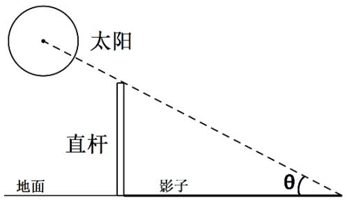
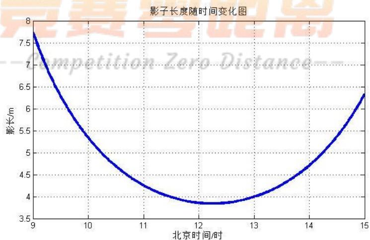
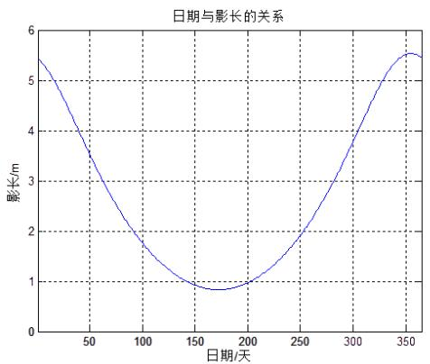
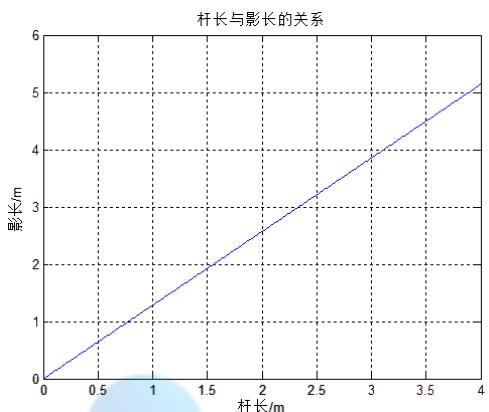
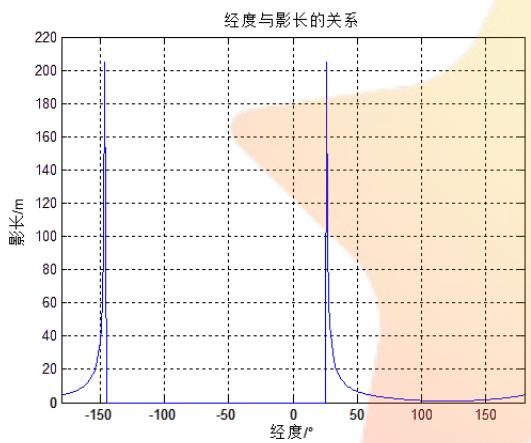
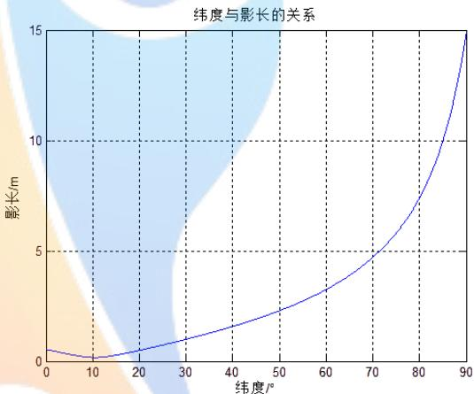
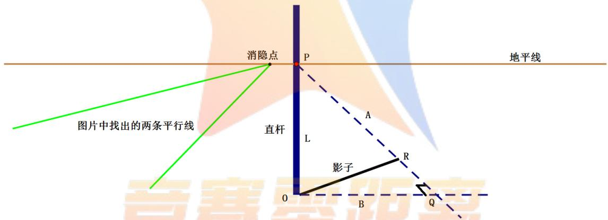
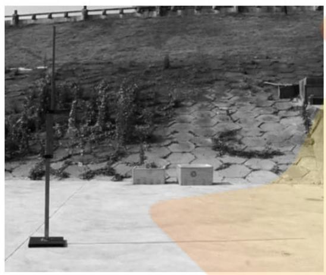
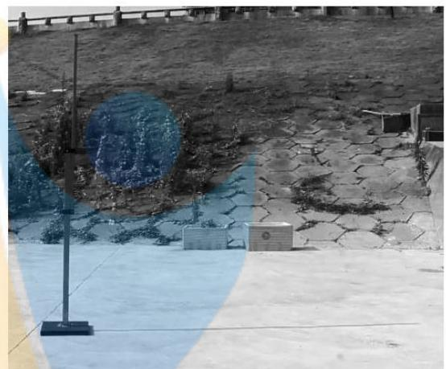

# 太阳影子定位模型

## 摘要

针对太阳影子定位问题，本文结合地理学和天文学的相关知识，建立了不同数据类型下的太阳影子定位模型，实现了视频拍摄地点和日期的快速精准确定。

对于问题一，首先从地理学角度，基于地理坐标，直杆长度，时间这三个影响影子长度的参数，计算出时角，赤纬角，太阳高度角，进而给出了影子长度与三个参数之间的关系式。结果显示，影长对日期和时刻都呈现出先减小后增大的趋势；对杆长呈正比关系增长；对经度呈现先急剧增长到峰值再突变为 ，而后突变到峰值后再急剧下降；对纬度呈缓慢上升趋势。然后，根据附件 1中提供的数据，画出了天安门广场上直杆的太阳影子分布曲线图。

对于问题二，基于问题一中对影响影子长度因素的分析，根据地理学知识建立双目标规划模型，确立目标函数分别为： $\operatorname* { m i n } \sum _ { i = 1 } ^ { 2 0 } \lvert \Delta A _ { i } - \Delta A _ { i } ^ { ' } \rvert , \operatorname* { m i n } \sum _ { i = 1 } ^ { 2 1 } \lvert S _ { \parallel \parallel } - S _ { \parallel \parallel } ^ { ' } \rvert _ { 0 }$ 然后在约束条件下对杆子的地点坐标应用网格逼近算法优化求解，得出最符合题目所提供数据的杆子地理位置为： $( 1 9 . 1 ^ { \circ } E , 1 0 8 . 7 1 ^ { \circ } N )$ 海南东方市境内，此时，杆长为2.03米，太阳方向角残差比为1.8%，影长残差比为0.9%，误差均很小。

对于问题三，首先建立了与问题二相似的目标规划模型，由于日期未知，模型求解的时间复杂度较高。为提高计算速度，引入了粒子群算法。分别对附件2和 3 中的数据进行分析，确定出的地点坐标分别为 $( 8 0 . 5 1 ^ { \circ } E , 3 2 . 1 3 ^ { \circ } N )$ $( 1 1 0 . 2 0 ^ { \circ } E , 2 4 . 8 3 ^ { \circ } N )$ 和(81.43°E,32.24°N), $( 1 1 1 . 5 6 ^ { \circ } E , 2 3 . 6 8 ^ { \circ } N )$ ，附件 2为西藏阿里，日期为8/14或4/29，附件 3 为广西梧州市，日期为12/27或12/14。可以发现，两种算法的结果极为接近，但粒子群算法计算时间要远小于网格逼近算法。

对于问题四，首先对视频数据进行采集和预处理，由于视频拍摄角度的存在，从视频中直接得到的影长并不是实际长度，而是其投影长度，这里采用基于Hough变换和透视变换的图像矫正法，对斜视图像进行矫正，得出实际影长。然后将得到的数据带入问题二的模型中，给出视频拍摄地点为(110.70°E,42.31°N)——内蒙包头市境内；在拍摄日期未知的情况下，将变化而来的实际影长代入问题三的基于粒子群算法的 目标规划模型，求解出视频拍摄地点为$( 1 0 9 . 7 6 ^ { \circ } E , 4 2 . 6 6 ^ { \circ } N )$ ——内蒙包头市境内，拍摄日期为6/11或7/13。

对于模型的推广，根据物体采集到的太阳地理信息进行计算，可以应用到求建筑物群合理间距问题。

关键词：双目标规划 粒子群算法 Hough变换 透视变换

## 一、 问题的重述

## 1.1 问题的背景

“日长影移”是生活中人人熟知的自然现象，这个词说明地面上的影子变化与太阳活动有着密切的联系。而古代智慧的先民就利用了这个现象制作了日晷，是最早且最精确的计时工具之一。在图像信息充斥的当代，如何通过图像数据获得图像拍摄时的相关信息是图像分析学科的重要课题，而利用太阳光影变换获得时间和地理信息，是非常方便可靠的。

## 1.2 问题的提出

太阳影子定位技术，是通过分析视频中物体的太阳影子变化，确定视频拍摄的地点和日期的一种方法。针对上述背景和应用需求，提出以下问题：

1.建立影子长度变化的数学模型，分析影子长度关于各个参数的变化规律，并应用你们建立的模型画出 2015 年 10 月 22 日北京时间 9:00-15:00 之间天安门广场（北纬39度 54分26秒,东经116度 23分29秒）3米高的直杆的太阳影子长度的变化曲线。  
2.根据某固定直杆在水平地面上的太阳影子顶点坐标数据，建立数学模型确定直杆所处的地点。将你们的模型应用于附件 1的影子顶点坐标数据，给出若干个可能的地点。  
3. 根据某固定直杆在水平地面上的太阳影子顶点坐标数据，建立数学模型确定直杆所处的地点和日期。将你们的模型分别应用于附件 2和附件 3的影子顶点坐标数据，给出若干个可能的地点与日期。  
4．如果已有一根直杆在太阳下的影子变化的视频，并且已通过某种方式估计出直杆的高度为 2米。请建立确定视频拍摄地点的数学模型，并应用你们的模型给出若干个可能的拍摄地点。若拍摄日期未知，能否根据视频确定出拍摄地点与日期。

## 二、 问题的分析

## 2.1 问题一的分析

题目要求在固定地点，给定日期和杆长的条件下，求解出直杆投影长度的变化曲线。对于水平地面上的垂直直杆，直杆长度与影子的比值即为太阳高度角的正切值，因此需要知道此时间段内的太阳高度角变化。查阅资料<sup>[6]</sup>可得，太阳高度角与当地地方时、经纬度密切相关，因此知道上述两个量就可确定直杆的变化过程。

## 2.2 问题二的分析

题目要求根据影子的变化情况和给出的日期求出直杆的位置，实际上是问题一的逆求解过程。这里杆长和地点都是未知量，逆求解是非常困难的，于是将问题二转化为双目标规划问题。当太阳方位角与影长的实际值与理论值差值的绝对值之和达到最小时，所得经纬度即为杆子的地点坐标。

## 2.3 问题三的分析

与问题二不同的是，该问中日期是个未知量。首先考虑沿用上一问的模型。由于日期未知，所以要考虑一年 365天的所有情况，这将大大增加运算时间。从减少运算量的角度考虑，有必要改进算法。考虑引入现代优化算法之一的粒子群算法，将所有解视为粒子所要去的位置，由于适应度与目标函数相联系，选取合理的适应度函数，期望提高计算效率。

## 2.4 问题四的分析

本问的数据由视频给出，那么首先要对视频进行数据预处理。由于视频时间较长，所以不考虑将视频逐帧分析，而是每隔一段时间对视频进行获取分析，对图像所给出的影长和影子角度进行测量。考虑到视频拍摄角度的存在，从视频中直接得到的影长并不是实际长度，而是其投影长度，因而要对斜视图像进行矫正，得出实际影长。然后再分别利用问题二和问题三的模型进行求解。

## 三、 问题的假设

1. 每年的太阳活动情况是相同的，均为“恒星年”。  
2. 地球是一个完美的球形，不考虑海拔、地球扁率的影响。  
3. 无光线衍射造成的影子减淡现象。  
5. 在小尺度考虑直杆投影问题时，地表是绝对水平的。  
6. 不考虑地球公转的影响。  
7. 题目所给的数据是真实的，可靠的。

四、 符号说明

<table><tr><td>符号</td><td>说明</td></tr><tr><td>θ</td><td>太阳高度角</td></tr><tr><td>L</td><td>水平地面上直杆长度</td></tr><tr><td>S</td><td>水平地面上直杆影子长度</td></tr><tr><td>h</td><td>当地地方时时角</td></tr><tr><td>δ</td><td>当地太阳赤纬</td></tr><tr><td></td><td>当地纬度值</td></tr><tr><td> $\gamma$ </td><td>当地经度值</td></tr><tr><td>t</td><td>当地地方时</td></tr><tr><td> $t_0$ </td><td>北京时间</td></tr><tr><td>n</td><td>当日日期序号</td></tr><tr><td>P</td><td>当地经纬度坐标</td></tr><tr><td>A</td><td>当地太阳高度角</td></tr><tr><td>T</td><td>时间(包含时刻与日期)</td></tr><tr><td> $\beta$ </td><td>离散化后的方位朝向</td></tr><tr><td> $\varepsilon_i$ </td><td>每组数据影长与x坐标轴的夹角</td></tr><tr><td> $x_i, y_i$ </td><td>题目附件提供的第i组直杆坐标</td></tr><tr><td>d</td><td>日期</td></tr></table>

注：其他符号将在下文中给出具体说明。

## 五、 模型的建立与求解

## 5.1 问题一

## 5.1.1 模型的建立

本模型结合相关地理学知识，对影子的变化情况进行分析描述。下面将明确一些地理学定义，以及重新定义一些本模型需要用到的参数。

太阳高度角，也称太阳高度，是指某地的太阳光线与当地地平面的所交的最小线面角，这是以太阳视盘面的几何中心和理想地平线所夹的角度。在水平地面上，直杆长度与影长的比值即为太阳高度角的的正切值：

$$
\tan \theta = \frac {L}{S} \tag {1}
$$



<details>
<summary>text_image</summary>

太阳
直杆
地面
影子
θ
</details>

图 1 太阳方位角示意图

其中 $L$ 为杆长，S为影长。

通过查阅相关资料<sup>[6]</sup>，得知太阳高度角的计算公式为：

$$
\sin \theta = \cos h \cos \delta \cos \phi + \sin \delta \sin \phi \tag {2}
$$

其中 $\theta$ 为太阳高度角，h为地方时时角， $\delta$ 为当时的太阳赤纬， $\phi$ 为当地纬度。

以一个地方太阳升到最高的地方的时间为正午 12时，将连续两个正午 12时之间等分为 24 个小时，所成的时间系统，称为地方时。地球上每一个地点都有其相应的地方时。由于题目只提供了当地时间的北京时间，因此在计算地方时时角时，要先将北京时间换算为当地地方时t：

$$
t = t _ {0} + \frac {\gamma - 1 2 0 ^ {\circ}}{1 5 ^ {\circ}} \tag {3}
$$

其中 $t _ { 0 }$ 为北京时间， $\gamma$ 为当地经度。

根据某地地方时，可以换算出当地的地方时时角。地方时时角h即为当地与子午线之间相差的角度：

$$
h = 1 5 ^ {\circ} \times (t - 1 2) \tag {4}
$$

太阳的赤纬等于太阳入射光与地球赤道之间的角度，由于地球自转轴与公转平面之间的角度基本不变，因此太阳的赤纬随季节不同而有周期性变化。太阳赤纬的最高度数为 $2 3 ^ { \circ } 2 6 ^ { \prime }$ ，夏至时太阳的赤纬为 $+ 2 3 ^ { \circ } 2 6 ^ { \prime }$ ，冬至时太阳的赤纬为$- 2 3 ^ { \circ } 2 6 "$ 。春分和秋分时太阳的赤纬为 $0 ^ { \circ }$

由于地球公转轨道的偏心率非常低，可以看作是一个圆圈，太阳赤纬 $\delta$ 可用下面这个公式来计算：

$$
\delta = 2 3. 4 5 ^ {\circ} \sin \left(\frac {2 \pi (2 8 4 + n)}{3 6 5}\right) \tag {5}
$$

其中n为当日日期序号，1 月 1 日时 $n = 1$ ，以此类推得 10 月 22 日 $n = 2 9 5$

联立式子(2) (5) 得到方程组：

$$
\left\{ \begin{array}{l} \tan \theta = \frac {L}{S} \\ \sin \theta = \cos h \cos \delta \cos \phi + \sin \delta \sin \phi \\ t = t _ {0} + \frac {\gamma - 1 2 0 ^ {\circ}}{1 5 ^ {\circ}} \\ h = 1 5 ^ {\circ} \times (t - 1 2) \\ \delta = 2 3. 4 5 ^ {\circ} \sin \left(\frac {2 \pi (2 8 4 + n)}{3 6 5}\right) \end{array} \right. \tag {6}
$$

求解上述方程组，得：

$$
S = L / \tan \left(\arcsin \left(\cos \left(1 5 ^ {\circ} \times (t - 1 2)\right) \cos (\delta) \cos \phi + \sin (\delta) \sin \phi\right)\right) \tag {7}
$$

可见，影 $\vec { \mathrm { \mathcal { F } } }$ 长度的变化与当地地理位置 $P ( \varphi , \phi )$ ，直杆长度L，时间 $T ( t , d )$ 这三个参数有关。

## 5.1.2 模型的求解

首先计算题目所给条件下的h， $\delta$ 与 $\phi$ ，再将上述参数值代入(2)式，得出从9:00-15:00的太阳高度角随时间的变化（具体值见附录）。相应地，可求得直杆影长数据（具体见附录）。从结果中挑选出几个比较重要的时间点，将相应结果制成下表以供参考：

表1 影子长度分布

<table><tr><td>北京时间</td><td>太阳高度角/度</td><td>影长/m</td></tr><tr><td>9:00</td><td>21.18</td><td>7.74</td></tr><tr><td>12:00</td><td>37.88</td><td>3.85</td></tr><tr><td>12:14</td><td>37.99</td><td>3.84</td></tr><tr><td>15:00</td><td>25.35</td><td>6.33</td></tr></table>

将影长随时间变化的情况用MATLAB绘制成图像：



<details>
<summary>line</summary>

| 北京时间/时 | 影子长度/m |
| --- | --- |
| 9 | ~7.7 |
| 10 | ~5.4 |
| 11 | ~4.3 |
| 12 | ~3.8 |
| 13 | ~4.0 |
| 14 | ~4.7 |
| 15 | ~6.3 |
</details>

图 2 影子长度变化曲线

对于影子长度关于各个参数的变化规律，从时间，地点和杆长三个方面对其进行分析，分析某一个参数时，将其他变量看做常量，只改变一个未知量。我们将时间参数分为日期和时刻这两种情况进行运算求解，影长关于时刻的变化在图2 中已经给出；对于地点，将其分为经度 $\gamma$ 和纬度 $\phi$ 这两个参数进行运算求解，求解后的变化规律图如下：



<details>
<summary>line</summary>

| 日期/天 | 影长/m |
| --- | --- |
| 0 | ~5.4 |
| 50 | ~3.6 |
| 100 | ~1.7 |
| 150 | ~0.9 |
| 200 | ~1.0 |
| 250 | ~2.0 |
| 300 | ~3.8 |
| 350 | ~5.5 |
</details>

图3 影长与日期关系曲线



<details>
<summary>line</summary>

| 杆长/m | 影长/m |
| --- | --- |
| 0 | 0 |
| 1.5 | 2 |
| 3 | 4 |
| 4 | 5 |
</details>

图 4 影长与杆长关系曲线



<details>
<summary>violin</summary>

| 经度 \(({}^{\circ})\) | 影长 (m) |
| --- | --- |
| -150 | ~205 |
| 25 | ~205 |
</details>

图5 影长与经度关系曲线



<details>
<summary>line</summary>

| 纬度/° | 影长/m |
| --- | --- |
| 0 | ~0.5 |
| 10 | ~0.2 |
| 20 | ~0.5 |
| 30 | ~1.0 |
| 40 | ~1.6 |
| 50 | ~2.3 |
| 60 | ~3.2 |
| 70 | ~4.8 |
| 80 | ~7.5 |
| 90 | 15 |
</details>

图6 影长与纬度关系曲线

## 5.1.3 结果分析

从图3中可以发现，影长随着时间的增加，呈现先减小后增大的趋势，影长最小点出现在 ，这是由于北京时刻为 $1 2 0 ^ { \circ } E$ 的地方时，换算到 $1 1 6 ^ { \circ } E$ 附近时，会产生时差，显然是符合常理的。

从图4中可以发现，影长与杆长呈正比关系，这是由于 $\tan \theta = \frac { L } { S }$ ，从而验证了模型的准确性。

从图 5 中可以发现，影长随时间变化出现了两个明显的“脉冲”。这是因为当太阳逼近地平线时，影长变化的速度非常快，影子也是最长的。而太阳一旦在地平线以下，就不存在影子，影子长度也为 0。

从图6中可以发现，图 5中的曲线随纬度增加，总趋势是增加的，这是随着纬度的增加太阳高度角减小，从而导致了影长的增加。

## 5.2 问题二——基于网格逼近算法的双目标规划模型

## 5.2.1 数据预处理

分析题目所给的数据（附件 1），可以发现这些数据不仅能计算出影长，还能够得知影子方位角的变化，但是附件没有给出坐标系的方位朝向，故假设坐标系x轴的方位朝向角为 $\beta ( 0 ^ { \circ } \leq \beta < 3 6 0 ^ { \circ } )$ ，取正北方向时，x轴的方位朝向角为 。由此，可以得出21个时间点影子的太阳方位角。我们以每五个时间点为间隔，选取部分呈现在下表中：

表3 影子方位角数据表

<table><tr><td>北京时间</td><td>x坐标/米</td><td>y坐标/米</td><td>方位角/度</td></tr><tr><td>14:42</td><td>1.0356</td><td>0.4973</td><td>β+25.63°</td></tr><tr><td>14:57</td><td>1.2087</td><td>0.5255</td><td>β+23.49°</td></tr><tr><td>15:12</td><td>1.3955</td><td>0.5541</td><td>β+21.65°</td></tr><tr><td>15:27</td><td>1.6033</td><td>0.5833</td><td>β+20.02°</td></tr><tr><td>15:42</td><td>1.8277</td><td>0.6135</td><td>β+18.55°</td></tr></table>

## 5.2.2 模型的建立

首先引入太阳方位角的定义。太阳方位角是太阳在方位上的角度，它通常被定义为从北方沿着地平线顺时针量度的角：

$$
\cos A = \frac {\sin \delta \cdot \cos \phi - \cos h \cdot \cos \delta \cdot \sin \phi}{\cos \alpha} \tag {8}
$$

上述公式可以用来计算近似的太阳方位角，不过因为公式是使用余弦函数，所以方位角永远是正值，因此，角度永远被解释为小于180度，而必须依据时角来修正。当时角为负值时 (上午)，方位角的角度小于 180度，时角为正值时 (下午)，方位角应该大于 180度，即要取补角的值，故作如下修正：

$$
A = \left\{ \begin{array}{l} \arccos \left(\frac {\sin \delta \cdot \cos \phi - \cos h \cdot \cos \delta \cdot \sin \phi}{\cos \alpha}\right), \quad h <   0 \\ 3 6 0 ^ {\circ} - \arccos \left(\frac {\sin \delta \cdot \cos \phi - \cos h \cdot \cos \delta \cdot \sin \phi}{\cos \alpha}\right), h \geq 0 \end{array} \right. \tag {9}
$$

由上述推导可得，方位角A与坐标系方位朝向 $\beta$ 的关系为：

$$
A _ {i} = \beta + \varepsilon_ {i}, \quad i = 1, 2, \dots , 2 1 \tag {10}
$$

其中 $\varepsilon _ { i }$ 为每组数据影长与x坐标轴的夹角：

$$
\varepsilon_ {i} = \arctan \frac {y _ {i}}{x _ {i}}, \quad i = 1, 2, \dots , 2 1 \tag {11}
$$

将上一问题的某些参数关系与式(8) (11) 列成方程组：

$$
\left\{ \begin{array}{l} \varepsilon_ {i} = \arctan \frac {y _ {i}}{x _ {i}}, \quad i = 1, 2, \dots , 2 1 \\ A _ {i} = \beta + \varepsilon_ {i}, \quad i = 1, 2, \dots , 2 1 \\ \delta = 2 3. 4 5 ^ {\circ} \sin \left(\frac {2 \pi (2 8 4 + n)}{3 6 5}\right) \\ h = 1 5 ^ {\circ} \times (t - 1 2) \\ \theta = \cos (1 5 ^ {\circ} \times (t - 1 2)) \cos (\delta) \cos \phi + \sin (\delta) \sin \phi \\ t = t _ {0} + \frac {\gamma - 1 2 0 ^ {\circ}}{1 5 ^ {\circ}} \end{array} \right. \tag {12}
$$

将上述求太阳高度角的方程化为如下关系式：

$$
\cos (A) = \frac {(\sin (\delta) \cdot \cos \phi - \cos \left[ 1 5 ^ {\circ} \times (t _ {0} + \frac {\gamma - 1 2 0 ^ {\circ}}{1 5 ^ {\circ}} - 1 2) \right] \times \cos (\delta) \cdot \sin \phi)}{\cos (\arcsin (\cos \left(1 5 ^ {\circ} \times \left(t _ {0} + \frac {\gamma - 1 2 0 ^ {\circ}}{1 5 ^ {\circ}} - 1 2\right)\right)) \cos (\delta) \cos \phi + \sin (\delta) \sin \phi))} \tag {13}
$$

下面对各个参量进行影响因素的分析：

对于时角来说，由 $t = t _ { 0 } + { \frac { \gamma - 1 2 0 ^ { \circ } } { 1 5 ^ { \circ } } } , h = 1 5 ^ { \circ } \times ( t - 1 2 )$ 式子可知，时角的变化与当地经度 $\gamma$ 的变化以及时间 $t _ { 0 }$ 有关；对于赤纬角，由 $\delta = 2 3 . 4 5 ^ { \circ } \sin \left( { \frac { 2 \pi ( 2 8 4 + n ) } { 3 6 5 } } \right)$ 式子可知，赤纬角的变化与当地日期有关，而在此模型中，日期为定值，故可认为赤纬角 为常量；对于太阳高度角，由sin $\theta = \cos h \cos \delta \cos \phi + \sin \delta \sin \phi$ 式子可知，太阳高度角的变化，与时角的大小，纬度的大小有关，即与经纬度的大小有关，我们可以将其理解为地点的变化；对于太阳方位角，由式子(8)可知，太阳方位角的变化，与时角的大小，纬度的大小以及太阳高度角有关，即与经纬度的大小有关，同样可以将其理解为地点参数的变化。

综上，我们对参量的影响因素进行总结，可以得到下表：

表4 影响因素分析

<table><tr><td>参量</td><td>影响因素</td></tr><tr><td>时角(h)</td><td>经度 $\gamma$ ,时间 $t_0$ </td></tr><tr><td>赤纬角( $\delta$ )</td><td>常量</td></tr><tr><td>太阳高度角( $\theta$ )</td><td>地点坐标( $\gamma, \phi$ ),时间 $t_0$ </td></tr><tr><td>太阳方位角(A)</td><td>地点坐标( $\gamma, \phi$ ),时间 $t_0$ </td></tr></table>

可以发现，在式(13)中，方程右端的未知量只有地点坐标 $( \gamma , \phi )$ 和北京时间$t _ { 0 }$ ，故可以将其简化为如下形式：

$$
F (\gamma , \phi , t _ {0}) = \cos (A) \tag {14}
$$

式中，映射F 表示方程右端关于地点坐标 $( \gamma , \phi )$ 这两个自变量的函数。

因此，对于21个不同时刻对应的太阳方位角 $A _ { i } ( i = 1 , 2 , . . . , 2 1 )$ ，我们可以得出21个不同的方程，将其列成方程组如下所示：

$$
\left\{ \begin{array}{c} F (\gamma , \phi , t _ {0}) = \cos (A _ {1}) \\ F (\gamma , \phi , t _ {0}) = \cos (A _ {2}) \\ \vdots \\ F (\gamma , \phi , t _ {0}) = \cos (A _ {2 1}) \end{array} \right. \tag {15}
$$

由式(9)，我们可以根据地点坐标 $( \gamma , \phi )$ 计算得出此处不同时刻的太阳方位角$A _ { i } ^ { ' }$ ，将其去前一项作差，即可得到太阳方位角的差值 $\Delta { A _ { i } ^ { \prime } }$ ；由式(7)，我们可以根据地点坐标 $( \gamma , \phi )$ 算出此处不同时刻下的影子长度 $S _ { i } ^ { ' }$ ，对其进行归一化处理，可以得到：

$$
S _ {\text {归} i} ^ {\prime} = \frac {S _ {i} ^ {\prime} - \frac {1}{2 1} \sum_ {i = 1} ^ {2 1} S _ {i} ^ {\prime}}{S _ {i \max} ^ {\prime} - S _ {i \min} ^ {\prime}} \tag {16}
$$

对此我们可采用遍历算法对不同经纬度 $( \gamma , \phi )$ 下的太阳方位角的插值 $\Delta \boldsymbol { A } _ { i } ^ { \dagger }$ 以及归一化后的影子长度 $S _ { \parallel i }$ 进行求解，从而与实际值作差进行比较，进而得出最优解。

故此，我们建立多目标规划模型：

20 min ∑| ∆Ai − ∆A I 目标函数： 1i (17) 21 min∑|SEi−Si| 1i

(-180° ≤ γ ≤180° 约束条件： -90°≤φ≤90° (18) 10°≤θ≤90°

式中， $\Delta A _ { i }$ 表示实际的太阳方位角， $S _ { \parallel i }$ 表示归一化后的实际影长。

## 5.2.1 模型的求解

为了方便计算机编程求解，我们对经纬度进行离散化处理，选取步长为 ，对其进行MATLAB编程求解：

表5 定点坐标数据

<table><tr><td>经度</td><td>纬度</td><td>杆高</td></tr><tr><td>108.71°</td><td>19.12°</td><td>2.03m</td></tr></table>

表 6 误差分析表

<table><tr><td>太阳方向角残差</td><td>影长残差</td><td>太阳方向角残差比</td><td>影长残差比</td></tr><tr><td>0.026</td><td>0.014</td><td>1.8%</td><td>0.9%</td></tr></table>

即杆子所处地点坐标为(19.1°E,108.71°N)，在海南东方市境内。

## 5.2.1 结果分析

通过误差分析表可以发现，在经纬度坐标为(108.71°E,19.12°N)时，计算所得的影子长度残差比为0.9%，太阳方向角残差比为1.8%，这个数值是较小的，说明得到的经纬度坐标(108.71°E,19.12°N)是较为精确的。

## 5.3 问题三

## 5.3.1 模型的建立

不难发现，此问在上一问的基础上将日期变为了未知量，在其他输入参数不变的情况下，要求模型输出杆子所处的地点和日期。

由表 3 可以看出，日期影响的参量为赤纬角，其他参量并不受日期的影响，太阳赤纬公式为：

$$
\delta = 2 3. 4 5 ^ {\circ} \sin \left(\frac {2 \pi (2 8 4 + n)}{3 6 5}\right) \tag {19}
$$

式中，n为当日日期序号，1 月 1 日时 $n = 1$ ，以此类推，日期每增加一天，对n进行加1即可。

对此，我们采用遍历算法，对日期参数n及经纬度坐标 $( \gamma , \phi )$ 进行遍历求解，建立与上一问相似的多目标规划模型，从而求出最优解：

20min ∑| ∆Ai − ∆Aψ |目标函数： 1i (20)21min ∑|SEi −Si |1i

(-180° ≤ γ ≤180° 约束条件： 90 90<sub>0</sub> <sub>90</sub>     <sub></sub> <sub></sub> <sub></sub> <sub></sub> (21) 0°≤θ≤90° L>0

式中，A 表示实际的太阳方位角， $S _ { \parallel i }$ 表示归一化后的实际影长。

## 5.3.2 模型的求解

同样，对经纬度进行离散化处理后，选取步长为0.01，对其进行MATLAB编程求解：

表 7 杆子所处地点和日期及误差分析数据表

<table><tr><td colspan="2">附件二</td><td colspan="2">附件三</td></tr><tr><td>经度</td><td>80.51°E</td><td>经度</td><td>110.20°E</td></tr><tr><td>纬度</td><td>32.13°N</td><td>纬度</td><td>24.83°N</td></tr><tr><td>杆高</td><td>2.04m</td><td>杆高</td><td>3.10m</td></tr><tr><td>太阳方向角残差比</td><td>2.0%</td><td>太阳方向角残差比</td><td>2.3%</td></tr><tr><td>影长残差比</td><td>1.1%</td><td>影长残差比</td><td>0.35%</td></tr><tr><td>日期</td><td>8/14或4/29</td><td>日期</td><td>12/27或12/14</td></tr></table>

## 5.3.3 模型的改进——基于粒子群算法的目标规划模型

在实际求解中，发现由于加入新的未知量日期，使得模型的可行域大大增加，增加了遍历算法的时间复杂度，因此，我们引入粒子群算法<sup>[9]</sup>对目标函数进行求解，从而降低模型求解的时间复杂度。

假定有一个D维的目标搜索空间，有n个微粒组成了一个粒子群，其中每个微 粒 都 用 一 个 D 维 的 向 量 描 述 ， 将 它 的 空 间 位 置 表 示 为$m _ { i } = \bigl ( m _ { i 1 } , m _ { i 2 } , \cdots , m _ { i D } \bigr ) , i = 1 , 2 , . . . , n$ ；这可看做目标优化问题中的一个解，代入适应度函数计算出适应度值可以衡量微粒的优劣；第i个微粒的飞行速度也是一个维的向量，记为 $\nu _ { i } = \left( \nu _ { i 1 } , \nu _ { i 2 } , \cdots , \nu _ { i D } \right)$ ；第i个微粒所经历过的具有最好适应值的位置称为个体历史最好位置，记为 $p _ { i } = \left( p _ { i 1 } , p _ { i 2 } , \cdots , p _ { i D } \right)$ ；整个微粒群所经历过的最好位置称为全局历史最好位置，记为 $p _ { g } = \left( p _ { g 1 } , p _ { g 2 } , \cdots , p _ { g D } \right)$ ，粒子群的进化方程可描述为：

$$
v _ {i j} (t + 1) = v _ {i j} (t) + c _ {1} r _ {1} (t) \left(p _ {i j} (t) - x _ {i j} (t)\right) + c _ {2} r _ {2} (t) \left(p _ {g j} (t) - x _ {i j} (t)\right) \tag {22}
$$

$$
m _ {i j} (t + 1) = m _ {i j} (t) + v _ {i j} (t + 1)
$$

其中i表示第i个微粒，j表示微粒的第j个维度，t表示第t代， $c _ { 1 }$ ， $c _ { 2 }$ 是两个加速常量，通常的取值范围是(0,2) $r _ { 1 } \sim U \left( 0 , 1 \right)$ $r _ { 2 } \sim U ( 0 , 1 )$ 是两个相互独立的随机函数。

从上式看出， $c _ { 1 }$ 可以调节微粒去往自身周边的最好位置，c 可以调节微粒去 $c _ { 2 }$ 往整个粒子群所能找到的最好位置。

将这种算法应用到本问中。算法中的“位置”就是本文中不同日期的所有离散的坐标值点： $m _ { i } = ( \gamma , \phi , d )$ ，即 “粒子 $Z _ { j } \vec { \mathbf { \sigma } } _ { j } ^ { \prime }$ 就是存放并寻找解的动态变量。为了能够寻找到足够好的优化解，而且避免计算量的增大，本模型中设置了 20 个“粒子”来进行优化解搜索，即令i20。由于本问中直杆坐标和日期都是未知的，因此将粒子设为储存三个参数：

$$
\left\{ \begin{array}{l} Z _ {1} = \text {经度} \gamma \\ Z _ {2} = \text {纬度} \phi \\ Z _ {3} = \text {日期} d \end{array} \right. \tag {23}
$$

首先要对所有粒子进行初始化，即让粒子中的不同参数取可行范围内的随机值，如令 $\gamma = r a n d ( - 1 8 0 , + 1 8 0 )$ $\phi = r a n d ( - 9 0 , + 9 0 )$ • $d = r a n d ( 1 , 3 6 5 )$ 。这个过程相当于在整个“位置”区域内的某些点散布了寻找最优解的“种子”。在何处散布了“种子”与其后来能够寻找到的“最优解”密切相关。当散布位置不理想时，“最优解”很可能会是局部最优解，而非全局最优解。

其次计算每个粒子的适应值。本问的适应度值可以使用目标函数来进行计算，但由于最优解是令目标函数最小，而最优解的适应度值应该尽量大。所以对适应度值Q做定义为：

$$
Q = \left\{ \begin{array}{l} R = \left(\frac {1}{V}\right) ^ {2} \\ V = \sum_ {i = 1} ^ {2 0} | \Delta A _ {i} - \Delta A _ {i} ^ {\prime} | + \sum_ {i = 1} ^ {2 1} | S _ {\text {归} i} - S _ {\text {归} i} ^ {\prime} | \end{array} \right. \tag {24}
$$

然后记录这些值。对每个粒子，将其适应度与个体最好历史记录和全局最好记录做比较。如果能够比最好记录更好就将此值设为最好记录。

接下来，参照式(22)，对每个粒子的去向进行调整。每次调整时，都要对$c _ { 1 } \in \left( 0 , 2 \right)$ $c _ { 2 } \in \left( 0 , 2 \right)$ $r _ { 1 } \in \left( 0 , 1 \right)$ $r _ { 1 } \in \left( 0 , 1 \right)$ 进行重新随机取值，保证粒子行为的随机性：既能有向最优解靠近的趋势，也能存在寻找其他更优解的可能。

最后，查看迭代次数。为了保证找到的解最优，需要给予粒子足够多的行动时间寻找解。这里令迭代次数为 1000。

## 5.3.4 粒子群算法模型的求解

对经纬度进行离散化处理后，选取步长为0.01，对其进行MATLAB编程求解：

表 8 杆子所处地点和日期及误差分析数据表

<table><tr><td colspan="2">附件二</td><td colspan="2">附件三</td></tr><tr><td>经度</td><td>81.43°E</td><td>经度</td><td>111.56°E</td></tr><tr><td>纬度</td><td>32.24°N</td><td>纬度</td><td>23.68°N</td></tr><tr><td>杆高</td><td>2.23m</td><td>杆高</td><td>3.02m</td></tr><tr><td>太阳方向角残差比</td><td>1.33%</td><td>太阳方向角残差比</td><td>3.12%</td></tr><tr><td>影长残差比</td><td>0.45%</td><td>影长残差比</td><td>1.13%</td></tr><tr><td>日期</td><td>8/14或4/29</td><td>日期</td><td>12/27或12/14</td></tr></table>

## 5.3.5 模型的综合结果分析

将两个模型的结果对比可以发现，两个模型求解出来的经纬度极为接近，附件1的杆子所在地为西藏阿里地区，附件 2 的杆子所在地为广西梧州室内。且得到的日期分别关于夏至日6/22及冬至日12/22对称，这是由于太阳的运动是关于夏至日以及冬至日对称的。同时在太阳方向角残差比以及影长残差比这两个参量上，粒子群算法的误差并没有显著提升，最大值仅为3.12%，这是可以接受的；

而在时间复杂度上，粒子群算法的求解时间大大缩短，更为快捷，因而我们在未知参量增加时，可以使用粒子群算法进行求解。

## 5.4 问题四

## 5.4.1 数据的采集及预处理——基于Hough变换及透视变换的图像矫正

观看视频可以发现，由于摄像机在拍摄时的角度原因，从视频中得出的影长是真实影长向摄像机方向的投影值，其必定小于或等于真实影长，并不是影长的真实值，而且从摄像机拍摄的图片中无法得知影子转动的角度。因此我们需要通过透视变换<sup>[7]</sup>的相关知识从图片中还原出影子的真实长度及变换的角度。

透视投影的一个主要特征是可以延伸到无穷远的物体在照片平面中可以获得它的有限延伸范围。例如，在世界坐标中平行的直线（铁轨等），则可以投影成为照片平面中相交的直线，且他们在照片平面中的交点为这些平行直线的消隐点方向。

而消隐点在水平方向上的延长即为地平线。据此，可以引出地平线的性质：在透视图里，从地平线上任一点引出的两条直线都是平行的。

对于题目所给的资料，认为摄像机水平拍摄，且图中左下角两条直线在现实中处于水平面内且互相平行（图中的两条绿色直线），因此将其延长可在远处得到消隐点，消隐点在水平方向的延长线就是地平线。



<details>
<summary>text_image</summary>

消隐点
P
地平线
图片中找出的两条平行线
直杆
L
A
影子
R
O
B
Q
</details>

令地平线与直杆的交点为P，则P点就是直杆向其正前方的消隐点。从直杆底部引出一水平辅助线B,则从P点到直杆底部O的连线L与水平线垂直。将影子端点R与P相连，得到辅助线A。由刚才引出的地平线定理得，从P点引出的任意两条线都平行，因此直线A平行于L。由平行线定理得，直线A与B也垂直。因此，RQO为直角，三角形 $\Delta R Q O$ 为直角三角形。

下面利用 <sup>[5]</sup> Hough变换 提取平行直线，我们知道，当图像中存在很多条直线时，直接利用霍夫变换并不能较好地提取出合适的直线，因此，对算法进行改进，若直线的宽度大于 1，则舍弃。

由于在照片平面中，物体已经过了成像透视变换而产生形变，因此对其做透视逆变换就可以恢复出原来的样子。一个二维图像经过透视变换变成另一个图像，

这个过程可以表示成：

$$
m = \frac {a x + b y + c}{o x + p y + 1}, n = \frac {d x + e y + f}{q x + p y + 1} \tag {25}
$$

式中，斜视图像点的像素坐标为( , )x y ，正视图像的像素坐标为 ，$a , b , c , d , e , f , o , p , q$ 为透视变换参数。

为了提高算法的精确性，还需要对图像进行预处理，从而减少计算难度。首先，利用MATLAB对其进行图像提取（提取速度为每 2分钟一帧），对整个视频产生的22幅图片进行灰度处理和高斯滤波处理:



<details>
<summary>natural_image</summary>

Outdoor scene with a metal pole, concrete pavement, and a stone structure in the background (no visible text or symbols)
</details>

灰度处理



<details>
<summary>natural_image</summary>

Exterior view of a cracked concrete structure with a metal pole and foundation, set against a grassy hillside (no signage or text visible)
</details>

高斯滤波

可以发现，进行高斯滤波后图像的噪点明显减少， 大大减少了运算难度，图中阴影也变得更加清晰。

对已经进行降噪处理后的图像，我们利用MATLAB对其进行矫正处理，提取到实际情况下影子长度的变化（见附录）。

## 5.4.2 模型的建立

## 1.在拍摄时间已知的情况下：

在数据处理部分，我们已经得到不同时刻下，杆子影子长度变化情况，将其代入到问题二的多目标规划模型中，即可得到视频拍摄地点 $( \gamma , \phi )$ 。

<sup>20</sup>min ∑|∆A, − ∆A |目标函数： 1i (26)21min |  <sup>'</sup>S |<sub>i归</sub>1i

(−180° ≤ γ ≤180° 约束条件： -90°≤φ≤90° (27) 0°≤θ≤90°

式中， $\Delta A _ { i }$ 表示实际的太阳方位角， $S _ { \parallel i }$ 表示归一化后的实际影长。

## 2.在拍摄时间未知的情况下：

在问题三中，已经发现，在日期未知的情况下，如果对视频拍摄地点和日期进行求解，利用遍历算法，时间复杂度将会非常高，而粒子群算法会大大减少时间复杂度，并且误差比很小。

因此，将数据处理部分得到的不同时刻下，杆子影子长度变化情况带入到问题三的目标规划模型中利用粒子群算法进行求解：

$$
\text {目标函数:} \left\{ \begin{array}{l} \min \sum_ {i = 1} ^ {2 0} \left| \Delta A _ {i} - \Delta A _ {i} ^ {\prime} \right| \\ \min \sum_ {i = 1} ^ {2 1} \left| S _ {\text {归} i} - S _ {\text {归} i} ^ {\prime} \right| \end{array} \right. \tag {28}
$$

$$
\text {约束条件:} \left\{ \begin{array}{l} - 1 8 0 ^ {\circ} \leq \gamma \leq 1 8 0 ^ {\circ} \\ - 9 0 ^ {\circ} \leq \phi \leq 9 0 ^ {\circ} \\ 0 ^ {\circ} \leq \theta \leq 9 0 ^ {\circ} \\ L > 0 \end{array} \right. \tag {29}
$$

式中， $\Delta A _ { i }$ 表示实际的太阳方位角， $S _ { \parallel i }$ 表示归一化后的实际影长。

## 5.4.3 模型的求解

对经纬度进行离散化处理后，选取步长为0.01，对其进行MATLAB编程求解：

表 9 杆子所处地点和日期及误差分析数据表

<table><tr><td colspan="2">已知日期</td><td colspan="2">未知日期</td></tr><tr><td>经度</td><td>110.70°E</td><td>经度</td><td>109.76°E</td></tr><tr><td>纬度</td><td>42.31°N</td><td>纬度</td><td>42.66°N</td></tr><tr><td>杆高</td><td>2.0m</td><td>杆高</td><td>2.0m</td></tr><tr><td>影长残差比</td><td>1.32%</td><td>影长残差比</td><td>2.45%</td></tr><tr><td>日期</td><td>——</td><td>日期</td><td>6/11或7/13</td></tr></table>

## 5.4.4 结果分析

通过表格的对比可以发现，当把日期作为未知量对模型进行求解时，得到的地点坐标为 $( 1 0 9 . 7 6 ^ { \circ } E , 4 2 . 6 6 ^ { \circ } N )$ ，与已知日期所得地点坐标(110.70°E,42.31°N)经度上基本无变化，在内蒙包头市内，纬度相差3.4，变化幅度为1.8%，由于数据的采集和预处理不可避免的造成了误差，是可以接受的。所求日期为6/11，而视频日期为7/13，两者刚好关于夏至日6/22对称，验证了模型的可靠性。

## 六、 模型的检验

## 6.1 误差分析

1. 标准解与模型所求解的误差：由于本模型使用了目标规划方法对问题进行求解，且对地理坐标进行了离散化，可能存在离散化所带来的误差；而且理论值与测量值本来就会存在误差，两者综合就是模型会产生的第一种误差，但求解发现其最大值为3.45%，是可以近似忽略的。

2. 局部最优解造成的地理坐标误差：粒子群算法的本身原理会导致其收敛在局部的最优解。为了减少运算量，也为了避免模型陷入局部最优，在程序运行过程中，有时候需要人为干预来筛去一些的地区，可能造成冗余解或缺解。  
3. 视频数据预处理过程中的误差：利用Hough变换寻找出的平行线并不一定是处在同一水平面上的，因此做透视变换的时候可能会产生误差。

## 6.2 敏感性分析

这里主要对问题四进行敏感性分析，因为问题四相对于前三问增加了视频数据的提取及预处理的过程，且模型也相对较为复杂。在第四问的数据提取过程中，我们是以每 2 分钟一帧的速度，从 0 时刻开始对其提取了 22 组数据。如果将起始时刻进行变换，即可以取1,3,5,...,39这些时间节点的视频数据，在已知日期的情况下带入模型进行求解，从而检验视频数据的改变，对模型结果产生的影响，得到的结果如下：

表10 敏感性检验对比数据

<table><tr><td colspan="2">原始数据</td><td colspan="2">检验数据</td></tr><tr><td>经度</td><td>110.70°E</td><td>经度</td><td>110.23°E</td></tr><tr><td>纬度</td><td>42.31°N</td><td>纬度</td><td>41.86°N</td></tr></table>

对结果进行比较发现，视频拍摄地点坐标并没有因为数据采集节点的不同而发生明显波动，对同一视频得出基本相同的地点坐标，说明本模型具有很好的稳健性。

## 七、 模型推广

本文研究了利用视频中所提供的信息，确定视频拍摄地点以及某个物体影长的问题。由于本文模型的实质是根据物体采集到的太阳地理信息进行计算，因此可以应用到求建筑物群合理间距问题。

对于一般的小区，楼体一般情况下沿相互平行的平行线进行建筑。利用这个模型可以求解适当的楼间距以保证不同楼层，不同地区住户的采光质量。将楼体看做是同样高度的一排直杆，计算出其在一年间的日影变化情况，并将其最大值在楼间距离上的投影作为楼间距，可以保证不同楼间不互相遮挡。而在现实情况下，只要求住户有一定时间的日照时间，将两幢建筑物按其朝向简化为两个相互平行的铅垂面, 其在地面上的投影为两平行线, 当所取的轨迹线上的时间差刚好等于要求的必要日照时间数时, 两幢建筑之间的垂直距离即为合理的间距,这种方法适用于两幢建筑物等高的情况。

假设楼体1的投影直线方程为 $y _ { 1 } = k x _ { 1 }$ ，楼体2的投影直线方程为 $y _ { 2 } = k x _ { 2 } + b$ 需要获取的日照时间数为 $t _ { s }$ ，先求直线1与投影曲线的交点 $( x _ { 0 } , y _ { 0 } )$ ，将其代入模型可求解太阳高度角 $\theta = \operatorname { a r c c o t } \left( \frac { \sqrt { x _ { 0 } ^ { 2 } + y _ { 0 } ^ { 2 } } } { L } \right)$ ，及其相应的时角h。由于日照时间段$t _ { s } = \frac { h } { 1 5 ^ { \circ } } + 1 2$ ，将其代入原模型计算出 $\left( x ^ { \prime } , y ^ { \prime } \right)$ ，最后由直线间的距离公式即可得到楼间距 $d = { \frac { \left| b \right| } { \sqrt { 1 + k ^ { 2 } } } } = { \frac { y ^ { \prime } - k x ^ { \prime } } { \sqrt { 1 + k ^ { 2 } } } }$

## 八、 模型的评价

## 模型的优点：

1. 灵活性高。由于用的核心算法和程序是普适的，当未知量不同的时候，只中需要对模型代码进行部分修改就可以进行计算。  
2. 准确度高。遍历算法一定可以寻找到最优解，而粒子群算法有很好的全局搜索能力，一般不会陷入局部最优。  
3. 实用性高。只需要一段描述日影变化过程的视频以及相应的时间就可以求出当地的经纬度坐标。

## 模型的缺点：

1. 只能应用在水平地面上。没有考虑斜坡和坎坷地面上的情况。  
2. 对于拍摄角度不好的视频，该模型产生的误差较大。  
3. 对形状规格较为复杂的建筑，本模型不能适用。

## 九、 参考文献

[1] 姜启源，谢金星，数学模型（第三版），北京：高等教育出版社，2003。  
[2] 袁新生，邵大宏，LINGO和EXCEL在数学建模中的应用，北京：科学出版社，2007。  
[3] 谢金星，薛毅，优化建模与 LINDO/LINGO 软件，北京：清华大学出版社，2011。  
[4] 刘卫国，MATLAB 程序设计与应用，高等教育出版社，2012。  
[5] 孙荣峰，快速霍夫变换算法，计算机学报，24(10)：1104-1109，2001。  
[6] 郑鹏飞，林大钧，基于影子轨线反求采光效果的技术研究，华东理工大学学报(自然科学版)，36(3)：458-463，2010。  
[7] 何援军，透视和透视投影变换，计算机辅助设计和图形学学报，17(4)：734-739，2005。  
[8] 武琳，基于太阳阴影轨迹的经纬度估计技术研究，天津大学，2010。  
[9] 叶德意，基于自适应变异粒子群算法的分布式电源选址与容量确定，电网技

术，35(6)：155-157。

## 十、 附录

## 10.1 数据表格

表11 太阳高度角与影长数据

<table><tr><td>时间</td><td>太阳高度角</td><td>影长</td></tr><tr><td>9</td><td>21.18795916</td><td>7.739285385</td></tr><tr><td>9.1</td><td>22.08539222</td><td>7.393516144</td></tr><tr><td>9.2</td><td>22.96679296</td><td>7.078961334</td></tr><tr><td>9.3</td><td>23.83145226</td><td>6.791810435</td></tr><tr><td>9.4</td><td>24.67863937</td><td>6.528878247</td></tr><tr><td>9.5</td><td>25.50760224</td><td>6.287483704</td></tr><tr><td>9.6</td><td>26.31756808</td><td>6.065355925</td></tr><tr><td>9.7</td><td>27.10774418</td><td>5.860560612</td></tr><tr><td>9.8</td><td>27.87731895</td><td>5.671441842</td></tr><tr><td>9.9</td><td>28.62546329</td><td>5.496575609</td></tr><tr><td>10</td><td>29.35133222</td><td>5.334732453</td></tr><tr><td>10.1</td><td>30.0540669</td><td>5.184847152</td></tr><tr><td>10.2</td><td>30.73279698</td><td>5.045993971</td></tr><tr><td>10.3</td><td>31.3866433</td><td>4.917366313</td></tr><tr><td>10.4</td><td>32.01472101</td><td>4.798259878</td></tr><tr><td>10.5</td><td>32.61614307</td><td>4.688058642</td></tr><tr><td>10.6</td><td>33.19002417</td><td>4.586223124</td></tr><tr><td>10.7</td><td>33.735485</td><td>4.492280503</td></tr><tr><td>10.8</td><td>34.25165691</td><td>4.405816267</td></tr><tr><td>10.9</td><td>34.73768689</td><td>4.32646711</td></tr><tr><td>11</td><td>35.19274292</td><td>4.253914878</td></tr><tr><td>11.1</td><td>35.61601951</td><td>4.187881381</td></tr><tr><td>11.2</td><td>36.00674342</td><td>4.128123949</td></tr><tr><td>11.3</td><td>36.36417958</td><td>4.074431599</td></tr><tr><td>11.4</td><td>36.68763693</td><td>4.026621749</td></tr><tr><td>11.5</td><td>36.9764743</td><td>3.984537385</td></tr><tr><td>11.6</td><td>37.23010603</td><td>3.948044642</td></tr><tr><td>11.7</td><td>37.44800737</td><td>3.917030738</td></tr><tr><td>11.8</td><td>37.62971948</td><td>3.891402238</td></tr><tr><td>11.9</td><td>37.77485396</td><td>3.871083607</td></tr><tr><td>12</td><td>37.88309675</td><td>3.85601604</td></tr><tr><td>12.1</td><td>37.95421135</td><td>3.846156549</td></tr><tr><td>12.2</td><td>37.98804133</td><td>3.84147729</td></tr><tr><td>12.3</td><td>37.984512</td><td>3.841965126</td></tr><tr><td>12.4</td><td>37.94363114</td><td>3.847621425</td></tr><tr><td>12.5</td><td>37.865489</td><td>3.858462078</td></tr><tr><td>12.6</td><td>37.75025727</td><td>3.87451775</td></tr><tr><td>12.7</td><td>37.59818732</td><td>3.895834358</td></tr><tr><td>12.8</td><td>37.40960751</td><td>3.922473789</td></tr><tr><td>12.9</td><td>37.18491988</td><td>3.954514861</td></tr><tr><td>13</td><td>36.92459609</td><td>3.992054546</td></tr><tr><td>13.1</td><td>36.62917276</td><td>4.035209463</td></tr><tr><td>13.2</td><td>36.29924647</td><td>4.084117684</td></tr><tr><td>13.3</td><td>35.93546827</td><td>4.138940853</td></tr><tr><td>13.4</td><td>35.53853797</td><td>4.199866688</td></tr><tr><td>13.5</td><td>35.10919831</td><td>4.267111889</td></tr><tr><td>13.6</td><td>34.64822905</td><td>4.340925527</td></tr><tr><td>13.7</td><td>34.15644115</td><td>4.421592976</td></tr><tr><td>13.8</td><td>33.634671</td><td>4.509440499</td></tr><tr><td>13.9</td><td>33.08377496</td><td>4.604840581</td></tr><tr><td>14</td><td>32.50462407</td><td>4.708218169</td></tr><tr><td>14.1</td><td>31.89809913</td><td>4.820057994</td></tr><tr><td>14.2</td><td>31.26508608</td><td>4.940913186</td></tr><tr><td>14.3</td><td>30.60647184</td><td>5.071415481</td></tr><tr><td>14.4</td><td>29.92314044</td><td>5.212287351</td></tr><tr><td>14.5</td><td>29.21596959</td><td>5.364356511</td></tr><tr><td>14.6</td><td>28.48582768</td><td>5.528573364</td></tr><tr><td>14.7</td><td>27.7335711</td><td>5.706032109</td></tr><tr><td>14.8</td><td>26.96004197</td><td>5.89799644</td></tr><tr><td>14.9</td><td>26.16606619</td><td>6.105931061</td></tr><tr><td>15</td><td>25.35245189</td><td>6.331540604</td></tr></table>

表 12 视频采集数据

<table><tr><td>时间节点</td><td>影长</td></tr><tr><td>1</td><td>2.424024024</td></tr><tr><td>2</td><td>2.391081081</td></tr><tr><td>3</td><td>2.357837838</td></tr><tr><td>4</td><td>2.324834835</td></tr><tr><td>5</td><td>2.315825826</td></tr><tr><td>6</td><td>2.276546547</td></tr><tr><td>7</td><td>2.246546547</td></tr><tr><td>8</td><td>2.207417417</td></tr><tr><td>9</td><td>2.176066066</td></tr><tr><td>10</td><td>2.162462462</td></tr><tr><td>11</td><td>2.121861862</td></tr><tr><td>12</td><td>2. 105255255</td></tr><tr><td>13</td><td>2. 09039039</td></tr><tr><td>14</td><td>2. 054144144</td></tr><tr><td>15</td><td>2. 027087087</td></tr><tr><td>16</td><td>2. 003063063</td></tr><tr><td>17</td><td>1. 966996997</td></tr><tr><td>18</td><td>1. 94</td></tr><tr><td>19</td><td>1. 912942943</td></tr><tr><td>20</td><td>1. 900900901</td></tr><tr><td>21</td><td>1. 876876877</td></tr><tr><td>22</td><td>1. 858858859</td></tr></table>

## 10.1 源程序

第一问程序：  
```matlab
clc;
clear;
shadow1=zeros(1,601);%初始化不同时间段影长
sthet=zeros(1,601);%初始化不同时间段太阳高度角的 sin 值
thet=zeros(1,601);%初始化不同时间段太阳高度角
n=295;%1 月 1 日到 10 月 22 日间的天数
time=[9:0.01:15];%从 9 点运算到 15 点，步长为 0.01h
h=[-48.60833333:0.15:41.39166667];%9 点到 15 点地方恒星时系统下的时角
delta=23.45*sin(2*pi*(284+n)/365);%太阳赤纬
height=3;%旗杆高度
phi=39.9072222222222;%天安门纬度
for i=1:601%从 9 点运算到 15 点，共运算 601 个值
sthet(i)=cos(h(i)*pi/180)*cos(delta*pi/180)*cos(phi*pi/180)+sin(delta*pi/180)*sin(phi*pi/180);%计算出太阳高度角的 sin 值
thet(i)=asin(sthet(i))*180/pi;%计算出太阳高度角
shadow1(i)=sqrt((height/sthet(i))^2-(height)^2);%计算影长
end
plot(time,shadow1)%输出图形
ylabel('影长/m');
xlabel('时间/时');
title('影子长度与时间的关系');
grid on;
```

## 第二问程序

```txt
clc
clear all
```

%附件一数据  
```matlab
x=[1.0365 1.0699 1.1038 1.1383 1.1732 1.2087 1.2448 ...
    1.2815 1.3189 1.3568 1.3955 1.4349 1.4751 1.516 ...
    1.5577 1.6003 1.6438 1.6882 1.7337 1.7801 1.8277];
y=[0.4973 0.5029 0.5085 0.5142 0.5198 0.5255 0.5311...
    0.5368 0.5426 0.5483 0.5541 0.5598 0.5657 0.5715...
    0.5774 0.5833 0.5892 0.5952 0.6013 0.6074 0.6135];

length=sqrt(x.^2+y.^2);
sOLen = sum(length);
Length=length;
length=(length(2:21)-length(1:20))./(length(2)-length(1));
angle=acos((x(2:21).*x(1:20)+y(2:21).*y(1:20))./(sqrt(x(2:21).^2+y(2:21).^2).*sqrt(x(1:20).^2+y(1:20).^2)));
```  
result=[]; %经纬度

t=14.7:0.05:15.7; %北京时间  
```matlab
min = 0.05;
kkk=0.1;
lon=80:kkk:120;

beginl=10*ones(1,size(lon,2));
endl=40*ones(1,size(lon,2));
```

```matlab
n=108;%2015年4月18日
delta=23.45*sin(2*pi*(284+n)/365); %赤纬角
for i = 1:size(lon,2)
    ts=t-(120-lon(1,i))/15; %当地地方时
    omega=15*(ts-12);   %时角
    beginl(1,i);
    endl(1,i);
    for lat = beginl(1,i):kkk:endl(1,i)
        phi=lat;   %纬度
```

```matlab
h=asin(sin(phi*pi/180)*sin(delta*pi/180)+cos(phi*pi/180)*cos(delta*pi/180)*cos(omega*pi/180));%太阳高度角 a=2*pi-acos((sin(delta*pi/180)-sin(h)*sin(phi*pi/180))./(cos(h)*cos(phi*pi/180)));%太阳方位角
l=100./tan(h); %影长
l=(1(2:21)-1(1:20))./(1(2)-1(1));
```

```matlab
a=a(2:21)-a(1:20);

%     if (sum(abs(l-length))<min)
%       ganH = mean(Length.*tan(h));
%       result=[result;lon(1,i) lat ganH sum(abs(l-length)) n];
if (sum(abs(l-length))<min) %寻找最小点
min=sum(abs(l-length)); %更新 min 为两者更大的
ganH = mean(Length.*tan(h));
result=[lon(1,i) lat ganH abs(l-length) abs(a-angle) n];%
```

最小点保存在 result 内

```matlab
end
        clear h;

    end
    i
end
n

plot(result(:,1),result(:,2),'r*')
```

粒子群算法：（用于第三第四问）

```csv
function
[ParSwarm,OptSwarm]=BaseStepPso(ParSwarm,OptSwarm,ParticleScope,MaxW,
MinW,LoopCount,CurCount)
```

```ruby
if nargin~=7 %输入容错
    error('error')
end
if nargout~=2 %输出容错
    error('error')
end
```

%线形递减策略

```javascript
w=MaxW-CurCount*((MaxW-MinW)/LoopCount);
```

%得到粒子群群体大小以及一个粒子维数的信息

```javascript
[ParRow, ParCol]=size(ParSwarm);
```

%得到粒子的维数

```txt
ParCol=(ParCol-1)/2;
SubTract1=OptSwarm(1:ParRow,:)-ParSwarm(:,1:ParCol);%求解出历史最优值与当前位置的差值
```

```txt
c1=2;
c2=2;
%完成一次粒子位置 速度 最优值的更新迭代
for row=1:ParRow
    SubTract2=OptSwarm(ParRow+1,:)-ParSwarm(row,1:ParCol);%计算出全局最优值与当前该粒子位置的差值
```

%速度更新公式

```css
TempV=w.*ParSwarm(row,ParCol+1:2*ParCol)+c1*unifrnd(0,1).*SubTract1(row,:)+c2*unifrnd(0,1).*SubTract2;
```

%限制速度的代码

```matlab
for h=1:ParCol
    if TempV(:,h)>ParticleScope(h,2)
        TempV(:,h)=ParticleScope(h,2);
    end
    if TempV(:,h)<-ParticleScope(h,2)
        TempV(:,h)=-ParticleScope(h,2)+1e-10;%加 1e-10 防止适应度函数被零除
```

```matlab
end
end
%更新该粒子速度值
ParSwarm(row,ParCol+1:2*ParCol)=TempV;
a=0.729;%约束因子
TempPos=ParSwarm(row,1:ParCol)+a*TempV;
%限制位置范围的代码
for h=1:ParCol
    if TempPos(:,h)>ParticleScope(h,2)
        TempPos(:,h)=ParticleScope(h,2);
    end
    if TempPos(:,h)<=ParticleScope(h,1)
        TempPos(:,h)=ParticleScope(h,1)+1e-10;%加 1e-10 防止适应度函数
除
```

```txt
end
end
```

%更新该粒子位置值

```txt
ParSwarm(row,1:ParCol)=TempPos;
```

%计算每个粒子的新的适应度值

```matlab
ParSwarm(row,2*ParCol+1)=AdaptFunc(ParSwarm(row,1:ParCol));
if ParSwarm(row,2*ParCol+1)>AdaptFunc(OptSwarm(row,1:ParCol))
    OptSwarm(row,1:ParCol)=ParSwarm(row,1:ParCol);
end
end
```

%for 循环结束

%寻找适应度函数值最大的解在矩阵中的位置(行数)，进行全局最优值的改变

```matlab
[maxValue,row]=max(ParSwarm(:,2*ParCol+1));
if AdaptFunc(ParSwarm(row,1:ParCol))>AdaptFunc(OptSwarm(ParRow+1,:))
    OptSwarm(ParRow+1,:)=ParSwarm(row,1:ParCol);
end
```

## 图像处理程序

% 测试霍夫变换

```txt
clc
clear
close all
```

% 读取图像

```matlab
I = imread('circuit.tif');
rotI = imrotate(I,80,'crop'); % 旋转 33 度，保持原图片大小
fig1 = imshow(rotI);
```

% 提取边

```javascript
BW = edge(rotI,'canny');
figure, imshow(BW);
```

% 霍夫变换

```matlab
[H,theta,rho] = hough(BW); % 计算二值图像的标准霍夫变换，H 为霍夫变换矩阵，
theta,rho 为计算霍夫变换的角度和半径值
figure, imshow(imadjust(mat2gray(H)),[],'XData',theta,'YData',rho,...
    'InitialMagnification','fit');
xlabel('\theta (degrees)'), ylabel('\rho');
axis on, axis normal, hold on;
colormap(hot)
```

% 显示霍夫变换矩阵中的极值点

P = houghpeaks(H,50,'threshold',ceil(0.3\*max(H(:)))); % 从霍夫变换矩阵 H 中提取 5 个极值点

```matlab
x = theta(P(:,2));
y = rho(P(:,1));
plot(x,y,'s','color','black');
```

% 找原图中的线

```matlab
lines = houghlines(BW,theta,rho,P,'FillGap',18,'MinLength',180);
figure, imshow(rotI), hold on
max_len = 0;
for k = 1:length(lines)
```

% 绘制各条线

```matlab
xy = [lines(k).point1; lines(k).point2];
plot(xy(:,1),xy(:,2),'LineWidth',2,'Color','green');
```

% 绘制线的起点、终点

```javascript
plot(xy(1,1),xy(1,2),'x','LineWidth',2,'Color','yellow');
plot(xy(2,1),xy(2,2),'x','LineWidth',2,'Color','red');
```

% 计算线的长度，找最长线段

```matlab
len = norm(lines(k).point1 - lines(k).point2);
if ( len > max_len)
    max_len = len;
    xy_long = xy;
end
end
```

% 以红色线高亮显示最长的线

```javascript
plot(xy_long(:,1),xy_long(:,2),'LineWidth',2,'Color','red');
```

第四问程序

```txt
clc
clear all
```

%视频数据

```txt
length=[2.424024024 2.391081081 2.357837838 2.324834835
2.315825826...
    2.276546547 2.246546547 2.207417417 2.176066066 2.162462462...
    2.121861862 2.105255255 2.09039039  2.054144144 2.027087087...
    2.003063063 1.966996997 1.94     1.912942943 1.900900901...
    1.876876877 1.858858859];
```

```txt
Length = length;
sOLen = sum(Length);
result=[];  %经纬度
```

```matlab
t=8.90166666666667:0.0333333333333332:9.60166666666667;      %北京时间
min = 2;

bc=0.1;
lon=105:bc:150;

beginl=-30*ones(1,size(lon,2));
```

```matlab
endl=70*ones(1,size(lon,2));

n=194;%2015年7月13日
delta=23.45*sin(2*pi*(284+n)/365); %赤纬角
for i = 1:size(lon,2)
    ts=t-(120-lon(1,i))/15; %当地时间
    omega=15*(ts-12); %时角
    beginl(1,i);
    endl(1,i);
    for lat = beginl(1,i):bc:endl(1,i)
        phi=lat; %纬度

h=asin(sin(phi*pi/180)*sin(delta*pi/180)+cos(phi*pi/180)*cos(delta*pi/180)*cos(omega*pi/180)); %太阳高度角
    l=2./tan(h); %影子长度
    % if (sum(abs(l-length))<min)
        % ganH = mean(Length.*tan(h));
        % result=[result:lon(1,i) lat ganH abs(l-length) n];
        if sum(abs(l-length))<min %寻找最小点
            min=abs(l-length); %更新 min为两者更大的
            ganH = mean(Length.*tan(h));
            result=[lon(1,i) lat ganH abs(l-length) n];%最小点保存在
result内
        end
    clear h;

end
i
end

plot(result(:,1),result(:,2),'r*')%输出
```