# 基于 L-M 优化算法的太阳影子定位模型

## 摘要

太阳影子定位技术是通过分析视频中物体的太阳影子变化，确定视频拍摄的地点和日期的一种方法。

本文旨在通过数学建模的方法对太阳影子长度和角度的变化与拍摄地点和日期的关系进行分析，从而研究该定位技术。

针对问题一，我们利用向量知识和几何关系推导得出影子长度与标杆高度 $h$ 、拍摄地纬度 $\alpha$ 、太阳直射点纬度 $\beta$ 和拍摄地与太阳直射点经度差 $\theta$ 四个参数之间的函数关系。而 $\beta$ 由拍摄日期决定， $\theta$ 可由该地地方时表示；同时由于拍摄时刻一般记录的都是北京时间，所以进行地方时和北京时间的转换。分别推导得出 $\beta$ 随日期变化的公式和 $\theta$ 由北京时间表示的公式，带入原函数关系，建立影长与杆长、拍摄点纬度、拍摄日期和拍摄北京时刻之间关系的数学模型。

针对问题二，由于所给数据中影长随北京时间呈上升趋势，根据北京时间与地方时的转换关系可以确定拍摄地大致的经度范围为 $\omega \in (E79.5^0, E154.5^0)$ 。然后在这个纬度范围内利用Levenberg-Marquart算法[8]，以影长偏差为目标函数，对参数进行基于最小二乘法的非线性拟合，得出可能地点的地理坐标为： $(E108.63^0, N19.09^0)$ 。为提高数据利用率，经坐标转换后，以上一步求得的经纬度各增减 $20^{\circ}$ 作为经纬度搜索范围，将 $x$ ， $y$ 值偏差作为目标函数再次进行拟合，得出拍摄地的地理坐标为： $(E109.83^0, N18.15^0)$ 。

针对问题三，由于本问与问题二相比差别仅在于拍摄日期未知，且L-M算法能有效处理冗余参数问题，所以采用与问题二基本相同的处理方法。先根据影长随时间变化趋势确定附件2地点的经度范围 $\omega \in (19.75^0, 94.75^0)$ ，附件3的经度范围 $\omega \in (102.75^0, 180^0) \cup (-180^0, -167.25^0)$ 。然后经过两次参数拟合，得出附件2地点的坐标： $(E79.73^0, N39.67^0)$ ，拍摄日期为7月23日；附件3地点的坐标： $(E111.14^0, N39.39^0)$ ，拍摄日期为11月8日。

针对问题四，先对视频每隔2分钟截取一帧，设图像中影长l与拍摄正面的夹角为 $\xi$ ，通过像素坐标确定l在拍摄正面的投影 $l\cos\xi$ 与杆高h的比值，进而得出影长。当拍摄日期已知时，问题转化成问题二中以影长偏差为目标函数的非线性拟合模型，区别在于增加了未知量 $\xi$ ，利用L-M算法求解拍摄地坐标，结果为 $(E111.14^{0},N39.39^{0})$ ；当拍摄日期未知时，问题转化成问题三中以影长偏差为目标函数的非线性拟合模型，区别也是在于增加了未知量 $\xi$ ，利用L-M算法求解拍摄地坐标为 $(E110.57^{0},N39.60^{0})$ ，日期为7月10日。

关键词：太阳影子定位，L-M算法，非线性拟合


<details>
<summary>natural_image</summary>

Abstract graphic of a stylized human figure with a star and gradient background (no text or symbols)
</details>

## 竞赛零距离

--Competition Zero Distance--

## 一、问题重述与分析

如何确定视频的拍摄地点和拍摄日期是视频数据分析的重要方面，太阳影子定位技术就是通过分析视频中物体的太阳影子变化，确定视频拍摄的地点和日期的一种方法。在本文中，我们主要对以下问题进行讨论：

问题一：建立影子长度变化的数学模型，分析影子长度关于各个参数的变化规律，并应用建立的模型画出2015年10月22日北京时间9:00-15:00之间天安门广场（北纬39度54分26秒,东经116度23分29秒）3米高的直杆的太阳影子长度的变化曲线。

分析：首先，以立杆点为原点建立平面直角坐标系，利用向量知识和几何关系进行分析发现影长可由标杆高度、拍摄地纬度、太阳直射点纬度和拍摄地与太阳直射点经度差四个量直接表示；而题目所给的参数为拍摄点地点地理坐标、日期和时刻，所以应当寻找题目参数和影长表示参数之间的联系。经进一步的分析，我们发现太阳直射点纬度实际上是由一年中的日期决定，而两地经度差可以由该地时刻表示，所以通过公式的带入可以建立影长与题目所给参数之间的函数关系。

问题二：根据某固定直杆在水平地面上的太阳影子顶点坐标数据，建立数学模型确定直杆所处的地点。将你们的模型应用于附件1的影子顶点坐标数据，给出若干个可能的地点。

分析：在本问题中，已知量为日期和某地从北京时间14:42到15:42不同时刻影子顶点坐标，要求确定拍摄地的经纬度。值得注意的是，题目中并没有给出杆的长度和坐标系的方向。所以设题目所给坐标系与我们在问题一中建立的坐标系的夹角为 $\sigma$ ，此时待求的未知量为拍摄点经度 $\omega$ 、纬度 $\alpha$ 、杆长和坐标偏转角度 $\sigma$ 。为求解未知参数，一个方式是将所给数据代入问题一已经得出的影长与参数关系式中进行解方程。在理论上只需要四个数据就可以解含有四个未知量的方程，这就出现了对数据的利用率不高的情况，会降低结果的精确度；因此我们采用非线性拟合的方式求解参数，以理论计算值和实际数据之间的偏差作为目标函数，将问题转化成一个基于最小二乘法的优化模型，利用L-M算法求解。

问题三：根据某固定直杆在水平地面上的太阳影子顶点坐标数据，建立数学模型确定直杆所处的地点和日期。将模型分别应用于附件2和附件3的影子顶点坐标数据，给出若干个可能的地点与日期。

分析：本问与问题二相比差别仅在于拍摄日期未知，相当于多了一个未知参数。由于L-M算法能有效处理冗余参数问题，所以可以采用与问题二基本相同的处理方法。值得注意的是，因为附件2和附件3所给数据的 x 坐标正负相反，所以我们认为这两组数据是在不同的拍摄地点。

问题四：附件 4 为一根直杆在太阳下的影子变化的视频，并且已通过某种方式估计出直杆的高度为 2 米。请建立确定视频拍摄地点的数学模型，并应用你们的模型给出若干个可能的拍摄地点。

如果拍摄日期未知，要求根据视频确定出拍摄地点与日期。

分析：在本问题中，首先要在视频中提取图像，由于整个视频里没有出现影长的突变，所以我们每隔2分钟均匀提取。然后根据杆和影子的像素坐标确定两者长度的比值，可以得出影长的数据，则当日期已知时，问题蜕化成问题二的模型；日期未知时，问题蜕化成问题三的模型。值得注意的是，影子不一定与拍摄正面平行，所以我们考虑设两者的夹角为 $\xi$ ，在求解时，未知参数增加了一个，但依然可以用L-M算法求解。

## 二、模型假设

1、忽略海拔高度的影响。因为即使是海拔较高，但是与太阳和地球之间的距离相比，海拔的影响就非常小了，可以忽略。  
2、假设一天中太阳直射纬度不变。一天中地球公转不到 $1^{\circ}$ ，所以假设一天内太阳直射纬度不变。  
3、假设相对地球而言太阳是一个面光源，照射到地球的太阳光是一组平行光线。  
4、假设地球上某地的水平地面是地球球面上过该地的切面。  
5、忽略大气折射的影响。

## 三、符号说明

<table><tr><td> $\alpha$ </td><td>拍摄地纬度</td></tr><tr><td> $\omega$ </td><td>拍摄地经度</td></tr><tr><td> $\varphi$ </td><td>太阳光线所对应与拍摄地水平地面的法向量夹角</td></tr><tr><td>x</td><td>影子顶点横坐标</td></tr><tr><td>y</td><td>影子顶点纵坐标</td></tr><tr><td> $\beta$ </td><td>太阳直射点纬度</td></tr><tr><td> $\theta$ </td><td>拍摄地与太阳直射点地的经度差</td></tr><tr><td>T</td><td>北京时间</td></tr><tr><td>t</td><td>拍摄点地方时</td></tr><tr><td>λ</td><td>黄经度</td></tr><tr><td>l</td><td>影子长度</td></tr><tr><td>h</td><td>杆的高度</td></tr><tr><td>n</td><td>拍摄日期距春分日的天数</td></tr><tr><td>ξ</td><td>视频中影子与拍摄正面的夹角</td></tr><tr><td>m</td><td>拍摄日期距元旦的天数</td></tr></table>

## 四、模型的建立与求解

## 4.1 问题一

## 4.1.1 模型的建立

## - 建立两个坐标系

设地球上某地的水平地面是地球球面上过该地的切面，向量 AE 是与过 A 处的经线相切且方向向北的单位向量(如图2)，AK 也是 A 处地平面内方向向北的单位向量(如图1)；设向量 AE 是与过 A 处的纬线相切且方向向东的单位向量(如图2)，AE 也是 A 处地平面内方向向东的单位向量(如图1)；向量 AK 与 AE 确定 A 处地平面．以 AE 与 AK 所在直线为坐标轴在 A 处地平面上建立平面直角坐标系 A-xy，在坐标系 A-xy 下设日影 $F(x,y)$ 。

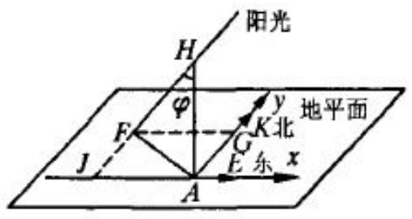

<details>
<summary>text_image</summary>

阳光
H
φ
y
地平面
F
K北
G
E东
x
J
A
</details>

图 1 地平面坐标系示意图[1]

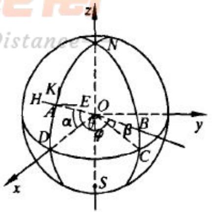

<details>
<summary>text_image</summary>

z
N
H K E O
A α φ B y
D C
x S
</details>

图 2 拍摄点与太阳直射点经纬度示意图[1]

如图2，设地球 $O$ 的球面上过 $A$ 地的经线与赤道交于 $D$ 点，设某日某时太阳直射地球上 $B$ 地，过 $B$ 的经线与赤道交于 $C$ 点。设地球半径为 $R$ ， $\angle AOD = \alpha$ ， $\angle BOC = \beta$ ， $\angle DOC = \theta$ ， $\angle AOB = \varphi$ ，则 $\alpha$ 为观测地 $A$ 处的纬度数（一 $90^{\circ} \leqslant \alpha \leqslant 90^{\circ}$ ），若 $A$ 地在北半球，则 $\alpha > 0$ ，若 $A$ 在南半球，则 $\alpha < 0$ ； $\beta$ 为太阳直射点 $B$ 地的纬度数（一 $23^{\circ}26' \leqslant \beta \leqslant 23^{\circ}26'$ ）； $\theta$ 为 $A$ 地与太阳直射点地 $B$ 的经度差，对于某日 $A$ 地白昼 $t$ 时刻（地方时，正午时刻为12时）有

$$
\theta = (1 2 - t) \times 1 5 ^ {\circ} \tag {1}
$$

其中， $0 \leqslant t \leqslant 24$ 。

又 $\varphi$ 是太阳光线所对应的向量 $OB$ 与 $A$ 地水平地面的法向量(或 $AH$ ) 的夹角, 图3是过 $A$ , $B$ 两地的大圆, 因为 $HF // BO$ (太阳光线是平行的), 所以 $\angle AOB = \angle AHF = \varphi$ , $90^{\circ} - \varphi$ 即 $A$ 地 $t$ 时刻太阳高度角。考虑太阳与地球的实际, 对 $A$ 地白昼时刻有 $|\alpha - \beta| \leq \varphi < 90^{\circ}$ 。

如图2，以 $O$ 为原点，以 $OD$ 所在直线为 $x$ 轴，地轴 $ON$ 所在直线为 $z$ 轴建立空间直角坐标系 $O - xyz$ ，则 $\overrightarrow{AE} = (0,1,0)$ ， $\overrightarrow{AK} = (-\sin \alpha ,0,\cos \alpha)$ ， $A(R\cos \alpha ,0,R\sin \alpha)$ ， $B(R\cos \beta \cos \theta ,R\cos \beta \sin \theta ,R\sin \beta)$ ， $\cos \varphi = \cos \left\langle \overrightarrow{OA},\overrightarrow{OB}\right\rangle = \cos \alpha \cos \beta \cos \theta +\sin \alpha \sin \beta$ 。

同时，为统一计算，规定东经为正值，西经度数为负值；北纬度数为正值，南纬度数为负值。

## - 日影坐标公式推导

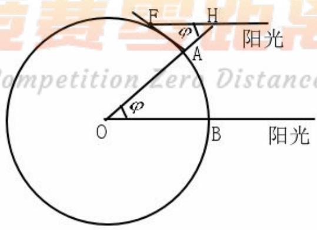

<details>
<summary>text_image</summary>

F
H
φ
A
阳光
O
φ
B
阳光
Competition Zero Distance
</details>

图 3 拍摄点与太阳直射点纵切面示意图

如图3，在 $Rt_{\triangle}AHF$ 中， $HF = \frac{AH}{\cos \varphi} = \frac{h}{\cos \varphi}$ 。设 $\overrightarrow{HF}$ 与 $\overrightarrow{AE}$ 所成角为 $\delta$ ，则

$$
\cos \delta = \cos \left\langle \overrightarrow {H F}, \overrightarrow {A E} \right\rangle = \cos \left\langle \overrightarrow {B O}, \overrightarrow {A E} \right\rangle = - \cos \beta \sin \theta
$$

如图1，对 $HF$ 在 $AE$ 上的正射影 $AJ$ ，有 $AJ = HF\cos \delta = \frac{\cos\delta}{\cos\varphi} h$ ，即 $F$ 点在平面 $A - xy$ 上的横坐标 $x = AJ = \frac{-\cos\beta\sin\theta}{\cos\alpha\cos\beta\cos\theta + \sin\alpha\sin\beta} h$ 。设 $\overrightarrow{HF}$ 与 $\overrightarrow{AK}$ 所成角为 $\gamma$ ，则

$$
\cos \gamma = \cos \left\langle \overrightarrow {H F}, \overrightarrow {A K} \right\rangle = \cos \left\langle \overrightarrow {B O}, \overrightarrow {A K} \right\rangle = \sin \alpha \cos \beta \cos \theta - \cos \alpha \sin \beta ,
$$

如图1，对 $HF$ 在 $AK$ 上的正射影 $AG$ ，有 $AG = HF\cos \gamma = \frac{\cos\gamma}{\cos\varphi} h$ ，即 $F$ 点在平面 $A - xy$ 上的纵坐标 $y = AG = \frac{\sin\alpha\cos\beta\cos\theta - \cos\alpha\sin\beta}{\cos\alpha\cos\beta\cos\theta + \sin\alpha\sin\beta} h$ ，故在平面 $A - xy$ 上，

$$
F \left(\frac {- \cos \beta \sin \theta}{\cos \alpha \cos \beta \cos \theta + \sin \alpha \sin \beta} h, \frac {\sin \alpha \cos \beta \cos \theta - \cos \alpha \sin \beta}{\cos \alpha \cos \beta \cos \theta + \sin \alpha \sin \beta} h\right) \tag {2}
$$

## - 日期与太阳直射点纬度的关系

经查阅资料可知，太阳直射点的纬度可以利用黄经推导[5]，计算公式为：

$$
\beta = \arcsin (0. 3 9 7 7 7 5 \sin \lambda) \tag {3}
$$

其中， $\beta$ 为太阳直射点纬度， $\lambda$ 为黄经度。

值得注意的是，地球公转的周期是一个回归年(365.2422日).现行公历的历年是历日的整数倍,它和回归年并不精确相等;另外,由于复杂的历史演变过程,以及一些人为原因,上半年和下半年、冬半年和夏半年以各季、各月之间的天数也并不完全相同,因而日期和黄经并不完全相对应。因此,用日期取代黄经来推算直射点纬度时,需按季节分段时行计算,以确保推算的相对精确[2]。

首先，对于夏半年，从春分日(3月21日前后)到秋分日(9月23日前后)总计186天, 在此时段内视太阳在黄道上运转 $180^{\circ}$ . 设从春分日开始, 视太阳运行了 n 天, 则 n 天运行了 $\lambda$ 经度:

$$
\lambda = \frac {1 8 0 ^ {0}}{1 8 6} \cdot n
$$

代入(3)式, 得:

$$
\beta = \arcsin [ 0. 3 9 7 7 5 \cdot \sin (\frac {1 8 0 ^ {0}}{1 8 6} \cdot n) ] \tag {4}
$$

其中， $n \in [0,186]$ 。

对于冬半年，自秋分日(9月23日前后)至冬至日(12月22日前后)总计90天,在此时段

内视太阳的黄道上运转 $90^{\circ}$ . 设从春分日开始, 视太阳运行了 n 天, 则 n 天运行了 $\lambda$ 经度:

$$
\lambda = 1 8 0 ^ {0} + \frac {9 0 ^ {0}}{9 0} \cdot (n - 1 8 6)
$$

代入(3)式, 得:

$$
\beta = - \arcsin [ 0. 3 9 7 7 5 \cdot \sin (n - 1 8 6) ^ {0} ] \tag {5}
$$

其中， $n \in [186, 276]$ 。

自冬至日至次年春分日总计89天, 在此时段内视太阳在黄道上运转 $90^{\circ}$ . 设从春分日开始, 视太阳行了 n 天, 则 n 天运行了 $\lambda$ 经度:

$$
\lambda = 2 7 0 ^ {0} + \frac {9 0 ^ {0}}{8 9} \cdot (n - 2 7 6)
$$

代入(3)式, 得:

$$
\beta = - \arcsin \{0. 3 9 7 7 5 \cdot \cos [ \frac {9 0 ^ {0}}{8 9} (n - 2 7 6) ] \} \tag {6}
$$

其中， $n \in [276,365]$ 。

## - 地方时与北京时的时差换算

由（1）式可知拍摄地 A 地与太阳直射点地 B 的经度差 $\theta$ 由本地时 t 决定。而在实际生活或者是在拍摄视频时，我们所记录下的时间都是北京时间，它与本地实际时间有一定的时差，这个时差在计算中不能忽略。经分析可得，设北京时间为 T，A 处的经度数为 $\omega$ ，则

$$
t = T - (1 2 0 ^ {0} - \omega) \cdot \frac {4 \min}{6 0} \tag {7}
$$

## - 影子长度数学模型

由式（4），（5），（6）可知，在不同的日期范围内，太阳直射点纬度 $\beta$ 可由日期表示；由式（1）可知拍摄地与太阳直射点经度差 $\theta$ 可由地方时 t 表示，而由式（7）可知，地方时 t 可由拍摄地经度和北京时间表示。

以日期 $n\in[0,186]$ 为例，将式（4）、（1）和（7）带入式（2）可得拍摄点坐标：

$$
\left\{ \begin{array}{l} x = \frac {- \cos \beta \sin \theta}{\cos \alpha \cos \beta \cos \theta + \sin \alpha \sin \beta} h \\ y = \frac {\sin \alpha \cos \beta \cos \theta - \cos \alpha \sin \beta}{\cos \alpha \cos \beta \cos \theta + \sin \alpha \sin \beta} h \\ \theta = (1 2 - t) \times 1 5 ^ {\circ} \\ t = T - (1 2 0 ^ {0} - \omega) \cdot \frac {4 \min}{6 0} \\ \beta = \arcsin [ 0. 3 9 7 7 5 \cdot \sin (\frac {1 8 0 ^ {0}}{1 8 6} \cdot n) ] \end{array} \right. \tag {8}
$$

此外，当日期 $n \in [186, 276]$ 时， $\beta = -\arcsin[0.39775 \cdot \sin(n - 186)^0]$ ；当日期 $n \in [276, 365]$ 时， $\beta = -\arcsin\{0.39775 \cdot \cos[\frac{90^0}{89}(n - 276)]\}$ 。

由上述公式可知，影长实质上是关于杆长、拍摄点经度、纬度、拍摄日期和拍摄时北京时间五个量的一个函数。但是，若拍摄记录的时间即为本地时间，则不需要北京时间与本地时式（7）的转换，影长实质上是关于杆长、拍摄点纬度、拍摄日期和拍摄时本地时刻四个量的一个函数。

## 4.1.1 模型的求解

## - 影长关于参数的变化规律

## 1、影长随经度变化的规律

为了研究影长关于经度的变化规律，需要将其它参数取为定值。取日期为9月3日北纬27°处，长为1米的杆，在格林尼治6时、12时和18时绘制影长随经度变化的曲线如下所示：

9月3日北纬27度1米杆随经度变化影长变化  
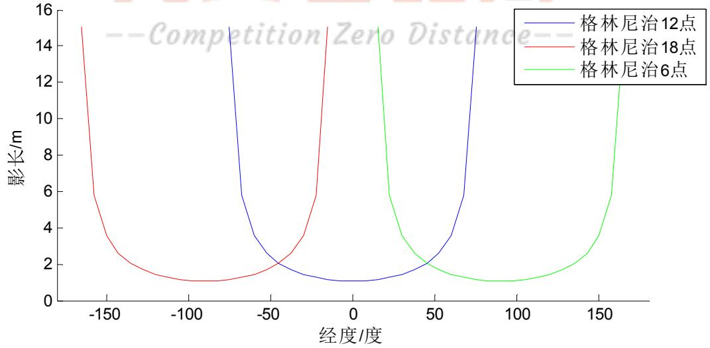

<details>
<summary>contour</summary>

| 经度/度 | 格林尼治12点 (影长/m) | 格林尼治18点 (影长/m) | 格林尼治6点 (影长/m) |
| --- | --- | --- | --- |
| -150 | — | ~15 | — |
| -100 | — | ~1.2 | — |
| -50 | ~2.5 | ~1.5 | — |
| 0 | ~1.2 | ~1.5 | — |
| 50 | ~2.5 | — | ~2.5 |
| 100 | — | — | ~1.2 |
| 150 | — | — | ~15 |
</details>

图 4 影长随经度变化曲线图

以单条曲线为例分析：由上图可知，在格林尼治 12 时，0 度经线上影子最短；向南北方向，影长随纬度的增加而减小。在实际情况中，格林尼治 12 时 0 度经线上为正午，向南北方向经线分别在上午和下午，所以 0 度经线影长最短，两侧逐渐边长。这说明图像是符合实际的。

同时从三条曲线观察，发现随着时间的推移，曲线可以认为逐渐向右移动。在 0 度经线处，从 6 时至 18 时，影长经历由长变短再逐渐变长的变化，符合实际。

## 2、影长随纬度变化的规律

取 9 月 3 日，杆长 1 米，当地时间分别为 9 时、12 时和 14 时作图；因为所取的时间为本地时间，所以此时影长为关于拍摄点纬度、日期和拍摄时刻三个量的函数，则不需要在给定拍摄地经度值。绘制影长随纬度变化的曲线如下所示：

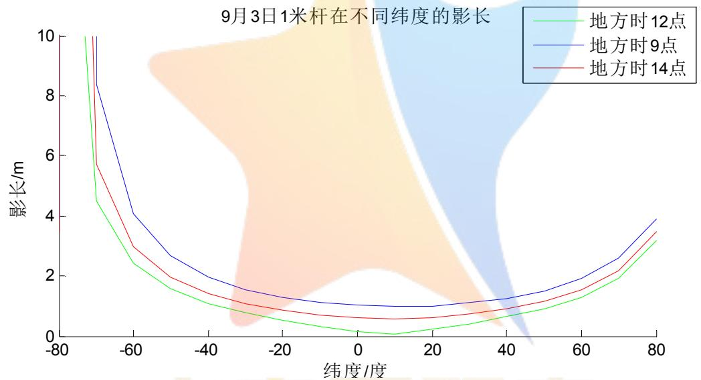

<details>
<summary>contour</summary>

| 纬度/度 | 地方时 12点 (m) | 地方时 9点 (m) | 地方时 14点 (m) |
| --- | --- | --- | --- |
| -70 | ~4.5 | ~8.3 | ~5.7 |
| -60 | ~2.4 | ~4.1 | ~3.0 |
| -50 | ~1.6 | ~2.7 | ~2.0 |
| -40 | ~1.1 | ~2.0 | ~1.5 |
| -30 | ~0.8 | ~1.6 | ~1.2 |
| -20 | ~0.6 | ~1.3 | ~1.0 |
| -10 | ~0.4 | ~1.1 | ~0.8 |
| 0 | ~0.2 | ~1.0 | ~0.7 |
| 10 | ~0.1 | ~1.0 | ~0.6 |
| 20 | ~0.2 | ~1.0 | ~0.6 |
| 30 | ~0.4 | ~1.1 | ~0.7 |
| 40 | ~0.6 | ~1.3 | ~0.9 |
| 50 | ~0.8 | ~1.5 | ~1.1 |
| 60 | ~1.2 | ~1.9 | ~1.5 |
| 70 | ~1.9 | ~2.6 | ~2.1 |
| 80 | ~3.2 | ~3.9 | ~3.5 |
</details>

图 5 影长随纬度变化曲线图

以单条曲线分析，影长曲线大概关于赤道对称。而在实际情况中，9月3日在秋分日左右，秋分日时太阳直射赤道，赤道影长最短，向两侧纬度影长逐渐增加。这说明图像是符合实际的。

同时从三条曲线来看，由图可得本地时12时的影长最短，9时的影长最长，也是符合实际的。

## 3、影长随日期变化的规律

取北纬 $27^{\circ}$ 处，杆长 1 米，当地时间分别为 9 时、12 时和 14 时作图；因为所取的时间为本地时间，所以此时影长是关于拍摄点纬度、日期和拍摄时刻三个量的函数，则不需要在给定拍摄地经度值。绘制影长随日期（用距春分日天数表示）变化的曲线如下所

示:

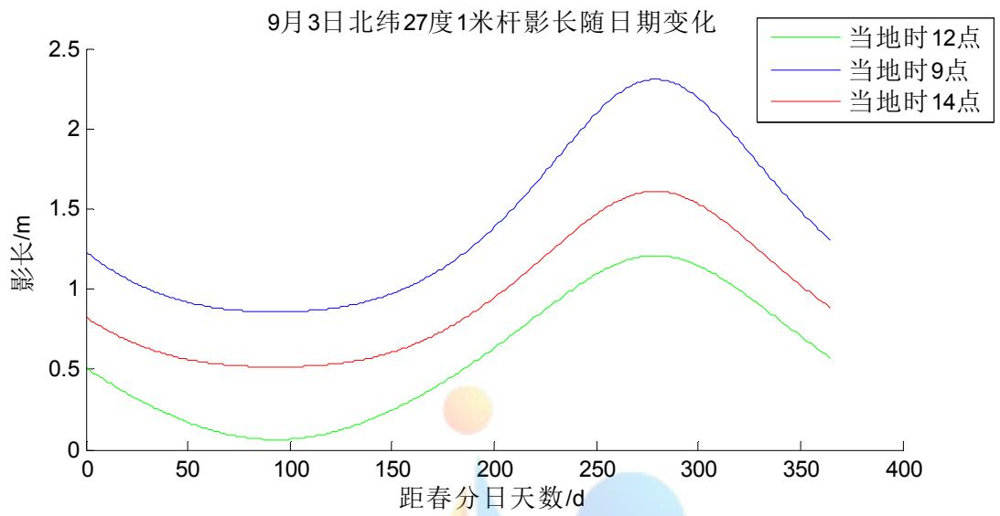

<details>
<summary>line</summary>

| 距春分日天数/d | 当地时12点 (m) | 当地时9点 (m) | 当地时14点 (m) |
| --- | --- | --- | --- |
| 0 | ~0.5 | ~1.2 | ~0.8 |
| 50 | ~0.2 | ~0.9 | ~0.6 |
| 100 | ~0.1 | ~0.85 | ~0.55 |
| 150 | ~0.3 | ~1.0 | ~0.65 |
| 200 | ~0.6 | ~1.4 | ~0.9 |
| 250 | ~1.0 | ~2.0 | ~1.4 |
| 300 | ~1.2 | ~2.3 | ~1.6 |
| 350 | ~0.7 | ~1.6 | ~1.1 |
| 365 | ~0.6 | ~1.3 | ~0.9 |
</details>

图 6 影长随日期变化曲线图

以单条曲线为例分析：北纬27在当地时间14时，由图可知影长经历先缩短再变长的变化。在距春分日100天左右（即夏至日附近）达到最短，距春分日280天左右（即冬至日附近）达到最长。在实际情况中，北纬27°处在北回归线附近，所以应当在夏至日左右影子达到最短，冬至日左右影子达到最长；这说明图像是符合实际的。

同时从三条曲线分析，由图可得本地时12时的影长最短，9时的影长最长，符合实际。

## - 天安门广场影长随时间变化

题目要求绘制天安门2015年10月22日北京时间9:00-15:00之间3米高的直杆的太阳影子长度的变化曲线。需要注意的是，天安门的本地时间并不是北京时间，所以需要利用式（7）进行本地时间和北京时间的转换。根据式（8），将天安门广场的经纬度、拍摄日期带入，做出影长随北京时间变化的曲线图如下所示：

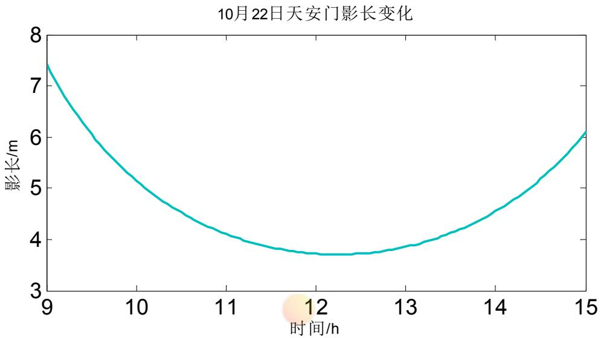

<details>
<summary>line</summary>

| 时间/h | 影长/m |
| --- | --- |
| 9 | ~7.4 |
| 10 | ~5.3 |
| 11 | ~4.1 |
| 12 | ~3.7 |
| 13 | ~3.8 |
| 14 | ~4.6 |
| 15 | ~6.1 |
</details>

图 7 天安门影长随时间变化曲线

## 4.2 问题二

## 4.2.1 模型的建立

## - 坐标系的转化

在本问题中，数据给出了太阳影子顶点的坐标值，但是题目所给数据只说明了以杆子底部为原点，并未说明 x 轴和 y 轴的指向，所以可以引入一个变量 $\sigma$ 来表示题目所给数据的坐标系 y 轴与我们在问题一中建立的以杆子底部为原点，正北方向为 y 轴的坐标系 A-xy 中 y 轴的夹角。如下图所示：

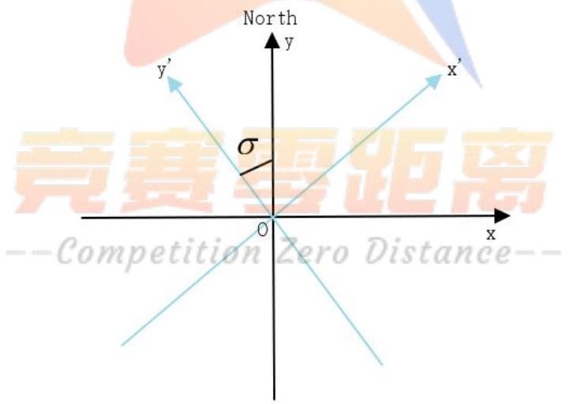

<details>
<summary>text_image</summary>

North
y'
σ
O
x'
x
竞赛要距离
--Competition Zero Distance--
</details>

图 8 坐标系转换示意图

由图可知，两个坐标系坐标的关系如下：

$$
\left\{ \begin{array}{l} x ^ {\prime} = x \cdot \cos \sigma + y \cdot \sin \sigma \\ y ^ {\prime} = y \cdot \cos \sigma - x \cdot \sin \sigma \end{array} \right. \tag {9}
$$

## - 拍摄地经度范围的估计

由附件所给的数据做出影长随时间变化的图像如下:

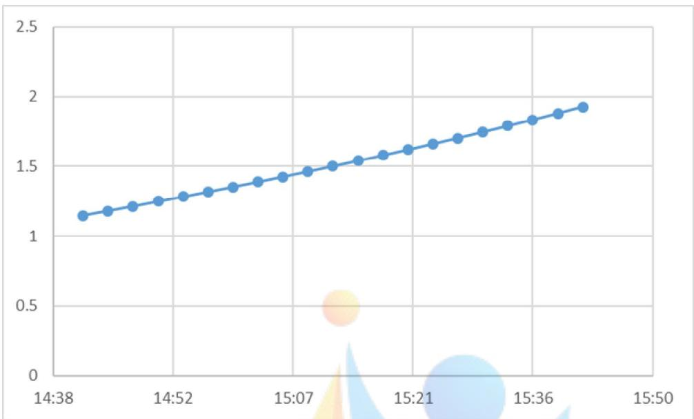

<details>
<summary>line</summary>

| Time | Value |
| --- | --- |
| 14:38 | ~1.15 |
| 14:40 | ~1.18 |
| 14:42 | ~1.21 |
| 14:44 | ~1.24 |
| 14:46 | ~1.27 |
| 14:48 | ~1.30 |
| 14:50 | ~1.33 |
| 14:52 | ~1.36 |
| 14:54 | ~1.39 |
| 14:56 | ~1.42 |
| 14:58 | ~1.45 |
| 15:00 | ~1.48 |
| 15:02 | ~1.51 |
| 15:04 | ~1.54 |
| 15:06 | ~1.57 |
| 15:08 | ~1.60 |
| 15:10 | ~1.63 |
| 15:12 | ~1.66 |
| 15:14 | ~1.69 |
| 15:16 | ~1.72 |
| 15:18 | ~1.75 |
| 15:20 | ~1.78 |
| 15:22 | ~1.81 |
| 15:24 | ~1.84 |
| 15:26 | ~1.87 |
| 15:28 | ~1.90 |
</details>

图 9 附件影长随时间变化图

由图可以看出，影长在北京时间 14:42 至 15:42 时间段内呈上升趋势。

给定杆长 3 米，作南北回归线和赤道上一天内影长随地方时变化的曲线图如下：

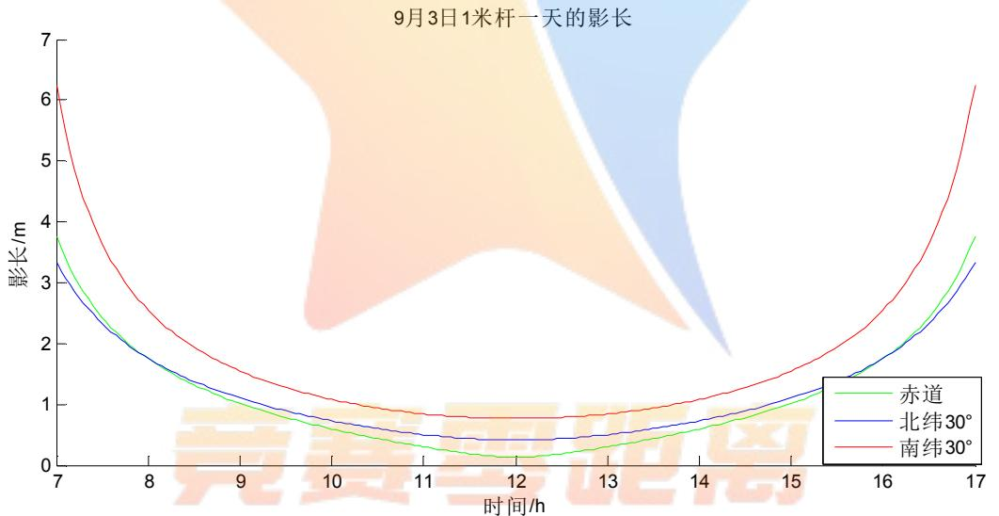

<details>
<summary>line</summary>

| 时间/h | 赤道 (m) | \(北纬30{}^{\circ}\) (m) | \(南纬30{}^{\circ}\) (m) |
| --- | --- | --- | --- |
| 7 | ~3.7 | ~3.3 | ~6.2 |
| 8 | ~1.8 | ~1.8 | ~2.5 |
| 9 | ~1.1 | ~1.2 | ~1.6 |
| 10 | ~0.7 | ~0.8 | ~1.1 |
| 11 | ~0.4 | ~0.5 | ~0.8 |
| 12 | ~0.2 | ~0.4 | ~0.8 |
| 13 | ~0.3 | ~0.5 | ~0.8 |
| 14 | ~0.6 | ~0.7 | ~1.1 |
| 15 | ~1.0 | ~1.1 | ~1.6 |
| 16 | ~2.0 | ~2.0 | ~2.8 |
| 17 | ~3.7 | ~3.3 | ~6.2 |
</details>

图 10 一天内影长随地方时变化示意图

由图可知，不论在什么纬度，影长随时间推移而上升的情况都出现在地方时 12 时至 18 时。

将两个图进行对比，可以知道附件中的北京时间段对应在当地时间的 12 时至 18 时时段。因为北京时间和当地时间存在如下转换关系：

$$
t = T - (1 2 0 ^ {0} - \omega) \cdot \frac {4 \min}{6 0}
$$

当北京时间 14:42 与本地时 12 时重合时，经度有最小值；令 t=12:00，T=14:42，得 $\omega=79.5^{0}$ ;

当北京时间 15:42 与本地时 18 时重合时，经度有最大值；令 t=18:00，T=15:42，得 $\omega=154.5^{0}$ 。

所以，拍摄地的经度范围是 $\omega \in (E79.5^{0}, E154.5^{0})$ 。

## - 基于最小二乘法的非线性参数拟合模型

为避免利用附件数据解方程求未知参数所带来的数据利用率不够，精度不高的影响，我们采用非线性拟合的方法求解未知参数。为衡量拟合效果，运用最小二乘法的思想，将理论计算出的 $x$ 、 $y$ 坐标值经坐标转换后与数据提供的的 $x''$ 、 $y''$ 值之差的平方和作为目标函数，求其最小值，将问题转化成一个优化模型。

值得注意的是，因为拍摄日期为 4 月 18 日，则 n=28 ，所以太阳直射点纬度选择如下计算式：

$$
\beta = \arcsin [ 0. 3 9 7 7 5 \cdot \sin (\frac {1 8 0 ^ {0}}{1 8 6} \cdot n) ]
$$

利用问题一模型写出具体表达式如下:

$$
\begin{array}{l} \min z = \sum_ {i = 0} ^ {2 0} (x _ {i} ^ {\prime} - x _ {i} ^ {\prime \prime}) ^ {2} + \sum_ {i = 0} ^ {2 0} (y _ {i} ^ {\prime} - y _ {i} ^ {\prime \prime}) ^ {2} \\ \left\{ \begin{array}{l} x _ {i} ^ {\prime} = x _ {i} \cdot \cos \sigma + y _ {i} \cdot \sin \sigma \\ y _ {i} ^ {\prime} = y _ {i} \cdot \cos \sigma - x _ {i} \cdot \sin \sigma \\ x _ {i} = \frac {- \cos \beta \sin \theta}{\cos \alpha \cos \beta \cos \theta + \sin \alpha \sin \beta} h \\ y _ {i} = \frac {\sin \alpha \cos \beta \cos \theta - \cos \alpha \sin \beta}{\cos \alpha \cos \beta \cos \theta + \sin \alpha \sin \beta} h \\ \beta = \arcsin [ 0. 3 9 7 7 5 \cdot \sin (\frac {1 8 0 ^ {0}}{1 8 6} \cdot n) ] \\ \theta = (1 2 - t) \times 1 5 ^ {\circ} \\ t = T - (1 2 0 ^ {0} - \omega) \cdot \frac {4 \min}{6 0} \\ \omega \in (7 9. 5 ^ {0}, 1 5 4. 5 ^ {0}) \end{array} \right. \tag {7} \\ \end{array}
$$

其中， $\alpha,\omega,\sigma,h$ 为未知量， $T,n,x_{i}^{\prime\prime},y_{i}^{\prime\prime}$ 为已知量。

## 4.2.2 模型的求解

## - L-M最优化算法[8]

本题的最优化模型是一个利用最小二乘法原理对多个参数进行拟合的问题。经查阅资料我们发现 L-M（Levenberg-Marquardt）算法在解决这类问题时有较好的应用。

Levenberg-Marquardt 算法是介于牛顿法与梯度下降法之间的一种非线性优化方

法，这个算法对于过参数化问题不敏感，能有效处理冗余参数问题，而且寻优速度较快。

在本题中应用该算法的流程如下:

目标：对影子顶点坐标关于四个参数的函数关系 $(x',y')=f(\omega,\alpha,h,\sigma)$ ，给定观测值坐标 $(x''_{i},y''_{i})$ ，估计参数向量 $p'=(\omega,\alpha,h,\sigma)$ 。

Step1: 取初始向量 $p_0 = (\omega_0, \alpha_0, h_0, \sigma_0)$ ，终止控制常数 $\varepsilon$ ，计算 $\varepsilon_0 = \| (x', y') - f(p_0) \|$ ， $k := 0, \lambda_0 = 10^{-3}, v = 10$ （也可以是其他大于 1 的数）。

Step2：计算 Jacobi 矩阵 $J_{k}$ ，计算 $\overline{N_{k}} = J^{T}_{k} J_{k} + \lambda_{k} I$ ，构造增量正规方程 $\overline{N_{k}} \cdot \delta_{k} = J^{T}_{k} \varepsilon_{k}$ 。

Step3: 求解增量正规方程得到 $\delta_{k}$ 。

(1) 如果 $\| (x', y') - f(p_k + \delta_k) \| < \varepsilon_k$ ，则令 $p_{k+1} = p_k + \delta_k$ ，若 $\| \delta_k \| < \varepsilon$ ，停止迭代，输出结果；否则令 $\lambda_{k+1} = \lambda_k / v$ ，转到 Step2。  
(2) 如果 $\| (x', y') - f(p_k + \delta_k) \| \geq \varepsilon_k$ ，则令 $\lambda_{k+1} = \lambda_k \cdot v$ ，重新解正规方程得到 $\delta_k$ ，返回步骤（1）。

在 L-M 算法中，每次迭代式寻找一个合适的阻尼因子 $\lambda$ ，当 $\lambda$ 很小时，迭代步长为牛顿法步长； $\lambda$ 很大时，蜕化为梯度下降法的最优步长计算式。

由于在计算中，给定未知参数的初始值非常重要，求解的结果对初始值较为敏感。而且随着未知参数数量的增加，算法求解的速度会变慢。所以我们考虑先减少未知数的个数提高算法速度，得出一些精确度不高的参数解。然后再根据得出的解缩小参数范围，带入原模型（不减少参数个数）求解，得出精度较高的参数值。

## - L-M 最优化算法的改进

Step1: 减少未知参数个数

在本问中，由于数据所给的坐标系方向不确定，所以我们设 $\sigma$ 为数据坐标系和问题一中设定坐标系的夹角，相当于增加了一个未知参数。这样会降低算法求解和速度。所以我们考虑直接从影长入手，将式（7）模型中的目标函数改为：

$$
\min z = \sum_ {i = 0} ^ {2 0} (\sqrt {x _ {i} ^ {\prime 2} + y _ {i} ^ {\prime 2}} - \sqrt {x _ {i} ^ {\prime \prime 2} + y _ {i} ^ {\prime \prime 2}}) ^ {2} \tag {8}
$$

即以理论计算所得影长和所给数据影长之间差值的平方和作为优化目标。因为无论坐标系如何偏转，影长 $l=\sqrt{x^{2}+y^{2}}$ 都是定值。这样在方程中就不会用到偏转角 $\sigma$ ，可以减少一个未知量，加快算法计算速度。

值得注意的是，用影长进行优化相当于只运用了题目所给的一组信息，降低了对题目所给信息的利用率，所以结果的精度不高。

这样得出的参数向量 $p'=(\omega,\alpha,h)=(108.63^{\circ},19.09^{\circ},2.03\mathrm{~m})$ ，拟合匹配的效果如下：

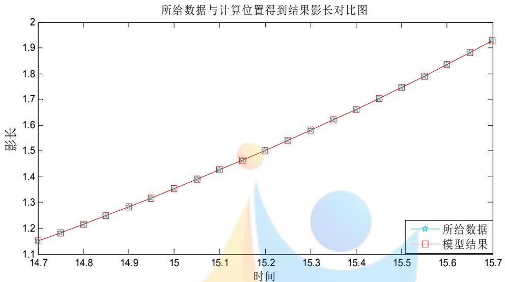

<details>
<summary>line</summary>

| 时间 | 所给数据 (影长) | 计算位置得到结果 (影长) |
| --- | --- | --- |
| 14.7 | ~1.15 | ~1.15 |
| 14.75 | ~1.18 | ~1.18 |
| 14.8 | ~1.22 | ~1.22 |
| 14.85 | ~1.25 | ~1.25 |
| 14.9 | ~1.28 | ~1.28 |
| 14.95 | ~1.32 | ~1.32 |
| 15 | ~1.35 | ~1.35 |
| 15.05 | ~1.39 | ~1.39 |
| 15.1 | ~1.43 | ~1.43 |
| 15.15 | ~1.46 | ~1.46 |
| 15.2 | ~1.50 | ~1.50 |
| 15.25 | ~1.54 | ~1.54 |
| 15.3 | ~1.58 | ~1.58 |
| 15.35 | ~1.62 | ~1.62 |
| 15.4 | ~1.66 | ~1.66 |
| 15.45 | ~1.70 | ~1.70 |
| 15.5 | ~1.74 | ~1.74 |
| 15.55 | ~1.79 | ~1.79 |
| 15.6 | ~1.83 | ~1.83 |
| 15.65 | ~1.88 | ~1.88 |
| 15.7 | ~1.93 | ~1.93 |
</details>

图 11 影长与数据对比图

此时，偏差平方和 $z=5.305\times10^{-8}$ ，拟合效果较好。

## Step2: 缩小参数范围并求解

根据第一步求出的结果，分别增减 $20^{\circ}$ 缩小经度的范围为： $\omega \in (80^{\circ}, 120^{\circ})$ ，纬度的范围为： $\alpha \in (0^{\circ}, 40^{\circ})$ ，利用L-M算法求解式（7）模型，即将理论计算出的 $x$ 、 $y$ 坐标值经坐标转换后与数据提供的的 $x''$ 、 $y''$ 值之差的平方和作为目标函数，结果为 $p = (\omega, \alpha, h, \sigma) = (109.83^{\circ}, 18.15^{\circ}, 1.96\mathrm{m}, 0.26$ 弧度)，偏差平方和 $z = 3.07 \times 10^{-6}$ 。 $x$ 值和 $y$ 值拟合匹配的效果如下：

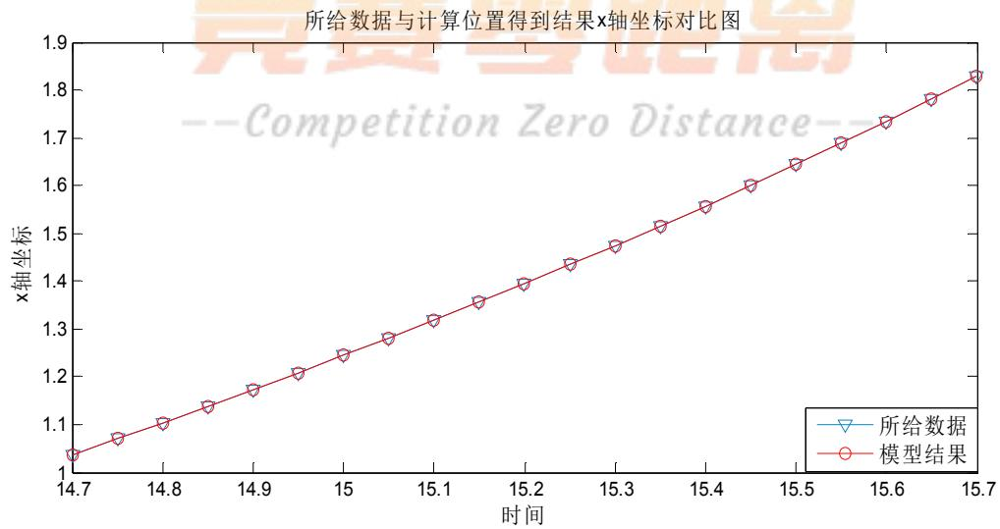

<details>
<summary>line</summary>

| 时间 | 所给数据 (x轴坐标) | 模型结果 (x轴坐标) |
| --- | --- | --- |
| 14.7 | ~1.04 | ~1.04 |
| 14.75 | ~1.07 | ~1.07 |
| 14.8 | ~1.10 | ~1.10 |
| 14.85 | ~1.13 | ~1.13 |
| 14.9 | ~1.17 | ~1.17 |
| 14.95 | ~1.20 | ~1.20 |
| 15.0 | ~1.24 | ~1.24 |
| 15.05 | ~1.28 | ~1.28 |
| 15.1 | ~1.32 | ~1.32 |
| 15.15 | ~1.36 | ~1.36 |
| 15.2 | ~1.39 | ~1.39 |
| 15.25 | ~1.43 | ~1.43 |
| 15.3 | ~1.47 | ~1.47 |
| 15.35 | ~1.51 | ~1.51 |
| 15.4 | ~1.55 | ~1.55 |
| 15.45 | ~1.60 | ~1.60 |
| 15.5 | ~1.64 | ~1.64 |
| 15.55 | ~1.69 | ~1.69 |
| 15.6 | ~1.73 | ~1.73 |
| 15.65 | ~1.78 | ~1.78 |
| 15.7 | ~1.83 | ~1.83 |
</details>

图 12 x 值与数据对比图

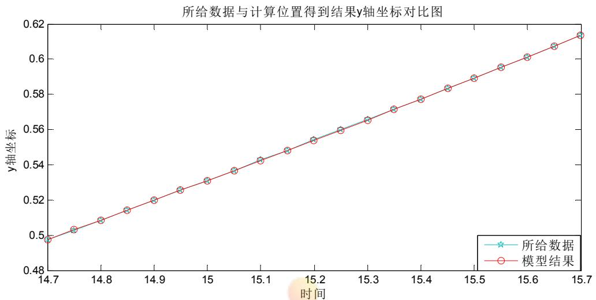

<details>
<summary>line</summary>

| 时间 | 所给数据 (y轴坐标) | 模型结果 (y轴坐标) |
| --- | --- | --- |
| 14.7 | ~0.498 | ~0.498 |
| 14.75 | ~0.503 | ~0.503 |
| 14.8 | ~0.508 | ~0.508 |
| 14.85 | ~0.514 | ~0.514 |
| 14.9 | ~0.520 | ~0.520 |
| 14.95 | ~0.526 | ~0.526 |
| 15 | ~0.531 | ~0.531 |
| 15.05 | ~0.537 | ~0.537 |
| 15.1 | ~0.543 | ~0.543 |
| 15.15 | ~0.548 | ~0.548 |
| 15.2 | ~0.554 | ~0.554 |
| 15.25 | ~0.560 | ~0.560 |
| 15.3 | ~0.566 | ~0.566 |
| 15.35 | ~0.572 | ~0.572 |
| 15.4 | ~0.578 | ~0.578 |
| 15.45 | ~0.584 | ~0.584 |
| 15.5 | ~0.590 | ~0.590 |
| 15.55 | ~0.596 | ~0.596 |
| 15.6 | ~0.602 | ~0.602 |
| 15.65 | ~0.608 | ~0.608 |
| 15.7 | ~0.614 | ~0.614 |
</details>

图 13 y 值与数据对比图

由图像可知，求得的结果与数据所给的 x 值和 y 值符合的效果都较好，且偏差平方和 $z = 3.07 \times 10^{-6}$ ，到达 $10^{-6}$ 数量级，说明结果比较理想。

## 4.3 问题三

## 4.3.1 模型的建立

问题三附件中给出了两组数据。两组的时间相差不到30分钟，但是一组中 $x$ 坐标全为正值，另一组全为负值，所以推测两组数据并不是在同一个地点。

问题三与问题二类似，不同之处在于增加了日期 n 这个未知参数，整体的思路是一致的。首先仍是进行坐标系的转化，具体过程与问题二中相同，此处不再赘述。

## - 拍摄地经度范围的估计

## 1、附件2

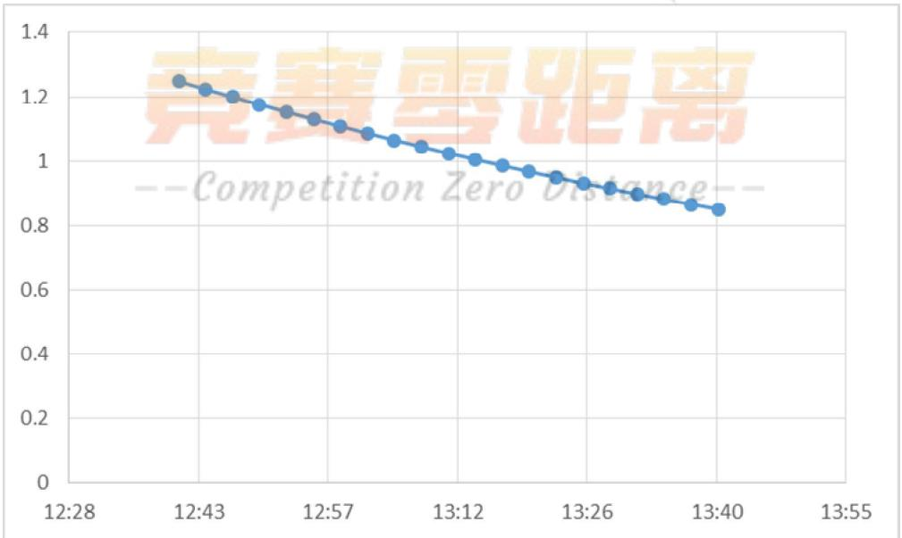

<details>
<summary>line</summary>

| Time | Competition Zero Distance |
| --- | --- |
| 12:43 | ~1.25 |
| 12:44 | ~1.22 |
| 12:45 | ~1.20 |
| 12:46 | ~1.18 |
| 12:47 | ~1.16 |
| 12:48 | ~1.14 |
| 12:49 | ~1.12 |
| 12:50 | ~1.10 |
| 12:51 | ~1.09 |
| 12:52 | ~1.07 |
| 12:53 | ~1.05 |
| 12:54 | ~1.03 |
| 12:55 | ~1.01 |
| 12:56 | ~0.99 |
| 12:57 | ~0.97 |
| 12:58 | ~0.95 |
| 12:59 | ~0.93 |
| 13:00 | ~0.92 |
| 13:01 | ~0.90 |
| 13:02 | ~0.89 |
| 13:03 | ~0.87 |
| 13:04 | ~0.85 |
</details>

图 14 附件 2 影长随时间变化

由图可以看出，影长在北京时间 12:41 至 13:41 时间段内呈下降趋势。

由图 10 可知，不论在什么纬度，影长随时间推移而下降的情况都出现在地方时 6 时至 12 时。

将两个图进行对比，可以知道附件中的北京时间段对应在当地时间的 6 时至 12 时时段。因为北京时间和当地时间存在如下转换关系：

$$
t = T - (1 2 0 ^ {0} - \omega) \cdot \frac {4 \min}{6 0}
$$

当北京时间 12:41 与本地时 6 时重合时，经度有最小值；令 t=06:00，T=12:41，得 $\omega=19.75^{0}$ ;

当北京时间 13:41 与本地时 12 时重合时，经度有最大值；令 t=12:00，T=13:41，得 $\omega=94.75^{0}$ 。

所以，在附件 2 中拍摄地的经度范围是 $\omega \in (19.75^{0}, 94.75^{0})$ 。

## 2、附件3

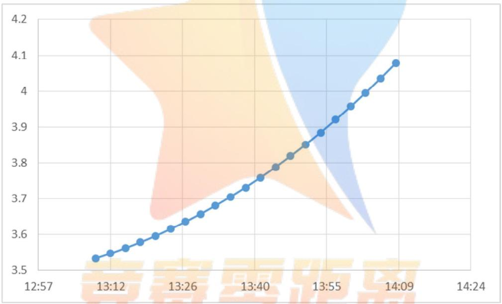

<details>
<summary>line</summary>

| Time | Value |
| --- | --- |
| 13:10 | ~3.53 |
| 13:12 | ~3.55 |
| 13:14 | ~3.56 |
| 13:16 | ~3.58 |
| 13:18 | ~3.60 |
| 13:20 | ~3.62 |
| 13:22 | ~3.64 |
| 13:24 | ~3.66 |
| 13:26 | ~3.68 |
| 13:28 | ~3.70 |
| 13:30 | ~3.73 |
| 13:32 | ~3.76 |
| 13:34 | ~3.79 |
| 13:36 | ~3.82 |
| 13:38 | ~3.85 |
| 13:40 | ~3.88 |
| 13:42 | ~3.92 |
| 13:44 | ~3.96 |
| 13:46 | ~4.00 |
| 13:48 | ~4.04 |
| 14:00 | ~4.08 |
</details>

图 15 附件 3 影长随时间变化

由图可以看出，影长在北京时间 13:09 至 14:09 时间段内呈上升趋势。

由图 10 可知，不论在什么纬度，影长随时间推移而上升的情况都出现在地方时 12 时至 18 时。

将两个图进行对比，可以知道附件中的北京时间段对应在当地时间的 12 时至 18 时时段。因为北京时间和当地时间存在如下转换关系：

$$
t = T - (1 2 0 ^ {0} - \omega) \cdot \frac {4 \min}{6 0}
$$

当北京时间 12:09 与本地时 12 时重合时，经度有最小值；令 t=12:00，T=13:09，

得 $\omega = 102.75^0$

当北京时间 13:09 与本地时 18 时重合时，经度有最大值；令 t=18:00，T=13:09，得 $\omega=-167.25^{0}$ 。

所以，在附件2中拍摄地的经度范围是 $\omega \in (102.75^0, 180^0) \cup (-180^0, -167.25^0)$ 。

## - 基于最小二乘法的非线性参数拟合模型

由于问题三和问题二的解决思路相同，也需要建立基于最小二乘法的非线性参数拟合模型。但是由于值得注意的是，因为拍摄日期未知，所以太阳直射点纬度选择计算式时需要分三种情况考虑：

$$
\begin{array}{l} \beta = \arcsin [ 0. 3 9 7 7 5 \cdot \sin (\frac {1 8 0 ^ {0}}{1 8 6} \cdot n) ], \quad n \in [ 0, 1 8 6 ] \\ \beta = - \arcsin [ 0. 3 9 7 7 5 \cdot \sin (n - 1 8 6) ^ {0} ], \quad n \in [ 1 8 6, 2 7 6 ] \\ \beta = - \arcsin \{0. 3 9 7 7 5 \cdot \cos [ \frac {9 0 ^ {0}}{8 9} (n - 2 7 6) ] \}, \quad n \in [ 2 7 6, 3 6 5 ] \\ \end{array}
$$

利用问题一公式写出本问模型具体表达式如下:

$$
\begin{array}{l} \min z = \sum_ {i = 0} ^ {2 0} (x _ {i} ^ {\prime} - x _ {i} ^ {\prime \prime}) ^ {2} + \sum_ {i = 0} ^ {2 0} (y _ {i} ^ {\prime} - y _ {i} ^ {\prime \prime}) ^ {2} \\ \left\{ \begin{array}{l} x _ {i} ^ {\prime} = x _ {i} \cdot \cos \sigma + y _ {i} \cdot \sin \sigma \\ y _ {i} ^ {\prime} = y _ {i} \cdot \cos \sigma - x _ {i} \cdot \sin \sigma \\ x _ {i} = \frac {- \cos \beta \sin \theta}{\cos \alpha \cos \beta \cos \theta + \sin \alpha \sin \beta} h \\ y _ {i} = \frac {\sin \alpha \cos \beta \cos \theta - \cos \alpha \sin \beta}{\cos \alpha \cos \beta \cos \theta + \sin \alpha \sin \beta} h \\ \theta = (1 2 - t) \times 1 5 ^ {\circ} \\ t = T - (1 2 0 ^ {0} - \omega) \cdot \frac {4 \min}{6 0} \\ \beta = \arcsin [ 0. 3 9 7 7 5 \cdot \sin (\frac {1 8 0 ^ {0}}{1 8 6} \cdot n) ], n \in [ 0, 1 8 6 ] \\ \beta = - \arcsin [ 0. 3 9 7 7 5 \cdot \sin (n - 1 8 6) ^ {0} ], n \in [ 1 8 6, 2 7 6 ] \\ \beta = - \arcsin \{0. 3 9 7 7 5 \cdot \cos [ \frac {9 0 ^ {0}}{8 9} (n - 2 7 6) ] \}, n \in [ 2 7 6, 3 6 5 ] \\ \omega \in (1 9. 7 5 ^ {0}, 9 4. 7 5 ^ {0}), (\text {附件2}) \\ \omega \in (1 0 2. 7 5 ^ {0}, 1 8 0 ^ {0}) \cup (- 1 8 0 ^ {0}, - 1 6 7. 2 5 ^ {0}) (\text {附件3}) \end{array} \right. \tag {9} \\ \end{array}
$$

其中， $\alpha,\omega,\sigma,h,n$ 为未知量， $T,x_{i}^{\prime\prime},y_{i}^{\prime\prime}$ 为已知量。

## 4.3.2 模型的求解

与问题二处理类似，由于L-M算法对于过参数化问题不敏感，我们仍然选择L-M算法进行求解，并进行了和问题二中类似的优化。

Step1: 减少未知参数个数

直接从影长入手，将式（9）模型中的目标函数改为：

$$
\min z = \sum_ {i = 0} ^ {2 0} (\sqrt {x _ {i} ^ {\prime 2} + y _ {i} ^ {\prime 2}} - \sqrt {x _ {i} ^ {\prime \prime 2} + y _ {i} ^ {\prime \prime 2}}) ^ {2}
$$

即以理论计算所得影长和所给数据影长之间差值的平方和作为优化目标。方程中不用引入偏转角 $\sigma$ ，减少量一个未知量，加快算法的计算速度。

值得注意的是，用影长进行优化相当于减少了对题目所给信息的利用率，所以结果的精度不高。

1、对于附件2，得出的参数向量 $p = (\omega, \alpha, h, m) = (79.55^{\circ}, 39.83^{\circ}, 1.99\mathrm{m}, 202.19)$ 其中， $m$ 表示距离元旦的天数，即 $m = n + 79$ ；拟合匹配的效果如下：

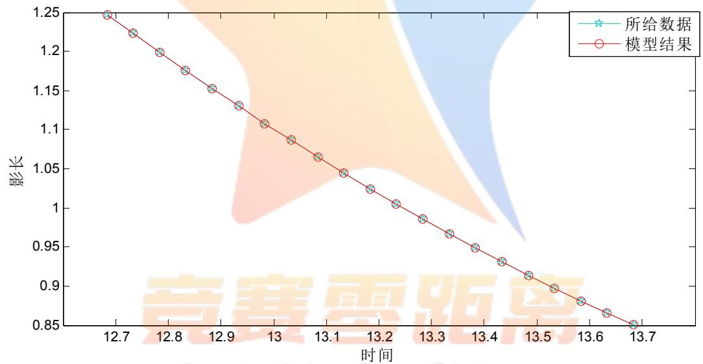

<details>
<summary>line</summary>

| 时间 | 所给数据 (影长) | 模型结果 (影长) |
| --- | --- | --- |
| 12.7 | 1.25 | 1.25 |
| 12.75 | ~1.225 | ~1.225 |
| 12.8 | ~1.20 | ~1.20 |
| 12.85 | ~1.175 | ~1.175 |
| 12.9 | ~1.15 | ~1.15 |
| 12.95 | ~1.13 | ~1.13 |
| 13 | ~1.105 | ~1.105 |
| 13.05 | ~1.085 | ~1.085 |
| 13.1 | ~1.065 | ~1.065 |
| 13.15 | ~1.045 | ~1.045 |
| 13.2 | ~1.025 | ~1.025 |
| 13.25 | ~1.005 | ~1.005 |
| 13.3 | ~0.985 | ~0.985 |
| 13.35 | ~0.965 | ~0.965 |
| 13.4 | ~0.945 | ~0.945 |
| 13.45 | ~0.93 | ~0.93 |
| 13.5 | ~0.91 | ~0.91 |
| 13.55 | ~0.895 | ~0.895 |
| 13.6 | ~0.88 | ~0.88 |
| 13.65 | ~0.865 | ~0.865 |
| 13.7 | 0.85 | 0.85 |
</details>

图 16 附件 2 影长与数据对比图

此时，偏差平方和 $z=9.337\times10^{-8}$ ，拟合效果较好。

2、对于附件3，得出的参数向量 $p = (\omega, \alpha, h, m) = (111.06^{\circ}, 36.1^{\circ}, 2.69\mathrm{m}, 306.47)$ 其中， $m$ 表示距离元旦的天数；拟合匹配的效果如下：

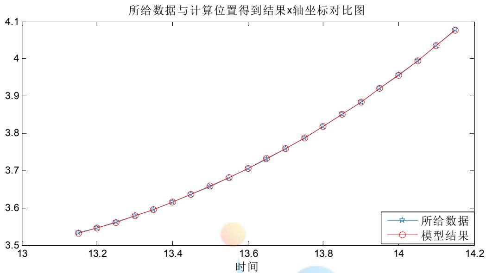

<details>
<summary>line</summary>

| 时间 | 所给数据 | 模型结果 |
| --- | --- | --- |
| 13.15 | ~3.53 | ~3.53 |
| 13.20 | ~3.54 | ~3.54 |
| 13.25 | ~3.56 | ~3.56 |
| 13.30 | ~3.58 | ~3.58 |
| 13.35 | ~3.59 | ~3.59 |
| 13.40 | ~3.61 | ~3.61 |
| 13.45 | ~3.63 | ~3.63 |
| 13.50 | ~3.65 | ~3.65 |
| 13.55 | ~3.67 | ~3.67 |
| 13.60 | ~3.70 | ~3.70 |
| 13.65 | ~3.73 | ~3.73 |
| 13.70 | ~3.76 | ~3.76 |
| 13.75 | ~3.78 | ~3.78 |
| 13.80 | ~3.81 | ~3.81 |
| 13.85 | ~3.84 | ~3.84 |
| 13.90 | ~3.87 | ~3.87 |
| 13.95 | ~3.91 | ~3.91 |
| 14.00 | ~3.94 | ~3.94 |
| 14.05 | ~3.97 | ~3.97 |
| 14.10 | ~4.00 | ~4.00 |
| 14.15 | ~4.04 | ~4.04 |
| 14.20 | ~4.08 | ~4.08 |
</details>

图 17 附件 3 影长与数据对比图

此时，偏差平方和 $z = 8.887 \times 10^{-6}$ ，拟合效果较好。

## Step2: 确定参数范围并求解

1、对于附件2，根据第一步求出的结果，分别增减 $20^{\circ}$ 缩小经纬度的范围，同时考虑到 $\omega \in (19.75^{0}, 94.75^{0})$ 的限制，得出经度 $\omega \in (60^{\circ}, 95^{\circ})$ ；纬度 $\alpha \in (0^{\circ}, 40^{\circ})$ ，利用L-M算法求解式(9)模型，即将理论计算出的 $x$ 、 $y$ 坐标值经坐标转换后与数据提供的的 $x''$ 、 $y''$ 值之差的平方和作为目标函数，结果为

$$
\begin{array}{c} p _ {1} ^ {\prime} = (\omega , \alpha , h, \sigma , m) = (7 9. 4 2 ^ {\circ}, 4 1. 6 7 ^ {\circ}, 2. 0 5 \mathrm{m}, - 0. 3 3 \text {弧度}, 1 8 5. 7 6), \text {偏差平方和} \\ z = 2. 0 7 \times 1 0 ^ {- 6}; \end{array}
$$

$$
\begin{array}{c} p _ {2} ^ {\prime} = (\omega , \alpha , h, \sigma , m) = (7 9. 5 9 ^ {\circ}, 4 0. 5 9 ^ {\circ}, 2. 0 2 \mathrm{m}, - 0. 3 4 \text {弧度}, 1 4 7. 9 1), \text {偏差平方和} \\ z = 4. 2 6 \times 1 0 ^ {- 7}; \end{array}
$$

$$
\begin{array}{c} p _ {3} ^ {\prime} = (\omega , \alpha , h, \sigma , m) = (7 9. 7 3 ^ {\circ}, 3 9. 6 7 ^ {\circ}, 1. 9 9 \mathrm{m}, - 0. 3 5 \text {弧度}, 2 0 3. 0 3), \text {偏差平方和} \\ z = 4. 6 9 \times 1 0 ^ {- 8}; \end{array}
$$

偏差平方和最小的解为 $p_{3}'$ ，拟合效果最好。它的 x 值和 y 值拟合匹配的效果如下：

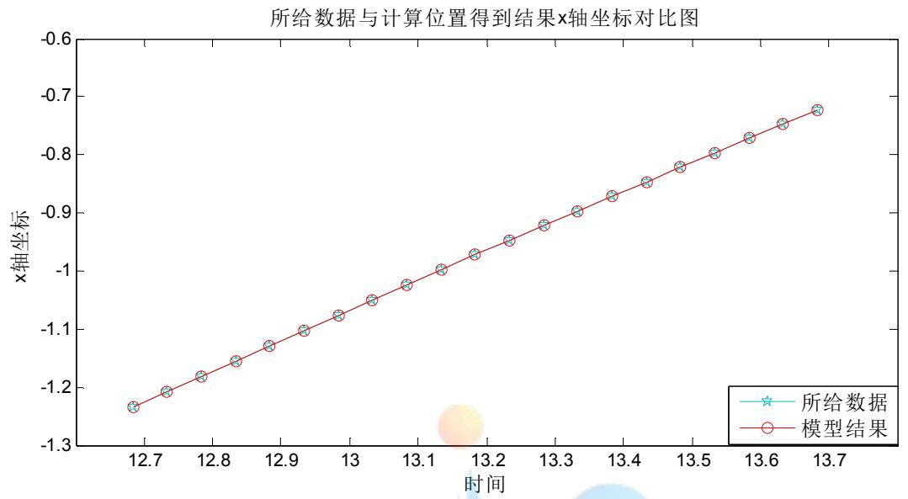

<details>
<summary>line</summary>

| 时间 | 所给数据 (x轴坐标) | 模型结果 (x轴坐标) |
| --- | --- | --- |
| 12.7 | ~-1.24 | ~-1.24 |
| 12.75 | ~-1.21 | ~-1.21 |
| 12.8 | ~-1.18 | ~-1.18 |
| 12.85 | ~-1.16 | ~-1.16 |
| 12.9 | ~-1.13 | ~-1.13 |
| 12.95 | ~-1.10 | ~-1.10 |
| 13.0 | ~-1.08 | ~-1.08 |
| 13.05 | ~-1.05 | ~-1.05 |
| 13.1 | ~-1.02 | ~-1.02 |
| 13.15 | ~-1.00 | ~-1.00 |
| 13.2 | ~-0.97 | ~-0.97 |
| 13.25 | ~-0.95 | ~-0.95 |
| 13.3 | ~-0.92 | ~-0.92 |
| 13.35 | ~-0.90 | ~-0.90 |
| 13.4 | ~-0.87 | ~-0.87 |
| 13.45 | ~-0.85 | ~-0.85 |
| 13.5 | ~-0.82 | ~-0.82 |
| 13.55 | ~-0.80 | ~-0.80 |
| 13.6 | ~-0.77 | ~-0.77 |
| 13.65 | ~-0.75 | ~-0.75 |
| 13.7 | ~-0.73 | ~-0.73 |
</details>

图 18 附件 2 x 值与数据对比图

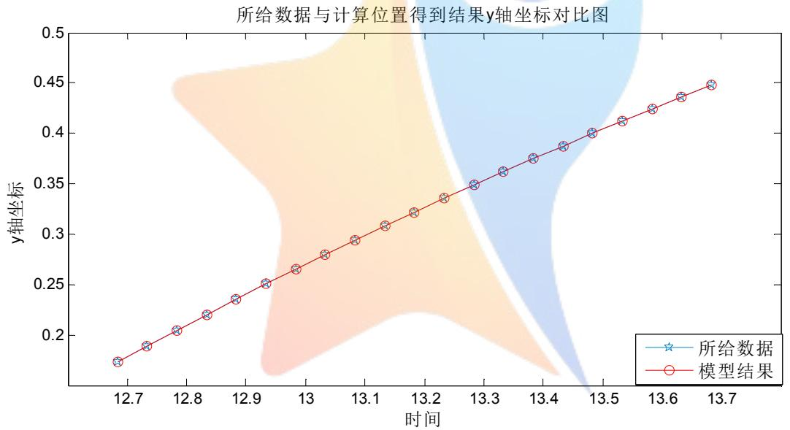

<details>
<summary>line</summary>

| 时间 | 所给数据 (y) | 模型结果 (y) |
| --- | --- | --- |
| 12.7 | ~0.175 | ~0.175 |
| 12.75 | ~0.19 | ~0.19 |
| 12.8 | ~0.205 | ~0.205 |
| 12.85 | ~0.22 | ~0.22 |
| 12.9 | ~0.235 | ~0.235 |
| 12.95 | ~0.25 | ~0.25 |
| 13 | ~0.265 | ~0.265 |
| 13.05 | ~0.28 | ~0.28 |
| 13.1 | ~0.295 | ~0.295 |
| 13.15 | ~0.31 | ~0.31 |
| 13.2 | ~0.32 | ~0.32 |
| 13.25 | ~0.335 | ~0.335 |
| 13.3 | ~0.35 | ~0.35 |
| 13.35 | ~0.365 | ~0.365 |
| 13.4 | ~0.375 | ~0.375 |
| 13.45 | ~0.385 | ~0.385 |
| 13.5 | ~0.4 | ~0.4 |
| 13.55 | ~0.41 | ~0.41 |
| 13.6 | ~0.425 | ~0.425 |
| 13.65 | ~0.435 | ~0.435 |
| 13.7 | ~0.45 | ~0.45 |
</details>

图 19 附件 2 y 值与数据对比图

由图像可知，求得的结果与数据所给的 x 值和 y 值符合的效果都较好，结果比较理想。因此，拍摄点的坐标为（E79.73°, N39.67°），拍摄日期大约为 7 月 23 日。

2、对于附件3，根据第一步求出的结果，分别增减 $20^{\circ}$ 缩小经纬度的范围，同时考虑到 $\omega \in (102.75^{0}, 180^{0}) \cup (-180^{0}, -167.25^{0})$ 的限制，得出经度 $\omega \in (90^{\circ}, 130^{\circ})$ ；纬度 $\alpha \in (10^{\circ}, 60^{\circ})$ ，利用L-M算法求解式（9）模型，结果为：

$p_{1}'=(\omega,\alpha,h,\sigma,m)=(110.7^{\circ},34.05^{\circ},2.81m,0.17\text{弧度，}309.55)$ ，偏差平方和 $z=1.12\times10^{-5}$ ;

$p_{2}'=(\omega,\alpha,h,\sigma,m)=(110.9^{\circ},35.37^{\circ},2.77m,0.16 \text{ 弧度， }306.46)$ ，偏差平方和 $z=1.97\times10^{-5}$ ;

$p_{3}'=(\omega,\alpha,h,\sigma,m)=(110.61^{\circ},33.37^{\circ},2.83m,0.17\text{弧度},311.20)$ ，偏差平方和 $z=7.91\times10^{-6}$ ;

偏差平方和最小的解为 $p_{3}'$ ，拟合效果最好。它的 x 值和 y 值拟合匹配的效果如下：

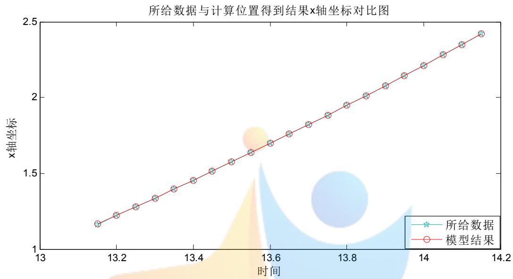

<details>
<summary>line</summary>

| 时间 | 所给数据 (x轴坐标) | 模型结果 (x轴坐标) |
| --- | --- | --- |
| 13.15 | ~1.18 | ~1.18 |
| 13.20 | ~1.22 | ~1.22 |
| 13.25 | ~1.27 | ~1.27 |
| 13.30 | ~1.32 | ~1.32 |
| 13.35 | ~1.37 | ~1.37 |
| 13.40 | ~1.42 | ~1.42 |
| 13.45 | ~1.47 | ~1.47 |
| 13.50 | ~1.52 | ~1.52 |
| 13.55 | ~1.57 | ~1.57 |
| 13.60 | ~1.62 | ~1.62 |
| 13.65 | ~1.67 | ~1.67 |
| 13.70 | ~1.72 | ~1.72 |
| 13.75 | ~1.77 | ~1.77 |
| 13.80 | ~1.82 | ~1.82 |
| 13.85 | ~1.87 | ~1.87 |
| 13.90 | ~1.92 | ~1.92 |
| 13.95 | ~1.97 | ~1.97 |
| 14.00 | ~2.02 | ~2.02 |
| 14.05 | ~2.07 | ~2.07 |
| 14.10 | ~2.12 | ~2.12 |
| 14.15 | ~2.17 | ~2.17 |
| 14.20 | ~2.22 | ~2.22 |
| 14.25 | ~2.27 | ~2.27 |
| 14.30 | ~2.32 | ~2.32 |
| 14.35 | ~2.37 | ~2.37 |
| 14.40 | ~2.42 | ~2.42 |
</details>

图 20 附件 3 x 值与数据对比图

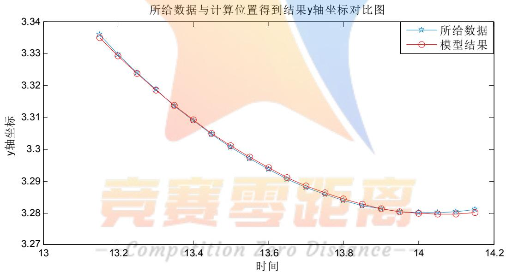

<details>
<summary>line</summary>

| 时间 | 所给数据 (y轴坐标) | 模型结果 (y轴坐标) |
| --- | --- | --- |
| 13.15 | ~3.336 | ~3.335 |
| 13.20 | ~3.329 | ~3.329 |
| 13.25 | ~3.324 | ~3.324 |
| 13.30 | ~3.319 | ~3.319 |
| 13.35 | ~3.314 | ~3.314 |
| 13.40 | ~3.309 | ~3.309 |
| 13.45 | ~3.305 | ~3.305 |
| 13.50 | ~3.301 | ~3.301 |
| 13.55 | ~3.297 | ~3.297 |
| 13.60 | ~3.294 | ~3.294 |
| 13.65 | ~3.291 | ~3.291 |
| 13.70 | ~3.288 | ~3.288 |
| 13.75 | ~3.286 | ~3.286 |
| 13.80 | ~3.284 | ~3.284 |
| 13.85 | ~3.282 | ~3.282 |
| 13.90 | ~3.281 | ~3.281 |
| 13.95 | ~3.280 | ~3.280 |
| 14.00 | ~3.280 | ~3.280 |
| 14.05 | ~3.280 | ~3.280 |
| 14.10 | ~3.280 | ~3.280 |
| 14.15 | ~3.281 | ~3.280 |
</details>

图 21 附件 3 y 值与数据对比图

由图像可知，求得的结果与数据所给的 x 值和 y 值符合的效果都较好，结果比较理想。因此，拍摄点的坐标为（E110.61°, N33.37°），拍摄日期大约为 11 月 8 日。

## 4.4 问题四

## 4.4.1 模型的建立

## - 图像的提取

问题四给出的是一段时长为 40 分钟的视频，是连续的。为了提取出其中影长的数据，就必须先从视频中提取若干帧图像。通过观看视频，我们发现在整个过程中影长并没有发生突然或剧烈的变化，所以选择按时间均匀提取。因为视频时长为 40 分钟，所以我们每隔 2 分钟提取视频中图像，共提取 20 张图像，即 20 组影长数据。

## - 杆长与影长比值的获取

在视频过程中，我们发现影子旋转的角度很小，所以我们认为在整个过程里影子只有长度的变化，没有角度的变化。

由于不能确定影子是否与拍摄的正面相平行，所以设它们之间的夹角为 $\xi$ ，则影长l在拍摄正面上的投影长度为 $l\cos\xi$ 。

因为已知杆长为 2 米，为得到影长，就需要知道杆长与影长比值。我们将图像数字化后，利用杆顶点的像素坐标和影子顶点的像素坐标求得它们在图像中的长度比 $\mu$ 。值得注意是，利用像素点获得的影长实际上是影子在拍摄正面的投影长度，所以

$$
\mu = \frac {h}{l \cdot \cos \xi} \tag {10}
$$

这样就可以得到所提取的 20 张图像中的影长实际长度数据，如下表所示:

表 1 $l \cdot \cos \xi$ 随时间变化

<table><tr><td>T(Min)</td><td>8.90</td><td>8.93</td><td>8.97</td><td>9.00</td><td>9.03</td><td>9,07</td><td>9.10</td><td>9.13</td><td>9.17</td><td>9.20</td></tr><tr><td>l·cosξ</td><td>2.37</td><td>2.34</td><td>2.32</td><td>2.29</td><td>2.25</td><td>2.22</td><td>2.19</td><td>2.17</td><td>2.14</td><td>2.11</td></tr><tr><td>T(Min)</td><td>9.23</td><td>9.27</td><td>9.30</td><td>9.33</td><td>9.37</td><td>9.40</td><td>9.43</td><td>9.47</td><td>9.50</td><td>9.53</td></tr><tr><td>l·cosξ</td><td>2.08</td><td>2.05</td><td>2.03</td><td>2.00</td><td>1.97</td><td>1,94</td><td>1.92</td><td>1.89</td><td>1.86</td><td>1.84</td></tr></table>

## - 已知拍摄日期的模型

因为可以得出杆长和影长的比值，且杆长已知，则可以计算出拍摄地从8:54到9:34, 40分钟内的20组时刻下的影长数据。又因为拍摄日期已知，这是模型蜕化成问题二中Step1以影长偏差为目标函数的非线性参数拟合模型，只是多加入了一个未知量 $\xi$ ；

值得注意的是，因为拍摄日期为7月13日，则n=114，所以太阳直射点纬度选择如下计算式：

$$
\beta = \arcsin [ 0. 3 9 7 7 5 \cdot \sin (\frac {1 8 0 ^ {0}}{1 8 6} \cdot n) ]
$$

则模型为:

$$
\begin{array}{l} \min z = \sum_ {i = 0} ^ {2 0} (l _ {i} - \sqrt {x _ {i} ^ {2} + y _ {i} ^ {2}}) ^ {2} \\ \left\{ \begin{array}{l} x _ {i} = \frac {- \cos \beta \sin \theta}{\cos \alpha \cos \beta \cos \theta + \sin \alpha \sin \beta} h \\ y _ {i} = \frac {\sin \alpha \cos \beta \cos \theta - \cos \alpha \sin \beta}{\cos \alpha \cos \beta \cos \theta + \sin \alpha \sin \beta} h \\ \beta = \arcsin [ 0. 3 9 7 7 5 \cdot \sin (\frac {1 8 0 ^ {0}}{1 8 6} \cdot n) ] \\ \theta = (1 2 - t) \times 1 5 ^ {\circ} \\ t = T - (1 2 0 ^ {0} - \omega) \cdot \frac {4 \min}{6 0} \\ \mu = \frac {h}{l \cdot \cos \xi} \end{array} \right. \tag {11} \\ \end{array}
$$

与问题二类似，这本质上还是一个利用已知数据根据最小二乘法原理进行非线性拟合求解未知参数的问题。由于 L-M 算法对于过参数化问题不敏感，能有效处理冗余参数问题，所以我们仍采用 L-M 算法进行求解。求解得结果为 $p = (\omega, \alpha, \zeta) = (111.14^{0}, 39.39^{0}, 0.14 \text{弧度})$ 。拟合的效果如下：

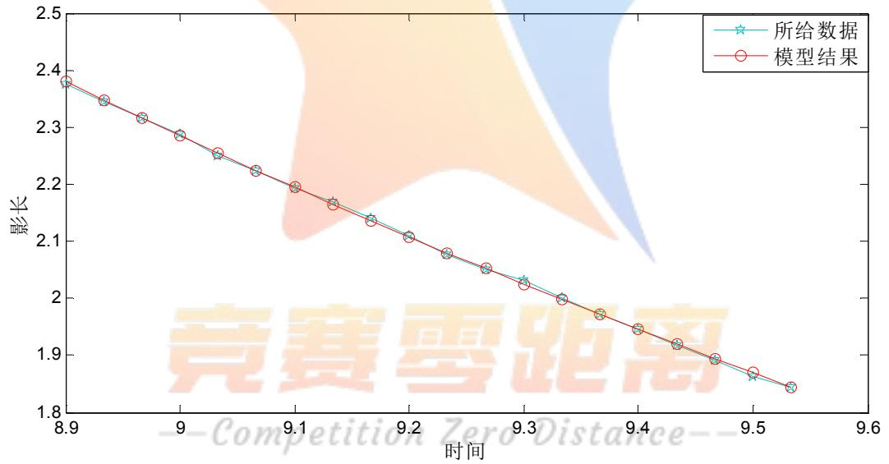

<details>
<summary>line</summary>

| 时间 | 所给数据 | 模型结果 |
| --- | --- | --- |
| 8.90 | ~2.38 | ~2.38 |
| 8.93 | ~2.35 | ~2.35 |
| 8.96 | ~2.32 | ~2.32 |
| 8.99 | ~2.29 | ~2.29 |
| 9.02 | ~2.26 | ~2.26 |
| 9.05 | ~2.23 | ~2.23 |
| 9.08 | ~2.20 | ~2.20 |
| 9.11 | ~2.17 | ~2.17 |
| 9.14 | ~2.14 | ~2.14 |
| 9.17 | ~2.11 | ~2.11 |
| 9.20 | ~2.08 | ~2.08 |
| 9.23 | ~2.05 | ~2.05 |
| 9.26 | ~2.03 | ~2.03 |
| 9.29 | ~2.00 | ~2.00 |
| 9.32 | ~1.97 | ~1.97 |
| 9.35 | ~1.94 | ~1.94 |
| 9.38 | ~1.92 | ~1.92 |
| 9.41 | ~1.89 | ~1.89 |
| 9.44 | ~1.87 | ~1.87 |
| 9.47 | ~1.85 | ~1.85 |
</details>

图 22 影长与数据对比图

由图像可知，求得的结果与图像所给影长符合的效果都较好。因此，拍摄点的坐标为 $(E111.14^{0}, N39.39^{\circ})$ 。

## - 拍摄日期未知的问题模型

拍摄日期未知的问题的拍摄日期已知模型非常类似，只是增加了日期这个未知量，其他方面都基本相同。因为拍摄日期不确定，所以太阳直射点纬度有三个不同情况下的计算公式，具体模型如下：

$$
\begin{array}{l} \min z = \sum_ {i = 0} ^ {2 0} (l _ {i} - \sqrt {x _ {i} ^ {2} + y _ {i} ^ {2}}) ^ {2} \\ \left\{ \begin{array}{l} x _ {i} = \frac {- \cos \beta \sin \theta}{\cos \alpha \cos \beta \cos \theta + \sin \alpha \sin \beta} h \\ y _ {i} = \frac {\sin \alpha \cos \beta \cos \theta - \cos \alpha \sin \beta}{\cos \alpha \cos \beta \cos \theta + \sin \alpha \sin \beta} h \\ \beta = \arcsin [ 0. 3 9 7 7 5 \cdot \sin (\frac {1 8 0 ^ {0}}{1 8 6} \cdot n) ], n \in [ 0, 1 8 6 ] \\ \beta = - \arcsin [ 0. 3 9 7 7 5 \cdot \sin (n - 1 8 6) ^ {0} ], n \in [ 1 8 6, 2 7 6 ] \\ \beta = - \arcsin \left\{0. 3 9 7 7 5 \cdot \cos [ \frac {9 0 ^ {0}}{8 9} (n - 2 7 6) ] \right\}, n \in [ 2 7 6, 3 6 5 ] \\ \theta = (1 2 - t) \times 1 5 ^ {\circ} \\ t = T - (1 2 0 ^ {0} - \omega) \cdot \frac {4 \min}{6 0} \\ \mu = \frac {h}{l \cdot \cos \xi} \end{array} \right. \tag {12} \\ \end{array}
$$

由于拍摄日期未知，所以本问题与问题三模型类似，仍采用 L-M 算法进行求解。求解得结果为 $p = (\omega, \alpha, \zeta, m) = (110.57^{0}, 39.60^{0}, 0.008 \text{ 弧度}, 190.61)$ 。拟合的效果如下：

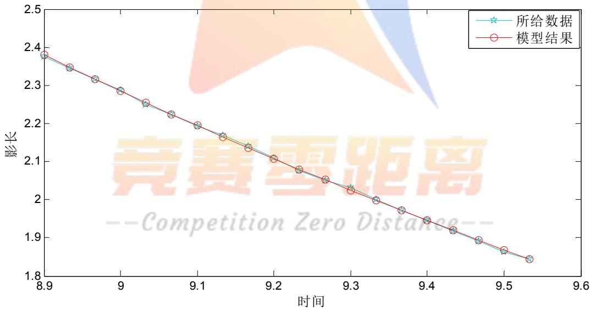

<details>
<summary>line</summary>

| 时间 | 所给数据 | 模型结果 |
| --- | --- | --- |
| 8.90 | ~2.38 | ~2.38 |
| 8.93 | ~2.35 | ~2.35 |
| 8.96 | ~2.32 | ~2.32 |
| 8.99 | ~2.29 | ~2.29 |
| 9.02 | ~2.26 | ~2.26 |
| 9.05 | ~2.23 | ~2.23 |
| 9.08 | ~2.20 | ~2.20 |
| 9.11 | ~2.17 | ~2.17 |
| 9.14 | ~2.14 | ~2.14 |
| 9.17 | ~2.11 | ~2.11 |
| 9.20 | ~2.08 | ~2.08 |
| 9.23 | ~2.05 | ~2.05 |
| 9.26 | ~2.03 | ~2.03 |
| 9.29 | ~2.00 | ~2.00 |
| 9.32 | ~1.97 | ~1.97 |
| 9.35 | ~1.94 | ~1.94 |
| 9.38 | ~1.92 | ~1.92 |
| 9.41 | ~1.89 | ~1.89 |
| 9.44 | ~1.87 | ~1.87 |
| 9.47 | ~1.85 | ~1.85 |
</details>

图 23 影长与数据对比图

由图像可知，求得的结果与图像所给影长符合的效果都较好。拍摄日期距元旦190天，即7月10日，与实际的拍摄日期7月13日只相差了三天，结果较理想。因此，拍摄点的坐标为（E110.57°，N39.60°），拍摄日期为7月10日。

## 五、模型的检验

为了检验模型的正确性，我们选取第一问中的地点北京天安门，已知杆子长度为3米，日期为10月22日，地理位置为北纬39度54分26秒,东经116度23分29秒，根据第一问的模型，可以计算得出北京时间14:00到15:00每个时刻的影长，如图7所示；

## 5.1 对问题二模型的检验

以天安门经纬度为待求的未知量，杆长也未知，拍摄日期为已知量，利用第一问模型求得的影长在不同时刻的数据进行非线性参数拟合，即带入问题二的模型进行求解。

## Step1: 减少未知参数个数

不引入坐标系偏转角 $\sigma$ ，直接从影长入手，以理论计算所得影长和所给数据影长之间差值的平方和作为优化目标。运用 L-M 算法得出的参数向量 $p'=(\omega,\alpha,h)=(116.03^{\circ},38.74^{\circ},3.05m)$ ，拟合匹配的效果如下：

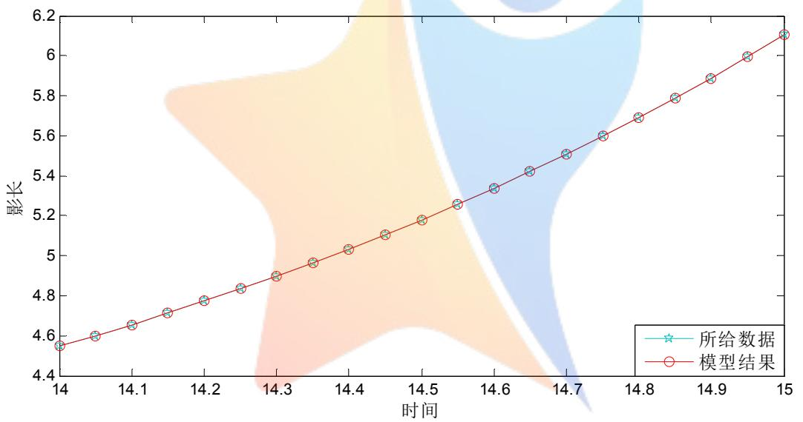

<details>
<summary>line</summary>

| 时间 | 影长 |
| --- | --- |
| 14.0 | ~4.55 |
| 14.05 | ~4.60 |
| 14.1 | ~4.65 |
| 14.15 | ~4.71 |
| 14.2 | ~4.77 |
| 14.25 | ~4.83 |
| 14.3 | ~4.89 |
| 14.35 | ~4.96 |
| 14.4 | ~5.03 |
| 14.45 | ~5.10 |
| 14.5 | ~5.17 |
| 14.55 | ~5.25 |
| 14.6 | ~5.33 |
| 14.65 | ~5.42 |
| 14.7 | ~5.50 |
| 14.75 | ~5.60 |
| 14.8 | ~5.69 |
| 14.85 | ~5.79 |
| 14.9 | ~5.88 |
| 14.95 | ~6.00 |
| 15.0 | ~6.10 |
</details>

图 24 影长与数据对比图

## Step2: 确定参数范围并求解

根据第一步求出的结果，引入坐标系偏转角 $\sigma$ ，分别增减 $20^{\circ}$ 缩小经纬度的范围，得出经度 $\omega \in (100^{\circ}, 150^{\circ})$ ；纬度 $\alpha \in (20^{\circ}, 60^{\circ})$ ，利用 L-M 算法求解式（8）模型，结果为 $p' = (\omega, \alpha, h, \sigma) = (115.92^{\circ}, 38.28^{\circ}, 3.10\mathrm{~m}, 0.01\text{弧度})$ ，

它的 x 值和 y 值拟合匹配的效果如下:

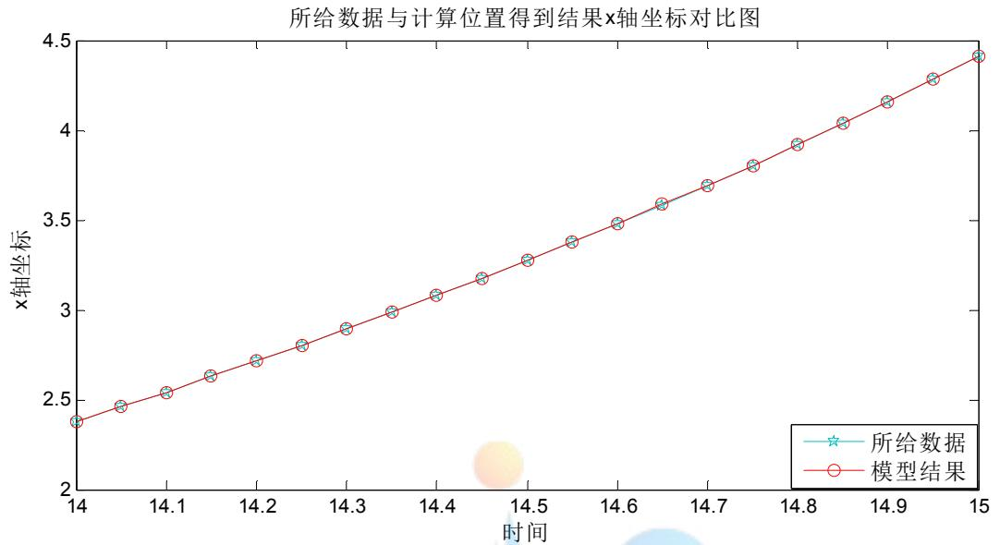

<details>
<summary>line</summary>

| 时间 | 所给数据 (x轴坐标) | 模型结果 (x轴坐标) |
| --- | --- | --- |
| 14.0 | ~2.38 | ~2.38 |
| 14.05 | ~2.46 | ~2.46 |
| 14.1 | ~2.54 | ~2.54 |
| 14.15 | ~2.63 | ~2.63 |
| 14.2 | ~2.72 | ~2.72 |
| 14.25 | ~2.80 | ~2.80 |
| 14.3 | ~2.89 | ~2.89 |
| 14.35 | ~2.98 | ~2.98 |
| 14.4 | ~3.08 | ~3.08 |
| 14.45 | ~3.17 | ~3.17 |
| 14.5 | ~3.27 | ~3.27 |
| 14.55 | ~3.37 | ~3.37 |
| 14.6 | ~3.47 | ~3.47 |
| 14.65 | ~3.57 | ~3.57 |
| 14.7 | ~3.67 | ~3.67 |
| 14.75 | ~3.77 | ~3.77 |
| 14.8 | ~3.87 | ~3.87 |
| 14.85 | ~3.97 | ~3.97 |
| 14.9 | ~4.07 | ~4.07 |
| 14.95 | ~4.17 | ~4.17 |
| 15.0 | ~4.27 | ~4.27 |
| 15.05 | ~4.37 | ~4.37 |
| 15.1 | ~4.47 | ~4.47 |
</details>

图 25 x 值与数据对比图


<details>
<summary>line</summary>

| 时间 | 所给数据 (y轴坐标) | 模型结果 (y轴坐标) |
| --- | --- | --- |
| 14.0 | 3.875 | 3.875 |
| 14.05 | 3.89 | 3.89 |
| 14.1 | 3.90 | 3.90 |
| 14.15 | 3.915 | 3.915 |
| 14.2 | 3.925 | 3.925 |
| 14.25 | 3.94 | 3.94 |
| 14.3 | 3.95 | 3.95 |
| 14.35 | 3.965 | 3.965 |
| 14.4 | 3.98 | 3.98 |
| 14.45 | 3.995 | 3.995 |
| 14.5 | 4.01 | 4.01 |
| 14.55 | 4.025 | 4.025 |
| 14.6 | 4.045 | 4.045 |
| 14.65 | 4.065 | 4.065 |
| 14.7 | 4.085 | 4.085 |
| 14.75 | 4.105 | 4.105 |
| 14.8 | 4.125 | 4.125 |
| 14.85 | 4.145 | 4.145 |
| 14.9 | 4.165 | 4.165 |
| 14.95 | 4.19 | 4.19 |
| 15.0 | 4.215 | 4.215 |
</details>

图 26 y 值与数据对比图

由图可知，x,y值的拟合效果较好。因为 $116^{\circ}23' = 116.383^{\circ}$ ，所以经度的相对误差为： $\left|\frac{116.383^{0} - 115.92^{0}}{116.383^{0}}\right| \times 100\% = 0.398\%$ ；又 $39^{\circ}54' = 39.9^{\circ}$ ，所以纬度的相对误差为： $\left|\frac{39.9^{0} - 38.28^{0}}{39.9^{0}}\right| \times 100\% = 4.06\%$ ；

由上述计算可知，利用问题二的模型计算所得的经纬度相对误差都较小，说明模型的精确度较高。

## 5.2 对问题三模型的检验

以天安门经纬度、拍摄日期为待求的未知量，同时杆长未知，利用第一问模型求得

的影长在不同时刻的数据进行非线性参数拟合，即带入问题三的模型进行求解。

## Step1: 减少未知参数个数

不引入坐标系偏转角 $\sigma$ ，直接从影长入手，以理论计算所得影长和所给数据影长之间差值的平方和作为优化目标。运用 L-M 算法得出的参数向量 $p'=(\omega,\alpha,h,m)=(116.63^{\circ},40.66^{\circ},2.96m,290.77)$ （其中，m 表示距离元旦的天数），拟合匹配的效果如下：

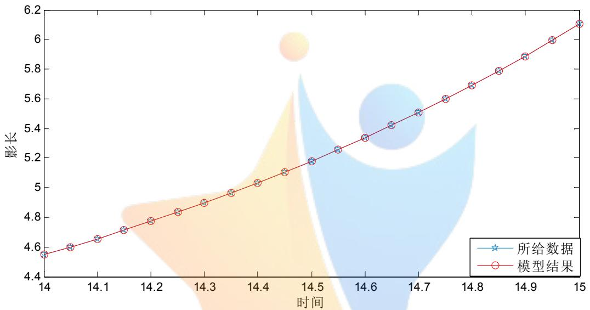

<details>
<summary>line</summary>

| 时间 | 影长 |
| --- | --- |
| 14.0 | ~4.55 |
| 14.05 | ~4.60 |
| 14.1 | ~4.65 |
| 14.15 | ~4.72 |
| 14.2 | ~4.78 |
| 14.25 | ~4.83 |
| 14.3 | ~4.89 |
| 14.35 | ~4.96 |
| 14.4 | ~5.03 |
| 14.45 | ~5.10 |
| 14.5 | ~5.18 |
| 14.55 | ~5.26 |
| 14.6 | ~5.34 |
| 14.65 | ~5.42 |
| 14.7 | ~5.51 |
| 14.75 | ~5.60 |
| 14.8 | ~5.69 |
| 14.85 | ~5.79 |
| 14.9 | ~5.89 |
| 14.95 | ~6.00 |
| 15.0 | ~6.10 |
</details>

图 27 影长与数据对比图

## Step2: 确定参数范围并求解

根据第一步求出的结果，引入坐标系偏转角 $\sigma$ ，分别增减 $20^{\circ}$ 缩小经纬度的范围，得出经度 $\omega \in (100^{\circ}, 150^{\circ})$ ；纬度 $\alpha \in (20^{\circ}, 60^{\circ})$ ，利用 L-M 算法求解式（8）模型，结果为 $p' = (\omega, \alpha, h, \sigma, m) = (116.42^{\circ}, 39.96^{\circ}, 3.00\mathrm{~m}, 0.00 \text{ 弧度}, 291.75)$ ，经换算后日期为 10 月 20 日。

它的 x 值和 y 值拟合匹配的效果如下:

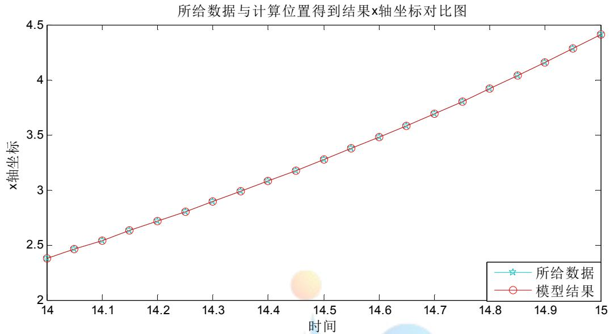

<details>
<summary>line</summary>

| 时间 | 所给数据 (x轴坐标) | 模型结果 (x轴坐标) |
| --- | --- | --- |
| 14.0 | ~2.38 | ~2.38 |
| 14.05 | ~2.46 | ~2.46 |
| 14.1 | ~2.54 | ~2.54 |
| 14.15 | ~2.63 | ~2.63 |
| 14.2 | ~2.72 | ~2.72 |
| 14.25 | ~2.80 | ~2.80 |
| 14.3 | ~2.89 | ~2.89 |
| 14.35 | ~2.98 | ~2.98 |
| 14.4 | ~3.07 | ~3.07 |
| 14.45 | ~3.16 | ~3.16 |
| 14.5 | ~3.25 | ~3.25 |
| 14.55 | ~3.34 | ~3.34 |
| 14.6 | ~3.43 | ~3.43 |
| 14.65 | ~3.52 | ~3.52 |
| 14.7 | ~3.61 | ~3.61 |
| 14.75 | ~3.70 | ~3.70 |
| 14.8 | ~3.79 | ~3.79 |
| 14.85 | ~3.88 | ~3.88 |
| 14.9 | ~3.97 | ~3.97 |
| 14.95 | ~4.06 | ~4.06 |
| 15.0 | ~4.15 | ~4.15 |
| 15.05 | ~4.24 | ~4.24 |
| 15.1 | ~4.33 | ~4.33 |
| 15.15 | ~4.42 | ~4.42 |
</details>

图 28 x 值与数据对比图

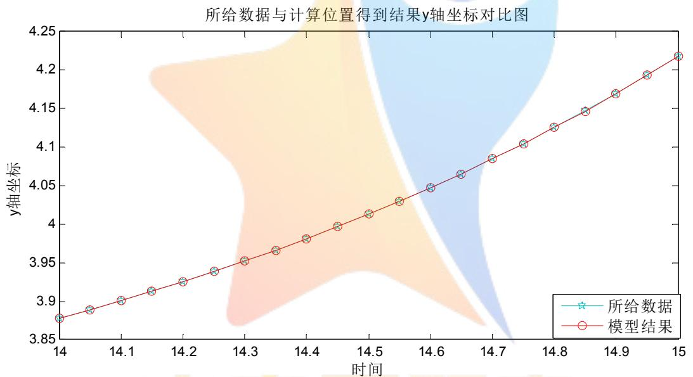

<details>
<summary>line</summary>

| 时间 | 所给数据 (y轴坐标) | 模型结果 (y轴坐标) |
| --- | --- | --- |
| 14.0 | 3.875 | 3.875 |
| 14.05 | 3.89 | 3.89 |
| 14.1 | 3.90 | 3.90 |
| 14.15 | 3.915 | 3.915 |
| 14.2 | 3.925 | 3.925 |
| 14.25 | 3.94 | 3.94 |
| 14.3 | 3.95 | 3.95 |
| 14.35 | 3.965 | 3.965 |
| 14.4 | 3.98 | 3.98 |
| 14.45 | 3.995 | 3.995 |
| 14.5 | 4.015 | 4.015 |
| 14.55 | 4.03 | 4.03 |
| 14.6 | 4.05 | 4.05 |
| 14.65 | 4.065 | 4.065 |
| 14.7 | 4.085 | 4.085 |
| 14.75 | 4.105 | 4.105 |
| 14.8 | 4.125 | 4.125 |
| 14.85 | 4.145 | 4.145 |
| 14.9 | 4.17 | 4.17 |
| 14.95 | 4.195 | 4.195 |
| 15.0 | 4.22 | 4.22 |
</details>

图 29 y 值与数据对比图

由图可知，x,y值的拟合效果较好。因为 $116^{\circ}23' = 116.383^{\circ}$ ，所以经度的相对误差为： $\left|\frac{116.383^{0} - 116.42^{0}}{116.383^{0}}\right| \times 100\% = 0.032\%$ ；又 $39^{\circ}54' = 39.9^{\circ}$ ，所以纬度的相对误差为： $\left|\frac{39.9^{0} - 39.96^{0}}{39.9^{0}}\right| \times 100\% = 0.15\%$ ；利用问题三模型计算所得的日期为10月20日，与实际日期只相差2天。

由上述计算可知，利用问题三的模型计算所得的经纬度和日期的误差都较小，说明模型的精确度较高。

## 六、模型的优点和缺点

## - 优点

1、模型采用 L-M 算法对过参数化问题不敏感，能有效处理冗余参数问题，而且寻优速度较快。  
2、通过模型检验可以发现利用模型推导的值与真实值得偏差很小，说明模型较为准确，有一定的精度。

## - 缺点

1、L-M 算法对初始值较为敏感，不同初始值的选取可能会给结果带来偏差。

2、在问题四中确定影长和杆长的比值的方法是人工寻找像素点，效率较低，且存在误差。

## 参考文献

[1] 汪和平.探究日影运动轨迹.中学数学学刊.2010年  
[2] 屈名，王征兵等.基于交比不变性的太阳定位算法的研究.SILICON VALLEY.2013年.  
[3] 林根石. 利用太阳视坐标的计算进行物高测量与定位. 南京林业大学学报. 1991 年.  
[4] 张文华，司德亮等，太阳影子倍率的计算方法及其对光伏阵列布局的影响.  
[5] 蒋洪力.太阳直射点纬度的数学推导和分析.学通报.2007年.  
[6] 黄玫生等.利用公式求算太阳直射点和极昼极夜的纬度位置.  
[7] 潘志荣.太阳视运动路径及物体影子\_问题解析.发明与创新.2007年.  
[8] 卓金武等.MATLAB 在数学建模中的应用. 北京:北京航空航天大学出版社, 2014.9  
[9] 赵怀森，赵永熹，王宝阔.任意海区的太阳移线定位时机判断研究.中国航海.2004年。

## 附录

```matlab
clear all;
num=xlsread('附件1-3.xls','附件1');
%num=xlsread('问题一.xlsx','坐标');
hour=num(:,1)*24;
%y(:,1)=num(:,2);% x坐标
%y(:,2)=num(:,3);% y坐标
y=sqrt(num(:,2).^2+num(:,3).^2);
p0=[110,20,2];
%options = optimset('MaxFunEvals',4000);
[result,resnormal,exitflag]=lsqcurvefit(@qiul,p0,hour,y,[-180,-90,0],[180,90,7]);
test=qiul(result,hour);%用拟合参数结果得到该店的理论阴影
plot(hour,y(:,1),hour,test(:,1),'r');%画出结果图和所给数据对比图x值
title('所给数据与计算位置得到结果x轴坐标对比图');
xlabel('时间');
ylabel('x轴坐标');
legend('所给数据','模型结果','location','best');
```

```matlab
clear all;
num=xlsread('附件1-3.xls','附件1');
%num=xlsread('问题一.xlsx','坐标');
hour=num(:,1)*24;
```

```matlab
y(:,1)=num(:,2);% x坐标
y(:,2)=num(:,3);% y坐标
p0=[100,25,3,0];
[result,resnormal,exitflag]=lsqcurvefit(@qiuxy,p0,hour,y,[-79.5,-90,0,-pi],
[154.5,90,5,pi]);
test=qiuxy(result,hour);%用拟合参数结果
plot(hour,y(:,1),hour,test(:,1),'r');
title('所给数据与计算位置得到结果x轴坐标对比图');
xlabel('时间');
ylabel('x轴坐标');
legend('所给数据','模型结果','location','best');
figure,plot(hour,y(:,2),hour,test(:,2),'r');%画出结果图和所给数据对比图y值
title('所给数据与计算位置得到结果y轴坐标对比图');
xlabel('时间');
ylabel('y轴坐标');
legend('所给数据','模型结果','location','best');
```

## 竞赛零距离

--Competition Zero Distance--