# 太阳影子定位

## 摘要

本题意在通过分析实际测量的竖直杆影子随时间变化的坐标或视频数据，确认竖直杆所在的经纬度以及数据对应的记录日期。

第一问要求分析画出已知杆长、地理位置和日期的竖直杆的太阳影子变化曲线，并分析影子长度关于各个参数的变化规律。本文利用天文学公式，建立了该竖直杆太阳影子关于时间变化的计算求解模型，得出影长随时间的变化曲线如下。此后，本文使用控制变量法，分别对经纬度、日期、杆长及当日时间这五个参数对影子长度的影响展开讨论。经过误差分析并改进算法后，得到在11 点59分24秒，取到最短的影长为3.6638 米

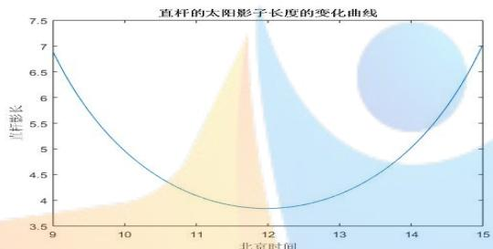

<details>
<summary>line</summary>

| 北京时间 | 直杆影长 |
| --- | --- |
| 9 | ~6.9 |
| 10 | ~5.2 |
| 11 | ~4.3 |
| 12 | ~3.8 |
| 13 | ~4.2 |
| 14 | ~5.2 |
| 15 | ~7.0 |
</details>

第二问要求分析某竖直杆的太阳影子顶点坐标数据，确定其地点。本文沿用第一问的天文学公式，以每一对时刻理论与实测的影长之比的差的平方和最小为首要目标，以每一对时刻理论与实测方位角差值之差的平方和最小为次要目标，建立多目标规划模型，采用分层求解法，遍历求解得到最能满足条件的位置为北纬19度，东经109度，位于我国海南省。

第三问要求分析两组某竖直杆的太阳影子坐标数据，确定其地点及数据记录日期。与第二问类似，在添加日期这一变量后，建立与第二问相同的多目标规划模型，采用分层求解法遍历求解。得到附件二和附件三数据对应的最能满足条件的位置分别为：

<table><tr><td></td><td>纬度</td><td>经度</td><td>日期</td><td>大致地点</td></tr><tr><td>附件二</td><td>40</td><td>79</td><td>5月25日</td><td>新疆图木舒克市</td></tr><tr><td>附件三</td><td>33</td><td>106</td><td>10月31日</td><td>陕西,汉中广元之间</td></tr></table>

第四问要求分析竖直杆的影子变化视频，分别在日期已知和未知的情况下求出其所在地点与拍摄日期。本文首先利用动态追踪技术，找出影子顶点在每一时刻的像素坐标，计算出每时刻的太阳高度角。进而利用天文学公式中太阳高度角与日期、纬度、经度的确定关系，分别在日期已知和未知的情况下建立计算求解模型，考虑到模型存在系统误差，难以得到完美解，故将问题转换为非线性规划问题遍历求解。得到最能满足条件的位置与日期为：

<table><tr><td></td><td>纬度</td><td>经度</td><td>日期</td><td>大致地点</td></tr><tr><td>日期确定</td><td>43</td><td>115</td><td>7月13日</td><td>内蒙古锡林郭勒盟西南</td></tr><tr><td>日期未定</td><td>44</td><td>113</td><td>6月25日</td><td>内蒙古锡林郭勒盟西</td></tr></table>

本文亦对文中使用的天文学公式的误差及所求出的结果进行了讨论，在给出最优解之外还讨论了其他解存在的可能性。

关键词：计算求解模型、控制变量法、多目标规划、分层求解法、误差分析

## 1. 问题重述

## 1.1 问题背景

现代科技的发展使得人们能够更为方便地记录高质量的视频文件。在分析视频材料时，有时需要确定视频的拍摄地点及日期，而利用天文学知识，对视频物体中的太阳影子变化进行分析是确定视频拍摄地点及日期的一种方法。

## 1.2 相关信息

本题给出了三组某处某固定直杆在水平地面上太阳影子的顶点坐标数据，每组数据皆包含 21 个等间距时刻（北京时间）直杆太阳影子的x y, 顶点坐标。其中，第一组数据还额外包括了数据对应的日期。坐标系以直杆底端为原点，水平地面为x y, 平面，直杆垂直于地面。

除三组数据以外，本题亦给出了一根直杆在太阳下的影子变化视频，视频中清晰的记录了 2015 年 7 月 13 日 8 点 54 分 06 秒到同日 9 点 34 分 36 秒某地高为2米的直杆的太阳影子变化过程。以上信息中，各直杆的地理位置皆未知。

## 1.3 需要解决的问题

1) 建立太阳影子变化的数学模型，分析影子长度关于各个参数的变化规律并应用这一模型画出2015年10 月22日北京时间9:00-15:00 之间天安门广场（北纬39度54分26秒，东经 116度23分29秒）3米高的直杆的太阳影子长度变化曲线。  
2) 建立数学模型，根据题目提供的附件一中的影子顶点坐标数据，给出该直杆所在的可能地点。  
3) 建立数学模型，根据题目提供的附件二、三种影子顶点坐标数据，给出对应直杆所在的可能的地点。  
4) 分析题目提供的视频，确定视频拍摄地点的数学模型，分别讨论在拍摄日期已知和未知两种情况下，能否确定视频的拍摄地点与日期，并给出该视频可能的拍摄地点。

## 2. 模型假设

假设一：本文研究的所有对象所在的地面皆为平地。

假设二：本文研究的所有对象所处地海拔为 0。

## 3. 符号说明

<table><tr><td>符号</td><td>符号说明</td></tr><tr><td> $\alpha_i$ </td><td>时刻i的太阳高度角</td></tr><tr><td> $\delta$ </td><td>太阳赤纬</td></tr><tr><td>d</td><td>代表天数,当日期为1月1日时,d=1</td></tr><tr><td> $\varphi$ </td><td>目标对象所在地的纬度。为正数时代表北纬,负数为南纬</td></tr><tr><td>l</td><td>目标对象所在位置经度。为正数时代表东经,负数为西经</td></tr><tr><td> $t_i$ </td><td>时刻i下研究对象对应时角</td></tr><tr><td>L</td><td>直杆长度</td></tr><tr><td> $L_{yi}$ </td><td>直杆在时刻i时的影长</td></tr><tr><td> $L'_{yi}$ </td><td>直杆在时刻i的理论影长</td></tr><tr><td> $\theta_i$ </td><td>直杆影子在时刻i被测得的方位角</td></tr><tr><td> $\theta'_i$ </td><td>直杆影子在时刻i的理论方位角值</td></tr><tr><td> $f_1$ </td><td>每一对理论的影长之比的差的平方和</td></tr><tr><td> $f_2$ </td><td>方位角差值之差的平方和</td></tr><tr><td> $t_{ls}$ </td><td>本地太阳时间</td></tr><tr><td> $t_{lt}$ </td><td>本地时</td></tr><tr><td> $t_{i0}$ </td><td>i时刻i时子午线当地标准时间</td></tr><tr><td>E</td><td>时差</td></tr></table>

## 4. 问题分析

## 问题（一）

第一问要求建立影子长度变化的数学模型，分析影子长度关于各个参数的变化规律，并画出题目指定的直杆的太阳影子长度变化曲线。由于本题要求研究太阳影子以定位，结合实际生活体验可知，对于一个自身长度固定的竖直杆，其影子长度不仅仅与其所在地理位置有关，还与地球自转情况、地球绕太阳公转的情况有关。因地球自转与公转分别导致了昼夜交替及四季变化，故影子长度应该还与对应的当天时刻和日期有关。

考虑到这些因素，可进一步搜索相关的文献，建立数学模型表现影长与地理位置、时间的关系，通过研究关系式以得出题目要求求解的答案。

## 问题（二）

第二问要求根据某固定直杆在水平地面上的太阳影子顶点坐标数据，建立数学模型确定直杆所处的地点。本问相对于第一问，直杆长度未知，但因知道太阳影子顶点在一个连续时间段内的数据，故相当于知道了此时间段内影子的影长以及其角度变化情况。经过第一问的分析与解答可知，影长与直杆长度、当天日期、时间、经纬度此 5个因素有关；本问中，日期、时间皆为已知量，而特殊地，当其他因素恒定时，直杆长度与影长呈正比关系，故可以研究两个时刻的影长比值，消除直杆长度这一未知量。这一比值仅仅与直杆所在的经纬度有关，因而能够达到减少未知数的目的。

除了分析影长以外，角度也是一个不可忽略的因素。虽然影长信息已经足以解出未知数，但再增加角度信息，能够提高方程组冗余度，使得模型的稳健性和抗噪性得以提升。

用来表示角度的量应当能够体现影子的方位，参考资料可知，因方位角能够表现影子在地平面上的方向，使用方位角<sup>[1]</sup>这一指标较为合适。在本题中，虽然每个时刻的方位角的值难以得到，但是两个时刻的方位角差却与坐标系自身无关，可以根据两个时刻的影子顶点在同一坐标系中的相对位置计算。

因而，综合考虑影长和角度两个指标，以直杆所在经纬度为x y, 时，计算所得两时刻的影子长度比与对应时刻测得的影子长度比的差值最小为第一个目标函数，以计算所得两时刻方位角差值与测得的方位角差值的差值最小为第二个目标，建立多目标规划模型，找出可行的直杆对应的经纬度值。

## 问题（三）

第三问与第二问类似，不同的是日期未知，要求根据某固定直杆在水平地面上的太阳影子顶点坐标数据，建立数学模型确定直杆所处的地点与日期。与第二问相同，可综合考虑影长和角度两个指标，以直杆所在经纬度与日期分别为x y z, ,时，计算所得两时刻的影子长度比与对应时刻测得的影子长度比的差值最小为第一个目标函数，以计算所得两时刻方位角差值与测得的方位角差值的差值最小为第二个目标，建立多目标规划模型，找出可行的直杆对应的经纬度值与日期。

## 问题（四）

第四问要求分析题目提供的视频，确定视频拍摄地点的数学模型，分别讨论在拍摄日期已知和未知两种情况下，能否确定视频的拍摄地点与日期。因此，需要先对附件四的视频进行处理，找出正确的太阳高度角在拍摄时间段内各个时刻的值。

因第一、二、三问建模过程中，确定经纬度并不一定需要直杆长度以及影长这两个量同时已知，需要的仅仅是由之计算得到的太阳高度角在不同时刻的值，因而得到此信息后可将问题转换为与前三问类似的问题。在前三问的建模过程中，使用了关联太阳高度角、日期、纬度、经度、及时间的等式，故可利用该等式建立计算求解模型求解。

## 5. 数据分析

## 5.1 附件四视频处理

本题附件四是一根直杆在太阳下的影子变化视频，视频中清晰的记录了 2015年 7 月 13 日 8 点 54 分 06 秒到同日 9 点 34 分 36 秒某地高为 2 米的直杆的太阳影子变化过程。直杆的地理位置皆未知。为了使用该视频中的信息解答第四问，需要对视频做一定的处理，找出各个时刻直杆影子尖端部分的变化。

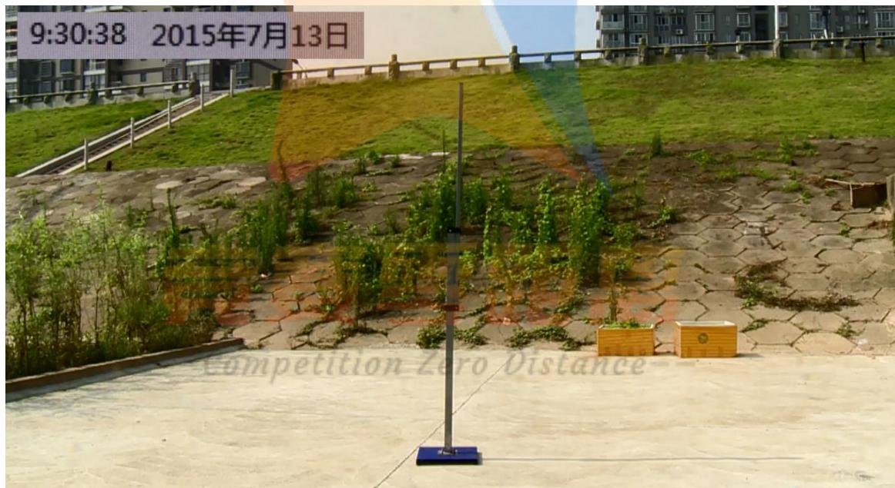

<details>
<summary>text_image</summary>

9:30:38 2015年7月13日
Competition Zero Distance
</details>

图 5.1.1 附件4视频截图

图 为附件 的视频截图。因已知竖直杆垂直于地面，观察该视频发现：竖直杆的中心位于画面中央，可认为摄像机的轴线是与直杆垂直的。随着时间的推移，可以用肉眼观察到影子的长度变短，因此可以推断该视频拍摄在当地正午时间前，则可以作为左上角的时间是该地所在时区的时间的佐证。

此外，由于在视频所记录的时间里，直杆影子转动的角度十分小，而在图示画面中，可认为影子所在的直线是和摄像机的视线垂直的，因此可以认为影子长度在透视矫正前后变化不大，因而不需要在处理视频的时候对视频做透视矫正，即认为影子和直杆构成的平面垂直于摄像机的视线。

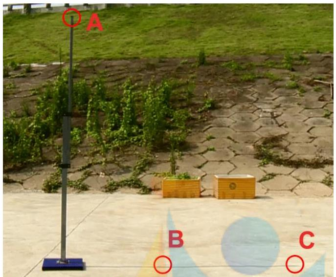

<details>
<summary>text_image</summary>

A
B
C
</details>

图 5.1.2 附件4处理示意图

利用 软件读取该视频，采用软件自带的动态追踪技术读取视频每一帧影子顶部的像素坐标 C、直杆顶端的坐标 A 以及影子上的任一其他点的像素坐标B由此，即可得到同一坐标系内的两条向量 ${ \overrightarrow { B C } } , { \overrightarrow { A C } }$ ，进而解得两向量的夹角大小，用于之后的各项运算。

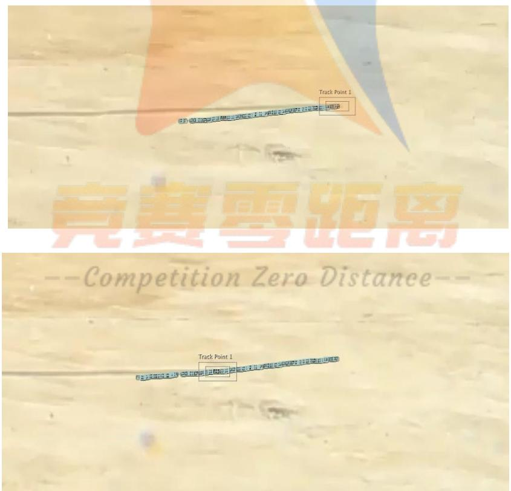  
图 5.1.3 动态追踪操作示意图

动态追踪C点的具体操作如图所示，图中有一大一小两个白边方框，小方框中是追踪的目标即影子顶点及周围的地面。由于影子顶点具有固定的形状与较深的颜色，小白框内的像素的颜色信息有一种特征明显的分布，故可对每一帧图像寻找最符合的像素区域来进行追踪。而另一方面，由于移动是连续的，为提高追踪精度，大方框规定了下一帧目标点出现的范围。对追踪参数进行适当调试，可得出图示的轨迹。

实际操作中，应将选择较为靠近直杆底座的点作为 B点，如此便不需要每次都移动B点，而可将之大致固定在一个位置，便于计算。在 6.1.1的分析中将体现， $\angle A C B$ 即为太阳高度角。

## 6. 模型的建立与求解

## 问题（一）的求解

## 6.1.1 模型的分析

为建立合适的数学模型，首先须对垂直直杆在太阳照耀下成影情况进行分析。可构建示意图如下：

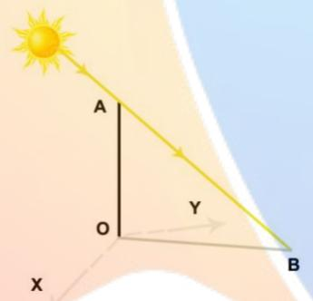

<details>
<summary>text_image</summary>

A
O
Y
B
X
</details>

图6.1.1.1 竖直直杆成影示意图

如图 所示，平面 代表大地，此处可将大地看作是平坦的。 为竖直直杆，其中 点为直杆和大地的接触点， 为竖直杆 的影子。黄色有向线代表了由太阳射来的光线。由此构成了竖直直杆成影的示意图。由于直杆长度QA已知为3米，故只需知道∠ABO的值，即可求出影子OB的长度。其中，／ABO为太阳高度角。

参考有关太阳高度角的资料<sup>[2]</sup>，可以得到太阳高度角的求解公式如下：

$$
\alpha = \arcsin \left(\sin \delta \sin \varphi + \cos \delta \cos \varphi \cos t\right)
$$

其中，  为太阳高度角， $\delta$ 为太阳赤纬， $\delta$ 的计算方式为<sup>[3]</sup> ：$\delta \mathrm { = } 2 3 . 4 5 ^ { \circ } \sin \left( \frac { 3 6 0 } { 3 6 5 } \big ( d - 8 1 \big ) \right)$ ，d代表天数，当日期为 1 月 1 日时，d=1。 为竖直杆所在地的纬度，t为时角。同时，由于 $A O \perp B O$ ，故 $\sin \alpha = \frac { L } { \sqrt { L ^ { 2 } + L _ { y } ^ { 2 } } } , L , L _ { y }$ 分别为直杆长度和影长。

通常，时角可由本地时换算得到。然而因本地时常常因地球自转及人为调整影响，而与该地真实的本地太阳时不相同，故本文采用精度更高的调整后计算时角的公式。参考相关文献可知<sup>[3]</sup>， $t { = } 1 5 ^ { \circ } \left( t _ { l s } { - } 1 2 \right) , t _ { l s }$ 为本地太阳时间， $t _ { l s } = t _ { l t } + \frac { \rho } { 6 0 }$ 0$t _ { l t }$ 为本地时。本地时的计算方法为 $t _ { { \scriptscriptstyle l t } } = t _ { 0 } + \frac { l } { 1 5 }$ ，其中，l为目标所在位置经度，当l为负时代表所在位置为西经，为正时即东经。 $t _ { 0 }$ 为子午线当地标准时间。E为时差（EoT）。值得注意的是，此处的时差并非生活中使用的区时时差，而是定义为： $E = 9 . 8 7 \sin \left( 2 B \right) - 7 . 5 3 \cos \left( B \right) - 1 . 5 \sin \left( B \right)$ $B = \frac { 3 6 0 } { 3 6 5 } \mathopen { } \mathclose \bgroup \left( d - 8 1 \aftergroup \egroup \right)$ 。由此，即可得出

$$
t = 1 5 ^ {\circ} \left(t _ {0} + \frac {l}{1 5} + \frac {9 . 8 7 \sin (2 B) - 7 . 5 3 \cos (B) - 1 . 5 \sin (B)}{6 0} - 1 2\right), B = \frac {3 6 0}{3 6 5} (d - 8 1)
$$

经过以上分析，可发现，当目标经纬度、日期、时间都已知时，可以求出相应的太阳高度角。又因杆长已知，故可求出相应时刻的影长。因题目要求绘制出2015 年 10 月 22 日北京时间 9:00-15:00（即子午线标准时间 1:00-7:00）之间天安门广场（北纬 39 度 54 分 26 秒,东经 116 度 23 分 29 秒）3 米高的直杆的太阳影子长度的变化曲线，故可写出太阳此地此日太阳影子长度与时间的关系式，从而在给定的定义域中，画出此直杆影子长度的变化曲线。

## 6.1.2 模型的建立

根据 6.1.1 中的分析，可建立有关影长 $L _ { y }$ 与子午线当地标准时间 $t _ { 0 }$ 的计算求解模型如下：

$$
L _ {y} = L \sqrt {\left(\frac {1}{\left(\sin \delta \sin \varphi + \cos \delta \cos \varphi \cos t\right) ^ {2}} - 1\right)}   t _ {0} \in [ 1, 7 ]
$$

其中 $L _ { \mathrm { y } }$ 为直杆的影长，L是直杆长度，为3米 $\circ ^ { \iota } \delta$ 为太阳赤纬，计算方式为： $\delta \mathrm { = } 2 3 . 4 5 ^ { \circ } \sin \left( \frac { 3 6 0 } { 3 6 5 } \big ( d - 8 1 \big ) \right)$ ，d代表天数，当日期为1月 1日时，d=1。 $\varphi$ 为竖直杆所在地的纬度，竖直杆在北半球时， $\varphi$ 为正，否则为负。t为时角，根据6.1.1中的分析，可以得出：

$$
t = 1 5 ^ {\circ} \left(t _ {0} + \frac {l}{1 5} + \frac {9 . 8 7 \sin (2 B) - 7 . 5 3 \cos (B) - 1 . 5 \sin (B)}{6 0} - 1 2\right), B = \frac {3 6 0}{3 6 5} (d - 8 1)
$$

$t _ { 0 }$ 为子午线当地标准时间，l为目标所在位置经度，当竖直杆经度为东经时，l为正，否则为负。

可以看出，由于日期、杆长、经纬度皆为已知，所建立的模型实际上为 $L _ { y }$ 关于 $t _ { 0 }$ ，定义域为[1,7]，解析式为 $L _ { y } = L \sqrt { \left( \frac { 1 } { \left( \sin \delta \sin \varphi + \cos \delta \cos \varphi \cos t \right) ^ { 2 } } - 1 \right) }$ 的函数关系式。

综上所述，第一问的模型为：

$$
L _ {y} = L \sqrt {\left(\frac {1}{\left(\sin \delta \sin \varphi + \cos \delta \cos \varphi \cos t\right) ^ {2}} - 1\right)}, t _ {0} \in [ 1, 7 ]
$$

$$
\left\{ \begin{array}{l} \delta = 2 3. 4 5 ^ {\circ} \sin \left(\frac {3 6 0}{3 6 5} (d - 8 1)\right) \\ t = 1 5 ^ {\circ} \left(t _ {0} + \frac {l}{1 5} + \frac {9 . 8 7 \sin (2 B) - 7 . 5 3 \cos (B) - 1 . 5 \sin (B)}{6 0} - 1 2\right) \\ B = \frac {3 6 0}{3 6 5} (d - 8 1) \end{array} \right.
$$

## 6.1.3 模型的求解

采用 MATLAB 编程求解，可以得出直杆影子长度的变化曲线如下：

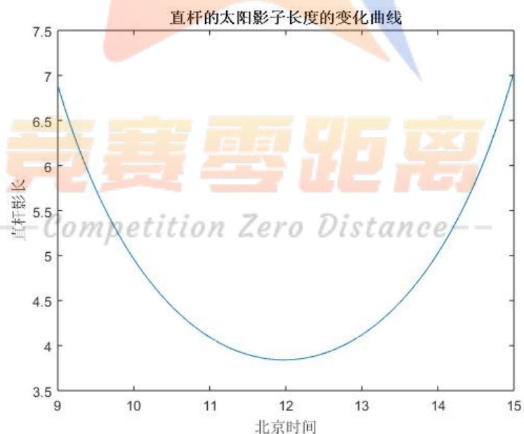

<details>
<summary>line</summary>

| 北京时间 | 直杆影长 |
| --- | --- |
| 9 | ~6.9 |
| 10 | ~5.2 |
| 11 | ~4.2 |
| 12 | ~3.85 |
| 13 | ~4.2 |
| 14 | ~5.2 |
| 15 | ~7.0 |
</details>

图6.1.3.1 直杆的太阳影子长度变化曲线

图 6.1.3.1 表示了 2015 年 10 月 22 日北京时间 9:00-15:00（即子午线标准时间 1:00-7:00）之间天安门广场（北纬 39 度 54 分 26 秒,东经 116 度 23 分 29 秒）3米高的直杆的太阳影子长度的变化曲线，横轴北京时间（小时），纵轴为直杆影

长（米）。

需要注意的是，由于本题中计算太阳赤纬、时角误差修正的公式并非完全精确，因此本模型仍然存在一定的系统误差。在本问解答结束后，将会对本模型的误差进行分析。

## 6.1.4 结果分析

根据本文的计算结果，直杆的太阳影子长度变化曲线如图 6.1.3.1所示，其在11 点 58 分 30 秒时，直杆影长达到最小值 3.8410 米；影长在 9 点到 11 点 58 分30秒时随时间变短，此后随时间增长。

决定影子长度的除了当天的时间之外，还有杆长、日期、经度、纬度这四个

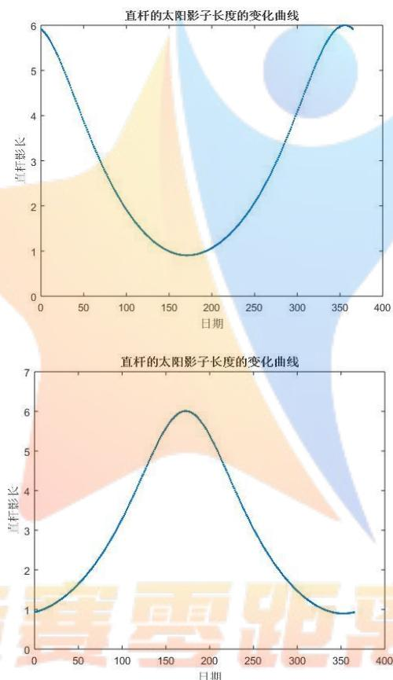

因素。由于杆长与影子长度呈正比例关系，故本文不多加讨论，而着重在日期、经度、纬度三个方面给出讨论。为方便表现影子长度关于各个因素的关系，须控制变量，作图如下：

图6.1.4.1 直杆的太阳影子长度在一年中的变化曲线

图 6.1.4.1 是 1 月 1 日至 12 月 31 日北京时间 12:00（即子午线标准时间 4:00）北纬 39 度 54 分 26 秒,东经 116 度 23 分 29 秒（上图）与南纬 39 度 54 分 26 秒,东经116度23分29秒（下图）3米高的直杆的太阳影子长度的变化曲线，横轴为日期（1代表1月1日，2代表 1月2日，由此类推），纵轴为直杆影长（米）。

可以看出，对处在北半球的直杆而言从1月1日到夏至日左右（6月22日），影子的长度随着时间推移而变短，夏至日后，随着时间推移而变长，在冬至日左右（12月22日）达到最长后又开始减小。而对于处在南半球的直杆，情况恰好

完全相反。

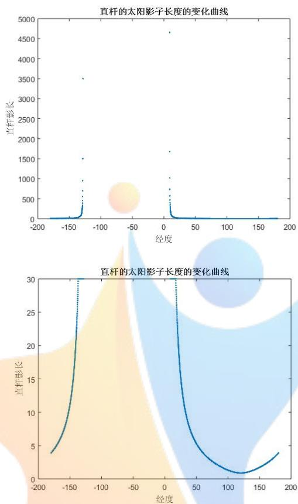  
图6.1.4.2 修正前与修正后直杆影长与经度关系曲线

图6.1.4.2体现的是6月22 日北京时间12:00（即子午线标准时间 4:00）北纬39 度 54 分 26 秒,处于 180 度到本初子午线的 3 米高的直杆的太阳影子长度的变化曲线，横轴为经度（负数为西经，正数为东经），纵轴为直杆影长（米）。

第一幅图未经过任何处理，为修正前变化曲线。可以看出，在西经 度左右到东经 度左右的区域，子午线标准时间为 时太阳尚未升起或已经落下，因此对其讨论直杆影长毫无意义。而在此二经度附近的区域，太阳刚刚升起或落下，若当地大地较为平坦，则影子长度极大，会影响对其他经度区域影子长度的观察，因此本文将影子长度大于 30米的区域统一设定为30米后，绘制出修正后的曲线。

观察两幅图可以发现，在东经 120度附近，直杆太阳影子最短，而以 120度为中心向东西延伸，影子长度不断变长，直到达到晨昏线分界线后，影子消失。

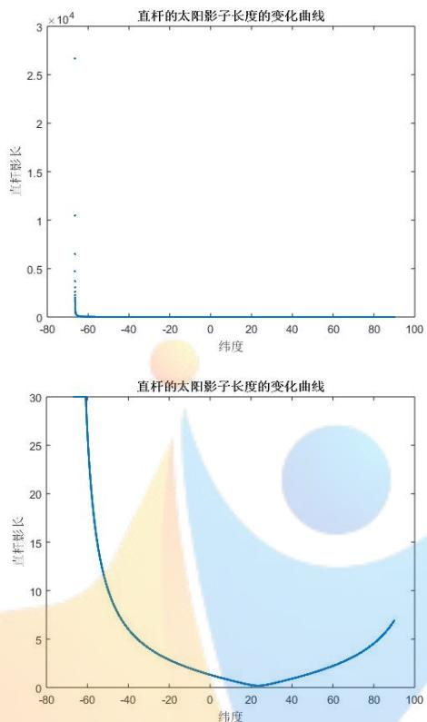  
图6.1.4.3修正前与修正后直杆影长与纬度关系曲线

图6.1.4.3体现的是6月22 日北京时间12:00（即子午线标准时间 4:00）东经116 度 23 分 29 秒,处于南纬 90 度到北纬 90 度的 3 米高的直杆的太阳影子长度的变化曲线，横轴为纬度（负数为南纬，正数为北纬），纵轴为直杆影长（米）。

第一幅图未经过任何处理，为修正前变化曲线。可以看出，在南纬 84度左右到南纬 90 度，北京时间 12:00 时为黑夜，因此对其讨论直杆影长毫无意义。而在此南纬 84 度附近的区域，太阳刚刚升起，若当地大地较为平坦，则影子长度极大，会影响对其他经度区域影子长度的观察，因此本文将影子长度大于 30 米的区域统一设定为30米后，绘制出修正后的曲线。

观察两幅图可以发现，在北回归线处，直杆太阳影子最短，而以北回归线为中心向东西延伸，影子长度不断变长，直到达到南纬84度左右，影子消失。

综上所述，题目要求绘出的天安门广场 3 米高竖直杆在 10 月 22 日 9 至 12点的曲线如图6.1.3.1所示。观察竖直杆与当日时间、日期、经度、纬度的关系可以总结规律如下：

表6.1.4.4 影子长度关于各个参数的变化规律

<table><tr><td></td><td>杆长</td><td>当日时间</td><td>日期</td><td>经度</td><td>纬度</td></tr><tr><td>影子长度</td><td>与竖直杆长</td><td>正午前逐渐变短,正午</td><td>北半球的直杆在去年12月22日至6月22日逐渐变短,6月22日至当年12月22日</td><td>在有日照的区域内,某一经线上的太阳影子最短,以此经线为</td><td>在有日照的区域内,某一纬度上的太阳影子最短,以此纬线为</td></tr><tr><td>变化</td><td>成正比</td><td>后逐渐变长</td><td>逐渐变长,南半球直杆反之。</td><td>中心,向东西两侧影子逐渐变长</td><td>中心,向南北两侧影子逐渐变长</td></tr></table>

## 误差分析与改进

由于第一问求解时所用的公式会在二、三、四问的建模过程中沿用，故于此处，有必要对使用的模型进行误差分析。

于第一问的计算求解模型建立过程中，其核心公式为：太阳高度角的计算公式，即： $\alpha = \arcsin \left( \sin \delta \sin \varphi + \cos \delta \cos \varphi \cos t \right)$ 。各项中，太阳赤纬 以及时角t的修正E都是近似式，因而本模型的主要系统误差来自于此两项。由于 与E皆为仅仅与日期d有关的变量，故可以选择一个精度较高的天文计算器<sup>[4]</sup>，将之计算的d为1至365时的 和E值作为真实值，而将本文模型中计算的 与E值作为计算值，做误差分析。

本文作为参考的计算器为 MIDC SPA CALCULATOR<sup>[5]</sup>。对比计算得出的误差如下图所示：

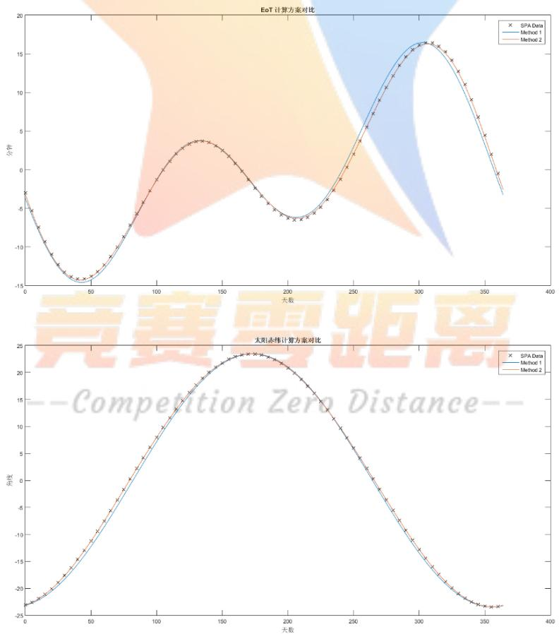  
图6.1 误差对比

如图6.1所示，上方图为E值在取1至365时采用本文以及真实结果的比较，下方图为太阳赤纬 的计算值和理论值的比较。其中，蓝色线为本文方案的计算值，棕色线为改进后结果，X点为SPA计算器算出的值，即真实值。可以看出，本文的计算值与真实值之间存在一定偏差，因此，可以采用更为精确的模型加以修正。

参考其它文献<sup>[6][7][8]</sup>，得到更为精确的太阳赤纬 与时差E的计算方式如下：

$$
\delta = - \arcsin \left(0. 3 9 7 7 9 \cos (0. 9 8 5 6 5 ^ {\circ} \cdot (D + 1 0)) + 1. 9 1 4 \cdot \frac {1 8 0 \sin (0 . 9 8 5 6 5 ^ {\circ} \cdot (D - 2))}{\pi}\right)
$$

$E { = } 7 2 0 { \left( C - \big [ C \big ] \right) }$ ，其中：

$$
\left\{ \begin{array}{l} C = \frac {\left(A - \arctan \left(\frac {\tan (B ^ {\circ})}{\cos (2 3 . 4 4 ^ {\circ})}\right)\right)}{1 8 0} \\ B = A + 1. 9 1 4 \sin \left(\left(W (D - 2)\right) ^ {\circ}\right), \\ A = W (D + 1 0) \\ W = \frac {3 6 0}{3 6 5 . 2 4} \end{array} \right.
$$

D为天数。当日期为1月 1日时，D为0。

修正前后，本文模型计算得到的误差与 SPA 计算器的比较如下表：

表6.2 修正前后时差与太阳赤纬误差对比

<table><tr><td rowspan="2"></td><td colspan="2">最大残差绝对值</td><td colspan="2">残差平方和</td><td colspan="2">平均残差绝对值</td></tr><tr><td>修正前</td><td>修正后</td><td>修正前</td><td>修正后</td><td>修正前</td><td>修正后</td></tr><tr><td>时差</td><td>1.3206</td><td>0.2221</td><td>147.462</td><td>6.2765</td><td>0.4977</td><td>0.1153</td></tr><tr><td>太阳赤纬</td><td>1.1492</td><td>0.2221</td><td>115.0509</td><td>0.6689</td><td>0.4399</td><td>0.0377</td></tr></table>

可见，经过精度更高的公式修正之后，时差和太阳赤纬的误差得到了较为明显的改善。然而，由于在之后的模型中，时差和太阳赤纬是用来计算太阳高度角以及方位角的中间步骤，因此还须检测修正前后太阳高度角和方位角的误差变化。

表6.3 修正前后太阳高度角与方位角误差对比

<table><tr><td rowspan="2"></td><td colspan="2">平均残差绝对值(单位为角度)</td></tr><tr><td>修正前</td><td>修正后</td></tr><tr><td>太阳高度角</td><td>0.3411</td><td>0.0222</td></tr><tr><td>方位角</td><td>0.3203</td><td>0.1760</td></tr></table>

从表 6.3 可以发现，修正后对于太阳高度角的误差减少效果较为明显。然而可以看出，即使不加以修正，现在使用的公式产生的误差亦并非很大。

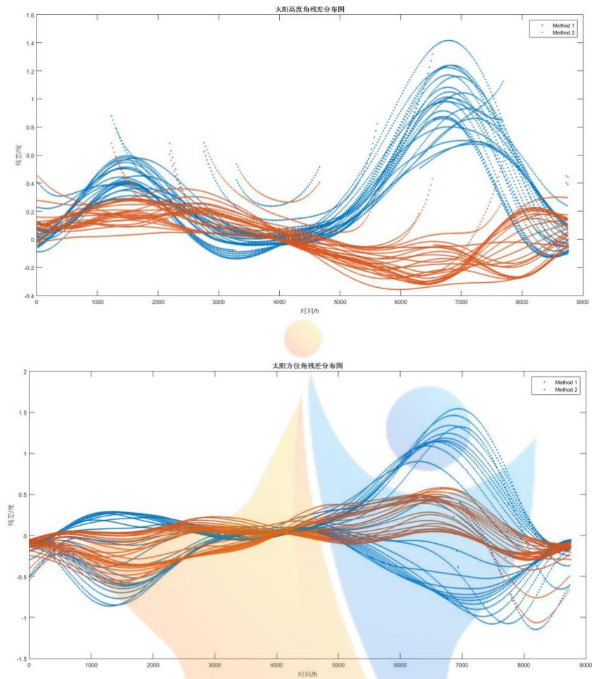  
图6.4 修正前后太阳高度角与方位角残差分布图

图 6.4 为修正前后太阳高度角与方位角残差分布图。横轴以小时为单位，从左到右为1月1日至12月31 日，纵轴为残差。蓝色为修正前曲线，红色为修正后曲线。可见，修正前的残差最大亦不足 2 度，虽然修正后降低误差效果明显，但是原本的误差也在可接受的范围之内。

考虑到修正的计算方法复杂，会影响模型效率，因而本文将在明确模型存在系统误差的前提下，在之后几问沿用第一问中使用的天文学公式。

将修正后的公式代入第一问，可以得到影长在北京时间 9 至 15 点的最小的值为3.6638米，对应时间为11 点59分24秒。

## 问题（二）的求解

## 6.2.1 模型的分析

本问相对于第一问，不知道直杆的长度，但因知道太阳影子顶点在一个连续时间段内的坐标数据，故相当于知道了此时间段内等间隔时刻影子的影长以及其角度变化（即方向）。因此，合理的经纬度（直杆位置）应不仅仅能够拟合直杆的影长及其变化，还应当拟合影子方位角的变化。

由于特定时刻，特定经纬度下的影子太阳高度角和方位角皆可以计算，且同一地点的同一直杆在一天中两不同时刻的影长只与太阳高度角有关，故可以计算不同时刻的理论影长比及方位角差。因而，可以依照问题分析（二）中提出的思路，构造以直杆所在经纬度为x y, 时，计算所得两时刻的影子长度比与对应时刻测得的影子长度比的差值最小为第一个目标函数，以计算所得两时刻方位角差值与测得的方位角差值的差值最小为第二个目标的多目标规划模型，利用遍历求出尽可能精确的解。

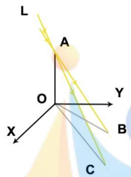

<details>
<summary>text_image</summary>

L
A
O
X
Y
B
C
</details>

图6.2.1.1 竖直直杆在不同时刻成影示意图

如图 6.2.1.1 所示，该图表现了竖直直杆在同一天中两个时刻的成影示意图。该示意图表示的情况已过当地时间正午，故 OB 为较早时的成影，OC 为较晚时的成影。与第一问相同，∠B，∠C分别为影子OB、OC的太阳高度角。而第一问中，参考有关太阳高度角的资料<sup>[1]</sup>，可以得到太阳高度角的求解公式为$\alpha = \arcsin \left( \sin \delta \sin \varphi + \cos \delta \cos \varphi \cos t \right)$ 且 $\alpha \in \left( 0 , \frac { \pi } { 2 } \right)$ 因此，时刻 $t _ { 1 } , t _ { 2 }$ 的理论影长之比即为 ${ \frac { L _ { _ { y 1 } } } { L _ { _ { y 2 } } } } = { \frac { L \cot \alpha _ { 1 } } { L \cot \alpha _ { 2 } } } { = } { \frac { \cot \alpha _ { 1 } } { \cot \alpha _ { 2 } } }$ ，实际影长之比可以通过所给数据计算，即为${ \frac { L _ { _ { y 1 } } } { L _ { _ { y 2 } } } } ,$

由于方位角是在地平坐标系上的角<sup>[1]</sup>，竖直直杆是垂直于大地的，因此可以Competition Zero Distance将面XOY看作是地平坐标系，因而 $\angle B O C$ 即为时刻i j, 方位角 $\theta _ { 1 } , \theta _ { 2 }$ 的差值。查阅资料可知，方位角的计算公式为： $\theta = \operatorname { a r c c o s } \left( { \frac { \left( \sin \delta \cos \varphi - \cos \delta \sin \varphi \cos t \right) } { \cos \alpha } } \right)$ ，因而可以计算出两时刻方位角理论计算值的差值的绝对值 $\left| \theta _ { 1 } ^ { ' } - \theta _ { 2 } ^ { ' } \right|$ 。对于实际的方位角差值，因已经知道了向量 ${ \overrightarrow { O B } } , { \overrightarrow { O A } }$ 的坐标，故 $\Big \vert \theta _ { 1 } - \theta _ { 2 } \Big \vert = \left| \operatorname { a r c c o s } \frac { \overrightarrow { O B } \cdot \overrightarrow { O A } } { \Big \vert \overrightarrow { O B } \Big \vert \Big \vert \overrightarrow { O A } \Big \vert } \right|$

通过计算所得到的理想经纬度应该能够使得实际和理论的影长之比以及方位角差值之差尽可能为0，因而，可建立多目标多目标规划模型，找出满足条件的经纬度。

需要注意的是，因为附件中一共提供了 21 组数据，为了使一对数据的差别尽可能大，从而减少误差，选择每一个时刻与其之后的第十个时刻为一对（例如，时刻1，即14:42 的数据应与时刻 11，即 15:12 时的数据成为一对），得到共十组数据，找出符合条件的经纬度使得每一对理论的影长之比的差的平方和接近于0，且方位角差值之差的平方和接近于 0,由此建立多目标规划模型。

## 6.2.2 模型的建立

根据模型分析及问题分析，建立已实际和理论的影长之比以及方位角差值之差尽可能为0二者为目标的多目标规划模型。目标函数为：

$$
\min f _ {1} (\varphi , l) = \sum_ {i, j} \left(\frac {L _ {y i}}{L _ {y j}} - \frac {L _ {y i} ^ {\prime}}{L _ {y j} ^ {\prime}}\right) ^ {2}
$$

$$
\min f _ {2} (\varphi , l) = \sum_ {i, j} \left[ \left(\theta_ {i} - \theta_ {j}\right) - \left(\theta_ {i} ^ {\prime} - \theta_ {j} ^ {\prime}\right) \right] ^ {2}
$$

$\varphi$ 和l分别为直杆所在的纬度和经度。目标函数是两个关于经纬度的二元函数。其中， $f _ { 1 }$ 为每一对理论与实测的影长之比的差的平方和， $L _ { y i } , L _ { y j }$ 分别为时刻i j, 测得的影长， $L _ { y i } , L _ { y j } ^ { ' }$ 为时刻i j, 的理论影长。 $f _ { 2 }$ 为每一对理论与实测方位角差值之差的平方和， $\theta _ { i } , \theta _ { j }$ 分别为时刻i j, 测得的方位角， $\theta _ { i } ^ { ' } , \theta _ { j } ^ { ' }$ 分别为时刻 $i , j$ 的理论方位角值。

目标函数的约束条件如下：

$$
\left\{ \begin{array}{l} \frac {L _ {y i} ^ {\prime}}{L _ {y j} ^ {\prime}} = \frac {\cot \alpha_ {i}}{\cot \alpha_ {j}} \\ \alpha_ {k} \in \left(0, \frac {\pi}{2}\right) \\ \alpha_ {k} = \arcsin (\sin \delta \sin \varphi + \cos \delta \cos \varphi \cos t _ {k}) \\ \theta_ {k} ^ {\prime} = \arccos \left(\frac {(\sin \delta \cos \varphi - \cos \delta \sin \varphi \cos t _ {k})}{\cos \alpha_ {k}}\right) \\ \delta = 2 3. 4 5 ^ {\circ} \sin \left(\frac {3 6 0}{3 6 5} (d - 8 1)\right) \\ t _ {k} = 1 5 ^ {\circ} \left(t _ {k 0} + \frac {l}{1 5} + \frac {9 . 8 7 \sin (2 B) - 7 . 5 3 \cos (B) - 1 . 5 \sin (B)}{6 0} - 1 2\right) \\ B = \frac {3 6 0}{3 6 5} (d - 8 1) \\ i \in \{1, 2, 3, 4, 5, 6, 7, 8, 9, 1 0 \}, \quad j = i + 1 0 \\ \varphi \in [ - 9 0 ^ {\circ}, 9 0 ^ {\circ} ] \\ l \in (- 1 8 0 ^ {\circ}, 1 8 0 ^ {\circ}) \end{array} \right.
$$

条件一给出了理论影长之比的计算方式， $\alpha _ { k }$ 为k时刻的太阳高度角，k可取$i , j$ 。条件二给出了 $\alpha _ { k }$ 的约束条件，即 $\alpha _ { k }$ 须为锐角，仅仅在这种情况下，当地时间才为白天，讨论影子才有意义。条件三给出了 $\alpha _ { k }$ 的计算方式：为太阳赤纬,$\varphi$ 为竖直杆所在地的纬度，竖直杆在北半球时， $\varphi$ 为正，否则为负。 $t _ { k }$ 为时刻k的时角。条件四给出了理论方位角的计算公式。

条件五、六、七给出 $\vec { \textbf { J } } \delta \cdot \boldsymbol { t } _ { k }$ 以及一个相关量B的求解方式。其中 $d$ 代表天数，当日期为1月1日时， $d { = } 1$ 本问中 $d = 1 0 8$ ；l为直杆所在经度， $t _ { k 0 }$ 为时刻k的格林威治标准时间。

条件八给出 $\intercal { i , j }$ 对应所指的时刻。最后两个条件给出了经纬度的定义域。

综上所述，本文建立的多目标规划模型为：

$$
\min f _ {1} (\varphi , l) = \sum_ {i, j} \left(\frac {L _ {y i}}{L _ {y j}} - \frac {L _ {y i} ^ {\prime}}{L _ {y j} ^ {\prime}}\right) ^ {2}
$$

$$
\min f _ {2} (\varphi , l) = \sum_ {i, j} \left[ \left(\theta_ {i} - \theta_ {j}\right) - \left(\theta_ {i} ^ {\prime} - \theta_ {j} ^ {\prime}\right) \right] ^ {2}
$$

$$
\left\{ \begin{array}{l} \frac {L _ {y i} ^ {\prime}}{L _ {y j} ^ {\prime}} = \frac {\cot \alpha_ {i}}{\cot \alpha_ {j}} \\ \alpha_ {k} \in \left(0, \frac {\pi}{2}\right) \\ \alpha_ {k} = \arcsin (\sin \delta \sin \varphi + \cos \delta \cos \varphi \cos t _ {k}) \\ \theta_ {k} ^ {\prime} = \arccos \left(\frac {(\sin \delta \cos \varphi - \cos \delta \sin \varphi \cos t _ {k})}{\cos \alpha_ {k}}\right) \\ \delta = 2 3. 4 5 ^ {\circ} \sin \left(\frac {3 6 0}{3 6 5} (d - 8 1)\right) \\ t _ {k} = 1 5 ^ {\circ} \left(t _ {k 0} + \frac {l}{1 5} + \frac {9 . 8 7 \sin (2 B) - 7 . 5 3 \cos (B) - 1 . 5 \sin (B)}{6 0} - 1 2\right) \\ B = \frac {3 6 0}{3 6 5} (d - 8 1) \\ i \in \{1, 2, 3, 4, 5, 6, 7, 8, 9, 1 0 \}, \quad j = i + 1 0 \\ \varphi \in [ - 9 0 ^ {\circ}, 9 0 ^ {\circ} ] \\ l \in (- 1 8 0 ^ {\circ}, 1 8 0 ^ {\circ}) \end{array} \right.
$$

## 6.2.3 模型的求解

由于在所给的数据中，影子长度的变化较为明显， 而角度的变化则相比之下更为微小，因此即使是在所用公式精度相同的情况下，以角度为首要标准来解答也会产生更大的误差。因此，为较为精确的定位，本文采用分层求解法解该多目标规划问题。

以 $\operatorname* { m i n } { f _ { 1 } ( \varphi , l ) }$ （即影子长度比之差）为首要优化目标，在完成此步优化之后，得到多组 $\varphi , l$ 使得 $f _ { 1 } \left( \varphi , l \right) = \lambda$ 进而以第一步的优化结果作为约束条件，即$f _ { 1 } \left( \varphi , l \right) \le \lambda$ ，以 $\operatorname* { m i n } { f _ { 2 } } \left( \varphi , l \right)$ 作为优化目标再次优化，得出答案。

通过MATLAB编程遍历求解，得出最为符合条件的地点为北纬19度，东经109度，位于我国海南省境内：

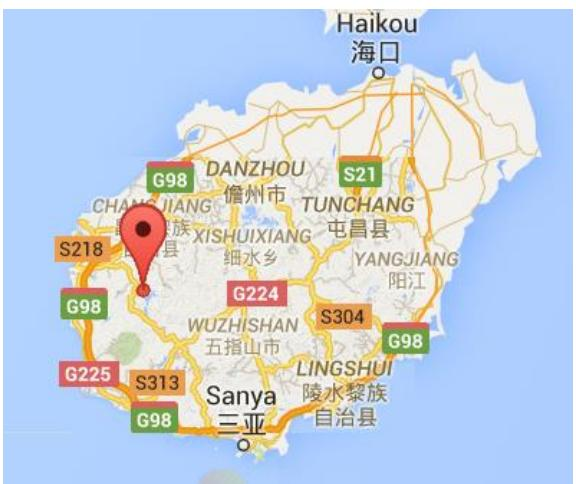

<details>
<summary>text_image</summary>

Haikou
海口
G98
DANZHOU
儋州市
S21
TUNCHANG
屯昌县
YANGJIANG
阳江
G224
WUZHISHAN
五指山市
S304
LINGSHUI
陵水黎族自治县
G98
G225
S313
G98
S218
S218
S313
三亚
</details>

图6.2.3.1 北纬 19度，东经109度定位（谷歌地图）

由于本文采用的计算方法自身存在一定的系统误差，因而此多目标规划得到的答案并非精确的答案。于结果分析中，本文会进一步给出各经纬度下的误差分析，指出其他可能点所在的范围。

## 6.2.4 结果分析

得到最优结果之后，可以分别以 $f _ { 1 } \left( \varphi , l \right)$ 值为因变量，以纬度、经度为自变量作图分析。如本文之前所解释，角度的计算引起的偏差可能较大，因此结果分析部分将着重于影子长度的理论值和测量值吻合情况，这一做法亦与本文求解多目标规划模型的思路一致。所得图像如下：

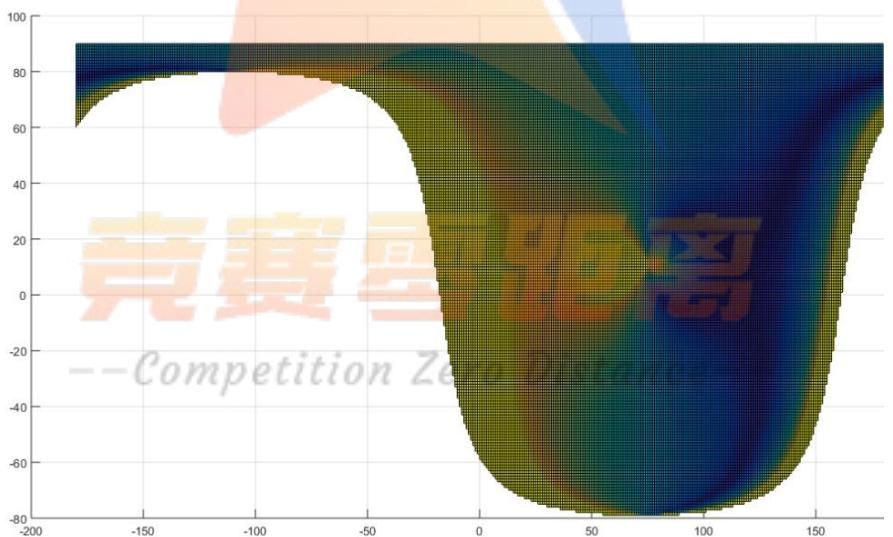

<details>
<summary>heatmap</summary>

| X | Y | Value (Color) |
| --- | --- | --- |
| -200~180 | -80~90 | High (Blue/Green) to Low (Yellow/Orange) |
</details>

图6.2.4.1 不同经纬度的理论影长与实际测得影长的吻合情况

图6.2.4.1反映的是不同经纬度的理论影长与实际测得的影长的吻合情况，图中，横轴为经度，经度为负即代表西经，为正即东经；纵轴为纬度，纬度为正时即北纬，为负时即南纬。颜色越蓝，越深则代表此经纬度的直杆吻合情况越好；颜色越黄，越浅即代表此经纬度的直杆吻合情况越差。

为了更好的描述 $f _ { 1 } \left( \varphi , l \right)$ 的相对大小，可对 $f _ { 1 } \left( \varphi , l \right)$ 的数据值做离差标准化，将

离差标准化后的值命名为误差程度，该值越低代表误差越小。

根据该图可以看出，除了北纬 19 度，东经 109 度以外，还有其他的地点的误差程度也相对较好。因此，可以再遍历所有的地点，搜寻各个局部的最优中心：即以此点为中心，其邻近点的误差程度皆劣于该点。找到这些局部最优中心后，再筛选出误差程度低于0.002的点，可以得到七个中心，这些中心也是直杆可能的所在地：

表6.2.4.2 直杆可能所在地经纬度

<table><tr><td>纬度</td><td>经度</td><td>误差程度</td><td>大致地点</td></tr><tr><td>24</td><td>100</td><td>0.0012</td><td>云南</td></tr><tr><td>-3</td><td>104</td><td>0.0017</td><td>印度尼西亚,巨港</td></tr><tr><td>21</td><td>106</td><td>0.0008</td><td>越南,河内</td></tr><tr><td>20</td><td>108</td><td>0.0019</td><td>海南西北</td></tr><tr><td>19</td><td>109</td><td>0</td><td>海南</td></tr><tr><td>18</td><td>110</td><td>0.0006</td><td>海南东南</td></tr><tr><td>17</td><td>111</td><td>0.0018</td><td>西沙群岛</td></tr></table>

表6.2.4.2中，纬度为正代表北纬，反之代表南纬；经度为正代表东经，反之为西经。可以看出，北纬19 度，东经109度也包含在这7 个点中，其误差程度亦是最小的。误差程度越小代表：依照本题模型，直杆处在该地的可能性越大。可以看出：直杆处在海南（北纬 19度，东经109度）的可能性是最大的，其次是在海南东南的北纬18，东经 109度以及越南河内（北纬 21度，东经106度）。但因模型自身或存在系统误差，测量影子坐标时亦可能出现错误，因此，仍然不能排除直杆位于其他各地点的可能性。

以上各点在地图上的相对位置如下：

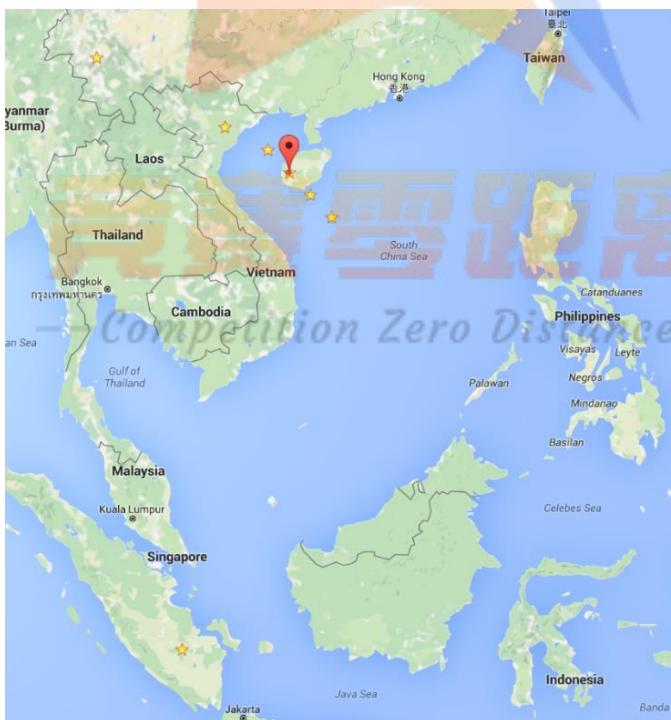

<details>
<summary>text_image</summary>

Taiwan
Hong Kong
香港
Taipei
台北
Laos
Thailand
Vietnam
Bangkok
Thailand
Cambodia
Gulf of
Thailand
Malaysia
Kuala Lumpur
Singapore
Jakarta
Java Sea
Indonesia
Palawan
Philippines
Visayas
Leyte
Negros
Mindanao
Basilan
Celebes Sea
Computation Zero Discharge
</details>

图6.2.4.3 直杆可能所在地在地图上的位置（谷歌地图截图）

如图6.2.4.3所示，上述7 个可能的位置都已经用星星标出，其中，加上红色

图钉的点为北纬19度，东经109 度。

## 问题（三）的求解

## 6.3.1 模型的分析

第三问的其他条件与第二问一致，只不过相比于第二问，日期是一个未知值。因此，可以沿用第二问的多目标规划模型，不过须将原来的二元目标函数更改为含有日期（几月几日）、纬度和经度三个未知数的三元函数，再建立与第二问类似的多目标规划模型，采用分层求解法遍历求解。

## 6.3.2 模型的建立

根据模型分析，参照第二问的模型，建立已实际和理论的影长之比以及方位角差值之差尽可能为 0 二者为目标的多目标规划模型。目标函数为：

$$
\begin{array}{l} \min f _ {1} (\varphi , l, d) = \sum_ {i, j} \left(\frac {L _ {y i}}{L _ {y j}} - \frac {\dot {L _ {y i} ^ {\prime}}}{\dot {L _ {y j}}}\right) ^ {2} \\ \min f _ {2} (\varphi , l, d) = \sum_ {i, j} \left[ \left(\theta_ {i} - \theta_ {j}\right) - \left(\theta_ {i} ^ {\prime} - \theta_ {j} ^ {\prime}\right) \right] ^ {2} \\ \end{array}
$$

$\varphi$ 和l分别为直杆所在的纬度和经度，d为日期，当日期为 1月1日时， $d$ 的值为1。目标函数是两个关于经纬度与日期的二元函数。其中， $f _ { 1 }$ 为每一对理论的影长之比的差的平方和， $L _ { y i } , L _ { y j }$ 分别为时刻i j, 测得的影长， $L _ { y i } , L _ { y j } ^ { ' }$ 为时刻i j,的理论影长。 $f _ { 2 }$ 为方位角差值之差的平方和， $\theta _ { i } , \theta _ { j }$ 分别为时刻 $i , j$ 测得的方位角，$\theta _ { i } ^ { \dot { } } , \theta _ { j } ^ { \dot { } }$ 分别为时刻 $i , j$ 的理论方位角值。

目标函数的约束条件如下：

$$
\left\{ \begin{array}{l} \frac {\dot {L _ {y 1}}}{\dot {L _ {y 2}}} = \frac {\cot \alpha_ {1}}{\cot \alpha_ {2}} \\ \alpha_ {k} \in \left(0, \frac {\pi}{2}\right) \\ \alpha_ {k} = \arcsin (\sin \delta \sin \varphi + \cos \delta \cos \varphi \cos t _ {k}) \\ \theta_ {k} ^ {\prime} = \arccos \left(\frac {(\sin \delta \cos \varphi - \cos \delta \sin \varphi \cos t _ {k})}{\cos \alpha_ {k}}\right) \\ \delta = 2 3. 4 5 ^ {\circ} \sin \left(\frac {3 6 0}{3 6 5} (d - 8 1)\right) \\ t _ {k} = 1 5 ^ {\circ} \left(t _ {k 0} + \frac {l}{1 5} + \frac {9 . 8 7 \sin (2 B) - 7 . 5 3 \cos (B) - 1 . 5 \sin (B)}{6 0} - 1 2\right) \\ B = \frac {3 6 0}{3 6 5} (d - 8 1) \\ i \in \{1, 2, 3, 4, 5, 6, 7, 8, 9, 1 0 \}, j = i + 1 0 \\ \varphi \in [ - 9 0 ^ {\circ}, 9 0 ^ {\circ} ], l \in (- 1 8 0 ^ {\circ}, 1 8 0 ^ {\circ}) \\ d \in [ 1, 3 6 5 ] \end{array} \right.
$$

条件一给出了理论影长之比的计算方式， $\alpha _ { k }$ 为k时刻的太阳高度角，k可取$i , j$ 。条件二给出了 $\alpha _ { k }$ 的约束条件，即 $\alpha _ { k }$ 须为锐角。条件三给出了 $\alpha _ { k }$ 的计算方式：$\delta$ 为太阳赤纬, $\varphi$ 为竖直杆所在地的纬度，竖直杆在北半球时， $\varphi$ 为正，否则为负。 $t _ { k }$ 为时刻k的时角。条件四给出了理论方位角的计算公式。

条件五、六、七给出了 $\delta$ $t _ { k }$ 以及一个相关量B的求解方式。其中 $d$ 代表天数,l为直杆所在经度， $t _ { k 0 }$ 为时刻 $k$ 的格林威治标准时间。

条件八给出 $\intercal ^ { i , j }$ 对应所指的时刻。最后三个条件分别给出了经纬度和日期的定义域。

综上所述，本文建立的多目标规划模型为：

$$
\begin{array}{l} \min f _ {1} (\varphi , l, d) = \sum_ {i, j} \left(\frac {L _ {y i}}{L _ {y j}} - \frac {L _ {y i} ^ {\prime}}{L _ {y j} ^ {\prime}}\right) ^ {2} \\ \min f _ {2} (\varphi , l, d) = \sum_ {i, j} \left[ \left(\theta_ {i} - \theta_ {j}\right) - \left(\theta_ {i} ^ {\prime} - \theta_ {j} ^ {\prime}\right) \right] ^ {2} \\ \end{array}
$$

$$
\text {s.t.} \left\{ \begin{array}{l} \frac {L _ {y 1} ^ {\prime}}{L _ {y 2} ^ {\prime}} = \frac {\cot \alpha_ {1}}{\cot \alpha_ {2}} \\ \alpha_ {k} \in \left(0, \frac {\pi}{2}\right) \\ \alpha_ {k} = \arcsin (\sin \delta \sin \varphi + \cos \delta \cos \varphi \cos t _ {k}) \\ \theta_ {k} ^ {\prime} = \arccos \left(\frac {(\sin \delta \cos \varphi - \cos \delta \sin \varphi \cos t _ {k})}{\cos \alpha_ {k}}\right) \\ \delta = 2 3. 4 5 ^ {\circ} \sin \left(\frac {3 6 0}{3 6 5} (d - 8 1)\right) \\ t _ {k} = 1 5 ^ {\circ} \left(t _ {k 0} + \frac {l}{1 5} + \frac {9 . 8 7 \sin (2 B) - 7 . 5 3 \cos (B) - 1 . 5 \sin (B)}{6 0} - 1 2\right) \\ B = \frac {3 6 0}{3 6 5} (d - 8 1) \\ i \in \{1, 2, 3, 4, 5, 6, 7, 8, 9, 1 0 \}, j = i + 1 0 \\ \varphi \in [ - 9 0 ^ {\circ}, 9 0 ^ {\circ} ], l \in (- 1 8 0 ^ {\circ}, 1 8 0 ^ {\circ}) \\ d \in [ 1, 3 6 5 ] \end{array} \right.
$$

## 6.3.3 模型的求解

与第二问类似，采用分层求解法，利用 MATLAB 编程遍历求解，可得到根据附件二、三计算出相应位置相应的日期为：

表、图6.3.3.1 第三问最可能答案及在地图上的大概位置（谷歌地图）

<table><tr><td></td><td>纬度</td><td>经度</td><td>日期</td><td>大致地点</td></tr><tr><td>附件二</td><td>40</td><td>79</td><td>5/25</td><td>新疆图木舒克市</td></tr><tr><td>附件三</td><td>33</td><td>106</td><td>10/31</td><td>陕西,汉中广元之间</td></tr></table>

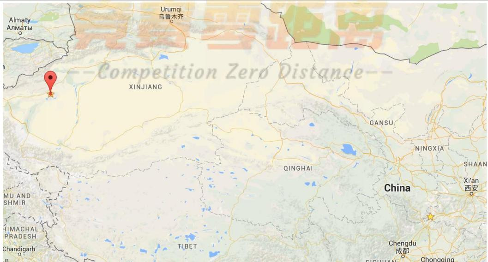

<details>
<summary>text_image</summary>

Almaty
Almaty
Urumqi
乌鲁木齐
Competition Zero Distance
XINJIANG
GANSU
NINGXIA
QINGHAI
China
Shaan
Xi'an
西安
MU AND
SHMIR
HIMACHAL
PRADESH
Chandigarh
TIBET
Chengdu
成都
SICHUAN
Chongqing
</details>

纬度为正即为北纬，经度为正代表为东经。图中两星标点即为上述两点。其中，带图钉的点为附件二的位置。由于年份不可确定，只能确定日期，因而对应的日期具体年份不可知。同时，因为本题的计算方式存在一定的误差，因而满足目标函数最好的解并不一定是真实的解，进一步分析会在结果分析中给出。

## 6.3.4 结果分析

得到最优结果之后，与第二问类似，可以分别对特定的纬度与经度 ,l 以其对应的最小的 $f _ { 1 } ( \varphi , l , d )$ 值为因变量，以纬度、经度为自变量作图分析。因附件二数据和附件三的数据在分析过程中没有区别，故本部分仅仅以附件二为样本，进行结果分析。所得图像如下：

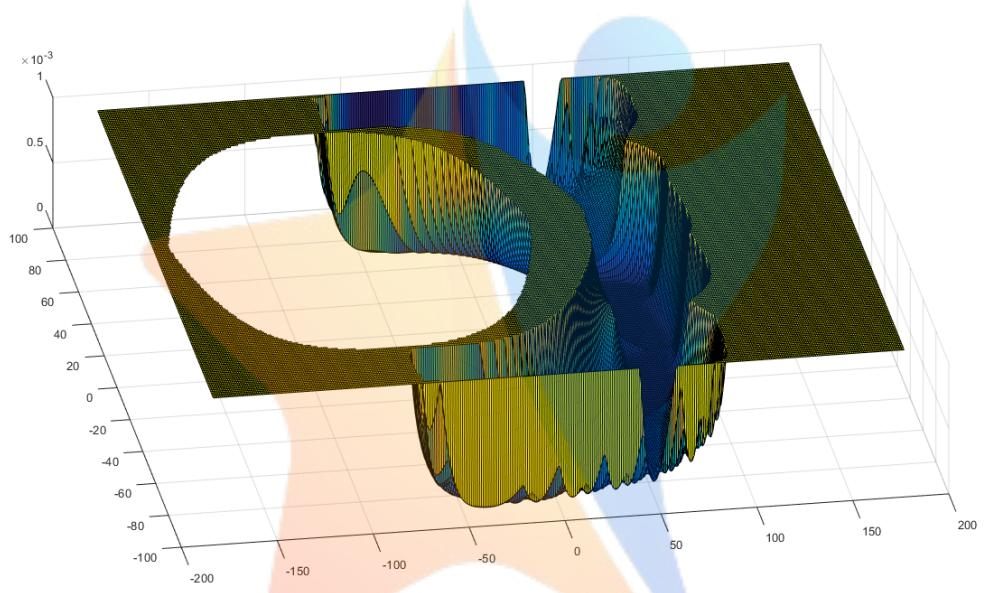

<details>
<summary>surface_3d</summary>

| X | Y | Z (x10^-3) |
| --- | --- | --- |
| -200~200 | -100~100 | ~-80 ~1 |
</details>

图6.3.4.1不同经纬度的理论影长与实际测得影长的误差值

图6.3.4.1反映的是不同经纬度的理论影长与实际测得的影长的吻合情况，图中，横轴为经度，经度为负即代表西经，为正即东经；纵轴为纬度，纬度为正时即北纬，为负时即南纬。竖轴为误差值，该值越小，代表理论影长与实际影长的误差越小，即目标吻合情况越好。

为了更好的描述 $f _ { 1 } ( \varphi , l , d )$ 的相对大小，可对 $f _ { 1 } ( \varphi , l , d )$ 的数据值做离差标准化,更易于绘图。 此外，为了便于观察，本文将误差值大于 0.001 的点的误差值统一设为0.001，由此在保留观察误差值趋势变化的同时，便于读者观察。

根据该图可以看出，当遍历地点逐渐靠近到东经 50 度，南北回归线范围前后时，误差明显减小，由此从该图可以看出，较为准确的定位应该在此范围内。为了更进一步的从图像上看出结果，可以将误差值大于 的点的误差值全部规定为0.000001，修正后得到的图如下：

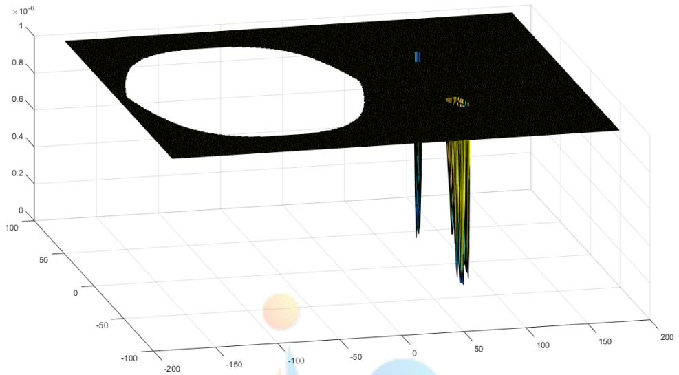

<details>
<summary>surface_3d</summary>

| X | Y | Z (x10^-6) |
| --- | --- | --- |
| ~0 | ~0 | ~0.85 |
| ~20 | ~0 | ~0.6 |
| ~40 | ~0 | ~0.6 |
| ~40 | ~-10 | ~0.6 |
| ~40 | ~-20 | ~0.6 |
| ~40 | ~-30 | ~0.6 |
| ~40 | ~-40 | ~0.6 |
| ~40 | ~-50 | ~0.6 |
| ~40 | ~-60 | ~0.6 |
| ~40 | ~-70 | ~0.6 |
| ~40 | ~-80 | ~0.6 |
| ~40 | ~-90 | ~0.6 |
| ~40 | ~-100 | ~0.6 |
| ~40 | ~-110 | ~0.6 |
| ~40 | ~-120 | ~0.6 |
| ~40 | ~-130 | ~0.6 |
| ~40 | ~-140 | ~0.6 |
| ~40 | ~-150 | ~0.6 |
| ~40 | ~-160 | ~0.6 |
| ~40 | ~-170 | ~0.6 |
| ~40 | ~-180 | ~0.6 |
| ~40 | ~-190 | ~0.6 |
| ~40 | ~-200 | ~0.6 |
| ~40 | ~-210 | ~0.6 |
| ~40 | ~-220 | ~0.6 |
| ~40 | ~-230 | ~0.6 |
| ~40 | ~-240 | ~0.6 |
| ~40 | ~-250 | ~0.6 |
| ~40 | ~-260 | ~0.6 |
| ~40 | ~-270 | ~0.6 |
| ~40 | ~-280 | ~0.6 |
| ~40 | ~-290 | ~0.6 |
| ~40 | ~-300 | ~0.6 |
| ~40 | ~-310 | ~0.6 |
| ~40 | ~-320 | ~0.6 |
| ~40 | ~-330 | ~0.6 |
| ~40 | ~-340 | ~0.6 |
| ~40 | ~-350 | ~0.6 |
| ~40 | ~-360 | ~0.6 |
| ~40 | ~-370 | ~0.6 |
| ~40 | ~-380 | ~0.6 |
| ~40 | ~-390 | ~0.6 |
| ~40 | ~-400 | ~0.6 |
| ~40 | ~-410 | ~0.6 |
| ~40 | ~-420 | ~0.6 |
| ~40 | ~-430 | ~0.6 |
| ~40 | ~-440 | ~0.6 |
| ~40 | ~-450 | ~0.6 |
| ~40 | ~-460 | ~0.6 |
| ~40 | ~-470 | ~0.6 |
| ~40 | ~-480 | ~0.6 |
| ~40 | ~-490 | ~0.6 |
| ~40 | ~-500 | ~0.6 |
</details>

图6.3.4.2修正后不同经纬度的理论影长与实际测得影长的误差值

从图 中可以明显的看出，存在两簇地理位置的点的误差很小，因本题所采用的模型自身存在一定的误差，所以尽管各点对第一个目标的满足情况仍然有差异，但是不能排除这些点为正确地点的可能。因而，图中的结果进一步体现了选择若干的可能点作为可能所在的位置的理由，并展示了这些结果的地理位置之间直观的相对关系。对附件二中的点取误差值低于 10<sup>-7</sup>，附件三中的点取误差值小于10<sup>-9</sup>，得出的可能解如下：

表 6.3.4.3 第三问可能答案

<table><tr><td colspan="4">附件二</td><td colspan="4">附件三</td></tr><tr><td>经度</td><td>纬度</td><td>日期</td><td>误差值</td><td>经度</td><td>纬度</td><td>日期</td><td>误差值</td></tr><tr><td>78</td><td>-41</td><td>12/3</td><td>3.22E-08</td><td>110</td><td>-36</td><td>4/14</td><td>7.23E-09</td></tr><tr><td>82</td><td>-41</td><td>1/7</td><td>6.56E-08</td><td>111</td><td>-34</td><td>8/17</td><td>1.96E-10</td></tr><tr><td>77</td><td>-40</td><td>11/24</td><td>3.94E-08</td><td>112</td><td>-33</td><td>8/2</td><td>7.32E-09</td></tr><tr><td>82</td><td>-40</td><td>1/17</td><td>8.91E-08</td><td>112</td><td>-32</td><td>7/29</td><td>1.19E-09</td></tr><tr><td>76</td><td>-39</td><td>11/17</td><td>3.59E-08</td><td>110</td><td>-31</td><td>5/31</td><td>9.22E-09</td></tr><tr><td>82</td><td>-38</td><td>1/30</td><td>8.85E-08</td><td>112</td><td>-31</td><td>7/21</td><td>2.81E-09</td></tr><tr><td>83</td><td>-38</td><td>1/29</td><td>8.93E-08</td><td>110</td><td>-30</td><td>6/3</td><td>8.39E-09</td></tr><tr><td>75</td><td>-37</td><td>11/6</td><td>6.08E-08</td><td>107</td><td>30</td><td>11/22</td><td>8.75E-09</td></tr><tr><td>82</td><td>-37</td><td>2/4</td><td>8.77E-08</td><td>108</td><td>30</td><td>12/1</td><td>8.58E-09</td></tr><tr><td>80</td><td>36</td><td>8/10</td><td>7.88E-08</td><td>109</td><td>30</td><td>12/10</td><td>9.94E-09</td></tr><tr><td>78</td><td>37</td><td>5/7</td><td>5.73E-08</td><td>113</td><td>30</td><td>1/20</td><td>6.35E-09</td></tr><tr><td>78</td><td>38</td><td>5/12</td><td>2.83E-08</td><td>107</td><td>31</td><td>11/20</td><td>6.88E-09</td></tr><tr><td>81</td><td>38</td><td>7/31</td><td>5.19E-08</td><td>113</td><td>31</td><td>1/16</td><td>5.93E-09</td></tr><tr><td>81</td><td>39</td><td>7/25</td><td>9.54E-08</td><td>106</td><td>32</td><td>11/4</td><td>4.67E-09</td></tr><tr><td>79</td><td>40</td><td>5/25</td><td>0</td><td>106</td><td>33</td><td>10/31</td><td>0</td></tr><tr><td>81</td><td>40</td><td>7/19</td><td>2.11E-08</td><td>106</td><td>34</td><td>10/25</td><td>1.19E-10</td></tr><tr><td>79</td><td>41</td><td>6/2</td><td>7.30E-08</td><td>114</td><td>34</td><td>2/10</td><td>5.94E-09</td></tr><tr><td>80</td><td>41</td><td>6/4</td><td>6.93E-08</td><td>106</td><td>35</td><td>10/18</td><td>9.48E-09</td></tr><tr><td>81</td><td>41</td><td>7/10</td><td>2.97E-08</td><td></td><td></td><td></td><td></td></tr></table>

上述的点为第三问中附件二和附件三的直杆可能的所在地及对应数据记录的日期，注意年份无法确定。误差值越小的可认为直杆在该位置的可能越大。

## 问题（四）的求解

## 6.4.1 模型的分析

在数据分析部分已经得出了视频所给的时间间隔中各个时刻的太阳高度角信息。由于已知关系式 $\alpha = \arcsin \left( \sin \delta \sin \varphi + \cos \delta \cos \varphi \cos t \right)$ ，且各个时刻的太阳高度角及时间皆为已知量，故可以组成若干个方程形成的方程组，建立计算求解模型求解。

## 6.4.2 模型的建立

根据模型分析，参照第二、三问的模型，当日期已知时，建立的模型为：

$$
\alpha_ {i} = \arcsin \left(\sin \delta_ {i} \sin \varphi + \cos \delta_ {i} \cos \varphi \cos t _ {i}\right)
$$

日期未知时，建立的模型为：

$$
\alpha_ {i} = \arcsin \left(\sin \delta \sin \varphi + \cos \delta \cos \varphi \cos t _ {i}\right)
$$

其中， $\delta \mathrm { = } 2 3 . 4 5 ^ { \circ } \sin \left( \frac { 3 6 0 } { 3 6 5 } \big ( d - 8 1 \big ) \right)$ ，当日期未知时，d是一个变量。d为日期，当日期为1月1日时，d的值为 1。<sub></sub>为直杆所在的纬度，为未知数。t为时角，其计算方式为： $t _ { k } = 1 5 ^ { \circ } \left( t _ { k 0 } + { \frac { l } { 1 5 } } + { \frac { 9 . 8 7 \sin \left( 2 B \right) - 7 . 5 3 \cos \left( B \right) - 1 . 5 \sin \left( B \right) } { 6 0 } } - 1 2 \right)$ ，其中， $B = \frac { 3 6 0 } { 3 6 5 } \mathopen { } \mathclose \bgroup \left( d - 8 1 \aftergroup \egroup \right)$ ，l为直杆所在的经度，是一个未知数。此处的i代表该方程为利用第i时刻数据所列的方程。

因而可以看出，当日期已知时，待求解方程组中有 与l两个未知数；日期未知时，有 $\varphi$ 与l和d三个未知数。

综上所述，所建立的计算求解模型为：

当日期已知时：

$$
\alpha_ {i} = \arcsin \left(\sin \delta_ {i} \sin \varphi + \cos \delta_ {i} \cos \varphi \cos t _ {i}\right)
$$

日期未知时：

$$
\alpha_ {i} = \arcsin \left(\sin \delta \sin \varphi + \cos \delta \cos \varphi \cos t _ {i}\right)
$$

其中：

$$
\left\{ \begin{array}{l} \delta = 2 3. 4 5 ^ {\circ} \sin \left(\frac {3 6 0}{3 6 5} (d - 8 1)\right) \\ t _ {k} = 1 5 ^ {\circ} \left(t _ {k 0} + \frac {l}{1 5} + \frac {9 . 8 7 \sin (2 B) - 7 . 5 3 \cos (B) - 1 . 5 \sin (B)}{6 0} - 1 2\right) \\ B = \frac {3 6 0}{3 6 5} (d - 8 1) \end{array} \right.
$$

## 6.4.3 模型的求解

利用 MATLAB 编程，考虑到天文学公式自身存在系统误差，故转换为非线性规划模型求解。

在日期已知的情况下，以 $\operatorname* { m i n } = \sum _ { i } \left( \left( \sin \delta _ { i } \sin \varphi + \cos \delta _ { i } \cos \varphi \cos t _ { i } \right) - \sin \alpha _ { i } \right) ^ { 2 }$ 为目 标 函 数 ， 在 日 期 未 知 的 情 况 下 ， 以$\operatorname* { m i n } = \sum _ { i } \left( \left( \sin \delta \sin \varphi + \cos \delta \cos \varphi \cos t _ { i } \right) - \sin \alpha _ { i } \right) ^ { 2 }$ 为目标函数，遍历求解，可得到日期确定与未确定的情况下， 计算出的相应经纬度、日期和大致地点如下：

表、图6.4.3.1 第四问最可能答案及在地图上的大概位置（谷歌地图）

<table><tr><td></td><td>纬度</td><td>经度</td><td>日期</td><td>大致地点</td></tr><tr><td>日期确定</td><td>43</td><td>115</td><td>7/13</td><td>内蒙古锡林郭勒盟西南</td></tr><tr><td>日期未定</td><td>44</td><td>113</td><td>6/25</td><td>内蒙古锡林郭勒盟西</td></tr></table>

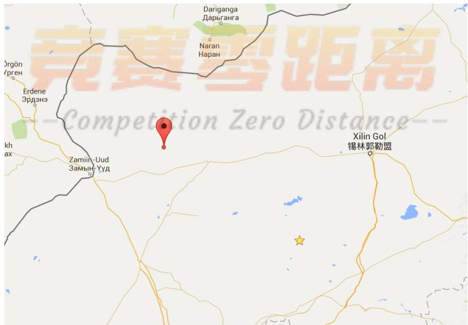

<details>
<summary>text_image</summary>

竞赛距离
Competition Zero Distance--
Xilin Gol
锡林郭勒盟
Dariganga
Дарыганга
Naran
Наран
Erdene
Эрдэнэ
kh
ax
Zamiin-Uud
Замын-Ууд
</details>

纬度为正即为北纬，经度为正代表为东经。图中两星标点即为上述两点。其中，带图钉的点为日期未定时的位置。年份不可确定。虽然本文在日期已知和未知的情况下都给出了答案，但是因为本题的计算方式存在一定的误差，因而满足目标函数最好的解并不一定是真实的解，进一步分析会在结果分析中给出。

## 6.4.4 结果分析

得到结果之后，与第三问类似，可以分别对特定的纬度与经度 ,l，以其对应的最小的离差标准化后的本问目标函数值为因变量，以纬度、经度为自变量作图分析。因当日期确定的情况下该部分的分析与日期未确定时类似，故本部分主要以日期未确定时的情况为样本，进行结果分析。所得图像如下：

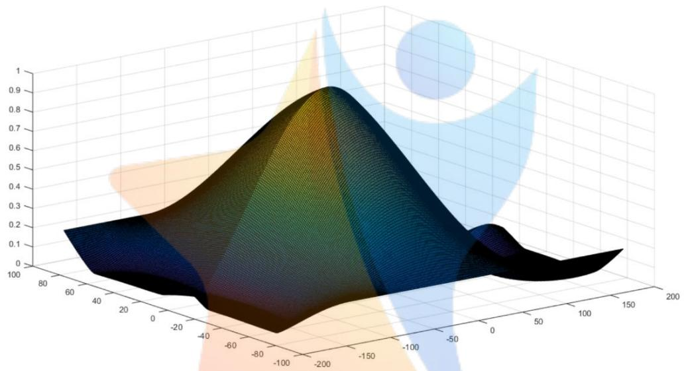

<details>
<summary>surface_3d</summary>

| X-axis | Y-axis | Z-axis |
| --- | --- | --- |
| -200~200 | -200~100 | 0~1 |
</details>

图6.4.4.1不同经纬度的理论影长与实际测得影长的误差值

图6.4.4.1反映的是不同经纬度的理论影长与实际测得的影长的吻合情况，图中，横轴为经度，经度为负即代表西经，为正即东经；纵轴为纬度，纬度为正时即北纬，为负时即南纬。竖轴为误差值，该值越小，代表理论影长与实际影长的误差越小，即目标吻合情况越好。

为了更好的描述目标函数值的相对大小，可对目标函数值做离差标准化,更易于绘图。

根据该图可以看出，当地点在东经110 度左右，西经150 度左右，误差明显减小，由此从该图可以看出，较为准确的定位应该在此范围内。为了更进一步的从图像上看出结果，可以将误差值大于 0.001 的点的误差值全部规定为 0.001，修正后得到的图如下：

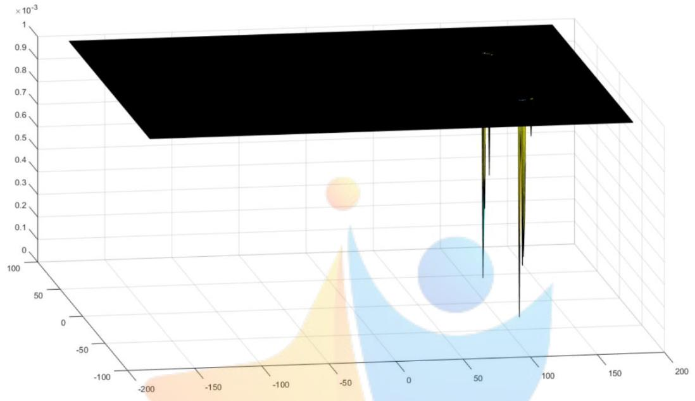

<details>
<summary>surface_3d</summary>

| X | Y | Z (x10^-3) |
| --- | --- | --- |
| -200~200 | -100~100 | ~0.95 ~0.5 |
</details>

图6.4.4.2修正后不同经纬度的理论影长与实际测得影长的误差值

从图 中可以明显的看出，存在两簇地理位置的点的误差很小，其位置分别在东经 度左右，北纬 度、南纬 度左右。因本题所采用的模型自身存在一定的误差，所以尽管各点对第一个目标的满足情况仍然有差异，但是不能排除这些点正确的可能。因而，图中的结果进一步体现了选择若干的可能点作为可能所在的位置的理由，并展示了这些结果的地理位置之间直观的相对关系。

对于日期确定的情况，可作类似的图如下：

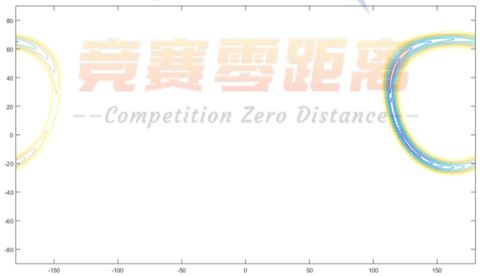

<details>
<summary>contour</summary>

| X | Y |
| --- | --- |
| ~-175 | ~68 |
| ~-175 | ~-22 |
| ~175 | ~68 |
| ~175 | ~-22 |
</details>

图6.4.4.3日期确定时修正后不同经纬度的理论影长与实际测得影长的误差值

图 6.4.4.3 给出了日期确定的情况下不同经纬度的理论影长与实际测得的影长的吻合情况。横轴为经度，纵轴为纬度，等高线状图代表着离差标准化后误差值相等的点。越蓝代表误差越小。同样的，可以看出在东经110 度左右，北纬40度、南纬10度左右存在两簇地理位置的点的误差很小。

对日期不定的情况下取误差值低于 $1 0 ^ { - 3 }$ 的点，附件三中的点取误差值小于0.05的点，得出的可能解如下：

表 6.3.4.3 第四问可能答案

<table><tr><td colspan="3">日期确定</td><td colspan="4">日期未定</td></tr><tr><td>经度</td><td>纬度</td><td>误差值</td><td>经度</td><td>纬度</td><td>日期</td><td>误差值</td></tr><tr><td>115</td><td>43</td><td>0</td><td>111</td><td>-44</td><td>12/5</td><td>0.000904</td></tr><tr><td>116</td><td>46</td><td>0.009332</td><td>112</td><td>-44</td><td>12/21</td><td>0.000711</td></tr><tr><td>114</td><td>39</td><td>0.016437</td><td>113</td><td>-44</td><td>12/28</td><td>0.000268</td></tr><tr><td>127</td><td>-6</td><td>0.017337</td><td>111</td><td>-43</td><td>11/26</td><td>3.73E-05</td></tr><tr><td>128</td><td>-7</td><td>0.022651</td><td>114</td><td>-43</td><td>1/4</td><td>0.000304</td></tr><tr><td>126</td><td>-5</td><td>0.027358</td><td>115</td><td>-43</td><td>1/9</td><td>0.000495</td></tr><tr><td>117</td><td>48</td><td>0.028334</td><td>120</td><td>-42</td><td>1/30</td><td>0.000835</td></tr><tr><td>133</td><td>-12</td><td>0.029911</td><td>121</td><td>-41</td><td>2/4</td><td>0.000927</td></tr><tr><td>129</td><td>-8</td><td>0.030939</td><td>118</td><td>40</td><td>5/1</td><td>0.000947</td></tr><tr><td>132</td><td>-11</td><td>0.032562</td><td>115</td><td>42</td><td>5/15</td><td>0.000955</td></tr><tr><td>130</td><td>-9</td><td>0.035856</td><td>116</td><td>42</td><td>5/11</td><td>0.000939</td></tr><tr><td>131</td><td>-10</td><td>0.036016</td><td>117</td><td>42</td><td>7/26</td><td>0.00046</td></tr><tr><td>134</td><td>-13</td><td>0.036652</td><td>113</td><td>43</td><td>5/30</td><td>0.000466</td></tr><tr><td>118</td><td>50</td><td>0.047725</td><td>114</td><td>43</td><td>7/7</td><td>0.000311</td></tr><tr><td>124</td><td>-2</td><td>0.04793</td><td>113</td><td>44</td><td>6/25</td><td>0</td></tr><tr><td></td><td></td><td></td><td>114</td><td>44</td><td>7/5</td><td>0.00074</td></tr></table>

上述的点为第四问中日期确认时与日期不确认时直杆可能的所在地及对应数据记录的日期，注意年份无法确定。误差值越小的可认为直杆在该位置的可能越大。

## 7. 模型的评价、改进及推广

## 7.1 模型评价

## 7.1.1 模型优点

本文中的模型具有以下优点：

1. 模型结构简单，在精度要求不高的情况下可以采纳。  
2. 求解时可采用遍历求解，在现有情况下提供了较为精确的答案。  
3. 采用多目标规划模型，并合理的根据模型采用的计算公式和实际情况决定目标的优先顺序，考虑更为周全。

4. 在提供现有模型给出的最可能解的前提下，模型可给出其他可能解，方便读者参考选择。

## 7.1.2 模型缺点

本文中的模型主要缺点如下：

1. 没有考虑诸如海拔等复杂的现实因素。  
2. 模型本身存在一定的误差，无法给出十分准确的答案。  
3. 第四问模型缺少通用性，因没有对视频进行透视矫正，所用方法并不适用于一般的视频。

## 7.1.3 模型改进

1. 在条件允许的情况下，多考虑如海拔等实际因素。  
2. 利用误差分析的结果对现有的模型做出修正，提高精准度。  
3. 在第四问模型中加以透视矫正，增强模型的通用性。

## 7.1.4 模型推广

1) 用于分析同一组照片拍摄的地点及时间。  
2) 检验视频或照片是否被为伪造品。

## 8. 参考文献

[1] PV Education, Azimuth Angle, http://www.pveducation.org/pvcdrom/propertiesof-sunlight/azimuth-angle, 2015/9/12  
[2] PV Education, Elevation Angle, http://www.pveducation.org/pvcdrom/propertiesof-sunlight/elevation-angle, 2015/9/12  
[3] PV Education, The Sun’s Position, http://www.pveducation.org/pvcdrom/properties-of-sunlight/suns-position , 2015/9/12  
[4] Reda I, Andreas A. Solar Position Algorithm for Solar Radiation Applications. 2003.  
[5] National Renewable Energy Laboratory, MIDC SPA Calculator, http://www.nrel.gov/midc/solpos/spa.html, 2015/9/13  
[6] Wikipedia, Position of the Sun. (2015, August 29), https://en.wikipedia.org/w/index.php?title=Position\_of\_the\_Sun&oldid=678477646, 2015/9/13  
[7] C Johnson. Sundial Time Correction - Equation of Time, http://mbsoft.com/public3/equatime.html, September 13, 2015  
[8] Wikipedia, Equation of time. (2015, May 27), https://en.wikipedia.org/w/index.php?title=Equation\_of\_time&oldid=664315122, September 13, 2015

## 附录

## 附录一：所用程序

1. MATLAB R2015a  
2. Adobe After Effect CC  
3. Adobe Photoshop CS

## 附录二：MATLAB源程序代码

第一问解答代码（Q1）：  
```matlab
clear all; clc;
L = 3;
LT = 9:0.001:15;
GMT=LT-8;
DateString = '22-Oct-2015';
DateString2 = '1-Jan-2015';
formatIn = 'dd-mmm-yyyy';
d= datenum(DateTimeString,formatIn) -
datenum(DateTimeString2,formatIn) + 1 ;
LONGITUDE=116.3914;
LATITUDE=39.0972;

dGMT = LT - GMT;
LSTM = 15.*dGMT;
B = (360./365).*(d - 81);
EoT = 9.87.*sin(2.*B./180.*pi) -
7.53.*cos(B./180.*pi) - 1.5.*sin(B./180.*pi);
TC = 4.*(LONGITUDE - LSTM) + EoT;
LST = LT + TC./60;
HRA = 15.*(LST - 12);
DEC = 23.45.*sin(B./180.*pi);

elevation =
asin(sin(DEC./180.*pi).*sin(LATITUDE./180.*pi) +
cos(DEC./180.*pi).*cos(LATITUDE./180.*pi).*cos(HR
A./180.*pi));
azimuth =
acos((sin(DEC./180.*pi).*cos(LATITUDE./180.*pi) -
```

```matlab
cos(DEC./180.*pi).*sin(LATITUDE./180.*pi).*cos(HR
A./180.*pi))./cos(elevation));
%azimuth = azimuth(elevation>0);
%elevation = elevation(elevation>0);

for i=1:length(azimuth)
    if LST(i)>12 || HRA(i)>0
        azimuth(i) = 2*pi - azimuth(i);
    end
end

%disp(elevation./pi.*180);
%disp(azimuth./pi.*180);
%polar(azimuth,L./tan(elevation),'-');
plot(LT,L./tan(elevation),'-');
xlabel('±±³⁄₄ŒÊ±¹⁄₄ä');
ylabel('Õ±,ËÓ°³¤');
title('Õ±,˵ÄÌ«ÑÔÓ°×Ó³¤¶ÈµÄ±ä»─ÇúÏß');
```  
第二问解答程序（Q2\_tol）

```matlab
data = xlsread('dataQ2' , 'sheet1' );
len = sqrt(data(:, 1) .^2 + data(:, 2) .^ 2);
left = 1 : ceil(length(len)/2);
right = ceil(length(len)/2) : (length(len) );
%left = 1 : length(len)-1;
%right = 2 : length(len);
bleft = left;
bright = right;

rateT = len(left) ./ len(right) ;
Xl = data(bleft , 1);
Xr = data(bright , 1);
Yl = data(bleft , 2);
Yr = data(bright , 2);

angleT =acos( (Xl .* Xr + Yl .* Yr) ./
( len(bleft) .* len(bright) ) );
longRange = - 180: 180;
latiRange = -90 : 90 ;
ErrorT = zeros(length(longRange) ,
length(latiRange));
```

```matlab
ErrorTA = zeros(length(longRange) ,
length(latiRange));

DateString = '11-Sep-2015';
DateString2 = '1-Jan-2015';
formatIn = 'dd-mmm-yyyy';
d= datenum(DateTimeString,formatIn) -
datenum(DateTimeString2,formatIn) + 1 ;
    L = 3;
    LT = 14.7 :0.05:15.7;
    %LT = T;
    GMT=LT- 8;
    dGMT = LT - GMT;
    LSTM = 15.*dGMT;
    B = (360./365).*(d - 81);
    EoT = 9.87.*sin(2.*B./180.*pi) -
7.53.*cos(B./180.*pi) - 1.5.*sin(B./180.*pi);

for i =1 : length(longRange)
    %disp(i);
    for j =1 : length( latiRange)
        LONGITUDE =longRange(i);
        LATITUDE = latiRange(j);

        TC = 4.*(LONGITUDE - LSTM) + EoT;
        LST = LT + TC./60;
        HRA = 15.*(LST - 12);
        DEC = 23.45.*sin(B./180.*pi);
        elevation =
asin(sin(DEC./180.*pi).*sin(LATITUDE./180.*pi) +
cos(DEC./180.*pi).*cos(LATITUDE./180.*pi).*cos(HR
A./180.*pi));
        azimuth =acos
(sin(DEC./180.*pi).*cos(LATITUDE./180.*pi) -
cos(DEC./180.*pi).*sin(LATITUDE./180.*pi).*cos(HR
A./180.*pi))./cos(elevation);
        azimuth(elevation < 0) = 0;

        angleP = abs(azimuth(bleft) -
azimuth(bright));
        %azimuth = azimuth(elevation>0);
        %elevation = elevation(elevation>0);
```

```matlab
%azimuth(LST > 12) = 2*pi - azimuth(LST > 12);
lenP = L ./tan(elevation);
lenP(elevation < 0) = 0;
rateP =lenP(left) ./ lenP(right) ;
ErrorT(i , j) = sqrt(sum(( rateT-rateP' ) .^ 2));
ErrorTA(i , j) = sqrt(sum((angleP-angleT' ) .^ 2));

end
end
Tmin = min(min(ErrorRT));
tol = 1.01*Tmin;
%ErrorT((ErrorT > tol)) = tol;
ErrorT((ErrorT > 1)) = 1;
ErrorTA((ErrorTA > 1)) = 1 ;
ErrorTA((ErrorT == tol)) = 1 ;
%ErrorT = ( ErrorT - min(min(ErrorRT))) /
(max(max(ErrorRT)) - min(min(ErrorRT)));
%ErrorTA = ( ErrorTA - min(min(ErrorRTA))) /
(max(max(ErrorTA)) - min(min(ErrorRTA)));
%ErrorTT = ErrorT + ErrorTA;
[X , Y] = meshgrid(longRange , latiRange);
%surf(X , Y , ErrorTT');
figure;
contour(X , Y , ErrorT(selectX , selectY)');
%figure;
%surf(X , Y , ErrorT');
%figure;
%contour(X , Y , ErrorTA');
%[a , b] = find(ErrorTT ==min(min(ErrorRT)));
```

## 第三问解答程序（Q3）

```matlab
clc;
clear all;
data = xlsread('dataQ2' , 'sheet2' );
xTemp = data(:, 1);
yTemp = data(:, 2);
T = (12 + 41/60 ): 1/20 : (13 + 41/60 );
len = sqrt(xTemp .^ 2 + yTemp .^ 2);
```

```matlab
%rateT = len(1 : ceil(length(len)/2)) ./
len(ceil(length(len)/2) : length(len) ) ;
rateT = len(1 : ( length(len) - 1)) ./ len(2 :
length(len) ) ;
%angleT =acos( (data(1 : ceil(length(len)/2) ,
1) .* data(ceil(length(len)/2) :
(length(len) ) , 1) + ...
 % data(1 : ceil(length(len)/2) , 2) .* data(ceil(length(len)/2) : (length(len) ) ,
2) )./ ...
 %( len(1 : ceil(length(len)/2)) .* len(ceil(length(len)/2) :
 %length(len) )) )
%angleT = acos((data(1 : length(len) - 1 , 1) .* data(2 : length(len) , 1) + ...
 %(data(1 : length(len) - 1 , 2) .* data(2:
(length(len) ) , 2))) ./...
 %(len(1 : length(len) - 1) .* len(2 :
length(len) )) );

 angleT = acos((xTemp(1 : length(len) - 1 ) .* xTemp(2 : length(len) ) + ...
 (yTemp(1 : length(len) - 1 ) .* yTemp(2:
(length(len) ) )) ./...
 (len(1 : length(len) - 1) .* len(2 :
length(len) )) );

%angleT =atan(yTemp (2 : length(len) ) ./ xTemp
(2 : length(len) ) ) - ...
 % atan(yTemp (1 : length(len) - 1) ./ xTemp
(1 : length(len) - 1) );
longRange = -180 : 180;
latiRange = -90: 90 ;
dateRange = 1 : 365 ;
ErrorT = zeros(length(longRange) ,
length(latiRange) , length(dateRange));
%ErrorTA = zeros(length(longRange) ,
length(latiRange));
for i =1 : length(longRange)
    disp(i);
    for j =1 : length( latiRange)
        for k = 1 : length( dateRange)
```

```matlab
d = k ;
LONGITUDE = longRange(i);
LATITUDE = latiRange(j);
L = 3;
LT = T;
GMT=LT- 8;
dGMT = LT - GMT;
LSTM = 15.*dGMT;
B = (360./365).*(d - 81);
EoT = 9.87.*sin(2.*B./180.*pi) -
7.53.*cos(B./180.*pi) - 1.5.*sin(B./180.*pi);
TC = 4.*(LONGITUDE - LSTM) + EoT;
LST = LT + TC./60;
HRA = 15.*(LST - 12);
DEC = 23.45.*sin(B./180.*pi);
elevation =
asin(sin(DEC./180.*pi).*sin(LATITUDE./180.*pi) +
cos(DEC./180.*pi).*cos(LATITUDE./180.*pi).*cos(HR
A./180.*pi));
%azimuth =acos
(sin(DEC./180.*pi).*cos(LATITUDE./180.*pi) -
cos(DEC./180.*pi).*sin(LATITUDE./180.*pi).*cos(HR
A./180.*pi))./cos(elevation);
%azimuth(elevation < 0) = 0;
% angleP = abs(azimuth(1 :
ceil(length(len)/2)) -
azimuth(ceil(length(len)/2) : length(len)));
% angleP = abs((azimuth(1 : length(len) -
1 ) - azimuth(2 : length(len))));
%azimuth = azimuth(elevation>0);
%elevation = elevation(elevation>0);
% azimuth(LST > 12) = 2*pi - azimuth(LST >
12);
lenP = L ./tan(elevation);
lenP(elevation < 0) = 0;
% rateP = lenP(1 : ceil(length(len)/2)) ./
lenP(ceil(length(len)/2) : length(len) );
rateP = lenP(1 : length(len) - 1) ./
lenP(2: length(len) );
ErrorT(i , j , k) = (sum(( rateT-
rateP' ) .^ 2));
% ErrorTA(i , j) = sqrt(sum((angleP-
```

```matlab
angleT' ) .^ 2));
    end
end
end
ErrorT((ErrorT > 1)) = 1 ;
%ErrorTA((ErrorTA >0.5)) = 0.5 ;
%ErrorT = ( ErrorT - min(min(ErrorT))) /
(max(max(ErrorT)) - min(min(ErrorT)));
%ErrorTA = ( ErrorTA - min(min(ErrorTA))) /
(max(max(ErrorTA)) - min(min(ErrorTA)));
%ErrorTT = ErrorT + ErrorTA;

RangeX = 1 : 361 ;
RangeY = 1 : 181;
[X , Y] = meshgrid(longRange(RangeX) ,
latiRange(RangeY));
min(ErrorT() , [] , 3);
[temp , test]= min(ErrorT() , [] , 3);
temp= ( temp - min(min(temp))) / (max(max(temp))
- min(min(temp)));
%surf(X , Y , temp');
A = temp(RangeX , RangeY);
A(A > 0.000001) = 0.000001;
%contour(X , Y , A')
%surf(X , Y , ErrorTT');
%surf(X , Y , A');
%surf(X , Y , ErrorTA');
acc = 1 * 10 ^( - 6);
[a , b] = find(A < acc);
a = a - 181 ;
b = b - 91;
c = [a b test( find(A < acc)) A(find(A < 
acc)) ];
```

## 第四问解答程序（Q4,日期已知）

```matlab
clc ;
clear all;
dataraw = xlsread('keyframeData' , 'sheet1' );
top = [891.2 205] ;
bottom = [891.2 885];
L = bottom(2) - top(2) ;
```

```matlab
len =sqrt((dataraw(:, 1) - top(1)) .^2 +
(dataraw(:, 2) - top(2)) .^2);
startTime= 8 + 54/60 + 7/3600;
endTime = 9 + 34/60 + 46/3600;
step = (endTime - startTime) / (length(dataraw) -
1);
elevationTest = L ./ len ;
T = startTime : step : endTime;
longRange = -180: 180;
latiRange = -90 : 90 ;
ErrorT = zeros(length(longRange) ,
length(latiRange));
%ErrorTA = zeros(length(longRange) ,
length(latiRange));
DateString = '13-July-2015';
DateString2 = '1-Jan-2015';
formatIn = 'dd-mmm-yyyy';
d= datenum(DateTimeString,formatIn) -
datenum(DateTimeString2,formatIn) + 1 ;
for i =1 : length(longRange)
    disp(i);
    for j =1 : length( latiRange)
        LONGITUDE = longRange(i);
        LATITUDE = latiRange(j);
        LT = T;
        GMT=LT- 8;
        dGMT = LT - GMT;
        LSTM = 15.*dGMT;
        B = (360./365).*(d - 81);
        EoT = 9.87.*sin(2.*B./180.*pi) -
7.53.*cos(B./180.*pi) - 1.5.*sin(B./180.*pi);
        TC = 4.*(LONGITUDE - LSTM) + EoT;
        LST = LT + TC./60;
        HRA = 15.*(LST - 12);
        DEC = 23.45.*sin(B./180.*pi);
        elevation =
(sin(DEC./180.*pi).*sin(LATITUDE./180.*pi) +
cos(DEC./180.*pi).*cos(LATITUDE./180.*pi).*cos(HR
A./180.*pi));
    %azimuth =acos
(sin(DEC./180.*pi).*cos(LATITUDE./180.*pi) -
cos(DEC./180.*pi).*sin(LATITUDE./180.*pi).*cos(HR
```

```matlab
A./180.*pi))./cos(elevation);
    %azimuth(elevation < 0) = 0;
    %angleP = abs(azimuth(1 : ceil(length(len)/2)) -
azimuth(ceil(length(len)/2) : length(len)));
    %angleP = abs(azimuth(1 : length(len) - 1 ) - azimuth(2 : length(len)));
    %azimuth = azimuth(elevation>0);
    %elevation = elevation(elevation>0);
    % azimuth(LST > 12) = 2*pi - azimuth(LST > 12);
    % lenP = L ./tan(elevation);
    % lenP(elevation < 0) = 0;
    % rateP =lenP(1 : ceil(length(len)/2)) ./lenP(ceil(length(len)/2) : length(len) ) ;
    %rateP =lenP(1 : length(len) - 1) ./lenP(2: length(len) );
    ErrorT(i , j) = sqrt(sum(( elevation-elevationTest' ) .^ 2));
    %ErrorTA(i , j) = sqrt(sum((angleP-angleT' ) .^ 2));
end
end

ErrorT((ErrorT > 1)) = 1 ;
%ErrorTA((ErrorTA >0.5)) = 0.5 ;
ErrorT = ( ErrorT - min(min(ErrorT))) / (max(max(ErrorT)) - min(min(ErrorT)));
%ErrorTA = ( ErrorTA - min(min(ErrorTA))) / (max(max(ErrorTA)) - min(min(ErrorTA)));
%ErrorTT = ErrorT + ErrorTA;
[X , Y] = meshgrid(longRange , latiRange);
%surf(X , Y , ErrorTT');
%surf(X , Y , ErrorT');
%surf(X , Y , ErrorTA');
count = 0 ;
for i =2 : length(longRange) - 1
    for j =2 : length( latiRange) - 1
        if( ErrorT(i , j) - ErrorT(i , j + 1) < 0 &&ErrorT(i , j) - ErrorT(i , j - 1) < 0 &&
ErrorT(i , j) - ErrorT(i + 1 , j ) < 0 ...
            && ErrorT(i , j) - ErrorT(i-1 ,
```

```matlab
j ) < 0 )
        count = count + 1 ;
        c(:, count) = [i-181 j-91 ErrorT(i , j)];
    end
end
end
contour(X ,Y , ErrorT');
%[a , b] = find(ErrorTT ==min(min(ErrorTT)));
```  
第四问解答程序（Q4\_2,日期未知）

```matlab
clc ;
clear all;
dataraw = xlsread('keyframeData' , 'sheet1' );
top = [891.2 205] ;
bottom = [891.2 885];
L = bottom(2) - top(2) ;
len =sqrt((dataraw(:, 1) - top(1)) .^2 +
(dataraw(:, 2) - top(2)) .^2);
startTime= 8 + 54/60 + 7/3600;
endTime = 9 + 34/60 + 46/3600;
step = (endTime - startTime) / (length(dataraw) -
1);
elevationTest = L ./ len ;
T = startTime : step : endTime;
longRange = -180: 180;
latiRange = -90 : 90 ;
dateRange = 1 : 365;
ErrorT = zeros(length(longRange) ,
length(latiRange) , length(dateRange));
%ErrorTA = zeros(length(longRange) ,
length(latiRange));
for i =1 : length(longRange)
    disp(i);
    for j =1 : length( latiRange)
        for k = 1 : length( dateRange)
            d = k ;
        LONGITUDE =longRange(i);
        LATITUDE = latiRange(j);
        LT = T;
        GMT=LT- 8;
```

```matlab
dGMT = LT - GMT;
LSTM = 15.*dGMT;
B = (360./365).*(d - 81);
EoT = 9.87.*sin(2.*B./180.*pi) -
7.53.*cos(B./180.*pi) - 1.5.*sin(B./180.*pi);
TC = 4.*(LONGITUDE - LSTM) + EoT;
LST = LT + TC./60;
HRA = 15.*(LST - 12);
DEC = 23.45.*sin(B./180.*pi);
elevation =
(sin(DEC./180.*pi).*sin(LATITUDE./180.*pi) +
cos(DEC./180.*pi).*cos(LATITUDE./180.*pi).*cos(HR
A./180.*pi));
%azimuth =acos
(sin(DEC./180.*pi).*cos(LATITUDE./180.*pi) -
cos(DEC./180.*pi).*sin(LATITUDE./180.*pi).*cos(HR
A./180.*pi))./cos(elevation);
%azimuth(elevation < 0) = 0;
%angleP = abs(azimuth(1 :
ceil(length(len)/2)) -
azimuth(ceil(length(len)/2) : length(len)));
%angleP = abs(azimuth(1 : length(len) - 1 )
- azimuth(2 : length(len)));
%azimuth = azimuth(elevation>0);
%elevation = elevation(elevation>0);
% azimuth(LST > 12) = 2*pi - azimuth(LST >
12);
% lenP = L ./tan(elevation);
% lenP(elevation < 0) = 0;
% rateP =lenP(1 : ceil(length(len)/2)) ./
lenP(ceil(length(len)/2) : length(len) );
%rateP =lenP(1 : length(len) - 1) ./
lenP(2: length(len) );
ErrorT(i , j , k) = sqrt(sum(( elevation-
elevationTest' ) .^ 2));
%ErrorTA(i , j) = sqrt(sum((angleP-
angleT' ) .^ 2));
end
end
end

ErrorT((ErrorT > 30)) = 30 ;
```

```matlab
RangeX = 1 : 361 ;
RangeY = 1 : 181;
[X , Y] = meshgrid(longRange(RangeX) ,
latiRange(RangeY));
[temp , test]= min(ErrorT() , [] , 3);
temp= ( temp - min(min(temp))) / (max(max(temp))
- min(min(temp)));
A = temp(RangeX , RangeY);
A(A > 0.1) =0.1;
surf(X , Y , A');
acc = 1 * 10 ^( - 6);
[a , b] = find(A < acc);
a = a - 181 ;
b = b - 91;
c = [a b test( find(A < acc)) A(find(A < 
acc)) ];
```  
太阳赤纬误差分析（Declination\_acc）

```matlab
figure;
d = 0:364;

DEC2 = -asin( 0.39779 * cosd(0.98565*(d+10) + 1.914 * sind(0.98565*(d-2)) ))/pi*180;

B = (360./365).*(d - 82);
DEC1 = 23.45.*sind(B);
%B = (360./365).*(d + 10);
%DEC1 = -23.44.*cosd(B);

spa = dlmread('Data/SPA_DEC_EoT_2015/data.txt');
spa = spa(:,1);

plot(0:5:364,spa(1:5:end),'kx',d,DEC1,d,DEC2);
legend('SPA Data','Method 1','Method 2');

disp(max(abs(DEC1'-spa)));
disp(max(abs(DEC2'-spa)));

disp(sum((DEC1'-spa).^2));
disp(sum((DEC2'-spa).^2));
```

```matlab
disp(mean(abs(DEC1'-spa)));
disp(mean(abs(DEC2'-spa)));
```  
时差误差分析（EoT\_acc）

```matlab
D = 0:364;
W = 360/365.24;
A = W.*(D+10);
B = A+1.914.*sind(W.*(D-2));
C = (A-atand(tand(B)./cosd(23.44)))/180;
EoT2 = 720.*(C-round(C));

B = (360./365).*(D - 80);
EoT1 = 9.87.*sin(2.*B./180.*pi) -
7.53.*cos(B./180.*pi) - 1.5.*sin(B./180.*pi);

spa = dlmread('Data/SPA_DEC_EoT_2015/data.txt');
spa = spa(:,2);

plot(0:5:364,spa(1:5:end),'kx',d,EoT1,d,EoT2);
legend('SPA Data','Method 1','Method 2');

disp(max(abs(EoT1'-spa)));
disp(max(abs(EoT2'-spa)));

disp(sum((EoT1'-spa).^2));
disp(sum((EoT2'-spa).^2));

disp(mean(abs(EoT1'-spa)));
disp(mean(abs(EoT2'-spa)));
```

总误差分析（Q1\_err）  
```matlab
clear all;
LT = 0:23;
GMT=LT-8;
d=1:365;
LONGITUDE=116.3914;
LATITUDE=39.0972;

%convert to matrix
d = repmat(d',1,24);
```

```matlab
LT = repmat(LT,365,1);

dGMT = 8;
LSTM = 15.*dGMT;

B = (360./365).*(d - 81);
EoT = 9.87.*sin(2.*B./180.*pi) -
7.53.*cos(B./180.*pi) - 1.5.*sin(B./180.*pi);
TC = 4.*(LONGITUDE - LSTM) + EoT;

LST = LT + TC./60;
HRA = 15.*(LST - 12);
DEC = 23.45.*sin(B./180.*pi);

D = d-1;
W = 360/365.24;
A = W.*(D+10);
B = A+1.914.*sind(W.*(D-2));
C = (A-atand(tand(B)./cosd(23.44)))/180;
EoT2 = 720.*(C-round(C));
TC2 = 4.*(LONGITUDE - LSTM) + EoT;
LST2 = LT + TC./60;
HRA2 = 15.*(LST - 12);
%DEC2 = -23.44.*cosd(A);
DEC2 = -asin( 0.39779 * cosd(0.98565*(D+10) +
1.914 * sind(0.98565*(D-2)) ))/pi*180;

elevation =
asin(sin(DEC./180.*pi).*sin(LATITUDE./180.*pi) +
cos(DEC./180.*pi).*cos(LATITUDE./180.*pi).*cos(HR
A./180.*pi));
azimuth =
acos((sin(DEC./180.*pi).*cos(LATITUDE./180.*pi) -
cos(DEC./180.*pi).*sin(LATITUDE./180.*pi).*cos(HR
A./180.*pi))./cos(elevation));

elevation2 =
asin(sin(DEC2./180.*pi).*sin(LATITUDE./180.*pi) +
cos(DEC2./180.*pi).*cos(LATITUDE./180.*pi).*cos(H
RA2./180.*pi));
azimuth2 =
acos((sin(DEC2./180.*pi).*cos(LATITUDE./180.*pi)
```

cos(DEC2./180.\*pi).\*sin(LATITUDE./180.\*pi).\*cos(H RA2./180.\*pi))./cos(elevation2));  
```matlab
azimuth(LST>12) = 2*pi - azimuth(LST>12);
azimuth(LST<0) = 2*pi - azimuth(LST<0);

azimuth2(LST>12) = 2*pi - azimuth2(LST>12);
azimuth2(LST<0) = 2*pi - azimuth2(LST<0);

elevation = 90-elevation./pi.*180;
elevation =
reshape(elevation',numel(elevation),1);
azimuth = (azimuth)./pi.*180;
azimuth = reshape(azimuth',numel(azimuth),1);

elevation2 = 90-elevation2./pi.*180;
elevation2 =
reshape(elevation2',numel(elevation2),1);
azimuth2 = (azimuth2)./pi.*180;
azimuth2 = reshape(azimuth2',numel(azimuth2),1);

spa = dlmread('Data/SPA_DEC_EoT_2015/angle.txt');
spa_ele = spa(:,1);
spa_azi = spa(:,2);

%special cases
TMP = abs(azimuth-spa_azi)>3;
id = find(TMP);
azimuth(id) = 360-azimuth(id);
azimuth2(id) = 360-azimuth2(id);

disp(mean(abs(elevation-spa_ele)));
disp(mean((elevation2-spa_ele)));

disp(mean(abs(azimuth-spa_azi)));
disp(mean(abs(azimuth2-spa_azi)));
```