# “互联网+”时代的出租车资源配置模型

摘 要

“打车难”一直是近年来社会关注的问题，随着“互联网+”时代的到来，建立在手机和移动互联网基础之上的打车服务平台实现了乘客与出租车之间信息互通，也影响着广大人民的打车问题。本文就出租车的资源配置现状，以及出租车公司补贴方案对打车难易程度的影响进行讨论与分析，进而推出更优的补贴方案。

针对问题（1），根据滴滴、快的智能出行平台搜集了 2015 年 9 月 9 日成都市 1 点至 点出租车的分布情况和乘客的需求情况，根据数据，绘制图像，得到成都市乘客需求的高峰期发生在早上 8-9 点和晚上 19 点；另外，为查看各时段的出租车和乘客的匹配情况，我们按每个时点计算了出租车分布和乘客需求的均值，并进行描图和分析。在此基础上，建立匹配模型：引入“最近邻”思想，以乘客为中心，按一定的半径画圆，以圈内出租车的总数量和乘客需求量来定义匹配度，并构建度量指标 $\dot { m } N _ { i } ( t )$ ，根据该指标得到打车由难到易所需的最小半径，即得出打车难易程度。根据度量指标和描出的图形，得出了不同“时空”出租车资源配置的“供求匹配”程度：从空间上，成都东、双流北、以及都江堰中心地带较易出现打车难问题；从时间上，打车较难的时间点集中在 8-10点，下午16点，傍晚19 点。

针对问题(2)，我们搜集了滴滴打车和快的打车的补贴方案数据，出租车司机和乘客在使用打车软件后，出租车的空驶率、乘客的等待时间和出租车司机与乘客的经济收益变化等数据；根据分析，补贴方案的存在，能充分调动司机和乘客使用软件的积极性，使得使用软件的人数持续增加，这既缩短了乘客打车等待的时间，也减少了司机的空驶率，故可以有效的缓解打车难的问题。但随着补贴的降低，乘客和司机对打车软件使用的激情开始降低，尤其在高峰时段，司机不需要使用软件接单，其空驶率也很低，而乘客即便使用打车软件，也会在高峰期打不到车，即出现打车难的问题；另外，由于老年人群不会使用打车软件，所以无论什么补贴政策，都不能缓解他们打车难的问题。

针对问题（ ），首先对问题（ ）所搜集的数据进行处理，计算出乘客的累计补贴和司机的累计补贴，利用SPSS 软件，以乘客累计补贴和司机累计补贴为自变量，以日均订单量 用户数的百分比为因变量进行 曲线拟合，且效果非常显著，并得到相应的经验公式。在此基础上提出新的补贴方案1：低峰时段出行并成功打到车的给予一定的现金或积分奖励；但根据前面的 曲线模型进行模拟，发现影响率稳定在 左右，基本不能缓解打车难问题，接着我们分析了不能缓解的根本原因，并在此基础上提出了补贴方案2：鼓励出租车前往人流密集处，打车软件可以通过大数据的实时分析，告诉司机哪个区域打车需求大，通过一定的现金或积分奖励，鼓励司机抢人流密集处的定单。通过举例，论证了方案 2能较好的缓解打车难问题，得出方案2是可行的。

关键词：匹配度 打车软件 打车难易程度 补贴方案

## 一．问题重述

城市人们在出行过程中，出租车是其重要的交通工具之一，但随着城市人口密度和车密度的增加，对交通运行带来了不便，所以即便一个城市的出租车数量大于需求量，也会出现打车难的问题。为了缓解这个问题，加上“互联网+”时代的到来，有多家公司比如滴滴、快的等依托移动互联网建立了打车软件服务平台，乘客可以事先预约打车，司机可以根据预约地点和当时所处位置，进行信息互通，为了争取用户使用，各家公司推出了不同的补贴方案。问题要求搜集相关数据，完成如下问题：

（1）根据搜集的数据，构造匹配指标，并分析在不同时间和不同空间的出租车资源的“供求匹配”程度；  
（2）分析滴滴、快的等打车软件公司的出租车补贴方案是否对“缓解打车难”有帮助，并得出结论；  
（3）根据问题（1）和（2）的结果，设计合理的补贴方案，并论证给出方案的合理性，提出建议。

## 二．模型假设

1．假设通过滴滴、快的智能出行平台搜集 2015 年的 9 月 9 号 1 点至 24 点出租车分布数据和乘客需求量数据是可靠的；  
2．假设搜集的出租车分布数据当时全部都是空载；  
3．假设搜集的乘客打车的需求都不会因为主观或者客观因素的改变而改变；  
4．在问题（1）中计算邻域半径时，按理应该采用地图距离，最好是基于可达的地图距离，但是，由于数据难于得到，故而此处暂且考虑地图球面距离；  
5．在论证问题（3）的方案2时，假设所有的出租车分布点都有 1%的出租车进行迁移。

## 三．符号说明

<table><tr><td>符号</td><td>说明</td><td>符号</td><td>说明</td></tr><tr><td> $p_{x_i}$ </td><td>第i个乘客数据点的经度</td><td>i</td><td>第i个乘客数据点</td></tr><tr><td> $p_{y_i}$ </td><td>第i个乘客数据点的纬度</td><td>j</td><td>第j个出租车数据点</td></tr><tr><td> $p_i$ </td><td>第i个乘客数据点的需求量</td><td>n</td><td>乘客数据点的个数</td></tr><tr><td> $p_{x_i}(t)$ </td><td>第t个时点第i个乘客数据点的经度</td><td>m</td><td>出租车数据点的个数</td></tr><tr><td> $p_{y_i}(t)$ </td><td>第 $t$ 个时点第 $i$ 个乘客数据点的纬度</td><td> $d(A,B)$ </td><td> $A,B$ 两点的球面距离</td></tr><tr><td> $p_i(t)$ </td><td>第 $t$ 个时点第 $i$ 个乘客数据点的需求量</td><td> $C$ </td><td>指定邻域半径</td></tr><tr><td> $T_{x_j}(t)$ </td><td>第 $t$ 个时点第 $j$ 个出租车数据点的经度</td><td> $A_i(t)$ </td><td>第 $t$ 个时点第 $i$ 个乘客数据点</td></tr><tr><td> $T_{y_j}(t)$ </td><td>第 $t$ 个时点第 $j$ 个出租车数据点的纬度</td><td> $B_j(t)$ </td><td>第 $t$ 个时点第 $j$ 个出租车数据点</td></tr><tr><td> $T_j(t)$ </td><td>第 $t$ 个时点第 $j$ 个出租车数据点的出租车分布数量</td><td> $N_i(t)$ </td><td> $A_i(t)$ 匹配度</td></tr><tr><td>LonA</td><td>点 $A$ 的经度</td><td> $N_i^{c_k}(t)$ </td><td>邻域半径取 $C_k$ 时, $t$ 时刻点第 $i$ 个乘客数据点 $A_i(t)$ 的匹配度</td></tr><tr><td>LatA</td><td>点 $A$ 的纬度</td><td> $k$ </td><td>领域半径的个数</td></tr><tr><td>LonB</td><td>点 $B$ 的经度</td><td> $mN_i(t)$ </td><td>度量指标</td></tr><tr><td>LatB</td><td>点 $B$ 的纬度</td><td> $C_k$ </td><td>第 $k$ 个领域半径</td></tr><tr><td> $R_1$ </td><td>地球半径</td><td> $N$ </td><td>城市人群</td></tr><tr><td> $N_1$ </td><td>老年人群</td><td> $N_2$ </td><td>一般人群</td></tr><tr><td> $D_1$ </td><td>日均订单量</td><td> $D_2$ </td><td>乘客累计补贴</td></tr><tr><td> $D_3$ </td><td>司机累计补贴</td><td> $D_4$ </td><td>用户数</td></tr></table>

## 四．问题分析

打车难包含出租车揽不到活，乘客打不到车这两层意思，也就是资源配置不合理。实际中，有的地方比如机场，扎堆了太多的出租车，因为机场往往离市区比较远，出租车载客去机场，往往不愿空车回来，可是航班到达有时间安排，乘客分布也是有疏有密，因此，往往导致出租车扎堆等待现象，最后能成功载上一个客人，一般要等待 1-2小时。这就出现了非常严重的资源浪费问题。因此，搭建乘客与出租车之间的信息互通平台，合理分配出租车资源，有效缓解乘客和出租车的平均等待时间，就显得意义非凡。

问题(1) 的分析：为了衡量不同时空出租车资源“供求匹配”程度，首先根据滴滴、快的智能出行平台搜集了2015年9月9日成都市1点至24点出租车的分布情况和乘客的需求情况，根据这些数据，作图同时反应出租车位置和乘客位置的分布情况，得到乘客需求较大的高峰期出现在早上 8-9 点和晚上 19 点；为更清晰查看各个时段的出租车和乘客的匹配情况，文中按每个时点计算了出租车分布和乘客需求的均值，并进行描图和分析。在此基础上，建立匹配模型：引入“最近邻”思想，以乘客为中心，按一定的半径画圆，以圈内出租车的总数量和乘客需求量来定义匹配度，并定义度量指标 $\dot { { \bf m } } N _ { i } ( t )$ 根据该指标找到打车由难到易所需的最小半径，得出打车难易程度。根据指标和描出的图形，得出了空间上，成都东，双流北，以及都江堰中心地带较易出现打车难问题。另外，我们还绘制了不同时点，乘客打车的难易度条形图，从时间上得到打车难易程度的分布。

问题(2) 的分析：我们搜集了滴滴打车和快的打车的补贴方案数据、滴滴打车在实施补贴方案以后，用户数和订单数的变化情况，出租车司机和乘客在使用打车软件后，出租车的空驶率，乘客的等待时间以及出租车司机和乘客的经济收益等数据；根据分析，由于补贴的存在，能充分调动乘客和司机使用软件的积极性，使得使用软件的人数会持续增加，这样既缩短了乘客打车时间的等待，也减少了司机的空驶率，故可以有效的缓解打车难的问题。但随着补贴的降低，乘客和司机对打车软件使用的激情开始降低，尤其在高峰时段，司机不需要使用软件接单，其空驶率也很低，而乘客即便使用打车软件，也会在高峰期打不到车，即出现打车难的问题；另外，老年人群占城市人口的 20%左右，由于他们不会使用打车软件，所以无论什么补贴政策，都不能缓解他们打车难的问题；以上这些问题为问题（3）中我们提出新的补贴方案提供依据。

问题(3) 的分析：首先对问题（2）所搜集的数据进行处理，计算出乘客的累计补贴和司机的累计补贴，利用 SPSS 软件，以乘客累计补贴和司机累计补贴为自变量，以日均订单量为因变量进行 S 曲线拟合，通过检验，效果非常显著，但若以用户量为因变量进行S 曲线的拟合，拟合效果不显著，所以我们只考虑以日均订单量为因变量的随机模拟，并且把日均订单量对应到问题(1)中的乘客需求量，由于计数单位的不同，后面重新提出以日均订单量/用户数的百分比为因变量的 S 曲线进行拟合，通过检验且其效果非常显著，并得到相应的经验公式，在此基础上提出了新的补贴方案 1：低峰时段出行并成功打到车的给予一定的现金或积分奖励；但根据前面的 曲线模型进行模拟，发现影响率稳定在 左右，基本不能缓解打车难问题，接着我们分析了不能缓解的根本原因：无论哪个时段，出租车的分布规律基本上处于一个不变的趋势，大致都是那些区域，在此基础上，提出了补贴方案 ：鼓励出租车司机前往人流密集处，打车软件可以通过大数据的实时分析，告诉司机哪个区域打车需求量大，通过一定的现金或积分奖励，鼓励司机抢人流密集处的定单。以高峰时段的早上8 点为例，根据计算和分析，论证了方案2 能较好的缓解打车难问题，说明该方案可行。

## 五．数据搜集

数据主要来源于互联网，其中问题(1)的出租车分布数据和乘客打车需求数据主要来源于滴滴快的智能出行平台(网址：http://v.kuaidadi.com/)。

## 六． 模型的建立与求解

## 6.1． 问题（1）的建模与求解

我们搜集了成都市 2015年9月9号从1点至24点，每隔1个小时的出租车分布数

据以及乘客打车需求数据，经过整理，数据如表 1-1所示。

表1-1 成都市2015 年9月9号从1点至24 点出租车和乘客分布数据

<table><tr><td colspan="6">1点钟</td><td colspan="6">2点钟</td><td>......</td><td colspan="6">24点钟</td></tr><tr><td colspan="3">出租车分布</td><td colspan="3">乘客</td><td colspan="3">出租车分布</td><td colspan="3">乘客</td><td></td><td colspan="3">出租车分布</td><td colspan="3">乘客</td></tr><tr><td>经度</td><td>纬度</td><td>数量</td><td>经度</td><td>纬度</td><td>需求</td><td>经度</td><td>纬度</td><td>数量</td><td>经度</td><td>纬度</td><td>需求</td><td></td><td>经度</td><td>纬度</td><td>数量</td><td>经度</td><td>纬度</td><td>需求</td></tr><tr><td>104.27</td><td>30.562</td><td>8</td><td>121.45</td><td>31.331</td><td>282</td><td>104.08</td><td>30.623</td><td>90</td><td>104.11</td><td>30.661</td><td>4</td><td></td><td>104.07</td><td>30.631</td><td>114</td><td>103.89</td><td>30.818</td><td>5</td></tr><tr><td>103.62</td><td>31.008</td><td>3</td><td>104.08</td><td>30.632</td><td>116</td><td>104.08</td><td>30.612</td><td>72</td><td>103.65</td><td>30.991</td><td>3</td><td></td><td>104.09</td><td>30.658</td><td>110</td><td>104.03</td><td>30.565</td><td>11</td></tr><tr><td>104.17</td><td>30.834</td><td>4</td><td>103.64</td><td>30.978</td><td>69</td><td>104.08</td><td>30.634</td><td>55</td><td>103.84</td><td>30.678</td><td>3</td><td></td><td>104.03</td><td>30.645</td><td>73</td><td>104.42</td><td>30.866</td><td>7</td></tr><tr><td>104.17</td><td>30.719</td><td>5</td><td>104.05</td><td>30.633</td><td>69</td><td>104.03</td><td>30.649</td><td>55</td><td>104.04</td><td>30.644</td><td>4</td><td></td><td>104.08</td><td>30.635</td><td>71</td><td>103.66</td><td>30.972</td><td>4</td></tr><tr><td>104.32</td><td>30.602</td><td>8</td><td>104.07</td><td>30.632</td><td>68</td><td>103.97</td><td>30.581</td><td>55</td><td>104.07</td><td>30.654</td><td>9</td><td></td><td>104.06</td><td>30.639</td><td>71</td><td>103.99</td><td>30.665</td><td>5</td></tr><tr><td>103.66</td><td>31.001</td><td>17</td><td>103.84</td><td>30.697</td><td>67</td><td>104.08</td><td>30.654</td><td>55</td><td>104.26</td><td>30.55</td><td>5</td><td></td><td>104.06</td><td>30.627</td><td>71</td><td>104.17</td><td>30.805</td><td>3</td></tr><tr><td>104.02</td><td>30.662</td><td>8</td><td>104.02</td><td>30.646</td><td>67</td><td>104.09</td><td>30.648</td><td>54</td><td>104.2</td><td>30.828</td><td>3</td><td></td><td>104.07</td><td>30.651</td><td>71</td><td>103.66</td><td>30.997</td><td>13</td></tr><tr><td>103.82</td><td>30.685</td><td>5</td><td>104.1</td><td>30.644</td><td>67</td><td>104.04</td><td>30.637</td><td>54</td><td></td><td></td><td></td><td></td><td>103.85</td><td>30.695</td><td>70</td><td>104.28</td><td>30.566</td><td>11</td></tr><tr><td>103.97</td><td>30.763</td><td>5</td><td>104.09</td><td>30.67</td><td>66</td><td>103.84</td><td>30.693</td><td>54</td><td></td><td></td><td></td><td></td><td>104.05</td><td>30.689</td><td>69</td><td>103.64</td><td>30.999</td><td>10</td></tr><tr><td>103.91</td><td>30.799</td><td>7</td><td>103.65</td><td>30.994</td><td>66</td><td>104.02</td><td>30.67</td><td>54</td><td></td><td></td><td></td><td></td><td>104.1</td><td>30.656</td><td>69</td><td>103.65</td><td>30.856</td><td>3</td></tr><tr><td>104.12</td><td>30.675</td><td>11</td><td>104.1</td><td>30.631</td><td>66</td><td>104.04</td><td>30.693</td><td>54</td><td></td><td></td><td></td><td></td><td>103.64</td><td>31.002</td><td>68</td><td>104.06</td><td>30.544</td><td>5</td></tr><tr><td>103.63</td><td>30.993</td><td>11</td><td>104.07</td><td>30.656</td><td>65</td><td>104.07</td><td>30.661</td><td>53</td><td></td><td></td><td></td><td></td><td>104.06</td><td>30.637</td><td>67</td><td>104.26</td><td>30.892</td><td>7</td></tr><tr><td>103.73</td><td>30.591</td><td>4</td><td>104.1</td><td>30.655</td><td>64</td><td>104.07</td><td>30.644</td><td>52</td><td></td><td></td><td></td><td></td><td>103.65</td><td>30.995</td><td>66</td><td>104.09</td><td>30.649</td><td>3</td></tr><tr><td>103.9</td><td>30.807</td><td>3</td><td>104.07</td><td>30.652</td><td>64</td><td>104.02</td><td>30.687</td><td>52</td><td></td><td></td><td></td><td></td><td>104.1</td><td>30.665</td><td>66</td><td>103.93</td><td>30.573</td><td>3</td></tr></table>

## 6.1.1．数据的描述分析

首先，针对表1-1所示的数据，我们绘制了二维散点图，散点图的点阵大小揭示了出租车数量或者乘客需求量的多少。

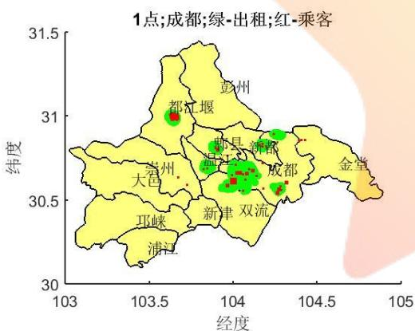

<details>
<summary>geo</summary>

| City | Type |
| --- | --- |
| 都汇堰 | Green |
| 郎县 | Green |
| 新都 | Green |
| 成都 | Green |
| 大邑 | Green |
| 新津 | Green |
| 双流 | Green |
| 邛崃 | Green |
| 浦江 | Green |
</details>

图1-1 成都市1点钟的分布图

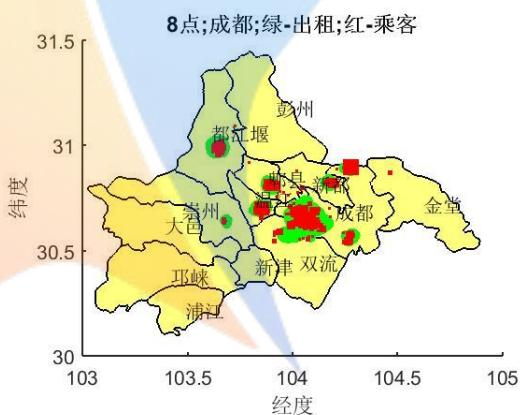

<details>
<summary>bubble</summary>

| City | Longitude (经度) | Latitude (纬度) |
| --- | --- | --- |
| 都江堰 | ~103.6 | ~31.0 |
| 彭州 | ~104.0 | ~31.2 |
| 崇良 | ~103.9 | ~30.8 |
| 浦都 | ~104.1 | ~30.8 |
| 成都 | ~104.3 | ~30.7 |
| 大邑 | ~103.5 | ~30.7 |
| 州峡 | ~103.6 | ~30.4 |
| 浦江 | ~103.6 | ~30.2 |
| 新津 | ~104.0 | ~30.5 |
| 双流 | ~104.1 | ~30.5 |
| 金堂 | ~104.8 | ~30.8 |
</details>

图 1-2 成都市8点钟的分布图

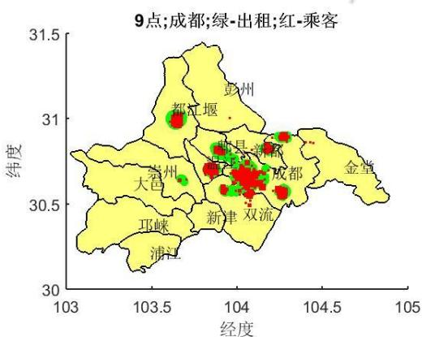

<details>
<summary>bubble</summary>

| City | Type |
| --- | --- |
| 都江堰 | Green |
| 彭州 | Red |
| 崇县 | Green |
| 新津 | Green |
| 成都 | Red |
| 大邑 | Green |
| 邛崃 | Red |
| 浦江 | Red |
| 金堂 | Red |
| 双流 | Green |
</details>

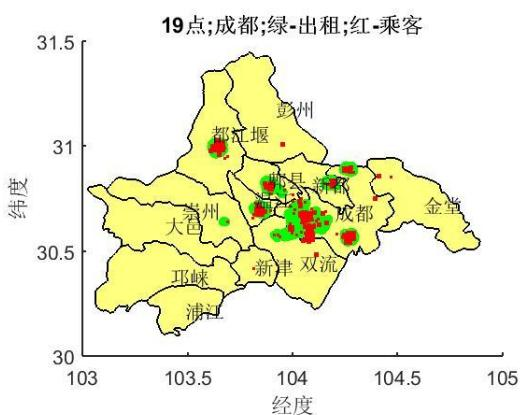

<details>
<summary>scatter</summary>

| Category | Longitude (range) | Latitude (range) |
| --- | --- | --- |
| Green-outage | 103.7~104.3 | 30.6~31.0 |
| Red-乘客 | 103.7~104.3 | 30.6~31.0 |
</details>

图1-3 成都市9点钟的分布图

图1-4 成都市19点钟的分布图

图1-1—图1-4绘出了 1点，8点，9点和19 点的成都市的出租车和乘客的分布图，全天 24 小时的分布图见附件 A。从这些图可以看出，无论何时，均存在一定的出租车分布和乘客需求，甚至午夜时分也存在着较大的乘客需求。通观全天，从这些图中，可以发现，乘客需求较大的高峰期发生在早上 8-9 点和晚上 19 点，因为此时红色区域所占的面积较大，较易发生“打车难”现象。

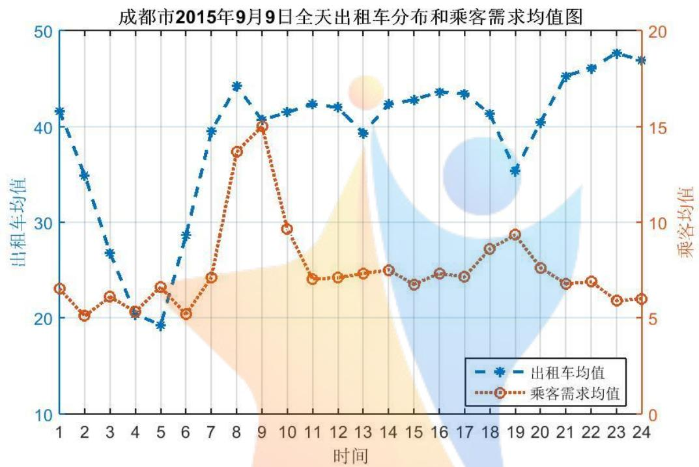

<details>
<summary>line</summary>

| 时间 | 出租车均值 | 乘客需求均值 |
| --- | --- | --- |
| 1 | ~42 | ~6.5 |
| 2 | ~35 | ~5.5 |
| 3 | ~27 | ~6.0 |
| 4 | ~21 | ~5.5 |
| 5 | ~19 | ~6.5 |
| 6 | ~29 | ~5.5 |
| 7 | ~40 | ~7.0 |
| 8 | ~44 | ~13.5 |
| 9 | ~41 | ~15.0 |
| 10 | ~42 | ~9.5 |
| 11 | ~43 | ~7.0 |
| 12 | ~42 | ~7.0 |
| 13 | ~40 | ~7.0 |
| 14 | ~43 | ~7.0 |
| 15 | ~44 | ~6.5 |
| 16 | ~44 | ~7.0 |
| 17 | ~42 | ~7.0 |
| 18 | ~36 | ~8.5 |
| 19 | ~41 | ~9.5 |
| 20 | ~45 | ~7.5 |
| 21 | ~46 | ~7.0 |
| 22 | ~48 | ~6.5 |
| 23 | ~47 | ~6.0 |
| 24 | — | — |
</details>

图1-5 成都市 2015年9月9日全天出租车分布和乘客需求均值图

为了更好的查看各个时段的出租车和乘客的匹配情况，我们按每个时点计算了出租车分布和乘客需求的均值，均值图见图 1-5。从图 1-5 可以看出，总体而言，成都市的各个时点的出租车平均数量大于乘客的平均需求量，大约相差2倍左右。因此，平均而言，不会出现“打车难”问题。

从图 1-5 我们还可以看出，出租车在凌晨 5 点的时候分布最少，平均大约 20 辆左右，这是 1 天中的最低点。而出租车分布的最高点出现在午夜 23 点左右，大约有近 50辆出租车，表明成都市民的夜生活还是蛮丰富的，从早 点到下午的 点，出租车基本稳定在40辆左右。

相对于出租车而言，乘客的需求量呈现出不一样的规律。早上8-9点是乘客需求最大的时候，平均而言，有近 个需求；此外，下午的 点也出现了乘客需求的小高峰，平均大约10个左右；其余时段中，白天的 11点至下午的17点，以及晚上的 20-22点基本稳定在8个需求左右；从午夜23点至第二天凌晨 6点，乘客需求最低，大约在 5个左右。

## 6.1.2．出租车和乘客的匹配模型

从前面的分析可知，虽然平均而言，不会出现“打车难”问题，但是从图 1-4 以及附录A的所有图形，可以看出，存在出租车和乘客需求分布不均衡现象。有的区域非常集中，而个别乘客分布点则非常孤立，周边基本上不存在出租车，显然，这也会导致打不到车的现象。

为此，下面我们主要以乘客为中心，建立匹配模型，以及衡量“打车难”程度的度量指标，分析成都市的出租车问题。

不难看出，每个时点，我们所采集的数据的具体位置不同。这一方面体现了数据的动态性和随机性，另一方面，也为我们进行出租车和乘客的匹配增加了难度。如何建立一个合理的模型以及指标，来衡量“打车难”的程度呢？

这里，我们引入“最近邻”的思想来进行匹配。所谓“最近邻”的思想，就是基于每个时点，每个乘客需求点，寻找离它最近的出租车进行匹配。但是这会导致一个问题，比如图 1-6 中的 A 点，即彭州南部的某点，该点处的乘客距离所有的出租车似乎都较远，如果硬要安排最近一辆出租车去接他，或许没有问题；但是从市场经济的角度出发，出租车司机应该不会空载那么长距离，单纯为了接这位乘客。

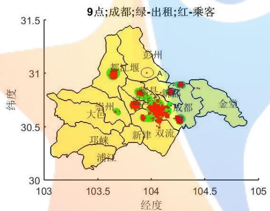

<details>
<summary>bubble</summary>

| City | Longitude (经度) | Latitude (纬度) |
| --- | --- | --- |
| 都江堰 | ~103.6 | ~31.0 |
| 彭州 | ~104.0 | ~31.0 |
| 崇县 | ~103.9 | ~30.8 |
| 成都 | ~104.2 | ~30.7 |
| 大邑 | ~103.6 | ~30.6 |
| 新津 | ~104.0 | ~30.5 |
| 双流 | ~104.1 | ~30.5 |
| 邓崃 | ~103.5 | ~30.4 |
| 浦江 | ~103.6 | ~30.3 |
</details>

图1-6 成都市9点的出租车和乘客需求图

所以，我们认为比较合理的匹配模型，应该是基于地图距离（当然，最好是基于可达的地图距离，但是，由于数据难于得到，故而此处暂且考虑地图球面距离），按照离乘客所在点一定距离的出租车圈来进行匹配，比如 500米，1千米，或者 2千米等。

记乘客数据结构为 $\{ ( P _ { x _ { i } } , P _ { y _ { i } } , P _ { i } ) , i { = } 1 , 2 , . . . , n . \}$ }这里，� 表示第i个乘客数据点的经度， $P _ { x _ { i } }$ $P _ { y _ { i } }$ 表示第 i 个乘客数据点的纬度， $P _ { i }$ 表示第 i 个乘客数据点的需求量。n 表示搜集到的乘客数据点个数，这里我们分不同时点进行考虑，因为不同的时点，会得到不同的乘客数据点集，以及不同的乘客数据点个数 n，为了表述的方便，我们在符号中可加入时间这个因素，得到的乘客数据点集合为

$$
\{(P _ {x _ {i}} (t), P _ {y _ {i}} (t), P _ {i} (t)), \quad i = 1, 2, \dots , n (t). \}
$$

其中 t=1, 2, …, 24.

相应的，我们可以得到出租车的数据点集

$$
\{(T _ {x _ {j}} (t), T _ {y _ {j}} (t), T _ {j} (t)), \quad j = 1, 2, \dots , m (t). \}
$$

其中， $T _ { x _ { j } } ( t )$ 表示第t个时点第j 个出租车数据点的经度， $T _ { y _ { j } } ( t )$ 表示第t个时点第j 个出租车数据点的纬度， $T _ { j } ( t )$ 表示第t个时点第j 个出租车数据点的出租车分布数量。

记 $d ( \mathrm { A } , \mathrm { B } )$ 表示 A，B 两点的球面距离，C 为指定的邻域半径，定义第 t 个时点第 i个乘客数据点 $A _ { i } ( t )$ 的匹配度为

$$
N _ {i} (t) = \left\{ \begin{array}{l l} 1, & \sum_ {j: d (A _ {i} (t), B _ {j} (t)) \leq C} T _ {j} (t) <   P _ {i} (t) \\ 0, & \sum_ {j: d (A _ {i} (t), B _ {j} (t)) \leq C} T _ {j} (t) = P _ {i} (t) \\ - 1, & \sum_ {j: d (A _ {i} (t), B _ {j} (t)) \leq C} T _ {j} (t) > P _ {i} (t) \end{array} \right.
$$

其中，t=1, 2, …, 24， $B _ { j } ( t )$ 表示第t个时点第j 个出租车数据点。不难看出，如果与乘客$A _ { i } ( t )$ 的距离不超过 C 的出租车之和大于乘客需求，即不会出现打车难问题，定义匹配度 $N _ { i } ( t )$ 等于-1。如果与乘客点 $A _ { i } ( t )$ 的距离不超过 C 的出租车之和小于乘客需求，则表明会出现打车难问题，定义此时的匹配度 $N _ { i } ( t )$ 等于1。如果恰好相等，则定义匹配度等于 0.

因此， $N _ { i } ( t )$ 值越大，打车就越难。

考 虑 到 本 题 我 们 获 取 的 是 经 度 纬 度 数 据 ， 可 根 据 网 站 （ 网 址 :http://www.cnblogs.com/ycsfwhh/archive/2010/12/20/1911232.html）所述方法计算地球上任意两点的间的距离。

设第一点 A 的经，纬度为(LonA, LatA)，第二点 B 的经、纬度为(LonB, LatB)，按照0度经线的基准，东经取经度的正值(Longitude)，西经取经度负值(-Longitude)，北纬取 90-纬度值(90- Latitude)，南纬取 90+纬度值(90+Latitude)，则经过上述处理过后的两点被计为(MLonA, MLatA)和(MLonB, MLatB)。那么根据三角推导，可以得到计算两点距离的如下公式：

$$
\mathrm{C} _ {0} = \sin (\mathrm{MLatA}) \times \sin (\mathrm{MLatB}) \times \cos (\mathrm{MLonA} - \mathrm{MLonB}) + \cos (\mathrm{MLatA}) \times \cos (\mathrm{MLatB})
$$

$$
\text {Distance} = R _ {1} \times \text {Arccos} (\mathrm{C} _ {0}) \times \text {Pi / 180}
$$

这里， $R _ { 1 }$ 和 Distance 单位相同，如果是采用 6371.004 千米作为半径，那么 Distance的单位就为千米。

前面所述的d(A,B)可相应的替换成这里的距离公式 Distance(A,B)。从而，邻域半径C 可取一系列值。本文取 100 米，200 米，…，1000 米，2 千米，…，50 千米等 59 个刻度，并分别标号为 $1 { , } 2 { , } 3 { , } { \ldots } { , } 5 9$ 。如表1-2所述。

表1-2 邻域半径 C（单位：千米）的格点取法以及对应序号

<table><tr><td>序号</td><td>1</td><td>2</td><td>3</td><td>...</td><td>9</td><td>10</td><td>11</td><td>...</td><td>58</td><td>59</td></tr><tr><td>半径C(单位:千米)</td><td>0.1</td><td>0.2</td><td>0.3</td><td>...</td><td>0.9</td><td>1</td><td>2</td><td>...</td><td>49</td><td>50</td></tr></table>

可以预计，领域半径越小，匹配度取1的概率越大，随着邻域半径逐步增大，匹配度会从1变向-1，也就是，在一个小的范围内打不到车，但如果较大范围的出租车都参与乘客订单竞争的话，乘客能顺利打到车的概率会明显增加。

由此，我们定义如下的打车难易度的度量指标：

$$
m N _ {i} (t) = \min _ {k} \{\mathrm{N} _ {i} ^ {c _ {k}} (t) = - 1, k = 1, 2, 3, \dots , 5 9 \}
$$

其中， $\mathsf { N } _ { i } ^ { c _ { k } } ( t )$ 表示邻域半径取 $c _ { k }$ 时，第 t 个时点第 i 个乘客数据点 $A _ { i } ( t )$ 的匹配度。度量指标 $m N _ { i } ( t )$ ，即为使得打车由难到易所需的最小半径所对应的序号，序号越大表明需要较大半径的出租车参与乘客数据点的运输，才能满足乘客的打车需求。即 $m N _ { i } ( t )$ 越大，表明成功打到车的难度越大；而 $m N _ { i } ( t )$ 越小，表明成功打到车的难度越小。

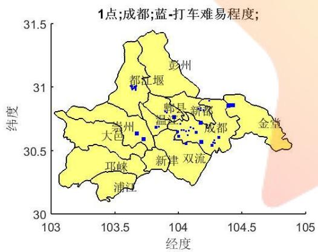

<details>
<summary>geo</summary>

| City | Longitude (经度) | Latitude (纬度) |
| --- | --- | --- |
| 都江堰 | ~103.7 | ~31.0 |
| 彭州 | ~104.0 | ~31.2 |
| 崇县 | ~104.0 | ~30.8 |
| 新都 | ~104.2 | ~30.8 |
| 成都 | ~104.3 | ~30.7 |
| 金堂 | ~104.5 | ~30.9 |
| 崇州 | ~103.6 | ~30.6 |
| 大邑 | ~103.7 | ~30.6 |
| 郎津 | ~104.0 | ~30.5 |
| 双流 | ~104.2 | ~30.5 |
| 邛峡 | ~103.6 | ~30.3 |
| 浦江 | ~103.6 | ~30.2 |
</details>

图1-7成都市1点的打车难易度图

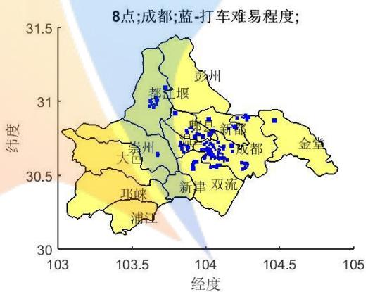

<details>
<summary>scatter</summary>

| 区域 | 经度 (range) | 纬度 (range) |
| --- | --- | --- |
| 都江堰 | 103.6~103.8 | 30.9~31.1 |
| 彭州 | 103.8~104.0 | 31.2~31.4 |
| 崇川 | 103.7~103.9 | 30.7~30.9 |
| 新都 | 103.9~104.2 | 30.7~30.9 |
| 成都 | 104.0~104.3 | 30.6~30.8 |
| 大邑 | 103.5~103.7 | 30.6~30.7 |
| 邻峡 | 103.4~103.6 | 30.3~30.4 |
| 浦江 | 103.5~103.7 | 30.2~30.3 |
| 新津 | 103.9~104.1 | 30.5~30.7 |
| 双流 | 104.0~104.2 | 30.5~30.7 |
| 金堂 | 104.2~104.5 | 30.6~30.8 |
</details>

图 1-8成都市8点的打车难易度图

图 1-7—图 1-10 给出了成都市 2015 年 9 月 $9 \boxed { \div } , 1$ 点，8点，9点和19点的难易度分布图。更多时点的图形参考附录B。

从这些图形可以看出，数据点面积最大的集中在早上 8-9 点和晚上 19 点，即早晚高峰上下班时段。这些时段打车难的区域主要集中在成都东这片区域。

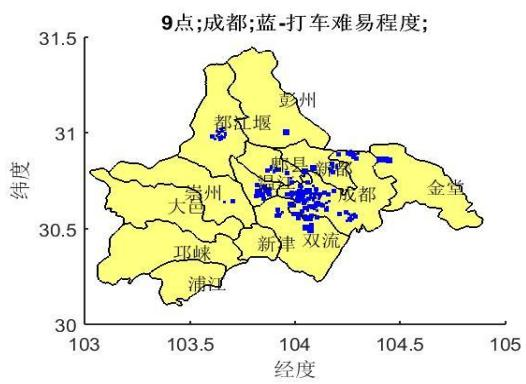

<details>
<summary>scatter</summary>

| 区域 | 经度 (range) | 纬度 (range) |
| --- | --- | --- |
| 都江堰 | 103.6~104.0 | 31.0~31.2 |
| 彭州 | 103.9~104.1 | 31.0~31.2 |
| 岩州 | 103.7~103.9 | 30.6~30.8 |
| 大邑 | 103.5~103.7 | 30.5~30.7 |
| 巴渠 | 103.8~104.1 | 30.6~30.8 |
| 新津 | 103.9~104.2 | 30.5~30.7 |
| 双流 | 104.0~104.2 | 30.5~30.7 |
| 成都 | 104.1~104.4 | 30.6~30.9 |
| 浦江 | 103.5~103.7 | 30.2~30.4 |
| 成都 | 104.2~104.4 | 30.8~30.9 |
| 金堂 | 104.4~104.6 | 30.8~30.9 |
</details>

图1-9成都市9点的打车难易度图

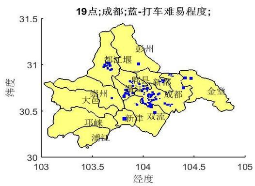

<details>
<summary>scatter</summary>

| City | Longitude (经度) | Latitude (纬度) |
| --- | --- | --- |
| 都江堰 | ~103.6 | ~31.0 |
| 彭州 | ~104.0 | ~31.0 |
| 崇州 | ~103.7 | ~30.6 |
| 大邑 | ~103.7 | ~30.6 |
| 那峡 | ~103.8 | ~30.4 |
| 浦江县 | ~103.8 | ~30.2 |
| 新津双流 | ~104.0 | ~30.4 |
| 肖县新都 | ~104.0 | ~30.7 |
| 成都 | ~104.2 | ~30.7 |
| 金堂 | ~104.5 | ~30.8 |
</details>

图1-10 成都市19点的打车难易度图

我们还绘制了所有时段乘客数据点的难易度散点图，见图 1-11。从图 1-11 可以看出，一般在2公里范围内的出租车即可满足乘客的打车需求，大部分在 1公里之内即可满足，只有极少部分数据点，需要 10 公里左右甚至更大，比如 30多公里的出租车才能满足。这些数据点就是打车最难的数据点。

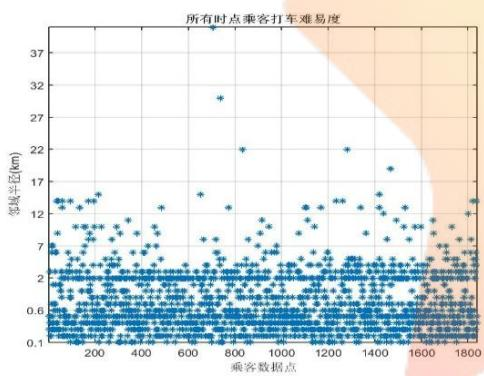

<details>
<summary>scatter</summary>

| 乘客数据点 | 隶城半径 (km) |
| --- | --- |
| ~100 | ~14 |
| ~200 | ~15 |
| ~700 | ~39 |
| ~800 | ~22 |
| ~1300 | ~22 |
| ~1450 | ~19 |
| ~1800 | ~14 |
</details>

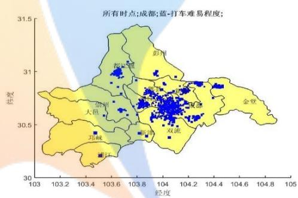

<details>
<summary>scatter</summary>

| 区域 | 经度 (range) | 纬度 (range) |
| --- | --- | --- |
| 金章 | 103.8~104.6 | 30.5~31.0 |
| 彭州 | 103.6~104.2 | 30.7~31.0 |
| 都江 | 103.6~103.9 | 30.9~31.1 |
| 嘉兴 | 103.8~104.2 | 30.6~30.9 |
| 大邑 | 103.4~103.7 | 30.6~30.8 |
| 巴林 | 103.4~103.6 | 30.4~30.5 |
| 西流 | 103.8~104.2 | 30.4~30.6 |
| 西藏 | 104.0~104.4 | 30.6~30.9 |
| 西川 | 103.8~104.2 | 30.6~30.9 |
| 西峡 | 103.8~104.2 | 30.6~30.9 |
| 西凉 | 103.8~104.2 | 30.6~30.9 |
| 西南 | 103.8~104.2 | 30.6~30.9 |
| 西北 | 103.8~104.2 | 30.6~30.9 |
| 西南 | 103.8~104.2 | 30.6~30.9 |
| 西北 | 103.8~104.2 | 30.6~30.9 |
| 西北 | 103.8~104.2 | 30.6~30.9 |
| 西北 | 103.8~104.2 | 30.6~30.9 |
| 西北 | 103.8~104.4 | 30.6~30.9 |
| 西北 | 103.8~104.4 | 30.6~30.9 |
| 西北 | 103.8~104.4 | 30.6~30.9 |
| 西北 | 103.8~104.4 | 30.6~30.9 |
</details>

图1-11所有时段乘客打车难易度散点 图1-12 所有时段乘客打车难易度分布

从所有时段的乘客打车难易度的分布图 12 来看，成都东，双流北，以及都江堰中心地带较易出现打车难问题。

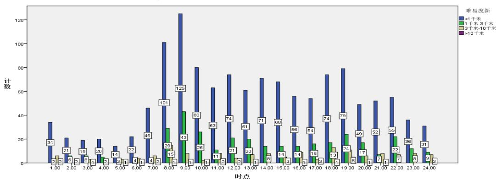

<details>
<summary>bar_stacked</summary>

| 时点 | <1千米 | 1千米-3千米 | 3千米-10千米 | >10千米 |
| --- | --- | --- | --- | --- |
| 1.00 | 34 | 2 | 6 | 2 |
| 2.00 | 21 | 6 | 5 | 2 |
| 3.00 | 19 | 6 | 5 | 2 |
| 4.00 | 20 | 7 | 5 | 2 |
| 5.00 | 14 | 5 | 4 | 2 |
| 6.00 | 22 | 4 | 4 | 2 |
| 7.00 | 46 | 4 | 6 | 2 |
| 8.00 | 101 | 29 | 15 | 1 |
| 9.00 | 125 | 43 | 8 | 1 |
| 10.00 | 80 | 26 | 3 | 1 |
| 11.00 | 63 | 11 | 4 | 1 |
| 12.00 | 74 | 21 | 5 | 2 |
| 13.00 | 61 | 20 | 8 | 2 |
| 14.00 | 71 | 14 | 8 | 2 |
| 15.00 | 68 | 14 | 3 | 2 |
| 16.00 | 56 | 14 | 3 | 2 |
| 17.00 | 54 | 16 | 3 | 2 |
| 18.00 | 74 | 13 | 3 | 2 |
| 19.00 | 79 | 24 | 5 | 2 |
| 20.00 | 49 | 17 | 5 | 2 |
| 21.00 | 52 | 7 | 7 | 2 |
| 22.00 | 55 | 22 | 7 | 2 |
| 23.00 | 36 | 8 | 8 | 2 |
| 24.00 | 31 | 9 | 9 | 2 |
</details>

图1-13 不同时段乘客打车难易度条图

图 1-13 绘制了不同时点，乘客打车的难易度条形图。由图可知，任何时点在不超过1千米的距离内都有出租车满足大部分乘客需求。早高峰时段出现在早上的8点-9点，傍晚19点会出现一个晚高峰时段；白天基本持平，深夜1点-5点的频数最低。

## 6.2．问题(2)的讨论

该部分通过搜集的信息和数据，主要讨论打车软件的补贴政策与打车难易程度之间的关系，并找出现有打车软件补贴政策变化带来的新的问题，为问题(3)构建新的打车方案做准备。详细分析如下：

## 6.2.1．滴滴打车和快的打车对乘客进行补贴的比较分析

根据收集的数据，滴滴打车和快的打车对乘客的补助如下表 2-1所示。（数据来源：http://chuansong.me/n/651901）

表2-1 2014 年2-1月滴滴打车和快的打车对乘客的优惠额度对比

<table><tr><td>时间</td><td>滴滴打车补贴方案</td><td>快的打车补贴方案</td></tr><tr><td>1月10日</td><td>每单减10元</td><td>减0元</td></tr><tr><td>1月20日</td><td>持续每单减10元</td><td>持续每单减10元</td></tr><tr><td>2月11日</td><td>每单减5元</td><td>每单减10元</td></tr><tr><td>2月17日</td><td>每单减10元,新司机首单50元</td><td>每单减11元</td></tr><tr><td>2月18日</td><td>每单减12-20元</td><td>每单减13元</td></tr><tr><td>3月3日</td><td>每单减12-20元</td><td>每单减10元</td></tr><tr><td>3月18日</td><td>每单减5元</td><td>每单减5元</td></tr><tr><td>3月22日</td><td>每单减5元</td><td>每单减3-5元</td></tr><tr><td>3月23日</td><td>每单减3-5元</td><td>持续每单减3-5元</td></tr></table>

纵观补贴方案的数据，可以得出如下结论：滴滴打车对司机的补贴 1 月 10 日为 10元，而快的为0元。然后滴滴打车出现先减后增的趋势，直到 3月3日后，补贴开始狂减至0元，这说明公司开始为了争取用户使用，增大补贴力度，而当用户群体达到一定份额后，对乘客的奖励逐渐取消，此时大部分乘客已经习惯使用打车软件进行打车，所以取消补贴，乘客的对打车软件使用率会降低，但不会明显下降，尤其是高峰时期为了减少等待时间乘客更愿意使用打车软件，以减少打车难的问题；而快的打车的补贴从开始就持续增加，目的是为了与滴滴打车竞争，争取更多的用户，后面开始减少补贴后其用户的变化和滴滴打车类似petitionZeroDistance-

## 6.2.2．滴滴打车和快的打车对司机进行补贴的对比分析

表2-2 2014年 1-3月滴滴打车和快的打车对司机的补贴额度对比

<table><tr><td>时间</td><td>滴滴打车补贴方案</td><td>快的打车补贴方案</td></tr><tr><td>1月10日</td><td>每单减10元</td><td>减0元</td></tr><tr><td>1月20日</td><td>持续每单减10元</td><td>每单减10元</td></tr><tr><td>1月21日</td><td>持续每单减10元</td><td>每单减15元</td></tr><tr><td>2月12日</td><td>持续每单减10元</td><td>每单减5元</td></tr><tr><td>2月17日</td><td>每单减5元</td><td>持续每单减5元</td></tr><tr><td>2月18日</td><td>持续每单减5元</td><td>每单减5-11元</td></tr><tr><td>2月19日</td><td>持续每单减5元</td><td>每单减5-13元</td></tr><tr><td>3月4日</td><td>每单减10元</td><td>持续每单减5-13元</td></tr><tr><td>3月22日</td><td>持续每单减10元</td><td>每单减2元</td></tr><tr><td>3月23日</td><td>每单减2元</td><td>持续每单减2元</td></tr></table>

滴 滴 打 车 和 快 的 打 车 对 司 机 的 补 助 如 上 表 2-2 所 示 （ 数 据 来 源 ：http://chuansong.me/n/651901）。纵观补贴方案的数据，滴滴打车对司机的补贴开始稳定在 10 元/单，后面开始逐渐减少，而快的打车的补助总体上比滴滴打车多，目的是抢占市场份额，当达到一定规模时，补贴降为 0。这其中包括：

(1).当补贴很高的时候，司机更愿意去接收订单，这一方面可以减少乘客的等待时间，但是对于没有使用软件下订单的乘客，他们很难打到车，对这一部分乘客增加了打车难度，而对其中老人小孩群体，会出现根本打不到车的局面。  
(2).当补贴降为 0 以后，根据调查（http://www.ithome.com/html/it/98292.htm）司机抢单热情下降，特别是打车高峰期，随时随地都可能拉到客人，所以总体上讲，打车的难易局面与没有打车软件的情形差不多。

## 6.2.3．从乘客的等待时间和出租车的空驶率讨论对“打车难易程度”的影响

针对滴滴打车，自补贴从 2014 年1月10 日开始以来，2014年1月-3月的注册用户量变化情况和日均订单量的增长情况如表2-3 所示。数据来源：

（http://news.mydrivers.com/1/298/298626.htm）

表 2-3 滴滴打车用户、日均订单占用户数据

<table><tr><td>日期</td><td>用户数</td><td>日均订单</td><td>日均订单/用户数</td></tr><tr><td>1月10日</td><td>2200万</td><td>35万</td><td>1.6%</td></tr><tr><td>2月9日</td><td>4000万</td><td>183万</td><td>4.6%</td></tr><tr><td>2月24日</td><td>8260万</td><td>316万</td><td>3.8%</td></tr><tr><td>3月27日</td><td>1亿</td><td>521.83万</td><td>5.2%</td></tr></table>

通过表2-3可以得出，滴滴打车从 2014年 1月至3月，随着补贴的进行，除了注册用户持续增加以外，订单数也持续增加，“订单/用户数”的百分比稳定在 4%-5%之间。通过市场份额的估算，截至 2014 年 12 月，中国打车 APP 累计账户规模达 1.72 亿，其中快的打车市场份额为 56.5%，滴滴打车为 43.3%，这说明补贴政策极大的吸引了打车用户的注册和下单；快的打车的变化情况和滴滴打车类似。

（数据来源：http://www.askci.com/news/chanye/2015/02/13/172139y4la.shtml）。

调查显示，使用打车软件后，94.0%的乘客打车等候时间在 10 分钟内，等候时间在10分钟以上的乘客比重下降了 29.9%。而使用打车软件后，90.3%的司机认为降低了空驶率，其中 55.0%的司机认为每月空驶率下降 10%以下，41.2%的司机认为每月空驶率下降 10-30%，3.9%的司机认为每月空驶率下降 30%以上。（数据来源：http://chuansong.me/n/651901）。

综上分析，司机的空驶率下降，说明载客率增加，乘客的等待时间减少，说明打车变得容易，所以通过前面的分析，有补贴政策，且补贴较高，司机和乘客都更愿意去使用打车软件，这样司机空驶率下降，乘客等待时间也下降，两个下降都使得打车变得容易。

## 6.2.4．从乘客和司机的经济收益讨论补贴方案对“打车难易”程度的影响

调查显示，2014年 1月以来，快的打车与滴滴打车在补贴金额上一直互相较劲，双方补贴金额合计在 25 亿以上。除补贴司机外，大部分补贴均被乘客获得。调查显示，81.0%的乘客认为节约了打车费用。

由于打车软件为司机每单提供补贴，这为司机提供加价收入来源。调查显示，在使用打车软件后，92.0%的司机认为平均每单收入有增加。其中，48.0%的司机认为平均每单收入增加10-30%，51.8%的司机认为平均每单收入增加 10%以下，0.2%的司机认为平均每单收入增加 30%以上。(数据来源：http://chuansong.me/n/651901)。

因此，无论从乘客的角度，还是从司机的角度，在经济方面都获得了收益，所以在这种经济补贴的环境下，双方都更愿意去使用打车软件，根据上面的结论，软件使用率越高，对使用软件打车的乘客，打车变得容易。

通过 1-4 的分析，我们将城市人群N 分类：老年人群 $N _ { \mathbf { 1 } }$ 和一般人群 $N _ { \imath }$ ；

(1). 对于老年人群 $N _ { \mathbf { 1 } }$ （20%左右），由于这部分人群使用智能手机的较少，也就是即便打车软件提供补贴，对他们的“打车难”问题仍然很难解决。  
(2). 对于一般人群 $N _ { \sb { 2 } }$ ，可以得出如下关系图 2-1：

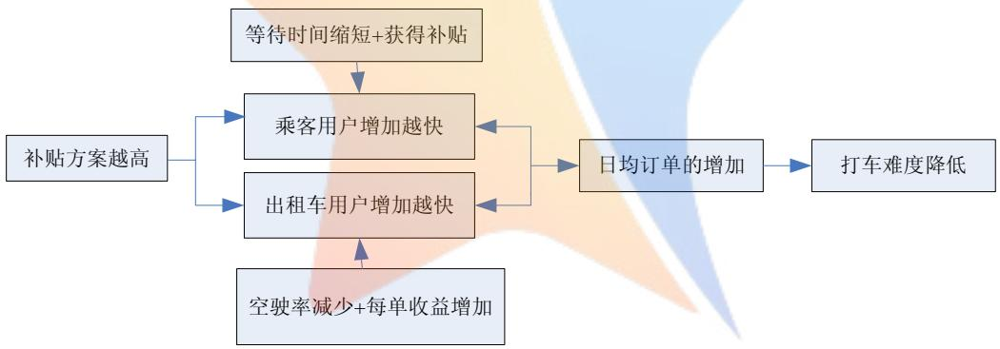

<details>
<summary>flowchart</summary>

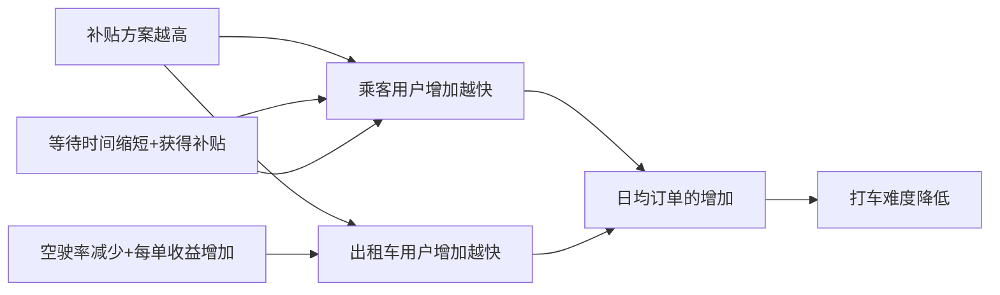
</details>

图2-1 补贴政策与打车难易程度关系图

也就是说针对人群N ，随着乘客和出租车司机补贴的存在或者提高，充分调动了他们使用软件的积极性，使得用软件的人数会持续增加，这样既缩短了乘客打车时间的等待，也减少了司机的空驶率，故可以有效的缓解打车难的问题。但随着补贴的降低，乘客和司机对打车软件使用的激情开始降低，尤其在高峰时段，司机不需要使用软件接单，其空驶率也很低；而乘客基本使用打车软件，在高峰期打车依然困难，这说明对补贴方案的改变和调整需要进一步讨论。

由于使用打车软件预约打车，尤其在高峰时段，司机由于可以享受打车补贴。所以没有预约需要打车的人，在高峰时段几乎打不到车，所以很多城市比如上海、济南等城市严禁高峰期使用打车软件。这也说明对打车软件公司的补贴政策需要进一步讨论。（数据来源: http://news.sohu.com/20140226/n395713186.shtml;

http://readmeok.com/2014-3/6\_29733.html）

## 6.3．问题(3)的设计方案

## 6.3.1．影响“打车难”可能的因素

根据北京晨报的报道，影响打车难的主要因素包括如下几个方面：

原因一：人多车少司机挑活儿；

原因二：司机收车常现空当儿；

原因三：禁限行路段宁愿空跑；

原因四：车辆调配不当效率差；

原因五：道路拥堵运营太耗时；

原因六：部分区域“黑车”当道；

原因七：新手不认路效率太低。

纵观以上因素，这些原因分别与职业道德、信息畅通、调度、信用、道路拥挤，外部竞争，职业素养等因素有关。而其中的调度直接和现有的打车软件有密切关系，所以在新的补贴方案中应考虑其他影响打车难的因素，比如错开高峰时段打车进行补贴，调动出租车去密集地区给予补助等。

## 6.3.2．借助 S曲线模型，恰当补贴，减缓打车难

通过对现有打车软件补贴方案的比较分析，我们可以看到，目前的补贴方案对时空的区分较少，千篇一律。虽然在一定程度上可以缓解打车难问题，但是对于高峰时段，以及那些很难打到车的区域效果不是太明显。

结合问题 的求解可知，人们出行集中在早晚高峰时段，即早上 点，和晚上点左右。其他时段，白天的打车需求相对于夜晚的较大。虽然白天的出租车分布也比夜晚的多，但二者相对来说可以持平。可是由于白天出租车流动性很大，从图 13 各个时段的分布图可以看出，白天如果人们要成功打到车，往往需要大约3公里之内的出租车参与运载才行。这也就意味着，人们为了成功打到车，往往需要等待一会，甚至较长的时间。所以，打车软件的补贴方案应该考虑不同时段区别对待，高峰时段和低峰时段的补贴应该有所不同，尽量引导人们避开高峰时段。

此外，我们还可以看到，就成都市而言，“打车难”容易出现的区域是有集中趋势的，比如成都东，双流北，这些地方往往是人流比较集中的地方，比如火车站（成都东站），或者机场（双流机场），或者学校，写字楼等等。因此，为了有效缓解“打车难”问题，在设计软件的时候需要加入区域的因素，也就是分流的思想。通过补贴引导乘客尽量走走路，从人流密集的，难于打到车的区域往人流稍微稀疏，较容易打到车的地方挪动。

鉴于此，我们设计了如下的补贴方案：

方案1：低峰时段出行并成功打到车的给予一定的现金或积分奖励；

方案 ：鼓励出租车前往人流密集处，打车软件可以通过大数据的实时分析，告诉司机哪个区域打车需求大，通过一定的现金或者积分奖励，鼓励司机抢人流密集处的定单。

下面，我们利用模拟对这两种方案的实施效果进行评价。

对问题 所搜集的数据，我们可以计算出乘客的累计补贴和司机的累计补贴，见表3-1。一般而言，补贴刚开始投入时，人们知之甚少，因此产生的效果也不是太明显；随着补贴的逐渐加大，补贴的累计效应将逐步产生，表现在用户数和日均订单量均显著增加；但到了后期，随着市场饱和等等因素的影响，补贴的效应将明显下降，用户数和日均订单量将趋于一个平衡状态。整个变化过程，可以用S 曲线来进行刻画。

表3-1 滴滴打车软件的补贴数据与 S 曲线预测结果

<table><tr><td>日期</td><td>间隔</td><td>乘客补贴(元)</td><td>司机补贴(元)</td><td>乘客累计补贴(元)</td><td>司机累计补贴(元)</td><td>用户数(万)</td><td>日均订单(万)</td><td>基于乘客累计补贴的日均订单量预测(万)</td><td>基于司机累计补贴的日均订单量预测(万)</td></tr><tr><td>2014/1/10</td><td>0</td><td>10</td><td>10</td><td>10</td><td>10</td><td>2200</td><td>35</td><td>33.21382</td><td>33.08413</td></tr><tr><td>2014/1/20</td><td>10</td><td>10</td><td>10</td><td>20</td><td>20</td><td></td><td></td><td>121.33963</td><td>125.65335</td></tr><tr><td>2014/1/21</td><td>11</td><td>10</td><td>10</td><td>30</td><td>30</td><td></td><td></td><td>186.88047</td><td>196.04641</td></tr><tr><td>2014/2/9</td><td>30</td><td>10</td><td>10</td><td>40</td><td>40</td><td>4000</td><td>183</td><td>231.92339</td><td>244.87886</td></tr><tr><td>2014/2/11</td><td>32</td><td>5</td><td>10</td><td>45</td><td>50</td><td></td><td></td><td>249.23255</td><td>279.83803</td></tr><tr><td>2014/2/12</td><td>33</td><td>5</td><td>10</td><td>50</td><td>60</td><td></td><td></td><td>264.00548</td><td>305.8748</td></tr><tr><td>2014/2/17</td><td>38</td><td>10</td><td>5</td><td>60</td><td>65</td><td></td><td></td><td>287.8228</td><td>316.52212</td></tr><tr><td>2014/2/18</td><td>39</td><td>20</td><td>5</td><td>80</td><td>70</td><td></td><td></td><td>320.63838</td><td>325.9429</td></tr><tr><td>2014/2/19</td><td>40</td><td>20</td><td>5</td><td>100</td><td>75</td><td></td><td></td><td>342.09734</td><td>334.33409</td></tr><tr><td>2014/2/24</td><td>45</td><td>20</td><td>5</td><td>120</td><td>80</td><td>8260</td><td>316</td><td>357.19537</td><td>341.8534</td></tr><tr><td>2014/3/3</td><td>52</td><td>20</td><td>5</td><td>140</td><td>85</td><td></td><td></td><td>368.38595</td><td>348.6284</td></tr><tr><td>2014/3/4</td><td>53</td><td>20</td><td>10</td><td>160</td><td>95</td><td></td><td></td><td>377.00836</td><td>360.3438</td></tr><tr><td>2014/3/18</td><td>67</td><td>5</td><td>10</td><td>165</td><td>105</td><td></td><td></td><td>378.86315</td><td>370.11543</td></tr><tr><td>2014/3/22</td><td>71</td><td>5</td><td>10</td><td>170</td><td>115</td><td></td><td></td><td>380.61716</td><td>378.3872</td></tr><tr><td>2014/3/23</td><td>72</td><td>5</td><td>2</td><td>175</td><td>117</td><td></td><td></td><td>382.27838</td><td>379.89132</td></tr><tr><td>2014/3/27</td><td>76</td><td>5</td><td>2</td><td>180</td><td>119</td><td>10000</td><td>521.83</td><td>383.85397</td><td>381.35057</td></tr></table>

所谓S 曲线模型，假定自变量为t，因变量为y，则S 曲线定义为：

$$
y = \exp \left(b _ {0} + \frac {b _ {1}}{t}\right)
$$

或者

$$
\log (y) = b _ {0} + \frac {b _ {1}}{t}
$$

其中 $b _ { 0 }$ 和 $b _ { 1 }$ 为待定常数，需要通过数据拟合得到。将 S 曲线模型代入 SPSS 软件，可以得到如下拟合结果。

表 3-2 日均订单量的S 曲线拟合的拟合度

<table><tr><td rowspan="5">自变量为乘客累计补贴</td><td colspan="4">模型摘要</td><td colspan="6">ANOVA</td></tr><tr><td>R</td><td>R平方</td><td>调整后的R平方</td><td>标准估算的错误</td><td></td><td>平方和</td><td>自由度</td><td>均方</td><td>F</td><td>显著性</td></tr><tr><td>.979</td><td>.959</td><td>.939</td><td>.290</td><td>回归(R)</td><td>3.963</td><td>1</td><td>3.963</td><td>47.131</td><td>.021</td></tr><tr><td colspan="4"></td><td>残差</td><td>.168</td><td>2</td><td>.084</td><td></td><td></td></tr><tr><td></td><td></td><td></td><td></td><td>总计</td><td>4.132</td><td>3</td><td></td><td></td><td></td></tr><tr><td rowspan="4">自变量为司机累计补贴</td><td>R</td><td>R平方</td><td>调整后的R平方</td><td>标准估算的错误</td><td></td><td>平方和</td><td>自由度</td><td>均方</td><td>F</td><td>显著性</td></tr><tr><td>.976</td><td>.953</td><td>.930</td><td>.310</td><td>回归(R)</td><td>3.939</td><td>1</td><td>3.939</td><td>40.914</td><td>.024</td></tr><tr><td colspan="4"></td><td>残差</td><td>.193</td><td>2</td><td>.096</td><td></td><td></td></tr><tr><td></td><td></td><td></td><td></td><td>总计</td><td>4.132</td><td>3</td><td></td><td></td><td></td></tr></table>

从表3-2可以看出，以乘客累计补贴和司机累计补贴为自变量，以日均订单量为因变量的 S 曲线拟合效果非常显著，R 平方非常接近于 1，方差分析的显著性水平也小于0.05。而 S 曲线拟合的系数估计见表格 3-3. 记 $D _ { 1 }$ 为日均订单量， $D _ { 2 }$ 为乘客累计补贴，$D _ { 3 } .$ 为司机累计补贴。

从表3-3我们可以得到如下经验公式：

$$
D _ {1} = \exp (6. 0 9 4 - \frac {2 5 . 9 1 3}{D _ {2}})
$$

或者

$$
D _ {1} = \exp (6. 1 6 8 - \frac {2 6 . 6 8 9}{D _ {3}})
$$

表 3-3 日均订单量的S 曲线拟合的参数估计

<table><tr><td rowspan="5">自变量为乘客累计补贴</td><td colspan="6">系数</td></tr><tr><td rowspan="2"></td><td colspan="2">非标准化系数</td><td>标准系数</td><td rowspan="2">t</td><td rowspan="2">显著性</td></tr><tr><td>B</td><td>标准错误</td><td>贝塔</td></tr><tr><td>1/乘客累计补贴</td><td>-25.913</td><td>3.774</td><td>-.979</td><td>-6.865</td><td>.021</td></tr><tr><td>(常量)</td><td>6.094</td><td>.195</td><td></td><td>31.181</td><td>.001</td></tr><tr><td rowspan="3">自变量为司机累计补贴</td><td>1/司机累计补贴</td><td>-26.689</td><td>4.173</td><td>-.976</td><td>-6.396</td><td>.024</td></tr><tr><td>(常量)</td><td>6.168</td><td>.217</td><td></td><td>28.380</td><td>.001</td></tr><tr><td colspan="6">因变量为 ln(日均订单)。</td></tr></table>

基于上述两个经验公式，我们可以得到日均订单量的预测值，见表格 3-1。对用户量为因变量的模型分析表明，S 曲线拟合效果不显著，故在接下来的分析中，我们只考虑以日均订单量为因变量的随机模拟。

我们把日均订单量对应到问题(1)中的乘客需求量。但是这里的单位是万，而问题(1)中的单位为个,为此，在进行模拟时，我们需要考虑日均订单量除以用户量的百分比，采用前面的S 曲线拟合，拟合结果见表 3-4和表3-5。

表3-4 日均订单量/用户数的百分比的S 曲线拟合的拟合度

<table><tr><td rowspan="5">自变量为乘客累计补贴</td><td colspan="4">模型摘要</td><td colspan="6">ANOVA</td></tr><tr><td>R</td><td>R 平方</td><td>调整后的 R 平方</td><td>标准估算的错误</td><td></td><td>平方和</td><td>自由度</td><td>均方</td><td>F</td><td>显著性</td></tr><tr><td>.955</td><td>.912</td><td>.868</td><td>.194</td><td>回归(R)</td><td>0.785</td><td>1</td><td>0.785</td><td>20.763</td><td>.045</td></tr><tr><td colspan="4"></td><td>残差</td><td>.076</td><td>2</td><td>.038</td><td></td><td></td></tr><tr><td></td><td></td><td></td><td></td><td>总计</td><td>0.861</td><td>3</td><td></td><td></td><td></td></tr><tr><td rowspan="4">自变量为司机累计补贴</td><td>R</td><td>R 平方</td><td>调整后的 R 平方</td><td>标准估算的错误</td><td></td><td>平方和</td><td>自由度</td><td>均方</td><td>F</td><td>显著性</td></tr><tr><td>.964</td><td>.929</td><td>.894</td><td>.174</td><td>回归(R)</td><td>0.800</td><td>1</td><td>0.800</td><td>26.325</td><td>.036</td></tr><tr><td colspan="4"></td><td>残差</td><td>.061</td><td>2</td><td>.030</td><td></td><td></td></tr><tr><td></td><td></td><td></td><td></td><td>总计</td><td>0.861</td><td>3</td><td></td><td></td><td></td></tr></table>

表3-5 日均订单量/用户数的百分比的 S 曲线拟合的参数估计

<table><tr><td rowspan="5">自变量为乘客累计补贴</td><td colspan="6">系数</td></tr><tr><td rowspan="2"></td><td colspan="2">非标准化系数</td><td>标准系数</td><td rowspan="2">t</td><td rowspan="2">显著性</td></tr><tr><td>B</td><td>标准错误</td><td>贝塔</td></tr><tr><td>1/乘客累计补贴</td><td>-11.532</td><td>2.531</td><td>-.955</td><td>-4.557</td><td>.045</td></tr><tr><td>(常量)</td><td>1.645</td><td>.131</td><td></td><td>12.553</td><td>.006</td></tr><tr><td rowspan="3">自变量为司机累计补贴</td><td>1/司机累计补贴</td><td>-12.026</td><td>2.344</td><td>-.964</td><td>-5.131</td><td>.036</td></tr><tr><td>(常量)</td><td>1.683</td><td>.122</td><td></td><td>13.788</td><td>.005</td></tr><tr><td colspan="6">因变量为  $\ln(\text{日均订单}/\text{用户数})$ </td></tr></table>

从表3-4可以看出，以乘客累计补贴和司机累计补贴为自变量，以日均订单量/用户数的百分比为因变量的 S 曲线拟合效果非常显著，R 平方非常接近于 1，方差分析的显著性水平也小于 0.05，由 S 曲线拟合的系数估计表 3-5，记 $D _ { 1 }$ 为日均订单量，$D _ { 2 }$ 为乘客累计补贴， $D _ { 3 } .$ 为司机累计补贴， $D _ { 4 }$ 为用户数；可以得到如下经验公式：

$$
D _ {1} / D _ {4} = \exp (1. 6 4 5 - \frac {1 1 . 5 3 2}{D _ {2}})
$$

或者

$$
D _ {1} / D _ {4} = \exp (1. 6 8 3 - \frac {1 2 . 0 2 6}{D _ {3}})
$$

表 3-6 日均订单/用户数百分比 S 曲线预测结果

<table><tr><td>时间</td><td>间隔</td><td>乘客补贴</td><td>司机补贴</td><td>乘客累计补贴</td><td>司机累计补贴</td><td>用户数</td><td>日均订单</td><td>百分比=日均订单/用户数</td><td>基于乘客累计补贴的百分比预测</td><td>基于司机累计补贴的百分比预测</td></tr><tr><td>2014/1/10</td><td>0</td><td>10</td><td>10</td><td>10</td><td>10</td><td>2200</td><td>35</td><td>1.590909091</td><td>1.63547</td><td>1.61726</td></tr><tr><td>2014/1/20</td><td>10</td><td>10</td><td>10</td><td>20</td><td>20</td><td></td><td></td><td></td><td>2.91108</td><td>2.95074</td></tr><tr><td>2014/1/21</td><td>11</td><td>10</td><td>10</td><td>30</td><td>30</td><td></td><td></td><td></td><td>3.52796</td><td>3.60563</td></tr><tr><td>2014/2/9</td><td>30</td><td>10</td><td>10</td><td>40</td><td>40</td><td>4000</td><td>183</td><td>4.575</td><td>3.88382</td><td>3.98572</td></tr><tr><td>2014/2/11</td><td>32</td><td>5</td><td>10</td><td>45</td><td>50</td><td></td><td></td><td></td><td>4.01025</td><td>4.23274</td></tr><tr><td>2014/2/12</td><td>33</td><td>5</td><td>10</td><td>50</td><td>60</td><td></td><td></td><td></td><td>4.11434</td><td>4.40587</td></tr><tr><td>2014/2/17</td><td>38</td><td>10</td><td>5</td><td>60</td><td>65</td><td></td><td></td><td></td><td>4.27557</td><td>4.47433</td></tr><tr><td>2014/2/18</td><td>39</td><td>20</td><td>5</td><td>80</td><td>70</td><td></td><td></td><td></td><td>4.48603</td><td>4.53386</td></tr><tr><td>2014/2/19</td><td>40</td><td>20</td><td>5</td><td>100</td><td>75</td><td></td><td></td><td></td><td>4.61724</td><td>4.58608</td></tr><tr><td>2014/2/24</td><td>45</td><td>20</td><td>5</td><td>120</td><td>80</td><td>8260</td><td>316</td><td>3.82566586</td><td>4.70684</td><td>4.63228</td></tr><tr><td>2014/3/3</td><td>52</td><td>20</td><td>5</td><td>140</td><td>85</td><td></td><td></td><td></td><td>4.7719</td><td>4.67342</td></tr><tr><td>2014/3/4</td><td>53</td><td>20</td><td>10</td><td>160</td><td>95</td><td></td><td></td><td></td><td>4.82129</td><td>4.74355</td></tr><tr><td>2014/3/18</td><td>67</td><td>5</td><td>10</td><td>165</td><td>105</td><td></td><td></td><td></td><td>4.83183</td><td>4.80108</td></tr><tr><td>2014/3/22</td><td>71</td><td>5</td><td>10</td><td>170</td><td>115</td><td></td><td></td><td></td><td>4.84178</td><td>4.84914</td></tr><tr><td>2014/3/23</td><td>72</td><td>5</td><td>2</td><td>175</td><td>117</td><td></td><td></td><td></td><td>4.85117</td><td>4.85782</td></tr><tr><td>2014/3/27</td><td>76</td><td>5</td><td>2</td><td>180</td><td>119</td><td>10000</td><td>521.83</td><td>5.2183</td><td>4.86006</td><td>4.86622</td></tr></table>

表3-6为日均订单/用户量百分比预测结果，可以看出后期稳定后，其影响的百分比在 5%左右。

在模拟时，我们首先需要设定乘客的补贴标准，比如我们按每天补贴 1-5 元不等，补贴1个月，按30天计算，可以得到模拟的日均订单量/用户量的百分比。假定问题(1)所获得的出租车分布数据不变，然后结合补贴方案 以及百分比的 曲线拟合值，乘以问题 中所获得乘客的需求数据，即可得到在方案 下，乘客需求的变化情况，从而可进行方案 在缓解打车难问题上的评价。

## 6.3.3．方案 1的模拟评价

方案1：低峰时段出行并成功打上车的给予一定的现金或积分奖励。

问题(1)的求解中，我们已经指出早高峰时段出现在早上8点-9点，晚小高峰时段是傍晚 点。为了说明补贴方案 的是否合理。我们假定预计在 点钟出行的乘客，在补贴方案1的鼓励下，提前至早上 7点出行，看看能否显著的缓解打车难问题。

经过测算，相应的 Matlab 代码见附录 C。我们发现，若按 S 曲线模型，最后稳定在 5%左右的影响率的话，基本上不会太影响问题(1)中所定义的难易度。也就是，如果仅是乘客避让高峰期，而且是在补贴方案影响不大的情况下，很难缓解打车难问题。

究其原因，通过对附录 A的出租车分布图进行比较分析，我们发现，无论哪个时段，出租车的分布规律基本上处于一个不变的趋势，大致都是那些区域。

所以，为了缓解打车难，我们得从出租车入手。

## 6.3.4．方案 2的模拟评价

基于方案 1 的评价，我们提出了让出租车跑起来的方案 2，希望方案 2 能有效缓解打车难问题。

方案 2：鼓励出租车前往人流密集处，打车软件可以通过大数据的实时分析，告诉司机哪个区域打车需求大，通过一定的现金或者积分奖励，鼓励司机抢人流密集处的定单。

我们依然以高峰时段的早上8点为例进行评价。

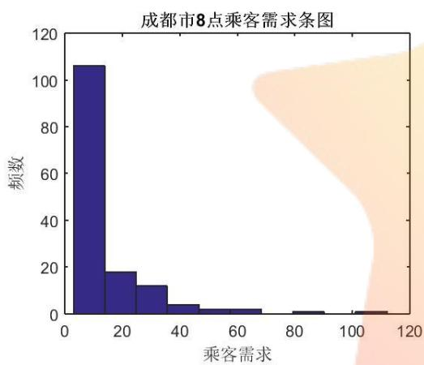

<details>
<summary>histogram</summary>

| 乘客需求 (Bin) | 频数 |
| --- | --- |
| 0~15 | ~107 |
| 15~25 | ~18 |
| 25~35 | ~13 |
| 35~45 | ~5 |
| 45~65 | ~3 |
| 80~90 | ~2 |
| 100~110 | ~2 |
</details>

图3-1 成都市8点乘客需求条型图

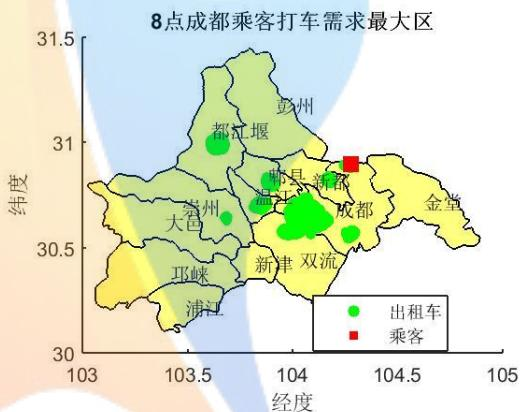

<details>
<summary>bubble</summary>

| Category | 经度 (range) | 纬度 (range) |
| --- | --- | --- |
| 出租车 | 103.6~104.3 | 30.5~31.0 |
| 乘客 | ~104.3 | ~30.9 |
</details>

图3-2 成都市8点打车需求最密集点

早上8点，成都市的乘客需求的条形图见图 3-1，从图3-1可知，有 72.6%的乘客数据点的打车需求 辆左右， 的乘客数据点的打车需求在 辆左右，只有极少数数据点的打车需求超过 30辆。

不难发现 8 点的乘客需求中，有一个是极端点，该点的经度为 104.277，纬度为，乘客的打车需求达到了 辆，远远大于其他数据点。见图 中的红色方框所在地。从地图对应关系来看，大致可以判断该点是西南石油大学所在地，而我们的数据采集是 2015 年 9 月 9 号，恰逢新生入学报到，故而出租车的需求会明显高于其他地方。

假如该点的乘客发出订单，表明有打车需求，如果打车软件鼓励较远的出租车司机进行抢单，抢单并搭载成功，按距离远近给予不同程度的奖励，采用 S 曲线的初始值1%的影响率，假如所有的出租车分布点都有1%的出租车迁移到该点，我们看看情况会如何呢？

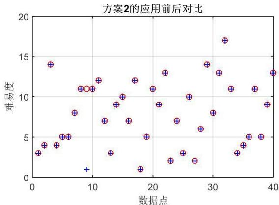

<details>
<summary>scatter</summary>

| 数据点 | 难易度 |
| --- | --- |
| ~1 | ~3 |
| ~2 | ~4 |
| ~3 | ~14 |
| ~5 | ~4 |
| ~6 | ~5 |
| ~7 | ~5 |
| ~8 | ~8 |
| ~9 | ~11 |
| ~10 | ~11 |
| ~11 | ~12 |
| ~12 | ~7 |
| ~13 | ~3 |
| ~14 | ~9 |
| ~15 | ~10 |
| ~16 | ~7 |
| ~17 | ~12 |
| ~18 | ~1 |
| ~19 | ~5 |
| ~20 | ~11 |
| ~21 | ~9 |
| ~22 | ~13 |
| ~23 | ~2 |
| ~24 | ~7 |
| ~25 | ~3 |
| ~26 | ~10 |
| ~27 | ~2 |
| ~28 | ~6 |
| ~29 | ~14 |
| ~30 | ~8 |
| ~31 | ~13 |
| ~32 | ~17 |
| ~33 | ~11 |
| ~34 | ~3 |
| ~35 | ~4 |
| ~36 | ~5 |
| ~37 | ~11 |
| ~38 | ~5 |
| ~39 | ~9 |
| ~40 | ~13 |
</details>

图3-3方案2的应用前后对比图

图3-3绘制了乘客部分数据点使用方案2前后的打车难易度对比结果，相应的Matlab代码见附录C。不难看出，方案 2使用后，第9 个数据点（也就是前面的打车需求最大的数据点）的打车难度显著下降，从原来的难易度为 11下降到现在的1，而其他数据点的变化几乎为0。这表明针对乘客打车密集点的补贴方案 2能较好的缓解打车难问题。

## 七．模型评价与展望

本文针对“互联网+”时代的出租车资源配置的评价以及优化问题进行了数据分析和数学建模。搜集了成都市 2015 年 9 月 9 日的出租车分布以及乘客打车需求数据。基于该数据，通过统计分析以及数学建模手段，给出了评判出租车资源“供求匹配”程度大小，即难易度度量指标。借助于该指标，我们得出了时间上，成都市早上8-9点是出租车打车的高峰时段，傍晚 18 点是另一个小高峰时段。这两个时段较易出现打车难问题。而通过区域比较分析，空间上，我们发现成都东火车站，以及双流北，大约在双流机场等位置，较易出现打车难问题。

对现行的最流行的滴滴打车和快的打车软件的补贴措施的比较分析，我们发现，现行的补贴措施主要是为了吸引用户，扩大软件影响力。当然，这也大大提高了用户使用软件打车率，在一定程度上缓解了打车难问题。但是，应该看到，这样的补贴措施，不分时段，不分地点，没有侧重点，没有体现时空差异，以及大数据时代的数据时效性，以及实时监控策略，存在着一定的不足之处。

基于问题(1)的求解，以及问题(2)中各大软件补贴存在的问题，在问题(3)中，我们提出了 2 种设计软件的补贴方案。经过建模分析，我们发现方案 1，基于乘客避让高峰的补贴措施效果并不明显；而方案2，鼓励出租车司机接纳打车密集地乘客订单的方案，在缓解打车难问题上，效果显著。

未来的研究方向，我们可以搜集更多一些的数据，比如北京，上海，广州等一线城市的，以及其他二、三线城市的出租车运行数据，利用本文所建立的模型来评价各个地方的出租车“供求匹配”程度大小。此外，我们还可以搜集一周，或者一个月，或者一季度，一年的数据，进一步探讨出租车“供求匹配”随时间的变化趋势。除此之外，我们的老年人由于使用智能手机的人数较少，所以没办法通过打车软件进行打车，所以打车软件公司可以专门设置搭乘老年人额外奖励的方案，缓解老年人打车难的问题。总之，还可以提出更好的补贴方案，优化出租车资源配置，缓解打车难问题。

## 参考文献

[1] 姜启源，数学模型，北京：高等教育出版社，2007.  
[2] 张圣勤，MATLAB 7.0实用教程，北京：机械工业出版社，2006.  
[3] 罗聪坤，关于出租车打车软件问题的研究，兰州教育学院学报，第31卷第 3期：1-3，2015.  
[4] 随心，滴滴打车用户数正式破亿，http://news.mydrivers.com/1/298/298626.htm，2015-09-12.  
[5] 汪光焘等，关于加强打车软件综合管理的建议，城市交通，2014年第5期，1-3，2014.  
[6] 胡建军等，基于最近邻优先的高校聚类算法，四川大学学报（工程科学版），第36卷第6 期，3-6，2004.  
[7] 张文彤，SPSS统计分析基础教程（第二版），北京：高等教育出版社，2011.  
[8] 宋晓霞，基于MATLAB的通用数据拟合办法，山东大同大学学报（自然科学版），第 30 卷第4 期，2-4，2014.


<details>
<summary>natural_image</summary>

Abstract star-shaped graphic with a stylized human figure in blue and yellow, no text or symbols present.
</details>

##

附录：

附录 A.成都市各个时点出租车和乘客的分布散点图  
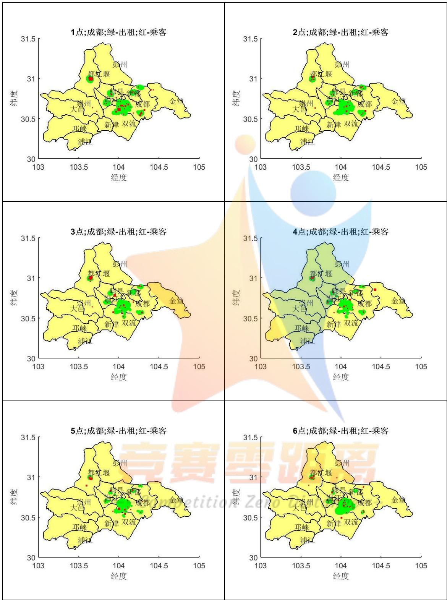

<details>
<summary>geo</summary>

| Map ID | Location Description |
| --- | --- |
| 1 | Chengdu Green-Export Red Passenger Area (Yellow/Green) |
| 2 | Chengdu Green-Export Red Passenger Area (Yellow/Green) |
| 3 | Chengdu Green-Export Red Passenger Area (Yellow/Green) |
| 4 | Chengdu Green-Export Red Passenger Area (Yellow/Green) |
| 5 | Chengdu Green-Export Red Passenger Area (Yellow/Green) |
| 6 | Chengdu Green-Export Red Passenger Area (Yellow/Green) |
</details>

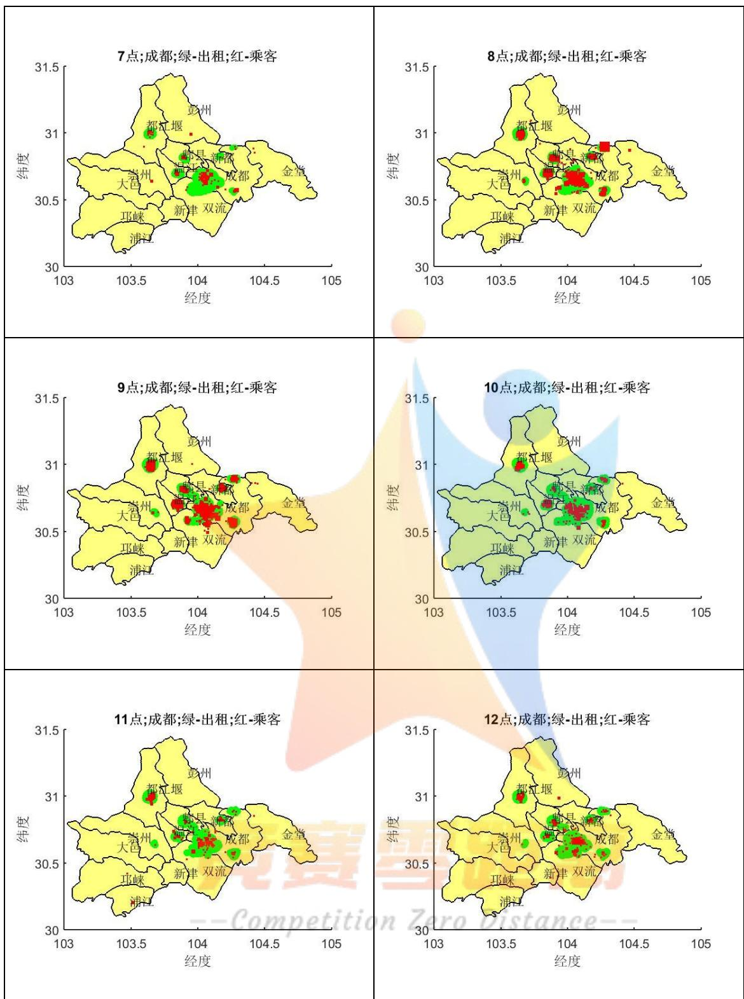

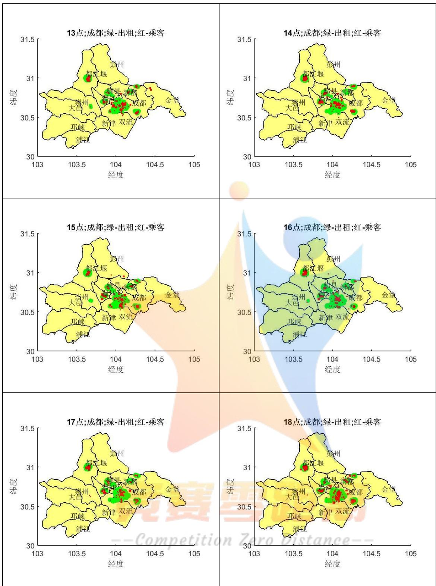

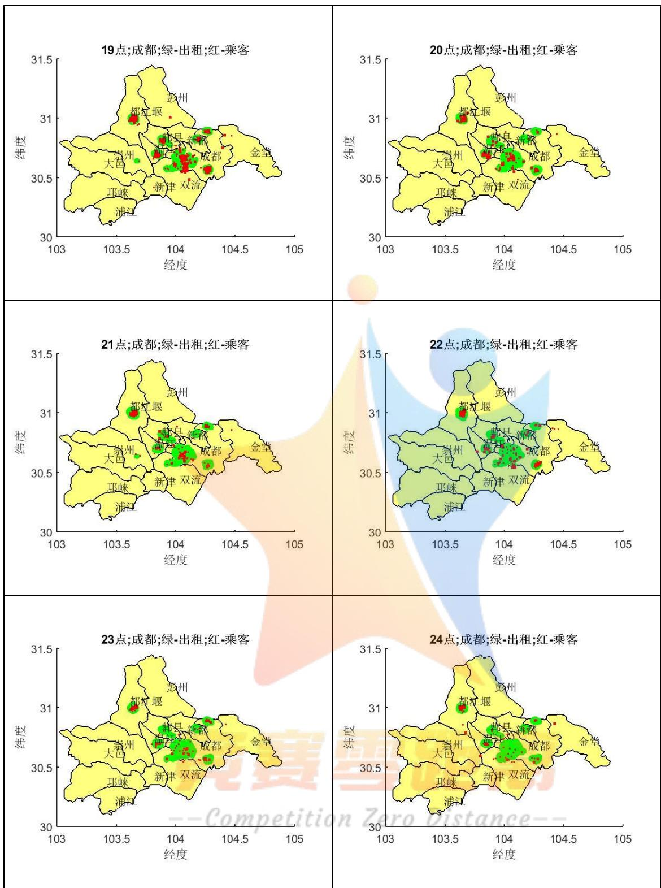

附录 B.成都市各个时点打车难易度分布图  
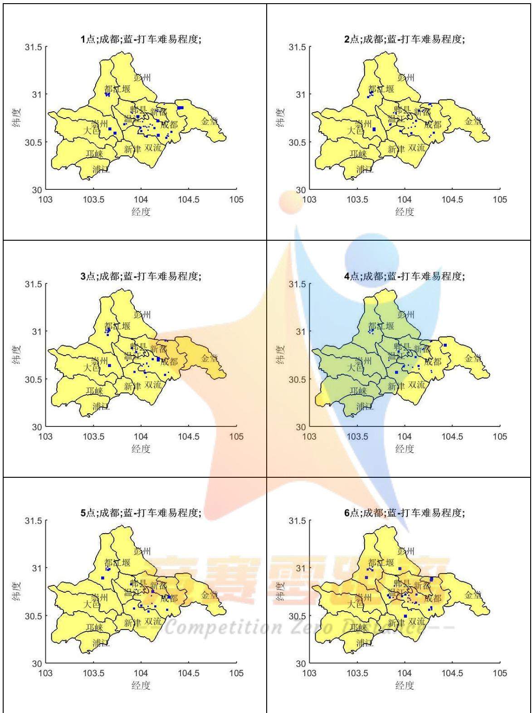

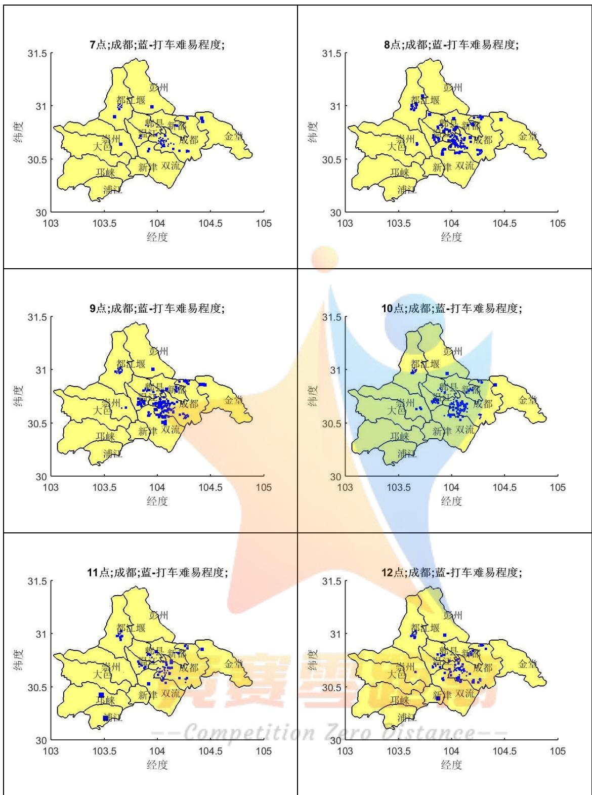


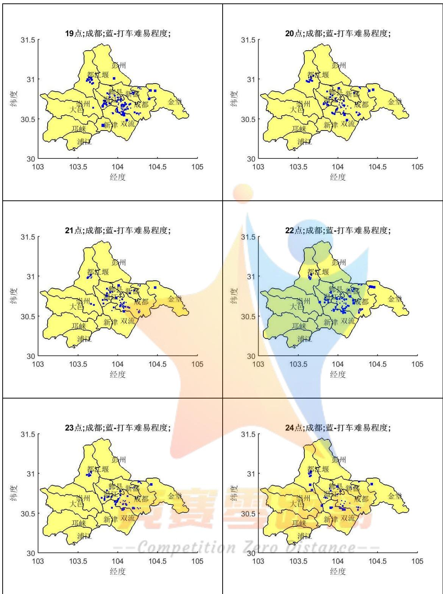

## 附录 C.Matlab 程序代码

## 1.问题(1)的代码

%问题(1)

```javascript
sheng=shaperead('counties_china.shp', 'UseGeoCoords', true);
```

```javascript
chengdu=sheng(2333:2345);
```

```javascript
boundall=[];
```

```javascript
name=cell(13,1);
```

```txt
for i=1:length(chengdu)
```

```javascript
boundall=[boundall;chengdu(i).BoundingBox];
```

```txt
name{i}=chengdu(i).LAST_NAME9;
```

end

name{1}='成都';

name{2}='金堂';

name{3}='双流';

name{4}='温江';

name{6}='新都';

name{7}='大邑';

name{8}='浦江';

name{9}='新津';

name{10}='都江堰';

name{11}='彭州';

name{12}='邛崃';

name{13}='崇州';

```matlab
minlon=min(boundall(:,1));%min(chengdu.Lon);
```

```matlab
maxlon=max(boundall(:,1));%max(chengdu.Lon);
```

```matlab
minlat=min(boundall(:,2));% min(chengdu.Lat);
```

```matlab
maxlat=max(boundall(:,2));%max(chengdu.Lat);
```

```javascript
dataall=[];
```

```txt
for i=1:24
```

```javascript
data=dlmread(['cityID510100realDate20150909_',num2str(i),'_t.txt']);
```

```matlab
tlen=length(data);
nump=tlen/3;
datat=zeros(nump,3);
datat(:,1)=data(1:3:tlen);
datat(:,2)=data(2:3:tlen);
datat(:,3)=data(3:3:tlen);
cancel=datat(:,1)>maxlon | datat(:,1)<minlon | datat(:,2)>maxlat | datat(:,2)<minlat;
datat(cancel,:)=[];
dataall(i).taxi=datat;
data=dlmread(['cityID510100realDate20150909_',num2str(i),'_p.txt']);
tlen=length(data);
nump=tlen/3;
datap=zeros(nump,3);
datap(:,1)=data(1:3:tlen);
datap(:,2)=data(2:3:tlen);
datap(:,3)=data(3:3:tlen);
cancel=datap(:,1)>maxlon | datap(:,1)<minlon | datap(:,2)>maxlat | datap(:,2)<minlat;
datap(cancel,:)=[];
dataall(i).passenger=datap;
end
```

%plot

fignum=[];

eachfignum=1;

for i=1:24

datat=dataall(i).taxi;

datap=dataall(i).passenger;

if mod(i-1,eachfignum)==0

k=ceil(i/eachfignum);

hfig=figure(k);

```matlab
fignum=[fignum,hfig];
if eachfignum==1
    set(gcf,'PaperType','A4', ...
        'paperOrientation', 'portrait', ...
        'paperunits','CENTIMETERS','PaperPosition',[.00, .00,10,8]);
else
    set(gcf,'PaperType','A4', ...
        'paperOrientation', 'portrait', ...
        'paperunits','CENTIMETERS','PaperPosition',[.00, .00,21,29]);
end
end
if eachfignum>1
subplot(ceil(eachfignum/2),2,mod(i,eachfignum)*(mod(i,eachfignum)~=0)+eachfignum*(mod(i,eachfignum)==0))
end
geoshow(chengdu);
title([num2str(i),'点;黄-成都;绿-出租;红-乘客'])
hold on
scatter(datat(:,1),datat(:,2),datat(:,3),'filled','o','g')
scatter(datap(:,1),datap(:,2),datap(:,3),'filled','s','r')
title([num2str(i),'点;成都;绿-出租;红-乘客'])
xlabel('经度')
ylabel('纬度')
for kk=1:length(chengdu)
text(mean(chengdu(kk).BoundingBox(:,1)),mean(chengdu(kk).BoundingBox(:,2)),name(kk));
end
hold off
if mod(i-1,eachfignum)==0
    figname=strcat('chengdu_part',num2str(k),'.jpg');
```

```matlab
saveas(hfig, figname, 'jpg');
end
end
savefig(fignum,'chengdu.fig')
close all
figs=openfig('chengdu.fig');
for k=1:length(fignum)
    figname=strcat('chengdu_part',num2str(k),'.jpg');
    saveas(figs(k), figname, 'jpg');
end
close all
%mean plot
meanall=[];
for i=1:24
    meanall=[meanall;[mean(dataall(i).taxi(:,3)),mean(dataall(i).passenger(:,3))]];
end
h=1:24;
set(gcf,'PaperType','A4', ...
    'paperOrientation', 'portrait', ...
    'paperunits','CENTIMETERS','PaperPosition',[.00, .00,16,10]);
[hAx,hLine1,hLine2]=plotyy(h,meanall(:,1),h,meanall(:,2));
ylabel(hAx(1),'出租车均值')
ylabel(hAx(2),'乘客均值')
set(hLine1,'LineStyle','--','Marker','*','MarkerSize',6,'LineWidth',1.5)
set(hLine2,'LineStyle',':',Marker','o','MarkerSize',6,'LineWidth',1.5)
xtlabel=num2cell(h);%cat(2,num2cell(h(1:4:end-2)),method);
set(hAx,'XTick',h,'XTickLabel',xtlabel,'xlim',[1,24])
grid on
xlabel('时间')
leglabel={'出租车均值','乘客需求均值'};
```

legend(leglabel,'Location','Best')  
title('成都市2015年9 月 9日全天出租车分布和乘客需求均值图')  
figname=strcat('chengdu\_mean','.jpg');  
saveas(gcf, figname, 'jpg');  
%matching  
C0=[0.1:0.1:0.9,1:50];  
lc0=length(C0);  
match=[];  
matchall=[];  
matchpoint=[];  
for i=1:24  
```matlab
p0=dataall(i).passenger;
lp0=size(p0,1);
t0=dataall(i).taxi;
r=size(t0,1);
disp=zeros(lp0,lc0);
for j=1:lp0
    p00=ones(r,1)*p0(j,1:2);
    d=dis(p00(:,1),p00(:,2),t0(:,1),t0(:,2));
    for k=1:lc0
        ts=sum(t0(d<=C0(k),3));
        if ts<p0(j,3)
            disp(j,k)=1;
        elseif ts>p0(j,3)
            disp(j,k)=-1;
        else
            disp(j,k)=0;
        end
    end
end
```

```matlab
idx=ones(lp0,1)*(1:lc0);
idx(disp>0)=inf;
idxsel=min(idx,[],2);
idxsel(isinf(idxsel))=C0(end);
match(i).loc=p0(:,1:2);
match(i).matchp=disp;
match(i).matchpstats=idxsel;
matchall=[matchall;[i*ones(lp0,1),p0(:,1:2),disp,idxsel]];
matchpoint=[matchpoint,lp0];
end
mathpointcum=cumsum(matchpoint);
newtime=zeros(size(matchall,1),1);
newtime(ismember(matchall(:,1),[8,9]))=1;
newtime(ismember(matchall(:,1),[18,19]))=2;
newtime(ismember(matchall(:,1),[7,10:17]))=3;
newtime(ismember(matchall(:,1),20:22))=4;
newtime(ismember(matchall(:,1),[1:6,23:24]))=5;
%plot
fignum=[];
eachfignum=1;
for i=1:24
    loc=match(i).loc;
    measure=match(i).matchpstats;
    if mod(i-1,eachfignum)==0
        k=ceil(i/eachfignum);
        hfig=figure(k);%figure(i);%figure(ceil(i/6));%
        fignum=[fignum,hfig];
        if eachfignum==1
            set(gcf,'PaperType','A4', ...
                'paperOrientation', 'portrait', ...
```

```matlab
'paperunits','CENTIMETERS','PaperPosition',[.00, .00,10,8]);
else
    set(gcf,'PaperType','A4', ...
        'paperOrientation', 'portrait', ...
        'paperunits','CENTIMETERS','PaperPosition',[.00, .00,21,29]);
end
end
if eachfignum>1
subplot(ceil(eachfignum/2),2,mod(i,eachfignum)*(mod(i,eachfignum)~=0)+eachfignum*(mod(i,eachfignum)==0))
end
geoshow(chengdu); % 此处用 mapshow 投影会不正确
hold on
scatter(loc(:,1),loc(:,2),measure,'filled','s','b')
title([num2str(i),'点;成都;蓝-打车难易程度;'])
xlabel('经度')
ylabel('纬度')
for kk=1:length(chengdu)
text(mean(chengdu(kk).BoundingBox(:,1)),mean(chengdu(kk).BoundingBox(:,2)),name(kk));
end
hold off
if mod(i-1,eachfignum)==0
    figname=strcat('chengdupipei_part',num2str(k),'.jpg');
    saveas(hfig, figname, 'jpg');
end
end
savefig(fignum,'chengdupipei.fig')
close all
figs=openfig('chengdupipei.fig');
```

```matlab
for k=1:length(fignum)
    figname=strcat('chengdupipei_part',num2str(k),'.jpg');
    saveas(figs(k), figname, 'jpg');
end
close all
```

```matlab
%%%所有时点乘客打车难易度散点
set(gcf,'PaperType','A4', ...
    'paperOrientation', 'portrait', ...
    'paperunits','CENTIMETERS','PaperPosition',[.00, .00,16,14]);
plot(matchall(:,end),'*')
xlabel('乘客数据点')
ylabel('邻域半径(km)')
title('所有时点乘客打车难易度')
set(gca,'YTick',1:5:lc0)
xtlabel=cat(2,num2cell(C0(1:5:lc0)));
set(gca,'YTickLabel',xtlabel)
axis tight
grid on
```

```matlab
figname=strcat('chengdupipei_scatter','.jpg');
saveas(gcf, figname, 'jpg');
%%%所有时点乘客打车难易度分布
set(gcf,'PaperType','A4', ...
    'paperOrientation', 'portrait', ...
    'paperunits','CENTIMETERS','PaperPosition',[.00, .00,16,14]);
geoshow(chengdu);
hold on
scatter(matchall(:,1),matchall(:,2),matchall(:,end),'filled','s','b')
title('所有时点;成都;蓝-打车难易程度;')
xlabel('经度')
```

ylabel('纬度')

for kk=1:length(chengdu)

text(mean(chengdu(kk).BoundingBox(:,1)),mean(chengdu(kk).BoundingBox(:,2)),name(kk));

end

hold off

figname=strcat('chengdupipei\_all','.jpg');

saveas(gcf, figname, 'jpg');

## 2.问题(3)的代码

%问题(3)方案 1

time=8;

op=dataall(time).passenger;%选择 8 点的乘客数据

lp0=size(op,1);

ebt=10;%每天补贴 1 元

lbt=30;%补贴 30 天

bt=ebt\*ones(1,lbt);

cbt=cumsum(bt);%累计补贴

b0=1.645;

baifenbi=@(butie)exp(b0-11.532./butie);%S curve

cper=baifenbi(cbt)/100;%预测订单数

t0=dataall(time-1).taxi;

r=size(t0,1);

matchn=[];

matchna=match(time).matchpstats;%8 点的难易度

for i=1:lbt

p0=op;

p0(:,3)=p0(:,3).\*(1-cper(i));

disp=zeros(lp0,lc0);

for j=1:lp0

```matlab
p00=ones(r,1)*p0(j,1:2);
d=dis(p00(:,1),p00(:,2),t0(:,1),t0(:,2));
for k=1:lc0
    ts=sum(t0(d<=C0(k),3));
    if ts<p0(j,3)
        disp(j,k)=1;
    elseif ts>p0(j,3)
        disp(j,k)=-1;
    else
        disp(j,k)=0;
    end
end
end
idx=ones(lp0,1)*(1:lc0);
idx(disp>0)=inf;
idxsel=min(idx,[],2);
idxsel(isinf(idxsel))=C0(end);
matchn(i).loc=p0(:,1:2);
matchn(i).matchp=disp;
matchn(i).matchpstats=idxsel;
matchna=[matchna,idxsel];
end
```

%问题(3)方案 2

time=8;

op=dataall(time).passenger;%选择 8 点的乘客数据

[count,center]=hist(op(:,3));

count=count./sum(count);

set(gcf,'PaperType','A4', ...

'paperOrientation', 'portrait', ...

```matlab
'paperunits','CENTIMETERS','PaperPosition',[.00, .00,10,8]);
hist(op(:,3))
ylabel('频数')
xlabel('乘客需求')
title('成都市 8 点乘客需求条图')
figname=strcat('chengdu8bar','.jpg');
saveas(gcf, figname, 'jpg');
```

```matlab
%密集点
datat=dataall(8).taxi;
datap=dataall(8).passenger;
set(gcf,'PaperType','A4', ...
    'paperOrientation', 'portrait', ...
    'paperunits','CENTIMETERS','PaperPosition',[.00, .00,10,8]);
geoshow(chengdu); % 此处用 mapshow 投影会不正确
title('8 点成都乘客打车需求最大区')
hold on
scatter(datat(:,1),datat(:,2),datat(:,3),'filled','o','g')
[~,idx]=max(datap(:,3));
scatter(datap(idx,1),datap(idx,2),datap(idx,3),'filled','s','r')
legend('出租车','乘客','Location','Best')
xlabel('经度')
ylabel('纬度')
for kk=1:length(chengdu)
```

```matlab
text(mean(chengdu(kk).BoundingBox(:,1)),mean(chengdu(kk).BoundingBox(:,2)),name(kk));
end
hold off
figname=strcat('chengdu8miji','jpg');
saveas(gcf, figname, 'jpg');
```

%方案 2  
```matlab
datat=dataall(8).taxi;
datap=dataall(8).passenger;
sumt=sum(datat(:,3));
datat(:,3)=datat(:,3)*0.99;
datat(end+1,1:2)=datap(idx,1:2);
datat(end,3)=sumt-sum(datat(:,3));
p0=datap;
t0=datat;
r=size(t0,1);
disp=zeros(lp0,lc0);
matchn=[];
matchna=match(time).matchpstats;%8 点的难易度
for j=1:lp0
    p00=ones(r,1)*p0(j,1:2);
    d=dis(p00(:,1),p00(:,2),t0(:,1),t0(:,2));
    for k=1:lc0
        ts=sum(t0(d<=C0(k),3));
        if ts<p0(j,3)
            disp(j,k)=1;
        elseif ts>p0(j,3)
            disp(j,k)=-1;
        else
            disp(j,k)=0;
        end
    end
end
idxs=ones(lp0,1)*(1:lc0);
idxs(disp>0)=inf;
```

```matlab
idxsel=min(idxs,[],2);
idxsel(isinf(idxsel))=C0(end);
matchn.loc=p0(:,1:2);
matchn.matchp=disp;
matchn.matchpstats=axxsel;
matchna=[matchna,idxsel];
set(gcf,'PaperType','A4', ...
```

'paperOrientation', 'portrait', ...  
```matlab
'paperunits','CENTIMETERS','PaperPosition',[.00, .00,12,8]);
plot(1:40,matchna(1:40,1),'ro',1:40,matchna(1:40,2),'b+')
```

title('方案 2 的应用前后对比')  
```txt
xlabel('数据点')
```  
ylabel('难易度')

```txt
grid on
```

figname=strcat('chengdu8mijiduibi','.jpg');  
```javascript
saveas(gcf, figname, 'jpg');
```