# “互联网+”时代基于动态补贴的出租车资源优化配置摘要

本文研究了“互联网+”时代出租车资源的优化配置问题。通过模糊综合评价和多元回归拟合方法给出了供求匹配评价模型，提出了基于打车难度系数的出租车动态补贴方案。

对于不同时空出租车资源的供求匹配程度问题，本文从宏观和微观两个角度进行评价。宏观上引入里程利用率、车辆满载率、万人拥有量作为评价指标，采用模糊综合评价的方法，求出了深圳、西安、拉萨这三个城市的评价分数（分别为0.1868、0.3046、0.7029），即西安、拉萨的供求平衡比深圳要好。微观上本文以深圳市为例，利用供、求的影响因素，建立了基于多元回归拟合的供求匹配模型，通过拟合供给和需求的表达式，采用供求比作为供求匹配程度的衡量指标，求解不同时空（高峰期、低谷期、拥堵区、非拥堵区）的供求比，结果分别为 0.7046、1.6037、0.6886、1.5813，结果表明：高峰期的供求比远小于低谷期，拥堵区的供求比远小于非拥堵区。

对于现有补贴方案能否缓解打车难的问题，本文首先分析了补贴方案对降低司机拒单率，提高乘客拼车率的影响。依据司机拒单率、乘客拼车率与司机的补贴、乘客补贴的正负相关性，本文分别使用高斯分布模型和Logit模型求解函数表达式。进而通过拒单率、拼车率对问题一的供应量表达式进行改进，构建打车难度系数评价模型。针对深圳市 2014 年9 月5 号的统计数据，求解可得总体打车难度系数在不补贴时为 0.2816，在快的打车的补贴模式下为 0.1885，在滴滴打车补贴模式下为0.2030。仿真结果表明：补贴后乘客、出租车的成功匹配率提高了 11%左右。

在设计合理的补贴方案时，本文综合考虑了社会供求关系和公司补贴金额这两个因素。依据现行的补贴方案，采用等步长逐步搜索法，求出使得供求匹配最佳时，司机和乘客的最优补贴金额（司机11.4 元每单，乘客15.4 元每单）。接着，本文给出供求比置信区间（0.8—1），以解决供求匹配最佳导致补贴费用过高的问题，此时求得供求比为 0.8，司机补贴7.3 元每单，乘客不补贴，将其定义为基础补贴。为权衡供求和补贴金额，建立基于供求优化的动态补贴模型，使实际补贴在基础补贴的前提下浮动小于 5 元。最后，本文结合 Logit 模型及经济学原理，求解总补贴金额的函数表达式。仿真结果表明，相对于不补贴的情况，新的补贴方案下供求匹配度提高了34.62%左右。

关键词：模糊评价、Logit 模型、多元回归拟合、动态优化、仿真

## 一、问题重述

出租车是市民出行的重要交通工具之一，“打车难”是人们关注的一个社会热点问题。随着“互联网+”时代的到来，有多家公司依托移动互联网建立了打车软件服务平台，实现了乘客与出租车司机之间的信息互通，同时推出了多种出租车的补贴方案。

请你们搜集相关数据，建立数学模型研究如下问题：

(1) 试建立合理的指标，并分析不同时空出租车资源的“供求匹配”程度。  
(2) 分析各公司的出租车补贴方案是否对“缓解打车难”有帮助？  
(3) 如果要创建一个新的打车软件服务平台，你们将设计什么样的补贴方案，并论证其合理性。

## 二、问题分析

出租车问题与人民生活密切相关，但现实生活中往往出现打车难的现象。我们分析打车难的原因主要是供求不匹配。首先，针对打车难的现状，我们可以从多个方面得到评价指标，对不同时空的供求匹配程度做出评价。我们可以通过供求匹配指标，求出补贴前后的打车难度系数，分析能否缓解打车难。为了进一步解决供求匹配问题，同时考虑到软件公司的补贴花费，我们可以设计基于多因素的动态补贴方案，并通过模拟仿真，判断补贴方案推行前后，打车难的问题是否得到缓解。

## 2.1 问题一的分析

在分析不同时空出租车资源的“供求匹配”程度时，考虑到时空既可以指不同的城市、年份，又可以指某个城市内部的不同区域、时间段，所以我们从宏观和微观这两个角度来分析这个问题。从宏观上看，随着“互联网+”时代的到来，打车软件使用率明显增加，从而改善了供求关系。而在同一年中，一线、二线、三线城市的出租车供求匹配程度同样差异巨大。分析可知，供求的主要体现指标为：里程利用率、车辆满载率、万人拥有量。我们采用模糊综合评价的方法，得到不同城市的供求匹配度。从微观上看，我们选取某个城市（深圳）作为研究对象，从乘客和出租车司机这两个角度分析影响供求的因素。通过数据可以拟合出供应和需求的函数表达式，就可以得到供求比。对于不同时空的分析，我们选取高峰期、低谷期、拥堵区和非拥堵区，分别计算其供求比，评价不同时空的供求匹配程度。

## 2.2问题二的分析

在分析出租车公司的补贴方案是否对“缓解打车难”有帮助时，首先需要对打车难度进行界定，然后再分析补贴方案实施前后，打车难度的变化。考虑到打车难的原因主要为出租车供不应求，司机可能会拒单，乘客可能会拒绝拼车，因此我们利用第一问的供求匹配模型，引入拒单率、拼车率来构建打车难度系数关系式。由常识可知，拒单率、拼车率与补贴分别是负相关和正相关的，我们利用概率模型就可以得到其函数表达式。

通过查阅资料，我们可以得到快的打车和滴滴打车的现行补贴方案。由于对司机和乘客进行补贴会使得拒单量和拼车率发生变化，所以我们可以求出补贴前后的拒单率和拼车率，再结合打车难度系数关系式，计算出具体结果从而判断补贴是否能有效缓解打车难。但是，考虑到打车软件的使用群众多为中青年，我们可以分析打车难度系数与年龄的关系，从而得到更加符合实际的模型。为了更直观地分析补贴对打车难度的影响，我们还可以进行仿真实验。

## 2.3 问题三的分析

首先需要分析补贴的目的，我们认为补贴会对社会和软件公司造成影响，第一、补贴能够调节供求匹配度，第二、从软件公司利益的角度，要尽可能使得补贴金额少。所以我们从这两方面进行综合考虑设计补贴方案。

经过调查发现，现有的补贴方案是按接单数进行补贴，所以我们通过接单数对乘客和司机分别补贴。通过分析可知，补贴对乘客的影响因素为等待时间，补贴对司机的影响因素为堵车时间及油费，因此我们可以通过这些因素构建动态补贴模型对补贴金额进行适当调整。

在设计具体的补贴方案时，我们可以从第二问中公司现行的补贴方案出发，通过对补贴金额进行调整，搜索出供求匹配程度为 0.8\~1 的最佳补贴金额范围。在此置信区间内时，我们寻找出尽可能使得软件公司的补贴花费最小的最佳补贴金额，可以作为基础补贴金额。在基础补贴金额上，再进行优化供求的动态调整。与问题二类似，我们可以使用仿真来检验新的补贴方案下供求匹配程度是否得到改善。

## 三、模型假设

1、出租车司机收入按正常打表计算，不考虑消费者额外给的小费。  
2、司机认为利益受损失不会接单，即不会前往顾客所在地。  
3、司机一旦到达乘客所在处就表示一定接单。  
4、考虑现实生活中的拒单、拼车等实际情况。  
5、顾客按单计算，即两人一起拼车记为一单。  
6、每一单的路程均大于起步价所含路程。  
7、采用对乘客和司机进行补贴的方案可以有效地平衡供求。  
8、不考虑突发情况，极端自然状况导致的绕行和停车。

## 四、符号说明

<table><tr><td>符号</td><td>说明</td></tr><tr><td>P</td><td>乘客乘车费用</td></tr><tr><td>T</td><td>乘客平均乘车时间</td></tr><tr><td>w</td><td>乘客平均等候时间</td></tr><tr><td>Q</td><td>乘客对出租车的需求</td></tr><tr><td>M</td><td>出租车供给量</td></tr><tr><td>C</td><td>出租车固定开销</td></tr><tr><td>η</td><td>供求比</td></tr><tr><td>F</td><td>打车难度系数</td></tr><tr><td>q1,q2</td><td>补贴司机钱数、补贴乘客钱数</td></tr><tr><td>P1</td><td>补贴后出租车总收费</td></tr><tr><td>P2</td><td>补贴后乘客乘车费用</td></tr><tr><td>φ</td><td>拒单率</td></tr><tr><td>λ</td><td>拼车率</td></tr></table>

注：其它符号将在下文中给出具体说明

## 五、模型建立与求解

## 5.1不同时空下出租车资源的“供求匹配”评价模型

由于各个城市的经济状况，交通运输条件、人民生活水平不同，且同一城市各个年份的发展状态也不同，所以在对出租车资源的“供求匹配”程度进行评价时，需要先按城市、年份得出“供求匹配”指标并进行宏观评价。在综合分析了各城市、年份的出租车资源之后，可以对某一城市（如：深圳）进行具体某时刻段和某地区的分析，从而给出合理的“供求匹配”评价指标并进行微观评价。

该模型的整体构架图如下：

$$
\left\{ \begin{array}{l} \text {宏观} \left\{ \begin{array}{l} \text {时：同一城市，不同年份} \left\{ \begin{array}{l} “ \text {互联网+} ” \text {时代} \\ \text {非“互联网+”时代} \end{array} \right. \\ \text {空：一线、二线、三线城市} \left\{ \begin{array}{l} \text {里程利用率} \\ \text {车辆满载率} \\ \text {万人拥有量} \end{array} \right. \end{array} \right. \text {进行模糊综合评价} \\ \text {微观：以深圳市为例} \left\{ \begin{array}{l} \text {时：高峰期、低谷期} \\ \text {空：拥堵区、非拥堵区} \end{array} \right. \end{array} \right.
$$

## 5.1.1 宏观时空的供求匹配评价模型

宏观时空可以从两方面考虑，从横向角度分析为不同城市的对比，从纵向角度分析为“互联网+”时代和“非互联网+”时代的对比。在供求匹配评价时，分析影响出租汽车需求的因素有：社会经济发展水平、城市化水平和城市人口规模、城市交通基础设施。影响出租汽车供给的因素有：政府对出租汽车政策、出租汽车运价水平和燃油价格。

因此，可以从横向角度及纵向角度分别考虑，通过分析出租车需求及供给因素，得到供求匹配评价指标。

## 1、横向对比

在对不同城市进行分析时，选取一线城市（如深圳）、二线城市（如西安）、三线及以下城市（如拉萨）作为研究对象。分析一、二、三线城市可知，出租车的载客运行距离占运行总距离的比例越小，载客的出租车数量相对于总数量越少，平均每人拥有的车辆数越多，则供应相对于需求越充足，反映出供求匹配程度。因此我们用里程利用率、车辆满载率、万人拥有量作为评价指标来构建供求匹配模型，最后使用模糊综合评价方法评价“供求匹配”程度。

我们定义符号为：里程利用率 ，营业里程 $S _ { 0 }$ ，行驶里程 $S _ { s u m }$ ，车辆满载率 $\psi$ ，载客车辆 $V _ { 0 }$ ，总通过车辆 $V _ { s u m }$ ，万人拥有量G，车辆总数V ，人口规模 ，则：

$$
\left\{ \begin{array}{l} \gamma = \frac {S _ {0}}{S _ {\text {sum}}} \\ \psi = \frac {V _ {0}}{V _ {\text {sum}}} (5. 1 - 1) \\ G = \frac {V}{\varepsilon} \end{array} \right.
$$

在这个问题中，评价因素有：里程利用率、车载满载率和万人拥有量。对此使用模糊综合评价方法评价。

首先需要确定评价权重。设指标集 $\mathrm { A } { = } \{ \mathrm { a } 1 , \mathrm { a } 2 , \mathrm { a } 3 \}$ ;相应的权重集 $\mathrm { B = \{ b 1 , b 2 , b 3 \} }$ 为了确定权重集，不妨设强度集为{很强，强，较强，略强，一般}，对应的数值分别为5、4、3、2、1。可以认为，取偏大型柯西分布函数作为该评价的隶属函数最符合实际情况。

偏大型柯西分布函数如下：

$$
f (x) = \left\{ \begin{array}{l} \frac {1}{1 + a (x - b) ^ {- 2}}, 1 \leq x \leq 3 \\ c l n x + d, \quad 3 \leq x \leq 5 \end{array} \right. \tag {5.1-2}
$$

其中a b c d、 、 、 是待定系数 实际上，强度为“很强”时隶属度为 1，当强度为“强”时隶属度为 0.6，当强度为“一般”时，隶属度为0.1，据此确定待定系数a b c d、 、 、 的值分别为 $a = 0 . 1 2 3 9 , b = 2 . 3 7 1 3 , c = 0 . 3 9 1 5 , d = 0 . 3 6 9 9$ 。把四个系数代入到方程中得到各因素的隶属值和归一化值如下表：

表1：各因素的隶属值和归一化值

<table><tr><td>指标</td><td>万人拥有量</td><td>车辆满载率</td><td>里程利用率</td></tr><tr><td>赋予值</td><td>强</td><td>略强</td><td>略强</td></tr><tr><td>隶属值</td><td>0.6</td><td>0.4249</td><td>0.4249</td></tr><tr><td>归一化值</td><td>0.4139</td><td>0.2931</td><td>0.2931</td></tr></table>

于是我们得到权重向量为（0.4139,0.2931,0.2931）。

通过相关资料得到深圳、西安、拉萨的相关数据如下：

表2：深圳、西安、拉萨各指标数据

<table><tr><td>指标</td><td>万人拥有量</td><td>车辆满载率</td><td>里程利用率</td></tr><tr><td>深圳</td><td>14.03</td><td>77.95%</td><td>69.10%</td></tr><tr><td>西安</td><td>25.00</td><td>70.57%</td><td>70.00%</td></tr><tr><td>拉萨</td><td>20.74</td><td>69.33%</td><td>72.46%</td></tr></table>

因为三者都为大型城市，故其万人拥有量越接近 20 辆，“供求匹配”程度越高。而对于车辆满载率和里程利用率，其越接近 70%，“供求匹配”程度越高。将上表数据与理想值作差，并作标准化，即

$$
a ^ {\prime} = \frac {a - a _ {\min}}{a _ {\max} - a _ {\min}} \tag {5.1-3}
$$

使用模糊评价得到的权重向量对三个城市进行“供求匹配”评价，得到他们的偏离评价分数（约接近 0越好）如下表所示：

表4：深圳、西安、拉萨偏离评价分数

<table><tr><td>城市</td><td>深圳</td><td>西安</td><td>拉萨</td></tr><tr><td>偏离评价分数</td><td>0.8132</td><td>0.2954</td><td>0.2971</td></tr></table>

综合上表发现，作为一线城市的深圳供应量远小于需求量，即供求匹配程度较小。而作为二线城市的西安和三线城市的拉萨虽然与供求平衡有一定距离，但偏差不大即供求匹配程度较大。

## 2、纵向对比

从“非互联网+”时代迈入“互联网+”时代，由于打车软件的广泛使用，国家政府对公路交通的大力补贴，使得出租车数量快速增长，同时使得原来打车困难的人群，可以通过网络便捷地打到车。根据滴滴打车软件所提供的数据，“非互联网+”时代出租车总数为 804891辆，打车难度系数为 0.6左右，“互联网+”时代出租车总数为1053183 辆，打车难度系数为0.3 左右并且有逐年缩小的趋势。综上，我们可以选用打车难度系数作为指标去衡量供求匹配程度。得到结论为“互联网+”

时代的供求匹配程度较高，“非互联网+”时代的匹配程度较低。

## 5.1.2 微观时空供求匹配评价模型

在宏观分析了各城市、年份之间的出租车供求匹配程度后，从某个城市内部各区域及一天内各时间段的出租车供给、需求情况的角度出发，可以建立微观时空供求匹配评价模型。考虑到出租车的需求量、地区经济水平、人口情况等因素，选用一线城市：深圳市，作为该问题的研究对象。

## 1、基于多元回归拟合的供求匹配评价模型

分析出租系统的动态变化过程可知，出租系统不是一个恒定状态，而是处在一种动态的供求平衡状态。当供给或者需求发生变化时，出租系统会产生自发的调整。其流程图如下所示：

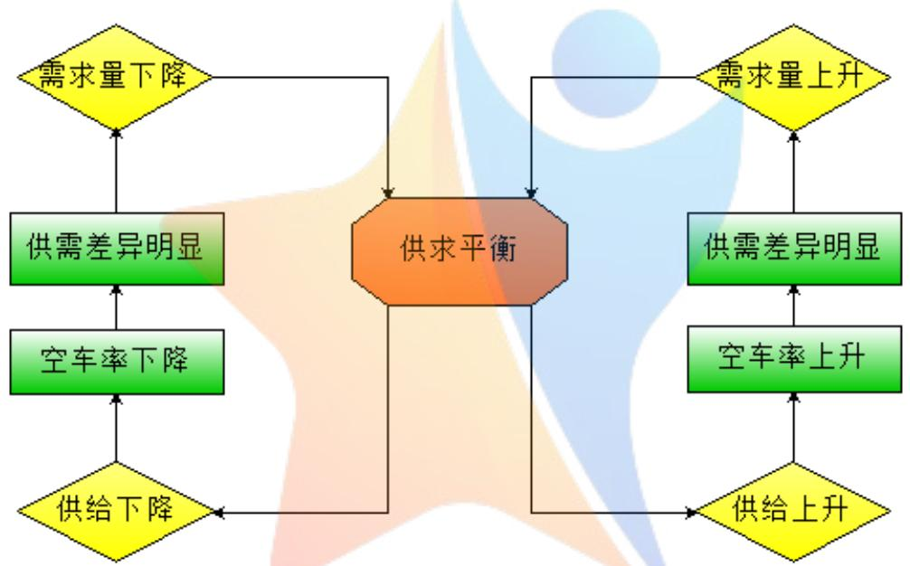

<details>
<summary>flowchart</summary>

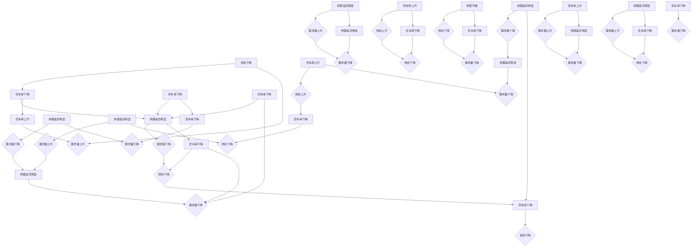
```mermaid
graph TD
  A["供需差异明显"] --> B{"需求量下降"}
  C["空车率下降"] --> A
  D["供给下降"] --> C
  E["供需差异明显"] --> F{"需求量上升"}
  G["空车率上升"] --> H{"供给上升"}
  I["供需平衡"] --> J{"供给下降"}
  K["空车率上升"] --> L{"需求量上升"}
  M["供需差异明显"] --> N{"需求量上升"}
  O["空车率下降"] --> A
  P["供需差异明显"] --> Q{"需求量下降"}
  R["空车率下降"] --> A
  S["供需差异明显"] --> T{"需求量下降"}
  U["空车率上升"] --> V{"供给上升"}
  W["供需差异明显"] --> X{"需求量上升"}
  Y["空车率下降"] --> Z{"供给下降"}
  AA["空车率上升"] --> AB{"需求量上升"}
  AC["供需差异明显"] --> AD{"需求量下降"}
  AE["空车率下降"] --> AF{"供给下降"}
  AG["空车率下降"] --> AH{"需求量下降"}
  AI["供需差异明显"] --> AJ{"需求量下降"}
  AK["空车率下降"] --> AL{"供给下降"}
  AM["空车率下降"] --> AN{"需求量下降"}
  AO["供需差异明显"] --> AP{"需求量下降"}
  AQ["空车率下降"] --> AR{"供给下降"}
  AS["空车率下降"] --> AT{"需求量下降"}
  AU["供需差异明显"] --> AV{"需求量下降"}
  AW["空车率下降"] --> AX{"供给下降"}
  A --> Y
  B --> Z
  C --> AA
  D --> AB
  E --> AC
  F --> AD
  G --> AE
  H --> AF
  I --> AG
  J --> AH
  K --> AI
  L --> AJ
  M --> AK
  N --> AL
  O --> AM
  P --> AN
  Q --> AO
  R --> AP
  S --> AQ
  T --> AU
  U --> AV
  V --> AW
  W --> AX
  X --> AO
  Y --> AP
  Z --> AQ
```
</details>

图1：出租系统动态供求平衡流程图

当空车率上升时，供求差异明显会导致出租车服务质量上升，从而需求量上升，最终达到供求平衡状态，这是一个动态平衡模型。为了得到合适的指标，来评价深圳市内部不同时空的供求匹配程度，可以从需求量、供给量、供求比这三个角度进行分析。 Competition Lero Distance

①需求量（从乘客的角度）

将位于深圳市这一区域内，等待乘坐出租车的行人量定义为需求量Q。则需求量的影响因素有：乘客乘车费用P、乘客平均乘车时间T、平均等候时间 。分析以上影响因素可知：乘客乘车费用、平均乘车时间、平均等待时间会在一定程度上影响需求量，同时平均等候时间又会受空驶出租车 $N _ { 1 }$ 的影响，平均乘车时间会受到空驶出租车 $N _ { 1 }$ 、载客出租车 $N _ { \sb 2 }$ 、社会总车辆 $N _ { 3 }$ 的影响。

所以针对上述各种影响关系，我们得出需求量的函数关系式为：

$$
\left\{ \begin{array}{l} Q = f (P, T, w) \\ w = n (N _ {1}) = n (N _ {3} - Q T) \quad (5. 1 - 4) \\ T = t (N _ {1}, N _ {2}, N _ {3}) \end{array} \right.
$$

分析上述表达式可知，乘客乘车费用及平均乘车时间、平均等候时间均越少，需求量越高。利用各影响因素的数据，可以进行多元回归拟合，进而求解需求量的显示函数表达式。

②供给量（从出租车司机的角度）

出租车的供应量M 取决于出租车司机是否愿意接乘客并将其送到目的地。分析其影响因素有：从当前位置到乘客所在地所需时间 $\omega$ （也就是乘客的等待时间）、出租车收费P（即乘客乘车费用）、出租车的固定开销C（出租车月租金 和油钱B之和）。

分析以上因素可知：从当前位置到乘客所在地所需时间、出租车收费、出租车固定开销均会影响出租车供给量。其月租金和油钱会影响固定开销，空驶出租车$N _ { 1 }$ 同时又会影响去接乘客的时间。针对以上影响关系，我们得出供给量的函数表达式为：

$$
\left\{ \begin{array}{l} M = g (w, C, P) \\ C = A + B \\ w = n (N _ {1}) = n (\mathrm{N} _ {3} - Q T) \end{array} \right. \tag {5.1-5}
$$

分析上述表达式可知，从当前位置到乘客所在地所需时间越短、出租车收费越高、固定开销越低，供给量越高。利用各影响因素的数据，可以进行多元回归拟合，进而求解供给量的显示函数表达式。

③供求比

依据从乘客和出租车司机两个角度出发求得的供给量和需求量，可以得到供求比作为供求匹配程度的衡量指标，供求比公式为：

$$
\eta = \frac {M}{Q} (5. 1 - 6)
$$

## 2、模型求解

采用深圳市2014年9月5日的出租车信息作为数据样本，求解出租车供求匹Competition Zero Vistance配模型。

## 步骤一：数据预处理

首先去除原始数据中的坏值（信息异常的值和经纬度偏差较大的值）。利用处理后的数据绘制这一天的出租车分布散点图(如图2)、空间分布图（如图3）。分析散点图及空间分布图可知，出租车一天的运动范围较广，几乎可以覆盖整个深圳市，构建出了深圳市交通网络干到。但各个区域之间不均匀，出租车主要集中在市区和远郊的部分地区，也有部分出租车行驶距离较远（如去往香港）。

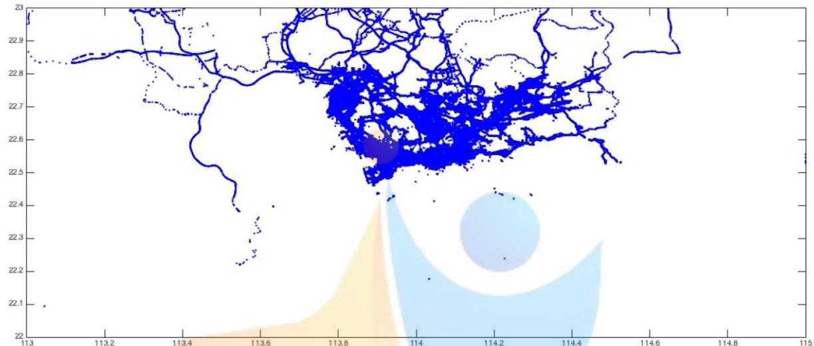

<details>
<summary>geo</summary>

| Series | Longitude (range) | Latitude (range) |
| --- | --- | --- |
| Data Points | 113.0~114.8 | 22.1~22.9 |
</details>

图2：深圳市出租车分布散点图（由出租车航迹绘制而成）

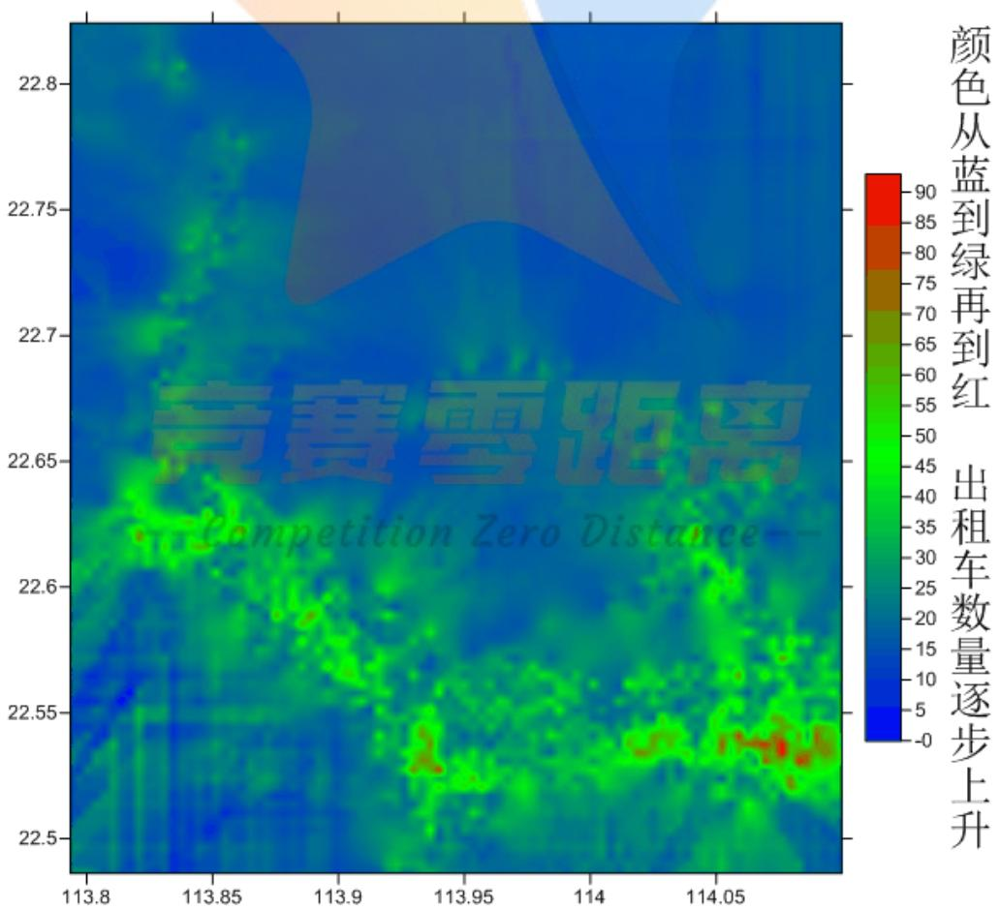

<details>
<summary>heatmap</summary>

| X (Range) | Y (Range) | Rental Car Count |
| --- | --- | --- |
| 113.8~114.05 | 22.5~22.8 | 0~90 |
</details>

图3：深圳市出租车空间分布图

步骤二：基于多元回归拟合求解出租车的供求函数式及供求比。

利用滴滴打车软件每一天的实时统计数据（如表5所示），可以得到乘客对出租车的需求量、出租车供给量的函数关系式。

表5：实时统计数据

<table><tr><td>日期</td><td>需求量</td><td>供给量</td><td>平均车费</td><td>平均抢单时间</td><td>乘客平均乘车时间</td></tr><tr><td>0905</td><td>14497</td><td>10421</td><td>53.73</td><td>30.16</td><td>787.3</td></tr><tr><td>0906</td><td>15957</td><td>10127</td><td>53.51</td><td>34.53</td><td>752.1</td></tr><tr><td>0907</td><td>17843</td><td>9526</td><td>59.69</td><td>35.7</td><td>805.6</td></tr><tr><td>0908</td><td>19185</td><td>9257</td><td>63.15</td><td>37.15</td><td>885.3</td></tr></table>

①需求量

利用滴滴打车软件每一天的实时统计数据，可以得到乘客对出租车的需求量Q、乘客乘车费用P、平均抢单时间 （由于平均等待时间可由平均抢单时间决定，所以此处我们使用平均抢单时间来替代）。根据租车状态数据，可知每辆出租车每一时刻是否有乘客，从而计算出乘客的平均乘车时间T。

统计出这四个变量的数据后，使用 MATLAB 进行多元回归拟合。

因为现实生活中的需求量与各个因素没有明确的正负相关关系，同时真实情况下随机性很大，所以使用线性拟合来简化模型，大致反映各因素对需求的影响，从而得到需求量表达式为：

$$
Q = 1 6 8 6 9. 6 - 2 4 0. 0 P + 3 4 5. 3 T + 0. 1 3 9 w
$$

②供给量

固定开销C可以认为是定值，一般在深圳开一天出租车的油钱为570元左右，月租金为4000元。利用与求需求量相同的方法，统计出出租车费用 ，平均抢单时间 （即出租车到达乘客所在地所需时间）等数据，使用MATLAB 多元拟合得到供应量的表达式：

$$
M = 1. 9 0 3 1 C + - 7 2. 5 5 w + 7 2. 7 1 P
$$

③供求比

$$
\eta = \frac {M}{Q} = \frac {1 . 9 0 3 1 C + - 7 2 . 5 5 w + 7 2 . 7 1 P}{1 6 8 6 9 . 6 - 2 4 0 . 0 P + 3 4 5 . 3 T + 0 . 1 3 9 w}
$$

步骤三：求解不同时空的供求匹配程度  
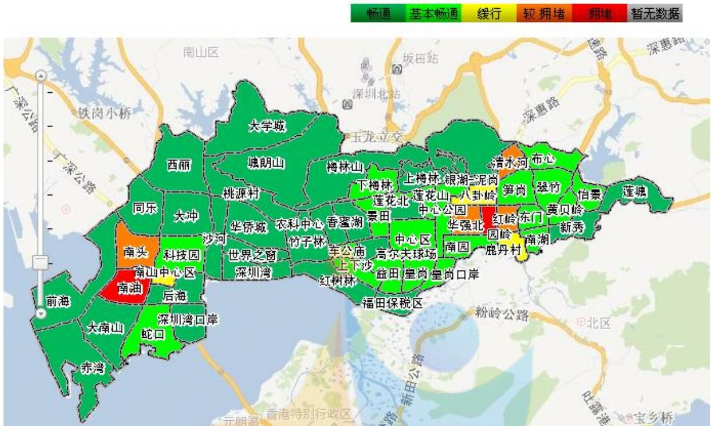

<details>
<summary>text_image</summary>

广深公路
铁岗小桥
南山区
坂田站
深圳北站
深惠路
玉龙立交
大学城
西丽
晴朗山
同乐
大冲
沙河
华桥城
世界之窗
深圳湾
科技园
南头
南山中心区
后海
深圳湾口岸
赤湾
前海
大南山
蛇口
红树林
福田保税区
益田
皇岗口岸
东门
新秀
黄贝岭
东门
南湖
红岭
园岭
鹿丹村
华强北
中心公园
银湖三泥岗
莲花山八卦岭
上梅林莲花北
下梅林下梅林
梅林山梅林山山山山山山山山山山山山山山山山山山山山山山山山山山山山山山山山山山山山山山山山山山山山山山山山山山山山山山山山山山山山山山山山山山山山山山山山山山山山山山山山山山山山山山山山山山山山山山山山山山山山
带心
翠竹
怡景
莲峡
青松江
长阳江
长阳江
长阳江
长阳江
长阳江
长阳江
长阳江
长阳江
长阳江
长阳江
长阳江
长阳江
长阳江
长阳江
长阳江
长阳江
长阳江
长阳江
长阳江
长阳江
长阳江
长阳江
长阳江
长阳江
长阳江
长阴江
长阴江
长阴江
长阴江
长阴江
长阴江
长阴江
长阴江
长阴江
长阴江
长阴江
长阴江
长阴江
长阴江
长阴江
长阴江
长阴江
长阴江
长阴江
</details>

图4：深圳市 13:00 各区域交通拥堵情况

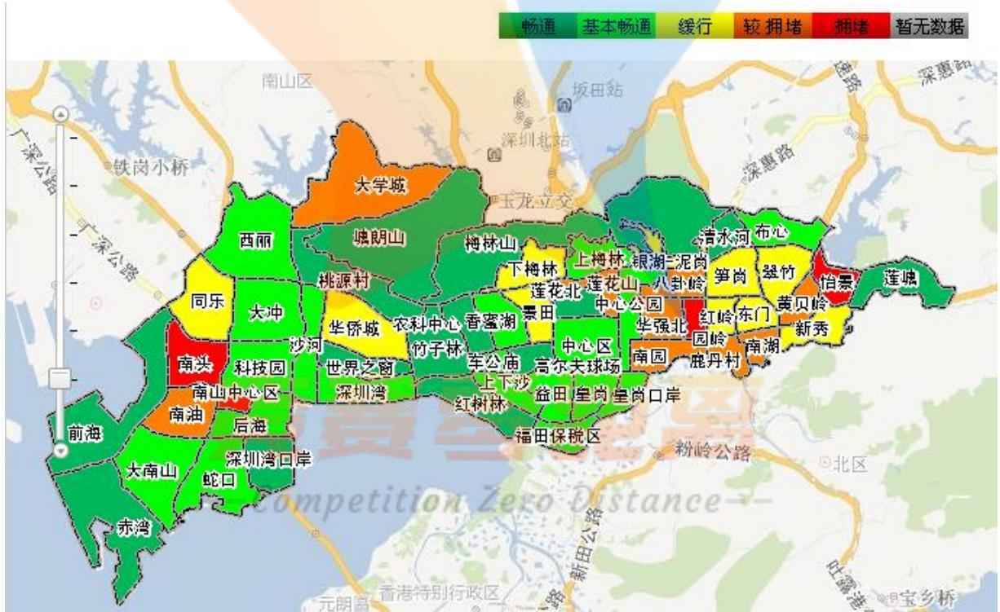

<details>
<summary>text_image</summary>

广深公路
铁岗小桥
南山区
坂田站
深圳北站
玉龙立交
深惠路
深水河
布心
翠竹
怡景
莲峡
西丽
大冲
同乐
科技园
南山中心区
后海
南头
南油
大南山
赤湾
前海
深圳湾口岸
蛇口
华侨城
华侨城
世界之窗
深圳湾
沙河
桃源村
晴朗山
大学城
梅林山
下梅林
莲花北
上梅林
莲花山
公园
中心区
中心区
车公庙
上下沙
红树林
益田
皇岗
皇岗口岸
福田保税区
银湖三泥岗
八卦岭
红岭
园岭
鹿丹村
南园
黄贝岭
新秀
南湖
东门
青水河
明阳
紫岗
长阳
长阳
长阳
长阳
长阳
长阳
长阳
长阳
长阳
长阳
长阳
长阳
长阳
</details>

图5：深圳市 18:00 各区域交通拥堵情况

对比深圳市在 13:00 和 18:00 的道路情况图（如图 4、5）可以发现：不同时间段、不同空间的道路情况不同，这会导致出租车的供求匹配程度发生变化。所以下面即对深圳市的上班高峰期、低谷期、拥堵区、非拥堵区进行具体分析。

## 1、深圳市高峰期、低谷期的供求匹配程度计算

选取7:00-10:00作为高峰区，选取13:00-16:00作为低谷区，利用统计数据，可以求得相关因素的值。统计四天的统计数据（详见附录一）可知供求函数关系式如下：

## I、高峰期

高峰期需求: $Q = 4 9 4 . 5 6 P + 4 6 4 . 0 5 w - 2 2 . 6 6 T - 1 8 5 2 4 . 8 1$

高峰期供给: $M = 1 0 5 . 0 1 P - 2 7 2 . 0 4 w + 1 7 7 9 2 . 5 0$

105.01P-272.04w+17792.50高峰期供求比： 494.56P+464.05w−22.66T-18524.81

利用具体数据带入计算得 $\eta { = } 0 . 7 0 4 6$ C

## II、低谷期

低谷期需求： $Q = - 8 8 1 . 3 3 P - 6 2 . 1 3 w + 5 4 . 1 5 T + 1 6 3 4 3 . 6 9$

低谷期供给： $M = - 2 1 8 . 0 0 P - 1 7 . 0 5 w + 2 2 7 5 9 . 9 0$

-218.00P-17.05w+22759.90  低谷期供求比： -881.33P-62.13w+54.15T+16343.69

利用具体数据带入计算得 $\eta { = } 1 . 6 0 3 7 .$ 。

## 2、深圳市拥堵区、非拥堵区的供求匹配程度计算

分析深圳市的拥堵情况可知，在同一时间段内，深圳市区内部分区域拥堵而部分区域道路畅通，选取在 18:00 的深圳道路情况作为研究对象，选取南油作为拥堵区、大冲作为非拥堵区进行研究。统计四天的统计数据（详见附录一），可知供求函数关系如下：

## I、拥堵区

拥堵区需求： $Q = - 5 4 . 1 5 P + 3 2 . 9 9 w + 7 . 0 0 T - 3 9 1 0 . 8 6$

拥堵区供给： $M = 2 2 . 1 1 P - 3 8 . 2 9 w + 2 7 3 5 . 0 2$

22.11P-38.29w+2735.02拥堵区供求比： -54.15P+32.99w+7.00T-3910.86

利用具体数据带入计算得 $\scriptstyle \eta = 0 . 6 8 8 6$ 。

## II、非拥堵区

非拥堵区需求： $Q = - 5 . 5 7 P + 1 2 . 5 1 w + 1 . 4 0 T - 5 8 8 . 2 7$

非拥堵区供应： $M = - 2 . 6 3 P - 1 . 0 4 w + 3 5 9 . 7 3$

-2.63P-1.04w+359.73非拥堵区供求比：0m-5.57P+12.51w+1.40T-588.27

利用具体数据带入计算得 $\eta = 1 . 5 8 1 3$ 。

经检验，上班高峰区的出租车供求比较小，而拥堵区的出租车供求比较小，符合实际。

## 5.2基于概率分析的打车难度系数评价模型

分析实际可得，打车难问题出现的原因主要有：供求匹配不均衡、司机拒单和乘客拒绝拼车。从模型一中的供求比函数出发，分析补贴带来的供求关系变化，可以建立基于概率分析的打车难度系数评价模型。再结合打车软件的使用人群，可以对模型进行改进和完善。

## 1、模型建立

在目前的供求匹配情况下，司机拒单会使得用户的需求得不到满足，乘客拒绝拼车会导致出租车总体的需求增大。而通过对司机以及乘客进行补贴，会改变拒单率和拼车率。同时，补贴也会对出租车司机收益、乘客乘车费用、乘客等待时间造成影响，进而影响供求关系函数。分析补贴对拒单率和拼车率的影响从而调整供求关系如下图所示：

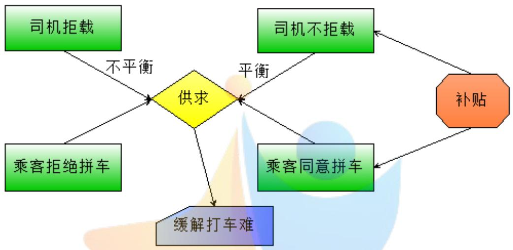

<details>
<summary>flowchart</summary>

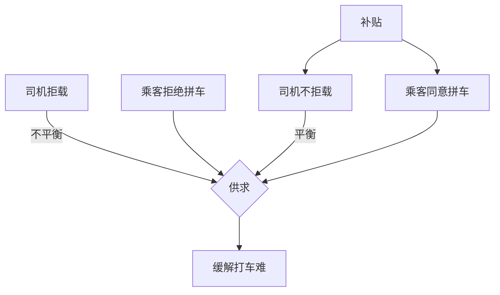
```mermaid
graph TD
  A["司机拒载"] -->|"不平衡"| B{"供求"}
  C["乘客拒绝拼车"] --> B
  D["司机不拒载"] -->|"平衡"| B
  E["乘客同意拼车"] --> B
  B --> F["缓解打车难"]
  G["补贴"] --> D
  G --> E
```
</details>

图6：补贴对拒单率、拼车率的影响

定义打车难度系数为 $F$ ，它可以由供求比 、拒单率 、拼车率 ，补贴 决 $\eta$ $\varphi$ $q$ 定。利用模型一中的供给函数g并对它进行改进，引入拒单率、拼车率、补贴，得到 $g$ 新的供给函数为 $g _ { 1 }$ ， $g _ { 1 }$ 同时又与原始满载率 $\rho _ { 0 }$ 有关。又由分析可知，供求比越接近 1为越优，我们以此为基础来进行构建打车难度系数评价模型。

定义符号如下: $q _ { 1 }$ ：司机补贴量， $q _ { 2 }$ ：乘客补贴量， $T$ ：平均乘车时间， $w$ :平均等候时间， $C$ :固定开销 $\qquad , \quad p _ { 1 }$ ：出租车单次收费， $p _ { 2 }$ ：乘客单次花费。建立目标约束函数如下所示：

$$
F = \min \left\{\frac {g _ {1} (w , c , P _ {1})}{f (P _ {2} , \mathrm{T} , \mathrm{w})} - 1 \right\}
$$

其中： $g _ { 1 } ( w , c , P _ { 1 } ) = g ( w , c , P _ { 1 } ) \cdot ( 1 + \lambda ( q _ { 2 } ) \rho _ { 0 } ) - g ( w , c , P _ { 1 } ) \cdot ( 1 - \rho _ { 0 } ) \cdot \varphi ( q _ { 1 } )$

$$
s. t. \left\{ \begin{array}{l} w = w _ {\text {原始}} + \Delta w \\ T = T _ {\text {原始}} + \Delta T \\ p _ {1} = p + q _ {1} \\ p _ {2} = p - q _ {2} \end{array} \right.
$$

其中，拒单率和拼车率分别是关于司机补贴、乘客补贴的函数，结合现实经验可知，拒单量是司机补贴的减函数。具体求解过程如下：由于现实中的相关函数一般满足高斯分布，假定原始拒单量为 0.3，可以求出拒单量与补贴的函数表达式为： $\varphi ( q _ { 1 } ) = 0 . 3 \mathrm { e } ^ { - 0 . 0 0 9 \pi q _ { 1 } ^ { 2 } }$ C

拼车率是乘客补贴的增函数，其相关变化关系大致符合 Logit 模型变化，当补贴达到阈值，就认为再增加补贴时，拼车率不会发生变化。具体求解过程如下：利用 Logit 模型，假定原始拼车率为 0.1，假定阈值为 20 元，可达到最大拼车率为

0.9。可以求得函数表达式为： $\lambda ( q _ { \mathrm { 2 } } ) { = } 0 . 9 { - } 0 . 8 / ( 1 { + } e ^ { 0 . 6 ( x _ { \mathrm { 1 } } - 1 0 ) } )$

拒单率和拼车率曲线变化图如下所示：

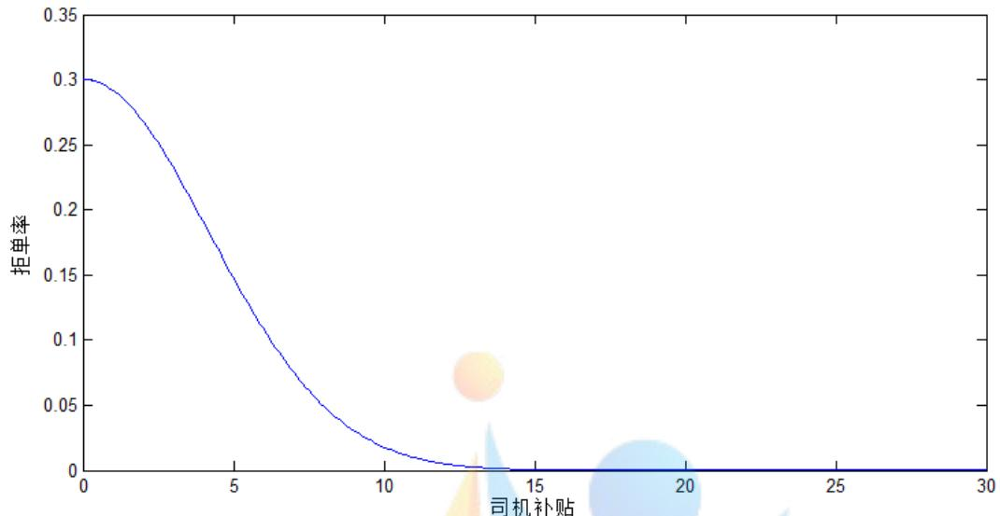

<details>
<summary>line</summary>

| 司机补贴 | 拒单率 |
| --- | --- |
| 0 | 0.3 |
| 5 | ~0.15 |
| 10 | ~0.02 |
| 15 | ~0.005 |
| 20 | ~0.001 |
| 25 | ~0.0005 |
| 30 | ~0.0001 |
</details>

图7：拒单率随补贴的变化曲线图

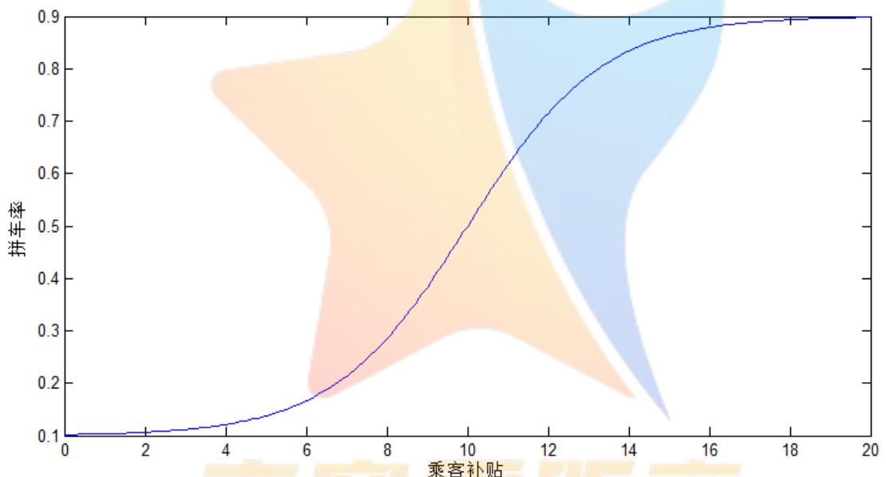

<details>
<summary>violin</summary>

| 乘客补贴 | 拼车率 |
| --- | --- |
| 0 | 0.1 |
| 2 | ~0.11 |
| 4 | ~0.13 |
| 6 | ~0.17 |
| 8 | ~0.28 |
| 10 | ~0.45 |
| 12 | ~0.65 |
| 14 | ~0.82 |
| 16 | ~0.88 |
| 18 | ~0.9 |
| 20 | 0.9 |
</details>

图8：拼车率随补贴变化曲线图

由上述分析可知，在给予司机和乘客一定补贴时，司机会更愿意去较远的地方接乘客，同时乘客也愿意多花更多的时间等待，从而实现供求匹配程度的改善，在一定程度上缓解了“打车难”。

但由于补贴是通过打车软件的使用来实现的，对于不同年龄的人群分析可知，老年人使用打车软件的次数要比中青年人少的多。因此，对于不使用打车软件的人群（如老年人等），由于出租车得到补贴后更愿意网上接单，导致老年人的打车难度增加。所以，打车难度系数与人群年龄有关，结合实际情况，我们应该对模型进行改进，引入中青年人在社会总体中的比例，来代表现实中实际的打车难度系数。分析可知，打车难度系数与中青年人占总人数的比例也近似满足反比例关系（如图9所示）。

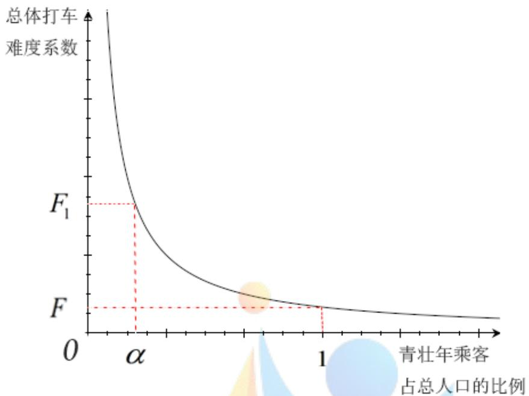

<details>
<summary>line</summary>

| 青壮年乘客占总人口的比例 | 总体打车难度系数 |
| --- | --- |
| \(\alpha\) | \(F_{1}\) |
| 1 | F |
</details>

图9：打车难度系数与中青年占总人口比例函数关系图

假定青年乘客占乘客总体的比例是 $\alpha$ ，总体的打车难度系数为 $F _ { 1 }$ ，则由反比例关系可知：

$$
F _ {1} \cdot \alpha = F \cdot 1,
$$

综上，基于实际的总体打车难度系数为：

$$
F _ {1} = \frac {1}{\alpha} \min \left\{\frac {g _ {1} (w , c , P _ {1})}{f (P _ {2} , \mathrm{T} , \mathrm{w})} - 1 \right\}
$$

## 2、模型求解

查阅资料可知，快的打车和滴滴打车的补贴方案如下：

快的打车：司机每接一单补贴 10元，乘客每乘坐一次出租补贴 1元。  
滴滴打车：司机每接一单补贴 11元，乘客每乘坐一次出租补贴 3元。

同时依据资料可知，深圳市出租车满载率为 75%，利用深圳市 年 月日的统计数据，代入上述模型，分别计算不进行补贴、快的公司的补贴方案、滴滴公司的补贴方案下的打车难度系数 $F$

不补贴时：0.2816，快的打车：0.1885，滴滴打车：0.2030

为了求解基于实际的打车难度系数，定义 $6 0$ 岁以上为老年人，10 岁到 60 岁之间为中青年（即打车软件使用群体），查阅资料可知，中青壮年占总人口比例为80%，即 $\alpha = 8$ ，带入模型二表达式可以求得三种情况下的总体的打车难度系数 $F _ { 1 }$

不补贴时：0.3520，快的打车：0.2356，滴滴打车：0.2538

分析可知，目标函数（打车难度系数）越小越好，所以，在滴滴公司和快递公司的补贴方案下，供求匹配程度得到了改善，打车难度系数变低。但是，由于按接单数进行补贴的方案过于简单，所以存在更优的补贴方案。综上，快的公司、滴滴公司的补贴方案可以在一定程度上有效地缓解“打车难”。

## 3、模型仿真

依据以上模型，模拟一个真实情况，进行仿真论证各公司补贴在一定程度上缓解了“打车难”。

## ① 仿真过程

构造了一个包含四条街道的井字型街道小世界，如下图所示

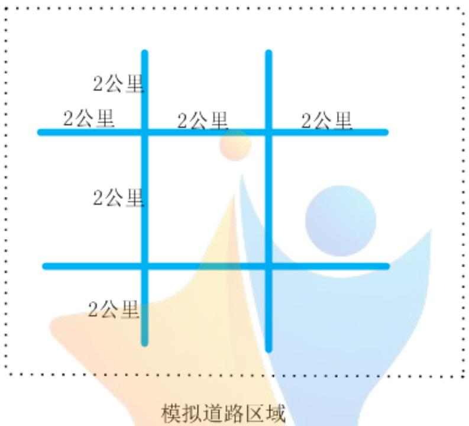

<details>
<summary>text_image</summary>

2公里
2公里 2公里 2公里
2公里
2公里
模拟道路区域
</details>

图10：仿真包含四条街道的井字型街道

分析可知，对于每条街道可以随机生成 20 辆初始状态为空车的出租车以及25个需要打车的人作为基本元素，认为出租车的视野半径为 200m，对于每辆空的出租车，如果其这个视野半径内存在还没匹配成功的人，就认为该人物可以成功上车。但是如果司机的视野半径内有多个人物，认为司机具有短视性，故出租车只会和最近的人匹配，即建立雇佣关系。

对于公司对司机的补贴方案，认为其在这个小世界中会对司机的视野距离产生影响，为了简化仿真模型，假定每提升一元，司机视野距离增加 10m。对于车与人的距离，利用该世界的道路分布特点，采用曼哈顿距离（Manhattan Distance）进行计算，即对人( , )x y 和车 $( x _ { 1 } , y _ { 1 } )$ 有：

$$
d = | x - x _ {1} | + | y - y _ {1} |
$$

在对打车难度进行刻画时，采用成功匹配次数来刻画打车难度，成功匹配次数越多，难度越低。依据上述思想，使用matlab 来实现仿真。

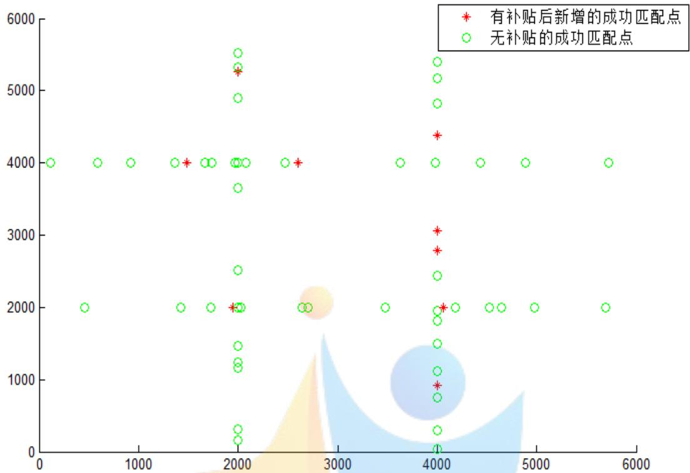

<details>
<summary>scatter</summary>

| Series | X | Y |
| --- | --- | --- |
| 有补贴后新增的成功匹配点 | ~1500 | 4000 |
| 有补贴后新增的成功匹配点 | ~2000 | 2000 |
| 有补贴后新增的成功匹配点 | ~2000 | 5300 |
| 有补贴后新增的成功匹配点 | ~2600 | 4000 |
| 有补贴后新增的成功匹配点 | ~4000 | 3100 |
| 有补贴后新增成功匹配点 | ~4000 | 2800 |
| 有补贴后新增成功匹配点 | ~4000 | 2000 |
| 有补贴后新增成功匹配点 | ~4000 | 900 |
| 有补贴后新增成功匹配点 | ~4000 | 1900 |
| 有补贴后新增成功匹配点 | ~4000 | 2450 |
| 有补贴后新增成功匹配点 | ~4000 | 4400 |
| 有补贴后新增成功匹配点 | ~4000 | 2750 |
| 有补贴后新增成功匹配点 | ~4000 | 3100 |
| 无补贴的成功匹配点 | ~150 | 4000 |
| 无补贴的成功匹配点 | ~600 | 4000 |
| 无补贴的成功匹配点 | ~950 | 4000 |
| 无补贴的成功匹配点 | ~1350 | 4000 |
| 无补贴的成功匹配点 | ~1750 | 4000 |
| 无补贴的成功匹配点 | ~1850 | 4000 |
| 无补贴的成功匹配点 | ~2050 | 5550 |
| 无补贴的成功匹配点 | ~2050 | 4900 |
| 无补贴的成功匹配点 | ~2050 | 3650 |
| 无补贴的成功匹配点 | ~2050 | 3650 |
| 无补贴的成功匹配点 | ~2050 | 2550 |
| 无补贴的成功匹配点 | ~2050 | 2550 |
| 无补贴的成功匹配点 | ~2050 | 2550 |
| 无补贴的成功匹配点 | ~2050 | 1550 |
| 无补贴的成功匹配点 | ~2050 | 1250 |
| 无补贴的成功匹配点 | ~2050 | 1250 |
| 无补贴的成功匹配点 | ~2050 | 350 |
| 无补贴的成功匹配点 | ~2750 | 4000 |
| 无补贴的成功匹配点 | ~2750 | 2000 |
| 无补贴的成功匹配点 | ~2750 | 2000 |
| 无补贴的成功匹配点 | ~3650 | 4000 |
| 无补贴的成功匹配点 | ~4150 | 5450 |
| 无补贴的成功匹配点 | ~4150 | 5150 |
| 无补贴的成功匹配点 | ~4150 | 4850 |
| 无补贴的成功匹配点 | ~4150 | 4850 |
| 无补贴的成功匹配点 | ~4150 | 4850 |
| 无补贴的成功匹配点 | ~4150 | 2450 |
| 无补贴的成功匹配点 | ~4150 | 2450 |
| 无补贴的成功匹配点 | ~4150 | 1850 |
| 无补贴的成功匹配点 | ~4150 | 1850 |
| 无补贴的成功匹配点 | ~4150 | 1850 |
| 无补贴的成功匹配点 | ~4150 | 1150 |
| 无补贴的成功匹配点 | ~4150 | 1150 |
| 无补贴的成功匹配点 | ~4150 | 750 |
| 无补贴的成功匹配点 | ~4150 | 750 |
| 无补贴的成功匹配点 | ~4150 | 350 |
| 无补贴的成功匹配点 | ~4150 | 350 |
| 无补贴的成功匹配点 | ~4150 | 350 |
| 无补贴的成功匹配点 | ~4150 | 35 |
| 无补贴的成功匹配点 | ~4150 | 35 |
| 无补贴的成功匹配点 | ~4150 | 35 |
| 无补贴的成功匹配点 | ~4150 | 35 |
| 无补贴的成功匹配点 | ~4150 | 35 |
| 无补贴的成功匹配点 | ~4150 | 35 |
</details>

图11：加入滴滴补贴方案后的匹配图  
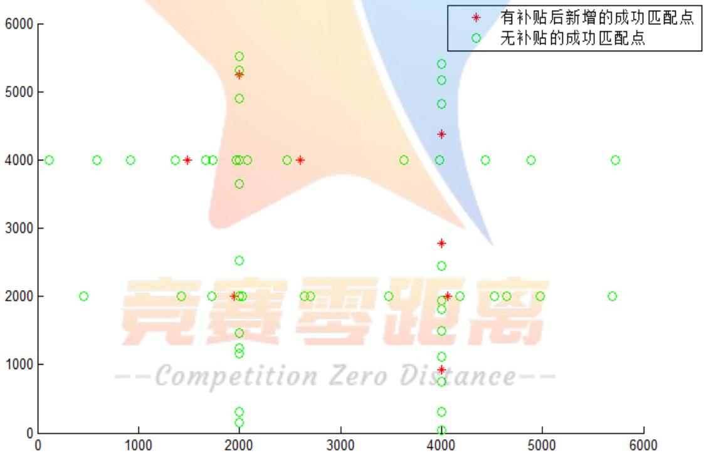

<details>
<summary>scatter</summary>

| Series | X | Y |
| --- | --- | --- |
| 有补贴后新增的成功匹配点 | ~1500 | 4000 |
| 有补贴后新增成功匹配点 | ~2000 | 2000 |
| 有补贴后新增成功匹配点 | ~2600 | 4000 |
| 有补贴后新增成功匹配点 | ~4000 | 4400 |
| 有补贴后新增成功匹配点 | ~4000 | 2800 |
| 有补贴后新增成功匹配点 | ~4000 | 900 |
| 有补贴后新增成功匹配点 | ~4000 | 2000 |
| 无补贴的成功匹配点 | ~150 | 4000 |
| 无补贴的成功匹配点 | ~600 | 4000 |
| 无补贴的成功匹配点 | ~1300 | 4000 |
| 无补贴的成功匹配点 | ~1700 | 4000 |
| 无补贴的成功匹配点 | ~1800 | 4000 |
| 无补贴的成功匹配点 | ~1950 | 3650 |
| 无补贴的成功匹配点 | ~1950 | 3650 |
| 无补贴的成功匹配点 | ~1950 | 2550 |
| 无补贴的成功匹配点 | ~1950 | 2550 |
| 无补贴的成功匹配点 | ~1950 | 2000 |
| 无补贴的成功匹配点 | ~1950 | 1450 |
| 无补贴的成功匹配点 | ~1950 | 1200 |
| 无补贴的成功匹配点 | ~1950 | 1150 |
| 无补贴的成功匹配点 | ~1950 | 350 |
| 无补贴的成功匹配点 | ~1950 | 250 |
| 无补贴的成功匹配点 | ~1950 | 150 |
| 无补贴的成功匹配点 | ~1950 | 125 |
| 无补贴的成功匹配点 | ~1950 | 120 |
| 无补贴的成功匹配点 | ~1950 | 350 |
| 无补贴的成功匹配点 | ~1950 | 25 |
| 无补贴的成功匹配点 | ~2650 | 4000 |
| 无补贴的成功匹配点 | ~2750 | 2000 |
| 无补贴的成功匹配点 | ~3650 | 4000 |
| 无补贴的成功匹配点 | ~4450 | 4000 |
| 无补贴的成功匹配点 | ~4650 | 2000 |
| 无补贴的成功匹配点 | ~4750 | 2000 |
| 无补贴的成功匹配点 | ~4950 | 4000 |
| 无补贴的成功匹配点 | ~5750 | 4000 |
| 无补贴的成功匹配点 | ~5750 | 2000 |
| 无补贴的成功匹配点 | ~3650 | 2000 |
| 无补贴的成功匹配点 | ~3950 | 2450 |
| 无补贴的成功匹配点 | ~3950 | 2450 |
| 无补贴的成功匹配点 | ~3950 | 1850 |
| 无补贴的成功匹配点 | ~3950 | 1850 |
| 无补贴的成功匹配点 | ~3950 | 1550 |
| 无补贴的成功匹配点 | ~3950 | 1150 |
| 无补贴的成功匹配点 | ~3950 | 1150 |
| 无补贴的成功匹配点 | ~3950 | 850 |
| 无补贴的成功匹配点 | ~3950 | 850 |
| 无补贴的成功匹配点 | ~3950 | 350 |
| 无补贴的成功匹配点 | ~3950 | 35 |
| 无补贴的成功匹配点 | ~3950 | 15 |
| 无补贴的成功匹配点 | ~3950 | 115 |
| 无补贴的成功匹配点 | ~3950 | 85 |
| 无补贴的成功匹配点 | ~3950 | 85 |
| 无补贴的成功匹配点 | ~3950 | 35 |
| 无补贴的成功匹配点 | ~3950 | 35 |
| 无补贴的成功匹配点 | ~3950 | 115 |
| 无补贴的成功匹配点 | ~3950 | 115 |
| 无补贴的成功匹配点 | ~3950 | 85 |
| 无补贴的成功匹配点 | ~3950 | 85 |
| 无补贴的成功匹配点 | ~3950 | 35 |
| 无补贴的成功匹配点 | ~3950 | 35 |
| 无补贴的成功 Match Point (Top) | ~2150 | ~525 |
| 无补贴的成功匹配点 (Bottom) | ~650 | ~200 |
| No Antibiotic Success Match Point (Top) | ~2150 | ~495 |
| No Antibiotic Success Match Point (Top) | ~2150 | ~495 |
| No Antibiotic Success Match Point (Top) | ~2150 | ~495 |
| No Antibiotic Success Match Point (Top) | ~2150 | ~495 |
| No Antibiotic Success Match Point (Top) | ~2150 | ~495 |
</details>

图12：加入快的补贴方案后的匹配图  
注：成功匹配点表示该位置的人成功打车

## ②结果分析

利用 matlab 计算出无补贴、快的打车补贴、滴滴打车补贴的成功匹配次数如下表所示：

表6：各公司补贴方案下成功匹配次数

<table><tr><td>不同补贴方案</td><td>无补贴</td><td>快的打车版补贴</td><td>滴滴打车版补贴</td></tr><tr><td>成功匹配次数</td><td>57</td><td>64</td><td>65</td></tr><tr><td>补贴方案</td><td>无</td><td>司机10元,乘客1元</td><td>司机11元,乘客3元</td></tr></table>

对比可知，在该仿真下，补贴之后相对补贴之前，成功匹配次数增加11%左右，有效地缓解了打车难的问题。

## 5.3 基于供求优化的动态补贴模型

## 1、模型建立

由上述求得的打车难度系数规划模型可知，对司机和乘客进行补贴能够调整供求匹配程度。但由于现行的补贴方案是按照接单数进行补贴，并不能最优地调整供求关系，所以为了有效缓解“打车难”问题，可以先利用模型二进行搜索得到最优补贴方案，依据各影响因素对其做动态调整，进一步实现供求关系的优化。

在进行补贴方案设计时，应该从社会和软件公司这两个角度进行考虑。补贴之后，既要使得打车难度系数下降，又要使得补贴金额控制尽可能的少（在可接受范围之内）。补贴方案的具体求法如下：

## 步骤一：搜索在置信区间内现有补贴方案的最优解

分析快的打车、滴滴打车的现有补贴方案可知，补贴会导致司机更愿意接乘客，乘客更愿意使用打车软件。这两个公司的补贴方案均能使得打车难度系数降低，在一定程度上缓解打车难，但是不同的补贴方案对打车难的缓解程度也不同。因此，以打车难度系数最低为目标函数，采用等步长搜索法，可以得到理论上的最优补贴方案。逐步搜索算法流程如下：

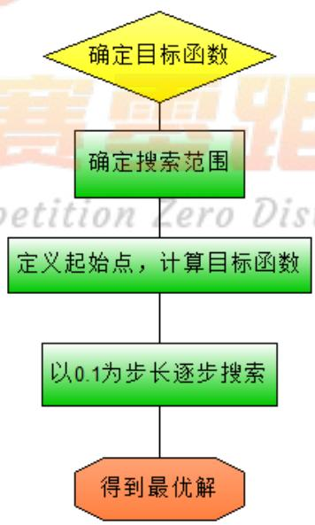

<details>
<summary>flowchart</summary>

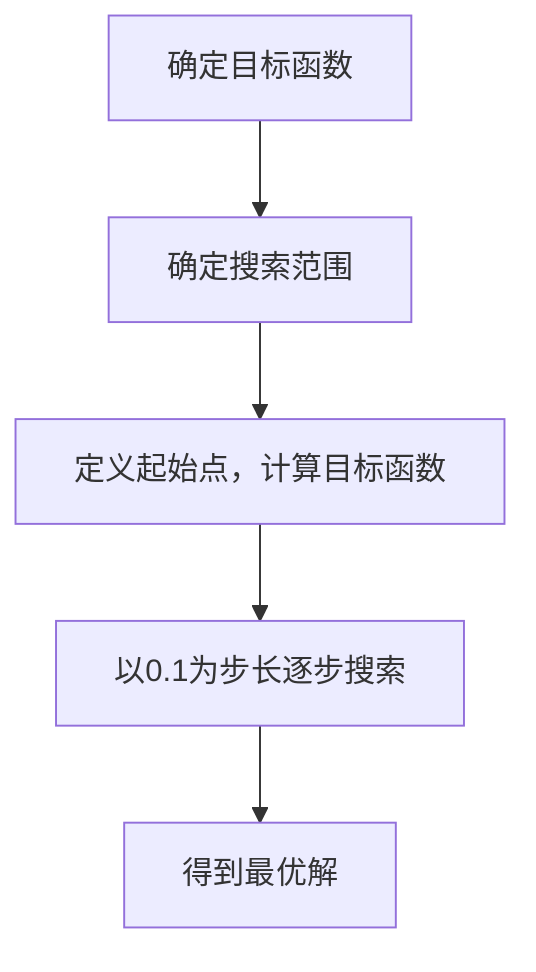
```mermaid
graph TD
  A["确定目标函数"] --> B["确定搜索范围"]
  B --> C["定义起始点，计算目标函数"]
  C --> D["以0.1为步长逐步搜索"]
  D --> E["得到最优解"]
```
</details>

图13：逐步搜索算法流程图

通过逐步搜索，可以求得打车难度系数最小时的补贴方案。

对最优供求比进行上下小幅度波动，可以得到供求比置信区间，在这个区间里，打车难度系数较小，且在可接受范围内。此时，还需要在基本满足供求关系的前提下，使得补贴的总金额尽可能小，利用规划求出基础补贴金额（乘客： $q _ { \overrightarrow { \mathcal { A } } \overrightarrow { \mathcal { E } } }$ ，司机：$q _ { \equiv \mathrm { j } \star \mathrm { l } } )$ o

## 步骤二：在补贴可接受范围内，确定最佳动态补贴函数

补贴分为对乘客的补贴和对司机的补贴这两大类，分别分析其影响因素如下：乘客获得补贴后，会愿意用比原来更久的时间等车。司机获得补贴后，会愿意去更远的地方以及拥堵区接乘客。因此，通过补贴，可以调节供求关系，缓解打车难问题。

总体补贴金额可以由基础补贴金额和动态补贴金额表示：

$$
\left\{ \begin{array}{l} q _ {1} = q _ {\text {乘客}} + \Delta q _ {1} \\ q _ {2} = q _ {\text {司机}} + \Delta q _ {2} \end{array} \right. \tag {5.3-1}
$$

下面具体求解动态补贴金额：

①对乘客的动态补贴金额

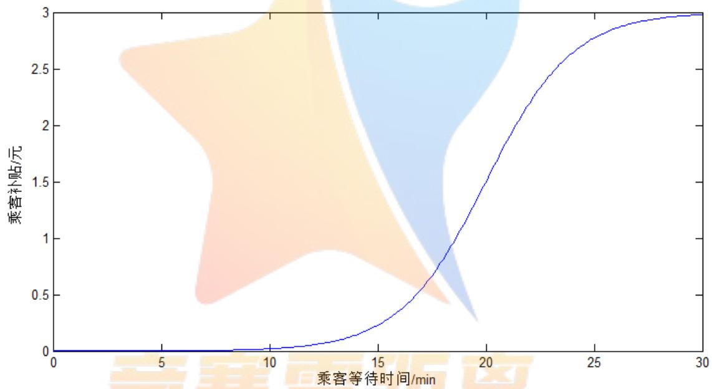

<details>
<summary>violin</summary>

| 乘客等待时间/min | 乘客补贴/元 |
| --- | --- |
| 0 | 0 |
| 5 | ~0.01 |
| 10 | ~0.05 |
| 15 | ~0.3 |
| 20 | ~1.4 |
| 25 | ~2.7 |
| 30 | 3 |
</details>

图14：乘客等待时间与补贴函数关系图

分析可知，乘客等待时间 $\omega _ { 1 }$ 与补贴是正相关的 $^ { , }$ 其关系基本满足 Logit 型曲线。假定等车时间超过 10 分钟会获得补贴，当等车时间为 30 分钟时及以上时补贴为3元，则乘客动态补贴表达式为：

$$
\Delta q _ {1} = - \frac {3}{1 + e ^ {0 . 5 (\omega_ {1} - 2 0)}} + 3 \tag {5.3-2}
$$

②对司机的动态补贴金额

由于司机去堵车区消耗的时间成本可以按一定概率在非堵车区接送乘客，同时司机去接较远位置的乘客时会花费较多的油钱，所以综合这两个方面对司机进行补贴。为了将补贴控制在可接受的范围内，结合油费和堵车时间的表达式中变量的数量级，选定合理的堵车奖励系数，油费补贴系数。设一次接送的油费为 $B _ { 0 }$ ，堵车时间为 ，则司机动态补贴表达式为： $\omega _ { 2 }$

$$
\Delta q _ {2} = 0. 2 \omega_ {2} \cdot v + 0. 1 B _ {0} (5. 3 - 3)
$$

将乘客动态补贴函数、司机动态补贴函数代入式（5.3-1）可得总补贴函数为：

$$
\left\{ \begin{array}{l} q _ {1} = q _ {\text {乘客}} - \frac {3}{1 + e ^ {0 . 5 \left(\omega_ {1} - 2 0\right)}} + 3 \\ q _ {2} = q _ {\text {司机}} + 0. 2 \omega_ {2} \cdot v + 0. 1 B _ {0} \end{array} \right. \tag {5.3-4}
$$

（注： $q _ { \overrightarrow { A } \overrightarrow { A } }$ 和 $q _ { \equiv \mathrm { { j \uparrow } } }$ 为常数，可由步骤一得到）

## 2、模型求解

通过绘制补贴金额与供求量的关系图，分析可以得出补贴金额最小的补贴方案，从而得到可接受补贴范围。

经等步长搜索可得，给司机 11.4元补贴，给乘客 15.4元补贴时，打车难度系数最小，此时的供求比约等于 1。但是在这种情况情况下，补贴的总金额太高，不符合实际情况，所以，可以选定置信区间为（0.8，1），绘制补贴金额与供求匹配区域图如下所示，将供求比在置信区间的区域标蓝。

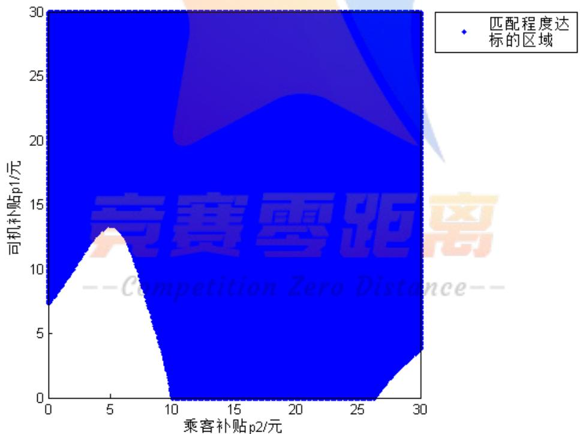

<details>
<summary>heatmap</summary>

| 乘客补贴p2/元 (range) | 司机补贴p1/元 (range) |
| --- | --- |
| 0~30 | 0~30 |
</details>

图15：补贴金额与供求匹配区域图（蓝色区域代表匹配程度大于 0.8）

分析图15可知，当对乘客补贴 0元，对司机补贴7.3元时，能满足在打车难度小于0.2的前提下，使得总补贴金额最小。7.3元即为司机基础补贴q ，0元 $q _ { \equiv \mathrm { j } \mathrm { t } }$ 为乘客基础补贴 $q _ { \overrightarrow { A } \overrightarrow { A } }$

因此，为了在尽可能满足供求的情况下减少补贴的钱数，以 7.3 元和 0 元进行上下波动，规定补贴可接受波动范围为 5 元，得到可接受补贴范围为：司机：7.3 元-12.3 元，乘客：0-5 元。在这一范围内，可以依据耗油费、堵车时间、待时间，求解动态补贴金额，再加上基础补贴金额，得到总补贴金额：

$$
\left\{ \begin{array}{l} q _ {1} = - \frac {3}{1 + e ^ {0 . 5 (\omega_ {1} - 2 0)} + 3} \\ q _ {2} = 7. 3 + 0. 2 \omega_ {2} \cdot v + 0. 1 B _ {0} \end{array} \right. \tag {5.3-5}
$$

为给出补贴方案，求取部分条件下的补贴总金额如下表所示：

表7：乘客部分补贴方案

<table><tr><td>乘客等待时间  $\omega_{1}$ (分钟)</td><td>0-10</td><td>15</td><td>20</td><td>30</td><td>40</td></tr><tr><td>补贴 $q_{1}$ (元)</td><td>0</td><td>0.23</td><td>1.5</td><td>3</td><td>3</td></tr></table>

表 $8 { : }$ ：出租车司机部分补贴方案

<table><tr><td>司机堵车时间 $\omega_{2}$ (分钟)</td><td>10</td><td>15</td><td>20</td><td>25</td><td>30</td></tr><tr><td>油耗费用 $B'$ (元)</td><td>1.5</td><td>3</td><td>4.5</td><td>6</td><td>7.5</td></tr><tr><td>补贴 $q_{2}$ (元)</td><td>8.65</td><td>9.4</td><td>10.15</td><td>10.9</td><td>11.3</td></tr></table>

## 3、模型仿真

依据上述模型，模拟真实情况，仿真在新的补贴规则下，供求关系的变化。

①仿真过程

首先建立一个包含四条街道的井字形街道小世界。未来模拟动态补贴，加入了“帧数”概念，使其变为动态的世界。在每条街道上，随机生成 20 辆初始状态为空车的出租车以及 25 个需要打车的乘客作为基本元素，设定出租车的初始视野半径为200m，对于每辆空的出租车，如果其这个视野半径内存在还没匹配成功的乘客，就认为该乘客可以成功上车，但如果视野半径内有多个人物，由于短视效应，出租车只会和最近的人匹配，即建立雇佣关系。按照上述思想，对每辆出租车匹配乘客。

没有补贴时，人们相对不愿意等较久时间，出租车视野半径也较小。而加入乘客补贴和司机补贴后人们愿意等较久时间，司机也更加愿意接收乘客。所以根据这个思想来对没有补贴、有乘客补贴和司机补贴的情况分别进行模拟仿真，仍使用曼哈顿距离来衡量司机与目标客人的距离，即

$$
d = | x - x _ {1} | + | y - y _ {1} |
$$

在这个仿真中，以司机-乘客成功匹配次数，即成功打到车的人数作为唯一评价标准。

对于仿真细节，假定有乘客补贴的情况下乘客愿意等的时间是原始无补贴时间的三倍，即

$$
t _ {a f t e r} = 3 t _ {o r i g i n a l},
$$

并假定司机补贴7.3 元/单。

仿真结果如下:

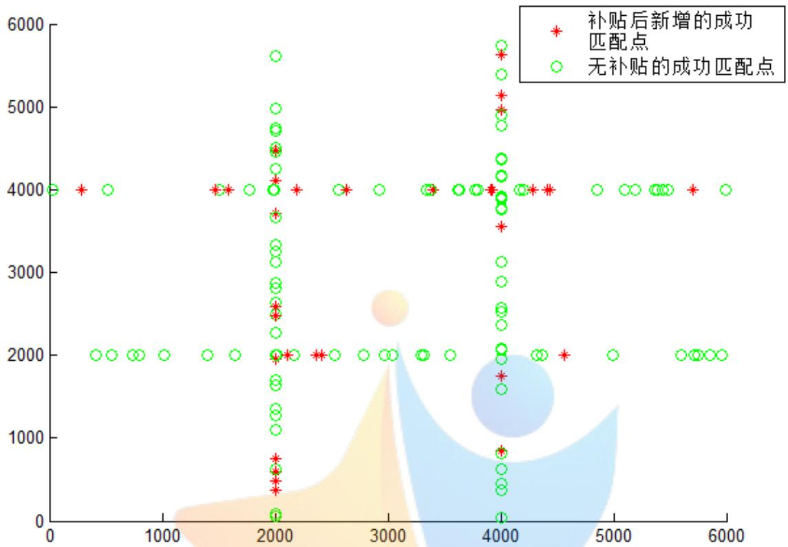

<details>
<summary>scatter</summary>

| Series | X | Y |
| --- | --- | --- |
| 补贴后新增的成功匹配点 | ~300 | 4000 |
| 补贴后新增的成功匹配点 | ~1500 | 4000 |
| 补贴后新增的成功匹配点 | ~2000 | 4000 |
| 补贴后新增的成功匹配点 | ~2100 | 4000 |
| 补贴后新增的成功匹配点 | ~2400 | 4000 |
| 补贴后新增成功匹配点 | ~3900 | 4000 |
| 补贴后新增成功匹配点 | ~4600 | 4000 |
| 补贴后新增成功匹配点 | ~5700 | 4000 |
| 无补贴的成功匹配点 | ~300 | 4000 |
| 无补贴的成功匹配点 | ~600 | 4000 |
| 无补贴的成功匹配点 | ~1800 | 4000 |
| 无补贴的成功匹配点 | ~2000 | 5600 |
| 无补贴的成功匹配点 | ~2000 | 4700 |
| 无补贴的成功匹配点 | ~2000 | 4500 |
| 无补贴的成功匹配点 | ~2000 | 4300 |
| 无补贴的成功匹配点 | ~2000 | 4100 |
| 无补贴的成功匹配点 | ~2000 | 3700 |
| 无补贴的成功匹配点 | ~2000 | 3300 |
| 无补贴的成功匹配点 | ~2000 | 3150 |
| 无补贴的成功匹配点 | ~2000 | 2950 |
| 无补贴的成功匹配点 | ~2000 | 2850 |
| 无补贴的成功匹配点 | ~2000 | 2650 |
| 无补贴的成功匹配点 | ~2000 | 2550 |
| 无补贴的成功匹配点 | ~2000 | 2350 |
| 无补贴的成功匹配点 | ~2000 | 2250 |
| 无补贴的成功匹配点 | ~2000 | 2150 |
| 无补贴的成功匹配点 | ~2000 | 2150 |
| 无补贴的成功匹配点 | ~2000 | 2150 |
| 无补贴的成功匹配点 | ~2000 | 2150 |
| 无补贴的成功匹配点 | ~2150 | 2150 |
| 无补贴的成功匹配点 | ~2450 | 2150 |
| 无补贴的成功匹配点 | ~2750 | 2150 |
| 无补贴的成功匹配点 | ~3150 | 2150 |
| 无补贴的成功匹配点 | ~3450 | 2150 |
| 无补贴的成功匹配点 | ~3750 | 2150 |
| 无补贴的成功匹配点 | ~3950 | 5800 |
| 无补贴的成功匹配点 | ~3950 | 5450 |
| 无补贴的成功匹配点 | ~3950 | 5350 |
| 无补贴的成功匹配点 | ~3950 | 4850 |
| 无补贴的成功匹配点 | ~3950 | 4450 |
| 无补贴的成功匹配点 | ~3950 | 4250 |
| 无补贴的成功匹配点 | ~3950 | 4150 |
| 无补贴的成功匹配点 | ~3950 | 4150 |
| 无补贴的成功匹配点 | ~3950 | 4150 |
| 无补贴的成功匹配点 | ~3950 | 4150 |
| 无补贴的成功匹配点 | ~3950 | 4150 |
| 无补贴的成功匹配点 | ~3950 | 4250 |
| 无补贴的成功匹配点 | ~3950 | 4150 |
| 无补贴的成功匹配点 | ~3950 | 4150 |
| 无补贴的成功匹配点 | ~3950 | 4150 |
| 无补贴的成功匹配点 | ~3950 | 4250 |
| 无补贴的成功匹配点 | ~3950 | 4250 |
| 无补贴的成功匹配点 | ~3950 | 4150 |
| 无补贴的成功匹配点 | ~3950 | 4150 |
| 无补贴的成功匹配点 | ~3950 | 4150 |
| 无补贴的成功匹配点 | ~3950 | 4850 |
| 无补贴的成功匹配点 | ~3950 | 4850 |
| 无补贴的成功匹配点 | ~3950 | 4850 |
| 无补贴的成功匹配点 | ~3950 | 4850 |
| 无补贴的成功匹配点 | ~3950 | 4850 |
| 无补贴的成功匹配点 | ~3950 | 4950 |
| 无补贴的成功匹配点 | ~3950 | 4950 |
| 无补贴的成功匹配点 | ~3950 | 4950 |
| 无补贴的成功匹配点 | ~3950 | 4950 |
| 无补贴的成功匹配点 | ~3950 | 4950 |
| 无补贴的成功匹配点 | ~3950 | 4850 |
| 无补贴的成功匹配点 | ~3950 | 4850 |
| 无补贴的成功匹配点 | ~3950 | 4850 |
| 无补贴的成功匹配点 | ~3950 | 4850 |
| 无补贴的成功匹配点 | ~3950 | 4750 |
| 无补贴的成功匹配点 | ~3950 | 4750 |
| 无补贴的成功匹配点 | ~3950 | 4750 |
| 无补贴的成功匹配点 | ~3950 | 4750 |
| 无补贴的成功匹配点 | ~3950 | 4750 |
| 无补贴的成功匹配点 | ~3950 | 4650 |
| 无补贴的成功匹配点 | ~3950 | 465 |
| 无补贴的成功匹配点 | ~3950 | 465 |
| 无补贴的成功匹配点 | ~3950 | 465 |
| 无补贴的成功匹配点 | ~3950 | 465 |
| 无补贴的成功匹配点 | ~3950 | 465 |
| 无补贴的成功匹配点 | ~3950 | 465 |
| 无补偿的成功匹配点 | ~3950 | 465 |
| 无补偿的成功匹配点 | ~3950 | 465 |
| 无补偿的成功匹配点 | ~3950 | 465 |
| 无补偿的成功匹配点 | ~3950 | 465 |
| 无补偿的成功匹配点 | ~3950 | 465 |
</details>

图16：有无补贴方案前后匹配成功仿真图

②结果分析

模拟仿真结果如下：

表9：新补贴方案下的成功匹配数据

<table><tr><td>补贴方案</td><td>没有补贴</td><td>两者皆有补贴</td></tr><tr><td>成功打到车的人数</td><td>52</td><td>70</td></tr></table>

分析可得，在提供有限出租车的情况下，加入补贴政策后，人数增加 34.62%，显著降低了打车的难度。

## 六、结果分析

## 1.供求比关于补贴金额的灵敏度分析

为了解规划函数的敏感度情况，将自变量司机补腿儿贴 p1 及顾客补贴 p2 上下随机浮动 5%,使用 matlab 编程，采样 100 个点，得到他们的匹配程度值浮动程度分布为下表

表10：灵敏度分析表

<table><tr><td>灵敏度区间</td><td>小于5%</td><td>小于25%</td><td>小于50%</td><td>小于100%</td></tr><tr><td>占采样总数百分比</td><td>50%</td><td>83%</td><td>93%</td><td>97%</td></tr></table>

平均匹配程度值浮动程度为 16.19%，数据比较敏感。

2、通过供求比来衡量供求匹配关系时，本文是通过已知的部分点拟合得到供、需曲线，得到的结果是含参表达式，不能直观地反映供求比的大小。因此，对于高峰区、低谷区、拥堵区、非拥堵区，求出每个区域内部的所有点的供求比，再求取平均值得到的。结果表明：高峰区的供求比要远小于低谷期，拥堵区的供求比要远小于非拥堵区，产生这种结果的原因是：高峰期和拥堵区的人流量远大于低谷期，即潜在需求量也大，同时，高峰期和拥堵区的交通运行缓慢，导致及时有空车也无法及时到达乘客所在地。  
3、仿真结果表明：现行的补贴方案已经能有效地增加匹配成功次数，且经过改进后的补贴政策对于供求匹配的调整效果更好。但是在仿真过程中，对于道路的设计较为简单，乘客数量与出租车数量也比真实情况中少，所以仿真结果只能在一定程度上检验模型的正确性，

## 七、模型评价与推广

1、宏观、微观时空的供求匹配评价模型讨论了宏观、微观两种情况的出租车资源的“供求匹配程度”，具有全面性，并建立了多层符合实际的指标，利用模糊综合评价和多元回归拟合将“供求匹配”程度体现出来，评价结果较为可靠，且可以推广到其他领域比如  
、基于概率分析的打车难度系数规划模型不仅考虑了第一问中的影响因素，还考虑了拒单率、拼车率、使用打车软件的年龄分布和供求的关系，并利用这些因素的关系建立了单目标规划模型，并进行了模型仿真。使用该模型分析补贴方案对“缓解打车难”问题具有极高的说服力。  
3、基于动态补贴的供求优化模型利用问题二的规划模型求解出了最优情况，并依照社会实际对其进行动态调整，得出了一个既能解决“打车难”又最节省金钱的方案，满足了社会需要，模型严谨，考虑全面。  
4、三个模型环环相扣，可以被推广到各行业的补贴、评价问题研究中。

## 八、参考文献

[1] 姜启源，谢金星，数学模型（第三版）[M].北京：高等教育出版社，2003。  
[2] 陈枫，基于供求平衡的城市出租车合理规模研究，36-39页，2010。  
[3] 王虎军，行业管制下分时段大城市出租车供求关系研究，22 页，2007。  
[4] 张文全，影响城市出租车供求关系的因素分析，河北交通职业技术学院学报第8 卷 第 1 期：1-3 页，2011。  
[5]百度百科，各城市出租车相关数据统计表，  
http://wenku.baidu.com/link?url=pNGDm8v3uIyEPsESto8VH0No4xQRJLvgkOiKPXENGh961zpIL1HC6OqK4z\_q4srYtxaWfurzobuwPunxkFKDohZYBbJkVKybt5os\_8X2bl7&qq-pf-to=pcqq.group，2015.9.11。

## 附录：

附录1：深圳市四天内的高峰期、低谷期、拥堵区、非拥堵区统计数据

高峰期：

<table><tr><td>日期</td><td>需求</td><td>平均车费(元)</td><td>平均抢单时间(秒)</td><td>乘客平均乘车时间(秒)</td></tr><tr><td>0905</td><td>5949</td><td>5849</td><td>34.88</td><td>910.8</td></tr><tr><td>0906</td><td>6889</td><td>57.84</td><td>39.41</td><td>947.9</td></tr><tr><td>0907</td><td>8501</td><td>62.77</td><td>42.63</td><td>1050.3</td></tr><tr><td>0908</td><td>9057</td><td>70.31</td><td>45.09</td><td>1240.7</td></tr></table>

低谷期：

<table><tr><td>日期</td><td>需求</td><td>平均车费(元)</td><td>平均抢单时间(秒)</td><td>乘客平均乘车时间(秒)</td></tr><tr><td>0905</td><td>3089</td><td>52.81</td><td>20.85</td><td>638.7</td></tr><tr><td>0906</td><td>3760</td><td>51.77</td><td>26.72</td><td>640.9</td></tr><tr><td>0907</td><td>4305</td><td>56.49</td><td>26.99</td><td>728.1</td></tr><tr><td>0908</td><td>5091</td><td>59.26</td><td>28.47</td><td>789.4</td></tr></table>

拥堵区：

<table><tr><td>日期</td><td>需求</td><td>平均车费(元)</td><td>平均抢单时间(秒)</td><td>乘客平均乘车时间(秒)</td></tr><tr><td>0905</td><td>642</td><td>58.97</td><td>41.58</td><td>910.8</td></tr><tr><td>0906</td><td>751</td><td>57.88</td><td>47.21</td><td>891.4</td></tr><tr><td>0907</td><td>790</td><td>66.71</td><td>49.69</td><td>953.6</td></tr><tr><td>0908</td><td>984</td><td>69.93</td><td>53.07</td><td>990.3</td></tr></table>

非拥堵区：

<table><tr><td>日期</td><td>需求</td><td>平均车费(元)</td><td>平均抢单时间(秒)</td><td>乘客平均乘车时间(秒)</td></tr><tr><td>0905</td><td>280</td><td>50.81</td><td>22.16</td><td>625.7</td></tr><tr><td>0906</td><td>308</td><td>49.94</td><td>25.73</td><td>610.3</td></tr><tr><td>0907</td><td>414</td><td>57.43</td><td>27.12</td><td>703.6</td></tr><tr><td>0908</td><td>489</td><td>62.17</td><td>27.99</td><td>768.4</td></tr></table>

附录 2：

使用 matlab 2014a 以及 dev c++ 5.11 软件编程

需求数据处理.cpp:  
```c
/*
data processing
data formatting
from data: 0905_needed.txt (Saturday)
        0906_needed.txt (Sunday)
        0908_needed.txt (Tuesday)
        0909_needed.txt (Wednesday)
    etc.
section 1.
let the data be easy to process （格式化数据）
then we can use excel to continue.
*/
#include <bits/stdc++.h>
using namespace std;
int main()
{
    freopen("0909.txt","r",stdin);
    freopen("0909_1.txt","w",stdout);
    char x;
    while(cin>>x)
    {
        if(x=='{'||x=='['||x=='\"')
            continue;
        else if (x==',’)
            cout<<' ';
        else if (x==']')
            printf("\n");
        else
            cout<<x;
    }
    return 0;
}
```

附录 3：

Brute\_force.m  
%第三问搜索算法  
```matlab
functionminQ = brute_force(G, F, phi, lambda)
minQ=1000;
fori = 1:301 % p2
```

```matlab
for j = 1:301 % p1
%          if abs((G(i)*(0.75*lambda(j)+1)-G(i)*0.25*phi(i))/F(j)-1)<maxQ
%             maxQ = abs((G(i)*(0.75*lambda(j)+1)-G(i)*0.25*phi(i))/F(j)-1);
%             maxp1 = (j-1)/10;
%             maxp2 = (i-1)/10;
%         end
%   'ò×¢Ê͵ÄÊǵÚÈýÎÊ×î¿^ÂʼµÄµ¥²½ËÑË÷'úÂë
if abs((G(i)*(0.75*lambda(j)+1)-G(i)*0.25*phi(i))/F(j)-1)<0.2
plot((j-1)/10,(i-1)/10,'b.');
holdon;
ifi+j<minQ
minQ = i+j;
end
end
end
end
```

附录 4：

fangzhen.m

% 第二问仿真

functioncnt = fangzhen(people\_bonus,driver\_bonus)

ifnargin< 2

q1 = 0 ; q2 = 0;

else

q1 = driver\_bonus;q2 = people\_bonus;

end

car\_pos1 = rand(20,1);

car\_pos1 = [ones(20,1).\*2000,car\_pos1.\*6000];

car\_pos2 = rand(20,1);

car\_pos2 = [ones(20,1).\*4000,car\_pos2.\*6000];

car\_pos3 = rand(20,1);

car\_pos3 = [car\_pos3.\*6000,ones(20,1).\*2000];

car\_pos4 = rand(20,1);

car\_pos4 = [car\_pos4.\*6000,ones(20,1).\*4000];

car\_pos = [[car\_pos1;car\_pos2;car\_pos3;car\_pos4;],ones(80,1)];

car\_pos\_t = car\_pos;

car\_pos1 = rand(25,1);

car\_pos1 = [ones(25,1).\*2000,car\_pos1.\*6000];

car\_pos2 = rand(25,1);

car\_pos2 = [ones(25,1).\*4000,car\_pos2.\*6000];

car\_pos3 = rand(25,1);

car\_pos3 = [car\_pos3.\*6000,ones(25,1).\*2000];

```matlab
car_pos4 = rand(25,1);
car_pos4 = [car_pos4.*6000, ones(25,1).*4000];
p_pos = [[car_pos1;car_pos2;car_pos3;car_pos4;], ones(100,1)];
p_pos_t = p_pos;
figure(1)
holdon
d = 200;cnt = 0;
fori = 1:80
nowbest = [d,0];
for j = 1:100
ifp_pos(j,3)==0
continue;
end
    delta = abs(car_pos(i,1)-p_pos(j,1)) + abs(car_pos(i,2)-p_pos(j,2));
if delta <nowbest(1)
nowbest(2) = j;
nowbest(1) = delta;
end
end
ifnowbest(1) < d &&nowbest(2) > 0
cnt = cnt + 1;
p_pos(nowbest(2),3) = 0;
end
end
cnt% ûÕD²¹Ìù
t_p_pos = p_pos;
holdon
p_pos = p_pos_t;
car_pos = car_pos_t;
d = 310;cnt = 0;
fori = 1:80
nowbest = [d,0];
for j = 1:100
ifp_pos(j,3)==0
continue;
end
    delta = abs(car_pos(i,1)-p_pos(j,1)) + abs(car_pos(i,2)-p_pos(j,2));
if delta <nowbest(1)
nowbest(2) = j;
nowbest(1) =delta;
end
end
```

```matlab
ifnowbest(1) < d &&nowbest(2) > 0
cnt = cnt + 1;
p_pos(nowbest(2),3) = 0;
end
end
fori = 1:100
ift_p_pos(i,3)==0
plot(t_p_pos(i,1),t_p_pos(i,2),'go');
elseifp_pos(i,3)==0
plot(p_pos(i,1),p_pos(i,2),'r*');
end
end
cnt
figure(2)
holdon
p_pos = p_pos_t;
car_pos = car_pos_t;
d = 300;cnt = 0;
fori = 1:80
nowbest = [d,0];
for j = 1:100
ifp_pos(j,3)==0
continue;
end
    delta = abs(car_pos(i,1)-p_pos(j,1)) + abs(car_pos(i,2)-p_pos(j,2));
if delta <nowbest(1)
nowbest(2) = j;
nowbest(1) = delta;
end
end
ifnowbest(1) < d &&nowbest(2) > 0
cnt = cnt + 1;
p_pos(nowbest(2),3) = 0;
end
end
fori = 1:100
ift_p_pos(i,3)==0
plot(t_p_pos(i,1),t_p_pos(i,2),'go');
elseifp_pos(i,3)==0
plot(p_pos(i,1),p_pos(i,2),'r*')
end
end
cnt
```

end

附录5：

fangzhen3.m

%第三问仿真

```matlab
function [cnt, cnt1] = fangzhen3()
car_pos1 = rand(20, 1);
car_pos1 = [ones(20, 1).*2000, car_pos1.*6000];
car_pos2 = rand(20, 1);
car_pos2 = [ones(20, 1).*4000, car_pos2.*6000];
car_pos3 = rand(20, 1);
car_pos3 = [car_pos3.*6000, ones(20, 1).*2000];
car_pos4 = rand(20, 1);
car_pos4 = [car_pos4.*6000, ones(20, 1).*4000];
car_pos = [[car_pos1;car_pos2;car_pos3;car_pos4;], ones(80, 1)];
car_pos_t = car_pos;
car_pos1 = rand(25, 1);
car_pos1 = [ones(25, 1).*2000, car_pos1.*6000];
car_pos2 = rand(25, 1);
car_pos2 = [ones(25, 1).*4000, car_pos2.*6000];
car_pos3 = rand(25, 1);
car_pos3 = [car_pos3.*6000, ones(25, 1).*2000];
car_pos4 = rand(25, 1);
car_pos4 = [car_pos4.*6000, ones(25, 1).*4000];
p_pos = [[car_pos1;car_pos2;car_pos3;car_pos4;], ones(100, 1)];
p_pos_t = p_pos;
figure(1)
holdon
d = 200;cnt = 0;
fori = 1:80
nowbest = [d, 0];
ifcar_pos(i, 3)==0
continue;
end
for j = 1:100
ifp_pos(j, 3)==0
continue;
end
    delta = abs(car_pos(i, 1)-p_pos(j, 1)) + abs(car_pos(i, 2)-p_pos(j, 2));
if delta <nowbest(1)
nowbest(2) = j;
nowbest(1) = delta;
end
```

```matlab
end
ifnowbest(1) < d &&nowbest(2) > 0
cnt = cnt + 1;
p_pos(nowbest(2),3) = 0;
car_pos(i,3) = 0;
end
end
cnt% »ÓĐ²¹ ùù
t_p_pos=p_pos;
%ÓĐ²¹ ùùμÄ • ÂÕæ
%ÈËÂÇ,üÔ,ÒâµÈ
%Ⱦ»ú,üÔ,Òâȥض • ½
max_car_d = 500;
holdon
p_pos = p_pos_t;
car_pos = car_pos_t;
d = 295;cnt1 = 0;
foriter = 1:3
fori = 1:80
ifcar_pos(i,3)==0
continue;
end
nowbest = [d,0];
for j = 1:100
ifp_pos(j,3)==0
continue;
end
delta = abs(car_pos(i,1)-p_pos(j,1)) + abs(car_pos(i,2)-p_pos(j,2));
if delta <nowbest(1)
nowbest(2) = j;
nowbest(1) = delta;
end
end
ifnowbest(1) < d &&nowbest(2) > 0
cnt1 = cnt1 + 1;
p_pos(nowbest(2),3) = 0;
car_pos(i,3)=0;
end
end
fori=1:80
ifcar_pos(i,1)==2000 || car_pos(i,1)==4000
car_pos(i,2) = car_pos(i,2) + 2*max_car_d*(rand()-0.5);
ifcar_pos(i,2)>6000
```

```matlab
car_pos(i,2) = car_pos(i,2) - max_car_d;
elseifcar_pos(i,2)<0
car_pos(i,2) = car_pos(i,2) + max_car_d;
end
end
ifcar_pos(i,2)==2000 || car_pos(i,2)==4000
car_pos(i,1) = car_pos(i,1) + 2*max_car_d*(rand()-0.5);
ifcar_pos(i,1)>6000
car_pos(i,1) = car_pos(i,1) - max_car_d;
elseifcar_pos(i,1)<0
car_pos(i,1) = car_pos(i,1) + max_car_d;
end
end
end
end
fori = 1:100
ift_p_pos(i,3)==0
plot(t_p_pos(i,1), t_p_pos(i,2),'go');
elseifp_pos(i,3)==0
plot(p_pos(i,1), p_pos(i,2),'r*');
end
end
```

附录6：灵敏度分析.m  
```matlab
%ÁéÃÕÈ • ÔÎõ
cc_percent = [];
fori = 50:149
    p1 = floor(i*(1+0.05*rand()));
    p2 = floor(i*(1+0.05*rand()));
    ans1 = abs((G(i)*(0.75*lambda(i)+1)-G(i)*0.25*phi(i))/F(i)-1);
    ans2 = abs((G(p1)*(0.75*lambda(p2)+1)-G(p1)*0.25*phi(p1))/F(p2)-1);
cc_percent(i-49) = abs((ans1-ans2)/ans1);
end
```