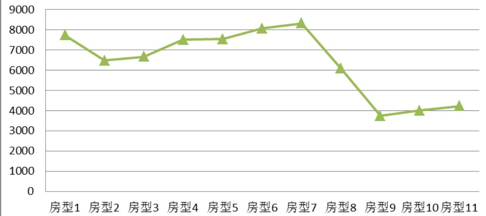
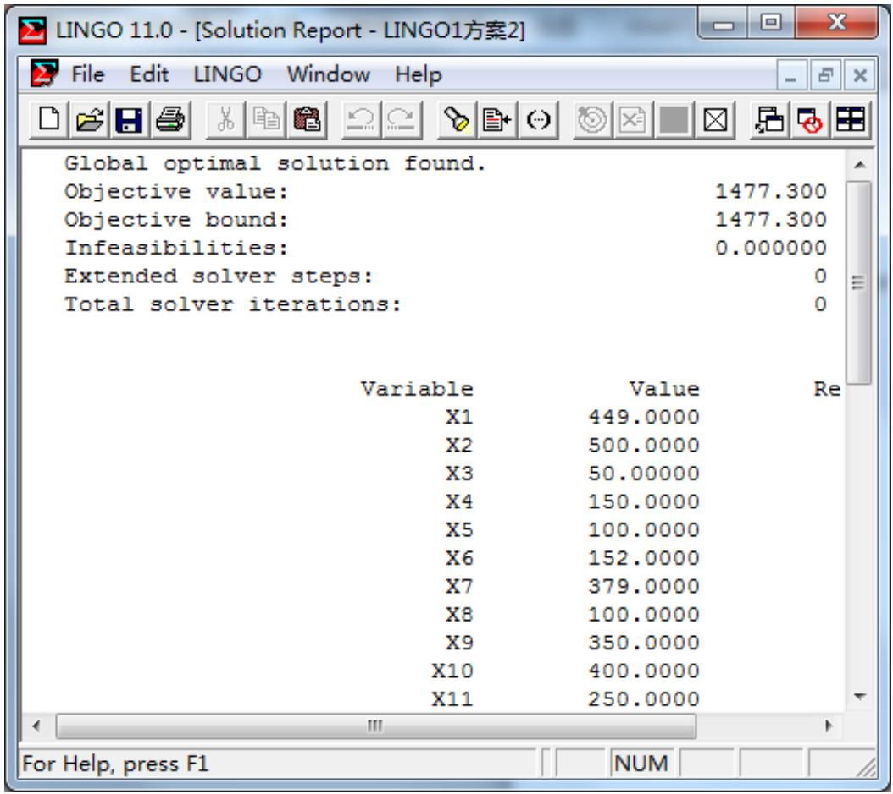
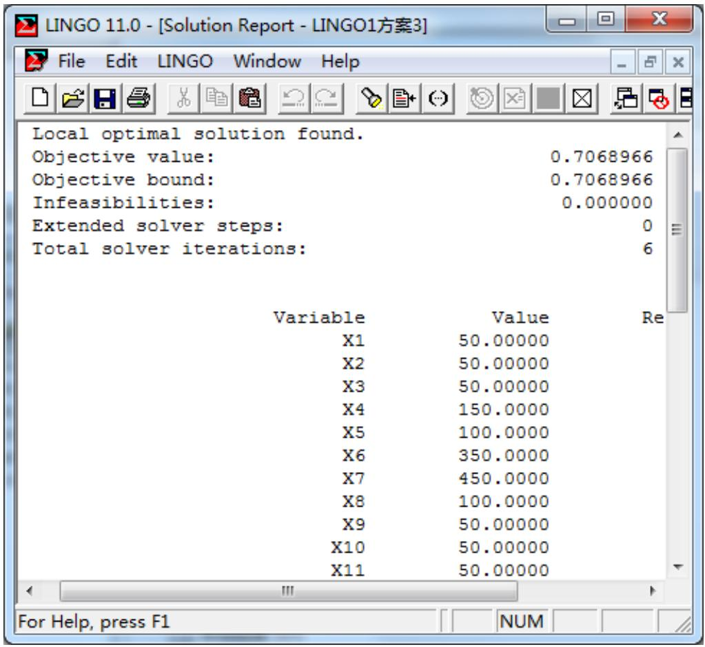
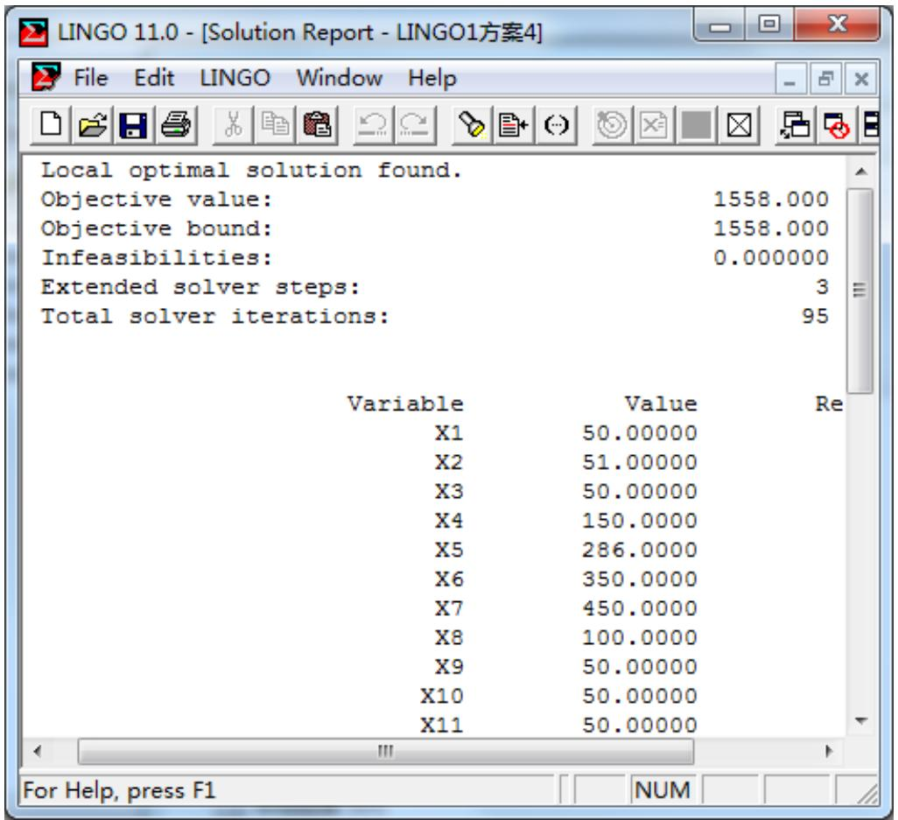

# 众筹筑屋规划方案设计

## 摘要

我们选做的是D题。

第一问我们对众筹筑屋规划项目的原方案（方案Ⅰ）进行全面核算。我们利用 Excel软件核算出如下结果：

<table><tr><td>成本(元)</td><td>收益(元)</td><td>容积率</td><td>增值税(元)</td></tr><tr><td>2618938187</td><td>627781813.1</td><td>2.275</td><td>343931779.8</td></tr></table>

第二问要求尽量满足参筹者的购买意愿，重新设计建设规划方案。给出四种设计方法,分别是:1、试探法，按照满意比例分配房型建设套数（方案Ⅱ）；

2、以总满意度为目标函数建立整数线性规划（方案Ⅲ）；  
3、以平均满意度为目标函数建立整数线性规划（方案Ⅳ）；  
4、以平均满意度和建房总套数为双目标，建立整数线性规划（方案Ⅴ）。

第4种方法的主要思想是：先以房型套数为决策变量，平均满意度为目标函数，各房型套数限制及容积率的限制为约束条件，建立整数线性规划：

$$
\max \quad \bar {W} = \sum_ {i = 1} ^ {1 1} x _ {i} w _ {i} / \sum_ {i = 1} ^ {1 1} x _ {i}
$$

S.t. ximin ≤ xi ≤ ximax i = 1,2...11 且 xi 为整数

ν≤ 2.275 ν 为容积率

利用Lingo软件求解得各房型套数及最大平均满意度，接下来在此基础上进行优化，以房型套数为决策变量，以房型总套数最大作为目标函数，约束条件在第三种方法的基础上增加一个，即平均满意度要大于等于第三种方法算得的近似平均满意度，再次建立线性规划模型：

$$
\max \sum_ {i = 1} ^ {1 1} x _ {i}
$$

s.t. $x _ { i \mathrm { m i n } } \leq x _ { i } \leq x _ { i \mathrm { m a x } } i = 1 , 2 . . . 1 1$ 且 $x _ { i }$ 为整数

$$
v \leq 2. 2 7 5 \quad \bar {W} \geq 0. 7 0 6
$$

利用Excel进行核算，结果如下：

<table><tr><td>成本(元)</td><td>收益(元)</td><td>容积率</td><td>增值税(元)</td></tr><tr><td>2568486872</td><td>61876328.2</td><td>2.2749</td><td>311856962</td></tr></table>

第三问在第二问的基础上增加了投资回报率的最小要求。我们在上述方案Ⅴ的基础上进行调整，增加单套房利润较大的房型套数，同时要满足容积率的要求。若投资回报率不满25%，但容积率已达上限，则可考虑增加容积率不列入计算的房型套数，最终在兼顾投资回报率、容积率、参筹者的购买意愿等要求下形成方案Ⅵ，利用Excel进行核算，结果如下：

<table><tr><td>成本(元)</td><td>收益(元)</td><td>容积率</td><td>增值税(元)</td><td>投资回报率</td></tr><tr><td>2572446150</td><td>643448250.3</td><td>2.742</td><td>322029019.1</td><td>25.01%</td></tr></table>

关键词：容积率 开发成本, 预期收益 总满意度 平均满意度 投资回报率Lingo Excel

## 一、问题重述

众筹筑屋是互联网时代一种新型的房地产形式。现有占地面积为 102077.6平方米的众筹筑屋项目（详情见附件1）。项目推出后，有上万户购房者登记参筹。项目规定参筹者每户只能认购一套住房。

在建房规划设计中，需考虑诸多因素，如容积率、开发成本、税率、预期收益等。根据国家相关政策，不同房型的容积率、开发成本、开发费用等在核算上要求均不同，相关条例与政策见附件2和附件 3。

请你结合本题附件中给出的具体要求及相关政策，建立数学模型，回答如下问题：

1. 为了信息公开及民主决策，需要将这个众筹筑屋项目原方案（称作方案Ⅰ）的成本与收益、容积率和增值税等信息进行公布。请你们建立模型对方案 I 进行全面的核算，帮助其公布相关信息。  
2. 通过对参筹者进行抽样调查，得到了参筹者对11种房型购买意愿的比例（见附件1）。为了尽量满足参筹者的购买意愿，请你重新设计建设规划方案（称为方案Ⅱ），并对方案II进行核算。  
3. 一般而言，投资回报率达到 25%以上的众筹项目才会被成功执行。你们所给出的众筹筑屋方案Ⅱ能否被成功执行？如果能，请说明理由。如果不能，应怎样调整才能使此众筹筑屋项目能被成功执行？

## 二、模型假设

1、假设该众筹屋建设的契税，营业税，教育费附加，企业所得税等各种税均考虑在内，纳税人应交的税额按收入的5.65%来计算。  
2、假设方案一的容积率（近似值为2.275）即为申请的容积率，则此容积率为最大容积率。  
3、假设所有房型均售空，且纳税人不存在偷税漏税的情况。  
4、假设建房期间不存在工程事故等情况。  
5、假设附件1-1中的开发成本已经包括了所有的开发成本和开发费用。  
6、假设所有建设房型均在同一地区或城市，对土地增值税等有统一的规定标准。  
7、假设在计算过程中所产生的微小误差在不影响结果的前提下可以忽略不计。

## 三、符号说明

<table><tr><td> $S_i$ </td><td>第 i 个房型的面积</td></tr><tr><td> $x_i$ </td><td>第 i 个房型的套数</td></tr><tr><td> $x_{i\min}$ </td><td>第 i 个房型的最低套数</td></tr><tr><td> $x_{i\max}$ </td><td>第  $i$  个房型的最低高套数</td></tr><tr><td> $p_i$ </td><td>第  $i$  个房型的每平方开发成本</td></tr><tr><td> $q_i$ </td><td>第  $i$  个房型的每平方售价</td></tr><tr><td> $w_i$ </td><td>第  $i$  个房型的满意比例</td></tr><tr><td> $W, \bar{W}$ </td><td>分别为总满意度和平均满意度</td></tr><tr><td>k</td><td>普通房型所占面积比例</td></tr><tr><td>1-k</td><td>非普通房所占面积比例</td></tr><tr><td> $a_1$ </td><td>普通房所占土地金额(含其他类型分摊部分)</td></tr><tr><td> $a_2$ </td><td>非普通房所占土地金额(含其他类型分摊部分)</td></tr><tr><td> $b_1$ </td><td>普通房转让税金(含其他类型税金分摊部分)</td></tr><tr><td> $b_2$ </td><td>非普通房转让税金(含其他类型税金分摊部分)</td></tr><tr><td> $c_1$ </td><td>普通房开发成本(允许扣除部分)</td></tr><tr><td> $c_2$ </td><td>非普通房开发成本(允许扣除部分)</td></tr><tr><td> $e_1$ </td><td>普通房营业总收入(含其他类型收入分摊部分)</td></tr><tr><td> $e_2$ </td><td>非普通房营业总收入(含其他类型收入分摊部分)</td></tr><tr><td> $f_1$ </td><td>普通房增值额(含其他类型增值分摊部分)</td></tr><tr><td> $f_2$ </td><td>非普通房增值额(含其他类型增值分摊部分)</td></tr><tr><td> $k_1$ </td><td>普通房增值额与扣除项目金额比率</td></tr><tr><td> $k_2$ </td><td>非普通房增值额与扣除项目金额比率</td></tr><tr><td> $t_1$ </td><td>普通房土地增值税</td></tr><tr><td> $t_2$ </td><td>非普通土地增值税</td></tr><tr><td>v</td><td>容积率</td></tr><tr><td>M</td><td>项目总成本</td></tr><tr><td>P</td><td>项目预期收益</td></tr><tr><td>T</td><td>投资回报率</td></tr><tr><td>D</td><td>取得土地支付的金额</td></tr></table>

注（ ）

## 四、问题分析

## 4.1问题一分析

题目要求我们对项目方案I进行全面的核算，将成本与收益、容积率和增值税等信息进行公布。

容积率的计算比较简单，即为该项目总的建筑面积和总土地面积之比。在计算过程中要注意各种房型中的容积率有列入与不列入。

项目总成本应由建房开发成本、取得土地需支付的费用、转让房产的税金以及土地增值税四部分组成。项目的总收益应是转让房产的营业总收入减去项目总成本即可。

关键是土地增值税的核算。按照国家相关政策普通宅和非普通宅的增值税应分开核算。而该项目住宅类型分为三类，我们把其他类住宅的实际相关费用按普通宅和非普通宅建筑面积比分别分摊到普通宅和非普通宅对应项目中先计算普通宅和非普通宅的营业总收入；再分别计算它们对应的可扣除项目综合，要注意在扣除项目中，开发成本有允许扣除和不允许扣除两种类型，开发成本为“不允许扣除”表示其对应项目产生的实际成本按规定不能参与增值税核算。最终我们参照国家相关条例和规定，根据增值额和可扣除部分的比例来确定增值税的税率及算法公式，从而得到两种房型的增值税。

核算出两种增值税后项目总成本和收益不难算得，要注意的是在核算项目总成本时应纳入所有投资项，特别是所有房型的开发成本应计算在内。

## 4.2问题二分析

第二问要求尽量满足参筹者的购买意愿，重新设计建设规划方案。我们给出四种方法。

第一种方法：根据满意比例手动设定各房型套数，满意比例高的尽量设定其套数为规定最大值，比例小的设定为规定套数的最小值，再根据容积率的限制要求按比例进行调整。形成方案Ⅱ。

第二种方法：以房型套数为决策变量，总满意度为目标函数，各房型套数限制及容积率的限制为约束条件，建立整数线性规划，并利用Lingo 进行求解，形成方案Ⅲ。

第三种方法：以房型套数为决策变量，平均满意度为目标函数，各房型套数限制及容积率的限制为约束条件，建立整数线性规划，并利用Lingo进行求解形成方案Ⅳ。

第四种方法： 在第三种方法的基础上进行优化，以房型套数为决策变量，以房型总套数最大作为目标函数，约束条件在第三种方法的基础上增加一个，即平均满意度要大于等于第三种方法算得的近似平均满意度。最后利用Lingo 进行求解，形成方案Ⅴ。

对比以上几种方案，我们发现第四种方法的结果在兼顾参筹者的购买意愿及开发利润以及容积率限制等方面是比较好的。

## 4.3 问题三分析

第三问增加了投资回报率要达到 25%的要求。只有第二个问题中的第二种方法是满足这个要求的，其他三个方案都不满足要求，我们可以通过增加单套房利润较大的房型套数来进行调整，调整的同时要满足容积率的要求。若在调整过程中投资回报率不满 25%，但容积率已达上限，则可考虑增加容积率不列入计算的房型套数，最终在兼顾投资回报率、容积率、参筹者的购买意愿等要求下形成新的规划方案。

## 五、模型的建立与求解

## 5.1 问题一模型的建立与求解

众筹筑屋建设规划方案 I 的相关数据如表 1 所示， $s _ { i }$ 表示第 种房型的面积， $p _ { i }$ 表示第 种房型的每平米开发成本， $q _ { i }$ 表示第i 种房型的每平米的售价。

表 1

<table><tr><td>子项目房型i</td><td>住宅类型</td><td>容积率</td><td>开发成本</td><td>房型面积 $s_i$ </td><td>建房套数</td><td>开发成本 $p_i$ </td><td>售价 $q_i$ </td></tr><tr><td>房型1</td><td>普通宅</td><td>列入</td><td>允许扣除</td><td>77</td><td>250</td><td>4263</td><td>12000</td></tr><tr><td>房型2</td><td>普通宅</td><td>列入</td><td>允许扣除</td><td>98</td><td>250</td><td>4323</td><td>10800</td></tr><tr><td>房型3</td><td>普通宅</td><td>列入</td><td>不允许扣除</td><td>117</td><td>150</td><td>4532</td><td>11200</td></tr><tr><td>房型4</td><td>非普通宅</td><td>列入</td><td>允许扣除</td><td>145</td><td>250</td><td>5288</td><td>12800</td></tr><tr><td>房型5</td><td>非普通宅</td><td>列入</td><td>允许扣除</td><td>156</td><td>250</td><td>5268</td><td>12800</td></tr><tr><td>房型6</td><td>非普通宅</td><td>列入</td><td>允许扣除</td><td>167</td><td>250</td><td>5533</td><td>13600</td></tr><tr><td>房型7</td><td>非普通宅</td><td>列入</td><td>允许扣除</td><td>178</td><td>250</td><td>5685</td><td>14000</td></tr><tr><td>房型8</td><td>非普通宅</td><td>列入</td><td>不允许扣除</td><td>126</td><td>75</td><td>4323</td><td>10400</td></tr><tr><td>房型9</td><td>其他</td><td>不列入</td><td>允许扣除</td><td>103</td><td>150</td><td>2663</td><td>6400</td></tr><tr><td>房型10</td><td>其他</td><td>不列入</td><td>允许扣除</td><td>129</td><td>150</td><td>2791</td><td>6800</td></tr><tr><td>房型11</td><td>非普通宅</td><td>不列入</td><td>不允许扣除</td><td>133</td><td>75</td><td>2982</td><td>7200</td></tr></table>

## 5.1.1 容积率

根据百度百科资料，容积率又称建筑面积毛密度，是指一个小区的地上总建筑面积与用地面积的比率，这里我们用 表示容积率。建立容积率模型：

$$
v = \frac{\sum\limits_{i = 1}^{8}s_{i}*x_{i}}{102077.6}
$$

使用附件 1-1 中提供的数据，在 Excel 表格中进行计算，可得这种方案的容积率为2.275229825 。

## 5.1.2 增值税

根据附件1-2 和附件3中的说明，可知普通住宅和非普通住宅的土地增值税分别核算。而该项目所建房屋类型有三种，包括“普通住宅、非普通住宅和其他类”。考虑到还有其他类住宅，我们按规定将实际发生的成本按照普通宅和非普通宅建筑面积比进行分摊计算。

设普通住宅所占的面积比为 ， $k = ( \sum _ { i = 1 } ^ { 3 } s _ { i } ) / ( \sum _ { i = 1 } ^ { 8 } s _ { i } + s _ { 1 1 } )$ ， 则非普通住宅所占面积比为1-k。

## 一、 房产营业收入部分

分别用 $e _ { 1 } , e _ { 2 }$ 表示接受其他类房屋营业收入分摊后的普通宅营业收入和非普通宅营业收入。

最终的普通宅的营业收入 $e _ { 1 } = { } _ { \cdot }$ 原普通宅营业收入+分摊的其他类房产营业收入，建立模型：

$$
e _ {1} = \sum_ {i = 1} ^ {3} x _ {i} * s _ {i} * q _ {i} + k \sum_ {i = 9} ^ {1 0} x _ {i} * s _ {i} * q _ {i} 。
$$

同理，非普通宅最终的营业收入可建立模型：

$$
e _ {2} = \sum_ {i = 4} ^ {8} x _ {i} * s _ {i} * q _ {i} + x _ {1 1} * s _ {1 1} * q _ {1 1} + (1 - k) \sum_ {i = 9} ^ {1 0} x _ {i} * s _ {i} * q _ {i} 。
$$

## 二、房产可扣除项目

根据附件1-2中的规定和本项目的实际情况，计算土地增值税时可扣除的项目主要有一下三个方面：

## 1、取得土地支付的金额

同上取得土地支付的金额应分成普通宅和非普通宅两部分，分别用 $a _ { 1 } , a _ { 2 }$ 表示，D表示取得土地的支付总额，模型建立如下：

普通宅取得土地支付总额： $a _ { 1 } = k * D$

非普通宅取得土地支付总额： $a _ { 2 } = ( 1 - k ) * D$

## 2、转让房地产税金

根据附件1-1 中表 2的内容，可知转让房地产的税金税率按收入的5.65%计算，则可对包含其他类房屋转让税金的普通宅转让税金 $b _ { \scriptscriptstyle 1 }$ 和非普通宅转让税金 $b _ { 2 }$ 建立模型如下：

普通宅： $b _ { 1 } = e _ { 1 } ^ { \ast } 5 . 6 5 \% = ( \sum _ { i = 1 } ^ { 3 } x _ { i } * s _ { i } * q _ { i } + k \sum _ { i = 9 } ^ { 1 0 } x _ { i } * s _ { i } * q _ { i } ) ^ { * } 5 . 6 5 \%$

非普通宅：

$$
b_{2} = e_{2}*5.65\% = (\sum_{i = 4}^{8}x_{i}*s_{i}*q_{i} + x_{11}*s_{11}*q_{11} + (1 - k)\sum_{i = 9}^{10}x_{i}*s_{i}*q_{i})*5.65\%\quad 。
$$

## 3、 开发成本

根据附件1-1 中表 1 的内容，可知在计算增值税时房型 3、房型8和房型11的开发成本不允许扣除，则可建立如下开发成本模型：

普通宅开发成本：

$$
c _ {1} = \sum_ {i = 1} ^ {2} x _ {i} * s _ {i} * p _ {i} + k \sum_ {i = 9} ^ {1 0} x _ {i} * s _ {i} * p _ {i};
$$

非普通房开发成本：

$$
c _ {2} = \sum_ {i = 4} ^ {7} x _ {i} * s _ {i} * p _ {i} + (1 - k) \sum_ {i = 9} ^ {1 0} x _ {i} * s _ {i} * p _ {i} 。
$$

## 三、增值税的计算

普通宅和非普通宅的增值额分别用 $f _ { 1 } , f _ { 2 }$ 表示。

普通宅的增值额： $f _ { 1 } = e _ { 1 } - a _ { 1 } - b _ { 1 } - c _ { 1 }$ ；

非普通宅的增值额： $f _ { _ { 2 } } = e _ { _ { 2 } } - a _ { _ { 2 } } - b _ { _ { 2 } } - c _ { _ { 2 } }$ ；

普通宅与其扣除项项目金额比率为： $k _ { 1 } = \frac { f _ { 1 } } { a _ { 1 } + b _ { 1 } + c _ { 1 } }$

非普通宅与其扣除项项目金额比率为： $k _ { 2 } = \frac { f _ { 2 } } { a _ { 2 } + b _ { 2 } + c _ { 2 } }$

以上内容均可在 Excel表格中依次计算出来，得： $k _ { 1 } = 0 . 6 6 3 5 , k _ { 2 } = 0 . 4 9 1 4$ 。

根据国务院颁布的《中华人民共和国土地增值税暂行条例》规定的四级超率累进税率，可分别计算普通宅和非普通宅的增值税，分别用 $t _ { 1 }$ 和 $t _ { 2 }$ 表示。

$k _ { 1 } > 5 0 \%$ ，则普通宅增值税： $t _ { 1 } = f _ { 1 } * 4 0 \% - ( a _ { 1 } + b _ { 1 } + c _ { 1 } ) * 5 \%$ ；

$k _ { 2 } < 5 0 \%$ ，则非普通宅增值税： $t _ { 2 } = f _ { 2 } * 3 0 \%$ C

根据以上模型，在Excel中分别算得： $t _ { 1 } = 9 7 1 8 0 4 0 8 . 4 4$ 元， $t _ { 2 } = 2 4 6 7 5 1 3 7 1 . 4 { \overline { { \mathcal { \pi } } } }$ 。

## 5.1.3 成本和收益

项目实际总成本应包括所有房型的开发成本、取得土地支付的款项、转让房地产的相关税金以及土地增值税，用 表示，对项目总成本建立模型如下：

$$
M = \sum_ {i = 1} ^ {1 1} s _ {i} * x _ {i} * p _ {i} + D + 5. 6 5 \% * \sum_ {i = 1} ^ {1 1} s _ {i} * x _ {i} * q _ {i} + t _ {1} + t _ {2} 。
$$

项目预期收益应由所有房产的营业收入减去项目总成本即可，用P表示，对项目总利润建立模型： $P { = } \sum _ { i { = 1 } } ^ { 1 1 } s _ { i } { { ^ * } x _ { i } } { ^ * } q _ { i } { - } M$

根据附件中提供的数据，在 Excel 中可分别计算得总成本 2618938187 元，总利润为627781813.1 元。

最终的核算结果如下表 2，详细的核算表格见附件的 Excel文件。

表 2

<table><tr><td>成本(元)</td><td>收益(元)</td><td>容积率</td><td>增值税(元)</td></tr><tr><td>2618938187</td><td>627781813.1</td><td>2.274</td><td>343931779.8</td></tr></table>

## 5.2 问题二模型的建立与求解

附件1-4中给出了参筹登记网民对各种房型的满意比例，如表3 所示，为了尽量满足参筹者的购买意愿，我们重新设计建设规划方案。

表 3 满意比例

<table><tr><td></td><td>房型1</td><td>房型2</td><td>房型3</td><td>房型4</td><td>房型5</td><td>房型6</td><td>房型7</td><td>房型8</td><td>房型9</td><td>房型10</td><td>房型11</td></tr><tr><td>满意比例 $w_i$ </td><td>0.4</td><td>0.6</td><td>0.5</td><td>0.6</td><td>0.7</td><td>0.8</td><td>0.9</td><td>0.6</td><td>0.2</td><td>0.3</td><td>0.4</td></tr></table>

首先我们根据附件 1-4中的满意比例给出“总满意度”和“平均满意度”两个概念，具体建立模型如下：

总满意度 $W = \sum _ { i = 1 } ^ { 1 1 } w _ { i } \cdots { } x _ { i }$ ，平均满意度 $\hat { W } = ( \sum _ { i = 1 } ^ { 1 1 } w _ { i } ^ { * } x _ { i } ) / ( \sum _ { i = 1 } ^ { 1 1 } x _ { i } )$ ，其中 $w _ { i }$ 为第 个房型的满意比例， $x _ { i }$ 为第 个房型的套数。

具体我们考虑以下四种方法：

## 5.2.1 试探法

依据附件 中所给的满意比例数据以及附件 中每种房型的建设套数的约束范围，我们将按从高到底的比例分配建房套数，在保证容积率符合最大容积率要求的情况下，满意比例高的尽可能分配到最高套数，而满意比例低的尽可能分配到最低套数，从而达到高满意度，这样可获得新的设计建设规划方案，称为方案Ⅱ。

通过在 表格中不断按以上原则调整各房型建设套数，我们发现当各种房型达到如下表4所示时，可达到较大满意度。

表 4 方案Ⅱ房型套数

<table><tr><td>房型1</td><td>房型2</td><td>房型3</td><td>房型4</td><td>房型5</td><td>房型6</td><td>房型7</td><td>房型8</td><td>房型9</td><td>房型10</td><td>房型11</td></tr><tr><td>50</td><td>50</td><td>50</td><td>150</td><td>289</td><td>350</td><td>450</td><td>100</td><td>50</td><td>50</td><td>50</td></tr></table>

按照表 4中的各房型的建设套数分配，在 Excel 表格中按照5.1中的计算方法，最终相关信息核算如表5所示：

表 5

<table><tr><td>成本(元)</td><td>收益(元)</td><td>容积率</td><td>增值税(元)</td></tr><tr><td>2567841641</td><td>618343159.4</td><td>2.274</td><td>311695184.4</td></tr></table>

## 5.2.2 以总满意度最大为目标建立线性规划

我们考虑使总满意度 最大，给出了第二种方法，称为方案Ⅲ。

建立房型套数和总满意度之间的线性规划模型，以房型套数为决策变量，以总满意度最大为目标函数，以附件 中各种房型套数的约束范围和容积率符合国家规定为约束条件，建立线性规划模型如下：

$$
\max \quad W = \sum_ {i = 1} ^ {1 1} x _ {i} w _ {i}
$$

$s . t . ~ x _ { i \mathrm { m i n } } \leq x _ { i } \leq x _ { i \mathrm { m a x } } ~ i = 1 , 2 . . . 1 1$ 且 $x _ { i }$ 为整数

$$
v \leq 2. 2 7 5
$$

其中 为容积率， $\nu = { \frac { \displaystyle \sum _ { i = 1 } ^ { 8 } s _ { i } x _ { i } } { 1 0 2 0 7 7 . 6 } }$ 。

利用Lingo软件求解得：（计算结果见附录，Lingo程序见附件）

得出各类房型套数如表 6所示：

表 6 方案Ⅲ房型套数

<table><tr><td>房型1</td><td>房型2</td><td>房型3</td><td>房型4</td><td>房型5</td><td>房型6</td><td>房型7</td><td>房型8</td><td>房型9</td><td>房型10</td><td>房型11</td></tr><tr><td>449</td><td>500</td><td>50</td><td>150</td><td>100</td><td>152</td><td>379</td><td>100</td><td>350</td><td>400</td><td>250</td></tr></table>

按照表 6中的各房型的建设套数分配，在 Excel 表格中按照5.1中的计算方法，最终相关信息核算如表7所示：

表 7

<table><tr><td>成本(元)</td><td>收益(元)</td><td>容积率</td><td>增值税(元)</td></tr><tr><td>2919811314</td><td>809595086</td><td>2.274</td><td>431392334.4</td></tr></table>

根据以上结果可知，按照这种方案获得的平均满意度并不能让人满意，但这种方案的建房的总套数比较多，考虑到有上万户购房者参筹，建房套数多可使得更多的购房者能够购买到住宅，所以这种方案也可作为一种备选。

## 5.2.3 以平均满意度最大为目标建立线性规划

我们考虑使平均满意度W最大，给出了第三种方法，称为方案Ⅳ。

建立房型套数和平均满意度之间的线性规划模型，以房型套数为决策变量，以平均满意度最大为目标函数，以附件 1-3中各种房型套数的约束范围和容积率符合国家规定为约束条件，建立线性规划模型如下：

$$
\max \quad \bar {W} = \sum_ {i = 1} ^ {1 1} x _ {i} w _ {i} / \sum_ {i = 1} ^ {1 1} x _ {i}
$$

s.t. ximin ≤ xi ≤ ximax i = 1,2...11 且 xi 为整数

$$
v \leq 2. 2 7 5
$$

利用Lingo软件求解得：（计算结果见附录，Lingo程序见附件）

得出各类房型套数如表 8所示：

表 8 方案Ⅳ房型套数

<table><tr><td>房型1</td><td>房型2</td><td>房型3</td><td>房型4</td><td>房型5</td><td>房型6</td><td>房型7</td><td>房型8</td><td>房型9</td><td>房型10</td><td>房型11</td></tr><tr><td>50</td><td>50</td><td>50</td><td>150</td><td>100</td><td>350</td><td>450</td><td>100</td><td>50</td><td>50</td><td>50</td></tr></table>

按照表 8中的各房型的建设套数分配，在 Excel 表格中按照5.1中的计算方法，最终相关信息核算如表9所示：

表 9

<table><tr><td>成本(元)</td><td>收益(元)</td><td>容积率</td><td>增值税(元)</td></tr><tr><td>2333764853</td><td>481015146.9</td><td>1.99</td><td>251459056.1</td></tr></table>

## 5.2.4 双目标优化模型

在 5.2.3 中通过对平均满意度建立线性规划的结果分析，知道容积率只有 1.9 左右，建房总套数也比较少，在兼顾满意的同时还有很大的改进空间，我们考虑对第三种方法进行优化。在第三种方法中计算得到的平均满意度 $\bar { W }$ 为 0.706896552，我们截取小数点后三位（应比原值小），在此基础上我们再次构建线性规划模型，实现第三种方法的优化。

把之前截取的近似平均满意度 $\bar { W } = 0 . 7 0 6$ 作为约束条件，把使建房总套数最大作为目标函数，重新建立线性规划模型如下：

$$
\max \sum_ {i = 1} ^ {1 1} x _ {i}
$$

s.t. ximin ≤ xi ≤ ximax i = 1,2...11 且 xi 为整数

$$
v \leq 2. 2 7 5
$$

$$
\bar {W} \geq 0. 7 0 6
$$

利用Lingo软件可进行求解，（Lingo程序见附件）得出各类房型套数如表 10所示：

<table><tr><td>房型1</td><td>房型2</td><td>房型3</td><td>房型4</td><td>房型5</td><td>房型6</td><td>房型7</td><td>房型8</td><td>房型9</td><td>房型10</td><td>房型11</td></tr><tr><td>50</td><td>51</td><td>50</td><td>150</td><td>286</td><td>350</td><td>450</td><td>100</td><td>50</td><td>50</td><td>50</td></tr></table>

按照表10中的各房型的建设套数分配，在Excel表格中按照5.1中的计算方法，最终相关信息核算如表11所示：

表 11

<table><tr><td>成本(元)</td><td>收益(元)</td><td>容积率</td><td>增值税(元)</td></tr><tr><td>2568486872</td><td>618756328.2</td><td>2.274</td><td>311856962</td></tr></table>

把以上结果和方法三的结果进行比较，平均满意度变化不大，但容积率提高了，建造住宅套数也增加了，势必会让更多的参筹者能够购买到住房，此方案更符合题意。

## 5.3 问题三模型的建立与求解

问题三中提出投资回报需达到 25%以上，众筹项目才会被执行。我们先给出投资回报率的概念及模型。

投资回报率应为收益与总成本的比值，我们建立投资回报率 的模型： $T = P / M$ ，其中 为总收益， 为总成本，在 5.2中已详细给出计算模型。

在Excel 表格中分别计算这五个建房方案的投资回报率，如表 12：

表 12

<table><tr><td>方案</td><td>第一题方案I</td><td>第二题方案II</td><td>第二题方案III</td><td>第二题方案IV</td><td>第二题方案V</td></tr><tr><td>投资回报率</td><td>23.97%</td><td>24.08%</td><td>27.72%</td><td>20.61%</td><td>24.10%</td></tr></table>

观察上表可知，5.2 中提出的方案Ⅲ，投资回报率是 0.2678，已满足最低要求，无需进行调整。其他四种方案均需进行调整。我们选取方案Ⅴ进行调整。

需要说明一点的是方案Ⅴ是以满足平均满意度最大的方案，现在要调整它使得投资回报率满足要求，势必会降低平均满意度。

经过分析，投资回报率中收益影响最大因素为房产每平方米售价与开发成本的差额，我们称之为售价利润，所以我们对其重点分析，11种房型的售价利润比较如图1。

图 1

售价利润  

line

| Category | Value |
| --- | --- |
| 房型1 | ~7700 |
| 房型2 | ~6500 |
| 房型3 | ~6700 |
| 房型4 | ~7500 |
| 房型5 | ~7500 |
| 房型6 | ~8000 |
| 房型7 | ~8300 |
| 房型8 | ~6100 |
| 房型9 | ~3700 |
| 房型10 | ~4000 |
| 房型11 | ~4200 |

通过对该折线图以及方案Ⅴ的房型套数分配（见表）的对比分析，我们发现房型 1的售价利润高而所占套数却很少，房型5售房利润相对较低但所占套数却很高。另外一方面房型1的单套面积小，所以对容积率影响较小，而房型5 单套面积大，对容积率影响较大，所以我们决定对房型1和房型5两种房型所占套数进行微调。为了保证容积率符合规定，增加房型 的套数和减少房型 的套数只需它们最终的面积和不超过方案Ⅴ中它们的面积和即可。在Excel中计算方案Ⅴ的房型 1和房型5的面积总和为48466平方米。

我们现在以房型 1和房型5的套数作为决策变量，以这两种房型的总销售利润最大为目标函数，以套数限制及面积限制为约束条件，建立整数线性规划模型如下：

$$
\max \quad (q _ {1} - p _ {1}) ^ {*} x _ {1} + (q _ {5} - p _ {5}) ^ {*} x _ {5}
$$

$$
s. t. \quad s _ {1} ^ {*} x _ {1} + s _ {5} ^ {*} x _ {5} \leq 4 8 4 6 6
$$

$$
x _ {i \min} \leq x _ {i} \leq x _ {i \max} \quad i = 1, 5 \text {且} x _ {i} \text {为整数}
$$

利用Lingo软件可进行求解，（Lingo结果见附录，程序见附件）得出各类房型 1和房型5的套数分别为426和 100。

按这样调整后的投资回报率为 ，仍然不能满足最低投资回报率，再增加其他房型（除房型 9-11）的套数，均会使容积率超过 2.275。考虑到房型 9、10、11 在计算容积率时是不列入计算的，所以我们可通过增加这三种房型的套数来提高投资回报率。通过若干次试验，我们发现把房型 10 的套数增加到 110 套时，投资回报率可以符合要求，并且满意度也不会下降很多。最终我们给出兼顾投资回报率、平均满意度、容积率等要求的众筹筑屋设计建设方案Ⅵ，各房型的套数分配如表 13：

表 13

<table><tr><td>房型1</td><td>房型2</td><td>房型3</td><td>房型4</td><td>房型5</td><td>房型6</td><td>房型7</td><td>房型8</td><td>房型9</td><td>房型10</td><td>房型11</td></tr><tr><td>426</td><td>51</td><td>50</td><td>150</td><td>100</td><td>350</td><td>450</td><td>100</td><td>50</td><td>110</td><td>50</td></tr></table>

在Excel表格中计算可得这种方案的相关信息，如下表 14：

表 14

<table><tr><td>成本(元)</td><td>收益(元)</td><td>容积率</td><td>增值税(元)</td><td>投资回报率</td></tr><tr><td>2572446150</td><td>643448250.3</td><td>2.742</td><td>322029019.1</td><td>25.01%</td></tr></table>

## 六、模型的评价与推广

问题一根据附录 1-1所给出的相关数据，选择用Excel表格对数据进行相关的整理和运算，可操作性强且适用范围广。简化了计算成本与收益、容积率和增值税的过程。也为后面的计算提供方便。假设在实际情况中对于其他类住宅并非按照附件所说明进行计算，则相关数据的计算结果也会则会发生变化。

问题二中我们首先建立试探法模型在 Excel表格中求解出最匹配的房型套数，其次我们提出了最大满意度和平均满意度的概念，并分别建立了相关线性规划模型，此模型能与实际情况紧密联系，严格遵循房型套数和容积率的约束条件，随后我们利用Lingo 软件进行求解，其优点是操作简便，得到的建房套数的结果直接明了。而后我们在前面的基础上再次进行优化用 软件求解第四种方案。最后我们将四种方案进行比较选取最优方案。 试探法模型虽简便易行但准确度相对不高，过程不够严谨。

问题三提出投资回报率的要求，我们在Excel 表格中分别计算这五个建房方案的投资回报率并进行比较，选取方案Ⅴ进行调整。通过对售价利润折线图以及方案Ⅴ的房型套数分配的对比分析，对房型1和房型5两种房型所占套数进行微调，以这两种房型的总销售利润最大为目标函数建立整数线性规划模型。最后在兼顾平均满意度、容积率及投资回报率给出新的方案。

## 七、参考文献

[1] 于德明、戎笑、孙霞、宋维，《高职数学建模竞赛培训教程》第二版，（清华大学出版社）P95-P99  
[2] 邱筝，21世纪高职高专规划教材《高等数学》第二版，（苏州大学出版社）  
[3] 袁新生，邵大宏，郁时炼，《LINGO 与Excel在数学建模中的应用》，科学出版社  
[4] 姜启源，谢金星，《数学建模》第四版，高等教育出版社  
[5] 周凯、宋军全、邬学军，《数学建模竞赛入门与提高》，浙江大学出版社  
[6] 百度百科. 容积率.http://baike.baidu.com/link?url=jsKSMqqcxglEPimbyoz4wncN\_j\_fFF4aJ1a8AHb9k2NstFU3mmWrfoKG6PO34ZOwNg\_wXUbHbxXa8YLBGAoNua 2015 年 9 月 11 日  
[7] 搜房网房天下. 普通住宅和非普通住宅的定义和税费标准区别http://zhishi.fang.com/xf/cz\_19091.html 2015 年 9 月 11 日  
[8] 百度文库. LINGO 入门教程.http://wenku.baidu.com/link?url=P1tpMhK-phHKXHE0w9hgjL\_aEGChhSIwQZJetgpJDo49QbNQ\_8PI\_RcI6Nb9piJ\_xK0PjvrlFb5fqi\_JYnCuW9T8QNXDIMCMfTEbRM4ejpa2015 年 9 月 12 日  
[9] 搜狗百科. 投资回报率. http://baike.sogou.com/v75748.htm. 2015 年 9 月 12 日

## 附录：

方案Ⅲ在Lingo软件中运行结果如下：

text_image

Global optimal solution found.
Objective value:                               1477.300
Objective bound:                               1477.300
Infeasibilities:                               0.000000
Extended solver steps:                             0
Total solver iterations:                             0

        Variable       Value      Re
        X1         449.0000
        X2         500.0000
        X3         50.00000
        X4         150.0000
        X5         100.0000
        X6         152.0000
        X7         379.0000
        X8         100.0000
        X9         350.0000
        X10         400.0000
        X11         250.0000

For Help, press F1                      NUM

方案Ⅳ运行结果如下：

text_image

Local optimal solution found.
Objective value:                               0.7068966
Objective bound:                               0.7068966
Infeasibilities:                               0.000000
Extended solver steps:                             0
Total solver iterations:                             6

        Variable       Value      Re
        X1         50.00000
        X2         50.00000
        X3         50.00000
        X4         150.0000
        X5         100.0000
        X6         350.0000
        X7         450.0000
        X8         100.0000
        X9         50.00000
        X10         50.00000
        X11         50.00000

For Help, press F1                      NUM

方案Ⅴ运行结果如下：

text_image

LINGO 11.0 - [Solution Report - LINGO1方案4]
File Edit LINGO Window Help
Local optimal solution found.
Objective value: 1558.000
Objective bound: 1558.000
Infeasibilities: 0.000000
Extended solver steps: 3
Total solver iterations: 95
Variable Value Re
X1 50.00000
X2 51.00000
X3 50.00000
X4 150.0000
X5 286.0000
X6 350.0000
X7 450.0000
X8 100.0000
X9 50.00000
X10 50.00000
X11 50.00000
For Help, press F1 NUM

问题一（方案Ⅰ）Excel截图如下：

<table><tr><td></td><td></td><td></td><td></td><td></td><td></td></tr><tr><td>普通宅比例 k</td><td>0.253070492</td><td></td><td></td><td></td><td></td></tr><tr><td>非普通比例 1-k</td><td>0.746929508</td><td></td><td></td><td></td><td></td></tr><tr><td>土地支付金额</td><td>777179627</td><td></td><td></td><td></td><td></td></tr><tr><td>容积率</td><td>2.27522983</td><td></td><td></td><td></td><td></td></tr><tr><td>投资回报率</td><td>0.2397085</td><td></td><td></td><td></td><td></td></tr><tr><td>平均满意度</td><td>0.5833333</td><td></td><td></td><td></td><td></td></tr></table>

<table><tr><td></td><td>普通宅类型</td><td>非普通宅类型</td></tr><tr><td>土地支付金额</td><td>196681230.8</td><td>580498396.2</td></tr><tr><td>土地转让税金</td><td>42402268.35</td><td>141037411.7</td></tr><tr><td>开发成本</td><td>212055704.9</td><td>952196995.1</td></tr><tr><td>扣除项目总计</td><td>451139204.1</td><td>1673732803</td></tr><tr><td>总收入</td><td>750482625.7</td><td>2496237374</td></tr><tr><td>增值额</td><td>299343421.6</td><td>822504571.4</td></tr><tr><td>增值额率</td><td>0.66352784</td><td>0.491419281</td></tr><tr><td>增值额税</td><td>97180408.44</td><td>246751371.4</td></tr><tr><td>总成本</td><td colspan="2">2618938187</td></tr><tr><td>收益</td><td colspan="2">627781813.1</td></tr></table>

问题二（方案Ⅱ）Excel截图如下：

<table><tr><td>普通比例</td><td>0.061147735</td></tr><tr><td>非普通比例</td><td>0.938852265</td></tr><tr><td>土地支付金额</td><td>777179627</td></tr><tr><td>容积率</td><td>2.273917098</td></tr><tr><td>投资回报率</td><td>0.240802684</td></tr><tr><td>平均满意度</td><td>0.706112469</td></tr></table>

<table><tr><td></td><td>普通宅类型</td><td>非普通宅类型</td></tr><tr><td>土地支付金额</td><td>47522773.57</td><td>729656853.4</td></tr><tr><td>土地转让税金</td><td>9567561.347</td><td>170451879.9</td></tr><tr><td>开发成本</td><td>39534636.01</td><td>1158600452</td></tr><tr><td>扣除项目总计</td><td>96624970.93</td><td>2058709185</td></tr><tr><td>总收入</td><td>169337369</td><td>3016847431</td></tr><tr><td>增值额</td><td>72712398.05</td><td>958138245.8</td></tr><tr><td>增值额率</td><td>0.75252181</td><td>0.465407282</td></tr><tr><td>增值额税</td><td>24253710.67</td><td>287441473.7</td></tr><tr><td>增值税</td><td colspan="2">311695184.4</td></tr><tr><td>总成本</td><td colspan="2">2567841641</td></tr><tr><td>收益</td><td colspan="2">618343159.4</td></tr></table>

问题二（方案Ⅲ）Excel截图如下：

<table><tr><td>普通宅比例 k</td><td>0.336849124</td></tr><tr><td>非普通比例 1-k</td><td>0.663150876</td></tr><tr><td>土地支付金额</td><td>777179627</td></tr><tr><td>容积率</td><td>2.27492613</td></tr><tr><td>投资回报率</td><td>0.2772765</td></tr><tr><td>平均满意度</td><td>0.5129514</td></tr></table>

<table><tr><td></td><td>普通宅类型</td><td>非普通宅类型</td></tr><tr><td>土地支付金额</td><td>261792276.3</td><td>515387350.7</td></tr><tr><td>土地转让税金</td><td>68111170.94</td><td>142600290.7</td></tr><tr><td>开发成本</td><td>440061130.9</td><td>880333260.1</td></tr><tr><td>扣除项目总计</td><td>769964578.1</td><td>1538320902</td></tr><tr><td>总收入</td><td>1205507450</td><td>2523898950</td></tr><tr><td>增值额</td><td>435542872.2</td><td>985578048.2</td></tr><tr><td>增值额率</td><td>0.565666116</td><td>0.640684299</td></tr><tr><td>增值额税</td><td>135718920</td><td>295673414.5</td></tr><tr><td>总成本</td><td colspan="2">2919811314</td></tr><tr><td>收益</td><td colspan="2">809595086</td></tr></table>

问题二（方案Ⅳ）Excel截图如下：

<table><tr><td>普通宅比例 k</td><td>0.069606675</td></tr><tr><td>非普通比例 1-k</td><td>0.930393325</td></tr><tr><td>土地支付金额</td><td>777179627</td></tr><tr><td>容积率</td><td>1.98966277</td></tr><tr><td>投资回报率</td><td>0.2061112</td></tr><tr><td>平均满意度</td><td>0.7068966</td></tr></table>

<table><tr><td></td><td>普通宅类型</td><td>非普通宅类型</td></tr><tr><td>土地支付金额</td><td>54096889.41</td><td>723082737.6</td></tr><tr><td>土地转让税金</td><td>9604275.938</td><td>149430794.1</td></tr><tr><td>开发成本</td><td>39802923.13</td><td>1005475877</td></tr><tr><td>扣除项目总计</td><td>103504088.5</td><td>1877989409</td></tr><tr><td>总收入</td><td>169987184.7</td><td>2644792815</td></tr><tr><td>增值额</td><td>66483096.26</td><td>766803406.7</td></tr><tr><td>增值额率</td><td>0.642323383</td><td>0.408310826</td></tr><tr><td>增值额税</td><td>21418034.08</td><td>230041022</td></tr><tr><td>总成本</td><td colspan="2">2333764853</td></tr><tr><td>收益</td><td colspan="2">481015146.9</td></tr></table>

问题二（方案Ⅴ）Excel截图如下：

<table><tr><td>普通比例</td><td>0.0615329</td></tr><tr><td>非普通比例</td><td>0.9384671</td></tr><tr><td>土地支付金额</td><td>777179627</td></tr><tr><td>容积率</td><td>2.2748772</td></tr><tr><td>投资回报率</td><td>0.2409031</td></tr><tr><td>平均满意度</td><td>0.7060476</td></tr></table>

<table><tr><td></td><td>普通宅类型</td><td>非普通宅类型</td></tr><tr><td>土地支付金额</td><td>47822133.76</td><td>729357493.2</td></tr><tr><td>土地转让税金</td><td>9629032.79</td><td>170450208</td></tr><tr><td>开发成本</td><td>39970506.78</td><td>1158588235</td></tr><tr><td>扣除项目总计</td><td>97421673.33</td><td>2058395936</td></tr><tr><td>总收入</td><td>170425359.1</td><td>3016817841</td></tr><tr><td>增值额</td><td>73003685.78</td><td>958421904.4</td></tr><tr><td>增值额率</td><td>0.749357748</td><td>0.465615914</td></tr><tr><td>增值额税</td><td>24330390.64</td><td>287526571.3</td></tr><tr><td>增值税</td><td colspan="2">311856962</td></tr><tr><td>总成本</td><td colspan="2">2568486872</td></tr><tr><td>收益</td><td colspan="2">618756328.2</td></tr></table>

问题三（方案Ⅵ）Excel截图如下：

<table><tr><td>普通宅比例 k</td><td>0.182788945</td></tr><tr><td>非普通比例 1-k</td><td>0.817211055</td></tr><tr><td>土地支付金额</td><td>777179627</td></tr><tr><td>容积率</td><td>2.27425018</td></tr><tr><td>投资回报率</td><td>0.2501309</td></tr><tr><td>平均满意度</td><td>0.6327504</td></tr></table>

<table><tr><td></td><td>普通宅类型</td><td>非普通宅类型</td></tr><tr><td>土地支付金额</td><td>142059843.9</td><td>635119783.1</td></tr><tr><td>土地转让税金</td><td>30328340.89</td><td>151369692.7</td></tr><tr><td>开发成本</td><td>171187356.2</td><td>1019539814</td></tr><tr><td>扣除项目总计</td><td>343575541</td><td>1806029290</td></tr><tr><td>总收入</td><td>536784794.5</td><td>2679109606</td></tr><tr><td>增值额</td><td>193209253.5</td><td>873080315.9</td></tr><tr><td>增值额率</td><td>0.562348684</td><td>0.483425336</td></tr><tr><td>增值额税</td><td>60104924.35</td><td>261924094.8</td></tr><tr><td>总成本</td><td colspan="2">2572446150</td></tr><tr><td>收益</td><td colspan="2">643448250.3</td></tr></table>