# 系泊系统的设计

## 摘要

系泊系统是一种通过机械装置将水面结构与固定点进行连接的系统。它能够使被系结构物具有抵御一定环境条件的能力，并在遭遇极端海况时保证结构物和系泊系统本身的安全。本文建立了单点系泊系统的数学模型，并针对不同海况对系泊系统进行结构上的优化设计。

针对问题一，首先，假定浮标吃水深度为h，在满足题目要求的情况下，求解得到锚链对浮标、钢管、钢桶整体的作用力；随后从下至上依次对钢桶以及各节钢管进行受力分析，并根据虚功原理得到钢桶、各钢管的倾角与约束力（作为吃水深度h的函数）；之后，根据锚链形状为一悬链线的假设，求解锚链在吃水深度为h时的形状方程；最后，计算锚链、钢桶、钢管、浮标在水下部分的竖直方向的高度作为h的函数，并根据水深为18m的条件计算出h的大小，进而计算得到题目要求的各个参量。结果为：（1）风速为 12m/s的情况下，钢桶倾斜角度为 1.202°；从下至上各钢管倾斜角度依次为:1.184°，1.176°，1.168°，1.160°；锚链形状方程为：s 3.98tan；浮标吃水深度0.681m，游动范围为一半径14.65m的圆；（2）风速为24m/s的情况下，钢桶倾斜角度为4.569°；从下至上各钢管倾斜角度依次为:4.502°，4.473°，4.444°，4.415°；锚链形状方程为： $s = 1 5 . 7 4 \tan \theta - 1 . 2 4 $ ；浮标吃水深度 0.695m，游动范围为一半径17.78 m 的圆。

针对问题二，将风速 36 m/ s 代入问题一的模型中，得到钢桶倾斜角度为9.452°；从下至上各钢管倾斜角度依次为 $: 9 . 3 2 3 ^ { \circ } , 9 . 2 6 7 ^ { \circ } , 9 . 2 1 1 ^ { \circ } , 9 . 1 5 7 ^ { \circ }$ ；锚链末端与海床夹角为 20.905°，形状方程为： $s = 3 4 . 8 0 \tan { \theta } - 1 3 . 2 9$ ；浮标吃水深度0.718m，游动范围为一半径18.87m的圆。由于钢桶的倾斜角度超过5°，且锚链末端与海床夹角超过 16°，因此需要将重物球的质量作为自变量，两个角度作为因变量，建立控制模型求解。通过控制重物球的质量，使得钢桶倾角小于 5°且锚链末端与海床夹角小于 16°。调整后的结果为：重物球的质量大于2262.9kg时钢桶的倾斜角度小于4.5°，锚链末端切线与海床夹角小于16°。

针对问题三，首先对问题一及问题二中使用的模型进行改进，在受力分析过程中引入水流力；随后，构建以钢球质量M 、水深H、风速v、水流速V、风速与水流速之间的夹角β、锚链的线密度ρ、以及锚链的总长度L为自变量的函数，函数的因变量为钢桶以及各节钢管的倾角、浮标的吃水深度h、以及用于确定锚链形状方程 $s = k \tan \theta + b$ 的参数k和b；之后，考虑到水深大小波动的影响，在人为给定海面风速以及浅海水流速之后，讨论锚链的型号、总长度以及重物球的质量对钢桶及各钢管倾角、浮标吃水深度、锚链形状以及游动区域的影响，并在人为给定的风速与水流速 36m/s,1.5m/s且同向的条件下，使用遗传算法得到最优的系泊系统设计为：选用 V型锚链20.78m,重物球质量为4560kg.

最后，将模型应用于青岛市胶州湾浅海海域，根据区域的实际海水流速、海风风向，得到系泊系统的最优设计。对模型进行客观评价，对模型的实用性进行评估，并给出针对模型缺陷的改进方案。

关键词：系泊系统设计 受力分析 悬链线 控制模型 多目标优化 遗传算法

## 一、问题重述

## 1.1 背景

近海的观测网的传输节点由三大系统组成，分别是系泊系统、浮标系统和水声通讯系统。某一传输节点，浮标系统是靠浮力漂浮在水面上的圆柱体。系泊系统是由重物球、钢桶、钢管、电焊锚链和抗拖移锚组成。锚链有四种型号，长度及单位质量各不相同。钢管有 4节。为防止锚会被拖行，系统要求锚链末端与锚的链接处的切线方向与海床的夹角不超过 16度。钢桶内安装有水声通讯系统，并且上面接第四节钢管，下接电焊锚链。最佳工作效果为钢桶竖直时，且当倾斜角度超过五度时设备工作效果差。钢桶与电焊锚链链接处可悬挂重物球来控制钢桶的倾斜角度。本设计问题就是确定锚链的型号、长度以及重物球的质量，使得浮标的吃水深度和游动区域及钢桶的倾斜角度尽可能小。

## 1.2 需要解决的问题

## 问题一

某型传输节点选用 II 型电焊锚链22.05m，选用的重物球的质量为1200kg。现将该型传输节点布放在水深 18m、海床平坦、海水密度为1.025×103kg/m3的海域。若海水静止，分别计算海面风速为12m/s和24m/s 时钢桶和各节钢管的倾斜角度、锚链形状、浮标的吃水深度和游动区域。

## 问题二

在问题1的假设下，计算海面风速为36m/s时钢桶和各节钢管的倾斜角度、锚链形状和浮标的游动区域。请调节重物球的质量，使得钢桶的倾斜角度不超过5度，锚链在锚点与海床的夹角不超过16度。

## 问题三

由于潮汐等因素的影响，布放海域的实测水深介于 16m20m 之间。布放点的海水速度最大可达到1.5m/s、风速最大可达到36m/s。请给出考虑风力、水流力和水深情况下的系泊系统设计，分析不同情况下钢桶、钢管的倾斜角度、锚链形状、浮标的吃水深度和游动区域。

## 二、问题分析

## 2.1 问题一的分析

问题一要求在选定电焊锚链和重物球质量的情况下，在某静止海域中计算在两种不同速度下的系泊系统的多项指标。针对此问题，首先假定浮标的吃水深度h已知，利用整体法受力分析，得到锚链施加在钢桶上的作用力。在确定锚链的作用力之后，求解过程主要分为两个方面。一方面，对钢桶、各节钢管从下至上逐步受力分析，利用虚功原理求解倾角并得到约束力，随后将前一步得到的约束力作为下一步的主动力继续求解，直至钢桶、各节钢管的位形全部确定。另一方面，锚链上的作用力确定后可以确定锚链的形状，但此时应当就锚链是否全部悬空进行分类讨论，最后确定锚链实际的形状。完成以上两部分工作，可以求解钢桶、各节钢管、锚链以及浮标在水下的部分在垂向上的高度，表示成为h的函数。最后根据水深为18m这一条件确定h的数值，从而解除题目中要求的各个指标。

## 2.2 问题二的分析

问题二要求在问题一的假设下，计算36m/s 时系泊系统的多项指标，并在此风速下调节重物球的质量，使得钢桶倾斜角度和锚点的锚链与海床的夹角在规定的范围内。由于基本假设没有改变，因此直接将风速36m/s代入即可求得结果。此时，根据求解得到的结果判断钢桶的倾角是否超过了5°，锚链末端切线与海床的夹角是否超过16°，并对重物球的质量进行调整，是系统满足要求。

## 2.3 问题三的分析

问题三要求分析在水深、海水速度、风速变化的情况下的系泊系统设计。因为题目中要求的变量相比于一、二问增多，因此需要对问题一及问题二中使用的模型进行改进，并在受力分析过程中引入水流力。在此，考虑构建一个函数模型，其自变量为变化的各个参量，输出结果为题目中要求的各个指标。考虑到水深大小波动的影响，我们先人为给定一组风速，水流速以及两者之间的夹角，在此条件下就每种锚链求得一个最优结果，并挑选一个最优的解作为最后的系泊系统设计。最后，将模型应用于一个具体的浅海海域，根据区域的实际海水流速、海风风向，得到针对该区域的系泊系统最优设计。

## 三、模型假设

1.假设钢桶、钢管以及浮标均为刚体，不发生弹性形变；  
2.假设锚链悬空的部分为形状为悬链线；  
3.假设锚链、钢管、以及重物球均为钢铁材质，依照铁的密度计算浮力；  
4.假设浮标竖直，各力作用线通过质心；  
5.假设海面水平，无波浪的影响；  
6.假设海床水平.

四、符号说明  
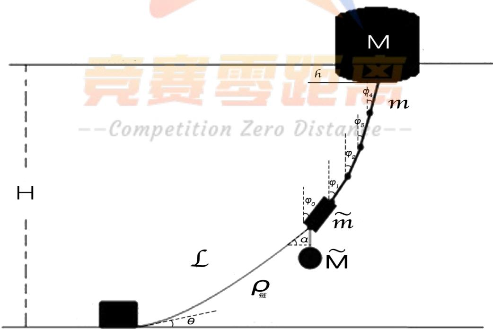

<details>
<summary>text_image</summary>

竞赛零距离
--Competition Zero Distance--
M
h
φ4
m
φ3
φ2
φ1
φ0
~
m
~
M
L
ρ链
θ
</details>

图1 符号说明

<table><tr><td>序号</td><td>符号</td><td>符号意义</td></tr><tr><td>1</td><td>H</td><td>水深</td></tr><tr><td>2</td><td>M</td><td>浮标质量</td></tr><tr><td>3</td><td> $\tilde{M}$ </td><td>重物球质量</td></tr><tr><td>4</td><td>m</td><td>钢管质量</td></tr><tr><td>5</td><td> $\tilde{m}$ </td><td>钢桶质量</td></tr><tr><td>6</td><td> $\rho$ </td><td>锚链密度</td></tr><tr><td>7</td><td> $\rho_{\text{水}}$ </td><td>海水密度</td></tr><tr><td>8</td><td>L</td><td>锚链长度</td></tr><tr><td>9</td><td> $\varphi_0$ </td><td>钢桶倾斜角</td></tr><tr><td>10</td><td> $\varphi_i$ </td><td>第i根钢管倾斜角</td></tr><tr><td>11</td><td>h</td><td>浮标吃水深度</td></tr><tr><td>12</td><td> $\alpha$ </td><td>锚链与钢桶接触点切线方向夹角</td></tr><tr><td>13</td><td> $\theta_0$ </td><td>锚链与锚接触点切线方向夹角</td></tr><tr><td>14</td><td>g</td><td>重力加速度</td></tr><tr><td>15</td><td> $\tilde{g}$ </td><td>除去海水浮力后的折合重力加速度</td></tr><tr><td>16</td><td> $F_x$ </td><td>锚链对钢桶作用力的x分量</td></tr><tr><td>17</td><td> $F_y$ </td><td>锚链对钢桶作用力的y分量</td></tr></table>

## 五、模型的建立与求解

## 5.1 问题一的模型建立与求解

## 5.1.1 受力分析

在吃水深度为h的情况下，浮标受到的浮力为：

$$
F _ {\text {浮}} = 2 R h \rho_ {\text {水}} g \tag {5.1}
$$

受到的风应力为： Fw = 0.625·ν2·2R(2-h) （5.2）

浮标自身的重力为 $M g$ .此时浮标受到的各力如图 2 所示；将浮标、钢桶、钢管以及重物球看做整体，使用整体法进行考虑，受力分析如图3.

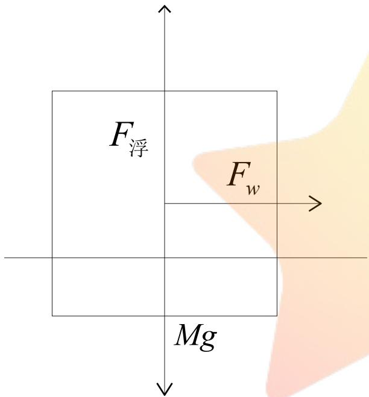

<details>
<summary>text_image</summary>

F浮
Fw
Mg
</details>

图2 浮标受力分析示意图

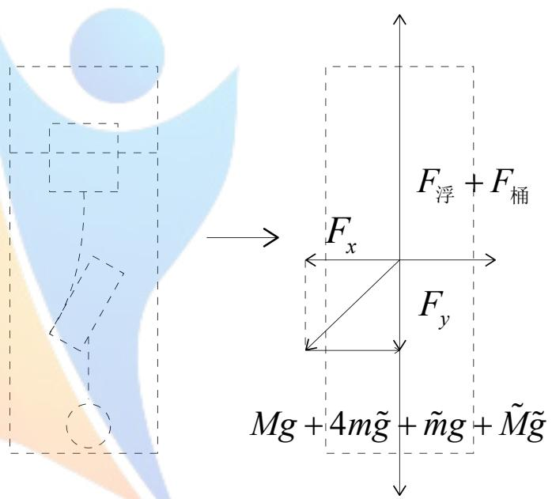

<details>
<summary>text_image</summary>

F浮 + F桶
Fx
Fy
Mg + 4mg + mdg + Mg
</details>

图3 整体法受力分析示意图

将锚链作用在钢桶上的力看做外力，系统整体受力平衡，因此有如下关系：

$$
F _ {x} = F _ {w} \tag {5.3}
$$

$$
F _ {y} = F _ {\text {浮}} + F _ {\text {桶}} - M g - 4 m \tilde {g} - \tilde {m} g - \tilde {M} \tilde {g} \tag {5.4}
$$

其中 $F _ { \sharp \vec { \oplus } }$ 为钢桶所受浮力，满足：

$$
F _ {\text {桶}} = \rho_ {\text {水}} g V _ {\text {桶}} \tag {5.5}
$$

下面对钢桶进行受力分析。钢桶所受力有重物球的折合重力 $\tilde { M } \tilde { g }$ ，锚链的拉力 $F _ { _ { \sharp _ { \sharp } } ^ { + } }$ （分解为水平和垂直两个方向，分别为 $F _ { x } , F _ { y } )$ ），自身的重力 $\tilde { m } g$ ，所受浮力 $F _ { \sharp \sharp }$ ，以及上方钢管施加的约束力。钢桶的受力如图 4所示：

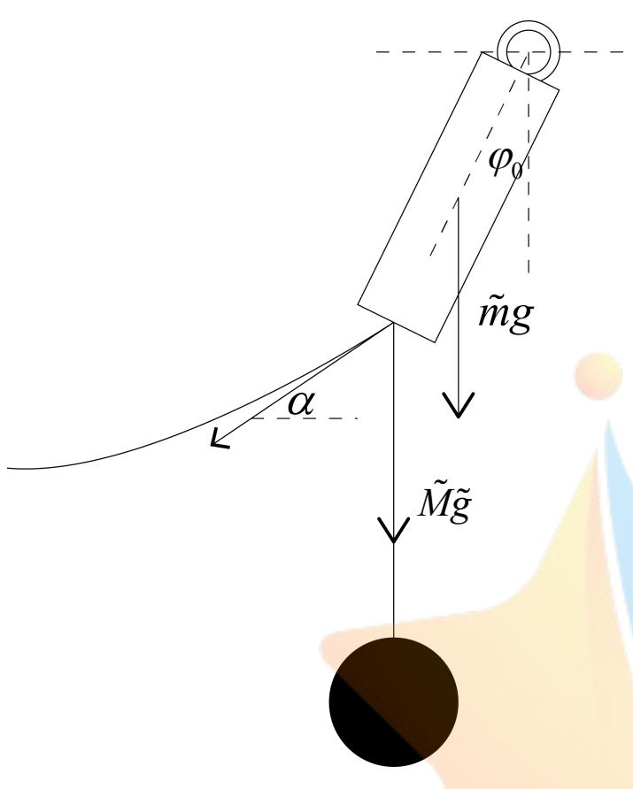

<details>
<summary>text_image</summary>

φ₀
ṁg
α
Ṁ̃g
</details>

图 4 钢桶的受力分析示意图

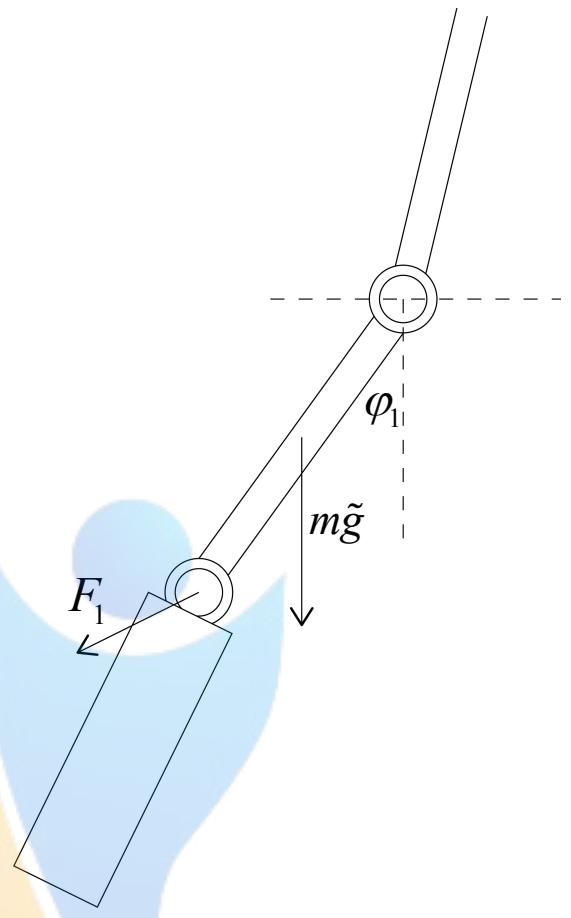

<details>
<summary>text_image</summary>

F₁
φ₁
m̃g
</details>

图5 第一根钢管受力分析示意图

将各力写成直角坐标系下坐标的形式有： $G _ { \tilde { M } } = ( 0 , - \tilde { M } \tilde { g } )$ $F _ { _ { \ast \ast } } ^ { } = ( - F _ { x } , - F _ { y } )$ $G _ { \ast \astrosun } + F _ { \ast \astrosun } = ( 0 , \astrosun \astrosun + \rho _ { \astrosun } V _ { \ast \astrosun } g )$ .此时， $G _ { \tilde { M } }$ 与 $F _ { _ { \mathrm { f f } } }$ 的作用点坐标为： $( - l \sin \varphi , - l \cos \varphi )$ 而 $G _ { \sharp \sharp } + F _ { \sharp \sharp }$ 的作用点为 $( - \frac { l } { 2 } \sin \varphi , - \frac { l } { 2 } \cos \varphi )$ 钢桶的倾角为 $\varphi$

根据虚功原理：

$$
(\vec {F} _ {\text {锚}} + \vec {G} _ {\tilde {M}}) \cdot \delta \vec {r} _ {1} + (\vec {F} _ {\text {桶}} + \vec {G} _ {\text {桶}}) \cdot \delta \vec {r} _ {2} = 0 \tag {5.6}
$$

1 1得到 F l cos φδφ-(F, +Mg P水V桶g+ mg)l sinφδφ= 0 （5.7）2 2

由此可以解得 arctan <sub>x</sub>F （5.8）F +Mg <sup>1 1</sup>V g <sub>水 桶</sub> mgy 2 2

下面求解第一根钢管的倾角。此时钢管收到的力，处折合重力 $m \tilde { g }$ 以及第二根钢管对其施加的约束力以外，其余外力均由钢桶提供，为

$$
\vec {F} _ {1} = \vec {F} _ {\text {锚}} + \vec {G} _ {\tilde {M}} + \vec {F} _ {\text {桶}} + \vec {G} _ {\text {桶}} \tag {5.9}
$$

同样利用虚功原理

$$
\vec {F} _ {1} \cdot \delta \vec {r} _ {1} + \vec {G} _ {m} \cdot \delta \vec {r} _ {2} = 0 \tag {5.10}
$$

得到 F 1 cos φδφρ−(F + Mg − ρ g + mg + =mg) sin φδφρ = 0 （5.11）

由此解得第一根钢管的倾斜角度的表达式

$$
\varphi_ {1} = \arctan \frac {F _ {x}}{F _ {y} + \tilde {M} \tilde {g} - \rho_ {\text {水}} V _ {\text {桶}} g + \tilde {m} g + \frac {1}{2} m \tilde {g}} \tag {5.12}
$$

同理可以求解第二根钢管的倾角，满足虚功原理的方程

$$
F _ {x} l \cos \varphi \delta \varphi - \left(F _ {y} + \tilde {M} \tilde {g} - \rho_ {\text {水}} V _ {\text {桶}} g + \tilde {m} g + \frac {3}{2} m \tilde {g}\right) l \sin \varphi \delta \varphi = 0 \tag {5.13}
$$

倾斜角度

$$
\varphi_ {2} = \arctan \frac {F _ {x}}{F _ {y} + \tilde {M} \tilde {g} - \rho_ {\text {水}} V _ {\text {桶}} g + \tilde {m} g + \frac {3}{2} m \tilde {g}} \tag {5.14}
$$

依次类推得到第三根，第四根钢管的倾斜角度表达式

$$
\varphi_ {3} = \arctan \frac {F _ {x}}{F _ {y} + \tilde {M} \tilde {g} - \rho_ {\text {水}} V _ {\text {桶}} g + \tilde {m} g + \frac {5}{2} m \tilde {g}} \tag {5.15}
$$

$$
\varphi_ {4} = \arctan \frac {F _ {x}}{F _ {y} + \tilde {M} \tilde {g} - \rho_ {\text {水}} V _ {\text {桶}} g + \tilde {m} g + \frac {7}{2} m \tilde {g}} \tag {5.16}
$$

## 5.1.2 锚链形状的确定

在前面的 5.1.1 中已经得到锚链上所受的力 $F _ { \mathrm { f i f } }$ ,它的水平和垂直分量均为浮标吃水深度h的函数。接下来需要确定在这种情况下锚链的形状如何，并计算出锚链的高度，以便根据水深最终求解吃水深度h及各参量。

根据模型假设，锚链的形状为一悬链线，是一个双曲余弦函数。为避免在直角坐标系下求解超越方程的困难，我们将该悬链线方程在自然坐标系下写出，其一般形式为

$$
s = k \tan \theta + b \tag {5.17}
$$

坐标原点（即 $s = 0$ 的点）选在锚链与海床的接触点上。对于给定的力 $F _ { _ { \sharp _ { \sharp } } ^ { \ + } }$ ，锚链的形状将会呈现以下两种情形，见图6，图7。

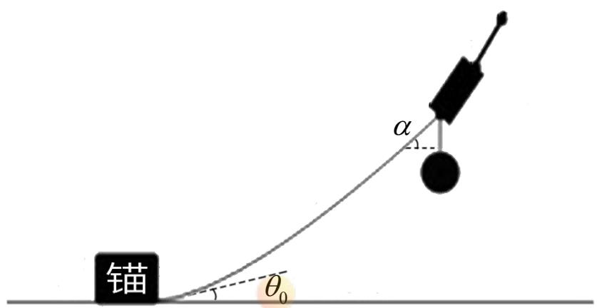

<details>
<summary>text_image</summary>

锚
θ₀
α
</details>

图6 锚链全部悬空的情形示意图  
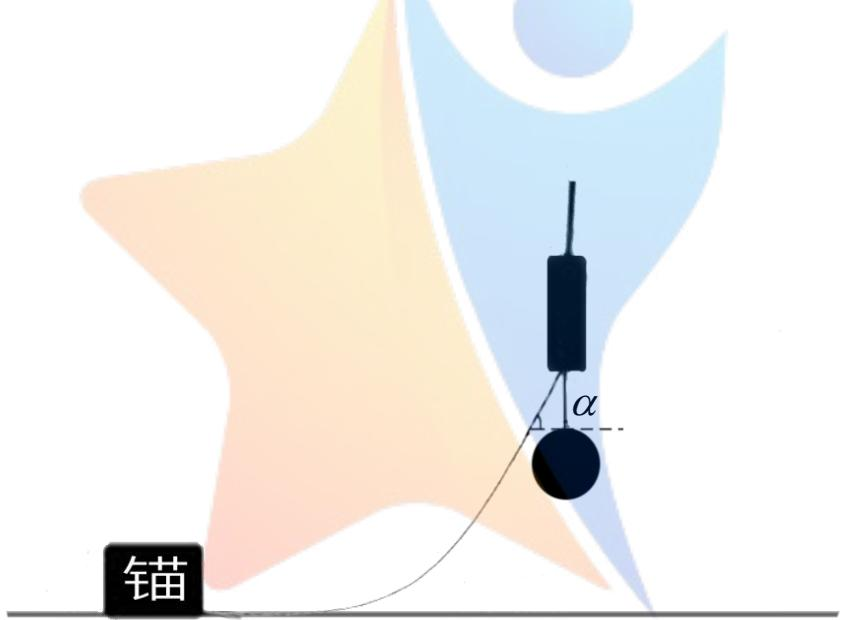

<details>
<summary>text_image</summary>

锚
α
</details>

图7 锚链不是全部悬空的情形示意图  
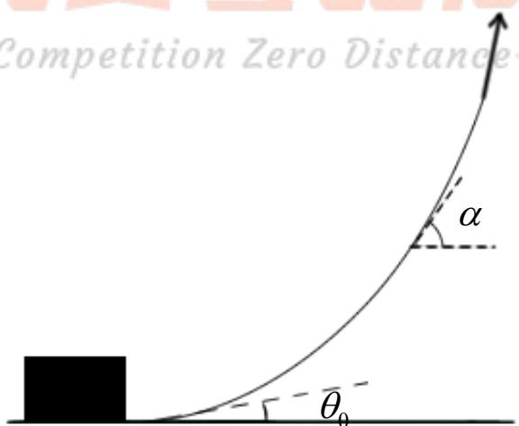

<details>
<summary>text_image</summary>

Competition Zero Distance
α
θ₀
</details>

图8 求解全部悬空类型的锚链

对于图6所示的情形，锚链与锚的接触点切线方向与海床有一定夹角。此时，锚链全部悬空，施加在锚链上的力 $F _ { _ { \mathrm { f f } } }$ 的垂直分量 $F _ { y }$ 应当大于锚链的折合重力。

根据（5.17），只需要确定参数k与参数b即可确定锚链的方程，具体符号如图 7所示。锚链在s处的张力记为T,角度记为 $\theta$ ；在 $s + d s$ 处的张力记为 $T + d T$ 角度记为 $\theta + d \theta$ .对一小段线元进行受力分析可以得到在水平方向上

$$
(T + d T) \cos (\theta + d \theta) = T \cos \theta \tag {5.18}
$$

竖直方向上

$$
(T + d T) \sin (\theta + d \theta) = T \sin \theta + \rho \tilde {g} d s \tag {5.19}
$$

由（5.18）式可以得到

$$
T \cos \theta = C \tag {5.20}
$$

其中 C 为常数，由边界条件确定。将其代入（5.19）式可以得到

$$
C \sec^ {2} \theta d \theta = \rho \tilde {g} d s \tag {5.21}
$$

两边积分得到悬链线的一般方程

$$
s = \frac {C}{\rho \tilde {g}} \tan \theta + b \tag {5.22}
$$

又因为锚链上从任何一点起直至锚链末端（与钢桶链接的末端）的部分受力平衡，于是有

$$
T \cos \theta = F _ {x} \tag {5.23}
$$

这样确定了常数C.将其代入（5.22）式可得

$$
s = \frac {F _ {x}}{\rho \tilde {g}} \tan \theta + b \tag {5.22}
$$

为确定常数b，取锚链与钢桶链接的末端点考虑，有

$$
L = \frac {F _ {x}}{\rho \tilde {g}} \cdot \frac {F _ {y}}{F _ {x}} + b \tag {5.23}
$$

L为锚链的长度，于是 b可以求得，最终锚链的方程为

$$
s = \frac {F _ {x}}{\rho \tilde {g}} \tan \theta - \frac {F _ {y}}{\rho \tilde {g}} + l \tag {5.24}
$$

对于图7 所示的情形，只有部分锚链是悬空的，因此将原点选在刚好为0的点处可以写出这种情况下悬链线的方程

$$
s = k \tan \theta \tag {5.25}
$$

求解过程与前面相同，分析如图 9所示，得到

$$
s = \frac {F _ {x}}{\rho \tilde {g}} \tan \theta \tag {5.26}
$$

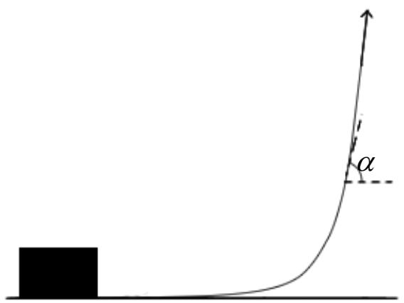

<details>
<summary>text_image</summary>

Diagram showing a block on the left and an upward-curving line with angle α marked between them, likely illustrating a physics or physical concept.
</details>

图9 求解部分悬空类型的锚链

## 5.1.3 模型的求解

## 高度的求解

前面考虑的全部变量均为浮标吃水深度h的函数，求解题目中要求的各个参数需要确定浮标的吃水深度h，因此还需利用水深为H的条件。系泊系统在水下的部分总高度为

$$
H = h + l (\cos \varphi_ {0} + \cos \varphi_ {1} + \cos \varphi_ {2} + \cos \varphi_ {3} + \cos \varphi_ {4}) + s _ {y} \tag {5.27}
$$

其中 $S _ { y }$ 为锚链的高度。接下来求解锚链的高度。

求解锚链高度时需要判定锚链是全部悬空的类型还是部分悬空的类型。为此我们首先假定锚链是全部悬空的类型，此时锚链悬空部分的总长度为L，即锚链的总长度。对（5.24）式微分可得

$$
d s = \frac {F _ {x}}{\rho \tilde {g}} \sec^ {2} \theta d \theta \tag {5.28}
$$

竖直方向上高度y 的微分为

$$
d y = d s \sin \theta = \frac {F _ {x}}{\rho \tilde {g}} \sec \theta \tan \theta d \theta \tag {5.29}
$$

代入图10中的上下限角度得到

$$
s _ {y} = \frac {F _ {x}}{\rho \tilde {g}} (\sec \alpha - \sec \theta_ {0}) \tag {5.30}
$$

其中 $\alpha = \arctan { \frac { F _ { y } } { F _ { x } } }$ .将结果代入（5.27）式中可以求解得到 $h { = } 0 . 6 8 5 \mathrm { m }$ 。但是这个结果的正确性需要进一步讨论。使用全部悬空类型的锚链模型，一个必要条件为为 $F _ { y } > \rho \tilde { g } L$ .将求得的吃水深度代入原模型中得到 $F _ { y } = 1 0 5 8 . 6 \mathrm { N }$ ，而 $\rho \tilde { g } L = 1 3 1 6 . 0 \mathrm { N }$ 。

因此不适宜使用全部悬空类型的锚链模型。下面采用部分悬空的锚链模型，其上下高度容易得出为

$$
s _ {y} = \frac {F _ {x}}{\rho \tilde {g}} (\sec \alpha - 1) \tag {5.31}
$$

代入（5.27）得到h=0.681m，至此题目中的各个指标均可以求解。

## 问题的解决

将求解得到的 h =0.681m 代入（5.1），（5.2），（5.4）三式中，得到$F _ { _ x } = 2 3 8 . 4 N , F _ { _ y } = 9 4 3 . 2 N$ ，折合重力加速度 $\tilde { g } = 0 . 8 7 g$ o

风速为12m/s的情形，将以上各参数代入（5.8），（5.12），（5.14），（5.15），（5.16）得到钢桶倾角 $\varphi _ { \scriptscriptstyle 0 } = 1 . 2 0 2 ^ { \circ }$ 从下至上各节钢管的倾斜角为：$\varphi _ { 1 } = 1 . 1 8 4 ^ { \circ } , \varphi _ { 2 } = 1 . 1 7 6 ^ { \circ } , \varphi _ { 3 } = 1 . 1 6 8 ^ { \circ } , \varphi _ { 4 } = 1 . 1 6 0 ^ { \circ }$ （见附录程序1）.将 $F _ { x }$ 代入（5.25）得到锚链的形状方程

$$
s = 3. 9 8 \tan \theta \tag {5.32}
$$

求解浮标的游动区域，先求解锚链水平方向上的宽度 $S _ { x }$ .水平方向上的微分

$$
d x = d s \cos \theta = \frac {F _ {x}}{\rho \tilde {g}} \sec \theta d \theta \tag {5.33}
$$

两边积分得到

$$
s _ {x} = \frac {F _ {x}}{\rho \tilde {g}} \ln \left| \frac {\sec \alpha + \tan \alpha}{\sec \theta + \tan \theta} \right| \tag {5.34}
$$

对于部分悬空的，式（5.34）需要更换为

$$
s _ {x} = \frac {F _ {x}}{\rho \tilde {g}} \ln \left| \sec \alpha + \tan \alpha \right| + L - \frac {F _ {y}}{\rho \tilde {g}} \tag {5.35}
$$

假定浮标游动范围最大为一个圆，其半径看做系泊系统从锚链与锚的接触点开始，到浮标处的水平方向展宽x.其表达式为

$$
x = l (\sin \varphi_ {0} + \sin \varphi_ {1} + \sin \varphi_ {2} + \sin \varphi_ {3} + \sin \varphi_ {4}) + s _ {x} \tag {5.36}
$$

将前面求得的量代入解得 $x = 1 4 . 6 5 m$

对于风速为24 $m / s$ 的情形，求解过程与 $1 2 m / s$ 情形相同（见附录程序2）。计算结果为

吃水深度 $h { = } 0 . 6 9 5 \mathrm { m }$ ，钢桶的倾斜角度 $\varphi _ { \scriptscriptstyle 0 } = 4 . 5 6 9 ^ { \circ }$ ，各钢管的倾角从下至上依次为$\varphi _ { 1 } = 4 . 5 0 2 ^ { \circ } , \varphi _ { 2 } = 4 . 4 7 3 ^ { \circ } , \varphi _ { 3 } = 4 . 4 4 4 ^ { \circ } , \varphi _ { 4 } = 4 . 4 1 5 ^ { \circ }$ ，锚链的形状方程为

$$
s = 1 5. 7 4 \tan \theta - 1. 2 4 \tag {5.37}
$$

游动范围 $x = 1 7 . 7 8 m$

## 5.2 问题二的模型建立与求解

## 5.2.1 各指标的计算

问题二中各指标的计算过程与问题一相同（见附录程序 3），计算结果为吃水深度 $h { = } 0 . 7 1 8 \mathrm { m }$ ，吃水深度 $h { = } 0 . 6 9 5 \mathrm { m }$ ，钢桶的倾斜角度 $\varphi _ { \scriptscriptstyle 0 } = 9 . 4 5 2 ^ { \circ }$ ，超过了 $5 ^ { \circ }$ 各钢管的倾角从下至上依次为 $\varphi _ { 1 } = 9 . 3 2 4 ^ { \circ } , \varphi _ { 2 } = 9 . 2 6 8 ^ { \circ } , \varphi _ { 3 } = 9 . 2 1 2 ^ { \circ } , \varphi _ { 4 } = 9 . 1 5 7 ^ { \circ }$ ， 锚链的形状方程为

$$
s = 3 4. 8 0 \tan \theta - 1 3. 2 9 \tag {5.38}
$$

游动范围 $x = 1 8 . 8 7 m$ .锚链与锚的连接处与海床的夹角为 $2 0 . 9 0 5 ^ { \circ }$ ，超过 $1 6 ^ { \circ }$ 因此需要调整重物球的质量。

## 5.2.2 重物球质量的控制模型

钢球质量越大，两个角度的值越小，该问题为一个以重物球为自变量，两个角度为因变量的控制问题。为求解满足条件的重物球的质量，我们使用设定步长，遍历重物球质量，逐步逼近准确值的方法求解。

该问题要求钢桶的倾角小于 5°，锚链末端切向与海床夹角小于 $1 6 ^ { \circ }$ ，因此首先遍历重物球质量使得在误差不超过 $0 , 0 0 1 ^ { \circ }$ 的情况下，满足钢桶的倾角等于$5 ^ { \circ }$ ，锚链末端切向与海床夹角等于 $1 6 ^ { \circ }$ 。在初步试探了重物球的质量大致的范围后，选定步长为 0.012kg，分别在 2064kg 至 2076kg，2220kg 至 2232kg 的情况下进行遍历（主函数见附录程序 4，求解见程序 5，6），求得结果：在质量2065.2kg 时钢桶倾角为 $5 ^ { \circ }$ ，而锚链夹角为 $1 6 . 8 8 ^ { \circ }$ ，不符合题意。随后得到在质量 2226.9kg时，钢桶倾角为 $4 . 5 ^ { \circ }$ ，锚链夹角为 $1 6 ^ { \circ }$ ，满足题目要求。

因此，当钢球的质量调整到 2226.9kg时，两个角度满足要求。而且当球的质量增大时，容易得到两个角度都会减小，因此当重物球的质量大于 2226.9kg时，钢桶倾角以及锚链末端与海床夹角能够满足要求。

## 5.3 问题三的模型建立与求解

## 5.3.1 模型的改进

问题三需要考虑水流速带来的影响。考虑到钢桶和钢管的迎水面较小，受到的水流力相比于其自身的重量较小，因此不考虑水流速对浮标以外的设备的影响。受力如图 10.

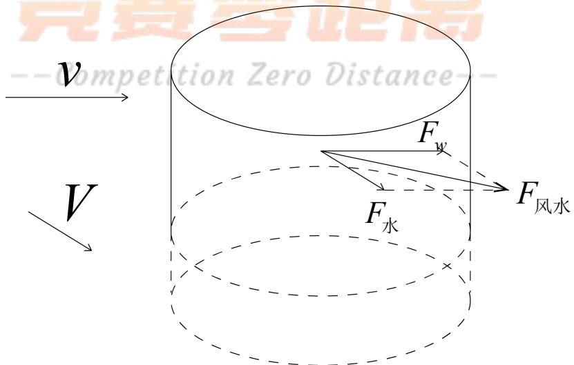

<details>
<summary>flowchart</summary>

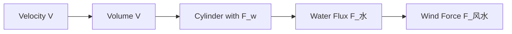
</details>

图10 考虑水流力的情况下受力示意图

在增添水流力的因素后，风力与水力的合力用

$$
F _ {\text {风水}} = \sqrt {F _ {w} ^ {2} + F _ {\text {水}} ^ {2} + 2 F _ {w} F _ {\text {水}} \cos \beta} \tag {5.39}
$$

表示，其中 $\beta$ 为风应力与水流力的夹角。替换前面的 $F _ { \mathrm { w } }$ 即可得到考虑了水流力之后的模型。

构造新函数，将问题一与问题二中的钢球质量M ,水深H，风速v，水流速V，夹角 $\beta$ ，锚链密度 $\rho$ ，锚链长度L均作为变量，为随后的多目标优化过程做准备。

## 5.3.2 遗传算法求解多目标优化问题

遗传算法是模拟达尔文遗传选择和自然淘汰的生物进化过程的计算模型<sup>[3]</sup>。

## 确定染色体的编码方式

本文采用二进制编码方式，将本问系泊系统设计中所要求确定的锚链长度和重物球的质量用二进制码表示构成子串，然后把子串连接成“染色体”串。

## 初始化种群

在随机生成基因长度的二进制代码后，需要检验这个二进制代码转码后求得的锚链长度和重物球质量是否满足不同情况下，锚链末端与锚的链接处的切线方向与海床夹角不超过 16度，以及钢桶的倾斜角度不超过 5 度。若此组二进制代码满足以上要求，则被收入初始种群中，否则重新随机生成基因长度的二进制码再进行检验。

## 确定适应函数

本问中有三个优化目标，分别为浮标的吃水深度、游动区域和钢桶的倾斜度，因此运用了一种基于权重分配策略的多目标遗传算法（NWMOGA）<sup>[1][2]</sup>来求解此多目标优化问题。该方法将三个优化目标加权然后求和，并将其转化为单目标优化问题进行求解。

$$
\min \text {Fitness} (x) = \sum_ {i = 1} ^ {3} \omega_ {i} f _ {i} (x) \quad x \in \Omega \tag {5.40}
$$

其中， $\omega _ { i } \in [ 0 , 1 ]$ 且满足 $\sum _ { i = 1 } ^ { \mathrm { ~ ~ } } \omega _ { i } = 1$ 。权重系数 ${ \omega } \mathrm { = } [ \omega _ { 1 } , \omega _ { 2 } , \omega _ { 3 } ]$ 反应了每个优化目标的重要性。

## 筛选优秀个体

筛选优秀个依据体轮盘赌法，在轮盘赌法中，每个个体的被选择进行遗传的概率与其适应度的值成正比。适应度越高，被选择的概率越大；适应度越低，被选择的概率就小。在遗传算法的选择操作中，都需要选择一个适合的值作为轮盘，用于调节刻度。本问题中，按如下方法来选取该值：

一代种群的总适应度计算：

$$
\text {sumFitness} = \sum_ {i = 0} ^ {9 9} \text {population}[i].\text {fitness} \tag {5.41}
$$

种群中的某个体i 的选择概率 $P s _ { i }$ 计算： $s u m F i t n e s s = \sum _ { i = 0 } ^ { 9 9 } p o p u l a t i o n [ i ] . f i t n e s s$

$$
\text {population} [ i ]. P s = \frac {\text {population} [ i ] . \text {fitness}}{\text {sumFitness}} \tag {5.42}
$$

种群中的某个体i 的累计选择概率 $\boldsymbol { \mathcal { Q } } \boldsymbol { s } _ { i }$ 计算：

$$
\text {population} [ i ]. Q s = \sum_ {j = 0} ^ {i} \text {population} [ i ]. P s \tag {5.43}
$$

让轮盘转动100次，然后每次都按照下面的方法选取个体来组成新的一代种群：

(1)用rand函数随机的产生一个浮点数r，且r 在区间[0,1]内;  
(2) 如 果 $r \leq p o p u l a t i o n [ 0 ] . Q s$ ，则选择第一个染色体；否则选择使  
$p o p u l a t i o n [ i - 1 ] . Q s < r \leq p o p u l a t i o n [ \mathrm { i } ] . Q s$ 成立的个体I,其中 $1 \leq i \leq 1 0 0$ o

由式子可以看出，概率Ps是单个个体的适应度所占整个种群中所有个体的适应度之和的比例反映。如果该个体的适应度越大，则他被选择进行遗传的概率就越高，如果个体的适应度越小，则他被选择进行遗传的概率就越低。这样计算的结果和目的是：最优秀的染色体被复制成多分遗传给下一代，中等的染色体维持原有水平，较差的染色体则不被选择最终淘汰。

## 遗传算子的设计

在确定了染色体的二进制编码方式后，考虑染色体的交叉和变异操作。

（1）交叉操作：区别于传统遗传算法中为了提高收敛速度大多采用的两点交叉操作，本文结合均匀两点交叉算子的遗传算法（UTCGA）<sup>[4]</sup>，先产生随机数0、1，当随机数的是0时，交叉两个染色体中表示锚链长度的部分；当随机数是 1时，交叉两个染色体中表示重物球质量的部分。  
（2）变异操作：先随机产生变异基因所处的二进制码位置，然后再判断此二进制码为0 还是为1，若此二进制码位为1则经过变异操作后此二进制码位变异为0，若此二进制码位为0则经过变异操作后此二进制码位变异为 1。

## 设定遗传算法相关参数

遗传算法自身参数有 3 个，即种群大小P、交叉概率 $P _ { c }$ 、变异概率 $P _ { m }$ 和最大遗传代数 $P _ { d }$ 。本文种群大小 $P = 1 0 0$ 因为群体规模越大，越容易找到最优解。交叉概率 $P _ { c } = 0 . 6$ ，交叉概率为0.6能够保证种群的充分进化。变异概率 $P _ { m } = 0 . 0 0 5$ 一般而言，变异发生的可能性较小，变异概率为0.005更加符合自然规律。最大遗传代数 $P _ { d } = 2 0 0$ ，最大遗传代数为200保证优化结果充分收敛。

## 5.3.3 最优方案的设计

式（5.40）要求给出各影响因素的权重。在权重给定后，可以通过遗传算法求解优化函数的最小值。因此，首先需要给出权重 $\omega = [ \omega _ { 1 } , \omega _ { 2 } , \omega _ { 3 } ]$ .目前可以用来确定权重的依据主要是前两问中得到的各种数据，因此考虑使用熵权法进行权重的确定（见附录程序 8）。利用熵权法得到变量h ，x ， $\varphi _ { 0 }$ 的权值分别为：0.8299,0.1700,0.0001.

在此情况下，使用遗传算法，得到风速 $3 6 m / s$ ，水流速1.5m/s的情形下，选用 5种锚链的型号得到的h，x， $\varphi _ { 0 }$ ，以及其加权和的值：

<table><tr><td>型号</td><td>h</td><td>x</td><td> $\varphi_0$ </td><td>Σ</td></tr><tr><td>I</td><td>1.98</td><td>33.73</td><td>3.66°</td><td>7.377</td></tr><tr><td>II</td><td>2</td><td>29.7</td><td>3.63°</td><td>6.711</td></tr><tr><td>III</td><td>1.85</td><td>21.05</td><td>3.83°</td><td>5.116</td></tr><tr><td>IV</td><td>1.33</td><td>18.09</td><td>4.99°</td><td>4.179</td></tr><tr><td>V</td><td>1.71</td><td>14.86</td><td>4.06°</td><td>3.945</td></tr></table>

表1 遗传算法求解结果

根据以上计算结果分析：当取得最小值时，锚链型号为 V号，此时浮标吃水深度、游动范围以及钢桶的倾角虽然未能达到在所有指标中都最小，但是适应度函数为 5种型号中最小，说明此型号为使得以上三个指标尽可能小的最优型号。

系泊系统设计为：选用 V 型号锚链，锚链的长度为20.25m，共112 或者113节链环，重物球的质量为4560kg。

在风速为36m/s、水速1.5m/s、风速与水流速度方向夹角为0的情况下，钢桶的倾角为 4.347°，各节钢管的倾角为 $4 . 3 2 9 ^ { \circ } ~ , 4 . 3 2 2 ^ { \circ } ~ , 4 . 3 1 4 ^ { \circ } ~ , 4 . 3 0 7 ^ { \circ }$ 浮标吃水深度h=1.71m，游动区域半径13.96m，锚链方程为： $s = 1 3 . 9 6 \tan \theta - 3 . 7 3$ 0

在风速为36m/s、水速1.5m/s、风速与水流速度方向夹角为π的情况下，钢桶倾角为 3.12°，各节钢管的倾角为 3.087°,3.070°,3.052°,3.035°浮标吃水深度0.76m，游动区域半径8.69m，锚链方程为： $s = 3 . 1 0 \tan \theta$ C

在风速为0、水速1.5m/s 的情况下，钢桶倾角为4.392°，各节钢管的倾角为 4.360°,4.345°,4.331°,4.316°浮标吃水深度 1.05m，游动区域半径12.49m，锚链方程为： $s = 7 . 3 8 \tan \theta - 0 . 6 3$

其他情况下的考虑与上述类似，可求得任意情况下钢桶、钢管的倾斜角度、

锚链形状、浮标的吃水深度和游动区域。

## 六、模型的应用与推广

## 6.1模型的应用与推广

以沿海城市山东省青岛市为例，考虑设立系泊系统的实际应用。

选取青岛市胶州湾内前湾湾口，由气象资料<sup>[5]</sup>显示，其最大涨潮流速1.42m/s，最大落潮流速 1.35m/s。由青岛档案信息网<sup>[6]</sup>提供的数据，建国以来青岛市沿海区域登陆最大等级的台风为 1985 年九号台风，最大风力为 32.6m/s。因此海水速度和风速均符合问题三模型的条件。在前湾湾口区域内，选择近浅海区域水深18m的海床平坦区域，设计系泊系统。

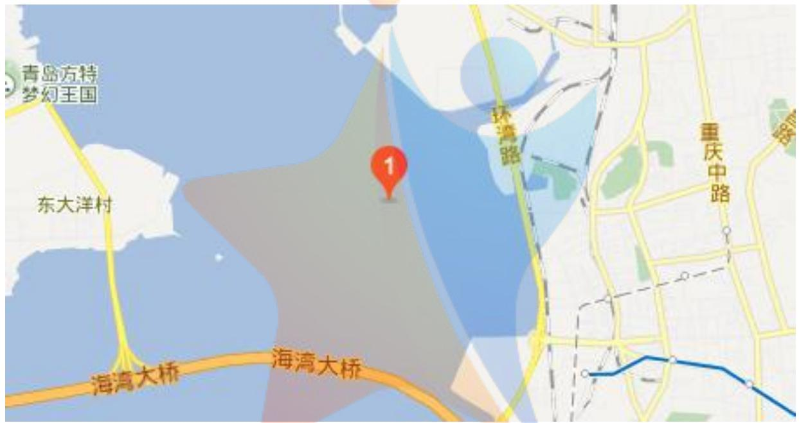

<details>
<summary>text_image</summary>

青岛方特
梦幻王国
东大洋村
环湾路
重庆中路
海湾大桥
海湾大桥
</details>

图11：青岛市胶州湾内前湾湾口地点

使用问题三建立的模型，用遗传算法求解（见附录程序7），求得系泊系统的锚链型号最优为 V，长度为 21.31m，重物球的质量为 4392kg。在此设计下，考虑极端情况，当海水流速和风速均达到最大值时，钢桶的倾斜角度为 4.73°各节钢管的倾斜角度4.71°，4.70°,4.69°，4.68浮标的吃水深度为1.44m，游动区域为半径15.07m的圆域。

因此，此设计模型可以在海水流速较为平缓的区域，在考虑台风来袭的情况下保证系泊系统稳定运行。在全国大部分符合题设条件的近海海域，本模型可为设计系泊系统提供参考思路。

## 七、模型的评价与提升

## 7.2模型的评价与提升

## 7.2.1 模型的优点

本模型充分考虑了各个物体的受力，在考虑严谨的情况下适当简化问题，简化每节链环的相连，将锚链整体视为悬链线。

考虑到了在风速较小的情况下，锚链可能并不会全部被拉起，而是有一部分平躺在海床上，符合实际情况。

求解最优化问题时采用了遗传算法，通过代代杂交求得在特定条件下的最优设计方案，遗传算法不存在求导和函数连续化的限定，具有更好的全局优化能力，本文用遗传算法求解设计最优化是创新之处。

用山东省青岛市胶州湾内前湾湾口的近海区域做模型应用，可求得系泊系统最优设计方案，对模型的实用性进行了评估。

## 7.2.2 模型的缺点

本模型在考虑浮标受力时，简化其受力情况，认为浮标受风力影响其倾斜程度可以忽略不计。但在实际情况中，当风力非常大时，浮标的倾斜程度将不可再忽略。关于浮标倾斜情况下的分析见模型提升。

本模型在考虑水流力时，简化了水流力对钢桶及重物球的影响。但是实际中海水内部存在着各种方向的水流力及暗流，对海水内部的一切物体都有影响。

## 6.2.3 模型改进方案

## 考虑浮标的倾斜

在实际情况中，浮标会发生倾斜，以致浮力的作用线，风应力的作用线以及水流力的作用线不在交于一点。倾斜的作用主要是平衡下端钢管带来的力矩。因此进行模型改进首先要研究力矩的形成机理，如图12所示

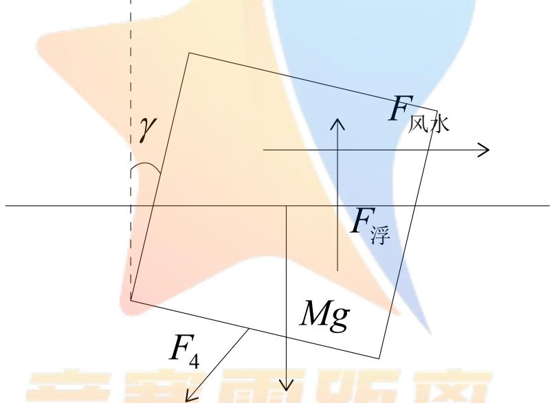

<details>
<summary>text_image</summary>

F
风水
F浮
Mg
F4
</details>

图12 浮标倾斜时的受力分析

假设浮标倾斜角度为 $\gamma ,$ 与之相关的正浮吃水深度h，这样，相对于质心的风应力力矩 $M _ { ☉ }$ ，水流力力矩 $M _ { ☉ }$ ，以及最后一根钢管的拉力力矩 $M _ { 4 }$ 平衡。求解过程引入了新变量<sub></sub>，因此从下至上对钢桶以及各节钢管受力分析时各种力均为<sub></sub>与h的函数。为确定这两个变量，一方面需要水深H的条件，另一方面需要力矩的平衡条件

$$
M _ {\text {风}} + M _ {\text {水}} + M _ {\text {浮}} + M _ {4} = 0 \tag {7.1}
$$

因此在分析求解问题时，求解的方程除（5.27）外还应增添（7.1）式。

## 考虑水下设施受到水流力

在风力较大的情况下，浮标会在风力与水流力的共同作用下产生倾斜，水下内部的水流力也会对水下物体产生作用力。

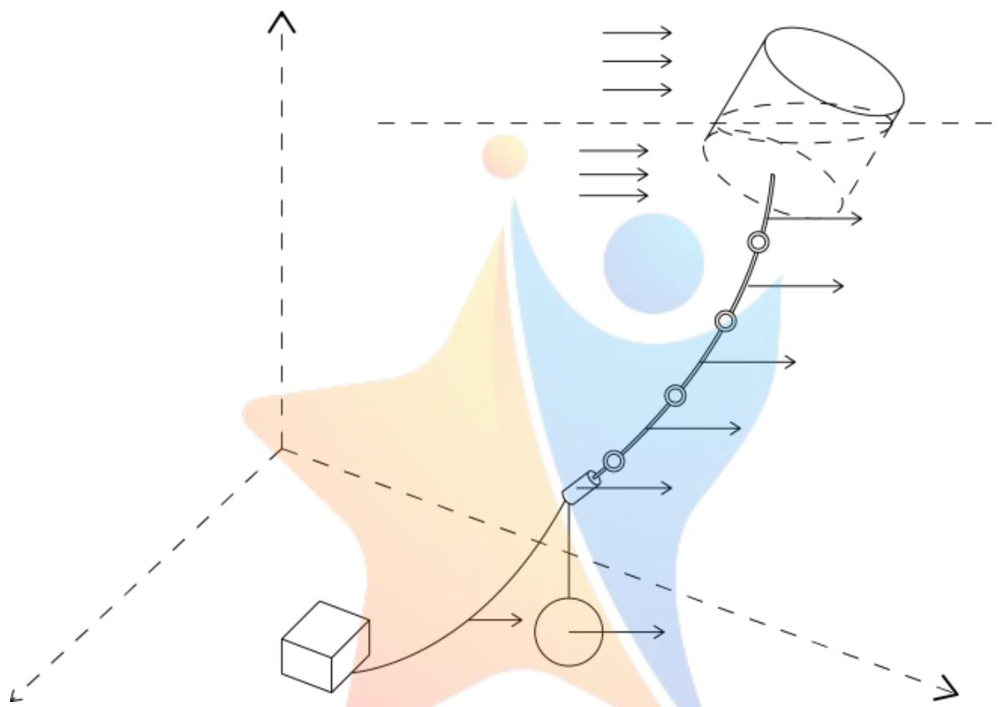

<details>
<summary>flowchart</summary>


</details>

图13：模型改进下的受力图

在海面以下，所有的物体都将受到水流力的作用。海面以下的水流流动较为复杂，在冷热不均衡和海水表面风向的影响下，水流会产生较多的暗流和旋涡。现讨论海水流动方向一致且水流力一致的简化情况。在海面下，钢桶的面积较大，受水流力的影响可观，对结果会产生一定的影响；锚链、钢管的受力面积小，受水流力的影响较小，对结果的影响也小。水流力的作用表现在水平方向对系统整体的横向作用力，会产生新的力的平衡关系式，对系统的整体受力分析产生影响。

## 八、参考文献

[1]王鲁，基于遗传算法的多目标优化算法研究，武汉理工大学，2006  
[2]马小姝，多目标优化的遗传算法研究，西安电子科技大学，2010  
[3]何静，FPS0 悬式锚腿系泊系统的锚系设计研究，武汉理工大学，200  
[4]杨大地，张春涛，均匀两点交叉遗传算法，重庆师范大学学报（自然科学版），2004 年 01 期，2004

[5]佚名，第一章青岛的自然环境，

http://wenku.baidu.com/link?url=Rc9Yj1gS2w

-A-xJZcwpHXZx9\_-MhkdPyrRwhpG6vhqp6PzwPooNb7Su04sQnRtREoct9YiTJOu0Wsh7

PEpEIrswWB\_Kzy7fElfYaCzkU5Iu，2016 年 9 月 11 日

[6] 代俊林，青岛港水域通航安全及效率的研究，大连：大连海事大学，2009

## 附录

## 程序1：

%2016.9.11 系泊系统设计

% r,H,v,V,beta,rou,L

% r是钢球质量比（以1200kg为基准），即钢球质量=1200kg\*r，调整r即可调整钢球质量。H为水深，v为风速，为水速， 为风速水速之间的夹角， 是锚链密度， 是锚链的长度

%phi0,phi1,phi2,phi3,phi4,h,theta,x

%phi0是钢桶的倾斜角，phi1至phi4为从下至上各节钢管的倾斜角，h为吃水深度，theta为锚链末端与锚的连接点处切线方向与海床夹角， 为游动的最大范围。

r=1;

H=18;

v=12;

V=0;

beta=0;

rou=7;

L=22.05;

考虑到锚链可能并不是全部悬空，有可能部分堆放在海床上，因此先求解不堆放情形，至于堆放情形，在下面 中考虑。

f=fzero(@(h)

(h+1./sqrt(1+sqrt((2.5.\*v.^2-1.25.\*v.^2.\*h).^2+(374.\*2.\*h.\*V.^2).^2+2.\*(2.5.\*v.^2-1.25.

\*v.^2.\*h).\*(374.\*2.\*h.\*V.^2).\*cos(beta)).^2./...

(-10248.12+31649.66.\*h).^2)+1./sqrt(1+sqrt((2.5.\*v.^2-1.25.\*v.^2.\*h).^2+(374.\*2.\*h.\*V.

^2) . ^2+2.\* (2.5.\*v. ^2−1.25. \*y. ^2. \*h) .\*(374. \*2. \*h. \*V. ^2) . \*cos (beta)) . ^2./...

(-10073.98+31649.66.\*h).^2)+1./sqrt(1+sqrt((2.5.\*v.^2-1.25.\*v.^2.\*h).^2+(374.\*2.\*h.\*V.

```prolog
^2).^2+2.*(2.5.*v.^2-1.25.*v.^2.*h).*(374.*2.*h.*V.^2).*cos(beta)).^2/...
(-10073.98+78.28+31649.66.*h).^2)+1./sqrt(1+sqrt((2.5.*v.^2-1.25.*v.^2.*h).^2+(374.*2.*h.*V.^2).^2+2.*(2.5.*v.^2-1.25.*v.^2.*h).*(374.*2.*h.*V.^2).*cos(beta)).^2/...
(-10073.98+78.28*2+31649.66.*h).^2)+1./sqrt(1+sqrt((2.5.*v.^2-1.25.*v.^2.*h).^2+(374.*2.*h.*V.^2).^2+2.*(2.5.*v.^2-1.25.*v.^2.*h).*(374.*2.*h.*V.^2).*cos(beta)).^2/...
(- 10073.98+78.28*3+31649.66.*h).^2)+sqrt((2.5.*v.^2-1.25.*v.^2.*h).^2+(374.*2.*h.*V.^2)
).^2+2.*(2.5.*v.^2-1.25.*v.^2.*h).*(374.*2.*h.*V.^2).*cos(beta)).*...
(sqrt(1+(-22143.12+11760-11760*r*0.87+31649.66*h).^2/sqrt((2.5.*v.^2-1.25.*v.^2.*h).^2+(374.*2.*h.*V.^2).^2+2.*(2.5.*v.^2-1.25.*v.^2.*h).*(374.*2.*h.*V.^2).*cos(beta)).^2)..
-sqrt(1+(-23655.75+7.*9.8.*22.05+11760-11760*r*0.87-rou.*L.*9.8.*0.87+31649.66*h).^2/sqrt((2.5.*v.^2-1.25.*v.^2.*h).^2+(374.*2.*h.*V.^2).^2+...
2.*(2.5.*v.^2-1.25.*v.^2.*h).*(374.*2.*h.*V.^2).*cos(beta)).^2))./(rou.*9.8.*0.87)-H),
0.9);
h=f;
phi0=acos(1./sqrt(1+sqrt((2.5.*v.^2-1.25.*v.^2.*h).^2+(374.*2.*h.*V.^2).^2+2.*(2.5.*v.^2-1.25.*v.^2.*h).*(374.*2.*h.*V.^2).*cos(beta)).^2/(-10248.12+31649.66.*h).^2));
phi1=acos(1./sqrt(1+sqrt((2.5.*v.^2-1.25.*v.^2.*h).^2+(374.*2.*h.*V.^2).^2+2.*(2.5.*v.^2-1.25.*v.^2.*h).*(374.*2.*h.*V.^2).*cos(beta)).^2/(-10073.98+31649.66.*h).^2));
phi2=acos(1./sqrt(1+sqrt((2.5.*v.^2-1.25.*v.^2.*h).^2+(374.*2.*h.*V.^2).^2+2.*(2.5.*v.^2-1.25.*v.^2.*h).*(374.*2.*h.*V.^2).*cos(beta)).^2/(-10073.98+78.28+31649.66.*h).^2));
; phi3=acos(1./sqrt(1+sqrt((2.5.*v.^2-1.25.*v.^2.*h).^2+(374.*2.*h.*V.^2).^2+2.*(2.5.*v.^2-1.25.*v.^2.*h).*(374.*2.*h.*V.^2).*cos(beta)).^2/(-10073.98+78.88*3+31649.66.*h).^2);
; phi4=acos(1./sqrt(1+sqrt((2.5.*v.^2-1.25.*v.^2.*h).^2+(374.*2.*h.*V.^2).^2+2.*(2.5.*v.^2-1.  1 . *sqrt(( -  1 +  1 +  1 +  1 +  1 +  1 +  1 +  1 +  1 +  1 +  1 +  1 +  1 +  1 +  1 +  1 +  1 +  1 +  1 +  1 +  1 +  1 +  1 +  1 +  1 +  1
; theta=asec(sqrt(1+(-  3655.75+7_*9.8_*9.8_*0.87+11760-11760*r*0.87+31649.
66*h).^  ^  /sqrt(( (  4 .   * v .   ^  /   ^  -  1 .   * v .   ^  /   ^  -  1 .   * v .   ^  /   ^  -  1 .   * v .   ^
)^  ^  /sqrt(( (  4 .   * v .   ^  /   ^  -  1 .   * v .   ^  /   ^  -  1 .   * v .   ^
)^  ^
); alpha=asec(sqrt(1+(-  3655.75+7_*9.8_*9.8_*0.87+11760-11760*r*0.87+31649.
66*h).^  ^
); x=sqrt(( (  4 .   * v .   ^  /   ^
)^
); x=sqrt(( (  4 .   * v .   ^
)^
); x=sqrt(( (  4 .   * v .   ^
)^
); x=sqrt(( (  4 .   * v .   ^
)^
); x=sqrt(( (  4 .   * v .   ^
)^
); x=sqrt(( (  4 .   * v .   ^
)^
); x=sqrt(( (  4 .   * v .   ^
)^
```

下面是判定锚链是否堆放在海床上，并进行此种情形的求解。

<div class="mineru-algorithm" style="white-space: pre-wrap; font-family:monospace;">
outFywrong=(-22143.12+11760-11760*r*0.87+31649.66*h)%输出错误情形下 Fy 的值
outGrou=rou.*9.8.*0.87.*L%输出错误情形下锚链的重力
if sign(rou.*9.8.*0.87.*L-(-22143.12+11760-11760*r*0.87+31649.66*h))==1
    f=fzero(@(h)
    (h+1./sqrt(1+sqrt((2.5.*v.^2-1.25.*v.^2.*h).^2+(374.*2.*h.*V.^2).^2+2.*(2.5.*v.^2-1.25.*v.^2.*h).*(374.*2.*h.*V.^2).*cos(beta)).^2./...
    (-10248.12+31649.66.*h).^2)+1./sqrt(1+sqrt((2.5.*v.^2-1.25.*v.^2.*h).^2+(374.*2.*h.*V.^2).^2+2.*(2.5.*v.^2-1.25.*v.^2.*h).*(374.*2.*h.*V.^2).*cos(beta)).^2./...
    (-10073.98+31649.66.*h).^2)+1./sqrt(1+sqrt((2.5.*v.^2-1.25.*v.^2.*h).^2+(374.*2.*h.*V.^2).^2+2.*(2.5.*v.^2-1.25.*v.^2.*h).*(374.*2.*h.*V.^2).*cos(beta)).^2/...
    (-10073.98+78.28+31649.66.*h).^2)+1./sqrt(1+sqrt((2.5.*v.^2-1.25.*v.^2.*h).^2+(374.*2.*h.*V.^2).^2+2.*(2.5.*v.^2-1.25.*v.^2.*h).*(374.*2.*h.*V.^2).*cos(beta)).^2/...
   (-10073.98+78.28*2+31649.66.*h).^2)+1./sqrt(1+sqrt((2.5.*v.^2-1.25.*v.^2.*h).^2+(374.*2.*h.*V.^2).^2+2.*(2.5.*v.^2-1.25.*v.^2.*h).*(374.*2.*h.*V.^2).*cos(beta)).^2/...
    (+10073.98+78.28*3+31649.66.*h).^2)+sqrt((2.5.*v.^2-1.25.*v.^2.*h).^2+(374.*2.*h.*V.^2)^2+2.*(2.5.*v.^2-1.25.*v.^2.*h).*(374.*2.*h.*V.^2).*cos(beta)).*...
    (sqrt(1+(-22143.12+11760-11760*r*0.87+31649.66*h).^2/sqrt((2.5.*v.^2-1.25.*v.^2.*h).^2+(374.*2.*h.*V.^2).^2+  (374.*2.*h.*V.^2).^2+  *(2.5.*v.^  ^  *v.^  ^  / -  1.   .  *v.^  ^  / -  1.   .  *v.^  ^  / -  1.   .  *v.^  ^  / -  1.   .  *v.^  ^  / -  1.   .  *v.^  ^  / -  1.   .  *v.^  ^  / -  1.   .  *v.$^{ \circ }$ )
    -1)./(rou.*9.8.*0.87)-H),0,7);
h=f;
phi0=acos(1./sqrt(1+sqrt((2.5.*v.^2-1.25.*v.^2.*h).^2+(374.*2.*h.*V.^2).^2+  *(2.5.*v.^  ^  / -  1.  *v.^  ^  / -  1.  *v.^  ^  / -  1.  *v.^  ^  / -  1.  *v.^  ^  / -  1.  *v.$^{ \circ }$ );
phi1=acos(1./sqrt(1+sqrt((2.5.*v.^2-1.25.*v.^2.*h).^2+(374.*2.*h.*V.^2).^2+  *(2.5.*v.^  ^  / -  1.  *v.^  ^  / -  1.  *v.^  ^  / -  1.  *v.$^{ \circ }$ );
phi2=acos(1./sqrt(1+sqrt((2.5.*v.^2-1.25.*v.^2.*h).^2+(374.*2.*h.*V.^2).^2+  *(2.5.*v.^  ^  / -  1.  *v.^  ^  / -  1.  *v.$^{ \circ }$ );
phi3=acos(1./sqrt(1+sqrt((2.5.*v.^2-1.25.*v.^2.*h).^2+(374.*2.*h.*V.^2).^2+  *(2.5.*v.^  ^  / -  1.  *v.^  ^  / -  1.  *v.$^{ \circ }$ );
phi4=acos(1./sqrt(1+sqrt((2.5.*v.^2-1.25.*v.^2.*h).^2+(374.*2.*h.*V.^2).^2+  *(2.5.*v.$^{ \circ }$ )
   ^  / -  (374.$^{ \circ }$)*v.^$^{ \circ }$)*h).*(374.$^{ \circ }$)*v.^$^{ \circ }$)*cos(beta)).^ $ ^{ \circ }$)/(-10073.$98+78.$8$*3+31649.$66.$h).^$^{ \circ })$)
    theta=0;
alpha=asec(sqrt(1+(-22143.$1^{+} + {1760-} - {1760*}r*0.$87 + {31649.$66*h}).^ $ ^{ \circ }$)/sqrt((${ { }^{ \circ }}.^{ \circ }{-}^{ \circ }{-}^{ \circ }{-}^{ \circ }{-}^{ \circ }{-}^{ \circ }{-}^{ \circ }{-}^{ \circ }{-}^{ \circ }{-}^{ \circ }{-}^{ \circ }{-}^{ \circ }{-}^{ \circ }{-}^{ \circ }{-}^{ \circ }{-}^{ \circ }{-}^{ \circ }{-}^{ \circ }$ )
</div>

```matlab
x=sqrt((2.5.*v.^2-1.25.*v.^2.*h).^2+(374.*2.*h.*V.^2).^2+2.*(2.5.*v.^2-1.25.*v.^2.*h).*(374.*2.*h.*V.^2).*cos(beta))./(rou.*9.8.*0.87).*log((sec(alpha)+tan(alpha)))+sin(phi0)+sin(phi1)+sin(phi2)+sin(phi3)+sin(phi4)+L-(31649.66*h-22143.12+11760-11760.*r.*0.87)/(rou.*9.8.*0.87);
end
outphi0=phi0.*180./pi%钢桶倾角
outphi1=phi1.*180./pi%钢管倾角
outphi2=phi2.*180./pi
outphi3=phi3.*180./pi
outphi4=phi4.*180./pi
h
outalpha=alpha.*180./pi
outtheta=theta.*180./pi
outx=x
outk=sqrt((2.5.*v.^2-1.25.*v.^2.*h).^2+(374.*2.*h.*V.^2).^2+2.*(2.5.*v.^2-1.25.*v.^2.*h).*(374.*2.*h.*V.^2).*cos(beta))./(rou.*9.8.*0.87)%锚链系数 k
outFy=(-22143.12+11760-11760*r*0.87+31649.66*h)
outFx=sqrt((2.5.*v.^2-1.25.*v.^2.*h).^2+(374.*2.*h.*V.^2).^2+2.*(2.5.*v.^2-1.25.*v.^2.*h))
```

## 程序2

%2016.9.11 系泊系统设计

```csv
% r,H,v,V,beta,rou,L
```

是钢球质量比（以 为基准），即钢球质量 ，调整 即可调整钢球质量。 为水深， 为风速，为水速， 为风速水速之间的夹角， 是锚链密度， 是锚链的长度

```csv
%phi0,phi1,phi2,phi3,phi4,h,theta,x
```

%phi0是钢桶的倾斜角，phi1至phi4为从下至上各节钢管的倾斜角，h为吃水深度，theta为锚链末端与锚的连接点处切线方向与海床夹角， 为游动的最大范围。

```txt
r=1;
```

```txt
H=18;
```

```txt
v=24;
```

```txt
V=0;
```

```txt
beta=0;
```

```txt
rou=7;
```

```txt
L=22.05;
```

考虑到锚链可能并不是全部悬空，有可能部分堆放在海床上，因此先求解不堆放情形，至于堆放情形，在下面 中考虑。

```txt
f=fzero(@(h))
```

```javascript
(h+1./sqrt(1+sqrt((2.5.*v.^2-1.25.*v.^2.*h).^2+(374.*2.*h.*V.^2).^2+2.*(2.5.*v.^2-1.25.*v.^2.*h).*(374.*2.*h.*V.^2).*cos(beta)).^2./...
```

```javascript
(-10248.12+31649.66.*h).^2)+1./sqrt(1+sqrt((2.5.*v.^2-1.25.*v.^2.*h).^2+(374.*2.*h.*V.^2).^2+2.*(2.5.*v.^2-1.25.*v.^2.*h)*(374.*2.*h.*V.^2).*cos(beta)).^2./...
```

```matlab
(-10073.98+31649.66.*h).^2)+1./sqrt(1+sqrt((2.5.*v.^2-1.25.*v.^2.*h).^2+(374.*2.*h.*V.^2).^2+2.*(2.5.*v.^2-1.25.*v.^2.*h).*(374.*2.*h.*V.^2).*cos(beta)).^2/...
(-10073.98+78.28+31649.66.*h).^2)+1./sqrt(1+sqrt((2.5.*v.^2-1.25.*v.^2.*h).^2+(374.*2.*h.*V.^2).^2+2.*(2.5.*v.^2-1.25.*v.^2.*h).*(374.*2.*h.*V.^2).*cos(beta)).^2/...
 (-10073.98+78.28*2+31649.66.*h).^2)+1./sqrt(1+sqrt((2.5.*v.^2-1.25.*v.^2.*h).^2+(374.*2.*h.*V.^2).^2+2.*(2.5.*v.^2-1.25.*v.^2.*h).*(374.*2.*h.*V.^2).*cos(beta)).^2/...
 (- 10073.98+78.28*3+31649.66.*h).^2)+sqrt((2.5.*v.^2-1.25.*v.^2.*h).^2+(374.*2.*h.*V.^2)^2+ 2.*(2.5.*v.^2-1.25.*v.^2.*h).*(374.*2.*h.*V.^2).*cos(beta)).*...
 (sqrt(1+(-22143.12+11760-11760*r*0.87+31649.66*h).^2/sqrt((2.5.*v.^2-1.25.*v.^2.*h).^2+(374.*2.*h.*V.^2).^2+ 2.*(2.5.*v.^2-1.25.*v.^2.*h).*(374.*2.*h.*V.^2).*cos(beta)).^2)..
 -sqrt(1+(-23655.75+7.*9.8.*22.05+11760-11760*r*0.87-rou.*L.*9.8.*0.87+31649.66*h).^2/sqrt((2.5.*v.^2-1.25.*v.^2.*h).^2+(374.*2.*h.*V.^2).^2+...
  2.*(2.5.*v.^2-1.25.*v.^2.*h).*(374.*2.*h.*V.^2).*cos(beta)).^2))./(rou.*9.8.*0.87)-H), 0.9);
 h=f;
 phi0=acos(1./sqrt(1+sqrt((2.5.*v.^2-1.25.*v.^2.*h).^2+(374.*2.*h.*V.^2).^2+ 2.*(2.5.*v.^2-1.25.*v.^2.*h).*(374.*2.*h.*V.^2).*cos(beta)).^2/(-10248.12+31649.66.*h).^2));
 phi1=acos(1./sqrt(1+sqrt((2.5.*v.^2-1.25.*v.^2.*h).^2+(374.*2.*h.*V.^2).^2+ 2.*(2.5.*v.^2-1.25.*v.^2.*h).*(374.*2.*h.*V.^2).*cos(beta)).^2/(-10073.98+31649.66.*h).^2));
 phi2=acos(1./sqrt(1+sqrt((2.5.*v.^2-1.25.*v.^2.*h).^2+(374.*2.*h.*V.^2).^2+ 2.*(2.5.*v.^2-1.25.*v.^2.*h).*(374.*2.*h.*V.^2).*cos(beta)).^  2/(-10073.98+78.28+31649.66.*h).^    ) ;
 phi3=acos(1./sqrt(1+sqrt((   (                                                                                                     
 theta=asec(sqrt(1+(-23655.75+7.*9.8.*22.05-rou.*L.*9.8.*0.87+11760-11760*r*0.87+31649.66*h).^        ^ / sqrt(( (   (   (   (   (   (   (   (   (   (   (   (   (   (   (   (   (   (   (   (   (   (   (   (   (   (   (   (   (   (   (   (   (   (   (   (   (   (   (   (   (   (   (   (   (   (   (   (   (   (   ( .      )
```

%下面是判定锚链是否堆放在海床上，并进行此种情形的求解。

```javascript
outFywrong=(-22143.12+11760-11760*r*0.87+31649.66*h)%输出错误情形下 Fy 的值
outGrou=rou.*9.8.*0.87.*L%输出错误情形下锚链的重力
if sign(rou.*9.8.*0.87.*L-(-22143.12+11760-11760*r*0.87+31649.66*h))==1
  f=fzero(@(h)
(h+1./sqrt(1+sqrt((2.5.*v.^2-1.25.*v.^2.*h).^2+(374.*2.*h.*V.^2).^2+2.*(2.5.*v.^2-1.25.*v.^2.*h).*(374.*2.*h.*V.^2).*cos(beta)).^2./...
(-10248.12+31649.66.*h).^2)+1./sqrt(1+sqrt((2.5.*v.^2-1.25.*v.^2.*h).^2+(374.*2.*h.*V.^2).^2+2.*(2.5.*v.^2-1.25.*v.^2.*h).*(374.*2.*h.*V.^2).*cos(beta)).^2./...
(-10073.98+31649.66.*h).^2)+1./sqrt(1+sqrt((2.5.*v.^2-1.25.*v.^2.*h).^2+(374.*2.*h.*V.^2).^2+2.*(2.5.*v.^2-1.25.*v.^2.*h).*(374.*2.*h.*V.^2).*cos(beta)).^2./...
(-9073.98+78.28+31649.66.*h).^2)+1./sqrt(1+sqrt((2.5.*v.^2-1.25.*v.^2.*h).^2+(374.*2.*h.*V.^2).^2+2.*(2.5.*v.^2-1.25.*v.^2.*h).*(374.*2.*h.*V.^2).*cos(beta)).^2/
(-10073.98+78.28*2+31649.66.*h).^2)+1./sqrt(1+sqrt((2.5.*v.^2-1.25.*v.^2.*h).^2+(374.*2.*h.*V.^2).^2+2.*(2.5.*v.^2-1.25.*v.^2.*h).*(374.*2.*h.*V.^2).*cos(beta)).^2/...
(-10073.98+78.28*3+31649.66.*h).^2)+sqrt((2.5.*v.^2-1.25.*v.^2.*h).^2+(374.*2.*h.*V.^2).^2+2.*(2.5.*v.^2-1.25.*v.^2.*h).*(374.*2.*h.*V.^2).*cos(beta)).*...
(sqrt(1+(-22143.12+11760-11760*r*0.87+31649.66*h).^2/sqrt((2.5.*v.^2-1.25.*v.^2.*h).^2+(374.*2.*h.*V.^2).^2+(374.*2.*h.*V.^2).^2+2.*(2.5.*v.^2-1.25.*v.^2.*h).*(374.*2.*h.*V.^2).*cos(beta)).^2)/...
phi0=acos(1./sqrt(1+sqrt((2.5.*v.^2-1.25.*v.^2.*h).^2+(374.*2.*h.*V.^2).^2+2.*(2.5.*v.^2-1.25.*v.^2.*h).*(374.*2.*h.*V.^2).*cos(beta)).^2/(-10248.12+31649.66*h).^2));
phi1=acos(1./sqrt(1+sqrt((2.5.*v.^2-1.25.*v.^2.*h).^2+(374.*2.*h.*V.^2).^2+2.*(2.5.*v.^2-1.25.*v.^2.*h).*(374.*2.*h.*V.^2).*cos(beta)).^2/(-10073.98+31649.66*h).^2));
phi2=acos(1./sqrt(1+sqrt((2.5.*v.^2-1.25.*v.^2.*h).^2+(374.*2.*h.*V.^2).^2+2.*(2.5.*v.^2-1.25.*v.^2.*h).*(374.*2.*h.*V.^2).*cos(beta)).^2/(-10073.98+78.28+31649.66*h).^2));
phi3=acos(1./sqrt(1+sqrt((2.5.*v.^2-1.25.*v.^2.*h).^2+(374.*2.*h.*V.^2).^2+2.*(2.5.*v.^2-1.25.*v.^2.*h).*(374.*2.*h.*V.^2).*cos(beta)).^2/(-10073.98+78.88*3+31649.66*h).^2);
phi4=acos(1./sqrt(1+sqrt((2.5.*v.^2-1.25*\*.v.^*^*h)^*^*+(374.$*^**.v.^*^*.(374.$*^**.v.^*^*.(374.$*^**.v.^*^*.(374.$*^**.v.^*^*.(374.$*^**.v.^*^*.(374.$*^**.v.^*^*.(374.$*^**.v.^*^*.(374.$*^**.v.^*^*.(3T)">theta=0;
alpha=asec(sqrt(1+(-   -   -   -   -   -   -   -   -   -   -   -   -   -   -   -   -   -   -   -   -   -   -   -   -   -   -   -   -   -   -   -   -   -   -
```

```matlab
ta)).^2));
x=sqrt((2.5.*v.^2-1.25.*v.^2.*h).^2+(374.*2.*h.*V.^2).^2+2.*(2.5.*v.^2-1.25.*v.^2.*h).*(374.*2.*h.*V.^2).*cos(beta))./(rou.*9.8.*0.87).*log((sec(alpha)+tan(alpha)))+sin(phi0)+sin(phi1)+sin(phi2)+sin(phi3)+sin(phi4)+L-(31649.66*h-22143.12+11760-11760.*r.*0.87)/(rou.*9.8.*0.87);
end
outphi0=phi0.*180./pi%钢桶倾角
outphi1=phi1.*180./pi%钢管倾角
outphi2=phi2.*180./pi
outphi3=phi3.*180./pi
outphi4=phi4.*180./pi
h
outalpha=alpha.*180./pi
outtheta=theta.*180./pi
outx=x
outk=sqrt((2.5.*v.^2-1.25.*v.^2.*h).^2+(374.*2.*h.*V.^2).^2+2.*(2.5.*v.^2-1.25.*v.^2.*h).*(374.*2.*h.*V.^2).*cos(beta))./(rou.*9.8.*0.87)%锚链系数k
outFy=(-22143.12+11760-11760*r*0.87+31649.66*h)
outFx=sqrt((2.5.*v.^2-1.25.*v.^2.*h).^2+(374.*2.*h.*V.^2).^2+2.*(2.5.*v.^2-1.25.*v.^2.*h))
```

## 程序3

%2016.9.11 系泊系统设计

```csv
% r,H,v,V,beta,rou,L
```

是钢球质量比（以 为基准），即钢球质量 ，调整 即可调整钢球质量。 为水深， 为风速， 为水速，beta 为风速水速之间的夹角，rou 是锚链密度，L 是锚链的长度

```csv
%phi0,phi1,phi2,phi3,phi4,h,theta,x
```

%phi0 是钢桶的倾斜角，phi1 至 phi4 为从下至上各节钢管的倾斜角，h 为吃水深度，theta 为锚链末端与锚的连接点处切线方向与海床夹角， 为游动的最大范围。

r=1;

H=18;

v=36;

V=0;

beta=0;

rou=7;

L=22.05;

考虑到锚链可能并不是全部悬空，有可能部分堆放在海床上，因此先求解不堆放情形，至于堆放情形，在下面 中考虑。

f=fzero(@(h)

```javascript
(h+1./sqrt(1+sqrt((2.5.*v.^2-1.25.*v.^2.*h).^2+(374.*2.*h.*V.^2).^2+2.*(2.5.*v.^2-1.25.*v.^2.*h).*(374.*2.*h.*V.^2).*cos(beta)).^2./...
```

```javascript
(-10248.12+31649.66.*h).^2)+1./sqrt(1+sqrt((2.5.*v.^2-1.25.*v.^2.*h).^2+(374.*2.*h.*V.^2).^2
```

```javascript
+2.* (2.5.*v.^2-1.25.*v.^2.*h).* (374.*2.*h.*V.^2).*cos(beta)).^2./...
```

```txt
(-10073.98+31649.66.*h).^2)+1./sqrt(1+sqrt((2.5.*v.^2-1.25.*v.^2.*h).^2+(374.*2.*h.*V.^2).^2+2.*(2.5.*v.^2-1.25.*v.^2.*h).*(374.*2.*h.*V.^2).*cos(beta)).^2/...
(-10073.98+78.28+31649.66.*h).^2)+1./sqrt(1+sqrt((2.5.*v.^2-1.25.*v.^2.*h).^2+(374.*2.*h.*V.^2).^2+2.*(2.5.*v.^2-1.25.*v.^2.*h).*(374.*2.*h.*V.^2).*cos(beta)).^2/...
 (-10073.98+78.28*2+31649.66.*h).^2)+1./sqrt(1+sqrt((2.5.*v.^2-1.25.*v.^2.*h).^2+(374.*2.*h.*V.^2).^2+2.*(2.5.*v.^2-1.25.*v.^2.*h).*(374.*2.*h.*V.^2).*cos(beta)).^2/...
 (- 10073.98+78.28*3+31649.66.*h).^2)+sqrt((2.5.*v.^2-1.25.*v.^2.*h).^2+(374.*2.*h.*V.^2).^2+2.*(2.5.*v.^2-1.25.*v.^2.*h).*(374.*2.*h.*V.^2).*cos(beta)).*...
 (sqrt(1+(-22143.12+11760-11760*r*0.87+31649.66*h).^2/sqrt((2.5.*v.^2-1.25.*v.^2.*h).^2+(374.*2.*h.*V.^2).^2+2.*(2.5.*v.^2-1.25.*v.^2.*h).*(374.*2.*h.*V.^2).*cos(beta)).^2)...
 -sqrt(1+(-23655.75+7.*9.8.*22.05+11760-11760*r*0.87-rou.*L.*9.8.*0.87+31649.66*h).^2/sqrt((2.5.*v.^2-1.25.*v.^2.*h).^2+(374.*2.*h.*V.^2).^2+...
  2.*(2.5.*v.^2-1.25.*v.^2.*h).*(374.*2.*h.*V.^2).*cos(beta)).^2))./(rou.*9.8.*0.87)-H),0.9);
 h=f;
 phi0=acos(1./sqrt(1+sqrt((2.5.*v.^2-1.25.*v.^2.*h).^2+(374.*2.*h.*V.^2).^2+2.*(2.5.*v.^2-1.25.*v.^2.*h).*(374.*2.*h.*V.^2).*cos(beta)).^2/(-10248.12+31649.66*h).^2));
 phi1=acos(1./sqrt(1+sqrt((2.5.*v.^2-1.25.*v.^2.*h).^2+(374.*2.*h.*V.^2).^2+2.*(2.5.*v.^2-1.25.*v.^2.*h).*(374.*2.*h.*V.^2).*cos(beta)).^2./( -10073.98+31649.66*h).^ 。
 phi2=acos(1./sqrt(1+sqrt((2.5.*v.^2-1.25.*v.^  *h)^  ^  2+(374.*  2.*h.*V.^                                                                                                      
    \phi i = acos((1./sqrt(1+sqrt((2.5.*v.^        )r*0.87+31649.66*h)).^
    \phi i = acos((1./sqrt(1+sqrt((( ( ( ( ( ( ( ( ( ( ( ( ( ( ( ( ( ( ( ( ( ( ( ( ( ( ( ( ( ( ( ( ( ( ( ( ( ( ( ( ( ( ( ( ( ( ( ( ( ( ( ( ( ( ( ( ( ( ( ( ( ( ( ( ( ( ( ( ( ( ( ( ( ( ( ( ( ( ( ( ( ( ( ( ( ( ( ( ( ( ( ( ( ( ( ( ( ( ( ( ( （(（(（（（（（（（（（（（（（（（（（（（（（（（（（（（（（（（（（（（（（（（（（（（（（（（（（（（（（（（（（（（（（（（（（（（（（（（（（（（（（（（（（（（（（（（（（（（（（（（（ （( （ （( （ （( （ （( （ （( （ （( （ （( （ （( （ （( （ （( （ （( （ （( （ （( （ （( （ （( （ （( （ （( （ （( （ （( （ （( （ （( （ （( （ （( （ （( （ （( （ （( （ （( （ （( （ （( （ （( （ （( （ （( （ （( （ （( （（ （( （（ （( （（ （( （（ （( （（ （( （（ （( （（ （( （（ （( （（ （( （（ （( （（ （( （（ （( （（ （( （（ （( （（ （( （（ （( （（ （( （（ （( （（ （( （（ （( （（ （( （（ （( （（ （( （（ （( （（ （( （<ecel><nl>
\phi i = acos((1./sqrt(1+sqrt(( (( ( ( ( ( ( ( ( ( ( ( ( ( ( ( ( ( ( ( ( ( ( ( ( ( ( ( 表示 (( )r*0.87+31649.66*h ).^
    )^
    )^
    )^
    )^
    )^
    )^
    )^
    )^
    )^
    )^
    )^
    )^
    )^
    )^
    )^
    )^
    )^
    )^
    )^
    )^
    )^
    )^
    )^
    )^
    )^
    )
    alpha=asec(sqrt((1+(-22143.12+11760-11760*r*0.87+31649.66*h).^ 
    ^ 
    sqrt((( .5 .* v . ^ { - } - 1 . 25 .* v . ^ { - } * h)^ 
    ^ 
    +^(374 .* v . ^ { - } - 1 . 25 .* v . ^ { - } * h)^ 
    )(374 .* v . ^ { - } * h . * V . ^ { - } * h)^ 
    )(sec(beta))^ 
    )));
    x=sqrt((( .5 .* v . ^ { - } - 1 . 25 .* v . ^ { - } * h)^ 
    ^ 
    +^(374 .* v . ^ { - } * h . * V . ^ { - } * h)^ 
    ^ 
    +^(374 .* v . ^ { - } - 1 . 25 .* v . ^ { - } * h)^ 
    )(374 .* v . ^ { - } * tan(alpha) /tan(alpha)) /tans(theta)) +sin(phi0) +sin(phi1) +sin(phi2) +sin(phi3) +sin(phi4);
%下面是判定锚链是否堆放在海床上，并进行此种情形的求解。
outFywrong=(- - - - - - - - - - - - - - - - - - - - - - - - - - - - - - - - - - - - - - - - - - - - - - - - - - - - - - - - - - - - - - - - - - - - - - - - - - - - - - - - - - - - - - - -
outGrou=rou.| *9.8.| *0.87.| *L%输出错误情形下锚链的重力
if sign(rou.| *9.8.| *0.87.| *L-(- - - - - - - - - - - - - - - - - - - - - - - - - - - - - - - - - - 
f=fzero(@)(h)
(h+1./sqrt((1+sqrt(( (( .5 .* v . ^ { - }-1 . 25 .* v . ^ { - } * h)^ .^ 
    )^ 
    +^(374 .* v . ^ { - } * h . * V . ^ { - } * h)^ 
    )(374 .* v . ^ { - } * h . * V . ^ { - } * h)^ 
    )(sec(beta)) /tans(theta)) /tans(theta)) +sin(phi0) +sin(phi1) +sin(phi2) +sin(phi3) +sin(phi4);
%下面是判定锚链是否堆放在海床上，并进行此种情形的求解。
```

<div class="mineru-algorithm" style="white-space: pre-wrap; font-family:monospace;">
*h).*(374.*2.*h.*V.^2).*cos(beta)).^2./...
(-10248.12+31649.66.*h).^2)+1./sqrt(1+sqrt((2.5.*v.^2-1.25.*v.^2.*h).^2+(374.*2.*h.*V.^2).^2+2.*(2.5.*v.^2-1.25.*v.^2.*h).*(374.*2.*h.*V.^2).*cos(beta)).^2./...
(-10073.98+31649.66.*h).^2)+1./sqrt(1+sqrt((2.5.*v.^2-1.25.*v.^2.*h).^2+(374.*2.*h.*V.^2).^2+2.*(2.5.*v.^2-1.25.*v.^2.*h).*(374.*2.*h.*V.^2).*cos(beta)).^2/...
(-10073.98+78.28+31649.66.*h).^2)+1./sqrt(1+sqrt((2.5.*v.^2-1.25.*v.^2.*h).^2+(374.*2.*h.*V.^2).^2+2.*(2.5.*v.^2-1.25.*v.^2.*h).*(374.*2.*h.*V.^2).*cos(beta)).^2/...
 (-10073.98+78.28*2+31649.66.*h).^2)+1./sqrt(1+sqrt((2.5.*v.^2-1.25.*v.^2.*h).^2+(374.*2.*h.*V.^2).^2+2.*(2.5.*v.^2-1.25.*v.^2.*h).*(374.*2.*h.*V.^2).*cos(beta)).^2/...
(- 10073.98+78.28*3+31649.66.*h).^2)+sqrt((2.5.*v.^2-1.25.*v.^2.*h).^2+(374.*2.*h.*V.^2).^2+ 2.*(2.5.*v.^2-1.25.*v.^2.*h).*(374.*2.*h.*V.^2).*cos(beta)).*...
(sqrt(1+(-22143.12+11760-11760*r*0.87+31649.66*h).^2/sqrt((2.5.*v.^2-1.25.*v.^2.*h).^2+(374.*2.*h.*V.^2)^  * (sqrt((( -  1  .  * v . ^  * v . ^  * v . ^  * v . ^  * v . ^  * v . ^  * v . ^  * v . ^  * v . ^  * v . ^  * v . ^  * v . ^  * v . ^  * v . ^  * v . ^  * v . ^  * v . ^  * v . ^  * v . ^  * v . ^  * v . ~ h)^ ,^  * (sqrt((( -  1  .  * v . ^  * v . ^  * v . ^  * v . ^  * v . ^  * v . ^  * v . ^  * v . ^  * v . ^  * v . ^  * v . ^  * v . ^  * v . ^  * v . ^  * v . ^  * v . ^  * v . ^  + (sqrt((( -  1  .  * v . ^  * v . ^  * v . ^  * v . ^  * v . ^  * v . ^  * v . ^  * v . ^  * v . ^  * v . ^  * v . ^  * v . ^  * v . ^  * v . ^  * v . ^  * v . ^  * v . ^  * v .
phi0=acos(1./sqrt(1+sqrt((2.5.*v.^2-1.25.*v.^2.*h).^2+(374.*2.*h.*V.^2).^2+ 2.*(2.5.*v.^2-1.25.*v.^2.*h).*(374.*2.*h.*V.^2).*cos(beta)).^  /(-10248.12+31649.66.*h).^  /;)
phi1=acos(1./sqrt(1+sqrt((2.5.*v.^2-1.25.*v.^2.*h).^2+(374.*2.*h.*V.^2).^2+ 2.*(2.5.*v.^2-1.25.*v.^2.*h).*(374.*2.*h.*V.^2).*cos(beta)).^  /(-10073.98+31649.66.*h).^  /);)
phi2=acos(1./sqrt(1+sqrt((2.5.*v.^2-1.25.*v.^2.*h).^2+(374.*2.*h.*V.^2).^2+ 2.*(Sqrt(( - - - - - - - - - - - - - - - - - - - - - - - - - - - - - - - - - - - - - - - - - - - - - - - - - - - - - - - - - - - - - - -
phi3=acos(1./sqrt(1+sqrt((Sqrt((Sqrt((Sqrt((Sqrt((Sqrt((Sqrt((Sqrt((Sqrt((Sqrt((Sqrt((Sqrt((Sqrt((Sqrt((Sqrt((Sqrt((Sqrt((Sqrt((Sqrt((Sqrt((Sqrt((Sqrt((Sqrt((Sqrt((Sqrt((Sqrt((Sqrt((Sqrt((Sqrt((Sqrt((Sqrt((Sqrt((Sqrt((Sqrt((Sqrt($\theta \cdot$))))+\sin($\theta \cdot$)+\sin($\theta \cdot$)+\sin($\theta \cdot$)+\sin($\theta \cdot$)+\sin($\theta \cdot$)+\sin($\theta \cdot$)+\sin($\theta \cdot$)+\sin($\theta \cdot$)+\sin($\theta \cdot$)+\sin($\theta \cdot$)+\sin($\theta \cdot$)
theta=0;
alpha=asec(sqrt(1+(-22143.12+11760-11760*r*0.87+31649.66*h).^2/sqrt((Sqrt((Sqrt((Sqrt((Sqrt((Sqrt((Sqrt((Sqrt((Sqrt((Sqrt((Sqrt((Sqrt((Sqrt((Sqrt((Sqrt((Sqrt((Sqrt((Sqrt((Sqrt((Sqrt((Sqrt((Sqrt((Sqrt((Sqrt((Sqrt((Sqrt((Sqrt((Sqrt((Sqrt((Sqrt((Sqrt((Sqrt((Sqrt((Ssqrt($\theta \cdot$))))+\sin($\theta \cdot$)+\sin($\theta \cdot$)+\sin($\theta \cdot$)+\sin($\theta \cdot$)+\sin($\theta \cdot$)+\sin($\theta \cdot$)+\sin($\theta \cdot$)+\sin($\theta \cdot$)+\sin($\theta \cdot$)+)\n
end
outphi0=phi0_*180./pi%钢桶倾角
outphi1=phi1_*180./pi%钢管倾角
outphi2=phi2_*180./pi
outphi3=phi3_*180./pi
outphi4=phi4_*180./pi
</div>

```txt
h
outalpha=alpha.*180./pi
outtheta=theta.*180./pi
outx=x
outk=sqrt((2.5.*v.^2-1.25.*v.^2.*h).^2+(374.*2.*h.*V.^2).^2+2.*(2.5.*v.^2-1.25.*v.^2.*h).*(374.*2.*h.*V.^2).*cos(beta))./(rou.*9.8.*0.87)%锚链系数 k
outFy=(-22143.12+11760-11760*r*0.87+31649.66*h)
outFx=sqrt((2.5.*v.^2-1.25.*v.^2.*h).^2+(374.*2.*h.*V.^2).^2+2.*(2.5.*v.^2-1.25.*v.^2.*h))
```

## 程序4

%2016.9.11 系泊系统设计

% r,H,v,V,beta,rou,L

是钢球质量比（以 为基准），即钢球质量 ，调整 即可调整钢球质量。 为水深， 为风速，V为水速，beta为风速水速之间的夹角，rou是锚链密度，L是锚链的长度

%phi0,phi1,phi2,phi3,phi4,h,theta,x

%phi0是钢桶的倾斜角，phi1至phi4为从下至上各节钢管的倾斜角，h为吃水深度，theta为锚链末端与锚的连接点处切线方向与海床夹角， 为游动的最大范围。

function [phi0,phi1,phi2,phi3,phi4,h,theta,x]=moor(r,H,v,V,beta,rou,L)

考虑到锚链可能并不是全部悬空，有可能部分堆放在海床上，因此先求解不堆放情形，至于堆放情形，在下面 中考虑。

f=fzero(@(h)

(h+1./sqrt(1+sqrt((2.5.\*v.^2-1.25.\*v.^2.\*h).^2+(374.\*2.\*h.\*V.^2).^2+2.\*(2.5.\*v.^2-1.25. \*v.^2.\*h).\*(374.\*2.\*h.\*V.^2).\*cos(beta)).^2./...

(-10248.12+31649.66.\*h).^2)+1./sqrt(1+sqrt((2.5.\*v.^2-1.25.\*v.^2.\*h).^2+(374.\*2.\*h.\*V.^2).^2+2.\*(2.5.\*v.^2-1.25.\*v.^2.\*h).\*(374.\*2.\*h.\*V.^2).\*cos(beta)).^2./...

(-10073.98+31649.66.\*h).^2)+1./sqrt(1+sqrt((2.5.\*v.^2-1.25.\*v.^2.\*h).^2+(374.\*2.\*h.\*V. ^2).^2+2.\*(2.5.\*v.^2-1.25.\*v.^2.\*h).\*(374.\*2.\*h.\*V.^2).\*cos(beta)).^2/...

(-10073.98+78.28+31649.66.\*h).^2)+1./sqrt(1+sqrt((2.5.\*v.^2-1.25.\*v.^2.\*h).^2+(374.\*2. \*h.\*y.^2) .^2+2.\*(2.5.\*y.^2−1.25.\*y. ^2.\*h) .\*(374.\*2.\*h.\*y.^2) .\*cos (beta)) .^2/...

(-10073.98+78.28\*2+31649.66.\*h).^2)+1./sqrt(1+sqrt((2.5.\*v.^2-1.25.\*v.^2.\*h).^2+(374.\* 2.\*h.\*V.^2).^2+2.\*(2.5.\*v.^2-1.25.\*v.^2.\*h).\*(374.\*2.\*h.\*V.^2).\*cos(beta)).^2/...

(-10073.98+78.28\*3+31649.66.\*h).^2)+sqrt((2.5.\*v.^2-1.25.\*v.^2.\*h).^2+(374.\*2.\*h.\*V.^2) .^2+2.\*(2.5.\*v.^2-1.25.\*v.^2.\*h).\*(374.\*2.\*h.\*V.^2).\*cos(beta)).\*...

(sqrt(1+(-22143.12+11760-11760\*r\*0.87+31649.66\*h).^2/sqrt((2.5.\*v.^2-1.25.\*v.^2.\*h).^2+(374.\*2.\*h.\*V.^2).^2+2.\*(2.5.\*v.^2-1.25.\*v.^2.\*h).\*(374.\*2.\*h.\*V.^2).\*cos(beta)).^2)..

```matlab
-sqrt(1+(-23655.75+7.*9.8.*22.05+11760-11760*r*0.87-rou.*L.*9.8.*0.87+31649.66*h).^2/sqrt((2.5.*v.^2-1.25.*v.^2.*h).^2+(374.*2.*h.*V.^2).^2+...
2.*(2.5.*v.^2-1.25.*v.^2.*h).*(374.*2.*h.*V.^2).*cos(beta)).^2))./(rou.*9.8.*0.87)-H), 0.9);
h=f;
phi0=acos(1./sqrt(1+sqrt((2.5.*v.^2-1.25.*v.^2.*h).^2+(374.*2.*h.*V.^2).^2+2.*(2.5.*v.^2-1.25.*v.^2.*h).*(374.*2.*h.*V.^2).*cos(beta)).^2/(-10248.12+31649.66.*h).^2));
phi1=acos(1./sqrt(1+sqrt((2.5.*v.^2-1.25.*v.^2.*h).^2+(374.*2.*h.*V.^2).^2+2.*(2.5.*v.^2-1.25.*v.^2.*h).*(374.*2.*h.*V.^2).*cos(beta)).^2/(-10073.98+31649.66.*h).^2));
phi2=acos(1./sqrt(1+sqrt((2.5.*v.^2-1.25.*v.^2.*h).^2+(374.*2.*h.*V.^2).^2+2.*(2.5.*v.^2-1.25.*v.^2.*h).*(374.*2.*h.*V.^2).*cos(beta)).^2/(-10073.98+78.28+31649.66.*h).^2));
; phi3=acos(1./sqrt(1+sqrt((2.5.*v.^2-1.25.*v.^2.*h).^2+(374.*2.*h.*V.^2).^2+2.*(2.5.*v.^2-1.25.*v.^2.*h).*(374.*2.*h.*V.^2).*cos(beta)).^2/(-10073.98+78. 28*2+31649.66.*h).^2));
phi4=acos(1./sqrt(1+sqrt((2.5.*v.^2-1.25.*v.^2.*h).^2+(374.*2.*h.*V.^2).^2+2.*(2.5.*v.^2-1. 25.*v.^2.*h).*(374.*2.*h.*V.^2).*cos(beta)).^2/(-10073.98+78. 28*3+31649.66.*h).^2));
); theta=asec(sqrt(1+(-23655.75+7.*9.8.*22.05-rou.*L.*9.8.*0.87+11760-11760*r*0.87+31649.66*h).^2/sqrt((2.5.*v.^2-1. 25.*v.^2.*h).^2+(374.*2.*h.*V.^2).^2+2.*(2.5.*v.^2-1. 25.*v.^2.*h).*(374.*2.*h.*V.^2).*cos(beta)).^2));
alpha=asec(sqrt(1+(-22143.12+11760-11760*r*0.87+31649.66*h).^2/sqrt((2.5.*v.^2-1. 25.*v.^2.*h).^2+(374.*2.*h.*V.^2).^2+2.*(2.5.*v.^2-1.  25.*v.^  *cos(beta)).^  2));
x=sqrt((2.5.*v.^  2-1.  25.*v.^     * h)^  ^    * (374.$  *  * h.$  *  * V.$  ^    * ) / (rou.$  *  *  *  *  *  * (sec(alpha)+tan(alpha)) / (sec(theta)+tan(theta))) + sin(phi0)+sin(phi1)+sin(phi     * + sin(phi3)+sin(phi4);
```

下面是判定锚链是否堆放在海床上，并进行此种情形的求解。

```txt
(-22143.12+11760-11760*r*0.87+31649.66*h)
rou.*9.8.*0.87.*L
if sign(rou.*9.8.*0.87.*L-(-22143.12+11760-11760*r*0.87+31649.66*h))==1
f=fzero(@(h)
(h+1./sqrt(1+sqrt((2.5.*v.^2-1.25.*v.^2.*h).^2+(374.*2.*h.*V.^2).^2+2.*(2.5.*v.^2-1.25.
*v.^2.*h).*(374.*2.*h.*V.^2).*cos(beta)).^2./...
(-10248.12+31649.66.*h).^2)+1./sqrt(1+sqrt((2.5.*v.^2-1.25.*v.^2.*h).^2+(374.*2.*h.*
^2).^2+2.*(2.5.*v.^2-1.25.*v.^2.*h).*(374.*2.*h.*V.^2).*cos(beta)).^2./...
(-10073.98+31649.66.*h).^2)+1./sqrt(1+sqrt((2.5.*v.^2-1.25.*v.^2.*h).^2+(374.*2.*h.*
^2).^2+2.*(2.5.*v.^2-1.25.*v.^2.*h).*(374.*2.*h.*V.^2).*cos(beta)).^2/...
(-10073.98+78.28+31649.66.*h).^2)+1./sqrt(1+sqrt((2.5.*v.^2-1.25.*v.^2.*h).^2+(374.*2.
*h.*V.^2).^2+2.*(2.5.*v.^2-1.25.*v.^2.*h).*(374.*2.*h.*V.^2).*cos(beta)).^2/...
```

```txt
(-10073.98+78.28*2+31649.66.*h).^2)+1./sqrt(1+sqrt((2.5.*v.^2-1.25.*v.^2.*h).^2+(374.*2.*h.*V.^2).^2+2.*(2.5.*v.^2-1.25.*v.^2.*h).*(374.*2.*h.*V.^2).*cos(beta)).^2/...
(-10073.98+78.28*3+31649.66.*h).^2)+sqrt((2.5.*v.^2-1.25.*v.^2.*h).^2+(374.*2.*h.*V.^2).^2+2.*(2.5.*v.^2-1.25.*v.^2.*h).*(374.*2.*h.*V.^2).*cos(beta)).*...
(sqrt(1+(-22143.12+11760-11760*r*0.87+31649.66*h).^2/sqrt((2.5.*v.^2-1.25.*v.^2.*h).^2+(374.*2.*h.*V.^2)^2+(374.*2.*h.*V.^2).^2+2.*(2.5.*v.^2-1.25.*v.^2.*h).*(374.*2.*h.*V.^2).*cos(beta)).^2/(-10248.12+31649.66.*h).^2));
phi1=acos(1./sqrt(1+sqrt((2.5.*v.^2-1.25.*v.^2.*h).^2+(374.*2.*h.*V.^2).^2+2.*(2.5.*v.^2-1.25.*v.^2.*h).*(374.*2.*h.*V.^2).*cos(beta)).^2/(-10073.98+31649.66.*h).^2));
phi1=acos(1./sqrt(1+sqrt((2.5.*v.^2-1.25.*v.^2.*h).^2+(374.*2.*h.*V.^2).^2+2.*(2.5.*v.^2-1.25.*v.^2.*h).*(374.*2.*h.*V.^2).*cos(beta)).^-2/(-10073.98+31649.66.*h).^2));
phi2=acos(1./sqrt(1+sqrt((2.5.*v.^2-1.25.*v.^2.*h).^2+(374.*2.*h.*V.^2).^2+2.*(2.5.*v.^2-1.25.*v.^2.*h).*(374.*2.*h.*V.^2).*cos(beta)).^2/(-10073.98+78.28+31649.66.*h).^2));
phi3=acos(1./sqrt(1+sqrt((2.5.*v.^2-1.25.*v.^2.*h).^2+(374.*2.*h.*V.^2).^2+2.*(2.5.*v.^2-1.25.*v.^2.*h).*(374.*2.*h.*V.^2).*cos(beta)).^2/(-10073.98+78. 28*  3+31649.66.*h).^  ^    ));
phi4=acos(1./sqrt(1+sqrt((2.5.*v.^  2 -  1 .  25 .* v.^      * h)^  ^     * h)^  ^    * h)^  ^   * h)^  ^   * h)^  ^   * h)^  ^   * h)^  ^   * h)^  ^   * h)^  ^   * h)^  ^   * h)^  ^   * h)^  ^   * h)^  ^   * h)^  ^   * h)^  ^   * h)^  ^   * h)^  ^  * h)^  ^  * h)^  ^  * h)^  ^  * h)^  ^  * h)^  ^  * h)^  ^  * h)^  ^  * h)^  ^  * h)^  ^  * h)^  ^  * h)^  ^  * h)^  ^  * h)^  ^  * h)^  ^  * h)^  ^
theta=0;
alpha=asec(sqrt(1+(-22143.12+11760-11760*r*0.87+31649.66*h).^2/sqrt((2.5.*v.^  2 - 1.25 .* v.
^   * h).^2+(374.*2.*h.*V.^  ^) .^  +   +   (374.*v.^ -   -   -   -   -   -   -   -   -   -   -   -   -   -   -   -   -   -   -   -   -   -   -   -   -   -   -   -   -   -   -   -   -   -   -   -   -   -   -   -   -   -   -
x=sqrt((2.5.*v.^  -   -   -   -   -   -   -   -   -   -   -   -   -   -   -   -   -   -   -   -   -   -   -   -   -   -   -   -   -   -   -   -   -   -   -   -   -   -   -
outphi0=phi0.*180./pi%钢桶倾角
outphi1=phi1.*180./pi%钢管倾角
outphii=phii*.φi*.φi*.φi*.φi*.φi*.φi*.φi*.φi*.φi*.φi*.φi*.φi*.φi*.φi*.φi*.φi*.φi*.φi*.φi*.φi*.φi*.φi*.φi*.φi*.φi*.φi*.φi*.φi*.φi*.φi*.φi*.φi*.φi*.φ
outphi3=phi3.*180./pi
outphi4=phi4.*180./pi
h
outalpha=alpha.*180./pi
outtheta=theta.*180./pi
outx=x
outk=sqrt((2.5.*v.^  ²-1.25 .* v.^  ²-* h).^ + (374.*2.*h.*V.^  ) .^ + + + + + + + + + + + + + + + + + + + + + + + + + + + + + + + + + + + + + + + + + + + + + + + + + + + + + + + + + + + + + + + + + + + + + + + + + + + + + + + + + + + + + + + + + + + + + + +
outx=k-sqrt((( ( ( ( ( ( ( ( ( ( ( ( ( ( ( ( ( ( ( ( ( ( ( ( ( ( ( ( ( ( ( ( ( ( ( ( ( ( ( ( ( ( ( ( ( ( ( ( ( ( ( ( ( ( ( ( ( ( ( ( ( ( ( ( ( ( ( ( ( ( ( ( ( ( ( ( ( ( ( ( ( ( ( ( ( ( ( ( ( ( ( ( ( ( ( ( ( ( ( ( ( （(（（（（（（（（（（（（（（（（（（（（（（（（（（（（（（（（（（（（（（（（（（（（（（（（（（（（（（（（（（（（（（（（（（（（（（（（（（（（（（（（（（（（（（（（（（（（（（（（（（（（ （( （ （( （ （( （ （( （ （( （ （( （ （( （ （( （ （( （ （( （ （( （ （( （ （( （ （( （ （( （ （( （ （( （ （( （ （( （ （( （ （( （ （( （ （( （ （( （ （( （ （( （ （( （ （( （ （( （ （( （ （( （ （( （ （( （ （( （（ （（ （（ （（ （（ （（ （（ （（ （（ （（ （（ （（ （（ （（ （（ （（ （（ （（ （（ （（ （（ （（ （（ （（ （（ （（ （（ （（ （（ （（ （（ （（ （（ （（ （（ （（ （（ （（ （（ （（ （（ （（ （（ （（ （（ （（ （（ （（ （（ （（ （进 ：）<nl>
```

```txt
h).*(374.*2.*h.*V.^2).*cos(beta))./(rou.*9.8.*0.87)%锚链系数 k
outFy=(-22143.12+11760-11760*r*0.87+31649.66*h)
outFx=sqrt((2.5.*v.^2-1.25.*v.^2.*h).^2+(374.*2.*h.*V.^2).^2+2.*(2.5.*v.^2-1.25.*v.^2.
*h))
end
```

## 程序5

```matlab
clear all
clc
for r=1.72:0.00001:1.73
[y1,y2,y3,y4,y5,y6,y7,y8]=moor(r,18,36,0,0,7,22.05);
if abs(y1.*180./pi-5)<=0.001
    break
end
end
l=y1.*180./pi
t=y7.*180./pi
K=1200.*r
%步长为 1200kg*0.00001=12g
```

## 程序6

```matlab
clear all
clc
for r=1.85:0.00001:1.86
[y1,y2,y3,y4,y5,y6,y7,y8]=moor(r,18,36,0,0,7,22.05);
if abs(y7.*180./pi-16)<=0.001
    break
end
end
l=y1.*180./pi
t=y7.*180./pi
r
K=1200.*r
%步长为 1200kg*0.00001=12g
```

## 程序7

%主函数  
```matlab
function main()
clear;clc;
popsize=100;%种群大小
chromlength=15;%二进制码长 1—6 质量比 7—15 链长
pc=0.6;%交叉概率
pm=0.005;%变异概率
```

```matlab
rou=3.2;%链密度
v=32.6;%风速
V=0.55;%水速
beta=0;%风速水速夹角
%H=20;%水深
pop=initpop(popsize, chromlength, rou, v, V, beta);%初始种群
%-----------------------------------------------------------------------
for i=1:200%最大遗传代数 200
[objvalue]=cal_objvalue(pop, v, V, beta, rou);%计算适应度值（函数值）
fitvalue=objjvalue;
%size(pop)
[newpop]=selection(pop, fitvalue);%选择优秀个体产生新种群
%size(newpop)
[newpop]=crossover(newpop, pc, rou, v, V, beta);%对新种群进行概率为 PC 的交叉操作
[newpop]=mutation(newpop, pm, rou, v, V, beta);%对新种群进行概率为 pm 的变异操作
pop=newpop;%更新种群
[bestindividual, ~]=best(pop, fitvalue);%寻找最优解
bestr=binary2decimal(bestindividual(1, 1:6));%binary2decimal 将质量比转换为十进制
bestL=binary2decimal(bestindividual(1, 7:15));%binary2decimal 将链长转换为十进制
end
[phi0, ~, ~, ~, h, theta, x]=moor(bestr, 20, v, V, beta, rou, bestL);
fprintf(' 锚链密度是-->%5.2f\n', rou);
fprintf(' 铁球 r-->%5.2f\n', bestr);
fprintf(' 锚链长 L-->%5.2f\n', bestL);
fprintf(' 吃水 h-->%5.2f\n', h);
fprintf(' 浮动范围 x-->%5.2f\n', x);
fprintf(' 铁通倾角 phi0-->%5.2f\n', rad2deg(phi0));
fprintf(' 海床夹角 theta-->%5.2f\n', rad2deg(theta));
fprintf(' 水速 V-->%5.2f\n', V);
fprintf(' 风速 v-->%5.2f\n', v);
fprintf(' 水速风速夹角 beta-->%5.2f\n', beta);
end
```

%选择优秀个体产生新种群用轮盘赌法选择  
```matlab
function [newpop]=selection(pop, fitvalue)
[px, ~]=size(pop);
totalfit=sum(fitvalue);
p_fitvalue=fitvalue/totalfit;%用每个个体的适应度除以总适应度使个体的概率在 0-1
p_fitvalue=cumsum(p_fitvalue);%一列累计求和
ms=sort(rand(px, 1));%随机生成 100*1 的随机数后排大小
fitin=1;
newin=1;
p_fitvalue(100)=1;
```

```matlab
while newin<=px %比较 1-100
    if ms(newin)<=p_fitvalue(fitin)%个体概率和大于随机数
        newpop(newin, :)=pop(fitin, :);%将满足条件的优秀个体加入到新种群中
        newin=newin+1;
    else fitin=fitin+1;
end
end
End
```

%寻找最优个体和最优适应度 y值  
```matlab
function [bestindividual, bestfit]=best(pop, fitvalue)
[px, ~]=size(pop);
bestindividual=pop(1, :);
bestfit=fitvalue(1);
for i=2:px
  if fitvalue(i)>bestfit%更新最优个体
    bestfit=fitvalue(i);
    bestindividual=pop(i, :);
  end
end
End
```

%二进制转化为十进制  
```matlab
function pop2=binary2decimal(pop)
[~,py]=size(pop);
for i=1:py
pop1(:,i)=2. ^(py-i).*pop(:,i);
end
temp=sum(pop1,2);
if py==6
pop2=0.5+temp*4.5/2^6;%质量比 r 0.5-5
elseif py==9
pop2=10+temp*30/2^9;%链长度 L 10-40
end
end
```

%计算适应度  
```matlab
function [objvalue]=cal_objvalue(pop, v, V, beta, rou)
r=binary2decimal(pop(:, 1:6));%质量比解码
L=binary2decimal(pop(:, 7:15));%链长度解码
%size(r)
objvalue=ones(100, 1);
for i=1:100
```

```matlab
[phi0, ~, ~, ~, ~, h, ~, x] = moor(r(i), 20, v, V, beta, rou, L(i)); %带入函数求值
objvalue(i,:) = 20 - 0.1701 * x - 0.8299 * h - 0 * phi0; %钢桶倾角 phi0, 游动区域 x, 吃水深度 h
end
end
```

%对挑选个体进行交叉  
```matlab
function [newpop]=crossover(pop, pc, rou, v, V, beta)
[px, py]=size(pop);
newpop=ones(size(pop));
for i=1:2:px-1
    if(rand<pc)%比较交叉概率
        phi0_1=1;
        theta_1=1;
        phi0_2=1;
        theta_2=1;

while((rad2deg(phi0_1)>5) || (rad2deg(phi0_2)>5) || (rad2deg(theta_1)>16) || (rad2deg(theta_2)>16)
)
    choice=round(rand);%choice 为 0 在前部交叉，choice 为 1 在后部交叉
    if(choice==1)
        cpoint=round(rand*6);%随机产生交叉位置
        newpop(i, :)=[pop(i, 1:cpoint), pop(i+1, cpoint+1:py)];%基因交换
        newpop(i+1, :)=[pop(i+1, 1:cpoint), pop(i, cpoint+1:py)];%基因交换
    else
        cpoint=6+round(rand*9);%随机产生交叉位置
        newpop(i, :)=[pop(i, 1:cpoint), pop(i+1, cpoint+1:py)];%基因交换
        newpop(i+1, :)=[pop(i+1, 1:cpoint), pop(i, cpoint+1:py)];%基因交换
    end
    r_1=binary2decimal(newpop(i, 1:6));%质量比解码
    L_1=binary2decimal(newpop(i, 7:15));%链长度解码
    [phi0_1, ~, ~, ~, ~, ~, theta_1, ~]=moor(r_1, 20, v, V, beta, rou, L_1);%带入函数求值
    r_2=binary2decimal(newpop(i+1, 1:6));%质量比解码
    L_2=binary2decimal(newpop(i+1, 7:15));%链长度解码
    [phi0_2, ~, ~, ~, ~, ~, theta_2, ~]=moor(r_2, 20, v, V, beta, rou, L_2);%带入函数求值
end
else %不变异保持原来基因
newpop(i, :)=pop(i, :);
newpop(i+1, :)=pop(i+1, :);
end
end
end
```

%随机生成 100个 10位二进制代码组初始化种群

function pop=initpop(popsize,chromlength,rou,v,V,beta)%popsize=100,chromlength=16 pop=ones(100,chromlength);

for i=1:popsize

a=round(rand(1,chromlength));%rand 随机生成 0-1 的随机数 round 四舍五入生成 01

r=binary2decimal(a(1,1:6));%质量比解码

L=binary2decimal(a(1,7:15));%链长度解码

[phi0,\~,\~,\~,\~,\~,theta,\~]=moor(r,20,v,V,beta,rou,L);%带入函数求值

if((rad2deg(phi0)<=5)&&(rad2deg(theta)<=16))

[phi0,\~,\~,\~,\~,\~,theta,\~]=moor(r,16,v,V,beta,rou,L);%带入函数求值

if((rad2deg(phi0)<=5)&&(rad2deg(theta)<=16))

pop(i,:)=a(1,:);%满足角度条件则加入种群

else

i=i-1;

end

end

end

%size(pop)

end

%挑选个体进行变异

function [newpop]=mutation(pop,pm,rou,v,V,beta)

[px,py]=size(pop);

newpop=ones(size(pop));

for i=1:px

phi0=1;

theta=1;

if(rand<pm)%比较变异概率

while((rad2deg(phi0)>5)| (rad2deg(theta)>16))%检验变异后是否满足约束条件若不满足重新进 行变异

mpoint=round(rand\*py);%找到变异基因位置

if mpoint<=0

mpoint=1;

end

newpop(i,:)=pop(i,:);

if newpop(i,mpoint)==0

newpop(i,mpoint)=1;

else newpop(i,mpoint)=0;

end

r=binary2decimal(newpop(i,1:6));%质量比解码

L=binary2decimal(newpop(i,7:15));%链长度解码

```matlab
[phi0, ~, ~, ~, ~, ~, theta, ~] = moor(r, 20, v, V, beta, rou, L); %带入函数求值
    end
else %没有变异
    newpop(i,:) = pop(i,:);
end
end
end
```

%2016.9.11 系泊系统设计  
```prolog
% r, H, v, V, beta, rou, L
% r 是钢球质量比（以 1200kg 为基准），即钢球质量=1200kg*r，调整 r 即可调整钢球质量。H 为水深，v 为风速，V 为水速，beta 为风速水速之间的夹角，rou 是锚链密度，L 是锚链的长度
%phi0, phi1, phi2, phi3, phi4, h, theta, x
%phi0 是钢桶的倾斜角，phi1 至 phi4 为从下至上各节钢管的倾斜角，h 为吃水深度，theta 为锚链末端与锚的连接点处切线方向与海床夹角，x 为游动的最大范围。
function [phi0, phi1, phi2, phi3, phi4, h, theta, x]=moor(r, H, v, V, beta, rou, L)
%考虑到锚链可能并不是全部悬空，有可能部分堆放在海床上，因此先求解不堆放情形，至于堆放情形，在下面 if 中考虑。
f=fzero(@(h)
(h+1./sqrt(1+sqrt((2.5.*v.^2-1.25.*v.^2.*h).^2+(374.*2.*h.*V.^2).^2+2.*(2.5.*v.^2-1.25.*v.^2.*h).*(374.*2.*h.*V.^2).*cos(beta)).^2./...
(-10248.12+31649.66.*h).^2)+1./sqrt(1+sqrt((2.5.*v.^2-1.25.*v.^2.*h).^2+(374.*2.*h.*V.^2).^2+2.*(2.5.*v.^2-1.25.*v.^2.*h).*(374.*2.*h.*V.^2).*cos(beta)).^2./...
(-10073.98+31649.66.*h).^2)+1./sqrt(1+sqrt((2.5.*v.^2-1.25.*v.^2.*h).^2+(374.*2.*h.*V.^2).^2+(374.*2.*h.*V.^2)*cos(beta)).^2/...
(-10073.98+78.28+31649.66.*h).^2)+1./sqrt(1+sqrt((2.5.*v.^2-1.25.*v.^2.*h).^2+(374.*2.*h.*V.^2).^2+(374.*2.*h.*V.^2)*cos(beta)).^2/...
(-10073.98+78.28*2+31649.66.*h).^2)+1./sqrt(1+sqrt((2.5.*v.^2-1.25.*v.^2.*h).^2+(374.*2.*h.*V.^2)*cos(beta)).^2/...
(-10073.98+78.28*3+31649.66.*h).^2)+sqrt((2.5.*v.^2-1.25.*v.^2.*h).^2+(374.*2.*h.*V.^2).^2+2.*(2.5.*v.^2-1.25.*v.^2.*h).*(374.*2.*h.*V.^2).*cos(beta)).*...
(sqrt(1+(-22143.12+11760-11760*r*0.87+31649.66*h).^2/sqrt((2.5.*v.^2-1.25.*v.^2.*h).^2+(374.*2.*h.*V.^2).^2+(374.*v.^2-1.25.*v.^2.*h).*(374.*2.*h.*V.^2).*cos(beta)).^2)/...
-sqrt(1+(-23655.75+7.*9.8.*22.05+11760-11760*r*0.87-rou.*L.*9.8.*0.87+31649.66*h).^2/sqrt((2.5.*v.^2-1.25.*v.^2.*h).^2+(374.*2.*h.*V.^2).*cos(beta)).^2/...
```

2.\*(2.5.\*v.^2-1.25.\*v.^2.\*h).\*(374.\*2.\*h.\*V.^2).\*cos(beta)).^2))./(rou.\*9.8.\*0.87)-H),0.9);h=f;  
phi0=acos(1./sqrt(1+sqrt((2.5.\*v.^2-1.25.\*v.^2.\*h).^2+(374.\*2.\*h.\*V.^2).^2+2.\*(2.5.\*v.^2-1.2 5.\*v.^2.\*h).\*(374.\*2.\*h.\*V.^2).\*cos(beta)).^2/(-10248.12+31649.66.\*h).^2));  
phi1=acos(1./sqrt(1+sqrt((2.5.\*v.^2-1.25.\*v.^2.\*h).^2+(374.\*2.\*h.\*V.^2).^2+2.\*(2.5.\*v.^2-1.2 5.\*v.^2.\*h).\*(374.\*2.\*h.\*V.^2).\*cos(beta)).^2./(-10073.98+31649.66.\*h).^2));  
phi2=acos(1./sqrt(1+sqrt((2.5.\*v.^2-1.25.\*v.^2.\*h).^2+(374.\*2.\*h.\*V.^2).^2+2.\*(2.5.\*v.^2-1.2 5.\*v.^2.\*h).\*(374.\*2.\*h.\*V.^2).\*cos(beta)).^2/(-10073.98+78.28+31649.66.\*h).^2));  
phi3=acos(1./sqrt(1+sqrt((2.5.\*v.^2-1.25.\*v.^2.\*h).^2+(374.\*2.\*h.\*V.^2).^2+2.\*(2.5.\*v.^2-1.25.\*v.^2.\*h).\*(374.\*2.\*h.\*V.^2).\*cos(beta)).^2/(-10073.98+78.28\*2+31649.66.\*h).^2));  
phi4=acos(1./sqrt(1+sqrt((2.5.\*v.^2-1.25.\*v.^2.\*h).^2+(374.\*2.\*h.\*V.^2).^2+2.\*(2.5.\*v.^2-1.25.\*v.^2.\*h).\*(374.\*2.\*h.\*V.^2).\*cos(beta)).^2/(-10073.98+78.28\*3+31649.66.\*h).^2));  
theta=asec(sqrt(1+(-23655.75+7.\*9.8.\*22.05-rou.\*L.\*9.8.\*0.87+11760-11760\*r\*0.87+31649.66\*h). ^2/sqrt((2.5.\*v.^2-1.25.\*v.^2.\*h).^2+(374.\*2.\*h.\*V.^2).^2+2.\*(2.5.\*v.^2-1.25.\*v.^2.\*h).\*(374. \*2.\*h.\*V.^2).\*cos(beta)).^2));  
alpha=asec(sqrt(1+(-22143.12+11760-11760\*r\*0.87+31649.66\*h).^2/sqrt((2.5.\*v.^2-1.25.\*v.^2.\*h).^2+(374.\*2.\*h.\*V.^2).^2+2.\*(2.5.\*v.^2-1.25.\*v.^2.\*h).\*(374.\*2.\*h.\*V.^2).\*cos(beta)).^2));  
x=sqrt((2.5.\*v.^2-1.25.\*v.^2.\*h).^2+(374.\*2.\*h.\*V.^2).^2+2.\*(2.5.\*v.^2-1.25.\*v.^2.\*h).\*(374. \*2.\*h.\*V.^2).\*cos(beta))./(rou.\*9.8.\*0.87).\*log((sec(alpha)+tan(alpha))/(sec(theta)+tan(thet a)))+sin(phi0)+sin(phi1)+sin(phi2)+sin(phi3)+sin(phi4);

%下面是判定锚链是否堆放在海床上，并进行此种情形的求解。

if sign(rou.\*9.8.\*0.87.\*L-(-22143.12+11760-11760\*r\*0.87+31649.66\*h))==1 f=fzero(@(h)

(h+1./sqrt(1+sqrt((2.5.\*v.^2-1.25.\*v.^2.\*h).^2+(374.\*2.\*h.\*V.^2).^2+2.\*(2.5.\*v.^2-1.25.\*v.^2. \*h).\*(374.\*2.\*h.\*V.^2).\*cos(beta)).^2./...

(-10248.12+31649.66.\*h).^2)+1./sqrt(1+sqrt((2.5.\*v.^2-1.25.\*v.^2.\*h).^2+(374.\*2.\*h.\*V.^2).^2+2.\*(2.5.\*v.^2-1.25.\*v.^2.\*h).\*(374.\*2.\*h.\*V.^2).\*cos(beta)).^2./...

(-10073.98+31649.66.\*h).^2)+1./sqrt(1+sqrt((2.5.\*v.^2-1.25.\*v.^2.\*h).^2+(374.\*2.\*h.\*V.^2).^2 +2.\*(2.5.\*v.^2-1.25.\*v.^2.\*h).\*(374.\*2.\*h.\*V.^2).\*cos(beta)).^2/...

(-10073.98+78.28+31649.66.\*h).^2)+1./sqrt(1+sqrt((2.5.\*v.^2-1.25.\*v.^2.\*h).^2+(374.\*2.\*h.\*V. ^2).^2+2.\*(2.5.\*v.^2-1.25.\*v.^2.\*h).\*(374.\*2.\*h.\*V.^2).\*cos(beta)).^2/...

(-10073.98+78.28\*2+31649.66.\*h).^2)+1./sqrt(1+sqrt((2.5.\*v.^2-1.25.\*v.^2.\*h).^2+(374.\*2.\*h.\* V.^2).^2+2.\*(2.5.\*v.^2-1.25.\*v.^2.\*h).\*(374.\*2.\*h.\*V.^2).\*cos(beta)).^2/...

(-10073.98+78.28\*3+31649.66.\*h).^2)+sqrt((2.5.\*v.^2-1.25.\*v.^2.\*h).^2+(374.\*2.\*h.\*V.^2).^2+2. \*(2.5.\*v.^2-1.25.\*v.^2.\*h).\*(374.\*2.\*h.\*V.^2).\*cos(beta)).\*...

(sqrt(1+(-22143.12+11760-11760\*r\*0.87+31649.66\*h).^2/sqrt((2.5.\*v.^2-1.25.\*v.^2.\*h).^2+(374.\*2.\*h.\*V.^2).^2+2.\*(2.5.\*v.^2-1.25.\*v.^2.\*h).\*(374.\*2.\*h.\*V.^2).\*cos(beta)).^2)...-1)./(rou.\*9.8.\*0.87)-H),0.7);

```matlab
h=f;
phi0=acos(1./sqrt(1+sqrt((2.5.*v.^2-1.25.*v.^2.*h).^2+(374.*2.*h.*V.^2).^2+2.*(2.5.*v.^2-1.2
5.*v.^2.*h).*(374.*2.*h.*V.^2).*cos(beta)).^2/(-10248.12+31649.66.*h).^2));
phi1=acos(1./sqrt(1+sqrt((2.5.*v.^2-1.25.*v.^2.*h).^2+(374.*2.*h.*V.^2).^2+2.*(2.5.*v.^2-1.2
5.*v.^2.*h).*(374.*2.*h.*V.^2).*cos(beta)).^2/(-10073.98+31649.66.*h).^2));
phi2=acos(1./sqrt(1+sqrt((2.5.*v.^2-1.25.*v.^2.*h).^2+(374.*2.*h.*V.^2).^2+2.*(2.5.*v.^2-1.2
5.*v.^2.*h).*(374.*2.*h.*V.^2).*cos(beta)).^2/(-10073.98+78.28+31649.66.*h).^2));
phi3=acos(1./sqrt(1+sqrt((2.5.*v.^2-1.25.*v.^2.*h).^2+(374.*2.*h.*V.^2).^2+2.*(2.5.*v.^2-1.2
5.*v.^2.*h).*(374.*2.*h.*V.^2).*cos(beta)).^2/(-10073.98+78, 28*2+31649.66.*h).^2));
phi4=acos(1./sqrt(1+sqrt((2.5.*v.^2-1.25.*v.^2.*h).^2+(374.*2.*h.*V.^2).^2+2.*(2.5.*v.^2-1.2
5.*v.^2.*h).*(374.*2.*h.*V.^2).*cos(beta)).^2/(-10073.98+78: 28*3+31649.66.*h).^2));
theta=0;
alpha=asec(sqrt(1+(-22143.12+11760-11760*r*0.87+31649.66*h).^2/sqrt((2.5.*v.^2-1.25.*v.^2.*h)
.^2+(374.*2.*h.*V.^2).^2+2.*(2.5.*v.^2-1.25.*v.^2.*h).*(374.*2.*h.*V.^2).*cos(beta)).^2));
x=sqrt((2.5.*v.^2-1.25.*v.^2.*h).^2+(374.*2.*h.*V.^2).^2+2.*(2.5.*v.^2-1.25.*v.^2.*h).*(374.
*2.*h.*V.^2).*cos(beta))./(rou.*9.8.*0.87).*log((sec(alpha)+tan(alpha)))+sin(phi0)+sin(phi1)
+sin(phi2)+sin(phi3)+sin(phi4)+L-(31649.66*h-22143.12+11760-11760*r.*0.87)./(rou.*9.8.*0.87)
;
end
End
```

## 程序8

function weights = EntropyWeight(A)

%熵权法求指标权重,R为输入矩阵,返回权重向量weights

```txt
[rows, cols] = size(R);    % 输入矩阵的大小, rows 为对象个数, cols 为指标个数
k = 1 / log(rows);          % 求 k
```

```matlab
f=zeros(rows,cols);    % 初始化 fij
sumBycols=sum(R,1);    % 输入矩阵的每一列之和(结果为一个 1*cols 的行向量)
% 计算 fij
for i=1:rows
    for j=1:cols
        f(i,j)=R(i,j)./sumBycols(1,j);
    end
end
```

```matlab
lnfij=zeros(rows,cols);  % 初始化 lnfij
% 计算 lnfij
for i=1:rows
```

```matlab
for j=1:cols
    if f(i, j)==0
        lnfij(i, j)=0;
    else
        lnfij(i, j)=log(f(i, j));
    end
end
end
```

Hj=-k\*(sum(f.\*lnfij,1)); % 计算熵值 Hj

weights=(1-Hj)/(cols-sum(Hj));

end

A=[0.681/0.718,14.65/18.87,0.021/0.165;0.695/0.718,17.78/18.87,0.0797/0.165;1,1,1]

EntropyWeight(A)