# 基于力学分析的系泊系统设计

## 摘要

关于系泊系统的设计问题，需要对稳态下的各个物体进行受力分析和力矩分析，建立力学分析模型来求解问题。

针对问题 1，先对稳态下的各个物体进行受力分析和力矩分析，建立满足受力平衡和力矩平衡的力学模型。再以浮标的吃水深度为搜索变量，采用二分法，计算海水深度为 18m 时所对应的吃水深度和各物体的倾角。利用 MATLAB 软件求解可得，风速为 12m/s时，钢桶与竖直方向的夹角为 1.2319°，钢管与竖直方向的夹角依次为 1.2064°,1.2064°,1.2148°,1.2233°。浮标的吃水深度和游动半径分别为 0.6715m,14.6552m。风速为 24m/s 时，钢桶夹角为 4.6763°，钢管夹角依次为 4.5360°,4.5836°,4.6141°,4.6450°；浮标的吃水深度和游动半径分别为 0.6857m，17.7614m。

针对问题 2，可利用问题 1 中建立的数学模型，利用 MATLAB 进行求解，可得风速为 36m/s 时，钢桶夹角 9.6592°；钢管夹角依次为 9.4814°，9.4814°，9.5399°，9.5992°；浮标的吃水深度和游动半径分别为 0.7086m，18.4906m；最后一节锚链与水平面的夹角为 20.9997°故以钢桶夹角小于 5°和锚链夹角小于16°为约束条件，逐步增加重物球的质量，采用二分法向水深18m 进行逼近。当重物球的质量为2280kg时，浮标的吃水深度为0.9848m；钢桶夹角为4.4737°；锚链夹角为 15.9748°；为使通讯设备的工作效果增强，重物球的质量可以在2280kg 的基础上进行适当增加。

针对问题3，可在问题1的受力分析时加入水流力的作用，以最大风速36m/s，最大水流速度 1.5m/s 为设计指标，通过控制单一变量的方式可确定链条的型号为Ⅴ型的电焊锚链。以锚链长度和重物球质量为决策变量。在水深为 16m 时考虑钢桶的倾斜角度小于5°，20m 时的最后一节锚链与水平方向的夹角小于16的约束条件，对锚链的长度及重物球的质量进行修正。利用 MATLAB 软件求解得，锚链长为21.78m，在水深16m 时，钢桶与竖直方向的夹角为4.9488°，钢管与竖直方向的夹角依次为 4.6784°、4.6784°、4.7929°、4.9032°，浮标的吃水深度和游动半径分别为 1.5330m、19.1566m; 在水深为20m 时，钢桶与竖直方向上的夹角为 4.9668°，钢管与竖直方向上夹角依次为 4.7594°、4.7594°、4.8283°、4.8974°，浮标的吃水深度和游动半径分别为 1.5830m、16.9056m。

利用物体上节点做参考点时力矩平衡关系，重新计算问题 和问题 中的力矩，经比对发现完全吻合。对问题 3 的链条长度和重物球质量进行最优化检验，结果完全吻合。

关键词：受力平衡 力矩平衡 二分法 控制单一变量

## 一、问题重述

## 1.1、问题引言

系泊系统不论是在船舶航行，还是在海洋资源的综合利用与开发中，均得到了广泛应用。对于系泊系统的问题而言，就是确定锚链型号、长度和重物球的质量，使得浮标的吃水深度和游动区域以及钢桶的倾角尽可能小。

## 1.2、题目给出的信息及数据

（1）浮标系统可简化为底面直径为 2m，高2m的圆柱体，其质量为 1000kg；  
（2）钢管共 4节，每节长度为1m，直径为 50mm，质量为10kg；  
（3）水声通讯系统安装在一个长 1m，外径 30mm 的密封圆柱形钢桶内，设备和钢桶总重为100kg；  
（4）锚链末端与锚的链接处的切线方向与海床的夹角不超过 16度，否则锚 会被拖行，致使节点位移丢失；  
（5）钢桶倾斜角度（钢桶与竖直线的夹角）超过 5 度时，设备的工作效果较差，为了控制钢桶的倾斜角度，钢桶与电焊锚链链接处可悬挂重物球。

## 1.3、问题的提出

我们可以通过题目中给出的信息及题目的要求，建立系泊系统的数学模型和算法来求解以下问题：

问题 1 要求选用长为 22.05m 的 II 型电焊锚链、重 1200kg 的重物球，在海水静止、水深18m、海床平坦且海水密度为 1.025×103kg/m3的海域，计算出海面风速为12m/s和 24m/s时钢桶和各节钢管的倾斜角度、锚链形状、浮标的吃水深度和游动区域。

问题 2要求在问题 1的假设下，计算海面风速为 36m/s时钢桶和各节钢管的倾斜角度、锚链形状和浮标的游动区域。调节重物球的质量，使得钢桶的倾斜角度不超过5度，锚点处的锚链与海床的夹角不超过 16度。

问题 3，考虑潮汐因素的影响，在水深 16m\~20m之间、海水速度最大可达到1.5m/s、风速最大可达到 36m/s的海域，给出考虑风力、水流力和水深情况下的系泊系统设计，分析不同情况下钢桶、钢管的倾斜角度、锚链形状、浮标的吃水深度和游动区域。

## 二、问题分析

系泊系统的设计问题就是确定锚链的型号、长度和重物球的质量，使得浮标的吃水深度和游动区域及钢桶的倾斜角度尽可能小。因此：

对于问题 1，根据题目所给的数据及要求可知，锚链型号为 II 型电焊锚链，其长度为 22.05m，重物球重 1200kg；传输节点布放在海水静止、水深为 18m、海床平坦、海水密度为 1.025×103kg/m3 的海域。计算出海面风速为 12m/s 和 24m/s时，钢桶和各节钢管的倾斜角度、锚链形状、浮标的吃水深度和游动范围。对此，可选取位置相对固定的锚链末端与锚的链接点作为参考点，建立力学分析模型，依次对浮标、钢桶、单节钢管和电焊锚链进行受力分析，稳态时，各物体受力平衡；而钢管、钢桶和电焊锚链都是刚性物体，钢管、钢桶和电焊锚链的受力方向与物体间存在夹角，利用稳态时物体间的力矩平衡，对每节钢管、钢桶和每节电焊锚链与海平面的夹角进行求解，当每节钢管、钢桶和每节电焊锚链的长度在竖直方向的距离的总和满足水深时，求出的夹角和吃水深度便是所需的值；利用钢管、钢桶以及每节锚链的倾斜角度便可求出电焊锚链的形状和浮标的浮动范围。

对于问题 2，根据题目所给的数据信息及要求，可以利用问题 1中的数学模型，求解出海面风速为 36m/s时，钢桶和各节钢管的倾斜角度，链条形状和浮标的游动区域。要求调节重物球的质量，使得钢桶的倾斜角度不超过 5度，最后一节锚链与海床的夹角不超过 16 度。对此，以钢桶的倾斜角度和最后一节锚链与海床的夹角为约束条件，逐步增加重物球的质量，采用二分法，对海水深度进行求解，当计算值与实际深度相等时，重物球的质量即所需的最小质量。

对于问题3，现在已知海水深度在16m\~20m之间，海水速度最大可达到1.5m/s，风速最大可达到36m/s。要求给出考虑风力、水流力和水深情况下的系泊系统设计，分析不同情况下钢桶、钢管的倾斜角度、锚链形状、浮标的吃水深度和游动区域。对此我们可利用问题一中的模型，运用控制变量法求解出风力、水深等情况下钢桶、钢管的倾斜角度、锚链形状、浮标吃水深度和游动区域；对于水流力，与风力求解方式相似；而海水流动会对浮标、钢管、钢桶以及锚链产生推力，因此需要对模型一进行修正。对于系统设计，可以在问题2 的基础上，通过控制单一变量的方式，对锚链型号、长度和重物球的质量与吃水深度、游动区域及钢桶的倾斜角度间的关系进行分析，以吃水深度、游动范围尽量小，钢桶的倾斜角度小于5°和最后一节锚链的锚链与海床的夹角小于16°的选取原则，便可确定锚链的型号。以锚链长度和重物球质量为搜索变量，利用遍历法，对满足最大水流速度和风速指标，水深 16m时的钢桶角度和 20m时的最后一节锚链与水平方向的夹角为约束的重力球质量与锚链长度进行求解。利用修正后的模型一便可的到不同情况下的各种参数。

## 三模型假设

1假设重物球是实心且质地均匀的钢球；  
2假设风是平行于海平面吹拂的，海水流向与风向相同；  
3假设重力加速度为 9.80655m/s2（南海黄岩岛附近），重力球和电焊锚链的密度为 7.85g/cm3；  
4假设浮标一直处于平浮状态，不会受海面风力的影响而发生倾斜；  
5各深度处水流的流速近似相等；

6各节锚链近似为相互连接的圆柱体；  
7题目所给数据均有效且可靠；

四符号说明

<table><tr><td>符号</td><td>单位</td><td>定义</td></tr><tr><td> $G_{\text{浮标}}$ </td><td>N</td><td>浮标的自身重力</td></tr><tr><td> $G_i$ </td><td>N</td><td>第i个物体的自身重力</td></tr><tr><td>D</td><td>m</td><td>浮标的底面直径</td></tr><tr><td> $D_1$ </td><td>m</td><td>钢桶的底面直径</td></tr><tr><td>H</td><td>m</td><td>海水深度</td></tr><tr><td>h</td><td>m</td><td>浮标的吃水深度</td></tr><tr><td>i</td><td>——</td><td>第i个物体,其中i=1,2,3,4为钢管;i=5为钢桶;i=6,7,...,n为锚链</td></tr><tr><td> $T_i$ </td><td>N</td><td>第i个物体所受的拉力</td></tr><tr><td> $F_{\text{风}}$ </td><td>N</td><td>近海风载荷</td></tr><tr><td>S</td><td>m</td><td>物体在风向法平面的投影面积</td></tr><tr><td>v</td><td>m/s</td><td>风速</td></tr><tr><td> $F_{\text{水}}$ </td><td>N</td><td>近海水流力</td></tr><tr><td> $v_1$ </td><td>m/s</td><td>水流速度</td></tr><tr><td> $θ_i$ </td><td>度</td><td>第i个物体所受力与水平方向的夹角</td></tr><tr><td> $φ_i$ </td><td>度</td><td>第i个物体与水平方向的夹角</td></tr><tr><td> $F_{\text{浮}0}$ </td><td>N</td><td>浮标在海平面上所受浮力</td></tr><tr><td> $F_{\text{浮}i}$ </td><td>N</td><td>第i(i=1,2,3,4)节钢管在海里所受浮力;第i-5(i=6,7,...,n)条锚链在海里所受浮力</td></tr><tr><td> $G_i$ </td><td>N</td><td>第i(i=1,2,3,4)节钢管在海里所受自身的重力;第i-5(i=6,7,...,n)节钢管在海里所受自身的重力</td></tr><tr><td> $L_i$ </td><td>m</td><td>第i个物体的长度</td></tr></table>

## 五、模型的建立与求解

系泊系统的设计问题需要我们确定锚链的型号、长度和重物球的质量，使得浮标的池水深度和游动区域以及钢桶的倾角尽可能小。因此，我们可以根据题目所给信息和要求，建立以下数学模型和算法：

## 5.1 模型一的建立与求解

## 5.1.1模型一的建立

由题可知，近浅海观测网的传输节点由浮标系统、系泊系统和水声通讯系统组成（如图 1 所示），对此，我们可建立力学分析模型，依次对浮标、钢管、钢桶和锚链的受力平衡和力矩平衡进行分析，将浮标与第一节钢管的结点记为 1，以此类推将倒数第一节与倒数第二节锚链链接点记为 n；同理，将第一节钢管记为1，最后一节锚链记为 n，因此：

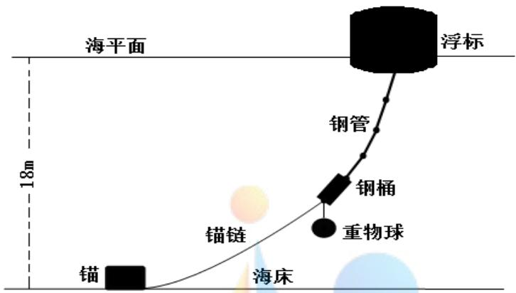

<details>
<summary>text_image</summary>

海平面
浮标
钢管
钢桶
重物球
锚链
锚
海床
18m
</details>

图 1 传输节点示意图

## （1）对浮标进行受力分析

我们以位置相对固定的锚链末端与锚的链接点作为参考点，对浮标进行受力分析（如图 2所示）。

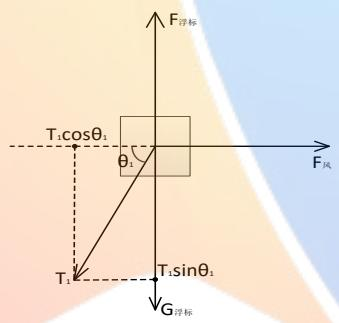

<details>
<summary>text_image</summary>

F_浮标
T₁cosθ₁
θ₁
F_风
T₁
T₁sinθ₁
G_浮标
</details>

图 2 浮标受力分析示意图

由浮标受力分析示意图（图 2）可知，浮标所受钢管的拉力 $\mathrm { T } _ { 1 }$ 、风力 $\mathsf { F } _ { \mathbb { X } }$ 、重力 $G _ { \sqrt { \sharp } , \sharp , \overline { { \jmath } } }$ 和浮力 $\mathrm { F _ { \mathrm { \sqrt { \frac { \pi } { \sqrt { \frac { 3 } { \pi } } } } + \frac { - 1 } { \sqrt { \Lambda } } } } }$ 的合力应为零，即：

$$
\vec {\mathrm{T}} _ {1} + \vec {\mathrm{F}} _ {\text {风}} + \vec {\mathrm{F}} _ {\text {浮标}} + \vec {\mathrm{G}} _ {\text {浮标}} = 0 \tag {5-1}
$$

对浮标所受的力按水平、竖直两个方向进行分解，可得：

$$
\left\{ \begin{array}{l} \mathrm{T} _ {1} \cos \theta_ {1} = \mathrm{F} _ {\text {风}} \\ \mathrm{T} _ {1} \sin \theta_ {1} = \mathrm{F} _ {\text {浮标}} - \mathrm{G} _ {\text {浮标}} \end{array} \right. \tag {5-2}
$$

其中 $G _ { \sqrt { \sharp } , \sharp , \overline { { \jmath } } }$ 为浮标的自重，可通过 $\mathrm { G } _ { \sqrt { \sharp } + \sqrt { \jmath } } = \mathrm { m } _ { \sqrt { \sharp } + \sqrt { \jmath } } \mathrm { g }$ 计算得到。由题目可知钢管共有四节，最上端的钢管与浮标相连，该钢管对浮标的拉力记为 $\mathrm { T } _ { 1 }$ ，与水平方向的倾斜角度记为 $\mathsf { \Omega } _ { 1 }$ 。

为简化计算，假设浮标处于平浮状态，则海风风力引起的水平力 $\mathrm { F } _ { \mathord { \left| { \vphantom { \mathrm { F } } } \right. \kern - delimiterspace } \mathrm { X } }$ 的大小

为：

$$
\mathrm{F} _ {\text {风}} = 0. 6 2 5 \mathrm{D} (2 - \mathrm{h}) \mathrm{v} ^ {2} \tag {5-3}
$$

浮标受到的浮力 $\mathrm { F _ { \mathrm { \sqrt { \frac { \pi } { \sqrt { \frac { 3 } { \pi } } } + \frac { 3 } { \sqrt { \Lambda } } } } } }$ 为：

$$
\mathrm{F} _ {\text {浮标}} = \rho_ {\text {海水}} g \pi r ^ {2} h \tag {5-4}
$$

其中 h为浮标的吃水深度，r为浮标底部半径，D为浮标底部的直径。

## （2）对钢管进行受力分析和力矩平衡分析

对于第一节钢管，我们可对其进行受力分析（如图 3所示）。

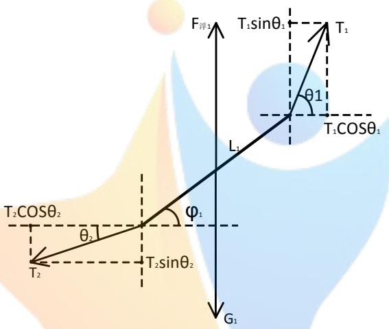

<details>
<summary>text_image</summary>

F浮1
T1sinθ1
T1
θ1
L1
T1COSθ1
T2COSθ2
φ1
θ2
T2sinθ2
G1
</details>

图 3 钢管受力分析示意图

由钢管受力分析示意图（图3）可知，钢管所受拉力 $\mathrm { T } _ { 1 }$ 、 $\mathrm { T } _ { 2 }$ 、重力 ${ \sf G } _ { 1 }$ 和浮力$\mathsf { F } _ { 1 } \ast _ { \overrightarrow { f } }$ 的合力应为零，即：

$$
\overrightarrow {\mathrm{T}} _ {1} + \overrightarrow {\mathrm{T}} _ {2} + \overrightarrow {\mathrm{F}} _ {1 \text {浮}} + \overrightarrow {\mathrm{G}} _ {1} = 0 \tag {5-5}
$$

对浮标所受的力按水平、竖直两个方向进行分解，可得：

$$
\left\{ \begin{array}{l} \mathrm{T} _ {2} \cos \theta_ {2} = \mathrm{T} _ {1} \cos \theta_ {1} \\ \mathrm{T} _ {2} \sin \theta_ {2} = \mathrm{T} _ {1} \sin \theta_ {1} - G _ {1} + \mathrm{F} _ {1 \text {浮}} \end{array} \right. \tag {5-6}
$$

其中 $G _ { 1 }$ 为第一节钢管所受的重力，可通过 ${ \bf G } _ { 1 } = { \bf m } _ { 1 }$ g计算得到， $\mathrm { T } _ { 2 }$ 为第二节钢管对第一节钢管的拉力，与水平方向的倾斜角度记为 $\theta _ { 2 }$ 。

由于钢管是刚性物体，受到多个力的作用，所以需要对第一节钢管的力矩的平衡性进行分析（如图4所示）：

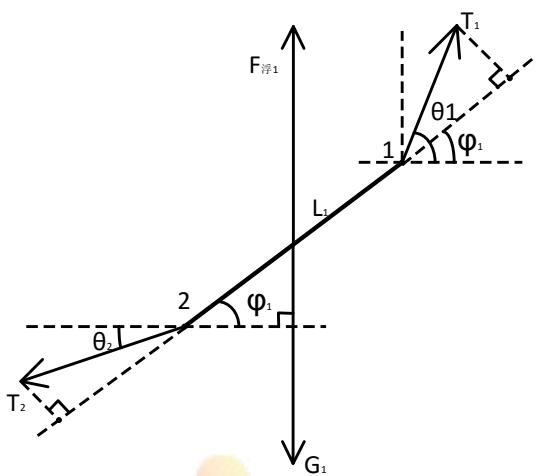

<details>
<summary>text_image</summary>

F浮1
L1
T1
θ1
φ1
1
2
θ2
φ1
T2
G1
</details>

图 4 钢管力矩平衡分析示意图

由力矩关系定理和钢管力矩平衡分析示意图（图4）知，可分别以节点 2和节点1作为参考点，对钢管的力矩进行力矩平衡性分析可得：

$$
\left\{ \begin{array}{l} \mathrm{L} _ {1} \mathrm{T} _ {1} \sin \left(\theta_ {1} - \varphi_ {1}\right) = \frac {1}{2} \mathrm{L} _ {1} \left(\mathrm{G} _ {1} - \mathrm{F} _ {1 \text {浮}}\right) \cos \varphi_ {1} \\ \mathrm{L} _ {1} \mathrm{T} _ {2} \sin \left(\varphi_ {1} - \theta_ {2}\right) = \frac {1}{2} \mathrm{L} _ {1} \left(\mathrm{G} _ {1} - \mathrm{F} _ {1 \text {浮}}\right) \cos \varphi_ {1} \end{array} \right. \tag {5-7}
$$

其中 $\Phi _ { 1 }$ 为钢管与水平面的夹角。

对于后面几节钢管，可将第一节钢管的分析方式进行推广，故可得钢管在水平方向和竖直方向上的受力，即：

$$
\left\{ \begin{array}{l} \mathrm{T} _ {\mathrm{i} + 1} \cos \theta_ {\mathrm{i} + 1} = \mathrm{T} _ {\mathrm{i}} \cos \theta_ {\mathrm{i}} (\mathrm{i} = 1, 2, 3, 4) \\ \mathrm{T} _ {\mathrm{i} + 1} \sin \theta_ {\mathrm{i} + 1} = \mathrm{T} _ {\mathrm{i}} \sin \theta_ {\mathrm{i}} - \left(\mathrm{G} _ {\mathrm{i}} - \mathrm{F} _ {\text {浮} \mathrm{i}}\right) (\mathrm{i} = 1, 2, 3, 4) \end{array} \right. \tag {5-8}
$$

其中 $\mathsf { \Pi } ^ { \mathsf { \Pi } } \mathsf { F } _ { \widetilde { \sharp } \widetilde { \mathsf { f } } } \mathsf { i } = 1 , 2 , 3 , 4 \AA$ 表示第i节钢管在海里所受浮力，可通过公式（5-8）解得； $\mathrm { G _ { i } } ( \mathrm { i } = 1 , 2 , 3 , 4 )$ 表示第i节钢管所受重力。

对于其他钢管的力矩平衡求解时，也可将第一节钢管的力矩分析进行推广，分别以节点 i+1 和节点 i 作为参考点，对钢管的力矩进行力矩平衡性分析可得：

$$
\left\{ \begin{array}{l} \mathrm{L} _ {\mathrm{i}} \mathrm{T} _ {\mathrm{i}} \sin \left(\theta_ {\mathrm{i}} - \varphi_ {\mathrm{i}}\right) = \frac {1}{2} \mathrm{L} _ {\mathrm{i}} \left(\mathrm{G} _ {\mathrm{i}} - \mathrm{F} _ {\text {浮} \mathrm{i}}\right) \cos \varphi_ {\mathrm{i}}, (\mathrm{i} = 1, 2, 3, 4) \\ \mathrm{L} _ {\mathrm{i}} \mathrm{T} _ {\mathrm{i} + 1} \sin \left(\varphi_ {\mathrm{i}} - \theta_ {\mathrm{i} + 1}\right) = \frac {1}{2} \mathrm{L} _ {\mathrm{i}} \left(\mathrm{G} _ {\mathrm{i}} - \mathrm{F} _ {\text {浮} \mathrm{i}}\right) \cos \varphi_ {\mathrm{i}}, (\mathrm{i} = 1, 2, 3, 4) \end{array} \right. \tag {5-9}
$$

将公式（5-9）进行化简，便可得到钢管与海平面夹角 $\varphi _ { \mathrm { i } } ( \mathrm { i } = 1 , 2 , 3 , 4 )$ 的递推公式：

$$
\tan \varphi_ {\mathrm{i}} = \frac {2 \mathrm{T} _ {\mathrm{i}} \sin \theta_ {\mathrm{i}} - (\mathrm{G} _ {\mathrm{i}} - \mathrm{F} _ {\text {浮} \mathrm{i}})}{2 \mathrm{T} _ {\mathrm{i}} \cos \theta_ {\mathrm{i}}} , (\mathrm{i} = 1, 2, 3, 4) \tag {5-10}
$$

（3）对钢桶的受力分析与力矩平衡的分析

对于钢桶，我们可对其进行受力分析（如图 5所示）。

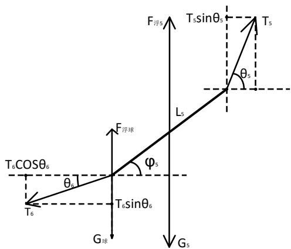

<details>
<summary>text_image</summary>

F_浮5
T_5sinθ_5
T_5
θ_5
L_5
F_浮球
φ_5
T_6COSθ_6
θ_6
T_6sinθ_6
G_球
G_5
</details>

图 5 钢桶受力分析示意图

钢桶所受合力应为零，即：

$$
\vec {\mathrm{T}} _ {5} + \vec {\mathrm{T}} _ {6} + \vec {\mathrm{G}} _ {5} + \vec {\mathrm{F}} _ {\text {浮} 5} + \vec {\mathrm{G}} _ {\text {球}} + \vec {\mathrm{F}} _ {\text {浮球}} = 0 \tag {5-11}
$$

对钢桶所受的力按水平、竖直两个方向进行分解，可得：

$$
\left\{ \begin{array}{l} \mathrm{T} _ {6} \cos \theta_ {6} = \mathrm{T} _ {5} \cos \theta_ {5} \\ \mathrm{T} _ {6} \sin \theta_ {6} = \mathrm{T} _ {5} \sin \theta_ {5} - (\mathrm{G} _ {\text {球}} - \mathrm{F} _ {\text {浮球}}) - (\mathrm{G} _ {5} - \mathrm{F} _ {\text {浮} 5}) \end{array} \right. \tag {5-12}
$$

其中 $\mathrm { G } _ { \ddagger \mathparagraph }$ 表示重物球受到的自身重力， ${ \sf G } _ { 5 }$ 表示钢桶受到的自身重力， $\operatorname { F } _ { \ P , \ P , \Phi }$ 表示重物球受到的浮力，可通过公式 $\mathrm { F } _ { \mathrm { i } \mp \mathrm { f } \hbar } = \rho _ { \mathrm { i } \hbar } \mathscr { g } \frac { m _ { \pm \sharp } } { \rho _ { \frac { \hbar } { \hbar } \hbar } }$ 求得， $m _ { \mathbb { H } }$ 为重力球的质量，$\rho _ { \mathrm { f s | X | } }$ 为钢材的密度。 $\mathsf { F } _ { \sqrt { \sharp } \ 5 }$ 表示钢桶受到的浮力。

由于钢桶也是刚性物体，受到多个力的作用，所以需要对钢桶的力矩的平衡性进行分析（如图 6所示）：

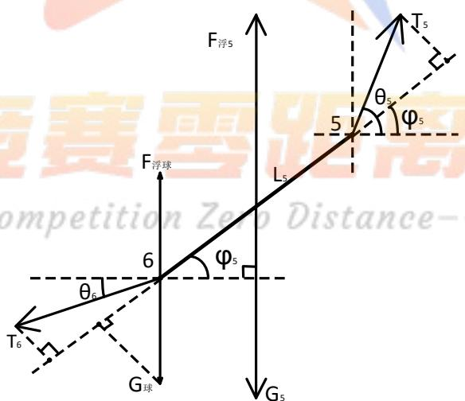

<details>
<summary>text_image</summary>

F浮5
T5
θ5
φ5
5
F浮球
L5
6
θ6
φ5
T6
G球
G5
competition Zero Distance-
</details>

图 6 钢桶力矩平衡分析示意图

由力矩关系定理和钢管力矩平衡分析示意图（图4）知，可分别以节点 6和节点5作为参考点，对钢管的力矩进行力矩平衡性分析可得：

$$
\left\{ \begin{array}{c} {\mathrm{L} _ {5} \mathrm{T} _ {5} \sin (\theta_ {5} - \varphi_ {5}) = \frac {1}{2} \mathrm{L} _ {5} (\mathrm{G} _ {\text {球}} - \mathrm{F} _ {\text {浮球}}) \cos \varphi_ {5}} \\ {\mathrm{L} _ {5} \mathrm{T} _ {6} \sin (\varphi_ {5} - \theta_ {6}) + \mathrm{L} _ {5} (\mathrm{G} _ {\text {球}} - \mathrm{F} _ {\text {浮球}}) \sin \left(\frac {\pi}{2} - \varphi_ {5}\right) = \frac {1}{2} \mathrm{L} _ {5} (\mathrm{G} _ {\text {球}} - \mathrm{F} _ {\text {浮球}}) \cos \varphi_ {5}} \end{array} \right.
$$

将公式进行化简，便可得到钢管与海平面夹角 $\varphi _ { 5 }$ 的关系为：

$$
\tan \varphi_ {5} = \frac {2 \mathrm{T} _ {5} \sin \theta_ {5} - (\mathrm{G} _ {\text {球}} - \mathrm{F} _ {\text {浮球}})}{2 \mathrm{T} _ {5} \cos \theta_ {5}} \tag {5-13}
$$

（5）对锚链进行受力分析与力矩平衡分析

对于第一节电焊锚链，我们可对其进行受力分析（如图7示）。

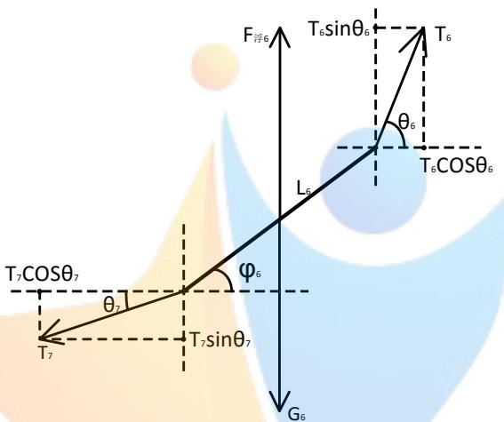

<details>
<summary>text_image</summary>

F浮6
T6sinθ6
T6
θ6
L6
T6cosθ6
T7COSθ7
φ6
θ7
T7sinθ7
G6
</details>

图 7 锚链受力分析示意图

由锚链受力分析示意图（图 7）所示，第一节锚链所受合力应该为零，即：

$$
\vec {\mathrm{T}} _ {6} + \vec {\mathrm{T}} _ {7} + \vec {\mathrm{F}} _ {\text {浮} 6} + \vec {\mathrm{G}} _ {6} = 0 \tag {5-14}
$$

对钢桶所受的力按水平、竖直两个方向进行分解，可得：

$$
\left\{ \begin{array}{c} \mathrm{T} _ {7} \cos \theta_ {7} = \mathrm{T} _ {6} \cos \theta_ {6} \\ \mathrm{T} _ {7} \sin \theta_ {7} = \mathrm{T} _ {6} \sin \theta_ {6} - \left(\mathrm{G} _ {6} - F _ {\text {浮} 6}\right) \end{array} \right. \tag {5-15}
$$

其中 $G _ { 6 }$ 为第一节电焊锚链所受的重力， $\mathrm { T } _ { 7 }$ 为第二节锚链对第一节锚链的拉力，与水平方向的倾斜角度记为 $\theta _ { 7 }$ 。第一节电焊锚链所受的浮力 $F _ { \sqrt { \breve { \mp } } \ 6 }$ 可通过公式$\begin{array} { r } { F _ { \tilde { \tilde { \mathcal { F } } } 6 } = \rho _ { \tilde { \mathcal { H } } \tilde { \mathcal { H } } } g \frac { m _ { \tilde { \mathcal { H } } \tilde { \mathcal { H } } } } { \rho _ { \tilde { \mathcal { H } } \tilde { \mathcal { H } } } } } \end{array}$ 算得， $m _ { \sharp \sharp \sharp }$ 表示单节电焊锚链的质量。

由于电焊锚链也是刚性物体，所以电焊锚链所受拉力的方向与电焊锚链所在方向之间存在夹角，故我们可对第一节电焊锚链进行力矩平衡分析（如图7示）：

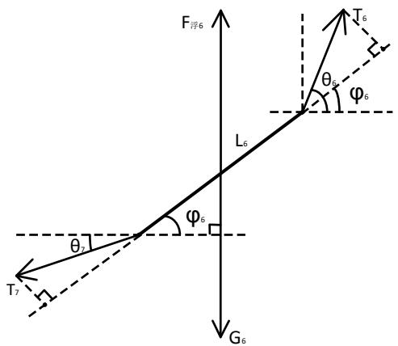

<details>
<summary>text_image</summary>

F浮6
L6
T6
θ5
φ6
θ7
φ6
T7
G6
</details>

图 8 锚链受力分析示意图

由力矩关系定理和钢管力矩平衡分析示意图（图4）知，可分别以节点 7和节点6作为参考点，对钢管的力矩进行力矩平衡性分析可得：

$$
\left\{ \begin{array}{l} \mathrm{L} _ {6} \mathrm{T} _ {6} \sin \left(\theta_ {6} - \varphi_ {6}\right) = \frac {1}{2} \mathrm{L} _ {6} \left(\mathrm{G} _ {6} - F _ {\text {浮} 6}\right) \cos \varphi_ {6} \\ \mathrm{L} _ {6} \mathrm{T} _ {7} \sin \left(\varphi_ {6} - \theta_ {7}\right) = \frac {1}{2} \mathrm{L} _ {6} \left(\mathrm{G} _ {6} - F _ {\text {浮} 6}\right) \cos \varphi_ {6} \end{array} \right. \tag {5-16}
$$

其中 $\varphi _ { 6 }$ 为电焊锚链与水平面的夹角。

对于后面的电焊锚链，可将第一节锚链的分析方式进行推广，故可得每节锚链在水平方向和竖直方向上的受力，即：

$$
\left\{ \begin{array}{c} \mathrm{T} _ {\mathrm{i} + 1} \cos \theta_ {\mathrm{i} + 1} = \mathrm{T} _ {\mathrm{i}} \cos \theta_ {\mathrm{i}}, (\mathrm{i} = 6, 7, \dots , \mathrm{n}) \\ \mathrm{T} _ {\mathrm{i} + 1} \sin \theta_ {\mathrm{i} + 1} = \mathrm{T} _ {\mathrm{i}} \sin \theta_ {\mathrm{i}} - \left(\mathrm{G} _ {\mathrm{i}} - \mathrm{F} _ {\text {浮} \mathrm{i}}\right), (\mathrm{i} = 6, 7, \dots , \mathrm{n}) \end{array} \right. \tag {5-17}
$$

其中 $^ { 1 } \mathrm { F } _ { \ddagger \mathrm { i } } \big ( \mathrm { i } = 6 , 7 , \ \cdots , \mathrm { n } \big )$ 表示第i节钢管在海里所受浮力, $\mathrm { G _ { i } ( i = 6 , 7 , ~ \cdots , n ) }$ 表示第i节钢管所受重力。

对于其他锚链的力矩平衡求解时，也可将第一节锚链的力矩分析进行推广，分别以节点 i+1 和节点 i 作为参考点，对钢管的力矩进行力矩平衡性分析可得：

$$
\left\{ \begin{array}{l} \mathrm{L} _ {\mathrm{i}} \mathrm{T} _ {\mathrm{i}} \sin \left(\theta_ {\mathrm{i}} - \varphi_ {\mathrm{i}}\right) = \frac {1}{2} \mathrm{L} _ {\mathrm{i}} \left(\mathrm{G} _ {\mathrm{i}} - \mathrm{F} _ {\text {浮} \mathrm{i}}\right) \cos \varphi_ {\mathrm{i}}, \quad (\mathrm{i} = 6, 7, \dots , \mathrm{n}) \\ \mathrm{L} _ {\mathrm{i}} \mathrm{T} _ {\mathrm{i} + 1} \sin \left(\varphi_ {\mathrm{i}} - \theta_ {\mathrm{i} + 1}\right) = \frac {1}{2} \mathrm{L} _ {\mathrm{i}} \left(\mathrm{G} _ {\mathrm{i}} - \mathrm{F} _ {\text {浮} \mathrm{i}}\right) \cos \varphi_ {\mathrm{i}}, \quad (\mathrm{i} = 6, 7, \dots , \mathrm{n}) \end{array} \right. \tag {5-18}
$$

将公式（5-18）进行化简，便可得到钢管与海平面夹角 $\varphi _ { \mathrm { i } } \mathrm { ( i = 6 , 7 , ~ \cdots , n ) }$ 的递推公式：

$$
\tan \varphi_ {\mathrm{i}} = \frac {2 \mathrm{T} _ {\mathrm{i}} \sin \theta_ {\mathrm{i}} - \left(\mathrm{G} _ {\mathrm{i}} - \mathrm{F} _ {\text {浮} \mathrm{i}}\right)}{2 \mathrm{T} _ {\mathrm{i}} \cos \theta_ {\mathrm{i}}} , (\mathrm{i} = 1, 2, 3, 4) \tag {5-10}
$$

其中 $\mathsf { F _ { i \right. , \left. } } _ { \mathrm { i } } { \left( \mathrm { i } = 6 , 7 , \cdots , \mathrm { \Delta } \mathrm { n } \right) }$ 表示第i条锚链在海里所受浮力； $\mathrm { G _ { i } ( i = 6 , 7 , \cdots , ~ n ) }$ 表示第i条锚链所受重力。

因此，可利用各个物体的长度 $L _ { i }$ 与各个物体与水平面的夹角 $\varphi _ { \mathrm { i } }$ 之间的对应关系求得海水深度H 与吃水深度h之间的关系为：

$$
\mathrm{H} = \sum_ {i = 1} ^ {n} L _ {i} \sin \varphi_ {\mathrm{i}} + \mathrm{h} \tag {5-11}
$$

也可利用各个物体的长度 $L _ { i }$ 与各个物体与水平面的夹角 $\varphi _ { \mathrm { i } }$ 的对应关系求得浮标的游动半径为：

$$
\mathrm{R} = \sum_ {i = 1} ^ {n} L _ {i} \cos \varphi_ {\mathrm{i}} \tag {5-12}
$$

将上述的力学分析和和力矩平衡的递推公式进行整理，可得：

$$
\left\{ \begin{array}{l} \left\{ \begin{array}{l} \mathrm{T} _ {1} \cos \theta_ {1} = 0. 6 2 5 \times \mathrm{D} (2 - \mathrm{h}) \mathrm{v} ^ {2} \\ \mathrm{T} _ {1} \sin \theta_ {1} = \rho_ {\text {海水}} g \pi r ^ {2} h - \mathrm{m} _ {\text {浮标}} \mathrm{g} \end{array} \right. \\ \left\{ \begin{array}{l} \mathrm{T} _ {\mathrm{i} + 1} \cos \theta_ {\mathrm{i} + 1} = \mathrm{T} _ {\mathrm{i}} \cos \theta_ {\mathrm{i}} \\ \mathrm{T} _ {\mathrm{i} + 1} \sin \theta_ {\mathrm{i} + 1} = \mathrm{T} _ {\mathrm{i}} \sin \theta_ {\mathrm{i}} - \left(\mathrm{G} _ {\mathrm{i}} - \mathrm{F} _ {\mathrm{i} \text {浮}}\right) \end{array} \quad (\mathrm{i} \neq 5) \right. \\ \left\{ \begin{array}{l} \mathrm{T} _ {6} \cos \theta_ {6} = \mathrm{T} _ {5} \cos \theta_ {5} \\ \mathrm{T} _ {6} \sin \theta_ {6} = \mathrm{T} _ {5} \sin \theta_ {5} - \left(\mathrm{G} _ {\text {球}} - \mathrm{F} _ {\text {浮球}}\right) - \left(\mathrm{G} _ {5} - \mathrm{F} _ {\text {浮} 5}\right) \end{array} \quad (\mathrm{i} = 5) \right. \\ \varphi_ {\mathrm{i}} = \arctan \left(\frac {2 \mathrm{T} _ {\mathrm{i}} \sin \theta_ {\mathrm{i}} - \left(\mathrm{G} _ {\mathrm{i}} - \mathrm{F} _ {\text {浮i}}\right)}{2 \mathrm{T} _ {\mathrm{i}} \cos \theta_ {\mathrm{i}}}\right), (\mathrm{i} = 1, 2, \dots , n) \\ H = \sum_ {i = 1} ^ {n} L _ {i} \sin \varphi_ {\mathrm{i}} + h \\ R = \sum_ {i = 1} ^ {n} L _ {i} \cos \varphi_ {\mathrm{i}} \end{array} \right. \tag {5-13}
$$

## 5.1.2模型一的求解

根据上述建立的数学模型，利用 MATLAB 软件编程可得到以吃水深度为自变量与海水深度为因变量间的变化曲线：

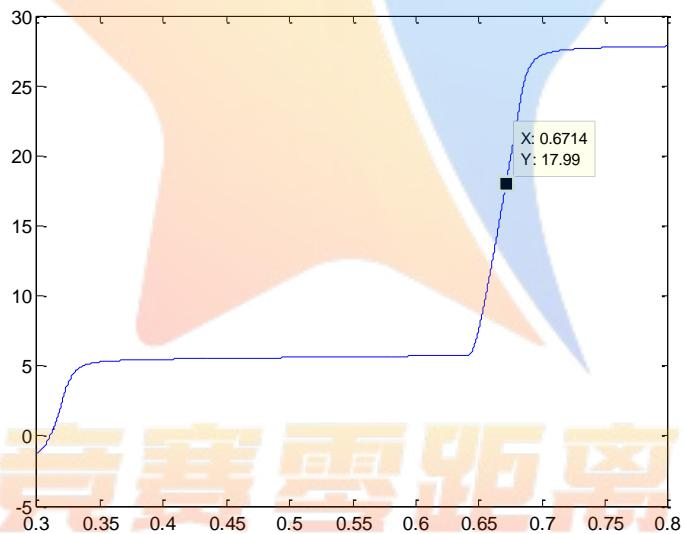

<details>
<summary>line</summary>

| X | Y |
| --- | --- |
| 0.6714 | 17.99 |
</details>

图 9 吃水深度与海水深度的变化曲线

从吃水深度与海水深度的变化曲线（见图 9）可知，海水深度 H与浮标的吃水深度h成正相关。浮标吃水深度越深，对应的海水深度就越深。

由于浮标的吃水深度未知，所以在计算时，可将浮标吃水深度 h作为搜索变量，利用上述模型中的关系式，计算出海水深度为 18m时，钢桶和各个钢桶之间的倾斜角度、浮标的吃水深度及游动区域，结果如下表所示：

表 1 不同风速下各种指标的结果统计表

<table><tr><td>风速(m/s)</td><td>12</td><td>24</td></tr><tr><td rowspan="4">1~4节钢管与海平面竖直方向夹角(度)</td><td>1.2064</td><td>4.5360</td></tr><tr><td>1.2064</td><td>4.5836</td></tr><tr><td>1.2148</td><td>4.6141</td></tr><tr><td>1.2233</td><td>4.6450</td></tr><tr><td>钢桶与海平面竖直方向夹角(度)</td><td>1.2319</td><td>4.6763</td></tr><tr><td>最后一条锚链与海平面水平方向夹角(度)</td><td>0</td><td>4.8300</td></tr><tr><td>浮标的吃水深度(m)</td><td>0.6715</td><td>0.6857</td></tr><tr><td>浮标的游动半径(m)(以锚所在位置为圆心)</td><td>14.6552</td><td>17.7614</td></tr></table>

从不同风速下各种指标的结果统计表（表 1）可知，在风速为 12m/s 时，四节钢管与竖直方向的夹角依次为 1.2064°、1.2064°、1.2148°、1.2233°；钢桶与竖直方向上的夹角为 1.2319 度。钢桶几乎处于垂直状态，说明通讯设备的工作状态良好。而最后一条锚链与海平面的夹角为0度，说明此时的锚链有一部分平铺在海床上。浮标的吃水深度和游动半径分别为0.6715m、14.6552m。

在海面风速为 24m/s 时，四节钢管与竖直方向的夹角依次为 4.5360°、4.5836°、4.6141°、4.6450°；钢桶与竖直方向上的夹角为 4.6763°；此时钢桶的倾斜角度接近 5°，由于钢桶的倾斜角度超过 5°时，设备的工作效率较差，若风速继续增大，钢桶与竖直方向的夹角会超 5°这个过临界值，对通讯设备的工作效率造成很大的影响。而最后一条锚链与海平面水平方向夹角为 4.8300度，说明此时的锚链被完全拉起。浮标的吃水深度和游动半径分别为 0.6857m、17.7614m。

对于锚链的形状，可根据各节锚链的长度与锚链倾斜角度进行求解，借用MATLAB软件解得海面风速在 12m/s和24m/s时的锚链形状图（如下图所示）。

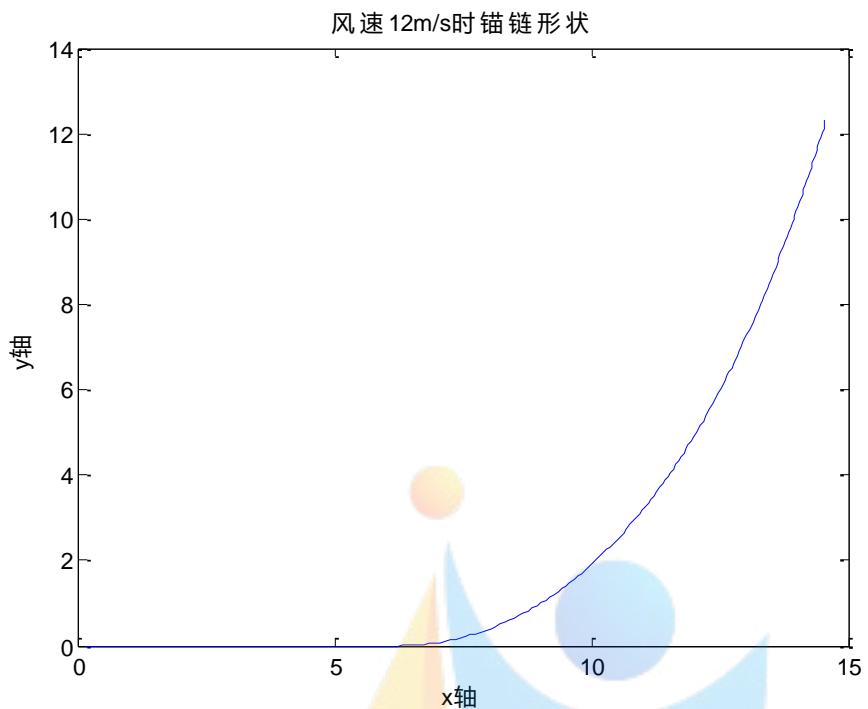

<details>
<summary>line</summary>

| x轴 | y轴 |
| --- | --- |
| 0 | 0 |
| ~6.5 | ~0.1 |
| ~7.5 | ~0.3 |
| ~8.5 | ~0.8 |
| ~9.5 | ~1.5 |
| ~10.5 | ~2.5 |
| ~11.5 | ~4.0 |
| ~12.5 | ~6.0 |
| ~13.5 | ~9.0 |
| ~14.5 | ~12.3 |
</details>

图 10 风速 $1 2 \mathsf { m } / \mathsf { s }$ 时锚链的形状

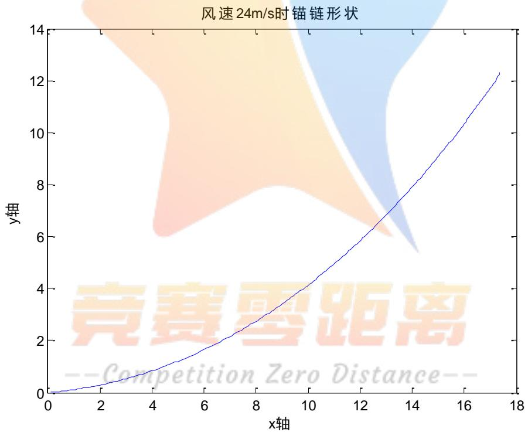

<details>
<summary>line</summary>

| x轴 | y轴 |
| --- | --- |
| 0 | 0 |
| ~2 | ~0.5 |
| ~4 | ~1.0 |
| ~6 | ~1.8 |
| ~8 | ~2.8 |
| ~10 | ~4.2 |
| ~12 | ~6.0 |
| ~14 | ~8.0 |
| ~16 | ~10.5 |
| ~17.5 | ~12.3 |
</details>

图 11 风速24m/s 时锚链的形状

通过图 9和图 10的链条形状，我们可以清晰的看出，海面风速为 12m/s时，有一部分锚链平铺在海床上；海面风速为 $2 4 \mathrm { m } / \mathrm { s }$ 时，锚链全部被拉起，不存在锚链平铺海床的情况。

## 5.2 模型二的建立与求解

## 5.2.1 模型二的建立

(1)求解风速为 36m/s 时各参数的值

要求在问题 1 的假设下，计算海面风速为 36m/s时钢桶和各节钢管的倾斜角度，链条形状和浮标的游动区域。对此，可继续使用问题 1中的数学模型，以重物球的质量为搜索变量，钢桶的倾斜角度小于 $5 ^ { \circ }$ 和最后一节锚链的锚链与海床的夹角小于 $1 6 ^ { \circ }$ 为约束条件，采用二分法对海水深度 18m 进行逼近，得到的重物球的质量即所需的最小质量。

对于此问题，可直接利用问题一中建立的模型（5-13）便可计算海面风为

$$
\left\{ \begin{array}{l} \left\{ \begin{array}{l} \mathrm{T} _ {1} \cos \theta_ {1} = 0. 6 2 5 \times \mathrm{D} (2 - \mathrm{h}) \mathrm{v} ^ {2} \\ \mathrm{T} _ {1} \sin \theta_ {1} = \rho_ {\text {海水}} g \pi r ^ {2} h - \mathrm{m} _ {\text {浮标}} \mathrm{g} \end{array} \right. \\ \left\{ \begin{array}{l} \mathrm{T} _ {\mathrm{i} + 1} \cos \theta_ {\mathrm{i} + 1} = \mathrm{T} _ {\mathrm{i}} \cos \theta_ {\mathrm{i}} \\ \mathrm{T} _ {\mathrm{i} + 1} \sin \theta_ {\mathrm{i} + 1} = \mathrm{T} _ {\mathrm{i}} \sin \theta_ {\mathrm{i}} - \left(\mathrm{G} _ {\mathrm{i}} - \mathrm{F} _ {\mathrm{i} \text {浮}}\right) \end{array} \quad (\mathrm{i} \neq 5) \right. \\ \left\{ \begin{array}{l} \mathrm{T} _ {6} \cos \theta_ {6} = \mathrm{T} _ {5} \cos \theta_ {5} \\ \mathrm{T} _ {6} \sin \theta_ {6} = \mathrm{T} _ {5} \sin \theta_ {5} - \left(\mathrm{G} _ {\text {球}} - \mathrm{F} _ {\text {浮球}}\right) - \left(\mathrm{G} _ {5} - \mathrm{F} _ {\text {浮} 5}\right) \end{array} \quad (\mathrm{i} = 5) \right. \\ \tan \varphi_ {\mathrm{i}} = \frac {2 \mathrm{T} _ {\mathrm{i}} \sin \theta_ {\mathrm{i}} - \left(\mathrm{G} _ {\mathrm{i}} - \mathrm{F} _ {\text {浮} \mathrm{i}}\right)}{2 \mathrm{T} _ {\mathrm{i}} \cos \theta_ {\mathrm{i}}} (\mathrm{i} = 1, 2, \dots , n) \\ H = \sum_ {i = 1} ^ {n} L _ {i} s i n \varphi_ {\mathrm{i}} + h \\ R = \sum_ {i = 1} ^ {n} L _ {i} c o s \varphi_ {\mathrm{i}} \end{array} \right. \end{array} \right.
$$

36m/s时，钢桶和各节钢管的倾斜角度，链条形状以及浮标的游动区域。

## （2）求满足设计要求的最小重物球质量的模型

通过问题 1的求解结果可知，在海面风速为 $2 4 \mathrm { m } / \mathrm { s }$ 时，钢桶与竖直方向上的夹角为 $4 . 6 7 6 3 ^ { \circ }$ ；与钢桶的倾斜角度的临界值 $5 ^ { \circ }$ 很接近，若风速继续增大，对通讯设备的工作效率造成很大的影响，因此海面风速达到36m/s 时，钢桶的倾斜角度和最后一节锚链与海床的夹角不满足约束条件，因此，需改变重物球的质量，使得钢桶的倾斜角度与最后一节锚链的锚链与海床的夹角满足约束条件。

$$
\mathrm{Min} \quad m _ {\text {球}}
$$

$$
\text {st.} \left\{ \begin{array}{l} \left\{ \begin{array}{l} \mathrm{T} _ {1} \cos \theta_ {1} = 0. 6 2 5 \times \mathrm{D} (2 - \mathrm{h}) \mathrm{v} ^ {2} \\ \mathrm{T} _ {1} \sin \theta_ {1} = \rho_ {\text {海水}} g \pi r ^ {2} h - \mathrm{m} _ {\text {浮标}} \mathrm{g} \end{array} \right. \\ \left\{ \begin{array}{l} \mathrm{T} _ {\mathrm{i} + 1} \cos \theta_ {\mathrm{i} + 1} = \mathrm{T} _ {\mathrm{i}} \cos \theta_ {\mathrm{i}} \\ \mathrm{T} _ {\mathrm{i} + 1} \sin \theta_ {\mathrm{i} + 1} = \mathrm{T} _ {\mathrm{i}} \sin \theta_ {\mathrm{i}} - \left(\mathrm{G} _ {\mathrm{i}} - \mathrm{F} _ {\mathrm{i} \text {浮}}\right) \end{array} \quad (\mathrm{i} \neq 5) \right. \\ \left\{ \begin{array}{l} \mathrm{T} _ {6} \cos \theta_ {6} = \mathrm{T} _ {5} \cos \theta_ {5} \\ \mathrm{T} _ {6} \sin \theta_ {6} = \mathrm{T} _ {5} \sin \theta_ {5} - \left(\mathrm{G} _ {\text {球}} - \mathrm{F} _ {\text {浮球}}\right) - \left(\mathrm{G} _ {5} - \mathrm{F} _ {\text {浮} 5}\right) \end{array} \quad (\mathrm{i} = 5) \right. \\ \tan \varphi_ {\mathrm{i}} = \frac {2 \mathrm{T} _ {\mathrm{i}} \sin \theta_ {\mathrm{i}} - \left(\mathrm{G} _ {\mathrm{i}} - \mathrm{F} _ {\text {浮} \mathrm{i}}\right)}{2 \mathrm{T} _ {\mathrm{i}} \cos \theta_ {\mathrm{i}}} (\mathrm{i} = 1, 2, \dots , n) \\ H = \sum_ {i = 1} ^ {n} L _ {i} \sin \varphi_ {\mathrm{i}} + h \\ R = \sum_ {i = 1} ^ {n} L _ {i} \cos \varphi_ {\mathrm{i}} \\ \varphi_ {2 1 5} \leq 1 6 ^ {\circ} \\ 9 0 ^ {\circ} - \varphi_ {5} \leq 5 ^ {\circ} \end{array} \right.
$$

## (3) 求满足设计要求的最小重物球质量

对此，以重物球的质量为搜索变量，钢桶的倾斜角度小于 $5 ^ { \circ }$ °和最后一节锚链的锚链与海床的夹角小于 $1 6 ^ { \circ }$ 为约束条件，采用二分法对海水深度 18m 进行逼近，得到的重物球的质量即所需的最小质量，其具体步骤如下：

a、先人工确定出重物球质量的大致范围，再在该范围内以小步长遍历重物球质量m；  
b、选取浮标吃水深度的区间。以恰好提起所有重物时的浮标吃水深度为左区间，以浮标高度为右区间[ha,hb]。  
c、利用海水深度 H 与吃水深度 h 之间的关系式（5-11）可以求得上述浮标吃水深度的区间所对应海水深度的区间[Ha,Hb]；

d、利用二分法对海水深度 18m进行逼近，求满足钢桶的倾斜角度 $\Psi _ { 5 } < 5 ^ { \circ }$ 最后一节锚链与海平面的夹角 $\varphi _ { 2 1 5 } < 1 6 ^ { \circ }$ <sup>。</sup>和海水深度Hc满足 $| \mathrm { H c } - 1 8 | < \mathrm { e p s }$ 件的浮标吃水深度和重物球的质量，具体流程见二分法的步骤见图（图12）；

e、记录满足约束条件的浮标吃水深度和重物球的质量。

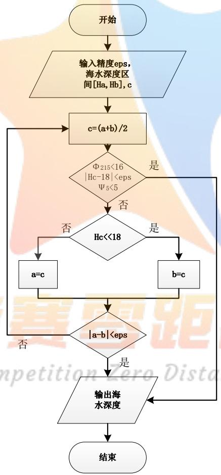

<details>
<summary>flowchart</summary>

```mermaid
graph TD
  Start(["开始"]) --> InputData["&quot;输入精度eps, 海水深度区间[Ha, Hb"], c"]
  InputData --> CalcCoefficient["c=(a+b)/2"]
  CalcCoefficient --> CheckFactor{"Φ215<16\n|Hc-18|<eps\nΨ5<5"}
  CheckFactor["CheckFactor -- 是"] --> CalcCoefficient
  CheckFactor2["CheckFactor -- 否"] --> CheckDepth{"Hc<<18"}
  CheckDepth["CheckDepth -- 否"] --> CompareA["a=c"]
  CheckDepth2["CheckDepth -- 是"] --> CompareB["b=c"]
  CompareA --> Decision{"|a-b|<eps"}
  CompareB --> Decision
  Decision["Decision -- 否"] --> CalcCoefficient
  Decision2["Decision -- 是"] --> OutputWater["输出海水深度"]
  OutputWater --> End(["结束"])
```
</details>

图 12 二分法流程示意图

## 5.2.2模型二的求解

运用问题 1 中的数学模型，利用 MATLAB 软件求解出海面风速为 36m/s 时钢桶和各节钢管的倾斜角度、链条形状和浮标的游动区域，其结果详见下表：

表 2 风速为 36m/s 时各种指标的统计表

<table><tr><td>风速(m/s)</td><td>36</td></tr><tr><td>重物球质量(kg)</td><td>1200</td></tr><tr><td rowspan="4">1~4节钢管与海平面竖直方向夹角(度)</td><td>9.4814</td></tr><tr><td>9.4814</td></tr><tr><td>9.5399</td></tr><tr><td>9.5992</td></tr><tr><td>钢桶与海平面竖直方向夹角(度)</td><td>9.6592</td></tr><tr><td>最后一条锚链与海平面水平方向夹角(度)</td><td>20.9997</td></tr><tr><td>浮标的吃水深度(m)</td><td>0.7086</td></tr><tr><td>浮标的游动半径(m)(以锚所在位置为圆心)</td><td>18.8546</td></tr></table>

由风速为 36m/s 时各种指标的统计表（表 2）可知， 风速为 36m/s时钢桶的倾斜角度为9.6592°，最后一条锚链与海平面的夹角为20.9997°，说明此时锚链容易被拖行，通讯设备的工作效果受到严重影响。因此，需要调节重物球的质量，使得钢桶倾角和最后一节锚链与海床的夹角满足要求。若锚链被拖行，浮标的游动半径会比求解出的游动半径要大。

确定重物球质量时，以重物球的质量为搜索变量，钢桶的倾斜角度小于5和最后一节锚链的锚链与海床的夹角小于 16°为约束条件，采用二分法对海水深度 18m 进行逼近，得到的重物球的质量即所需的最小质量。借用 MATLAB 软件解得满足要求的结果，如下表所示：

表 3 调节质量后的各种指标统计结果

<table><tr><td>风速(m/s)</td><td>36</td></tr><tr><td>重物球质量(kg)</td><td>2280</td></tr><tr><td rowspan="4">1~4节钢管与海平面竖直方向夹角(度)</td><td>4.4244</td></tr><tr><td>4.4244</td></tr><tr><td>4.4407</td></tr><tr><td>4.4572</td></tr><tr><td>钢桶与海平面竖直方向夹角(度)</td><td>4.4737</td></tr><tr><td>最后一条锚链与海平面水平方向夹角(度)</td><td>15.9748</td></tr><tr><td>浮标的吃水深度(m)</td><td>0.9848</td></tr><tr><td>浮标的游动半径(m)(以锚所在位置为圆心)</td><td>18.4906</td></tr></table>

由调节质量后的各种指标统计结果（表 3）可知，当重物球的质量增加到2280kg 时，系统满足约束条件，此时钢桶与竖直方向夹角为 4.4737°，最后一条锚链与海平面水平方向夹角 15.9748°，浮标的吃水深度和游动半径分别为

0.9848m、18.4906，为了让通讯设备拥有更好的工作效果，可将中午球的质量适当增大。

## 5.3 模型三的建立与求解

## 5.3.1模型三的建立

针对此问题，需要先对系泊系统进行设计，而系泊系统的设计问题就是确定锚链的型号、长度和重物球质量，使得浮标的吃水深度和游动区域及钢桶的倾斜角度尽可能小。因此，可以在问题 2 的基础上，通过控制单一变量的方式，对锚链型号、长度和重物球的质量与吃水深度、游动区域及钢桶的倾斜角度间的关系进行分析，以吃水深度、游动范围尽量小，钢桶的倾斜角度小于 5°和最后一节锚链的锚链与海床的夹角小于 $1 6 ^ { \circ }$ 的选取原则，便可确定锚链的型号。以锚链长度和重物球质量为搜索变量，利用遍历法，对满足最大水流速度和风速指标，水深 16m 时的钢桶角度和 20m 时的最后一节锚链与水平方向的夹角为约束的重力球质量与锚链长度进行求解。利用模型一便可的到不同情况下的各种参数。由于存在水流力的影响，需要对模型一进行修正。

$$
\left\{ \begin{array}{l} \left\{ \begin{array}{c} \mathrm{T} _ {1} \cos \theta_ {1} = 0. 6 2 5 \mathrm{D} (2 - \mathrm{h}) \mathrm{v} ^ {2} + 3 7 4 \mathrm{Dh} \mathrm{v} ^ {2} \\ \mathrm{T} _ {1} \sin \theta_ {1} = \rho_ {\text {海水}} g \pi r ^ {2} h - \mathrm{m} _ {\text {浮标}} \mathrm{g} \end{array} \right. \\ \left\{ \begin{array}{l} \mathrm{T} _ {\mathrm{i} + 1} \cos \theta_ {\mathrm{i} + 1} = \mathrm{T} _ {\mathrm{i}} \cos \theta_ {\mathrm{i}} + \vec {\mathrm{F}} _ {\text {水i}} \\ \mathrm{T} _ {\mathrm{i} + 1} \sin \theta_ {\mathrm{i} + 1} = \mathrm{T} _ {\mathrm{i}} \sin \theta_ {\mathrm{i}} - \left(\mathrm{G} _ {\mathrm{i}} - \mathrm{F} _ {\text {浮i}}\right) \end{array} (\mathrm{i} \neq 5) \right. \\ \left\{ \begin{array}{l} \mathrm{T} _ {6} \cos \theta_ {6} = \mathrm{T} _ {5} \cos \theta_ {5} + \mathrm{F} _ {\text {水5}} + \mathrm{F} _ {\text {水球}} \\ \mathrm{T} _ {6} \sin \theta_ {6} = \mathrm{T} _ {5} \sin \theta_ {5} - \left(\mathrm{G} _ {\text {球}} - \mathrm{F} _ {\text {浮球}}\right) - \left(\mathrm{G} _ {5} - \mathrm{F} _ {\text {浮5}}\right) \end{array} (\mathrm{i} = 5) \right. \\ \varphi_ {\mathrm{i}} = \arctan \left(\frac {2 \mathrm{T} _ {\mathrm{i}} \sin \theta_ {\mathrm{i}} - (\mathrm{G} _ {\mathrm{i}} - \mathrm{F} _ {\text {浮i}})}{2 \mathrm{T} _ {\mathrm{i}} \cos \theta_ {\mathrm{i}}}\right) \\ H = \sum_ {i = 1} ^ {n} L _ {i} s i n \varphi_ {\mathrm{i}} + h \\ R = \sum_ {i = 1} ^ {n} L _ {i} c o s \varphi_ {\mathrm{i}} \\ 1 6 \leq H \leq 2 0 \\ \varphi_ {\mathrm{n}} \leq 1 6 ^ {\circ} \\ 9 0 - \varphi_ {5} \leq 5 ^ {\circ} \end{array} \right.
$$

## 5.3.2模型三的求解

## （1）锚链型号对评价指标的影响分析

由题目所给可得锚链型号I\~V中每节链环的长度，在模型一和模型二的条件下，假设其他变量分别为固定值，即海水深度H = 18m、锚链总长 $\mathrm { L } = 2 2 . 0 5 \mathrm { m }$ 风速为 36m/s、重物球质量为1200kg、海水静止或水流速度为1.5m/s；根据下述公式可以求得各个锚链型号对应锚链节数t，具体数据见下表：

$$
t = \frac {L}{l} \tag {5-20}
$$

其中l表示一节锚链的长度。

表 4 各锚链型号对应锚链节数

<table><tr><td>锚链型号</td><td>I</td><td>II</td><td>III</td><td>IV</td><td>V</td></tr><tr><td>每节锚链长度(m)</td><td>0.078</td><td>0.105</td><td>0.120</td><td>0.150</td><td>0.180</td></tr><tr><td>锚链节数(节)</td><td>283</td><td>210</td><td>184</td><td>147</td><td>123</td></tr></table>

○1 海水静止时锚链型号对评价指标的影响

表 5 海水静止时锚链型号与参数的间的关系

<table><tr><td>锚链型号</td><td>I</td><td>II</td><td>III</td><td>IV</td><td>V</td></tr><tr><td>钢桶与海平面竖直方向夹角(度)</td><td>9.8685</td><td>9.4873</td><td>8.9560</td><td>8.2623</td><td>7.5554</td></tr><tr><td>最后一条锚链与海平面水平方向夹角(度)</td><td>28.4534</td><td>21.2675</td><td>9.7206</td><td>0</td><td>0</td></tr><tr><td>浮标的吃水深度(m)</td><td>0.7033</td><td>0.7150</td><td>0.7330</td><td>0.7590</td><td>0.7890</td></tr><tr><td>浮标的游动区域的半径(m)(以锚对应海平面上的位置为圆心的圆)</td><td>19.0133</td><td>18.7856</td><td>18.4372</td><td>17.5436</td><td>16.8132</td></tr></table>

○2 海水流速为1.5m/s时锚链型号对评价指标的影响

表 6 海水流速与锚链型号间的关系

<table><tr><td>锚链型号</td><td>I</td><td>II</td><td>III</td><td>IV</td><td>V</td></tr><tr><td>钢桶与海平面竖直方向夹角(度)</td><td>14.2298</td><td>13.8285</td><td>13.3085</td><td>12.6474</td><td>11.8907</td></tr><tr><td>最后一条锚链与海平面水平方向夹角(度)</td><td>30.5993</td><td>26.9012</td><td>21.3595</td><td>15.1383</td><td>7.6743</td></tr><tr><td>浮标的吃水深度(m)</td><td>0.7460</td><td>0.7590</td><td>0.7770</td><td>0.8020</td><td>0.8340</td></tr><tr><td>浮标的游动区域的半径(m)(以锚对应海平面上的位置为圆心的圆)</td><td>19.3872</td><td>19.2782</td><td>19.2095</td><td>18.9006</td><td>18.5765</td></tr></table>

从表 可得各个锚链型号满足题目中要求浮标的吃水深度和游动区域及钢桶的倾斜角度尽可能小的条件，在海水静止时各个型号锚链对钢桶与海平面竖直方向夹角的作用几乎可以看做相同，因此海水流速为1.5m/s时首先将选用浮标的游动区域最小的锚链型号，即V号锚链，并在该型号锚链下判断条件：○1钢桶与海平面竖直方向夹角小于5度；○2最后一条锚链与海平面水平方向夹角小于16度。通过MATLAB 编程结果并进行优化后可得V号锚链满足上述判断条件，则V号锚链为对评价指标最优的锚链。

## （2）链条节数对评价指标的影响分析

若要分析链条节数对评价指标的影响，可以给定等跨度为 50 的 3 个链条节数 210、260、310，在模型二的条件下，假设其他变量分别为固定值，即II号锚链（总长度未知）、海水深度H = 18m、重物球质量为2280kg、水流速度为1.5m/s、风速为36m/s；可以得到不同链条节数对评价指标的影响，具体数据见下表：

表 7 不同链条节数与各参数间的关系

<table><tr><td>链条节数</td><td>210</td><td>260</td><td>310</td></tr><tr><td>钢桶与海平面竖直方向夹角(度)</td><td>8.4682</td><td>8.6643</td><td>8.7477</td></tr><tr><td>最后一条锚链与海平面水平方向夹角(度)</td><td>25.8290</td><td>16.4622</td><td>10.0252</td></tr><tr><td>浮标的吃水深度(m)</td><td>1.0500</td><td>1.0330</td><td>1.0260</td></tr><tr><td>浮标的游动区域的半径(m)(以锚对应海平面上的位置为圆心的圆)</td><td>19.0927</td><td>25.0745</td><td>30.6716</td></tr></table>

分析表格中的数据可得在控制其他变量的情况下，链条节数即锚链总长度逐渐增大时会满足最后一条锚链与海平面水平方向夹角小于 16 度的条件；链条节数即锚链总长度逐渐减少时会满足钢桶与海平面竖直方向夹角小于 5 度的条件；因此需选取同时满足这两个约束条件的链条节数。

## （3）风速与水流速对评价指标的影响分析

## A、风速对评价指标的影响分析

由题目所给可得风速分别为12m/s、24m/s、36m/s，在模型一和模型二的条件下，假设其他变量分别为固定值，即II号锚链、海水深度H = 18m、锚链总长L = 22.05m、重物球质量为1200kg、海水静止；可以得到不同风速下对评价指标的影响，具体数据见下表：

表 8 不同风速对各指标的影响

<table><tr><td>风速(m/s)</td><td>12</td><td>24</td><td>36</td></tr><tr><td>钢桶与海平面竖直方向夹角(度)</td><td>1.2075</td><td>4.5898</td><td>9.4873</td></tr><tr><td>最后一条锚链与海平面水平方向夹角(度)</td><td>0</td><td>5.1282</td><td>21.2675</td></tr><tr><td>浮标的吃水深度(m)</td><td>0.6780</td><td>0.6920</td><td>0.7150</td></tr><tr><td>浮标的游动区域的半径(m)(以锚对应海平面上的位置为圆心的圆)</td><td>14.4931</td><td>17.6974</td><td>18.7856</td></tr></table>

分析表格中的数据可得在风速为36m/s，该风速对评价指标表示的能力最差，也就是说在该风速的情况下对满足钢桶与海平面竖直方向夹角小于 5 度和最后一条锚链与海平面水平方向夹角小于 16 度的条件更加严格，因此只要在该风速下满足条件，则对于其他风速均满足。

## B、水流速对评价指标的影响分析

由题目所给可得水流速度最大为1.5m/s，在模型二的条件下海水静止，假设其他变量分别为固定值，即II号锚链、海水深度H = 18m、锚链总长L = 22.05m、重物球质量为2280kg、风速为36m/s；可以得到不同水流速度下对评价指标的影响，具体数据见下表：

表 9 水流速度对各参数的影响

<table><tr><td>水流速度(m/s)</td><td>0</td><td>1.5</td></tr><tr><td>钢桶与海平面竖直方向夹角(度)</td><td>4.3736</td><td>8.4682</td></tr><tr><td>最后一条锚链与海平面水平方向夹角(度)</td><td>15.2618</td><td>25.8290</td></tr><tr><td>浮标的吃水深度(m)</td><td>0.9950</td><td>1.0500</td></tr><tr><td>浮标的游动区域的半径(m)(以锚对应海平面上的位置为圆心的圆)</td><td>18.5572</td><td>19.0927</td></tr></table>

分析表格中的数据可得在水流速度为1.5m/s，该风速对评价指标表示的能力最差，也就是说在该风速的情况下对满足钢桶与海平面竖直方向夹角小于5度和最后一条锚链与海平面水平方向夹角小于 16 度的条件更加严格，因此只要在该风速下满足条件，则对于其他水流速度均满足。

## (4)重物球质量对评价指标的影响分析

若要分析重物球质量对评价指标的影响，可以给定等跨度为 1000 的 4 个重物球质量 1280(kg)、2280(kg)、3280(kg)、4280(kg)，在模型二的条件下，假设其他变量分别为固定值，即II号锚链、锚链总长L = 22.05m、海水深度H = 18m、水流速度为1.5m/s、风速为36m/s；可以得到不同重物球质量对评价指标的影响，具体数据见下表：

表 10 重物球质量与各参数间的关系

<table><tr><td>重物球质量(kg)</td><td>1280</td><td>2280</td><td>3280</td><td>4280</td></tr><tr><td>钢桶与海平面竖直方向夹角(度)</td><td>13.2256</td><td>8.4682</td><td>6.2399</td><td>4.9439</td></tr><tr><td>最后一条锚链与海平面水平方向夹角(度)</td><td>26.6343</td><td>25.8290</td><td>24.8687</td><td>24.3071</td></tr><tr><td>浮标的吃水深度(m)</td><td>0.7800</td><td>1.0500</td><td>1.3190</td><td>1.5890</td></tr><tr><td>浮标的游动区域的半径(m)(以锚对应海平面上的位置为圆心的圆)</td><td>19.2846</td><td>19.0927</td><td>19.1258</td><td>19.1552</td></tr></table>

分析表格中的数据可得在控制其他变量的情况下，重物球质量逐渐增大时会满足钢桶与海平面竖直方向夹角小于 5 度和最后一条锚链与海平面水平方向夹角小于16度的条件。

## （5）海水深度对评价指标的影响分析

在上面分析中已经求出固定参考值为V号锚链、水流速度为1.5m/s、风速为36m/s，由题目所给可得布放海域的实测水深介于 $1 6 \mathrm { ~ m ~ } ^ { \sim } 2 0 \mathrm { m }$ 之间，分别以布放海域的实测水深的两个边界水深进行分析。在水深为 16 m只需钢桶满足钢桶与海平面竖直方向夹角小于 5 度的条件，则水深时同样满足；在水深为 20m只需满足最后一条锚链与海平面水平方向夹角小于 16 度的条件，则水浅时同样满

足。

从前面问题的分析可得，已选定锚链型号、风速、水流速度，因此这里的海水深度只与锚链节数和重物球的质量有关。因此按照增加链条节数和重物球质量的方法，满足判断条件：○1钢桶与海平面竖直方向夹角小于 5度；○2最后一条锚链与海平面水平方向夹角小于 16 度。并且题目中要求使得浮标的吃水深度和游动区域及钢桶的倾斜角度尽可能小。以水深为 $\mathrm { H } = 1 6 \mathrm { m }$ 为例，具体步骤如下：

a 计算锚链初始节数k，即满足浮标位置为锚在海平面上的对应位置时所需锚链的节数，从下图中可得，锚链初始节数k的计算公式：

$$
\mathrm{k} = \frac {\mathrm{H} - 4 \mathrm{L} _ {1} - \mathrm{L} _ {2}}{\mathrm{l} _ {1}} \tag {5-14}
$$

其中 $\mathrm { L } _ { 1 }$ 表示每节钢管的长度； $\mathrm { L } _ { 2 }$ 表示钢桶高度； $\mathrm { l } _ { 1 }$ 表示 号一条锚链的长度。

b 在锚链初始节数k上依次增加链条节数，同时判断上述约束条件○1、○2是否满足。若条件满足则进入下一步；若条件不满足则重复步骤（2），直至满足条件进入下一步停止；  
c在步骤（2）中得到增加后的链条节数，保证该链条节数不变，在重物球初始质量（模型二中调节后的质量）上增加质量，同时判断上述约束条件○1、○2是否满足。若条件满足则进入下一步；若条件不满足则重复步骤（3），直至满足条件进入下一步停止；  
d在步骤（3）中得到增加后的重物球质量，保证该重物球质量不变，在步骤（2）中得到增加后的链条节数上依次减去链条节数，同时判断上述约束条件○1、○2是否满足。若条件不满足则直接停止，记录此时的链条节数和重物球质量；若条件满足则重复步骤（4），直至不满足条件停止；

最终记录的链条节数和重物球质量，作为在水深为H $= 1 6 \mathrm { m }$ 时既满足约束条件○1、○2 ，同时又满足题目要求使得浮标的吃水深度和游动区域及钢桶的倾斜角度尽可能小。同理可以将该步骤应用于计算水深为 $\mathrm { H } = 2 0 \mathrm { m }$ 中，利用 MATLAB 编程计算得到满足要求链条节数和重物球质量。具体数据见下表：

表 11 海水深度与各参数间的关系

<table><tr><td>海水深度(m)</td><td>16</td><td>20</td></tr><tr><td>重物球质量(kg)</td><td>3880</td><td>3880</td></tr><tr><td>链条节数</td><td>121</td><td>121</td></tr><tr><td rowspan="4">1~4节钢管与海平面竖直方向夹角(度)</td><td>4.6784</td><td>4.7594</td></tr><tr><td>4.6784</td><td>4.7594</td></tr><tr><td>4.7929</td><td>4.8283</td></tr><tr><td>4.9032</td><td>4.8974</td></tr><tr><td>钢桶与海平面竖直方向夹角(度)</td><td>4.9488</td><td>4.9668</td></tr><tr><td>最后一条锚链与海平面水平方向夹角(度)</td><td>0</td><td>15.4390</td></tr><tr><td>浮标的吃水深度(m)</td><td>1.5330</td><td>1.5830</td></tr><tr><td>浮标的游动区域的半径(m)(以锚对应海平面上的位置为圆心的圆)</td><td>19.1566</td><td>16.9056</td></tr></table>

通过 MATLAB作图画出海水深度为 16m和20m时的锚链形状图，如图 和图所示：

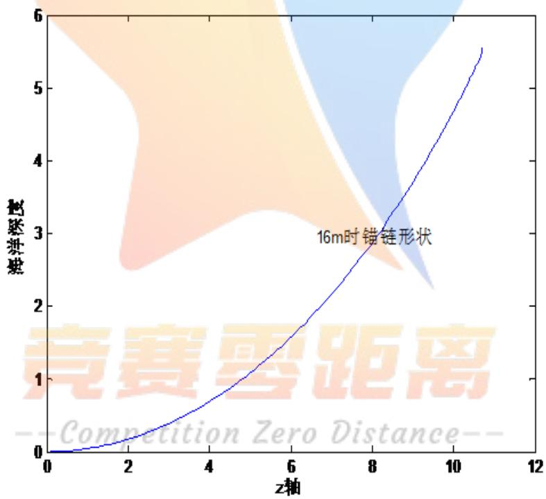

<details>
<summary>line</summary>

| z轴 | 轮廓误差 |
| --- | --- |
| 0 | 0 |
| 2 | ~0.2 |
| 4 | ~0.7 |
| 6 | ~1.5 |
| 8 | ~2.8 |
| 10 | ~4.5 |
| 11 | ~5.5 |
</details>

图 13 水深 16米锚链形状

风速36m/s、海水流速1.5m/s锚链形状  
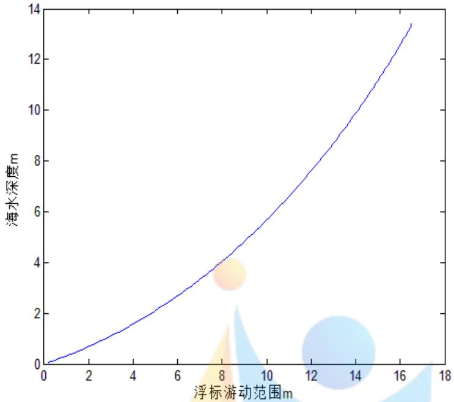

<details>
<summary>line</summary>

| 浮标游动范围 m | 海水深度 m |
| --- | --- |
| 0 | 0 |
| 2 | ~0.8 |
| 4 | ~1.6 |
| 6 | ~2.7 |
| 8 | ~4.0 |
| 10 | ~5.6 |
| 12 | ~7.5 |
| 14 | ~9.8 |
| 16 | ~12.5 |
</details>

图 14 水深 20 米锚链形状  
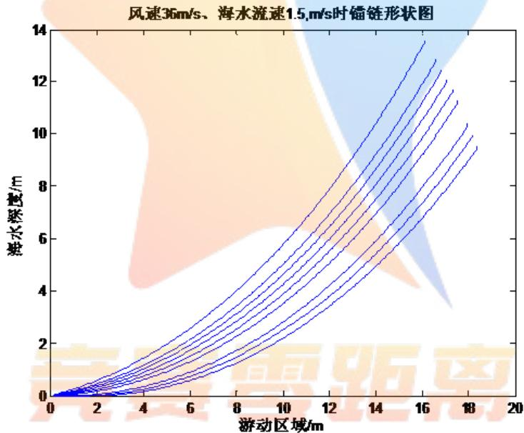

<details>
<summary>contour</summary>

| 海水深度/m | 游动区域/m (Series 1) | 游动区域/m (Series 2) | 游动区域/m (Series 3) | 游动区域/m (Series 4) | 游动区域/m (Series 5) | 游动区域/m (Series 6) | 游动区域/m (Series 7) | 游动区域/m (Series 8) |
| --- | --- | --- | --- | --- | --- | --- | --- | --- |
| 0 | 0 | 0 | 0 | 0 | 0 | 0 | 0 | 0 |
| 2 | ~1.5 | ~1.2 | ~1.0 | ~0.9 | ~0.8 | ~0.7 | ~0.6 | ~0.5 |
| 4 | ~4.5 | ~3.8 | ~3.2 | ~2.8 | ~2.4 | ~2.0 | ~1.7 | ~1.4 |
| 6 | ~8.5 | ~7.5 | ~6.5 | ~5.8 | ~5.0 | ~4.2 | ~3.6 | ~3.0 |
| 8 | ~13.5 | ~11.5 | ~10.0 | ~8.5 | ~7.5 | ~6.5 | ~5.5 | ~4.5 |
| 10 | — | — | — | — | — | — | — | — |
| 12 | — | — | — | — | — | — | — | — |
| 14 | — | — | — | — | — | — | — | — |
| 16 | — | — | — | — | — | — | — | — |
| 18 | — | — | — | — | — | — | — | — |
| 20 | — | — | — | — | — | — | — | — |
| 22 | — | — | — | — | — | — | — | — |
| 24 | — | — | — | — | — | — | — | — |
| 26 | — | — | — | — | — | — | — | — |
| 28 | — | — | — | — | — | — | — | — |
| 30 | — | — | — | — | — | — | — | — |
| 32 | — | — | — | — | — | — | — | — |
| 34 | — | — | — | — | — | — | — | — |
| 36 | — | — | — | — | — | — | — | — |
| 38 | — | — | — | — | — | — | — | — |
| 40 | — | — | — | — | — | — | — | — |
| 42 | — | — | — | — | — | — | — | — |
| 44 | — | — | — | — | — | — | — | — |
| 46 | — | — | — | — | — | — | — | — |
| 48 | — | — | — | — | — | — | — | — |
| 50 | — | — | — | — | — | — | — | — |
| 52 | — | — | — | — | — | — | — | — |
| 54 | — | — | — | — | — | — | — | — |
| 56 | — | — | — | — | — | — | — | — |
| 58 | — | — | — | — | — | — | — | — |
| 60 | — | — | — | — | — | — | — | — |
| 62 | — | — | — | — | — | — | — | — |
</details>

图 15 锚链形状

通过观察此图，可得知海深的长度的增加会导致，锚链平躺数量会增加，导致角度的降低，所以往后的图线会越来越接近于海床面。并且在同等长度的锚链，越接近于 $0 ^ { \circ }$ ，那么对应的海深会越小，或者是在钢桶处悬挂的重物球越重。

## 六、模型检验

## 1、对模型一、二力矩平衡关系的检验

同模型一中对力矩平衡关系的分析，对于钢管的力矩平衡关系，在这里以第i个节点作为参考点时，则满足下面的力矩平衡关系式：

$$
\mathrm{L} _ {\mathrm{i}} \mathrm{T} _ {\mathrm{i} + 1} \sin \left(\varphi_ {\mathrm{i}} - \theta_ {\mathrm{i} + 1}\right) = \frac {1}{2} \mathrm{L} _ {\mathrm{i}} \left(\mathrm{G} _ {\mathrm{i}} - \mathrm{F} _ {\text {浮} \mathrm{i}}\right) \cos \varphi_ {\mathrm{i}} (\mathrm{i} = 1, 2, 3, 4) \tag {5-20}
$$

通过式（5-20）可得钢管与海平面夹角 $\varphi _ { \mathrm { i } } ( \mathrm { i } = 1 , 2 , 3 , 4 )$ 的递推公式：

$$
\tan \varphi_ {\mathrm{i}} = \frac {2 \mathrm{T} _ {\mathrm{i+1}} \sin \theta_ {\mathrm{i+1}} + (\mathrm{G} _ {\mathrm{i}} - \mathrm{F} _ {\text {浮} \mathrm{i}})}{2 \mathrm{T} _ {\mathrm{i+1}} \cos \theta_ {\mathrm{i+1}}} (\mathrm{i} = 1, 2, 3, 4) \tag {5-21}
$$

对于钢桶的力矩平衡关系，以节点1 作为参考点,对力矩分析可得：

$$
\mathrm{L} _ {5} \mathrm{T} _ {6} \sin \left(\varphi_ {5} - \theta_ {6}\right) + \mathrm{L} _ {5} \left(\mathrm{G} _ {\text {球}} - \mathrm{F} _ {\text {浮球}}\right) \sin \left(\frac {\pi}{2} - \varphi_ {5}\right) = \frac {1}{2} \mathrm{L} _ {5} \left(\mathrm{G} _ {\text {球}} - \mathrm{F} _ {\text {浮球}}\right) \cos \varphi_ {5} (5 - 2 1)
$$

通过式（5-20）可得钢桶与海平面夹角 $\varphi _ { 5 }$ 的递推公式：

$$
\tan \varphi_ {5} = \frac {2 \mathrm{T} _ {6} \sin \theta_ {6} - (\mathrm{G} _ {\text {球}} - \mathrm{F} _ {\text {浮球}})}{2 \mathrm{T} _ {6} \cos \theta_ {6}} \tag {5-21}
$$

从模型一、二可得对于锚链的力矩平衡关系和钢管的力矩平衡关系可以经过递推得到锚链与海平面夹角 $\varphi _ { \mathrm { i } } \left( \mathrm { i } = 6 , 7 , \cdots , \mathrm { n } \right)$ 的递推公式：

$$
\tan \varphi_ {\mathrm{i}} = \frac {2 \mathrm{T} _ {\mathrm{i} + 1} \sin \theta_ {\mathrm{i} + 1} + \left(\mathrm{G} _ {\mathrm{i}} - \mathrm{F} _ {\text {浮} \mathrm{i}}\right)}{2 \mathrm{T} _ {\mathrm{i} + 1} \cos \theta_ {\mathrm{i} + 1}} (\mathrm{i} = 6, 7, \dots , \mathrm{n}) \tag {5-21}
$$

分析对于锚链与海平面夹角 $\varphi _ { \mathrm { i } }$ ，在以第i个节点作为参考点和第i+1个节点作为参考点时得到的递推公式相同，因此模型一、二中采用以下一个节点作为参考点分析得到的力矩平衡关系成立。

2、对模型三布放海域的实测水深介于 $1 6 \mathrm { m } ^ { \sim } 2 0 \mathrm { m }$ 之间对钢桶与海平面竖直方向夹角和最后一节锚链与海平面水平方向夹角的检验

在模型三中，对于布放海域的实测水深的左右临界值，分别将两个临界值作为钢桶与海平面竖直方向夹角的水深计算值和最后一节锚链与海平面水平方向夹角的水深计算值，采用模型三中的优化模型，计算布放海域的实测水深介于$1 6 \mathrm { m } ^ { \sim } 2 0 \mathrm { m }$ 之间时对应的钢桶倾角和最后一节锚链与海床夹角，利用 MATLAB 绘制海水深度与钢桶倾角和最后一节锚链与海床上的夹角的曲线

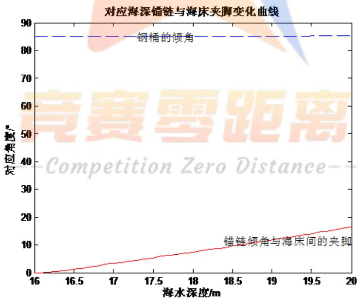

<details>
<summary>line</summary>

| 海水深度/m | 钢桶的倾角 | 锚链倾角与海床间的夹脚 |
| --- | --- | --- |
| 16.0 | ~85 | 0 |
| 16.5 | ~85 | ~2 |
| 17.0 | ~85 | ~4 |
| 17.5 | ~85 | ~6 |
| 18.0 | ~85 | ~8 |
| 18.5 | ~85 | ~10 |
| 19.0 | ~85 | ~12 |
| 19.5 | ~85 | ~14 |
| 20.0 | ~85 | ~16 |
</details>

从图中可得布放海域的实测水深介于 $1 6 \mathrm { m } ^ { \sim } 2 0 \mathrm { m }$ 之间时，钢桶在水平方向上的夹角均满足小于85 度；最后一节锚链与海床上的夹角均满足小于 16度。因此对于模型三中选定边界计算的方法完全适用。

3、对模型三选用V号锚链的检验

在模型三中，对于V号锚链的选取，判断选取的准确性。采用模型三中的优化模型，计算II号锚链和V号锚链对应的钢桶倾角和最后一节锚链与海床夹角，利用MATLAB绘制II号锚链和V号锚链与钢桶倾角和最后一节锚链在海床上的夹角的曲线，如下图：

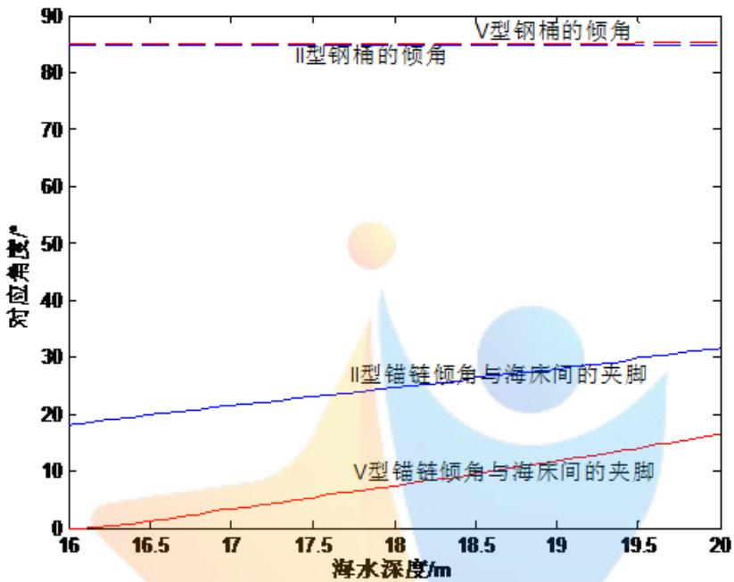

<details>
<summary>line</summary>

| 海水深度/m | V型钢桶的倾角 \(({}^{\circ})\) | II型钢桶的倾角 \(({}^{\circ})\) | II型锚链倾角与海床间的夹脚 \(({}^{\circ})\) | V型锚链倾角与海床间的夹脚 \(({}^{\circ})\) |
| --- | --- | --- | --- | --- |
| 16 | ~85 | ~85 | ~18 | 0 |
| 17 | ~85 | ~85 | ~21 | ~3 |
| 18 | ~85 | ~85 | ~24 | ~7 |
| 19 | ~85 | ~85 | ~28 | ~12 |
| 20 | ~85 | ~85 | ~31 | ~16 |
</details>

从图中可得布放海域的实测水深介于 $1 6 \mathrm { m } ^ { \sim } 2 0 \mathrm { m }$ 之间时，对于II号锚链和V号锚链的钢桶倾角的变化曲线几乎重合，因此只分析II号锚链和V号锚链对最后一节锚链与海床上的夹角范围，从上图中可得V号锚链中最后一节锚链与海床上的夹角均满足小于16 度，因此选用V号锚链更为准确。

## 七、模型的评价与改进

## 7.1模型优点

1、在所有模型中均先以下一个节点作为参考点对上一个节点进行受力分析和力矩平衡分析，得到递推公式，便于推广，整理及计算。  
2、模型中采用了控制变量法，准确且快速的分析出某两个变量之间的关系，算法思想简单易懂，模型运算效率较高且推广性较强。  
3、模型结果较优且和曲线的结果吻合得较好。

## 7.2 模型缺点

1、模型中只考虑理想状态下浮标处于平浮情况下的受力，并没有结合实际情况考虑浮标会在一定的风速下会产生。  
2、模型中只考虑了风力方向与海水力方向相同的情况，并没有结合实际环境考虑风力方向与海水力方向可能相反或存在夹角。

## 7.3模型改进

针对模型缺点一，在问题中的求解中，只考虑了浮标处于平浮情况下的受力。在实际环境下，海面风力与海水力对浮标均有影响，模型在改进时，可将浮标受到风力和海水力影响产生的偏转角度考虑在内，对浮标受到风力和海水力重新进行受力分析和力矩平衡分析，在进行求解得到更加准确地答案。

针对模型缺点二，仅考虑了风力方向与海水力方向相同的情况，然而风力方向与海水力方向不可能时时相同。因此，模型改进的时候还应考虑到风力方向与海水力方向相反或存在夹角的情况，对浮标受到风力和海水力重新进行受力分析和力矩平衡分析，在进行求解得到更加准确地答案。

## 八、模型推广

可将系泊系统中的重物球改为储油罐，作为原油开采的中转站，供运输船系泊和装卸原油，使其充分发挥经济运输的优越性；也可以在技术上和经济上不宜铺设海底管道的区域，用此系泊系统代替输油、输水、供电及通讯的管道；将系泊系统向深海推进，增强海洋资源的综合利用和开发。另外，可将该系泊系统用于保护我国的海洋利益和海洋安全。

## 参考文献

[1] 司守奎，孙玺菁.数学建模算法与应用.北京:国防工业出版社,2011.8.  
[2] 温宝贵,悬链线特性分析[J].中国海上油气(工程),1993 年 02 期.  
[3] 齐民友,经典力学的数学方法.高等教育出版社,2016.1.  
[4] 刘浩，韩晶.MATLAB2014a 完全自学一本通.北京:电子工业出版社，2015.1.  
[5] 刘延柱,刚体动力学理论与应用.上海交通大学出版社,2006.8.  
[6] 吴建国,数学建模案例精编.北京:中国水利水电出版社,2005.1.

## 附录

附录一 问题一程序  
```matlab
clear,clc
zhunzhongli1=[];
cd=[0.078 0.105 0.12 0.15 0.18];%锚链长度
z1=[3.2,7,12.5,19.5,28.12];%锚链单位长度质量
m=[1000 10 10 10 10 100];
mm1=1200;%重物球的质量
for j=1:(22.05/0.105)
    m1=7*0.105;
    m=[m,m1];
end
l=[1,1,1,1,1];
for jj=1:(22.05/0.105)
    l=[1,0.105];
end
g=9.80665;
for i=1:length(m)
    if i==1
        zhunzhongli=m(i)*g;
        zhunzhongli1=[zhunzhongli1,zhunzhongli];
    elseif i<=5&&i>=2
        v1=0.025^2*pi*1;%钢管体积
        zhunzhongli=-1025*g*v1+m(i)*g;%重力加速度 g=9.8
        zhunzhongli1=[zhunzhongli1,zhunzhongli];
    elseif i==6
        v2=0.15^2*pi*1;
        zhunzhongli=-1025*g*v2+m(i)*g;
        zhunzhongli1=[zhunzhongli1,zhunzhongli];
    elseif i>=7
        z1=7*0.105;
        v3=z1./7850;
        zhunzhongli=-1025*g*v3+m(i)*g;
        zhunzhongli1=[zhunzhongli1,zhunzhongli];
```

```matlab
end
end
theta=[];
theta3={};
k=1;
phy1={};
v=36;
ro=1025;
ii=1000/(ro*pi);
wz=[];
aa2={};
fx=[];
fy=[];
h2=[];
t1=[];
T1=[];
theta1=[];
theta=[];
f111={};
fyy=[];
h3=[0.3:0.0001:0.8];
for h=h3
    phy=zeros(1,215);
    fyy=[];
    aa1=[];
    h1=[];
    h2={};
    fuli=ffuli(g,h);
    fengli=ffengli(v,h);%v 指风速
    fx(1)=fengli;
    fy(1)=fuli-zhunzhongli1(1);
    phy(1)=atan(((2*fy(1))-zhunzhongli1(2))/fx(1)/2);
    for j=2:215
        if j==6
```

```matlab
vz=mm1/7085;
    fll=-1025*vz*g+mm1*g;
    fy(6)=fy(5)-zhunzhongli1(5)-fll;
    fx(6)=fx(5);
    phy(j)=atan(((2*fy(j-1))-zhunzhongli1(j))/(fx(j-1)*2));
else
    fy(j)=fy(j-1)-zhunzhongli1(j);%准重力的编号从浮标开始为1
    fx(j)=fx(j-1);
    phy(j)=atan(((2*fy(j-1))-zhunzhongli1(j))/(fx(j-1)*2));
end
if fy(j)<0
    break
end
end
fll1{k}=fy;
phy1{k}=phy;
h1=sin(phy).*1
H(k)=sum(h1)+h;
k=k+1;
phy=[];
end
[h_min, u]=min(abs(18-H(:)))
cshd=0.3+u*0.0001;
jd=phy1{u};
yy=0;
xx=0;
xx1=[];
yy1=[];
yfx=sin(phy1{u}).*1;
xfx=cos(phy1{u}).*1;
for i=length(yfx):-1:6
    yy=yy+yfx(i);
    yy1=[yy1, yy];
    xx=xx+xfx(i);
```

```matlab
xx1=[xx1, xx];
end
plot(xx1, yy1)
xlabel('x 轴')
ylabel('y 轴')
title('风速 36m/s 时锚链形状')
R=sum(cos(jd).*1);
调用风力函数
function [fengli] = ffengli(v,h)
s=(2-h)*2;
fengli=0.625*s*v.*v;
end
调用浮力函数
function [ fuli ro ] = ffuli(g,h)
ro=1025;
r=1;
vpai=pi*r*r*h;
fuli=ro*g*vpai;
end
```

附录二 问题二程序  
```matlab
clear, clc
    q=2;%对应的型号
    v=36;%风速
    eps=0.0001;%设定误差
    eps1=0.01;
    g=9.80665;%重力加速
    hs=18;%海水的深度
    ha=0.3;
    hb=2;
    l=[1,1,1,1,1];
for jj=1:(22.05/0.105)
    l=[1,0.105];
end
  for mml=1200;10:3000
    while(1)
      Ha=fH(q,mm1,hs,v,g,ha);
      Hb=fH(q,mm1,hs,v,g,hb);
      hx=0.5*(ha+hb);
      [Hx,phy1]=fH(q,mm1,hs,v,g,hx);
      if Ha>hs||Hb<hs%%%无解，hs 表示海深
        break
      end
      if Hx>hs
        hb=hx;
      else
        ha=hx;
      end
      if abs(Hx-hs)<eps&&abs( phy1(5)-85/180*pi)<eps1&&abs(phy1(215)-16/180*pi)<eps1
        H=Hx;
        mm2=mm1;
        break
      end
```

```matlab
end
    end
    jd=phy1;
yy=0;
xx=0;
xx1=[];
yy1=[];
yfx=sin(phy1).*1;
xfx=cos(phy1).*1;
for i=length(yfx):-1:6
    yy=yy+yfx(i);
    yy1=[yy1, yy];
    xx=xx+xfx(i);
    xx1=[xx1, xx];
end
plot(xx1, yy1)
xlabel('x 轴')
ylabel('y 轴')
title('风速 36m/s 时锚链
R=sum(cos(jd).*1);
调用 fH 函数
function [Hk, phy1] =fH
zhunzhongli1=[];
cd=[0.078 0.105 0.12 0.
z1=[3.2, 7, 12.5, 19.5, 28,
m=[1000 10 10 10 10 10 10
for j=1:(22.05/0.105)%
    m1=z1(q)*cd(q);
    m=[m, m1];
end
l=[1, 1, 1, 1, 1];
for jj=1:(22.05/0.105)
    l=[1, 0.105];
end
```

```matlab
g=9.80665;
for i=1:length(m)
    if i==1
        zhunzhongli=m(i)*g;
        zhunzhongli1=[zhunzhongli1,zhunzhongli];
    elseif i<=5&&i>=2
        v1=0.025^2*pi*1;%钢管体积
        zhunzhongli=-1025*g*v1+m(i)*g;%重力加速度 g=9.8
        zhunzhongli1=[zhunzhongli1,zhunzhongli];
    elseif i==6
        v2=0.15^2*pi*1;
        zhunzhongli=-1025*g*v2+m(i)*g;
        zhunzhongli1=[zhunzhongli1,zhunzhongli];
    elseif i>=7
        z12=z1(q)*cd(q);
        v3=z12./7850;
        zhunzhongli=-1025*g*v3+m(i)*g;
        zhunzhongli1=[zhunzhongli1,zhunzhongli];
    end
end
  fx=[];
  fy=[];
  h2=[];
  phy=zeros(1,215);
  h1=[];
  fuli=ffuli(g,h);
  fengli=ffengli(v,h);%v 指风速
  %%%%
%力和杆的角度递推
  fx(1)=fengli;
  fy(1)=fuli-zhunzhongli1(1);
  phy(1)=atan(((2*fy(1))-zhunzhongli1(2))/fx(1)/2);
  for j=2:215
    if j==6
```

```matlab
vz=mm1./7850;
    fll=-1025*vz*g+mm1.*g;
    fy(6)=fy(5)-zhunzhongli1(5)-fll;
    fx(6)=fx(5);
    phy(j)=atan(((2*fy(j-1))-zhunzhongli1(j))/(fx(j-1)*2));
else
    fy(j)=fy(j-1)-zhunzhongli1(j);      %准重力的编号从浮标开始为1
    fx(j)=fx(j-1);
    phy(j)=atan(((2*fy(j-1))-zhunzhongli1(j))/(fx(j-1)*2));
end
if fy(j)<0
    break
end
end
phy1=phy;
h1=sin(phy).*l;%分段长度
Hk=sum(h1)+h;
end
```

附录三 问题三程序  
```matlab
clear,clc
    q=5;%类型
    hs=16;%海深 16 或 20m
    mm1=3880;%重物球
    lts=121;%链条数%%%依次增加
    v=36;%风速
    vs=1.5;%水速
    [hc, phy2, R]=f3(q, hs, mm1, lts, v, vs);
调用函数 f3
function [hc, phy2, R] = f3(q, hs, mm1, lts, v, vs)
zhunzhongli1=[];
z1=[];
cd=[0.078 0.105 0.12 0.15 0.18];%锚链长度
z11=[3.2, 7, 12.5, 19.5, 28.12];%锚链单位长度质量
m=[1000 10 10 10 10 100];
for j=1:lts
    m1=z11(q).*cd(q);
    m=[m, m1];
end
l=[1, 1, 1, 1, 1];
for jj=1:lts
    l=[l, cd(q)];
end
g=9.80665;
for i=1:length(m)
    if i==1
        zhunzhongli=m(i)*g;
        zhunzhongli1=[zhunzhongli1, zhunzhongli];
    elseif i<=5&&i>=2
        v1=0.025^2*pi*1;%钢管体积
        zhunzhongli=-1025*g*v1+m(i)*g;%重力加速度 g=9.80665
        zhunzhongli1=[zhunzhongli1, zhunzhongli];
    elseif i==6
```

```matlab
v2=0.15^2*pi*1;
zhunzhongli=-1025*g*v2+m(i)*g;
zhunzhongli1=[zhunzhongli1, zhunzhongli];
elseif i>=7
    z1=z11(q).*cd(q);
    v3=z1./7850;
    zhunzhongli=-1025*g*v3+m(i)*g;
    zhunzhongli1=[zhunzhongli1, zhunzhongli];
end
end
k=1;
phy1={};
wz=[];
aa2={};
fx=[];
fy=[];
h2=[];
f111={};
fyy=[];
h3=[0.3:0.001:2];
for h=h3
    phy=zeros(1,lts+5);
    fyy=[];
    h1=[];
    fuli=ffuli(g,h);
    fengli=ffengli(v,h);%v 指风速
    %%%%%
    %力和杆的角度递推
    fx(1)=fengli+374*2*h*vs*vs;%%%%vs 指水速
    fy(1)=fuli-zhunzhongli1(1);
    phy(1)=atan(((2*fy(1))-zhunzhongli1(2))/fx(1)/2);
    for j=2:lts+5
        if j<=5
            fy(j)=fy(j-1)-zhunzhongli1(j);      %准重力的编号从浮标开始
```

为 1  
```matlab
fx(j)=fx(j-1)+374*vs*vs*sin(phy(j-1))*0.05*1;
    phy(j)=atan(((2*fy(j-1))-zhunzhongli1(j))/(fx(j-1)*2));
    elseif j==6
        vz=mm1/7850;
        fll=-1025*vz*g+mm1*g;
        fy(6)=fy(5)-zhunzhongli1(5)-fll;

fx(6)=fx(5)+374*vs*vs*sin(phy(5))*0.3*1+374*vs*vs*(3*mm1/4/pi/7850)^(2/3)*pi;
        phy(j)=atan(((2*fy(j-1))-zhunzhongli1(j))/(fx(j-1)*2));
    else
        fy(j)=fy(j-1)-zhunzhongli1(j);      %准重力的编号从浮标开始为1
        fx(j)=fx(j-1)+374*vs*vs*sin(phy(j-1))*2*sqrt(m(j)*1(j-1)/7850/pi);
        phy(j)=atan(((2*fy(j-1))-zhunzhongli1(j))/(fx(j-1)*2));
    end
    if fy(j)<0
        break
    end
end
flll{k}=fy;
    phy1{k}=phy;
    h1=sin(phy).*l;
    H(k)=sum(h1)+h;
    k=k+1;
    phy=[];
end
[h_min, u]=min(abs(hs-H(:)));
    hc=0.3+u*0.001;
    phy2=phy1{u}*180/pi;
    R=sum(cos(phy2*pi/180).*l);
end
```