# 基于极值优化的系泊系统设计

## 摘要

本文研究的是利用力学及数学知识进行系泊系统设计分析及优化的综合问题。

第一问中，着重通过静力学理论分析系泊系统的受力，进而确定风速与钢桶和各节钢管的倾斜角度、锚链形状、浮标的吃水深度和游动区域的关系。

建立平面汇交力系，根据系泊系统在海面平静、风速一定的情况下保持稳定的特点，利用静力平衡和力矩平衡，分别对浮标、钢管、钢桶和重物球进行静力学分析，得到一系列静力平衡方程和力矩平衡方程。对于锚链，由于质量均匀分布，我们将其视为悬链线结构。使用微积分方法求出锚链垂向投影长度与锚链长的关系式。同时计算出使得全部锚链恰离开海床的临界风速。

为了求解上述多元非线性方程组，我们以系泊系统各部件垂向投影长度等于海水深度为目标，选取浮标出水高度为自变量，在合理范围内采用循环遍历法，得到一组精度较高的解向量。同时，采用悬链线理论计算锚链垂向投影长度，进而得出另一组解向量。得到相似的结果互为检验。

最终得出临界风速为 21.92m/s。当风速 12m/s 时，钢桶倾斜角度 2.2，钢管倾斜角度由上至下分别为 1.163，1.175,1.18，1.186。锚链形状：有 6.2525m长的锚链平躺在海床上，剩余部分为曲线（曲线方程和图片见正文），浮标的吃水深度为 0.6816m，浮标游动区域为在海面上以锚为中心，半径为14.676m 的圆；风速 24m/s 时，钢桶倾斜角度 4.584，钢管倾斜角度由上至下分别为 4.435，4.463,4.492，4.521。锚链形状：锚链底端切线与海床夹角为 4.4，形状为曲线（曲线方程和图片见正文），浮标的吃水深度为 0.6957m，浮标游动区域为在海面上以锚为中心，半径为 17.7918m的圆。

第二问中，运用模型一的计算方法初步计算出风速为 36m/s 下系泊系统的各参数，之后求出满足约束条件的重物球质量的最小值，并计算此种情况下系泊系统的各参数。

在问题一的假设下用模型一求解，得出风速 36m/s 时，钢桶倾斜角度 9.48，钢管倾斜角度由上至下分别为 9.19，9.24,9.30，9.36。锚链形状：锚链在锚点与海床的夹角为 20.91，剩余部分为曲线（曲线方程和图片见正文），浮标的吃水深度为 0.7185m，浮标游动区域为在海面上以锚为中心，半径为 18.8718m 的圆。

以钢桶的倾斜角度不超过 5 度，锚链在锚点与海床的夹角不超过 16 度为约束条件，重物球的质 量为目标函数，运用模型一中的循环遍历法求出满足约束条件的重物球质量的最小值。

最终得出重物球的质量为2225kg，此时钢桶倾斜角度4.52，钢管倾斜角度由上至下分别为4.43，4.45,4.47，4.49。锚链形状：锚链在锚点与海床的夹角为 15.98，剩余部分为曲线，浮标的吃水深度为 0.98m，浮标游动区域为在海面上以锚为中心，半径为 18.5437m的圆。

第三问中，在模型一的力学分析中添加近海水流力，进而确定风速、近海水流速度、锚链型号与长度、重物球质量与钢桶和各节钢管的倾斜角度、锚链形状、浮标的吃水深度和游动区域的关系。

首先确定优化指标：选定吃水深度、游动区域、钢桶倾斜角为优化指标，用层次分析法确定各指标的权重系数，对三个指标作归一化处理，得到综合优化指标。优化目标为综合优化指标尽可能小。对于 5 种不同的锚链型号，我们选择分别穷举比较，接着设计系泊系统设计目标：以极限海况下系泊系统正常工作为约束条件，以在海况稳定状况下综合优化指标最小为目标函数，建立优化模型，寻求最优解。求解时采用赋值降元方法将问题化归到求解第二问的方法，较好地简化了求解步骤，最终得出设计方案。最后列举出在此方案下不同情况时桶和各节钢管的倾斜角度、锚链形状、浮标的吃水深度和游动区域。

本模型建立中运用 Matlab7.0（图像绘制，方程求解，最优规划），从而使建模过程顺利进行，使所建模型更加精简。

关键词：系泊系统设计 多元非线性方程组 循环遍历法 层次分析法 优化模型

## 一、问题重述

本题考察的是利用力学和数学分析手段合理设计系泊系统。

1.根据题给的锚、锚链、钢桶、重物球、钢管、浮标等的相对位置、尺寸、质量等数据和部分约束条件，假设海水静止，分别确定海面风速为 12m/s 和 24m/s 时钢桶和各节钢管的倾斜角度、锚链形状、浮标的吃水深度和游动区域。  
2. 在问题 1的假设下，计算海面风速为 36m/s时钢桶和各节钢管的倾斜角度、锚链形状和浮标的游动区域。并调节重物球的质量，使得钢桶的倾斜角度不超过 5 度，锚链在锚点与海床的夹角不超过 16 度。  
3.考虑风力、水流力和水深情况，进行系泊系统设计。求出水深介于 16m\~20m之间、海水速度最大 1.5m/s、风速最大 36m/s 的情况下，钢桶、钢管的倾斜角度、锚链形状、浮标的吃水深度和游动区域。

## 二、问题分析

本题是以系泊系统设计为背景的力学分析问题。

首先是建立系泊系统静力特性分析模型，为了简化求解过程，在假设条件和海面风速为 12m/s和 24m/s 的情况下，首先考虑锚链，由于锚链每段相对较短，近似地将其视为整体，取锚链长度为微元进行积分，得到锚链顶端至海床高度的表达式。然后，分别取钢管、浮标为研究对象设参量进行力学分析，列出静力学平衡方程。最终得到 26 个有效方程（含 26 个变量），为静定问题，理论上可解。但由于方程组复杂且非线性，首先对部分方程进行化简，再选取浮标出水高度为枚举变量，以系泊系统各部分在水中高度之和等于水深为目标，采用遍历法，寻找符合条件的浮标出水高度，并据此求解出钢桶和各节钢管的倾斜角度、锚链形状、浮标的吃水深度和游动区域。

接着，根据所给数据，计算出风速为 36m/s 时钢桶和各节钢管的倾斜角度、锚链形状、浮标的吃水深度和游动区域，判断设备是否能够正常工作，若不能，以钢桶的倾斜角度不超过 5 度，锚链在锚点与海床的夹角不超过 16 度为约束条件，重物球的质量为目标函数，运用模型一中的循环遍历法求出满足约束条件的重物球质量的最小值。同时解出改变重物球的质量后钢桶和各节钢管的倾斜角度、锚链形状、浮标的吃水深度和游动区域。

同时考虑近海水流力和风力使得问题由二维上升到三维，极大地增大了分析难度。首先考虑到系泊系统要满足在极限海况（风速和水流速度最大且同向）能够正常工作这一必要条件。然后考虑系泊系统的受力，由于水流与风的方向一般不同，系泊系统的形态会比较复杂。为了既保持设计的可靠性同时又比较容易操作，我们只研究风与海流在同一方向的情况。根据系泊系统设计要求选取优化指标，用层次分析法确定权重系数，建立综合优化指标。在海况为中值的情况下找到满足极限海况下系泊系统正常工作约束条件的使得综合优化指标最小的方案，随后选取多组海水深度、风速、锚链型号和长度、重物球质量，分别求出在此方案下桶和各节钢管的倾斜角度、锚链形状、浮标的吃水深度和游动区域。

本题的求解过程中，紧密的联系了图形和数据，是当今许多先进技术的基本思路。与此同时，求解的过程也是典型的抽象模型，数据检验，实际性优化三步走，是典型的利用数学原理解决问题的案例。

## 三、模型假设

1.锚与海床的静摩擦系数足够大；  
2.假设未脱地的锚链平躺在海床上；  
3.系泊系统内各部件连接处接触良好；  
4.风和水流的方向稳定且与海床平行；  
5.风倾力矩作用下浮标产生的倾角忽略不计；  
6.假设所分析海域处的重力加速度 $\mathrm { g } { = } 9 . 8 m \cdot s ^ { - 2 }$ ；  
7.重物球主要成分为铬钼铝钢，密度 $7 . 6 5 g \cdot c m ^ { - 3 }$ ；  
8.锚链主要成分为高强度合金钢，密度 7.82 $g \cdot c m ^ { - 3 }$  
9.假设题给传输节点示意图中表示的各物体均处于同一竖直平面；  
10.不考虑锚链自身的弹性伸长及结构空隙，锚链自重沿锚链方向为常量。

## 四、符号说明

<table><tr><td>符号表示</td><td>文字说明</td></tr><tr><td> $R_f$ </td><td>浮标系统直径</td></tr><tr><td> $h_f$ </td><td>浮标系统高度</td></tr><tr><td>h</td><td>浮标系统出水高度</td></tr><tr><td> $h_c$ </td><td>浮标吃水深度</td></tr><tr><td> $m_f$ </td><td>浮标质量</td></tr><tr><td>G</td><td>浮标重力</td></tr><tr><td> $l_g$ </td><td>钢管长度</td></tr><tr><td> $R_g$ </td><td>钢管直径</td></tr><tr><td> $m_g$ </td><td>钢管质量</td></tr><tr><td> $θ_0$ </td><td>锚链末端切线方向与海床法线的夹角</td></tr><tr><td> $l_t$ </td><td>钢桶长度</td></tr><tr><td> $R_t$ </td><td>钢桶外径</td></tr><tr><td> $m_t$ </td><td>设备和钢桶总质量</td></tr><tr><td> $θ_t$ </td><td>钢桶的倾斜角度</td></tr><tr><td> $s_i(i=1,2,...,5)$ </td><td>i型电焊锚链长度</td></tr><tr><td>A</td><td>锚链横截面积</td></tr><tr><td> $ρ_m$ </td><td>锚链密度</td></tr><tr><td> $m_q$ </td><td>重物球质量</td></tr><tr><td>H</td><td>海水深</td></tr><tr><td> $ρ_s$ </td><td>海水密度</td></tr><tr><td>v</td><td>风速</td></tr><tr><td> $F_{\text{风}}$ </td><td>风力</td></tr><tr><td> $F_0$ </td><td>锚对锚链的拉力</td></tr><tr><td> $F_1$ </td><td>钢管对浮标的拉力</td></tr><tr><td> $F_{\text{浮}i}(\text{i}=1,2,3,4)$ </td><td>钢管受到的浮力</td></tr><tr><td> $F_{\text{锚}}$ </td><td>锚链微元的张力</td></tr><tr><td> $F_{\text{水桶}}$ </td><td>钢桶受到的近海水流力</td></tr><tr><td>y</td><td>锚链悬垂长度的垂向投影分量</td></tr><tr><td>x</td><td>锚链悬垂长度的水平投影分量</td></tr><tr><td>P</td><td>锚链单位长度的质量</td></tr><tr><td> $\theta_i(\text{i}=1,2,3,4)$ </td><td>钢管/钢桶上端受力与竖直方向的夹角</td></tr><tr><td> $\alpha_i(\text{i}=1,2,3,4)$ </td><td>钢管倾斜角度</td></tr><tr><td>s</td><td>锚链在海床上部的长度</td></tr><tr><td>R</td><td>浮标底部圆心与锚的水平最大距离</td></tr><tr><td>g</td><td>重力加速度</td></tr><tr><td> $H'$ </td><td>水深的模型计算值</td></tr><tr><td> $\Delta H$ </td><td>题设水深与模型结果的差值</td></tr><tr><td>realv</td><td>使锚链恰不被拖行的风速</td></tr><tr><td> $F_{\text{水}}$ </td><td>近海水流力</td></tr></table>

## 五、模型建构

## 5.1模型一 系泊系统静力特性分析模型

## 5.1.1.模型简介

在平衡状态下用隔离法对系泊系统的各部分进行静力学分析，用微元法计算锚链两端的张力，同时分别隔离钢管、重物球、浮标进行受力分析。列出方程组，以其中一个方程成立条件为目标，选取浮标出水深度为变量，采用遍历法求解。

## 5.1.2.模型建立

## 5.1.2.1 浮标的静力学分析：

浮标的结构是长为 2m，底面直径为 2m 的圆柱。在不考虑风浪的情况下浮标受到重力、浮力、钢管的拉力（认为三力成平面汇交力系），方向均为竖直方向。在第一问中考虑风速，在前述基础上添加近海风荷载（下简称风力），浮标受到重力、浮力、钢管的拉力、风力四个力。在静力平衡状态下，四力构成平面汇交力系。如下图所示：

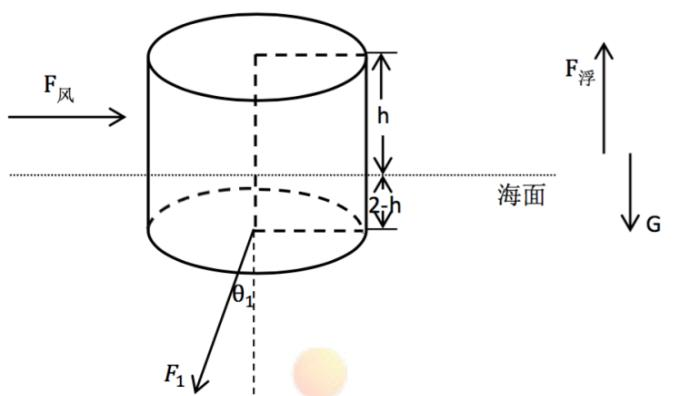

<details>
<summary>text_image</summary>

F_风
h
2-h
海面
θ₁
F_浮
G
F_1
</details>

图 1 浮标系统受力图

根据平面汇交力系的相关知识<sup>【1】</sup>，将各力作用点等效在浮标系统的重心上，以浮标系统重心为原点，如下图建立平面直角坐标系：

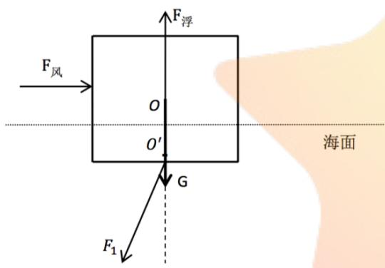

<details>
<summary>text_image</summary>

F_浮
F_风
O
O'
G
海面
F_1
</details>

0、 $o ^ { \prime }$ 分别是重力、浮力的作用点

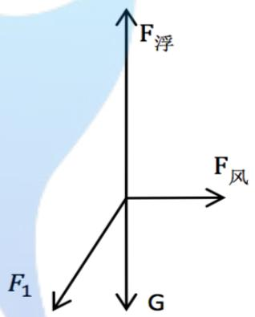

<details>
<summary>text_image</summary>

F浮
F风
F1
G
</details>

图 3 受力示意图  
图 2 受力及受力点示意图

在 x 轴和y轴方向上分别列出静力学平衡方程：

$$
\begin{array}{r l} {\sum F _ {x} = 0:} & {F _ {\text {风}} - F _ {1} \sin \theta_ {1} = 0} \\ {\sum F _ {y} = 0:} & {F _ {\text {浮}} - G - F _ {1} \cos \theta_ {1} = 0} \end{array}
$$

又：

$$
F _ {\text {风}} = 0. 6 2 5 v ^ {2} \times R _ {f} h
$$

$$
F _ {\text {浮}} = \rho g \pi (h _ {f} - h)
$$

得出

$$
0. 6 2 5 v ^ {2} \times \mathrm{R} _ {f} h = F _ {1} \sin \theta_ {1} \tag {1}
$$

$$
\rho g \pi \left(R _ {f} - h\right) = G _ {\text {标}} + F _ {1} \cos \theta_ {1} \tag {2}
$$

实际情况中风对浮标的作用效果还包括使其倾斜，即存在风倾力矩下的倾斜角度。由力矩的基本定义可得：

$$
\mathbf {M} = \mathbf {F _ {0}} \times \mathbf {h _ {0}}
$$

其中， $\mathbf { F _ { 0 } }$ 为迎风面所受风力， $\mathbf { h _ { 0 } }$ 为迎风面中心到水面的竖直距离。令动风倾角为φ，可得风倾力矩

所做的功：

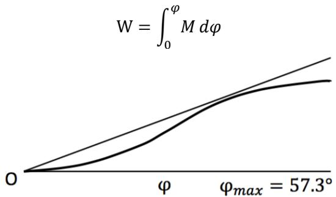

<details>
<summary>line</summary>

| \(\phi\) | Value (Curve 1) | Value (Curve 2) |
| --- | --- | --- |
| 0 | 0 | 0 |
| ~\(\varphi max\) | ~0.6 | ~0.4 |
</details>

图 4 动稳性曲线

浮标在水中的排水量、重心高度、浮心移动距离等因素影响的复原力矩和风倾角有关。如图所示的动稳性曲线中，每一点切线的斜率即风倾力矩。φ 取最大值 57.3°时，数值 $\mathbf { \bot } \mathbf { M } = \mathbf { W } .$ 。令 T 为结构重量，GM 为初稳性高，得到风倾角θ的表达式：

$$
\theta = \frac {M}{T \cdot G M} \cdot 5 7. 3 ^ {\circ}
$$

由于风速、吃水深度等条件在一定范围内时风倾力矩产生的倾角很小，浮标的抗风能力满足要求，风倾角对浮标轴线朝向的影响可不考虑<sup>【2】</sup>。

## 5.1.2.2 钢管的静力学分析：

钢管部分由四节完全一样的，长为 1m，直径为 50mm，质量为10kg 的圆柱组成。在不考虑水中阻力等影响因素的情况下，每一节钢管均收到浮力、重力，以及相邻钢管或相邻浮标、锚链在其几何形状两端中心施加的拉力。四力在竖直平面内成汇交力系，钢管处于静力平衡状态。第 i节钢管(i=1,2,3,4)的受力情况如下图所示：

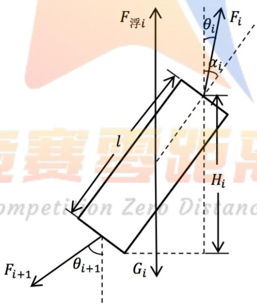

<details>
<summary>text_image</summary>

F_浮i
θ_i
F_i
α_i
l
H_i
θ_{i+1}
G_i
F_{i+1}
</details>

图 5 单节钢管受力图

在 x 轴、y 轴两个方向分别列出静力学平衡方程：

$$
\sum F _ {x} = 0: \quad F _ {i} \sin \theta_ {i} - F _ {i + 1} \sin \theta_ {i + 1} = 0 \tag {3}
$$

$$
\sum F _ {y} = 0: \quad F _ {i + 1} \cos \theta_ {i + 1} - F _ {i} \cos \theta_ {i} - F _ {\text {浮} i} - G _ {i} = 0 \tag {7}
$$

由力矩平衡得：

$$
F _ {i} \times \frac {1}{2} l \times \sin (\alpha_ {i} - \theta_ {i}) - F _ {i + 1} \times \frac {1}{2} l \times \sin (\theta_ {i + 1} - \alpha_ {i}) = 0 \tag {11}
$$

由几何关系得：

$$
H _ {i} = l \cos \alpha_ {i} \tag {15}
$$

以上四个方程代表四节钢管的四种不同情况。

## 5.1.2.3 钢桶和重物球的静力学分析：

上接第 4 节钢管、内含水声通讯设备的钢桶，长为 1m、外径为 30cm，总质量为 100kg。钢桶下接电焊锚链悬挂重物球，使钢桶的倾斜角度（钢桶与竖直线的夹角）尽可能小。

以下讨论重物球在海水中受到的浮力对实际情况的影响。

$$
F _ {\text {浮}} = \rho_ {\text {海水}} g V
$$

$$
G = m g
$$

$$
m = \rho \cdot V
$$

$$
V = \frac {4}{3} \pi R ^ {2}
$$

联立上式，解得：

$$
F _ {\text {浮}} = \frac {\rho_ {\text {海水}}}{\rho} \cdot G
$$

对于重物球材质的选择，综合考虑重物球与钢桶的质量关系、重物球的密度及其在海水中的耐压耐腐蚀性等各因素。我们首先假定为金（稳定性强且密度较大 $\rho = 1 9 . 3 2 g \cdot { c m } ^ { - 3 } )$ ），代入数据：

$$
F _ {\text {浮} 1} = \frac {1 . 0 2 5}{1 9 . 3 2} \cdot G \approx 0. 0 5 3 G
$$

倍数关系较大。结合实际生产生活情况，重物球的材质应为 10CrMoAl $( \rho = 7 . 6 5 g \cdot c m ^ { - 3 } )$ ）。此时，

$$
R = \sqrt [ 3 ]{\frac {m}{\rho \pi} \cdot \frac {3}{4}} \approx 0. 3 3 5 m \approx 2. 2 3 3 R _ {g}
$$

$$
F _ {\text {浮} 2} = \frac {1 . 0 2 5}{7 . 6 5} \cdot G \approx 0. 1 3 4 G
$$

符合要求，且 $F _ { \vec { \mathcal { G } } 1 } < F _ { \vec { \mathcal { G } } 2 }$ 。因此，重物球所受浮力不可忽略。

根据题意，钢桶的小角度偏转度数 $\alpha _ { \mathrm { \# \mathbb { \vec { H } } } }$ 在 5°以内，受力分析图中不易体现，但在方程分析中不能忽略。因此，钢桶和重物球组成的整体的静力平衡状态如下图所示：

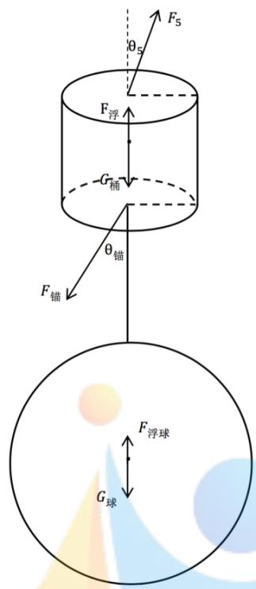

<details>
<summary>flowchart</summary>

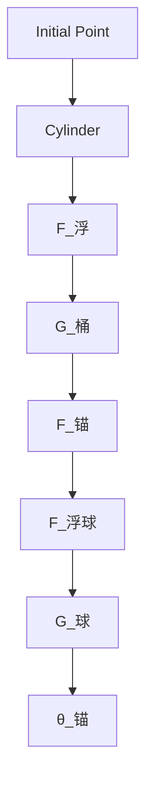
</details>

图 6 钢桶、重物球系统受力图

在 x 轴、y 轴两个方向分别列出静力学平衡方程：

$$
\sum F _ {x} = 0: F _ {5} \sin \theta_ {5} - F _ {\text {锚}} \sin \theta_ {\text {锚}} = 0 \tag {19}
$$

$$
\sum F _ {y} = 0: F _ {5} \cos \theta_ {5} + F _ {\text {浮桶}} + F _ {\text {浮球}} - G _ {\text {桶}} - G _ {\text {球}} - F _ {\text {锚}} \cos \theta_ {\text {锚}} = 0 \tag {20}
$$

以钢桶质心为参考点，由力矩平衡得：

$$
F _ {5} \times \frac {1}{2} \times \sin (\alpha_ {\text {桶}} - \theta_ {4}) - F _ {\text {锚}} \times \frac {1}{2} \times \sin \left(\theta_ {\text {锚}} - \alpha_ {\text {桶}}\right) = 0 \tag {21}
$$

由几何关系得：

$$
H _ {\text {桶}} = \cos \alpha_ {\text {桶}} \tag {22}
$$

## 5.1.2.4 锚链的静力学分析：

锚链各段长度不大，根据悬链线理论<sup>【2】</sup> ，可将锚链看作匀质的线性缆索。

取一小段锚链（ds），则可以将锚链悬垂长度的垂向投影分量的微元（dy）用 ds 表示，从锚链-Competition2eroOistance底端至上端积分可以得到 $_ \textrm { y }$ 与s 的表达式。

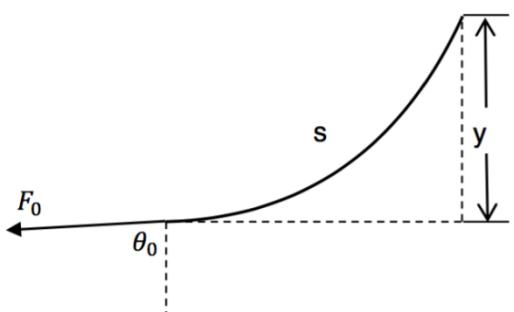

<details>
<summary>text_image</summary>

F₀
θ₀
s
y
</details>

图 7 锚链受力图

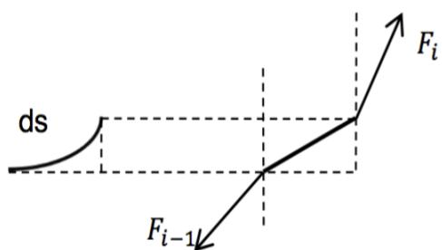

<details>
<summary>text_image</summary>

ds
F_{i-1}
F_i
</details>

图 8 锚链微元分析图

设 ds 与海床的夹角为φ，则由几何关系推得

$$
\sin \varphi = \frac {F _ {\text {竖直}}}{\sqrt {F _ {\text {竖直}} ^ {2} + F _ {\text {水平}} ^ {2}}}
$$

进而得出

$$
\mathrm{dy} = \mathrm{ds} \cdot \sin \varphi = d s \cdot \frac {F _ {\text {竖直}}}{\sqrt {F _ {\text {竖直}} ^ {2} + F _ {\text {水平}} ^ {2}}}
$$

其中， $F _ { \overrightarrow { \mathbb { H } } , \overrightarrow { \mathbb { H } } }$ 表示锚链微元的张力沿水平方向上的分力， $F _ { \mathrm { \mathcal { X } \overline { { F } } } }$ 表示锚链微元的张力沿竖直方向上的分力。

对锚链进行静力学分析，由锚链与锚的接口处右推，锚链微元的张力沿水平方向上的分力应等于锚对锚链的拉力 $F _ { 0 }$ ；锚链微元受到重力和海水的浮力，所以锚链微元的张力沿竖直方向上的分力应等于其受到的重力与浮力的合力，即有：

$$
F _ {\text {水平}} = F _ {\text {锚}} \sin \theta_ {\text {锚}} = F _ {0} \sin \theta_ {0} \tag {23}
$$

$$
F _ {\text {竖直}} = F _ {\text {锚}} \cos \theta_ {\text {锚}} = m g s - \rho g A s + F _ {0} \cos \theta_ {0} \tag {24}
$$

对 $\mathrm { d y }$ 的表达式积分，有

$$
\mathrm{y} = \int_ {0} ^ {s} d y = \int_ {0} ^ {s} d s \cdot \sin \varphi = \int_ {0} ^ {s} d s \cdot \frac {F _ {\text {竖直}}}{\sqrt {F _ {\text {竖直}} ^ {2} + F _ {\text {水平}} ^ {2}}}
$$

为了简化计算，令

$$
a = m g - \rho g A
$$

$$
b = F _ {0} \cos \theta_ {0}
$$

$$
c = F _ {0} \sin \theta_ {0}
$$

$$
\begin{array}{l} y = \frac {c}{a} \cdot \frac {1}{\cos t} \Bigg | _ {\substack {\arctan \frac {b}{c}}} ^ {\arctan \frac {a s + b}{c}} \tag{25} \\ = \frac {c}{a} \cdot (\frac {1}{\cos (a r c t a n \frac {a s + b}{c})} - \frac {1}{\cos (a r c t a n \frac {b}{c})}) \\ \end{array}
$$

(25)式可作为计算锚链形状的依据。

不妨取题给图示的左端为锚链末端。以上分析基于锚链全长都悬在海水中（没有任何部分平躺在海床上）的前提。然而，风速小于临界值时，锚链可分为平躺在海床上和悬在海水中两部分，前者切线方向与海床法线夹角为 $| \theta _ { 0 }$ （如下图所示）。 $\theta _ { 0 }$ 恰不为 $1 9 0 ^ { \circ }$ 时，锚链不再被拖行，悬在海水中的锚链长度及为锚链实际总长度。

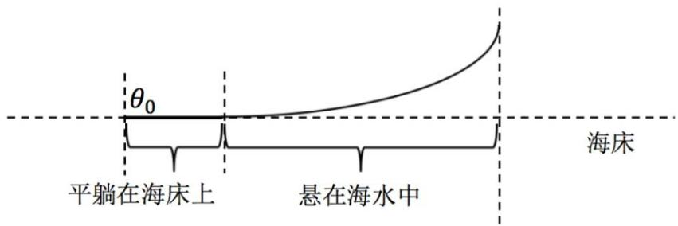

<details>
<summary>text_image</summary>

θ₀
平躺在海床上
悬在海水中
海床
</details>

图 9 锚链部分拖地示意图

## 5.1.2.5 各组成部分的关联性分析：

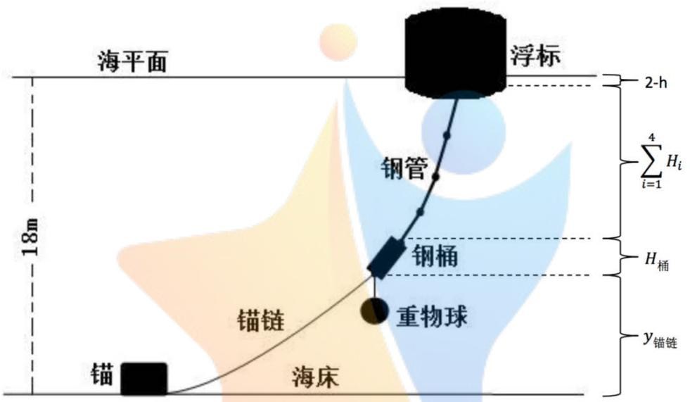

<details>
<summary>text_image</summary>

海平面
浮标
2-h
Σi=1^4 H_i
H_桶
y_锚链
钢管
钢桶
重物球
锚链
海床
18m
</details>

图 10 系统结构示意图

总长度＝浮标吃水深度＋钢管竖直方向总长度＋钢桶竖直方向长度＋锚链竖直方向总长度即：

$$
(2 - h) + \sum_ {i = 1} ^ {4} H _ {i} + H _ {\text {桶}} + y _ {\text {锚链}} = 1 8 \tag {26}
$$

## 5.1.3 模型求解

初步判断临界风速realv取值在 $1 0 { - } 3 0 \mathrm { m } \cdot s ^ { - 1 }$ 范围内。由于 $\cdot \theta _ { 0 }$ 和s均为已知量，联立上述（1）\~（26）号方程并缩小待求两范围，得到 $\mathrm { r e a l v } = 2 1 . 9 2 0 0 \mathrm { m } \cdot { s } ^ { - 1 }$ 。以系泊系统各部件垂向投影长度 y等于海水深度为目标，以浮标系统出水高度 h 为自变量，控制自变量在 $0 { \sim } 2$ 之间。调节自变量，用 MATLAB软件，使用循环遍历方法找到系泊系统各部件垂向投影长度最接近海水深度 18m的解，分别讨论风速为 12m/s（锚链拖地）、24m/s（锚链不拖地）的情况。详细结果如下表所示：

<table><tr><td colspan="2">风速</td><td>12m/s</td><td>24m/s</td></tr><tr><td colspan="2">钢桶倾斜角 $\alpha_{\text{桶}}$ </td><td>1.209°</td><td>4.584°</td></tr><tr><td rowspan="3">各节钢管倾斜</td><td> $\alpha_1$ </td><td>1.163°</td><td>4.429°</td></tr><tr><td> $\alpha_2$ </td><td>1.175°</td><td>4.458°</td></tr><tr><td> $\alpha_3$ </td><td>1.180°</td><td>4.486°</td></tr><tr><td>角 $\alpha_{i}(i=1,2,3,4)$ </td><td> $\alpha_{4}$ </td><td>1.186°</td><td>4.521°</td></tr><tr><td colspan="2">锚链形状</td><td>16.253m长的部分平躺在海床上;2剩余部分的参数方程表达式: $y = 3.9763(\sqrt{0.2515s^{2} + 1} - 1)$  $x = 3.9763\ln(\sqrt{(0.2515s)^{2} + 1} + 0.2515s)$ </td><td>1初始状态,锚链与海床夹角4.561°;2参数方程表达式: $y = 15.7338\left(\sqrt{(0.0636s + 0.0798)^{2} + 1} - 1.0032\right)$  $x = 15.7338\left[\ln\left(\sqrt{(0.0636s + 0.0798)^{2} + 1} + 0.0636s + 0.0798\right) - 0.4703\right]$ </td></tr><tr><td colspan="2">吃水深度h</td><td>0.6816m</td><td>0.6958m</td></tr><tr><td colspan="2">游动区域半价R</td><td>14.6591m</td><td>17.7716m</td></tr></table>

表 1 ���/�、 ��/�风速下系统部分结构状态

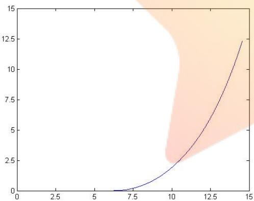

<details>
<summary>line</summary>

| X | Y (Line) |
| --- | --- |
| 6.5 | 0 |
| 7.5 | ~0.2 |
| 8.5 | ~0.8 |
| 9.5 | ~1.8 |
| 10.5 | ~3.2 |
| 11.5 | ~5.2 |
| 12.5 | ~7.5 |
| 13.5 | ~10.2 |
| 14.5 | ~12.4 |
</details>

图 11 风速 12�/�时锚链形状示意图

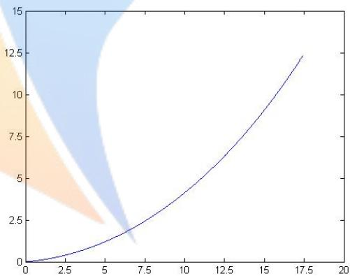

<details>
<summary>area</summary>

| X | Y |
| --- | --- |
| 0 | 0 |
| 2.5 | ~0.5 |
| 5 | ~1.2 |
| 7.5 | ~2.3 |
| 10 | ~4.0 |
| 12.5 | ~6.0 |
| 15 | ~8.8 |
| 17.5 | ~12.3 |
</details>

图 12 风速 24�/�时锚链形状示意图

## 5.1.4 模型检验

在第一问中，锚链实际上由 210 段链条连接而成，在模型的建立中我们将锚链视为悬链线，并采用微积分方法进行求解。

## 悬链线方程：

实际上，悬链线方程也可以较好地解决类似的问题。锚链垂向投影长度y与锚链水平投影长度x满足悬链线方程<sup>【3】</sup>：

$$
\mathrm{y} = a (\cosh \left(\frac {x}{a}\right) - 1)
$$

其中

$$
a = \frac{T_0}{P}
$$

$T _ { 0 }$ 表示锚链顶端张力的水平分量，由于锚链水平方向受力平衡故可用 $F _ { 0 }$ 表示 $T _ { 0 }$ ，因 $\theta _ { 0 }$ 较小，此处近似认为 $\Gamma _ { 0 }$ 等于 $F _ { 0 }$ 。

风速为 12m/s 时锚链有一部分在海床上，风速为 24m/s 时锚链全部浮起，故以风速为 24m/s 时的数据为基础进行比较。 $T _ { 0 }$ 的值等于 941.87N，P 的值等于 68.6N/m。

## 模型检验：

在同一坐标系中画出模型一和悬链线方程所表示的 y与 x的图像：

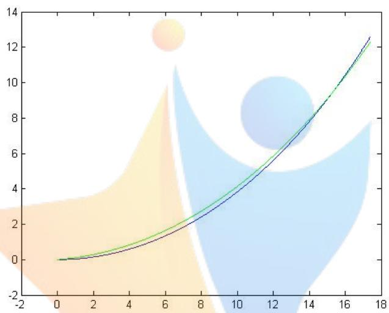

<details>
<summary>area</summary>

| X | Blue Line | Green Line |
| --- | --- | --- |
| 0 | 0 | 0 |
| 2 | ~0.3 | ~0.5 |
| 4 | ~0.8 | ~1.1 |
| 6 | ~1.5 | ~1.9 |
| 8 | ~2.5 | ~3.0 |
| 10 | ~4.0 | ~4.5 |
| 12 | ~6.0 | ~6.5 |
| 14 | ~8.5 | ~8.8 |
| 16 | ~11.5 | ~11.8 |
| 17.5 | ~12.5 | ~12.6 |
</details>

图 13 模型检验图

可以看出，两曲线（下方曲线为模型一算式所得的锚链形状曲线）形状较为接近，y 值分别为12.3012m（模型一）和 12.5824m（悬链线方程）相差不大，经计算，用悬链线方程方法算得的系泊系统各参数值与模型一算得的各参数值相差不大。从侧面验证了模型一的合理性和准确性。

## 5.2模型二 重物球质量优化模型

## 5.2.1 模型一的再应用

采用模型一的计算方法，不考虑钢桶的倾斜角度不超过 5 度、锚链在锚点处与海床的夹角不超 过 16 度这两个约束条件的情况下求解，得出：

<table><tr><td colspan="2">风速</td><td>36m/s</td></tr><tr><td colspan="2">钢桶倾斜角 $\alpha_{\text{桶}}$ </td><td>9.482°</td></tr><tr><td rowspan="4">各节钢管倾斜角 $\alpha_{i}(i=1,2,3,4)$ </td><td> $\alpha_{1}$ </td><td>9.190°</td></tr><tr><td> $\alpha_{2}$ </td><td>9.242°</td></tr><tr><td> $\alpha_{3}$ </td><td>9.299°</td></tr><tr><td> $\alpha_{4}$ </td><td>9.356°</td></tr><tr><td>锚链形状</td><td>1锚链在锚点与海床的夹角为20.867°;2剩余部分的参数方程表达式: $y = 34.7849(\sqrt{(0.0287s + 0.3811)^{2} + 1} - 1.0702)$  $x = 34.7849(\ln(\sqrt{(0.0287s + 0.3811)^{2} + 1} + 0.0287s + 0.3811) - 0.6303))$ </td></tr><tr><td>吃水深度h</td><td>0.7185m</td></tr><tr><td>游动区域半价R</td><td>18.8799m</td></tr></table>

表 2 �� /�风速下系统部分结构状态

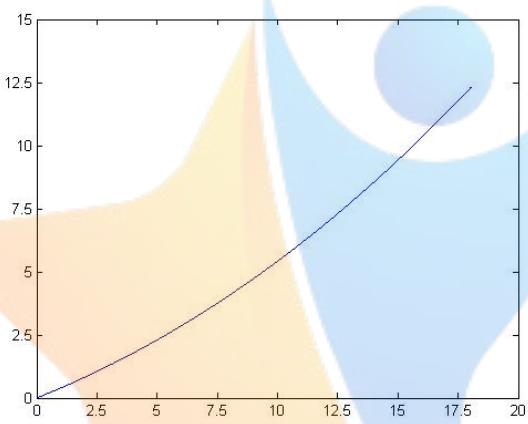

<details>
<summary>line</summary>

| X | Y |
| --- | --- |
| 0 | 0 |
| ~18 | ~12.3 |
</details>

图 14 风速 36�/�时锚链形状示意图

由上表结果可知，风速为36m/s时钢桶倾斜角和锚链在锚点处与海床的夹角都超过了最大限值，可见在模型一的假设下系泊系统不能正常工作，所以需要通过调节系泊系统的部件对系泊系统进行重新设计。根据题意，问题二中考虑通过调节重物球的质量来达到系泊系统设计要求。下文给出重物球质量优化模型的具体内容。

## 5.2.2 模型简介

在模型一的基础上对模型进行加强，以钢桶的倾斜角度不超过 5 度、锚链在锚点处与海床的夹角不超过 16度为约束条件，重物球的质量为目标函数，运用模型一中的循环遍历法求出满足约束条件的重物球质量的最小值。

## 5.2.3 模型求解

在模型一的基础上同样地对各系统部件进行受力分析，增加调节重物球质量的步骤，逐步增大重物球质量，直到满足钢桶的倾斜角度不超过 5 度，锚链在锚点与海床的夹角不超过 16 度。恰好满足这两个条件的重物球质量即为最优的重物球质量。

求得重物球的质量为 2225kg。对应的系泊系统的各参数值如下：

此时钢桶倾斜角度 4.52°，钢管倾斜角度由上至下分别为 4.43°，4.45°,4.47°，4.49°。锚链形状：锚链在锚点与海床的夹角为 15.98°，剩余部分为曲线，浮标的吃水深度为 0.98m，浮标游动区域为在

海面上以锚为中心，半径为 18.5437m的圆。

锚链高于海床部分的参数方程表达式：

$$
y = 2 7. 5 7 8 2 (\sqrt {(0 . 0 3 6 3 s + 0 . 2 8 6 3) ^ {2} + 1} - 1. 0 4)
$$

$$
x = 2 7. 5 7 8 2 \times (\ln (\sqrt {(0 . 0 3 6 3 s + 0 . 2 8 6 3) ^ {2} + 1} + 0. 0 3 6 3 s + 0. 2 8 6 3) - 0. 2 8 2 5))
$$

由上表结果可知，重物球为 2225kg 时系泊系统达到了钢桶的倾斜角度不超过 5 度、锚链在锚点 处与海床的夹角不超过 16 度这两个约束条件。2225kg 为比较合理的重物球质量。

## 5.2.4 模型评价

模型二在模型一的基础上减少了重物球质量这一已知条件，模型的功能获得了优化，但重物球质量的改变会影响锚链脱地的临界风速。所以模型二在使用前需要先计算临界风速这一点需要注意。

## 5.3模型三 基于极值优化的系泊系统设计模型

## 5.3.1 模型简介

在模型一、二的基础上增加近海水流力，在二维坐标中用静力平衡和力矩平衡对模型一的方程组进行补充。根据系泊系统设计要求选取优化指标，用层次分析法确定权重系数，建立综合优化指标。在海况为中值的情况下找到满足极限海况下系泊系统正常工作约束条件的使得综合优化指标最小的方案，选取多组海水深度、风速、锚链型号和长度、重物球质量，分别求出在此方案下桶和各节钢管的倾斜角度、锚链形状、浮标的吃水深度和游动区域。

## 5.3.2 模型建立

## 5.3.2.1 综合优化指标的建立

根据系泊系统设计使得浮标的吃水深度和游动区域及钢桶的倾斜角度尽可能小的要求，初步确定浮标吃水深度、游动区域、钢桶的倾斜角度为系泊系统设计优化指标。如果单独考虑某一个指标可能可以不断优化，但这三项指标的值相互存在关联，如减小钢桶的倾斜角度可能要以增加浮标的吃水深度为代价，因此考虑将三个优化指标综合考虑。

浮标能够正常采集数据需要吃水深度尽量小且浮标不能沉没，游动区域则反映了浮标的稳定程度，钢桶倾斜角小于 5°也是系泊系统正常工作的条件。接下来，采用层次分析法【3】，根据前两问的计算及题目要求，我们确定了钢桶的倾斜角度、浮标吃水深度、游动区域三个指标的判别矩阵A。

$$
\mathrm{A} = \left\{ \begin{array}{c c c} 1 & \frac {1}{5} & \frac {1}{3} \\ 5 & 1 & 3 \\ 3 & \frac {1}{3} & 1 \end{array} \right\}
$$

采用规范列平均法（和法）求出各指标的权重系数，步骤如下：

矩阵 A每一列归一化得到矩阵 B；

将矩阵 B 每一行元素的平均值得到一个一列 n行的矩阵 C；

矩阵 C 即为所求权重向量。

求得浮标吃水深度、游动区域、钢桶的倾斜角度的权重系数分别为 0.63，0.26，0.11。

对浮标吃水深度、游动区域、钢桶的倾斜角度三个优化指标作归一化处理，将处理过的浮标吃水深度记作 $h _ { s }$ ，浮标游动区域记作 $R _ { s }$ ，钢桶倾斜角度记作 $\theta _ { s }$ ，综合优化指标记作 $f$ 。

则：

$$
f = 0. 6 3 \times h _ {s} + 0. 2 6 \times R _ {s} + 0. 1 1 \times \theta_ {s}
$$

## 5.3.2.2 系泊系统的静力学分析

在考虑近海水流的情况下，重新对浮标、钢管、钢桶、锚链作静力学分析，用平面汇交原理和力矩平衡原理列出方程，得到方程组。系泊系统各部分受力分析图与模型一分析类似此处省略，只给出计算公式：

## 浮标的静力学分析：

在 x 轴和 y轴方向上分别列出静力学平衡方程：

$$
\begin{array}{r l} {\sum F _ {x} = 0:} & {F _ {\text {风}} + F _ {\text {水}} - F _ {1} \sin \theta_ {1} = 0} \\ {\sum F _ {y} = 0:} & {F _ {\text {浮}} - G - F _ {1} \cos \theta_ {1} = 0} \end{array}
$$

又：

$$
F _ {\text {风}} = 0. 6 2 5 v ^ {2} \times R _ {f} h
$$

$$
F _ {\text {浮}} = \rho g \pi (h _ {f} - h)
$$

$$
F _ {\text {水}} = 3 7 4 v ^ {2} \times R _ {f} \times (2 - h)
$$

得出

$$
0. 6 2 5 v ^ {2} \times \mathrm{R} _ {f} h + 3 7 4 v ^ {2} \times R _ {f} \times (2 - h) = F _ {1} \sin \theta_ {1} \tag {1}
$$

$$
\rho g \pi \left(R _ {f} - h\right) = G _ {\text {标}} + F _ {1} \cos \theta_ {1} \tag {2}
$$

## 钢管的静力学分析：

在 x 轴、y轴两个方向分别列出静力学平衡方程：

$$
\sum F _ {x} = 0: \quad F _ {i} \sin \theta_ {i} - F _ {i + 1} \sin \theta_ {i + 1} - F _ {\text {水} i} = 0 \tag {3} \sim (6)
$$

$$
\sum F _ {y} = 0: \quad F _ {i + 1} \cos \theta_ {i + 1} - F _ {i} \cos \theta_ {i} - F _ {\text {浮} i} - G _ {i} = 0 \tag {7}
$$

$$
F _ {\text {水} i} = 3 7 4 \times H _ {i} \times 0. 0 5 v ^ {2}
$$

由力矩平衡得：

$$
F _ {i} \times \frac {1}{2} l \times \sin (\alpha_ {i} - \theta_ {i}) - F _ {i + 1} \times \frac {1}{2} l \times \sin (\theta_ {i + 1} - \alpha_ {i}) = 0 \tag {11}
$$

由几何关系得：

$$
H _ {i} = l \cos \alpha_ {i} \tag {15}
$$

以上方程代表四节钢管的四种不同情况。

## 钢桶和重物球的静力学分析：

在 x 轴、y轴两个方向分别列出静力学平衡方程：

$$
\sum F _ {x} = 0: F _ {5} \sin \theta_ {5} - F _ {\text {锚}} \sin \theta_ {\text {锚}} - F _ {\text {水桶}} = 0 \tag {19}
$$

$$
\sum F _ {y} = 0: F _ {5} \cos \theta_ {5} + F _ {\text {浮桶}} + F _ {\text {浮球}} - G _ {\text {桶}} - G _ {\text {球}} - F _ {\text {锚}} \cos \theta_ {\text {锚}} = 0 \tag {20}
$$

$$
F _ {\text {水桶}} = 3 7 4 \times H _ {\text {桶}} \times 0. 3 v ^ {2}
$$

以钢桶质心为参考点，由力矩平衡得：

$$
F _ {5} \times \frac {1}{2} \times \sin (\alpha_ {\text {桶}} - \theta_ {4}) - F _ {\text {锚}} \times \frac {1}{2} \times \sin \left(\theta_ {\text {锚}} - \alpha_ {\text {桶}}\right) = 0 \tag {21}
$$

由 $\textstyle \prod _ { i }$ 何关系得：

$$
H _ {\text {桶}} = \cos \alpha_ {\text {桶}} \tag {22}
$$

## 锚链的静力学分析：

对锚链进行静力学分析，由锚链与锚的接口处右推，锚链微元的张力沿水平方向上的分力应等于锚对锚链的拉力 $F _ { 0 }$ ；锚链微元受到重力和海水的浮力，所以锚链微元的张力沿竖直方向上的分力应等于其受到的重力与浮力的合力，即有：

$$
F _ {\text {水平}} = F _ {\text {锚}} \sin \theta_ {\text {锚}} = F _ {0} \sin \theta_ {0} \tag {23}
$$

$$
F _ {\text {竖直}} = F _ {\text {锚}} \cos \theta_ {\text {锚}} = m g s - \rho g A s + F _ {0} \cos \theta_ {0} \tag {24}
$$

对 $\mathrm { d y }$ 的表达式积分，有

$$
\mathrm{y} = \int_ {0} ^ {s} d y = \int_ {0} ^ {s} d s \cdot \sin \varphi = \int_ {0} ^ {s} d s \cdot \frac {F _ {\text {竖直}}}{\sqrt {F _ {\text {竖直}} ^ {2} + F _ {\text {水平}} ^ {2}}}
$$

为了简化计算，令

$$
a = m g - \rho g A
$$

$$
b = F _ {0} \cos \theta_ {0}
$$

$$
c = F _ {0} \sin \theta_ {0} - 3 7 4 \times 0. 0 2 (H - \sum H _ {i} - (2 - h)) v ^ {2}
$$

$$
y = \frac {c}{a} \cdot \frac {1}{\cos t} \Bigg | _ {\arctan \frac {b}{c}} ^ {\arctan \frac {a s + b}{c}} \tag {25}
$$

$$
= \frac {c}{a} \cdot (\frac {1}{\cos (a r c t a n \frac {a s + b}{c})} - \frac {1}{\cos (a r c t a n \frac {b}{c})})
$$

(25)式可作为计算锚链形状的依据。

各组成部分的关联性分析：

$$
(2 - h) + \sum_ {i = 1} ^ {4} H _ {i} + H _ {\text {桶}} + y _ {\text {锚链}} = 1 8 \tag {26}
$$

## 5.3.2.3 极值优化方法

以风速、水流速度、锚链型号和长度、重物球质量为自变量，但由于自变量较多且方程组较复杂，我们采用赋值降元方法在风速为 18m/s，水流速度为 0.75m/s，海水深为 18m的中值海况下对每种系泊系统进行计算，以系泊系统在极限海况下（风速和海流方向相同且达到最大，水深为 16m和20m共两种情况）能够正常工作为约束条件，以综合优化指标f最小为目标，寻找满足上述条件的锚链型号和长度、重物球质量。

## 5.2.3.4 模型求解

在满足极限海况可以正常工作的情况下，对每种锚链解出一组使得综合优化指标最小的解：

<table><tr><td>型号</td><td>锚链长度</td><td>重物球质量</td><td>综合优化指标</td></tr><tr><td>I</td><td>32.37m</td><td>4900kg</td><td>0.9691</td></tr><tr><td>II</td><td>28.245m</td><td>4700kg</td><td>0.9004</td></tr><tr><td>III</td><td>25.08m</td><td>4500kg</td><td>0.8442</td></tr><tr><td>IV</td><td>21.9m</td><td>4500kg</td><td>0.8036</td></tr><tr><td>V</td><td>20.52m</td><td>4200kg</td><td>0.7631</td></tr></table>

表 3 五种锚链型号下的最优解

得出型号 V的锚链优化指标最小，效果最优，所以选取这种设计：锚链长度 20.52m，型号为V，重物球质量 4200kg。能够较好的满足要求。

## 5.2.3.5 系泊系统设计结果分析

选取三种海况进行计算，得出以下结果：

1.风速 27m/s，水速 0.75m/s，方向同向，水深 20m。

此时钢桶倾斜角度 1.55°，钢管倾斜角度由上至下分别为 1.44°，1.46°，1.48°，1.50°。浮标的吃水深度为 1.6144m，浮标游动区域为在海面上以锚为中心，半径为 10.4201m的圆。

锚链高于海床部分的参数方程表达式：

$$
y = 4. 7 3 7 6 (\sqrt {0 . 0 4 4 6 s ^ {2} + 1} - 1)
$$

$$
x = 4. 7 3 7 6 \times (\ln \sqrt {0 . 0 4 4 6 s ^ {2} + 1} + 0. 2 1 1 1 s)
$$

2.风速 24m/s，水速 1m/s，方向同向，水深 16m。

此时钢桶倾斜角度 2.27°，钢管倾斜角度由上至下分别为 2.07°，2.11°，2.14°，2.17°。浮标的吃水深度为 1.6144m，浮标游动区域为在海面上以锚为中心，半径为 12.7424m的圆。

锚链高于海床部分的参数方程表达式：

$$
y = 6. 9 7 4 7 (\sqrt {0 . 0 2 0 6 s ^ {2} + 1} - 1)
$$

$$
x = 4. 7 3 7 6 \times \ln (\sqrt {0 . 0 2 0 6 s ^ {2} + 1} + 0. 1 4 3 4 s)
$$

3.风速 15m/s，水速 0.5m/s，方向同向，水深 18m。

此时钢桶倾斜角度 0.62°，钢管倾斜角度由上至下分别为 0.57°，0.58°，0.59°，0.60°。浮标的吃水深度为 1.6144m，浮标游动区域为在海面上以锚为中心，半径为 5.9076m的圆。

锚链高于海床部分的参数方程表达式：

$$
y = 1. 9 0 6 5 (\sqrt {0 . 2 7 5 1 s ^ {2} + 1} - 1)
$$

$$
x = 1. 9 0 6 5 \times (\ln \sqrt {0 . 2 7 5 1 s ^ {2} + 1} + 0. 5 2 4 5 s)
$$

由于篇幅有限，只选取一种情况作出锚链形状图。

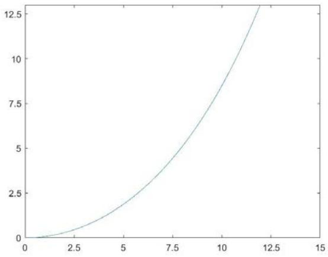

<details>
<summary>line</summary>

| X | Y |
| --- | --- |
| 0 | 0 |
| 2.5 | ~0.5 |
| 5 | ~2.0 |
| 7.5 | ~4.5 |
| 10 | ~8.5 |
| 12.5 | ~13.0 |
</details>

图 15 第 2 种情况锚链形状示意图

三种情况下钢桶的倾斜角都较小，浮标游动区域也比较理想，吃水深度较大的原因可能是为了满足极限海况下系泊系统能够正常工作使得重物球质量较大。

## 5.2.3.6 模型分析与优化

第三问的求解中我们是在系泊系统在极限海况下能够正常工作的前提下设计系泊系统，求出的结果重物球质量与第一二问相比明显较大，锚链长度明显较长。这与适应极限海况的实际相符合。当外界环境适中时，由于重物球较重和锚链长度较长，必然会有较长的一段锚链躺在海床上，这样在一定程度上来看提高了锚链的稳定性。

本题我们主要是从系泊系统能够正常发挥功能考虑，设计的系泊系统可能存在用料较大，费用较高的缺点。在实际应用中，可以综合考虑这方面的因素，对锚链和重物球的规格做一定的限制，更好地满足实际应用需求。

## 六、模型评价：

## 6.1模型一、二：

## 6.1.1 误差分析：

1.在海水静止的情况下，题给传输节点示意图所示的各结构模块也可能不位于同一竖直平面内，连接处对系统高度和受力情况存在一定影响。  
2.锚链自身和其与相邻锚链相连时都有空隙。  
3.实际情况下，浮标的风倾角对系统产生的极微弱影响在分析对象不同时显著性可能有差别。  
4.重物球和锚链的密度未知，我们根据资料查得的数据可能与实际情况有些偏差。

## 6.1.2 灵敏度分析：

根据模型中的（1）\~（26）号方程，以浮标系统出水高度 h为自变量，利用 MATLAB，使用循环遍历方法找到系泊系统各部件垂向投影长度最接近海水深度 18m的情况。将数据保留至小数点后四位，求得 h=0.3184m，此时水深为 17.9940m，与题给条件相差 0.0060m。

改变系统出水高度检验模型灵敏度。取步长为 0.0001，除去求得的最优情况再计算相邻八组数据，如下表所示：

<table><tr><td>h(m)</td><td>1.3180</td><td>1.3181</td><td>1.3182</td><td>1.3183</td><td>1.3184</td><td>1.3185</td><td>1.3186</td><td>1.3187</td><td>1.3188</td></tr><tr><td>2- h(m)</td><td>0.6820</td><td>0.6819</td><td>0.6818</td><td>0.6817</td><td>0.6816</td><td>0.6815</td><td>0.6814</td><td>0.6813</td><td>0.6812</td></tr><tr><td> $H'(m)$ </td><td>18.2005</td><td>18.1489</td><td>18.0972</td><td>18.0456</td><td>17.9940</td><td>17.9424</td><td>17.8908</td><td>17.8392</td><td>17.7877</td></tr><tr><td> $\Delta H(m)$ </td><td>0.2005</td><td>0.1489</td><td>0.0972</td><td>0.0456</td><td>0.0060</td><td>0.0576</td><td>0.1092</td><td>0.1608</td><td>0.2123</td></tr></table>

表 4 出水高度灵敏度检验

可见在合理自变量范围内h=0.3184m为最优解，自变量每改变0.0001对待求结果的影响都很大，模型灵敏度很高，从侧面验证了模型求解的精确性。

## 6.2 模型三：

## 6.2.1 误差分析：

1.在海水流动的情况下，浮标可能受到随时间变化的复杂的力，本模型视近海水流力和风力为恒力可能会产生一定的误差。  
2.海水阻尼可能对系泊系统的受力有一定的影响。  
3.锚链自身和其与相邻锚链相连时都有空隙。  
4.重物球和锚链的密度未知，我们根据资料查得的数据可能与实际情况有些偏差。

## 6.2.2 模型评价：

本模型建立了综合优化指标， 并且在中值海况下寻求最优的设计方案，同时满足系泊系统在极限海况下的正常工作，总体上是一个较好的设计方案。实际海况较为复杂且系泊系统受力也比较复杂，作为一个简化模型它不能对复杂海况计算出对应的钢桶、钢管的倾斜角度、锚链形状、浮标的吃水深度和游动区域，但作为一个设计模型满足了设计的需求，是一个符合设计功能的较为简易的模型。

## 七、应用拓展

## 海洋资料浮标系统

此次系泊系统设计及优化综合问题的模型建立与解决有着重要的现实意义。

海洋资料浮标系统指以锚定在海上的观测浮标为主体，以数据采集处理、控制、传输系统为核心处理环节，以自动化为工作特点，以卫星、调查船、声波探测设备为以海洋水文等为最终直接处理对象的系统。2016 年初，《自然》杂志阐述的致力于全球气候变化研究的 Argo 计划以一定间距设立浮标，有效监测并处理实时情况与测得的数据，这要求海洋资料浮标系统在多样化的环境条件下都有强大的技术支持。但如今系统存在的问题主要包括规模及资料获取量欠佳、监测网点少、稳定

性与可靠性略有不足等方面。

本文着眼全局，考虑海上、海下的多种环境条件下系泊系统各部分的组成、连接方式以及各参数的大小的确定，在设备稳定性方面利于海洋资料浮标系统长期可靠性运行。

## 八、参考文献

[1] 百度百科，平面汇交力系，http://baike.baidu.com/view/604101.htm ，2016.9.10 。  
[2] 曹宏宇，海洋柱形浮标阻力和运动特性研究，天津大学硕士学位论文，2012.11。  
[3] 吴剑锋，王斌，基于悬链线法的锚链长度的计算，《中国水运月刊》 139-139，2013.1。  
[4] 郑鹏飞，悬链线状的海洋浮标锚泊系统，《山东科学》 1-9，1990.02。  
[5] 百度百科，层次分析法，http://baike.baidu.com/item/%E5%B1%82%E6%AC%A1%E5%88%86%E6%9E%90%E6%B3%95/1672，2016.9.11。

## 附录：

以下附件均为 matlab 软件代码。

附件 1 问题一风速 12m/s 时各参数算法 matlab 代码

p=1025;

v=12;

g=9.8;

Mbuoy=1000;

Mtube=10;

Mdrum=100;

Mball=1200;

Ltube=1;

Dtube=0.05;

Ldrum=1;

Ddrum=0.3;

s=22.05;

m=7;

Gbuoy=Mbuoy\*g;

Gtube=Mtube\*g;

Fftube=p\*g\*Ltube\*pi\*0.25\*Dtube\*Dtube;

temp=Gtube-Fftube;

Ffdrum=p\*g\*Ldrum\*0.25\*pi\*Ddrum\*Ddrum;

Gdrum=Mdrum\*g;

Gball=Mball\*g;

Ffball=Gball/7.46;%7.65/1.025=7.46

realh=100;

judge=100;

% h=2-((Gbuoy+4\*temp+Gdrum+Gball-Ffdrum-Ffball+0.87\*m\*s)/(p\*g\*pi));

% realh=0;

% theta0=pi/2;

% Fwind=2\*0.625\*h\*v\*v;

% F0=Fwind/sin(theta0);

% a=0.87\*m\*g;

% b=F0\*cos(theta0);

% c=F0\*sin(theta0);

% y=(c/a)\*(1/cos(atan((a\*s+b)/c))-1/cos(atan(b/c)));

for h=1:0.0001:1.5

Fwind=2\*0.625\*h\*v\*v;

Ff=p\*g\*pi\*(2-h);

theta1=atan(Fwind/(Ff-Gbuoy));

F1=Fwind/sin(theta1);

theta2=atan((F1\*sin(theta1))/(F1\*cos(theta1)-temp));

F2=F1\*sin(theta1)/sin(theta2);

theta3=atan((F2\*sin(theta2))/(F2\*cos(theta2)-temp));

F3=F2\*sin(theta2)/sin(theta3);

theta4=atan((F3\*sin(theta3))/(F3\*cos(theta3)-temp));

F4=F3\*sin(theta3)/sin(theta4);

theta5=atan((F4\*sin(theta4))/(F4\*cos(theta4)-temp));

F5=F4\*sin(theta4)/sin(theta5);

thetachain=atan((F5\*sin(theta5))/(F5\*cos(theta5)+Ffdrum+Ffball-Gball-Gdrum));

Fchain=F5\*sin(theta5)/sin(thetachain);

% theta0=atan((Fchain\*sin(thetachain))/(Fchain\*cos(thetachain)-0.87\*m\*g\*s));%7.81/1.025=7.62

1-1/7.62=0.87

theta0=pi/2;

F0=Fchain\*sin(thetachain)/sin(theta0);

```txt
s=(Fchain*cos(thetachain)-F0*cos(theta0))/(0.87*m*g);
a=0.87*m*g;
b=F0*cos(theta0);
c=F0*sin(theta0);
y=(c/a)*(1/cos(atan((a*s+b)/c))-1/cos(atan(b/c)));

alpha1=(F2*theta2+F1*theta1)/(F1+F2);
alpha2=(F3*theta3+F2*theta2)/(F2+F3);
alpha3=(F4*theta4+F3*theta3)/(F3+F4);
alpha4=(F5*theta5+F4*theta4)/(F4+F5);
```

Alpha=acot((F5\*cos(theta5)+Fchain\*cos(thetachain)+Gball-Ffball)/(F5\*sin(theta5)+Fchain\*sin(thetachain )));  
```matlab
H1=cos(alpha1);
H2=cos(alpha2);
H3=cos(alpha3);
H4=cos(alpha4);
Hdrum=cos(Alpha);
Hriver=2-h+H1+H2+H3+H4+Hdrum+y;
if(judge>abs(18-Hriver))
    realh=h;
    judge=abs(18-Hriver);
end
end
h=realh;
Fwind=2*0.625*h*v*v;
    Ff=p*g*pi*(2-h);
    theta1=atan(Fwind/(Ff-Gbuoy));
    F1=Fwind/sin(theta1);
    theta2=atan((F1*sin(theta1))/(F1*cos(theta1)-temp));
    F2=F1*sin(theta1)/sin(theta2);
    theta3=atan((F2*sin(theta2))/(F2*cos(theta2)-temp));
    F3=F2*sin(theta2)/sin(theta3);
    theta4=atan((F3*sin(theta3))/(F3*cos(theta3)-temp));
    F4=F3*sin(theta3)/sin(theta4);
    theta5=atan((F4*sin(theta4))/(F4*cos(theta4)-temp));
    F5=F4*sin(theta4)/sin(theta5);
    thechain=atan((F5*sin(theta5))/(F5*cos(theta5)+Ffdrum+Ffball-Gball-Gdrum));
    Fchain=F5*sin(theta5)/sin(thetachain);
%   theta0=atan((Fchain*sin(thetachain))/(Fchain*cos(thetachain)-0.87*m*g*s));%7.81/1.025=7.62
1-1/7.62=0.87
    theta0=pi/2;
    F0=Fchain*sin(thetachain)/sin(theta0);
    s=(Fchain*cos(thetachain)-F0*cos(theta0))/(0.87*m*g);
    a=0.87*m*g;
    b=F0*cos(theta0);
    c=F0*sin(theta0);
%     y=(c/a)*(1/cos(atan((a*s+b)/c))-1/cos(atan(b/c)));
    coe1=c/a;
    coe2=b/c;
    coe3=a/c;
    y=coe1*(sqrt((coe3*s+coe2).^2+1)-sqrt(coe2.^2+1));
    x=coe1*(log(sqrt((coe3*s+coe2).^2+1)+coe3*s+coe2)-log(sqrt(coe2.^2+1)+coe2));
```

```javascript
alpha1=(F2*theta2+F1*theta1)/(F1+F2);
alpha2=(F3*theta3+F2*theta2)/(F2+F3);
alpha3=(F4*theta4+F3*theta3)/(F3+F4);
alpha4=(F5*theta5+F4*theta4)/(F4+F5);
```

Alpha=acot((F5\*cos(theta5)+Fchain\*cos(thetachain)+Gball-Ffball)/(F5\*sin(theta5)+Fchain\*sin(thetachain )));  
```matlab
H1=cos(alpha1);
H2=cos(alpha2);
H3=cos(alpha3);
H4=cos(alpha4);
Hdrum=cos(Alpha);
Hriver=2-h+H1+H2+H3+H4+Hdrum+y;
R=x+22.05-s+sin(alpha1)+sin(alpha2)+sin(alpha3)+sin(alpha4)+sin(Alpha);
```

附件 2 问题一中求解临界风速代码  
```matlab
p=1025;
g=9.8;
Mbuoy=1000;
Mtube=10;
Mdrum=100;
Mball=1200;
Ltube=1;
Dtube=0.05;
Ldrum=1;
Ddrum=0.3;
s=22.05;
m=7;
Gbuoy=Mbuoy*g;
Gtube=Mtube*g;
Fftube=p*g*Ltube*pi*0.25*Dtube*Dtube;
temp=Gtube-Fftube;
Ffdrum=p*g*Ldrum*0.25*pi*Ddrum*Ddrum;
Gdrum=Mdrum*g;
Gball=Mball*g;
Ffball=Gball/7.46;%7.65/1.025=7.46
judge=100;
realv=0;
```

```matlab
for v=10:0.1:30
h=2-((Gbuoy+4*temp+Gdrum+Gball-Ffdrum-Ffball+0.87*m*s)/(p*g*pi));
theta0=pi/2;
Fwind=2*0.625*h*v*v;
F0=Fwind/sin(theta0);
a=0.87*m*g;
b=F0*cos(theta0);
c=F0*sin(theta0);
y=(c/a)*(1/cos(atan((a*s+b)/c))-1/cos(atan(b/c)));
if(judge>abs(18-(2-h)-5-y))
    judge=abs(18-(2-h)-5-y);
    realv=v;
end
end
```

附件 3 问题一、二风速 24m/s和 36m/s时各参数算法 matlab 代码（36m/s时只需将第二行的 v 改为36）

```matlab
p=1025;
v=24;
g=9.8;
Mbuoy=1000;
Mtube=10;
Mdrum=100;
Mball=1200;
Ltube=1;
Dtube=0.05;
Ldrum=1;
Ddrum=0.3;
s=22.05;
m=7;
Gbuoy=Mbuoy*g;
Gtube=Mtube*g;
Fftube=p*g*Ltube*pi*0.25*Dtube*Dtube;
temp=Gtube-Fftube;
Ffdrum=p*g*Ldrum*0.25*pi*Ddrum*Ddrum;
Gdrum=Mdrum*g;
Gball=Mball*g;
Ffball=Gball/7.46;%7.65/1.025=7.46
realh=100;
judge=100;

% h=2-((Gbuoy+4*temp+Gdrum+Gball-Ffdrum-Ffball+0.87*m*s)/(p*g*pi));
% realh=0;
% theta0=pi/2;
% Fwind=2*0.625*h*v*v;
% F0=Fwind/sin(theta0);
% a=0.87*m*g;
% b=F0*cos(theta0);
% c=F0*sin(theta0);
% y=(c/a)*(1/cos(atan((a*s+b)/c))-1/cos(atan(b/c)));

for h=1:0.0001:1.5
    Fwind=2*0.625*h*v*v;
    Ff=p*g*pi*(2-h);
    theta1=atan(Fwind/(Ff-Gbuoy));
    F1=Fwind/sin(theta1);
    theta2=atan((F1*sin(theta1))/(F1*cos(theta1)-temp));
    F2=F1*sin(theta1)/sin(theta2);
    theta3=atan((F2*sin(theta2))/(F2*cos(theta2)-temp));
    F3=F2*sin(theta2)/sin(theta3);
    theta4=atan((F3*sin(theta3))/(F3*cos(theta3)-temp));
    F4=F3*sin(theta3)/sin(theta4);
    theta5=atan((F4*sin(theta4))/(F4*cos(theta4)-temp));
    F5=F4*sin(theta4)/sin(theta5);
    thechain=atan((F5*sin(theta5))/(F5*cos(theta5)+Ffdrum+Ffball-Gball-Gdrum));
    Fchain=F5*sin(theta5)/sin(thetachain);
    theta0=atan((Fchain*sin(thetachain))/(Fchain*cos(thetachain)-0.87*m*g*s));%7.81/1.025=7.62
1/7.62=0.87
    F0=Fwind/sin(theta0);
%     theta0=pi/2;
%     F0=Fchain*sin(thetachain)/sin(theta0);
```

```matlab
%     s=(Fchain*cos(thetachain)-F0*cos(theta0))/(0.87*m*g);
a=0.87*m*g;
b=F0*cos(theta0);
c=F0*sin(theta0);
y=(c/a)*(1/cos(atan((a*s+b)/c))-1/cos(atan(b/c)));

alpha1=(F2*theta2+F1*theta1)/(F1+F2);
alpha2=(F3*theta3+F2*theta2)/(F2+F3);
alpha3=(F4*theta4+F3*theta3)/(F3+F4);
alpha4=(F5*theta5+F4*theta4)/(F4+F5);
```

Alpha=acot((F5\*cos(theta5)+Fchain\*cos(thetachain)+Gball-Ffball)/(F5\*sin(theta5)+Fchain\*sin(thetachain )));  
```matlab
H1=cos(alpha1);
H2=cos(alpha2);
H3=cos(alpha3);
H4=cos(alpha4);
Hdrum=cos(Alpha);
Hriver=2-h+H1+H2+H3+H4+Hdrum+y;
if(judge>abs(18-Hriver))
    realh=h;
    judge=abs(18-Hriver);
end
end
h=realh;
Fwind=2*0.625*h*v*v;
    Ff=p*g*pi*(2-h);
    theta1=atan(Fwind/(Ff-Gbuoy));
    F1=Fwind/sin(theta1);
    theta2=atan((F1*sin(theta1))/(F1*cos(theta1)-temp));
    F2=F1*sin(theta1)/sin(theta2);
    theta3=atan((F2*sin(theta2))/(F2*cos(theta2)-temp));
    F3=F2*sin(theta2)/sin(theta3);
    theta4=atan((F3*sin(theta3))/(F3*cos(theta3)-temp));
    F4=F3*sin(theta3)/sin(theta4);
    theta5=atan((F4*sin(theta4))/(F4*cos(theta4)-temp));
    F5=F4*sin(theta4)/sin(theta5);
    thechain=atan((F5*sin(theta5))/(F5*cos(theta5)+Ffdrum+Ffball-Gball-Gdrum));
    Fchain=F5*sin(theta5)/sin(thetachain);
    theta0=atan((Fchain*sin(thetachain))/(Fchain*cos(thetachain)-0.87*m*g*s));%7.81/1.025=7.62
1-1/7.62=0.87
    F0=Fwind/sin(theta0);
%     theta0=pi/2;
%     F0=Fchain*sin(thetachain)/sin(theta0);
%     s=(Fchain*cos(thetachain)-F0*cos(theta0))/(0.87*m*g);
    a=0.87*m*g;
    b=F0*cos(theta0);
    c=F0*sin(theta0);
%     y=(c/a)*(1/cos(atan((a*s+b)/c))-1/cos(atan(b/c)));
    coe1=c/a;
    coe2=b/c;
    coe3=a/c;
    y=coe1*(sqrt((coe3*s+coe2).^2+1)-sqrt(coe2.^2+1));
    x=coe1*(log(sqrt((coe3*s+coe2).^2+1)+coe3*s+coe2)-log(sqrt(coe2.^2+1)+coe2));
```

```javascript
alpha1=(F2*theta2+F1*theta1)/(F1+F2);
alpha2=(F3*theta3+F2*theta2)/(F2+F3);
alpha3=(F4*theta4+F3*theta3)/(F3+F4);
alpha4=(F5*theta5+F4*theta4)/(F4+F5);
```

Alpha=acot((F5\*cos(theta5)+Fchain\*cos(thetachain)+Gball-Ffball)/(F5\*sin(theta5)+Fchain\*sin(thetachain )));  
```matlab
H1=cos(alpha1);
H2=cos(alpha2);
H3=cos(alpha3);
H4=cos(alpha4);
Hdrum=cos(Alpha);
Hriver=2-h+H1+H2+H3+H4+Hdrum+y;
R=x+22.05-s+sin(alpha1)+sin(alpha2)+sin(alpha3)+sin(alpha4)+sin(Alpha);
```

附件 4 问题二风速 36m/s 调节重物球质量后的代码  
```matlab
p=1025;
v=36;
g=9.8;
Mbuoy=1000;
Mtube=10;
Mdrum=100;
Ltube=1;
Dtube=0.05;
Ldrum=1;
Ddrum=0.3;
s=22.05;
m=7;
Mball=2225
Gbuoy=Mbuoy*g;
Gtube=Mtube*g;
Fftube=p*g*Ltube*pi*0.25*Dtube*Dtube;
temp=Gtube-Fftube;
Ffdrum=p*g*Ldrum*0.25*pi*Ddrum*Ddrum;
Gdrum=Mdrum*g;
Gball=Mball*g;
Ffball=Gball/7.46;%7.65/1.025=7.46
realh=100;
judge=100;
t=3000;
% h=2-((Gbuoy+4*temp+Gdrum+Gball-Ffdrum-Ffb)
% realh=0;
% theta0=pi/2;
% Fwind=2*0.625*h*v*v;
% F0=Fwind/sin(theta0);
% a=0.87*m*g;
% b=F0*cos(theta0);
% c=F0*sin(theta0);
% y=(c/a)*(1/cos(atan((a*s+b)/c))-1/cos(atan(b/c)));
```

```matlab
for h=1:0.0001:1.5
    Fwind=2*0.625*h*v*v;
    Ff=p*g*pi*(2-h);
    theta1=atan(Fwind/(Ff-Gbuoy));
```

```matlab
F1=Fwind/sin(theta1);
theta2=atan((F1*sin(theta1))/(F1*cos(theta1)-temp));
F2=F1*sin(theta1)/sin(theta2);
theta3=atan((F2*sin(theta2))/(F2*cos(theta2)-temp));
F3=F2*sin(theta2)/sin(theta3);
theta4=atan((F3*sin(theta3))/(F3*cos(theta3)-temp));
F4=F3*sin(theta3)/sin(theta4);
theta5=atan((F4*sin(theta4))/(F4*cos(theta4)-temp));
F5=F4*sin(theta4)/sin(theta5);
thetachain=atan((F5*sin(theta5))/(F5*cos(theta5)+Ffdrum+Ffball-Gball-Gdrum));
Fchain=F5*sin(theta5)/sin(thetachain);
theta0=atan((Fchain*sin(thetachain))/(Fchain*cos(thetachain)-0.87*m*g*s));%7.81/1.025=7.62
1-1/7.62=0.87
    F0=Fwind/sin(theta0);
%     theta0=pi/2;
%     F0=Fchain*sin(thetachain)/sin(theta0);
%     s=(Fchain*cos(thetachain)-F0*cos(theta0))/(0.87*m*g);
    a=0.87*m*g;
    b=F0*cos(theta0);
    c=F0*sin(theta0);
    y=(c/a)*(1/cos(atan((a*s+b)/c))-1/cos(atan(b/c)));

    alpha1=(F2*theta2+F1*theta1)/(F1+F2);
    alpha2=(F3*theta3+F2*theta2)/(F2+F3);
    alpha3=(F4*theta4+F3*theta3)/(F3+F4);
    alpha4=(F5*theta5+F4*theta4)/(F4+F5);
```

Alpha=acot((F5\*cos(theta5)+Fchain\*cos(thetachain)+Gball-Ffball)/(F5\*sin(theta5)+Fchain\*sin(thetachain )));  
```matlab
H1=cos(alpha1);
H2=cos(alpha2);
H3=cos(alpha3);
H4=cos(alpha4);
Hdrum=cos(Alpha);
Hriver=2-h+H1+H2+H3+H4+Hdrum+y;
if(judge>abs(18-Hriver))
    realh=h;
    judge=abs(18-Hriver);
end
end
h=realh;
Fwind=2*0.625*h*v*v;
    Ff=p*g*pi*(2-h);
    theta1=atan(Fwind/(Ff-Gbuoy));
    F1=Fwind/sin(theta1);
    theta2=atan((F1*sin(theta1))/(F1*cos(theta1)-temp));
    F2=F1*sin(theta1)/sin(theta2);
    theta3=atan((F2*sin(theta2))/(F2*cos(theta2)-temp));
    F3=F2*sin(theta2)/sin(theta3);
    theta4=atan((F3*sin(theta3))/(F3*cos(theta3)-temp));
    F4=F3*sin(theta3)/sin(theta4);
    theta5=atan((F4*sin(theta4))/(F4*cos(theta4)-temp));
    F5=F4*sin(theta4)/sin(theta5);
    thechain=atan((F5*sin(theta5))/(F5*cos(theta5)+Ffdrum+Ffball-Gball-Gdrum));
    Fchain=F5*sin(theta5)/sin(thetachain);
```

theta0=atan((Fchain\*sin(thetachain))/(Fchain\*cos(thetachain)-0.87\*m\*g\*s));%7.81/1.025=7.62 1-1/7.62=0.87

```matlab
F0=Fwind/sin(theta0);
%     theta0=pi/2;
%     F0=Fchain*sin(thetachain)/sin(theta0);
%     s=(Fchain*cos(thetachain)-F0*cos(theta0))/(0.87*m*g);
a=0.87*m*g;
b=F0*cos(theta0);
c=F0*sin(theta0);
%     y=(c/a)*(1/cos(atan((a*s+b)/c))-1/cos(atan(b/c)));
coe1=c/a;
coe2=b/c;
coe3=a/c;
y=coe1*(sqrt((coe3*s+coe2).^2+1)-sqrt(coe2.^2+1));
x=coe1*(log(sqrt((coe3*s+coe2).^2+1)+coe3*s+coe2)-log(sqrt(coe2.^2+1)+coe2));

alpha1=(F2*theta2+F1*theta1)/(F1+F2);
alpha2=(F3*theta3+F2*theta2)/(F2+F3);
alpha3=(F4*theta4+F3*theta3)/(F3+F4);
alpha4=(F5*theta5+F4*theta4)/(F4+F5);
```

Alpha=acot((F5\*cos(theta5)+Fchain\*cos(thetachain)+Gball-Ffball)/(F5\*sin(theta5)+Fchain\*sin(thetachain )));

```matlab
H1=cos(alpha1);
H2=cos(alpha2);
H3=cos(alpha3);
H4=cos(alpha4);
Hdrum=cos(Alpha);
Hriver=2-h+H1+H2+H3+H4+Hdrum+y;
R=x+22.05-s+sin(alpha1)+sin(alpha2)+sin(alpha3)+sin(alpha4)+sin(Alpha);
```

附件 5 问题三极值优化代码

```matlab
p=1025;
Vwind=36;
Vwater=1.5;
g=9.8;
Mbuoy=1000;
Mtube=10;
Mdrum=100;
Ltube=1;
Dtube=0.05;
Ldrum=1;
Ddrum=0.3;
Dchain=0.02;
Gbuoy=Mbuoy*g;
Gtube=Mtube*g;
Fftube=p*g*Ltube*pi*0.25*Dtube*Dtube;
temp=Gtube-Fftube;
Ffdrum=p*g*Ldrum*0.25*pi*Ddrum*Ddrum;
Gdrum=Mdrum*g;
judge=100;
%数据的初始化，缺少量为水深 H，锚链单位质量 m,锚链长度 s,重物球质量 Mball,吃水深度 2-h
m=28.12;
H=20;
trueh=zeros(3000,0);
```

```matlab
truetheta0=zeros(3000,0);
truealpha=zeros(3000,0);
trueMball=zeros(3000,0);
trues=zeros(3000,0);
trueR=zeros(3000,0);
i=1;
% s=25;
% Mball=2300;
for s=10.8:0.18:54
for Mball=1000:100:6000
for h=0:0.01:2
    Gball=Mball*g;
    Ffball=Gball/7.46;
    Fwind=2*0.625*h*Vwind*Vwind;
    Fwater=374*2*(2-h)*Vwater*Vwater;
    Ff=p*g*pi*(2-h);
    theta1=atan((Fwind+Fwater)/(Ff-Gbuoy));
    F1=(Fwind+Fwater)/sin(theta1);
    Fwtube=374*0.05*Vwater*Vwater;
    theta2=atan((F1*sin(theta1)+Fwtube)/(F1*cos(theta1)-temp));
    F2=(F1*sin(theta1)+Fwtube)/sin(theta2);
    theta3=atan((F2*sin(theta2)+Fwtube)/(F2*cos(theta2)-temp));
    F3=(F2*sin(theta2)+Fwtube)/sin(theta3);
    theta4=atan((F3*sin(theta3)+Fwtube)/(F3*cos(theta3)-temp));
    F4=(F3*sin(theta3)+Fwtube)/sin(theta4);
    theta5=atan((F4*sin(theta4)+Fwtube)/(F4*cos(theta4)-temp));
    F5=(F4*sin(theta4)+Fwtube)/sin(theta5);
    Fwdrum=374*0.3*Vwater*Vwater;
    thechain=atan((F5*sin(theta5)+Fwdrum)/(F5*cos(theta5)+Ffdrum+Ffball-Gball-Gdrum));
    Fchain=(F5*sin(theta5)+Fwdrum)/sin(thetachain);
    Fwchain=374*Dchain*(H-7+h)*Vwater*Vwater;
    theta0=atan((Fchain*sin(thetachain)+Fwchain)/(Fchain*cos(thetachain)-0.87*m*g*s));
    F0=(Fchain*sin(thetachain)+Fwchain)/sin(theta0);
    a=0.87*m*g;
    b=F0*cos(theta0);
    c=F0*sin(theta0)-374*Dchain*(H-5-(2-h))*Vwater*Vwater;
    y=(c/a)*(1/cos(atan((a*s+b)/c))-1/cos(atan(b/c)));

    alpha1=(F2*theta2+F1*theta1)/(F1+F2);
    alpha2=(F3*theta3+F2*theta2)/(F2+F3);
    alpha3=(F4*theta4+F3*theta3)/(F3+F4);
    alpha4=(F5*theta5+F4*theta4)/(F4+F5);
```

Alpha=acot((F5\*cos(theta5)+Fchain\*cos(thetachain)+Gball-Ffball)/(F5\*sin(theta5)+Fchain\*sin(thetachain )));

```matlab
H1=cos(alpha1);
H2=cos(alpha2);
H3=cos(alpha3);
H4=cos(alpha4);
Hdrum=cos(Alpha);
Hriver=2-h+H1+H2+H3+H4+Hdrum+y;
if(judge>abs(H-Hriver))
    realh=h;
    judge=abs(H-Hriver);
end
```

```matlab
end
judge=100;
h=realh;
Ffball=Gball/7.46;
    Fwind=2*0.625*h*Vwind*Vwind;
    Fwater=374*2*(2-h)*Vwater*Vwater;
    Ff=p*g*pi*(2-h);
    theta1=atan((Fwind+Fwater)/(Ff-Gbuoy));
    F1=(Fwind+Fwater)/sin(theta1);
    Fwtube=374*0.05*Vwater*Vwater;
    theta2=atan((F1*sin(theta1)+Fwtube)/(F1*cos(theta1)-temp));
    F2=(F1*sin(theta1)+Fwtube)/sin(theta2);
    theta3=atan((F2*sin(theta2)+Fwtube)/(F2*cos(theta2)-temp));
    F3=(F2*sin(theta2)+Fwtube)/sin(theta3);
    theta4=atan((F3*sin(theta3)+Fwtube)/(F3*cos(theta3)-temp));
    F4=(F3*sin(theta3)+Fwtube)/sin(theta4);
    theta5=atan((F4*sin(theta4)+Fwtube)/(F4*cos(theta4)-temp));
    F5=(F4*sin(theta4)+Fwtube)/sin(theta5);
    Fwdrum=374*0.3*Vwater*Vwater;
    thechain=atan((F5*sin(theta5)+Fwdrum)/(F5*cos(theta5)+Ffdrum+Ffball-Gball-Gdrum));
    Fchain=(F5*sin(theta5)+Fwdrum)/sin(thetachain);
    Fwchain=374*0.02*(H-7+h)*Vwater*Vwater;
    theta0=atan((Fchain*sin(thetachain)+Fwchain)/(Fchain*cos(thetachain)-0.87*m*g*s));
    F0=(Fchain*sin(thetachain)+Fwchain)/sin(theta0);
    a=0.87*m*g;
    b=F0*cos(theta0);
    c=F0*sin(theta0)-374*0.02*(H-5-(2-h))*Vwater*Vwater;
%     y=(c/a)*(1/cos(atan((a*s+b)/c))-1/cos(atan(b/c)));
    coe1=c/a;
    coe2=b/c;
    coe3=a/c;
    y=coe1*(sqrt((coe3*s+coe2).^2+1)-sqrt(coe2.^2+1));
    x=coe1*(log(sqrt((coe3*s+coe2).^2+1)+coe3*s+coe2)-log(sqrt(coe2.^2+1)+coe2));

    alpha1=(F2*theta2+F1*theta1)/(F1+F2);
    alpha2=(F3*theta3+F2*theta2)/(F2+F3);
    alpha3=(F4*theta4+F3*theta3)/(F3+F4);
    alpha4=(F5*theta5+F4*theta4)/(F4+F5);
```

Alpha=acot((F5\*cos(theta5)+Fchain\*cos(thetachain)+Gball-Ffball)/(F5\*sin(theta5)+Fchain\*sin(thetachain )));  
```matlab
H1=cos(alpha1);
H2=cos(alpha2);
H3=cos(alpha3);
H4=cos(alpha4);
Hdrum=cos(Alpha);
Hriver=2-h+H1+H2+H3+H4+Hdrum+y;
R=x+sin(alpha1)+sin(alpha2)+sin(alpha3)+sin(alpha4)+sin(Alpha);
%     if((Alpha<pi)&&(theta0>0))
    if((Alpha<(1/36)*pi)&&(theta0>(37/90)*pi))
        trueh(i,1)=h;
        truetheta0(i,1)=theta0;
        truealpha(i,1)=Alpha;
        trueMball(i,1)=Mball;
        trues(i,1)=s;
```

```matlab
trueR(i,1)=R;
    i=i+1;
end
end
end

midscore=100;
score=zeros(10000,1);
Vwind=18;
Vwater=0.75;
H=18;
for i=1:3000
    if(trueh(i,1)==0)
        continue;
    end
    Mball=trueMball(i,1);
    s=trues(i,1);
    p=1025;
    g=9.8;
    Mbuoy=1000;
    Mdrum=100;
    Ltube=1;
    Dtube=0.05;
    Ldrum=1;
    Gbuoy=Mbuoy*g;
    Gtube=Mtube*g;
    Fftube=p*g*Ltube*pi*0.25*Dtube*Dtube;
    temp=Gtube-Fftube;
    Ffdrum=p*g*Ldrum*0.25*pi*Ddrum*Ddrum;
    Gdrum=Mdrum*g;
    Gball=Mball*g;
    Ffball=Gball/7.46;%7.65/1.025=7.46
    h=2-((Gbuoy+4*temp+Gdrum+Gball-Ffdrum-Ffball+0.87*m*s)/(p*g*pi));%判断锚链是否拖地
    theta0=pi/2;
    Fwind=2*0.625*h*Vwind*Vwind;
    Fwater=374*2*(2-h)*Vwater*Vwater;
    F0=(Fwind+Fwater)/sin(theta0);
    a=0.87*m*g;
    b=F0*cos(theta0);
    c=F0*sin(theta0)-374*Dchain*(H-5-(2-h))*Vwater*Vwater;
    y=(c/a)*(1/cos(atan((a*s+b)/c))-1/cos(atan(b/c)));
    decide=0;
    if(H-(2-h)-5-y>0)
        decide=1;
    end%decide=0 拖地 decide=1 没拖地
    if(decide==0)
        h=2-((Gbuoy+4*temp+Gdrum+Gball-Ffdrum-Ffball+0.87*m*s)/(p*g*pi));
        Gball=Mball*g;
        Ffball=Gball/7.46;
        Fwind=2*0.625*h*Vwind*Vwind;
        Fwater=374*2*(2-h)*Vwater*Vwater;
        Ff=p*g*pi*(2-h);
        theta1=atan((Fwind+Fwater)/(Ff-Gbuoy));
        F1=(Fwind+Fwater)/sin(theta1);
        Fwtube=374*0.05*Vwater*Vwater;
        theta2=atan((F1*sin(theta1)+Fwtube)/(F1*cos(theta1)-temp));
```

```matlab
F2=(F1*sin(theta1)+Fwtube)/sin(theta2);
theta3=atan((F2*sin(theta2)+Fwtube)/(F2*cos(theta2)-temp));
F3=(F2*sin(theta2)+Fwtube)/sin(theta3);
theta4=atan((F3*sin(theta3)+Fwtube)/(F3*cos(theta3)-temp));
F4=(F3*sin(theta3)+Fwtube)/sin(theta4);
theta5=atan((F4*sin(theta4)+Fwtube)/(F4*cos(theta4)-temp));
F5=(F4*sin(theta4)+Fwtube)/sin(theta5);
Fwdrum=374*0.3*Vwater*Vwater;
thetachain=atan((F5*sin(theta5)+Fwdrum)/(F5*cos(theta5)+Ffdrum+Ffball-Gball-Gdrum));
Fchain=(F5*sin(theta5)+Fwdrum)/sin(thetachain);
Fwchain=374*Dchain*(H-7+h)*Vwater*Vwater;
%     theta0=atan((Fchain*sin(thetachain)+Fwchain)/(Fchain*cos(thetachain)-0.87*m*g*s));
theta0=pi/2;
F0=(Fchain*sin(thetachain)+Fwchain)/sin(theta0);
s=(Fchain*cos(thetachain)-F0*cos(theta0))/(0.87*m*g);
a=0.87*m*g;
b=F0*cos(theta0);
c=F0*sin(theta0)-374*Dchain*(H-5-(2-h))*Vwater*Vwater;
%     y=(c/a)*(1/cos(atan((a*s+b)/c))-1/cos(atan(b/c)));
coe1=c/a;
coe2=b/c;
coe3=a/c;
y=coe1*(sqrt((coe3*s+coe2).^2+1)-sqrt(coe2.^2+1));
x=coe1*(log(sqrt((coe3*s+coe2).^2+1)+coe3*s+coe2)-log(sqrt(coe2.^2+1)+coe2));

alpha1=(F2*theta2+F1*theta1)/(F1+F2);
alpha2=(F3*theta3+F2*theta2)/(F2+F3);
alpha3=(F4*theta4+F3*theta3)/(F3+F4);
alpha4=(F5*theta5+F4*theta4)/(F4+F5);
```

Alpha=acot((F5\*cos(theta5)+Fchain\*cos(thetachain)+Gball-Ffball)/(F5\*sin(theta5)+Fchain\*sin(thetachain )));  
```matlab
H1=cos(alpha1);
H2=cos(alpha2);
H3=cos(alpha3);
H4=cos(alpha4);
Hdrum=cos(Alpha);
Hriver=2-h+H1+H2+H3+H4+Hdrum+y;
R=x+trues(i,1)-s+sin(alpha1)+sin(alpha2)+sin(alpha3)+sin(alpha4)+sin(Alpha);
score(i,1)=0.63*0.5*(2-h)+0.26*0.05*R+0.11*Alpha*36/pi;
if(midscore>score(i,1))
    midscore=score(i,1);
    record=i;
end
end
if(decide==1)
h=2-((Gbuoy+4*temp+Gdrum+Gball-Ffdrum-Ffball+0.87*m*s)/(p*g*pi));
Gball=Mball*g;
Ffball=Gball/7.46;
Fwind=2*0.625*h*Vwind*Vwind;
Fwater=374*2*(2-h)*Vwater*Vwater;
Ff=p*g*pi*(2-h);
theta1=atan((Fwind+Fwater)/(Ff-Gbuoy));
F1=(Fwind+Fwater)/sin(theta1);
```

```matlab
Fwtube=374*0.05*Vwater*Vwater;
theta2=atan((F1*sin(theta1)+Fwtube)/(F1*cos(theta1)-temp));
F2=(F1*sin(theta1)+Fwtube)/sin(theta2);
theta3=atan((F2*sin(theta2)+Fwtube)/(F2*cos(theta2)-temp));
F3=(F2*sin(theta2)+Fwtube)/sin(theta3);
theta4=atan((F3*sin(theta3)+Fwtube)/(F3*cos(theta3)-temp));
F4=(F3*sin(theta3)+Fwtube)/sin(theta4);
theta5=atan((F4*sin(theta4)+Fwtube)/(F4*cos(theta4)-temp));
F5=(F4*sin(theta4)+Fwtube)/sin(theta5);
Fwdrum=374*0.3*Vwater*Vwater;
thetachain=atan((F5*sin(theta5)+Fwdrum)/(F5*cos(theta5)+Ffdrum+Ffball-Gball-Gdrum));
Fchain=(F5*sin(theta5)+Fwdrum)/sin(thetachain);
Fwchain=374*Dchain*(H-7+h)*Vwater*Vwater;
theta0=atan((Fchain*sin(thetachain)+Fwchain)/(Fchain*cos(thetachain)-0.87*m*g*s));
%     theta0=pi/2;
%     F0=(Fchain*sin(thetachain)+Fwchain)/sin(theta0);
%     s=(Fchain*cos(thetachain)-F0*cos(theta0))/(0.87*m*g);
a=0.87*m*g;
b=F0*cos(theta0);
c=F0*sin(theta0)-374*Dchain*(H-5-(2-h))*Vwater*Vwater;
%     y=(c/a)*(1/cos(atan((a*s+b)/c))-1/cos(atan(b/c)));
coe1=c/a;
coe2=b/c;
coe3=a/c;
y=coe1*(sqrt((coe3*s+coe2).^2+1)-sqrt(coe2.^2+1));
x=coe1*(log(sqrt((coe3*s+coe2).^2+1)+coe3*s+coe2)-log(sqrt(coe2.^2+1)+coe2));

alpha1=(F2*theta2+F1*theta1)/(F1+F2);
alpha2=(F3*theta3+F2*theta2)/(F2+F3);
alpha3=(F4*theta4+F3*theta3)/(F3+F4);
alpha4=(F5*theta5+F4*theta4)/(F4+F5);
```

Alpha=acot((F5\*cos(theta5)+Fchain\*cos(thetachain)+Gball-Ffball)/(F5\*sin(theta5)+Fchain\*sin(thetachain )));  
```matlab
H1=cos(alpha1);
H2=cos(alpha2);
H3=cos(alpha3);
H4=cos(alpha4);
Hdrum=cos(Alpha);
Hriver=2-h+H1+H2+H3+H4+Hdrum+y;
R=x+trues(i,1)-s+sin(alpha1)+sin(alpha2)+sin(alpha3)+sin(alpha4)+sin(Alpha);
score(i,1)=0.63*0.5*(2-h)+0.26*0.05*R+0.11*Alpha*36/pi;
if(midscore>score(i,1))
    midscore=score(i,1);
    record=i;
end
end
end
result=zeros(3,1);
result(1,1)=trueMball(record,1);
result(2,1)=trues(record,1);
result(3,1)=score(record,1);
```

附件 6 问题三几种海况分析代码

p=1025;

Vwind=15;%变量

Vwater=0.5;%变量

g=9.8;

Mbuoy=1000;

Mtube=10;

Mdrum=100;

Ltube=1;

Dtube=0.05;

Ldrum=1;

Ddrum=0.3;

Dchain=0.02;

Gbuoy=Mbuoy\*g;

Gtube=Mtube\*g;

Fftube=p\*g\*Ltube\*pi\*0.25\*Dtube\*Dtube;

temp=Gtube-Fftube;

Ffdrum=p\*g\*Ldrum\*0.25\*pi\*Ddrum\*Ddrum;

Gdrum=Mdrum\*g;

m=28.12;

s=20.52;

Mball=4200;

Gball=Mball\*g;

Ffball=Gball/7.46;

h=2-((Gbuoy+4\*temp+Gdrum+Gball-Ffdrum-Ffball+0.87\*m\*g\*s)/(p\*g\*pi));

H=18;%变量

```matlab
Fwind=2*0.625*h*Vwind*Vwind;
Fwater=374*2*(2-h)*Vwater*Vwater;
Ff=p*g*pi*(2-h);
theta1=atan((Fwind+Fwater)/(Ff-Gbuoy));
F1=(Fwind+Fwater)/sin(theta1);
Fwtube=374*0.05*Vwater*Vwater;
theta2=atan((F1*sin(theta1)+Fwtube)/(F1*cos(theta1)-temp));
F2=(F1*sin(theta1)+Fwtube)/sin(theta2);
theta3=atan((F2*sin(theta2)+Fwtube)/(F2*cos(theta2)-temp));
F3=(F2*sin(theta2)+Fwtube)/sin(theta3);
theta4=atan((F3*sin(theta3)+Fwtube)/(F3*cos(theta3)-temp));
F4=(F3*sin(theta3)+Fwtube)/sin(theta4);
theta5=atan((F4*sin(theta4)+Fwtube)/(F4*cos(theta4)-temp));
F5=(F4*sin(theta4)+Fwtube)/sin(theta5);
Fwdrum=374*0.3*Vwater*Vwater;
thetachain=atan((F5*sin(theta5)+Fwdrum)/(F5*cos(theta5)+Ffdrum+Ffball-Gball-Gdrum));
Fchain=(F5*sin(theta5)+Fwdrum)/sin(thetachain);
Fwchain=374*Dchain*(H-7+h)*Vwater*Vwater;
    theta0=atan((Fchain*sin(thetachain)+Fwchain)/(Fchain*cos(thetachain)-0.87*m*g*s));
theta0=pi/2;
F0=(Fchain*sin(thetachain)+Fwchain)/sin(theta0);
s=(Fchain*cos(thetachain)-F0*cos(theta0))/(0.87*m*g);
a=0.87*m*g;
b=F0*cos(theta0);
c=F0*sin(theta0)-374*Dchain*(H-5-(2-h))*Vwater*Vwater;
    y=(c/a)*(1/cos(atan((a*s+b)/c))-1/cos(atan(b/c)));
coe1=c/a;
coe2=b/c;
coe3=a/c;
```

```javascript
coe4=log(sqrt(coe2.^2+1)+coe2);
y=coe1*(sqrt((coe3*s+coe2).^2+1)-sqrt(coe2.^2+1));
x=coe1*(log(sqrt((coe3*s+coe2).^2+1)+coe3*s+coe2)-log(sqrt(coe2.^2+1)+coe2));
```

```javascript
alpha1=(F2*theta2+F1*theta1)/(F1+F2);
alpha2=(F3*theta3+F2*theta2)/(F2+F3);
alpha3=(F4*theta4+F3*theta3)/(F3+F4);
alpha4=(F5*theta5+F4*theta4)/(F4+F5);
```

Alpha=acot((F5\*cos(theta5)+Fchain\*cos(thetachain)+Gball-Ffball)/(F5\*sin(theta5)+Fchain\*sin(thetachain )));  
```matlab
H1=cos(alpha1);
H2=cos(alpha2);
H3=cos(alpha3);
H4=cos(alpha4);
Hdrum=cos(Alpha);
Hriver=2-h+H1+H2+H3+H4+Hdrum+y;
R=x+sin(alpha1)+sin(alpha2)+sin(alpha3)+sin(alpha4)+sin(Alpha);
```  
附件 7 图11作图代码

```matlab
s=0:0.01:6.25
x=s;
y=0;
plot(x,y);
hold on;
s=6.26:0.01:22.05
x=3.9763*log(sqrt(0.2515*(s-6.26).^2+1)+0.2515*(s-6.26))+6.26;
y=3.9763*(sqrt(0.2515*(s-6.26).^2+1)-1);
plot(x,y);
set(gca,'xtick',[0:2.5:15]);
set(gca,'ytick',[0:2.5:15]);
axis([0 ,15 ,0 ,15]);
```

附件 8 图 12作图代码  
```matlab
s=0:0.01:22.05;
x=15.7338*(log(sqrt((0.0636*s+0.0798).^2+1)+0.0636*s+0.0798)-0.0797);
y=15.7338*(sqrt((0.0636*s+0.0798).^2+1)-1.0032);
plot(x,y);
set(gca,'xtick',[0:2.5:20]);
set(gca,'ytick',[0:2.5:15]);
axis([0 ,20 ,0 ,15]);
x=coe1*(log(sqrt((coe3*s+coe2).^2+1)+coe3*s+coe2)-log(sqrt(coe2.^2+1)+coe2));
```

附件 9 图 14作图代码  
```matlab
s=0:0.01:22.05;
x=34.7849*(log(sqrt((0.0287*s+0.3811).^2+1)+0.0287*s+0.3811)-0.3724);
y=34.7849*(sqrt((0.0287*s+0.3811).^2+1)-1.0702);
plot(x,y);
set(gca,'xtick',[0:2.5:20]);
set(gca,'ytick',[0:2.5:15]);
axis([0,20,0,15]);
```

附件 10 图15 作图代码

s=0:0.01:20.52

x=6.9747\*(log(sqrt(0.0206\*s.^2+1)+0.1434\*s));

y=6.9747\*(sqrt(0.0206\*s.^2+1)-1);

plot(x,y);

set(gca,'xtick',[0:2.5:15]);

set(gca,'ytick',[0:2.5:13]);

axis([0 ,15 ,0 ,13]);


<details>
<summary>natural_image</summary>

Abstract graphic of a stylized human figure with a star and gradient background (no text or symbols)
</details>

##