## 论文标题

## 摘要

本文通过受力分析、最小二乘法、非线性规划、变步长搜索算法等方法，建立了系泊系统状态模型、多目标非线性规划模型对系泊系统的设计问题进行了研究。

针对问题一，首先建立以锚为原点、风向为 x轴，竖直方向为 z轴，海床所在平面为 $O / / X y$ 平面，风向所在铅锤面为 $O { - } _ { X Z }$ 平面的标准坐标系，从而刻画浮标的游动区域。其次，为描述系泊系统的状态，通过对该系统的各组成部分进行隔离受力分析，确定了浮标所受的杆拉力与风速、吃水深度的表达式，以及钢杆、钢桶、锚链倾角的递推关系，并结合海水深度的几何约束，最终建立了系泊系统状态模型；接着，基于锚链着地现象的考虑，对着地处的锚链进行了受力分析，从而得到了着地锚链的倾角关系，并结合未着地的倾角关系以及海水深度的几何约束，建立了系泊系统状态的修正模型；最后，本文针对复杂多元非线性方程组的求解问题，设计了基于最小二乘法的搜索算法，求解出了海面风速分别为12m/s 和 $2 4 \mathrm { m } / \mathrm { s }$ 时，钢桶和各节钢管的倾斜角度、锚链形状、浮标吃水深度与游动区域，见图 5.4.3，见表5.4.2。

针对问题二，首先利用问题一建立的系泊系统状态模型和基于最小二乘法的搜索算法，对海面风速为36m/s 时，钢桶与各节钢管的倾斜角度、锚链形状、浮标吃水深度和游动区域进行了求解见文中 XXX页，XX表。其次，针对题目所给出的系泊系统设计要求，将浮标吃水深度，浮标的游动区域，钢桶的倾角作为优化目标，以各个构件在竖直方向投影的几何约束作为约束条件，以重物球的配重作为决策变量，建立了多目标非线性规划模型。接着，采用熵权法对各优化目标分配权重，从而将多目标规划问题转化为单目标规划问题。最后，利用循环搜索算法对模型进行求解，得到的满足设计要求的配重范围为 $2 2 0 0 { \leq } m _ { q } \leq 4 1 0 0 \mathrm { k g }$ 、最佳配重为2894kg。

针对问题三，首先基于海水流速与近海风速夹角的考虑，建立了以锚为原点，海水流速方向为 x轴, 竖直方向为 z轴, 海床所在平面为 $O / / X y$ 平面, 水流速度所在法平面为 $O { - } _ { X Z }$ 平面的标准坐标系，从而描述浮标的游动区域。其次，根据海水流速与海水深度的关系，结合“近海水流力”的近似公式，从而得到水流力与海水深度的关系。接着，对系泊系统进行受力分析，确定了各参数间的关系，进而建立了系泊系统的三维状态模型。再次，结合问题二对优化目标的分析，以锚链型号，锚链长度，重物球配重作为决策变量，建立了多目标非线性规划模型。最后，考虑到模型的复杂程度，通过变步长搜索算法对模型进行求解，结果如表7.3.2所示。

本文的特色在于将机理分析与多目标规划相结合，运用熵权法将多目标问题转化为单目标问题，使得求解结果更加客观。此外，对于解空间较复杂的模型，设计了变步长搜索算法，在保证了求解的精度的同时，极大地提高了运算的时间复杂程度，为日后系泊系统的设计的发展提供了参考依据。

关键字： 系泊系统设计 机理分析 最小二乘法 变步长搜索算法

## 一、问题重述

近浅海观测网的传输节点由浮标系统、系泊系统和水声通讯系统组成（如图1所示）。某型传输节点的浮标系统可简化为底面直径2m、高2m的圆柱体，浮标的质量为1000kg。系泊系统由钢管、钢桶、重物球、电焊锚链和特制的抗拖移锚组成。锚的质量为 600kg，锚链选用无档普通链环，近浅海观测网的常用型号及其参数在附表中列出。钢管共 4节，每节长度1m，直径为50mm，每节钢管的质量为 10kg。要求锚链末端与锚的链接处的切线方向与海床的夹角不超过 16度，否则锚会被拖行，致使节点移位丢失。水声通讯系统安装在一个长1m、外径 30cm 的密封圆柱形钢桶内，设备和钢桶总质量为 100kg。钢桶上接第4节钢管，下接电焊锚链。钢桶竖直时，水声通讯设备的工作效果最佳。若钢桶倾斜，则影响设备的工作效果。钢桶的倾斜角度（钢桶与竖直线的夹角）超过5度时，设备的工作效果较差。为了控制钢桶的倾斜角度，钢桶与电焊锚链链接处可悬挂重物球。系泊系统的设计问题就是确定锚链的型号、长度和重物球的质量，使得浮标的吃水深度和游动区域及钢桶的倾斜角度尽可能小。

问题1：某型传输节点选用 II型电焊锚链22.05m，选用的重物球的质量为 1200kg。现将该型传输节点布放在水深 、海床平坦、海水密度为 $1 . 0 2 5 { \times } 1 0 ^ { 3 } \mathrm { k g } / \mathrm { m } ^ { 3 }$ 的海域。若海水静止，分别计算海面风速为12m/s 和24m/s 时钢桶和各节钢管的倾斜角度、锚链形状、浮标的吃水深度和游动区域。

问题2：在问题1的假设下，计算海面风速为 36m/s 时钢桶和各节钢管的倾斜角度、 锚链形状和浮标的游动区域。请调节重物球的质量，使得钢桶的倾斜角度不超过 5度， 锚链在锚点与海床的夹角不超过 16度。

问题3：由于潮汐等因素的影响，布放海域的实测水深介于 之间。布放点的海水速度最大可达到 1.5m/s、风速最大可达到 36m/s。请给出考虑风力、水流力和水深情况下的系泊系统设计，分析不同情况下钢桶、钢管的倾斜角度、锚链形状、浮标的吃水深度和游动区域。

## 二、问题假设

1. 假设浮标在水面上不存在偏斜；  
2. 假设各构件均为刚体，不发生变形；  
3. 假设问题三中海水流速随深度呈抛物分布；  
4. 假设海水流速方向水平。

三、符号说明

<table><tr><td>类型</td><td>符号</td><td>含义</td></tr><tr><td rowspan="3">上标</td><td>a</td><td>在xoy平面</td></tr><tr><td>b</td><td>在xoz平面</td></tr><tr><td>c</td><td>在xoy平面</td></tr><tr><td rowspan="2">下标</td><td>i</td><td>构件编号</td></tr><tr><td>i,j</td><td>构件i对构件j作用量</td></tr><tr><td>变量</td><td>F</td><td>构件相互作用力</td></tr><tr><td rowspan="5">变量</td><td>G</td><td>构件重力</td></tr><tr><td>T</td><td>构件所受浮力</td></tr><tr><td>f</td><td>构件所受水流力</td></tr><tr><td>θ</td><td>构件倾角</td></tr><tr><td>β</td><td>作用力与竖直方向夹角</td></tr></table>

## 四、问题分析

## 4.1 问题一的分析

问题一要求建立系泊系统内钢桶和各节钢管倾斜角度，锚链形状和浮标吃水深度变化的数学模型，因此需要对不同结构分别进行受力分析，从而找到题目要求的各个参数的递推关系，进而构建本问题的非线性方程组。

其次，为了分析各个参数与风速的关系，则需要根据“近海风荷载”的近似公式，对浮标进行进一步受力分析。

此外，为了求解出海面风速为12m/s 和24m/s时钢桶和各节钢管的倾斜角度、锚链形状、浮标的吃水深度和游动区域，需要求解之前构建的非线性方程，进而确定各个参数。考虑到解空间不大，因此本文采用基于最小二乘法的搜索算法进行求解。

## 4.2 问题二的分析

为了计算海面风速为 36m/s 时，钢桶和各节钢管的倾斜角度，锚链形状和浮标的游动区域，则只要将海面风速带入模型一进行求解即可。

为了满足钢桶的倾斜角度不超过 5度，锚链在锚点与海床的夹角不超过 16度的要 求，需要建立以重物配重为决策变量，海水深度为几何约束条件的多目标非线性规划模 型。由于数据规模不大，本文采用循环搜索算法对模型进行求解。

## 4.3 问题三的分析

为了分析在海水深度、海水速度，风速变化情况下钢桶、钢管的倾斜角度、锚链形状、浮标的吃水深度和游动区域，需要依据问题二的思路建立多目标非线性规划模型，决策变量为锚链型号、锚链长度以及重物配重。

## 五、问题一模型的建立与求解

## 5.1 模型准备

对于本问，可通过引入决策变量浮标吃水深度h，以海面风速和海水深度 在作为已知条件，借助物理学与力学原理进行机理分析得到系统内在关系，进而求得系泊系统各状态参数。

首先，本文以锚和锚链的交点为原点，建立空间直角坐标系来讨论系统内部的受力情况，示意图如下：

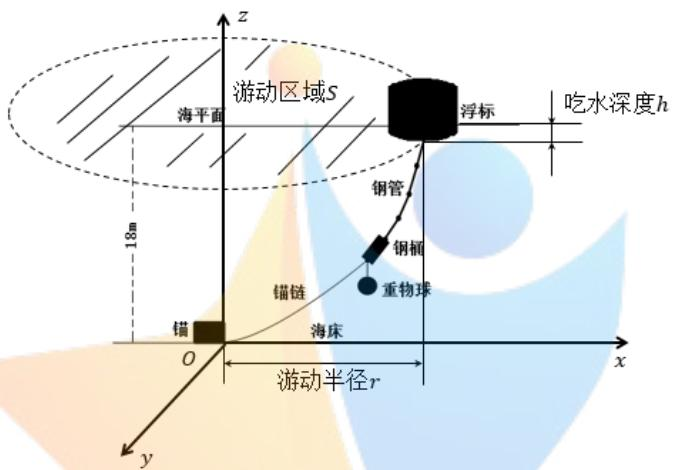

<details>
<summary>text_image</summary>

游动区域S
浮标
吃水深度h
海平面
钢管
钢桶
重物球
锚链
锚
海床
O
游动半径r
x
y
z
18m
</details>

图5.1.1 系统空间坐标系

接着，为了方便表述，我们用 $P _ { 1 } \sim P _ { N }$ 来依次表示系统内部从上到下的N种构件，由题中锚链长度除以单个链环的长度可以得到锚链共有 210 个链环，由此得到 的数值：

$$
N = 1 + 4 + 1 + 2 1 0 + 1 = 2 1 8
$$

各编号代表的具体构件如下表所示：

表 5.1.2 各构件编号

<table><tr><td>编号 $P_i$ </td><td>i=1</td><td>2≤i≤5</td><td>i=6</td><td>7≤i≤216</td><td>i=217</td></tr><tr><td>构件类型</td><td>浮标</td><td>钢管</td><td>钢桶</td><td>锚链</td><td>锚</td></tr></table>

## 5.2 模型建立

## 5.2.1系泊系统受力分析

本文假设风向平行于海平面，当风速度不变时，海风方向的变化会使浮标在圆形区域内运动，并且各方向平衡时系统状态相同。因此，本文在平面内对系统进行受力分析。

## （一）浮标的受力

如图5.2.1所示，浮标受到速度为v的海风作用在海面上达到平衡，设其吃水深度为h，此时浮标一共受到4 个力的作用。

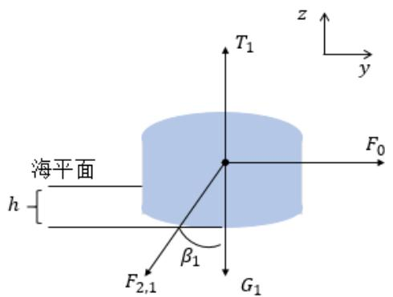

<details>
<summary>text_image</summary>

海平面
h
F2,1
β1
G1
T1
F0
z
y
</details>

图5.2.1 浮标受力示意图

其中 $T _ { 1 }$ 表示浮标所受浮力大小，方向竖直向上。由阿基米德定律可以得到浮力 $T _ { 1 }$ 与吃水深度h的关系为

$$
T _ {1} = \rho g \cdot \frac {\pi d _ {1} ^ {2} h}{4} \tag {5-2-1}
$$

式中， $\rho$ 为海水的密度； $d _ { \mathrm { { 1 } } }$ 为浮标底面直径。

浮标还受到水平方向的风力 $F _ { 0 }$ 的作用，由题中已知关系式可知风力和风速有如下关系：

$$
\left\{ \begin{array}{l} F _ {0} = 0. 6 2 5 \times S _ {1} v ^ {2} \\ \mathrm{S} _ {1} = (l _ {1} - h) d _ {1} \end{array} \right. \tag {5-2-2}
$$

其中 $S _ { 1 }$ 为浮标在风向法平面的投影面积， $l _ { 1 }$ 为浮标高度。

浮标下表面与第一节钢管铰接，钢管对浮标作用力的大小用 $F _ { 2 , 1 }$ 表示，其与竖直方向的夹角为 $\beta _ { 1 }$ 。此外，物体还受到竖直向下的重力 $G _ { 1 }$ 。物体受力平衡根据牛顿第一定律有浮标在 $x , y$ 方向的合力为零，即：

$$
\left\{ \begin{array}{l} F _ {0} - F _ {2 1} s i \beta n _ {\overline {{1}}} 0 \\ T _ {1} - F _ {2} \cos \beta_ {- 1} G = _ {1} \end{array} \right. \tag {5-2-3}
$$

对方程组进行求解并分离变量得到钢管对浮标作用力大小 $F _ { 2 , 1 }$ 和夹角 $\beta _ { 1 }$ 表达式为：

$$
\left\{ \begin{array}{l} F _ {2, \overline {{\mathrm{T}}}} \frac {\sqrt {2 5 (l _ {1} - h) ^ {2} d \gamma^ {4} + 4 (\rho g \pi d , \hat {h} - 4 G) _ {1}}}{8} \\ \beta_ {1} = \arctan \frac {5 (l _ {1} - h) d _ {1} v ^ {2}}{8 G _ {1} + 2 g \rho \pi d _ {1} ^ {2} h} \end{array} \right. \tag {5-2-4}
$$

## （二）钢管的受力

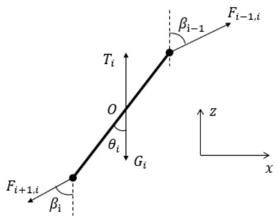

<details>
<summary>text_image</summary>

F_{i+1,i}
\beta_i
T_i
O
\theta_i
G_i
\beta_{i-1}
F_{i-1,i}
z
x
</details>

图5.2.2 钢管受力示意图

钢管 $P _ { i } ( 2 \leq i \leq 5 )$ ）受力如图5.2.2所示，首先对于底面直径为 $d _ { i }$ ，轴向高度为 $l _ { i }$ 的圆柱形钢管的浮力由阿基米德定律有

$$
T _ {i} = \rho g \cdot \frac {\pi d _ {i} ^ {4} l _ {i}}{4} \tag {5-2-5}
$$

物体静止不发生移动由牛顿第一定律有：

$$
\left\{ \begin{array}{l} F _ {i - 1, i} \cdot \sin \beta_ {- i - 1} - F _ {+ i, i} \cdot \mathrm{s} \beta \mathrm{n} = _ {i} 0 \\ T _ {i} + F _ {i + 1, i} \circ \beta_ {- i - 1} - G - _ {i} F _ {+ i, i} \cdot \mathrm{c} \beta \mathrm{s} = _ {i} \end{array} \right. \tag {5-2-6}
$$

求解方程组分离变量得到钢管上下端点作用力递推关系式为：

$$
\left\{ \begin{array}{l} \beta_ {i} = \arctan \frac {F _ {i - 1 i} \cdot \sin \beta_ {i - 1}}{T _ {i} + F _ {i - 1 i} \cdot \cos \beta_ {i - 1} - G _ {i}} \\ F _ {i + 1, i} = \frac {F _ {i + 1 , i} \cdot \sin \beta_ {i}}{\sin (\arctan \frac {F _ {i - 1 , i} \cdot \sin \beta_ {i - 1}}{T _ {i} + F _ {i - 1 , i} \cdot \cos \beta_ {i - 1} - G _ {i}})} \end{array} \right. \tag {5-2-7}
$$

接着，物体不发生转动由力矩平衡定理对钢管下端点取矩有

$$
F _ {i - 1, i} \sin \beta_ {i} l _ {i} \cos \theta s _ {- i} F _ {- 1, i} \cos \beta s l _ {i} \theta + \ln_ {i} G - \left(T \frac {l _ {i}}{2} - i\right) \theta = \tag {5-2-8}
$$

对上式进行分离变量得到钢管倾斜角 $\theta _ { i }$ 关于上端点作用力的递推关系式：

$$
\theta_ {i} = \operatorname{arctan} \frac {F _ {i - 1 , i} \sin \beta_ {- i 1}}{0 . 5 T (- G _ {i} +) E _ {4 , i} c \beta_ {-} s _ {i}} \tag {5-2-9}
$$

## （三）钢桶的受力

如图5.2.3所示，钢桶静止时共受到 $^ 6$ 个外力作用，其倾斜角度（与竖直方向夹角）为 $\theta _ { 6 }$ ，其上端与钢管 $P _ { 5 }$ 铰接，钢管对钢桶作用力大小为 $F _ { 5 , 6 }$ ，倾角为 $\beta _ { 5 }$ ；下端与锚链链环 $P _ { 8 }$ 铰接并悬挂一重物球，链环对钢管作用力大小为 $F _ { 8 , 6 }$ ，倾角为 $\beta _ { 6 }$ 。

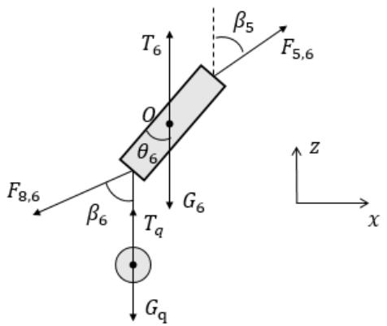

<details>
<summary>text_image</summary>

T₆
β₅
F₅,₆
O
θ₆
G₆
F₈,₆
β₆
Tₐ
Gₐ
z
x
</details>

图5.2.3 钢桶受力示意图

首先，同样由阿基米德定律得到钢桶浮力 $T _ { 6 }$ 与重物球浮力 $T _ { q }$ 表达式如下：

$$
\left\{ \begin{array}{l} T _ {6} = \rho g \cdot \frac {\pi d _ {6} ^ {2} l _ {6}}{4} \\ T _ {q} = \rho g \cdot m _ {q} \rho_ {q} \end{array} \right. \tag {5-2-10}
$$

式中， $d _ { 6 } , l _ { 6 }$ 分别为钢桶的底面直径和轴向高度； $m _ { q } , \rho _ { q }$ 分别为重物球的质量和密度。

接着由牛顿第一定律得到钢桶平衡不发生移动时满足如下关系：

$$
\left\{ \begin{array}{l} F _ {5, 6} \sin \beta - _ {5} F _ {8, 6} \beta n = _ {6} 0 \\ T _ {6} + T _ {q} + F _ {5, 6} \cos \beta - _ {5} F _ {8, 6} \phi s - G _ {6} - G _ {q 6} = \end{array} \right. \tag {5-2-11}
$$

同样的对方程组进行求解分离变量得到 $F _ { 5 , 6 }$ 与 $F _ { 8 , 6 }$ ， $\beta _ { 5 }$ 与 $\beta _ { 6 }$ 的关系式如下

$$
\left\{ \begin{array}{l} \beta_ {6} = \arctan \frac {F _ {5 , 6} \sin \beta_ {5}}{F _ {5 , 6} \cos \beta + T + T _ {q} - G - G _ {q}} \\ F _ {8, 6} = \frac {F _ {5 , 6} \sin \beta_ {5}}{\sin (\arctan \frac {F _ {5 , 6} \sin \beta_ {5}}{F _ {5 , 6} \cos \beta + T + T _ {q} - G - G _ {q}}} \end{array} \right. \tag {5-2-12}
$$

此外，物体平衡不发生转动还需满足合力矩为零的条件，本文统一选取构件下端中心点取矩，这里对钢桶下端点取矩满足如下关系：

$$
(T _ {6} - G _ {6}) \frac {l _ {6}}{2} \sin \theta_ {6} + F _ {5, 6} l _ {6} \cos \beta \sin_ {5} \theta \sin_ {6} F _ {5} l _ {6} \beta \sin \theta_ {5} c \tag {5-2-13}
$$

对上式分离变量得到钢桶倾斜角 $\theta _ { 6 }$ 的关于 $F _ { 5 , 6 } , \beta _ { 5 }$ 表达式为

$$
\theta_ {6} = \arctan \frac {F _ {5 , 6} \sin \beta_ {5}}{0 . 5 I (6 - G _ {6} +) F _ {5 , 6} c \beta b} \tag {5-2-14}
$$

## （四）锚链的受力

锚链各节链环的受力情况与各节钢管受力情况相似，因此上文中的钢管递推关系式同样适用于锚链链环。但对于链环浮力的计算，题中只给出了各节链环的质量，体积是未知的，本文参考题目背景中“采用无档普通链环”查阅资料<sup>[1]</sup>得一般链环密度 $\rho _ { { } _ { m } }$ ，这样链环 $P _ { i } ( 7 \leq i \leq 2 1 6 )$ ）浮力计算公式：

$$
T _ {i} = \rho g \cdot \rho_ {m} n \tag {5-2-15}
$$

式中 $m _ { i }$ 为链环质量。得到各节链环作用力与倾角递推关系如下：

$$
\left\{ \begin{array}{l} \beta_ {i} = \arctan \frac {F _ {i - 1 i} \cdot \sin \beta_ {i - 1}}{T _ {i} + F _ {i - 1 i} \cdot \cos \beta_ {i - 1} - G _ {i}} \\ F _ {i + 1, i} = \frac {F _ {i + 1 , i} \cdot \sin \beta_ {i}}{\sin (\arctan \frac {F _ {i - 1 , i} \cdot \sin \beta_ {i - 1}}{T _ {i} + F _ {i - 1 , i} \cdot \cos \beta_ {i - 1} - G _ {i}}} \\ \theta_ {i} = \arctan \frac {F _ {i - 1 , i} \sin \beta_ {i - 1}}{0 . 5 (T _ {i} - G _ {i}) + F _ {i - 1 , i} \cos \beta_ {i - 1}} \\ T _ {i} = \rho g \cdot \rho_ {m} m _ {i} \end{array} \right. \tag {5-2-16}
$$

至此，本文通过受力分析得到了系泊系统中各构件作用力与倾角的递推关系。

## 5.2.2系泊系统几何约束分析

根据以上受力分析，系泊系统状态由决策变量浮标吃水深度h确定，可通过海床深度约束对其进行求解。

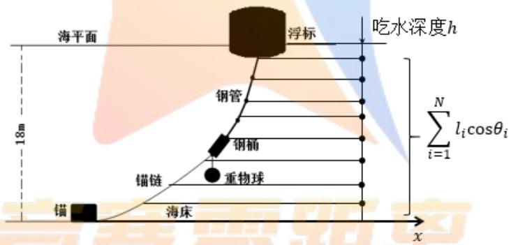

<details>
<summary>text_image</summary>

海平面
浮标
吃水深度h
钢管
钢桶
重物球
锚链
锚
海床
x
Σi=1N li cosθi
18m
</details>

图5.2.4 构件投影示意图

如图 5.2.4 所示，系统稳定时在海水中各构件在竖直方向上的投影总长度应该等于海床深度，即

$$
h + \sum_ {i = 1} ^ {N} l _ {i} \textrm {c o} \theta_ {i} = H \tag {5-2-17}
$$

由各构件在水平方向上的投影长度进一步得到浮标游动圆半径r：

$$
r = \sum_ {i = 1} ^ {N} l _ {i} \text {s i n} _ {i} \tag {5-2-18}
$$

综合以上分析得到系泊系统的状态模型总的表述为：

$$
\left\{ \begin{array}{l} F _ {2 1} = \frac {\sqrt {2 5 (l _ {1} - h) ^ {2} d \gamma^ {4} + 4 (\rho g \pi d \hat {h} - 4 G) _ {1}} ^ {2}}{8} \\ \beta_ {1} = \arctan \frac {5 (l _ {1} - h) d _ {1} v ^ {2}}{8 G _ {1} + 2 g \rho \pi d _ {1} ^ {2} h} \\ \left\{ \begin{array}{l} \beta_ {6} = \arctan \frac {F _ {5 , 6} \sin \beta_ {5}}{F _ {5 , 6} \cos \beta_ {5} + T _ {6} + T _ {q} - G _ {6} - G _ {q}} \\ F _ {8, 6} = \frac {F _ {5 , 6} \sin \beta_ {5}}{\sin (\arctan \frac {F _ {5 , 6} \sin \beta_ {5}}{F _ {5 , 6} \cos \beta_ {5} + T _ {6} + T _ {q} - G _ {6} - G _ {q}})} \\ \theta_ {6} = \arctan \frac {F _ {5 , 6} \cdot \sin \beta_ {5}}{0 . 5 (T _ {6} - G _ {6}) + F _ {5 , 6} \cdot \cos \beta_ {5}} \end{array} \right. \\ \left\{ \begin{array}{l} \beta_ {i} = \arctan \frac {F _ {i - 1 , i} \cdot \sin \beta_ {i - 1}}{T _ {i} + F _ {i - 1 , i} \cdot \cos \beta_ {i - 1} - G _ {i}} \\ F _ {i + 1, i} = \frac {F _ {i + 1 , i} \cdot \sin \beta_ {i}}{\sin (\arctan \frac {F _ {i - 1 , i} \cdot \sin \beta_ {i - 1}}{T _ {i} + F _ {i - 1 , i} \cdot \cos \beta_ {i - 1} - G _ {i}})} \\ \theta_ {i} = \arctan \frac {F _ {i - 1 , i} \sin \beta_ {i - 1}}{0 . 5 (T _ {i} - G _ {i}) + F _ {i - 1 , i} \cos \beta_ {i - 1}} \\ i \in [ 2, 5 ] \cup [ 7, 2 1 6 ], i \in z \\ h + \sum_ {i = 1} ^ {N} l _ {i} \cos \theta_ {i} = H \\ r = \sum_ {i = 1} ^ {N} l _ {i} \sin \theta_ {i} \end{array} \right. \end{array} \right. \tag {5-2-19}
$$

## 5.3模型修正

在实际情况中，当风速过小时锚链会提前沉底，导致以上模型对于锚链链环作用力与倾角的递推关系不再适用，因此本文针对这一情况对模型进行修正。示意图如图 5.3.1所：

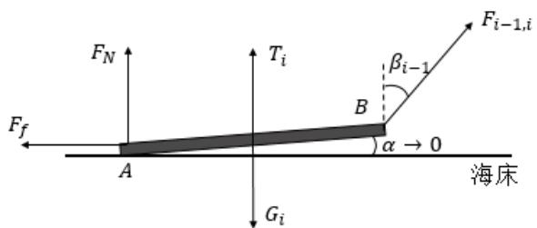

<details>
<summary>text_image</summary>

F_N
F_f ← A
G_i
T_i
B
α → 0
β_{i-1}
F_{i-1,i}
海床
</details>

图5.3.1 完全沉底链环受力图

由图可知，锚链第一个完全沉底的链环共受到 5个外力作用，分别为重力 $G _ { \ i }$ ，浮力$T _ { i }$ ，摩擦力 $F _ { f }$ ，海床提供的支撑力 $F _ { _ { N } }$ 以及上一个链环的拉力 $F _ { i - 1 , i }$

在链环处于将要被提起处于临界状态时，其与海床的夹角 $\alpha \to 0 ^ { + }$ ，对 点取矩有

$$
M _ {A} = \left(T _ {i} - G _ {i}\right) \frac {l _ {i}}{2} \cos + F _ {1 i, i} \mathrm{c} \beta_ {\underline {{s}} _ {1 i}} \cdot l _ {i} \alpha \mathrm{os} - F _ {1 i, i} \beta_ {\underline {{s}}} \mathrm{i} _ {1 l} \tag {5-3-1}
$$

由于链环不发生转动，故合力矩为零，且 $\alpha \to 0 ^ { + }$ ，则 $\sin \alpha \to 0$ $\cos \alpha  1$ 。故有：

$$
F _ {i - 1, i} \cdot \cos \beta_ {- i} = 0. G \in T \tag {5-3-2}
$$

进而得到链环 $P _ { i }$ 完全沉底时，上一个链环对其作用力满足如下关系：

$$
F _ {i - 1, i} \cdot \cos \beta_ {- i} \leq 0. G \in T \tag {5-3-3}
$$

此时，若将 $P _ { i }$ 以上构件看做一个整体，对该整体的浮力和重力作差，则满足

$$
\sum_ {j = 1} ^ {i - 1} T _ {j} - G _ {j} = F _ {- 1}, \mathrm{c} _ {i} \text {os} \beta_ {-} \tag {5-3-4}
$$

联立上式得到竖直方向受力约束条件为：

$$
\sum_ {j = 1} ^ {i - 1} T _ {j} - G _ {j} \leq 0. 5 (G _ {i} - T _ {i}) \tag {5-3-5}
$$

综上所述，对模型作出如下修正：

 增加海水中构建竖直方向受力约束： $\sum _ { j = 1 } ^ { i - 1 } T _ { j } - G _ { j } \leq 0 . 5 ( G _ { i } - T _ { i } )$  
 更改锚链递推关系式适用范围： $7 \leq i \leq j , j$ 表示第一个脱离海床链环的编号。  
 更改浮标游动半径表达式： $r = \sum _ { i = 1 } ^ { j } l _ { i } \sin \theta _ { i } + \sum _ { i = j + 1 } ^ { 2 1 6 } l _ { i }$

至此，针对链环沉底情况对模型修正完毕。

## 5.4 模型求解

对于系泊系统状态模型的求解，难以直接通过大量状态方程得到定解，所以联立非线性方程组求定解方法不适用。因此本文采用一种基于最小二乘思想的循环搜索算法对模型进行求解。

## 5.4.1基于最小二乘思想的循环搜索算法

描述系泊系统状态模型中的未知变量包括吃水深度h，钢桶，各节钢管以及锚链刚体的倾斜角度 $\theta _ { i }$ ，由模型的可确定各个倾斜角度 $\theta _ { i }$ 与钢桶吃水深度h的递推关系，故倾斜角度可由钢桶的倾斜角度确定，故风速v确定的情况下，系泊系统的状态可由吃水深度 一个变量确定。因此将吃水深度 为连续变量，故将其离散化进行定步长搜索可对模型进行求解，具体算法步骤如图5.4.1所示：

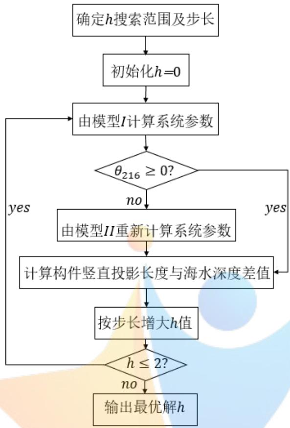

<details>
<summary>flowchart</summary>

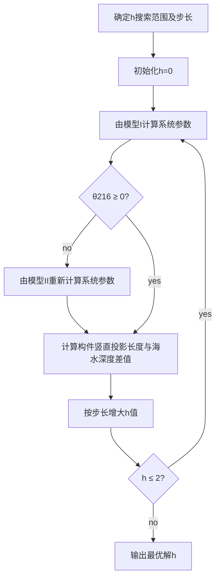
</details>

图5.4.1 搜索算法流程图  
图5.4.1中，模型 I为未修正模型。模型 II为针对锚链提前触底修正后的模型。

## 5.4.2算法精度检验

对于定步长的循环搜索算法，误差的主要来源为变量的步长，因此可以通过减小步长，根据最优解变化幅度来判断步长是否合理。

取变量h步长没原步长的 $\frac { 1 } { 5 0 }$ ，则算法精度应提高50倍，定义相对优化量 为目标函数优化量与理论优化量的比值：

$$
q = \frac {\left| S ^ {\prime} (h) - S (h) \right|}{5 0}
$$

通过matlab编程计算可得 $q = 0 . 3 8 \times 1 0 ^ { - 3 }$ ，由于长度范围在 0.1数量级，因此 可以忽略不计，故目前搜索算法中设置的步长可认为是合理的。

## 5.4.3 结果分析

本文假设锚链和重物球材料为普通铸铁，其密度为 $7 . 8 { \times } 1 0 ^ { 3 } k g / m ^ { 3 }$ ，由此参数求解。

当海面风速为12 /m s时，本文通过matlab编程对模型进行求解，结果表明此时锚链出现提前触底的情况，此时各构件倾角与浮标吃水深度如表 5.4.2所示：

表 5.4.2 求解结果

<table><tr><td>钢桶倾角</td><td>1.2089°</td><td>钢管3倾角</td><td>1.1799°</td></tr><tr><td>钢管1倾角</td><td>1.1641°</td><td>钢管4倾角</td><td>1.1880°</td></tr><tr><td>钢管2倾角</td><td>1.1720°</td><td>浮标吃水深度</td><td>0.6818m</td></tr></table>

由于锚链提前沉底，本文假设沉底锚链完全拉直，得到浮标游动半径为 ，进而得到游动区域面积为 $6 8 1 m ^ { 2 }$ ，在xoy平面表达式为 $x ^ { 2 } + y ^ { 2 } \leq 6 8 1$ ，单位为 m。此时锚链从152个链环开始触底，沉底链环个数为 59个，锚链形状及各构件在xoz坐标平面中形状如图5.4.3所示：

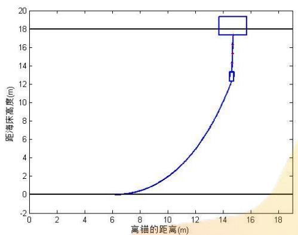

<details>
<summary>boxplot</summary>

| 离锚的距离 (m) | 距海床高度 (m) |
| --- | --- |
| ~6.5 | 0 |
| ~14.5 | 12.5~19.5 |
</details>

图 5.4.3 锚链形状示意图

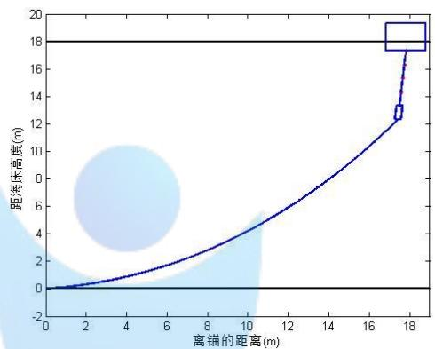

<details>
<summary>line</summary>

| 离锚的距离 (m) | 距海床高度 (m) |
| --- | --- |
| 0 | 0 |
| ~17.5 | ~12.5 |
| ~18.5 | ~19 |
</details>

图5.4.5 锚链形状示意图

当海面风速为24 /m s时，求解结果表明此时锚链完全脱离海床没有提前触底。求解得到系统各参数如表5.4.4 所示：

表 5.4.4 求解结果

<table><tr><td>钢桶倾角</td><td>4.5837°</td><td>钢管3倾角</td><td>4.4871°</td></tr><tr><td>钢管1倾角</td><td>4.4294°</td><td>钢管4倾角</td><td>4.4516°</td></tr><tr><td>钢管2倾角</td><td>4.458°</td><td>浮标吃水深度</td><td>0.6959m</td></tr></table>

浮标游动半径17.8224m得到其游动区域面积为 $9 9 7 . 8 9 m ^ { 2 }$ ，在xoy平面表达式为$x ^ { 2 } + y ^ { 2 } \leq 9 9 7 . 8 9$ ，单位为 m。此时锚链在锚点与海床夹角为 $5 . 7 0 5 9 ^ { \circ }$ ，求解得到锚链形状如图 5.4.5 所示。

## 六、问题二模型的建立与求解

## 6.1模型准备

本问首先要根据问题一中模型计算海面风速为 时系统的各状态参数。接着题目要求通过调节重物球的质量来使钢桶倾角和锚链在锚点与海床的夹角小于给定阈值，由此可以通过问题一模型计算得到重物球的质量范围。但结合题目背景考虑，本文建立优化模型，在满足约束范围内搜索重物球的最优质量使得系统达到最优状态。

## 6.2系泊系统优化模型的建立

## （一）决策变量的确定

根据题目要求，本文假设重物球材料不变，确定重物球的质量 $m _ { q }$ 为模型的决策变量，通过调节 $m _ { q }$ 的大小来对目标进行优化。

## （二）目标函数分析

由题目背景可知，要对系泊系统进行优化就要使得浮标的吃水深度和游动区域以及钢桶的倾斜角度尽可能小。据此本文一共确立如下 3个优化目标。

 钢桶的倾斜角度尽可能小：

$$
\min \quad \theta_ {6} = \arctan \frac {F _ {5 , 6} \cdot \sin \beta_ {5}}{0 . 5 (T _ {6} - G _ {6}) + F _ {5 , 6} \cdot \cos \beta_ {5}}
$$

 浮标的吃水深度尽可能小：

$$
\min \quad h = H - \sum_ {i = 1} ^ {N} l _ {i} \cos \theta_ {i}
$$

 浮标的在海面上的游动区域为圆形，目标可以转化为浮标的游动半径尽可能小：

$$
\min \quad r = \sum_ {i = 1} ^ {N} l _ {i} \sin \theta_ {i}
$$

## （三）约束条件分析

问题二同样满足问题一的假设，因此优化模型需要满足问题一模型的约束条件。此外根据题目要求，还需要满足锚链在锚点与海床夹角不超过16度：

$$
\frac {\pi}{2} - \theta_ {2 1 6} \leq 1 6 ^ {\circ} \tag {6-2-1}
$$

式中 $\theta _ { 2 1 6 }$ 为与锚点相连接的链环与竖直方向的夹角。此外，对于优化目标钢桶的倾角 $\theta _ { 6 }$ 还需满足约束：

$$
\theta_ {6} = \arctan \frac {F _ {5 , 6} \sin \beta_ {5}}{0 . 5 T (6 - G _ {6}) + F _ {5 , 6} \cos s _ {5}} \leq \tag {6-2-2}
$$

综合以上分析，并结合问题一模型中系统中各构件作用力与倾角的递推关系得到系泊系统的优化模型为： -Competition Zero Vistance

$$
\begin{array}{l} \min \quad h = H - \sum_ {i = 1} ^ {N} l _ {i} \cos \theta_ {i} \\ \min \quad \theta_ {6} = \arctan \frac {F _ {5 , 6} \sin \beta_ {5}}{0 . 5 \left(T _ {6} - G _ {6}\right) + F _ {5 ; 6} \cos \beta_ {5}} \\ \min \quad r = \sum_ {i = 1} ^ {N} l _ {i} \sin \theta_ {i} \\ \left\{ \begin{array}{l} F _ {2 1} = \frac {\sqrt {2 5 (l _ {1} - h) ^ {2} d \gamma^ {4} + 4 (\rho g \pi d \hat {h} - 4 G) _ {1}}}{8} ^ {2} \\ \beta_ {1} = \arctan \frac {5 (l _ {1} - h) d _ {1} v ^ {2}}{8 G _ {1} + 2 g \rho \pi d _ {1} ^ {2} h} \\ \left\{ \begin{array}{l} \beta_ {6} = \arctan \frac {F _ {5 , 6} \sin \beta_ {5}}{F _ {5 , 6} \cos \beta_ {5} + T _ {6} + T _ {q} - G _ {6} - G _ {q}} \\ F _ {8, 6} = \frac {F _ {5 , 6} \sin \beta_ {5}}{\sin (\arctan \frac {F _ {5 , 6} \sin \beta_ {5}}{F _ {5 , 6} \cos \beta_ {5} + T _ {6} + T _ {q} - G _ {6} - G _ {q}})} \\ \theta_ {6} = \arctan \frac {F _ {5 , 6} \cdot \sin \beta_ {5}}{0 . 5 (T _ {6} - G _ {6}) + F _ {5 , 6} \cdot \cos \beta_ {5}} \end{array} \right. \end{array} \right. \\ \left\{ \begin{array}{l} s. t \left\{ \begin{array}{l} \beta_ {i} = \arctan \frac {F _ {i - 1 , i} \cdot \sin \beta_ {i - 1}}{T _ {i} + F _ {i - 1 , i} \cdot \cos \beta_ {i - 1} - G _ {i}} \\ F _ {i + 1, i} = \frac {F _ {i + 1 , i} \cdot \sin \beta_ {i}}{\sin \left(\arctan \frac {F _ {i - 1 , i} \cdot \sin \beta_ {i - 1}}{T _ {i} + F _ {i - 1 , i} \cdot \cos \beta_ {i - 1} - G _ {i}}\right)} \\ \theta_ {i} = \arctan \frac {F _ {i - 1 , i} \sin \beta_ {i - 1}}{0 . 5 \left(T _ {i} - G _ {i}\right) + F _ {i - 1 , i} \cos \beta_ {i - 1}} \\ i \in [ 2, 5 ] \cup [ 7, 2 1 6 ], \quad i \in z \\ h + \sum_ {i = 1} ^ {N} l _ {i} \cos \theta_ {i} = H \\ r = \sum_ {i = 1} ^ {N} l _ {i} \sin \theta_ {i} \end{array} \right. \\ (6 - 2 - 3) \end{array} \right. \\ \end{array}
$$

## 6.3 模型求解

## 6.3.1多目标转化单目标求解

对于三个目标的权重值的确定，基于赋权的可靠性考虑，本文在此选择了主观性相对较小，能够充分利用数据特征的熵权法。熵权法可以根据各个目标的变异度，利用信息熵计算出各个目标的客观权重值。信息熵越小，变异程度最大，重要程度越大。期计算结果为 $A = 1 1 . 4 6 , B = 1 . 5 , C = 0 . 0 5$

接着我们对以上三个目标分别赋以权重A B C, , ，将多目标优化转化为单目标优化问题，用U表示总的优化目标：

$$
\min \quad U = A \cdot \theta_ {6} + B \cdot h + C \cdot r
$$

## 6.3.2 风速为 36m/s 时系统参数求解

通过matlab编程代入风速对问题一模型进行求解，结果表明此时锚链全部浮于水中，此时各构件倾角与浮标吃水深度如表 6.3.1所示：

表 6.3.1 求解结果

<table><tr><td>钢桶倾角</td><td>9.4767°</td><td>钢管3倾角</td><td>9.2935°</td></tr><tr><td>钢管1倾角</td><td>9.1822°</td><td>钢管4倾角</td><td>9.3502°</td></tr><tr><td>钢管2倾角</td><td>9.2375°</td><td>浮标吃水深度</td><td>0.7187m</td></tr></table>

得到浮标游动半径为18.8906m，进而得到游动区域面积为 $1 1 2 1 . 0 9 2 m ^ { 2 }$ ，其在 平面表达式为 $x ^ { 2 } + y ^ { 2 } \leq 1 1 2 1 . 0 9 2$ 。此时锚链在锚点与海床的夹角大小为 $2 1 . 3 9 7 ^ { \circ } > 1 6 ^ { \circ }$ ，表明锚点被拖动。锚链在xoz坐标平面中形状如图6.3.2 所示：

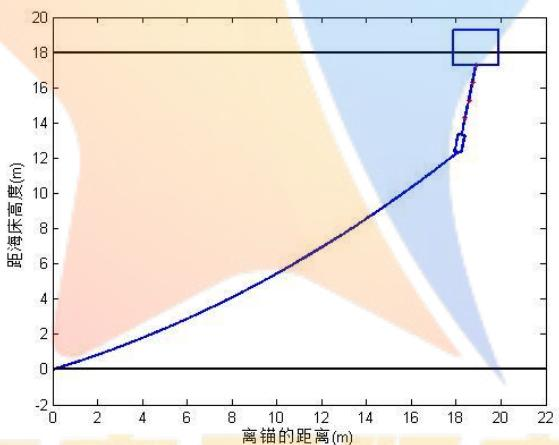

<details>
<summary>line</summary>

| 离锚的距离(m) | 距海床高度(m) |
| --- | --- |
| 0 | 0 |
| ~18.2 | ~12.3 |
| ~18.4 | ~13.2 |
| ~18.6 | ~17.5 |
| ~19.0 | ~19.0 |
</details>

图6.3.2 锚链形状示意图

## 6.3.3系泊系统优化模型的求解

## （一）循环搜索算法求解

Step 1: 根据系泊系统的设计要求求解重物球的质量范围 $m _ { \boldsymbol { q } \operatorname* { m i n } } \sim m _ { \boldsymbol { q } \operatorname* { m a x } }$ ，令重物的初始重量值为质量范围下限 $m _ { \boldsymbol { q } \operatorname* { m i n } }$

Step 2: 将重物球最小质量 $m _ { q }$ 带入模型一，按照模型一的求解算法求解出并记录此时的吃水深度h，钢桶倾斜角度 $\theta _ { 6 }$ ，锚链在锚点与海床夹角 $9 0 ^ { \circ } - \theta _ { 2 1 6 }$ ,浮标游动半径 ，并求解出此时的目标函数值u，并令minu u ；

Step 3: 判断此时的系统状态是否满足 $9 0 ^ { \circ } - \theta _ { 2 1 6 } \leq 1 6 ^ { \circ }$ $\theta _ { 6 } \leq 5 ^ { \circ }$ 的约束条件，若满足进入 Step 4,不满足进入 Step 5；

Step 4: 若u u min ，则令 $\operatorname* { m i n } u = u$ ，并记录h， $\theta _ { 6 }$ ，r，否则minu保持不变。

Step 5: 令 $m _ { \it q } = m _ { \it q } + 0 . 5$

Step 6: 若 $m _ { \boldsymbol { q } } \leq m _ { \boldsymbol { q } \operatorname* { m a x } }$ ，返回 Step 2，否则结束程序，输出h， $\theta _ { 6 }$ ，r 。

## （二）结果分析

根据以上算法，本文通过 matlab编程求解，得到满足题目要求时重物球的质量范围，并在此范围求得重物球最佳质量，使得系统达到最优状态，结果如表 6.3.3 所示

表 6.3.3 具体结果

<table><tr><td>重物球质量范围</td><td>重物球最佳质量</td><td>浮标吃水深度</td><td>浮标游动半径</td><td>钢桶倾角</td></tr><tr><td> $2200 \leq m_{q} \leq 4100\text{kg}$ </td><td>2894kg</td><td>1.16m</td><td>18.2831m</td><td>2.9954°</td></tr></table>

## （三）灵敏度分析

为进一步研究重物球质量变化对每个优化目标的相关性及相关程度，我们对模型进行灵敏度分析，结果下图所示：

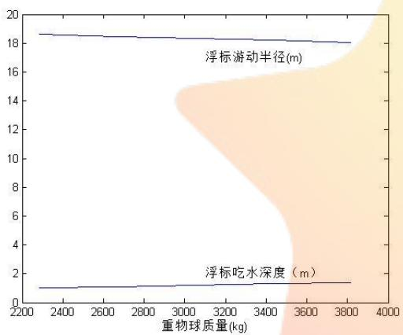

<details>
<summary>line</summary>

| 重物球质量 (kg) | 浮标吃水深度 (m) | 浮标游动半径 (m) |
| --- | --- | --- |
| 2300 | ~1.1 | ~18.7 |
| 2500 | ~1.2 | ~18.6 |
| 2700 | ~1.2 | ~18.5 |
| 2900 | ~1.3 | ~18.4 |
| 3100 | ~1.3 | ~18.4 |
| 3300 | ~1.4 | ~18.3 |
| 3500 | ~1.4 | ~18.2 |
| 3700 | ~1.5 | ~18.1 |
| 3800 | ~1.5 | ~18.1 |
</details>

图6.3.4重物质量对浮标游动及吃水影响

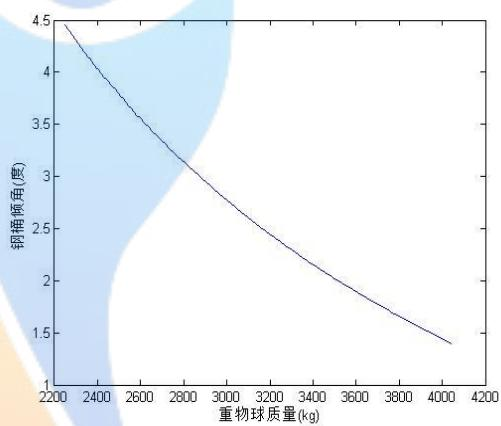

<details>
<summary>line</summary>

| 重物球质量 (kg) | 钢 tip倾角 (度) |
| --- | --- |
| 2200 | 4.5 |
| 2400 | ~3.9 |
| 2600 | ~3.5 |
| 2800 | ~3.1 |
| 3000 | ~2.8 |
| 3200 | ~2.5 |
| 3400 | ~2.2 |
| 3600 | ~1.9 |
| 3800 | ~1.7 |
| 4000 | ~1.4 |
</details>

图 6.3.5 重物质量对钢桶倾角影响

如图6.3.4所示随着重物球质量增加，浮标游动半径减小，吃水深度增加，但变化范围很小，表明重物球质量对二者关系影响较小；由图 6.3.5可知，钢桶倾角随重物球质量增加而减小，且相对幅度较大，即重物质量变化对钢桶倾角具有较大影响。

## 七、问题三模型的建立与求解

## 7.1 模型准备

与问题一不同，问题三中增加了海水流动这一因素，当海水流动方向与风速方向不在同一平面时，需要在三维空间中对系统各个构件进行研究。但如果直接在空间坐标系中对构件进行受力分析，过程繁琐且不方便表述，因此我们将各个构件及其受力投影到xoy xoz yoz, , 三个平面内，如图7.1.1所示，进而在每个平面内对构件进行受力分析。

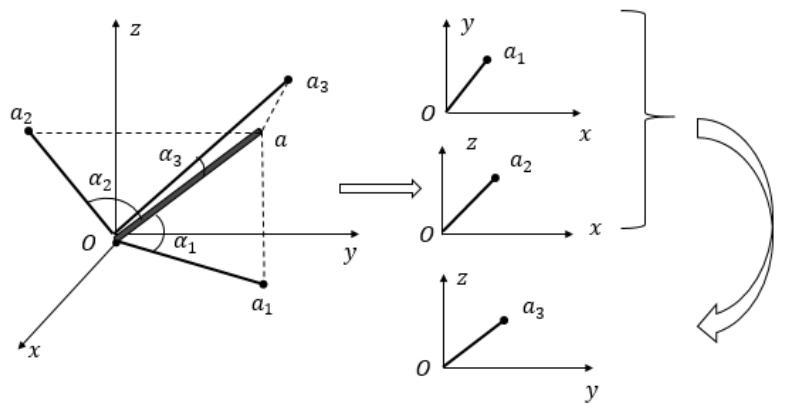

<details>
<summary>text_image</summary>

z
a2
α2
O
α1
y
x
a3
a
α3
y
y
a1
O
x
z
a2
x
a3
y
</details>

图7.1.1构件投影示意图

此外，为方便表述，本在问题一中符号系统增加上标a b c, , 来分别构件或力在 ，xoz，yoz平面内的投影。

## 7.2 模型建立

## 7.2.1系泊系统的水流力分析

## （一）水流力函数分析

根据参考文献<sup>[2]</sup>可知，在海域浅水区不同水深的水流速度服从抛物线分布，即：

$$
v = k \cdot \frac {2}{z} \tag {7-2-1}
$$

式中 $z$ 表示离海床的竖直高度。因此，只要给定海面最大水速v 和海水最大深度 $\nu _ { \mathrm { m a x } }$ H，就可解得系数k，进而得到随深度变化的水流函数：

$$
v = \frac {v _ {\max} z ^ {2}}{H ^ {2}} \tag {7-2-2}
$$

接着，由题中已知海水速度与水流力关系式得到系泊系统水流力函数为：

$$
F = \frac {3 7 \mathbf {S} \cdot v _ {\max} ^ {2}}{H ^ {4}} z ^ {4} \tag {7-2-3}
$$

## （二）构件水流力计算

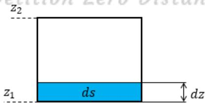

<details>
<summary>text_image</summary>

z₂
z₁
ds
dz
</details>

图 7.2.3 投影面微元示意图

由于水流沿 轴方向，故构件在 平面投影即为在水流法方向面投影。如图所示，在构件投影中取面积微元ds，当浮标底面半径为D时，根据式(7-2-3)得到对应水流力为：

$$
d F = \frac {3 7 4 v _ {\max}}{H ^ {4}} z ^ {4} \cdot D d z
$$

对上式积分即可得到浮标受到水流力大小：

$$
f = \int_ {Z _ {1}} ^ {Z _ {2}} \frac {3 7 4 D v _ {\mathrm{max}}}{H ^ {4}} z ^ {4} d z \tag {7-2-4}
$$

## 7.2.2系统构件受力分析

为方便分析，本文以锚点为原点，海水流动方向作为y轴正方向在系泊系统中建立空间直角坐标系。由于只要确定构件在两个平面内的投影状态就可构件的空间状态，因此本文下面只在两个投影面对构建进行受力分析。

## （一）浮标的受力分析

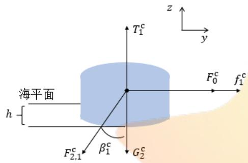

<details>
<summary>text_image</summary>

海平面
h
F₂,₁ᶜ
β₁ᶜ
G₂ᶜ
T₁ᶜ
F₀ᶜ
f₁ᶜ
z
y
</details>

图 7.2.1 浮标在 yoz 面投影

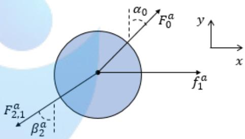

<details>
<summary>text_image</summary>

F₂,₁ᵃ
β₂ᵃ
α₀
F₀ᵃ
f₁ᵃ
y
x
</details>

图 7.2.2 浮标在 xoy 面投影

浮标在xoz面投影受力如图 7.2.1所示，f 表示海水流动力，由牛顿第一定律并结合式子(5-2-3)可得：

$$
\left\{ \begin{array}{l} F _ {0} ^ {c} - F _ {2, 1} ^ {c}, s \beta n ^ {c} + f _ {\overline {{1}}} ^ {c} = 0 \\ T _ {1} ^ {c} - F _ {2, 1} ^ {c} \circ \beta^ {c} \overline {{1}} G ^ {c} \overline {{1}} \end{array} \right. \tag {7-2-5}
$$

对方程组求解并分离变量得：

$$
\left\{ \begin{array}{l} \beta_ {1} ^ {c} = \arctan \frac {F _ {0} ^ {c} + f _ {1} ^ {c}}{T _ {1} ^ {c} - G _ {1} ^ {c}} \\ F _ {2, 1} ^ {c} = \frac {f _ {1} ^ {c} + F _ {0} ^ {c}}{\sin \beta_ {1} ^ {c}} \end{array} \right. \tag {7-2-6}
$$

式中上标c表示在yoz平面内。

浮标在xoy面上投影面受力如图 7.2.2所示， $\alpha _ { 0 }$ 为风速与海水流动方向夹角的余角，同样由牛顿第一定律得到平衡方程，求解分离变量得到：

$$
\left\{ \begin{array}{l} \beta_ {1} ^ {a} = \arctan \frac {F _ {0} ^ {a} \cos \alpha_ {0}}{f _ {1} ^ {a} + F _ {0} ^ {a} \sin \alpha_ {0}} \\ F _ {2, 1} ^ {a} = \frac {F _ {0} ^ {a} \cos \alpha_ {0}}{\sin \beta_ {1} ^ {a}} \end{array} \right. \tag {7-2-7}
$$

同样，式中上标a表示在xoy平面。

## （二）钢管的受力分析

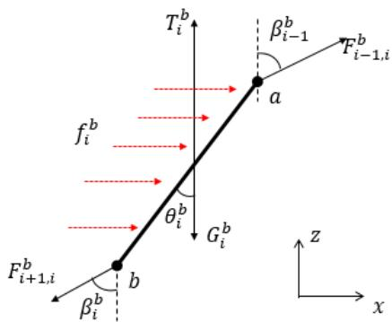

<details>
<summary>text_image</summary>

T_i^b
β_i-1
F_{i-1,i}^b
a
f_i^b
θ_i^b
G_i^b
F_{i+1,i}^b
b
β_i^b
z
x
</details>

图 7.2.3 钢管在 yoz 面投影

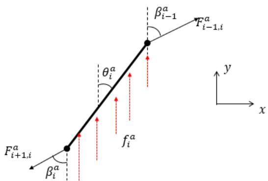

<details>
<summary>text_image</summary>

F_{i+1,i}^a
β_i^a
θ_i^a
f_i^a
β_{i-1}^a
F_{i-1,i}^a
y
x
</details>

图 7.2.4 钢管在 xoy 面投影

钢管在yoz平面投影如图 7.2.3所示， $f _ { i } ^ { b }$ 为等效海水流动力，根据牛顿第一定律得到物体受力平衡方程组，对方程组求解分离变量得：

$$
\left\{ \begin{array}{l} \beta_ {i} ^ {b} = \arctan \frac {F _ {i - 1 i} ^ {b} \sin \beta_ {i - 1} ^ {b} + f _ {i} ^ {b}}{F _ {i - 1 i} ^ {b} \cos \beta_ {i - 1} ^ {b} + T _ {i} ^ {b} - G _ {i} ^ {b}} \\ F _ {i + 1, i} ^ {b} = \frac {F _ {i - 1 i} ^ {b} \sin \beta_ {i - 1} ^ {b} + f _ {i} ^ {b}}{\sin \beta_ {i} ^ {b}} \end{array} \right. \tag {7-2-9}
$$

接着对钢管b点取矩，平衡不发生转动时其合力矩必为零：

$$
(T _ {i} ^ {b} - G _ {i} ^ {b}) \sin \theta_ {i} ^ {b} + 2 F _ {i - 1, i} ^ {b} \cos \beta_ {i - 1} ^ {b} l \sin \theta_ {i} ^ {b} - 2 F _ {i - 1, i} ^ {b} \sin \beta_ {i - 1} ^ {b} \cos \theta_ {i} ^ {b} - f _ {i} ^ {b} \cos \theta_ {i} ^ {b} = 0 \tag {7-2-10}
$$

对式（7-2-6）进行分离变量得到钢管与z轴夹角：

$$
\theta_ {i} ^ {b} = \arctan \frac {F _ {i - 1 , i} ^ {b} \sin \beta_ {- i} ^ {b} + 0 f 5 _ {i} ^ {b}}{0 . 5 I _ {i} ^ {b} - G _ {i} ^ {b} +) F _ {- 1 , i} ^ {b} c \beta_ {-} s _ {i} ^ {b}} \tag {7-2-11}
$$

钢管在xoy平面内投影如图 7.2.4所示，由与水流方向为x轴正方向，故由投影定理水流力在xoy平面与yoz平面投影大小相等：

$$
f _ {i} ^ {a} = f _ {i} ^ {b} \tag {7-2-12}
$$

同样由钢管静止不发生转动时满足合力为零且合力矩为零得到平衡方程，对方程求解并分离变量得：

$$
\left\{ \begin{array}{l} \beta_ {i} ^ {a} = \arctan \frac {F _ {i - 1 i ,} ^ {a} \sin \beta_ {i - 1} ^ {a}}{f _ {i} ^ {a} + F _ {i - 1 i ,} ^ {a} \cos \beta_ {i - 1} ^ {a}} \\ F _ {2, \Gamma} ^ {a} = \frac {F _ {i - 1 i ,} ^ {a} \sin \beta_ {i - 1} ^ {a}}{\sin \beta_ {i} ^ {1}} \\ \theta_ {i} ^ {a} = \frac {F _ {i - 1 i ,} ^ {a} \sin \beta_ {i - 1} ^ {a}}{0 . 5 _ {i} ^ {a} + F _ {i - 1 i ,} ^ {a} \cos \beta_ {i - 1} ^ {a}} \\ 2 \leq i \leq 5, i \in z \end{array} \right. \tag {7-2-13}
$$

## （三）钢桶的受力分析

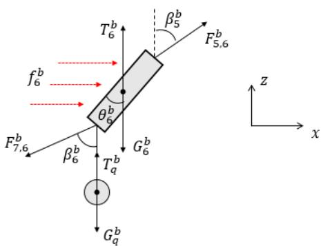

<details>
<summary>text_image</summary>

T_b^b
β_b^b
f_b^b
θ_b^b
F_5,6^b
β_b^b
G_b^b
T_q^b
F_{7,6}^b
β_b^b
G_q^b
z
x
</details>

图 7.2.5 钢桶在 yoz 面投影

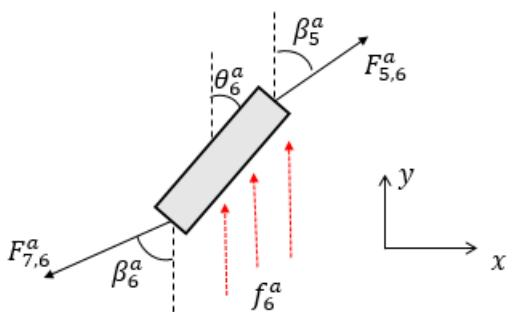

<details>
<summary>text_image</summary>

F_{7,6}^a
β_6^a
θ_6^a
f_6^a
β_5^a
F_{5,6}^a
y
x
</details>

图 7.2.6 钢桶在 xoy 面投影

钢桶及重物球在 $y o z$ 平面投影如图 7.2.5 所示，由钢桶静止不发生转动故在 $x , z$ 方向合力为零且合力矩为零（对钢桶下端点取矩），得到平衡方程组：

$$
\left\{ \begin{array}{l} F _ {5, 6} ^ {b} \text {c o} \beta^ {b} + T ^ {b} + T _ {q} + G - ^ {b} G _ {q} - ^ {b} F \quad {} _ {7} ^ {b}, \phi \mathrm{s} = ^ {b} _ {6} 0 \\ F _ {5, 6} ^ {b} \sin \beta^ {b} + f ^ {b} - F ^ {b} \quad {} _ {7} \mathrm{s}, \beta \mathrm{n} = ^ {6} 0 \\ 2 F _ {5, 6} ^ {b} \text {c o} \beta^ {b} + _ {5} \mathrm{s} \theta^ {b} \mathrm{n} + _ {6} T ^ {b} + _ {6} G ^ {b} \quad {} _ {6} \theta^ {b} \mathrm{s-i} E _ {6} ^ {b} \quad {} _ {5} \beta_ {6} ^ {b} \quad \mathrm{s i} \theta_ {5} ^ {b} - f c ^ {b} \mathrm{o} _ {6} \mathrm{s}, \theta^ {b} = \end{array} \right. \tag {7-2-14}
$$

对方程组(7-2-10)求解并分离变量得：

$$
\left\{ \begin{array}{l} \beta_ {6} ^ {b} = \operatorname{arctan} \frac {F _ {5 , 6} ^ {b} \sin \beta^ {b} + f ^ {b}}{F _ {5 , 6} ^ {b} \cos \beta^ {b} + T ^ {b} + T _ {q} - G - G _ {q}} \\ F _ {7, 6} ^ {b} = \frac {F _ {5 , 6} ^ {b} \sin \beta^ {b} + f ^ {b}}{\sin \beta_ {6} ^ {b}} ^ {6} \\ \theta_ {6} ^ {b} = \arctan \frac {F _ {5 , 6} ^ {b} \sin \beta^ {b} + 0 f ^ {b} 5 _ {5}}{0 . 5 T _ {6} ^ {b} - G _ {6} ^ {b} +) F _ {5 , 6} ^ {b} \varphi \beta^ {b} s _ {5}} \end{array} \right. \tag {7-2-15}
$$

在 $x o y$ 平面内，钢桶投影如图7.2.6所示，对于海水流动力由式(7-2-8)可得：

$$
f _ {6} ^ {a} = f _ {6} ^ {b} \tag {7-2-16}
$$

同样由钢管静止不发生转动时满足合力为零且合力矩为零得到平衡方程，对方程求解并分离变量得：

$$
\left\{ \begin{array}{l} \beta_ {6} ^ {a} = \arctan \frac {F _ {5 , 6} ^ {a} \sin \beta_ {5} ^ {a}}{f _ {6} ^ {a} + F _ {5 , 6} ^ {a} \cos \beta^ {a}} \\ F _ {2, \Gamma} ^ {a} = \frac {F _ {5 , 6} ^ {a} \sin \beta_ {5} ^ {a}}{\sin \beta_ {6} ^ {1}} \\ \theta_ {6} ^ {a} = \frac {F _ {5 , 6} ^ {a} \sin \beta_ {5} ^ {a}}{0 . 5 _ {6} ^ {a} + F _ {5 , 6} ^ {a} \mathrm{c} \phi_ {5} ^ {a}} \end{array} \right. \tag {7-2-17}
$$

## （四）锚链的受力分析

锚链受力情况与钢管类似，即各节锚链链环同样满足式（7-2-9），（7-2-11），（7-2-13），这里不再重复分析。此外，由于链环形状未知，导致在计算链环水流力时无法直接得到投影面积，因此本文根据其质量与密度将其转化为同体积圆柱体处理，满足：

$$
\frac {\pi d _ {i} ^ {2} l _ {i}}{4} = \rho_ {i} m _ {i}
$$

## 7.2.3系泊系统设计优化模型

## （一）决策变量的确定

综合考虑环境因素以及系统内部构件参数对系泊系统的影响并结合题目背景，本文选取如下3个决策变量以及 4个环境变量对系泊系统进行研究。

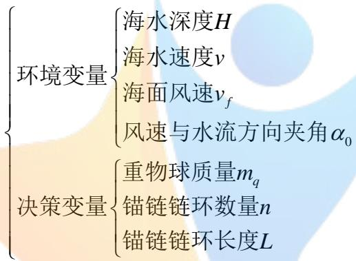

<details>
<summary>flowchart</summary>

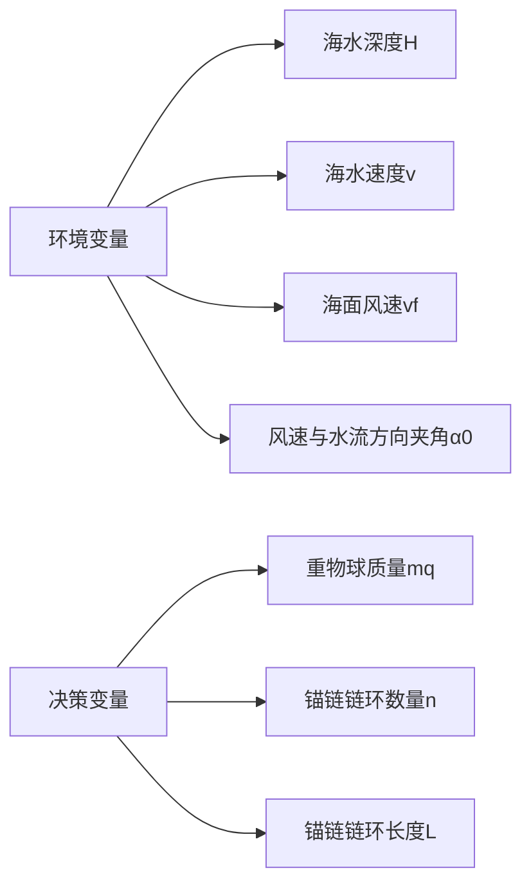
</details>

## （二）目标函数及约束分析

与问题二相同，选取浮标吃水深度，浮标游动半径以及钢桶倾斜角作为优化目标建立多目标优化模型。同样本问模型需要满足问题二中约束条件，这里不再赘述。

综合以上分析，并结合式(6-2-1)， (6-2-2) ，(6-2-3)得到系泊系统设计优化模型为：

$$
\begin{array}{l} \min \quad h = H - \sum_ {i = 1} ^ {N} l _ {i} \cos \alpha_ {i} ^ {b} \cos \theta_ {i} ^ {b} \\ \min \quad \theta_ {6} = \arccos (\cos \theta_ {6} ^ {b} \cdot \cos \beta^ {b}) \\ \min \quad r = \sum_ {i = 1} ^ {N} l _ {i} \cos \alpha_ {i} ^ {a} \\ \left(F _ {0} ^ {c} - F _ {2, 1} ^ {c} \sin \beta^ {c} + _ {1} f ^ {c} = _ {1} 0 \right. \\ T _ {1} ^ {c} - F _ {2, 1} ^ {c} \cos \beta^ {c} - _ {1} G ^ {c} = _ {1} 0 \\ \beta_ {1} ^ {c} = \arctan \frac {F _ {0} ^ {c} + f _ {1} ^ {c}}{T _ {1} ^ {c} - G _ {1} ^ {c}} \\ F _ {2, 1} ^ {c} = \frac {f _ {1} ^ {c} + F _ {0} ^ {c}}{\sin \beta_ {1} ^ {c}} \\ \beta_ {i} ^ {b} = \arctan \frac {F _ {i - 1 , i} ^ {b} \sin \beta_ {i - 1} ^ {b} + f _ {i} ^ {b}}{F _ {i - 1 , i} ^ {b} \cos \beta_ {i - 1} ^ {b} + T _ {i} ^ {b} - G _ {i} ^ {b}} \\ F _ {i + 1, i} ^ {b} = \frac {F _ {i - 1 , i} ^ {b} \sin \beta_ {i - 1} ^ {b} + f _ {i} ^ {b}}{\sin \beta_ {i} ^ {b}} \\ \theta_ {i} ^ {b} = \arctan \frac {F _ {i - 1 , i} ^ {b} \sin \beta_ {i - 1} ^ {b} + 0 . 5 f _ {i} ^ {b}}{0 . 5 (T _ {i} ^ {b} - G _ {i} ^ {b}) + F _ {i - 1 , i} ^ {b} \cos \beta_ {i - 1} ^ {b}} \\ \beta_ {i} ^ {a} = \arctan \frac {F _ {i - 1 , i} ^ {a} \sin \beta_ {i - 1} ^ {a}}{f _ {i} ^ {a} + F _ {i - 1 , i} ^ {a} \cos \beta_ {i - 1} ^ {a}} \\ F _ {2, 1} ^ {a} = \frac {F _ {i - 1 , i} ^ {a} \sin \beta_ {i - 1} ^ {a}}{\sin \beta_ {i} ^ {1}} \\ \theta_ {i} ^ {a} = \frac {F _ {i - 1 , i} ^ {a} \sin \beta_ {i - 1} ^ {a}}{0 . 5 f _ {i} ^ {a} + F _ {i - 1 , i} ^ {a} \cos \beta_ {i - 1} ^ {a}} \\ i \in [ 2, 5 ] \cup [ 7, \mathrm{N} ], i \in z \\ \beta_ {6} ^ {b} = \arctan \frac {F _ {5 , 6} ^ {b} \sin \beta_ {5} ^ {b} + f _ {6} ^ {b}}{F _ {5 , 6} ^ {b} \cos \beta_ {5} ^ {b} + T _ {6} ^ {b} + T _ {q} ^ {b} - G _ {6} ^ {b} - G _ {q} ^ {b}} \\ F _ {7, 6} ^ {b} = \frac {F _ {5 , 6} ^ {b} \sin \beta_ {5} ^ {b} + f _ {6} ^ {b}}{\sin \beta_ {6} ^ {b}} \\ \theta_ {6} ^ {b} = \arctan \frac {F _ {5 , 6} ^ {b} \sin \beta_ {5} ^ {b} + 0 . 5 f _ {5} ^ {b}}{0 . 5 (T _ {6} ^ {b} - G _ {6} ^ {b}) + F _ {5 , 6} ^ {b} \cos \beta_ {5} ^ {b}} \\ \beta_ {6} ^ {a} = \arctan \frac {F _ {5 , 6} ^ {a} \sin \beta_ {5} ^ {a}}{f _ {6} ^ {a} + F _ {5 , 6} ^ {a} \cos \beta_ {5} ^ {a}} \tag {7-2-18} \\ F _ {2, 1} ^ {a} = \frac {F _ {5 , 6} ^ {a} \sin \beta_ {5} ^ {a}}{\sin \beta_ {6} ^ {1}} \\ \theta_ {6} ^ {a} = \frac {F _ {5 , 6} ^ {a} \sin \beta_ {5} ^ {a}}{0 . 5 f _ {6} ^ {a} + F _ {5 , 6} ^ {a} \cos \beta_ {5} ^ {a}} \\ f = \int_ {Z _ {1}} ^ {Z _ {2}} \frac {3 7 4 D v _ {\max}}{H ^ {4}} z ^ {4} d z \\ \end{array}
$$

$$
\begin{array}{l} \left(F _ {0} ^ {c} - F _ {2, 1} ^ {c} \sin \beta^ {c} + _ {1} f ^ {c} = _ {1} 0 \right. \\ T _ {1} ^ {c} - F _ {2, 1} ^ {c} \cos \beta^ {c} - _ {1} G ^ {c} = _ {1} 0 \\ \beta_ {1} ^ {c} = \arctan \frac {F _ {0} ^ {c} + f _ {1} ^ {c}}{T _ {1} ^ {c} - G _ {1} ^ {c}} \\ F _ {2, 1} ^ {c} = \frac {f _ {1} ^ {c} + F _ {0} ^ {c}}{\sin \beta_ {1} ^ {c}} \\ \beta_ {i} ^ {b} = \arctan \frac {F _ {i - 1 , i} ^ {b} \sin \beta_ {i - 1} ^ {b} + f _ {i} ^ {b}}{F _ {i - 1 , i} ^ {b} \cos \beta_ {i - 1} ^ {b} + T _ {i} ^ {b} - G _ {i} ^ {b}} \\ F _ {i + 1, i} ^ {b} = \frac {F _ {i - 1 , i} ^ {b} \sin \beta_ {i - 1} ^ {b} + f _ {i} ^ {b}}{\sin \beta_ {i} ^ {b}} \\ \theta_ {i} ^ {b} = \arctan \frac {F _ {i - 1 , i} ^ {b} \sin \beta_ {i - 1} ^ {b} + 0 . 5 f _ {i} ^ {b}}{0 . 5 (T _ {i} ^ {b} - G _ {i} ^ {b}) + F _ {i - 1 , i} ^ {b} \cos \beta_ {i - 1} ^ {b}} \\ \beta_ {i} ^ {a} = \arctan \frac {F _ {i - 1 , i} ^ {a} \sin \beta_ {i - 1} ^ {a}}{f _ {i} ^ {a} + F _ {i - 1 , i} ^ {a} \cos \beta_ {i - 1} ^ {a}} \\ F _ {2, 1} ^ {a} = \frac {F _ {i - 1 , i} ^ {a} \sin \beta_ {i - 1} ^ {a}}{\sin \beta_ {i} ^ {1}} \\ \theta_ {i} ^ {a} = \frac {F _ {i - 1 , i} ^ {a} \sin \beta_ {i - 1} ^ {a}}{0 . 5 f _ {i} ^ {a} + F _ {i - 1 , i} ^ {a} \cos \beta_ {i - 1} ^ {a}} \\ i \in [ 2, 5 ] \cup [ 7, \mathrm{N} ], i \in z \\ \end{array}
$$

## 7.3 模型求解

由于决策变量增加直接导致问题三模型解空间过大，因此为了保证求解的时效性与准确性本文采用变步长搜索算法对模型进行求解。

## 7.3.1变步长搜索算法

## 1）连续变量的离散化

模型的决策变量有重物球的配重 $m _ { q }$ ，链环的个数n，链环长度 $L = \left\{ L _ { 1 } , L _ { 2 } , L _ { 3 } , L _ { 4 } , L _ { 5 } \right\}$ 需要对其进行全局搜索寻找目标函数的最小值，由于重物球的配重 $m _ { q }$ 为连续变量，因此先将其离散化，进行定步长搜索。

## 2）变步长搜索算法

由于解空间较大，使用变步长搜索算法对模型进行求解，即先使用较大步长进行全局搜索，得到近似最优解，在找到的近似最优解附近使用较小步长进行局部搜索寻找目标函数的最优解。

## 7.3.2 结果分析

基于以上模型和算法，本文首先将风速和水速定为最大值，且二者方向相同，再次条件下分别计算海水深度为16m、20m时系泊系统最优状态，得到对应参数如表7.3.1所示：

表 7.3.1 求解结果

<table><tr><td>海水深度</td><td>重物配重 $m_q$ </td><td>链环个数</td><td>链环长度</td><td>钢桶倾角</td><td>浮标吃水深度</td><td>浮标游动半径</td></tr><tr><td>16m</td><td>3000kg</td><td>140</td><td>180mm(型号V)</td><td>4.593°</td><td>1.59m</td><td>18.61m</td></tr><tr><td>20m</td><td>2950kg</td><td>180</td><td>180mm(型号V)</td><td>4.959°</td><td>1.37m</td><td>11.41m</td></tr></table>

为了进一步研究系统在不同情况下的参数变化，在海床深度为16m 时本文对各环境变量作适当的改变，求解得到此时系泊系统参数的变化情况，具体结果如表 7.3.2所示：

表7.3.2 不同情况下系泊系统参数变化

<table><tr><td>水流速度 m/s</td><td>风速 m/s</td><td>钢桶倾角</td><td>浮标吃水深度</td><td>浮标游动半径</td></tr><tr><td>1.5</td><td>24</td><td>4.259°</td><td>1.3m</td><td>18.795m</td></tr><tr><td>1</td><td>36</td><td>3.615°</td><td>1.295m</td><td>18.0m</td></tr><tr><td>1.5</td><td>12</td><td>3.57°</td><td>1.295m</td><td>17.977m</td></tr><tr><td>0.5</td><td>36</td><td>2.543°</td><td>1.288m</td><td>16.053m</td></tr></table>

锚链在各个情况下形状变化情况如下图所示：

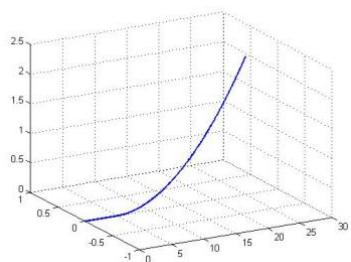

<details>
<summary>surface_3d</summary>

| X | Y | Z |
| --- | --- | --- |
| -1 | -1 | ~0.05 |
| -1 | 0 | ~0.08 |
| -1 | 1 | ~0.12 |
| 0 | -1 | ~0.15 |
| 0 | 0 | ~0.25 |
| 0 | 1 | ~0.45 |
| 10 | -1 | ~1.2 |
| 10 | 0 | ~1.8 |
| 10 | 1 | ~2.2 |
</details>

图 7.3.3 风速 24m/s，水速 1.5m/s

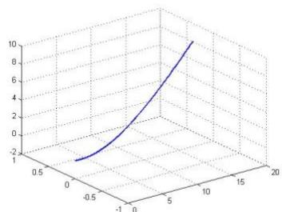

<details>
<summary>surface_3d</summary>

| X | Y | Z |
| --- | --- | --- |
| ~-0.5 | ~-0.5 | ~-2 |
| ~0 | ~0 | ~0 |
| ~5 | ~5 | ~6 |
| ~10 | ~10 | ~10 |
</details>

图 7.3.4 风速 36m/s，水速 1m/s

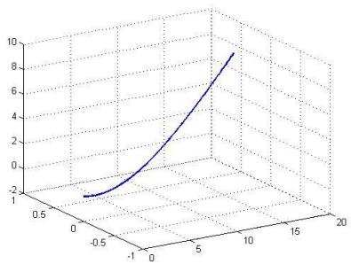

<details>
<summary>surface_3d</summary>

| X | Y | Z |
| --- | --- | --- |
| ~-0.5 | ~-0.5 | ~-2.2 |
| ~0.5 | ~0.5 | ~-1.5 |
| ~1.5 | ~1.5 | ~0.5 |
| ~2.5 | ~2.5 | ~4.0 |
| ~3.5 | ~3.5 | ~7.5 |
| ~4.5 | ~4.5 | ~9.0 |
</details>

图 7.3.5 风速 12m/s，水速 1.5m/s

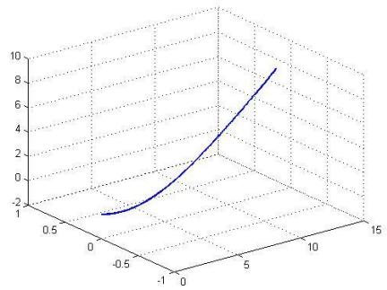

<details>
<summary>line</summary>

| X | Y | Z |
| --- | --- | --- |
| ~0.5 | ~-0.5 | ~-2 |
| ~1.0 | ~0.0 | ~-1 |
| ~1.5 | ~0.5 | ~0 |
| ~2.0 | ~1.0 | ~1 |
| ~2.5 | ~1.5 | ~2 |
| ~3.0 | ~2.0 | ~3 |
| ~3.5 | ~2.5 | ~4 |
| ~4.0 | ~3.0 | ~5 |
| ~4.5 | ~3.5 | ~6 |
| ~5.0 | ~4.0 | ~7 |
| ~5.5 | ~4.5 | ~8 |
| ~6.0 | ~5.0 | ~9 |
</details>

图 7.3.6 风速 36m/s，水速 0.5m/s

## 八、模型评价及推广

## 8.1 模型的评价

本文的亮点之一是建立的非线性规划模型，将系泊系统的实际问题通过目标函数的设计转化为优化问题，本文的另一个亮点在于对多元非线性方程组的求解设计的基于最小二乘法的搜索算法以及在保证求解精度条件下，当模型解空间较大时设计的变步长搜索算法，且在能够接受的时间内提高了搜索精度。

但是由于在实际情况下，系泊系统的结构存在变形，将其作为刚体进行计算会带来计算误差。

## 8..2 模型的改进

在实际海洋中，由于海浪的作用力，会导致浮标的上下震动，这样会使得浮标的稳态描述需要由一个竖直确定的振动方程确定，由于时间的限制以及模型的复杂程度，本文对该情况尚未考虑。

## 8.4 模型的推广

本文建立的系泊设计模型具有一定的推广价值，在已知实际海洋的环境的条件下，可以通过本文建立的模型，为系泊系统的参数设计提供理论依据。可以在航运，近浅海勘探等方面得到应用。

## 九、参考文献

[1] 郝春玲，流速分布及锚链自身刚度对弹性单锚链系统变形和受力的影响，国家海洋局第二海洋研究所，2006-09-15  
[2] 郝春玲、滕斌，不均匀可拉伸单锚链系统的静力分析,大连理工大学，2003-08-30  
[3] [国家标准]-GBT549-1996

附录

附录1：问题一的解答程序

```csv
mq=1200;%ÖØÎiÇòÖÊÁ¿
n=210;%êÁ´,ÕÌå,öÊý
min=inf;
minh=0;
```

```matlab
minH=0;
minbeta=0;
minthita1=zeros(1,4);
minthita2=zeros(1,n)+pi/2;
minFt2=zeros(1,n+1);

for h=0:0.0001:2
    Ft=zeros(1,5);%,ֹܲ¿·ÖμÄ,÷À-Á|
    alpha=zeros(1,5);%,ֹܲ¿·Ö,÷À-Á|μÄ·½Ïò
    thita1=zeros(1,4);%,÷,Ö¹ÜμÄ·½Ïò
    beta=0;%,ÖÍ°μÄ·½Ïò
    Ft2=zeros(1,n+1);%êÁ´²¿·ÖμÄ,÷À-Á|
    gama=zeros(1,n+1);%êÁ´²¿·Ö,÷À-Á|μÄ·½Ïò
    thita2=zeros(1,n)+pi/2;%,÷êÁ´μÄ·½Ïò

    %,¡±ê²¿·Ö
    v=24;%·çËÙ
    S=2*(2-h);
    m=1000;%,¡±êÕÊ¿
    rou=1025;%°ŁÈ®ÃÛØTE
    g=9.8;%ÖØÁ|¼ÓËÙØTE
    V=pi*1^2*h;%³ÕÈ®ÏÅ»ý
    Ffeng=0.625*S*v^2;%·çÁ|
    Ffu=rou*g*V;%,¡Á|
    Gfu=m*g;%,¡±êÕØÁ|
    if Ffu-Gfu<0
        continue;
    end
    alpha(1)=atan(Ffeng/(Ffu-Gfu));
    Ft(1)=sqrt(Ffeng^2+(Ffu-Gfu)^2);

    %,ֹܲ¿·Ö
    Vg=1*pi*0.025^2;%,Ö¹ÜÏÅ»ý
    Ggang=10*g;%,Ö¹ÜØØÁ|
    Fgfu=rou*g*Vg;
    for i=1:4

alpha(i+1)=atan((Ft(i)*sin(alpha(i)))/(Ft(i)*cos(alpha(i))+Fgfu-Ggang));
        Ft(i+1)=Ft(i)*sin(alpha(i))/sin(alpha(i+1));

thita1(i)=atan(Ft(i)*sin(alpha(i))*1/((Fgfu-Ggang)*1/2+Ft(i)*cos(alpha(i)))
);
    end

    %,ÖÍ°²¿·Ö
```

```matlab
Vt=1*pi*0.15^2;%,ÖÍ°Îå»ý
Vq=mq/7800;%ÖØÏiÇÒÎå»ý
Gt=100*g;%,ÖÍ°²¿·ÖÖØÁ|
Gq=mq*g;%ÖØÏiÇÒÖØÁ|
Ftfu=rou*g*Vt;%,ÖÍ°,¡Á|
Fqfu=rou*g*Vq;%ÖØÁ|ÇÒ,¡Á|

gama(1)=atan(Ft(5)*sin(alpha(5))/(Ftfu+Ft(5)*cos(alpha(5))-Gt-Gq+Fqfu));
Ft2(1)=Ft(5)*sin(alpha(5))/sin(gama(1));

beta=atan(Ft(5)*sin(alpha(5))*1/((Ftfu-Gt)*1/2+Ft(5)*cos(alpha(5))*1));

%êÁ´²¿·Ö
mm=0.735;%êÁ´ÖÊÁ¿
roum=6450;%êÁ´ÄÜØÈ
Vm=mm/roum;%êÁ´Îå»ý
Fmfu=rou*g*Vm;%êÁ´,¡Á|
Gm=mm*g;%êÁ´ÖØÁ|
Lm=0.105;%êÁ´³¤ØÈ
for i=1:n

gama(i+1)=atan(Ft2(i)*sin(gama(i))/(Ft2(i)*cos(gama(i))+Fmfu-Gm));
if gama(i+1)<0
gama(i+1)=gama(i+1)+pi;
end
Ft2(i+1)=Ft2(i)*sin(gama(i))/sin(gama(i+1));

thita2(i)=atan(Ft2(i)*sin(gama(i))*Lm/((Fmfu-Gm)*Lm/2+Ft2(i)*cos(gama(i))*Lm));
if thita2(i)<0
thita2(i)=thita2(i)+pi;
end
end

H=h+sum(cos(thita1))+cos(beta)+Lm*sum(cos(thita2));
if abs(H-18)<min
minh=h;
min=abs(H-18);
minH=H;
minthita1=thita1;
minthita2=thita2;
minbeta=beta;
minFt2=Ft2;
end
end
```

附录2问题一沉底修补程序  
```matlab
function [r,minh,minbeta,minthita2,minH] = tuodir(n,mq)
%UNTITLED3 Summary of this function goes here
%   Detailed explanation goes here
```

```matlab
min=inf;
minh=0;
minH=0;
minbeta=0;
minthita1=zeros(1,4);
minthita2=zeros(1,n)+pi/2;
mini=0;
```

```matlab
for h=0.6:0.0001:0.72
    Ft=zeros(1,5);%,ֹܲ¿·ÖμÄ,÷À-Á |
    alpha=zeros(1,5);%,ֹܲ¿·Ö,÷À-Á;μÄ·½Ïò
    thita1=zeros(1,4);%,÷,Ö¹ÜμÄ·½Ïò
    beta=0;%,ÖÍ°μÄ·½Ïò
    Ft2=zeros(1,n+1);%êÁ´²¿·ÖμÄ,÷À-Á |
    gama=zeros(1,n+1);%êÁ´²¿·Ö,÷À-Á;μÄ·½Ïò
    thita2=zeros(1,n)+pi/2;%,÷êÁ´μÄ·½Ïò
```

```matlab
%,¡±ê²¿·Ö
v=12;%·çËÙ
S=2*(2-h);
m=1000;%,¡±êÕÊÁ¿
rou=1025;%°£Ë®ÃÙØÈ
g=9.8;%ÕØÁ|¼ÕÈÙØÈ
V=pi*1^2*h;%³ÕË®Ìå»ý
Ffeng=0.625*S*v^2;%·çÁ|
Ffu=rou*g*V;%,¡Á|
Gfu=m*g;%,¡±êÕØÁ|
if Ffu-Gfu<0
    continue;
end
alpha(1)=atan(Ffeng/(Ffu-Gfu));
Ft(1)=sqrt(Ffeng^2+(Ffu-Gfu)^2);

%,չܲ¿·Ö
Vg=1*pi*0.025^2;%,Õ¹ÜÌå»ý
Ggang=10*g;%,Õ¹ÜÖØÁ|
Fgfu=rou*g*Vg;
for i=1:4
```

```javascript
alpha(i+1)=atan((Ft(i)*sin(alpha(i)))/(Ft(i)*cos(alpha(i))+Fgfu-Ggang));
```

```matlab
Ft(i+1)=Ft(i)*sin(alpha(i))/sin(alpha(i+1));

thita1(i)=atan(Ft(i)*sin(alpha(i))*1/((Fgfu-Ggang)*1/2+Ft(i)*cos(alpha(i)))
);
    end

    %,ÖÍ°²¿·Ö
    Vt=1*pi*0.15^2;%,ÖÍ°Ìå»ý
    Vq=mq/7800;%ÖØΡÇÒÎå»ý
    Gt=100*g;%,ÖÍ°²¿·ÖÖØÁ|
    Gq=mq*g;%ÖØΡÇÒÖØÁ|
    Ftfu=rou*g*Vt;%,ÖÍ°,¡Á|
    Fqfu=rou*g*Vq;%ÖØÁ|ÇÒ,¡Á|

gama(1)=atan(Ft(5)*sin(alpha(5))/(Ftfu+Ft(5)*cos(alpha(5))-Gt-Gq+Fqfu));
    Ft2(1)=Ft(5)*sin(alpha(5))/sin(gama(1));

beta=atan(Ft(5)*sin(alpha(5))*1/((Ftfu-Gt)*1/2+Ft(5)*cos(alpha(5))*1));

    %êÁ´²¿·Ö
    mm=0.735;%êÁ´ÖØÁ¿
    roum=6450;%êÁ´ÄÜØË
    Vm=mm/roum;%êÁ´Ìå»ý
    Fmfu=rou*g*Vm;%êÁ´,¡Á|
    Gm=mm*g;%êÁ´ÖØÁ|
    Lm=0.105;%êÁ´³¤ØË
    for i=1:n

gama(i+1)=atan(Ft2(i)*sin(gama(i))/(Ft2(i)*cos(gama(i))+Fmfu-Gm));
        if gama(i+1)<0
            gama(i+1)=gama(i+1)+pi;
        end
        Ft2(i+1)=Ft2(i)*sin(gama(i))/sin(gama(i+1));

thita2(i)=atan(Ft2(i)*sin(gama(i))*Lm/((Fmfu-Gm)*Lm/2+Ft2(i)*cos(gama(i))*Lm));
        if thita2(i)<0
            thita2(i)=thita2(i)+pi;
        end
        H=h+sum(cos(thita1))+cos(beta)+Lm*sum(cos(thita2));%¿áËÀÒ»´Î
        if gama(i+1)>pi/2-0.015
            break;
        end
    end
```

```matlab
if i<n&&abs(H-18)<min
    minh=h;
    minH=H;
    minthita1=thita1;
    minthita2=thita2;
    minbeta=beta;
    mini=i;
end
end

r=Lm*sum(sin(minthita2))+sin(minbeta)+sum(sin(minthita1));

end
```

附录三：问题二优化程序  
```matlab
n=210;%êÁ´,ÕÌå,öÊý
kxmq=[];
kxh=[];
kxr=[];
kxbeta=[];
zfenshu=[];
for mq=1800:4100%¶`,ÖÇòÖÊÁ¿
    mq
    min=inf;
    minh=0;
    minH=0;
    minbeta=0;
    minthita1=zeros(1,4);
    minthita2=zeros(1,n)+pi/2;
    minFt2=zeros(1,n+1);
    for h=0:0.01:2
        Ft=zeros(1,5);%,ֹܲ¿·ÖµÄ,÷À-Á|
        alpha=zeros(1,5);%,ֹܲ¿·Ö,÷À-Á|µÄ·½Ïò
        thita1=zeros(1,4);%,÷,ֹܵķ½Ïò
        beta=0;%,ÖÍ°µÄ·½Ïò
        Ft2=zeros(1,n+1);%êÁ´²¿·ÖµÄ,÷À-Á|
        gama=zeros(1,n+1);%êÁ´²¿·Ö,÷À-Á|µÄ·½Ïò
        thita2=zeros(1,n)+pi/2;%,÷êÁ´µÄ·½Ïò

        %,¡±ê²¿·Ö
        v=36;%·çËÙ
        S=2*(2-h);
        m=1000;%,¡±êÖÊ¿
        rou=1025;%°£Ë®ÃܶÈ
```

```matlab
g=9.8;%ÖØÁ|¼ÕËÙÌÈ
V=pi*1^2*h;%³ÕË®Ïå»ý
Ffeng=0.625*S*v^2;%·ÇÁ|
Ffu=rou*g*V;%,¡Á|
Gfu=m*g;%,¡±êÕØÁ|
if Ffu-Gfu<0
    continue;
end
alpha(1)=atan(Ffeng/(Ffu-Gfu));
Ft(1)=sqrt(Ffeng^2+(Ffu-Gfu)^2);

%,ֹܲ¿·Ö
Vg=1*pi*0.025^2;%,Ö¹ÜÏå»ý
Ggang=10*g;%,Ö¹ÜÖØÁ|
Fgfu=rou*g*Vg;
for i=1:4

alpha(i+1)=atan((Ft(i)*sin(alpha(i)))/(Ft(i)*cos(alpha(i))+Fgfu-Ggang));
    Ft(i+1)=Ft(i)*sin(alpha(i))/sin(alpha(i+1));

thital(i)=atan(Ft(i)*sin(alpha(i))*1/(((Fgfu-Ggang)*1/2+Ft(i)*cos(alpha(i)));
end

%,ÖÍ°²¿·Ö
Vt=1*pi*0.15^2;%,ÖÍ°Ïå»ý
Vq=mq/7800;%ÖØÏiÇÒÏå»ý
Gt=100*g;%,ÖÍ°²¿·ÖÖØÁ|
Gq=mq*g;%ÖØÏiÇÒÖØÁ|
Ftfu=rou*g*Vt;%,ÖÍ°,¡Á|
Fqfu=rou*g*Vq;%ÖØÁ|ÇÒ,¡Á|

gama(1)=atan(Ft(5)*sin(alpha(5))/(Ftfu+Ft(5)*cos(alpha(5))-Gt-Gq+Fqfu));
    Ft2(1)=Ft(5)*sin(alpha(5))/sin(gama(1));

beta=atan(Ft(5)*sin(alpha(5))*1/(((Ftfu-Gt)*1/2+Ft(5)*cos(alpha(5))*1));
```

```txt
%êÁ'²¿·Ö
mm=0.735;%êÁ'ÖÊÁ¿
roum=6450;%êÁ'ÄܶÈ
Vm=mm/roum;%êÁ'Ìå»ý
Fmfu=rou*g*Vm;%êÁ',¡Á|
Gm=mm*g;%êÁ'ÖØÁ|
Lm=0.105;%êÁ'³¤¶È
```

```matlab
for i=1:n

gama(i+1)=atan(Ft2(i)*sin(gama(i))/(Ft2(i)*cos(gama(i))+Fmfu-Gm));
    if gama(i+1)<0
        gama(i+1)=gama(i+1)+pi;
    end
    Ft2(i+1)=Ft2(i)*sin(gama(i))/sin(gama(i+1));

thita2(i)=atan(Ft2(i)*sin(gama(i))*Lm/((Fmfu-Gm)*Lm/2+Ft2(i)*cos(gama(i))*Lm));
    if thita2(i)<0
        thita2(i)=thita2(i)+pi;
    end
end

H=h+sum(cos(thita1))+cos(beta)+Lm*sum(cos(thita2));
if abs(H-18)<min
    minh=h;
    min=abs(H-18);
    minH=H;
    minthita1=thita1;
    minthita2=thita2;
    minbeta=beta;
    minFt2=Ft2;
end
end

if minthita2(n)>pi/2%ÃØÎÎÊÇ·ñ'¥µ×
    [r,minh,minbeta,minthita2,minH]=tuodir(n,mq);
else
    r=Lm*sum(sin(minthita2))+sin(minbeta)+sum(sin(minthita1));
end

if minbeta*180/pi>5%,ÕÍ°Ça½Ç²»³→¹ý5¶È
    continue;
end
if (90-minthita2(n)*180/pi)>16%é¶ËĪÁ´Õ뺃´²¹Æ½Ç²»³→¹ý16¶È
    continue;
end
if abs(minH-18)>0.2
    continue;
end

a=36/pi;b=1.5;c=1/20;
fenshu=a*minbeta+b*minh+c*r;
```

```matlab
kxmq=[kxmq mq];
    kxh=[kxh minh];
    kxbeta=[kxbeta minbeta];
    kxr=[kxr r];
    zfenshu=[zfenshu fenshu];
end
[fenshu,i]=max(-zfenshu);
fenshu
kxmq(i)
```

附录四：熵值法  
```matlab
function [ weight ] = shangzhifa( x)
n= 10;
[datanum,weights]=size(x);
k=1/log(n);
R=zeros(1,weights);
weight=zeros(1,weights);
P=zeros(datanum,weights);
for i=1:datanum
    for j=1:weights
        if x(i,j)==0
            P(i,j)=0.001;
        else
            P(i,j)=x(i,j)/sum(x(1:datanum,j));
        end
    end
end
```

```matlab
for i=1:datanum
    for j=1:weights
        P(i,j)=P(i,j)*log(P(i,j));
    end
end
for i=1:weights
    P(1:datanum,i);
    R(i)=1-(-k)*sum(P(1:datanum,i));
end
for i=1:weights
```

```matlab
weight(i)=R(i)/sum(R(1:weights));
end
end
```

附录五：二维模型制图  
```matlab
n=140;
xq=0;
yq=0;
Lm=0.105;
L=1;
%minthita1=minthita1(5:8);
%minthita2=minthita2(211:420);
%minbeta=minbeta(2);
for i=n:-1:1%êÁ'
    xz=xq+Lm*sin(minthita2(i));
    x=xq:0.0001:xz;
    y=yq+cot(minthita2(i))*(x-xq);
    yq=yq+cot(minthita2(i))*(xz-xq);
    xq=xz;
    plot(x,y,'LineWidth',2);
    hold on
end
```

```matlab
xz=xq+L*sin(minbeta);
x=xq:0.0001:xz;
y=yq+cot(minbeta)*(x-xq);

x1=(xq-0.15):0.0001:(xq+0.15);
y1=yq-tan(minbeta)*(x1-xq);
x2=(xq-0.15):0.0001:(xz-0.15);
y2=y1(1)+cot(minbeta)*(x2-x1(1));
x3=(xz-0.15):0.0001:(xz+0.15);
y3=y2(size(y2,2))-tan(minbeta)*(x3-x2(size(y2,2)));
x4=(xq+0.15):0.0001:(xz+0.15);
y4=y1(3001)+cot(minbeta)*(x4-x1(3001));
plot(x1,y1,'LineWidth',2);hold on;
plot(x2,y2,'LineWidth',2);hold on;
plot(x3,y3,'LineWidth',2);hold on;
plot(x4,y4,'LineWidth',2);hold on;

yq=yq+cot(minbeta)*(xz-xq);
xq=xz;
```

```matlab
for i=4:-1:1
    xz=xq+L*sin(minthital(i));
    x=xq:0.0001:xz;
    y=yq+cot(minthital(i))*(x-xq);
    yq=yq+cot(minthital(i))*(xz-xq);
    xq=xz;
    plot(x,y,'LineWidth',2);
    hold on
    plot(xq,yq,'.','color','r','LineWidth',50)
end
```

```javascript
line([0,22],[0,0],'color','k','LineWidth',2);hold on;
line([0,22],[18,18],'color','k','LineWidth',2);hold on
line([xq-1,xq+1],[yq,yq],'LineWidth',2);hold on
line([xq-1,xq-1],[yq,yq+2],'LineWidth',2);hold on
line([xq-1,xq+1],[yq+2,yq+2],'LineWidth',2);hold on
line([xq+1,xq+1],[yq,yq+2],'LineWidth',2);hold on
```

```javascript
axis([0 30 -2 20])
ylabel('³₄à°£'², β¶È(m)');
xlabel('Àëêμij₄àÀë(m)')
```

```txt
hold off
```

附录六 三维模型制图  
```matlab
n=140;
xq=0;
yq=0;
zq=0;
Lm=0.18;
L=1;
%minthita1=minthita1(5:8);
%minthita2=minthita2(211:420);
%minbeta=minbeta(2);
for i=n:-1:1%êÁ'
    xz=xq+Lm*sin(minthita2(i))*cos(gama4(i));
    x=xq:0.001:xz;
    y=yq+tan(gama4(i))*(x-xq);
    yq=yq+tan(gama4(i))*(xz-xq);
    z=zq+(x-xq)./cos(gama4(i)).*cos(minthita2(i));
    zq=zq+(xz-xq)./cos(gama4(i)).*cos(minthita2(i));
    xq=xz;
    plot3(x,y,z,'LineWidth',2);
```

```txt
hold on
end
grid on
hold off
```

附录7三 维考虑沉底函数  
```matlab
function [ r,minh,minbeta,minthita1,minthita2,minH ] = tuodir2( n,mq,v,vshui,gdH )
%UNTITLED11 Summary of this function goes here
% Detailed explanation goes here
```

```matlab
mm=0.735;%êÁ´ÕÊÁ¿
Lm=0.105;%êÁ´³¤¶È
alpha=0;%·çÏòÓëË®Â÷ÏòµÃ¹⁴D¹²Ç
min=inf;
minh=0;
minH=0;
minbeta=0;
minthita1=zeros(1,4);
minthita2=zeros(1,n)+pi/2;
mingama2=zeros(1,4);
mingama3=0;
mingama4=zeros(1,n);
```

```matlab
for h=0:0.01:2
    Ftx=zeros(1,5);%, ֹܲ ¿ · ÖμÄ , ÷À-Á | μÄX · ÖÁ¿
    Fty=zeros(1,5);%, ֹܲ ¿ · ÖμÄ , ÷À-Á | μÄY · ÖÁ¿
    Ftz=zeros(1,5);%, ֹܲ ¿ · ÖμÄ , ÷À-Á | μÄZ · ÖÁ¿
    thita1=zeros(1,4);%, ÷ , Ö¹ÜμÄ ·½ÏòÕËZÖáμļD½Ç
    gama2=zeros(1,4);%, ÷ , Ö¹Ü ·½ÏòÕÚXOYÉÏͶӰÓëXÖáμļD½Ç
    beta=0;%, ÖÍ°μÄ ·½ÏòÕËZÖáμļD½Ç
    gama3=0;%, ÖÍ° ·½ÏòÕÚXOYÉÏͶӰÓëXÖáμļD½Ç
    Ft2x=zeros(1,n);%êÁ´² ¿ · ÖμÄ , ÷À-Á | μÄX · ÖÁ¿
    Ft2y=zeros(1,n);%êÁ´² ¿ · ÖμÄ , ÷À-Á | μÄY · ÖÁ¿
    Ft2z=zeros(1,n);%êÁ´² ¿ · ÖμÄ , ÷À-Á | μÄZ · ÖÁ¿
    thita2=zeros(1,n)+pi/2;%êÁ´ , ÷Á´½ÚμÄ ·½ÏòÕËZÖáμļD½Ç
    gama4=zeros(1,n);%êÁ´ , ÷Á´½Ú ·½ÏòÕÚXOYÉÏͶӰÓëXÖáμļD½Ç
```

```matlab
% , i ± ê² ¿ · Ö
S=2* (2-h) ;
m=1000; % , i ± ê Ö Ê Á ¿
rou=1025; % ° £Ë®ÄܶÈ
```

```matlab
g=9.8;%ÖØÅ|¼ÕÈÙÈ
V=pi*1^2*h;%³Õˮϻý
Ffeng=0.625*S*v^2;%·çÁ|
Ffu=rou*g*V;%,¡Á|
Gfu=m*g;%,¡±êÕØÁ|

Fshui=374*(vshui/gdH^2*(gdH-h)^2)^2*2*h;
if Ffu-Gfu<0
    continue;
end
Ftx(1)=Fshui+Ffeng*cos(alpha);
Fty(1)=Ffeng*sin(alpha);
Ftz(1)=Ffu-Gfu;

%,ֹܲ¿·Ö
Vg=1*pi*0.025^2;%,Ö¹ÜÏ»ý
Ggang=10*g;%,Ö¹ÜÖØÁ|
Fgfu=rou*g*Vg;

Fshui2=[374*(vshui/gdH^2*(gdH-h-0.5)^2)^2*1*0.05,374*(vshui/gdH^2*(gdH-h-1.5)^2)^2*1*0.05,374*(vshui/gdH^2*(gdH-h-2.5)^2)^2*1*0.05,374*(vshui/gdH^2*(gdH-h-3.5)^2)^2*1*0.05];
for i=1:4
    gama2(i)=atan(Fty(i)/(Fshui2(i)/2+Ftx(i)));
    Ftp=Ftx(i)*cos(gama2(i))+Fty(i)*sin(gama2(i));

thita1(i)=atan((Ftp+Fshui2(i)*cos(gama2(i)))/(((Fgfu-Ggang)/2+Ftz(i)));
    Ftx(i+1)=Fshui2(i)+Ftx(i);
    Fty(i+1)=Fty(i);
    Ftz(i+1)=Fgfu-Ggang+Ftz(i);
end

%,ÖÍ°²¿·Ö
Vt=1*pi*0.15^2;%,ÖÍ°Ï»ý
Vq=mq/7800;%ÖØÏïÇÒÏÀ»ý
Gt=100*g;%,ÖÍ°²¿·ÖÖØÁ|
Gq=mq*g;%ÖØÏïÇÒÖØÁ|
Ftfu=rou*g*Vt;%,ÖÍ°,¡Á|
Fqfu=rou*g*Vq;%ÖØÁ|ÇÒ,¡Á'

Fshui3=0+374*(vshui/gdH^2*(gdH-h-4.5)^2)^2*1*0.3;
μÄ»úÕÆ

gama3=atan(Fty(5)/(Fshui3/2+Ftx(5)));
```

```matlab
Ftp=Ftx(5)*cos(gama3)+Fty(5)*sin(gama3);
beta=atan((Ftp+Fshui3/2*cos(gama3))/((Ftfu-Gt)/2+Ftz(5)));
Ft2x(1)=Fshui3+Ftx(5);
Ft2y(1)=Fty(5);
Ft2z(1)=Ftfu-Gt+Ftz(5)+Fqfu-Gq;

%êÁ'²¿·Õ
roum=6450;%êÁ'ÃÙ¶È
Vm=mm/roum;%êÁ'Ìå»ý
Fmfu=rou*g*Vm;%êÁ',¡Á!
Gm=mm*g;%êÁ'ÖØÁ!
Fshui4=zeros(1,n); %ȱÉÙË®Á|μÄ»úÕÆ

for i=1:n
    Fshui4(i)=0; %ȱÉÙË®Á|μÄ»úÕÆ
    gama4(i)=atan(Ft2y(i)/(Fshui4(i)/2+Ft2x(i)));
    Ftp=Ft2x(i)*cos(gama4(i))+Ft2y(i)*sin(gama4(i));

thita2(i)=atan((Ftp+Fshui4(i)*cos(gama4(i))/2)/(((Fmfu-Gm)/2+Ft2z(i)));
    if thita2(i)<0
        thita2(i)=thita2(i)+pi;
    end
    Ft2x(i+1)=Fshui4(i)+Ft2x(i);
    Ft2y(i+1)=Ft2y(i);
    Ft2z(i+1)=Fmfu-Gm+Ft2z(i);
    H=h+sum(cos(thita1))+cos(beta)+Lm*sum(cos(thita2));%½áËãÒ»'Î
    if Ft2z(i+1)<Gm/2;
        break;
    end
end

if i<n&&abs(gdH-H)<min
    minh=h;
    min=abs(gdH-H);
    minH=H;
    minthita1=thita1;
    minthita2=thita2;
    minbeta=beta;
end
end
r=Lm*sum(sin(minthita2))+sin(minbeta)+sum(sin(minthita1));

end
```

附录八 第三问优化设计  
```matlab
mlcd=[0.078 0.105 0.12 0.15 0.18];
mlzl=[0.078*3.2 0.105*7 0.12*12.5 0.15*19.5 0.18*28.12];
kxl=[];
kxn=[];
kxmq=[];
kxh=[];
kxbeta=[];
kxt=[];
kxn=[];
zfenshu=[];
kxthita2=[];
for l=1:5
    lm=mlcd(l);
    mm=mlzl(l);
    for n=100:20:280
        n
        for mq=2000:50:4500
            v=36;%·çÈÙ
            vshui=1.5;%Ë®À÷ËÙ¶È
            gdH=20;%¹æ¶”μÀ°£´²É϶È
            alpha=0;%·çÏòÕËË®À÷ÏòμļD½Ç
            min=inf;
            minh=0;
            minH=0;
            minbeta=0;
            minthita1=zeros(1,4);
            minthita2=zeros(1,n)+pi/2;
            mingama2=zeros(1,4);
            mingama3=0;
            mingama4=zeros(1,n);

        for h=0:0.01:2
            Ftx=zeros(1,5);%,ֹܲ¿·ÕµÄ,÷À-Á|μÄX·ÕÁ¿
            Fty=zeros(1,5);%,ֹܲ¿·ÕµÄ,÷À-Á|μÄY·ÕÁ¿
            Ftz=zeros(1,5);%,ֹܲ¿·ÕµÄ,÷À-Á|μÄZ·ÕÁ¿
            thita1=zeros(1,4);%,÷,ֹܵķ½ÏòÕËZÖáμļD½Ç
            gama2=zeros(1,4);%,÷,ֹܷ½ÏòÕÚXOYÉÏͶӰÕËXÖáμļD½Ç
            beta=0;%,ÕÍ°µÄ·½ÏòÕËZÖáμļD½Ç
            gama3=0;%,ÕÍ°·½ÏòÕÚXOYÉÏͶӰÕËXÖáμļD½Ç
            Ft2x=zeros(1,n);%ê´²¿·ÕµÄ,÷À-Á|μÄX·ÕÁ¿
            Ft2y=zeros(1,n);%ê´²¿·ÕµÄ,÷À-Á|μÄY·ÕÁ¿
```

```matlab
Ft2z=zeros(1,n);%êÁ´²¿·ÖµÄ,÷À-Á|µÄZ·ÖÁ¿
thita2=zeros(1,n);%êÁ´,÷À´¹₂ڵķ½ÏòÕËZÖáµÄ¼D½Ç
gama4=zeros(1,n);%êÁ´,÷À´¹₂Ú·½ÏòÕÛXOYÉÏͶӰÕËXÕáµÄ¼D½Ç

%,¡±ê²¿·Ö
S=2*(2-h);
m=1000;%,¡±êÕÊÀ¿
rou=1025;%º£Ë®ÃÙØÈ
g=9.8;%ÕØÁ|¼ÕÈÙØÈ
V=pi*1^2*h;%³ÕË®Ïå»ý
Ffeng=0.625*S*v^2;%·çÁ|
Ffu=rou*g*V;%,¡Á|
Gfu=m*g;%,¡±êÕØÁ|

Fshui=374*(vshui/gdH^2*(gdH-h)^2)^2*2*h;
if Ffu-Gfu<0
continue;
end
Ftx(1)=Fshui+Ffeng*cos(alpha);
Fty(1)=Ffeng*sin(alpha);
Ftz(1)=Ffu-Gfu;

%,չܲ¿·Ö
Vg=1*pi*0.025^2;%,Õ¹ÜÏå»ý
Ggang=10*g;%,Õ¹ÜÕØÁ|
Fgfu=rou*g*Vg;

Fshui2=[374*(vshui/gdH^2*(gdH-h-0.5)^2)^2*1*0.05,374*(vshui/gdH^2*(H-h-1.5)^2)^2*1*0.05,374*(vshui/gdH^2*(H-h-2.5)^2)^2*1*0.05,374*(vshui/gdH^2*(gdH-h-3.5)^2)^2*1*0.05];
%ȱÉÙË®Â|µÄ»úÕÆ
for i=1:4
gama2(i)=atan(Fty(i)/(Fshui2(i)/2+Ftx(i)));
Ftp=Ftx(i)*cos(gama2(i))+Fty(i)*sin(gama2(i));

thita1(i)=atan((Ftp+Fshui2(i)*cos(gama2(i)))/((Fgfu-Ggang)/2+Ftz(i)));
Ftx(i+1)=Fshui2(i)+Ftx(i);
Fty(i+1)=Fty(i);
Ftz(i+1)=Fgfu-Ggang+Ftz(i);
end

%,ÕÍ°²¿·Ö
Vt=1*pi*0.15^2;%,ÕÍ°Ïå»ý
Vq=mq/7800;%ÕØÏïÇÒÏå»ý
```

```matlab
Gt=100*g;%,ÖÍ°²¿·ÖÖØÁ|
Gq=mq*g;%ÖØΡÇÒÖØÁ|
Ftfu=rou*g*Vt;%,ÖÍ°,¡Á|
Fqfu=rou*g*Vq;%ÖØÁ|ÇÒ,¡Á|
Fshui3=0+374*(vshui/gdH^2*(gdH-h-4.5)^2)^2*1*0.3;
µÄ»úÕÆ
gama3=atan(Fty(5)/(Fshui3/2+Ftx(5)));
Ftp=Ftx(5)*cos(gama3)+Fty(5)*sin(gama3);
beta=atan((Ftp+Fshui3/2*cos(gama3))/(((Ftfu-Gt)/2+Ftz(5)));
Ft2x(1)=Fshui3+Ftx(5);
Ft2y(1)=Fty(5);
Ft2z(1)=Ftfu-Gt+Ftz(5)+Fqfu-Gq;
%êÁ´²¿·Ö
roum=6450;%êÁ´ÃÜØË
Vm=mm/roum;%êÁ´Îå»ý
Fmfu=rou*g*Vm;%êÁ´,¡Á|
Gm=mm*g;%êÁ´ÖØÁ|
Fshui4=zeros(1,n);
for i=1:n
    Fshui4(i)=0;
    %ȱÉÙË®Â'|µÄ»úÕÆ
    %ȱÉÙË®Â'|µÄ»úÕÆ
    gama4(i)=atan(Ft2y(i)/(Fshui4(i)/2+Ft2x(i)));
    Ftp=Ft2x(i)*cos(gama4(i))+Ft2y(i)*sin(gama4(i));
thita2(i)=atan((Ftp+Fshui4(i)*cos(gama4(i))/2)/(((Fmfu-Gm)/2+Ft2z(i)));
    if thita2(i)<0
        thita2(i)=thita2(i)+pi;
    end
    Ft2x(i+1)=Fshui4(i)+Ft2x(i);
    Ft2y(i+1)=Ft2y(i);
    Ft2z(i+1)=Fmfu-Gm+Ft2z(i);
end

H=h+sum(cos(thita1))+cos(beta)+Lm*sum(cos(thita2));%,ß∫ȵĽËã

if abs(H-gdH)<min
    minh=h;
    min=abs(H-gdH);
    minH=H;
```

```matlab
minthita1=thita1;
minthita2=thita2;
minbeta=beta;
minFt2=Ft2;
end
end
if minthita2(n)>pi/2%ÅжÎÊÇ·ñ'¥μ×
[r,minh,minbeta,minthita1,minthita2,minH]=tuodir2(n,mq,v,vshui,gdH);
else
    r=Lm*sum(sin(minthita2))+sin(minbeta)+sum(sin(minthita1));
end
if minbeta*180/pi>5%,ÕÍ°C㹿Dz»³¬¹ý5¶È
    continue;
end
if (90-minthita2(n)*180/pi)>16%Ä©¶ËĪÁ´Ö뺣´²¹Æ¹¿Ç²»³¬¹ý16¶È
    continue;
end
if abs(minH-gdH)>0.2
    continue;
end

a=36/pi;b=1.5;c=1/20;
fenshu=a*minbeta+b*minh+c*r;

kxn=[kxn n];
kxmq=[kxmq mq];
kxl=[kxl l];
kxh=[kxh minh];
kxbeta=[kxbeta minbeta];
kxr=[kxr r];
zfenshu=[zfenshu fenshu];
end
end
end
[fenshu,i]=max(-zfenshu);
fenshu
kxmq(i)
kxl(i)
kxn(i)
```

## 附录9 第三问不同情况分析计算

```txt
v=12;%·çÈÙ
vshui=1.5;%Ë®Á÷ÈÙ¶È
```

```matlab
gdH=20;%¹æ¶¨μÄ°£´²Éî¶È
mm=0.18*28.12;%êÁ´ÖÊÁ¿
Lm=0.18;%êÁ´³¤¶È
mq=2950;%ÖØÎîÇòÖÊÁ¿
n=180;%êÁ´,ÕÎå,öÊý
alpha=0;%·çÏÒÓëË®Â÷ÏòµÃ¼D½Ç
min=inf;
minh=0;
minH=0;
minbeta=0;
minthita1=zeros(1,4);
minthita2=zeros(1,n)+pi/2;
mingama2=zeros(1,4);
mingama3=0;
mingama4=zeros(1,n);
```

```matlab
for h=0:0.0001:2
    Ftx=zeros(1,5); % , Ö¹ ܲ ¿ · ÖμÄ , ÷ À-Á | μÄX · ÖÁ¿
    Fty=zeros(1,5); % , Ö¹ ܲ ¿ · ÖμÄ , ÷ À-Á | μÄY · ÖÁ¿
    Ftz=zeros(1,5); % , Ö¹ ܲ ¿ · ÖμÄ , ÷ À-Á | μÄZ · ÖÁ¿
    thita1=zeros(1,4); % , ÷ , Ö¹ ÜμÄ · ½ÏòÖËZÖáμļD½Ç
    gama2=zeros(1,4); % , ÷ , Ö¹ Ü · ½ÏòÛÚXOYÉÏͶӰ ÓëXÖáμļD½Ç
    beta=0; % , ÖÍ° μÄ · ½ÏòÖËZÖáμļD½Ç
    gama3=0; % , ÖÍ° · ½ÏòÛÚXOYÉÏͶӰ ÓëXÖáμļD½Ç
    Ft2x=zeros(1,n); %ê Á´² ¿ · ÖμÄ , ÷ À-Á | μÄX · ÖÁ¿
    Ft2y=zeros(1,n); %ê Á´² ¿ · ÖμÄ , ÷ À-Á | μÄY · ÖÁ¿
    Ft2z=zeros(1,n); %ê Á´² ¿ · ÖμÄ , ÷ À-Á | μÄZ · ÖÁ¿
    thita2=zeros(1,n); %ê Á´ , ÷ À´½ÜμÄ · ½ÏòÖËZÖáμļD½Ç
    gama4=zeros(1,n); %ê Á´ , ÷ À´½Ü · ½ÏòÛÚXOYÉÏͶӰ ÓëXÖáμļD½Ç
```

```txt
%, ¡±ê²¿ ·Ö
S=2*(2-h);
m=1000;% , ¡±êÕÊÁ¿
rou=1025;%°£Ë®ÃÙ¶È
g=9.8;%ÕØÁ|¼ÕËÙ¶È
V=pi*1^2*h;%³ÕË®Ìå»ý
Ffeng=0.625*S*v^2;% ·çÁ|
Ffu=rou*g*V;% , ¡Á|
Gfu=m*g;% , ¡±êÕØÁ|
```

```txt
Fshui=374*(vshui/gdH^2*(gdH-h)^2)^2*2*h;
    if Ffu-Gfu<0
        continue;
```

%ȱÉÙË®Á¦µÄ»úÖÆ

```matlab
end
Ftx(1)=Fshui+Ffeng*cos(alpha);
Fty(1)=Ffeng*sin(alpha);
Ftz(1)=Ffu-Gfu;

% Ö¹ ܲ ¿ · Ö
Vg=1*pi*0.025^2;% Ö¹ ÜÏ»ý
Ggang=10*g;% Ö¹ ÜÖØÁ|
Fgfu=rou*g*Vg;

Fshui2=[374*(vshui/gdH^2*(gdH-h-0.5)^2)^2*1*0.05,374*(vshui/gdH^2*(gdH-h-1.5)^2)^2*1*0.05,374*(vshui/gdH^2*(gdH-h-2.5)^2)^2*1*0.05,374*(vshui/gdH^2*(gdH-h-3.5)^2)^2*1*0.05];          %ȱÉÙË®Á|µÄ»úÕÆ
for i=1:4
    gama2(i)=atan(Fty(i)/(Fshui2(i)/2+Ftx(i)));
    Ftp=Ftx(i)*cos(gama2(i))+Fty(i)*sin(gama2(i));

thita1(i)=atan((Ftp+Fshui2(i)*cos(gama2(i)))/((Fgfu-Ggang)/2+Ftz(i)));
    Ftx(i+1)=Fshui2(i)+Ftx(i);
    Fty(i+1)=Fty(i);
    Ftz(i+1)=Fgfu-Ggang+Ftz(i);
end

% ÖÍ°² ¿ · Ö
Vt=1*pi*0.15^2;% ÖÍ°Ï»ý
Vq=mq/7800;%ÖØÏ¡ÇÒÏ»ý
Gt=100*g;% ÖÍ°² ¿ ·ÖÖØÁ|
Gq=mq*g;%ÖØÏ¡ÇÒÖØÁ|
Ftfu=rou*g*Vt;% ÖÍ° ,¡Á|
Fqfu=rou*g*Vq;%ÖØÁ|ÇÒ ,¡Á|

Fshui3=0+374*(vshui/gdH^2*(gdH-h-4.5)^2)^2*1*0.3;
µÄ»úÕÆ

gama3=atan(Fty(5)/(Fshui3/2+Ftx(5)));
Ftp=Ftx(5)*cos(gama3)+Fty(5)*sin(gama3);
beta=atan((Ftp+Fshui3/2*cos(gama3))/((Ftfu-Gt)/2+Ftz(5)));
Ft2x(1)=Fshui3+Ftx(5);
Ft2y(1)=Fty(5);
Ft2z(1)=Ftfu-Gt+Ftz(5)+Fqfu-Gq;

%êÁ´² ¿ · Ö
roum=6450;%êÁ´ÃܶÈ
```

```matlab
Vm=mm/roum;%êÁ´Îå»ý
Fmfu=rou*g*Vm;%êÁ´,¡Á|
Gm=mm*g;%êÁ´ÖØÁ|
Fshui4=zeros(1,n);
for i=1:n
    Fshui4(i)=0;
    %ȱÉÙË®Á|µÄ»úÕÆ
    gama4(i)=atan(Ft2y(i)/(Fshui4(i)/2+Ft2x(i)));
    Ftp=Ft2x(i)*cos(gama4(i))+Ft2y(i)*sin(gama4(i));

thita2(i)=atan((Ftp+Fshui4(i)*cos(gama4(i))/2)/(((Fmfu-Gm)/2+Ft2z(i)));
    if thita2(i)<0
        thita2(i)=thita2(i)+pi;
    end
    Ft2x(i+1)=Fshui4(i)+Ft2x(i);
    Ft2y(i+1)=Ft2y(i);
    Ft2z(i+1)=Fmfu-Gm+Ft2z(i);
end

H=h+sum(cos(thita1))+cos(beta)+Lm*sum(cos(thita2));%,߶ȵļãããããããããããããããããããããããããããããããããããããããããããããããããããããããããããããããããããããããããããããããããããããããããããããããããããã³
if abs(H-gdH)<min
    minh=h;
    min=abs(H-gdH);
    minH=H;
    minthita1=thita1;
    minthita2=thita2;
    minbeta=beta;
    minFt2=Ft2;
end
end

minbeta*180/pi
minh
r=Lm*sum(sin(minthita2))+sin(minbeta)+sum(sin(minthita1))
```