# 系泊系统设计的多目标优化模型

## 摘要

本文针对系泊系统的设计问题，通过对影响系泊系统的各个部分和浮标进行受力分析和力矩分析，建立了使钢桶倾斜角、浮标吃水深度和游动区域半径最小的多目标优化模型，最终得到系泊系统的最优设计。

当海面风速为12m/s 和24m/s时，对于钢桶和各节钢管的倾斜角度、锚链形状、浮标的吃水深度和游动区域半径的计算问题，基于悬链线方程的推导，首先对锚链线进行微元处理，然后对系泊系统各部分进行受力分析和力矩分析，得到系泊系统平衡时的刚体力学方程组。利用fsolve函数求解得到：海面风速为12m/s时 , 钢 桶 倾 角 约 为 1.14  , 从 下 至 上 各 节 钢 管 的 倾 斜 角 度 依 次 为1.09°1.08°1.07°.1.06°、锚链形状呈双曲余弦函数型，锚链左侧约6.7m贴在海底、浮标的吃水深度为0.71m，游动区域半径为 14.33m。海面风速为24m/s时，钢桶倾角为4.32°，浮标的吃水深度为0.72m，游动区域半径为17.48m。

针对海面风速为36m/s 时，系泊系统和浮标系统的参数计算以及重物球质量的优化设计问题。首先基于问题1 中的刚体力学方程组，求解得到当海面风速为36m/s，重物球质量为1200kg 时，钢桶倾角为 8.98，从下到上各节钢管的倾斜角度依次为 $8 . 6 5 ^ { \circ } , 8 . 5 9 ^ { \circ } , 8 . 5 3 ^ { \circ } , 8 . 4 7 ^ { \circ }$ 、浮标的吃水深度为0.75m，游动区域半径为 18.77m。由于其不满足角度约束，故建立以钢桶倾斜角、浮标吃水深度和浮标游动区域半径最小为优化目标的多目标优化模型，对三个目标赋予不同权重。通过多重搜索算法，对重物球质量进行遍历，求解得到三个优化目标权重比值为0.8:0.1:0.1 时，最优重物球质量为 4090kg时，锚链左端点与海床夹角为 0<sup></sup>，钢桶倾角为 1.27<sup></sup> .

针对考虑水流力和风力作用时，在水深变化的情况下系泊系统的锚链种类、长度、重物球质量的最优设计问题。仍建立多目标优化模型，以锚链种类、长度，重物球质量为决策变量，以钢桶倾斜角、浮标吃水深度和游动区域半径最小为优化目标，约束条件为锚链左侧与海平面夹角不超过 16度。通过多重搜索算法对三个决策变量进行遍历，求解得到当水流速度与距海底高度成正比时，系泊系统的最优设计为：选取锚链型号5，长度为20.9m，重物球质量为 4635.24kg。最终得到水中各点水流速度相同，以及水流速度自上而下线性递减时，水流力与风力同向、反向、垂直的情况下，海水深度为 $1 6 \mathrm { m } , 1 7 \mathrm { m } , 1 8 \mathrm { m } , 1 9 \mathrm { m } , 2 0 \mathrm { m }$ 的系泊和浮标系统的各个参数。其中当水流力与风力同向、水中各点水流速度相同、海水深度为 20m 时，钢桶的倾角为 4.37°，从下至上各节钢管的倾斜角度依次为$4 . 2 8 ^ { \circ } , 4 . 2 2 ^ { \circ } , 4 . 1 6 ^ { \circ } , 4 . 1 0 ^ { \circ }$ 、浮标的吃水深度为1.81m，游动区域半径为15.86m。

最后本文模型三中通过计算发现优化目标的权重发生一定改变时最优设计的参数不变，并对水流力与风力夹角任意时、对考虑无档链环连接的影响时的模型进行了分析和计算。

关键词：系泊系统设计，刚体力学方程组，多重搜索算法，多目标优化

## 一、问题重述

系泊系统的设计就是要确定锚链的型号、长度和重物球的质量，使得浮标的吃水深度和游动区域及钢桶的倾斜角尽可能小。基于此要求解决以下问题：

1.某型传输节点选用II 型电焊锚链 22.05m，选用的重物球的质量为1200kg。现将该型传输节点布放在水深18m、海床平坦、海水密度为 $1 . 0 2 5 { \times } 1 0 ^ { 3 } \mathrm { k g } / \mathrm { m } ^ { 3 }$ 的海域。在海水静止时，分别计算海面风速为12m/s 和24m/s 时钢桶和各节钢管的倾斜角度、锚链形状、浮标的吃水深度和游动区域。  
2.在问题1的假设下，计算海面风速为36m/s时钢桶和各节钢管的倾斜角度、 锚链形状、浮标的游动区域。需调节重物球的质量，使得钢桶的倾斜角度不超过 5度，锚链在锚点与海床的夹角不超过16度。  
3.水深介于 16m\~20m 之间，布放点海水速度最大可达到 1.5m/s、风速最大可达到36m/s。在考虑风力、水流力和水深情况下进行系泊系统设计，并分析所设计的系泊系统在不同情况下钢桶、钢管的倾斜角度、锚链形状、浮标的吃水深度和游动区域。

## 二、问题分析

系泊系统的设计问题首先要求在给定设计参数下，求解钢桶和各节钢管的倾斜角度、锚链形状、浮标的吃水深度和游动区域。然后要根据不同风速和水速的数据，设计系泊系统的参数，使得浮标的吃水深度和游动区域及钢桶的倾斜角尽可能小，且应该满足锚链左侧与海平面夹角16度。

## 2.1基于力学分析的系泊系统参数计算

当海面风速一定且海水静止时，钢桶和各节钢管的倾斜角度、锚链形状、浮标的吃水深度和游动区域，与锚链线的方程、系泊系统各部分之间的受力平衡和力矩平衡的约束密切相关。由于传输节点各部分相互影响，根据力学相关知识，可以按照锚链→钢桶和重物球→钢管→浮标的顺序依次进行受力分析，从而得到各部分受力平衡时的定量解析式，通过这些表达式可以确定钢桶和各节钢管的倾斜角度、锚链形状。由于吃水深度与浮标受力直接相关，还可以确定浮标的吃水深度。对于浮标的游动区域，可以由稳定后系泊系统各个部分在水平方向投影的总长度来计算游动区域的最大半径。

考虑将给定参数数据代入解析式，利用 Matlab 求解方程组的数值解，能够得到受力平衡时钢桶和各节钢管的倾斜角度、锚链形状、浮标的吃水深度和游动区域。

## 2.2海水静止时系泊系统的设计分析

系泊系统的设计就是要确定重物球的质量，使得浮标的吃水深度、游动区域、钢桶的倾斜角尽可能小，因此问题2可以看做是一个优化问题。首先应在问题1的假设下，即利用问题 1提供的系泊系统数据和各部分受力平衡时的定量解析式，求解风速为36m/s时的钢桶和各节钢管的倾斜角度、锚链形状和浮标的游动区域。需要调节重物球的质量时，应先分析重物球质量对方程组中其他变量的影响，然后将重物球视为决策变量，使得浮标的吃水深度和游动区域及钢桶的倾斜角都尽可能地小。对所建立的优化模型，在满足钢桶的倾斜角度不超过5 度、锚链在锚点与海床的夹角不超过 16 度的情况下，考虑进行遍历搜索，找出尽可能小的浮标的吃水深度、游动区域及钢桶倾斜角度所对应的的重物球质量，即为最优的设计。

## 2.3考虑风力、水流力和水深情况下的系泊系统设计

问题 3与问题2的不同之处在于：锚链型号和长度未知、增加了水速的影响、且外界条件变化为水深 16m\~20m、海水流速最大 1.5m/s、风速最大 36m/s，即锚链型号，长度，重物球质量三个值均未知，这在很大程度上增加了优化模型的求解难度。

问题 3模型可建立在问题2模型之上，难点在于：由于锚链型号和长度未知，使得优化模型的决策变量会增加两个，但优化目标仍然可以为浮标的吃水深度和游动区域及钢桶的倾斜角尽可能小。由于此问增加了水速的影响，而水速和风速的夹角会直接影响系泊系统各部分的受力，可以分别讨论二力夹角分别为同向、反向、相互垂直的情况。此外，考虑到海面下各点的水速未必相同，还需要对各点水速不同时，以及海水高度 16m到20m 分别进行讨论。

基于以上分析，可以将此问分为两个部分：第一部分求解并找到在最坏情况下，设计锚链的型号、长度和选择的重物球长度；第二部分基于第一部分的设计，利用问题 1中系泊系统的受力方程组和问题三中需要考虑的优化目标，对于确定的最优的锚链型号、长度和重物球质量，求解相应的钢桶和各节钢管的倾斜角度、锚链形状、浮标的吃水深度和游动区域。

## 三、模型假设

1.假设锚链质量均匀，整体视为一条可微的曲线且不考虑锚链自身的弹性伸长。  
2.风力和水流力均视为水平方向的力，且不考虑浮标倾斜的情况。  
3.不考虑锚链与海底平面的摩擦力。

## 四、符号说明

## 4.1名词解释

1.锚链线密度：即某种锚链单位长度的质量。  
2.钢管两侧拉力角度：钢管两侧拉力与竖直方向的夹角。  
3.钢管倾斜角度：由于钢管属于刚体，所以钢管倾斜角度与钢管两侧拉力角度可能不同。  
4.钢桶倾斜角度：钢桶中心轴线与竖直方向的夹角。  
5.锚链线方程：由于锚链线近似认为可微，故在所建立的直角坐标系下锚链线方程可以得到。  
6.水流力：即水流对物体的作用力。

## 4.2变量说明

<table><tr><td>变量名称</td><td>含义</td><td>单位</td></tr><tr><td> $\alpha_1$ </td><td>锚链左侧与海床的夹角</td><td>°</td></tr><tr><td> $\alpha_2$ </td><td>锚链右端点与海床的夹角</td><td>°</td></tr><tr><td>T</td><td>锚链两侧所受力</td><td>N</td></tr><tr><td>f</td><td>各物体所受浮力</td><td>N</td></tr><tr><td>y(x)</td><td>锚链线方程</td><td>/</td></tr><tr><td> $\sigma_{kind}$ </td><td>某一种型号的锚链线密度</td><td>kg/m</td></tr><tr><td>s</td><td>锚链线长度</td><td>m</td></tr><tr><td> $F_i$ </td><td>每根钢管两侧的拉力</td><td>N</td></tr><tr><td> $γ_i$ </td><td>钢管两侧拉力角度</td><td>°</td></tr><tr><td> $θ_i$ </td><td>钢管倾斜角度</td><td>°</td></tr><tr><td> $\beta_{i}$ </td><td>钢桶倾斜角度</td><td>°</td></tr><tr><td>R</td><td>浮标游动区域半径</td><td>m</td></tr><tr><td>d</td><td>浮标吃水深度</td><td>m</td></tr><tr><td>H</td><td>海水深度</td><td>m</td></tr></table>

## 五、模型建立与求解

## 5.1基于刚体力学分析的系泊系统参数计算方程组

当海面风速一定且海水静止时，钢桶和各节钢管的倾斜角度、锚链形状、浮标的吃水深度和游动区域与锚链线的方程、系泊系统各部分之间的受力平衡和力矩平衡的约束密切相关，因此需要对锚链的曲线，钢桶、钢管、浮标进行系统的力学分析，进而得出各部分受力平衡时的定量解析式。将给定的数据代入，可以求解相应的系泊系统参数。

## 5.1.1 系泊系统各部分的力学分析

稳定后的系泊系统可以分为锚、锚链、钢桶和重物球、钢管、浮标五个部分。对于锚而言，由于锚链末端与锚的链接处的切线方向与海床的夹角不超过 16 度时，锚保持静止，因此无需分析锚的受力情况。建立系泊系统坐标系如图1所示，其中 x轴为风力方向；xAy平面为海平面；原点A为锚链末端与锚的链接处。

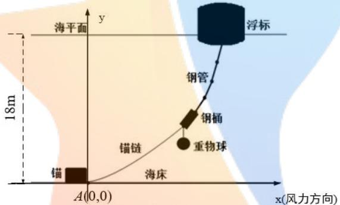

<details>
<summary>text_image</summary>

浮标
钢管
钢桶
重物球
锚链
锚
海平面
y
18m
A(0,0)
x(风力方向)
海床
</details>

图 1 系泊系统坐标系

## 下面对锚链、钢桶和重物球、钢管、浮标四部分的力学分析依次进行讨论：(1)锚链形状的方程推导

由于假设锚链质量均匀，且不考虑锚链自身的弹性伸长，因此锚泊船的锚链完全符合悬链的基本条件<sup>[1]</sup>。参照悬链线方程的推导<sup>[2]</sup>，将锚链整体视为一条可微的曲线，锚链坐标系AC 段如图2所示：

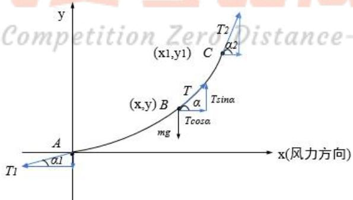

<details>
<summary>text_image</summary>

Competition Zero Distance-
(x1,y1)
T2
C
α2
(x,y) B
T
α
Tsina
Tcosα
mg
A
α1
T1
x(风力方向)
</details>

图 2 锚链 AC段坐标系

在图 2中，x轴为风力方向；xAy平面为海平面；原点A为锚链末端与锚的链接处； $\alpha _ { \mathrm { _ 1 } }$ 表示锚链A 端切线方向与x轴正方向的夹角； $\mathrm { T } _ { 1 }$ 表示锚链A点所受拉力，方向沿绳；锚链右端视为C 点，坐标设为(x1,y1)；T2表示 C点所受拉力，方向沿绳； $\alpha _ { 2 }$ 表示锚链 C 端切线方向与 x 轴正方向的夹角；B 为锚链线上任意一点，坐标设为 $\displaystyle ( \mathbf { x } , \mathbf { y } )$ ；表示锚链 B 端切线方向与 x 轴正向的夹角；T 表示 B点所受拉力。

对B 点 $^ { ( \mathrm { X } , \mathrm { y } ) }$ 进行受力分析，受力平衡时有如下方程：

$$
\left\{ \begin{array}{l} T \sin \alpha = m g + T _ {1} \sin \alpha_ {1} \\ T \cos \alpha = T _ {1} \cos \alpha_ {1} \end{array} \right. \tag {1}
$$

其中 m表示B 点左侧的锚链质量和，g代表重力加速度， $\alpha$ 记为B 的切线方向与x轴正向的夹角。

由坐标系可知，y对x 的导数可以表示为：

$$
\frac {d y}{d x} = \tan \alpha
$$

将(1)式代入得：

$$
\frac {d y}{d x} = \frac {m g + T _ {1} \sin \alpha_ {1}}{T _ {1} \cos \alpha_ {1}} \tag {2}
$$

对于锚链， $\mathrm { m } { = } _ { \mathrm { { O S } } }$ ，其中s 是 AB 锚链的长度，σ是锚链的线密度，即单位长度锚链的质量<sup>[1]</sup>。代入(2)式得：

$$
\frac {d y}{d x} = \frac {\sigma s g + T _ {1} \sin \alpha_ {1}}{T _ {1} \cos \alpha_ {1}} \tag {3}
$$

根据勾股定理可以得到弧长公式：

$$
d s = \sqrt {1 + \left(\frac {d y}{d x}\right) ^ {2}} d x
$$

积分得到 $s = \int \sqrt { 1 + y ^ { 2 } } d x$ ，代入(3)式移项可得：

$$
\frac {d y}{d x} T _ {1} \cos \alpha_ {1} - T _ {1} \sin \alpha_ {1} = \sigma g \int \sqrt {1 + y ^ {\prime 2}} d x
$$

对上式做一次变量替换，令 $p { = } y ^ { \prime }$ ，得到如下方程：

$$
p T _ {1} \cos \alpha_ {1} - T _ {1} \sin \alpha_ {1} = \sigma g \int \sqrt {1 + p ^ {2}} d x
$$

为了将积分符号去掉，上式两边对x求导， $\alpha _ { \parallel }$ 是待确定的常量，得到：

$$
\frac {d p}{d x} T _ {1} \cos \alpha_ {1} = \sigma g \sqrt {1 + p ^ {2}}
$$

然后对x和p 分离变量并对两端进行积分得到：

$$
\int \frac {d p}{\sqrt {1 + p ^ {2}}} = \int \frac {\sigma g}{T _ {1} \cos \alpha_ {1}} d x
$$

即： $\sinh ^ { - 1 } \left( p \right) = \frac { \sigma g } { T _ { 1 } } x + C _ { 1 }$ (4)

其中 C<sub>1</sub>可以由 $\scriptstyle \mathbf { x } = 0 , \mathbf { y } = 0$ 时的值确定，原点A处 $p = y ^ { \prime } = \tan \alpha _ { \scriptscriptstyle 1 }$ ，可得 $C _ { I }$ 为：

$$
C _ {1} = \sinh^ {- 1} (p) = \sinh^ {- 1} (\tan \alpha_ {1}) \tag {5}
$$

经过上述求解已经得到了dy/dx 的函数形式，即：

$$
\frac {d y}{d x} = \sinh \left(\frac {\sigma g}{T _ {1} \cos \alpha_ {1}} x + C _ {1}\right)
$$

对上式进行分离变量：

$$
\int d y = \int \sinh \left(\frac {\sigma g}{T _ {1} \cos \alpha_ {1}} x + C _ {1}\right) d x
$$

积分得到：

$$
y = \frac {T _ {1} \cos \alpha_ {1}}{\sigma g} \cosh \left(\frac {\sigma g}{T _ {1} \cos \alpha_ {1}} x + C _ {1}\right) + C _ {2} \tag {6}
$$

其中 $C _ { 2 }$ 同样可以由坐标系原点来确定，(0,0)点代入得常数 $C _ { 2 }$ 为：

$$
C _ {2} = - \frac {T _ {1} \cos \alpha_ {1}}{\sigma g} \cosh (C _ {1}) \tag {7}
$$

由于对系泊系统整体而言，水平方向受力平衡，可知：

$$
F _ {w i n d} = T _ {1} \cos \alpha_ {1}
$$

其中 $F _ { w i n d }$ 表示海面风力。

综上(5)(6)(7)式，在所设定的直角坐标系下，锚链的曲线方程可以表示为：

$$
y = \frac {T _ {1} \cos \alpha_ {1}}{\sigma g} \cosh \left(\frac {\sigma g}{T _ {1} \cos \alpha_ {1}} x + \sinh^ {- 1} (\tan \alpha_ {1})\right) - \frac {T _ {1} \cos \alpha_ {1}}{\sigma g} \cosh \left(\sinh^ {- 1} (\tan \alpha_ {1})\right)
$$

## a.锚链无沉底时

锚链末端纵坐标为 $_ { \textrm { y 1 } }$ ，横坐标为 $\mathbf { X } 1$ ，由于锚链从坐标系原点开始，全部锚链均高于海水底面。对锚链总长度进行曲线积分得：

$$
\int_ {0} ^ {x _ {1}} \sqrt {1 + y ^ {\prime 2}} d x = s, y _ {1} = y (x _ {1}) \tag {8}
$$

锚链末段满足：

$$
y ^ {\prime} | _ {x _ {1}} = \tan \alpha_ {2}
$$

其中 s 为锚链长度，此问中为已知量。

## b.锚链有沉底时

锚链沉在水底部分的长度为 ${ \bf { X } } 0$ 米，锚链末端纵坐标为 $_ { \textrm { y 1 } }$ ，横坐标为 $\mathbf { X } 1$ ，由于锚链从 $( \mathrm { x } _ { 0 } , 0 )$ 点开始，右侧的锚链均高于海水底面。对锚链总长度进行曲线积分得：

$$
\int_ {x _ {0}} ^ {x _ {1}} \sqrt {1 + y ^ {\prime 2}} d x = s - x _ {0}, y _ {1} = y (x _ {1}) \tag {9}
$$

锚链末段仍然满足：

$$
y ^ {\prime} | _ {x _ {1}} = \tan \alpha_ {2}
$$

其中 $\mathbf { S }$ 为锚链长度。

## (2)钢桶与重物球的受力平衡和力矩平衡

将钢桶和重物球作为一个整体进行受力分析，如图3所示，

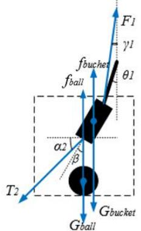

<details>
<summary>text_image</summary>

F1
γ1
θ1
fbuchet
fball
α2
β
T2
Gbucket
Gball
</details>

图 3 钢桶和重物的整体受力分析图示

在图 3中，钢桶与重物球整体受到四个力的作用，分别是总重力 $G _ { b u c k e t } { + } G _ { b a l l }$ 钢桶浮力 $f _ { b u c k e t }$ ，钢球浮力 $f _ { b a l l } :$ ，左侧锚链的拉力 $\mathrm { T } _ { 2 }$ ，右侧钢管的拉力 $\mathrm { F } _ { 1 }$ 。

最下面一节钢管记为钢管1，钢桶及钢管1 各角度表示如上图所示。钢桶中心轴线与竖直方向的夹角为 $\beta$ ；钢桶与锚链接触的位置处锚链的切线方向与 x轴正向的夹角为 $\alpha _ { 2 }$ ；钢管 1 与竖直方向的夹角记为 $\theta _ { 1 }$ ；钢管 1 的下端力的方向与钢桶中心轴线的夹角为 。 $\gamma _ { 1 }$

按照锚链中所选取的参考系，钢桶重物球系统在x 轴y轴方向受力平衡：

$$
\left\{ \begin{array}{l} x: F _ {1} \sin \gamma_ {1} = T _ {2} \cos \alpha_ {2} \\ y: G _ {\text {bucket}} + G _ {\text {ball}} + T _ {2} \sin \alpha_ {2} = f _ {\text {ball}} + f _ {\text {bucket}} + F _ {1} \cos \gamma_ {1} \end{array} \right. \tag {10}
$$

其中 $\mathrm { T } _ { 2 } , \mathrm { F } _ { 1 } , \boldsymbol { \gamma } _ { 1 } , \boldsymbol { \alpha } _ { 2 } , f _ { b a l l } , f _ { b u c k e t }$ 的含义见图3。

由于钢桶可以绕质心旋转，应对该整体进行受力分析和力矩分析。为使该整体处于平衡状态，需要各个力达到力矩平衡。因为钢桶重力、浮力均可认为作用在质 $\therefore L ^ { \prime }$ ，不产生力矩，而重物球重力 $G _ { b a l l }$ 、左侧锚链的拉力 $\mathrm { T } _ { 2 }$ 、右侧钢管的拉力 $\mathrm { F } _ { 1 }$ 均会产生力矩。

根据力矩定义： $\mathrm { M } { = } \mathrm { L } \times \mathrm { F } { = } \mathrm { L F } \sin \lambda$ 。其中 M 为力矩，F 为 $\textstyle { \overbrace { \mathbf { x } } }$ 力；L 为力臂； $\lambda$ 为F与L 的矢量夹角。对于钢管 1，计算力矩时为 $\beta - \gamma _ { 1 }$ ；对于钢桶与左侧锚链接触的位置，计算力矩时为为 $\pi / 2 - \alpha _ { _ 2 } - \beta$ 。对于重物球，计算力矩时所用角度为 $\beta$ 。

因此钢桶的力矩平衡式如下：

$$
G _ {b a l l} L \sin \beta + F _ {1} L \sin \left(\beta - \gamma_ {1}\right) = T _ {2} L \sin \left(\frac {\pi}{2} - \alpha_ {2} - \beta\right) \tag {11}
$$

其中 $G _ { b a l l }$ 为重物球重力， $\mathrm { F } _ { 1 }$ 为右侧钢管的拉力， $\mathrm { T } _ { 2 }$ 为左侧锚链的拉力。

## (3)四根钢管的受力平衡与力矩平衡

4 节钢管从下至上依次记为钢管 1，钢管2，钢管3，钢管4。对于系泊系统的四段钢管部分，每一段都是受到重力 $G _ { p i p e }$ 、浮力 $f _ { p i p e }$ 钢管左侧的拉力和右侧的拉力。记 1 号钢管左侧拉力为 $\mathrm { F } _ { 1 }$ ，右侧拉力为 $\mathrm { F } _ { 2 }$ ；由 1 号 2 号钢管连接处微分的受力平衡可知，2 号钢管左侧拉力为 $\mathrm { F } _ { 2 }$ ，右侧拉力为 $\mathrm { F } _ { 3 }$ 。以此类推，4号钢管左侧拉力为 $\mathrm { F } _ { 4 }$ ，右侧与浮标连接处的拉力为 $\mathrm { F } _ { 5 }$

故1 号钢管的受力分析与力矩分析如图4：

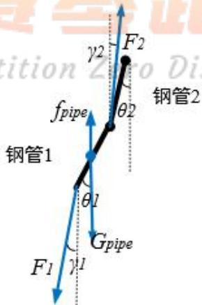

<details>
<summary>text_image</summary>

F1
F2
钢管1
fpipe
θ1
Gpipe
θ2
钢管2
</details>

图 4 钢管 1 的受力分析图示

受力平衡： $\left\{ \begin{array} { l l } { G _ { p i p e } + F _ { 1 } \cos \gamma _ { 1 } = f _ { p i p e } + F _ { 2 } \cos \gamma _ { 2 } } \\ { F _ { 1 } \sin \gamma _ { 1 } = F _ { 2 } \sin \gamma _ { 2 } } \end{array} \right.$ (12)

力矩平衡： $F _ { 1 } L \sin \left( \gamma _ { 1 } - \theta _ { 1 } \right) = F _ { 2 } L \sin \left( \theta _ { 1 } - \gamma _ { 2 } \right)$

同理，2号钢管受力平衡与力矩平衡方程为：

$$
\left\{ \begin{array}{l} G _ {p i p e} + F _ {2} \cos \gamma_ {2} = f _ {p i p e} + F _ {3} \cos \gamma_ {3} \\ F _ {2} \sin \gamma_ {2} = F _ {3} \sin \gamma_ {3} \\ F _ {2} L \sin \left(\gamma_ {2} - \theta_ {2}\right) = F _ {3} L \sin \left(\theta_ {2} - \gamma_ {3}\right) \end{array} \right. \tag {13}
$$

3 号钢管的受力平衡与力矩平衡方程为：

$$
\left\{ \begin{array}{l} G _ {p i p e} + F _ {3} \cos \gamma_ {3} = f _ {p i p e} + F _ {4} \cos \gamma_ {4} \\ F _ {3} \sin \gamma_ {3} = F _ {4} \sin \gamma_ {4} \\ F _ {3} L \sin \left(\gamma_ {3} - \theta_ {3}\right) = F _ {4} L \sin \left(\theta_ {3} - \gamma_ {4}\right) \end{array} \right. \tag {14}
$$

4 号钢管的受力平衡与力矩平衡方程为：

$$
\left\{ \begin{array}{l} G _ {p i p e} + F _ {4} \cos \gamma_ {4} = f _ {p i p e} + F _ {5} \cos \gamma_ {5} \\ F _ {4} \sin \gamma_ {4} = F _ {5} \sin \gamma_ {5} \\ F _ {4} L \sin \left(\gamma_ {4} - \theta_ {4}\right) = F _ {5} L \sin \left(\theta_ {4} - \gamma_ {5}\right) \end{array} \right. \tag {15}
$$

其中力臂长度 L 均相等；钢管 1,2,3,4 与竖直方向的夹角分别记为 $\theta _ { 1 } , \theta _ { 2 } , \theta _ { 3 } , \theta _ { 4 }$ ；钢管 1,2,3,4 的下端力的方向与钢桶中心轴线的夹角分别为 $\gamma _ { 1 } , \gamma _ { 2 } , \gamma _ { 3 } , \gamma _ { 4 }$ ；1号钢管左侧拉力为 $\mathrm { F } _ { 1 }$ ，右侧拉力为 F ；2 号钢管左侧拉力为 $\mathrm { F } _ { 2 }$ ，右侧拉力为 F ；以此类推 4 号钢管左侧拉力为 $\mathrm { F } _ { 4 }$ ，右侧拉力为 $\mathrm { F } _ { 5 } { \mathrm { ; } }$ ；每一段钢管的重力为 $G _ { p i p e }$ ，浮力为 $f _ { p i p e }$

## (4)浮标受力分析

对于浮标而言，当水流力为零时，共受到四个力作用，分别为4 号钢管的拉力F5，自身重力 $G _ { b u o ) }$ ，水面风力 $\mathrm { F _ { w i n d } }$ 以及自身浮力 $f _ { \mathrm { b u o y } }$ 。当不考虑浮标倾斜时，浮标吃水深度最终将稳定为长度 d，浮标在四个力的作用下保持平衡。

竖直方向受力平衡：fbuoy = Gbuoy + F5 cos γ5 (16)

水平方向受力平衡： $F _ { \varsigma } \sin \gamma _ { \varsigma } = F _ { w i n d }$ (17)

式(16)中 fbuov = ρgV = π dgρ，式(17)中 Fwin =0.625×Sv² =0.625×2×(2−d)v²其中， $\gamma _ { 5 }$ 为 4 号钢管所受拉力 $\mathrm { F } _ { 5 }$ 与竖直方向的夹角； $\rho$ 代表海水密度；g代表重力加速度；V 代表浮标沉在海水中的体积；S 代表物体在风向法平面的投影面积；v 为风速；d为浮标吃水深度。

## (5)水下总高度与游动区域的计算

结合前面四部分的受力分析方程，可以列出总的高度 H 和游动区域最大半径R的方程。

水下总高度 H 在此问中取定值 18m，可以表示为锚链末端纵坐标 $_ { \textrm { y 1 } }$ 、钢桶和4根钢管的y轴投影长度、浮标吃水深度d之和：

$$
H = y _ {1} + l _ {\text {bucket}} \cos \beta + l _ {\text {pipe}} \left(\cos \theta_ {1} + \cos \theta_ {2} + \cos \theta_ {3} + \cos \theta_ {4}\right) + d \tag {18}
$$

式(18)中 $_ { \textrm { y 1 } }$ 可以由锚链形状的方程确定，即 $\int _ { 0 } ^ { x _ { 1 } } \sqrt { 1 + { y ^ { \prime } } ^ { 2 } } d x = s , y _ { 1 } = y \big ( x _ { 1 } \big )$

其中 s 为锚链长度,此问中为已知量， $x _ { 1 }$ 和 $y _ { 1 }$ 分别代表锚链末端 C 点的横坐标和纵坐标。 $l _ { b u c k e t }$ 为钢桶长度， $l _ { p i p e }$ 为钢管长度， $\theta _ { 1 } \theta _ { 2 } \theta _ { 3 } \theta _ { 4 }$ 分别代表钢管1-4 的倾斜角度， $\beta$ 代表钢桶倾斜角度， $d$ 代表浮标吃水深度。

将游动区域理解为一个圆形区域，当风力达到最大且方向保持不变时，该圆形区域的半径达到最大。最大半径值等于稳定后系泊系统各个部分在水平方向投影的总长度。因此游动区域的最大半径R可以表示为锚链末端横坐标 ${ \bf { X } } 0$ ，钢桶和4根钢管的x轴投影长度之和：

$$
R = x _ {0} + l _ {\text {bucket}} \sin \beta + l _ {\text {pipe}} \left(\sin \theta_ {1} + \sin \theta_ {2} + \sin \theta_ {3} + \sin \theta_ {4}\right) \tag {19}
$$

## 5.1.2 模型汇总

基于上述(1)-(5)的分析，共得到 20 个从系泊系统底部到顶部的刚体力学方程。通过求解这 20个方程构成的刚体力学方程组可以得到钢桶的倾斜角度 $\beta$ ，各节钢管的倾斜角度 $\gamma$ 、锚链形状 $y ( x )$ 浮标的吃水深度 $d$ 和一些中间变量。通过对前面所求出变量的组合，可以求出浮标的游动区域半径R。

最终需要求解出数值的变量为：钢桶的倾斜角度 $\beta$ ，各节钢管的倾斜角度 $\gamma$ ，悬链左端倾角 $\alpha _ { 0 }$ ，锚链形状 $y ( x )$ 的图像，浮标的游动区域半径 $R$ 。

刚体力学方程组共包含的 20个变量，按照系泊系统从下到上的方程组求解排列顺序、各参数的求解顺序罗列如下：

刚体力学方程组(12)-(19)表示为：

√1+ y2dx = s, y1 = y (x1) 无沉底： {y′|x, = tanα2 锚链： (20)

∫x √1+ y(dx = s−x0,y1 = y(x1) 有沉底： <sub>0</sub>x [y ′|x, = tan α2

<sub>1 1</sub>: sin <sub>wind</sub>x F F F : <sub>bucket</sub>Gy <sub>bal</sub>G wind sin <sub>2 ball</sub>f <sub>bucket</sub> f <sub>11</sub> cos F cos 钢桶及重物球： (21) F π GbalL sinβ+ F,L sin (β− γ1)= wind sinL −α2−β cos 2 

G pe + F, cos γ1 = f pipe + F2 cOS γ2 钢管1： <sub>1 1 2 2</sub>sin sinF F (22) (FL sin(γ1 − θ) = F2L sin(θ1 − γ2)

[Gpipe + F2 cOS γ2 = f pipe + F3 COS γ3 钢管2： <sub>2 2 3 3</sub>sin sinF F (23) (F2L sin (γ2 − θ2 ) = F3L sin (θ2 − γ3 )

[Gpipe + F3 coS γ3 = f pipe + F4COSγ4 钢管3： F3 sin γ3 = F4 sin γ4 (24) (F3L sin (γ3 − θ3 ) = F4L sin (θ3 − γ4)

[Gpipe + F4 cOS γ4 = f pipe + F5 COS γ5 钢管4： F4 sin γ4 = F5 sin γ5 (25) F4L sin (γ4 − θ4 ) = F5L sin (θ4 − γ5 )

2 浮标： π 2 dg ρ = Gbuoy + F5 cos γ 5 (26) F5 sin γ5 = 0.625× 2×(2− d)ν²

总高度： H = y1 + lbucket cos β + lpipe (cos θ1 + cos θ2 + cos θ3 + cos θ4 ) + d (27)

上述 20个方程为一个不可分割的整体，各参数在方程中出现和求解的顺序如下图所示：

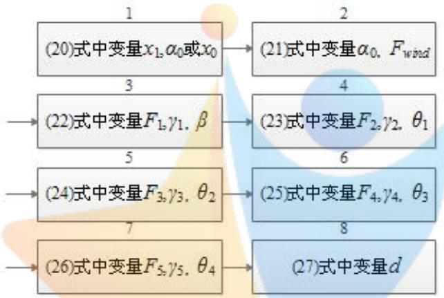

<details>
<summary>flowchart</summary>

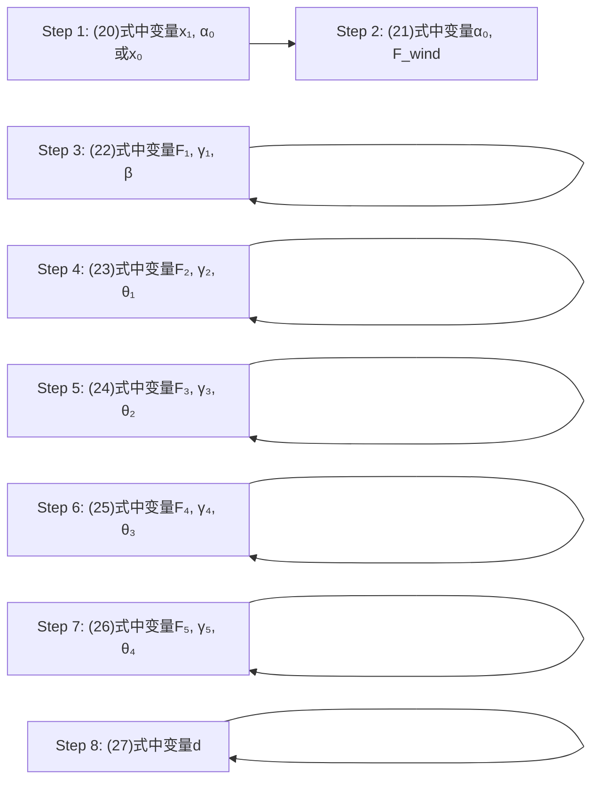
</details>

图 5 各参数在方程中出现和求解的顺序

式(20)中

$$
y = \frac {T _ {1} \cos \alpha_ {1}}{\sigma g} \cosh \left(\frac {\sigma g}{T _ {1} \cos \alpha_ {1}} x + \sinh^ {- 1} (\tan \alpha_ {1})\right) - \frac {T _ {1} \cos \alpha_ {1}}{\sigma g} \cosh \left(\sinh^ {- 1} (\tan \alpha_ {1})\right) \tag {28}
$$

游动区域的最大半径：R = x0 + lbucket sin β + l pipe (sin θ1 + sin θ2 + sin θ3 + sin θ4) (29)其中各个力矩平衡方程中力臂长度均相等，钢管 1,2,3,4 与竖直方向的夹角分别记为 $\theta _ { 1 } , \theta _ { 2 } , \theta _ { 3 } , \theta _ { 4 }$ ,钢管 1,2,3,4 的下端力的方向与钢桶中心轴线的夹角分别为$\gamma _ { 1 } , \gamma _ { 2 } , \gamma _ { 3 } , \gamma _ { 4 }$ ,1 号钢管左侧拉力为 $\mathrm { F } _ { 1 }$ ，右侧拉力为 F<sub>2</sub>，2号钢管左侧拉力为 $\mathrm { F } _ { 2 }$ ，右侧拉力为 $\mathrm { F } _ { 3 }$ ，以此类推 5 号钢管左侧拉力为 $\mathrm { F } _ { 4 }$ ，右侧拉力为 $\mathrm { F } _ { 5 }$ ，每一段钢管的重力为 $G _ { p i p e }$ ，浮力为 $f _ { p i p e } ^ { \mathcal { \left[ \gamma \right] } }$ 。重物球所受浮力为 ${ { f } _ { b a l l } } , \ell \beta$ 代表钢桶与竖直线夹角；$\rho$ 代表海水密度， $g$ 代表重力加速度；V 代表浮标沉在海水中的体积；S 代表为物体在风向法平面的投影面积(m<sup>2</sup>)，v为风速(m/s）； $m _ { \mathrm { b a l l } }$ 为重物球质量。

## 5.1.3 模型的求解算法

某型传输节点选用 II 型电焊锚链 22.05m，选用的重物球的质量为 1200kg。现将该型传输节点布放在水深 18m、海床平坦、海水密度为 $1 . 0 2 5 { \times } 1 0 3 \mathrm { k g } / \mathrm { m } ^ { 3 }$ 的海域。若海水静止，分别计算海面风速为12m/s 和24m/s 时钢桶和各节钢管的倾斜角度、锚链形状、浮标的吃水深度和游动区域。

## (1)算法分析：

由5.1.2节可知，有20个力学方程组，20个待求未知量，可以通过 MATLAB的“fsolve”函数<sup>[3]</sup>来求解方程组。因锚链可能会有一部分贴在海底地面上(即拖

地现象)，故要对这两种情况进行判断。

## (2)算法步骤：

Step1：由于需要进行锚链是否有贴在海底部分的判断，利用MATLAB 的“fsolve”函数及力学方程组函数“方程1”和“方程2”：其中方程1 表示锚链存在拖地部分，方程 2表示锚链不存在拖地部分。对于不存在拖地的情况，需要将原未知量锚链与海底夹角赋值0，增加锚链贴在海底的长度为未知量。

Step2：为了用“fsolve”求解方程组，要反复设置并调整“fsolve”函数的迭代初始值 ${ \bf { X } } 0$ ，当求解方程组返回值 exitflag=1 时，表示对于此方程组而言该初始解 $\mathrm { X } _ { 0 }$ 是可行、可取的。

Step3：调用“fsolve”函数，先以“方程1”为子程序，对20 个力学方程求解，并绘出锚链线的形状图。

Step4：比较得到的锚链与海底的夹角与0 的大小，如果锚链与海底夹角 $\alpha _ { 1 }$ 小于0，则表示锚链会有一段贴在海底地面上。需要再次调用“方程 $2 ^ { \prime \prime }$ 并计算锚链拖地的长度，并绘出锚链线的形状图。

## 5.1.4 模型的求解结果及分析

## (一)海面风速为 12m/s

求解得到的钢桶和各节钢管的倾斜角度、浮标的吃水深度和游动区域最大半径如下表：

表 1 海面风速为 12m/s 时系泊系统参数表

<table><tr><td>海面风速为12m/s</td><td>计算值</td></tr><tr><td>钢桶与竖直线夹角 $\beta$ </td><td>1.1353°</td></tr><tr><td>钢管1倾斜角度 $\theta_1$ </td><td>1.0887°</td></tr><tr><td>钢管2倾斜角度 $\theta_2$ </td><td>1.0802°</td></tr><tr><td>钢管3倾斜角度 $\theta_3$ </td><td>1.0719°</td></tr><tr><td>钢管4倾斜角度 $\theta_4$ </td><td>1.0637°</td></tr><tr><td>浮标吃水深度 $d$ </td><td>0.7087m</td></tr><tr><td>游动区域最大半径 $R$ </td><td>14.3341m</td></tr></table>

绘制的锚链形状图形如下：

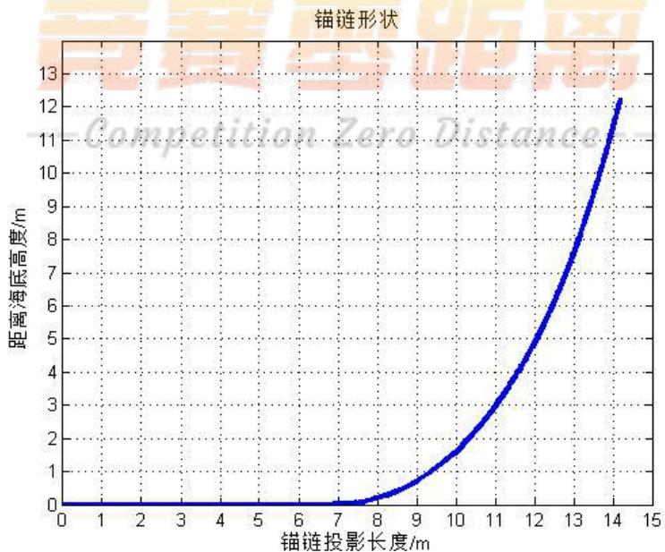

<details>
<summary>line</summary>

| 锚链投影长度/m | 距离海底高度/m |
| --- | --- |
| 0 | 0 |
| 1 | 0 |
| 2 | 0 |
| 3 | 0 |
| 4 | 0 |
| 5 | 0 |
| 6 | 0 |
| 7 | ~0.1 |
| 8 | ~0.3 |
| 9 | ~0.8 |
| 10 | ~1.6 |
| 11 | ~3.0 |
| 12 | ~4.8 |
| 13 | ~7.5 |
| 14 | ~12.2 |
</details>

图 6 海面风速为 12m/s时锚链形状图形

根据图6可知，锚链末端与锚的衔接处的切线方向与海床的夹角为0 度，即锚链有一部分沉在海床面上，之后角度再逐渐增大。经过计算，锚链沉在海床上的长度为 6.7401m，水中锚链部分在 x轴的投影长度为 7.4992m，在y轴的投影长度为 12.2922m。分析原因可知，由于海面风速较小，风力也较小，因此锚链不需要全部伸展就可以使得浮标达到平衡，证明了求解的正确性。

## (二)海面风速为 24m/s

求解得到的钢桶和各节钢管的倾斜角度、浮标的吃水深度和游动区域最大半径如下表

表 2 海面风速为 24m/s 时系泊系统参数表

<table><tr><td>海面风速为24m/s</td><td>计算值</td></tr><tr><td>钢桶与竖直线夹角 $\beta$ </td><td>4.3158°</td></tr><tr><td>钢管1倾斜角度 $\theta_1$ </td><td>4.1457°</td></tr><tr><td>钢管2倾斜角度 $\theta_2$ </td><td>4.1147°</td></tr><tr><td>钢管3倾斜角度 $\theta_3$ </td><td>4.0841°</td></tr><tr><td>钢管4倾斜角度 $\theta_4$ </td><td>4.0540°</td></tr><tr><td>浮标吃水深度 $d$ </td><td>0.7231m</td></tr><tr><td>游动区域最大半径 $R$ </td><td>17.4809m</td></tr></table>

对比表1和表2进行分析，当风速由 12m/s增加到24m/s 时，由于风力增大，钢桶和各节钢管的倾斜角度、浮标的吃水深度、游动区域最大半径均有不同幅度地增加，但是钢桶与竖直线夹角仍在5度范围内，因此设备的工作效果可以得到保证。

绘制的锚链形状图形如下：

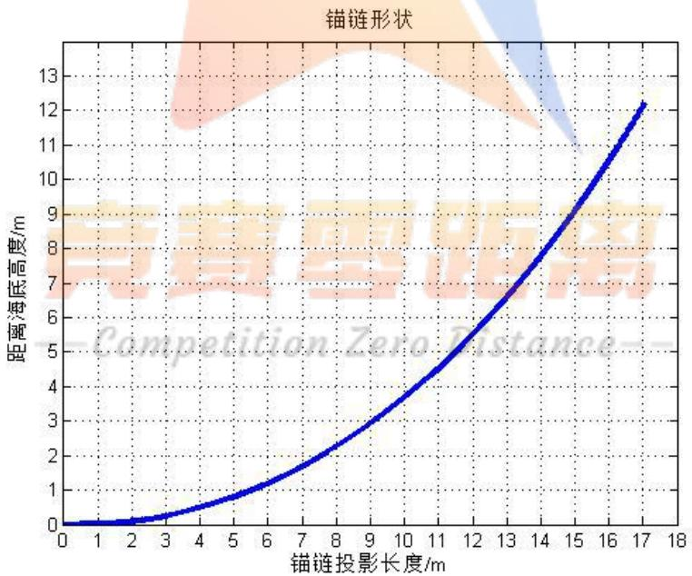

<details>
<summary>line</summary>

| 锚链投影长度/m | 距离海底高度/m |
| --- | --- |
| 0 | 0 |
| 1 | ~0.05 |
| 2 | ~0.1 |
| 3 | ~0.2 |
| 4 | ~0.4 |
| 5 | ~0.7 |
| 6 | ~1.1 |
| 7 | ~1.6 |
| 8 | ~2.2 |
| 9 | ~2.9 |
| 10 | ~3.7 |
| 11 | ~4.6 |
| 12 | ~5.6 |
| 13 | ~6.7 |
| 14 | ~7.9 |
| 15 | ~9.2 |
| 16 | ~10.6 |
| 17 | ~12.2 |
</details>

图 7 海面风速为 24m/s时锚链形状图形

根据图7可知，锚链沉在海床上的长度为 0.1307m，处于脱离海床的边缘，因此锚链末端与锚的衔接处的切线方向与海床的夹角仍为 0度。水中锚链部分在x轴的投影长度为 16.9891m，在y轴的投影长度为 12.2900m。由此可知，当风速增加时，风力的增大对锚链形状的影响很大。

## 5.2海水静止时的系泊系统多目标优化模型

在问题1的假设下，即锚链长度和型号、水深及海水密度不变时，改变重物球的质量，会导致钢桶和各节钢管的倾斜角度、锚链形状和浮标的游动区域均有所不同。通过优化模型，在满足钢桶的倾斜角度不超过5度、锚链在锚点与海床的夹角不超过 16度的情况下，找出尽可能小的浮标的吃水深度、游动区域最大半径及钢桶倾斜角度所对应的的重物球质量，即为最优的设计。

## 5.2.1 建模前的准备

由于锚链是否有沉在海床的部分对锚链形状及重物球质量的选择影响较大，因此需要先进行判断。类似于模型1中的处理方式，假设锚链没有沉在海床的部分，尝试计算锚链左端点 A端切线方向与 x轴正方向的夹角 $\alpha _ { \mathrm { _ 1 } }$ 。若 $\alpha _ { \mathrm { 1 } } { < } 0$ ，则表示假设不成立，证明此时锚链有沉在海床的部分，对锚链悬挂部分的处理应采用(20)式无沉底；若求得 $\alpha _ { \mathrm { 1 } } { > } 0$ ，则表示假设成立，锚链没有沉在海底的部分，全部处于悬挂状态，对锚链部分的处理应采用(20)式有沉底部分。经过上述处理后，然后调节重物球质量 $G _ { \mathrm { b a l l } }$ ，使得钢桶倾角<5度，锚链左端点与海床夹角<16度。同时要使得浮标的吃水深度，游动区域最大半径，钢桶倾斜角度都尽可能地小，基于此建立多目标优化模型。

## 5.2.2 多目标优化模型的建立

## (1)优化目标一：钢桶倾斜角度最小

按题目所述，钢桶竖直时，水声通讯设备的工作效果最佳，若钢桶倾斜则影响设备的工作效果。当钢桶与竖直方向的夹角即倾斜角超过5 度时，设备工作效果较差，所以保证钢桶倾斜角度 $\beta$ 最小是系泊系统正常工作的重要条件。钢桶倾斜角度 $\beta$ 可由方程组(20)-(27)联立求解得到，分析由于 $m _ { \mathrm { b a l l } }$ 的改变，使得(20)-(27)式方程形式完全不变，但是钢桶左侧受力的大小发生变化，从而引起刚体力学的20 个方程的求解结果发生改变，因而钢桶的倾斜角度由于受到钢桶受力平衡和力矩平衡方程所影响，也同样发生变化。

按照问题1假设，锚链长度和型号、水深及海水密度均已知。因此当重物球质量 $m _ { \mathrm { b a l l } }$ 确定时，(20)-(27)方程中各参数和结果均已确定， $\beta$ 仅受重物球质量 $m _ { \mathrm { b a l l } }$ 影响。

故优化目标一可以表示为：

$$
\min \quad \beta (m _ {\text {ball}})
$$

## (2)优化目标二：浮标的吃水深度最小

题目要求系泊系统的设计要使得浮标的吃水深度d尽可能小，d处于(20)-(27)方程中，不能独立求解。由优化目标一中的分析可知由于 $m _ { \mathrm { b a l l } }$ 的改变，钢桶倾斜角度改变，刚体力学方程组求解的 1-4 号钢管倾斜角度也发生改变，4号钢管倾斜角度的改变会使得浮标竖直方向受力发生改变，即浮标浮力发生改变，故浮标的吃水深度发生改变。故这时浮标吃水深度的变化也完全取决于重物球质量的变化。

同样利用问题1提供的数据，当重物球质量 $m _ { \mathrm { b a l l } }$ 确定时，各参数和结果均可通过(20)-(27)式确定，故吃水深度d仅受重物球质量 $m _ { \mathrm { b a l l } }$ 影响。该优化目标可以表示为：

$$
\min \quad d \left(m _ {\text {ball}}\right)
$$

## (3)优化目标三：游动区域的半径最小

系泊系统的设计中同样要求浮标的游动区域要尽可能小，按照模型1中的分析，当风力等外界因素大小固定、方向任意时，浮标的游动区域可以表示为以锚为起点的最大半径为 R 的圆，由上述分析可知，重物球质量改变时，钢桶，钢管各倾角，锚链形状均会发生改变，R即为系泊系统水平方向的投影长度，R的求解基于(29)式，故该问中游动区域半径也完全也完全取决于重物球质量的变化。

同样利用问题 1 提供的数据，游动区域仅受重物球质量 $m _ { \mathrm { b a l l } }$ 影响，通过(20)-(29)式联立可以求解。该优化目标可以表示为：

$$
\min \quad R \big (m _ {\text {ball}} \big)
$$

## (4)决策变量与约束条件

通过对优化目标一，二，三的分析可知，唯一的决策变量即为重物球质量 $m _ { \mathrm { b a l l } }$ 由于问题 1 中重物球质量为 1200kg，重力加速度 g 取 9.8m/s<sup>2</sup>，故在此先大致限定重物球范围，再求解过程中可以进一步修正：

$$
1 2 0 0 \leq m _ {\text {ball}} \leq 5 0 0 0
$$

约束条件即为锚链在锚链左端点 A 端切线方向与 x 轴正方向的夹角 $\alpha _ { \mathrm { 1 } }$ 不超过16 度，钢桶倾斜角度不超过 5 度。由于优化目标一为钢桶倾斜角度最小，所以只需在最后检验钢桶倾角是否满足不超过5 度的条件。此外还需验证浮标是否露在水面上、以及各指标参数是否符合常理。因此限定 $\alpha _ { \mathrm { _ 1 } }$ 如下：

$$
0 ^ {\circ} \leq \alpha_ {1} \leq 1 6 ^ {\circ}
$$

## (5)多目标优化模型的最终确立

基于(2)(3)(4)的分析，对于重物球质量的选择的问题，建立多目标优化模型如下：

$$
\begin{array}{l} \min \quad \beta (m _ {\text {ball}}) \\ \min d \left(m _ {\text {ball}}\right) \tag {30} \\ \end{array}
$$

$$
\min \quad R \left(m _ {\text {ball}}\right)
$$

$$
s. t. \left\{ \begin{array}{l} 1 2 0 0 \leq m _ {\text {ball}} \leq 5 0 0 0 \\ 0 ^ {\circ} \leq \alpha_ {1} \leq 1 6 ^ {\circ} \end{array} \right. \tag {31}
$$

其中 $\alpha _ { \mathrm { 1 } }$ 表示锚链左端点A端切线方向与x轴正方向的夹角， $m _ { \mathrm { b a l l } }$ 为重物球质量大小， $\beta$ 为钢桶的倾斜角度，求解基于方程组(20)-(27)； $d$ 为浮标吃水深度，求解基于方程组(20)-(27)；R为浮标游动区域的最大半径，求解基于(29)式。

先对三个目标函数进行无量纲化处理，再采用线性加权法对三个目标函数进行归一化处理，将多目标函数化归为单目标函数：

$$
\min \quad \lambda_ {1} \frac {\beta (m _ {\text {ball}})}{\beta_ {\max}} + \lambda_ {2} \frac {d (m _ {\text {ball}})}{d _ {\max}} + \lambda_ {3} \frac {R (m _ {\text {ball}})}{R _ {\max}}
$$

$$
\lambda_ {1} + \lambda_ {2} + \lambda_ {3} = 1
$$

其中权重 $\lambda _ { 1 } , \lambda _ { 2 } , \lambda _ { 3 }$ 代表了每个目标函数的重要程度，三个权重之和等于 1。$\beta _ { \mathrm { m a x } } , d _ { \mathrm { m a x } } , R _ { \mathrm { m a x } }$ 分别代表在所选取的自变量范围内，钢桶倾斜角度，浮标吃水深度，浮标游动区域的半径可能达到的最大值。对不同的权重组合进行求解并对结果进行比较和分析。

## 5.2.2 模型的求解算法

## (1) 算法分析：

对于风速 $\mathrm { V _ { w i n d } } { = } 3 6 \mathrm { m / s }$ 时，钢桶，各根钢管的倾角，锚链形状和浮标游动区域的计算问题，只需要将问题 1中的求解程序中风速参数进行修改即可。

对于重新设计重物球质量使得优化目标函数达到最优的问题。可以将重物球质量 $\mathbf { M } _ { \mathrm { b a l l } }$ 作为全局变量以便修改。在主程序中，使用 for 函数，以重物球质量$\mathbf { M } _ { \mathrm { b a l l } }$ 循环，并通过钢桶倾角、锚链左侧与海面夹角等约束条件，查找满足条件的重物球质量的可行解，然后以优化目标最小为标准，从这些可行解找到最优解。

## (2) 算法步骤：

Step1：类似模型一的求解步骤step1，编写函数判断有拖地或无拖地的情况下，20个力学方程的求解，程序中需要修改风速 $\mathrm { V _ { w i n d } } { = } 3 6 \mathrm { m / s }$ ，重物球质量取决于全局变量的设定。

Step2：编写主程序，计算不同的重物球质量下，满足使用“for”函数对重物球质量 $\mathbf { M } _ { \mathrm { b a l l } }$ 从1200 遍历到 5000，求解钢桶钢管倾角，浮标吃水深度，浮标游动区域的半径。通过判断模型 2 中约束指标锚链左侧与海面夹角${ < } 1 6 ^ { \circ }$ ，钢桶倾角小于 $5 ^ { \circ }$ 等。进行选取可行解。

Step3：对目标函数进行无量纲化和归一化：将钢桶倾角、吃水深度、区域半径除以各自最大值，并以不同的权重组合，如 0.8:0.1:0.1，0.4:0.3:0.3，1/3:1/3:1/3，0.1:0.8:0.1 加权相加得到不同的优化目标，用“min”函数查找新的优化目标的最优解，得到决策变量值：重物球质量“Mball”。 并对不同权重组合下求得的结果进行比较。

## 5.2.3 模型求解结果及分析

## (一)海面风速为36m/s，重物球质量为1200kg 时

求解得到的钢桶和各节钢管的倾斜角度、浮标的吃水深度、游动区域最大半径和锚链左端点A端切线方向与x 轴正方向的夹角 $\alpha _ { \mathrm { _ 1 } }$ 如下表：

表 3 重物球质量为 1200kg 时系泊系统参数表

<table><tr><td>重物球质量为1200kg</td><td>计算值</td></tr><tr><td>钢桶与竖直线夹角 $\beta$ </td><td>8.9804°</td></tr><tr><td>钢管1倾斜角度 $\theta_1$ </td><td>8.6485°</td></tr><tr><td>钢管2倾斜角度 $\theta_2$ </td><td>8.5878°</td></tr><tr><td>钢管3倾斜角度 $\theta_3$ </td><td>8.5279°</td></tr><tr><td>钢管4倾斜角度 $\theta_4$ </td><td>8.4688°</td></tr><tr><td>浮标吃水深度 $d$ </td><td>0.7448m</td></tr><tr><td>游动区域最大半径 $R$ </td><td>18.7654m</td></tr><tr><td>锚链左端切线方向与海床夹角 $\alpha_1$ </td><td>18.3881°</td></tr></table>

根据表3可知，仍采用问题1中假设的情况下，即重物球质量仍取值1200kg，且锚链长度和型号、水深及海水密度不变时，锚链左端点 A 端切线方向与 x 轴正方向的夹角 $\alpha _ { 1 }$ 达到了 18.3881 度，超过题目中规定的 16 度。此时钢桶倾斜角度为 8.9804 度，也超过了 5 度的上限。由此可知，重物球质量过低会导致系泊系统设备工作效果较差，甚至锚被拖行从而致使节点移位丢失。

绘制的锚链形状图形如下：

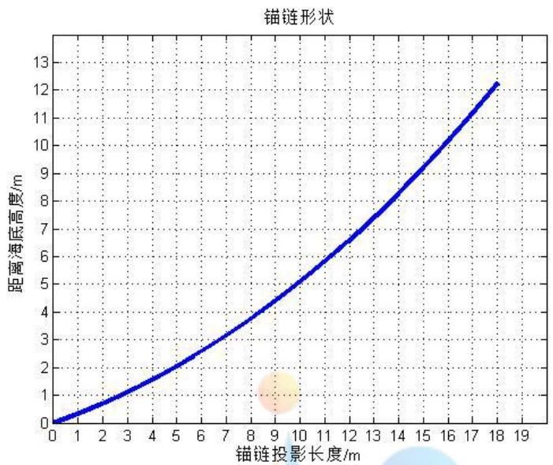

<details>
<summary>line</summary>

| 锚链投影长度/m | 距离海底高度/m |
| --- | --- |
| 0 | 0 |
| 1 | ~0.3 |
| 2 | ~0.7 |
| 3 | ~1.1 |
| 4 | ~1.6 |
| 5 | ~2.1 |
| 6 | ~2.6 |
| 7 | ~3.1 |
| 8 | ~3.7 |
| 9 | ~4.3 |
| 10 | ~5.0 |
| 11 | ~5.7 |
| 12 | ~6.4 |
| 13 | ~7.2 |
| 14 | ~8.0 |
| 15 | ~8.9 |
| 16 | ~9.8 |
| 17 | ~10.7 |
| 18 | ~12.2 |
</details>

图 8 重物球质量为 1200kg时锚链形状图形

## (二)调节重物球质量时

根据(一)中结果可知，重物球质量过小会导致设备无法工作，因此需要调节重物球的质量，使得钢桶的倾斜角度不超过5度，锚链在锚点与海床的夹角不超过 16 度。将重物球质量视为变量，绘制吃水深度 d、钢桶的倾斜角度 $\beta$ 、游动区域半径 R、锚链左端点 A 端切线方向与 x 轴正方向的夹角 $\alpha _ { \mathrm { 1 } }$ 和优化目标加权和这五个参量随重物球质量变化的曲线如图9 所示：

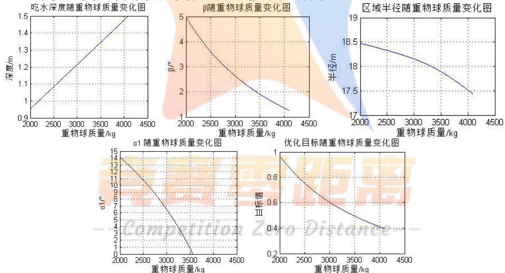  
图 9 参量 $d ,$ $\alpha _ { I }$ 、 $\beta ,$ 、R及优化目标随重物球质量的变化曲线

根据图 9 可知，钢桶的倾斜角度 $\beta$ 、游动区域半径 R、锚链左端点 A 端切线方向与 x轴正方向的夹角 $\alpha _ { \mathrm { 1 } }$ 和优化目标值均随重物球质量增加而减小，而吃水深度 d随重物球质量增加而增加。

当优化目标钢桶倾角β：吃水深度 d：区域半径 R的权重比值 $\lambda _ { 1 } : \lambda _ { 2 } : \lambda _ { 3 }$ 分别为 0.8:0.1:0.1、0.4:0.3:0.3、1/3:1/3:1/3、0.1:0.8:0.1 时，求得重物球质量、钢桶和各节钢管的倾斜角度、浮标的吃水深度、游动区域最大半径和锚链左端点 A 端切线方向与x轴正方向的夹角 $\alpha _ { \mathrm { _ 1 } }$ 如下表：

表 4 不同权重 $\lambda _ { _ 1 } , \lambda _ { _ 2 } , \lambda _ { 3 }$ 组合时系泊系统参数表

<table><tr><td>不同权重组合 $\lambda_1, \lambda_2, \lambda_3$ </td><td>0.8,0.1,0.1</td><td>0.4,0.3,0.3</td><td>1/3,1/3,1/3</td><td>0.1,0.8,0.1</td></tr><tr><td>重物球质量</td><td>4090kg</td><td>4090kg</td><td>4090kg</td><td>2010kg</td></tr><tr><td>钢桶倾角 $\beta$ </td><td>1.2664°</td><td>1.2664°</td><td>1.2664°</td><td>4.9550°</td></tr><tr><td>钢管1倾斜角度 $\theta_1$ </td><td>1.2492°</td><td>1.2492°</td><td>1.2492°</td><td>4.8313°</td></tr><tr><td>钢管2倾斜角度 $\theta_2$ </td><td>1.2461°</td><td>1.2461°</td><td>1.2461°</td><td>4.8084°</td></tr><tr><td>钢管3倾斜角度 $\theta_3$ </td><td>1.2427°</td><td>1.2427°</td><td>1.2427°</td><td>4.7857°</td></tr><tr><td>钢管4倾斜角度 $\theta_4$ </td><td>1.2397°</td><td>1.2397°</td><td>1.2397°</td><td>4.7631°</td></tr><tr><td>浮标吃水深度d</td><td>1.4995m</td><td>1.4995m</td><td>1.4995m</td><td>0.9556m</td></tr><tr><td>游动区域最大半径R</td><td>17.4354m</td><td>17.4354m</td><td>17.4354m</td><td>18.4735m</td></tr><tr><td>锚链左端切线方向与海床夹角 $\alpha_1$ </td><td>0°</td><td>0°</td><td>0°</td><td>14.0765°</td></tr></table>

对比不同权重可知，当优化目标—钢桶倾角最小分别处于绝对重要、相对重要、各优化目标同等重要时，得到的重物球质量均需要增加到 4090kg 时。当优化目标—吃水深度最小处于绝对重要时，所需重物球质量为2010kg。综上可知，三个优化目标中钢桶倾角最小这个目标处于决定性的作用。按照题意，应使得钢桶倾角最小这个目标处于主要地位以保证系泊系统工作状态最佳，所以最终确定重物球质量为4090kg，（重力为 $4 0 9 0 \mathrm { k g } \ \times 9 . 8 \mathrm { m / s ^ { 2 = } } 4 0 0 8 2 \mathrm { N } )$

上述重物球质量达到最优的条件下(即重物球质量为4090kg)，锚链左端点A端切线方向与x轴正方向的夹角为0 度(即存在锚链沉在海床上的部分)，满足 $\alpha _ { \mathrm { _ 1 } }$ 不超过16度的条件。此时钢桶倾斜角度减小至1.2664度，同样满足不超过5度的条件。由此可知，此时系泊系统的设备可以正常工作。

绘制的锚链形状图形如下：

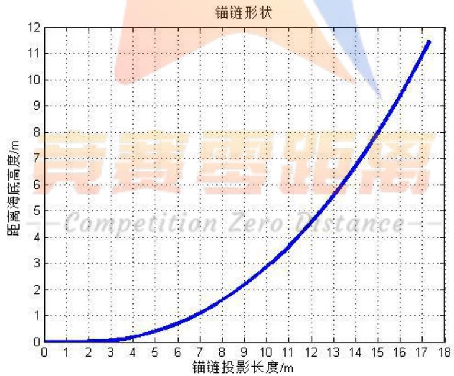

<details>
<summary>line</summary>

| 锚链投影长度/m | 距离海底高度/m |
| --- | --- |
| 0 | 0 |
| 1 | ~0.05 |
| 2 | ~0.1 |
| 3 | ~0.2 |
| 4 | ~0.4 |
| 5 | ~0.7 |
| 6 | ~1.1 |
| 7 | ~1.6 |
| 8 | ~2.2 |
| 9 | ~2.9 |
| 10 | ~3.7 |
| 11 | ~4.6 |
| 12 | ~5.6 |
| 13 | ~6.7 |
| 14 | ~7.9 |
| 15 | ~9.2 |
| 16 | ~10.6 |
| 17 | ~11.5 |
</details>

图 10 重物球质量为 4090kg时锚链形状图形

## 5.3考虑风力、水流力和水深的系泊系统优化模型

## 5.3.1 模型前准备

(1)同时考虑风力，水流力，水深时，与模型 2 相比，外界的条件由水深 18m、海水流速=0m/s、风速最大 36m/s，变化为水深 16m-20m、海水流速最大 1.5m/s、风速最大可达到36m/s。基于前面的结果分析不难得知，流速和风速越大，系泊系统越危险，且需要考虑不同水深水流不同造成的影响。因此需要合理设计系泊系统的参数，使得其在不同情况下均可达到最优的工作状态。

(2)系泊系统参数确定后，对于题目中的所提到的不同情况，将其理解为：

a.水流力与风力的夹角分别为同向、反向、相互垂直的情况；  
b.水流速度从海面到海底的规律分别为各点水流速度相同、水流速度自上而下线性递减或者其他形式；  
c.实测水深分别为 16m、17m、18m、19m、20m 的情况。

因此，首先需要分析水流力与风力的三种夹角的受力情况，对于水流速度的变化规律及实测水深分别进行讨论。然后利用多目标优化模型确定不同情况下最优的锚链型号、长度和重物球质量。

## 5.3.2 水流力与风力的三种夹角下的受力分析

由模型1中所推导的方程(20)-(27)可知，当考虑水流力时，水流力仅对水平方向作用力有影响，对竖直方向作用力和力矩均无影响。将钢管作用力的作用点简化为钢管中心，根据模型 2 中求解结果显示，钢桶与各钢管的夹角均小于 2度，因此可以将水流力 $F _ { w a t e r }$ 对钢桶和钢管的作用面积视为钢桶和钢管的纵截面积。

每一截钢管所受到的水流力： $F _ { w a t \_ p i p e } = 3 7 4 \times S \nu ^ { 2 } = 3 7 4 \times 1 \times 5 0 \times 1 0 ^ { - 3 } \times \nu ^ { 2 }$

钢桶所受到的水流力： $F _ { w a t b u c k e t } = 3 7 4 \times 1 \times 3 0 \times 1 0 ^ { - 2 } \times \nu ^ { 2 }$

浮标所受到的水流力： $F _ { w a t f l o a t } = 3 7 4 \times 2 \times d \times \nu ^ { 2 }$

下面对各点水流速度相同时，水流力与风力的夹角分别为同向、反向、相互垂直的情况，以及各点水流速度不同时水流力的计算分别进行讨论：

## (1)水流力与风力同向时

此时系泊系统的受力仍然处于同一个平面内，对锚链进行受力分析，基于模型一中锚链线方程的推导，可知加入水流力后，锚链线函数 $y ( x )$ 发生如下改变：

$$
\begin{array}{l} y = \frac {F _ {\text {wind}}}{\sigma g} \cosh \left(\frac {\sigma g}{F _ {\text {wind}}} x + \sinh^ {- 1} (\tan \alpha_ {1})\right) - \frac {F _ {\text {wind}}}{\sigma g} \cosh \left(\sinh^ {- 1} (\tan \alpha_ {1})\right) \\ \Rightarrow y = \frac {F ^ {\prime}}{\sigma g} \cosh \left(\frac {\sigma g}{F ^ {\prime}} x + \sinh^ {- 1} \left(\tan \alpha_ {1}\right)\right) - \frac {F ^ {\prime}}{\sigma g} \cosh \left(\sinh^ {- 1} \left(\tan \alpha_ {1}\right)\right) \tag {32} \\ \end{array}
$$

其中改变后的力F’表示为 $F ^ { \prime } = F _ { w i n d } + 4 F _ { w a t \_ p i p e } + F _ { w a t \_ b u c k e t } + F _ { w a t \_ f l o a t }$ (33)

对钢桶重新进行受力分析和力矩分析，由于钢桶左侧力由 $F _ { w i n d }$ 变为 $F ^ { \prime }$ ，因此和模型一相比，钢桶受力平衡的方程组发生如下改变：

$$
\left\{ \begin{array}{l} x: F _ {1} \sin \gamma_ {1} = F _ {\text {wind}} \\ y: G _ {\text {bucket}} + G _ {\text {ball}} + \frac {F _ {\text {wind}}}{\cos \alpha_ {2}} \sin \alpha_ {2} = f _ {\text {ball}} + f _ {\text {bucket}} + F _ {1} \cos \gamma_ {1} \\ G _ {\text {ball}} L \sin \beta + F _ {1} L \sin (\beta - \gamma_ {1}) = \frac {F _ {\text {wind}}}{\cos \alpha_ {2}} L \sin \left(\frac {\pi}{2} - \alpha_ {2} - \beta\right) \end{array} \right.
$$

$$
\Rightarrow \left\{ \begin{array}{l} x: F _ {1} \sin \gamma_ {1} = F ^ {\prime} \\ y: G _ {\text {bucket}} + G _ {\text {ball}} + \frac {F ^ {\prime}}{\cos \alpha_ {2}} \sin \alpha_ {2} = f _ {\text {ball}} + f _ {\text {bucket}} + F _ {1} \cos \gamma_ {1} \\ G _ {\text {ball}} L \sin \beta + F _ {1} L \sin (\beta - \gamma_ {1}) = \frac {F ^ {\prime}}{\cos \alpha_ {2}} L \sin \left(\frac {\pi}{2} - \alpha_ {2} - \beta\right) \end{array} \right. \tag {34}
$$

对钢管进行受力分析，由于对每一根钢管，水流力对竖直方向作用力和力矩平衡式均无影响，仅对水平方向的受力平衡式有影响。因此和模型一相比，1-4号钢管水平方向上受力平衡式依次发生如下改变：

$$
F _ {1} \sin \gamma_ {1} = F _ {2} \sin \gamma_ {2} \Rightarrow F _ {1} \sin \gamma_ {1} = F _ {2} \sin \gamma_ {2} + F _ {\text {wat\_pipe}} \tag {35}
$$

$$
F _ {2} \sin \gamma_ {2} = F _ {3} \sin \gamma_ {3} \Rightarrow F _ {2} \sin \gamma_ {2} = F _ {3} \sin \gamma_ {3} + F _ {\text {wat\_pipe}} \tag {36}
$$

$$
F _ {3} \sin \gamma_ {3} = F _ {4} \sin \gamma_ {4} \Rightarrow F _ {3} \sin \gamma_ {3} = F _ {4} \sin \gamma_ {4} + F _ {\text {wat\_pipe}} \tag {37}
$$

$$
F _ {4} \sin \gamma_ {4} = F _ {5} \sin \gamma_ {5} \Rightarrow F _ {4} \sin \gamma_ {4} = F _ {5} \sin \gamma_ {5} + F _ {\text {wat\_pipe}} \tag {38}
$$

对浮标进行水平方向的受力分析，浮标受到同侧的水流力和风力，和模型一相比，水平方向的平衡方程发生如下改变：

$$
F _ {5} \sin \gamma_ {5} = F _ {\text {wind}} \Rightarrow F _ {5} \sin \gamma_ {5} = F _ {\text {wind}} + F _ {\text {wat\_float}}
$$

具体变化可以带入风力和水流力的公式，即：

F5 sin γ5 = 0.625×2×(2−d)v² ⇒ F, sin γ5 = 0.625×2×(2−d)v² +374×2×d ×v2(39)其中：钢管1,2,3,4与竖直方向的夹角分别记为 $\theta _ { 1 } , \theta _ { 2 } , \theta _ { 3 } , \theta _ { 4 }$ ,钢管 1,2,3,4 的下端力的方向与钢桶中心轴线的夹角分别为 $\gamma _ { 1 } , \gamma _ { 2 } , \gamma _ { 3 } , \gamma _ { 4 } ,$ 1号钢管左侧拉力为 $\mathrm { F } _ { 1 }$ ，右侧拉力为 $\mathrm { F } _ { 2 }$ ，2号钢管左侧拉力为 $\mathrm { F } _ { 2 }$ ，右侧拉力为 $\mathrm { F } _ { 3 }$ ， 以此类推5号钢管左侧拉力为 $\mathrm { F } _ { 4 }$ ，右侧拉力为 $\mathrm { F } _ { 5 }$ ，每一段钢管的重力为 $G _ { p i p e }$ 浮力为 $f _ { p i p e }$ 。重物球浮力为 $f _ { b a l l }$ ， $\beta$ 代表钢桶与竖直线夹角； $\rho$ 代表海水密度， $g$ 代表重力加速度；V 代表浮标沉在海水中的体积；S代表为物体在风向法平面的投影面积(m<sup>2</sup>)，v为风速(m/s）； $m _ { \mathrm { b a l l } }$ 为重物球质量。

## (2)水流力与风力反向时

与二力同向相比，只需将水平方向的受力平衡式中含水流力的部分取反处理即可。上述 (32)-(39)式改变为：

$$
F ^ {\prime} = F _ {\text {wind}} - 4 F _ {\text {wat\_pipe}} - F _ {\text {wat\_bucket}} - F _ {\text {wat\_float}} \tag {40}
$$

$$
F _ {1} \sin \gamma_ {1} = F _ {2} \sin \gamma_ {2} - F _ {\text {wat\_pipe}} \tag {41}
$$

$$
F _ {2} \sin \gamma_ {2} = F _ {3} \sin \gamma - F _ {\text {wat\_pipe}} \tag {42}
$$

$$
F _ {3} \sin \gamma_ {3} = F _ {4} \sin \gamma_ {4} - F _ {\text {wat\_pipe}} \tag {43}
$$

$$
F _ {4} \sin \gamma_ {4} = F _ {5} \sin \gamma_ {5} - F _ {\text {wat\_pipe}} \tag {44}
$$

$$
F _ {5} \sin \gamma_ {5} = 0. 6 2 5 \times 2 \times (2 - d) v ^ {2} - 3 7 4 \times 2 \times d \times v ^ {2} \tag {45}
$$

## (3)水流力与风力垂直时

基于(1),(2)部分的计算可知，作用在钢桶上的水流力约为 252.5N，作用在每根钢管上的水流力约为42.1N，而钢桶和钢管两端的作用力量级为 $1 . 5 \times 1 0 ^ { 4 } \mathrm { N }$ 。故在近似计算时，可近似认为水下的钢管和钢桶受到的水流力可以忽略不计，仅考虑浮标所受到的水流力。

此时系泊系统的总体仍然处于一个平面内，和水流力与风力同向、反向这两种情况不同之处在于：当水流力与风力垂直时，系泊系统的所处平面会发生旋转，最终系泊系统稳定时，以浮标所受的水流力与风力的合力为x 轴正方向，y轴正方向仍然为竖直向上，建立坐标系如图11所示：

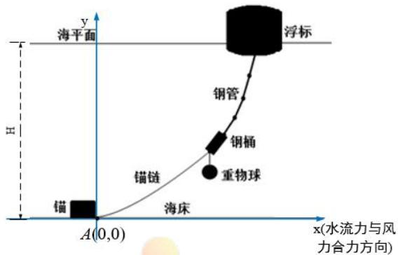

<details>
<summary>text_image</summary>

浮标
海平面
y
H
钢管
钢桶
重物球
锚链
锚
A(0,0)
海床
x(水流力与风力合力方向)
</details>

图 11 考虑水流力时的系泊系统坐标系

对比水平力与风力同向时的刚体力学方程(32)-(39)可知：

对锚链进行分析，忽略钢管，钢桶所受水流力，锚链曲线表示为

$$
y = \frac {F ^ {\prime}}{\sigma g} \cosh \left(\frac {\sigma g}{F ^ {\prime}} x + \sinh^ {- 1} (\tan \alpha_ {1})\right) - \frac {F ^ {\prime}}{\sigma g} \cosh \left(\sinh^ {- 1} (\tan \alpha_ {1})\right) \tag {46}
$$

其中改变后的力 $F ^ { : }$ 表示为 $F ^ { \prime } { = } F _ { w i n d } + F _ { w a t \_ f l o a t }$ (47)

对钢桶和重物球重新进行受力分析和力矩分析，与模型二相比，钢桶左侧力发生由 $F _ { w i n d }$ 变为 $F ^ { \prime }$ ，如下改变：

$$
\left\{ \begin{array}{l} x: F _ {1} \sin \gamma_ {1} = F ^ {\prime} \\ y: G _ {\text {bucket}} + G _ {\text {ball}} + \frac {F ^ {\prime}}{\cos \alpha_ {2}} \sin \alpha_ {2} = f _ {\text {ball}} + f _ {\text {bucket}} + F _ {1} \cos \gamma_ {1} \\ G _ {\text {ball}} L \sin \beta + F _ {1} L \sin (\beta - \gamma_ {1}) = \frac {F ^ {\prime}}{\cos \alpha_ {2}} L \sin \left(\frac {\pi}{2} - \alpha_ {2} - \beta\right) \end{array} \right. \tag {48}
$$

对钢管进行受力分析，由于对每一根钢管，水流力对竖直方向作用力和力矩平衡式均无影响，仅对水平方向的受力平衡式有影响。因此和模型二相比，1-4号钢管水平方向上受力平衡式依次发生如下改变：

$$
F _ {1} \sin \gamma_ {1} = F _ {2} \sin \gamma_ {2} \tag {49}
$$

$$
F _ {2} \sin \gamma_ {2} = F _ {3} \sin \gamma_ {3} \tag {50}
$$

$$
F _ {3} \sin \gamma_ {3} = F _ {4} \sin \gamma_ {4} \tag {51}
$$

$$
F _ {4} \sin \gamma_ {4} = F _ {5} \sin \gamma_ {5} \tag {52}
$$

对浮标进行水平方向的受力分析,浮标受到相互垂直的水流力和风力,4号钢管的拉力的水平分量和水流力与风力的合力平衡。代入风力和水流力的公式，即：

$$
F _ {5} \sin \gamma_ {5} = \sqrt {\left(0 . 6 2 5 \times 2 \times (2 - d) v ^ {2}\right) ^ {2} + \left(3 7 4 \times 2 \times d \times v ^ {2}\right) ^ {2}} \tag {53}
$$

## (4)各点水流速度不同时水流力的计算

各点水流速度不同时，应分段处理水流力的计算。假设系泊系统在水中的每一个固定的高度 $d y$ ，水流速度不变，视为 $\nu _ { i \circ }$ 。参照二力同向时钢管、钢桶和浮标的水流力公式，得到：

每一截钢管所受到的水流力： $F _ { w a t \_ p i p e } = \sum _ { i } 3 7 4 \times 1 \times 5 0 { \times } 1 0 ^ { - 3 } \times \nu _ { i } ^ { 2 }$

钢桶所受到的水流力： $F _ { w a t \_ b u c k e t } = \sum _ { i } 3 7 4 \times 1 \times 3 0 { \times } 1 0 ^ { - 2 } \times \nu _ { i } ^ { 2 }$

浮标所受到的水流力： $F _ { w a t \_ f l o a t } = \sum _ { i } { 3 7 4 \times 2 \times d \times \nu _ { i } ^ { 2 } }$

## 5.3.3 多目标优化模型的建立

由于同时考虑风力、水流力和水深时(以下统称为外界的条件)，外界条件较为复杂，要求在系泊系统最危险的情况仍能使系泊系统正常工作。因此需要合理设计系泊系统的参数：包括锚链型号kind 、锚链长度s、重物球质量 $m _ { \mathrm { b a l l } }$ 。其中锚链型号直接影响了锚链单位长度的质量 。因此基于问题2所建立的多目标 $\sigma _ { k i n d }$ 优化模型，找到不同情况下最优的工作状态对应的锚链型号及长度，即为最优的设计。

## (1)优化目标一：钢桶倾斜角度最小

按题目所述，保证钢桶倾斜角度最小是系泊系统正常工作的重要条件。钢桶倾斜角度 $\beta$ 可由力学方程组联立求解得到，分析由于 $G _ { b a l l } , \sigma _ { \mathit { k i n d } } , s$ 的改变，刚体力学方程组形式完全不变，但是钢桶左侧受重物球力的大小发生变化， $\sigma _ { k i n d }$ 使得锚链曲线方程发生改变，锚链长度同样影响了锚链在竖直方向的投影长度，从而引起刚体力学方程组的求解结果发生改变，因而钢桶的倾斜角度由于受到钢桶受力平衡和力矩平衡方程所影响，也同样发生变化。

按照问题1假设，锚链长度和型号、水深及海水密度均已知。因此当重物球质量 $m _ { \mathrm { b a l l } }$ ，锚链型号长度 $\sigma _ { k i n d } , s$ 确定时，力学方程中各参数和结果均已确定，仅受重物球质量 $m _ { \mathrm { b a l l } }$ ，锚链型号 $\sigma _ { k i n d }$ ，长度s影响。

故优化目标一可以表示为：

$$
\min \beta \bigl (m _ {\text {ball}}, \sigma_ {\text {kind}}, s \bigr)
$$

## (2)优化目标二：浮标的吃水深度最小

题目要求系泊系统的设计要使得浮标的吃水深度d尽可能小，d同样处于力学方程中，与优化目标一的受力分析相同。当重物球质量 $m _ { \mathrm { b a l l } }$ 、锚链单位长度的质量 $\sigma _ { k i n d }$ 和锚链长度s确定时，各参数和结果均可通过力学式确定，故吃水深度仅受 $m _ { \mathrm { b a l l } } \ , \quad \sigma _ { \mathrm { \it k i n d } }$ 和s影响。该优化目标可以表示为：

$$
\min d \left(m _ {\text {ball}}, \sigma_ {\text {kind}}, s\right)
$$

## (3)优化目标三：游动区域的半径最小

系泊系统的设计中同样要求浮标的游动区域要尽可能小，浮标的浮动区域表示为以锚为起点的最大半径为 R的圆内，R的求解即(29)式。与优化目标一的受力分析相同，游动区域仅受重物球质量m 、锚链单位长度的质量 $m _ { \mathrm { b a l l } }$ $\sigma _ { k i n d }$ 和锚链长度s影响，通过力学方程组联立可以求解。该优化目标可以表示为：

$$
\min \quad R \big (m _ {\text {ball}}, \sigma_ {\text {kind}}, s \big)
$$

## (4)决策变量与约束条件

通过对优化目标一，二，三的分析可知，决策变量即为重物球质量 $m _ { \mathrm { b a l l } }$ 、锚链种类kind和锚链长度 s。

由于问题 3 中重物球质量不定，重力加速度 g 取 $9 . 8 \mathrm { m } / \mathrm { s } ^ { 2 }$ ，故在此粗略限定重物球范围：

$$
0 \leq m _ {\text {ball}} \leq 5 0 0 0
$$

锚链种类kind=1,2,3,4,5，对应的锚链单位长度的质量 $\sigma _ { k i n d }$ 为：

$$
\sigma_ {1} = 3. 2, \sigma_ {2} = 7, \sigma_ {3} = 1 2. 5, \sigma_ {4} = 1 9. 5, \sigma_ {5} = 2 8. 1 2
$$

由于锚链长度s 为决策变量，基于第一二问中的求解规律，可以先粗略地进行一定的范围约束：

$$
1 1 \leq s \leq 3 0
$$

题目要求锚链在左端锚点与海床的夹角 $\alpha _ { 1 }$ 不超过 16 度，钢桶倾斜角度β不超过 5度。由于上文中要求优化目标一最小，由于优化目标一为钢桶倾斜角度最小，所以只需在最后检验钢桶倾角是否满足不超过 5 度的条件。此外还需验证浮标是否露在水面上、以及各指标参数是否符合常理。因此限定 $\alpha _ { 1 }$ 如下：

$$
0 ^ {\circ} \leq \alpha_ {1} \leq 1 6 ^ {\circ}
$$

## 5.3.4 模型汇总

基于上述水流力与风力的三种夹角下的受力分析和计算，可以得到水流力与风力同向、反向和垂直时汇总中的 20 个方程(参考模型 1 的汇总)。然后利用优化目标、约束条件与决策变量之间的关系，通过外界条件下的方程组联立求解。

(1)刚体力学方程组（见附件1）  
(2)多目标优化模型的最终确立

$$
\min \quad \beta \left(m _ {\text {ball}}, \sigma_ {\text {kind}}, s\right) \tag {54}
$$

$$
\min \quad d \left(m _ {\text {ball}}, \sigma_ {\text {kind}}, s\right) \tag {55}
$$

$$
\min \quad R \left(m _ {\text {ball}}, \sigma_ {\text {kind}}, s\right) \tag {56}
$$

$$
s. t. \left\{ \begin{array}{l} 0 \leq m _ {\text {ball}} \leq 4 0 0 0 \\ \sigma_ {\text {kind}} = \left[ \begin{array}{l l l l l} 3. 2 & 7 & 1 2. 5 & 1 9. 5 & 2 8. 1 2 \end{array} \right] \\ 1 1 \leq s \leq 3 0 \\ 0 ^ {\circ} \leq \alpha_ {1} \leq 1 6 ^ {\circ} \end{array} \right. \tag {57}
$$

其中， $\beta$ 代表钢桶倾斜角度；d 代表浮标吃水深度；R代表游动区域半径,均可由力学方程组求解；决策变量为重物球质量 $m _ { \mathrm { b a l l } }$ 、锚链单位长度的质量 $\sigma _ { k i n d }$ 和锚链长度s，受到锚链左端与海平面夹角 $\alpha _ { 1 }$ 的约束。

同模型 2处理方法相同，先对三个目标函数进行无量纲化处理，再采用线性加权法归一化，将多目标优化问题化归为单目标优化：

$$
\min \quad \lambda_ {1} \frac {\beta (m _ {\mathrm{ball}} , \sigma_ {\text {kind}} , s)}{\beta_ {\max}} + \lambda_ {2} \frac {d (m _ {\mathrm{ball}} , \sigma_ {\text {kind}} , s)}{d _ {\max}} + \lambda_ {3} \frac {R (m _ {\mathrm{ball}} , \sigma_ {\text {kind}} , s)}{R _ {\max}}
$$

其中权重 $\lambda _ { 1 } , \lambda _ { 2 } , \lambda _ { 3 }$ 代表了每个目标函数的重要程度，三个权重之和等于 1，即$\lambda _ { 1 } + \lambda _ { 2 } + \lambda _ { 3 } = 1 \circ \beta _ { \operatorname* { m a x } } , d _ { \operatorname* { m a x } } ^ { } , \mathcal { R } _ { \operatorname* { m a x } } ^ { }$ 分别代表在所选取的自变量范围内，钢桶倾斜角度，浮标吃水深度，浮标游动区域的半径可能达到的最大值。对不同的权重组合进行求解。

## 5.3.5 模型的求解算法

## (1) 算法分析：

模型 3需要先求解出系泊系统的最优设计，然后再对不同的情况进行系泊系统浮标系统的参数计算。

在5.2.2节基础上进行修改可以得到最优设计的三个决策变量的求解程序。调整求解方程，加上水流的影响；将锚链线密度、锚链长度、重物球质量均作为全局变量；用多重搜索，对锚链线密度、锚链长度、重物球质量遍历，根据优化目标值最小查找系泊系统的最优设计。

确定最优设计后，对于水流力方向与风力方向的不同情况，各高度的水流速度的变化，只要根据模型三修改部分力学方程组。然后参照 5.1.3 节中的算法求解钢管、钢桶倾角，区域半径，吃水深度等相关数据。

## (2) 算法思想：多重搜索

因为程序对锚链线密度、锚链长度、重物球质量，进行遍历查找最优解，算法复杂度较大，求解时间较长，故采用多重搜索来减少程序运行时间。即先用较大步长即粗精度查找粗略解，再在粗略解附近用较小步长求解最优解。

## (3)算法步骤：

Step1：由于需要进行锚链是否有贴在海底的部分的判断，利用MATLAB的“fsolve”函数以及力学方程组函数“方程1”“方程2”：其中方程1表示锚链存在拖地部分，方程2表示锚链不存在拖地部分。

Step2： 在5.2.2节基础上，为了方便各子程序中对变量的调用，修改程序中与水流力相关的方程，将重物球质量“M<sub>ball</sub>”、锚链线密度“sigma”、锚 链长度“maolian”作为全局变量。

Step3：为了让 MATLAB 自动进行锚链是否拖地的判断，需要编写子程序“fun”，通过求解力学方程组，对返回值中的锚链与海底夹角1是否大于 0 进行判断，得知锚链是否有贴在海底的部分，从而决定使用“方程1”或者“方程 2”再次计算。

Step4：编写主程序，以较大精度，使用“for”函数对重物球质量、锚链线密度、锚链长度遍历，调用子程序“fun”(作用如 step3 所述)，求解钢桶倾角、钢管倾角、吃水深度、区域半径，通过判断约束指标“ <16°”，“β<5°”，“d<5”等判断进行筛选得到一系列可行解。

Step5：对目标函数进行无量纲化和归一化：将钢桶倾角、吃水深度、区域半径除以各自最大值，并以不同的权重组合加权相加得到优化目标，用“min”函数查找新的优化目标的最优解，得到决策变量值：重物球质量“M<sub>ball</sub>”、锚链线密度“sigma”、锚链长度“maolian”的粗略解。

Step6：将精度缩小，仍然按照 step5 的方法，查找重物球质量、锚链线密度、锚链长度的最优解。并对不同权重组合下求得的结果进行比较。

Step7：修改使用5.1.3 中算法，对得到的最优重物球质量、锚链线密度、锚链长度，在不同深度下，各点水流速度不同时，水流力与风力夹角不同时，参照模型三进行力学方程组的修改，仿照模型1的求解算法可以求解钢桶倾角、吃水深度、区域半径等变量的值，并绘出锚链形状图。

## 5.3.6 模型的求解结果及分析

基于上述模型建立及求解算法，求解得到不同情况下钢桶和各节钢管的倾斜角度、锚链形状、浮标的吃水深度和游动区域最大半径。

其中不同情况包括：1).各位置水流速度相同，水流力与风力同向；2). 各位置水流速度相同，水流力与风力反向；3). 各位置水流速度相同，水流力与风向垂直；4). 各位置水流速度自上而下线性递减，水流力与风力同向；令海水深度H 分别为 16m、17m、18m、19m、20m，选择最优的锚链型号、长度和重物球质量。

结果显示：当各位置水流速度相同时，仅 5号锚链能够达到目标函数和约束条件的要求，故选择锚链型号5(即单位长度质量为28.12kg/m)，锚链长为20.90m，重物球质量为4601.88kg；当各位置水流速度自上而下线性递减(呈一次函数，海面水速大海底水速为0)时：选择锚链型号 5(即单位长度质量为 28.12kg/m)，锚链

长为 20.90m，重物球质量为 4635.34kg。

可见各点水流速度的不同对三个决策变量的影响较小，为了保证系泊系统的最优设计，最终选定锚链型号为5，锚链长度为20.90m，重物球质量为4635.34kg。

以各位置水流速度相同时，水力与风力同向时的求解结果为例，其余情况下的结果见附件2-4。

求解得到不同深度下的钢桶和各节钢管的倾斜角度、浮标的吃水深度、游动区域最大半径和锚链左端点A端切线方向与 x轴正方向的夹角 $\alpha _ { \mathrm { _ 1 } }$ 如下表：

表 5 各点水速相同、水力与风力同向时的系泊系统参数表

<table><tr><td>深度H</td><td>H=16m</td><td>H=17m</td><td>H=18m</td><td>H=19m</td><td>H=20m</td></tr><tr><td>钢桶与竖直线夹角 $\beta$ </td><td>4.4868°</td><td>4.4555°</td><td>4.4252°</td><td>4.3945°</td><td>4.3674°</td></tr><tr><td>钢管1倾斜角度 $\theta_1$ </td><td>4.3946°</td><td>4.3633°</td><td>4.3331°</td><td>4.3024°</td><td>4.2753°</td></tr><tr><td>钢管2倾斜角度 $\theta_2$ </td><td>4.3328°</td><td>4.3021°</td><td>4.2723°</td><td>4.2422°</td><td>4.2155°</td></tr><tr><td>钢管3倾斜角度 $\theta_3$ </td><td>4.2713°</td><td>4.2411°</td><td>4.2118°</td><td>4.1821°</td><td>4.1560°</td></tr><tr><td>钢管4倾斜角度 $\theta_4$ </td><td>4.2101°</td><td>4.1803°</td><td>4.1516°</td><td>4.1224°</td><td>4.0966°</td></tr><tr><td>浮标吃水深度d</td><td>1.7637m</td><td>1.7744m</td><td>1.7848m</td><td>1.7956m</td><td>1.8052m</td></tr><tr><td>游动区域最大半径R</td><td>18.0025m</td><td>17.4934m</td><td>16.9661m</td><td>16.3961m</td><td>15.8630m</td></tr><tr><td>锚链与海床夹角 $\alpha_1$ </td><td>0°</td><td>0°</td><td>0°</td><td>0°</td><td>0°</td></tr></table>

根据表5可知，当深度H 逐渐增加时，钢桶和钢管的倾斜角度均逐渐减小，浮标吃水深度逐渐增加，而游动区域最大半径逐渐变小，锚链均存在沉在海底的部分。

H分别为16m、17m、18m、19m、20m 时绘制的锚链形状图形如下：

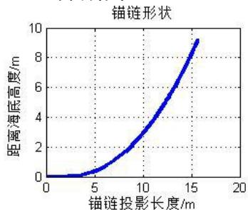

<details>
<summary>line</summary>

| 锚链投影长度/m | 距离海底高度/m |
| --- | --- |
| 0 | 0 |
| ~2.5 | ~0.1 |
| ~4 | ~0.3 |
| ~6 | ~0.8 |
| ~8 | ~1.5 |
| ~9 | ~2.0 |
| ~10 | ~2.8 |
| ~11 | ~3.5 |
| ~12 | ~4.5 |
| ~13 | ~5.5 |
| ~14 | ~6.8 |
| ~15 | ~8.2 |
| ~15.5 | ~9.2 |
</details>

H=16m

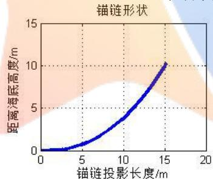

<details>
<summary>line</summary>

| 锚链投影长度/m | 距离海底高度/m |
| --- | --- |
| 0 | 0 |
| ~2.5 | ~0.1 |
| ~5 | ~0.8 |
| ~7.5 | ~2.2 |
| 10 | ~4.0 |
| ~12.5 | ~6.5 |
| 15 | 10 |
</details>

H=17m

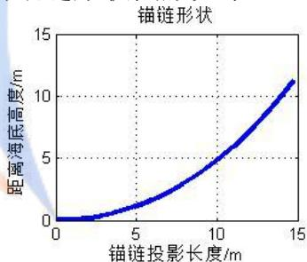

<details>
<summary>line</summary>

| 锚链投影长度/m | 距离海底高度/m |
| --- | --- |
| 0 | 0 |
| ~2.5 | ~0.2 |
| 5 | ~1.2 |
| 7.5 | ~3.0 |
| 10 | ~5.0 |
| 12.5 | ~8.0 |
| 14.5 | ~11.2 |
</details>

H=18m

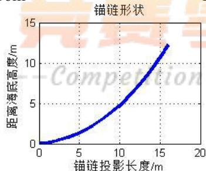

<details>
<summary>line</summary>

| 锚链投影长度/m | 距离海底高度/m |
| --- | --- |
| 0 | 0 |
| ~5 | ~1.5 |
| 10 | 5 |
| ~16 | ~12.5 |
</details>

H=19m

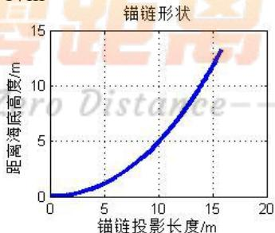

<details>
<summary>line</summary>

| 锚链投影长度/m | 距离海底高度/m |
| --- | --- |
| 0 | 0 |
| ~2.5 | ~0.2 |
| ~5 | ~1.2 |
| ~7.5 | ~3.0 |
| 10 | 5 |
| ~12.5 | ~8.0 |
| ~15 | ~12.0 |
| ~16 | ~13.5 |
</details>

H=20m  
图 12 不同深度时的锚链形状图形

各位置水流速度相同，水流力与风力反向、垂直，以及水流速度自上而下线性递减，水流力与风力同向时，求解得到不同深度下的钢桶和各节钢管的倾斜角度、浮标的吃水深度、游动区域最大半径和夹角 $\alpha _ { \mathrm { _ 1 } }$ ，以及 H 分别为16m、17m、18m、19m、20m 时绘制的锚链形状图形见附件2-4。

## 六、模型评价与改进

## 6.1模型优点

1.文中模型 5.1 仿照悬链线方程利用微元法的思想推导出了锚链线方程，使得求结过程得到简化，利于后续结果的计算，使得模型更加可靠。  
2.模型 5.2以钢桶倾角最小，浮标吃水深度最小，浮标游动区域半径最小为优化目标建立多目标优化模型，通过调整权重来衡量某个目标的重要程度，使得结果更加客观。  
3.由于问题2规模较小，采用直接多重遍历搜索即可求得最优的重物球质量。使得模型较为简单直接，计算方便。  
4.模型 5.3 中考虑到了不同的水流速度与距海底高度的情况，水流力与风力成不同角度，不同水深条件下的情况，最后确定系泊系统的锚链型号，锚链长度，重物球质量。对于各情况均进行分析，使得结果更加可信。

## 6.2模型缺点

1. 第三问中模型求解时受到初始解的影响较大，有的可能缺失最优解。  
2. 当水流力与风力同时作用在浮标上时，未考虑浮标产生倾斜时的情况。  
3. 由于限制的最大吃水深度越大，钢桶倾角就越能够达到最小，所以对于浮标最大吃水深度的限制，模型 2中取 1.5米，模型 3中取1.8 米，存在一定的主观性。

## 6.3模型改进

## (1)水流力与风力夹角任意时

为了验证模型三求解出的系泊系统的锚链型号，长度，重物球质量。对于浮标倾斜的情况进行重新受力分析，由于水平方向上浮标受力情况不变，但是风力和水流力的角度可以是任意值，所以浮标受到的水流力和风力的合力发生变化。浮标所受合力可以根据力的平行四边形法则和余弦定理表示为：

$$
F = \sqrt {F _ {\text {wat\_float}} ^ {2} + F _ {\text {wind}} ^ {2} - 2 F _ {\text {wat\_float}} F _ {\text {wind}} \cos \eta}
$$

其中 $F _ { w a t \_ f l o a t }$ 表示浮标所受到的水流力， $F _ { w i n d }$ 代表浮标所受到的风力，F 代表浮标水平方向上所受到的水流力与风力的合力， 代表风力与水流力夹角。

假设水流力与风力夹角为任意角度 $\eta$ ，按照模型三中所求解得到的三个决策变量,当水深为20m时，对系泊系统各参数进行计算，锚链线见附件 5：

表 6 各点水速相同、水力与风力任意角度时的系泊系统参数表

<table><tr><td>任意角度 $\eta$ </td><td> $\eta = 30^{\circ}$ </td><td> $\eta = 45^{\circ}$ </td><td> $\eta = 60^{\circ}$ </td></tr><tr><td>钢桶与竖直线夹角 $\beta$ </td><td> $3.3920^{\circ}$ </td><td> $3.4691^{\circ}$ </td><td> $3.5655^{\circ}$ </td></tr><tr><td>钢管1倾斜角度 $\theta_1$ </td><td> $3.3552^{\circ}$ </td><td> $3.4315^{\circ}$ </td><td> $3.5270^{\circ}$ </td></tr><tr><td>钢管2倾斜角度 $\theta_2$ </td><td> $3.3483^{\circ}$ </td><td> $3.4245^{\circ}$ </td><td> $3.5197^{\circ}$ </td></tr><tr><td>钢管3倾斜角度 $\theta_3$ </td><td> $3.3414^{\circ}$ </td><td> $3.4174^{\circ}$ </td><td> $3.5124^{\circ}$ </td></tr><tr><td>钢管4倾斜角度 $\theta_4$ </td><td> $3.3345^{\circ}$ </td><td> $3.4104^{\circ}$ </td><td> $3.5052^{\circ}$ </td></tr><tr><td>浮标吃水深度 $d$ </td><td>1.7851m</td><td>1.7863m</td><td>1.7879m</td></tr><tr><td>游动区域最大半径 $R$ </td><td>15.0511m</td><td>15.1108m</td><td>15.1836m</td></tr><tr><td>锚链左端切线方向与海床夹角 $\alpha_1$ </td><td> $0^{\circ}$ </td><td> $0^{\circ}$ </td><td> $0^{\circ}$ </td></tr></table>

由上表规律可知任意夹角时，均可满足系泊系统正常工作的条件，且各个参数差异不大。

## (2)模型三中优化目标的权重发生改变时

模型三的求解中优化目标所设定的权重为 $\lambda _ { 1 } = 0 . 8 , \lambda _ { 2 } = 0 . 1 , \lambda _ { 3 } = 0 . 1$ ，当修改权重为 $\lambda _ { 1 } = 0 . 4 , \lambda _ { 2 } = 0 . 3 , \lambda _ { 3 } = 0 . 3 , \lambda _ { 1 } = 1 / 3 , \lambda _ { 2 } = 1 / 3 , \lambda _ { 3 } = 1 / 3 , \lambda _ { 1 } = 0 . 1 , \lambda _ { 2 } = 0 . 8 , \lambda _ { 3 } = 0 . 1$ 即优化目标-钢桶倾角尽可能小，从占绝对重要的比重，改变为占相对重要的比重或相等的比重时，浮标吃水深度最小占绝对重要比重时，按照模型三所设定的优化目标进行重新计算，求解在新的权重下的三个决策变量的数值，即锚链型号，锚链长度，重物球质量如下(此时海面下各点水流速度相同)：

表 6 各点水速相同、水力与风力同向，不同权重组合的系泊系统参数表

<table><tr><td>不同权重组合 $\lambda_1, \lambda_2, \lambda_3$ </td><td> $\lambda_1 = 0.8, \lambda_2 = 0.1$  $\lambda_3 = 0.1$ </td><td> $\lambda_1 = 0.4, \lambda_2 = 0.3$  $\lambda_3 = 0.3$ </td><td> $\lambda_1 = 1/3, \lambda_2 = 1/3$  $\lambda_3 = 1/3$ </td><td> $\lambda_1 = 0.1, \lambda_2 = 0.8$  $\lambda_3 = 0.1$ </td></tr><tr><td>锚链种类</td><td>第5种</td><td>第5种</td><td>第5种</td><td>第5种</td></tr><tr><td>锚链长度</td><td>20.9m</td><td>20.9m</td><td>20.9m</td><td>21.1m</td></tr><tr><td>重物球质量</td><td>4635.24kg</td><td>4635.24kg</td><td>4635.24kg</td><td>4014.14kg</td></tr></table>

由上表可知，优化目标-钢桶倾角尽可能小，从占绝对重要的比重，改变为占相对重要的比重或相等的比重时，系泊系统的设定：锚链种类，长度，重物球质量基本不变。

## (4)模型三中考虑无档链环连接的影响

在模型三的处理中对锚链视为可微函数处理，未考虑无档链环产生的空隙对结果造成的影响，所选取的 5 号链环每个链环的长度为 180mm，选取的锚链总长度为 20.9 米，共约 117 个链环，链环之间的空隙会使得锚链质量的计算发生变化。

不考虑锚链链环空隙时，锚链线密度为28.12kg/m，锚链质量为587.708kg，考虑链环见空隙假定为10mm 时，总空隙长度约为1.17m，可以认为锚链总质量应该减去这一空隙后，总质量为554.82kg，这时估计计算锚链真实线密度大约为26.55kg/m，利用估计的锚链真实线密度带入模型三进行重新求解。

## 七、参考文献

[1] 吴剑锋，王斌，基于悬链线法的锚链长度的计算，中国水运，第 13 卷第 1期，2013 年 1 月。  
[2]http://baike.baidu.com/link?url=pzhaeccLGxe2RsnQ-fgzx4y4Cdgs1W1z28G1WqDCb0j2SIOhM8lPhwG8Vu4-MQ5JhTycvUADdZ1B3BDkdRxOba\_百度百科\_悬链线。  
[3]张德丰等，MATLAB 程序设计与综合应用，清华大学出版社，2012年1 月第一版 Competition ZeroDistance

## 八、附件清单

附件 1：模型三中，风力与水流力同向时的刚体力学方程组  
附件 2：模型三中，各点水速相同、水力与风力反向时的求解结果  
附件 3：模型三中，各点水速相同、水力与风力垂直时的求解结果  
附件 4：模型三中，各点水速不同、水力与风力同向时的求解结果  
附件 5：模型改进中，水流力与风力夹角为任意角度时的锚链形状  
附件 6：问题1 中，系泊系统参数求解的Matlab 程序  
附件 7：锚链部分沉底情况下，系泊系统参数求解的Matlab 程序  
附件 8：锚链不存在沉底的情况下，系泊系统参数求解的Matlab 程序  
附件 9：问题2 中，系泊系统参数求解的Matlab 程序

附件 10：问题 3 中，各点水速相同、水流与风同向时，锚链长度、型号、重物球质量的Matlab 求解程序

附件 11：问题3中，各点水速相同、水流与风同向时，钢桶和钢管的倾斜角度、锚链形状的Matlab 求解程序

## 九、附件

附件 1：风力方向与水流力方向同向时的刚体力学方程组

以水流力与风力同向为例，对模型1中的刚体力学方程组罗列如下：

无沉底： $\left\{ \begin{array} { l l } { \displaystyle { \int _ { 0 } ^ { x _ { 1 } } \sqrt { 1 + y ^ { \prime } { } ^ { 2 } } d x = s , y _ { 1 } = y \big ( x _ { 1 } \big ) } } \\ { \displaystyle { y ^ { \prime } | _ { x _ { 1 } } = \tan \alpha _ { 2 } } } \end{array} \right.$ 锚链：

有沉底： $\left\{ \begin{array} { l l } { \displaystyle { \int _ { x _ { 0 } } ^ { x _ { 1 } } \sqrt { 1 + { y ^ { \prime } } ^ { 2 } } d x = s - x _ { 0 } , y _ { 1 } = y \big ( x _ { 1 } \big ) } } \\ { \displaystyle { y ^ { \prime } | _ { x _ { 1 } } = \tan \alpha _ { 2 } } } \end{array} \right.$

: sin 'x F F 'F y : Gbucket + Gball + −sin α2 = f ball + f bucket + F1 coS γ1 cos 钢桶及重物球： [GbalLsinβ+F1Lsin(β−γ1)= 'F sinL π−α2−β <sub>2</sub>cos 2

[Gpipe + F1 cos γ1 = fpipe + F2 cos γ2$\big | F _ { 1 } \sin \gamma _ { 1 } = F _ { 2 } \sin \gamma _ { 2 } + + F _ { w a t \_ p i p e }$ 钢管1： $\boxed { F _ { 1 } L \sin \left( \gamma _ { 1 } - \theta _ { 1 } \right) = F _ { 2 } L \sin \left( \theta _ { 1 } - \gamma _ { 2 } \right) }$

$\bigg [ G _ { p i p e } + F _ { 2 } \cos \gamma _ { 2 } = f _ { p i p e } + F _ { 3 } \cos \gamma _ { 3 }$ $\left\{ F _ { 2 } \sin \gamma _ { \scriptscriptstyle 2 } = F _ { 3 } \sin \gamma _ { \scriptscriptstyle 3 } + F _ { { \scriptscriptstyle w a t \_ p i p e } } \right.$ 钢管2： $\boxed { F _ { 2 } L \sin \left( \gamma _ { 2 } - \theta _ { 2 } \right) = F _ { 3 } L \sin \left( \theta _ { 2 } - \gamma _ { 3 } \right) }$

{Gpipe + F3 COs 3= pipe + F4COSY4F3 sin γ3 = F4 sin γ4 + Fwat\_pipe钢管3： $\begin{array} { r } { \big | F _ { 3 } L \sin \big ( \gamma _ { 3 } - \theta _ { 3 } \big ) = F _ { 4 } L \sin \big ( \theta _ { 3 } - \gamma _ { 4 } \big ) } \end{array}$

$\Big [ G _ { p i p e } + F _ { 4 } \cos \gamma _ { 4 } = f _ { p i p e } + F _ { 5 } \cos \gamma _ { 5 }$ $\mid F _ { 4 } \sin \gamma _ { 4 } = F _ { 5 } \sin \gamma _ { 5 } + F _ { w a t \_ p i p e }$ 钢管4： $\boxed { F _ { 4 } L \sin \left( \gamma _ { 4 } - \theta _ { 4 } \right) = F _ { 5 } L \sin \left( \theta _ { 4 } - \gamma _ { 5 } \right) }$

浮标： $\left\{ \begin{array} { l } { \pi \bigg ( \displaystyle \frac { 2 } { 2 } \bigg ) ^ { 2 } d g \rho = G _ { b u o y } + F _ { 5 } \cos \gamma _ { 5 } } \\ { F _ { 5 } \sin \gamma _ { 5 } = 0 . 6 2 5 \times 2 \times \big ( 2 - d \big ) \nu ^ { 2 } } \end{array} \right.$ $\begin{array} { r } { \Big | F _ { 5 } \sin \gamma _ { 5 } = 0 . 6 2 5 \times 2 \times \big ( 2 - d \big ) \nu ^ { 2 } + 3 7 4 \times 2 \times d \times \nu ^ { 2 } } \end{array}$

总高度： $H = y _ { 0 } + l _ { b u c k e t } \cos { \beta } + l _ { p i p e } \left( \cos { \theta _ { 1 } } + \cos { \theta _ { 2 } } + \cos { \theta _ { 3 } } + \cos { \theta _ { 4 } } \right) + d$

其中 $F ^ { \prime } { = } F _ { w i n d } + { 4 } F _ { w a t \_ p i p e } { + } F _ { w a t \_ b u c k e t } { + } F _ { w a t \_ f l o a t }$

$$
y = \frac {F ^ {\prime}}{\sigma g} \cosh \left(\frac {\sigma g}{F ^ {\prime}} x + \sinh^ {- 1} (\tan \alpha_ {1})\right) - \frac {F ^ {\prime}}{\sigma g} \cosh \left(\sinh^ {- 1} (\tan \alpha_ {1})\right)
$$

游动区域的最大半径： $R = x _ { 0 } + l _ { b u c k e t } \sin \beta + l _ { p i p e } \left( \sin \theta _ { 1 } + \sin \theta _ { 2 } + \sin \theta _ { 3 } + \sin \theta _ { 4 } \right)$ 其中 20个方程中的符号含义同模型一，上述方程是以水流力与风力同向为例，水流力与风力反向、垂直时，对上述方程组的更改方式如(40)-(45)式，或(46)-(52)式。

附件 2：问题3 中，各点水速相同、水力与风力反向时的求解结果  
表 7 各点水速相同、水力与风力反向时的系泊系统参数表

<table><tr><td>深度H</td><td>H=16m</td><td>H=17m</td><td>H=18m</td><td>H=19m</td><td>H=20m</td></tr><tr><td>钢桶与竖直线夹角 $\beta$ </td><td>4.2767°</td><td>4.2466°</td><td>4.2174°</td><td>4.1891°</td><td>4.1615°</td></tr><tr><td>钢管1倾斜角度 $\theta_1$ </td><td>4.2296°</td><td>4.2001°</td><td>4.1715°</td><td>4.1438°</td><td>4.1168°</td></tr><tr><td>钢管2倾斜角度 $\theta_2$ </td><td>4.2206°</td><td>4.1913°</td><td>4.1629°</td><td>4.1352°</td><td>4.1084°</td></tr><tr><td>钢管3倾斜角度 $\theta_3$ </td><td>4.2118°</td><td>4.1825°</td><td>4.1542°</td><td>4.1267°</td><td>4.1000°</td></tr><tr><td>钢管4倾斜角度 $\theta_4$ </td><td>4.2029°</td><td>4.1738°</td><td>4.1456°</td><td>4.1183°</td><td>4.0916°</td></tr><tr><td>浮标吃水深度d</td><td>1.7569m</td><td>1.7673m</td><td>1.7775m</td><td>1.7876m</td><td>1.7975m</td></tr><tr><td>游动区域最大半径R</td><td>17.8246m</td><td>17.2931m</td><td>16.7433m</td><td>16.1768m</td><td>15.5948m</td></tr><tr><td>锚链与海床夹角 $\alpha_1$ </td><td>0°</td><td>0°</td><td>0°</td><td>0°</td><td>0°</td></tr></table>

H分别为16m、17m、18m、19m、20m 时绘制的锚链形状图形如下：  
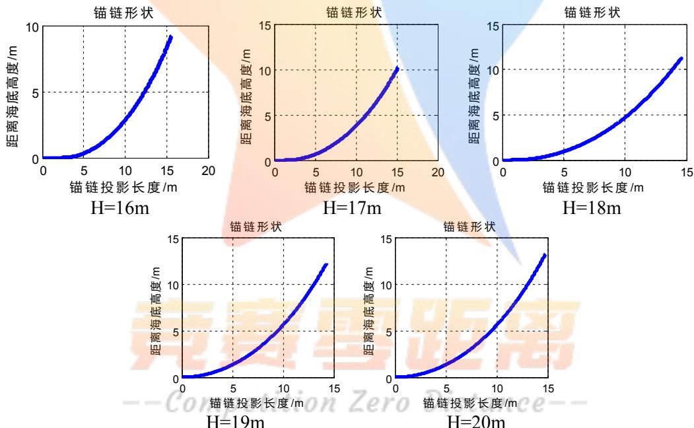  
图 13 不同深度时的锚链形状图形

附件 3：问题3 中，各点水速相同、水力与风力垂直时的求解结果  
表 8 各点水速相同、水力与风力垂直时的系泊系统参数表

<table><tr><td>深度 H</td><td>H=16m</td><td>H=17m</td><td>H=18m</td><td>H=19m</td><td>H=20m</td></tr><tr><td>钢桶与竖直线夹角  $\beta$ </td><td> $3.8142^{\circ}$ </td><td> $3.8056^{\circ}$ </td><td> $3.7974^{\circ}$ </td><td> $3.7895^{\circ}$ </td><td> $3.7820^{\circ}$ </td></tr><tr><td>钢管 1 倾斜角度  $\theta_{1}$ </td><td> $3.7719^{\circ}$ </td><td> $3.7637^{\circ}$ </td><td> $3.7559^{\circ}$ </td><td> $3.7484^{\circ}$ </td><td> $3.7412^{\circ}$ </td></tr><tr><td>钢管 2 倾斜角度  $\theta_{2}$ </td><td> $3.7639^{\circ}$ </td><td> $3.7558^{\circ}$ </td><td> $3.7480^{\circ}$ </td><td> $3.7406^{\circ}$ </td><td> $3.7334^{\circ}$ </td></tr><tr><td>钢管 3 倾斜角度  $\theta_{3}$ </td><td> $3.7560^{\circ}$ </td><td> $3.7479^{\circ}$ </td><td> $3.7402^{\circ}$ </td><td> $3.7329^{\circ}$ </td><td> $3.7258^{\circ}$ </td></tr><tr><td>钢管4倾斜角度 $\theta_{4}$ </td><td>3.7480°</td><td>3.7400°</td><td>3.7324°</td><td>3.7252°</td><td>3.7182°</td></tr><tr><td>浮标吃水深度d</td><td>1.7506m</td><td>1.7610m</td><td>1.7713m</td><td>1.7814m</td><td>1.7914m</td></tr><tr><td>游动区域最大半径R</td><td>17.6114m</td><td>17.0670m</td><td>16.5060m</td><td>15.9300m</td><td>15.3403m</td></tr><tr><td>锚链与海床夹角 $\alpha_{1}$ </td><td>0°</td><td>0°</td><td>0°</td><td>0°</td><td>0°</td></tr></table>

H 分别为 16m、 $1 7 \mathrm { m }$ 、18m、19m、20m 时绘制的锚链形状图形如下：

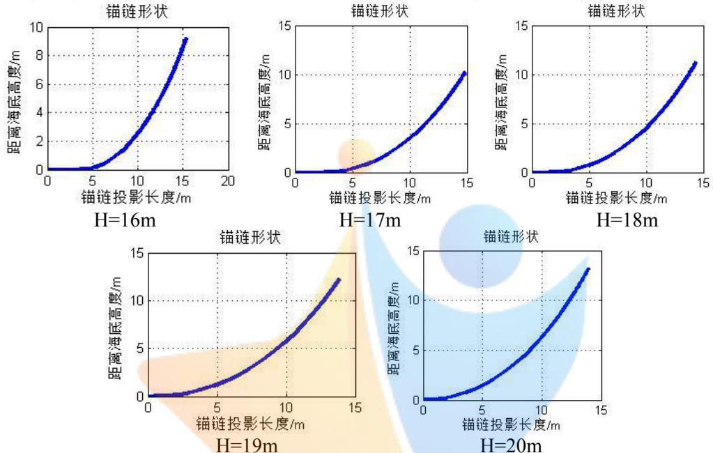  
图 14 不同深度时的锚链形状图形

附件 4：问题3 中，各点水速不同、水力与风力同向时的求解结果  
表 9 各点水速不同、水力与风力同向时的系泊系统参数表

<table><tr><td>深度H</td><td>H=16m</td><td>H=17m</td><td>H=18m</td><td>H=19m</td><td>H=20m</td></tr><tr><td>钢桶与竖直线夹角 $\beta$ </td><td>4.4417°</td><td>4.4105°</td><td>4.3803°</td><td>4.3511°</td><td>4.3226°</td></tr><tr><td>钢管1倾斜角度 $\theta_1$ </td><td>4.3632°</td><td>4.3324°</td><td>4.3026°</td><td>4.2737°</td><td>4.2455°</td></tr><tr><td>钢管2倾斜角度 $\theta_2$ </td><td>4.3150°</td><td>4.2846°</td><td>4.2552°</td><td>4.2267°</td><td>4.1990°</td></tr><tr><td>钢管3倾斜角度 $\theta_3$ </td><td>4.2671°</td><td>4.2372°</td><td>4.2081°</td><td>4.1800°</td><td>4.1526°</td></tr><tr><td>钢管4倾斜角度 $\theta_4$ </td><td>4.2142°</td><td>4.1847°</td><td>4.1560°</td><td>4.1283°</td><td>4.1014°</td></tr><tr><td>浮标吃水深度d</td><td>1.7612m</td><td>1.7718m</td><td>1.7821m</td><td>1.7923m</td><td>1.8024m</td></tr><tr><td>游动区域最大半径R</td><td>17.9413m</td><td>17.4212m</td><td>16.8888m</td><td>16.3368m</td><td>15.7695m</td></tr><tr><td>锚链与海床夹角 $\alpha_1$ </td><td>0°</td><td>0°</td><td>0°</td><td>0°</td><td>0°</td></tr></table>

H分别为16m、17m、18m、19m、20m 时绘制的锚链形状图形如下：

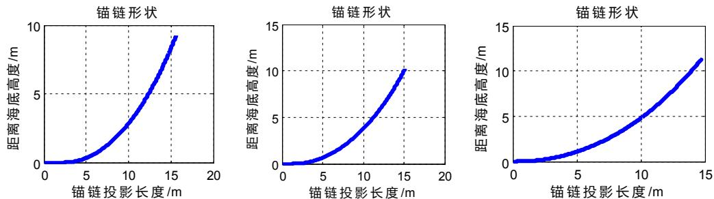

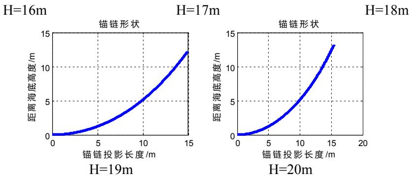

<details>
<summary>line</summary>

| 距离海底高度/m | H=16m (锚链投影长度/m) | H=17m (锚链投影长度/m) | H=18m (锚链投影长度/m) |
| --- | --- | --- | --- |
| 0 | 0 | 0 | 0 |
| 5 | ~5 | ~10 | ~10 |
| 10 | ~10 | ~15 | ~15 |
</details>

图 15 不同深度时的锚链形状图形

附件 5：水流力与风力夹角为任意角度时，锚链形状

水流力与风力夹角为任意角度<sub></sub>，按照模型三中所求解得到的三个决策变量，锚链取五号，长度20.9m，重物球质量4635.24kg,当水深为20m 时，锚链线形状：

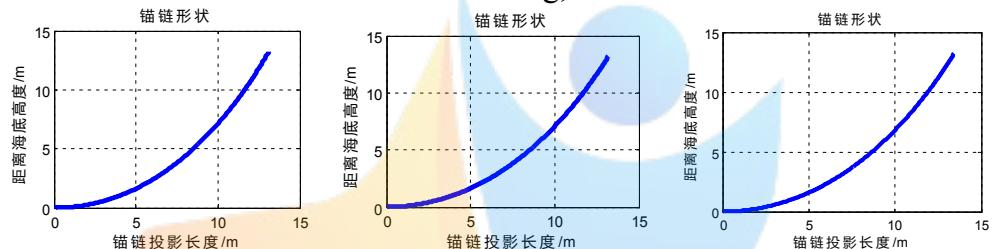  
$\eta = 3 0 ^ { \circ }$ 时锚链线形状：  
$\eta = 4 5 ^ { \circ }$ 时锚链线形状：  
$\eta = 4 5 ^ { \circ }$ 时锚链线形状：  
图 16 水流力与风力不同夹角时锚链形状

附件 6：问题1 中，系泊系统参数求解的Matlab 程序

function question1

$$
\mathrm{x} 0 = [ 1 3 7 2. 4, 6, 0. 7 8, 1 4 4 9 6. 8 0, 1 4 5 9 2. 3 5, 1 4 6 8 7. 9 2, 1 4 7 8 3. 4 9, 1 4 8 7 9. 0 7, 0. 0 9, 0. 0 9, 0. 0 9, 0.
$$

$$
0 9, 0. 0 9, 0. 0 9, 0. 0 9, 0. 0 9, 0. 0 9, 0. 0 9, 1 7. 7 5 ] ^ {\prime};
$$

$$
\text {options = optimset('MaxFunEvals', 1e4, 'MaxIter', 1e4)};
$$

$$
\text {format long}
$$

$$
[ \mathrm{x}, \text {fval,exitflag} ] = \text {fsolve(@fangcheng,x0,options)} \% \text {设置初值}
$$

$$
\mathrm{x} (9: 1 8) = \mathrm{x} (9: 1 8) / \mathrm{pi} ^ {*} 1 8 0
$$

$$
\text {function} \mathrm{F=fangcheng(x)}
$$

$$
\mathrm{Fwind} = \mathrm{x} (1); \% \text {风力}
$$

$$
\text {unuse} = \mathrm{x} (2);
$$

$$
\mathrm{alph1} = 0; \% \text {弧度} <   0.2793
$$

$$
\mathrm{d} = \mathrm{x} (3); \% \text {吃水深度} 0.5
$$

$$
\mathrm{F} 1 = \mathrm{x} (4); \mathrm{F} 2 = \mathrm{x} (5); \mathrm{F} 3 = \mathrm{x} (6); \mathrm{F} 4 = \mathrm{x} (7); \mathrm{F} 5 = \mathrm{x} (8); \text {theta} 1 = \mathrm{x} (9); \text {theta} 2 = \mathrm{x} (1 0); \text {theta} 3 = \mathrm{x} (1 1); \text {th}
$$

$$
\mathrm{eta4} = \mathrm{x} (1 2);
$$

$$
\text {beta} = \mathrm{x} (1 3); \text {gama1} = \mathrm{x} (1 4); \text {gama2} = \mathrm{x} (1 5); \text {gama3} = \mathrm{x} (1 6); \text {gama4} = \mathrm{x} (1 7); \text {gama5} = \mathrm{x} (1 8);
$$

$$
\mathrm{x} 1 = \mathrm{x} (1 9); \% \text {锚链末端横坐标}
$$

$$
\% 0 \%
$$

$$
\mathrm{Vwind} = 24; \% \text {风速}
$$

$$
\mathrm{H} = 18; \% \text{水深}
$$

$$
\mathrm{p} = 1025; \% \text{海水密度}
$$

$$
\text {sigma} = 7;
$$

$$
\mathrm{g} = 9.8; \% \text{重力加速度}
$$

```matlab
Mball=1200*0.869426751592357;%重物球质量
maolian=22.05;%锚链长度
maolian=maolian-x(2);%减去沉在海底的长度
floatage_bucket=0.15*0.15*pi*p;%钢桶浮力
floatage_pipe=0.025*0.025*pi*p;%钢管浮力
F=ones(19,1);
%%
y=@(t)(Fwind/sigma/g*cosh(sigma*g*t/Fwind+asinh(tan(alph1)))-Fwind/sigma/g*cosh(asinh(tan(alph1))));
Dy=@(t)(sqrt(1+(sinh(sigma*g*t/Fwind+asinh(tan(alph1))).^2));
xx=0:0.001:x1;
yy=y(xx);
xx=[0:0.001:unuse,xx+unuse+0.001];
u=length(0:0.001:unuse);
yy=[zeros(1,u),yy];
plot(xx,yy,'LineWidth',3,'markersize',8)
set(gca,'xtick',[0:x1+unuse+1],'ytick',[0:yy(end)+1])
title('锚链形状')
xlabel('锚链投影长度/m')
ylabel('距离海底高度/m')
grid on
R=sin(beta)+sin(theta1)+sin(theta2)+sin(theta3)+sin(theta4)+xx(end)-0.001
F(1)=quad(Dy,0,x1)-maolian;%锚链长度
alph2=atan(sinh(sigma*g*x1/Fwind+asinh(tan(alph1)));
y1=y(x1)
%钢桶
F(2)=F1*sin(gama1-beta)+Fwind/cos(alpha2)*sin(pi/2-alph2-beta)-Mball*g*sin(beta);
%力矩平衡
F(3)=F1*cos(gama1)+floatage_bucket-100*g-Mball*g-Fwind*tan(alpha2);%竖直受力平衡
F(4)=F1*sin(gama1)-Fwind;%水平受力平衡
%4个钢管力矩平衡
F(5)=F1*sin(gama1-theta1)-F2*sin(theta1-gama2);
F(6)=F2*sin(gama2-theta2)-F3*sin(theta2-gama3);
F(7)=F3*sin(gama3-theta3)-F4*sin(theta3-gama4);
F(8)=F4*sin(gama4-theta4)-F5*sin(theta4-gama5);
%4个钢管水平受力平衡
F(9)=F2*sin(gama2)-Fwind;
F(10)=F3*sin(gama3)-Fwind;
F(11)=F4*sin(gama4)-Fwind;
F(12)=F5*sin(gama5)-Fwind;
%4个钢管竖直受力平衡
F(13)=F1*cos(gama1)+10*g-F2*cos(gama2)-floatage_pipe;
F(14)=F2*cos(gama2)+10*g-F3*cos(gama3)-floatage_pipe;
```

```txt
F(15)=F3*cos(gama3)+10*g-F4*cos(gama4)-floatage_pipe;
F(16)=F4*cos(gama4)+10*g-F5*cos(gama5)-floatage_pipe;
F(17)=F5*cos(gama5)+1000*g-pi*d*p*g;%浮标竖直受力
F(18)=y1+cos(beta)+cos(theta1)+cos(theta2)+cos(theta3)+cos(theta4)+d-H;%水深
F(19)=2*(2-d)*0.625*Vwind*Vwind-Fwind;%风力
```

```matlab
附件 7：锚链部分沉底情况下，系泊系统参数求解的 Matlab 程序
function question1_luodi
x0=[1372.4,6,0.78,14496.80,14592.35,14687.92,14783.49,14879.07,0.09,0.09,0.09,0.09,0.09,0.09,0.09,0.09,0.09,0.09,0.09,0.09,0.09,0.09,0.09,0.09,0.09,0.09,0.09,0.09,0.08]
options=optimset('MaxFunEvals',1e4,'MaxIter',1e4);
format long
[x,fval,exitflag]=fsolve(@fangcheng,x0,options)%设置初值
x(9:18)=x(9:18)/pi*180
function F=fangcheng(x)
Fwind=x(1);%风力
unuse=x(2);
alph1=0;%弧度<0.2793
d=x(3);%吃水深度 0.5
F1=x(4);F2=x(5);F3=x(6);F4=x(7);F5=x(8);theta1=x(9);theta2=x(10);theta3=x(11);theta4=x(12);
beta=x(13);gama1=x(14);gama2=x(15);gama3=x(16);gama4=x(17);gama5=x(18);
x1=x(19);%锚链末端横坐标
%%
Vwind=36;%风速
H=18;%水深
p=1025;%海水密度
sigma=7;
g=9.8;%重力加速度
Mball=4090*0.869426751592357;%重物球质量
maolian=22.05;%锚链长度
maolian=maolian-x(2);%减去沉在海底的长度
floatage_bucket=0.15*0.15*pi*p;%钢桶浮力
floatage_pipe=0.025*0.025*pi*p;%钢管浮力
F=ones(19,1);
%%
y=@(t)(Fwind/sigma/g*cosh(sigma*g*t/Fwind+asinh(tan(alph1)))-Fwind/sigma/g*cosh(asinh(tan(alph1))));
Dy=@(t)(sqrt(1+(sinh(sigma*g*t/Fwind+asinh(tan(alph1))))).^2));
xx=0:0.001:x1;
yy=y(xx);
xx=[0:0.001:unuse,xx+unuse+0.001];
u=length(0:0.001:unuse);
yy=[zeros(1,u),yy];
```

```matlab
plot(xx,yy,'LineWidth',3,'markersize',8)
set(gca,'xtick',[0:x1+unuse+1],'ytick',[0:yy(end)+1])
title('锚链形状')
xlabel('锚链投影长度/m')
ylabel('距离海底高度/m')
grid on
R=sin(beta)+sin(theta1)+sin(theta2)+sin(theta3)+sin(theta4)+xx(end)-0.001
F(1)=quad(Dy,0,x1)-maolian;%锚链长度
alph2=atan(sinh(sigma*g*x1/Fwind+asinh(tan(alph1))));
y1=y(x1)
%钢桶
F(2)=F1*sin(gama1-beta)+Fwind/cos(alph2)*sin(pi/2-alph2-beta)-Mball*g*sin(beta);
%力矩平衡
F(3)=F1*cos(gama1)+floatage_bucket-100*g-Mball*g-Fwind*tan(alph2);%竖直受力平衡
F(4)=F1*sin(gama1)-Fwind;%水平受力平衡
%4个钢管力矩平衡
F(5)=F1*sin(gama1-theta1)-F2*sin(theta1-gama2);
F(6)=F2*sin(gama2-theta2)-F3*sin(theta2-gama3);
F(7)=F3*sin(gama3-theta3)-F4*sin(theta3-gama4);
F(8)=F4*sin(gama4-theta4)-F5*sin(theta4-gama5);
%4个钢管水平受力平衡
F(9)=F2*sin(gama2)-Fwind;
F(10)=F3*sin(gama3)-Fwind;
F(11)=F4*sin(gama4)-Fwind;
F(12)=F5*sin(gama5)-Fwind;
%4个钢管竖直受力平衡
F(13)=F1*cos(gama1)+10*g-F2*cos(gama2)-floatage_pipe;
F(14)=F2*cos(gama2)+10*g-F3*cos(gama3)-floatage_pipe;
F(15)=F3*cos(gama3)+10*g-F4*cos(gama4)-floatage_pipe;
F(16)=F4*cos(gama4)+10*g-F5*cos(gama5)-floatage_pipe;
F(17)=F5*cos(gama5)+1000*g-pi*d*p*g;%浮标竖直受力
F(18)=y1+cos(beta)+cos(theta1)+cos(theta2)+cos(theta3)+cos(theta4)+d-H;%水深
F(19)=2*(2-d)*0.625*Vwind*Vwind-Fwind;%风力
```

```matlab
附件 8：锚链不存在沉底的情况下，系泊系统参数求解的 Matlab 程序
function question1_weiluodi
x0=[1372.4,6,0.78,14496.80,14592.35,14687.92,14783.49,14879.07,0.09,0.09,0.09,0.09,0.09,0.09,0.09,0.09,0.09,17.75]';
options=optimset('MaxFunEvals',1e4,'MaxIter',1e4);
format long
[x,fval,exitflag]=fsolve(@fangcheng,x0,options)%设置初值\
x(9:18)=x(9:18)/pi*180
function F=fangcheng(x)
```

```matlab
Fwind=x(1);%风力
alph1=x(2);%弧度<0.2793
d=x(3);%吃水深度 0.5
F1=x(4);F2=x(5);F3=x(6);F4=x(7);F5=x(8);theta1=x(9);theta2=x(10);theta3=x(11);theta4=x(12);
beta=x(13);gama1=x(14);gama2=x(15);gama3=x(16);gama4=x(17);gama5=x(18);
x1=x(19);%锚链末端横坐标
%%
Vwind=36;%风速
H=18;%水深
p=1025;%海水密度
sigma=7;
g=9.8;%重力加速度
Mball=2010*0.869426751592357;%重物球质量
floatage_bucket=0.15*0.15*pi*p;%钢桶浮力
floatage_pipe=0.025*0.025*pi*p;%钢管浮力
F=ones(19,1);
%%
y=@(t)(Fwind/sigma/g*cosh(sigma*g*t/Fwind+asinh(tan(alph1)))-Fwind/sigma/g*cos(asinh(tan(alph1))));
Dy=@(t)(sqrt(1+(sinh(sigma*g*t/Fwind+asinh(tan(alph1))).^2));
Y=y(x1)
xx=0:0.001:x1;
yy=y(xx);
plot(xx,yy,'LineWidth',3,'markersize',8)
set(gca,'xtick',[0:x1+1],'ytick',[0:yy(end)+1])
title('锚链形状')
xlabel('锚链投影长度/m')
ylabel('距离海底高度/m')
grid on
% pause
F(1)=quad(Dy,0,x1)-22.05;%锚链长度
% alph2=atan((y(x1+0.001)-y(x1-0.001))/0.002);
alph2=atan(sinh(sigma*g*x1/Fwind+asinh(tan(alph1))));
y1=y(x1);
R=x1+sin(beta)+sin(theta1)+sin(theta2)+sin(theta3)+sin(theta4)
%钢桶
F(2)=F1*sin(gama1-beta)+Fwind/cos(alph2)*sin(pi/2-alph2-beta)-Mball*g*sin(beta);
%力矩平衡
F(3)=F1*cos(gama1)+floatage_bucket-100*g-Mball*g-Fwind*tan(alph2);% 竖直受力平衡
F(4)=F1*sin(gama1)-Fwind;%水平受力平衡
%4 个钢管力矩平衡
F(5)=F1*sin(gama1-theta1)-F2*sin(theta1-gama2);
```

```matlab
F(6)=F2*sin(gama2-theta2)-F3*sin(theta2-gama3);
F(7)=F3*sin(gama3-theta3)-F4*sin(theta3-gama4);
F(8)=F4*sin(gama4-theta4)-F5*sin(theta4-gama5);
%4 个钢管水平受力平衡
F(9)=F2*sin(gama2)-Fwind;
F(10)=F3*sin(gama3)-Fwind;
F(11)=F4*sin(gama4)-Fwind;
F(12)=F5*sin(gama5)-Fwind;
%4 个钢管竖直受力平衡
F(13)=F1*cos(gama1)+10*g-F2*cos(gama2)-floatage_pipe;
F(14)=F2*cos(gama2)+10*g-F3*cos(gama3)-floatage_pipe;
F(15)=F3*cos(gama3)+10*g-F4*cos(gama4)-floatage_pipe;
F(16)=F4*cos(gama4)+10*g-F5*cos(gama5)-floatage_pipe;
F(17)=F5*cos(gama5)+1000*g-pi*d*p*g;%浮标竖直受力
F(18)=y1+cos(beta)+cos(theta1)+cos(theta2)+cos(theta3)+cos(theta4)+d-H;%水深
F(19)=2*(2-d)*0.625*Vwind*Vwind-Fwind;%风力
```

附件 9：问题2 中，系泊系统参数求解的Matlab 程序

function question2

global Mball

G=[];beta=[];alph1=[];d=[];R=[];

for Mball1=1700:10:5000

Mball=Mball1\*0.869426751592357;

[x,fval,exitflag,r,Unuse]=fun;

if (Unuse==0&x(2)>0.279)|x(3)>1.5|x(13)>0.087%只选取阿发 1 小于 16°，浮标深度小于1.5 米，β小于5度的解

```javascript
continue
elseif Unuse==0%代表没有落在地面的锚链
    alph1=[alph1;x(2)];G=[G;Mball1];beta=[beta;x(13)];d=[d;x(3)];R=[R;r];
```

else%代表有落在地面的锚链

alph1=[alph1;0];G=[G;Mball1];beta=[beta;x(13)];d=[d;x(3)];R=[R;r];

end

end

G,beta=beta/pi\*180,alph1=alph1/pi\*180,d,R

figure(1)

plot(G,beta)

title('β随重物球质量变化图')

xlabel('重物球质量/kg')

ylabel('β/°')

grid on

figure(2)

plot(G,R)

title('区域半径随重物球质量变化图')

xlabel('重物球质量/kg')

```csv
ylabel('半径/m')
grid on
figure(3)
plot(G,d)
title('吃水深度随重物球质量变化图')
xlabel('重物球质量/kg')
ylabel('深度/m')
grid on
figure(4)
plot(G,alph1)
title('α1 随重物球质量变化图')
xlabel('重物球质量/kg')
ylabel('α1/°')
set(gca,'ytick',[0:16])
grid on
figure(5)
k=[0.1,0.8,0.1];%吃水深度：β：区域半径=0.1：0.8:0.1
y=d/max(d)*k(1)+beta/max(beta)*k(2)+R/max(R)*k(3);
plot(G,y)
title('优化目标随重物球质量变化图')
xlabel('重物球质量/kg')
ylabel('目标值')
grid on
[a,place]=min(y)
G(place),beta(place),alph1(place),d(place),R(place)
end
function [x,fval,exitflag,R,Unuse]=fun
global R Mball
options=optimset('MaxFunEvals',1e4,'MaxIter',1e4);
format long
x0=[1372.4,0.18,0.78,14496.80,14592.35,14687.92,14783.49,14879.07,0.09,0.09,0.09,0.09,0.09,0.09,0.09,0.09,0.09,17.75]';
[x,fval,exitflag]=fsolve(@fangcheng2,x0,options);
Unuse=0;%代表没有落在地面的锚链
if x(2)<0

x0=[1372.4,6,0.78,14496.80,14592.35,14687.92,14783.49,14879.07,0.09,0.09,0.09,0.09,0.09,0.09,17.75]';
[x,fval,exitflag]=fsolve(@fangcheng1,x0,options);
Unuse=1;%代表有落在地面的锚链
end
end
function F=fangcheng1(x)
global R Mball
```

```matlab
Fwind=x(1);%风力
unuse=x(2);
alph1=0;%弧度<0.2793
d=x(3);%吃水深度 0.5
F1=x(4);F2=x(5);F3=x(6);F4=x(7);F5=x(8);theta1=x(9);theta2=x(10);theta3=x(11);theta4=x(12);
beta=x(13);gama1=x(14);gama2=x(15);gama3=x(16);gama4=x(17);gama5=x(18);
x1=x(19);%锚链末端横坐标
%%
Vwind=36;%风速
H=18;%水深
p=1025;%海水密度
sigma=7;
g=9.8;%重力加速度
% Mball=1200;%重物球质量
maolian=22.05;%锚链长度
maolian=maolian-x(2);%减去沉在海底的长度
floatage_bucket=0.15*0.15*pi*p;%钢桶浮力
floatage_pipe=0.025*0.025*pi*p;%钢管浮力
F=ones(19,1);
%%
y=@(t)(Fwind/sigma/g*cosh(sigma*g*t/Fwind+asinh(tan(alph1)))-Fwind/sigma/g*cos(asinh(tan(alph1)));
Dy=@(t)(sqrt(1+(sinh(sigma*g*t/Fwind+asinh(tan(alph1)))).^2));
R=sin(beta)+sin(theta1)+sin(theta2)+sin(theta3)+sin(theta4)+x1+unuse;
F(1)=quad(Dy,0,x1)-maolian;%锚链长度
alph2=atan(sinh(sigma*g*x1/Fwind+asinh(tan(alph1))));
y1=y(x1);
%钢桶
F(2)=F1*sin(gama1-beta)+Fwind/cos(alpha2)*sin(pi/2-alpha2-beta)-Mball*g*sin(beta);
%力矩平衡
F(3)=F1*cos(gama1)+floatage_bucket-100*g-Mball*g-Fwind*tan(alpha2);% 竖直受力平衡
F(4)=F1*sin(gama1)-Fwind;%水平受力平衡
%4 个钢管力矩平衡
F(5)=F1*sin(gama1-theta1)-F2*sin(theta1-gama2);
F(6)=F2*sin(gama2-theta2)-F3*sin(theta2-gama3);
F(7)=F3*sin(gama3-theta3)-F4*sin(theta3-gama4);
F(8)=F4*sin(gama4-theta4)-F5*sin(theta4-gama5);
%4 个钢管水平受力平衡
F(9)=F2*sin(gama2)-Fwind;
F(10)=F3*sin(gama3)-Fwind;
F(11)=F4*sin(gama4)-Fwind;
F(12)=F5*sin(gama5)-Fwind;
```

%4个钢管竖直受力平衡

<div class="mineru-algorithm" style="white-space: pre-wrap; font-family:monospace;">
F(13)=F1*cos(gama1)+10*g-F2*cos(gama2)-floatage_pipe;
F(14)=F2*cos(gama2)+10*g-F3*cos(gama3)-floatage_pipe;
F(15)=F3*cos(gama3)+10*g-F4*cos(gama4)-floatage_pipe;
F(16)=F4*cos(gama4)+10*g-F5*cos(gama5)-floatage_pipe;
F(17)=F5*cos(gama5)+1000*g-pi*d*p*g;%浮标竖直受力
F(18)=y1+cos(beta)+cos(theta1)+cos(theta2)+cos(theta3)+cos(theta4)+d-H;%水深
F(19)=2*(2-d)*0.625*Vwind*Vwind-Fwind;%风力
end
function F=fangcheng2(x)
global R Mball
Fwind=x(1);%风力
alph1=x(2);%弧度&lt;0.2793
d=x(3);%吃水深度 0.5
F1=x(4);F2=x(5);F3=x(6);F4=x(7);F5=x(8);theta1=x(9);theta2=x(10);theta3=x(11);theta4=x(12);
beta=x(13);gama1=x(14);gama2=x(15);gama3=x(16);gama4=x(17);gama5=x(18);
x1=x(19);%锚链末端横坐标
%%
Vwind=36;%风速
H=18;%水深
p=1025;%海水密度
sigma=7;
g=9.8;%重力加速度
% Mball=1200;%重物球质量
floatage_bucket=0.15*0.15*pi*p;%钢桶浮力
floatage_pipe=0.025*0.025*pi*p;%钢管浮力
F=ones(19,1);
%%
y=@(t)(Fwind/sigma/g*cosh(sigma*g*t/Fwind+asinh(tan(alph1)))-Fwind/sigma/g*cosh(asinh(tan(alph1))));
Dy=@(t)(sqrt(1+(sinh(sigma*g*t/Fwind+asinh(tan(alph1))))).^2));
R=x1+sin(beta)+sin(theta1)+sin(theta2)+sin(theta3)+sin(theta4);
F(1)=quad(Dy,0,x1)-22.05;%锚链长度
alph2=atan(sinh(sigma*g*x1/Fwind+asinh(tan(alph1)));
y1=y(x1);
%钢桶
F(2)=F1*sin(gama1-beta)+Fwind/cos(alph2)*sin(pi/2-alph2-beta)-Mball*g*sin(beta);
%力矩平衡
F(3)=F1*cos(gama1)+floatage_bucket-100*g-Mball*g-Fwind*tan(alph2);% 竖直受力平衡
F(4)=F1*sin(gama1)-Fwind;%水平受力平衡
%4 个钢管力矩平衡
F(5)=F1*sin(gama1-theta1)-F2*sin(theta1-gama2);
</div>

```matlab
F(6)=F2*sin(gama2-theta2)-F3*sin(theta2-gama3);
F(7)=F3*sin(gama3-theta3)-F4*sin(theta3-gama4);
F(8)=F4*sin(gama4-theta4)-F5*sin(theta4-gama5);
%4 个钢管水平受力平衡
F(9)=F2*sin(gama2)-Fwind;
F(10)=F3*sin(gama3)-Fwind;
F(11)=F4*sin(gama4)-Fwind;
F(12)=F5*sin(gama5)-Fwind;
%4 个钢管竖直受力平衡
F(13)=F1*cos(gama1)+10*g-F2*cos(gama2)-floatage_pipe;
F(14)=F2*cos(gama2)+10*g-F3*cos(gama3)-floatage_pipe;
F(15)=F3*cos(gama3)+10*g-F4*cos(gama4)-floatage_pipe;
F(16)=F4*cos(gama4)+10*g-F5*cos(gama5)-floatage_pipe;
F(17)=F5*cos(gama5)+1000*g-pi*d*p*g;%浮标竖直受力
F(18)=y1+cos(beta)+cos(theta1)+cos(theta2)+cos(theta3)+cos(theta4)+d-H;%水深
F(19)=2*(2-d)*0.625*Vwind*Vwind-Fwind;%风力
```

附件 10：问题 3 中，各点水速相同、水流与风同向时，锚链长度、型号、重物球质量的Matlab 求解程序

```matlab
function question3_junyunshuili %水力与风力同向
clc
clear
tic
global Mball sigma maolian H G BETA ALPH1 D RR A
SIGMA=[3.2,7,12.5,19.5,28.12];
G=[];BETA=[];ALPH1=[];D=[];RR=[];A=[];XX=[];THETA=[];
H=20;
    for xinghao=5:5
        sigma=SIGMA(xinghao);
        for maolian=21.1:0.1:22
            for Mball=4000:1:4002
                [x,fval,exitflag,r,Unuse]=fun;
                if
                    (Unuse==0&x(2)>0.279)|x(3)>1.8|x(3)<0|x(13)>0.087|exitflag<1|(Unuse=
=1&x(2)<0)%只选取阿发 1 小于 16°，浮标深度小于 1.5 米，β 小于 5
度的解
```

continueelseifUnuse==0%代表没有落在地面的锚链

```matlab
ALPH1=[ALPH1;x(2)];G=[G;Mball];BETA=[BETA;x(13)];D=[D;x(3)];R=[RR;r];A=[A;sigma,maolian,Mball];XX=[XX,[Unuse;x]];THETA=[THETA,x(12:15)];
else%代表有落在地面的锚链
```

```csv
ALPH1=[ALPH1;0];G=[G;Mball];BETA=[BETA;x(13)];D=[D;x(3)];RR=
[RR;r];A=[A;sigma,maolian,Mball];XX=[XX,[Unuse;x]];THETA=[THET
A,x(12:15)];
end
end
end
G,BETA=BETA/pi*180,ALPH1=ALPH1/pi*180,D,RR,A,XX%sigma,maolian,Mball
k=[0.1,0.8,0.1];%吃水深度：β：区域半径=0.1：0.8:0.1
y=D/1.5*k(1)+BETA/5*k(2)+RR/30*k(3);
[aim,place]=min(y)
D(place),BETA(place),RR(place),A(place,:)%sigma,maolian,Mball
sigma_cu=A(place,1)
maolian_cu=A(place,2)
Mball_cu=A(place,3)
aim_cu=aim
THETA=THETA
toc
end
function [x,fval,exitflag,R,Unuse]=fun
global R
format long
x0=[1372.4,0.18,0.78,14496.80,14592.35,14687.92,14783.49,14879.07,0.09,0.09,0.0
9,0.09,0.09,0.09,0.09,0.09,0.09,17.75]';
[x,fval,exitflag]=fsolve(@fangcheng2,x0)
Unuse=0;%代表没有落在地面的锚链
if x(2)<0

x0=[1372.4,6,0.78,14496.80,14592.35,14687.92,14783.49,14879.07,0.09,
0.09,0.09,0.09,0.09,0.09,0.09,17.75]';
[x,fval,exitflag]=fsolve(@fangcheng1,x0)
Unuse=1;%代表有落在地面的锚链
end
end
function F=fangcheng1(x)
global R Mball sigma maolian H
Fwind=x(1);%风力
unuse=x(2);
alph1=0;%弧度<0.2793
d=x(3);%吃水深度 0.5
F1=x(4);F2=x(5);F3=x(6);F4=x(7);F5=x(8);theta1=x(9);theta2=x(10);theta3=x(11);th
eta4=x(12);
beta=x(13);gama1=x(14);gama2=x(15);gama3=x(16);gama4=x(17);gama5=x(18);
x1=x(19);%锚链末端横坐标
```

```matlab
%%Vwind=36;%风速p=1025;%海水密度g=9.8;%重力加速度floatage_bucket=0.15*0.15*pi*p;%钢桶浮力floatage_pipe=0.025*0.025*pi*p;%钢管浮力F=ones(19,1);
%%y=@(t)((Fwind+42.075*4+252.45+2*d*374*1.5*1.5)/sigma/g*cosh(sigma*g*t/(Fwind+42.075*4+252.45+2*d*374*1.5*1.5)+asinh(tan(alph1)))-(Fwind+42.075*4+252.45+2*d*374*1.5*1.5)/sigma/g*cosh(asinh(tan(alph1))));
Dy=@(t)(sqrt(1+(sinh(sigma*g*t/(Fwind+42.075*4+252.45+2*d*374*1.5*1.5)+asinh(tan(alph1))).^2));
R=sin(beta)+sin(theta1)+sin(theta2)+sin(theta3)+sin(theta4)+x1+unuse;
F(1)=quad(Dy,0,x1)-(maolian-x(2));%锚链长度
alph2=atan(sinh(sigma*g*x1/(Fwind+42.075*4+252.45+2*d*374*1.5*1.5)+asinh(tan(alph1)));
y1=y(x1);
%钢桶
F(2)=F1*sin(gama1-beta)+(Fwind+42.075*4+2*d*374*1.5*1.5)/cos(alph2)*sin(pi/2-alpha2-beta)-Mball*g*sin(beta);%力矩平衡
F(3)=F1*cos(gama1)+floatage_bucket-100*g-Mball*g-(Fwind+42.075*4+252.45+2*d*374*1.5*1.5)*tan(alph2);%竖直受力平衡
F(4)=F1*sin(gama1)-(Fwind+42.075*4+2*d*374*1.5*1.5);%水平受力平衡
%4 个钢管力矩平衡
F(5)=F1*sin(gama1-theta1)-F2*sin(theta1-gama2);
F(6)=F2*sin(gama2-theta2)-F3*sin(theta2-gama3);
F(7)=F3*sin(gama3-theta3)-F4*sin(theta3-gama4);
F(8)=F4*sin(gama4-theta4)-F5*sin(theta4-gama5);
%4 个钢管水平受力平衡
F(9)=F2*sin(gama2)-(Fwind+42.075*3+2*d*374*1.5*1.5);
F(10)=F3*sin(gama3)-(Fwind+42.075*2+2*d*374*1.5*1.5);
F(11)=F4*sin(gama4)-(Fwind+42.075*1+2*d*374*1.5*1.5);
F(12)=F5*sin(gama5)-(Fwind+2*d*374*1.5*1.5);
%4 个钢管竖直受力平衡
F(13)=F1*cos(gama1)+10*g-F2*cos(gama2)-floatage_pipe;
F(14)=F2*cos(gama2)+10*g-F3*cos(gama3)-floatage_pipe;
F(15)=F3*cos(gama3)+10*g-F4*cos(gama4)-floatage_pipe;
F(16)=F4*cos(gama4)+10*g-F5*cos(gama5)-floatage_pipe;
F(17)=F5*cos(gama5)+1000*g-pi*d*p*g;%浮标竖直受力
F(18)=y1+cos(beta)+cos(theta1)+cos(theta2)+cos(theta3)+cos(theta4)+d-H;%水深
F(19)=2*(2-d)*0.625*Vwind*Vwind-Fwind;%风力
end
function F=fangcheng2(x)
```

```matlab
global R Mball sigma maolian H
Fwind=x(1);%风力
alph1=x(2);%弧度<0.2793
d=x(3);%吃水深度 0.5
F1=x(4);F2=x(5);F3=x(6);F4=x(7);F5=x(8);theta1=x(9);theta2=x(10);theta3=x(11);theta4=x(12);
beta=x(13);gama1=x(14);gama2=x(15);gama3=x(16);gama4=x(17);gama5=x(18);
x1=x(19);%锚链末端横坐标
%%
Vwind=36;%风速
p=1025;%海水密度
g=9.8;%重力加速度
floatage_bucket=0.15*0.15*pi*p;%钢桶浮力
floatage_pipe=0.025*0.025*pi*p;%钢管浮力
F=ones(19,1);
f=2*d*374*1.5*1.5;
%%
y=@(t)((Fwind+42.075*4+252.45+f)/sigma/g*cosh(sigma*g*t/(Fwind+42.075*4+252.45+f)+asinh(tan(alph1)))-(Fwind+42.075*4+252.45+f)/sigma/g*cosh(asinh(tan(alph1))));
Dy=@(t)(sqrt(1+(sinh(sigma*g*t/(Fwind+42.075*4+252.45+f)+asinh(tan(alph1))).^2));
R=x1+sin(beta)+sin(theta1)+sin(theta2)+sin(theta3)+sin(theta4);
F(1)=quad(Dy,0,x1)-maolian;%锚链长度
alph2=atan(sinh(sigma*g*x1/(Fwind+42.075*4+252.45+f)+asinh(tan(alph1)));
y1=y(x1);
%钢桶
F(2)=F1*sin(gama1-beta)+(Fwind+42.075*4+f)/cos(alph2)*sin(pi/2-alph2-beta)-Mball*g*sin(beta);%力矩平衡
F(3)=F1*cos(gama1)+floatage_bucket-100*g-Mball*g-(Fwind+42.075*4+252.45+f)*tan(alph2);%竖直受力平衡
F(4)=F1*sin(gama1)-(Fwind+42.075*4+f);%水平受力平衡
%4 个钢管力矩平衡
F(5)=F1*sin(gama1-theta1)-F2*sin(theta1-gama2);
F(6)=F2*sin(gama2-theta2)-F3*sin(theta2-gama3);
F(7)=F3*sin(gama3-theta3)-F4*sin(theta3-gama4);
F(8)=F4*sin(gama4-theta4)-F5*sin(theta4-gama5);
%4 个钢管水平受力平衡
F(9)=F2*sin(gama2)-(Fwind+42.075*3+f);
F(10)=F3*sin(gama3)-(Fwind+42.075*2+f);
F(11)=F4*sin(gama4)-(Fwind+42.075*1+f);
F(12)=F5*sin(gama5)-(Fwind+1683);
%4 个钢管竖直受力平衡
F(13)=F1*cos(gama1)+10*g-F2*cos(gama2)-floatage_pipe;
```

```matlab
F(14)=F2*cos(gama2)+10*g-F3*cos(gama3)-floatage_pipe;
F(15)=F3*cos(gama3)+10*g-F4*cos(gama4)-floatage_pipe;
F(16)=F4*cos(gama4)+10*g-F5*cos(gama5)-floatage_pipe;
F(17)=F5*cos(gama5)+1000*g-pi*d*p*g;%浮标竖直受力
F(18)=y1+cos(beta)+cos(theta1)+cos(theta2)+cos(theta3)+cos(theta4)+d-H;%水深
F(19)=2*(2-d)*0.625*Vwind*Vwind-Fwind;%风力
end
```

附件 11：问题3中，各点水速相同、水流与风同向时，钢桶和钢管的倾斜角度、锚链形状的Matlab 求解程序  
```matlab
function question3_fenxi_junyunshuili
global Mball H maolian sigma
Mball=4030;H=input('输入海深 H: ');maolian=20.9;sigma=28.12;
[x,fval,exitflag,r,Unuse]=fun;
if Unuse==0%代表没有落在地面的锚链
    alph1=x(2);beta=x(13);d=x(3),R=r;
else%代表有落在地面的锚链
    alph1=0;beta=x(13);d=x(3);R=r;
end
beta=beta/pi*180,alph1=alph1/pi*180,d,R
x(9:13)/pi*180
end
function [x,fval,exitflag,R,Unuse]=fun
global R Mball
format long
x0=[1372.4,0.18,0.78,14496.80,14592.35,14687.92,14783.49,14879.07,0.09,0.09,0.09,0.09,0.09,0.09,0.09,0.09,0.09,17.75]';
[x,fval,exitflag]=fsolve(@fangcheng2,x0)
Unuse=0;%代表没有落在地面的锚链
if x(2)<0
x0=[1372.4,6,0.78,14496.80,14592.35,14687.92,14783.49,14879.07,0.09,0.09,0.09,0.09,0.09,0.09,0.09,17.75]';
[x,fval,exitflag]=fsolve(@fangcheng1,x0)
Unuse=1;%代表有落在地面的锚链
end
end
function F=fangcheng1(x)
global R Mball sigma maolian H
Fwind=x(1);%风力
unuse=x(2);
alph1=0;%弧度<0.2793
d=x(3);%吃水深度 0.5
```

```matlab
F1=x(4);F2=x(5);F3=x(6);F4=x(7);F5=x(8);theta1=x(9);theta2=x(10);theta3=x(11);theta4=x(12);
beta=x(13);gama1=x(14);gama2=x(15);gama3=x(16);gama4=x(17);gama5=x(18);
x1=x(19);%锚链末端横坐标
%%
Vwind=36;%风速
p=1025;%海水密度
g=9.8;%重力加速度
floatage_bucket=0.15*0.15*pi*p;%钢桶浮力
floatage_pipe=0.025*0.025*pi*p;%钢管浮力
F=ones(19,1);
%%
y=@(t)((Fwind+42.075*4+252.45+2*d*374*1.5*1.5)/sigma/g*cosh(sigma*g*t/(Fwind+42.075*4+252.45+2*d*374*1.5*1.5)+asinh(tan(alph1)))-(Fwind+42.075*4+252.45+2*d*374*1.5*1.5)/sigma/g*cosh(asinh(tan(alph1))));
Dy=@(t)(sqrt(1+(sinh(sigma*g*t/(Fwind+42.075*4+252.45+2*d*374*1.5*1.5)+asinh(tan(alph1))).^2));
R=sin(beta)+sin(theta1)+sin(theta2)+sin(theta3)+sin(theta4)+x1+unuse;
F(1)=quad(Dy,0,x1)-(maolian-x(2));%锚链长度
alph2=atan(sinh(sigma*g*x1/(Fwind+42.075*4+252.45+2*d*374*1.5*1.5)+asinh(tan(alph1)));
y1=y(x1);
xx=0:0.001:x1;
yy=y(xx);
xx=[0:0.001:unuse,xx+unuse+0.001];xx=(xx-xx(1))*0.89;
u=length(0:0.001:unuse);
yy=[zeros(1,u),yy];
plot(xx,yy,'LineWidth',3,'markersize',8)
% set(gca,'xtick',[0:x1+unuse+1],'ytick',[0:yy(end)+1])
title('锚链形状')
xlabel('锚链投影长度/m')
ylabel('距离海底高度/m')
grid on
%钢桶
F(2)=F1*sin(gama1-beta)+(Fwind+42.075*4+2*d*374*1.5*1.5)/cos(alph2)*sin(pi/2-alpha2-beta)-Mball*g*sin(beta);%力矩平衡
F(3)=F1*cos(gama1)+floatage_bucket-100*g-Mball*g-(Fwind+42.075*4+252.45+2*d*374*1.5*1.5)*tan(alph2);%竖直受力平衡
F(4)=F1*sin(gama1)-(Fwind+42.075*4+2*d*374*1.5*1.5);%水平受力平衡
%4 个钢管力矩平衡
F(5)=F1*sin(gama1-theta1)-F2*sin(theta1-gama2);
F(6)=F2*sin(gama2-theta2)-F3*sin(theta2-gama3);
F(7)=F3*sin(gama3-theta3)-F4*sin(theta3-gama4);
F(8)=F4*sin(gama4-theta4)-F5*sin(theta4-gama5);
```

%4个钢管水平受力平衡

<div class="mineru-algorithm" style="white-space: pre-wrap; font-family:monospace;">
F(9)=F2*sin(gama2)-(Fwind+42.075*3+2*d*374*1.5*1.5);
F(10)=F3*sin(gama3)-(Fwind+42.075*2+2*d*374*1.5*1.5);
F(11)=F4*sin(gama4)-(Fwind+42.075*1+2*d*374*1.5*1.5);
F(12)=F5*sin(gama5)-(Fwind+2*d*374*1.5*1.5);
%4 个钢管竖直受力平衡
F(13)=F1*cos(gama1)+10*g-F2*cos(gama2)-floatage_pipe;
F(14)=F2*cos(gama2)+10*g-F3*cos(gama3)-floatage_pipe;
F(15)=F3*cos(gama3)+10*g-F4*cos(gama4)-floatage_pipe;
F(16)=F4*cos(gama4)+10*g-F5*cos(gama5)-floatage_pipe;
F(17)=F5*cos(gama5)+1000*g-pi*d*p*g;%浮标竖直受力
F(18)=y1+cos(beta)+cos(theta1)+cos(theta2)+cos(theta3)+cos(theta4)+d-H;%水深
F(19)=2*(2-d)*0.625*Vwind*Vwind-Fwind;%风力
end
function F=fangcheng2(x)
global R Mball sigma maolian H
Fwind=x(1);%风力
alph1=x(2);%弧度&lt;0.2793
d=x(3);%吃水深度 0.5
F1=x(4);F2=x(5);F3=x(6);F4=x(7);F5=x(8);theta1=x(9);theta2=x(10);theta3=x(11);theta4=x(12);
beta=x(13);gama1=x(14);gama2=x(15);gama3=x(16);gama4=x(17);gama5=x(18);
x1=x(19);%锚链末端横坐标
%%
Vwind=36;%风速
p=1025;%海水密度
g=9.8;%重力加速度
floatage_bucket=0.15*0.15*pi*p;%钢桶浮力
floatage_pipe=0.025*0.025*pi*p;%钢管浮力
F=ones(19,1);
f=2*d*374*1.5*1.5;
%%
y=@(t)((Fwind+42.075*4+252.45+f)/sigma/g*cosh(sigma*g*t/(Fwind+42.075*4+252.45+f)+asinh(tan(alph1)))-(Fwind+42.075*4+252.45+f)/sigma/g*cosh(asinh(tan(alph1))))
Dy=@(t)(sqrt(1+(sinh(sigma*g*t/(Fwind+42.075*4+252.45+f)+asinh(tan(alph1)))).^2));
R=x1+sin(beta)+sin(theta1)+sin(theta2)+sin(theta3)+sin(theta4);
F(1)=quad(Dy,0,x1)-maolian;%锚链长度
alph2=atan(sinh(sigma*g*x1/(Fwind+42.075*4+252.45+f)+asinh(tan(alph1))));
y1=y(x1);
xx=0:0.001:x1;
yy=y(xx);
plot(xx,yy,'LineWidth',3,'markersize',8)
</div>

```matlab
% set(gca,'xtick',[0:x1+1],'ytick',[0:yy(end)+1])
title('锚链形状')
xlabel('锚链投影长度/m')
ylabel('距离海底高度/m')
grid on
%钢桶
F(2)=F1*sin(gama1-beta)+(Fwind+42.075*4+f)/cos(alph2)*sin(pi/2-alph2-beta)-Mball*g*sin(beta);%力矩平衡
F(3)=F1*cos(gama1)+floatage_bucket-100*g-Mball*g-(Fwind+42.075*4+252.45+f)*tan(alph2);%竖直受力平衡
F(4)=F1*sin(gama1)-(Fwind+42.075*4+f);%水平受力平衡
%4 个钢管力矩平衡
F(5)=F1*sin(gama1-theta1)-F2*sin(theta1-gama2);
F(6)=F2*sin(gama2-theta2)-F3*sin(theta2-gama3);
F(7)=F3*sin(gama3-theta3)-F4*sin(theta3-gama4);
F(8)=F4*sin(gama4-theta4)-F5*sin(theta4-gama5);
%4 个钢管水平受力平衡
F(9)=F2*sin(gama2)-(Fwind+42.075*3+f);
F(10)=F3*sin(gama3)-(Fwind+42.075*2+f);
F(11)=F4*sin(gama4)-(Fwind+42.075*1+f);
F(12)=F5*sin(gama5)-(Fwind+f);
%4 个钢管竖直受力平衡
F(13)=F1*cos(gama1)+10*g-F2*cos(gama2)-floatage_pipe;
F(14)=F2*cos(gama2)+10*g-F3*cos(gama3)-floatage_pipe;
F(15)=F3*cos(gama3)+10*g-F4*cos(gama4)-floatage_pipe;
F(16)=F4*cos(gama4)+10*g-F5*cos(gama5)-floatage_pipe;
F(17)=F5*cos(gama5)+1000*g-pi*d*p*g;%浮标竖直受力
F(18)=y1+cos(beta)+cos(theta1)+cos(theta2)+cos(theta3)+cos(theta4)+d-H;%水深
F(19)=2*(2-d)*0.625*Vwind*Vwind-Fwind;%风力
end
```