# 电池剩余放电时间预测

## 摘要

本文是关于电池剩余放电时间的预测问题。根据题目所给的附件，分别考虑不同电流对应的放电曲线，我们首先通过最小二乘法建立不同电流放电曲线的指数函数模型，然后利用 MATLAB 计算出各放电曲线的平均相对误差（MRE），最后预测了衰减状态 3 的剩余放电时间。

针对问题一：首先，通过在 MATLAB 中做电压差的图形可以看出，其趋势基本上是开始变化较慢，而到了某个阶段突然变化加快，这符合指数函数模型，即 $\frac{du_{t}}{dt}=ae^{bt}+c$ 。对其求积分即可得到电压和时间的关系为 $u_{t}=\frac{a}{b}e^{bt}+ct+d$ ，利用最小二乘法求出各系数，得到 20A、30A 等电流时电压和时间关系。利用求得关系式，把电压带入即可得到各电压对应的时间，然后利用 $RE=\frac{\left|R_{t}-R_{0}\right|}{R_{t}}$ ， $MRE=\frac{\sum\limits_{i=1}^{231}RE_{i}}{231}$ 计算各电流强度的 MRE 分别为：（0.0601、0.0508、0.0367、0.0338、0.0631、0.0069、0.0773、0.0063、0.0050）。把电压等于 9.8V 时带入模型可求得 30A、40A、50A、60A 和 70A 对应的剩余放电时间：（1918.1226min、1224.3761min、929.2559min、739.6344min、615.8148min）。

针对问题二：首先，对问题1中的不同电流对应的参数进行分析，发现参数与电流的关系在20A到50A之间符合二次函数模型 $f(I)=gI^{2}+hI+r$ ，在50A到100A之间符合一次函数模型 $f(I)=hI+r$ ，进一步根据最小二乘法，利用MATLAB计算出各参数的值，建立了各参数和电流之间的关系式。这样建立了电压和电流强度及放电时间之间的关系 $u_{t}=a(I)e^{b(I)t}+c(I)t+d(I)$ 。通过计算不同电流下模型对应的MRE值，可以看出求出的MRE值与问题1种求出的MRE值变化率不超过5.71%。最后，根据模型拟合出电流强度为55A时的放电曲线，通过图3可以看出55A的放电曲线落在50A和60A的放电曲线之间，符合实际情况。

针对问题三：我们首先对新电池、衰减状态1和衰减状态2的数据进行回归分析，发现新电池、衰减状态1和衰减状态2的电压和时间之间的关系都为指数函数关系 $u_{t}=me^{nt}+ke^{qt}$ ，据此我们推断衰减状态3的电压和时间之间的关系也应为指数函数关系。利用已有衰减状态3的部分数据，利用MATLAB拟合出衰减状态3电压和时间之间的关系为 $u_{t}=-82.354e^{0.6752t}-6571e^{0.5157t}$ ，根据此模型可以算出衰减状态3的剩余放电时间。

最后，我们随机给定了一些电压，利用模型算出的时间与附件1和2给定的时间进行比较，发现两者之间的时间差都小于8分钟，可以看出给出的模型是有效的，和实际情况吻合度较高。

关键词：MATLAB 最小二乘法 曲线拟合 指数函数

## 一、问题重述

在铅酸电池以恒定电流强度放电过程中，电压随放电时间单调下降，直到额定的最低保护电压（ $U_{m}$ ，本题中为9V）。从充满电开始放电，电压随时间变化的关系称为放电曲线。

问题 1 附件 1 是同一生产批次电池出厂时以不同电流强度放电测试的完整放电曲线的采样数据。

1. 根据附件 1 用初等函数表示各放电曲线，并分别给出各放电曲线的平均相对误差（MRE，定义见附件 1）。  
2. 分别以 30A、40A、50A、60A 和 70A 电流强度放电，测得电压都为 9.8 伏时，根据建立的模型，计算出电池的剩余放电时间。

## 问题 2

1. 建立以 20A 到 100A 之间任意恒定电流强度放电时的放电曲线的数学模型，并用 MRE 评估模型的精度。  
2. 用表格和图形给出电流强度为 55A 时的放电曲线。

问题 3 附件 2 是同一电池在不同衰减状态下以同一电流强度从充满电开始放电的记录数据。试预测附件 2 中电池衰减状态 3 的剩余放电时间。

## 二、问题分析

## 2.1 对问题的总分析

本题是关于电池剩余放电时间预测的典型问题，根据附件给定的数据、数学建模知识、资料书籍的辅助和 MATLAB $^{[1]}$ 的软件的计算和图形的绘制来解决问题，通过建模的假设、建立与求解算出关于电池放电曲线的初等函数以及平均相对误差（MRE）。求任意恒定电流强度放电时的放电曲线的数学模型，需要对问题 1 的数据进行综合分析和对比，然后建立电压与时间和电流强度之间的关系，得到问题二的模型。通过前面几种情况得到的相应的模型，根据附件 2 中衰减状态 3 已给的数据，调整模型参数，从而得到最佳拟合效果，这样建立的模型就可以直接用来预测。

## 2.2 对问题的具体分析

## 2.2.1 对问题一的分析

问题要求通过附件 1 的数据用初等函数表示各放电曲线，分别给出各放电曲线的平均相对误差（MRE），对获得的模型以 30A、40A 和 50A 等电流强度放电，当电压为 9.8V 时，求电池剩余放电时间。

对于这个问题可以先对已知数据用 MATLAB 软件绘制图形(程序见附录 1),

如图 1 所示:  
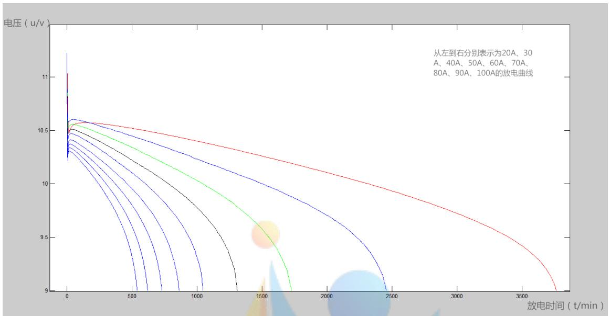

<details>
<summary>line</summary>

| 放电时间 (t/min) | 20A (u/V) | 30A (u/V) | 40A (u/V) | 50A (u/V) | 60A (u/V) | 70A (u/V) | 80A (u/V) | 90A (u/V) | 100A (u/V) |
| --- | --- | --- | --- | --- | --- | --- | --- | --- | --- |
| 0 | ~11.2 | ~11.2 | ~11.2 | ~11.2 | ~11.2 | ~11.2 | ~11.2 | ~11.2 | ~11.2 |
| 500 | ~10.6 | ~10.55 | ~10.5 | ~10.45 | ~10.4 | ~10.35 | ~10.3 | ~10.25 | ~10.2 |
| 1000 | ~10.45 | ~10.4 | ~10.35 | ~10.3 | ~10.25 | ~10.2 | ~10.15 | ~10.1 | ~10.05 |
| 1500 | ~10.35 | ~10.3 | ~10.25 | ~10.2 | ~10.15 | ~10.1 | ~10.05 | ~10.0 | ~9.95 |
| 2000 | ~10.25 | ~10.2 | ~10.15 | ~10.1 | ~10.05 | ~10.0 | ~9.95 | ~9.9 | ~9.85 |
| 2500 | ~10.15 | ~10.1 | ~10.05 | ~10.0 | ~9.95 | ~9.9 | ~9.85 | ~9.8 | ~9.75 |
| 3000 | ~10.05 | ~10.05 | ~9.95 | ~9.9 | ~9.85 | ~9.8 | ~9.75 | ~9.7 | ~9.65 |
| 3500 | ~9.95 | ~9.95 | ~9.85 | ~9.8 | ~9.75 | ~9.7 | ~9.65 | ~9.6 | ~9.55 |
| 3800 | — | — | — | — | — | — | — | — | — |
</details>

图 1 各电流强度的电压随放电时间变化图像

由图 1 可知，在刚开始放电的时候，电压会极速下降，之后随时间的增长电压会上升，最后电压随放电时间单调下降，直到额定的最低保护电压（ $U_{m}$ ）9V。这是因为在放电初期发生了化学变化，化学方程式如下：

$$
P b + P b O _ {2} + 2 H _ {2} S O _ {4} = 2 H _ {2} O + 2 P b S O _ {4}
$$

当电流始终不变时，电池随时间的变化而不断放电，此时，正极板上的二氧化铅与硫酸反应生成水，极板微孔内电解液浓度迅速下降，端电压随之迅速下降。到了所有的酸已准备就绪后，电压也就稳定了。

由于放电初期发生的时间极短，而电池放电的整个过程非常长，因此我们忽略此过程，从电压稳定后开始考虑放电过程，认为电池放电过程是电压随时间的增长而下降的过程。

## 2.2.2 对问题二的分析

问题要求建立以 20A 到 100A 之间任一恒定电流强度放电时的放电曲线的数学模型，并用 MRE 评估模型的精度，最后用表格和图形给出电流强度为 55A 时的放电曲线。

对于这个问题，我们需要对问题 1 的模型进行综合分析和对比，然后将这些模型统一整理，得到一个关于电流、电压和时间的函数模型。

## 2.2.3 对问题三的分析

问题要求预测附件 2 中电池衰减状态 3 的剩余放电时间。

对于这个问题，可以先对已知数据用 MATLAB 软件绘制图形，如图 2 所示:

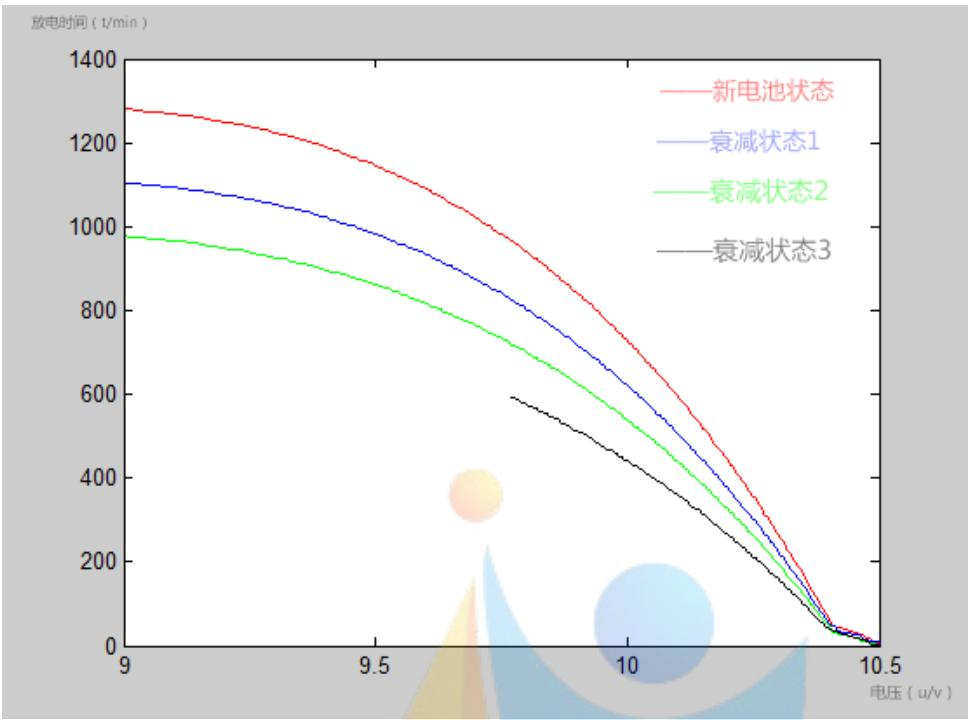

<details>
<summary>line</summary>

| 电压 (u/v) | 新电池状态 (t/min) | 衰减状态1 (t/min) | 衰减状态2 (t/min) | 衰减状态3 (t/min) |
| --- | --- | --- | --- | --- |
| 9.0 | ~1280 | ~1100 | ~970 | — |
| 9.5 | ~1150 | ~980 | ~860 | — |
| 9.75 | ~1000 | ~850 | ~750 | ~600 |
| 10.0 | ~750 | ~650 | ~550 | ~450 |
| 10.25 | ~350 | ~300 | ~250 | ~200 |
| 10.5 | 0 | 0 | 0 | 0 |
</details>

图 2 不同状态下电池的放电曲线

由图 2 可知，新电池状态、衰减状态 1 和衰减状态 2 的放电曲线基本类似，由此推测衰减状态 3 的放电曲线与此曲线相差不大，曲线符合指数函数模型。为了验证模型的合理性，我们用 MATLAB 进行拟合，和方差 (SSE) 近似为 0。所以，我们在此基础上建立关于衰状态 3 的指数函数模型，从而预测出电池衰减状态 3 的剩余放电时间。

## 三、模型的假设

1. 假设题目中所给的数据真实可靠;  
2. 所有程序中由于计算机运行带来的误差可忽略不计；  
3. 假设忽略温度等物理因素对电池的影响;  
4. 假设忽略掉的放电过程对模型的影响很小，可以忽略不计；  
5. 假设提取的电压样本点全都符合标准。

## 四、符号说明

<table><tr><td>符号</td><td>符号说明</td></tr><tr><td> $u_{t}$ </td><td> $t$ 时刻对应的电压</td></tr><tr><td> $t$ </td><td>放电时间</td></tr><tr><td> $RE$ </td><td>相对误差</td></tr><tr><td> $MRE$ </td><td>平均相对误差</td></tr><tr><td> $R_{t}$ </td><td>模型已放电时间</td></tr><tr><td> $R_{0}$ </td><td>采样已放电时间</td></tr><tr><td> $I$ </td><td>电流强度</td></tr></table>

## 五、模型的建立与求解

## 5.1 问题 1 的求解

根据题目要求，用附件 1 的采样数据得初等函数表示各放电曲线，并分别给出各放电曲线的平均相对误差（MRE）。并分别以 30A、40A、50A、60A 和 70A 电流强度放电，测得电压都为 9.8V 时，根据所建立的模型，得到电池剩余放电时间。

## 5.1.1 数据分析

1. 根据问题分析，对电压极速下降阶段的数据不予考虑。  
2. 通过对附件 1 数据得观察，得到电压随放电时间的增长而减小。

## 5.1.2 数据准备

根据题目要求, 我们需要确定不同电流强度的电压差, 所以我们用 MATLAB 做出电压差图形, 通过观察其基本上是一开始变化较慢, 而到了某个阶段突然变化加快（见附录 2）, 此直线符合初等函数中的指数函数, 因此为模型的建立做数据上的准备。

## 5.1.3 电压随时间变化的模型

## 1. 模型的准备

对于电池剩余放电时间进行预测，我们首先需要找到合理的，符合实际的模型来表示电压随时间的变化，进而才能够较为准确的得到电压为 9.8V 时，电池的剩余放电时间，为此，通过采样数据的放电曲线我们得到电压的变化率，符合指数函数，即：

$$
\frac {d u _ {t}}{d t} = a e ^ {b t} + c \tag {1}
$$

两边求积分得到电压与时间的关系式:

$$
u _ {t} = \frac {a}{b} e ^ {b t} + c t + d \tag {2}
$$

式（2）为一个指数函数模型，为确定此模型的准确性，我们用 MATLAB 对模型进行拟合得到的曲线与附件 1 中数据拟合的曲线进行对比，结果显示，两条曲线基本吻合，因此也确定了模型的合理性。

## 2. 模型的建立

电压随时间变化的模型:

$$
u _ {t} = L e ^ {b t} + c t + d \quad (L = \frac {a}{b})
$$

其中 $u_{t}$ 为电压，t为放电时间，L、b、c、d为常数

## (1) 当电流为 20A 时

我们首先用最小二乘法 $^{[2]}$ 求解L、b、c、d，令

$$
D = \sum_ {i = 0} ^ {n} d _ {i} ^ {2} = \sum_ {i = 0} ^ {n} d _ {i} ^ {2} = \sum_ {i = 0} ^ {n} [ u _ {t i} - L e ^ {b t _ {i}} - c t _ {i} - d ] ^ {2}
$$

D 对 L、b、c 和 d 分别求一阶偏导数为:

$$
\frac {\partial D}{\partial L} = - 2 \sum_ {i = 0} ^ {n} e ^ {b t _ {i}} [ \sum_ {i = 0} ^ {n} u _ {t _ {i}} - L \sum_ {i = 0} ^ {n} e ^ {b t _ {i}} - c \sum_ {i = 0} ^ {n} t _ {i} - n d ]
$$

$$
\frac {\partial D}{\partial b} = - 2 \sum_ {i = 0} ^ {n} t _ {i} e ^ {b t _ {i}} [ \sum_ {i = 0} ^ {n} u _ {t _ {i}} - L \sum_ {i = 0} ^ {n} e ^ {b t _ {i}} - c \sum_ {i = 0} ^ {n} t _ {i} - n d ]
$$

$$
\frac {\partial D}{\partial c} = - 2 \sum_ {i = 0} ^ {n} t _ {i} [ \sum_ {i = 0} ^ {n} u _ {t _ {i}} - \sum_ {i = 0} ^ {n} e ^ {b t _ {i}} - c \sum_ {i = 0} ^ {n} t _ {i} - n d ]
$$

$$
\frac {\partial D}{\partial d} = - 2 [ \sum_ {i = 0} ^ {n} u _ {t _ {i}} - L \sum_ {i = 0} ^ {n} e ^ {b t _ {i}} - c \sum_ {i = 0} ^ {n} t _ {i} - n d ]
$$

其中 $n = 3764$

令一阶偏导数为零:

$$
\frac {\partial D}{\partial L} = - 2 \sum_ {i = 0} ^ {n} e ^ {b t _ {i}} [ \sum_ {i = 0} ^ {n} u _ {t _ {i}} - L \sum_ {i = 0} ^ {n} e ^ {b t _ {i}} - c \sum_ {i = 0} ^ {n} t _ {i} - n d ] = 0;
$$

$$
\frac {\partial D}{\partial b} = - 2 \sum_ {i = 0} ^ {n} t _ {i} e ^ {b t _ {i}} [ \sum_ {i = 0} ^ {n} u _ {t _ {i}} - L \sum_ {i = 0} ^ {n} e ^ {b t _ {i}} - c \sum_ {i = 0} ^ {n} t _ {i} - n d ] = 0;
$$

$$
\frac {\partial D}{\partial c} = - 2 \sum_ {i = 0} ^ {n} t _ {i} [ \sum_ {i = 0} ^ {n} u _ {t _ {i}} - \sum_ {i = 0} ^ {n} e ^ {b t _ {i}} - c \sum_ {i = 0} ^ {n} t _ {i} - n d ] = 0;
$$

$$
\frac {\partial D}{\partial d} = - 2 [ \sum_ {i = 0} ^ {n} u _ {t _ {i}} - L \sum_ {i = 0} ^ {n} e ^ {b t _ {i}} - c \sum_ {i = 0} ^ {n} t _ {i} - n d ] = 0;
$$

解得:

$$
L = - 5 5 8. 4 1 4 5
$$

$$
b = - 1. 6 2 0 8 \times 1 0 ^ {- 4}
$$

$$
c = - 0. 0 0 9 1
$$

$$
d = 5 6 8. 9 8 0 7
$$

所以原函数为：

$$
u _ {t} = - 5 5 8. 4 1 4 5 e ^ {- 1. 6 2 0 8 \times 1 0 - 4 t} - 0. 0 0 9 1 t + 5 6 8. 9 8 0 7 \tag {3}
$$

(2) 当电流为 $30 \mathrm{~A} 、 40 \mathrm{~A} 、 50 \mathrm{~A} 、 60 \mathrm{~A} 、 70 \mathrm{~A} 、 80 \mathrm{~A} 、 90 \mathrm{~A}$ 和 $100 \mathrm{~A}$ 时, 函数分别为:

$$
u _ {t} = - 5 9 3. 5 4 1 8 e ^ {- 2. 2 3 6 2 \times 1 0 ^ {- 5} t} - 0. 0 1 3 4 t + 6 0 4. 1 2 4 1 \tag {4}
$$

$$
u _ {t} = - 6 1 4. 8 8 4 9 e ^ {- 3. 3 0 2 \times 1 0 ^ {- 5} t} - 0. 0 2 0 5 t + 6 2 5. 4 2 1 3 \tag {5}
$$

$$
u _ {t} = - 6 1 2. 0 4 1 7 e ^ {- 4. 3 0 9 7 \times 1 0 ^ {- 5} t} - 0. 0 2 6 6 t + 6 2 2. 5 3 3 1 \tag {6}
$$

$$
u _ {t} = - 7. 7 3 \times 1 0 ^ {- 4} e ^ {- 3. 7 8 1 6 \times 1 0 ^ {- 9} t} - 0. 0 0 1 1 t + 9. 8 3 9 9 \tag {7}
$$

$$
u _ {t} = - 4. 3 8 9 8 \times 1 0 ^ {- 4} e ^ {0. 0 0 8 3 \mathrm{t}} - 9. 6 3 4 1 \times 1 0 ^ {- 4} t + 1 0. 4 6 6 1 \tag {8}
$$

$$
u _ {t} = - 8. 7 5 \times 1 0 ^ {- 4} e ^ {- 1. 4 3 1 0 \times 1 0 ^ {- 8} t} - 0. 0 0 1 6 t + 9. 6 4 7 2 \tag {9}
$$

$$
u _ {t} = - 6. 5 7 8 6 \times 1 0 ^ {- 4} e ^ {0. 0 1 0 9} - 0. 0 0 1 3 t + 1 0. 3 9 7 6 \tag {10}
$$

$$
u _ {t} = - 5. 6 9 0 4 \times 1 0 ^ {- 4} e ^ {0. 0 1 2 7} - 0. 0 0 1 5 t + 1 0. 3 6 9 1 \tag {11}
$$

## (3) 求放电曲线的平均相对误差 (MRE)

根据公式 $^{[3]}$ 得：相对误差 $RE=\frac{\left|R_{t}-R_{0}\right|}{R_{t}}$ ，其中 $R_{t}$ 为模型已放电时间， $R_{0}$ 为采样已放电时间；平均相对误差 $MRE=\frac{\sum_{i=1}^{231}RE_{i}}{231}$ 。

利用 MATLAB 编程（见附录 3），可求出每个电流强度的平均相对误差，如表一：

表 1: 不同电流强度放电曲线的平均相对误差

<table><tr><td>I</td><td>20A</td><td>30A</td><td>40A</td><td>50A</td><td>60A</td><td>70A</td><td>80A</td><td>90A</td><td>100A</td></tr><tr><td>MRE</td><td>0.0601</td><td>0.0508</td><td>0.0367</td><td>0.0338</td><td>0.0631</td><td>0.0069</td><td>0.0773</td><td>0.0063</td><td>0.0050</td></tr></table>

（4）当电流分别为 30A、40A、50A、60A 和 70A，电压都为 9.8V 时，电池的剩余放电时间。

根据题目要求，把 $u_{t}=9.8$ 分别带入（4）-（8）式，得到9.8V时对应的放电时间，用最长放电时间减去9.8V对应的放电时间，可得剩余放电时间，如表2:

表 2：不同电流强度下的剩余放电时间

<table><tr><td>电流强度</td><td>30A</td><td>40A</td><td>50A</td><td>60A</td><td>70A</td></tr><tr><td>9.8V电压对应的放电时间</td><td>1918.1226</td><td>1224.3761</td><td>929.2559</td><td>739.6344</td><td>615.8148</td></tr><tr><td>剩余放电时间</td><td>535.8774</td><td>499.6239</td><td>378.7441</td><td>304.3656</td><td>246.1852</td></tr></table>

## 5.2 问题 2 的求解

## 5.2.1 数据处理

首先对问题 1 的模型进行综合分析和对比, 对其参数进行线性回归得到关于电流的方程, 将此方程带入问题 1 的指数函数模型中, 得到一个关于电压、电流与时间的函数, 即为任一恒定电流强度放电时的放电曲线的数学模型 $^{[4]}$ 。

## 5.2.2 模型准备

对电压随时间变化模型的参数进行拟合, 参数在 50A 开始左右分为两段有规律的线段, 因此需要把这两段分别建模。从图形可以看出, 当 $20A < I \leq 50A$ 时, 电流和各参数之间满足二次多项式, 当 $50A < I \leq 100A$ 时, 电流和各参数之间满足直线方程。

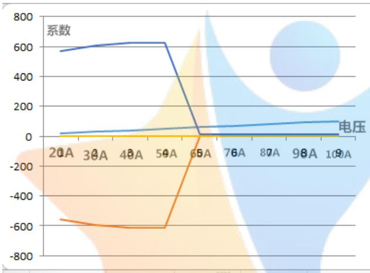

<details>
<summary>line</summary>

| Category | 系数 | 电压 | Orange Series |
| --- | --- | --- | --- |
| 20A | ~580 | ~30 | ~-560 |
| 30A | ~610 | ~40 | ~-600 |
| 40A | ~630 | ~50 | ~-610 |
| 50A | ~630 | ~60 | ~-610 |
| 65A | ~10 | ~70 | ~-100 |
| 76A | ~10 | ~80 | ~10 |
| 87A | ~10 | ~90 | ~10 |
| 98A | ~10 | ~100 | ~10 |
| 100A | ~10 | ~110 | ~10 |
</details>

图 3. 电流强度与各系数的散点图

当 $20A < I \leq 50A$ 时，设参数方程为 $f(I) = gI^2 + hI + r$ ，通过最小二乘法拟合得到的各个参数方程分别为：

$$
\begin{array}{l} L = 0. 0 9 4 9 3 I ^ {2} - 8. 4 6 7 I - 4 2 6. 5 \\ b = - 3. 7 1 4 \times 1 0 ^ {- 7} I ^ {2} + 2. 9 4 7 \times 1 0 ^ {- 5} I - 5. 9 5 7 \times 1 0 ^ {- 4} \\ c = - 4. 5 \times 1 0 ^ {- 6} I ^ {2} - 2. 8 1 \times 1 0 ^ {- 4} I - 0. 0 0 1 4 9 \\ d = - 0. 0 9 5 0 8 I ^ {2} + 8. 4 7 5 I + 4 3 7 \\ \end{array}
$$

当 $50A<I\leq100A$ 时，设参数方程为 $f(I)=hI+r$ ，通过最小二乘法拟合得到的各个参数方程分别为：

$$
\begin{array}{l} L = 1. 8 9 1 \times 1 0 ^ {- 6} I - 8. 1 4 1 \times 1 0 ^ {- 4} \\ b = 0. 0 0 0 2 8 I - 0. 0 1 6 0 2 \\ c = - 3. 0 6 3 \times 1 0 ^ {- 5} I + 0. 0 0 1 5 4 3 \\ d = 0. 0 0 9 8 9 9 I + 9. 3 5 2 \\ \end{array}
$$

## 5.2.3 模型的建立

将上述参数方程带入问题 1 的模型中得到:

当 $20A<I\leq50A$ 时：

$$
\begin{array}{l} u _ {t} = (0. 0 9 4 9 3 I ^ {2} - 8. 4 6 7 I - 4 2 6. 5) e ^ {(3. 7 1 4 \times 1 0 ^ {- 7} I ^ {2} - 2. 9 4 7 \times 1 0 ^ {- 5 0} I + 5. 9 5 7 \times 1 0 ^ {- 4}) t} \\ + (- 4. 5 \times 1 0 ^ {- 6} I ^ {2} - 2. 8 1 \times 1 0 ^ {- 4} I - 0. 0 0 1 4 9) t - 0. 0 9 5 0 8 I ^ {2} + 8 4 7 5 I + 4 3 7 \\ \end{array}
$$

当 $50A < I \leq 100A$ 时

$$
\begin{array}{l} u _ {t} = (1. 8 9 1 \times 1 0 ^ {- 6} I - 8. 1 4 1 \times 1 0 ^ {- 4}) e ^ {(2. 8 \times 1 0 ^ {- 4} \mathrm{I} - 0. 0 1 6 0 2 t)} \\ + (- 3. 0 6 3 \times 1 0 ^ {- 5} I + 0. 0 0 1 5 4 3) t + (0. 0 0 9 8 9 9 I + 9. 3 5 2) \\ \end{array}
$$

放电曲线的平均相对误差（MRE）见表3。

通过计算不同电流下模型对应的 MRE 值，可以看出求出的 MRE 值与问题 1 种求出的 MRE 值变化率不超过 5.71%。

当电流为 55A 时，用 MALTAB 求解的电压值，对电压值列表并绘图，由于列表数据庞大，我们只列出放电时间从 0min 到 100min 的数据，见表 4（其它数据见附录 4）。

表 3：不同电流强度放电曲线的平均相对误差

<table><tr><td>I(A)</td><td>20A</td><td>30A</td><td>40A</td><td>50A</td><td>60A</td><td>70A</td><td>80A</td><td>90A</td><td>100A</td></tr><tr><td>二题MRE</td><td>0.0583</td><td>0.0524</td><td>0.0385</td><td>0.0352</td><td>0.0654</td><td>0.0073</td><td>0.0804</td><td>0.0064</td><td>0.0052</td></tr><tr><td>一题MRE</td><td>0.0601</td><td>0.0508</td><td>0.0367</td><td>0.0338</td><td>0.0631</td><td>0.0069</td><td>0.0773</td><td>0.0063</td><td>0.0050</td></tr><tr><td>比值</td><td>3.33%</td><td>3.99%</td><td>5.71%</td><td>4.13%</td><td>3.06%</td><td>5.14%</td><td>3.75%</td><td>1.76%</td><td>3.94%</td></tr></table>

表 4: 电流为 55A 时对应的电压值

<table><tr><td>放电时间(min)</td><td>电压(v)</td><td>放电时间(min)</td><td>电压(v)</td><td>放电时间(min)</td><td>电压(v)</td><td>放电时间(min)</td><td>电压(v)</td><td>放电时间(min)</td><td>电压(v)</td></tr><tr><td>0</td><td>11.0932</td><td>20</td><td>10.4832</td><td>40</td><td>10.4886</td><td>60</td><td>10.4832</td><td>80</td><td>10.4722</td></tr><tr><td>2</td><td>10.5368</td><td>22</td><td>10.4858</td><td>42</td><td>10.4883</td><td>62</td><td>10.4807</td><td>82</td><td>10.4715</td></tr><tr><td>4</td><td>10.4507</td><td>24</td><td>10.4875</td><td>44</td><td>10.4882</td><td>64</td><td>10.4800</td><td>84</td><td>10.4700</td></tr><tr><td>6</td><td>10.4407</td><td>26</td><td>10.4886</td><td>46</td><td>10.4893</td><td>66</td><td>10.4800</td><td>86</td><td>10.4693</td></tr><tr><td>8</td><td>10.4489</td><td>28</td><td>10.4882</td><td>48</td><td>10.4879</td><td>68</td><td>10.4782</td><td>88</td><td>10.4668</td></tr><tr><td>10</td><td>10.4583</td><td>30</td><td>10.4889</td><td>50</td><td>10.4865</td><td>70</td><td>10.4768</td><td>90</td><td>10.4657</td></tr><tr><td>12</td><td>10.4668</td><td>32</td><td>10.4897</td><td>52</td><td>10.4850</td><td>72</td><td>10.4765</td><td>92</td><td>10.4650</td></tr><tr><td>14</td><td>10.4729</td><td>34</td><td>10.4897</td><td>54</td><td>10.4854</td><td>74</td><td>10.4747</td><td>94</td><td>10.4639</td></tr><tr><td>16</td><td>10.4754</td><td>36</td><td>10.4890</td><td>56</td><td>10.4847</td><td>76</td><td>10.4743</td><td>96</td><td>10.4629</td></tr><tr><td>18</td><td>10.4804</td><td>38</td><td>10.4897</td><td>58</td><td>10.4836</td><td>78</td><td>10.4729</td><td>98</td><td>10.4611</td></tr><tr><td></td><td></td><td></td><td></td><td></td><td></td><td></td><td></td><td>100</td><td>10.4603</td></tr></table>

对电流 20A、30A、40A、50A、55A、60A、70A、80A、90A 和 100A 的放电曲线进行绘图，得到图 4:

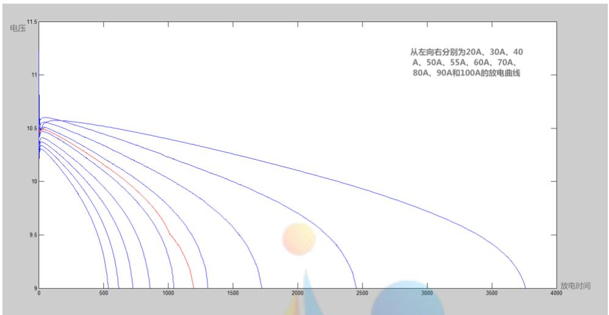

<details>
<summary>line</summary>

| 放电时间 | 20A (电压) | 30A (电压) | 40A (电压) | 50A (电压) | 55A (电压) | 60A (电压) | 70A (电压) | 80A (电压) | 90A (电压) | 100A (电压) |
| --- | --- | --- | --- | --- | --- | --- | --- | --- | --- | --- |
| 0 | ~10.6 | ~10.6 | ~10.6 | ~10.6 | ~10.6 | ~10.6 | ~10.6 | ~10.6 | ~10.6 | ~10.6 |
| 500 | — | — | — | — | — | — | — | — | — | ~9.8 |
| 1000 | — | — | — | — | — | — | — | — | — | ~9.2 |
| 1500 | — | — | — | — | — | — | — | — | — | — |
| 2000 | — | — | — | — | — | — | — | — | — | — |
| 2500 | — | — | — | — | — | — | — | — | — | — |
| 3000 | — | — | — | — | — | — | — | — | — | — |
| 3500 | — | — | — | — | — | — | — | — | — | — |
| 4000 | — | — | — | — | — | — | — | — | — | — |
</details>

图 4 不同电流对应的的放电曲线

## 5.3 问题 3 的求解

## 5.3.1 数据处理

通过 2.2.3 的分析可以看出, 时间与电压之间满足指数方程。首先对新电池、衰减状态 1 和衰减状态 2 的数据进行回归分析, 得到的各折线图基本类似 (见附录 5), 然后对新电池、衰减状态 1 和衰减状态 2 的数据数据进行回归分析, 我们初步就得到相应的模型 $^{[5]}$ , 然后根据衰减状态 3 已给的数据, 调整模型参数, 使得拟合效果好一点, 这样模型就可以直接用来预测。

## 5.3.2 模型准备

对新电池数据进行回归分析得:

$$
u _ {t} = - 2. 5 1 \times 1 0 ^ {4} \mathrm{e} ^ {0. 6 3 8 7 ^ {t}} + 2. 5 1 3 \times 1 0 ^ {4} \mathrm{e} ^ {0. 6 3 8 6 ^ {t}}
$$

对衰减状态 1 数据进行回归分析得:

$$
u _ {t} = 4 9 8 0 \mathrm{e} ^ {0. 6 2 6 8 ^ {t}} - 4 9 5 2 \mathrm{e} ^ {0. 6 2 7 3 ^ {t}}, \text {SSE} = 0. 0 1 5
$$

对衰减状态 2 数据进行回归分析得:

$$
u _ {t} = - 6. 7 0 2 \mathrm{e} ^ {0. 6 9 6 7 ^ {t}} + 3 9. 6 7 \mathrm{e} ^ {0. 5 2 6 1 ^ {t}}, \text {SSE} = 0. 0 2
$$

## 5.3.3 模型的建立

由新电池、衰减状态 1 和衰减状态 2 以及新电池、衰减状态 1、衰减状态 2 和衰弱状态 3 的折线图得，衰减状态 2 的放电时间与电压的表达式为：

$$
u _ {t} = m e ^ {n t} + k e ^ {q t}
$$

其中 m、n、k、p 为常数。

此模型是以 m、n、k、p 为参数的线性回归模型。因此，我们可以使用最小二乘法，运用 MAT 编程进行多元线性拟合得： $m = -82.354, n = 3752, k = -6571, q = 0.5157$ 。

$$
u _ {t} = - 8 2. 3 5 4 e ^ {0. 6 7 5 2 t} - 6 5 7 1 e ^ {0. 5 1 5 7 t}
$$

然后借助数学软件 MATLAB（程序见附录 6）拟合出衰减状态 3 的剩余放电时间，如图 4 所示：

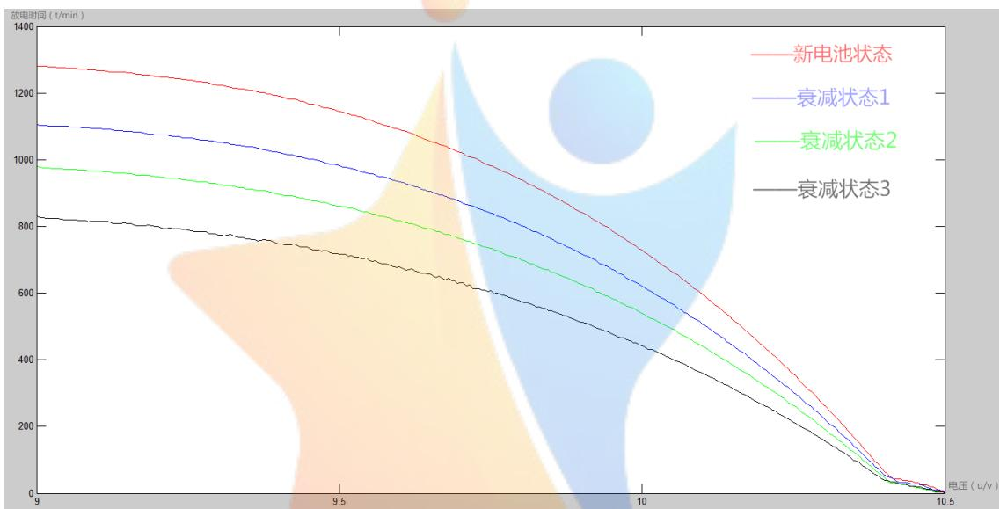

<details>
<summary>line</summary>

| 电压 (u/v) | 新电池状态 (t/min) | 衰减状态1 (t/min) | 衰减状态2 (t/min) | 衰减状态3 (t/min) |
| --- | --- | --- | --- | --- |
| 9.0 | ~1280 | ~1100 | ~970 | ~820 |
| 9.5 | ~1150 | ~980 | ~850 | ~720 |
| 10.0 | ~750 | ~600 | ~500 | ~400 |
| 10.5 | 0 | 0 | 0 | 0 |
</details>

图 4 电池衰弱状态 3 的剩余放电时间

由图 4 可知，根据建立的模型借助 MATLAB 拟合出的剩余放电时间的曲线与其他三种状态的趋势基本一致。由此说明，此模型的准确性较高，预测的曲线较为精准。

利用模型可得电池衰减状态 3 的剩余放电时间, 如表 5。

表 5 电池衰减状态 3 的剩余时间

<table><tr><td>电压(V)</td><td>剩余放电时间(min)</td><td>电压(V)</td><td>剩余放电时间(min)</td><td>电压(V)</td><td>剩余放电时间(min)</td></tr><tr><td>9.76</td><td>230.3</td><td>9.505</td><td>112.6</td><td>9.25</td><td>41.5</td></tr><tr><td>9.755</td><td>232.1</td><td>9.5</td><td>113.2</td><td>9.245</td><td>39.1</td></tr><tr><td>9.75</td><td>224</td><td>9.495</td><td>112.1</td><td>9.24</td><td>38.8</td></tr><tr><td>9.745</td><td>226.1</td><td>9.49</td><td>110.7</td><td>9.235</td><td>36.9</td></tr><tr><td>9.74</td><td>220.5</td><td>9.485</td><td>109</td><td>9.23</td><td>36</td></tr><tr><td>9.735</td><td>220.1</td><td>9.48</td><td>102.1</td><td>9.225</td><td>35.8</td></tr><tr><td>9.73</td><td>216.3</td><td>9.475</td><td>101.8</td><td>9.22</td><td>34.7</td></tr><tr><td>9.725</td><td>215.8</td><td>9.47</td><td>103.8</td><td>9.215</td><td>36.3</td></tr><tr><td>9.72</td><td>215.6</td><td>9.465</td><td>101.1</td><td>9.21</td><td>35.7</td></tr><tr><td>9.715</td><td>204.4</td><td>9.46</td><td>100.7</td><td>9.205</td><td>33.5</td></tr><tr><td>9.71</td><td>207</td><td>9.455</td><td>100.6</td><td>9.2</td><td>29.4</td></tr><tr><td>9.705</td><td>199.2</td><td>9.45</td><td>94.4</td><td>9.195</td><td>30.2</td></tr><tr><td>9.7</td><td>199.7</td><td>9.445</td><td>92.3</td><td>9.19</td><td>27</td></tr><tr><td>9.695</td><td>200.1</td><td>9.44</td><td>90.4</td><td>9.185</td><td>25.6</td></tr><tr><td>9.69</td><td>192.7</td><td>9.435</td><td>90.4</td><td>9.18</td><td>26.6</td></tr><tr><td>9.685</td><td>191.3</td><td>9.43</td><td>87.2</td><td>9.175</td><td>26.9</td></tr><tr><td>9.68</td><td>185.3</td><td>9.425</td><td>83.4</td><td>9.17</td><td>28.5</td></tr><tr><td>9.675</td><td>189</td><td>9.42</td><td>85.1</td><td>9.165</td><td>27.9</td></tr><tr><td>9.67</td><td>186.4</td><td>9.415</td><td>84.7</td><td>9.16</td><td>24.6</td></tr><tr><td>9.665</td><td>179.9</td><td>9.41</td><td>85.1</td><td>9.155</td><td>21.6</td></tr><tr><td>9.66</td><td>183.7</td><td>9.405</td><td>83.3</td><td>9.15</td><td>21.9</td></tr><tr><td>9.655</td><td>178.2</td><td>9.4</td><td>81.5</td><td>9.145</td><td>19.4</td></tr><tr><td>9.65</td><td>173.3</td><td>9.395</td><td>80.8</td><td>9.14</td><td>20.4</td></tr><tr><td>9.645</td><td>173.4</td><td>9.39</td><td>76.9</td><td>9.135</td><td>20.2</td></tr><tr><td>9.64</td><td>169.5</td><td>9.385</td><td>71.7</td><td>9.13</td><td>20.3</td></tr><tr><td>9.635</td><td>170.1</td><td>9.38</td><td>71</td><td>9.125</td><td>20.8</td></tr><tr><td>9.63</td><td>165.8</td><td>9.375</td><td>70.2</td><td>9.12</td><td>16.3</td></tr><tr><td>9.625</td><td>162.8</td><td>9.37</td><td>71.4</td><td>9.115</td><td>14.9</td></tr><tr><td>9.62</td><td>158</td><td>9.365</td><td>73.6</td><td>9.11</td><td>15</td></tr><tr><td>9.615</td><td>159.6</td><td>9.36</td><td>69.9</td><td>9.105</td><td>14.1</td></tr><tr><td>9.61</td><td>160.8</td><td>9.355</td><td>69.8</td><td>9.1</td><td>14.9</td></tr><tr><td>9.605</td><td>156.3</td><td>9.35</td><td>68</td><td>9.095</td><td>15.1</td></tr><tr><td>9.6</td><td>150</td><td>9.345</td><td>67.9</td><td>9.09</td><td>15.5</td></tr><tr><td>9.595</td><td>152.1</td><td>9.34</td><td>62.4</td><td>9.085</td><td>15.6</td></tr><tr><td>9.59</td><td>151.3</td><td>9.335</td><td>62</td><td>9.08</td><td>12.6</td></tr><tr><td>9.585</td><td>147.4</td><td>9.33</td><td>61.3</td><td>9.075</td><td>11.8</td></tr><tr><td>9.58</td><td>144.5</td><td>9.325</td><td>57.8</td><td>9.07</td><td>12.2</td></tr><tr><td>9.575</td><td>141</td><td>9.32</td><td>53.7</td><td>9.065</td><td>9.7</td></tr><tr><td>9.57</td><td>141.9</td><td>9.315</td><td>57.2</td><td>9.06</td><td>9.3</td></tr><tr><td>9.565</td><td>139.7</td><td>9.31</td><td>58</td><td>9.055</td><td>9.5</td></tr><tr><td>9.56</td><td>133.8</td><td>9.305</td><td>56.5</td><td>9.05</td><td>9.8</td></tr><tr><td>9.555</td><td>134.6</td><td>9.3</td><td>55.8</td><td>9.045</td><td>9.3</td></tr><tr><td>9.55</td><td>133.4</td><td>9.295</td><td>51.1</td><td>9.04</td><td>7.6</td></tr><tr><td>9.545</td><td>124.7</td><td>9.29</td><td>52.6</td><td>9.035</td><td>5.5</td></tr><tr><td>9.54</td><td>126.7</td><td>9.285</td><td>50.8</td><td>9.03</td><td>6.4</td></tr><tr><td>9.535</td><td>126.9</td><td>9.28</td><td>45</td><td>9.025</td><td>6.3</td></tr><tr><td>9.53</td><td>123</td><td>9.275</td><td>46.3</td><td>9.02</td><td>5.8</td></tr><tr><td>9.525</td><td>121</td><td>9.27</td><td>45.3</td><td>9.015</td><td>5.2</td></tr><tr><td>9.52</td><td>118.1</td><td>9.265</td><td>45.4</td><td>9.01</td><td>3.1</td></tr><tr><td>9.515</td><td>120.8</td><td>9.26</td><td>45.8</td><td>9.005</td><td>2.6</td></tr><tr><td>9.51</td><td>113.1</td><td>9.255</td><td>43.9</td><td>9.000</td><td>0</td></tr></table>

## 六、模型的检验

## 6.1 对电压随时间变化的模型的检验

在附件 1 中对不同的电流强度随机选取 5 个电压数据作为样本，然后带入模型求解，解得的时间与附件 1 所对应的时间，如果差距不大，则证明模型的准确性。（样本时间-计算时间=差值）

表 6 当电流强度为 20A 时

<table><tr><td>样本时间(min)</td><td>50</td><td>854</td><td>1506</td><td>2684</td><td>3530</td></tr><tr><td>计算时间(min)</td><td>52.6</td><td>859</td><td>1509</td><td>2679</td><td>3526</td></tr><tr><td>差值(min)</td><td>-2.6</td><td>-5</td><td>-3</td><td>5</td><td>4</td></tr></table>

结果表明，最大时间差为 5 分钟，所以此模型较为准确。

表 7 当电流强度为 30A 时

<table><tr><td>样本时间(min)</td><td>54</td><td>558</td><td>1266</td><td>1982</td><td>2440</td></tr><tr><td>计算时间(min)</td><td>56</td><td>562</td><td>1270</td><td>1980</td><td>2437</td></tr><tr><td>差值(min)</td><td>-2</td><td>-4</td><td>-4</td><td>2</td><td>3</td></tr></table>

结果表明，最大时间差为 4 分钟，所以此模型较为准确。

表 8 当电流强度为 40A 时

<table><tr><td>样本时间(min)</td><td>44</td><td>466</td><td>924</td><td>1302</td><td>1722</td></tr><tr><td>计算时间(min)</td><td>45</td><td>469</td><td>925</td><td>1310</td><td>1726</td></tr><tr><td>差值(min)</td><td>-1</td><td>-3</td><td>-1</td><td>-8</td><td>-4</td></tr></table>

结果表明，最大时间差为 8 分钟，所以此模型较为准确。

表 9 当电流强度为 50A 时

<table><tr><td>样本时间(min)</td><td>48</td><td>762</td><td>1066</td><td>1304</td></tr><tr><td>计算时间(min)</td><td>50</td><td>768</td><td>1067</td><td>1307</td></tr><tr><td>差值(min)</td><td>-2</td><td>-6</td><td>-1</td><td>-3</td></tr></table>

结果表明，最大时间差为 6 分钟，所以此模型较为准确。

表 10 当电流强度为 60A 时

<table><tr><td>样本时间(min)</td><td>52</td><td>288</td><td>560</td><td>778</td><td>1040</td></tr><tr><td>计算时间(min)</td><td>53</td><td>290</td><td>563</td><td>780</td><td>1035</td></tr><tr><td>差值(min)</td><td>-1</td><td>-2</td><td>-3</td><td>-2</td><td>5</td></tr></table>

结果表明，最大时间差为 5 分钟，所以此模型较为准确。

表 11 当电力强度为 70A 时

<table><tr><td>样本时间(min)</td><td>32</td><td>216</td><td>422</td><td>650</td><td>860</td></tr><tr><td>计算时间(min)</td><td>30</td><td>220</td><td>420</td><td>657</td><td>857</td></tr><tr><td>差值(min)</td><td>2</td><td>-4</td><td>2</td><td>-7</td><td>3</td></tr></table>

结果表明，最大时间差为 7 分钟，所以此模型较为准确。

表 12 当电流强度为 80A 时

<table><tr><td>样本时间(min)</td><td>34</td><td>186</td><td>378</td><td>546</td><td>726</td></tr><tr><td>计算时间(min)</td><td>35</td><td>190</td><td>380</td><td>543</td><td>720</td></tr><tr><td>差值(min)</td><td>-1</td><td>-4</td><td>-2</td><td>3</td><td>6</td></tr></table>

结果表明，最大时间差为 6 分钟，所以此模型较为准确。

表 13 当电流强度为 90A 时

<table><tr><td>样本时间(min)</td><td>24</td><td>146</td><td>324</td><td>508</td><td>616</td></tr><tr><td>计算时间(min)</td><td>28</td><td>154</td><td>318</td><td>510</td><td>615</td></tr><tr><td>差值(min)</td><td>-4</td><td>-8</td><td>6</td><td>-2</td><td>1</td></tr></table>

结果表明，最大时间差为 8 分钟，所以此模型较为准确。

表 14 当电流强度为 100A 时

<table><tr><td>样本时间(min)</td><td>16</td><td>124</td><td>258</td><td>404</td><td>536</td></tr><tr><td>计算时间(min)</td><td>20</td><td>130</td><td>260</td><td>400</td><td>533</td></tr><tr><td>差值(min)</td><td>-4</td><td>-6</td><td>-2</td><td>4</td><td>3</td></tr></table>

结果表明，最大时间差为 6 分钟，所以此模型较为准确。

## 6.2 电流强度为 55A 时的检验

在附件 1 中对电流强度为 55A 的数据随机选取 5 个电压数据作为样本, 然后

带入模型求解。

表 15 当电流强度为 55A 时

<table><tr><td>样本时间(min)</td><td>16</td><td>28</td><td>48</td><td>72</td><td>98</td></tr><tr><td>计算时间(min)</td><td>15.6</td><td>30.2</td><td>46.7</td><td>69.8</td><td>96.3</td></tr><tr><td>差值(min)</td><td>0.4</td><td>-2.2</td><td>1.3</td><td>2.2</td><td>1.7</td></tr></table>

结果表明，最大时间差为 2.2 分钟，所以此模型较为准确。

## 6.3 剩余放电时间

在附件 2 中对衰减状态 3 随机选取 5 个电压数据作为样本, 然后带入模型求解, 解得的时间与附件 2 所对应的时间, 如果差距不大, 则证明模型的准确性。

表 16 衰减状态 3

<table><tr><td>样本时间(min)</td><td>4.0</td><td>139.2</td><td>257.1</td><td>411.2</td><td>593.6</td></tr><tr><td>计算时间(min)</td><td>5.3</td><td>137.6</td><td>259.3</td><td>415.8</td><td>590.4</td></tr><tr><td>差值(min)</td><td>-1.3</td><td>1.6</td><td>-2.2</td><td>-4.6</td><td>3.2</td></tr></table>

结果表明，最大时间差为 4.6 分钟，所以此模型较为准确。

## 七、模型的评价与推广

## 7.1 模型的优点

(1) 利用最小二乘法来分析数据, 更有说服力和理论性;  
(2) 模型的建立层层递进, 有层次感;  
(3) 建立的模型准确性高;  
(4) 所建立的模型变量较少, 增加了模型的可读性;  
(5) 模型简单易懂, 具有很好的普及性;  
(6) 模型的计算采用专业的数学软件, 可信度较高。

## 7.2 模型的缺点

(1) 受题中数据的约束, 有小部分因素未能考虑;  
(2) 模型利用指数函数进行预测, 对参数 b 比较敏感, 要求比较高。

## 7.3 模型的推广

该模型可用于预测电池的寿命。

## 八、参考文献

[1]飞思科技产品研发中心编著，MATLAB6.5 辅助优化计算与设计，北京：电子工业出版社，2003。  
[2]王惠文著，偏最小二乘回归方法及其应用，北京：国防工业出版社，2000。  
[3] 相对误差计算公式,  
http://zhidao.baidu.com/link?url=L4ymUt2DrXKICbUMqHOQkt5R9s9lqmKKxaONw-RMUtVkDGrg8iK6N6Jt5sFCuqYvYZSaA7dOLFUTjqn8CvMUgK

2016.9.11。

[4]韩中庚编著，数学建模方法及其应用，北京：高等教育出版社，2005。

[5]白其峥主编，数学建模案例分析，北京：海洋出版社，2000。

## 九、附录

附录 1 图 1 的程序  
```matlab
data=xlsread('d:\123.xlsx');
X=data(:,1)';
X_20A=data(:,1)';
Y_20A=data(:,2)';
plot(X_20A,Y_20A,'r');

hold on
%**********************************************************************
Y_30A=data(:,3)'
K=length(Y_30A);
X_30A=X(1:K);
plot(X_30A,Y_30A,'b');

%**********************************************************************
Y_40A=data(:,4)'
K=length(Y_40A);
X_40A=X(1:K);
plot(X_40A,Y_40A,'G');

%**********************************************************************
Y_50A=data(:,5)'
K=length(Y_50A);
X_50A=X(1:K);
plot(X_50A,Y_50A,'k');
%**********************************************************************
Y_60A=data(:,6)'
K=length(Y_60A);
X_60A=X(1:K);
plot(X_60A,Y_60A);

%**********************************************************************
Y_70A=data(:,7)'
K=length(Y_70A);
X_70A=X(1:K);
```

```matlab
plot(X_70A,Y_70A);

%**********************************************************************
Y_80A=data(:,8)'
K=length(Y_80A);
X_80A=X(1:K);
plot(X_80A,Y_80A);
%**********************************************************************
Y_90A=data(:,9)'
K=length(Y_90A);
X_90A=X(1:K);
plot(X_90A,Y_90A);
```

```matlab
%***********************************************************************
Y_100A=data(:,10)'
K=length(Y_100A);
X_100A=X(1:K);
plot(X_100A,Y_100A);
```  
附录 2 电压斜率随时间变化的折线图

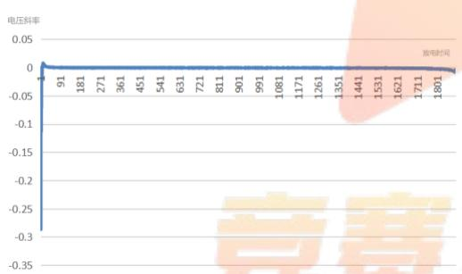

<details>
<summary>line</summary>

| 放电时间 | 电压斜率 |
| --- | --- |
| 91 | ~0.01 |
| 181 | ~0.005 |
| 271 | ~0.002 |
| 361 | ~0.001 |
| 451 | ~0.001 |
| 541 | ~0.001 |
| 631 | ~0.001 |
| 721 | ~0.001 |
| 811 | ~0.001 |
| 901 | ~0.001 |
| 991 | ~0.001 |
| 1081 | ~0.001 |
| 1171 | ~0.001 |
| 1261 | ~0.001 |
| 1351 | ~0.001 |
| 1441 | ~-0.09 |
| 1531 | ~-0.02 |
| 1621 | ~-0.02 |
| 1711 | ~-0.02 |
| 1801 | ~-0.02 |
</details>

20A

图表标题  
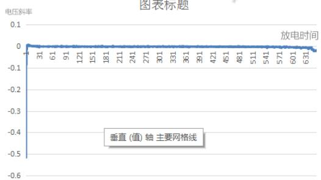

<details>
<summary>line</summary>

| 放电时间 | 电压斜率 |
| --- | --- |
| 1 | ~0.01 |
| 31 | ~0.00 |
| 61 | ~0.00 |
| 91 | ~0.00 |
| 121 | ~0.00 |
| 151 | ~0.00 |
| 181 | ~0.00 |
| 211 | ~0.00 |
| 241 | ~0.00 |
| 271 | ~0.00 |
| 301 | ~0.00 |
| 331 | ~0.00 |
| 361 | ~0.00 |
| 391 | ~0.00 |
| 421 | ~0.00 |
| 451 | ~0.00 |
| 481 | ~0.00 |
| 511 | ~0.00 |
| 541 | ~0.00 |
| 571 | ~0.00 |
| 601 | ~-0.01 |
| 631 | ~-0.02 |
</details>

40A

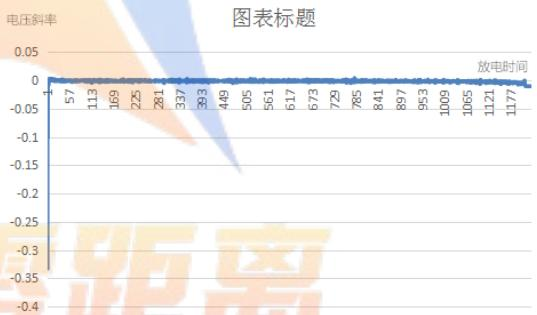

<details>
<summary>line</summary>

| 放电时间 | 电压斜率 |
| --- | --- |
| 1 | ~0 |
| 57 | ~0 |
| 113 | ~0 |
| 169 | ~0 |
| 225 | ~0 |
| 281 | ~0 |
| 337 | ~0 |
| 393 | ~0 |
| 449 | ~0 |
| 505 | ~0 |
| 561 | ~0 |
| 617 | ~0 |
| 673 | ~0 |
| 729 | ~0 |
| 785 | ~0 |
| 841 | ~0 |
| 897 | ~0 |
| 953 | ~0 |
| 1009 | ~0 |
| 1065 | ~0 |
| 1121 | ~0 |
| 1177 | ~-0.01 |
</details>

30A

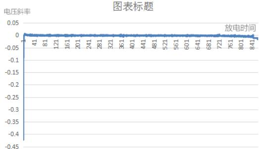

<details>
<summary>line</summary>

| 放电时间 (s) | 电压斜率 |
| --- | --- |
| 0 | ~0.005 |
| 41 | ~0.002 |
| 81 | ~0.001 |
| 121 | ~0.001 |
| 161 | ~0.001 |
| 201 | ~0.001 |
| 241 | ~0.001 |
| 281 | ~0.001 |
| 321 | ~0.001 |
| 361 | ~0.001 |
| 401 | ~0.001 |
| 441 | ~0.001 |
| 481 | ~0.001 |
| 521 | ~0.001 |
| 561 | ~0.001 |
| 601 | ~0.001 |
| 641 | ~0.001 |
| 681 | ~0.001 |
| 721 | ~0.001 |
| 761 | ~-0.005 |
| 801 | ~-0.015 |
| 841 | ~-0.025 |
</details>

50A

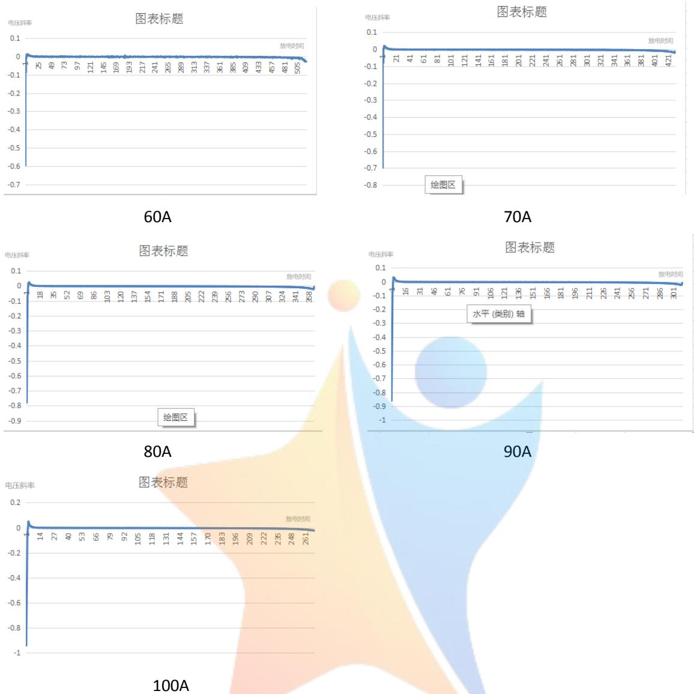

附录 3 求问题一中 MRE 的程序:  
```txt
clc;clear
```

```javascript
data=xlsread('d:\20.xlsx');
```

```javascript
X=data(:,1)';
```

```javascript
X_20A=data(:,1)';
```

```javascript
xx=sort(X_20A,'descend');
```

```javascript
Y_20A=data(:,2)';
```

```javascript
y=sort(Y_20A);
```

```javascript
y=y(1:231);
```

```javascript
x=solve('-558.4145*exp(-0.000016208*x)-0.0091*x+568.9807-y=0','x')%变成x的函数
```

```txt
x=eval(x)%计算 x 值
```

```matlab
k=0;

sum=0;
for i=1:1:231
    k=abs(x(i)-xx(i))/x(i);
    sum=sum+k;
end

mre=sum/231
```

附录 4 求问题 3 中 MRE 的程序  
```txt
clc;clear
```

```matlab
% I=50;
% fa=0.09493*I^2-8.467*I-426.5;
% fb=-0.0000003714*I^2+0.00002947*I-0.0005957;
% fc=-0.0000045*I^2-0.000281*I-0.00149;
% fd=-0.09508*I^2+8.475*I+437;
```

```matlab
fb=-3.302*10^(-5)
fc=-0.0205
it=100;
fa=0.00001891*it-0.0008141;
fb=0.00028*it-0.01602;
fc=-0.00003063*it+0.001543;
fd=0.009899*it+9.352;
```

```matlab
data=xlsread('d:\50.xlsx');
X=data(:,1)';
X_20A=data(:,1)';

xx=sort(X_20A,'descend');
Y_20A=data(:,2)';
y=sort(Y_20A);
y=y(1:231);
x=solve('fa*exp(fb*x)+fc*x+fd-y=0','x')%变成 x 的函数
x=solve('-614.88449*exp(-3.302*10^(-5)*x)-0.0205*x+625.4213-y=0','x')
%变成 x 的函数
x=eval(x)%计算 x

sum=0;
```

```matlab
for i=1:1:231
    k=abs(x(i)-xx(i))/x(i);
    sum=sum+k;
end

mre=sum/231
```

附录 5 新电池、衰减状态 1 和衰减状态 2 电压随时间变化的折线图  
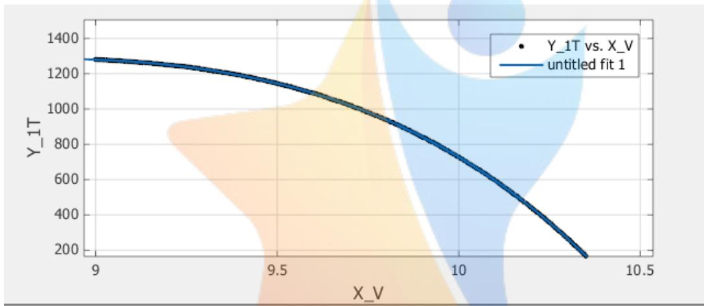

<details>
<summary>line</summary>

| X_V | Y_1T |
| --- | --- |
| 9.0 | ~1280 |
| 9.5 | ~1150 |
| 10.0 | ~750 |
| 10.3 | ~180 |
</details>

新电池

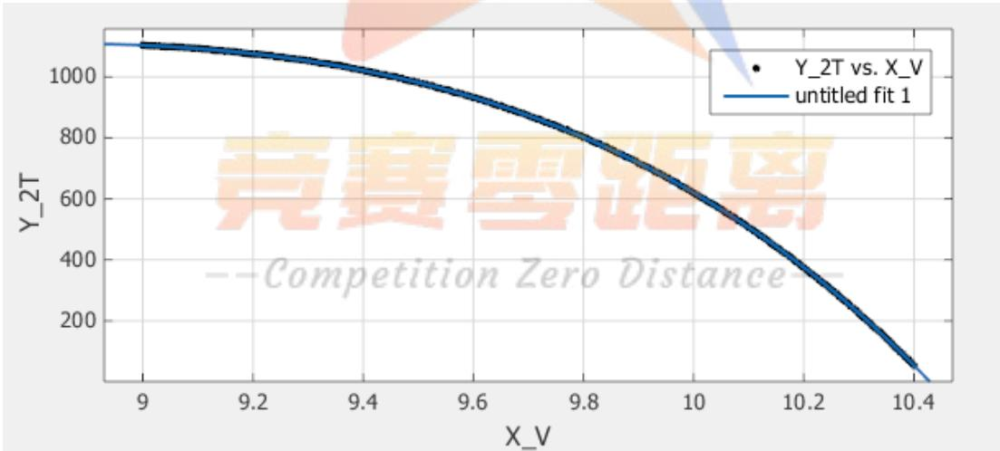

<details>
<summary>line</summary>

| X_V | Y_2T |
| --- | --- |
| 9.0 | ~1100 |
| 9.2 | ~1080 |
| 9.4 | ~1030 |
| 9.6 | ~950 |
| 9.8 | ~820 |
| 10.0 | ~650 |
| 10.2 | ~450 |
| 10.4 | ~100 |
</details>

衰减状态 1

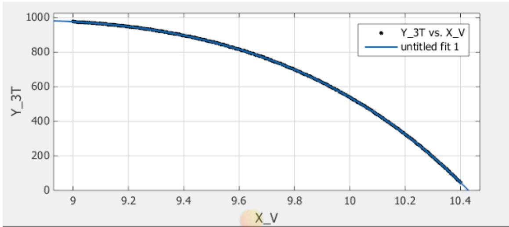

<details>
<summary>line</summary>

| X_V | Y_3T |
| --- | --- |
| 9.0 | ~980 |
| 9.2 | ~950 |
| 9.4 | ~900 |
| 9.6 | ~820 |
| 9.8 | ~700 |
| 10.0 | ~550 |
| 10.2 | ~350 |
| 10.4 | ~50 |
</details>

衰减状态 2

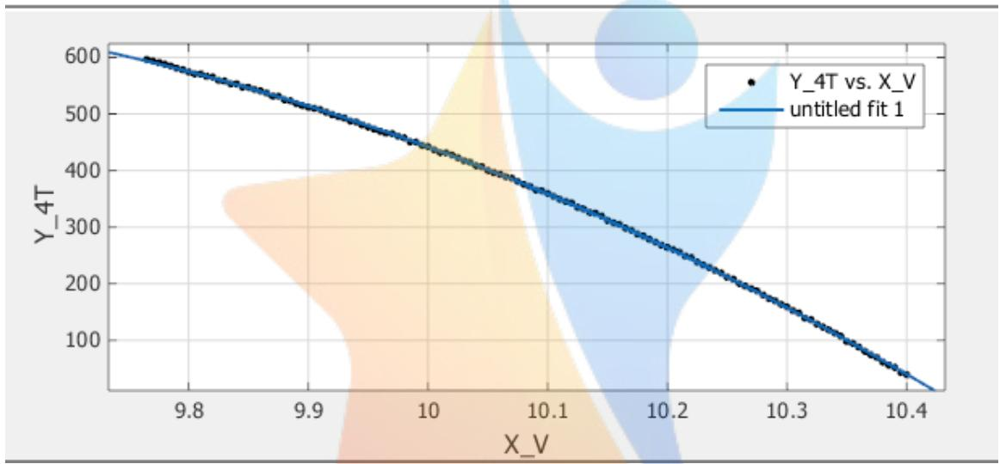

<details>
<summary>line</summary>

| X_V | Y_4T |
| --- | --- |
| 9.75 | ~600 |
| 9.8 | ~575 |
| 9.9 | ~525 |
| 10.0 | ~475 |
| 10.1 | ~425 |
| 10.2 | ~375 |
| 10.3 | ~325 |
| 10.4 | ~275 |
</details>

衰减状态 3

附录 6 电池衰减状态 3 的剩余放电时间的程序:

clc;clear

hold off

data=xlsread('d:\3.xlsx');

x=data(:,1)';

y=data(:,2)';

y1=data(:,3)';

y2=data(:,4)';

y3=data(:,5)';

y3=y3(1:148);

x1=x(1:148);

xtihuan=x(149:301)

for i=1:1:153

t=xtihuan(i);

yt(i)=-6.702\*exp(0.6967\*t)+39.67\*exp(0.5261\*t);
end


<details>
<summary>natural_image</summary>

Abstract graphic of a stylized human figure with a star and gradient background (no text or symbols)
</details>

## 竞赛零距离

--Competition Zero Distance--