# 风电场运行状况分析及优化研究

## 摘要

风能作为一种清洁能源，越来越受到世界各国的重视.本文以某风电场为研究对象，依据国家对风力发电与资源评估的相关标准，采用大数据信息挖掘和数据拟合技术，建立通用指标体系和整数规划模型，对风电场地运行状况进行了细致分析及优化研究.

针对问题一，首先利用 SPSS 软件对全年数据进行探索性分析；接着分别选择以自然风速和蒲福风力等级划分风速区间，进行数据分类汇总；然后依据国家电力技术标准汇编相关标准，确定指标体系；最后分别从月份和全年两方面评估该风电场风能资源与利用情况：如冬季平均风速最大（6.21m/s），夏季平均风速最小（5.29m/s）；12 月的风功率密度最大（222w/m<sup>2</sup>），8 月的风功率密度最小 $( 8 1 . 3 ~ \mathrm { w } / \mathrm { m } ^ { 2 } )$ ）；各月湍流强度的变化范围为 0.420.54 等，这些为问题三安排维修保养任务提供参考依据. 从全年来看，该风场具有较好的风能资源，为理想的风电场建设区，如该风电场的年平均风速为5.667m/s，风力主要是34级，年平均风能密度为 $1 5 7 . 9 8 1 6 \mathrm { w } / \mathrm { m } ^ { 2 }$ 且全年风速超过3 m/s的累计小时数为 ，所占比例为 等 然而风能资源指标利用效能比率仅为29.79%，说明该风电场需进一步优化设计方案，以提高资源利用率.

针对问题二，首先作定性分析，从五种机型的切入风速、额定风速和额定功率三方面考察，在不考虑造价的情况下，I 号机型最合适，III 号机型其次，II 机型最不适合.然后作定量分析，利用 MATLAB 对机型 I 与机型 II 的数据进行拟合，得到功率随风速的二次函数，从而方便预估新机型的输出功率与总电量；通过整合典型风机信息，得到各自在不同时刻的风速分布，为后期更换新型风机提供参考依据.

针对问题三，首先明确任务总量，接着运用由局部到整体的设计思想，采用枚举法确定最小循环周期为 6 天，确定每月最大维修数量为 36 台，以每月停机造成的输电总量最小为目标函数，以完成任务总量等为约束条件建立整数规划模型，运行结果是6月12月满排，其余月份为0.考虑到维护风机可能遇到恶劣天气、维修人员的工作状态等情况，进行模型优化与求解.最后的检验显示模型优良，结果参考价值高.

本文的优点在于充分发挥EXCEL、SPSS、MATLAB对不同数据处理的优势，快速、准确地完成了数据加工处理；而且设计排班方案时化繁为简的思想运用恰当，操作简便、易推广.

关键词：数据挖掘 评估指标体系 数据拟合 整数规划

## 1 问题的提出

## 1.1 问题背景

目前，大规模利用风能、太阳能等可再生能源已成为世界各国的重要选择.风能是可再生能源中发展最快的清洁能源，开发可再生能源与提高能源使用效率相结合，将对全球经济发展、解决贫困人口的能源问题、减少温室气体排放等做出重大贡献.

## 1.2问题重述

风能是一种最具活力的可再生能源，风力发电是风能最主要的应用形式 我国某风电场已先后进行了一、二期建设，现有风机 124 台，总装机容量约 20 万千瓦.请建立数学模型，解决以下问题：

问题一：附件 1 给出了该风电场一年内每隔 15 分钟的各风机安装处的平均风速和风电场日实际输出功率.试利用这些数据对该风电场的风能资源及其利用情况进行评估.

问题二：附件 2 给出了该风电场几个典型风机所在处的风速信息，其中 4#、16#、24#风机属于一期工程，33#、49#、57#风机属于二期工程，它们的主要参数见附件 3.风机生产企业还提供了部分新型号风机，它们的主要参数见附件 4.试从风能资源与风机匹配角度判断新型号风机是否比现有风机更为适合.

问题三：为安全生产需要，风机每年需进行两次停机维护，两次维护之间的连续工作时间不超过270天，每次维护需一组维修人员连续工作2天.同时风电场每天需有一组维修人员值班以应对突发情况.风电场现有4组维修人员可从事值班或维护工作，每组维修人员连续工作时间（值班或维护）不超过6天.请制定维修人员的排班方案与风机维护计划，使各组维修人员的工作任务相对均衡，且风电场具有较好的经济效益，试给出你的方法和结果.

## 2 问题的分析

## 2.1 预备知识

风能是可再生的清洁能源，储量大、分布广，但它的能量密度低（只有水能的1/800），并且不稳定.在一定的技术条件下，风能可作为一种重要的能源得到开发利用.风能利用是综合性的工程技术，通过风力机将风的动能转化成机械能、电能和热能等.

风功率密度：与风向垂直的单位面积中风所具有的功率.

风能密度:在设定时段与风向垂直的单位面积中风所具有的能量.

极大风速：给定时段内的瞬时风速的最大值.

平均风速：给定时间内瞬时风速的平均值，给定时间从几秒到数年不等.

风速分布：用于描述连续时限内风速概率分布的分布函数.

离差系数：又称变差系数，是一个表示标准差相对于平均数大小的相对量.

变差系数：变差系数是一个表示标准差相对于平均数大小的相对量，其公式如下：

变差系数=标准差/平均值

湍流强度：描述风速随时间和空间变化的程度，反映脉动风速的相对强度，是描述大气湍流运动特性的最重要的特征量.

蒲福风力级就是用数字（从1到17）描述风力的风级表（见附录1.1）.

## 2.2.问题的分析

针对问题一,首先利用 SPSS 软件对数据进行预处理，将离群点数据进行剔除.再依据处理后的数据，确定选取平均风速、风功率密度、风速频率、有效风能密度、湍流强度等指标对该风电场的风能资源进行评估.最后，从整体与局部两方面进行计算评估,并采用与科学数据进行对比的方法,使模型评估的合理性有一个较大的提升.在评估风电场风能资源利用情况时，论文选取理论总发电量,实际总发电量,利用效能比率及有效风时比率这四个参数.

针对问题二,首先对五种机型作定性分析处理，分析五种机型在切入风速、额定风速、额定功率的不同点,并选这三项为指标.然后根据附件三所给的数据利用 MATLAB 对机型I与机型II风速与功率的实测数据进行拟合，并根据拟合的方程对五种机型的实际功率进行定量分析，进一步得到五种机型的优缺点，从而确定新型风机是否比现有风机更为合适.

针对问题三, 在约束条件下，需重点利用好效益较好月份的发电，而维修保养可在效益较差的月份多安排任务，以提高资源利率.同时考虑到风电场现有 4 组维修人员可以从事值班与维修工作,且每组维修人员连续工作不超过 6 天,因此建立整数规划模型,以6天为一个周期进行工作满排,使资源利用率达到最高.但这样的模型过于机械且缺乏人性化.因此，可以多考虑环境、人员的出勤率等实际情况对模型的影响,建立优化整数规划模型,使维修时间尽可能的平均分配在每月.

## 3 模型的假设与符号说明

## 3.1模型的假设

假设1：该题中所给的空气密度0.9762kg/m<sup>3</sup>为平均值.

假设2：忽略极端天气对风力发电组的影响.

假设3：忽略该风电场的海拔高度对风力发电的影响.

假设4：每台机组之间的纵横间距合理.

假设5：各组维修人员无明显的工作能力差异.

## 3.2符号说明

<table><tr><td>序号</td><td>符号</td><td>符号说明</td></tr><tr><td>1</td><td> $D_{wp}$ </td><td>风功率密度</td></tr><tr><td>2</td><td> $f_{v_i}$ </td><td>风速为 $v_i$ 时的风速频率</td></tr><tr><td>3</td><td> $D_{WE}$ </td><td>风能密度</td></tr><tr><td>4</td><td>n</td><td>利用效能比率</td></tr><tr><td>5</td><td>μ</td><td>有效时间比重</td></tr></table>

注：在具体的模型中,将对符号进行分别说明.

## 4 模型的建立与求解

## 4.1问题一的模型建立与求解

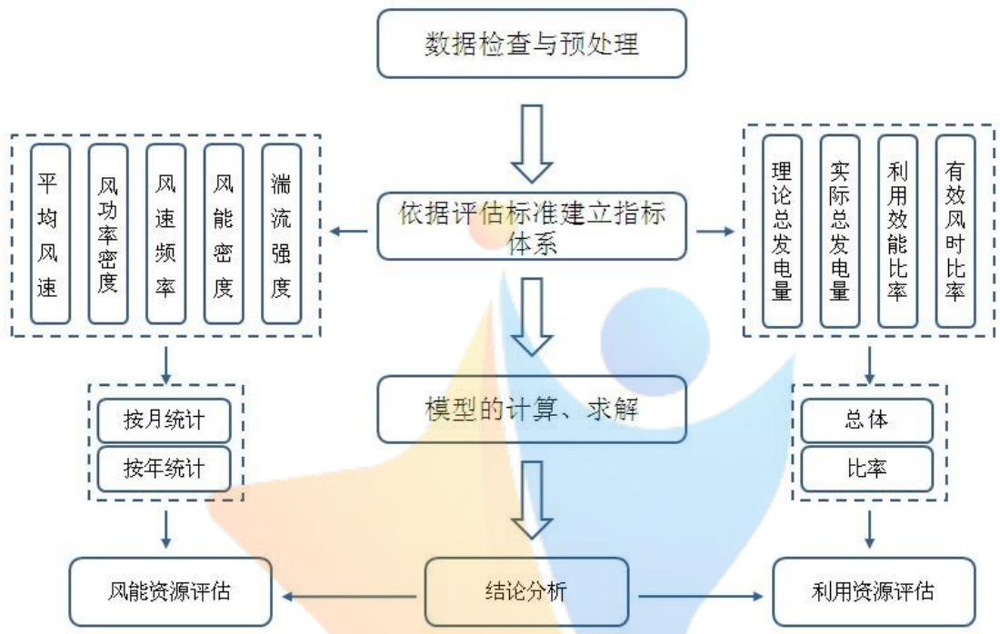

<details>
<summary>flowchart</summary>

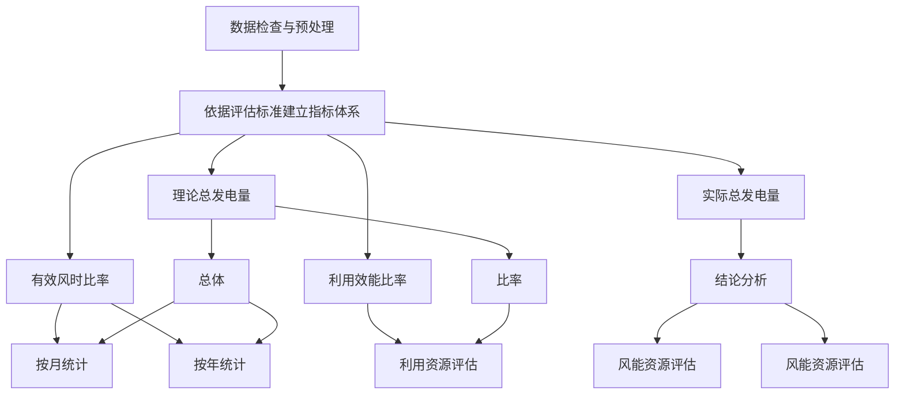
</details>

图4-1 问题一解题思路

## 4.1.1风能资源评估

## 1、数据检查与预处理

本文选2015年为代表年，根据附件1提供的一年的风速、功率及相关数据来评估该风电场的风能资源及其利用情况.

首先利用SPSS对所有数据按月进行探索性分析（详情见附录3.1），发现代表年3月30日06:00数据缺失、9月27日17:00录入错误等一些人为失误.对此本文利用排除个案法，对原始数据进行分析，得到各月的极大风速、中位数、离差系数、偏离系数.（详情见附录3.2）从风速的各月数据分布的盒状图来看，大部分月的数据都存在离群点，它们显示出风速的变化在一定范围内存在较大波动.

## 2、构建指标体系

依据国家发展改革委印发的《全国风能资源评价技术规定》，本文根据所给数据情况，确定选取平均风速、风功率密度、风速频率、风能密度、湍流强度等对某地区的风能资源进行评估.

指标一：平均风速

$$
\bar {v} = \frac {1}{n} \sum_ {i = 1} ^ {n} v _ {i}
$$

式中： $n$ ——在设定时段内的记录数

$\bar { \nu }$ ——设定时段内的平均风速

$\nu _ { i }$ ——第i记录的风速值

## 指标二：风功率密度

风功率密度：与风向垂直的单位面积中风所具有的功率.风功率密度蕴含着风速、风速频率分布和空气密度的影响，是衡量风电场风能资源的综合指标.设定时段的平均风功率密度 $D _ { { } _ { w p } }$ 表达式为：

$$
D _ {w p} = \frac {1}{2 n} \sum_ {i = 1} ^ {n} (\rho) (v _ {i} ^ {3})
$$

式中： $n$ ——在设定时段内的记录数

$\rho$ 空气密度, 0.9762k $g / m ^ { 3 }$

$\nu _ { i } ^ { 3 }$ ——第i记录的风速值的立方

## 指标三：风速频率

$$
f _ {v _ {i}} = \frac {T _ {v _ {i}}}{T}
$$

式中： $T _ { \nu _ { i } }$ ——风速为 $\nu _ { i }$ 的时间

$T$ ——时间段的总时间

$f _ { \nu _ { i } }$ 风速为 $\nu _ { i }$ 时的风速频率

## 指标四：有效风能密度

风能密度：在设定时段与风向垂直的单位面积中风所具有的能量.风能密度表达式为：

$$
D _ {W E} = \frac {1}{2} \sum_ {j = 1} ^ {m} (\rho) (v _ {j} ^ {3}) t _ {j}
$$

式中： $m$ ——风速区间数目

$\rho$ 空气密度

$\nu _ { j } ^ { 3 }$ ——第j个风速区间的风速值的立方

$t _ { j }$ ——某扇区或全方位第j个风速区间的风速发生的时间

## 指标五：湍流强度

湍流强度：描述风速随时间和空间变化的程度，反映脉动风速的相对强度，是描述大气湍流运动特性的最重要的特征量.湍流强度的表达式为：

$$
I _ {T} = \frac {\sigma}{\bar {\nu}}
$$

式中： $\sigma$ ——风速标准偏差

$\bar { \nu }$ ——平均风速

## 3、各月风能资源评估

表4-1 各月指标值

<table><tr><td>月份</td><td>1</td><td>2</td><td>3</td><td>4</td><td>5</td><td>6</td><td>7</td><td>8</td><td>9</td><td>10</td><td>11</td><td>12</td></tr><tr><td>平均风速(m/s)</td><td>6.03</td><td>6.52</td><td>5.45</td><td>5.59</td><td>5.80</td><td>5.89</td><td>5.34</td><td>4.64</td><td>6.04</td><td>5.31</td><td>5.33</td><td>6.13</td></tr><tr><td>平均风功率密度(w/m2)</td><td>170</td><td>219</td><td>138</td><td>166</td><td>172</td><td>178</td><td>118</td><td>79</td><td>181</td><td>125</td><td>137</td><td>218</td></tr><tr><td>风能密度(w/m2)</td><td>170</td><td>218</td><td>138</td><td>166</td><td>175</td><td>177</td><td>117</td><td>79</td><td>181</td><td>125</td><td>137</td><td>217</td></tr><tr><td>湍流强度</td><td>0.44</td><td>0.45</td><td>0.46</td><td>0.53</td><td>0.50</td><td>0.48</td><td>0.42</td><td>0.43</td><td>0.45</td><td>0.46</td><td>0.51</td><td>0.54</td></tr></table>

通过表4-1分析得1月、2月、9月、12月平均风速较大，均大于6m/s，冬季（12-2月）平均风速最大为6.21m/s、春季（3-5月）与秋季（9-11月）风速比较接近均为5.57m/s、夏季风速最小为5.29 m/s.

12月的风功率密度最大，为 $2 2 2 \mathrm { \Omega } _ { \mathrm { W } } / \mathrm { m } ^ { 2 }$ ,8月的风功率密度最小，为 $8 1 . 3 \mathrm { \ w } / \mathrm { m } ^ { 2 } .$ .该风力电厂在冬季的理想发电量最大.

湍流强度反应出风速的稳定性，通过分析得到7、8月的风速月差距不大，即最为稳定，此时比较适合风发电机工作.

将代表年的各月平均风功率密度和各月平均风速变化曲线作图如下：

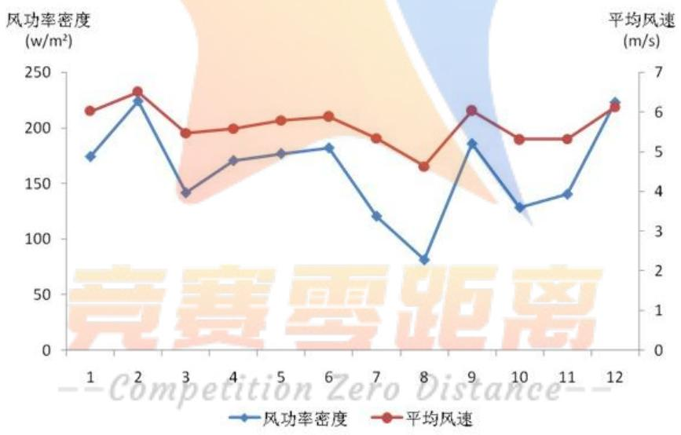

<details>
<summary>line</summary>

| Month | 风功率密度 \((w/m^{2})\) | 平均风速 (m/s) |
| --- | --- | --- |
| 1 | ~175 | ~6.0 |
| 2 | ~225 | ~6.4 |
| 3 | ~140 | ~5.5 |
| 4 | ~170 | ~5.6 |
| 5 | ~175 | ~5.8 |
| 6 | ~180 | ~5.9 |
| 7 | ~120 | ~5.3 |
| 8 | ~80 | ~4.6 |
| 9 | ~185 | ~6.0 |
| 10 | ~130 | ~5.3 |
| 11 | ~140 | ~5.3 |
| 12 | ~225 | ~6.0 |
</details>

图4-2 各月平均风功率密度和平均风速变化曲线

通过图4-2可以看出各月平均风功率密度与各月平均风速变化趋势是一致的，春季（3-5月）的变化幅度最小，风较为平缓.夏季（6-8月）的变化幅度最大.

再根据蒲福风力级作出代表年的各级风力等级小时数分布图和比例图.

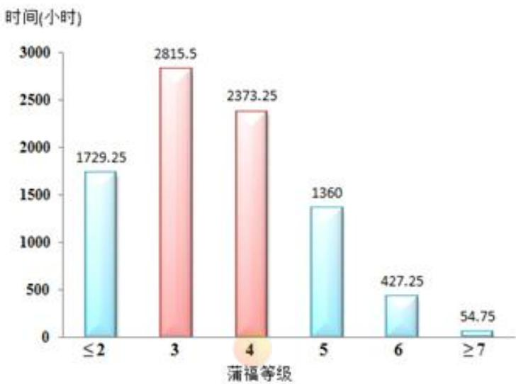

<details>
<summary>bar</summary>

| 蒲福等级 | 时间(小时) |
| --- | --- |
| \(\le 2\) | 1729.25 |
| 3 | 2815.5 |
| 4 | 2373.25 |
| 5 | 1360 |
| 6 | 427.25 |
| \(\ge 7\) | 54.75 |
</details>

图4-3 各级风力等级小时数分布图  
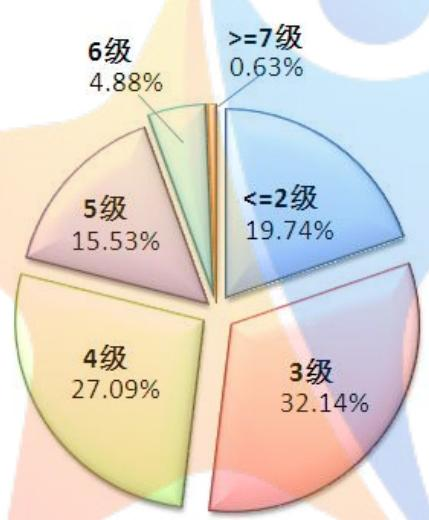

<details>
<summary>pie</summary>

| Category | Percentage |
| --- | --- |
| >=7级 | 0.63% |
| <=2级 | 19.74% |
| 3级 | 32.14% |
| 4级 | 27.09% |
| 5级 | 15.53% |
| 6级 | 4.88% |
</details>

图4-4 各级风力等级比例图

由图4-3、图4-4可知代表年中，蒲福风力 2级即不可以用于发电的风速频率较少，为19.74%.且风力多为3-4级的温和风，8级以上会对人们生产生活造成恶劣影响的风很少.

## 4、全年风能资源评估

表4-2 风电场全年风能资源评估

<table><tr><td>指标</td><td>年平均风速(m/s)</td><td>年平均风功率密度(w/m2)</td><td>年平均风能密度(w/m2)</td><td>年≥3m/s累计小时数为(h)</td><td>蒲福风力级</td></tr><tr><td>实际值</td><td>5.667</td><td>161.27</td><td>157.9816</td><td>7488</td><td>3-4级</td></tr><tr><td>参考值</td><td>6</td><td>150-200</td><td>150-200</td><td>&gt;5000</td><td>3-4级</td></tr><tr><td>评估</td><td>较好</td><td>较好</td><td>较丰富区</td><td>丰富区</td><td>较好</td></tr></table>

据表4-2，该风电场的年平均风速为5.667m/s，根据全国气象台部分风能资料，一般认为，可将风电场风况分为三类：年平均风速6m/s时为较好；7m/s为好；8m/s为很好，所以该风场的风况为较好.但同时也可发现，该地区的2月、12月、9月、1月平均风速较大，均风速大于6m/s.一般来说，夏季为用电高峰季，春秋季的用电较少.而该地区电量集中产生在春季与冬季，夏季的风速较小，产生的电量较少.虽然该地区的平均风速有利于风力发电，但是可能造成风力资源发电的季节性比较明显，影响人类的生产生活.

据表4-2，该风电场的年平均风功率密度为161.27w/m<sup>2</sup>，根据风功率密度等级（见附录1.2），可知该风电场的风功率密度等级为3，有较好的风能资源.

据表4-2，该风电场的年平均风能密度为 $1 5 7 . 9 8 1 6 \mathrm { w / m } ^ { 2 }$ ，年≥3m/s累计小时数为7337.5h，与参考数据（见附录1.3）相比较，得该地区风能为较丰富区，具有较好的风能资源，对大型并网型风力发电机组有利用价值，为理想的风电场建设区.

## 4.1.2风能利用情况评估

针对风能资源的利用情况，从风力发电机的满载负荷总发电量、风力发电机的实际发电量、利用效能比率、有效风时比率四个指标进行评估.

## 1.构建指标体系

1、指标一：风力发电机的满载负荷总发电量

$$
w _ {1} = p n T _ {1}
$$

式中： $w _ { 1 }$ ——总发电量

$p$ ——各机型额定功率

n ——台数

$T _ { 1 }$ ——有效工作时间

2、指标二：风力发电机的实际发电量

$$
w _ {2} = \bar {p} t
$$

式中： $w _ { 2 }$ 实际发电量

$\overline { { p } }$ ——各风速的平均功率

t——各风速的工作时间

3、指标三：利用效能比率

$$
\eta = \frac {w _ {1}}{w _ {2}}
$$

式中： ——利用效能比率

$w _ { 1 }$ ——总发电量

$w _ { 2 }$ ——实际发电量

## 4、指标四：有效风时比率

$$
\mu = \frac{T_v}{T}
$$

式中： $\mu$ ——有效风时比率

$T _ { \nu }$ ——当风速≥3时，有效工作时间

T ——总工作时间

## 2.利用情况的评估

经计算结果如下表4-3：

表4-3 资源利用情况表

<table><tr><td></td><td>总发电量</td><td>实际发电量</td><td>利用效能比率</td><td>有效风时比率</td></tr><tr><td>计算结果</td><td>149.1033亿kW·h</td><td>33.5338亿kW·h</td><td>29.79%</td><td>85.47%</td></tr></table>

查阅资料可知，我国的风发电机一般利用效能比率为30%，与论文中的计算结果接近.这一指标与世界一般水平38%存在一定的差异，因此，该风电场可以采取一些措施提高风电机的利用效率,比如采用多台发电机联合运行发电等.

## 4.2问题二的模型建立与求解

题中给出了该风电场几个典型风机所在处的风速信息，要求从风能资源与风机匹配角度判断新型号风机是否比现有风机更为适合.从定性和定量两个角度分别研究.

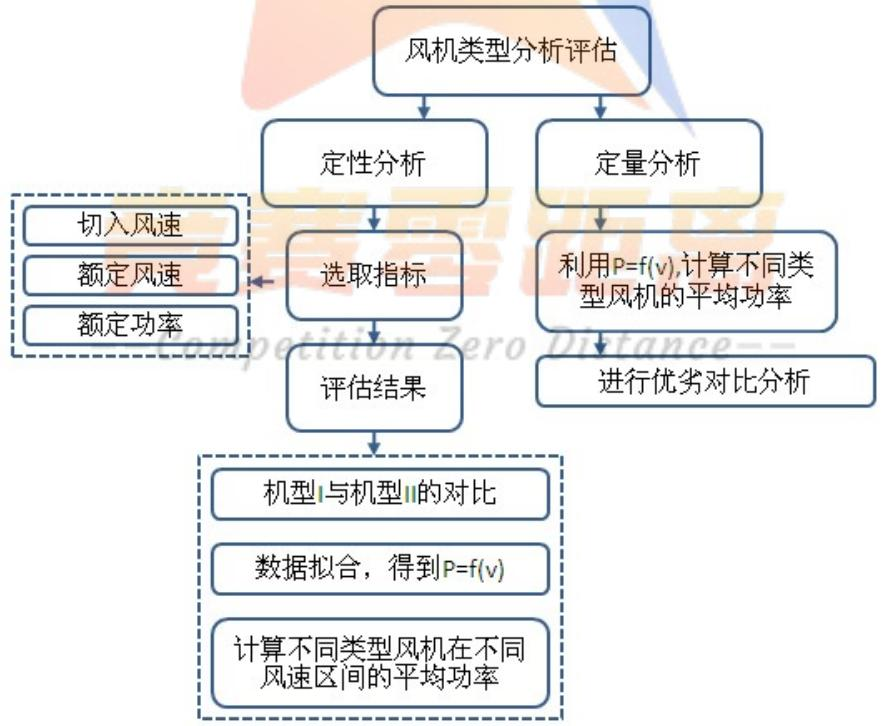

<details>
<summary>flowchart</summary>

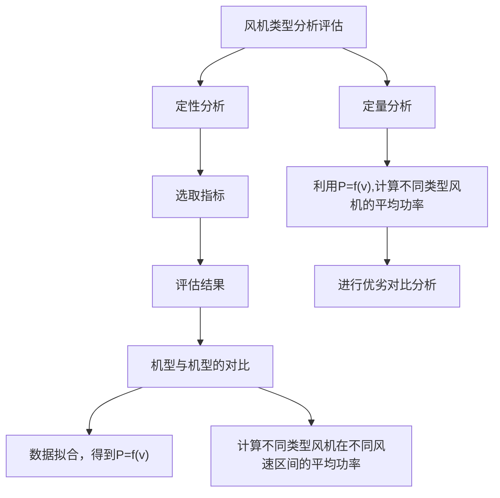
</details>

图4-5 问题二解题思路图

## 4.2.1 定性分析

表4-4 五种机型的主要参数

<table><tr><td>风机型号</td><td>I</td><td>II</td><td>III</td><td>IV</td><td>V</td></tr><tr><td>切入风速(m/s)</td><td>3</td><td>3.5</td><td>3</td><td>3</td><td>3</td></tr><tr><td>额定风速(m/s)</td><td>11</td><td>11.5</td><td>10.5</td><td>11</td><td>11.5</td></tr><tr><td>切出风速(m/s)</td><td>25</td><td>25</td><td>25</td><td>25</td><td>25</td></tr><tr><td>额定功率(kW)</td><td>2000</td><td>1500</td><td>1500</td><td>1500</td><td>1500</td></tr><tr><td>风机数量(台)</td><td>25</td><td>99</td><td></td><td></td><td></td></tr></table>

将五种机型进行对比,为了使风能资源利用效能较高,我们要求风机的切入风速与额定风速越小越好，额定功率越大越好.通过表4-4分析，机型I、III、IV、V的切入风速相同，机型II的切入风速最大.机型III的额定风速最小，但通过对功率的分析,当风速为10.5m/s时,机型I的输出功率为1730.77kW仍大于其余四种机型的额定输出功率.确定机型I的切入风速也一样是较为优质，且机型I的额定功率最大，由此可以推断出,机型I适合保留使用.

其次,将机型II与机型III,机型IV,机型V分别进行对比分析, 四种机型的额定功率相同，机型III、IV、V的切出风速相同且都小于机型II的切入风速,因此通过额定风速进行分析,得到机型III的额定风速最小，且在切入风速、额定风速、额定功率上均优于型号II,可以考虑用型号III代替型号II.

总之，在不考虑造价的情况下，机型 I 最合适，机型 III 其次，机型 II 最不适合.

## 4.2.2 定量分析

通过MATLAB分别利用指数函数、二次函数对两种机型风速与功率的实测数据进行拟合，拟合图像如图4-6和图4-7（程序见附录2.1和2.2）

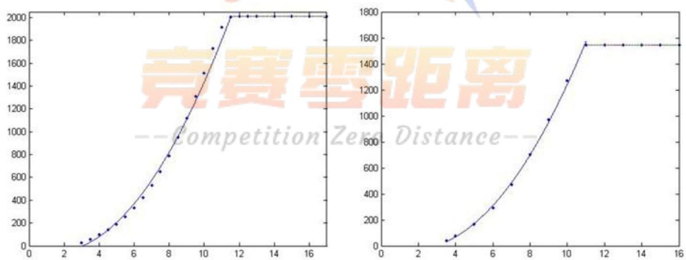  
图4-6 两种机型风速与功率的二次函数拟合图

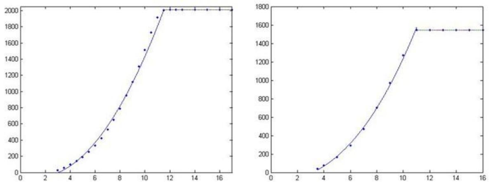  
图4-7 两种机型风速与功率的指数函数拟合图

表4-5 拟合后的函数关系式、可决系数、均方根

<table><tr><td>拟合曲线</td><td>类别</td><td>函数关系式</td><td>可决系数 $R^2$ </td><td>均方根 RMSE</td></tr><tr><td rowspan="2">二次拟合</td><td>机型I</td><td> $y = 20.3x^2 - 58.28x - 12.76$ </td><td>0.9906</td><td>73.13</td></tr><tr><td>机型II</td><td> $y = 18.92x^2 - 69.24x + 42.85$ </td><td>0.999</td><td>20.04</td></tr><tr><td rowspan="2">指数拟合</td><td>机型I</td><td> $y = 10.32x^{2.183} - 139.8$ </td><td>0.99</td><td>75.37</td></tr><tr><td>机型II</td><td> $y = 6.239x^{2.329} - 90.91$ </td><td>0.9982</td><td>23.22</td></tr></table>

注：可决系数，综合度量回归模型对样本观测值拟合的度量指标，可决系数越大，拟合程度越高.

均方根：用来衡量观测值同真值之间的偏差.

综合上述结果, 选择两种机型的风速与功率二次拟合效果更优.这一结果方便在不同地理位置条件下预估机型III 机型 IV机型 V的输出功率与总电量.

对机型I、机型II的年平均风速和日平均功率进行计算，发现机型I的日平均功率大于机型II的日平均功率，即机型I优于机型II（如表4-6）.由于机型II和机型III的参数基本相同,因此的风速和功率的函数关系机型 III 与机型 II 的拟合函数相同.与机型 II 相比较，机型 III 具备较小的切入风速，即当风速达到 3.0m/s 时就开始工作.机型 III 的额定风速小于机型 II 的额定风速，即当风速达到 10.5m/s 时就可达到额定功率.由于在现有的风机中机型II的数量较多，所以可以考虑用机型III去代替机型II.

表4-6 机型I、II的参数对比

<table><tr><td>风机号</td><td>年平均风速(m/s)</td><td>年平均功率(kW)</td><td>年平均功率合计(kW)</td></tr><tr><td>4#</td><td>6.322763</td><td>430.2891</td><td rowspan="3">1132.148</td></tr><tr><td>16#</td><td>6.065452</td><td>380.5765</td></tr><tr><td>24#</td><td>5.738476</td><td>321.2828</td></tr><tr><td>33#</td><td>5.646089</td><td>255.0526</td><td rowspan="3">917.6018</td></tr><tr><td>49#</td><td>6.080231</td><td>321.3122</td></tr><tr><td>57#</td><td>6.202358</td><td>341.2369</td></tr></table>

利用Excel对附件二数据进行提取与加工，得到六种典型风机在不同时刻的风速范围的全年累计情况表（见表4-7），为后期更换新型风机提供参考依据.

表4-7 典型风机风速范围统计表

<table><tr><td colspan="2">风速范围(m/s)</td><td>3</td><td>3-3.5</td><td>3.5-10.5</td><td>10.5-11</td><td>11-11.5</td><td>11.5以上</td></tr><tr><td>4#</td><td>次数</td><td>626</td><td>226</td><td>3079</td><td>93</td><td>104</td><td>252</td></tr><tr><td>16#</td><td>次数</td><td>762</td><td>226</td><td>2952</td><td>83</td><td>97</td><td>260</td></tr><tr><td>24#</td><td>次数</td><td>838</td><td>296</td><td>2905</td><td>63</td><td>68</td><td>210</td></tr><tr><td>33#</td><td>次数</td><td>854</td><td>293</td><td>2957</td><td>78</td><td>54</td><td>144</td></tr><tr><td>49#</td><td>次数</td><td>814</td><td>237</td><td>2911</td><td>76</td><td>67</td><td>275</td></tr><tr><td>57#</td><td>次数</td><td>821</td><td>219</td><td>2841</td><td>76</td><td>76</td><td>347</td></tr></table>

## 4.3问题三的模型建立与求解

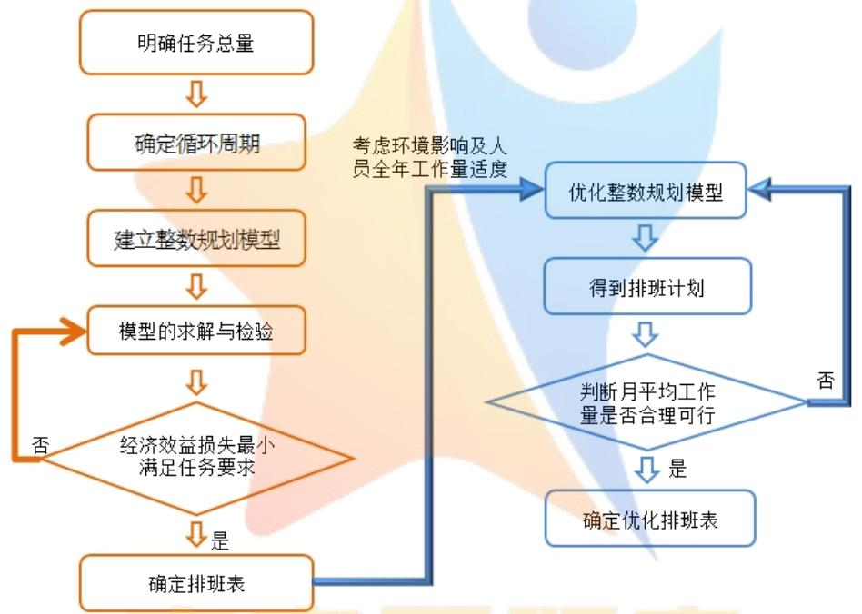

<details>
<summary>flowchart</summary>

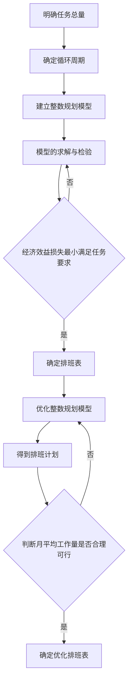
</details>

图 4-8 问题三解题思路

## 4.3.1 任务分析

明确任务总量：维修风机1242台(风机每年需停机两次进行维护)和全年值班 365(366)天.

## 4.3.2整数规划模型

第一步根据条件确定最小循环周期

考虑到该风电场共有四组人员可从事值班或维护工作，符合要求排班方案主要基于以下四点：

1.每组维修人员连续工作时间不超过6天；  
2.各组维修人员的工作任务相对均衡；

3.每组的工作量尽量饱满，在这里以各组工作的天数来衡量；  
4.排班的方案具有周期性，便于操作.

因为每组维修人员连续工作时间不超过6天，在这里以6天为一个周期，利用枚举法对排班情况进行排列.以24天的排班计划为例，如表4-8所示.其中，红色的字体表示“维修”，绿色的字体代表“值班”，黑色的字体代表“休息”.第1-2天，安排 1个组值班，3个组维修；第3-6天，每天1个组轮流休息，2个组维修，1个组值班.

表4-8 24天的排班方案

<table><tr><td rowspan="2">工作组</td><td colspan="12">天数</td></tr><tr><td>1</td><td>2</td><td>3</td><td>4</td><td>5</td><td>6</td><td>7</td><td>8</td><td>9</td><td>10</td><td>11</td><td>12</td></tr><tr><td>1组</td><td>维</td><td>维</td><td>休</td><td>值</td><td>维</td><td>维</td><td>值</td><td>值</td><td>休</td><td>值</td><td>维</td><td>维</td></tr><tr><td>2组</td><td>维</td><td>维</td><td>值</td><td>休</td><td>维</td><td>维</td><td>维</td><td>维</td><td>值</td><td>休</td><td>维</td><td>维</td></tr><tr><td>3组</td><td>维</td><td>维</td><td>维</td><td>维</td><td>休</td><td>值</td><td>值</td><td>值</td><td>值</td><td>维</td><td>休</td><td>值</td></tr><tr><td>4组</td><td>值</td><td>值</td><td>维</td><td>维</td><td>值</td><td>休</td><td>维</td><td>维</td><td>维</td><td>维</td><td>值</td><td>休</td></tr><tr><td rowspan="2">工作组</td><td colspan="12">天数</td></tr><tr><td>13</td><td>14</td><td>15</td><td>16</td><td>17</td><td>18</td><td>19</td><td>20</td><td>21</td><td>22</td><td>23</td><td>24</td></tr><tr><td>1组</td><td>维</td><td>维</td><td>休</td><td>值</td><td>维</td><td>维</td><td>维</td><td>维</td><td>休</td><td>值</td><td>维</td><td>维</td></tr><tr><td>2组</td><td>值</td><td>值</td><td>值</td><td>休</td><td>维</td><td>维</td><td>维</td><td>维</td><td>值</td><td>休</td><td>维</td><td>维</td></tr><tr><td>3组</td><td>维</td><td>维</td><td>维</td><td>维</td><td>休</td><td>值</td><td>值</td><td>值</td><td>维</td><td>维</td><td>休</td><td>值</td></tr><tr><td>4组</td><td>维</td><td>维</td><td>维</td><td>维</td><td>值</td><td>休</td><td>维</td><td>维</td><td>维</td><td>维</td><td>值</td><td>休</td></tr></table>

从表中可以看出，每组的工作量均相同，维修14天，值班6天；每组连续工作的天数均没有超过6天；4个小组总的工作量为：(14+6)×4=80(天).理论上，由于维修人员连续工作时间不超过6天，因此每组最少要休息3天，4组的总工作量为84天，实际的工作量达到了理论工作量95%以上，即可以认为此排班计划符合模型的期望值.

第二步确定每月最大维修台数

基于排班方案，经计算，每月最大维修数量为36台时，维护人员的工作任务相对均衡且工作量饱满.

第三步建立整数规划模型

1.在大月（1、3、5、7、8、10、12月）每月可安排36台风机进行维护，在小月（4,6,9,11月）每月可以安排35台风机进行维护.  
2.在保证经济效益的基础上，尽可能安排在经济效益小的月份进行风机维护.

即以代表年各月每台风发电机2天输出的平均电量为衡量标准，尽可能使因维修而损失的电量最小.建立工作分配整数规划模型如下：

$$
\text {目标函数:} \min \sum_ {i = 1} ^ {1 2} Q _ {i} \cdot X _ {i}
$$

$$
\text {约束条件:} \left\{ \begin{array}{c} \sum_ {i = 1} ^ {1 2} X _ {i} = 2 4 8 \\ X _ {i} \geq 0 \\ X _ {i} \leq 3 6 (i = 1, 3, 5, 7, 8, 1 0, 1 2) \\ X _ {i} \leq 3 5 (i = 4, 6, 9, 1 1) \\ X _ {2} \leq 2 8 \\ X _ {i} \in \mathrm{Z} \end{array} \right.
$$

式中： $X _ { i }$ ——第i月风机工作的数量

$Q _ { i }$ ——第i月的每台风发电机2天输出的平均电量

利用Lingo软件对整数规划模型进行求解（程序见附录2.3），运行原始结果（见附录3.3），并将结果作表如下：

表4-9 整数规划模型结果

<table><tr><td>月</td><td>1</td><td>2</td><td>3</td><td>4</td><td>5</td><td>6</td><td>7</td><td>8</td><td>9</td><td>10</td><td>11</td><td>12</td></tr><tr><td>维修风机数量(台)</td><td>0</td><td>0</td><td>0</td><td>0</td><td>0</td><td>35</td><td>36</td><td>36</td><td>35</td><td>36</td><td>35</td><td>35</td></tr></table>

两次维护之间的连续工作时间不超过270天，所以对所有风机进行编号处理，同时不考虑风机的型号差异，所处位置及维修困难等.

1 月、12 月排班计划如表 4-10 和表 4-11.

表4-10 一月排班计划

<table><tr><td></td><td>一组</td><td>二组</td><td>三组</td><td>四组</td><td>小计</td></tr><tr><td>休息</td><td>24</td><td>23</td><td>23</td><td>23</td><td>93</td></tr><tr><td>值班</td><td>7</td><td>8</td><td>8</td><td>8</td><td>31</td></tr><tr><td>维护风机数</td><td>0</td><td>0</td><td>0</td><td>0</td><td>0</td></tr><tr><td>小计</td><td>31</td><td>31</td><td>31</td><td>31</td><td>124</td></tr></table>

表4-11 十二月排班计划

<table><tr><td></td><td>一组</td><td>二组</td><td>三组</td><td>四组</td><td>小计</td></tr><tr><td>休息</td><td>6</td><td>5</td><td>6</td><td>6</td><td>23</td></tr><tr><td>值班</td><td>9</td><td>8</td><td>7</td><td>7</td><td>31</td></tr><tr><td>维护风机天数</td><td>16</td><td>18</td><td>18</td><td>18</td><td>70</td></tr><tr><td>小计</td><td>31</td><td>31</td><td>31</td><td>31</td><td>124</td></tr></table>

其他月的排班计划见附录3.4.

## 4.3.3 模型的优化

整数规划模型的建立只考虑到了最大的经济效率，对人员维修安排的太过于饱满，没有考虑到环境、人员的出勤率等实际情况对模型的影响，具有片面性.所以对上述模型进行改进，使维修时间尽可能的平均分配在每月.每年维修的工作量一定，以6天为一个排班周期，在满排的情况下，一个周期可以维修7台风机，考虑到可能会发生意外情况，于是在完成工作总量的前提下，将每个排班周期维护风机的台数减少到5台，并使每月维护风机的最大台数为24台，对工作分配整数规划模型进行优化.

目标函数： $\operatorname* { m i n } \sum _ { i = 1 } ^ { 1 2 } \boldsymbol { Q } _ { i } \cdot \boldsymbol { X } _ { i }$

12  X 248 i 1 约束条件： X 0 X 24 Xi∈Z

利用Lingo软件对优化后的整数规划模型进行求解（程序见附录2.4），运行原始结果（见附录3.5），并将结果作表如下：

表4-12 优化模型结果

<table><tr><td>月</td><td>1</td><td>2</td><td>3</td><td>4</td><td>5</td><td>6</td><td>7</td><td>8</td><td>9</td><td>10</td><td>11</td><td>12</td></tr><tr><td>维修风机数量(台)</td><td>4</td><td>4</td><td>24</td><td>24</td><td>24</td><td>24</td><td>24</td><td>24</td><td>24</td><td>24</td><td>24</td><td>24</td></tr></table>

通过表4-12分析得到，该改进模型在保证完成工作总量的基础上，将维修时间较均匀的分配在3月至12月上，发电总量较大的1月和 2月上尽可能的少安排维护工作，所以此模型更加合理.

表4-13 各组全年工作安排表

<table><tr><td></td><td>维修台数</td><td>维修天数</td><td>维修天数</td><td>休息天数</td><td>小计</td></tr><tr><td>一组</td><td>62</td><td>124</td><td>91</td><td>150</td><td>365</td></tr><tr><td>二组</td><td>62</td><td>124</td><td>92</td><td>149</td><td>365</td></tr><tr><td>三组</td><td>62</td><td>124</td><td>91</td><td>150</td><td>365</td></tr><tr><td>四组</td><td>62</td><td>124</td><td>91</td><td>150</td><td>365</td></tr><tr><td>小计</td><td>248</td><td>496</td><td>365</td><td>599</td><td>1460</td></tr></table>

## 5 误差的分析与改善

## 5.1误差的分析

在仪器采集测量数据时产生的误差,对采集到的数据进行录入时存在的录入错误,以及在进行数据检查与预处理的时候,存在离群点的忽略而造成的数据不全,以及处理数据时保留的小数位数的差别.

## 5.2误差的改善

定期升级仪器设备,提高仪器的测量精度.录入采集到的数据时,尽量选择细心并且责任心较强的员工进行此项工作,并指派专人进行检查.

在进行数据检查时,及时发现错误,对录入有误的数据进行修正补全,保证数据的完整，处理数据时尽量多保留几位小数,提高数据的精确度.

## 6 模型的评价与推广

## 6.1 模型的评价

## 优点：

1. 灵活运用多种软件，充分发挥各自优势.SPSS对数据的探索性分析、MATLAB对数据的曲线拟合与优度检验、LINGO解决整数规划问题、EXCEL的常规数据处理及任务分配时自动填涂功能等.  
2. 有效运用由局部到整体的思想.资源评估由月到年，设计工作任务由最小循环周期到月最小任务量再全年计划任务分配等，问题研究化繁为简、思路清晰，层次明显.

缺点：模型的个别参数是在理想状态下建立的，具有一定的局限性.

## 6.3模型的推广

本文在评估风场资源与利用效能情况过程中采用的技术与方法，可推广到类似水资源、光能源等评价研究方面；构建整数规划模型的思想和方法, 具有有效性高,适用范围广的特点，不仅适用于人力资源的配置，而且适用于考察评估场地建设、硬件设施更新扩展等需求，同时适用于各基地、各院校的排课系统等方面.

## 7 参考文献

[1] 朱瑞兆. 我国风能资源[A].太阳能学报,1981.  
[2] 高春香.风能资源评估的参数计算和统计分析方法研究[A].兰州大学同等学力人员申请学位学位论文.2008.  
[3] 孙国龙. 塞罕坝林场风能资源与开发利用[A].安徽农学通报,2016.  
[4] 韩中庚. 数学建模方法及其应用[C]. 高等教育出版社,2009.  
[5] GB/T 18709-2002, GB/T 18709-2002 风电场风能资源测量方法[s],中国标准出版社，2002.  
[6] 风功率密度及风能区域等级  
http://wenku.baidu.com/link?url=7II3abVz87L8oj4A5XabWrHODyVEF22hvtTai5IkxM0aB8OcqMZATlf6 nOa04UyNvn5iwM4sgMFYy\_dZR8qcZD9iohxI4B\_eGXio6fIqcVi

## 附录

附录1参考数据  
1.1 蒲福风力级

<table><tr><td>风力等级</td><td>风的名称</td><td>风速(m/s)</td><td>海岸渔船象征</td><td>陆地状况</td><td>海面状况</td></tr><tr><td>0</td><td>无风</td><td>0~0.2</td><td>静</td><td>静,烟直上</td><td>平静无感</td></tr><tr><td>1</td><td>软风</td><td>0.3~1.5</td><td>寻常渔船略觉摇动</td><td>烟能表示风向,但风向标不能转动</td><td>微浪</td></tr><tr><td>2</td><td>轻风</td><td>1.6~3.3</td><td>渔船张帆时,可随风移行每小时2~3km</td><td>人面感觉有风,树叶有微响,风向标能转动</td><td>小浪</td></tr><tr><td>3</td><td>微风</td><td>3.4~5.4</td><td>渔船渐觉簸动,可随风移行每小时5~6km</td><td>树叶及微枝摆动不息,旗帜展开</td><td>小浪</td></tr><tr><td>4</td><td>和风</td><td>5.5~7.9</td><td>渔船满帆时,倾于一方</td><td>能吹起地面灰尘和纸张,树的小枝微动</td><td>轻浪</td></tr><tr><td>5</td><td>清劲风</td><td>8.0~10.7</td><td>渔船缩帆(即收去帆之一部)</td><td>有叶的小树枝摇摆,内陆水面有小波</td><td>中浪</td></tr><tr><td>6</td><td>强风</td><td>10.8~13.8</td><td>渔船加倍缩帆,捕鱼需.意风险</td><td>大树枝摆动,电线呼呼有声,举伞困难</td><td>大浪</td></tr><tr><td>7</td><td>疾风</td><td>13.9~17.1</td><td>渔船停息港中,在海上下锚</td><td>全树摇动,迎风步行感觉不便</td><td>巨浪</td></tr><tr><td>8</td><td>大风</td><td>17.2~20.7</td><td>进港的渔船皆停留不出</td><td>微枝折毁,人向前行感觉阻力甚大</td><td>猛浪</td></tr><tr><td>9</td><td>烈风</td><td>20.8~24.4</td><td>汽船航行困难</td><td>建筑物有损坏(烟囱顶部及屋顶瓦片移动)</td><td>狂涛</td></tr><tr><td>10</td><td>狂风</td><td>24.5~28.4</td><td>汽船航行颇危险</td><td>陆上少见,见时可使树木拔起将建筑物损坏严重</td><td>狂涛</td></tr><tr><td>11</td><td>暴风</td><td>28.5~32.6</td><td>汽船遇之极危险</td><td>陆上很少,有则必有重大损毁</td><td>非凡现象</td></tr><tr><td>12</td><td>飓风</td><td>32.7~36.9</td><td>海浪滔天</td><td>陆上绝少,其摧毁力极大</td><td>非凡现象</td></tr><tr><td>13</td><td>飓风</td><td>37.0~41.4</td><td>-</td><td>陆上绝少,其摧毁力极大</td><td>非凡现象</td></tr><tr><td>14</td><td>飓风</td><td>41.5~46.1</td><td>-</td><td>陆上绝少,其摧毁力极大</td><td>非凡现象</td></tr><tr><td>15</td><td>飓风</td><td>46.2~50.9</td><td>-</td><td>陆上绝少,其摧毁力极大</td><td>非凡现象</td></tr><tr><td>16</td><td>飓风</td><td>51.0~56.0</td><td>-</td><td>陆上绝少,其摧毁力极大</td><td>非凡现象</td></tr><tr><td>17</td><td>飓风</td><td>56.1`61.2</td><td>-</td><td>陆上绝少,其摧毁力极大</td><td>非凡现象</td></tr></table>

## 1.2 风功率密度等级<sup>[6]</sup>

<table><tr><td>风功率密度等级</td><td>风功率密度(w/m2)</td><td>年平均风速参考值(m/s)</td><td>应用于并风力发电</td></tr><tr><td>1</td><td>&lt;100</td><td>4.4</td><td></td></tr><tr><td>2</td><td>100-150</td><td>5.1</td><td></td></tr><tr><td>3</td><td>150-200</td><td>5.6</td><td>较好</td></tr><tr><td>4</td><td>200-250</td><td>6</td><td>好</td></tr><tr><td>5</td><td>250-300</td><td>6.4</td><td>很好</td></tr><tr><td>6</td><td>300-400</td><td>7</td><td>很好</td></tr><tr><td>7</td><td>400-1000</td><td>9.4</td><td>很好</td></tr></table>

## 1.3 中国风能分区划分<sup>[1]</sup>

<table><tr><td>指标</td><td>丰富区</td><td>较丰富区</td><td>可利用区</td><td>贫乏区</td></tr><tr><td>年平均有效风能密度( $w/m^{2}$ )</td><td>&gt;200</td><td>150-200</td><td>50-150</td><td>&lt;50</td></tr><tr><td>年 $\geqslant$ 3m/s 累计小时数(h)</td><td>&gt;5000</td><td>5000-4000</td><td>2000-4000</td><td>&lt;2000</td></tr></table>

## 附录 2 程序

## 2.1 问题二中机型I的数据拟合

```txt
x=[3 3.5 4 4.5 5 5.5 6 6.5 7 7.5 8 8.5 9 9.5 10 10.5 11 11.5 12]
y=[27 56.41 96.76 140.10 191.13 254.97 335.13 423.64 527.61 650.08 789.66 951.86
1120.18 1308.91 1516.25 1730.77 1912.29 2003.52 2010]
plot(x,y,'.')
hold on
x1=[3 3.5 4 4.5 5 5.5 6 6.5 7 7.5 8 8.5 9 9.5 10 10.5 11 11.5 12]
y1=[27 56.41 96.76 140.10 191.13 254.97 335.13 423.64 527.61 650.08 789.66 951.86
1120.18 1308.91 1516,25 1730,77 1912,29 2003,52 2010]
cftool%此处调用工具箱分别对数据进行二次拟合与指数拟合
```

## 2.2 问题二中机型II的数据拟合

```txt
x=[3.5 4 5 6 7 8 9 10 11]
y=[40 74 164 293 471 702 973 1269 1544]
plot(x,y,'.')
hold on
x1=[3.5 4 5 6 7 8 9 10 11]
y1=[40 74 164 293 471 702 973 1269 1544]
cftool%此处调用工具箱分别对数据进行二次拟合与指数拟合
```

## 2.3 问题三整数规划模型的求解程序

```javascript
c1=19.55; c2=19.16; c3=14.08;c4=14.31;c5=15.53;c6=11.10;c7=7.28;c8=7.13;
c9=11.13; c10=9.55; c11=10.56; c12=13.77;
min=c1*x1+c2*x2+c3*x3+c4*x4+c5*x5+c6*x6+c7*x7+c8*x8+c9*x9+c10*x10+c11*x11+c
12*x12;
@gin(x1);@gin(x2);@gin(x3);@gin(x4);@gin(x5);@gin(x6);@gin(x7);@gin(x8);@gi
n(x9);@gin(x10);@gin(x11);@gin(x12);
x1+x2+x3+x4+x5+x6+x7+x8+x9+x10+x11+x12=248;
x1<=36;
x2<=28;
x3<=36;
x4<=35;
x5<=36;
x6<=35;
x7<=36;
```

```txt
x8<=36;
x9<=35;
x10<=36
x11<=35
x12<=36
end
```

2.4 问题三模型的优化的求解程序  
```matlab
c1=19.55; c2=19.16; c3=14.08;c4=14.31;c5=15.53;c6=11.10;c7=7.28;c8=7.13;
c9=11.13; c10=9.55; c11=10.56; c12=13.77;
min=c1*x1+c2*x2+c3*x3+c4*x4+c5*x5+c6*x6+c7*x7+c8*x8+c9*x9+c10*x10+c11*x11+c
12*x12;
@gin(x1);@gin(x2);@gin(x3);@gin(x4);@gin(x5);@gin(x6);@gin(x7);@gin(x8);@gi
n(x9);@gin(x10);@gin(x11);@gin(x12);
x1+x2+x3+x4+x5+x6+x7+x8+x9+x10+x11+x12=248;
x1<=24;
x2<=24;
x3<=24;
x4<=24;
x5<=24;
x6<=24;
x7<=24;
x8<=24;
x9<=24;
x10<=24;
x11<=24;
x12<=24;
x5>x6;
x4>x5;
x5>x7;
x7>x9;
x9>x12;
x12>x1;
x1>x2;
x2>1;
end
```

## 附录 3

## 3.1 SPSS 探索性分析

案例处理摘要

<table><tr><td rowspan="3"></td><td colspan="6">案例</td></tr><tr><td colspan="2">有效</td><td colspan="2">缺失</td><td colspan="2">合计</td></tr><tr><td>N</td><td>百分比</td><td>N</td><td>百分比</td><td>N</td><td>百分比</td></tr><tr><td>风速</td><td>2975</td><td>100.0%</td><td>1</td><td>.0%</td><td>2976</td><td>100.0%</td></tr></table>

描逵

<table><tr><td colspan="2"></td><td>统计量</td><td>标准误</td></tr><tr><td rowspan="13">风速</td><td>均值</td><td>5.473</td><td>.0464</td></tr><tr><td>均值的95%置信区间下限</td><td>5.382</td><td></td></tr><tr><td>上限</td><td>5.564</td><td></td></tr><tr><td>5%修整均值</td><td>5.314</td><td></td></tr><tr><td>中值</td><td>4.800</td><td></td></tr><tr><td>方差</td><td>6.406</td><td></td></tr><tr><td>标准差</td><td>2.5310</td><td></td></tr><tr><td>极小值</td><td>.0</td><td></td></tr><tr><td>极大值</td><td>15.2</td><td></td></tr><tr><td>范围</td><td>15.2</td><td></td></tr><tr><td>四分位距</td><td>3.6</td><td></td></tr><tr><td>偏度</td><td>.878</td><td>.045</td></tr><tr><td>峰度</td><td>.445</td><td>.090</td></tr></table>

3.2 风况各指标值

<table><tr><td>月份\指标值</td><td>极大风速</td><td>标准差</td><td>中位数</td><td>离差系数</td><td>偏差系数</td></tr><tr><td>1</td><td>14.4</td><td>2.6252</td><td>5.9</td><td>0.435212</td><td>0.050282</td></tr><tr><td>2</td><td>13.7</td><td>2.9167</td><td>6.4</td><td>0.44769</td><td>0.039428</td></tr><tr><td>3</td><td>15.2</td><td>2.531</td><td>4.8</td><td>0.462452</td><td>0.265903</td></tr><tr><td>4</td><td>15.0</td><td>2.956</td><td>4.9</td><td>0.52918</td><td>0.23207</td></tr><tr><td>5</td><td>17.8</td><td>2.8532</td><td>5.4</td><td>0.492355</td><td>0.138441</td></tr><tr><td>6</td><td>15.9</td><td>2.8214</td><td>5.5</td><td>0.478771</td><td>0.139293</td></tr><tr><td>7</td><td>12.5</td><td>2.2623</td><td>5.1</td><td>0.423572</td><td>0.106529</td></tr><tr><td>8</td><td>14.3</td><td>1.9837</td><td>4.5</td><td>0.427429</td><td>0.071079</td></tr><tr><td>9</td><td>24.1</td><td>2.7118</td><td>5.8</td><td>0.448825</td><td>0.08924</td></tr><tr><td>10</td><td>13.9</td><td>2.4771</td><td>5.1</td><td>0.466234</td><td>0.085988</td></tr><tr><td>11</td><td>15.4</td><td>2.7041</td><td>4.8</td><td>0.507336</td><td>0.195999</td></tr><tr><td>12</td><td>15.8</td><td>3.2926</td><td>5.3</td><td>0.537129</td><td>0.25208</td></tr></table>

## 3.3 整数规划模型的Lingo原始结果

<table><tr><td colspan="2">Global optimal solution found.</td></tr><tr><td>Objective value:</td><td>2492.160</td></tr><tr><td>Objective bound:</td><td>2492.160</td></tr><tr><td>Infeasibilities:</td><td>0.000000</td></tr><tr><td>Extended solver steps:</td><td>0</td></tr><tr><td>Total solver iterations:</td><td>0</td></tr></table>

<table><tr><td>Variable</td><td>Value</td><td>Reduced Cost</td></tr><tr><td>C1</td><td>19.55000</td><td>0.000000</td></tr><tr><td>C2</td><td>19.16000</td><td>0.000000</td></tr><tr><td>C3</td><td>14.08000</td><td>0.000000</td></tr><tr><td>C4</td><td>14.31000</td><td>0.000000</td></tr><tr><td>C5</td><td>15.53000</td><td>0.000000</td></tr><tr><td>C6</td><td>11.10000</td><td>0.000000</td></tr><tr><td>C7</td><td>7.280000</td><td>0.000000</td></tr><tr><td>C8</td><td>7.130000</td><td>0.000000</td></tr><tr><td>C9</td><td>11.13000</td><td>0.000000</td></tr><tr><td>C10</td><td>9.550000</td><td>0.000000</td></tr><tr><td>C11</td><td>10.56000</td><td>0.000000</td></tr><tr><td>C12</td><td>13.77000</td><td>0.000000</td></tr><tr><td>X1</td><td>0.000000</td><td>19.55000</td></tr><tr><td>X2</td><td>0.000000</td><td>19.16000</td></tr><tr><td>X3</td><td>0.000000</td><td>14.08000</td></tr><tr><td>X4</td><td>0.000000</td><td>14.31000</td></tr><tr><td>X5</td><td>0.000000</td><td>15.53000</td></tr><tr><td>X6</td><td>35.00000</td><td>11.10000</td></tr><tr><td>X7</td><td>36.00000</td><td>7.280000</td></tr><tr><td>X8</td><td>36.00000</td><td>7.130000</td></tr><tr><td>X9</td><td>35.00000</td><td>11.13000</td></tr><tr><td>X10</td><td>36.00000</td><td>9.550000</td></tr><tr><td>X11</td><td>35.00000</td><td>10.56000</td></tr><tr><td>X12</td><td>35.00000</td><td>13.77000</td></tr></table>

## 3.4 问题三的排班计划表

一月的平均发电量为1364.066

<table><tr><td colspan="6">一月份排班计划</td></tr><tr><td></td><td>一组</td><td>二组</td><td>三组</td><td>四组</td><td>小计</td></tr><tr><td>休息</td><td>24</td><td>23</td><td>23</td><td>23</td><td>93</td></tr><tr><td>值班</td><td>7</td><td>8</td><td>8</td><td>8</td><td>31</td></tr><tr><td>维护风机天数</td><td>0</td><td>0</td><td>0</td><td>0</td><td>0</td></tr><tr><td>小计</td><td>31</td><td>31</td><td>31</td><td>31</td><td>124</td></tr></table>

二月的平均发电量为1307.25

<table><tr><td colspan="6">二月份排班计划</td></tr><tr><td></td><td>一组</td><td>二组</td><td>三组</td><td>四组</td><td>小计</td></tr><tr><td>休息</td><td>21</td><td>21</td><td>21</td><td>21</td><td>84</td></tr><tr><td>值班</td><td>7</td><td>7</td><td>7</td><td>7</td><td>28</td></tr><tr><td>维护风机天数</td><td>0</td><td>0</td><td>0</td><td>0</td><td>0</td></tr><tr><td>小计</td><td>28</td><td>28</td><td>28</td><td>28</td><td>112</td></tr></table>

三月的平均发电量为983.8548

<table><tr><td colspan="6">三月份排班计划</td></tr><tr><td></td><td>一组</td><td>二组</td><td>三组</td><td>四组</td><td>小计</td></tr><tr><td>休息</td><td>23</td><td>24</td><td>23</td><td>23</td><td>93</td></tr><tr><td>值班</td><td>8</td><td>7</td><td>8</td><td>8</td><td>31</td></tr><tr><td>维护风机天数</td><td>0</td><td>0</td><td>0</td><td>0</td><td>0</td></tr><tr><td>小计</td><td>31</td><td>31</td><td>31</td><td>31</td><td>124</td></tr></table>

四月的平均发电量为1084

<table><tr><td colspan="6">四月份排班计划</td></tr><tr><td></td><td>一组</td><td>二组</td><td>三组</td><td>四组</td><td>小计</td></tr><tr><td>休息</td><td>7</td><td>8</td><td>7</td><td>8</td><td>90</td></tr><tr><td>值班</td><td>23</td><td>22</td><td>23</td><td>22</td><td>30</td></tr><tr><td>维护风机天数</td><td>0</td><td>0</td><td>0</td><td>0</td><td>0</td></tr><tr><td>小计</td><td>30</td><td>30</td><td>30</td><td>30</td><td>120</td></tr></table>

五月的平均发电量为1122.379

<table><tr><td colspan="6">五月份排班计划</td></tr><tr><td></td><td>一组</td><td>二组</td><td>三组</td><td>四组</td><td>小计</td></tr><tr><td>休息</td><td>23</td><td>23</td><td>24</td><td>23</td><td>93</td></tr><tr><td>值班</td><td>8</td><td>8</td><td>7</td><td>8</td><td>31</td></tr><tr><td>维护风机天数</td><td>0</td><td>0</td><td>0</td><td>0</td><td>0</td></tr><tr><td>小计</td><td>31</td><td>31</td><td>31</td><td>31</td><td>124</td></tr></table>

六月的平均发电量为799.8167

<table><tr><td colspan="6">六月份排班计划</td></tr><tr><td></td><td>一组</td><td>二组</td><td>三组</td><td>四组</td><td>小计</td></tr><tr><td>休息</td><td>5</td><td>5</td><td>5</td><td>5</td><td>20</td></tr><tr><td>值班</td><td>9</td><td>9</td><td>9</td><td>7</td><td>30</td></tr><tr><td>维护风机天数</td><td>16</td><td>16</td><td>16</td><td>18</td><td>70</td></tr><tr><td>小计</td><td>30</td><td>30</td><td>30</td><td>30</td><td>120</td></tr></table>

七月的平均发电量为523.2903

<table><tr><td colspan="6">七月份排班计划</td></tr><tr><td></td><td>一组</td><td>二组</td><td>三组</td><td>四组</td><td>小计</td></tr><tr><td>休息</td><td>6</td><td>5</td><td>6</td><td>6</td><td>23</td></tr><tr><td>值班</td><td>7</td><td>8</td><td>9</td><td>7</td><td>31</td></tr><tr><td>维护风机天数</td><td>18</td><td>18</td><td>16</td><td>18</td><td>70</td></tr><tr><td>小计</td><td>31</td><td>31</td><td>31</td><td>31</td><td>124</td></tr></table>

八月的平均发电量为541.7339

<table><tr><td colspan="6">八月份排班计划</td></tr><tr><td></td><td>一组</td><td>二组</td><td>三组</td><td>四组</td><td>小计</td></tr><tr><td>休息</td><td>5</td><td>5</td><td>6</td><td>6</td><td>22</td></tr><tr><td>值班</td><td>6</td><td>8</td><td>9</td><td>7</td><td>30</td></tr><tr><td>维护风机天数</td><td>20</td><td>18</td><td>16</td><td>18</td><td>72</td></tr><tr><td>小计</td><td>31</td><td>31</td><td>31</td><td>31</td><td>124</td></tr></table>

九月的平均发电量为776.2076

<table><tr><td colspan="6">九月份排班计划</td></tr><tr><td></td><td>一组</td><td>二组</td><td>三组</td><td>四组</td><td>小计</td></tr><tr><td>休息</td><td>5</td><td>5</td><td>5</td><td>5</td><td>23</td></tr><tr><td>值班</td><td>7</td><td>9</td><td>9</td><td>9</td><td>32</td></tr><tr><td>维护风机天数</td><td>18</td><td>16</td><td>16</td><td>16</td><td>70</td></tr><tr><td>小计</td><td>30</td><td>30</td><td>30</td><td>30</td><td>120</td></tr></table>

十月的平均发电量为708.6219

<table><tr><td colspan="6">十月份排班计划</td></tr><tr><td></td><td>一组</td><td>二组</td><td>三组</td><td>四组</td><td>小计</td></tr><tr><td>休息</td><td>6</td><td>5</td><td>6</td><td>6</td><td>23</td></tr><tr><td>值班</td><td>7</td><td>8</td><td>9</td><td>7</td><td>31</td></tr><tr><td>维护风机天数</td><td>18</td><td>18</td><td>16</td><td>18</td><td>70</td></tr><tr><td>小计</td><td>31</td><td>31</td><td>31</td><td>31</td><td>124</td></tr></table>

十一月的平均发电量为798.3467

<table><tr><td colspan="6">十一月份排班计划</td></tr><tr><td></td><td>一组</td><td>二组</td><td>三组</td><td>四组</td><td>小计</td></tr><tr><td>休息</td><td>5</td><td>5</td><td>5</td><td>5</td><td>20</td></tr><tr><td>值班</td><td>9</td><td>7</td><td>7</td><td>7</td><td>30</td></tr><tr><td>维护风机天数</td><td>16</td><td>16</td><td>16</td><td>18</td><td>70</td></tr><tr><td>小计</td><td>30</td><td>30</td><td>30</td><td>30</td><td>120</td></tr></table>

十二月的平均发电量为1045.895

<table><tr><td colspan="6">十二月份排班计划 1045</td></tr><tr><td></td><td>一组</td><td>二组</td><td>三组</td><td>四组</td><td>小计</td></tr><tr><td>休息</td><td>6</td><td>5</td><td>6</td><td>6</td><td>23</td></tr><tr><td>值班</td><td>9</td><td>8</td><td>7</td><td>7</td><td>31</td></tr><tr><td>维护风机天数</td><td>16</td><td>18</td><td>18</td><td>18</td><td>70</td></tr><tr><td>小计</td><td>31</td><td>31</td><td>31</td><td>31</td><td>124</td></tr></table>

## 3.5 优化模型的Lingo原始结果

<table><tr><td colspan="2">Global optimal solution found.</td></tr><tr><td>Objective value:</td><td>2901.400</td></tr><tr><td>Objective bound:</td><td>2901.400</td></tr><tr><td>Infeasibilities:</td><td>0.000000</td></tr><tr><td>Extended solver steps:</td><td>0</td></tr><tr><td>Total solver iterations:</td><td>10</td></tr></table>

<table><tr><td>Variable</td><td>Value</td><td>Reduced Cost</td></tr><tr><td>C1</td><td>19.55000</td><td>0.000000</td></tr><tr><td>C2</td><td>19.16000</td><td>0.000000</td></tr><tr><td>C3</td><td>14.08000</td><td>0.000000</td></tr><tr><td>C4</td><td>14.31000</td><td>0.000000</td></tr><tr><td>C5</td><td>15.53000</td><td>0.000000</td></tr><tr><td>C6</td><td>11.10000</td><td>0.000000</td></tr><tr><td>C7</td><td>7.280000</td><td>0.000000</td></tr><tr><td>C8</td><td>7.130000</td><td>0.000000</td></tr><tr><td>C9</td><td>11.13000</td><td>0.000000</td></tr><tr><td>C10</td><td>9.550000</td><td>0.000000</td></tr><tr><td>C11</td><td>10.56000</td><td>0.000000</td></tr><tr><td>C12</td><td>13.77000</td><td>0.000000</td></tr><tr><td>X1</td><td>4.000000</td><td>19.55000</td></tr><tr><td>X2</td><td>4.000000</td><td>19.16000</td></tr><tr><td>X3</td><td>24.00000</td><td>14.08000</td></tr><tr><td>X4</td><td>24.00000</td><td>14.31000</td></tr><tr><td>X5</td><td>24.00000</td><td>15.53000</td></tr><tr><td>X6</td><td>24.00000</td><td>11.10000</td></tr><tr><td>X7</td><td>24.00000</td><td>7.280000</td></tr><tr><td>X8</td><td>24.00000</td><td>7.130000</td></tr><tr><td>X9</td><td>24.00000</td><td>11.13000</td></tr><tr><td>X10</td><td>24.00000</td><td>9.550000</td></tr><tr><td>X11</td><td>24.00000</td><td>10.56000</td></tr><tr><td>X12</td><td>24.00000</td><td>13.77000</td></tr></table>

##