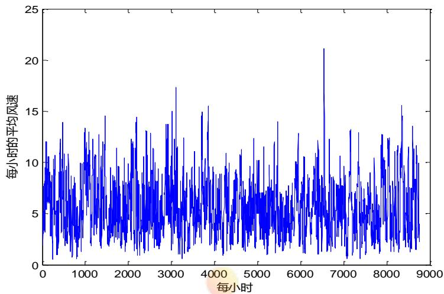
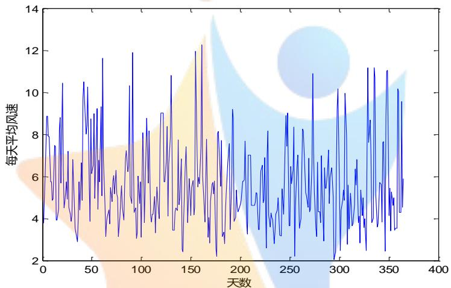
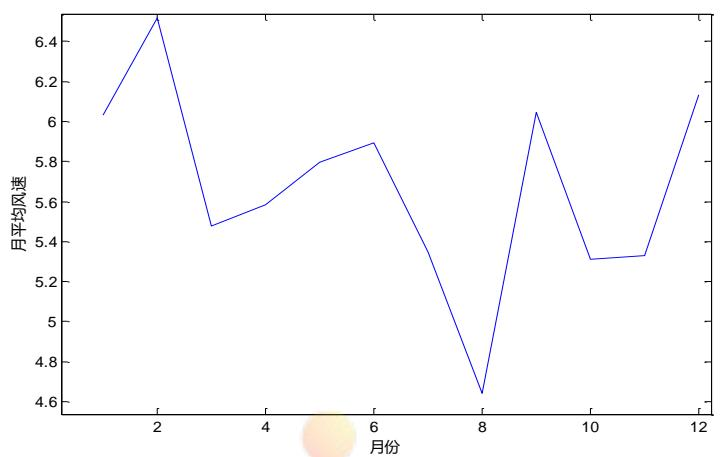
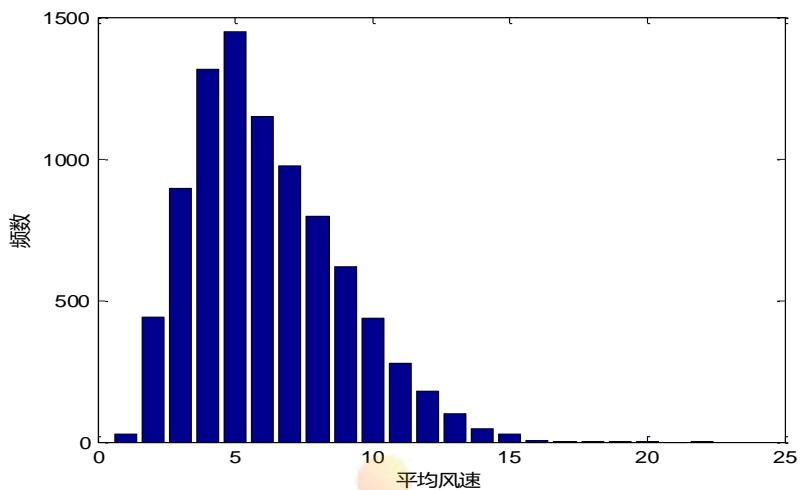
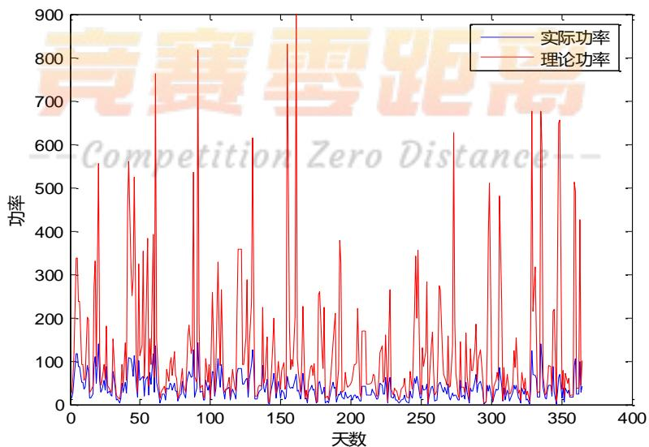
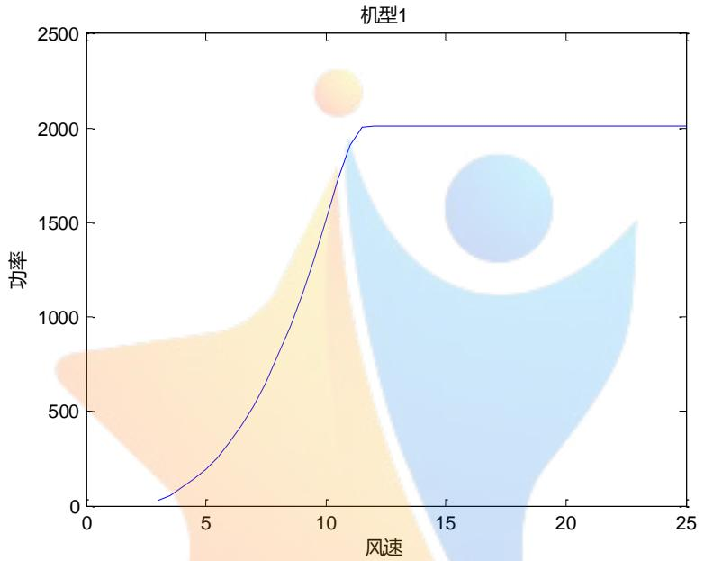
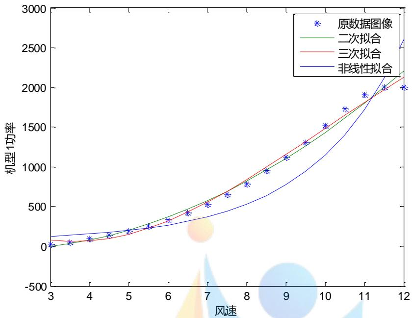
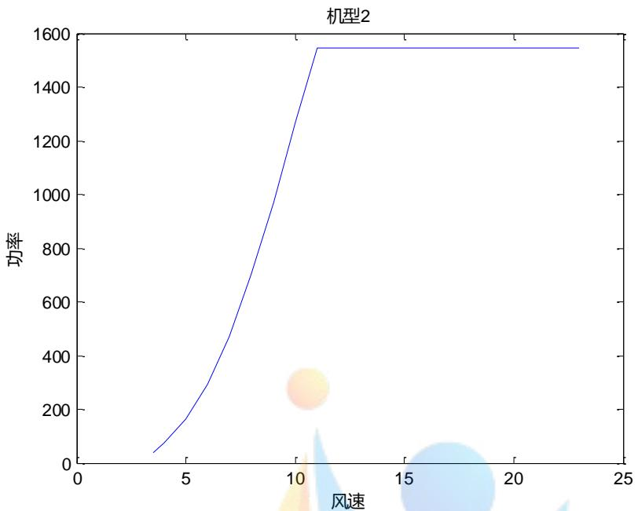

# 风电场运行状况分析及维护计划优化

## 摘要

风能资源评估是进行风能资源开发规划最为关键的第一步,评估结果对评估风电场运行效益至关重要。本文围绕风电场运行状况分析及维护计划优化问题,从风资源评估、风能资源与风机匹配、风机维护计划及人员排班方案等三个方面进行了全面深入的探讨。

针对问题一，首先对数据进行了预处理，分析了一年内每隔 15 分钟的各风机安装处的平均风速数据进行完整性和合理性检验，并对错误数据进行修正；其次，对风速采样数据进行统计分析，提取了一年内每隔 15 分钟的各风机安装处的平均风速数据的算术平均数作为逐小时连续采样数据的平均风速，以此类推分别计算出逐日、逐月、年平均风速以及有效小时数。

在对风能资源评估方面，分别计算平均和有效风功率密度，综合所求得的年有效风功率密度、风速的年有效小时数和年平均风速的数据，结合我国风能区域等级划分的标准，判断出该风电场为风资源次丰富区；在对风能资源的利用情况的评估方面，分别通过利用率、变化幅度一致性、变化趋势一致性等来进行。通过分别计算理论输出功率和实际输出功率，对两种数据进行插值成为功率对应时间的连续函数，分别对其求定积分，得到该风电场风能资源的利用率为26.49%；接着，基于偏差标准差和协方差对数据变化幅度与趋势做一致性分析，得出数据的趋势一致性较好，但变化幅度一致性一般的结论。

针对问题二，分别从容量系数、有效小时数、最优小时数三个方面讨论风能资源与风机匹配情况。首先运用三次多项式拟合确定了机型Ⅰ、Ⅱ中风速功率的函数关系，得到机型Ⅰ、Ⅱ中在不同风速下求解功率的分段函数；其次，分别计算6种风机所在地的风速通过机型Ⅰ、Ⅱ后会产生的功率，利用求得的6种风机所在地的风速的逐日平均功率，插值得到功率对应时间的连续函数，分别对其求定积分，得到机型Ⅰ、Ⅱ在6个地点的实际发电量；再次，求出6个地点在机型Ⅰ、Ⅱ下的容量系数，从而确定机型Ⅰ中的所有风机都有更优的选择；然后，统计6个地点中落在不同机型有效和无效风速区间的小时数，取在额定功率和切出功率的风速为最优风速，统计出最优小时数，发现在6个地点中对应的机型Ⅲ的最优小时数最多；最后，确定新型号风机机型Ⅲ比现有的机型Ⅰ、Ⅱ更为适合。

针对问题三，在不考虑风速信息的情况下，建立了以所有风机两次维护之间的连续工作时间最长的达到最小和一年各组维修人员承担的维修风机的台次均衡为目标函数，以风机每年维护两次的规定、风机最大连续工作时间不超过270天、最大维护组个数限制为约束的双目标模型。在考虑风速信息的情况下，建立以经济效益较好和一年各组维修人员承担的维修风机的台次均衡为目标函数，以风机每年维护两次的规定、风机最大连续工作时间不超过270天、最大维护组个数限制为约束的双目标模型。考虑所建模型的问题属性，不存在绝对最优解，只存在有效解或弱有效解的情况，本文构建了启发式算法求解，得到维修人员的排班方案和风机维修（见表13）。

关键字：风资源评估 双目标模型 启发式算法 维护计划

## 1. 问题重述

风能是一种最具活力的可再生能源，风力发电是风能最主要的应用形式。我国某风电场已先后进行了一、二期建设，现有风机 124 台，总装机容量约 20 万千瓦。请建立数学模型，解决以下问题：

1. 附件 1 给出了该风电场一年内每隔 15 分钟的各风机安装处的平均风速和风电场日实际输出功率。试利用这些数据对该风电场的风能资源及其利用情况进行评估。  
2. 附件 2 给出了该风电场几个典型风机所在处的风速信息，其中 4#、16#、24# 风机属于一期工程，33#、49#、57# 风机属于二期工程，它们的主要参数见附件 3。风机生产企业还提供了部分新型号风机，它们的主要参数见附件 4。试从风能资源与风机匹配角度判断新型号风机是否比现有风机更为适合。  
3. 为安全生产需要，风机每年需进行两次停机维护，两次维护之间的连续工作时间不超过270天，每次维护需一组维修人员连续工作2天。同时风电场每天需有一组维修人员值班以应对突发情况。风电场现有4组维修人员可从事值班或维护工作，每组维修人员连续工作时间（值班或维护）不超过6天。请制定维修人员的排班方案与风机维护计划，使各组维修人员的工作任务相对均衡，且风电场具有较好的经济效益，试给出你的方法和结果。

## 2. 问题分析

## 2.1 问题的背景

进入 21 世纪以来，伴随经济全球化和全球经济一体化趋势的不断加强，世界各国都面临着日益严重的能源危机和环境污染压力。面对这种压力和困境，风能资源作为一种可再生的清洁能源的开发利用逐渐受到世界各国的普遍重视。我国作为能源及其短缺，而风能资源又十分丰富的发展中国家，开发利用风能资源具有重大战略意义，而且，国家对我国风能资源开发利用也给予高度重视 $^{[5]}$ 。

## 2.2 问题一的分析

问题一要求利用该风电场一年内每隔15分钟的各风机安装处的平均风速和风电场日实际输出功率的数据，对该风电场的风能资源及其利用情况进行评估。在对每15分钟的平均风速和功率进一步处理之前，要先对数据进行完整性和合理性检验，在对其修正后才能应用于后期的计算。为了反映风电场长期平均水平的代表性数据，计算风电场的逐小时平均风速数据，由此就可以进一步计算风电场逐日、逐月以及一年的平均风速。对风能资源评估的综合指标为平均风功率密度，由此可以对该风电场的平均风功能密度进行计算，参照等级划分标准即可得到对风能资源的评估。在完成了对风能资源的评估，可以通过考虑该风电场对风能资源实际的发电情况和理论的发电情况，得到风能资源的利用率。为了更好地反映风能资源的利用情况，可以做一致性检验，判断整个风能资源利用情况的变化趋势以及变化大小，从而更全面地对风能资源的利用情况进行了评估。

## 2.3 问题二的分析

问题二要求从风能资源以及风机匹配角度判断新型号风机是否比现有风机更为合适。即分别从容量系数、有效小时数、最优小时数三个方面讨论风能资源与风机匹配情况。求解容量系数时首先要求解得到实际的发电用量，由此通过原始数据处理成连续数据，即可得到容量系数。不同容量系数决定了哪些机型存在有更合适的状况，由此再统计有效小时数和最优小时数，从风机的匹配角度考虑哪个机型应该换成哪个机型可以更加适合，从而产生更多的发电量，提高发电效率。

## 2.4 问题三的分析

问题三要求请制定维修人员的排班方案与风机维护计划，使各组维修人员的工作任务相对均衡，且风电场具有较好的经济效益，试给出你的方法和结果。可以从在不考虑风速信息的情况下，建立了以所有风机两次维护之间的连续工作时间最长的达到最小和一年各组维修人员承担的维修风机的台次均衡为目标函数，找出一定的约束条件确定多目标模型。再在考虑风速信息的情况下，建立以经济效益较好和一年各组维修人员承担的维修风机的台次均衡为目标函数，沿用不考虑风速信息的情况下的约束条件即可。这种只存在有效解或弱有效解的情况，可以构建启发式算法求解。

## 3. 模型假设

1、风场附近应无高大建筑物、树木等障碍物，与单个障碍物距离应大于障碍物高度的 3 倍，与成排障碍物距离应保持在障碍物最大高度的 10 倍以上；  
2、风场位置的风况应基本代表该风场的风况；  
3、该风场的风速可认为是近地面的风速。

## 4. 符号说明

$x_{ijk}^{(n)}$ ：第n个月的第i天中第j个小时15分钟的各风机安装处的平均风速；

A: 每一个小时分为 4 个时间间隙为 15 分钟的时间段个数 (A = 4);

B：每一天分为24个时间间隙为1小时的时间段个数（B=24）；

C：每一个小时分为12个时间间隙为1小时的时间段个数（B=12）。

$\overline{x_{ij}}^{(n)}$ ：第 n 个月第 i 天第 j 小时逐小时采样数据的平均风速；

$\overline{x}_{i}^{(n)}$ ：第 n 个月的第 i 天逐日采样数据的平均风速；

w：第n个月逐月采样数据的平均风速平均风功率密度；

$p_{ijk}^{(n)}$ ：第 n 个月的第 i 天中第 j 个小时 15 分钟的各风机安装处的实际功率；

$q_{ij}^{(n)}$ ：理论输出功率

## 5. 模型的建立与求解

## 5.1 问题一的模型建立与求解

## 5.1.1 平均风速数据的检验

根据该发电厂各风机安装处的每天中午每隔 15 分钟的平均风速，对风能资源进行评估。对已给出的数据进行完整性检验和合理性检验，确定不合理数据和缺失的数据。在发现不合理和缺失数据后，挑出符合实际情况的有效数据，替换无效的数据。由此，为后面整理至少连续一年完整的风场逐小时测风数据完成原始数据的准备。

## (1) 完整性检验 $^{[1][2]}$

完整性检验，即检验数据数量是否等于与其记录的数据数量；数据的时间顺序是否符合预期的开始、结束时间、中间应连续。由此，完整性检验就是考虑现场采集的测量数据完整率，计算实测数据的数量与所预想得到的数据个数之比。并且根据 BT/T 18709-2002《风电场风能资源测量方法》标准规定，现场采集的测量数据的完整率应大于等于 $98\%$ ，得到测量数据的完整率的计算公式为：

$$
\frac {\text {实测的数据数量}}{\text {所预想得到的数据数量}} \geq 98 \% \tag{1}
$$

由此，利用 MATLAB 软件，求解附件一中该风电场一年内每隔 15 分钟的各风机安装处的平均风速数据的测量数据完整率，得到该风电场的测量数据完整率为99.97%，高于规定的98%完整率。

根据结果可以找出在 2015 年的 3 月 15 日 14:30、3 月 18 日 17:30、3 月 30 日 6:00、7 月 27 日 13:00、7 月 28 日 13:00、7 月 29 日 13:00、9 月 27 日 19:00、11 月 2 日 0:15、11 月 21 日 10:30、12 月 11 日 14:45，10 个数据出现了错误，其中出现缺失数据的次数为 1 次，无效数据的次数为 9 次。

## (2) 对错误原始数据的修正

根据原始数据的完整性检验结果，得到原始数据中错误数据为 10 个。其中原始数据的缺失数据只有 1 个，为 3 月 30 日 6:00，其余 9 个为原始数据的无效数据。找出错误数据对应时间段的所有平均风速，分别求均值，得到每一个错误数据修正值。那么，原始数据的 9 个无效数据以及修正值如表 1 所示，表 1 中的时间为对应时间段的开始时间。

利用 MATLAB 求解，得到原始错误数据的修正值如表 1 所示。

表 1: 原始错误数据的修正值

<table><tr><td>月/日/时间</td><td>错误值</td><td>修正值</td></tr><tr><td>3月15日14:30(无效)</td><td>4.74.9</td><td>4.6</td></tr><tr><td>3月18日17:30(无效)</td><td>4..4</td><td>4.4</td></tr><tr><td>3月30日6:00(缺失)</td><td>缺失</td><td>4.6</td></tr><tr><td>7月27日13:00(无效)</td><td>5.16.4</td><td>5.7</td></tr><tr><td>7月28日13:00(无效)</td><td>5.16.4</td><td>5.6</td></tr><tr><td>7月29日13:00(无效)</td><td>5.16.4</td><td>5.7</td></tr><tr><td>9月27日19:00(无效)</td><td>4..4</td><td>4.5</td></tr><tr><td>11月2日0:15(无效)</td><td>10..4</td><td>9.9</td></tr><tr><td>11月21日10:30(无效)</td><td>3..1</td><td>2.9</td></tr><tr><td>12月11日14:45(无效)</td><td>8..3</td><td>8.1</td></tr></table>

原始错误数据的修正完成后，该风电厂修正后的平均风速数据必然满足能够通过完整性检验。那么，只要修正后的数据通过了合理性检验，就可以使用该数据计算评估风能资源所需要的参数。

## (3) 合理性检验 $^{[1][2]}$

在得到修正后的平均风速数据后，完成了完整性检验，由此对其进行合理性验证。根据 BT/T 18710-2002《风电场风能资源评估方法》标准规定，合理性范围如表 2 所示，趋势性范围如表 3 所示。

表 2：主要参数的合理范围参考值

<table><tr><td>主要参数</td><td>合理范围</td></tr><tr><td>平均风速</td><td>0≤小时平均风速&lt;40m/s</td></tr></table>

参照表 2 中对数据合理范围的参考值，利用 MATLAB 软件对原始数据进行筛选，没有得到处于不合理范围内的平均风速数据，即该发电场的平均风速所有数据通过合理性范围检验，不存在需要剔除的现象。

表 3：主要参数的趋势性范围参考值

<table><tr><td>主要参数</td><td>合理范围</td></tr><tr><td>1h 平均风速变化</td><td> $< 6 \, m/s$ </td></tr></table>

参照表 3 中对数据趋势性范围的参考值，结合原始数据中每个利用 MATLAB 软件对原始数据进行筛选，没有得到处于不合理范围内的平均风速数据，即该风电场的平均风速所有数据通过趋势性范围检验，不存在需要剔除的现象。

由此，根据 BT/T 18710-2002《风电场风能资源评估方法》标准，有效数据完整率必须大于等于 $90\%$ ，得到有效数据完整率的计算公式为：

$$
\frac {\text {应测数据} - \text {缺测数据} - \text {无效数据数目}}{\text {应测数目}} \times 100\% \geq 90\% \tag{3}
$$

最后，利用 MATLAB 软件求解，得到有效数据完整率为 99.97%，高于 90% 的完整率。因此，确定该发电场的平均风速数据通过了合理性检验。当该修正后的数据通过了完整性检验与合理性检验后，该数据就可以直接应用与后续对平均风速与风能资源的计算。

## 5.1.3 平均风速的统计分析

在对原始数据中的错误数据进行剔除与替换后，得到该发电场一年内每隔 15 分钟的各风机安装处的完整平均风速数据。根据 BT/T 18710-2002《风电场风能资源评估方法》标准规定，整理出来的数据至少是一年的风场实测逐小时平均风速的数据。

平均风速表示空气在单位时间内流过的距离，单位是 $m / s$ 米/秒或英里/小时。由于风力变幻莫测，于是在实用中就有瞬时风速与平均风速这两个概念。前者可以用风速仪在较短时间 $(0.5\sim 1.0s)$ 内测得，后者实际上是某一时间间隔内各瞬时风速的均值，因此就有日平均风速、月平均风速、年平均风速等。[4]由此，首先通过修正后的原始数据计算逐小时的平均风速数据，不断深入求解逐日、逐月以及一年的平均风速。

## (1) 逐小时连续采样数据的平均风速

根据一年内每隔 15 分钟的各风机安装处的完整平均风速数据，为了使修正后的平均风速数据成为一套能够反映风电场长期平均水平的代表性数据，计算风电场的逐小时平均风速数据。那么，第 n 个月第 i 天第 j 小时逐小时采样数据的平均风速 $\overline{x_{ij}^{(n)}}$ 为：

$$
\overline {{x _ {i j}}} ^ {(n)} = \frac {\sum_ {k = 1} ^ {4} x _ {i j k} ^ {(n)}}{A} \tag {4}
$$

$$
(n = 1, 2, \dots , 1 2; i = 1, 2, \dots , m; j = 1, 2, \dots , 2 4; k = 1, 2, 3, 4)
$$

其中， $x_{ijk}^{(n)}$ 为第 n 个月的第 i 天中第 j 个小时 15 分钟的各风机安装处的平均风速，A 为每一个小时分为 4 个时间间隙为 15 分钟的时间段个数（A=4）。

利用 MATLAB 求解，得到 12 个月每天中 24 个小时采样数据的平均风速，因为数据量多大，现只给出 1 月份中 1-31 号每个小时采样数据的平均风速如表 4 所示，每个月份每天的 24 小时平均风速数值见数据文件一。

表 4:1 月份 1-31 号每小时的平均风速

<table><tr><td>1月份</td><td>1号</td><td>2号</td><td>3号</td><td>4号</td><td>5号</td><td>6号</td><td>7号</td><td>8号</td><td>...</td><td>31号</td></tr><tr><td>1时</td><td>4.825</td><td>7.65</td><td>7.65</td><td>11.075</td><td>11.075</td><td>7.175</td><td>7.175</td><td>8.15</td><td>...</td><td>4.875</td></tr><tr><td>2时</td><td>4.375</td><td>6.425</td><td>6.825</td><td>11.275</td><td>11.275</td><td>7.35</td><td>7.35</td><td>7.65</td><td>...</td><td>5.3</td></tr><tr><td>3时</td><td>4.7</td><td>3.825</td><td>7.825</td><td>11.7</td><td>11.7</td><td>7.55</td><td>7.55</td><td>7.8</td><td>...</td><td>6.55</td></tr><tr><td>4时</td><td>4.125</td><td>3.3875</td><td>7.95</td><td>12.05</td><td>12.025</td><td>6.65</td><td>6.65</td><td>7.5</td><td>...</td><td>6.95</td></tr><tr><td>...</td><td>...</td><td>...</td><td>...</td><td>...</td><td>...</td><td>...</td><td>...</td><td>...</td><td>...</td><td>...</td></tr><tr><td>24时</td><td>4.6</td><td>7.75</td><td>9.425</td><td>8.725</td><td>8.725</td><td>8.65</td><td>8.65</td><td>5.275</td><td>...</td><td>5.975</td></tr></table>

由此，根据求解得到的 12 个月每天中 24 个小时采样数据的平均风速，利用 MATLAB 软件制作出每小时平均风速图，如图 1 所示。



<details>
<summary>line</summary>

| 每小时 | 每小时的平均风速 |
| --- | --- |
| 0 | ~7.5 |
| 1000 | ~6.5 |
| 2000 | ~6.0 |
| 3000 | ~6.5 |
| 4000 | ~6.0 |
| 5000 | ~6.5 |
| 6000 | ~6.0 |
| 7000 | ~6.5 |
| 8000 | ~6.0 |
| 9000 | ~6.5 |
</details>

图 1 逐小时连续采样数据的平均风速

## (2) 逐日连续采样数据的平均风速

在得到该风电场逐小时连续采样数据的平均风速后，分别取每日24小时逐小时平均风速的平均值，得到逐日连续采样数据的平均风速。那么，第 $n$ 个月的第 $i$ 天逐日采样数据的平均风速 $\overline{x_i^{(n)}}$ 为：

$$
\overline {{x _ {i}}} ^ {(n)} = \frac {\sum_ {j = 1} ^ {2 4} \sum_ {k = 1} ^ {4} x _ {i j k} ^ {(n)}}{A \times B} \quad (n = 1, 2, \dots , 1 2; i = 1, 2, \dots , m) \tag {5}
$$

其中， $x_{ijk}^{(n)}$ 为第 n 个月的第 i 天中第 j 个小时 15 分钟的各风机安装处的平均风速，A 为每一个小时分为 4 个时间间隙为 15 分钟的时间段个数（A=4），B 为每一天分为 24 个时间间隙为 1 小时的时间段个数（B=24）。

利用 MATLAB 软件求解，得到 12 个月每天的平均风速如表 5 所示。

表 5：逐日连续采样数据的平均风速

<table><tr><td></td><td>1月</td><td>2月</td><td>3月</td><td>4月</td><td>5月</td><td>6月</td><td>7月</td><td>8月</td><td>9月</td><td>10月</td><td>11月</td><td>12月</td></tr><tr><td>1天</td><td>3.77</td><td>4.74</td><td>5.08</td><td>11.89</td><td>9.03</td><td>5.81</td><td>3.13</td><td>4.61</td><td>4.20</td><td>7.29</td><td>4.86</td><td>11.16</td></tr><tr><td>2天</td><td>4.98</td><td>3.53</td><td>11.62</td><td>7.39</td><td>9.02</td><td>4.17</td><td>3.35</td><td>4.62</td><td>7.70</td><td>5.26</td><td>9.96</td><td>10.70</td></tr><tr><td>3天</td><td>6.14</td><td>3.30</td><td>6.76</td><td>4.29</td><td>5.73</td><td>4.52</td><td>2.80</td><td>4.78</td><td>8.90</td><td>3.52</td><td>7.89</td><td>5.19</td></tr><tr><td>4天</td><td>8.86</td><td>2.88</td><td>4.62</td><td>4.51</td><td>5.74</td><td>11.96</td><td>4.29</td><td>5.23</td><td>7.43</td><td>3.13</td><td>2.79</td><td>3.60</td></tr><tr><td>5天</td><td>8.86</td><td>4.03</td><td>3.13</td><td>3.05</td><td>6.80</td><td>7.10</td><td>5.19</td><td>5.19</td><td>9.02</td><td>6.67</td><td>5.58</td><td>3.75</td></tr><tr><td>6天</td><td>7.89</td><td>5.73</td><td>3.87</td><td>3.33</td><td>8.39</td><td>5.50</td><td>6.65</td><td>3.47</td><td>3.66</td><td>4.33</td><td>3.50</td><td>4.71</td></tr><tr><td>7天</td><td>7.89</td><td>4.42</td><td>4.09</td><td>6.00</td><td>4.10</td><td>5.95</td><td>7.14</td><td>3.48</td><td>3.66</td><td>4.30</td><td>5.21</td><td>5.71</td></tr><tr><td>8天</td><td>5.73</td><td>6.65</td><td>4.42</td><td>4.72</td><td>6.55</td><td>5.66</td><td>7.56</td><td>5.03</td><td>6.46</td><td>3.81</td><td>4.56</td><td>5.64</td></tr><tr><td>9天</td><td>5.73</td><td>4.86</td><td>3.73</td><td>5.75</td><td>7.84</td><td>7.47</td><td>3.46</td><td>6.24</td><td>5.65</td><td>6.98</td><td>3.66</td><td>3.83</td></tr><tr><td>10天</td><td>4.86</td><td>9.72</td><td>5.48</td><td>3.12</td><td>10.82</td><td>12.27</td><td>5.53</td><td>6.53</td><td>6.31</td><td>5.16</td><td>3.76</td><td>7.62</td></tr><tr><td>11天</td><td>4.92</td><td>10.49</td><td>4.82</td><td>8.09</td><td>7.98</td><td>6.00</td><td>9.21</td><td>4.74</td><td>8.35</td><td>2.93</td><td>4.61</td><td>7.66</td></tr><tr><td>12天</td><td>7.46</td><td>8.75</td><td>5.78</td><td>6.66</td><td>3.44</td><td>5.34</td><td>8.76</td><td>4.90</td><td>2.19</td><td>6.42</td><td>6.35</td><td>2.45</td></tr><tr><td>13天</td><td>7.40</td><td>8.01</td><td>6.04</td><td>3.80</td><td>3.44</td><td>3.83</td><td>3.87</td><td>6.89</td><td>4.59</td><td>5.45</td><td>5.59</td><td>8.87</td></tr><tr><td>14天</td><td>3.93</td><td>8.41</td><td>5.17</td><td>5.45</td><td>4.32</td><td>5.78</td><td>4.05</td><td>2.59</td><td>6.51</td><td>5.45</td><td>6.80</td><td>11.01</td></tr><tr><td>15天</td><td>3.93</td><td>10.26</td><td>6.28</td><td>8.78</td><td>4.51</td><td>7.76</td><td>5.36</td><td>7.05</td><td>7.01</td><td>6.42</td><td>3.81</td><td>11.04</td></tr><tr><td>16天</td><td>4.43</td><td>5.49</td><td>5.16</td><td>7.07</td><td>4.39</td><td>3.12</td><td>4.63</td><td>8.17</td><td>5.45</td><td>7.25</td><td>4.10</td><td>4.14</td></tr><tr><td>17天</td><td>8.24</td><td>3.86</td><td>4.99</td><td>5.68</td><td>7.73</td><td>4.05</td><td>4.33</td><td>4.12</td><td>3.53</td><td>4.73</td><td>2.84</td><td>5.45</td></tr><tr><td>18天</td><td>8.79</td><td>8.74</td><td>3.13</td><td>8.16</td><td>4.65</td><td>2.83</td><td>4.53</td><td>3.58</td><td>3.97</td><td>5.95</td><td>5.34</td><td>3.41</td></tr><tr><td>19天</td><td>5.67</td><td>6.15</td><td>4.11</td><td>4.13</td><td>4.94</td><td>4.80</td><td>4.67</td><td>4.24</td><td>6.17</td><td>6.40</td><td>4.13</td><td>5.25</td></tr><tr><td>20天</td><td>10.45</td><td>6.53</td><td>4.94</td><td>3.84</td><td>6.85</td><td>5.63</td><td>4.86</td><td>4.04</td><td>8.26</td><td>5.79</td><td>4.99</td><td>4.63</td></tr><tr><td>21天</td><td>6.34</td><td>8.99</td><td>5.56</td><td>4.20</td><td>2.52</td><td>5.71</td><td>5.76</td><td>3.96</td><td>8.17</td><td>4.98</td><td>3.57</td><td>4.98</td></tr><tr><td>22天</td><td>4.50</td><td>4.97</td><td>4.54</td><td>4.21</td><td>2.41</td><td>5.15</td><td>5.76</td><td>2.80</td><td>6.26</td><td>2.05</td><td>3.98</td><td>3.45</td></tr><tr><td>23天</td><td>4.81</td><td>6.40</td><td>3.91</td><td>5.05</td><td>4.04</td><td>5.78</td><td>5.85</td><td>3.36</td><td>5.23</td><td>2.40</td><td>2.46</td><td>3.54</td></tr><tr><td>24天</td><td>5.75</td><td>9.24</td><td>5.61</td><td>3.32</td><td>6.53</td><td>2.54</td><td>7.70</td><td>4.19</td><td>5.07</td><td>6.27</td><td>7.38</td><td>3.54</td></tr><tr><td>25天</td><td>4.94</td><td>4.45</td><td>6.83</td><td>4.63</td><td>7.42</td><td>2.20</td><td>3.77</td><td>4.42</td><td>4.53</td><td>9.24</td><td>11.16</td><td>10.17</td></tr><tr><td>26天</td><td>7.19</td><td>6.78</td><td>7.22</td><td>5.50</td><td>5.96</td><td>8.05</td><td>3.25</td><td>4.97</td><td>6.86</td><td>10.17</td><td>7.62</td><td>10.04</td></tr><tr><td>27天</td><td>4.54</td><td>5.74</td><td>6.22</td><td>4.33</td><td>3.80</td><td>8.13</td><td>7.02</td><td>4.06</td><td>4.32</td><td>5.29</td><td>8.68</td><td>4.29</td></tr><tr><td>28天</td><td>4.19</td><td>9.31</td><td>6.51</td><td>4.00</td><td>5.88</td><td>6.45</td><td>7.02</td><td>3.20</td><td>4.44</td><td>2.46</td><td>6.98</td><td>4.30</td></tr><tr><td>29天</td><td>3.87</td><td></td><td>10.33</td><td>7.61</td><td>5.21</td><td>5.53</td><td>7.02</td><td>3.18</td><td>6.53</td><td>4.39</td><td>3.80</td><td>9.56</td></tr><tr><td>30天</td><td>4.17</td><td></td><td>5.08</td><td>9.02</td><td>4.15</td><td>7.71</td><td>4.61</td><td>5.41</td><td>10.88</td><td>4.86</td><td>4.01</td><td>4.52</td></tr><tr><td>31天</td><td>6.79</td><td></td><td>4.72</td><td></td><td>5.46</td><td></td><td>4.61</td><td>4.82</td><td></td><td>5.34</td><td></td><td>5.91</td></tr></table>

由此，根据求解得到的 12 个月每天采样数据的平均风速，利用 MATLAB 软件制作出每日平均风速图，如图 2 所示。



<details>
<summary>line</summary>

| 天数 | 每天平均风速 |
| --- | --- |
| 0 | ~4.5 |
| 10 | ~8.9 |
| 20 | ~4.0 |
| 30 | ~7.5 |
| 40 | ~3.0 |
| 50 | ~10.5 |
| 60 | ~11.7 |
| 70 | ~3.2 |
| 80 | ~6.2 |
| 90 | ~11.9 |
| 100 | ~3.2 |
| 110 | ~8.8 |
| 120 | ~9.1 |
| 130 | ~10.8 |
| 140 | ~2.5 |
| 150 | ~12.0 |
| 160 | ~12.3 |
| 170 | ~2.2 |
| 180 | ~8.2 |
| 190 | ~3.2 |
| 200 | ~9.2 |
| 210 | ~4.5 |
| 220 | ~7.8 |
| 230 | ~3.5 |
| 240 | ~9.0 |
| 250 | ~2.2 |
| 260 | ~10.9 |
| 270 | ~3.5 |
| 280 | ~6.5 |
| 290 | ~2.1 |
| 300 | ~10.2 |
| 310 | ~3.5 |
| 320 | ~6.8 |
| 330 | ~11.2 |
| 340 | ~2.5 |
| 350 | ~11.1 |
| 360 | ~9.5 |
</details>

图 2 逐日连续采样数据的平均风速

## (3) 逐月连续采样数据的平均风速

结合逐日连续采样数据的平均风速数据，计算整每个月的平均风速，即对每个月中每天采样数据取平均，得到第 n 个月逐月采样数据的平均风速 $\overline{x}^{(n)}$ 为：

$$
\bar {x} ^ {- (\mathrm{n})} \bar {x} ^ {- (n)} = \frac {\sum_ {i = 1} ^ {m} \sum_ {j = 1} ^ {2 4} \sum_ {k = 1} ^ {4} x _ {i j k} ^ {(n)}}{A \times B \times C} \tag {6}
$$

其中， $x_{ijk}^{(n)}$ 为第 n 个月的第 i 天中第 j 个小时 15 分钟的各风机安装处的平均风速，A 为每一个小时分为 4 个时间间隙为 15 分钟的时间段个数（A=4），B 为每一天分为 24 个时间间隙为 1 小时的时间段个数（B=24）C 为每一个小时分为 12 个时间间隙为 1 小时的时间段个数（B=12）。

利用 MATLAB 软件求解，得到 12 个月的平均风速如表 6 所示。

表 6：逐月连续采样数据的平均风速

<table><tr><td>年份</td><td>1月份</td><td>2月份</td><td>3月份</td><td>4月份</td><td>5月份</td><td>6月份</td></tr><tr><td>平均风速(m/s)</td><td>6.0321</td><td>6.5151</td><td>5.4761</td><td>5.5859</td><td>5.7945</td><td>5.8933</td></tr><tr><td>年份</td><td>7月份</td><td>8月份</td><td>9月份</td><td>10月份</td><td>11月份</td><td>12月份</td></tr><tr><td>平均风速(m/s)</td><td>5.3463</td><td>4.6409</td><td>6.0437</td><td>5.3129</td><td>5.3318</td><td>6.3126</td></tr></table>

由此，根据求解得到的 12 个月采样数据的平均风速，利用 MATLAB 软件制作出每月

平均风速图，如图 3 所示。



<details>
<summary>line</summary>

| 月份 | 月平均风速 |
| --- | --- |
| 1 | ~6.04 |
| 2 | ~6.50 |
| 3 | ~5.48 |
| 4 | ~5.59 |
| 5 | ~5.80 |
| 6 | ~5.89 |
| 7 | ~5.35 |
| 8 | ~4.64 |
| 9 | ~6.05 |
| 10 | ~5.31 |
| 11 | ~5.33 |
| 12 | ~6.14 |
</details>

图 3 逐月连续采样数据的平均风速

## (4) 一年的平均风速

根据逐月连续采样数据的平均风速（即表 6 数据），求解其 12 个月的平均风速平均值，得到 2015 年该风场的平均风速为 5.6755 m/s。

## (5) 有效小时数

因为风机的运行时需要一定的风速大小，所以只有风速大于 $3 \, m/s$ 时风机才能成功运转。考虑到风机的负荷是有限制的，风机能够运转的最大风速为 $25 \, m/s$ ，只有在 $3 - 25 \, m/s$ 范围内的风速才能够成功地利用风机将风能转化为电能。

由此，统计出代表年测风序列中风速在 3-25m/s 之间的累计小时数，即统计逐小时平均风速数据中的有效小时数 s，计算 c 与逐小时平均风速数据的总数量之比，得到有效小时数占总小时数的比值 C 如下：

$$
C = \frac {\text {满足运转范围的数据数量}}{\text {每小时的数据总数量}} \tag {7}
$$

由此，统计出每小时内不同平均风速范围内的出现频数，从而确定风速在 3-25m/s 之间的累计小时数。根据数据文件一（逐小时连续采样数据的平均风速）中出现平均风速值，取最小风速在 (0,1] 之内、最大风速在 (21,22] 内，分别统计不同平均风速出现的频率如表 7 所示。

表 7：不同风速范围内的频数

<table><tr><td>风速范围</td><td>(0,1]</td><td>(1,2]</td><td>(2,3]</td><td>(3,4]</td><td>(4,5]</td><td>(5,6]</td><td>(6,7]</td><td>(7,8]</td></tr><tr><td>频数</td><td>28</td><td>441</td><td>895</td><td>1318</td><td>1449</td><td>1150</td><td>977</td><td>798</td></tr><tr><td>风速范围</td><td>(8,9]</td><td>(9,10]</td><td>(10,11]</td><td>(11,12]</td><td>(12,13]</td><td>(13,14]</td><td>(14,15]</td><td>(15,16]</td></tr><tr><td>频数</td><td>620</td><td>436</td><td>278</td><td>181</td><td>99</td><td>48</td><td>30</td><td>5</td></tr><tr><td>风速范围</td><td>(16,17]</td><td>(17,18]</td><td>(18,19]</td><td>(19,20]</td><td>(20,21]</td><td>(21,22]</td><td></td><td></td></tr><tr><td>频数</td><td>3</td><td>1</td><td>1</td><td>1</td><td>0</td><td>1</td><td></td><td></td></tr></table>

由此，根据求解得到的不同风速范围内的频数，利用 MATLAB 软件制作出每小时不同风速范围内频数直方图，如图 4 所示。



<details>
<summary>histogram</summary>

| Bin (Average Wind Speed) | Frequency |
| --- | --- |
| 0~1 | ~40 |
| 1~2 | ~440 |
| 2~3 | ~900 |
| 3~4 | ~1320 |
| 4~5 | ~1460 |
| 5~6 | ~1150 |
| 6~7 | ~980 |
| 7~8 | ~800 |
| 8~9 | ~620 |
| 9~10 | ~440 |
| 10~11 | ~280 |
| 11~12 | ~180 |
| 12~13 | ~110 |
| 13~14 | ~50 |
| 14~15 | ~30 |
| 15~16 | ~10 |
| 16~17 | ~5 |
| 17~18 | ~2 |
| 18~19 | ~1 |
| 19~20 | ~1 |
| 20~21 | ~1 |
| 21~22 | ~1 |
| 22~23 | ~1 |
| 23~24 | ~1 |
| 24~25 | ~1 |
</details>

图 4 每小时不同风速范围内频数直方图

结合逐小时连续采样数据的平均风速（即表 7 数据），利用 MATLAB 软件进行筛选与计算，得到一年内能够发电的有效小时数 c 为 7425 小时，在总发电小时数中所占的比例 C 为 84.76%。

## 5.1.4 对风能资源的评估

为了更好地对风能资源进行评估，引入中国气象科学研究院关于我国风能资源空间分布的三级区划指标体系，我国风能的空间分布可划分为4种区域类型[5]，对年有效风功率密度、风速的年有效小时数和年平均风速评估，即计算该风场的平均风功率密度以及有效风功率密度。

风功率密度蕴含风速、风速分布和空气密度的影响，是风场风能资源的综合指标。不同风速在与风向垂直的单位面积内所具有的功率，被称为该发电厂的风功率密度。而平均风功率密度的计算应是设定时段内逐小时风功率密度的平均值，不可以用年平均风速计算年平均风功率密度。因此利用平均风功率密度的计算公式，结合逐小时的平均风速数据即可计算得到平均风功率密度，再求出风速在3-25m/s之间的有效风功率。最后，参考我国对风能区域等级的划分标准，对该风场进行评估。

## (1) 平均风功率密度 $\overline{w}$

因为平均风功率密度不可以用年平均风速计算，所以利用所有逐 15 分钟的平均风速之和的平均数，得到平均风功率密度为：

$$
\overline {{w}} = \frac {\sum_ {i = 1} ^ {m} \sum_ {j = 1} ^ {2 4} \frac {1}{2} \rho \times \left(\overline {{x _ {i j} ^ {(n)}}}\right) ^ {3}}{N} \tag {8}
$$

其中， $\overline{x_{ij}^{(n)}}$ 为第 n 个月第 i 天第 j 小时逐小时采样数据的平均风速， $\rho$ 为空气密度（ $\rho=0.9762kg/m^{3}$ ），N 为逐小时风速数据序列的个数（N=8760）。

利用 MATALB 求解，得到该风场的平均风功率密度为 $156.5897 W/m^{3}$ 。

## (2) 有效风功率密度

有效风功率密度为在 3-5 m/s 平均风速所能产生的功率。由此，引入 0-1 变量 $u_{ij}^{(n)}$ ，表示第 n 月份的第 i 天中第 j 小时的平均风速是否在 3-25 m/s 的范围内，如下：

$$
u _ {i j} ^ {(n)} = \left\{ \begin{array}{l l} 1 & \text {第月份的第天中第小时的平均风速在3-25的范围内} \\ 0 & \text {第月份的第天中第小时的平均风速不在3-25的范围内} \end{array} \right.
$$

则有效风功率密度表示为:

$$
\overline {{w _ {t}}} = \frac {\sum_ {i = 1} ^ {m} \sum_ {j = 1} ^ {2 4} \frac {1}{2} \rho \times (\overline {{x _ {i j} ^ {(n)}}}) ^ {3} \times u _ {i j} ^ {(n)}}{\sum u _ {i j} ^ {(n)}} \tag {9}
$$

利用 MATALB 求解，得到该风场的有效风功率密度为 $183.7162 \, W/m^{3}$ 。

由此，该风场的风能资源状况如表 8 所示。

表 8：风场的风能资源状况

<table><tr><td>年有效风功率密度 $(W/m^2)$ </td><td>风速的年有效小时数(小时)</td><td>年平均风速(m/s)</td></tr><tr><td>183.7162</td><td>7425</td><td>5.6755</td></tr></table>

在得到该风场的年有效风功率密度为 $183.7162 \, W/m^{2}$ ，风速的年有效小时数为 7425 小时，年平均风速为 $5.6755 \, m/s$ 后，参照我国风能区域等级划分的标准（如表 9 所示），对该风场属于我国风能区域等级进行判断。

表 9：我国风能区域等级划分的标准

<table><tr><td>风资源丰富区</td><td>大于 $200W/m^{2}$ </td><td>大于5000h</td><td>大于6m/s</td></tr><tr><td>风资源次丰富区</td><td>大于 $200-1500W/m^{2}$ </td><td>大于5000h-4000h</td><td>5.5m/s左右</td></tr><tr><td>风资源可利用区</td><td>大于 $150-100W/m^{2}$ </td><td>大于4000h-2000h</td><td>5m/s左右</td></tr><tr><td>风资源贫乏区</td><td>小于 $100W/m^{2}$ </td><td>小于2000h</td><td>小于5m/s</td></tr></table>

将表 8 中该风场的年有效风功率密度、风速的年有效小时数和年平均风速代入表 9 我国风能区域等级划分的标准中比较，得到该风场的年有效风功率密度和年平均风速都符合风资源次丰富区，只有风速的年有效小时数符合风资源丰富区的要求。由此，确定该风场为风资源次丰富区，风能资源较丰富。

## 5.1.5 对风能资源利用情况的评估

该风场处在我国的风能区域中的风资源次丰富区域, 年有效风功率密度为 183.7162 $W/m^{2}$ 。对风能资源的使用，是指利用风机的运转将有效风功率转化为实际发电量。那么，风能资源得到利用的部分就是风机能够转换的实际发电量。

由此，对风能资源的利用情况进行评估，即评估风机对风能资源的利用率的大小和风能质量的分布。针对风能资源的利用率，求解到达该风场的风能资源理论上应该产生的发电量和风机对风能资源的转化后的实际发电量，计算两者比值，得到该发电厂对风能资源的利用率。

## (1) 理论输出功率 $q_{ij}^{(n)}$

以逐小时采样连续数据的平均风速数据，结合输出功率的计算公式，计算该风电场风能资源的理论输出功率为：

$$
q _ {i j} ^ {(n)} = \frac {\frac {1}{2} ^ {\prime} \sum_ {k = 1} ^ {4} \rho \times (\overline {{x _ {i j k} {} ^ {(n)}}}) ^ {3}}{A} \tag {10}
$$

其中， $x_{i,j,k}$ 为第 n 个月的第 i 天中第 j 个小时 15 分钟的各风机安装处的平均风速，A 为每一个小时分为 4 个时间间隙为 15 分钟的时间段个（A=4）。

## (2) 实际输出功率 $\overline{p_{ij}^{(n)}}$

以逐小时采样连续数据的平均功率，求其平均得到实际的输出功率为:

$$
\overline {{p _ {i j} ^ {(n)}}} = \frac {\sum_ {k = 1} ^ {4} p _ {i j k} ^ {(n)}}{A} \tag {11}
$$

其中， $p_{ijk}^{(n)}$ 为第 n 个月的第 i 天中第 j 个小时 15 分钟的各风机安装处的实际功率。

为了使功率是能够反映风电场长期平均水平的代表性数据，通过求解平均值，将附件1中每15分钟的实际输出功率转化为逐小时连续采样数据的实际输出功率，如表X所示（只给出了部分功率，完整逐小时连续采样数据的实际输出功率见附件文件二。

表 10:

<table><tr><td></td><td>1月</td><td>2月</td><td>3月</td><td>4月</td><td>5月</td><td>6月</td><td>...</td><td>12月</td></tr><tr><td>1天</td><td>15.14</td><td>37.19</td><td>27.59</td><td>141.17</td><td>82.47</td><td>25.63</td><td>...</td><td>138.68</td></tr><tr><td>2天</td><td>26.29</td><td>10.40</td><td>135.51</td><td>71.51</td><td>82.46</td><td>13.08</td><td>...</td><td>106.59</td></tr><tr><td>3天</td><td>57.98</td><td>13.17</td><td>52.08</td><td>28.24</td><td>47.46</td><td>16.56</td><td>...</td><td>39.93</td></tr><tr><td>4天</td><td>117.89</td><td>4.54</td><td>24.98</td><td>30.48</td><td>47.45</td><td>65.39</td><td>...</td><td>13.74</td></tr><tr><td>5天</td><td>117.84</td><td>15.21</td><td>3.58</td><td>10.82</td><td>58.26</td><td>39.29</td><td>...</td><td>13.33</td></tr><tr><td>...</td><td>...</td><td>...</td><td>...</td><td>...</td><td>...</td><td>...</td><td>...</td><td>...</td></tr><tr><td>27天</td><td>25.43</td><td>46.03</td><td>63.20</td><td>20.75</td><td>15.44</td><td>54.18</td><td>...</td><td>24.07</td></tr><tr><td>28天</td><td>29.56</td><td>117.13</td><td>64.52</td><td>13.51</td><td>52.45</td><td>24.88</td><td>...</td><td>24.15</td></tr><tr><td>29天</td><td>21.11</td><td></td><td>127.26</td><td>70.89</td><td>38.38</td><td>29.24</td><td>...</td><td>98.32</td></tr><tr><td>30天</td><td>19.08</td><td></td><td>16.01</td><td>82.46</td><td>15.70</td><td>39.74</td><td>...</td><td>27.90</td></tr><tr><td>31天</td><td>76.73</td><td></td><td>38.20</td><td></td><td>32.46</td><td></td><td>...</td><td>42.28</td></tr></table>

## (3) 理论、实际发电量及风能资源利用情况 [6]

结合逐小时采样数据的理论输出功率和实际输出功率的数据，以一个小时为时间间隙，从2015年1月1日时刻开始，计算每一个观测时刻距离开始时刻的时间，得到在逐小时采样数据中第i个小时所对应的时间 $t_{p}$ （单位：s），表示为：

$$
t _ {p} = 3 6 0 0 p \quad (p = 1, 2,..., 8 7 6 0) \tag {12}
$$

随着时间的变化，理论输出功率和实际输出功率也在不断地变动。为了使得输出功率与时间始终保持着连续的关系，利用三次样条函数对逐小时功率与时间的数据进行插值，得到功率对应时间的连续函数，如图7所示。



<details>
<summary>line</summary>

| 天数 | 实际功率 | 理论功率 |
| --- | --- | --- |
| 0 | ~30 | ~30 |
| 10 | ~120 | ~340 |
| 20 | ~80 | ~560 |
| 30 | ~140 | ~180 |
| 40 | ~100 | ~570 |
| 50 | ~120 | ~530 |
| 60 | ~140 | ~770 |
| 70 | ~80 | ~390 |
| 80 | ~120 | ~180 |
| 90 | ~130 | ~820 |
| 100 | ~80 | ~540 |
| 110 | ~120 | ~330 |
| 120 | ~80 | ~360 |
| 130 | ~130 | ~620 |
| 140 | ~80 | ~230 |
| 150 | ~80 | ~840 |
| 160 | ~80 | >900 |
| 170 | ~80 | ~230 |
| 180 | ~80 | ~260 |
| 190 | ~80 | ~380 |
| 200 | ~80 | ~220 |
| 210 | ~80 | ~170 |
| 220 | ~80 | ~270 |
| 230 | ~80 | ~350 |
| 240 | ~80 | ~280 |
| 250 | ~80 | ~630 |
| 260 | ~80 | ~190 |
| 270 | ~80 | ~510 |
| 280 | ~80 | ~480 |
| 290 | ~80 | ~150 |
| 300 | ~80 | ~680 |
| 310 | ~80 | ~680 |
| 320 | ~80 | ~660 |
| 330 | ~80 | ~510 |
| 340 | ~80 | ~430 |
| 350 | ~80 | ~110 |
| 360 | ~80 | ~110 |
| 370 | ~80 | ~110 |
| 380 | ~80 | ~110 |
| 390 | ~80 | ~110 |
| 400 | ~80 | ~110 |
</details>

图 7 实际和理论的输出功率图

又因为风机对于风能资源并不能做到完全地利用，所以理论输出功率与实际输出功率之间存在一定的偏差。利用定积分求解功率对应时间的连续函数中理论、实际功率的面积，得到理论和实际的总发电量，即

$$
z = \int_ {t _ {1}} ^ {t _ {8 7 6 0}} y _ {1} (t) d t _ {0} \tag {13}
$$

由此，求解实际功率求定积分所围成的面积与理想功率求定积分所围成的面积之比，得到风能资源利用率 $\alpha$ ，即

$$
\alpha = \frac {S _ {\text {实}}}{S _ {\text {理}}} = \frac {\int_ {t _ {1}} ^ {t _ {8 7 6 0}} y _ {1} (\mathrm{t}) \mathrm{dt} _ {0}}{\int_ {t _ {1}} ^ {t _ {8 7 6 0}} y _ {2} (\mathrm{t}) \mathrm{dt} _ {0}} \tag {14}
$$

利用 MATLA 软件求解，得到理论发电量为 $5.6901 \times 10^{7}$ KW，实际发电量为 $2.1482 \times 10^{8}$ KW，该风电场的风能资源利用率为 26.49%。

## 5.1.6 基于偏差标准差的变化幅度一致性分析

首先，根据给出的平均风速与实际功率，两者不存在同一个量纲中，无法进行变化趋势大小的一致性检验。由此，对平均风速与实际功率的数值进行标准差处理，使两个数据处于一个量纲中，再取平均风速曲线与实际功率曲线的中间值，计算平均风速与实际功率对于中间值的偏差标准差，从而反映两个数据在变化趋势上的偏离大小或程度

平均风速标准化数据为:

$$
\frac {x _ {i j k} ^ {(n)} - \overline {{x _ {i j k} ^ {(n)}}}}{\sigma^ {2}} \tag {15}
$$

实际功率标准化数据为

$$
\frac {p _ {i j k} ^ {(n)} - \overline {{p _ {i j k} ^ {(n)}}}}{\sigma^ {2}} \tag {16}
$$

其中， $x_{ijk}^{(n)}$ 为第 n 个月的第 i 天中第 j 个小时 15 分钟的各风机安装处的平均风速， $p_{ijk}^{(n)}$ 为第 n 个月的第 i 天中第 j 个小时 15 分钟的各风机安装处的实际功率。

利用 MATLAB 软件求解，得到每日逐 15 分钟标准化的平均风速与实际功率数据之间的偏差的标准差全年平均值为 0.5381，以及全年数据标准化的平均风速与实际功率数据之间的偏差的标准差为 0.6099。由此，确定数据的变化幅度的一致性一般。

## 5.1.7 基于协方差的变化趋势一致性分析

在概率论和统计学中，协方差用于衡量两个变量的总体误差，度量两个变量之间“协同变异”大小的总体参数，亦可反映两个变量变化趋势的一致性。因此，利用协方差公式对平均风速与功率进行协方差计算，如下：

$$
C O V (X, Y) = E \left\{\left[ X - E (X) \right] \right\} \left\{\left[ Y - E (Y) \right] \right\} \tag {17}
$$

利用 MATLAB 软件求解，得到每日逐 15 分钟的平均风速与功率数据的协方差值为 0.3887。由此确定数据的变化趋势一致性较好，数据大体上能够呈现同增同减的情况。

## 5.2 问题二的模型建立与求解

问题二给出了 6 个典型风机处在 6 个不同地点的风速信息、2 种现有风机参数以及 3 种新型号风机主要参数，要求从风能资源与风机匹配两个角度方面判断新型号风机是否比现有风机更为合适。首先从风能资源出发，每种风机所处地的风速考虑额定功率为1500和2000KW下的实际发电量与容量系数，确定需要寻找更适合风机的机型。再从风机匹配出发，求解每一个最佳数值范围内的数据数量，从而确定更匹配的风机机型。

## 5.2.1 机型Ⅰ和机型Ⅱ中风速功率函数关系

## (1) 机型 I 风速功率的函数关系

问题二中给出了现有两种风机的风速值变化时，该风机产生的功率值。同时现有两种风机中都有3种类型的风机，并且给出了其在对应地点的风速信息。所以首先找出现有两种风机的风速值与功率值存在的函数关系。利用MATLAB软件制图，得到机型I的风速功率曲线图。



<details>
<summary>area</summary>

| 风速 | 功率 |
| --- | --- |
| 3 | ~50 |
| 5 | ~250 |
| 7 | ~600 |
| 9 | ~1100 |
| 11 | ~1800 |
| 12 | 2000 |
| 15 | 2000 |
| 20 | 2000 |
| 25 | 2000 |
</details>

图 8 机型 I 风速功率曲线图

由图 8 可知，机型 I 的风速值与功率值在 3-12m/s 之间时，风速值与功率值存在一定的函数关系。当风速值到达 12m/s 甚至超过 12m/s 时，机型 I 达到其最大的输出功率，并且此时风速值再不断地增大时，功率值始终保持在 2010KW。由此，找出机型 I 风速值在 3-12m/s 下，风速值与功率值的函数关系，从而得到机型 I 的风速值与功率值的分段函数关系值。

由此,利用指数拟合、二次多项式和三次多项式的拟合方法,对机型Ⅰ风速值在3-12m/s下的风速值与功率值的关系进行拟合,如图9所示。



<details>
<summary>line</summary>

| 风速 | 原数据图像 | 二次拟合 | 三次拟合 | 非线性拟合 |
| --- | --- | --- | --- | --- |
| 3 | ~20 | ~10 | ~80 | ~150 |
| 3.5 | ~60 | ~40 | ~60 | ~160 |
| 4 | ~100 | ~80 | ~90 | ~170 |
| 4.5 | ~150 | ~130 | ~130 | ~180 |
| 5 | ~200 | ~180 | ~180 | ~200 |
| 5.5 | ~250 | ~250 | ~250 | ~230 |
| 6 | ~350 | ~350 | ~350 | ~280 |
| 6.5 | ~420 | ~450 | ~450 | ~330 |
| 7 | ~520 | ~580 | ~580 | ~380 |
| 7.5 | ~650 | ~720 | ~720 | ~450 |
| 8 | ~780 | ~880 | ~880 | ~530 |
| 8.5 | ~950 | ~1050 | ~1050 | ~620 |
| 9 | ~1120 | ~1220 | ~1220 | ~750 |
| 9.5 | ~1300 | ~1420 | ~1420 | ~900 |
| 10 | ~1520 | ~1620 | ~1620 | ~1100 |
| 10.5 | ~1720 | ~1820 | ~1820 | ~1350 |
| 11 | ~1920 | ~2020 | ~2020 | ~1650 |
| 11.5 | ~2020 | ~2220 | ~2220 | ~2100 |
| 12 | ~2020 | — | — | — |
</details>

图 9 风速值与功率值的关系的拟合曲线

结合图 8，判断三种方法中，三次多项式拟合对原始数据的拟合程度最好，比非线性拟合（指数拟合）和二次多项式拟合的拟合曲线更逼近原始数据点，所以选择采用三次多项式拟合的方法对风速值与功率值的函数进行确定。结合最小二乘法，利用 MATLAB 软件求解，求解得到风速值与功率值的关系的三次多项式拟合的拟合系数为 -0.28326、84.0379、498.1837、896.5020。又因为当风速小于 3m/s 时，风机不会成功运转；当风速大于等于 12m/s 时，风机产生的功率就始终保持在 2010KW。因此，得到机型 I 风速与功率曲线函数关系式为：

$$
y = \left\{ \begin{array}{l l} 0 & 0 \leq x <   3 \\ - 0. 2 8 3 2 6 x ^ {3} + 8 4. 0 3 7 9 x ^ {2} + 4 9 8. 1 8 3 7 x + 8 9 6. 5 0 2 0 & 3 \leq x <   1 2 \\ 2 0 1 0 & x \geq 1 2 \end{array} \right. \tag {18}
$$

## (2) 机型 II 风速功率的函数关系

同理得到机型Ⅱ的风速功率曲线如图 10 所示，机型Ⅱ的风速达到 11 m/s 后，其输出功率量保持在 1500 KW 的最大功率。



<details>
<summary>line</summary>

| 风速 | 功率 |
| --- | --- |
| ~3.5 | ~40 |
| ~5 | ~180 |
| ~6 | ~320 |
| ~7 | ~520 |
| ~8 | ~750 |
| ~9 | ~1000 |
| ~10 | ~1250 |
| ~11 | ~1550 |
| ~23 | ~1550 |
</details>

图 10 机型 II 风速功率曲线图

再次采用三次多项式拟合的方法对机型Ⅱ的风速与功率的关系拟合，得到拟合系数为-1.3384、47.9810、265.338、447.0624。因此，得到机型Ⅱ风速与功率曲线函数关系式为：

$$
y = \left\{ \begin{array}{l l} 0 & 0 \leq x <   3. 5 \\ - 1. 3 3 8 4 x ^ {3} + 4 7. 9 8 1 0 x ^ {2} + 2 6 5. 3 3 8 x + 4 4 7. 0 6 2 4 & 3. 5 \leq x <   1 1 \\ 2 0 1 0 & x \geq 1 1 \end{array} \right. \tag {19}
$$

指风力发电场在给定时间内实际发电量与该时段内额定发电量的百分比，

## 5.2.2 考虑不同额定功率下的容量系数计算

根据题意，机型Ⅰ中包括4#、16#、24#风机，其额定功率为2000KW，每种功率值都可以通过风速的值来确定；机型Ⅱ中包括33#、49#、57#风机其额定功率为1500KW，而新型号风机的额定功率为1500KW。又因为通过拟合确定了机型Ⅰ和机型Ⅱ中风速与功率的关系，由此分别计算每一种机型所在地的风速在额定功率为2000KW和1500KW机型下所能产生的实际发电量及该机型的容量系数。由此，利用容量系数来衡量该地区风速是否需要更换额定功率不同的机型。

## (1) 每种风机所在地的风速的功率计算

首先，根据机型Ⅰ中的风速功率的分段函数关系，将每种风机所在地的风速代入式子(15)中，得到机型Ⅰ能将每个地点风速成功转化的实际功率。

其次，根据机型Ⅱ中的风速功率的分段函数关系，将每种风机所在地的风速代入式子(15)中，得到机型Ⅱ能将每个地点风速成功转化的实际功率。

## (2) 逐日采样数据的平均功率的计算

考虑到附件四中所给出的是一年内每天 12 个时间的风速，经过分段函数的转换后得到的是每天 12 个时间点的功率，对其取平均得到一年内逐日采样数据的平均功率，得到每个地点使用机型 I 和机型 II 下逐日采样数据的平均功率。

## (3) 两种机型下的实际发电量的计算

由于风速与功率始终保持着连续的函数关系，利用三次样条函数对逐日采样数据的平均功率值进行插值，得到功率对应时间的连续函数及曲线。利用定积分求面积，得到每个地点的两种机型下的实际发电量。

## (4) 两种机型下的容量系数的计算

引入容量系数，指风力发电场在给定时间内实际发电量与该时段内额定发电量的百分比 $^{[7]}$ 。利用 MATLAB 软件求解，得到每一种风机所在地风速使用机型 I 和机型 II 时的实际发电量与容量系数，如表 11 所示。

表 11：不同机型下风速的实际发电量与容量系数

<table><tr><td rowspan="7">机型I</td><td>风机</td><td>实际发电量</td><td>容量系数</td></tr><tr><td>4#</td><td> $2.1299 \times 10^{10}KW$ </td><td>0.3377</td></tr><tr><td>16#</td><td> $1.8507 \times 10^{10}KW$ </td><td>0.2934</td></tr><tr><td>24#</td><td> $1.7525 \times 10^{10}KW$ </td><td>0.2779</td></tr><tr><td>33#</td><td> $1.4736 \times 10^{10}KW$ </td><td>0.2336</td></tr><tr><td>44#</td><td> $1.7042 \times 10^{10}KW$ </td><td>0.2702</td></tr><tr><td>57#</td><td> $1.7876 \times 10^{10}KW$ </td><td>0.2834</td></tr><tr><td rowspan="7">机型II</td><td>风机</td><td>实际发电量</td><td>容量系数</td></tr><tr><td>4#</td><td> $1.7749 \times 10^{10}KW$ </td><td>0.3752</td></tr><tr><td>16#</td><td> $1.5424 \times 10^{10}KW$ </td><td>0.3261</td></tr><tr><td>24#</td><td> $1.4644 \times 10^{10}KW$ </td><td>0.3096</td></tr><tr><td>33#</td><td> $1.2421 \times 10^{10}KW$ </td><td>0.2626</td></tr><tr><td>44#</td><td> $1.4266 \times 10^{10}KW$ </td><td>0.3016</td></tr><tr><td>57#</td><td> $1.4938 \times 10^{10}KW$ </td><td>0.3158</td></tr></table>

由表 11 可知，4#风机处的风速使用机型 I 中的 4#风机工作时，其容量系数小于其使用机型 II 的时的容差系数。又因为容量系数越大，表明该机型的风机越能更好地满足风量需求。所以 4#风机处的风速的机型 I 风机 4#应该替换成额定功率为 1500 KW 的机型 II 风机，以此类推机型 I 中的 16#、24#需要替换成额定功率为 1500 KW 的风机。相反地，机型 II 中的 33#、44#、57#风机处的风速仍然使用额定功率为 1500 KW 的风机。

由此，确定额定功率为 1500 KW 的风机比额定功率为 2000 KW 的机型 I 风机更加适合使用，所有的机型 I 风机替换成额定功率为 1500 KW 的风机。由于额定功率为 1500 KW 的风机类型共 4 中，所以所有的机型 I 风机需要替换的风机在其余四种风机类型中选择，而机型 II 的风机则要考虑是否存在其他额定功率为 1500 KW 的风机更适合使用。

## 5.2.3 考虑风速范围的机型更换结果

通过对每一个地区的风速使用机型 I、II 的容量系数的计算，确定了机型 I 的三种风机都可以使用额定功率为 1500 KW 的风机机型进行替换，机型 II 的三种风机可以考虑从其他额定功率为 1500 KW 的风机机型中挑选更合理的机型。由此，给出表 12 对现有机型和新机型主要参数的参考。

表 12：不同风机型号的主要参数

<table><tr><td>风机型号</td><td>机型I</td><td>机型II</td><td>机型III</td><td>机型IV</td><td>机型V</td></tr><tr><td>切入风速(m/s)</td><td>3</td><td>3.5</td><td>3</td><td>3</td><td>3</td></tr><tr><td>额定风速(m/s)</td><td>11</td><td>11.5</td><td>10.5</td><td>11</td><td>11.5</td></tr><tr><td>切出风速(m/s)</td><td>25</td><td>25</td><td>25</td><td>25</td><td>25</td></tr><tr><td>额定功率(kW)</td><td>2000</td><td>1500</td><td>1500</td><td>1500</td><td>1500</td></tr></table>

由表 12 可知，额定功率为 1500 KW 的机型参数的切入风速和额定风速都不完全相同。于是，可以根据切入风速、额定风速和切出风速，统计每个机型不同风速范围下的数据数量，因为当风机通过的风速在额定风速和切出风速之间时，所能产生的功率最多，即为该机型的最优小时数。最后通过确定最优数值范围内的数据数量，来判断哪种机型更适合。

于是，统计得到每种机型的无效区间、有效区间及最优区间，如表 13 所示。

表 13：每种机型的无效区间、有效区间及最优区间

<table><tr><td></td><td>无效小时数</td><td>有效小时数</td><td>最优小时数</td><td>无效小时数</td></tr><tr><td>机型II</td><td>[0,3.5)</td><td>[3.5,11.5]</td><td>(11.5,25]</td><td>(25,∞)</td></tr><tr><td>机型III</td><td>[0,3)</td><td>[3,10.5]</td><td>(10.5,25]</td><td>(25,∞)</td></tr><tr><td>机型IV</td><td>[0,3)</td><td>[3,11]</td><td>(11,25]</td><td>(25,∞)</td></tr><tr><td>机型V</td><td>[0,3)</td><td>[3,11.5]</td><td>(11.5,25]</td><td>(25,∞)</td></tr></table>

由表 13 所示，分别统计出 6 个地点风速落在各个范围内的个数，见附件文件二。4#风机所在地的风速落在机型III最优小时数区间的最优小时数最多，为 843 小时；16#风机所在地的风速落在机型III最优小时数区间的最优小时数最多，为 836 小时；24#风机所在地的风速落在机型III最优小时数区间的最优小时数最多，为 627 小时；33#风机所在地的风速落在机型III最优小时数区间的最优小时数最多，为 520 小时；49#风机所在地的风速落在机型III最优小时数区间的最优小时数最多，为 797 小时；57#风机所在地的风速落在机型III最优小时数区间的最优小时数最多，为 961 小时。

由此，新型号风机机型III比现有的机型 I、II更为适合，能够产生更多的有效小时数及发电量。

## 5.3 问题三的模型建立

## 5.3.1 不考虑风速信息的情况下最优排班方案

设某风电场有两种型号的风机共 n 台，记为 $f_{1}, f_{2}, \cdots, f_{n}$ ，需要进行维护保障。该风电场共有 m 组维修人员来完成维护与值班任务，每组在一个时间点只能参加一台风机的维护，每台风机每次维护只需一组人员完成，m 组维修人员编号为 $p_{1}, p_{2}, \cdots, p_{m}$ 。

风机每次维护需一组维护人员连续工作 2 天，为简化问题，将全年按 2 天为一个分割点分割成一系列的维护作业段（连续 2 天为一段），对维护作业段编号为 $1,2,\cdots k,\cdots,K$ （为简化问题， $K$ 取整数，这里 $K=182$ ）。

维修人员的排班方案与风机维护计划制定问题即可描述为：在一年的研究周期内，以使各组维修人员的工作任务相对均衡，且风电场具有较好的经济效益为优化目标，在全年的若干个维护作业段内，满足相关限制条件的情况下，实现用若干组维护组，对该风电场全部风机均维护两次。

## 5.3.1.1 双目标的转化

依据题意要求，显然目标为双目标，分别为各组维修人员的工作任务相对均衡、风电场具有较好的经济效益。

由此，引入0-1变量，来描述维修组与风机的维修匹配，即令 $x_{ij}^{k}=\left\{\begin{aligned}1\\ 0\end{aligned}\right.$ ，其中，当 $x_{ij}^{k}=1$ 表示安排第 $p_{i}$ 组维护人员在第k维护作业段维护第 $f_{j}$ 台风机，当 $x_{ij}^{k}=0$ 表示不安排第 $p_{i}$ 组维护人员在第k维护作业段维护第 $f_{j}$ 台风机。

## (1) 风电场具有较好的经济效益的目标函数

在不考虑风速变化对风机机组的启停影响的情况下，因维护安排产生的风电场具有较好的经济效益的目标，本文理解为风机工作的损耗较小。显然，风机两次维护之间的连续工作时间越小，风机损耗越少，因此将风电场具有较好的经济效益的目标转化为风机两次维护之间的连续工作时间较小。

风机两次维护之间的连续工作时间较小的目标，本文转化为所有风机两次维护之间的连续工作时间最长的达到最小，即：

$$
\min z _ {2} = \max \left\{\left| k _ {1} x _ {i j} ^ {k _ {1}} - k _ {2} x _ {i j} ^ {k _ {2}} \right| \mid k _ {1}, k _ {2} = 1, 2, \dots , K \right\} \tag {20}
$$

（2）各组维修人员的工作任务相对均衡

针对各组维修人员的工作任务相对均衡的目标，即为一年各组维修人员承担的维修风机的台次均衡，为此，建立如下目标函数：

$$
\min z _ {1} = \max _ {k = 1, 2, \dots , K} (\sum_ {i = 1} ^ {n} \sum_ {k = 1} ^ {K} x _ {i j} ^ {k}) - \min _ {k = 1, 2, \dots , K} (\sum_ {i = 1} ^ {n} \sum_ {k = 1} ^ {K} x _ {i j} ^ {k}) \tag {21}
$$

## 5.3.1.2 约束条件

约束条件方面，主要考虑风机每年维护两次的规定、风机最大连续工作时间不超过270天、最大维护组个数限制约束。

（1）维护的全覆盖，所有 m 台的风机均要求分配在 2 个不同的维护作业段内进行维护，即

$$
\sum_ {j = 1} ^ {m} \sum_ {k = 1} ^ {K} x _ {i j} ^ {k} = 2 \quad (i = 1, 2, \dots , n) \tag {22}
$$

(2) 同一台的风机安排的维护作业段的最大间隔要求。

$$
\left| k _ {1} x _ {i j} ^ {k _ {1}} - k _ {2} x _ {i j} ^ {k _ {2}} \right| \leq 1 3 5 \quad \left(k _ {1}, k _ {2} = 1, 2, \dots , K\right) \tag {23}
$$

(3) 同一个维护作业段的安排的最大维护组数限制。

$$
\sum_ {i = 1} ^ {n} \sum_ {j = 1} ^ {m} x _ {i j} ^ {k} \leq K - 1 \quad (k = 1, 2, \dots , K) \tag {24}
$$

(4) 每一个维护组连续安排的维护作业段数限制。

$$
\sum_ {i = 1} ^ {n} x _ {i j} ^ {k} + \sum_ {i = 1} ^ {n} x _ {i j} ^ {k + 1} + \sum_ {i = 1} ^ {n} x _ {i j} ^ {K + 2} + \sum_ {i = 1} ^ {n} x _ {i j} ^ {k + 3} \leq 3 (k = 1, 2, \dots , K - 3) \tag {25}
$$

(5) 一组维护组在同一维护作业段最多只能维护一台风机,

$$
\sum_ {i = 1} ^ {n} x _ {i j} ^ {k} \leq 1 \quad (j = 1, 2, \dots , m; k = 1, 2, \dots , K) \tag {26}
$$

(6) 同理, 一台风机在同一维护作业段最多只能由一组维护组去维护。

$$
\sum_ {j = 1} ^ {m} x _ {i j} ^ {k} \leq 1 \quad (i = 1, 2, \dots , n; k = 1, 2, \dots , K) \tag {27}
$$

## 5.3.1.3 模型的建立

综上，在不考虑未来风速预测的情况下，本文建立了基于维修人员的排班方案与风机维护计划制定问题的双目标规划模型：

$$
\min z _ {1} = \max _ {k = 1, 2, \dots , K} (\sum_ {i = 1} ^ {n} \sum_ {k = 1} ^ {K} x _ {i j} ^ {k}) - \min _ {k = 1, 2, \dots , K} (\sum_ {i = 1} ^ {n} \sum_ {k = 1} ^ {K} x _ {i j} ^ {k})
$$

$$
\min z _ {2} = \max \left\{\left| k _ {1} x _ {i j} ^ {k _ {1}} - k _ {2} x _ {i j} ^ {k _ {2}} \right| \mid k _ {1}, k _ {2} = 1, 2, \dots , K \right\}
$$

$$
s. t. = \left\{ \begin{array}{l} \sum_ {j = 1} ^ {m} \sum_ {k = 1} ^ {K} x _ {i j} ^ {k} = 2 \quad (i = 1, 2, \dots , n) \\ \left| k _ {1} x _ {i j} ^ {k _ {1}} - k _ {2} x _ {i j} ^ {k _ {2}} \right| \leq 1 3 5 \quad \left(k _ {1}, k _ {2} = 1, 2, \dots , K\right) \\ \sum_ {i = 1} ^ {n} \sum_ {j = 1} ^ {m} x _ {i j} ^ {k} \leq K - 1 \quad (k = 1, 2, \dots , K) \\ \sum_ {i = 1} ^ {n} x _ {i j} ^ {k} + \sum_ {i = 1} ^ {n} x _ {i j} ^ {k + 1} + \sum_ {i = 1} ^ {n} x _ {i j} ^ {K + 2} + \sum_ {i = 1} ^ {n} x _ {i j} ^ {k + 3} \leq 3 (k = 1, 2, \dots , K - 3) \\ \sum_ {i = 1} ^ {n} x _ {i j} ^ {k} \leq 1 \quad (j = 1, 2, \dots , m; k = 1, 2, \dots , K) \\ \sum_ {j = 1} ^ {m} x _ {i j} ^ {k} \leq 1 \quad (i = 1, 2, \dots , n; k = 1, 2, \dots , K) \end{array} \right. \tag {28}
$$

## 5.3.1.4 模型的求解

要求两个目标同时实现最优，往往是很困难的，常常是有所失才能有所得。也即是说，上式模型不存在绝对最优解，因此转而求有效解或近似最优解。对于多目标模型，在各种不同的思路下，对得失的不同考虑就引出了各种合理处理得失的方法。本文使用分层序列法，即将各目标按其重要程度排出一个次序，然后，在前一目标最优解的基础上，求后一目标的最优解，因而每次需解决的都是一个单目标问题。求解步骤如下：

Step1: 求解以各组维修人员的工作任务相对均衡为单一目标函数的最优解。目标函数 $\min z_{1} = \max_{k=1,2,\cdots,K} (\sum_{i=1}^{n} \sum_{k=1}^{K} x_{ij}^{k}) - \min_{k=1,2,\cdots,K} (\sum_{i=1}^{n} \sum_{k=1}^{K} x_{ij}^{k})$ ，显然为非线性的，为简化问题，在求解之前本文进行了转换。令 $c_{k} = \sum_{i=1}^{n} \sum_{k=1}^{K} x_{ij}^{k}$ ， $c_{k}$ 从大到小排序，重新编号为 $c_{1}, c_{2}, \cdots, c_{K}$ ，由此，目标函数转化为： $\min c_{1}$ 。

Step2:在第一步的最优解基础上，以第二目标所有风机两次维护之间的连续工作时间最长的达到最小为优选依据，在第一步最优解基础上，选出尽量满足第二目标的解。目标函数 $\min z_{2} = \max \left\{ \left| k_{1} x_{ij}^{k_{1}} - k_{2} x_{ij}^{k_{2}} \right| \left| k_{1}, k_{2} = 1, 2, \cdots, K \right. \right\}$ ，显然为非线性的，为简化问题，约束条件增加 $\left| k_{1} x_{ij}^{k_{1}} - k_{2} x_{ij}^{k_{2}} \right| \geq w (k_{1}, k_{2} = 1, 2, \cdots, K)$ ，而目标函数转化为 $\min w$ 。

## 5.3.2 综合考虑风速信息下的最优排班方案

为了能够最大限度地提高风电机组的利用率，降低因停机维护而造成的损失，从而提高风电场经济效益，一种优化的办法就是根据往年风速数据资料，预测未来的风速，根据风速预测值，合理地优化停机维护时间。但本题中，因为缺少历年风速数据资料，考虑到实际应用的需要，本文将2015年该风电场的风速数据作为未来年份预测数据的参考值，在此基础上建立双目标模型，为决策者提供参考。

考虑到在风速较低的时间，进行风机的维护，将减少损失，从而增加风电场经济效益。因此，在模型建立方面，将风电场具有较好的经济效益这一目标，本文合理地转化为维护作业段加权0-1变量值之和。记第k维护作业段的平均风速为 $\overline{v}_{k}$ ，构建第k维护作业段的选择权重 $w_{k}$ ，其中 $w_{k}=\frac{1}{\overline{v}_{k}}$ ，即目标函数转化为

$$
\max z = \sum_ {k = 1} ^ {K} w _ {k} \sum_ {i = 1} ^ {n} \sum_ {j = 1} ^ {m} x _ {i j} ^ {k} 。 \tag {29}
$$

## 5.3.2.1 模型的建立

综上，在考虑未来风速预测的情况下，本文建立了基于维修人员的排班方案与风机

维护计划制定问题的双目标规划模型:

$$
\begin{array}{l} \min z _ {1} = \max _ {k = 1, 2, \dots , K} (\sum_ {i = 1} ^ {n} \sum_ {k = 1} ^ {K} x _ {i j} ^ {k}) - \min _ {k = 1, 2, \dots , K} (\sum_ {i = 1} ^ {n} \sum_ {k = 1} ^ {K} x _ {i j} ^ {k}) \\ \max z = \sum_ {k = 1} ^ {K} w _ {k} \sum_ {i = 1} ^ {n} \sum_ {j = 1} ^ {m} x _ {i j} ^ {k} \\ s. t. = \left\{ \begin{array}{l} \sum_ {j = 1} ^ {m} \sum_ {k = 1} ^ {K} x _ {i j} ^ {k} = 2 \quad (i = 1, 2, \dots , n) \\ \left| k _ {1} x _ {i j} ^ {k _ {1}} - k _ {2} x _ {i j} ^ {k _ {2}} \right| \leq 1 3 5 \quad \left(k _ {1}, k _ {2} = 1, 2, \dots , K\right) \\ \sum_ {i = 1} ^ {n} \sum_ {j = 1} ^ {m} x _ {i j} ^ {k} \leq K - 1 \quad (k = 1, 2, \dots , K) \\ \sum_ {i = 1} ^ {n} x _ {i j} ^ {k} + \sum_ {i = 1} ^ {n} x _ {i j} ^ {k + 1} + \sum_ {i = 1} ^ {n} x _ {i j} ^ {K + 2} + \sum_ {i = 1} ^ {n} x _ {i j} ^ {k + 3} \leq 3 (k = 1, 2, \dots , K - 3) \\ \sum_ {i = 1} ^ {n} x _ {i j} ^ {k} \leq 1 \quad (j = 1, 2, \dots , m; k = 1, 2, \dots , K) \\ \sum_ {j = 1} ^ {m} x _ {i j} ^ {k} \leq 1 \quad (i = 1, 2, \dots , n; k = 1, 2, \dots , K) \end{array} \right. \tag {30} \\ \end{array}
$$

## 5.3.2.2 模型的求解

同理不考虑风速信息的情况下最优排班方案的情况，上式模型不存在绝对最优解，因此转而求有效解或近似最优解。给出一种启发式算法求解步骤如下：

Step1: 全年时间的分段，将全年 365 天按 2 天一段分割，考虑到有一天的剩余，为简化问题，求全年各天平均风速的最大值，对应该天天不作为维护时间。于是，全年 365 天分割为 182 个维护作业段。

Setp2：采用贪心思想，确定维护作业段的优先顺序。将所有维护作业段按照其平均风速的大小由小到大排序，平均风速小的优先。维护作业段的先后时间的顺序由此确定。

Step3：进行维护计划的编排。按照维护作业段的优先顺序，采用贪心思想，以最大能力排入风机。每次排入，检查如下约束：风机排入各维护作业段总数不能超过2、风机连续两次编排的间隔段数不超过135段、每一段最大维护组个数限制不超过3、维护组连续工作段数不超过3段。若满足约束，排入，不满足，依序往后排入。

Step4, 维护组工作量的均衡调整。每次排入风机至相应维护作业段，比较各维护组工作量的大小，根据大小，优先安排总数小的，由此分配出维护组维护计划。

Step5, 若全部风机均按 2 次排入了相应作业段，算法结束。否则，转 3 步。
由此，得到使各组维修人员的工作任务相对均衡，且风电场具有较好的经济效益的维修人员的排班方案与风机维护计划，如表 14 所示。

表 14：维修人员的排班方案与风机维护计划

<table><tr><td>日期(每两天)</td><td>每两天的平均风速</td><td>维修队伍</td><td>维修风机数</td></tr><tr><td>1</td><td>2.4640625</td><td>1.2.3</td><td>3</td></tr><tr><td>2</td><td>3.0796875</td><td>1.2.3</td><td>3</td></tr><tr><td>3</td><td>3.1890625</td><td>1.2.3</td><td>3</td></tr><tr><td>4</td><td>3.192708333</td><td>4</td><td>1</td></tr><tr><td>5</td><td>3.2234375</td><td>1.3.4</td><td>3</td></tr><tr><td>6</td><td>3.238958333</td><td>2.3.4</td><td>3</td></tr><tr><td>7</td><td>3.324479167</td><td>1.2.3</td><td>3</td></tr><tr><td>8</td><td>3.419270833</td><td>4.1.2</td><td>3</td></tr></table>

<table><tr><td>9</td><td>3.436979167</td><td>4.3.1</td><td>3</td></tr><tr><td>10</td><td>3.45546875</td><td>4.2.3</td><td>3</td></tr><tr><td>11</td><td>3.471354167</td><td>1.2.3</td><td>3</td></tr><tr><td>12</td><td>3.472916667</td><td>4.1.2</td><td>3</td></tr><tr><td>13</td><td>3.491666667</td><td>4.1.3</td><td>3</td></tr><tr><td>14</td><td>3.508854167</td><td>4.2.3</td><td>3</td></tr><tr><td>15</td><td>3.513020833</td><td>1.2.3</td><td>3</td></tr><tr><td>16</td><td>3.549166667</td><td>4.1.2</td><td>3</td></tr><tr><td>17</td><td>3.617708333</td><td>4.1.3</td><td>3</td></tr><tr><td>18</td><td>3.671875</td><td>4.2.3</td><td>3</td></tr><tr><td>19</td><td>3.751041667</td><td>2.3.1</td><td>3</td></tr><tr><td>20</td><td>3.876041667</td><td>4.1.2</td><td>3</td></tr><tr><td>21</td><td>3.87828125</td><td>4.3.1</td><td>3</td></tr><tr><td>22</td><td>3.882291667</td><td>4.2.1</td><td>3</td></tr><tr><td>23</td><td>3.91125</td><td>1.2.3</td><td>3</td></tr><tr><td>24</td><td>3.958333333</td><td>4.2.3</td><td>3</td></tr><tr><td>25</td><td>3.98125</td><td>4.1.3</td><td>3</td></tr><tr><td>26</td><td>3.9834375</td><td>4.1.2</td><td>3</td></tr><tr><td>27</td><td>4.001041667</td><td>2.3.1</td><td>3</td></tr><tr><td>28</td><td>4.01875</td><td>4.2.3</td><td>3</td></tr><tr><td>29</td><td>4.058854167</td><td>4.3.1</td><td>3</td></tr><tr><td>30</td><td>4.075</td><td>4.2.1</td><td>3</td></tr><tr><td>31</td><td>4.113541667</td><td>3.2.1</td><td>3</td></tr><tr><td>32</td><td>4.158020833</td><td>4.2.3</td><td>3</td></tr><tr><td>33</td><td>4.164479167</td><td>4.3.1</td><td>3</td></tr><tr><td>34</td><td>4.180208333</td><td>4.2.1</td><td>3</td></tr><tr><td>35</td><td>4.184375</td><td>2.3.1</td><td>3</td></tr><tr><td>36</td><td>4.184895833</td><td>4.2.3</td><td>3</td></tr><tr><td>37</td><td>4.1875</td><td>4.1.3</td><td>3</td></tr><tr><td>38</td><td>4.204166667</td><td>4.2.1</td><td>3</td></tr><tr><td>39</td><td>4.22328125</td><td>2.1.3</td><td>3</td></tr><tr><td>40</td><td>4.280416667</td><td>4.2.3</td><td>3</td></tr><tr><td>41</td><td>4.3015625</td><td>4.1.3</td><td>3</td></tr><tr><td>42</td><td>4.331770833</td><td>4.2.1</td><td>3</td></tr><tr><td>43</td><td>4.335416667</td><td></td><td></td></tr><tr><td>44</td><td>4.345833333</td><td></td><td></td></tr><tr><td>45</td><td>4.351197917</td><td></td><td></td></tr><tr><td>46</td><td>4.361979167</td><td>3.2.1</td><td>3</td></tr><tr><td>47</td><td>4.377083333</td><td>4.3.2</td><td>3</td></tr><tr><td>48</td><td>4.37890625</td><td>4.3.1</td><td>3</td></tr><tr><td>49</td><td>4.400625</td><td>4.2.1</td><td>3</td></tr><tr><td>50</td><td>4.4290625</td><td>3.2.1</td><td>3</td></tr><tr><td>51</td><td>4.434375</td><td>4.3.2</td><td>3</td></tr><tr><td>52</td><td>4.446354167</td><td>4.3.1</td><td>3</td></tr><tr><td>53</td><td>4.4921875</td><td>4.3.2</td><td>3</td></tr><tr><td>54</td><td>4.516145833</td><td>1.2</td><td>2</td></tr><tr><td>55</td><td>4.607291667</td><td>4.1.3</td><td>3</td></tr><tr><td>56</td><td>4.624479167</td><td>1.2.3</td><td>3</td></tr><tr><td>57</td><td>4.626197917</td><td>2.3.4</td><td>3</td></tr><tr><td>58</td><td>4.675520833</td><td>1.2.3</td><td>3</td></tr><tr><td>59</td><td>4.676041667</td><td>4.1</td><td>2</td></tr><tr><td>60</td><td>4.680208333</td><td>2.3.4</td><td>3</td></tr><tr><td>61</td><td>4.6984375</td><td>1.2.3</td><td>3</td></tr><tr><td>62</td><td>4.7340625</td><td>4.2.1</td><td>3</td></tr><tr><td>63</td><td>4.734739583</td><td>4.3.1</td><td>3</td></tr><tr><td>64</td><td>4.767239583</td><td>1.4.3</td><td>3</td></tr><tr><td>65</td><td>4.796875</td><td>2.3.4</td><td>3</td></tr><tr><td>66</td><td>4.8065625</td><td>2.1.</td><td>2</td></tr><tr><td>67</td><td>4.8078125</td><td>3.4.1</td><td>3</td></tr><tr><td>68</td><td>4.821458333</td><td>3.4.2</td><td>3</td></tr><tr><td>69</td><td>4.840104167</td><td>4.3.1</td><td>3</td></tr><tr><td>70</td><td>4.8984375</td><td>2.1.</td><td>2</td></tr><tr><td>71</td><td>4.99375</td><td>4.2.1</td><td>3</td></tr><tr><td>72</td><td>5.059895833</td><td>4.2.3</td><td>3</td></tr><tr><td>73</td><td>5.065104167</td><td>4.3.1</td><td>3</td></tr><tr><td>74</td><td>5.075677083</td><td>1.2.3</td><td>3</td></tr><tr><td>75</td><td>5.076041667</td><td>1.2.4</td><td>3</td></tr><tr><td>76</td><td>5.098958333</td><td>3.2.4</td><td>3</td></tr><tr><td>77</td><td>5.114583333</td><td>1.3.4</td><td>3</td></tr><tr><td>78</td><td>5.129270833</td><td>1.2.3</td><td>3</td></tr><tr><td>79</td><td>5.15</td><td>4.2.1</td><td>3</td></tr><tr><td>80</td><td>5.151041667</td><td>4.2.3</td><td>3</td></tr><tr><td>81</td><td>5.20625</td><td>4.1.3</td><td>3</td></tr><tr><td>82</td><td>5.209895833</td><td>2.1.3</td><td>3</td></tr><tr><td>83</td><td>5.211979167</td><td>4.1.2</td><td>3</td></tr><tr><td>84</td><td>5.216666667</td><td>4.2.3</td><td>3</td></tr><tr><td>85</td><td>5.252604167</td><td>4.2.3</td><td>3</td></tr><tr><td>86</td><td>5.268229167</td><td>1.3</td><td>2</td></tr><tr><td>87</td><td>5.277239583</td><td>4.2.1</td><td>3</td></tr><tr><td>88</td><td>5.2828125</td><td>4.2.3</td><td>3</td></tr><tr><td>89</td><td>5.294270833</td><td></td><td></td></tr><tr><td>90</td><td>5.3015625</td><td></td><td></td></tr><tr><td>91</td><td>5.321875</td><td></td><td></td></tr><tr><td>92</td><td>5.33734375</td><td></td><td></td></tr><tr><td>93</td><td>5.359375</td><td></td><td></td></tr><tr><td>94</td><td>5.390572917</td><td></td><td></td></tr><tr><td>95</td><td>5.418229167</td><td></td><td></td></tr><tr><td>96</td><td>5.43</td><td></td><td></td></tr><tr><td>97</td><td>5.4375</td><td></td><td></td></tr><tr><td>98</td><td>5.452604167</td><td></td><td></td></tr><tr><td>99</td><td>5.50015625</td><td></td><td></td></tr><tr><td>100</td><td>5.550260417</td><td></td><td></td></tr><tr><td>101</td><td>5.635416667</td><td></td><td></td></tr><tr><td>102</td><td>5.636458333</td><td></td><td></td></tr><tr><td>103</td><td>5.6384375</td><td></td><td></td></tr><tr><td>104</td><td>5.65734375</td><td></td><td></td></tr><tr><td>105</td><td>5.661666667</td><td></td><td></td></tr><tr><td>106</td><td>5.673385417</td><td></td><td></td></tr><tr><td>107</td><td>5.68203125</td><td></td><td></td></tr><tr><td>108</td><td>5.695989583</td><td></td><td></td></tr><tr><td>109</td><td>5.7109375</td><td></td><td></td></tr><tr><td>110</td><td>5.721354167</td><td></td><td></td></tr></table>

<table><tr><td>111</td><td>5.728125</td></tr><tr><td>112</td><td>5.734895833</td></tr><tr><td>113</td><td>5.758333333</td></tr><tr><td>114</td><td>5.763541667</td></tr><tr><td>115</td><td>5.7640625</td></tr><tr><td>116</td><td>5.816458333</td></tr><tr><td>117</td><td>5.894791667</td></tr><tr><td>118</td><td>5.895833333</td></tr><tr><td>119</td><td>5.908333333</td></tr><tr><td>120</td><td>5.920833333</td></tr><tr><td>121</td><td>5.949791667</td></tr><tr><td>122</td><td>5.967708333</td></tr><tr><td>123</td><td>5.980208333</td></tr><tr><td>124</td><td>6.0640625</td></tr><tr><td>125</td><td>6.070833333</td></tr><tr><td>126</td><td>6.090625</td></tr><tr><td>127</td><td>6.1453125</td></tr><tr><td>128</td><td>6.1875</td></tr><tr><td>129</td><td>6.190104167</td></tr><tr><td>130</td><td>6.21875</td></tr><tr><td>131</td><td>6.230729167</td></tr><tr><td>132</td><td>6.2609375</td></tr><tr><td>133</td><td>6.278645833</td></tr><tr><td>134</td><td>6.3375</td></tr><tr><td>135</td><td>6.5671875</td></tr><tr><td>136</td><td>6.620833333</td></tr><tr><td>137</td><td>6.6921875</td></tr><tr><td>138</td><td>6.722708333</td></tr><tr><td>139</td><td>6.770989583</td></tr><tr><td>140</td><td>6.8078125</td></tr><tr><td>141</td><td>6.834895833</td></tr><tr><td>142</td><td>6.843229167</td></tr><tr><td>143</td><td>6.855729167</td></tr><tr><td>144</td><td>6.9171875</td></tr><tr><td>145</td><td>6.930729167</td></tr><tr><td>146</td><td>7.0225</td></tr><tr><td>147</td><td>7.164947917</td></tr><tr><td>148</td><td>7.19125</td></tr><tr><td>149</td><td>7.215625</td></tr><tr><td>150</td><td>7.216197917</td></tr><tr><td>151</td><td>7.286458333</td></tr><tr><td>152</td><td>7.349583333</td></tr><tr><td>153</td><td>7.376041667</td></tr><tr><td>154</td><td>7.442708333</td></tr><tr><td>155</td><td>7.501041667</td></tr><tr><td>156</td><td>7.5859375</td></tr><tr><td>157</td><td>7.592708333</td></tr><tr><td>158</td><td>7.640104167</td></tr><tr><td>159</td><td>7.7578125</td></tr><tr><td>160</td><td>7.923958333</td></tr><tr><td>161</td><td>7.9453125</td></tr><tr><td>162</td><td>8.061979167</td></tr><tr><td>163</td><td>8.147916667</td></tr><tr><td>164</td><td>8.166666667</td></tr><tr><td>165</td><td>8.3140625</td></tr><tr><td>166</td><td>8.372916667</td></tr><tr><td>167</td><td>8.3796875</td></tr><tr><td>168</td><td>8.41875</td></tr><tr><td>169</td><td>8.5165625</td></tr><tr><td>170</td><td>8.705208333</td></tr><tr><td>171</td><td>8.9234375</td></tr><tr><td>172</td><td>8.981770833</td></tr><tr><td>173</td><td>9.022395833</td></tr><tr><td>174</td><td>9.192708333</td></tr><tr><td>175</td><td>9.26578125</td></tr><tr><td>176</td><td>9.330104167</td></tr><tr><td>177</td><td>9.333072917</td></tr><tr><td>178</td><td>9.526041667</td></tr><tr><td>179</td><td>9.642708333</td></tr><tr><td>180</td><td>9.70625</td></tr><tr><td>181</td><td>10.1046875</td></tr><tr><td>182</td><td>11.0265625</td></tr></table>

由此，确定各组维修队伍的工作量如表 15 所示，表明工作量均衡性好。

表 15：各组维修队伍的工作量

<table><tr><td>维修队伍编号</td><td>1</td><td>2</td><td>3</td><td>4</td></tr><tr><td>维修机器数</td><td>63</td><td>63</td><td>63</td><td>62</td></tr></table>

## 6. 模型的优缺点

1. 本模型能够用较为简便的方法合理的解决了本问题。

2. 本文利用了算法, 对问题进行求解。可以在短时间内确定排班的方案和维护的计划,但是在一定程度上将会牺牲解的精度, 所求的解只是在一定范围内的可行解, 得到的并不是最优的方案。只能够说是比较合理的方案。

3. 对题目给出的统计数据挖掘充分，因此通过求解模型所得的数据与实际相符。

## 7. 参考文献

[1] GB/T 18709-2002，风电场风能资源测量方法[S]. 北京：中国标准出版社，2002.  
[2] GB/T 18710-2002, 风电场风能资源评估[S]. 北京：中国标准出版社, 2002.  
[3]国家发展改革委. 全国风能资源评价技术规定[S]. 北京：气象出版社，2003.  
[4] 李常春．风资源评估方法研究[J]. 内蒙古：内蒙古工业大学，2006  
[5] 张蔷．东北地区风能资源开发与风电产业发展[J]. 北京：资源科学，2008.  
[6] 司守奎. 数学建模算法及应用 [M]. 北京：国防工业出版社，2016.  
[7] 许武、蒙文川、李娟. 南海诸海岛风能资源评估及其风机选型 [M]. 长沙：电力建设. 2015.

## 附录

问题 1 程序（用 Matlab7.1 求解）

（1）计算 2015 年 1 月份到 12 月份的每小时平均风速，每一天的平均风速，每月平均风速

```matlab
clc,clear
%2015 年 1 月
d=[];
for n=1:31
    a=xlsread('C:\Users\Administrator\Desktop\shuju\201501.xls',...
    ['sheet',num2str(n),['A4:L27']);
a(:,[1:2 4:5 7:8 10:11])=[];
b=a(:);
for i=1:24
    aa=sum(b(4*i-3:4*i))./4; %每小时的平均风速
    d=[d aa];
end
end
f=d';
h=[];
g=reshape(f,24,31) %一月中每一天的每小时平均风速
for j=1:31
    k=sum(g(:,j))./24;
    h=[h k]; %一月中每一天的平均风速
end
h
m=sum(h)/31 %一月的平均风速
clc,clear
%2015 年 2 月
d=[];
for n=1:28
    a=xlsread('C:\Users\Administrator\Desktop\shuju\201502.xls',...
    ['sheet',num2str(n),['A4:L27']);
a(:,[1:2 4:5 7:8 10:11])=[];
b=a(:);
for i=1:24
    aa=sum(b(4*i-3:4*i))./4; %每小时的平均风速
    d=[d aa];
end
end
f=d';
h=[];
g=reshape(f,24,28) %二月中每一天的每小时平均风速
for j=1:28
    k=sum(g(:,j))./24;
    h=[h k]; %二月中每一天的平均风速
end
```

```matlab
h
m=sum(h)/28    %二月的平均风速
clc,clear
%2015 年 3 月
d=[];
for n=1:31
    a=xlsread('C:\Users\Administrator\Desktop\shuju\201503.xls',...
    ['sheet',num2str(n),['A4:L27']);
a(:,[1:2 4:5 7:8 10:11])=[];
b=a(:);
for i=1:24
    aa=sum(b(4*i-3:4*i))./4; %每小时的平均风速
    d=[d aa];
end
end
f=d';
h=[];
g=reshape(f,24,31)   %三月中每一天的每小时平均风速
for j=1:31
    k=sum(g(:,j))./24;
    h=[h k]; %三月中每一天的平均风速
end
h
m=sum(h)/31    %三月的平均风速
clc,clear
%2015 年 4 月
d=[];
for n=1:30
    a=xlsread('C:\Users\Administrator\Desktop\shuju\201504.xls',...
    ['sheet',num2str(n),['A4:L27']);
a(:,[1:2 4:5 7:8 10:11])=[];
b=a(:);
for i=1:24
    aa=sum(b(4*i-3:4*i))./4; %每小时的平均风速
    d=[d aa];
end
end
f=d';
h=[];
g=reshape(f,24, 30)   %四月中每一天的每小时平均风速
for j=1:30
    k=sum(g(:,j))./24;
    h=[h k]; %四月中每一天的平均风速
end
h
m=sum(h)/30    %四月的平均风速
clc,clear
```

```matlab
%2015 年 5 月
d=[];
for n=1:31
    a=xlsread('C:\Users\Administrator\Desktop\shuju\201505.xls',...
        ['sheet',num2str(n),['A4:L27']);
a(:,[1:2 4:5 7:8 10:11])=[];
b=a(:);
for i=1:24
    aa=sum(b(4*i-3:4*i))./4; %每小时的平均风速
    d=[d aa];
end
end
f=d';
h=[];
g=reshape(f,24,31)   %五月中每一天的每小时平均风速
for j=1:31
    k=sum(g(:,j))./24;
    h=[h k]; %五月中每一天的平均风速
end
h
m=sum(h)/31   %五月的平均风速
clc,clear
%2015 年 6 月
d=[];
for n=1:30
    a=xlsread('C:\Users\Administrator\Desktop\shuju\201506.xls',...
        ['sheet',num2str(n),['A4:L27']);
a(:,[1:2 4:5 7:8 10:11])=[];
b=a(:);
for i=1:24
    aa=sum(b(4*i-3:4*i))./4; %每小时的平均风速
    d=[d aa];
end
end
f=d';
h=[];
g=reshape(f,24, 30)   %六月中每一天的每小时平均风速
for j=1:30
    k=sum(g(:,j))./24;
    h=[h k]; %六月中每一天的平均风速
end
h
m=sum(h)/30   %六月的平均风速
clc,clear
%2015 年 7 月
d=[];
for n=1:31
```

```matlab
a=xlsread('C:\Users\Administrator\Desktop\shuju\201507.xls',...
['sheet',num2str(n),['A4:L27']);
a(:,[1:2 4:5 7:8 10:11])=[];
b=a(:);
for i=1:24
    aa=sum(b(4*i-3:4*i))./4; %每小时的平均风速
    d=[d aa];
end
end
f=d';
h=[];
g=reshape(f,24,31) %七月中每一天的每小时平均风速
for j=1:31
    k=sum(g(:,j))./24;
    h=[h k]; %七月中每一天的平均风速
end
h
m=sum(h)/31 %七月的平均风速
clc,clear
%2015 年 8 月
d=[];
for n=1:31
    a=xlsread('C:\Users\Administrator\Desktop\shuju\201508.xls',...
['sheet',num2str(n),['A4:L27']);
a(:,[1:2 4:5 7:8 10:11])=[];
b=a(:);
for i=1:24
    aa=sum(b(4*i-3:4*i))./4; %每小时的平均风速
    d=[d aa];
end
end
f=d';
h=[];
g=reshape(f,24,31) %八月中每一天的每小时平均风速
for j=1:31
    k=sum(g(:,j))./24;
    h=[h k]; %八月中每一天的平均风速
end
h
m=sum(h)/31 %八月的平均风速
clc,clear
%2015 年 9 月
d=[];
for n=1:30
    a=xlsread('C:\Users\Administrator\Desktop\shuju\201509.xls',...
['sheet',num2str(n),['A4:L27']);
a(:,[1:2 4:5 7:8 10:11])=[];
```

```matlab
b=a(:);
for i=1:24
    aa=sum(b(4*i-3:4*i))./4; %每小时的平均风速
    d=[d aa];
end
end
f=d';
h=[];
g=reshape(f,24,30)  %九月中每一天的每小时平均风速
for j=1:30
    k=sum(g(:,j))./24;
    h=[h k]; %九月中每一天的平均风速
end
h
m=sum(h)/30   %九月的平均风速
clc,clear
%2015 年 10 月
d=[];
for n=1:31
    a=xlsread('C:\Users\Administrator\Desktop\shuju\201510.xls',...
['sheet',num2str(n),['A4:L27']);
a(:,[1:2 4:5 7:8 10:11])=[];
b=a(:);
for i=1:24
    aa=sum(b(4*i-3:4*i))./4; %每小时的平均风速
    d=[d aa];
end
end
f=d';
h=[];
g=reshape(f,24,31)  %十月中每一天的每小时平均风速
for j=1:31
    k=sum(g(:,j))./24;
    h=[h k]; %十月中每一天的平均风速
end
h
m=sum(h)/31   %十月的平均风速
clc,clear
%2015 年 11 月
d=[];
for n=1:30
    a=xlsread('C:\Users\Administrator\Desktop\shuju\201511.xls',...
['sheet',num2str(n),['A4:L27']);
a(:,[1:2 4:5 7:8 10:11])=[];
b=a(:);
for i=1:24
    aa=sum(b(4*i-3:4*i))./4; %每小时的平均风速
```

```matlab
d=[d aa];
end
end
f=d';
h=[];
g=reshape(f,24,30) %十一月中每一天的每小时平均风速
for j=1:30
    k=sum(g(:,j))./24;
    h=[h k]; %十一月中每一天的平均风速
end
h
m=sum(h)/30 %十一月的平均风速
clc,clear
%2015 年 12 月
d=[];
for n=1:31
    a=xlsread('C:\Users\Administrator\Desktop\shuju\201512.xls',...
        ['sheet',num2str(n)],['A4:L27']);
a(:,[1:2 4:5 7:8 10:11])=[];
b=a(:);
for i=1:24
    aa=sum(b(4*i-3:4*i))./4; %每小时的平均风速
    d=[d aa];
end
end
f=d';
h=[];
g=reshape(f,24,31) %十二月中每一天的每小时平均风速
for j=1:31
    k=sum(g(:,j))./24;
    h=[h k]; %十二月中每一天的平均风速
end
h
m=sum(h)/31 %十二月的平均风速
(2) 计算实际风能和理论风能之比（利用率），以及图像
clc,clear
a=xlsread('C:\Users\Administrator\Desktop\第一问统计数据.xlsx','日平均实际输出功率','B2:M32');
b=a(:);
b([60:62 124 186 279 341],:)=[];
b1=b';
x=1:365;
plot(x,b1)
xlabel('天数')
ylabel('功率')
hold on
```

```matlab
t=3600*x;
t1=t(1);t2=t(end);
pp=csape(t,b1);
xsh=pp.coefs;
TL=quadl(@(tt)fnval(pp,tt),t1,t2) %积分求总的储风量
a1=xlsread('C:\Users\Administrator\Desktop\第一问统计数据.xlsx','日平均风速','B2:M32');
b2=a1(:);
b2([60:62 124 186 279 341],:)=[];
b3=b2';
x=1:365;
f=[];
for i=1:365
    c=0.5.*0.9726.*b3(i).^3; %计算理论功率
    f=[f c]; %每天理论理论功率
end
f;
plot(x,f,'r-')
legend('实际功率','理论功率')
t3=3600*x;
t4=t3(1);t5=t3(end);
pp1=csape(t3,f);
xsh1=pp1.coefs;
TL1=quadl(@(tt1)fnval(pp1,tt1),t4,t5) %积分求理论总的储风量
TL/TL1 %利用率
```

(3) 计算每日实际平均实际输出功率

```matlab
clc,clear
%2015 年 1 月实际输出功率
d=[];
for n=1:31
    a=xlsread('C:\Users\Administrator\Desktop\shuju\201501.xls',...
        ['sheet',num2str(n),['A4:L27']);
a(:,[1:2:3 4:2:6 7:2:9 10:2:12])=[];
b=a(:);
cc=sum(b)/96;
d=[d cc];
end
d   %一月份每日平均实际输出功率
%2015 年 2 月实际输出功率
d1=[];
for n=1:28
    a=xlsread('C:\Users\Administrator\Desktop\shuju\201502.xls',...
        ['sheet',num2str(n),['A4:L27']);
a(:,[1:2:3 4:2:6 7:2:9 10:2:12])=[];
b=a(:);
cc=sum(b)/96;
d1=[d1 cc];
end
```

```matlab
d1 %二月份每日平均实际输出功率
%2015 年 3 月实际输出功率
d2=[];
for n=1:31
    a=xlsread('C:\Users\Administrator\Desktop\shuju\201503.xls',...
        ['sheet',num2str(n),['A4:L27']);
a(:,[1:2:3 4:2:6 7:2:9 10:2:12])=[];
b=a(:);
cc=sum(b)/96;
d2=[d2 cc];
end
d2 %三月份每日平均实际输出功率
%2015 年 4 月实际输出功率
d3=[];
for n=1:30
    a=xlsread('C:\Users\Administrator\Desktop\shuju\201504.xls',...
        ['sheet',num2str(n),['A4:L27']);
a(:,[1:2:3 4:2:6 7:2:9 10:2:12])=[];
b=a(:);
cc=sum(b)/96;
d3=[d3 cc];
end
d3 %四月份每日平均实际输出功率
%2015 年 5 月实际输出功率
d4=[];
for n=1:31
    a=xlsread('C:\Users\Administrator\Desktop\shuju\201505.xls',...
        ['sheet',num2str(n),['A4:L27']);
a(:,[1:2:3 4:2:6 7:2:9 10:2:12])=[];
b=a(:);
cc=sum(b)/96;
d4=[d4 cc];
end
d4 %五月份每日平均实际输出功率
%2015 年 6 月实际输出功率
d5=[];
for n=1:30
    a=xlsread('C:\Users\Administrator\Desktop\shuju\201506.xls',...
        ['sheet',num2str(n),['A4:L27']);
a(:,[1:2:3 4:2:6 7:2:9 10:2:12])=[];
b=a(:);
cc=sum(b)/96;
d5=[d5 cc];
end
d5 %六月份每日平均实际输出功率
%2015 年 7 月实际输出功率
d6=[];
```

```matlab
for n=1:31
    a=xlsread('C:\Users\Administrator\Desktop\shuju\201507.xls',...
        ['sheet',num2str(n),['A4:L27']);
a(:,[1:2:3 4:2:6 7:2:9 10:2:12])=[];
b=a(:);
cc=sum(b)/96;
d6=[d6 cc];
end
d6 %七月份每日平均实际输出功率
%2015 年 8 月实际输出功率
d7=[];
for n=1:31
    a=xlsread('C:\Users\Administrator\Desktop\shuju\201508.xls',...
        ['sheet',num2str(n),['A4:L27']);
a(:,[1:2:3 4:2:6 7:2:9 10:2:12])=[];
b=a(:);
cc=sum(b)/96;
d7=[d7 cc];
end
d7 %八月份每日平均实际输出功率
%2015 年 9 月实际输出功率
d8=[];
for n=1:30
    a=xlsread('C:\Users\Administrator\Desktop\shuju\201509.xls',...
        ['sheet',num2str(n),['A4:L27']);
a(:,[1:2:3 4:2:6 7:2:9 10:2:12])=[];
b=a(:);
cc=sum(b)/96;
d8=[d8 cc];
end
d8 %九月份每日平均实际输出功率
%2015 年 10 月实际输出功率
d9=[];
for n=1:31
    a=xlsread('C:\Users\Administrator\Desktop\shuju\201510.xls',...
        ['sheet',num2str(n),['A4:L27']);
a(:,[1:2:3 4:2:6 7:2:9 10:2:12])=[];
b=a(:);
cc=sum(b)/96;
d9=[d9 cc];
end
d9 %十月份每日平均实际输出功率
%2015 年 11 月实际输出功率
d10=[];
for n=1:30
    a=xlsread('C:\Users\Administrator\Desktop\shuju\201511.xls',...
        ['sheet',num2str(n),['A4:L27']);
```

```matlab
a(:,[1:2:3 4:2:6 7:2:9 10:2:12])=[];
b=a(:);
cc=sum(b)/96;
d10=[d10 cc];
end
d10   %十一月份每日平均实际输出功率
%2015 年 12 月实际输出功率
d11=[];
for n=1:31
    a=xlsread('C:\Users\Administrator\Desktop\shuju\201512.xls',...
        ['sheet',num2str(n),['A4:L27']);
a(:,[1:2:3 4:2:6 7:2:9 10:2:12])=[];
b=a(:);
cc=sum(b)/96;
d11=[d11 cc];
end
```

d11 %十二月份每日平均实际输出功率

(4) 计算有效小时数, 每小时平均风速图像以及平均风速的频数直方图

```javascript
clc,clear
a1=xlsread('C:\Users\Administrator\Desktop\第一问统计数据.xlsx','2015年1月','B2:AF25');
a=a1(:);%一月每天每小时平均风速
b1=xlsread('C:\Users\Administrator\Desktop\第一问统计数据.xlsx','2015年2月','B2:AC25');
b=b1(:);%二月每天每小时平均风速
c1=xlsread('C:\Users\Administrator\Desktop\第一问统计数据.xlsx','2015年3月','B2:AF25');
c=c1(:);%三月每天每小时平均风速
d1=xlsread('C:\Users\Administrator\Desktop\第一问统计数据.xlsx','2015年4月','B2:AE25');
d=d1(:);%四月每天每小时平均风速
e1=xlsread('C:\Users\Administrator\Desktop\第一问统计数据.xlsx','2015年5月','B2:AF25');
e=e1(:);%五月每天每小时平均风速
f1=xlsread('C:\Users\Administrator\Desktop\第一问统计数据.xlsx','2015年6月','B2:AE25');
f=f1(:);%六月每天每小时平均风速
g1=xlsread('C:\Users\Administrator\Desktop\第一问统计数据.xlsx','2015年7月','B2:AF25');
g=g1(:);%七月每天每小时平均风速
h1=xlsread('C:\Users\Administrator\Desktop\第一问统计数据.xlsx','2015年8月','B2:AF25');
h=h1(:);%八月每天每小时平均风速
i1=xlsread('C:\Users\Administrator\Desktop\第一问统计数据.xlsx','2015年9月','B2:AE25');
i=i1(:);%九月每天每小时平均风速
j1=xlsread('C:\Users\Administrator\Desktop\第一问统计数据.xlsx','2015年10月','B2:AF25');
j=j1(:);%十月每天每小时平均风速
k1=xlsread('C:\Users\Administrator\Desktop\第一问统计数据.xlsx','2015年11月','B2:AE25');
k=k1(:);%十一月每天每小时平均风速
l1=xlsread('C:\Users\Administrator\Desktop\第一问统计数据.xlsx','2015年12月','B2:AF25');
l=l1(:);%十二月每天每小时平均风速
```

```matlab
ss=[a;b;c;d;e;f;g;h;i;j;k;l];
cc=length(find(ss>=3&ss<=25))  %有效小时数
figure(1)
x=1:8760;
plot(x,ss)
xlabel('每小时')
ylabel('每小时的平均风速')
dd=[];
for i=0:21
    ff=length(find(ss>i&ss<=i+1));
    dd=[dd ff];
end
dd  %各平均风速所对应的频数
figure(2)
x1=1:22;
bar(x1,dd)
xlabel('平均风速')
ylabel('频数')
```

## (5) 计算平均风功率

```matlab
clc,clear
a1=xlsread('C:\Users\Administrator\Desktop\第一问统计数据.xlsx','2015年1月','B2:AF25');
a=a1(:);%一月每天每小时平均风速
b1=xlsread('C:\Users\Administrator\Desktop\第一问统计数据.xlsx','2015年2月','B2:AC25');
b=b1(:);%二月每天每小时平均风速
c1=xlsread('C:\Users\Administrator\Desktop\第一问统计数据.xlsx','2015年3月','B2:AF25');
c=c1(:);%三月每天每小时平均风速
d1=xlsread('C:\Users\Administrator\Desktop\第一问统计数据.xlsx','2015年4月','B2:AE25');
d=d1(:);%四月每天每小时平均风速
e1=xlsread('C:\Users\Administrator\Desktop\第一问统计数据.xlsx','2015年5月','B2:AF25');
e=e1(:);%五月每天每小时平均风速
f1=xlsread('C:\Users\Administrator\Desktop\第一问统计数据.xlsx','2015年6月','B2:AE25');
f=f1(:);%六月每天每小时平均风速
g1=xlsread('C:\Users\Administrator\Desktop\第一问统计数据.xlsx','2015年7月','B2:AF25');
g=g1(:);%七月每天每小时平均风速
h1=xlsread('C:\Users\Administrator\Desktop\第一问统计数据.xlsx','2015年8月','B2:AF25');
h=h1(:);%八月每天每小时平均风速
i1=xlsread('C:\Users\Administrator\Desktop\第一问统计数据.xlsx','2015年9月','B2:AE25');
i=i1(:);%九月每天每小时平均风速
j1=xlsread('C:\Users\Administrator\Desktop\第一问统计数据.xlsx','2015年10月','B2:AF25');
j=j1(:);%十月每天每小时平均风速
k1=xlsread('C:\Users\Administrator\Desktop\第一问统计数据.xlsx','2015年11月','B2:AE25');
k=k1(:);%十一月每天每小时平均风速
l1=xlsread('C:\Users\Administrator\Desktop\第一问统计数据.xlsx','2015年12月
```

```txt
','B2:AF25');
l=l1(:);%十二月每天每小时平均风速
ss=[a;b;c;d;e;f;g;h;i;j;k;l];
cc=0;
for i=1:8760
    cc=cc+sum(0.5.*0.9762.*ss(i).^3);
end
cc./8760   %平均风功率
  (6) 日平均风速图像
clc,clear
a=xlsread('C:\Users\Administrator\Desktop\第一问统计数据.xlsx','日平均风速','B2:M32');
b=a(:);
b([60:62 124 186 279 341],:)=[];
x=1:365;
plot(x,b)
xlabel('天数')
ylabel('每天平均风速')
clc,clear
a=xlsread('C:\Users\Administrator\Desktop\第一问统计数据.xlsx','日平均实际输出功率','B2:M32');
b=a(:);
b([60:62 124 186 279 341],:)=[];%每天平均的实际功率
x=1:365;
plot(x,b)
xlabel('天数')
ylabel('每天平均实际功率')
clc,clear
a1=xlsread('C:\Users\Administrator\Desktop\第一问统计数据.xlsx','2015年1月','B2:AF25');
a=a1(:);%一月每天每小时平均风速
b1=xlsread('C:\Users\Administrator\Desktop\第一问统计数据.xlsx','2015年2月','B2:AC25');
b=b1(:);%二月每天每小时平均风速
c1=xlsread('C:\Users\Administrator\Desktop\第一问统计数据.xlsx','2015年3月','B2:AF25');
c=c1(:);%三月每天每小时平均风速
d1=xlsread('C:\Users\Administrator\Desktop\第一问统计数据.xlsx','2015年4月','B2:AE25');
d=d1(:);%四月每天每小时平均风速
e1=xlsread('C:\Users\Administrator\Desktop\第一问统计数据.xlsx','2015年5月','B2:AF25');
e=e1(:);%五月每天每小时平均风速
f1=xlsread('C:\Users\Administrator\Desktop\第一问统计数据.xlsx','2015年6月','B2:AE25');
f=f1(:);%六月每天每小时平均风速
g1=xlsread('C:\Users\Administrator\Desktop\第一问统计数据.xlsx','2015年7月','B2:AF25');
g=g1(:);%七月每天每小时平均风速
h1=xlsread('C:\Users\Administrator\Desktop\第一问统计数据.xlsx','2015年8月','B2:AF25');
h=h1(:);%八月每天每小时平均风速
i1=xlsread('C:\Users\Administrator\Desktop\第一问统计数据.xlsx','2015年9月','B2:AE25');
i=i1(:);%九月每天每小时平均风速
```

```matlab
j1=xlsread('C:\Users\Administrator\Desktop\ 第一问统计数据 .xlsx','2015 年 10 月','B2:AF25');
j=j1(:);%十月每天每小时平均风速
k1=xlsread('C:\Users\Administrator\Desktop\ 第一问统计数据 .xlsx','2015 年 11 月','B2:AE25');
k=k1(:);%十一月每天每小时平均风速
l1=xlsread('C:\Users\Administrator\Desktop\ 第一问统计数据 .xlsx','2015 年 12 月','B2:AF25');
l=l1(:);%十二月每天每小时平均风速
ss=[a;b;c;d;e;f;g;h;i;j;k;l];
ss(find(ss<3))=[]; %有效小时风速
dd=0;
for i=1:7425
    dd=dd+sum(0.5.*0.9762.*ss(i).^3);
end
dd./length(ss) %有效风功率
```

(7) 每日实际平均实际输出功率图像  
```matlab
clc,clear
x=1:12;
a=[6.0321 6.5151 5.4769 5.5859 5.7945 5.8933 5.3463 4.6409 6.0437 5.3129 ...
    5.3318 6.1326];
t=sum(a)/12
plot(x,a)
xlabel('月份')
ylabel('月平均风速')
第二问程序（用 matlab7.1 求解）
function f=curvefun1(x,tdata)
    f=x(1)+x(2)*exp(x(3)*tdata);      %其中 x(1)=a;    x(2)=b;   x(3)=k;
clc,clear
```

%1 月的风电场典型风机报表  
```matlab
d1=[];
for n=1:31
    a1=xlsread('C:\Users\Administrator\Desktop\shuju2\01.xls',...
        ['sheet',num2str(n),['C4:N4']);
d1=[d1 a1];  %一月每两小时的风速
end
d1;
%2 月的风电场典型风机报表
d2=[];
for n=1:28
    a2=xlsread('C:\Users\Administrator\Desktop\shuju2\02.xls',...
        ['sheet',num2str(n),['C4:N4']);
d2=[d2 a2];  %二月每两小时的风速
end
d2;
```  
%3 月的风电场典型风机报表

```matlab
d3=[];
for n=1:31
    a3=xlsread('C:\Users\Administrator\Desktop\shuju2\03.xls',...
        ['sheet',num2str(n),['C4:N4']);
d3=[d3 a3];  %三月每两小时的风速
end
d3;
%4 月的风电场典型风机报表
d4=[];
for n=1:30
    a4=xlsread('C:\Users\Administrator\Desktop\shuju2\04.xls',...
        ['sheet',num2str(n),['C4:N4']);
d4=[d4 a4];  %四月每两小时的风速
end
d4;
%5 月的风电场典型风机报表
d5=[];
for n=1:31
    a5=xlsread('C:\Users\Administrator\Desktop\shuju2\05.xls',...
        ['sheet',num2str(n),['C4:N4']);
d5=[d5 a5];  %五月每两小时的风速
end
d5;
%6 月的风电场典型风机报表
d6=[];
for n=1:30
    a6=xlsread('C:\Users\Administrator\Desktop\shuju2\06.xls',...
        ['sheet',num2str(n),['C4:N4']);
d6=[d6 a6];  %六月每两小时的风速
end
d6;
%7 月的风电场典型风机报表
d7=[];
for n=1:31
    a7=xlsread('C:\Users\Administrator\Desktop\shuju2\07.xls',...
        ['sheet',num2str(n),['C4:N4']);
d7=[d7 a7];  %七月每两小时的风速
end
d7;
%1 月的风电场典型风机报表
d8=[];
for n=1:31
    a8=xlsread('C:\Users\Administrator\Desktop\shuju2\08.xls',...
        ['sheet',num2str(n),['C4:N4']);
d8=[d8 a8];  %八月每两小时的风速
end
d8;
```

```matlab
%9 月的风电场典型风机报表
d9=[];
for n=1:30
    a9=xlsread('C:\Users\Administrator\Desktop\shuju2\09.xls',...
    ['sheet',num2str(n),['C4:N4']);
d9=[d9 a9];  %九月每两小时的风速
end
d9;
%10 月的风电场典型风机报表
d10=[];
for n=1:31
    a10=xlsread('C:\Users\Administrator\Desktop\shuju2\10.xls',...
    ['sheet',num2str(n),['C4:N4']);
d10=[d10 a10];  %十月每两小时的风速
end
d10;
%11 月的风电场典型风机报表
d11=[];
for n=1:30
    a11=xlsread('C:\Users\Administrator\Desktop\shuju2\11.xls',...
    ['sheet',num2str(n),['C4:N4']);
d11=[d11 a11];  %十一每两小时的风速
end
d11;
%12 月的风电场典型风机报表
d12=[];
for n=1:31
    a12=xlsread('C:\Users\Administrator\Desktop\shuju2\12.xls',...
    ['sheet',num2str(n),['C4:N4']);
d12=[d12 a12];  %十二每两小时的风速
end
d12;
dd=[d1 d2 d3 d4 d5 d6 d7 d8 d9 d10 d11 d12];  %4#一年中每两小时的风速
cc=[];
for i=1:4380
    if dd(i)<3
        s=0;
    cc=[cc s];
    elseif dd(i)<=12&dd(i)>=3
        s=-2.8326.*dd(i).^3+84.0379.*dd(i).^2-498.1837.*dd(i)+896.502;%机型 1 的函数
关系
        cc=[cc s];
    else
        s=2010;
        cc=[cc s];
    end
end
```

```matlab
cc;  %每两个小时的功率
cc1=reshape(cc,12,365);
qq=sum(cc1)/12;   %4#号机型日平均功率
qq1=qq'
clc,clear
%1 月的风电场典型风机报表
d1=[];
for n=1:31
    a1=xlsread('C:\Users\Administrator\Desktop\shuju2\01.xls',...
    ['sheet',num2str(n),['C4:N4']);
d1=[d1 a1];   %一月每两小时的风速
end
d1;
%2 月的风电场典型风机报表
d2=[];
for n=1:28
    a2=xlsread('C:\Users\Administrator\Desktop\shuju2\02.xls',...
    ['sheet',num2str(n),['C4:N4']);
d2=[d2 a2];   %二月每两小时的风速
end
d2;
%3 月的风电场典型风机报表
d3=[];
for n=1:31
    a3=xlsread('C:\Users\Administrator\Desktop\shuju2\03.xls',...
    ['sheet',num2str(n),['C4:N4']);
d3=[d3 a3];   %三月每两小时的风速
end
d3;
%4 月的风电场典型风机报表
d4=[];
for n=1:30
    a4=xlsread('C:\Users\Administrator\Desktop\shuju2\04.xls',...
    ['sheet',num2str(n),['C4:N4']);
d4=[d4 a4];   %四月每两小时的风速
end
d4;
%5 月的风电场典型风机报表
d5=[];
for n=1:31
    a5=xlsread('C:\Users\Administrator\Desktop\shuju2\05.xls',...
    ['sheet',num2str(n),['C4:N4']);
d5=[d5 a5];   %五月每两小时的风速
end
d5;
%6 月的风电场典型风机报表
```

```matlab
d6=[];
for n=1:30
    a6=xlsread('C:\Users\Administrator\Desktop\shuju2\06.xls',...
        ['sheet',num2str(n),['C4:N4']);
d6=[d6 a6];  %六月每两小时的风速
end
d6;
%7 月的风电场典型风机报表
d7=[];
for n=1:31
    a7=xlsread('C:\Users\Administrator\Desktop\shuju2\07.xls',...
        ['sheet',num2str(n),['C4:N4']);
d7=[d7 a7];  %七月每两小时的风速
end
d7;
%1 月的风电场典型风机报表
d8=[];
for n=1:31
    a8=xlsread('C:\Users\Administrator\Desktop\shuju2\08.xls',...
        ['sheet',num2str(n),['C4:N4']);
d8=[d8 a8];  %八月每两小时的风速
end
d8;
%9 月的风电场典型风机报表
d9=[];
for n=1:30
    a9=xlsread('C:\Users\Administrator\Desktop\shuju2\09.xls',...
        ['sheet',num2str(n),['C4:N4']);
d9=[d9 a9];  %九月每两小时的风速
end
d9;
%10 月的风电场典型风机报表
d10=[];
for n=1:31
    a10=xlsread('C:\Users\Administrator\Desktop\shuju2\10.xls',...
        ['sheet',num2str(n),['C4:N4']);
d10=[d10 a10];  %十月每两小时的风速
end
d10;
%11 月的风电场典型风机报表
d11=[];
for n=1:30
    a11=xlsread('C:\Users\Administrator\Desktop\shuju2\11.xls',...
        ['sheet',num2str(n),['C4:N4']);
d11=[d11 a11];  %十一每两小时的风速
end
d11;
```

%12 月的风电场典型风机报表  
```matlab
d12=[];
for n=1:31
    a12=xlsread('C:\Users\Administrator\Desktop\shuju2\12.xls',...
    ['sheet',num2str(n),['C4:N4']);
d12=[d12 a12];  %十二每两小时的风速
end
d12;
dd=[d1 d2 d3 d4 d5 d6 d7 d8 d9 d10 d11 d12];  %4#一年中每两小时的风速
cc=[];
for i=1:4380
    if dd(i)<3.5
        s=0;
    cc=[cc s];
    elseif dd(i)<=11&dd(i)>=3.5
        s=-1.3384.*dd(i).^3+47.981.*dd(i).^2-265.3338.*dd(i)+447.0624;%机型 2 的函数
关系
    cc=[cc s];
    else
        s=1544;
    cc=[cc s];
    end
end
cc;  %每两个小时的功率
cc1=reshape(cc,12,365);
qq=sum(cc1)/12;   %4#号机型日平均功率
qq1=qq'
clc,clear
%1 月的风电场典型风机报表
d1=[];
for n=1:31
    a1=xlsread('C:\Users\Administrator\Desktop\shuju2\01.xls',...
    ['sheet',num2str(n),['C5:N5']);
d1=[d1 a1];  %一月每两小时的风速
end
d1;
%2 月的风电场典型风机报表
d2=[];
for n=1:28
    a2=xlsread('C:\Users\Administrator\Desktop\shuju2\02.xls',...
    ['sheet',num2str(n),['C5:N5']);
d2=[d2 a2];  %二月每两小时的风速
end
d2;
%3 月的风电场典型风机报表
d3=[];
for n=1:31
```

```matlab
a3=xlsread('C:\Users\Administrator\Desktop\shuju2\03.xls',...
['sheet',num2str(n),['C5:N5']);
d3=[d3 a3]; %三月每两小时的风速
end
d3;
%4 月的风电场典型风机报表
d4=[];
for n=1:30
    a4=xlsread('C:\Users\Administrator\Desktop\shuju2\04.xls',...
['sheet',num2str(n),['C5:N5']);
d4=[d4 a4]; %四月每两小时的风速
end
d4;
%5 月的风电场典型风机报表
d5=[];
for n=1:31
    a5=xlsread('C:\Users\Administrator\Desktop\shuju2\05.xls',...
['sheet',num2str(n),['C5:N5']);
d5=[d5 a5]; %五月每两小时的风速
end
d5;
%6 月的风电场典型风机报表
d6=[];
for n=1:30
    a6=xlsread('C:\Users\Administrator\Desktop\shuju2\06.xls',...
['sheet',num2str(n),['C5:N5']);
d6=[d6 a6]; %六月每两小时的风速
end
d6;
%7 月的风电场典型风机报表
d7=[];
for n=1:31
    a7=xlsread('C:\Users\Administrator\Desktop\shuju2\07.xls',...
['sheet',num2str(n),['C5:N5']);
d7=[d7 a7]; %七月每两小时的风速
end
d7;
%1 月的风电场典型风机报表
d8=[];
for n=1:31
    a8=xlsread('C:\Users\Administrator\Desktop\shuju2\08.xls',...
['sheet',num2str(n),['C5:N5']);
d8=[d8 a8]; %八月每两小时的风速
end
d8;
%9 月的风电场典型风机报表
d9=[];
```

```matlab
for n=1:30
    a9=xlsread('C:\Users\Administrator\Desktop\shuju2\09.xls',...
    ['sheet',num2str(n),['C5:N5']);
d9=[d9 a9];  %九月每两小时的风速
end
d9;
%10 月的风电场典型风机报表
d10=[];
for n=1:31
    a10=xlsread('C:\Users\Administrator\Desktop\shuju2\10.xls',...
    ['sheet',num2str(n),['C5:N5']);
d10=[d10 a10];  %十月每两小时的风速
end
d10;
%11 月的风电场典型风机报表
d11=[];
for n=1:30
    a11=xlsread('C:\Users\Administrator\Desktop\shuju2\11.xls',...
    ['sheet',num2str(n),['C5:N5']);
d11=[d11 a11];  %十一每两小时的风速
end
d11;
%12 月的风电场典型风机报表
d12=[];
for n=1:31
    a12=xlsread('C:\Users\Administrator\Desktop\shuju2\12.xls',...
    ['sheet',num2str(n),['C5:N5']);
d12=[d12 a12];  %十二每两小时的风速
end
d12;
dd=[d1 d2 d3 d4 d5 d6 d7 d8 d9 d10 d11 d12];  %16#一年中每两小时的风速
cc=[];
for i=1:4380
    if dd(i)<3
        s=0;
    cc=[cc s];
    elseif dd(i)<=12&dd(i)>=3
        s=-2.8326.*dd(i).^3+84.0379.*dd(i).^2-498.1837.*dd(i)+896.502;%机型 1 的函数
关系
        cc=[cc s];
    else
        s=2010;
        cc=[cc s];
    end
end
cc;  %每两个小时的功率
cc1=reshape(cc,12,365);
```

```matlab
qq=sum(cc1)/12;    %16#号机型日平均功率
qq1=qq'
clc,clear
%1 月的风电场典型风机报表
d1=[];
for n=1:31
    a1=xlsread('C:\Users\Administrator\Desktop\shuju2\01.xls',...
    ['sheet',num2str(n),['C5:N5']);
d1=[d1 a1];   %一月每两小时的风速
end
d1;
%2 月的风电场典型风机报表
d2=[];
for n=1:28
    a2=xlsread('C:\Users\Administrator\Desktop\shuju2\02.xls',...
    ['sheet',num2str(n),['C5:N5']);
d2=[d2 a2];   %二月每两小时的风速
end
d2;
%3 月的风电场典型风机报表
d3=[];
for n=1:31
    a3=xlsread('C:\Users\Administrator\Desktop\shuju2\03.xls',...
    ['sheet',num2str(n),['C5:N5']);
d3=[d3 a3];   %三月每两小时的风速
end
d3;
%4 月的风电场典型风机报表
d4=[];
for n=1:30
    a4=xlsread('C:\Users\Administrator\Desktop\shuju2\04.xls',...
    ['sheet',num2str(n),['C5:N5']);
d4=[d4 a4];   %四月每两小时的风速
end
d4;
%5 月的风电场典型风机报表
d5=[];
for n=1:31
    a5=xlsread('C:\Users\Administrator\Desktop\shuju2\05.xls',...
    ['sheet',num2str(n),['C5:N5']);
d5=[d5 a5];   %五月每两小时的风速
end
d5;
%6 月的风电场典型风机报表
d6=[];
for n=1:30
    a6=xlsread('C:\Users\Administrator\Desktop\shuju2\06.xls',...
```

```matlab
['sheet',num2str(n),['C5:N5']);
d6=[d6 a6];  %六月每两小时的风速
end
d6;
%7 月的风电场典型风机报表
d7=[];
for n=1:31
    a7=xlsread('C:\Users\Administrator\Desktop\shuju2\07.xls',...
    ['sheet',num2str(n),['C5:N5']);
d7=[d7 a7];  %七月每两小时的风速
end
d7;
%1 月的风电场典型风机报表
d8=[];
for n=1:31
    a8=xlsread('C:\Users\Administrator\Desktop\shuju2\08.xls',...
    ['sheet',num2str(n),['C5:N5']);
d8=[d8 a8];  %八月每两小时的风速
end
d8;
%9 月的风电场典型风机报表
d9=[];
for n=1:30
    a9=xlsread('C:\Users\Administrator\Desktop\shuju2\09.xls',...
    ['sheet',num2str(n),['C5:N5']);
d9=[d9 a9];  %九月每两小时的风速
end
d9;
%10 月的风电场典型风机报表
d10=[];
for n=1:31
    a10=xlsread('C:\Users\Administrator\Desktop\shuju2\10.xls',...
    ['sheet',num2str(n),['C5:N5']);
d10=[d10 a10];  %十月每两小时的风速
end
d10;
%11 月的风电场典型风机报表
d11=[];
for n=1:30
    a11=xlsread('C:\Users\Administrator\Desktop\shuju2\11.xls',...
    ['sheet',num2str(n),['C5:N5']);
d11=[d11 a11];  %十一每两小时的风速
end
d11;
%12 月的风电场典型风机报表
d12=[];
for n=1:31
```

```matlab
a12=xlsread('C:\Users\Administrator\Desktop\shuju2\12.xls',...
['sheet',num2str(n),['C5:N5']);
d12=[d12 a12]; %十二每两小时的风速
end
d12;
dd=[d1 d2 d3 d4 d5 d6 d7 d8 d9 d10 d11 d12]; %16#一年中每两小时的风速
cc=[];
for i=1:4380
    if dd(i)<3.5
        s=0;
    cc=[cc s];
    elseif dd(i)<=11&dd(i)>=3.5
        s=-1.3384.*dd(i).^3+47.981.*dd(i).^2-265.3338.*dd(i)+447.0624;%机型 2 的函数
关系
        cc=[cc s];
    else
        s=1544;
        cc=[cc s];
    end
end
cc; %每两个小时的功率
cc1=reshape(cc,12,365);
qq=sum(cc1)/12; %16#号机型日平均功率
qq1=qq'
clc,clear
%1 月的风电场典型风机报表
d1=[];
for n=1:31
    a1=xlsread('C:\Users\Administrator\Desktop\shuju2\01.xls',...
['sheet',num2str(n),['C6:N6']);
d1=[d1 a1]; %一月每两小时的风速
end
d1;
%2 月的风电场典型风机报表
d2=[];
for n=1:28
    a2=xlsread('C:\Users\Administrator\Desktop\shuju2\02.xls',...
['sheet',num2str(n),['C6:N6']);
d2=[d2 a2]; %二月每两小时的风速
end
d2;
%3 月的风电场典型风机报表
d3=[];
for n=1:31
    a3=xlsread('C:\Users\Administrator\Desktop\shuju2\03.xls',...
['sheet',num2str(n),['C6:N6']);
d3=[d3 a3]; %三月每两小时的风速
```

```matlab
end
d3;
%4 月的风电场典型风机报表
d4=[];
for n=1:30
    a4=xlsread('C:\Users\Administrator\Desktop\shuju2\04.xls',...
        ['sheet',num2str(n),['C6:N6']);
d4=[d4 a4];  %四月每两小时的风速
end
d4;
%5 月的风电场典型风机报表
d5=[];
for n=1:31
    a5=xlsread('C:\Users\Administrator\Desktop\shuju2\05.xls',...
        ['sheet',num2str(n),['C6:N6']);
d5=[d5 a5];  %五月每两小时的风速
end
d5;
%6 月的风电场典型风机报表
d6=[];
for n=1:30
    a6=xlsread('C:\Users\Administrator\Desktop\shuju2\06.xls',...
        ['sheet',num2str(n),['C6:N6']);
d6=[d6 a6];  %六月每两小时的风速
end
d6;
%7 月的风电场典型风机报表
d7=[];
for n=1:31
    a7=xlsread('C:\Users\Administrator\Desktop\shuju2\07.xls',...
        ['sheet',num2str(n),['C6:N6']);
d7=[d7 a7];  %七月每两小时的风速
end
d7;
%1 月的风电场典型风机报表
d8=[];
for n=1:31
    a8=xlsread('C:\Users\Administrator\Desktop\shuju2\08.xls',...
        ['sheet',num2str(n),['C6:N6']);
d8=[d8 a8];  %八月每两小时的风速
end
d8;
%9 月的风电场典型风机报表
d9=[];
for n=1:30
    a9=xlsread('C:\Users\Administrator\Desktop\shuju2\09.xls',...
        ['sheet',num2str(n),['C6:N6']);
```

```matlab
d9=[d9 a9];  %九月每两小时的风速
end
d9;
%10 月的风电场典型风机报表
d10=[];
for n=1:31
    a10=xlsread('C:\Users\Administrator\Desktop\shuju2\10.xls',...
    ['sheet',num2str(n),['C6:N6']);
d10=[d10 a10];  %十月每两小时的风速
end
d10;
%11 月的风电场典型风机报表
d11=[];
for n=1:30
    a11=xlsread('C:\Users\Administrator\Desktop\shuju2\11.xls',...
    ['sheet',num2str(n),['C6:N6']);
d11=[d11 a11];  %十一每两小时的风速
end
d11;
%12 月的风电场典型风机报表
d12=[];
for n=1:31
    a12=xlsread('C:\Users\Administrator\Desktop\shuju2\12.xls',...
    ['sheet',num2str(n),['C6:N6']);
d12=[d12 a12];  %十二每两小时的风速
end
d12;
dd=[d1 d2 d3 d4 d5 d6 d7 d8 d9 d10 d11 d12];  %24#一年中每两小时的风速
cc=[];
for i=1:4380
    if dd(i)<3
        s=0;
    cc=[cc s];
    elseif dd(i)<=12&dd(i)>=3
        s=-2.8326.*dd(i).^3+84.0379.*dd(i).^2-498.1837.*dd(i)+896.502; %机型 1 的函数
关系
        cc=[cc s];
    else
        s=2010;
        cc=[cc s];
    end
end
cc;  %每两个小时的功率
cc1=reshape(cc,12,365);
qq=sum(cc1)/12;   %24#号机型日平均功率
qq1=qq'
clc,clear
```

```matlab
%1 月的风电场典型风机报表
d1=[];
for n=1:31
    a1=xlsread('C:\Users\Administrator\Desktop\shuju2\01.xls',...
        ['sheet',num2str(n),['C6:N6']);
d1=[d1 a1]; %一月每两小时的风速
end
d1;
%2 月的风电场典型风机报表
d2=[];
for n=1:28
    a2=xlsread('C:\Users\Administrator\Desktop\shuju2\02.xls',...
        ['sheet',num2str(n),['C6:N6']);
d2=[d2 a2]; %二月每两小时的风速
end
d2;
%3 月的风电场典型风机报表
d3=[];
for n=1:31
    a3=xlsread('C:\Users\Administrator\Desktop\shuju2\03.xls',...
        ['sheet',num2str(n),['C6:N6']);
d3=[d3 a3]; %三月每两小时的风速
end
d3;
%4 月的风电场典型风机报表
d4=[];
for n=1:30
    a4=xlsread('C:\Users\Administrator\Desktop\shuju2\04.xls',...
        ['sheet',num2str(n),['C6:N6']);
d4=[d4 a4]; %四月每两小时的风速
end
d4;
%5 月的风电场典型风机报表
d5=[];
for n=1:31
    a5=xlsread('C:\Users\Administrator\Desktop\shuju2\05.xls',...
        ['sheet',num2str(n),['C6:N6']);
d5=[d5 a5]; %五月每两小时的风速
end
d5;
%6 月的风电场典型风机报表
d6=[];
for n=1:30
    a6=xlsread('C:\Users\Administrator\Desktop\shuju2\06.xls',...
        ['sheet',num2str(n),['C6:N6']);
d6=[d6 a6]; %六月每两小时的风速
end
```

```matlab
d6;
%7 月的风电场典型风机报表
d7=[];
for n=1:31
    a7=xlsread('C:\Users\Administrator\Desktop\shuju2\07.xls',...
    ['sheet',num2str(n),['C6:N6']);
d7=[d7 a7];  %七月每两小时的风速
end
d7;
%1 月的风电场典型风机报表
d8=[];
for n=1:31
    a8=xlsread('C:\Users\Administrator\Desktop\shuju2\08.xls',...
    ['sheet',num2str(n),['C6:N6']);
d8=[d8 a8];  %八月每两小时的风速
end
d8;
%9 月的风电场典型风机报表
d9=[];
for n=1:30
    a9=xlsread('C:\Users\Administrator\Desktop\shuju2\09.xls',...
    ['sheet',num2str(n),['C6:N6']);
d9=[d9 a9];  %九月每两小时的风速
end
d9;
%10 月的风电场典型风机报表
d10=[];
for n=1:31
    a10=xlsread('C:\Users\Administrator\Desktop\shuju2\10.xls',...
    ['sheet',num2str(n),['C6:N6']);
d10=[d10 a10];  %十月每两小时的风速
end
d10;
%11 月的风电场典型风机报表
d11=[];
for n=1:30
    a11=xlsread('C:\Users\Administrator\Desktop\shuju2\11.xls',...
    ['sheet',num2str(n),['C6:N6']);
d11=[d11 a11];  %十一每两小时的风速
end
d11;
%12 月的风电场典型风机报表
d12=[];
for n=1:31
    a12=xlsread('C:\Users\Administrator\Desktop\shuju2\12.xls',...
    ['sheet',num2str(n),['C6:N6']);
d12=[d12 a12];  %十二每两小时的风速
```

```matlab
end
d12;
dd=[d1 d2 d3 d4 d5 d6 d7 d8 d9 d10 d11 d12]; %24#一年中每两小时的风速
cc=[];
for i=1:4380
    if dd(i)<3.5
        s=0;
    cc=[cc s];
    elseif dd(i)<=11&dd(i)>=3.5
        s=-1.3384.*dd(i).^3+47.981.*dd(i).^2-265.3338.*dd(i)+447.0624;%机型 2 的函数
关系
        cc=[cc s];
    else
        s=1544;
        cc=[cc s];
    end
end
cc; %每两个小时的功率
cc1=reshape(cc,12,365);
qq=sum(cc1)/12; %24#号机型日平均功率
qq1=qq'
clc,clear
%1 月的风电场典型风机报表
d1=[];
for n=1:31
    a1=xlsread('C:\Users\Administrator\Desktop\shuju2\01.xls',...
['sheet',num2str(n),['C7:N7']);
d1=[d1 a1]; %一月每两小时的风速
end
d1;
%2 月的风电场典型风机报表
d2=[];
for n=1:28
    a2=xlsread('C:\Users\Administrator\Desktop\shuju2\02.xls',...
['sheet',num2str(n),['C7:N7']);
d2=[d2 a2]; %二月每两小时的风速
end
d2;
%3 月的风电场典型风机报表
d3=[];
for n=1:31
    a3=xlsread('C:\Users\Administrator\Desktop\shuju2\03.xls',...
['sheet',num2str(n),['C7:N7']);
d3=[d3 a3]; %三月每两小时的风速
end
d3;
%4 月的风电场典型风机报表
```

```matlab
d4=[];
for n=1:30
    a4=xlsread('C:\Users\Administrator\Desktop\shuju2\04.xls',...
        ['sheet',num2str(n),['C7:N7']);
d4=[d4 a4];  %四月每两小时的风速
end
d4;
%5 月的风电场典型风机报表
d5=[];
for n=1:31
    a5=xlsread('C:\Users\Administrator\Desktop\shuju2\05.xls',...
        ['sheet',num2str(n),['C7:N7']);
d5=[d5 a5];  %五月每两小时的风速
end
d5;
%6 月的风电场典型风机报表
d6=[];
for n=1:30
    a6=xlsread('C:\Users\Administrator\Desktop\shuju2\06.xls',...
        ['sheet',num2str(n),['C7:N7']);
d6=[d6 a6];  %六月每两小时的风速
end
d6;
%7 月的风电场典型风机报表
d7=[];
for n=1:31
    a7=xlsread('C:\Users\Administrator\Desktop\shuju2\07.xls',...
        ['sheet',num2str(n),['C7:N7']);
d7=[d7 a7];  %七月每两小时的风速
end
d7;
%1 月的风电场典型风机报表
d8=[];
for n=1:31
    a8=xlsread('C:\Users\Administrator\Desktop\shuju2\08.xls',...
        ['sheet',num2str(n),['C7:N7']);
d8=[d8 a8];  %八月每两小时的风速
end
d8;
%9 月的风电场典型风机报表
d9=[];
for n=1:30
    a9=xlsread('C:\Users\Administrator\Desktop\shuju2\09.xls',...
        ['sheet',num2str(n),['C7:N7']);
d9=[d9 a9];  %九月每两小时的风速
end
d9;
```

```matlab
%10 月的风电场典型风机报表
d10=[];
for n=1:31
    a10=xlsread('C:\Users\Administrator\Desktop\shuju2\10.xls',...
    ['sheet',num2str(n),['C7:N7']);
d10=[d10 a10];  %十月每两小时的风速
end
d10;
%11 月的风电场典型风机报表
d11=[];
for n=1:30
    a11=xlsread('C:\Users\Administrator\Desktop\shuju2\11.xls',...
    ['sheet',num2str(n),['C7:N7']);
d11=[d11 a11];  %十一每两小时的风速
end
d11;
%12 月的风电场典型风机报表
d12=[];
for n=1:31
    a12=xlsread('C:\Users\Administrator\Desktop\shuju2\12.xls',...
    ['sheet',num2str(n),['C7:N7']);
d12=[d12 a12];  %十二每两小时的风速
end
d12;
dd=[d1 d2 d3 d4 d5 d6 d7 d8 d9 d10 d11 d12];  %33#一年中每两小时的风速
cc=[];
for i=1:4380
    if dd(i)<3
        s=0;
    cc=[cc s];
    elseif dd(i)<=12&dd(i)>=3
        s=-2.8326.*dd(i).^3+84.0379.*dd(i).^2-498.1837.*dd(i)+896.502;%机型 1 的函数
关系
        cc=[cc s];
    else
        s=2010;
        cc=[cc s];
    end
end
cc;  %每两个小时的功率
cc1=reshape(cc,12,365);
qq=sum(cc1)/12;   %33#号机型日平均功率
qq1=qq'
clc,clear
%1 月的风电场典型风机报表
d1=[];
for n=1:31
```

```matlab
a1=xlsread('C:\Users\Administrator\Desktop\shuju2\01.xls',...
['sheet',num2str(n),['C7:N7']);
d1=[d1 a1]; %一月每两小时的风速
end
d1;
%2 月的风电场典型风机报表
d2=[];
for n=1:28
    a2=xlsread('C:\Users\Administrator\Desktop\shuju2\02.xls',...
['sheet',num2str(n),['C7:N7']);
d2=[d2 a2]; %二月每两小时的风速
end
d2;
%3 月的风电场典型风机报表
d3=[];
for n=1:31
    a3=xlsread('C:\Users\Administrator\Desktop\shuju2\03.xls',...
['sheet',num2str(n),['C7:N7']);
d3=[d3 a3]; %三月每两小时的风速
end
d3;
%4 月的风电场典型风机报表
d4=[];
for n=1:30
    a4=xlsread('C:\Users\Administrator\Desktop\shuju2\04.xls',...
['sheet',num2str(n),['C7:N7']);
d4=[d4 a4]; %四月每两小时的风速
end
d4;
%5 月的风电场典型风机报表
d5=[];
for n=1:31
    a5=xlsread('C:\Users\Administrator\Desktop\shuju2\05.xls',...
['sheet',num2str(n),['C7:N7']);
d5=[d5 a5]; %五月每两小时的风速
end
d5;
%6 月的风电场典型风机报表
d6=[];
for n=1:30
    a6=xlsread('C:\Users\Administrator\Desktop\shuju2\06.xls',...
['sheet',num2str(n),['C7:N7']);
d6=[d6 a6]; %六月每两小时的风速
end
d6;
%7 月的风电场典型风机报表
d7=[];
```

```matlab
for n=1:31
    a7=xlsread('C:\Users\Administrator\Desktop\shuju2\07.xls',...
    ['sheet',num2str(n),['C7:N7']);
d7=[d7 a7];  %七月每两小时的风速
end
d7;
%1 月的风电场典型风机报表
d8=[];
for n=1:31
    a8=xlsread('C:\Users\Administrator\Desktop\shuju2\08.xls',...
    ['sheet',num2str(n),['C7:N7']);
d8=[d8 a8];  %八月每两小时的风速
end
d8;
%9 月的风电场典型风机报表
d9=[];
for n=1:30
    a9=xlsread('C:\Users\Administrator\Desktop\shuju2\09.xls',...
    ['sheet',num2str(n),['C7:N7']);
d9=[d9 a9];  %九月每两小时的风速
end
d9;
%10 月的风电场典型风机报表
d10=[];
for n=1:31
    a10=xlsread('C:\Users\Administrator\Desktop\shuju2\10.xls',...
    ['sheet',num2str(n),['C7:N7']);
d10=[d10 a10];  %十月每两小时的风速
end
d10;
%11 月的风电场典型风机报表
d11=[];
for n=1:30
    a11=xlsread('C:\Users\Administrator\Desktop\shuju2\11.xls',...
    ['sheet',num2str(n),['C7:N7']);
d11=[d11 a11];  %十一每两小时的风速
end
d11;
%12 月的风电场典型风机报表
d12=[];
for n=1:31
    a12=xlsread('C:\Users\Administrator\Desktop\shuju2\12.xls',...
    ['sheet',num2str(n),['C7:N7']);
d12=[d12 a12];  %十二每两小时的风速
end
d12;
dd=[d1 d2 d3 d4 d5 d6 d7 d8 d9 d10 d11 d12];  %33#一年中每两小时的风速
```

```matlab
cc=[];
for i=1:4380
    if dd(i)<3.5
        s=0;
    cc=[cc s];
    elseif dd(i)<=11&dd(i)>=3.5
        s=-1.3384.*dd(i).^3+47.981.*dd(i).^2-265.3338.*dd(i)+447.0624;%机型 2 的函数关系
        cc=[cc s];
    else
        s=1544;
        cc=[cc s];
    end
end
cc; %每两个小时的功率
cc1=reshape(cc,12,365);
qq=sum(cc1)/12; %33#号机型日平均功率
qq1=qq'
clc,clear
%1 月的风电场典型风机报表
d1=[];
for n=1:31
    a1=xlsread('C:\Users\Administrator\Desktop\shuju2\01.xls',...
    ['sheet',num2str(n),['C8:N8']);
d1=[d1 a1]; %一月每两小时的风速
end
d1;
%2 月的风电场典型风机报表
d2=[];
for n=1:28
    a2=xlsread('C:\Users\Administrator\Desktop\shuju2\02.xls',...
    ['sheet',num2str(n),['C8:N8']);
d2=[d2 a2]; %二月每两小时的风速
end
d2;
%3 月的风电场典型风机报表
d3=[];
for n=1:31
    a3=xlsread('C:\Users\Administrator\Desktop\shuju2\03.xls',...
    ['sheet',num2str(n),['C8:N8']);
d3=[d3 a3]; %三月每两小时的风速
end
d3;
%4 月的风电场典型风机报表
d4=[];
for n=1:30
    a4=xlsread('C:\Users\Administrator\Desktop\shuju2\04.xls',...
```

```matlab
['sheet',num2str(n),['C8:N8']);
d4=[d4 a4];  %四月每两小时的风速
end
d4;
%5 月的风电场典型风机报表
d5=[];
for n=1:31
    a5=xlsread('C:\Users\Administrator\Desktop\shuju2\05.xls',...
    ['sheet',num2str(n),['C8:N8']);
d5=[d5 a5];  %五月每两小时的风速
end
d5;
%6 月的风电场典型风机报表
d6=[];
for n=1:30
    a6=xlsread('C:\Users\Administrator\Desktop\shuju2\06.xls',...
    ['sheet',num2str(n),['C8:N8']);
d6=[d6 a6];  %六月每两小时的风速
end
d6;
%7 月的风电场典型风机报表
d7=[];
for n=1:31
    a7=xlsread('C:\Users\Administrator\Desktop\shuju2\07.xls',...
    ['sheet',num2str(n),['C8:N8']);
d7=[d7 a7];  %七月每两小时的风速
end
d7;
%1 月的风电场典型风机报表
d8=[];
for n=1:31
    a8=xlsread('C:\Users\Administrator\Desktop\shuju2\08.xls',...
    ['sheet',num2str(n),['C8:N8']);
d8=[d8 a8];  %八月每两小时的风速
end
d8;
%9 月的风电场典型风机报表
d9=[];
for n=1:30
    a9=xlsread('C:\Users\Administrator\Desktop\shuju2\09.xls',...
    ['sheet',num2str(n),['C8:N8']);
d9=[d9 a9];  %九月每两小时的风速
end
d9;
%10 月的风电场典型风机报表
d10=[];
for n=1:31
```

```matlab
a10=xlsread('C:\Users\Administrator\Desktop\shuju2\10.xls',...
['sheet',num2str(n),['C8:N8']);
d10=[d10 a10]; %十月每两小时的风速
end
d10;
%11月的风电场典型风机报表
d11=[];
for n=1:30
    a11=xlsread('C:\Users\Administrator\Desktop\shuju2\11.xls',...
['sheet',num2str(n),['C8:N8']);
d11=[d11 a11]; %十一每两小时的风速
end
d11;
%12月的风电场典型风机报表
d12=[];
for n=1:31
    a12=xlsread('C:\Users\Administrator\Desktop\shuju2\12.xls',...
['sheet',num2str(n),['C8:N8']);
d12=[d12 a12]; %十二每两小时的风速
end
d12;
dd=[d1 d2 d3 d4 d5 d6 d7 d8 d9 d10 d11 d12]; %49#一年中每两小时的风速
cc=[];
for i=1:4380
    if dd(i)<3
        s=0;
    cc=[cc s];
    elseif dd(i)<=12&dd(i)>=3
        s=-2.8326.*dd(i).^3+84.0379.*dd(i).^2-498.1837.*dd(i)+896.502; %机型 1 的函数关系
        cc=[cc s];
    else
        s=2010;
        cc=[cc s];
    end
end
cc; %每两个小时的功率
cc1=reshape(cc,12,365);
qq=sum(cc1)/12; %49#号机型日平均功率
qq1=qq'
clc,clear
%1月的风电场典型风机报表
d1=[];
for n=1:31
    a1=xlsread('C:\Users\Administrator\Desktop\shuju2\01.xls',...
['sheet',num2str(n),['C8:N8']);
d1=[d1 a1]; %一月每两小时的风速
```

```matlab
end
d1;
%2 月的风电场典型风机报表
d2=[];
for n=1:28
    a2=xlsread('C:\Users\Administrator\Desktop\shuju2\02.xls',...
        ['sheet',num2str(n),['C8:N8']);
d2=[d2 a2];  %二月每两小时的风速
end
d2;
%3 月的风电场典型风机报表
d3=[];
for n=1:31
    a3=xlsread('C:\Users\Administrator\Desktop\shuju2\03.xls',...
        ['sheet',num2str(n),['C8:N8']);
d3=[d3 a3];  %三月每两小时的风速
end
d3;
%4 月的风电场典型风机报表
d4=[];
for n=1:30
    a4=xlsread('C:\Users\Administrator\Desktop\shuju2\04.xls',...
        ['sheet',num2str(n),['C8:N8']);
d4=[d4 a4];  %四月每两小时的风速
end
d4;
%5 月的风电场典型风机报表
d5=[];
for n=1:31
    a5=xlsread('C:\Users\Administrator\Desktop\shuju2\05.xls',...
        ['sheet',num2str(n),['C8:N8']);
d5=[d5 a5];  %五月每两小时的风速
end
d5;
%6 月的风电场典型风机报表
d6=[];
for n=1:30
    a6=xlsread('C:\Users\Administrator\Desktop\shuju2\06.xls',...
        ['sheet',num2str(n),['C8:N8']);
d6=[d6 a6];  %六月每两小时的风速
end
d6;
%7 月的风电场典型风机报表
d7=[];
for n=1:31
    a7=xlsread('C:\Users\Administrator\Desktop\shuju2\07.xls',...
        ['sheet',num2str(n),['C8:N8']);
```

```matlab
d7=[d7 a7];  %七月每两小时的风速
end
d7;
%1 月的风电场典型风机报表
d8=[];
for n=1:31
    a8=xlsread('C:\Users\Administrator\Desktop\shuju2\08.xls',...
    ['sheet',num2str(n),['C8:N8']);
d8=[d8 a8];  %八月每两小时的风速
end
d8;
%9 月的风电场典型风机报表
d9=[];
for n=1:30
    a9=xlsread('C:\Users\Administrator\Desktop\shuju2\09.xls',...
    ['sheet',num2str(n),['C8:N8']);
d9=[d9 a9];  %九月每两小时的风速
end
d9;
%10 月的风电场典型风机报表
d10=[];
for n=1:31
    a10=xlsread('C:\Users\Administrator\Desktop\shuju2\10.xls',...
    ['sheet',num2str(n),['C8:N8']);
d10=[d10 a10];  %十月每两小时的风速
end
d10;
%11 月的风电场典型风机报表
d11=[];
for n=1:30
    a11=xlsread('C:\Users\Administrator\Desktop\shuju2\11.xls',...
    ['sheet',num2str(n),['C8:N8']);
d11=[d11 a11];  %十一每两小时的风速
end
d11;
%12 月的风电场典型风机报表
d12=[];
for n=1:31
    a12=xlsread('C:\Users\Administrator\Desktop\shuju2\12.xls',...
    ['sheet',num2str(n),['C8:N8']);
d12=[d12 a12];  %十二每两小时的风速
end
d12;
dd=[d1 d2 d3 d4 d5 d6 d7 d8 d9 d10 d11 d12];  %49#一年中每两小时的风速
cc=[];
for i=1:4380
    if dd(i)<3.5
```

```matlab
s=0;
cc=[cc s];
elseif dd(i)<=11&dd(i)>=3.5
    s=-1.3384.*dd(i).^3+47.981.*dd(i).^2-265.3338.*dd(i)+447.0624;%机型 2 的函数关系
    cc=[cc s];
else
    s=1544;
    cc=[cc s];
end
end
cc; %每两个小时的功率
cc1=reshape(cc,12,365);
qq=sum(cc1)/12;   %49#号机型日平均功率
qq1=qq'
clc,clear
%1 月的风电场典型风机报表
d1=[];
for n=1:31
    a1=xlsread('C:\Users\Administrator\Desktop\shuju2\01.xls',...
    ['sheet',num2str(n),['C9:N9']);
d1=[d1 a1];   %一月每两小时的风速
end
d1;
%2 月的风电场典型风机报表
d2=[];
for n=1:28
    a2=xlsread('C:\Users\Administrator\Desktop\shuju2\02.xls',...
    ['sheet',num2str(n),['C9:N9']);
d2=[d2 a2];   %二月每两小时的风速
end
d2;
%3 月的风电场典型风机报表
d3=[];
for n=1:31
    a3=xlsread('C:\Users\Administrator\Desktop\shuju2\03.xls',...
    ['sheet',num2str(n),['C9:N9']);
d3=[d3 a3];   %三月每两小时的风速
end
d3;
%4 月的风电场典型风机报表
d4=[];
for n=1:30
    a4=xlsread('C:\Users\Administrator\Desktop\shuju2\04.xls',...
    ['sheet',num2str(n),['C9:N9']);
d4=[d4 a4];   %四月每两小时的风速
end
```

```matlab
d4;
%5 月的风电场典型风机报表
d5=[];
for n=1:31
    a5=xlsread('C:\Users\Administrator\Desktop\shuju2\05.xls',...
        ['sheet',num2str(n),['C9:N9']);
d5=[d5 a5];  %五月每两小时的风速
end
d5;
%6 月的风电场典型风机报表
d6=[];
for n=1:30
    a6=xlsread('C:\Users\Administrator\Desktop\shuju2\06.xls',...
        ['sheet',num2str(n),['C9:N9']);
d6=[d6 a6];  %六月每两小时的风速
end
d6;
%7 月的风电场典型风机报表
d7=[];
for n=1:31
    a7=xlsread('C:\Users\Administrator\Desktop\shuju2\07.xls',...
        ['sheet',num2str(n),['C9:N9']);
d7=[d7 a7];  %七月每两小时的风速
end
d7;
%1 月的风电场典型风机报表
d8=[];
for n=1:31
    a8=xlsread('C:\Users\Administrator\Desktop\shuju2\08.xls',...
        ['sheet',num2str(n),['C9:N9']);
d8=[d8 a8];  %八月每两小时的风速
end
d8;
%9 月的风电场典型风机报表
d9=[];
for n=1:30
    a9=xlsread('C:\Users\Administrator\Desktop\shuju2\09.xls',...
        ['sheet',num2str(n),['C9:N9']);
d9=[d9 a9];  %九月每两小时的风速
end
d9;
%10 月的风电场典型风机报表
d10=[];
for n=1:31
    a10=xlsread('C:\Users\Administrator\Desktop\shuju2\10.xls',...
        ['sheet',num2str(n),['C9:N9']);
d10=[d10 a10];  %十月每两小时的风速
```

```matlab
end
d10;
%11 月的风电场典型风机报表
d11=[];
for n=1:30
    a11=xlsread('C:\Users\Administrator\Desktop\shuju2\11.xls',...
    ['sheet',num2str(n),['C9:N9']);
d11=[d11 a11]; %十一每两小时的风速
end
d11;
%12 月的风电场典型风机报表
d12=[];
for n=1:31
    a12=xlsread('C:\Users\Administrator\Desktop\shuju2\12.xls',...
    ['sheet',num2str(n),['C9:N9']);
d12=[d12 a12]; %十二每两小时的风速
end
d12;
dd=[d1 d2 d3 d4 d5 d6 d7 d8 d9 d10 d11 d12]; %57#一年中每两小时的风速
cc=[];
for i=1:4380
    if dd(i)<3
        s=0;
    cc=[cc s];
    elseif dd(i)<=12&dd(i)>=3
        s=-2.8326.*dd(i).^3+84.0379.*dd(i).^2-498.1837.*dd(i)+896.502; %机型 1 的函数
关系
        cc=[cc s];
    else
        s=2010;
        cc=[cc s];
    end
end
cc; %每两个小时的功率
cc1=reshape(cc,12,365);
qq=sum(cc1)/12; %57#号机型日平均功率
qq1=qq'
clc,clear
%1 月的风电场典型风机报表
d1=[];
for n=1:31
    a1=xlsread('C:\Users\Administrator\Desktop\shuju2\01.xls',...
    ['sheet',num2str(n),['C9:N9']);
d1=[d1 a1]; %一月每两小时的风速
end
d1;
%2 月的风电场典型风机报表
```

```matlab
d2=[];
for n=1:28
    a2=xlsread('C:\Users\Administrator\Desktop\shuju2\02.xls',...
        ['sheet',num2str(n),['C9:N9']);
d2=[d2 a2];  %二月每两小时的风速
end
d2;
%3 月的风电场典型风机报表
d3=[];
for n=1:31
    a3=xlsread('C:\Users\Administrator\Desktop\shuju2\03.xls',...
        ['sheet',num2str(n),['C9:N9']);
d3=[d3 a3];  %三月每两小时的风速
end
d3;
%4 月的风电场典型风机报表
d4=[];
for n=1:30
    a4=xlsread('C:\Users\Administrator\Desktop\shuju2\04.xls',...
        ['sheet',num2str(n),['C9:N9']);
d4=[d4 a4];  %四月每两小时的风速
end
d4;
%5 月的风电场典型风机报表
d5=[];
for n=1:31
    a5=xlsread('C:\Users\Administrator\Desktop\shuju2\05.xls',...
        ['sheet',num2str(n),['C9:N9']);
d5=[d5 a5];  %五月每两小时的风速
end
d5;
%6 月的风电场典型风机报表
d6=[];
for n=1:30
    a6=xlsread('C:\Users\Administrator\Desktop\shuju2\06.xls',...
        ['sheet',num2str(n),['C9:N9']);
d6=[d6 a6];  %六月每两小时的风速
end
d6;
%7 月的风电场典型风机报表
d7=[];
for n=1:31
    a7=xlsread('C:\Users\Administrator\Desktop\shuju2\07.xls',...
        ['sheet',num2str(n),['C9:N9']);
d7=[d7 a7];  %七月每两小时的风速
end
d7;
```

```matlab
%1 月的风电场典型风机报表
d8=[];
for n=1:31
    a8=xlsread('C:\Users\Administrator\Desktop\shuju2\08.xls',...
        ['sheet',num2str(n),['C9:N9']);
d8=[d8 a8];  %八月每两小时的风速
end
d8;
%9 月的风电场典型风机报表
d9=[];
for n=1:30
    a9=xlsread('C:\Users\Administrator\Desktop\shuju2\09.xls',...
        ['sheet',num2str(n),['C9:N9']);
d9=[d9 a9];  %九月每两小时的风速
end
d9;
%10 月的风电场典型风机报表
d10=[];
for n=1:31
    a10=xlsread('C:\Users\Administrator\Desktop\shuju2\10.xls',...
        ['sheet',num2str(n),['C9:N9']);
d10=[d10 a10];  %十月每两小时的风速
end
d10;
%11 月的风电场典型风机报表
d11=[];
for n=1:30
    a11=xlsread('C:\Users\Administrator\Desktop\shuju2\11.xls',...
        ['sheet',num2str(n),['C9:N9']);
d11=[d11 a11];  %十一每两小时的风速
end
d11;
%12 月的风电场典型风机报表
d12=[];
for n=1:31
    a12=xlsread('C:\Users\Administrator\Desktop\shuju2\12.xls',...
        ['sheet',num2str(n),['C9:N9']);
d12=[d12 a12];  %十二每两小时的风速
end
d12;
dd=[d1 d2 d3 d4 d5 d6 d7 d8 d9 d10 d11 d12];  %57#一年中每两小时的风速
cc=[];
for i=1:4380
    if dd(i)<3.5
        s=0;
    cc=[cc s];
    elseif dd(i)<=11&dd(i)>=3.5
```

s=-1.3384.\*dd(i).^3+47.981.\*dd(i).^2-265.3338.\*dd(i)+447.0624;%机型 2 的函数关系系

```matlab
cc=[cc s];
else
    s=1544;
    cc=[cc s];
end
end
cc;   %每两个小时的功率
cc1=reshape(cc,12,365);
qq=sum(cc1)/12;   %57#号机型日平均功率
qq1=qq'
clc,clear
%1 月的风电场典型风机报表
d1=[];
for n=1:31
    a1=xlsread('C:\Users\Administrator\Desktop\shuju2\01.xls',...
    ['sheet',num2str(n),['C4:N4']);
d1=[d1 a1];   %一月每两小时的风速
end
d1;
%2 月的风电场典型风机报表
d2=[];
for n=1:28
    a2=xlsread('C:\Users\Administrator\Desktop\shuju2\02.xls',...
    ['sheet',num2str(n),['C4:N4']);
d2=[d2 a2];   %二月每两小时的风速
end
d2;
%3 月的风电场典型风机报表
d3=[];
for n=1:31
    a3=xlsread('C:\Users\Administrator\Desktop\shuju2\03.xls',...
    ['sheet',num2str(n),['C4:N4']);
d3=[d3 a3];   %三月每两小时的风速
end
d3;
%4 月的风电场典型风机报表
d4=[];
for n=1:30
    a4=xlsread('C:\Users\Administrator\Desktop\shuju2\04.xls',...
    ['sheet',num2str(n),['C4:N4']);
d4=[d4 a4];   %四月每两小时的风速
end
d4;
%5 月的风电场典型风机报表
```

```matlab
d5=[];
for n=1:31
    a5=xlsread('C:\Users\Administrator\Desktop\shuju2\05.xls',...
        ['sheet',num2str(n),['C4:N4']);
d5=[d5 a5];  %五月每两小时的风速
end
d5;
%6 月的风电场典型风机报表
d6=[];
for n=1:30
    a6=xlsread('C:\Users\Administrator\Desktop\shuju2\06.xls',...
        ['sheet',num2str(n),['C4:N4']);
d6=[d6 a6];  %六月每两小时的风速
end
d6;
%7 月的风电场典型风机报表
d7=[];
for n=1:31
    a7=xlsread('C:\Users\Administrator\Desktop\shuju2\07.xls',...
        ['sheet',num2str(n),['C4:N4']);
d7=[d7 a7];  %七月每两小时的风速
end
d7;
%1 月的风电场典型风机报表
d8=[];
for n=1:31
    a8=xlsread('C:\Users\Administrator\Desktop\shuju2\08.xls',...
        ['sheet',num2str(n),['C4:N4']);
d8=[d8 a8];  %八月每两小时的风速
end
d8;
%9 月的风电场典型风机报表
d9=[];
for n=1:30
    a9=xlsread('C:\Users\Administrator\Desktop\shuju2\09.xls',...
        ['sheet',num2str(n),['C4:N4']);
d9=[d9 a9];  %九月每两小时的风速
end
d9;
%10 月的风电场典型风机报表
d10=[];
for n=1:31
    a10=xlsread('C:\Users\Administrator\Desktop\shuju2\10.xls',...
        ['sheet',num2str(n),['C4:N4']);
d10=[d10 a10];  %十月每两小时的风速
end
d10;
```

```matlab
%11 月的风电场典型风机报表
d11=[];
for n=1:30
    a11=xlsread('C:\Users\Administrator\Desktop\shuju2\11.xls',...
        ['sheet',num2str(n),['C4:N4']);
d11=[d11 a11]; %十一每两小时的风速
end
d11;
%12 月的风电场典型风机报表
d12=[];
for n=1:31
    a12=xlsread('C:\Users\Administrator\Desktop\shuju2\12.xls',...
        ['sheet',num2str(n),['C4:N4']);
d12=[d12 a12]; %十二每两小时的风速
end
d12;
x=1:4380;
dd1=[d1 d2 d3 d4 d5 d6 d7 d8 d9 d10 d11 d12]; %4#一年中每两小时的风速
x11=1:0.5:4380; %插出每小时的风速
dd=interp1(x,dd1,x11,'spline'); %插值
s=find(dd>=0&dd<3.5);x1=length(s)          %0-3.5
s1=find(dd>=3.5&dd<=11.5);x2=length(s1) %3.5-11.5
s2=find(dd>11.5&dd<=25);x3=length(s2)      %11.5-25
s3=find(dd>25);x4=length(s3)           %大于 25
s4=find(dd>=0&dd<3);x5=length(s4)       %0-3
s5=find(dd>=3&dd<=10.5);x6=length(s5)   %3-10.5
s6=find(dd>10.5&dd<=25);x7=length(s6)   %10.5-25
s7=find(dd>=3&dd<=11);x8=length(s7)     %3-11
s8=find(dd>11&dd<=25);x9=length(s8)      %11-25
s9=find(dd>=3&dd<=11.5);x10=length(s9)   %3-11.5
clc,clear
%1 月的风电场典型风机报表
d1=[];
for n=1:31
    a1=xlsread('C:\Users\Administrator\Desktop\shuju2\01.xls',...
        ['sheet',num2str(n),['C5:N5']);
d1=[d1 a1]; %一月每两小时的风速
end
d1;
%2 月的风电场典型风机报表
d2=[];
for n=1:28
    a2=xlsread('C:\Users\Administrator\Desktop\shuju2\02.xls',...
        ['sheet',num2str(n),['C5:N5']);
d2=[d2 a2]; %二月每两小时的风速
end
d2;
```

```matlab
%3 月的风电场典型风机报表
d3=[];
for n=1:31
    a3=xlsread('C:\Users\Administrator\Desktop\shuju2\03.xls',...
        ['sheet',num2str(n),['C5:N5']);
d3=[d3 a3];  %三月每两小时的风速
end
d3;
%4 月的风电场典型风机报表
d4=[];
for n=1:30
    a4=xlsread('C:\Users\Administrator\Desktop\shuju2\04.xls',...
        ['sheet',num2str(n),['C5:N5']);
d4=[d4 a4];  %四月每两小时的风速
end
d4;
%5 月的风电场典型风机报表
d5=[];
for n=1:31
    a5=xlsread('C:\Users\Administrator\Desktop\shuju2\05.xls',...
        ['sheet',num2str(n),['C5:N5']);
d5=[d5 a5];  %五月每两小时的风速
end
d5;
%6 月的风电场典型风机报表
d6=[];
for n=1:30
    a6=xlsread('C:\Users\Administrator\Desktop\shuju2\06.xls',...
        ['sheet',num2str(n),['C5:N5']);
d6=[d6 a6];  %六月每两小时的风速
end
d6;
%7 月的风电场典型风机报表
d7=[];
for n=1:31
    a7=xlsread('C:\Users\Administrator\Desktop\shuju2\07.xls',...
        ['sheet',num2str(n),['C5:N5']);
d7=[d7 a7];  %七月每两小时的风速
end
d7;
%1 月的风电场典型风机报表
d8=[];
for n=1:31
    a8=xlsread('C:\Users\Administrator\Desktop\shuju2\08.xls',...
        ['sheet',num2str(n),['C5:N5']);
d8=[d8 a8];  %八月每两小时的风速
end
```

d8;

%9 月的风电场典型风机报表

d9=[];

for n=1:30

a9=xlsread('C:\Users\Administrator\Desktop\shuju2\09.xls',...

['sheet',num2str(n)],['C5:N5']);

d9=[d9 a9]; %九月每两小时的风速

end

d9;

%10 月的风电场典型风机报表

d10=[];

for n=1:31

a10=xlsread('C:\Users\Administrator\Desktop\shuju2\10.xls',...

['sheet',num2str(n),['C5:N5']);

d10=[d10 a10]; %十月每两小时的风速

end

d10;

%11 月的风电场典型风机报表

d11=[];

for n=1:30

a11=xlsread('C:\Users\Administrator\Desktop\shuju2\11.xls',...

['sheet',num2str(n),['C5:N5']);

d11=[d11 a11]; %十一每两小时的风速

end

d11;

%12 月的风电场典型风机报表

d12=[];

for n=1:31

a12=xlsread('C:\Users\Administrator\Desktop\shuju2\12.xls',...

['sheet',num2str(n),['C5:N5']);

d12=[d12 a12]; %十二每两小时的风速

end

d12;

x=1:4380;

dd1=[d1 d2 d3 d4 d5 d6 d7 d8 d9 d10 d11 d12]; %16#一年中每两小时的风速

x11=1:0.5:4380; %插出每小时的风速

dd=interp1(x,dd1,x11,'spline'); %插值

s=find(dd>=0&dd<3.5);x1=length(s) %0-3.5

s1=find(dd>=3.5&dd<=11.5);x2=length(s1) %3.5-11.5

s2=find(dd>11.5&dd<=25);x3=length(s2) %11.5-25

s3=find(dd>25);x4=length(s3) %大于 25

s4=find(dd>=0&dd<3);x5=length(s4) %0-3

s5=find(dd>=3&dd<=10.5);x6=length(s5) %3-10.5

s6=find(dd>10.5&dd<=25);x7=length(s6) %10.5-25

s7=find(dd>=3&dd<=11);x8=length(s7) %3-11

s8=find(dd>11&dd<=25);x9=length(s8) %11-25

s9=find(dd>=3&dd<=11.5);x10=length(s9) %3-11.5

```matlab
clc,clear
%1 月的风电场典型风机报表
d1=[];
for n=1:31
    a1=xlsread('C:\Users\Administrator\Desktop\shuju2\01.xls',...
    ['sheet',num2str(n),['C6:N6']);
d1=[d1 a1];  %一月每两小时的风速
end
d1;
%2 月的风电场典型风机报表
d2=[];
for n=1:28
    a2=xlsread('C:\Users\Administrator\Desktop\shuju2\02.xls',...
    ['sheet',num2str(n),['C6:N6']);
d2=[d2 a2];  %二月每两小时的风速
end
d2;
%3 月的风电场典型风机报表
d3=[];
for n=1:31
    a3=xlsread('C:\Users\Administrator\Desktop\shuju2\03.xls',...
    ['sheet',num2str(n),['C6:N6']);
d3=[d3 a3];  %三月每两小时的风速
end
d3;
%4 月的风电场典型风机报表
d4=[];
for n=1:30
    a4=xlsread('C:\Users\Administrator\Desktop\shuju2\04.xls',...
    ['sheet',num2str(n),['C6:N6']);
d4=[d4 a4];  %四月每两小时的风速
end
d4;
%5 月的风电场典型风机报表
d5=[];
for n=1:31
    a5=xlsread('C:\Users\Administrator\Desktop\shuju2\05.xls',...
    ['sheet',num2str(n),['C6:N6']);
d5=[d5 a5];  %五月每两小时的风速
end
d5;
%6 月的风电场典型风机报表
d6=[];
for n=1:30
    a6=xlsread('C:\Users\Administrator\Desktop\shuju2\06.xls',...
    ['sheet',num2str(n),['C6:N6']);
d6=[d6 a6];  %六月每两小时的风速
```

```matlab
end
d6;
%7 月的风电场典型风机报表
d7=[];
for n=1:31
    a7=xlsread('C:\Users\Administrator\Desktop\shuju2\07.xls',...
        ['sheet',num2str(n),['C6:N6']);
d7=[d7 a7]; %七月每两小时的风速
end
d7;
%1 月的风电场典型风机报表
d8=[];
for n=1:31
    a8=xlsread('C:\Users\Administrator\Desktop\shuju2\08.xls',...
        ['sheet',num2str(n),['C6:N6']);
d8=[d8 a8]; %八月每两小时的风速
end
d8;
%9 月的风电场典型风机报表
d9=[];
for n=1:30
    a9=xlsread('C:\Users\Administrator\Desktop\shuju2\09.xls',...
        ['sheet',num2str(n),['C6:N6']);
d9=[d9 a9]; %九月每两小时的风速
end
d9;
%10 月的风电场典型风机报表
d10=[];
for n=1:31
    a10=xlsread('C:\Users\Administrator\Desktop\shuju2\10.xls',...
        ['sheet',num2str(n),['C6:N6']);
d10=[d10 a10]; %十月每两小时的风速
end
d10;
%11 月的风电场典型风机报表
d11=[];
for n=1:30
    a11=xlsread('C:\Users\Administrator\Desktop\shuju2\11.xls',...
        ['sheet',num2str(n),['C6:N6']);
d11=[d11 a11]; %十一每两小时的风速
end
d11;
%12 月的风电场典型风机报表
d12=[];
for n=1:31
    a12=xlsread('C:\Users\Administrator\Desktop\shuju2\12.xls',...
        ['sheet',num2str(n),['C6:N6']);
```

```matlab
d12=[d12 a12]; %十二每两小时的风速
end
d12;
x=1:4380;
dd1=[d1 d2 d3 d4 d5 d6 d7 d8 d9 d10 d11 d12]; %24#一年中每两小时的风速
x11=1:0.5:4380; %插出每小时的风速
dd=interp1(x,dd1,x11,'spline'); %插值
s=find(dd>=0&dd<3.5);x1=length(s)          %0-3.5
s1=find(dd>=3.5&dd<=11.5);x2=length(s1) %3.5-11.5
s2=find(dd>11.5&dd<=25);x3=length(s2)      %11.5-25
s3=find(dd>25);x4=length(s3)            %大于 25
s4=find(dd>=0&dd<3);x5=length(s4)      %0-3
s5=find(dd>=3&dd<=10.5);x6=length(s5)     %3-10.5
s6=find(dd>10.5&dd<=25);x7=length(s6)    %10.5-25
s7=find(dd>=3&dd<=11);x8=length(s7)      %3-11
s8=find(dd>11&dd<=25);x9=length(s8)      %11-25
s9=find(dd>=3&dd<=11.5);x10=length(s9)      %3-11.5
clc,clear
%1 月的风电场典型风机报表
d1=[];
for n=1:31
    a1=xlsread('C:\Users\Administrator\Desktop\shuju2\01.xls',...
    ['sheet',num2str(n),['C8:N8']);
d1=[d1 a1]; %一月每两小时的风速
end
d1;
%2 月的风电场典型风机报表
d2=[];
for n=1:28
    a2=xlsread('C:\Users\Administrator\Desktop\shuju2\02.xls',...
    ['sheet',num2str(n),['C8:N8']);
d2=[d2 a2]; %二月每两小时的风速
end
d2;
%3 月的风电场典型风机报表
d3=[];
for n=1:31
    a3=xlsread('C:\Users\Administrator\Desktop\shuju2\03.xls',...
    ['sheet',num2str(n),['C8:N8']);
d3=[d3 a3]; %三月每两小时的风速
end
d3;
%4 月的风电场典型风机报表
d4=[];
for n=1:30
    a4=xlsread('C:\Users\Administrator\Desktop\shuju2\04.xls',...
    ['sheet',num2str(n),['C8:N8']);
```

```matlab
d4=[d4 a4];  %四月每两小时的风速
end
d4;
%5 月的风电场典型风机报表
d5=[];
for n=1:31
    a5=xlsread('C:\Users\Administrator\Desktop\shuju2\05.xls',...
    ['sheet',num2str(n),['C8:N8']);
d5=[d5 a5];  %五月每两小时的风速
end
d5;
%6 月的风电场典型风机报表
d6=[];
for n=1:30
    a6=xlsread('C:\Users\Administrator\Desktop\shuju2\06.xls',...
    ['sheet',num2str(n),['C8:N8']);
d6=[d6 a6];  %六月每两小时的风速
end
d6;
%7 月的风电场典型风机报表
d7=[];
for n=1:31
    a7=xlsread('C:\Users\Administrator\Desktop\shuju2\07.xls',...
    ['sheet',num2str(n),['C8:N8']);
d7=[d7 a7];  %七月每两小时的风速
end
d7;
%1 月的风电场典型风机报表
d8=[];
for n=1:31
    a8=xlsread('C:\Users\Administrator\Desktop\shuju2\08.xls',...
    ['sheet',num2str(n),['C8:N8']);
d8=[d8 a8];  %八月每两小时的风速
end
d8;
%9 月的风电场典型风机报表
d9=[];
for n=1:30
    a9=xlsread('C:\Users\Administrator\Desktop\shuju2\09.xls',...
    ['sheet',num2str(n),['C8:N8']);
d9=[d9 a9];  %九月每两小时的风速
end
d9;
%10 月的风电场典型风机报表
d10=[];
for n=1:31
    a10=xlsread('C:\Users\Administrator\Desktop\shuju2\10.xls',...
```

```matlab
['sheet',num2str(n),['C8:N8']);
d10=[d10 a10];  %十月每两小时的风速
end
d10;
%11 月的风电场典型风机报表
d11=[];
for n=1:30
    a11=xlsread('C:\Users\Administrator\Desktop\shuju2\11.xls',...
    ['sheet',num2str(n),['C8:N8']);
d11=[d11 a11];  %十一每两小时的风速
end
d11;
%12 月的风电场典型风机报表
d12=[];
for n=1:31
    a12=xlsread('C:\Users\Administrator\Desktop\shuju2\12.xls',...
    ['sheet',num2str(n),['C8:N8']);
d12=[d12 a12];  %十二每两小时的风速
end
d12;
x=1:4380;
dd1=[d1 d2 d3 d4 d5 d6 d7 d8 d9 d10 d11 d12];  %49#一年中每两小时的风速
x11=1:0.5:4380;   %插出每小时的风速
dd=interp1(x,dd1,x11,'spline');  %插值
s=find(dd>=0&dd<3.5);x1=length(s)      %0-3.5
s1=find(dd>=3.5&dd<=11.5);x2=length(s1) %3.5-11.5
s2=find(dd>11.5&dd<=25);x3=length(s2)     %11.5-25
s3=find(dd>25);x4=length(s3)          %大于 25
s4=find(dd>=0&dd<3);x5=length(s4)      %0-3
s5=find(dd>=3&dd<=10.5);x6=length(s5)     %3-10.5
s6=find(dd>10.5&dd<=25);x7=length(s6)     %10.5-25
s7=find(dd>=3&dd<=11);x8=length(s7)     %3-11
s8=find(dd>11&dd<=25);x9=length(s8)     %11-25
s9=find(dd>=3&dd<=11.5);x10=length(s9)     %3-11.5
clc,clear
%1 月的风电场典型风机报表
d1=[];
for n=1:31
    a1=xlsread('C:\Users\Administrator\Desktop\shuju2\01.xls',...
    ['sheet',num2str(n),['C9:N9']);
d1=[d1 a1];  %一月每两小时的风速
end
d1;
%2 月的风电场典型风机报表
d2=[];
for n=1:28
    a2=xlsread('C:\Users\Administrator\Desktop\shuju2\02.xls',...
```

```matlab
['sheet',num2str(n),['C9:N9']);
d2=[d2 a2]; %二月每两小时的风速
end
d2;
%3 月的风电场典型风机报表
d3=[];
for n=1:31
    a3=xlsread('C:\Users\Administrator\Desktop\shuju2\03.xls',...
    ['sheet',num2str(n),['C9:N9']);
d3=[d3 a3]; %三月每两小时的风速
end
d3;
%4 月的风电场典型风机报表
d4=[];
for n=1:30
    a4=xlsread('C:\Users\Administrator\Desktop\shuju2\04.xls',...
    ['sheet',num2str(n),['C9:N9']);
d4=[d4 a4]; %四月每两小时的风速
end
d4;
%5 月的风电场典型风机报表
d5=[];
for n=1:31
    a5=xlsread('C:\Users\Administrator\Desktop\shuju2\05.xls',...
    ['sheet',num2str(n),['C9:N9']);
d5=[d5 a5]; %五月每两小时的风速
end
d5;
%6 月的风电场典型风机报表
d6=[];
for n=1:30
    a6=xlsread('C:\Users\Administrator\Desktop\shuju2\06.xls',...
    ['sheet',num2str(n),['C9:N9']);
d6=[d6 a6]; %六月每两小时的风速
end
d6;
%7 月的风电场典型风机报表
d7=[];
for n=1:31
    a7=xlsread('C:\Users\Administrator\Desktop\shuju2\07.xls',...
    ['sheet',num2str(n),['C9:N9']);
d7=[d7 a7]; %七月每两小时的风速
end
d7;
%1 月的风电场典型风机报表
d8=[];
for n=1:31
```

```matlab
a8=xlsread('C:\Users\Administrator\Desktop\shuju2\08.xls',...
['sheet',num2str(n),['C9:N9']);
d8=[d8 a8]; %八月每两小时的风速
end
d8;
%9 月的风电场典型风机报表
d9=[];
for n=1:30
    a9=xlsread('C:\Users\Administrator\Desktop\shuju2\09.xls',...
['sheet',num2str(n),['C9:N9']);
d9=[d9 a9]; %九月每两小时的风速
end
d9;
%10 月的风电场典型风机报表
d10=[];
for n=1:31
    a10=xlsread('C:\Users\Administrator\Desktop\shuju2\10.xls',...
['sheet',num2str(n),['C9:N9']);
d10=[d10 a10]; %十月每两小时的风速
end
d10;
%11 月的风电场典型风机报表
d11=[];
for n=1:30
    a11=xlsread('C:\Users\Administrator\Desktop\shuju2\11.xls',...
['sheet',num2str(n),['C9:N9']);
d11=[d11 a11]; %十一每两小时的风速
end
d11;
%12 月的风电场典型风机报表
d12=[];
for n=1:31
    a12=xlsread('C:\Users\Administrator\Desktop\shuju2\12.xls',...
['sheet',num2str(n),['C9:N9']);
d12=[d12 a12]; %十二每两小时的风速
end
d12;
x=1:4380;
dd1=[d1 d2 d3 d4 d5 d6 d7 d8 d9 d10 d11 d12]; %57#一年中每两小时的风速
x11=1:0.5:4380; %插出每小时的风速
dd=interp1(x,dd1,x11,'spline'); %插值
s=find(dd>=0&dd<3.5);x1=length(s)      %0-3.5
s1=find(dd>=3.5&dd<=11.5);x2=length(s1) %3.5-11.5
s2=find(dd>11.5&dd<=25);x3=length(s2)   %11.5-25
s3=find(dd>25);x4=length(s3)       %大于 25
s4=find(dd>=0&dd<3);x5=length(s4)     %0-3
```

```matlab
s5=find(dd>=3&dd<=10.5);x6=length(s5)    %3-10.5
s6=find(dd>10.5&dd<=25);x7=length(s6)    %10.5-25
s7=find(dd>=3&dd<=11);x8=length(s7)    %3-11
s8=find(dd>11&dd<=25);x9=length(s8)    %11-25
s9=find(dd>=3&dd<=11.5);x10=length(s9)    %3-11.5
%机型 1 拟合
clc,clear
a=[3 3.5 4 4.5 5 5.5 6 6.5 7 7.5 8 8.5 9 9.5 10 10.5 11 11.5 12];
b=[27  56.41  96.76  140.1  191.13  254.97  335.13  423.64  527.61  650.08  789.66  951.86
1120.18 ...
      1308.91 1516.25 1730.77 1912.29 2003.52 2010];
p=polyfit(a,b,2)    %二次拟合
p1=polyfit(a,b,3)    %三次拟合
Z=polyval(p,a);
Z1=polyval(p1,a);
plot(a,b,'*',a,Z,'k-',a,Z1,'or-')
tdata=3:0.5:12
cdata=[27 56.41 96.76 140.1 191.13 254.97 335.13 423.64 527.61 650.08 789.66 951.86
1120.18 ...
      1308.91 1516.25 1730.77 1912.29 2003.52 2010];
x0=[0 0 0];
x=lsqcurvefit ('curvefun1',x0,tdata,cdata)   %非线性拟合
f=curvefun1(x,tdata);
hold on
plot(tdata,f,'--')
xlabel('风速')
ylabel('机型 1 功率')
legend('原数据图像','二次拟合','三次拟合','非线性拟合')
%机型二拟合
clc,clear
a=[3.5 4 5 6 7 8 9 10 11];
b=[40 74 164 293 471 702 973 1269 1544];
p=polyfit(a,b,2)    %二次拟合
p1=polyfit(a,b,3)    %三次拟合
Z=polyval(p,a);
Z1=polyval(p1,a);
plot(a,b,'*',a,Z,'k-',a,Z1,'or-')
tdata=[3.5 4 5 6 7 8 9 10 11];
cdata=[40 74 164 293 471 702 973 1269 1544];
x0=[0 0 0];
x=lsqcurvefit ('curvefun1',x0,tdata,cdata)   %非线性拟合
f=curvefun1(x,tdata);
hold on
plot(tdata,f,'--')
xlabel('风速')
ylabel('机型 2 功率')
```

```matlab
legend('原数据图像','二次拟合','三次拟合','非线性拟合')
%机型 1
clc,clear
y=xlsread('C:\Users\Administrator\Desktop\第二问统计数据.xls','B2:G366');
dd=[];dd1=[];
for i=1:6
y1=y(:,i);
i=1:365;
t=(3600*24)*i;
t1=t(1);t2=t(end);
pp=csape(t,y1);
xsh=pp.coefs;
TL=quadl(@(tt)fnval(pp,tt),t1,t2);%实际发电量
dd=[dd TL];
qq=TL/(24*365*3600*2000);%容量系数
dd1=[dd1 qq];
end
dd
dd1
%机型 2
clc,clear
y=xlsread('C:\Users\Administrator\Desktop\第二问统计数据.xls','I2:N366');
dd=[];dd1=[];
for i=1:6
y1=y(:,i);
i=1:365;
t=(3600*24)*i;
t1=t(1);t2=t(end);
pp=csape(t,y1);
xsh=pp.coefs;
TL=quadl(@(tt)fnval(pp,tt),t1,t2);%实际发电量
dd=[dd TL];
qq=TL/(24*365*3600*1500);%容量系数
dd1=[dd1 qq];
end
dd
dd1
clc,clear
a=[3 3.5 4 4.5 5 5.5 6 6.5 7 7.5 8 8.5 9 9.5 10 10.5 11 11.5 12 12.5 13 14 15 16 ...
    17 18 19 20 21 22 23 24 25];
b=[27 56.41 96.76 140.1 191.13 254.97 335.13 423.64 527.61 650.08 789.66 951.86
1120.18 ...
    1308.91 1516.25 1730.77 1912.29 2003.52 2010 2010 2010 2010 2010 2010
2010 ...
    2010 2010 2010 2010 2010 2010
figure(1)
plot(a,b)
```

```matlab
hold on
xlabel('风速')
ylabel('功率')
title('机型 1')
a1=[3.5 4 5 6 7 8 9 10 11 12 13 14 15 16 17 18 19 20 21 22 23];
b1=[40 74 164 293 471 702 973 1269 1544 1544 1544 1544 1544 1544 1544 1544 ...
    1544 1544 1544 1544 1544];
figure(2)
plot(a1,b1)
xlabel('风速')
ylabel('功率')
title('机型 2')

第三问程序
clc,clear
a=xlsread('C:\Users\Administrator\Desktop\程序文件\第一问统计数据.xlsx','日平均风速','B2:M32');
b=a(:);
[m,n]=max(b);
b([60:62 124 165 186 279 341],:)=[];
dd=[];
for i=1:182
    c=sum(b(2*i-1:2*i))./2; %将每天平均风速计算为每两天平均风速
    dd=[dd c];
end
dd;
cc=[];
c1=sort(dd)   %每两天平均风速从大到小排序
```