# CT系统参数标定及成像

摘要 本文根据给定的 CT 标定板设计了一套平面 CT 标定的算法，具有较好的精度和稳定性，并建立了通过投影值反求吸收率的重构模型与算法，经过去噪后可以得到较好的吸收率图像。同时设计了一套新的 CT 标定板，通过充分利用几何特征来提高标定算法的性能。

第一问中，首先通过一部分投影值与圆弦长的数据进行最小二乘拟合，确定了二者之间的线性关系，初步计算得增益系数µ值为1.7727。再进行整体的几何模型建模，建立坐标系，构造探测器接收信息与旋转中心、探测器位置，及探测器单元之间的距离的函数关系，基于最小二乘的思想进行非线性优化，为了增加模型的精度和稳定性，使用迭代优化的方法对参数进行求解。求得旋转中心 $R _ { 0 }$ 的坐标为 (-9.2696mm, 6.2738mm)，传感器间距为∆d = 0.2768mm。根据所建坐标系，CT系统X射线逆时针旋转的始值为-60.3465°，终值 118.6439°。

第二问中，首先根据问题一中的标定数据，对附件3中的数据进行预处理，将其变换为旋转中心在正方形托盘正中心的数据。再分别建立连续、离散两种CT反投影重建模型。连续模型中，利用傅里叶中心切片定理，设计滤波反投影算法（ ），先将投影数据进行傅里叶变换，滤波后逆傅里叶变换，将所得的值在反投影平面累加，实现吸收率图像重构；离散模型中使用代数迭代法（ART）对网格化的离散数据直接建模，用矩阵迭代的方法对像素网格进行处理，实现图像的重构。最终我们基于两种不同的算法，分别对模型进行重建，给出了题中所要求的十个点处的吸收强度。

第三问中，针对更加复杂的噪声，以及更复杂的数据，我们对噪声进行分析。用SPSS软件对可能噪声值进行 Kolmogorov-Smirnov 分布检验，确定其分布，求出其噪声为均值0.1549的均匀分布。在此基础上，使用同第二问的方法进行反变换、去噪，得到最终的重建图像，并给出十个指定点处的吸收强度。

第四问中，我们对问题一中的标定算法进行稳定性和精度分析，并设计了一套新的标定模板。首先利用仿真的方法，通过设定所需标定参数，生成探测器接收信息数据，再通过数据反求其标定参数。求得在无噪声的情况下，标定参数误差较小，标定精度较高；在数据有人工噪声的情况下，各个参数的相对误差在 以下，稳定性良好。同时，对于问题一中迭代算法选取的不同初值，模型均能求解出其标定参数，且误差较小，证明我们的模型对初值选取不敏感。最后，我们设计了一个具有显著几何特征的图形作为标定模板。通过充分利用几何特性，可以求得各个参数的初步估计值，以估计值作为初始值进行最小二乘的非线性优化，得到了良好的标定效果。

关键词： 最小二乘拟合；迭代优化；滤波反投影算法；代数迭代法；

## 1 问题重述

CT 系统是一种利用样品对射线的能量吸收特性对样品进行断层成像的技术，在不破坏样品的情况下获取样品内部的结构信息。问题中使用的是一种二维 CT 系统，探测器平面发出平行入射的 X 射线，探测器绕某固定的旋转中心逆时针旋转180次，可以获得 180组接收信息，每组信息有512个等距单元的数据。

我们需要建立数学模型和算法，解决以下问题：

1. 根据题目给出的标定模板，以及标定模板的接收信息，对 CT 系统的旋转中心的位置、探测器单元之间的距离以及射线的180个方向进行确定。  
2. 根据给出的某未知介质的接收信息，利用(1)中得到的标定参数，对介质的位置、几何形状、吸收率进行确定。且给出指定位置的吸收率信息。  
3. 根据给出的另一未知介质的接收信息，给出该未知介质的相关信息，以及指定未知的吸收率信息。  
4. 对问题(1)中的参数进行精度和稳定性分析，并自行设计新模板，建立对应的标定模型，以改进参数标定。

## 2 问题分析

第一问中，首先需要确定吸收率与衰减强度之间的数学关系。考虑使用一部分投影值与圆弦长的数据进行分析，确定二者之间的函数关系。再进行整体的几何模型建模，建立坐标系，根据旋转中心、探测器与坐标轴的夹角来建立关于弦长的投影模型。考虑到待优化参数较多，可迭代优化参数，再通过改进的最小二乘法，进行非线性优化，得到标定值。

第二问，首先根据问题1中求得的标定参数，对附件3中的数据进行预处理，使之旋转中心变换到正方形托盘中心。再进行 反投影重建建模，考虑连续和离散两种建模求解方式。连续模型中利用傅里叶中心切片定理，设计滤波反投影应算法（ ）进行重建。离散模型中使用代数迭代法（ART）对像素网格直接进行求解。再对吸收率图像进行降噪处理，考虑比较多种降噪算法表现，得到重建图像。

第三问与第二问相比，数据加入了噪声，且图形更加复杂，对算法稳定性要求更高。首先进行去噪，用SPSS软件对可能噪声值进行Kolmogorov-Smirnov均匀分布检验，确定其分布，再按照同第二问的方法进行反变换、去噪，得到最终的重建图像。

第四问首先用模拟仿真的方法对第一问的标定模型进行检验，研究其精度；再考察其对于噪声和迭代初值的稳定性。最后考虑建立新模板并利用其几何特征估计参数并作为迭代初值，提升标定算法速度与精度，并进行稳定性验证。

## 3 基本假设

1. 载物托盘平面始终垂直于CT旋转轴，发射-接收系统平行于托盘平面  
射线不与样品发生衍射，散射，不考虑硬化效应

3. 模板加工精度足够高，不考虑模板几何形状的误差

## 4 问题一的求解

在问题一中，我们需要根据已知几何信息的标定模板对 CT 系统进行标定。首先我们的对标定模板进行建模。在这一问题中，我们需要得到的量有：旋转中心在正方形托盘中的位置、探测器单元之间的距离、以及CT系统使用的X 射线的180个方向。

## 4.1 理论基础

问题中，使用的CT系统的原理是使用X射线照射在样品上，物体吸收部分射线的能量，使得射线强度产生衰减，射线的衰减呈指数变化。[3]那么对于长度为l 的均匀同质物体，吸收率为 $\rho ,$ ，则探测器上对应位置得到的接收信息D 应满足：

$$
D = f (\rho l) \tag {1}
$$

而对于平面内的不均匀介质，射线沿某一路径后得到的探测器的值应为：

$$
D = f (\int \rho (l) d l) \tag {2}
$$

因此，在进一步分析之前，我们需要先确定经过增益等处理之后得到的接收信息与其吸收量之间的关系。

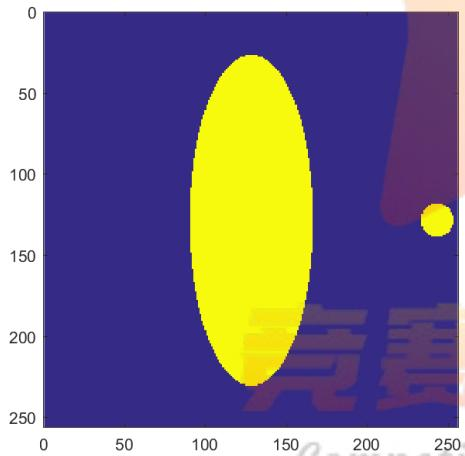

<details>
<summary>heatmap</summary>

| X | Y |
| --- | --- |
| ~125 | ~100 |
| ~240 | ~130 |
</details>

图1: 附件1几何形状

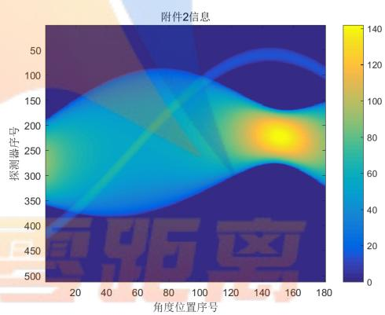

<details>
<summary>heatmap</summary>

| 角度位置序号 (X) | 探测器序号 (Y) | Intensity |
| --- | --- | --- |
| ~140 | ~250 | ~140 |
| ~160 | ~250 | ~130 |
| ~180 | ~250 | ~80 |
| ~140 | ~150 | ~80 |
| ~160 | ~150 | ~80 |
| ~180 | ~150 | ~80 |
| ~140 | ~100 | ~80 |
| ~160 | ~100 | ~80 |
| ~180 | ~100 | ~80 |
| ~140 | ~50 | ~80 |
| ~160 | ~50 | ~80 |
| ~180 | ~50 | ~80 |
| ~140 | ~25 | ~80 |
| ~160 | ~25 | ~80 |
| ~180 | ~25 | ~80 |
| ~140 | ~15 | ~80 |
| ~160 | ~15 | ~80 |
| ~180 | ~15 | ~80 |
| ~140 | ~5 | ~80 |
| ~160 | ~5 | ~80 |
| ~180 | ~5 | ~80 |
| ~140 | ~2 | ~80 |
| ~160 | ~2 | ~80 |
| ~180 | ~2 | ~80 |
| ~140 | ~1 | ~80 |
| ~160 | ~1 | ~80 |
| ~180 | ~1 | ~80 |
| ~140 | ~0.5 | ~80 |
| ~160 | ~0.5 | ~80 |
| ~180 | ~0.5 | ~80 |
| ~140 | ~0.2 | ~80 |
| ~160 | ~0.2 | ~80 |
| ~180 | ~0.2 | ~80 |
| ~140 | ~-0.2 | ~80 |
| ~160 | ~-0.2 | ~80 |
| ~180 | ~-0.2 | ~80 |
| ~140 | ~-0.5 | ~80 |
| ~160 | ~-0.5 | ~80 |
| ~180 | ~-0.5 | ~80 |
| ~140 | ~-0.8 | ~80 |
| ~160 | ~-0.8 | ~80 |
| ~180 | ~-0.8 | ~80 |
| ~140 | ~-1.2 | ~80 |
| ~160 | ~-1.2 | ~80 |
| ~180 | ~-1.2 | ~80 |
| ~140 | ~-1.5 | ~80 |
| ~160 | ~-1.5 | ~80 |
| ~180 | ~-1.5 | ~80 |
| ~140 | ~-1.8 | ~80 |
| ~160 | ~-1.8 | ~80 |
| ~180 | ~-1.8 | ~80 |
| ~140 | ~-2.2 | ~80 |
| ~160 | ~-2.2 | ~80 |
| ~180 | ~-2.2 | ~80 |
| ~140 | ~-2.5 | ~80 |
| ~160 | ~-2.5 | ~80 |
| ~180 | ~-2.5 | ~80 |
| 25~55 (Range) | 25~55 (Range) | 2~45 (Color Scale) |
| 25~55 (Range) | 35~55 (Range) | 2~45 (Color Scale) |
| 35~55 (Range) | 35~55 (Range) | 2~45 (Color Scale) |
| 45~55 (Range) | 35~55 (Range) | 2~45 (Color Scale) |
| 55~55 (Range) | 35~55 (Range) | 2~45 (Color Scale) |

Note: The chart displays a continuous color gradient representing intensity values, with the highest intensity (~140) located at the center-right corner.
</details>

图 2: 附件2 信息

观察附件2中接收信息图可以发现，图像可以很明显的看成是两部分叠加而成。结合标定模板集合信息可知，这两部分分别为椭圆部分的投影与圆部分的投影。由于圆具有各方向投影均相等的良好性质，因此我们截取其中一部分数据进行试探性研究。选择第一个测量角度的属于圆的投影的非零数据，得到一组探测信息 $D ( i )$ 。对于探测点 i，其发出的射线与圆心的距离为 $d _ { i } = i \Delta d + d _ { 0 }$ ，其中 $\Delta d$ 为探测器上的射线间距， $d _ { 0 }$ 为探测器位置相对偏置。那么第i条射线与圆相交的弦长为 $2 \sqrt { R ^ { 2 } - d _ { i } ^ { 2 } }$ ，其中R为圆半径。我们推测探测器的接收数据与 $\rho l$ 成一次函数关系，即

$$
D (i) = \mu \times 2 \sqrt {R ^ {2} - (i \Delta d + d _ {0}) ^ {2}} \rho + c \tag {3}
$$

使用最小二乘法对曲线进行拟合，求出各个参数的值为：

$$
\mu = 1. 7 7 2 4, \Delta d = 0. 2 7 6 8, d _ {0} = - 4. 0 6 8 8, c = 0. 0 0 0 0
$$

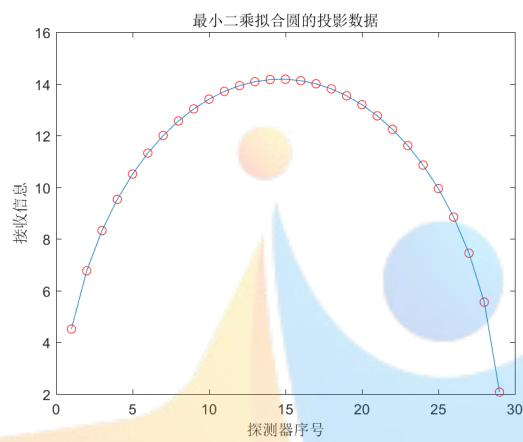

<details>
<summary>line</summary>

| 探测器序号 | 接收信息 |
| --- | --- |
| 1 | ~4.5 |
| 2 | ~6.8 |
| 3 | ~8.4 |
| 4 | ~9.6 |
| 5 | ~10.6 |
| 6 | ~11.4 |
| 7 | ~12.0 |
| 8 | ~12.6 |
| 9 | ~13.1 |
| 10 | ~13.5 |
| 11 | ~13.8 |
| 12 | ~14.0 |
| 13 | ~14.1 |
| 14 | ~14.2 |
| 15 | ~14.2 |
| 16 | ~14.2 |
| 17 | ~14.1 |
| 18 | ~14.0 |
| 19 | ~13.8 |
| 20 | ~13.6 |
| 21 | ~13.3 |
| 22 | ~12.9 |
| 23 | ~12.3 |
| 24 | ~11.7 |
| 25 | ~10.9 |
| 26 | ~10.0 |
| 27 | ~8.9 |
| 28 | ~7.5 |
| 29 | ~5.6 |
| 30 | ~2.1 |
</details>

图3: 拟合圆上的数据

即是说对于标定模板，其吸收强度 $D = \mu \rho l ,$ 对于参数 $\mu ,$ ，在后面的模型中我们会进一步进行求解，此处仅是为了寻找模型之间的关系进行初步的分析。

## 4.2 模型建立

以正方形托盘的中心为坐标原点，椭圆中心与圆中心的连线方向为x轴，过坐标原点垂直于 $x$ 轴方向为 $y$ 轴，建立平面直角坐标系。在这一坐标系中，设 CT 系统的旋转中心坐标为 $R ( x _ { 0 } , y _ { 0 } )$ ，探测器平面与x 轴的夹角为θ，探测器中 $\therefore \dot { \square }$ 旋转中心在探测器平面上的投影的距离为 $d _ { 0 }$

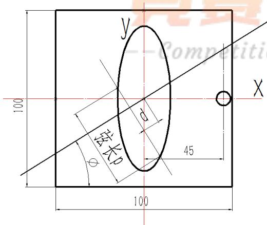

<details>
<summary>text_image</summary>

100
弦长D
d
45
100
X
y
- -Competition
</details>

图 4: 标准形态

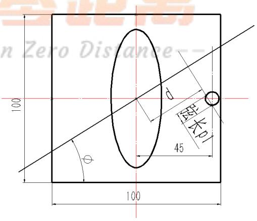

<details>
<summary>text_image</summary>

100
d
圆长φ1
45
100
</details>

图5: 圆的弦长

## 4.3 理论公式

由于这个问题中，标定模板是均匀介质，所有地方的吸收率都为 1，那么其探测器获得的数值即与穿过的长度有关。那么在这一问题中，我们转化为某一方向的直线穿过标定模板的长度的求解。

标定模板中，椭圆与圆的方程分别为：

$$
\frac {x ^ {2}}{m ^ {2}} + \frac {y ^ {2}}{n ^ {2}} = 1, m = 1 5, n = 4 0; (x - 4 5) ^ {2} + y ^ {2} = 4 ^ {2}
$$

为了对问题进行化简，我们设定一个坐标原点在探测器上的投影位于探测器中心的状态，此时对于探测器上与探测器中心相距为 的一条射线，可以对其在椭圆中交出的弦长进行求解。这条射线的方程可写出为：

$$
x \cos \phi + y \sin \phi = d
$$

与椭圆的方程进行联立求解，可解出该直线 $\varXi$ 椭圆相交的弦长：

$$
p = \frac {2 m n \sqrt {r ^ {2} - d ^ {2}}}{r ^ {2}}, \text {这里} r ^ {2} = m ^ {2} \cos^ {2} \phi + n ^ {2} \sin^ {2} \phi
$$

对于圆上的部分，设圆心坐标为(G,0)，圆半径为 $r _ { 0 }$ ，其中 $G = 4 5 , r _ { 0 } = 4$ ，那么容易求出其弦长表达式为：

$$
p _ {1} = 2 \sqrt {r _ {0} ^ {2} - (G \cos \phi - d) ^ {2}}
$$

同时，由于在整个旋转过程中，直线与椭圆或圆不一定有交点，那么这种情况下，我们对整个角度范围进行整合，可以得到总的投影长度为：

$$
p _ {t} = \frac {2 m n \sqrt {\max (0 , m ^ {2} \cos^ {2} \phi + n ^ {2} \sin^ {2} \phi - d ^ {2})}}{m ^ {2} \cos^ {2} \phi + n ^ {2} \sin^ {2} \phi} + 2 \sqrt {\max (0 , r _ {0} ^ {2} - (G \cos \phi - d) ^ {2})}
$$

考虑到实际情况中，探测器的中心与坐标原点有一定的偏移，那么在上式的基础上，我们需要对投影长度进行修正。

易证，在探测器能探测到物体的前提下，沿垂直于探测器方向的探测器位置变化对投影长度没有影响。即在探测器位置发生变化时，只需要考虑沿探测器方向的位置变化。

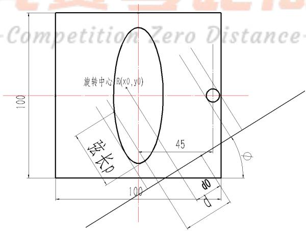

<details>
<summary>text_image</summary>

Competition Zero Distance
旋转中心 R(x0,y0)
100
45
φ
长D
100
D
</details>

图 6: 计算弦长

那么对于旋转中心坐标 $R ( x _ { 0 } , y _ { 0 } )$ ，探测器中心与旋转中心在探测器平面上的投影的有向距离 $d _ { 0 }$ ，对于探测器上一条射线，其与探测器中心的距离为 $d ,$ ，那么容易求出，该点与坐标原点在探测器上的投影的距离 $d ^ { \prime }$ 的值为;

$$
d ^ {\prime} = x _ {0} \cos \phi + y _ {0} \sin \phi + d _ {0} + d
$$

即可转化到刚才求出的标准形式的公式上去。

由于在实际数据中，探测器是有512个X射线组成的，对于第i个发射器，其与发射器中心的距离也可以简单的表示出来，为：

$$
d = (i - 2 5 6. 5) \Delta d
$$

这里距离的负号表示探测器中心与该点的连线沿探测器与x 轴夹角 $\phi$ 的反向。则

$$
d ^ {\prime} = x _ {0} \cos \phi + y _ {0} \sin \phi + d _ {0} + (i - 2 5 6. 5) \Delta d
$$

标定模板的吸收强度处处相等且都为 1，为计算吸收强度与探测器探测到的数值的关系，我们引入增益系数 $\mu ,$ ，表示投影长度与最终结果的关系。即：

$$
V = \mu p _ {t}
$$

综合上述各式，所以对于探测角度为 $\phi$ 的探测器，其上第i条X射线探测所得的数值的计算公式为：

$$
\begin{array}{l} V = \mu \frac {2 m n \sqrt {\max (0 , m ^ {2} \cos^ {2} \phi + n ^ {2} \sin^ {2} \phi - (x _ {0} \cos \phi + y _ {0} \sin \phi + d _ {0} + (i - 2 5 6 . 5) \Delta d) ^ {2})}}{m ^ {2} \cos^ {2} \phi + n ^ {2} \sin^ {2} \phi} \\ + 2 \mu \sqrt {\max (0 , r _ {0} ^ {2} - (G \cos \phi - (x _ {0} \cos \phi + y _ {0} \sin \phi + d _ {0} + (i - 2 5 6 . 5) \Delta d)) ^ {2})} \\ \end{array}
$$

问题即转化为，根据附件2 给出的数据，对该公式中的参数进行求解。

## 4.4 模型求解

为了确定模型中的各项参数信息，我们需要对模型参数进行求解，使得理论值与实际测量值误差最小，我们使用均方根误差来作为衡量指标。即

$$
\min \delta = \sqrt {\frac {\sum_ {j = 1} ^ {1 8 0} \sum_ {i = 1} ^ {5 1 2} (V (i , j) - D (i , j)) ^ {2}}{n - 1}}
$$

这里 $D ( i , j )$ 指附件2中，第 $j$ 组探测数据中第i个探测器的测量值， $V ( i , j )$ 指第 $j$ 组探测数据中第i 个探测器的计算值。

使用 MATLAB 的非线性拟合函数工具进行模型求解，由于这是一个数据量较大的非线性优化模型，直接寻找到最优解比较困难，函数在进行求解时会从给定的初值开始迭代，初值的选取对计算结果有直接影响。因此，我们使用以下步骤对参数进行迭代求解，获取更准确的参数值：

1. 选取参数 $d _ { 0 } , x _ { 0 } , y _ { 0 } , \mu , \Delta d , \phi _ { i } , i = 1 , . . . , 1 8 0$ 的初值，这里参数的初值可以随意选取，我们设置为 $d _ { 0 } = x _ { 0 } = y _ { 0 } = 0 , \mu = 1 . 7 7 2 4$ （由前文粗计算得），使用 $5 1 2 \times 1 8 0$ 组数据，对所有参数进行拟合，获得第一次求解的参数结果。  
2. 对第一次求解得到的 $\phi _ { 1 _ { i } } , i = 1 , \ldots , 1 8 0$ ，使用局部加权回归散点平滑法进行平滑处理，接着将 $\phi _ { i }$ 作为已知参数，使用 $5 1 2 \times 1 8 0$ 组数据，以第一次求解的结果作为初始点，对参数 $d _ { 0 } , x _ { 0 } , y _ { 0 } , \mu , \Delta d$ 进行求解，得到第二次参数的求解结果。  
3. 使用第二次求解得到的参数 $d _ { 0 } , x _ { 0 } , y _ { 0 } , \mu , \Delta d$ 作为已知参数，对于180组，每组512个数据，以第(2)步中得到的角度作为初值，分别对每组数据的角度参数进行求解，得到第 (3) 步的求解结果。  
4. 使用第 (2) 步与第 (3) 步的结果作为初始值，再次使用 $5 1 2 \times 1 8 0$ 组数据，对所有参数进行拟合，得到最终结果。

## 4.5 求解结果

使用上述算法对模型进行求解，得到各个参数如下：

$$
\mu = 1. 7 7 2 7, x _ {0} = - 9. 2 6 9 6, y _ {0} = 6. 2 7 3 8, d _ {0} = 0. 0 0 0 0, \Delta d = 0. 2 7 6 8
$$

同时可以求出180个测量角度的数据，角度数据见附录中表9，部分数据见表1，由于我们求的是探测器的角位置，因此这里将所得数据转换为题目要求的X 射线的角度位置：

表 1: X射线角度信息

<table><tr><td>角度序号</td><td>1</td><td>2</td><td>3</td><td>90</td><td>91</td><td>179</td><td>180</td></tr><tr><td>角度(度)</td><td>-60.3465</td><td>-58.9927</td><td>-58.4392</td><td>28.6382</td><td>29.6437</td><td>117.6509</td><td>118.6439</td></tr></table>

## 4.6 模型评价

在问题 (1) 的模型中，我们使用均方根误差来进行衡量，第一次求解与最终结果的均方根误差如表2，从表中可以看出，我们的算法对原始数据的拟合程度较好，均方根误差很小，因此可以认为我们得到的参数信息是较为准确的，模型的可靠性较好。

表2: 算法均方根误差

<table><tr><td>算法步骤</td><td>第一次求解</td><td>最终结果</td></tr><tr><td>RMSE</td><td>4.4161</td><td>0.0148</td></tr></table>

## 5 问题二的求解

在问题2中，需要根据某未知介质的接受信息，利用问题1中求出的参数，确定该未知介质在正方形托盘中的位置、几何形状和吸收率。第一题中分析了投影的过程，此问需要利用给定的投影数据进行逆过程。下文首先利用标定数据对投影数据进行了预处理，并分别用连续模型的FBP（滤波反投影）算法和离散模型的ART（代数迭代法）进行反投影重建，并比较了数种滤波降噪算法的效果。

## 5.1 数据预处理

由问题一可知，由于安装过程的误差，CT系统的旋转中心并不在正方形的中心，由前文推导公式可知，探测器上的第i 个传感器与坐标原点的沿探测器方向的距离为：

$$
d ^ {\prime} = x _ {0} \cos \phi + y _ {0} \sin \phi + d _ {0} + (i - 2 5 6. 5) \Delta d
$$

对于任意角度的探测器，我们都可以设置一个中心与原点重合的辅助探测器，将探测器上的数据转化到辅助探测器上，再对问题进行求解。即：

$$
d ^ {\prime} = (i ^ {\prime} - 2 5 6. 5) \Delta d = x _ {0} \cos \phi + y _ {0} \sin \phi + d _ {0} + (i - 2 5 6. 5) \Delta d
$$

则对于原始数据 $y = d a t a ( i , j )$ ，可以得到新的转化后的数据

$$
d a t a _ {p r e} (i ^ {\prime}, j) = d a t a (i (i ^ {\prime}), j) = d a t a (i ^ {\prime} - (x _ {0} \cos \phi + y _ {0} \sin \phi + d _ {0}) / \Delta d, j)
$$

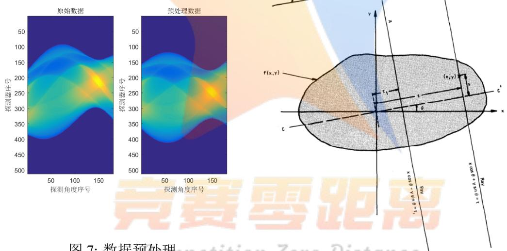

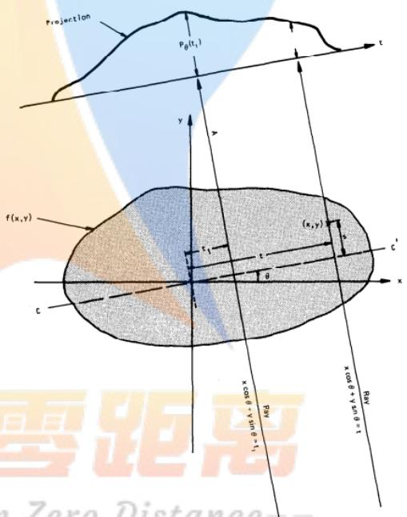

<details>
<summary>text_image</summary>

Projection
Pθ(s₁)
t
y
f(x,y)
x cos θ + y sin θ = t
x cos θ + y sin θ = t
RAY
θ
(c, y)
t₁
(b)
C
C
x cos θ + y sin θ = t
RAY
RAY
零距离
</details>

图7: 数据预处理  
图8: 连续模型

## 5.2 连续模型

首先，我们把第一问中的投影问题用线积分的形式来描述。例如上图中，记灰色的封闭图形由函数 $f ( x , y )$ 描述，一条投影射线为 $x \cos \theta + y \sin \theta = t$ ，则 $f ( x , y )$ 关于该射线的线积分为：

$$
P _ {\theta} (t) = \int_ {(\theta , t) l i n e} f (x, y) d s
$$

则这里的 $P _ { \theta } ( t )$ 就相当于这个物体沿该射线方向上的投影值。接下来引入傅里叶中心切片定理 (Fourier Slice Theorem)。[1] 它证明了若给定一组投影的数据 $p _ { \theta }$ ，则可以通过二维傅里叶变换来估计原物体。定义线积分投影 $P _ { \theta } ( t )$ 的傅里叶变换为：

$$
S _ {\theta} (w) = \int_ {- \infty} ^ {\infty} P _ {\theta} (t) e ^ {- j 2 \pi w t} d t
$$

原二维图像的傅里叶变换定义为：

$$
F (u, v) = \int_ {- \infty} ^ {\infty} \int_ {- \infty} ^ {\infty} f (x, y) e ^ {- j 2 \pi (u x + v y)} d t
$$

则根据中心切片定理，有：

$$
S _ {\theta} (w) = F (w \cos \theta , w \sin \theta)
$$

实际情况中，我们考察的 $f ( x , y )$ 均为离散的网格化。假设其中 $x , y$ 的所属区间均为$[ - A / 2 , A / 2 ]$ 。对于 $F ( u , v )$ 的傅里叶逆变换可以写为 [4]：

$$
f (x, y) = \frac {1}{A ^ {2}} \sum_ {m = - N / 2} ^ {N / 2} \sum_ {n = - N / 2} ^ {N / 2} F (m / A, n / A) e ^ {j 2 \pi ((m / A) x + (n / A) y)}
$$

傅里叶重心切片定理将投影的傅里叶变换和图像的傅里叶变换建立了联系，故可以通过充足数目方向上投影的傅里叶变换信息，来构建出原始函数的估计值。在实际应用过程中，我们使用滤波反投影法（FBP）来完成重构，其算法步骤如下：

遍历K 个角度，属于 $0 { - } 1 8 0 ^ { \circ }$ 之间

1. 对 $P _ { \theta } ( t )$ 进行快速傅里叶变换，得到 $S _ { \theta } ( w )$  
2. 将 $S _ { \theta } ( w )$ 乘以 $2 \pi | w | / K$

3. 将 Step2中得到的值进行傅里叶逆变换，将得到的值累加得到图像平面。

## 5.3 离散模型：ART

## 5.3.1 ART

由于FBP（滤波反投影）算法具有的缺陷与限制，对于不完全的投影数据，可以使用迭代法进行重建，这类算法在求解时把图像离散化。ART（代数迭代法）是常用的一种算法，其求解速度相对较快，结果较优，并且在求解过程中可以使用先验信息对数据进行修正。

首先引入投影矩阵的概念，设图片共有 $J = n \times n$ 个像素，共有 I 条射线进行扫描，将射线看作宽为 τ 的粗线，将图片像素值集中在像素的中心，则有 $I \times J$ 大小的投影矩阵R，其元素定义为

$$
r _ {i j} = \left\{ \begin{array}{l l} 1, & \mathrm{i} \text {号射线通过} \mathrm{j} \text {号像素中心} \\ 0, & \text {其他} \end{array} \right.
$$

记 $\mathbf { x } = [ x _ { 1 } , x _ { 2 } , \ldots , x _ { J } ] ^ { T }$ 为 J 维图像矢量， $x _ { j }$ 表示图像上第 $j$ 个像素点的吸收强度；p =$[ p _ { 1 } , p _ { 2 } \dots p _ { I } ] ^ { T }$ 为I维投影矢量， $p _ { i }$ 表示第 i条射线所经过的所有像素的总射线投影，则

$$
R \mathbf {x} = \mathbf {p}
$$

左侧各分量称为伪射线和，右侧称为真射线和。要将图像的吸收强度解出来，需要对矩阵R进行求逆。一般的，R是大型稀疏矩阵，因此直接求其逆矩阵有困难；而在实际应用中，误差的存在可能使得R奇异。故通常使用迭代法进行求解，下面介绍ART（代数迭代法）。其思路是每次校正一条射线路径上的像素值，使得该条真伪射线和间误差减小。其迭代公式为：

$$
x ^ {(k + 1)} = x ^ {(k)} + \lambda^ {(k)} \frac {q _ {i _ {k}} - r _ {i _ {k}} x ^ {(k)}}{| | r _ {i _ {k}} | | ^ {2}} r _ {i _ {k}}
$$

式中，k是迭代次数， $k = 0 , 1 . . . , \ i _ { k } = k ( m o d I ) + 1 ; \ \lambda ^ { ( k ) }$ 称为松弛参数。可以证明，当

$$
0 <   \varepsilon_ {1} \leq \lambda^ {(k)} \leq \varepsilon_ {2} <   2
$$

时，该迭代法收敛。本文中，均取 $\lambda ^ { ( k ) } = 0 . 2 5$ 。求解步骤为：

1. 设置初值；  
2. ART 迭代；  
3. 应用先验信息决定的限制条件，本文使用像素值非负限制，转至步骤二；  
4. 一定迭代次数后终止，一般为(3 8)I 次

## 5.3.2 降噪算法

不论何种重建算法，不可避免会带入伪影点，同时由于数据含有噪声，成像质量并不令人满意。本文使用NLM（非局部均值）降噪方式对图像进行处理。NLM 算法是图像降噪领域非常有效的算法之一，效率较高，实现简单。其思路是对像素的某邻域窗口内的像素灰度值做加权平均，且像素越相似，权重越大。J.Huang等人将其运用到CT图像迭代重建过程中，显示其具有良好的性能。[2]

$$
N L M (x _ {i}) = \sum_ {j \in N _ {i}} w (i, j) x _ {j}
$$

其中,

$$
w (i, j) = \frac {e ^ {- | | x _ {V _ {i}} - x _ {V _ {j}} | | ^ {2} / h ^ {2}}}{\sum_ {j \in N _ {i}} e ^ {- | | x _ {V _ {i}} - x _ {V _ {j}} | | ^ {2} / h ^ {2}}}
$$

对于问题二，结果如下图：

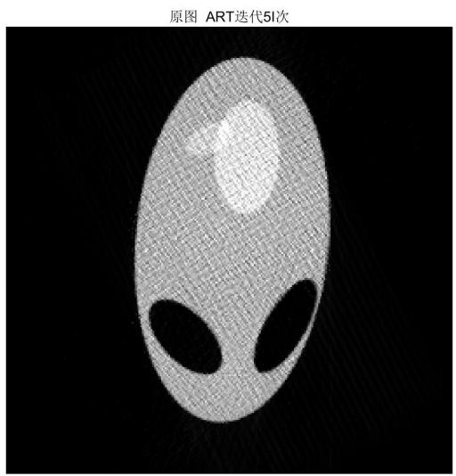

<details>
<summary>text_image</summary>

原图 ART迭代5I次
</details>

图 9: 原图

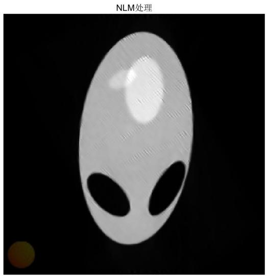

<details>
<summary>text_image</summary>

NLM处理
</details>

图 10: NLM 降噪处理

可以看出 NLM 算法对于重建图像的去噪有着较好的效果，并且保留了较多的边缘信息。选取NLM 重建结果作为10 个采样点数据如下：

表 问题二采样点数据

<table><tr><td>点序号</td><td>1</td><td>2</td><td>3</td><td>4</td><td>5</td><td>6</td><td>7</td><td>8</td><td>9</td><td>10</td></tr><tr><td>ART算法</td><td>0</td><td>0.6943</td><td>0</td><td>0.8269</td><td>0.7285</td><td>0.9269</td><td>0.9111</td><td>0</td><td>0</td><td>0</td></tr><tr><td>FBP算法</td><td>0</td><td>0.5113</td><td>0</td><td>0.6268</td><td>0.5476</td><td>0.7636</td><td>0.6819</td><td>0</td><td>0</td><td>0</td></tr></table>

## 6 问题三的求解

问题三的要求与问题二中相同，但是观察所给出的数据，发现其中含有较多噪声，因此考虑进行降噪预处理。

## 6.1 去噪预处理

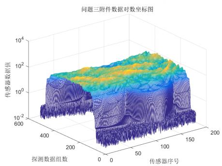

<details>
<summary>surface_3d</summary>

| 探测数据组数 | 传感器序号 | 传感器数据值 |
| --- | --- | --- |
| 0~600 | 0~200 | 10^-2~10^4 |
</details>

图 11: 附件 5数据

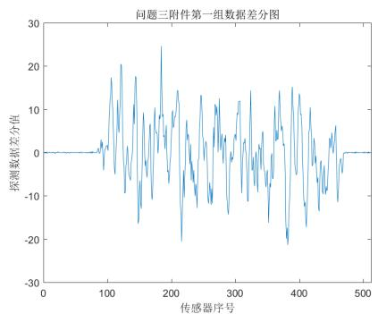

<details>
<summary>line</summary>

| 传感器序号 | 探测数据差分值 |
| --- | --- |
| 0 | 0 |
| ~90 | ~2 |
| ~100 | ~-4 |
| ~110 | ~17 |
| ~120 | ~20 |
| ~130 | ~-9 |
| ~140 | ~18 |
| ~150 | ~-16 |
| ~160 | ~-12 |
| ~170 | ~-10 |
| ~180 | ~25 |
| ~190 | ~-7 |
| ~200 | ~14 |
| ~210 | ~-20 |
| ~220 | ~-12 |
| ~230 | ~-13 |
| ~240 | ~13 |
| ~250 | ~-11 |
| ~260 | ~12 |
| ~270 | ~-14 |
| ~280 | ~12 |
| ~290 | ~-11 |
| ~300 | ~14 |
| ~310 | ~-16 |
| ~320 | ~-8 |
| ~330 | ~14 |
| ~340 | ~-21 |
| ~350 | ~-17 |
| ~360 | ~-13 |
| ~370 | ~-8 |
| ~380 | ~-11 |
| ~390 | ~6 |
| ~400 | 0 |
| 500 | 0 |
</details>

图 12: 附件 5第一组数据差分图

观察附件5数据，发现其数据主要集中在探测器中间部位。探测器两边的数据数值较小，且在小范围内不断。取其中第一组观测数据，做出差分图，如图12所示，可以看出，探测器两边的相邻两个传感器的数据差集中在0附近，因此我们推测这些数据是由测量时的误差引起的波动。分析数据可以发现，小于 0.3 的数据值有无规律波动，普遍出现在主要信号周围，考虑将小于0.3的数据值作为噪声。提取所有小于0.3的数据值，利用SPSS软件进行Kolmogorov-Smirnov均匀分布检验，结果显示其符合均匀分布，均值为0.1549，显著性水平为0.157。

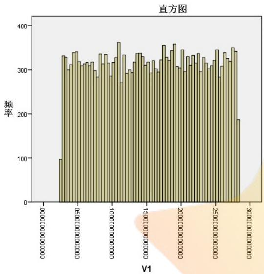

<details>
<summary>histogram</summary>

| Bin (Range) | Frequency |
| --- | --- |
| ~0.025~0.035 | ~100 |
| ~0.035~0.045 | ~335 |
| ~0.045~0.055 | ~330 |
| ~0.055~0.065 | ~345 |
| ~0.065~0.075 | ~320 |
| ~0.075~0.085 | ~315 |
| ~0.085~0.095 | ~325 |
| ~0.095~1.005 | ~315 |
| ~1.005~1.015 | ~340 |
| ~1.015~1.025 | ~335 |
| ~1.025~1.035 | ~315 |
| ~1.035~1.045 | ~325 |
| ~1.045~1.055 | ~365 |
| ~1.055~1.065 | ~335 |
| ~1.065~1.075 | ~275 |
| ~1.075~1.085 | ~340 |
| ~1.085~1.095 | ~345 |
| ~1.095~1.105 | ~325 |
| ~1.105~1.115 | ~320 |
| ~1.115~1.125 | ~325 |
| ~1.125~1.135 | ~325 |
| ~1.135~1.145 | ~325 |
| ~1.145~1.155 | ~325 |
| ~1.155~1.165 | ~325 |
| ~1.165~1.175 | ~360 |
| ~1.175~1.185 | ~345 |
| ~1.185~1.195 | ~365 |
| ~1.195~1.205 | ~345 |
| ~1.205~1.215 | ~335 |
| ~1.215~1.225 | ~340 |
| ~1.225~1.235 | ~335 |
| ~1.235~1.245 | ~340 |
| ~1.245~1.255 | ~330 |
| ~1.255~1.265 | ~325 |
| ~1.265~1.275 | ~345 |
| ~1.275~1.285 | ~340 |
| ~1.285~1.295 | ~345 |
| ~1.295~1.305 | ~340 |
| ~1.305~1.315 | ~345 |
| ~1.315~1.325 | ~340 |
| ~1.325~1.335 | ~345 |
| ~1.335~1.345 | ~340 |
| ~1.345~1.355 | ~345 |
| ~1.355~1.365 | ~340 |
| ~1.365~1.375 | ~345 |
| ~1.375~1.385 | ~340 |
| ~1.385~1.395 | ~345 |
| ~1.395~1.405 | ~340 |
| ~1.405~1.415 | ~345 |
| ~1.415~1.425 | ~340 |
| ~1.425~1.435 | ~345 |
| ~1.435~1.445 | ~340 |
| ~1.445~1.455 | ~345 |
| ~1.455~1.465 | ~340 |
| ~1.465~1.475 | ~345 |
| ~1.475~1.485 | ~340 |
| ~1.485~1.495 | ~345 |
| ~1.495~1.505 | ~340 |
| ~1.505~1.515 | ~345 |
| ~1.515~1.525 | ~340 |
| ~1.525~1.535 | ~345 |
| ~1.535~1.545 | ~340 |
| ~1.545~1.555 | ~345 |
| ~1.555~1.565 | ~340 |
| ~1.565~1.575 | ~345 |
| ~1.575~1.585 | ~340 |
| ~1.585~1.595 | ~345 |
| ~1.595~1.605 | ~340 |
| ~1.605~1.615 | ~345 |
| ~1.615~1.625 | ~340 |
| ~1.625~1.635 | ~345 |
| ~1.635~1.645 | ~340 |
| ~1.645~1.655 | ~345 |
| ~1.655~1.665 | ~340 |
| ~1.665~1.675 | ~345 |
| ~1.675~1.685 | ~340 |
| ~1.685~1.695 | ~345 |
| ~1.695~1.705 | ~340 |
| ~1.705~1.715 | ~345 |
| ~1.715~1.725 | ~340 |
| ~1.725~1.735 | ~345 |
| ~1.735~1.745 | ~340 |
| ~1.745~1.755 | ~345 |
| ~1.755~1.765 | ~340 |
| ~1.765~1.775 | ~345 |
| ~1.775~1.785 | ~340 |
| ~1.785~1.795 | ~345 |
| ~1.795~1.805 | ~340 |
| ~1.805~1.815 | ~345 |
| ~1.815~1.825 | ~340 |
| ~1.825~1.835 | ~345 |
| ~1.835~1.845 | ~340 |
| ~1.845~1.855 | ~345 |
| ~1.855~1.865 | ~340 |
| ~1.865~1.875 | ~345 |
| ~1.875~1.885 | ~340 |
| ~1.885~1.895 | ~345 |
</details>

图 13: 直方图  
图 14: K-S 检验

单样本柯尔莫戈洛夫-斯米诺夫检验

<table><tr><td colspan="2"></td><td>V1</td></tr><tr><td>个案数</td><td></td><td>21307</td></tr><tr><td rowspan="2">均匀参数 $^{a,b}$ </td><td>最小值</td><td>.0257000000</td></tr><tr><td>最大值</td><td>.2829000000</td></tr><tr><td rowspan="3">最极端差值</td><td>绝对</td><td>.008</td></tr><tr><td>正</td><td>.002</td></tr><tr><td>负</td><td>-.008</td></tr><tr><td colspan="2">柯尔莫戈洛夫-斯米诺夫Z</td><td>1.127</td></tr><tr><td colspan="2">渐近显著性(双尾)</td><td>.157</td></tr></table>

a.检验分布为均匀分布。  
b.根据数据计算。

因此，对原数据做去噪处理。之后再按照问题二所述方法进行预处理，并分别使用ART算法与FBP 算法进行重建。

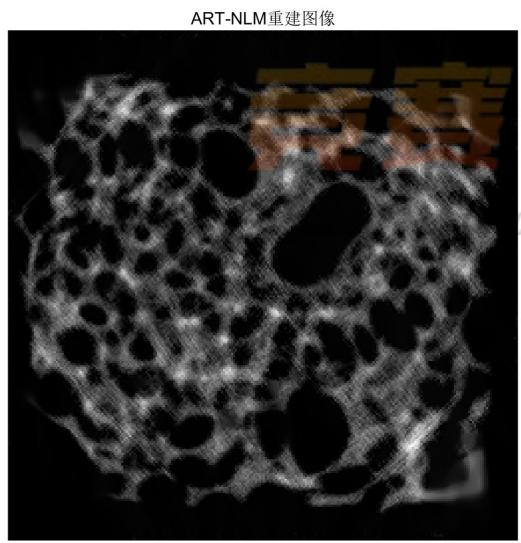

<details>
<summary>text_image</summary>

ART-NLM重建图像
</details>

图 15: ART-NLM

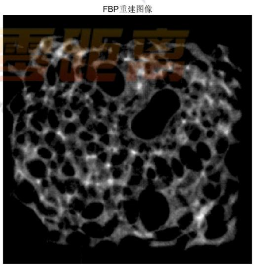

<details>
<summary>text_image</summary>

FBP重建图像
</details>

图 16: FBP

以上两张图已将亮度归一化。可以看出，FBP算法得到的图像更加平滑，ART-NLM算法的图像边缘较为锐利。同时给出两种算法重建得到10个采样点的吸收率数据。

表 4: 问题三采样点吸收强度

<table><tr><td>点序号</td><td>1</td><td>2</td><td>3</td><td>4</td><td>5</td><td>6</td><td>7</td><td>8</td><td>9</td><td>10</td></tr><tr><td>ART算法</td><td>0</td><td>3.5766</td><td>8.5109</td><td>0</td><td>0</td><td>3.8526</td><td>8.1648</td><td>0.1075</td><td>7.9565</td><td>0</td></tr><tr><td>FBP算法</td><td>0</td><td>1.3519</td><td>3.7293</td><td>0</td><td>0</td><td>1.6377</td><td>3.3159</td><td>0</td><td>3.9600</td><td>0</td></tr></table>

## 6.2 对比分析

对比两者， 算法重建速度较慢， 但保留了较多的边缘信息；FBP 算法速度快，成像质量高。使用模拟仿真方法对两算法所得吸收率值进行对比，发现 ART-NLM 值偏大。我们认为这是由于投影矩阵R元素取值仅有0或1造成的，每次对射线中心的像素迭代修正时，射线边缘的像素也同时受到等值的修正，造成了一定的偏差。可以考虑对于投影矩阵 R 做改进，部分文献提出了 [0,1] 区间内连续取值的赋权方法，由于篇幅限制在此不做展开了。

## 7 问题四的求解

## 7.1 精度分析

在这个问题中，我们采用模拟仿真的方法进行精度分析。在问题一模型的基础上，我们通过更改位置参数信息，进行模拟，得到这种情况下的 $5 1 2 \times 1 8 0$ 个数据，再使用我们的模型，在这组数据的基础上进行标定，计算得出标定所需参数，与设定的理论值进行对比，即可得到模型的精度信息

设置参数 $d _ { 0 } = 1 , \mu = 1 . 5 , x _ { 0 } = 1 0 , y _ { 0 } = 1 0$ ，观测角度依次为 $\phi _ { i } = i ^ { \circ } , i = 1 , \dotsc , 1 8 0 ,$ 使用问题一中模型，模拟生成180组探测器数据。将生成的探测器数据进行参数标定，得到结果如表5所示。

表5: 计算机仿真实验的几何标定结果

<table><tr><td>参数名称</td><td> $d_0(mm)$ </td><td> $x_0(mm)$ </td><td> $y_0(mm)$ </td><td> $\mu$ </td></tr><tr><td>理论值</td><td>5</td><td>-8</td><td>10</td><td>1.5</td></tr><tr><td>计算值</td><td>5.0000</td><td>-8.0000</td><td>10.0000</td><td>1.5000</td></tr><tr><td>差值( $\times 10^{-10}$ )</td><td>-0.1195</td><td>-0.0022</td><td>-0.5961</td><td>-0.0135</td></tr></table>

计算观测角度的误差平方和：

$$
S S E _ {\phi} = \sum_ {i = 1} ^ {1 8 0} (\phi_ {i} - \tilde {\phi} _ {i}) ^ {2} = 9. 8 6 1 8 \times 1 0 ^ {- 1 7}
$$

从表5中可以看出，本文的标定方法的计算值与真实值之间的误差很小，使用这种方法进行标定的精度较高。

## 7.2 稳定性分析

在 CT 系统的标定过程中，误差的存在不可避免。探测器上获得的传感器的值有与实际值相比有一定波动，即接收信息有一定噪音。为分析问题 (1) 中的模型在接收器存在噪声的情况下的标定结果的稳定性，这一节中我们使用计算机进行仿真，人为地在投影坐标中增加不同等级的噪声数据，再以此进行模板标定。

与精度分析相同，设置参数 $d _ { 0 } = 1 , \mu = 1 . 5 , x _ { 0 } = 1 0 , y _ { 0 } = 1 0$ ，观测角度依次为$\phi _ { i } = i ^ { \circ } , i = 1 , . . . , 1 8 0$ ，使用(1)中模型，模拟生成180组探测器数据。根据这种方法模拟得到的探测器接受信息中的数据范围在(0,120)之间，我们给原数据增加在(-15,15)范围内均匀分布的随机噪声。从数据图中可以看出，数据信息较原数据更模糊，且噪声较多。

使用本文的标定算法进行标定得到的计算值与理论值的对比如表6所示，标定角度与原角度的对比如图角度计算误差所示。

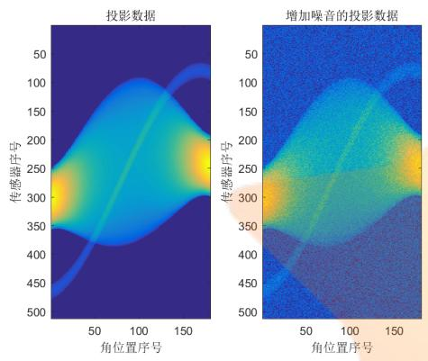

<details>
<summary>heatmap</summary>

| Feature | Description |
| --- | --- |
| Left Chart Title | 投影数据 (Projection Data) |
| Right Chart Title | 增加噪音的投影数据 (Add Noise of Projection Data) |
</details>

图 17: 投影数据

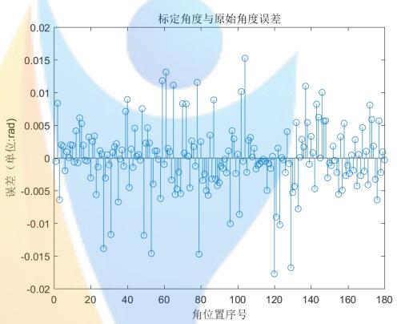

<details>
<summary>scatter</summary>

| 角位置序号 | 误差 (rad) |
| --- | --- |
| ~2 | ~0.0085 |
| ~3 | ~-0.0065 |
| ~10 | ~0.002 |
| ~12 | ~0.002 |
| ~14 | ~0.0015 |
| ~16 | ~0.002 |
| ~18 | ~0.0065 |
| ~20 | ~0.0035 |
| ~22 | ~0.0035 |
| ~24 | ~-0.0055 |
| ~26 | ~-0.014 |
| ~28 | ~-0.0115 |
| ~32 | ~-0.0065 |
| ~36 | ~-0.0045 |
| ~38 | ~0.009 |
| ~40 | ~0.0075 |
| ~42 | ~0.0015 |
| ~44 | ~0.0015 |
| ~46 | ~-0.0115 |
| ~48 | ~-0.0145 |
| ~52 | ~-0.0065 |
| ~56 | ~-0.0145 |
| ~58 | ~-0.0145 |
| ~62 | ~-0.0145 |
| ~64 | ~-0.0145 |
| ~66 | ~-0.0145 |
| ~68 | ~-0.0145 |
| ~72 | ~-0.0145 |
| ~74 | ~-0.0145 |
| ~76 | ~-0.0145 |
| ~78 | ~-0.0145 |
| ~82 | ~-0.0145 |
| ~84 | ~-0.0145 |
| ~86 | ~-0.0145 |
| ~88 | ~-0.0145 |
| ~92 | ~-0.0145 |
| ~94 | ~-0.0145 |
| ~96 | ~-0.0145 |
| ~98 | ~-0.0145 |
| ~102 | ~-0.0145 |
| ~104 | ~-0.0145 |
| ~106 | ~-0.0145 |
| ~112 | ~-0.0145 |
| ~114 | ~-0.0145 |
| ~116 | ~-0.0145 |
| ~118 | ~-0.0145 |
| ~122 | ~-0.0175 |
| ~124 | ~-0.0175 |
| ~126 | ~-0.0175 |
| ~128 | ~-0.0175 |
| ~132 | ~-0.0175 |
| ~134 | ~-0.0175 |
| ~136 | ~-0.0175 |
| ~138 | ~-0.0175 |
| ~142 | ~-0.0175 |
| ~144 | ~-0.0175 |
| ~146 | ~-0.0175 |
| ~148 | ~-0.0175 |
| ~152 | ~-0.0175 |
| ~154 | ~-0.0175 |
| ~156 | ~-0.0175 |
| ~158 | ~-0.0175 |
| ~162 | ~-0.0175 |
| ~164 | ~-0.0175 |
| ~166 | ~-0.0175 |
| ~168 | ~-0.0175 |
| ~172 | ~-0.0175 |
| ~174 | ~-0.0175 |
| ~176 | ~-0.0175 |
| ~178 | ~-0.0175 |
</details>

图 18: 角度计算误差

表 6: (-15,15) 均匀分布的噪声误差

<table><tr><td>参数名称</td><td> $d_0(mm)$ </td><td> $x_0(mm)$ </td><td> $y_0(mm)$ </td><td> $\mu$ </td></tr><tr><td>理论值</td><td>5</td><td>-8</td><td>10</td><td>1.5</td></tr><tr><td>计算值</td><td>5.0189</td><td>-7.9957</td><td>10.0339</td><td>1.4986</td></tr><tr><td>差值</td><td>-0.0189</td><td>-0.0043</td><td>-0.0339</td><td>0.0014</td></tr></table>

角度计算的均方根误差为 ，结合图像与表格数据，我们可以看出，我们的标定算法在数据有小范围的噪音的时候，标定产生的误差仍然较小，算法具有很好的稳定性。

为了进一步检验算法的稳定性，我们对原图像增加在 (-50,50) 范围内均匀分布的随机噪声，从图上可以看出，此时的图片与原图相比已有较大变化，在这样的数据的基础上，使用本文的算法进行标定，得到的参数见表7。

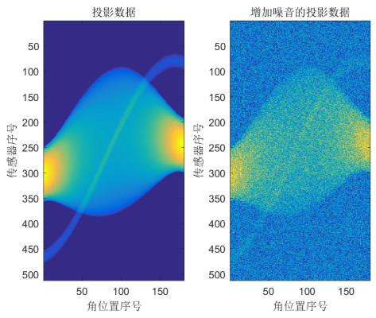

<details>
<summary>heatmap</summary>

| Chart | X-axis label | Y-axis label | Description |
| --- | --- | --- | --- |
| Left | 角位置序号 | 传感器序号 | Heatmap showing signal intensity distribution. |
| Right | 角位置序号 | 传感器序号 | Heatmap showing signal intensity distribution. |
</details>

图 19: 投影数据

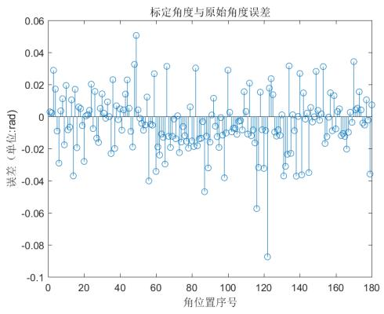

<details>
<summary>scatter</summary>

| 角位置序号 | 误差 (rad) |
| --- | --- |
| ~2 | ~0.03 |
| ~4 | ~0.018 |
| ~6 | ~0.005 |
| ~8 | ~-0.028 |
| ~10 | ~0.018 |
| ~12 | ~0.005 |
| ~14 | ~-0.036 |
| ~16 | ~0.018 |
| ~18 | ~-0.028 |
| ~20 | ~0.005 |
| ~22 | ~-0.015 |
| ~24 | ~0.02 |
| ~26 | ~-0.015 |
| ~28 | ~0.015 |
| ~30 | ~-0.022 |
| ~32 | ~0.025 |
| ~34 | ~-0.018 |
| ~36 | ~0.015 |
| ~38 | ~-0.018 |
| ~40 | ~0.025 |
| ~42 | ~-0.018 |
| ~44 | ~0.033 |
| ~46 | ~-0.018 |
| ~48 | ~0.052 |
| ~50 | ~-0.018 |
| ~52 | ~-0.039 |
| ~54 | ~-0.018 |
| ~56 | ~-0.018 |
| ~58 | ~-0.018 |
| ~60 | ~-0.018 |
| ~62 | ~-0.018 |
| ~64 | ~-0.018 |
| ~66 | ~-0.018 |
| ~68 | ~-0.018 |
| ~70 | ~-0.018 |
| ~72 | ~-0.018 |
| ~74 | ~-0.018 |
| ~76 | ~-0.018 |
| ~78 | ~-0.018 |
| ~80 | ~-0.018 |
| ~82 | ~-0.018 |
| ~84 | ~-0.018 |
| ~86 | ~-0.018 |
| ~88 | ~-0.018 |
| ~90 | ~-0.018 |
| ~92 | ~-0.018 |
| ~94 | ~-0.018 |
| ~96 | ~-0.018 |
| ~98 | ~-0.018 |
| ~100 | ~-0.018 |
| ~102 | ~-0.018 |
| ~104 | ~-0.018 |
| ~106 | ~-0.018 |
| ~108 | ~-0.018 |
| ~110 | ~-0.018 |
| ~112 | ~-0.018 |
| ~114 | ~-0.018 |
| ~116 | ~-0.018 |
| ~118 | ~-0.018 |
| ~120 | -0.057 |
| ~122 | -0.032 |
| ~124 | -0.032 |
| ~126 | -0.032 |
| ~128 | -0.032 |
| ~130 | -0.032 |
| ~132 | -0.032 |
| ~134 | -0.032 |
| ~136 | -0.032 |
| ~138 | -0.032 |
| ~140 | -0.032 |
| ~142 | -0.032 |
| ~144 | -0.032 |
| ~146 | -0.032 |
| ~148 | -0.032 |
| ~150 | -0.032 |
| ~152 | -0.032 |
| ~154 | -0.032 |
| ~156 | -0.032 |
| ~158 | -0.032 |
| ~160 | -0.032 |
| ~162 | -0.032 |
| ~164 | -0.032 |
| ~166 | -0.032 |
| ~168 | -0.032 |
| ~170 | -0.36 |
| ~172 | -0.36 |
| ~174 | -0.36 |
| ~176 | -3.6 |
| ~178 | -3.6 |
</details>

图 20: 角度计算误差

表 7: (-50,50) 均匀分布的噪声误差

<table><tr><td>参数名称</td><td> $d_0(mm)$ </td><td> $x_0(mm)$ </td><td> $y_0(mm)$ </td><td> $\mu$ </td></tr><tr><td>理论值</td><td>5</td><td>-8</td><td>10</td><td>1.5</td></tr><tr><td>计算值</td><td>5.0693</td><td>-8.0188</td><td>10.3614</td><td>1.4938</td></tr><tr><td>差值</td><td>-0.0693</td><td>0.0188</td><td>-0.3614</td><td>0.0062</td></tr></table>

角度计算的均方根误差为0.0191rad，相比噪声较小时，参数标定的误差有所增大，但仍然在很小的范围内。因此我们可以得出结论，由于采用了迭代使用最小二乘法进行函数拟合，我们的算法对数据的利用率较高，在使整体数据偏差最小的前提下，标定得到的参数稳定性较好，受测量过程中的误差的影响较小。

## 7.3 自行设计标定模板

一般来说，模板的设计可以考虑遵从两个原则：

• 模板易于加工。  
• 模板中的特征图形可以写出简洁的解析表达式。

例如CT标定界著名的“头模”（headphantom)，其中就包含多个椭圆的形状，这种能写出解析表达式的图形能在计算机仿真中起到很大的优势[1]。但是，根据第一问中标定求解的分析，发现当标定托盘上为一个椭圆和一个圆形时，标定解法的稳定性不是特别好，而且在求解过程中并没有充分利用特征图形的几何关系。故考虑设计新标定模板下图所示，圆内灰色部分的吸收率均为1.0000：

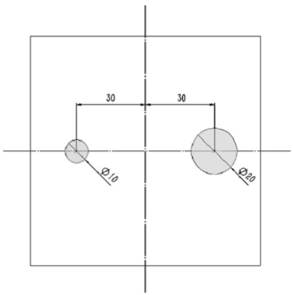

<details>
<summary>text_image</summary>

Ø10
30
30
Ø20
</details>

图21: 新标定模板示意图

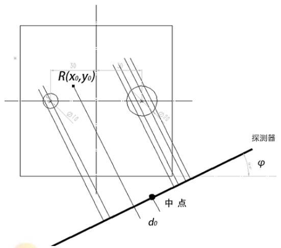

<details>
<summary>text_image</summary>

R(x₀,y₀)
φ1.0
φ2.0
中点
d₀
探测器
φ
</details>

图22: 新标定模型的几何示意图

## 7.3.1 标定模型的建立

与第一问中标定坐标系类似的，以正方形托盘的中心为坐标原点，小圆中心到大圆中心的连线为x轴，过坐标原点垂直于x轴方向为y 轴，建立平面直角坐标系。同时记半径为 5mm 的小圆为 C1，大圆为 C2。其中设 CT 系统的旋转中心坐标为 $R ( x _ { 0 } , y _ { 0 } )$ ，探测器平面与 x 轴的夹角为 $\phi _ { ; }$ ，则探测光束与 x 轴正向的夹角为 $\theta = \phi + \pi / 2$ ，探测器中心与旋转中心在探测器平面上的投影的距离为 $d _ { 0 }$

与问题一类似，探测器获得的数值与射线穿过圆形区域的弦长成正相关。则对于探测器上第 i 个单元，设该点相距 R 在探测器上的投影距离为 d。射向它的射线直线方程可写为：

$$
y = \tan (\theta) \times (x - x _ {0}) + y _ {0} - \frac {d}{\cos (\theta)}
$$

其中 $d = d _ { 0 } - ( 2 5 6 . 5 - i ) \times \Delta d \circ$

再记圆C1的半径为 $R _ { 1 } = 5 m m$ ，其圆心为 $( x _ { C 1 } , y _ { C 1 } )$ ，C2的半径为 $R _ { 2 } = 1 0 m m$ ，其圆心为 $( x _ { C 2 } , y _ { C 2 } )$ 。射向该传感器的射线经过圆的弦长为：

$$
\begin{array}{l} l _ {1} = 2 \times \sqrt {\max (0 , R _ {1} ^ {2} - \frac {(- y _ {C 1} + \tan (\theta) \times x _ {C 1} + y _ {0} - d / \cos (\theta)) ^ {2}}{1 + \tan^ {2} (\theta)}} \\ l _ {2} = 2 \times \sqrt {m a x (0 , R _ {2} ^ {2} - \frac {(- y _ {C 2} + t a n (\theta) \times x _ {C 2} + y _ {0} - d / c o s (\theta)) ^ {2}}{1 + t a n ^ {2} (\theta)}} \\ \end{array}
$$

可知第i 个探测器处的测量值为

$$
p = \mu (l _ {1} + l _ {2})
$$

## 7.3.2 标定参数的初步估计

仪器的标定过程中，常有的一种做法是寻找图形特征。在设计标定物的过程中，考虑使用具有显著几何特征的图形，圆形比较方便直接寻找其中心坐标。同时，通过测试发现，如果使用最小二乘法进行参数匹配，当标定物中只有一个图形时，几何特征不够明显，可能会出现欠拟合的结果。若标定物中有三个图形时，则拟合的条件十分苛刻，求解过程十分漫长。故考虑使用两个圆作为标定物，这样既充分利用几何关系寻找参数如 $x _ { 0 }$ ，y 的大 $y _ { 0 }$ 致范围，又能使最小二乘法的求解较为快速。

下面利用其几何特性以及探测器的探测值，来获取该测量值下探测器与 轴的夹角 $\phi ,$ 进而继续估计旋转中心 $R ,$ 、投影距离 $d _ { 0 }$ 的值。由于所能处理的数据为离散的点，并且由于可能存在的误差，用几何关系得到的这些值也有一定的误差。故考虑将这些估计值作为初始值，再考虑使用最小二乘法对参数进行最优化求解，以更快、更稳定地对标定参数进行求解。

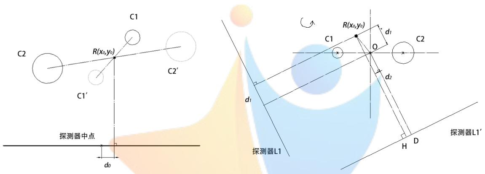  
图 23: 求解旋转中心位置示意图

由于 CT 一次工作旋转的角度在 $1 8 0 ^ { \circ }$ 左右，考察 CT 探测到的第 1 个角度和第 180 个角度时两个圆的投影相对位置。以探测器为参照系，C1，C2 为 工作时第 个角度下两圆的相对位置示意图， $C 1 ^ { \prime }$ 与 $C 2 ^ { \prime }$ 为前者旋转 $1 8 0 ^ { \circ }$ 左右时的相对位置示意图。此时我们可以通过 CT 扫描的数据比较容易地求得 C1， $C 2 , \ C 1 ^ { \prime } , \ C 2 ^ { \prime }$ 各自圆心在探测器上的相对位置。不妨记该相对位置为 $i _ { 1 } , ~ i _ { 2 } , ~ i _ { 1 } ^ { \prime } , ~ i _ { 2 } ^ { \prime }$ 。则由中心对称，可知旋转中心R在探测器上的投影相对位置近似为:

$$
i _ {R} = \frac {i _ {1} + i _ {2} + i _ {1} ^ {\prime} + i _ {2} ^ {\prime}}{4}
$$

同时也可推出 R 在探测器上的投影与探测器中心（第 256 与第 257 个探头之间的位置）的距离的近似值：CompetitionZeroDistance--

$$
d _ {0} = (2 5 6. 5 - i _ {R}) \times \Delta d
$$

除此之外，由于也已知 C1 与 C2 圆心的实际长度、投影长度与方向，故也可以算出当前探测器与 $x$ 轴的夹角 $\phi$ 的估计值为：

$$
\phi = \arcsin \left(\frac {(R 1 _ {c 1} - R 2 _ {c 1}) \Delta d}{C _ {1} C _ {2}}\right)
$$

再考察第 90 组 CT 观测数据，此时探测器相对于初始位置逆时针旋转了大约 $9 0 ^ { \circ }$ 。由于坐标系原点 O 为 C1 和 C2 的中点，故容易得到 O 在探测器上的投影位置为 $i _ { O }$ 。从而用 $H D = ( i _ { R } - i _ { O } ) \times \Delta d$ 来计算第1组和第90组中R点和O 点的投影距离HD 与 $H ^ { \prime } D ^ { \prime }$ 由于本次旋转角度为90°，故可以得到OR的长度 $| O R | = \sqrt { H D ^ { 2 } + H ^ { \prime } D ^ { \prime 2 } }$ 。同时可以得到$\angle R O D = a r c t a n ( H D / H ^ { \prime } D ^ { \prime } )$ 。可知OR与x轴的夹角为 $\theta _ { R } = \phi + \pi / 2 - \angle R O D$ ，则R坐标为:

$$
x _ {0} = | O R | \times \cos (\theta_ {R}), y _ {0} = | O R | \times \sin (\theta_ {R})
$$

模型中的 $d _ { 0 } , ~ H D$ 中的正负号均表示方向，其中以R 为旋转中心，向逆时针方向为正。

## 7.3.3 最小二乘法参数优化

利用上节中的标定方法，根据参数 $x _ { 0 } , ~ y _ { 0 } , ~ d _ { 0 } , ~ \theta$ ，以及探测器上探针的位置 i、CT探测序列第 $j$ 个角度 $( 1 \leq j \leq 1 8 0 )$ ，可唯一确定一个投影值 $p _ { i j }$ 。记实际测的的投影值为$p _ { 0 i j }$ ，则在确定的序列 $\{ x _ { 0 } \ y _ { 0 } \ d _ { 0 } \ \theta \ \}$ ，该数据相对于原始数据的偏差为：

$$
S S E _ {j} = \sum_ {i = 1} ^ {5 1 2} (p _ {i} - p _ {0 i})) ^ {2}
$$

则对于180个角度 θ，整体残差平方和等于：

$$
S S E = \sum_ {j = 1} ^ {1 8 0} S S E _ {j} = \sum_ {j = 1} ^ {1 8 0} \sum_ {i = 1} ^ {5 1 2} (p _ {i j} - p _ {0 i j})) ^ {2}
$$

故整体的规划为：

$$
\min. \quad S S E (x _ {0}, y _ {0}, d _ {0}, \theta_ {1 \times 1 8 0})
$$

此时问题转化为解一个183变量的非线性规划问题。由于数据量过大，故在实际求解中可以先考虑随机选取18组 $j$ 值，算出 $x _ { 0 } , y _ { 0 } , d _ { 0 }$ 的值，再对每个单独的 $j$ ，求解对应的θ值。

算法步骤如下：

1. 随机选取18个CT旋转中的方向。计算圆C1，C2的投影，估算这18个方向上的 $\theta _ { e }$ 值。  
2. 选取第1、第90、第180个方向上的数据，计算圆C1，C2的投影，计算出 $x _ { 0 } ~ , ~ y _ { 0 } ~ ,$ $d _ { 0 }$ 的估计值 $x _ { 0 e } \ , \ y _ { 0 e } , \ d _ { 0 e }$  
3. 以估计的 $x _ { 0 e } \ , \ y _ { 0 e } , \ d _ { 0 e }$ 以及 18 个 $\theta _ { e }$ 作为初值，用 MATLAB 中的非线性优化工具箱对该规划模型进行求解，得到优化值 $x _ { 0 } ~ , ~ y _ { 0 } ~ , ~ d _ { 0 }$ 。  
4. 将 $x _ { 0 } ~ , ~ y _ { 0 } ~ , ~ d _ { 0 }$ 带入每个 $S S E _ { j }$ 。这时只剩下 θ 还是决策变量，则为了求解 CT 系统使用的 X 射线的 180 个方向，再进行 180 次单变量的非线性规划，即可得到所有的角度值。

## 7.3.4 方法的评价

对算法的评价采用仿真的方法，先给定 $x _ { 0 }$ ， $y _ { 0 }$ $d _ { 0 }$ 以及 180 个 $\theta$ 值，从而可以计算出一个 $5 1 2 \times 1 8 0$ 的投影值矩阵 $p _ { 0 }$ 。再由上述算法反求 $x _ { 0 }$ ， $y _ { 0 }$ $d _ { 0 }$ 以及 θ 的值。

在无噪声的情况下，在[ 15,15]内随机选取 $x _ { 0 }$ ， $y _ { 0 }$ ，在 $[ - 2 , 2 ]$ 内随机选取 $d _ { 0 } 。$ 。选取角度值 θ 为 60, 59, 58...28,29（单位：度），求解情况如下表所示，最后一列为 $x _ { 0 }$ ，$y _ { 0 }$ $d _ { 0 }$ 的相对误差平均值：

表 8: 仿真实验及其参数相对误差平均值

<table><tr><td> $x_0$ </td><td> $y_0$ </td><td> $d_0$ </td><td> $x'_0$ </td><td> $y'_0$ </td><td> $d'_0$ </td><td> $error$ </td></tr><tr><td>3.8724</td><td>-9.1262</td><td>1.9190</td><td>3.8724</td><td>-9.1262</td><td>1.9190</td><td> $1.5407 \times 10^{-5}$ </td></tr><tr><td>-6.2910</td><td>15.9300</td><td>-1.3115</td><td>-6.2910</td><td>15.9300</td><td>-1.3115</td><td> $6.3544 \times 10^{-9}$ </td></tr><tr><td>12.2357</td><td>-7.3452</td><td>0.0714</td><td>12.2357</td><td>-7.3452</td><td>0.0714</td><td> $0.2865 \times 10^{-10}$ </td></tr><tr><td>13.5689</td><td>-1.9048</td><td>1.6983</td><td>13.5689</td><td>-1.9048</td><td>1.6983</td><td> $2.4923 \times 10^{-9}$ </td></tr><tr><td>9.4854</td><td>1.4631</td><td>-1.8680</td><td>9.4854</td><td>1.4631</td><td>-1.8680</td><td> $0.4155 \times 10^{-7}$ </td></tr><tr><td>4.1775</td><td>8.2032</td><td>1.3575</td><td>4.1775</td><td>8.2032</td><td>1.3575</td><td> $0.8742 \times 10^{-8}$ </td></tr><tr><td>14.4733</td><td>2.3642</td><td>-1.5155</td><td>14.4733</td><td>2.3642</td><td>-1.5155</td><td> $7.4111 \times 10^{-4}$ </td></tr><tr><td>4.5589</td><td>7.2806</td><td>1.4863</td><td>4.5589</td><td>7.2806</td><td>1.4863</td><td> $6.2535 \times 10^{-9}$ </td></tr><tr><td>-10.3575</td><td>-12.0042</td><td>0.7845</td><td>-10.3575</td><td>-12.0042</td><td>0.7845</td><td> $2.8539 \times 10^{-7}$ </td></tr><tr><td>-2.1283</td><td>13.7360</td><td>-1.3110</td><td>-2.1283</td><td>13.7360</td><td>-1.3110</td><td> $8.552 \times 10^{-7}$ </td></tr></table>

表中未列出的角度θ，其误差也均在 $1 \times 1 0 ^ { - 3 }$ 以内。可以看到，在没有噪声的情况下，该算法能够很好地还原CT的各个参数。并且可以看到，该算法具有较好的稳定性，对 $x _ { 0 }$ $\qquad , \quad y _ { 0 }$ 和 $d _ { 0 }$ 的变化不敏感，均能求出较准确的值。

当给 $p _ { 0 }$ 中非 0 部分加入均值为 0，方差为 0.2 的正态分布误差时，固定 $x _ { 0 }$ ， $y _ { 0 }$ 和 $d _ { 0 }$ 的值为 $( - 1 0 , - 1 0 , 1 )$ ，令角度的初始值从 $- 1 8 0 ^ { \circ }$ 变到 $1 8 0 ^ { \circ }$ ，每次均以 $3 ^ { \circ }$ 为间隔，以参数 $x _ { 0 }$ 为例，分析这些解中参数 $x _ { 0 }$ 的相对误差：

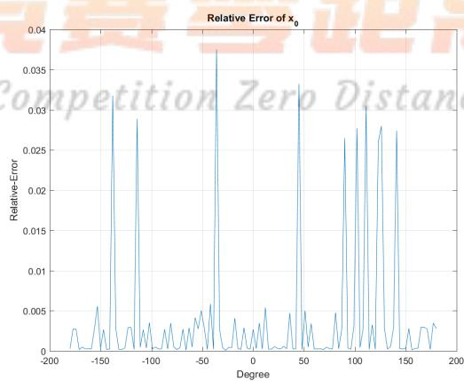

<details>
<summary>line</summary>

| Degree | Relative-Error |
| --- | --- |
| ~-140 | ~0.030 |
| ~-115 | ~0.029 |
| ~-35 | ~0.038 |
| ~45 | ~0.033 |
| ~90 | ~0.026 |
| ~105 | ~0.030 |
| ~120 | ~0.028 |
| ~145 | ~0.027 |
</details>

图 24: $x _ { 0 }$ 相对误差示意图

可见 60% 的角度中，x 的相对误差小于 0.5%。在初始角度位置为-41° 时，相对误差为取最大值 3.78%。经分析，误差达到 3.78% 的原因为解非线性规划时陷入局部最优解。这时用得到的解作为初始值，使用模拟退火算法继续求解，可以将最终的相对误差缩小到0.13%。

综上，本标定模板及配套算法具有较强的稳定性和精度。

## 8 模型评价与总结

本文从 CT 投影原理出发，利用平面及射影几何知识建立了正向与反向投影模型，提出并比较了多种重建与降噪算法，对于原问题给出了较好的结果；在第四问中，对于模型进行了精度与稳定性的分析，并提出了新的标定模型。

## 8.1 模型优点

1. 标定算法精度高，稳定性强，求解速度较快  
2. 分别使用连续与离散反投影模型进行求解，较为全面充分  
3. 利用几何特征，给出了改进标定模型的思路，提出新的标定模型并进行测试，结果优异

## 8.2 模型不足

1. 反投影重建与去噪算法耗时较长  
2. ART算法结果偏大，其投影矩阵取值可连续化，可改进以增强准确度

## References

[1] Kak A C. BOOKS AND PUBLICATIONS:”Principles of Computerized Tomographic Imaging”[J]. Medical Physics, 2002, 29(1):107.  
[2] J. Huang et al, ”Sparse angular CT reconstruction using non-local means based iterativecorrection POCS,” Computers in Biology and Medicine, vol. 41, (4), pp. 195-205, 2011.  
[3] 庄天戈. CT原理与算法 [M].上海交通大学出版社,1992.  
[4] 林世明, W.-M.Boerner. 离散 Radon 变换 [J]. 西北工业大学学报, 1988(2):49-56.

## Appendices

## .1 角度位置

表9: X射线 180个位置的与x轴正向夹角

<table><tr><td>-60.3465</td><td>-58.9927</td><td>-58.4392</td><td>-57.3520</td><td>-56.3152</td><td>-55.3470</td><td>-54.3514</td><td>-53.3492</td><td>-52.3488</td></tr><tr><td>-51.3451</td><td>-50.3459</td><td>-49.3468</td><td>-48.3491</td><td>-47.3514</td><td>-46.3465</td><td>-45.2003</td><td>-44.3505</td><td>-43.3528</td></tr><tr><td>-42.3490</td><td>-41.3496</td><td>-40.3502</td><td>-39.3516</td><td>-38.3537</td><td>-37.3564</td><td>-36.3487</td><td>-35.3504</td><td>-34.3550</td></tr><tr><td>-33.3521</td><td>-32.3497</td><td>-31.3434</td><td>-30.3517</td><td>-29.4518</td><td>-28.3523</td><td>-27.3519</td><td>-26.3522</td><td>-25.3505</td></tr><tr><td>-24.3534</td><td>-23.3539</td><td>-22.3525</td><td>-21.3523</td><td>-20.3545</td><td>-19.3512</td><td>-18.3533</td><td>-17.3460</td><td>-16.3515</td></tr><tr><td>-15.3551</td><td>-14.3528</td><td>-13.3536</td><td>-12.3510</td><td>-11.3514</td><td>-10.3534</td><td>-9.3519</td><td>-8.3544</td><td>-7.3513</td></tr><tr><td>-6.3511</td><td>-5.3563</td><td>-4.3532</td><td>-3.3533</td><td>-2.3518</td><td>-1.3552</td><td>-0.3528</td><td>0.6485</td><td>1.6469</td></tr><tr><td>2.6491</td><td>3.6442</td><td>4.6463</td><td>5.6470</td><td>6.6474</td><td>7.6470</td><td>8.6470</td><td>9.6470</td><td>10.6464</td></tr><tr><td>11.6467</td><td>12.6453</td><td>13.6469</td><td>14.6464</td><td>15.6463</td><td>16.6470</td><td>17.6441</td><td>18.6472</td><td>19.6452</td></tr><tr><td>20.6401</td><td>21.6465</td><td>22.6456</td><td>23.6455</td><td>24.6437</td><td>25.6467</td><td>26.6464</td><td>27.4426</td><td>28.6382</td></tr><tr><td>29.6437</td><td>30.6430</td><td>31.6476</td><td>32.6464</td><td>33.6388</td><td>34.6354</td><td>35.6369</td><td>36.6402</td><td>37.6348</td></tr><tr><td>38.6486</td><td>39.6403</td><td>40.6483</td><td>41.7423</td><td>42.6412</td><td>43.6367</td><td>44.6465</td><td>45.6403</td><td>46.6434</td></tr><tr><td>47.6447</td><td>48.6415</td><td>49.6479</td><td>50.6345</td><td>51.6392</td><td>52.6407</td><td>53.6385</td><td>54.6389</td><td>55.6372</td></tr><tr><td>56.6406</td><td>57.6412</td><td>58.6400</td><td>59.6404</td><td>60.6383</td><td>61.6404</td><td>62.6391</td><td>63.6405</td><td>64.6410</td></tr><tr><td>65.6377</td><td>66.6402</td><td>67.6469</td><td>68.6412</td><td>69.6404</td><td>70.6393</td><td>71.6403</td><td>72.6376</td><td>73.6369</td></tr><tr><td>74.6443</td><td>75.6328</td><td>76.6349</td><td>77.6383</td><td>78.6411</td><td>79.6428</td><td>80.6359</td><td>81.6393</td><td>82.6369</td></tr><tr><td>83.6399</td><td>84.6396</td><td>85.6400</td><td>86.6386</td><td>87.6434</td><td>88.6498</td><td>89.6660</td><td>90.6600</td><td>91.6689</td></tr><tr><td>92.6587</td><td>93.6596</td><td>94.6600</td><td>95.6580</td><td>96.6564</td><td>97.6565</td><td>98.6586</td><td>99.6548</td><td>100.6550</td></tr><tr><td>101.6541</td><td>102.6540</td><td>103.6547</td><td>104.6514</td><td>105.6532</td><td>106.6534</td><td>107.6540</td><td>108.6540</td><td>109.6541</td></tr><tr><td>110.6539</td><td>111.6530</td><td>112.6529</td><td>113.6530</td><td>114.6524</td><td>115.6399</td><td>116.6461</td><td>117.6509</td><td>118.6439</td></tr></table>

## .2 问题一求解代码

% s o l v e q u e s t i o n 1

l o a d f u j i a n

[ a l l A r g u , mdl\_1 , mdl\_2 , m d l p h i , m d l\_3 ] = c a l i b A r g u ( f u j i a n 2 ) ;

## .3 问题一调用标定函数

fu n c t i o n [ a l l A r g u , mdl\_1 , mdl\_3 ] = c a l i b A r g u ( d a t a )

%% ge n e r a te th e o ri ngn data

% loa d b e ta 0  
```matlab
iangle = 1:180;
inum = length (iangle);
for i = 1:inum
    xx(i*512-511:i*512,1) = 1:512;
    xx(i*512-511:i*512,2) = i;
end
yy = reshape(data(:,iangle),[512*inum,1]);
```

%% f i r s t t r y  
```matlab
tic
d0 = 0;
x0 = 0 ;
y0 = 0;
mu = 1.7724;
phi0 = deg2rad(1:180);
b0 = [d0,x0,y0,mu,phi0];
% initial
(5:end) = phi_ii;
opts = statset('TolFun',1e-5);
mdl_1 = fitnlm(xx,yy,@detect,b0,'Options',opts);
beta = mdl_1.Coefficients.Estimate;
toc
beta(5:end) = mod(beta(5:end),2*pi);
plot(2,2,1),plot(beta(5:end));
smooth angle
i = beta(5:end);
i = smooth(phii,50,'rlowess');
plot(1:180,phii,1:180,phii)
plot(2,2,2),plot(phii);
solve other para
pal phiN;
i = phii;
= beta(1:4);
_2 = fitnlm(xx,yy,@detectArg,b0,'Options',opts);
0 = mdl_2.Coefficients.Estimate;
```

%% s o l v e s i n g l e a n g l e  
```txt
global betai;
```

```matlab
betai = arg0;
xphi = 1:512;
phiNew = zeros(1,180);
for iphi = 1:180
    yphi = data(:,iphi);
    mdlphi = fitnlm(xphi,yphi,@detectAngle,phii(iphi));
    phiNew(iphi) = mdlphi.Coefficients.Estimate;
end
subplot(2,2,3),plot(phiNew);
```

```matlab
%% resolve all argu
    b0 = [arg0',phiNew];
    % initial
%b0(5:end) = phi_ii;
    opts = statset('TolFun',1e-5);
    mdl_3 = fitnlm(xx,yy,@detect,b0,'Options',opts);
    betaf = mdl_3.Coefficients.Estimate;
    toc
allArgu = betaf;
subplot(2,2,4),plot(betaf(5:end));
```

%% e r r o r

end

## .4 NLM 算法

```matlab
function Y=NLM(X)
%5*5
h=0.5;
XX=reshape(X,256,256);
YY=XX;
for m=5:252
    for n=5:252
        S=0;
        D=0;
```

```matlab
V0=XX(m-2:m+2,n-2:n+2);
for i=-2:2
    for j=-2:2
        V=XX(m+i-2:m+i+2,n+j-2:n+j+2);
        u=sum(sum((V-V0).^2),2);
        S=S+exp(-u/h^2)*XX(m+i,n+j);
        D=D+exp(-u/h^2);
    end;
end;
YY(m,n)=S/D;
end;
end;
Y=reshape(YY,65536,1);

end
```

## .5 FBP 算法

```matlab
L = 512;
width = 2^nextpow2(size(R,1));

%fft
p_fft = fft(R, width);

% Ramp filter function from 0 to width then to 0
filt = 2*[0:(width/2-1), width/2:-1:1]'/width;
p_filt = zeros(width,180);
for i = 1:180
    p_filt(:,i) = p_fft(:,i).*filt;
end

%ifft
p_ifft = real(ifft(p_filt));

%back-projection
fbp = zeros(L);
for i = 1:180
    rad = deg2rad(THETA(i));
    for x = (-L/2+1):L/2
```

```matlab
for y = (-L/2+1):L/2
    t = round(x*cos(rad+pi/2)+y*sin(rad+pi/2));
    fbp(x+L/2,y+L/2)=fbp(x+L/2,y+L/2) + p_ifft(max(1, min(t+round
end
end
end
fbp = fbp/180;

fbp=fbp(76:436,76:436);
fbp=imresize(fbp,[256,256]);
fbp=max(0,fbp);

imshow(fbp), title('FBP')
```

## .6 ART 算法

f u n c t i o n X=ART\_F ( P , THETA , d e l t a , d0 , x0 , y0 )  
```matlab
tic;
I=92160;
lambda=0.25;
X=zeros(65536,1);
MAX_ITER=5;

for k=1:MAX_ITER
    for i=1:I
        R=weightjudge(i,THETA,delta,d0,x0,y0);
        if sum(R)~=0
            X=X+1lambda*(P(i)-R*X)/(R*R')*R';
            X=max(X,0);
        end;
    end;
    X=NLM(NLM(X));
    %imshow(reshape(X,256,256));
end;
toc;
end
```  
fu n c t i o n R= w e i g h tj u d g e ( i , THETA, d e l t a , d0 , x0 , y0 )

```matlab
n=mod(i-1,512)+1;
t=floor((i-1)/512)+1;
theta=THETA(t);

R=zeros(256,256);
d=(n-256.5)*delta+d0;
if d>=-50&&d<50
    R(:,floor(256*d/100)+129)=1;
    R=imrotate(R,theta,'crop');
end;
R=reshape(R,1,65536);
```

end

## .7 问题四检验精度稳定性

```matlab
% assigned the standard arguments
% get the detect data
iangle = 1:180;
inum = length(iangle);
for i = 1:inum
    xx(i*512-511:i*512,1) = 1:512;
    xx(i*512-511:i*512,2) = i;
```

end

```matlab
d0 = 5;
mu = 1.5;
x0 = -8; y0 = 10;
phi0 = deg2rad((1:180));
%Res = zeros(512, 180);
b = [d0,x0,y0,mu,phi0];
Res = detect(b,xx);
Res = reshape(Res,[512,180]);
%subplot(1,2,1)
imagesc(Res),
```

```matlab
% Res = Res + 100*(rand(512,180) - 0.5);
%subplot(1,2,2),imagesc(Res),
% saveas(gcf,'zaoyin3.png')
```

f i g u r e  
```javascript
[ allArgu ,mdl_1 ,mdl_3 ] = calibArgu(Res);
```

%%  
```txt
phi1 = allArgu(5:end)';
```

```python
err = sqrt(sum((phi1 - phi0).^2)/179)
```

```txt
stem (phi1 - phi0)
```

## .8 问题四自建模板仿真分析函数

具体代码见支撑材料。

```matlab
function [var, thisData, data] = fitRotation(input)
    SampleNum = 18;
    load Res;
    data = Res(:, (1:10:180));

    x0 = input(1);
    y0 = input(2);
    d0 = input(3);
    phi = input(4:4+SampleNum-1);
    phi = deg2rad(phi + 180*ones(1, SampleNum));
    thisData = zeros(512 ,SampleNum);
    mu = 1.7725;
    R1 = 5;
    R2 = 10;
    R3 = 5;
    for iPhi = 1 : SampleNum
        for n = 1 : 512
            theta = phi(iPhi);
            d = d0 - 0.2768 * (256.5 - n);
            thisData(n, iPhi) = 2 * mu * (sqrt(max(0, R1^2 - ...
                (tan(theta) * (-30) -x0 * tan(theta) + y0 - ...
                d/cos(theta))^2 / (1+tan(theta)^2)))+...
            sqrt(max(0, R2^2 - (tan(theta) * (30) -x0 * tan(theta) ...
                + y0 - d/cos(theta))^2 / (1+tan(theta)^2)));
        end
    end
```

```matlab
var = sum(sum((thisData - data).^2));
end

R2_start = 1;
R1_start = 1;
%% First Frame
for R2_start = 1 : 512 - 71
    if min(Res(R2_start:R2_start + 71 - 1, 1) > 0 ) == 1 || ...
    min(Res(R2_start:R2_start + 73 - 1, 1) > 0 ) == 1
        break;
    end
end

for R1_last = 512 : -1 : 35
    if (min(Res(R1_last - 35 + 1: R1_last, 1) > 0 ) == 1 || ...
        min(Res(R1_last -37+ 1:R1_last, 1) > 0 ) == 1)...
            && min(Res(R1_last - 38 + 1: R1_last, 1) > 0 ) == 0 ...
                    &&min(Res(R1_last - 35+ 1: R1_last + 1, 1) > 0 ) == 0
        break;
    end
end

R1_c1 = R1_last - 18;
R2_c1 = R2_start + 36;
phi0 = rad2deg(asin((R1_c1 - R2_c1)*0.2768/60));

%% Second Frame
for R2_start = 1 : 512 - 71
    if min(Res(R2_start:R2_start + 71 - 1, 180) > 0 ) == 1 ...
    || min(Res(R2_start:R2_start + 73 - 1, 180) > 0 ) == 1
        break;
    end
end

for R1_last = 512 : -1 : 35
    if (min(Res(R1_last - 35 + 1: R1_last, 180) > 0 ) == 1 ...
        || min(Res(R1_last -37+ 1:R1_last, 180) > 0 ) == 1)...
            && min(Res(R1_last - 38 + 1: R1_last, 180) > 0 ) ...
                    == 0 &&min(Res(R1_last - 35+ 1: R1_last + 1, 180) > 0
```

break ; end end  
```txt
R1_c2 = R1_last - 18;
R2_c2 = R2_start + 36;

R_p = (R1_c1 + R2_c1 + R1_c2 + R2_c2) / 4;

d1 = (R1_c1 + R2_c2)/ 2;
```  
%% Third Frame

```matlab
for R2_start = 1 : 512 - 71
    if min(Res(R2_start:R2_start + 71 - 1, 90) > 0 ) == 1 ...
    || min(Res(R2_start:R2_start + 73 - 1, 90) > 0 ) == 1
        break;
    end
end

for R1_last = 512 : -1 : 35
    if (min(Res(R1_last - 35 + 1: R1_last, 90) > 0 ) == 1 ...
        || min(Res(R1_last -37+ 1:R1_last, 90) > 0 ) == 1)...
            && min(Res(R1_last - 38 + 1: R1_last, 90) > 0 ) ...
                == 0 &&min(Res(R1_last - 35+ 1: R1_last + 1, 90) > 0 )
        break;
    end
end

R1_c3 = R1_last - 18;
R2_c3 = R2_start + 36;

O1 = (R1_c1 + R2_c1)/2; % P□□
O2 = (R1_c2 + R2_c2)/2;
O3 = (R1_c3 + R2_c3)/2;
R_p = (R1_c1 + R2_c1 + R1_c2 + R2_c2) / 4;

R_r = 0.2768 * sqrt((O1 - R_p)^2 + (O3 - R_p)^2);
R_theta0 = 180 + rad2deg(atan((O1 - R_p) / (O3 - R_p)));
```

```matlab
R_theta = phi0 - R_theta0;
phi0 = phi0;
x0 = R_r * cos(deg2rad(R_theta));
y0 = R_r * sin(deg2rad(R_theta));
d0 = 256 - R_p;

x_init = [ x0, y0, d0, phi0:10:phi0+10*17];

A = [];
b = [];
Aeq = [];
beq = [];
lb = [];
ub = [];
nonlcon = [];
options = optimoptions('fmincon','Display','iter',...
'Algorithm','sqp', 'MaxFunEvals',15000, 'TolFun', 1.000000e-10);

% phi
R1 = 5;
R2 = 10;
R3 = 5;
d0 = 1;
mu = 1.7725;
x0 = -0; y0 = 6;
phi = deg2rad((-30:149) + 180*ones(1, 180) + rand(1, 180));
Res = zeros(512, 180);
for iPhi = 1 : 180
    for n = 1 : 512
        theta = phi(iPhi);
        d = d0 - 0.2768 * (256.5 - n);
        Res(n, iPhi) = 2 * mu * (sqrt(max(0, R1^2 - ...
            (tan(theta) * (-30) -x0 * tan(theta) + y0 - d/cos(theta))^2 ..
            / (1+tan(theta)^2)))+...
        sqrt(max(0, R2^2 - (tan(theta) * (30) -x0 * tan(theta) ...
            + y0 - d/cos(theta))^2 / (1+tan(theta)^2)));

    end
end
```

i n d e x = fi n d ( Res > 0 ) ;

Re s ( i n d e x ) = Re s ( i n d e x ) + 0 . 0 1 ;%n o r m r n d ( 0 , 0 . 1 , [ l e n g t h ( i n d e x ) , 1 ] ) ;

s a v e ( ’ Res . mat ’ , ’ Res ’ )


<details>
<summary>natural_image</summary>

Abstract graphic of a stylized human figure with a star and gradient background (no text or symbols)
</details>

##