## 摘 要

本文研究了如何分析“拍照赚钱”问题的定价策略，并为其设计完成率更高的任务定价方案的问题。已知一个已结束项目的任务数据，包含了每个任务的位置、定价和完成情况，已知一组会员信息数据，包含了会员的位置和信誉值，我们通过分析已知的数据，定性地给出了此项目的定价规律，并指出了这一规律在实际应用中的不足。针对这一项目，我们给出了自己的定价方案，并利用自己建立的评估机制对两种方案进行了比较。

在关于问题 的讨论中，针对给定的已完成的项目，我们利用所给经纬度信息，得到了任务的地理分布和会员的地理分布，通过分析任务点定价的分布与任务点的密度分布，我们发现任务点的定价与其周边的任务点数量和会员数量（我们用任务密度和会员密度来刻画）都呈负相关关系。通过绘制不同价格的任务分布图，我们发现任务的定价与其所在地区的经济发展水平呈负相关关系。在这一问的讨论中，我们还给出了定价方案的两个简单公式。

对于问题 2，我们引入了吸引力因子 $\mathrm { F _ { i j } }$ ，用两种方法刻画任务点对会员的吸引力。一种方法仿照库仑定律表达式量化，建立了吸引力因子与任务价格、会员信誉和会员到用户的距离的关系；另一种方法则考虑会员完成任务时经过路径上的所有任务点，建立了另一个 $\mathrm { F _ { i j } }$ 的表达式。两种方法还分别给出了不同的用户分配的机制，之后可以直接用这种机制进行模拟。最后，我们还引入了模型的评估机制，定义了每种价格的任务的完成率 $\mathrm { C _ { i } }$ 以及总完成率 C，以及用户总盈利、平台总收益等评价指标。

对于问题3，我们先利用 K-means 聚类算法对任务点进行了聚类，随机取圆心并将其邻域中的任务点联合在一起发布。参照经济学中的搭售模型，通过简单不等式的处理，我们估算出了搭售过程中定价的上下界。针对问题 2中的两种方法，我们对其中吸引力因子 $\mathrm { F _ { i j } }$ 的表达式进行了推广，给出了联合发布情形中 $\mathrm { F _ { i j } }$ 的表达式。但是，通过程序模拟，我们发现，联合发布的做法对完成率几乎没有影响，但是影响到用户总盈利、平台总收益等。

对于问题 4，我们发现新项目的地理分布与问题 1 中已结束项目的地理分布相似，于是我们套用了之前定价模型的两个公式，并用问题 中的分配机制和评估机制进行模拟，得出了其较好的定价公式，并估算了完成率。这一部分相当于问题 2中算法的实现过程。

最后，我们还对我们的模型进行了推广与应用。

关键词：众包 搭售 聚类分析 模拟

## “拍照赚钱”的任务定价

## 1.问题重述

随着互联网应用的迅速发展，众包已经遍布全球。众包是一个公司或机构将其工作任务通过网络外包给大众的行为。题目中的“拍照赚钱”是一种典型的众包环境下的自助式服务，它要求会员下载相关 APP 后，在 APP 上领取拍照任务并完成，获得报酬。这种自助式众包平台，多为企业提供商业检查和信息搜集，通过大量个体会员的积极参与，它可以极大地提高企业的工作效率，并显著降低企业的工作成本。作为联系企业与会员的桥梁，APP成为众包平台的重要组成部分，APP中对任务的定价方式和分配方式，都会影响到总任务的完成度。因此，研究任务定价和任务分配，对整个众包平台的运营具有重要意义。

现要解决以下的问题：给定一个已结束项目的任务数据，包含了每个任务的位置、定价和完成情况（“1”表示完成，“0”表示未完成）；给定一组会员信息数据，包含了会员的位置、信誉值、参考其信誉给出的任务开始预订时间和预订限额，原则上会员信誉越高，越优先开始挑选任务，其配额也就越大（任务分配时实际上是根据预订限额所占比例进行配发）；给定一个新的检查项目任务数据，只有任务的位置信息。

1. 研究所给已结束项目的任务定价规律，分析任务未完成的原因。  
2. 为所给的已结束项目设计新的任务定价方案，并和原方案进行比较。  
3. 实际情况下，多个任务可能因为位置比较集中，导致会员会争相选择，一种考虑是将这些任务联合在一起打包发布。在这种考虑下，如何修改前面的定价模型，对最终的任务完成情况又有什么影响？  
4. 对所给新项目给出你的任务定价方案，并评价该方案的实施效果。

## 2.问题的分析

通过对问题的研究，我们发现，任务的价格标定及其完成与否，可能与任务点所在的地理位置及附近会员位置有关。

对问题1，我们可以考虑任务所在地的交通状况、经济发展水平和地形条件等因素，也可从会员位置与任务位置之间的关系上考虑，建立模型。

对问题2，我们可以引入一种“吸引力”的评判标准，利用任务点与会员位置之间的关系给出合适的价格。

对问题 3，我们可以将一定大小邻域内的几个任务点进行“打包”，对在问题 2 中所构建的模型稍作修改，联系经济学中的相关模型，给出一个定价方案。

对问题4，我们可以利用在问题 3中建立的模型，给出一个定价方案，并以任务完成情况作为参考进行评估。

## 3.模型假设

（1） 假设所给任务点所在地区之间存在经济发展水平差异。  
（2） 假设会员都试图为自己谋求更多的利益，即任务定价与该任务对会员的吸引力正相关。  
（3） 假设会员同等条件下会员更倾向于接受距离自己更近的任务，即任务点距会员的距离与该任务对会员的吸引力负相关。  
（4） 假 设 两 坐 标 点 之 间 的 距 离 都 可 近 似 为 欧 氏 距 离 ， 其 换 算 公 式 为$\Delta \approx { \sqrt { 0 . 1 6 \left( x _ { 1 } - x _ { 2 } \right) ^ { 2 } + 1 . 2 7 6 9 \left( y _ { 1 } - y _ { 2 } \right) ^ { 2 } } }$ ，其中 x，y 分别代表第一点的经纬度，x，y 分别代表第二点的经纬度。  
（5） 假设会员均积极接受任务，即信誉值高、开始预定时间早的会员总是比信誉值低、开始预订时间晚的会员先选择任务。  
（6） 因所给会员信誉值差异过大，我们在保持原始序关系的前提下，将会员信誉值控制 在 0.2\~0.8 范 围 内 , 其 转 换 关 系 式 为

$$
\varphi \left(m _ {i}\right) = 0. 0 6 7 9 3 0 9 9 7 \cdot \log_ {1 0} m _ {i} + 0. 4 7 1 7 2 3 9 8 7
$$

## 4.符号约定与说明

<table><tr><td>n</td><td>任务点个数</td></tr><tr><td>m</td><td>会员数</td></tr><tr><td> $Q_i$ </td><td>任务价格的取值</td></tr><tr><td> $n_i$ </td><td>价格为  $Q_i$  的任务的数量</td></tr><tr><td> $C_i$ </td><td>价格为  $Q_i$  的任务的完成率</td></tr><tr><td> $F_{ij}$ </td><td>任务  $Y_i$  对会员  $X_j$  的吸引力因子</td></tr><tr><td> $p_i$ </td><td>任务点  $Y_i$  的价格</td></tr><tr><td> $r_{ij}$ </td><td>任务点  $Y_i$  与会员  $X_j$  之间的距离</td></tr><tr><td> $k_{ij}$ </td><td>任务  $Y_i$  对会员  $X_j$  的困难因子</td></tr><tr><td> $C_i$ </td><td>任务的完成率</td></tr><tr><td>S</td><td>总报酬</td></tr><tr><td> $m_i$ </td><td>会员的信誉值</td></tr><tr><td> $λ_i$ </td><td>选择价格  $Q_i$  的会员点的数量</td></tr><tr><td> $η_{ik}$ </td><td>会员  $i_k$  完成任务的概率</td></tr></table>

## 5.问题的解决

## 5.1 问题 1 的模型

## 5.1.1 分析任务定价的规律

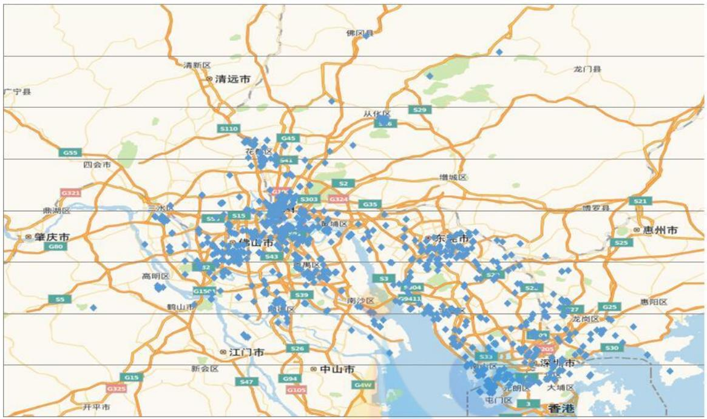

<details>
<summary>text_image</summary>

佛冈县
广宁县
清新区
清远市
龙门县
S110
从化区
S29
G45
花台区
S41
S2
G321
四会市
惠湖区
三水区
G75
S303
G324
G35
南埔区
增城区
博罗县
S21
肇庆市
G80
佛山市
东莞市
高明区
S43
S2
S3
S2-104
S39
S33
S26
S25
新会区
G15
G325
开平市
中山市
G94
G105
G4W
G4W
G15
S47
G94
G325
龙岗区
S30
S33
大埔区
元创区
屯门区
香港
</details>

图 1 任务的具体地理分布

通过分析附件一中所给出的 GPS经纬度，我们可以发现该“拍照赚钱”案例发生的地点为珠三角地区，下面将结合地理经济学的观点和附件一中的具体数据来分析该项目的任务定价规律。

从图2 我们可以定性地分析该项目的任务定价的规律。

第一，任务密度分布是影响任务定价的重要因素，二者呈负相关关系。由附件一数据得到的任务定价的地理分布（图 2）和任务密度分布（图 3）显示，所在区域任务点密度大的任务定价较低，所在区域任务点密度小的任务定价较高。从会员的角度思考，在其他条件相同的情况下，会员将更倾向于接受任务点稠密的地区的任务，以便同时完成多个任务，获得更大收益。

第二，任务定价受任务所在地区会员密度的影响，二者呈负相关关系。由附件一中数据得到的任务定价的地理分布（图 2）和会员密度分布（图4）显示，所在区域会员密度大的任务定价较低，所在区域会员密度小的地方定价较高。这是由于在会员密度大的区域，任务有更大可能被接受和完成，而在会员密度较小的区域，必须通过提高任务定价来达到吸引会员来完成的目的。

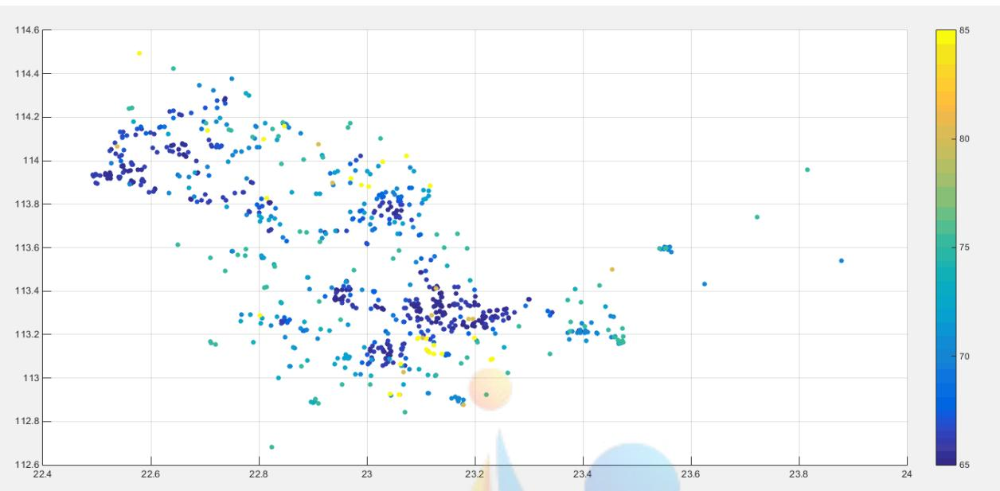

<details>
<summary>scatter</summary>

| Series | X (range) | Y (range) |
| --- | --- | --- |
| Data Points | 22.4~23.9 | 112.7~114.5 |
</details>

图 2 任务定价的地理分布

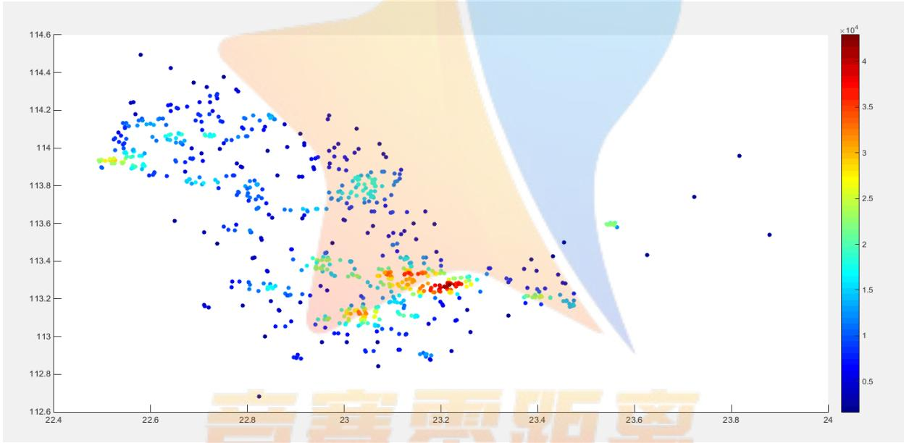

<details>
<summary>scatter</summary>

| X (range) | Y (range) | Value \(( \times 10^{4})\) |
| --- | --- | --- |
| 22.4~23.9 | 112.6~114.6 | 0.5~4.5 |
</details>

图 3 任务密度分布

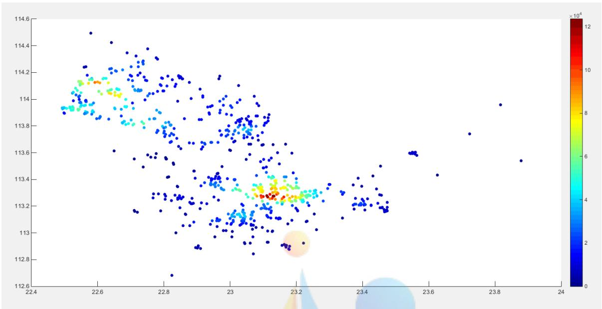

<details>
<summary>scatter</summary>

| X (range) | Y (range) | Value (x 10^4) |
| --- | --- | --- |
| 22.5~23.9 | 112.7~114.5 | 0~12 |
</details>

图 4 会员密度分布

第三，区位因子对任务定价有重要影响。所给任务点主要分布于佛山、广州、东莞、深圳四市，绘制出不同价格段的任务点分布可知，定价为 $6 5 ^ { \sim } 6 6 . 5$ 的任务点集中于四市中心（图5），定价为 $6 7 \mathrm { \sim } 6 9$ 的任务点分布于城市外围（图 6），定价为 $7 0 ^ { \sim } 7 4$ 和 $7 5 ^ { \sim } 8 5$ 的任务点分布于四市周边城镇（图7）。显然，任务的定价与任务所在地区的经济发展水平是负相关的。

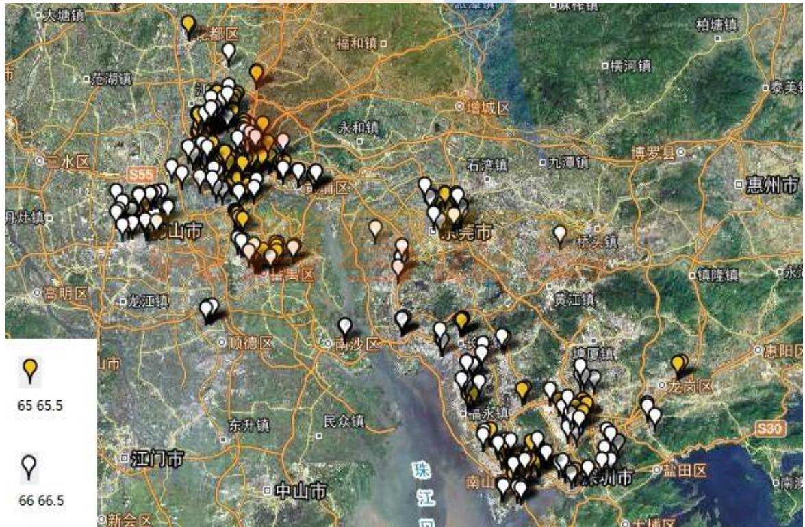

<details>
<summary>text_image</summary>

65 65.5
66 66.5
</details>

图 5 部分任务点分布情况

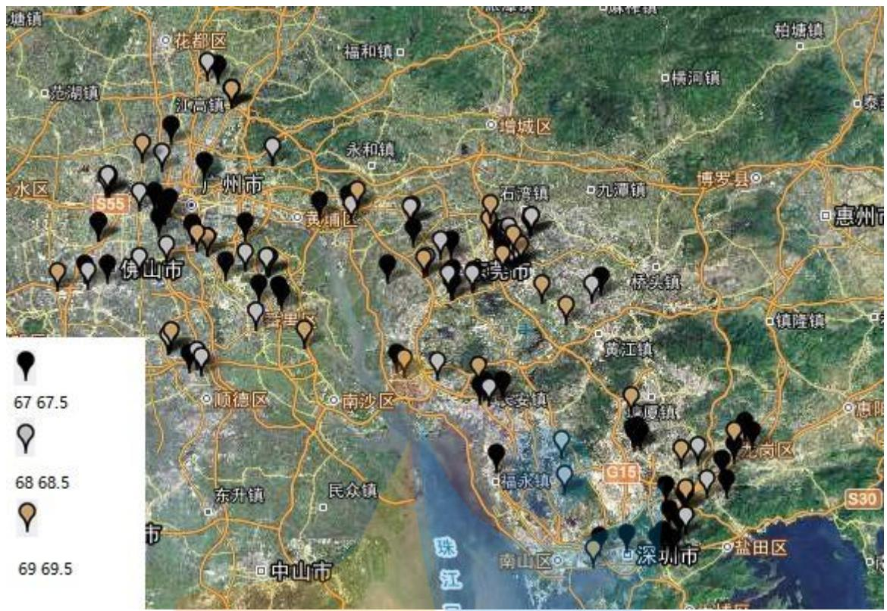

<details>
<summary>text_image</summary>

塘镇
花都区
福和镇
柏塘镇
范湖镇
永和镇
增城区
水区
S55
广州市
黄浦区
石湾镇
九潭镇
博罗县
惠州
伊山市
番禺区
南沙区
东升镇
民众镇
G15
惠阳
镇隆镇
中山区
深圳市
盐田区
S30
67 67.5
68 68.5
69 69.5
</details>

图6 部分任务点分布情况  
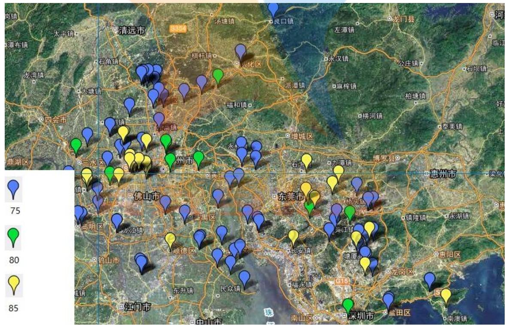

<details>
<summary>text_image</summary>

75
80
85
</details>

图7 部分任务点分布情况

## 5.1.2 定价的给出

基于我们的分析，一个任务点定价的高低，取决于周边的会员和任务点数量，而“周边”的刻画，本质上就是任务点的小邻域。邻域不同的面积对应着不同的会员和任务点数量，要使其成为一个相对稳定的值，我们不妨定义会员密度 $\rho _ { \mathrm { _ { 1 } } }$ 和任务点密度 $\rho _ { 2 }$ ，表示单位面积的会员数量和任务点数量。但是，由于会员和任务点位置是一个个离散的点，单取一个邻域对会员密度和任务点密度的影响误差太大。因此，我们采取的方案是让邻域的半径在某一区间内变化，在每一个半径的位置计算一次会员密度和任务点密度，然后取平均值。由于半径的变化精度很高，我们可以近似看成是连续变化。

也就是说，我们得到以下公式：

$$
\rho_ {1} (P, r) = \frac {\# \left\{\text {会员} Q : Q \in U _ {r} (P) \right\}}{\pi r ^ {2}}, \rho_ {2} (P, r) = \frac {\# \left\{\text {任务点} Q : Q \in U _ {r} (P) \right\}}{\pi r ^ {2}},
$$

其中#A 表示 A 中的元素个数。让 r 变化，算出不同的 $\rho _ { _ 1 } \left( P , \boldsymbol { r } \right) , \rho _ { _ 2 } \left( P , \boldsymbol { r } \right)$ ，之后对其取平均值即得到 $\rho _ { \mathrm { 1 } } \left( P \right) , \rho _ { \mathrm { 2 } } \left( P \right)$ ，分别表示 P 点的会员密度、任务点密度。

下面定性分析定价 $P _ { i }$ 与会员密度 $\rho _ { \mathrm { 1 } }$ 和任务点密度 $\rho _ { 2 }$ 的相关性。考虑某一个任务点，根据经济学原理，会员密度 越高，意味着有更多的会员可以去完成这项任务，价格 $\rho _ { \mathrm { _ { 1 } } }$ 显然应该下降；而任务点密度 越高，意味着该任务点附近还有很多任务可以去完成， $\rho _ { 2 }$ 价格也应该下降。因此， $P _ { _ i }$ 与 $\rho _ { \mathrm { 1 } } \cdot \mathrm { ~ \ } \rho _ { \mathrm { 2 } }$ 均为负相关。

设 $P _ { _ { i } } = G _ { _ { i } } \left( \rho _ { _ { 1 } } , \rho _ { _ { 2 } } \right)$ .我们可以考虑两个比较简单的方案，用如下公式表示：

$P = C \left( \frac { 1 } { \rho _ { \mathrm { { 1 } } } } + \frac { 1 } { \rho _ { \mathrm { { 2 } } } } \right)$ C其中 为常数.公式 I：

$P = C \left( \frac { 1 } { \rho _ { \mathrm { 1 } } + \rho _ { \mathrm { 2 } } } \right)$ C,其中 为常数.公式 II：

计算相关系数可得，公式 I 中得到的 $\frac { 1 } { \rho _ { \scriptscriptstyle 1 } } + \frac { 1 } { \rho _ { \scriptscriptstyle 2 } }$ 的值与给出的定价值相关系数为0.107369，而公式 II 中得到的 $\frac { 1 } { \rho _ { 1 } + \rho _ { 2 } }$ 的值与给出定价值相关系数为 0.639486。因此，我们可以认为，附件一中的定价方案更加接近公式 II。

## 5.1.3分析部分任务未完成的原因

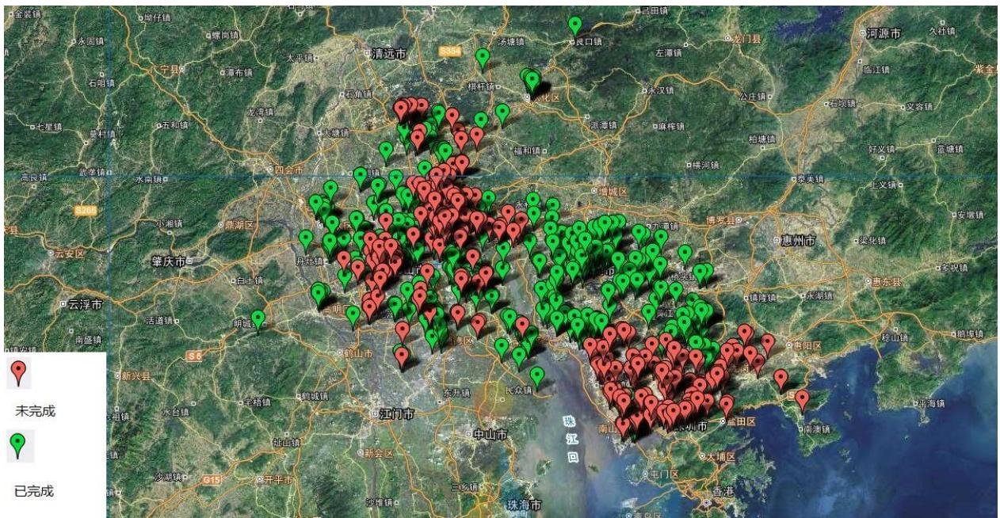

<details>
<summary>text_image</summary>

未完成
已完成
</details>

图 8 任务完成情况及其分布

从图8 我们可以看出，未完成的任务数量较多且分布较为集中。可以归结为以下四点原因。

第一，依据经济发展水平定价的策略不合理。在经济发达区域整体价格偏低，任务对会员的吸引力不足，无法吸引足够多的人去完成，而这些地方又正是任务密集需要吸引大量会员参与的地方，因此导致了广州、深圳市中心等地区任务完成度的偏低。

第二，当前定价模型考虑因素较少，通过卫星图可知交通便利程度并未被纳入定价考虑范围内，导致部分任务难度大、价格低，无人接受。

第三，任务分配制度的不合理。信誉值较高者多分布于城区，他们的优先选择权使他们趋向于城郊定价更高的任务，而使城区内定价较低任务的完成率偏低。部分信誉较低的人被分配了较多任务却未完成，拉低了完成率。

第四，不同地区存在的信息的不对称，导致实际完成情况出现了地区间的明显差异。

## 5.2 问题 2 的模型建立

## 5.2.1 吸引力因子的引入

我们可以引入“吸引力因 $\vec { \mathbb { J } } ^ { \prime \prime } \ell [ F _ { i j } ^ { \prime } | ,$ 来评判任务点 $Y _ { _ { i } }$ 对会员 $\Gamma _ { j }$ 的吸引作用，我们不妨假定，吸引作用越强，会员越有可能去做该任务。

吸引力因子决定了会员对任务的选择方式，即任务的分配问题。

## 5.2.2 综合分析模型

定性判断可知，所定义的吸引力一定是与任务点的定价正相关的，任务点的价格越高，会员自然越希望去完成这个任务。会员的信誉度也和吸引力正相关，从运营方的角度来说，派信誉高的会员去做任务，可以提高完成率。类似分析可以发现，吸引力与会员到任务点的距离应该是负相关的，同样的价格，会员自然希望去做更近的任务。但经过前面的分析，完成度的差异说明，各个地区对任务的完成度有很大差异，我们把这些差异带来的影响统一为一个参数——困难因子，来刻画综合区位因素、经济发展水平、信息不对称导致信息接收不及时等原因造成的客观条件上的吸引力削弱。

我们联想到了库伦定律的表达式

$$
F = k \frac {q _ {1} q _ {2}}{r ^ {2}},
$$

可以把任务点类比成负电荷，会员类比成正电荷，它们之间的吸引力因子 $F _ { _ { i j } }$ 可以用类似的公式给出，但是在这里我们作了一些修改，公式如下：

$$
F _ {i j} \triangleq \frac {k _ {i j} p _ {i} \varphi (m _ {j})}{r _ {i j} ^ {\alpha}},
$$

其中 $\alpha$ 为参数， 为任务点 $p _ { i }$ $Y _ { _ { i } }$ 的价格， $r _ { i j }$ 为任务点 $Y _ { _ { i } }$ 与会员 $X _ { _ { j } }$ 之间的距离， $k _ { _ { i j } }$ 即为刚刚定义的困难因子，对于不同的地区， $k _ { i j }$ 可以不是常数，其他影响因素都可以吸收到 $k _ { i j }$ 中。

我们的目标是完成会员与任务的完全匹配。基于这个目标，我们可以给出如下的算法。

S1：对所有会员进行预定任务开始时间从早到晚的排序，时间相同者，按照信誉度由高到低排序。  
S2：开始时间最早的会员中信誉度最高的 $X _ { 1 }$ 首先挑选出对其吸引力因子最大的 $N _ { 1 }$ 个任务，其中任务个数 $N _ { _ 1 }$ 不超过会员 $X _ { 1 }$ 预定任务的限额。

S3：在所有任务的集合中删除 $N _ { \imath }$ 个已选任务，避免后面的会员重复选择。

S4：排序第二的会员 $X _ { 2 }$ 挑选 $N _ { 2 }$ 个任务，其中任务个数 $N _ { 2 }$ 不超过会员 $X _ { 2 }$ 预定任务的限额。

S5：不断循环往复，直到每个会员都分配到了任务（包括新会员），且任务已经分配完成。

## 5.2.3 单位长度期望模型

在这个模型中，我们沿用吸引力因子这个概念。

另一种直观的想法是，会员选择任务点的标准应该是“拿更多的钱，走更少的路”。也就是说，通过单位距离所能够得到的钱对吸引力因子产生了很大的影响。然而，还有经济水平、区位等因素的存在，我们可以仿照前一个模型，把其他因素都吸收到一个参数 $k _ { j }$ 中。

我们得到如下公式：

$$
F _ {i j} = k _ {j} \frac {\sum_ {k = 1} ^ {N _ {j}} p _ {i _ {k}}}{\left| I _ {j} \right|},
$$

其中 $I _ { j }$ 表示从 $X _ { j }$ 会员点出发的一条路径，经过 $N _ { _ { j } }$ 个任务点 $i _ { 1 } , i _ { 2 } , \ldots , i _ { { \scriptscriptstyle N } _ { j } }$ 。设$\boldsymbol { i } ^ { \aa } = \left( i _ { 1 } , i _ { 2 } , \ldots , i _ { N _ { j } } \right)$ 。此时，单位长度会员盈利的期望即为 $\sum _ { \underline { { k = 1 } } } ^ { N _ { j } } { p _ { i _ { k } } }$ ，其中 $\left| { { I } _ { j } } \right|$ 表示路径 $I _ { \mathbf { \Phi } _ { j } }$ 的长度， $k _ { j }$ 则为此路径的困难程度。

关于会员任务分配的机制，我们给出如下算法：

S1：对所有会员进行预定任务开始时间从早到晚的排序，时间相同者，按照信誉度由高到低排序。  
S2：开始时间最早的会员中信誉度最高的 $X _ { 1 }$ 首先挑选出对其吸引力因子最大的 $N _ { \scriptscriptstyle 1 }$ 个任务，其中任务个数 $N _ { _ 1 }$ 不超过会员 $X _ { 1 }$ 预定任务的限额。方案如下：

2a)该会员以其坐标为基准，遍历 n 个任务点，分别计算每个点对自己的吸引力因子，取吸引力最大的任务点为 $I _ { 1 }$ 路径的第一个点 $\dot { I _ { 1 } }$ 。

2b)以 $\dot { I _ { 1 } }$ 为基准，遍历剩下的任务点，分别计算到每个点的吸引力，取吸引力最大的点为 $I _ { 1 }$ 路径的下一个备选点（记为 $i _ { 0 } ^ { \phantom { \dagger } } )$

2c)若将备选点 $\dot { \boldsymbol { I } _ { 0 } }$ 加到 $I _ { 1 }$ 上后，新的路径的吸引力因子不小于原来路径的吸引力因子，则将备选点加入到路径 $I _ { 1 }$ 上，返回 2b)。否则终止循环，得到路径 $I _ { 1 }$ ，设 $I _ { 1 }$ 上的点为 $i _ { 1 } , i _ { 2 } , \ldots , i _ { { } _ { N _ { 1 } } ^ { ' } } ,$ 共 $N _ { 1 } ^ { ' }$ 个点。

S3：设会员 $X _ { 1 }$ 分配的限额为 $N _ { \widehat { \imath } _ { 1 } \widehat { \jmath } _ { 1 } } , _ { \widehat { \jmath } _ { 1 } \widehat { \jmath } _ { 1 } }$ 得到使 $F _ { i 1 }$ 最大的 $N _ { \mathrm { i } }$ 个任务 $i _ { 1 } , i _ { 2 } , \dots , i _ { { } _ { N _ { 1 } } }$ ，其中$N _ { 1 } = \mathrm { m i n } \left\{ N _ { 1 } ^ { ' } , N _ { 1 } ^ { ' } \right\}$ 。将这 $N _ { 1 }$ 个任务从剩余任务中删除。

S4：重复以上操作，给第二个会员分配任务，直至任务分配完成为止。

## 5.2.4 模型的评估与反馈

为了评估这个算法，我们需要引入一些变量。定义 $p _ { 1 } , p _ { 2 } , \ldots , p _ { n }$ 的取值集合为$\left\{ Q _ { 1 } , Q _ { 2 } , \ldots , Q _ { r } \right\}$ ，其中 $\ Q _ { 1 } \ < \ Q _ { 2 } \ < \ . . . < \ Q _ { r }$ 。定义 $C _ { i }$ 为选择了价格为 $Q _ { i }$ 的任务点的所有会员的完成率，可用公式定义为

$$
C _ {i} \triangleq \frac {\sum_ {k = 1} ^ {\lambda_ {i}} \eta_ {i _ {k}}}{\lambda_ {i}} \times 100 \%,
$$

其中 $\lambda _ { _ i }$ 为选择价格 $Q _ { i }$ 的会员点数量， $i _ { 1 } , i _ { 2 } , \ldots , i _ { \lambda _ { i } }$ 即为选择 $Q _ { i }$ 的会员编号， $\eta _ { _ { i _ { k } } }$ 表示会员 $\boldsymbol { \dot { \mathit { 1 } } } _ { k }$ 的完成概率，其值由会员 $\boldsymbol { \dot { \mathit { 1 } } } _ { k }$ 的信誉 确定。我们用如下公式定义 $\boldsymbol { \mathit { \Pi } } _ { \mathit { I } _ { k } } ^ { m }$ $\eta _ { \mathrm { - } }$ ：

$$
\eta_ {i} \triangleq \frac {\varphi \left(m _ {i}\right)}{\max _ {i} \varphi \left(m _ {i}\right)} \times 100 \%.
$$

对于每一个定价方案 $\left( p _ { 1 } , p _ { 2 } , \ldots , p _ { n } \right)$ ，我们的算法能够给出一个对各个价格取值的任务完成率的组合 $\left( C _ { 1 } , C _ { 2 } , \ldots , C _ { r } \right)$ ，这相当于一个从所有定价方案组成的集合 P到所有价格取值的任务完成率组合组成的集合 C 的一个映射，即

$$
f: P \to C, \left(p _ {1}, p _ {2}, \dots , p _ {n}\right) \mapsto \left(C _ {1}, C _ {2}, \dots , C _ {r}\right).
$$

定义 $\boldsymbol { \mathit { n } } _ { \mathit { i } }$ 为价格为 $Q _ { i }$ 的任务的数量，这里 $i = 1 , 2 , \dots , r$ 。自然我们可以用每个价格取值完成率的加权平均定义总完成率 C，即

$$
C \triangleq \frac {\sum_ {i = 1} ^ {r} n _ {i} C _ {i}}{\sum_ {i = 1} ^ {r} n _ {i}}.
$$

我们设商家的总报酬为常数 S。通过以上的定义，我们可以求出会员的总盈利 $S _ { 1 }$ 和平台的总收益 $S _ { 2 }$ ，这里

$$
S _ {1} = \sum_ {i = 1} ^ {r} Q _ {i} n _ {i} C _ {i}, S _ {2} = S - \sum_ {i = 1} ^ {r} Q _ {i} n _ {i}.
$$

下面阐述我们的评估机制 $^ \circ$ 我们的评价指标包含以下四个方面：

1. 总完成率C。总完成率越高，对应着会员的收益越多，同时，运营商也能更好地完成商家的任务，形成“双赢”的局面。反之，造成的就是“双亏”。  
2. C-Q 折线图。对于每一种价格，任务的完成率都不应该过低，这一指标可以用C-Q 折线图的稳定性来判断，如图 9所示。

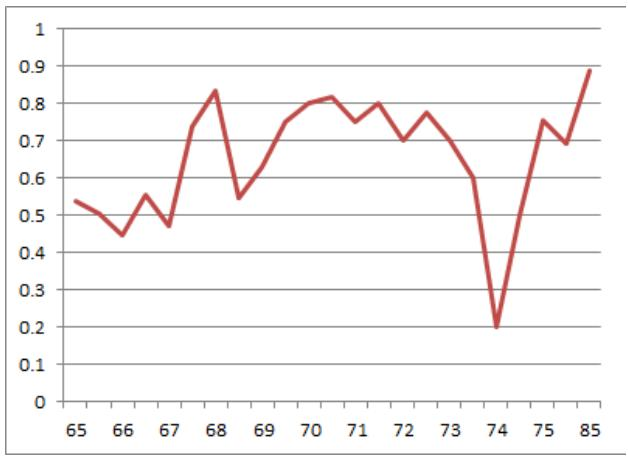

<details>
<summary>line</summary>

| Year | Value |
| --- | --- |
| 65 | ~0.54 |
| 66 | ~0.45 |
| 67 | ~0.47 |
| 68 | ~0.84 |
| 69 | ~0.55 |
| 70 | ~0.75 |
| 71 | ~0.82 |
| 72 | ~0.75 |
| 73 | ~0.80 |
| 74 | ~0.20 |
| 75 | ~0.76 |
| 85 | ~0.89 |
</details>

图9 附件一中价格的 C-Q 折线图（纵坐标为C，横坐标为 Q）

3. 会员的总盈利 $S _ { 1 }$ 和平台的总收益 $S _ { \mathrm { ~ 2 ~ } ^ { \circ } }$ 显然，这是非常重要的。但是，根据上述公式，在任务点价格确定的基础上， $S _ { 1 }$ 和 $S _ { 2 }$ 的关系主要取决于任务的完成率 $C _ { i }$ 。

4. 模拟验证新模型优于原模型。验证方法如下：设原来的定价方案为$\left( p _ { 1 } , p _ { 2 } , \ldots , p _ { n } \right)$ 且 $f \left( p _ { 1 } , p _ { 2 } , \ldots , p _ { n } \right) = \left( C _ { 1 } , C _ { 2 } , \ldots , C _ { r } \right)$ 。构造新的一组定价 方 案 $\left( p _ { 1 } ^ { ' } , p _ { 2 } , \ldots , p _ { n } \right)$ 满 足 $p _ { i } ^ { \prime } \leq p _ { i } , i = 1$ $\boldsymbol { \eta } 2$ ,设$f \left( \boldsymbol { p _ { 1 } ^ { \prime } } , \boldsymbol { p _ { 2 } ^ { \prime } } , \ldots , \boldsymbol { p _ { n } ^ { \prime } } \right) = \left( \boldsymbol { C _ { 1 } ^ { \prime } } , \boldsymbol { C _ { 2 } ^ { \prime } } , \ldots , \boldsymbol { C _ { r } ^ { \prime } } \right)$ ，模拟之后有 $C _ { _ { j } } ^ { ^ { \prime } } \geq C _ { _ { j } } , i = 1 , 2 , \ldots , r ,$ , 则可以说明新模型优于原模型。

我们还引入了一些反馈机制，主要包括会员的评价机制和任务的评价机制。会员评价机制方面，需要考虑会员的信誉、预定的开始时间、预定任务的变化；任务评价机制则包括商家与运营方的议价，即考虑价格的增减。

## 5.3 问题 3 的模型

## 5.3.1 想法的来源

将一些任务联合在一起发布，相当于经济学中的“搭售”。多个集中任务进行搭售，有利于提升完成率，降低平台成本，双方共赢。

对于任务点 i，我们考虑其周围的一个δ邻域 $U _ { \delta } ( i ) d$ （为了考虑这个邻域，我们定义度量 $d \left( i , j \right)$ 就表示第 i 个任务点和第 j 个任务点之间的距离）。可以把这个邻域内的任务放在一起搭售，定价为 $P _ { i }$ 。

## 5.3.2 搭售过程中定价的估计

我们很容易得到 $P _ { i }$ 的取值范围。我们知道搭售存在着一个价格关系，即搭售后的价格大于每一个元素单独的价格，而小于每个元素价格的总和。也就是说，

$$
p _ {k} <   P _ {i} <   \sum_ {k \in U _ {\delta} (i)} p _ {k}, \forall k \in U _ {\delta} (i).
$$

要使搭售更加受会员推崇，那就是要求搭售对会员的吸引力因子比单个的吸引力因子要高，即

$$
F _ {U _ {\delta} (i) j} > F _ {i j}
$$

恒成立。将定义式代入可得

$$
\frac {k _ {i j} P _ {i} \varphi (m _ {j})}{\max _ {k \in U _ {\delta} (i)} \left\{r _ {k j} \right\} ^ {\alpha}} > \frac {k _ {i j} p _ {i} \varphi (m _ {j})}{r _ {i j} ^ {\alpha}},
$$

由于 $k \in U _ { \delta } \left( i \right)$ ，由三角不等式可得

$$
r _ {k j} \leq r _ {k i} + r _ {i j} <   \delta + r _ {i j}.
$$

因此，

$$
\frac {P _ {i}}{\left(r _ {i j} + \delta\right) ^ {\alpha}} > \frac {p _ {i}}{r _ {i j} ^ {\alpha}},
$$

即

$$
P _ {i} > p _ {i} \frac {\left(r _ {i j} + \delta\right) ^ {\alpha}}{r _ {i j} ^ {\alpha}}.
$$

综合可得，

$$
p _ {i} \frac {\left(r _ {i j} + \delta\right) ^ {\alpha}}{r _ {i j} ^ {\alpha}} <   P _ {i} <   \sum_ {k \in U _ {\delta} (i)} p _ {k}.
$$

## 5.3.3 基于综合分析模型的搭售

和问题2中类似地，我们可以定义

$$
F _ {U _ {\delta} (i) j} \triangleq \frac {k _ {i j} P _ {i} \varphi (m _ {j})}{\max _ {k \in U _ {\delta} (i)} \left\{r _ {k j} \right\} ^ {\alpha}}.
$$

取δ很小，那么这个小邻域的困难程度基本相同，我们就可以近似用 $k _ { i j }$ 来计算。而所需要走的距离可近似认为是小邻域内最远的点的距离，即 $\operatorname* { m a x } _ { k \in U _ { \delta } \left( i \right) } \left\{ r _ { k } \right\}$ 0

## 5.3.4 基于单位长度期望模型的搭售

在这里，我们用另一种方式定义 $F _ { U _ { \delta } ( i ) j }$ .令

$$
F _ {U _ {\delta} (i) j} \triangleq \frac {k _ {i j} P _ {i}}{r _ {i j} + \varepsilon_ {i}},
$$

其中 $k _ { i j } , P _ { i } , r _ { i j }$ 的定义和前文中提到的完全相同， $\mathcal { E } _ { j }$ 为走遍 $U _ { \delta } \left( i \right)$ 中所有的任务点所需的最短路径长度。关于 $\mathcal { E } _ { i }$ 的求解，可以使用哈密顿图算法。

## 5.3.5 算法模拟

运用聚类分析的方法，我们先在平面上随机取出若干个点作为圆心，然后考虑这些点的δ邻域。通过框入那些δ邻域内的点，可以将任务点整合成一个个小包，把那些邻域中的任务点当成一个任务点处理。然后再利用综合分析模型中的算法进行任务的分配，这样不仅更加有利于任务的分配，且有利于整体完成率和平台利润率的提升。

我们对这种方案用综合分析模型中的算法进行了模拟，但是通过模拟后对总完成率C的计算，我们发现，任务的联合发布对总完成率几乎没有影响。但是，这种影响会体现在 $S _ { 1 } , S _ { 2 }$ 上，由于联合发布任务的价格会低于单独发布每个任务的价格之和，因此，

公司方面的成本降低，盈利增加，而会员拿到的总收入会减少。

## 5.4 问题 4 的模拟

## 5.4.1 综述

针对附件三中的新项目，我们可以发现其地理坐标与附件一类似，我们可以直接套用第三问中我们为附件一建立的基于搭售原理的新模型，给出一个定价方案Ⅰ。同时我们也可以套用我们猜想的原模型的定价方案，给出一个定价方案Ⅱ。我们分别利用我们的评估模型去评估这两套定价方案的完成率，我们可以看出我们新建立的定价方案Ⅰ的完成率确实高于定价方案Ⅱ的完成率。

我们进行了程序模拟。由于时间有限，我们只使用了综合分析模型，而没有考虑单位长度期望模型。

## 5.4.2 程序模拟的想法

首先，我们通过之前给出的两个定价方案，结合新项目的任务点位置和会员位置，给出了每个任务的定价。在这一过程中，为了定价的合理性（包括区间、有效数字位数等），我们对定价进行了一些微调。这样的微调之后，为了方便起见，我们模拟过程中的 $k _ { i j }$

在模拟的过程中，我们先根据会员的申请时间和信誉值高低进行排序，然后依次对每个会员，计算出了每一个任务点对他的吸引力因子，这样之后，会员会从剩下的任务中挑选出对自己吸引力最大的一些任务，个数则由会员的任务限额确定。重复这一操作直到任务分配结束，这就完成了任务的挑选与分配的过程。

基于任务的分配方案，我们通过之前的评估模型，来计算任务的完成率组合$\left( C _ { _ 1 } , C _ { _ 2 } , \ldots , C _ { _ r } \right)$ 以及总完成率 C。分配方案的确定，也就定下来了后面的所有参数，进而评估的指标就可以由公式算出。

## 5.4.3 程序模拟的结果

通过计算 $P _ { _ i }$ 的两个公式，我们将所得的 $P _ { i }$ 代入模型中进行模拟，得到运用公式 I时，所得的总完成率为 0.0462891645826264，完成率 $C _ { i }$ 关于价格 $Q _ { i }$ 的关系如图 10(a)；而运用公式 II 时，所得的总完成率为 0.0463716822403144，完成率 $C _ { i }$ 关于价格 $Q _ { i }$ 的关系如图 10(b)。两者的完成率波动都比较大，但是整体上，公式 II 的完成率高于公式 I。由于这里任务点比较多，完成率一定远小于附件一数据中的完成率，把这里的总完成率和附件一相比没有意义。因此，在这一模型中，公式 II更优一些。

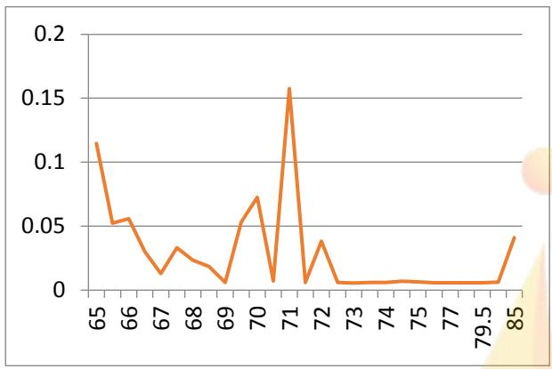

<details>
<summary>line</summary>

| X | Y |
| --- | --- |
| 65 | ~0.115 |
| 65.5 | ~0.052 |
| 66 | ~0.055 |
| 66.5 | ~0.032 |
| 67 | ~0.012 |
| 67.5 | ~0.033 |
| 68 | ~0.023 |
| 68.5 | ~0.018 |
| 69 | ~0.005 |
| 69.5 | ~0.052 |
| 70 | ~0.073 |
| 70.5 | ~0.006 |
| 71 | ~0.158 |
| 71.5 | ~0.005 |
| 72 | ~0.038 |
| 72.5 | ~0.005 |
| 73 | ~0.005 |
| 74 | ~0.006 |
| 74.5 | ~0.007 |
| 75 | ~0.006 |
| 77 | ~0.005 |
| 79.5 | ~0.005 |
| 84 | ~0.042 |
</details>

(a)

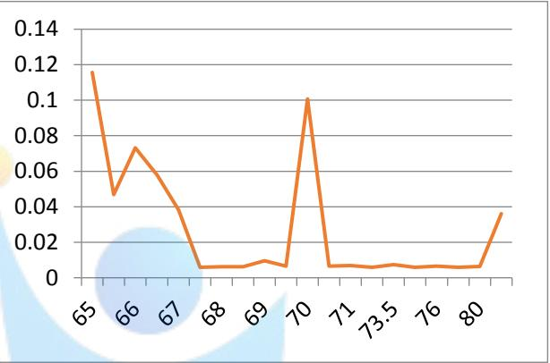

<details>
<summary>line</summary>

| X | Y |
| --- | --- |
| 65 | ~0.115 |
| 65.5 | ~0.048 |
| 66 | ~0.073 |
| 66.5 | ~0.058 |
| 67 | ~0.039 |
| 67.5 | ~0.006 |
| 68 | ~0.006 |
| 68.5 | ~0.006 |
| 69 | ~0.009 |
| 69.5 | ~0.007 |
| 70 | ~0.101 |
| 70.5 | ~0.007 |
| 71 | ~0.007 |
| 71.5 | ~0.006 |
| 72 | ~0.007 |
| 72.5 | ~0.006 |
| 73 | ~0.007 |
| 73.5 | ~0.006 |
| 74 | ~0.006 |
| 74.5 | ~0.006 |
| 75 | ~0.006 |
| 75.5 | ~0.006 |
| 76 | ~0.006 |
| 76.5 | ~0.006 |
| 77 | ~0.006 |
| 77.5 | ~0.006 |
| 78 | ~0.006 |
| 78.5 | ~0.022 |
| 79 | ~0.036 |
</details>

(b)  
图10 公式I 与公式II所得数据的 C-Q折线图（纵坐标为 C，横坐标为Q）因此，在这一模型中，公式 II更优一些。

## 6. 模型的应用及推广

定价问题是经济学中的一个核心问题，本文围绕任务“拍照赚钱”这个问题深入探讨了如何在实际情况中给离散任务定价，构造出了综合分析模型和单位长度期望模型以及基于搭售原理的定价模型，这几个模型可以有效地应用于嘀嘀打车等实际的任务定价问题中。除此之外，本文应用了多因子综合分析的方法，因此可以适用于现实环境中的各种复杂环境，并可以取得良好的效果。

## 参考文献

[1]胡俊航,. 混合搭售中定价的一种数学方法[J]. 平顶山工学院学报,2009,(2).  
[2]赵兴龙. 基于K-means-遗传算法的众包配送网络优化研究[D]. 北京交通大学: 北京交通大学,2017.  
[3]孙信昕. 众包环境下的任务分配技术研究[D]. 扬州大学: 扬州大学,2017.  
[4]韩雅雯. kmeans 聚类算法的改进及其在信息检索系统中的应用[D]. 云南大学: 云南大学,2017.


<details>
<summary>natural_image</summary>

Abstract graphic of a stylized human figure with a star and gradient background (no text or symbols)
</details>

##

附录：

程序1（算任务密度、会员密度等）：  
```c
#include<iostream>
#include<cstdio>
#include<cstdlib>
#include<cmath>
using namespace std;
int i,j,t,distn[837],num[837];
double
x[837],y[837],a[1879],b[1879],dist[837],c,d[837][1879],p[837],r,sum[837];
int main()
{
    freopen("data.txt","r",stdin);
    freopen("最短距离 2.out","w",stdout);
    for(i=1;i<=835;i++)
        scanf("%lf%lf%d%lf",&x[i],&y[i],&t,&p[i]);
    for(i=1;i<=1877;i++)
        scanf("%lf%lf%d",&a[i],&b[i],&t);
    for(i=1;i<=835;i++)
    {
        sum[i]=0;
    }
for(r=0.01;r<0.06;r+=0.00001)
{
    for(i=1;i<=835;i++)
    {
        num[i]=0;
        dist[i]=100;
        for(j=1;j<=1877;j++)
        {
            d[i][j]=sqrt(0.16*(x[i]-a[j])*(x[i]-a[j])+1.2769*(y[i]-b[j])(y[i]-b[j]));
//          c=acos(cos(x[i])*cos(a[j])*cos(y[i]-b[j])-sin(x[i])*sin(a[j]));
            if(d[i][j]<dist[i])
            {
                dist[i]=d[i][j];
                distn[i]=j;
            }
            if(d[i][j]<r)num[i]++;
        }
        sum[i]+=(double)num[i]/(r*r);
```

```txt
}
}

for(i=1;i<=835;i++)
{
    printf("%d %.10lf %d %d %.16lf %.16f %.16lf %.16lf %.11f %.16lf ",i,dist[i],num[i],distn[i],x[i],y[i],a[distn[i]],b[distn[i]],p[i],(double)sum[i]/5000);
    if(y[i]<113.5)printf("1\n");
        else printf("2\n");
}

double ave=0;
for(i=1;i<=835;i++)
    ave+=dist[i];
ave/=835;
printf("%lf\n",ave);

return 0;
}
```

##

##

程序2（问题4模拟）：  
```cpp
#include<iostream>
#include<cstdio>
#include<cstdlib>
#include<cmath>
#define NNN 2066
using namespace std;
struct huiyuan
{
    int num, lim, hour, minu;
    double a, b, bel;
} info[1879], temphuiyuan;

struct renwu
{
    double x, y, price;
    int cpt;
} loca[4000];
int i, j, k, sec, boo[4000], maxi, qq[4000], sum, tempp;
double
f[4000][1879], r[4000][1879], ita[4000], fz, fm, maxx, q[4000], temp, lamda[4000], c[4000];
bool flag, hash[4000][4000];
int main()
{
    freopen("data2.txt", "r", stdin);
    freopen("output2.txt", "w", stdout);
    for(i=1; i<=1877; i++)
    {

        scanf("%d%lf%lf%d%d%d%lf", &info[i].num, &info[i].a, &info[i].b, &info[i].lim, &info[i].hour, &info[i].minu, &sec, &info[i].bel);
        info[i].bel=0.067930997*log(info[i].bel)+0.471723987;
    }

    for(i=1; i<=1877; i++)
        for(j=i+1; j<=1877; j++)
        {

            if((info[i].hour>info[j].hour) || ((info[i].hour==info[j].hour)&&(info[i].minu>info[j].minu)) || ((info[i].hour==info[j].hour)&&(info[i].minu==info[j].minu)&&(info[i].bel<info[j].bel)))
            {
```

```txt
temphuiyuan=info[i];
info[i]=info[j];
info[j]=temphuiyuan;
}
}

for(i=1;i<=NNN;i++)
{
scanf("%d%lf%lf%lf",&loca[i].cpt,&loca[i].x,&loca[i].y,&loca[i].price);
}

for(i=1;i<=NNN;i++)
for(j=1;j<=1877;j++)
{
r[i][j]=(double)sqrt(0.16*(loca[i].x-info[j].a)*(loca[i].x-info[j].a)+1
.2769*(loca[i].y-info[j].b)*(loca[i].y-info[j].b));
f[i][j]=(double)(loca[i].price*info[j].bel)/(r[i][j]*r[i][j]);
}
for(i=1;i<=1877;i++)
{
for(j=1;j<=NNN;j++)
boo[j]=0;
for(j=1;j<=info[i].lim;j++)
{
maxx=0;
for(k=1;k<=NNN;k++)
{
if((f[k][i]>maxx)&&(boo[k]))
{
maxx=f[k][i];
maxi=k;
}
}
boo[maxi]=i;
}
flag=true;
for(j=1;j<=NNN;j++)
```

```lisp
if(boo[j]!=0)flag=false;
if(flag)break;
}

maxx=0;
for(i=1;i<=NNN;i++)
    maxx=max(maxx, info[i].bel);

for(i=1;i<=NNN;i++)
    ita[i]=(double)info[i].bel/maxx;

sum=0;
for(i=1;i<=NNN;i++)
{
    flag=false;
    for(j=1;j<=sum;j++)
    {
        if(loca[i].price==q[j])
        {
            qq[j]++;
            flag=true;
        }
    }
    if(!flag)
    {
        sum++;
        q[sum]=loca[i].price;
        qq[sum]=1;
    }
}

for(i=1;i<=sum;i++)
    for(j=i+1;j<=sum;j++)
    {
        if(q[i]>q[j])
        {
            temp=q[i];
            q[i]=q[j];
            q[j]=temp;
            tempp=qq[i];
            qq[i]=qq[j];
            qq[j]=tempp;
        }
    }
```

```c
for(i=1;i<=1877;i++)
    for(j=1;j<=sum;j++)
        hash[i][j]=false;

for(i=1;i<=NNN;i++)
{
    for(j=1;j<=sum;j++)
        if(q[j]==loca[i].price)
        {
            k=j;break;
        }
        hash[i][k]=true;
}

for(k=1;k<=sum;k++)
{
    lamda[k]=0;
    for(i=1;i<=NNN;i++)
        if(hash[i][k])lamda[k]++;
}

for(i=1;i<=sum;i++)
{
    c[i]=0;
    for(j=1;j<=NNN;j++)
        if(loca[j].price==q[i])c[i]+=ita[j];
    c[i]=(double)c[i]/lamda[i];
}

for(i=1;i<=sum;i++)
    printf("%.3lf %.16lf\n",q[i],c[i]);

fz=0;fm=0;
for(i=1;i<=sum;i++)
{
    fz+=qq[i]*c[i];
    fm+=qq[i];
}
printf("%.16lf\n",(double)fz/fm);
return 0;
}
```

程序3（问题3模拟）：  
```txt
#include<iostream>
#include<cstdio>
#include<cstdlib>
#include<cmath>
#define NNN 835
using namespace std;
struct huiyuan
{
    int num, lim, hour, minu;
    double a, b, bel;
} info[1879], temphuiyuan;

struct renwu
{
    double x, y, price;
    int cpt;
} loca[4000];
int i, j, k, sec, boo[4000], maxi, qq[4000], sum, tempp, number[4000], circle[4000];
double
f[4000][1879], r[4000][1879], ita[4000], fz, fm, maxx, q[4000], temp, lamda[4000], c[4000], delta, centerx[4000], centery[4000], sup[4000], inf[4000];
bool flag, hash[4000][4000];
int main()
{
    freopen("data0.txt", "r", stdin);
    for(i=1; i<=1877; i++)
    {

        scanf("%d%lf%lf%d%d%d%lf",&info[i].num, &info[i].a, &info[i].b, &info[i].lim, &info[i].hour, &info[i].minu, &sec, &info[i].bel);
        info[i].bel=0.0679302777*log(info[i].bel)+0.471723987;
    }

    for(i=1; i<=1877; i++)
        for(j=i+1; j<=1877; j++)
        {

            if((info[i].hour>info[j].hour) || ((info[i].hour==info[j].hour)&&(info[i].minu>info[j].minu)) || ((info[i].hour==info[j].hour)&&(info[i].minu==info[j].minu)&&(info[i].bel<info[j].bel)))
            {
                temphuiyuan=info[i];
```

```txt
info[i]=info[j];
info[j]=temphuiyuan;
}
}

for(i=1;i<=NNN;i++)
scanf("%d%lf%lf%lf",&loca[i].cpt,&loca[i].x,&loca[i].y,&loca[i].price);
delta=0.00687;

for(i=1;i<=100;i++)
{
    scanf("%lf%lf",&centerx[i],&centery[i]);
    number[i]=0;inf[i]=0;
}

for(i=1;i<=NNN;i++)
{
    circle[i]=0;
    for(j=1;j<=100;j++)
    if(sqrt(0.16*(loca[i].x-centerx[j])*(loca[i].x-centerx[j])+1.2769*(loca[i].y-centery[j])*(loca[i].y-centery[j]))<delta)
    {
        circle[i]=j;number[j]++;
        sup[j]+=loca[i].price;
        inf[j]=max(inf[j],loca[i].price);
        loca[i].price=0;
        break;
    }
}

for(i=1;i<=100;i++)
    if(number[i]>0)
    {
        loca[NNN+i].price=max((number[i]-1)*sup[i]/number[i],inf[i]);
        loca[NNN+i].x=centerx[i];
        loca[NNN+i].y=centery[i];
    }

for(i=1;i<=NNN+100;i++)
    for(j=1;j<=1877;j++)
```

```lisp
{
    r[i][j]=(double)sqrt(0.16*(loca[i].x-info[j].a)*(loca[i].x-info[j].a)+1
.2769*(loca[i].y-info[j].b)*(loca[i].y-info[j].b));
        f[i][j]=(double)(loca[i].price*info[j].bel)/(r[i][j]*r[i][j]);
    }
    for(j=1;j<=NNN+100;j++)
        boo[j]=0;
    for(i=1;i<=1877;i++)
    {
        for(j=1;j<=info[i].lim;j++)
        {
            maxx=0;
            for(k=1;k<=NNN+100;k++)
            {
                if((f[k][i]>maxx)&&(boo[k]==0))
                {
                    maxx=f[k][i];
                    maxi=k;
                }
            }
            boo[maxi]=i;
        }
        flag=true;
        for(j=1;j<=NNN+100;j++)
            if(boo[j]!=0)flag=false;
        if(flag)break;
    }

    maxx=0;
    for(i=1;i<=NNN+100;i++)
        maxx=max(maxx, info[i].bel);

    for(i=1;i<=NNN+100;i++)
        ita[i]=(double)info[i].bel/maxx;

    sum=0;
    for(i=1;i<=NNN+100;i++)
    {
        flag=false;
        for(j=1;j<=sum;j++)
        {
            if(loca[i].price==q[j])
```

```txt
{
    qq[j]++;
    flag=true;
}
}
if(!flag)
{
    sum++;
    q[sum]=loca[i].price;
    qq[sum]=1;
}
}

for(i=1;i<=sum;i++)
    for(j=i+1;j<=sum;j++)
    {
        if(q[i]>q[j])
        {
            temp=q[i];
            q[i]=q[j];
            q[j]=temp;
            tempp=qq[i];
            qq[i]=qq[j];
            qq[j]=tempp;
        }
    }

for(i=1;i<=1877;i++)
    for(j=1;j<=sum;j++)
        hash[i][j]=false;

for(i=1;i<=NNN+100;i++)
{
    for(j=1;j<=sum;j++)
        if(q[j]==loca[i].price
        {
            k=j;break;
        }
        hash[i][k]=true;
}

for(k=1;k<=sum;k++)
{
    lamda[k]=0;
```

```c
for(i=1;i<=NNN+100;i++)
    if(hash[i][k])lamda[k]++;
}

for(i=1;i<=sum;i++)
{
    c[i]=0;
    for(j=1;j<=NNN+100;j++)
        if(loca[j].price==q[i])c[i]+=ita[j];
    c[i]=(double)c[i]/lamda[i];
}

for(i=1;i<=sum;i++)
    printf("%.16lf\n",c[i]);

fz=0;fm=0;
for(i=1;i<=sum;i++)
{
    fz+=qq[i]*c[i];
    fm+=qq[i];
}
printf("%.16lf\n", (double)fz/fm);
return 0;
}
```