# “拍照赚钱”的任务定价

## 摘要

在“拍照赚钱”的新自助式服务模式下，用户可领取 app 上的任务，成功执行便可赚取标定的酬金。在这种模式下，如何合理定价从而获取最高收益成为了系统运营的核心。本文针对题中所给的数据信息进行数据挖掘，设计了一套较为合理的定价及任务打包算法。

问题一中，我们首先猜测了可能影响任务定价的因素，包括：任务周围的用户限额总量、任务周围的用户密度、任务的离群程度等。我们量化以上可能的影响因素，并以该因素为自变量以定价为因变量回归分析，通过拟合度来判断该因素是否对定价有决定作用。我们随机抽取 70%的数据进行回归训练，结果表明，任务的定价与周围用户的限额总量、周围用户的平均距离、自身的离群程度关系密切。利用剩余的30%数据分别对以上回归方程进行检验，用均方残差偏移程度来评价方程的可靠性。根据三个因素，对于成功执行的任务与未成功执行的任务分别进行回归分析，并对比其回归函数图像，发现任务未完成的主要原因是用户没考虑自身限额对定价的影响，其余两个因素相对次要。

问题二中，我们建立了多目标优化模型，其中目标函数为总定价和成功率。对问题一中的完成与未完成的任务，我们可以分别拟合出其定价曲面，位于这两个曲面之间的区间即为合理定价区间。除了问题一中三个因素外，任务成功率还受到周围用户的信誉、预订任务时间等变量的影响。根据已有的数据回归分析，得到成功率的综合评价函数。基于合理定价区间的约束，我们分别对定价最优方案与成功率最优方案进行求解，经过我们的算法优化之后，与原方案相比，我们可以在同样的平均成功率的前提下将定价总额降低 2.9%；我们也可以用同样的定价总额将平均成功率提高 9.4%。

问题三中，我们建立基于改进的 DBSCAN 算法的打包方案。确定打包的核心目的是改善预期成功率较小任务的执行情况。我们引入了任务的得分半径和用户得分半径两个参数对原算法中的固定半径进行改进。任务的预期成功率越小，任务得分半径越大，用户的信誉度越高、预订任务时间越早，用户得分半径越大。打包后我们还基于用户得分半径检验打包是否合理，即是否有用户能够执行该任务。基于该算法，我们一共求得 62个需要被打包的任务点，被打包成 25组。将预期成功率与原成功率进行对比，成功率最高提升了7.2%，平均成功率提升2.3%，验证了任务联合打包对于平均成功率的提升有很大作用。在确定新的定价模型时，我们将定价划分为两大因素：任务本身价值与路途花费。根据原数据对这两个因素的系数进行求解，我们基于该定价函数对定价进行修改，得到了新的定价方案。

问题四中，我们根据优化模型以及打包算法对新数据进行定价、打包、成功率计算，并得到优化的定价和打包方案并得到相应的优化方案成功率。为了检验模型的可靠性，我们建立了仿真模拟模型，对每个用户行为进行仿真，结果显示模拟成功率与优化方案成功率偏差在20%以内。

最后我们对模型的鲁棒性和灵敏度进行了检验，发现模型具有较好的鲁棒性。

关键词：LOF离群因子；回归分析法；多目标优化；DBSCAN算法；众包定价

## 一. 问题重述

## 1.1. 问题背景

“拍照赚钱”是移动互联网下的一种自助式服务模式。用户下载 APP，注册成为APP 的会员，然后从 APP 上领取需要拍照的任务（比如上超市去检查某种商品的上架情况），赚取 APP 对任务所标定的酬金。APP 中的任务定价是该平台运行的核心要素，如果定价不合理，有的任务就会无人问津，而导致商品检查的失败。

## 1.2. 数据集

附件一是已结束项目的任务数据，包含了每个任务的位置、定价和完成情况（“1”表示完成，“0”表示未完成）；附件二是会员信息数据，包含了会员的位置、信誉值、参考其信誉给出的任务开始预订时间和预订限额，原则上会员信誉越高，越优先开始挑选任务，其配额也就越大（任务分配时实际上是根据预订限额所占比例进行配发）；附件三是一个新的检查项目任务数据，只有任务的位置信息。

## 1.3. 问题要求

根据上述题目背景及数据，题目要求建立数学模型讨论以下问题：

1. 研究附件一中项目的任务定价规律，分析任务未完成的原因。  
2. 为附件一中的项目设计新的任务定价方案，并和原方案进行比较。  
3. 实际情况下，多个任务可能因为位置比较集中，导致用户会争相选择，一种考虑是将这些任务联合在一起打包发布。在这种考虑下，如何修改前面的定价模型，对最终的任务完成情况又有什么影响？  
4. 对附件三中的新项目给出你的任务定价方案，并评价该方案的实施效果。

## 二. 模型假设

1. 假设会员到所有任务点的出行便利程度一致，到达任务点所用时间随距离增加而增加，且该距离为直线距离；  
2. 不考虑天气等原因对会员出行的影响；  
3. 所有任务的难度相同，即不考虑任务难度对会员选择造成的影响；  
4. 每个任务至多由一个人完成，不考虑多人合作完成一个任务的情况。

## 三. 符号说明

<table><tr><td>符号</td><td>符号含义</td></tr><tr><td> $\rho$ </td><td>任务周围用户密度</td></tr><tr><td> $d_{ij}$ </td><td>用户i距离任务j的距离</td></tr><tr><td> $d_{ave}$ </td><td>任务周围最近若干个用户离该任务的距离均值</td></tr><tr><td>O</td><td>任务离群度</td></tr><tr><td>p</td><td>任务定价</td></tr><tr><td>s</td><td>一定范围内用户限额总和</td></tr><tr><td> $P_i$ </td><td>第i个任务的定价</td></tr><tr><td> $S_i$ </td><td>第i个任务的成功执行率</td></tr><tr><td>M</td><td>任务总价</td></tr><tr><td>N</td><td>任务平均成功执行率</td></tr><tr><td>Q</td><td>商家给系统的定价</td></tr><tr><td> $Q'$ </td><td>系统给用户的定价</td></tr></table>

## 四. 问题分析

## 4.1. 问题一分析

问题一要求我们探索定价规律及研究任务未完成的原因。从系统角度出发考虑每个任务的定价有两个方向：任务与用户的关系、任务与任务的关系。从这两个角度考虑，我们可以进一步分析任务与用户的关系主要有任务周围用户数量，任务周围用户密度等；任务与任务之间的关系主要为任务的离群程度。

我们可以对以上因素量化，并分别将定价与以上因素进行函数拟合，利用拟合度判断定价是否与以上因素有关。接着根据有关的因素对完成的任务与未完成的任务分别进行分析，判断任务未完成的具体原因。

## 4.2. 问题二分析

问题二要求我们设计新的任务定价方案，并和原方案进行比较。这是一个博弈问题的优化，博弈双方是定价与成功率。我们的目标是成功率尽可能高，定价尽可能低。成功率除了与定价有关，还与问题一中的若干影响因素有关。我们可以回归分析得到成功率关于以上因素的函数关系。

接下去可以建立优化模型并求解。根据给出的数据集，我们寻找成功执行的任务定价与未成功执行任务的定价之间的差距，并寻找合理的定价区间。以该区间为约束，分别就成功率最高及定价总和最低为目标，将其划分为两个优化模型并求解能得出总定价固定的情况下成功率最高的定价方案以及成功率固定总定价最低的定价方案。得出方案后可以就成功率与定价与原方案进行对比来判断新定价获得的效果。

## 4.3. 问题三分析

问题三要求考虑多任务打包发布，修改定价并分析对任务完成情况的影响。由于本题任务点分布不均匀，我们考虑对 算法进行改进：算法的半径改为得分半径，成功率高的点得分高，成功率低的点得分低。为了提高成功率，我们将成功率低的点与成功率高的点打包。打包后还需要分析打包的合理性，即打包任务周边会员的信誉、限额等因素，如果合理就保留该包，不合理就打散该包。

关于打包任务的定价，在本问题中我们将定价分为两部分：任务本身价值、路途花费。即任务打包后任务的本身价值不变，但由于路途花费（包括时间、交通费用）减少，在系统定价时打包的任务总价低于原定价总和。根据原数据找到任务本身价值、路途划分、总定价三者的关系，再根据问题二得到的优化模型进行最优定价搜寻，最终可以对比打包前后成功率的变化情况来体现打包的效果。

## 4.4. 问题四分析

问题四给出了一个新项目，要求给出我们的定价方案及评估方案实施效果。

将数据代入问题二得到的定价模型以及问题三得到的打包模型进行求解，输出每个任务定价与成功率数据，并对结果进行分析。

## 五. 模型建立与求解

## 5.1. 问题一：任务定价规律研究与未完成任务原因分析

首先，为了明确人机交互的原理与流程，我们先对整个流程进行具体分析。

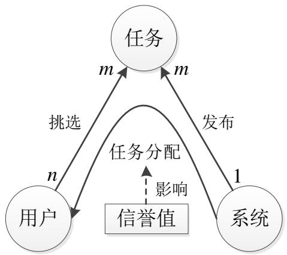

<details>
<summary>flowchart</summary>

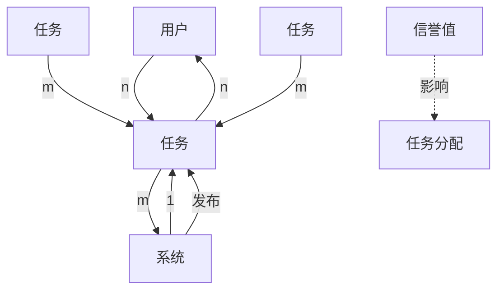
```mermaid
graph TD
  A["用户"] -->|"n"| B["任务"]
  C["系统"] -->|"1"| B
  D["信誉值"] -.->|"影响"| E["任务分配"]
  F["任务"] -->|"m"| B
  G["任务"] -->|"m"| B
  B -->|"n"| A
  B -->|"m"| C
  C -->|"发布"| B
```
</details>

图 1 用户、系统、任务三者逻辑关系

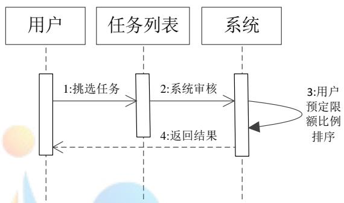

<details>
<summary>flowchart</summary>

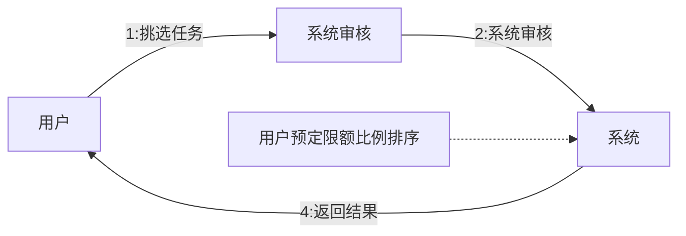
```mermaid
graph LR
  A["用户"] -->|"1:挑选任务"| B["系统审核"]
  B -->|"2:系统审核"| C["系统"]
  C -->|"4:返回结果"| A
  D["用户预定限额比例排序"] -.-> C
```
</details>

图 2UML时序关系

图 1表明了用户、系统、任务三者之间的逻辑关系，图2表明了一个活动过程的时序关系。在系统中，有n个用户与m个任务，用户可以通过挑选来选择任务，但是同一时间只能执行一个，每个任务只能由一个用户执行。一个任务可能被多个用户选中，系统根据用户预订限额所占比例进行任务配发，最后返回结果给用户，用户执行任务，整个流程结束。信誉值会影响用户的预定任务开始时间与任务分配过程。

## 5.1.1. 任务定价规律猜想

从系统角度出发考虑每个任务的定价有两个方向：用户与任务的关系即用户总限额与周围用户距离、任务与任务的关系即任务间的离散程度。

## （1） 任务周围的用户限额总和s

考虑两种可能存在的情况，如图 3、图 4 所示（用户点点径越大说明该用户预订任务限额越大）。

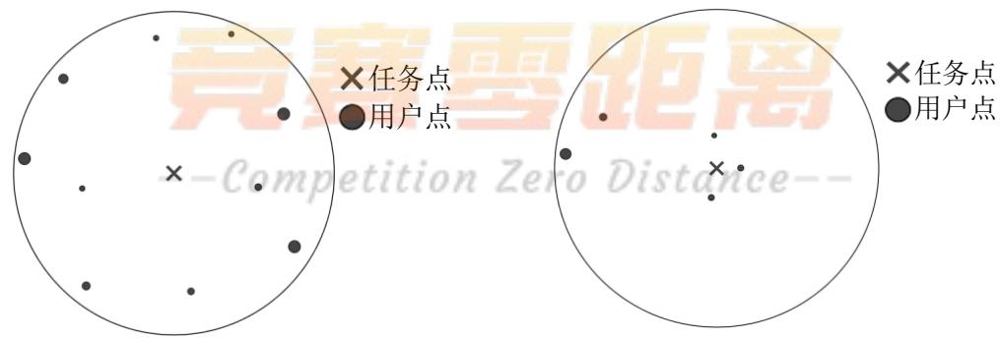  
图 3 任务点与周围用户分布情况 1  
图 4 任务点与周围用户分布情况 2

 情况 1：一定范围内用户数量较多，但离任务点的平均距离较远。  
 情况 2：一定范围内用户数量较少，但有部分用户离任务点较近。

同时，我们考虑到用户预订任务限额的问题，对于预订任务限额较小的用户，根据用户心理，在相同定价的情况下，用户更愿意选择离自己距离较近的点，示意图如图5所示，1 用户的任务限额较大，2 用户的任务限额较小，a、b、c为三个任务点。此时1 用户可能会选择a或b任务进行执行，而 2用户可能只会选

择b任务进行执行。

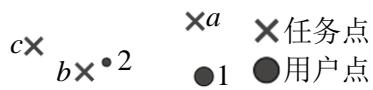  
图 5 多任务用户选择分析

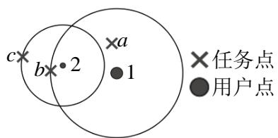

<details>
<summary>text_image</summary>

c×
bו2
×a
•1
×任务点
●用户点
</details>

图 6 用户期望范围与任务限额分析

将其期望执行任务的范围进行模拟，我们大致可以得出如图 6所示的用户期望范围。也即用户任务限额越大其期望的覆盖范围也越广，但是这个范围也有一个上限，即一个用户的覆盖范围不可能随着限额的不断增加而线性增长。

根据我们上述猜想绘制用户预订任务限额的覆盖气泡图如下：

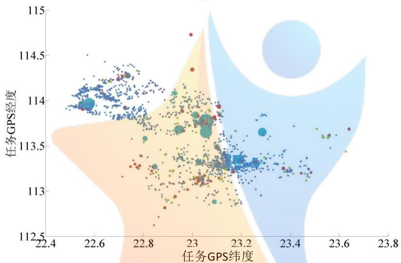

<details>
<summary>bubble</summary>

| Series | 任务GPS纬度 (range) | 任务GPS经度 (range) |
| --- | --- | --- |
| Blue | 22.4~23.6 | 112.8~114.5 |
| Red | 22.7~23.6 | 112.8~114.8 |
| Green | 22.7~23.3 | 112.9~114.1 |
| Yellow | 22.7~23.0 | 112.8~114.8 |
| Light Blue | 23.0~23.8 | 112.8~115.0 |
</details>

图 7 用户任务限额覆盖区域示意图

其中，气泡面积越大说明该用户任务限额越大，期望覆盖面积越广。可以将其近似作为影响人数的因素，即任务限额越大，该用户能完成周围任务的可能性越大。

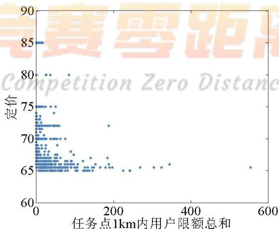

<details>
<summary>scatter</summary>

| 任务点1km内用户限额总和 | 定价 |
| --- | --- |
| ~50 | 85 |
| ~20 | 80 |
| ~30 | 80 |
| ~40 | 75 |
| ~50 | 75 |
| ~60 | 75 |
| ~70 | 75 |
| ~80 | 75 |
| ~90 | 75 |
| ~100 | 75 |
| ~110 | 75 |
| ~120 | 75 |
| ~130 | 75 |
| ~140 | 75 |
| ~150 | 75 |
| ~160 | 75 |
| ~170 | 75 |
| ~180 | 75 |
| ~190 | 75 |
| ~200 | 75 |
| ~210 | 75 |
| ~220 | 75 |
| ~230 | 75 |
| ~240 | 75 |
| ~250 | 75 |
| ~260 | 75 |
| ~270 | 75 |
| ~280 | 75 |
| ~290 | 75 |
| ~300 | 75 |
| ~310 | 75 |
| ~320 | 75 |
| ~330 | 75 |
| ~340 | 75 |
| ~350 | 75 |
| ~360 | 75 |
| ~370 | 75 |
| ~380 | 75 |
| ~390 | 75 |
| ~400 | 75 |
| ~410 | 75 |
| ~420 | 75 |
| ~430 | 75 |
| ~440 | 75 |
| ~450 | 75 |
| ~460 | 75 |
| ~470 | 75 |
| ~480 | 75 |
| ~490 | 75 |
| ~500 | 75 |
| ~510 | 75 |
| ~520 | 75 |
| ~530 | 75 |
| ~540 | 75 |
| ~550 | 75 |
| ~560 | 75 |
| ~570 | 75 |
| ~580 | 75 |
| ~590 | 75 |
| ~600 | 75 |
| ~610 | 75 |
| ~620 | 75 |
| ~630 | 75 |
| ~640 | 75 |
| ~650 | 75 |
| ~660 | 75 |
| ~670 | 75 |
| ~680 | 75 |
| ~690 | 75 |
| ~700 | 75 |
| ~710 | 75 |
| ~720 | 75 |
| ~730 | 75 |
| ~740 | 75 |
| ~750 | 75 |
| ~760 | 75 |
| ~770 | 75 |
| ~780 | 75 |
| ~790 | 75 |
| ~800 | 75 |
| ~810 | 75 |
| ~820 | 75 |
| ~830 | 75 |
| ~840 | 75 |
| ~850 | 75 |
| ~860 | 75 |
| ~870 | 75 |
| ~880 | 75 |
| ~890 | 75 |
| ~900 | 75 |
| ~910 | 75 |
| ~920 | 75 |
| ~930 | 75 |
| ~940 | 75 |
| ~950 | 75 |
| ~960 | 75 |
| ~970 | 75 |
| ~980 | 75 |
| ~990 | 75 |
| ~1000 | 75 |
| ~190 | 72.2 |
| ~220 | 66.2 |
| ~240 | 66.2 |
| ~260 | 66.2 |
| ~280 | 66.2 |
| ~300 | 66.2 |
| ~320 | 66.2 |
| ~340 | 66.2 |
| ~360 | 66.2 |
| ~380 | 66.2 |
| ~400 | 66.2 |
| ~420 | 66.2 |
| ~440 | 66.2 |
| ~460 | 66.2 |
| ~480 | 66.2 |
| ~500 | 66.2 |
| ~520 | 66.2 |
| ~540 | 66.2 |
| ~560 | 66.2 |
| ~580 | 66.2 |
| ~600 | 66.2 |
| ~610 | 66.2 |
| ~620 | 66.2 |
| ~630 | 66.2 |
| ~640 | 66.2 |
| ~650 | 66.2 |
| ~660 | 66.2 |
| ~670 | 66.2 |
| ~680 | 66.2 |
| ~690 | 66.2 |
| ~700 | 66.2 |
| ~710 | 66.2 |
| ~720 | 66.2 |
| ~730 | 66.2 |
| ~740 | 66.2 |
| ~750 | 66.2 |
| ~760 | 66.2 |
| ~770 | 66.2 |
| ~780 | 66.2 |
| ~790 | 66.2 |
| ~800 | 66.2 |
| ~810 | 66.2 |
| ~820 | 66.2 |
| ~830 | 66.2 |
| ~840 | 66.2 |
| ~850 | 66.2 |
| ~860 | 66.2 |
| ~870 | 66.2 |
| ~880 | 66.2 |
| ~890 | 66.2 |
| ~900 | 66.2 |
| ~910 | 66.2 |
| ~920 | 66.2 |
| ~930 | 66.2 |
| ~940 | 66.2 |
| ~950 | 66.2 |
| ~960 | 66.2 |
| ~970 | 66.2 |
| ~980 | 66.2 |
| ~990 | 66.2 |
| ~1000 | 66.2 |
</details>

图 8 用户任务限额与定价关系

设定价为 $p$ ，用户限额总和为s，根据散点分布情况，我们猜想的定价与限额总额的函数关系为：

$$
p = \frac {q _ {1} + q _ {2} \cdot s + q _ {3} \cdot s ^ {2}}{s + q _ {4}} \tag {1}
$$

其中 $q _ { 1 }$ ， $q _ { 2 }$ ， $q _ { 3 }$ ， $q _ { 4 }$ 为系数。

## （2） 距离任务最近的用户的平均距离d

我们推断任务周围的用户密度即距离任务最近的用户的平均距离也对定价有影响。这是第二个影响密度进而影响定价的因素。

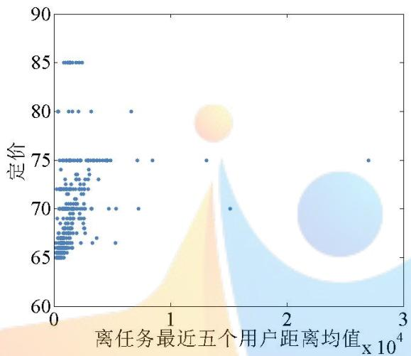

<details>
<summary>bubble</summary>

| 离任务最近五个用户距离均值 (x 10^4) | 定价 |
| --- | --- |
| ~0.1 | 65~85 |
| ~0.2 | 66~75 |
| ~0.3 | 67~75 |
| ~0.4 | 68~75 |
| ~0.5 | 69~75 |
| ~0.6 | 70~75 |
| ~0.7 | 70~80 |
| ~1.3 | 70~75 |
| ~2.7 | 75 |
</details>

图 9 用户平均距离与定价关系

设定价为 $p$ ，距离均值为 $d _ { a v e }$ ，根据散点分布情况，我们猜想的定价与密度因素2的函数关系为：

$$
p = q _ {1} \cdot \sqrt {d _ {\text {ave}}} + q _ {2} \cdot d _ {\text {ave}} + q _ {3} \tag {2}
$$

其中 $q _ { 1 }$ ， $q _ { 2 }$ ， $q _ { 3 }$ 为系数。

以上的用户与任务间的影响是一个双向的过程，为了更好地展示影响关系，我们用下图展示其逻辑：

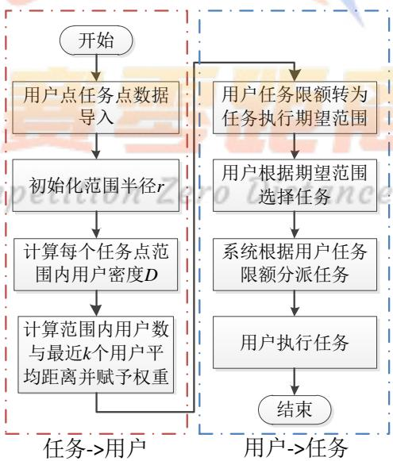

<details>
<summary>flowchart</summary>

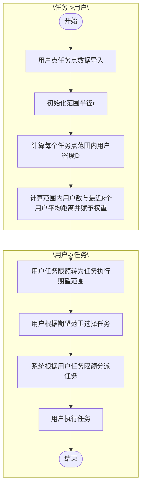
```mermaid
graph TD
  Start(["开始"]) --> A["用户点任务点数据导入"]
  A --> B["初始化范围半径r"]
  B --> C["计算每个任务点范围内用户密度D"]
  C --> D["计算范围内用户数与最近k个用户平均距离并赋予权重"]
  D --> E["用户任务限额转为任务执行期望范围"]
  E --> F["用户根据期望范围选择任务"]
  F --> G["系统根据用户任务限额分派任务"]
  G --> H["用户执行任务"]
  H --> End(["结束"])
  subgraph sg["\"任务->用户\""]
    direction TB
    Start
    A
    B
    C
    D
  end
  subgraph sg_2["\"用户->任务\""]
    direction TB
    E
    F
    G
    H
    End
  end
```
</details>

图 10 任务与用户交互流程

## （3） 任务的离群程度O

上文讨论了用户与任务之间的关系对定价的可能影响，接下去我们讨论任务的密度对定价可能产生的影响。

一般情况下，任务与任务之间距离较近（任务集簇）时更能够吸引用户选择执行，这是由于一个用户可以执行多个距离较近的任务，节省用户的时间成本。

我们采用 LOF离群因子对于任务的密度进行刻画。

LOF(Local Outlier Factor)，对象的局部离群因子，每个任务点都被分配一个局部离群因子。该算法通常是用来判断局部异常的离群点，在本问题中，我们尝试将离群因子作为定价规律估计的一个因素。离群因子的算法流程如下：

1）计算任务点 $p$ 的k 距离

任务<sub>p</sub>的k 距离 $p$ $d _ { k } \left( p \right)$ 为<sub>p</sub>到某个邻近任务点<sub>q</sub>之间的距离,<sub>q</sub>是离 $p$ $q$ $q$ $p$ 最近的第k 个任务点。

2）计算任务点p的k 距离邻域 $N _ { k } \left( p \right)$

$N _ { k }$ 即离点p最近的k 个任务组成的集合。

3）计算任务点p相对于任务点 $q$ 的可达距离 $d _ { k } ( p , q )$

给定自然数k , 任务点p相对于任务点 $q$ 的可达距离 $d _ { k } \left( p , q \right)$ 为 $p$ 到 $q$ 点的距离 $d \big ( p , q \big )$ 与 $d _ { q }$ 中的较大值:

$$
d _ {k} (p, q) = \max \left\{d _ {q}, d (p, q) \right\} \tag {3}
$$

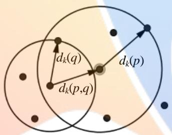

<details>
<summary>text_image</summary>

d_k(q)
d_k(p,q)
d_k(p)
</details>

图 11 可达距离示意图

4）计算任务点p的局部可达密度 $\rho _ { k } \left( p \right)$

任务点p的局部可达密度等于任务点p的平均可达距离的倒数。

$$
\rho_ {k} (p) = 1 / \frac {\sum_ {1} ^ {k} d _ {k} \left(p , q _ {i}\right)}{k} \tag {4}
$$

5）计算任务点 $p$ 的局部离群因子O

$$
O _ {k} (p) = \sum_ {q \in N _ {k} (p)} \frac {\rho_ {k} (q)}{\rho_ {k} (p)} / k \tag {5}
$$

离群因子对定价影响的定性判断与说明如下：

 离群因子数值越大，该任务点的周围任务分布密度越小，该点越离群，该点的定价应该越高；反之，离群因子数值越小，该任务点分布密度越大，该点离群程度越小，该点的定价应该越低。  
 离群因子只针对任务与任务之间的关系。  
 由于离群因子直接判断任务局部密度，比直接判断任务与任务之间的距离更加能体现任务分布的情况。

 将离群因子通过变换转换为每个点的定价得分因子，可进行下一步定价规律的研究。

据上文的 LOF算法分析，我们对各个点的 LOF值进行求解并绘制在图像上方便我们直观上进行观察规律，在我们进行计算的时候我们固定k 值大小为 3。

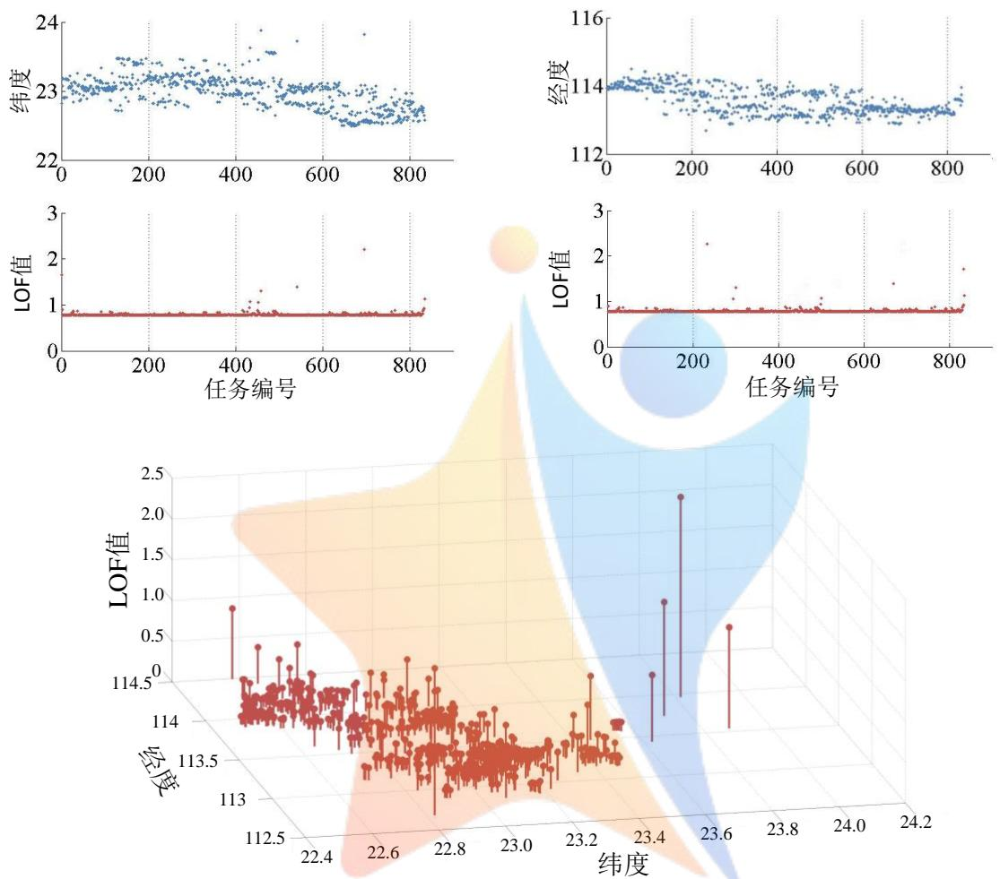  
图 12 （a）维度排序后LOF值 （b）经度排序后的LOF值（c）每个任务点对应的 LOF值三维图

在上图中，我们很明显看到越离群的点 LOF 值越高。

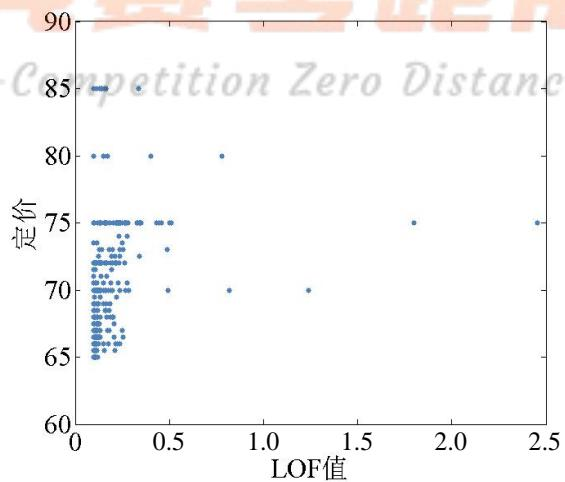

<details>
<summary>scatter</summary>

| LOF值 (range) | 定价 (range) |
| --- | --- |
| 0.1~0.5 | 65~75 |
| 0.4~2.5 | 70~85 |
</details>

图 13 LOF值与定价关系

设定价为 $p$ ，LOF 值为<sub>L</sub>，根据散点分布情况，我们猜想定价与 LOF 离群度的函数关系为：

$$
p = q _ {1} \cdot \log (L) + q _ {2} \cdot L + q _ {3} \tag {6}
$$

其中 $q _ { 1 }$ ， $q _ { 2 }$ ， $q _ { 3 }$ 为系数。

## 5.1.2. 定价规律猜想检验

## （1） 数据预处理

## 异常/离群数据处理

附件 2 所给会员编号 B1175 的会员位置信息中，维度 113.131483，经度23.031824，明显与其余会员位置信息不符，我们猜测其经纬度写反，将其改为维度 23.031824，经度 113.131483。

有部分会员位置相比于其他会员偏，且在这部分会员周围没有任务点，在分析时我们不考虑这部分偏离正常区域的会员的影响，如下所示：

表 1 被筛选掉的会员

<table><tr><td>会员编号</td><td>GPS 纬度</td><td>GPS 经度</td><td>会员编号</td><td>GPS 纬度</td><td>GPS 经度</td></tr><tr><td>B0005</td><td>33.65205</td><td>116.97047</td><td>B0082</td><td>21.202247</td><td>110.417157</td></tr><tr><td>B0006</td><td>22.262784</td><td>112.79768</td><td>B0136</td><td>24.80413</td><td>113.605786</td></tr><tr><td>B0007</td><td>29.560903</td><td>106.239083</td><td>B0472</td><td>21.498823</td><td>111.106315</td></tr><tr><td>B0022</td><td>27.124487</td><td>111.017906</td><td>B1708</td><td>22.494423</td><td>113.940057</td></tr><tr><td>B0039</td><td>21.679227</td><td>110.922443</td><td>B1727</td><td>21.53332</td><td>111.229119</td></tr><tr><td>B0048</td><td>20.335061</td><td>110.178827</td><td>B1822</td><td>22.800504</td><td>115.374799</td></tr></table>

## 距离计算

题中所给的位置信息为 GPS 经度与纬度，我们需要将两点之间的球面距离转换为直线距离。以下分析与求解过程当中所提到的距离均为转换之后的直线距离。

## （2） 用户与任务间影响因素猜想检验

## 用户与任务间影响因素 1：任务点附近用户限额

我们将任务点附近的半径r 限设为1km，同时将任务点为圆心、1km 为半径的圆内所有用户任务限额进行累加，近似当做该任务点周围的限额总量。我们在图像上观察该因素与定价的关系，我们随机抽取 70%已有数据利用不同函数对其进行回归求解，得到回归结果如下，最终得到的拟合曲线如图 14所示。

$$
p = \frac {1 8 8 0 + 6 5 . 0 1 \cdot s - 0 . 0 0 1 4 0 2 \cdot s ^ {2}}{s + 2 6 . 2 1} \tag {7}
$$

我们对以上函数与系数进行分析：

当一定范围内（我们设置为 1km）用户数量增加时，由于可执行人数增加，供大于求的趋势增加，定价呈现下降趋势；反之，当用户数量减少，可执行人数减少，定价呈上升趋势。

利用 70%数据得出函数曲线（即得出定价的一个影响因素与定价的关系）后，我们利用剩余 数据对结果进行检验，如图 所示。结果的检验均方残差偏移比例为4.83%，很好地验证了我们的函数关系。

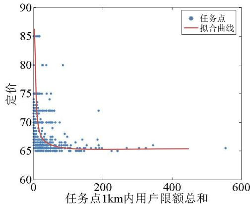

<details>
<summary>scatter</summary>

| 任务点1km内用户限额总和 | 定价 |
| --- | --- |
| ~50 | ~85 |
| ~20 | ~80 |
| ~30 | ~75 |
| ~40 | ~75 |
| ~50 | ~75 |
| ~60 | ~75 |
| ~70 | ~75 |
| ~80 | ~75 |
| ~90 | ~75 |
| ~100 | ~75 |
| ~110 | ~75 |
| ~120 | ~75 |
| ~130 | ~75 |
| ~140 | ~75 |
| ~150 | ~75 |
| ~160 | ~75 |
| ~170 | ~75 |
| ~180 | ~75 |
| ~190 | ~75 |
| ~200 | ~75 |
| ~210 | ~75 |
| ~220 | ~75 |
| ~230 | ~75 |
| ~240 | ~75 |
| ~250 | ~75 |
| ~260 | ~75 |
| ~270 | ~75 |
| ~280 | ~75 |
| ~290 | ~75 |
| ~300 | ~75 |
| ~310 | ~75 |
| ~320 | ~75 |
| ~330 | ~75 |
| ~340 | ~75 |
| ~350 | ~75 |
| ~360 | ~75 |
| ~370 | ~75 |
| ~380 | ~75 |
| ~390 | ~75 |
| ~400 | ~75 |
| ~410 | ~75 |
| ~420 | ~75 |
| ~430 | ~75 |
| ~440 | ~75 |
| ~450 | ~75 |
| ~460 | ~75 |
| ~470 | ~75 |
| ~480 | ~75 |
| ~490 | ~75 |
| ~500 | ~75 |
| ~510 | ~75 |
| ~520 | ~75 |
| ~530 | ~75 |
| ~540 | ~75 |
| ~550 | ~75 |
| ~560 | ~75 |
| ~570 | ~75 |
| ~580 | ~75 |
| ~590 | ~75 |
| ~600 | ~75 |
</details>

图 14 定价与因素 1的关系

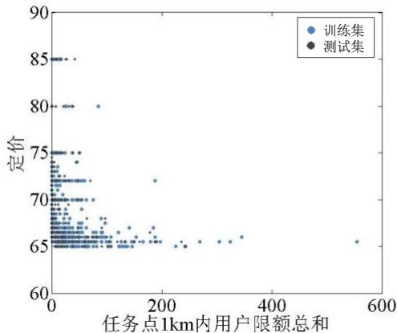

<details>
<summary>scatter</summary>

| Series | 任务点1km内用户限额总和 (range) | 定价 (range) |
| --- | --- | --- |
| 训练集 | 0~560 | 65~85 |
| 测试集 | 0~250 | 65~75 |
</details>

图 1530%数据对结果进行检验

表 2 检验结果示意

<table><tr><td> $R^2$ </td><td>训练集均方残差</td><td>测试集均方残差</td><td>均方残差偏移比例</td></tr><tr><td>0.6686</td><td>17.3006</td><td>16.4646</td><td>4.83%</td></tr></table>

## 2）用户与任务间因素 2：离任务点最近用户的平均距离

我们随机抽取70%已有数据进行拟合后的得到回归结果如下，最终得到的拟合曲线如图16所示。

$$
p = 0. 3 7 7 5 \cdot \sqrt {d _ {\text {ave}}} - 0. 0 0 2 2 3 6 \cdot d _ {\text {ave}} + 5 9. 5 5 \tag {8}
$$

我们对以上函数与系数进行分析：

当函数后半部分呈现下降趋势，即离任务近的人越少定价反而越低，这是不符合常理的。由于后半段有几个离群点干扰了函数拟合导致了这种结果。我们会在模型灵敏度分析中具体分析该结果，在下文讨论中，暂不使用后半段的函数信息。事实上，如果一个任务周围五个人的距离平均值达到很大的值，该任务基本会没有人执行，因此在下文优化过程中暂不考虑这种极离群点。

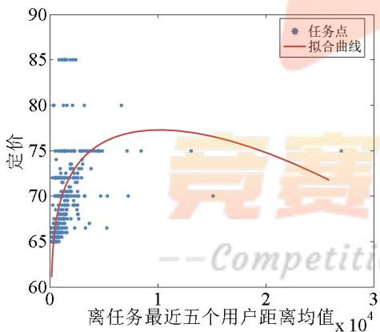

<details>
<summary>scatter</summary>

| Series | 离任务最近五个用户距离均值 (x 10^4) (range) | 定价 (range) |
| --- | --- | --- |
| 任务点 | 0~2.7 | 65~85 |
</details>

图 16 定价与密度因素 2的关系

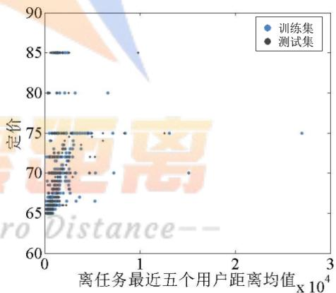

<details>
<summary>scatter</summary>

| Series | 离任务最近五个用户距离均值 (x 10^4) (range) | 定价 (range) |
| --- | --- | --- |
| 训练集 | 0~2.8 | 65~85 |
| 测试集 | 0~0.7 | 65~75 |
</details>

图 1730%数据对结果进行检验

利用 70%数据得出函数曲线（即得出定价的一个影响因素与定价的关系）后，我们利用剩余 30%数据对结果进行检验，如图 17 所示。结果的检验均方残差偏移比例为5.88%，很好地验证了我们的函数关系。

表 3 检验结果示意

<table><tr><td> $R^2$ </td><td>训练集均方残差</td><td>测试集均方残差</td><td>均方残差偏移比例</td></tr><tr><td>0.5843</td><td>14.6306</td><td>15.4912</td><td>5.88%</td></tr></table>

## （3） 基于 LOF离群因子的任务与任务距离对定价的影响猜想检验

我们随机抽取70%已有数据进行拟合后的得到回归结果如下，最终得到的拟合曲线如图18所示。

$$
p = 7. 4 1 3 \cdot \log (L) + 6 9. 1 1 \cdot L + 1 6. 0 7 4 2 \tag {9}
$$

我们对以上函数与系数进行分析：

当任务之间密度较小即 LOF 值较小时，说明任务密集，对于某个任务来说该任务附近任务较多，由于供求关系以及用户可能会选择多任务一起完成，任务定价会降低。

任务定价不会无限制上升，LOF数值到达一定的值后，任务定价趋于稳定。这是因为系统需要利润，一个离群任务的定价不可能超出系统上限。

为了验证 LOF值与定价的关系，我们对随机 70%已有数据的 LOF值与定价进行拟合，如图19 所示：

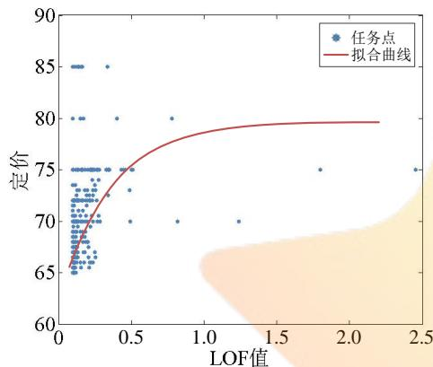

<details>
<summary>scatter</summary>

| Series | LOF值 (range) | 定价 (range) |
| --- | --- | --- |
| 任务点 | 0.1~2.5 | 65~85 |
</details>

图 18 定价与 LOF值的关系

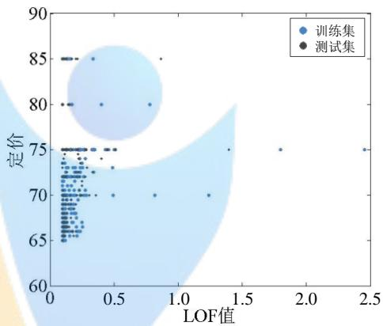

<details>
<summary>scatter</summary>

| Series | LOF值 (range) | 定价 (range) |
| --- | --- | --- |
| 训练集 | 0.1~2.5 | 65~85 |
| 测试集 | 0.1~0.9 | 70~85 |
</details>

图 19 30%数据对结果进行检验

利用 数据得出函数曲线（即得出定价的一个影响因素与定价的关系）后，我们利用剩余 数据对结果进行检验，如图所示。结果的检验均方残差偏移比例为6.57%，很好地验证了我们的函数关系。

表 4 检验结果示意

<table><tr><td>R20.6969</td><td>训练集均方残差21.5751</td><td>测试集均方残差20.2449</td><td>均方残差偏移比例6.57%</td></tr></table>

## （4） 地域分布造成的价格影响

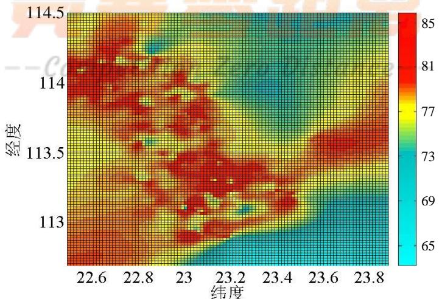

<details>
<summary>heatmap</summary>

| 经度 (Y) | 纬度 (X) | Value (Color Scale) |
| --- | --- | --- |
| 113.0~114.5 | 22.6~23.8 | 65~85 |
</details>

图 20 价格分布热力图

猜想定价分布与任务所在地理位置有一定关系，做出价格分布热力图，观察确实有分布趋势影响。中心有两块非常明显的高价区域，而右上方和右下方有两个非常明显的低价区域。我们在推测合理定价时可将热力图作为加价幅度的衡量标准，即在其他条件相同情况下红色区域定价要高于蓝色区域。

## 5.1.3. 任务未完成的原因推断

上文中我们已经给出影响定价的因素，包括用户与任务（任务附近用户限额情况、距离任务最近的用户距离均值）、任务与任务之间的关系，得到了一定的定价规律。对于任务未完成的原因，我们在下文对每个因素进行分析，观察已完成任务与未完成任务之间的差异。

## （1） 任务点附近用户限额因素

我们在图中表示出已完成与未完成的任务分布情况，如图 21 所示，为了观察其原因，我们对已完成与未完成任务的散点分别进行函数拟合，得到如图 22的函数图像。

我们可以发现，图像有两个交点。大量的点都集中在第一个交点之前，此时的拟合图像中，未完成任务的拟合曲线低于已完成任务的拟合曲线，这说明这部分定价忽略了任务点附近用户限额因素而导致定价偏低，没有用户去选择执行这些任务。对于①交点与②交点中间的函数图像分布，我们的解释是该段样本数据过少，存在一定偶然性，导致未完成任务的曲线略高于已完成曲线。②交点以后的曲线情况恢复正常。

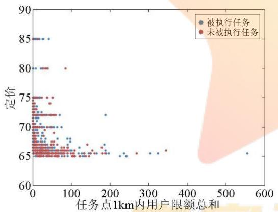

<details>
<summary>scatter</summary>

| Series | 任务点1km内用户限额总和 (range) | 定价 (range) |
| --- | --- | --- |
| 被执行任务 | 0~560 | 65~85 |
| 未被执行任务 | 0~350 | 65~80 |
</details>

图 21 已完成与未完成任务散点图

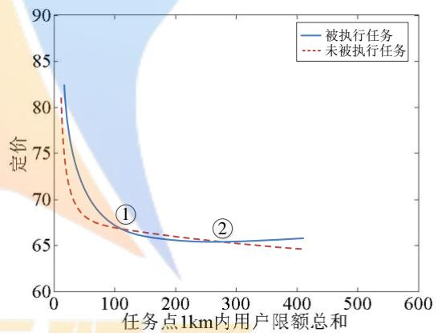

<details>
<summary>line</summary>

| 任务点1km内用户限额总和 | 定价::被执行任务 | 定价::未被执行任务 |
| --- | --- | --- |
| 0 | ~82.5 | ~81.5 |
| 100 | ~67 | ~67 |
| 200 | ~66 | ~66 |
| 300 | ~65.5 | ~65.5 |
| 400 | ~65.8 | ~64.8 |
</details>

图 22 已完成与未完成任务拟合曲线对比

## （2） 离任务点最近用户的平均距离因素

同上，我们做出已完成与未完成任务的散点图，用曲线进行拟合来研究已完成与未完成任务的差异，得到图 23、图24。

图像有一个交点。大量的点都集中在交点之前，此时的拟合图像中，未完成任务的拟合曲线低于已完成任务的拟合曲线，这说明这部分定价忽略了任务点与离任务点最近用户的距离因素而导致定价偏低，没有用户去选择执行这些任务。对于交点以后的曲线走势，我们的解释是该段样本数据过少，有部分偶然离群点对拟合结果影响较大，导致未完成任务的曲线略高于已完成曲线。

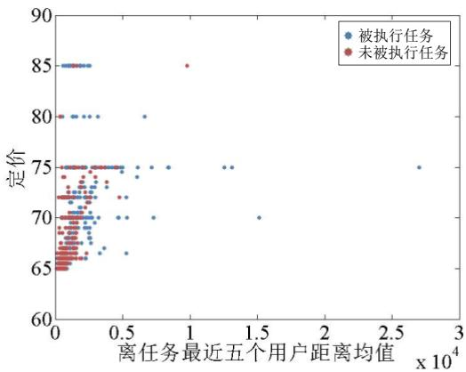

<details>
<summary>scatter</summary>

| Series | 离任务最近五个用户距离均值 (x 10^4) | 定价 |
| --- | --- | --- |
| 被执行任务 | ~0.05 ~2.7 | ~65 ~85 |
| 未被执行任务 | ~0.05 ~1.0 | ~65 ~85 |
</details>

图 23 已完成与未完成任务散点图

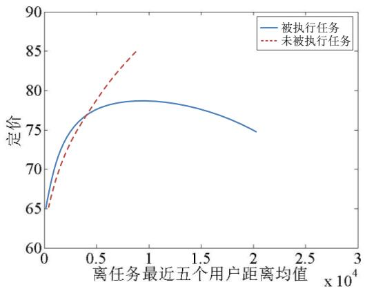

<details>
<summary>line</summary>

| 离任务最近五个用户距离均值 (x 10^4) | 定价::被执行任务 | 定价::未被执行任务 |
| --- | --- | --- |
| 0 | ~65 | ~65 |
| 0.5 | ~77 | ~78 |
| 1.0 | ~79 | — |
| 1.5 | ~78 | — |
| 2.0 | ~75 | — |
</details>

图 24 已完成与未完成任务拟合曲线对比

## （3） 任务离群程度因素

同上，我们做出已完成与未完成任务的散点图，用曲线进行拟合来研究已完成与未完成任务的差异，得到图 25、图26。

图像有一个交点。考虑到 90%以上的点的 LOF 值小于等于 1，大量的点都集中在交点之前，此时的拟合图像中，未完成任务的拟合曲线低于已完成任务的拟合曲线，这说明这部分定价忽略了任务离群程度因素而导致定价偏低，没有用户去选择执行这些任务。对于有部分点 LOF值较高如 LOF=2.2、1.75、1.55的离群任务也被完成的情况，我们寻找到这些点对应的地理位置发现都是在东边的边界处，且附近没有邻近的用户。

我们猜测，题中所给的用户地理位置只是一部分，这部分任务可能被边界以外的用户所执行。因此在之后的考虑当中，我们不考虑这三个离群度高却被完成的任务。

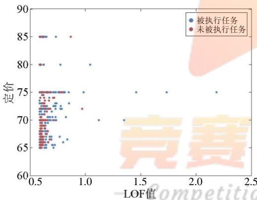

<details>
<summary>scatter</summary>

| Series | LOF值 (range) | 定价 (range) |
| --- | --- | --- |
| 被执行任务 | 0.5~2.2 | 65~85 |
| 未被执行任务 | 0.5~1.0 | 65~85 |
</details>

图 25 已完成与未完成任务散点图

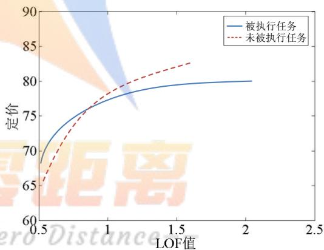

<details>
<summary>line</summary>

| LOF值 | 被执行任务 (定价) | 未被执行任务 (定价) |
| --- | --- | --- |
| 0.5 | ~68 | ~65 |
| 1.0 | ~77 | ~78 |
| 1.5 | ~79 | ~82 |
| 2.0 | 80 | — |
</details>

图 26 已完成与未完成任务散点图

## 5.2. 问题二：新的任务定价方案及和原方案的比较

## 5.2.1. 定价方案模型建立与求解

## （1） 多目标优化模型建立

## 目标函数

在优化模型建立之前，我们先明确目标函数。本问题的目标函数确定可以转化为博弈最优的求解。即我们要求解的定价方案要保证执行率高的同时定价尽可能低，这可以给系统带来最大利润。设平均执行率表达式为f(S)，定价总额表

达式为 $f \left( P \right)$ ，则目标为：

$$
\max: f (S) \quad \min: f (P) \tag {10}
$$

根据我们的分析，我们基于以上两个目标建立一个综合定价方案，影响因素为两个方向：任务与任务、用户与任务。为了综合其影响我们采用平均比例法去其量纲并转换成比例得分。

例如任务点周围用户数量这个影响因素，我们求出一定范围内每个任务点周围平均用户数（如任务点周围 1km 内用户数平均为 5个），对于每个任务点都有其对应的1km 内的用户数（如 6 个），此时该比例为 $1 . 2 > 1$ ，即对于定价的影响是降低定价。设任务点周围用户数量影响函数为 $x _ { 1 }$ ，一定范围内用户总限额影响函数为 $x _ { 2 }$ ，用户离任务点平均距离影响函数为 $x _ { 3 }$ ，他们对应的权重为 $\beta _ { 1 } \setminus \beta _ { 2 } \setminus \beta _ { 3 }$ 即用户与任务之间的关系对定价的综合影响因子为：

$$
f _ {1} = \beta_ {1} \cdot x _ {1} + \beta_ {2} \cdot x _ {2} + \beta_ {3} \cdot x _ {3} \tag {11}
$$

任务与任务间的影响因素只有一个离群度，设该因素影响因子为 $f _ { 2 }$ ，离群度函数为 $y$ ，则：

$$
f _ {2} = y \tag {12}
$$

用户与任务影响因子的系数为 $\alpha _ { \imath }$ ，任务与任务影响因子的系数为 $\alpha _ { 2 }$ ，第<sub>i</sub>个任务的定价为 $P _ { i }$ ，总任务个数为n，定价综合模型 $f \left( P \right)$ 如下：

$$
f (P) = \sum_ {1} ^ {n} P _ {i} / n \cdot (\alpha_ {1} \cdot f _ {1} + \alpha_ {2} \cdot f _ {2}) \tag {13}
$$

任务执行率由定价、任务与任务影响因素、人与任务影响因素共同决定，设这三个影响因子函数分别为 $F _ { 1 }$ 、 $F _ { 2 }$ 、 $F _ { 3 }$ 。同时，用户的信誉值、用户开始预订时间对任务执行率产生一定影响，即信誉越高的用户成功完成任务的可能性越大，对一个任务来说，周围越早看到的人越多该任务成功完成的可能性越大，我们简化这两个影响因子为两个系数 $\alpha$ 与 $\beta$ 。任务执行率综合模型f(s)如下：

$$
f (S) = \alpha \cdot \beta \cdot (F _ {1} + F _ {2} + F _ {3}) \tag {14}
$$

其中，平均执行率的影响因素除了每个任务的预计执行率以外，还受到其周围用户的信誉与用户开始预订时间的影响，即用户的信誉越高、任务开始预订时间越早，预计执行成功率越高。设这两个因素为 $\alpha \cdot \beta$ ，任务总数为 $n$ ，第i个任务的预计成功率为 $S _ { i } :$ ，则平均执行率最优的目标函数为：

$$
\max f (S) = \alpha \cdot \beta \cdot \frac {\sum_ {1} ^ {n} S _ {i}}{n} \tag {15}
$$

$$
\min f (P) = \sum_ {1} ^ {n} P _ {i} \tag {16}
$$

设 $P _ { i }$ 为优化后第<sub>i</sub>个任务的定价，则定价总额最优的目标函数为：

## 自变量范围

在考虑自变量范围时，我们需要明确自变量的数量及与因变量的关系，我们绘制其逻辑框图如下。

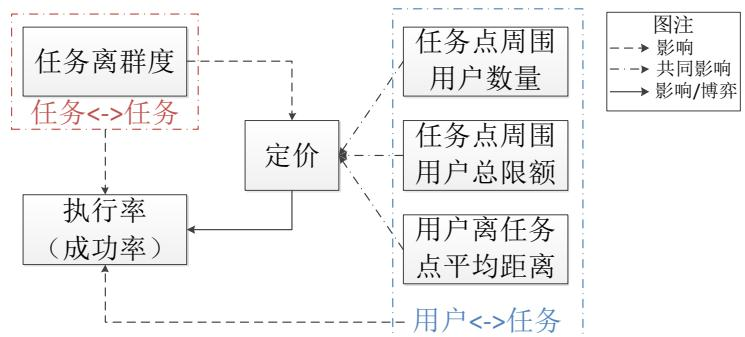

<details>
<summary>flowchart</summary>

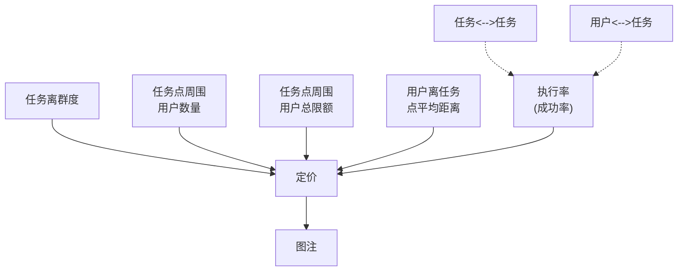
```mermaid
graph TD
  A["任务离群度"] --> B["定价"]
  C["任务点周围\n用户数量"] --> B
  D["任务点周围\n用户总限额"] --> B
  E["用户离任务\n点平均距离"] --> B
  F["执行率\n(成功率)"] --> B
  B --> G["图注"]
  H["任务<-->任务"] -.-> F
  I["用户<-->任务"] -.-> F
```
</details>

图 27 自变量与因变量逻辑关系结构

我们对逻辑结构进行如下说明：

 定价由两方面因素影响：任务与任务间的关系，用户与任务间的关系；  
 任务与任务间的关系由任务离群度来刻画，即上文提到的 LOF离群因子；  
 用户与任务间的关系由三方面因素刻画：任务点周围用户数量、用户总限额和用户离任务的平均距离；  
 执行率（成功率）由三方面因素影响：任务与任务间的关系，用户与任务间的关系、定价。其中定价与其为博弈关系，定价下降导致执行率上升；定价上升导致执行率下降。

首先，可以我们根据经验确定成功率的影响因素信誉值 及用户开始预订时间 $\beta$ 的取值如下表所示（假设为 1km 内距离任务点的用户数值）：

表 5 、 $\beta$ 值对照表

<table><tr><td>平均用户信誉C范围</td><td>α</td><td>平均用户开始预订时间T范围</td><td>β</td></tr><tr><td>C≥500</td><td>0.99</td><td>T≤6:36</td><td>0.99</td></tr><tr><td>80≤C&lt;500</td><td>0.98</td><td>6:36&lt;T≤6:51</td><td>0.98</td></tr><tr><td>20≤C&lt;80</td><td>0.95</td><td>6:51&lt;T≤7:18</td><td>0.96</td></tr><tr><td>10≤C&lt;20</td><td>0.90</td><td>7:18&lt;T≤7:48</td><td>0.93</td></tr><tr><td>C&lt;10</td><td>0.80</td><td>T&gt;7:48</td><td>0.90</td></tr></table>

## 约束条件

为了使目标达到最优，对未优化之前的定价总额M 与平均成功率N ，有如下约束：

$$
\left\{ \begin{array}{l} f (P) \leq M \\ f (S) \geq N \end{array} \right. \tag {17}
$$

在执行的任务定价与未被执行的定价之间有一个的区域，我们称之为合理定价范围，即被执行的任务定价略微降低或未被执行的任务定价略微提高，在这个范围内都有可能被执行，合理定价范围示意图如下。

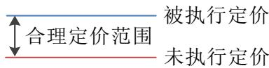  
图 28 合理定价范围

设 $P _ { F }$ 为失败任务的定价， $P _ { s }$ 为成功任务的定价，合理定价区间应该满足：

$$
P _ {F} \leq P \leq P _ {S} \tag {18}
$$

## 多目标优化模型

执行率优化是指定价总额一定的情况下优化执行率，定价优化是指执行率一定的情况下优化执行率，为了使得目标函数最优化，我们给出的优化模型如下：

$$
\begin{array}{l} \max f (S) = \frac {\sum_ {1} ^ {n} S _ {i}}{n} \quad \min f (P) = \sum_ {1} ^ {n} P _ {i} \\ \text {s.t.} \left\{ \begin{array}{l} \sum_ {1} ^ {n} P _ {i} \leq M \\ \left(\sum_ {1} ^ {n} S _ {i} \cdot \alpha_ {i} \cdot \beta_ {i}\right) / n \geq N \\ P _ {F _ {i}} \leq P _ {i} \leq P _ {S _ {i}} \\ i = 1 \dots n \end{array} \quad \text {s.t.} \left\{ \begin{array}{l} \left(\sum_ {1} ^ {n} S _ {i} \cdot \alpha_ {i} \cdot \beta_ {i}\right) / n \geq N \\ \sum_ {1} ^ {n} P _ {i} \leq M \\ P _ {F _ {i}} \leq P _ {i} \leq P _ {S _ {i}} \\ i = 1 \dots n \end{array} \right. \right. \tag {19} \\ \end{array}
$$

其中， $S _ { i }$ 为优化后第<sub>i</sub>个任务的成功率， $P _ { i }$ 为优化后第<sub>i</sub>个任务的定价， $P _ { F _ { i } }$ 为第<sub>i</sub>个任务对应的失败任务定价， $P _ { S _ { i } }$ 为第<sub>i</sub>个任务对应的成功任务定价。

## 最优函数最优解求解办法

我们引入最大期望利润 $W$ ，设每一个任务商家提供给系统的价格为 $Q _ { i }$ ，系统定价为 $Q _ { i } ^ { \prime }$ ，该任务执行率为 $R _ { i }$ ，则最大系统期望利润可以近似用如下公式估计：

$$
\max W = \sum_ {1} ^ {n} \left(Q _ {i} - Q _ {i} ^ {\prime}\right) \cdot R _ {i} \tag {20}
$$

也即能求出期望利润最大时的定价总额与平均成功率且是唯一的两个值。

## （2） 优化模型求解

## 层次分析法确定权重

为了确定用户与任务三个影响因素用户数量、用户总限额响、用户离任务点平均距离的权重 $\beta _ { 1 } \setminus \ \beta _ { 2 } \setminus \beta _ { 3 }$ ，我们查找了相关文献， 并根据文献和经验采用层次分析法最终确定其值为： $\beta _ { \mathrm { { 1 } } } = 0 . 2 1 3 1$ $\beta _ { 2 } = 0 . 3 0 3 6$ ， $\beta _ { 3 } = 0 . 4 8 3 3$ 0

## 回归拟合函数

利用现有的数据对定价进行回归，成功执行的定价函数为 $f \left( P _ { s } \right)$ ，未成功执行的定价函数为 $f \left( P _ { F } \right)$ 得到执行任务与未执行任务的回归结果如下所示：

$$
f \left(P _ {S}\right) = 0. 0 3 x ^ {3} - 0. 9 1 x ^ {2} + 6. 4 5 x - 0. 1 6 y ^ {3} + 0. 9 8 y ^ {2} - 2. 8 3 y + 6 4. 9 7 \tag {21}
$$

$$
f \left(P _ {F}\right) = - 0. 7 5 x ^ {2} + 3. 8 2 x - 0. 1 1 y ^ {2} - 2. 1 1 y + 1. 6 1 x \cdot y + 6 4. 8 3 \tag {22}
$$

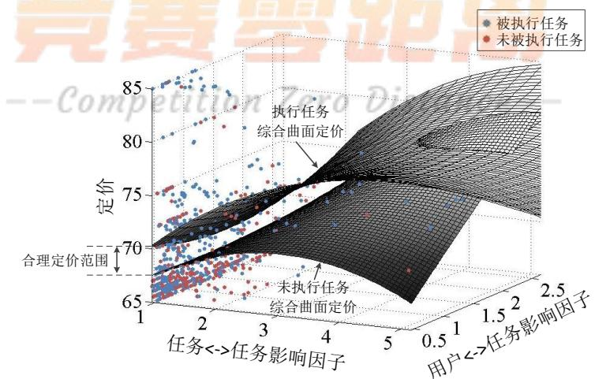

<details>
<summary>scatter_3d</summary>

| Series | 任务<-->任务影响因子 (range) | 用户<->任务影响因子 (range) | 定价 (range) |
| --- | --- | --- | --- |
| 被执行任务 | 1~5 | 0.5~2.5 | 65~85 |
| 未被执行任务 | 1~5 | 0.5~2.5 | 65~75 |
</details>

图 29 成功执行/未成功执行任务曲面与合理定价范围

去除噪声的 $R ^ { 2 }$ 分别为 0.7780 和 0.8523。为了更好地展示合理定价范围，我们在同一三维坐标系中画出两个曲面定价函数的分布情况，如上所示。

这里对合理定价范围进行说明：合理定价范围是位于成功执行任务的定价曲面与未成功执行的定价曲面中间的空间区间，并不是在合理定价范围的任务都能成功执行。根据我们的约束条件，我们还需要对合理定价范围内的数据点进行成功率检验。

对执行率函数进行拟合，成功执行的任务赋值 1，未成功执行的任务赋值 0，与3个影响因素和2个影响因子进行多元拟合，最终得到拟合度较好的曲线如下：

$$
f (P) = a _ {1} \cdot x ^ {2} + a _ {2} \cdot x + a _ {3} \cdot y ^ {2} + a _ {4} \cdot z ^ {3} + a _ {5} \cdot z ^ {2} + a _ {6} \cdot z + a _ {7} \cdot y \cdot z + a _ {8} \tag {23}
$$

其中， $a _ { 1 } = 0 . 0 0 2$ $a _ { 2 } = - 0 . 4 3 2$ $a _ { 3 } = 0 . 0 5 2 5$ $a _ { 4 } = - 1 . 6 5 4 \times 1 0 ^ { - 5 }$ $a _ { 5 } = 0 . 0 0 1 9$ $a _ { 6 } = 0 . 2 1 4 4$ $a _ { 7 } = - 0 . 0 0 6$ $a _ { \scriptscriptstyle 8 } = - 3 . 3 5 1 1$ $R ^ { 2 } = 0 . 2 6 0 2$

## 5.2.2. 对题中定价进行优化与对比

对于题中所给数据，我们计算得到其任务总价为 57707.5，平均任务执行率为62.5%。也即我们对题中任务定价优化时， $M = 5 7 7 0 7 . 5$ $N = 6 2 . 5 \%$ 。由于算法需要遍历搜寻最优解，搜索全局最优解较为费时，我们采用遗传算法求取局部最优解来近似代替全局最优解，并各取了 50 组数据点进行曲线拟合，将优化结果展示在图像上，我们以任务定价总额最小为目标进行优化得到下图的拟合曲线1，以平均成功率最高为目标进行优化得到下图的拟合曲线 2.

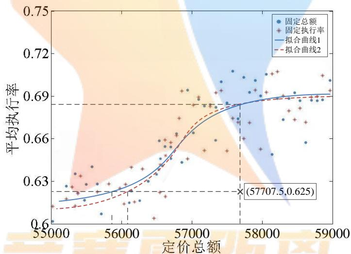

<details>
<summary>scatter</summary>

| Series | 定价总额 (range) | 平均执行率 (range) |
| --- | --- | --- |
| 固定总额 | 55000~59000 | 0.60~0.71 |
| 固定执行率 | 55000~59000 | 0.61~0.71 |
</details>

图 30结果展示与对比

在图中我们标志出原来的定价方案得出的定价总额与平均执行率数据点，如图中 $^ { 6 6 } \mathrm { X } ^ { 3 } ;$ 处所示，坐标为 $( 5 7 7 0 7 . 5 , 0 . 6 2 5 ) _ { \circ }$ 经过我们的算法优化之后，我们可以用 56000 左右的总额达到预制一致的平均执行率，定价总额降低 2.9%；我们也可以用同样的定价总额达到 68.4%的平均执行率，平均执行率提高 9.4%。

对于以上最优函数中最优解求解，由于题中未给每个任务商家给系统的价格$Q _ { i }$ ，我们假设每个任务商家给系统的价格都为 90（实际操作中可以用实际数据替换）时，根据定价总额与平均执行率的函数关系得出：当系统定价总额为 56908时获得的期望利润最大，此时利润为 11459.72，此时的平均执行率为 65.7%。

## 5.3. 问题三：基于任务联合打包发布的模型改进

建立模型之前，我们需要明确打包的目的。事实上打包的目的与我们上文中考虑的两个因素——执行率与定价密切相关：

 打包对执行率的影响：在我们的打包过程中，并不是随机打包距离近的点，而是尽量将预计不能成功执行（执行率低的点）与能成功执行（执行率高的点）进行打包，这样能大大提高执行率低的点的执行率。  
 打包对定价的影响：打包的任务点定价总和应该小于三个任务点分别定价的总和。事实上打包成功率较高的任务点对于系统盈利来说是不利的，打包对系统盈利的好处是提高平均成功率从而提高期望利润。

## 5.3.1. 联合打包划分模型

联合打包模型建立第一步为确定如何划分的依据。打包实际上就是分类的一种，我们将具有某些性质的任务点分为一类。我们能想到一些聚类方式如K-means 聚类、层次聚类等，以上的聚类方法一般只适用于凸样本集的聚类。不适合本文任务点分布情况，为此，我们提出一种改进的基于 DBSCAN 的聚类算法。

DBSCAN 算法：由密度可达关系导出的最大密度相连的样本集合，即为我们最终聚类的一个类别。它最大的优势是可以发现任意形状的聚类簇，同时过滤噪声信号，对于本题数据分布有较好表现。

如图 31 所示， $^ o$ 为随机任务点，以一定半径画圆（该半径与该任务的综合得分有关，在下文具体介绍），覆盖到周围能覆盖的最大可达对象，即对于 $^ o$ 点的邻近对象集更新结束。遍历完所有对象，程序流程结束。

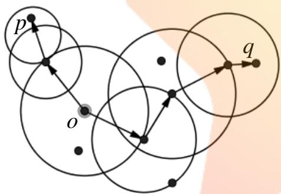

<details>
<summary>flowchart</summary>

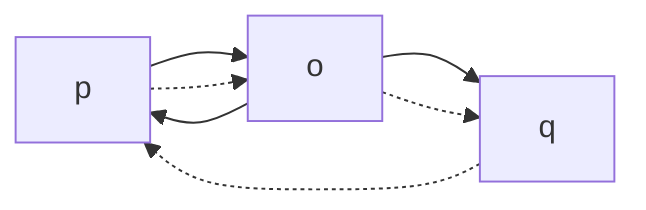
```mermaid
graph LR
  p["p"] --> o["o"]
  o --> q["q"]
  o --> p
  p -.-> o
  o -.-> q
  q -.-> p
```
</details>

注：半径与任务点得分有关

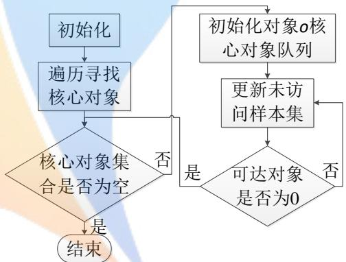

<details>
<summary>flowchart</summary>

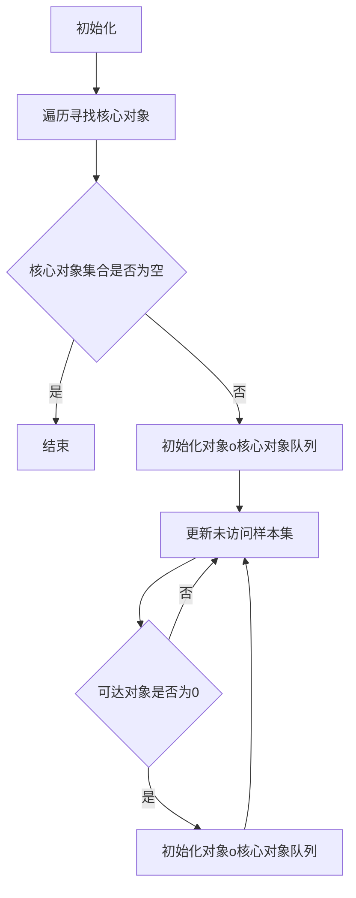
```mermaid
graph TD
  A["初始化"] --> B["遍历寻找核心对象"]
  B --> C{"核心对象集合是否为空"}
  C -->|是| D["结束"]
  C -->|否| E["初始化对象o核心对象队列"]
  E --> F["更新未访问样本集"]
  F --> G{"可达对象是否为0"}
  G -->|是| H["初始化对象o核心对象队列"]
  G -->|否| F
  H --> F
```
</details>

图 32算法流程图  
图 31 DBSCAN 算法示意图

该算法的重点是每个任务点的半径刻画，也即我们提到的得分。我们的目的地尽量联合成功执行率高的与低的任务点并打包。同时，考虑到实际任务执行用户不可能一次性做太多任务，因此规定打包任务数量上限不超过4个。对于打包完的集合，我们需要根据其周围的用户分布以及用户情况来判断打包是否合理，并将不合理的包打散。合理打包与不合理打包的示意如下：

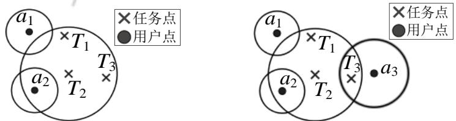  
图 33不合理打包（左），合理打包（右）

如图 33所示，某个区域有三个预打包任务 $T _ { 1 } , \ T _ { 2 } , \ T _ { 3 }$ ，左图有两个用户 $a _ { 1 }$ 、$a _ { 2 }$ ，此时他们的用户得分（信誉、限额等影响）半径不能覆盖任何一个任务，即不合理打包。右图加入用户 $a _ { 3 }$ ，其用户得分半径覆盖到原 $T _ { 3 }$ 任务，即合理打包。

下面我们对任务得分半径与用户得分半径进行量化。对于每一个任务点，都有其最邻近的任务点，设任务<sub>i</sub>距离其最近的任务点距离为 $d _ { i }$ ，任务点总量为 $n$ ，每个任务对应的标准得分半径t为：

$$
t = \sum_ {1} ^ {n} d _ {i} / n \tag {24}
$$

设任务<sub>i</sub>的得分系数为 $\lambda _ { i }$ ，预计成功执行率为 $S _ { i }$ ，计算出两者之间的近似关系如下：

$$
\lambda_ {i} = 2. 0 6 \cdot e ^ {5 S _ {i}} + 4. 1 7 \tag {25}
$$

转化后的任务得分半径 $R _ { i }$ 为：

$$
R _ {i} = \lambda_ {i} \cdot t \tag {26}
$$

设用户 $j$ 离其最近 5个任务点的平均半径为 $\overline { r }$ ，用户信誉与用户预订时间影响因素 $\alpha _ { i }$ 、 $\beta _ { i }$ 在成功执行率计算时已给出，用户得分半径 $r _ { i }$ 为：

$$
r _ {i} = \alpha_ {i} \cdot \beta_ {i} \cdot \overline {{r}} \tag {27}
$$

我们利用遗传算法对以上改善的 DBSCAN算法进行求解，最终得到如图 34所示的结果（局部）。我们可以发现，很多预成功率较小的点与成功率较大的点打包，试图提升打包任务的平均成功率。为了分析打包带来的效果，在图 35 中我们展示了成功执行率前后对比，成功执行率最高提升了 7.2%，平均成功率提升2.3%，验证了任务联合打包对于成功率的提升有很大作用。

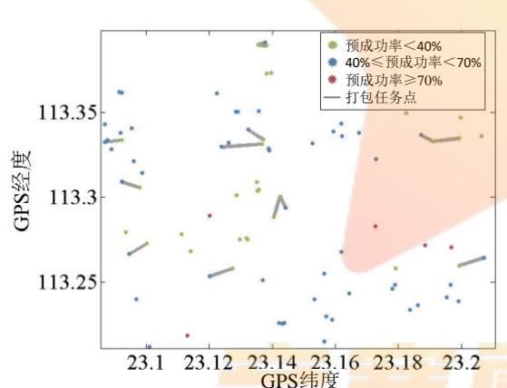

<details>
<summary>scatter</summary>

| Series | GPS纬度 (range) | GPS经度 (range) |
| --- | --- | --- |
| 预成功率 < 40% | 23.1~23.2 | 113.25~113.38 |
| \(40% \le\)预成功率 < 70% | 23.1~23.2 | 113.23~113.36 |
| 预成功率 \(\ge\) 70% | 23.1~23.2 | 113.23~113.29 |
</details>

图 34 打包结果局部展示

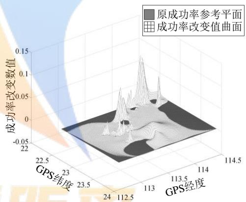

<details>
<summary>surface_3d</summary>

| GPS纬度 | GPS经度 | 成功率改变值 |
| --- | --- | --- |
| 22.5~24 | 112.5~114.5 | -0.05~0.15 |
</details>

图 35 打包成功执行率改变情况

## 5.3.2. 打包任务定价方案

在定价之前寻找打包任务最近的用户，先确定多任务中心点，其 GPS 坐标由被打包任务点的平均经度与平均纬度确定。

首先寻找该中心点最近的用户距离，将该用户到这若干个任务点的折线距离转换成直线，示意图如下图所示。 $a _ { 1 }$ 为距离打包任务最的用户，且其用户得分半径覆盖分任务点。我们将该用户执行任务的轨迹 $T _ { 1 }  T _ { 2 }  T _ { 3 }  T _ { 4 }$ 的距离等效为$a _ { 1 }$ 至 $T _ { 4 } ^ { \prime }$ 的直线距离，其中： $T _ { 1 } T _ { 2 } = T _ { 1 } T _ { 2 } ^ { ' } , T _ { 2 } T _ { 3 } = T _ { 2 } ^ { ' } T _ { 3 } ^ { ' } , T _ { 3 } T _ { 4 } = T _ { 3 } ^ { ' } T _ { 4 } ^ { ' }$ 0

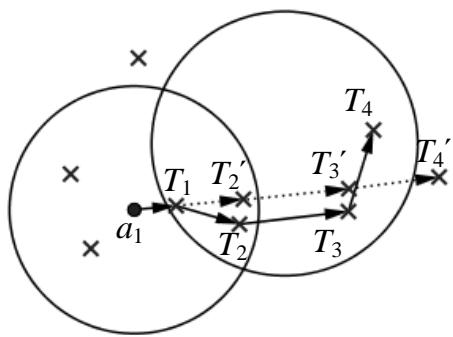

<details>
<summary>text_image</summary>

a₁
T₁ T₂'
T₂
T₃
T₃'
T₄
T₄'
</details>

图 36 任务点等效距离示意

在任务的定价方案确定之前，我们先猜测定价 $p$ 由两部分组成，即任务本身价值 $p _ { 1 }$ 与路途费用 $p _ { 2 }$ 。而对于打包任务来说，任务本身价值 $p _ { 1 }$ 没有发生变化，变化的为路途费用 $p _ { 2 }$ 。

图 36 中，设 $a _ { 1 }$ 与 $T _ { 1 }$ 、 $T _ { \scriptscriptstyle 2 }$ 、 $T _ { 3 }$ 、 $T _ { 4 }$ 任务的直线距离分别为 $d _ { \mathrm { { l } } }$ 、 $d _ { 2 }$ 、 $d _ { 3 }$ $d _ { 4 }$ 打包后 $a _ { 1 }$ 到四个任务的等效距离为 $a _ { 1 }$ 至 $T _ { 4 } ^ { \prime }$ 的直线距离D。此时，路途费用 $p _ { 2 } ^ { \prime }$ 的计算方式如下（假设路途费用与路途距离成正比）：

$$
p _ {2} ^ {\prime} = p _ {2} \cdot D / (d _ {1} + d _ {2} + d _ {3} + d _ {4}) \tag {28}
$$

设任务i本身价值x、路途费用y与定价 $p _ { i }$ 服从的函数关系如下所示。

$$
p _ {i} = \mu_ {i} \cdot x _ {i} + \varphi_ {i} \cdot y _ {i} \tag {29}
$$

其中 $\mu _ { i }$ 、 $\varphi _ { i }$ 对于每个任务不同，需要通过拟合寻找最佳参数值。设打包的任务数量为n，打包任务的定价P与原任务定价的关系如下：

$$
P = \sum_ {1} ^ {n} \left(\mu_ {i} \cdot x _ {i}\right) + \left(D / \sum_ {1} ^ {n} d _ {i}\right) \cdot \sum_ {1} ^ {n} \left(\varphi_ {i} \cdot y _ {i}\right) \tag {30}
$$

其中D为等效距离， $d _ { i }$ 为用户到原i个任务的距离，我们根据原数据对定价方式进行拟合判断，得到每个打包任务较为合理的定价。我们列出部分任务的定价如下表所示（完整表格见附录）：

表 6 部分打包定价结果展示

<table><tr><td>编号</td><td>打包任务号</td><td>任务坐标</td><td>任务预定价</td><td>预定价和</td><td>打包定价</td></tr><tr><td rowspan="2">1</td><td>A0253</td><td>23.0869,113.3324</td><td>68.5</td><td rowspan="2">128.5</td><td rowspan="2">114.5</td></tr><tr><td>A0262</td><td>23.0923,113.3337</td><td>65</td></tr><tr><td rowspan="3">2</td><td>A0132</td><td>23.1382,113.3895</td><td>65</td><td rowspan="3">203.5</td><td rowspan="3">190</td></tr><tr><td>A0144</td><td>23.1354,113.3900</td><td>73.5</td></tr><tr><td>A0191</td><td>23.1378,113.3913</td><td>65</td></tr><tr><td>...</td><td>...</td><td>...</td><td>...</td><td>...</td><td>...</td></tr><tr><td rowspan="4">25</td><td>A0011</td><td>22.5249,113.9309</td><td>65</td><td rowspan="4">267</td><td rowspan="4">243.5</td></tr><tr><td>A0012</td><td>22.5191,113.9358</td><td>67</td></tr><tr><td>A0022</td><td>22.5159,113.9357</td><td>65.5</td></tr><tr><td>A0036</td><td>22.5260,113.9354</td><td>69.5</td></tr></table>

## 5.4. 新项目的任务定价方案与实施效果

## 5.4.1. 新项目定价方案

总结上文的定价方案，我们给出定价流程图，如下：

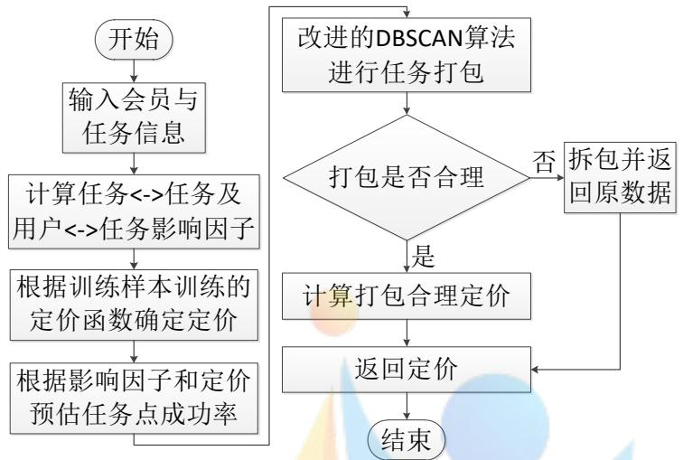

<details>
<summary>flowchart</summary>

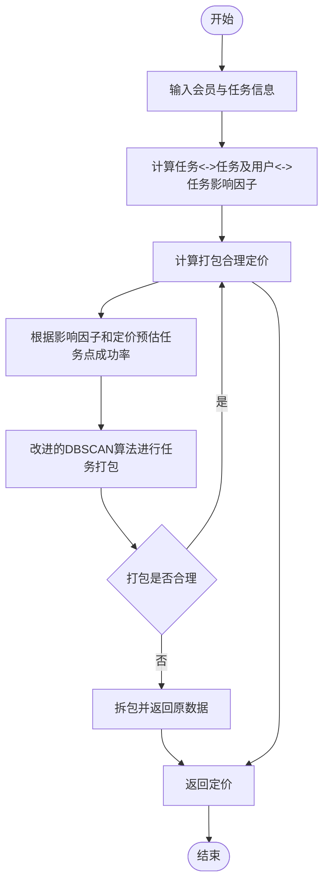
```mermaid
graph TD
  Start(["开始"]) --> Input["输入会员与任务信息"]
  Input --> CalcTask["计算任务<->任务及用户<->任务影响因子"]
  CalcTask --> CalcPrice["根据训练样本训练的定价函数确定定价"]
  CalcPrice --> ResultSuccess["根据影响因子和定价预估任务点成功率"]
  ResultSuccess --> DBSCAN["改进的DBSCAN算法进行任务打包"]
  DBSCAN --> Decision{"打包是否合理"}
  Decision -->|是| CalcPrice["计算打包合理定价"]
  Decision -->|否| ReDownload["拆包并返回原数据"]
  ReDownload --> ReturnPrice["返回定价"]
  CalcPrice --> ReturnPrice
  ReturnPrice --> End(["结束"])
```
</details>

图 37 定价流程

该流程包含了上文的最优定价选择以及如何打包与打包任务定价的最优方案，并且对打包方案进行检测，在实际应用中具有较好的实用性。

## 5.4.2. 方案实施效果

我们利用上述流程对新数据进行定价及打包，最终得出的定价与成功率的结果如下表所示（部分结果，详细见附录）。

表 7 部分打包定价结果展示

<table><tr><td>编号</td><td>纬度</td><td>经度</td><td>定价</td><td>成功率</td></tr><tr><td>1</td><td>22.73</td><td>114.24</td><td>67.12</td><td>0.74</td></tr><tr><td>2</td><td>22.73</td><td>114.30</td><td>68.34</td><td>0.69</td></tr><tr><td>...</td><td>...</td><td>...</td><td>...</td><td>...</td></tr><tr><td>2066</td><td>23.16</td><td>113.37</td><td>72.96</td><td>0.89</td></tr></table>

为了更清楚体现我们的结果，我们将其部分结果表示在地图上，其中方框内的数字表示该范围区域内的平均定价，用热力图表示其任务成功执行率。

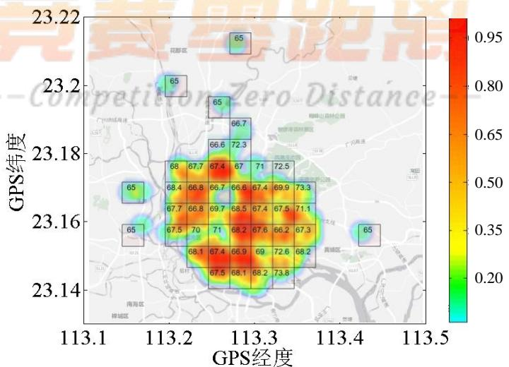

<details>
<summary>heatmap</summary>

| GPS纬度 | GPS经度 | Value |
| --- | --- | --- |
| 23.14~23.16 | 113.2~113.3 | 0.75~0.95 |
| 23.16~23.18 | 113.2~113.3 | 0.68~0.95 |
| 23.18~23.20 | 113.2~113.3 | 0.66~0.95 |
| 23.20~23.22 | 113.2~113.3 | 0.65~0.95 |
</details>

图 38 定价与任务成功执行率分布

## 5.5. 仿真模拟模型

在问题二优化模型和第三问打包算法的改进下，我们得到了优化后的方案，但为了增强方案的可靠性，因此我们建立了仿真模拟模型，它包含两个部分：申请任务的概率模型、仿真模拟算法。

## 5.5.1. 申请任务的概率模型

该概率模型是从用户的角度出发，建立起申请某项任务的概率与其他因素的函数关系。完成该用户评价任务的因素具体有以下几个原因：任务的价格、离任务的距离、任务与任务之间的离散度、任务自身的难易程度、到达任务的交通便利程度，其中任务的价格与其他因素像博弈，也是最主要的因素。

为了简化模型，我们提出一个综合因素评价体系，并结合数据特点，建立一个综合了一下五个因素的整体指标：任务价格的影响程度w 、离任务的距离w 、 $w _ { p }$ $w _ { d }$ 任务与任务之间的离散程度 $w _ { s }$ 、任务自身的难易程度 $w _ { c }$ 、到达任务的交通便利程度 $w _ { t }$ ，如下：

$$
W = \frac {\left(w _ {p} + w _ {d} \cdot w _ {s}\right)}{2} \cdot w _ {c} \cdot w _ {t} \cdot 100 \% \tag {31}
$$

其中，W满足以下条件

$$
\left\{ \begin{array}{l l} W = 0, & \left(w _ {p} + w _ {d} \cdot w _ {s}\right) / 2 \cdot w _ {c} \cdot w _ {t} \cdot 100 \% <   0 \\ W = 1, & \left(w _ {p} + w _ {d} \cdot w _ {s}\right) / 2 \cdot w _ {c} \cdot w _ {t} \cdot 100 \% > 1 \end{array} \right. \tag {32}
$$

因此，我们依次对这些因素进行量化分析：

任务价格 $p$

任务的价格是影响任务的主要因素，因此：

$$
w _ {p} = \frac {\left(p _ {i} - \mathrm{P} _ {\text {ave}}\right) ^ {3} + 1}{\left(\bar {p} - \mathrm{P} _ {\text {ave}}\right) ^ {3} + 1} \tag {33}
$$

其中， $\mathrm { P } _ { a v e }$ 为历史数据的平均定价。

离任务的距离d

$$
w _ {d} = \left(2. 2 - \mathrm{e} ^ {d _ {i}}\right) / \left(2. 2 - \mathrm{e} ^ {\bar {d}}\right) \tag {34}
$$

任务与任务之间的离散度s

$$
w _ {s} = 1 + e ^ {\bar {s} - 1} / 1 + e ^ {s _ {i} - 1} \tag {35}
$$

任务自身的难易程度 $w _ { c }$

$$
w _ {c} = r a n d _ {1} \tag {36}
$$

其中， $r a n d _ { 1 }$ 是一个服从正太分布的随机数，其中均值为0.9，方差为0.05。到达任务的交通便利程度 $w _ { t }$

$$
w _ {t} = r a n d _ {2} \tag {37}
$$

其中， $r a n d _ { 2 }$ 是一个服从二项式分布的随机数，值为1的概率为80%，0.2的概率为20%。

## 5.5.2. 仿真模拟算法

1) 初始：所有用户编号 $\mathbf { A } _ { 1 } , . . . , \mathbf { A } _ { \mathrm { n } }$ ，所有任务编号 $\mathbf { B } _ { 1 } , . . . , \mathbf { B } _ { \mathrm { m } }$  
2) 输入用户数据：所有用户经度位置 ${ \mathbf { X } } _ { \mathrm { A 1 } } , . . . , { \mathbf { X } } _ { \mathrm { A n } }$ 及维度 $\mathrm { Y _ { A 1 } , . . . , Y _ { A n } }$ ，所有任务的进度位置 $\mathbf { X } _ { \mathrm { B 1 } } , . . . , \mathbf { X } _ { \mathrm { B m } }$ 及维度 $\mathrm { Y _ { B 1 } , \mathrm { . . . , Y _ { B m } } }$ ，优化后任务的价格 $p _ { 1 } , . . . , p _ { m }$ ；  
3) 计算根据地球经纬度计算距离公式，计算任务与任务之间距离$\mathrm { D } _ { i , j } ^ { \tt B } , i , j = 1 , . . . , m$ 、用户与人之间的距离 $\mathbf { D } _ { i , j } ^ { \mathrm { A B } } , i = 1 , . . . , n , j = 1 , . . . , m$ ；  
4) 运用概率模型计算W：利用 $p _ { 1 } , . . . , p _ { m } , \ D _ { i , j } ^ { \mathrm { A B } } , i = 1 , . . . , n , j = 1 , . . . , m$ 和概率模型中的定义计算得 $w _ { p } \setminus w _ { d } \colon w _ { s }$ 由 $\mathrm { D } _ { i , j } ^ { \tt B } , i , j = 1 , . . . , m$ 带入模型二中 LOF函数中计算，$w _ { c } \cdot \mathrm { ~  ~ \mathscr ~ { ~ w ~ } ~ } _ { t }$ ；从而计算出概率模型整体指标 $W _ { i j } , i = 1 , 2 , . . . , n , j = 1 , 2 , . . . m$ ；  
5) 用户申请任务过程，并记录每个任务被申请的用户序号：每个用户按概率对每个任务产生 01 随机数；对每个任务而言，记录每个为 1的用户；  
6) 按用户的剩余限额比例排列分配所有任务：按任务序号依次处理任务，对每一个任务，对记录的用户按剩余限额比例排列，任务序号与排列第一的用户联合记录，并对该用户剩余限额做减一处理；  
7) 输出结果：任务与用户的对应关系，即被做与做的数据

## 5.5.3. 仿真模拟结果

本次方案中一种有 1689个独立任务和123 个打包任务，其中48 个为4个任务打包，35个为3个任务打包，40个为2个任务打包，共计 2066个任务。

我们对该方案进行了 100次的模拟，并对模拟中任务被做的次数除以总次数，记作该任务的模拟成功率

部分结果展示如下：

表 8 部分模拟结果展示

<table><tr><td>任务编号</td><td>定价</td><td>成功率</td><td>模拟成功率</td></tr><tr><td>547</td><td>67.07423</td><td>0.62</td><td>0.71</td></tr><tr><td>552</td><td>67.19956</td><td>0.81</td><td>0.78</td></tr><tr><td>608</td><td>68.83061</td><td>0.80</td><td>0.81</td></tr><tr><td>621</td><td>65.97074</td><td>0.56</td><td>0.65</td></tr><tr><td>[1410,291]</td><td>154.0357</td><td>0.29</td><td>0.1</td></tr><tr><td>[1562,293]</td><td>119.628</td><td>0.65</td><td>0.72</td></tr><tr><td>[1739,625]</td><td>180.1243</td><td>0.31</td><td>0.35</td></tr><tr><td>[855,815]</td><td>110.33</td><td>0.62</td><td>0.67</td></tr><tr><td>[27,1158,4]</td><td>154.5975</td><td>0.63</td><td>0.52</td></tr><tr><td>[559,1638,463]</td><td>177.8535</td><td>0.69</td><td>0.70</td></tr><tr><td>[495,505,510]</td><td>161.6569</td><td>0.74</td><td>0.74</td></tr><tr><td>[16,19,40,23]</td><td>177.4504</td><td>0.69</td><td>0.59</td></tr><tr><td>[55,88,1082,29]</td><td>239.4608</td><td>0.45</td><td>0.50</td></tr><tr><td>[1007,1009,1010,41]</td><td>190.516</td><td>0.69</td><td>0.70</td></tr><tr><td>[7,8,18,84]</td><td>154.6089</td><td>0.79</td><td>0.76</td></tr></table>

结果 通过统计显示模拟结果虽然波动很剧烈，但优化后的成功率与模拟成功率控制在20%的差别以内，我们可以认为优化后的方案可靠性强。

## 六. 模型灵敏度分析

## 6.1. 模型鲁棒性分析

在上文中，我们假设了一些参数，如我们计算最近平均距离时设定了离任务最近5个用户的平均距离；在衡量任务周围人数时，我们采用了1km作为半径；在利用 LOF 离群因子时，我们采用的k 3；在拟合最大利润时，我们设定了每个任务商家提供给系统的价格为 90。

对于这些主观选择的因素，我们对其进行鲁棒性分析来观察当这些因素与我们假定因素不同时对模型结果的影响来观察模型是否鲁棒。为了观察效果，我们直接做出四个主观假定值与结果的函数图像，如下所示。

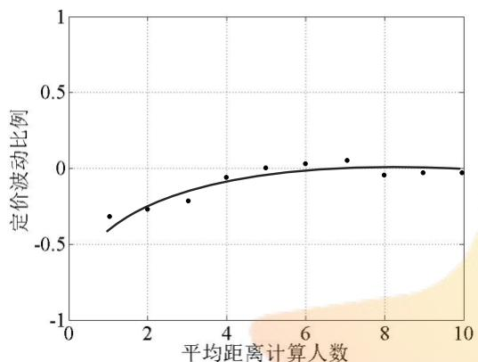

<details>
<summary>scatter</summary>

| 平均距离计算人数 | 定价波动比例 |
| --- | --- |
| 1 | ~-0.3 |
| 2 | ~-0.25 |
| 3 | ~-0.2 |
| 4 | ~-0.05 |
| 5 | 0 |
| 6 | ~0.02 |
| 7 | ~0.05 |
| 8 | ~-0.05 |
| 9 | ~-0.02 |
| 10 | ~-0.02 |
</details>

图 39平均距离假定参数波动影响

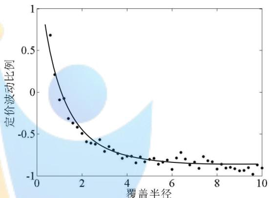

<details>
<summary>scatter</summary>

| 覆盖半径 | 定价波动比例 |
| --- | --- |
| ~0.6 | ~0.7 |
| ~0.8 | ~0.2 |
| ~1.0 | ~-0.1 |
| ~1.2 | ~-0.3 |
| ~1.4 | ~-0.4 |
| ~1.6 | ~-0.5 |
| ~1.8 | ~-0.6 |
| ~2.0 | ~-0.6 |
| ~2.2 | ~-0.6 |
| ~2.4 | ~-0.6 |
| ~2.6 | ~-0.7 |
| ~2.8 | ~-0.7 |
| ~3.0 | ~-0.7 |
| ~3.2 | ~-0.8 |
| ~3.4 | ~-0.8 |
| ~3.6 | ~-0.8 |
| ~3.8 | ~-0.8 |
| ~4.0 | ~-0.9 |
| ~4.2 | ~-0.9 |
| ~4.4 | ~-0.9 |
| ~4.6 | ~-0.9 |
| ~4.8 | ~-0.9 |
| ~5.0 | ~-0.9 |
| ~5.2 | ~-0.9 |
| ~5.4 | ~-0.9 |
| ~5.6 | ~-0.9 |
| ~5.8 | ~-0.9 |
| ~6.0 | ~-0.9 |
| ~6.2 | ~-0.9 |
| ~6.4 | ~-0.9 |
| ~6.6 | ~-0.9 |
| ~6.8 | ~-0.9 |
| ~7.0 | ~-0.9 |
| ~7.2 | ~-0.9 |
| ~7.4 | ~-0.9 |
| ~7.6 | ~-0.9 |
| ~7.8 | ~-0.9 |
| ~8.0 | ~-0.9 |
| ~8.2 | ~-0.9 |
| ~8.4 | ~-0.9 |
| ~8.6 | ~-0.9 |
| ~8.8 | ~-0.9 |
| ~9.0 | ~-0.9 |
| ~9.2 | ~-0.9 |
| ~9.4 | ~-0.9 |
| ~9.6 | ~-1.0 |
| ~9.8 | ~-0.9 |
</details>

图 40覆盖半径假定参数波动影响

图 39 为平均距离选择的人数波动对定价的影响，我们发现从计算的最近人数为4个开始，我们的波动比例就基本稳定，即我们取 5个最近用户计算平均值合理。

图 40 为覆盖半径选择对定价的影响，我们发现覆盖半径越高，定价越高，且呈现指数型增长，覆盖半径越大，定价越低，但是其趋势减缓。这可能是由于一个任务周围的用户再多也不可能使得定价无限制降低，这会导致系统的利润下降，因此降到一定的值就不再变化。我们取得 在波动率较大的地方，这个参数选取可以调整为 2km 或3km 从而回归出更精确的定价函数。

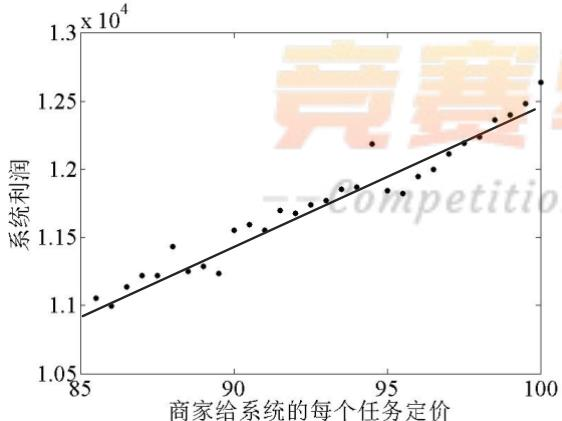

<details>
<summary>scatter</summary>

| 商家给系统的每个任务定价 | 系统利润 (x 10^4) |
| --- | --- |
| ~85.2 | ~1.105 |
| ~85.8 | ~1.100 |
| ~86.5 | ~1.115 |
| ~87.2 | ~1.120 |
| ~87.8 | ~1.145 |
| ~88.5 | ~1.125 |
| ~89.2 | ~1.130 |
| ~89.8 | ~1.125 |
| ~90.2 | ~1.155 |
| ~90.8 | ~1.160 |
| ~91.5 | ~1.155 |
| ~92.2 | ~1.170 |
| ~92.8 | ~1.165 |
| ~93.5 | ~1.175 |
| ~94.2 | ~1.185 |
| ~94.8 | ~1.190 |
| ~95.2 | ~1.220 |
| ~95.8 | ~1.185 |
| ~96.5 | ~1.180 |
| ~97.2 | ~1.195 |
| ~97.8 | ~1.200 |
| ~98.5 | ~1.215 |
| ~99.2 | ~1.225 |
| ~99.8 | ~1.235 |
| ~99.9 | ~1.240 |
| ~99.9 | ~1.250 |
| ~99.9 | ~1.265 |
</details>

图 41商家任务定价对系统利润的影响

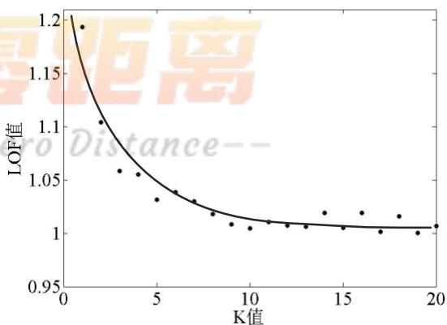

<details>
<summary>scatter</summary>

| K值 | LOF值 |
| --- | --- |
| 1 | ~1.195 |
| 2 | ~1.105 |
| 3 | ~1.06 |
| 4 | ~1.055 |
| 5 | ~1.03 |
| 6 | ~1.04 |
| 7 | ~1.03 |
| 8 | ~1.02 |
| 9 | ~1.01 |
| 10 | ~1.005 |
| 11 | ~1.01 |
| 12 | ~1.008 |
| 13 | ~1.008 |
| 14 | ~1.02 |
| 15 | ~1.008 |
| 16 | ~1.02 |
| 17 | ~1.002 |
| 18 | ~1.018 |
| 19 | ~1.002 |
| 20 | ~1.008 |
</details>

图 42 K值波动对 LOF离群因子的影响

图 41 为商家任务定价对系统利润的影响，我们发现可以较好地用一次函数进行拟合。该定价直接影响系统利润，商家给每个任务的定价越高，系统就会越看重成功率因素，以至系统愿意调高每个任务的定价来换取成功率。因此该参数需要具体的专家参考意见，因为该参数波动会较大影响模型鲁棒性。

图 42为k 值波动对 LOF 离群因子的影响，该因子为决定任务与任务之间关系的决定因素。我们取的k 值为 3，实际上当k 超过5之后，LOF因子就基本保持不变，因此可以取k 5能保证在该参数波动时模型也具有较好的鲁棒性。

## 6.2. 模型灵敏度分析

在第二问推演定价规律时，一共有三个回归函数，分别是距离任务一定范围内的人数、距离任务一定范围内的用户密度、任务的离群程度，而在回归分析时，每个函数都有若干个系数需要进行确定，在得出第二问的回归方程后，我们给出了每个参数95%的置信区间，接下去我们研究这些参数在区间内波动时对模型的影响。

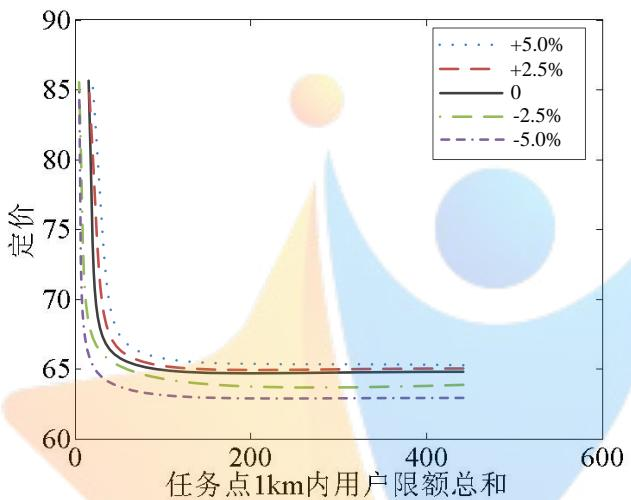

<details>
<summary>line</summary>

| 任务点1km内用户限额总和 | +5.0% | +2.5% | 0 | -2.5% | -5.0% |
| --- | --- | --- | --- | --- | --- |
| 0 | ~86 | ~86 | ~86 | ~86 | ~86 |
| 100 | ~66 | ~65 | ~65 | ~64 | ~63 |
| 200 | ~65 | ~65 | ~65 | ~64 | ~63 |
| 300 | ~65 | ~65 | ~65 | ~64 | ~63 |
| 400 | ~65 | ~65 | ~65 | ~64 | ~63 |
| 450 | ~65 | ~65 | ~65 | ~64 | ~63 |
</details>

图 43 因素 1回归灵敏度分析

图 43 给出了用户密度对定价的回归函数的灵敏度，当参数负向波动时的影响大于正向波动时的影响。总体来说因素 1 的灵敏度不大。

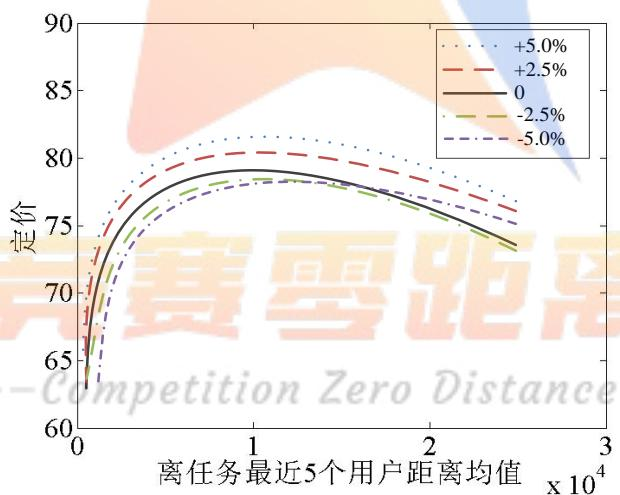

<details>
<summary>line</summary>

| 离任务最近5个用户距离均值 (x 10^4) | +5.0% | +2.5% | 0 | -2.5% | -5.0% |
| --- | --- | --- | --- | --- | --- |
| 0 | ~63 | ~63 | ~63 | ~63 | ~63 |
| 1 | ~81.5 | ~80.5 | ~79 | ~78.5 | ~78 |
| 2 | ~79 | ~78 | ~76 | ~76 | ~76 |
| 2.5 | ~76.5 | ~76 | ~73.5 | ~73 | ~75 |
</details>

图 44 因素 2回归灵敏度分析

图 44给出了任务周围用户数量对定价的回归函数的灵敏度，当波动为-5.0%时，出现与两个回归函数的交叉，即在波动在该值时减少了离群值对函数的影响。在正向波动时函数较为灵敏。

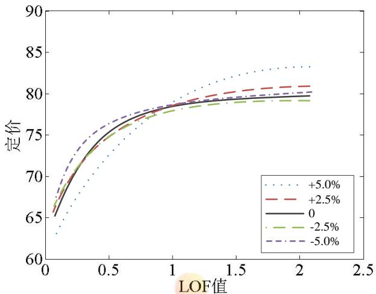

<details>
<summary>line</summary>

| LOF值 | +5.0% | +2.5% | 0 | -2.5% | -5.0% |
| --- | --- | --- | --- | --- | --- |
| 0.1 | ~63 | ~66 | ~65 | ~66 | ~67 |
| 0.5 | ~74 | ~74 | ~75 | ~74 | ~76 |
| 1.0 | ~80 | ~79 | ~79 | ~78 | ~79 |
| 1.5 | ~82 | ~80 | ~79 | ~79 | ~80 |
| 2.0 | ~83 | ~81 | ~79 | ~79 | ~80 |
</details>

图 45 因素 3回归灵敏度分析

图 45 给出了 LOF 值对定价的回归函数的灵敏度，当参数波动为+5.0%时，回归函数图像出现明显波动，而其余的值波动性较小。因此我们猜测函数在波动较小时不灵敏，在正向波动较大时灵敏度较高。

## 七. 模型的评价及推广

## 7.1. 模型的优点

## （1） 模型考虑因素多，适应性强；

本文考虑到的定价影响因素较多，机遇问题的机理建立的机理模型适应性较强，回归效果良好。

## （2） 使用一系列创新算法，实际表现良好；

本文采用了一些创新算法，如研究任务与任务的关系时采用了 LOF 离群因子进行分析；在研究如何打包任务时，对 DBSCAN 算法进行改进，接着对打包后的包进行可行性分析，与原方案对比后发现表现良好。

## （3） 模型完整，鲁棒性强；

本文从研究模型机理开始到模型建立、模型求解、模型验证、模型灵敏度分析，整体框架较为完整，且在最后的鲁棒性分析中验证了模型具有较好的鲁棒性。

## 7.2. 模型的不足

本模型程序运行时间较长。由于多因素作用下的多目标非线性优化模型对于计算机要求相对较高，需提高计算机配置才能快速求解。

## 7.3. 模型的推广

（1） 本文采用的机理分析方法，结合回归分析、检验，能用于多目标数据挖掘、优化问题上；  
（2） 本文采用的 LOF离群度检验的算法能用于推广用于电子商务犯罪和信用卡欺诈的侦查、网络入侵检测、生态系统失调检测、公共卫生、医疗和天文学上稀有的未知种类的天体发现等领域中，具有一定的启发作用；  
（3） 本文改进的 DBSCAN 算法能发现任意形状的聚类簇，同时过滤噪声，使用者可以根据需求定义聚类强度，能用于很多的分类问题上。

## 八. 参考文献

[1] 姜启源, 谢金星, 叶俊.数学模型（第三版）[M]. 北京: 高等教育出版社, 2003:274-324.  
[2] 张蕾. 一种基于核空间局部离群因子的离群点挖掘方法[J]. 上海电机学院学报, 2014, 17(03):132-136.  
[3] 肖晓伟, 肖迪, 林锦国,等. 多目标优化问题的研究概述[J]. 计算机应用研究,2011, 28(03):805-808.  
[4] 顾巧论, 高铁杠, 石连栓. 基于博弈论的逆向供应链定价策略分析[C]// 全国决策科学多目标决策研讨会. 2005.  
[5] 周水庚, 周傲英, 曹晶. 基于数据分区的 DBSCAN 算法[J]. 计算机研究与发展, 2000, 37(10):1153-1159.  
[6] 覃运梅, 石琴. 出租车合乘模式的探讨[J]. 合肥工业大学学报:自然科学版,2006, 29(1):77-79.  
[7] 黄毅军. 关于众包的特殊性的浅析[J]. 商情, 2013(39):39-39.  
[8] 王惠文, 张志慧, Tenenhaus. 成分数据的多元回归建模方法研究[J]. 管理科学学报, 2006, 9(4):27-32.  
[9] Horton J J, Chilton L B. The labor economics of paid crowdsourcing[C]// 2010:209-218.  
[10]Paulauskas N. Local outlier factor use for the network flow anomaly detection[M]. John Wiley & Sons, Inc. 2015.  
[11]Zheng L, Hu W, Min Y, et al. Weighted distance based outlier factor identifying and its application in wind data pre-processing[C]// Renewable Power Generation Conference. IET, 2014:1-5.  
[12]QIN Yun mei, SHI Qin. Research on the combined-taxi mode[J]. Journal of Hefei University of Technology, 2006.  
[13]Zhang D, Li Y, Zhang F, et al. coRide:carpool service with a win-win fare model for large-scale taxicab networks[C]// ACM Conference on Embedded Networked Sensor Systems. ACM, 2013:1-14.  
[14]Zhang D, He T, Liu Y, et al. A Carpooling Recommendation System for Taxicab Services[J]. IEEE Transactions on Emerging Topics in Computing, 2017, 2(3):254-266.  
[15]Rong-Sheng L V, Wang X W. Study on the Pricing Model of High-tech Products Based on Consumer Strategy Behavior[J]. Journal of China Three Gorges University, 2009.

## 九. 附录

## 9.1. 数据

9.1.1. 问题二优化后的定价与成功率（部分）

<table><tr><td>编号</td><td>定价</td><td>成功率</td><td>编号</td><td>定价</td><td>成功率</td><td>编号</td><td>定价</td><td>成功率</td></tr><tr><td>1</td><td>67.12</td><td>0.74</td><td>45</td><td>67.00</td><td>0.73</td><td>89</td><td>66.09</td><td>0.49</td></tr><tr><td>2</td><td>68.34</td><td>0.69</td><td>46</td><td>67.71</td><td>0.66</td><td>90</td><td>67.40</td><td>0.69</td></tr><tr><td>3</td><td>65.93</td><td>0.45</td><td>47</td><td>67.69</td><td>0.76</td><td>91</td><td>68.32</td><td>0.76</td></tr><tr><td>4</td><td>67.03</td><td>0.69</td><td>48</td><td>68.86</td><td>0.81</td><td>92</td><td>66.92</td><td>0.47</td></tr><tr><td>5</td><td>70.69</td><td>0.79</td><td>49</td><td>67.36</td><td>0.69</td><td>93</td><td>66.56</td><td>0.62</td></tr><tr><td>6</td><td>65.00</td><td>0.54</td><td>50</td><td>67.74</td><td>0.40</td><td>94</td><td>71.47</td><td>0.72</td></tr><tr><td>7</td><td>65.00</td><td>0.21</td><td>51</td><td>66.77</td><td>0.33</td><td>95</td><td>68.33</td><td>0.65</td></tr><tr><td>8</td><td>66.25</td><td>0.24</td><td>52</td><td>65.00</td><td>0.44</td><td>96</td><td>73.29</td><td>0.81</td></tr><tr><td>9</td><td>67.57</td><td>0.72</td><td>53</td><td>67.89</td><td>0.72</td><td>97</td><td>65.45</td><td>0.28</td></tr><tr><td>10</td><td>66.68</td><td>0.52</td><td>54</td><td>69.20</td><td>0.48</td><td>98</td><td>66.09</td><td>0.36</td></tr><tr><td>11</td><td>66.49</td><td>0.60</td><td>55</td><td>66.10</td><td>0.27</td><td>99</td><td>68.79</td><td>0.77</td></tr><tr><td>12</td><td>67.76</td><td>0.76</td><td>56</td><td>68.20</td><td>0.73</td><td>100</td><td>72.28</td><td>0.81</td></tr><tr><td>13</td><td>67.39</td><td>0.63</td><td>57</td><td>67.37</td><td>0.72</td><td>101</td><td>69.40</td><td>0.43</td></tr><tr><td>14</td><td>67.90</td><td>0.69</td><td>58</td><td>68.98</td><td>0.62</td><td>102</td><td>66.74</td><td>0.55</td></tr><tr><td>15</td><td>67.50</td><td>0.64</td><td>59</td><td>69.15</td><td>0.80</td><td>103</td><td>66.40</td><td>0.50</td></tr><tr><td>16</td><td>65.94</td><td>0.38</td><td>60</td><td>69.15</td><td>0.80</td><td>104</td><td>66.01</td><td>0.28</td></tr><tr><td>17</td><td>66.89</td><td>0.54</td><td>61</td><td>68.76</td><td>0.63</td><td>105</td><td>65.00</td><td>0.11</td></tr><tr><td>18</td><td>65.00</td><td>0.19</td><td>62</td><td>66.39</td><td>0.56</td><td>106</td><td>68.87</td><td>0.76</td></tr><tr><td>19</td><td>65.94</td><td>0.38</td><td>63</td><td>66.49</td><td>0.60</td><td>107</td><td>66.73</td><td>0.55</td></tr><tr><td>20</td><td>67.44</td><td>0.67</td><td>64</td><td>65.39</td><td>0.32</td><td>108</td><td>65.06</td><td>0.25</td></tr><tr><td>21</td><td>65.00</td><td>0.20</td><td>65</td><td>66.40</td><td>0.57</td><td>109</td><td>65.53</td><td>0.27</td></tr><tr><td>22</td><td>66.99</td><td>0.70</td><td>66</td><td>69.25</td><td>0.79</td><td>110</td><td>65.99</td><td>0.25</td></tr><tr><td>23</td><td>67.86</td><td>0.47</td><td>67</td><td>68.23</td><td>0.68</td><td>111</td><td>65.60</td><td>0.28</td></tr><tr><td>24</td><td>68.07</td><td>0.66</td><td>68</td><td>66.43</td><td>0.55</td><td>112</td><td>65.61</td><td>0.29</td></tr><tr><td>25</td><td>66.71</td><td>0.52</td><td>69</td><td>68.29</td><td>0.68</td><td>113</td><td>65.76</td><td>0.29</td></tr><tr><td>26</td><td>67.75</td><td>0.62</td><td>70</td><td>67.92</td><td>0.76</td><td>114</td><td>65.79</td><td>0.29</td></tr><tr><td>27</td><td>65.86</td><td>0.36</td><td>71</td><td>66.82</td><td>0.57</td><td>115</td><td>65.07</td><td>0.25</td></tr><tr><td>28</td><td>66.80</td><td>0.64</td><td>72</td><td>66.79</td><td>0.51</td><td>116</td><td>65.92</td><td>0.34</td></tr><tr><td>29</td><td>66.23</td><td>0.41</td><td>73</td><td>66.58</td><td>0.59</td><td>117</td><td>65.39</td><td>0.26</td></tr><tr><td>30</td><td>67.82</td><td>0.68</td><td>74</td><td>68.13</td><td>0.76</td><td>118</td><td>65.82</td><td>0.36</td></tr><tr><td>31</td><td>67.61</td><td>0.62</td><td>75</td><td>65.39</td><td>0.32</td><td>119</td><td>65.68</td><td>0.33</td></tr><tr><td>32</td><td>68.01</td><td>0.77</td><td>76</td><td>65.00</td><td>0.36</td><td>120</td><td>65.52</td><td>0.28</td></tr><tr><td>33</td><td>67.82</td><td>0.68</td><td>77</td><td>65.58</td><td>0.36</td><td>121</td><td>67.89</td><td>0.70</td></tr><tr><td>34</td><td>66.49</td><td>0.60</td><td>78</td><td>67.38</td><td>0.56</td><td>122</td><td>67.38</td><td>0.65</td></tr><tr><td>35</td><td>66.61</td><td>0.63</td><td>79</td><td>69.83</td><td>0.76</td><td>123</td><td>67.43</td><td>0.69</td></tr><tr><td>36</td><td>68.65</td><td>0.69</td><td>80</td><td>65.39</td><td>0.32</td><td>124</td><td>67.23</td><td>0.65</td></tr><tr><td>37</td><td>66.09</td><td>0.49</td><td>81</td><td>67.36</td><td>0.74</td><td>125</td><td>68.28</td><td>0.70</td></tr><tr><td>38</td><td>66.10</td><td>0.49</td><td>82</td><td>67.06</td><td>0.72</td><td>126</td><td>65.29</td><td>0.25</td></tr><tr><td>39</td><td>66.49</td><td>0.60</td><td>83</td><td>67.33</td><td>0.74</td><td>127</td><td>65.77</td><td>0.29</td></tr><tr><td>40</td><td>66.24</td><td>0.37</td><td>84</td><td>72.71</td><td>0.76</td><td>128</td><td>67.42</td><td>0.68</td></tr><tr><td>41</td><td>67.08</td><td>0.69</td><td>85</td><td>67.41</td><td>0.66</td><td>129</td><td>70.07</td><td>0.75</td></tr><tr><td>42</td><td>68.16</td><td>0.55</td><td>86</td><td>67.28</td><td>0.73</td><td>130</td><td>67.06</td><td>0.64</td></tr></table>

## 9.1.2. 问题四优化结果及打包结果数据 data\_group.xlsx

## 9.2. MATLAB 代码

```matlab
Q1_2.m
%% 单因素非线性回归（70%的总样本）
clear all
address_order = xlsread('data1.xls','B2:C836');
address_user=xlsread('data2.xlsx','B2:C1878');
user_limit=xlsread('data2.xlsx','D2:D1878');
price = xlsread('data1.xls','D2:D836');
address_order(:,1);%纬度
address_order(:,2);%经度
length(address_order);
% 数据预处理
useless=[5,6,7,22,136,1708,1822,1727,472,39,82,48];
address_user(useless,:)=[];
useless_ord=[297,303,298];
address_order(useless_ord,:)=[];
price(useless_ord,:)=[];
%经纬度换距离，生成距离矩阵
[D]=dis_matrix_O2P(address_order,address_user);D1=D;
%拟合
n1=[1:10:832,2:10:832,8:10:832,4:10:832,5:10:832,10:10:832,7:10:832];
n2=[3:10:832,6:10:832,9:10:832];
%% 平均距离
[mean_ord]=dis_around(address_order,address_user);
plot(mean_ord(n1),price(n1),'.')
hold on
plot(mean_ord(n2),price(n2),'.r')
hold on
p=fittype('q1*x^0.5+q2*x + q3','independent','x');
[fitobject,gof,output]=fit(mean_ord(n1)',price(n1),p);
t=0:1:25000;
z=fitobject.q1*t.^0.5+fitobject.q2*t + fitobject.q3;
plot(t,z,'r')
hold on
price_dis_or=fitobject.q1*mean_ord(n1).^0.5+fitobject.q2*mean_ord(n1) + fitobject.q3;
SSE_dis_or=sum((price(n1)-price_dis_or).^2);%原平方残差
ave_SSE_dis_or=SSE_dis_or/length(n1)
price_dis=fitobject.q1*mean_ord(n2).^0.5+fitobject.q2*mean_ord(n2) + fitobject.q3;
SSE_dis=sum((price(n2)-price_dis).^2);%平方残差
ave_SSE_dis=SSE_dis/length(n2)
precent_SSE_dis=(ave_SSE_dis-ave_SSE_dis_or)/ave_SSE_dis_or
%% 限额
[num,limitednum]=amount(user_limit,D,1000);
plot(limitednum(n1),price(n1),'.')
hold on
plot(limitednum(n2),price(n2),'.r')
hold on
```

```matlab
% (p1+p2*x+p3*x^2)/(x + q1)
p=fittype('(p1+p2*x+p3*x^2) / (x + q1)','independent','x');
[fitobject,gof,output]=fit(limitednum(n1)',price(n1),p);
t=0:0.01:300;
z=(fitobject.p1+fitobject.p2*t+fitobject.p3*t.^2) ./ (t + fitobject.q1);
plot(t,z)
price_lim=(fitobject.p1+fitobject.p2*limitednum(n2)+fitobject.p3*limitednum(n2).^2
) ./ (limitednum(n2) + fitobject.q1);
SSE_lim=sum((price(n2)-price_lim').^2);% 平方残差和
ave_SSE_lim=SSE_lim/length(n2)
price_lim_or=(fitobject.p1+fitobject.p2*limitednum(n1)+fitobject.p3*limitednum(n1)
.^2) ./ (limitednum(n1) + fitobject.q1);
SSE_lim_or=sum((price(n1)-price_lim_or').^2);% 原平方残差
ave_SSE_lim_or=SSE_lim_or/length(n1)
precent_SSE_lim=(ave_SSE_lim-ave_SSE_lim_or)/ave_SSE_lim_or
%% LOF
lof=LOF(address_order,0);
plot(lof(n1)',price(n1),'.')
hold on
p=fittype('a*log(x)+c*x+b','independent','x');
[fitobject,gof,output]=fit(lof(n1)',price(n1),p);
t=0.8:0.01:24;
z=fitobject.a*log(t)+fitobject.c*t+fitobject.b;
plot(t,z)
hold on
price_lof=fitobject.a*log(lof(n2))+fitobject.b;
plot(lof(n2),price(n2),'.r')
SSE_lof=sum((price(n2)-price_lof').^2);% 平方残差和
ave_SSE_lof=SSE_lof/length(n2)
price_lof_or=fitobject.a*log(lof(n1))+fitobject.b;
SSE_lof_or=sum((price(n1)-price_lof_or').^2);% 原平方残差
ave_SSE_lof_or=SSE_lof_or/length(n1)
precent_SSE_lof=(ave_SSE_lof-ave_SSE_lof_or)/ave_SSE_lof_or
```  
Q1\_3.m

%% 非线性单因素回归（完成、未完成分组回归比较）  
```matlab
clear all
address_order = xlsread('data1.xls','B2:C836');
price = xlsread('data1.xls','D2:D836');
onoff = xlsread('data1.xls','E2:E836');
address_user=xlsread('data2.xlsx','B2:C1878');
user_limit=xlsread('data2.xlsx','D2:D1878');
user_credit=xlsread('data2.xlsx','F2:F1878');
% 数据预处理
useless=[5,6,7,22,136,1708,1822,1727,472,39,82,48];
address_user(useless,:)=[];
user_limit(useless,:)=[];
user_credit(useless,:)=[];
useless_ord=[297,303,298];
```

```matlab
address_order(useless_ord,:)=[];
price(useless_ord,:)=[];
onoff(useless_ord,:)=[];
%% 画图 总人数 完成 及为完成
on=find(onoff==1);
off=find(onoff==0);
order_on=address_order.*[onoff,onoff];
order_off=address_order.*[abs(onoff-1),abs(onoff-1)];
all(order_on == 0, 2);%选出所有零行，并用 logical 向量表示
order_on(all(order_on == 0, 2),:) = []; %全零行设为空，即可去掉
all(order_off == 0, 2);%选出所有零行，并用 logical 向量表示
order_off(all(order_off == 0, 2),:) = []; %全零行设为空，即可去掉
%% 周围用户信息-周围人数限额总量
[D]=dis_matrix_O2P(address_order,address_user);
[num,limitednum]=amount(user_limit,D,1000);
plot(limitednum(on),price(on),'.')
hold on
plot(limitednum(off),price(off),'.r')
hold on
p=fittype('(p1+p2*x+p3*x^2) / (x + q1)','independent','x');
[fitobject,gof,output]=fit(limitednum(on)',price(on),p);
t=0:0.01:300;
z=(fitobject.p1+fitobject.p2*t+fitobject.p3*t.^2) ./ (t + fitobject.q1);
plot(t,z)
hold on
[fitobject,gof,output]=fit(limitednum(off)',price(off),p);
t=0:0.01:300;
z=(fitobject.p1+fitobject.p2*t+fitobject.p3*t.^2) ./ (t + fitobject.q1);
plot(t,z,'r')
hold on
%% 平均距离
[mean_ord]=dis_around(address_order,address_user);
dis_on=mean_ord(on);
dis_off=mean_ord(off);
plot(dis_on,price(on),'.')
hold on
plot(dis_off,price(off),'r')
hold on
p=fittype('q1*x^0.5+q2*x + q3','independent','x');
[fitobject,gof,output]=fit(dis_on',price(on),p);
t=0:0.01:20000;
z=fitobject.q1*t.^0.5+fitobject.q2*t + fitobject.q3;
plot(t,z)
hold on
p=fittype('q1*x^0.5+q2*x + q3','independent','x');
[fitobject,gof,output]=fit(dis_off',price(off),p);
t=0:0.01:8000;
z=fitobject.q1*t.^0.5+fitobject.q2*t + fitobject.q3;
plot(t,z,'r')
```

```matlab
hold on
%% LOF
lof_on=LOF(order_on,0);
lof_off=LOF(order_off,0);
plot(lof_on,price(on),'.')
hold on
plot(lof_off,price(off),'.r')
hold on
p=fittype('a*log(x)+b','independent','x');
[fitobject,gof,output]=fit(lof_on',price(on),p);
t=0.8:0.01:17;
z=fitobject.a*log(t)+fitobject.b;
plot(t,z)
hold on
p=fittype('a*log(x)+b','independent','x');
[fitobject,gof,output]=fit(lof_off',price(off),p);
t=0.8:0.01:8;
z=fitobject.a*log(t)+fitobject.b;
plot(t,z,'r')
hold on
```

Q2\_1.m  
```matlab
%% 多因素非线性回归（合理区间范围及成功率的拟合函数）
clear all
address_order = xlsread('data1.xls','B2:C836');
price = xlsread('data1.xls','D2:D836');
onoff = xlsread('data1.xls','E2:E836');
address_user=xlsread('data2.xlsx','B2:C1878');
user_limit=xlsread('data2.xlsx','D2:D1878');
user_credit=xlsread('data2.xlsx','F2:F1878');
%% 数据预处理
useless=[5,6,7,22,136,1708,1822,1727,472,39,82,48];
address_user(useless,:)=[];
user_limit(useless,:)=[];
user_credit(useless,:)=[];
useless_ord=[297,303,298];
address_order(useless_ord,:)=[];
price(useless_ord,:)=[];
onoff(useless_ord,:)=[];
on=find(onoff==1);
off=find(onoff==0);
%% 因素
%平均距离
[mean_ord]=dis_around(address_order,address_user); %2
%周围人数，周围总限额
[D]=dis_matrix_O2P(address_order,address_user);
[num,limitednum]=amount(user_limit,D,1000); %3
%LOF
lof=LOF(address_order,0); %3
```

```matlab
% 平均
m_ord=mean_ord./mean(mean_ord);
m_num=num./mean(num);
m_limited=limitednum./mean(limitednum);
m_lof=lof./mean(lof);
% 权重
W=[0.4833,0.3036,0.2131];
three_factor=W*[m_ord;m_limited;m_num];
X_all=[lof',three_factor'];
X_on=X_all(on,:);
X_off=X_all(off,:);
%% 完成组，价格回归
X=[ones(length(X_on(:,1)),1),X_on(:,1),X_on(:,1).^2,X_on(:,1).^3,...
    X_on(:,2),X_on(:,2).^2,X_on(:,2).^3];
[b_on,~,~,~,stats_on]=regress(price(on),X);
plot3(X_on(:,1),X_on(:,2),price(on),'.')
hold on
ezsurf('65.9679+6.4501*x+-0.9066*x.^2+0.0340*x.^3+-2.8345*y+0.9785*y.^2+-0.1
616*y.^2',[min(X_on(:,1)),max(X_on(:,1))-3.5,min(X_on(:,2)),max(X_on(:,2))-1.2])
hold on
%% 不完成，价格回归
X=[ones(length(X_off(:,1)),1),X_off(:,1),X_off(:,1).^2,...
    X_off(:,2),X_off(:,2).^2,X_off(:,1).*X_off(:,2)];
[b_off,~,~,~,stats_off]=regress(price(off),X);

plot3(X_off(:,1),X_off(:,2),price(off),'r')
hold on
ezsurf('64.8343+3.8219*x+-0.7506*x.^2+-2.1090*y+-0.1109*y.^2+1.6097*x.*y',[min(X_off(:,1)),max(X_off(:,1))-3.5,min(X_off(:,2)),max(X_off(:,2))-1.2])
hold on
%% 成功率
m_price=price./mean(price);
X_per=[lof',three_factor',m_price];
X=[ones(length(price),1),X_per(:,1),X_per(:,1).^2,...
    X_per(:,2).^2,...
    X_per(:,2),X_per(:,3).^2,X_per(:,3).^3,...
    X_per(:,2).*X_per(:,3)];
[b,bint,r,rint,stats]=regress(onoff,X);
```

```matlab
Q2_2.m
clear all
% 数据导入
address_order = xlsread('data1.xls','B2:C836');
% price = xlsread('data1.xls','D2:D836');
% onoff = xlsread('data1.xls','E2:E836');
address_user=xlsread('data2.xlsx','B2:C1878');
user_limit=xlsread('data2.xlsx','D2:D1878');
% user_credit=xlsread('data2.xlsx','F2:F1878');
```

```matlab
useless=[5,6,7,22,136,1708,1822,1727,472,39,82,48];
address_user(useless,:)=[];
user_limit(useless,:)=[];

useless_ord=[297,303,298];
address_order(useless_ord,:)=[];
% 平均距离
[mean_ord]=dis_around(address_order,address_user);
% 周围人数，周围总限额
[D]=dis_matrix_O2P(address_order,address_user);
[num,limitednum]=amount(user_limit,D,1000);
%LOF
lof=LOF(address_order,0);
% 合理价格区间
[price_top,price_bottom]=predict(mean_ord,num,limitednum,lof);

x0=70*ones(835,1);
fmincon(@fun1,x0,[],[],].[].price_top,price_bottom);
```

Q3\_1.m  
```matlab
%% 改进 DPCA
clear all
address_order = xlsread('data1.xls','B2:C836');
price = xlsread('data1.xls','D2:D836');
onoff = xlsread('data1.xls','E2:E836');
address_user=xlsread('data2.xlsx','B2:C1878');
user_limit=xlsread('data2.xlsx','D2:D1878');
user_credit=xlsread('data2.xlsx','F2:F1878');
```

%% 数据预处理  
```matlab
useless=[5,6,7,22,136,1708,1822,1727,472,39,82,48];
address_user(useless,:)=[];
user_limit(useless,:)=[];
user_credit(useless,:)=[];
useless_ord=[297,303,298];
address_order(useless_ord,:)=[];
price(useless_ord,:)=[];
onoff(useless_ord,:)=[];
on=find(onoff==1);
off=find(onoff==0);
```

%平均距离  
```matlab
[mean_ord]=dis_around(address_order,address_user); %2
%周围人数，周围总限额
[D]=dis_matrix_O2P(address_order,address_user);
[num,limitednum]=amount(user_limit,D,1000); %3
%LOF
lof=LOF(address_order,0); %3
[percent]=pre_percent(mean_ord,num,limitednum,lof,price);
```

```matlab
theta_normal=500;
k=0.4;
theta=(-2*exp(0.5*percent)+4)*theta_normal;
%% 局部密度
for i=1:length(address_order)%每一个任务
    for j=1:length(address_order)%每一个任务
        dist(j,i) = geodistance(address_order(i,:),address_order(j,:),6);% 每个任务到每个任务的距离
    end
end
for i=1:length(address_order)
    desity(i)=sum(dist(:,i)<theta(i))-1;
end

%% 高密度点之间的距离
for i=1:length(address_order)
    if ~isempty(find(desity>desity(i)))
        dis_highdesity(i)=min(dist(find(desity>desity(i)),i));
    else
        dis_highdesity(i)=max(dist(:,i));
    end
end
%% 按局部密度和高密度点距离依次判断打包并筛选
[~,I1]=sort(desity);
[~,I2]=sort(dis_highdesity);
[~,I3]=sort(I1);
[~,I4]=sort(I2);
I=I3+I4;
[~,E]=sort(I);
for i=1:length(address_order)
    dist(i,i)=inf;
end
Q=ones(1,length(address_order));
for i=E
    if percent(i)<k
        L=[];
    else
        K=find(dist(i,:)<theta(i));
        J=find(percent(K)<k);
        L=K(J);
        M=[];m=1;
        for n=1:length(L)
            if Q(L(n))==0
                M=[M;n];
                m=m+1;
            else
                Q(L(n))=0;
            end
```

```matlab
end
if ~isempty(M)
    L(M)=[];
end
if Q(i)==0
    O=[];
else
    O=i;
end
if length(L)>3
    L=L(1:3);
end
eval(['a{',num2str(i),'}'=['L,O]',';']);
end
end
%% 整理打包数据并画图
% 打包图
for i=1:length(a)
    group_amount(i)=length(a{i});
end
for i=1:max(group_amount)
    eval(['Group',num2str(i),'=[]',';']);
    eval(['G',num2str(i),'=find在内的group_amount','==','i',');']);
    for j=1:eval(['length(G',num2str(i),')'])
eval(['Group',num2str(i),'=','[Group',num2str(i),',a{','G',num2str(i),'(j)','}]',';']);
    if i>1
plot(address_order(eval(['a{','G',num2str(i),'(j)','}]'),1),address_order(eval(['a{','G',num2str(i),'(j)','}],2),'LineWidth',4,...
        'Color',[159/255 158/255 156/255]);
    hold on
end
end
end
% 按百分比分类画散点图
f1=find(percent<=0.4);
f2=find(((percent<=0.7)+(percent>0.4))==2);
f3=find(0.7<percent);
plot(address_order(f2,1),address_order(f2,2),','Color',[79/255 189/255],'MarkerSize',15)
hold on
plot(address_order(f1,1),address_order(f1,2),','Color',[155/255 89/255],'MarkerSize',15)
hold on
plot(address_order(f3,1),address_order(f3,2),','Color',[192/255 77/255],'MarkerSize',15)
hold on
```

Q3\_2.m

```matlab
clear all
address_order = xlsread('data1.xls','B2:C836');
price = xlsread('data1.xls','D2:D836');
onoff = xlsread('data1.xls','E2:E836');
address_user=xlsread('data2.xlsx','B2:C1878');
user_limit=xlsread('data2.xlsx','D2:D1878');
user_credit=xlsread('data2.xlsx','F2:F1878');

%% 数据预处理
useless=[5,6,7,22,136,1708,1822,1727,472,39,82,48];
address_user(useless,:)=[];
user_limit(useless,:)=[];
user_credit(useless,:)=[];
useless_ord=[297,303,298];
address_order(useless_ord,:)=[];
price(useless_ord,:)=[];
onoff(useless_ord,:)=[];
on=find(onoff==1);
off=find(onoff==0);

%平均距离
[mean_ord]=dis_around(address_order,address_user); %2
%周围人数，周围总限额
[D]=dis_matrix_O2P(address_order,address_user);
[num,limitednum]=amount(user_limit,D,1000); %3
%LOF
lof=LOF(address_order,0); %3
[percent]=percent(mean_ord,num,limitednum,lof,price);

theta_normal=500;
k=0.4;
theta=(-2*exp(0.5*percent)+4)*theta_normal;% 局部密度
for i=1:length(address_order)%每一个任务
    for j=1:length(address_order)%每一个任务
        dist(j,i) = geodistance(address_order(i,:),address_order(j,:),6);% 每个任务
到每个任务的距离
    end
end
for i=1:length(address_order)
    desity(i)=sum(dist(:,i)<theta(i))-1;
end

%% 高密度点之间的距离
for i=1:length(address_order)
    if ~isempty(find(desity>desity(i)))
        dis_highdesity(i)=min(dist(find(desity>desity(i)),i));
    else
        dis_highdesity(i)=max(dist(:,i));
    end
```

```matlab
end

[~,I1]=sort(desity);
[~,I2]=sort(dis_highdesity);
[~,I3]=sort(I1);
[~,I4]=sort(I2);
I=I3+I4;
[~,E]=sort(I);

for i=1:length(address_order)
    dist(i,i)=inf;
end
Q=ones(1,length(address_order));
for i=E
    if percent(i)<k
        L=[];
    else
        K=find(dist(i,:)<theta(i));
        J=find(percent(K)<k);
        L=K(J);
        M=[];m=1;
        for n=1:length(L)
            if Q(L(n))==0
                M=[M;n];
                m=m+1;
            else
                Q(L(n))=0;
            end
        end
        if ~isempty(M)
            L(M)=[];
        end
        if Q(i)==0
            O=[];
        else
            O=i;
        end
        if length(L)>3
            L=L(1:3);
        end
        eval(['a{',num2str(i),'}'=['L,O]',';']);
        end
    end

end

for i=1:length(a)
    group_amount(i)=length(a{i});
end
for i=1:max(group_amount)
    eval(['Group',num2str(i),'=[]',';']);
    eval(['G',num2str(i),'=find(','group_amount','=='',i',');']);
```

```matlab
for j=1:eval(['length(G',num2str(i),')])

eval(['Group',num2str(i),'=',['Group',num2str(i),',a{','G',num2str(i),'(j)','}]',';']);
end
end
price_new=price;
%组内每个成员定价
P=find(group_amount>1);
for i=P
    num_order=[];Peo2O_group=[];
    sum_length(i)=0;
    [gprice{i}]=pre_price(mean_ord(a{i}),num(a{i}),limitednum(a{i}),lof(a{i}));
    fix_price(i)=0.3*sum(gprice{i});
    group_dis=[];
    for u=1:(length(a{i}))
        for w=1:(length(a{i}))
            if u~=w

group_dis(u,w)=geodistance(address_order(a{i}(u),:),address_order(a{i}(w),:),6);
        else
            group_dis(u,w)=inf;
        end
    end
end
ave_address_order(1)=mean(address_order(a{i}(w),1));%中心
ave_address_order(2)=mean(address_order(a{i}(w),2));
for g=1:length(address_user)
    P2O_group(g)=geodistance(address_user(g,:),ave_address_order,6);
end
people_clo=address_user(find(P2O_group==min(P2O_group)),:);
%选择最近的一个任务先开始
for u=1:(length(a{i}))
    Peo2O_group(u)=geodistance(people_clo,address_order(a{i}(u),:),6);
end
%     num_order(1)=find(Peo2O_group==min(Peo2O_group));
sum_length(i)=(sum_length(i)+min(Peo2O_group));
%     for u=1:(length(a{i})-1)
%         num_order(u+1)=find(num_order(u)=min(group_dis(num_order(u),:)));
%         group_dis
%     end
[~,I]=sort(address_order(a{i},1));
for u=1:(length(a{i})-1)
    sum_length(i)=sum_length(i)+group_dis(I(u),I(u+1));
end
%原始距离
sum_length_org(i)=sum(Peo2O_group);
flu_price(i)=0.7*sum(gprice{i})*(sum_length(i)/sum_length_org(i));
new_price(i)=flu_price(i)+fix_price(i);
end
```

```matlab
for i=P
    address_order1 = xlsread('data1.xls','B2:C836');
    useless_ord=[297,303,298];
    address_order1(useless_ord,:)=[];
    ave_address_order(1)=mean(address_order(a{i},1));% 中心
    ave_address_order(2)=mean(address_order(a{i},2));
    address_order1(a{i},:)=[];
    address_order1=[address_order1;ave_address_order];
    %平均距离
    [ave_mean_ord]=dis_around(ave_address_order,address_user);
    %周围人数，周围总限额

[ave_num,ave_limitednum]=amount(user_limit,dis_matrix_O2P(ave_address_order,address_user),1000); %3
    %LOF
    ave_lof=LOF(address_order1,0);
%
percent=percent(ave_mean_ord(),ave_num,ave_limitednum,ave_lof(end),new_price(i));
W=[0.4833,0.3036,0.2131];
three_factor=W*[ave_mean_ord/1.2336e+03;ave_limitednum/31.3149;ave_num/4.2488];
x=ave_lof(end)/1.3324;
y=three_factor;
z=(new_price(i)/69.0956)';
percent_1=-3.3511-0.0432*x+0.0020*x^2+0.0525*y^2+0.2144*z+9.6430*z^2+-5.4563*z^3+-0.4137*y*z;
percent_1(find(percent_1>1))=1;
percent_1(find(percent_1<0))=0;
% percent_new(i)=percent_1-mean(percent(a{i}));
percent_new(i)=percent_1;
end

num1=find(group_amount==1);
num2=find(group_amount==2);
num3=find(group_amount==3);
num4=find(group_amount==4);
j=1;k=1;l=1;
for i=1:length(num2)
    [~,n]=size(a{num2(i)};
    group2(j:j+n-1,:)=address_order(a{num2(i)},:);
    j=j+n;
end
for i=1:length(num3)
    [~,n]=size(a{num3(i)};
    group3(k:k+n-1,:)=address_order(a{num3(i)},:);
    k=k+n;
end
for i=1:length(num4)
```

```matlab
[~,n]=size(a{num4(i)};
group4(l:l+n-1,:)=address_order(a{num4(i)},:);
l=l+n;
end
price(num1,:) )
percent_1(num2)'
percent(num3)'
percent(num4)'
%画图
x=address_order(:,1);
y=address_order(:,2);
z=-percent_new';
z(length(x),1)=0;
%取 x 的最大值
maxx=max(x);
%取 x 的最小值
minx=min(x);
%同 x
maxy=max(y);
miny=min(y);
%生成网格
[X,Y]=meshgrid(linspace(minx,maxx),linspace(miny,maxy));
Z=griddata(x,y,z,X,Y,'v4');

ZZZ=Z.*(0.5*(Z<0)+(Z>=0));
mesh(X,Y,ZZZ+0.02)
hold on
ZZ=zeros(100,100);
surf(X,Y,ZZ)
shading faceted
hold on
```

```matlab
Q4_1.m
clear all
address_order = xlsread('data3.xls','B2:C2067');
address_user=xlsread('data2.xlsx','B2:C1878');
user_limit=xlsread('data2.xlsx','D2:D1878');
user_credit=xlsread('data2.xlsx','F2:F1878');
useless=[5,6,7,22,136,1708,1822,1727,472,39,82,48];
address_user(useless,:)=[];
user_limit(useless,:)=[];
user_credit(useless,:)=[];

%平均距离
[mean_ord]=dis_around(address_order,address_user);
%周围人数，周围总限额
[D]=dis_matrix_O2P(address_order,address_user);
[num,limitednum]=amount(user_limit,D,1000);
%LOF
```

```matlab
lof=LOF(address_order,0);
%合理价格区间

[price]=pre_price(mean_ord,num,limitednum,lof)';
[percent]=pre_percent(mean_ord,num,limitednum,lof,price);
percent=percent';
xlswrite('data4_ans.xlsx',address_order,'A2:B2067')
xlswrite('data4_ans.xlsx',price,'C2:C2067')
xlswrite('data4_ans.xlsx',percent,'D2:D2067')

theta_normal=500;
k=0.4;
theta=(-2*exp(0.5*percent)+4)*theta_normal;% % 局部密度
%% 局部密度
for i=1:length(address_order)%每一个任务
    for j=1:length(address_order)%每一个任务
        dist(j,i) = geodistance(address_order(i,:),address_order(j,:),6);% 每个任务到每个任务的距离
    end
end
for i=1:length(address_order)
    desity(i)=sum(dist(:,i)<theta(i))-1;
end

%% 高密度点之间的距离
for i=1:length(address_order)
    if ~isempty(find(desity>desity(i)))
        dis_highdesity(i)=min(dist(find(desity>desity(i)),i));
    else
        dis_highdesity(i)=max(dist(:,i));
    end
end

[~,I1]=sort(desity);
[~,I2]=sort(dis_highdesity);
[~,I3]=sort(I1);
[~,I4]=sort(I2);
I=I3+I4;
[~,E]=sort(I);

for i=1:length(address_order)
    dist(i,i)=inf;
end
Q=ones(1,length(address_order));
for i=E
    if percent(i)<k
        L=[];
    else
```

```matlab
K=find(dist(i,:)<theta(i));
J=find(percent(K)<k);
L=K(J);
M=[];m=1;
for n=1:length(L)
    if Q(L(n))==0
        M=[M;n];
        m=m+1;
    else
        Q(L(n))=0;
    end
end
if ~isempty(M)
    L(M)=[];
end
if Q(i)==0
    O=[];
else
    O=i;
end
if length(L)>3
    L=L(1:3);
end
eval(['a{',num2str(i),'}'=','[L,O]',';']);
end
end

for i=1:length(a)
    group_amount(i)=length(a{i});
end
for i=1:max(group_amount)
    eval(['Group',num2str(i),'=[]',';']);
    eval(['G',num2str(i),'=find(','group_amount','=='',i',');']);
    for j=1:eval(['length(G',num2str(i),')])

eval(['Group',num2str(i),'=',['Group',num2str(i),',a{','G',num2str(i),'(j)','}]',';']);
end
end
price_new=price;
%组内每个成员定价
P=find(group_amount>1);
for i=P
    num_order=[];Peo2O_group=[];
    sum_length(i)=0;
    [gprice{i}]=pre_price(mean_ord(a{i}),num(a{i}),limitednum(a{i}),lof(a{i}}});
    fix_price(i)=0.3*sum(gprice{i});
    group_dis=[];
    for u=1:(length(a{i}))
        for w=1:(length(a{i}))
            if u~=w
```

```matlab
group_dis(u,w)=geodistance(address_order(a{i}(u),:),address_order(a{i}(w),:),6);
        else
            group_dis(u,w)=inf;
        end
    end
end
ave_address_order(1)=mean(address_order(a{i}(w),1));%中心
ave_address_order(2)=mean(address_order(a{i}(w),2));
for g=1:length(address_user)
    P2O_group(g)=geodistance(address_user(g,:),ave_address_order,6);
end
people_clo=address_user(find(P2O_group==min(P2O_group)),:);
%选择最近的一个任务先开始
for u=1:(length(a{i}))
    Peo2O_group(u)=geodistance(people_clo,address_order(a{i}(u),:),6);
end
%     num_order(1)=find(Peo2O_group==min(Peo2O_group));
sum_length(i)=(sum_length(i)+min(Peo2O_group));
%     for u=1:(length(a{i})-1)
    num_order(u+1)=find(num_order(u)=min(group_dis(num_order(u),:)));
%         group_dis
%     end
[~,I]=sort(address_order(a{i},1));
for u=1:(length(a{i})-1)
    sum_length(i)=sum_length(i)+group_dis(I(u),I(u+1));
end
%原始距离
sum_length_org(i)=sum(Peo2O_group);
flu_price(i)=0.7*sum(gprice{i})*(sum_length(i)/sum_length_org(i));
new_price(i)=flu_price(i)+fix_price(i);
end
for i=P
    1
    address_order1 = address_order;
%     useless_ord=[297,303,298];
%     address_order1(useless_ord,:)=[];
    ave_address_order(1)=mean(address_order(a{i},1));%中心
    ave_address_order(2)=mean(address_order(a{i},2));
    address_order1(a{i},:)=[];
    address_order1=[address_order1;ave_address_order];
    %平均距离
    [ave_mean_ord]=dis_around(ave_address_order,address_user);
    %周围人数，周围总限额

[ave_num,ave_limitednum]=amount(user_limit,dis_matrix_O2P(ave_address_order,address_user),1000); %3
    %LOF
    ave_lof=LOF(address_order1,0);
```

```matlab
%
percent=percent(ave_mean_ord(),ave_num,ave_limitednum,ave_lof(end),new_price(i));
    W=[0.4833,0.3036,0.2131];

three_factor=W*[ave_mean_ord/1.2336e+03;ave_limitednum/31.3149;ave_num/4.2488];
    x=ave_lof(end)/1.3324;
    y=three_factor;
    z=(new_price(i)/69.0956)';

percent_1=abs(-3.3511-0.0432*x+0.0020*x^2+0.0525*y^2+0.2144*z+9.6430*z^2+-5.4563*z^3+-0.4137*y*z);
    percent_1(find(percent_1>1))=1;
    percent_1(find(percent_1<0))=0;
    % percent_new(i)=percent_1-mean(percent(a{i}));
    percent_new(i)=percent_1;2
end

xlswrite('data4_group.xlsx',Group2','A2:A37');
xlswrite('data4_group.xlsx',address_order(Group2)','B2:C37');
xlswrite('data4_group.xlsx',new_price(G2)',1,'D2:D19');
xlswrite('data4_group.xlsx',percent_new(G2),1,'G2:G1650');

xlswrite('data4_group.xlsx',Group3',2,'A2:A40');
xlswrite('data4_group.xlsx',address_order(Group3)','2,'B2:C40');
xlswrite('data4_group.xlsx',new_price(G3)','2,'D2:D14');
xlswrite('data4_group.xlsx',percent_new(G3),2,'G2:G1650');

xlswrite('data4_group.xlsx',Group4',3,'A2:A153');
xlswrite('data4_group.xlsx',address_order(Group4)','3,'B2:C153');
xlswrite('data4_group.xlsx',new_price(G4)','3,'D2:D39');
xlswrite('data4_group.xlsx',percent_new(G4),3,'G2:G1650');

xlswrite('data4_group.xlsx',Group1',4,'A2:A2050');
xlswrite('data4_group.xlsx',address_order(Group1)','4,'B2:C2050');
xlswrite('data4_group.xlsx',price(G1),4,'D2:D1650');
xlswrite('data4_group.xlsx',percent(G1),4,'G2:G1650');
```