# “拍照赚钱”的任务定价

## 摘要

随着劳务众包平台的兴起，如何对任务进行合理定价成为平台的重要工作。本文依据题目所给数据研究现有定价规律，并建立模型进行优化。

针对问题一，本文首先将任务点全部在地图上标出，发现任务集中在佛山，广州，深圳，东莞四个城市，对四个城市内会员分布进行聚类分析，得到三个研究区域。计算区域中心点，用于衡量任务的地理位置优劣。定义任务偏僻程度、会员密度、任务密度3个影响定量的变量，建立定价的函数表达式，用最小二乘法计算各变量的系数，从而得到任务定价规律(见式(8))。根据已完成任务数据重新计算系数，将未完成任务数据代入新的定价公式中，发现有89%的未完成任务实际定价低于理论定价，因此价格偏低是任务未被完成的主要原因。

针对问题二，以提高任务完成率和控制定价成本为目标修改问题一的模型。本文利用了附件二中会员信誉值的数据这一反映其活跃程度的重要因素。考虑在某一小区域内对任务与会员相互的吸引竞争关系进行研究，引入贝叶斯-纳什均衡理论，建立新的定价方案(见式(16))。通过计算，任务定价上涨12%，任务完成情况上涨 23%。新方案在采用较少提价的前提下可以使任务完成率有较大提高。

针对问题三，考虑以任务点为圆心，1.5km 为半径的圆域，通过计算，认为当一个任务点存在周围超过2 个其他任务点时任务点密集，需要打包。建立打包对象的挑选公式(见式(17))，符合要求的每3个任务点将进行打包，遍历所有任务点得到了打包点的分布图。对打包点的价格进行调整，计算打包后任务完成率，与问题二模型的计算结果相比提高3.7%。

针对问题四，首先将附件三中数据标注在地图上并对其进行聚类分析，划分出新的区域并找出新的中心点，利用之前建立的定价模型计算出相应的定价公式(见式(18))，代入附件三数据计算任务定价及完成率，平均任务定价为69.4元，预计任务完成率为93.7%。

本文借助谷歌地图进行数据分析和筛选，提高了模型的可靠性。

【关键字】 多元回归 K-means聚类 贝叶斯-纳什平衡

## 一、问题重述

## 1.1问题背景

在大数据时代，传统的产品铺货率调查弊端越来越显著，“拍照赚钱”这种基于移动互联网的自助式劳务众包平台应运而生。它是基于智能手机和移动互联网下的一种自助式服务模式。用户下载相应的应用软件，注册会员，领取需要拍照的任务并赚取相应酬金。这种方式为企业提供各种商业检查和信息搜集，且助力于 o2o大潮中的数据采集和产品推广，相比传统的市场调查方式可以大大节省调查成本，通过GPS、系统云时间、图片等手段来控制数据质量，有效地保证了调查数据真实性，缩短了调查的周期。因此APP 成为该平台运行的核心，而 APP中的任务定价又是其核心要素。如果定价不合理，有的任务就会无人问津，而导致商品检查的失败。

## 1.2问题提出

为了合理地进行“拍照赚钱”的任务定价，提出以下任务：

1. 研究附件一中项目的任务定价规律，分析任务未完成的原因。  
2. 为附件一中的项目设计新的任务定价方案，并和原方案进行比较。  
3. 实际情况下，多个任务可能因为位置比较集中，导致用户会争相选择，一种考虑是将这些任务联合在一起打包发布。在这种考虑下，如何修改前面的定价模型，对最终的任务完成情况有什么影响？  
4. 对附件三中的新项目给出一个任务定价方案，并评价该方案的实施效果。

## 二、问题分析

## 2.1问题一的分析

问题一需要根据附件一中的数据研究项目的任务定价规律，首先要找到任务定价的影响因素，分析附件一中所给数据，将会员信息和任务信息分别标注在地图上。根据会员分布划分区域，计算区域中心点，用于衡量任务的地理位置优劣。定义偏僻程度、会员密度、任务密度3 个变量，建立定价的函数表达式，用最小二乘法计算各变量的系数，从而得到附件一的任务定价规律。比较未完成任务的实际定价和根据已完成任务标准确定的定价，可以发现未完成任务的劣势，得到任务未完成原因。

## 2.2问题二的分析

问题二是对第一问模型进行的修改。第一问中商家给出的定价策略并不十分合理，导致相当一部分任务没有被完成，同时某些任务定价过高成本过大。问题二中利用了附件二中会员信誉值的数据，考虑在某一小区域内对任务与会员相互的吸引竞争关系进行研究，引入贝叶斯-纳什均衡理论，使平台与用户在最大程度上达到共赢的效果，并通过计算与原来的模型进行比较。

## 2.3问题三的分析

问题三是建立在第二问模型的基础上的。问题三要求考虑多个任务集中分布的问题建立相应的打包策略。首先仍考虑以任务点为圆心，1.5Km半径的圆域，当一个任务点周围超过2个其他任务点时认为任务点密集，需要打包。建立打包对象的挑选公式，符合要求的任务点将进行打包，遍历所有任务点可得到打包点的分布。对打包点的价格进行调整，最终评估区域内的任务完成情况。

## 2.4问题四的分析

问题四将前三问建立的模型进行系统化阐述，首先将附件三中数据标注在地图上并对其进行聚类分析，划分出新的区域并找出新的中心点，通过代入之前建立的定价模型计算出相应的定价方案，并计算任务完成率，评价该方案的实施效果。

## 三、基本假设

1.假设所给任务难易程度均相同且都可实现，不考虑APP中任务描述、参考资料等对用户是否接受任务的影响。  
2.忽略天气、交通状况等不确定因素对任务定价的影响。  
3.认为附件中所有数据均真实可靠。

## 四、符号说明

<table><tr><td>变量</td><td>符号</td></tr><tr><td>区域</td><td>Z</td></tr><tr><td>任务点</td><td>P</td></tr><tr><td>定价</td><td>ω</td></tr><tr><td>权系数</td><td>C</td></tr><tr><td>底价</td><td>a0</td></tr><tr><td>城市中心点</td><td>O</td></tr><tr><td>人数</td><td>n</td></tr><tr><td>任务书</td><td>m</td></tr><tr><td>分项价格</td><td>z</td></tr><tr><td>信誉分值</td><td>G</td></tr><tr><td>期望价格</td><td>VH</td></tr><tr><td>最低价格</td><td>VL</td></tr></table>

## 五、模型的建立与求解

## 5.1 问题一

## 5.1.1 定价影响因素

劳务众包平台“拍拍赚”与本题有相同的应用背景，从官方网站<sup>[1]</sup>上我们了解到，其任务的定价是算法驱动的，主要考虑了任务的复杂度、时间长短、门店的位置，以及会员分布情况等因素。根据我们的基本假设，附件一所给所有任务的复杂程度相同，因此，任务位置和会员分布是影响任务定价的两个主要因素。

## 5.1.2 数据分析处理

将附件一任务坐标导入谷歌地图中进行标注，可以发现任务集中在广东省的广州市、佛山市、东莞市、深圳市四个城市，如图1 所示（蓝色点代表任务已完成，橙色点表示任务未完成）。

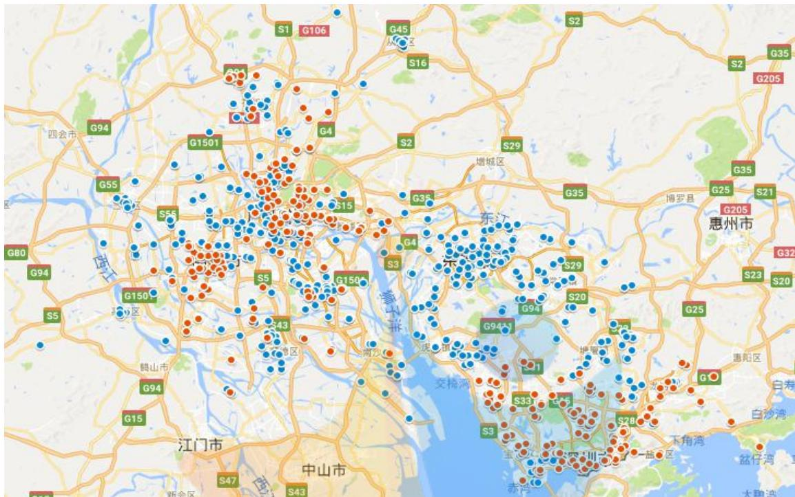

<details>
<summary>text_image</summary>

G1501
G45
S16
S2
G35
G205
G94
G55
S55
S15
S29
G35
G25
S21
G205
惠州市
G32
S23
S20
G80
G94
G150
G150
S3
S43
G94
G94
G15
江门市
中山市
新会区
S47
S43
S1
S2
S33
S28
S20
G9441
交杨湾
交杨湾
G1
S33
S28
下角湾
大碧湾
白沙湾
</details>

图 1 任务分布情况图

同样地，将附件二会员坐标导入地图中进行标注，发现有些会员位于广东省外或远离这四个城市，因此我们剔除这些会员信息以及会员编号为 B1174的错误信息共 13 个样本信息。将这些会员坐标点进行聚类分析，用 K-means 算法在MATLAB中画出如下聚类图如图2：

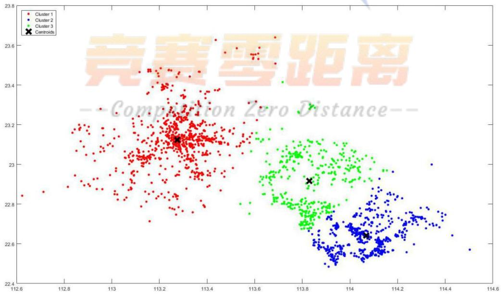

<details>
<summary>scatter</summary>

| Series | X (range) | Y (range) |
| --- | --- | --- |
| Cluster 1 | 112.6~113.6 | 22.7~23.6 |
| Cluster 2 | 113.8~114.5 | 22.5~23.0 |
| Cluster 3 | 113.6~114.0 | 22.7~23.3 |
</details>

图 2 会员分布聚类图

根据会员分布划分3 个区域：蓝色区域（Z1)主要覆盖深圳市；红色区域（Z2)主要覆盖广州市和佛山市；绿色区域（Z3）主要覆盖东莞市。将三个类的质点作为三个区域中心点O1,O2,O3.三个中心点的地理位置见下表 1。

表 1 中心点地理位置

<table><tr><td></td><td>O1</td><td>O2</td><td>O3</td></tr><tr><td>经度</td><td>113.2757</td><td>114.0689</td><td>113.8294</td></tr><tr><td>纬度</td><td>23.1235</td><td>22.6414</td><td>22.9159</td></tr></table>

研究划分的3个区域，可以对任务分布数据做进一步分析。

记任务点为 $P _ { i }$ ，任务点所属区域 $Z _ { _ j } ( \mathfrak { j } \mathrm { = } 1 , 2 , 3 )$ .任务点距中心点的距离可以表示任务的地理位置，该距离越大，任务的地理位置也就越差，任务标价较高。

以任务点 $P _ { i }$ 为中心，1.5km 为半径做圆，该范围内覆盖的会员数为 n,其他任务数为m。当一个任务周围的会员密度越大，任务定价越低。

## 5.1.3 问题一模型的建立

认为任务定价w由 3 部分组成：

$$
w = a _ {0} + a + \varepsilon \tag {1}
$$

$a _ { 0 }$ 为固定底价，是任务的最低价格，取附件一中的 65。a表示赏金，是浮动价格，受任务位置分布和会员分布的影响而变化。为受不确定因素影响（如天气、交通管制等）的价格浮动。由于数据有限认为 影响很小，在此暂不讨论。记 $z _ { 1 }$ 为任务偏僻程度。

$$
z _ {1} = \frac {\left| P _ {i} O _ {j} \right|}{\left| P _ {m} O _ {j} \right|} = \frac {\sqrt {\left(x _ {i} ^ {2} - x _ {j} ^ {2}\right) + \left(y _ {i} ^ {2} - y _ {j} ^ {2}\right)}}{\sqrt {\left(x _ {m} ^ {2} - x _ {j} ^ {2}\right) + \left(y _ {m} ^ {2} - y _ {j} ^ {2}\right)}} \tag {2}
$$

$O _ { j }$ 是任务点所属区域 $Z _ { j }$ 的中心点， $P _ { m }$ 是离中心点最远的任务点。即离中心点越远越偏僻。

由于任务分布集中在广东，距离较近，故近似认为任务点和会员点分布在二维平面上，以他们的经纬度作为坐标 $( x _ { i } , y _ { i } )$ 。

记 $z _ { 2 }$ 为会员密度。

$$
z _ {2} = \frac {n _ {m} - n _ {i}}{n _ {m}} \tag {3}
$$

$n _ { \mathrm { i } }$ 为任务点1.5km 圆域内的会员数量， $n _ { \mathrm { m } }$ 是 $n _ { \mathrm { i } }$ 的最大值。

记 $z _ { 3 }$ 为任务密度。

$$
z _ {3} = \frac {m _ {m} - m _ {i}}{m _ {m}} \tag {4}
$$

$m _ { \mathrm { i } }$ 为任务点 1.5km 圆域内的其他任务点数量， $m _ { \mathrm { m } }$ 是 $m _ { \mathrm { i } }$ 的最大值. $z _ { 3 }$ 的提出是对会员密度的矫正，考虑到一个任务点的圆域内可能存在其他任务点，导致会员密度的相对下降。认为m 越大，定价越高。

$$
a = C _ {1} z _ {1} + C _ {2} z _ {2} + C _ {3} z _ {3} \tag {5}
$$

将(5)代入(1)，忽略即可得到任务定价公式

$$
w = C _ {1} z _ {1} + C _ {2} z _ {2} + C _ {3} z _ {3} + 6 5 \tag {6}
$$

表2 回归方程变量含义

<table><tr><td> $C_{1}$ </td><td>任务偏僻程度的系数,预期为+</td></tr><tr><td> $C_{2}$ </td><td>会员密度的系数,预期为-</td></tr><tr><td> $C_{3}$ </td><td>任务密度的系数,预期为+</td></tr></table>

从式(6)可以看出，任务定价由固定底价和浮动价格组成，最终定价主要受三个变量的数值影响，即任务偏僻程度、会员密度、任务密度三个变量。

## 5.1.4 问题一模型的求解

##  任务定价规律

首先将附件一中全部任务点的坐标数据代入(2)可以计算一系列对应的 $z _ { 1 }$ 。

然后根据经纬度与地表距离的换算关系，利用 MATLAB 统计每个任务点1.5km 圆域内的会员数量和其他任务点数量，分别代入(3)(4)进行计算，得到 $z _ { 2 } \ z _ { 3 }$

现在我们已知每个任务点的定价 $w _ { 0 }$ 和 $z _ { 1 } \ z _ { 2 } \ z _ { 3 }$ 的具体数值，用最小二乘法拟合的方法计算(6)中的系数 $C _ { 1 } C _ { 2 } C _ { 3 }$ .计算结果如表3 所示。

表3 系数计算结果

<table><tr><td> $C_1$ </td><td> $C_2$ </td><td> $C_3$ </td><td> $σ^2$ </td></tr><tr><td>8.2233</td><td>-0.1959</td><td>3.7487</td><td>0.78</td></tr></table>

根据方差的计算结果可看出，系数的计算结果比较可靠。

给出附件一中的任务定价规律如下：

$$
w = 8. 2 2 3 3 z _ {1} - 0. 1 9 5 9 z _ {2} + 3. 7 4 8 7 z _ {3} + 6 5 \tag {7}
$$

这也符合之前定价规律的探究，即偏僻程度、任务密度与定价成正相关，会员密度与定价成负相关。且偏僻程度对定价产生主要影响作用。

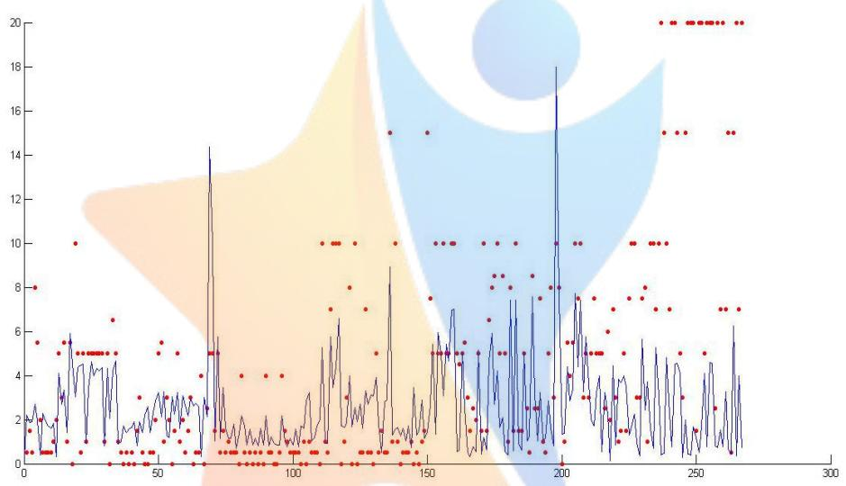

<details>
<summary>scatter</summary>

| X | Y (Line) | Y (Points) |
| --- | --- | --- |
| 0 | ~2.5 | 8 |
| 10 | ~2.5 | 5.5 |
| 20 | ~4.5 | 10 |
| 30 | ~4.5 | 6.5 |
| 40 | ~2.5 | 5 |
| 50 | ~3 | 5.5 |
| 60 | ~3 | 5 |
| 70 | ~14 | 5 |
| 80 | ~2 | 4 |
| 90 | ~2 | 4 |
| 100 | ~2 | 4 |
| 110 | ~3 | 10 |
| 120 | ~3 | 10 |
| 130 | ~3 | 10 |
| 140 | ~3 | 15 |
| 150 | ~3 | 15 |
| 160 | ~5 | 10 |
| 170 | ~5 | 10 |
| 180 | ~5 | 8.5 |
| 190 | ~5 | 8 |
| 200 | ~18 | 10 |
| 210 | ~5 | 7.5 |
| 220 | ~3 | 7.5 |
| 230 | ~3 | 7.5 |
| 240 | ~3 | 10 |
| 250 | ~3 | 15 |
| 260 | ~3 | 7 |
| 270 | ~3 | 7 |
| 280 | ~3 | 7 |
| 290 | ~3 | 7 |
| 300 | ~3 | 7 |
</details>

图3 定价模型拟合与实际定价对比图

图 3 表示了(7)的拟合情况，从杂乱的任务点定价散点中找出最贴合实际的一般规律。

##  任务未完成原因

观察图1 可知，Z3 的任务基本都已完成，而Z1 任务基本都未完成，这两个区域的任务完成情况比较特殊，故主要研究Z3区域。

首先研究Z3中已完成任务的特点。根据Z3中已完成任务点的数据计算相应的 $z _ { 1 } \ z _ { 2 } \ z _ { 3 }$ ,用最小二乘法拟合的方法重新计算(6)中的系数，得到新的定价规律：

$$
w = 8. 9 1 2 2 z _ {1} - 0. 1 5 8 9 z _ {2} + 2. 9 4 2 7 z _ {3} + 6 5 \tag {8}
$$

根据未完成任务点的数据计算 $z _ { 1 } ^ { ' } ~ z _ { 2 } ^ { ' } ~ z _ { 3 } ^ { ' }$ ，代入上述式(8)中计算 $\boldsymbol { \mathsf { W } }$ ，然后计算每个未完成任务点的计算定价与实际的差值 ${ \mathsf { w } } \mathrm { - } { \boldsymbol { w } } _ { 0 }$ 。认为当这一差值大于 0 时，

定价偏低，小于0时定价偏高。

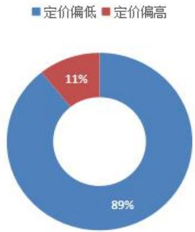

<details>
<summary>donut</summary>

| Category | Percentage |
| --- | --- |
| 定价偏低 | 89% |
| 定价偏高 | 11% |
</details>

图4 未完成任务的定价评估状况

我们发现89%的未完成任务实际定价均小于计算定价，相比于已完成的任务点，他们的定价偏低。

因此我们得出如下结论：

1.任务未完成的主要原因是定价偏低，使会员积极性下降。  
2.存在地域特殊性，如深圳地区未完成任务情况普遍。  
3.可能存在不确定因素的影响，如天气不好、道路施工、交通堵塞、会员个人因素等，但不在本文的研究范围之内。

## 5.2 问题二

## 5.2.1 问题二模型的建立

问题一中的模型主要利用了附件二中会员的位置信息，没有考虑到会员信誉值的影响，在问题二中将主要讨论该因素与定价的关系。

基于第一问的数学模型。同时考虑到会员的信誉值反映会员的活跃程度，建立新的模型。

对会员活跃的程度数据进行打分处理如下表3：

表 4 会员打分情况

<table><tr><td>信誉值</td><td>大于 10000</td><td>1000~10000</td><td>100~1000</td></tr><tr><td>打分</td><td>1</td><td>0.8</td><td>0.6</td></tr></table>

<table><tr><td>信誉值</td><td>10~100</td><td>1~10</td><td>小于 1</td></tr><tr><td>打分</td><td>0.4</td><td>0.2</td><td>0.8</td></tr></table>

记 $z _ { 4 }$ 为区域内会员信誉分数密度。

$$
z _ {4} = \frac {1}{n} \sum_ {i = 1} ^ {n} G _ {i}
$$

n为圆域内会员总数， $G _ { \ i }$ 为第i 名会员的信誉分数。

基于第一问中的模型，加入新的影响变量得到如下表达式：

$$
w = C _ {1} z _ {1} + C _ {2} z _ {2} + C _ {3} z _ {3} + C _ {4} z _ {4} + 6 5 \tag {9}
$$

同样使用最小二乘法求系数，得到如下结果：

表5 系数计算结果

<table><tr><td> $C_{1}$ </td><td> $C_{2}$ </td><td> $C_{3}$ </td><td> $C_{4}$ </td></tr><tr><td>6.3248</td><td>-0.1395</td><td>2.3974</td><td>1.875</td></tr></table>

即有

$$
w = 6. 3 2 4 8 z _ {1} - 0. 1 3 9 5 z _ {2} + 2. 3 9 4 7 z _ {3} + 1. 8 7 5 z _ {4} + 6 5 \tag {10}
$$

某一区域内任务的定价反映此任务对会员的吸引程度。在某一小区域内，若某一任务的定价略高于其他任务的定价，则其对会员具有较大的吸引力。同时此区域内信誉值较高的会员更倾向于接受任务。

这种设计定价方案的问题类似于博弈问题。可以借助相关经济学理论进行研究<sup>[2][3]</sup>。

首先利用式(9)代入附件一中全部完成任务的数据计算出的价格，认定为会员的期望价格，设为 $V _ { \scriptscriptstyle H }$ 某一区域内最低定价为会员可能接受的最低价格，设为 $V _ { L }$ 。则最优定价应在二者之间。

假定某一任务平台的定价为 $M _ { L } ( V _ { L } )$ ，即当平台认定商品的价格为 $V _ { L }$ 时，平台给出的定价为 $M _ { L } ( V _ { L } )$ ；能使顾客接受的最低定价为 $M _ { H } ^ { \mathrm { ~ ~ } } \big ( V _ { H } ^ { \mathrm { ~ ~ } } \big )$ ，即此任务通过模型一中全部实现数据给出的定价为 $V _ { H }$ 时，能使顾客接受的最低定价为$M _ { H } ( V _ { H } )$

该交易成交则对平台和会员的效用分别为 $V _ { \cal H } - M _ { L } ( V _ { L } )$ 及 $M _ { L } { \left( V _ { L } \right) } - V _ { L }$ ，如果

不成交则双方的效用均为 $0 \mathrm { { . } }$ 。平台和用户都希望得到最大化的期望效用。

对于任意给定的 $V _ { \scriptscriptstyle L } \in \left[ 0 , 2 0 \right]$ ，平台的报价应使其期望利润最大化。因为只$M _ { L } ( V _ { L } ) { > } M _ { S } ( V _ { S } )$ 时才能成交，完成后平台的利润为 $\left( M _ { L } \big ( V _ { L } \big ) + M _ { S } \big ( V _ { S } \big ) \right) / 2 - V _ { H }$ 而未完成是利润为0，所以 $M _ { L } ( V _ { L } )$ 应满足

$$
\max _ {M _ {L}} \left\{\frac {M _ {L} + E \left[ M _ {S} \left(V _ {S}\right) \mid M _ {S} \left(V _ {S}\right) \geq M _ {L} \right]}{2} - V _ {L} \right\} P \left\{M _ {S} (V _ {S}) \geq M _ {L} \right\} \tag {11}
$$

这里 $E { \left[ \begin{array} { l } { } \\ { } \end{array} \right] }$ 表示的是条件 $M _ { s } ( V _ { s } ) \geq M _ { L }$ 下 $M _ { s } ( V _ { s } )$ 的条件期望， $P { \left\{ \begin{array} { l } { } \\ { } \end{array} \right\} }$ 表示事件的概率。

类似的，对于任意给定的 $V _ { H } \in \left[ 0 \sqrt { 2 0 } \right]$ 会员的最低接受价格 $M _ { H } { \left( V _ { H } \right) }$ 应该使其期望获利最大，完成后会员得到的利益为 $V _ { \cal H } - \big ( M _ { \cal L } \big ( V _ { \cal L } \big ) + M _ { s } \big ( V _ { s } \big ) \big ) / 2$ ，未完成时获利为 0，所以 $M _ { H } { \left( V _ { H } \right) }$ 应满足

$$
\max _ {M _ {H}} \left\{V _ {H} - \frac {M _ {S} + E \left[ M _ {L} \left(V _ {L}\right) \mid M _ {L} \left(V _ {L}\right) \geq M _ {S} \right]}{2} \right\} P \left\{M _ {S} \left(V _ {S}\right) \geq M _ {L} \right\} \tag {12}
$$

如果平台和会员组合 $\left( M _ { s } ( V _ { s } ) , M _ { L } ( V _ { L } ) \right)$ 同时满足(9)和(10)，则是双方的一个均衡。

博弈问题存在许多的均衡，本文采取线性价格均衡法，假定平台和会员的报价分别是任务对二者价值的线性函数，表示为：

$$
M _ {S} \big (V _ {S} \big) = A _ {S} + C _ {S} V _ {S}
$$

$$
M _ {L} \big (V _ {L} \big) = A _ {L} + C _ {L} V _ {L}
$$

寻找 $A _ { S }$ ， $C _ { s }$ ， $A _ { L }$ ， $C _ { L }$ 使得这个组合同时满足(9)和(10)，即构成一个均衡。通过文献<sup>[4]</sup>求得最优解

$$
M _ {S} (V _ {S}) = \frac {2}{3} V _ {S} + \frac {1}{4} \tag {13}
$$

$$
M _ {S} (V _ {S}) = \frac {2}{3} V _ {S} + \frac {1}{1 2} \tag {14}
$$

此时任务完成概率 $\eta$ 为

$$
\eta = \frac {\int_ {\frac {1}{4}} ^ {1} \int_ {0} ^ {V _ {H} - \frac {1}{4}} \left(V _ {H} - V _ {L}\right) d V _ {H} d V _ {L}}{\int_ {0} ^ {1} \int_ {0} ^ {V _ {b}} \left(V _ {H} - V _ {L}\right) d V _ {H} d V} \tag {15}
$$

如图 4所示:

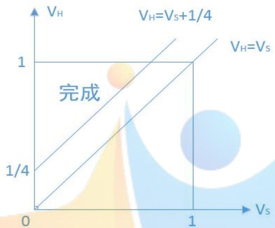

<details>
<summary>bubble</summary>

| Condition | VH | Vs |
| --- | --- | --- |
| VH=Vs+1/4 | 1 | 0 |
| VH=Vs | 1 | 1 |
</details>

图 5 线性价格战略的交易效率

设新任务定价：

$$
\omega_ {1} = M _ {H} (w) = \frac {2}{3} w + \frac {1}{4} \tag {16}
$$

该式因加入博弈论的经济学思想使模型更加完善。

## 5.2.2 问题二模型的求解

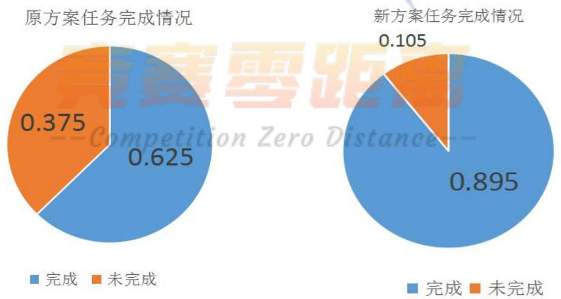

<details>
<summary>donut</summary>

| 类别 | 原方案任务完成情况 | 新方案任务完成情况 |
| --- | --- | --- |
| 完成 | 0.625 | 0.895 |
| 未完成 | 0.375 | 0.105 |
</details>

利用上述模型对任务重新进行定价，并代入公式(15)得到结果如下图6

图6 新旧方案任务完成情况对比图

以任务完成概率进行估计，新方案预期任务完成率为89.5%，相比与原方案有较大改善。

##  新方案与原方案的比较

通过计算，新方案总价为64631 元，原方案总价为 57707元。任务定价上涨12%，任务完成情况上涨23%。由此可见，新方案在采用较少提价的前提下可以使任务完成率有较大提高，从而减小商品检查失败带来的损失，使利润大大增加，与旧方案相比有较大改进。

## 5.3 问题三

## 5.3.1 问题三模型的建立

##  打包策略

在问题一中，我们定义 $m _ { \mathrm { i } }$ 为任务点 1.5km 圆域内的其他任务点数量，通过计算附件一各任务点的 $m _ { \mathrm { i } }$ 数值，得到 $\overline { { m } } = 2 . 2$ ，即在一个任务点周围平均存在2个其他任务点，于是认为以1.5km 为半径的圆域内平均存在3个任务。

因此给出如下打包策略：

1.首先选取一个任务点，若 $m _ { \mathrm { i } } \ge 2$ 则该点符合打包条件，该任务点将与其他两个任务点进行打包，否则按独立任务点计算。其他两个任务点的挑选原则：选取的  
3个任务点的平均任务完成概率大于给定指标即进行打包。已打包的任务点不再参与其他打包。  
2.选取下一个任务点，忽略下一个任务点圆域内已打包点，进行 1中的打包判断流程。  
3.当全部任务点判断、打包完毕后进行重新定价。独立任务点定价不变，打包任务点定价进行适当调整。

##  打包算法

对任务点进行打包的算法流程图如下图7所示：

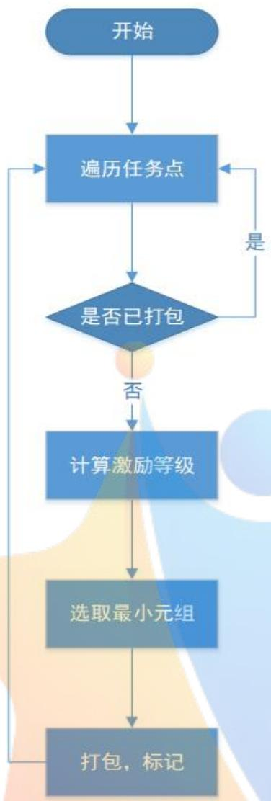

<details>
<summary>flowchart</summary>

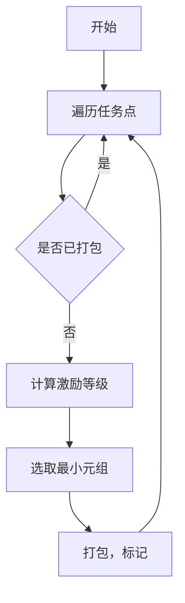
</details>

图7 打包任务点的算法流程图

圆域内打包任务点的挑选公式如下：

$$
A c t = a _ {1} (\omega_ {\mathrm{i}} + \omega_ {\mathrm{i}} ^ {\prime}) + a _ {2} (\eta_ {i} + \eta_ {i} ^ {\prime}) + a _ {3} d - k \tag {17}
$$

式中 $a _ { 1 }$ 为定价的系数， $a _ { 2 }$ 为任务完成概率的系数， $a _ { 3 }$ 为任务点距区域中心点距离的加权系数，k为修正系数； $\omega _ { i } , \omega _ { i }$ 分别代表当前任务点和被挑选任务点的定价， $\eta _ { i } , \eta _ { i } ^ { ' }$ 分别代表当前任务点和被挑选任务点的任务完成概率，d 为两任务点之间的距离。

当Act的数值越接近 0 越适合被挑选打包。这样我们就可以确定被打包的任务点。

## 5.3.2 问题三模型的求解

利用MATLAB进行求解，得到下图结果。

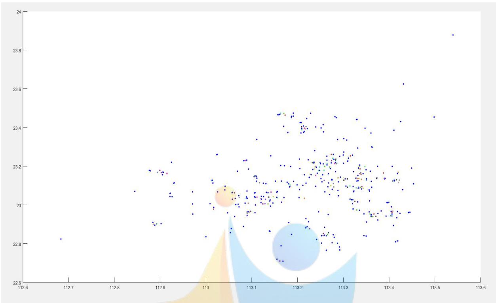

<details>
<summary>scatter</summary>

| Series | X (range) | Y (range) |
| --- | --- | --- |
| Blue | 112.6~113.5 | 22.7~23.9 |
| Orange | 112.9~113.4 | 22.9~23.2 |
| Green | 112.9~113.4 | 22.9~23.2 |
| Red | 112.9~113.4 | 22.9~23.2 |
| Yellow | 112.9~113.0 | 22.9~23.1 |
</details>

图8 打包点的分布图  
图8 中，彩色点表示打包点，蓝色点为独立的任务点。

设打包点内的3个任务定价平均值为 $\overline { { \omega _ { i } } }$ ，设打包点的新定价为 $3 \overline { { \omega _ { i } } } - 1 0$ ，这样一个信誉值稍差的用户受任务限额的限制变小，会员可以一次性完成大额任务，会员积极性提高，同时分散会员参与其他项目，理论上任务的完成程度将有进一步提高。

通过计算，得到如下结果：

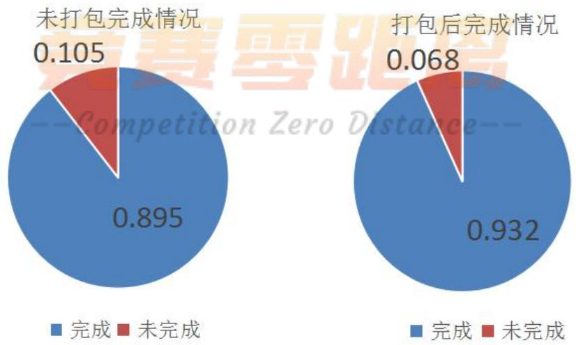

<details>
<summary>donut</summary>

| 类别 | 未打包完成情况::完成 | 未打包完成情况::未完成 | 打包后完成情况::完成 | 打包后完成情况::未完成 |
| --- | --- | --- | --- | --- |
| 第一组 | 0.895 | 0.105 | 0.932 | 0.068 |
</details>

图9 打包前后任务完成情况对比图

通过对比可以发现，打包后任务完成率可以提高 3.7%，对任务完成情况有

所改善。

## 5.4 问题四

问题四利用本文建立的模型对新任务进行定价并评价此方案的实施效果。将附件三中的任务点标记在谷歌地图上进行分析，如图10。

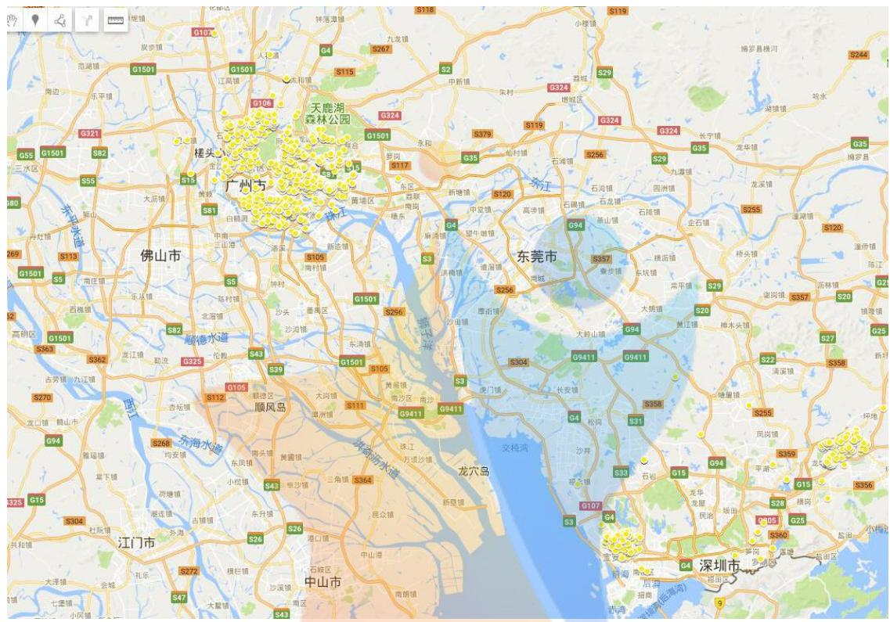

<details>
<summary>text_image</summary>

G1501
G1501
G106
S115
S2
S379
S119
G324
G324
G324
G324
G324
G324
G324
G324
G324
G324
G324
G324
G324
G324
G324
G324
G324
G324
G324
G324
G321
S82
S55
S15
S81
S15
广州市
佛山市
顺德水道
顺风岛
龙穴岛
深圳市
</details>

图10 附件三任务点分布情况

从图中可以看出，任务点主要分布在广州市和深圳市。

对任务点进行聚类，结果如图11所示.

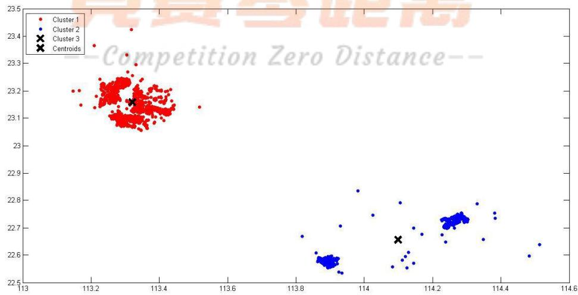

<details>
<summary>scatter</summary>

| Series | X (range) | Y (range) |
| --- | --- | --- |
| Cluster 1 | 113.1~113.5 | 23.05~23.42 |
| Cluster 2 | 113.8~114.6 | 22.52~22.84 |
| Cluster 3 | ~113.3 | ~23.16 |
| Centroids | ~113.3 | ~23.16 |
| Cluster 3 | ~114.1 | ~22.65 |
</details>

图11 新任务聚类分析图

通过聚类将附件三数据分为两个区域并确定出两个区域的中心点。

定价方案如下所示：

第一步：计算下列数据

1.各任务据市中心的距离  
2.各任务以1.5km 为半径圆内的任务数  
3.各任务以1.5km 为半径圆内的会员数  
4.各任务以1.5km 为半径圆内的会员荣誉值

将各数据进行标准化处理得 $z _ { 1 } , z _ { 2 } , z _ { 3 } , z _ { 4 }$ 0

第二步：

利用下列公式对任务进行初步打分

$$
w = 6. 3 2 4 8 z _ {1} - 0. 1 3 9 5 z _ {2} + 2. 3 9 4 7 z _ {3} + 1. 8 7 5 z _ {4} + 6 5
$$

第三步：

利用均衡理论对小区域内数据进行改进，公式如下：

$$
\omega_ {1} = M _ {H} \big (V _ {H} \big) = \frac {2}{3} V _ {H} + \frac {1}{4} \tag {18}
$$

第四步：

对符合条件的密集任务点进行打包

具体定价结果见附件一，平均任务定价为69.4 元，预计任务完成率为93.7%。

## 六、模型的评价与推广

## 6.1模型优点

本文的模型是在对大量数据进行认真分析和处理后建立的，通过将数据点显示在谷歌地图可以方便直观地观察分析，帮助排除特殊情况，寻找普遍适用规律，使模型建立的数据信息更加可靠，更加贴近实际。

通过对模型的层层优化，使模型适应更加复杂的实际情况，模型简洁实用，可移植性强。

问题二中利用会员期望与任务定价之间的影响，利用贝叶斯-纳什平衡理论重新定价。使得新定价与原定价相比有更好的效果。

## 6.2模型缺点

本文使用附件中的数据，数据来源有限，模型准确度无法进行进一步的评估，模型可能具有一定的局限性。

## 6.3模型推广

本文模型的应用背景是基于智能手机和移动互联网的劳务众包平台，在相似背景下的应用众多，如外卖应用，滴滴打车，快递跑腿服务平台等都涉及到商品定价与地理位置、会员积极程度的关系。

## 七、参考文献

[1]拍拍赚科技.关于建模竞赛的问与答[EB/OL].http://web.ppznet.com/，2017.9.15/2017.9.16.  
[2]徐晨.论移动商务在企业信息化中的应用[J] .情报科学, 2006, 24(1):144-147.  
[3]曾庆群,移动商务竞价行为的精炼贝叶斯纳什均衡研究［J］.武汉理工大学学报· 信息与管理工程版，2009，31（4）：618-620.  
[4］姜启源，谢金星，叶俊.数学模型（第四版）［M］.北京：高等教育出版社，2011.

## 附录

## 一、 自制地图

地址：

```txt
https://drive.google.com/open?id=1PtKPImNp-LqKmARQzBH-VSw7RG4&usp=sharing
```

## 二、代码

1. Kmeanstest.m

%获取经纬度

```matlab
%[number, txt, raw]=xlsread('test.xls');
X = [ GPS1(:,1) GPS(:,1) ];
opts = statset('Display','final');
```

%调用 Kmeans 函数

%X N\*P 的数据矩阵

%Idx N\*1的向量,存储的是每个点的聚类标号

%Ctrs K\*P的矩阵,存储的是K个聚类质心位置

%SumD 1\*K的和向量,存储的是类间所有点与该类质心点距离之和

%D N\*K的矩阵，存储的是每个点与所有质心的距离;

```javascript
[Idx, Ctrs, SumD, D] = kmeans(X, 2,'Replicates', 2,'Options', opts);
```

%画出聚类为1的点。X(Idx==1,1),为第一类的样本的第 个坐标；X(Idx==1,2)为第二类的样本的第二个坐标

```matlab
plot(X(Idx==1, 1), X(Idx==1, 2),'r.', 'MarkerSize', 14)
hold on
plot(X(Idx==2, 1), X(Idx==2, 2),'b.', 'MarkerSize', 14)
%hold on
%plot(X(Idx==3, 1), X(Idx==3, 2),'g.', 'MarkerSize', 14
```

%绘出聚类中心点,kx 表示是圆形

```matlab
plot(Ctrs(:,1),Ctrs(:,2),'kx','MarkerSize',14,'LineWidth',4)
plot(Ctrs(:,1),Ctrs(:,2),'kx','MarkerSize',14,'LineWidth',4)
%plot(Ctrs(:,1),Ctrs(:,2),'kx','MarkerSize',14,'LineWidth',4)
```

```matlab
legend('Cluster          1','Cluster          2','Cluster
3','Centroids','Location','NW')
Ctrs
SumD
```

## 2. makepackage.m

%打包脚本-

con(1:443,1)= 0;

distan(1:443,1:443) = -1;

a1 = 0.4;

a2 = 0.3;

a3 = 0.3;

k1 = 0.5 ;

temp =[zeros(1,443);zeros(1,443)];

%a1,a2,a3,k分别为价格、完成情况、距离的加权系数与阈值

%con 为打包记录

%distan 为距离矩阵

for i = 1:443

count = 0;

list = 0;

if con(i)

continue;

else

for j =1:443

if con(j) == 0

%计算距离

if distan(i,j) == -1

distan(i,j)=DF(message(i,1),message(i,2),message(j,1),message(j,2)); end

%判断距离，并给出在圈内的列表

if 0<distan(i,j) && distan(i,j)< 1.5\*0.009 && j\~=i

count = count +1;

list = [list ;j];

end

if count>= 2

%计算激励

activ

a1.\*(message(list(2:count+1,1),3)+message(i,3))./65+a2.\*(message(list

(2:count+1,1),4)+message(i,4))+a3.\*distan(i,list(2:count+1,1))'-k1;

for k = 1:2

current = 1;

for l = 1:count-1

if activ(current)>activ(l+1)

current = l+1;

end

end

temp(k,i) = current;

if temp(k,i) == 0

```matlab
break
    else
        activ(temp(k, i)) =10000000;
    end
end

%画图与赋值
if temp(2, i) ~= 0
con(i) = 1;
con(temp(1, i)) = 1;
distan(temp(1, i), :) = 0;
distan(:, temp(1, i)) = 0;
con(temp(2, i)) = 1;
distan(temp(2, i), :) = 0;
distan(:, temp(2, i)) = 0;
c1 = rand;
c2 = rand;
c3 = rand;
scatter(message(i, 2), message(i, 1), 10, [c1, c2, c3] ,'field')
hold on

scatter(message(temp(1, i), 2), message(temp(1, i), 1), 10, [c1, c2, c3] ,'fiel'd')
hold on

scatter(message(temp(2, i), 2), message(temp(2, i), 1), 10, [c1, c2, c3] ,'fiel'd')
hold on
else
    scatter(message(i, 2), message(i, 1), 10, 'b', 'field')
    hold on
end
else
    scatter(message(i, 2), message(i, 1), 10, 'b', 'field')
    hold on
end
end
end
end
```

3. map.m

```javascript
[number1, txt1, raw1]=xlsread('1.xlsx');
```

```matlab
[number0, txt0, raw0]=xlsread('0.xlsx');
scatter(number1(:,2), number1(:,1), 10,'r','field')
hold on
scatter(number0(:,2), number0(:,1), 10,'b','field')
legend('已完成任务','未完成任务');
xlabel('经度')
ylabel('纬度')
```

```matlab
picture.m
for i=1:838
    if VarName8 == 1
        scatter3(Hnumber, distance1, price, 10,'r','field');
    elseif VarName8 == 2
        scatter3(Hnumber, distance2, price, 10,'r','field');
    else
        scatter3(Hnumber, distance3, price, 10,'r','field');
    end
end
```  
5. test.m [number,txt,raw]=xlsread('test.xls');

%总数

$$
\mathrm{x} = \left[ \begin{array}{l l l l l} 0 & 0 & 0 & 0 & 0 \end{array} \right];
$$

%成功数

$$
\mathrm{a} = \left[ \begin{array}{l l l l l} 0 & 0 & 0 & 0 & 0 \end{array} \right];
$$

```matlab
for i = 1:835
    if (number(i,3)>80)
        x(1) = x(1) + 1;
        if (number(i,4) == 1)
            a(1)= a(1) + 1;
        end

    elseif (number(i,3)>75)
        x(2) = x(2) + 1;
        if (number(i,4) == 1)
            a(2)= a(2) + 1;
        end

    elseif (number(i,3)>70)
        x(3) = x(3) + 1;
```

```matlab
if (number(i,4) == 1)
    a(3) = a(3) + 1;
end
```

```matlab
elseif (number(i,3)>65)
    x(4) = x(4) + 1;
    if (number(i,4) == 1)
        a(4)= a(4) + 1;
    end
```

```matlab
elseif (number(i,3)>=60)
    x(5) = x(5) + 1;
    if (number(i,4) == 1)
        a(5) = a(5) + 1;
    end
```

```matlab
end
    end
```

```txt
stem(0:6, [0 a./x 0])
title('成功率与价格关系图')
xlabel('价格（1为高）')
ylabel('成功率')
axis([0 6 0 1])
```

```matlab
cost1.m
cost = 0;
yb =0;
for i = 1:202
    cost = cost + (y(i)-x(i,:) *b(:,1)).^2;
    yb = [ yb ; x(i,:) *b(:,1)];
end
```

```txt
scatter(1:202,y,10,'r','field')
hold on
plot(0:202,yb,'b')
```

```julia
7. DF.m
function [ D ] = DF( gps11, gps12, gps21, gps22 )
```

```txt
%DF 此处显示有关此函数的摘要
```

```matlab
% 此处显示详细说明
D = sqrt((gps11-gps21).^2+(gps12-gps22).^2);
```

end

```matlab
8. distance.m
temp = 0;
for i =1:2066
    count = 0;
    for j=1:1868
        D = (number(i,1) - GPS1(j,1))^2+(number(i,2) - GPS2(j,1))^2;
        if sqrt(D) < 0.009*1.5
            count = count +1;
        end
    end
    temp = [temp ; count];
end
temp2 = 0;
for i =1:2066
    count2 = 0;
    for j=1:2066
        D = (number(i,1) - number(j,1))^2+(number(i,2) - number(j,2))^2;
        if sqrt(D) < 0.009*1.5
            count2 = count2 +1;
        end
    end
    temp2 = [temp2 ; count2];
end
temp2 = temp2 - 1;
```

## 三、EXCEL 文件表格（部分）

1.附件一数据及相应处理

<table><tr><td>任务号码</td><td>任务gps 终</td><td>任务gps经</td><td>任务标价</td><td>任务执行情</td><td>任务gps 终</td><td>任务gps经</td></tr><tr><td>A0001</td><td>22.56614</td><td>113.9808</td><td>66</td><td>0</td><td>22.55966</td><td>113.9748</td></tr><tr><td>A0002</td><td>22.68621</td><td>113.9405</td><td>65.5</td><td>0</td><td>22.67972</td><td>113.9345</td></tr><tr><td>A0003</td><td>22.57651</td><td>113.9572</td><td>65.5</td><td>1</td><td>22.57003</td><td>113.9512</td></tr><tr><td>A0004</td><td>22.56484</td><td>114.2446</td><td>75</td><td>0</td><td>22.55836</td><td>114.2386</td></tr><tr><td>A0005</td><td>22.55889</td><td>113.9507</td><td>65.5</td><td>0</td><td>22.5524</td><td>113.9447</td></tr><tr><td>A0006</td><td>22.559</td><td>114.2413</td><td>75</td><td>0</td><td>22.55252</td><td>114.2353</td></tr><tr><td>A0007</td><td>22.549</td><td>113.9723</td><td>65.5</td><td>1</td><td>22.54252</td><td>113.9662</td></tr><tr><td>A0008</td><td>22.56277</td><td>113.9566</td><td>65.5</td><td>0</td><td>22.55629</td><td>113.9506</td></tr><tr><td>A0009</td><td>22.50001</td><td>113.8957</td><td>66</td><td>0</td><td>22.49353</td><td>113.8896</td></tr></table>

2.附件二数据及相应处理

<table><tr><td>会员编号</td><td>会员位置(0)</td><td>精度</td><td>预订任务开</td><td>信誉值</td><td>预订任务限</td><td>纬度(修改</td></tr><tr><td>B0001</td><td>22.9471</td><td>113.68</td><td>6:30:00</td><td>67997.39</td><td>114</td><td>22.94061</td></tr><tr><td>B0002</td><td>22.57779</td><td>113.9665</td><td>6:30:00</td><td>37926.54</td><td>163</td><td>22.57131</td></tr><tr><td>B0003</td><td>23.19246</td><td>113.3473</td><td>6:30:00</td><td>27953.04</td><td>139</td><td>23.18598</td></tr><tr><td>B0004</td><td>23.25597</td><td>113.3188</td><td>6:30:00</td><td>25085.7</td><td>98</td><td>23.24948</td></tr><tr><td>B0008</td><td>23.14337</td><td>113.3763</td><td>6:42:00</td><td>14868.44</td><td>95</td><td>23.13689</td></tr><tr><td>B0009</td><td>23.28528</td><td>113.6518</td><td>6:36:00</td><td>13556.16</td><td>110</td><td>23.2788</td></tr><tr><td>B0010</td><td>23.09926</td><td>113.4889</td><td>6:36:00</td><td>13327.95</td><td>64</td><td>23.09278</td></tr><tr><td>B0011</td><td>23.19246</td><td>113.3473</td><td>6:42:00</td><td>11349.09</td><td>89</td><td>23.18598</td></tr><tr><td>B0012</td><td>22.54889</td><td>113.9554</td><td>6:33:00</td><td>10957.58</td><td>102</td><td>22.54241</td></tr></table>

3附件三数据及相应处理

<table><tr><td>任务号码</td><td>任务GPS纬度</td><td>任务GPS经度</td><td>标记</td><td>到1的距离</td><td>到2的距离</td><td>会员</td></tr><tr><td>C0001</td><td>22.730041</td><td>114.24088</td><td>2</td><td>1.0303877</td><td>0.0257266</td><td>0</td></tr><tr><td>C0002</td><td>22.727043</td><td>114.29962</td><td>2</td><td>1.1445217</td><td>0.0454642</td><td>5</td></tr><tr><td>C0003</td><td>22.701311</td><td>114.2336</td><td>2</td><td>1.042494</td><td>0.0202841</td><td>9</td></tr><tr><td>C0004</td><td>22.732359</td><td>114.28667</td><td>2</td><td>1.1147697</td><td>0.0412056</td><td>6</td></tr><tr><td>C0005</td><td>22.718391</td><td>114.25755</td><td>2</td><td>1.0714651</td><td>0.0291628</td><td>5</td></tr><tr><td>C0006</td><td>22.753925</td><td>114.38193</td><td>2</td><td>1.2899605</td><td>0.0898743</td><td>1</td></tr><tr><td>C0007</td><td>22.724042</td><td>114.27218</td><td>2</td><td>1.0941566</td><td>0.0347666</td><td>7</td></tr><tr><td>C0008</td><td>22.719378</td><td>114.27325</td><td>2</td><td>1.1002581</td><td>0.0345253</td><td>6</td></tr><tr><td>C0009</td><td>22.730283</td><td>114.2305</td><td>2</td><td>1.0111783</td><td>0.0229142</td><td>0</td></tr></table>