# 颜色读数辨识物质浓度

## 摘要

本文为了精准确定待测物质的浓度档位，试确立颜色读数和物质浓度的数量关系模型。针对问题一：颜色读数和物质浓度之间的关系，根据所给数据，将各种物质的实验结果绘制成色卡，直接观察颜色。发现颜色的变化与浓度的改变有关联。随后处理数据并用 EXCEL绘出颜色读数与浓度的折线图，从图可观察出其颜色读数与浓度是有相关性。经过相关性分析发现有些物质 RGB有很强的自相关性，因此我们引入灰度来代替原数据中的 RGB。得出组胺与溴酸钾两种物质的浓度与灰度有相关性，其余三种没有相关性。将组胺与溴酸钾的浓度与灰度进行一元线性回归，结果如下：组胺：浓度=-3.038\*灰度+327.8 ；溴酸钾：浓度=-5.298\*灰度+732.481；工业碱的数据中浓度为 0到 7的数据变化极差为3，所以去除了浓度为0的数据组重新进行相关性分析，结果显示工业碱浓度与所有数据相关。将工业碱浓度与灰度导入 SPSS进行一元线性回归，结果如下：浓度=-0.036\*灰度+12.931（灰度<140）经过分析，硫酸铝钾的颜色读数与浓度只在是否存在该物质时存在差异，将浓度设置为存在或不存在，导入 SPSS与灰度进行相关性分析，显示两者有相关性。奶中尿素的数据经过分析只有 B与浓度有相关性，将浓度与 B 导入 SPSS 进行一元线性回归，结果如下：浓度=-112.475\*B+13571.908（B<140）建立“三准则”分别判断实验数据的准确性。一、RGB2HS吻合度，利用RGB与 HS关系检验每条数据准确性；二、同物同浓下变异系数，检查同物质同浓度下数据是否稳定；三、同物异浓离散度分析，检查同物质不同浓度下颜色读数是否存在差异。

针对问题二：首先对附件二中的数据进行检验，绘制色卡进行观察，发现HS的数值有很大误差，同种浓度下RGB变化极小。经过计算发现HS的数值相反。更正之后取同种浓度下数据的平均值经计算出平均值的灰度。绘制折线图，发现颜色读数与浓度间存在较小关系。将数据导入 SPSS进行相关性分析，确定颜色读数与浓度间存在相关性。之后对 RGB进行相关性分析，发现有很强的自相关性。因此我们取灰度与浓度的数据导入 MATLAB进行一元线性回归，得到结果为：浓度=-3.612\*（0.2989\*R+0.587\*G+0.114\*B）+515.3，并发现模型误差较大，后建立多元Logit模型和指数模型浓度   <sup>灰度</sup> 进行修正，发现误差得到极大改善可初步用于实际。

针对问题三：分别说明数据量和颜色维度对模型的影响。数据量分析取数量性差较大的工业碱和硫酸铝钾进行分析。工业碱的数值较少，所以数据的准确性很难检验，异常值不易发现，影响模型准确性。硫酸铝钾的数据较多，易检验准确性，但异常值出现几率大，处理不当会对模型会有很大影响。5种颜色维度由于数据错误不全，单位不全，对模型有很大影响。随着颜色维度数据的增多，模型会更加稳定准确。

关键词： 比色法 RGB 与 HSV 变异系数 相关性分析 灰度

## 一、问题重述

比色法是常用的物质浓度检测法，由于不同人对颜色的敏感度不同，使得结果精度受到很大影响。随着照相技术的提高，比色法的使用日趋精准。要求通过照片中的颜色读数，建立与物质浓度间的数量关系，获得待测物质更准确的浓度。

## 1.1 问题一

（1）通过附件1 所给出的5组数据确定各物质颜色读数与物质浓度的关系。  
（2）给出评价标准并评价已知数据的精准程度。

## 1.2 问题二

（1）通过附件 2所给出的数据，建立颜色读数与浓度间的模型  
（2）对（1）中建立的模型进行误差分析

## 1.3 问题三

（1）分析数据量对模型的影响  
（2）分析颜色维度对模型的影响

## 二、问题假设

（1） 假设 R、G、B、H、S的读数未受主观因素影响  
（2） 不考虑物质杂质对浓度（ppm）的影响

## 三、符号说明

<table><tr><td>符号</td><td>含义</td></tr><tr><td>V</td><td>颜色亮度</td></tr><tr><td>S</td><td>饱和度</td></tr><tr><td>H</td><td>色调</td></tr><tr><td>R</td><td>红色颜色值</td></tr><tr><td>G</td><td>绿色颜色值</td></tr><tr><td>B</td><td>蓝色颜色值</td></tr><tr><td>HD</td><td>颜色灰度</td></tr><tr><td>R&#x27;</td><td>归一化红色颜色值</td></tr><tr><td>G&#x27;</td><td>归一化绿色颜色值</td></tr><tr><td>B&#x27;</td><td>归一化蓝色颜色值</td></tr><tr><td>S&#x27;</td><td>通过归一化后的颜色值带入模型中计算出的饱和度(0-1)</td></tr><tr><td>S&#x27;&#x27;</td><td>通过归一化后的颜色值带入模型中计算出的饱和度(0-255)</td></tr><tr><td>H&#x27;</td><td>通过R、G、B值计算出的亮度</td></tr><tr><td>E1</td><td>原数据饱和度与计算数据饱和度之差</td></tr><tr><td>E2</td><td>原数据亮度与计算数据亮度之差</td></tr><tr><td>SD</td><td>相同物质的R、G、B、H、S的标准差</td></tr><tr><td>N</td><td>数据的数量</td></tr><tr><td>Xi</td><td>每一分类的具体数值</td></tr><tr><td> $\bar{X}$ </td><td>每一分类的平均数</td></tr><tr><td>C.v</td><td>变异系数</td></tr><tr><td>Me</td><td>总体的平均数</td></tr><tr><td>RMSE</td><td>均方根误差</td></tr></table>

## 四、问题分析

首先我们需要查找文献学习颜色 RBG 与 HSV 等专业术语的知识，为后续分析做准备。

## 4.1问题一分析

问题需判断每种物质每次实验的颜色读数与物质浓度之间的关系，由于颜色读数由RGB值构成，所以我们队首先将各组 RGB值录入MATLAB，用数据绘制出色卡。将各组色卡进行比较，可直观的观察到实验中每组颜色与浓度之间的关系。之后将附件1的各组数据进行分组处理分析，绘制关于颜色与浓度之间的折线图，最后再将数据导入 SPSS进行相关性分析，找出颜色与浓度关系，并建立数学模型，给出实验数据优劣的评价准则，并评价五组数据优劣。

自行建立准则，对已知数据进行评估。考虑该附件没有明确指明各数值的单位以及转换方式，所以针对此问题我们建立了关于 RGB与HS的数学模型，通过模型的计算求解可得出一个准确的计算数值，然后将原数组与计算数组进行对比观察误差。

## 4.2 问题二分析

## 4.2.1

问题需要根据附件二中的数据，建立颜色读数与物质浓度间的模型。先对数据进行检验。绘制色卡进行观察。取同种浓度下颜色读数的平均值，绘制折线图并导入 SPSS 进行相关性分析。计算出平均颜色读数的灰度，做灰度与浓度间的折线图和相关性分析。之后导入 MATLAB中进行拟合，得到模型。

## 4.2.2

问题需要将回归出的模型进行误差分析，将其导入 MATLAB中进行绘图分析。

## 4.3问题三分析

## 4.3.1

问题要求讨论数据量对模型的影响，取附件 1中数据量差距最大的工业碱和硫酸铝钾分别进行分析。

## 4.3.2

问题要求讨论颜色维度对模型的影响，根据附件中颜色体系的数目多少及完整性对模型的影响进行分析。

## 五、模型建立与求解

根据参考文献<sup>[1]</sup>基于三刺激理论，我们的眼睛通过光对视网膜的锥状细胞中的三种视色素的刺激来感受颜色。这三种色素分别对波长为630nm（R）、530nm（G）和450nm（B）的光最敏感。通过对光源中的强度进行比较，我们感受到光的颜色。这种视觉理论是使用三种颜色基色：红、绿和蓝在视频监视器上显示彩色的基础，称为RGB 颜色模型。除由了一组基色的表示方法，HSV模型使用对用户更直观的颜色描述方法。为了给出一组颜色描述，用户需选择一种光谱色并加入一定量白色和黑色来获得不同的明暗、色泽和色调。这个模型的颜色参数的色彩（H）、色彩饱和度（S）和明度值（V）。HSV 模型的三维表示从RGB 立方体演变而来于 RGB和HSV 是可以相互转换的，所以我们分析问题时主要用 RGB分析物质浓度用HS进行检验，在文献中RBG和HSV 转化的公式如下：

$$
\mathrm{V} = \max (\mathrm{R}, \mathrm{G}, \mathrm{B})
$$

$$
S = \left\{ \begin{array}{l l} V - \frac {\min (R , G , B)}{V} & \text {if} V \neq 0 \\ 0 & \text {otherwise} \end{array} \right.
$$

$$
\mathrm{H} = \left\{ \begin{array}{l l} \frac {6 0 (\mathrm{G} - \mathrm{B})}{\mathrm{V} - \min (\mathrm{R} , \mathrm{G} , \mathrm{B})} & \text {if V = R} \\ 1 2 0 + \frac {6 0 (\mathrm{B} - \mathrm{R})}{(V - \min (R , G , B))} & \text {if V = G} \\ 2 4 0 + \frac {6 0 (R - G)}{V - \min (R , G , B)} & \text {if V = B} \end{array} \quad V \in [ 0, 1, S \in [ 0, 1 ], H \in [ 0, 3 6 0 ] \right.
$$

在后续分析中，我们发现文献中的这个公式的取值范围和题目所给不同，甚至 H和S的维度交换，在下面分析建模中我们将详细指出。

## 5.1问题一模型的建立及求解

## 5.1.1模型建立思路

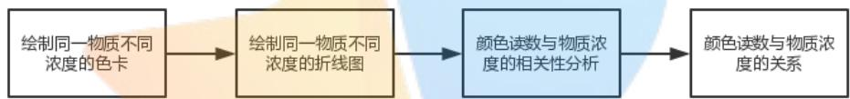

<details>
<summary>flowchart</summary>


</details>

## 5.1.2 问题一的分析求解

## 5.1.2.1画色卡观察物质浓度间关系

在题目附件 1中提供了 5种物质的在不同浓度下的颜色读数 R、G、B、S、H。将每种物质每次测量的 RGB数值转换为颜色后绘制色卡，清楚直观的看出颜色读数与物质浓度之间关系。因数据众多，为了方便制图，我们选择用 MATLAB 软件绘制（详细程序见附录）。在 MATLAB中有一套自己的颜色数值标准，RGB色彩模式的强度值为 $0 ^ { \sim } 2 5 5$ ，而在 MATLAB 中 RGB 的强度值为 $0 ^ { \sim } 1$ ，所以在程序(见附录)中要把数值转换。由此我们得出了相对应的色卡，再用 ADOBE PHOTOSHOP 进行整合以便对比。五种物质在不同浓度下的各次读数整理后如下图：

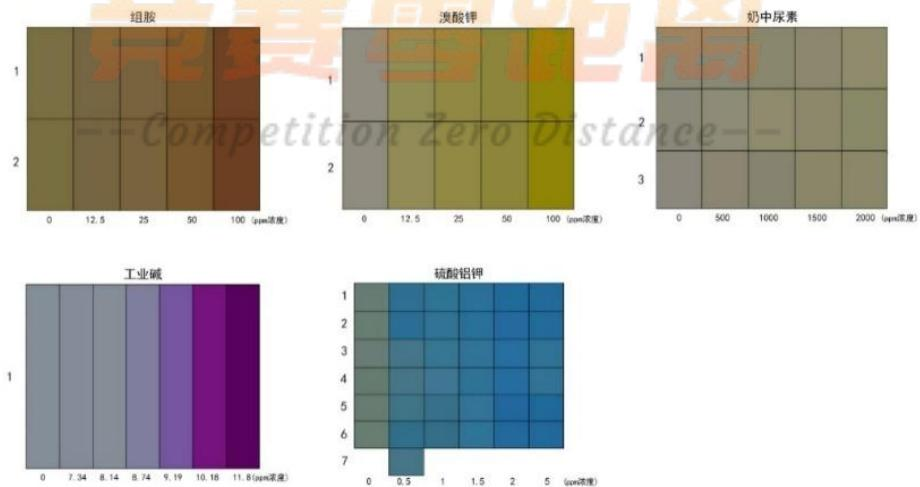

<details>
<summary>heatmap</summary>

| Compound | Concentration Range (ppm) | Color Description |
| :--- | :--- | :--- |
| 组胺 | 0 ~ 100 | Dark Brown to Yellow |
| 溴酸钾 | 0 ~ 100 | Light Green to Yellow |
| 奶中尿素 | 0 ~ 2000 | Medium Brown to Light Brown |
| 工业碱 | 0 ~ 11.8 | Light Purple to Dark Purple |
| 硫酸铝钾 | 0 ~ 5 | Blue to Dark Blue |
</details>

根据上图可得知组胺、溴酸钾的颜色物质浓度关系明显，工业碱在浓度 $8 \mathrm { p p m }$ 以后颜色和浓度关系明显，而硫酸铝钾在 0 浓度和其他的浓度的差异比较明显，而0.5至5ppm的颜色差异并不明显，而奶中尿素从肉眼上看颜色差异并不明显。

## 5.1.2.2 绘制浓度与颜色读数关系的折线图

将同一种物质不同浓度的数据进行分组，其中以组胺数据为例，整理后如下表（1），其他数据做相同处理见附件（1）。

<table><tr><td>组胺</td><td>浓度</td><td>B</td><td>G</td><td>R</td><td>H</td><td>S</td></tr><tr><td rowspan="5">组一</td><td>0</td><td>68</td><td>110</td><td>121</td><td>23</td><td>111</td></tr><tr><td>12.5</td><td>66</td><td>102</td><td>118</td><td>20</td><td>112</td></tr><tr><td>25</td><td>62</td><td>99</td><td>120</td><td>19</td><td>122</td></tr><tr><td>50</td><td>46</td><td>87</td><td>117</td><td>16</td><td>155</td></tr><tr><td>100</td><td>37</td><td>66</td><td>110</td><td>12</td><td>169</td></tr><tr><td rowspan="5">组二</td><td>0</td><td>65</td><td>110</td><td>120</td><td>24</td><td>115</td></tr><tr><td>12.5</td><td>64</td><td>101</td><td>118</td><td>20</td><td>115</td></tr><tr><td>25</td><td>60</td><td>99</td><td>120</td><td>19</td><td>126</td></tr><tr><td>50</td><td>46</td><td>87</td><td>118</td><td>16</td><td>153</td></tr><tr><td>100</td><td>35</td><td>64</td><td>109</td><td>11</td><td>172</td></tr></table>

表 1

之后将每个小组的数据分别绘制成折线图，可以观察颜色读数与浓度间的关系。组一如图（1），组二如图（2）。

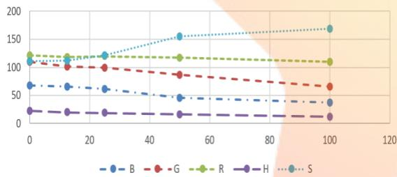

<details>
<summary>line</summary>

| X | B | G | R | H | S |
|---|---|---|---|---|---|
| 0 | ~68 | ~112 | ~123 | ~23 | ~110 |
| 12.5 | ~65 | ~102 | ~120 | ~20 | ~115 |
| 25 | ~60 | ~100 | ~120 | ~19 | ~122 |
| 50 | ~45 | ~88 | ~118 | ~17 | ~158 |
| 100 | ~38 | ~65 | ~110 | ~13 | ~170 |
</details>

图 1

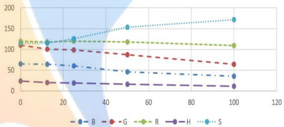

<details>
<summary>line</summary>

| X | B | G | R | H | S |
|---|---|---|---|---|---|
| 0 | ~65 | ~110 | ~120 | ~25 | ~120 |
| 12 | ~65 | ~100 | ~120 | ~20 | ~120 |
| 25 | ~60 | ~100 | ~120 | ~20 | ~130 |
| 50 | ~45 | ~90 | ~120 | ~15 | ~155 |
| 100 | ~35 | ~65 | ~110 | ~10 | ~175 |
</details>

图 2

由图（1）和图（2），可观察出颜色读数在随着物质浓度而变化。可以初步认为组胺物质浓度与颜色读数间存在某种关系。同理，可以得到其他颜色读数与物质浓度的折线图如下表。我们发现组胺、溴酸钾在有两个颜色读数变化趋势明显，工业碱的在溶液 ppm较高的时候读数变化明显，硫酸铝钾在ppm 较低的时候变化明显，而奶中尿素在差异为0-2000的 ppm中颜色读数差异较小。

<table><tr><td>溴酸钾</td><td>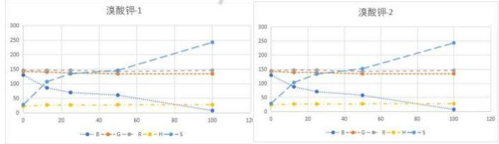</td><td></td></tr><tr><td>工业碱</td><td></td><td></td></tr></table>

<table><tr><td rowspan="2">硫酸铝钾</td><td>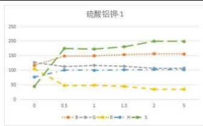</td><td>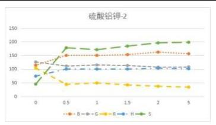</td><td>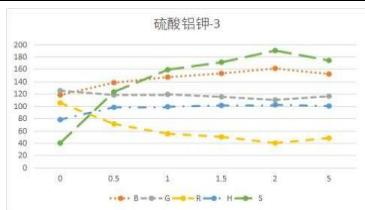</td></tr><tr><td>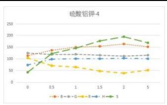</td><td>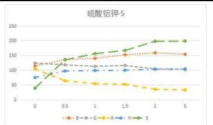</td><td>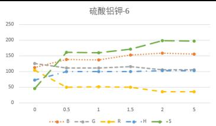</td></tr><tr><td>奶中尿素</td><td>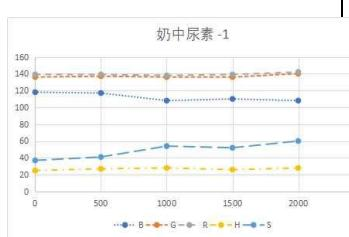</td><td>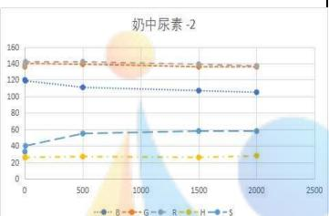</td><td>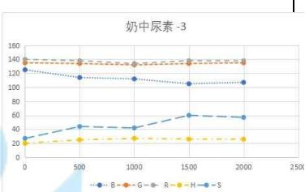</td></tr></table>

将整理后数据导入 SPSS中，运用皮尔逊分析法对数据进行相关性分析，可得出皮尔逊相关系数和显著性如下表

<table><tr><td>物质</td><td>实验组数</td><td>类型</td><td>B</td><td>G</td><td>R</td><td>H</td><td>S</td></tr><tr><td rowspan="4">组胺</td><td rowspan="2">1</td><td>皮尔逊相关性</td><td>-0.970</td><td>-0.998</td><td>-0.951</td><td>-0.983</td><td>0.955</td></tr><tr><td>显著性</td><td>0.006</td><td>0.000</td><td>0.013</td><td>0.003</td><td>0.011</td></tr><tr><td rowspan="2">2</td><td>皮尔逊相关性</td><td>-0.981</td><td>-0.997</td><td>-0.914</td><td>-0.978</td><td>0.974</td></tr><tr><td>显著性</td><td>0.003</td><td>0.000</td><td>0.030</td><td>0.004</td><td>0.005</td></tr><tr><td rowspan="4">溴酸钾</td><td rowspan="2">1</td><td>皮尔逊相关性</td><td>-0.952</td><td>-0.862</td><td>-0.177</td><td>0.686</td><td>0.948</td></tr><tr><td>显著性</td><td>0.012</td><td>0.060</td><td>0.776</td><td>0.201</td><td>0.014</td></tr><tr><td rowspan="2">2</td><td>皮尔逊相关性</td><td>-0.960</td><td>-0.875</td><td>-0.152</td><td>0.722</td><td>0.957</td></tr><tr><td>显著性</td><td>0.009</td><td>0.052</td><td>0.807</td><td>0.169</td><td>0.011</td></tr><tr><td rowspan="6">奶中尿素</td><td rowspan="2">1</td><td>皮尔逊相关性</td><td>-0.868</td><td>0.639</td><td>0.626</td><td>0.606</td><td>0.946</td></tr><tr><td>显著性</td><td>0.057</td><td>0.246</td><td>0.259</td><td>0.278</td><td>0.015</td></tr><tr><td rowspan="2">2</td><td>皮尔逊相关性</td><td>-0.949</td><td>-0.578</td><td>-0.585</td><td>0.646</td><td>0.840</td></tr><tr><td>显著性</td><td>0.014</td><td>0.308</td><td>0.300</td><td>0.239</td><td>0.075</td></tr><tr><td rowspan="2">3</td><td>皮尔逊相关性</td><td>-0.909</td><td>0.000</td><td>-0.289</td><td>0.741</td><td>0.910</td></tr><tr><td>显著性</td><td>0.033</td><td>1.000</td><td>0.638</td><td>0.152</td><td>0.032</td></tr><tr><td rowspan="10">硫酸铝钾</td><td rowspan="2">1</td><td>皮尔逊相关性</td><td>0.579</td><td>-0.694</td><td>-0.611</td><td>0.495</td><td>0.586</td></tr><tr><td>显著性</td><td>0.229</td><td>0.126</td><td>0.198</td><td>0.318</td><td>0.222</td></tr><tr><td rowspan="2">2</td><td>皮尔逊相关性</td><td>0.552</td><td>-0.642</td><td>-0.595</td><td>0.487</td><td>0.575</td></tr><tr><td>显著性</td><td>0.257</td><td>0.170</td><td>0.212</td><td>0.327</td><td>0.233</td></tr><tr><td rowspan="2">3</td><td>皮尔逊相关性</td><td>0.586</td><td>-0.480</td><td>-0.615</td><td>0.497</td><td>0.608</td></tr><tr><td>显著性</td><td>0.221</td><td>0.335</td><td>0.194</td><td>0.316</td><td>0.200</td></tr><tr><td rowspan="2">4</td><td>皮尔逊相关性</td><td>0.550</td><td>-0.571</td><td>-0.589</td><td>0.486</td><td>0.589</td></tr><tr><td>显著性</td><td>0.259</td><td>0.236</td><td>0.218</td><td>0.328</td><td>0.219</td></tr><tr><td rowspan="2">5</td><td>皮尔逊相关性</td><td>0.676</td><td>-0.789</td><td>0.742</td><td>0.572</td><td>0.711</td></tr><tr><td>显著性</td><td>0.141</td><td>0.062</td><td>0.091</td><td>0.235</td><td>0.113</td></tr><tr><td rowspan="2"></td><td rowspan="2">6</td><td>皮尔逊相关性</td><td>0.702</td><td>-0.681</td><td>-0.639</td><td>0.535</td><td>0.644</td></tr><tr><td>显著性</td><td>0.120</td><td>0.136</td><td>0.172</td><td>0.274</td><td>0.167</td></tr><tr><td rowspan="2">工业碱</td><td rowspan="2">1</td><td>皮尔逊相关性</td><td>-0.491</td><td>-0.664</td><td>-0.624</td><td>0.708</td><td>0.658</td></tr><tr><td>显著性</td><td>0.264</td><td>0.104</td><td>0.134</td><td>0.075</td><td>0.108</td></tr></table>

由上表可以确定组胺的颜色读数中的R、G、B、H、S都与浓度有很强的相关；溴酸钾的颜色读数中的 B、S与浓度有较高的相关性；奶中尿素的颜色读数 R、S与浓度有相关性，硫酸铝钾的颜色读数与浓度没有相关性。工业碱的皮尔逊系数和显著性表明没有相关性，而直观的从图可观察出其颜色读数与浓度是有相关性的，再者上述 RGB颜色读数本身也具有自相关性，因此我们下面进行详细分析。

## 5.1.2.3 灰度分析

虽然我们发现有些物质颜色读书 RGB与浓度有相关关系，当颜色读数RGB具有自相关性时，不能直接用RGB三个变量直接所为自变量与浓度进行回归分析，在图形学中，灰度具有很高的识别度，在医学中 CT等更是由于识别度高等原因一直使用灰度照片。因此，我们这里选用利用 RGB灰度这个值来代替 RGB 读数。根据文献<sup>[2]</sup>我们得到方法计算灰度，公式如下 。各物质平均浓度、灰度及其相关性如下：

<table><tr><td>物质</td><td>浓度</td><td>灰度</td><td>相关性</td><td>p值</td><td>物质</td><td>浓度</td><td>灰度</td><td>相关性</td><td>p值</td></tr><tr><td rowspan="5">组胺</td><td>0</td><td>108.17</td><td rowspan="5">-0.997</td><td rowspan="5">0</td><td rowspan="6">硫酸铝钾</td><td>0</td><td>117.63</td><td rowspan="6">-0.678</td><td rowspan="6">0.139</td></tr><tr><td>12.5</td><td>102.26</td><td>0.5</td><td>101.00</td></tr><tr><td>25</td><td>100.94</td><td>1</td><td>100.36</td></tr><tr><td>50</td><td>91.43</td><td>1.5</td><td>98.88</td></tr><tr><td>100</td><td>74.99</td><td>2</td><td>92.04</td></tr><tr><td rowspan="5">溴酸钾</td><td>0</td><td>140.61</td><td rowspan="5">-0.947</td><td rowspan="5">0.015</td><td>5</td><td>93.44</td></tr><tr><td>12.5</td><td>134.59</td><td rowspan="5">奶中尿素</td><td>0</td><td>270.1721</td><td rowspan="5">-0.204</td><td rowspan="5">0.742</td></tr><tr><td>25</td><td>131.54</td><td>500</td><td>268.2063</td></tr><tr><td>50</td><td>126.88</td><td>1000</td><td>263.6968</td></tr><tr><td>100</td><td>122.21</td><td>1500</td><td>265.7953</td></tr><tr><td rowspan="7">工业碱</td><td>0</td><td>140.14</td><td rowspan="7">-0.662</td><td rowspan="7">0.105</td><td>2000</td><td>269.627</td></tr><tr><td>7.34</td><td>139.08</td><td rowspan="6" colspan="5">零距离</td></tr><tr><td>8.14</td><td>140.32</td></tr><tr><td>8.74</td><td>129.93</td></tr><tr><td>9.19</td><td>103.52</td></tr><tr><td>10.18</td><td>62.37</td></tr><tr><td>11.8</td><td>41.44</td></tr></table>

即：组胺和溴酸钾的浓度都与灰度有显著相关关系。

## 5.1.3各物质颜色度数与浓度关系

## 5.1.3.1 组胺颜色读数与浓度关系

我们看到这两组颜色读数RGB差异很小，最大极差绝对值为3，因此这里选用他们颜色读数的平均值来讨论，由于这组数据 RGB自相关性较大两两相关性分别为：0.968431204、0.87053481、0.94458497：因此选用灰度作为自变量，对浓度进行一元线性回归得到：

y=-3.038x+327.8，该方程 p 值小于 0.05，说明该方程显著，回归系数 p值也小于0.05，说明回归系数显著。

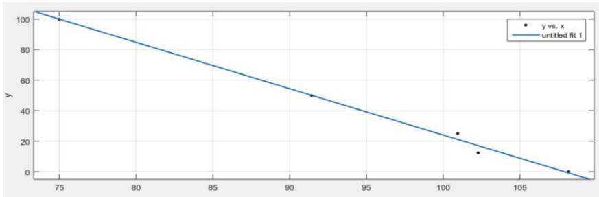

<details>
<summary>scatter</summary>

| X | y |
| --- | --- |
| ~75 | 100 |
| ~91.5 | 50 |
| ~101 | 25 |
| ~102.5 | 13 |
| ~108 | 1 |
</details>

即：浓度=-3.038( )+327.8，浓度与灰度负相关，与RGB读数都负相关。

## 5.1.3.2 溴酸钾颜色读数与浓度关系

我们看到这两组颜色读数RGB差异很小，最大极差绝对值为2，因此这里选用他们颜色度数的平均值来讨论，在上述分析中我们发现这组从肉眼上看，其实随着浓度的变化颜色变化比较明显，但是从颜色读数上来说只有B与浓度有显著相关性，可能是因为其他颜色维度变化不大，由于这组数据RGB自相关性有一对较大分别为 0.897990569，0.07348246，0.45569145，因此选用灰度作为自变量，对浓度进行一元线性回归得到：

y=-5.298x+732.481，该方程 R=0.947，p 值小于 0.05，说明该方程显著，回归系数p值也小于 0.05，说明回归系数显著。

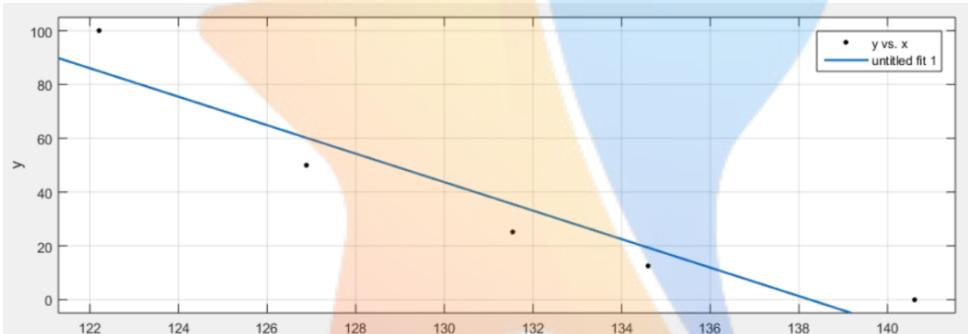

<details>
<summary>scatter</summary>

| X | y |
| --- | --- |
| ~122.2 | 100 |
| ~126.8 | 50 |
| ~131.5 | 25 |
| ~134.5 | 13 |
| ~140.5 | 0 |
</details>

即：浓度=-5.298( )+ 732.481 浓度与灰度负相关，与 RGB读数都负相关。

## 5.1.3.3 工业碱与浓度关系

经过观察图像发现工业碱的颜色读数与浓度存在一定关系。但通过皮尔逊分析法和显著性的检验，显示两者没有相关性。我们继续分析，浓度为 0与浓度7的色彩读数变化较小极差仅为 3，7以上颜色读数变化明显。所以除去浓度为0的一组数据，重新进行计算。我们看到这两组颜色读数RGB差异很小，最大极差绝对值为 2，因此这里选用他们颜色读数的平均值来讨论，绘制折线图如图（3）

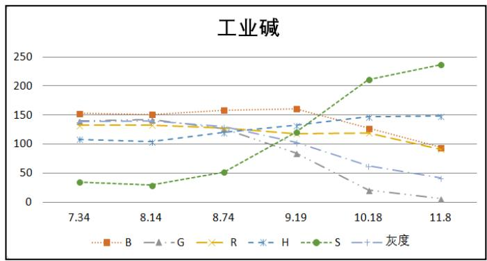

<details>
<summary>line</summary>

| Date | B | G | R | H | S | 灰度 |
| --- | --- | --- | --- | --- | --- | --- |
| 7.34 | ~150 | ~135 | ~135 | ~105 | ~35 | ~140 |
| 8.14 | ~150 | ~135 | ~135 | ~100 | ~30 | ~140 |
| 8.74 | ~160 | ~125 | ~125 | ~120 | ~50 | ~125 |
| 9.19 | ~160 | ~80 | ~120 | ~130 | ~120 | ~100 |
| 10.18 | ~125 | ~20 | ~120 | ~145 | ~210 | ~60 |
| 11.8 | ~90 | ~5 | ~90 | ~145 | ~235 | ~40 |
</details>

图 3

将数据导入SPSS进行相关性分析如表（2）

<table><tr><td>物质</td><td>类型</td><td>B</td><td>G</td><td>R</td><td>H</td><td>S</td><td>灰度</td></tr><tr><td rowspan="2">工业碱</td><td>皮尔逊相关性</td><td>-0.865</td><td>-0.941</td><td>-0.941</td><td>0.913</td><td>0.940</td><td>-0.958</td></tr><tr><td>显著性</td><td>.026</td><td>0.005</td><td>0.005</td><td>0.011</td><td>0.005</td><td>0.003</td></tr></table>

表 2

根据图中的皮尔逊相关性与显著性可以确定，工业碱的颜色读数与浓度间有相关性。计算浓度与灰度相关性为 0.958及 RGB读数自相关分别为 0.833724，0.86190527，0.874326497，因此选用灰度作为自变量，对浓度进行一元线性回归得到：

$y = - 0 . \ 0 3 6 x + 1 2 . \ 9 3 1 ( x < 1 4 0 )$ ），该方程R=0.95，p值小于0.05，说明该方程显著，回归系数p值也小于 0.05，说明回归系数显著。

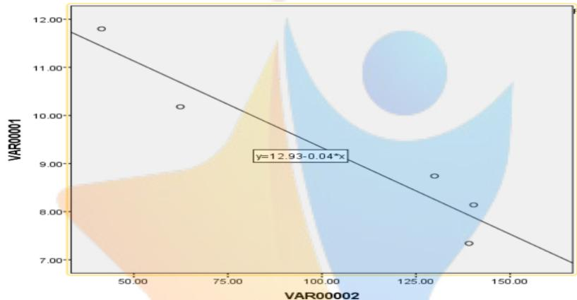

<details>
<summary>scatter</summary>

| VAR00002 | VAR00001 |
| --- | --- |
| ~45 | ~11.8 |
| ~65 | ~10.2 |
| ~130 | ~8.8 |
| ~140 | ~8.2 |
| ~140 | ~7.4 |
</details>

即：浓度=-0.036 ( )+ 12.931($0 . 5 8 7 \mathrm { G } + 0 . 1 1 4 \mathrm { B } < 1 4 0 )$ 浓度与灰度负相关，与RGB读数都负相关。

## 5.1.3.4 硫酸铝钾与浓度关系

硫酸铝钾这组数据比较特殊，每一种的读数差异比较大，但是实际颜色不算大，因此我们也只能选用平均值作为讨论数据，观察图像发现工业碱的颜色读数与浓度存在一定关系。但通过皮尔逊分析法和显著性的检验，显示浓度与各组读书及其平均值（参见附录）都没有显著相关性。我们继续分析，硫酸铝钾的色彩读数随浓度变化小，只在有浓度和浓度为零间有明显差异。将浓度为 0的颜色读数与有浓度的颜色读数进行相关性分析，结果如下表：

<table><tr><td>物质</td><td>实验组数</td><td>类型</td><td>B</td><td>G</td><td>R</td><td>H</td><td>S</td></tr><tr><td rowspan="2">硫酸铝钾</td><td rowspan="2">平均</td><td>皮尔逊相关性</td><td>0.874</td><td>-0.745</td><td>-0.905</td><td>0.986</td><td>0.919</td></tr><tr><td>显著性</td><td>0.000</td><td>0.001</td><td>0.002</td><td>0.003</td><td>0.004</td></tr></table>

根据所得的皮尔逊相关系数和显著性，可以确定硫酸铝钾的颜色读数可以确定溶液中是否含有该物质,RGB 自相关性如下：0.920829968，-0.81369431，-0.94515598，因此可用灰度直接分辨溶液中该物质浓度是否大于 0.5ppm，即：灰度<100 时，溶液中物质大于 0.5ppm。

## 5.1.3.5 奶中尿素与浓度关系

奶中尿素从肉眼上看颜色差异并不明显，而观察折线图奶中尿素在差异为0-2000 的ppm中颜色读数差异较小。但是在相关性分析中我们发现浓度与 RGB中B具有显著相关性而与灰度的相关性也较差。根据文献[3]这可能是因为肉眼在该颜色的辨别能力比较差导致，因此以颜色读数B为自变量进行一元线性回归，得到：

y=-112.475x+13571.908（x<140），该方程 R=0.892，p 值小于 0.05，说明该方程显著，回归系数 p值也小于0.05，说明回归系数显著。

即：浓度=-112.475 B+13571.908，浓度与 B 读数负相关。

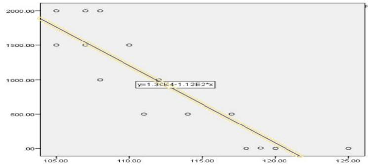

<details>
<summary>scatter</summary>

| X | Y |
| --- | --- |
| ~105.00 | 2000.00 |
| ~105.00 | 1500.00 |
| ~107.50 | 2000.00 |
| ~107.50 | 1500.00 |
| ~108.50 | 2000.00 |
| ~108.50 | 1000.00 |
| ~110.50 | 1500.00 |
| ~111.50 | 500.00 |
| ~112.50 | 1000.00 |
| ~114.50 | 500.00 |
| ~117.50 | 500.00 |
| ~118.50 | 0.00 |
| ~119.50 | 0.00 |
| ~120.50 | 0.00 |
| ~125.00 | 0.00 |
</details>

## 5.1.4 建立数据评价准则

## 5.1.4.1 评价准则 1——RGB2HS吻合度（检验每一条数据的准确性）

RGB 与HS分别属于两种不同的颜色判定的体系，通过RGB与HSV模型之间的转换的公式，将每组数据中R、G、B的值变换到对应的S、H、V的值，并与附件1中 S、H原始数据相比较求出误差。并定义吻合度为：饱和度吻合度$\left( 1 - \frac { \Sigma ^ { \frac { | ( S - S " ) | } { S } } } { n } \right) * 1 0 0 \%$ 色调吻合度 $= \left( 1 - \frac { \Sigma ^ { \frac { | ( S - S " ) | } { S } } } { n } \right) * 1 0 0 \%$ ，即1—误差绝对值除以原数据的和。吻合度越接近1表示该条数据正确性越高。通过模型公式解得V、S’数值：

我们通过查阅文献<sup>[1]</sup>得知HSV颜色模型是根据颜色的直观特性创建的一种颜色空间,。这个模型中颜色的参数分别是：色调（H），饱和度（S），明度（V），其中 H 用角度度量，可视为一个圆形，取值范围为 $0 ^ { \circ } \ \sim 3 6 0 ^ { \circ }$ ，从红色开始按逆时针方向计算，红色为 $0 ^ { \circ }$ ，绿色为 $1 2 0 ^ { \circ }$ ,蓝色为 $2 4 0 ^ { \circ }$ 。以data2的二氧化硫数据为例，我们计算得出的二氧化硫颜色读数 H 分布在 270°～287°，而附件 2 中读数 H 分布在 $1 3 5 ^ { \circ } \sim 1 4 1 ^ { \circ }$ 显然不是[0,360)的取值范围而是[0,180），因此我们认为原始数据中 H的取值范围为 $0 ^ { \circ } \sim 1 8 0$ ，如图：

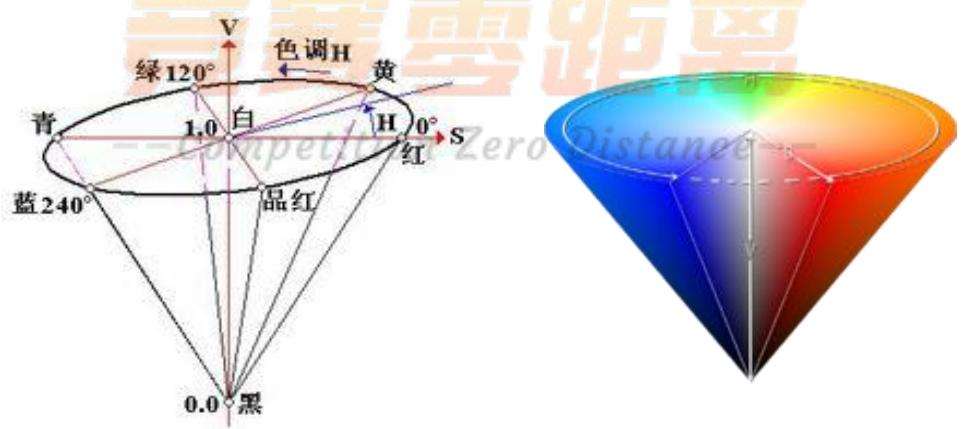

因此计算得出的 H 数值乘以 $\cdot { \frac { 1 } { 2 } } .$ 再与原始数据比较。再者由于原始数据和计算数据的定义域不同，导致无法进行直观比较，发现原数据与计算数值如下关系：$S ^ { \prime \prime } { = } S ^ { \prime } { * } 2 5 5$ 。 因此可得如下计算表(计算过程见附件<sup>[2]</sup>)：

<table><tr><td></td><td>S吻合度</td><td>H吻合度</td></tr><tr><td>组胺</td><td>99.11%</td><td>96.18%</td></tr><tr><td>溴酸钾</td><td>98.94%</td><td>98.06%</td></tr><tr><td>工业碱</td><td>98.25%</td><td>93.49%</td></tr><tr><td>硫酸铝钾</td><td>99.17%</td><td>91.64%</td></tr><tr><td>奶中尿素</td><td>98.27%</td><td>97.91%</td></tr></table>

结论：五种物质实验数据记录都比较准确，但是更加准确的是组胺、溴酸钾和奶中尿素。

## 5.1.4.2 评价准则 2—同物同浓下变异系数（检验相同物质 ppm 下数据稳定度）

对实验数据准确性的评估，将同种物质，在相同浓度下的R、G、B数值应该

相对稳定，利用数据变异系数 $C . \nu = \frac { S D } { M e } * 1 0 0 \% = \frac { \sqrt { \frac { I } { N - I } \sum _ { i = I } ^ { N } \left( X _ { i } - \overline { { X } } \right) ^ { 2 } } } { M e } * 1 0 0 \%$ ，建立准则2：以组胺为例，将同种浓度数据整理，之后把数据代入模型中求出标准差SD 变异系数 C.v 得下表：

<table><tr><td>变异系数</td><td>浓度ppm</td><td>B</td><td>G</td><td>R</td><td>H</td><td>S</td></tr><tr><td rowspan="5">组胺</td><td>0</td><td>3.19%</td><td>0.00%</td><td>0.59%</td><td>3.01%</td><td>2.50%</td></tr><tr><td>100</td><td>2.18%</td><td>0.70%</td><td>0.00%</td><td>0.00%</td><td>1.87%</td></tr><tr><td>50</td><td>2.32%</td><td>0.00%</td><td>0.00%</td><td>0.00%</td><td>2.28%</td></tr><tr><td>25</td><td>0.00%</td><td>0.00%</td><td>0.60%</td><td>0.00%</td><td>0.92%</td></tr><tr><td>12.5</td><td>3.93%</td><td>2.18%</td><td>0.65%</td><td>6.15%</td><td>1.24%</td></tr><tr><td rowspan="5">溴酸钾</td><td>0</td><td>0.55%</td><td>0.00%</td><td>0.49%</td><td>3.14%</td><td>2.57%</td></tr><tr><td>12.5</td><td>1.64%</td><td>0.51%</td><td>0.49%</td><td>0.00%</td><td>2.72%</td></tr><tr><td>25</td><td>1.02%</td><td>0.52%</td><td>0.49%</td><td>0.00%</td><td>0.53%</td></tr><tr><td>50</td><td>3.63%</td><td>0.00%</td><td>0.00%</td><td>0.00%</td><td>2.87%</td></tr><tr><td>100</td><td>0.00%</td><td>0.00%</td><td>0.00%</td><td>0.00%</td><td>0.29%</td></tr><tr><td rowspan="6">硫酸铝钾</td><td>0</td><td>1.71%</td><td>0.79%</td><td>0.61%</td><td>2.89%</td><td>6.09%</td></tr><tr><td>0.5</td><td>4.31%</td><td>3.01%</td><td>19.26%</td><td>1.15%</td><td>16.22%</td></tr><tr><td>1</td><td>3.76%</td><td>2.78%</td><td>10.88%</td><td>0.52%</td><td>6.26%</td></tr><tr><td>1.5</td><td>0.27%</td><td>1.19%</td><td>7.98%</td><td>0.51%</td><td>3.64%</td></tr><tr><td>2</td><td>1.65%</td><td>2.60%</td><td>6.19%</td><td>0.53%</td><td>1.72%</td></tr><tr><td>5</td><td>1.36%</td><td>4.51%</td><td>20.64%</td><td>0.89%</td><td>7.45%</td></tr><tr><td rowspan="5">奶中尿素</td><td>0</td><td>4.75%</td><td>0.65%</td><td>1.20%</td><td>4.30%</td><td>7.85%</td></tr><tr><td>500</td><td>2.63%</td><td>1.84%</td><td>1.49%</td><td>4.38%</td><td>15.80%</td></tr><tr><td>1000</td><td>2.57%</td><td>2.11%</td><td>2.08%</td><td>2.57%</td><td>17.68%</td></tr><tr><td>1500</td><td>2.34%</td><td>0.85%</td><td>0.42%</td><td>0.00%</td><td>7.35%</td></tr><tr><td>2000</td><td>1.43%</td><td>1.93%</td><td>1.90%</td><td>4.22%</td><td>2.62%</td></tr></table>

通过查阅文献<sup>[4]</sup>得知，当变异系数大于 15%时视为数据有较大差异。当同种物质相同浓度下，颜色应为极其相近，对应的变异系数应该即为接近并且小于15%。所以通过比较变异系数的大小，结合色卡颜色的变化并得出结论：组胺在相同浓度下，变异系数较小并小于 15%，所以该组实验数据准确性高。同理：溴酸钾在相同浓度下，变异系数较小，该组实验数据较为准确。奶中尿素相同浓度下，RGBS 变异系数较小，该组实验数据较为准确，而 H 变异系数大，因此可以多读书H存在差异性。硫酸铝钾相同浓度下，G、B、H的变异系数较小数据较为准确，但 R 与 S 的在 5ppm 出现三组大于 15%的变系数，所以判定 R 与 S 不算十分精确。由于实验数据有限，工业碱仅有一组数据，无法进行计算，存在偶然性，故不适用于此方法。

## 5.1.4.3 评价准则 3——同物不同浓下变异系数离散度（同物质不同浓度颜色读书的区分度）

在对同一种物质不同浓度的比色法实验，我们希望每组读书差异相对较大，

因此我们也利用变异系数 $C . \nu = \frac { S D } { M e } * 1 0 0 \% = \frac { \sqrt { \frac { I } { N - I } \sum _ { i = I } ^ { N } \left( X _ { i } - \overline { { X } } \right) ^ { 2 } } } { M e } * 1 0 0 \%$ 来建立准则3的指标。以组胺为例，将不同浓度的数据升序排列，得到表（1）后，把R、G、B、H、S值分别代入公式中求的最终C.v 值 如下表：

<table><tr><td></td><td></td><td>B</td><td>G</td><td>R</td><td>H</td><td>S</td></tr><tr><td>组胺</td><td>变异系数</td><td>24.27%</td><td>18.85%</td><td>3.79%</td><td>25.08%</td><td>19.20%</td></tr><tr><td>溴酸钾</td><td>变异系数</td><td>63.09%</td><td>2.56%</td><td>1.31%</td><td>7.23%</td><td>59.19%</td></tr><tr><td>工业碱</td><td>变异系数</td><td>16.85%</td><td>62.41%</td><td>12.24%</td><td>15.51%</td><td>87.12%</td></tr><tr><td>硫酸铝钾</td><td>变异系数</td><td>11.14%</td><td>5.46%</td><td>43.83%</td><td>11.01%</td><td>37.10%</td></tr><tr><td>奶中尿素</td><td>变异系数</td><td>5.27%</td><td>0.88%</td><td>1.03%</td><td>5.87%</td><td>21.38%</td></tr></table>

即：结合色卡颜色的变化并得出结论：组胺在相同浓度下，变异系数较大并大于15%，所以该组实验数据使用比色卡方，颜色差异大，效果好。溴酸钾在不同浓度下使用 B、S 分析较为有效，工业碱在不同浓度下，比色卡颜色差异也比较大，硫酸铝钾在不同浓度下只有 R与S差异行多较大，而奶中尿素在不同浓度下，比色卡颜色差异只有饱和度差异较大。

## 5.2问题二模型的建立

## 5.2.1 数据评价

首先对数据进行检测，发现在同一浓度下的颜色读数极差不超过 4。绘制二氧化硫的色块如图（4）：

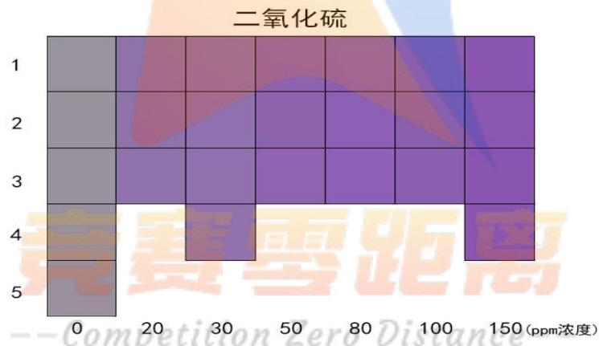

<details>
<summary>heatmap</summary>

| Position | 0 ppm | 20 ppm | 30 ppm | 50 ppm | 80 ppm | 100 ppm | 150 ppm |
| --- | --- | --- | --- | --- | --- | --- | --- |
| 1 | Grey | Purple | Red | Red | Red | Blue | Purple |
| 2 | Grey | Purple | Purple | Purple | Purple | Purple | Purple |
| 3 | Grey | Purple | Purple | Purple | Purple | Purple | Purple |
| 4 | Purple | — | Purple | — | — | — | Purple |
| 5 | Purple | — | — | — | — | — | — |
</details>

图 4：二氧化硫颜色卡

原题中附件2中提供了二氧化硫在不同物质浓度下的颜色读数，我们通过观察发现，H、S的数据可能有误。我们利用公式将 R、G、B数值转换为 H、S数值，发现计算得出的S数值近似于附件 2原始数据中的 H数值，而计算得出的 H数值约为原始数据中 S 数值的二倍。H、S 两组数据恰好相反。将数据代入公式中算得S吻合度与 H吻合度分别为 98.83%和99.62%，应数据比较精确；将 R、G、B、S、H代入准则二模型中计算标准差 SD与变异系数 C.v得下表

<table><tr><td>浓度ppm</td><td>B</td><td>G</td><td>R</td></tr><tr><td>0</td><td>0.29%</td><td>0.78%</td><td>0.35%</td></tr><tr><td>20</td><td>0.40%</td><td>0.00%</td><td>0.90%</td></tr><tr><td>30</td><td>0.34%</td><td>0.00%</td><td>0.47%</td></tr><tr><td>50</td><td>0.41%</td><td>0.00%</td><td>0.57%</td></tr><tr><td>80</td><td>0.41%</td><td>0.00%</td><td>0.32%</td></tr><tr><td>100</td><td>0.00%</td><td>0.00%</td><td>0.57%</td></tr><tr><td>150</td><td>0.36%</td><td>0.58%</td><td>0.33%</td></tr></table>

结论：相同浓度下 B、G、R、H 对应的变异系数 C.v 皆小于 15%，所以数据较为准确；但 S 中有一组数据大于 15%，相比较下 S 不算太准确； 将不同浓度下 R、G、B、S、H取平均值后，与其标准值进行运算，最终得出变异系数如下表

<table><tr><td></td><td>B</td><td>G</td><td>R</td><td>H</td><td>S</td></tr><tr><td>二氧化硫</td><td>3.51%</td><td>18.60%</td><td>4.46%</td><td>0.86%</td><td>40.07%</td></tr></table>

结论：不同浓度下 G、S 的变异系数较大并大于 15%，但 B、R、H 相对于偏小，所以G、S更加有效。

由上图可以直观的观察到同种浓度下色差极小，因此我们取在同种浓度下的颜色读数的平均值进行计算。计算出平均色彩读数的灰度并绘制出浓度 RGB折线图，如图（5）

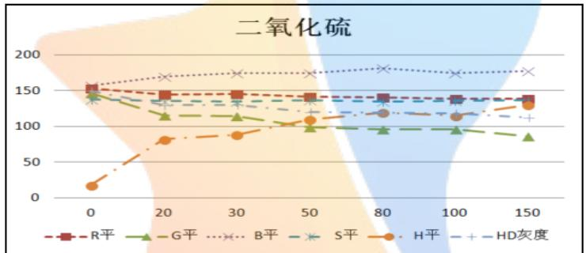

<details>
<summary>line</summary>

| X | R平 | G平 | B平 | S平 | H平 | HD灰度 |
| --- | --- | --- | --- | --- | --- | --- |
| 0 | ~152 | ~142 | ~155 | ~148 | ~18 | ~148 |
| 20 | ~142 | ~115 | ~168 | ~135 | ~80 | ~135 |
| 30 | ~142 | ~113 | ~172 | ~132 | ~88 | ~132 |
| 50 | ~140 | ~98 | ~172 | ~130 | ~108 | ~120 |
| 80 | ~138 | ~95 | ~178 | ~138 | ~118 | ~120 |
| 100 | ~138 | ~95 | ~172 | ~138 | ~115 | ~115 |
| 150 | ~138 | ~85 | ~175 | ~138 | ~132 | ~112 |
</details>

图中皮尔逊相关系数和显著性，可以确定二氧化硫的颜色读数与浓度间存在相关性。将RGB导入 SPSS进行相关性分析，结果如表（8）

<table><tr><td colspan="2"></td><td>R</td><td>G</td><td>B</td></tr><tr><td rowspan="2">R</td><td>皮尔逊相关性</td><td></td><td>0.988</td><td>-0.895</td></tr><tr><td>显著性</td><td></td><td>0.000</td><td>0.007</td></tr><tr><td rowspan="2">G</td><td>皮尔逊相关性</td><td>0.988</td><td></td><td>-0.916</td></tr><tr><td>显著性</td><td>0.000</td><td></td><td>0.004</td></tr><tr><td rowspan="2">B</td><td>皮尔逊相关性</td><td>-0.895</td><td>-0.916</td><td></td></tr><tr><td>显著性</td><td>0.007</td><td>0.004</td><td></td></tr></table>

图 8

发现浓度与 RGB 强自相关，通过上图可以初步确定二氧化硫的颜色读数与浓度间存在相关性，将数据导入 SPSS 进行相关性分析，因此计算灰度并计算相关性如表（7）

<table><tr><td>物质</td><td>实验组数</td><td>类型</td><td>B</td><td>G</td><td>R</td><td>HD</td></tr><tr><td rowspan="2">二氧化硫</td><td rowspan="2">1</td><td>皮尔逊相关性</td><td>0.696</td><td>-0.867</td><td>-0.844</td><td>0.968</td></tr><tr><td>显著性</td><td>0.000</td><td>0.000</td><td>0.000</td><td>0.000</td></tr></table>

表7：二氧化硫浓度相关性

## 5.2.1预测模型一：

将浓度与灰度导入 MATLAB 进行一元线性回归，得到模型为：f(x) = -3.612\*x

图 6

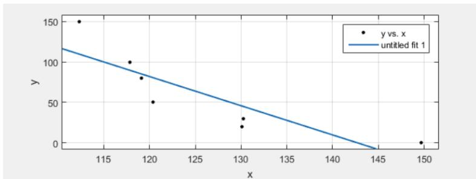

<details>
<summary>scatter</summary>

| x | y |
| --- | --- |
| ~112.5 | 150 |
| ~118 | 100 |
| ~119 | 80 |
| ~120.5 | 50 |
| ~130 | 30 |
| ~130 | 20 |
| ~149.5 | 0 |
</details>

得到模型显著性为 0.013 说明模型显著。系数显著性为 0.013 说明系数显著。之后对一元线性回归的模型进行误差检验，结果如图（7）

图 7  
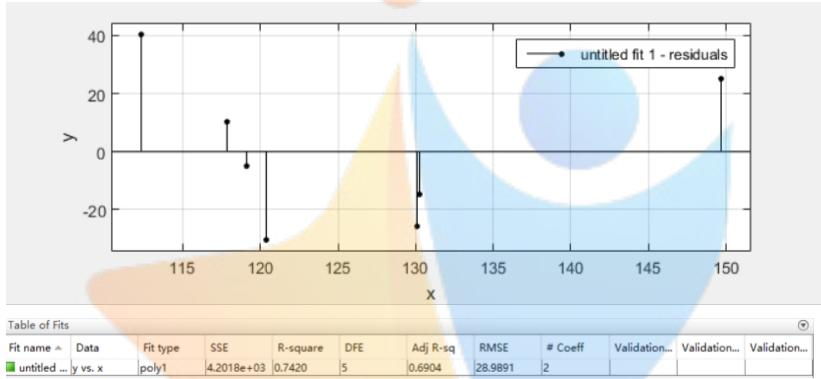

<details>
<summary>scatter</summary>

| X | Y |
| --- | --- |
| ~112 | 40 |
| ~118 | 10 |
| ~119 | -4 |
| ~120 | -30 |
| ~130 | -25 |
| ~130 | -14 |
| ~150 | 25 |
</details>

由图可知误差最大值小于 3 倍 RMSE 值，所以模型误差较小。这个模型中自变量数据每组差异较小。但是这是模型中y 的取值为0-150，我们发现真的用这个模型预测浓度时两段的差异不能接受，如下表，因此建立模型二

<table><tr><td>浓度</td><td>绝对误差(平均值)</td><td rowspan="5"></td><td>浓度</td><td>绝对误差(平均值)</td></tr><tr><td>0</td><td>25.31483056</td><td>80</td><td>5.084553</td></tr><tr><td>20</td><td>25.5079892</td><td>100</td><td>10.37095</td></tr><tr><td>30</td><td>14.7169913</td><td>150</td><td>40.45808</td></tr><tr><td>50</td><td>30.389314</td><td></td><td></td></tr></table>

## 5.2.1预测模型二：

我们将 0-150的浓度看做有序分类变量，以灰度为自变量，建立一元多分类logistics回归，模型为：预测变量为x的基线-类别logit模型为：

$$
\ln \left(\frac {\pi_ {j}}{\pi_ {I}}\right) = \alpha_ {j} + \beta_ {j} x, j = 1, \dots , J - 1
$$

不管哪个类别作为基线，对于同一对类别都会有相同的参数估计；即基线类别的选择是任意的，这个模型虽然分类准确性极高，但是没有办法预测除 0，20,30,50,100,150 外其他浓度，因此并不能真正应用。

<table><tr><td>浓度</td><td>灰度</td><td>预测分类</td><td>预测概率</td></tr><tr><td>0</td><td>150.51</td><td>0</td><td>1</td></tr><tr><td>0</td><td>149.92</td><td>0</td><td>1</td></tr><tr><td>0</td><td>149.45</td><td>0</td><td>1</td></tr><tr><td>0</td><td>149.45</td><td>0</td><td>1</td></tr><tr><td>0</td><td>149.04</td><td>0</td><td>1</td></tr></table>

<table><tr><td>浓度</td><td>灰度</td><td>预测分类</td><td>预测概率</td></tr><tr><td>50</td><td>120.51</td><td>50</td><td>0.95</td></tr><tr><td>50</td><td>120.09</td><td>50</td><td>0.95</td></tr><tr><td>50</td><td>120.62</td><td>50</td><td>0.95</td></tr><tr><td>80</td><td>119.13</td><td>80</td><td>0.95</td></tr><tr><td>80</td><td>119.24</td><td>80</td><td>0.95</td></tr></table>

<table><tr><td>20</td><td>129.93</td><td>20</td><td>0.97</td><td rowspan="8"></td><td>80</td><td>118.95</td><td>80</td><td>0.95</td></tr><tr><td>20</td><td>129.81</td><td>20</td><td>0.97</td><td>100</td><td>117.85</td><td>100</td><td>0.97</td></tr><tr><td>20</td><td>130.45</td><td>20</td><td>0.97</td><td>100</td><td>117.74</td><td>100</td><td>0.97</td></tr><tr><td>30</td><td>130.09</td><td>30</td><td>0.97</td><td>100</td><td>117.96</td><td>100</td><td>0.97</td></tr><tr><td>30</td><td>130.32</td><td>30</td><td>0.97</td><td>150</td><td>112.32</td><td>150</td><td>1</td></tr><tr><td>30</td><td>130.21</td><td>30</td><td>0.97</td><td>150</td><td>112.79</td><td>150</td><td>1</td></tr><tr><td>30</td><td>130.51</td><td>30</td><td>0.97</td><td>150</td><td>111.91</td><td>150</td><td>1</td></tr><tr><td></td><td></td><td></td><td></td><td>150</td><td>112.32</td><td>150</td><td>1</td></tr></table>

## 5.2.1预测模型二：指数模型

再观察散点图，发现灰度与浓度成指数关系，因此使用指数模型进行回归：得到模型： $\mathbf { y } = 1 . 6 5 3 * 1 0 ^ { 7 } * \mathrm { e } ^ { ( - 0 . 1 0 3 2 * x ) }$ ,R 方为 0.966，拟合程度明显高于线性模型，即得模型为：浓度

$$
= 1. 6 5 3 * 1 0 ^ {7} * \mathrm{e} ^ {- 0. 1 0 3 2 (0. 0 4 1 7 5 * 0. 2 9 8 9 \mathrm{R} + 0. 5 8 7 \mathrm{G} + 0. 1 1 4 \mathrm{B})} 。
$$

计算绝对误差如下：误差得到很大改善，可初步应用实际

<table><tr><td>浓度</td><td>线性误差</td><td>指数误差</td><td rowspan="5"></td><td>浓度</td><td>线性误差</td><td>指数误差</td></tr><tr><td>0</td><td>25.31483056</td><td>3.240967985</td><td>80</td><td>5.084553</td><td>4.139326</td></tr><tr><td>20</td><td>25.5079892</td><td>4.495050236</td><td>100</td><td>10.37095</td><td>13.62429</td></tr><tr><td>30</td><td>14.7169913</td><td>6.059244417</td><td>150</td><td>40.45808</td><td>4.884433</td></tr><tr><td>50</td><td>30.389314</td><td>16.34987651</td><td></td><td></td><td></td></tr></table>

## 5.3 问题三

## 5.3.1数据量对模型的影响

因为讨论数据量对模型的影响，所以选区附件一中数据量最少的工业碱和数据量最多的硫酸铝钾分别进行分析。

工业碱的数据共有 7个且浓度各不相同，无法进行同浓度下的数据检验。也无法证明数据的可靠性，如果出现异常值很难发现和处理。较少的数据进行回归会得到比较理想的模型，但也降低了模型的可靠性和预测范围。

硫酸铝钾的数据共有 35 个，有充足的数据进行数据间的交叉验证，提高了回归模型的可靠性和预测范围。但同时数据量的增加也增大了异常值出现的可能，单个数值的异常可能会对整体的分析造成很大的影响。

所以数据量过多或过少都会对模型造成不同程度的影响。如何检验数据的准确性和处理数据中异常值，对数据回归的模型会有很大的影响。

## 5.3.2颜色维度对模型的影响

颜色维度也就是不同的数值，如 R、G、B、S、H就为5种颜色维度。其中三组数据可组成一种颜色体系。如 RGB 和 SH 即为两种不同的颜色体系。不同体系间可对颜色维度的数据新型相互验证。附件中给出了 5种颜色维度，两种不同的颜色体系。其中 SH 体系的数据不全，给之后两组体系数据的相互检验带来了很大的不便，使得数据的准确性降低，回归出的模型可靠性也得不到保证。

在分析 R、G、B、S、H 时,附件中未给出各颜色维度的单位。所以在分析的过程中，数据是录入错误还是单位不一致很难区分，给之后的模型回归造成了很大的困难。所以颜色维度的数据量给出的越多，单位越全，回归出的模型准确性越能得到保证。

## 六、模型的评价与改进

## 6.1模型的评价

模型优点，根据题中所给的颜色读数绘制出色卡，可清楚直观地看出颜色与浓度之间是否存在关系，为接下来的讨论奠定了基础。绘制颜色与浓度关系的折线图，方便了我们观察两者间的关系。利用皮尔逊分析法对数据进行相关性分析，可得出皮尔逊相关系数和显著性，判断各物质的颜色读数于浓度是否具有相关性。当颜色读数RGB具有自相关性时，不能直接用 RGB三个变量直接所为自变量与浓度进行回归分析，因此我们将RGB数值转为识别度很高的灰度进行分析。通过H、S吻合度检验，判断实验数据的准确性，并发现题目数据中的错误。

## 6.2模型的改进

因题目中部分物质的数据不足，无法通过本模型对颜色读数与物质浓度间的关系进行准确地分析，得到的结果可能有较大误差。我们从线性模型到指数模型的误差确实得到了改善，但是在50ppm的误差依然有10%，这实际还是不够好的，应该在更精确的仪器获得的数据基础上继续改善。

## 七、参考文献

## 书籍：

[1][美]赫恩(Hearn,D.),巴克(Baker,M.P.),卡里瑟斯(Carithers,W.R.)著;蔡士杰,杨若瑜译.《计算机图形学：第 4版》.电子工业出版社,2014  
[4] 罗良清、魏和清．《统计学》.中国财政经济出版社,2011

## 网站资源：

[2]百度文库.从RGB 色转为灰度色算法.

https://wenku.baidu.com/view/0da4374549649b6648d747b2.html?from=searc h，2015.9.11

[3] 知 乎 .Wang J. 普 通 人 肉 眼 可 以 看 出 RGB 在 多 大 程 度 上 的 差别.https://www.zhihu.com/question/33688135?sort=created.2015.7.31

## 八、附录

## MATLAB 绘制色快程序：

```matlab
num = xlsread('d:\data1.xls','sheet1','B2:G6');color1 = num;
color1(:,2:4) = color1(:,2:4)/255;
s = size(color1);
gshu = s(1,1);
kuan=2;
%rectangle('Position',[1 2 kuan*gshu 5])
for i=1:gshu
    rectangle('Position',[1+(i-1)*kuan          2          kuan
5],'facecolor',[color1(i,4),color1(i,3),color1(i,2)])
end
```