# 颜色与物质浓度的辨识问题

## 摘要

本文是对颜色与物质浓度的辨识问题的研究，通过对溶液色度值与待测物浓度的实验数据进行多元回归分析，建立了线性和非线性回归方程模型，给出了数据的评价准则和模型的误差分析。

问题一：首先依据对数据初步分析，发现物质浓度与颜色读数存在着一定的关系。利用 MATLAB 统计工具箱中的 Regress 函数求出回归系数和置信区间，并进行残差分析，最终建立关于颜色读数和物质浓度的多元线性回归模型。基于对模型的检验分析的基础上，给出了判别数据优劣的五大准则，分别是评估模型是否成功的四个要素， 检验、相关系数 <sup>2</sup>、P值、估计误差方差 <sup>2</sup>S ；再加上数据完整性要素，即模型拟合过程中是否存在异常数据剔除。根据判别准则，数据优劣的排序为：组胺>溴酸钾>奶中尿素>硫酸铝钾>工业碱。

问题二：首先建立二氧化硫浓度与颜色读数之间的线性回归模型，模型的残差较大，拟合效果不佳。考虑建立非线性二次回归模型，利用MATLAB统计工具箱中的 rstool 函数建模，通过剩余标准差和残差评估模型优劣。最终建立的非线性二次回归模型中，剩余标准差很小，预测模型非常好，模型的残差相比五元线性回归模型降低了一个数量级，因此线性二次回归模型比线性回归模型更优。

问题三：首先降低多元线性回归模型中颜色的维度来分析颜色维度对模型的影响；然后再通过减少数据量来分析数据量对模型的影响。通过分析发现：数据量不能低于 6,一般在 10-15 之间；颜色纬度可以降低，二纬和三纬都可以，一纬模型就不太优甚至不成立了，而且颜色维度的大小比数据量的多少对模型的影响更大；于是最后使用层次分析法对数据量的多少和颜色维度的大小对模型的影响因子进行分析求解，得出了影响因子分别为 0.414 和0.586。

关键词：多元线性回归，多元非线性二次回归，MATLAB，误差，层次分析法

## 问题重述

## （一）问题的背景：

比色法是目前常用的一种检测物质浓度的方法，即把待测物质制备成溶液后滴在特定的白色试纸表面，等其充分反应以后获得一张有颜色的试纸，再把该颜色试纸与一个标准比色卡进行对比，就可以确定待测物质的浓度档位了。由于每个人对颜色的敏感差异和观测误差，使得这一方法在精度上受到很大影响。随着照相技术和颜色分辨率的提高，希望建立颜色读数和物质浓度的数量关系，即只要输入照片中的颜色读数就能够获得待测物质的浓度。试根据附件所提供的有关颜色读数和物质浓度数据完成下列问题：

## （二）问题的提出：

1.附件 Data1.xls 中分别给出了5种物质在不同浓度下的颜色读数，讨论从这5组数据中能否确定颜色读数和物质浓度之间的关系，并给出一些准则来评价这5组数据的优劣。  
2.对附件 Data2.xls 中的数据，建立颜色读数和物质浓度的数学模型，并给出模型的误差分析。  
3.探讨数据量和颜色维度对模型的影响。

## 二、模型假设与符号说明

## 1．模型假设

1）反应应具有较高的灵敏度和选择性；  
2）反应生成的有色化合物的组成恒定且较稳定；  
3）选择适当的显色反应和控制好适宜的反应条件。

## 2．符号说明：见表1

<table><tr><td>符号</td><td>含义</td><td>单位</td></tr><tr><td> $Y_i$ </td><td>各待测物理论浓度(i=1,2,3,4,5,6)</td><td>ppm(mg/L)</td></tr><tr><td> $\hat{Y}_i$ </td><td>各待测物实际浓度(i=1,2,3,4,5,6)</td><td>ppm(mg/L)</td></tr><tr><td>C</td><td>回归方程回归系数</td><td></td></tr><tr><td>r</td><td>残差</td><td></td></tr><tr><td> $R^2$ </td><td>相关系数</td><td></td></tr><tr><td>F</td><td>F值</td><td></td></tr><tr><td>P</td><td>与F对应的概率</td><td></td></tr><tr><td> $S^2$ </td><td>估计误差方差</td><td></td></tr><tr><td>B</td><td>蓝色颜色值</td><td></td></tr><tr><td>G</td><td>绿色颜色值</td><td></td></tr><tr><td>R</td><td>红色颜色值</td><td></td></tr><tr><td>H</td><td>色调</td><td></td></tr><tr><td>S</td><td>饱和度</td><td></td></tr><tr><td>m</td><td>数据量</td><td></td></tr></table>

表 1 符号说明

## 三、问题的分析

首先对 Data1.xls 和 Data2.xls 提供的数据利用 MATLAB 进行相关性分析发现：颜色读数（五个维度：B,G,R,H,S）对物质浓度呈现一定线性相关性，而这一结论与文献<sup>[1]</sup>使用朗博-比尔吸收定律得到的结论一致。即物质浓度和颜色读数之间存在一定的关系。

其次利用统计学中的多元回归<sup>[2]</sup>对给出的六组数据进行回归分析，从而得出物质浓度与颜色读数（五维）之间的相互关系，确定它们之间合适的数学表达式（或数学模型）即经验公式或回归方程。

## 针对问题一

基于对 Data1.xls 的数据分析，我们可以利用 MATLAB 统计工具箱中的Regress 函数求出回归系数和置信区间，绘出残差图并进行残差分析，剔除置信区间不包含零点的异常点数据，重新进行多元线性回归，能够更好地建立关于颜色读数和物质浓度的多元线性回归模型。

基于对模型的检验分析的基础上，可以考虑评估模型是否成功的四个要素，检验、相关系数 <sup>2</sup>、P值、估计误差方差 <sup>2</sup>,相关系数 <sup>2</sup>越接近1，说明回归方程越显著； $F > F _ { _ { 1 - \alpha } } ( k , n - k - 1 ) _ { \mathbb { H } \mathbb { H } } _ { } \sharp _ { \mathbb { H } } ^ { } H _ { 0 }$ ，F越大，说明回归方程越显著；与 对应的概率 $P < \alpha$ 时拒绝 $H _ { 0 }$ ，回归模型成立。估计误差方差越小，回归方程越显著。还可以再考虑数据完整性要素，即模型拟合过程中是否存在异常数据剔除。给出对应评价 Data1.xls中5组数据优劣的五大准则，并根据5组数据是否同时满足五大准则对其优劣进行判别。

## 针对问题二

问题二是在问题一的基础上，进一步确定颜色读数和物质浓度的数学模型-线性回归方程。首先建立二氧化硫浓度与颜色读数之间的线性回归模型，模型的残差较大，拟合效果不佳。

考虑建立非线性二次回归模型，利用 MATLAB 统计工具箱中的rstool 函数建模，通过剩余标准差和残差评估模型优劣。最终建立的非线性二次回归模型中，剩余标准差很小，预测模型非常好，模型的残差相比多元线性回归模型降低了一个数量级，因此线性二次回归模型比线性回归模型更优。通过两种模型的误差的对比发现：非线性回归二次方程的精度更高。

## 针对问题三

问题三是讨论数据量和颜色维度对模型的影响。根据问题一和问题二的求解结果发现：数据量的大小会影响模型的优劣；以及通过枚举法调整线性回归中变量的数量即颜色维度发现：颜色维度的多少也会影响模型的优劣。而且数据量对模型优劣的影响度大于颜色维度对模型优劣的影响度。因此本文提出采用层次分析法对两者的影响因子进行分析，最终得出了数据量和颜色维度对模型优劣的影响因子。

## 四、模型的建立与求解

## 问题一：

基于对数据的分析，本文认为有Data1.xls 提供的5组数据能确定颜色读数与物质浓度之间的关系，并建立了多元线性回归模型：

$$
Y = \varepsilon + C _ {1} R + C _ {2} G + C _ {3} B + C _ {4} H + C _ {5} S \tag {I}
$$

（Ⅰ）式中 $C _ { 1 } , C _ { 2 } , C _ { 3 } , C _ { 4 } , C _ { 5 }$ 表示方程的回归系数。

利用 matlab统计工具箱建立多元线性回归方程：

$$
[ b, \text {bint}, r, \text {rint}, \text {stats} ] = \text {regress} (Y, X, \text {alpha}) (\text {II})
$$

式（Ⅱ）中 b 为回归系数，bint 为回归系数的置信区间，r 为残差，rint 为残差的置信区间，alpha 为显著性水平。stats 包含四个统计量，相关系数 $R ^ { 2 }$ 、F值、与F对应的概率 p，估计误差方差。相关系数 $R ^ { 2 }$ 越接近1，说明回归方程越显著； $F > F _ { _ { 1 - \alpha } } ( k , n - k - 1 )$ 时拒绝 $H _ { 0 } , \mathrm { ~ F ~ }$ 越大，说明回归方程越显著；与 F对应的概率 $p < \alpha$ 时拒绝 $H _ { 0 } ,$ 回归模型成立。估计误差方差越小，回归方程越显著。

## 1.组胺浓度与颜色读数之间的关系函数：

根据组胺的实验数据（见表2），其中 0表示待测物质浓度为零的情形，即水溶液，使用matlab对数据进行多元线性回归（代码见附录中程序 1），画出残差图（图1）并给出具体的残差值（表 3）和其置信区间（表4）。

<table><tr><td>浓度(ppm)</td><td>B</td><td>G</td><td></td><td>R</td><td>H</td><td>S</td></tr><tr><td>0</td><td>68</td><td>110</td><td></td><td>121</td><td>23</td><td>111</td></tr><tr><td>100</td><td>37</td><td>66</td><td></td><td>110</td><td>12</td><td>169</td></tr><tr><td>50</td><td>46</td><td>87</td><td></td><td>117</td><td>16</td><td>155</td></tr><tr><td>25</td><td>62</td><td>99</td><td></td><td>120</td><td>19</td><td>122</td></tr><tr><td>12.5</td><td>66</td><td>102</td><td></td><td>118</td><td>20</td><td>112</td></tr><tr><td>0</td><td>65</td><td>110</td><td></td><td>120</td><td>24</td><td>115</td></tr><tr><td>100</td><td>35</td><td>64</td><td></td><td>109</td><td>11</td><td>172</td></tr><tr><td>50</td><td>46</td><td>87</td><td></td><td>118</td><td>16</td><td>153</td></tr><tr><td>25</td><td>60</td><td>99</td><td></td><td>120</td><td>19</td><td>126</td></tr><tr><td>12.5</td><td>64</td><td>101</td><td></td><td>118</td><td>20</td><td>115</td></tr></table>

表 2 组胺的实验数据  
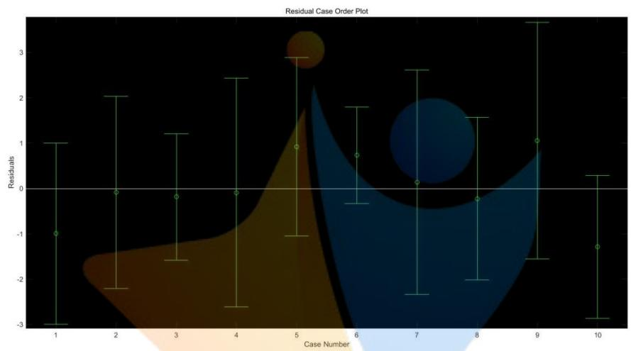

<details>
<summary>error_bar</summary>

| Case Number | Mean Residual | Lower Bound | Upper Bound |
| --- | --- | --- | --- |
| 1 | -1.0 | -3.0 | 1.0 |
| 2 | ~-0.1 | ~-2.2 | 2.0 |
| 3 | ~-0.2 | ~-1.6 | 1.2 |
| 4 | ~-0.1 | ~-2.6 | 2.5 |
| 5 | 0.9 | -1.0 | 2.9 |
| 6 | 0.7 | ~-0.3 | 1.8 |
| 7 | 0.1 | ~-2.3 | 2.6 |
| 8 | ~-0.2 | -2.0 | 1.6 |
| 9 | 1.1 | -1.5 | 3.7 |
| 10 | ~-1.3 | ~-2.8 | 0.3 |
</details>

图1 组胺浓度与颜色读数线性回归残差图

<table><tr><td>浓度(ppm)</td><td>残差值r</td></tr><tr><td>0</td><td>-0.993129343227508</td></tr><tr><td>100</td><td>-0.083240562564029</td></tr><tr><td>50</td><td>-0.184054282892987</td></tr><tr><td>25</td><td>-0.087070619285910</td></tr><tr><td>12.5</td><td>0.920198815901770</td></tr><tr><td>0</td><td>0.733366635833562</td></tr><tr><td>100</td><td>0.141799543614084</td></tr><tr><td>50</td><td>-0.222352920091282</td></tr><tr><td>25</td><td>1.056506552856305</td></tr><tr><td>12.5</td><td>-1.282023820143920</td></tr></table>

表3 组胺浓度与颜色读数线性回归残差值

<table><tr><td>相关系数 $R^{2}$ </td><td>F值</td><td>与F对应的概率P</td><td>估计误差方差</td></tr><tr><td>0.999580110101</td><td>1904.461358300401</td><td>0.000000771022</td><td>1.312155935514</td></tr></table>

表 4

由表 4：相关系数 $R ^ { 2 } = 0 . 9 9 9 5 8 0 1 1 0 1 0 1$ ，说明回归方程非常显著。F 对应的概率 $p < \alpha$ ，拒绝 $H _ { 0 }$ ，根据F检验，回归模型（Ⅲ）成立。

$$
\begin{array}{l} y = - 2 1 2. 7 6 5 0 2 0 0 9 0 4 6 8 2 + 2. 8 5 4 8 2 6 7 8 4 8 1 6 2 B - 4. 4 8 7 3 1 8 9 0 7 5 6 0 4 G \\ + 2. 3 2 1 3 3 6 8 3 5 9 4 3 3 R + 4. 5 9 3 2 4 4 8 1 3 8 4 0 8 H + 1. 1 4 1 5 1 9 0 9 9 3 7 2 5 S \\ \end{array}
$$

## 2.溴酸钾浓度与颜色读数之间的关系函数：

根据溴酸钾的实验数据（见表 5），首先利用 matlab统计工具箱建立多元线性回归方程（代码见附录中程序 1），画出残差图（图2）。从残差图可以看出，除第十个数据外，其余数据的残差离零点均较近，且残差的置信区间均包含零点，这说明回归模型能较好的符合原始数据，而这个数据可视为异常点(剔除)。去掉异常点之后再次进行多元线性回归，绘出残差图（图3），并给出具体的残差值（表6）和其置信区间（表 7）。

<table><tr><td>浓度(ppm)</td><td>B</td><td>G</td><td>R</td><td>H</td><td>S</td></tr><tr><td>0</td><td>129</td><td>141</td><td>145</td><td>22</td><td>27</td></tr><tr><td>100</td><td>7</td><td>133</td><td>145</td><td>27</td><td>241</td></tr><tr><td>50</td><td>60</td><td>133</td><td>141</td><td>27</td><td>145</td></tr><tr><td>25</td><td>69</td><td>136</td><td>145</td><td>26</td><td>133</td></tr><tr><td>12.5</td><td>85</td><td>139</td><td>145</td><td>26</td><td>106</td></tr><tr><td>0</td><td>128</td><td>141</td><td>144</td><td>23</td><td>28</td></tr><tr><td>100</td><td>7</td><td>133</td><td>145</td><td>27</td><td>242</td></tr><tr><td>50</td><td>57</td><td>133</td><td>141</td><td>27</td><td>151</td></tr><tr><td>25</td><td>70</td><td>137</td><td>146</td><td>26</td><td>132</td></tr><tr><td>12.5</td><td>87</td><td>138</td><td>146</td><td>26</td><td>102</td></tr></table>

表5 溴酸钾的实验数据

由表 7：相关系数 $R ^ { 2 } { = } 0$ ．9985210281929，说明回归方程非常显著。F对应

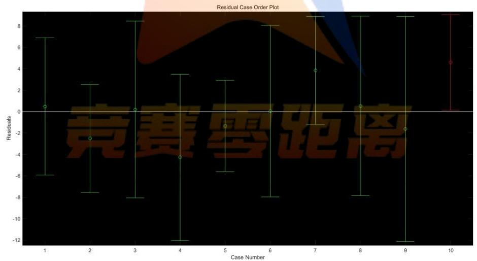

<details>
<summary>error_bar</summary>

| Case Number | Mean Residual | Lower Bound | Upper Bound |
| --- | --- | --- | --- |
| 1 | ~0.5 | ~-6.0 | ~7.0 |
| 2 | ~-2.5 | ~-7.5 | ~2.5 |
| 3 | ~0.2 | ~-8.0 | ~8.5 |
| 4 | ~-4.2 | ~-12.0 | ~3.5 |
| 5 | ~-1.3 | ~-5.5 | ~3.0 |
| 6 | ~0.0 | ~-8.0 | ~8.0 |
| 7 | ~3.9 | ~-1.2 | ~9.0 |
| 8 | ~0.5 | ~-7.8 | ~9.0 |
| 9 | ~-1.6 | ~-12.0 | ~9.0 |
| 10 | ~4.6 | ~0.2 | ~9.0 |
</details>

图 2 溴酸钾浓度与颜色读数线性回归残差图

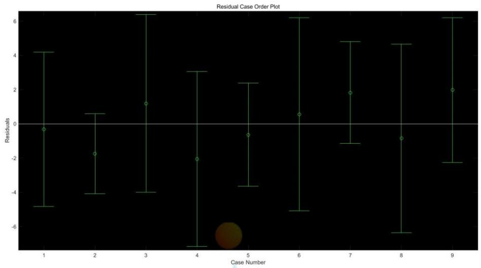

<details>
<summary>error_bar</summary>

| Case Number | Mean Residual | Lower Bound | Upper Bound |
| --- | --- | --- | --- |
| 1 | ~-0.3 | ~-4.8 | ~4.2 |
| 2 | ~-1.7 | ~-4.0 | ~0.6 |
| 3 | ~1.2 | ~-4.0 | ~6.4 |
| 4 | ~-2.0 | ~-7.2 | ~3.1 |
| 5 | ~-0.7 | ~-3.6 | ~2.4 |
| 6 | ~0.6 | ~-5.0 | ~6.2 |
| 7 | ~1.8 | ~-1.1 | ~4.8 |
| 8 | ~-0.8 | ~-6.3 | ~4.6 |
| 9 | ~2.0 | ~-2.2 | ~6.2 |
</details>

图3 剔除异常点后溴酸钾浓度与颜色读数线性回归残差图

<table><tr><td>浓度(ppm)</td><td>残差值 r</td></tr><tr><td>0</td><td>-0.311054621479073</td></tr><tr><td>100</td><td>-1.739298695133584</td></tr><tr><td>50</td><td>1.198950353741111</td></tr><tr><td>25</td><td>-2.046358165775416</td></tr><tr><td>12.5</td><td>-0.633956401784815</td></tr><tr><td>0</td><td>0.563887602493494</td></tr><tr><td>100</td><td>1.832705601078601</td></tr><tr><td>50</td><td>-0.844912938120160</td></tr><tr><td>25</td><td>1.980037264978989</td></tr><tr><td></td><td></td></tr></table>

表 6

<table><tr><td>相关系数 $R^{2}$ </td><td>F值</td><td>与F对应的概率P</td><td>估计误差方差</td></tr><tr><td>0.9985210281929</td><td>405.0872464611553</td><td>0.0001928592100</td><td>5.8200279444505</td></tr></table>

表 7

的概率 $p < \alpha$ ，拒绝 $H _ { 0 }$ ，根据F检验，回归模型（Ⅳ）成立。

$$
y = 1 3 0 9. 8 3 2 4 2 5 2 1 4 1 5 0 - 7. 8 2 5 2 9 6 3 5 6 3 7 8 B + 4. 9 4 9 4 0 7 9 8 0 1 1 0 G \tag {IV}
$$

$$
- 4. 7 2 2 5 1 1 3 5 0 6 9 8 R - 9. 8 5 0 7 4 5 6 3 4 8 3 7 H - 3. 5 7 2 0 0 4 2 9 6 2 1 2 S
$$

## 3．工业碱浓度与颜色读数之间的函数关系：

根据工业碱的实验数据（见表8），使用matlab 对数据进行多元线性回归（代码见附录中程序1），画出残差图（图4）并给出具体的残差值（表 9）和其置信区间（表 10）。

<table><tr><td>浓度(ppm)</td><td>B</td><td>G</td><td>R</td><td>H</td><td>S</td></tr><tr><td>7.34</td><td>153</td><td>140</td><td>132</td><td>108</td><td>35</td></tr><tr><td>8.14</td><td>151</td><td>142</td><td>133</td><td>104</td><td>29</td></tr><tr><td>8.74</td><td>158</td><td>126</td><td>127</td><td>120</td><td>52</td></tr><tr><td>9.19</td><td>161</td><td>85</td><td>118</td><td>132</td><td>120</td></tr><tr><td>10.18</td><td>127</td><td>21</td><td>119</td><td>147</td><td>211</td></tr><tr><td>11.8</td><td>94</td><td>6</td><td>91</td><td>148</td><td>237</td></tr><tr><td>0</td><td>152</td><td>142</td><td>132</td><td>105</td><td>32</td></tr></table>

表 8 工业碱的实验数据

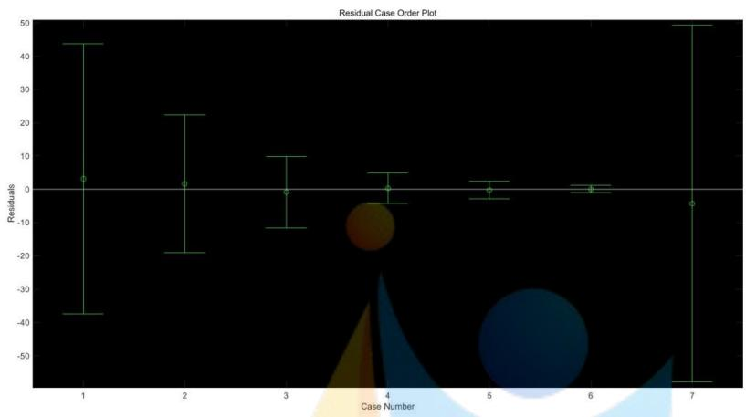

<details>
<summary>error_bar</summary>

| Case Number | Residuals (Lower Bound) | Residuals (Mean) | Residuals (Upper Bound) |
| --- | --- | --- | --- |
| 1 | ~-37 | ~3 | ~44 |
| 2 | ~-19 | ~2 | ~23 |
| 3 | ~-11 | ~0 | ~10 |
| 4 | ~-5 | ~0 | ~5 |
| 5 | ~-3 | ~0 | ~3 |
| 6 | ~-1 | ~0 | ~1 |
| 7 | ~-58 | ~-4 | ~50 |
</details>

图 4工业碱浓度与颜色读数线性回归残差图

<table><tr><td>浓度(ppm)</td><td>残差值 r</td></tr><tr><td>7.34</td><td>3.193187385650077</td></tr><tr><td>8.14</td><td>1.630046034029125</td></tr><tr><td>8.74</td><td>-0.845684659598861</td></tr><tr><td>9.19</td><td>0.362126613702886</td></tr><tr><td>10.18</td><td>-0.206897864646130</td></tr><tr><td>11.8</td><td>0.084838267818999</td></tr><tr><td>0</td><td>-4.217615776955910</td></tr></table>

表 9

<table><tr><td>相关系数 $R^{2}$ </td><td>F值</td><td>与F对应的概率P</td><td>估计误差方差</td></tr><tr><td>0.631383991895078</td><td>0.342570033863204</td><td>0.851764320877558</td><td>31.538101080870671</td></tr></table>

表 10

由表 10：相关系数 $R ^ { 2 } { = } 0 . 6 3 1 3 8 3 9 9 1 8 9 5 0 7 8 ,$ 说明回归方程不显著。根据 Fompetition Lero Distance检验，F 对应的概率 $p > \alpha$ ，接受 $H _ { 0 }$ ，回归模型（Ⅴ）不成立。

$$
\begin{array}{l} y = 2 6 1. 0 6 4 8 6 9 7 4 0 7 1 3 5 + 0. 1 6 4 2 1 2 9 3 8 2 4 6 7 B - 1. 3 9 8 1 6 9 4 0 9 3 9 7 3 G \quad (\mathrm{V}) \\ - 0. 3 1 3 6 4 1 6 0 7 7 9 6 0 R - 0. 1 3 0 5 8 1 0 9 2 2 9 4 8 H - 0. 8 7 9 8 7 0 5 4 7 5 8 7 6 S \\ \end{array}
$$

## 4．硫酸铝钾浓度与颜色读数之间的函数关系：

根据硫酸铝钾的实验数据（见表 11），使用 matlab 对数据进行多元线性回归（代码见附录中程序 1），画出残差图（图5）。

<table><tr><td>浓度(ppm)</td><td>B</td><td>G</td><td>R</td><td>H</td><td>S</td></tr><tr><td>0</td><td>116</td><td>126</td><td>104</td><td>76</td><td>44</td></tr><tr><td>0</td><td>114</td><td>126</td><td>104</td><td>74</td><td>45</td></tr><tr><td>0</td><td>118</td><td>125</td><td>105</td><td>78</td><td>40</td></tr><tr><td>0</td><td>113</td><td>124</td><td>103</td><td>73</td><td>42</td></tr><tr><td>0</td><td>114</td><td>124</td><td>104</td><td>75</td><td>39</td></tr><tr><td>0</td><td>113</td><td>126</td><td>104</td><td>72</td><td>45</td></tr><tr><td>0.5</td><td>148</td><td>112</td><td>47</td><td>100</td><td>174</td></tr><tr><td>0.5</td><td>150</td><td>111</td><td>44</td><td>100</td><td>178</td></tr><tr><td>0.5</td><td>138</td><td>118</td><td>71</td><td>98</td><td>123</td></tr><tr><td>0.5</td><td>136</td><td>118</td><td>70</td><td>98</td><td>122</td></tr><tr><td>0.5</td><td>136</td><td>117</td><td>64</td><td>98</td><td>134</td></tr><tr><td>0.5</td><td>136</td><td>118</td><td>64</td><td>97</td><td>135</td></tr><tr><td>0.5</td><td>138</td><td>111</td><td>50</td><td>99</td><td>161</td></tr><tr><td>1</td><td>149</td><td>116</td><td>48</td><td>99</td><td>172</td></tr><tr><td>1</td><td>150</td><td>115</td><td>49</td><td>100</td><td>171</td></tr><tr><td>1</td><td>147</td><td>119</td><td>55</td><td>99</td><td>159</td></tr><tr><td>1</td><td>149</td><td>119</td><td>64</td><td>100</td><td>145</td></tr><tr><td>1</td><td>140</td><td>113</td><td>54</td><td>99</td><td>156</td></tr><tr><td>1</td><td>137</td><td>111</td><td>51</td><td>99</td><td>160</td></tr><tr><td>1.5</td><td>153</td><td>113</td><td>44</td><td>101</td><td>180</td></tr><tr><td>1.5</td><td>153</td><td>113</td><td>42</td><td>100</td><td>184</td></tr><tr><td>1.5</td><td>153</td><td>115</td><td>50</td><td>101</td><td>171</td></tr><tr><td>1.5</td><td>153</td><td>115</td><td>47</td><td>100</td><td>176</td></tr><tr><td>1.5</td><td>152</td><td>116</td><td>52</td><td>100</td><td>167</td></tr><tr><td>1.5</td><td>153</td><td>116</td><td>49</td><td>100</td><td>171</td></tr><tr><td>2</td><td>156</td><td>106</td><td>34</td><td>102</td><td>199</td></tr><tr><td>2</td><td>162</td><td>107</td><td>37</td><td>103</td><td>196</td></tr><tr><td>2</td><td>161</td><td>110</td><td>40</td><td>102</td><td>190</td></tr><tr><td>2</td><td>163</td><td>111</td><td>38</td><td>102</td><td>194</td></tr><tr><td>2</td><td>159</td><td>104</td><td>35</td><td>103</td><td>198</td></tr><tr><td>2</td><td>158</td><td>105</td><td>35</td><td>103</td><td>198</td></tr><tr><td>5</td><td>155</td><td>107</td><td>34</td><td>101</td><td>198</td></tr><tr><td>5</td><td>156</td><td>108</td><td>34</td><td>101</td><td>198</td></tr><tr><td>5</td><td>152</td><td>116</td><td>48</td><td>100</td><td>174</td></tr><tr><td>5</td><td>151</td><td>115</td><td>51</td><td>100</td><td>168</td></tr><tr><td>5</td><td>154</td><td>105</td><td>33</td><td>102</td><td>199</td></tr><tr><td>5</td><td>156</td><td>105</td><td>35</td><td>102</td><td>197</td></tr></table>

表11 硫酸铝钾的实验数据

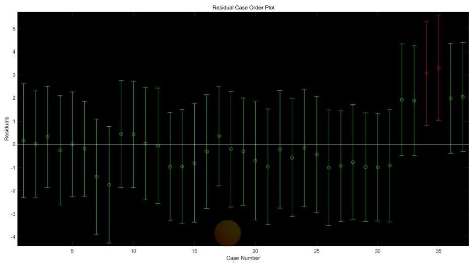

<details>
<summary>error_bar</summary>

| Case Number | Mean Residual | Lower Bound | Upper Bound |
| --- | --- | --- | --- |
| 1 | ~0.1 | ~-2.3 | ~2.6 |
| 2 | ~0.0 | ~-2.3 | ~2.3 |
| 3 | ~0.3 | ~-1.9 | ~2.5 |
| 4 | ~-0.3 | ~-2.6 | ~2.1 |
| 5 | ~0.0 | ~-2.2 | ~2.3 |
| 6 | ~-0.2 | ~-2.2 | ~1.8 |
| 7 | ~-1.4 | ~-3.9 | ~1.1 |
| 8 | ~-1.7 | ~-4.3 | ~0.8 |
| 9 | ~0.4 | ~-1.9 | ~2.8 |
| 10 | ~0.4 | ~-1.9 | ~2.7 |
| 11 | ~0.0 | ~-2.4 | ~2.5 |
| 12 | ~-0.1 | ~-2.6 | ~2.4 |
| 13 | ~-0.9 | ~-3.3 | ~1.4 |
| 14 | ~-0.9 | ~-3.4 | ~1.5 |
| 15 | ~-0.8 | ~-3.4 | ~1.8 |
| 16 | ~-0.3 | ~-2.8 | ~2.1 |
| 17 | ~0.3 | ~-1.8 | ~2.5 |
| 18 | ~-0.2 | ~-2.7 | ~2.3 |
| 19 | ~-0.3 | ~-2.6 | ~2.0 |
| 20 | ~-0.7 | ~-3.3 | ~1.9 |
| 21 | ~-0.9 | ~-3.5 | ~1.5 |
| 22 | ~-0.2 | ~-2.8 | ~2.3 |
| 23 | ~-0.6 | ~-3.1 | ~2.0 |
| 24 | ~-0.2 | ~-2.7 | ~2.4 |
| 25 | ~-0.4 | ~-3.0 | ~2.1 |
| 26 | ~-1.0 | ~-3.5 | ~1.5 |
| 27 | ~-0.9 | ~-3.3 | ~1.5 |
| 28 | ~-0.8 | ~-3.3 | ~1.7 |
| 29 | ~-0.9 | ~-3.3 | ~1.4 |
| 30 | ~-0.9 | ~-3.3 | ~1.4 |
| 31 | ~-0.9 | ~-3.4 | ~1.5 |
| 32 | ~1.9 | ~-0.5 | ~4.4 |
| 33 | ~1.9 | ~-0.5 | ~4.3 |
| 34 | 3.1 (red) / 3.3 (dark red) | 0.8 (dark red) / 5.3 (dark red) | — |
| 35 | — | -0.4 (dark red) / 5.6 (dark red) | — |
| 36 | — | -0.4 (dark red) / 4.4 (dark red) | — |
| 37 | — | -0.4 (dark red) / 4.4 (dark red) | — |
</details>

图5 硫酸铝钾浓度与颜色读数线性回归残差图

从残差图可以看出，除第 34、35个数据外，其余数据的残差离零点均较近，且残差的置信区间均包含零点，这两个数据可视为异常点(剔除)，剔除后重新进行多元线性回归。其残差图见图 6，其置信区间见表10，具体的残差值见表 12。

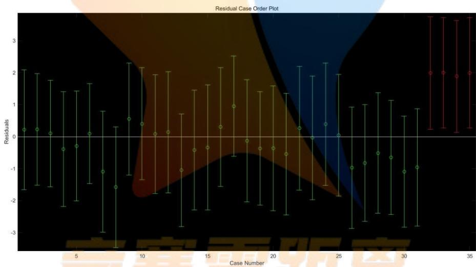

<details>
<summary>error_bar</summary>

| Case Number | Mean Residual | Lower Bound | Upper Bound |
| --- | --- | --- | --- |
| 1 | ~0.2 | ~-1.7 | ~2.1 |
| 2 | ~0.2 | ~-1.5 | ~2.0 |
| 3 | ~0.1 | ~-1.6 | ~1.8 |
| 4 | ~-0.4 | ~-2.2 | ~1.4 |
| 5 | ~-0.3 | ~-2.0 | ~1.4 |
| 6 | ~0.1 | ~-1.5 | ~1.7 |
| 7 | ~-1.1 | ~-3.0 | ~0.8 |
| 8 | ~-1.6 | ~-3.5 | ~0.3 |
| 9 | ~0.5 | ~-1.2 | ~2.3 |
| 10 | ~0.4 | ~-1.3 | ~2.2 |
| 11 | ~0.1 | ~-1.8 | ~1.9 |
| 12 | ~0.2 | ~-1.8 | ~2.0 |
| 13 | ~-1.0 | ~-2.8 | ~0.7 |
| 14 | ~-0.4 | ~-2.3 | ~1.5 |
| 15 | ~-0.3 | ~-2.3 | ~1.6 |
| 16 | ~0.3 | ~-1.6 | ~2.2 |
| 17 | ~0.9 | ~-0.6 | ~2.5 |
| 18 | ~-0.1 | ~-2.0 | ~1.8 |
| 19 | ~-0.4 | ~-2.2 | ~1.4 |
| 20 | ~-0.4 | ~-2.3 | ~1.6 |
| 21 | ~-0.5 | ~-2.4 | ~1.3 |
| 22 | ~0.3 | ~-1.7 | ~2.2 |
| 23 | ~0.0 | ~-2.0 | ~1.9 |
| 24 | ~0.4 | ~-1.5 | ~2.3 |
| 25 | ~0.1 | ~-1.9 | ~1.9 |
| 26 | ~-1.0 | ~-2.9 | ~0.9 |
| 27 | ~-0.8 | ~-2.7 | ~1.0 |
| 28 | ~-0.5 | ~-2.4 | ~1.4 |
| 29 | ~-0.6 | ~-2.4 | ~1.1 |
| 30 | ~-1.1 | ~-2.8 | ~0.6 |
| 31 | ~-1.0 | ~-2.8 | ~0.9 |
| 32 | — | — | — |
| 33 | — | — | — |
| 34 | — | — | — |
| 35 | — | — | — |
</details>

图6剔除异常点后硫酸铝钾浓度与颜色读数线性回归残差图

<table><tr><td>相关系数 $R^{2}$ </td><td>F值</td><td>与F对应的概率P</td><td>估计误差方差</td></tr><tr><td>0.618028668332955</td><td>9.384385630950229</td><td>0.000021075916702</td><td>0.953423023427052</td></tr></table>

表 12

由表 12：相关系数 $R ^ { 2 } = 0 . 6 1 8 0 2 8 6 6 8 3 3 2 9 5 5$ ，说明回归方程不够显著。根据F检验，F对应的概率 $p < \alpha$ ，拒绝 $H _ { 0 }$ ，回归模型（Ⅵ）成立。

$$
\begin{array}{l} y = 3 3. 3 0 1 5 9 9 0 8 5 8 0 9 2 5 8 + 0. 0 6 4 3 9 6 2 2 8 0 6 1 3 5 9 B - 0. 0 7 4 8 2 6 2 2 0 0 8 1 6 4 1 G \tag {VI} \\ - 0. 1 9 7 7 2 4 1 0 3 1 3 1 0 0 9 R - 0. 0 9 9 3 6 8 3 6 8 9 1 7 9 3 7 H - 0. 0 7 8 3 1 7 4 4 4 1 5 0 6 9 3 S \\ \end{array}
$$

<table><tr><td>浓度(ppm)</td><td>残差值r</td></tr><tr><td>0</td><td>0.217812495378475</td></tr><tr><td>0</td><td>0.226185657816012</td></tr><tr><td>0</td><td>0.097384883538230</td></tr><tr><td>0</td><td>-0.391115358786932</td></tr><tr><td>0</td><td>-0.294003078333490</td></tr><tr><td>0</td><td>0.091845148041501</td></tr><tr><td>0.5</td><td>-1.094599168574980</td></tr><tr><td>0.5</td><td>-1.578120377569594</td></tr><tr><td>0.5</td><td>0.550772518151472</td></tr><tr><td>0.5</td><td>0.403523426992495</td></tr><tr><td>0.5</td><td>0.082161917933112</td></tr><tr><td>0.5</td><td>0.135937213247507</td></tr><tr><td>0.5</td><td>-1.049785941526949</td></tr><tr><td>1</td><td>-0.417969670398088</td></tr><tr><td>1</td><td>-0.338417090642832</td></tr><tr><td>1</td><td>0.301243393927612</td></tr><tr><td>1</td><td>0.954892016792217</td></tr><tr><td>1</td><td>-0.129616765715801</td></tr><tr><td>1</td><td>-0.365983054485273</td></tr><tr><td>1.5</td><td>-0.365653364371072</td></tr><tr><td>1.5</td><td>-0.547200162948258</td></tr><tr><td>1.5</td><td>0.265486697222034</td></tr><tr><td>1.5</td><td>-0.035466760335465</td></tr><tr><td>1.5</td><td>0.387519206106351</td></tr><tr><td>1.5</td><td>0.043220445254729</td></tr><tr><td>2</td><td>-0.972466812655620</td></tr><tr><td>2</td><td>-0.826429615083248</td></tr><tr><td>2</td><td>-0.513655451206029</td></tr><tr><td>2</td><td>-0.649800116906356</td></tr><tr><td>2</td><td>-1.096532909104727</td></tr><tr><td>2</td><td>-0.957310460961725</td></tr><tr><td>5</td><td>1.989069822418745</td></tr><tr><td>5</td><td>1.999499814439030</td></tr><tr><td>5</td><td>1.883775320254449</td></tr><tr><td>5</td><td>1.993796182092362</td></tr></table>

表 13

## 5.奶中尿素浓度与颜色读数之间的函数关系：

根据奶中尿素的实验数据（见表 14），使用 matlab 对数据进行多元线性回归（代码见附录中程序 1），画出残差图（图7）。

<table><tr><td>浓度(ppm)</td><td>B</td><td>G</td><td>R</td><td>H</td><td>S</td></tr><tr><td>0</td><td>118</td><td>136</td><td>139</td><td>25</td><td>37</td></tr><tr><td>500</td><td>117</td><td>137</td><td>139</td><td>27</td><td>41</td></tr><tr><td>1000</td><td>108</td><td>136</td><td>138</td><td>28</td><td>54</td></tr><tr><td>1500</td><td>110</td><td>136</td><td>139</td><td>26</td><td>52</td></tr><tr><td>2000</td><td>108</td><td>140</td><td>142</td><td>28</td><td>60</td></tr><tr><td>0</td><td>120</td><td>136</td><td>138</td><td>26</td><td>33</td></tr><tr><td>5</td><td>119</td><td>140</td><td>142</td><td>26</td><td>40</td></tr><tr><td>500</td><td>111</td><td>139</td><td>142</td><td>27</td><td>55</td></tr><tr><td>1500</td><td>107</td><td>136</td><td>139</td><td>26</td><td>58</td></tr><tr><td>2000</td><td>105</td><td>136</td><td>137</td><td>28</td><td>58</td></tr><tr><td>0</td><td>125</td><td>135</td><td>140</td><td>20</td><td>27</td></tr><tr><td>500</td><td>114</td><td>134</td><td>138</td><td>25</td><td>44</td></tr><tr><td>1000</td><td>112</td><td>132</td><td>134</td><td>27</td><td>42</td></tr><tr><td>1500</td><td>105</td><td>134</td><td>138</td><td>26</td><td>60</td></tr><tr><td>2000</td><td>107</td><td>135</td><td>138</td><td>26</td><td>57</td></tr></table>

表14 奶中尿素的实验数据

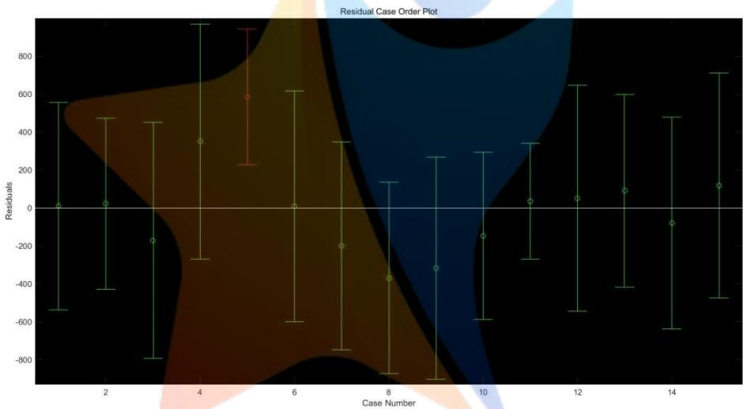

<details>
<summary>error_bar</summary>

| Case Number | Mean Residual | Lower Bound | Upper Bound |
| --- | --- | --- | --- |
| 1 | ~0 | ~-540 | ~560 |
| 2 | ~20 | ~-430 | ~480 |
| 3 | ~-170 | ~-790 | ~450 |
| 4 | ~350 | ~-280 | ~950 |
| 5 | ~590 | ~230 | ~930 |
| 6 | ~0 | ~-600 | ~620 |
| 7 | ~-200 | ~-750 | ~350 |
| 8 | ~-360 | ~-880 | ~140 |
| 9 | ~-320 | ~-900 | ~270 |
| 10 | ~-140 | ~-590 | ~300 |
| 11 | ~30 | ~-280 | ~340 |
| 12 | ~50 | ~-540 | ~650 |
| 13 | ~90 | ~-420 | ~600 |
| 14 | ~-80 | ~-640 | ~480 |
| 15 | ~120 | ~-480 | ~710 |
</details>

图7 残差图

从残差图可以看出，除第 5个数据外，其余数据的残差离零点均较近，且残差的置信区间均包含零点，这说明回归模型能较好的符合原始数据，而这个数据可视为异常点(剔除)，剔除后重新进行多元线性回归。其残差图见图8，其置信区间见表 15，具体的残差值见表 14。

<table><tr><td>相关系数 $R^{2}$ </td><td>F值</td><td>与F对应的概率P</td><td>估计误差方差</td></tr><tr><td>0.95791774884</td><td>36.42077968757</td><td>0.00002688234</td><td>37904.20690587087</td></tr></table>

表 15

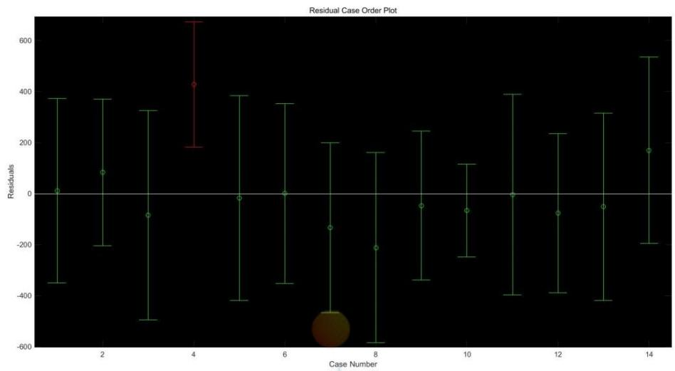

<details>
<summary>error_bar</summary>

| Case Number | Mean Residual | Lower Bound | Upper Bound |
| --- | --- | --- | --- |
| 1 | ~10 | ~-350 | ~380 |
| 2 | ~80 | ~-200 | ~370 |
| 3 | ~-80 | ~-500 | ~330 |
| 4 | ~430 | ~190 | ~680 |
| 5 | ~-20 | ~-420 | ~390 |
| 6 | ~0 | ~-350 | ~360 |
| 7 | ~-130 | ~-470 | ~200 |
| 8 | ~-210 | ~-580 | ~160 |
| 9 | ~-40 | ~-340 | ~250 |
| 10 | ~-60 | ~-250 | ~110 |
| 11 | ~0 | ~-400 | ~390 |
| 12 | ~-70 | ~-390 | ~240 |
| 13 | ~-50 | ~-420 | ~320 |
| 14 | ~170 | ~-190 | ~540 |
</details>

图8剔除异常点后奶中尿素浓度与颜色读数线性回归残差图

<table><tr><td>浓度(ppm)</td><td>残差</td></tr><tr><td>0</td><td>10.25536938636</td></tr><tr><td>500</td><td>83.881946665621</td></tr><tr><td>1000</td><td>-84.676233083668</td></tr><tr><td>1500</td><td>426.617345751831</td></tr><tr><td>0</td><td>-16.945348469715</td></tr><tr><td>5</td><td>0.421074517217</td></tr><tr><td>500</td><td>-133.810181334869</td></tr><tr><td>1500</td><td>-211.046368939387</td></tr><tr><td>2000</td><td>-46.846723118331</td></tr><tr><td>0</td><td>-65.449023536308</td></tr><tr><td>500</td><td>-4.712865495465</td></tr><tr><td>1000</td><td>-76.907322702158</td></tr><tr><td>1500</td><td>-51.308416740812</td></tr><tr><td>2000</td><td>169.256579546811</td></tr></table>

表 16

由表 16：相关系数 $R ^ { 2 } { = } 0 . 9 5 7 9 1 7 7 4 8 8 4$ ，说明回归方程显著。根据 F 检验，FCompetition Lero Vistance对应的概率 $p < \alpha$ ，拒绝 $H _ { 0 }$ ，回归模型（Ⅶ）成立。

$$
y = 1 8 7 8 4. 8 1 5 7 7 7 7 7 8 4 0 + 2 8 5. 9 1 7 9 8 5 1 4 4 6 5 B + 4 5 4. 9 6 7 6 9 3 5 3 3 4 8 G \tag {VII}
$$

$$
- 8 2 3. 0 2 4 1 1 9 8 3 5 3 8 R - 3 6 9. 4 6 6 1 1 6 9 8 1 7 8 H + 2 4 9. 3 8 6 7 2 1 1 5 0 5 1 S
$$

## 6．评价5 组数据的优劣

基于问题一的分析，我们首先给出评价 5 组数据优劣的五大准则：

准则一：能通过 F检验；

准则二：相关系数 $R ^ { 2 }$ 越接近于1越好；

准则三： $P < 0 . 0 5$ 且越接近于0越好；

准则四：误差方差越小越好；

准则五：是否剔除异常数据。

<table><tr><td>物质种类</td><td> $R^2$ </td><td>F</td><td>P</td><td> $S^2$ </td><td>模型检验</td><td>数据完整性</td></tr><tr><td>组胺</td><td>0.999580</td><td>1904.461358</td><td>0.0000007</td><td>1.312155</td><td>模型成立</td><td>完整</td></tr><tr><td>溴酸钾</td><td>0.998521</td><td>405.087246</td><td>0.000192</td><td>5.820027</td><td>模型成立</td><td>剔除1个</td></tr><tr><td>工业碱</td><td>0.631383</td><td>0.342570</td><td>0.851764</td><td>31.538101</td><td>模型不成立</td><td>完整</td></tr><tr><td>硫酸铝钾</td><td>0.618028</td><td>9.384385</td><td>0.000021</td><td>0.953423</td><td>模型成立</td><td>剔除2个</td></tr><tr><td>奶中尿素</td><td>0.957917</td><td>36.420779</td><td>0.000026</td><td>37904.206905</td><td>模型成立</td><td>剔除1个</td></tr></table>

表17 五种物质线性回归方程的显著性检验指标

由表 17，五组数据中，只有工业碱的多元线性回归模型不成立，因此工业碱的数据是最差的。组胺的数据完整，多元线性回归模型的相关系数 $R ^ { 2 }$ 、F 值最大，P 值最小，数据是最好的。硫酸铝钾的相关系数 $R ^ { 2 }$ 比较小，模型不是很显著，而且剔除了两个数据，因此数据不够好。溴酸钾和奶中尿素都是剔除一个数据之后建立的模型，相关系数 $R ^ { 2 }$ 很高，但溴酸钾的相关系数 $R ^ { 2 }$ 更大一些，数据相对更优。

因此数据优劣的排序为：组胺>溴酸钾>奶中尿素>硫酸铝钾>工业碱。

## 问题二：

根据前面对问题二的分析，首先我们仍然建立与问题一一致的线性回归模型，利用Data2.xls提供的 25组数据（即表18），采用 matlab进行线性回归（代码见附录中程序2），得到了二氧化硫的浓度与颜色读数之间的线性回归方程。

## 2.1 多元线性回归模型

利用多元线性回归，绘出残差图（见图9）.从残差图可以看出，除第 15 个数据外，其余数据的残差离零点均较近，且残差的置信区间均包含零点，这说明回归模型能较好的符合原始数据，而这个数据可视为异常点(剔除)，剔除后重新进行多元线性回归，得到残差图（见图10），回归方程的显著性检验指标（见表19）和具体残差值（见表20）。

由表19：相关系数 $R ^ { 2 } { = } 0 . 9 2 5 0 3 1 0 8 8 2 9 3 1$ ，说明回归方程较为显著。根据 F检验，F对应的概率 $p < \alpha$ ，拒绝 $H _ { 0 }$ ，回归模型（Ⅷ）成立。但是估计误差方差偏大。

$$
\begin{array}{l} y = 2 9 1 0. 6 3 0 1 5 3 5 5 4 2 6 5 + 3. 5 8 7 3 5 2 4 9 0 8 4 6 x _ {1} - 2 1. 1 5 5 9 1 7 9 1 9 2 4 5 x _ {2} \tag {VIII} \\ + 4. 7 9 6 4 1 8 9 6 8 8 0 5 x _ {3} - 6. 7 5 0 9 0 2 3 8 2 4 9 8 x _ {4} - 1 0. 5 3 2 0 1 6 1 0 2 9 6 9 x _ {5} \\ \end{array}
$$

<table><tr><td>浓度(ppm)</td><td>B</td><td>G</td><td>R</td><td>H</td><td>S</td></tr><tr><td>0</td><td>153</td><td>148</td><td>157</td><td>138</td><td>14</td></tr><tr><td>0</td><td>153</td><td>147</td><td>157</td><td>138</td><td>16</td></tr><tr><td>0</td><td>153</td><td>146</td><td>158</td><td>137</td><td>20</td></tr><tr><td>0</td><td>153</td><td>146</td><td>158</td><td>137</td><td>20</td></tr><tr><td>0</td><td>154</td><td>145</td><td>157</td><td>141</td><td>19</td></tr><tr><td>20</td><td>144</td><td>115</td><td>170</td><td>135</td><td>82</td></tr><tr><td>20</td><td>144</td><td>115</td><td>169</td><td>136</td><td>81</td></tr><tr><td>20</td><td>145</td><td>115</td><td>172</td><td>135</td><td>83</td></tr><tr><td>30</td><td>145</td><td>114</td><td>174</td><td>135</td><td>87</td></tr><tr><td>30</td><td>145</td><td>114</td><td>176</td><td>135</td><td>89</td></tr><tr><td>30</td><td>145</td><td>114</td><td>175</td><td>135</td><td>89</td></tr><tr><td>30</td><td>146</td><td>114</td><td>175</td><td>135</td><td>88</td></tr><tr><td>50</td><td>142</td><td>99</td><td>175</td><td>137</td><td>110</td></tr><tr><td>50</td><td>141</td><td>99</td><td>174</td><td>137</td><td>109</td></tr><tr><td>50</td><td>142</td><td>99</td><td>176</td><td>136</td><td>110</td></tr><tr><td>80</td><td>141</td><td>96</td><td>181</td><td>135</td><td>119</td></tr><tr><td>80</td><td>141</td><td>96</td><td>182</td><td>135</td><td>119</td></tr><tr><td>80</td><td>140</td><td>96</td><td>182</td><td>135</td><td>120</td></tr><tr><td>100</td><td>139</td><td>96</td><td>175</td><td>136</td><td>115</td></tr><tr><td>100</td><td>139</td><td>96</td><td>174</td><td>136</td><td>114</td></tr><tr><td>100</td><td>139</td><td>96</td><td>176</td><td>136</td><td>116</td></tr><tr><td>150</td><td>139</td><td>86</td><td>178</td><td>136</td><td>131</td></tr><tr><td>150</td><td>139</td><td>87</td><td>177</td><td>137</td><td>129</td></tr><tr><td>150</td><td>138</td><td>86</td><td>177</td><td>137</td><td>130</td></tr><tr><td>150</td><td>139</td><td>86</td><td>178</td><td>137</td><td>131</td></tr></table>

表 18 二氧化硫的实验数据

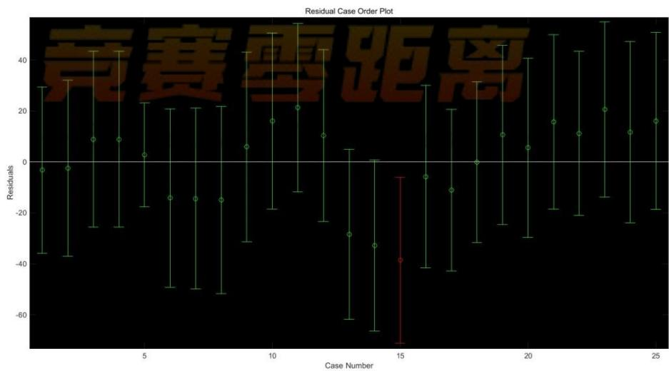

<details>
<summary>error_bar</summary>

| Case Number | Mean Residual | Lower Bound | Upper Bound |
| --- | --- | --- | --- |
| 1 | ~-3 | ~-36 | ~30 |
| 2 | ~-3 | ~-37 | ~32 |
| 3 | ~9 | ~-26 | ~43 |
| 4 | ~9 | ~-26 | ~43 |
| 5 | ~3 | ~-18 | ~23 |
| 6 | ~-14 | ~-50 | ~21 |
| 7 | ~-14 | ~-50 | ~21 |
| 8 | ~-14 | ~-52 | ~21 |
| 9 | ~6 | ~-31 | ~42 |
| 10 | ~16 | ~-19 | ~50 |
| 11 | ~21 | ~-11 | ~55 |
| 12 | ~10 | ~-24 | ~44 |
| 13 | ~-29 | ~-62 | ~5 |
| 14 | ~-33 | ~-67 | ~0 |
| 15 | -38 | -70 | -7 |
| 16 | ~-6 | ~-42 | ~30 |
| 17 | ~-11 | ~-43 | ~20 |
| 18 | 0 | ~-32 | ~31 |
| 19 | ~11 | ~-25 | ~45 |
| 20 | ~6 | ~-30 | ~40 |
| 21 | ~16 | ~-19 | ~50 |
| 22 | ~11 | ~-22 | ~43 |
| 23 | ~20 | ~-14 | ~55 |
| 24 | ~12 | ~-24 | ~47 |
| 25 | ~16 | ~-19 | ~50 |
</details>

图9线性回归残差图

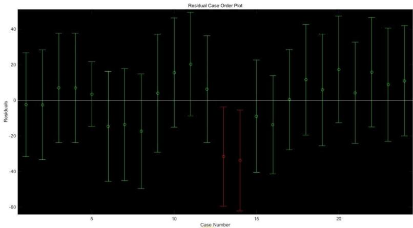

<details>
<summary>error_bar</summary>

| Case Number | Mean Residual | Lower Bound | Upper Bound |
| --- | --- | --- | --- |
| 1 | ~-2 | ~-31 | ~26 |
| 2 | ~-2 | ~-33 | ~28 |
| 3 | ~7 | ~-24 | ~38 |
| 4 | ~7 | ~-24 | ~38 |
| 5 | ~3 | ~-14 | ~21 |
| 6 | ~-14 | ~-46 | ~16 |
| 7 | ~-13 | ~-46 | ~18 |
| 8 | ~-17 | ~-50 | ~15 |
| 9 | ~4 | ~-29 | ~37 |
| 10 | ~15 | ~-14 | ~46 |
| 11 | ~20 | ~-9 | ~50 |
| 12 | ~6 | ~-24 | ~36 |
| 13 | ~-31 | ~-59 | ~-4 |
| 14 | ~-33 | ~-62 | ~-5 |
| 15 | ~-9 | ~-40 | ~22 |
| 16 | ~-13 | ~-41 | ~14 |
| 17 | ~0 | ~-28 | ~28 |
| 18 | ~11 | ~-19 | ~43 |
| 19 | ~6 | ~-26 | ~37 |
| 20 | ~17 | ~-12 | ~48 |
| 21 | ~4 | ~-24 | ~32 |
| 22 | ~16 | ~-14 | ~46 |
| 23 | ~9 | ~-23 | ~40 |
| 24 | ~10 | ~-20 | ~42 |
</details>

图10剔除异常点后二氧化硫浓度与颜色读数线性回归残差图

<table><tr><td>相关系数 $R^{2}$ </td><td>F值</td><td>与F对应的概率P</td><td>估计误差方差</td></tr><tr><td>0.9250310882931</td><td>44.4199047583412</td><td>0.0000000016617</td><td>270.6516543935724</td></tr></table>

表19 二氧化硫线性回归方程的显著性检验指标

<table><tr><td>浓度(ppm)</td><td>残差值</td></tr><tr><td>0</td><td>-2.384256481544441</td></tr><tr><td>0</td><td>-2.476142194851974</td></tr><tr><td>0</td><td>6.948682946475856</td></tr><tr><td>0</td><td>6.948682946475856</td></tr><tr><td>0</td><td>3.473424932212367</td></tr><tr><td>20</td><td>-14.672434139092047</td></tr><tr><td>20</td><td>-13.657128890758031</td></tr><tr><td>20</td><td>-17.320608464579323</td></tr><tr><td>30</td><td>4.058700090441562</td></tr><tr><td>30</td><td>15.529894358769411</td></tr><tr><td>30</td><td>20.326313327574439</td></tr><tr><td>30</td><td>6.206944733759315</td></tr><tr><td>50</td><td>-31.576255061221445</td></tr><tr><td>50</td><td>-33.724499704539312</td></tr><tr><td>80</td><td>-8.948829979216725</td></tr><tr><td>80</td><td>-13.745248948021299</td></tr><tr><td>80</td><td>0.374119645794281</td></tr><tr><td>100</td><td>11.627226785928087</td></tr><tr><td>100</td><td>5.891629651764106</td></tr><tr><td>100</td><td>17.362823920092069</td></tr><tr><td>150</td><td>4.191048334563675</td></tr><tr><td>150</td><td>15.830255399174575</td></tr><tr><td>150</td><td>8.793706073744261</td></tr><tr><td>150</td><td>10.941950717061900</td></tr></table>

表 20

通过残差值可以看出，模型还有待优化。可以通过剔除新的残差图中的异常点来继续优化多元线性回归模型，但续优化作用有限，而且数据完整性越来越差。该线性回归模型的结果需要进一步进行优化改进，于是尝试多元非线性二次回归。

## 2.2 多元二次回归模型

## 2.2.1 多元二次回归模型的建立与求解

利用 $\mathrm { r s t o o l ( x , y , ^ { \prime } m o d e l ^ { \prime } }$ , alpha）建立多元二次回归方程。其中’model这一选项是指从下列 4个模型中选择1个（用字符串输入，缺省时为线性模型）：

linear（线性）： $y = \beta _ { 0 } + \beta _ { 1 } x _ { 1 } + \cdots + \beta _ { m } x _ { m }$

purequadratic （纯二次）： y = β + βx1 + … + β x  π m1

interaction （交叉)： y = β + βx1 +  + βmxm + ∑ βjkx jxk1≤j≠k≤m

quadratic（完全二次）： $y = \beta _ { 0 } + \beta _ { 1 } x _ { 1 } + \cdots + \beta _ { n } x _ { n } + \sum _ { 1 \leq j , k \leq n } \beta _ { j k } x _ { j } x _ { k }$

rstool 函数输出包括回归参数，剩余标准差以及残差，可以通过修改model的值比较多个模型的标准差来确定哪个最好。

本题最终采用完全二次的方法进行多元非线性二次回归，即采用模型（Ⅸ）

$$
\begin{array}{l} y = \beta_ {0} + \beta_ {1} x _ {1} + \beta_ {2} x _ {2} + \beta_ {3} x _ {3} + \beta_ {4} x _ {4} + \beta_ {5} x _ {5} \\ + \beta_ {6} x _ {1} x _ {2} + \beta_ {7} x _ {1} x _ {3} + \beta_ {8} x _ {1} x _ {4} + \beta_ {9} x _ {1} x _ {5} + \beta_ {1 0} x _ {2} x _ {3} + \beta_ {1 1} x _ {2} x _ {4} + \beta_ {1 2} x _ {2} x _ {5} \tag {IX} \\ + \beta_ {1 3} X _ {3} X _ {4} + \beta_ {1 4} X _ {3} X _ {5} + \beta_ {1 5} X _ {4} X _ {5} + \beta_ {1 6} X _ {1} ^ {2} + + \beta_ {1 7} X _ {2} ^ {2} + \beta_ {1 8} X _ {3} ^ {2} + \beta_ {1 9} X _ {4} ^ {2} + \beta_ {2 0} X _ {5} ^ {2} \\ \end{array}
$$

模型（Ⅸ）中y代表浓度， $x _ { 1 } , x _ { 2 } , x _ { 3 } , x _ { 4 } , x _ { 5 }$ 分别代表 B,G,R,H,S 。

代入数据进行多元二次回归拟合（代码见附录中程序 3），具体结果见图 11、表19和模型（Ⅹ）。

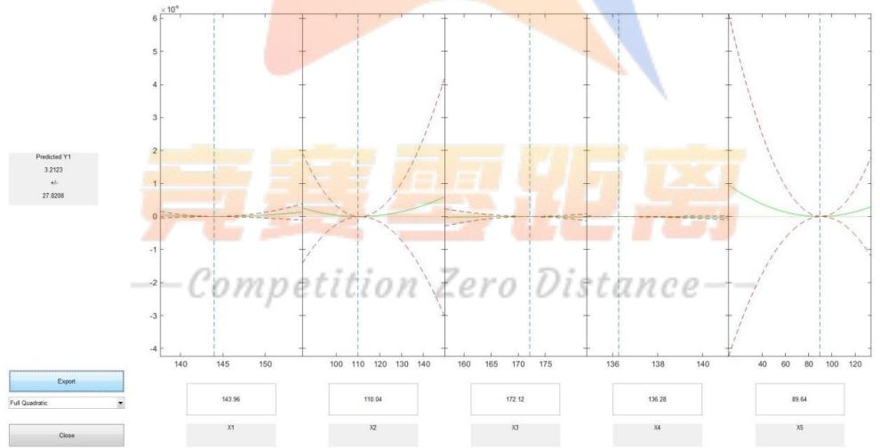

<details>
<summary>line</summary>

| Category | Predicted Y1 (x 10^8) |
| --- | --- |
| X1 | 3.2123 |
| X2 | 27.8208 |
| X3 | 110.94 |
| X4 | 172.12 |
| X5 | 136.28 |
</details>

图 11

$$
\begin{array}{l} y = - 2 2 9 1 7 1. 3 1 5 6 1 1 7 4 9 - 5 6 8 4. 2 6 6 7 1 4 9 7 2 9 8 \mathrm{B} - 3 0 4. 8 2 3 6 5 3 3 0 9 2 0 2 \mathrm{G} \\ + 4 9 8 3. 9 0 5 9 9 9 6 9 6 2 9 \mathrm{R} + 4 4 7 7. 9 1 8 4 1 2 0 3 6 0 2 \mathrm{H} - 1 7 0 6. 6 3 7 0 0 3 7 4 9 3 6 \mathrm{S} \\ - 2. 8 9 3 1 0 7 9 0 2 3 3 3 4 9 \mathrm{BG} - 0. 4 3 7 5 5 2 8 7 6 6 9 1 3 4 1 \mathrm{BR} + 1 5. 7 1 7 9 3 0 3 7 2 4 5 6 6 B H \\ + 2. 1 7 8 4 5 7 6 9 1 3 7 6 4 5 B S - 5. 3 5 5 5 1 6 8 8 4 1 1 4 9 1 G R + 2. 9 5 9 9 1 0 5 6 5 3 8 8 8 6 \mathrm{GH} \quad (\mathrm{X}) \\ + 4. 3 8 7 3 5 8 4 5 4 9 3 6 6 3 \mathrm{GS} - 2 6. 5 0 9 5 4 0 5 4 0 8 6 8 3 \mathrm{RH} - 2. 6 9 4 4 0 0 8 1 3 8 7 5 1 8 \mathrm{RS} \\ + 8. 0 5 3 7 3 7 1 3 4 3 4 5 6 4 H S + 1 2. 9 7 1 7 9 4 4 0 2 2 3 5 7 B ^ {2} + 3. 8 3 5 4 6 5 8 2 4 5 0 5 0 1 G ^ {2} \\ - 1. 4 0 1 8 1 6 3 3 5 8 3 1 3 4 \mathrm{R} ^ {2} - 1 1. 9 1 2 9 4 8 8 1 6 3 9 7 9 \mathrm{H} ^ {2} + 1. 5 4 3 0 3 3 8 9 6 9 6 1 6 8 \mathrm{S} ^ {2} \\ \end{array}
$$

<table><tr><td>浓度(ppm)</td><td>残差值 r</td></tr><tr><td>0</td><td>-0.183023306644486</td></tr><tr><td>0</td><td>0.295698988685444</td></tr><tr><td>0</td><td>-0.0573058051979842</td></tr><tr><td>0</td><td>-0.0573058051979842</td></tr><tr><td>0</td><td>-0.0112789762431476</td></tr><tr><td>20</td><td>0.483971591391310</td></tr><tr><td>20</td><td>0.0544367711663654</td></tr><tr><td>20</td><td>-0.617107404175840</td></tr><tr><td>30</td><td>0.438573762845408</td></tr><tr><td>30</td><td>0.223558673598745</td></tr><tr><td>30</td><td>-0.471712868260511</td></tr><tr><td>30</td><td>0.0136040522083931</td></tr><tr><td>50</td><td>0.551662284327904</td></tr><tr><td>50</td><td>-0.775350805535709</td></tr><tr><td>50</td><td>0.0956137145112734</td></tr><tr><td>80</td><td>0.0435429326025769</td></tr><tr><td>80</td><td>0.243119500199100</td></tr><tr><td>80</td><td>-0.357436173322640</td></tr><tr><td>100</td><td>-1.73816418466959</td></tr><tr><td>100</td><td>0.0231545045717212</td></tr><tr><td>100</td><td>1.60688363169902</td></tr><tr><td>150</td><td>0.0254071982417372</td></tr><tr><td>150</td><td>0.875543694299267</td></tr><tr><td>150</td><td>0.637870694485173</td></tr><tr><td>150</td><td>-1.34395668067009</td></tr></table>

表 21

## 2.2.2 多元二次回归模型的检验

本文采用剩余标准差对该二次回归模型的进行检验。回归残差 $e _ { i } = Y _ { i } - Y _ { i }$ 有助于衡量回归模型拟合样本数据的程度。应用线性回归分析，需要计算回归剩余标准差，而回归剩余标准差是表示回归方程用来预测的精度标志，可用来检验模

型预测的可靠程度，回归剩余标准差（记作 $S _ { Y }$ ）： $S _ { Y } = { \sqrt { \frac { \sum ( Y _ { i } - Y _ { i } ) ^ { 2 } } { n - 2 } } } = { \sqrt { \frac { Q } { n - 2 } } }$ ； $S _ { Y }$ 越接近于0，说明模型对样本数据的偏差越小，预测的可靠程度(精度)越高； $S _ { \ / Y }$ 数值越大，模型偏离样本数据越大，用于预测的可靠程度就越差在实际问题中， $S _ { Y }$ 往往较大，为评价预测模型的优劣，通常采用指标 $\%$ 。当 $\%$ 小于15%时，可以认为预测模型较好。

根 据 结 果 可 以 计 算 出 回 归 剩 余 标 准 差 RMSE= 1.65062261369908 ，$\scriptstyle { \int _ { Y } = 0 . 0 2 8 2 1 5 7 7 1 1 7 }$ ，预测模型非常好。而且从残差值可以看出，二次模型拟合的效果非常好，并且没有剔除原始数据，保证了数据的完整性，不足之处应该是方程较为复杂。

## 问题三：

首先分析数据量对模型的优劣有无影响。根据问题一和问题二的求解结果发现：不管是多元线性回归，还是非线性二次回归，对同一物质而言,数据量的大小会影响模型的优劣；下面先对两个代表性物质的数据进行分析。

硫酸铝钾：硫酸铝钾的实验数据是最多的一组，按照各种浓度依次去掉最后一个数据点，逐步降低数据量，每次减少 6个数据点，直接多元线性回归拟合，未剔除数据。具体结果见表 22

<table><tr><td rowspan="2">数据量</td><td colspan="5">模型的评价</td></tr><tr><td> $R^2$ </td><td>F</td><td>P</td><td> $S^2$ </td><td>模型检验</td></tr><tr><td>37</td><td>0.468666833926450</td><td>5.468761515146521</td><td>0.001013036543586</td><td>1.650977684294797</td><td>成立</td></tr><tr><td>31</td><td>0.447711409551480</td><td>4.053237902197904</td><td>0.007854854622201</td><td>1.778012946024591</td><td>成立</td></tr><tr><td>25</td><td>0.393434181372659</td><td>2.464777676723364</td><td>0.069859466359325</td><td>2.063600764003753</td><td>不成立</td></tr><tr><td>19</td><td>0.476901392112480</td><td>2.370382181860196</td><td>0.097518202246353</td><td>1.963208135675026</td><td>不成立</td></tr></table>

表 22

由表 22可知：随着数据量减少，P值一直在增大，当数据量减小到 25个数据点时，P>0.05，回归模型不再成立。

组胺：组胺的实验数据是多元线性回归拟合最优的一组，由于数据量较少，10 组数据，依次去掉最后两个数据点，逐步降低数据量，直接多元线性回归拟合，未剔除数据。具体结果见表 23

<table><tr><td rowspan="2">数据量</td><td colspan="5">模型的评价</td></tr><tr><td> $R^2$ </td><td>F</td><td>P</td><td> $S^2$ </td><td>模型检验</td></tr><tr><td>10</td><td>0.999580110101</td><td>1904.461358300401</td><td>0.000000771022</td><td>1.312155935514</td><td>成立</td></tr><tr><td>8</td><td>0.999928630573</td><td>5604.240767980095</td><td>0.000178414017</td><td>0.411907532627</td><td>成立</td></tr><tr><td>6</td><td>1</td><td>NaN</td><td>NaN</td><td>NaN</td><td>不成立</td></tr></table>

表 23

由表 23：随着数据量减少，P值在增大，当数据量减小到 6个数据点时，回归模型不成立。

结合比色法的原理：待测物质溶液的浓度越低，测出来的效果越好，我们对Data1.xls和Data2.xls提供的六种物质六组数据在各自组内删除一些浓度较大的数据，即减少了组内的数据量，再使用matlab 对组胺、奶中尿素和二氧化硫(因为溴酸钾本身数据量为7就少,根据问题1的五大准则,工业碱这组数据不是太好,硫酸铝钾的浓度都比较低)重新进行五元的线性回归分析，结果见表 24（代码见附件程序4）。在进行多元线性回归的过程中发现,数据量不能过少,基本上 10-15组之间,低于6组,回归方程一般效果就不好了甚至不成立了。

<table><tr><td>物质</td><td>数据量</td><td> $R^2$ </td><td>F</td><td>P</td><td> $S^2$ </td></tr><tr><td rowspan="2">组胺</td><td>10</td><td>0.9996</td><td>1904.4613</td><td>0.00000077</td><td>1.3122</td></tr><tr><td>8</td><td>0.9982</td><td>220.2804</td><td>0.0045</td><td>2.4781</td></tr><tr><td rowspan="3">奶中尿素</td><td>15</td><td>0.9579</td><td>36.4208</td><td>0.00002688</td><td>37904.2069</td></tr><tr><td>12</td><td>0.9265</td><td>15.1348</td><td>0.00239</td><td>45914.34</td></tr><tr><td>9</td><td>0.9411</td><td>9.5897</td><td>0.04597</td><td>29441.39</td></tr><tr><td rowspan="5">二氧化硫</td><td>25</td><td>0.925031</td><td>44.41990</td><td>0.00000000166</td><td>270.651654</td></tr><tr><td>21</td><td>0.8919</td><td>24.7434</td><td>0.00000095</td><td>183.52</td></tr><tr><td>18</td><td>0.9721</td><td>83.6880</td><td>0.0000000066</td><td>31.24</td></tr><tr><td>15</td><td>0.9704</td><td>59.0661</td><td>0.000001312</td><td>16.56</td></tr><tr><td>12</td><td>0.9882</td><td>100.1326</td><td>0.00001075</td><td>4.1447</td></tr></table>

表 24

其次分析颜色维度对模型的优劣有无影响。我们通过改变颜色维度来找其对模型的影响。从显示技术上看，目前通行的RGB标准（红绿蓝）和HSL标准（色调、饱和度、亮度）是等价的，结合题目给出的数据，我们考虑是否将维度降为3维、2 维和1维，再重新进行回归分析，具体代码见程序5，具体数据见表 25-表 28。

<table><tr><td>物质\颜色</td><td>五维RGBHS</td><td>三维RGB</td><td>二维HS</td><td>一维R</td><td>一维G</td><td>一维B</td><td>一维H</td><td>一维S</td></tr><tr><td>组胺</td><td>0.9958</td><td>0.99521</td><td>0.9714</td><td>0.02074</td><td>0.9940</td><td>0.9456</td><td>0.9561</td><td>0.9268</td></tr><tr><td>溴酸钾</td><td>0.9948</td><td>0.94078</td><td>0.9478</td><td>0.15210</td><td>0.7532</td><td>0.9142</td><td>0.4844</td><td>0.9074</td></tr><tr><td>工业碱</td><td>0.6314</td><td>0.48220</td><td>0.5187</td><td>0.07503</td><td>0.4408</td><td>0.2407</td><td>0.5018</td><td>0.4334</td></tr><tr><td>硫酸铝钾</td><td>0.4687</td><td>0.409105</td><td>0.4576</td><td>0.06742</td><td>0.3829</td><td>0.3677</td><td>0.2531</td><td>0.3757</td></tr><tr><td>奶中尿素</td><td>0.93299</td><td>0.83778</td><td>0.83354</td><td>0.14353</td><td>0.0044</td><td>0.8180</td><td>0.3048</td><td>0.8304</td></tr><tr><td> $SO_{2}$ </td><td>0.85844</td><td>0.84860</td><td>0.2379</td><td>0.03607</td><td>0.7522</td><td>0.4844</td><td>0.2295</td><td>0.0224</td></tr></table>

表 25 六种不同物质在不同颜色维度下的 $R ^ { 2 }$ 表

<table><tr><td>物质\颜色维度</td><td>五维RGBHS</td><td>三维RGB</td><td>二维HS</td><td>一维R</td><td>一维G</td><td>一维B</td><td>一维H</td><td>一维S</td></tr><tr><td>组胺</td><td>1904.4613</td><td>415.7519</td><td>1.1884</td><td>52.2822</td><td>1335.1724</td><td>138.971</td><td>174.222</td><td>101.3408</td></tr><tr><td>溴酸钾</td><td>152.446</td><td>31.7715</td><td>63.5718</td><td>0.2184</td><td>24.4117</td><td>85.2298</td><td>7.5168</td><td>78.4393</td></tr><tr><td>工业碱</td><td>0.3426</td><td>0.9313</td><td>2.1558</td><td>3.1897</td><td>3.94211</td><td>1.5854</td><td>5.0361</td><td>3.8246</td></tr><tr><td>硫酸铝钾</td><td>5.4688</td><td>7.6158</td><td>14.3433</td><td>22.1524</td><td>21.71318</td><td>20.3511</td><td>11.8590</td><td>21.0669</td></tr><tr><td>奶中尿素</td><td>25.0615</td><td>18.9359</td><td>30.04391</td><td>0.0635</td><td>0.05783</td><td>58.4191</td><td>5.6993</td><td>63.6545</td></tr><tr><td> $SO_{2}$ </td><td>23.0444</td><td>39.2369</td><td>3.4339</td><td>57.1701</td><td>69.8123</td><td>21.6076</td><td>6.8496</td><td>0.5260</td></tr></table>

表 26六种不同物质在不同颜色维度下的F表

<table><tr><td>物质\颜色维度</td><td>五维RGBHS</td><td>三维RGB</td><td>二维HS</td><td>一维R</td><td>一维G</td><td>一维B</td><td>一维H</td><td>一维S</td></tr><tr><td>组胺</td><td>0.00000077</td><td>0.0000002</td><td>0.000004</td><td>0.00009</td><td>0.000000003</td><td>0.000002</td><td>0.000001</td><td>0.00000808</td></tr><tr><td>溴酸钾</td><td>0.00011861</td><td>0.012338</td><td>0.000032</td><td>0.6527</td><td>0.001134</td><td>0.00002</td><td>0.02538</td><td>0.0000209</td></tr><tr><td>工业碱</td><td>0.8518</td><td>0.106056</td><td>0.2316</td><td>0.1342</td><td>0.103849</td><td>0.26357</td><td>0.0748</td><td>0.1079</td></tr><tr><td>硫酸铝钾</td><td>0.0010</td><td>0.069</td><td>0.00003</td><td>0.000039</td><td>0.000045</td><td>0.00007</td><td>0.000151</td><td>0.000055</td></tr><tr><td>奶中尿素</td><td>0.0000496</td><td>0.02765</td><td>0.000021</td><td>0.8050</td><td>0.81370</td><td>0.000004</td><td>0.03286</td><td>0.0000023</td></tr><tr><td> $SO_{2}$ </td><td>0.00000019</td><td>0.02085</td><td>0.05036</td><td>0.0000001</td><td>0.0000000202</td><td>0.000112</td><td>0.01540</td><td>0.475593</td></tr></table>

表 27 六种不同物质在不同颜色维度下的P表

<table><tr><td>物质\颜色</td><td>五维RGBHS</td><td>三维RGB</td><td>二维HS</td><td>一维R</td><td>一维G</td><td>一维B</td><td>一维H</td><td>一维S</td></tr><tr><td>组胺</td><td>0.00013</td><td>0.000997</td><td>0.0051</td><td>0.02074</td><td>0.00093</td><td>0.0085</td><td>0.0069</td><td>0.0114</td></tr><tr><td>溴酸钾</td><td>0.00163</td><td>0.012338</td><td>0.0093</td><td>0.15210</td><td>0.0386</td><td>0.0134</td><td>0.0806</td><td>0.0145</td></tr><tr><td>工业碱</td><td>0.2265</td><td>0.106056</td><td>0.074</td><td>0.07503</td><td>0.0687</td><td>0.0933</td><td>0.0612</td><td>0.0696</td></tr><tr><td>硫酸铝钾</td><td>0.0660</td><td>0.069</td><td>0.0615</td><td>0.06742</td><td>0.0679</td><td>0.0696</td><td>0.0822</td><td>0.0687</td></tr><tr><td>奶中尿素</td><td>0.013961</td><td>0.02765</td><td>0.02601</td><td>0.14353</td><td>0.14359</td><td>0.0263</td><td>0.1003</td><td>0.0245</td></tr><tr><td> $SO_{2}$ </td><td>0.021544</td><td>0.02085</td><td>0.10017</td><td>0.03607</td><td>0.03116</td><td>0.0648</td><td>0.0969</td><td>0.1229</td></tr></table>

表 28 六种不同物质在不同颜色维度下的 <sup>2</sup>S 表

从表 25-表28 的数据发现：降低颜色的维度，模型的通用性降低了，即该模型就不适用于表示有些物质浓度与颜色读数的关系了。比如将颜色维度降低到一维，模型的四个指标都显示模型不是太好甚至是不成立的。将维度降低到 2 维或3 维，虽然模型的四个指标都有所变化，但是模型仍然是成立的。进一步对比发现颜色维度的大小比数据量的多少对模型的影响更大。

最后我们通过建立一个层次分析模型来分析数据量和颜色维度对模型的影响因子：

第一步，构建层次结构模型，具体见图13。

第二步，利用层次分析法对数据量和颜色维度对模型的影响因子进行求解：首先根据相对权重标度值构造图 13 中两层的 5 个成对比较矩阵，并对其一致性进行检验，然后借助于 MATLAB 的命令 $[ \mathsf { v } , \mathsf { d } ] { = } \mathsf { e i g } ( \mathsf { A } )$ 进行求解成对比较矩阵的最大特征值对应的特征向量，确定每个因素对上一层次该因素的权重，将两层的权重矩阵进行相乘即可得到数据量和颜色维度对模型的影响权重。

第三步，给出结果：数据量和颜色维度对模型的影响因子分别为 0.414 和0.586。

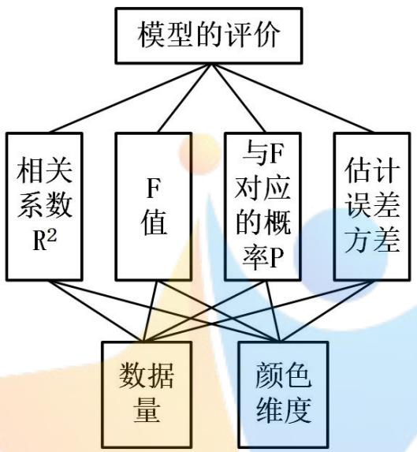

<details>
<summary>flowchart</summary>

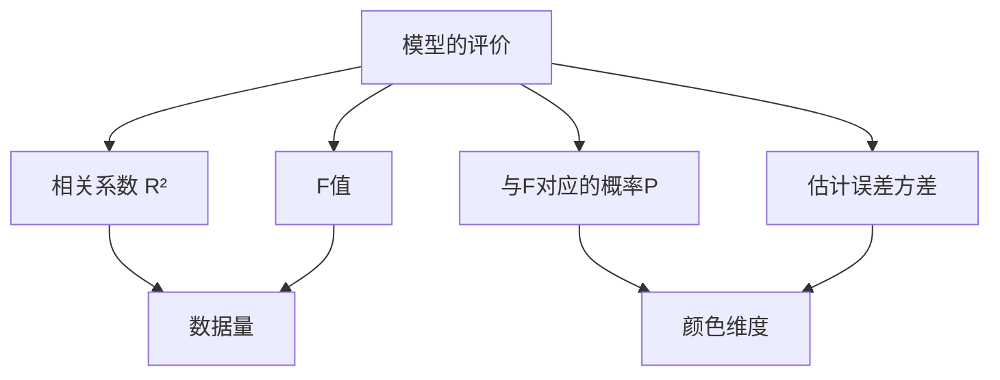
</details>

图13 模型评价的层次结构模型

通过以上的分析和求解，我们即能分析出模型的优劣和数据量的多少、颜色维度的大小是有关的，并且通过层次分析法得出了具体的影响因子。

## 六、模型的评价与推广

本文给出的多元线性回归模型和改进的非线性二次回归模型不仅能很好的表示物质浓度与颜色读数之间的函数关系，而且具有如下优点：

（1）本模型是基于 Data1.xls 和Data2.xls 中的所有数据信息建立的，并且不断的分析、检验和完善改进使得模型具有了较高的准确性，同时也确保了模型结构的严谨性。  
（2）本模型具有一定的通用性，就是能反映不同物质浓度与颜色读数之间的关系；  
（3）数据处理及模型求解时充分运用了 matlab 等数学软件，较好的解决了

问题，得到了较为合理的结果。

本模型可以应用于机器视觉技术在物质内部特性分析方面的研究，即机器学习领域。

## 七、参考文献

[1]杨海燕，贾贵儒.基于数字色度学的有色透明溶液浓度快速检测方法[J].中国农业大学学报.2006，11（3）：47-50.  
[2]王岩，隋思莲，王爱青.数理统计与 MATLAB 工程数据分析[M].北京：清华大学出版社.2006:126-177.  
[3]姜启源，谢金星，等.数学模型（第3版）[M].北京：高等教育出版社.2003.  
[4]王雷震.物流运筹学[M].上海：上海交通大学出版社.2008:186-210.  
[5]乔珠峰，田凤占，黄厚宽.趋势数据处理方法的比较研究[J].计算机研究与发展，2006,43（1）：171-175.  
[6]黄永安，李文成，高小科.MATLAB 7.0/Simulink 6.0 应用是实例仿真与高效算法开发.北京：清华大学出版社，2008

## 八、附录

程序1：Data1.xls中的数据进行多元线性回归：

%所有数据均存在<sub>data\*.txt</sub>文件中，\*.m文件请参见附件

f1\_1.m  
```matlab
load data1_1.txt
y=data1_1(:,1);
x1=data1_1(:,2);
x2=data1_1(:,3);
x3=data1_1(:,4);
x4=data1_1(:,5);
x5=data1_1(:,6);
X=[ones(length(y),1),x1,x2,x3,x4,x5];
Y=y;
[b,bint,r,rint,stats]=regress(Y,X);
rcoplot(r,rint)
title('组胺线性回归的残差图')
format long
```  
f1\_2.m

%剔除异常点之后，请load data1<sub>\_</sub>2<sub>\_</sub>2.txt  
```matlab
load data1_2.txt
y=data1_2(:,1);
x1=data1_2(:,2);
x2=data1_2(:,3);
x3=data1_2(:,4);
x4=data1_2(:,5);
x5=data1_2(:,6);
X=[ones(length(y),1),x1,x2,x3,x4,x5];
Y=y;
[b,bint,r,rint,stats]=regress(Y,X);
rcoplot(r,rint)
title('溴酸钾线性回归的残差图')
format long
```

f1\_3.m  
```matlab
load data1_3.txt
y=data1_3(:,1);
x1=data1_3(:,2);
```

```matlab
x2=data1_3(:,3);
x3=data1_3(:,4);
x4=data1_3(:,5);
x5=data1_3(:,6);
X=[ones(length(y),1),x1,x2,x3,x4,x5];
Y=y;
[b,bint,r,rint,stats]=regress(Y,X);
rcoplot(r,rint)
title('工业碱线性回归的残差图')
format long
```

f1\_4.m  
```matlab
%剔除异常点之后，请load data1_4_2.txt
load data1_4.txt
y=data1_4(:,1);
x1=data1_4(:,2);
x2=data1_4(:,3);
x3=data1_4(:,4);
x4=data1_4(:,5);
x5=data1_4(:,6);
X=[ones(length(y),1),x1,x2,x3,x4,x5];
Y=y;
[b,bint,r,rint,stats]=regress(Y,X);
rcoplot(r,rint)
title('硫酸铝钾线性回归的残差图')
format long
```

f1\_5.m  
```matlab
%剔除异常点之后，请load data1_5_2.txt
load data1_5.txt
y=data1_5(:,1);
x1=data1_5(:,2);
x2=data1_5(:,3);
x3=data1_5(:,4);
x4=data1_5(:,5);
x5=data1_5(:,6);
X=[ones(length(y),1),x1,x2,x3,x4,x5];
Y=y;
[b,bint,r,rint,stats]=regress(Y,X);
rcoplot(r,rint)
title('奶中尿素线性回归的残差图')
format long
```

程序2：Data2.xls中的数据进行多元线性回归：

f2.m  
```matlab
%剔除异常点之后，请load data2_2.txt
load data2.txt
y=data2(:,1);
x1=data2(:,2);
x2=data2(:,3);
x3=data2(:,4);
x4=data2(:,5);
x5=data2(:,6);
X=[ones(length(y),1),x1,x2,x3,x4,x5];
Y=y;
[b,bint,r,rint,stats]=regress(Y,X);
rcoplot(r,rint)
title('二氧化硫线性回归的残差图')
format long
```

程序3： Data2.xls 中的数据进行多元二次回归：

f2\_2.m  
```matlab
load data2.txt
y=data2(:,1);
x1=data2(:,2);
x2=data2(:,3);
x3=data2(:,4);
x4=data2(:,5);
x5=data2(:,6);
X=[x1,x2,x3,x4,x5];
Y=y;
rstool(X,Y,'quadratic')
format long
```

程序4：

f4\_1.m  
```javascript
x1=[121;117;120;118;120;118;120;118];
x2=[110;87;99;102;110;87;99;101];
x3=[68;46;62;66;65;46;60;64];
x4=[23;16;19;20;24;16;19;20];
x5=[111;155;122;112;115;153;126;115];
y=[0;50;25;12.5;0;50;25;12.5];
X=[ones(8,1),x1,x2,x3,x4,x5];
```

```csv
Y=y;
[b,bint,r,rint,stats]=regress(Y,X)
rcoplot(r,rint)
format long
title('组胺')
f4_2.m
x1=[139;139;138;139;138;142;142;139;140;138;134;138];
x2=[136;137;136;136;136;140;139;136;135;134;132;134];
x3=[118;117;108;110;120;119;111;107;125;114;112;105];
x4=[25;27;28;26;26;26;27;26;20;25;27;26];
x5=[37;41;54;52;33;40;55;58;27;44;42;60];
y=[0;500;1000;1500;0;500;1000;1500;0;500;1000;1500];
X=[ones(12,1),x1,x2,x3,x4,x5];
Y=y;
[b,bint,r,rint,stats]=regress(Y,X)
rcoplot(r,rint)
title('奶中尿素1')
```

f4\_2\_1.m  
```matlab
format long
x1=[139;139;138;138;142;142;140;138;134];
x2=[136;137;136;136;140;139;135;134;132];
x3=[118;117;108;120;119;111;125;114;112];
x4=[25;27;28;26;26;27;20;25;27];
x5=[37;41;54;33;40;55;27;44;42];
y=[0;500;1000;0;500;1000;0;500;1000];
X=[ones(9,1),x1,x2,x3,x4,x5];
Y=y;
[b,bint,r,rint,stats]=regress(Y,X)
rcoplot(r,rint)
title('奶中尿素2')
format long
```  
f4\_3.m

```javascript
x1=[153;153;153;153;154;144;144;145;145;145;145;146;142;141;142;141;141;140;139;139;139];
x2=[148;147;146;146;145;115;115;115;114;114;114;114;99;99;99;96;96;96;96;96];
x3=[157;157;158;158;157;170;169;172;174;176;175;175;175;174;176;181;182;182;175;174;176];
x4=[14;16;20;20;19;82;81;83;87;89;89;88;110;109;110;119;119;120;115;114;116];
x5=[138;138;137;137;141;135;136;135;135;135;135;135;137;137;136;135;135;135;136;136;136];
y=[0;0;0;0;0;20;20;20;30;30;30;30;50;50;50;80;80;80;100;100;100];
X=[ones(21,1),x1,x2,x3,x4,x5];
```

```txt
Y=y;
[b,bint,r,rint,stats]=regress(Y,X)
rcoplot(r,rint)
format long
title('二氧化硫1')
f4_3_1.m
x1=[153;153;153;153;154;144;144;145;145;145;145;146;142;141;142;141;141;140];
x2=[148;147;146;146;145;115;115;115;114;114;114;114;99;99;99;96;96;96];
x3=[157;157;158;158;157;170;169;172;174;176;175;175;175;174;176;181;182;182];
x4=[14;16;20;20;19;82;81;83;87;89;89;88;110;109;110;119;119;120];
x5=[138;138;137;137;141;135;136;135;135;135;135;135;137;137;136;135;135;135];
y=[0;0;0;0;0;20;20;20;30;30;30;30;50;50;50;80;80;80];
X=[ones(18,1),x1,x2,x3,x4,x5];
Y=y;
[b,bint,r,rint,stats]=regress(Y,X)
rcoplot(r,rint)
format long
title('二氧化硫2')
```

f4\_3\_2.m  
```matlab
x1=[153;153;153;153;154;144;144;145;145;145;145;146;142;141;142];
x2=[148;147;146;146;145;115;115;115;114;114;114;114;99;99;99];
x3=[157;157;158;158;157;170;169;172;174;176;175;175;175;174;176];
x4=[14;16;20;20;19;82;81;83;87;89;89;88;110;109;110];
x5=[138;138;137;137;141;135;136;135;135;135;135;135;137;137;136];
y=[0;0;0;0;0;20;20;20;30;30;30;30;50;50;50];
X=[ones(15,1),x1,x2,x3,x4,x5];
Y=y;
[b,bint,r,rint,stats]=regress(Y,X)
rcoplot(r,rint)
format long
title('二氧化硫3')
```

f4\_3\_3.m  
```txt
x1=[153;153;153;153;154;144;144;145;145;145;145;146];
x2=[148;147;146;146;145;115;115;115;114;114;114];
x3=[157;157;158;158;157;170;169;172;174;176;175;175];
x4=[14;16;20;20;19;82;81;83;87;89;89;88];
x5=[138;138;137;137;141;135;136;135;135;135;135;
y=[0;0;0;0;0;20;20;20;30;30;30;30];
X=[ones(12,1),x1,x2,x3,x4,x5];
Y=y;
```

```csv
[b,bint,r,rint,stats]=regress(Y,X)
rcoplot(r,rint)
format long
title('二氧化硫4')
```

程序5：问题3中将颜色维度降为 3，2，1分别进行多元线性回归：

三维的列举了一个代码：

f3\_1.m  
```txt
x1=[121;110;117;120;118;120;109;118;120;118];
x2=[110;66;87;99;102;110;64;87;99;101];
x3=[68;37;46;62;66;65;35;46;60;64];
y=[0;100;50;25;12.5;0;100;50;25;12.5];
X=[ones(10,1),x1,x2,x3];
Y=y;
[b,bint,r,rint,stats]=regress(Y,X)
rcoplot(r,rint)
format long
title('组胺线性回归的残差图')
```

二维的列举了一个代码：

f3\_2.m  
```matlab
x4=[22;27;27;26;26;23;27;27;26;26];
x5=[27;241;145;133;106;28;242;151;132;102];
y=[0;100;50;25;12.5;0;100;50;25;12.5];
X=[ones(10,1),x41,x51];
Y=y;
[b,bint,r,rint,stats]=regress(Y,X)
rcoplot(r,rint)
format long
title('溴酸钾线性回归的残差图')
```

一维的列举了一个代码：

f3\_3.m  
```csv
x1=[139;139;138;139;142;138;142;142;139;137;140;138;134;138;138];
y=[0;500;1000;1500;2000;0;500;1000;1500;2000;0;500;1000;1500;2000];
X=[ones(15,1),x11];
Y=y;
[b,bint,r,rint,stats]=regress(Y,X)
```

rcoplot(r,rint)

title('奶中尿素线性回归的残差图')

format long


<details>
<summary>natural_image</summary>

Abstract graphic of a stylized human figure with a star and gradient background (no text or symbols)
</details>

##