# 颜色与物质浓度辨识

## 摘 要

数码照片比色法一种检测物质浓度的方法，其原理是根据照片中的颜色读数来判断待测物质的浓度。本文根据所给数据的特征，采用合理的颜色读数值建立统计回归模型，对颜色读数与物质浓度之间的关系进行了细致的分析与研究。

针对问题一，首先分别做出各组数据中的 RGB 值与浓度的散点图，大体判断出是否采用 颜色模型或灰度颜色模型进行回归分析建模。如不可行，再结合数据特征，用 HSV 颜色模型（H 值或 S 值）与浓度建立回归分析模型。具体回归函数可以根据各组数据变化特征进行选择。

如组胺、溴酸钾、工业碱三组数据，可以采用灰度颜色模型建立一元回归分析模型，进而确定出颜色读数与物质浓度之间的关系。对于硫酸铝钾，采用 S 值与浓度建立Michaelis-Menten 回归分析模型，也可以确定出两者之间的关系。对于奶中尿素，经过对比，最后采用RGB 中的 B值与浓度建立回归模型，但该组数据拟合效果相对较差。

对于数据优劣的评价，主要从数据的准确度和精密度进行分析。两者可以分别用实验测量次数和数据的标准偏差大小进行量化。通过两者的比值构造数据优劣度模型，对各组数据进行排序。最终优劣顺序为：溴酸钾、组胺、硫酸铝钾、工业碱与奶中尿素。

针对问题二，结合二氧化硫 H值和浓度的变化规律，选用 Michaelis-Menten模型构建回归分析方程，并对计算结果进行误差分析，删去数据异常点，进行模型改进，并做出模型预测值与原始数据的残差图。模型的预测值误差基本可以控制在 10%以内。

针对问题三，首先考虑数据量对模型的影响，一般，数据量越大越好。通过删除问题一中的部分溴酸钾溶液数据，重新建立模型与问题一中结果对比，可以看出模型的拟合效果明显变差。所以数据量应结合实际情况，至少达到一定量，并尽量做到数据分布均匀，当数据间隔较大时，应对同组数据进行多次测量。

其次考虑颜色维度对模型的影响，对问题一中工业碱溶液的模型进行改进，建立灰度值，H 值、S 值与浓度的多元线性回归模型，可以发现拟合的效果反而变差。再建立RGB三个值、H值、S 值与浓度的多元线性回归模型，则模型的效果可以得到提高。由此可以判断颜色维度对模型的影响好坏不能一概而论，要结合具体的实验数据进行讨论。

关键词：数码照片比色法 颜色模型 回归分析 Michaelis-Menten 模型

## 一、 问题的提出

## 1.1问题背景

比色法是目前常用的一种检测物质浓度的方法，即把待测物质制备成溶液后滴在特定的白色试纸表面，等其充分反应以后获得一张有颜色的试纸，再把该颜色试纸与一个标准比色卡进行对比，就可以确定待测物质的浓度档位。由于每个人对颜色的敏感差异和观测误差，使得这一方法在精度上受到很大影响。随着照相技术和颜色分辨率的提高，希望建立颜色读数和物质浓度的数量关系，即只要输入照片中的颜色读数就能够获得待测物质的浓度。

## 1.2问题重述

现根据附件所提供的有关颜色读数和物质浓度数据，建立数学模型，解决以下问题：

问题一：对附件 Data1.xls 中给出的 5 种物质在不同浓度下的颜色度数进行讨论，从5种数据中能否确定颜色读数和物质浓度之间的关系，并给出一些准则来评价 5组数据的优劣。

问题二：对附件 Data2.xls 中的数据，建立颜色读数和物质浓度的数学模型，并给出模型的误差分析。

问题三：讨论数据量和颜色维度对模型的影响。

## 二、 问题分析

## 2.1 预备知识

数字照片比色法是一种对采集图片数字化处理的分析方法，该种方法操作简便，耗时少，成本低。其原理是根据显色溶液的特点来选择不同的颜色模型，并由分析软件得出最终结果。常用的颜色模型有 RGB、灰度、HSV 等<sup>[1]</sup> <sup>[2]</sup>。

RGB 颜色模型是由红、绿、蓝三基色通过颜色加权混合而成的一种模型，其每种颜色的取值范围为[0,255]。

灰度颜色模型是用 0 到 255 的不同灰度值来表示图像，0 表示黑色，255 表示白色,灰度模式可以由 模式直接转换得到。在比色法中，用灰度颜色模型对显色结果进行分析是比较简便的。

HSV颜色模型是由每一种颜色都是由色调，饱和度和明度三个变量所决定的颜色模型。其在计算机图像处理、车牌识别等领域用途较为广泛。

## 2.2问题的分析

针对问题一，首先对 组数据画出 值与浓度的散点图，从而大体判断能否用RGB颜色模型或灰色颜色模型进行回归分析建模。如果 RGB值与浓度关系不明显或拟合效果不佳，再用 HSV 颜色模型（H 值或 S 值）与浓度建立回归分析模型。具体回归函数可以根据各组数据变化特征进行选择，从而建立各组颜色读数与浓度的数学模型。

对于评价数据的优劣，可以从数据的准确度和精密度进行分析。准确度主要从测量次数分析，精密度主要依靠数据的标准偏差大小进行量化。通过两者的比值构造数据优劣度模型，对各组数据进行排序。

针对问题二，首先观察二氧化硫溶液的 RGB 值、H 值与 S 值与浓度变化趋势，可以发现H值与浓度变化关系最为明显，结合H值数据的变化规律，选用Michaelis-Menten模型构建回归分析方程，并对计算结果进行误差分析，筛选掉数据异常点，建立更精确的回归模型。并给出预测值与原始数据的残差图，模型预测值的误差基本控制在 10%以内。

针对问题三，首先考虑数据量对模型的影响，单纯从建模需要来讲，样本容量肯定是越大越好。若删除问题一中的部分溴酸钾溶液数据，重新建立模型，可以得到模型的拟合效果明显变差。因此，根据实验要求不同，数据量至少达到一定量，并尽量做到数据分布均匀，当数据间隔较大时，可对同组数据进行多次测量。

其次考虑颜色维度对模型的影响，对问题一中工业碱溶液的模型进行改进，结合数据特征，将灰度颜色模型，与 H值、S 值一起建立多元线性回归模型，发现拟合的效果反而变差。再将 RGB 三个值、H 值、S 值一起建立多元线性回归模型，则模型的效果可以得到提高。由此可以判断颜色维度对模型的影响好坏不能一概而论，要结合具体的实验数据进行讨论。

## 三、模型假设

1、假设各组照片的拍摄环境是一致的。  
2、忽略拍摄环境（距离、角度、温度）对读数的影响。  
3、假设各组颜色数据的读取设备是同一台设备的。  
4、假设试纸没有过期、无破损。  
5、假设溶液与试纸已充分反应。

## 四、符号说明

<table><tr><td>L</td><td>灰度值</td></tr><tr><td>R</td><td>红色数值</td></tr><tr><td>G</td><td>绿色数值</td></tr><tr><td>B</td><td>蓝色数值</td></tr><tr><td>H</td><td>表示色调值</td></tr><tr><td>S</td><td>表示饱和度值</td></tr><tr><td>M</td><td>溶液浓度</td></tr><tr><td> $\hat{M}$ </td><td>溶液浓度预测值</td></tr></table>

## 五、模型的建立与求解

## 5.1问题一的模型建立与求解

## 5.1.1颜色读数与浓度关系的确定

由于数字照片比色法要根据不同的数据情况选择合适的颜色模型来分析结构，且在附件Data1所给数据中包含了 5种颜色读数，包括红（R）、绿（G）、蓝（B）三基色的取值和色调（H）、饱和度（S）的取值，因此要分别对各组的具体数据选择合适的颜色模型进行分析求解。

项目一：组胺

先做出RGB三组值与浓度的散点图，见图 5-1。

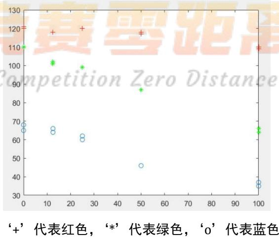

<details>
<summary>scatter</summary>

| Series | X | Y |
| --- | --- | --- |
| Red | 0 | ~121 |
| Red | 13 | ~118 |
| Red | 25 | ~120 |
| Red | 50 | ~118 |
| Red | 100 | ~110 |
| Green | 0 | ~110 |
| Green | 13 | ~102 |
| Green | 25 | ~99 |
| Green | 50 | ~87 |
| Green | 100 | ~66 |
| Blue | 0 | ~69 |
| Blue | 13 | ~66 |
| Blue | 25 | ~62 |
| Blue | 50 | ~46 |
| Blue | 100 | ~37 |
| Blue | 100 | ~35 |
</details>

图5-1 RGB 值与组胺浓度的散点图

从图5-1可以发现，随着浓度的的增加，R 值变化较小，但 G值与 B值有比较明显的线性递减趋势，综合上述分析，将结合灰度颜色模型建立一元回归分析模型。

首先利用RGB的数据计算出灰度值L，计算公式<sup>[1]</sup>如下：

$$
L = 0. 2 9 9 \times R + 0. 5 8 7 \times G + 0. 1 1 4 \times B
$$

则组胺浓度与灰度值的对应数据如表5-1。

表5-1 组胺浓度与灰度值

<table><tr><td>浓度</td><td>100</td><td>100</td><td>50</td><td>50</td><td>25</td><td>25</td><td>12.5</td><td>12.5</td><td>0</td><td>0</td></tr><tr><td>灰度值L</td><td>76</td><td>74</td><td>91</td><td>92</td><td>101</td><td>101</td><td>103</td><td>102</td><td>109</td><td>108</td></tr></table>

建立线性回归模型<sup>[3]</sup>：

$$
M = \beta_ {0} + \beta_ {1} \cdot L + \varepsilon \tag {1}
$$

其中 $\beta _ { 0 } , \ \beta _ { 1 }$ 为回归系数， 为随机误差。利用Matlab 软件的regress 函数求解，模型（1）的回归系数估计值及其置信区间（置信水平 $\scriptstyle \alpha = 0 . 0 5 $ ）、检验统计量 $R ^ { 2 } , F , p , s ^ { 2 }$ 的结果见表 5-2.

表5-2 组胺浓度的回归结果

<table><tr><td>参数:</td><td>参数估计值:</td><td>参数置信区间:</td></tr><tr><td> $\beta_0$ ↔</td><td>325.2068↔</td><td>[304.1089,346.3047]↔</td></tr><tr><td> $\beta_0$ ↔</td><td>-3.0063↔</td><td>[-3.2252,-2.7875]↔</td></tr><tr><td colspan="3"> $R^2 = 1.0$  F=1003.7 p=0.0  $s^2 = 12.4$ ↔</td></tr></table>

结果分析：从表5-2中可以看出 $R ^ { 2 }$ 近似为1，F值大于F检验的临界值，p远小于0.05，且每个回归系数的置信区间没有包含零点，说明灰度值L对浓度M影响是显著的，因此模型（ ）从整体上是合理可用的。说明组胺溶液的浓度可以通过颜色读数来确定，其预测方程的关系式为： $\hat { M } = 3 2 5 . 2 0 6 8 - 3 . 0 0 6 3 L$ 0

项目二：溴酸钾

针对溴酸钾溶液，同样先做出 RGB三组值与浓度的散点图。见图5-2。

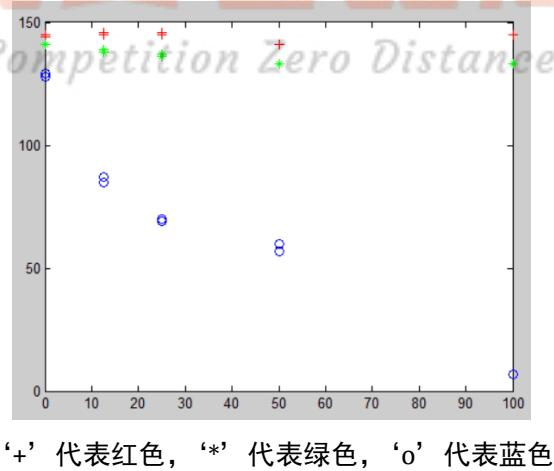

<details>
<summary>scatter</summary>

| Series | X | Y |
| --- | --- | --- |
| Red | ~1 | ~145 |
| Green | ~1 | ~142 |
| Blue | ~1 | ~138 |
| Red | ~13 | ~145 |
| Green | ~13 | ~140 |
| Blue | ~13 | ~86 |
| Red | ~25 | ~145 |
| Green | ~25 | ~140 |
| Blue | ~25 | ~70 |
| Red | ~50 | ~142 |
| Green | ~50 | ~138 |
| Blue | ~50 | ~60 |
| Blue | ~50 | ~58 |
| Blue | 100 | ~8 |
</details>

图5-2 RGB 值与浓度(溴酸钾)的散点图

从图5-2可以发现，随着浓度的的增加，R 值和G值变化较小，但 B值有明显的线性递减趋势，同理，可以建立灰度颜色模型的一元回归分析模型。

先计算出溴酸钾浓度与灰度值的对应数据如表 5-3。

表5-3 溴酸钾浓度与灰度值

<table><tr><td>浓度</td><td>100</td><td>100</td><td>50</td><td>50</td><td>25</td><td>25</td><td>12.5</td><td>12.5</td><td>0</td><td>0</td></tr><tr><td>灰度值L</td><td>122</td><td>122.000</td><td>127.000</td><td>127.000</td><td>131.000</td><td>132.000</td><td>135.000</td><td>135.000</td><td>141.000</td><td>140.000</td></tr></table>

将上述数据代入模型（1）中，可得出结果（见表 5-4）。

表5-4 溴酸钾浓度的回归结果

<table><tr><td>参数</td><td>参数估计值</td><td>参数置信区间</td></tr><tr><td> $\beta_0$ </td><td>729.5510</td><td>[548.9463, 910.1558]</td></tr><tr><td> $\beta_1$ </td><td>-5.2748</td><td>[-6.6497, -3.8998]</td></tr><tr><td colspan="3"> $R^2 = 0.9073 \quad F=78.2646 \quad p=0.0000 \quad s^2 = 144.9031$ </td></tr></table>

结果分析：从表 5-4 中可以看出 $R ^ { 2 }$ 为 0.9073，F值大于 F 检验的临界值，p远小于 0.05，且每个回归系数的置信区间没有包含零点，说明灰度值L对浓度 M 影响是显著的。说明溴酸钾溶液的浓度可以通过颜色读数来确定，其预测方程的关系式为：

$$
\hat {M} = 7 2 9. 5 5 1 - 5. 2 7 4 8 L 。
$$

模型改进: 如果用二次函数建立回归模型<sup>[3]</sup>

$$
M = \beta_ {0} + \beta_ {1} L + \beta_ {1} ^ {2} L + \tag {2}
$$

其中 $\beta _ { 0 }$ ， $\beta _ { 1 }$ ， $\beta _ { 2 }$ 为回归系数。代入数据可得计算结果如表

表5-5 溴酸钾浓度的回归结果（二次函数）

<table><tr><td>参数</td><td>参数估计值</td><td>参数置信区间</td></tr><tr><td> $\beta_0$ </td><td>5561.2</td><td>[4603.5, 6519.0]</td></tr><tr><td> $\beta_1$ </td><td>0.3</td><td>[0.2, 0.3]</td></tr><tr><td> $\beta_2$ </td><td>-79.1</td><td>[-93.7, -64.5]</td></tr><tr><td colspan="3"> $R^2 = 0.9957 \quad F=803.0623 \quad p=0.000 \quad s^2 = 7.7489$ </td></tr></table>

结果分析：从表5-5中可以看出 $R ^ { 2 }$ 、F值明显增大， $p$ 远小于0.05，且每个回归系数的置信区间没有包含零点，说明该模型拟合效果更好，其预测方程的关系式为：

$$
\hat {M} = 5 5 6 1. 2 + 0. 3 L - 7 9. 1 L ^ {2}
$$

项目三：工业碱

针对工业碱溶液做出 RGB三组值与浓度的散点图。见图 5-3。

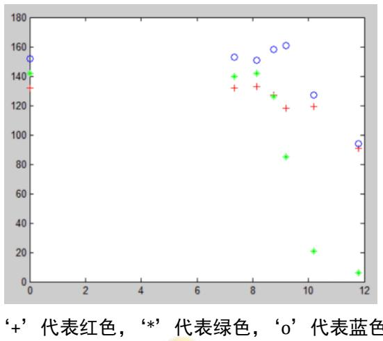

<details>
<summary>scatter</summary>

| Series | X | Y |
| --- | --- | --- |
| Red | ~0.1 | ~132 |
| Red | ~7.3 | ~132 |
| Red | ~8.2 | ~133 |
| Red | ~8.7 | ~127 |
| Red | ~9.2 | ~118 |
| Red | ~10.2 | ~119 |
| Red | ~11.8 | ~90 |
| Green | ~0.1 | ~142 |
| Green | ~7.3 | ~140 |
| Green | ~8.2 | ~142 |
| Green | ~8.7 | ~126 |
| Green | ~9.2 | ~85 |
| Green | ~10.2 | ~21 |
| Green | ~11.8 | ~6 |
| Blue | ~0.1 | ~152 |
| Blue | ~7.3 | ~153 |
| Blue | ~8.2 | ~151 |
| Blue | ~8.7 | ~158 |
| Blue | ~9.2 | ~161 |
| Blue | ~10.2 | ~127 |
| Blue | ~11.8 | ~94 |
</details>

图5-3 RGB 值与浓度(工业碱)的散点图

从图5-3可以发现，除个别点外，随着浓度的的增加， RGB三个值都有较明显的线性递减趋势。同样可以灰度颜色模型的一元回归分析模型。

计算出工业碱浓度与灰度值的对应数据如表 5-6。

表5-6 工业碱浓度与灰度值

<table><tr><td>浓度</td><td>11.8</td><td>10.18</td><td>9.19</td><td>8.74</td><td>8.14</td><td>7.34</td><td>0</td></tr><tr><td>灰度值L</td><td>41</td><td>62</td><td>104</td><td>130</td><td>140</td><td>139</td><td>140</td></tr></table>

可以发现，本组的数据量明显偏少，且所给出的浓度变化范围主要集中在 7\~12 之间，将上述数据代入模型（1）中，可得出结果（见表 5-7）。

表5-7 工业碱溶液回归结果

<table><tr><td>参数</td><td>参数估计值</td><td>参数置信区间</td></tr><tr><td> $\beta_0$ </td><td>14.4799</td><td>[5.3960, 23.5637]</td></tr><tr><td> $\beta_1$ </td><td>-0.0608</td><td>[-0.1401, 0.0186]</td></tr><tr><td colspan="3"> $R^2 = 0.4368 \quad F=3.8779 \quad p=0.1060 \quad s^2 = 9.6347$ </td></tr></table>

从表5-6中可以看出 $R ^ { 2 }$ 为0.4368，p大于0.05，说明模型不可用。做出残差示意图，如图 5-4 所示。

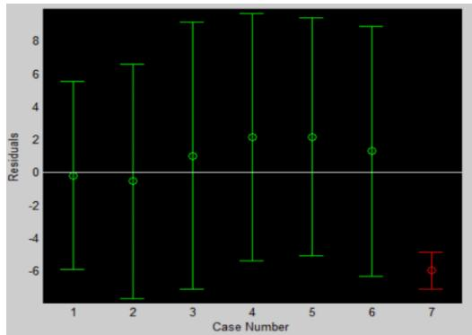

<details>
<summary>error_bar</summary>

| Case Number | Median Residual | Min Residual | Max Residual |
| --- | --- | --- | --- |
| 1 | ~0 | ~-6 | ~5.7 |
| 2 | ~-0.4 | ~-7.8 | ~6.6 |
| 3 | ~1 | ~-7.2 | ~9.2 |
| 4 | ~2.2 | ~-5.4 | ~9.6 |
| 5 | ~2.2 | ~-5.1 | ~9.4 |
| 6 | ~1.3 | ~-6.3 | ~8.8 |
| 7 | -6 | ~-7.2 | ~-4.8 |
</details>

图5-4 残差示意图

明显第7个数据点是一个异常点。因此删除该异常点（浓度为 0），重新代入模型计算，结果见表5-8。

表5-8工业碱浓度的回归结果

<table><tr><td>参数</td><td>参数估计值</td><td>参数置信区间</td></tr><tr><td> $\beta_0$ </td><td>12.9142</td><td>[11.2751, 14.5533]</td></tr><tr><td> $\beta_1$ </td><td>-0.0359</td><td>[-0.0508, -0.0209]</td></tr><tr><td colspan="3"> $R^2 = 0.9174 \quad F=44.3981 \quad p=0.0026 \quad s^2 = 0.2585$ </td></tr></table>

结果分析：从表 5-8 中可以看出 $R ^ { 2 }$ 为 0.9174，F值大于 F 检验的临界值，p小于0.05，且每个回归系数的置信区间没有包含零点，说明灰度值L对浓度M影响是显著的。说明工业碱溶液的浓度可以通过颜色读数来确定，其预测方程的关系式为：

$$
\hat {M} = 1 2. 9 1 4 2 - 0. 0 3 5 9 L
$$

注意：由于该组数据量偏少，且浓度变化范围主要集中在 之间，因此预测方程应用范围也只能大体限定在[7,12]上。

项目四：硫酸铝钾

针对硫酸铝钾溶液做出 RGB三组值与浓度的散点图。见图 5-5。

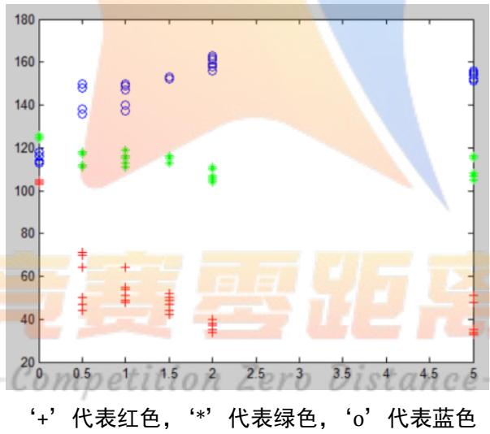

<details>
<summary>scatter</summary>

| Series | X | Y |
| --- | --- | --- |
| Red | 0 | ~104 |
| Red | 0.5 | ~68 |
| Red | 0.5 | ~63 |
| Red | 0.5 | ~47 |
| Red | 0.5 | ~45 |
| Red | 1 | ~64 |
| Red | 1 | ~54 |
| Red | 1 | ~52 |
| Red | 1 | ~49 |
| Red | 1.5 | ~50 |
| Red | 1.5 | ~48 |
| Red | 1.5 | ~42 |
| Red | 2 | ~39 |
| Red | 2 | ~35 |
| Red | 5 | ~50 |
| Red | 5 | ~48 |
| Red | 5 | ~34 |
| Green | 0 | ~125 |
| Green | 0.5 | ~118 |
| Green | 0.5 | ~112 |
| Green | 1 | ~118 |
| Green | 1 | ~115 |
| Green | 1.5 | ~115 |
| Green | 2 | ~110 |
| Green | 2 | ~105 |
| Green | 5 | ~116 |
| Green | 5 | ~107 |
| Blue | 0 | ~118 |
| Blue | 0.5 | ~149 |
| Blue | 0.5 | ~138 |
| Blue | 0.5 | ~136 |
| Blue | 1 | ~149 |
| Blue | 1 | ~147 |
| Blue | 1 | ~139 |
| Blue | 1.5 | ~152 |
| Blue | 2 | ~162 |
| Blue | 2 | ~160 |
| Blue | 2 | ~158 |
| Blue | 5 | ~154 |
| Blue | 5 | ~153 |
</details>

图5-5 RGB 值与浓度(硫酸铝钾)的散点图

从图5-5发现，随着浓度的的增加， RGB三个值没有明显的变化趋势。同时，把该组数据代入灰度值的回归分析模型，发现模型不成立。因此，我们考虑用 HSV颜色模型来进行回归分析建模。

首先分别做出H值、S 值关于浓度变化的散点图，见图 5-6。

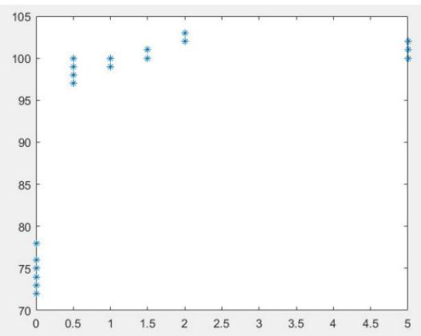

<details>
<summary>scatter</summary>

| X | Y |
| --- | --- |
| 0 | ~72 |
| 0 | ~73 |
| 0 | ~74 |
| 0 | ~76 |
| 0 | ~78 |
| 0.5 | ~97 |
| 0.5 | ~98 |
| 0.5 | ~99 |
| 0.5 | 100 |
| 1 | ~99 |
| 1 | 100 |
| 1.5 | 100 |
| 1.5 | ~101 |
| 2 | ~102 |
| 2 | ~103 |
| 5 | 100 |
| 5 | ~101 |
| 5 | ~102 |
</details>

图5-6(a)H 值与浓度(硫酸铝钾)的散点图

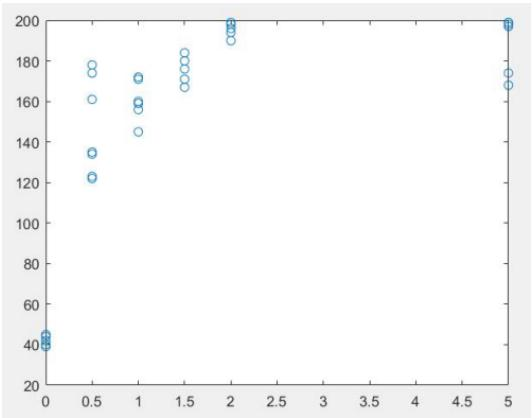

<details>
<summary>scatter</summary>

| X | Y |
| --- | --- |
| 0 | ~40 |
| 0 | ~42 |
| 0 | ~45 |
| 0.5 | ~123 |
| 0.5 | ~135 |
| 0.5 | ~162 |
| 0.5 | ~174 |
| 0.5 | ~179 |
| 1 | ~145 |
| 1 | ~157 |
| 1 | ~160 |
| 1 | ~172 |
| 1.5 | ~167 |
| 1.5 | ~171 |
| 1.5 | ~178 |
| 1.5 | ~184 |
| 2 | ~190 |
| 2 | ~193 |
| 2 | ~196 |
| 2 | ~199 |
| 5 | ~168 |
| 5 | ~175 |
| 5 | ~198 |
</details>

图 5-6(b) S值与浓度(硫酸铝钾)的散点图

从图5-6可以发现，随着浓度的的增加，H值与S 值的变化规律基本相似。当浓度较小时， 值与 值都快速增加，而当浓度很大时， 值与 值增加较慢，趋于一个稳

Michaelis-Menten 模型 y  <sub>0</sub>x (3) x

指数增长模型 y = β0( 1- e−β,x (4)

下面我们用Michaelis-Menten模型对该组数据中的 H值和S 值进行回归分析。

首先，将S 值与浓度的数据代入模型（3），其中，浓度作为自变量，S 值作为因变量。作为利用Matlab软件的 nlinfit 函数求解，可得出结果（见表 5-9）。

表5-9硫酸铝钾浓度的回归结果

<table><tr><td>参数</td><td>参数估计值</td><td>参数置信区间</td></tr><tr><td> $\beta_0$ </td><td>200.9061</td><td>[183.1188, 218.6934]</td></tr><tr><td> $\beta_1$ </td><td>0.1945</td><td>[0.0781, 0.3109]</td></tr></table>

拟合后的结果与原始数据进行对比见图 5-7，且模型的剩余标准差 s=22.396。

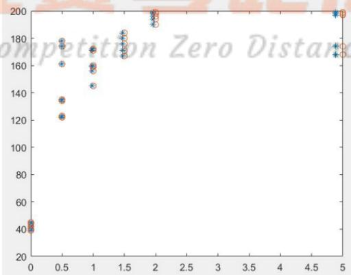

<details>
<summary>scatter</summary>

| X | Blue (Value) | Orange (Value) |
| --- | --- | --- |
| 0 | ~40 | ~42 |
| 0 | ~43 | ~45 |
| 0.5 | ~123 | ~136 |
| 0.5 | ~162 | ~178 |
| 0.5 | ~178 | ~180 |
| 1 | ~145 | ~158 |
| 1 | ~158 | ~160 |
| 1 | ~172 | ~174 |
| 1.5 | ~168 | ~170 |
| 1.5 | ~170 | ~172 |
| 1.5 | ~182 | ~184 |
| 2 | ~190 | ~192 |
| 2 | ~194 | ~196 |
| 2 | ~198 | ~199 |
| 5 | ~168 | ~170 |
| 5 | ~172 | ~174 |
| 5 | ~198 | ~199 |
</details>

图 5-7 模型（2）的预测结果(S值与硫酸铝钾浓度)  
（‘\*’代表拟合结果， $^ 6 { } _ { 0 } \cdot \ '$ 代表原始数据）

由上图可知，拟合效果良好，且回归系数的置信区间没有包含零点，说明模型是完全可

用的。将回归得出的系数代入模型（3）可得方程

$$
y = \frac {2 0 0 . 9 0 6 1 x}{0 . 1 9 4 5 + x}
$$

求解反函数得： $x = \frac { 0 . 1 9 4 5 \cdot y } { 2 0 0 . 9 0 6 1 - y }$ ，则浓度与S 值的预测方程为

$$
\hat {M} = \frac {0 . 1 9 4 5 \cdot S}{2 0 0 . 9 0 6 1 - S}.
$$

同理，将H值与浓度数据代入模型（3），拟合后的效果见图 5-8，其剩余标准差为30.9423。

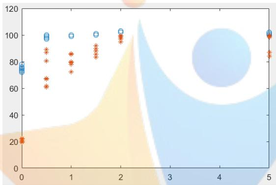

<details>
<summary>scatter</summary>

| Category | Series | Value |
| --- | --- | --- |
| 0 | Blue (circle) | ~73 ~78 |
| 0 | Orange (asterisk) | ~21 |
| 0.5 | Blue (circle) | ~98 ~101 |
| 0.5 | Orange (asterisk) | ~61 ~89 |
| 1 | Blue (circle) | ~99 ~101 |
| 1 | Orange (asterisk) | ~72 ~86 |
| 1.5 | Blue (circle) | ~100 ~102 |
| 1.5 | Orange (asterisk) | ~84 ~92 |
| 2 | Blue (circle) | ~102 ~104 |
| 2 | Orange (asterisk) | ~95 ~99 |
| 5 | Blue (circle) | ~101 ~103 |
| 5 | Orange (asterisk) | ~85 ~99 |
</details>

图 5-8 模型（2）的预测结果（H值）

对比S值与H值得拟合结果，可以发现 S 值的拟合效果更好，因此可以采用 S 值来建立颜色读数与浓度之间的关系，其预测方程为

$$
\hat {M} = \frac {0 . 1 9 4 5 \cdot S}{2 0 0 . 9 0 6 1 - S}.
$$

项目五：奶中尿素

针对奶中尿素做出 RGB三组值与浓度的散点图。见图 5-9。

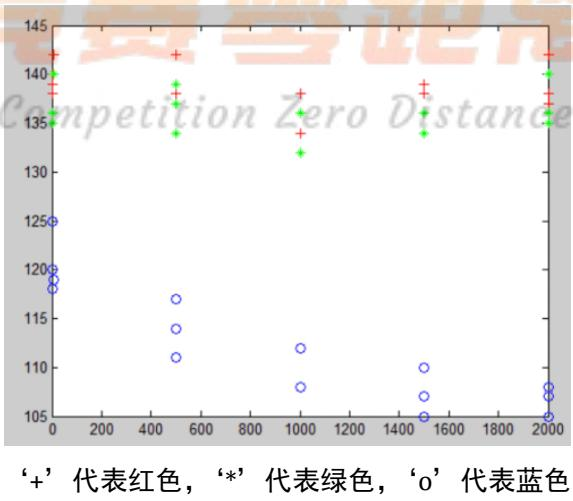

<details>
<summary>scatter</summary>

| Series | X | Y |
| --- | --- | --- |
| Red | ~10 | ~142 |
| Red | ~50 | ~138 |
| Red | ~50 | ~136 |
| Red | ~500 | ~142 |
| Red | ~1000 | ~138 |
| Red | ~1000 | ~134 |
| Red | ~1500 | ~139 |
| Red | ~1500 | ~136 |
| Red | ~2000 | ~142 |
| Red | ~2000 | ~137 |
| Green | ~10 | ~140 |
| Green | ~50 | ~136 |
| Green | ~50 | ~134 |
| Green | ~500 | ~139 |
| Green | ~500 | ~137 |
| Green | ~500 | ~134 |
| Green | ~1000 | ~136 |
| Green | ~1000 | ~132 |
| Green | ~1500 | ~136 |
| Green | ~1500 | ~134 |
| Blue | ~10 | ~125 |
| Blue | ~10 | ~120 |
| Blue | ~10 | ~118 |
| Blue | ~500 | ~117 |
| Blue | ~500 | ~114 |
| Blue | ~500 | ~111 |
| Blue | ~1000 | ~112 |
| Blue | ~1000 | ~108 |
| Blue | ~1500 | ~110 |
| Blue | ~1500 | ~107 |
| Blue | ~1500 | ~105 |
| Blue | ~2000 | ~108 |
| Blue | ~2000 | ~107 |
| Blue | ~2000 | ~105 |
</details>

图5-9 RGB 值与浓度(奶中尿素)的散点图

从图5-9可以发现，随着浓度的的变化， R 值与G值没有明显的变化趋势，而 B值有较弱的线性递减趋势。同样先用灰度颜色模型的一元线性回归分析模型，结果见表。显然该模型不适用。我们试着采用二次函数模型，也未得到理想的结果。

表 奶中尿素浓度与灰度值的回归结果

<table><tr><td>参数 $\leftrightarrow$ </td><td>参数估计值 $\leftrightarrow$ </td><td>参数置信区间 $\leftrightarrow$ </td></tr><tr><td> $\beta_0 \leftrightarrow$ </td><td>19035 $\leftrightarrow$ </td><td>[-8846, 46915] $\leftrightarrow$ </td></tr><tr><td> $\beta_1 \leftrightarrow$ </td><td>-135 $\leftrightarrow$ </td><td>[-342, 73] $\leftrightarrow$ </td></tr><tr><td colspan="3"> $R^2 = 0.1315 \text{ F=1.9677 } p=0.1841 \quad s^2 = 562813.1712$  $\leftrightarrow$ </td></tr></table>

其次，分别做出H 值、S 值关于奶中尿素浓度变化的散点图，见图 5-10。

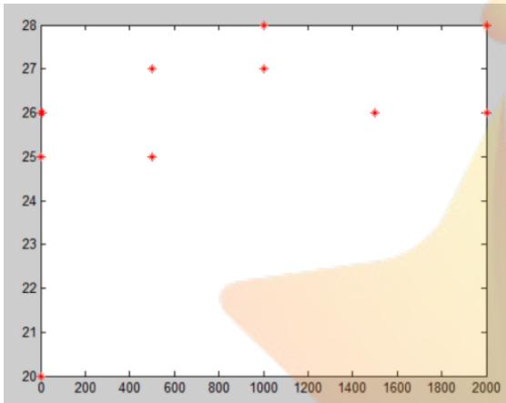

<details>
<summary>scatter</summary>

| X | Y |
| --- | --- |
| 0 | 26 |
| 0 | 25 |
| 0 | 20 |
| ~500 | 27 |
| ~500 | 25 |
| ~1000 | 28 |
| ~1000 | 27 |
| ~1500 | 26 |
| ~2000 | 28 |
| ~2000 | 26 |
</details>

图5-10(a)H值与浓度(奶中尿素)的散点图

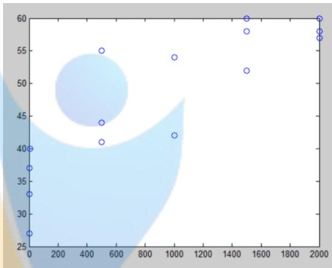

<details>
<summary>bubble</summary>

| X | Y |
| --- | --- |
| ~10 | 27 |
| ~10 | 33 |
| ~10 | 37 |
| ~10 | 40 |
| ~500 | 41 |
| ~500 | 44 |
| ~500 | 55 |
| ~1000 | 42 |
| ~1000 | 54 |
| ~1500 | 52 |
| ~1500 | 58 |
| ~1500 | 60 |
| ~2000 | 57 |
| ~2000 | 58 |
| ~2000 | 60 |
</details>

图 5-10(b) S值与浓度(奶中尿素)的散点图

从图5-10可以看出，随着浓度的的增加，H值的变化很小，而S 值有较弱的线性增加关系。 因此用S值与浓度做一元回归分析模型，其结果见 5-9。

表5-11 奶中尿素浓度与S值的回归结果

<table><tr><td>参数</td><td>参数估计值</td><td>参数置信区间</td></tr><tr><td> $\beta_0$ </td><td>-2042.3</td><td>[-3112.3, -972.4]</td></tr><tr><td> $\beta_1$ </td><td>62.2</td><td>[40.3, 84.0]</td></tr><tr><td colspan="3"> $R^2 = 0.7441$  F=37.8100 p=0.000  $s^2 = 165794.5104$ </td></tr></table>

其中， $R ^ { 2 }$ 为0.7441，说明拟合效果一般。

从图5-9可知，B值随着浓度有较弱的线性递减趋势，因此用 B值与浓度做一元回归分析模型，其结果见表5-12。

表5-12奶中尿素浓度与B值的回归结果

<table><tr><td>参数</td><td>参数估计值</td><td>参数置信区间</td></tr><tr><td> $\beta_0$ </td><td>13576</td><td>[9728, 17424]</td></tr><tr><td> $\beta_1$ </td><td>-112</td><td>[-147, -78]</td></tr><tr><td colspan="3"> $R^2 = 0.7953 \text{ F=50.5149 } \text{ p=0.000 } s^2 = 132630.6165$ </td></tr></table>

其中， $R ^ { 2 }$ 为 0.7953，p小于 0.05，且每个回归系数的置信区间没有包含零点，说明模型整体可用，但效果比前 组数据明显较差。综上所述，可以建立颜色读数与奶中尿素浓度之间的关系，其预测方程为

$$
\hat {M} = 1 3 5 7 6 - 1 1 2 B.
$$

## 5.1.2 数据的评价

一般，评价实验数据的准则<sup>[4]</sup>主要包括两个方面：准确度和精密度。

由于原始数据并没有给出浓度的真实值，那准确度主要从实验数据的数量来考虑，一般实验测定次数越多，数据的准确度越高。5 组项目的实验测定次数见表：

表5-13 各组项目的实验测定次数

<table><tr><td></td><td>组胺溶液</td><td>溴酸钾溶液</td><td>工业碱溶液</td><td>硫酸铝钾溶液</td><td>奶中尿素溶液</td></tr><tr><td>测量次数</td><td>10</td><td>10</td><td>7</td><td>37</td><td>15</td></tr></table>

再考虑精密度，可以将已知数据分为两组，分组依据是依照其是否进行重复测量。可将之分为:

A组：组胺溶液、溴酸钾溶液、硫酸铝钾溶液、奶中尿素溶液

B组：工业碱溶液

如针对组胺溶液，我们对其 5个颜色值进行权重系数的计算，方法如下：

$$
\frac {\underset {j} {\max} \left(x _ {i j}\right) - \underset {j} {\min} \left(x _ {i j}\right)}{\sum_ {i} \left[ \underset {j} {\max} \left(x _ {i j}\right) - \underset {j} {\min} \left(x _ {i j}\right) \right]}
$$

其中 $x _ { i j }$ 为第i 行第j 列的数据值。具体结果见表 5-14.

表 组胺溶液权重系数表

<table><tr><td>权重系数</td><td>0.14</td><td>0.22</td><td>0.25</td><td>0.05</td><td>0.35</td></tr></table>

随后计算组胺溶液各组浓度下的不同颜色值标准偏差，并将各组颜色值标准差求和，见表 5-15.

表 5-15 组胺溶液标准偏差计算结果

<table><tr><td>浓度(ppm)</td><td>B</td><td>G</td><td>R</td><td>H</td><td>S</td></tr><tr><td>100 标准偏差</td><td>1.41</td><td>1.41</td><td>0.71</td><td>0.71</td><td>2.12</td></tr><tr><td>50 标准偏差</td><td>0.00</td><td>0.00</td><td>0.71</td><td>0.00</td><td>1.41</td></tr><tr><td>25 标准偏差</td><td>1.41</td><td>0.00</td><td>0.00</td><td>0.00</td><td>2.83</td></tr><tr><td>12.5 标准偏差</td><td>1.41</td><td>0.71</td><td>0.00</td><td>0.00</td><td>2.12</td></tr><tr><td>0 标准偏差</td><td>2.12</td><td>0.00</td><td>0.71</td><td>0.71</td><td>2.83</td></tr><tr><td>求和结果</td><td>6.35</td><td>2.12</td><td>2.13</td><td>1.42</td><td>11.31</td></tr></table>

对求和结果乘上相应的权重系数，得到加权标准偏差和为5.85。

同理，其他三个项目数据的加权标准偏差和分别为

表5-16 其余溶液加权标准偏差和

<table><tr><td></td><td>溴酸钾溶液</td><td>硫酸铝钾溶液</td><td>奶中尿素溶液</td></tr><tr><td>加权总标准偏差和</td><td>4.95</td><td>30.18</td><td>12.31</td></tr></table>

（其中，奶中尿素溶液中的 5ppm组数据由于只有一组，视为异常点，将其除去。）

最后，为了排出各组数据的优劣顺序，要综合考虑数据的数据量与加权标准偏差和，则将加权标准偏差和除以相应的数据量，该比值可定义为数据优劣度，数据越小代表该组数据越优。最后排序结果如表 5-17.

表5-17 A组溶液优劣度排序

<table><tr><td></td><td>溴酸钾溶液</td><td>组胺溶液</td><td>硫酸铝钾溶液</td><td>奶中尿素溶液</td></tr><tr><td>数据优劣度</td><td>0.4649</td><td>0.5848</td><td>0.8158</td><td>0.8207</td></tr></table>

由此可知溴酸钾溶液数据最优，组胺溶液数据其次，奶中尿素数据最差。

针对 B 组的工业碱溶液，由于各浓度均只有一组数据，故无法计算其标准偏差，所以选择对其各组数据的浓度间隔进行分析，如下表所示：

表5-18 工业碱溶液各组数据的浓度间隔

<table><tr><td>1-2组间隔</td><td>2-3组间隔</td><td>3-4组间隔</td><td>4-5组间隔</td><td>5-6组间隔</td><td>6-7组间隔</td></tr><tr><td>1.620</td><td>0.990</td><td>0.450</td><td>0.600</td><td>0.780</td><td>7.360</td></tr></table>

由此可知，该组溶液中，前 5 个浓度数据间隔较为均衡，但 6-7 组数据间隔过大。且该组溶液测量数据较少，所以认为其数据优劣度较差。

## 5.2问题二的模型建立与求解

## 5.2.1 模型的建立与求解

与问题一类似，附件 Data2中给出的数据也包括 RGB的取值和H、S 的取值，分别作出上述取值与浓度的散点图，见图 5-11、图 5-12。

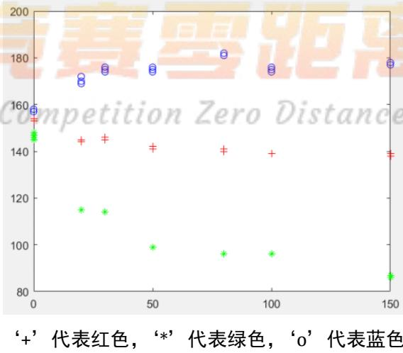

<details>
<summary>scatter</summary>

| Series | X | Y |
| --- | --- | --- |
| Red | ~2 | ~153 |
| Red | ~2 | ~148 |
| Red | ~2 | ~147 |
| Red | ~2 | ~146 |
| Red | ~2 | ~145 |
| Red | ~2 | ~144 |
| Red | ~2 | ~143 |
| Red | ~2 | ~142 |
| Red | ~2 | ~141 |
| Red | ~2 | ~140 |
| Red | ~2 | ~139 |
| Red | ~2 | ~138 |
| Red | ~2 | ~137 |
| Red | ~2 | ~136 |
| Red | ~2 | ~135 |
| Red | ~2 | ~134 |
| Red | ~2 | ~133 |
| Red | ~2 | ~132 |
| Red | ~2 | ~131 |
| Red | ~2 | ~130 |
| Red | ~2 | ~129 |
| Red | ~2 | ~128 |
| Red | ~2 | ~127 |
| Red | ~2 | ~126 |
| Red | ~2 | ~125 |
| Red | ~2 | ~124 |
| Red | ~2 | ~123 |
| Red | ~2 | ~122 |
| Red | ~2 | ~121 |
| Red | ~2 | ~120 |
| Red | ~2 | ~119 |
| Red | ~2 | ~118 |
| Red | ~2 | ~117 |
| Red | ~2 | ~116 |
| Red | ~2 | ~115 |
| Red | ~2 | ~114 |
| Red | ~2 | ~113 |
| Red | ~2 | ~112 |
| Red | ~2 | ~111 |
| Red | ~2 | ~110 |
| Red | ~2 | ~109 |
| Red | ~2 | ~108 |
| Red | ~2 | ~107 |
| Red | ~2 | ~106 |
| Red | ~2 | ~105 |
| Red | ~2 | ~104 |
| Red | ~2 | ~103 |
| Red | ~2 | ~102 |
| Red | ~2 | ~101 |
| Red | ~2 | ~100 |
| Red | ~2 | ~99 |
| Red | ~2 | ~98 |
| Red | ~2 | ~97 |
| Red | ~2 | ~96 |
| Red | ~2 | ~95 |
| Red | ~2 | ~94 |
| Red | ~2 | ~93 |
| Red | ~2 | ~92 |
| Red | ~2 | ~91 |
| Red | ~2 | ~90 |
| Red | ~2 | ~89 |
| Red | ~2 | ~88 |
| Red | ~2 | ~87 |
| Red | ~2 | ~86 |
| Red | ~2 | ~85 |
| Red | ~2 | ~84 |
| Red | ~2 | ~83 |
| Red | ~2 | ~82 |
| Red | ~2 | ~81 |
| Red | ~2 | ~80 |
| Green | 0~500~1500 | 86~175 |
</details>

图5-11 RGB值与浓度(二氧化硫)的散点图

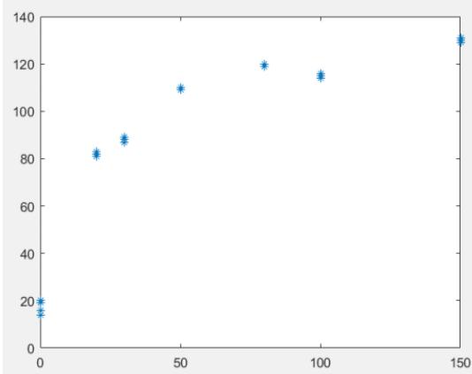

<details>
<summary>scatter</summary>

| X | Y |
| --- | --- |
| ~1 | ~20 |
| ~1 | ~15 |
| ~20 | ~82 |
| ~30 | ~88 |
| ~50 | ~110 |
| ~80 | ~120 |
| ~100 | ~115 |
| ~150 | ~130 |
</details>

图5-12(a)H值与浓度(二氧化硫)的散点图

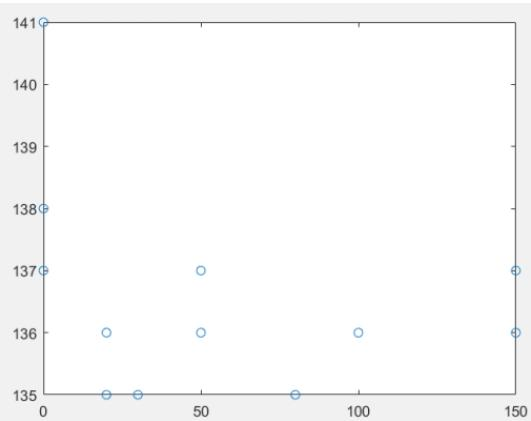

<details>
<summary>scatter</summary>

| X | Y |
| --- | --- |
| 0 | 141 |
| 0 | 138 |
| 0 | 137 |
| ~20 | 135 |
| ~30 | 135 |
| ~50 | 137 |
| ~50 | 136 |
| ~80 | 135 |
| ~100 | 136 |
| 150 | 137 |
| 150 | 136 |
</details>

图 5-12(b) S值与浓度(二氧化硫)的散点图

从上述图中可以发现，随着浓度的的增加， 值与 值的没有明显的变化规律。而H值有明显的变化，当浓度较小时，H值快速增加，当浓度很大时，H 值增加较慢，趋于一个稳定值。因此，可以根据 Michaelis-Menten 模型构建 H 值与浓度的回归方程。

将H值与二氧化硫浓度值的数据代入模型（3），其中，浓度作为自变量，H值作为因变量。作为利用nlinfit 函数求解，可得出结果（见表5-19）。

表5-19 二氧化硫浓度的回归结果

<table><tr><td>参数</td><td>参数估计值</td><td>参数置信区间</td></tr><tr><td> $\beta_0$ </td><td>140.8184</td><td>[129.4161, 152.2207]</td></tr><tr><td> $\beta_1$ </td><td>15.8583</td><td>[10.2000, 21.5167]</td></tr></table>

拟合后的结果与原始数据进行对比见图5-13，且模型的剩余标准差 s=9.1231。

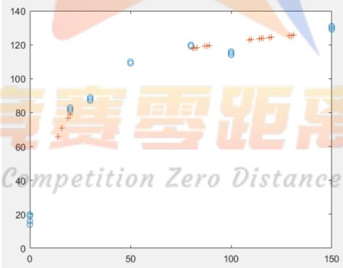

<details>
<summary>scatter</summary>

| X | Blue (circle) | Orange (plus) |
| --- | --- | --- |
| ~1 | ~20 | — |
| ~1 | ~16 | — |
| ~1 | ~14 | — |
| ~15 | — | ~67 |
| ~18 | ~83 | ~71 |
| ~20 | ~84 | ~78 |
| ~30 | ~89 | — |
| ~50 | ~110 | — |
| ~80 | ~120 | ~118 |
| ~90 | — | ~120 |
| ~100 | ~115 | — |
| ~110 | — | ~123 |
| ~120 | — | ~124 |
| ~130 | — | ~126 |
| ~150 | ~130 | — |
</details>

图5-13 模型（3）的预测结果(H值与二氧化硫浓度)  
（‘+’代表拟合结果，‘o’代表原始数据）

由上图可知，拟合效果良好，且回归系数的置信区间没有包含零点，说明模型是完全可用的。将回归得出的系数代入模型（3）可得方程

$$
y = \frac {1 4 0 . 8 1 8 4 x}{1 5 . 8 5 8 3 + x}
$$

求解反函数得： $x = { \frac { 1 5 . 8 5 8 3 \cdot y } { 1 4 0 . 8 1 8 4 - y } }$ ，则浓度与H值的预测方程为

$$
\hat {M} = \frac {1 5 . 8 5 8 3 \cdot H}{1 4 0 . 8 1 8 4 - H}.
$$

## 5.2.2 误差分析及模型改进

利用 nlintool 函数做出上述 Michaelis-Menten 模型的预测和结果输出图。

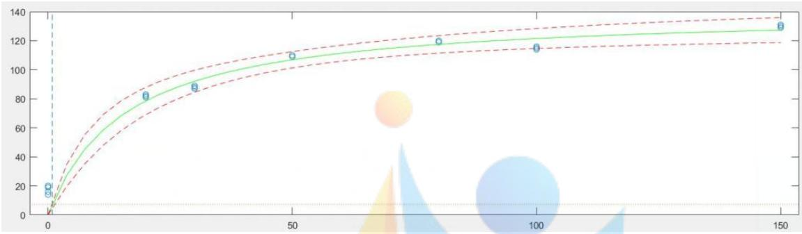

<details>
<summary>line</summary>

| X | Y |
| --- | --- |
| ~0 | ~20 |
| ~0 | ~18 |
| ~0 | ~15 |
| ~20 | ~82 |
| ~30 | ~88 |
| ~50 | ~110 |
| ~80 | ~120 |
| ~100 | ~115 |
| ~150 | ~130 |
</details>

图5-14（a） H 值与二氧化硫浓度的预测及结果输出

可以看到，除了浓度为 0和100时的点，其他的原始数据都在模型的预测区间内，说明模型整体是可行的。

如果删去上述异常点，重新求解，其预测和结果输出图，

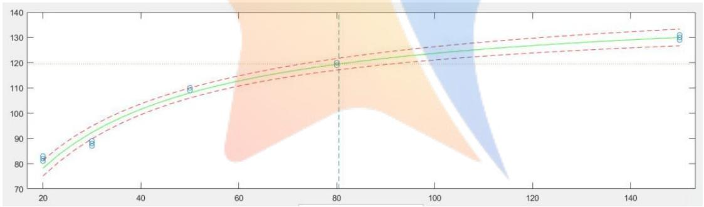

<details>
<summary>line</summary>

| X | Y (Line) | Y (Upper Bound) | Y (Lower Bound) |
| --- | --- | --- | --- |
| 20 | ~83 | ~84 | ~79 |
| 30 | ~88 | ~90 | ~86 |
| 50 | ~110 | ~111 | ~108 |
| 80 | ~120 | ~122 | ~118 |
| 150 | ~130 | ~133 | ~127 |
</details>

图 5-14（b）H值与二氧化硫浓度的预测及结果输出

剩余标准差 s= 2.9233，可以发现剩余标准差较原模型更小，且预测区间的长度也大幅缩短。

表5-20预测值与预测区间的比较（预测区间为预测值±Δ）

<table><tr><td>浓度</td><td>实际数据平均值</td><td>模型1预测值</td><td>△1</td><td>模型2预测值</td><td>△2</td></tr><tr><td>20</td><td>82.0000</td><td>78.5415</td><td>9.4315</td><td>78.2285</td><td>3.1057</td></tr><tr><td>50</td><td>109.6667</td><td>106.9101</td><td>5.6072</td><td>108.0142</td><td>1.9913</td></tr><tr><td>80</td><td>119.3333</td><td>117.5221</td><td>6.0305</td><td>119.3775</td><td>2.2909</td></tr></table>

计算出删去上述异常点后模型的回归结果（见表5-20）。

表 5-21二氧化硫浓度的回归结果(删去上述异常点)

<table><tr><td>参数</td><td>参数估计值</td><td>参数置信区间</td></tr><tr><td> $\beta_0$ </td><td>144.7591</td><td>[140.4610, 149.0571]</td></tr><tr><td> $\beta_1$ </td><td>17.0093</td><td>[15.0094, 19.0092]</td></tr></table>

同理求解反函数可得到浓度与 H值的预测方程为

$$
\hat {M} = \frac {1 7 . 0 0 9 3 \cdot H}{1 4 4 . 7 5 9 1 - H}.
$$

给出上述 $\hat { M }$ 与实际浓度的残差图，可以发现该模型的预测值的误差基本控制在 10%以内。

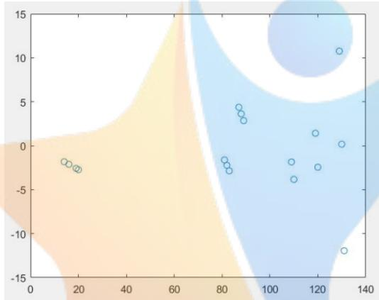

<details>
<summary>scatter</summary>

| X | Y |
| --- | --- |
| ~12 | ~-1.8 |
| ~14 | ~-1.9 |
| ~16 | ~-2.3 |
| ~18 | ~-2.5 |
| ~82 | ~-1.7 |
| ~83 | ~-2.0 |
| ~84 | ~-2.7 |
| ~86 | ~4.6 |
| ~87 | ~3.8 |
| ~88 | ~3.0 |
| ~109 | ~-1.7 |
| ~110 | ~-3.7 |
| ~119 | ~1.5 |
| ~120 | ~-2.3 |
| ~130 | ~10.8 |
| ~131 | ~0.2 |
| ~132 | ~-11.8 |
</details>

图5-15 实际浓度残差图

## 5.3问题三模型的建立与求解

## 5.3.1 数据量对模型的影响

由于本文是采用回归分析模型，它对样本数据量具有很强的依赖性。样本的容量太小会导致难以保证参数估计值的精确度和可靠性<sup>[4]</sup>。因此，单纯从建模需要来讲，样本容量肯定是越大越好。如在问题一中的溴酸钾溶液数据，共 10 组数据，如果去掉有重复值的5组，再建立模型，其计算结果如表 5-22：

表 5-22溴酸钾溶液的回归结果（去重复值）

<table><tr><td>参数</td><td>参数估计值</td><td>参数置信区间</td></tr><tr><td> $\beta_0$ </td><td>707.9887</td><td>[272.6000, 1143.4000]</td></tr><tr><td> $\beta_1$ </td><td>-5.1104</td><td>[-8.4000, -1.8000]</td></tr><tr><td colspan="3"> $R^2 = 0.8892$  F=24.0795 p=0.0162  $s^2 = 230.8016$ </td></tr></table>

该结果较之前表5-4的结果有明显的变化，其中 $R ^ { 2 }$ ，F值变小， $p , s ^ { 2 }$ 明显增大，且回归系数的置信区间长度也明显变大，说明模型的拟合效果明显减弱。

另一方面，收集样本数据量是一件困难的工作，因此，选择合适的样本数据量，是一个非常重要的问题。一般，满足基本要求的样本容量需满足 $n \geq 3 0$ 或者 $n \geq 3 ( k + 1 )$ 其中k为解释变量的数目。

综上所述，建议数字比色法的数据量至少达到 12组，尽量做到数据分布均匀，当数据间隔较大时，可对同组数据进行多次测量。

## 5.3.2 颜色维度对模型的影响

一般，数字比色法是根据显色溶液的特点来选择不同的颜色模型进行分析，如在前两问中有分别用灰度值颜色模型、HSV颜色模型、RGB颜色模型进行一元回归建模。如果对于某种溶液， 值与 值都随着浓度的变化有明显的变化规律，那我们可以综合多种颜色模型来建立模型。

如问题一中工业碱溶液的模型是根据灰度值颜色模型来进行回归分析，可以发现其H值、S 值与浓度也有着明显的线性关系，见图 5-16：

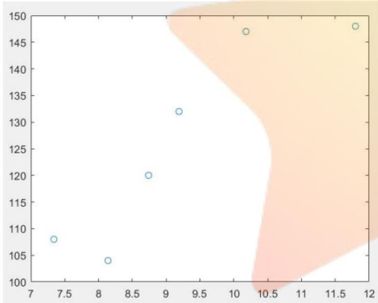

<details>
<summary>scatter</summary>

| X | Y |
| --- | --- |
| ~7.3 | ~108 |
| ~8.2 | ~104 |
| ~8.7 | ~120 |
| ~9.2 | ~132 |
| ~10.2 | ~147 |
| ~11.8 | ~148 |
</details>

图5-16（a） H 值与浓度(工业碱)的散点图

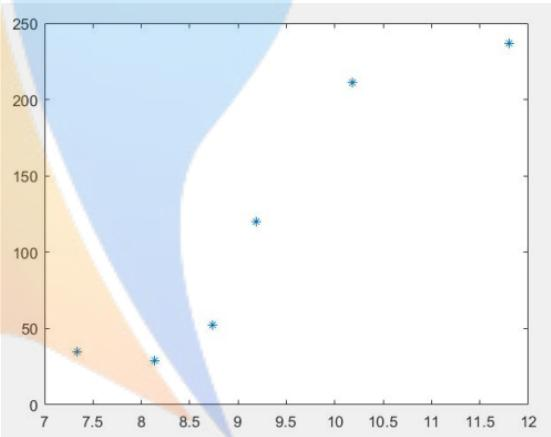

<details>
<summary>scatter</summary>

| X | Y |
| --- | --- |
| ~7.3 | ~35 |
| ~8.2 | ~30 |
| ~8.7 | ~52 |
| ~9.2 | ~120 |
| ~10.2 | ~212 |
| ~11.8 | ~238 |
</details>

图 5-16（b） S值与浓度(工业碱)的散点图

因此，我们可以用灰度值、H值和S 值对浓度进行多元回归分析，建立多元线性回归模型：

$$
M = \beta_ {0} + \beta_ {1} H + \beta_ {2} S + \beta_ {3} L + \tag {5}
$$

其中 $\beta _ { 0 } , \beta _ { 1 } , \beta _ { 2 } , \beta _ { 3 }$ 为回归系数。利用 regress 函数求解，其结果见表5-23：

表 5-23 多元线性回归结果

<table><tr><td>参数</td><td>参数估计值</td><td>参数置信区间</td></tr><tr><td> $\beta_0$ </td><td>17.7632</td><td>[-32.1469,67.6732]</td></tr><tr><td> $\beta_1$ </td><td>-0.1161</td><td>[-0.6480,0.4158]</td></tr><tr><td> $\beta_2$ </td><td>0.0285</td><td>[-0.0475,0.1045]</td></tr><tr><td> $\beta_3$ </td><td>0.0283</td><td>[-0.0807,0.1373]</td></tr><tr><td colspan="3"> $R^2 = 0.9283 \text{ F=8.6265 } p=0.1057 \text{ } s^2 = 0.4487$ </td></tr></table>

其中 $p > 0 . 0 5$ ，且每个回归系数的置信区间都包含零点，说明该模型是不可行的。

而如果用RGB值、H 值和S 值对浓度进行多元回归分析，可以计算出结果，见表5-24.

表 5-24 多元回归分析（RGB、H、S）

<table><tr><td>参数 $\leftrightarrow$ </td><td>参数估计值 $\leftrightarrow$ </td><td>参数置信区间 $\leftrightarrow$ </td></tr><tr><td> $\beta_0 \leftrightarrow$ </td><td>93.7528 $\leftrightarrow$ </td><td>NaN $\leftrightarrow$ </td></tr><tr><td> $\beta_1 \leftrightarrow$ </td><td>0.0497 $\leftrightarrow$ </td><td>NaN $\leftrightarrow$ </td></tr><tr><td> $\beta_2 \leftrightarrow$ </td><td>-0.4187 $\leftrightarrow$ </td><td>NaN $\leftrightarrow$ </td></tr><tr><td> $\beta_3 \leftrightarrow$ </td><td>-0.1260 $\leftrightarrow$ </td><td>NaN $\leftrightarrow$ </td></tr><tr><td> $\beta_4 \leftrightarrow$ </td><td>-0.0934 $\leftrightarrow$ </td><td>NaN $\leftrightarrow$ </td></tr><tr><td> $\beta_5 \leftrightarrow$ </td><td>-0.2482 $\leftrightarrow$ </td><td>NaN $\leftrightarrow$ </td></tr><tr><td colspan="3"> $R^2 = 1$  F=NaN p= NaN  $s^2 = NaN$  $\leftrightarrow$ </td></tr></table>

说明拟合的效果非常好。其预测值与原始数据对比见表 5-25：

表5-25 预测值与原始数据对比

<table><tr><td>源数据浓度</td><td>7.34</td><td>8.14</td><td>8.74</td><td>9.19</td><td>10.18</td><td>11.8</td></tr><tr><td>计算数据浓度</td><td>7.34000000000003</td><td>8.14000000000005</td><td>8.74000000000005</td><td>9.19000000000004</td><td>10.18000000000010</td><td>11.80000000000010</td></tr><tr><td>误差绝对值</td><td>3.01981E-14</td><td>4.9738E-14</td><td>4.9738E-14</td><td>4.08562E-14</td><td>9.9476E-14</td><td>9.9476E-14</td></tr></table>

综上所述，颜色维度对模型的影响好坏不能一概而论，要结合具体的实验数据进行讨论。如果能选择合理的颜色模型搭配进行建模，则可以提高模型精度。反之，盲目的提高颜色维度进行建模，可能会降低模型的效果。

## 六、模型的评价与推广

## 6.1 模型的评价

本文根据数字比色法的基本思想，灵活运用 EXCEL， MATLAB对所给数据进行处理，建立了统计回归模型，且模型的拟合效果整体良好，充分说明了颜色读数与浓度之间的关系。当然，由于对颜色模型的转换关系与所给数据的局限性，无法选用更好的颜色模型来建立模型。

## 6.2模型的推广

本文在主要运用了统计回归模型，如一元线性回归模型，非线性回归模型及多元回归模型，其具有有效性高，适用范围广的特点，可推广到农药残留检测、水质检测、生物分子检查等领域。

## 七、参考文献

[1] 杨冬冬,张校亮,崔彩娥 基于智能手机数字比色法的有机磷农残快速检测技术研究 《分析测试学报》 34 (10) :1179-1184 2015

[2] 李海燕 基于颜色主波长和补色波长的比色法定量检测 太原理工大学毕业论文 2016  
[3] 姜启源 谢金星 叶俊 数学建模（第四版） 高等教育出版社 2011  
[4] 实验方法评价与数据处理  
https://wenku.baidu.com/view/c4f163780029bd64783e2cf8.html?qq-pf-to=pcqq.discussion  
[5]百度文库 样本容量  
https://baike.baidu.com/item/%E6%A0%B7%E6%9C%AC%E5%AE%B9%E9%87%8F/155153?fr=aladdi n

## 八、附件

以下程序按上文中图标顺序排列：  
图 5-1 程序  
```matlab
clc,clear;
load za.txt;
B=za(:,1);B=B';
G=za(:,2);G=G';
R=za(:,3);R=R';
H=za(:,4);H=H';
S=za(:,5);S=S';
y=za(:,6);y=y';
plot(y,R,'r+',y,G,'G*',y,B,'bo')
表 5-2 程序
clc,clear;
L=[76;74;91;92;101;101;103;102;109;108];
y=[100;100;50;50;25;25;12.5;12.5;0;0];
x=[ones(10,1),L];
[b,bint,r,rint,stats]=regress(y,x)
```

图 5-2 程序  
```matlab
clc,clear;
load xsj.txt;
B=xsj(:,1);B=B';
G=xsj(:,2);G=G';
R=xsj(:,3);R=R';
H=xsj(:,4);H=H';
S=xsj(:,5);S=S';
y=xsj(:,6);y=y';
plot(y,R,'r+',y,G,'G*',y,B,'bo')
```  
表 5-4 程序

```matlab
L=[122;122;127;127;131;132;135;135;141;140];
y=[100;100;50;50;25;25;12.5;12.5;0;0];
x=[ones(10,1),L];
[b,bint,r,rint,stats]=regress(y,x)
表 5-5 程序
L=[122;122;127;127;131;132;135;135;141;140];
y=[100;100;50;50;25;25;12.5;12.5;0;0];
for (i=1:10)
    lt(i,1)=L(i,1)*L(i,1);
end
```

```matlab
x=[ones(10,1),1t,L];
[b,bint,r,rint,stats]=regress(y,x)
```  
图 5-3 程序

```matlab
clc, clear;
load  gyj. txt;
B=gyj(:,1);B=B' ;
G=gyj(:,2);G=G' ;
R=gyj(:,3);R=R' ;
H=gyj(:,4);H=H' ;
S=gyj(:,5);S=S' ;
y=gyj(:,6);y=y' ;
plot(y,R,'r+',y,G,'G*',y,B,'bo')
```  
表 5-7 程序

```matlab
clc, clear;
L=[41 62 104 130 140 139      140];
y=[11.8   10.18   9.19   8.74   8.14   7.34   0];
x=[ones(7,1),L'];
[b,bint,r,rint,stats]=regress(y',x)
rcoplot(r,rint)
```

表 5-8 程序  
```javascript
clc,clear;
L=[41 62 104 130 140 139   ];
y=[11.8  10.18  9.19  8.74  8.14  7.34   ];
x=[ones(6,1),L'];
[b,bint,r,rint,stats]=regress(y',x)
```  
图 5-5 程序

```matlab
clc,clear;
load lslj.txt;
B=1slj(:,1);B=B';
G=1slj(:,2);G=G';
R=1slj(:,3);R=R';
H=1slj(:,4);H=H';
S=1slj(:,5);S=S';
y=1slj(:,6);y=y';
plot(y,R,'r+',y,G,'G*',y,B,'bo')
```

图 5-6 程序  
```matlab
clc,clear;
load llsj.txt;
B=llsj(:,1);B=B';
G=llsj(:,2);G=G';
R=llsj(:,3);R=R';
H=llsj(:,4);H=H';
S=llsj(:,5);S=S';
L=llsj(:,6);L=L';
y=llsj(:,7);y=y';
plot(y,H,'*')
```

clc,clear;

load llsj.txt;

B=llsj(:,1);B=B';

G=llsj(:,2);G=G';

R=llsj(:,3);R=R';

H=llsj(:,4);H=H';

S=llsj(:,5);S=S';

L=llsj(:,6);L=L';

y=llsj(:,7);y=y';

plot(y,S,'o')

图 5-8 程序

clc,clear;

load llsj.txt;

B=llsj(:,1);B=B';

G=llsj(:,2);G=G';

R=llsj(:,3);R=R';

H=llsj(:,4);H=H';

S=llsj(:,5);S=S';

L=llsj(:,6);L=L';

y=llsj(:,7);y=y';

x=[ones(37,1),H'];

[b,bint,r,rint,stats]=regress(y',x)

%— 分析S—

[beta0]=[-6.5071 0.0847];

[beta,R,J]=nlinfit(y,S,'huaxue',beta0);

betaci=nlparci(beta,R,J);

beta,betaci

ss=beta(1)\*y./(beta(2)+y);

yy=(ss\*0.19)./(200.90-ss);

y1=y-yy;

plot(S,y1,'o');

nlintool(y,S,'huaxue',beta);

%— 分析h———

[beta0]=[-6.5071 0.0847];

[beta,R,J]=nlinfit(y,H,'huaxue',beta0);

betaci=nlparci(beta,R,J);

beta,betaci

hh=beta(1)\*y./(beta(2)+y);yy=S./2;

plot(y,H,'o',y,yy,'\*'),pause

nlintool(y,H,'huaxue',beta)

图 5-9 程序

clc,clear;

load nzns.txt;

B=nzns(:,1);B=B';

G=nzns(:,2);G=G';

R=nzns(:,3);R=R';

H=nzns(:,4);H=H';

S=nzns(:,5);S=S';

```matlab
y=nzns(:,6);y=y';
plot(y,R,'r+',y,G,'g*',y,B,'bo')
```

表 5-10 程序

<table><tr><td>B=[105</td><td>108</td><td>107</td><td>107</td><td>110</td><td>105</td><td>112</td><td>108</td><td>111</td><td>117</td><td>114</td><td>119</td><td>125</td><td>120</td><td>118];</td><td></td></tr><tr><td>G=[136</td><td>140</td><td>135</td><td>136</td><td>136</td><td>134</td><td>132</td><td>136</td><td>139</td><td>137</td><td>134</td><td>140</td><td>135</td><td>136</td><td>136];</td><td></td></tr><tr><td>R=[137</td><td>142</td><td>138</td><td>139</td><td>139</td><td>138</td><td>134</td><td>138</td><td>142</td><td>139</td><td>138</td><td>142</td><td>140</td><td>138</td><td>139];</td><td></td></tr><tr><td>H=[28</td><td>28</td><td>26</td><td>26</td><td>26</td><td>26</td><td>27</td><td>28</td><td>27</td><td>27</td><td>25</td><td>26</td><td>20</td><td>26</td><td>25];</td><td></td></tr><tr><td>S=[58</td><td>60</td><td>57</td><td>58</td><td>52</td><td>60</td><td>42</td><td>54</td><td>55</td><td>41</td><td>44</td><td>40</td><td>27</td><td>33</td><td>37];</td><td></td></tr><tr><td>L=[133</td><td>137</td><td>133</td><td>134</td><td>134</td><td>132</td><td>130</td><td>133</td><td>137</td><td>135</td><td>133</td><td>138</td><td>135</td><td>135</td><td>135];</td><td></td></tr><tr><td>y=[2000 0];</td><td colspan="2">2000</td><td colspan="2">2000</td><td colspan="2">1500</td><td colspan="2">1500</td><td colspan="2">1500</td><td colspan="2">1000</td><td>1000</td><td>500</td><td>500 500 5 0 0</td></tr></table>

```matlab
x=[ones(15,1),L'];
[b,bint,r,rint,stats]=regress(y',x)
```  
图 5-10（a）程序

```matlab
clc,clear;
load nzns.txt;
B=nzns(:,1);B=B';
G=nzns(:,2);G=G';
R=nzns(:,3);R=R';
H=nzns(:,4);H=H';
S=nzns(:,5);S=S';
y=nzns(:,6);y=y';
plot(y,H,'r*')
```  
图 5-10（b）程序

```matlab
clc,clear;
load nzns.txt;
B=nzns(:,1);B=B';
G=nzns(:,2);G=G';
R=nzns(:,3);R=R';
H=nzns(:,4);H=H';
S=nzns(:,5);S=S';
y=nzns(:,6);y=y';
plot(y,S,'bo')
```  
表 5-11 程序

```matlab
clc,clear;
B=[105 108 107 107 110 105 112 108 111 117 114 119 125 120 118];
G=[136 140 135 136 136 134 132 136 139 137 134 140 135 136 136];
R=[137 142 138 139 139 138 134 138 142 139 138 142 140 138 139];
H=[28 28 26 26 26 26 27 28 27 27 25 26 20 26 25];
S=[58 60 57 58 52 60 42 54 55 41 44 40 27 33 37];
L=[133 137 133 134 134 132 130 133 137 135 133 138 135 135 135];
y=[2000 2000 2000 1500 1500 1500 1000 1000 500 500 500 500 500 000];
x=[ones(15,1),S'];
[b,bint,r,rint,stats]=regress(y',x)
```  
表 5-12 程序

```matlab
clc,clear;
B=[105 108 107 107 110 105 112 108 111 117 114 119 125 120 118];
G=[136 140 135 136 136 134 132 136 139 137 134 140 135 136 136];
R=[137 142 138 139 139 138 134 138 142 139 138 142 140 138 139];
H=[28 28 26 26 26 26 27 28 27 27 25 26 20 26 25];
S=[58 60 57 58 52 60 42 54 55 41 44 40 27 33 37];
L=[133 137 133 134 134 132 130 133 137 135 133 138 135 135 135];
y=[2000 2000        2000        1500        1500        1500        1000        1000        500 500 500 5    0    0
    0];
x=[ones(15,1),B'];
[b,bint,r,rint,stats]=regress(y',x)
```

图 5-11 程序

clc,clear;

load que2.txt;

R=que2(:,1);

G=que2(:,2);

B=que2(:,3);

S=que2(:,4);

H=que2(:,5);

L=que2(:,6);

y=que2(:,7);

plot(y,R,'r+',y,G,'g\*',y,B,'bo')

图 5-12（a）程序

clc,clear;

load que2.txt;

R=que2(:,1);

G=que2(:,2);

B=que2(:,3);

S=que2(:,4);

H=que2(:,5);

L=que2(:,6);

y=que2(:,7);

plot(y,H,'\*')

图 5-12（b）程序

clc,clear;

load que2.txt;

R=que2(:,1);

G=que2(:,2);

B=que2(:,3);

S=que2(:,4);

H=que2(:,5);

L=que2(:,6);

y=que2(:,7);

plot(y,S,'o')

图 5-13 程序

clc,clear;

load que2.txt;

R=que2(:,1);

G=que2(:,2);

B=que2(:,3);

```matlab
S=que2(:,4);
H=que2(:,5);
L=que2(:,6);
y=que2(:,7);
x=[ones(25,1),H];
[b,bint,r,rint,stats]=regress(y,x);
[beta0]=[-19.8686 0.0082];
[beta,R,J]=nlinfit(y,H,'huaxue',beta0);
betaci=nlparci(beta,R,J);
beta,betaci
yy=beta(1)*H./(beta(2)+H);
plot(y,H,'o',H,yy,'+'),pause
nlintool(y,H,'huaxue',beta)
y1=(y./H-H./yy).*y;
plot(H,y1,'+')
```

图 5-14 程序  
```matlab
clc,clear;
load que2.txt;
R1=que2([6:18,22:25],1);
G1=que2([6:18,22:25],2);
B1=que2([6:18,22:25],3);
S1=que2([6:18,22:25],4);
H1=que2([6:18,22:25],5);
L1=que2([6:18,22:25],6);
y1=que2([6:18,22:25],7);
for(i=1:17)
```

```matlab
r(i,1)=R1(i,1)*R1(i,1);
h(i,1)=H1(i,1)*H1(i,1);
s(i,1)=S1(i,1)*S1(i,1);
l(i,1)=L1(i,1)*L1(i,1);
```

```matlab
end
x=[ones(17,1),H1];
[b,bint,r,rint,stats]=regress(y1,x)
[beta0]=[-219.1676 2.6916];
[beta,R,J]=nlinfit(y1,H1,'huaxue',beta0);
betaci=nlparci(beta,R,J);
beta,betaci
yy=beta(1)*H1./(beta(2)+H1);
plot(y1,H1,'o',H1,yy,'+'),pause
nlintool(y1,H1,'huaxue',beta)
y1=(y./H-H./yy).*y;
plot(H,y1,'+')
```

表 5-22 程序  
```txt
L=[122;127;131;135;141];
y=[100;50;25;12.5;0];
x=[ones(5,1),L];
[b,bint,r,rint,stats]=regress(y,x)
```  
图 5-16 程序

```txt
clc,clear;
```

H=[148 147 132 120 104 108];

S=[237 211 120 52 29 35];

y=[11.8 10.18 9.19 8.74 8.14 7.36];

plot(y,H,'bo')

clc,clear;

H=[148 147 132 120 104 108];

S=[237 211 120 52 29 35];

y=[11.8 10.18 9.19 8.74 8.14 7.36];

plot(y,S,'b\*')

表 5-23 程序

load gyj.txt;

B=gyj(1:6,1);B=B';

G=gyj(1:6,2);G=G';

R=gyj(1:6,3);R=R';

H=gyj(1:6,4);H=H';

S=gyj(1:6,5);S=S';

y=gyj(1:6,6);y=y';

L=[41;62;104;130;140;139];

x=[ones(6,1),H',S',L];

[b,bint,r,rint,stats]=regress(y',x)

y1=zeros(6,1);

表 5-24 程序

clc,clear;

load gyj.txt;

B=gyj(1:6,1);B=B';

G=gyj(1:6,2);G=G';

R=gyj(1:6,3);R=R';

H=gyj(1:6,4);H=H';

S=gyj(1:6,5);S=S';

y=gyj(1:6,6);y=y';

x=[ones(6,1),B',G',R',H',S'];

[b,bint,r,rint,stats]=regress(y',x)

y1=zeros(6,1);

for(i=1:6)

y1(i,1)=93.7527920768084+0.0497439440903447\*B(1,i)-0.418688069022750\*G(1,i)-0.12601055671600

1\*R(1,i)-0.0933912280209183\*H(1,i)-0.248218278476423\*S(1,i);

end