# 研究巡检路线的排班状况及优化问题

## 摘要

在确保某工厂能正常运行的情况下，以减少人力资源为目的，让工人生产力得到充分发挥且每名工人的工作量尽可能均衡，确定巡检人员数量，制定恰当的工作时间表和工作路线图。

针对问题一：以时间最短为目标函数建立多目标优化模型，采用0-1规划进行建立，先利用excel对附件的数据进行处理，借助 lingo 软件运行，结合人工对数据的整理，得出要完成该任务每班需要 5个工人巡检较为理想，该5个工人具体巡检时间（见表6-1至表6-5）和巡检路线（如图 6-2至图6-6）。

针对问题二：在问题一的基础上满足巡检工人 2小时左右休息一次，因固定上班时间，三班倒，则假设三个班在固定时间进餐，不考虑进餐时间，以时间最少为目标函数，增加约束条件，建立0-1 规划，利用 lingo软件运行以及对数据的整理，得到每班需要6个工人巡检较为理想，其巡检时间（见表6-7至表 6-12）和巡检路线（如图6-9至图6-14）。

针对问题三：在问题一和问题二的基础上，采用错时上班，从而增加目标函数，对其建立0-1规划模型，对问题一及问题二再次分别进行讨论，得出错时上班的问题一每班安排4人巡检合理，错时上班的问题二每班安排 5 人巡检合理，根据相关数据对比，可见错时上班更节省人力资源。

关键词

0-1 规划

排班

LINGO

EXCEL

## 1.问题重述

## 1.1 情况说明

为保障某化工厂正常运行，需对 26个位号进行巡检，每个巡检点要一个工人巡检，且每个工人巡检起始点为位号 XJ0022，每个班的上班时间可以固定也可错时，在能完成巡检任务的情况下，尽可能减少人力资源且使每个工人达到工作量均衡。

## 1.2相关信息

附件（shift1）:各个位号的周期与巡检耗时的基本信息

附件（shift2）:两个位点之间的连通以及行走的耗时数据

附件（shift3）:各个位点间的连通图

## 1.3需要解决的问题

（1）固定上班时间，三班倒，预测每班需要多少人，并呈现出巡检时间表以及巡检路线图。  
（2）不固定上班时间，三班倒，每个工人工作量达到 2小时左右，需要休息 5至10分钟，并且在中午12 点及下午6点左右进餐，进餐时间为半个小时，预测每班需要多少人，并呈现出巡检时间表以及巡检路线图。  
（3）在问题一和问题二的基础上，错时上班，再分别讨论问题一及问题二，进行比较，分析得出采用哪种上班方式更能减少人力资源。

## 2.问题分析

## 2.1问题一分析

问题一在固定时间上班，不涉及巡检人员的休息时间的情况下，采用三班倒，每班每天工作8小时左右，且尽量保障每名工人工作量平衡，且每个巡检点在8 小时左右都能按时完成巡检任务，为了让每个工人能充分发挥生产力，结合题意假设每个工人工作量之差的绝对值相差10分钟，同时考虑上个巡检点到下个巡检点的时间之和刚好等于下个巡检点的周期，以上均作为限制条件。为降低人力资源消耗，以时间最短（即所用工人最少）建立目标函数<sup>[1]</sup>，欲借助excel、linggo 软件进行数据处理和优化结果。因此为解决此问题，方便讨论，以一个班为基准建立 0-1规划模型，得出满足限制条件的最优安排工人人数、巡检时间表和巡检路线图。

## 2.2问题二分析

在问题一的基础上，需满足巡检工人2小时左右休息一次，休息时间为5-10分钟，并且在中午12点及下午 6点左右进餐，进餐时间为半个小时，为了方便建立优化模型，规定休息时间为10分钟，且不考虑进餐时间，类似问题一，以一个班为基准，同样为尽可能减少人力资源，以时间最少建立目标函数，增加了约束条件，利用 lingo 程序进行优化，得出满足限制条件的最优安排工人人数、巡检时间表和巡检路线图。

## 2.3问题三分析

在问题二的基础之上，采用错时上班，将问题 1 与问题 2 中的情况再次重新分析，综合考虑人力资源消耗尽可能的少和每名工人在 8 小时左右的工作量均衡等方面因素，为使工作最大化，人力资源最小化，建立合理多目标函数，利用 lingo软件分别给出错时上班最优化的巡检人数及巡检时间安排，并对问题一、问题二分别进行比对讨论，得出固定上班与错时上班哪一种上班方式更节省人力资源。


<details>
<summary>natural_image</summary>

Abstract star-shaped graphic with gradient colors (no text or symbols)
</details>

##

##

## 2.4解题思路

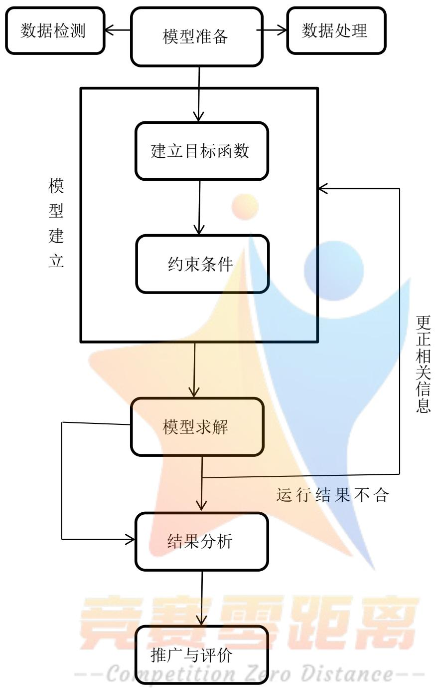

<details>
<summary>flowchart</summary>

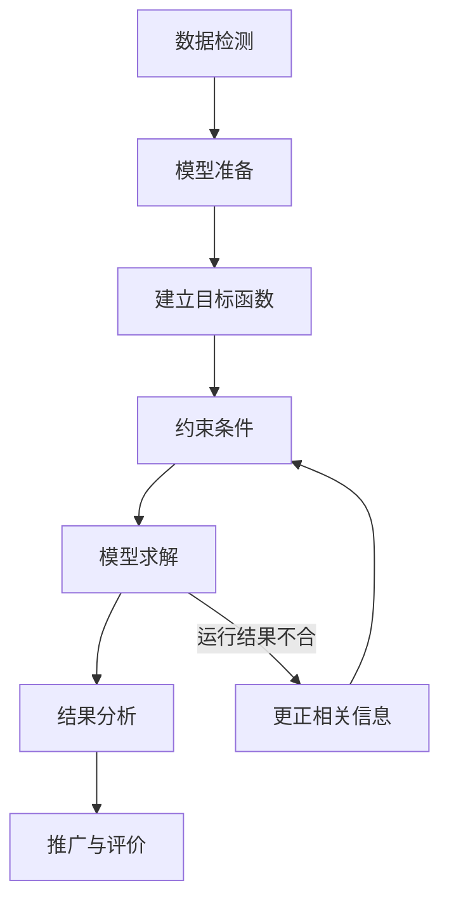
</details>

## 3.问题假设

（1）附件中给出的数据来源有效。  
（2）在巡检过程中，每个巡检人员的技术熟练程度相同，巡检耗时一定，不会出现特殊情况而耽误时间。  
（3）为减少人力资源且保障工作量均衡的情况下，假设每个班每个人均工作 8小时左右。  
（4）每名工人从第i处到第j处巡检点不考虑速度，则所需路程时间相同。  
（5）每个巡检点在同一时刻仅需一名工人解决巡检，且同一时刻一名工人只能巡检一个点。  
（6）每个班每次巡检完不考虑返回时间，只要工作时间达到就可以离开工作岗位。

## 4.符号说明

<table><tr><td> $t_{ij}$ </td><td>第i处到第j处巡检点路途中所消耗的时数(单位:分钟)其中 $i=j$ 时, $t_{ij}=0$ </td></tr><tr><td> $t_i$ </td><td>第i处巡检所消耗时数(分钟)</td></tr><tr><td> $T_i$ </td><td>第i处巡检周期(分钟)</td></tr><tr><td colspan="2"> $a_{ki}:0-1变量$  $a_{ki}=\begin{cases}0 & 第k个人没有到第i处巡检点\\1 & 第k个人到第i处巡检点\end{cases}$ </td></tr><tr><td colspan="2"> $a_{kj}:0-1变量$  $a_{kj}=\begin{cases}0 & 第k个人没有到第j处巡检点\\1 & 第k个人到第j处巡检点\end{cases}$ </td></tr><tr><td colspan="2"> $a_{k+s}:0-1变量$  $a_{k+s}=\begin{cases}0 & 第k+n个人没有到第s处巡检点\\1 & 第k+n个人有到第s处巡检点\end{cases}$ </td></tr><tr><td colspan="2"> $a_{22i}:0-1变量$  $a_{22i}=\begin{cases}1 & 从第22处巡检点到第i处巡检点\\0 & 从第22处巡检点没有到第i处巡检点\end{cases}$ </td></tr><tr><td colspan="2"> $a_{kp}:0-1变量$  $a_{kp}=\begin{cases}1 & 从第k处巡检点到第p处巡检点\\0 & 从第k处巡检点没有到第p处巡检点\end{cases}$ </td></tr><tr><td colspan="2"> $a^{(x)}_{ki}:0-1$ 变量  $a^{(x)}_{ki}=\begin{cases}1 & \text{X班第k个工人在第i处巡检}\\0 & \text{X班第k个工人不在第i处巡检}\end{cases}$ </td></tr><tr><td colspan="2">[cxc] 表示巡检点;  表示经过巡检点而不巡检</td></tr><tr><td colspan="2"> $\Longleftrightarrow$  表示行走路线方向</td></tr></table>

## 5.模型准备

## 5.1数据处理

（1）为了方便建立下列模型，对附件的巡检点位号进行编号由下表所示：

表 5-1 巡检点位号编号

<table><tr><td>位号</td><td>XJ-0001</td><td>XJ-0002</td><td>XJ-0003</td><td>XJ-0004</td><td>XJ-0005</td><td>XJ-0006</td><td>XJ-0007</td></tr><tr><td>编号</td><td>1</td><td>2</td><td>3</td><td>4</td><td>5</td><td>6</td><td>7</td></tr><tr><td>位号</td><td>XJ-0008</td><td>XJ-0009</td><td>XJ-0010</td><td>XJ-0011</td><td>XJ-0012</td><td>XJ-0013</td><td>XJ-0014</td></tr><tr><td>编号</td><td>8</td><td>9</td><td>10</td><td>11</td><td>12</td><td>13</td><td>14</td></tr><tr><td>位号</td><td>XJ-0015</td><td>XJ-0016</td><td>XJ-0017</td><td>XJ-0018</td><td>XJ-0019</td><td>XJ-0020</td><td>XJ-0021</td></tr><tr><td>编号</td><td>15</td><td>16</td><td>17</td><td>18</td><td>19</td><td>20</td><td>21</td></tr><tr><td>位号</td><td>XJ-0022</td><td>XJ-0023</td><td>XJ-0024</td><td>XJ-0025</td><td>XJ-0026</td><td></td><td></td></tr><tr><td>编号</td><td>22</td><td>23</td><td>24</td><td>25</td><td>26</td><td></td><td></td></tr></table>

（2）采用穷举法将第 i处到第j 处巡检点所需最短时间计算出来，得出第 i处到第j处巡检点所需最短时间汇总图<sup>[3]</sup>（见附件1）

## 5.2有效数据检测

因诸多原因，避免不了数据发生错误，下面分别对给出的周期、巡检耗时的数据中相对特别大的数据视为错误数据，对其进行检测（路程远近不同，因此巡检点之间的路程耗时数不在检测范围之内）<sup>[2]</sup>：

在26个巡检点的周期中其中有 4个数据相对平均值特别大，则

22×％ ≈85%周期数据正确率为： 26

在26个巡检点的巡检耗时数据中有 2个数据相对平均值特别大，则

巡检耗时数据正确率为： $\frac { 2 4 } { 2 6 } \times \% = 9 2 \%$

根据数据正确率达85%以上，在后面数据运用中认为是有效的。

## 6.模型的建立与求解

## 6.1问题一模型建立与求解

## 6.1.1 模型建立

在保障某化工厂26个巡检点能正常运行的情况下，需安排工人巡检，为了减少消耗的人力资源，使用工人人数尽可能少的情况下完成巡检任务。该问题因为固定时间上班，不考虑休息，采用三班倒的方式上班，故假设一个班在 8小时左右工作时间内巡检完了之后，下一个班再巡检，则以一个班建立模型即可。下面是一个班从i到j巡检点之间所有时间之和最小（即所用工人最少）为优化目标<sup>[4]</sup>，建立如下模型:

目标函数 1：

$$
\min Z = \sum_ {k = 1} ^ {n} \sum_ {i = 1} ^ {2 6} \sum_ {j = 1} ^ {2 6} a _ {k i} \cdot a _ {k j} \left(t _ {i j} + t _ {i} + T _ {\mathrm{i}}\right) + (1 - a _ {k 2 2}) \cdot N
$$

（一个班中所有工人从i到 $j$ 巡检点所有时间，即包括从i到 $j$ 路上耗时+巡检耗时+周期）

目标函数 2：

$$
\min N = \left\{b _ {1}, b _ {2}, b _ {3}, \dots , b _ {2 6} \right\}
$$

(第k个人从巡检点 22到巡检点i所有路程耗时的时间中取最短的时间)

其中b=8ai·aj b\_2 =6ak·aj b3 =7a·akj b4 =3aki·aj

$$
b _ {5} = 8 a _ {k i} \cdot a _ {k j} \quad b _ {6} = 8 a _ {k i} \cdot a _ {k j} \quad b _ {7} = 1 0 a _ {k i} \cdot a _ {k j} \quad b _ {8} = 9 a _ {k i} \cdot a _ {k j}
$$

$$
b _ {9} = 4 a _ {k i} \cdot a _ {k j} \quad b _ {1 0} = 1 3 a _ {k i} \cdot a _ {k j} \quad b _ {1 1} = 1 5 a _ {k i} \cdot a _ {k j} \quad b _ {1 2} = 1 8 a _ {k i} \cdot a _ {k j}
$$

..

（ $b _ { i }$ 表示巡检点22 到各个巡检点的最短时间）

因为工作时间8小时左右即工作量相差在 10分钟内都属于正常，由此，对N进行修正，取N的平均值为9，由上，得到最终目标函数：

$$
\min Z = \sum_ {k = 1} ^ {n} \sum_ {i = 1} ^ {2 6} \sum_ {j = 1} ^ {2 6} a _ {k i} \cdot a _ {k j} \left(t _ {i j} + t _ {i} + T _ {\mathrm{i}}\right) + (1 - a _ {k 2 2}) \cdot 9
$$

s t. .

$$
4 7 0 \leq \sum_ {i = 1} ^ {2 6} \sum_ {j = 1} ^ {2 6} a _ {k i} \cdot a _ {k j} (t _ {i j} + t _ {i}) + (1 - a _ {k 2 2}) \cdot 9 \leq 4 8 0 \quad (k = 1, 2, \dots .. n)
$$

（第k个人从巡检点 $\mathrm { i }$ 到巡检点j所花工作时间之和在 7时50分钟到8 小时之间即第k个人工作量为470 分钟至480分钟，以保障每个工人工作量在8小时左右）

$$
\sum_ {k = 1} ^ {n} a _ {k i} = \left[ \frac {4 8 0}{T _ {i}} \right] + 1
$$

（一班中所有工人在i处的巡检次数之和=8小时内第i处需要巡检的次数,避免在8小时内第i处巡检次数不够而导致不能正常运行）

$$
a _ {k i} \cdot (t _ {i j} + t _ {i}) = T _ {j} \quad (i, j = 1, 2, \dots .. 2 6) (k = 1, 2, \dots .. n)
$$

（第k个人在第i处巡检点的巡检耗时+从第 i处到第j处巡检点之间路程所用时间=第j处的周期，避免时间浪费或不够）<sup>[10]</sup>

$$
\left| \sum_ {i = 1} ^ {2 6} \sum_ {j = 1} ^ {2 6} a _ {k i} a _ {k j} \left(t _ {i j} + t _ {i}\right) - \sum_ {i = 1} ^ {2 6} \sum_ {j = 1} ^ {2 6} a _ {k + s i} \cdot a _ {k + s j} \cdot \left(t _ {i j} + t _ {i}\right) \right| \leq 1 0 \text {分钟}
$$

$$
(k, s = 1, 2, \dots .. n \text {且} k \neq s)
$$

（第k个人工作量与第 k+s个人工作量相差范围小于等于10分钟，以确保每名工人在上班8小时内工作量的平衡）

## 6.1.2 模型求解

利用LINGO软件编程<sup>[5]</sup> (见附件2）对上述模型进行计算，其根据运行结果得出要完成该任务需要5个工人，具体巡检情况见图 $6 { - } 1 { : }$

<table><tr><td>巡检站</td><td>1</td><td>2</td><td>3</td><td>4</td><td>5</td><td>6</td><td>7</td><td>8</td><td>9</td><td>10</td><td>11</td><td>12</td><td>13</td><td>14</td><td>15</td><td>16</td><td>17</td><td>18</td><td>19</td><td>20</td><td>21</td><td>22</td><td>23</td><td>24</td><td>25</td><td>26</td></tr><tr><td>第一人</td><td>1</td><td>1</td><td>0</td><td>1</td><td>0</td><td>0</td><td>0</td><td>0</td><td>0</td><td>0</td><td>0</td><td>0</td><td>0</td><td>0</td><td>0</td><td>0</td><td>0</td><td>0</td><td>1</td><td>1</td><td>1</td><td>1</td><td>0</td><td>0</td><td>0</td><td>0</td></tr><tr><td>第二人</td><td>0</td><td>0</td><td>1</td><td>0</td><td>1</td><td>1</td><td>1</td><td>1</td><td>1</td><td>0</td><td>0</td><td>0</td><td>0</td><td>1</td><td>0</td><td>0</td><td>1</td><td>0</td><td>0</td><td>0</td><td>0</td><td>0</td><td>1</td><td>1</td><td>1</td><td>0</td></tr><tr><td>第三人</td><td>0</td><td>0</td><td>1</td><td>0</td><td>0</td><td>1</td><td>0</td><td>1</td><td>1</td><td>0</td><td>0</td><td>0</td><td>0</td><td>1</td><td>0</td><td>0</td><td>0</td><td>0</td><td>0</td><td>0</td><td>0</td><td>0</td><td>1</td><td>1</td><td>0</td><td>0</td></tr><tr><td>第四人</td><td>0</td><td>0</td><td>0</td><td>0</td><td>0</td><td>0</td><td>0</td><td>0</td><td>0</td><td>0</td><td>1</td><td>0</td><td>1</td><td>0</td><td>0</td><td>1</td><td>0</td><td>1</td><td>0</td><td>0</td><td>0</td><td>0</td><td>0</td><td>0</td><td>0</td><td>0</td></tr><tr><td>第五人</td><td>0</td><td>0</td><td>0</td><td>0</td><td>0</td><td>0</td><td>0</td><td>0</td><td>0</td><td>1</td><td>0</td><td>1</td><td>0</td><td>0</td><td>1</td><td>0</td><td>0</td><td>0</td><td>0</td><td>0</td><td>0</td><td>0</td><td>0</td><td>0</td><td>0</td><td>1</td></tr></table>

图 6-1 工人到各巡检点巡检情况图  
（注释：1：表示工人到巡检点巡检； $0 { : }$ ：表示工人没有到该巡检点巡检）

通过图6-1可清楚知道每个工人到各个巡检点的巡检情况，并制定巡检时间表及路线图。假设两次检测的时间间隔的误差在正负 2分钟以内包括 2分钟，划分工作区域（按照路径最短即时间用得最少进行划分：利用lingo 软件运行可得，程序见附件 6）在固定时间上班的情况下，进行三班倒，每个巡检工人在固定的区域里巡检，以下分别是不同班五个巡检员在相同巡检点的不同巡检时间安排，且为工作时间 8小时左右中的一个循环划分的巡检时间情况和巡检路线图：

第一个巡检人员巡检时间表及巡检路线图：

表 6-1 第一个巡检人员巡检时间表

<table><tr><td>巡检点</td><td>一班</td><td>二班</td><td>三班</td></tr><tr><td>22</td><td>8:00-8:02</td><td>16:00-16:02</td><td>0:00-0:02</td></tr><tr><td>20</td><td>8:04-8:07</td><td>16:04-16:07</td><td>0:04-0:07</td></tr><tr><td>19</td><td>8:09-8:11</td><td>16:09-16:11</td><td>0:09-0:11</td></tr><tr><td>2</td><td>8:14-8:16</td><td>16:14-16:16</td><td>0:14-0:16</td></tr><tr><td>1</td><td>8:18-8:21</td><td>16:18-16:21</td><td>0:18-0:21</td></tr><tr><td>4</td><td>8:26-8:28</td><td>16:26-16:28</td><td>0:26-0:28</td></tr><tr><td>21</td><td>8:29-8:32</td><td>16:29-16:32</td><td>0:29-0:32</td></tr></table>

根据表6-1第一个巡检人员巡检时间表得第一个巡检人员巡检路线图<sup>[9]</sup>（见图6-2）：

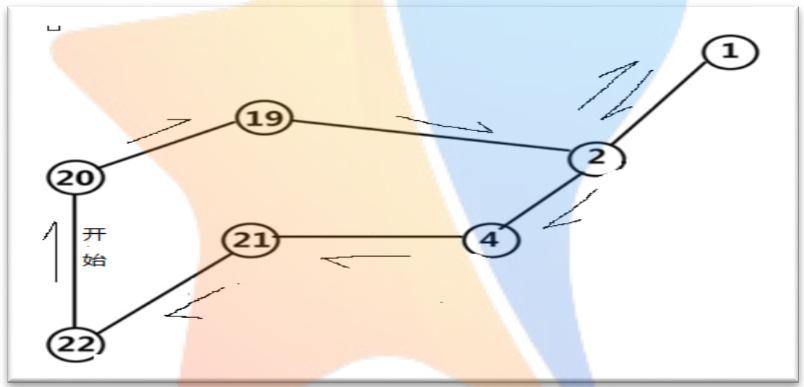

<details>
<summary>flowchart</summary>

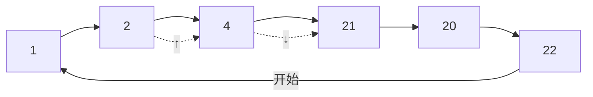
</details>

图 6-2 第一个巡检人员巡检路线图

由图6-2可知第一个巡检工人从巡检点 22开始巡检，按箭头指向分别巡检了巡检点22、巡检点20、巡检点 19、巡检点2、巡检点 1，再返回巡检点2进行巡检，由箭头指向继续向巡检点4、巡检点 21进行巡检，最后回到巡检点 22下班.

第二个巡检人员巡检时间表及巡检路线图：

表 6-2 第二个巡检人员巡检时间表

<table><tr><td>巡检点</td><td>一班</td><td>二班</td><td>三班</td></tr><tr><td>23</td><td>8:01-8:04</td><td>16:01-16:04</td><td>0:01-0:04</td></tr><tr><td>24</td><td>8:05-8:07</td><td>16:05-16:07</td><td>0:05-0:07</td></tr><tr><td>9</td><td>8:09-8:13</td><td>16:09-16:13</td><td>0:09-0:13</td></tr><tr><td>25</td><td>8:16-8:18</td><td>16:16-16:18</td><td>0:16-0:18</td></tr><tr><td>17</td><td>8:19-8:21</td><td>16:19-16:21</td><td>0:19-0:21</td></tr><tr><td>8</td><td>8:22-8:25</td><td>16:22-16:25</td><td>0:22-0:25</td></tr></table>

根据表6-2第二个巡检人员巡检时间表得第二个巡检人员巡检路线图（见图 6-3）：

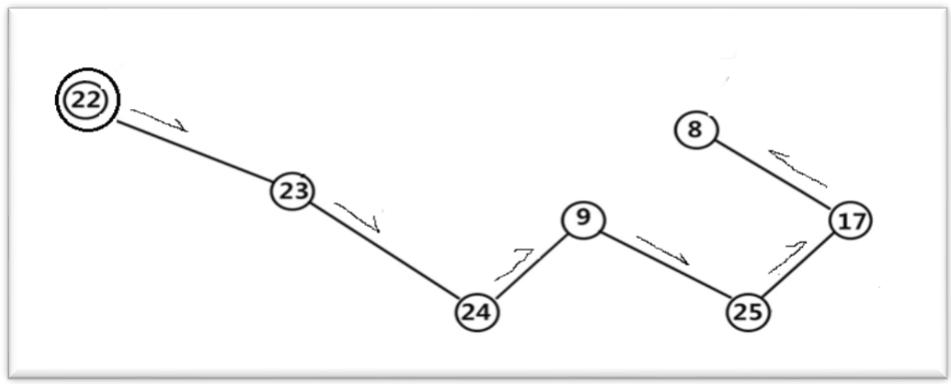

<details>
<summary>flowchart</summary>

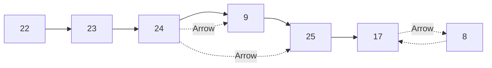
</details>

图 6-3 第二个巡检人员巡检路线图

由图6-3可知第二个巡检工人从巡检点22出发，经过巡检点22且不巡检，按箭头指向分别巡检了巡检点23、巡检点24、巡检点9、巡检点 25、巡检点17，巡检点 8，最后下班。

第三个巡检人员巡检时间表及巡检路线图：

表 6-3 第三个巡检人员巡检时间表

<table><tr><td>巡检点</td><td>一班</td><td>二班</td><td>三班</td></tr><tr><td>3</td><td>8:07-8:10</td><td>16:07-16:10</td><td>0:07-0:10</td></tr><tr><td>5</td><td>8:11-8:13</td><td>16:11-16:13</td><td>0:11-0:13</td></tr><tr><td>7</td><td>8:15-8:17</td><td>16:15-16:17</td><td>0:15-0:17</td></tr><tr><td>6</td><td>8:27-8:30</td><td>16:27-16:30</td><td>0:27-0:30</td></tr><tr><td>14</td><td>8:31-8:34</td><td>16:31-16:34</td><td>0:31-0:34</td></tr></table>

根据表6-3第三个巡检人员巡检时间表得第三个巡检人员巡检路线图（见图 6-4）：

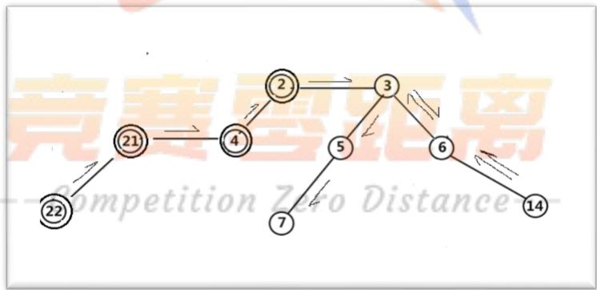

<details>
<summary>flowchart</summary>

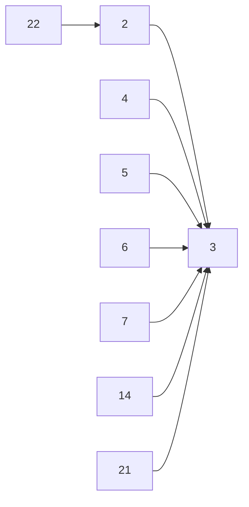
</details>

图 6-4 第三个巡检人员巡检路线图

由图6-4可知第三个巡检工人按箭头指向从巡检点 22出发，经过巡检点 22、巡检点21、巡检点4、巡检点 2且不巡检，到达巡检点 3，再以箭头指向分别对巡检点 3、巡检点6、巡检点14进行巡检，再原路返回到巡检点 3，又对巡检点5、巡检点 7进行巡检，最后下班。

第四个巡检人员巡检时间表及巡检路线图：

表 6-4 第四个巡检人员巡检时间表

<table><tr><td>巡检点</td><td>一班</td><td>二班</td><td>三班</td></tr><tr><td>18</td><td>8:18-8:20</td><td>16:18-16:20</td><td>0:18-0:20</td></tr><tr><td>16</td><td>8:23-8:26</td><td>16:23-16:26</td><td>0:23-0:26</td></tr><tr><td>13</td><td>8:28-8:33</td><td>16:28-16:33</td><td>0:28-0:33</td></tr><tr><td>11</td><td>8:35-8:38</td><td>16:35-16:38</td><td>0:35-0:38</td></tr></table>

根据表6-4第四个巡检人员巡检时间表得第四个巡检人员巡检路线图（见图 6-5）：

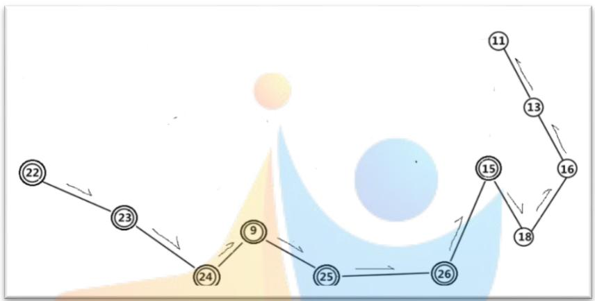

<details>
<summary>flowchart</summary>

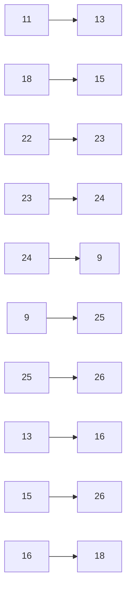
</details>

图 6-5 第四个巡检人员巡检路线图

由图6-5可知第四个巡检工人按箭头指向从巡检点 22出发，分别经过巡检点 22、巡检点23、巡检点24、巡检点 9、巡检点25、巡检点 26、巡检点15且不巡检，到了巡检点18分别对巡检点18、巡检点16、巡检点13和巡检点 11进行巡检，最后下班。

第五个巡检人员巡检时间表及巡检路线图：

表 6-5 第五个巡检人员巡检时间表

<table><tr><td>巡检点</td><td>一班</td><td>二班</td><td>三班</td></tr><tr><td>10</td><td>8:13-8:15</td><td>16:13-16:15</td><td>0:13-0:15</td></tr><tr><td>12</td><td>8:21-8:23</td><td>16:21-16:23</td><td>0:21-0:23</td></tr><tr><td>15</td><td>8:25-8:27</td><td>16:25-16:27</td><td>0:25-0:27</td></tr><tr><td>26</td><td>8:33-8:35</td><td>16:33-16:35</td><td>0:33-0:35</td></tr></table>

根据表6-5第五个巡检人员巡检时间表得第五个巡检人员巡检路线图（见图 6-6）：

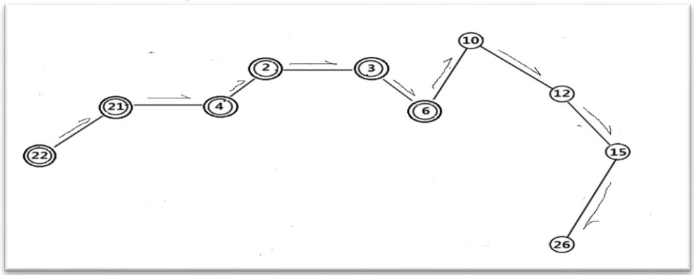

<details>
<summary>flowchart</summary>

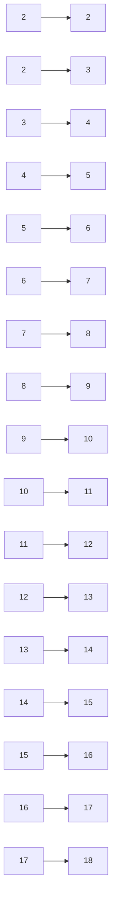
</details>

图 6-6 第五个巡检人员巡检路线图

由图6-6可知第五个巡检工人按箭头指向从巡检点 22出发，分别经过巡检点 22、巡检点21、巡检点4、巡检点 2、巡检点3、巡检点 6且不巡检，到了巡检点 10开始对巡检点10、巡检点12、巡检点 15及巡检点26进行巡检，最后下班。

## 6.1.3 结果分析

借助excel分别对五个人 8小时左右的工作量进行统计（见表6-6）。

表 6-6 五个人一天工作量汇总表<sup>[7]</sup>

<table><tr><td>人员</td><td>k1</td><td>k2</td><td>k3</td><td>k4</td><td>k5</td></tr><tr><td>工作量(分钟)</td><td>480</td><td>475</td><td>476</td><td>472</td><td>478</td></tr></table>

由表6-6绘制出其工作量饱和情况的饼形图，如图 6-7所示：

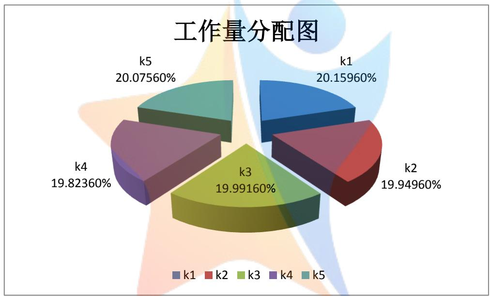

<details>
<summary>pie</summary>

| Category | Value (%) |
| --- | --- |
| k1 | 20.15960 |
| k2 | 19.94960 |
| k3 | 19.99160 |
| k4 | 19.82360 |
| k5 | 20.07560 |
</details>

图 6-7 五个工人工作量饱和状态图<sup>[6]</sup>

据饼形图非常清楚的显示出五个工人的工作量均达到饱和状态。根据表 6-6和图6-7反应出：工人在8小时左右的工作量，没有造成时间浪费或不够。工作量分配在19%-20%之间，满足了每名工人在 8小时左右工作量的均衡，因此针对该问题每班安排 5个工人巡检达到了优化人力资源的目的。

由于在求巡检点22到各巡检点最短时间进行了取平均值的处理，因此巡检人数可能存在合理的误差。

## 6.2问题二模型建立与求解

## 6.2.1 模型建立

在问题一基础之上，增加约束条件即每个工人在工作量达到 2 小时左右必须休息，并假设每个工人休息时间都为 10分钟，且在中午12 点和下午6点左右同时进餐，不考虑进餐时间，固定时间三班倒，以时间最少为优化目标，建立如下模型<sup>[8]</sup>：

$$
\min Z = \sum_ {k = 1} ^ {n} \sum_ {i = 1} ^ {2 6} \sum_ {j = 1} ^ {2 6} a _ {k i} \cdot a _ {k j} \left(t _ {i j} + t _ {i} + T _ {\mathrm{i}}\right) + (1 - a _ {k 2 2}) \cdot 9 - \sum_ {k = 1} ^ {n} \sum_ {i = 1} ^ {2 6} \sum_ {p = 1} ^ {2 6} a _ {k i} \cdot a _ {k p} \cdot 1 0
$$

（一个班所有工人以巡检点22为起点到 $j$ 巡检点所有时间-所有工人在各个休息点的休息时间，即包括从i到 $j$ 路上耗时+巡检耗时+周期-休息时间）

s t. .

$$
4 4 0 \leq \sum_ {i = 1} ^ {2 6} \sum_ {j = 1} ^ {2 6} a _ {k i} \cdot a _ {k j} (t _ {i j} + t _ {i}) + (1 - a _ {k 2 2}) \cdot 9 \leq 4 5 0 \quad (k = 1, 2, \dots .. n)
$$

（两个小时休息一次，在 8小时内需休息 3次，则第k个人工作量为440 分钟至450分钟）

$$
1 1 0 \leq \sum_ {p = 1} ^ {2 6} \sum_ {i = 1} ^ {2 6} a _ {k i} \cdot a _ {k j} (t _ {i j} + t _ {i}) + (1 - a _ {k 2 2}) \cdot 9 \leq 1 2 0 \quad (p \neq j)
$$

（110=<第k个人从巡检点 p到巡检点i所有工作量之和<=120）

$$
\sum_ {k = 1} ^ {n} a _ {k i} = \left[ \frac {4 8 0}{T _ {i}} \right] + 1
$$

（一班中所有工人在 $\mathrm { i }$ 处的巡检次数之和=8小时内第 $\mathrm { i }$ 处需要巡检的次数）

$$
a _ {k i} \cdot (t _ {i j} + t _ {i}) = T _ {j} \quad (i, j = 1, 2, \dots .. 2 6) (k = 1, 2, \dots .. n)
$$

（第 $\mathrm { k }$ 个人在第 $\mathrm { i }$ 处巡检点的巡检耗时+从第 $\mathrm { i }$ 处到第j处巡检点之间路程所用时间=第j处的周期）

$$
a _ {k + s m} \cdot (t _ {m j} + t _ {m}) = T _ {j} \quad (m \neq i)
$$

(第k+s个人在巡检点 m处的巡检时间m到j路程上的耗时刚好等于第j 个巡检点周期，则第k+s个人正好巡检第 j处巡检点)

$$
\left| \sum_ {i = 1} ^ {2 6} \sum_ {j = 1} ^ {2 6} a _ {k i} a _ {k j} (t _ {i j} + t _ {i}) - \sum_ {i = 1} ^ {2 6} \sum_ {j = 1} ^ {2 6} a _ {k + s i} \cdot a _ {k + s j} \cdot (t _ {i j} + t _ {i}) \right| \leq 1 0
$$

$$
(k, s = 1, 2, \dots .. n)
$$

（第 $\mathrm { k }$ 个人工作量与第 $\mathrm { k } { + } \mathrm { s }$ 个人工作量相差范围<=10分钟，确保每个工人工作量均衡）

## 6.2.2 模型求解

利用LINGO软件编程，对上述模型进行计算，部分程序（部分程序见附件 3），根据运行结果结合人工整理筛选出有用数据，得出要完成该任务需要 6个工人，具体巡检情况（见图6-8）。

<table><tr><td>巡检站</td><td>1</td><td>2</td><td>3</td><td>4</td><td>5</td><td>6</td><td>7</td><td>8</td><td>9</td><td>10</td><td>11</td><td>12</td><td>13</td><td>14</td><td>15</td><td>16</td><td>17</td><td>18</td><td>19</td><td>20</td><td>21</td><td>22</td><td>23</td><td>24</td><td>25</td><td>26</td></tr><tr><td>第一人</td><td>0</td><td>0</td><td>0</td><td>0</td><td>0</td><td>0</td><td>0</td><td>0</td><td>0</td><td>0</td><td>0</td><td>0</td><td>0</td><td>0</td><td>0</td><td>0</td><td>0</td><td>0</td><td>1</td><td>1</td><td>0</td><td>1</td><td>1</td><td>1</td><td>0</td><td>0</td></tr><tr><td>第二人</td><td>1</td><td>1</td><td>0</td><td>1</td><td>0</td><td>0</td><td>0</td><td>0</td><td>0</td><td>0</td><td>0</td><td>0</td><td>0</td><td>0</td><td>0</td><td>0</td><td>0</td><td>0</td><td>0</td><td>0</td><td>1</td><td>0</td><td>0</td><td>0</td><td>0</td><td>0</td></tr><tr><td>第三人</td><td>0</td><td>0</td><td>1</td><td>0</td><td>1</td><td>1</td><td>1</td><td>0</td><td>0</td><td>0</td><td>0</td><td>0</td><td>0</td><td>1</td><td>0</td><td>0</td><td>0</td><td>0</td><td>0</td><td>0</td><td>0</td><td>0</td><td>0</td><td>0</td><td>0</td><td>0</td></tr><tr><td>第四人</td><td>0</td><td>0</td><td>0</td><td>0</td><td>0</td><td>0</td><td>0</td><td>1</td><td>1</td><td>0</td><td>0</td><td>0</td><td>0</td><td>0</td><td>0</td><td>0</td><td>1</td><td>0</td><td>0</td><td>0</td><td>0</td><td>0</td><td>0</td><td>0</td><td>1</td><td>0</td></tr><tr><td>第五人</td><td>0</td><td>0</td><td>0</td><td>0</td><td>0</td><td>0</td><td>0</td><td>0</td><td>0</td><td>1</td><td>1</td><td>0</td><td>1</td><td>0</td><td>0</td><td>1</td><td>0</td><td>0</td><td>0</td><td>0</td><td>0</td><td>0</td><td>0</td><td>0</td><td>0</td><td>0</td></tr><tr><td>第六人</td><td>0</td><td>0</td><td>0</td><td>0</td><td>0</td><td>0</td><td>0</td><td>0</td><td>0</td><td>0</td><td>0</td><td>1</td><td>0</td><td>0</td><td>1</td><td>0</td><td>0</td><td>1</td><td>0</td><td>0</td><td>0</td><td>0</td><td>0</td><td>0</td><td>0</td><td>1</td></tr></table>

图 6-8 工人到各巡检点巡检情况表

（注释：1：表示工人到巡检点巡检；0：表示工人没有到该巡检点巡检）

通过图6-8可清楚知道每个工人到各个巡检点是否巡检情况，制定巡检时间表及路线图，分别如下：

第一个巡检人员巡检时间表及巡检路线图：

表 6-7 第一个巡检人员巡检时间表

<table><tr><td>巡检点</td><td>一班</td><td>二班</td><td>三班</td></tr><tr><td>24</td><td>8:02-8:04</td><td>16:02-16:04</td><td>0:02-0:04</td></tr><tr><td>23</td><td>8:05-8:08</td><td>16:05-16:08</td><td>0:05-0:08</td></tr><tr><td>22</td><td>8:09-8:11</td><td>16:09-16:11</td><td>0:09-0:11</td></tr><tr><td>20</td><td>8:13-8:16</td><td>16:13-16:16</td><td>0:13-0:16</td></tr><tr><td>19</td><td>8:18-8:20</td><td>16:18-16:20</td><td>0:18-0:20</td></tr></table>

根据表6-7第一个巡检人员巡检时间表得第一个巡检人员巡检路线图（见图 6-9）：

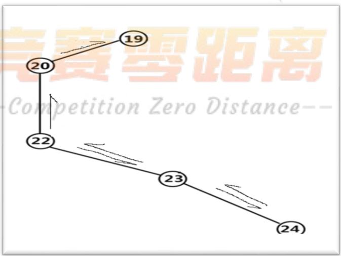

<details>
<summary>flowchart</summary>

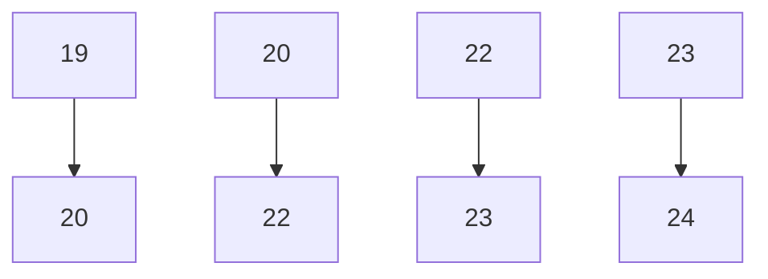
</details>

图 6-9 第一个巡检人员巡检路线图

由图6-8可知第一个巡检工人按箭头指向从巡检点 22出发，分别对巡检点 22、巡检点23、巡检点24进行巡检，再返回巡检点 23和巡检点 22，又按箭头指向对巡检点

20及巡检点19进行巡检，最后下班。

第二个巡检人员巡检时间表及巡检路线图：

表 6-8 第二个巡检人员巡检时间表

<table><tr><td>巡检点</td><td>一班</td><td>二班</td><td>三班</td></tr><tr><td>21</td><td>8:02-8:05</td><td>16:02-16:05</td><td>0:02-0:05</td></tr><tr><td>4</td><td>8:06-8:08</td><td>16:06-16:08</td><td>0:06-0:08</td></tr><tr><td>2</td><td>8:11-8:13</td><td>16:11-16:13</td><td>0:11-0:13</td></tr><tr><td>1</td><td>8:15-8:18</td><td>16:15-16:18</td><td>0:15-0:18</td></tr></table>

根据表6-8第二个巡检人员巡检时间表得第二个巡检人员巡检路线图（见图 6-10）：

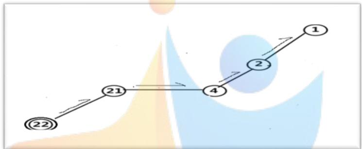

<details>
<summary>flowchart</summary>


</details>

图 6-10 第二个巡检人员巡检路线图

由图6-10可知第二个巡检工人按箭头指向从巡检点 22出发，经过巡检点 22且不巡检，分别对巡检点21、巡检点 4、巡检点2和巡检点 1进行巡检，最后下班。

第三个巡检人员巡检时间表及巡检路线图：

表 6-9 第三个巡检人员巡检时间表

<table><tr><td>巡检点</td><td>一班</td><td>二班</td><td>三班</td></tr><tr><td>14</td><td>8:09-8:12</td><td>16:09-16:12</td><td>0:09-0:12</td></tr><tr><td>6</td><td>8:13-8:16</td><td>16:13-16:16</td><td>0:13-0:16</td></tr><tr><td>3</td><td>8:17-8:20</td><td>16:17-16:20</td><td>0:17-0:20</td></tr><tr><td>5</td><td>8:21-8:23</td><td>16:21-16:23</td><td>0:21-0:23</td></tr><tr><td>7</td><td>8:25-8:27</td><td>16:25-16:27</td><td>0:25-0:27</td></tr></table>

根据表6-9第三个巡检人员巡检时间表得第三个巡检人员巡检路线图（见图 6-11）：

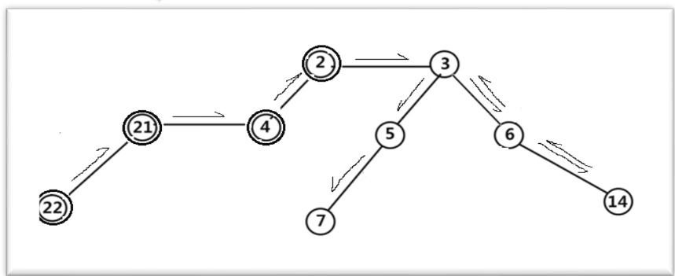

<details>
<summary>flowchart</summary>

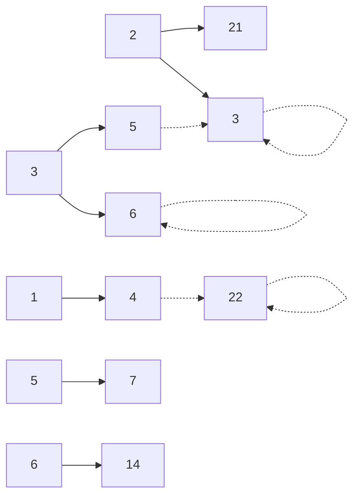
</details>

图 6-11 第三个巡检人员巡检路线图

由图6-11可知第三个巡检工人按箭头指向从巡检点 22出发且不巡检，分别经过巡检点21、巡检点4、巡检点 2都不巡检，到达巡检点 3，分别对巡检点3、巡检点 6、巡检点14进行巡检，然后原路返回到巡检点 3，再对巡检点 5和巡检点7进行巡检，最后下班。

第四个巡检人员巡检时间表及巡检路线图：

表 6-10 第四个巡检人员巡检时间表

<table><tr><td>巡检点</td><td>一班</td><td>二班</td><td>三班</td></tr><tr><td>9</td><td>8:04-8:08</td><td>16:04-16:08</td><td>0:04-0:08</td></tr><tr><td>25</td><td>8:11-8:13</td><td>16:11-16:13</td><td>0:11-0:13</td></tr><tr><td>17</td><td>8:14-8:16</td><td>16:14-16:16</td><td>0:14-0:16</td></tr><tr><td>8</td><td>8:17-8:20</td><td>16:17-16:20</td><td>0:17-0:20</td></tr></table>

根据表6-10第四个巡检人员巡检时间表得第四个巡检人员巡检路线图（见图 6-12）：

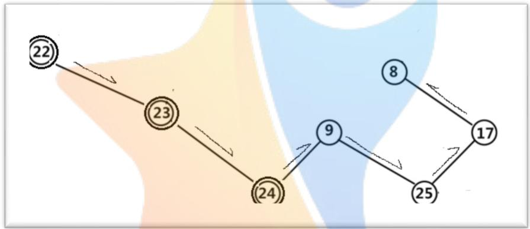

<details>
<summary>flowchart</summary>

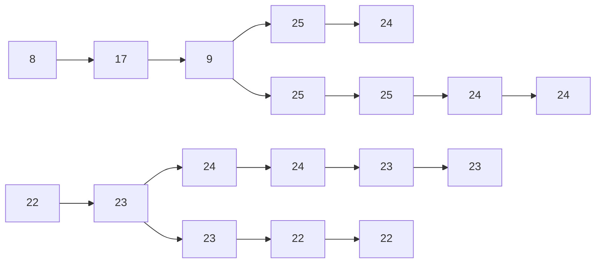
</details>

图 6-12 第四个巡检人员巡检路线图

由图6-12可知第四个巡检工人按箭头指向从巡检点 22出发且不巡检，经过巡检点23、巡检点24都不巡检，到达巡检点 9，按箭头指向分别对巡检点9、巡检点 25、巡检点17和巡检点8进行巡检，最后下班。

第五个巡检人员巡检时间表及巡检路线图：

表 6-11 第五个巡检人员巡检时间表

<table><tr><td>巡检点</td><td>一班</td><td>二班</td><td>三班</td></tr><tr><td>10</td><td>8:13-8:15</td><td>16:13-16:15</td><td>0:13-0:15</td></tr><tr><td>11</td><td>8:17-8:20</td><td>16:17-16:20</td><td>0:17-0:20</td></tr><tr><td>13</td><td>8:22-8:27</td><td>16:22-16:27</td><td>0:22-0:27</td></tr><tr><td>16</td><td>8:29-8:32</td><td>16:29-16:32</td><td>0:29-0:32</td></tr></table>

根据表6-11第五个巡检人员巡检时间表得第五个巡检人员巡检路线图（见图 6-13）：

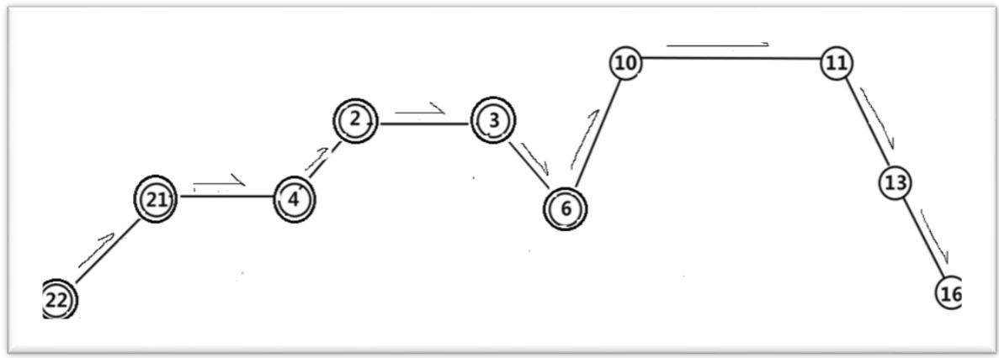

<details>
<summary>flowchart</summary>


</details>

图 6-13 第五个巡检人员巡检路线图

由图6-13可知第五个巡检工人按箭头指向从巡检点 22出发且不巡检，经过巡检点21、巡检点4、巡检点2、巡检点 3、巡检点6都不巡检，到达巡检点 10，按箭头指向分别对巡检点10、巡检点 11、巡检点13和巡检点 16进行巡检，最后下班。

第六个巡检人员巡检时间表及巡检路线图：

表 6-12 第六个巡检人员巡检时间表

<table><tr><td>巡检点</td><td>一班</td><td>二班</td><td>三班</td></tr><tr><td>26</td><td>8:10-8:12</td><td>16:10-16:12</td><td>0:10-0:12</td></tr><tr><td>15</td><td>8:18-8:20</td><td>16:18-16:20</td><td>0:18-0:20</td></tr><tr><td>18</td><td>8:22-8:24</td><td>16:22-16:24</td><td>0:22-0:24</td></tr><tr><td>12</td><td>8:28-8:30</td><td>16:28-16:30</td><td>0:28-0:30</td></tr></table>

根据表 6-12 第六个巡检人员巡检时间表得第六个巡检人员巡检路线图（见图 6-14）：

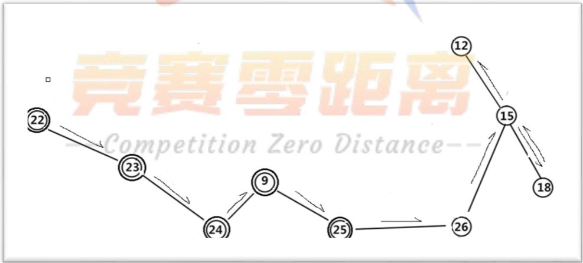

<details>
<summary>flowchart</summary>

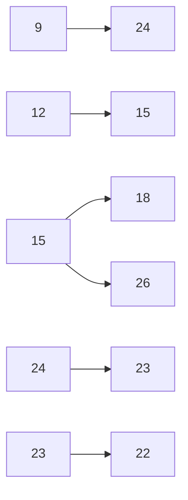
</details>

图 6-14 第五个巡检人员巡检路线图

由图6-14可知第六个巡检工人按箭头指向从巡检点 22出发且不巡检，经过巡检点23、巡检点24、巡检点9、巡检点25都不巡检，到达巡检点 26，按箭头指向分别对巡检点26、巡检点15、巡检点 18进行巡检，再原路返回到巡检点 15，对巡检点 12进行巡检，最后下班。

## 6.2.3 结果分析

借助excel分别对六个人8小时左右的工作量进行统计（见表 6-13）。

表 6-13 工人休息时间节点表

<table><tr><td>巡检次数</td><td>第一次</td><td>第二次</td><td>第三次</td><td>第四次</td><td>总工作时间(分钟)</td></tr><tr><td>第一人巡检时间点</td><td>9:51</td><td>11:52</td><td>14:21</td><td>16:22</td><td>444</td></tr><tr><td>第二人巡检时间点</td><td>9:52</td><td>11:54</td><td>14:22</td><td>16:24</td><td>448</td></tr><tr><td>第三人巡检时间点</td><td>9:57</td><td>12:00</td><td>14:27</td><td>16:24</td><td>455</td></tr><tr><td>第四人巡检时间点</td><td>9:50</td><td>11:50</td><td>14:20</td><td>16:20</td><td>440</td></tr><tr><td>第五人巡检时间点</td><td>10:03</td><td>12:00</td><td>14:33</td><td>16:26</td><td>456</td></tr><tr><td>第六人巡检时间点</td><td>10:03</td><td>12:00</td><td>14:33</td><td>16:26</td><td>456</td></tr></table>

由表6-13，利用excel将得到的六个工人巡检时间点由柱形图表现出来如图6-15：

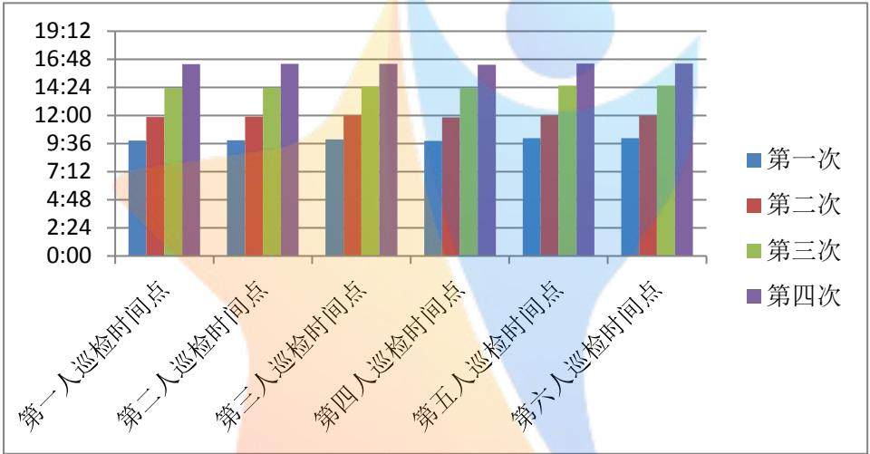

<details>
<summary>bar_stacked</summary>

| Category | 第一次 | 第二次 | 第三次 | 第四次 |
| --- | --- | --- | --- | --- |
| 第一人巡检时间点 | 9:36 | 12:00 | 14:24 | 16:48 |
| 第二人巡检时间点 | 9:36 | 12:00 | 14:24 | 16:48 |
| 第三人巡检时间点 | 9:36 | 12:00 | 14:24 | 16:48 |
| 第四人巡检时间点 | 9:36 | 12:00 | 14:24 | 16:48 |
| 第五人巡检时间点 | 9:36 | 12:00 | 14:24 | 16:48 |
| 第六人巡检时间点 | 9:36 | 12:00 | 14:24 | 16:48 |
</details>

图 6-15 六个工人休息时间节点图

根据图6-15，可清晰的观察出每个工人在工作量达到 2小时左右均达到了 10分钟休息时间。

由表6-13绘制出其工作量饱和情况的饼形图，如图 6-16所示：

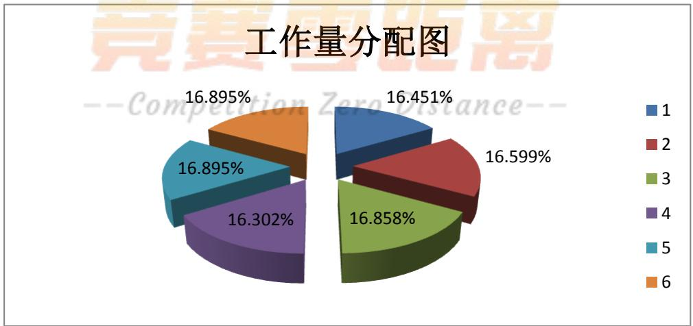

<details>
<summary>pie</summary>

| Category | Value (%) |
| --- | --- |
| 1 | 16.451 |
| 2 | 16.599 |
| 3 | 16.858 |
| 4 | 16.302 |
| 5 | 16.895 |
| 6 | 16.895 |
</details>

图 6-16 六个人工作量饱和状态图

据饼形图非常清楚的显示出六个工人在每2小时左右，必须休息10分钟情况下的工作量达到饱和状态。根据表 6-14和图6-14反应出：工人在8小时左右的工作量，没有造成时间浪费或不够。每名工人在8小时左右工作量分配在16.3%-16.9%之间，达到了工作量均衡，因此针对该问题每班安排 6个工人巡检达到了优化人力资源的目的。

由于在求巡检点22到各巡检点最短时间进行了取平均值的处理，及休息时间固定在10分钟，因此巡检人数可能存在合理的误差。

## 6.3问题三模型建立与求解

## 6.3.1错时上班的问题一

## 6.3.1.1 模型建立

在问题一的基础上，采用错时上班，对其重新进行优化,建立如下模型：

令

$$
Z _ {x} = \sum_ {k = 1} ^ {n} \sum_ {i = 1} ^ {2 6} \sum_ {j = 1} ^ {2 6} a _ {k i} ^ {(x)} \cdot a _ {k j} ^ {(x)} \left(t _ {i j} + t _ {i} + T _ {\mathrm{i}}\right) + (1 - a _ {k 2 2}) \cdot 9 \quad (x = 1, 2, 3)
$$

（第x班k个工人以巡检点 22为起点到各个巡检点所有时间之和）得目标函数 1：

$$
\min z = \sum_ {x = 1} ^ {3} Z _ {x}
$$

（三班所有工人以巡检点 22为起点到各个巡检点所有时间之和最短，达到减少人力）

令

$$
g _ {x} = \sum_ {i = 1} ^ {2 6} \sum_ {j = 1} ^ {2 6} a _ {k i} ^ {(x)} \cdot a _ {k j} ^ {(x)} (t _ {i j} + t _ {i}) + (1 - a _ {k 2 2} ^ {(x)}) \cdot 9 \quad (x = 1, 2, 3)
$$

（第x 班第k个工人所有工作量）

$$
G _ {x} = \sum_ {k = 1} ^ {n} g _ {x}
$$

(第x班k个工人所有工作量之和)得目标函数 2为

$$
\min G = \left| G _ {1} - G _ {2} \right| + \left| G _ {2} - G _ {3} \right| + \left| G _ {3} - G _ {1} \right|
$$

(任意两个班中k个工人工作量之差最小，使得在错时上班的情况下，每日变动不能很大)

方便模型求解，进行加权平均处理，得最终目标函数为：

$$
\min Y = 0. 7 Z + 0. 3 T
$$

s t. .

$$
1 4 1 0 \leq \sum_ {x = 1} ^ {3} t _ {x} \leq 1 4 4 0
$$

（三个班工作量之和范围控制在 1410分钟至 1440分钟）

$$
\sum_ {k = 1} ^ {n} a _ {k i} ^ {(x)} = \left[ \frac {4 8 0}{T _ {i}} \right] + 1
$$

（x班中所有工人在 $\mathrm { i }$ 处的巡检次数之和=8小时内第 $\mathrm { i }$ 处需要巡检的次数）

$$
\left| G _ {s} - G _ {m} \right| \leq 3 5 \quad (s, m = 1, 2, 3)
$$

(任意两个班k个工人工作量之和相差不超过 35分钟)

$$
a _ {k i} ^ {(x)} \cdot (t _ {i j} + t _ {i}) = T _ {j} \quad (i, j = 1, 2, \dots .. 2 6, x = 1, 2, 3)
$$

（x 班第 $\mathrm { k }$ 个人在第 $\mathrm { i }$ 处巡检点的巡检耗时+从第 $\mathrm { i }$ 处到第j处巡检点之间路程所用时间=第j处的周期）

$$
\left| \sum_ {i = 1} ^ {2 6} \sum_ {j = 1} ^ {2 6} a _ {k t} ^ {(x)} a _ {k j} ^ {(x)} (t _ {i j} + t _ {i}) - \sum_ {i = 1} ^ {2 6} \sum_ {j = 1} ^ {2 6} a _ {k + s i} ^ {(x)} \cdot a _ {k + s j} ^ {(x)} \cdot (t _ {i j} + t _ {i}) \right| \leq 1 0
$$

$$
(k, s = 1, 2, \dots .. n)
$$

（x班第 $\mathrm { k }$ 个人工作量与第 $\mathrm { k } { + } \mathrm { s }$ 个人工作量相差范围<=10 分钟）

## 6.3.1.2模型求解与结果对照分析

利用LINGO软件（程序见附件 4）对上述模型进行运行，并将结果结合人工对数据进行整理得出要完成该任务需要 4个工人，具体巡检情况如图6-17所示：

<table><tr><td>巡检站</td><td>1</td><td>2</td><td>3</td><td>4</td><td>5</td><td>6</td><td>7</td><td>8</td><td>9</td><td>10</td><td>11</td><td>12</td><td>13</td><td>14</td><td>15</td><td>16</td><td>17</td><td>18</td><td>19</td><td>20</td><td>21</td><td>22</td><td>23</td><td>24</td><td>25</td><td>26</td></tr><tr><td>第一人</td><td>1</td><td>1</td><td>0</td><td>1</td><td>0</td><td>0</td><td>0</td><td>0</td><td>0</td><td>0</td><td>0</td><td>0</td><td>0</td><td>0</td><td>0</td><td>0</td><td>0</td><td>0</td><td>0</td><td>0</td><td>1</td><td>1</td><td>0</td><td>0</td><td>0</td><td>0</td></tr><tr><td>第二人</td><td>0</td><td>0</td><td>0</td><td>0</td><td>0</td><td>0</td><td>0</td><td>0</td><td>1</td><td>0</td><td>0</td><td>0</td><td>0</td><td>0</td><td>0</td><td>0</td><td>0</td><td>0</td><td>0</td><td>0</td><td>0</td><td>0</td><td>1</td><td>1</td><td>1</td><td>1</td></tr><tr><td>第三人</td><td>0</td><td></td><td>1</td><td>0</td><td>1</td><td>1</td><td>1</td><td>1</td><td>0</td><td>0</td><td>0</td><td>0</td><td>0</td><td>1</td><td>0</td><td>0</td><td>1</td><td>0</td><td>0</td><td>0</td><td>0</td><td>0</td><td>0</td><td>0</td><td>0</td><td>0</td></tr><tr><td>第四人</td><td>0</td><td>0</td><td>0</td><td>0</td><td>0</td><td>0</td><td>0</td><td>0</td><td>0</td><td>1</td><td>1</td><td>1</td><td>1</td><td>0</td><td>1</td><td>1</td><td>0</td><td>1</td><td>0</td><td>0</td><td>0</td><td>0</td><td>0</td><td>0</td><td>0</td><td>0</td></tr></table>

图 6-17 工人到各巡检点的巡检情况

下面是通过数据整理得到错时上班中一班与二班的错时对照表（见表 6-14）（三班没有呈现出来，因为在其循环之中）：

表 6-14 错时上班中一班与二班时间节点对照表

<table><tr><td>人员巡检时间</td><td>一班</td><td>二班</td></tr><tr><td>第1人巡检时间</td><td>8:00-16:01</td><td>15:54-23:55</td></tr><tr><td>第2人巡检时间</td><td>8:00-15:57</td><td>16:00-23:57</td></tr><tr><td>第3人巡检时间</td><td>8:00-16:00</td><td>15:49-23:51</td></tr><tr><td>第4人巡检时间</td><td>8:00-16:01</td><td>15:52-23:55</td></tr></table>

根据表6-14，在满足约束条件的情况下，不仅能按时完成任务还可达到提前几分钟下班的可能（因为约束条件中两个班工作量绝对值之差小于 10分钟，所以只能提前几分钟下班）。

以问题一中二班上班时间为例，与错时上班的问题一进行比对（见表6-15）：

表 6-15 固定上班与错时上班对照表

<table><tr><td>人员巡检时间</td><td>固定上班</td><td>错时上班</td></tr><tr><td>第1人巡检时间</td><td>16:00-00:00</td><td>15:54-23:55</td></tr><tr><td>第2人巡检时间</td><td>16:00-23:55</td><td>16:00-23:57</td></tr><tr><td>第3人巡检时间</td><td>16:00-23:56</td><td>15:49-23:51</td></tr><tr><td>第4人巡检时间</td><td>16:00-23:52</td><td>15:52-23:55</td></tr><tr><td>第5人巡检时间</td><td>16:00-23:58</td><td></td></tr></table>

据表6-15的对照，可见在问题一中固定上班需要 5人减少到了4人，充分说明了同等限制条件下错时上班更优化，满足人力资源的优化。

## 6.3.2错时上班的问题二

## 6.3.2.1 模型建立

在问题二的基础上，采用错时上班，对其重新进行优化,建立如下模型：令

$$
Z _ {x} = \sum_ {k = 1} ^ {n} \sum_ {i = 1} ^ {2 6} \sum_ {j = 1} ^ {2 6} a _ {k i} ^ {(x)} \cdot a _ {k j} ^ {(x)} \left(t _ {i j} + t _ {i} + T _ {\mathrm{i}}\right) + (1 - a _ {k 2 2}) \cdot 9 - \sum_ {k = 1} ^ {n} \sum_ {i = 1} ^ {2 6} \sum_ {p = 1} ^ {2 6} a _ {k i} ^ {(x)} \cdot a _ {k p} ^ {(x)} \cdot 1 0
$$

（第x班k个工人以巡检点 22为起点到各个巡检点所有时间之和-k个工人的休息时间之后）得目标函数1：

$$
\min z = \sum_ {x = 1} ^ {3} Z _ {x}
$$

（三班所有工人以巡检点22为起点到各个巡检点所有时间之和最短，达到减少人力）令

$$
g _ {x} = \sum_ {i = 1} ^ {2 6} \sum_ {j = 1} ^ {2 6} a _ {k i} ^ {(x)} \cdot a _ {k j} ^ {(x)} \left(t _ {i j} + t _ {i}\right) + \left(1 - a _ {k 2 2} ^ {(x)}\right) \cdot 9 \quad (x = 1, 2, 3)
$$

（第x 班第k个工人所有工作量）

$$
G _ {x} = \sum_ {k = 1} ^ {n} g _ {x}
$$

(第x班k个工人所有工作量之和)得目标函数 2为：

$$
\min G = \left| G _ {1} - G _ {2} \right| + \left| G _ {2} - G _ {3} \right| + \left| G _ {3} - G _ {1} \right|
$$

(任意两个班中k个工人工作量之差最小，使得在进行错时上班的情况下，每日变动

不能很大)

方便模型求解，进行加权平均处理，得最终目标函数为：

$$
\min Y = 0. 7 Z + 0. 3 G
$$

s t. .

$$
1 4 1 0 \leq \sum_ {x = 1} ^ {3} t _ {x} \leq 1 4 4 0
$$

（三个班工作量之和范围控制在 1410分钟至 1440分钟）

$$
1 1 0 \leq \sum_ {p = 1} ^ {2 6} \sum_ {i = 1} ^ {2 6} a _ {k i} ^ {(x)} \cdot a _ {k j} ^ {(x)} (t _ {i j} + t _ {i}) + (1 - a _ {k 2 2} ^ {(x)}) \cdot 9 \leq 1 2 0 \quad (p \neq j)
$$

（110=<x班第k个人从巡检点 p到巡检点i所有工作量之和<=120）

$$
\sum_ {k = 1} ^ {n} a _ {k i} ^ {(x)} = \left[ \frac {4 8 0}{T _ {i}} \right] + 1
$$

（x班中所有工人在 $\mathrm { i }$ 处的巡检次数之和=8小时内第 $\mathrm { i }$ 处需要巡检的次数）

$$
\left| T _ {s} - T _ {m} \right| \leq 3 5 \quad (s, m = 1, 2, 3)
$$

(任意两个班k个工人工作量之和相差不超过 35分钟)

$$
a _ {k i} ^ {(x)} \cdot (t _ {i j} + t _ {i}) = T _ {j} \quad (i, j = 1, 2, \dots .. 2 6, x = 1, 2, 3)
$$

（x 班第 $\mathrm { k }$ 个人在第 $\mathrm { i }$ 处巡检点的巡检耗时+从第 $\mathrm { i }$ 处到第j处巡检点之间路程所用时间=第j处的周期）

$$
a _ {k + s m} ^ {(x)} \cdot (t _ {m j} + t _ {m}) = T _ {j} \quad (m \neq i)
$$

(x班第k+s个人在巡检点m处的巡检时间m到j路程上的耗时刚好等于第j个巡检点周期，则第k+s个人正好巡检第 j处巡检点)

$$
\left| \sum_ {i = 1} ^ {2 6} \sum_ {j = 1} ^ {2 6} a _ {k i} ^ {(x)} a _ {k j} ^ {(x)} \left(t _ {i j} + t _ {i}\right) - \sum_ {i = 1} ^ {2 6} \sum_ {j = 1} ^ {2 6} a _ {k + s i} ^ {(x)} \cdot a _ {k + s j} ^ {(x)} \cdot \left(t _ {i j} + t _ {i}\right) \right| \leq 1 0
$$

$$
(k, s = 1, 2, \dots .. n)
$$

（x班第 $\mathrm { k }$ 个人工作量与第 $\mathrm { k } { + } \mathrm { s }$ 个人工作量相差范围<=10分钟）

## 6.3.2.2模型求解与结果对照分析

利用LINGO软件（程序见附件 5）对上述模型进行计算，将运行结果结合人工对数据进行整理得出要完成该任务需要 5个工人，具体巡检情况如图6-18：

<table><tr><td>巡检站</td><td>1</td><td>2</td><td>3</td><td>4</td><td>5</td><td>6</td><td>7</td><td>8</td><td>9</td><td>10</td><td>11</td><td>12</td><td>13</td><td>14</td><td>15</td><td>16</td><td>17</td><td>18</td><td>19</td><td>20</td><td>21</td><td>22</td><td>23</td><td>24</td><td>25</td><td>26</td></tr><tr><td>第一人</td><td>1</td><td>1</td><td>0</td><td>1</td><td>0</td><td>0</td><td>0</td><td>0</td><td>0</td><td>0</td><td>0</td><td>0</td><td>0</td><td>0</td><td>0</td><td>0</td><td>0</td><td>0</td><td>1</td><td>1</td><td>1</td><td>1</td><td>0</td><td>0</td><td>0</td><td>0</td></tr><tr><td>第二人</td><td>0</td><td>0</td><td>0</td><td>0</td><td>0</td><td>0</td><td>0</td><td>1</td><td>1</td><td>0</td><td>0</td><td>0</td><td>0</td><td>0</td><td>0</td><td>0</td><td>1</td><td>0</td><td>0</td><td>0</td><td>0</td><td>0</td><td>1</td><td>1</td><td>1</td><td>0</td></tr><tr><td>第三人</td><td>0</td><td>0</td><td>1</td><td>0</td><td>1</td><td>1</td><td>1</td><td>0</td><td>0</td><td>0</td><td>0</td><td>0</td><td>0</td><td>1</td><td>0</td><td>0</td><td>0</td><td>0</td><td>0</td><td>0</td><td>0</td><td>0</td><td>0</td><td>0</td><td>0</td><td>0</td></tr><tr><td>第四人</td><td>0</td><td>0</td><td>0</td><td>0</td><td>0</td><td>0</td><td>0</td><td>0</td><td>0</td><td>0</td><td>0</td><td>1</td><td>0</td><td>0</td><td>1</td><td>0</td><td>0</td><td>1</td><td>0</td><td>0</td><td>0</td><td>0</td><td>0</td><td>0</td><td>0</td><td>1</td></tr><tr><td>第五人</td><td>0</td><td>0</td><td>0</td><td>0</td><td>0</td><td>0</td><td>0</td><td>0</td><td>0</td><td>1</td><td>1</td><td>0</td><td>1</td><td>0</td><td>0</td><td>1</td><td></td><td>0</td><td>0</td><td>0</td><td>0</td><td>0</td><td>0</td><td>0</td><td>0</td><td>0</td></tr></table>

图 6-18 工人在各巡检点的巡检情况

以问题二中一班上班时间为例，与错时上班的问题二进行比对（见表 6-16）：

表 6-16 固定上班与错时上班对照表

<table><tr><td>人员巡检时间</td><td>固定上班</td><td>错时上班</td></tr><tr><td>第1人巡检时间</td><td>8:00-16:22</td><td>8:00-16:27</td></tr><tr><td>第2人巡检时间</td><td>8:00-16:24</td><td>7:52-16:21</td></tr><tr><td>第3人巡检时间</td><td>8:00-16:23</td><td>7:54-16:32</td></tr><tr><td>第4人巡检时间</td><td>8:00-16:20</td><td>7:52-16:26</td></tr><tr><td>第5人巡检时间</td><td>8:00-16:26</td><td>7:59-16:30</td></tr><tr><td>第6人巡检时间</td><td>8:00-16:26</td><td></td></tr></table>

据表6-16的对照，可见在问题二中固定上班需要 6人减少到了5人，充分说明了同等限制条件下错时上班更优化，满足人力资源的优化。

## 7.模型的评价与推广

## 7.1模型的优点

（1）模型中采用0-1规划模型与本文研究问题相符吻合，具有很好的合理性。  
（2）运用0-1规划模型针对此问题通过对位号、周期、巡检时间以及路程的耗时数据分析整理，借助linglo 软件，以减少人力资源为目的，在工人工作量平衡问题得到一定程度解决的基础上，迅速掌握了数据特点，为建立更合理的类似模型提供了参考的经验。  
（3）因为建立的优化模型与实际生活紧密联系，结合实际的情况对相应问题进行求解并整理，所以使得模型具有通用性和推广性；  
（4）根据此模型结果呈现出：在相同限制条件下，错时上班比固定上班更加优化，由此可将其结果在生活中的类似案例进行推广。

## 7.2模型的缺点

（1）在模型建立过程中，对限制条件存在没考虑全面的地方，加之人工对数据进行了一定的处理，因此可能存在与最优结果的差距。  
（2）在该问题中影响模型的约束条件诸多，程序运行存在一定难度。

## 8.参考文献

[1].数学建模案例分析 白其峥主编 2000  
[2]. 蔡锁章主编 2000  
[3].数学建模竞赛赛题简析与论文点评 西安交大近年参赛论文选编 赫孝良等[选编] 西安西  
[4].建模、变换、优化--结构综合方法新进展，隋允康著，大连理工大学出版社，(1986)  
[5].数学建模案例精选 朱道元等编著 北京：科学出版社，2003  
[6].数学建模：原理与方法 蔡锁章主编 北京：海洋出版社，2000  
[7].数学建模的理论与实践 吴翊，吴孟达，成礼智编著 长沙：国防科技大学出版社，1999  
[8].数学建模作者： 沈继红 施久玉 高振滨 张晓威 出版社： 出版日期：1996年5月第1版 页数：351  
[9].Cezik,T.Staffing multiskill call centers via linear programming and simulation.Management science,2006,01  
[10].Fukunaga,A.Staff scheduling for inbound call centers and customer contact centers.2002

## 9.附录

附件 1:

<table><tr><td></td><td>1</td><td>2</td><td>3</td><td>4</td><td>5</td><td>6</td><td>7</td><td>8</td><td>9</td><td>10</td><td>11</td><td>12</td><td>13</td><td>14</td><td>15</td><td>16</td><td>17</td><td>18</td><td>19</td><td>20</td><td>21</td><td>22</td><td>23</td><td>24</td><td>25</td><td>26</td></tr><tr><td>1</td><td>0</td><td>2</td><td>3</td><td>5</td><td>4</td><td>4</td><td>6</td><td>6</td><td>11</td><td>9</td><td>11</td><td>15</td><td>13</td><td>5</td><td>17</td><td>15</td><td>7</td><td>18</td><td>7</td><td>9</td><td>6</td><td>8</td><td>9</td><td>10</td><td>8</td><td>11</td></tr><tr><td>2</td><td>2</td><td>0</td><td>1</td><td>3</td><td>2</td><td>2</td><td>4</td><td>4</td><td>9</td><td>7</td><td>9</td><td>13</td><td>11</td><td>3</td><td>15</td><td>13</td><td>5</td><td>15</td><td>5</td><td>7</td><td>4</td><td>6</td><td>7</td><td>8</td><td>6</td><td>9</td></tr><tr><td>3</td><td>3</td><td>1</td><td>0</td><td>4</td><td>1</td><td>1</td><td>3</td><td>3</td><td>8</td><td>6</td><td>8</td><td>12</td><td>10</td><td>2</td><td>14</td><td>12</td><td>4</td><td>16</td><td>6</td><td>8</td><td>5</td><td>7</td><td>8</td><td>9</td><td>5</td><td>8</td></tr><tr><td>4</td><td>5</td><td>3</td><td>4</td><td>0</td><td>5</td><td>5</td><td>7</td><td>7</td><td>7</td><td>10</td><td>12</td><td>16</td><td>14</td><td>6</td><td>18</td><td>16</td><td>8</td><td>19</td><td>8</td><td>5</td><td>1</td><td>3</td><td>4</td><td>5</td><td>9</td><td>12</td></tr><tr><td>5</td><td>4</td><td>2</td><td>1</td><td>5</td><td>0</td><td>2</td><td>2</td><td>4</td><td>9</td><td>7</td><td>9</td><td>13</td><td>11</td><td>3</td><td>15</td><td>13</td><td>5</td><td>17</td><td>7</td><td>9</td><td>6</td><td>8</td><td>9</td><td>10</td><td>6</td><td>9</td></tr><tr><td>6</td><td>4</td><td>2</td><td>1</td><td>5</td><td>2</td><td>0</td><td>4</td><td>2</td><td>7</td><td>5</td><td>7</td><td>11</td><td>9</td><td>1</td><td>13</td><td>11</td><td>3</td><td>14</td><td>7</td><td>9</td><td>6</td><td>8</td><td>9</td><td>9</td><td>4</td><td>7</td></tr><tr><td>7</td><td>6</td><td>4</td><td>3</td><td>6</td><td>2</td><td>4</td><td>0</td><td>6</td><td>11</td><td>8</td><td>10</td><td>15</td><td>13</td><td>6</td><td>17</td><td>15</td><td>7</td><td>18</td><td>9</td><td>11</td><td>8</td><td>10</td><td>11</td><td>12</td><td>8</td><td>11</td></tr><tr><td>8</td><td>6</td><td>4</td><td>3</td><td>7</td><td>4</td><td>2</td><td>6</td><td>0</td><td>5</td><td>7</td><td>9</td><td>13</td><td>11</td><td>3</td><td>11</td><td>13</td><td>1</td><td>13</td><td>9</td><td>11</td><td>8</td><td>9</td><td>8</td><td>7</td><td>2</td><td>5</td></tr><tr><td>9</td><td>11</td><td>9</td><td>8</td><td>7</td><td>9</td><td>7</td><td>11</td><td>5</td><td>0</td><td>12</td><td>14</td><td>14</td><td>16</td><td>8</td><td>12</td><td>17</td><td>4</td><td>14</td><td>8</td><td>6</td><td>6</td><td>4</td><td>3</td><td>2</td><td>3</td><td>6</td></tr><tr><td>10</td><td>9</td><td>7</td><td>6</td><td>10</td><td>7</td><td>5</td><td>9</td><td>7</td><td>12</td><td>0</td><td>2</td><td>6</td><td>4</td><td>6</td><td>8</td><td>6</td><td>8</td><td>9</td><td>12</td><td>14</td><td>11</td><td>13</td><td>14</td><td>14</td><td>9</td><td>12</td></tr><tr><td>11</td><td>11</td><td>9</td><td>8</td><td>12</td><td>9</td><td>7</td><td>11</td><td>9</td><td>14</td><td>2</td><td>0</td><td>8</td><td>2</td><td>8</td><td>7</td><td>4</td><td>10</td><td>7</td><td>14</td><td>16</td><td>13</td><td>15</td><td>16</td><td>16</td><td>11</td><td>13</td></tr><tr><td>12</td><td>15</td><td>13</td><td>12</td><td>16</td><td>13</td><td>11</td><td>15</td><td>13</td><td>14</td><td>6</td><td>8</td><td>0</td><td>10</td><td>12</td><td>2</td><td>12</td><td>12</td><td>4</td><td>18</td><td>20</td><td>17</td><td>18</td><td>17</td><td>16</td><td>11</td><td>8</td></tr><tr><td>13</td><td>13</td><td>11</td><td>10</td><td>14</td><td>11</td><td>9</td><td>13</td><td>11</td><td>16</td><td>4</td><td>2</td><td>9</td><td>0</td><td>10</td><td>7</td><td>2</td><td>12</td><td>5</td><td>16</td><td>18</td><td>15</td><td>17</td><td>18</td><td>19</td><td>13</td><td>13</td></tr><tr><td>14</td><td>5</td><td>3</td><td>2</td><td>6</td><td>3</td><td>1</td><td>5</td><td>3</td><td>8</td><td>6</td><td>8</td><td>12</td><td>10</td><td>0</td><td>14</td><td>12</td><td>4</td><td>16</td><td>8</td><td>10</td><td>7</td><td>9</td><td>10</td><td>10</td><td>5</td><td>8</td></tr><tr><td>15</td><td>17</td><td>15</td><td>14</td><td>18</td><td>15</td><td>13</td><td>17</td><td>11</td><td>9</td><td>8</td><td>7</td><td>2</td><td>7</td><td>14</td><td>0</td><td>5</td><td>10</td><td>2</td><td>20</td><td>18</td><td>18</td><td>16</td><td>15</td><td>14</td><td>9</td><td>6</td></tr><tr><td>16</td><td>15</td><td>13</td><td>12</td><td>16</td><td>13</td><td>12</td><td>16</td><td>13</td><td>18</td><td>6</td><td>4</td><td>7</td><td>2</td><td>12</td><td>5</td><td>0</td><td>14</td><td>3</td><td>18</td><td>20</td><td>17</td><td>19</td><td>20</td><td>19</td><td>14</td><td>11</td></tr><tr><td>17</td><td>7</td><td>5</td><td>4</td><td>8</td><td>5</td><td>3</td><td>7</td><td>1</td><td>4</td><td>8</td><td>10</td><td>14</td><td>12</td><td>4</td><td>10</td><td>15</td><td>0</td><td>12</td><td>10</td><td>10</td><td>9</td><td>8</td><td>7</td><td>6</td><td>1</td><td>4</td></tr><tr><td>18</td><td>18</td><td>15</td><td>16</td><td>19</td><td>17</td><td>14</td><td>18</td><td>13</td><td>14</td><td>9</td><td>9</td><td>4</td><td>5</td><td>16</td><td>2</td><td>3</td><td>12</td><td>0</td><td>21</td><td>19</td><td>20</td><td>18</td><td>17</td><td>16</td><td>11</td><td>8</td></tr><tr><td>19</td><td>7</td><td>5</td><td>6</td><td>8</td><td>7</td><td>7</td><td>9</td><td>9</td><td>14</td><td>12</td><td>14</td><td>18</td><td>14</td><td>8</td><td>20</td><td>18</td><td>10</td><td>21</td><td>0</td><td>2</td><td>6</td><td>4</td><td>5</td><td>6</td><td>11</td><td>14</td></tr><tr><td>20</td><td>9</td><td>7</td><td>8</td><td>5</td><td>9</td><td>9</td><td>11</td><td>11</td><td>6</td><td>14</td><td>16</td><td>20</td><td>18</td><td>10</td><td>18</td><td>20</td><td>10</td><td>19</td><td>2</td><td>0</td><td>4</td><td>2</td><td>3</td><td>4</td><td>9</td><td>12</td></tr><tr><td>21</td><td>6</td><td>4</td><td>5</td><td>1</td><td>6</td><td>6</td><td>8</td><td>8</td><td>6</td><td>11</td><td>13</td><td>17</td><td>15</td><td>7</td><td>18</td><td>17</td><td>9</td><td>20</td><td>6</td><td>4</td><td>0</td><td>2</td><td>3</td><td>4</td><td>9</td><td>12</td></tr><tr><td>22</td><td>8</td><td>6</td><td>7</td><td>3</td><td>8</td><td>8</td><td>10</td><td>9</td><td>4</td><td>13</td><td>15</td><td>18</td><td>17</td><td>9</td><td>16</td><td>19</td><td>8</td><td>18</td><td>4</td><td>2</td><td>2</td><td>0</td><td>1</td><td>2</td><td>7</td><td>10</td></tr><tr><td>23</td><td>9</td><td>7</td><td>8</td><td>4</td><td>9</td><td>9</td><td>11</td><td>8</td><td>3</td><td>14</td><td>16</td><td>17</td><td>18</td><td>10</td><td>15</td><td>20</td><td>7</td><td>17</td><td>5</td><td>3</td><td>3</td><td>1</td><td>0</td><td>1</td><td>6</td><td>9</td></tr><tr><td>24</td><td>10</td><td>8</td><td>9</td><td>5</td><td>10</td><td>9</td><td>12</td><td>7</td><td>2</td><td>14</td><td>16</td><td>16</td><td>19</td><td>10</td><td>14</td><td>19</td><td>6</td><td>16</td><td>6</td><td>4</td><td>4</td><td>2</td><td>1</td><td>0</td><td>5</td><td>8</td></tr><tr><td>25</td><td>8</td><td>6</td><td>5</td><td>9</td><td>6</td><td>4</td><td>7</td><td>2</td><td>3</td><td>9</td><td>11</td><td>11</td><td>13</td><td>5</td><td>9</td><td>14</td><td>1</td><td>11</td><td>11</td><td>9</td><td>9</td><td>7</td><td>6</td><td>5</td><td>0</td><td>3</td></tr><tr><td>26</td><td>11</td><td>9</td><td>8</td><td>12</td><td>9</td><td>7</td><td>11</td><td>5</td><td>6</td><td>12</td><td>13</td><td>18</td><td>13</td><td>8</td><td>6</td><td>11</td><td>4</td><td>8</td><td>14</td><td>12</td><td>12</td><td>10</td><td>9</td><td>8</td><td>3</td><td>0</td></tr></table>

图 5-1 第 i 处到第 j 处巡检点所需最短时间汇总表  


<details>
<summary>text_image</summary>

竞赛零距离
--Competition Zero Distance--
</details>

附件2：（问题一lingo 程序）  
```txt
model:
SETS:
jiedian/1..26/:a,qz,qz1,ti,T;
ren/1..26/:rs;
link(jiedian,jiedian)//:tt;
ENDSETS
DATA:
tt=0  2  3  5  4  4  6  6  11  9  11  15  13  5  17  15  7  18  7  9  6  8  9  10  8   11
2  0  1  3  2  2  4  4  9  7  9  13  11  3  15  13  5  15  5  7  4  6  7  8  6   9
3   1  0  4   1   1   3   3   8   6   8   12  10  2   14  12  4   16   6   8   5   7   8   9   5   8
5   3   4   0   5   5   7   7   7   10   12   16   14   6   18   16   8   19   8   5   1   3   4   5   9   12
4   2   1   5   0   2   2   4   9   7   9   13   11   3   15   13   5   17   7   9   6   8   9   10   6   9
4   2   1   5   2   0   4   2   7   5   7   11   9   1   13   11   3   14   7   9   6   8   9   9   4   7
6   4   3   6   2   4   0   6   11   8   10   15   13   6   17   15   7   18   9   11   8   10    I1    I2    I8    I1
6   4   3   7   4   2   6   O    O    O    O    O    O    O    O    O    O    O    O    O    O    O    O    O    O    O    O    O    O    O    O    O    O    O    O    O    O    O    O    O    O    O    O    O    O    O    O    O    O    O    O    O    O    O    O    O    O    O
I1    N    B    B    B    B    B    B    B    B    B    B    B    B    B    B    B    B    B    B    B    B    B    B    B    B    B    B    B    B    B    B    B    B
9    T    T    T    T    T    T    T    T    T    T    T    T    T    T    T    T
I1    N    B    B    B    B    B    B    B    B    B    B    B    B    B    B    B    B
I5    I3    I2    I6<fcel>I3<fcel>I3<fcel>I1<fcel>I5<fcel>I3<fcel>I4<fcel>6<fcel>8<fcel>O<fcel>IO<fcel>IO<fcel>IO<fcel>IO<fcel>IO<fcel>IO<fcel>IO<fcel>IO<fcel>IO<fcel>IO<fcel>IO<fcel>IO<fcel>IO<fcel>IO<fcel>IO<fcel>IO<fcel>IO<fcel>IO<fcel>IO<fcel>IO<fcel>IO<fcel>IO<fcel>IO<fcel>IO<fcel>IO<fcel>IO<fcel>IO<fcel>IO<fcel>IO<fcel>IO<fcel>IO<nl>
I3<fcel>I1<fcel>I0<fcel>I4<fcel>I1<fcel>I9<fcel>I3<fcel>I1<fcel>I6<fcel>4<fcel>2<fcel>9<fcel>O<fcel>IO<fcel>IO<fcel>IO<fcel>IO<fcel>IO<fcel>IO<fcel>IO<fcel>IO<fcel>IO<fcel>IO<fcel>IO<fcel>IO<fcel>IO<fcel>IO<fcel>IO<fcel>IO<fcel>IO<fcel>IO<fcel>IO<fcel>IO<fcel>IO<fcel>IO<fcel>IO<fcel>IO<fcel>IO<fcel>IO<fcel>IO<fcel>IO<fcel>IO<fcel>IO<fcel>IO<nl>
I5<fcel>3<fcel>2<fcel>6<fcel>3<fcel>I<fcel>5<fcel>3<fcel>8<fcel>6<fcel>8<fcel>IBN
I7<fcel>I5<fcel>I4<fcel>I8<fcel>I5<fcel>I3<fcel>I7<fcel>II
I5
I5
I5
I5
I5
I5
I5
I5
I5
I5
I5
I5
I5
I5
I5
I5
I5
I5
I5
I5
I5
I5
I5
I5
I5
I5
I5
I5
I5
I5
I5
I5
I5
I5

T=35     T=35     T=35     T=35     T=35     T=35     T=35     T=35     T=35     T=35     T=35     T=35     T=35     T=35     T=35     T=35     T=35     T=35     T=35     T=35     T=35     t=35     t=35     t=35     t=35     t=35     t=35     t=35     t=35     t=35     t=35     t=35     t=35     t=35     t=35     t=35     t=35     t=35     t=35     t=35     t=35     ti=3.
```

附件 3：(问题二 lingo 程序)  
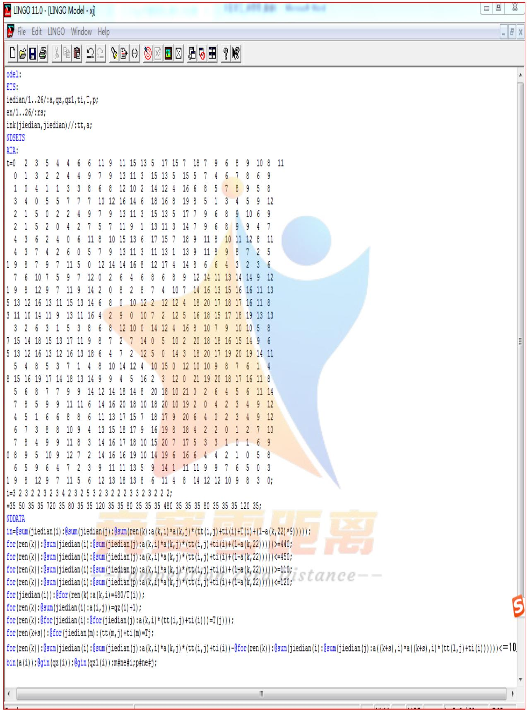

<details>
<summary>text_image</summary>

odel:
ETS:
iedian/1..26/:a,qz,qz1,ti,T,p;
en/1..26/:rs;
ink(jiedian,jiedian)//:tt,a;
NDSETS
ATA:
t=0 2 3 5 4 4 6 6 11 9 11 15 13 5 17 15 7 18 7 9 6 8 9 10 8 11
0 1 3 2 2 4 4 9 7 9 13 11 3 15 13 5 15 5 7 4 6 7 8 6 9
1 0 4 1 1 3 3 8 6 8 12 10 2 14 12 4 16 6 8 5 7 8 9 5 8
3 4 0 5 5 7 7 7 10 12 16 14 6 18 16 8 19 8 5 1 3 4 5 9 12
2 1 5 0 2 2 4 9 7 9 13 11 3 15 13 5 17 7 9 6 8 9 10 6 9
2 1 5 2 0 4 2 7 5 7 11 9 1<fcel>13<fcel>13<fcel>5<fcel>15<fcel>5<fcel>7<fcel>4<fcel>6<fcel>7<fcel>8<fcel>6<fcel>9<nl>
4<fcel>3<fcel>6<fcel>2<fcel>4<fcel>0<fcel>6<fcel>11<fcel>8<fcel>10<fcel>15<fcel>13<fcel>6<fcel>17<fcel>15<fcel>7<fcel>18<fcel>9<fcel>11<fcel>8<fcel>10<fcel>11<fcel>12<fcel>8<fcel>11<nl>
4<fcel>3<fcel>7<fcel>4<fcel>2<fcel>6<fcel>0<fcel>5<fcel>7<fcel>9<fcel>13<fcel>11<fcel>3<fcel>11<fcel>13<fcel>1<fcel>13<fcel>9<fcel>11<fcel>8<fcel>9<fcel>8<fcel>7<fcel>2<fcel>5<nl>
9<fcel>8<fcel>7<fcel>9<fcel>7<fcel>11<fcel>5<fcel>0<fcel>12<fcel>14<fcel>14<fcel>16<fcel>8<fcel>12<fcel>17<fcel>4<fcel>14<fcel>8<fcel>6<fcel>6<fcel>4<fcel>3<fcel>2<fcel>3<fcel>6<nl>
7<fcel>6<fcel>10<fcel>7<fcel>5<fcel>9<fcel>7<fcel>12<fcel>0<fcel>2<fcel>6<fcel>4<fcel>6<fcel>8<fcel>6<fcel>8<fcel>9<fcel>12<fcel>14<fcel>11<fcel>13<fcel>14<fcel>14<fcel>9<fcel>12<nl>
9<fcel>8<fcel>12<fcel>9<fcel>7<fcel>11<fcel>9<fcel>14<fcel>2<fcel>0<fcel>8<fcel>2<fcel>8<fcel>7<fcel>4<fcel>10<fcel>7<fcel>14<fcel>16<fcel>13<fcel>15<fcel>16<fcel>16<fcel>11<fcel>13<nl>
5<fcel>13<fcel>12<fcel>16<fcel>13<fcel>11<fcel>15<fcel>13<fcel>14<fcel>6<fcel>8<fcel>0<fcel>10<fcel>12<fcel>2<fcel>12<fcel>4<fcel>18<fcel>20<fcel>17<fcel>18<fcel>17<fcel>16<fcel>11<fcel>8<nl>
3<fcel>11<fcel>10<fcel>14<fcel>11<fcel>9<fcel>13<fcel>11<fcel>16<fcel>4<fcel>2<fcel>9<fcel>0<fcel>10<fcel>7<fcel>2<fcel>12<fcel>5<fcel>16<fcel>18<fcel>15<fcel>17<fcel>18<fcel>19<fcel>13<nl>
3<ecel><ecel><ecel><ecel><ecel><ecel><ecel><ecel><ecel><ecel><ecel><ecel><ecel><ecel><ecel><ecel><ecel><ecel><ecel><ecel><ecel><ecel><ecel><ecel><nl>
7<ecel><ecel><ecel><ecel><ecel><ecel><ecel><ecel><ecel><ecel><ecel><ecel><ecel><ecel><ecel><ecel><ecel><ecel><ecel><ecel><ecel><ecel><ecel><ecel><nl>
5<ecel><ecel><ecel><ecel><ecel><ecel><ecel><ecel><ecel><ecel><ecel><ecel><ecel><ecel><ecel><ecel><ecel><ecel><ecel><ecel><ecel><ecel><ecel><ecel><nl>
5<ecel><ecel><ecel><ecel><ecel><ecel><ecel><ecel><ecel><ecel><ecel><ecel><ecel><ecel><ecel><ecel><ecel><ecel><ecel><ecel><ecel><ecel><ecel><ecel><nl>
8<ecel><ecel><ecel><ecel><ecel><ecel><ecel><ecel><ecel><ecel><ecel><ecel><ecel><ecel><ecel><ecel><ecel><ecel><ecel><ecel><ecel><ecel><ecel><ecel><nl>
5<ecel><ecel><ecel><ecel><ecel><ecel><ecel><ecel><ecel><ecel><ecel><ecel><ecel><ecel><ecel><ecel><ecel><ecel><ecel><ecel><ecel><ecel><ecel><ecel><nl>
7<ecel><ecel><ecel><ecel><ecel><ecel><ecel><ecel><ecel><ecel><ecel><ecel><ecel><ecel><ecel><ecel><ecel><ecel><ecel><ecel><ecel><ecel><ecel><ecel><nl>
4<ecel><ucel><ucel><ucel><ucel><ucel><ucel><ucel><ucel><ucel><ucel><ucel><ucel><ucel><ucel><ucel><ucel><ucel><ucel><ucel><ucel><ucel><ucel><ucel><nl>
6<ucel><ucel><ucel><ucel><ucel><ucel><ucel><ucel><ucel><ucel><ucel><ucel><ucel><ucel><ucel><ucel><ucel><ucel><ucel><ucel><ucel><ucel><ucel><ucel><nl>
7<ucel><ucel><ucel><ucel><ucel><ucel><ucel><ucel><ucel><ucel><ucel><ucel><ucel><ucel><ucel><ucel><ucel><ucel><ucel><ucel><ucel><ucel><ucel><ucel><nl>
0<ucel><ucel><ucel><ucel><ucel><ucel><ucel><ucel><ucel><ucel><ucel><ucel><ucel><ucel><ucel><ucel><ucel><ucel><ucel><ucel><ucel><ucel><ucel><ucel><nl>
6<ucel><ucel><ucel><ucel><ucel><ucel><ucel><ucel><ucel><ucel><ucel><ucel><ucel><ucel><ucel><ucel><ucel><ucel><ucel><ucel><ucel><ucel><ucel><ucel><nl>
9
8
8
8
8
8
8
8
8
8
8
8
8
8
8
8
8
8
8
8
8
8
8
8
8
8
8
8
8
8
8
8
8
8
8
8
8
8
8
8
8
8
8
8
8
8
8
8
8
8
8
\begin{equation_block}
i=3 &2 &3 &2 &2 &3 &2 &3 &4 &2 &3 &2 &5 &3 &2 &3 &2 &2 &2 &3 &3 &2 &3 &2 &2 &2;
=35 &50 &35 &35 &720 &35 &80 &35 &35 &35 &35 &35 &35 &35 &35 &35 &35 &35 &35 &35 &35 &35 &35 &35 &
NDDATA
in={sum(jiedian(i):@sum(jiedian(j):@sum(ren(k):a(k,i)*a(k,j)*(tt(i,j)+ti(i)+(l-a(k,22)*9))});
for(ren(k)):@sum(jiedian(i):@sum(jiedian(j):a(k,i)*a(k,j)*(tt(i,j)+ti(i)+(l-a(k,22))))>=440;
for(ren(k)):@sum(jiedian(i):@sum(jiedian(j):a(k,i)*a(k,j)*(tt(i,j)+ti(i)+(l-a(k,22))))<=450;
for(ren(k)):@sum(jiedian(i):@sum(jiedian(p):a(k,i)*a(k,j)*(tt(i,j)+ti(i)+(l-a(k,22))))>=440;
for(ren(k)):@sum(jiedian(i):@sum(jiedian(p):a(k,i)*a(k,j)*(tt(i,j)+ti(i)+(l-a(k,22))))<=440;
for(ren(k)):@sum(jiedian(i):@sum(jiedian(p):a(k,i)*a(k,j)*(tt(i,j)+ti(i)+(l-a(k,22))))<=440;
for(ren(k)):@sum(jiedian(i):@sum(jiedian(p):a(k,i)*a(k,j)*(tt(i,j)+ti(i)+(l-a(k,22))))<=440;
for(ren(d)(i)):@for(ren(k):a(k,i)=480/T(i));
for(ren(k)):@sum(jiedian(i):a(i,j))=qz(i)+I);
for(ren(k)):@for(jiedian(i)):@for(jiedian(j):a(k,i)*(tt(i,j)+ti(i))=T(j)));
for(ren(k+s)):@for(jiedian(m):(tt(m,j)+ti(m)=Tj;
for(ren(k)):@sum(jiedian(i):@sum(jiedian(j):a(k,i)*a(k,j)*(tt(i,j)+ti(i))-@for(ren(k)):@sum(jiedian(i):@sum(jiedian(j):a((k+s),i)*a((k+s),i)*(tt(l,j)+ti(i)))))))<=Tj;
for(ren(k)):@gin(qz(i)):@gin(qz( i)):m#ne#i;p#ne#j;<==Tj;<==Tj;<==Tj;<==Tj;<==Tj;<==Tj;<==Tj;<==Tj;<==Tj;<==Tj;<==Tj;<==Tj;<==Tj;<==Tj;<==Tj;<==Tj;<==Tj;<==Tj;<==Tj;<==Tj;<==Tj;<==Tj;<==Tj;<==Tj;<==Tj;<==TT_j;<==TT_j;<==TT_j;<==TT_j;<==TT_j;<==TT_j;<==TT_j;<==TT_j;<==TT_j;<==TT_j;<==TT_j;<==TT_j;<==TT_j;<==TT_j;<==TT_j;<==TT_j;<==TT_j;<==TT_j;<==TT_j;<==TT_j;<==TT_j;<==TT_j;<==TT_j;<==TT_j;<==TT_j;<==TTj;<==TT_j;<==TT_j;<==TT_j;<==TT_j;<==TT_j;<==TT_j;<==TT_j;<==TT_j;<==TT_j;<==TT_j;<==TT_j;<==TT_j;<==TT_j;<==TT_j;<==TT_j;<==TT_j;<==TT_j;<==TT_j;<==TT_j;<==TT_j;<==TT_j;<==TT_j;<==TT_j;<==TT_j;<==Tj;<<=Tj;<<=Tj;<<=Tj;<<=Tj;<<=Tj;<<=Tj;<<=Tj;<<=Tj;<<=Tj;<<=Tj;<<=Tj;<<=Tj;<<=Tj;<<=Tj;<<=Tj;<<=Tj;<<=Tj;<<=Tj;<<=Tj;<<=Tj;<<=Tj;<<=Tj;<<=Tj;<<=Tj;<<=Tj;<=>
</details>

附件 4：(问题三------lingo 程序 1)  
```csv
model:
SETS:
jiedian/1..26/:a,qz,qz1,ti,Te,T;
ren/1..26/:rs;
banci/1,2,3/:x;
link(jiedian,jiedian)//:tt;
ENDSETS
DATA:
tt=0 2 3 5 4 4 6 6 11 9 11 15 13 5 17 15 7 18 7 9 6 8 9 10 8 11
2 0 1 3 2 2 4 4 9 7 9 13 11 3 15 13 5 15 5 7 4 6 7 8 6 9
3 1 0 4 1 1 3 3 8 6 8 12 10 2 14 12 4 16 6 8 5 7 8 9 5 8
5 3 4 0 5 5 7 7 7 10 12 16 14 6 18 16 8 19 8 5 1 3 4 5 9 12
4 2 1 5 0 2 2 4 9 7 9 13 11 3 15 13 5 17 7 9 6 8 9 10 6 9
4 2 1 5 2 0 4 2 7 5 7 11 9 1 13 11 3 14 7 9 6 8 9 9 4 7
6 4 3 6 2 4 0 6 11 8 10 15 13 6 17 15 7 18 9 11 8 10 11 12 8 11
6 4 3 7 4 2 6 0 5 7 9 13 11 3 11 13 1 13 9 11 8 9 8 7 2 5
11 9 8 7 9 7 11 5 0 12 14 14 16 8 12 17 4 14 8 6 6 4 3 2 3 6
9 7 6 10 7 5 9 7 12 0 2 6 4 6 8 6 8 9 12 14 11 13 14 14 9 12
11 9 8 12 9 7 11 9 14 2 0 8 2 8 7<fcel>4<fcel>10<fcel>7<fcel>14<fcel>16<fcel>13<fcel>15<fcel>16<fcel>16<fcel>11<fcel>13<nl>15<fcel>13<fcel>12<fcel>16<fcel>13<fcel>11<fcel>15<fcel>13<fcel>14<fcel>6<fcel>8<fcel>0<fcel>10<fcel>12<fcel>2<fcel>12<fcel>12<fcel>4<fcel>18<fcel>20<fcel>17<fcel>18<fcel>17<fcel>16<fcel>11<fcel>8<nl>
<fcel>13<fcel>11<fcel>10<fcel>14<fcel>11<fcel>9<fcel>13<fcel>11<fcel>16<fcel>4<fcel>2<fcel>9<fcel>0<fcel>10<fcel>7<fcel>2<fcel>12<fcel>5<fcel>16<fcel>18<fcel>15<fcel>17<fcel>18<fcel>19<fcel>13<fcel>13<nl>
<fcel>5<fcel>3<fcel>2<fcel>6<fcel>3<fcel>1<fcel>5<fcel>3<fcel>8<fcel>6<fcel>8<fcel>12<fcel>10<fcel>0<fcel>14<fcel>12<fcel>4<fcel>16<fcel>8<fcel>10<fcel>7<fcel>9<fcel>10<fcel>10<fcel>5<fcel>8<nl>
<fcel>17<fcel>15<fcel>14<fcel>18<fcel>15<fcel>13<fcel>17<fcel>11<fcel>9<fcel>8<fcel>7<fcel>2<fcel>7<fcel>14<fcel>0<fcel>5<fcel>10<fcel>2<fcel>20<fcel>18<fcel>18<fcel>16<fcel>15<fcel>14<fcel>9<fcel>6<nl>
<fcel>7<fcel>5<fcel>4<fcel>8<fcel>5<fcel>3<fcel>7<fcel>1<fcel>4<fcel>8<fcel>-0.00000000000000000000000000000000000000000000000000000000000000000000000000000000000000000
T=35_50_35_35_720_35_80_35_35_35_35_35_80_35_35_35_35_35_35_35_35_35_35_35_35_35_35_35_35_35_35_35_35_35_35_35_35_35_35_35_35_35_35_35_35_35_35-
```

附件 5：(问题三------程序 2)  
```julia
model:
SETS:
jiedian/1..26/:a,qz,qz1,ti,Te,T;
ren/1..26/:rs;
banci/1,2,3/:x;
link(jiedian,jiedian)//:tt;
ENDSETS
DATA:
tt=0  2  3  5  4  4  6  6  11  9  11  15  13  5  17  15  7  18  7  9  6  8  9  10  8  11
2   0   1   3   2   2   4   4   9   7   9   13   11   3   15   13   5   15   5   7   4   6   7   8   6   9
3   1   0   4   1   1   3   3   8   6   8   12   10   2   14   12   4   16   6   8   5   7   8   9   5   8
5   3   4   0   5   5   7   7   7   10   12   16   14   6   18   16   8   19   8   5   1   3   4   5   9   12
4   2   1   5   0   2   2   4   9   7   9   13   11   3   15   13   5   17   7   9   6   8   9    10    6    9
4   2   1   5   2   0   4   2   7   5   7   11   9   1    13   11   3    14   7    9    6    8    9    9    4    7
6   4   3   6   2   4   0   6    11    8    10    15    13    6    17    15    7    18    9    11    8    10    11    12    8    11
6   4   3    7    4    2    6    0    5    7    9    13    11    3    11    13    1    13    9    11    8    9    8    7    2    5
11    9    8    7    9    7    11    5    0    12    14    14    16    8    12    17    4    14    8    6    6    4    3    2    3    6
9    7    6    10    7    5    9    7    12    O     O     O     O     O     O     O     O     O     O     O     O     O     O     O     O     O     O     O     O     O     O     O     O     O     O     O     O     O     O     O     O     O     O     O     O     O     O     O     O     O     O     O     O     O     O     O     O     O     O     O
11    N    B    B    B    B    B    B    B    B    B    B    B    B    B    B    B    B    B    B    B    B    B    B    B    B    B    B    B    B    B    B    B    B    B    B    B    B    B    B    B    B
15    I3    I3    I3    I3    I3    I3    I3    I3    I3    I3    I3    I3    I3    I3    I3    I3    I3    I3    I3    I3    I3    I3    I3    I3
I3    I3    I3 ~ I3 ~ I3 ~ I3 ~ I3 ~ I3 ~ I3 ~ I3 ~ I3 ~ I3 ~ I3 ~ I3 ~ I3 ~ I3 ~ I3 ~ I3 ~ I3 ~ I3 ~ I3 ~ I3 ~ I3 ~ I3 ~ I3 ~ I3 ~ I3 ~ I3 ~ I3 ~ I3 ~ I3 ~ I3 ~ I3 ~ I3 ~ I3 ~ I3 ~ II
I5 .~I5 .~I5 .~I5 .~I5 .~I5 .~I5 .~I5 .~I5 .~I5 .~I5 .~I5 .~I5 .~I5 .~I5 .~I5 .~I5 .~I5 .~I5 .~I5 .~I5 .~I5 .~I5 .~I5 .~I5 .~I5 ..~I5 .~I5 .~I5 .~I5 .~I5 .~I5 .~I5 .~I5 .~I5 .~I5 .~I5 .~I5 .~I5 .~I5 .~I5 .~I5 .~I5 .~I5 .~I5 .~I5 .~I5 .
I5 .~I5 .~I5 .~I5 .~I5 .~I5 .~I5 .~I5 .~I5 .~I5 .~I5 .~I5 .~I5 .~I5 .~I5 .~I5 .~I5 .~I5 .~I5 .~I5 .~I5 .~I5 .~I5 .~I5 .
I7 .~I7 .~I7 .~I7 .~I7 .~I7 .~I7 .~I7 .~I7 .~I7 .~I7 .~I7 .~I7 .~I7 .
I7 .~I7 .~I7 .~I7 .~I7 .~I7 .~I7 .~I7 .~I7 .
I7 .~I7 .~I7 .~I7 .
I8 .~I8 .~I8 .~I8 .~I8 .~I8 .
I8 .~I8 .~I8 .
I8 .~I8 .
I8 .~I8 .
I8 .~I8 .
I8 .~I8 .
I8 .~I8 .
I8 .
T=3S T=3S T=3S T=3S T=3S T=3S T=3S T=3S T=3S T=3S T=3S T=3S T=3S T=3S T=3S T=3S T=3S T=3S T=3S T=3S T=3S T=3S T=3S T=3S T=<nl>ENDDATA
min=@for(banci(x)):@sum(jiedian(i):@sum(jiedian(j):@sum(ren(k):a(k,i)*a(k,j)*(tt(i,j)+ti(i)+t(i)+(l-a(k,22)*9-@sum(ren(k):@sum(jiedian(p):a(a(k,i)*a(k,p)*10)))))
min=@for(banci(x):@sum(ren(k)):@sum(jiedian(i):@sum(jiedian(j):a(k,i)*a(k,j)*(tt(i,j)+ti(i)+(l-a(k,22)))))*9=q(x);
min=@sum(banci(x):q(x));
min=@sum(v(x)-v(x-1));
@sum(banci(x):t(x)<=1440;
@sum(banci(x):t(x)>=1410;
@for(jiedian(i):@for(ren(k):@sumbanci(x):a(k,i)=480/T(i));
@for(ren(k):@sum(jiedian(i):a(i,j))=qz(i)+l);
@for(ren(k):@for(banci(x)):@sum(jiedian(i):@sum(jiedian(j):a(k,i)*a(k,j)*(tt(i,j)-@for(banci(x)):@sum(jiedian(i):@sum(jiedian(j):a((k+s),i)*a((k+s),i)*(tt(i,j)+ti(i))<=10;
@for(ren(k):@sum(banci(x):@for(jiedian(i):@for(jiedian(j):a(k,i)*(tt(i,j)+ti(i)))=T(j)));
@bin(a(i)):@gin(qz(i)):@gin(qz1(i)):p#ne#j
```

附件 6：（划分区域------lingo 程序）  
```txt
model:
sets:
jiedian/1..26/:ti;
link(jiedian,jiedian):t,a;
endsets
data:
t=0 2 3 5 4 4 6 6 11 9 11 15 13 5 17 15 7 18 7 9 6 8 9 10 8 11
2 0 1 3 2 2 4 4 9 7 9 13 11 3 15 13 5 15 5 7 4 6 7 8 6 9
3 1 0 4 1 1 3 3 8 6 8 12 10 2 14 12 4 16 6 8 5 7 8 9 5 8
5 3 4 0 5 5 7 7 7 10 12 16 14 6 18 16 8 19 8 5 1 3 4 5 9 12
4 2 1 5 0 2 2 4 9 7 9 13 11 3 15 13 5 17 7 9 6 8 9 10 6 9
4 2 1 5 2 0 4 2 7 5 7 11 9 1 13 11 3 14 7 9 6 8 9 9 4 7
6 4 3 6 2 4 0 6 11 8 10 15 13 6 17 15 7 18 9 11 8 10 11 12 8 11
6 4 3 7 4 2 6 0 5 7 9 13 11 3 11 13 1<fcel>11
9
7
9
8
10
7
5
9
7
11
9
12
9
7
11
9
14
2
0
8
2
8
7
4
10
7
14
16
13
15
13
12
16
13
9
13
11
16
4
2
9
0
10
7
2
12
5
16
18
15
17
18
19
13
5
3
2
6
3
1
5
3
8
6
8
12
10
0
14
12
4
16
8
10
7
9
10
5
8
17
15
14
18
15
13
17
11
9
8
7
2
7
2
7
4
0
5
0
20
18
18
16
15
14
9
6
15
13
12
16
13
12
16
13
18
6
4
7
2
12
5
0
14
3
18
20
17
19
20
19
14
7
5
4
8
5
3
7
14
8
13
14
9
9
4
5
16
2
3
0
20
20
20
8
7
6<fcel>8

ti=3   2   3   2   2   3   2   3   4   2   3   2   5   3   2   3   2   2   2   2   3   3   2   3   2   2   2;
enddata

min=@sum(jiedian(i):@sum(jiedian(j):a(i,j)*(t(i,j)+ti(i)));
@sum(jiedian(i):@sum(jiedian(j):a(i,j)*(t(i,j)+ti(i))))>=470;
@sum(jiedian(i):@sum(jiedian(j):a(i,j)*(t(i,j)+ti(i))))<=470;
@for(link(i,j):@bin(a(i,j)));
```

运行的部分程序如下：  
```csv
A(7, 17)          0.000000         9.000000
A(7, 18)          0.000000         20.00000
A(7, 19)          0.000000         11.00000
A(7, 20)          0.000000         13.00000
A(7, 21)          1.000000         10.00000
A(7, 22)          0.000000         12.00000
A(7, 23)          0.000000         13.00000
A(7, 24)          0.000000         14.00000
A(7, 25)          1.000000         10.00000
A(7, 26)          0.000000         13.00000
A(8, 1)          0.000000         9.000000
A(8, 2)          0.000000         7.000000
A(8, 3)          0.000000         6.000000
A(8, 4)          1.000000         10.00000
A(8, 5)          0.000000         7.000000
A(8, 6)          0.000000         5.00000
```