# 化工厂巡检路径规划与建模

## 摘 要

本文主要研究化工厂巡检路径规划与排班问题。为提高巡检效率，优化资源分配，需制定科学合理的巡检路径。通过对化工厂巡检工作内容和特点分析，并制定相应的目标体系及约束条件，建立了最短路径的多目标规划模型，使用lingo和 Excel求解，得到巡检人员最少的优化方案。

针对问题一：以每班需巡检人员尽可能少，工作量尽可能平衡为目标，以固时上班、无休息时间、每条线路周期不超过 35min、每天三班制、每班8 小时左右为约束，建立多目标规划模型，用图论法求解。先考虑分区，以线路周期内包含尽可能多巡检点与最短路径为目标，将所给巡检点连通图分组，得到共 5条巡检路线，最少需5名巡检人员，如路线：

$$
2 2 - 2 1 - 4 - 2 - 1 - 3 - 6 - 1 4 - 2 1
$$

（具体巡检路线见正文图 6，巡检时间表见附录表 1、2、3）。为使每条路线在一段时间内的总行走时间均衡，引入均衡度，越小越合理。该模型均衡度为 0.35较大，为满足要求，故采用五线三班轮倒制。考虑到该模型在巡检人员每个周期的回程中浪费大量时间，所以不分区处理，利用最短路径和巡检耗时，得到将巡检点全部巡检的最少用时。用巡检一周的最少用时与 35min的比值，得到最少巡检人数4名，该优化模型在固时上班条件下，第二班次巡检人员无法在指定时间到达指定点，无法形成班次循环，但可在错时上班条件下应用。

针对问题二：在第一问模型基础上，新增每2小时左右巡检人员休息5-10min、在中午12时和下午6 时需进餐30分钟的约束，经分析，巡检人员每 2小时的休息时间，可通过减少巡检周期大于 35min的巡检点巡检次数得到，若线路中无大于35min 周期的巡检点或压缩时间太少，可将线路分段并增加巡检人员。最终得到共6条路线，最少需要 6名巡检人员，如路线:

$$
2 2 - 2 1 - 4 - 2 - 1 - 2 - 3 - 6 - 1 4 - 2 1 。
$$

（具体巡检路线见正文图 8，巡检时间表见附录表 4、5、6）为使进餐时能正常工作，给需进餐的班次增加人员，轮换进餐，维持正常巡检。经分析，将两次进餐时间段都放入同一班次的上班时间内，可最大减少人力资源浪费，且 6 条巡检路线中有一条可在进餐后仍在指定时间到达指定地点。因此，得到第一班次共需11人，第二、三班次分别需 6人。该模型均衡度较大，所以采用三班轮倒制。

针对问题三：对于问题一，在错时上班条件下，可利用问题一中建立的优化模型直接进行求解，得到巡检路线 1条，共需巡检人员 4人。与问题一结果比较，减少了人力资源浪费。对于问题二，在错时上班条件下，调整各班次上下班时间即可减少人力资源浪费，可得到每班次巡检人员 人，且线路不变，仍为 条巡检线路。与问题二结果比较，减少了资源浪费。

关键词：多目标规划 巡检路径 最短路径 图论法 均衡度

## 一、问题重述

某化工厂现有 26 个工作点需要进行巡检来保证正常生产，每个工作点的巡检周期、巡检耗时、各点之间的连通关系及行走所需时间在附件中给出。

工人可以按固定时间上班，也可以错时上班，在调度中心（XJ0022）得到巡检任务后以调度中心为起点开始巡检，且每个工作点每次巡检只需一名工人。试建立模型来安排巡检人数和巡检路线，使得所有工作点都能按要求完成巡检任务，并且巡检人数尽可能少，同时每名工人在一时间段内（如一周或一月等）的工作量尽可能均衡。

问题 1：在每天三班倒，每班工作时间为 8 小时左右，且上下班时间固定，不考虑工人的休息时间等条件下，建立模型。安排巡检线路，给出工人的巡检路线和巡检时间表。

问题 2：在工人每工作 2 小时左右休息一次、休息时间 5 到 10 分钟、中午12时和下午 6时进餐一次及每次进餐时间为 30 分钟等条件下，仍采用每天三班倒，试建立模型确定每班需要多少人及巡检路线，并给出巡检人员的巡检线路和巡检时间表。

问题 3：如果采用错时上班，重新讨论问题 1 和问题 2，并分析错时上班能否使巡检人数更少。

## 二、模型假设

1.假设巡检过程中，不会出现错检、漏检。  
2.假设设备是由工人第一次上班时启动。  
3.假设设备开启时间可以忽略。  
4.假设行走过程中没有特殊情况耽误，能够准时到达。

## 三、符号说明

<table><tr><td>i</td><td>巡检点序号</td></tr><tr><td>j</td><td>巡检路线序号</td></tr><tr><td> $L_j$ </td><td>第j条巡检路线行走总时间</td></tr><tr><td> $t_i$ </td><td>第i个巡检点巡检耗时</td></tr><tr><td>K</td><td>巡检人员数</td></tr><tr><td>T</td><td>路线总耗时</td></tr><tr><td>R</td><td>时间冗余</td></tr><tr><td> $t_h$ </td><td>各路线回程行走耗时</td></tr></table>

## 四、问题分析

化工厂生产中使用的原料、半成品和成品种类繁多，绝大部分是易燃、易爆、有毒、有腐蚀性的危险品。在生产、运输、使用中管理不当，就会发生火灾、爆炸、中毒和烧伤事故，给工作人员生命财产安全和工厂生产造成重大影响。因此，建立数学模型来解决巡检人员的巡检路线及排班问题，以保证化工生产安全是极为重要的。

针对问题一：以每班需要巡检人员尽可能少与工人工作量尽可能平衡作为目标条件；以固时上班、巡检人员无休息时间、每条线路周期小于等于 35min、每天三班制、每班工作 8小时左右为约束条件，建立多目标规划模型。可使用图论法对该模型进行求解。而后通过分区巡检与不分区巡检的两种模型对比，得到最优模型。

针对问题二：在第一问的模型基础上，新增巡检人员每 2 小时左右休息5-10min、在中午 12 时和下午 6 时需要进餐 30 分钟的约束条件，经分析，巡检人员每2小时的休息时间可以通过减少巡检周期大于35min的巡检点的次数来得到；若线路中没有大于 35min周期的巡检点或压缩时间太少，可将线路分段并增加巡检人员。为使进餐时也能正常工作，给需要进餐的班次增加巡检人员，轮换进餐，维持正常巡检。

针对问题三：在问题一、问题二模型的基础上，采用错时上班，并分别重新建立模型，分析错时上班是否能使巡检人员更少。对于问题一，在错时上班条件下，可利用问题一中建立的优化模型直接进行求解，对于问题二，在错时上班条件下，调整各班次上下班时间即可减少人力资源浪费。

## 五、模型的建立及求解

## 问题一 固时上班无休息模型：

## 5.1.1 建立模型：

要求巡检人数最少的巡检线路方案，只需让每个工人在其巡检点的最小周期内巡检尽可能多的工作点并原路返回第一个巡检点，下个周期再从第一个巡检点出发，就可得到巡检人数最少的巡检线路方案。

## 寻找XJ0022 到各点的最短路径：

首先，引入0-1变量，设 $S _ { i j }$ 表示第i个巡检点与第j个巡检点是否直接连通，即：

$$
S _ {i j} = \left\{ \begin{array}{l l} 1 & \text {第i个巡检点与第j个巡检点直接连通} \\ 0 & \text {第i个巡检点与第j个巡检点不直接连通} \end{array} \quad (i, j = 1, 2, \dots , 2 6) \right.
$$

各巡检点之间的行走耗时赋权图的邻接矩阵为 $W _ { i j }$ ，其中 $W _ { i j } = P$ 表示巡检点i到巡检点 $j$ 的权值为P。建立最短路径模型如下：

$$
\min Z = \sum_ {i = 1} ^ {2 6} \sum_ {j = 1} ^ {2 6} W _ {i j} S _ {i j}
$$

$$
s. t \left\{ \begin{array}{l} \sum_ {i = 1} ^ {2 6} S _ {k j} = \sum_ {j = 1} ^ {2 6} S _ {i j} \\ \sum_ {j = 1} ^ {2 6} S _ {a j} = 1 \\ \sum_ {k = 1} ^ {2 6} S _ {k a} = 0 \\ \sum_ {k = 1} ^ {2 6} S _ {k b} = 1 \\ \sum_ {j = 1} ^ {2 6} S _ {b j} = 0 \\ S _ {i j} \leq W _ {i j} \quad i, j = 1, 2, \dots , n \\ S _ {i j} = 0 \text {或} 1 \end{array} \right.
$$

其中，a b, 分别为起始点和目标点。

利用 lingo 程序求解（见附录程序 1）得到如下表 1 所示的 XJ0022 到各点的最短路径。

表 1： 22 点到每个点的最短路径

<table><tr><td>到达点</td><td>经过路径</td><td>最短时间(min)</td></tr><tr><td>1</td><td>22-21-4-2-1</td><td>8</td></tr><tr><td>2</td><td>22-21-4-2</td><td>6</td></tr><tr><td>3</td><td>22-21-4-2-3</td><td>7</td></tr><tr><td>4</td><td>22-21-4</td><td>3</td></tr><tr><td>5</td><td>22-21-4-2-3-5</td><td>8</td></tr><tr><td>6</td><td>22-21-4-2-3-6</td><td>8</td></tr><tr><td>7</td><td>22-21-4-2-3-5-7</td><td>10</td></tr><tr><td>8</td><td>22-23-24-9-25-17-8</td><td>9</td></tr><tr><td>9</td><td>22-23-24-9</td><td>4</td></tr><tr><td>10</td><td>22-21-4-2-3-6-10</td><td>13</td></tr><tr><td>11</td><td>22-21-4-2-3-6-10-11</td><td>15</td></tr><tr><td>12</td><td>22-23-24-9-25-26-15-12</td><td>18</td></tr><tr><td>13</td><td>22-21-4-2-3-6-10-11-13</td><td>17</td></tr><tr><td>14</td><td>22-21-4-2-3-6-14</td><td>9</td></tr><tr><td>15</td><td>22-23-24-9-25-26-15</td><td>16</td></tr><tr><td>16</td><td>22-21-4-2-3-6-10-11-13-16</td><td>19</td></tr><tr><td>17</td><td>22-23-24-9-25-17</td><td>8</td></tr><tr><td>18</td><td>22-23-24-9-25-26-15-18</td><td>18</td></tr><tr><td>19</td><td>22-20-19</td><td>4</td></tr><tr><td>20</td><td>22-20</td><td>2</td></tr><tr><td>21</td><td>22-21</td><td>2</td></tr><tr><td>22</td><td>0</td><td>0</td></tr><tr><td>23</td><td>22-23</td><td>1</td></tr><tr><td>24</td><td>22-23-24</td><td>2</td></tr><tr><td>25</td><td>22-23-24-9-25</td><td>7</td></tr><tr><td>26</td><td>22-23-24-9-25-26</td><td>10</td></tr></table>

找出最短路径中包含巡检点较多的几条巡检路径，并用最小周期 35min 为各条路径的周期，然后筛选出其中总耗时T小于或等于 35min的巡检路径。

因为最小周期时间不能被 8 小时整除，所以下面每班上班时间，采用 13 周期制或14周期制。

考虑到工作量要均衡，所以以每条巡检路线行走总时间作为工作量，建立如下模型：

$$
a = \frac {\max (L _ {j}) - \min (L _ {j})}{\max (L _ {j})}
$$

其中， $L _ { j }$ 为最终确立的巡检路线行走的总时间。

最后，由题意要求，假设各巡检点巡检所耗时间为 $t _ { i }$ ，巡检人数为K,则可得到目标规划模型如下：

$$
\min = K
$$

$$
s. t \left\{ \begin{array}{l} T = \sum_ {i = 1} ^ {2 6} \sum_ {j = 1} ^ {2 6} (T _ {i j} + t _ {i}) \\ T \leq 3 5 \end{array} \right.
$$

其中， $i = 1 , 2 , . . . , 2 6 , j = 1 , 2 , . . . , 2 6$

## 5.1.2 求解模型：

假设工人第一天上班时，第一天上班时间为 8：00；各巡检点设备由巡检人员开启，每班上班八小时左右

以最短路径中包含巡检点较多的几条巡检路径为主要排查对象，并用最小周期35min 为各条路径的周期来筛选巡检路线。

下面用图论法求解该模型：

路线 1：鉴于最小线路周期中巡检尽可能多的点及优先考虑只连通一个点的目标。所以尝试从起始点（XJ0022）出发，不检修XJ0022依次经过XJ0021、XJ0004、XJ0002、XJ0001、XJ0003、XJ0006、XJ0014 等巡检点，因为不巡检 XJ0022，所以最终回到 XJ0021 即可。因为该路线中损耗时间为 37min，而线路损耗时间要控制在 35min 及以下，经观察可以将 XJ0002 或 XJ0004 放在其他路线中巡检,又因为XJ0002为各条最短路径的交集点,所以选择XJ0002为线路1中不巡检的点，此时巡检线路周期刚好为 35min。易知当线路周期为 35min时，每班工作周期为14次。由此得到路线 1的循环路线图，如下：

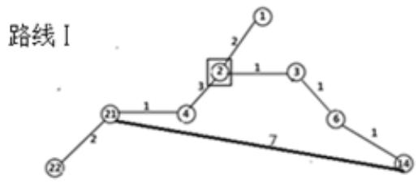

<details>
<summary>flowchart</summary>

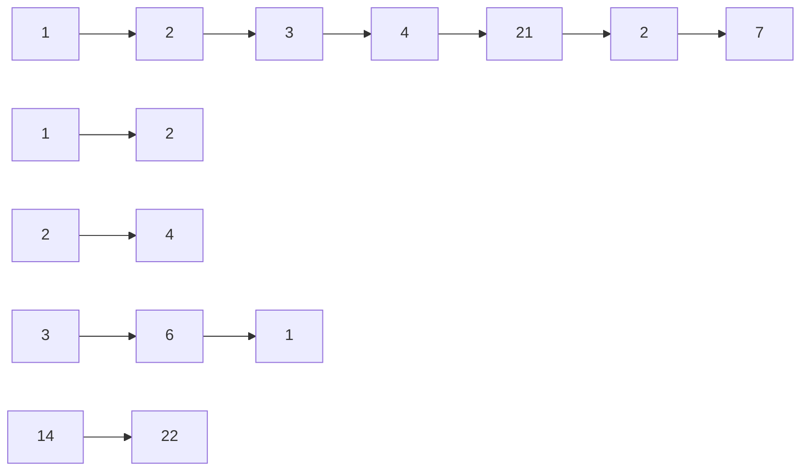
</details>

图 1: 路线 1的循环路线图

路线 1：○22 →○21 →○4 →□2 →○1 →○3 →○6 →○14 →○21

行走时间： C1=20min,□2 表示只路过不巡检，从 21→21 循环巡检一周为35min。

各巡检点具体时间算法：

到达时间 = 前一个点离开时间 + 行走所耗时间

离开时间 = 该点到达时间 + 巡检所耗时间

路线 1 安排：第一天上班时间为 8:00，不巡检 XJ0022，直接从 XJ0022 到XJ0021 损耗时间为 2min，所以到达 XJ0021 的时间为 8:02，然后开始巡检 XJ0021，所耗时间为3min，所以离开时间为 8:05,到XJ0004 行走损耗时间为1min，所以到达时间为8:06，巡检损耗时间为 2min，所以离开时间为 8:08。以此类推，得到该路线中各点的所有到达时间及离开时间表。

具体巡检时间表如下表 2：

表 2: 线路 1工人到各巡检点时间

<table><tr><td>巡检点序号</td><td>第一次巡检时间段</td><td>第二次到达时间</td><td>......</td><td>第十三次到达时间</td><td>第十四次到达时间</td></tr><tr><td>XJ0021</td><td>8:02-8:05</td><td>8:37</td><td>......</td><td>15:02</td><td>15:37</td></tr><tr><td>XJ0004</td><td>8:06-8:08</td><td>8:41</td><td>......</td><td>15:06</td><td>15:41</td></tr><tr><td>XJ0002</td><td>8:11-8:11</td><td>8:46</td><td>......</td><td>15:11</td><td>15:46</td></tr><tr><td>XJ0001</td><td>8:13-8:16</td><td>8:48</td><td>......</td><td>15:13</td><td>15:48</td></tr><tr><td>XJ0003</td><td>8:19-8:22</td><td>8:54</td><td>......</td><td>15:19</td><td>15:54</td></tr><tr><td>XJ0006</td><td>8:23-8:26</td><td>8:58</td><td>......</td><td>15:23</td><td>15:58</td></tr><tr><td>XJ0014</td><td>8:27-8:30</td><td>9:02</td><td>......</td><td>15:27</td><td>16:02</td></tr></table>

观察表 2，发现路线 1早班八小时可以工作 14个周期。

路线2 安排：再次从起始点（XJ0022）出发，同路线 1相同，不检修 XJ0022时，巡检点最多，且时间刚好 35min，所以不检修 XJ0022，并依次经过XJ0020、XJ0019、XJ0002、XJ0003、XJ0005、XJ0007 等巡检点，同样，因为不巡检 XJ0022，所以最后回到 XJ0020 即可,除了 XJ0003 在线路 1 中已经巡检，故不再巡检只是路过，其余点全部巡检。总共损耗时间恰好也是 35min。由此得到具体巡检线路图如下：

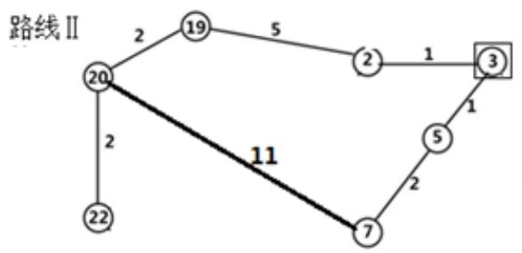

<details>
<summary>flowchart</summary>

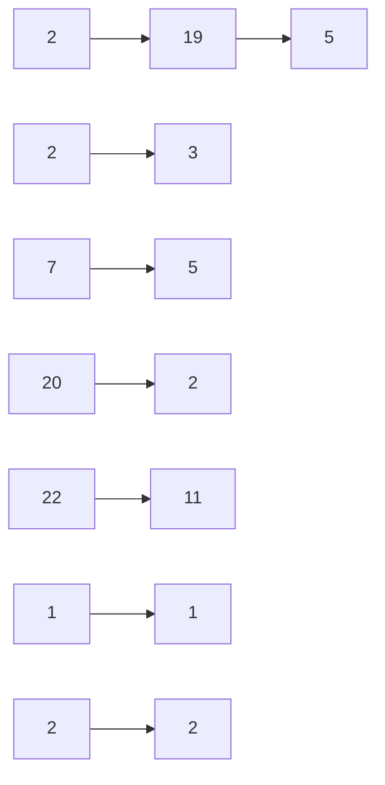
</details>

图 2: 路线 2的循环路线图

路线 2：○22 →○20 →○19 →○2 →□3 →○5 →○7 →○20

行走时间：C2=24min,□3 表示只路过不巡检，从 20→20 循环巡检一周为35min.

具体巡检时间表如下：

表 3: 线路 2工人到达各巡检点时间

<table><tr><td>巡检点序号</td><td>第一次巡检时间段</td><td>第二次到达时间</td><td>......</td><td>第十三次到达时间</td><td>第十四次到达时间</td></tr><tr><td>XJ0020</td><td>8:02-8:05</td><td>8:37</td><td>......</td><td>15:02</td><td>15:37</td></tr><tr><td>XJ0019</td><td>8:07-8:09</td><td>8:42</td><td>......</td><td>15:07</td><td>15:42</td></tr><tr><td>XJ0002</td><td>8:14-8:16</td><td>8:49</td><td>......</td><td>15:14</td><td>15:49</td></tr><tr><td>XJ0003</td><td>8:17-8:17</td><td>8:52</td><td>......</td><td>15:17</td><td>15:48</td></tr><tr><td>XJ0005</td><td>8:18-8:20</td><td>8:53</td><td>......</td><td>15:18</td><td>15:53</td></tr><tr><td>XJ0007</td><td>8:22-8:24</td><td>8:57</td><td>......</td><td>15:22</td><td>15:57</td></tr></table>

观察表 3可得，路线 2在八小时内，也可以巡检 14次

路线 3 安排：再次从 XJ0022 出发，依次经过 XJ0023、XJ0024、XJ0009、XJ0025、XJ0026 并巡检各点，因为时间不够，所以不去 XJ0027,原路返回到 XJ0022，经计算，此时该周期时间为 33min。观察发现，将 XJ0022 也一起巡检时，刚好达到35min 的最小周期。由此得到路线 3具体路线循环图如下：

线路Ⅲ

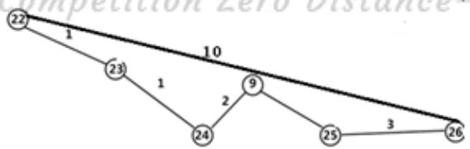

<details>
<summary>flowchart</summary>

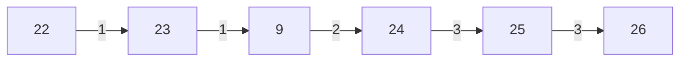
</details>

图 3: 线路 3的循环线路图

线路3：○22→○24 →○9 →○25 →○26→○22

行走时间：C3 =20min,从 22→22 循环巡检一周为 35min

得到具体巡检时间表如下：

表 4: 线路 3工人到达各巡检点时间

<table><tr><td>巡检点序号</td><td>第一次巡检时间段</td><td>第二次到达时间</td><td>......</td><td>第十三次到达时间</td><td>第十四次到达时间</td></tr><tr><td>XJ0022</td><td>8:00-8:02</td><td>8:35</td><td>......</td><td>15:00</td><td>15:35</td></tr><tr><td>XJ0023</td><td>8:03-8:06</td><td>8:38</td><td>......</td><td>15:03</td><td>15:38</td></tr><tr><td>XJ0024</td><td>8:07-8:09</td><td>8:42</td><td>......</td><td>15:07</td><td>15:42</td></tr><tr><td>XJ0009</td><td>8:11-8:15</td><td>8:46</td><td>......</td><td>15:11</td><td>15:46</td></tr><tr><td>XJ0025</td><td>8:18-8:20</td><td>8:53</td><td>......</td><td>15:18</td><td>15:53</td></tr><tr><td>XJ0026</td><td>8:23-8:25</td><td>8:58</td><td>......</td><td>15:23</td><td>15:58</td></tr></table>

路线 4 安排：再次从 XJ0022 出发，依次路过 XJ0023、XJ0024、XJ0009、XJ0025且不巡检，再依次经过 XJ0017、XJ0008、XJ0006、XJ0010、XJ0012、XJ0015 等点，XJ0006 不巡检，之后直接路过 XJ0026、XJ0025 回到第一个巡检点 XJ0017。后面的周期，直接从 XJ0017 出发，并经过 XJ0026、XJ0025 回到 XJ0017 即可。由此得到线路4循环路线图：

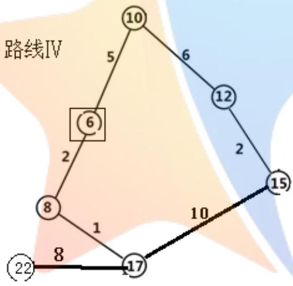

<details>
<summary>flowchart</summary>

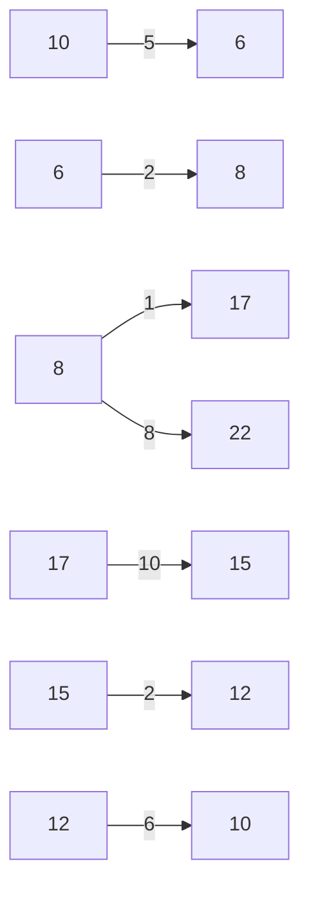
</details>

图 4: 路线 4的循环路线图

路线 4：○22 →○17 →○8 →○6 →○10 →○12 →○15 →○17

行走时间：C4=20min，□6 表示只路过不巡检，从 17→17循环巡检一周为 35min

表 5: 线路 4中工人到达各巡检点的时间

<table><tr><td>巡检点序号</td><td>第一次巡检时间段</td><td>第二次到达时间</td><td>......</td><td>第十三次到达时间</td><td>第十四次到达时间</td></tr><tr><td>XJ0017</td><td>8:08-8:10</td><td>8:43</td><td>......</td><td>15:08</td><td>15:43</td></tr><tr><td>XJ0008</td><td>8:11-8:14</td><td>8:46</td><td>......</td><td>15:11</td><td>15:46</td></tr><tr><td>XJ0010</td><td>8:21-8:23</td><td>8:56</td><td>......</td><td>15:21</td><td>15:56</td></tr><tr><td>XJ0012</td><td>8:29-8:31</td><td>9:04</td><td>......</td><td>15:29</td><td>16:04</td></tr><tr><td>XJ0015</td><td>8:33-8:35</td><td>9:08</td><td>......</td><td>15:33</td><td>16:08</td></tr></table>

路线 5 安排：再次从 XJ0022 出发，依次路过 XJ0023、XJ0024、XJ0009、XJ0025、XJ0026、XJ0015 等点，且不巡检，再依次巡检 XJ0018、XJ0016、XJ0013、XJ0011等点，之后回到第一个巡检点 XJ0018，后面的周期直接在 XJ0018 到 XJ0011 之间往返。由此得到路线 5的循环路线图：

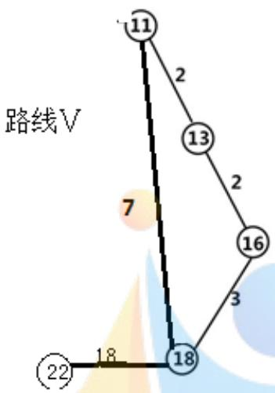

<details>
<summary>text_image</summary>

11
2
13
2
7
16
3
18
18
22
</details>

图 5: 路线 5的循环线路图

路线 5：○22 →○18 →○16 →○13 →○11 →○18

行走时间：C5=27min，从 18→18 循环巡检一周为 35min。

得到巡检时间表如下：

表 6: 线路 5工人到达各巡检点时间

<table><tr><td>巡检点序号</td><td>第一次巡检时间段</td><td>第二次到达时间</td><td>......</td><td>第十三次到达时间</td><td>第十四次到达时间</td></tr><tr><td>XJ0018</td><td>8:18-8:20</td><td>8:53</td><td>......</td><td>15:18</td><td>15:53</td></tr><tr><td>XJ0016</td><td>8:23-8:26</td><td>8:58</td><td>......</td><td>15:23</td><td>15:58</td></tr><tr><td>XJ0013</td><td>8:28-8:33</td><td>9:03</td><td>......</td><td>15:28</td><td>16:03</td></tr><tr><td>XJ0011</td><td>8:35-8:38</td><td>9:10</td><td>......</td><td>15:35</td><td>16:10</td></tr></table>

此时，五条路线刚好把 26个巡检点全部巡检。

因此得到具体路线如下图 1，具体路线行走总时间等数据如下表 7：

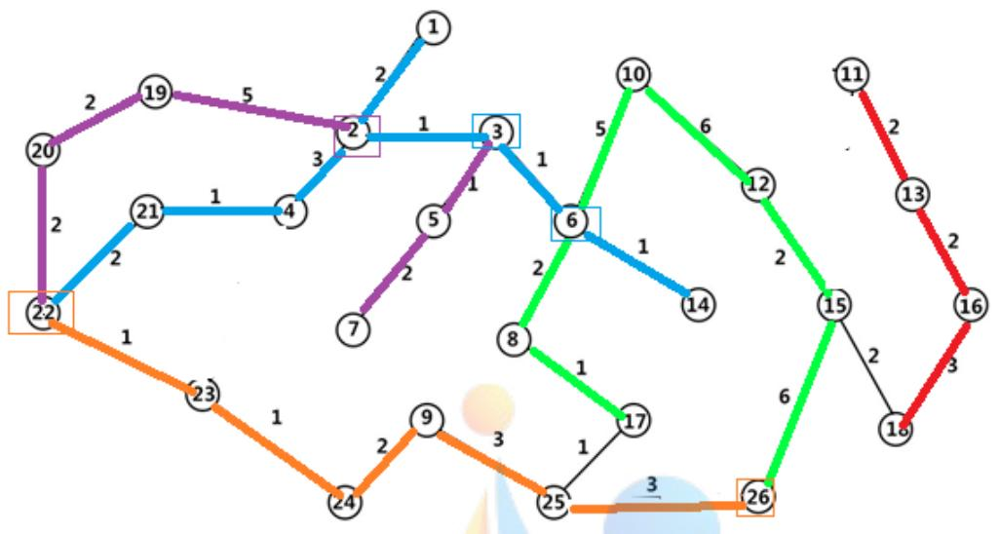

<details>
<summary>flowchart</summary>

```mermaid
graph LR
  1["1"] --> 2["2"]
  2["2"] --> 3["3"]
  3["3"] --> 4["4"]
  4["4"] --> 5["5"]
  5["5"] --> 6["6"]
  6["6"] --> 7["7"]
  7["7"] --> 8["8"]
  8["8"] --> 9["9"]
  9["9"] --> 10["10"]
  10["10"] --> 11["11"]
  11["11"] --> 12["12"]
  12["12"] --> 13["13"]
  13["13"] --> 14["14"]
  14["14"] --> 15["15"]
  15["15"] --> 16["16"]
  16["16"] --> 17["17"]
  17["17"] --> 18["18"]
  18["18"] --> 19["19"]
  19["19"] --> 20["20"]
  20["20"] --> 21["21"]
  21["21"] --> 22["22"]
  22["22"] --> 23["23"]
  23["23"] --> 24["24"]
  24["24"] --> 25["25"]
  25["25"] --> 26["26"]
  26["26"] --> 27["27"]
```
</details>

图 6： 固时上班五条路线巡检路线图

（图6说明：颜色相同的为一条巡检路线，巡检点边框颜色代表同颜色路巡检，其它路中颜色不同的点仅为路过。）

根据上图，可知每班最少需要 5人，且5个人的巡检路线为：

第一个人：22→21→4→2→1→2→3→6→14→6→3→2→4→21

第二个人：22→20→19→2→3→5→7→5→3→2→19→20

第三个人：22→23→24→9→25→26→25→9→24→23→22

第四个人：22→17→8→10→12→15→26→25→17

第五个人：22→18→16→13→11→13→16→18

表 7： 五条巡检路线的巡检方案

<table><tr><td>路线</td><td>路线行走时间</td><td>巡检耗时</td><td>单次往返时间</td><td>巡检点个数</td></tr><tr><td>22→21→4→2→1→2→3→6→14→6→3→2→4→21</td><td>20</td><td>17</td><td>35</td><td>6</td></tr><tr><td>22→20→19→2→3→5→7→5→3→2→19→20</td><td>24</td><td>11</td><td>35</td><td>5</td></tr><tr><td>22→23→24→9→25→26→25→9→24→23→22</td><td>20</td><td>15</td><td>35</td><td>6</td></tr><tr><td>22→17→8→10→12→15→26→25→17</td><td>26</td><td>13</td><td>35</td><td>5</td></tr><tr><td>22→18→16→13→11→13→16→18</td><td>32</td><td>15</td><td>35</td><td>4</td></tr></table>

观察表 7可得，每班最少需要 5个人，巡检线路如上表（路线）所示，且第一班为13周期班，第二、三班为 14周期班，最后，鉴于工作量平衡问题，应采用线路、班次轮换制。三个班次总的具体巡检线路及巡检时间表见附录表 1、附录表2、附录表 3。

## 5.1.3 均衡度分析：

以各巡检路线行走总时间 $L _ { j }$ 为均衡度衡量标准，代入如下均衡度模型：

$$
a = \frac {\max (L _ {j}) - \min (L _ {j})}{\max (L _ {j})}
$$

求得均衡度 $a = 0 . 3 7 5 > 0 . 1 5$ ，所以认为均衡度不好，鉴于对巡检人员上班进行三班、五线轮倒排班，也可使每名工人在一周或一个月内工作量尽量均衡。所以不再重新求解模型。

## 5.1.4 模型优化：

鉴于上述模型在巡检人员每个周期的回程中浪费大量时间，尝试对该模型以减少回程行走时间为目标进行优化，经过观察巡检路线图，发现，只需让每个人从起始点出发，沿着同样的路线，绕最大的圈，巡检所有的巡检点，使得所有巡检点在同一条路线之中，然后回到起始点，就能减小原模型中周期回程浪费的时间。增大人力资源利用率，减少生产成本。

经过重新规划路线，得到如下巡检路线图：

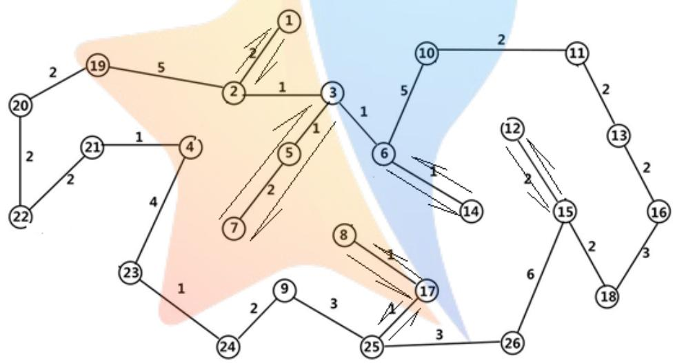

<details>
<summary>flowchart</summary>

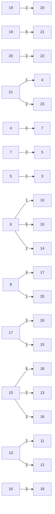
</details>

图 7： 固时上班不分区巡检路线图

经过观察发现，该巡检路线模型虽然可以有效减少回程时间，但是因为固时上班的限制，所以每次上班时，都要巡检人员先按顺序走到其第一个周期内负责的区域才能开始正式开始工作，而第一班的巡检人员下班之后，下一班的巡检人员还要再次先走到第一班巡检人员第一个周期负责的区域才能正式开始工作，另外，第一班之后的设备不可能等巡检人员到达之后才启动，所以舍弃这种优化模型。

该优化模型不可用于固时上班情况下。故舍去。

## 问题二 固时上班可休息进餐模型

## 5.2.1 建立模型：

首先，我们针对题目新增的每两小时休息十分钟这个条件，引入时间冗余R。时间冗余定义如下：

$$
R = q - T
$$

其中， $q$ 为固时上班模型中每条线路的周期,T为该线路的总耗时。

在问题一固时上班无休息时间模型的基础上，增加以每 2 小时时间冗余为5-10分钟可以作为休息为约束条件，得到目标规划模型如下：

$$
\begin{array}{c} \min = K \\ s. t \left\{ \begin{array}{l} R _ {c} \geq 5 \\ T = \sum_ {i = 1} ^ {2 6} \sum_ {j = 1} ^ {2 6} (T _ {i j} + t _ {i}) \\ T \leq 3 5 \end{array} \right. \end{array}
$$

其中， $R _ { c }$ 表示该线路第c个周期之后的时间冗余。

## 5.2.2 求解固时上班可休息进餐模型：

首先在固时上班无休息模型基础上进行分析，发现该模型每条路线，每个周期的时间冗余都太小，无法满足每两小时后的时间冗余大于等于 5min，所以考虑在该模型5条路线基础上，巡检人员数逐级递增，直到满足条件要求。

对于 12点和6点进餐时间30分钟的问题，因为各巡检点的最小巡检周期为35min，而且是固时上班，所以认为，在这 30分钟内，必须有人来顶替巡检人员继续工作，否则设备就有可能损坏。另外，设定 12:00与20:00为第1班与第 2班上班时间，且第3班的上班时间为凌晨 4:00。

下面使用图论法求解模型：

## 休息模型：

路线 1：从起始点（XJ0022）出发，为使路线包含巡检点更多，且周期为35min，所以不巡检 XJ0022，并依次经过 XJ0021、XJ0004、XJ0002、XJ0001、XJ0003、XJ0006、XJ0014 等巡检点，同样，因为不巡检 XJ0022，所以最后回到 XJ0021即可,此时发现 XJ0021 的巡检周期为 80min，所以只需要每 2 个周期回 XJ0021一次，故该路线在上班 2 小时的时间冗余为 8min，可以用作休息，即满足每 2小时休息5-10min 的要求。

表 8： 路线 1巡检时间表

<table><tr><td>巡检点序号</td><td>第一次巡检时间段</td><td>第四次巡检时间段</td><td>......</td><td>第十三次到达时间</td><td>第十四次到达时间</td></tr><tr><td>XJ0021</td><td>3:52-3:55</td><td>可休息8min</td><td>......</td><td>可休息</td><td>11:32</td></tr><tr><td>XJ0004</td><td>3:56-3:59</td><td>5:41-5:44</td><td>......</td><td>11:01</td><td>11:36</td></tr><tr><td>XJ0001</td><td>4:03-4:05</td><td>5:48-5:50</td><td>......</td><td>11:08</td><td>11:43</td></tr><tr><td>XJ0003</td><td>4:09-4:11</td><td>5:54-5:56</td><td>......</td><td>11:14</td><td>11:49</td></tr><tr><td>XJ0006</td><td>4:13-4:15</td><td>5:58-6:00</td><td>......</td><td>11:18</td><td>11:53</td></tr><tr><td>XJ0014</td><td>4:17-4:20</td><td>6:02-6:05</td><td>......</td><td>11:22</td><td>11:57</td></tr></table>

观察表 8 可知，每 2 个周期都可以休息一次，每 2 小时左右可休息 8min。

满足每两小时休息5-10分钟的条件，故采用该路线方案。

路线 2：再次从起始点（XJ0022）出发，同路线 1相同，不检修XJ0022 时，巡检点最多，且时间刚好35min，所以不检修XJ0022，并依次经过XJ0020、XJ0019、XJ0002、XJ0003、XJ0005、XJ0007 等巡检点，同样，因为不巡检 XJ0022，所以最后回到 XJ0020 即可,此时发现 XJ0005 周期为 720min，每 20 个周期巡检一次即可，XJ0007 周期为 80min，每 2 个周期巡检一次即可，所以每 2 个周期巡检XJ0007一次即可，所以每 2小时可休息10min，即满足条件。

表 9： 路线 2巡检时间表

<table><tr><td>巡检点序号</td><td>第一次巡检时间段</td><td>第四次巡检时间段</td><td>......</td><td>第十三次到达时间</td><td>第十四次到达时间</td></tr><tr><td>XJ0020</td><td>3:52-3:55</td><td>5:37-5:40</td><td>......</td><td>10:57</td><td>11:32</td></tr><tr><td>XJ0019</td><td>3:57-3:59</td><td>5:42-5:44</td><td>......</td><td>11:02</td><td>11:37</td></tr><tr><td>XJ0002</td><td>4:04-4:06</td><td>5:49-5:51</td><td>......</td><td>11:09</td><td>11:44</td></tr><tr><td>XJ0005</td><td>4:08-4:08</td><td rowspan="2">可休息10min</td><td>......</td><td rowspan="2">可休息</td><td>11:48</td></tr><tr><td>XJ0007</td><td>4:10-4:12</td><td>......</td><td>11:50</td></tr></table>

观察表 9可知，每 2个小时可休息10min。故该路线可采用。

路线 3：再次从 XJ0022 出发，依次经过 XJ0023、XJ0024、XJ0009、XJ0025并巡检各点，巡检 XJ0022。不去 XJ0026 的原因是只有当 XJ0025 为终点时，才能有时间冗余。此时因为 XJ0025 的巡检周期为 120min，所以每三个周期巡检一次即可。且每2个小时可休息 6分钟。

表 10: 路线3 巡检时间表

<table><tr><td>巡检点序号</td><td>第一次巡检时间段</td><td>第三次巡检时间段</td><td>......</td><td>第十三次到达时间</td><td>第十四次到达时间</td></tr><tr><td>XJ0022</td><td>3:50-3:52</td><td>5:00-5:02</td><td>......</td><td>10:55</td><td>11:30</td></tr><tr><td>XJ0023</td><td>3:53-3:56</td><td>5:03-5:06</td><td>......</td><td>10:58</td><td>11:33</td></tr><tr><td>XJ0024</td><td>3:57-3:59</td><td>5:07-5:09</td><td>......</td><td>11:02</td><td>11:37</td></tr><tr><td>XJ0009</td><td>4:01-4:05</td><td>5:11-5:15</td><td>......</td><td>11:06</td><td>11:41</td></tr><tr><td>XJ0025</td><td>可休息 6min</td><td>5:18-5:20</td><td>......</td><td>可休息</td><td>11:48</td></tr></table>

观察表 10发现，每 2小时休息6分钟，故该路线可用。

路线 4：再次从 XJ0022 出发，依次路过 XJ0023、XJ0024、XJ0009、XJ0025且不巡检，再依次经过 XJ0017、XJ0008、XJ0006、XJ0010、XJ0012、XJ0015 等点，XJ0006 不巡检，之后直接路过 XJ0026、XJ0025 回到第一个巡检点 XJ0017。后面的周期，直接从 XJ0017 出发，并经过 XJ0026、XJ0025 回到 XJ0017 即可。因为 XJ0017 巡检周期为 480min，所以只需每 13 周期巡检一次即可，XJ0010 巡检周期为 120min，每 3 个周期巡检一次即可。经计算得到，该路线每 2 小时可休息 6min。

表 11: 路线4 巡检时间表

<table><tr><td>巡检点序号</td><td>第一次巡检时间段</td><td>第三次巡检时间段</td><td>......</td><td>第十三次到达时间</td><td>第十四次到达时间</td></tr><tr><td>XJ0017</td><td>4:00-4:00</td><td>可休息6min</td><td>......</td><td>11:05</td><td>11:40</td></tr><tr><td>XJ0008</td><td>4:01-4:04</td><td>5:11-5:14</td><td>......</td><td>11:06</td><td>11:41</td></tr><tr><td>XJ0010</td><td>4:11-4:11</td><td>5:21-5:23</td><td>......</td><td>11:13</td><td>11:51</td></tr><tr><td>XJ0012</td><td>4:17-4:19</td><td>5:27-5:29</td><td>......</td><td>11:24</td><td>11:59</td></tr><tr><td>XJ0015</td><td>4:21-4:23</td><td>5:31-5:33</td><td>......</td><td>11:28</td><td>12:03</td></tr></table>

观察表 11可知，该路线每 2小时休息6min，故此路线可用。

路线 5：再次从 XJ0022 出发，依次路过 XJ0023、XJ0024、XJ0009、XJ0025、XJ0026、XJ0015 等点，且不巡检，再依次巡检 XJ0018、XJ0016、XJ0013、XJ0011等点，之后回到第一个巡检点 XJ0018，后面的周期直接在 XJ0018 到 XJ0011 之间往返。其中 XJ0013 巡检周期为 80min，每 2 个周期巡检一次即可，且该路线时间冗余较多，所以该路线每两小时都可休息十分钟。

表 12： 路线5 巡检时间表

<table><tr><td>巡检点序号</td><td>第一次巡检时间段</td><td>第四次巡检时间段</td><td>......</td><td>第十三次到达时间</td><td>第十四次到达时间</td></tr><tr><td>XJ0018</td><td>4:08-4:10</td><td>5:53-5:55</td><td>......</td><td>11:13</td><td>11:48</td></tr><tr><td>XJ0016</td><td>4:13-4:16</td><td>5:58-6:01</td><td>......</td><td>11:18</td><td>11:53</td></tr><tr><td>XJ0013</td><td>4:18-4:23</td><td>可休息</td><td>......</td><td>11:23</td><td>11:58</td></tr><tr><td>XJ0011</td><td>4:25-4:27</td><td>6:10-6:12</td><td>......</td><td>11:30</td><td>12:05</td></tr></table>

观察表 12，每2 个小时可休息10min，故该路线可用。

路线 6：再次从 XJ0022 出发，依次路过 XJ0023、XJ0024、XJ0009、XJ0025、XJ0026 等点，只巡检 XJ0026,后面周期只在 XJ0026 巡检，其余时间可休息，每周期可休息时间为33min。

最终得到如下图所示包含所有巡检点的 6条巡检路线，可满足每 2小时休息5-10 分钟的要求。

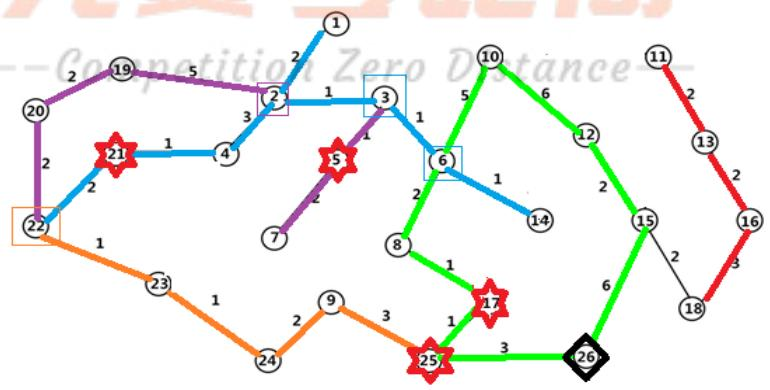

<details>
<summary>sankey</summary>

| Node ID | Color |
| --- | --- |
| 1 | Blue |
| 2 | Purple |
| 3 | Blue |
| 4 | Blue |
| 5 | Purple |
| 6 | Blue |
| 7 | Purple |
| 8 | Green |
| 9 | Orange |
| 10 | Green |
| 11 | Red |
| 12 | Green |
| 13 | Red |
| 14 | Blue |
| 15 | Green |
| 16 | Red |
| 17 | Orange |
| 18 | Black |
| 19 | Purple |
| 20 | Purple |
| 21 | Orange |
| 22 | Blue |
| 23 | Orange |
| 24 | Orange |
| 25 | Orange |
| 26 | Green |
</details>

图 8： 固时上班可休息巡检路线图

其中， 为节省休息时间点， 为只在该点工作

## 休息进餐模型：

在固时上班可休息模型的基础上，考虑 12 点、6点进餐时人员分配问题。

首先对进餐时间的巡检问题进行分析：因为进餐时也要有人去工作，且为固时上班，所以，在进餐时，要有同班的巡检人员顶替进餐人员工作，就只能在这个班内增加巡检人员的数量，如前一班巡检人员要在最后一个周期巡检完毕后才能下班，这时后一班的一部分人从 XJ0022 出发来接替第一班人员，另一部分去进餐。而将2个进餐时间都放在同一班内，这样就可以有效的减少人员浪费，所以假设三班上班时间分别调整到凌晨 4点、中午 12点、晚上8点。

经过分析发现，因为线路 6只需巡检XJ0026 这个点，对比以凌晨4:00 为上班时间的巡检时间表，发现，进餐人员只需要在 12:40 回到 XJ0026 点即可，而XJ0022 与 XJ0026 的最短路径所需时间刚好为 10min，假设 12:30 时第二班负责线路6的巡检才刚出发，也可以在 12:40时回到 XJ0026,所以，线路6只需一名巡检人员就可以完成巡检任务。

而线路 1、线路2、线路3、线路4、线路5 的巡检人员在进餐后，不能按要求时间回到工作岗位，所以都需要 2 名巡检人员互相轮倒，进餐时间 2 人轮倒，非进餐时间 2人一起巡检。

在可休息进餐模型中，第一班需要 11 名巡检人员，第二班、第三班各需要6名巡检人员，每天共需要 23名巡检人员工作。

表 13： 各班次上下班时间及巡检人员数

<table><tr><td>班次</td><td>上班时间</td><td>下班时间</td><td>巡检人员数</td></tr><tr><td>第一班次</td><td>12:00</td><td>20:00</td><td>11</td></tr><tr><td>第二班次</td><td>20:00</td><td>4:00</td><td>6</td></tr><tr><td>第三班次</td><td>4:00</td><td>12:00</td><td>6</td></tr></table>

三个班次总的具体巡检时间表见附录表 4、附录表 5、附录表6。

## 5.2.3 固时上班可休息进餐模型均衡度分析：

对得到的固时上班可休息进餐模型分析可知，同一班次中的每个人工作量是完全相同的，只是各班次巡检人员之间上班时间不同，所以进行三班轮倒排班，即可使每名工人在一周或一个月内工作量均衡。

问题二固时上班模型增加了所需巡检人员数，且对人力资源造成了极大浪费，而且增大了生产成本。

## 问题三：化工厂错时上班的排班问题

## 5.3.1 建立问题一错时上班模型：

首先，考虑问题一固时上班的模型能否应用于错时上班，经观察发现，该模型采用错时上班，所需巡检人员数并没有减少。经过思考发现，问题一中不能使用的优化模型可在错时上班条件下使用。所以，建立在问题一固时上班模型的基础上增加以回程行走所浪费的时间 $t _ { h }$ 最少为目标条件的双目标规划模型。

由题意要求，得到双目标规划模型如下：

$$
\min = t _ {h}
$$

$$
\min = K
$$

$$
s. t \quad \left\{ \begin{array}{l} T = \sum_ {i = 1} ^ {2 6} \sum_ {j = 1} ^ {2 6} (T _ {i j} + t _ {i}) \\ T \leq 3 5 \end{array} \right.
$$

其中 $t _ { i }$ 各巡检点巡检所耗时间，巡检人数为K,总耗时为T<sub>。</sub>

## 5.3.2 求解问题一错时上班模型

利用求解问题一固时上班模型时的方法，让每名工人从 XJ0022 处出发，沿着同样的路线，一路经过所有巡检点并进行巡检。使得每班巡检人员的上班时间依次相差为35min。当第一个工人第一次回到起始点时的巡检总人数就是错时上班模型下的最少人数。下面依旧使用图论法求解模型。

第一个 35min：从第一名工人 XJ0022 出发，经过 XJ0020、XJ0019、XJ0002、XJ0001、XJ0003、XJ0005、XJ0007,并在第一次到达时立即巡检该点。在 35min时该工人正在检修XJ0007，同时第二名工人从 XJ0022出发。

表 14： 第 1个 35min 的巡检时间表

<table><tr><td>巡检点 序号</td><td>巡检时间段</td></tr><tr><td>XJ0022</td><td>8:00-8:02</td></tr><tr><td>XJ0020</td><td>8:04-8:07</td></tr><tr><td>XJ0019</td><td>8:09-8:11</td></tr><tr><td>XJ0002</td><td>8:16-8:18</td></tr><tr><td>XJ0001</td><td>8:20-8:23</td></tr><tr><td>XJ0003</td><td>8:26-8:29</td></tr><tr><td>XJ0005</td><td>8:30-8:32</td></tr><tr><td>XJ0007</td><td>8:34-8:36</td></tr></table>

第二个 35min：第一名工人接着从 XJ0007 出发，经过 XJ0005、XJ0003、XJ0006、XJ0014、XJ0010、XJ0011、XJ0013、XJ0016，并在第一次到达时立即巡检该点。在开始工作70min时，该工人刚把 XJ0016巡检完毕。同时，第三名工人从 XJ0022出发。

表 15： 第 2个 35min 的巡检时间表

<table><tr><td>巡检点 序号</td><td>第一个 35min 巡检时间段</td></tr><tr><td>XJ0006</td><td>8:38-8:41</td></tr><tr><td>XJ0014</td><td>8:42-8:45</td></tr><tr><td>XJ0010</td><td>8:51-8:53</td></tr><tr><td>XJ0011</td><td>8:55-8:58</td></tr><tr><td>XJ0013</td><td>9:00-9:05</td></tr><tr><td>XJ0016</td><td>9:07-9:10</td></tr></table>

第三个 35min：第一名工人接着从 XJ0016 出发，经过 XJ0018、XJ0015、XJ0012、XJ0026、XJ0025、XJ0017、XJ0008，并在第一次到达时立即巡检该点。在开始工作 105min 时，该工人已经路过 XJ0008，前往 XJ0025。同时，第四名工人从 XJ0022出发。

表 16： 第 3个 35min 的巡检时间表

<table><tr><td>巡检点 序号</td><td>第二个 35min 巡检时间段</td></tr><tr><td>XJ0018</td><td>9:13-9:15</td></tr><tr><td>XJ0015</td><td>9:17-9:19</td></tr><tr><td>XJ0012</td><td>9:21-9:23</td></tr><tr><td>XJ0026</td><td>9:31-9:33</td></tr><tr><td>XJ0025</td><td>9:36-9:38</td></tr><tr><td>XJ0017</td><td>9:39-9:41</td></tr><tr><td>XJ0008</td><td>9:42-9:45</td></tr></table>

第四个 35min：第一名工人接着前往 XJ0025，经过 XJ0025、XJ0024、XJ0023、XJ0004、XJ0021、XJ0022 并在第一次到达时立即巡检该点，到达 XJ0022 时，为开始工作后的第134分钟，然后在起始点休息 6 分钟后，在开始工作140min 时，再次开始巡检。

表 17： 第 4个 35min 的巡检时间表

<table><tr><td>巡检点序号</td><td>第二个35min巡检时间段</td></tr><tr><td>XJ0025</td><td>9:47-9:47</td></tr><tr><td>XJ0009</td><td>9:52-9:56</td></tr><tr><td>XJ0024</td><td>9:58-10:00</td></tr><tr><td>XJ0023</td><td>10:01-10:04</td></tr><tr><td>XJ0004</td><td>10:08-10:10</td></tr><tr><td>XJ0021</td><td>10:11-10:14</td></tr><tr><td>XJ0022</td><td>10:16-10:19</td></tr></table>

最终得到具体路线图如下图 9，具体行走路线等数据如下表 18，总的具体错时上班巡检时间表见附录表 7、附录表8、附录表 9：

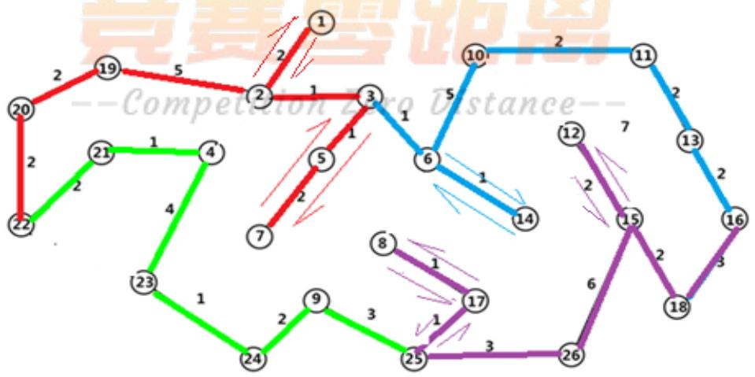

<details>
<summary>flowchart</summary>

```mermaid
graph LR
  10["10"] -->|2| 11["11"]
  11["11"] -->|2| 13["13"]
  13["13"] -->|2| 16["16"]
  16["16"] -->|3| 26["26"]
  26["26"] -->|3| 25["25"]
  25["25"] -->|1| 17["17"]
  17["17"] -->|1| 9["9"]
  9["9"] -->|2| 24["24"]
  24["24"] -->|1| 23["23"]
  23["23"] -->|4| 4["4"]
  4["4"] -->|1| 21["21"]
  21["21"] -->|1| 20["20"]
  20["20"] -->|2| 22["22"]
  22["22"] -->|2| n20["20"]
  10["10"] -->|5| 3["3"]
  3["3"] -->|1| 6["6"]
  6["6"] -->|1| 5["5"]
  5["5"] -->|2| 7["7"]
  7["7"] -->|2| 8["8"]
  8["8"] -->|1| n17["17"]
  17["17"] -->|1| n9["9"]
  9["9"] -->|3| n25["25"]
  25["25"] -->|3| n25
  25["25"] -->|3| n26["26"]
  26["26"] -->|6| 18["18"]
  18["18"] -->|2| 15["15"]
  15["15"] -->|2| 12["12"]
  12["12"] -->|7| 14["14"]
  14["14"] -->|14| n6["6"]
  n6 -->|1| n3["3"]
  n3 -->|1| n7["7"]
  n7 -->|2| n3
  n3 -->|2| n5["5"]
  n5 -->|1| n3
  n3 -->|1| 2 |
  | 3 -->|1 | 2 | 3 |
  | 3 -->|1 | 1 | 4 |
  | 3 -->|1 | 1 | 5 |
  | 3 -->|1 | 1 | 6 |
  | 3 -->|1 | 1 | 7 |
  | 3 -->|1 | 1 | 8 |
  | 3 -->|1 | 1 | 9 |
  | 3 -->|1 | 1 | 10 |
  | 3 -->|1 | 1 | 11 |
  | 3 -->|1 | 1 | 12 |
  | 3 -->|1 | 1 | 13 |
  | 3 -->|1 | 1 | 14 |
  | 3 -->|1 | 1 | 15 |
  | 3 -->|1 | 1 | 16 |
  | 3 -->|1 | 1 | 17 |
  | 3 -->|1 | 1 | 18 |
  | 3 -->|1 | 1 | 19 |
  | 3 -->|1 | 1 | 20 |
  | 3 -->|1 | 1 | 21 |
  | 3 -->|1 | 1 | 22 |
|
```
</details>

图 9： 错时上班巡检路线图  
图 9说明：其中颜色相同的为同一个 35min 内巡检的线路。

根据上图，可知每班最少需要 4 人，每天共需 12 人，且 4 个人的巡检路线为：

第一个人：22→20→19→2→1→2→3→5→7

第二个人：7→5→3→6→14→6→10→11→13→16

第三个人：16→18→15→12→15→26→25→17→8→17

第四个人：17→25→9→24→23→4→21→22

表 18： 错时上班巡检路线表

<table><tr><td>路线</td><td>路线行走时间(min)</td><td>巡检耗时</td><td>巡检点个数</td></tr><tr><td>22→20→19→2→1→2→3→5→7</td><td>17</td><td>18</td><td>8</td></tr><tr><td>7→5→3→6→14→6→10→11→13→16</td><td>17</td><td>18</td><td>6</td></tr><tr><td>16→18→15→12→15→26→25→17→8→17</td><td>21</td><td>14</td><td>7</td></tr><tr><td>17→25→9→24→23→4→21→22</td><td>13</td><td>18</td><td>5</td></tr></table>

## 5.3.3 问题一错时上班均衡度分析：

对得到的问题一错时上班模型分析可知，同一班次中的每个人工作量是完全相同的，只是各班次巡检人员之间上班时间不同，所以进行三班轮倒排班，即可使每名工人在一周或一个月内工作量均衡。

对比问题一固时上班模型，问题一错时上班模型减少了所需巡检人员数，且充分利用了人力资源，而且降低了生产成本。

## 5.3.4 利用错时上班优化问题二模型：

首先对问题二固时上班休息进餐模型分析，发现第一班人力资源浪费现象严重。因此尝试对问题二固时上班休息进餐模型进行优化，通过错时上班减少进餐时的人力资源浪费。

针对第一班的人力资源浪费现象，只需让进餐人员进餐耗用的30min 内的工作由下一班工作人员接替，就可省去第一班中多余的 5人。且巡检路线不变。减少人力资源浪费，降低化工厂成本。

如，第三班在12:30 下班，而12:00-12:30 他们需要去进餐，所以让第一班在12:00时上班并接替第三班的工作，此时12:00-12:30第一班工作人员不进餐。到了18:00 时，第一班工作人员去进餐，第二班工作人员在 18:00上班并接替第一班的工作，且第一班吃完饭后下班。

由于第一班工作时间为 6小时，出于第一、第二班人员工作量均衡，所以将第二班下班、第三班上班时间调整为凌晨 3点。由此，得到如下表中所示的各班次上班时间表：

表 19: 优化后各班次上班时间表

<table><tr><td>班次</td><td>上班时间</td><td>下班时间</td></tr><tr><td>第一班次</td><td>12:00</td><td>6:30</td></tr><tr><td>第二班次</td><td>6:00</td><td>3:00</td></tr><tr><td>第三班次</td><td>3:00</td><td>12:30</td></tr></table>

观察上表可知，各班次的工作量不均衡。总的具体巡检时间表见附录表 10、附录表11、附录表12。

## 5.3.5 问题二错时上班模型均衡度分析：

对得到的错时上班可休息进餐模型分析可知，同一班次中的每个人工作量是完全相同的，只是各班次巡检人员之间上班时间不同，所以进行三班轮倒排班，即可使每名工人在一周或一个月内工作量均衡。

对比问题二固时上班模型，问题二错时上班模型减少了所需巡检人员数，且充分利用了人力资源，而且降低了生产成本。

## 六、模型评价、改进与推广

## 6.1 模型评价：

优点：

（1） 模型都采用了均衡度进行了评估，使工人的工作时间合理化。  
（2） 模型求解过程中，对模型进行逐步调整，增加的结果的准确性。  
（3） 运用了正确的数据处理方法，很好的解决了小数取整问题。  
（4） 引入时间冗余，使模型的求解过程简单化。

缺点：

（1） 模型要分析比较容易出现误差。  
（2） 休息时间点数据较多确定比较困难。

## 6.2 模型的改进：

（1）在问题二中没有求出所有的休息时间点，如果时间充足应求出所有休息时间点，使结果更为准确。  
（2）如果有更先进的算法，比如遗传算法、蚁群算法可以建立更为准确的路线。

## 6.3 模型的推广：

交警早晚高峰出警巡逻、火车进出站的调度、城市车辆限号等问题

## 七、参考文献

[1] 姜启源，谢金星等.数学建模（第四版）[M].北京：高等教育出版社，2011.  
[2] 肖华勇.实用数学建模与软件应用[M].西安:西北工业大学出版社，2010.  
[3] 杨桂元，李天胜等.数学建模应用实例[M].安徽:合肥工业大学出版社，2007.  
[4] 杨洪.图论常用算法选编[M].北京:中国铁道出版社，1988.  
[5] 致远“错时上下班”方便群众有推广价值[N].广西日报，2017.07.28.

## 附 录

附录一程序：最短路径的求解  
```matlab
model:
sets:
pt/1..26/;
road(pt,pt):x,a;
endsets
data:
a=@file('a.txt');
enddata
min=@sum(road(i,j):a*x);
@for(pt(i)|i#ne#22#and#i#ne#16:@sum(pt(k):x(k,i))=@sum(pt(j):x(i,j)))
;
@sum(pt(j)|j#ne#22:x(22,j))=1;
@sum(pt(k)|k#ne#22:x(k,22))=0;
@sum(pt(k)|k#ne#16:x(k,16))=1;
@sum(pt(j)|j#ne#16:x(16,j))=0;
@for(road(i,j):x(i,j)<=a(i,j));
@for(road(i,j):@bin(x(i,j)));
end
```

表1:固定上班第一班巡检表  
固时上班第一班巡检表

<table><tr><td colspan="6">巡检路线I</td><td colspan="8">巡检时间</td></tr><tr><td>21</td><td>8:02</td><td></td><td>9:12</td><td></td><td>10:22</td><td></td><td>11:32</td><td></td><td>12:42</td><td></td><td>13:52</td><td></td><td>15:02</td></tr><tr><td>4</td><td>8:06</td><td>8:41</td><td>9:16</td><td>9:51</td><td>10:26</td><td>11:01</td><td>11:36</td><td>12:11</td><td>12:46</td><td>13:21</td><td>13:56</td><td>14:31</td><td>15:06</td></tr><tr><td>1</td><td>8:13</td><td>8:48</td><td>9:23</td><td>9:58</td><td>10:33</td><td>11:08</td><td>11:43</td><td>12:18</td><td>12:53</td><td>13:28</td><td>14:03</td><td>14:38</td><td>15:13</td></tr><tr><td>3</td><td>8:19</td><td>8:54</td><td>9:29</td><td>10:04</td><td>10:39</td><td>11:14</td><td>11:49</td><td>12:24</td><td>12:59</td><td>13:34</td><td>14:09</td><td>14:44</td><td>15:19</td></tr><tr><td>6</td><td>8:23</td><td>8:58</td><td>9:33</td><td>10:08</td><td>10:43</td><td>11:18</td><td>11:53</td><td>12:28</td><td>13:03</td><td>13:38</td><td>14:13</td><td>14:48</td><td>15:23</td></tr><tr><td>14</td><td>8:27</td><td>9:02</td><td>9:37</td><td>10:12</td><td>10:47</td><td>11:22</td><td>11:57</td><td>12:32</td><td>13:07</td><td>13:42</td><td>14:17</td><td>14:52</td><td>15:27</td></tr><tr><td colspan="6">巡检路线II</td><td colspan="8">巡检时间</td></tr><tr><td>20</td><td>8:02</td><td>8:37</td><td>9:12</td><td>9:47</td><td>10:22</td><td>10:57</td><td>11:32</td><td>12:07</td><td>12:42</td><td>13:17</td><td>13:52</td><td>14:27</td><td>15:02</td></tr><tr><td>19</td><td>8:07</td><td>8:42</td><td>9:17</td><td>9:52</td><td>10:27</td><td>11:02</td><td>11:37</td><td>12:12</td><td>12:47</td><td>13:22</td><td>13:57</td><td>14:32</td><td>15:07</td></tr><tr><td>2</td><td>8:14</td><td>8:49</td><td>9:24</td><td>9:59</td><td>10:34</td><td>11:09</td><td>11:44</td><td>12:19</td><td>12:54</td><td>13:29</td><td>14:04</td><td>14:39</td><td>15:14</td></tr><tr><td>3</td><td>8:17</td><td>8:52</td><td>9:27</td><td>10:02</td><td>10:37</td><td>11:12</td><td>11:47</td><td>12:22</td><td>12:57</td><td>13:32</td><td>14:07</td><td>14:42</td><td>15:17</td></tr><tr><td>5</td><td>8:18</td><td></td><td></td><td></td><td></td><td></td><td></td><td></td><td></td><td></td><td></td><td></td><td></td></tr><tr><td>7</td><td>8:22</td><td></td><td>9:32</td><td></td><td>10:42</td><td></td><td>11:52</td><td></td><td>13:02</td><td></td><td>14:12</td><td></td><td>15:22</td></tr><tr><td colspan="6">巡检路线III</td><td colspan="8">巡检时间</td></tr><tr><td>22</td><td>8:00</td><td>8:35</td><td>9:10</td><td>9:45</td><td>10:20</td><td>10:55</td><td>11:30</td><td>12:05</td><td>12:40</td><td>13:15</td><td>13:50</td><td>14:25</td><td>15:00</td></tr><tr><td>23</td><td>8:03</td><td>8:38</td><td>9:13</td><td>9:48</td><td>10:23</td><td>10:58</td><td>11:33</td><td>12:08</td><td>12:43</td><td>13:18</td><td>13:53</td><td>14:28</td><td>15:03</td></tr><tr><td>24</td><td>8:07</td><td>8:42</td><td>9:17</td><td>9:52</td><td>10:27</td><td>11:02</td><td>11:37</td><td>12:12</td><td>12:47</td><td>13:22</td><td>13:57</td><td>14:32</td><td>15:07</td></tr><tr><td>9</td><td>8:11</td><td>8:46</td><td>9:21</td><td>9:56</td><td>10:31</td><td>11:06</td><td>11:41</td><td>12:16</td><td>12:51</td><td>13:26</td><td>14:01</td><td>14:36</td><td>15:11</td></tr><tr><td>25</td><td>8:18</td><td></td><td></td><td>10:03</td><td></td><td></td><td>11:48</td><td></td><td></td><td>13:33</td><td></td><td></td><td>15:18</td></tr><tr><td>26</td><td>8:23</td><td>8:58</td><td>9:33</td><td>10:08</td><td>10:43</td><td>11:18</td><td>11:53</td><td>12:28</td><td>13:03</td><td>13:38</td><td>14:13</td><td>14:48</td><td>15:23</td></tr><tr><td colspan="6">巡检路线IV</td><td colspan="8">巡检时间</td></tr><tr><td>17</td><td>8:08</td><td></td><td></td><td></td><td></td><td></td><td></td><td></td><td></td><td></td><td></td><td></td><td></td></tr><tr><td>8</td><td>8:11</td><td>8:46</td><td>9:21</td><td>9:56</td><td>10:31</td><td>11:06</td><td>11:41</td><td>12:16</td><td>12:51</td><td>13:26</td><td>14:01</td><td>14:36</td><td>15:11</td></tr><tr><td>10</td><td>8:21</td><td></td><td></td><td>10:06</td><td></td><td></td><td>11:51</td><td></td><td></td><td>13:36</td><td></td><td></td><td>15:21</td></tr><tr><td>12</td><td>8:29</td><td>9:04</td><td>9:39</td><td>10:14</td><td>10:49</td><td>11:24</td><td>11:59</td><td>12:34</td><td>13:09</td><td>13:44</td><td>14:19</td><td>14:54</td><td>15:29</td></tr><tr><td>15</td><td>8:33</td><td>9:08</td><td>9:43</td><td>10:18</td><td>10:53</td><td>11:28</td><td>12:03</td><td>12:38</td><td>13:13</td><td>13:48</td><td>14:23</td><td>14:58</td><td>15:33</td></tr><tr><td colspan="6">巡检路线V</td><td colspan="8">巡检时间</td></tr><tr><td>18</td><td>8:18</td><td>8:53</td><td>9:28</td><td>10:03</td><td>10:38</td><td>11:13</td><td>11:48</td><td>12:23</td><td>12:58</td><td>13:33</td><td>14:08</td><td>14:43</td><td>15:18</td></tr><tr><td>16</td><td>8:23</td><td>8:58</td><td>9:33</td><td>10:08</td><td>10:43</td><td>11:18</td><td>11:53</td><td>12:28</td><td>13:03</td><td>13:38</td><td>14:13</td><td>14:48</td><td>15:23</td></tr><tr><td>13</td><td>8:28</td><td></td><td>9:38</td><td></td><td>10:48</td><td></td><td>11:58</td><td></td><td>13:08</td><td></td><td>14:18</td><td></td><td>15:28</td></tr><tr><td>11</td><td>8:35</td><td>9:10</td><td>9:45</td><td>10:20</td><td>10:55</td><td>11:30</td><td>12:05</td><td>12:40</td><td>13:15</td><td>13:50</td><td>14:25</td><td>15:00</td><td>15:35</td></tr></table>

注：每个路线只需要1个人，每个班只需要5个人。

表2：固定上班第二班巡检表  
固时上班第二班巡检表

<table><tr><td colspan="6">巡检路线I</td><td colspan="8">巡检时间</td></tr><tr><td>21</td><td>16:12</td><td></td><td>17:22</td><td></td><td>18:32</td><td></td><td>19:42</td><td></td><td>20:52</td><td></td><td>22:02</td><td></td><td>23:12</td></tr><tr><td>4</td><td>16:16</td><td>16:51</td><td>17:26</td><td>18:01</td><td>18:36</td><td>19:11</td><td>19:46</td><td>20:21</td><td>20:56</td><td>21:31</td><td>22:06</td><td>22:41</td><td>23:16</td></tr><tr><td>1</td><td>16:23</td><td>16:58</td><td>17:33</td><td>18:08</td><td>18:43</td><td>19:18</td><td>19:53</td><td>20:28</td><td>21:03</td><td>21:38</td><td>22:13</td><td>22:48</td><td>23:23</td></tr><tr><td>3</td><td>16:29</td><td>17:04</td><td>17:39</td><td>18:14</td><td>18:49</td><td>19:24</td><td>19:59</td><td>20:34</td><td>21:09</td><td>21:44</td><td>22:19</td><td>22:54</td><td>23:29</td></tr><tr><td>6</td><td>16:33</td><td>17:08</td><td>17:43</td><td>18:18</td><td>18:53</td><td>19:28</td><td>20:03</td><td>20:38</td><td>21:13</td><td>21:48</td><td>22:23</td><td>22:58</td><td>23:33</td></tr><tr><td>14</td><td>16:37</td><td>17:12</td><td>17:47</td><td>18:22</td><td>18:57</td><td>19:32</td><td>20:07</td><td>20:42</td><td>21:17</td><td>21:52</td><td>22:27</td><td>23:02</td><td>23:37</td></tr><tr><td colspan="6">巡检路线II</td><td colspan="8">巡检时间</td></tr><tr><td>20</td><td>16:12</td><td>16:47</td><td>17:22</td><td>17:57</td><td>18:32</td><td>19:07</td><td>19:42</td><td>20:17</td><td>20:52</td><td>21:27</td><td>22:02</td><td>22:37</td><td>23:12</td></tr><tr><td>19</td><td>16:17</td><td>16:52</td><td>17:27</td><td>18:02</td><td>18:37</td><td>19:12</td><td>19:47</td><td>20:22</td><td>20:57</td><td>21:32</td><td>22:07</td><td>22:42</td><td>23:17</td></tr><tr><td>2</td><td>16:24</td><td>16:59</td><td>17:34</td><td>18:09</td><td>18:44</td><td>19:19</td><td>19:54</td><td>20:29</td><td>21:04</td><td>21:39</td><td>22:14</td><td>22:49</td><td>23:24</td></tr><tr><td>3</td><td>16:27</td><td>17:02</td><td>17:37</td><td>18:12</td><td>18:47</td><td>19:22</td><td>19:57</td><td>20:32</td><td>21:07</td><td>21:42</td><td>22:17</td><td>22:52</td><td>23:27</td></tr><tr><td>5</td><td></td><td></td><td></td><td></td><td></td><td></td><td>19:58</td><td></td><td></td><td></td><td></td><td></td><td></td></tr><tr><td>7</td><td>16:32</td><td></td><td>17:42</td><td></td><td>18:52</td><td></td><td>20:02</td><td></td><td>21:12</td><td></td><td>22:22</td><td></td><td>23:32</td></tr><tr><td colspan="6">巡检路线III</td><td colspan="8">巡检时间</td></tr><tr><td>22</td><td>16:10</td><td>16:45</td><td>17:20</td><td>17:55</td><td>18:30</td><td>19:05</td><td>19:40</td><td>20:15</td><td>20:50</td><td>21:25</td><td>22:00</td><td>22:35</td><td>23:10</td></tr><tr><td>23</td><td>16:13</td><td>16:48</td><td>17:23</td><td>17:58</td><td>18:33</td><td>19:08</td><td>19:43</td><td>20:18</td><td>20:53</td><td>21:28</td><td>22:03</td><td>22:38</td><td>23:13</td></tr><tr><td>24</td><td>16:17</td><td>16:52</td><td>17:27</td><td>18:02</td><td>18:37</td><td>19:12</td><td>19:47</td><td>20:22</td><td>20:57</td><td>21:32</td><td>22:07</td><td>22:42</td><td>23:17</td></tr><tr><td>9</td><td>16:21</td><td>16:56</td><td>17:31</td><td>18:06</td><td>18:41</td><td>19:16</td><td>19:51</td><td>20:26</td><td>21:01</td><td>21:36</td><td>22:11</td><td>22:46</td><td>23:21</td></tr><tr><td>25</td><td></td><td>17:03</td><td></td><td></td><td>18:48</td><td></td><td></td><td>20:33</td><td></td><td></td><td>22:18</td><td></td><td></td></tr><tr><td>26</td><td>16:33</td><td>17:08</td><td>17:43</td><td>18:18</td><td>18:53</td><td>19:28</td><td>20:03</td><td>20:38</td><td>21:13</td><td>21:48</td><td>22:23</td><td>22:58</td><td>23:33</td></tr><tr><td colspan="6">巡检路线IV</td><td colspan="8">巡检时间</td></tr><tr><td>17</td><td>16:08</td><td></td><td></td><td></td><td></td><td></td><td></td><td></td><td></td><td></td><td></td><td></td><td></td></tr><tr><td>8</td><td>16:21</td><td>16:56</td><td>17:31</td><td>18:06</td><td>18:41</td><td>19:16</td><td>19:51</td><td>20:26</td><td>21:01</td><td>21:36</td><td>22:11</td><td>22:46</td><td>23:21</td></tr><tr><td>10</td><td></td><td>17:06</td><td></td><td></td><td>18:51</td><td></td><td></td><td>20:36</td><td></td><td></td><td>22:21</td><td></td><td></td></tr><tr><td>12</td><td>16:39</td><td>17:14</td><td>17:49</td><td>18:24</td><td>18:59</td><td>19:34</td><td>20:09</td><td>20:44</td><td>21:19</td><td>21:54</td><td>22:29</td><td>23:04</td><td>23:39</td></tr><tr><td>15</td><td>16:43</td><td>17:18</td><td>17:53</td><td>18:28</td><td>19:03</td><td>19:38</td><td>20:13</td><td>20:48</td><td>21:23</td><td>21:58</td><td>22:33</td><td>23:08</td><td>23:43</td></tr><tr><td colspan="6">巡检路线V</td><td colspan="8">巡检时间</td></tr><tr><td>18</td><td>16:28</td><td>17:03</td><td>17:38</td><td>18:13</td><td>18:48</td><td>19:23</td><td>19:58</td><td>20:33</td><td>21:08</td><td>21:43</td><td>22:18</td><td>22:53</td><td>23:28</td></tr><tr><td>16</td><td>16:33</td><td>17:08</td><td>17:43</td><td>18:18</td><td>18:53</td><td>19:28</td><td>20:03</td><td>20:38</td><td>21:13</td><td>21:48</td><td>22:23</td><td>22:58</td><td>23:33</td></tr><tr><td>13</td><td>16:38</td><td></td><td>17:48</td><td></td><td>18:58</td><td></td><td>20:08</td><td></td><td>21:18</td><td></td><td>22:28</td><td></td><td>23:38</td></tr><tr><td>11</td><td>16:45</td><td>17:20</td><td>17:55</td><td>18:30</td><td>19:05</td><td>19:40</td><td>20:15</td><td>20:50</td><td>21:25</td><td>22:00</td><td>22:35</td><td>23:10</td><td>23:45</td></tr></table>

注：每个路线只需要1个人，每个班只需要5个人。

表3：固定上班第三班巡检表  
固时时上班第三班巡检表

<table><tr><td colspan="6">巡检路线I</td><td colspan="9">巡检时间</td></tr><tr><td>21</td><td></td><td>0:22</td><td></td><td>1:32</td><td></td><td>2:42</td><td></td><td>3:52</td><td></td><td>5:02</td><td></td><td>6:12</td><td></td><td>7:22</td></tr><tr><td>4</td><td>23:51</td><td>0:26</td><td>1:01</td><td>1:36</td><td>2:11</td><td>2:46</td><td>3:21</td><td>3:56</td><td>4:31</td><td>5:06</td><td>5:41</td><td>6:16</td><td>6:51</td><td>7:26</td></tr><tr><td>1</td><td>23:58</td><td>0:33</td><td>1:08</td><td>1:43</td><td>2:18</td><td>2:53</td><td>3:28</td><td>4:03</td><td>4:38</td><td>5:13</td><td>5:48</td><td>6:23</td><td>6:58</td><td>7:33</td></tr><tr><td>3</td><td>0:04</td><td>0:39</td><td>1:14</td><td>1:49</td><td>2:24</td><td>2:59</td><td>3:34</td><td>4:09</td><td>4:44</td><td>5:19</td><td>5:54</td><td>6:29</td><td>7:04</td><td>7:39</td></tr><tr><td>6</td><td>0:08</td><td>0:43</td><td>1:18</td><td>1:53</td><td>2:28</td><td>3:03</td><td>3:38</td><td>4:13</td><td>4:48</td><td>5:23</td><td>5:58</td><td>6:33</td><td>7:08</td><td>7:43</td></tr><tr><td>14</td><td>0:12</td><td>0:47</td><td>1:22</td><td>1:57</td><td>2:32</td><td>3:07</td><td>3:42</td><td>4:17</td><td>4:52</td><td>5:27</td><td>6:02</td><td>6:37</td><td>7:12</td><td>7:47</td></tr><tr><td colspan="6">巡检路线II</td><td colspan="9">巡检时间</td></tr><tr><td>20</td><td>23:47</td><td>0:22</td><td>0:57</td><td>1:32</td><td>2:07</td><td>2:42</td><td>3:17</td><td>3:52</td><td>4:27</td><td>5:02</td><td>5:37</td><td>6:12</td><td>6:47</td><td>7:22</td></tr><tr><td>19</td><td>23:52</td><td>0:27</td><td>1:02</td><td>1:37</td><td>2:12</td><td>2:47</td><td>3:22</td><td>3:57</td><td>4:32</td><td>5:07</td><td>5:42</td><td>6:17</td><td>6:52</td><td>7:27</td></tr><tr><td>2</td><td>23:59</td><td>0:34</td><td>1:09</td><td>1:44</td><td>2:19</td><td>2:54</td><td>3:29</td><td>4:04</td><td>4:39</td><td>5:14</td><td>5:49</td><td>6:24</td><td>6:59</td><td>7:34</td></tr><tr><td>3</td><td>0:02</td><td>0:37</td><td>1:12</td><td>1:47</td><td>2:22</td><td>2:57</td><td>3:32</td><td>4:07</td><td>4:42</td><td>5:17</td><td>5:52</td><td>6:27</td><td>7:02</td><td>7:37</td></tr><tr><td>5</td><td></td><td></td><td></td><td></td><td></td><td></td><td></td><td></td><td></td><td></td><td></td><td></td><td></td><td></td></tr><tr><td>7</td><td></td><td>0:42</td><td></td><td>1:52</td><td></td><td>3:02</td><td></td><td>4:12</td><td></td><td>5:22</td><td></td><td>6:32</td><td></td><td>7:42</td></tr><tr><td colspan="6">巡检路线III</td><td colspan="9">巡检时间</td></tr><tr><td>22</td><td>23:45</td><td>0:20</td><td>0:55</td><td>1:30</td><td>2:05</td><td>2:40</td><td>3:15</td><td>3:50</td><td>4:25</td><td>5:00</td><td>5:35</td><td>6:10</td><td>6:45</td><td>7:20</td></tr><tr><td>23</td><td>23:48</td><td>0:23</td><td>0:58</td><td>1:33</td><td>2:08</td><td>2:43</td><td>3:18</td><td>3:53</td><td>4:28</td><td>5:03</td><td>5:38</td><td>6:13</td><td>6:48</td><td>7:23</td></tr><tr><td>24</td><td>23:52</td><td>0:27</td><td>1:02</td><td>1:37</td><td>2:12</td><td>2:47</td><td>3:22</td><td>3:57</td><td>4:32</td><td>5:07</td><td>5:42</td><td>6:17</td><td>6:52</td><td>7:27</td></tr><tr><td>9</td><td>23:56</td><td>0:31</td><td>1:06</td><td>1:41</td><td>2:16</td><td>2:51</td><td>3:26</td><td>4:01</td><td>4:36</td><td>5:11</td><td>5:46</td><td>6:21</td><td>6:56</td><td>7:31</td></tr><tr><td>25</td><td>0:03</td><td></td><td></td><td>1:48</td><td></td><td></td><td>3:33</td><td></td><td></td><td>5:18</td><td></td><td></td><td>7:03</td><td></td></tr><tr><td>26</td><td>0:08</td><td>0:43</td><td>1:18</td><td>1:53</td><td>2:28</td><td>3:03</td><td>3:38</td><td>4:13</td><td>4:48</td><td>5:23</td><td>5:58</td><td>6:33</td><td>7:08</td><td>7:43</td></tr><tr><td colspan="6">巡检路线IV</td><td colspan="9">巡检时间</td></tr><tr><td>17</td><td></td><td>0:08</td><td></td><td></td><td></td><td></td><td></td><td></td><td></td><td></td><td></td><td></td><td></td><td></td></tr><tr><td>8</td><td>23:56</td><td>0:31</td><td>1:06</td><td>1:41</td><td>2:16</td><td>2:51</td><td>3:26</td><td>4:01</td><td>4:36</td><td>5:11</td><td>5:46</td><td>6:21</td><td>6:56</td><td>7:31</td></tr><tr><td>10</td><td>0:06</td><td></td><td></td><td>1:51</td><td></td><td></td><td>3:36</td><td></td><td></td><td>5:21</td><td></td><td></td><td>7:06</td><td></td></tr><tr><td>12</td><td>0:14</td><td>0:49</td><td>1:24</td><td>1:59</td><td>2:34</td><td>3:09</td><td>3:44</td><td>4:19</td><td>4:54</td><td>5:29</td><td>6:04</td><td>6:39</td><td>7:14</td><td>7:49</td></tr><tr><td>15</td><td>0:18</td><td>0:53</td><td>1:28</td><td>2:03</td><td>2:38</td><td>3:13</td><td>3:48</td><td>4:23</td><td>4:58</td><td>5:33</td><td>6:08</td><td>6:43</td><td>7:18</td><td>7:53</td></tr><tr><td colspan="6">巡检路线V</td><td colspan="9">巡检时间</td></tr><tr><td>18</td><td>0:03</td><td>0:38</td><td>1:13</td><td>1:48</td><td>2:23</td><td>2:58</td><td>3:33</td><td>4:08</td><td>4:43</td><td>5:18</td><td>5:53</td><td>6:28</td><td>7:03</td><td>7:38</td></tr><tr><td>16</td><td>0:08</td><td>0:43</td><td>1:18</td><td>1:53</td><td>2:28</td><td>3:03</td><td>3:38</td><td>4:13</td><td>4:48</td><td>5:23</td><td>5:58</td><td>6:33</td><td>7:08</td><td>7:43</td></tr><tr><td>13</td><td></td><td>0:48</td><td></td><td>1:58</td><td></td><td>3:08</td><td></td><td>4:18</td><td></td><td>5:28</td><td></td><td>6:38</td><td></td><td>7:48</td></tr><tr><td>11</td><td>0:20</td><td>0:55</td><td>1:30</td><td>2:05</td><td>2:40</td><td>3:15</td><td>3:50</td><td>4:25</td><td>5:00</td><td>5:35</td><td>6:10</td><td>6:45</td><td>7:20</td><td>7:55</td></tr></table>

注：每个路线只需要1个人，每个班只需要5个人。

表4：固时进餐休息第一班巡检表

<table><tr><td colspan="15">固时吃饭休息第一班巡检表</td></tr><tr><td colspan="6">巡检路线I</td><td colspan="9">巡检时间</td></tr><tr><td>21</td><td>12:07</td><td>12:42</td><td></td><td>13:52</td><td></td><td>15:02</td><td></td><td>16:12</td><td></td><td>17:22</td><td></td><td>18:32</td><td></td><td>19:42</td></tr><tr><td>4</td><td>12:11</td><td>12:46</td><td>13:21</td><td>13:56</td><td>14:31</td><td>15:06</td><td>15:41</td><td>16:16</td><td>16:51</td><td>17:26</td><td>18:01</td><td>18:36</td><td>19:11</td><td>19:46</td></tr><tr><td>1</td><td>12:18</td><td>12:53</td><td>13:28</td><td>14:03</td><td>14:38</td><td>15:13</td><td>15:48</td><td>16:23</td><td>16:58</td><td>17:33</td><td>18:08</td><td>18:43</td><td>19:18</td><td>19:53</td></tr><tr><td>3</td><td>12:24</td><td>12:59</td><td>13:34</td><td>14:09</td><td>14:44</td><td>15:19</td><td>15:54</td><td>16:29</td><td>17:04</td><td>17:39</td><td>18:14</td><td>18:49</td><td>19:24</td><td>19:59</td></tr><tr><td>6</td><td>12:28</td><td>13:03</td><td>13:38</td><td>14:13</td><td>14:48</td><td>15:23</td><td>15:58</td><td>16:33</td><td>17:08</td><td>17:43</td><td>18:18</td><td>18:53</td><td>19:28</td><td>20:03</td></tr><tr><td>14</td><td>12:32</td><td>13:07</td><td>13:42</td><td>14:17</td><td>14:52</td><td>15:27</td><td>16:02</td><td>16:37</td><td>17:12</td><td>17:47</td><td>18:22</td><td>18:57</td><td>19:32</td><td>20:07</td></tr><tr><td colspan="15">巡检路线II</td></tr><tr><td>20</td><td>12:07</td><td>12:42</td><td>13:17</td><td>13:52</td><td>14:27</td><td>15:02</td><td>15:37</td><td>16:12</td><td>16:47</td><td>17:22</td><td>17:57</td><td>18:32</td><td>19:07</td><td>19:42</td></tr><tr><td>19</td><td>12:12</td><td>12:47</td><td>13:22</td><td>13:57</td><td>14:32</td><td>15:07</td><td>15:42</td><td>16:17</td><td>16:52</td><td>17:27</td><td>18:02</td><td>18:37</td><td>19:12</td><td>19:47</td></tr><tr><td>2</td><td>12:19</td><td>12:54</td><td>13:29</td><td>14:04</td><td>14:39</td><td>15:14</td><td>15:49</td><td>16:24</td><td>16:59</td><td>17:34</td><td>18:09</td><td>18:44</td><td>19:19</td><td>19:54</td></tr><tr><td>3</td><td>12:22</td><td>12:57</td><td>13:32</td><td>14:07</td><td>14:42</td><td>15:17</td><td>15:52</td><td>16:27</td><td>17:02</td><td>17:37</td><td>18:12</td><td>18:47</td><td>19:22</td><td>19:57</td></tr><tr><td>5</td><td></td><td></td><td></td><td></td><td></td><td></td><td></td><td></td><td></td><td></td><td></td><td></td><td></td><td>19:58</td></tr><tr><td>7</td><td></td><td>13:02</td><td></td><td>14:12</td><td></td><td>15:22</td><td></td><td>16:32</td><td></td><td>17:42</td><td></td><td>18:52</td><td></td><td>20:02</td></tr><tr><td colspan="6">巡检路线III</td><td colspan="9">巡检时间</td></tr><tr><td>22</td><td>12:05</td><td>12:40</td><td>13:15</td><td>13:50</td><td>14:25</td><td>15:00</td><td>15:35</td><td>16:10</td><td>16:45</td><td>17:20</td><td>17:55</td><td>18:30</td><td>19:05</td><td>19:40</td></tr><tr><td>23</td><td>12:08</td><td>12:43</td><td>13:18</td><td>13:53</td><td>14:28</td><td>15:03</td><td>15:38</td><td>16:13</td><td>16:48</td><td>17:23</td><td>17:58</td><td>18:33</td><td>19:08</td><td>19:43</td></tr><tr><td>24</td><td>12:12</td><td>12:47</td><td>13:22</td><td>13:57</td><td>14:32</td><td>15:07</td><td>15:42</td><td>16:17</td><td>16:52</td><td>17:27</td><td>18:02</td><td>18:37</td><td>19:12</td><td>19:47</td></tr><tr><td>9</td><td>12:16</td><td>12:51</td><td>13:26</td><td>14:01</td><td>14:36</td><td>15:11</td><td>15:46</td><td>16:21</td><td>16:56</td><td>17:31</td><td>18:06</td><td>18:41</td><td>19:16</td><td>19:51</td></tr><tr><td>25</td><td></td><td></td><td>13:33</td><td></td><td></td><td>15:18</td><td></td><td></td><td>17:03</td><td></td><td></td><td>18:48</td><td></td><td></td></tr><tr><td colspan="6">巡检路线IV</td><td colspan="9">巡检时间</td></tr><tr><td>17</td><td></td><td></td><td></td><td></td><td></td><td></td><td></td><td>16:08</td><td></td><td></td><td></td><td></td><td></td><td></td></tr><tr><td>8</td><td>12:16</td><td>12:51</td><td>13:26</td><td>14:01</td><td>14:36</td><td>15:11</td><td>15:46</td><td>16:21</td><td>16:56</td><td>17:31</td><td>18:06</td><td>18:41</td><td>19:16</td><td>19:51</td></tr><tr><td>10</td><td></td><td></td><td>13:36</td><td></td><td></td><td>15:21</td><td></td><td></td><td>17:06</td><td></td><td></td><td>18:51</td><td></td><td></td></tr><tr><td>12</td><td>12:34</td><td>13:09</td><td>13:44</td><td>14:19</td><td>14:54</td><td>15:29</td><td>16:04</td><td>16:39</td><td>17:14</td><td>17:49</td><td>18:24</td><td>18:59</td><td>19:34</td><td>20:09</td></tr><tr><td>15</td><td>12:38</td><td>13:13</td><td>13:48</td><td>14:23</td><td>14:58</td><td>15:33</td><td>16:08</td><td>16:43</td><td>17:18</td><td>17:53</td><td>18:28</td><td>19:03</td><td>19:38</td><td>20:13</td></tr><tr><td colspan="6">巡检路线V</td><td colspan="9">巡检时间</td></tr><tr><td>18</td><td>12:23</td><td>12:58</td><td>13:33</td><td>14:08</td><td>14:43</td><td>15:18</td><td>15:53</td><td>16:28</td><td>17:03</td><td>17:38</td><td>18:13</td><td>18:48</td><td>19:23</td><td>19:58</td></tr><tr><td>16</td><td>12:28</td><td>13:03</td><td>13:38</td><td>14:13</td><td>14:48</td><td>15:23</td><td>15:58</td><td>16:33</td><td>17:08</td><td>17:43</td><td>18:18</td><td>18:53</td><td>19:28</td><td>20:03</td></tr><tr><td>13</td><td></td><td>13:08</td><td></td><td>14:18</td><td></td><td>15:28</td><td></td><td>16:38</td><td></td><td>17:48</td><td></td><td>18:58</td><td></td><td>20:08</td></tr><tr><td>11</td><td>12:40</td><td>13:15</td><td>13:50</td><td>14:25</td><td>15:00</td><td>15:35</td><td>16:10</td><td>16:45</td><td>17:20</td><td>17:55</td><td>18:30</td><td>19:05</td><td>19:40</td><td>20:15</td></tr><tr><td colspan="6">巡检路线VI</td><td colspan="9">巡检时间</td></tr><tr><td>26</td><td>12:10</td><td>12:45</td><td>13:20</td><td>13:55</td><td>14:30</td><td>15:05</td><td>15:40</td><td>16:15</td><td>16:50</td><td>17:25</td><td>18:00</td><td>18:35</td><td>19:10</td><td>19:45</td></tr><tr><td colspan="15">注:I---V线路每班需要2人,VI线路需要1人,总共需要11人</td></tr></table>

表5：固时进餐休息第二班巡检表

<table><tr><td colspan="14">固时休息进餐第二班巡检表</td></tr><tr><td colspan="6">巡检路线I</td><td colspan="8">巡检时间</td></tr><tr><td>21</td><td></td><td>20:52</td><td></td><td>22:02</td><td></td><td>23:12</td><td></td><td>0:22</td><td></td><td>1:32</td><td></td><td>2:42</td><td></td></tr><tr><td>4</td><td>20:21</td><td>20:56</td><td>21:31</td><td>22:06</td><td>22:41</td><td>23:16</td><td>23:51</td><td>0:26</td><td>1:01</td><td>1:36</td><td>2:11</td><td>2:46</td><td>3:21</td></tr><tr><td>1</td><td>20:28</td><td>21:03</td><td>21:38</td><td>22:13</td><td>22:48</td><td>23:23</td><td>23:58</td><td>0:33</td><td>1:08</td><td>1:43</td><td>2:18</td><td>2:53</td><td>3:28</td></tr><tr><td>3</td><td>20:34</td><td>21:09</td><td>21:44</td><td>22:19</td><td>22:54</td><td>23:29</td><td>0:04</td><td>0:39</td><td>1:14</td><td>1:49</td><td>2:24</td><td>2:59</td><td>3:34</td></tr><tr><td>6</td><td>20:38</td><td>21:13</td><td>21:48</td><td>22:23</td><td>22:58</td><td>23:33</td><td>0:08</td><td>0:43</td><td>1:18</td><td>1:53</td><td>2:28</td><td>3:03</td><td>3:38</td></tr><tr><td>14</td><td>20:42</td><td>21:17</td><td>21:52</td><td>22:27</td><td>23:02</td><td>23:37</td><td>0:12</td><td>0:47</td><td>1:22</td><td>1:57</td><td>2:32</td><td>3:07</td><td>3:42</td></tr><tr><td colspan="6">巡检路线II</td><td colspan="8">巡检时间</td></tr><tr><td>20</td><td>20:17</td><td>20:52</td><td>21:27</td><td>22:02</td><td>22:37</td><td>23:12</td><td>23:47</td><td>0:22</td><td>0:57</td><td>1:32</td><td>2:07</td><td>2:42</td><td>3:17</td></tr><tr><td>19</td><td>20:22</td><td>20:57</td><td>21:32</td><td>22:07</td><td>22:42</td><td>23:17</td><td>23:52</td><td>0:27</td><td>1:02</td><td>1:37</td><td>2:12</td><td>2:47</td><td>3:22</td></tr><tr><td>2</td><td>20:29</td><td>21:04</td><td>21:39</td><td>22:14</td><td>22:49</td><td>23:24</td><td>23:59</td><td>0:34</td><td>1:09</td><td>1:44</td><td>2:19</td><td>2:54</td><td>3:29</td></tr><tr><td>3</td><td>20:32</td><td>21:07</td><td>21:42</td><td>22:17</td><td>22:52</td><td>23:27</td><td>0:02</td><td>0:37</td><td>1:12</td><td>1:47</td><td>2:22</td><td>2:57</td><td>3:32</td></tr><tr><td>5</td><td></td><td></td><td></td><td></td><td></td><td></td><td></td><td></td><td></td><td></td><td></td><td></td><td></td></tr><tr><td>7</td><td></td><td>21:12</td><td></td><td>22:22</td><td></td><td>23:32</td><td></td><td>0:42</td><td></td><td>1:52</td><td></td><td>3:02</td><td></td></tr><tr><td colspan="6">巡检路线III</td><td colspan="8">巡检时间</td></tr><tr><td>22</td><td>20:15</td><td>20:50</td><td>21:25</td><td>22:00</td><td>22:35</td><td>23:10</td><td>23:45</td><td>0:20</td><td>0:55</td><td>1:30</td><td>2:05</td><td>2:40</td><td>3:15</td></tr><tr><td>23</td><td>20:18</td><td>20:53</td><td>21:28</td><td>22:03</td><td>22:38</td><td>23:13</td><td>23:48</td><td>0:23</td><td>0:58</td><td>1:33</td><td>2:08</td><td>2:43</td><td>3:18</td></tr><tr><td>24</td><td>20:22</td><td>20:57</td><td>21:32</td><td>22:07</td><td>22:42</td><td>23:17</td><td>23:52</td><td>0:27</td><td>1:02</td><td>1:37</td><td>2:12</td><td>2:47</td><td>3:22</td></tr><tr><td>9</td><td>20:26</td><td>21:01</td><td>21:36</td><td>22:11</td><td>22:46</td><td>23:21</td><td>23:56</td><td>0:31</td><td>1:06</td><td>1:41</td><td>2:16</td><td>2:51</td><td>3:26</td></tr><tr><td>25</td><td>20:33</td><td></td><td></td><td>22:18</td><td></td><td></td><td>0:03</td><td></td><td></td><td>1:48</td><td></td><td></td><td>3:33</td></tr><tr><td colspan="6">巡检路线IV</td><td colspan="8">巡检时间</td></tr><tr><td>17</td><td></td><td></td><td></td><td></td><td></td><td></td><td></td><td>0:08</td><td></td><td></td><td></td><td></td><td></td></tr><tr><td>8</td><td>20:26</td><td>21:01</td><td>21:36</td><td>22:11</td><td>22:46</td><td>23:21</td><td>23:56</td><td>0:31</td><td>1:06</td><td>1:41</td><td>2:16</td><td>2:51</td><td>3:26</td></tr><tr><td>10</td><td>20:36</td><td></td><td></td><td>22:21</td><td></td><td></td><td>0:06</td><td></td><td></td><td>1:51</td><td></td><td></td><td>3:36</td></tr><tr><td>12</td><td>20:44</td><td>21:19</td><td>21:54</td><td>22:29</td><td>23:04</td><td>23:39</td><td>0:14</td><td>0:49</td><td>1:24</td><td>1:59</td><td>2:34</td><td>3:09</td><td>3:44</td></tr><tr><td>15</td><td>20:48</td><td>21:23</td><td>21:58</td><td>22:33</td><td>23:08</td><td>23:43</td><td>0:18</td><td>0:53</td><td>1:28</td><td>2:03</td><td>2:38</td><td>3:13</td><td>3:48</td></tr><tr><td colspan="6">巡检路线V</td><td colspan="8">巡检时间</td></tr><tr><td>18</td><td>20:33</td><td>21:08</td><td>21:43</td><td>22:18</td><td>22:53</td><td>23:28</td><td>0:03</td><td>0:38</td><td>1:13</td><td>1:48</td><td>2:23</td><td>2:58</td><td>3:33</td></tr><tr><td>16</td><td>20:38</td><td>21:13</td><td>21:48</td><td>22:23</td><td>22:58</td><td>23:33</td><td>0:08</td><td>0:43</td><td>1:18</td><td>1:53</td><td>2:28</td><td>3:03</td><td>3:38</td></tr><tr><td>13</td><td></td><td>21:18</td><td></td><td>22:28</td><td></td><td>23:38</td><td></td><td>0:48</td><td></td><td>1:58</td><td></td><td>3:08</td><td></td></tr><tr><td>11</td><td>20:50</td><td>21:25</td><td>22:00</td><td>22:35</td><td>23:10</td><td>23:45</td><td>0:20</td><td>0:55</td><td>1:30</td><td>2:05</td><td>2:40</td><td>3:15</td><td>3:50</td></tr><tr><td colspan="6">巡检路线VI</td><td colspan="8">巡检时间</td></tr><tr><td>26</td><td>20:20</td><td>20:55</td><td>21:30</td><td>22:05</td><td>22:40</td><td>23:15</td><td>23:50</td><td>0:25</td><td>1:00</td><td>1:35</td><td>2:10</td><td>2:45</td><td>3:20</td></tr></table>

注：每条线路只需6个人，共6个人

表6：固时进餐休息第三班巡检表

<table><tr><td colspan="15">固时吃饭进餐第三班巡检表</td></tr><tr><td colspan="15">巡检路线I</td></tr><tr><td colspan="15">巡检时间</td></tr><tr><td>21</td><td>3:52</td><td></td><td>5:02</td><td></td><td>6:12</td><td></td><td>7:22</td><td>8:02</td><td></td><td>9:12</td><td></td><td>10:22</td><td></td><td>11:32</td></tr><tr><td>4</td><td>3:56</td><td>4:31</td><td>5:06</td><td>5:41</td><td>6:16</td><td>6:51</td><td>7:26</td><td>8:06</td><td>8:41</td><td>9:16</td><td>9:51</td><td>10:26</td><td>11:01</td><td>11:36</td></tr><tr><td>1</td><td>4:03</td><td>4:38</td><td>5:13</td><td>5:48</td><td>6:23</td><td>6:58</td><td>7:33</td><td>8:13</td><td>8:48</td><td>9:23</td><td>9:58</td><td>10:33</td><td>11:08</td><td>11:43</td></tr><tr><td>3</td><td>4:09</td><td>4:44</td><td>5:19</td><td>5:54</td><td>6:29</td><td>7:04</td><td>7:39</td><td>8:19</td><td>8:54</td><td>9:29</td><td>10:04</td><td>10:39</td><td>11:14</td><td>11:49</td></tr><tr><td>6</td><td>4:13</td><td>4:48</td><td>5:23</td><td>5:58</td><td>6:33</td><td>7:08</td><td>7:43</td><td>8:23</td><td>8:58</td><td>9:33</td><td>10:08</td><td>10:43</td><td>11:18</td><td>11:53</td></tr><tr><td>14</td><td>4:17</td><td>4:52</td><td>5:27</td><td>6:02</td><td>6:37</td><td>7:12</td><td>7:47</td><td>8:27</td><td>9:02</td><td>9:37</td><td>10:12</td><td>10:47</td><td>11:22</td><td>11:57</td></tr><tr><td colspan="15">巡检路线II</td></tr><tr><td colspan="15">巡检时间</td></tr><tr><td>20</td><td>3:52</td><td>4:27</td><td>5:02</td><td>5:37</td><td>6:12</td><td>6:47</td><td>7:22</td><td>8:02</td><td>8:37</td><td>9:12</td><td>9:47</td><td>10:22</td><td>10:57</td><td>11:32</td></tr><tr><td>19</td><td>3:57</td><td>4:32</td><td>5:07</td><td>5:42</td><td>6:17</td><td>6:52</td><td>7:27</td><td>8:07</td><td>8:42</td><td>9:17</td><td>9:52</td><td>10:27</td><td>11:02</td><td>11:37</td></tr><tr><td>2</td><td>4:04</td><td>4:39</td><td>5:14</td><td>5:49</td><td>6:24</td><td>6:59</td><td>7:34</td><td>8:14</td><td>8:49</td><td>9:24</td><td>9:59</td><td>10:34</td><td>11:09</td><td>11:44</td></tr><tr><td>3</td><td>4:07</td><td>4:42</td><td>5:17</td><td>5:52</td><td>6:27</td><td>7:02</td><td>7:37</td><td>8:17</td><td>8:52</td><td>9:27</td><td>10:02</td><td>10:37</td><td>11:12</td><td>11:47</td></tr><tr><td>5</td><td></td><td></td><td></td><td></td><td></td><td></td><td></td><td>8:18</td><td></td><td></td><td></td><td></td><td></td><td></td></tr><tr><td>7</td><td>4:12</td><td></td><td>5:22</td><td></td><td>6:32</td><td></td><td>7:42</td><td>8:22</td><td></td><td>9:32</td><td></td><td>10:42</td><td></td><td>11:52</td></tr><tr><td colspan="15">巡检路线III</td></tr><tr><td colspan="15">巡检时间</td></tr><tr><td>22</td><td>3:50</td><td>4:25</td><td>5:00</td><td>5:35</td><td>6:10</td><td>6:45</td><td>7:20</td><td>8:00</td><td>8:35</td><td>9:10</td><td>9:45</td><td>10:20</td><td>10:55</td><td>11:30</td></tr><tr><td>23</td><td>3:53</td><td>4:28</td><td>5:03</td><td>5:38</td><td>6:13</td><td>6:48</td><td>7:23</td><td>8:03</td><td>8:38</td><td>9:13</td><td>9:48</td><td>10:23</td><td>10:58</td><td>11:33</td></tr><tr><td>24</td><td>3:57</td><td>4:32</td><td>5:07</td><td>5:42</td><td>6:17</td><td>6:52</td><td>7:27</td><td>8:07</td><td>8:42</td><td>9:17</td><td>9:52</td><td>10:27</td><td>11:02</td><td>11:37</td></tr><tr><td>9</td><td>4:01</td><td>4:36</td><td>5:11</td><td>5:46</td><td>6:21</td><td>6:56</td><td>7:31</td><td>8:11</td><td>8:46</td><td>9:21</td><td>9:56</td><td>10:31</td><td>11:06</td><td>11:41</td></tr><tr><td>25</td><td></td><td></td><td>5:18</td><td></td><td></td><td>7:03</td><td></td><td>8:18</td><td></td><td></td><td>10:03</td><td></td><td></td><td>11:48</td></tr><tr><td colspan="15">巡检路线IV</td></tr><tr><td colspan="15">巡检时间</td></tr><tr><td>17</td><td></td><td></td><td></td><td></td><td></td><td></td><td></td><td>8:08</td><td></td><td></td><td></td><td></td><td></td><td></td></tr><tr><td>8</td><td>4:01</td><td>4:36</td><td>5:11</td><td>5:46</td><td>6:21</td><td>6:56</td><td>7:31</td><td>8:11</td><td>8:46</td><td>9:21</td><td>9:56</td><td>10:31</td><td>11:06</td><td>11:41</td></tr><tr><td>10</td><td></td><td></td><td>5:21</td><td></td><td></td><td>7:06</td><td></td><td>8:21</td><td></td><td></td><td>10:06</td><td></td><td></td><td>11:51</td></tr><tr><td>12</td><td>4:19</td><td>4:54</td><td>5:29</td><td>6:04</td><td>6:39</td><td>7:14</td><td>7:49</td><td>8:29</td><td>9:04</td><td>9:39</td><td>10:14</td><td>10:49</td><td>11:24</td><td>11:59</td></tr><tr><td>15</td><td>4:23</td><td>4:58</td><td>5:33</td><td>6:08</td><td>6:43</td><td>7:18</td><td>7:53</td><td>8:33</td><td>9:08</td><td>9:43</td><td>10:18</td><td>10:53</td><td>11:28</td><td>12:03</td></tr><tr><td colspan="15">巡检路线V</td></tr><tr><td colspan="15">巡检时间</td></tr><tr><td>18</td><td>4:08</td><td>4:43</td><td>5:18</td><td>5:53</td><td>6:28</td><td>7:03</td><td>7:38</td><td>8:18</td><td>8:53</td><td>9:28</td><td>10:03</td><td>10:38</td><td>11:13</td><td>11:48</td></tr><tr><td>16</td><td>4:13</td><td>4:48</td><td>5:23</td><td>5:58</td><td>6:33</td><td>7:08</td><td>7:43</td><td>8:23</td><td>8:58</td><td>9:33</td><td>10:08</td><td>10:43</td><td>11:18</td><td>11:53</td></tr><tr><td>13</td><td>4:18</td><td></td><td>5:28</td><td></td><td>6:38</td><td></td><td>7:48</td><td>8:28</td><td></td><td>9:38</td><td></td><td>10:48</td><td></td><td>11:58</td></tr><tr><td>11</td><td>4:25</td><td>5:00</td><td>5:35</td><td>6:10</td><td>6:45</td><td>7:20</td><td>7:55</td><td>8:35</td><td>9:10</td><td>9:45</td><td>10:20</td><td>10:55</td><td>11:30</td><td>12:05</td></tr><tr><td colspan="15">巡检路线VI</td></tr><tr><td colspan="15">巡检时间</td></tr><tr><td>26</td><td>3:55</td><td>4:30</td><td>5:05</td><td>5:40</td><td>6:15</td><td>6:50</td><td>7:25</td><td>8:00</td><td>8:35</td><td>9:10</td><td>9:45</td><td>10:20</td><td>10:55</td><td>11:30</td></tr></table>

表7：错时上班第一班巡检表

<table><tr><td>巡检点</td><td colspan="3">第一人巡检时间</td><td></td><td colspan="3">第二人巡检时间</td><td></td><td colspan="3">第三人巡检时间</td><td></td><td colspan="3">第四人巡检时间</td></tr><tr><td>22</td><td>8:00</td><td>10:20</td><td>12:40</td><td></td><td>8:35</td><td>10:55</td><td>13:15</td><td></td><td>9:10</td><td>11:30</td><td>13:50</td><td></td><td>9:45</td><td>12:05</td><td>14:25</td></tr><tr><td>20</td><td>8:04</td><td>10:24</td><td>12:44</td><td></td><td>8:39</td><td>10:59</td><td>13:19</td><td></td><td>9:14</td><td>11:34</td><td>13:54</td><td></td><td>9:49</td><td>12:09</td><td>14:29</td></tr><tr><td>19</td><td>8:09</td><td>10:29</td><td>12:49</td><td></td><td>8:44</td><td>11:04</td><td>13:24</td><td></td><td>9:19</td><td>11:39</td><td>13:59</td><td></td><td>9:54</td><td>12:14</td><td>14:34</td></tr><tr><td>2</td><td>8:16</td><td>10:36</td><td>12:56</td><td></td><td>8:51</td><td>11:11</td><td>13:31</td><td></td><td>9:26</td><td>11:46</td><td>14:06</td><td></td><td>10:01</td><td>12:21</td><td>14:41</td></tr><tr><td>1</td><td>8:20</td><td>10:40</td><td>13:00</td><td></td><td>8:55</td><td>11:15</td><td>13:35</td><td></td><td>9:30</td><td>11:50</td><td>14:10</td><td></td><td>10:05</td><td>12:25</td><td>14:45</td></tr><tr><td>3</td><td>8:26</td><td>10:46</td><td>13:06</td><td></td><td>9:01</td><td>11:21</td><td>13:41</td><td></td><td>9:36</td><td>11:56</td><td>14:16</td><td></td><td>10:11</td><td>12:31</td><td>14:51</td></tr><tr><td>5</td><td>8:30</td><td>10:50</td><td>13:10</td><td></td><td>9:05</td><td>11:25</td><td>13:45</td><td></td><td>9:40</td><td>12:00</td><td>14:20</td><td></td><td>10:15</td><td>12:35</td><td>14:55</td></tr><tr><td>7</td><td>8:34</td><td>10:54</td><td>13:14</td><td></td><td>9:09</td><td>11:29</td><td>13:49</td><td></td><td>9:44</td><td>12:04</td><td>14:24</td><td></td><td>10:19</td><td>12:39</td><td>14:59</td></tr><tr><td></td><td></td><td></td><td></td><td></td><td></td><td></td><td></td><td></td><td></td><td></td><td></td><td></td><td></td><td></td><td></td></tr><tr><td>5</td><td>8:36</td><td>10:56</td><td>13:16</td><td></td><td>9:11</td><td>11:31</td><td>13:51</td><td></td><td>9:46</td><td>12:06</td><td>14:26</td><td></td><td>10:21</td><td>12:41</td><td>15:01</td></tr><tr><td>3</td><td>8:37</td><td>10:57</td><td>13:17</td><td></td><td>9:12</td><td>11:32</td><td>13:52</td><td></td><td>9:47</td><td>12:07</td><td>14:27</td><td></td><td>10:22</td><td>12:42</td><td>15:02</td></tr><tr><td>6</td><td>8:38</td><td>10:58</td><td>13:18</td><td></td><td>9:13</td><td>11:33</td><td>13:53</td><td></td><td>9:48</td><td>12:08</td><td>14:28</td><td></td><td>10:23</td><td>12:43</td><td>15:03</td></tr><tr><td>14</td><td>8:42</td><td>11:02</td><td>13:22</td><td></td><td>9:17</td><td>11:37</td><td>13:57</td><td></td><td>9:52</td><td>12:12</td><td>14:32</td><td></td><td>10:27</td><td>12:47</td><td>15:07</td></tr><tr><td>6</td><td>8:46</td><td>11:06</td><td>13:26</td><td></td><td>9:21</td><td>11:41</td><td>14:01</td><td></td><td>9:56</td><td>12:16</td><td>14:36</td><td></td><td>10:31</td><td>12:51</td><td>15:11</td></tr><tr><td>10</td><td>8:51</td><td>11:11</td><td>13:31</td><td></td><td>9:26</td><td>11:46</td><td>14:06</td><td></td><td>10:01</td><td>12:21</td><td>14:41</td><td></td><td>10:36</td><td>12:56</td><td>15:16</td></tr><tr><td>11</td><td>8:55</td><td>11:15</td><td>13:35</td><td></td><td>9:30</td><td>11:50</td><td>14:10</td><td></td><td>10:05</td><td>12:25</td><td>14:45</td><td></td><td>10:40</td><td>13:00</td><td>15:20</td></tr><tr><td>13</td><td>9:00</td><td>11:20</td><td>13:40</td><td></td><td>9:35</td><td>11:55</td><td>14:15</td><td></td><td>10:10</td><td>12:30</td><td>14:50</td><td></td><td>10:45</td><td>13:05</td><td>15:25</td></tr><tr><td>16</td><td>9:07</td><td>11:27</td><td>13:47</td><td></td><td>9:42</td><td>12:02</td><td>14:22</td><td></td><td>10:17</td><td>12:37</td><td>14:57</td><td></td><td>10:52</td><td>13:12</td><td>15:32</td></tr><tr><td></td><td></td><td></td><td></td><td></td><td></td><td></td><td></td><td></td><td></td><td></td><td></td><td></td><td></td><td></td><td></td></tr><tr><td>18</td><td>9:13</td><td>11:33</td><td>13:53</td><td></td><td>9:48</td><td>12:08</td><td>14:28</td><td></td><td>10:23</td><td>12:43</td><td>15:03</td><td></td><td>10:58</td><td>13:18</td><td>15:38</td></tr><tr><td>15</td><td>9:17</td><td>11:37</td><td>13:57</td><td></td><td>9:52</td><td>12:12</td><td>14:32</td><td></td><td>10:27</td><td>12:47</td><td>15:07</td><td></td><td>11:02</td><td>13:22</td><td>15:42</td></tr><tr><td>12</td><td>9:21</td><td>11:41</td><td>14:01</td><td></td><td>9:56</td><td>12:16</td><td>14:36</td><td></td><td>10:31</td><td>12:51</td><td>15:11</td><td></td><td>11:06</td><td>13:26</td><td>15:46</td></tr><tr><td>26</td><td>9:31</td><td>11:51</td><td>14:11</td><td></td><td>10:06</td><td>12:26</td><td>14:46</td><td></td><td>10:41</td><td>13:01</td><td>15:21</td><td></td><td>11:16</td><td>13:36</td><td>15:56</td></tr><tr><td>25</td><td>9:36</td><td>11:56</td><td>14:16</td><td></td><td>10:11</td><td>12:31</td><td>14:51</td><td></td><td>10:46</td><td>13:06</td><td>15:26</td><td></td><td>11:21</td><td>13:41</td><td>16:01</td></tr><tr><td>17</td><td>9:39</td><td>11:59</td><td>14:19</td><td></td><td>10:14</td><td>12:34</td><td>14:54</td><td></td><td>10:49</td><td>13:09</td><td>15:29</td><td></td><td>11:24</td><td>13:44</td><td>16:04</td></tr><tr><td>8</td><td>9:42</td><td>12:02</td><td>14:22</td><td></td><td>10:17</td><td>12:37</td><td>14:57</td><td></td><td>10:52</td><td>13:12</td><td>15:32</td><td></td><td>11:27</td><td>13:47</td><td>16:07</td></tr><tr><td>25</td><td>9:47</td><td>12:07</td><td>14:27</td><td></td><td>10:22</td><td>12:42</td><td>15:02</td><td></td><td>10:57</td><td>13:17</td><td>15:37</td><td></td><td>11:32</td><td>13:52</td><td>16:12</td></tr></table>

表8：错时上班第二班巡检表

<table><tr><td colspan="14">错时上班第二班巡检表</td><td></td><td></td></tr><tr><td>巡检点</td><td colspan="3">第一人巡检时间</td><td></td><td colspan="3">第二人巡检时间</td><td></td><td colspan="3">第三人巡检时间</td><td></td><td colspan="2">第四人巡检时间</td><td></td></tr><tr><td>22</td><td>15:00</td><td>17:20</td><td>19:40</td><td></td><td>15:35</td><td>17:55</td><td>20:15</td><td></td><td>16:10</td><td>18:30</td><td>20:50</td><td></td><td>16:45</td><td>19:05</td><td>21:25</td></tr><tr><td>20</td><td>15:04</td><td>17:24</td><td>19:44</td><td></td><td>15:39</td><td>17:59</td><td>20:19</td><td></td><td>16:14</td><td>18:34</td><td>20:54</td><td></td><td>16:49</td><td>19:09</td><td>21:29</td></tr><tr><td>19</td><td>15:09</td><td>17:29</td><td>19:49</td><td></td><td>15:44</td><td>18:04</td><td>20:24</td><td></td><td>16:19</td><td>18:39</td><td>20:59</td><td></td><td>16:54</td><td>19:14</td><td>21:34</td></tr><tr><td>2</td><td>15:16</td><td>17:36</td><td>19:56</td><td></td><td>15:51</td><td>18:11</td><td>20:31</td><td></td><td>16:26</td><td>18:46</td><td>21:06</td><td></td><td>17:01</td><td>19:21</td><td>21:41</td></tr><tr><td>1</td><td>15:20</td><td>17:40</td><td>20:00</td><td></td><td>15:55</td><td>18:15</td><td>20:35</td><td></td><td>16:30</td><td>18:50</td><td>21:10</td><td></td><td>17:05</td><td>19:25</td><td>21:45</td></tr><tr><td>3</td><td>15:26</td><td>17:46</td><td>20:06</td><td></td><td>16:01</td><td>18:21</td><td>20:41</td><td></td><td>16:36</td><td>18:56</td><td>21:16</td><td></td><td>17:11</td><td>19:31</td><td>21:51</td></tr><tr><td>5</td><td>15:30</td><td>17:50</td><td>20:10</td><td></td><td>16:05</td><td>18:25</td><td>20:45</td><td></td><td>16:40</td><td>19:00</td><td>21:20</td><td></td><td>17:15</td><td>19:35</td><td>21:55</td></tr><tr><td>7</td><td>15:34</td><td>17:54</td><td>20:14</td><td></td><td>16:09</td><td>18:29</td><td>20:49</td><td></td><td>16:44</td><td>19:04</td><td>21:24</td><td></td><td>17:19</td><td>19:39</td><td>21:59</td></tr><tr><td></td><td></td><td></td><td></td><td></td><td></td><td></td><td></td><td></td><td></td><td></td><td></td><td></td><td></td><td></td><td></td></tr><tr><td></td><td></td><td></td><td></td><td></td><td></td><td></td><td></td><td></td><td></td><td></td><td></td><td></td><td></td><td></td><td></td></tr><tr><td>5</td><td>15:36</td><td>17:56</td><td>20:16</td><td></td><td>16:11</td><td>18:31</td><td>20:51</td><td></td><td>16:46</td><td>19:06</td><td>21:26</td><td></td><td>17:21</td><td>19:41</td><td>22:01</td></tr><tr><td>3</td><td>15:37</td><td>17:57</td><td>20:17</td><td></td><td>16:12</td><td>18:32</td><td>20:52</td><td></td><td>16:47</td><td>19:07</td><td>21:27</td><td></td><td>17:22</td><td>19:42</td><td>22:02</td></tr><tr><td>6</td><td>15:38</td><td>17:58</td><td>20:18</td><td></td><td>16:13</td><td>18:33</td><td>20:53</td><td></td><td>16:48</td><td>19:08</td><td>21:28</td><td></td><td>17:23</td><td>19:43</td><td>22:03</td></tr><tr><td>14</td><td>15:42</td><td>18:02</td><td>20:22</td><td></td><td>16:17</td><td>18:37</td><td>20:57</td><td></td><td>16:52</td><td>19:12</td><td>21:32</td><td></td><td>17:27</td><td>19:47</td><td>22:07</td></tr><tr><td>6</td><td>15:46</td><td>18:06</td><td>20:26</td><td></td><td>16:21</td><td>18:41</td><td>21:01</td><td></td><td>16:56</td><td>19:16</td><td>21:36</td><td></td><td>17:31</td><td>19:51</td><td>22:11</td></tr><tr><td>10</td><td>15:51</td><td>18:11</td><td>20:31</td><td></td><td>16:26</td><td>18:46</td><td>21:06</td><td></td><td>17:01</td><td>19:21</td><td>21:41</td><td></td><td>17:36</td><td>19:56</td><td>22:16</td></tr><tr><td>11</td><td>15:55</td><td>18:15</td><td>20:35</td><td></td><td>16:30</td><td>18:50</td><td>21:10</td><td></td><td>17:05</td><td>19:25</td><td>21:45</td><td></td><td>17:40</td><td>20:00</td><td>22:20</td></tr><tr><td>13</td><td>16:00</td><td>18:20</td><td>20:40</td><td></td><td>16:35</td><td>18:55</td><td>21:15</td><td></td><td>17:10</td><td>19:30</td><td>21:50</td><td></td><td>17:45</td><td>20:05</td><td>22:25</td></tr><tr><td>16</td><td>16:07</td><td>18:27</td><td>20:47</td><td></td><td>16:42</td><td>19:02</td><td>21:22</td><td></td><td>17:17</td><td>19:37</td><td>21:57</td><td></td><td>17:52</td><td>20:12</td><td>22:32</td></tr><tr><td></td><td></td><td></td><td></td><td></td><td></td><td></td><td></td><td></td><td></td><td></td><td></td><td></td><td></td><td></td><td></td></tr><tr><td></td><td></td><td></td><td></td><td></td><td></td><td></td><td></td><td></td><td></td><td></td><td></td><td></td><td></td><td></td><td></td></tr><tr><td>18</td><td>16:13</td><td>18:33</td><td>20:53</td><td></td><td>16:48</td><td>19:08</td><td>21:28</td><td></td><td>17:23</td><td>19:43</td><td>22:03</td><td></td><td>17:58</td><td>20:18</td><td>22:38</td></tr><tr><td>15</td><td>16:17</td><td>18:37</td><td>20:57</td><td></td><td>16:52</td><td>19:12</td><td>21:32</td><td></td><td>17:27</td><td>19:47</td><td>22:07</td><td></td><td>18:02</td><td>20:22</td><td>22:42</td></tr><tr><td>12</td><td>16:21</td><td>18:41</td><td>21:01</td><td></td><td>16:56</td><td>19:16</td><td>21:36</td><td></td><td>17:31</td><td>19:51</td><td>22:11</td><td></td><td>18:06</td><td>20:26</td><td>22:46</td></tr><tr><td>26</td><td>16:31</td><td>18:51</td><td>21:11</td><td></td><td>17:06</td><td>19:26</td><td>21:46</td><td></td><td>17:41</td><td>20:01</td><td>22:21</td><td></td><td>18:16</td><td>20:36</td><td>22:56</td></tr><tr><td>25</td><td>16:36</td><td>18:56</td><td>21:16</td><td></td><td>17:11</td><td>19:31</td><td>21:51</td><td></td><td>17:46</td><td>20:06</td><td>22:26</td><td></td><td>18:21</td><td>20:41</td><td>23:01</td></tr><tr><td>17</td><td>16:39</td><td>18:59</td><td>21:19</td><td></td><td>17:14</td><td>19:34</td><td>21:54</td><td></td><td>17:49</td><td>20:09</td><td>22:29</td><td></td><td>18:24</td><td>20:44</td><td>23:04</td></tr><tr><td>8</td><td>16:42</td><td>19:02</td><td>21:22</td><td></td><td>17:17</td><td>19:37</td><td>21:57</td><td></td><td>17:52</td><td>20:12</td><td>22:32</td><td></td><td>18:27</td><td>20:47</td><td>23:07</td></tr><tr><td>25</td><td>16:47</td><td>19:07</td><td>21:27</td><td></td><td>17:22</td><td>19:42</td><td>22:02</td><td></td><td>17:57</td><td>20:17</td><td>22:37</td><td></td><td>18:32</td><td>20:52</td><td>23:12</td></tr></table>

表9：错时上班第二班巡检表

<table><tr><td colspan="19">错时上班第三班巡检表</td><td></td></tr><tr><td>巡检点</td><td colspan="4">第一人巡检时间</td><td></td><td colspan="4">第二人巡检时间</td><td></td><td colspan="4">第三人巡检时间</td><td></td><td colspan="4">第四人巡检时间</td></tr><tr><td>22</td><td>22:00</td><td>0:20</td><td>2:40</td><td>5:00</td><td></td><td>22:35</td><td>0:55</td><td>3:15</td><td>5:35</td><td></td><td>23:10</td><td>1:30</td><td>3:50</td><td>6:10</td><td></td><td>23:45</td><td>2:05</td><td>4:25</td><td>6:45</td></tr><tr><td>20</td><td>22:04</td><td>0:24</td><td>2:44</td><td>5:04</td><td></td><td>22:39</td><td>0:59</td><td>3:19</td><td>5:39</td><td></td><td>23:14</td><td>1:34</td><td>3:54</td><td>6:14</td><td></td><td>23:49</td><td>2:09</td><td>4:29</td><td>6:49</td></tr><tr><td>19</td><td>22:09</td><td>0:29</td><td>2:49</td><td>5:09</td><td></td><td>22:44</td><td>1:04</td><td>3:24</td><td>5:44</td><td></td><td>23:19</td><td>1:39</td><td>3:59</td><td>6:19</td><td></td><td>23:54</td><td>2:14</td><td>4:34</td><td>6:54</td></tr><tr><td>2</td><td>22:16</td><td>0:36</td><td>2:56</td><td>5:16</td><td></td><td>22:51</td><td>1:11</td><td>3:31</td><td>5:51</td><td></td><td>23:26</td><td>1:46</td><td>4:06</td><td>6:26</td><td></td><td>0:01</td><td>2:21</td><td>4:41</td><td>7:01</td></tr><tr><td>1</td><td>22:20</td><td>0:40</td><td>3:00</td><td>5:20</td><td></td><td>22:55</td><td>1:15</td><td>3:35</td><td>5:55</td><td></td><td>23:30</td><td>1:50</td><td>4:10</td><td>6:30</td><td></td><td>0:05</td><td>2:25</td><td>4:45</td><td>7:05</td></tr><tr><td>3</td><td>22:26</td><td>0:46</td><td>3:06</td><td>5:26</td><td></td><td>23:01</td><td>1:21</td><td>3:41</td><td>6:01</td><td></td><td>23:36</td><td>1:56</td><td>4:16</td><td>6:36</td><td></td><td>0:11</td><td>2:31</td><td>4:51</td><td>7:11</td></tr><tr><td>5</td><td>22:30</td><td>0:50</td><td>3:10</td><td>5:30</td><td></td><td>23:05</td><td>1:25</td><td>3:45</td><td>6:05</td><td></td><td>23:40</td><td>2:00</td><td>4:20</td><td>6:40</td><td></td><td>0:15</td><td>2:35</td><td>4:55</td><td>7:15</td></tr><tr><td>7</td><td>22:34</td><td>0:54</td><td>3:14</td><td>5:34</td><td></td><td>23:09</td><td>1:29</td><td>3:49</td><td>6:09</td><td></td><td>23:44</td><td>2:04</td><td>4:24</td><td>6:44</td><td></td><td>0:19</td><td>2:39</td><td>4:59</td><td>7:19</td></tr><tr><td></td><td></td><td></td><td></td><td></td><td></td><td></td><td></td><td></td><td></td><td></td><td></td><td></td><td></td><td></td><td></td><td></td><td></td><td></td><td></td></tr><tr><td></td><td></td><td></td><td></td><td></td><td></td><td></td><td></td><td></td><td></td><td></td><td></td><td></td><td></td><td></td><td></td><td></td><td></td><td></td><td></td></tr><tr><td>5</td><td>22:36</td><td>0:56</td><td>3:16</td><td>5:36</td><td></td><td>23:11</td><td>1:31</td><td>3:51</td><td>6:11</td><td></td><td>23:46</td><td>2:06</td><td>4:26</td><td>6:46</td><td></td><td>0:21</td><td>2:41</td><td>5:01</td><td>7:21</td></tr><tr><td>3</td><td>22:37</td><td>0:57</td><td>3:17</td><td>5:37</td><td></td><td>23:12</td><td>1:32</td><td>3:52</td><td>6:12</td><td></td><td>23:47</td><td>2:07</td><td>4:27</td><td>6:47</td><td></td><td>0:22</td><td>2:42</td><td>5:02</td><td>7:22</td></tr><tr><td>6</td><td>22:38</td><td>0:58</td><td>3:18</td><td>5:38</td><td></td><td>23:13</td><td>1:33</td><td>3:53</td><td>6:13</td><td></td><td>23:48</td><td>2:08</td><td>4:28</td><td>6:48</td><td></td><td>0:23</td><td>2:43</td><td>5:03</td><td>7:23</td></tr><tr><td>14</td><td>22:42</td><td>1:02</td><td>3:22</td><td>5:42</td><td></td><td>23:17</td><td>1:37</td><td>3:57</td><td>6:17</td><td></td><td>23:52</td><td>2:12</td><td>4:32</td><td>6:52</td><td></td><td>0:27</td><td>2:47</td><td>5:07</td><td>7:27</td></tr><tr><td>6</td><td>22:46</td><td>1:06</td><td>3:26</td><td>5:46</td><td></td><td>23:21</td><td>1:41</td><td>4:01</td><td>6:21</td><td></td><td>23:56</td><td>2:16</td><td>4:36</td><td>6:56</td><td></td><td>0:31</td><td>2:51</td><td>5:11</td><td>7:31</td></tr><tr><td>10</td><td>22:51</td><td>1:11</td><td>3:31</td><td>5:51</td><td></td><td>23:26</td><td>1:46</td><td>4:06</td><td>6:26</td><td></td><td>0:01</td><td>2:21</td><td>4:41</td><td>7:01</td><td></td><td>0:36</td><td>2:56</td><td>5:16</td><td>7:36</td></tr><tr><td>11</td><td>22:55</td><td>1:15</td><td>3:35</td><td>5:55</td><td></td><td>23:30</td><td>1:50</td><td>4:10</td><td>6:30</td><td></td><td>0:05</td><td>2:25</td><td>4:45</td><td>7:05</td><td></td><td>0:40</td><td>3:00</td><td>5:20</td><td>7:40</td></tr><tr><td>13</td><td>23:00</td><td>1:20</td><td>3:40</td><td>6:00</td><td></td><td>23:35</td><td>1:55</td><td>4:15</td><td>6:35</td><td></td><td>0:10</td><td>2:30</td><td>4:50</td><td>7:10</td><td></td><td>0:45</td><td>3:05</td><td>5:25</td><td>7:45</td></tr><tr><td>16</td><td>23:07</td><td>1:27</td><td>3:47</td><td>6:07</td><td></td><td>23:42</td><td>2:02</td><td>4:22</td><td>6:42</td><td></td><td>0:17</td><td>2:37</td><td>4:57</td><td>7:17</td><td></td><td>0:52</td><td>3:12</td><td>5:32</td><td>7:52</td></tr><tr><td></td><td></td><td></td><td></td><td></td><td></td><td></td><td></td><td></td><td></td><td></td><td></td><td></td><td></td><td></td><td></td><td></td><td></td><td></td><td></td></tr><tr><td></td><td></td><td></td><td></td><td></td><td></td><td></td><td></td><td></td><td></td><td></td><td></td><td></td><td></td><td></td><td></td><td></td><td></td><td></td><td></td></tr><tr><td>18</td><td>23:13</td><td>1:33</td><td>3:53</td><td>6:13</td><td></td><td>23:48</td><td>2:08</td><td>4:28</td><td>6:48</td><td></td><td>0:23</td><td>2:43</td><td>5:03</td><td>7:23</td><td></td><td>0:58</td><td>3:18</td><td>5:38</td><td>7:58</td></tr><tr><td>15</td><td>23:17</td><td>1:37</td><td>3:57</td><td>6:17</td><td></td><td>23:52</td><td>2:12</td><td>4:32</td><td>6:52</td><td></td><td>0:27</td><td>2:47</td><td>5:07</td><td>7:27</td><td></td><td>1:02</td><td>3:22</td><td>5:42</td><td>8:02</td></tr><tr><td>12</td><td>23:21</td><td>1:41</td><td>4:01</td><td>6:21</td><td></td><td>23:56</td><td>2:16</td><td>4:36</td><td>6:56</td><td></td><td>0:31</td><td>2:51</td><td>5:11</td><td>7:31</td><td></td><td>1:06</td><td>3:26</td><td>5:46</td><td>8:06</td></tr><tr><td>26</td><td>23:31</td><td>1:51</td><td>4:11</td><td>6:31</td><td></td><td>0:06</td><td>2:26</td><td>4:46</td><td>7:06</td><td></td><td>0:41</td><td>3:01</td><td>5:21</td><td>7:41</td><td></td><td>1:16</td><td>3:36</td><td>5:56</td><td>8:16</td></tr><tr><td>25</td><td>23:36</td><td>1:56</td><td>4:16</td><td>6:36</td><td></td><td>0:11</td><td>2:31</td><td>4:51</td><td>7:11</td><td></td><td>0:46</td><td>3:06</td><td>5:26</td><td>7:46</td><td></td><td>1:21</td><td>3:41</td><td>6:01</td><td>8:21</td></tr><tr><td>17</td><td>23:39</td><td>1:59</td><td>4:19</td><td>6:39</td><td></td><td>0:14</td><td>2:34</td><td>4:54</td><td>7:14</td><td></td><td>0:49</td><td>3:09</td><td>5:29</td><td>7:49</td><td></td><td>1:24</td><td>3:44</td><td>6:04</td><td>8:24</td></tr><tr><td>8</td><td>23:42</td><td>2:02</td><td>4:22</td><td>6:42</td><td></td><td>0:17</td><td>2:37</td><td>4:57</td><td>7:17</td><td></td><td>0:52</td><td>3:12</td><td>5:32</td><td>7:52</td><td></td><td>1:27</td><td>3:47</td><td>6:07</td><td>8:27</td></tr><tr><td>25</td><td>23:47</td><td>2:07</td><td>4:27</td><td>6:47</td><td></td><td>0:22</td><td>2:42</td><td>5:02</td><td>7:22</td><td></td><td>0:57</td><td>3:17</td><td>5:37</td><td>7:57</td><td></td><td>1:32</td><td>3:52</td><td>6:12</td><td>8:32</td></tr></table>

表10：错位休息第一班巡班表

<table><tr><td colspan="12">错位休息第一班巡检表</td></tr><tr><td>巡检路线I</td><td colspan="11">巡检时间</td></tr><tr><td>XJ-0021</td><td>12:07</td><td>12:42</td><td></td><td>13:52</td><td></td><td>15:02</td><td></td><td>16:12</td><td></td><td>17:22</td><td></td></tr><tr><td>XJ-0004</td><td>12:11</td><td>12:46</td><td>13:21</td><td>13:56</td><td>14:31</td><td>15:06</td><td>15:41</td><td>16:16</td><td>16:51</td><td>17:26</td><td></td></tr><tr><td>XJ-0001</td><td>12:18</td><td>12:53</td><td>13:28</td><td>14:03</td><td>14:38</td><td>15:13</td><td>15:48</td><td>16:23</td><td>16:58</td><td>17:33</td><td></td></tr><tr><td>XJ-0003</td><td>12:24</td><td>12:59</td><td>13:34</td><td>14:09</td><td>14:44</td><td>15:19</td><td>15:54</td><td>16:29</td><td>17:04</td><td>17:39</td><td></td></tr><tr><td>XJ-0006</td><td>12:28</td><td>13:03</td><td>13:38</td><td>14:13</td><td>14:48</td><td>15:23</td><td>15:58</td><td>16:33</td><td>17:08</td><td>17:43</td><td></td></tr><tr><td>XJ-0014</td><td>12:32</td><td>13:07</td><td>13:42</td><td>14:17</td><td>14:52</td><td>15:27</td><td>16:02</td><td>16:37</td><td>17:12</td><td>17:47</td><td></td></tr><tr><td></td><td></td><td></td><td></td><td></td><td></td><td></td><td></td><td></td><td></td><td></td><td></td></tr><tr><td>巡检路线II</td><td colspan="11">巡检时间</td></tr><tr><td>XJ-0020</td><td>12:07</td><td>12:42</td><td>13:17</td><td>13:52</td><td>14:27</td><td>15:02</td><td>15:37</td><td>16:12</td><td>16:47</td><td>17:22</td><td></td></tr><tr><td>XJ-0019</td><td>12:12</td><td>12:47</td><td>13:22</td><td>13:57</td><td>14:32</td><td>15:07</td><td>15:42</td><td>16:17</td><td>16:52</td><td>17:27</td><td></td></tr><tr><td>XJ-0002</td><td>12:19</td><td>12:54</td><td>13:29</td><td>14:04</td><td>14:39</td><td>15:14</td><td>15:49</td><td>16:24</td><td>16:59</td><td>17:34</td><td></td></tr><tr><td>XJ-0003</td><td>12:22</td><td>12:57</td><td>13:32</td><td>14:07</td><td>14:42</td><td>15:17</td><td>15:52</td><td>16:27</td><td>17:02</td><td>17:37</td><td></td></tr><tr><td>XJ-0005</td><td></td><td></td><td></td><td></td><td></td><td></td><td></td><td></td><td></td><td></td><td></td></tr><tr><td>XJ-0007</td><td></td><td>13:02</td><td></td><td>14:12</td><td></td><td>15:22</td><td></td><td>16:32</td><td></td><td>17:42</td><td></td></tr><tr><td></td><td></td><td></td><td></td><td></td><td></td><td></td><td></td><td></td><td></td><td></td><td></td></tr><tr><td>巡检路线III</td><td colspan="11">巡检时间</td></tr><tr><td>XJ-0022</td><td>12:05</td><td>12:40</td><td>13:15</td><td>13:50</td><td>14:25</td><td>15:00</td><td>15:35</td><td>16:10</td><td>16:45</td><td>17:20</td><td></td></tr><tr><td>XJ-0023</td><td>12:08</td><td>12:43</td><td>13:18</td><td>13:53</td><td>14:28</td><td>15:03</td><td>15:38</td><td>16:13</td><td>16:48</td><td>17:23</td><td></td></tr><tr><td>XJ-0024</td><td>12:12</td><td>12:47</td><td>13:22</td><td>13:57</td><td>14:32</td><td>15:07</td><td>15:42</td><td>16:17</td><td>16:52</td><td>17:27</td><td></td></tr><tr><td>XJ-0009</td><td>12:16</td><td>12:51</td><td>13:26</td><td>14:01</td><td>14:36</td><td>15:11</td><td>15:46</td><td>16:21</td><td>16:56</td><td>17:31</td><td></td></tr><tr><td>XJ-0025</td><td></td><td></td><td>13:33</td><td></td><td></td><td>15:18</td><td></td><td></td><td>17:03</td><td></td><td></td></tr><tr><td></td><td></td><td></td><td></td><td></td><td></td><td></td><td></td><td></td><td></td><td></td><td></td></tr><tr><td>巡检路线IV</td><td colspan="11">巡检时间</td></tr><tr><td>XJ-0017</td><td></td><td></td><td></td><td></td><td></td><td></td><td></td><td>16:08</td><td></td><td></td><td></td></tr><tr><td>XJ-0008</td><td>12:16</td><td>12:51</td><td>13:26</td><td>14:01</td><td>14:36</td><td>15:11</td><td>15:46</td><td>16:21</td><td>16:56</td><td>17:31</td><td></td></tr><tr><td>XJ-0010</td><td></td><td></td><td>13:36</td><td></td><td></td><td>15:21</td><td></td><td></td><td>17:06</td><td></td><td></td></tr><tr><td>XJ-0012</td><td>12:34</td><td>13:09</td><td>13:44</td><td>14:19</td><td>14:54</td><td>15:29</td><td>16:04</td><td>16:39</td><td>17:14</td><td>17:49</td><td></td></tr><tr><td>XJ-0015</td><td>12:38</td><td>13:13</td><td>13:48</td><td>14:23</td><td>14:58</td><td>15:33</td><td>16:08</td><td>16:43</td><td>17:18</td><td>17:53</td><td></td></tr><tr><td></td><td></td><td></td><td></td><td></td><td></td><td></td><td></td><td></td><td></td><td></td><td></td></tr><tr><td>巡检路线V</td><td colspan="11">巡检时间</td></tr><tr><td>XJ-0018</td><td>12:23</td><td>12:58</td><td>13:33</td><td>14:08</td><td>14:43</td><td>15:18</td><td>15:53</td><td>16:28</td><td>17:03</td><td>17:38</td><td></td></tr></table>

表11：错位休息第二班巡班表

<table><tr><td colspan="17">错时休息第二班巡检表</td></tr><tr><td>巡检路线I</td><td colspan="16">巡检时间</td></tr><tr><td>XJ-0021</td><td></td><td>18:32</td><td></td><td>19:42</td><td></td><td>20:52</td><td></td><td>22:02</td><td></td><td>23:12</td><td></td><td>0:22</td><td></td><td>1:32</td><td></td><td>2:42</td></tr><tr><td>XJ-0004</td><td>18:01</td><td>18:36</td><td>19:11</td><td>19:46</td><td>20:21</td><td>20:56</td><td>21:31</td><td>22:06</td><td>22:41</td><td>23:16</td><td>23:51</td><td>0:26</td><td>1:01</td><td>1:36</td><td>2:11</td><td>2:46</td></tr><tr><td>XJ-0001</td><td>18:08</td><td>18:43</td><td>19:18</td><td>19:53</td><td>20:28</td><td>21:03</td><td>21:38</td><td>22:13</td><td>22:48</td><td>23:23</td><td>23:58</td><td>0:33</td><td>1:08</td><td>1:43</td><td>2:18</td><td>2:53</td></tr><tr><td>XJ-0003</td><td>18:14</td><td>18:49</td><td>19:24</td><td>19:59</td><td>20:34</td><td>21:09</td><td>21:44</td><td>22:19</td><td>22:54</td><td>23:29</td><td>0:04</td><td>0:39</td><td>1:14</td><td>1:49</td><td>2:24</td><td>2:59</td></tr><tr><td>XJ-0006</td><td>18:18</td><td>18:53</td><td>19:28</td><td>20:03</td><td>20:38</td><td>21:13</td><td>21:48</td><td>22:23</td><td>22:58</td><td>23:33</td><td>0:08</td><td>0:43</td><td>1:18</td><td>1:53</td><td>2:28</td><td>3:03</td></tr><tr><td>XJ-0014</td><td>18:22</td><td>18:57</td><td>19:32</td><td>20:07</td><td>20:42</td><td>21:17</td><td>21:52</td><td>22:27</td><td>23:02</td><td>23:37</td><td>0:12</td><td>0:47</td><td>1:22</td><td>1:57</td><td>2:32</td><td>3:07</td></tr><tr><td>巡检路线II</td><td colspan="16">巡检时间</td></tr><tr><td>XJ-0020</td><td>18:32</td><td>19:07</td><td>19:42</td><td>20:17</td><td>20:52</td><td>21:27</td><td>22:02</td><td>22:37</td><td>23:12</td><td>23:47</td><td>0:22</td><td>0:57</td><td>1:32</td><td>2:07</td><td>2:42</td><td></td></tr><tr><td>XJ-0019</td><td>18:37</td><td>19:12</td><td>19:47</td><td>20:22</td><td>20:57</td><td>21:32</td><td>22:07</td><td>22:42</td><td>23:17</td><td>23:52</td><td>0:27</td><td>1:02</td><td>1:37</td><td>2:12</td><td>2:47</td><td></td></tr><tr><td>XJ-0002</td><td>18:44</td><td>19:19</td><td>19:54</td><td>20:29</td><td>21:04</td><td>21:39</td><td>22:14</td><td>22:49</td><td>23:24</td><td>23:59</td><td>0:34</td><td>1:09</td><td>1:44</td><td>2:19</td><td>2:54</td><td></td></tr><tr><td>XJ-0003</td><td>18:47</td><td>19:22</td><td>19:57</td><td>20:32</td><td>21:07</td><td>21:42</td><td>22:17</td><td>22:52</td><td>23:27</td><td>0:02</td><td>0:37</td><td>1:12</td><td>1:47</td><td>2:22</td><td>2:57</td><td></td></tr><tr><td>XJ-0005</td><td></td><td></td><td>19:58</td><td></td><td></td><td></td><td></td><td></td><td></td><td></td><td></td><td></td><td></td><td></td><td></td><td></td></tr><tr><td>XJ-0007</td><td>18:52</td><td></td><td>20:02</td><td></td><td>21:12</td><td></td><td>22:22</td><td></td><td>23:32</td><td></td><td>0:42</td><td></td><td>1:52</td><td></td><td>3:02</td><td></td></tr><tr><td>巡检路线III</td><td colspan="16">巡检时间</td></tr><tr><td>XJ-0022</td><td>18:30</td><td>19:05</td><td>19:40</td><td>20:15</td><td>20:50</td><td>21:25</td><td>22:00</td><td>22:35</td><td>23:10</td><td>23:45</td><td>0:20</td><td>0:55</td><td>1:30</td><td>2:05</td><td>2:40</td><td></td></tr><tr><td>XJ-0023</td><td>18:33</td><td>19:08</td><td>19:43</td><td>20:18</td><td>20:53</td><td>21:28</td><td>22:03</td><td>22:38</td><td>23:13</td><td>23:48</td><td>0:23</td><td>0:58</td><td>1:33</td><td>2:08</td><td>2:43</td><td></td></tr><tr><td>XJ-0024</td><td>18:37</td><td>19:12</td><td>19:47</td><td>20:22</td><td>20:57</td><td>21:32</td><td>22:07</td><td>22:42</td><td>23:17</td><td>23:52</td><td>0:27</td><td>1:02</td><td>1:37</td><td>2:12</td><td>2:47</td><td></td></tr><tr><td>XJ-0009</td><td>18:41</td><td>19:16</td><td>19:51</td><td>20:26</td><td>21:01</td><td>21:36</td><td>22:11</td><td>22:46</td><td>23:21</td><td>23:56</td><td>0:31</td><td>1:06</td><td>1:41</td><td>2:16</td><td>2:51</td><td></td></tr><tr><td>XJ-0025</td><td>18:48</td><td></td><td></td><td>20:33</td><td></td><td></td><td>22:18</td><td></td><td></td><td>0:03</td><td></td><td></td><td>1:48</td><td></td><td></td><td></td></tr><tr><td>巡检路线IV</td><td colspan="16">巡检时间</td></tr><tr><td>XJ-0017</td><td></td><td></td><td></td><td></td><td></td><td></td><td></td><td></td><td></td><td></td><td></td><td>0:08</td><td></td><td></td><td></td><td></td></tr><tr><td>XJ-0008</td><td>18:06</td><td>18:41</td><td>19:16</td><td>19:51</td><td>20:26</td><td>21:01</td><td>21:36</td><td>22:11</td><td>22:46</td><td>23:21</td><td>23:56</td><td>0:31</td><td>1:06</td><td>1:41</td><td>2:16</td><td>2:51</td></tr><tr><td>XJ-0010</td><td></td><td>18:51</td><td></td><td></td><td>20:36</td><td></td><td></td><td>22:21</td><td></td><td></td><td>0:06</td><td></td><td></td><td>1:51</td><td></td><td></td></tr><tr><td>XJ-0012</td><td>18:24</td><td>18:59</td><td>19:34</td><td>20:09</td><td>20:44</td><td>21:19</td><td>21:54</td><td>22:29</td><td>23:04</td><td>23:39</td><td>0:14</td><td>0:49</td><td>1:24</td><td>1:59</td><td>2:34</td><td>3:09</td></tr><tr><td>XJ-0015</td><td>18:28</td><td>19:03</td><td>19:38</td><td>20:13</td><td>20:48</td><td>21:23</td><td>21:58</td><td>22:33</td><td>23:08</td><td>23:43</td><td>0:18</td><td>0:53</td><td>1:28</td><td>2:03</td><td>2:38</td><td>3:13</td></tr><tr><td>巡检路线V</td><td colspan="16">巡检时间</td></tr><tr><td>XJ-0018</td><td>18:13</td><td>18:48</td><td>19:23</td><td>19:58</td><td>20:33</td><td>21:08</td><td>21:43</td><td>22:18</td><td>22:53</td><td>23:28</td><td>0:03</td><td>0:38</td><td>1:13</td><td>1:48</td><td>2:23</td><td>2:58</td></tr></table>

表12：错位休息第二班巡班表

<table><tr><td colspan="16">错时休息第三班巡检表</td></tr><tr><td>巡检路线I</td><td colspan="15">巡检时间</td></tr><tr><td>XJ-0021</td><td></td><td>3:52</td><td></td><td>5:02</td><td></td><td>6:12</td><td></td><td>7:22</td><td>8:02</td><td></td><td>9:12</td><td></td><td>10:22</td><td></td><td>11:32</td></tr><tr><td>XJ-0004</td><td>3:21</td><td>3:56</td><td>4:31</td><td>5:06</td><td>5:41</td><td>6:16</td><td>6:51</td><td>7:26</td><td>8:06</td><td>8:41</td><td>9:16</td><td>9:51</td><td>10:26</td><td>11:01</td><td>11:36</td></tr><tr><td>XJ-0001</td><td>3:28</td><td>4:03</td><td>4:38</td><td>5:13</td><td>5:48</td><td>6:23</td><td>6:58</td><td>7:33</td><td>8:13</td><td>8:48</td><td>9:23</td><td>9:58</td><td>10:33</td><td>11:08</td><td>11:43</td></tr><tr><td>XJ-0003</td><td>3:34</td><td>4:09</td><td>4:44</td><td>5:19</td><td>5:54</td><td>6:29</td><td>7:04</td><td>7:39</td><td>8:19</td><td>8:54</td><td>9:29</td><td>10:04</td><td>10:39</td><td>11:14</td><td>11:49</td></tr><tr><td>XJ-0006</td><td>3:38</td><td>4:13</td><td>4:48</td><td>5:23</td><td>5:58</td><td>6:33</td><td>7:08</td><td>7:43</td><td>8:23</td><td>8:58</td><td>9:33</td><td>10:08</td><td>10:43</td><td>11:18</td><td>11:53</td></tr><tr><td>XJ-0014</td><td>3:42</td><td>4:17</td><td>4:52</td><td>5:27</td><td>6:02</td><td>6:37</td><td>7:12</td><td>7:47</td><td>8:27</td><td>9:02</td><td>9:37</td><td>10:12</td><td>10:47</td><td>11:22</td><td>11:57</td></tr><tr><td></td><td></td><td></td><td></td><td></td><td></td><td></td><td></td><td></td><td></td><td></td><td></td><td></td><td></td><td></td><td></td></tr><tr><td>巡检路线II</td><td colspan="15">巡检时间</td></tr><tr><td>XJ-0020</td><td>3:17</td><td>3:52</td><td>4:27</td><td>5:02</td><td>5:37</td><td>6:12</td><td>6:47</td><td>7:22</td><td>8:02</td><td>8:37</td><td>9:12</td><td>9:47</td><td>10:22</td><td>10:57</td><td>11:32</td></tr><tr><td>XJ-0019</td><td>3:22</td><td>3:57</td><td>4:32</td><td>5:07</td><td>5:42</td><td>6:17</td><td>6:52</td><td>7:27</td><td>8:07</td><td>8:42</td><td>9:17</td><td>9:52</td><td>10:27</td><td>11:02</td><td>11:37</td></tr><tr><td>XJ-0002</td><td>3:29</td><td>4:04</td><td>4:39</td><td>5:14</td><td>5:49</td><td>6:24</td><td>6:59</td><td>7:34</td><td>8:14</td><td>8:49</td><td>9:24</td><td>9:59</td><td>10:34</td><td>11:09</td><td>11:44</td></tr><tr><td>XJ-0003</td><td>3:32</td><td>4:07</td><td>4:42</td><td>5:17</td><td>5:52</td><td>6:27</td><td>7:02</td><td>7:37</td><td>8:17</td><td>8:52</td><td>9:27</td><td>10:02</td><td>10:37</td><td>11:12</td><td>11:47</td></tr><tr><td>XJ-0005</td><td></td><td></td><td></td><td></td><td></td><td></td><td></td><td></td><td>8:18</td><td></td><td></td><td></td><td></td><td></td><td></td></tr><tr><td>XJ-0007</td><td></td><td>4:12</td><td></td><td>5:22</td><td></td><td>6:32</td><td></td><td>7:42</td><td>8:22</td><td></td><td>9:32</td><td></td><td>10:42</td><td></td><td>11:52</td></tr><tr><td></td><td></td><td></td><td></td><td></td><td></td><td></td><td></td><td></td><td></td><td></td><td></td><td></td><td></td><td></td><td></td></tr><tr><td>巡检路线III</td><td colspan="15">巡检时间</td></tr><tr><td>XJ-0022</td><td>3:15</td><td>3:50</td><td>4:25</td><td>5:00</td><td>5:35</td><td>6:10</td><td>6:45</td><td>7:20</td><td>8:00</td><td>8:35</td><td>9:10</td><td>9:45</td><td>10:20</td><td>10:55</td><td>11:30</td></tr><tr><td>XJ-0023</td><td>3:18</td><td>3:53</td><td>4:28</td><td>5:03</td><td>5:38</td><td>6:13</td><td>6:48</td><td>7:23</td><td>8:03</td><td>8:38</td><td>9:13</td><td>9:48</td><td>10:23</td><td>10:58</td><td>11:33</td></tr><tr><td>XJ-0024</td><td>3:22</td><td>3:57</td><td>4:32</td><td>5:07</td><td>5:42</td><td>6:17</td><td>6:52</td><td>7:27</td><td>8:07</td><td>8:42</td><td>9:17</td><td>9:52</td><td>10:27</td><td>11:02</td><td>11:37</td></tr><tr><td>XJ-0009</td><td>3:26</td><td>4:01</td><td>4:36</td><td>5:11</td><td>5:46</td><td>6:21</td><td>6:56</td><td>7:31</td><td>8:11</td><td>8:46</td><td>9:21</td><td>9:56</td><td>10:31</td><td>11:06</td><td>11:41</td></tr><tr><td>XJ-0025</td><td>3:33</td><td></td><td></td><td>5:18</td><td></td><td></td><td>7:03</td><td></td><td>8:18</td><td></td><td></td><td>10:03</td><td></td><td></td><td>11:48</td></tr><tr><td></td><td></td><td></td><td></td><td></td><td></td><td></td><td></td><td></td><td></td><td></td><td></td><td></td><td></td><td></td><td></td></tr><tr><td>巡检路线IV</td><td colspan="15">巡检时间</td></tr><tr><td>XJ-0017</td><td></td><td></td><td></td><td></td><td></td><td></td><td></td><td></td><td>8:08</td><td></td><td></td><td></td><td></td><td></td><td></td></tr><tr><td>XJ-0008</td><td>3:26</td><td>4:01</td><td>4:36</td><td>5:11</td><td>5:46</td><td>6:21</td><td>6:56</td><td>7:31</td><td>8:11</td><td>8:46</td><td>9:21</td><td>9:56</td><td>10:31</td><td>11:06</td><td>11:41</td></tr><tr><td>XJ-0010</td><td>3:36</td><td></td><td></td><td>5:21</td><td></td><td></td><td>7:06</td><td></td><td>8:21</td><td></td><td></td><td>10:06</td><td></td><td></td><td>11:51</td></tr><tr><td>XJ-0012</td><td>3:44</td><td>4:19</td><td>4:54</td><td>5:29</td><td>6:04</td><td>6:39</td><td>7:14</td><td>7:49</td><td>8:29</td><td>9:04</td><td>9:39</td><td>10:14</td><td>10:49</td><td>11:24</td><td>11:59</td></tr><tr><td>XJ-0015</td><td>3:48</td><td>4:23</td><td>4:58</td><td>5:33</td><td>6:08</td><td>6:43</td><td>7:18</td><td>7:53</td><td>8:33</td><td>9:08</td><td>9:43</td><td>10:18</td><td>10:53</td><td>11:28</td><td>12:03</td></tr></table>

表十三：24小时所有点的巡视时间

<table><tr><td>位号</td><td colspan="7">24小时所有点的巡视时间</td></tr><tr><td>XJ-0001</td><td>8:13</td><td>8:48</td><td>9:23</td><td>9:58</td><td>10:33</td><td>11:08</td><td>11:43</td></tr><tr><td>XJ-0002</td><td>8:14</td><td>8:49</td><td>9:24</td><td>9:59</td><td>10:34</td><td>11:09</td><td>11:44</td></tr><tr><td>XJ-0003</td><td>8:17</td><td>8:52</td><td>9:27</td><td>10:02</td><td>10:37</td><td>11:12</td><td>11:47</td></tr><tr><td>XJ-0004</td><td>8:06</td><td>8:41</td><td>9:16</td><td>9:51</td><td>10:26</td><td>11:01</td><td>11:36</td></tr><tr><td>XJ-0005</td><td>8:18</td><td></td><td></td><td></td><td></td><td></td><td></td></tr><tr><td>XJ-0006</td><td>8:23</td><td>8:58</td><td>9:33</td><td>10:08</td><td>10:43</td><td>11:18</td><td>11:53</td></tr><tr><td>XJ-0007</td><td>8:22</td><td></td><td>9:32</td><td></td><td>10:42</td><td></td><td>11:52</td></tr><tr><td>XJ-0008</td><td>8:11</td><td>8:46</td><td>9:21</td><td>9:56</td><td>10:31</td><td>11:06</td><td>11:41</td></tr><tr><td>XJ-0009</td><td>8:11</td><td>8:46</td><td></td><td>9:56</td><td>10:31</td><td>11:06</td><td>11:41</td></tr><tr><td>XJ-0010</td><td>8:21</td><td></td><td></td><td>10:06</td><td></td><td></td><td>11:51</td></tr><tr><td>XJ-0011</td><td>8:35</td><td>9:10</td><td>9:45</td><td>10:20</td><td>10:55</td><td>11:30</td><td>12:05</td></tr><tr><td>XJ-0012</td><td>8:29</td><td>9:04</td><td>9:39</td><td>10:14</td><td>10:49</td><td>11:24</td><td>11:59</td></tr><tr><td>XJ-0013</td><td>8:28</td><td></td><td>9:38</td><td></td><td>10:48</td><td></td><td>11:58</td></tr><tr><td>XJ-0014</td><td>8:27</td><td>9:02</td><td>9:37</td><td>10:12</td><td>10:47</td><td>11:22</td><td>11:57</td></tr><tr><td>XJ-0015</td><td>8:33</td><td>9:08</td><td>9:43</td><td>10:18</td><td>10:53</td><td>11:28</td><td>12:03</td></tr><tr><td>XJ-0016</td><td>8:23</td><td>8:58</td><td>9:33</td><td>10:08</td><td>10:43</td><td>11:18</td><td>11:53</td></tr><tr><td>XJ-0017</td><td>8:08</td><td></td><td></td><td></td><td></td><td></td><td></td></tr><tr><td>XJ-0018</td><td>8:18</td><td>8:53</td><td>9:28</td><td>10:03</td><td>10:38</td><td>11:13</td><td>11:48</td></tr><tr><td>XJ-0019</td><td>8:07</td><td>8:42</td><td>9:17</td><td>9:52</td><td>10:27</td><td>11:02</td><td>11:37</td></tr><tr><td>XJ-0020</td><td>8:02</td><td>8:37</td><td>9:12</td><td>9:47</td><td>10:22</td><td>10:57</td><td>11:32</td></tr><tr><td>XJ-0021</td><td>8:02</td><td></td><td>9:12</td><td></td><td>10:22</td><td></td><td>11:32</td></tr><tr><td>XJ-0022</td><td>8:00</td><td>8:35</td><td>9:10</td><td>9:45</td><td>10:20</td><td>10:55</td><td>11:30</td></tr><tr><td>XJ-0023</td><td>8:03</td><td>8:38</td><td>9:13</td><td>9:48</td><td>10:23</td><td>10:58</td><td>11:33</td></tr><tr><td>XJ-0024</td><td>8:07</td><td>8:42</td><td>9:17</td><td>9:52</td><td>10:27</td><td>11:02</td><td>11:37</td></tr><tr><td>XJ-0025</td><td>8:18</td><td></td><td></td><td>10:03</td><td></td><td></td><td>11:48</td></tr><tr><td>XJ-0026</td><td>8:23</td><td>8:58</td><td>9:33</td><td>10:08</td><td>10:43</td><td>11:18</td><td>11:53</td></tr></table>