# 基于最短路模型和背包模型的巡检线路排班方案

## 摘要

本文对某化工厂的巡检线路和排班方案进行了研究。

首先，为了实现人力资源消耗量尽可能少，需要巡检路线尽可能短。根据图论知识，建立无向赋权图，以26个巡检点为顶点集，以巡检点间的连线为边，以两个巡检点之间的走路时间为权。再把调度中心确定为起点和终点，建立最短路模型，求解时，使用MATLAB软件，依次指定几个中间点，分别求解几次，便得到了连接 26个巡检点的最短回路，最短回路总时间是72 分钟。

其次，以最短回路为基础，统计出各个巡检点对应的累计时间（走路时间和巡检时间累加）作为时间轴，最短回路的终点所对应的累计时间就是最大累计时间，将它作为分割对象，于是问题转化为：至少需要几段时间，才能将该最大累计时间全部覆盖掉？于是建立背包模型，以巡检点的周期为约束条件，以最少段数为目标函数。最少的分段数就是巡检人数。

在最短回路和最少人数的基础上，制定了相应的排班方案和时间表。

将巡检耗时作为人力资源消耗量的测量指标，作为评价排班方案优劣的工具。

为了实现每名工人的工作量尽量均衡，以若干天为周期进行轮岗轮班。

排班结果：

（1）固定时间上班，不考虑休息时间的情境下，每班至少需要4人，每天三班需要 12人。4 人的人力资源消耗量不均衡，但三班的人力资源消耗量是均衡的，故以4天为周期轮岗，实现了工作量绝对均衡。每天人力资源总耗费时间为 1260 分钟。  
（2）固定时间上班，考虑休息时间10分钟的情境下，每班至少需要5人，每天三班需要15 人。5 人的人力资源消耗量是均衡的，但三班的人力资源消耗量不均衡，故以三班为周期轮班。每天人力资源总耗费时间为2600分钟。  
（3）错时上班，不考虑休息时间的情境下，每班至少需要4人，每天三班需要12人。4人的工作量绝对均衡，且三班的人力资源消耗量也均衡。每天人力资源总耗费时间为840分钟。  
（4）错时上班，考虑休息时间10分钟的情境下，每班至少需要 5人，每天三班需要15人。5 人的工作量绝对均衡，三班的人力资源消耗量也均衡。每天人力资源总耗费时间为 0分钟。  
（5）错时上班，考虑休息时间5分钟的情境下，每班至少需要4人，每天三班需要 12人。5 人的工作量绝对均衡，三班的人力资源消耗量也均衡。每天人力资源总耗费时间为 0分钟。

通过研究得出结论：错时上班会减少人力资源消耗量。

灵敏度分析结果显示，吃饭时间的微小变化对排班方案没有影响。

稳健性分析结果显示，指定其它几个不同的中间点，对最短路径影响不大。

本文优点：使用最短路模型，找到了最短回路；使用背包模型，确定了最少人数。

不足之处：在求解最短路模型时，指定中间点带有主观性。

进一步研究方向：在巡检点数量较多的情况下，如何求解获得最短路径并提高运算效率。

本文建立的模型可以推广到医生定期对社区内孤寡老人体检等问题中。

关键词：无向赋权图；最短路模型；背包模型；巡检线路；排班方案

## 一、问题重述

某化工厂有若干个点需要定期巡检以保证正常生产，已知：各个点的巡检周期、巡检耗时、两点之间的连通关系及行走所需时间，如何确定最少的巡检人数和最短巡检路线，使得所有点都能被巡检，并且耗费的人力资源尽可能少，同时每名工人在一时间段内的工作量尽量平衡？在以下条件下，解决提出的问题：

（1）固定时间上班，不考虑巡检人员的休息时间和吃饭时间；  
（2）固定时间上班，考虑巡检人员的休息时间和吃饭时间；  
（3）错时上班，不考虑巡检人员的休息时间和吃饭时间；  
（4）错时上班，考虑巡检人员的休息时间和吃饭时间；

每班至少需要多少人？巡检线路和时间表如何安排？

## 二、问题分析

题目要求：（ ）把所有的巡检点都要遍历；（ ）耗费的人力资源尽可能少；（ ）巡检人员的工作量尽可能均衡；（4）巡检人员上班时间固定或错时上班；（5）巡检人员有休息时间和吃饭时间；（6）每天三班倒；（7）每班工作 8 小时；

要解决的问题：（1）每班需要多少人？（2）每个工作人员的巡检路线和时间表。

我们分2 个阶段来建模。

第 1阶段，要使得人力资源消耗量尽可能少，需要把26个点按照先后次序找到一个最短回路，这是一个图论问题，通过建立图论中的最短路模型来解决。但最短路模型不能得到从起点到起点的最短路，于是设定一个中间点，先求出从起点到中间点的最短路径，再从26个顶点中删去已经选中的点，再求剩下点的最短路，直到求出终点为起点的最短路为止。

第 2阶段，在最短回路上，按照巡检点周期要求来安排若干个工作人员，使得人员数量最少，这是一个背包问题，建立背包模型来解决。

最短回路和最少人数确定后，就可以按照时间进程排出巡检路线和时间表。

题目还要求巡检人员的工作量尽可能均衡，故可以通过轮岗、轮班方式来解决。

解题过程如图1 所示。

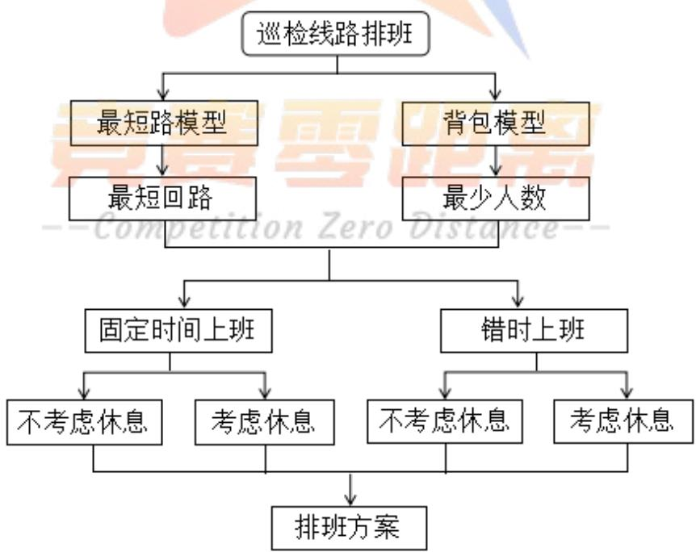

<details>
<summary>flowchart</summary>

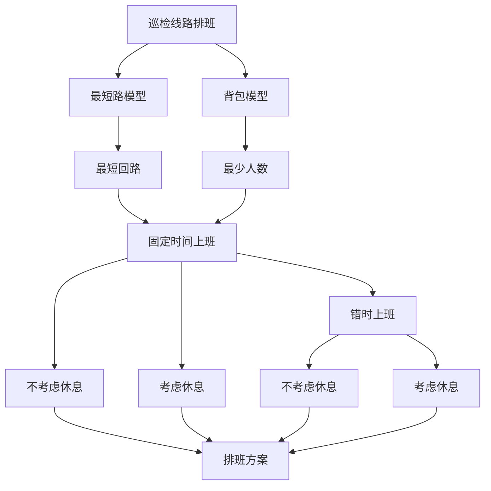
</details>

图1 本文解题过程

## 三、符号说明

<table><tr><td> $T_i$ :巡检点i的周期,分钟</td><td> $r_{ij}$ :巡检点i到巡检点j的走路时间,分钟</td></tr><tr><td> $t_i$ :巡检点i的耗时,分钟</td><td> $g_i$ :从起点到巡检点i的累计时间,分钟</td></tr><tr><td> $w_{ij}$ :边( $v_i, v_j$ )的权,分钟</td><td> $\hat{g}_i$ :当考虑休息时间时从起点到巡检点i的累计时间,分钟</td></tr><tr><td> $\phi$ :休息时间,分钟</td><td> $y_i$ :最短回路中第i段的时间间隔,分钟</td></tr><tr><td>n:巡检点个数,个</td><td>m:每班人数,人,或分段个数</td></tr><tr><td> $\theta$ :吃饭时间,分钟</td><td></td></tr></table>

其余符号在文中给出。

## 四、模型假设

为了简化问题，作如下假设：

（1）每天三班的上班时间为：早班（8:00-16:00）、中班（16:00-24:00）、晚班（0:00-8:00）。每班工作8 小时；  
（2）某人的人力资源消耗量是指上班期间的空闲时间和加班时间,加班时间包括巡检耗时和走路时间，以分钟计算。  
（3）某班（早班、中班或晚班）的人力资源消耗量是指所有工作人员的人力资源消耗量之和，以分钟计算。  
（4）某天的人力资源消耗量是指早班、中班和晚班的人力资源消耗量之和，以分钟计算。  
（5）所有巡检人员从调度中心出发，但下班后不一定回到调度中心。

## 五、模型建立与求解

## 5.1 问题 1——固定上班时间、不考虑休息时间的巡检排班方案

## 5.1.1 问题分析

问题1 的解题过程如图2所示。

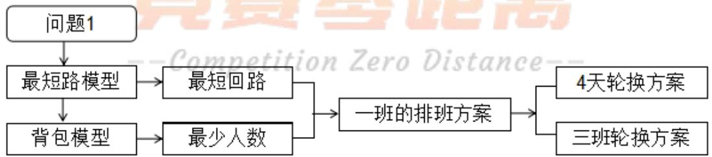

<details>
<summary>flowchart</summary>

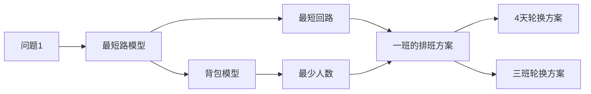
</details>

图2 问题1 的解题过程

## 5.1.2 模型建立

## 5.1.2.1 最短路模型

设巡检点i到巡检点j的走路时间为 $r _ { i j }$ ， $i , j = 1 , 2 , . . . , n$ ，本文中， $n = 2 6$

设无向赋权图 $G = \left( V , E \right)$ ，V是顶点集，有n个顶点，E是边集， $w \Big ( \boldsymbol { \nu } _ { i } , \boldsymbol { \nu } _ { j } \Big )$ 表示边 $\left( \nu _ { i } , \nu _ { j } \right)$ 的权，简记作 $w _ { i j }$ ，如图3所示。

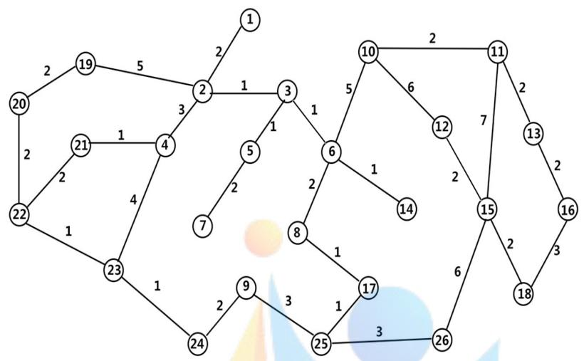

<details>
<summary>flowchart</summary>

```mermaid
graph LR
  1["1"] --> 2["2"]
  n2["2"] --> 19["19"]
  n2 --> 3["3"]
  n2 --> 4["4"]
  n2 --> 5["5"]
  n2 --> 6["6"]
  n2 --> 7["7"]
  n2 --> 8["8"]
  n2 --> 9["9"]
  n2 --> 10["10"]
  n2 --> 11["11"]
  n2 --> 12["12"]
  n2 --> 13["13"]
  n2 --> 14["14"]
  n2 --> 15["15"]
  n2 --> 16["16"]
  n2 --> 17["17"]
  n2 --> 18["18"]
  n2 --> 19["19"]
  n2 --> 20["20"]
  n2 --> 21["21"]
  n2 --> 22["22"]
  n2 --> 23["23"]
  n2 --> 24["24"]
  n2 --> 25["25"]
  n2 --> 26["26"]
  n2 --> 6["6"]
  3["3"] -.-> 10
  3["3"] -.-> 11
  3["3"] -.-> 12
  3["3"] -.-> 13
  3["3"] -.-> 14
  3["3"] -.-> 15
  3["3"] -.-> 16
  3["3"] -.-> 17
  3["3"] -.-> 18
  3["3"] -.-> 19
  3["3"] -.-> 20
  3["3"] -.-> 21
  3["3"] -.-> 22
  3["3"] -.-> 23
  3["3"] -.-> 24
  3["3"] -.-> 25
  3["3"] -.-> 26
  3["3"] -.-> 27
  3["3"] -.-> 28
  3["3"] -.-> 29
  3["3"] -.-> 30
  3["3"] -.-> 31
  3["3"] -.-> 32
  3["3"] -.-> 33
  3["3"] -.-> 34
  3["3"] -.-> 35
  3["3"] -.-> 36
  3["3"] -.-> 37
  3["3"] -.-> 38
  3["3"] -.-> 39
  3["3"] -.-> 40
  3["3"] -.-> 41
  3["3"] -.-> 42
  3["3"] -.-> 43
  3["3"] -.-> 44
  3["3"] -.-> 45
  3["3"] -.-> 46
  3["3"] -.-> 47
  3["3"] -.-> 48
  3["3"] -.-> 49
  3["3"] -.-> 50
  <--> <--> <
```
</details>

图3 巡检问题的无向赋权图

我们取巡检点i 到巡检点 j 的走路时间 $r _ { i j }$ 作为边 $\left( \nu _ { i } , \nu _ { j } \right)$ 的权 $w _ { i j }$ ，即

$$
w _ {i j} = \left\{ \begin{array}{l l} r _ {i j}, & \left(v _ {i}, v _ {j}\right) \in E \\ \infty , & \text {其它} \end{array} \right. \tag {1}
$$

n个顶点的赋权图的赋权矩阵记作 $W = \left( w _ { i j } \right) _ { n \times n }$ 。

设决策变量 $x _ { i j } = 1$ 表示边 $\left( \boldsymbol { \nu } _ { i } , \boldsymbol { \nu } _ { j } \right)$ 位于顶点 $\nu _ { 1 }$ 到顶点 $\nu _ { n }$ 的路上；否则 $x _ { i j } = 0$

顶点 $\nu _ { 1 }$ 到顶点 $\nu _ { n }$ 的最短路模型<sup>[1-4]</sup>为

$$
\min \quad f = \sum_ {(i, j) \in E} w _ {i j} x _ {i j}
$$

$$
s. t. \left\{ \begin{array}{l} \sum_ {\substack {j = 1 \\ (i, j) \in E}} ^ {n} x _ {i j} - \sum_ {\substack {j = 1 \\ (j, i) \in E}} ^ {n} x _ {j i} = \left\{ \begin{array}{l l} 1, & i = 1, \\ - 1, & i = n \\ 0, & i \neq 1, n; \end{array} , \right. \\ x _ {i j} \geq 0, \quad (i, j) \in E. \end{array} \right. \tag{2}
$$

由最短路模型（2），通过设置中间点，可以得到从起点出发再回到起点、且遍历所有巡检点的最短回路。

## 5.1.2.2 背包模型

设有一个最短巡检回路为 $u _ { 1 } , u _ { 2 } , . . . , u _ { n } , u _ { n + 1 }$ ，其中起点和终点都是调度中心（XJ-0022），即$u _ { 1 } = u _ { n + 1 }$ ，从起点到每个巡检点i对应的累计时间为 $g _ { i } \left( i = 1 , 2 , . . . , n , n + 1 \right)$ ，该时间是对巡检点i

巡检结束后的时刻，其定义式为

$$
g _ {i} = r _ {1 i} + \sum_ {k = 1} ^ {i} t _ {k}, \quad i = 1, 2,..., n, n + 1 \tag {3}
$$

或者

$$
g _ {i + 1} = g _ {i} + r _ {i - 1, i} + t _ {i}, \quad i = 1, 2,..., n \tag {4}
$$

$u _ { n + 1 }$ 对应的累计时间为 $g _ { n + 1 }$

例如，巡检回路上有 3个巡检点，依次为 $u _ { 1 } , u _ { 2 } , u _ { 3 }$ ，它们对应的巡检耗时分别为3、4、2，走路时间分别为1、2，那么巡检点 $u _ { 1 } , u _ { 2 } , u _ { 3 }$ 对应的累计时间分别为 $g _ { 1 } = 3 , g _ { 2 } = 8 , g _ { 3 } = 1 2$ ，如图4所示。

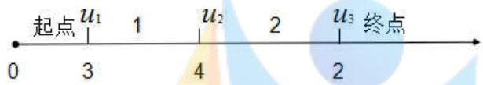

<details>
<summary>text_image</summary>

起点 u₁ 1 u₂ 2 u₃ 终点
0 3 4 2
</details>

图4 累计时间演示

于是问题转化为：把时间区间 $\left[ 0 , g _ { n + 1 } \right]$ 分为若干段，使得每一段的时间间隔不超过这一段里所有巡检点的最小巡检周期的条件下，至少可分为几段? 这是背包问题（在总价一定的情况下物品数量最小），需要建立背包模型来解决。 [5-8]

设第i段（ $\mathbf { \Phi } ( i = 1 , 2 , . . . , m )$ 包含的巡检点序列为 $u _ { i 1 } , u _ { i 2 } , . . . , u _ { i k }$ ，第i段的时间间隔为 $y _ { i }$ ，m为分段个数，k为巡检点个数，则有

$$
\sum_ {i = 1} ^ {m} y _ {i} \geq g _ {n + 1} \tag {5}
$$

第i段的时间间隔y 不超过第i段巡检点的巡检周期的最小值，即 $y _ { i }$

$$
y _ {i} \leq \min \left\{T _ {i 1}, T _ {i 2},..., T _ {i k} \right\}, \quad i = 1, 2,..., m \tag {6}
$$

前i 段的时间间隔之和大于第i 段末尾巡检点的累计时间 $g _ { i k }$ ，但不超过第i 1段首位巡检点的累计时间 $g _ { i + 1 , 1 }$ ，即

$$
g _ {i k} \leq \sum_ {h = 1} ^ {i} y _ {h} \leq g _ {i + 1, 1}, \quad i = 1, 2,..., m \tag {7}
$$

目标函数为求m的最小值，即

$$
\min \quad f = m \tag {8}
$$

汇总得

$$
\min \quad f = m
$$

$$
s. t. \left\{ \begin{array}{l} \sum_ {i = 1} ^ {m} y _ {i} \geq g _ {n + 1} \\ y _ {i} \leq \min \left\{T _ {i 1}, T _ {i 2}, \dots , T _ {i k} \right\}, \quad i = 1, 2, \dots , m \\ g _ {i k} \leq \sum_ {h = 1} ^ {i} y _ {h} \leq g _ {i + 1, 1}, \quad i = 1, 2, \dots , m \\ y _ {i} \geq 0, \text {且为整数}. \end{array} \right. \tag {9}
$$

## 5.1.2.3 人力资源消耗量

在最短回路确定的情况下，巡检总耗时就是个定值，于是在上班 8 小时之内，不同排班方案的优劣就体现在两个方面，其一是人员空闲时间；其二是人员加班时间。

设最短回路被划分为 $p _ { 1 } , p _ { 2 } , . . . , p _ { m }$ 段，各段对应的巡检耗时（不包括走路时间）分别为$q _ { 1 } , q _ { 2 } , . . . , q _ { m }$ ，每一段安排一名巡检工人，需要m 个工人。

设第i人的空闲时间和加班时间（巡检耗时和走路时间）分别为 $\alpha _ { { } _ { i } } ^ { } , \beta _ { { } _ { i } }$ ，根据假设（2），第i个工人的人力资源消耗量为

$$
\gamma_ {i} = \alpha_ {i} + \beta_ {i}, \quad i = 1, 2,..., m \tag {10}
$$

若人力资源消耗量，可通过m天的轮流换岗，就能使得m个工人的人力资源耗费量绝对均衡。

根据假设（3），所有工人早班（或中班、晚班）的人力资源消耗量为

$$
\eta_ {k} = \sum_ {i = 1} ^ {m} \left(\alpha_ {i} + \beta_ {i}\right), \quad k = 1, 2, 3 \tag {11}
$$

其中，k 1,2,3分别表示早班、中班和晚班。

若人力资源消耗量，可通过设计 3 天的轮班，就能使得不同班次（早班、中班、晚班）的人力资源消耗量绝对均衡。

根据假设（4），每天人力资源耗费量为

$$
\eta = \sum_ {k = 1} ^ {3} \eta_ {k}
$$

若人力资源消耗量，可以3m天为周期轮换，就实现了一个轮岗轮班大循环，实现了人力资源耗费量的绝对均衡。

## 5.1.3 模型求解

## 5.1.3.1 最短路模型求解

使用MATLAB 软件图论工具箱里的graphshortestpath 函数求解，该函数可以求出起点到终点的最短路径和最短路长。求解步骤：

第 1 步，把调度中心（XJ-0022）设定为起点，从巡检点 22 出发，将终点设定为巡检点12，计算得最短路径为 $2 2  2 3  2 4  9  2 5  2 6  1 5  1 2$ ，最短时间为 18分钟，最短路径如同理，可以得到12→13，13→17，17→19 的最短路径和路长（程序和结果见附录1）。

图5所示（程序和结果见附录1）。  
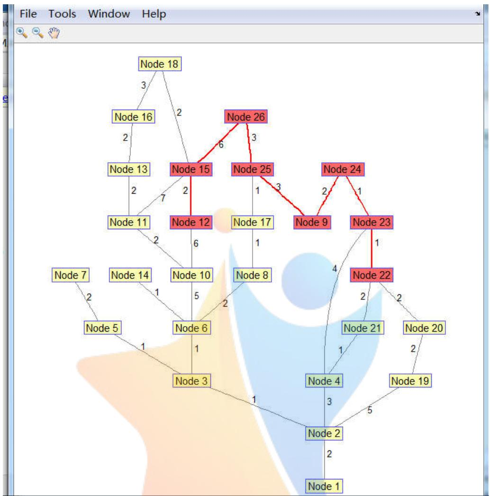

<details>
<summary>flowchart</summary>

```mermaid
graph TD
  Start["Node 1"] --> Node18["Node 18"]
  Start --> Node16["Node 16"]
  Start --> Node26["Node 26"]
  Start --> Node13["Node 13"]
  Start --> Node15["Node 15"]
  Start --> Node25["Node 25"]
  Start --> Node24["Node 24"]
  Start --> Node11["Node 11"]
  Start --> Node12["Node 12"]
  Start --> Node9["Node 9"]
  Start --> Node23["Node 23"]
  Start --> Node14["Node 14"]
  Start --> Node10["Node 10"]
  Start --> Node8["Node 8"]
  Start --> Node7["Node 7"]
  Start --> Node5["Node 5"]
  Start --> Node6["Node 6"]
  Start --> Node3["Node 3"]
  Start --> Node4["Node 4"]
  Start --> Node2["Node 2"]
  Start --> Node1["Node 1"]
```
</details>

图5 起点 22→终点12 的最短路径

将计算结果整理，如表1所示。

表1 最短回路

<table><tr><td>起点</td><td>22</td><td>23</td><td>24</td><td>9</td><td>25</td><td>26</td><td>15</td><td>12</td><td>18</td><td>16</td><td>13</td><td>11</td><td>10</td><td>6</td></tr><tr><td></td><td>14</td><td>8</td><td>17</td><td>3</td><td>5</td><td>7</td><td>2</td><td>1</td><td>19</td><td>20</td><td>21</td><td>4</td><td>22</td><td>终点</td></tr></table>

该回路的最短路长（走路时间）为 72 分钟，累计时间（包括巡检耗时和走路时间）为CompetitionZeroOistance139 分钟。

将最短回路画图，如图6所示。起点与终点相同，是调度中心（巡检点XJ-0022）。

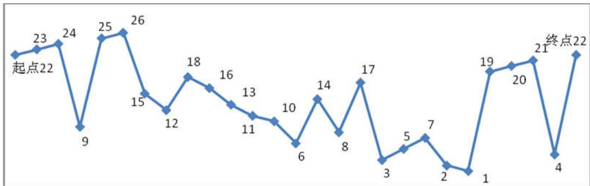

<details>
<summary>line</summary>

| Point | Value |
| --- | --- |
| 起点22 | 22 |
| 1 | 23 |
| 2 | 24 |
| 3 | 9 |
| 4 | 25 |
| 5 | 26 |
| 6 | 15 |
| 7 | 12 |
| 8 | 18 |
| 9 | 16 |
| 10 | 13 |
| 11 | 11 |
| 12 | 10 |
| 13 | 6 |
| 14 | 14 |
| 15 | 8 |
| 16 | 17 |
| 17 | 3 |
| 18 | 5 |
| 19 | 7 |
| 20 | 2 |
| 21 | 1 |
| 22 | 19 |
| 23 | 20 |
| 24 | 21 |
| 终点22 | 22 |
</details>

图6 最短回路

## 5.1.3.2 背包模型求解

根据最短回路，将已知数据整理，如表2 所示。

表2 背包模型的已知数据

<table><tr><td>序号</td><td>1</td><td>2</td><td>3</td><td>4</td><td>5</td><td>6</td><td>7</td><td>8</td><td>9</td><td>10</td><td>11</td><td>12</td><td>13</td><td>14</td></tr><tr><td>巡检点</td><td>22</td><td>23</td><td>24</td><td>9</td><td>25</td><td>26</td><td>15</td><td>12</td><td>18</td><td>16</td><td>13</td><td>11</td><td>10</td><td>6</td></tr><tr><td>周期</td><td>35</td><td>35</td><td>35</td><td>35</td><td>120</td><td>35</td><td>35</td><td>35</td><td>35</td><td>35</td><td>80</td><td>35</td><td>120</td><td>35</td></tr><tr><td>耗时</td><td>2</td><td>3</td><td>2</td><td>4</td><td>2</td><td>2</td><td>2</td><td>2</td><td>2</td><td>3</td><td>5</td><td>3</td><td>2</td><td>3</td></tr><tr><td>路时</td><td>0</td><td>1</td><td>1</td><td>2</td><td>3</td><td>3</td><td>6</td><td>2</td><td>4</td><td>3</td><td>2</td><td>2</td><td>2</td><td>5</td></tr><tr><td>累计时间</td><td>2</td><td>6</td><td>9</td><td>15</td><td>20</td><td>25</td><td>33</td><td>37</td><td>43</td><td>49</td><td>56</td><td>61</td><td>65</td><td>73</td></tr><tr><td>序号</td><td>15</td><td>16</td><td>17</td><td>18</td><td>19</td><td>20</td><td>21</td><td>22</td><td>23</td><td>24</td><td>25</td><td>26</td><td>27</td><td></td></tr><tr><td>巡检点</td><td>14</td><td>8</td><td>17</td><td>3</td><td>5</td><td>7</td><td>2</td><td>1</td><td>19</td><td>20</td><td>21</td><td>4</td><td>22</td><td></td></tr><tr><td>周期</td><td>35</td><td>35</td><td>480</td><td>35</td><td>720</td><td>80</td><td>50</td><td>35</td><td>35</td><td>35</td><td>80</td><td>35</td><td>35</td><td></td></tr><tr><td>耗时</td><td>3</td><td>3</td><td>2</td><td>3</td><td>2</td><td>2</td><td>2</td><td>3</td><td>2</td><td>3</td><td>3</td><td>2</td><td>0</td><td></td></tr><tr><td>路时</td><td>1</td><td>3</td><td>1</td><td>4</td><td>1</td><td>2</td><td>4</td><td>2</td><td>7</td><td>2</td><td>4</td><td>1</td><td>4</td><td></td></tr><tr><td>累计时间</td><td>77</td><td>83</td><td>86</td><td>93</td><td>96</td><td>100</td><td>106</td><td>111</td><td>120</td><td>125</td><td>132</td><td>135</td><td>139</td><td></td></tr></table>

由于最短回路的累计时间139已经确定，是个有限值，所以只要从起点开始确定第1 段，再从新的起点确定第 2 段，如此循环下去，必定在有限次之后将 139 覆盖掉，故背包模型一定存在最优解。

求解步骤：

第 1 步，根据前几个巡检点可得 $\operatorname* { m i n } \left\{ T _ { 1 1 } , T _ { 1 2 } , . . . , T _ { 1 k } \right\} = 3 5$ ，根据 $y _ { 1 } \leq 3 5$ 可得 $y _ { 1 } = 3 5$ ，再根据 $g _ { 1 k } \leq y _ { 1 } \leq g _ { 2 1 }$ 可确定 $g _ { 1 k } = 3 3 , g _ { 2 1 } = 3 7$ ，于是 $g _ { 1 k } = 3 3$ 对应的巡检点 $u _ { 7 } = 1 5$ 就是第1 段的最后一个巡检点，即第15 巡检点XJ-0015。

第 2 步，根据下一段的前几个巡检点可得 $\operatorname* { m i n } \left\{ T _ { 2 1 } , T _ { 2 2 } , . . . , T _ { 2 k } \right\} = 3 5$ ，根据 $y _ { 2 } \leq 3 5$ 可得$y _ { 2 } = 3 5$ ，再根据 $g _ { 2 k } \le y _ { 1 } + y _ { 2 } = 7 0 \le g _ { 3 1 }$ 可确定 $g _ { 2 k } = 6 5 , g _ { 3 1 } = 7 3$ ，于是 $g _ { 2 k } = 6 5$ 对应的巡检点$u _ { 1 3 } = 1 0$ 就是第2段的最后一个巡检点是第 10 巡检点XJ-0010。

同理可得，第 3 段的最后一个巡检点是第 7 巡检点 XJ-0007，第 4 段的最后一个巡检点是第 22 巡检点 XJ-0022。

计算结果（分段结果）如表3所示。

表3 背包模型的分段结果

<table><tr><td>分段</td><td colspan="7">第1段</td><td colspan="7">第2段</td></tr><tr><td>序号</td><td>1</td><td>2</td><td>3</td><td>4</td><td>5</td><td>6</td><td>7</td><td>8</td><td>9</td><td>10</td><td>11</td><td>12</td><td>13</td><td></td></tr><tr><td>巡检点</td><td>22</td><td>23</td><td>24</td><td>9</td><td>25</td><td>26</td><td>15</td><td>12</td><td>18</td><td>16</td><td>13</td><td>11</td><td>10</td><td></td></tr><tr><td>分段</td><td colspan="7">第3段</td><td colspan="7">第4段</td></tr><tr><td>序号</td><td>14</td><td>15</td><td>16</td><td>17</td><td>18</td><td>19</td><td>20</td><td>21</td><td>22</td><td>23</td><td>24</td><td>25</td><td>26</td><td>27</td></tr><tr><td>巡检点</td><td>6</td><td>14</td><td>8</td><td>17</td><td>3</td><td>5</td><td>7</td><td>2</td><td>1</td><td>19</td><td>20</td><td>21</td><td>4</td><td>22</td></tr></table>

## 5.1.4 结果检验

经检验，计算结果全部满足题目条件，故模型和结果都是正确的。

根据计算结果可知：

（1）完成一次最短回路巡检至少需要安排 4 个工人，即每班至少需要4人；  
（2）每天三班至少需要12人。

## 5.1.5 排班方案

根据假设（1），每天三班的上班时间为：早班（8:00-16:00）、中班（16:00-24:00）、晚班（0:00-8:00），每天工作 8小时。再根据背包模型计算结果，制定排班方案，见表4、表 5、表6所示。 巡检路线见图6。

表4 早班巡检表

<table><tr><td>人员</td><td>A1</td><td>A2</td><td>A3</td><td>A4</td></tr><tr><td>上班时间</td><td>8:00</td><td>8:00</td><td>8:00</td><td>8:00</td></tr><tr><td>出发时间</td><td>8:00</td><td>8:35</td><td>9:10</td><td>9:45</td></tr><tr><td>下班时间</td><td>16:00</td><td>16:00</td><td>16:00</td><td>16:00</td></tr><tr><td>加班截止时间</td><td>17:10</td><td>17:45</td><td>16:00</td><td>16:35</td></tr><tr><td>加班时间/分</td><td>70</td><td>105</td><td>0</td><td>35</td></tr><tr><td>空闲时间/分</td><td>0</td><td>35</td><td>70</td><td>105</td></tr><tr><td>耗费时间/分</td><td>70</td><td>140</td><td>70</td><td>140</td></tr><tr><td>总耗费时间/分</td><td></td><td colspan="2">420</td><td></td></tr></table>

注：A1、A2、A3、A4 是早班工作人员名称；巡检路线见图6

表5 中班巡检表

<table><tr><td>人员</td><td>B1</td><td>B2</td><td>B3</td><td>B4</td></tr><tr><td>上班时间</td><td>16:00</td><td>16:00</td><td>16:00</td><td>16:00</td></tr><tr><td>出发时间</td><td>16:00</td><td>16:35</td><td>17:10</td><td>17:45</td></tr><tr><td>下班时间</td><td>0:00</td><td>0:00</td><td>0:00</td><td>0:00</td></tr><tr><td>加班截止时间</td><td>1:10</td><td>1:45</td><td>0:00</td><td>0:35</td></tr><tr><td>加班时间/分</td><td>70</td><td>105</td><td>0</td><td>35</td></tr><tr><td>空闲时间/分</td><td>0</td><td>35</td><td>70</td><td>105</td></tr><tr><td>耗费时间/分</td><td>70</td><td>140</td><td>70</td><td>140</td></tr><tr><td>总耗费时间/分</td><td></td><td colspan="3">420</td></tr></table>

注：B1、B2、B3、B4 是中班工作人员名称；巡检路线见图6

表6 晚班巡检表

<table><tr><td>人员</td><td>C1</td><td>C2</td><td>C3</td><td>C4</td></tr><tr><td>上班时间</td><td>0:00</td><td>0:00</td><td>0:00</td><td>0:00</td></tr><tr><td>出发时间</td><td>0:00</td><td>0:35</td><td>1:10</td><td>1:45</td></tr><tr><td>下班时间</td><td>8:00</td><td>8:00</td><td>8:00</td><td>8:00</td></tr><tr><td>加班截止时间</td><td>9:10</td><td>9:45</td><td>8:00</td><td>8:35</td></tr><tr><td>加班时间/分</td><td>70</td><td>105</td><td>0</td><td>35</td></tr><tr><td>空闲时间/分</td><td>0</td><td>35</td><td>70</td><td>105</td></tr><tr><td>耗费时间/分</td><td>70</td><td>140</td><td>70</td><td>140</td></tr><tr><td>总耗费时间/分</td><td></td><td colspan="2">420</td><td></td></tr></table>

注：C1、C2、C3、C4 是晚班工作人员名称；巡检路线见图6

从表4、表 5和表 6可知：

（1）三班的人力资源耗费时间是绝对均衡的；

（2）每班4 人的人力耗费时间不均衡。

为了使得每班4 人的人力耗费量均衡，设计一个 4 天轮岗制度，即可实现绝对均衡，轮岗制度如表7 所示。

表7 4 人轮岗制度

<table><tr><td>天别</td><td>第1天</td><td>第2天</td><td>第3天</td><td>第4天</td></tr><tr><td>早班</td><td>A1-A2-A3-A4</td><td>A2-A3-A4-A1</td><td>A3-A4-A1-A2</td><td>A4-A1-A2-A3</td></tr><tr><td>中班</td><td>B1-B2-B3-B4</td><td>B2-B3-B4-B1</td><td>B3-B4-B1-B2</td><td>B4-B1-B2-B3</td></tr><tr><td>晚班</td><td>C1-C2-C3-C4</td><td>C2-C3-C4-C1</td><td>C3-C4-C1-C2</td><td>C4-C1-C2-C3</td></tr></table>

在本题中，早班、中班和晚班的人力资源总耗费时间绝对均衡了，所以，如果仅从人力资源均衡角度考虑，就不必再设计轮班制度了，但如果从人性化角度考虑，很多人不愿意在晚班工作，说明早班、中班和晚班还是有差异的，故设计一个早班、中班和晚班的轮换制度，如表8 所示。

表8 早中晚班轮班制度

<table><tr><td></td><td>第1个4天</td><td>第2个4天</td><td>第3个4天</td></tr><tr><td>早班</td><td>A组4人</td><td>B组4人</td><td>C组4人</td></tr><tr><td>中班</td><td>B组4人</td><td>C组4人</td><td>A组4人</td></tr><tr><td>晚班</td><td>C组4人</td><td>A组4人</td><td>B组4人</td></tr></table>

## 5.1.6 小结

问题1 的解题过程中，考虑了以下因素：

（1）巡检人员从调度中心出发，最后又回到了调度中心；  
（2）所有工作人员固定时间上班，但由于有加班，故加班时间不同；  
（3）所有22 个巡检点全部被巡检。  
（4）上班8 小时内不休息、不吃饭。  
（5）每天三班倒，每班8小时。

获得了以下方案：

（1）每班安排4 人，每天三班安排12人。  
（2）按照最短路径，完成所有巡检点一次需要 139 分钟，其中人力资源消耗时间67 分钟，走路时间72 分钟。  
（3）4天完成班内人员轮岗，实现了工作量绝对均衡。  
（4）每天人力资源总耗费时间为1260分钟。

## 5.2 问题（2）——固定上班时间、考虑休息时间的巡检排班方案

## 5.2.1 问题分析

与问题（1）不同的是：本题要考虑巡检人员的休息时间和进餐时间，其它方面是相同的。

解题思路：保持问题1得到的最短回路不变，只是在背包模型中，将休息时间和进餐时间加入到累计时间进度中，对累计时间进行调整，然后代入到背包模型中求解，即可得到每班至少需要几人，以及每个人的巡检路径和时间表。

解题过程如图7 所示。

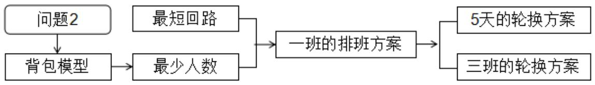

<details>
<summary>flowchart</summary>

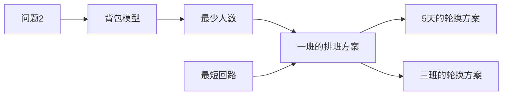
</details>

图7 问题2 的解题过程

## 5.2.2 模型建立与求解

由于早班、中班、晚班的休息时间和吃饭时间的规律不同，故需要分别研究。

## 5.2.2.1 早班累计时间

设每巡检2 小时需要休息的时间为 $\phi$ （分钟），进餐时间为（分钟），在本题中， $\phi \in \left[ 5 , 1 0 \right]$ $\theta = 3 0$ o

在上班 2 小时（10:00）的时候将原累计时间 $g _ { i } \left( i = 1 , 2 , . . . , n , n + 1 \right)$ 加上 $\phi$ ，在上班 4 小时（12:00）的时候将原累计时间 $g _ { i } \left( i = 1 , 2 , . . . , n , n + 1 \right)$ 加上 $\phi + \theta$ ，在上班 6 小时（14:00）的时候将原累计时间 $g _ { i } \left( i = 1 , 2 , . . . , n , n + 1 \right)$ 加 $\operatorname { E } 2 \phi + \theta$ 即

$$
\hat {g} _ {i} = \left\{ \begin{array}{l} g _ {i}, \quad 0 \leq t \leq 1 2 0 (1 0: 0 0), \\ g _ {i} + \phi , \quad 1 2 0 <   t \leq 2 4 0 (1 2: 0 0), \\ g _ {i} + \phi + \theta , \quad 2 4 0 <   t \leq 3 6 0 (1 4: 0 0), \\ g _ {i} + 2 \phi + \theta , \quad 3 6 0 <   t \leq 4 8 0 (1 6: 0 0), \\ g _ {i} + 3 \phi + \theta , \quad 4 8 0 <   t \leq 6 0 0 (1 8: 0 0, \text {加班}) \\ g _ {i} + 3 \phi + 2 \theta , \quad 6 0 0 <   t \leq 7 2 0 (1 6: 0 0, \text {加班}). \end{array} \quad i = 1, 2, \dots , n, n + 1 \right. \tag {12}
$$

## 5.2.2.2 中班累计时间

同理，中班累计时间为

$$
\hat {g} _ {i} = \left\{ \begin{array}{l l} g _ {i}, \quad 0 \leq t \leq 1 2 0 (1 8: 0 0), \\ g _ {i} + \theta , \quad 1 2 0 <   t \leq 2 4 0 (2 0: 0 0), \\ g _ {i} + \theta + \phi , \quad 2 4 0 <   t \leq 3 6 0 (2 2: 0 0), \\ g _ {i} + \theta + 2 \phi , \quad 3 6 0 <   t \leq 4 8 0 (2 4: 0 0), \\ g _ {i} + \theta + 3 \phi , \quad 4 8 0 <   t \leq 6 0 0 (2: 0 0, \text {加班}), \\ g _ {i} + \theta + 4 \phi , \quad 6 0 0 <   t \leq 7 2 0 (4: 0 0, \text {加班}). \end{array} \quad i = 1, 2, \dots , n, n + 1 \right. \tag {13}
$$

## 5.2.2.3 晚班累计时间

同理，晚班累计时间为

$$
\hat {g} _ {i} = \left\{ \begin{array}{l l} g _ {i}, \quad 0 \leq t \leq 1 2 0 (2: 0 0), \\ g _ {i} + \phi , \quad 1 2 0 <   t \leq 2 4 0 (4: 0 0), \\ g _ {i} + 2 \phi , \quad 2 4 0 <   t \leq 3 6 0 (6: 0 0), \\ g _ {i} + 3 \phi , \quad 3 6 0 <   t \leq 4 8 0 (8: 0 0), \\ g _ {i} + 4 \phi , \quad 4 8 0 <   t \leq 6 0 0 (1 0: 0 0, \text {加班}), \\ g _ {i} + 5 \phi , \quad 6 0 0 <   t \leq 7 2 0 (1 2: 0 0, \text {加班}). \end{array} \quad i = 1, 2, \dots , n, n + 1 \right. \tag {14}
$$

将新的累计时间代入背包模型，即可得到新的分段结果。

## 5.2.3 模型求解

以早班为例，取 $\phi = 1 0$ $\theta = 3 0$ ，计算各个巡检点的累计时间，如表9所示。

表 9 早班背包模型的已知数据（当天第1次）

<table><tr><td>序号</td><td>1</td><td>2</td><td>3</td><td>4</td><td>5</td><td>6</td><td>7</td><td>8</td><td>9</td><td>10</td><td>11</td><td>12</td><td>13</td><td>14</td></tr><tr><td>巡检点</td><td>22</td><td>23</td><td>24</td><td>9</td><td>25</td><td>26</td><td>15</td><td>12</td><td>18</td><td>16</td><td>13</td><td>11</td><td>10</td><td>6</td></tr><tr><td>周期</td><td>35</td><td>35</td><td>35</td><td>35</td><td>120</td><td>35</td><td>35</td><td>35</td><td>35</td><td>35</td><td>80</td><td>35</td><td>120</td><td>35</td></tr><tr><td>新累计时间</td><td>2</td><td>6</td><td>9</td><td>15</td><td>20</td><td>25</td><td>33</td><td>37</td><td>43</td><td>49</td><td>56</td><td>61</td><td>65</td><td>73</td></tr><tr><td>序号</td><td>15</td><td>16</td><td>17</td><td>18</td><td>19</td><td>20</td><td>21</td><td>22</td><td>23</td><td>24</td><td>25</td><td>26</td><td>27</td><td></td></tr><tr><td>巡检点</td><td>14</td><td>8</td><td>17</td><td>3</td><td>5</td><td>7</td><td>2</td><td>1</td><td>19</td><td>20</td><td>21</td><td>4</td><td>22</td><td></td></tr><tr><td>周期</td><td>35</td><td>35</td><td>480</td><td>35</td><td>720</td><td>80</td><td>50</td><td>35</td><td>35</td><td>35</td><td>80</td><td>35</td><td>35</td><td></td></tr><tr><td>新累计时间</td><td>77</td><td>83</td><td>86</td><td>93</td><td>96</td><td>100</td><td>106</td><td>111</td><td>120</td><td>135</td><td>142</td><td>145</td><td>149</td><td></td></tr></table>

表 10 早班背包模型的已知数据（当天第2 次）

<table><tr><td>序号</td><td>1</td><td>2</td><td>3</td><td>4</td><td>5</td><td>6</td><td>7</td><td>8</td><td>9</td><td>10</td><td>11</td><td>12</td><td>13</td><td>14</td></tr><tr><td>巡检点</td><td>22</td><td>23</td><td>24</td><td>9</td><td>25</td><td>26</td><td>15</td><td>12</td><td>18</td><td>16</td><td>13</td><td>11</td><td>10</td><td>6</td></tr><tr><td>新累计时间</td><td>151</td><td>155</td><td>158</td><td>164</td><td>169</td><td>174</td><td>182</td><td>186</td><td>192</td><td>198</td><td>205</td><td>210</td><td>214</td><td>222</td></tr><tr><td>序号</td><td>15</td><td>16</td><td>17</td><td>18</td><td>19</td><td>20</td><td>21</td><td>22</td><td>23</td><td>24</td><td>25</td><td>26</td><td>27</td><td></td></tr><tr><td>巡检点</td><td>14</td><td>8</td><td>17</td><td>3</td><td>5</td><td>7</td><td>2</td><td>1</td><td>19</td><td>20</td><td>21</td><td>4</td><td>22</td><td></td></tr><tr><td>新累计时间</td><td>226</td><td>232</td><td>235</td><td>242</td><td>275</td><td>279</td><td>285</td><td>290</td><td>299</td><td>304</td><td>311</td><td>314</td><td>318</td><td></td></tr></table>

表 11 早班背包模型的已知数据（当天第3次）

<table><tr><td>序号</td><td>1</td><td>2</td><td>3</td><td>4</td><td>5</td><td>6</td><td>7</td><td>8</td><td>9</td><td>10</td><td>11</td><td>12</td><td>13</td><td>14</td></tr><tr><td>巡检点</td><td>22</td><td>23</td><td>24</td><td>9</td><td>25</td><td>26</td><td>15</td><td>12</td><td>18</td><td>16</td><td>13</td><td>11</td><td>10</td><td>6</td></tr><tr><td>新累计时间</td><td>320</td><td>324</td><td>327</td><td>333</td><td>338</td><td>343</td><td>351</td><td>355</td><td>361</td><td>377</td><td>384</td><td>389</td><td>393</td><td>401</td></tr><tr><td>序号</td><td>15</td><td>16</td><td>17</td><td>18</td><td>19</td><td>20</td><td>21</td><td>22</td><td>23</td><td>24</td><td>25</td><td>26</td><td>27</td><td></td></tr><tr><td>巡检点</td><td>14</td><td>8</td><td>17</td><td>3</td><td>5</td><td>7</td><td>2</td><td>1</td><td>19</td><td>20</td><td>21</td><td>4</td><td>22</td><td></td></tr><tr><td>新累计时间</td><td>405</td><td>411</td><td>414</td><td>421</td><td>424</td><td>428</td><td>434</td><td>439</td><td>448</td><td>453</td><td>460</td><td>463</td><td>467</td><td></td></tr></table>

表12 早班背包模型的已知数据（当天第4次，需要加班）

<table><tr><td>序号</td><td>1</td><td>2</td><td>3</td><td>4</td><td>5</td><td>6</td><td>7</td><td>8</td><td>9</td><td>10</td><td>11</td><td>12</td><td>13</td><td>14</td></tr><tr><td>巡检点</td><td>22</td><td>23</td><td>24</td><td>9</td><td>25</td><td>26</td><td>15</td><td>12</td><td>18</td><td>16</td><td>13</td><td>11</td><td>10</td><td>6</td></tr><tr><td>新累计时间</td><td>469</td><td>473</td><td>476</td><td>482</td><td>497</td><td>502</td><td>510</td><td>514</td><td>520</td><td>526</td><td>533</td><td>538</td><td>542</td><td>550</td></tr><tr><td>序号</td><td>15</td><td>16</td><td>17</td><td>18</td><td>19</td><td>20</td><td>21</td><td>22</td><td>23</td><td>24</td><td>25</td><td>26</td><td>27</td><td></td></tr><tr><td>巡检点</td><td>14</td><td>8</td><td>17</td><td>3</td><td>5</td><td>7</td><td>2</td><td>1</td><td>19</td><td>20</td><td>21</td><td>4</td><td>22</td><td></td></tr><tr><td>新累计时间</td><td>554</td><td>560</td><td>563</td><td>570</td><td>573</td><td>577</td><td>583</td><td>588</td><td>597</td><td>602</td><td>639</td><td>642</td><td>646</td><td></td></tr></table>

该回路的最短路长（走路时间）仍然为72 分钟，完成第1 次、第2 次、第3次、第4次巡检分别需要149、169、149、179分钟（包括巡检耗时和走路时间）。

求解背包模型得， $y _ { 1 } = y _ { 2 } = y _ { 3 } = y _ { 4 } = y _ { 5 } = 3 5$ ，分段结果如表 13所示。

表 13 早班背包模型的分段结果

<table><tr><td>分段</td><td colspan="7">第1段</td><td colspan="6">第2段</td></tr><tr><td>序号</td><td>1</td><td>2</td><td>3</td><td>4</td><td>5</td><td>6</td><td>7</td><td>8</td><td>9</td><td>10</td><td>11</td><td>12</td><td>13</td></tr><tr><td>巡检点</td><td>22</td><td>23</td><td>24</td><td>9</td><td>25</td><td>26</td><td>15</td><td>12</td><td>18</td><td>16</td><td>13</td><td>11</td><td>10</td></tr><tr><td>分段</td><td colspan="7">第3段</td><td colspan="4">第4段</td><td colspan="2">第5段</td></tr><tr><td>序号</td><td>14</td><td>15</td><td>16</td><td>17</td><td>18</td><td>19</td><td>20</td><td>21</td><td>22</td><td>23</td><td>24</td><td>25</td><td>26</td></tr><tr><td>巡检点</td><td>6</td><td>14</td><td>8</td><td>17</td><td>3</td><td>5</td><td>7</td><td>2</td><td>1</td><td>19</td><td>20</td><td>21</td><td>4</td></tr></table>

根据计算结果可知，完成一次最短回路巡检至少需要安排 5 个工人，即每班至少需要 5人，每天三班至少需要 15人。与问题1相比，增加了1 个工人。

## 5.2.4 结果检验

经检验，计算结果全部满足题目条件，故模型和结果都是正确的。

## 5.2.5 早班排班方案

根据假设（1），每天三班的上班时间为：早班（8:00-16:00）、中班（16:00-24:00）、晚班（0:00-8:00），每天工作8小时。再根据背包模型计算结果，每班至少需要5人，制定排班方案，见表14 所示。

表14 早班巡检表

<table><tr><td>人员</td><td>A1</td><td>A2</td><td>A3</td><td>A4</td><td>A5</td></tr><tr><td>上班时间</td><td>8:00</td><td>8:00</td><td>8:00</td><td>8:00</td><td>8:00</td></tr><tr><td>出发时间</td><td>8:00</td><td>8:35</td><td>9:10</td><td>9:45</td><td>10:20</td></tr><tr><td>下班时间</td><td>16:00</td><td>16:00</td><td>16:00</td><td>16:00</td><td>16:00</td></tr><tr><td>加班截止时间</td><td>18:40</td><td>18:05</td><td>17:30</td><td>16:55</td><td>16:20</td></tr><tr><td>加班时间/分</td><td>160</td><td>125</td><td>90</td><td>55</td><td>20</td></tr><tr><td>空闲时间/分</td><td>0</td><td>35</td><td>70</td><td>105</td><td>140</td></tr><tr><td>耗费时间/分</td><td>160</td><td>160</td><td>160</td><td>160</td><td>160</td></tr><tr><td>总耗费时间/分</td><td colspan="5">800</td></tr></table>

注：A1、A2、A3、A4、A5是早班工作人员名称；巡检路线见表6

## 5.2.6 中班排班方案

同理，可以计算出中班的背包模型求解结果、分段结果，见附录2.

结果显示，中班与早班相同，也至少需要安排 5 个工人。中班巡检表如表15所示。

表 15 中班巡检表

<table><tr><td>人员</td><td>B1</td><td>B2</td><td>B3</td><td>B4</td><td>B5</td></tr><tr><td>上班时间</td><td>16:00</td><td>16:00</td><td>16:00</td><td>16:00</td><td>16:00</td></tr><tr><td>出发时间</td><td>16:00</td><td>16:35</td><td>17:10</td><td>17:45</td><td>18:20</td></tr><tr><td>下班时间</td><td>0:00</td><td>0:00</td><td>0:00</td><td>0:00</td><td>0:00</td></tr><tr><td>加班截止时间</td><td>2:00</td><td>2:05</td><td>1:30</td><td>0:55</td><td>0:20</td></tr><tr><td>加班时间/分</td><td>160</td><td>125</td><td>90</td><td>55</td><td>20</td></tr><tr><td>空闲时间/分</td><td>0</td><td>35</td><td>70</td><td>105</td><td>140</td></tr><tr><td>耗费时间/分</td><td>160</td><td>160</td><td>160</td><td>160</td><td>160</td></tr><tr><td>总耗费时间/分</td><td></td><td>800</td><td></td><td></td><td></td></tr></table>

注：B1、B2、B3、B4、B5是中班工作人员名称；巡检路线见表6

## 5.2.7 晚班排班方案

同理，可以计算出晚班的背包模型求解结果、分段结果，见附录3.

结果显示，晚班与早班相同，也至少需要安排 5 个工人。晚班巡检表如表16所示。

表16 晚班巡检表

<table><tr><td>人员</td><td>C1</td><td>C2</td><td>C3</td><td>C4</td><td>C5</td></tr><tr><td>上班时间</td><td>0:00</td><td>0:00</td><td>0:00</td><td>0:00</td><td>0:00</td></tr><tr><td>出发时间</td><td>0:00</td><td>0:35</td><td>1:10</td><td>1:45</td><td>2:20</td></tr><tr><td>下班时间</td><td>8:00</td><td>8:00</td><td>8:00</td><td>8:00</td><td>8:00</td></tr><tr><td>加班截止时间</td><td>10:00</td><td>9:40</td><td>9:10</td><td>8:35</td><td>8:00</td></tr><tr><td>加班时间/分</td><td>140</td><td>105</td><td>70</td><td>35</td><td>0</td></tr><tr><td>空闲时间/分</td><td>0</td><td>35</td><td>70</td><td>105</td><td>140</td></tr><tr><td>耗费时间/分</td><td>140</td><td>140</td><td>140</td><td>140</td><td>140</td></tr><tr><td>总耗费时间/分</td><td></td><td>700</td><td></td><td></td><td></td></tr></table>

注：C1、C2、C3、C4、C5是晚班工作人员名称；巡检路线见表6

## 从表14、表 15和表 16可知：

（1）三班的人力资源耗费时间分别是800、800、700 分钟，是不均衡的；  
（2）每班5 人的人力耗费时间是绝对均衡的。  
（3）与问题1 的结论恰好相反。

虽然每班5 人的人力耗费量是均衡的，但或许还存在其它没有考虑到的差异，故设计一个5天轮岗制度，如表17所示。

表 17 5 人轮岗制度

<table><tr><td>天别</td><td>第1天</td><td>第2天</td><td>第3天</td><td>第4天</td><td>第5天</td></tr><tr><td>早班</td><td>A1-A2-A3-A4-A5</td><td>A2-A3-A4-A5-A1</td><td>A3-A4-A5-A1-A2</td><td>A4-A5-A1-A2-A3</td><td>A5-A1-A2-A3-A4</td></tr><tr><td>中班</td><td>B1-B2-B3-B4-B5</td><td>B2-B3-B4-B5-B1</td><td>B3-B4-B5-B1-B2</td><td>B4-B5-B1-B2-B3</td><td>B5-B1-B2-B3-B4</td></tr><tr><td>晚班</td><td>C1-C2-C3-C4-C5</td><td>B2-B3-B4-B5-B1</td><td>B3-B4-B5-B1-B2</td><td>B4-B5-B1-B2-B3</td><td>B5-B1-B2-B3-B4</td></tr></table>

为了使得三班的人力耗费量均衡，设计一个早班、中班和晚班的轮岗制度，如表18 所示。

表18 早中晚班轮班制度

<table><tr><td>天别</td><td>第1天</td><td>第2天</td><td>第3天</td></tr><tr><td>早班</td><td>A组5人</td><td>B组5人</td><td>C组5人</td></tr><tr><td>中班</td><td>B组5人</td><td>C组5人</td><td>A组5人</td></tr><tr><td>晚班</td><td>C组5人</td><td>A组5人</td><td>B组5人</td></tr></table>

## 5.2.8 排班方案的优化

以上排班方案，虽然我们考虑了休息和吃饭因素，但当开饭的时候，5个巡检人员同时去吃饭，而巡检任务不能停止，为了解决人员吃饭造成的真空，需要安排5个机动人员，他们的任务是：

（1）当5 人一起去吃饭的时候，他们顶上去；  
（2）当下班时间到的时候，他们完成前任的剩余任务。

这样一来，早班和中班各增加了30 分钟的人力资源耗费时间，而晚班没有增加，于是三班的人力资源耗费时间分别是950、950、700 分钟，总耗费量是2600分钟。

## 5.2.9 问题 2 小结

问题2 的解题过程中，考虑了以下因素：

（1）巡检人员从调度中心出发，最后又回到了调度中心；  
（2）所有工作人员固定时间上班，但加班截止时间不同；  
（3）所有22 个巡检点全部被巡检。  
（4）上班8 小时内可休息、也吃饭。  
（5）每天三班倒，每班8小时。

获得了以下方案：

（1）每班安排5 人，每天三班安排15人。  
（2）三班的人力资源耗费时间分别是800、800、700 分钟，是不均衡的；  
（3）3天完成三班轮班，实现了工作量绝对均衡。  
（4）每天人力资源总耗费时间为2600分钟。

## 5.2.10 问题 1 与问题 2 的比较

问题1 与问题2 的不同之处：

（1）问题1 上班不休息、不吃饭；问题2 上班可以休息、可以吃饭。  
（2）问题1 每班需要4人；问题2每班需要 5 人。  
（3）问题 1每天人力资源总耗费时间为1260 分钟；问题2为 2600分钟，增加了106.3%。

## 5.3 问题 3——错时上班时间、不考虑休息时间的巡检排班方案

## 5.3.1 排班方案

每班安排4 人，每天三班安排12人，制定排班方案，见表19、表20、表21所示。

表19 早班巡检表

<table><tr><td>人员</td><td>A1</td><td>A2</td><td>A3</td><td>A4</td></tr><tr><td>上班时间</td><td>8:00</td><td>8:35</td><td>9:10</td><td>9:45</td></tr><tr><td>出发时间</td><td>8:00</td><td>8:35</td><td>9:10</td><td>9:45</td></tr><tr><td>下班时间</td><td>16:00</td><td>16:00</td><td>16:00</td><td>16:00</td></tr><tr><td>加班截止时间</td><td>17:10</td><td>17:10</td><td>17:10</td><td>17:10</td></tr><tr><td>加班时间/分</td><td>70</td><td>70</td><td>70</td><td>70</td></tr><tr><td>空闲时间/分</td><td>0</td><td>0</td><td>0</td><td>0</td></tr><tr><td>耗费时间/分</td><td>70</td><td>70</td><td>70</td><td>70</td></tr><tr><td>总耗费时间/分</td><td></td><td>280</td><td></td><td></td></tr></table>

注：A1、A2、A3、A4 是早班工作人员名称；巡检路线见表6

表 20 中班巡检表

<table><tr><td>人员</td><td>B1</td><td>B2</td><td>B3</td><td>B4</td></tr><tr><td>上班时间</td><td>16:00</td><td>16:35</td><td>17:10</td><td>17:45</td></tr><tr><td>出发时间</td><td>16:00</td><td>16:35</td><td>17:10</td><td>17:45</td></tr><tr><td>下班时间</td><td>0:00</td><td>0:00</td><td>0:00</td><td>0:00</td></tr><tr><td>加班截止时间</td><td>1:10</td><td>1:10</td><td>1:10</td><td>1:10</td></tr><tr><td>加班时间/分</td><td>70</td><td>70</td><td>70</td><td>70</td></tr><tr><td>空闲时间/分</td><td>0</td><td>0</td><td>0</td><td>0</td></tr><tr><td>耗费时间/分</td><td>70</td><td>70</td><td>70</td><td>70</td></tr><tr><td>总耗费时间/分</td><td></td><td>280</td><td></td><td></td></tr></table>

注：B1、B2、B3、B4是中班工作人员名称；巡检路线见表6

表21 晚班巡检表

<table><tr><td>人员</td><td>C1</td><td>C2</td><td>C3</td><td>C4</td></tr><tr><td>上班时间</td><td>0:00</td><td>0:35</td><td>1:10</td><td>1:45</td></tr><tr><td>出发时间</td><td>0:00</td><td>0:35</td><td>1:10</td><td>1:45</td></tr><tr><td>下班时间</td><td>8:00</td><td>8:00</td><td>8:00</td><td>8:00</td></tr><tr><td>加班截止时间</td><td>9:10</td><td>9:10</td><td>9:10</td><td>9:10</td></tr><tr><td>加班时间/分</td><td>70</td><td>70</td><td>70</td><td>70</td></tr><tr><td>空闲时间/分</td><td>0</td><td>0</td><td>0</td><td>0</td></tr><tr><td>耗费时间/分</td><td>70</td><td>70</td><td>70</td><td>70</td></tr><tr><td>总耗费时间/分</td><td></td><td colspan="2">280</td><td></td></tr></table>

注：C1、C2、C3、C4是晚班工作人员名称；巡检路线见表6

从表19、表 20和表 21可知：

（1）三班的人力资源耗费时间是绝对均衡的；  
（2）每班4 人的人力耗费时间是绝对均衡的。

## 5.3.2 问题3 与问题1 的比较

问题3 与问题1 的不同之处：

（1）问题1 需要4天轮岗才能实现工作量均衡，而问题3 不需要；  
（2）问题1的每天人力资源总耗费时间为 1260分钟，而问题3 为840 分钟，减少了 33%。

## 5.4 问题 4——错时上班时间、考虑休息时间的巡检排班方案

## 5.4.1 排班方案

每班安排5 人，每天三班安排15人，制定排班方案，见表22、表23、表24所示。

表 22 早班巡检表

<table><tr><td>人员</td><td>A1</td><td>A2</td><td>A3</td><td>A4</td><td>A5</td></tr><tr><td>上班时间</td><td>8:00</td><td>8:35</td><td>9:10</td><td>9:45</td><td>10:20</td></tr><tr><td>出发时间</td><td>8:00</td><td>8:35</td><td>9:10</td><td>9:45</td><td>10:20</td></tr><tr><td>下班时间</td><td>16:00</td><td>16:35</td><td>17:10</td><td>17:45</td><td>18:20</td></tr><tr><td>加班截止时间</td><td>16:00</td><td>16:35</td><td>17:10</td><td>17:45</td><td>18:20</td></tr><tr><td>加班时间/分</td><td>0</td><td>0</td><td>0</td><td>0</td><td>0</td></tr><tr><td>空闲时间/分</td><td>0</td><td>0</td><td>0</td><td>0</td><td>0</td></tr><tr><td>耗费时间/分</td><td>0</td><td>0</td><td>0</td><td>0</td><td>0</td></tr><tr><td>总耗费时间/分</td><td></td><td colspan="4">0</td></tr></table>

注：A1、A2、A3、A4、A5是早班工作人员名称；巡检路线见表6

表23 中班巡检表

<table><tr><td>人员</td><td>B1</td><td>B2</td><td>B3</td><td>B4</td><td>B5</td></tr><tr><td>上班时间</td><td>16:00</td><td>16:35</td><td>17:10</td><td>17:45</td><td>18:20</td></tr><tr><td>出发时间</td><td>16:00</td><td>16:35</td><td>17:10</td><td>17:45</td><td>18:20</td></tr><tr><td>下班时间</td><td>0:00</td><td>0:35</td><td>1:10</td><td>1:45</td><td>2:20</td></tr><tr><td>加班截止时间</td><td>0:00</td><td>0:35</td><td>1:10</td><td>1:45</td><td>2:20</td></tr><tr><td>加班时间/分</td><td>0</td><td>0</td><td>0</td><td>0</td><td>0</td></tr><tr><td>空闲时间/分</td><td>0</td><td>0</td><td>0</td><td>0</td><td>0</td></tr><tr><td>耗费时间/分</td><td>0</td><td>0</td><td>0</td><td>0</td><td>0</td></tr><tr><td>总耗费时间/分</td><td></td><td>0</td><td></td><td></td><td></td></tr></table>

注：B1、B2、B3、B4、B5是中班工作人员名称；巡检路线见表6

表24 晚班巡检表

<table><tr><td>人员</td><td>C1</td><td>C2</td><td>C3</td><td>C4</td><td>C5</td></tr><tr><td>上班时间</td><td>0:00</td><td>0:35</td><td>1:10</td><td>1:45</td><td>2:20</td></tr><tr><td>出发时间</td><td>0:00</td><td>0:35</td><td>1:10</td><td>1:45</td><td>2:20</td></tr><tr><td>下班时间</td><td>8:00</td><td>8:35</td><td>9:10</td><td>9:45</td><td>10:20</td></tr><tr><td>加班截止时间</td><td>8:00</td><td>8:35</td><td>9:10</td><td>9:45</td><td>10:20</td></tr><tr><td>加班时间/分</td><td>0</td><td>0</td><td>0</td><td>0</td><td>0</td></tr><tr><td>空闲时间/分</td><td>0</td><td>0</td><td>0</td><td>0</td><td>0</td></tr><tr><td>耗费时间/分</td><td>0</td><td>0</td><td>0</td><td>0</td><td>0</td></tr><tr><td>总耗费时间/分</td><td></td><td colspan="4">0</td></tr></table>

注：C1、C2、C3、C4、C5是晚班工作人员名称；巡检路线见表6

从表22、表 23和表 24可知：

（1）三班的人力资源耗费时间均是0分钟，绝对均衡，不需要轮班；  
（2）每班5 人的人力耗费时间是绝对均衡的，不需要轮岗。

## 5.4.2 问题4 与问题2 的比较

问题4 与问题2 的不同之处：

（1）问题2 需要3天才能实现工作量均衡，而问题4 不需要；  
（2）问题2 的每天人力资源总耗费时间为 2600 分钟，而问题4为0分钟。

## 5.5 问题 5——错时上班时间、考虑休息时间的巡检排班方案（5分钟）

由于休息时间 $\phi \in \left[ 5 , 1 0 \right]$ ，故还需要作出休息 5分钟的排班方案。计算过程和结果见附录4。结果显示，5分钟方案与 10分钟方案的排班方案不相同，5 分钟方案需要4人，10分钟方案需要5 人，但二者的人力资源消耗量都是 0 分钟，每个人的工作量绝对均衡。

## 六、灵敏度分析

吃饭时间=30具有很大的不确定性，需要分析其灵敏度。

以错时上班时间、考虑休息时间5分钟的巡检排班方案为例。

吃饭时间31 分钟的计算过程和结果见附录 5。

吃饭时间29 分钟的计算过程和结果见附录 6。

结果显示，吃饭时间30分钟的微小变化对巡检方案没有影响。

## 七、稳健性分析

在最短路模型中，我们通过指定了4个中间点，分4 次求解获得了最短回路。如果指定其它几个中间点，最短路长变化幅度有多大？

计算结果如表25 所示（程序见附录7）。

表25 稳健性分析结果

<table><tr><td></td><td>起点</td><td>终点</td><td>中间点</td><td>最短路长/分钟</td></tr><tr><td>原模型</td><td>XJ-0022</td><td>XJ-0022</td><td>12、13、17、19</td><td>72</td></tr><tr><td>现模型</td><td>XJ-0022</td><td>XJ-0022</td><td>18、11、17、2、20</td><td>79</td></tr></table>

从表25 可知，指定其它几个不同的中间点，对结果影响不大。

## 八、进一步研究的方向

我们曾经使用了从起点出发，指定一个中间点，再回到起点的最短路算法，但运行了大概3天还没有结果，因此，在巡检点数量比较多的情况下，如何获得更精确的最短路，这是进一步研究的方向。

## 九、模型的评价和推广

## 9.1 模型优点

（1）使用最短路模型，找到了26个巡检点的最短回路；

（2）使用背包模型，确定了覆盖最短回路的最少人数；

（3）错时上班的排班方案兼顾了问题提出的所有约束条件；

（4）错时上班的排班方案每天耗费的人力资源量为 0 分钟；

（5）错时上班的排班方案每名工作人员的工作量绝对均衡；

（6）吃饭时间的微小变化对排班方案没有影响；

（7）指定不同的中间点对最短路长的影响很小。

## 9.2 模型缺点

在求解最短路模型时，指定中间点带有主观因素。

## 9.3 模型推广

推广之一：社区的孤寡老人较多，需要定期上门体检以保证他们的身体健康。每次上门对一位老人体检需要走路时间和体检时间，因为老人较多，如何确定医生人数和体检路线，可以使用本文建立的模型。

推广之二：公共自行车站点，每天很多人借车还车，每天也有很多自行车损坏，为保证顺利借到车，需要检查和维修各个点的公共自行车，可以使用本模型来确定安排检查人数和检查路线。

## 十、参考文献

[1] 谢金星，薛毅.优化建模与 LINDO/LINGO 软件[M].北京：清华大学出版社,2005.  
[2] 吴孟达，成礼智，吴翊,王丹，数学模型教程，北京：高等教育出版社,2013.  
[3] 韩中庚.数学建模方法及应用[M].北京：高等教育出版社,2009.  
[4] 薛毅,陈立萍.统计建模与R软件[M].北京：清华大学出版社，2007.  
[5] 杨启帆,谈之奕,何勇.数学建模[M].浙江:浙江大学出版社.2010.  
[6] 赵静，但琦.数学建模与数学实验[M].北京：高等教育出版社，2003（2006重印）  
[7] 杨启帆，边馥萍.数学模型[M].浙江大学出版社,2010.  
[8] 司守奎，孙兆亮，数学建模算法与应用，北京：国防工业出版社,2015.


<details>
<summary>natural_image</summary>

Abstract graphic of a stylized human figure with a star-shaped background (no text or symbols)
</details>

##

##

## 十、附录

附录1 问题1 的MATLAB程序和结果

<div class="mineru-algorithm" style="white-space: pre-wrap; font-family:monospace;">
% 问题 1 的程序
% 从起点22出发，终点为12，
clc,clear all
%% 构造权重矩阵
w(1,2)=2;w(2,3)=1;w(2,4)=3;w(2,19)=5;w(3,5)=1;w(3,6)=1;w(4,21)=1;w(4,23)=4;
w(5,7)=2;w(6,8)=2;w(6,10)=5;w(6,14)=1;w(8,17)=1;w(9,24)=2;w(9,25)=3;
w(10,11)=2;w(10,12)=6;w(11,13)=2;w(11,15)=7;w(12,15)=2;w(13,16)=2;
w(15,18)=2;w(15,26)=6;w(16,18)=3;
w(17,25)=1;w(19,20)=2;w(20,22)=2;w(21,22)=2;
w(22,23)=1;w(23,24)=1;w(25,26)=3;
w=w'; % MATLAB工具箱要求数据是下三角矩阵
[i,j,k]=find(w);
b=sparse(i,j,k,26,26); % 构造稀疏矩阵
%% 画图
h = view(biograph(b,[],'ShowArrows','off','ShowWeights','on'));
% ShowArrows=off，表示无向图，on表示有向图
% ShowWeights=off，表示无权图，on表示赋权图
</div>

%% 求最短路

<div class="mineru-algorithm" style="white-space: pre-wrap; font-family:monospace;">
k1=22; % 起点
k2=12; % 终点
[dist, path, pred]=graphshortestpath(b, k1, k2, 'directed', 0)
% directed是有向图或无向图的标志,
% directed=0表示无向图, directed=1表示有向图
% dist=最短路长度
% path=最短路径
% pred=包含前任顶点
</div>

%% 将最短路径染色：

<div class="mineru-algorithm" style="white-space: pre-wrap; font-family:monospace;">
set(h.Nodes(path),'Color',[1 0.4 0.4])
fowEdges = getedgesbynodeid(h, get(h.Nodes(path),'ID'));
revEdges = getedgesbynodeid(h, get(h.Nodes(fliplr(path)),'ID'));
edges = [fowEdges;revEdges];
set(edges,'LineColor',[1 0 0]); % 给最短路径设置颜色
set(edges,'LineWidth',1.5);      % 给最短路径设置宽度
</div>

计算结果：

<div class="mineru-algorithm" style="white-space: pre-wrap; font-family:monospace;">
dist =
    18
path =
    22    23    24    9    25    26    15    12
pred =
Columns 1 through 17
    2    4    2    21    3    3    5    17    24    6    10    15    11
</div>

6 26 13 25 Columns 18 through 26

15 20 22 22 0 22 23 9 25

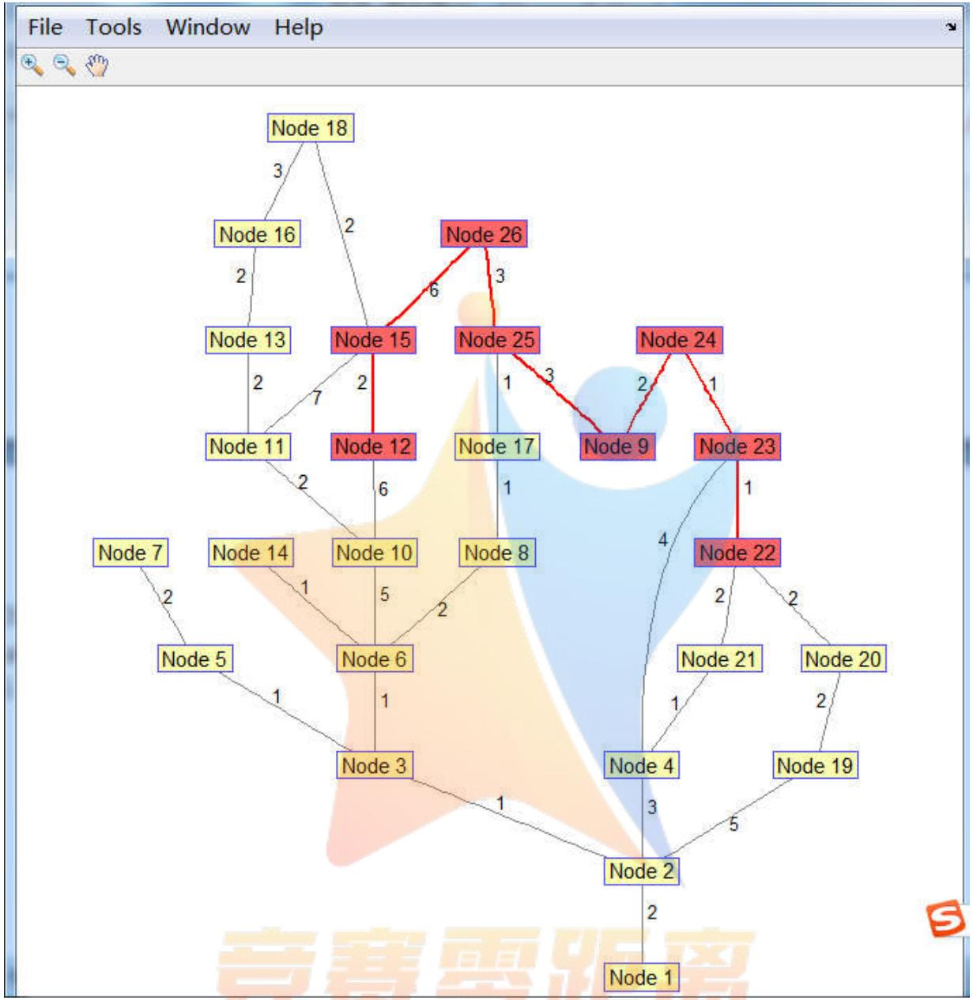

<details>
<summary>flowchart</summary>

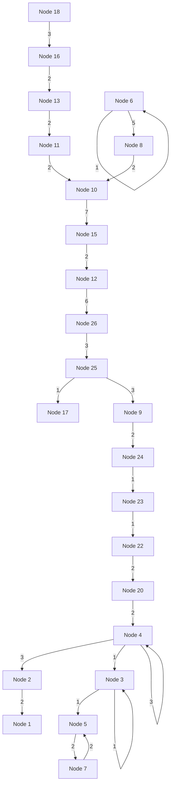
</details>

% 问题 1 的程序

% 从起点12出发，终点为13，

clc,clear all

%% 构造权重矩阵

w(1,2)=2;w(2,3)=1;w(2,4)=3;w(2,19)=5;w(3,5)=1;w(3,6)=1;w(4,21)=1;w(4,17)=11;

w(5,7)=2;w(6,8)=2;w(6,10)=5;w(6,14)=1;w(8,17)=1;w(10,11)=2;w(10,12)=6;

w(11,13)=2;w(13,16)=2;w(16,18)=3;w(12,18)=4;w(17,18)=12;w(17,20)=10;

w(17,21)=10;w(19,20)=2;w(20,21)=4;

w=w' ; % MATLAB工具箱要求数据是下三角矩阵

[i,j,k]=find(w);

b=sparse(i,j,k,26,26); % 构造稀疏矩阵

%% 画图  
```matlab
h = view(biograph(b, [], 'ShowArrows', 'off', 'ShowWeights', 'on'));
% ShowArrows=off，表示无向图，on表示有向图
% ShowWeights=off, 表示无权图，on表示赋权图
```  
%% 求最短路

```matlab
k1=12; % 起点
k2=13; % 终点
[dist, path, pred]=graphshortestpath(b, k1, k2, 'directed', 0)
% directed是有向图或无向图的标志,
% directed=0表示无向图, directed=1表示有向图
% dist=最短路长度
% path=最短路径
% pred=包含前任顶点
```

%% 将最短路径染色：  
```matlab
set(h.Nodes(path),'Color',[1 0.4 0.4])
fowEdges = getedgesbynodeid(h, get(h.Nodes(path),'ID'));
revEdges = getedgesbynodeid(h, get(h.Nodes(fliplr(path)),'ID'));
edges = [fowEdges;revEdges];
set(edges,'LineColor',[1 0 0]); % 给最短路径设置颜色
set(edges,'LineWidth',1.5);      % 给最短路径设置宽度
```

计算结果：  
```txt
dist =
    9
path =
    12    18    16    13
pred =
Columns 1 through 17
    2    3    6    2    3    10    5    6    NaN    12    10    0    16
6   NaN    18    8
Columns 18 through 26
    12    2    19    4    NaN    NaN    NaN    NaN    NaN
```

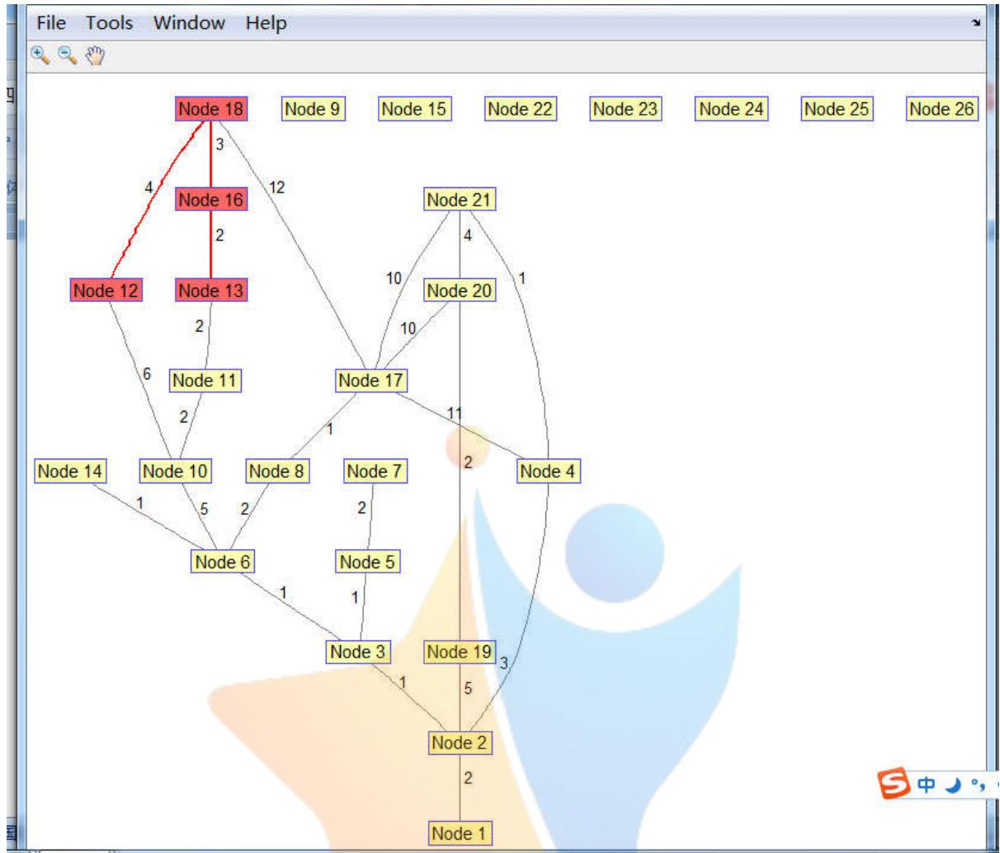

<details>
<summary>flowchart</summary>

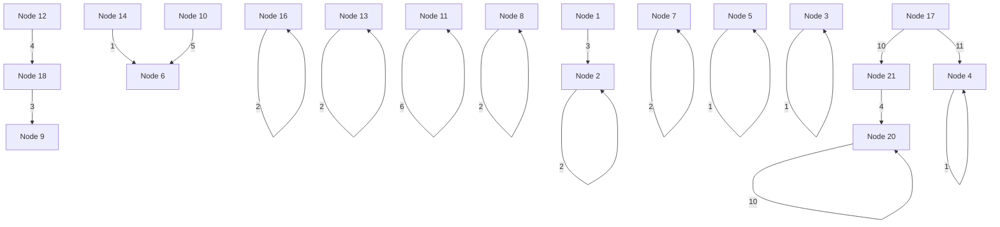
</details>

% 问题 1 的程序

% 从起点13出发，终点为17，

clc,clear all

%% 构造权重矩阵

$$
\mathrm{w} (1, 2) = 2; \mathrm{w} (2, 3) = 1; \mathrm{w} (2, 4) = 3; \mathrm{w} (2, 1 9) = 5; \mathrm{w} (3, 5) = 1; \mathrm{w} (3, 6) = 1; \mathrm{w} (4, 2 1) = 1; \mathrm{w} (4, 1 7) = 1 1;
$$

$$
\mathrm{w} (5, 7) = 2; \mathrm{w} (6, 8) = 2; \mathrm{w} (6, 1 0) = 5; \mathrm{w} (6, 1 4) = 1; \mathrm{w} (8, 1 7) = 1; \mathrm{w} (1 0, 1 1) = 2; \mathrm{w} (1 1, 1 3) = 2;
$$

$$
\mathrm{w} (1 3, 1 7) = 1 7; \mathrm{w} (1 7, 2 0) = 1 0; \mathrm{w} (1 7, 2 1) = 1 0; \mathrm{w} (1 9, 2 0) = 2; \mathrm{w} (2 0, 2 1) = 4;
$$

w=w' ; % MATLAB工具箱要求数据是下三角矩阵

[i,j,k]=find(w);

b=sparse(i,j,k,26,26) ; % 构造稀疏矩阵

%% 画图

$$
\mathrm{h} = \text {view} (\text {biograph} (\mathrm{b}, [ ], ^ {\prime} \text {ShowArrows} ^ {\prime}, ^ {\prime} \text {off} ^ {\prime}, ^ {\prime} \text {ShowWeights} ^ {\prime}, ^ {\prime} \text {on} ^ {\prime}));
$$

% ShowArrows=off，表示无向图，on表示有向图

% ShowWeights=off,表示无权图，on表示赋权图

%% 求最短路

k1=13; % 起点

k2=17; % 终点

$$
[ \text {dist}, \text {path}, \text {pred} ] = \text {graphshortestpath} (b, k 1, k 2, ^ {\prime} \text {directed} ^ {\prime}, 0)
$$

% directed是有向图或无向图的标志，

% directed=0表示无向图，directed=1表示有向图

```txt
% dist=最短路长度
% path=最短路径
% pred=包含前任顶点
```  
%% 将最短路径染色：

```matlab
set(h.Nodes(path),'Color',[1 0.4 0.4])
fowEdges = getedgesbynodeid(h, get(h.Nodes(path),'ID'));
revEdges = getedgesbynodeid(h, get(h.Nodes(fliplr(path)),'ID'));
edges = [fowEdges;revEdges];
set(edges,'LineColor',[1 0 0]); % 给最短路径设置颜色
set(edges,'LineWidth',1.5);      % 给最短路径设置宽度
计算结果:
dist =
    12
path =
    13    11    10    6    8    17
pred =
    Columns 1 through 17
    2    3    6    2    3    10    5    6   NaN    11    13   NaN     0
6   NaN   NaN    8
    Columns 18 through 26
    NaN    2    19    4   NaN   NaN   NaN   NaN   NaN
```

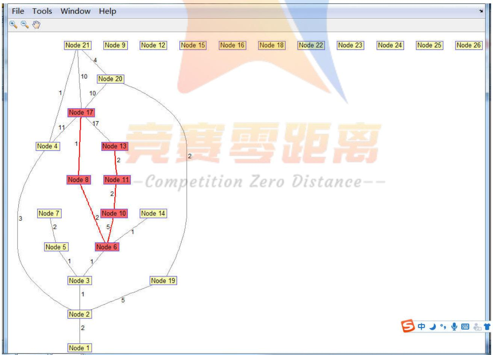

<details>
<summary>flowchart</summary>

```mermaid
graph TD
  Node1["Node 1"] --> Node2["Node 2"]
  Node2 --> Node3["Node 3"]
  Node3 --> Node4["Node 4"]
  Node4 --> Node5["Node 5"]
  Node5 --> Node6["Node 6"]
  Node6 --> Node7["Node 7"]
  Node7 --> Node8["Node 8"]
  Node8 --> Node9["Node 9"]
  Node9 --> Node10["Node 10"]
  Node10 --> Node11["Node 11"]
  Node11 --> Node12["Node 12"]
  Node12 --> Node13["Node 13"]
  Node13 --> Node14["Node 14"]
  Node14 --> Node15["Node 15"]
  Node15 --> Node16["Node 16"]
  Node16 --> Node17["Node 17"]
  Node17 --> Node18["Node 18"]
  Node18 --> Node19["Node 19"]
  Node19 --> Node20["Node 20"]
  Node20 --> Node21["Node 21"]
  Node21 --> Node22["Node 22"]
  Node22 --> Node23["Node 23"]
  Node23 --> Node24["Node 24"]
  Node24 --> Node25["Node 25"]
  Node25 --> Node26["Node 26"]
```
</details>

% 问题 1 的程序

% 从起点17出发，终点为19

clc,clear all

%% 构造权重矩阵

$$
\mathrm{w} (1, 2) = 2; \mathrm{w} (2, 3) = 1; \mathrm{w} (2, 4) = 3; \mathrm{w} (2, 1 9) = 5; \mathrm{w} (3, 5) = 1; \mathrm{w} (3, 1 7) = 4; \mathrm{w} (4, 2 1) = 1; \mathrm{w} (4, 1 7) = 1 1;
$$

$$
\mathrm{w} (5, 7) = 2; \mathrm{w} (1 7, 2 0) = 1 0; \mathrm{w} (1 7, 2 0) = 1 0; \mathrm{w} (1 9, 2 0) = 2; \mathrm{w} (2 0, 2 1) = 4;
$$

w=w'; % MATLAB工具箱要求数据是下三角矩阵

[i,j,k]=find(w);

b=sparse(i,j,k,26,26); % 构造稀疏矩阵

%% 画图

```matlab
h = view(biograph(b, [], 'ShowArrows', 'off', 'ShowWeights', 'on'));
% ShowArrows=off，表示无向图，on表示有向图
% ShowWeights=off, 表示无权图，on表示赋权图
```

%% 求最短路

k1=17; % 起点

k2=19; % 终点

```matlab
[dist, path, pred]=graphshortestpath(b, k1, k2, 'directed', 0)
% directed是有向图或无向图的标志,
% directed=0表示无向图, directed=1表示有向图
% dist=最短路长度
% path=最短路径
% pred=包含前任顶点
```

%% 将最短路径染色：

```matlab
set(h.Nodes(path),'Color',[1 0.4 0.4])
fowEdges = getedgesbynodeid(h, get(h.Nodes(path),'ID'));
revEdges = getedgesbynodeid(h, get(h.Nodes(fliplr(path)),'ID'));
edges = [fowEdges;revEdges];
set(edges,'LineColor',[1 0 0]); % 给最短路径设置颜色
set(edges,'LineWidth',1.5);      % 给最短路径设置宽度
```

计算结果：

```asm
dist =
    10
path =
    17     3     2     19
pred =
    Columns 1 through 17
    2     3     17     2     3   NaN     5   NaN   NaN   NaN   NaN   NaN   NaN
NaN    NaN    NaN     0
    Columns 18 through 26
    NaN     2     17     4   NaN   NaN   NaN   NaN   NaN
```

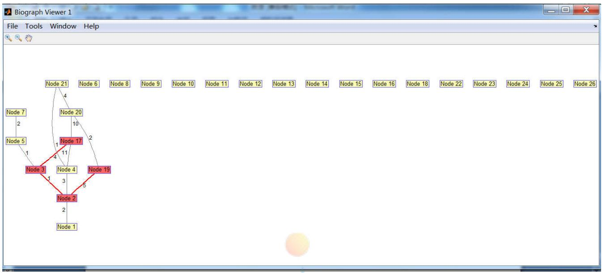

<details>
<summary>flowchart</summary>

```mermaid
graph TD
  Node1["Node 1"] --> Node2["Node 2"]
  Node2 --> Node3["Node 3"]
  Node3 --> Node4["Node 4"]
  Node4 --> Node5["Node 5"]
  Node5 --> Node6["Node 6"]
  Node6 --> Node7["Node 7"]
  Node7 --> Node8["Node 8"]
  Node8 --> Node9["Node 9"]
  Node9 --> Node10["Node 10"]
  Node10 --> Node11["Node 11"]
  Node11 --> Node12["Node 12"]
  Node12 --> Node13["Node 13"]
  Node13 --> Node14["Node 14"]
  Node14 --> Node15["Node 15"]
  Node15 --> Node16["Node 16"]
  Node16 --> Node18["Node 18"]
  Node18 --> Node22["Node 22"]
  Node22 --> Node23["Node 23"]
  Node23 --> Node24["Node 24"]
  Node24 --> Node25["Node 25"]
  Node25 --> Node26["Node 26"]
```
</details>

## 附录2 中班背包模型求解。

取 $\phi = 1 0$ ，θ=30，计算各个巡检点的累计时间，如表9所示。

表 9 中班背包模型的已知数据（当天第1次）

<table><tr><td>序号</td><td>1</td><td>2</td><td>3</td><td>4</td><td>5</td><td>6</td><td>7</td><td>8</td><td>9</td><td>10</td><td>11</td><td>12</td><td>13</td><td>14</td></tr><tr><td>巡检点</td><td>22</td><td>23</td><td>24</td><td>9</td><td>25</td><td>26</td><td>15</td><td>12</td><td>18</td><td>16</td><td>13</td><td>11</td><td>10</td><td>6</td></tr><tr><td>周期</td><td>35</td><td>35</td><td>35</td><td>35</td><td>120</td><td>35</td><td>35</td><td>35</td><td>35</td><td>35</td><td>80</td><td>35</td><td>120</td><td>35</td></tr><tr><td>耗时</td><td>2</td><td>3</td><td>2</td><td>4</td><td>2</td><td>2</td><td>2</td><td>2</td><td>2</td><td>3</td><td>5</td><td>3</td><td>2</td><td>3</td></tr><tr><td>路时</td><td>0</td><td>1</td><td>1</td><td>2</td><td>3</td><td>3</td><td>6</td><td>2</td><td>4</td><td>3</td><td>2</td><td>2</td><td>2</td><td>5</td></tr><tr><td>新累计时间</td><td>2</td><td>6</td><td>9</td><td>15</td><td>20</td><td>25</td><td>33</td><td>37</td><td>43</td><td>49</td><td>56</td><td>61</td><td>65</td><td>73</td></tr><tr><td>序号</td><td>15</td><td>16</td><td>17</td><td>18</td><td>19</td><td>20</td><td>21</td><td>22</td><td>23</td><td>24</td><td>25</td><td>26</td><td>27</td><td></td></tr><tr><td>巡检点</td><td>14</td><td>8</td><td>17</td><td>3</td><td>5</td><td>7</td><td>2</td><td>1</td><td>19</td><td>20</td><td>21</td><td>4</td><td>22</td><td></td></tr><tr><td>周期</td><td>35</td><td>35</td><td>480</td><td>35</td><td>720</td><td>80</td><td>50</td><td>35</td><td>35</td><td>35</td><td>80</td><td>35</td><td>35</td><td></td></tr><tr><td>耗时</td><td>3</td><td>3</td><td>2</td><td>3</td><td>2</td><td>2</td><td>2</td><td>3</td><td>2</td><td>3</td><td>3</td><td>2</td><td>0</td><td></td></tr><tr><td>路时</td><td>1</td><td>3</td><td>1</td><td>4</td><td>1</td><td>2</td><td>4</td><td>2</td><td>7</td><td>2</td><td>4</td><td>1</td><td>4</td><td></td></tr><tr><td>新累计时间</td><td>77</td><td>83</td><td>86</td><td>93</td><td>96</td><td>100</td><td>106</td><td>111</td><td>120</td><td>155</td><td>162</td><td>165</td><td>169</td><td></td></tr></table>

表 10 中班背包模型的已知数据（当天第2 次）

<table><tr><td>序号</td><td>1</td><td>2</td><td>3</td><td>4</td><td>5</td><td>6</td><td>7</td><td>8</td><td>9</td><td>10</td><td>11</td><td>12</td><td>13</td><td>14</td></tr><tr><td>巡检点</td><td>22</td><td>23</td><td>24</td><td>9</td><td>25</td><td>26</td><td>15</td><td>12</td><td>18</td><td>16</td><td>13</td><td>11</td><td>10</td><td>6</td></tr><tr><td>周期</td><td>35</td><td>35</td><td>35</td><td>35</td><td>120</td><td>35</td><td>35</td><td>35</td><td>35</td><td>35</td><td>80</td><td>35</td><td>120</td><td>35</td></tr><tr><td>耗时</td><td>2</td><td>3</td><td>2</td><td>4</td><td>2</td><td>2</td><td>2</td><td>2</td><td>2</td><td>3</td><td>5</td><td>3</td><td>2</td><td>3</td></tr><tr><td>路时</td><td>0</td><td>1</td><td>1</td><td>2</td><td>3</td><td>3</td><td>6</td><td>2</td><td>4</td><td>3</td><td>2</td><td>2</td><td>2</td><td>5</td></tr><tr><td>新累计时间</td><td>171</td><td>175</td><td>178</td><td>184</td><td>189</td><td>194</td><td>202</td><td>206</td><td>212</td><td>218</td><td>225</td><td>230</td><td>234</td><td>242</td></tr><tr><td>序号</td><td>15</td><td>16</td><td>17</td><td>18</td><td>19</td><td>20</td><td>21</td><td>22</td><td>23</td><td>24</td><td>25</td><td>26</td><td>27</td><td></td></tr><tr><td>巡检点</td><td>14</td><td>8</td><td>17</td><td>3</td><td>5</td><td>7</td><td>2</td><td>1</td><td>19</td><td>20</td><td>21</td><td>4</td><td>22</td><td></td></tr><tr><td>周期</td><td>35</td><td>35</td><td>480</td><td>35</td><td>720</td><td>80</td><td>50</td><td>35</td><td>35</td><td>35</td><td>80</td><td>35</td><td>35</td><td></td></tr><tr><td>耗时</td><td>3</td><td>3</td><td>2</td><td>3</td><td>2</td><td>2</td><td>2</td><td>3</td><td>2</td><td>3</td><td>3</td><td>2</td><td>0</td><td></td></tr><tr><td>路时</td><td>1</td><td>3</td><td>1</td><td>4</td><td>1</td><td>2</td><td>4</td><td>2</td><td>7</td><td>2</td><td>4</td><td>1</td><td>4</td><td></td></tr><tr><td>新累计时间</td><td>256</td><td>262</td><td>265</td><td>272</td><td>275</td><td>279</td><td>285</td><td>290</td><td>299</td><td>304</td><td>311</td><td>314</td><td>318</td><td></td></tr></table>

表 11 中班背包模型的已知数据（当天第3次）

<table><tr><td>序号</td><td>1</td><td>2</td><td>3</td><td>4</td><td>5</td><td>6</td><td>7</td><td>8</td><td>9</td><td>10</td><td>11</td><td>12</td><td>13</td><td>14</td></tr><tr><td>巡检点</td><td>22</td><td>23</td><td>24</td><td>9</td><td>25</td><td>26</td><td>15</td><td>12</td><td>18</td><td>16</td><td>13</td><td>11</td><td>10</td><td>6</td></tr><tr><td>周期</td><td>35</td><td>35</td><td>35</td><td>35</td><td>120</td><td>35</td><td>35</td><td>35</td><td>35</td><td>35</td><td>80</td><td>35</td><td>120</td><td>35</td></tr><tr><td>耗时</td><td>2</td><td>3</td><td>2</td><td>4</td><td>2</td><td>2</td><td>2</td><td>2</td><td>2</td><td>3</td><td>5</td><td>3</td><td>2</td><td>3</td></tr><tr><td>路时</td><td>0</td><td>1</td><td>1</td><td>2</td><td>3</td><td>3</td><td>6</td><td>2</td><td>4</td><td>3</td><td>2</td><td>2</td><td>2</td><td>5</td></tr><tr><td>新累计时间</td><td>320</td><td>324</td><td>327</td><td>333</td><td>338</td><td>343</td><td>351</td><td>355</td><td>361</td><td>377</td><td>384</td><td>389</td><td>393</td><td>401</td></tr><tr><td>序号</td><td>15</td><td>16</td><td>17</td><td>18</td><td>19</td><td>20</td><td>21</td><td>22</td><td>23</td><td>24</td><td>25</td><td>26</td><td>27</td><td></td></tr><tr><td>巡检点</td><td>14</td><td>8</td><td>17</td><td>3</td><td>5</td><td>7</td><td>2</td><td>1</td><td>19</td><td>20</td><td>21</td><td>4</td><td>22</td><td></td></tr><tr><td>周期</td><td>35</td><td>35</td><td>480</td><td>35</td><td>720</td><td>80</td><td>50</td><td>35</td><td>35</td><td>35</td><td>80</td><td>35</td><td>35</td><td></td></tr><tr><td>耗时</td><td>3</td><td>3</td><td>2</td><td>3</td><td>2</td><td>2</td><td>2</td><td>3</td><td>2</td><td>3</td><td>3</td><td>2</td><td>0</td><td></td></tr><tr><td>路时</td><td>1</td><td>3</td><td>1</td><td>4</td><td>1</td><td>2</td><td>4</td><td>2</td><td>7</td><td>2</td><td>4</td><td>1</td><td>4</td><td></td></tr><tr><td>新累计时间</td><td>405</td><td>411</td><td>414</td><td>421</td><td>424</td><td>428</td><td>434</td><td>439</td><td>448</td><td>453</td><td>460</td><td>463</td><td>467</td><td></td></tr></table>

表12 中班背包模型的已知数据（当天第4次，需要加班）

<table><tr><td>序号</td><td>1</td><td>2</td><td>3</td><td>4</td><td>5</td><td>6</td><td>7</td><td>8</td><td>9</td><td>10</td><td>11</td><td>12</td><td>13</td><td>14</td></tr><tr><td>巡检点</td><td>22</td><td>23</td><td>24</td><td>9</td><td>25</td><td>26</td><td>15</td><td>12</td><td>18</td><td>16</td><td>13</td><td>11</td><td>10</td><td>6</td></tr><tr><td>周期</td><td>35</td><td>35</td><td>35</td><td>35</td><td>120</td><td>35</td><td>35</td><td>35</td><td>35</td><td>35</td><td>80</td><td>35</td><td>120</td><td>35</td></tr><tr><td>耗时</td><td>2</td><td>3</td><td>2</td><td>4</td><td>2</td><td>2</td><td>2</td><td>2</td><td>2</td><td>3</td><td>5</td><td>3</td><td>2</td><td>3</td></tr><tr><td>路时</td><td>0</td><td>1</td><td>1</td><td>2</td><td>3</td><td>3</td><td>6</td><td>2</td><td>4</td><td>3</td><td>2</td><td>2</td><td>2</td><td>5</td></tr><tr><td>新累计时间</td><td>469</td><td>473</td><td>476</td><td>482</td><td>497</td><td>502</td><td>510</td><td>514</td><td>520</td><td>526</td><td>533</td><td>538</td><td>542</td><td>550</td></tr><tr><td>序号</td><td>15</td><td>16</td><td>17</td><td>18</td><td>19</td><td>20</td><td>21</td><td>22</td><td>23</td><td>24</td><td>25</td><td>26</td><td>27</td><td></td></tr><tr><td>巡检点</td><td>14</td><td>8</td><td>17</td><td>3</td><td>5</td><td>7</td><td>2</td><td>1</td><td>19</td><td>20</td><td>21</td><td>4</td><td>22</td><td></td></tr><tr><td>周期</td><td>35</td><td>35</td><td>480</td><td>35</td><td>720</td><td>80</td><td>50</td><td>35</td><td>35</td><td>35</td><td>80</td><td>35</td><td>35</td><td></td></tr><tr><td>耗时</td><td>3</td><td>3</td><td>2</td><td>3</td><td>2</td><td>2</td><td>2</td><td>3</td><td>2</td><td>3</td><td>3</td><td>2</td><td>0</td><td></td></tr><tr><td>路时</td><td>1</td><td>3</td><td>1</td><td>4</td><td>1</td><td>2</td><td>4</td><td>2</td><td>7</td><td>2</td><td>4</td><td>1</td><td>4</td><td></td></tr><tr><td>新累计时间</td><td>554</td><td>560</td><td>563</td><td>570</td><td>573</td><td>577</td><td>583</td><td>588</td><td>597</td><td>602</td><td>619</td><td>622</td><td>626</td><td></td></tr></table>

该回路的最短路长（走路时间）仍然为49 分钟，完成第1 次、第2 次、第3次、第4次巡检分别需要169、149、149、159分钟（包括巡检耗时和走路时间）。

求解背包模型得， $y _ { 1 } = y _ { 2 } = y _ { 3 } = y _ { 4 } = y _ { 5 } = 3 5$ ，分段结果如表 13所示。

表13 中班背包模型的分段结果

<table><tr><td>分段</td><td colspan="7">第1段</td><td colspan="6">第2段</td></tr><tr><td>序号</td><td>1</td><td>2</td><td>3</td><td>4</td><td>5</td><td>6</td><td>7</td><td>8</td><td>9</td><td>10</td><td>11</td><td>12</td><td>13</td></tr><tr><td>巡检点</td><td>22</td><td>23</td><td>24</td><td>9</td><td>25</td><td>26</td><td>15</td><td>12</td><td>18</td><td>16</td><td>13</td><td>11</td><td>10</td></tr><tr><td>分段</td><td colspan="7">第3段</td><td colspan="5">第4段</td><td>第5段</td></tr><tr><td>序号</td><td>14</td><td>15</td><td>16</td><td>17</td><td>18</td><td>19</td><td>20</td><td>21</td><td>22</td><td>23</td><td>24</td><td>25</td><td>26 27</td></tr><tr><td>巡检点</td><td>6</td><td>14</td><td>8</td><td>17</td><td>3</td><td>5</td><td>7</td><td>2</td><td>1</td><td>19</td><td>20</td><td>21</td><td>4 22</td></tr></table>

根据计算结果可知，完成一次最短回路巡检至少需要安排 5 个工人，即每班至少需要 5人，每天三班至少需要 15人。与问题1相比，增加了1 个工人。

## 5.2.4 结果检验

经检验，计算结果全部满足题目条件，故模型和结果都是正确的。

## 5.2.5 中班排班方案

根据假设（2），每天三班的上班时间为：早班（8:00-16:00）、中班（16:00-24:00）、晚班（0:00-8:00），每天工作8小时。再根据背包模型计算结果，每班至少需要5人，每天三班至少需要15 人。于是制定排班方案，见表 14、表 15、表16所示。

表15 中班巡检表

<table><tr><td>人员</td><td>B1</td><td>B2</td><td>B3</td><td>B4</td><td>B5</td></tr><tr><td>上班时间</td><td>16:00</td><td>16:00</td><td>16:00</td><td>16:00</td><td>16:00</td></tr><tr><td>出发时间</td><td>16:00</td><td>16:35</td><td>17:10</td><td>17:45</td><td>18:20</td></tr><tr><td>下班时间</td><td>0:00</td><td>0:00</td><td>0:00</td><td>0:00</td><td>0:00</td></tr><tr><td>加班截止时间</td><td>2:00</td><td>2:05</td><td>1:30</td><td>0:55</td><td>0:20</td></tr><tr><td>加班时间/分</td><td>160</td><td>125</td><td>90</td><td>55</td><td>20</td></tr><tr><td>空闲时间/分</td><td>0</td><td>35</td><td>70</td><td>105</td><td>140</td></tr><tr><td>耗费时间/分</td><td>160</td><td>160</td><td>160</td><td>160</td><td>160</td></tr><tr><td>总耗费时间/分</td><td colspan="5">800</td></tr></table>

注：B1、B2、B3、B4、B5是中班工作人员名称

## 附录3 晚班背包模型求解。

取 $\phi = 1 0$ ，θ=30，计算各个巡检点的累计时间，如表9所示。

表 9 晚班背包模型的已知数据（当天第1次）

<table><tr><td>序号</td><td>1</td><td>2</td><td>3</td><td>4</td><td>5</td><td>6</td><td>7</td><td>8</td><td>9</td><td>10</td><td>11</td><td>12</td><td>13</td><td>14</td></tr><tr><td>巡检点</td><td>22</td><td>23</td><td>24</td><td>9</td><td>25</td><td>26</td><td>15</td><td>12</td><td>18</td><td>16</td><td>13</td><td>11</td><td>10</td><td>6</td></tr><tr><td>周期</td><td>35</td><td>35</td><td>35</td><td>35</td><td>120</td><td>35</td><td>35</td><td>35</td><td>35</td><td>35</td><td>80</td><td>35</td><td>120</td><td>35</td></tr><tr><td>耗时</td><td>2</td><td>3</td><td>2</td><td>4</td><td>2</td><td>2</td><td>2</td><td>2</td><td>2</td><td>3</td><td>5</td><td>3</td><td>2</td><td>3</td></tr><tr><td>路时</td><td>0</td><td>1</td><td>1</td><td>2</td><td>3</td><td>3</td><td>6</td><td>2</td><td>4</td><td>3</td><td>2</td><td>2</td><td>2</td><td>5</td></tr><tr><td>新累计时间</td><td>2</td><td>6</td><td>9</td><td>15</td><td>20</td><td>25</td><td>33</td><td>37</td><td>43</td><td>49</td><td>56</td><td>61</td><td>65</td><td>73</td></tr><tr><td>序号</td><td>15</td><td>16</td><td>17</td><td>18</td><td>19</td><td>20</td><td>21</td><td>22</td><td>23</td><td>24</td><td>25</td><td>26</td><td>27</td><td></td></tr><tr><td>巡检点</td><td>14</td><td>8</td><td>17</td><td>3</td><td>5</td><td>7</td><td>2</td><td>1</td><td>19</td><td>20</td><td>21</td><td>4</td><td>22</td><td></td></tr><tr><td>周期</td><td>35</td><td>35</td><td>480</td><td>35</td><td>720</td><td>80</td><td>50</td><td>35</td><td>35</td><td>35</td><td>80</td><td>35</td><td>35</td><td></td></tr><tr><td>耗时</td><td>3</td><td>3</td><td>2</td><td>3</td><td>2</td><td>2</td><td>2</td><td>3</td><td>2</td><td>3</td><td>3</td><td>2</td><td>0</td><td></td></tr><tr><td>路时</td><td>1</td><td>3</td><td>1</td><td>4</td><td>1</td><td>2</td><td>4</td><td>2</td><td>7</td><td>2</td><td>4</td><td>1</td><td>4</td><td></td></tr><tr><td>新累计时间</td><td>77</td><td>83</td><td>86</td><td>93</td><td>96</td><td>100</td><td>106</td><td>111</td><td>120</td><td>135</td><td>142</td><td>145</td><td>149</td><td></td></tr></table>

表 10 晚班背包模型的已知数据（当天第2 次）

<table><tr><td>序号</td><td>1</td><td>2</td><td>3</td><td>4</td><td>5</td><td>6</td><td>7</td><td>8</td><td>9</td><td>10</td><td>11</td><td>12</td><td>13</td><td>14</td></tr><tr><td>巡检点</td><td>22</td><td>23</td><td>24</td><td>9</td><td>25</td><td>26</td><td>15</td><td>12</td><td>18</td><td>16</td><td>13</td><td>11</td><td>10</td><td>6</td></tr><tr><td>周期</td><td>35</td><td>35</td><td>35</td><td>35</td><td>120</td><td>35</td><td>35</td><td>35</td><td>35</td><td>35</td><td>80</td><td>35</td><td>120</td><td>35</td></tr><tr><td>耗时</td><td>2</td><td>3</td><td>2</td><td>4</td><td>2</td><td>2</td><td>2</td><td>2</td><td>2</td><td>3</td><td>5</td><td>3</td><td>2</td><td>3</td></tr><tr><td>路时</td><td>0</td><td>1</td><td>1</td><td>2</td><td>3</td><td>3</td><td>6</td><td>2</td><td>4</td><td>3</td><td>2</td><td>2</td><td>2</td><td>5</td></tr><tr><td>新累计时间</td><td>151</td><td>155</td><td>158</td><td>164</td><td>169</td><td>174</td><td>182</td><td>186</td><td>192</td><td>198</td><td>205</td><td>210</td><td>214</td><td>222</td></tr><tr><td>序号</td><td>15</td><td>16</td><td>17</td><td>18</td><td>19</td><td>20</td><td>21</td><td>22</td><td>23</td><td>24</td><td>25</td><td>26</td><td>27</td><td></td></tr><tr><td>巡检点</td><td>14</td><td>8</td><td>17</td><td>3</td><td>5</td><td>7</td><td>2</td><td>1</td><td>19</td><td>20</td><td>21</td><td>4</td><td>22</td><td></td></tr><tr><td>周期</td><td>35</td><td>35</td><td>480</td><td>35</td><td>720</td><td>80</td><td>50</td><td>35</td><td>35</td><td>35</td><td>80</td><td>35</td><td>35</td><td></td></tr><tr><td>耗时</td><td>3</td><td>3</td><td>2</td><td>3</td><td>2</td><td>2</td><td>2</td><td>3</td><td>2</td><td>3</td><td>3</td><td>2</td><td>0</td><td></td></tr><tr><td>路时</td><td>1</td><td>3</td><td>1</td><td>4</td><td>1</td><td>2</td><td>4</td><td>2</td><td>7</td><td>2</td><td>4</td><td>1</td><td>4</td><td></td></tr><tr><td>新累计时间</td><td>226</td><td>232</td><td>235</td><td>242</td><td>255</td><td>259</td><td>265</td><td>270</td><td>279</td><td>284</td><td>291</td><td>294</td><td>298</td><td></td></tr></table>

表 11 晚班背包模型的已知数据（当天第3次）

<table><tr><td>序号</td><td>1</td><td>2</td><td>3</td><td>4</td><td>5</td><td>6</td><td>7</td><td>8</td><td>9</td><td>10</td><td>11</td><td>12</td><td>13</td><td>14</td></tr><tr><td>巡检点</td><td>22</td><td>23</td><td>24</td><td>9</td><td>25</td><td>26</td><td>15</td><td>12</td><td>18</td><td>16</td><td>13</td><td>11</td><td>10</td><td>6</td></tr><tr><td>周期</td><td>35</td><td>35</td><td>35</td><td>35</td><td>120</td><td>35</td><td>35</td><td>35</td><td>35</td><td>35</td><td>80</td><td>35</td><td>120</td><td>35</td></tr><tr><td>耗时</td><td>2</td><td>3</td><td>2</td><td>4</td><td>2</td><td>2</td><td>2</td><td>2</td><td>2</td><td>3</td><td>5</td><td>3</td><td>2</td><td>3</td></tr><tr><td>路时</td><td>0</td><td>1</td><td>1</td><td>2</td><td>3</td><td>3</td><td>6</td><td>2</td><td>4</td><td>3</td><td>2</td><td>2</td><td>2</td><td>5</td></tr><tr><td>新累计时间</td><td>300</td><td>304</td><td>307</td><td>313</td><td>318</td><td>323</td><td>331</td><td>335</td><td>341</td><td>347</td><td>354</td><td>359</td><td>363</td><td>381</td></tr><tr><td>序号</td><td>15</td><td>16</td><td>17</td><td>18</td><td>19</td><td>20</td><td>21</td><td>22</td><td>23</td><td>24</td><td>25</td><td>26</td><td>27</td><td></td></tr><tr><td>巡检点</td><td>14</td><td>8</td><td>17</td><td>3</td><td>5</td><td>7</td><td>2</td><td>1</td><td>19</td><td>20</td><td>21</td><td>4</td><td>22</td><td></td></tr><tr><td>周期</td><td>35</td><td>35</td><td>480</td><td>35</td><td>720</td><td>80</td><td>50</td><td>35</td><td>35</td><td>35</td><td>80</td><td>35</td><td>35</td><td></td></tr><tr><td>耗时</td><td>3</td><td>3</td><td>2</td><td>3</td><td>2</td><td>2</td><td>2</td><td>3</td><td>2</td><td>3</td><td>3</td><td>2</td><td>0</td><td></td></tr><tr><td>路时</td><td>1</td><td>3</td><td>1</td><td>4</td><td>1</td><td>2</td><td>4</td><td>2</td><td>7</td><td>2</td><td>4</td><td>1</td><td>4</td><td></td></tr><tr><td>新累计时间</td><td>385</td><td>391</td><td>394</td><td>401</td><td>404</td><td>408</td><td>414</td><td>419</td><td>428</td><td>433</td><td>440</td><td>443</td><td>447</td><td></td></tr></table>

表12 晚班背包模型的已知数据（当天第4次，需要加班）

<table><tr><td>序号</td><td>1</td><td>2</td><td>3</td><td>4</td><td>5</td><td>6</td><td>7</td><td>8</td><td>9</td><td>10</td><td>11</td><td>12</td><td>13</td><td>14</td></tr><tr><td>巡检点</td><td>22</td><td>23</td><td>24</td><td>9</td><td>25</td><td>26</td><td>15</td><td>12</td><td>18</td><td>16</td><td>13</td><td>11</td><td>10</td><td>6</td></tr><tr><td>周期</td><td>35</td><td>35</td><td>35</td><td>35</td><td>120</td><td>35</td><td>35</td><td>35</td><td>35</td><td>35</td><td>80</td><td>35</td><td>120</td><td>35</td></tr><tr><td>耗时</td><td>2</td><td>3</td><td>2</td><td>4</td><td>2</td><td>2</td><td>2</td><td>2</td><td>2</td><td>3</td><td>5</td><td>3</td><td>2</td><td>3</td></tr><tr><td>路时</td><td>0</td><td>1</td><td>1</td><td>2</td><td>3</td><td>3</td><td>6</td><td>2</td><td>4</td><td>3</td><td>2</td><td>2</td><td>2</td><td>5</td></tr><tr><td>新累计时间</td><td>449</td><td>453</td><td>456</td><td>462</td><td>467</td><td>472</td><td>480</td><td>494</td><td>500</td><td>506</td><td>513</td><td>518</td><td>522</td><td>530</td></tr><tr><td>序号</td><td>15</td><td>16</td><td>17</td><td>18</td><td>19</td><td>20</td><td>21</td><td>22</td><td>23</td><td>24</td><td>25</td><td>26</td><td>27</td><td></td></tr><tr><td>巡检点</td><td>14</td><td>8</td><td>17</td><td>3</td><td>5</td><td>7</td><td>2</td><td>1</td><td>19</td><td>20</td><td>21</td><td>4</td><td>22</td><td></td></tr><tr><td>周期</td><td>35</td><td>35</td><td>480</td><td>35</td><td>720</td><td>80</td><td>50</td><td>35</td><td>35</td><td>35</td><td>80</td><td>35</td><td>35</td><td></td></tr><tr><td>耗时</td><td>3</td><td>3</td><td>2</td><td>3</td><td>2</td><td>2</td><td>2</td><td>3</td><td>2</td><td>3</td><td>3</td><td>2</td><td>0</td><td></td></tr><tr><td>路时</td><td>1</td><td>3</td><td>1</td><td>4</td><td>1</td><td>2</td><td>4</td><td>2</td><td>7</td><td>2</td><td>4</td><td>1</td><td>4</td><td></td></tr><tr><td>新累计时间</td><td>534</td><td>540</td><td>543</td><td>550</td><td>553</td><td>557</td><td>563</td><td>568</td><td>577</td><td>582</td><td>589</td><td>592</td><td>596</td><td></td></tr></table>

该回路的最短路长（走路时间）仍然为49 分钟，完成第1 次、第2 次、第3次、第4次巡检都是149 分钟（包括巡检耗时和走路时间）。

求解背包模型得， $y _ { 1 } = y _ { 2 } = y _ { 3 } = y _ { 4 } = y _ { 5 } = 3 5$ ，分段结果如表 13 所示。

表13 晚班背包模型的分段结果

<table><tr><td>分段</td><td colspan="7">第1段</td><td colspan="6">第2段</td></tr><tr><td>序号</td><td>1</td><td>2</td><td>3</td><td>4</td><td>5</td><td>6</td><td>7</td><td>8</td><td>9</td><td>10</td><td>11</td><td>12</td><td>13</td></tr><tr><td>巡检点</td><td>22</td><td>23</td><td>24</td><td>9</td><td>25</td><td>26</td><td>15</td><td>12</td><td>18</td><td>16</td><td>13</td><td>11</td><td>10</td></tr><tr><td>分段</td><td colspan="7">第3段</td><td colspan="4">第4段</td><td colspan="2">第5段</td></tr><tr><td>序号</td><td>14</td><td>15</td><td>16</td><td>17</td><td>18</td><td>19</td><td>20</td><td>21</td><td>22</td><td>23</td><td>24</td><td>25</td><td>26</td></tr><tr><td>巡检点</td><td>6</td><td>14</td><td>8</td><td>17</td><td>3</td><td>5</td><td>7</td><td>2</td><td>1</td><td>19</td><td>20</td><td>21</td><td>4</td></tr></table>

根据计算结果可知，完成一次最短回路巡检至少需要安排 5 个工人，即每班至少需要 5人，每天三班至少需要 15人。与问题1相比，增加了1 个工人。

## 5.2.4 结果检验

经检验，计算结果全部满足题目条件，故模型和结果都是正确的。

## 5.2.5晚班排班方案

根据假设（2），每天三班的上班时间为：早班（8:00-16:00）、中班（16:00-24:00）、晚班（0:00-8:00），每天工作8小时。再根据背包模型计算结果，每班至少需要5人，每天三班至少需要15 人。于是制定排班方案，见表 14、表 15、表16所示。

表16 晚班巡检表

<table><tr><td>人员</td><td>C1</td><td>C2</td><td>C3</td><td>C4</td><td>C5</td></tr><tr><td>上班时间</td><td>0:00</td><td>0:00</td><td>0:00</td><td>0:00</td><td>0:00</td></tr><tr><td>出发时间</td><td>0:00</td><td>0:35</td><td>1:10</td><td>1:45</td><td>2:20</td></tr><tr><td>下班时间</td><td>8:00</td><td>8:00</td><td>8:00</td><td>8:00</td><td>8:00</td></tr><tr><td>加班截止时间</td><td>10:00</td><td>9:40</td><td>9:10</td><td>8:35</td><td>8:00</td></tr><tr><td>加班时间/分</td><td>140</td><td>105</td><td>70</td><td>35</td><td>0</td></tr><tr><td>空闲时间/分</td><td>0</td><td>35</td><td>70</td><td>105</td><td>140</td></tr><tr><td>耗费时间/分</td><td>140</td><td>140</td><td>140</td><td>140</td><td>140</td></tr><tr><td>总耗费时间/分</td><td></td><td>700</td><td></td><td></td><td></td></tr></table>

注：C1、C2、C3、C4、C5是晚班工作人员名称

## 附录4 5分钟背包模型求解。

取 $\phi = 5$ ，θ=30，计算各个巡检点的累计时间，如表9所示。

表 9 晚班背包模型的已知数据（当天第1次）

<table><tr><td>序号</td><td>1</td><td>2</td><td>3</td><td>4</td><td>5</td><td>6</td><td>7</td><td>8</td><td>9</td><td>10</td><td>11</td><td>12</td><td>13</td><td>14</td></tr><tr><td>巡检点</td><td>22</td><td>23</td><td>24</td><td>9</td><td>25</td><td>26</td><td>15</td><td>12</td><td>18</td><td>16</td><td>13</td><td>11</td><td>10</td><td>6</td></tr><tr><td>周期</td><td>35</td><td>35</td><td>35</td><td>35</td><td>120</td><td>35</td><td>35</td><td>35</td><td>35</td><td>35</td><td>80</td><td>35</td><td>120</td><td>35</td></tr><tr><td>耗时</td><td>2</td><td>3</td><td>2</td><td>4</td><td>2</td><td>2</td><td>2</td><td>2</td><td>2</td><td>3</td><td>5</td><td>3</td><td>2</td><td>3</td></tr><tr><td>路时</td><td>0</td><td>1</td><td>1</td><td>2</td><td>3</td><td>3</td><td>6</td><td>2</td><td>4</td><td>3</td><td>2</td><td>2</td><td>2</td><td>5</td></tr><tr><td>累计时间</td><td>2</td><td>6</td><td>9</td><td>15</td><td>20</td><td>25</td><td>33</td><td>37</td><td>43</td><td>49</td><td>56</td><td>61</td><td>65</td><td>73</td></tr><tr><td>序号</td><td>15</td><td>16</td><td>17</td><td>18</td><td>19</td><td>20</td><td>21</td><td>22</td><td>23</td><td>24</td><td>25</td><td>26</td><td>27</td><td></td></tr><tr><td>巡检点</td><td>14</td><td>8</td><td>17</td><td>3</td><td>5</td><td>7</td><td>2</td><td>1</td><td>19</td><td>20</td><td>21</td><td>4</td><td>22</td><td></td></tr><tr><td>周期</td><td>35</td><td>35</td><td>480</td><td>35</td><td>720</td><td>80</td><td>50</td><td>35</td><td>35</td><td>35</td><td>80</td><td>35</td><td>35</td><td></td></tr><tr><td>耗时</td><td>3</td><td>3</td><td>2</td><td>3</td><td>2</td><td>2</td><td>2</td><td>3</td><td>2</td><td>3</td><td>3</td><td>2</td><td>0</td><td></td></tr><tr><td>路时</td><td>1</td><td>3</td><td>1</td><td>4</td><td>1</td><td>2</td><td>4</td><td>2</td><td>7</td><td>2</td><td>4</td><td>1</td><td>4</td><td></td></tr><tr><td>新累计时间</td><td>77</td><td>83</td><td>86</td><td>93</td><td>96</td><td>100</td><td>106</td><td>111</td><td>120</td><td>130</td><td>137</td><td>140</td><td>144</td><td></td></tr></table>

表 10 晚班背包模型的已知数据（当天第2 次）

<table><tr><td>序号</td><td>1</td><td>2</td><td>3</td><td>4</td><td>5</td><td>6</td><td>7</td><td>8</td><td>9</td><td>10</td><td>11</td><td>12</td><td>13</td><td>14</td></tr><tr><td>巡检点</td><td>22</td><td>23</td><td>24</td><td>9</td><td>25</td><td>26</td><td>15</td><td>12</td><td>18</td><td>16</td><td>13</td><td>11</td><td>10</td><td>6</td></tr><tr><td>周期</td><td>35</td><td>35</td><td>35</td><td>35</td><td>120</td><td>35</td><td>35</td><td>35</td><td>35</td><td>35</td><td>80</td><td>35</td><td>120</td><td>35</td></tr><tr><td>耗时</td><td>2</td><td>3</td><td>2</td><td>4</td><td>2</td><td>2</td><td>2</td><td>2</td><td>2</td><td>3</td><td>5</td><td>3</td><td>2</td><td>3</td></tr><tr><td>路时</td><td>0</td><td>1</td><td>1</td><td>2</td><td>3</td><td>3</td><td>6</td><td>2</td><td>4</td><td>3</td><td>2</td><td>2</td><td>2</td><td>5</td></tr><tr><td>新累计时间</td><td>146</td><td>150</td><td>153</td><td>159</td><td>164</td><td>169</td><td>177</td><td>181</td><td>187</td><td>193</td><td>200</td><td>205</td><td>209</td><td>217</td></tr><tr><td>序号</td><td>15</td><td>16</td><td>17</td><td>18</td><td>19</td><td>20</td><td>21</td><td>22</td><td>23</td><td>24</td><td>25</td><td>26</td><td>27</td><td></td></tr><tr><td>巡检点</td><td>14</td><td>8</td><td>17</td><td>3</td><td>5</td><td>7</td><td>2</td><td>1</td><td>19</td><td>20</td><td>21</td><td>4</td><td>22</td><td></td></tr><tr><td>周期</td><td>35</td><td>35</td><td>480</td><td>35</td><td>720</td><td>80</td><td>50</td><td>35</td><td>35</td><td>35</td><td>80</td><td>35</td><td>35</td><td></td></tr><tr><td>耗时</td><td>3</td><td>3</td><td>2</td><td>3</td><td>2</td><td>2</td><td>2</td><td>3</td><td>2</td><td>3</td><td>3</td><td>2</td><td>0</td><td></td></tr><tr><td>路时</td><td>1</td><td>3</td><td>1</td><td>4</td><td>1</td><td>2</td><td>4</td><td>2</td><td>7</td><td>2</td><td>4</td><td>1</td><td>4</td><td></td></tr><tr><td>新累计时间</td><td>221</td><td>227</td><td>230</td><td>237</td><td>240</td><td>274</td><td>280</td><td>285</td><td>294</td><td>299</td><td>306</td><td>309</td><td>313</td><td></td></tr></table>

表 11 晚班背包模型的已知数据（当天第3次）

<table><tr><td>序号</td><td>1</td><td>2</td><td>3</td><td>4</td><td>5</td><td>6</td><td>7</td><td>8</td><td>9</td><td>10</td><td>11</td><td>12</td><td>13</td><td>14</td></tr><tr><td>巡检点</td><td>22</td><td>23</td><td>24</td><td>9</td><td>25</td><td>26</td><td>15</td><td>12</td><td>18</td><td>16</td><td>13</td><td>11</td><td>10</td><td>6</td></tr><tr><td>周期</td><td>35</td><td>35</td><td>35</td><td>35</td><td>120</td><td>35</td><td>35</td><td>35</td><td>35</td><td>35</td><td>80</td><td>35</td><td>120</td><td>35</td></tr><tr><td>耗时</td><td>2</td><td>3</td><td>2</td><td>4</td><td>2</td><td>2</td><td>2</td><td>2</td><td>2</td><td>3</td><td>5</td><td>3</td><td>2</td><td>3</td></tr><tr><td>路时</td><td>0</td><td>1</td><td>1</td><td>2</td><td>3</td><td>3</td><td>6</td><td>2</td><td>4</td><td>3</td><td>2</td><td>2</td><td>2</td><td>5</td></tr><tr><td>新累计时间</td><td>315</td><td>319</td><td>322</td><td>328</td><td>333</td><td>338</td><td>346</td><td>350</td><td>356</td><td>362</td><td>374</td><td>379</td><td>383</td><td>391</td></tr><tr><td>序号</td><td>15</td><td>16</td><td>17</td><td>18</td><td>19</td><td>20</td><td>21</td><td>22</td><td>23</td><td>24</td><td>25</td><td>26</td><td>27</td><td></td></tr><tr><td>巡检点</td><td>14</td><td>8</td><td>17</td><td>3</td><td>5</td><td>7</td><td>2</td><td>1</td><td>19</td><td>20</td><td>21</td><td>4</td><td>22</td><td></td></tr><tr><td>周期</td><td>35</td><td>35</td><td>480</td><td>35</td><td>720</td><td>80</td><td>50</td><td>35</td><td>35</td><td>35</td><td>80</td><td>35</td><td>35</td><td></td></tr><tr><td>耗时</td><td>3</td><td>3</td><td>2</td><td>3</td><td>2</td><td>2</td><td>2</td><td>3</td><td>2</td><td>3</td><td>3</td><td>2</td><td>0</td><td></td></tr><tr><td>路时</td><td>1</td><td>3</td><td>1</td><td>4</td><td>1</td><td>2</td><td>4</td><td>2</td><td>7</td><td>2</td><td>4</td><td>1</td><td>4</td><td></td></tr><tr><td>新累计时间</td><td>395</td><td>401</td><td>404</td><td>411</td><td>414</td><td>418</td><td>424</td><td>429</td><td>438</td><td>443</td><td>450</td><td>453</td><td>457</td><td></td></tr></table>

表12 晚班背包模型的已知数据（当天第4次，需要加班）

<table><tr><td>序号</td><td>1</td><td>2</td><td>3</td><td>4</td><td>5</td><td>6</td><td>7</td><td>8</td><td>9</td><td>10</td><td>11</td><td>12</td><td>13</td><td>14</td></tr><tr><td>巡检点</td><td>22</td><td>23</td><td>24</td><td>9</td><td>25</td><td>26</td><td>15</td><td>12</td><td>18</td><td>16</td><td>13</td><td>11</td><td>10</td><td>6</td></tr><tr><td>周期</td><td>35</td><td>35</td><td>35</td><td>35</td><td>120</td><td>35</td><td>35</td><td>35</td><td>35</td><td>35</td><td>80</td><td>35</td><td>120</td><td>35</td></tr><tr><td>耗时</td><td>2</td><td>3</td><td>2</td><td>4</td><td>2</td><td>2</td><td>2</td><td>2</td><td>2</td><td>3</td><td>5</td><td>3</td><td>2</td><td>3</td></tr><tr><td>路时</td><td>0</td><td>1</td><td>1</td><td>2</td><td>3</td><td>3</td><td>6</td><td>2</td><td>4</td><td>3</td><td>2</td><td>2</td><td>2</td><td>5</td></tr><tr><td>新累计时间</td><td>459</td><td>463</td><td>466</td><td>472</td><td>477</td><td>482</td><td>495</td><td>499</td><td>505</td><td>511</td><td>518</td><td>523</td><td>527</td><td>535</td></tr><tr><td>序号</td><td>15</td><td>16</td><td>17</td><td>18</td><td>19</td><td>20</td><td>21</td><td>22</td><td>23</td><td>24</td><td>25</td><td>26</td><td>27</td><td></td></tr><tr><td>巡检点</td><td>14</td><td>8</td><td>17</td><td>3</td><td>5</td><td>7</td><td>2</td><td>1</td><td>19</td><td>20</td><td>21</td><td>4</td><td>22</td><td></td></tr><tr><td>周期</td><td>35</td><td>35</td><td>480</td><td>35</td><td>720</td><td>80</td><td>50</td><td>35</td><td>35</td><td>35</td><td>80</td><td>35</td><td>35</td><td></td></tr><tr><td>耗时</td><td>3</td><td>3</td><td>2</td><td>3</td><td>2</td><td>2</td><td>2</td><td>3</td><td>2</td><td>3</td><td>3</td><td>2</td><td>0</td><td></td></tr><tr><td>路时</td><td>1</td><td>3</td><td>1</td><td>4</td><td>1</td><td>2</td><td>4</td><td>2</td><td>7</td><td>2</td><td>4</td><td>1</td><td>4</td><td></td></tr><tr><td>新累计时间</td><td>539</td><td>545</td><td>548</td><td>555</td><td>558</td><td>562</td><td>568</td><td>573</td><td>582</td><td>587</td><td>594</td><td>597</td><td>601</td><td></td></tr></table>

该回路的最短路长（走路时间）仍然为49 分钟，完成第1 次、第2 次、第3次、第4次巡检时间分别是144、169、144、144分钟（包括巡检耗时和走路时间）。

求解背包模型得， $y _ { 1 } = y _ { 2 } = y _ { 3 } = y _ { 4 } = y _ { 5 } = 3 5$ ，分段结果如表 13 所示。

表13 晚班背包模型的分段结果

<table><tr><td>分段</td><td colspan="7">第1段</td><td colspan="6">第2段</td></tr><tr><td>序号</td><td>1</td><td>2</td><td>3</td><td>4</td><td>5</td><td>6</td><td>7</td><td>8</td><td>9</td><td>10</td><td>11</td><td>12</td><td>13</td></tr><tr><td>巡检点</td><td>22</td><td>23</td><td>24</td><td>9</td><td>25</td><td>26</td><td>15</td><td>12</td><td>18</td><td>16</td><td>13</td><td>11</td><td>10</td></tr><tr><td>分段</td><td colspan="7">第3段</td><td colspan="6">第4段</td></tr><tr><td>序号</td><td>14</td><td>15</td><td>16</td><td>17</td><td>18</td><td>19</td><td>20</td><td>21</td><td>22</td><td>23</td><td>24</td><td>25</td><td>26</td></tr><tr><td>巡检点</td><td>6</td><td>14</td><td>8</td><td>17</td><td>3</td><td>5</td><td>7</td><td>2</td><td>1</td><td>19</td><td>20</td><td>21</td><td>4</td></tr></table>

根据计算结果可知，完成一次最短回路巡检至少需要安排 4 个工人，即每班至少需要 4人，每天三班至少需要 12人。与休息10分钟相比，每班减少了1个工人。

经检验，计算结果全部满足题目条件，故模型和结果都是正确的。

## 排班方案

每班安排4 人，每天三班安排12人，制定排班方案，见表1、表2、表3所示。

表1 早班巡检表

<table><tr><td>人员</td><td>A1</td><td>A2</td><td>A3</td><td>A4</td></tr><tr><td>上班时间</td><td>8:00</td><td>8:35</td><td>9:10</td><td>9:45</td></tr><tr><td>出发时间</td><td>8:00</td><td>8:35</td><td>9:10</td><td>9:45</td></tr><tr><td>下班时间</td><td>16:00</td><td>16:35</td><td>17:10</td><td>17:45</td></tr><tr><td>加班截止时间</td><td>16:00</td><td>16:35</td><td>17:10</td><td>17:45</td></tr><tr><td>加班时间/分</td><td>0</td><td>0</td><td>0</td><td>0</td></tr><tr><td>空闲时间/分</td><td>0</td><td>0</td><td>0</td><td>0</td></tr><tr><td>耗费时间/分</td><td>0</td><td>0</td><td>0</td><td>0</td></tr><tr><td>总耗费时间/分</td><td></td><td>0</td><td></td><td></td></tr></table>

注：A1、A2、A3、A4是早班工作人员名称

表 2 中班巡检表

<table><tr><td>人员</td><td>B1</td><td>B2</td><td>B3</td><td>B4</td></tr><tr><td>上班时间</td><td>16:00</td><td>16:35</td><td>17:10</td><td>17:45</td></tr><tr><td>出发时间</td><td>16:00</td><td>16:35</td><td>17:10</td><td>17:45</td></tr><tr><td>下班时间</td><td>0:00</td><td>0:35</td><td>1:10</td><td>1:45</td></tr><tr><td>加班截止时间</td><td>0:00</td><td>0:35</td><td>1:10</td><td>1:45</td></tr><tr><td>加班时间/分</td><td>0</td><td>0</td><td>0</td><td>0</td></tr><tr><td>空闲时间/分</td><td>0</td><td>0</td><td>0</td><td>0</td></tr><tr><td>耗费时间/分</td><td>0</td><td>0</td><td>0</td><td>0</td></tr><tr><td>总耗费时间/分</td><td></td><td colspan="3">0</td></tr></table>

注：B1、B2、B3、B4是中班工作人员名称

表3 晚班巡检表

<table><tr><td>人员</td><td>C1</td><td>C2</td><td>C3</td><td>C4</td></tr><tr><td>上班时间</td><td>0:00</td><td>0:35</td><td>1:10</td><td>1:45</td></tr><tr><td>出发时间</td><td>0:00</td><td>0:35</td><td>1:10</td><td>1:45</td></tr><tr><td>下班时间</td><td>8:00</td><td>8:35</td><td>9:10</td><td>9:45</td></tr><tr><td>加班截止时间</td><td>8:00</td><td>8:35</td><td>9:10</td><td>9:45</td></tr><tr><td>加班时间/分</td><td>0</td><td>0</td><td>0</td><td>0</td></tr><tr><td>空闲时间/分</td><td>0</td><td>0</td><td>0</td><td>0</td></tr><tr><td>耗费时间/分</td><td>0</td><td>0</td><td>0</td><td>0</td></tr><tr><td>总耗费时间/分</td><td></td><td>0</td><td></td><td></td></tr></table>

注：C1、C2、C3、C4是晚班工作人员名称

## 从表1、表 2和表 3可知：

（1）三班的人力资源耗费时间均是0分钟，绝对均衡；  
（2）每班4 人的人力耗费时间是绝对均衡的。

## 5 分钟方案与10 分钟方案的比较

5 分钟方案与10分钟方案的不同之处：5 分钟方案需要4 人，10分钟方案需要5人；

## 附录5 休息5分钟吃饭31分钟的背包模型求解。

取 $\phi = 5$ ，θ=31，计算各个巡检点的累计时间，如表9所示。

表 9 晚班背包模型的已知数据（当天第1次）

<table><tr><td>序号</td><td>1</td><td>2</td><td>3</td><td>4</td><td>5</td><td>6</td><td>7</td><td>8</td><td>9</td><td>10</td><td>11</td><td>12</td><td>13</td><td>14</td></tr><tr><td>巡检点</td><td>22</td><td>23</td><td>24</td><td>9</td><td>25</td><td>26</td><td>15</td><td>12</td><td>18</td><td>16</td><td>13</td><td>11</td><td>10</td><td>6</td></tr><tr><td>周期</td><td>35</td><td>35</td><td>35</td><td>35</td><td>120</td><td>35</td><td>35</td><td>35</td><td>35</td><td>35</td><td>80</td><td>35</td><td>120</td><td>35</td></tr><tr><td>耗时</td><td>2</td><td>3</td><td>2</td><td>4</td><td>2</td><td>2</td><td>2</td><td>2</td><td>2</td><td>3</td><td>5</td><td>3</td><td>2</td><td>3</td></tr><tr><td>路时</td><td>0</td><td>1</td><td>1</td><td>2</td><td>3</td><td>3</td><td>6</td><td>2</td><td>4</td><td>3</td><td>2</td><td>2</td><td>2</td><td>5</td></tr><tr><td>累计时间</td><td>2</td><td>6</td><td>9</td><td>15</td><td>20</td><td>25</td><td>33</td><td>37</td><td>43</td><td>49</td><td>56</td><td>61</td><td>65</td><td>73</td></tr><tr><td>序号</td><td>15</td><td>16</td><td>17</td><td>18</td><td>19</td><td>20</td><td>21</td><td>22</td><td>23</td><td>24</td><td>25</td><td>26</td><td>27</td><td></td></tr><tr><td>巡检点</td><td>14</td><td>8</td><td>17</td><td>3</td><td>5</td><td>7</td><td>2</td><td>1</td><td>19</td><td>20</td><td>21</td><td>4</td><td>22</td><td></td></tr><tr><td>周期</td><td>35</td><td>35</td><td>480</td><td>35</td><td>720</td><td>80</td><td>50</td><td>35</td><td>35</td><td>35</td><td>80</td><td>35</td><td>35</td><td></td></tr><tr><td>耗时</td><td>3</td><td>3</td><td>2</td><td>3</td><td>2</td><td>2</td><td>2</td><td>3</td><td>2</td><td>3</td><td>3</td><td>2</td><td>0</td><td></td></tr><tr><td>路时</td><td>1</td><td>3</td><td>1</td><td>4</td><td>1</td><td>2</td><td>4</td><td>2</td><td>7</td><td>2</td><td>4</td><td>1</td><td>4</td><td></td></tr><tr><td>新累计时间</td><td>77</td><td>83</td><td>86</td><td>93</td><td>96</td><td>100</td><td>106</td><td>111</td><td>120</td><td>130</td><td>137</td><td>140</td><td>144</td><td></td></tr></table>

表 10 晚班背包模型的已知数据（当天第2 次）

<table><tr><td>序号</td><td>1</td><td>2</td><td>3</td><td>4</td><td>5</td><td>6</td><td>7</td><td>8</td><td>9</td><td>10</td><td>11</td><td>12</td><td>13</td><td>14</td></tr><tr><td>巡检点</td><td>22</td><td>23</td><td>24</td><td>9</td><td>25</td><td>26</td><td>15</td><td>12</td><td>18</td><td>16</td><td>13</td><td>11</td><td>10</td><td>6</td></tr><tr><td>周期</td><td>35</td><td>35</td><td>35</td><td>35</td><td>120</td><td>35</td><td>35</td><td>35</td><td>35</td><td>35</td><td>80</td><td>35</td><td>120</td><td>35</td></tr><tr><td>耗时</td><td>2</td><td>3</td><td>2</td><td>4</td><td>2</td><td>2</td><td>2</td><td>2</td><td>2</td><td>3</td><td>5</td><td>3</td><td>2</td><td>3</td></tr><tr><td>路时</td><td>0</td><td>1</td><td>1</td><td>2</td><td>3</td><td>3</td><td>6</td><td>2</td><td>4</td><td>3</td><td>2</td><td>2</td><td>2</td><td>5</td></tr><tr><td>新累计时间</td><td>146</td><td>150</td><td>153</td><td>159</td><td>164</td><td>169</td><td>177</td><td>181</td><td>187</td><td>193</td><td>200</td><td>205</td><td>209</td><td>217</td></tr><tr><td>序号</td><td>15</td><td>16</td><td>17</td><td>18</td><td>19</td><td>20</td><td>21</td><td>22</td><td>23</td><td>24</td><td>25</td><td>26</td><td>27</td><td></td></tr><tr><td>巡检点</td><td>14</td><td>8</td><td>17</td><td>3</td><td>5</td><td>7</td><td>2</td><td>1</td><td>19</td><td>20</td><td>21</td><td>4</td><td>22</td><td></td></tr><tr><td>周期</td><td>35</td><td>35</td><td>480</td><td>35</td><td>720</td><td>80</td><td>50</td><td>35</td><td>35</td><td>35</td><td>80</td><td>35</td><td>35</td><td></td></tr><tr><td>耗时</td><td>3</td><td>3</td><td>2</td><td>3</td><td>2</td><td>2</td><td>2</td><td>3</td><td>2</td><td>3</td><td>3</td><td>2</td><td>0</td><td></td></tr><tr><td>路时</td><td>1</td><td>3</td><td>1</td><td>4</td><td>1</td><td>2</td><td>4</td><td>2</td><td>7</td><td>2</td><td>4</td><td>1</td><td>4</td><td></td></tr><tr><td>新累计时间</td><td>221</td><td>227</td><td>230</td><td>237</td><td>240</td><td>274</td><td>280</td><td>285</td><td>294</td><td>299</td><td>306</td><td>309</td><td>313</td><td></td></tr></table>

表 11 晚班背包模型的已知数据（当天第3次）

<table><tr><td>序号</td><td>1</td><td>2</td><td>3</td><td>4</td><td>5</td><td>6</td><td>7</td><td>8</td><td>9</td><td>10</td><td>11</td><td>12</td><td>13</td><td>14</td></tr><tr><td>巡检点</td><td>22</td><td>23</td><td>24</td><td>9</td><td>25</td><td>26</td><td>15</td><td>12</td><td>18</td><td>16</td><td>13</td><td>11</td><td>10</td><td>6</td></tr><tr><td>周期</td><td>35</td><td>35</td><td>35</td><td>35</td><td>120</td><td>35</td><td>35</td><td>35</td><td>35</td><td>35</td><td>80</td><td>35</td><td>120</td><td>35</td></tr><tr><td>耗时</td><td>2</td><td>3</td><td>2</td><td>4</td><td>2</td><td>2</td><td>2</td><td>2</td><td>2</td><td>3</td><td>5</td><td>3</td><td>2</td><td>3</td></tr><tr><td>路时</td><td>0</td><td>1</td><td>1</td><td>2</td><td>3</td><td>3</td><td>6</td><td>2</td><td>4</td><td>3</td><td>2</td><td>2</td><td>2</td><td>5</td></tr><tr><td>新累计时间</td><td>315</td><td>319</td><td>322</td><td>328</td><td>333</td><td>338</td><td>346</td><td>350</td><td>356</td><td>362</td><td>374</td><td>379</td><td>383</td><td>391</td></tr><tr><td>序号</td><td>15</td><td>16</td><td>17</td><td>18</td><td>19</td><td>20</td><td>21</td><td>22</td><td>23</td><td>24</td><td>25</td><td>26</td><td>27</td><td></td></tr><tr><td>巡检点</td><td>14</td><td>8</td><td>17</td><td>3</td><td>5</td><td>7</td><td>2</td><td>1</td><td>19</td><td>20</td><td>21</td><td>4</td><td>22</td><td></td></tr><tr><td>周期</td><td>35</td><td>35</td><td>480</td><td>35</td><td>720</td><td>80</td><td>50</td><td>35</td><td>35</td><td>35</td><td>80</td><td>35</td><td>35</td><td></td></tr><tr><td>耗时</td><td>3</td><td>3</td><td>2</td><td>3</td><td>2</td><td>2</td><td>2</td><td>3</td><td>2</td><td>3</td><td>3</td><td>2</td><td>0</td><td></td></tr><tr><td>路时</td><td>1</td><td>3</td><td>1</td><td>4</td><td>1</td><td>2</td><td>4</td><td>2</td><td>7</td><td>2</td><td>4</td><td>1</td><td>4</td><td></td></tr><tr><td>新累计时间</td><td>395</td><td>401</td><td>404</td><td>411</td><td>414</td><td>418</td><td>424</td><td>429</td><td>438</td><td>443</td><td>450</td><td>453</td><td>457</td><td></td></tr></table>

表12 晚班背包模型的已知数据（当天第4次，需要加班）

<table><tr><td>序号</td><td>1</td><td>2</td><td>3</td><td>4</td><td>5</td><td>6</td><td>7</td><td>8</td><td>9</td><td>10</td><td>11</td><td>12</td><td>13</td><td>14</td></tr><tr><td>巡检点</td><td>22</td><td>23</td><td>24</td><td>9</td><td>25</td><td>26</td><td>15</td><td>12</td><td>18</td><td>16</td><td>13</td><td>11</td><td>10</td><td>6</td></tr><tr><td>周期</td><td>35</td><td>35</td><td>35</td><td>35</td><td>120</td><td>35</td><td>35</td><td>35</td><td>35</td><td>35</td><td>80</td><td>35</td><td>120</td><td>35</td></tr><tr><td>耗时</td><td>2</td><td>3</td><td>2</td><td>4</td><td>2</td><td>2</td><td>2</td><td>2</td><td>2</td><td>3</td><td>5</td><td>3</td><td>2</td><td>3</td></tr><tr><td>路时</td><td>0</td><td>1</td><td>1</td><td>2</td><td>3</td><td>3</td><td>6</td><td>2</td><td>4</td><td>3</td><td>2</td><td>2</td><td>2</td><td>5</td></tr><tr><td>新累计时间</td><td>459</td><td>463</td><td>466</td><td>472</td><td>477</td><td>482</td><td>495</td><td>499</td><td>505</td><td>511</td><td>518</td><td>523</td><td>527</td><td>535</td></tr><tr><td>序号</td><td>15</td><td>16</td><td>17</td><td>18</td><td>19</td><td>20</td><td>21</td><td>22</td><td>23</td><td>24</td><td>25</td><td>26</td><td>27</td><td></td></tr><tr><td>巡检点</td><td>14</td><td>8</td><td>17</td><td>3</td><td>5</td><td>7</td><td>2</td><td>1</td><td>19</td><td>20</td><td>21</td><td>4</td><td>22</td><td></td></tr><tr><td>周期</td><td>35</td><td>35</td><td>480</td><td>35</td><td>720</td><td>80</td><td>50</td><td>35</td><td>35</td><td>35</td><td>80</td><td>35</td><td>35</td><td></td></tr><tr><td>耗时</td><td>3</td><td>3</td><td>2</td><td>3</td><td>2</td><td>2</td><td>2</td><td>3</td><td>2</td><td>3</td><td>3</td><td>2</td><td>0</td><td></td></tr><tr><td>路时</td><td>1</td><td>3</td><td>1</td><td>4</td><td>1</td><td>2</td><td>4</td><td>2</td><td>7</td><td>2</td><td>4</td><td>1</td><td>4</td><td></td></tr><tr><td>新累计时间</td><td>539</td><td>545</td><td>548</td><td>555</td><td>558</td><td>562</td><td>568</td><td>573</td><td>582</td><td>587</td><td>594</td><td>597</td><td>601</td><td></td></tr></table>

该回路的最短路长（走路时间）仍然为49 分钟，完成第1 次、第2 次、第3次、第4次巡检时间分别是144、169、144、144分钟（包括巡检耗时和走路时间）。

求解背包模型得， $y _ { 1 } = y _ { 2 } = y _ { 3 } = y _ { 4 } = y _ { 5 } = 3 5$ ，分段结果如表 13 所示。

表13 晚班背包模型的分段结果

<table><tr><td>分段</td><td colspan="7">第1段</td><td colspan="6">第2段</td></tr><tr><td>序号</td><td>1</td><td>2</td><td>3</td><td>4</td><td>5</td><td>6</td><td>7</td><td>8</td><td>9</td><td>10</td><td>11</td><td>12</td><td>13</td></tr><tr><td>巡检点</td><td>22</td><td>23</td><td>24</td><td>9</td><td>25</td><td>26</td><td>15</td><td>12</td><td>18</td><td>16</td><td>13</td><td>11</td><td>10</td></tr><tr><td>分段</td><td colspan="7">第3段</td><td colspan="6">第4段</td></tr><tr><td>序号</td><td>14</td><td>15</td><td>16</td><td>17</td><td>18</td><td>19</td><td>20</td><td>21</td><td>22</td><td>23</td><td>24</td><td>25</td><td>26</td></tr><tr><td>巡检点</td><td>6</td><td>14</td><td>8</td><td>17</td><td>3</td><td>5</td><td>7</td><td>2</td><td>1</td><td>19</td><td>20</td><td>21</td><td>4</td></tr></table>

根据计算结果可知，完成一次最短回路巡检至少需要安排 4 个工人，即每班至少需要 4人，每天三班至少需要12人。与休息10分钟相比，每班减少了1个工人。

经检验，计算结果全部满足题目条件，故模型和结果都是正确的。

## 排班方案

每班安排4 人，每天三班安排12人，制定排班方案，见表1、表2、表3所示。

表1 早班巡检表

<table><tr><td>人员</td><td>A1</td><td>A2</td><td>A3</td><td>A4</td></tr><tr><td>上班时间</td><td>8:00</td><td>8:35</td><td>9:10</td><td>9:45</td></tr><tr><td>出发时间</td><td>8:00</td><td>8:35</td><td>9:10</td><td>9:45</td></tr><tr><td>下班时间</td><td>16:00</td><td>16:35</td><td>17:10</td><td>17:45</td></tr><tr><td>加班截止时间</td><td>16:00</td><td>16:35</td><td>17:10</td><td>17:45</td></tr><tr><td>加班时间/分</td><td>0</td><td>0</td><td>0</td><td>0</td></tr><tr><td>空闲时间/分</td><td>0</td><td>0</td><td>0</td><td>0</td></tr><tr><td>耗费时间/分</td><td>0</td><td>0</td><td>0</td><td>0</td></tr><tr><td>总耗费时间/分</td><td></td><td>0</td><td></td><td></td></tr></table>

注：A1、A2、A3、A4是早班工作人员名称

表 2 中班巡检表

<table><tr><td>人员</td><td>B1</td><td>B2</td><td>B3</td><td>B4</td></tr><tr><td>上班时间</td><td>16:00</td><td>16:35</td><td>17:10</td><td>17:45</td></tr><tr><td>出发时间</td><td>16:00</td><td>16:35</td><td>17:10</td><td>17:45</td></tr><tr><td>下班时间</td><td>0:00</td><td>0:35</td><td>1:10</td><td>1:45</td></tr><tr><td>加班截止时间</td><td>0:00</td><td>0:35</td><td>1:10</td><td>1:45</td></tr><tr><td>加班时间/分</td><td>0</td><td>0</td><td>0</td><td>0</td></tr><tr><td>空闲时间/分</td><td>0</td><td>0</td><td>0</td><td>0</td></tr><tr><td>耗费时间/分</td><td>0</td><td>0</td><td>0</td><td>0</td></tr><tr><td>总耗费时间/分</td><td></td><td colspan="3">0</td></tr></table>

注：B1、B2、B3、B4是中班工作人员名称

表3 晚班巡检表

<table><tr><td>人员</td><td>C1</td><td>C2</td><td>C3</td><td>C4</td></tr><tr><td>上班时间</td><td>0:00</td><td>0:35</td><td>1:10</td><td>1:45</td></tr><tr><td>出发时间</td><td>0:00</td><td>0:35</td><td>1:10</td><td>1:45</td></tr><tr><td>下班时间</td><td>8:00</td><td>8:35</td><td>9:10</td><td>9:45</td></tr><tr><td>加班截止时间</td><td>8:00</td><td>8:35</td><td>9:10</td><td>9:45</td></tr><tr><td>加班时间/分</td><td>0</td><td>0</td><td>0</td><td>0</td></tr><tr><td>空闲时间/分</td><td>0</td><td>0</td><td>0</td><td>0</td></tr><tr><td>耗费时间/分</td><td>0</td><td>0</td><td>0</td><td>0</td></tr><tr><td>总耗费时间/分</td><td></td><td>0</td><td></td><td></td></tr></table>

注：C1、C2、C3、C4是晚班工作人员名称

## 从表1、表 2和表 3可知：

（1）三班的人力资源耗费时间均是0分钟，绝对均衡；  
（2）每班4 人的人力耗费时间是绝对均衡的。

## 5 分钟方案与10 分钟方案的比较

5 分钟方案与10分钟方案的不同之处：5 分钟方案需要4 人，10分钟方案需要5人；

## 附录6 休息5分钟吃饭29分钟的背包模型求解。

取φ=5，θ=29，计算各个巡检点的累计时间，如表9所示。

表 9 晚班背包模型的已知数据（当天第1次）

<table><tr><td>序号</td><td>1</td><td>2</td><td>3</td><td>4</td><td>5</td><td>6</td><td>7</td><td>8</td><td>9</td><td>10</td><td>11</td><td>12</td><td>13</td><td>14</td></tr><tr><td>巡检点</td><td>22</td><td>23</td><td>24</td><td>9</td><td>25</td><td>26</td><td>15</td><td>12</td><td>18</td><td>16</td><td>13</td><td>11</td><td>10</td><td>6</td></tr><tr><td>周期</td><td>35</td><td>35</td><td>35</td><td>35</td><td>120</td><td>35</td><td>35</td><td>35</td><td>35</td><td>35</td><td>80</td><td>35</td><td>120</td><td>35</td></tr><tr><td>耗时</td><td>2</td><td>3</td><td>2</td><td>4</td><td>2</td><td>2</td><td>2</td><td>2</td><td>2</td><td>3</td><td>5</td><td>3</td><td>2</td><td>3</td></tr><tr><td>路时</td><td>0</td><td>1</td><td>1</td><td>2</td><td>3</td><td>3</td><td>6</td><td>2</td><td>4</td><td>3</td><td>2</td><td>2</td><td>2</td><td>5</td></tr><tr><td>累计时间</td><td>2</td><td>6</td><td>9</td><td>15</td><td>20</td><td>25</td><td>33</td><td>37</td><td>43</td><td>49</td><td>56</td><td>61</td><td>65</td><td>73</td></tr><tr><td>序号</td><td>15</td><td>16</td><td>17</td><td>18</td><td>19</td><td>20</td><td>21</td><td>22</td><td>23</td><td>24</td><td>25</td><td>26</td><td>27</td><td></td></tr><tr><td>巡检点</td><td>14</td><td>8</td><td>17</td><td>3</td><td>5</td><td>7</td><td>2</td><td>1</td><td>19</td><td>20</td><td>21</td><td>4</td><td>22</td><td></td></tr><tr><td>周期</td><td>35</td><td>35</td><td>480</td><td>35</td><td>720</td><td>80</td><td>50</td><td>35</td><td>35</td><td>35</td><td>80</td><td>35</td><td>35</td><td></td></tr><tr><td>耗时</td><td>3</td><td>3</td><td>2</td><td>3</td><td>2</td><td>2</td><td>2</td><td>3</td><td>2</td><td>3</td><td>3</td><td>2</td><td>0</td><td></td></tr><tr><td>路时</td><td>1</td><td>3</td><td>1</td><td>4</td><td>1</td><td>2</td><td>4</td><td>2</td><td>7</td><td>2</td><td>4</td><td>1</td><td>4</td><td></td></tr><tr><td>新累计时间</td><td>77</td><td>83</td><td>86</td><td>93</td><td>96</td><td>100</td><td>106</td><td>111</td><td>120</td><td>130</td><td>137</td><td>140</td><td>144</td><td></td></tr></table>

表 10 晚班背包模型的已知数据（当天第2 次）

<table><tr><td>序号</td><td>1</td><td>2</td><td>3</td><td>4</td><td>5</td><td>6</td><td>7</td><td>8</td><td>9</td><td>10</td><td>11</td><td>12</td><td>13</td><td>14</td></tr><tr><td>巡检点</td><td>22</td><td>23</td><td>24</td><td>9</td><td>25</td><td>26</td><td>15</td><td>12</td><td>18</td><td>16</td><td>13</td><td>11</td><td>10</td><td>6</td></tr><tr><td>周期</td><td>35</td><td>35</td><td>35</td><td>35</td><td>120</td><td>35</td><td>35</td><td>35</td><td>35</td><td>35</td><td>80</td><td>35</td><td>120</td><td>35</td></tr><tr><td>耗时</td><td>2</td><td>3</td><td>2</td><td>4</td><td>2</td><td>2</td><td>2</td><td>2</td><td>2</td><td>3</td><td>5</td><td>3</td><td>2</td><td>3</td></tr><tr><td>路时</td><td>0</td><td>1</td><td>1</td><td>2</td><td>3</td><td>3</td><td>6</td><td>2</td><td>4</td><td>3</td><td>2</td><td>2</td><td>2</td><td>5</td></tr><tr><td>新累计时间</td><td>146</td><td>150</td><td>153</td><td>159</td><td>164</td><td>169</td><td>177</td><td>181</td><td>187</td><td>193</td><td>200</td><td>205</td><td>209</td><td>217</td></tr><tr><td>序号</td><td>15</td><td>16</td><td>17</td><td>18</td><td>19</td><td>20</td><td>21</td><td>22</td><td>23</td><td>24</td><td>25</td><td>26</td><td>27</td><td></td></tr><tr><td>巡检点</td><td>14</td><td>8</td><td>17</td><td>3</td><td>5</td><td>7</td><td>2</td><td>1</td><td>19</td><td>20</td><td>21</td><td>4</td><td>22</td><td></td></tr><tr><td>周期</td><td>35</td><td>35</td><td>480</td><td>35</td><td>720</td><td>80</td><td>50</td><td>35</td><td>35</td><td>35</td><td>80</td><td>35</td><td>35</td><td></td></tr><tr><td>耗时</td><td>3</td><td>3</td><td>2</td><td>3</td><td>2</td><td>2</td><td>2</td><td>3</td><td>2</td><td>3</td><td>3</td><td>2</td><td>0</td><td></td></tr><tr><td>路时</td><td>1</td><td>3</td><td>1</td><td>4</td><td>1</td><td>2</td><td>4</td><td>2</td><td>7</td><td>2</td><td>4</td><td>1</td><td>4</td><td></td></tr><tr><td>新累计时间</td><td>221</td><td>227</td><td>230</td><td>237</td><td>240</td><td>274</td><td>280</td><td>285</td><td>294</td><td>299</td><td>306</td><td>309</td><td>313</td><td></td></tr></table>

表 11 晚班背包模型的已知数据（当天第3次）

<table><tr><td>序号</td><td>1</td><td>2</td><td>3</td><td>4</td><td>5</td><td>6</td><td>7</td><td>8</td><td>9</td><td>10</td><td>11</td><td>12</td><td>13</td><td>14</td></tr><tr><td>巡检点</td><td>22</td><td>23</td><td>24</td><td>9</td><td>25</td><td>26</td><td>15</td><td>12</td><td>18</td><td>16</td><td>13</td><td>11</td><td>10</td><td>6</td></tr><tr><td>周期</td><td>35</td><td>35</td><td>35</td><td>35</td><td>120</td><td>35</td><td>35</td><td>35</td><td>35</td><td>35</td><td>80</td><td>35</td><td>120</td><td>35</td></tr><tr><td>耗时</td><td>2</td><td>3</td><td>2</td><td>4</td><td>2</td><td>2</td><td>2</td><td>2</td><td>2</td><td>3</td><td>5</td><td>3</td><td>2</td><td>3</td></tr><tr><td>路时</td><td>0</td><td>1</td><td>1</td><td>2</td><td>3</td><td>3</td><td>6</td><td>2</td><td>4</td><td>3</td><td>2</td><td>2</td><td>2</td><td>5</td></tr><tr><td>新累计时间</td><td>315</td><td>319</td><td>322</td><td>328</td><td>333</td><td>338</td><td>346</td><td>350</td><td>356</td><td>362</td><td>374</td><td>379</td><td>383</td><td>391</td></tr><tr><td>序号</td><td>15</td><td>16</td><td>17</td><td>18</td><td>19</td><td>20</td><td>21</td><td>22</td><td>23</td><td>24</td><td>25</td><td>26</td><td>27</td><td></td></tr><tr><td>巡检点</td><td>14</td><td>8</td><td>17</td><td>3</td><td>5</td><td>7</td><td>2</td><td>1</td><td>19</td><td>20</td><td>21</td><td>4</td><td>22</td><td></td></tr><tr><td>周期</td><td>35</td><td>35</td><td>480</td><td>35</td><td>720</td><td>80</td><td>50</td><td>35</td><td>35</td><td>35</td><td>80</td><td>35</td><td>35</td><td></td></tr><tr><td>耗时</td><td>3</td><td>3</td><td>2</td><td>3</td><td>2</td><td>2</td><td>2</td><td>3</td><td>2</td><td>3</td><td>3</td><td>2</td><td>0</td><td></td></tr><tr><td>路时</td><td>1</td><td>3</td><td>1</td><td>4</td><td>1</td><td>2</td><td>4</td><td>2</td><td>7</td><td>2</td><td>4</td><td>1</td><td>4</td><td></td></tr><tr><td>新累计时间</td><td>395</td><td>401</td><td>404</td><td>411</td><td>414</td><td>418</td><td>424</td><td>429</td><td>438</td><td>443</td><td>450</td><td>453</td><td>457</td><td></td></tr></table>

表12 晚班背包模型的已知数据（当天第4次，需要加班）

<table><tr><td>序号</td><td>1</td><td>2</td><td>3</td><td>4</td><td>5</td><td>6</td><td>7</td><td>8</td><td>9</td><td>10</td><td>11</td><td>12</td><td>13</td><td>14</td></tr><tr><td>巡检点</td><td>22</td><td>23</td><td>24</td><td>9</td><td>25</td><td>26</td><td>15</td><td>12</td><td>18</td><td>16</td><td>13</td><td>11</td><td>10</td><td>6</td></tr><tr><td>周期</td><td>35</td><td>35</td><td>35</td><td>35</td><td>120</td><td>35</td><td>35</td><td>35</td><td>35</td><td>35</td><td>80</td><td>35</td><td>120</td><td>35</td></tr><tr><td>耗时</td><td>2</td><td>3</td><td>2</td><td>4</td><td>2</td><td>2</td><td>2</td><td>2</td><td>2</td><td>3</td><td>5</td><td>3</td><td>2</td><td>3</td></tr><tr><td>路时</td><td>0</td><td>1</td><td>1</td><td>2</td><td>3</td><td>3</td><td>6</td><td>2</td><td>4</td><td>3</td><td>2</td><td>2</td><td>2</td><td>5</td></tr><tr><td>新累计时间</td><td>459</td><td>463</td><td>466</td><td>472</td><td>477</td><td>482</td><td>495</td><td>499</td><td>505</td><td>511</td><td>518</td><td>523</td><td>527</td><td>535</td></tr><tr><td>序号</td><td>15</td><td>16</td><td>17</td><td>18</td><td>19</td><td>20</td><td>21</td><td>22</td><td>23</td><td>24</td><td>25</td><td>26</td><td>27</td><td></td></tr><tr><td>巡检点</td><td>14</td><td>8</td><td>17</td><td>3</td><td>5</td><td>7</td><td>2</td><td>1</td><td>19</td><td>20</td><td>21</td><td>4</td><td>22</td><td></td></tr><tr><td>周期</td><td>35</td><td>35</td><td>480</td><td>35</td><td>720</td><td>80</td><td>50</td><td>35</td><td>35</td><td>35</td><td>80</td><td>35</td><td>35</td><td></td></tr><tr><td>耗时</td><td>3</td><td>3</td><td>2</td><td>3</td><td>2</td><td>2</td><td>2</td><td>3</td><td>2</td><td>3</td><td>3</td><td>2</td><td>0</td><td></td></tr><tr><td>路时</td><td>1</td><td>3</td><td>1</td><td>4</td><td>1</td><td>2</td><td>4</td><td>2</td><td>7</td><td>2</td><td>4</td><td>1</td><td>4</td><td></td></tr><tr><td>新累计时间</td><td>539</td><td>545</td><td>548</td><td>555</td><td>558</td><td>562</td><td>568</td><td>573</td><td>582</td><td>587</td><td>594</td><td>597</td><td>601</td><td></td></tr></table>

该回路的最短路长（走路时间）仍然为49 分钟，完成第1 次、第2 次、第3次、第4次巡检时间分别是144、169、144、144分钟（包括巡检耗时和走路时间）。

求解背包模型得， $y _ { 1 } = y _ { 2 } = y _ { 3 } = y _ { 4 } = y _ { 5 } = 3 5$ ，分段结果如表 13 所示。

表13 晚班背包模型的分段结果

<table><tr><td>分段</td><td colspan="7">第1段</td><td colspan="6">第2段</td></tr><tr><td>序号</td><td>1</td><td>2</td><td>3</td><td>4</td><td>5</td><td>6</td><td>7</td><td>8</td><td>9</td><td>10</td><td>11</td><td>12</td><td>13</td></tr><tr><td>巡检点</td><td>22</td><td>23</td><td>24</td><td>9</td><td>25</td><td>26</td><td>15</td><td>12</td><td>18</td><td>16</td><td>13</td><td>11</td><td>10</td></tr><tr><td>分段</td><td colspan="7">第3段</td><td colspan="6">第4段</td></tr><tr><td>序号</td><td>14</td><td>15</td><td>16</td><td>17</td><td>18</td><td>19</td><td>20</td><td>21</td><td>22</td><td>23</td><td>24</td><td>25</td><td>26</td></tr><tr><td>巡检点</td><td>6</td><td>14</td><td>8</td><td>17</td><td>3</td><td>5</td><td>7</td><td>2</td><td>1</td><td>19</td><td>20</td><td>21</td><td>4</td></tr></table>

根据计算结果可知，完成一次最短回路巡检至少需要安排 4 个工人，即每班至少需要 4人，每天三班至少需要 12人。与休息10分钟相比，每班减少了1个工人。

经检验，计算结果全部满足题目条件，故模型和结果都是正确的。

## 排班方案

每班安排4 人，每天三班安排12人，制定排班方案，见表1、表2、表3所示。

表1 早班巡检表

<table><tr><td>人员</td><td>A1</td><td>A2</td><td>A3</td><td>A4</td></tr><tr><td>上班时间</td><td>8:00</td><td>8:35</td><td>9:10</td><td>9:45</td></tr><tr><td>出发时间</td><td>8:00</td><td>8:35</td><td>9:10</td><td>9:45</td></tr><tr><td>下班时间</td><td>16:00</td><td>16:35</td><td>17:10</td><td>17:45</td></tr><tr><td>加班截止时间</td><td>16:00</td><td>16:35</td><td>17:10</td><td>17:45</td></tr><tr><td>加班时间/分</td><td>0</td><td>0</td><td>0</td><td>0</td></tr><tr><td>空闲时间/分</td><td>0</td><td>0</td><td>0</td><td>0</td></tr><tr><td>耗费时间/分</td><td>0</td><td>0</td><td>0</td><td>0</td></tr><tr><td>总耗费时间/分</td><td></td><td>0</td><td></td><td></td></tr></table>

注：A1、A2、A3、A4是早班工作人员名称

表 2 中班巡检表

<table><tr><td>人员</td><td>B1</td><td>B2</td><td>B3</td><td>B4</td></tr><tr><td>上班时间</td><td>16:00</td><td>16:35</td><td>17:10</td><td>17:45</td></tr><tr><td>出发时间</td><td>16:00</td><td>16:35</td><td>17:10</td><td>17:45</td></tr><tr><td>下班时间</td><td>0:00</td><td>0:35</td><td>1:10</td><td>1:45</td></tr><tr><td>加班截止时间</td><td>0:00</td><td>0:35</td><td>1:10</td><td>1:45</td></tr><tr><td>加班时间/分</td><td>0</td><td>0</td><td>0</td><td>0</td></tr><tr><td>空闲时间/分</td><td>0</td><td>0</td><td>0</td><td>0</td></tr><tr><td>耗费时间/分</td><td>0</td><td>0</td><td>0</td><td>0</td></tr><tr><td>总耗费时间/分</td><td></td><td colspan="3">0</td></tr></table>

注：B1、B2、B3、B4是中班工作人员名称

表3 晚班巡检表

<table><tr><td>人员</td><td>C1</td><td>C2</td><td>C3</td><td>C4</td></tr><tr><td>上班时间</td><td>0:00</td><td>0:35</td><td>1:10</td><td>1:45</td></tr><tr><td>出发时间</td><td>0:00</td><td>0:35</td><td>1:10</td><td>1:45</td></tr><tr><td>下班时间</td><td>8:00</td><td>8:35</td><td>9:10</td><td>9:45</td></tr><tr><td>加班截止时间</td><td>8:00</td><td>8:35</td><td>9:10</td><td>9:45</td></tr><tr><td>加班时间/分</td><td>0</td><td>0</td><td>0</td><td>0</td></tr><tr><td>空闲时间/分</td><td>0</td><td>0</td><td>0</td><td>0</td></tr><tr><td>耗费时间/分</td><td>0</td><td>0</td><td>0</td><td>0</td></tr><tr><td>总耗费时间/分</td><td></td><td>0</td><td></td><td></td></tr></table>

注：C1、C2、C3、C4是晚班工作人员名称

从表1、表 2和表 3可知：

（1）三班的人力资源耗费时间均是0分钟，绝对均衡；  
（2）每班4 人的人力耗费时间是绝对均衡的。

## 5 分钟方案与10 分钟方案的比较

5 分钟方案与 10分钟方案的不同之处：5 分钟方案需要4 人，10分钟方案需要5人；

## 附录7 改变中间点的最短路线

%改变中间点的程序

%从起点22 出发，终点为18，

clc,clear all

%% 构造权重矩阵

$$
\begin{array}{l} \begin{array}{l} \mathrm{w(1,2)=2;w(2,3)=1;w(2,4)=3;w(2,19)=5;w(3,5)=1;w(3,6)=1;w(4,21)=1;w} \\ (4, 2 3) = 4; \end{array} \\ \begin{array}{l} \mathrm{w(5,7)=2;w(6,8)=2;w(6,10)=5;w(6,14)=1;w(8,17)=1;w(9,24)=2;w(9,25)=} \\ 3; \end{array} \\ \mathrm{w} (1 0, 1 1) = 2; \mathrm{w} (1 0, 1 2) = 6; \mathrm{w} (1 1, 1 3) = 2; \mathrm{w} (1 1, 1 5) = 7; \mathrm{w} (1 2, 1 5) = 2; \mathrm{w} (1 3, 1 6) = 2; \\ \mathrm{w} (1 5, 1 8) = 2; \mathrm{w} (1 5, 2 6) = 6; \mathrm{w} (1 6, 1 8) = 3; \\ \end{array}
$$

```javascript
w(17,25)=1; w(19,20)=2; w(20,22)=2; w(21,22)=2;
w(22,23)=1; w(23,24)=1; w(25,26)=3;
```

w=w' % MATLAB工具箱要求数据是下三角矩阵

```txt
[i,j,k]=find(w)
```

b=sparse(i,j,k,26,26) % 构造稀疏矩阵

%% 画图

```javascript
h = view(biograph(b, [], 'ShowArrows','off','ShowWeights','on'));
```

% ShowArrows=off，表示无向图，on 表示有向图

% ShowWeights=off,表示无权图，on 表示赋权图

%% 求最短路

k1=22; % 起点

k2=18; % 终点

```javascript
[dist,path,pred]=graphshortestpath(b,k1,k2,'directed',0)
```

% directed是有向图或无向图的标志，

% directed=0 表示无向图，directed=1 表示有向图

% dist=最短路长度

% path=最短路径

% pred=包含前任顶点

%% 将最短路径染色：

```matlab
set(h.Nodes(path),'Color',[1 0.4 0.4])
fowEdges = getedgesbynodeid(h,get(h.Nodes(path),'ID'));
revEdges = getedgesbynodeid(h,get(h.Nodes(fliplr(path)),'ID'));
edges = [fowEdges;revEdges];
```

set(edges,'LineColor',[1 0 0]); % 给最短路径设置颜色

set(edges,'LineWidth',1.5); % 给最短路径设置宽度

<div class="mineru-algorithm" style="white-space: pre-wrap; font-family:monospace;">
$\mathrm{dist} =$
</div>

18

path =

22 23 24 9 25 26 15 18

pred =

1 至 19 列

2 4 2 21 3 3 5 17 24 6 10 15 11 6 26 13 25 15 20

20 至 26 列

22 22 0 22 23 9 25

%改变中间点的程序

%从起点18 出发，终点为11，

clc,clear all

%% 构造权重矩阵

$$
\mathrm{w} (1, 2) = 2; \mathrm{w} (2, 3) = 1; \mathrm{w} (2, 4) = 3; \mathrm{w} (2, 1 9) = 5; \mathrm{w} (3, 5) = 1; \mathrm{w} (3, 6) = 1; \mathrm{w} (4, 1 7) = 1 1; \mathrm{w} (4, 2 1) = 1;
$$

$$
\mathrm{w} (5, 7) = 2; \mathrm{w} (6, 8) = 2; \mathrm{w} (6, 1 0) = 5; \mathrm{w} (6, 1 4) = 1; \mathrm{w} (8, 1 7) = 1;
$$

$$
\mathrm{w} (1 0, 1 1) = 2; \mathrm{w} (1 0, 1 2) = 6; \mathrm{w} (1 1, 1 3) = 2; \mathrm{w} (1 1, 1 8) = 9; \mathrm{w} (1 2, 1 8) = 4; \mathrm{w} (1 3, 1 6) = 2;
$$

$$
\mathrm{w} (1 6, 1 8) = 3; \mathrm{w} (1 7, 1 8) = 1 2; \mathrm{w} (1 7, 2 0) = 1 0;
$$

$$
\mathrm{w} (1 7, 2 1) = 1 0; \mathrm{w} (1 9, 2 0) = 2; \mathrm{w} (2 0, 2 1) = 4;
$$

w=w' % MATLAB 工具箱要求数据是下三角矩阵

[i,j,k]=find(w)

b=sparse(i,j,k,26,26) % 构造稀疏矩阵

%% 画图

$$
\mathrm{h} = \text {view} (\text {biograph} (\mathrm{b}, [ ], ^ {\prime} \text {ShowArrows} ^ {\prime}, ^ {\prime} \text {off} ^ {\prime}, ^ {\prime} \text {ShowWeights} ^ {\prime}, ^ {\prime} \text {on} ^ {\prime}));
$$

% ShowArrows=off，表示无向图，on 表示有向图

% ShowWeights=off,表示无权图，on 表示赋权图

%% 求最短路

k1=18; % 起点

k2=11; % 终点

$$
[ \text {dist}, \text {path}, \text {pred} ] = \text {graphshortestpath} (\mathrm{b}, \mathrm{k1}, \mathrm{k2}, ^ {\prime} \text {directed} ^ {\prime}, 0)
$$

% directed是有向图或无向图的标志，

% directed=0 表示无向图，directed=1 表示有向图

% dist=最短路长度

% path=最短路径

% pred=包含前任顶点

%% 将最短路径染色：

$$
\text {set} (\mathrm{h.Nodes} (\text {path}), ^ {\prime} \text {Color} ^ {\prime}, [ 1 0. 4 0. 4 ])
$$

$$
\text {fowEdges} = \text {getedgesbynodeid(h,get(h.Nodes(path),'ID'))};
$$

$$
\text {revEdges} = \text {getedgesbynodeid} (\mathrm{h}, \text {get} (\mathrm{h.Nodes} (\text {fliplr(path))}, ^ {\prime} \mathrm{ID} ^ {\prime}));
$$

$$
\text {edges} = [ \text {fowEdges}; \text {revEdges} ];
$$

$$
\text {set} (\text {edges}, ^ {\prime} \text {LineColor} ^ {\prime}, [ 1 0 0 ]); \quad \% \text {给最短路径设置颜色}
$$

$$
\text {set} (\text {edges}, \text {LineWidth} ^ {\prime}, 1. 5); \quad \% \text {给最短路径设置宽度}
$$

$$
\text {path} =
$$

18 16 13 11

$$
\text {pred} =
$$

1 至 19 列

2 3 6 2 3 10 5 17 NaN 11 13 18 16 6 NaN 18 18 0 2

20 至 26 列

17 4 NaN NaN NaN NaN NaN

%改变中间点的程序

%从起点11 出发，终点为17，

clc,clear all

%% 构造权重矩阵

$$
\mathrm{w} (1, 2) = 2; \mathrm{w} (2, 3) = 1; \mathrm{w} (2, 4) = 3; \mathrm{w} (2, 1 9) = 5; \mathrm{w} (3, 5) = 1; \mathrm{w} (3, 6) = 1; \mathrm{w} (4, 1 7) = 1 1; \mathrm{w} (4, 2 1) = 1;
$$

$$
\mathrm{w} (5, 7) = 2; \mathrm{w} (6, 8) = 2; \mathrm{w} (6, 1 0) = 5; \mathrm{w} (6, 1 4) = 1; \mathrm{w} (8, 1 7) = 1;
$$

$$
\mathrm{w} (1 0, 1 1) = 2; \mathrm{w} (1 0, 1 2) = 6; \mathrm{w} (1 7, 2 0) = 1 0; \mathrm{w} (1 7, 2 1) = 1 0; \mathrm{w} (1 9, 2 0) = 2; \mathrm{w} (2 0, 2 1) = 4;
$$

$$
\mathrm{w} (1 2, 1 7) = 1 2; \mathrm{w} (1 1, 1 7) = 1 7; \mathrm{w} (1 1, 1 2) = 9;
$$

w=w' % MATLAB 工具箱要求数据是下三角矩阵

$$
[ \mathrm{i}, \mathrm{j}, \mathrm{k} ] = \text {find} (\mathrm{w})
$$

b=sparse(i,j,k,26,26) % 构造稀疏矩阵

%% 画图

$$
\mathrm{h} = \text {view} (\text {biograph} (\mathrm{b}, [ ], ^ {\prime} \text {ShowArrows} ^ {\prime}, ^ {\prime} \text {off} ^ {\prime}, ^ {\prime} \text {ShowWeights} ^ {\prime}, ^ {\prime} \text {on} ^ {\prime}));
$$

% ShowArrows=off，表示无向图，on 表示有向图

% ShowWeights=off,表示无权图，on 表示赋权图

%% 求最短路

k1=11; % 起点

k2=17; % 终点

[dist,path,pred]=graphshortestpath(b,k1,k2,'directed',0)

% directed是有向图或无向图的标志，

% directed=0 表示无向图，directed=1 表示有向图

% dist=最短路长度

% path=最短路径

% pred=包含前任顶点

%% 将最短路径染色：

set(h.Nodes(path),'Color',[1 0.4 0.4])

fowEdges = getedgesbynodeid(h,get(h.Nodes(path),'ID'));

revEdges = getedgesbynodeid(h,get(h.Nodes(fliplr(path)),'ID'));

edges = [fowEdges;revEdges];

set(edges,'LineColor',[1 0 0]); % 给最短路径设置颜色

set(edges,'LineWidth',1.5); % 给最短路径设置宽度

dist =

10

path =

11 10 6 8 17

pred =

1 至 19 列

2 3 6 2 3 10 5 6 NaN 11 0 10 NaN 6 NaN NaN 8 NaN 2

20 至 26 列

19 4 NaN NaN NaN NaN NaN

%改变中间点的程序

%从起点17 出发，终点为2，

clc,clear all

%% 构造权重矩阵

$$
\mathrm{w} (1, 2) = 2; \mathrm{w} (2, 3) = 1; \mathrm{w} (2, 4) = 3; \mathrm{w} (2, 1 9) = 5; \mathrm{w} (3, 5) = 1; \mathrm{w} (4, 1 7) = 1 1; \mathrm{w} (4, 2 1) = 1;
$$

$$
\mathrm{w} (5, 7) = 2;
$$

$$
\mathrm{w} (1 7, 2 0) = 1 0; \mathrm{w} (1 7, 2 1) = 1 0; \mathrm{w} (1 9, 2 0) = 2; \mathrm{w} (2 0, 2 1) = 4;
$$

$$
\mathrm{w} (3, 1 7) = 4;
$$

w=w' % MATLAB 工具箱要求数据是下三角矩阵

$$
[ \mathrm{i}, \mathrm{j}, \mathrm{k} ] = \text {find} (\mathrm{w})
$$

b=sparse(i,j,k,26,26) % 构造稀疏矩阵

%% 画图

$$
\mathrm{h} = \text {view} (\text {biograph} (\mathrm{b}, [ ], ^ {\prime} \text {ShowArrows} ^ {\prime}, ^ {\prime} \text {off} ^ {\prime}, ^ {\prime} \text {ShowWeights} ^ {\prime}, ^ {\prime} \text {on} ^ {\prime}));
$$

% ShowArrows=off，表示无向图，on 表示有向图

% ShowWeights=off,表示无权图，on 表示赋权图

%% 求最短路

k1=17; % 起点

k2=2; % 终点

[dist,path,pred]=graphshortestpath(b,k1,k2,'directed',0)

% directed是有向图或无向图的标志，

% directed=0 表示无向图，directed=1 表示有向图

% dist=最短路长度

% path=最短路径

% pred=包含前任顶点

%% 将最短路径染色：

set(h.Nodes(path),'Color',[1 0.4 0.4])

fowEdges = getedgesbynodeid(h,get(h.Nodes(path),'ID'));

revEdges = getedgesbynodeid(h,get(h.Nodes(fliplr(path)),'ID'));

edges = [fowEdges;revEdges];

set(edges,'LineColor',[1 0 0]); % 给最短路径设置颜色

set(edges,'LineWidth',1.5); % 给最短路径设置宽度

dist =

5

path =

17 3 2

pred =

1 至 19 列

2 3 17 2 3 NaN 5 NaN NaN NaN NaN NaN NaN NaN NaN NaN 0 NaN 2

20 至 26 列

17 4 NaN NaN NaN NaN NaN

%改变中间点的程序

%从起点2 出发，终点为20，

clc,clear all

%% 构造权重矩阵

w(2,19)=5;w(2,4)=3;w(4,21)=1;

w(19,20)=2;w(20,1)=4;

w=w' % MATLAB 工具箱要求数据是下三角矩阵

[i,j,k]=find(w)

b=sparse(i,j,k,21,21) % 构造稀疏矩阵

%% 画图

h = view(biograph(b,[],'ShowArrows','off','ShowWeights','on'));

% ShowArrows=off，表示无向图，on 表示有向图

% ShowWeights=off,表示无权图，on 表示赋权图

%% 求最短路

k1=2; % 起点

k2=20; % 终点

[dist,path,pred]=graphshortestpath(b,k1,k2,'directed',0)

% directed是有向图或无向图的标志，

% directed=0 表示无向图，directed=1 表示有向图

% dist=最短路长度

% path=最短路径

% pred=包含前任顶点

%% 将最短路径染色：

set(h.Nodes(path),'Color',[1 0.4 0.4])

fowEdges = getedgesbynodeid(h,get(h.Nodes(path),'ID'));

revEdges = getedgesbynodeid(h,get(h.Nodes(fliplr(path)),'ID'));

edges = [fowEdges;revEdges];

set(edges,'LineColor',[1 0 0]); % 给最短路径设置颜色set(edges,'LineWidth',1.5); % 给最短路径设置宽度

```txt
dist =
    7
path =
    2     19     20
pred =
```

1 至 19 列

NaN 0 NaN 2 NaN NaN NaN NaN NaN NaN NaN NaN NaN NaN NaN NaN NaN NaN 2

20 至 21 列

19 4


<details>
<summary>natural_image</summary>

Abstract star-shaped graphic with two stylized human figures in blue and yellow, no text or symbols present.
</details>

##

总路线：

22—23—24—9—25—26—15—18—16—13—11—10—12—6—14—8—17—3—5—7—2— 19—20—21—4—22