# RGV 的动态调度优化问题

## 摘要

本文对智能加工系统中RGV的动态调度优化问题进行研究。

针对任务一，我们首先对系统进行分析，给出了几个重要定义和优化指导原则，例如RGV工作循环定义、系统效率均衡原则、CNC满载工作上限等。同时，给出了相关分析和证明，包括在一定条件下的RGV循环的最短用时证明，系统最优上限的证明等。这些理论为我们建立最优化模型和模型评估指标提供了依据。

对于情景一，我们对原有模型进行转化，将其转化为时间维度上的多队列任务调度优化模型，并基于事件对时间进行离散化，为减少迭代步数，根据划分结果构建最优状态转移图模型，利用状态向量和状态转移矩阵完成系统工作的模拟和决策优化。考虑到求解该优化问题计算开销较大，采用多阶段决策模型进行求解，即将最优状态转移图模型中的优化原则结合已明确的优化准则构建各个阶段的决策方案，从而完成问题的求解，得到在 8 个小时内三组参数下系统可产生最大熟料数量分别为382、359、391；经检验，在求解效率和求解质量上都达到了很好的效果。

对于情景二，我们分析了两类 CNC 在系统中共存时产生的复杂约束情况，结合系统效率均衡对应系统整体较大效率的规律，近似确定了两种 CNC 的数量比例。再通过搜索找到了最优的 CNC 空间排布方案，从而建立带工序约束的最优状态转换图模型。在求解时，通过改进的状态转移优化准则对模型进行求解，得到在该约束条件下，8 个小时内三组参数下系统可产生最大熟料数量分别为 253、210、240；

对于情景三，需要引入了负载因子进行了故障的随机模拟。该过程的本质是在状态转移时引入不确定性。由此引入新的变量，对状态转移矩阵和转移约束进行拓展补充，并对评价函数进行修正，从而建立了带有故障风险的最优状态转换图模型。在使用多阶段决策求解时，除了追求完成物料数最大，还要保持系统内两类 工作能力均衡以取得更高的工作效率。由于情况较多，结果可见附件Excel。

针对任务二，我们结合证明的结论，构建了结果偏差率计算公式，并为该标准提供了必要的理论支持，具有较高参考意义。经过验证，模型求解算法结果与最优解有很好的近似。针对系统效率，我们构建了系统效率评价指标，用于刻画系统整体效率与各部分效率均衡情况。

关键字：状态图模型 多阶段决策模型 非线性优化模型 RGV最优调度

## 目录

一、 问题背景与重述 . . . . . . . . . . . . . . . . . . . . . . . . . . . . . . . . . . . . . . . . . . . . . . . . . . . . . . 3  
二、 模型的假设 . . . . . . . . . . . . . . . . . . . . . . . . . . . . . . . . . . . . . . . . . . . . . . . . . . . . . . . . . . 3  
三、 符号约定 . . . . . . . . . . . . . . . . . . . . . . . . . . . . . . . . . . . . . . . . . . . . . . . . . . . . . . . . . . . . 4  
四、 问题分析 . . . . . . . . . . . . . . . . . . . . . . . . . . . . . . . . . . . . . . . . . . . . . . . . . . . . . . . . . . . . 4

4 . 1 问题一分析 . . . . . . . . . . . . . . . . . . . . . . . . . . . . . . . . . . . . . . . . . . . . . . . . . . . . . . 4  
4 . 2 问题二分析 . . . . . . . . . . . . . . . . . . . . .

五、 模型的建立与分析 . . . . . . . . . . . . . . . . . . . . . . . . . . . . . . . . . . . . . . . . . . . . . . . . . . . . 6

5 . 1 模型建立 . . . . . . . . . . . . . . . . . . . . . . . . . . . . . . . . . . . . . . . . .  
5.2 最优状态转移图模型. . . . . .  
5 . 3 带工序约束的最优状态转移图模型 . . . . . . . . . . . . . . . . . . . . . . . . . . . . . . . . . . 10  
5 . 4 带有故障风险的最优状态转移图模型 . . . . . . . . . . . . . . . . . . . . . . . . . . . . . . . . 12  
5 . 5 模型的求解 . . . . . . . . . . . . . . . . . . . . . . . . . . . . . . . . . . . . . . . . . . . . . . . . . . . . 12

5 . 5 . 1 最优状态转移图模型求解算法 . . . . . . . . . . . . . . . . . . . . . . . . . . . . . . . 13  
5 . 5 . 2 带工序约束的最优状态转移图模型求解算法 . . . . . . . . . . . . . . . . . . . 13  
5 . 5 . 3 带有故障风险的最优状态转移图模型求解算法 . . . . . . . . . . . . . . . . . 15  
5 . 5 . 4 模型求解与结果评价 . . . . . . . . . . . . . . . . . . 15

六、 模型的评价与改进 . . . . . . . . . . . . . . . . . . . . . . . . . . . . . . . . . . . . . . . . . . . . . . . . . . . . 18

附录A 最优性剪枝优化的搜索算法C++源代码 . . . . . . . . . . . . . . 21  
附录 B Python 源代码 . . . . . . . . . . . . . . . . . . . . . . . . . . . . . . . . . . . . . . . . . . . . . . . . . . . 23

## 一、问题背景与重述

随着信息技术、控制工程、机械工程等技术的发展与进步，智能加工系统日益无人化、自动化、智能化，显著提升了工业加工、物流服务等工作的效率。以本题为例，该智能加工系统由 8 台计算机数控机床（Computer Number Controller，CNC）、1 辆轨道式自动引导车（Rail Guide Vehicle，RGV）、1 条 RGV 直线轨道、1 条上料传送带、1 条下料传送带及其他附属设备组成。RGV 是一种无人驾驶的、能在固定轨道上自由运行的智能车，能够根据指令完成相关的作业任务。

在该类系统中，RGV 的运行情况对整个作业系统的工作效率有着巨大影响，运行过程中，易出现因不同工作组调度不佳，而导致空闲等待的情况，降低了运行效率。能否更加合理地调度穿梭车，提高 RGV 系统的运行效率，是进一步促使智能加工系统发展的一个重要因素。

题目要求针对下面的三种具体情况：

1. 一道工序的物料加工作业，每台 CNC 安装同样的刀具，物料可以在任一台 CNC 上加工完成；  
2. 两道工序的物料加工作业，每个物料的第一和第二道工序分别由两台不同的CNC依次加工完成；  
3. CNC 在加工过程中可能发生故障（据统计：故障的发生概率约为 1%）的情况，每次故障排除（人工处理，未完成的物料报废）时间介于102̃0分钟之间，故障排除后即刻加入作业序列。要求分别考虑一道工序和两道工序的物料加工作业情况。

完成以下任务：

任务 1：对一般问题进行研究，给出 RGV 动态调度模型和相应的求解算法；

任务 2：利用表 1 中系统作业参数的 3 组数据分别检验模型的实用性和算法的有效性，给出 RGV 的调度策略和系统的作业效率，并将具体的结果分别填入附件 2 的Excel 表中。

## 二、模型的假设

1. 假设RGV足够智能，可在未收到需求信号时主动移动到指定CNC位置处；此外，自动引导车可在收到指令后维持在在原地停止等待状态；  
2. 假设 RGV 足够智能且可以 CNC 通讯，可以获取 CNC 的加工完成剩余时间以及当前班次剩余时间信息；  
3. 假设上料带具有理想上料速率，即：RGV 为 CNC（或加工第一道工序的 CNC）上生料时，其传送带保证CNC前方总有所需生料；  
4. 假设下料带具有理想下料效率，不会在RGV下料时，出现下料带堵塞的问题；

5. 假设除了CNC在加工过程中可能发生故障外，其他部件都不发生意外和磨损，且可在指定时间准时完成相应操作。

## 三、 符号约定

<table><tr><td>符号</td><td>意义</td></tr><tr><td>n</td><td>CNC数量</td></tr><tr><td> $T_m$ </td><td>总时间(s)</td></tr><tr><td>M</td><td>系统在约束条件下所能生产熟料的最大值</td></tr><tr><td> $V_k$ </td><td>在某一时刻整个系统所处的状态</td></tr><tr><td> $X_k$ </td><td>系统处于第k个状态时可选的状态转移矩阵集</td></tr><tr><td> $A_{ki}$ </td><td>系统处于第k个状态时第i个状态转移矩阵</td></tr><tr><td>Q</td><td>标志各个CNC的类型</td></tr><tr><td>P</td><td>CNC的故障因子矩阵</td></tr><tr><td> $t_k$ </td><td>系统在第k个状态时所处的时刻(s)</td></tr><tr><td> $t_p$ </td><td>CNC加工完成一个一道工序的物料所需时间(s)</td></tr><tr><td> $t_{li}$ </td><td>RGV为i位置处的CNC一次上下料所需时间(s)</td></tr><tr><td>pk</td><td>RGV在第k个状态时所处的位置</td></tr><tr><td> $r_{k,i}$ </td><td>i处的CNC在系统处于第k个状态时距下一次空闲状态时间(s)</td></tr><tr><td> $c_{i,j}$ </td><td>RGV从位置i移动到到位置j需要的时间(s)</td></tr><tr><td> $e_{k,i}$ </td><td>系统在第k个状态时,i处CNC的负载情况</td></tr></table>

## 四、问题分析

## 4.1 问题一分析

该问题要求根据一般问题，给出 RGV 动态调度模型和相应的求解算法。针对该问题，首先需要对该系统的运行特点进行一定的抽象、概括和证明，例如：在最优的调度策略下各部分机器效率应当均衡的。这些规则将用于构建RGV动态调度模型。

针对情况1，结合对系统分析的结果，可以将8个CNC转换为8个工作队列，将物料加工作业抽象为队列中的事件，则题目第一问可以转换为完成队列中带约束条件的任务最优调度。转换完成后，可从时间维度对系统基于事件进行状态划分。基于该状态划分结果，可以构建最优状态转移图（有向有权图）模型，其中带权节点代表CNC的处理时间、带权有向边带代表 RGV 将清洗工作、停止等待以及移动所需要的时间，由此构建状态向量和状态转移矩阵。该模型以最大化有限时间内完成的熟料数目最多为目标，而约束则可引入总工时约束、物料加工用时约束、RGV运动时间的约束等。此外，该问题还可以从建立物料数目确定，最小化时间的角度考虑建立相应最优化模型等。最优状态转移图模型的化简工作可以考虑以两无权点及该两点所确定的一条带权有向边代替原来的带权点，从而完成对模型的构建和化简。

针对情况 ，我们可以建立带有工序约束的最优状态转移模型。该模型依然是基于系统状态转移的思想，可以证明工序一、二紧邻是系统高效率的指导原则，我们修改状态转移矩阵的约束条件，限制状态向量的转移方向从而完成问题的求解。最优化目标依然是在有限时间内最大化生产熟料数目。

针对情况 3，我们可以在最优状态转移图模型和带有工序约束的最优状态转移模型的基础上引入突发事件随机变量，通过引入该随机变量限制部分状态的转移效果，同时引入等待时间变量，从而完成问题模型的建立。

对于算法的求解可以采用引入剪枝规则、回溯法、分支限界法等。值得注意的是，在该求解该模型时，分支限界法求解目标则是尽快找出满足约束条件的一个解，或在满足约束条件的解中找出在某种意义下的最优解，更适合求解离散最优化问题。但是，考虑到即使引入剪枝策略等模型求解的时间和空间复杂度可能较大，因此在求解算法时采用分阶段优化的策略完成模型的求解，同时采用基于事件的时间离散化处理，最后可以对结果进行分析比较，作为模型的近似解。除此之外，在该类最优化问题求解时，也可以采用混合遗传算法 [1]、禁忌搜索算法 [2] 等。

## 4 . 2 问题二分析

该问题可以通过输入题目提供的数据检验模型的实用性和算法的有效性，并对结果和系统基本上限进行比较，判断模型和算法的实用性和有效性，同时输出该过程中RGV的调度策略。对于系统的作业效率，可以定义系统工作效率为系统中 CNC 的工作时间在一个工时内比例。此外，可从系统工作效率均衡的角度分析模型实用性和算法的有效性。

## 五、模型的建立与分析

## 5 . 1 模型建立

在建立模型前，我们首先对该系统的基本工作状态进行一定的分析。结合分析结论完成模型的构建和改进。对于该问题我们有以下分析：

定义1 (RGV工作循环) RGV对每个 CNC 都操作且仅操作一次并最后回到出发位置的过程称为一个循环（周期）。

可证：对于本题中三组数据，RGV 的循环中移动距离为 6 个单位长度且中途停止为4次时的循环是所有循环中用时最短的。

证明1 在本题中，RGV一次循环的总耗时为t，t由上下料时间 $t _ { 1 }$ ，清洗时间 $t _ { 2 }$ 和移动时间 $t _ { 3 }$ 组成。即

$$
t = t _ {1} + t _ {2} + t _ {3}
$$

通过分析可知，当CNC的种类和数量确定时， $t _ { 1 } + t _ { 2 }$ 在同一系统中是常数，故t的相对大小仅由 $t _ { 3 }$ 决定。设RGV移动 $i ( i = 1 , 2 , 3 )$ 个单位所需时间 $t _ { m i } = \Delta t _ { 1 } + ( i - 1 ) \Delta t _ { 2 }$ 其中 $\Delta t _ { 1 }$ 为移动第1个单位的时间， $\Delta t _ { 2 }$ 为后续每多1单位时间所需时间，且根据数据可知 $\Delta t _ { 1 } > \Delta t _ { 2 }$ 。

可知 RGV在 4 个位置至少停止一次，所以至少需要的时间为 $4 \Delta t _ { 1 }$ ，而 RGV在一个循环中至少要移动6个单位才能回到起点，假设剩余2个单位需要的时间都是较短的$\Delta t _ { 2 }$ ，我们可以得出单个循环时间的下限为 $4 \Delta t _ { 1 } + 2 \Delta t _ { 2 }$

所以结论得证。

定义2(系统效率均衡) 当其他条件确定时，系统中各个模块的工作效率在匹配（相等或近似相等）时，整个系统获得最大效益，该状态定义为系统均衡。

系统均衡优化原则：在只 CNC 装有一种类型刀片的情况下，RGV 与 CNC 协同工作，为了使RGV和CNC的效率达到最大化，二者对物料的处理能力应当尽量匹配。因为当 RGV 处理能力大于 CNC 的时候，RGV 会等待 CNC 直到空闲的 CNC 出现的，造成RGV的产能浪费，反之亦然。同理，在拥有装有两种不同类型刀片的CNC的系统中，两种CNC对物料的处理能力也应该尽量均衡，因为每一个成品物料需要第一类CNC和第二类 CNC 各进行一次加工，在RGV 服务能力充足的情况下，如果第一类CNC 的处理能力大于第二类CNC，会造成产生过多的半成品物料而没有足够的第二类CNC进行处理，造成阻塞，而第二类CNC的处理能力大于第一类CNC，会造成没有足够的半成品物料供给第二类 CNC 加工，造成闲置。所以为了最大化最大化整个系统的效率，我们必须尽量保持第一类CNC和第二类CNC处理能力的均衡。

定义3(CNC满载条件下的系统工作上限) 假设所有的 CNC 全部满载，即所有的 CNC都处理进行“上下料-处理工件”操作的循环中。则：当所有的 CNC 只有一种刀片时，在一个班次内，i位置处的CNC物料加工数量的上限 $U _ { i }$ 为

$$
U _ {i} = \lfloor \frac {T _ {m}}{t _ {p} + t _ {l i}} \rfloor
$$

一个班次的总加工上限为 $\textstyle U = \sum _ { i = 1 } ^ { n } U _ { i }$ ，其中 $t _ { p }$ 为 CNC加工完成一个一道工序的物料所需时间， $t _ { l i }$ 为RGV为CNC一次上下料所需时间。

当CNC有装配有2种不同类型的刀片的时，一个班次内CNC能够加工的物料上限由装配两种类型刀片的 CNC中加工的物料上限较低的决定，这本质由系统的短板原理导致的。

设装有第一类刀片的CNC集合为Q，装有第二类刀片的CNC集合为S，则有：

$$
U = \max \{\sum_ {i \in S} U _ {i}, \sum_ {j \in Q} U _ {j} \}
$$

该部分将在结果分析中用于刻画系统工作上限和对求解算法结果的评价。

为了便于进一步分析该模型，我们将原来的站点抽象为可以并行工作的任务队列，如下所示：

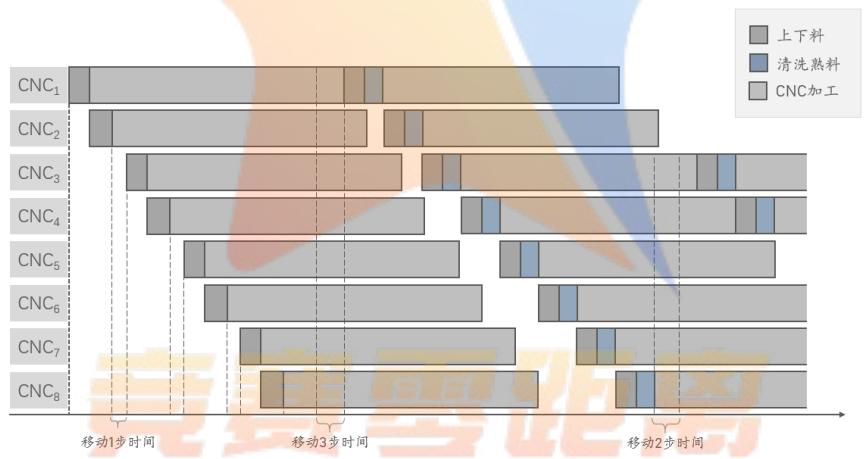

<details>
<summary>flowchart</summary>

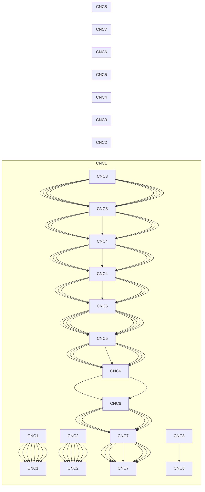
</details>

图 1 带约束的队列调度示意图

经过该过程原问题被转换为：带约束条件的多队列任务最优调度问题，同时，为我们从时间维度对系统基于事件进行状态划分提供了视角。

从图1可知，在任意时刻，对应有各个队列（CNC）的状态：空闲、工作；同时还可以隐性的反应 的状态：移动、清洗等。从时间维度对其进行离散化处理，由此可以构建不同时刻下系统的状态转移图。但是如果选择以 1s 为基本步长，会导致迭代状态过多，且由于步长较短，整体有较多迭代是不必要的；而过大的步长，无法精确刻画系统的状态转移过程。因此，进一步在时间划分上改进，采用基于事件的时间划分，并由此引出整个过程的状态转移图模型。

## 5.2 最优状态转移图模型

对于情况一，我们建立最优状态转移图模型来描述整个 RGV-CNC 系统的调度过程。

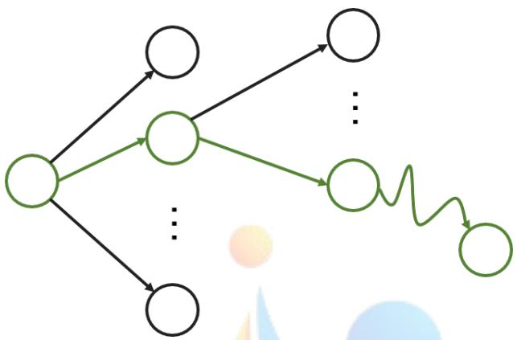

<details>
<summary>flowchart</summary>

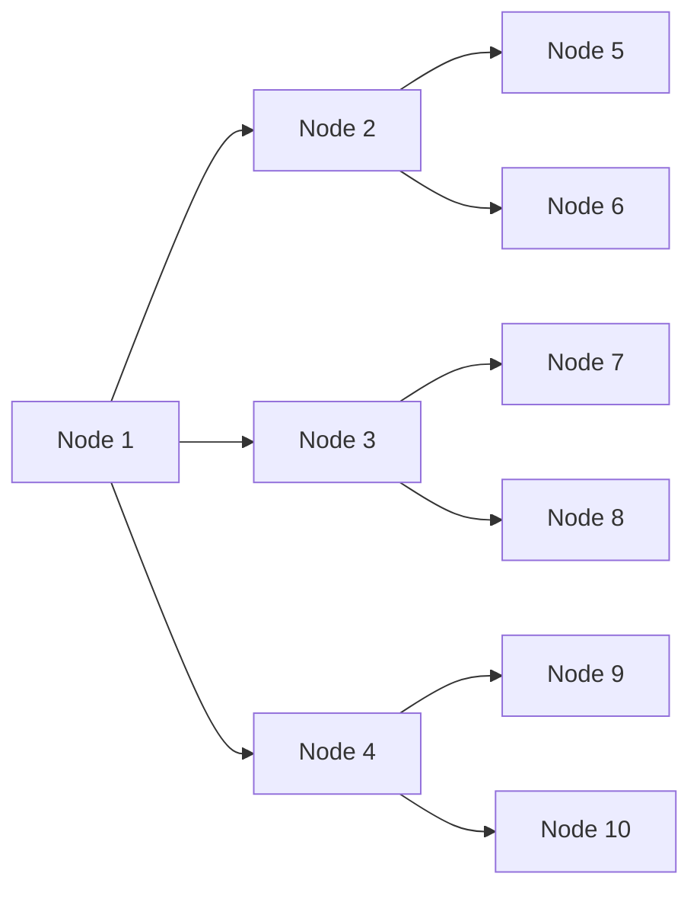
</details>

图 2 最优状态转移图模型示意图

首先，我们建立系统的状态向量 $V _ { k }$ ，该状态向量描述了在某一时刻整个系统所处的状态。由于以秒为处理单位会出现大量的重复状态和重复计算，我们从RGV 运动的视角作为图模型建立的基准对模型进行离散化处理。该模型将以秒为单位的时间划分，转换为基于事件的时间划分。

$$
V _ {k} = \left[ \begin{array}{c} t _ {k} \\ p _ {k} \\ r _ {k, 1} \\ r _ {k, 2} \\ \vdots \\ r _ {k, n} \\ M _ {k} \\ 1 \end{array} \right], 0 \leq t _ {k} \leq T _ {m}, p _ {k} \in N ^ {+}, p _ {k} \leq \lceil n / 2 \rceil , r _ {k, i} \geq 0
$$

其中 $M _ { 0 } = 1 , ~ t _ { k }$ 代表系统处于第k 个状态时的时刻， $p _ { k }$ 代表RGV在第k 个状态时所处的位置，在向量 $V _ { k }$ 末尾的补充1以构建齐次转移矩阵， $r _ { k , i }$ 变量代表当系统处于第$k$ 个状态时i位置处的CNC距离下一次空闲状态（完成当前工作所需要）的剩余时间。

当RGV的一次上料行为完成时，模型状态发生转移，RGV移动到下一个位置进行上料（移动之前RGV可能会执行在原地“停止等待”信号），相邻两次上料完成的时间作为状态之间的时间。值得注意的是，该模型中所求的最优路线的深度（节点数）即为系统在约束条件下所能生产熟料的最大值，记为M。

模型应当满足下面的约束：

约束一：RGV在某一时刻只能为一台机器上料或下料。

约束二：从第i次上料到第i+1次上料的间隔时间大于RGV从第一个位置运动到第二个位置的时间。

上述约束将在状态转移的过程中得到保持。为了便于描述，我们定义了下列变量。

1. 移动矩阵

$$
C = \left[ \begin{array}{c c c} c _ {1, 1} & \dots & c _ {1, 1} \\ \vdots & \ddots & \vdots \\ c _ {n, 1} & \dots & c _ {n, n} \end{array} \right]
$$

其中 $c _ { i , j }$ 为RGV从位置i移动到到位置 $j$ 需要的时间， $c _ { i , j } = c _ { j , i }$ ，易知，当 $i = j$ 时$c _ { i , j } = 0 .$

2. CNC工作负载变量

$$
E _ {k} = \left[ \begin{array}{c} e _ {k, 1} \\ \vdots \\ e _ {k, n} \end{array} \right]
$$

0 状态 $V _ { k }$ 的 $C N C _ { i }$ 上工件没有工件e<sub>k,i</sub> =1 状态 $V _ { k }$ 的 $C N C _ { i }$ 上面有正在处理或者处理完成的工件

构建状态转移方程如下：

$$
V _ {k + 1} = f (V _ {k} A _ {k})
$$

它表示从第 k 阶段到 k +1 阶段的的状态转移规律。其中 $V _ { k }$ 为第 k 个状态的系统状态向量。

设 $X _ { k }$ 为系统处于第k 个状态时可选的状态转移矩阵集。

$$
X _ {k} = \left[ \begin{array}{c c c c} A _ {k 1} & A _ {k 2} & \dots & A _ {k n} \end{array} \right] ^ {T}
$$

其中 $A _ { k i }$ 为系统处于第k 个状态时的第i个状态转移矩阵，其定义如下：

$$
A _ {k i} = \left[ \begin{array}{c c c c c} 1 & & & & \Delta t _ {i} \\ & 0 & & & i \\ & 1 & & & - \Delta t _ {i} \\ & & \ddots & & \vdots \\ & & & 1 & - \Delta t _ {i} \\ & & & & 1 \\ & & & & 1 \end{array} \right]
$$

其中 i 的含义为 RGV 选择的下一个目标 CNC， $\Delta t _ { i }$ 代表从第 k 个状态经过 $A _ { k i }$ 转移到第 $k + 1$ 个状态所需要的时间，其定义如下

$$
\Delta t _ {i} = t _ {c} e _ {k, p _ {k}} + t _ {s} + t _ {l i} + c _ {p _ {k}, i}
$$

$$
t _ {s} = \max \{c _ {p _ {k}, i}, r _ {k, i} \}
$$

其中，

$p _ { k }$ 表示为RGV处于第k 个状态时的位置;

$t _ { l i }$ 表示转移目标位置处CNC的上料时间;

$t _ { s }$ 表示下一次上料的开始时间，为行走时间和目标CNC剩余工作时间的较大值;

$t _ { c }$ 表示当前状态后工件清洗的时间，代表如果CNC空置则清洗，否则不清洗;

$c _ { p _ { k } , i }$ 表示从当前状态(k)转移到下一个状态(k +1)需要的移动时间。

对于公式，函数 f(V<sub>k</sub>) 定义如下，

$$
f (V _ {k}) = \max \{0, r _ {k, i} \}, 1 \leq i \leq n, i \in N ^ {+}
$$

函数 f(V ) 对状态 $V _ { k }$ 的 CNC 剩余时间 $r _ { k , i }$ 取 $\operatorname* { m a x } \{ 0 , R _ { k , i } \}$ ，因为剩余时间非负，并且${ r } _ { k + 1 , i } = t _ { p } , \ e _ { k + 1 , i } = 1$

此外，在一个班次 (8 小时) 的时间内，RGV 必须回到原点并且所有的工件必须全部完成，所以在状态转移的时候引入约束三、四。

约束三：RGV一定能够回到原点。

$$
t _ {k} + t _ {s} + t _ {l i} + c _ {i, 0} \leq T _ {m}
$$

约束四：所有的CNC在8小时结束时处于非工作状态。

$$
t _ {k} + t _ {s} + 2 t _ {l i} + t _ {p} + t _ {c} + c _ {i, 0} \leq T _ {m}
$$

易知约束四是约束三时条件更为严格的表达。

由于系统的上下料合并为一个步骤，所以我们在求解的时候将模型中 8 个 CNC 的最后一个工件的上下料操作视为纯粹的下料操作，可以消除这个约束。

所以模型最优化模型目标为最大化 M 值，换言之，最大化状态转移图中状态传递的深度（长度）。

总的数学模型描述如下：

max M<sub>k</sub>

$$
s. t. \quad \left\{ \begin{array}{l} V _ {k + 1} = f (V _ {k} A _ {k}), \\ t _ {k} + t _ {s} + t _ {l i} + c _ {i, 0} \leq T _ {m}, \forall i \in [ 1.. n ] \\ t _ {k} + t _ {s} + 2 t _ {l i} + t _ {p} + t _ {c} + c _ {i, 0} \leq T _ {m}, \forall i \in [ 1.. n ] \end{array} \right.
$$

## 5.3 带工序约束的最优状态转移图模型

对于情况二，我们改进针对问题一的图模型以适应问题二的特殊情况。

我们设立CNC类型向量 $Q$ ，表示n台CNC的类型，并沿用最优状态转移图模型中对V、E 和移动矩阵C 的定义。

$$
Q = \left[ \begin{array}{c} q _ {1} \\ q _ {2} \\ \vdots \\ q _ {n} \end{array} \right], q _ {i} \in \{0, 1 \}
$$

$$
q _ {i} = \left\{ \begin{array}{l l} 0 & C N C _ {i} \text {安装第一类刀片} \\ 1 & C N C _ {i} \text {安装第二类刀片} \end{array} \right.
$$

约束一：当 RGV 对第一类 CNC 执行上下料操作并且该CNC 并不是处于空置状态的时候，RGV的下一个操作目标不能是第一类CNC，证明如下：

① RGV 对第一类非控制 CNC 执行上下料操作以后，若 CNC 非空，则 RGV 机械臂上一定存在一个半成品工件。  
② 半成品工件无法放到传送带上，也无法放在第一类CNC中。

由①②可知，RGV访问一个非空第一类CNC以后必须接着访问第二类CNC。

在第k 个状态到第k +1 个状态进行转移的时候，通过下式实现约束一：

$$
(1 - q _ {p _ {k}}) e _ {k, p _ {k}} - q _ {p _ {k + 1}} \neq 1
$$

并且修改状态转移矩阵的约束条件如下：

$$
\Delta t _ {i} = t _ {c} e _ {k, p _ {k}} q _ {k} + t _ {s} + t _ {l i} + c _ {p _ {k}, i}
$$

即如果是从第一类CNC转移到第二类CNC，没有清洗过程，不计清洗时间

$$
t _ {l i} = (i \bmod 2) t _ {l 0} + ((i + 1) \bmod 2) t _ {l 1}
$$

即 $t _ { l i }$ 表示转移目标CNC的上料时间，如果是偶数CNC则上料时间为 $t _ { l 0 }$ ，否则为 $t _ { l 1 }$ 。总的数学模型为：

max M<sub>k</sub>

$$
s. t. \quad \left\{ \begin{array}{l} V _ {k + 1} = f (V _ {k} A _ {k}), \\ t _ {k} + t _ {s} + t _ {l i} + c _ {i, 0} \leq T _ {m}, \forall i \in [ 1.. n ] \\ t _ {k} + t _ {s} + 2 t _ {l i} + t _ {p} + t _ {c} + c _ {i, 0} \leq T _ {m}, \forall i \in [ 1.. n ], \\ (1 - q _ {p _ {k}}) e _ {k, p _ {k}} - q _ {p _ {k + 1}} \neq 1, \\ t _ {l i} = (i m o d 2) t _ {l 0} + ((i + 1) m o d 2) t _ {l 1}. \end{array} \right.
$$

## 5.4 带有故障风险的最优状态转移图模型

引入故障因子 $P = [ p _ { 1 } , p _ { 2 } , p _ { 3 } , p _ { 4 } , . . . , p _ { m } ] ^ { T }$ ，其中 $p _ { i }$ 表示i位置的CNC距离修复成功剩下的时间。如果 $p _ { i }$ 为0则表示CNC没有损坏。根据题意，在RGV为第k台CNC上料完成后，该CNC处于加工状态时有1%概率会损坏，即 $p _ { k i } = g _ { i } .$ ,其中 $g _ { i }$ 为第 i 个 CNC距离再次正常工作所需时间，由于故障维修时间介于10min−20min,即: $( 6 0 0 s - 1 2 0 0 s )$ 所以，有 $6 0 0 \leq g _ { i } \leq 1 2 0 0 , g _ { i } \in R , i = 1 . . . m$ 。在实际的模型中，每次状态转移都有可能有至多m，至少0 个处于工作状态的CNC出现故障。

由于在最优状态转移图模型当RGV的一次上料行为完成时，模型状态才发生转移。所以可对模型进行如下修改；当CNC只有一种刀具时，状态转移矩阵集 $A _ { k }$ ，增加以下约束：

$$
A _ {k} = T _ {k i}, p _ {i} = 0
$$

$$
B _ {k} = T _ {k i}, p _ {i} > 0
$$

$$
e _ {k, i} = 0
$$

对我们效率的影响：

认为情况1与情况2中，基本满足RGV供应能力与CNC工作能力之间的平衡。当只有一种刀片的时候，某一台或某几台CNC出现了故障，我们认为该平衡被打破，RGV的供应能力大于CNC工作能力，整个系统的工件处理速数量减少，但是单个CNC的工作效率变高。当装有两种刀片时，两种刀片的平衡被打破，工作能力较弱的一方，单个CNC 的工作效率提升，而工作能力较强的 CNC 产生或增加空闲，该 CNC 工作效率降低，整个系统的共建处理能力降低。

故障未修复时，RGV 的工作能力大于 CNC，RGV 出现等待情况，系统效率降低，故障修复以后，效率重新提高。

当CNC安装有两种刀具时，（除了满足（1）-（3）几项约束外），根据系统效率均衡原则，任一CNC崩溃将导致各工作部件之间的均衡性被打破，

这里给出两种调度原则：

1. 为了主动满足系统效率均衡原则，我们主动停止使用部分CNC，以保证系统的匹配。  
2. 不主动调节系统的效率分布情况，调度原则不作改变。

## 5.5 模型的求解

使用原模型对应算法直接求解（遍历可剪枝的解空间树）虽然理论上可以得到最优解，但是由于解空间树过于庞大，未经剪枝的搜索算法复杂度高达 $O ( 8 ^ { n } )$ ，效率较低、收敛速度很慢，即使经过剪枝也是无法承受的<sup>1</sup>。

因此考虑近似求解算法，可以大幅提升求解算法的求解速度，而仅仅牺牲少量结果质量。这里我们将原来的最优化问题转换为多阶段决策问题，其指导原则基于该最优化模型的各种最优化目标和约束信息，并且设计算法进行求解。

设 $t _ { p i }$ 为 i 位置 CNC 的在整个工时内实际工作时间；由于系统中 RGV 本质上是为CNC提供服务的，即：尽可能使CNC减少等待时间，增加工作时间从而提升系统整体的工作效率。由此建立工作效率度量指标——CNC的工作效率为：

$$
W _ {C N C} = \frac {\sum t _ {p i}}{n T _ {m}}
$$

## 5.5.1最优状态转移图模型求解算法

在最优状态转移图模型的求解过程中，设计以下搜索原则：

1. 在搜索的开始阶段，优先选择前两个CNC进行状态转移；  
2. 在状态转移的过程中，优先选择转移时间代价小的进行转移；  
3. 当转移代价相同时，优先选择未来可能更早结束的进行转移；  
4. 需要保证任意时刻状态满足可行性约束条件。

## 算法框架：

分阶段优化原则的目标是：RGV在当前阶段，在所有八台候选CNC中，选择可以最快上料并进入物料加工程序的CNC作为下一阶段的目标CNC。随着系统的变化算法细节有所不同。

## 决策过程：

循环所有的八台候选CNC，计算到每一台CNC的路程代价，该CNC加工时间的剩余，取其中的最大值作为评估值。选择八台CNC 中评估值最小的 CNC 作为目标 CNC，意为选择可以最快上料从目标CNC。

如果评估值最小的CNC不唯一，选择其中上料时间较短的。如果上料时间相同，选择路径较远的。

## 5.5.2带工序约束的最优状态转移图模型求解算法

RGV 在双类型 CNC 系统中与单类型 CNC 系统的区别在于双类型 CNC 系统在状态转移的限定上更加严格，解空间更小，但是由于指数级复杂度的特点，一般的方法仍然无法求解，我们采取与单类型 CNC 系统的相似的分阶段优化算法进行计算，框架和策略如下。

## 算法框架:

同最优状态转移图模型求解算法的基本框架，但其决策规则有所变更。

## 决策过程：

与情况 1 中算法设计基本相同，选择路程代价、加工时间的剩余中的大者为评估值。选择评估值最小的CNC作为目标，但不能违反以下约束：

1. RGV 在对非空的第一类 CNC 进行上下料操作之后，不执行清洗操作，且目的CNC一定是第二类CNC。  
2. 如果评估值最小的CNC违反约束，则选择评估值次小，如此往复，直到找到不违反约束的目标CNC。

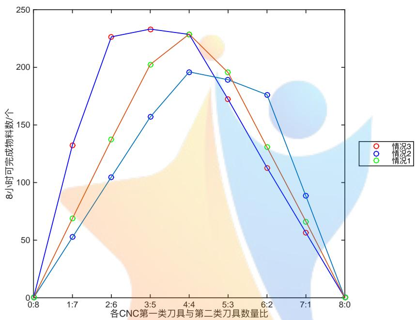

<details>
<summary>line</summary>

| 各CNC第一类刀具与第二类刀具数量比 | 情况3 (8小时可完成物料数/个) | 情况2 (8小时可完成物料数/个) | 情况1 (8小时可完成物料数/个) |
| :--- | :--- | :--- | :--- |
| 0:8 | 0 | 0 | 0 |
| 1:7 | ~132 | ~52 | ~68 |
| 2:6 | ~225 | ~104 | ~137 |
| 3:5 | ~232 | ~157 | ~202 |
| 4:4 | ~227 | ~195 | ~227 |
| 5:3 | ~172 | ~189 | ~195 |
| 6:2 | ~113 | ~175 | ~130 |
| 7:1 | ~56 | ~88 | ~65 |
| 8:0 | 0 | 0 | 0 |
</details>

图 3 CNC 刀片类型比例与系统产出关系图

根据前文提到的系统均衡优化原则，我们认为系统中拥有两种不同型号的 CNC 的情况下，总体效率最高的CNC的比例被达到当且尽量两类CNC处理物料的时间代价大致相同。CNC处理物料的时间代价分为两部分，一部分是CNC加工物料的时间和RGV上料的时间，它们只与系统有关，是一个定值。而另一部分来自 RGV 到达 CNC 付出的时间代价，这部分难以计量但是远小于物料加工的时间，所以物料加工的时间占有主导地位。图 3 的横轴是第一类、第二类 CNC 的比例，纵轴是采用分阶段优化算法计算三种情况下，第一类、第二类 比例相同的空间排布方案的成品数的平均值。正如图3中所示，两种CNC加工物料时间几乎相同的情况一，系统处理能力呈现以4:4为对称轴的对称且在两种CNC为几乎1:1的情况下取得峰值。而当第一类CNC物料处理时间小于，即工作能力大于第二类 的时候，峰值偏向右侧即第一类 的数目小于第二类 CNC，而当第一类 CNC 物料处理时间大于，即工作能力小于第二类CNC 的时候，峰值偏向左侧即第一类 的数目大于第二类 。一定程度上证明了我们的系统均衡优化原则。

## 5.5.3带有故障风险的最优状态转移图模型求解算法

该求解算法随机模拟故障的产生，故障持续时间在 10 分钟至 20 分钟之间随机生成。算法在 RGV 每次进行上料的时候以　 1% 的概率发生故障，如果发生故障，在物料加工的过程中随机产生故障起始时间。

## 算法框架：

同最优状态转移图模型求解算法的基本框架。此外，引入故障变量。当 CNC 发生故障时，需要设置该CNC故障变量为1。

## 决策过程：

1. 对于仅有一种类型刀片的CNC：

RGV 如果状态转移的最优目标为某一故障的CNC 时，则选择次优 CNC，直到目标无故障为止。当故障时间结束，CNC重新恢复正常，故障变量恢复成0。

2. 对于有两种类型刀片的CNC：

若第一类刀片的物料处理时间为 $t _ { 1 }$ ，第一类 CNC 的数量为 $n _ { 1 }$ ，第二类刀片的物料处理时间为 $t _ { 2 }$ ，第二类 CNC 的数量为 $n _ { 2 }$ 。如果 $t _ { 1 } n 1 > t _ { 2 } n _ { 2 }$ 并且 $t _ { 1 } n _ { 1 } - t _ { 2 } n _ { 2 } \ >$ $t _ { 2 } * n _ { 2 } - t _ { 1 } ( n _ { 1 } - 1 )$ , 则关闭一个第一类 CNC；如果 $t _ { 1 } n _ { 1 } < t _ { 2 } n _ { 2 }$ 并且 $t _ { 2 } n _ { 2 } - t _ { 1 } n _ { 1 } >$ $t _ { 1 } n _ { 1 } - t _ { 2 } ( n _ { 2 } - 1 )$ ,则关闭一个第二类CNC。约束的含义是，从优势方关闭CNC是优劣势方差距减小的情况下，关闭一个优势方的CNC以平衡产能,达到更优匹配。

## 5.5.4模型求解与结果评价

## 最优状态转移图模型求解结果：

在情况一条件下，一个工时（8 小时）内第一、二、三组能够生产熟料的最大数量分别为382、359、391个，CNC与RGV具体的调度规则见支撑材料。

将RGV的路径和操作时间进行绘制可得：

在该图中，x 轴描述了 RGV 的空间分布，y 轴描述了 RGV 的时间分布。其中绿色实线部分描述了在 CNC 只安装一种刀片时移动的路径情况，而黄蓝相见的“竖线”部分则刻画了RGV正在上下料与清洗交替进行。红色虚线则表示在最优调度下此时RGV需要等待CNC完成操作，即RGV此时处于空闲状态。注意到该方案是两个上下料、清洗动作交替进行，即应该在 在某处重复执行该操作组合，更具体地，由于 不会对在工作的CNC进行操作，因此其模式是在某处先后操作者两侧的CNC；此外可以从结果中看到，最终结果在中间过程呈现一定的周期性，在首尾部分存在打破循环，这与我们的周期性假设和估计基本吻合。

下面针对情况一，对模型求解算法的求解效果与质量进行分析：

根据定义3，CNC满载条件下的系统具有工作上限，将其定义为超额上限值。超额上限值高于理论最优解且接近该模型的最优解，这是因为 CNC 满载条件在系统运行过程中是较难满足的，因此系统在时间上会有一定的损耗，导致减少规定时间内生产的熟料数目。因此以该上界作为近似解的评估标准具有较大参考价值。


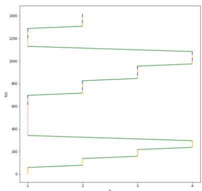

<details>
<summary>line</summary>

| x | y(x) |
| --- | --- |
| 1 | ~60 |
| 1 | ~350 |
| 1 | ~700 |
| 1 | ~1130 |
| 1 | ~1290 |
| 2 | ~80 |
| 2 | ~140 |
| 2 | ~340 |
| 2 | ~720 |
| 2 | ~830 |
| 2 | ~1130 |
| 3 | ~160 |
| 3 | ~220 |
| 3 | ~300 |
| 3 | ~960 |
| 4 | ~240 |
| 4 | ~300 |
| 4 | ~980 |
| 4 | ~1080 |
| 4 | ~1290 |
| 4 | ~1420 |
</details>

第1组

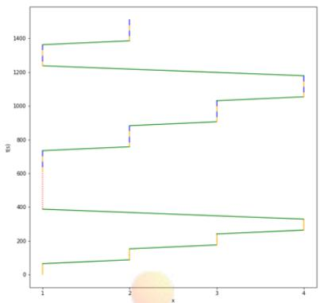

<details>
<summary>line</summary>

| X | Y |
| --- | --- |
| 1 | ~60 |
| 1 | ~380 |
| 1 | ~730 |
| 1 | ~1240 |
| 1 | ~1360 |
| 2 | ~150 |
| 2 | ~160 |
| 2 | ~750 |
| 2 | ~880 |
| 3 | ~900 |
| 3 | ~1030 |
| 4 | ~260 |
| 4 | ~330 |
| 4 | ~1050 |
| 4 | ~1180 |
</details>

第2组

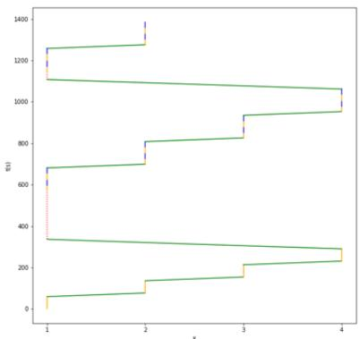

<details>
<summary>line</summary>

| X | Y |
| --- | --- |
| 1 | ~60 |
| 1 | ~1100 |
| 1 | ~1250 |
| 2 | ~700 |
| 2 | ~800 |
| 3 | ~820 |
| 3 | ~930 |
| 4 | ~950 |
| 4 | ~1050 |
| 4 | ~1220 |
| 4 | ~220 |
| 4 | ~280 |
| 4 | ~300 |
| 4 | ~330 |
| 4 | ~340 |
| 4 | ~350 |
| 4 | ~360 |
| 4 | ~370 |
| 4 | ~380 |
| 4 | ~390 |
| 4 | ~400 |
| 4 | ~410 |
| 4 | ~420 |
| 4 | ~430 |
| 4 | ~440 |
| 4 | ~450 |
| 4 | ~460 |
| 4 | ~470 |
| 4 | ~480 |
| 4 | ~490 |
| 4 | ~500 |
| 4 | ~510 |
| 4 | ~520 |
| 4 | ~530 |
| 4 | ~540 |
| 4 | ~550 |
| 4 | ~560 |
| 4 | ~570 |
| 4 | ~580 |
| 4 | ~590 |
| 4 | ~600 |
| 4 | ~610 |
| 4 | ~620 |
| 4 | ~630 |
| 4 | ~640 |
| 4 | ~650 |
| 4 | ~660 |
| 4 | ~670 |
| 4 | ~680 |
| 4 | ~690 |
| 4 | ~700 |
| 4 | ~710 |
| 4 | ~720 |
| 4 | ~730 |
| 4 | ~740 |
| 4 | ~750 |
| 4 | ~760 |
| 4 | ~770 |
| 4 | ~780 |
| 4 | ~790 |
| 4 | ~800 |
| 4 | ~810 |
| 4 | ~820 |
| 4 | ~830 |
| 4 | ~840 |
| 4 | ~850 |
| 4 | ~860 |
| 4 | ~870 |
| 4 | ~880 |
| 4 | ~890 |
| 4 | ~900 |
| 4 | ~910 |
| 4 | ~920 |
| 4 | ~930 |
| 4 | ~940 |
| 4 | ~950 |
| 4 | ~960 |
| 4 | ~970 |
| 4 | ~980 |
| 4 | ~990 |
| 4 | ~1000 |
| 4 | ~1010 |
| 4 | ~1020 |
| 4 | ~1030 |
| 4 | ~1040 |
| 4 | ~1050 |
| 4 | ~1060 |
| 4 | ~1070 |
| 4 | ~1080 |
| 4 | ~1090 |
| 4 | ~1100 |
| 4 | ~1110 |
| 4 | ~1120 |
| 4 | ~1130 |
| 4 | ~1140 |
| 4 | ~1150 |
| 4 | ~1160 |
| 4 | ~1170 |
| 4 | ~1180 |
| 4 | ~1190 |
| 4 | ~1200 |
| 4 | ~1210 |
| 4 | ~1220 |
| 4 | ~1230 |
| 4 | ~1240 |
| 4 | ~1250 |
| 4 | ~1260 |
| 4 | ~1270 |
| 4 | ~1280 |
| 4 | ~1290 |
| 4 | ~1300 |
| 2 | ~75 |
| 2 | ~135 |
| 2 | ~215 |
| 2 | ~285 |
| 2 | ~355 |
| 2 | ~365 |
| 2 | ~375 |
| 2 | ~385 |
| 2 | ~395 |
| 2 | ~395 |
| 2 | ~385 |
| 2 | ~375 |
| 2 | ~365 |
| 2 | ~355 |
| 2 | ~345 |
| 2 | ~335 |
| 2 | ~325 |
| 2 | ~315 |
| 2 | ~305 |
| 2 | ~295 |
| 2 | ~285 |
| 2 | ~275 |
| 2 | ~265 |
| 2 | ~255 |
| 2 | ~245 |
| 2 | ~235 |
| 2 | ~225 |
| 2 | ~215 |
| 2 | ~205 |
| 2 | ~195 |
| 2 | ~185 |
| 2 | ~175 |
| 2 | ~165 |
| 2 | ~155 |
| 2 | ~145 |
| 2 | ~135 |
| 2 | ~125 |
| 2 | ~115 |
| 2 | ~105 |
| 2 | ~95 |
| 2 | ~85 |
| 2 | ~75 |
| 2 | ~65 |
| 2 | ~55 |
| 2 | ~45 |
| 2 | ~35 |
| 2 | ~25 |
| 2 | ~15 |
| 2 | ~5 |

Data points are estimated based on grid intersections. The red dotted line represents a reference path or boundary.
</details>

第3组  
图 4 优化后RGV 的运动路线和各项操作时间图

下面定义模型结果偏差率计算公式：

$$
\lambda = \frac {| A - U |}{U}
$$

其中A为求解值，U 为上界值，λ刻画了求解算法所得解与超额上限值(CNC满载条件下的系统具有工作上限)的近似程度。

表1 最优状态转移图模型结果分析表

<table><tr><td>数据组数</td><td>第1组</td><td>第2组</td><td>第3组</td></tr><tr><td>超额上限值</td><td>384</td><td>372</td><td>396</td></tr><tr><td>求解值</td><td>382</td><td>359</td><td>391</td></tr><tr><td>结果偏差率</td><td>0.9948</td><td>0.9651</td><td>0.9899</td></tr></table>

结合该结果可知，对于情况一下的三组数据而言，该模型的求解算法求解效果较好：一方面计算速度较快；另一方面，所求结果十分逼近理论上界，认为得到满意的近似解。

## 带有工序约束的最优状态转移图模型求解结果：

在情况二条件下，一个工时（8 小时）内第一、二、三组能够生产熟料的最大数量分别为 253、210、240 个。

CNC编号1-8 上的刀片类型分别为：

CNC与RGV具体的调度规则见支撑材料。在该图中，x轴、y 轴分别描述了RGV的时、空分布情况。其中绿色实线部分描述了在 只安装二种类型刀片时移动的路径情况并且此时 RGV 是携带物料进行“搬运”操作；而绿色虚线部分则是描述其不带任何货物进行移动的情况，显然后者的具有更大的时间开销。黄蓝相见的“竖线”部分则刻画了 正在上下料与清洗交替进行。红色虚线则表示在最优调度下此时需要等待 完成操作，即 此时处于空闲状态。注意到该方案是两个上下料、清洗动作交替进行，即应该在 RGV 在某处重复执行该操作组合，其模式也是在某处先后操作两侧的CNC；此外可以从结果中看到，最终结果在中间过程呈现一定的周期性，只是周期性的基本模型较单一类型刀片有所不同。

表2 带有工序约束的最优状态转移图模型刀片类型最优分布表

<table><tr><td>CNC编号</td><td>1</td><td>2</td><td>3</td><td>4</td><td>5</td><td>6</td><td>7</td><td>8</td></tr><tr><td>第一组</td><td>第一类</td><td>第二类</td><td>第一类</td><td>第二类</td><td>第一类</td><td>第二类</td><td>第一类</td><td>第二类</td></tr><tr><td>第二组</td><td>第二类</td><td>第一类</td><td>第二类</td><td>第一类</td><td>第二类</td><td>第一类</td><td>第二类</td><td>第一类</td></tr><tr><td>第三组</td><td>第二类</td><td>第一类</td><td>第一类</td><td>第一类</td><td>第二类</td><td>第一类</td><td>第一类</td><td>第二类</td></tr></table>

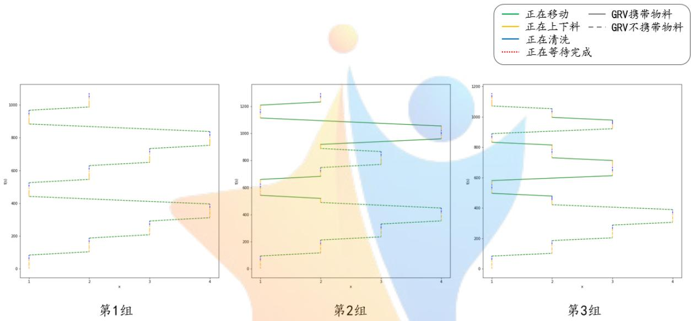

<details>
<summary>line</summary>

| Group | Series | X (range) | Y (range) |
| --- | --- | --- | --- |
| 第1组 | 正在移动 | 1~4 | 0~1050 |
| 第1组 | 正在上下料 | 1~4 | 0~1050 |
| 第1组 | 正在清洗 | 1~4 | 0~1050 |
| 第2组 | 正在移动 | 1~4 | 0~1300 |
| 第2组 | 正在上下料 | 1~4 | 0~1300 |
| 第2组 | 正在清洗 | 1~4 | 0~1300 |
| 第3组 | 正在移动 | 1~4 | 0~1150 |
| 第3组 | 正在上下料 | 1~4 | 0~1150 |
| 第3组 | 正在清洗 | 1~4 | 0~1150 |
</details>

图 5 优化后RGV 的运动路线和各项操作时间图

下面给出模型求解算法求解结果与系统工作上界的结果偏差率分析。值得注意的是，这里的上界是在确定了排布之后的系统工作上界。

## 带有故障风险的最优状态转移图模型求解结果

在情况三条件下，一个工时（8 小时）内第一、二、三组在随机情况下，通过该优化模型进行最优调度所取得的对应最佳结果为：

对于只有一类刀片的 CNC 的三组数据，其在工期内分别发生 3,5,2 次故障的条件

表3 带有工序约束的最优状态转移图模型结果分析表

<table><tr><td>数据组数</td><td>第1组</td><td>第2组</td><td>第3组</td></tr><tr><td>超额上限值</td><td>264</td><td>216</td><td>295</td></tr><tr><td>求解值</td><td>253</td><td>210</td><td>240</td></tr><tr><td>结果偏差率</td><td>0.9583</td><td>0.9722</td><td>0.8136</td></tr></table>

下，产量分别为 376, 250, 387。

对于有两类刀片的 CNC 的三组数据，其在工期内分别发生 3,3,5 次故障的条件下，产量分别为 243, 205, 224。

## 六、模型的评价与改进

## 1. 模型的优点

(a) 模型建立更多基于理性分析和合理推导，并且对于部分重要原则给出了有保证的定义和证明，对求解的决策原则进行了全面的分析和讨论，使得模型具有较多的理论支持；  
(b) 模型建立从状态转移的视角看待整个问题，在最大化生产件数的同时将各工作部分的效率均衡考虑在内。通过化简和转换，巧妙地将以秒为基本单位的时间划分转换为基于事件的时间划分，减少求解迭代次数，提升了求解效率。在模型的求解算法中，通过对状态向量的压缩存储减少了计算开销。此外，该模型的近似算法具有快速的求解速度且结果逼近最优解，因此适合于任务1中RGV动态调度；  
(c) 模型评价公正客观，评价指标建立有理有据，对模型求解质量以及系统的整体性能评价准确、到位。

## 2. 模型的缺点

(a) 该模型的状态空间较大，在不加必要限制的情况下，每次搜索的空间为8个，随着状态的演进，搜索量呈现指数级上升，计算开销过大；因此在求解模型的时候，考虑使用分阶段优化求解，但是所求为近似解，且较为逼近最优值，但仍有一定偏差。  
(b) 此外，本题中很多性质的证明和指导原则都需要满足一定的条件，例如系统CNC满载等，尽管通过机理分析可知，这些条件与理论最优情况下的条件相差不大，但是依然存在一定的误差；且在一定程度上限制了模型的普适性和推广能力。

## 3. 模型的改进

(a) 可以进一步深入研究系统状态的特性，例如：周期性、波动性等。通过对特性进行概括和证明，并据此改进优化过程，有助于进一步提升模型的求解精度和求解速度。  
(b) 可以使用遗传算法原始模型进行求解。需要注意的是，如果从时间和状态转移视角会由于时间划分过细导致染色体基因数目过多问题，或者基于事件编码时，由于各个事件的时间不确定，不便于对所选方案进行编码。所以采用可以采用可变长染色体的遗传算法（MessyGA）[3]。此外在染色体交叉、变异操作时应当保证操作后的染色体仍在可行解区域内（不能出现一个物料被两个 CNC 同时加工），因此需要限制变异和交叉操作的有效范围。从而提升算法求解的可靠性。其基本模型如下：

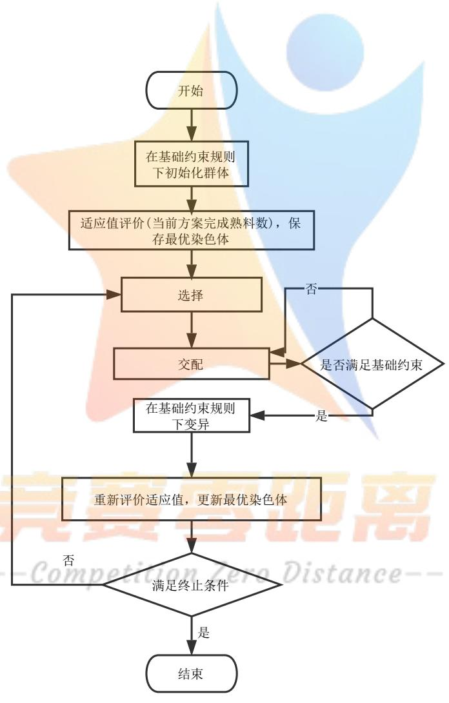

<details>
<summary>flowchart</summary>

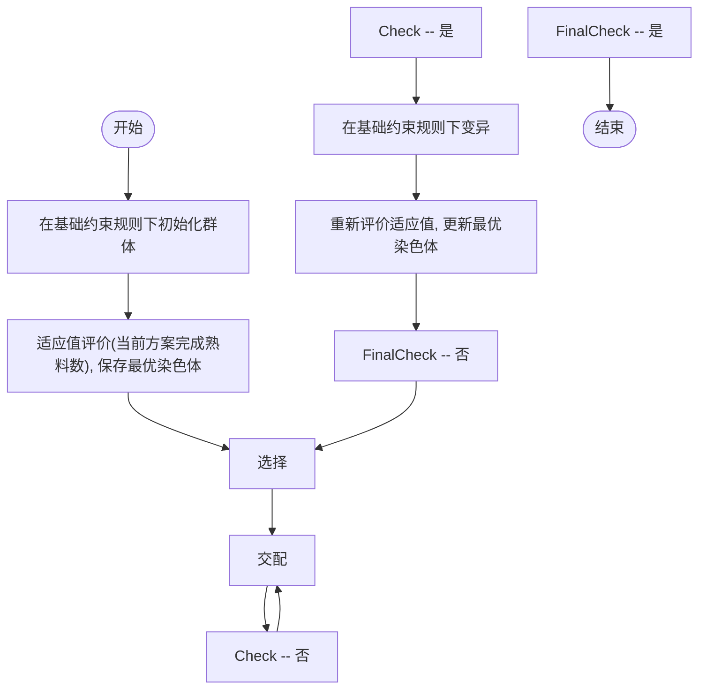
</details>

图 6 改进遗传算法流程图

根据迭代时收敛情况，在求解时间和解的质量之间作出权衡。此外，还可以使用其他近似求解算法完成对模型的求解。

## 参考文献

[1] 吴焱明, 刘永强, 张栋, 赵韩. 基于遗传算法的 RGV 动态调度研究 [J]. 起重运输机械,2012(06):20-23  
[2] 陈华, 孙启元. 基于 TS 算法的直线往复 2-RGV 系统调度研究 [J]. 工业工程与管理,2015,20(05):80-88.  
[3] D. E. Goldberg, B. Korb, and K. Deb, “Messy genetic algorithms: Mo- tivation, analysis, and first results,”in Complex Syst., Sept. 1989, vol. 3, pp. 93–530.


<details>
<summary>natural_image</summary>

Abstract graphic of a stylized human figure with a star-shaped base, rendered in gradient blue and yellow tones (no text or symbols)
</details>

## 附录A 最优性剪枝优化的搜索算法C++源代码

注意：该程序在总时长为 1000s 时可以很快给出答案，但在 8h 情况下由于复杂度过高无法给出答案（调整代码中 tot\_t的值）。

```cpp
#include <iostream>
#include <algorithm>
#include <vector>
#include <map>
using namespace std;
typedef pair<int, int> pii;
typedef pair/pii, vector<int>> piv;

const int mov_t[] = {0, 20, 33, 46};
const int proc_t[] = {560, 400, 378};
const int ud_t[] = {28, 31};
const int clr_t = 25;
const int tot_t = 1000;

vector<piv> dfs_stack, ans_stack;
int global_ans = 0;

void print_st(piv& st) {
    cout << st.first.first << ' ' << st.first.second;
    for (int i : st.second) {
        cout << ' ' << i;
    }
    cout << endl;
}

void print_stack() {
    for (auto& st : ans_stack) {
        print_st(st);
    }
}

int eval_func(int rem_t, int cur_pos, vector<int>& cnc_sts) {
    int res = 0;
    rem_t -= mov_t[cur_pos];
    if (rem_t < 0) rem_t = 0;
    for (int i = 0; i < 8; i++) {
        if (cnc_sts[i] != -1 && rem_t >= cnc_sts[i]) {
            res++;
        }
    }
    res += rem_t * 8 / (proc_t[0] + ud_t[0]);
    return res;
```

```c
void dfs(int rem_t, int cur_pos, vector<int> cnc_sts, int cur_ans) {
    if (cur_ans + eval_func(rem_t, cur_pos, cnc_sts) <= global_ans) return;
    if (rem_t <= mov_t[cur_pos]) {
        if (cur_ans > global_ans) {
            global_ans = cur_ans;
            ans_stack = dfs_stack;
        }
        return;
    }
    dfs_stack.push_back(make_pair(make_pair(rem_t, cur_pos), cnc_sts));
    vector<int> order = {0, 1, 2, 3, 4, 5, 6, 7};
    for (int i = 0; i < 8; i++) {
        int cur_max = i;
        for (int j = i; j < 8; j++) {
            if (max(mov_t[abs(cur_pos - order[cur_max] / 2)],
                cnc_sts[order[cur_max]]) + ud_t[order[cur_max] % 2] <
                max(mov_t[abs(cur_pos - order[j] / 2)], cnc_sts[order[j]]) +
                ud_t[order[j] % 2]) {
                    cur_max = j;
                }
            }
            swap(order[cur_max], order[i]);
        }
        for (int i : order) {
            int pos = i / 2;
            int t = max(mov_t[abs(cur_pos - pos)], cnc_sts[i]) + ud_t[i % 2];
            vector<int> new_cnc_sts = cnc_sts;
            new_cnc_sts[i] = proc_t[0] - (cnc_sts[i] == -1 ? 0 : clr_t);
            for (int j = 0; j < 8; j++) if(i != j) {
                if (new_cnc_sts[j] == -1) continue;
                new_cnc_sts[j] -= t + clr_t;
                if (new_cnc_sts[j] < 0) new_cnc_sts[j] = 0;
            }
            dfs(rem_t - t - clr_t, pos, new_cnc_sts, cur_ans + (cnc_sts[i] == -1 ? 0 :
                1));
        }
        dfs_stack.pop_back();
}

int main() {
    ios::sync_with_stdio(false);
    vector<int> init_st = {-1, -1, -1, -1, -1, -1, -1, -1};
    dfs(tot_t, 0, init_st, 0);
    cout << global_ans << endl;
    print_stack();
```

```scss
return 0;
}
```

附录 B Python 源代码  
```python
import random

move_step_times = [0, 20, 33, 46]
process_times = [560, 400, 378]
up_down_times = [28, 31]
clean_time = 25

# move_step_times = [0, 23, 41, 59]
# process_times = [580, 280, 500]
# up_down_times = [30, 35]
# clean_time = 30

# move_step_times = [0, 18, 32, 46]
# process_times = [545, 455, 182]
# up_down_times = [27, 32]
# clean_time = 25
# INF = 100000000

cur_pos = 0
cur_time = 0

def move_time(pos1, pos2):
    return move_step_times[abs(pos1 - pos2)]

cnt = 0
res = 0
cnc_states = [0 for i in range(8)]
fst_time = [True for i in range(8)]
item_idx = [-1 for i in range(8)]
broken = [0 for i in range(8)]
items = []
broken_items = []

while True:
    candidates = [i for i in range(8)]
    candidates.sort(key=lambda i:max(move_time(cur_pos, i // 2), cnc_states[i]) +
        up_down_times[i % 2])
    ok = False
    for cur_cnc in candidates:
        t1 = max(move_time(cur_pos, cur_cnc // 2), cnc_states[cur_cnc])
```

```python
to_cur_cnc_time = t1 + up_down_times[cur_cnc % 2]
ct = clean_time if not fst_time[cur_cnc] else 0
if cur_time + to_cur_cnc_time + ct + move_time(cur_pos, 0) > 8 * 3600:
    continue
ok = True
# print(cur_time, cur_pos, cnc_states, res)
if broken[cur_cnc] > 0:
    continue
if random.random() < 0.01:
    broken[cur_cnc] = random.randint(10 * 60, 20 * 60)
    items.append({'cnc': cur_cnc + 1, 'up_time': cur_time + t1, 'down_time':
        None})
    print(len(items), cur_cnc + 1, cur_time + to_cur_cnc_time, cur_time +
        broken[cur_cnc])
    broken_items.append({'cnc': cur_cnc + 1, 'up_time': cur_time + t1,
        'down_time': None})
    continue
for i in range(8):
    cnc_states[i] -= to_cur_cnc_time + ct
    broken[i] -= to_cur_cnc_time + ct
    if cnc_states[i] < 0:
        cnc_states[i] = 0
    if broken[i] < 0:
        broken[i] = 0
    items.append({'cnc': cur_cnc + 1, 'up_time': cur_time + t1, 'down_time':
        None})
    cnc_states[cur_cnc] = process_times[0] - ct

    if fst_time[cur_cnc]:
        fst_time[cur_cnc] = False
    else:
        res += 1
        items[item_idx[cur_cnc]['down_time'] = cur_time + t1
cur_time += to_cur_cnc_time + ct
cur_pos = cur_cnc // 2
item_idx[cur_cnc] = len(items) - 1
break
if not ok:
    break
print(res)
print(res * process_times[0] / (8 * 8 * 3600))
for item in items:
    print('\t'.join(map(str, item.values()))
print('Broken:')
for item in broken_items:
    print('\t'.join(map(str, item.values()))
print(items)
```

```python
move_step_times = [0, 20, 33, 46]
process_times = [560, 400, 378]
up_down_times = [28, 31]
clean_time = 25

# move_step_times = [0, 23, 41, 59]
# process_times = [580, 280, 500]
# up_down_times = [30, 35]
# clean_time = 30

# move_step_times = [0, 18, 32, 46]
# process_times = [545, 455, 182]
# up_down_times = [27, 32]
# clean_time = 25
INF = 100000000

def move_time(pos1, pos2):
    return move_step_times[abs(pos1 - pos2)]

count = {}

for bin_class in range(1 << 8):
    cnc_class = [0 if (bin_class & (1 << i)) == 0 else 1 for i in range(8)]
    if bin_class != 0:
        break
    cnc_class = [0, 1, 0, 1, 0, 1, 0, 1]
    res = 0
    cur_pos = 0
    cur_time = 0
    half_prod = None
    cnc_states = [0 for i in range(8)]
    fst_time = [True for i in range(8)]
    item_idx = [-1 for i in range(8)]
    items = []
    while True:
        candidates = [i for i in range(8)]
        candidates.sort(key=lambda i:max(move_time(cur_pos, i // 2), cnc_states[i])
            + up_down_times[i % 2])
        ok = False
        for cur_cnc in candidates:
            if half_prod and cnc_class[cur_cnc] == 0:
                continue
            t1 = max(move_time(cur_pos, cur_cnc // 2), cnc_states[cur_cnc])
            to_cur_cnc_time = t1 + up_down_times[cur_cnc % 2]
```

```python
ct = clean_time if cnc_class[cur_cnc] == 1 else 0
if cur_time + to_cur_cnc_time + ct + move_time(cur_pos, 0) > 8 * 3600:
    continue
if cnc_class[cur_cnc] == 0:
    if cur_time + to_cur_cnc_time + process_times[1] + process_times[2] +
        clean_time + move_time(cur_pos, 0) > 8 * 3600:
    half_prod = True
    continue
ok = True
# print(cur_time, cur_cnc, cnc_states, cnc_class[cur_cnc], half_prod, res)
for i in range(8):
    cnc_states[i] -= to_cur_cnc_time + ct
    if cnc_states[i] < 0:
        cnc_states[i] = 0
cnc_states[cur_cnc] = process_times[cnc_class[cur_cnc] + 1] - ct
if cnc_class[cur_cnc] == 0:
    items.append({'cnc1': cur_cnc + 1, 'up_time1': cur_time + t1,
        'down_time1': None, 'cnc2': None, 'up_time2': None, 'down_time2':
        None})
    if item_idx[cur_cnc] != -1:
        items[item_idx[cur_cnc]['down_time1'] = cur_time + t1
        half_prod = item_idx[cur_cnc]
    item_idx[cur_cnc] = len(items) - 1
else:
    if not half_prod:

    items[half_prod]['cnc2'] = cur_cnc + 1
    items[half_prod]['up_time2'] = cur_time + t1
    if item_idx[cur_cnc] != -1:
        items[item_idx[cur_cnc]['down_time2'] = cur_time + t1
        item_idx[cur_cnc] = half_prod
        res += 1
        half_prod = None
cur_time += to_cur_cnc_time + ct
cur_pos = cur_cnc // 2
break
if not ok:
break
num_1 = sum(cnc_class)
if count.get((8 - num_1, num_1)) is None:
    count[(8 - num_1, num_1)] = []
count[(8 - num_1, num_1)].append(res)

print(count)
```

import random

```python
# move_step_times = [0, 20, 33, 46]
# process_times = [560, 400, 378]
# up_down_times = [28, 31]
# clean_time = 25

# move_step_times = [0, 23, 41, 59]
# process_times = [580, 280, 500]
# up_down_times = [30, 35]
# clean_time = 30

move_step_times = [0, 18, 32, 46]
process_times = [545, 455, 182]
up_down_times = [27, 32]
clean_time = 25

def move_time(pos1, pos2):
    return move_step_times[dbs(pos1 - pos2)]

ans = 0

for bin_class in range(1 << 8):
    cnc_class = [0 if (bin_class & (1 << i)) == 0 else 1 for i in range(8)]

    # print(cnc_class)
    # if bin_class != 0:
    #   break
    # cnc_class = [0, 1, 0, 1, 0, 1, 0, 1]

    res = 0
    cur_pos = 0
    cur_time = 0
    in_hand = None
    cnc_states = [0 for i in range(8)]
    item_idx = [None for i in range(8)]
    items = []
    while True:
        ok = False
        candidates = [i for i in range(8)]
        candidates.sort(key=lambda i:max(move_time(cur_pos, i // 2), cnc_states[i])
            + up_down_times[i % 2])
        for cur_cnc in candidates:
            if in_hand is not None and cnc_class[cur_cnc] == 0:
                continue
            if in_hand is None and cnc_class[cur_cnc] == 1 and item_idx[cur_cnc] is None:
                continue
```

```python
mt = move_time(cur_pos, cur_cnc // 2)
rt = cnc_states[cur_cnc]
ct = 0
t = max(mt, rt)
if cur_time + t + up_down_times[cur_cnc % 2] + move_time(cur_cnc // 2, 0)
    > 8 * 3600:
    continue
ok = True
# print(cur_time, cur_pos, cnc_states, item_idx, in_hand, res)
ct = clean_time if (cnc_class[cur_cnc] == 1 and item_idx[cur_cnc] is not None) else 0
for i in range(8):
    cnc_states[i] -= (t + up_down_times[cur_cnc % 2] + ct)
    if cnc_states[i] < 0:
        cnc_states[i] = 0
if cnc_class[cur_cnc] == 0:
    items.append([cur_cnc + 1, cur_time + t, None, None, None, None])
    if item_idx[cur_cnc] is not None:
        in_hand = item_idx[cur_cnc]
        items[in_hand][2] = cur_time + t
    item_idx[cur_cnc] = len(items) - 1
    cnc_states[cur_cnc] = process_times[1]
else:
    if in_hand is None:
        items[item_idx[cur_cnc]][-1] = cur_time + t
        item_idx[cur_cnc] = None
        res += 1
    else:
        if item_idx[cur_cnc] is None:
            item_idx[cur_cnc] = in_hand
            in_hand = None
            items[item_idx[cur_cnc]][3] = cur_cnc + 1
            items[item_idx[cur_cnc]][4] = cur_time + t
        else:
            items[in_hand][3] = cur_cnc + 1
            items[in_hand][4] = cur_time + t
            items[item_idx[cur_cnc]][5] = cur_time + t
            item_idx[cur_cnc] = in_hand
            in_hand = None
            res += 1
            cnc_states[cur_cnc] = process_times[2] - ct
cur_time += t + up_down_times[cur_cnc % 2] + ct
cur_pos = cur_cnc // 2
break
if not ok:
break
ans = max(ans, res)
```


<details>
<summary>natural_image</summary>

Abstract graphic of a stylized human figure with a star and gradient background (no text or symbols)
</details>

##